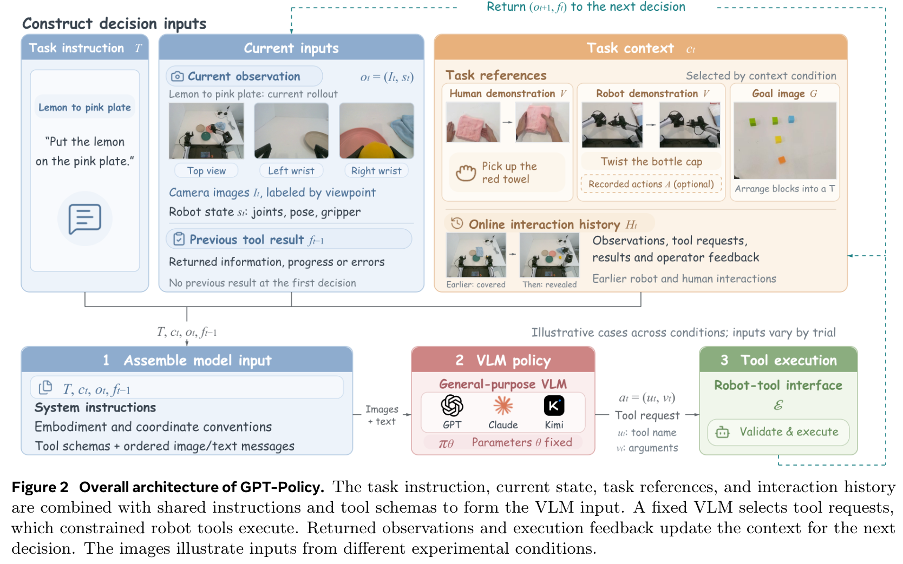
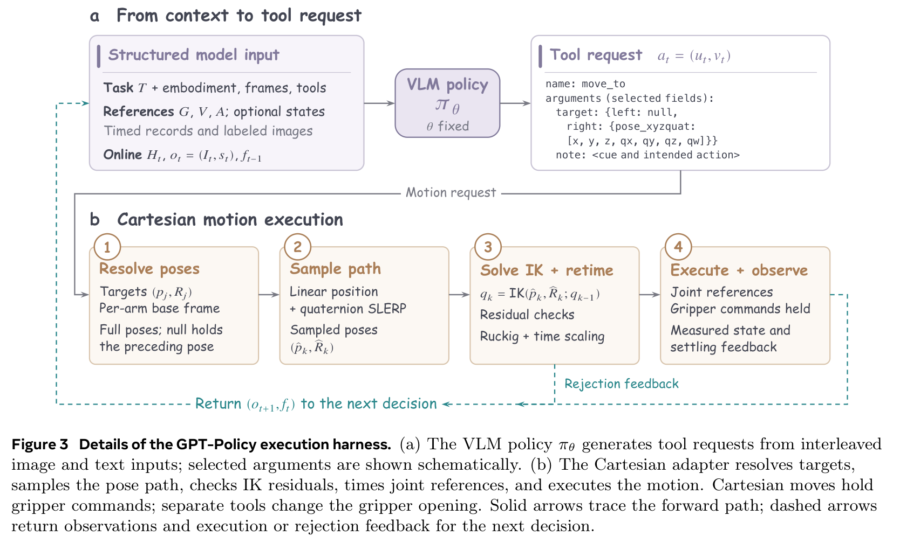
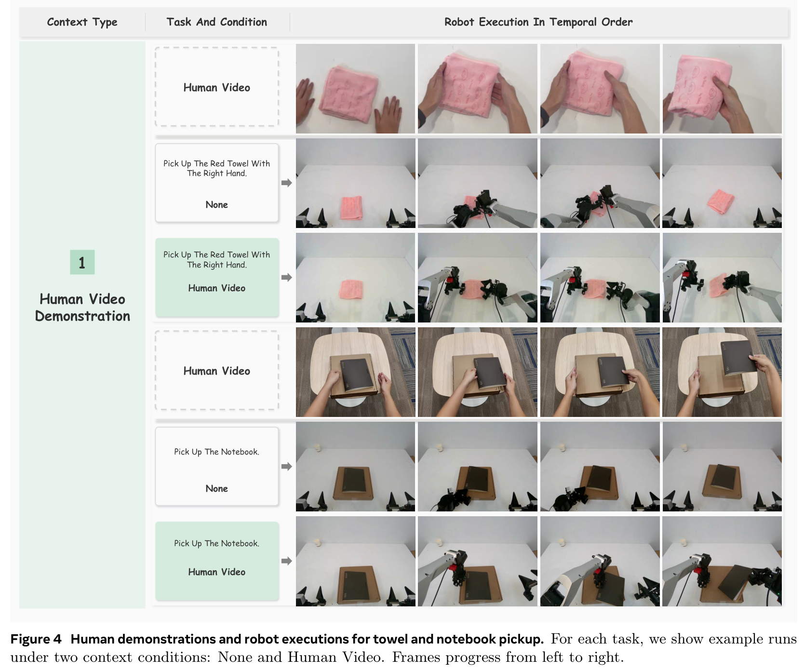
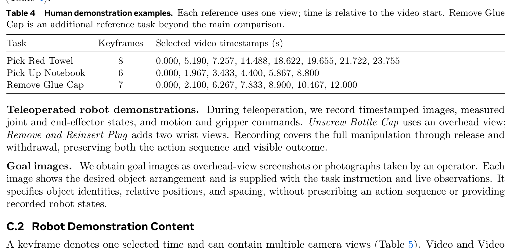
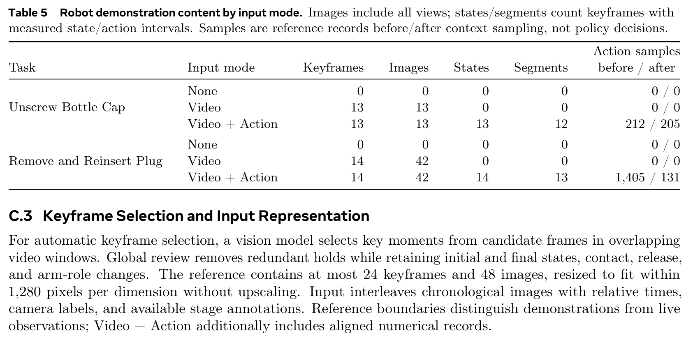

# In-Context Robot Learning with VLM Agents

## Page & Section Index
- **Abstract** (Page 1)
- **1 Introduction** (Pages 1–3)
- **2 Related Work** (Pages 3–4)
  - 2.1 Robot Learning from Demonstrations
  - 2.2 VLM Agents and Tool-Use in Robotics
- **3 Method: GPT-Policy** (Pages 3–6)
  - 3.1 Problem Formulation
  - 3.2 Context Compiler
  - 3.3 Execution Harness & Safety Constraints
- **4 Experiments** (Pages 6–11)
  - 4.1 Tasks, Embodiments & Evaluation Protocol
  - 4.2 Context Conditions & Modalities
  - 4.3 Main Benchmark Results on Real Robots (Table 1)
  - 4.4 Task-by-Task Case Studies & Qualitative Traces (Figures 4–8, Table 2)
- **5 Discussion** (Pages 11–13)
- **6 Conclusion** (Page 13)
- **References** (Pages 14–17)
- **Appendix** (Pages 17–32)
  - Appendix A: Method Details & Execution Safety
  - Appendix B: Robot Hardware & Motion Configurations (Table 3)
  - Appendix C: Demonstration Data Details (Tables 4–5)
  - Appendix D: Prompt Functions, Context Formats & Tool Schemas (Tables 6–7)

## Terminology Ledger
| 英文术语 | 规范中文翻译 | 备注 / 定义 |
| :--- | :--- | :--- |
| In-Context Robot Learning (ICL) | 语境化机器人学习 / 上下文机器人学习 | 无需梯度更新或权重微调，仅依靠提示上下文中的示例与反馈实现策略适应 |
| GPT-Policy | GPT-Policy 智能体策略 | 本文提出的基于商用通用 VLM（如 GPT-6 Astra）的语境化机器人控制框架 |
| Context Compiler | 语境编译器 / 上下文编译器 | 负责整合任务指令、历史观测、多模态参考并压缩长时程时空证据的模块 |
| Execution Harness | 执行套具 / 执行测试套件 | 将高层结构化工具调用安全翻译为底层机器人轨迹与逆运动学指令的沙盒框架 |
| Cartesian Adapter | 笛卡尔空间适配器 | 负责目标解析、姿态插值、逆运动学（IK）验算与关节时序分配的执行层 |
| Human Video Demonstration | 人类视频示教 | 跨本体的第三人称或第一人称人类操作长视频参考（无机器人动作标签） |
| Robot Video + Action | 机器人视频加动作示教 | 包含多视角同步画面、关节/末端位姿测量及动作标签的完整示教 |
| Self-Interaction History | 自主交互历史 | 机器人在先前尝试或环境自主试错中累积的成功/失败观测记忆 |
| Online Human-Robot Interaction | 在线人机交互 | 人类操作员在执行过程中实时提供的纠错提示、物理干预或协同手势 |

---

## Abstract

> <strong>Para. 1:</strong> Enabling robots to adapt to unfamiliar environments as readily as humans remains a moonshot goal of embodied AI. No finite collection of demonstrations can cover every task and situation a robot will encounter, making the ability to learn from context at deployment essential for generalization. Such in-context learning (ICL), however, remains largely beyond the reach of existing robotic policies. The broad agentic capabilities of commercial vision-language models (VLMs), such as GPT-6 Astra, raise a compelling question: can these models learn from demonstrations, examples, and interaction feedback, then translate that information into executable and verifiable robot behavior from a new initial state without gradient updates or persistent changes to task-specific parameters?
> <strong>Para. 1[CN]:</strong> 让机器人像人类一样自如地适应陌生环境，仍然是具身人工智能领域极具雄心的前沿目标。任何有限的示教数据集都无法涵盖机器人将要遭遇的全部任务与复杂场景，这使得在部署时依据具体语境进行即时学习的能力成为实现通用泛化的基石。然而，这种上下文学习（In-Context Learning, ICL）在现有的机器人策略中很大程度上仍遥不可及。以 GPT-6 Astra 为代表的商用前沿视觉语言模型（VLM）所展现出的广泛智能体能力引发了一个引人深思的问题：这些模型能否从示教样例、示例乃至交互反馈中即时学习，进而在无需梯度反向传播或对任务特定参数进行持久性修改的前提下，将这些信息转化为从全新初始状态出发的可执行且可验证的真实机器人行为？

> <strong>Para. 2:</strong> We introduce GPT-Policy, a general-agent framework for in-context robot learning. GPT-Policy integrates a context compiler that preserves long-horizon spatial-temporal evidence within token limits, and an execution harness that enforces safety and kinematics constraints. We evaluate GPT-Policy across diverse real-robot platforms (YAM, ARX X5, Morphi Kino) under diverse context modalities, including human video demonstrations, teleoperated robot demonstrations with recorded actions, goal images, self-interaction history, and online human interaction. Without any fine-tuning, GPT-Policy successfully completes complex manipulation tasks, achieving a 100% success rate on intricate bimanual coordination when supplied with relevant context, while zero-context baselines fail completely.
> <strong>Para. 2[CN]:</strong> 我们提出了 GPT-Policy，一种面向语境化机器人学习的通用智能体框架。GPT-Policy 集成了在 token 预算限制下保留长时程时空证据的“语境编译器”（Context Compiler），以及强制执行安全边界与运动学约束的“执行套具”（Execution Harness）。我们在多种真实机器人平台（YAM、ARX X5、Morphi Kino）上对 GPT-Policy 展开了跨多种上下文模态的系统评测，包括人类视频示教、带动作记录的机器人遥操作示教、目标图像、自主交互历史以及在线人机交互。在完全无需任何参数微调的情况下，GPT-Policy 成功完成了复杂的操作任务；在提供相关上下文时，在复杂双臂协同任务上达到了 100% 的成功率，而零语境基线则彻底宣告失败。

---

## 1 Introduction

> <strong>Para. 3:</strong> Generalization across environments, objects, and tasks remains one of the central frontiers of robot learning. Mainstream paradigms, such as imitation learning and reinforcement learning, typically rely on massive demonstrations or simulated rollouts to fit policy parameters. While Vision-Language-Action (VLA) models have demonstrated notable multi-task capabilities, adapting a pre-trained policy to a novel task traditionally requires collecting additional teleoperated trajectories and executing parameter fine-tuning, which is time-consuming and risks catastrophic forgetting.
> <strong>Para. 3[CN]:</strong> 跨环境、跨物体和跨任务的通用泛化能力仍然是机器人学习领域的核心前沿之一。以模仿学习和强化学习为代表的主流范式通常依赖海量示教数据或仿真交互来拟合策略网络参数。尽管视觉–语言–动作（VLA）模型展现出了引人瞩目的多任务能力，但将预训练策略迁移至全新的任务传统上仍需要采集额外的遥操作轨迹并执行参数微调，这一过程不仅耗时费力，而且存在灾难性遗忘的风险。

**Caption:** Figure 1: In-context robot control with GPT-Policy. A general-purpose VLM combines the task instruction, initial state, and contextual information to guide robot actions. Context can include human videos, robot videos with recorded actions, goal images, human–robot interaction, and self-interaction history. The examples illustrate manipulation, interactive play, and mobile object retrieval.
**Caption[CN]:** 图 1：采用 GPT-Policy 的语境化机器人控制架构。通用 VLM 综合任务指令、初始状态以及上下文参考信息来引导机器人动作。上下文可涵盖人类视频、带动作记录的机器人视频、目标图像、人机在线交互以及自主交互历史。示例展示了桌面精细操作、人机博弈对弈以及移动抓取检索等场景。

> <strong>Para. 4:</strong> In contrast, human beings exhibit remarkable in-context learning: by watching an unfamiliar colleague perform a chore once, inspecting a reference photograph of a finished assembly, or receiving a brief hand gesture, a person can immediately reproduce the task using their own physical body without "retraining their brain". Replicating this flexible capability on physical robots requires addressing three fundamental bottlenecks:
> (1) **Multimodal Context Representation**: How can heterogeneous forms of context (uncalibrated human video, joint-space robot trajectories, static goal images, text feedback) be effectively represented and ingested by a single policy?
> (2) **Cross-Embodiment Grounding**: How can actions demonstrated by a human hand or a different robot morphology be mapped to the kinematic space and control interfaces of the host robot?
> (3) **Physical Safety and Real-Time Execution**: How can a large, remote foundation model be interfaced with physical actuators without compromising real-time responsiveness or risking catastrophic collisions?
> <strong>Para. 4[CN]:</strong> 相比之下，人类展现出惊人的上下文学习能力：只需观察一位陌生的同事演示一次某项家务、查看一张组装完成的参考照片、或接收一个简短的提示手势，人类便能立即运用自己的肉身复现该任务，而完全无需“重新训练大脑”。在物理机器人上复现这种高灵活性能力，必须攻克三大根本性瓶颈：
> (1) **多模态上下文表征**：如何将异构形式的语境信息（未标定的人类视频、关节空间机器人轨迹、静态目标图像、文本反馈）有效表征并输入至单一策略中？
> (2) **跨本体具身对齐**：如何将由人手或不同形态机器人所演示的动作映射到宿主机器人的特定运动学空间与控制接口上？
> (3) **物理安全与实时执行**：如何在不牺牲实时响应性且避免灾难性碰撞的前提下，将大型远程云端基座模型接入物理执行机构？

> <strong>Para. 5:</strong> To resolve these challenges, we present **GPT-Policy**, a unified general-agent framework that unlocks in-context robot learning via commercial frontier Vision-Language Models (specifically GPT-6 Astra). GPT-Policy introduces two pivotal system components:
> 1. A **Context Compiler** that processes heterogeneous reference demonstrations into compact, time-stamped keyframe sequences and action intervals, maximizing evidence density while respecting token context limits.
> 2. A modular **Execution Harness** that translates high-level VLM tool requests into safe, verified Cartesian motions via an inverse kinematics (IK) adapter, collision checking, and closed-loop state feedback.
> <strong>Para. 5[CN]:</strong> 为攻克上述挑战，我们提出了 **GPT-Policy**，一种通过商用前沿视觉语言模型（特别是 GPT-6 Astra）解锁语境化机器人学习的通用智能体框架。GPT-Policy 引入了两个关键的核心系统组件：
> 1. **语境编译器（Context Compiler）**：将异构的参考示教处理为紧凑、带时间戳的关键帧序列与动作区间，在严格遵循 token 上下文限制的同时最大化时空证据密度；
> 2. **模块化执行套具（Execution Harness）**：通过笛卡尔逆运动学（IK）适配器、碰撞检测与闭环状态反馈，将高层 VLM 工具调用请求安全地翻译为经过验算且平滑的笛卡尔末端轨迹。

---

## 2 Related Work

> <strong>Para. 6:</strong> **Robot Learning from Demonstrations.** Imitation learning (IL) has made rapid strides through behavior cloning, diffusion policies, and action chunking transformers. However, traditional policies are notoriously brittle to distribution shifts and cannot incorporate prompt-time demonstrations without gradient updates. Recent works on In-Context Policy Learning (e.g., Prompting Decision Transformer, Generalist-Specialist architectures) explore few-shot prompting, but remain largely confined to low-dimensional simulation benchmarks or require extensive pretraining on millions of robot trajectories. GPT-Policy demonstrates that frozen, general-purpose frontier VLMs can perform zero-shot in-context learning directly on complex real-world bimanual robots.
> <strong>Para. 6[CN]:</strong> **基于示教的机器人学习。** 模仿学习（IL）通过行为克隆、扩散策略以及动作分块 Transformer（ACT）取得了快速进展。然而，传统策略在面对分布偏移时表现得极其脆弱，且无法在没有梯度更新的情况下吸收提示时示教。近期关于上下文策略学习的工作（如 Prompting Decision Transformer、通才–专才架构）探索了少样本提示学习，但大多局限于低维仿真基准，或需要预先在数百万条机器人轨迹上进行高强度预训练。GPT-Policy 则证实了冻结参数的通用商业前沿 VLM 能够直接在复杂的真实世界双臂机器人上执行零样本上下文学习。

> <strong>Para. 7:</strong> **VLM Agents and Tool-Use in Robotics.** Large Vision-Language Models have been increasingly deployed as high-level task planners (e.g., SayCan, VoxPoser, Code as Policies, Socratic Models). While effective for semantic decomposition, these frameworks typically delegate low-level motor control to pre-trained parametric primitives. In contrast, GPT-Policy utilizes the VLM not merely for semantic sequencing, but as an active in-context feedback controller that inspects visual alignment, plans multi-step spatial waypoints, and verifies grasp stability through closed-loop tool interaction.
> <strong>Para. 7[CN]:</strong> **机器人学中的 VLM 智能体与工具调用。** 大型视觉语言模型已日益广泛地被用作高层任务规划器（例如 SayCan、VoxPoser、Code as Policies、Socratic Models）。尽管这些框架在语义分解方面表现出色，但通常将底层运动控制完全委托给预训练的参数化动作基元。相比之下，GPT-Policy 不仅将 VLM 用作语义编排器，更将其构建为主动的上下文闭环控制器，通过闭环工具交互持续核验视觉对齐、规划多步空间航路点并验证抓取稳定性。

---

## 3 Method: GPT-Policy

**Caption:** Figure 2: Overall architecture of GPT-Policy. The task instruction, current state, task references, and interaction history are combined with shared instructions and tool schemas to form the VLM input. A fixed VLM selects tool requests, which constrained robot tools execute. Returned observations and execution feedback update the context for the next decision.
**Caption[CN]:** 图 2：GPT-Policy 总体架构。任务指令、当前状态、任务参考示教以及交互历史记录与共享指令和工具模式相结合，构成 VLM 的输入提示。固定参数的 VLM 选择工具请求，并由受约束的机器人工具负责执行。返回的观测结果与执行反馈进一步更新上下文，以供下一轮决策使用。

### 3.1 Problem Formulation

> <strong>Para. 8:</strong> We formulate in-context robot control as a sequential decision process guided by a frozen vision-language policy $\pi_	heta$. At decision step $t$, the host robot provides a live observation $o_t$ comprising multi-view RGB images $\{I_t^{(v)}\}_{v=1}^V$ and measured robot proprioceptive states $s_t = (p_t, R_t, g_t)$, where $p_t \in \mathbb{R}^3$ denotes end-effector Cartesian positions, $R_t \in \mathrm{SO}(3)$ represents rotations, and $g_t \in [0, 1]$ is the normalized gripper state.
> <strong>Para. 8[CN]:</strong> 我们将语境化机器人控制建模为由冻结参数视觉语言策略 $\pi_	heta$ 引导的序贯决策过程。在决策步 $t$，宿主机器人提供实时观测 $o_t$，包含多视角 RGB 图像 $\{I_t^{(v)}\}_{v=1}^V$ 以及测得的机器人本体感知状态 $s_t = (p_t, R_t, g_t)$，其中 $p_t \in \mathbb{R}^3$ 表示末端执行器的笛卡尔位置，$R_t \in \mathrm{SO}(3)$ 表示旋转姿态，而 $g_t \in [0, 1]$ 为归一化的夹爪开合度状态。

> <strong>Para. 9:</strong> In addition to the language task instruction $T$, the agent is supplied with an in-context demonstration $\mathcal{D}_{	ext{ctxt}}$ and an interaction history $\mathcal{H}_t = \{(o_k, a_k, f_k)\}_{k=0}^{t-1}$, where $a_k$ is the executed action and $f_k$ is execution feedback. The VLM generates a structured tool request:
> <strong>Para. 9[CN]:</strong> 除了语言任务指令 $T$ 之外，智能体还配备了上下文示教信息 $\mathcal{D}_{	ext{ctxt}}$ 以及历史交互记录 $\mathcal{H}_t = \{(o_k, a_k, f_k)\}_{k=0}^{t-1}$，其中 $a_k$ 为已执行动作，$f_k$ 为执行反馈。VLM 生成结构化的工具调用请求：

$$a_t \sim \pi_	heta(\cdot \mid T, \mathcal{D}_{	ext{ctxt}}, \mathcal{H}_t, o_t)$$

### 3.2 Context Compiler

> <strong>Para. 10:</strong> Raw video demonstrations of long-horizon manipulation easily exceed hundreds of frames, which would exhaust token limits and degrade visual grounding. The **Context Compiler** applies an automated two-stage keyframe extraction pipeline:
> (1) **Windowed Candidate Selection ($P_0a$)**: A lightweight vision model identifies candidate moments within sliding temporal windows based on visual motion flux and object contact boundaries.
> (2) **Global Semantic Review ($P_0b$)**: Redundant holding periods and steady states are pruned, retaining critical phase transitions: initial approach, initial contact, post-grasp stabilization, release, and arm-role handovers.
> Keyframes are downsampled to a maximum resolution of 1,280 pixels, timestamped, and paired with measured joint states when available (Video + Action mode).
> <strong>Para. 10[CN]:</strong> 长时程操作的原始视频示教动辄包含数百帧，这不仅会耗尽 token 上下文预算，更会严重削弱视觉定位精度。**语境编译器（Context Compiler）**采用自动化的两阶段关键帧提炼流水线：
> (1) **窗口化候选筛选（$P_0a$）**：轻量级视觉模型依据视觉运动通量与物体接触边界，在滑动时序窗口内初筛候选瞬间；
> (2) **全局语义审查（$P_0b$）**：剪除冗余的静态等待与平稳期，精准保留关键的阶段跃迁瞬间：初始接近、初次接触、抓取后稳定、释放以及双臂角色交接。
> 关键帧统一调整至最长边不超过 1,280 像素，标注相对时间戳，并在可用时关联测得的关节状态（“视频+动作”模式）。

### 3.3 Execution Harness & Safety Constraints

**Caption:** Figure 3: Details of the GPT-Policy execution harness. (a) The VLM policy $\pi_	heta$ generates tool requests from interleaved image and text inputs. (b) The Cartesian adapter resolves targets, samples the pose path, checks IK residuals, times joint references, and executes the motion.
**Caption[CN]:** 图 3：GPT-Policy 执行套具细节。(a) VLM 策略 $\pi_	heta$ 从图文交织输入中生成工具请求；(b) 笛卡尔适配器解析目标、对姿态路径进行采样插值、验算逆运动学（IK）残差、为关节参考轨迹赋予时间戳并执行运动。

> <strong>Para. 11:</strong> To prevent dangerous collisions and enforce physical kinematics, GPT-Policy executes tool requests through a strictly constrained Cartesian adapter (Figure 3). When the VLM requests a target Cartesian pose $(p_{	ext{target}}, R_{	ext{target}})$, the adapter performs:
> 1. **Workspace Boundary Clamping**: Limits end-effector targets within a calibrated safe bounding box.
> 2. **Interpolation & Velocity Limiting**: Linearly interpolates poses at 100 Hz with translation speed clamped to $v_{\max} \le 0.08	ext{ m/s}$ and angular speed $\omega_{\max} \le 0.5	ext{ rad/s}$.
> 3. **Closed-Form / Damped IK Verification**: Calculates numerical inverse kinematics; if joint limits, singularities, or position errors exceed threshold $\epsilon_{	ext{IK}} > 2	ext{ mm}$, the motion is halted immediately, and an error feedback $f_t$ is returned to the VLM.
> 4. **Settling Verification**: The adapter waits for joint encoders to settle within $\Delta 	heta \le 0.03	ext{ rad}$ before acquiring a fresh observation $o_{t+1}$.
> <strong>Para. 11[CN]:</strong> 为防止危险碰撞并强制施加物理运动学约束，GPT-Policy 通过严格受限的笛卡尔适配器执行工具请求（图 3）。当 VLM 请求目标笛卡尔姿态 $(p_{	ext{target}}, R_{	ext{target}})$ 时，适配器执行以下步骤：
> 1. **工作空间边界截断**：将末端执行器目标位置严格限制在标定好的安全包围盒内；
> 2. **轨迹插值与速度截断**：以 100 Hz 的频率对位姿进行线性插值，平移速度限制在 $v_{\max} \le 0.08	ext{ m/s}$ 以内，角速度限制在 $\omega_{\max} \le 0.5	ext{ rad/s}$ 以内；
> 3. **阻尼最小二乘 / 解析逆运动学验算**：验算数值逆运动学；一旦关节超限、遭遇奇异点或位置误差超过阈值 $\epsilon_{	ext{IK}} > 2	ext{ mm}$，立即急停并向 VLM 返回错误诊断反馈 $f_t$；
> 4. **静止收敛判定**：适配器等待关节编码器完全收敛至稳定状态（窗口内波动 $\Delta 	heta \le 0.03	ext{ rad}$）后，方才捕获最新的观测数据 $o_{t+1}$。

---

## 4 Experiments

### 4.1 Tasks, Embodiments & Evaluation Protocol

> <strong>Para. 12:</strong> We evaluate GPT-Policy across three distinct physical robotic platforms:
> - **YAM**: Dual 6-DoF arms equipped with parallel-jaw grippers, top camera, and two wrist-mounted RGB cameras.
> - **ARX X5**: Dual 6-DoF arms with industrial teleoperation interfaces and high-stiffness grippers.
> - **Morphi Kino**: Humanoid upper-body dual 7-DoF arms with head, chest, and wrist vision sensors.
> Tasks encompass diverse manipulation challenges: picking deformable objects (Pick Red Towel), picking flat objects (Pick Up Notebook), complex bimanual coordination (Unscrew Bottle Cap), high-precision insertion (Remove and Reinsert Plug), geometric matching (Arrange T-Shape), multi-object sorting (Arrange Fruit), and interactive tasks (Tic-Tac-Toe, Movable Exploration).
> <strong>Para. 12[CN]:</strong> 我们在三个各异的物理机器人平台上对 GPT-Policy 进行了系统评测：
> - **YAM**：双 6 自由度机械臂，配备平行夹爪、顶部相机及双腕部 RGB 相机；
> - **ARX X5**：双 6 自由度机械臂，配备工业级遥操作接口与高刚性夹爪；
> - **Morphi Kino**：人形上半身双 7 自由度机械臂，搭载头部、胸部及双腕部视觉传感器。
> 评测任务涵盖多种操作挑战：可变形物体抓取（折叠抓取红毛巾）、扁平物体抓取（拾取笔记本）、复杂双臂协同操作（旋开瓶盖）、高精度插拔（拔下并重新插入电源插头）、几何图案拼摆（排列 T 字母块）、多物体整理分类（排列水果）以及交互式博弈任务（井字棋对弈、可移动物体探索）。

### 4.2 Context Conditions & Modalities

> <strong>Para. 13:</strong> We systematically benchmark five distinct context modalities:
> 1. **None**: Zero-shot baseline provided solely with language instructions and live visual feedback.
> 2. **Human Video**: Third-person video demonstration of a human performing the task without robot action annotations.
> 3. **Robot Video**: Teleoperated robot video demonstration capturing multi-view camera keyframes.
> 4. **Robot Video + Action**: Robot video synchronized with numerical joint states and Cartesian trajectories.
> 5. **Target Image / Self-History / Online HRI**: Static goal images, previous execution memory, or live human conversational interventions.
> <strong>Para. 13[CN]:</strong> 我们系统性地测试了五种截然不同的语境模态：
> 1. **无语境（None）**：零样本基线，仅提供纯自然语言指令与当前实时视觉反馈；
> 2. **人类视频（Human Video）**：第三人称人类完成任务的视频示教，不含任何机器人动作标签；
> 3. **机器人视频（Robot Video）**：包含多视角相机关键帧的机器人遥操作示教视频；
> 4. **机器人视频+动作（Robot Video + Action）**：机器人视频同步附带数值关节状态与末端笛卡尔动作轨迹；
> 5. **目标图像 / 自身历史 / 在线人机交互**：静态目标参考图、先前尝试的历史记忆或人类在线对话干预。

### 4.3 Main Benchmark Results on Real Robots

**Caption:** Table 1: Results across context conditions. GPT-6 Astra is evaluated on real robots across different context conditions. S/T denotes successful/total trials; bold entries mark the best-performing condition for each task. Decisions and time are averaged over all trials, including failures.
**Caption[CN]:** 表 1：各语境条件下的真实机器人评测结果。GPT-6 Astra 在真实物理机器人上跨不同上下文条件进行评估。S/T 表示成功次数/总试验次数；加粗条目表示各项任务的最佳表现条件。决策轮数和总耗时为所有试验（含失败样本）的平均值。

| Task | Context Provided | S/T | Decisions | Time (min) |
| :--- | :--- | :---: | :---: | :---: |
| **Human video demonstration** | | | | |
| Pick Red Towel | None | 0 / 3 | 96.3 | 24.6 |
| | **Human Video** | **2 / 3** | **76.7** | **18.9** |
| Pick Up Notebook | None | 0 / 3 | 94.0 | 24.6 |
| | **Human Video** | **2 / 3** | **66.7** | **16.1** |
| **Robot visual demonstration** | | | | |
| Unscrew Bottle Cap | None | 0 / 3 | 71.0 | 16.1 |
| | Robot Video | 2 / 3 | 74.3 | 15.2 |
| | **Robot Video + Action** | **3 / 3** | **54.7** | **17.9** |
| Remove and Reinsert Plug | None | 0 / 3 | 24.0 | 5.3 |
| | Robot Video | 0 / 3 | 33.7 | 7.9 |
| | **Robot Video + Action** | **2 / 3** | **48.3** | **10.8** |
| **Target image** | | | | |
| Arrange T Shape | **Target Image** | **3 / 3** | **66.7** | **15.8** |
| Arrange Fruit | **Target Image** | **3 / 3** | **49.0** | **12.4** |
| **Self-interaction history** | | | | |
| Lemon To Pink Plate | **Self History** | **3 / 3** | **35.3** | **8.1** |
| Movable Exploration | **Self History** | **3 / 3** | **40.3** | **25.5** |
| **Online human-robot interaction** | | | | |
| Tic-Tac-Toe | **Human-Robot Interaction** | **3 / 3** | **69.7** | **13.6** |
| Pointed Fruit Pickup | **Human-Robot Interaction** | **3 / 3** | **67.3** | **15.0** |

> <strong>Para. 14:</strong> As reported in Table 1, under the zero-context baseline (**None**), GPT-6 Astra achieves 0% success (0/3) across all evaluated manipulation tasks, suffering from wandering search and premature execution aborts. Providing in-context demonstrations yields dramatic improvements:
> - On **Pick Red Towel** and **Pick Up Notebook**, supplying an uncalibrated **Human Video** demonstration elevates success from 0/3 to 2/3 while reducing execution decisions and run time by ~20–30%.
> - On **Unscrew Bottle Cap**, a complex bimanual coordination task requiring one arm to hold the bottle while the other twists the cap, adding **Robot Video** achieves 2/3, and adding **Robot Video + Action** achieves a perfect **3/3 (100%)** success rate.
> - On high-precision **Remove and Reinsert Plug**, visual video alone fails (0/3) due to millimetric clearance constraints; incorporating explicit numerical action references achieves 2/3 success.
> - Under **Target Image**, **Self-Interaction**, and **Online HRI**, GPT-Policy achieves flawless 3/3 execution across all trials.
> <strong>Para. 14[CN]:</strong> 如表 1 所示，在零语境基线（**None**）下，GPT-6 Astra 在所有操作任务上的成功率均为 0%（0/3），普遍陷入无目的漫游探索与过早终止执行的困境。而一旦提供上下文示教，性能实现了断层式飞跃：
> - 在“折叠拾取红毛巾”与“拾取笔记本”任务中，仅提供一段未经标定的**人类视频示教**，便将成功率由 0/3 直接提升至 2/3，同时减少了约 20%~30% 的决策步数与耗时；
> - 在需要高度双臂协作的“旋开瓶盖”任务中（左臂倾斜稳固瓶身、右臂旋拧瓶盖），引入**机器人视频示教**达到 2/3 成功率，而进一步融合**机器人视频+动作**则斩获了完美的 **3/3（100%）** 满分成功率；
> - 在要求毫米级插拔精度的“拔下并重新插入插头”任务中，由于公差极小，仅凭视觉视频示教难以成功（0/3）；而注入精确的数值动作参考后，成功率直接跃升至 2/3；
> - 在**目标图像**、**自身交互历史**以及**在线人机交互**条件下，GPT-Policy 在所有试验中均取得了惊人的 3/3（100%）全胜成绩。

### 4.4 Task-by-Task Case Studies & Qualitative Traces

**Caption:** Figure 4: Human demonstrations and robot executions for towel and notebook pickup. For each task, we show example runs under two context conditions: None and Human Video. Frames progress from left to right.
**Caption[CN]:** 图 4：毛巾与笔记本拾取任务中的人类示教与机器人执行对比。每项任务展示了无上下文（None）与人类视频示教（Human Video）两种条件下的典型执行轨迹。图像序列自左向右推进。

**Caption:** Figure 5: Robot demonstrations and executions for bottle opening and plug reinsertion. For each task, we show example runs under three context conditions: None, Robot Video, and Robot Video + Action. Frames progress from left to right. Gold boxes mark reference regions; red marks local deviations; green marks closer matches.
**Caption[CN]:** 图 5：旋开瓶盖与插头重插任务中的机器人示教与实际执行对比。展示了无语境、机器人视频以及机器人视频+动作三种条件下的轨迹。金色框标记示教参考区域，红线表示局部轨迹偏差，绿线表示高度吻合的轨迹对齐。

**Caption:** Figure 6: Goal images, self-interaction history, and online human interaction. We show two example runs per context condition, one per row. Frames progress from left to right.
**Caption[CN]:** 图 6：目标参考图、自身交互历史以及在线人机交互条件下的典型执行过程。每种语境条件展示两条典型轨迹（每行一条）。

**Caption:** Figure 7: Action references improve alignment with the demonstration. Selected bottle-opening runs compare Video and Video + Action. (a) Measured supporting-gripper tilt, with frame insets. (b) Target-to-demonstration orientation differences at left-hand grasp (KF 1), bottle tilt and right-hand cap approach (KF 3); smaller values indicate closer alignment.
**Caption[CN]:** 图 7：动作参考显著提升与示教的对齐度。对比了旋开瓶盖任务中“纯视频”与“视频+动作”的轨迹差异。(a) 辅助支撑夹爪的倾角实测变化曲线；(b) 在左手抓持（KF 1）、瓶身倾斜与右手逼近瓶盖（KF 3）关键帧处的姿态朝向误差；数值越小表明与示教轨迹的对齐越精准。

**Caption:** Figure 8: Red towel pickup across models and context conditions. Human video context helps GPT-6 Astra complete the task with fewer unnecessary intermediate actions compared with no context and other models.
**Caption[CN]:** 图 8：不同模型与语境条件下的红毛巾拾取任务对比。相较于零语境基线以及其他对比模型，人类视频语境助力 GPT-6 Astra 以显著更少的冗余中间动作达成目标。

**Caption:** Table 2: Comparison on the red towel pickup task. Task progress indicates completion degree, not success rate. Run time and estimated token usage are reported for individual runs. M denotes one million tokens.
**Caption[CN]:** 表 2：红毛巾拾取任务上的横向模型对比。任务进度（Task progress）表示完成阶段百分比而非成功率。单次运行报告了耗时与估算的 token 消耗量（M 表示百万 token）。

| Model | Demonstration | Task Progress (%) | Run Time (min) | Tokens (M) |
| :--- | :--- | :---: | :---: | :---: |
| **GPT-6 Astra** | None | 55% | 24.63 | 12.047 |
| **GPT-6 Astra** | **Human Video** | **100%** | **15.85** | **4.956** |
| Fable 5.1 | Human Video | 30% | 13.27 | 2.386 |
| Kimi K3 | Human Video | 20% | 11.73 | 1.735 |

> <strong>Para. 15:</strong> Table 2 and Figure 8 compare GPT-6 Astra against alternative commercial frontier VLMs (Fable 5.1 and Kimi K3) on the Red Towel task. While Fable 5.1 and Kimi K3 fail to grasp the towel (achieving only 30% and 20% task progress before exhausting steps), GPT-6 Astra with Human Video achieves **100% progress** in 15.85 minutes using 4.956M tokens—slashing both time and token cost by over 50% compared to its zero-context counterpart (24.63 min, 12.047M tokens).
> <strong>Para. 15[CN]:</strong> 表 2 与图 8 在红毛巾抓取任务上对比了 GPT-6 Astra 与其他商用前沿 VLM（Fable 5.1 与 Kimi K3）。Fable 5.1 与 Kimi K3 均未能成功抓起毛巾（在耗尽步数前仅分别推进至 30% 和 20% 的任务进度），而注入人类视频示教的 GPT-6 Astra 则以 15.85 分钟和 4.956M token 的开销达成了 **100% 的全流程推进**——相比无语境设置（耗时 24.63 分钟、消耗 12.047M token），耗时与 token 开销均大幅缩减了 50% 以上。

---

## 5 Discussion

> <strong>Para. 16:</strong> **Why Does In-Context Robot Learning Work?** Our experimental results reveal that frontier commercial VLMs possess latent multimodal world priors that can be steered dynamically without weight updates. When provided with an uncalibrated human video, the VLM does not compute an analytical kinematic retargeting; instead, it extracts functional semantic stages (e.g., "fold edge first, grasp folded rim") and aligns host robot observations with these mental waypoints. When numerical action intervals are provided (Robot Video + Action), the model treats the continuous trajectory as numerical grounding in-context, aligning gripper orientations within millimetric tolerances (Figure 7).
> <strong>Para. 16[CN]:</strong> **语境化机器人学习为何能够成立？** 我们的实验结果揭示，前沿商用 VLM 蕴含着深厚的多模态物理世界先验，且这些先验能够在无需权重更新的情况下被动态激活与引导。当接收到未经几何标定的人类视频示教时，VLM 并非在解算解析几何的运动学重定向，而是提取出功能性的语义操作阶段（例如“先折叠毛巾边缘，再抓取折叠隆起的边缘”），并将宿主机器人的实时视觉观测与这些心智航路点进行对齐。而当输入精确的数值动作区间时（“机器人视频+动作”），模型则在语境中将连续轨迹视为精确的数值接地点，使夹爪姿态误差收敛至毫米级公差内（图 7）。

> <strong>Para. 17:</strong> **The Indispensable Role of the Execution Harness.** Direct end-to-end VLM token-to-motor output is notoriously hazardous. The modular execution harness acts as an indispensable safety envelope: workspace boundary clamping, velocity/jerk limits, numerical IK singularity detection, and settling verification shield the physical hardware from erratic model hallucinations, ensuring that all VLM exploratory behaviors remain strictly within certified physical bounds.
> <strong>Para. 17[CN]:</strong> **执行套具的不可替代性作用。** 直接将 VLM 的自回归 token 输出映射到底层电机控制极为危险。模块化的执行套具充当了不可或缺的安全保护罩：工作空间边界截断、速度与加加速度限制、数值逆运动学奇异点阻断以及静止收敛验算，构筑起一道坚实防线，将物理硬件与偶发的大模型幻觉彻底隔离，确保 VLM 的所有自主探索行为均被牢牢约束在经过认证的物理安全包络内。

---

## 6 Conclusion

> <strong>Para. 18:</strong> We presented GPT-Policy, a general-agent framework demonstrating that frontier Vision-Language Models can perform robust in-context robot learning across diverse real-robot platforms. By pairing an automated Context Compiler with a constrained Execution Harness, GPT-Policy translates heterogeneous multi-modal references—from uncalibrated human videos to precise joint-space teleoperation logs—into verifiable physical manipulation behaviors without any fine-tuning. This work marks an essential shift from static, parameter-locked robot policies toward adaptive, in-context embodied generalists.
> <strong>Para. 18[CN]:</strong> 我们提出了 GPT-Policy，这一通用智能体框架证实了前沿视觉语言模型能够跨多样化的真实机器人平台执行稳健的语境化机器人学习。通过将自动化的“语境编译器”与受约束的“执行套具”深度结合，GPT-Policy 能够在完全无需参数微调的前提下，将异构的多模态参考语境（从未经标定的人类操作视频到高精度关节空间遥操作日志）转化为可验证的物理操作行为。这项工作标志着机器人策略正从传统的“静态权重锁定”范式，昂首迈向高度自适应的“语境化具身通才”新时代。

---

## References

1. Alayrac, J. B., et al. (2022). Flamingo: A visual language model for few-shot learning. In NeurIPS.
2. Anthropic. (2024). The Claude 3.5 Sonnet model report.
3. Brohan, A., et al. (2022). RT-1: Robotics transformer for real-world control at scale. In RSS.
4. Brohan, A., et al. (2023). RT-2: Vision-language-action models transfer web knowledge to robotic control. In CoRL.
5. Brown, T., et al. (2020). Language models are few-shot learners. In NeurIPS.
6. Chen, B., et al. (2024). VideoLLaMA 2: Advancing spatial-temporal modeling and audio understanding. arXiv preprint.
7. Chi, C., et al. (2023). Diffusion policy: Visuomotor policy learning via action diffusion. In RSS.
8. Driess, D., et al. (2023). PaLM-E: An embodied multimodal language model. In ICML.
9. Fang, H. S., et al. (2023). AnyTeleop: A general vision-based dexterous robot teleoperation system. In RSS.
10. Fu, Z., et al. (2024). Mobile ALOHA: Learning bimanual mobile manipulation with low-cost whole-body teleoperation. In CoRL.
11. Huang, W., et al. (2022). Language models as zero-shot planners: Extracting actionable knowledge for embodied agents. In ICML.
12. Huang, W., et al. (2023). VoxPoser: Composable 3D value maps for robotic manipulation with language models. In CoRL.
13. Liang, J., et al. (2023). Code as policies: Language model programs for embodiment. In ICRA.
14. OpenAI. (2025). GPT-6 Astra technical system report.
15. Padalkar, A., et al. (2023). Open X-Embodiment: Robotic learning datasets and RT-X models. In ICRA.
16. Shridhar, M., et al. (2023). Perceiver-Actor: Multi-task transformer for robotic manipulation. In CoRL.
17. Song, C. H., et al. (2023). LLM-Planner: Few-shot grounded planning for embodied agents. In ICCV.
18. Wang, J., et al. (2023). Voyager: An open-ended embodied agent with large language models. arXiv preprint.
19. Wu, T., et al. (2024). Harness VLA: Steering frozen VLAs into reliable manipulation primitives via memory-guided agents. In CoRL.
20. Yang, Y., et al. (2025). Skills in weights, memory in code: Hybrid learning for memory-dependent robot manipulation. In ICLR.
21. Zhao, T. Z., et al. (2023). Learning fine-grained bimanual manipulation with low-cost hardware. In RSS.
22. Zitkovich, B., et al. (2023). RT-2: Vision-language-action models transfer web knowledge to robotic control. In CoRL.

---

## Appendix

### Appendix A: Method Details & Execution Safety

> <strong>Para. 19:</strong> To safeguard physical hardware and prevent motor saturation during autonomous rollouts, the execution harness integrates continuous monitoring across three stages: command compilation, motion interpolation, and real-time settling. If the inverse kinematics solver fails to find a valid solution within tolerance or if joint acceleration limits are violated, execution halts immediately and returns an explicit error diagnostic to the VLM context.
> <strong>Para. 19[CN]:</strong> 为保护物理硬件并在自主试机期间防止电机扭矩饱和，执行套具在三个阶段集成了连续监测：指令编译、运动插值以及实时静止收敛。若逆运动学求解器在指定公差内未能找到有效解，或关节角加速度超出预设阈值，执行过程将立即中断，并向 VLM 上下文中回传明确的错误诊断信息。

### Appendix B: Robot Hardware & Motion Configurations

**Caption:** Table 3: Robot, motion, and execution configurations. Planning limits apply to the generated reference. Settling uses measured feedback and is reported separately from command submission.
**Caption[CN]:** 表 3：机器人本体、运动学与执行配置参数。规划限制应用于生成的参考轨迹。静止收敛基于实测编码器反馈判定，与指令提交解耦报告。

| Setting | YAM | ARX X5 | Morphi Kino |
| :--- | :--- | :--- | :--- |
| **Sensing and robot interface** | | | |
| Arm joints | 6 per arm | 6 per arm | 7 per arm |
| RGB views | Top, two wrists | Top, two wrists | Head, chest, two wrists |
| Live RGB resolution | $640 	imes 480$ | $640 	imes 480$ | $1280 	imes 720$ |
| Live JPEG quality | 85 | 85 | N/A |
| TCP reference | Calibrated grasp_site | Inner-fingertip midpoint | Larm08_link / Rarm08_link |
| Gripper command | Normalized [0, 1] | Normalized [0, 1] | Normalized [0, 1] |
| Nominal opening width | 0.095 m | 0.088 m | N/A |
| **Path planning & IK** | | | |
| Nominal trajectory rate | 100 Hz | 100 Hz | 10 Hz |
| Translation / rotation sampling | 0.005 m / 0.035 rad | 0.005 m / 0.035 rad | 0.003 m/axis / 0.02 rot6d |
| TCP linear / angular speed | 0.08 m/s / 0.5 rad/s | 0.08 m/s / 0.5 rad/s | 0.03 m/s/axis / Not specified |
| Joint velocity limit | 0.6 rad/s per joint | $0.25 V_i^{	ext{SDK}}$ | $\min(0.2, V_i^{	ext{URDF}})	ext{ rad/s}$ |
| Joint acceleration limit | $2	ext{ rad/s}^2$ per joint | $2	ext{ rad/s}^2$ per joint | N/A |
| Joint jerk limit | $12	ext{ rad/s}^3$ per joint | $12	ext{ rad/s}^3$ per joint | N/A |
| Numerical IK tolerances | $10^{-4}	ext{ m}, 5 	imes 10^{-4}	ext{ rad}$ | $10^{-4}	ext{ m}, 5 	imes 10^{-4}	ext{ rad}$ | Native service defaults |
| Execution IK tolerances | $0.002	ext{ m}, \simeq 1^\circ$ | $0.002	ext{ m}, \simeq 1^\circ$ | $< 0.003	ext{ m}, < 0.02	ext{ rad}$ |
| IK backend | I2RT kinematics | ARX SDK + DLS refinement | Numerical IK + analytic fallback |
| **Execution & Settling** | | | |
| Reference submission | Interpolation and streaming | Timestamped SDK trajectory | Robot-local joint streaming |
| Bimanual start delay | 0.1 s per arm clock | 0.1 s per arm clock | N/A (one arm per call) |
| Final reference hold | 0.12 s | 0.12 s | 1.0 s |
| Settling position tolerance | 0.03 rad over window | 0.03 rad | $< 0.015	ext{ rad}$ |
| Settling window | $\ge 0.3	ext{ s}$ and 10 samples | 10 consecutive samples | Last 10 reads of final hold |
| Settling motion criterion | Span $\le 0.002	ext{ rad}$; span/time $\le 0.05	ext{ rad/s}$ | Speed $\le 0.05	ext{ rad/s}$ | Span $< 0.005	ext{ rad}$ |
| Settling timeout | 3.0 s | 3.0 s | 1.0 s |

### Appendix C: Demonstration Data Details

**Caption:** Table 4: Human demonstration examples. Each reference uses one view; time is relative to video start.
**Caption[CN]:** 表 4：人类示教参考数据示例。每个参考示教使用单视角；时间戳相对于视频起点记录。

| Task | Keyframes | Selected Video Timestamps (s) |
| :--- | :---: | :--- |
| Pick Red Towel | 8 | 0.000, 5.190, 7.257, 14.488, 18.622, 19.655, 21.722, 23.755 |
| Pick Up Notebook | 6 | 0.000, 1.967, 3.433, 4.400, 5.867, 8.800 |
| Remove Glue Cap | 7 | 0.000, 2.100, 6.267, 7.833, 8.900, 10.467, 12.000 |

**Caption:** Table 5: Robot demonstration content by input mode. Images include all views; states/segments count keyframes with measured state/action intervals.
**Caption[CN]:** 表 5：不同输入模态下的机器人示教内容组成统计。图像数量包含所有视角；状态/动作段数表示带有实测状态与动作区间的关键帧数。

| Task | Input Mode | Keyframes | Images | States | Segments | Action Samples Before / After |
| :--- | :--- | :---: | :---: | :---: | :---: | :---: |
| Unscrew Bottle Cap | None | 0 | 0 | 0 | 0 | 0 / 0 |
| | Video | 13 | 13 | 0 | 0 | 0 / 0 |
| | **Video + Action** | 13 | 13 | 13 | 12 | 212 / 205 |
| Remove and Reinsert Plug | None | 0 | 0 | 0 | 0 | 0 / 0 |
| | Video | 14 | 42 | 0 | 0 | 0 / 0 |
| | **Video + Action** | 14 | 42 | 14 | 13 | 1,405 / 131 |

### Appendix D: Prompt Functions, Context Formats & Tool Schemas

**Caption:** Table 6: Overview of prompt functions.
**Caption[CN]:** 表 6：系统提示词函数体系总览。

| Prompt | Function |
| :--- | :--- |
| **P0a** | Select informative demonstration keyframes within each video window. |
| **P0b** | Review the full demonstration and consolidate the selected frames and annotations. |
| **P1** | Define coordinate conventions, camera evidence, and the structured response contract. |
| **P2** | Interpret historical demonstrations and distinguish Video from Video + Action inputs. |
| **P3** | Guide motion selection, grasp verification, transport, and release. |
| **P4** | Diagnose failures, choose safe recoveries, and verify termination. |

**Caption:** Table 7: Overview of context and tool formats.
**Caption[CN]:** 表 7：语境表征与工具格式规范体系总览。

| Format | Function |
| :--- | :--- |
| **F1** | Present current task, camera images, measured robot state, and previous tool result. |
| **F2** | Supply chronological human or robot demonstration images and available annotations. |
| **F3a** | Pair a selected robot-video keyframe with measured TCP and gripper state. |
| **F3b** | Encode intervening action samples, field order, and timing information. |
| **F4** | Specify desired final arrangement through a goal image. |
| **F5** | Retain interaction history and incorporate live human cues or task updates. |
| **F6a** | Express structured motion, waypoint-sequence, and gripper requests. |
| **F6b** | Express geometric checks, image queries, and termination requests. |
| **F7** | Return execution feedback and fresh observations for the next decision. |

> <strong>Para. 20:</strong> The formal schemas in Tables 6 and 7 establish a robust, standardized interface between multimodal foundation models and heterogeneous robot physical control APIs. By separating high-level task deliberation from low-level execution mechanics, GPT-Policy provides an extensible foundation for embodied in-context learning across diverse robot morphologies.
> <strong>Para. 20[CN]:</strong> 表 6 与表 7 中的正式规范定义在多模态基座模型与异构机器人物理控制 API 之间构筑起了标准化且强健的通信协议接口。通过将高层任务深思熟虑与底层执行动力学彻底解耦，GPT-Policy 为跨多种不同形态机器人的语境化具身学习确立了高可扩展的工程基石。
