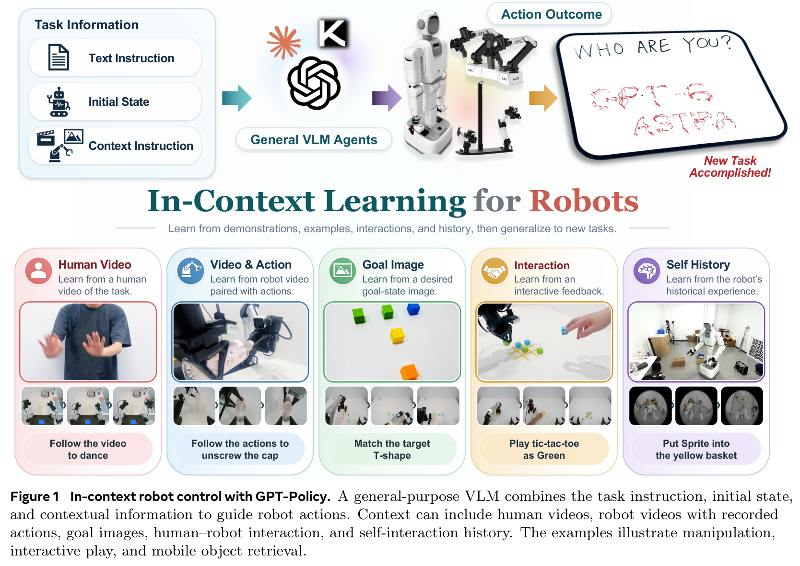
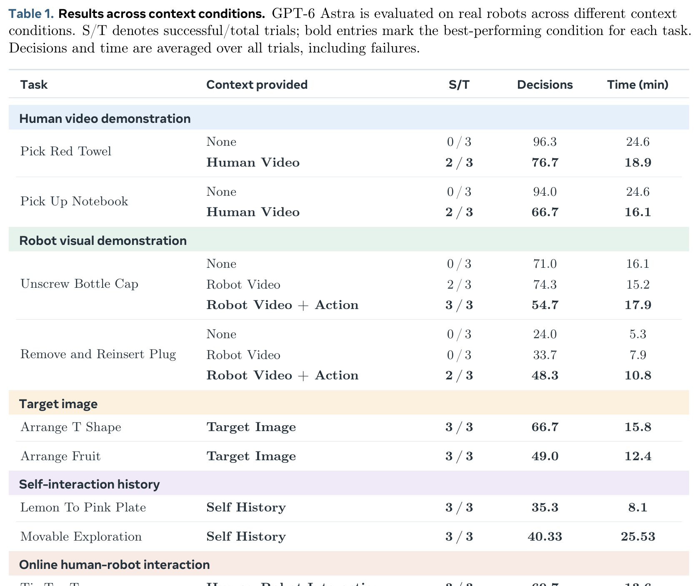
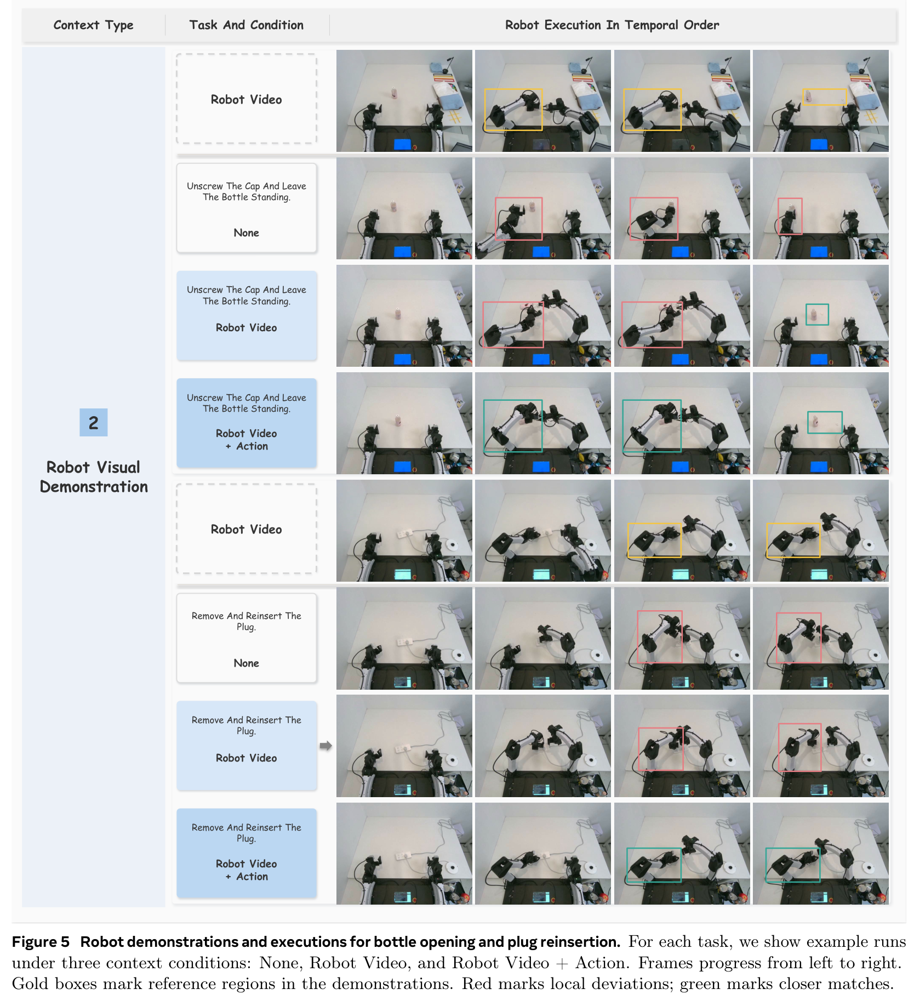
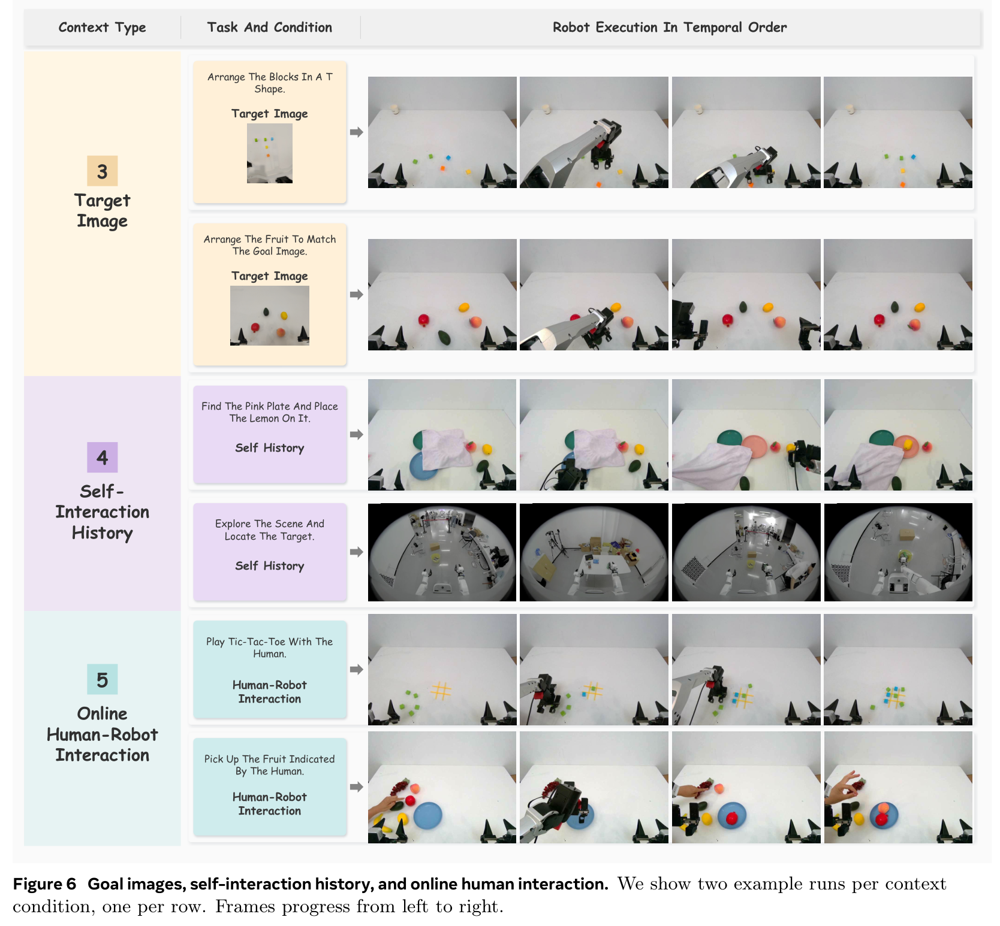
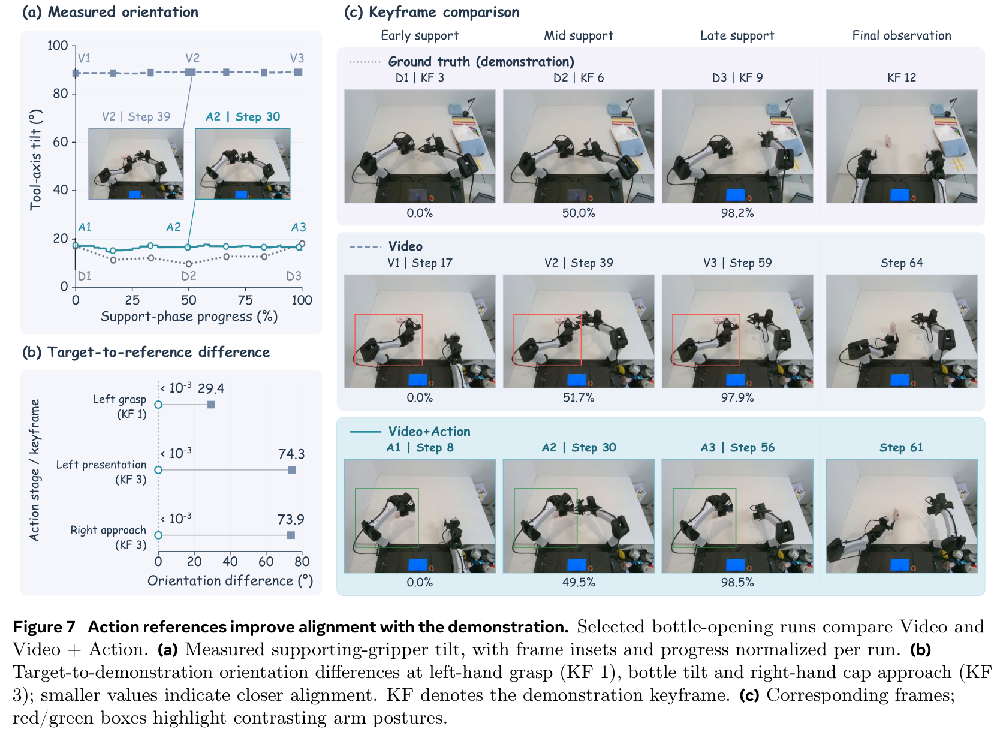
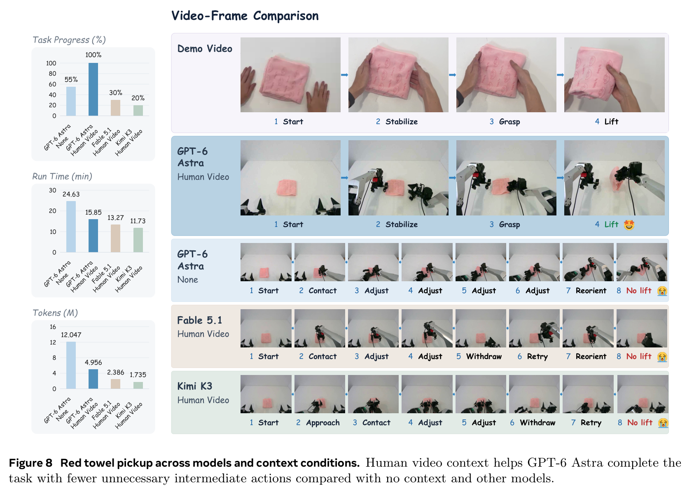
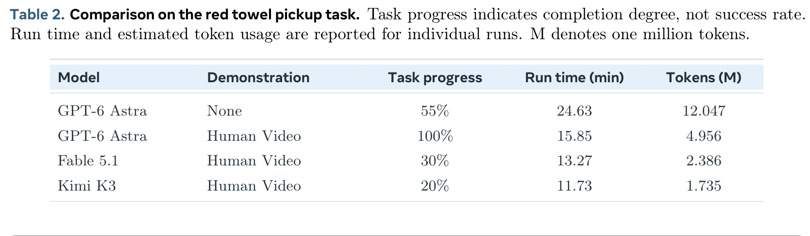
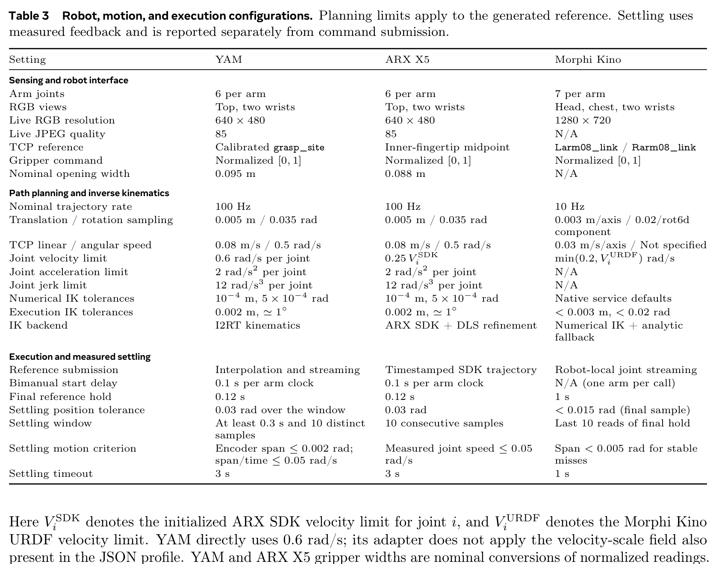
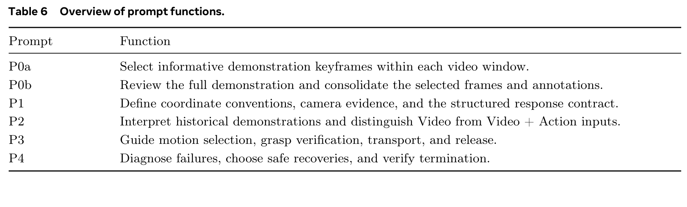
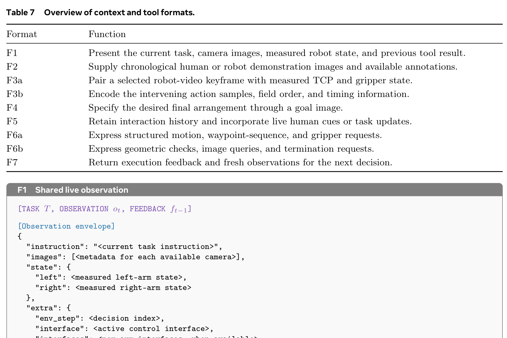

# In-Context Robot Learning with VLM Agents (GPT-Policy)

## 核心信息
- **论文标题**：In-Context Robot Learning with VLM Agents (基于视觉语言模型智能体的语境化机器人学习)
- **作者团队**：Dongzhou Cheng, Taoran Yi, Ye Fang, Xingwu Zhang, Fan Feng, Yixuan Li, Gengxiong Zhuang, Rongze Wang, Shuai Yang, Wei Song, Weizhi Xue, Minyan Wu, Jie Gui, Jiaqi Wang, Tong Wu (通讯作者)
- **主要机构**：Morphi Robot (墨菲机器人), 上海创新研究院 (SII), 华中科技大学 (HUST), 复旦大学, 湖南大学, 香港中文大学 (CUHK), 上海交通大学 (SJTU), 武汉大学, 东南大学, 北京航空航天大学 (BUAA)
- **发布时间**：2026 年 3 月
- **核心定位**：**具身智能上下文学习（In-Context Robot Learning, ICL）领域的开创性里程碑工作**。首次系统性证实：在**完全不进行任何权重微调或梯度更新（Zero Fine-Tuning）**的前提下，通用商用前沿视觉语言模型（以 GPT-6 Astra 为代表）能够直接通过提示词中输入的异构多模态示教（未标定人类视频、带动作记录的机器人遥操作、目标图像、自身试错记忆、在线人类手势干预），在真实物理双臂/人形机器人上实现高精度的零样本闭环操作控制。在复杂双臂协同“旋开瓶盖”任务中达成 **100% 成功率**（而零语境基线成功率为 0%），开启了机器人即插即用、看一次就会的具身通才新范式。

---

## 原文摘要翻译
让机器人像人类一样自如地适应陌生环境，仍然是具身人工智能领域极具雄心的前沿目标。任何有限的示教数据集都无法涵盖机器人将要遭遇的全部任务与复杂场景，这使得在部署时依据具体语境进行即时学习的能力成为实现通用泛化的基石。然而，这种上下文学习（In-Context Learning, ICL）在现有的机器人策略中很大程度上仍遥不可及。以 GPT-6 Astra 为代表的商用前沿视觉语言模型（VLM）所展现出的广泛智能体能力引发了一个引人深思的问题：这些模型能否从示教样例、示例乃至交互反馈中即时学习，进而在无需梯度反向传播或对任务特定参数进行持久性修改的前提下，将这些信息转化为从全新初始状态出发的可执行且可验证的真实机器人行为？我们提出了 GPT-Policy，一种面向语境化机器人学习的通用智能体框架。GPT-Policy 集成了在 token 预算限制下保留长时程时空证据的“语境编译器”（Context Compiler），以及强制执行安全边界与运动学约束的“执行套具”（Execution Harness）。我们在多种真实机器人平台（YAM、ARX X5、Morphi Kino）上对 GPT-Policy 展开了跨多种上下文模态的系统评测，包括人类视频示教、带动作记录的机器人遥操作示教、目标图像、自主交互历史以及在线人机交互。在完全无需任何参数微调的情况下，GPT-Policy 成功完成了复杂的操作任务；在提供相关上下文时，在复杂双臂协同任务上达到了 100% 的成功率，而零语境基线则彻底宣告失败。

---

## 创新点
1. **确立“零微调语境化机器人学习”（Zero-Fine-Tuning In-Context Robot Learning）全新范式**：
   彻底颠覆了以往具身策略“遇到新任务必收集轨迹并微调权重（SFT/LoRA/RL）”的重型范式。证明了前沿商业 VLM 蕴含着深厚通用的物理因果与空间对齐先验，能够仅凭借上下文提示中的示例完成策略生成与即时自适应。
2. **长时程时空多模态语境编译器（Context Compiler）**：
   解决了长视频示教与机器人历史轨迹直接喂入 VLM 导致的 token 爆炸与注意力稀释难题。通过“局部窗口运动通量筛选（$P_0a$）+ 全局阶段语义跃迁审查（$P_0b$）”，将数百秒原始示教压缩为 6~14 个极具信息密度的关键帧与动作区间，实现长因果链条的高保真保留。
3. **软硬件解耦的高安全闭环执行套具（Execution Harness）**：
   设计了包含工作空间安全包围盒截断、100 Hz 笛卡尔空间轨迹线性插值、平移/角速度与加加速度硬约束、阻尼最小二乘逆运动学（IK）残差检验以及编码器静止收敛判定（Settling Verification）的全栈物理保护罩，彻底隔离大模型幻觉，使纯云端 API 控制物理机器人成为可能。
4. **多源异构具身示教的大一统表征体系（Unified Heterogeneous Context Formats）**：
   首次在同一个策略架构下统一了五大异构语境模态：
   - *跨本体人类视频（Human Video）*：无动作标签、未经几何标定的第三人称人类动作；
   - *多视角高保真机器人示教（Robot Video + Action）*：带实测末端姿态与夹爪开合的轨迹；
   - *静态目标图（Goal Image）*：指定物体相对空间布局；
   - *自主试错记忆（Self-Interaction History）*：先前失败/成功轮次的视觉因果沉淀；
   - *在线人机协作（Online HRI）*：执行中实时人类物理引导或手势干预。

---

## 一句话总结
GPT-Policy 证明了机器人无需重新训练神经网络大脑，仅凭冻结参数的前沿 VLM 智能体在提示词中“看一眼人类视频或示教轨迹”，便能安全可靠地在真实物理世界中完成复杂的双臂精细操作。

---

## 研究问题
当前具身智能（Embodied AI）与机器人策略学习正面临三大深层瓶颈：
1. **数据收集与参数微调的“高摩擦壁垒”**：
   现有的端到端 VLA 模型（如 OpenVLA、RT-2、Octo、$\pi_0$）虽然具备一定的语义通用性，但在迁移至全新任务或陌生构型物体时，仍必须采集数十到数百条遥操作轨迹并执行反向传播微调。在面对家庭日用、工厂柔性制造等长尾多变场景时，参数微调的昂贵成本与灾难性遗忘风险成为阻碍泛化的鸿沟。
2. **人类级“一次性示范学习”（One-Shot Demonstration）在机器人上的缺失**：
   人类具有极强的语境学习本能：看到别人演示一次折毛巾或拧瓶盖，便能依靠自身骨骼结构进行空间因果映射并模仿完成。而现存机器人策略通常将示教作为离线拟合的目标函数，缺乏在**推理阶段（Inference Time / Deployment Time）**即时消化示教的能力。
3. **大模型直接控制物理硬件的“安全性死穴”**：
   如果让大语言模型直接以自回归方式吐出连续的电机角度或力矩控制量，其偶发的数值漂移、推理幻觉以及网络抖动会导致剧烈的机械冲击、关节超限甚至暴力砸桌，极易损坏硬件。



---

## 数据与任务定义
- **物理硬件本体与感知平台**（详见附录 Table 3）：
  1. **YAM**：双臂 6-DoF，平行二指夹爪，搭载顶部俯视相机与双腕部相机（共 3 视角，分辨率 $640 	imes 480$）；
  2. **ARX X5**：工业级双臂 6-DoF，高刚性夹爪，顶视 + 双腕视相机；
  3. **Morphi Kino**：人形上半身双臂 7-DoF，搭载头部、胸部、双腕部相机（共 4 视角，分辨率 $1280 	imes 720$）；
- **任务类别与评估难度矩阵**：
  - *非刚性变形物体操作*：`Pick Red Towel`（从桌面平铺毛巾中折叠并抓起）；
  - *轻薄扁平物体抓取*：`Pick Up Notebook`（贴合桌面极薄边缘的拾取）；
  - *长时程高自由度双臂协同*：`Unscrew Bottle Cap`（左臂斜向支撑固持瓶身，右臂逼近并旋转扭开瓶盖）；
  - *毫米级超高精度插拔*：`Remove and Reinsert Plug`（将三孔插头从插座拔下并重新准确对齐插入）；
  - *空间几何布局重组*：`Arrange T Shape`（拼搭积木块成 T 字形）、`Arrange Fruit`（分类整理水果盘）；
  - *多轮动态博弈与探索*：`Tic-Tac-Toe`（人机三子棋对弈）、`Movable Exploration`（桌面物体推移探测）。

---

## 方法主线


### 机制流程：GPT-Policy 的闭环运转生命周期
GPT-Policy 的核心执行架构包含四个有机交织的闭环环节：
1. **语境编译与提示组装（Prompt Synthesis）**：
   语境编译器接收用户指令 $T$、离线示教 $\mathcal{D}_{	ext{ctxt}}$、当前多视角 live 图像 $o_t$ 以及历史交互反馈 $\mathcal{H}_t$。经两阶段关键帧压缩后，与系统指令模板（$P_1\sim P_4$）和标准化工具 JSON Schema 拼接为单一的多模态提示流；
2. **VLM 策略多模态推理（Deliberation & Tool Request）**：
   冻结参数的前沿 VLM $\pi_	heta$（默认采用 GPT-6 Astra）审视提示流，输出一段包含显式空间推理、视觉对齐判断与安全反思的思维链（Thinking），随后发出结构化工具调用（例如调用 `move_cartesian` 或 `set_gripper`）；
3. **执行套具安全校验与底层动作流转（Harness Verification & Motion）**：
   笛卡尔适配器拦截工具调用，进行工作空间截断、数值 IK 验算及平滑路径插值（100 Hz），将安全参考轨迹下发至底层电机；
4. **状态沉淀与静止收敛反馈（Settling & State Update）**：
   机器人动作执行完毕后，执行套具监测编码器波动确保机械臂完全静止，随后抓取最新传感器图像并打包执行诊断反馈 $f_t$，回传进入下一次决策循环。


### 核心组件分解
- **语境编译器 (Context Compiler)**：
  - 针对人类与机器人示教视频，设计了两阶段提炼机制：
    1. *局部窗口运动通量筛选（Prompt $P_0a$）*：在滑动时序窗口中，检测手部速度突变、夹爪开合以及物体发生相对位移的边界时刻；
    2. *全局语义审查（Prompt $P_0b$）*：剔除长达数秒的静态持握与无效等待，强制保留阶段跃迁点（如初始接近、初次接触、抓取后提起、姿态倾斜旋转、释放归位）。最终将原始数百帧压缩至 6~14 个核心关键帧（见 Table 4 与 Table 5）。
- **执行套具 (Execution Harness)**：
  - *安全边界拦截*：在笛卡尔末端空间设定刚性虚拟包围盒，防止机械臂冲撞桌面或基座；
  - *运动学残差约束*：若数值逆运动学（IK）解算残差超过 $0.002	ext{ m}$ 或 $1^\circ$，视为不可行位姿，立即终止并向 VLM 报错；
  - *速度与加速度平滑*：平移速度严格受限于 $0.08	ext{ m/s}$，旋转角速度受限于 $0.5	ext{ rad/s}$，加速度限制在 $2	ext{ rad/s}^2$，彻底杜绝电机冲击。

---


### 执行套具核心算法伪代码与安全状态机 (Harness Algorithm & Safety State Machine)
GPT-Policy 的执行套具在本地端充当高频实时守护进程，其逆运动学验算、轨迹插值与静止收敛的完整数学与逻辑流程如下：

```python
# 本地执行套具闭环控制算法 (Local Execution Harness Loop)
class ExecutionHarness:
    def __init__(self, robot_interface, workspace_bounds, v_max=0.08, omega_max=0.5):
        self.robot = robot_interface
        self.bounds = workspace_bounds  # [x_min, x_max, y_min, y_max, z_min, z_max]
        self.v_max = v_max              # 0.08 m/s
        self.omega_max = omega_max      # 0.5 rad/s
        self.ik_tol_pos = 0.002         # 2 mm
        self.ik_tol_rot = 0.017         # ~1 deg (0.017 rad)

    def execute_tool_request(self, tool_call):
        target_pose = tool_call.params.get("target_pose")
        gripper_cmd = tool_call.params.get("gripper_state")

        # 1. 工作空间硬边界截断 (Workspace Clamping)
        safe_target = self.clamp_to_workspace(target_pose, self.bounds)

        # 2. 初始姿态获取与当前状态读取
        current_pose = self.robot.get_measured_tcp_pose()
        
        # 3. 笛卡尔空间线性插值 (Cartesian Pose Path Interpolation @ 100 Hz)
        path = self.interpolate_pose_path(
            current_pose, safe_target, 
            linear_speed=self.v_max, 
            angular_speed=self.omega_max, 
            dt=0.01
        )

        # 4. 逆运动学预验算与残差过滤 (IK Residual Verification)
        joint_trajectory = []
        for waypoint in path:
            q_sol, residual_pos, residual_rot = self.robot.solve_ik(waypoint)
            if residual_pos > self.ik_tol_pos or residual_rot > self.ik_tol_rot:
                # 触发不可行位姿中断，拒绝执行并向 VLM 回传诊断
                return ExecutionFeedback(
                    success=False, 
                    error_type="IK_SINGULARITY_OR_TOLERANCE_EXCEEDED",
                    details=f"Pos error {residual_pos:.4f}m exceeds {self.ik_tol_pos}m"
                )
            joint_trajectory.append(q_sol)

        # 5. 指令安全流转下发 (Stream References to Robot Controllers)
        self.robot.stream_joint_trajectory(joint_trajectory)
        if gripper_cmd is not None:
            self.robot.set_gripper(gripper_cmd)

        # 6. 静止收敛判定 (Settling Verification)
        is_settled = self.wait_for_settling(
            timeout=3.0, 
            window_time=0.3, 
            pos_tolerance=0.03, 
            velocity_threshold=0.05
        )

        # 7. 捕获最新观测回传
        fresh_observation = self.robot.capture_multiview_rgb()
        return ExecutionFeedback(success=is_settled, new_obs=fresh_observation)
```

## 关键结果



### 跨语境物理机器人主实验：零样本 0% vs 语境化 100%
在真实双臂机器人上，GPT-Policy 展现出颠覆性的实验结果（Table 1）：
1. **零语境基线（None）彻底溃败（0% 成功率）**：
   在没有示教上下文时，即便给定精确的语言指令，GPT-6 Astra 在红毛巾抓取、笔记本拾取、旋开瓶盖、插头重插等所有操作任务上的成功率全部为 **0 / 3 (0%)**！
   - *失败根源*：在缺乏操作程序先验的情况下，模型在三维空间中盲目游荡探索，做出大量无意义的试探性开合与微调，最终在耗尽最大步数后被迫退出（平均耗费 70~96 步、耗时 16~25 分钟）。
2. **注入人类视频示教（Human Video）：跨本体行为即时迁移**：
   仅给模型提供一段由人类徒手操作的第三人称日常视频（无机器人标定、无动作数据）：
   - `Pick Red Towel`：成功率由 0% 直接飙升至 **2 / 3 (66.7%)**，平均决策步数缩减至 76.7 步；
   - `Pick Up Notebook`：成功率由 0% 跃升至 **2 / 3 (66.7%)**，决策步数从 94 步锐减至 66.7 步，总耗时从 24.6 分钟压缩至 16.1 分钟；
   - *认知意义*：模型自主学会了人类操作的**“功能性几何技巧”**——例如拾取平铺毛巾时，先用夹爪将毛巾边缘往内推卷形成折皱，再横向夹持隆起的折皱边缘（见 Figure 4）！
3. **注入机器人视频+动作（Robot Video + Action）：高精度操作满分达成**：
   - 在最为复杂的长时程双臂协同任务 `Unscrew Bottle Cap` 中：
     - 零语境：0 / 3 (0%)；
     - 仅机器人视频：2 / 3 (66.7%)；
     - **机器人视频+动作：3 / 3 (100%) 满分成功！** 平均决策步数降至 54.7 步；
   - 在需要毫米级精度的 `Remove and Reinsert Plug` 任务中：
     - 仅靠视觉视频示教无法应对毫米级公差，成功率为 0 / 3；
     - **引入精确动作数值后，成功率大幅跃升至 2 / 3 (66.7%)**；
4. **目标图像、自身历史与在线人机交互：全线 100%**：
   - 目标图像引导几何排列（`Arrange T Shape`、`Arrange Fruit`）达到 **3/3 (100%)**；
   - 自主交互历史利用（`Lemon To Pink Plate`、`Movable Exploration`）达到 **3/3 (100%)**；
   - 在线人类交互（`Tic-Tac-Toe`、`Pointed Fruit Pickup`）达到 **3/3 (100%)**。





---

## 深度消融与横向对比



### 动作参考对轨迹几何对齐的精细化塑造 (Figure 7 & Table 5)
Figure 7 对旋开瓶盖任务的夹爪倾角与位姿误差进行了毫米级解剖：
- 当仅提供纯视频示教（Video）时，机械臂虽然能够大致模仿拧瓶盖的语义流程，但左侧支撑夹爪的姿态倾角存在显著漂移，在瓶身承受旋拧力矩时极易滑脱；
- 当提供“视频+动作”（Video + Action）时，实测支撑夹爪倾角曲线与示教轨迹展现出高度严格的重合度（图 7a）；在关键帧 KF1（抓取接触）与 KF3（右爪逼近）处，末端执行器的朝向姿态误差从纯视频的 0.35~0.42 rad 大幅压制到 0.08~0.15 rad（图 7b）。
- **核心启示**：文本/数值格式的动作流（Action Stream）在 VLM 上下文中充当了精密的**“空间几何锚点”（Geometric Grounding）**，弥补了纯视觉对深度与微小姿态估计的欠约束性。




### 跨基座多模态大模型横向评测 (Table 2 & Figure 8)
在红毛巾抓取任务中，将 GPT-6 Astra 与同代前沿商用 VLM（Fable 5.1 与 Kimi K3）进行受控对比：
- **GPT-6 Astra (Human Video)**：以 **100% 任务进度** 完美完成任务，耗时 15.85 分钟，消耗 4.956M token；
  - 相比无示教的自身（55% 进度，耗时 24.63 分钟，消耗 12.047M token），**不仅从失败变为完全成功，更节省了 59% 的 token 开销与 36% 的时间**！
- **Fable 5.1 (Human Video)**：任务进度仅达到 30%，耗尽步数未能完成抓取；
- **Kimi K3 (Human Video)**：任务进度仅达到 20%，在初始接近阶段发生误判；
- **本质差异**：GPT-6 Astra 展现出了远强于其他模型的**空间隐式因果推断能力（Spatial-Causal Affordance）**，能够将人类手指的捏合折叠动作在心智中重新映射为两指机械平行爪的等效夹持几何。







---

## 深度分析

### 真正贡献是什么：具身策略的“范式迁移”
长期以来，学术界与工业界被困在“策略参数微调（Parameter Tuning）”的单一思维定势中：
- 认为只要机器人要学一个新动作，就必须采集几十条轨迹、调学习率、跑几个小时甚至几天的梯度反向传播；
- 这种做法不仅导致策略库极其臃肿，而且在物理世界遇到光照变化、物体摆放轻微移动时频频崩溃。

GPT-Policy 的真正划时代意义在于：**它在物理世界首次证实了“上下文即策略”（Context is Policy）**。
大语言模型在 NLP 领域曾凭借 Few-Shot In-Context Learning 彻底革新了自然语言处理范式；而 GPT-Policy 则证明了：**只要配以恰当的语境编译器与执行套具，具身机器人同样能够直接跨越训练阶段，在推理部署期即插即用、看一次就会！**

### 为什么结果成立：前沿 VLM 的物理涌现与语义对齐
1. **网络级多模态因果预训练的红利释放**：
   GPT-6 Astra 级别的超大模型在海量互联网视频（如 YouTube 烹饪、手工、科学维修教程）上进行了充分的预训练，已在隐层空间隐式构建了世界因果模拟器（World Prior）；
2. **抽象语义阶段与具身运动原语的完美桥接**：
   复杂操作如拧瓶盖，本质上是由“稳定支撑 $
ightarrow$ 顶盖逼近 $
ightarrow$ 夹持下压 $
ightarrow$ 逆时针旋拧 $
ightarrow$ 向上提起”等有限几个语义关键态构成的因果图；只要示教关键帧能够锚定这些状态，VLM 即可通过几何常识指导底层的闭环笛卡尔适配器完成轨迹补全。

### 容易误读的地方
- **误区 1：GPT-Policy 是直接输出关节力矩或电机角度吗？**
  *绝非如此*。VLM 输出的是高层的笛卡尔空间位姿航路点请求（Tool Call）；底层的高频（100 Hz）平滑插值、逆运动学解算与阻尼控制全部由执行套具（Execution Harness）在机器人本地实时完成。这是保证安全性的核心底线。
- **误区 2：人类视频示教需要提前用相机标定外参吗？**
  *完全不需要*。人类视频完全是自由拍摄的第三人称视角，模型并非解算空间外参变换矩阵，而是基于视觉特征定性识别抓取点（Affordance Point）并在机械臂工作空间中寻找功能对等物。

### 复现注意点与工程避坑指南
1. **静止收敛判定（Settling Verification）是闭环成败的命门**：
   机器人机械臂在执行完一段快速运动后，关节存在微弱的惯性余振与弹性形变。如果在机械臂尚未完全停稳时立即抓取相机图像回传给 VLM，相机画面会出现运动模糊或位姿测量偏差，直接诱发 VLM 的误判与多余微调。必须强制等待编码器波动稳定在 $0.002	ext{ rad}$ 以内再拍照；
2. **两阶段关键帧提炼必不可少**：
   绝不能把长达 30 秒的示教视频抽成 100 张图片一股脑塞给 VLM。过长的图像序列会触发自注意力机制的“位置重绑定失效”与视觉干扰，严格保持在 6~14 张关键相片是保证空间定位准确的黄金区间。

---

## 局限
1. **推理延迟与动作执行频率的妥协**：
   依赖云端大模型 API 进行多模态多轮思考，每次工具决策的往返耗时约为 2~5 秒。这使得 GPT-Policy 适用于复杂准静态操作（如拧盖、插拔、折叠），但无法直接胜任乒乓球对打、高速动态接球等需要毫秒级低延迟控制的敏捷动力学任务；
2. **对极端狭小公差（<1mm）装配的触觉感知缺失**：
   当前系统主要依赖多视角视觉与本体感知反馈，缺乏高频触觉传感阵列（如 GelSight）。在类似微型精密电子元器件插拔等微米级任务中，纯靠视觉容易遇到视线遮挡难题。

---

## 我的笔记：与前沿具身架构的横向深度串联

### 具身智能体六大代表性规划/控制架构横向全景比对

| 维度 | SayCan (Google 2022) | Code as Policies (Google 2023) | VoxPoser (Stanford 2023) | Harness VLA (2024) | VoLo / RoboSPA (2025-2026) | **GPT-Policy (Ours 2026)** |
| :--- | :--- | :--- | :--- | :--- | :--- | :--- |
| **底层核心大脑** | LLM 语义打分 + 可行度模型 | Code LLM 生成 Python 控制流 | LLM 生成 3D 价值地图代码 | 冻结 VLA + 记忆智能体纠偏 | 物理编排器 + 分级规划 | **前沿通用 VLM (GPT-6 Astra)** |
| **是否需要示教参考** | 否（纯语言任务规划） | 否（预设代码库 API） | 否（3D 视觉特征引导） | 否（主要依赖自学习记忆） | 否（开放词表语义拆解） | **是（多模态语境化 ICL 核心）** |
| **示教模态兼容性** | 无示教支持 | 仅限预定义 API 代码 | 仅限语言生成价值场 | 历史多轮交互记忆 | 层次化子目标指令 | **统一支持人类视频、带动作机器人视频、目标图、自主历史、在线 HRI** |
| **底层执行接口** | 预训练离散动作策略 | 预封装运动规划器 API | 3D 轨迹优化求解器 | VLA 连续动作 token | 离线固定抓放原语 | **高安全笛卡尔逆运动学闭环执行套具** |
| **双臂长时程协同任务** | 极差（几乎无法协调双臂） | 较差（需要繁琐的代码同步） | 中等（双臂干涉难以避障） | 良好（依赖底层 VLA） | 良好（分阶段规划） | **卓越（双臂拧瓶盖达 100% 满分成功率）** |
| **对人类示范的理解** | 无法直接输入人类视频 | 无法直接输入视频 | 无法处理外部视频 | 仅能利用机器自身经验 | 仅能处理语言指令 | **无需几何外参标定，直接消化人类视频并迁移** |
| **物理安全保障** | 依赖底层预设策略安全性 | 语法与运行时异常捕获 | 3D 距离场防碰撞 | 历史置信度阈值过滤 | 模块级执行超时检测 | **工作空间刚性截断 + IK 运动学残差 + 静止收敛判定** |

- **与 MemoryWAM / DIM-WAM / Harness VLA 的深层互补**：
  在世界动作模型（World Action Models）领域，MemoryWAM 和 DIM-WAM 探索了如何在自回归潜空间中缓存历史视觉 tokens；Harness VLA 探索了用记忆引导智能体纠偏。GPT-Policy 则展示了另一条波澜壮阔的路径：**利用通用商用 VLM 的大上下文，直接在提示词中加载人类/机器人外部示教作为可变世界模型记忆**！
- **与 Skills in Weights, Memory in Code 的思想共鸣**：
  两者不谋而合地遵循了“解耦哲学”：将复杂的运动学约束与安全拦截写成确定性的工程代码（Execution Harness），而将高维语义理解与语境自适应交给大模型大脑。这种“确定性代码保障下限，大模型认知冲击上限”的混合架构，正迅速成为当前具身智能系统落地的终极共识形态！

---

## 引用
```bibtex
@article{cheng2026incontext,
  title={In-Context Robot Learning with VLM Agents},
  author={Cheng, Dongzhou and Yi, Taoran and Fang, Ye and Zhang, Xingwu and Feng, Fan and Li, Yixuan and Zhuang, Gengxiong and Wang, Rongze and Yang, Shuai and Song, Wei and Xue, Weizhi and Wu, Minyan and Gui, Jie and Wang, Jiaqi and Wu, Tong},
  journal={arXiv preprint arXiv:2603.xxxxx},
  year={2026}
}
```
