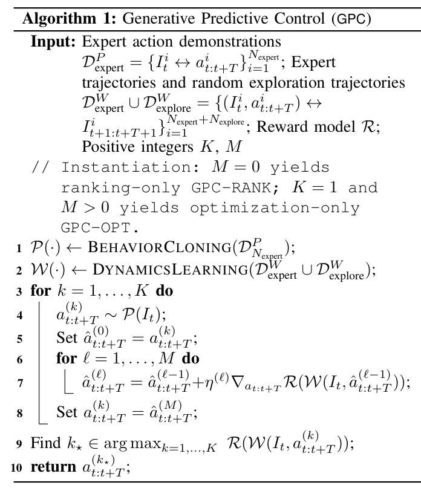
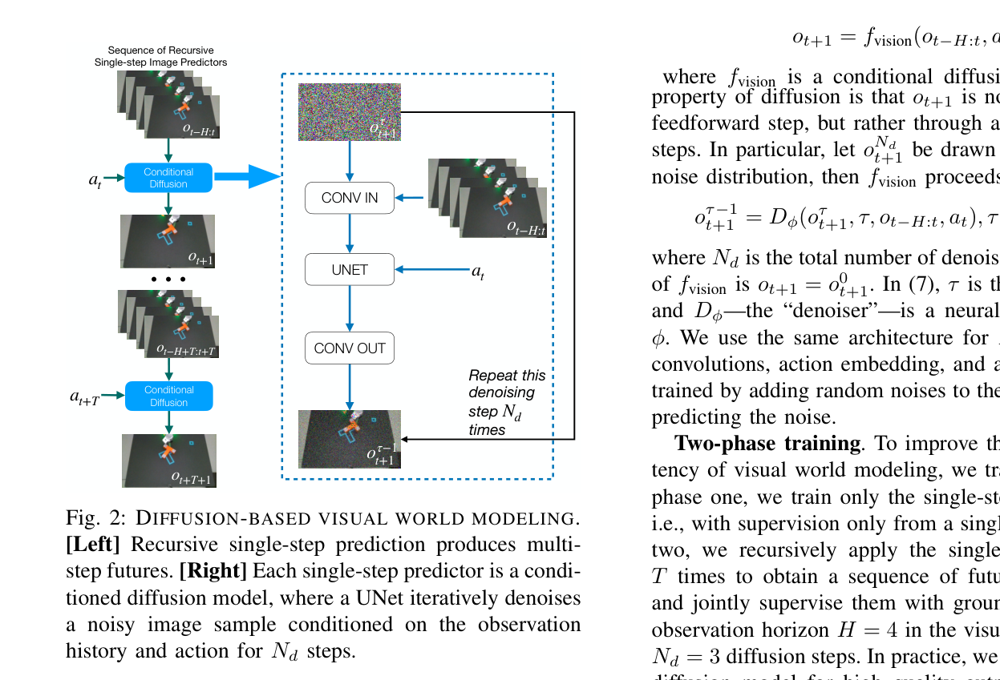
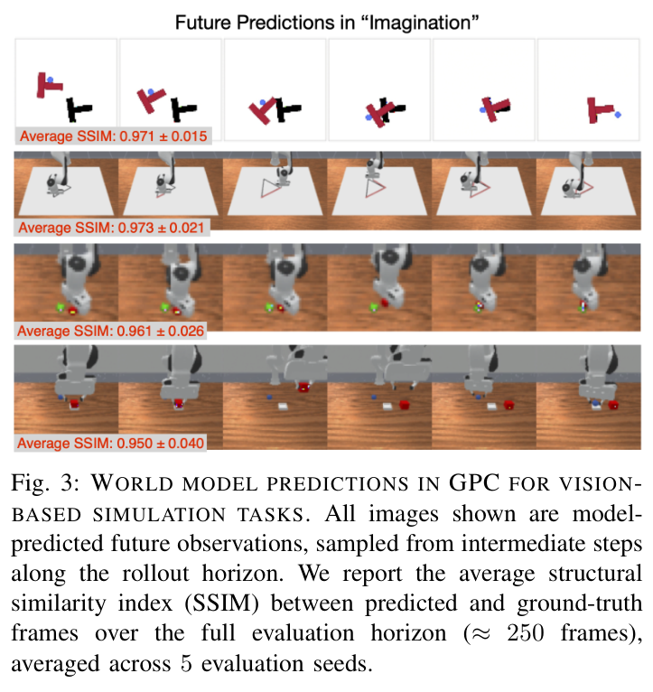
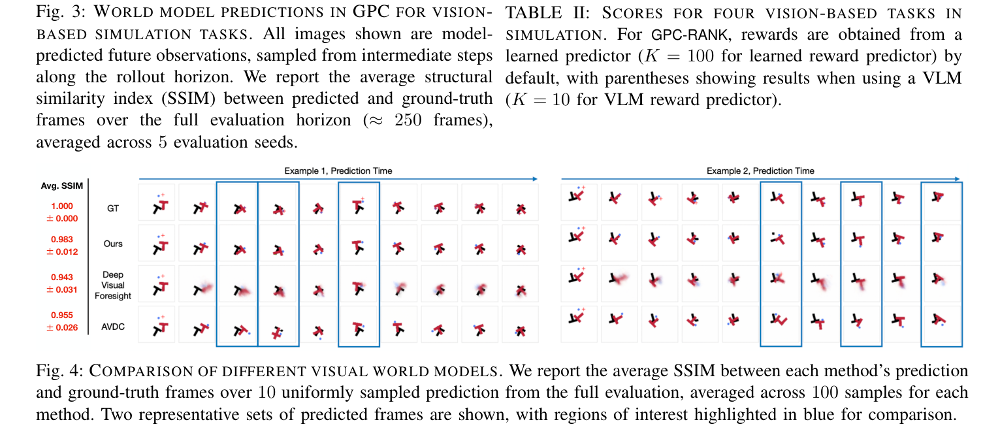
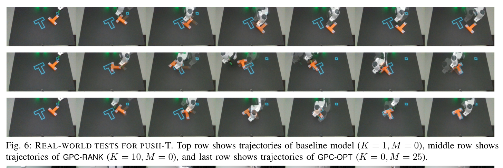
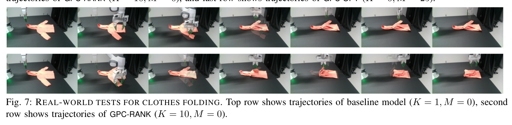
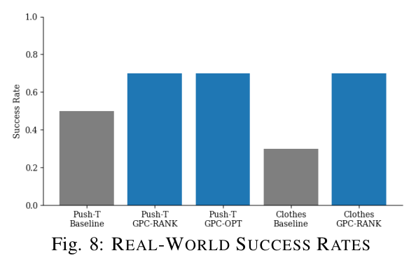

# Inference-Time Enhancement of Generative Robot Policies via Predictive World Modeling

**Authors:** Han Qi, Haocheng Yin, Aris Zhu, Yilun Du, and Heng Yang  
**Source:** `/Users/roywangj/journey_wj/research/papers4zotero/zotero1/storage/QI6E5J2A/2502.00622v4.pdf`  
**Detected source format:** selectable-text PDF (`pdf-text`)  
**Reader type:** full-paper Chinese-English Markdown reader with figure/table assets.

## Page / Section Index

| Pages | Section | Reader anchor |
|---:|---|---|
| 1 | Title, abstract | [Abstract](#abstract) |
| 1 | I. Introduction | [Introduction](#i-introduction) |
| 1–2 | II. Related Work | [Related Work](#ii-related-work) |
| 2–3 | III. Overview of Generative Predictive Control | [Overview of GPC](#iii-overview-of-generative-predictive-control) |
| 3–4 | IV. World Model Learning | [World Model Learning](#iv-world-model-learning) |
| 4–7 | V. Experiments | [Experiments](#v-experiments) |
| 7 | VI. Conclusion; VII. Limitation and Future Work | [Conclusion](#vi-conclusion) |
| 7–8 | References | [References](#references) |
| 8 | Appendix A | [Appendix](#appendix) |

## Terminology Ledger

| Canonical term | 中文约定 | First-use definition / note |
|---|---|---|
| generative predictive control (GPC) | 生成式预测控制 | 本文框架：冻结扩散策略 + 预测世界模型 + 轻量在线规划 |
| behavior cloning (BC) | 行为克隆 | 从专家示范监督学习策略；论文称其"向后看" |
| model predictive control (MPC) | 模型预测控制 | 用动力学模型前瞻评估候选动作；论文称其"向前看" |
| Diffusion Policy | Diffusion Policy | [1] 的扩散策略框架，专有方法名保留英文 |
| action-conditioned world model | 动作条件化世界模型 | $\mathcal{W}(\cdot)$：由 $(I_t, a_{t:t+T})$ 预测 $I_{t+1:t+T+1}$ |
| GPC-RANK | GPC-RANK | 采样 $K$ 个动作提案、按预测奖励排序选优 |
| GPC-OPT | GPC-OPT | 以策略采样为热启动、经世界模型做梯度细化 |
| GPC-RANK+OPT | GPC-RANK+OPT | 组合变体：多初始化的奖励最大化 |
| action proposal | 动作提案 | 从 $\mathcal{P}(\cdot)$ 采样得到的一个动作块 |
| action chunk | 动作块 | $a_{t:t+T}$，长度 $T+1$ 的连续动作序列 |
| random exploration | 随机探索 | 不解任务的随机扰动数据，用于丰富世界模型动力学 |
| reward model $\mathcal{R}(\cdot)$ | 奖励模型 | learned predictor（可微）或 VLM 代理（zero-shot） |
| vision-language model (VLM) | 视觉—语言模型 | 直接从预测图像中挑选最优提案的奖励代理 |
| freeze the noise | 冻结噪声 | 推理时固定初始噪声 $o^{N_d}_{t+1}=0$ 使世界模型确定化 |
| sufficient excitation | 充分激励 | 控制理论系统辨识术语，随机探索的理论出处 |
| single shooting | 单次打靶法 | 数值最优控制经典方法，GPC-OPT 的类比对象 |
| registration loss | 配准损失 | 预测/目标位姿变换后物体顶点间的 $\ell_2$ 距离 |
| receding horizon | 滚动时域 | 每次只执行动作块的一部分后重新规划 |
| SSIM | SSIM | structural similarity index，世界模型预测质量指标 |
| IoU | IoU | 交并比，Push-T 任务评分指标 |

## Abstract

> <span style="color:#3B82F6"><strong>Para. 1:</strong></span> We present generative predictive control (GPC), a framework for inference-time enhancement of pretrained behavior-cloning policies. Rather than retraining or fine-tuning, GPC augments a frozen diffusion policy at deployment by coupling it with a predictive world model. Concretely, we train an action-conditioned world model on expert demonstrations and random exploration rollouts to forecast the consequences of action proposals produced by the diffusion policy, then perform lightweight online planning that ranks and refines these proposals via model-based look-ahead. This combination of a generative prior with predictive foresight enables test-time adaptation. Across diverse robotic manipulation tasks—state- and vision-based, in simulation and on real hardware—GPC consistently outperforms standard behavior cloning and compares favorably to other inference-time adaptation baselines.

> <span style="color:#F59E0B"><strong>Para. 1[CN]:</strong></span> 我们提出 generative predictive control（GPC，生成式预测控制），一个在推理阶段增强预训练行为克隆策略的框架。GPC 不做再训练或微调，而是在部署时把一个冻结的 diffusion policy 与预测世界模型耦合起来：具体地，我们在专家示范和随机探索 rollout 上训练动作条件化世界模型，用它预演 diffusion policy 产生的动作提案将导致的后果，再通过基于模型前瞻的轻量在线规划对这些提案排序与细化。这种"生成先验 + 预测前瞻"的组合带来测试时自适应能力。在状态输入与视觉输入、仿真与真实硬件的多种机器人操作任务上，GPC 稳定优于标准行为克隆，并且与其他推理时自适应基线相比表现更优。

## I. Introduction

> <span style="color:#3B82F6"><strong>Para. 1:</strong></span> Behavior cloning (BC) with generative models has become a central paradigm for robot policy learning, enabling robots to imitate expert demonstrations and generalize across diverse manipulation tasks [1]–[4]. At its core, generative control looks back, grounding decisions in previously observed expert behavior.

> <span style="color:#F59E0B"><strong>Para. 1[CN]:</strong></span> 基于生成模型的行为克隆（BC）已成为机器人策略学习的核心范式，使机器人能够模仿专家示范并在多样的操作任务间泛化 [1]–[4]。就本质而言，生成式控制是"向后看"的：它把决策落在此前观察到的专家行为上。

> <span style="color:#3B82F6"><strong>Para. 2:</strong></span> Despite their success, BC policies are often brittle at deployment. Lacking explicit mechanisms for test-time correction or recovery, small deviations from the training distribution can compound over time and degrade performance [5]. By contrast, model predictive control (MPC) looks ahead: it evaluates candidate actions by simulating their future consequences under a predictive dynamics model, enabling online adaptation. While MPC-style planning has demonstrated robustness across robotics and control, it typically relies on carefully engineered models and objectives, making direct integration with modern generative policies challenging.

> <span style="color:#F59E0B"><strong>Para. 2[CN]:</strong></span> 尽管成功，BC 策略在部署时往往很脆弱。由于缺乏显式的测试时纠错或恢复机制，偏离训练分布的微小偏差会随时间累积并损害性能 [5]。相反，模型预测控制（MPC）是"向前看"的：它在预测动力学模型下模拟候选动作的未来后果来评估动作，从而实现在线自适应。MPC 式规划在机器人与控制领域展示了鲁棒性，但通常依赖精心设计的模型和目标函数，因此难以与现代生成式策略直接结合。

> <span style="color:#3B82F6"><strong>Para. 3:</strong></span> This paper is motivated by the question: Can we endow pretrained, frozen BC policies with test-time adaptability by incorporating MPC-style foresight through learned world models—without retraining or fine-tuning the policy itself? Inspired by how humans combine retrospective experience with prospective mental simulation, we seek a lightweight inference-time framework that unifies these two modes of reasoning, combining BC's generative flexibility with predictive foresight in a form that is adaptive and interpretable.

> <span style="color:#F59E0B"><strong>Para. 3[CN]:</strong></span> 本文的驱动问题是：能否在完全不再训练、不微调策略本身的前提下，通过学习到的世界模型引入 MPC 式前瞻，赋予预训练且冻结的 BC 策略测试时自适应能力？受人类同时利用回顾性经验与前瞻性心理模拟的启发，我们寻求一个轻量的推理时框架，统一这两种推理模式，以自适应且可解释的形式把 BC 的生成灵活性与预测前瞻结合起来。

> <span style="color:#3B82F6"><strong>Para. 4:</strong></span> Contribution. We propose generative predictive control (GPC), a framework that strengthens pretrained diffusion-based BC policies at inference time by coupling them with an action-conditioned predictive world model for online planning (Fig. 1). GPC consists of three components.

> <span style="color:#F59E0B"><strong>Para. 4[CN]:</strong></span> 贡献。我们提出 generative predictive control（GPC）框架：在推理阶段把预训练的扩散式 BC 策略与动作条件化预测世界模型耦合，用于在线规划（Fig. 1）。GPC 包含三个组件。

### Figure 1. GPC framework overview


**Caption:** Generative predictive control (GPC). (a) GPC-RANK: The generative policy proposes multiple action sequences that are evaluated in imagination using the predictive world model; the action with the highest predicted reward is selected. (b) GPC-OPT: A single action proposal is refined via gradient-based optimization through the world model to maximize the predicted reward. Together, these strategies enable inference-time enhancement of pretrained behavior cloning policies by combining generative sampling with predictive foresight.

**Caption[CN]:** 生成式预测控制（GPC）。(a) GPC-RANK：生成式策略给出多个动作序列，在预测世界模型的"想象"中评估它们，选出预测奖励最高的动作。(b) GPC-OPT：单个动作提案通过世界模型做基于梯度的优化细化，以最大化预测奖励。两种策略结合生成式采样与预测前瞻，共同实现对预训练行为克隆策略的推理时增强。

**Reading note:** 图中右侧数字是各动作提案在想象 rollout 下的预测奖励（负值为配准损失，越接近 0 越好）；红星标记被选中/优化后的提案。这张图就是全文方法的完整信息流。

> <span style="color:#3B82F6"><strong>Para. 5:</strong></span> Generative policy training. From expert demonstrations, we train a diffusion-based policy that generates short-horizon action chunks conditioned on past observations, providing a generative prior over plausible behaviors.

> <span style="color:#F59E0B"><strong>Para. 5[CN]:</strong></span> 生成式策略训练。我们从专家示范训练一个扩散式策略，它以过去观测为条件生成短时程动作块，为"合理行为"提供生成先验。

> <span style="color:#3B82F6"><strong>Para. 6:</strong></span> Predictive world modeling. We learn an action-conditioned world model that forecasts future observations given candidate action chunks. Training solely on demonstrations yields a narrow model that captures only expert behavior; we therefore augment training with simple random exploration data to enrich the learned dynamics and enable corrective predictions. For state-based tasks, we use MLPs; for vision-based tasks, we employ conditional video diffusion models [6], [7].

> <span style="color:#F59E0B"><strong>Para. 6[CN]:</strong></span> 预测世界建模。我们学习一个动作条件化世界模型，在给定候选动作块时预报未来观测。只用示范数据训练会得到一个狭窄的、只覆盖专家行为的模型；因此我们加入简单的随机探索数据来丰富所学动力学，使模型能做出"纠偏性"预测。状态输入任务用 MLP；视觉输入任务用条件视频扩散模型 [6], [7]。

> <span style="color:#3B82F6"><strong>Para. 7:</strong></span> Online planning. At inference time, GPC enhances the frozen policy using lightweight planning strategies. GPC-RANK samples multiple action proposals, unrolls them through the world model, and selects the one with the highest predicted reward. GPC-OPT treats a policy sample as a warm start and refines it via gradient-based optimization through the world model. These strategies can be combined, and rewards can be either learned from demonstrations or provided zero-shot by a vision-language model (VLM).

> <span style="color:#F59E0B"><strong>Para. 7[CN]:</strong></span> 在线规划。推理时，GPC 用轻量规划策略增强冻结的策略。GPC-RANK 采样多个动作提案，经世界模型展开，选出预测奖励最高的一个；GPC-OPT 把一个策略采样当作热启动，通过世界模型做基于梯度的优化细化。两种策略可以组合；奖励既可以从示范中学习，也可以由视觉—语言模型（VLM）zero-shot 提供。

> <span style="color:#3B82F6"><strong>Para. 8:</strong></span> Across simulated and real-world manipulation tasks, GPC consistently outperforms pure behavior cloning and compares favorably to other inference-time adaptation methods, demonstrating that predictive world modeling and lightweight planning provide an effective recipe for enhancing generative robot policies at deployment.

> <span style="color:#F59E0B"><strong>Para. 8[CN]:</strong></span> 在仿真与真实操作任务上，GPC 稳定超过纯行为克隆，并优于其他推理时自适应方法，说明"预测世界建模 + 轻量规划"是在部署阶段增强生成式机器人策略的有效配方。

> <span style="color:#3B82F6"><strong>Para. 9:</strong></span> Novelty. While GPC is related to inference-time planning methods that enhance frozen policies via imagined rollouts in learned world models [8], [9], it is distinguished by combining a diffusion policy with an explicit, image-space diffusion world model, introducing a frozen-noise inference mechanism for stable gradient-based optimization, unifying proposal ranking and refinement, and enabling vision-language models to act as direct reward surrogates.

> <span style="color:#F59E0B"><strong>Para. 9[CN]:</strong></span> 新颖性。GPC 与那些"在学习到的世界模型里做想象 rollout 来增强冻结策略"的推理时规划方法 [8], [9] 相关，但它的区别在于：把 diffusion policy 与显式的、图像空间的扩散世界模型结合；引入冻结噪声推理机制以稳定基于梯度的优化；统一了提案排序与提案细化两种模式；并让 VLM 直接充当奖励代理。

## II. Related Work

> <span style="color:#3B82F6"><strong>Para. 1:</strong></span> Generative modeling for robotics. A large body of recent work has explored the integration of generative models into robotics [2]. Generative models have been widely applied to represent policies [1], [10]–[13], often trained on large collections of task demonstrations. They have also been leveraged to generate additional data [14]–[16] and to model world dynamics [17]–[19]. More recently, several works have used generative models directly for planning [20]–[22], training them over trajectories of states and actions and exploiting the generation process for action optimization. In contrast, our generative predictive control (GPC) framework targets inference-time planning: rather than retraining or modifying the generative policy, we leave it fixed and enhance its execution through a predictive world model. This modular design decouples policy learning from world model learning, allowing them to be trained independently and even from different datasets.

> <span style="color:#F59E0B"><strong>Para. 1[CN]:</strong></span> 机器人领域的生成建模。大量近期工作探索了生成模型与机器人学的结合 [2]。生成模型被广泛用来表征策略 [1], [10]–[13]，通常在大规模任务示范集上训练；也被用来生成额外数据 [14]–[16] 和建模世界动力学 [17]–[19]。更近的一些工作直接把生成模型用于规划 [20]–[22]：在状态—动作轨迹上训练，并利用生成过程做动作优化。与之相比，我们的 GPC 框架瞄准推理时规划：不再训练、不修改生成式策略，而是保持其固定，通过预测世界模型增强其执行。这种模块化设计把策略学习与世界模型学习解耦，两者可以独立训练，甚至可以来自不同数据集。

> <span style="color:#3B82F6"><strong>Para. 2:</strong></span> Visual world modeling for predictive policy learning. Learning predictive visual models of the world has a long history [23]–[25]. Recently, video generative models have emerged as a powerful tool for modeling the physical world [19], [26]–[28]. Such models have been used to initialize policies [26], [28], [29], as interactive simulators [19], [27], [30], and integrated with downstream planning [31], [32]. Some recent work (e.g., IRIS [33], Dreamer-v3 [9], TDMPC-2 [34]) proposes to train learning-based policies in the imagined world model to solve simple game tasks or simulated control tasks. Besides, several other works [8], [35] focus on MPC-style optimization with predictive world modeling in latent space during inference time.

> <span style="color:#F59E0B"><strong>Para. 2[CN]:</strong></span> 面向预测式策略学习的视觉世界建模。学习世界的预测性视觉模型历史悠久 [23]–[25]。近年来，视频生成模型成为建模物理世界的有力工具 [19], [26]–[28]，被用于初始化策略 [26], [28], [29]、充当交互式模拟器 [19], [27], [30]，以及与下游规划整合 [31], [32]。一些近期工作（如 IRIS [33]、Dreamer-v3 [9]、TDMPC-2 [34]）提出在想象的世界模型里训练基于学习的策略，以解决简单游戏或仿真控制任务；另一些工作 [8], [35] 则关注推理阶段在 latent space 中结合预测世界建模的 MPC 式优化。

> <span style="color:#3B82F6"><strong>Para. 3:</strong></span> Different from these works, our approach employs a video-based world model as an explicit action-conditioned dynamics model that directly predicts future observations. This design enables inference-time planning that strengthens pretrained policies by allowing direct, interpretable evaluation of predicted outcomes, facilitating robust manipulation in both simulation and the real world as presented in our experiments.

> <span style="color:#F59E0B"><strong>Para. 3[CN]:</strong></span> 与这些工作不同，我们把基于视频的世界模型用作显式的动作条件化动力学模型，直接预测未来观测。这一设计让推理时规划可以对预测结果做直接、可解释的评估，从而增强预训练策略，并如实验所示，在仿真和真实世界中都支持鲁棒的操作。

## III. Overview of Generative Predictive Control

> <span style="color:#3B82F6"><strong>Para. 1:</strong></span> Let $I_t$ be the information vector summarizing the state of the robot and the environment up to time step $t$. For state-based robot control, $I_t := x_{t-H:t}$ is the history of (low-dimensional) states of the robot and its environment (e.g., poses); for vision-based robot control, $I_t := o_{t-H:t}$ is the history of (high-dimensional) visual observations, where each $o_t$ is a single (or multi-view) image. Let $a_t$ be the robot action at time $t$ and $a_{t:t+T}$ be an action chunk of length $T+1$. Our goal is to design a policy that decides $a_{t:t+T}$ based on $I_t$ to solve certain tasks (e.g., described by language instructions). We formalize the three modules of GPC.

> <span style="color:#F59E0B"><strong>Para. 1[CN]:</strong></span> 设 $I_t$ 为汇总机器人与环境到时间步 $t$ 为止状态的信息向量。对状态输入的机器人控制，$I_t := x_{t-H:t}$ 是机器人及其环境的（低维）状态历史（例如位姿）；对视觉输入的控制，$I_t := o_{t-H:t}$ 是（高维）视觉观测历史，其中每个 $o_t$ 是单视角（或多视角）图像。设 $a_t$ 为 $t$ 时刻的机器人动作，$a_{t:t+T}$ 为长度 $T+1$ 的动作块。目标是设计一个策略，基于 $I_t$ 决定 $a_{t:t+T}$ 以完成给定任务（例如由语言指令描述）。下面形式化 GPC 的三个模块。

### Generative policy training

> <span style="color:#3B82F6"><strong>Para. 1:</strong></span> We ask humans to teleoperate robots to solve tasks, generating expert demonstrations that are segmented into clips of state-action pairs with sliding windows, forming a dataset $\mathcal{D}^P_{\text{expert}} = \{I^i_t, a^i_{t:t+T}\}_{i=1}^{N_{\text{expert}}}$. Policy learning then reduces to supervised learning with input $I_t$ and output $a_{t:t+T}$. In GPC, we adopt the diffusion policy learning framework [1], where $I_t$ is fed into a network that parametrizes the score function of $p(a_{t:t+T} \mid I_t)$. Gaussian noise vectors are gradually denoised into expert action chunks following [36]. This yields a stochastic policy network $\mathcal{P}(\cdot)$ that samples action chunks $a_{t:t+T}$ given $I_t$. We refer to each sampled action chunk as an action proposal.

> <span style="color:#F59E0B"><strong>Para. 1[CN]:</strong></span> 我们让人类遥操作机器人完成任务，得到的专家示范用滑动窗口切分成状态—动作对片段，构成数据集 $\mathcal{D}^P_{\text{expert}} = \{I^i_t, a^i_{t:t+T}\}_{i=1}^{N_{\text{expert}}}$。策略学习由此化为以 $I_t$ 为输入、$a_{t:t+T}$ 为输出的监督学习。GPC 采用 diffusion policy 学习框架 [1]：$I_t$ 输入一个参数化 $p(a_{t:t+T} \mid I_t)$ 得分函数的网络，高斯噪声向量按 [36] 逐步去噪成专家动作块。这样得到一个随机策略网络 $\mathcal{P}(\cdot)$，在给定 $I_t$ 时采样动作块 $a_{t:t+T}$。我们把每个采样得到的动作块称为一个动作提案。

> <span style="color:#3B82F6"><strong>Para. 2:</strong></span> In implementation, we follow the standard Diffusion Policy temporal abstraction, using an observation horizon $H = 2$, a prediction horizon $T = 16$, and an action horizon of 9, with control executed in a receding-horizon manner. We resize the images to a height of 96. The generative policy $\mathcal{P}(\cdot)$ is trained using a DDPM formulation [1], employing a ResNet18 visual encoder for the vision-based policy and a UNet diffusion backbone to model the action distribution. Training is performed for 300 epochs using AdamW with learning rate $10^{-4}$ and weight decay $10^{-6}$, and the policy uses 100 diffusion denoising steps during inference.

> <span style="color:#F59E0B"><strong>Para. 2[CN]:</strong></span> 实现上遵循标准 Diffusion Policy 的时间抽象：观测视野 $H = 2$，预测视野 $T = 16$，动作视野 9，按滚动时域方式执行控制。图像高度缩放到 96。生成策略 $\mathcal{P}(\cdot)$ 用 DDPM 形式训练 [1]，视觉策略采用 ResNet18 视觉编码器，动作分布用 UNet 扩散骨干建模。训练 300 个 epoch，优化器 AdamW，学习率 $10^{-4}$，权重衰减 $10^{-6}$；推理时策略使用 100 步扩散去噪。

### Predictive world modeling

> <span style="color:#3B82F6"><strong>Para. 1:</strong></span> The stochastic nature of $\mathcal{P}(\cdot)$ raises a key question: which of the many action proposals should be selected? The world model addresses this by predicting the future outcomes of each proposal. To train it, we use pairs of $(I_t, a_{t:t+T})$ and $I_{t+1:t+T+1}$ from the expert dataset $\mathcal{D}^W_{\text{expert}} = \{(I^i_t, a^i_{t:t+T}), I^i_{t+1:t+T+1}\}_{i=1}^{N_{\text{expert}}}$, already used in policy training. However, as shown in §V, training solely on $\mathcal{D}^W_{\text{expert}}$ leads to limited predictive ability. While more expert data could help, it can be costly. Instead, we collect an additional exploration dataset $\mathcal{D}^W_{\text{explore}} = \{(I^i_t, a^i_{t:t+T}), I^i_{t+1:t+T+1}\}_{i=1}^{N_{\text{explore}}}$, where humans (or other controllers) randomly perturb the system without solving tasks. This approach, inspired from "system identification" with "sufficient excitation" in control theory [37], enriches the dynamics. We combine both datasets as $\mathcal{D}^W := \mathcal{D}^W_{\text{expert}} \cup \mathcal{D}^W_{\text{explore}}$ to train the world model. Architectural details are in §IV; for now, we assume access to a model $\mathcal{W}(\cdot)$ that predicts $I_{t+1:t+T+1}$ from $(I_t, a_{t:t+T})$.

> <span style="color:#F59E0B"><strong>Para. 1[CN]:</strong></span> $\mathcal{P}(\cdot)$ 的随机性带来一个关键问题：众多动作提案中该选哪一个？世界模型通过预测每个提案的未来结果来回答。训练数据是策略训练已用过的专家数据集 $\mathcal{D}^W_{\text{expert}} = \{(I^i_t, a^i_{t:t+T}), I^i_{t+1:t+T+1}\}_{i=1}^{N_{\text{expert}}}$ 中的 $(I_t, a_{t:t+T})$ 与 $I_{t+1:t+T+1}$ 配对。但如 §V 所示，只在 $\mathcal{D}^W_{\text{expert}}$ 上训练会限制预测能力；补充更多专家数据虽有帮助却代价高。我们改为收集额外的探索数据集 $\mathcal{D}^W_{\text{explore}} = \{(I^i_t, a^i_{t:t+T}), I^i_{t+1:t+T+1}\}_{i=1}^{N_{\text{explore}}}$：由人类（或其他控制器）随机扰动系统而不解任务。这一做法受控制理论中带"充分激励"的"系统辨识"[37] 启发，用来丰富动力学。两个数据集合并为 $\mathcal{D}^W := \mathcal{D}^W_{\text{expert}} \cup \mathcal{D}^W_{\text{explore}}$ 训练世界模型。架构细节见 §IV；此处先假定已有模型 $\mathcal{W}(\cdot)$，能从 $(I_t, a_{t:t+T})$ 预测 $I_{t+1:t+T+1}$。

### Online planning

> <span style="color:#3B82F6"><strong>Para. 1:</strong></span> We now formalize the two online planning algorithms, namely GPC-RANK and GPC-OPT, that combine the policy $\mathcal{P}(\cdot)$ and the world model $\mathcal{W}(\cdot)$. We assume a reward model $\mathcal{R}(\cdot): I_{t+1:t+T+1} \to r_t$ is available that predicts the reward given the future state information, e.g., a small neural network that is separately trained, or VLMs capable of zero-shot selection of the most promising future state. A trained reward predictor is appropriate in scenarios where the reward can be explicitly defined—particularly in numerical terms—and it is differentiable, enabling gradient-based action optimization. However, some tasks involve rewards that are difficult or even infeasible to specify. In such cases, VLMs can serve as surrogate reward predictors by directly selecting the most suitable action proposal, given the predicted outcomes and task description as input. This approach introduces greater flexibility to our GPC method, extending its applicability to a broader range of tasks.

> <span style="color:#F59E0B"><strong>Para. 1[CN]:</strong></span> 现在形式化把策略 $\mathcal{P}(\cdot)$ 与世界模型 $\mathcal{W}(\cdot)$ 组合起来的两个在线规划算法：GPC-RANK 和 GPC-OPT。假设存在奖励模型 $\mathcal{R}(\cdot): I_{t+1:t+T+1} \to r_t$，它根据未来状态信息预测奖励——可以是单独训练的小神经网络，也可以是能 zero-shot 选出最有希望未来状态的 VLM。当奖励可以显式（尤其是数值化）定义时，训练出的奖励预测器最合适：它可微，因而支持基于梯度的动作优化。但有些任务的奖励难以甚至无法指定，此时 VLM 可以充当奖励代理，直接根据预测结果和任务描述选出最合适的动作提案。这为 GPC 引入了更大灵活性，把适用范围扩展到更广的任务。

> <span style="color:#3B82F6"><strong>Para. 2:</strong></span> (i) GPC-RANK is based on the intuition to pick the action proposal with the highest reward. Formally, we sample $K$ action proposals from the policy, pass them through the world model $\mathcal{W}(\cdot)$, and select the one with the highest reward:

$$
\big(a^{(1)}_{t:t+T}, \ldots, a^{(k)}_{t:t+T}, \ldots, a^{(K)}_{t:t+T}\big) \sim \mathcal{P}(I_t), \tag{1}
$$

$$
\pi(I_t) = a^{(k^\star)}_{t:t+T}, \qquad k^\star \in \arg\max_{k=1,\ldots,K} \mathcal{R}\big(\mathcal{W}(I_t, a^{(k)}_{t:t+T})\big), \tag{2}
$$

> <span style="color:#F59E0B"><strong>Para. 2[CN]:</strong></span> (i) GPC-RANK 的直觉是选出奖励最高的动作提案。形式上，先从策略采样 $K$ 个动作提案（式 (1)），把它们送入世界模型 $\mathcal{W}(\cdot)$，再按预测奖励选出最优者（式 (2)）。

> <span style="color:#3B82F6"><strong>Para. 3:</strong></span> Here we used the notation $\pi(\cdot)$ to denote the online policy, in contrast to the offline policy $\mathcal{P}(\cdot)$. A key advantage of GPC-RANK is its simplicity: it is easily parallelizable, requires no hyperparameter tuning, and applies broadly across tasks and reward types, including non-differentiable and VLM-based rewards.

> <span style="color:#F59E0B"><strong>Para. 3[CN]:</strong></span> 这里用记号 $\pi(\cdot)$ 表示在线策略，与离线策略 $\mathcal{P}(\cdot)$ 相区分。GPC-RANK 的关键优点是简单：易于并行、无需调超参数，且对任务和奖励类型的适用面很广，包括不可微奖励和基于 VLM 的奖励。

> <span style="color:#3B82F6"><strong>Para. 4:</strong></span> (ii) GPC-OPT directly solves the reward maximization problem given the world model, treating the action chunk as decision variables:

$$
\max_{a_{t:t+T}} \ \mathcal{R}\big(\mathcal{W}(I_t, a_{t:t+T})\big). \tag{3}
$$

> <span style="color:#F59E0B"><strong>Para. 4[CN]:</strong></span> (ii) GPC-OPT 在给定世界模型的条件下直接求解奖励最大化问题（式 (3)），把动作块当作决策变量。

> <span style="color:#3B82F6"><strong>Para. 5:</strong></span> However, (3) is often highly nonconvex due to the complexity of $\mathcal{W}(\cdot)$ and $\mathcal{R}(\cdot)$. To address this, we leverage the pretrained $\mathcal{P}(\cdot)$ to warm-start the optimization. We sample $\hat{a}_{t:t+T}$ from $\mathcal{P}(I_t)$ and perform, for $\ell = 1, \ldots, M$ with step sizes $\eta^{(\ell)} > 0$:

$$
\hat{a}^{(0)}_{t:t+T} := \hat{a}_{t:t+T} \sim \mathcal{P}(I_t), \qquad
\hat{a}^{(\ell)}_{t:t+T} = \hat{a}^{(\ell-1)}_{t:t+T} + \eta^{(\ell)} \nabla_{a_{t:t+T}} \mathcal{R}\big(\mathcal{W}(I_t, \hat{a}^{(\ell-1)}_{t:t+T})\big). \tag{4}
$$
> The final optimized action chunk is:

$$
\pi(I_t) = \hat{a}^{(M)}_{t:t+T}. \tag{5}
$$

> <span style="color:#F59E0B"><strong>Para. 5[CN]:</strong></span> 但由于 $\mathcal{W}(\cdot)$ 与 $\mathcal{R}(\cdot)$ 的复杂性，问题 (3) 往往高度非凸。为此我们用预训练的 $\mathcal{P}(\cdot)$ 做热启动：从 $\mathcal{P}(I_t)$ 采样 $\hat{a}_{t:t+T}$，然后按式 (4) 以步长 $\eta^{(\ell)} > 0$ 迭代 $\ell = 1, \ldots, M$ 步梯度上升；最终优化后的动作块由式 (5) 给出。

> <span style="color:#3B82F6"><strong>Para. 6:</strong></span> Gradients are obtained via automatic differentiation, and updates can be performed with optimizers like ADAM. GPC-OPT resembles the classical single shooting method [38]. Unlike GPC-RANK, which evaluates the world model $K$ times in parallel, GPC-OPT evaluates it $M$ times sequentially. In contrast, GPC-OPT enables continuous action refinement by performing gradient-based optimization from diffusion-policy warm starts, allowing it to improve beyond sampled proposals. Under appropriate optimization step sizes and iteration counts, this refinement is particularly effective for tasks with reliable numerical rewards (see §V).

> <span style="color:#F59E0B"><strong>Para. 6[CN]:</strong></span> 梯度由自动微分获得，更新可用 ADAM 等优化器执行。GPC-OPT 类似经典的单次打靶法 [38]。GPC-RANK 并行评估世界模型 $K$ 次，而 GPC-OPT 串行评估 $M$ 次；作为交换，GPC-OPT 能从 diffusion policy 热启动出发做连续的动作细化，从而超越"只能在采样提案中选"的上限。在合适的步长与迭代次数下，这种细化对具有可靠数值奖励的任务尤其有效（见 §V）。

> <span style="color:#3B82F6"><strong>Para. 7:</strong></span> GPC-RANK and GPC-OPT can be combined by sampling $K$ action proposals from $\mathcal{P}(\cdot)$ and applying reward maximization (4) to each, yielding $K$ optimized action chunks. We select the one with the highest reward. GPC-RANK+OPT effectively solves (3) from multiple initializations [39], requiring $K \times M$ world model evaluations. A summary of GPC is provided in Alg. 1. The world model is crucial for ranking and optimizing action proposals. While early works such as deep visual foresight [40] explored learned world models, we next show that modern diffusion models now enable (near) physics-accurate visual predictions previously unattainable.

> <span style="color:#F59E0B"><strong>Para. 7[CN]:</strong></span> GPC-RANK 与 GPC-OPT 可以组合：从 $\mathcal{P}(\cdot)$ 采样 $K$ 个动作提案，对每个都执行奖励最大化 (4)，得到 $K$ 个优化后的动作块，再选奖励最高者。GPC-RANK+OPT 实质上是从多个初始化求解 (3) [39]，需要 $K \times M$ 次世界模型评估。GPC 的完整流程总结见 Alg. 1。世界模型是排序与优化动作提案的关键。早期工作如 deep visual foresight [40] 已探索过学习到的世界模型，我们接下来说明：现代扩散模型如今能实现以前无法企及的（接近）物理精确的视觉预测。

### Algorithm 1. Generative Predictive Control (GPC)



**Caption:** Generative Predictive Control (GPC). Inputs are the expert demonstration dataset, the combined expert-plus-exploration dynamics dataset, a reward model $\mathcal{R}$, and positive integers $K, M$. Setting $M = 0$ yields ranking-only GPC-RANK; $K = 1$ and $M > 0$ yields optimization-only GPC-OPT.

**Caption[CN]:** 生成式预测控制（GPC）伪代码。输入为专家示范数据集、专家 + 随机探索合并的动力学数据集、奖励模型 $\mathcal{R}$ 与正整数 $K, M$。取 $M = 0$ 得到只排序的 GPC-RANK；取 $K = 1$ 且 $M > 0$ 得到只优化的 GPC-OPT。

**Reading note:** 第 1–2 行分别训练策略 $\mathcal{P}$ 与世界模型 $\mathcal{W}$（离线，一次性）；第 3–8 行是每个提案的可选梯度细化内循环；第 9–10 行做全局 argmax。这份伪代码把 RANK/OPT/RANK+OPT 统一成同一模板，是复现的最佳入口。

> <span style="color:#3B82F6"><strong>Para. 8:</strong></span> **Searchable transcription of Algorithm 1.**
>
> 1. $\mathcal{P}(\cdot) \leftarrow \textsc{BehaviorCloning}(\mathcal{D}^{P}_{\mathrm{expert}})$.
> 2. $\mathcal{W}(\cdot) \leftarrow \textsc{DynamicsLearning}(\mathcal{D}^{W}_{\mathrm{expert}} \cup \mathcal{D}^{W}_{\mathrm{explore}})$.
> 3. For $k=1,\ldots,K$:
>    1. Sample $a^{(k)}_{t:t+T} \sim \mathcal{P}(I_t)$.
>    2. Set $\hat a^{(0)}_{t:t+T}=a^{(k)}_{t:t+T}$.
>    3. For $\ell=1,\ldots,M$, update $\hat a^{(\ell)}_{t:t+T}=\hat a^{(\ell-1)}_{t:t+T}+\eta^{(\ell)}\nabla_{a_{t:t+T}}\mathcal{R}(\mathcal{W}(I_t,\hat a^{(\ell-1)}_{t:t+T}))$.
>    4. Set $a^{(k)}_{t:t+T}=\hat a^{(M)}_{t:t+T}$.
> 4. Find $k^\star\in\arg\max_{k=1,\ldots,K}\mathcal{R}(\mathcal{W}(I_t,a^{(k)}_{t:t+T}))$.
> 5. Return $a^{(k^\star)}_{t:t+T}$.

> <span style="color:#F59E0B"><strong>Para. 8[CN]:</strong></span> **Algorithm 1 的可搜索转写。**
>
> 1. 用专家动作示范训练行为克隆策略 $\mathcal{P}$.
> 2. 用专家轨迹与随机探索轨迹的并集训练动力学模型 $\mathcal{W}$.
> 3. 对 $K$ 个提案逐一采样；每个提案以策略输出初始化，并执行 $M$ 次经世界模型与奖励模型反向传播的梯度细化。
> 4. 比较全部优化后提案的预测奖励，找出 $k^\star$.
> 5. 返回奖励最高的动作块。$M=0$ 即 GPC-RANK；$K=1,M>0$ 即 GPC-OPT。

## IV. World Model Learning

> <span style="color:#3B82F6"><strong>Para. 1:</strong></span> The world model takes as input $(I_t, a_{t:t+T})$ and predicts $I_{t+1:t+T+1}$. When $I_t$ represents a low-dimensional state, an MLP can be used to learn the dynamics. However, state-based world modeling relies on accurate state estimation, which is feasible in controlled lab environments with infrastructure such as AprilTags [41] or motion capture systems, but can be challenging in open or unstructured environments. Therefore, it is desirable to learn visual dynamics directly, i.e., to build a visual world model.

> <span style="color:#F59E0B"><strong>Para. 1[CN]:</strong></span> 世界模型以 $(I_t, a_{t:t+T})$ 为输入，预测 $I_{t+1:t+T+1}$。当 $I_t$ 是低维状态时，用 MLP 学习动力学即可。但状态世界建模依赖精确的状态估计——在配有 AprilTags [41] 或动作捕捉系统的受控实验室里可行，在开放或非结构化环境中则很困难。因此更可取的是直接学习视觉动力学，即构建视觉世界模型。

### Diffusion-based visual world modeling

> <span style="color:#3B82F6"><strong>Para. 1:</strong></span> Motivated by the success of using diffusion models for image generation, we design a visual world model based on conditional diffusion. Recall that the input to the world model is $I_t = o_{t-H:t}$ (the sequence of past images) and $a_{t:t+T}$, and the output is $I_{t+1:t+T+1} := o_{t+1:t+T+1}$ (a sequence of future images). We design the visual world model as a recursive application of single-step image predictors, which reads:

$$
o_{t+1} = f_{\text{vision}}(o_{t-H:t}, a_t), \tag{6}
$$

> <span style="color:#F59E0B"><strong>Para. 1[CN]:</strong></span> 受扩散模型在图像生成上成功的启发，我们基于条件扩散设计视觉世界模型。回顾：世界模型的输入是 $I_t = o_{t-H:t}$（过去图像序列）与 $a_{t:t+T}$，输出是 $I_{t+1:t+T+1} := o_{t+1:t+T+1}$（未来图像序列）。我们把视觉世界模型设计为单步图像预测器的递归应用，即式 (6)。

> <span style="color:#3B82F6"><strong>Para. 2:</strong></span> Here $f_{\text{vision}}$ is a conditional diffusion model. The unique property of diffusion is that $o_{t+1}$ is not generated in a single feedforward step, but rather through a sequence of denoising steps. In particular, let $o^{N_d}_{t+1}$ be drawn from a white Gaussian noise distribution; then $f_{\text{vision}}$ proceeds as:

$$
o^{\tau-1}_{t+1} = D_\phi\big(o^{\tau}_{t+1}, \tau, o_{t-H:t}, a_t\big), \qquad \tau = N_d, \ldots, 1, \tag{7}
$$

> <span style="color:#F59E0B"><strong>Para. 2[CN]:</strong></span> 其中 $f_{\text{vision}}$ 是条件扩散模型。扩散的独特之处在于 $o_{t+1}$ 不是一次前馈生成的，而是经过一系列去噪步骤：设 $o^{N_d}_{t+1}$ 采样自白高斯噪声分布，则 $f_{\text{vision}}$ 按式 (7) 迭代执行。

> <span style="color:#3B82F6"><strong>Para. 3:</strong></span> Here $N_d$ is the total number of denoising steps and the output of $f_{\text{vision}}$ is $o_{t+1} = o^0_{t+1}$. In (7), $\tau$ is the denoising step index and $D_\phi$—the "denoiser"—is a neural network with weights $\phi$. We use the same architecture for $D_\phi$ as [42], containing convolutions, action embedding, and a U-Net (Fig. 2). $D_\phi$ is trained by adding random noises to the clean images and then predicting the noise.

> <span style="color:#F59E0B"><strong>Para. 3[CN]:</strong></span> 其中 $N_d$ 是去噪总步数，$f_{\text{vision}}$ 的输出为 $o_{t+1} = o^0_{t+1}$。式 (7) 中 $\tau$ 是去噪步索引，$D_\phi$ 即"去噪器"，是权重为 $\phi$ 的神经网络。$D_\phi$ 的架构与 [42] 相同，包含卷积、动作嵌入和 U-Net（Fig. 2）；训练方式是向干净图像加随机噪声、再预测该噪声。

### Figure 2. Diffusion-based visual world model architecture



**Caption:** Diffusion-based visual world modeling. [Left] Recursive single-step prediction produces multi-step futures. [Right] Each single-step predictor is a conditioned diffusion model, where a UNet iteratively denoises a noisy image sample conditioned on the observation history and action for $N_d$ steps.

**Caption[CN]:** 基于扩散的视觉世界建模。[左] 递归的单步预测产生多步未来。[右] 每个单步预测器是一个条件扩散模型：UNet 以观测历史和动作为条件，对噪声图像样本迭代去噪 $N_d$ 步。

**Reading note:** 该裁切右侧混入了原 PDF 同页右栏的正文文字，但图体与图注完整。注意与 AVDC 的关键差异：这里是"单步预测器递归 $T$ 次"，而不是一次联合生成整段未来。

### Two-phase training

> <span style="color:#3B82F6"><strong>Para. 1:</strong></span> To improve the accuracy and consistency of visual world modeling, we train it in two phases. In phase one, we train only the single-step image predictor (6), i.e., with supervision only from a single image $o_{t+1}$. In phase two, we recursively apply the single-step predictor (6) for $T$ times to obtain a sequence of future images $o_{t+1:t+T+1}$, and jointly supervise them with ground-truth images. We use observation horizon $H = 4$ in the visual world modeling, and $N_d = 3$ diffusion steps. In practice, we choose the EDM-based diffusion model for high-quality output with fewer denoising steps [7].

> <span style="color:#F59E0B"><strong>Para. 1[CN]:</strong></span> 为提高视觉世界建模的精度和一致性，训练分两个阶段。第一阶段只训练单步图像预测器 (6)，即只用单张图像 $o_{t+1}$ 做监督；第二阶段把单步预测器 (6) 递归应用 $T$ 次，得到未来图像序列 $o_{t+1:t+T+1}$，并用真值图像联合监督。视觉世界建模使用观测视野 $H = 4$、扩散步数 $N_d = 3$。实践中选用基于 EDM 的扩散模型，以较少去噪步数获得高质量输出 [7]。

### Remark 1 (Freeze the Noise)

> <span style="color:#3B82F6"><strong>Para. 1:</strong></span> The single-step image predictor $f_{\text{vision}}$ in (6) is inherently stochastic due to the random initialization of the noise $o^{N_d}_{t+1}$. While such stochasticity is beneficial for generative diversity, our objective is control, where we seek to isolate the effect of actions on future outcomes rather than noise. We therefore fix $o^{N_d}_{t+1} = 0$ at inference time, making the world model deterministic and producing the most likely future prediction. Without freezing the noise, GPC-OPT fails, as stochastic gradients destabilize the reward optimization in (4).

> <span style="color:#F59E0B"><strong>Para. 1[CN]:</strong></span> 由于噪声 $o^{N_d}_{t+1}$ 的随机初始化，式 (6) 的单步图像预测器 $f_{\text{vision}}$ 本质上是随机的。这种随机性对生成多样性有利，但我们的目标是控制：需要分离的是动作（而非噪声）对未来结果的影响。因此推理时固定 $o^{N_d}_{t+1} = 0$，使世界模型确定化，输出最可能的未来预测。若不冻结噪声，GPC-OPT 会失败——随机梯度会破坏式 (4) 中奖励优化的稳定性。

## V. Experiments

> <span style="color:#3B82F6"><strong>Para. 1:</strong></span> We evaluate GPC on (1) a state-based planar pushing task, (2) four vision-based simulation tasks, and (3) two real-world manipulation tasks. In all cases, GPC consistently outperforms the behavior cloning baseline, highlighting its effectiveness as an inference-time enhancement. We further provide ablations and comparisons to illustrate: (i) the influence of $K$ and $M$ on performance, and (ii) how GPC compares with other baselines designed to strengthen behavior cloning at inference time.

> <span style="color:#F59E0B"><strong>Para. 1[CN]:</strong></span> 我们在三类设定上评估 GPC：(1) 状态输入的平面推动任务；(2) 四个视觉输入的仿真任务；(3) 两个真实世界操作任务。所有情形下 GPC 都稳定超过行为克隆基线，凸显其作为推理时增强手段的有效性。我们进一步用消融和对比说明：(i) $K$ 和 $M$ 对性能的影响；(ii) GPC 与其他旨在推理时强化行为克隆的基线相比表现如何。

### A. State-based Planar Pushing in Simulation

> <span style="color:#3B82F6"><strong>Para. 1:</strong></span> In this section, $I_t$ is the history of (low-dimensional) states. We study the planar pushing task with the goal of pushing an object from an initial pose to a specified target pose, where the ground-truth pose of the object is available through a simulator. We first train a state-based diffusion policy $\mathcal{P}(\cdot)$ [1] from which we can sample multiple action proposals, as explained in §III. Then, with both expert demonstrations and random exploration data, we utilize MLP networks to construct the state-based world model predicting the outcome states, and define the reward with a registration loss between the target and predicted object states. The registration loss is defined as the $\ell_2$ distance between transformed object vertices under predicted and target poses.

> <span style="color:#F59E0B"><strong>Para. 1[CN]:</strong></span> 本节 $I_t$ 是（低维）状态历史。任务是平面推动：把物体从初始位姿推到指定目标位姿，物体的真值位姿可由模拟器获得。我们先训练状态输入的 diffusion policy $\mathcal{P}(\cdot)$ [1]，按 §III 所述从中采样多个动作提案；再用专家示范加随机探索数据，以 MLP 网络构建预测结果状态的状态世界模型，并用目标与预测物体状态之间的配准损失定义奖励。配准损失定义为物体顶点在预测位姿与目标位姿变换下的 $\ell_2$ 距离。

### Table I. State-based planar pushing (Push-T) in simulation

| Variant | Setting | Score (IoU) |
|---|---|---:|
| Behavior Cloning | $K=1,\ M=0$ | 0.812 |
| GPC-RANK | $K=100,\ M=0$ | 0.898 |
| GPC-RANK | $K=1000,\ M=0$ | 0.932 |
| GPC-RANK | $K=5000,\ M=0$ | 0.934 |
| GPC-OPT | $K=1,\ M=30$ | 0.886 |
| GPC-RANK+OPT | $K=10,\ M=30$ | 0.912 |
| GPC-RANK+OPT | $K=20,\ M=30$ | 0.914 |
| GPC-RANK+OPT | $K=30,\ M=20$ | 0.891 |
| With GT Simulator | — | 0.952 |

**Caption:** State-based planar pushing (Push-T) in simulation. Scores report IoU averaged over 100 evaluation seeds. This table presents an ablation over sampling (i.e., number of action proposals $K$ from $\mathcal{P}(\cdot)$) and optimization (i.e., number of gradient steps $M$), illustrating the trade-offs and showing all GPC variants outperform pure behavior cloning.

**Caption[CN]:** 仿真中状态输入的平面推动（Push-T）。分数为 100 个评估种子上的平均 IoU。该表对采样规模（从 $\mathcal{P}(\cdot)$ 采样的动作提案数 $K$）与优化规模（梯度步数 $M$）做消融，展示两者的取舍，并显示所有 GPC 变体都优于纯行为克隆。

**Reading note:** 原表为横排单行布局，此处转录为纵向 Markdown 表；"With GT Simulator"指用真值模拟器代替学习到的世界模型做规划，是该设定的性能上限（0.952）。

> <span style="color:#3B82F6"><strong>Para. 2:</strong></span> In Table I, we present results for GPC and the pure behavior cloning baseline ($K = 1$ and $M = 0$). Clearly, all GPC-RANK, GPC-OPT, and GPC-RANK+OPT variants outperform pure behavior cloning. Notably, the best-performing GPC variant in Table I approaches the performance of planning based on a pretrained behavior cloning policy with a ground-truth simulator (i.e., a ground-truth world model).

> <span style="color:#F59E0B"><strong>Para. 2[CN]:</strong></span> Table I 给出 GPC 与纯行为克隆基线（$K = 1$、$M = 0$）的结果。显然，GPC-RANK、GPC-OPT、GPC-RANK+OPT 的所有变体都超过纯行为克隆。值得注意的是，表中最优 GPC 变体（0.934）已接近"用真值模拟器（即真值世界模型）基于预训练行为克隆策略做规划"的性能（0.952）。

### B. Vision-based Tasks in Simulation

> <span style="color:#3B82F6"><strong>Para. 1:</strong></span> In this section, $I_t$ is a sequence of (high-dimensional) visual observations. We test on four vision-based simulation tasks named vision-based Push-T, Triangle Drawing, Block Stacking, and Cube & Sphere Swapping. We train a vision-based diffusion policy $\mathcal{P}(\cdot)$ [1] using ResNet18 and UNet. For the world model, as in §IV, we use a diffusion model to build a single-step image predictor and recursively apply it $T$ times to form the world model $\mathcal{W}(\cdot)$. The training data for the world model includes random explorations.

> <span style="color:#F59E0B"><strong>Para. 1[CN]:</strong></span> 本节 $I_t$ 是（高维）视觉观测序列。我们在四个视觉仿真任务上测试：vision-based Push-T、Triangle Drawing、Block Stacking 和 Cube & Sphere Swapping。视觉 diffusion policy $\mathcal{P}(\cdot)$ [1] 用 ResNet18 与 UNet 训练。世界模型按 §IV：用扩散模型构建单步图像预测器并递归应用 $T$ 次得到 $\mathcal{W}(\cdot)$；其训练数据包含随机探索。

> <span style="color:#3B82F6"><strong>Para. 2:</strong></span> Quality of visual world modeling. Fig. 3 shows that our world model generates visually realistic future predictions with accurate object interactions. Prediction quality is quantified using the structural similarity index (SSIM) between predicted and ground-truth frames, where SSIM is bounded above by 1.0 and higher values indicate closer visual correspondence. Besides, we compare the world model against two baselines: deep visual foresight [40], which uses CNNs and LSTMs for prediction, and AVDC [26], a video diffusion model originally conditioned on language that we adapt to robot actions. Unlike our recursive design, AVDC predicts multiple future steps jointly. As shown in Fig. 4, diffusion-based approaches (ours and AVDC) outperform deep visual foresight, with our model producing predictions more closely aligned with ground truth.

> <span style="color:#F59E0B"><strong>Para. 2[CN]:</strong></span> 视觉世界建模的质量。Fig. 3 显示世界模型生成的未来预测在视觉上逼真，物体交互也准确。预测质量用预测帧与真值帧之间的结构相似性指数（SSIM）量化：SSIM 上界为 1.0，越高表示视觉对应越接近。此外与两个基线对比：deep visual foresight [40]（用 CNN 和 LSTM 做预测）和 AVDC [26]（原以语言为条件的视频扩散模型，我们改造成以机器人动作为条件）。与我们的递归设计不同，AVDC 一次联合预测多个未来步。如 Fig. 4 所示，基于扩散的方法（我们的与 AVDC）优于 deep visual foresight，而我们的模型预测与真值对齐更紧。

### Figure 3. World model predictions on the four vision-based tasks



**Caption:** World model predictions in GPC for vision-based simulation tasks. All images shown are model-predicted future observations, sampled from intermediate steps along the rollout horizon. We report the average structural similarity index (SSIM) between predicted and ground-truth frames over the full evaluation horizon (about 250 frames), averaged across 5 evaluation seeds.

**Caption[CN]:** GPC 在视觉仿真任务中的世界模型预测。图中所有图像均为模型预测的未来观测，取自 rollout 时程的中间步。SSIM 为完整评估时程（约 250 帧）内预测帧与真值帧的平均结构相似性指数，在 5 个评估种子上平均。

**Reading note:** 四行自上而下对应 Push-T（0.971±0.015）、Triangle Drawing（0.973±0.021）、Block Stacking（0.961±0.026）、Cube & Sphere Swapping（0.950±0.040）。

### Figure 4. Visual world model comparison



**Caption:** Comparison of different visual world models. We report the average SSIM between each method's prediction and ground-truth frames over 10 uniformly sampled predictions from the full evaluation, averaged across 100 samples for each method. Two representative sets of predicted frames are shown, with regions of interest highlighted in blue for comparison.

**Caption[CN]:** 不同视觉世界模型的对比。SSIM 为从完整评估中均匀抽取的 10 个预测点上各方法预测与真值帧的平均值，每种方法在 100 个样本上平均。图中展示两组代表性预测帧，蓝框标出用于对比的关键区域。

**Reading note:** GT 1.000±0.000、Ours 0.983±0.012、Deep Visual Foresight 0.943±0.031、AVDC 0.955±0.026。该裁切顶部混入了同页 Fig. 3 与 TABLE II 的图注文字，但 Fig. 4 图体与图注完整；蓝框处可见 DVF 的模糊拖影与 AVDC 的形变，本文模型物体边界最清晰。

> <span style="color:#3B82F6"><strong>Para. 3:</strong></span> Reward. Unlike state-based planar pushing, where future states are structured, image-based predictions make reward computation difficult. We adopt two strategies: (1) when a numerical reward can be defined (e.g., registration loss in Push-T or cube distance in Block Stacking), we train a ResNet18+MLP reward predictor $\mathcal{R}(\cdot)$ that is differentiable and suitable for online planning; (2) optionally, we can leverage a VLM (e.g., ChatGPT-4o [43]) to select among action proposals in a zero-shot manner, prompting it with predicted images and the task description to identify the most promising proposal. For each proposal, we extract the final predicted frames of the prediction (resolution 96) and provide these images to the VLM along with a fixed, task-specific prompt (e.g., "selecting the image that best satisfies the task objective"). The VLM is queried once per decision step to select the most promising candidate. We set the VLM temperature to 0.2.

> <span style="color:#F59E0B"><strong>Para. 3[CN]:</strong></span> 奖励。与未来状态结构化的状态输入平面推动不同，图像预测使奖励计算变得困难。我们采取两种策略：(1) 当可以定义数值奖励时（如 Push-T 的配准损失、Block Stacking 的方块距离），训练一个 ResNet18+MLP 奖励预测器 $\mathcal{R}(\cdot)$，它可微，适合在线规划；(2) 可选地，利用 VLM（如 ChatGPT-4o [43]）zero-shot 地在动作提案间选择：把预测图像和任务描述作为提示输入，让它找出最有希望的提案。对每个提案，我们提取预测的最后若干帧（分辨率 96），连同固定的任务特定 prompt（如"选出最符合任务目标的图像"）一起交给 VLM。VLM 每个决策步只查询一次，温度设为 0.2。

> <span style="color:#3B82F6"><strong>Para. 4:</strong></span> Planning performance. Table II reports the results of GPC-RANK alongside the pure behavior cloning baseline (Diffusion Policy [1]), with scores averaged over 50 evaluation seeds. We also compare against three inference-time enhancement methods: (1) LaDi-WM [8], which uses a latent diffusion-based world model built on pretrained visual features for optimization in imagined latent states; (2) V-GPS [44], which improves generalist policies by re-ranking action proposals with a value function learned via offline reinforcement learning; and (3) DreamerV3 [9], a latent-space world model used for action selection. For fairness, all baselines are trained on the same data and share the same pretrained diffusion policy. During evaluation, we use 100 action candidates for all baselines. Using either a learned reward predictor $\mathcal{R}(\cdot)$ with 100 candidates or a VLM with 10 candidates, GPC-RANK achieves strong performance across all four vision-based tasks, with the best-performing GPC-RANK variant attaining the highest overall results.

> <span style="color:#F59E0B"><strong>Para. 4[CN]:</strong></span> 规划性能。Table II 给出 GPC-RANK 与纯行为克隆基线（Diffusion Policy [1]）的结果，分数在 50 个评估种子上平均。同时对比三种推理时增强方法：(1) LaDi-WM [8]，在预训练视觉特征上构建 latent 扩散世界模型、在想象的 latent 状态中做优化；(2) V-GPS [44]，用离线强化学习学到的价值函数对动作提案重排序来改进通用策略；(3) DreamerV3 [9]，用 latent 空间世界模型做动作选择。为公平起见，所有基线在相同数据上训练并共享同一个预训练 diffusion policy，评估时统一使用 100 个动作候选。无论是用学习到的奖励预测器 $\mathcal{R}(\cdot)$（100 个候选）还是 VLM（10 个候选），GPC-RANK 在全部四个视觉任务上都表现强劲，最优 GPC-RANK 变体取得总体最高结果。

### Table II. Scores for four vision-based tasks in simulation

| Task | Diff. Policy | V-GPS | LaDi-WM | DreamerV3 | GPC-RANK |
|---|---:|---:|---:|---:|---:|
| Push-T | 0.642 | 0.620 | 0.683 | 0.649 | **0.739** |
| Triangle Drawing | 0.724 | 0.593 | 0.680 | 0.732 | **0.767** (0.761) |
| Block Stacking | 0.912 | 0.972 | 0.933 | 0.983 | **0.989** (0.973) |
| Cube & Sphere Swapping | 0.680 | 0.650 | 0.410 | 0.700 | **0.730** |

**Caption:** Scores for four vision-based tasks in simulation. For GPC-RANK, rewards are obtained from a learned predictor ($K = 100$ for the learned reward predictor) by default, with parentheses showing results when using a VLM ($K = 10$ for the VLM reward predictor).

**Caption[CN]:** 四个视觉仿真任务的分数。GPC-RANK 默认用学习到的奖励预测器（$K = 100$）；括号内为使用 VLM 奖励（$K = 10$）时的结果。

**Reading note:** 原表为图片版式，此处按原始数值完整转录。GPC-RANK 在四项任务上全部最高；VLM 奖励（括号值）仅在 Triangle Drawing 与 Block Stacking 报告，且略低于 learned reward。

> <span style="color:#3B82F6"><strong>Para. 5:</strong></span> Ablations in planar pushing. Using the Push-T task, we analyze the impact of $K$ and $M$, compare against additional MPC-style baselines without diffusion-policy warm-start, and study the role of random exploration. Impact of $K$ and $M$: Table III reports how varying $K$ and $M$ affects performance. Because image-based experiments are more computationally demanding than state-based ones, we restrict $K$ to the scale of hundreds. The results show that (a) GPC-RANK improves performance by about 10% over the behavior cloning baseline; (b) GPC-OPT yields about a 15% gain; and (c) GPC-RANK+OPT achieves up to about 25%.

> <span style="color:#F59E0B"><strong>Para. 5[CN]:</strong></span> 平面推动上的消融。以 Push-T 任务分析 $K$ 与 $M$ 的影响，对比不带 diffusion policy 热启动的额外 MPC 式基线，并研究随机探索的作用。$K$ 与 $M$ 的影响：Table III 给出改变 $K$、$M$ 对性能的影响。由于图像实验的计算量远大于状态实验，$K$ 被限制在数百量级。结果显示：(a) GPC-RANK 比行为克隆基线提升约 10%；(b) GPC-OPT 带来约 15% 增益；(c) GPC-RANK+OPT 最高可达约 25%。

### Table III. Ablation study for vision-based planar pushing (Push-T)

| Method | Score (IoU) | Timing (s) |
|---|---:|---:|
| Behavior Cloning ($K=1,\ M=1$)* | 0.642 | 0.457 |
| GPC-RANK ($K=50,\ M=0$) | 0.698 | 5.835 |
| GPC-RANK ($K=100,\ M=0$) | 0.739 | 11.745 |
| GPC-OPT ($K=1,\ M=25$) | 0.791 | 39.061 |
| GPC-RANK+OPT ($K=10,\ M=25$) | 0.882 | 374.102 |

**Caption:** Ablation study for vision-based planar pushing (Push-T) in simulation. Score is measured by the IoU metric averaged over 100 evaluation seeds. We also provide wall-clock timing of one decision cycle for pure behavior cloning and GPC with different scales of $K$ and $M$. $K$ is the number of action proposals; $M$ is the number of gradient steps.

**Caption[CN]:** 仿真中视觉输入平面推动（Push-T）的消融研究。分数为 100 个评估种子上的平均 IoU；同时给出纯行为克隆与不同 $K$、$M$ 规模的 GPC 单个决策周期的墙钟耗时。$K$ 为动作提案数，$M$ 为梯度步数。

**Reading note:** *原表印作 "(K=1, M=1)"，与正文对基线的定义（$K=1$、$M=0$）不一致，疑为排版笔误，此处按原文转录。注意时间列：GPC-RANK ($K$=100) 一次决策 11.7 s、GPC-RANK+OPT 374 s，远超基线的 0.457 s——精度增益是用推理时间换来的。

> <span style="color:#3B82F6"><strong>Para. 6:</strong></span> Importance of combining the generative prior with predictive foresight. Planning-only methods without a generative policy prior, including model predictive path integral (MPPI), cross-entropy method (CEM), and pure gradient ascent [35], achieve substantially lower performance on vision-based Push-T, with success rates below 0.2. In contrast, GPC, which combines diffusion-based behavior cloning with predictive world modeling, consistently achieves much higher performance, highlighting the importance of integrating generative priors with inference-time planning.

> <span style="color:#F59E0B"><strong>Para. 6[CN]:</strong></span> 生成先验与预测前瞻结合的重要性。不带生成式策略先验的纯规划方法——包括模型预测路径积分（MPPI）、交叉熵方法（CEM）和纯梯度上升 [35]——在视觉 Push-T 上性能显著更低，成功率不足 0.2。相比之下，将扩散式行为克隆与预测世界建模结合的 GPC 稳定取得高得多的性能，凸显生成先验与推理时规划相结合的重要性。

> <span style="color:#3B82F6"><strong>Para. 7:</strong></span> Importance of random exploration. Fig. 5 compares GPC-RANK and GPC-OPT using world models trained with and without random exploration. Introducing exploration improves performance by about 10%, underscoring its importance for accurate world modeling.

> <span style="color:#F59E0B"><strong>Para. 7[CN]:</strong></span> 随机探索的重要性。Fig. 5 对比了用带/不带随机探索数据训练的世界模型驱动的 GPC-RANK 与 GPC-OPT。加入探索使性能提高约 10%，说明它对准确的世界建模至关重要。

### Figure 5. Random exploration ablation


**Caption:** Importance of random exploration in world model learning (vision-based Push-T).

**Caption[CN]:** 世界模型学习中随机探索的重要性（视觉输入 Push-T）。

**Reading note:** 两组柱状图中，加入随机探索后 GPC-RANK 约从 0.65 升至 0.74，GPC-OPT 约从 0.65 升至 0.79。这直接对应方法部分"只用专家数据的世界模型预测能力有限"的论断。

> <span style="color:#3B82F6"><strong>Para. 8:</strong></span> In summary, GPC-RANK and GPC-OPT offer complementary benefits. GPC-RANK emphasizes simplicity, parallelism, and broad applicability to diverse tasks, while GPC-OPT enables continuous refinement for tasks with reliable numerical rewards; their combination (GPC-RANK+OPT) explores the full potential of GPC at increased inference-time cost.

> <span style="color:#F59E0B"><strong>Para. 8[CN]:</strong></span> 总之，GPC-RANK 与 GPC-OPT 优势互补：GPC-RANK 强调简单、并行和对多样任务的广泛适用性；GPC-OPT 则为具有可靠数值奖励的任务提供连续细化能力；两者组合（GPC-RANK+OPT）以更高的推理时开销挖掘 GPC 的全部潜力。

### C. Real-world Vision-based Tasks

> <span style="color:#3B82F6"><strong>Para. 1:</strong></span> In this section, $I_t$ is a sequence of (high-dimensional) visual observations. We test GPC on real-world tasks involving Push-T and clothes folding. For the Push-T task, rewards are computed using a learned reward predictor composed of a ResNet and MLP, trained with registration losses derived from expert demonstrations' state information using AprilTags [41]. However, for cloth folding, where states are harder to define, we design a progressing reward: starting at 0 for spread clothes and increasing with each successful grasp-and-move operation. Normalized progressing rewards for expert demonstrations are used to train the reward predictor for clothes folding. Fig. 8 reports real-world success rates for the two real-world tasks, plain Push-T and clothes folding (see trajectories in Fig. 6 and Fig. 7), over 10 trials.

> <span style="color:#F59E0B"><strong>Para. 1[CN]:</strong></span> 本节 $I_t$ 是（高维）视觉观测序列。我们在真实世界任务上测试 GPC：Push-T 和叠衣服。Push-T 的奖励用 ResNet+MLP 构成的学习奖励预测器计算，其训练目标是配准损失，来自借助 AprilTags [41] 得到的专家示范状态信息。叠衣任务的状态难以定义，我们改用"进度奖励"：衣服摊开时为 0，每完成一次成功的抓取—移动操作递增；用专家示范的归一化进度奖励训练叠衣的奖励预测器。Fig. 8 报告两个真实任务（普通 Push-T 与叠衣，轨迹见 Fig. 6 与 Fig. 7）各 10 次试验的成功率。

### Figure 6. Real-world Push-T rollouts



**Caption:** Real-world tests for Push-T. Top row shows trajectories of the baseline model ($K = 1$, $M = 0$), middle row shows trajectories of GPC-RANK ($K = 10$, $M = 0$), and last row shows trajectories of GPC-OPT ($K = 0$, $M = 25$).

**Caption[CN]:** Push-T 的真实世界测试。上行为基线模型（$K = 1$、$M = 0$）的轨迹，中行为 GPC-RANK（$K = 10$、$M = 0$）的轨迹，下行为 GPC-OPT（$K = 0$、$M = 25$）的轨迹。

**Reading note:** 原图注 GPC-OPT 写作 "$K = 0$"，按 Alg. 1 语义应为 $K = 1$（单提案 + 25 步梯度细化），疑为原文笔误，此处保留原文并注明。

### Figure 7. Real-world clothes folding rollouts



**Caption:** Real-world tests for clothes folding. Top row shows trajectories of the baseline model ($K = 1$, $M = 0$), second row shows trajectories of GPC-RANK ($K = 10$, $M = 0$).

**Caption[CN]:** 叠衣服的真实世界测试。上行为基线模型（$K = 1$、$M = 0$）的轨迹，下行为 GPC-RANK（$K = 10$、$M = 0$）的轨迹。

### Figure 8. Real-world success rates



**Caption:** Real-world success rates.

**Caption[CN]:** 真实世界成功率。

**Reading note:** 从图读数（各 10 trials）：Push-T 基线 0.5，GPC-RANK 0.7，GPC-OPT 0.7；叠衣基线 0.3，GPC-RANK 0.7。叠衣任务的相对提升最大，但每格 10 次试验意味着 0.1 的粒度，数值差异的统计意义有限。

> <span style="color:#3B82F6"><strong>Para. 2:</strong></span> Despite the challenging nature of these real-world experiments—where dynamics are more complex due to collisions, and tasks like cloth folding involve non-rigid objects and require multiple steps—GPC still operates effectively. Overall, while low-level state information is optionally used to train the reward predictor, both the policy and the world model are fully vision-based, and all components operate solely on visual observations during inference.

> <span style="color:#F59E0B"><strong>Para. 2[CN]:</strong></span> 尽管这些真实实验颇具挑战——碰撞使动力学更复杂，叠衣这类任务涉及非刚性物体且需要多步操作——GPC 依然有效运作。总体而言，低层状态信息只是可选地用于训练奖励预测器；策略和世界模型都完全基于视觉，推理时所有组件只依赖视觉观测。

## VI. Conclusion

> <span style="color:#3B82F6"><strong>Para. 1:</strong></span> We presented GPC, a generative predictive control framework that enhances frozen behavior cloning policies at inference time by integrating predictive world modeling with lightweight online planning. By combining diffusion-based generative priors, action-conditioned visual world models, and flexible reward specification, GPC enables robust test-time adaptation without retraining, achieving strong performance across simulated and real-world manipulation tasks.

> <span style="color:#F59E0B"><strong>Para. 1[CN]:</strong></span> 我们提出了 GPC：一个把预测世界建模与轻量在线规划整合起来、在推理阶段增强冻结行为克隆策略的生成式预测控制框架。通过组合扩散式生成先验、动作条件化视觉世界模型和灵活的奖励指定方式，GPC 无需再训练即可实现鲁棒的测试时自适应，在仿真与真实操作任务上都取得了强劲性能。

## VII. Limitation and Future Work

> <span style="color:#3B82F6"><strong>Para. 1:</strong></span> A limitation of GPC is its inference-time cost, since diffusion-based world-model rollouts dominate runtime (about 90–95%). While sufficient for our manipulation tasks (about 3 s per decision cycle in real-world GPC-RANK), improving efficiency remains an important direction, e.g., via diffusion distillation, faster solvers, or hardware acceleration.

> <span style="color:#F59E0B"><strong>Para. 1[CN]:</strong></span> GPC 的局限在于推理时开销：扩散式世界模型 rollout 占运行时间的约 90–95%。虽然对本文的操作任务已经够用（真实世界 GPC-RANK 每个决策周期约 3 秒），提高效率仍是重要方向，例如扩散蒸馏、更快的求解器或硬件加速。

## References

> <span style="color:#3B82F6"><strong>Para. 1:</strong></span> All 44 references are retained below in their original English bibliographic form for exact searchability; bibliographic records are not translated.

> <span style="color:#F59E0B"><strong>Para. 1[CN]:</strong></span> 下文完整保留 44 条英文参考文献以便精确检索；规范书目记录不逐条翻译。

```text
[25] S. Oprea, P. Martinez-Gonzalez, A. Garcia-Garcia, J. A. Castro-Vargas,
                                                                                    S. Orts-Escolano, J. Garcia-Rodriguez, and A. Argyros, “A review on
 [1] C. Chi, Z. Xu, S. Feng, E. Cousineau, Y. Du, B. Burchfiel, R. Tedrake,         deep learning techniques for video prediction,” in IEEE Trans. Pattern
     and S. Song, “Diffusion policy: Visuomotor policy learning via action          Anal. Mach. Intell., vol. 44, no. 6. IEEE, 2020, pp. 2806–2826.
     diffusion,” in Proc. Robot.: Sci. Syst., 2023.                            [26] Y. Du, S. Yang, B. Dai, H. Dai, O. Nachum, J. Tenenbaum, D. Schuur-
 [2] J. Urain, A. Mandlekar, Y. Du, M. Shafiullah, D. Xu, K. Fragkiadaki,           mans, and P. Abbeel, “Learning universal policies via text-guided video
     G. Chalvatzaki, and J. Peters, “Deep generative models in robotics:            generation,” in Adv. Neural Inf. Process. Syst., vol. 36, 2024.
     A survey on learning from multimodal demonstrations,” IEEE Trans.         [27] J. Liang, R. Liu, E. Ozguroglu, S. Sudhakar, A. Dave, P. Tokmakov,
     Robot., 2024.                                                                  S. Song, and C. Vondrick, “Dreamitate: Real-world visuomotor policy
 [3] R. Firoozi, J. Tucker, S. Tian, A. Majumdar, J. Sun, W. Liu, Y. Zhu,           learning via video generation,” in Proc. Conf. Robot. Learn., 2024.
     S. Song, A. Kapoor, K. Hausman, et al., “Foundation models in robotics:   [28] P.-C. Ko, J. Mao, Y. Du, S.-H. Sun, and J. B. Tenenbaum, “Learning
     Applications, challenges, and the future,” The International Journal of        to act from actionless videos through dense correspondences,” in Proc.
     Robotics Research, p. 02783649241281508, 2023.                                 Int. Conf. Learn. Represent., 2024.

8                                                             IEEE ROBOTICS AND AUTOMATION LETTERS. PREPRINT VERSION. ACCEPTED FEBRUARY, 2026


Fig. 6: R EAL - WORLD TESTS FOR PUSH -T. Top row shows trajectories of baseline model (K = 1, M = 0), middle row shows
trajectories of GPC-RANK (K = 10, M = 0), and last row shows trajectories of GPC-OPT (K = 0, M = 25).


Fig. 7: R EAL - WORLD TESTS FOR CLOTHES FOLDING . Top row shows trajectories of baseline model (K = 1, M = 0), second
row shows trajectories of GPC-RANK (K = 10, M = 0).

                                                                                  [39] E. Sharony, H. Yang, T. Che, M. Pavone, S. Mannor, and P. Karkus,
                                                                                       “Learning multiple initial solutions to optimization problems,” arXiv
                                                                                       preprint arXiv:2411.02158, 2024.
                                                                                  [40] C. Finn and S. Levine, “Deep visual foresight for planning robot
                                                                                       motion,” in Proc. IEEE Int. Conf. Robot. Autom. IEEE, 2017, pp.
                                                                                       2786–2793.
                                                                                  [41] E. Olson, “AprilTag: A robust and flexible visual fiducial system,” in
                                                                                       Proc. IEEE Int. Conf. Robot. Autom. IEEE, 2011, pp. 3400–3407.
                                                                                  [42] E. Alonso, A. Jelley, V. Micheli, A. Kanervisto, A. Storkey, T. Pearce,
                                                                                       and F. Fleuret, “Diffusion for world modeling: Visual details matter in
                                                                                       atari,” in Adv. Neural Inf. Process. Syst., 2024.
                                                                                  [43] OpenAI, “Chatgpt-4o,” 2024. [Online]. Available: https://openai.com/
                                                                                       chatgpt
             Fig. 8: R EAL -W ORLD S UCCESS R ATES                                [44] M. Nakamoto, O. Mees, A. Kumar, and S. Levine, “Steering your
                                                                                       generalists: Improving robotic foundation models via value guidance,”
[29] H. Bharadhwaj, D. Dwibedi, A. Gupta, S. Tulsiani, C. Doersch, T. Xiao,            in Proc. Conf. Robot. Learn., 2024.
     D. Shah, F. Xia, D. Sadigh, and S. Kirmani, “Gen2act: Human video
     generation in novel scenarios enables generalizable robot manipulation,”
     arXiv preprint arXiv:2409.16283, 2024.
```

## Appendix

### A. Tasks and Datasets

> <span style="color:#3B82F6"><strong>Para. 1:</strong></span> For simulation, we collect expert demonstrations for policy learning and random perturbation trajectories for world-model training: Push-T — 500 expert demos, 6×500 perturbations, 7 long-horizon demos; Triangle Drawing — 30 expert, 100 perturbations; Block Stacking — 50 expert, 100 perturbations; Cube & Sphere — 100 expert, 100 perturbations. For real-world tasks, we collect 100 expert demonstrations per task and 5 random-play videos (each several minutes).

> <span style="color:#F59E0B"><strong>Para. 1[CN]:</strong></span> 仿真中为策略学习收集专家示范、为世界模型训练收集随机扰动轨迹：Push-T——500 条专家示范、6×500 条扰动、7 条长时程示范；Triangle Drawing——30 条专家、100 条扰动；Block Stacking——50 条专家、100 条扰动；Cube & Sphere——100 条专家、100 条扰动。真实任务每个收集 100 条专家示范和 5 段随机玩耍视频（每段数分钟）。
