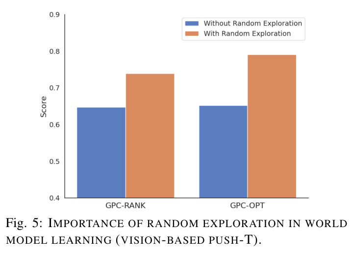

---
tags:
  - papers/WorldModel
  - robotics
  - inference-time-planning
  - diffusion-policy
aliases:
  - GPC
  - Generative Predictive Control
  - 生成式预测控制
date: 2026-02-28
doi: 10.1109/LRA.2026.3673995
arxiv_id: "2502.00622"
---

# Inference-Time Enhancement of Generative Robot Policies via Predictive World Modeling

## 核心信息

- 标题: Inference-Time Enhancement of Generative Robot Policies via Predictive World Modeling
- 标题翻译: 通过预测式世界建模在推理时增强生成式机器人策略
- 作者: Han Qi, Haocheng Yin, Aris Zhu, Yilun Du, Heng Yang
- 机构: Harvard University；Georgia Institute of Technology
- 发表时间: 2026-02-28（RA-L 接收；arXiv v4 更新于 2026-03-11，投稿于 2025-10-19）
- 发表渠道: IEEE Robotics and Automation Letters（RA-L）
- DOI: 10.1109/LRA.2026.3673995
- arXiv: 2502.00622
- 论文链接: https://arxiv.org/abs/2502.00622
- 论文类型: 机器人操作 / AI 方法论文（推理时增强，8 页短文）

## 原文摘要翻译

我们提出生成式预测控制（GPC），一个在推理时增强预训练行为克隆策略的框架。GPC 不做重训练或微调，而是在部署阶段将一个冻结的扩散策略与预测式世界模型耦合起来。具体而言，我们在专家演示和随机探索轨迹上训练一个动作条件世界模型，用它预报扩散策略所产生动作提议的后果，然后执行轻量级在线规划，通过基于模型的前瞻对这些提议进行排序与精修。这种生成式先验与预测式前瞻的组合实现了测试时自适应。在多样的机器人操作任务上——基于状态与基于视觉、在仿真与真实硬件上——GPC 一致优于标准行为克隆，并与其他推理时自适应基线相比表现更优。

## 创新点

1. **把 MPC 前瞻装到冻结策略的部署侧，而不是训练侧。** GPC 不动策略一个参数：扩散策略只负责采样合理行为，世界模型负责回答"这个提议执行后会发生什么"。这把策略学习与世界模型学习彻底解耦，两者甚至可以用不同数据集训练。
2. **世界模型的数据配方明确引入随机探索。** 只用专家数据训出的动力学模型只见过成功轨迹，评不了坏提议；作者借控制论里"充分激励"式系统辨识的思路，让人随机扰动系统、采集不解任务的探索数据，消融显示这一项值约 10 个百分点。
3. **Freeze-the-Noise：把扩散世界模型确定化以支持梯度规划。** 推理时固定初始噪声为零，让模型输出"最可能的未来"；作者明确指出不冻结噪声时 GPC-OPT 直接失败，因为随机梯度会破坏奖励优化。这是全文最有复用价值的工程机制。
4. **统一排序与精修两个规划算子，且视觉语言模型可以直接当奖励。** GPC-RANK 并行采样加选择，无超参、支持不可微奖励；GPC-OPT 以策略采样为热启动做梯度上升；奖励既可以是学习的小型卷积预测器，也可以让 ChatGPT-4o 看预测图像做零样本挑选——像素空间显式预测让这种评估成为可能，是潜空间世界模型给不了的接口。

*Fig. 1：GPC 总览。上半 GPC-RANK：策略采样多个动作提议，世界模型在"想象"中推演未来，奖励最高者被选中；下半 GPC-OPT：单个提议经由世界模型的梯度反传逐步精修。裁切完整、含原始图注，质量好。*

## 一句话总结

这篇短文做的事情很清晰：证明在冻结扩散策略之上加一个动作条件的像素空间扩散世界模型，用最朴素的排序与梯度精修就能把 Push-T 从 0.812 拉到 0.934、逼近真值仿真器规划的 0.952 上界，真机成功率从 0.3–0.5 提到 0.7；但它验证的全部是短时序桌面任务、同域小世界模型的场景，单个决策周期从约 3 秒（真机排序）到 374 秒（组合配置）的推理成本说明这目前是"离线质检"级别的增强，不是实时控制方案。

## 研究问题

行为克隆的生成式策略（diffusion policy 一类）本质上是"向后看"的：决策依据是曾经观察到的专家行为。这带来部署脆弱性——没有测试时纠错机制，小偏差随时间复合放大。MPC 则是"向前看"的：用预测模型评估候选动作的未来后果，天然支持在线适应，但传统 MPC 依赖精心工程化的模型与目标函数，很难直接接到现代生成式策略上。

论文要回答的问题因此非常具体：**能否不重训、不微调，仅靠学习到的世界模型，给预训练的冻结行为克隆策略装上 MPC 式前瞻？**拆开是三个技术问题：其一，随机策略每次采样得到不同的动作提议，选哪一个；其二，若想超越采样到的提议做连续精修，如何在世界模型与奖励模型复合出的高度非凸地形上做优化；其三，奖励从哪来——数值奖励能定义的任务训一个可微预测器，难以定义的任务怎么办。

GPC 的回答分别是：世界模型推演加奖励排序（GPC-RANK）、策略热启动加冻结噪声梯度上升（GPC-OPT）、以及可微奖励预测器与视觉语言模型零样本评估双通道。

## 数据与任务定义

### 形式化

信息向量 $I_t$ 在状态任务中是机器人与环境的低维状态历史，在视觉任务中是图像观测历史；动作块 $a_{t:t+T}$ 长度 $T+1$。三个模块的数据接口：

- 策略数据 $D^P$：人类遥操作演示，滑窗切成观测-动作对，输入观测历史、输出动作块，监督学习即可；
- 世界模型数据 $D^W$：在复用专家数据之外，额外采集人类（或其他控制器）**随机扰动系统、不解任务**的探索轨迹；每条样本用当前观测与动作块预测未来观测序列；
- 奖励模型 $R(\cdot)$：由预测出的未来观测序列给出奖励分数。

### 任务与数据规模

| 任务 | 观测 | 专家演示 | 探索/扰动数据 | 奖励定义 |
|---|---|---:|---:|---|
| 状态 Push-T（仿真） | 低维位姿 | 500 | 6×500 条扰动 + 7 条长时序演示 | 配准损失（目标与预测位姿下物体顶点的 $\ell_2$ 距离） |
| 视觉 Push-T（仿真） | 图像 | 500 | 同上 | 学习的奖励预测器（配准损失监督） |
| Triangle Drawing（仿真） | 图像 | 30 | 100 | 学习预测器 / 视觉语言模型 |
| Block Stacking（仿真） | 图像 | 50 | 100 | 学习预测器（方块距离）/ 视觉语言模型 |
| Cube & Sphere Swapping（仿真） | 图像 | 100 | 100 | 学习预测器 / 视觉语言模型 |
| 真机 Push-T | 图像 | 100 | 5 段数分钟随机玩耍视频 | 预测器由 AprilTag 状态导出的配准损失训练 |
| 真机叠衣 | 图像 | 100 | 同上 | 进度奖励：摊开为 0，每次成功抓取-移动递增，归一化后训练预测器 |

值得注意两点：探索数据非常便宜（随机扰动、不需要任务成功），且真机部署时策略与世界模型完全只吃视觉输入——低维状态信息只在训练奖励预测器时可选使用。叠衣的进度奖励是人工设计的阶段计数，说明该框架对"难以数值化的奖励"的答案一半靠视觉语言模型、一半仍靠人工设计的代理指标。

## 方法主线

### 机制流程

1. **观测历史 → 冻结扩散策略 → K 个动作提议。** 观测历史输入预训练策略（ResNet18 视觉编码加 UNet 扩散骨干，DDPM 推理 100 步去噪），并行采样 K 个动作块提议。
2. **动作提议 → 世界模型想象推演 → 未来观测序列。** 每个提议连同观测历史进入动作条件世界模型 $W(\cdot)$：状态任务用 MLP，视觉任务用递归单步条件扩散预测器（初始噪声冻结为 0，输出确定化的最可能未来），得到未来 $T+1$ 步的预测观测。
3. **预测未来 → 奖励模型 → 每个提议的分数。** 学习型 ResNet18+MLP 预测器给出可微数值奖励；或把各提议的末帧预测图（分辨率 96）连同任务描述交给 ChatGPT-4o 零样本挑选。
4. **分数 → 选择或精修 → 执行动作块。** GPC-RANK 直接选预测奖励最高的提议；GPC-OPT 以提议为初值、沿奖励对动作块的梯度做 M 步上升；选出的动作块以滚动时域方式执行（预测时域 16、执行时域 9），随后回到第 1 步。

### 两个规划算子与组合

GPC-RANK 的在线策略是从 K 个提议中选预测奖励最高者：

$$
\pi(I_t)=a^{(k^\star)}_{t:t+T},\qquad k^\star\in\arg\max_{k=1,\dots,K} R\big(W(I_t,a^{(k)}_{t:t+T})\big),
$$

优点是可并行、无超参、兼容不可微与视觉语言模型奖励。GPC-OPT 则把动作块当决策变量、直接最大化预测奖励，用策略采样热启动逃开非凸性：

$$
\hat a^{(\ell)}_{t:t+T}=\hat a^{(\ell-1)}_{t:t+T}+\eta^{(\ell)}\nabla_{a_{t:t+T}}R\big(W(I_t,\hat a^{(\ell-1)}_{t:t+T})\big),\quad \ell=1,\dots,M,
$$

梯度经自动微分穿过世界模型与奖励模型，本质是经典单次打靶法的神经网络版。两者可组合：每个提议各做若干步精修再选最优（GPC-RANK+OPT），相当于多初值优化，代价是评估次数相乘。排序并行评估、精修串行评估——这个成本结构直接决定了后面表 III 的时延数字。

> [!figure] Algorithm 1：Generative Predictive Control（GPC）
> 建议位置：两个规划算子与组合
> 放置原因：伪代码统一给出 K/M 实例化规则（M=0 退化为 GPC-RANK，K=1 且 M>0 退化为 GPC-OPT）与完整决策循环。
> 当前状态：自动裁切被质量门拒绝，人工确认该裁切无法独立成图；保留占位，关键循环已在上文公式与流程中完整转写。

### 扩散视觉世界模型与两阶段训练

视觉世界模型被设计成**递归的单步图像预测器**：$o_{t+1}=f_{vision}(o_{t-H:t},a_t)$，多步未来由递归应用产生。每个单步预测器是条件扩散模型，从白噪声出发做 $N_d$ 步去噪：

$$
o^{\tau-1}_{t+1}=D_\phi(o^\tau_{t+1},\tau,o_{t-H:t},a_t),\qquad \tau=N_d,\dots,1,
$$

去噪器 $D_\phi$ 沿用 DIAMOND [42] 的架构：卷积、动作嵌入、U-Net。关键实现选择：观测时域 $H=4$，EDM 参数化使 $N_d=3$ 步去噪就有高质量输出——这对推理成本是决定性的，因为世界模型推演占整个 GPC 运行时的 90–95%。

训练分两阶段：第一阶段只训单步预测（只监督下一帧）；第二阶段把单步预测器递归展开整个预测时域，对整段未来帧与真值联合监督。第二阶段是抑制递归误差累积的关键——这正是 AVDC 那类联合多步预测模型与本文递归设计被拉开差距的地方（见 Fig 4 的对比）。

*Fig. 2：扩散视觉世界建模。左：递归单步预测产生多步未来；右：每个单步预测器是条件扩散模型，UNet 在观测历史与动作条件下做 $N_d$ 步去噪。裁切图体与图注完整，但右侧混入了相邻栏正文文字，阅读时忽略右半即可。*

### Freeze the Noise

单步预测器因初始噪声的随机采样而随机。生成任务喜欢这种多样性，控制任务不需要：规划要隔离的是**动作**对未来的影响，不是噪声的影响。因此推理时把初始噪声固定为零，世界模型变成确定性映射，输出最可能的未来。作者明确说：不冻结噪声，GPC-OPT 失败——随机梯度会破坏上面式子的优化。这一句是全文技术上最锋利的观察：任何想对生成式模拟器做梯度规划的人都会撞上这个问题，而解法只有一行。

## 关键结果

### 主结果与强基线

状态 Push-T（表 I，IoU 指标，100 个评估种子）：

| 方法 | 配置 | 分数 |
|---|---|---:|
| Behavior Cloning | $K=1,M=0$ | 0.812 |
| GPC-RANK | $K=100$ | 0.898 |
| GPC-RANK | $K=1000$ | 0.932 |
| GPC-RANK | $K=5000$ | 0.934 |
| GPC-OPT | $K=1,M=30$ | 0.886 |
| GPC-RANK+OPT | $K=10,M=30$ | 0.912 |
| GPC-RANK+OPT | $K=20,M=30$ | 0.914 |
| GPC-RANK+OPT | $K=30,M=20$ | 0.891 |
| 真值仿真器规划（上界） | — | 0.952 |

这张表信息密度很高：

- 第一，所有 GPC 变体都超过纯行为克隆；
- 第二，排序的收益随采样数单调但明显饱和（1000→5000 只涨 0.002）——策略先验的支撑集限定了采样能达到的上限；
- 第三，最好的 GPC（0.934）距真值仿真器规划（0.952）只差 1.8 个点，这个差距就是"学习世界模型误差"的全部标价，是少见的把世界模型质量代价直接量化的协议设计；
- 第四，组合并不总赢：三十个初值、二十步梯度的 0.891 低于二十个初值、三十步梯度的 0.914，说明梯度步数比初值数量更值钱，但组合策略的收益-成本曲线并不平滑。

四个视觉仿真任务（表 II，50 个种子，所有基线同数据、同冻结策略、100 个候选）：

| 任务 | Diffusion Policy | V-GPS | LaDi-WM | DreamerV3 | GPC-RANK |
|---|---:|---:|---:|---:|---:|
| Push-T | 0.642 | 0.620 | 0.683 | 0.649 | **0.739** |
| Triangle Drawing | 0.724 | 0.593 | 0.680 | 0.732 | **0.767**（VLM 0.761） |
| Block Stacking | 0.912 | 0.972 | 0.933 | 0.983 | **0.989**（VLM 0.973） |
| Cube & Sphere Swapping | 0.680 | 0.650 | 0.410 | 0.700 | **0.730** |

GPC-RANK 四战全胜，且两类基线并不稳定：LaDi-WM 在交换任务上崩到 0.410，V-GPS 在画三角任务上反而低于纯行为克隆（0.593 对 0.724）——价值函数重排序在分布外提议上会给出误导性分数，显式推演加奖励评估更稳。

视觉语言模型奖励（10 个候选）只比学习型预测器（100 个候选）低不到一个点。考虑到它零样本、免训练，这是对"视觉语言模型当奖励替身"路线相当有利的证据，虽然只在两个任务上测了。

### 消融到底说明了什么

视觉 Push-T 上的采样宽度-梯度深度-时延三角（表 III，IoU 指标，100 个种子）：

| 方法 | 配置 | 分数 | 单决策周期时延 |
|---|---|---:|---:|
| Behavior Cloning | $K=1$ | 0.642 | 0.457 s |
| GPC-RANK | $K=50$ | 0.698 | 5.835 s |
| GPC-RANK | $K=100$ | 0.739 | 11.745 s |
| GPC-OPT | $K=1,M=25$ | 0.791 | 39.061 s |
| GPC-RANK+OPT | $K=10,M=25$ | 0.882 | 374.102 s |

- 排序约 +10%、精修约 +15%、组合最高约 +25%——但时延同时从半秒涨到 6 分钟。GPC-OPT 用 39 秒达到 0.791，超过排序用 100 个候选的水平，印证"连续精修能超越采样提议"的主张；组合配置的 0.882 展示了框架的潜力上限，工程上暂无实用性。
- **随机探索消融（Fig 5）**：视觉 Push-T 上，去掉探索数据后 GPC-RANK 从约 0.74 掉到约 0.65、GPC-OPT 从约 0.79 掉到约 0.65，各约 10 个点。只用专家数据的世界模型没见过"坏状态"，对坏提议的预测不可信，排序与梯度都会失真。这是全文机制层面最重要的一个消融。
- **生成先验不可去掉**：无热启动的纯规划基线（MPPI、CEM、纯梯度上升）在视觉 Push-T 上成功率低于 0.2。世界模型再准，在高维动作块空间裸做优化也找不到可行行为流形——先验与前瞻缺一不可，这是 GPC 立论的另一半。

*Fig. 5：随机探索数据对世界模型学习的重要性（视觉 Push-T）。蓝色为无探索数据、橙色为有探索数据，GPC-RANK 与 GPC-OPT 均提升约 10 个点。裁切干净完整。*

### 世界模型质量与真机结果

世界模型本身的预测质量是整个方法的地基。四个仿真任务上，预测帧与真值帧在约 250 帧全评估时域上的平均 SSIM 为 0.950–0.973（5 个种子）。

与基线的对比（100 个样本、10 个均匀采样预测点）：本文模型 SSIM 0.983±0.012，优于 AVDC 的 0.955±0.026 与深度视觉预见（deep visual foresight）的 0.943±0.031（真值为 1.000）。

作者的判断是：现代扩散模型让当年深度视觉预见想做而做不到的"接近物理精度的视觉预测"变得可行了——我认为这个判断成立，也是这条推理时路线在 2025 年重新活过来的根本原因。

*Fig. 3：四个视觉任务的世界模型想象推演（全部为模型预测帧），平均 SSIM 标注在每行左下（0.950–0.973）。裁切干净、含完整图注。*

> [!figure] Fig 4：不同视觉世界模型的对比（本文模型、深度视觉预见、AVDC）
> 建议位置：世界模型质量与真机结果
> 放置原因：两组预测帧序列直观展示基线的模糊化与结构漂移，SSIM 数字标在左侧。
> 当前状态：自动裁切顶端混入上方 Fig 3 图注与表 II 表注，被质量门拒绝；保留占位，SSIM 数值已在正文转写。

真机两任务各做 10 次试验（Fig 8）：Push-T 基线成功率 0.5，GPC-RANK 与 GPC-OPT 均为 0.7；叠衣基线 0.3，GPC-RANK 为 0.7。

叠衣涉及非刚体与多阶段操作，世界模型仍然能用——但每任务只有 10 次试验，0.2–0.4 的提升幅度只能算方向性信号。真机 GPC-RANK 每个决策周期约 3 秒，作者认为对操作任务够用。

*Fig. 6：真机 Push-T 轨迹。上行为基线，中行 GPC-RANK（K=10），下行 GPC-OPT（M=25）。裁切完整，底边带极窄的下一图残条。*

*Fig. 7：真机叠衣轨迹。上行为基线，下行 GPC-RANK（K=10）。图体与图注完整，顶端残留上一图注的半行文字，不影响阅读。*

*Fig. 8：真机成功率（10 次试验）。Push-T：0.5 → 0.7（排序与精修）；叠衣：0.3 → 0.7（排序）。裁切干净完整。*

## 深度分析

### 真正贡献是什么

刨掉包装，GPC 的组件几乎全部是现成的：扩散策略是 Chi 等人的原版实现，世界模型架构直接沿用 DIAMOND，排序是择优采样，精修是经典单次打靶。**真正的贡献是三个配方级发现**：

- 冻结噪声使扩散世界模型可以被当作确定性可微模拟器做梯度规划，这是此前"生成模型做规划"文献没有明说的前提；
- 世界模型数据必须掺随机探索，且这一项在消融里可量化（约 10 个点）；
- 用"真值仿真器规划"当上界的协议设计，把世界模型误差的代价（0.952 对 0.934）与规划算法的收益干净分离。

相比之下，"统一排序与精修"和"视觉语言模型当奖励"更接近工程组装——有用，但没有超出直觉的信息。

论文自己的新颖性声明（相对 LaDi-WM、DreamerV3：显式图像空间扩散世界模型、冻结噪声推理、统一排序精修、视觉语言模型直接当奖励替身）是准确的，没有明显的过度声称；标题里"增强"一词也诚实——它没有说学到了新能力，只说把冻结策略已有的能力用得更好。

### 为什么结果成立

第一层，**择优采样的统计逻辑**：扩散策略是随机策略，K 个样本中出现好提议的概率随 K 增长，世界模型加奖励只需要做对"挑选"这一件事，不需要生成任何新行为。这解释了排序通道的稳健性，也解释了它的饱和——超过一千个样本后几乎不涨，好行为的密度由策略本身决定。

第二层，**先验约束下的局部优化**：精修能超过大规模采样，是因为梯度可以走出采样支撑集、进入提议之间的连续插值区；而它不炸掉，靠的是热启动把初值放进行为流形，加上冻结噪声保证梯度信号干净。MPPI、CEM 低于 0.2 的对照说明：不是优化器不行，是没有先验时优化落在流形外。

第三层，**任务性质**：四个仿真任务视觉结构简单、动力学以准静态推压为主，SSIM 0.95 以上的世界模型预测在这种场景下接近真值，排序的信噪比自然高。这也是我对外推性保留的核心原因——预测质量掉到 0.9 以下时，排序还剩多少有效性，论文没有回答。

### 容易误读的地方

- **"不重训、不微调"不等于"免数据、即插即用"。** 世界模型和奖励预测器都要在目标任务的域内数据（含专门采集的探索数据）上训练。GPC 省掉的是改动策略的风险，不是训练成本本身。
- **"模块化解耦、可用不同数据集训练"目前只是架构性质。** 论文所有实验里世界模型与策略都在同一任务同一域的数据上训练，跨数据集的解耦优势没有被实验验证。
- **真机数字的统计强度很弱。** 每任务 10 次试验，0.5→0.7 意味着 5 次成功变 7 次成功；方向可信，幅度不可引用。另外 Fig 6 图注把 GPC-OPT 的配置误写成 K=0，应为笔误。
- **视觉语言模型奖励只在排序通道可用**（不可微），且只在两个任务上验证过；"把适用性扩展到更广任务范围"是前景陈述而非已验证的结论。
- **SSIM 高不直接等于规划有效。** SSIM 是全图结构相似度，操作任务的成败往往取决于几个像素级的物体接触细节；本文任务里两者恰好对齐，接触丰富的任务下未必。

### 复现注意点

1. 策略侧完全照搬 Diffusion Policy 标准配置：观测时域 2、预测时域 16、执行时域 9，图像缩放到高 96，ResNet18 视觉编码加 UNet 骨干，DDPM 训练 300 轮（AdamW，学习率 1e-4、权重衰减 1e-6），推理 100 步去噪。
2. 世界模型侧：观测时域 $H=4$（与策略侧不同）、EDM 参数化、$N_d=3$ 步去噪、DIAMOND 架构；两阶段训练顺序不能省——先单步、后递归展开整段联合监督。
3. 推理时必须把初始噪声冻结为零，否则 GPC-OPT 不收敛；排序通道受影响较小，但同样建议冻结以保证评估一致性。
4. 奖励通道：Push-T 用物体顶点配准损失（真机版由 AprilTag 状态导出监督信号）；叠衣用人工进度奖励归一化后训练预测器；视觉语言模型用 ChatGPT-4o、温度 0.2、每个决策查询一次，输入为各提议的末帧预测图（分辨率 96）加固定任务提示词。
5. 算力预算按表 III 规划：世界模型推演占运行时 90–95%，视觉任务排序 100 个候选单决策约 12 秒（仿真硬件），真机排序约 3 秒；组合配置的 374 秒基本只能用于离线分析。
6. 数据采集里探索数据规模不小：Push-T 的扰动数据是专家数据的 6 倍（500 条演示对 3000 条扰动），复现时不要按"少量探索"理解。
7. 论文未提供代码链接；世界模型基线（深度视觉预见、AVDC）用的是公开实现改造，AVDC 需要把语言条件改成动作条件。

## 局限

1. **推理成本是硬伤。** 作者自己承认扩散世界模型推演占运行时约 90–95%，真机排序约 3 秒每决策；这排除了动态任务，也让组合配置的 0.882 更像能力展示而非可部署配置。蒸馏、快速求解器、硬件加速被列为未来工作。
2. **任务谱窄且短时序。** 全部是桌面推压、堆叠、画线、叠衣类任务，预测时域 16 步；长时序多阶段任务下递归预测的误差累积与奖励稀疏性都没有被检验。
3. **世界模型是任务专用小模型。** 每个任务单独训练 UNet 级世界模型，没有跨任务泛化的证据；与大规模预训练视频世界模型路线相比，这里的"世界模型"更接近任务级动力学拟合器。
4. **确定化的代价未讨论。** 冻结噪声输出单一"最可能未来"，在多模态动力学（接触分叉、遮挡）下可能系统性忽略风险分支；论文没有分析这一点。
5. **评测统计强度有限。** 真机每任务 10 次试验；探索数据消融只在单任务上做；视觉语言模型奖励只测两个任务；多数表格没有报告方差。
6. **与重训路线没有对比。** 推理时增强对比"用同等额外数据做微调或残差强化学习"，哪个性价比高？论文回避了这个最自然的对照。

## 我的笔记

- 在本地研究地图上，GPC 是**推理时/测试时路线**的干净样板：世界模型放在部署侧，对冻结策略的提议先验证后执行。与 DreamZero 恰好构成光谱两端——后者把视频预测放进训练目标、让 14B 世界模型本身成为策略；GPC 把预测放在推理侧、策略与世界模型互不侵入。两条路线的隐含分歧值得记住：一边赌联合训练带来的表征迁移，一边赌解耦带来的模块化与低风险。
- GPC 基本上就是本地设计稿"测试时校验器"一格想要的东西的**学习世界模型版**：在动作块执行前检查预测未来、拒绝或重采样的构想，在这里有了带数字的原型——排序即拒绝采样，梯度精修更进一步是修复。直接的推论：把世界模型换成 GPU 并行仿真器对同一动作块做重放，排序信号在刚体域内会比学习模型更准且免训练；真值仿真器上界实验（0.952 对 0.934）其实已经替这个想法做了可行性论证——1.8 个点是学习模型误差的标价，分布外任务上只会更大。
- Freeze-the-Noise 值得写进设计稿的工程规范：在线物理裁判若要把偏差信号做成可微损失反传，同样需要冻结采样随机性，才能把梯度归因到动作而不是噪声。
- 探索数据消融（约 10 个点）间接支持设计稿里"仿真数据引擎"分支的判断：世界模型的价值取决于它对**非专家分布**的覆盖，而仿真里的随机扰动推演是最便宜的覆盖来源，比真机随机玩耍便宜几个数量级。
- 保留意见：GPC 的世界模型是任务级小 UNet，0.98 的预测精度是在视觉极简的桌面场景取得的；把同样的排序/精修配方接到 Wan、Cosmos 级通用视频骨干上时，单步去噪都要秒级，大 K 排序在计算上先崩。推理时路线要上大模型，蒸馏或潜空间评估（回到 LaDi-WM 的方向）恐怕不可避免——像素空间的可解释性优势能否保住，是个真问题。
- 相关笔记直达（DreamZero 精读、sim-anchored WAM 设计稿）：
  [[World Action Models are Zero-shot Policies]] · [[insight]]

## 引用

Qi, H., Yin, H., Zhu, A., Du, Y., Yang, H. *Inference-Time Enhancement of Generative Robot Policies via Predictive World Modeling*. IEEE Robotics and Automation Letters (2026). arXiv:2502.00622. DOI: 10.1109/LRA.2026.3673995.
