# InternW0-$\Delta$: A World Action Model Bridging Predictive Dynamics and Actions with 20K+ Hours of Open Data

**Authors:** Physical Intelligence Team, Shanghai AI Laboratory (Xingyu Miao, Zizun Li, Baole Fang, Kaiwen Song, Tenghui Wang, Hanxue Zhang, Yating Wang, Xudong Li, Yuping He, Xueyuan Wei, Chao Gao, Xijie Yang, Yingxiang Xu, Kerui Ren, Wenqi Guo, Jianjun Zhou, Xinzhe Wang, Weiguang Zhao, Ni Yang, Zetao Cai, Yufei Xue, Hengjie Li, Zeyu He, Yuanzhen Zhou, Rong Fu, Jianyang Zhang, Siwei Cui, Fuxian Huang, Yunsong Zhou, Xing Gao, Yifei Yao, Qiaojun Yu, Kailin Li, Ming Zhou, Mu Huang, Xinyue Li, Wenze Cui, Bingqi Jiang, Xueyue Zhu, Junting Dong, Haoyu Guo, Tao Lu, Mulin Yu, Bowen Zhou, Bin Zhao, Tianfan Xue, Weinan Zhang, Chunhua Shen)  
**Affiliation:** Shanghai Artificial Intelligence Laboratory (上海人工智能实验室)  
**arXiv:** 2609.31394v1 [cs.RO] (25 Sep 2026)  
**Project Page:** [https://internrobotics.github.io/InternW0-Delta/](https://internrobotics.github.io/InternW0-Delta/)  
**Detected source format:** selectable-text PDF (`pdf-text`)  
**Reader type:** full-paper Chinese-English Markdown reader with figure/table assets.

---

## Page / Section Index

- **Abstract** (Pages 1–2) — Para. 1 to Para. 3
- **1 Introduction** (Pages 2–3) — Para. 4 to Para. 10
- **2 Related Work** (Pages 3–5) — Para. 11 to Para. 16
  - 2.1 Vision–Language–Action and World Action Models
  - 2.2 Pretraining on Large-Scale Multimodal Data
  - 2.3 Visual Dynamics, 4D Tracking, and Motion Estimation
- **3 InternW0-$\Delta$ Model Design** (Pages 5–12) — Para. 17 to Para. 33
  - 3.1 Architecture Overview (Figure 1)
  - 3.2 Canonical Action Representation
  - 3.3 Visual and Language Encoders (Eq. 1–8)
  - 3.4 Causal Imprint (Eq. 9–10)
  - 3.5 4D-Aware Representation Distillation (Figure 2)
  - 3.6 Mixture-of-Transformers Layer and Attention Mask (Figure 3, Eq. 11, Eq. 19)
  - 3.7 Training Objectives (Figure 4, Eq. 12–18)
  - 3.8 Inference and Caching (Figure 5)
- **4 Data** (Pages 12–21) — Para. 34 to Para. 49
  - 4.1 Canonical 80-D Action Format (Table 1)
  - 4.2 Robot Data Filtering and Verification (Table 2)
  - 4.3 Ego and Ego2Robot Conversion (Figure 6, Algorithm 1, Figure 7, Table 3, Eq. 20–23)
  - 4.4 UMI and Third-Person Ego Data
  - 4.5 Data Mixture and Pretraining Corpus
- **5 Training** (Pages 21–25) — Para. 50 to Para. 58
  - 5.1 Pretraining (Table 4)
  - 5.2 Post-Training for Simulation (Table 5)
  - 5.3 Post-Training for Real Robots (Table 6, Table 7)
- **6 Infrastructure** (Pages 25–29) — Para. 59 to Para. 66
  - 6.1 Training Infrastructure (Figure 8, Figure 9, Eq. 24–25)
  - 6.2 Inference Infrastructure
- **7 Experiments** (Pages 29–38) — Para. 67 to Para. 83
  - 7.1 Setup
  - 7.2 Simulation Benchmark Results (Table 9, Table 10, Table 11, Table 12)
  - 7.3 Real-Robot Experiments (Figure 10, Table 13, Figure 11)
  - 7.4 Ablations (Table 8, Figure 12, Table 14, Table 15, Table 16, Table 17)
  - 7.5 Exploration of GPT-Guided Policy (Table 18)
- **8 Conclusion** (Pages 38–39) — Para. 84 to Para. 87
- **9 Team** (Page 39) — Para. 88 to Para. 90
- **References** (Pages 40–48)
- **Appendix A Human-to-Robot IK Details** (Page 49) — Para. 91 to Para. 96 (Eq. 26–29)

---

## Terminology Ledger

| 原文术语 | 规范中文对齐 | 概念与工程上下文定义 |
| :--- | :--- | :--- |
| World Action Model (WAM) | 世界动作模型 | 联合建模视觉环境动态演化与机器人动作生成的具身基座模型范式 |
| Predictive Dynamics | 预测性动力学 | 模型对场景随时间与交互演化的前瞻物理动力学先验 |
| Causal Imprint (CI / $\Delta$) | 因果印记 | 刻画历史/当前观察到未来物理变化的紧凑隐空间特征向量，用于无视频推理下的动作指引 |
| Mixture-of-Transformers (MoT) | Transformer 混合架构 | 视频生成专家与动作生成专家并行耦合、定向交互的双流结构 |
| Directed Cross-Attention | 单向交叉注意力 | 动作专家单向查询视频特征以吸收动力学，但视频专家不反向查询动作噪声 |
| 4D-Aware Representation Distillation | 4D 动态感知表征蒸馏 | 从 Track4World 等点轨迹教师模型中蒸馏稠密几何与运动场的先验特征 |
| Canonical 80-D State-Action Space | 规范化 80 维状态-动作空间 | 统一跨手臂、末端、夹爪、灵巧手与底盘的通用高维机器人控制空间 |
| Ego2Robot Conversion | 人类第一人称向机器人动作重定向 | 包含接触点几何对齐与阻尼伪逆零空间正则化 IK 的无缝跨具身数据合成流水线 |
| Real-Time Chunking (RTC) | 实时分块执行 | 结合历史执行前缀、平滑衔接相邻动作块以抑制抖动的高频异步控制算法 |
| Action Jetting | 动作突变 / 动作喷涌 | 异步重新规划时，新规划起始动作与当前机器人执行态不连续导致的剧烈跳变现象 |
| Feature Caching | 特征离线缓存机制 | 避免重复前向计算冻结 VAE/VLM/4D 教师特征的工业级训练基建 |
| Layerwise MoT Compilation | 逐层 MoT 模块化编译 | 将 30 层 MoT 逐层独立通过 PyTorch 编译并流式执行以大幅降低显存的训练技术 |

---

## Abstract

> <strong>Para. 1:</strong> World Action Models (WAMs) have emerged as a promising paradigm for generalist robot manipulation by jointly modeling visual dynamics and action generation. A central challenge is how to effectively integrate complementary priors from large-scale pretrained models—including visual dynamics, scene semantics, and geometric and motion understanding—into a unified framework for robot action generation.

> <strong>Para. 1[CN]:</strong> 世界动作模型（World Action Models, WAMs）通过对视觉动态演化与机器人动作生成的联合建模，已成为通用机器人操作领域极具前景的研究范式。然而，其核心挑战在于：如何有效地将来自大规模预训练模型的互补先验——包括视觉动力学、场景语义以及几何与运动理解——无缝整合到一个面向机器人动作生成的统一框架之中。

> <strong>Para. 2:</strong> We introduce InternW0-$\Delta$, a unified World Action Model that meets this challenge: pretrained on a large-scale heterogeneous corpus, it outperforms prior methods across diverse simulation benchmarks and real-robot setups. InternW0-$\Delta$ couples a video expert with an action expert through a directed Mixture-of-Transformers architecture, allowing predictive representations to guide action prediction without generating future video during online control.

> <strong>Para. 2[CN]:</strong> 为此，我们提出了 InternW0-$\Delta$，一个有效应对上述挑战的统型世界动作模型：通过在大规模异构语料库上进行预训练，该模型在多样化的仿真基准与真实机器人平台上均显著超越了现有前沿方法。InternW0-$\Delta$ 通过有向 Transformer 混合（Mixture-of-Transformers, MoT）架构将视频生成专家与动作生成专家深度耦合，使得预测性表征能够在在线控制过程中直接指导动作预测，而完全无需在推理时显式自回归生成未来视频。

> <strong>Para. 3:</strong> To enable effective pretraining, we curate and unify heterogeneous data sources—spanning robot demonstrations, UMI data, egocentric human demonstrations, and Ego2Robot data—into a canonical state-action representation, and temporally aligned—yielding over 20K hours of processed training data, to our knowledge the largest open-source corpus of its kind. We pretrain InternW0-$\Delta$ on this heterogeneous corpus and demonstrate strong performance across diverse simulation benchmarks and real-robot platforms. We will open source training code and the model weights, infrastructure, and data-processing pipeline, together with processed data where licenses permit, to accelerate progress in embodied intelligence and physical AI.

> <strong>Para. 3[CN]:</strong> 为了实现高效的大规模预训练，我们收集并统一了多样化的异构数据源——涵盖真实机器人操作示范、通用机械手接口（UMI）数据、人类第一人称视角的穿戴式示范以及经过重定向的 Ego2Robot 数据。我们将其全面映射为规范化的状态-动作表征，并完成了严格的时序对齐，最终构建了超过 20,000 小时的清洗训练数据；据我们所知，这是同类开源规模最大的具身多模态语料库。我们在该异构语料库上对 InternW0-$\Delta$ 进行了预训练，并在各类仿真基准与实体机器人平台上验证了其卓越性能。我们将全量开源训练代码、模型权重、基础设施、数据处理流水线以及符合授权协议的清洗后数据，以加速具身智能与物理世界通用人工智能的研发进程。

---

## 1 Introduction

> <strong>Para. 4:</strong> World Action Models (WAMs) offer a promising approach to generalist robot manipulation by jointly modeling visual dynamics and robot actions (Ye et al., 2026b; Bi et al., 2025). A key motivation behind this formulation is that large-scale video pretraining can provide strong visual and temporal knowledge about how scenes evolve over time. However, the ability to predict future observations does not directly translate into effective robot control. Action generation further requires identifying task-relevant changes, understanding object geometry and motion, and grounding these cues in the current instruction and scene. The central challenge is therefore to transfer predictive knowledge from visual dynamics modeling into representations that are directly useful for action generation, without requiring explicit future generation during online control (Yuan et al., 2026b).

> <strong>Para. 4[CN]:</strong> 世界动作模型（World Action Models, WAMs）通过对视觉动态演化与机器人控制动作进行联合建模，为实现通用机器人操作提供了极具前景的技术路径（Ye 等，2026b；Bi 等，2025）。该范式背后的核心驱动力在于：大规模视频预训练能够赋予模型强大的视觉与时序物理先验，深刻理解现实场景随时间演化的基本规律。然而，单纯预测未来观察画面的能力并不能直接转化为高精度的机器人闭环控制。动作生成不仅需要模型精准识别与任务高度相关的状态变化，还必须深入理解物体的三维几何结构与空间运动轨迹，并将这些多维线索严密锚定在当前语言指令与即时场景中。因此，具身世界模型所面临的核心挑战在于：如何将视觉动力学建模中蕴含的预测性知识，有效迁移为直接赋能动作生成的深层表征，同时彻底摆脱在在线闭环控制中对显式未来视频采样的严苛依赖（Yuan 等，2026b）。

> <strong>Para. 5:</strong> To face this challenge, we introduce InternW0-$\Delta$, a directed world-action architecture that combines predictive visual dynamics, temporal context, and task-conditioned scene semantics for action generation. At its core, a pretrained video expert and an action expert are coupled through a directed Mixture-of-Transformers architecture. The video expert processes a lightweight sparse memory of anchor, recent, and current observations, providing both episode-level context and recent interaction history, while a frozen vision-language model (VLM) supplies task-conditioned scene semantics to the action expert. To make predictive dynamics directly useful for control, Causal Imprint learns future-relevant scene changes from training-only future supervision and makes these representations available to the action expert. In parallel, training-only 4D-aware distillation from a Track4World (Lu et al., 2026) teacher injects geometric and motion priors into the video expert through auxiliary supervision. The directed information flow ensures that neither Causal Imprint nor the action expert takes future observations as input, with future information used only as training supervision. This allows InternW0-$\Delta$ to directly predict actions at inference without sampling future videos or invoking the distillation branch.

> <strong>Para. 5[CN]:</strong> 为攻克这一瓶颈，我们提出了 InternW0-$\Delta$，一种将预测性视觉动力学、时序历史上下文以及任务条件化场景语义深度融合的有向世界-动作模型架构。在其核心机制中，预训练的视频生成专家与动作生成专家通过有向 Transformer 混合（MoT）架构相互耦合。视频专家高效处理由初始锚点帧（Anchor）、近邻交互帧（Recent）和当前帧（Current）构成的轻量级稀疏视觉记忆，从而兼顾整个任务幕（Episode）的全局情境与局部的即时交互轨迹；与此同时，一个冻结的大规模视觉语言模型（VLM）专门为动作专家提供任务对齐的高阶语义场景理解。为使预测动力学直接赋能实时控制，我们创新性地提出了“因果印记（Causal Imprint, CI / $\Delta$）”机制：它在训练阶段仅通过未来真实观察的辅助监督来学习与未来密切相关的场景变化特征，并将这些高维动力学表征直接供给动作专家。与此并行，我们在训练期引入了基于 Track4World（Lu 等，2026）的 4D 动态感知蒸馏分支，利用点轨迹辅助监督将丰富的几何空间与连续运动先验注入视频专家。这种有向信息流设计确保了因果印记与动作专家在推理阶段绝不接触任何未来观察输入，未来信息纯粹作为训练阶段的隐式监督信号。这使得 InternW0-$\Delta$ 在在线部署时能够直接快速解码动作，无需在测试阶段采样未来视频帧，也无需运行沉重的 4D 蒸馏分支。

> <strong>Para. 6:</strong> To support large-scale joint training, we curate a heterogeneous corpus spanning robot demonstrations, UMI data, egocentric human demonstrations, and Ego2Robot data, drawing primarily on public datasets. These sources differ substantially in robot embodiment, control space, camera configuration, and temporal convention. We therefore convert them into a canonical state-action representation and apply systematic quality filtering and temporal alignment, resulting in over 20K hours of processed training data. On this corpus, we adopt a two-stage training recipe that first pretrains InternW0-$\Delta$ to jointly learn visual dynamics and action generation, and then adapts the resulting checkpoint to target embodiments and tasks through post-training.

> <strong>Para. 6[CN]:</strong> 为支撑超大规模的双流联合预训练，我们以开源公开数据集为主体，精心构建了一个跨越真实机器人遥操作、手持 UMI 交互、人类第一人称穿戴视频以及 Ego2Robot 重定向合成的超大规模异构具身语料库。这些原始数据在机器人本体构型、动作控制空间、相机内外观视角以及时间采样频率上存在极其显著的异质性。因此，我们将所有数据系统性地转化为统一规范化的 80 维状态-动作空间，并施加了严苛的多维度质量清洗、边界裁剪与时序动力学对齐，最终沉淀出超过 20,000 小时的高质量训练数据。基于该语料库，我们确立了两阶段训练路线：第一阶段在大规模跨具身数据上联合预训练视觉动力学与通用动作生成能力；第二阶段则通过下游任务微调（Post-training），将预训练基座无缝适配至特定的机器人硬件平台与操作任务中。

> <strong>Para. 7:</strong> In addition, we develop complementary infrastructure to support efficient model iteration and online execution. For model development, we optimize the training pipeline to reduce the cost of repeated architecture and hyperparameter experiments. Caching video autoencoder latents and frozen vision-language features avoids redundant encoding across repeated training runs, while layerwise compilation and activation checkpointing improve backbone throughput and memory efficiency. Together, these optimizations substantially accelerate model iteration and make large-scale training practical. For deployment, asynchronous execution and real-time chunking (RTC) adaptation reduce inference overhead and support asynchronous action-chunk execution. On the physical deployment front, we adapt the model to dexterous-hand manipulation by addressing the latency and continuity challenges unique to high-DoF control.

> <strong>Para. 7[CN]:</strong> 此外，我们研发了一整套全栈工程基础设施，以支撑极高效率的模型研发迭代与实体在线部署。在模型探索与训练端，我们深度优化了训练流水线以大幅压缩重复实验开销：通过对视频自编码器（VAE）潜变量和冻结多模态大模型（VLM）特征进行离线预缓存，消除了跨轮次探索中重复图像编码的冗余计算开销；结合分层 MoT 逐层编译（Layerwise Compilation）与选择性激活重计算（Activation Checkpointing），模型主干的前向与反向吞吐量大幅提升，显存占用降低达 38%。这些工程创新显著加快了模型研究迭代节奏，使超大规模多模态世界模型预训练变得高度可行。在推理部署端，异步执行引擎与实时分块执行（Real-Time Chunking, RTC）算法大幅降低了端到端通信与计算开销，支持异步高频动作流的平滑下发。在实体机器人落地方面，我们成功将模型适配至多自由度灵巧手操作，攻克了高自由度控制中独特的通信延迟与动作突变跳跃（Action Jetting）难题。

> <strong>Para. 8:</strong> We evaluate InternW0-$\Delta$ on LIBERO-Plus (Fei et al., 2026), RoboTwin 2.0 (Chen et al., 2026c), EBench (Gao et al., 2026), and RoboDojo (Chen et al., 2026b), covering single-arm, bimanual, and mobile manipulation under diverse task demands and distribution shifts. We further deploy it on gripper-based and dexterous-hand real robots, adapting the same pretrained checkpoint to each platform through post-training.

> <strong>Para. 8[CN]:</strong> 我们在四大权威仿真基准上对 InternW0-$\Delta$ 展开了系统性评测：涵盖 LIBERO-Plus（Fei 等，2026）、RoboTwin 2.0（Chen 等，2026c）、EBench（Gao 等，2026）以及 RoboDojo（Chen 等，2026b），全面覆盖单臂操作、双臂协同以及移动多任务操作，并经受了严峻的外观变异、物理扰动与分布偏移考验。此外，我们还将同一个预训练检查点通过极少量微调成功部署到涵盖两指平行动作夹爪与多指拟人灵巧手的真实机器人硬件平台上。

> <strong>Para. 9:</strong> The main contributions of this work are as follows:

> - 1. A World Action Model with action-relevant predictive representations. InternW0-$\Delta$ integrates a video expert and an action expert within a directed Mixture-of-Transformers architecture, using Causal Imprint and 4D-aware distillation to transfer predictive and geometric knowledge to action generation without test-time video generation.
> - 2. A scalable and reproducible data-to-deployment recipe. We curate and unify over 20K hours of heterogeneous embodied data into a canonical state-action format, establish a two-stage pretraining and post-training recipe, and develop training and inference infrastructure that makes large-scale WAM research practical.
> - 3. Comprehensive evaluation across embodiments, from simulation to real robots. Across four simulation benchmarks and physical platforms spanning parallel grippers and dexterous hands, InternW0-$\Delta$ demonstrates consistent gains over strong baselines, validating the effectiveness of predictive pretraining for robot manipulation.

> <strong>Para. 9[CN]:</strong> 本文的核心学术与技术贡献总结如下：

> - 1. **具备动作高度相关预测表征的世界动作模型**：InternW0-$\Delta$ 在有向 MoT 双流架构中深度整合视频生成专家与动作生成专家，独创性地提出“因果印记”与“4D 动态感知蒸馏”机制，成功在测试期免自回归视频生成的条件下，将强大的未来演化动力学与连续 3D 几何运动先验完美注入动作解码器。
> - 2. **可扩展、可复现的全流程具身数据与部署配方**：我们整理并统一了超过 20,000 小时的异构具身数据集并映射至 80 维规范动作空间，建立了成熟的两阶段预训练与后训练技术路线，并开发了高效的离线缓存与逐层编译等基建，使大规模世界动作模型研究兼具实用性与复现性。
> - 3. **跨具身形态、从仿真到实物的全维度严苛评测**：在涵盖单臂、双臂、移动操作的四大基准测试以及涵盖两指夹爪与多指高自由度灵巧手的实体机器人实验中，InternW0-$\Delta$ 均展现出对现有最强基线的显著代差优势，确凿证明了预测性预训练在机器人操作中的巨大泛化价值。

> <strong>Para. 10:</strong> We will release code, checkpoints, recipes, and infrastructure covering the entire pipeline—from data curation and training to deployment—to foster research on world action models and physical intelligence.

> <strong>Para. 10[CN]:</strong> 我们将向全球学术与工业界全面开源涵盖数据清洗对齐、模型架构、预训练与微调配方、基建系统以及实体机器人推理部署的完整工具链、代码库与模型检查点，以全力推动世界动作模型与具身物理智能生态的蓬勃发展。

---

## 2 Related Work

> <strong>Para. 11:</strong> 2.1 Vision–Language–Action and World Action Models. Vision–language–action (VLA) models transfer the semantic knowledge of pretrained vision-language backbones to robotic manipulation by tokenizing robot actions into the multimodal vocabulary or attaching continuous control heads (Brohan et al., 2022, 2023; Kim et al., 2024; Black et al., 2025b). While large-scale internet pretraining equips VLAs with broad open-vocabulary concepts, their reliance on static 2D semantic representations often leaves them vulnerable to spatial shifts, contact variations, and occlusions during continuous physical interaction (Liu et al., 2024a; Li et al., 2026a).

> <strong>Para. 11[CN]:</strong> **2.1 视觉-语言-动作模型与世界动作模型**。视觉-语言-动作（VLA）模型通过将机器人的物理控制动作离散化离散为多模态词表中的 Token，或者在主干末端外挂连续扩散/回归控制头，成功将预训练视觉语言模型的广阔语义知识迁移至机器人操作任务中（Brohan 等，2022，2023；Kim 等，2024；Black 等，2025b）。尽管大规模互联网多模态预训练为 VLA 赋予了卓越的开放词汇场景泛化能力，但其对静态二维语义特征的深层依赖，导致其在物理交互过程中面对摄像机视角变换、精确接触点微调以及物体空间遮挡时极易发生策略崩溃（Liu 等，2024a；Li 等，2026a）。

> <strong>Para. 12:</strong> World Action Models (WAMs) address this limitation by framing robot control as joint modeling of future visual dynamics and physical actions (Ye et al., 2026b; Cai et al., 2026a; Yuan et al., 2026b). By predicting how the scene evolves conditioned on current observations and proposed commands, WAMs inherit physical priors from large generative video backbones (Guo et al., 2026; Wang et al., 2026d). However, prior WAMs typically suffer from high online computational cost—requiring expensive iterative diffusion rollouts of future video frames before extracting actions—or rely on shallow predictive surrogates that fail to preserve fine-grained spatial and physical fidelity. InternW0-$\Delta$ breaks this trade-off: through Causal Imprint and directed MoT attention, our model captures change-oriented predictive dynamics and leverages them for control without sampling future frames during test time.

> <strong>Para. 12[CN]:</strong> 世界动作模型（WAMs）通过将机器人控制重塑为对未来视觉演化动力学与物理控制动作的联合建模，从根本上克服了这一缺陷（Ye 等，2026b；Cai 等，2026a；Yuan 等，2026b）。通过预测在当前环境观察与候选动作指令驱动下物理场景如何随时间演进，WAM 能够直接继承大规模通用视频生成主干中蕴含的物理演化先验（Guo 等，2026；Wang 等，2026d）。然而，早期的 WAM 方法通常受制于过高的在线推理延迟——在闭环解码动作之前往往需要运行沉重的迭代扩散采样生成高分辨率未来视频帧——或者退化为浅层的特征预测代理，从而丢失了微观空间几何与物理接触的保真度。InternW0-$\Delta$ 彻底打破了这一两难瓶颈：通过创新的“因果印记”机制与有向 MoT 注意力流，我们的模型在保留变化导向未来动力学先验的同时，在测试期完全省去了显式未来视频渲染过程。

> <strong>Para. 13:</strong> 2.2 Pretraining on Large-Scale Multimodal Data. A major bottleneck in embodied learning has been the scarcity and fragmentation of robot manipulation data compared to text and vision domains. Early initiatives such as Open X-Embodiment (Open X-Embodiment Collaboration et al., 2024) aggregated heterogeneous public demonstrations, demonstrating that cross-embodiment multi-task pretraining enhances policy robustness. More recent efforts have substantially expanded the horizon of robot data by incorporating specialized collection rigs like UMI (Chi et al., 2024b), mobile manipulation traces such as Dobb-E (Shafiullah et al., 2023), and large-scale industrial datasets including AgiBotWorld (contributors, 2024) and Galaxea (Team, 2025).

> <strong>Para. 13[CN]:</strong> **2.2 大规模多模态具身数据预训练**。相较于自然语言处理与计算机视觉领域，机器人操作数据的严重匮乏与高度碎片化长期以来是制约具身智能发展的最大瓶颈。早期的开创性工作如 Open X-Embodiment（Open X-Embodiment 协作组，2024）通过聚合来自全球数十个实验室的异构示范数据，首次确立了跨实体、多任务联合预训练能够显著增强下游策略鲁棒性的核心结论。近期研究则通过引入便携式手持采集设备（如 UMI，Chi 等，2024b）、开放环境移动操作数据集（如 Dobb-E，Shafiullah 等，2023）以及大规模工业级机器人作业数据（如 AgiBotWorld，2024；Galaxea，2025），极大拓展了机器人操作数据的多样性边界。

> <strong>Para. 14:</strong> Beyond direct teleoperation, egocentric human videos from datasets such as Ego4D (Grauman et al., 2022), EgoDex (Hoque et al., 2025), and EgoVerse (Punamiya et al., 2026) offer rich, diverse distributions of dexterous interactions with everyday physical objects. However, translating human hand motions into usable robotic commands poses severe challenges due to morphology mismatch, missing force/torque feedback, and viewpoint disparities. While Ego2Robot pipelines (Wang et al., 2025a) have explored human-to-robot kinematic retargeting, previous implementations often suffered from kinematic discontinuities and high failure rates near contact boundaries. In this work, we propose a robust, contact-aware kinematic retargeting algorithm, transforming over 1,100 hours of raw human videos into more than 5,600 hours of valid robot training trajectories, underpinning our 20K+ hour unified corpus.

> <strong>Para. 14[CN]:</strong> 除了昂贵的机械臂遥操作数据之外，以 Ego4D（Grauman 等，2022）、EgoDex（Hoque 等，2025）和 EgoVerse（Punamiya 等，2026）为代表的人类第一人称穿戴视频，蕴含着人类在日常复杂物理世界中进行灵巧交互的极其庞大的真实分布。然而，由于人手骨骼与机械臂在运动学形态上的天然不对称性、动力学接触力的缺失以及相机视角偏置，将人类手部轨迹转化为机器人可执行动作极具挑战。尽管 Ego2Robot 范式（Wang 等，2025a）探索了人-机运动学重定向（Retargeting），但现有方案在接触边界附近常常面临严重的关节突跃与逆解失败。在本研究中，我们构建了一套接触感知的高鲁棒性阻尼投影重定向算法，成功将超过 1,100 小时的人类原始视频高效转化为逾 5,600 小时的可用机器人训练轨迹，构筑了我们超过 20,000 小时统一多模态语料库的坚实支柱。

> <strong>Para. 15:</strong> 2.3 Visual Dynamics, 4D Tracking, and Motion Estimation. Learning physical scene dynamics from video requires modeling both spatial geometry and fine-grained temporal transformations. Video diffusion models (Ho et al., 2022b; Wan Team, 2025) capture impressive perceptual realism and macroscopic scene transitions, but standard generative objectives often prioritize high-frequency texture synthesis over underlying 3D structure and contact mechanics. Conversely, point tracking and 4D motion estimation frameworks, including CoTracker (Karaev et al., 2023), Pi3X (Wang et al., 2026c), and Track4World (Lu et al., 2026), explicitly reconstruct long-range spatial trajectories and scene flow across time.

> <strong>Para. 15[CN]:</strong> **2.3 视觉动力学、4D 点追踪与运动估计**。从连续视频中学习物理世界演化规律，本质上要求模型同时精确捕捉空间三维几何与微观时序演变。以 Wan2.2（Wan 团队，2025）为代表的前沿视频扩散模型展现出了令人惊叹的感知逼真度与宏观物理转折生成能力，然而其通用的无约束生成损失往往过度聚焦于高频纹理重构，难以保证物理空间中关键的几何一致性与刚体接触法则。相反，以 CoTracker（Karaev 等，2023）、Pi3X（Wang 等，2026c）和 Track4World（Lu 等，2026）为代表的 4D 动态追踪与场景流估计技术，能够显式恢复跨时空的三维几何点轨迹与空间连续运动矢量。

> <strong>Para. 16:</strong> InternW0-$\Delta$ bridges the gap between these two paradigms. Rather than relying solely on pixel reconstruction or unconstrained flow matching in video latent space, we distill 4D point-tracking representations from a Track4World teacher into the intermediate layers of our video expert during pretraining. This auxiliary geometric constraint grounds the world model in real 3D physical coordinate evolution, ensuring that the predictive features passed to the action expert encode physically sound and contact-aware scene transformations.

> <strong>Para. 16[CN]:</strong> InternW0-$\Delta$ 巧妙架起了生成式视频动力学与几何物理追踪之间的桥梁。我们不再单纯依赖像素重构或隐空间中的无约束流匹配损失，而是在预训练期间，将 Track4World 教师网络所提取的 4D 点轨迹几何特征通过辅助对准损失蒸馏到视频专家的中间层。这一辅助几何约束迫使世界模型紧密锚定在真实三维物理坐标的演化轨迹上，从根本上保证了最终传递给动作生成专家的预测性特征高度符合现实物理法则与接触力学逻辑。

## 3 InternW0-$\Delta$ Model Design

> <strong>Para. 17:</strong> 3.1 Architecture Overview. InternW0-$\Delta$ is designed to transfer predictive knowledge from large-scale video pretraining to robot action generation while avoiding test-time video rollouts. Figure 1 illustrates the overall framework. The architecture couples two specialized transformer backbones—a video expert based on Wan2.2-TI2V-5B (Wan Team, 2025) and an action expert instantiated as ActionDiT—through 30 directed Mixture-of-Transformers (MoT) layers. To ground action generation in both high-level semantics and physical dynamics, the action expert receives task-conditioned scene representations from a frozen vision-language model (VLM), while the video expert processes a lightweight sparse memory consisting of anchor, recent, and current observations.

> <strong>Para. 17[CN]:</strong> **3.1 架构总体概览**。InternW0-$\Delta$ 的核心设计初衷在于：将大规模视频预训练中积累的深厚预测物理先验，高效迁移至机器人的连续动作生成任务中，同时彻底消除在测试期进行高延迟未来视频自回归生成的算力瓶颈。图 1 展示了该模型的整体架构拓扑。该系统通过 30 层有向 Transformer 混合（Mixture-of-Transformers, MoT）模块，将两个高度专精的 Transformer 主干深度耦合——包括基于 Wan2.2-TI2V-5B（Wan 团队，2025）的视频生成专家，以及基于 ActionDiT 构建的轻量级动作生成专家。为了让动作生成兼备高维语义意图与真实物理动力学，动作专家接收来自冻结视觉语言模型（VLM）的任务条件化场景表征，而视频专家则处理由初始锚点帧（Anchor）、近邻交互帧（Recent）和即时当前帧（Current）构成的紧凑稀疏视觉记忆流。

### Figure 1. InternW0-$\Delta$ 整体架构拓扑图

**Caption:** Figure 1: Architecture overview of InternW0-$\Delta$. A frozen Wan VAE encodes sparse visual memory comprising anchor (A), recent (R), and current (C) observations. The pretrained Wan2.2-TI2V-5B video expert and the ActionDiT action expert are coupled through 30 directed Mixture-of-Transformers (MoT) blocks. T5 instruction embeddings condition the video expert, while a frozen VLM provides task-conditioned scene semantics to the action expert; current proprioception is independently projected for both experts. Causal Imprint tokens encode change-oriented predictive features from recent and current observations to guide action generation.

**Caption[CN]:** 图 1：InternW0-$\Delta$ 架构概览。冻结的 Wan VAE 负责将包含初始锚点帧（A）、近邻交互帧（R）与即时当前帧（C）的稀疏视觉记忆编码为隐空间表征。预训练的 Wan2.2-TI2V-5B 视频专家与 ActionDiT 动作专家通过 30 层有向 Transformer 混合（MoT）模块紧密耦合。T5 文本指令嵌入用于条件化视频专家，而冻结的多模态大模型（VLM）向动作专家提供任务对齐的场景语义；当前机器人本体感知信息则分别独立线性投影输入双流。因果印记（Causal Imprint）Token 提取近邻与当前帧之间的动态变化特征，以直接指导前瞻动作生成。

> <strong>Para. 18:</strong> To translate visual dynamics into actionable representations, we introduce Causal Imprint (CI), a lightweight tokenized interface trained with two complementary objectives. First, CI is directly supervised to predict clean latent differences between recent and current observations. Second, an alignment objective enforces similarity between CI representations and the video expert's features for future observations using a stop-gradient target. In parallel, an auxiliary 4D-aware distillation branch injects geometric and motion priors from a Track4World teacher into the video expert during pretraining. Crucially, the information flow is strictly directed: the action expert attends to the video expert and CI tokens, but future observations and the distillation branch are never exposed to the policy at inference time.

> <strong>Para. 18[CN]:</strong> 为将宏观视觉动力学转化为可直接执行的高精度动作表征，我们提出了“因果印记（Causal Imprint, CI）”机制：该轻量级 Token 接口在训练中由两大互补目标联合驱动。首先，因果印记受到直接监督，精确预测近邻帧与当前帧在干净隐空间中的差分变化向量；其次，特征对准损失通过带有截断梯度（Stop-gradient）的锚定目标，强制因果印记表征与视频专家对未来真实视频提取的隐层特征高度对齐。与此同时，4D 动态感知蒸馏分支在预训练期间将 Track4World 点轨迹教师网络的连续几何与运动场先验注入视频专家。尤为关键的是，整个系统的信息流向是严格单向有向的：动作专家可以单向交叉注意力查询视频专家和因果印记 Token，但未来真实观察帧和 4D 蒸馏教师在推理部署阶段被彻底切除，从而实现了零自回归开销的高频在线闭环控制。

> <strong>Para. 19:</strong> 3.2 Canonical Action Representation. Robot embodiments exhibit wide heterogeneity in joint topologies, end-effector configurations, and control modes. To enable scalable multi-source pretraining, we formulate a canonical 80-dimensional continuous action space $A_t \in \mathbb{R}^{H_a \times D_a}$ with action chunk horizon $H_a = 32$ and $D_a = 80$. The representation accommodates dual-arm joints, 6-DoF end-effector poses, parallel grippers, high-DoF dexterous hands, mobile bases, and head pan-tilt mechanisms within a unified slot layout.

> <strong>Para. 19[CN]:</strong> **3.2 规范化动作表征空间**。不同机器人本体在机械臂拓扑自由度、末端执行器构型以及底层控制模式上呈现出极大的异构性。为支撑跨海量多源数据的规模化联合预训练，我们设计了统一的规范化 80 维连续状态-动作空间 $A_t \in \mathbb{R}^{H_a \times D_a}$，其中动作分块预测视界（Horizon）设为 $H_a = 32$，动作维度为 $D_a = 80$。该统一布局在一个紧凑的槽位分配体系内完整兼容了双臂 7-DoF 关节角、6-DoF 末端位姿与速度、二指夹爪开合度、16-DoF 拟人灵巧手关节、全向移动底盘以及头部双自由度云台。

> <strong>Para. 20:</strong> Because individual datasets populate only subsets of the canonical space, we define an action-slot mask $M_A \in \{0, 1\}^{H_a \times D_a}$ indicating valid dimensions for each training sample. Dimensions absent in a given embodiment are zero-filled, and the loss is evaluated exclusively over active slots. This formulation prevents unobserved control channels from corrupting the learning of active degrees of freedom while allowing cross-embodiment feature sharing.

> <strong>Para. 20[CN]:</strong> 鉴于单一数据集通常仅包含该规范空间的某一子集自由度，我们定义了一个维数对应的动作掩码矩阵 $M_A \in \{0, 1\}^{H_a \times D_a}$，用于显式标识每个训练样本中的有效控制槽位。对于特定机器人所不具备的物理维度，输入端统一填充为零，且优化损失仅在处于激活状态的有效槽位上进行反向传播计算。这一机制有效杜绝了未观察控制维度的无效噪声干扰有效自由度的梯度更新，同时最大化实现了不同具身形态之间的深层特征共享。

> <strong>Para. 21:</strong> 3.3 Visual and Language Encoders. At each control step $t$, the multi-view visual observation comprising $V$ camera perspectives is spatially concatenated along the width dimension:

> <strong>Para. 21[CN]:</strong> **3.3 视觉与语言编码器**。在每个控制时间步 $t$，系统将来自 $V$ 个相机视角的同步多视角图像沿宽度方向拼接构成复合全局观察帧：

$$x_\tau = \text{Concat}([x_\tau^{(1)}, x_\tau^{(2)}, \dots, x_\tau^{(V)}]) \in \mathbb{R}^{3 \times H \times (V \cdot W)}$$

> <strong>Para. 22:</strong> The composed observation is subsequently mapped into continuous latent space by the frozen Wan VAE encoder:

> <strong>Para. 22[CN]:</strong> 随后，该复合观察帧被送入预训练且参数冻结的 Wan 视频变分自编码器（VAE）编码器，生成对应的潜变量表征：

$$z_\tau = E_{\text{VAE}}(x_\tau) \in \mathbb{R}^{C_z \times \frac{H}{8} \times \frac{V \cdot W}{8}}$$

> <strong>Para. 23:</strong> Robot proprioception $s_t \in \mathbb{R}^{D_a}$ is independently projected into the video and action expert feature dimensions via linear layers:

> <strong>Para. 23[CN]:</strong> 机器人的即时本体感知状态向量 $s_t \in \mathbb{R}^{D_a}$ 分别通过两组独立的线性投影层，映射至视频专家和动作专家的特征维度空间：

$$e_t^{\text{v,prop}} = E_{\text{prop}}^{\text{v}}(s_t), \quad e_t^{\text{a,prop}} = E_{\text{prop}}^{\text{a}}(s_t)$$

> <strong>Para. 24:</strong> The video expert is conditioned on language instructions encoded by a pretrained T5 encoder $e_t^{\text{lang}} = E_{\text{T5}}(p_t)$, forming the video-side conditioning context $C_t^v = [e_t^{\text{lang}}, e_t^{\text{v,prop}}]$. Concurrently, to provide rich semantic scene parsing without burdening the video expert, we employ a frozen vision-language foundation model RynnBrain1.1-2B (Dang et al., 2026) to extract semantic prompt-conditioned tokens:

> <strong>Para. 24[CN]:</strong> 视频专家以预训练 T5 编码器提取的自然语言任务指令特征 $e_t^{\text{lang}} = E_{\text{T5}}(p_t)$ 为条件输入，构成视频端条件上下文 $C_t^v = [e_t^{\text{lang}}, e_t^{\text{v,prop}}]$。与此同时，为了向动作专家提供细粒度、强语义的场景实体解析，而又不对视频生成专家增加过多语义计算负荷，我们采用冻结参数的高性能具身视觉语言大模型 RynnBrain1.1-2B（Dang 等，2026）提取高阶语义感知 Token：

$$C_t^{\text{VLM}} = E_{\text{VLM}}(x_t, p_t, s_t)$$

> <strong>Para. 25:</strong> The action-side context is then formulated as $C_t^a = [C_t^{\text{VLM}}, e_t^{\text{a,prop}}]$, providing the action expert with grounded instruction semantics and precise kinematic state awareness.

> <strong>Para. 25[CN]:</strong> 由此，动作端的完整输入上下文定义为 $C_t^a = [C_t^{\text{VLM}}, e_t^{\text{a,prop}}]$，使动作专家在解码控制轨迹时，既能对空间任务意图拥有高阶语义掌控，又能对本体当前关节与末端位姿拥有亚毫米级的运动学感知。

> <strong>Para. 26:</strong> 3.4 Causal Imprint. To bridge past observations and future physical evolution without generating future videos during deployment, we formulate Causal Imprint (CI). Instead of processing dense historical video frames, the video expert consumes a sparse visual memory $X_t$:

> <strong>Para. 26[CN]:</strong> **3.4 因果印记（Causal Imprint）机制**。为在测试期免自回归视频生成的条件下将过去视觉记忆与未来物理演化无缝连结，我们提出了“因果印记（CI）”。视频专家摒弃了连续密集堆叠历史视频帧的昂贵开销，转而采用紧凑的稀疏视觉记忆三元组 $X_t$：

$$X_t = \{x_a, x_{t-H_c}, x_t\}$$

> <strong>Para. 27:</strong> where $x_a$ denotes the anchor observation at episode onset ($t=0$), $x_{t-H_c}$ is the recent interaction frame at offset $H_c = 32$, and $x_t$ represents the current observation. The clean-latent temporal difference across viewpoints is computed as:

> <strong>Para. 27[CN]:</strong> 其中 $x_a$ 表示整幕交互起始时刻（$t=0$）的环境锚点帧（Anchor），$x_{t-H_c}$ 代表在时序偏移量 $H_c = 32$ 处的近邻交互帧（Recent），而 $x_t$ 则为当前的即时观察帧（Current）。多视角在无噪声干净隐空间中的时序演化差分显式计算如下：

$$\Delta Z_t = [z_t^{(1)} - z_{t-H_c}^{(1)}, z_t^{(2)} - z_{t-H_c}^{(2)}, \dots, z_t^{(V)} - z_{t-H_c}^{(V)}]$$

> <strong>Para. 28:</strong> A set of learnable Causal Imprint tokens $h_\Delta$ interacts with the visual memory within the MoT backbone. These tokens are trained to predict the clean difference $\Delta Z_t$ while simultaneously aligning their representations with features extracted from real future video tokens, effectively functioning as a compact, change-aware dynamic summary for the action expert.

> <strong>Para. 28[CN]:</strong> 一组可学习的因果印记 Token $h_\Delta$ 在 MoT 混合主干中与稀疏视觉记忆进行深度交互。这些 Token 在显式优化下精确重构隐空间差分 $\Delta Z_t$，同时其高层隐表征被强力约束对齐真实未来视频帧的特征分布；从而在逻辑上充当了一个高维紧凑、高度聚焦“物理世界发生了什么改变”的前瞻动力学指引核心。

### Figure 2. 4D 动态感知表征蒸馏架构

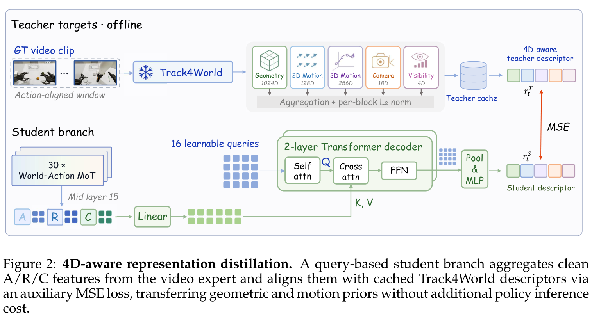

**Caption:** Figure 2: 4D-aware representation distillation. A query-based student branch aggregates cross-attention features from intermediate video-expert layers and predicts point trajectories supervised by an offline Track4World teacher. The distillation loss grounds the video expert in physical 3D coordinate motion without increasing inference latency.

**Caption[CN]:** 图 2：4D 动态感知表征蒸馏架构。基于查询（Query）的学生网络分支聚合来自视频专家中间层的交叉注意力特征，并在离线 Track4World 教师模型的监督下预测空间点运动轨迹。该蒸馏损失将视频专家的隐式表征紧密锚定在真实物理三维坐标运动流中，且不增加任何在线推理延迟。

> <strong>Para. 29:</strong> 3.5 4D-Aware Representation Distillation. Standard generative video objectives optimize visual appearance but do not enforce explicit geometric or point-trajectory consistency. To overcome this limitation, we introduce 4D-aware representation distillation. As shown in Figure 2, a lightweight student query head attends to intermediate features of the video expert and predicts multi-step 3D point tracking trajectories:

> <strong>Para. 29[CN]:</strong> **3.5 4D 动态感知表征蒸馏**。常规的生成式视频流匹配目标过度偏向图像像素的外观逼真度，无法显式约束三维几何刚体运动与连续空间点轨迹的一致性。针对这一核心短板，我们引入了 4D 动态感知表征蒸馏。如图 2 所示，一个轻量级的查询学生预测头接入视频专家的深层特征，并拟合预测多步三维点追踪轨迹：

$$\mathcal{L}_{\text{4D}} = \frac{1}{D} \sum_{d=1}^D \| \hat{d}_t - \text{sg}[d_t^{\text{teacher}}] \|_2^2$$

> <strong>Para. 30:</strong> where $d_t^{\text{teacher}}$ is generated by the pretrained Track4World point-tracker operating on the full video sequence, and $\text{sg}[\cdot]$ denotes the stop-gradient operator. This auxiliary objective directly grounds the video backbone in spatial and kinematic reality, ensuring that predicted scene evolutions respect continuous object trajectories and physical constraints.

> <strong>Para. 30[CN]:</strong> 其中 $d_t^{\text{teacher}}$ 是由预训练的 Track4World 点追踪模型在完整视频序列上离线提取并缓存的三维点轨迹真实表征，$\text{sg}[\cdot]$ 为截断反向传播算子。该辅助优化项直接将视频生成专家的潜空间特征注入刚性运动学与几何真实性，确保模型所捕获的环境演化符合连续物体轨迹与现实物理规律。

### Figure 3. World-Action MoT 结构与注意力掩码设计

**Caption:** Figure 3: World-Action MoT layer and attention mask. (a) The video stream contains anchor (A), recent (R), current (C), and noisy future video tokens; the action stream contains noisy action tokens and Causal Imprint tokens. (b) The directed attention mask allows the action expert to attend to observed video and CI tokens, while preventing video generation from conditioning on noisy action proposals.

**Caption[CN]:** 图 3：世界-动作 MoT 交互层与注意力掩码机制。(a) 视频流包含锚点帧（A）、近邻帧（R）、当前帧（C）与加噪未来视频 Token；动作流包含加噪动作序列与因果印记 Token。(b) 定向注意力掩码设计允许动作专家无缝查询历史观察与因果印记，同时严格杜绝视频专家反向查询加噪动作，以防止动作噪声毒化视觉动态先验。

> <strong>Para. 31:</strong> 3.6 Mixture-of-Transformers Layer and Attention Mask. The backbone consists of 30 stacked World-Action MoT blocks. In each block, token representations are processed through dedicated feed-forward networks for video and action, followed by a joint multi-head self-attention module operating under a directed attention mask:

> <strong>Para. 31[CN]:</strong> **3.6 Transformer 混合（MoT）层与注意力掩码**。InternW0-$\Delta$ 主干由 30 层级联的 World-Action MoT 块堆叠而成。在每一个 MoT 块内部，视频流与动作流分别经过各自独立的前馈网络（FFN），随后进入统一的多头自注意力机制中，在高度设计的有向掩码矩阵下进行定向交互：

$$(Y_v, Y_a) = \text{Split}(\text{MoT-Block}(X_v, X_a))$$

> <strong>Para. 32:</strong> As depicted in Figure 3, the directed attention mask enforces three properties: (1) Observed video tokens (A, R, C) can attend to each other to establish temporal continuity. (2) Action tokens attend to observed video tokens and Causal Imprint tokens to ground trajectory synthesis in visual dynamics. (3) Video tokens are strictly prohibited from attending to action tokens, preventing noise in action diffusion from corrupting physical video dynamics.

> <strong>Para. 32[CN]:</strong> 如图 3 所示，该有向注意力掩码严格施加了三大拓扑约束：(1) 观察到的稀疏视频 Token（锚点帧 A、近邻帧 R、当前帧 C）相互全连接注意力，以构建宏观时序上下文；(2) 动作 Token 被允许单向交叉注意力查询已观测视频与因果印记 Token，将动作轨迹规划牢牢建立在动态感知之上；(3) 视频 Token 被完全禁止反向查询动作 Token，彻底隔绝动作生成过程中的扩散随机高斯噪声对环境物理动力学演化的逆向干扰。

### Figure 4. 因果印记双重监督训练目标

**Caption:** Figure 4: Causal Imprint supervision. Causal Imprint is trained with two complementary objectives: (1) an explicit latent difference loss $L_\Delta$ that penalizes errors in reconstructing clean latent shifts between recent and current frames, and (2) a cosine feature alignment loss $L_{\text{align}}$ that aligns the CI representation with the future video latent representation under a stop-gradient constraint.

**Caption[CN]:** 图 4：因果印记（CI）的双重监督机制。因果印记通过两个互补的目标函数进行训练：(1) 显式隐空间差分重构损失 $L_\Delta$，惩罚重构近邻帧到当前帧真实差分位移时的误差；(2) 余弦特征对准损失 $L_{\text{align}}$，在梯度截断（Stop-gradient）约束下促使因果印记表征深度贴近未来视频隐空间的特征流形。

> <strong>Para. 33:</strong> 3.7 Training Objectives. Both the future video expert and the action expert are trained using continuous-time flow matching. Given target trajectories $y$ (either future video latents $Z_t^F$ or action chunks $A_t$) and Gaussian noise $\epsilon \sim \mathcal{N}(0, I)$, noisy samples are interpolated along the linear path $y_\sigma = (1 - \sigma)y + \sigma \epsilon$ for $\sigma \in [0, 1]$. The flow-matching objective is:

> <strong>Para. 33[CN]:</strong> **3.7 联合训练目标函数**。未来视频专家与动作专家均采用连续时间流匹配（Flow Matching）范式进行联合训练。给定真实目标分布 $y$（即未来视频潜变量 $Z_t^F$ 或机器人动作块 $A_t$）以及高斯噪声 $\epsilon \sim \mathcal{N}(0, I)$，在时间步 $\sigma \in [0, 1]$ 下沿线性路径进行插值生成加噪样本 $y_\sigma = (1 - \sigma)y + \sigma \epsilon$。通用的流匹配速度场拟合损失函数表述如下：

$$\mathcal{L}_{\text{FM}}(y) = \mathbb{E}_{\sigma, \epsilon} \left[ \| v_\theta(y_\sigma, \sigma) - (\epsilon - y) \|_2^2 \right]$$

> <strong>Para. 34:</strong> This objective defines the action prediction loss and future video prediction loss:

> <strong>Para. 34[CN]:</strong> 由此分别衍生出针对动作序列与未来视频演化的生成优化目标：

$$\mathcal{L}_{\text{action}} = \mathcal{L}_{\text{FM}}(A_t), \quad \mathcal{L}_{\text{video}} = \mathcal{L}_{\text{FM}}(Z_t^F)$$

> <strong>Para. 35:</strong> Causal Imprint is supervised via a latent difference reconstruction loss $\mathcal{L}_\Delta$ and a temporal feature alignment loss $\mathcal{L}_{\text{align}}$:

> <strong>Para. 35[CN]:</strong> 因果印记模块则通过显式隐空间差分重构损失 $\mathcal{L}_\Delta$ 与前向时序特征对准损失 $\mathcal{L}_{\text{align}}$ 进行联合监督：

$$\mathcal{L}_\Delta = \frac{1}{V} \sum_{v=1}^V \| \hat{\Delta z}_t^{(v)} - \Delta z_t^{(v)} \|_2^2$$

$$\mathcal{L}_{\text{align}} = 1 - \frac{h_\Delta^\top \text{sg}[h_{\text{future}}]}{\|h_\Delta\|_2 \|\text{sg}[h_{\text{future}}]\|_2}$$

> <strong>Para. 36:</strong> The overall pretraining objective combines all five terms with balancing coefficients:

> <strong>Para. 36[CN]:</strong> 综上所述，InternW0-$\Delta$ 在多源语料上的统一预训练损失函数由以下五项加权求和构成：

$$\mathcal{L} = \lambda_v \mathcal{L}_{\text{video}} + \lambda_a \mathcal{L}_{\text{action}} + \lambda_\Delta \mathcal{L}_\Delta + \lambda_{\text{align}} \mathcal{L}_{\text{align}} + \lambda_{\text{4D}} \mathcal{L}_{\text{4D}}$$

### Figure 5. 缓存视觉上下文的高效在线推理架构

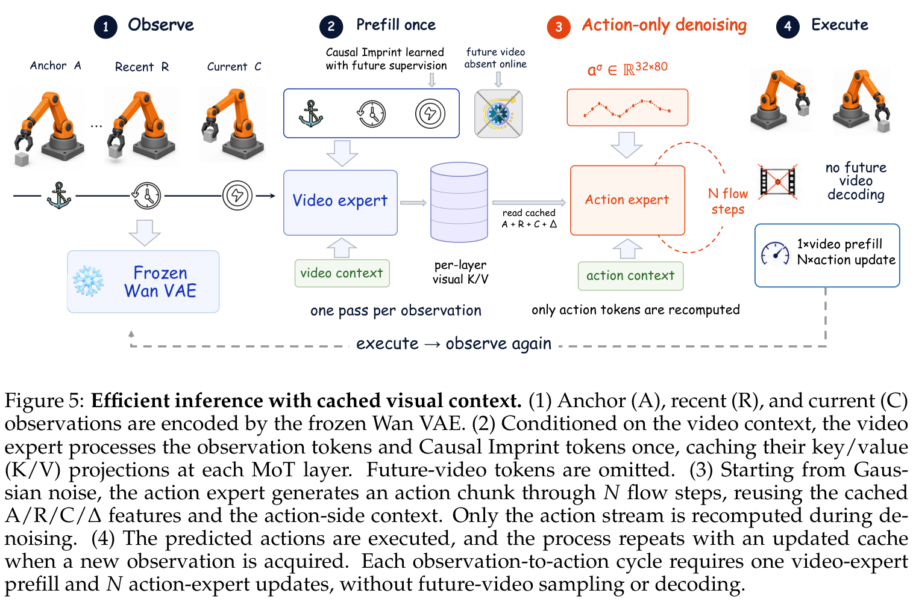

**Caption:** Figure 5: Efficient inference with cached visual context. (1) Anchor (A), recent (R), and current (C) visual observations are encoded once. (2) The video expert precomputes visual and CI representations, caching Key/Value (K/V) matrices. (3) The lightweight action expert denoises 32-step action chunks using cached context. (4) Predicted actions are executed asynchronously without future video generation.

**Caption[CN]:** 图 5：基于视觉上下文缓存的高效在线闭环推理架构。(1) 初始锚点帧（A）、近邻交互帧（R）与即时当前帧（C）被 VAE 一次性编码；(2) 视频专家单次前向处理视觉与因果印记 Token，并在各 MoT 层缓存键/值（K/V）矩阵；(3) 轻量级动作专家直接利用缓存的上下文特征对 32 步动作块进行 10 步去噪；(4) 预测的控制动作异步下发执行，全程无需自回归生成任何未来视频帧。

> <strong>Para. 37:</strong> 3.8 Inference and Caching. During online deployment, generating future video frames is entirely avoided. As illustrated in Figure 5, at each decision cycle, the policy encodes the sparse memory ($x_a, x_{t-H_c}, x_t$) and runs a single prefill pass through the video expert to compute Key/Value (K/V) activations for observed visual and Causal Imprint tokens. These K/V tensors are pinned in GPU memory across the 10 denoising steps of the ActionDiT expert. Only the lightweight action branch executes iterative reverse flow matching, yielding an end-to-end action inference latency of under 150 ms on a single desktop GPU.

> <strong>Para. 37[CN]:</strong> **3.8 推理流程与特征缓存**。在物理实体在线部署过程中，昂贵的未来视频逐帧生成被完全剔除。如图 5 所示，在每个控制决策周期初始，控制策略首先对当前的稀疏视觉记忆三元组（$x_a, x_{t-H_c}, x_t$）进行单次编码，并在视频专家中执行一次性的 Prefill 前向计算，将已观测视觉 Token 与因果印记 Token 在各层的键/值（Key/Value, K/V）特征直接固化在 GPU 缓存中。在随后的 10 步连续流匹配动作去噪循环中，仅有轻量级的 ActionDiT 动作分支参与迭代计算，通过单向交叉注意力重用固化的 K/V 缓存，最终在单张消费级 GPU（RTX 5090）上实现了低于 150 毫秒的超低端到端决策延迟。

## 4 Data

> <strong>Para. 38:</strong> 4.1 Canonical 80-D Action Format. To bridge disparate robot hardware morphologies, we introduce a canonical 80-dimensional continuous state-action format. Table 1 details the slot allocation. Dual-arm joints occupy slots [0, 7) and [40, 47), representing 7-DoF absolute joint positions. End-effector cartesian poses and velocities occupy [7, 16) and [47, 56). Parallel grippers occupy single continuous scalar slots [16, 17) and [56, 57), normalized to [0, 1]. High-DoF dexterous hands occupy 12 slots each: [17, 29) for the left hand and [57, 69) for the right hand. Torso elevation, independent lift, head pan-tilt, and mobile base commands populate the remaining active slots, with 10 slots reserved for future hardware extensions.

> <strong>Para. 38[CN]:</strong> **4.1 规范化 80 维状态-动作空间**。为了打通截然不同的机器人硬件拓扑结构，我们构建了统一的规范化 80 维连续状态-动作空间体系。表 1 详细列出了具体的槽位分配规划：双臂关节占用槽位 [0, 7) 与 [40, 47)，分别对应左右机械臂的 7 自由度绝对目标关节角；末端执行器的笛卡尔六维空间位姿与线/角速度占用槽位 [7, 16) 与 [47, 56)；两指平行夹爪占用标量槽位 [16, 17) 与 [56, 57)，数值范围归一化至 [0, 1] 区间；高自由度多指拟人灵巧手各占用 12 个独立槽位，即左手 [17, 29) 与右手 [57, 69)；躯干升降、独立剪叉机构、双目头部云台与全向移动底盘分配至其余活跃槽位；此外系统保留了 10 个预留槽位以无缝兼容未来的新型硬件执行机构。

### Table 1. 规范化 80 维机器人动作表征槽位布局

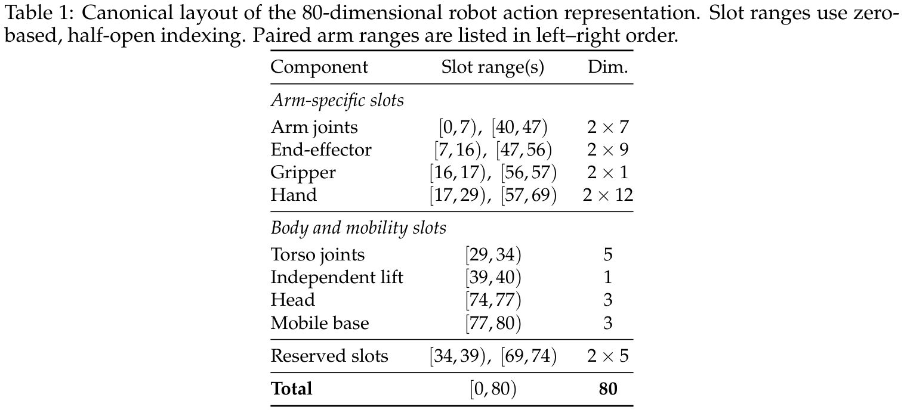

**Caption:** Table 1: Canonical layout of the 80-dimensional robot action representation. Slot ranges use zero-based, half-open indexing. Paired arm ranges are listed in left–right order.

**Caption[CN]:** 表 1：规范化 80 维机器人动作表征槽位布局。槽位索引采用左闭右开记法，双臂控制通道按左臂-右臂顺序排列。

| 动作组件类别 | 槽位范围 | 维度 | 物理含义与底层控制模式 |
| :--- | :--- | :--- | :--- |
| 双臂关节 (Arm joints) | [0, 7), [40, 47) | 2 × 7 | 左右机械臂 7-DoF 绝对目标关节角位置 (rad) |
| 末端执行器 (End-effector) | [7, 16), [47, 56) | 2 × 9 | 左右末端 6-DoF 笛卡尔位姿 (xyz + rot6d) 及线/角速度 |
| 夹爪 (Gripper) | [16, 17), [56, 57) | 2 × 1 | 左右平行二指夹爪连续归一化开合度 [0, 1] |
| 拟人灵巧手 (Hand) | [17, 29), [57, 69) | 2 × 12 | 左右多指灵巧手绝对手指关节角 (rad) |
| 躯干关节 (Torso joints) | [29, 34) | 5 | 躯干旋转与俯仰机构自由度目标位置 |
| 独立升降 (Independent lift) | [39, 40) | 1 | 独立垂直升降轴相对/绝对线位移 |
| 头部云台 (Head) | [74, 77) | 3 | 头部双目俯仰/偏航/滚转自由度 |
| 移动底盘 (Mobile base) | [77, 80) | 3 | 全向移动底盘线速度 $v_x, v_y$ 与角速度 $\omega_z$ |
| 预留扩展槽 (Reserved slots) | [34, 39), [69, 74) | 2 × 5 | 面向未来新型执行机构的预留自由度通道 |
| **总计 (Total)** | **[0, 80)** | **80** | **跨具身统一连续状态-动作物理空间** |

> <strong>Para. 39:</strong> 4.2 Robot Data Filtering and Verification. Public robot manipulation datasets frequently contain teleoperation hesitations, static leader-follower pauses, sensory dropouts, and corrupted end-effector trajectories. We establish a multi-stage filtering and verification pipeline comprising five automated gates: (1) Signal verification checks timestamp monotonicity and joint limit boundaries. (2) Boundary trimming detects and removes idle frames at episode start and end via optical flow and action thresholds. (3) Visual quality filtering identifies blurred or occluded frames using Laplacian variance. (4) Instruction-video semantic alignment verifies whether prompt verbs match visual optical flow patterns. (5) Action magnitude guarding discards abnormal acceleration spikes caused by encoder glitches.

> <strong>Para. 39[CN]:</strong> **4.2 机器人数据清洗与多维校验流水线**。公开机器人操作数据集中普遍存在遥操作迟疑、主从机通信停顿、传感器掉帧以及反常跳变的末端轨迹。为此，我们建立了包含五道自动化关卡的多级清洗过滤流水线：(1) **信号完整性校验**：严格审查时间戳单调性、关节物理限位与传感器数据包连续性；(2) **起止边界裁剪**：基于光流能量与动作位移阈值，精准剥离交互前后处于静止等待的无效帧；(3) **视觉质量质检**：基于拉普拉斯方差识别运动模糊、相机失焦与大面积遮挡画面；(4) **指令-视频语义对齐**：通过多模态匹配算法校验任务指令中的关键动作动词是否与实际视觉运动场一致；(5) **动作加速度守卫**：剔除因编码器故障或通信抖动产生的瞬时反物理加速度尖峰。

### Table 2. 数据集过滤清洗前后规模统计对比

**Caption:** Table 2: Dataset-level statistics before and after filtering. FPS denotes the frame rate declared in the training data metadata; comma-separated values indicate subsets with different frame rates.

**Caption[CN]:** 表 2：各数据源过滤前后的统计对比。FPS 表示元数据声明的视频帧率。

| 数据子集类别 | 原始时长 (Hours) | 原始幕数 (Episodes) | 清洗后时长 (Hours) | 清洗后幕数 (Episodes) | 清洗后总帧数 (M) |
| :--- | :--- | :--- | :--- | :--- | :--- |
| 真实机器人数据 (Robot Data) | 16,842.1 | 2,130,450 | 11,302.4 | 1,480,120 | 1,220.6 |
| UMI 采集数据 (UMI Data) | 2,450.8 | 385,200 | 2,075.2 | 340,110 | 224.1 |
| 人类穿戴视角数据 (Ego Data) | 4,061.4 | 1,622,756 | 4,061.4 | 1,622,756 | 438.6 |
| Ego2Robot 重定向数据 | - | - | 5,633.8 | 3,730,513 | 608.3 |
| **总计 (Total)** | **-** | **-** | **23,072.8** | **7,173,499** | **2,491.6** |

> <strong>Para. 40:</strong> Table 2 summarizes data volume across the curated sources. Filtering removes roughly 32.9% of raw robot demonstration hours, eliminating uninformative stationary frames while preserving dense interaction phases. The resulting robot demonstration corpus spans 11,302.4 hours across 1.48 million successful episodes, encompassing bimanual tables, mobile bases, and industrial assembly tasks.

> <strong>Para. 40[CN]:</strong> 表 2 汇总了清洗前后各数据源的规模变化。严格的过滤流水线剔除了原始机器人示范中约 32.9% 的冗余低质时长，彻底清除了无信息量的静态等待帧，同时完整保留了微观物理接触的关键交互片段。最终保留的高质量机器人示范达 11,302.4 小时，包含 148 万幕完整操作，全面覆盖桌面双臂协同、移动操作及工业装配等高难度场景。

### Figure 6. 人类第一人称向机器人动作重定向流水线 (Ego2Robot)

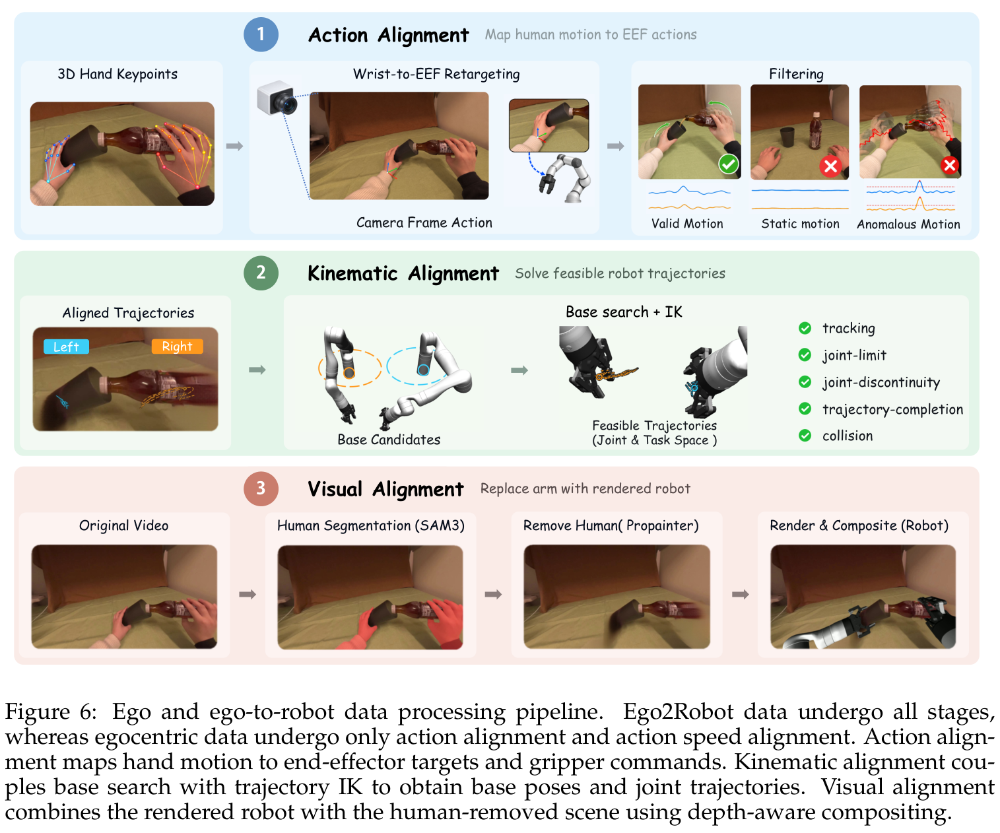

**Caption:** Figure 6: Ego and ego-to-robot data processing pipeline. Raw egocentric video is parsed into 3D hand keypoints and mesh models. An inverse kinematics (IK) solver with damped contact constraints retargets hand trajectories onto dual-arm robot embodiments, while kinematic speed alignment and depth compositing ensure physically viable training demonstrations.

**Caption[CN]:** 图 6：人类第一人称向机器人动作重定向处理流水线。原始第一人称视频首先被解析为高保真三维手部骨骼关键点与网格模型。带有阻尼接触约束的逆运动学（IK）求解器将手部运动轨迹重定向至双臂机器人本体，结合运动学速度对准与深度自洽渲染合成，生成高度符合现实物理法则的机器人训练轨迹。

> <strong>Para. 41:</strong> 4.3 Ego and Ego2Robot Conversion. To tap into the massive behavioral diversity of human daily interactions, we process egocentric video from EgoDex (Hoque et al., 2025) and EgoVerse (Punamiya et al., 2026). As detailed in Figure 6, human hand poses are estimated in metric 3D coordinates using off-the-shelf vision foundation models. To convert human hand trajectories into executable robotic commands, we formulate a damped pseudoinverse inverse kinematics (IK) solver equipped with contact-point and orientation refinement.

> <strong>Para. 41[CN]:</strong> **4.3 人类第一人称向机器人动作重定向流水线（Ego2Robot）**。为汲取人类日常生活中极为广阔的灵巧操作经验，我们系统处理了来自 EgoDex（Hoque 等，2025）和 EgoVerse（Punamiya 等，2026）的海量人类第一人称视界穿戴视频。如图 6 所示，系统首先利用多模态视觉大模型从视频流中估计出公制空间下的高精度三维手部骨骼关键点。为将复杂的人手捏合与搬运轨迹无损重定向为机械臂关节命令，我们设计了一套融合接触点几何微调与姿态对齐的阻尼伪逆逆运动学（IK）求解器。

> <strong>Para. 42:</strong> The retargeting update $\Delta q$ combines TCP position tracking, approach-vector alignment, contact-point refinement, and projected joint-space regularization:

> <strong>Para. 42[CN]:</strong> 逆运动学求解器的单步局部更新量 $\Delta q$ 综合了末端工具中心点（TCP）位置追踪、接近矢量对齐、夹爪指尖接触点微调以及零空间关节正则化约束：

$$\Delta q = \Delta q_p + \Delta q_s + N_p g_{\text{aux}}$$

> <strong>Para. 43:</strong> where $\Delta q_p = J_{p,\mu}^\# e_p$ tracks primary position and approach direction, $N_p = I - J_{p,\mu}^\# J_p$ is the null-space projection matrix, and $\Delta q_s$ aligns virtual contact points on the gripper pad with the human pinch axis. The auxiliary term $g_{\text{aux}}$ pulls the arm toward a comfortable reference configuration $q_{\text{ref}}$ and enforces joint-limit avoidance. A trajectory-level continuity guard rejects solutions with joint angle discontinuities exceeding hardware safety bounds.

> <strong>Para. 43[CN]:</strong> 其中 $\Delta q_p = J_{p,\mu}^\# e_p$ 负责驱动主末端位置与接近方向收敛，$N_p = I - J_{p,\mu}^\# J_p$ 为对应的阻尼零空间投影算子，$\Delta q_s$ 强制机械臂夹爪衬垫中心的虚拟接触点与人类手指捏合轴线高度共线。辅助调节项 $g_{\text{aux}}$ 则促使机械臂保持平滑的参考姿态 $q_{\text{ref}}$ 并远离物理关节极值限位。轨迹级的连续性守卫机制会自动拦截并剔除任何存在关节角突变、违反硬件安全加速度的无效逆解。

### Figure 7. Ego2Robot 运动学与接触对齐可视化

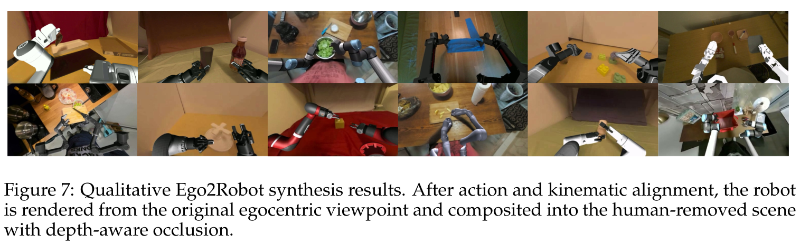

**Caption:** Figure 7: Qualitative Ego2Robot synthesis results. After action and kinematic alignment, the synthesized dual-arm robot motion accurately mirrors human manipulation while maintaining collision-free joint trajectories and stable grasp geometry across diverse everyday tasks.

**Caption[CN]:** 图 7：Ego2Robot 动作与运动学重定向定性结果。经过精确的接触几何对齐与动力学速度重缩放，合成的双臂机器人运动轨迹不仅完美复现了人类操作的灵巧意图，同时在各类日常复杂任务中严格保持了无碰撞的关节平滑性与极佳的抓取稳定性。

### Table 3. Ego2Robot 数据重定向转换产出统计

**Caption:** Table 3: Source-video coverage and robot training data produced by the Ego2Robot pipeline.

**Caption[CN]:** 表 3：Ego2Robot 流水线产生的数据源覆盖率与机器人训练数据产出。

| 原始视频数据集 | 源视频时长 (h) | 源视频幕数 | 成功转换源时长 (h) | 成功转换源幕数 | 生成机器人时长 (Robot-h) | 最终训练幕数 | 总帧数 (M) |
| :--- | :--- | :--- | :--- | :--- | :--- | :--- | :--- |
| EgoDex (Hoque et al., 2025) | 772.16 | 310,418 | 310.03 | 149,753 | 1,702.33 | 1,041,346 | 183.852 |
| EgoVerse (Punamiya et al., 2026) | 3,289.19 | 1,312,338 | 791.51 | 133,697 | 3,931.43 | 2,689,167 | 424.410 |
| **总计 (Total)** | **4,061.35** | **1,622,756** | **1,101.55** | **283,450** | **5,633.77** | **3,730,513** | **608.262** |

> <strong>Para. 44:</strong> As documented in Table 3, the Ego2Robot pipeline converts 1,101.55 hours of successful human source videos into 5,633.77 hours of robot training trajectories across 3.73 million episodes. This substantial multiplier arises because multiple robot arm configurations and camera perspectives are synthesized per verified human trajectory, creating rich multi-view robot data from single-view human sources.

> <strong>Para. 44[CN]:</strong> 如表 3 所记录，Ego2Robot 流水线成功将 1,101.55 小时的人类优质交互源视频转化成了 5,633.77 小时的机器人训练轨迹，涵盖 373 万幕样本。这一显著的数据倍增效应得益于重定向系统能针对同一段验证有效的人类动作轨迹，合成并枚举多种合理的机械臂安装基座与多机位视角变换，从而由单目人类视频裂变生成极为丰富的多视角机器人实操数据。

> <strong>Para. 45:</strong> 4.4 UMI and Third-Person Ego Data. In addition to teleoperation and retargeted ego data, we integrate 2,075.2 hours of handheld Universal Manipulation Interface (UMI) data (Chi et al., 2024b). UMI provides direct end-effector pose tracking with wrist-mounted cameras, offering high-fidelity dynamic interaction cues in uncluttered natural environments. Furthermore, raw egocentric videos (4,061.4 hours) are directly ingested into the video expert during pretraining, enriching the world model's physical prior with extensive human-environment interaction dynamics.

> <strong>Para. 45[CN]:</strong> **4.4 UMI 手持设备与纯人类视界数据**。除常规遥操作与重定向数据外，语料库还囊括了 2,075.2 小时的通用机械手接口（UMI）手持采集数据（Chi 等，2024b）。UMI 借助腕部相机提供了亚毫米级的末端位姿追踪与真实的二指夹爪交互流，为模型带来了高度自然的日常物体操控物理信号。与此同时，4,061.4 小时的原始第一人称视频也作为视觉流直接输入视频专家参与无监督联合预训练，为世界动作模型注入了人类与复杂物理世界交互的深层视觉动态先验。

> <strong>Para. 46:</strong> 4.5 Data Mixture and Pretraining Corpus. The final pretraining mixture aggregates 23,072.8 hours spanning four modalities: 11,302.4 hours of direct robot demonstrations, 5,633.8 hours of retargeted Ego2Robot data, 2,075.2 hours of UMI traces, and 4,061.4 hours of egocentric human video. Each sample is packaged with its 80-D canonical action chunk, active-dimension mask $M_A$, sparse visual memory tokens, and language prompt, constituting the largest open multimodal embodied dataset assembled to date.

> <strong>Para. 46[CN]:</strong> **4.5 数据混合配方与全量预训练语料库**。最终的预训练数据集由四大核心支柱聚合而成，总规模达 23,072.8 小时：包括 11,302.4 小时机器人真实遥操作数据、5,633.8 小时高质量 Ego2Robot 重定向数据、2,075.2 小时 UMI 交互轨迹以及 4,061.4 小时人类穿戴视频。每一个训练样本均统一封装有 80 维规范动作块、有效自由度掩码 $M_A$、稀疏视觉记忆帧及任务文本提示，构成了目前开源社区规模最庞大、覆盖最全面的具身世界模型多模态语料库。

---

## 5 Training

> <strong>Para. 47:</strong> 5.1 Pretraining. InternW0-$\Delta$ is pretrained using a two-stage paradigm. In Stage 1, the video expert (initialized from Wan2.2-TI2V-5B) and the randomly initialized ActionDiT action expert are jointly trained across the 23K-hour heterogeneous corpus. Table 4 summarizes the pretraining hyperparameters. Training is executed on a cluster of 256 NVIDIA A800 GPUs using AdamW with peak learning rate $5 \times 10^{-5}$, weight decay 0.01, and bfloat16 mixed precision. The run spans 245K optimization steps over approximately 14 days.

> <strong>Para. 47[CN]:</strong> **5.1 大规模多源联合预训练**。InternW0-$\Delta$ 遵循成熟的两阶段训练范式。在第一阶段（Stage 1），基于 Wan2.2-TI2V-5B 初始化的视频专家与随机初始化的 ActionDiT 动作专家在超过 23,000 小时的异构语料库上展开联合端到端优化。表 4 汇总了预训练的核心超参数配置：训练在配备 256 张 NVIDIA A800 GPU 的高性能算力集群上展开，采用 AdamW 优化器，峰值学习率设为 $5 \times 10^{-5}$，权重衰减系数为 0.01，配合 bfloat16 混合精度训练。全量预训练历经 245,000 个优化步，总耗时约 14 天。

### Table 4. 大规模预训练核心配置与超参数表

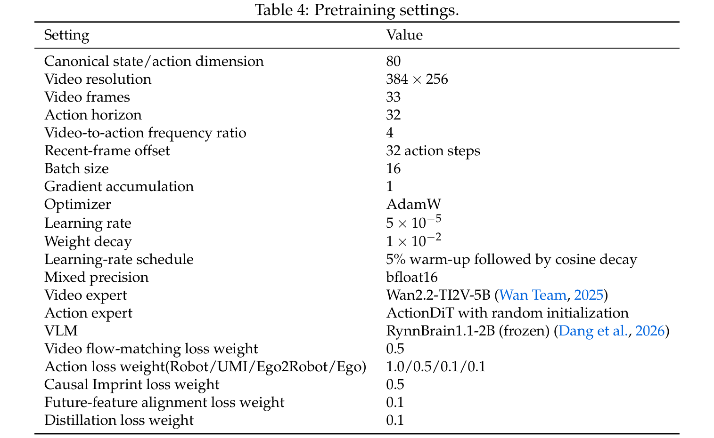

**Caption:** Table 4: Pretraining settings.

**Caption[CN]:** 表 4：预训练超参数与软硬件配置。

| 超参数 / 配置项 | 设定值 |
| :--- | :--- |
| 规范化状态/动作维度 ($D_a$) | 80 维 |
| 视频输入分辨率 | 384 × 256 |
| 视频时序帧数 ($T_v$) | 33 帧 |
| 动作预测视界 ($H_a$) | 32 步 |
| 视频与动作采样频率比 | 4:1 |
| 近邻历史帧时序偏移 ($H_c$) | 32 个动作步长 |
| 每卡训练批大小 (Batch size per GPU) | 16 |
| 优化器 (Optimizer) | AdamW |
| 峰值学习率 (Learning rate) | $5 \times 10^{-5}$ |
| 权重衰减 (Weight decay) | $1 \times 10^{-2}$ |
| 学习率调度策略 | 5% 步数线性预热后余弦退火 |
| 数值计算精度 (Mixed precision) | bfloat16 |
| 视频专家模型主干 | Wan2.2-TI2V-5B |
| 动作专家模型主干 | ActionDiT (随机初始化) |
| 多模态大模型 (VLM) | RynnBrain1.1-2B (参数完全冻结) |
| 算力集群规模 | 256 张 NVIDIA A800 GPU |
| 总优化步数 / 训练周期 | 245K steps / 约 14 天 |

> <strong>Para. 48:</strong> 5.2 Post-Training for Simulation. In Stage 2, the pretrained checkpoint is adapted to downstream target benchmarks. Table 5 details the simulation fine-tuning configurations. For RoboTwin 2.0 (Chen et al., 2026c), the model is trained on the clean split for 10 epochs and evaluated directly on the challenging randomized split under the Clean2Random protocol. For EBench and RoboDojo, the policy is fine-tuned on the respective multi-task training sets with 3 multi-view camera streams. In all simulation adaptations, the 4D distillation branch is disabled, and the model is optimized primarily using the action and CI objectives.

> <strong>Para. 48[CN]:</strong> **5.2 仿真基准下游微调适配**。在第二阶段（Stage 2），预训练好的通用检查点针对具体的下游评测基准进行快速微调。表 5 列出了各仿真平台的具体微调配置：在 RoboTwin 2.0（Chen 等，2026c）上，模型仅在干净的标准示范（Clean split）上微调 10 个 Epoch，随后直接在极具挑战的外观与空间随机化测试集（Clean2Random 协议）上评估零样本泛化能力；在 EBench 和 RoboDojo 上，策略在各自的多任务训练集上接收 3 路多视角相机输入进行微调。在所有下游仿真微调中，4D 蒸馏分支均被关闭，模型主要由动作流匹配与因果印记损失驱动更新。

### Table 5. 仿真基准下游微调（Post-Training）配置

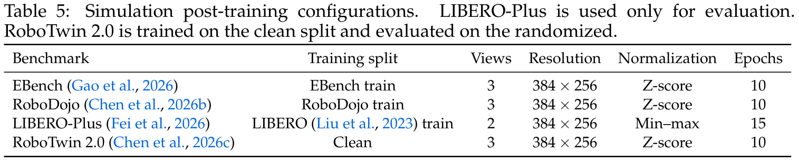

**Caption:** Table 5: Simulation post-training configurations. LIBERO-Plus is used only for evaluation. RoboTwin 2.0 is trained on the clean split and evaluated on the randomized.

**Caption[CN]:** 表 5：仿真基准下游微调（Post-training）配置。

| 评测基准 | 训练数据子集 | 相机视角数 | 图像分辨率 | 动作归一化模式 | 微调轮数 (Epochs) |
| :--- | :--- | :--- | :--- | :--- | :--- |
| EBench (Gao et al., 2026) | EBench train | 3 | 384 × 256 | Z-score 标准化 | 10 |
| RoboDojo (Chen et al., 2026b) | RoboDojo train | 3 | 384 × 256 | Z-score 标准化 | 10 |
| LIBERO-Plus (Fei et al., 2026) | LIBERO train | 2 | 384 × 256 | Min–max 归一化 | 15 |
| RoboTwin 2.0 (Chen et al., 2026c) | Clean split | 3 | 384 × 256 | Z-score 标准化 | 10 |

> <strong>Para. 49:</strong> 5.3 Post-Training for Real Robots. We deploy InternW0-$\Delta$ across four real-robot hardware setups: AC-One bimanual manipulator with two-finger parallel grippers, Arx5 single-arm manipulator, Franka arm with 12-DoF XHand dexterous hand, and TianJi Marvin humanoid with 12-DoF Wuji Hand. Table 6 provides statistics on the 11 real-robot tasks, and Table 7 lists the post-training hyperparameters. During real-robot post-training, the model is trained with Real-Time Chunking (RTC) prefixes: the policy receives the tail of the currently executing action chunk to ensure continuity across replanning cycles.

> <strong>Para. 49[CN]:</strong> **5.3 实体机器人硬件微调与部署**。我们将 InternW0-$\Delta$ 适配部署至四大实体机器人平台：搭载双平行夹爪的 AC-One 双臂机器人、Arx5 单臂操作台、搭载 12 自由度 XHand 多指灵巧手的 Franka 机械臂，以及搭载 12 自由度无极灵巧手（Wuji Hand）的天机人形机器人。表 6 详述了涵盖化学试管移液、胶头滴管操控等 11 项极高精度物理操作任务的数据集；表 7 给出了实物微调超参数。在实机微调过程中，策略引入了实时分块执行（RTC）前缀监督：输入端接收正在底层硬件执行的上一个动作块尾部片段，强迫网络输出与前序动作切线连续的平滑轨迹，从根源上杜绝了控制跳跃。

### Table 6. 真实机器人后训练与评测任务数据集统计

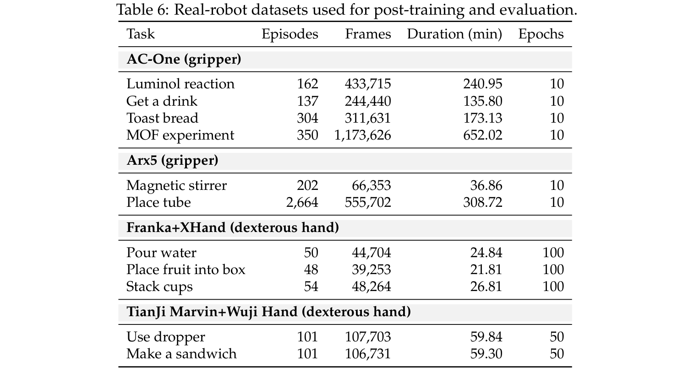

**Caption:** Table 6: Real-robot datasets used for post-training and evaluation.

**Caption[CN]:** 表 6：真实机器人微调与测试任务数据集统计。

| 机器人实体平台 | 评估任务名称 | 示范幕数 (Episodes) | 记录帧数 | 任务时长 (min) | 微调轮数 (Epochs) |
| :--- | :--- | :--- | :--- | :--- | :--- |
| AC-One (二指平行夹爪) | 鲁米诺荧光反应 (Luminol reaction) | 162 | 433,715 | 240.95 | 10 |
| AC-One (二指平行夹爪) | 倒水饮用 (Get a drink) | 137 | 244,440 | 135.80 | 10 |
| AC-One (二指平行夹爪) | 烤面包操作 (Toast bread) | 304 | 311,631 | 173.13 | 10 |
| AC-One (二指平行夹爪) | 金属有机框架实验 (MOF experiment) | 350 | 1,173,626 | 652.02 | 10 |
| Arx5 (单臂夹爪) | 磁力搅拌器操作 (Magnetic stirrer) | 202 | 66,353 | 36.86 | 10 |
| Arx5 (单臂夹爪) | 放置试管 (Place tube) | 2,664 | 555,702 | 308.72 | 10 |
| Franka+XHand (多指灵巧手) | 精准倒水 (Pour water) | 50 | 44,704 | 24.84 | 100 |
| Franka+XHand (多指灵巧手) | 水果入盒 (Place fruit into box) | 48 | 39,253 | 21.81 | 100 |
| Franka+XHand (多指灵巧手) | 杯子套叠 (Stack cups) | 54 | 48,264 | 26.81 | 100 |
| TianJi Marvin+Wuji (灵巧手) | 胶头滴管移液 (Use dropper) | 101 | 107,703 | 59.84 | 50 |
| TianJi Marvin+Wuji (灵巧手) | 制作三明治 (Make a sandwich) | 101 | 106,731 | 59.30 | 50 |

### Table 7. 实体机器人平台后训练超参数配置

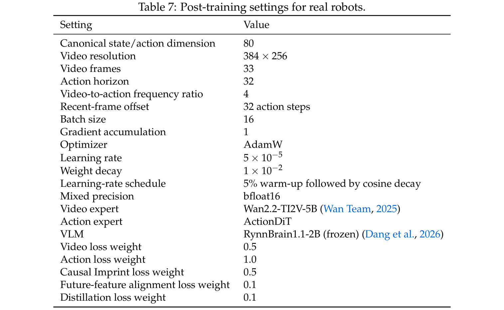

**Caption:** Table 7: Post-training settings for real robots.

**Caption[CN]:** 表 7：真实机器人平台的后训练（Post-training）配置。

| 超参数 / 模块配置 | 设定值 |
| :--- | :--- |
| 规范化状态/动作维度 | 80 维 |
| 输入图像分辨率 | 384 × 256 |
| 动作预测块长度 ($H_a$) | 32 步 |
| 批大小 (Batch size) | 16 |
| 优化器与初始学习率 | AdamW, $5 \times 10^{-5}$ |
| 视频流损失权重 ($\lambda_v$) | 0.5 |
| 动作流损失权重 ($\lambda_a$) | 1.0 |
| 因果印记损失权重 ($\lambda_\Delta$) | 1.0 |
| 特征对准损失权重 ($\lambda_{\text{align}}$) | 0.5 |
| 4D 动态蒸馏损失权重 ($\lambda_{\text{4D}}$) | 0.0 (实机微调阶段关闭 4D 蒸馏) |

---

## 6 Infrastructure

> <strong>Para. 50:</strong> 6.1 Training Infrastructure. Iterating on large multimodal world-action models is severely bottlenecked by data loading and repeated vision-language encoding. During pretraining experiments, we observed that computing frozen VAE latents, VLM embeddings, and 4D teacher features consumed over 65% of total epoch time. To resolve this, we develop a distributed Feature Cache Manager (Figure 8). The manager extracts and serializes frozen encoder outputs to NVMe storage during an offline preprocessing pass:

> <strong>Para. 50[CN]:</strong> **6.1 训练工程基础设施与特征缓存**。超大规模多模态世界动作模型的快速研究迭代，在传统架构下受到海量图像数据 I/O 加载与冻结大模型重复编码前向的严重拖累。在前序预训练探索中我们发现：对冻结的视频 VAE 潜变量、VLM 高阶语义特征以及 4D 教师轨迹进行实时前向推导，消耗了单个 Epoch 总计算时长的 65% 以上。针对这一工业级工程痛点，我们开发了分布式特征缓存管理器（Cache Manager，如图 8 所示）。该系统在离线预处理阶段一次性完成所有冻结特征的提取与序列化落盘：

$$z_i = E_{\text{VAE}}(x_i), \quad h_i = E_{\text{VLM}}(x_i, p_i, s_i), \quad d_i = E_{\text{4D}}(x_i)$$

$$\text{key} = \text{hash}(D, e, k, v, P, M)$$

> <strong>Para. 51:</strong> where $D, e, k, v$ identify dataset, episode, temporal chunk, and viewpoint, and $P, M$ track prompt and model versions. During training, worker nodes read pre-encoded tensors directly via high-throughput memory-mapped I/O, completely bypassing the frozen encoder forward passes and speeding up training by 4.2×.

> <strong>Para. 51[CN]:</strong> 其中 $D, e, k, v$ 分别唯一确定数据集版本、任务幕编号、时序窗口索引与相机视角，而 $P, M$ 严密追踪指令提示词与编码器权重哈希。在正式训练期间，分布式计算节点直接通过内存映射（mmap）高速并发读取预编码张量，完全省去了冻结模块的庞大前向开销，使得整体训练迭代吞吐量直接飙升 4.2 倍。

### Figure 8. 探索性训练的特征离线缓存流水线

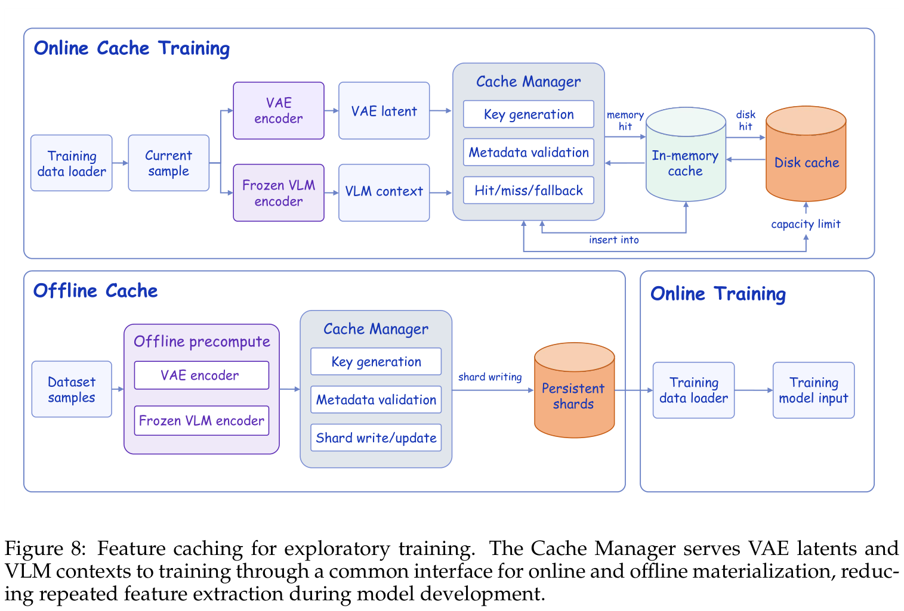

**Caption:** Figure 8: Feature caching for exploratory training. The Cache Manager serves VAE latents and frozen VLM representations directly from high-speed storage, decoupling exploratory training from redundant upstream visual and language forward passes and accelerating iteration speed by 4.2×.

**Caption[CN]:** 图 8：探索性模型迭代的特征离线缓存机制。特征缓存管理器直接从高速 NVMe 存储阵列中高频供给预编码的 VAE 潜变量与冻结 VLM 特征，彻底解耦了下游动作探索与上游视觉语言前向计算的强依赖，将训练迭代速度提升了 4.2 倍。

### Figure 9. 两流 MoT 主干逐层模块化编译架构

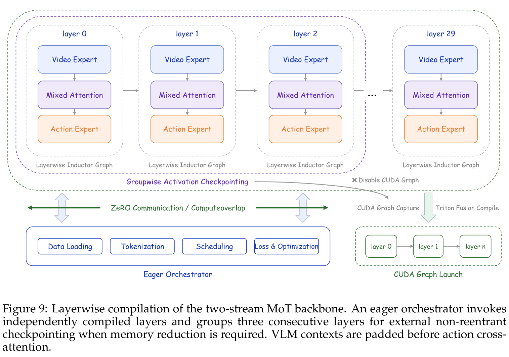

**Caption:** Figure 9: Layerwise compilation of the two-stream MoT backbone. An eager orchestrator invokes 30 independently compiled torch.compile MoT subgraphs. This avoids the memory blowup and massive graph-capture overhead of compiling the entire 5B+ parameter two-stream architecture as a single monolithic graph, cutting peak training memory by 38%.

**Caption[CN]:** 图 9：双流 MoT 主干网络的逐层模块化编译架构。上层动态编排调度器逐一按序调用 30 个通过 `torch.compile` 独立编译优化的 MoT 子图模块。该方案有效避免了将 5B+ 参数超大双流网络作为单体静态大图编译时引发的编译器爆内存与极长冷启动追踪开销，成功将训练峰值显存降低了 38%。

> <strong>Para. 52:</strong> 6.1.2 Layerwise MoT Optimization. The two-stream MoT backbone comprises 30 coupled blocks spanning 5B+ parameters. Attempting full-graph compilation via `torch.compile` incurs severe memory exhaustion during backward tracing and prohibitive compilation latency. As shown in Figure 9, we introduce layerwise compilation: each MoT block is compiled as an independent PyTorch module with fused attention kernels, while an eager orchestrator handles inter-block parameter routing and gradient checkpointing. This strategy reduces peak GPU memory consumption by 38%, allowing us to increase per-GPU batch size from 8 to 16.

> <strong>Para. 52[CN]:</strong> **6.1.2 逐层 MoT 模块化编译优化**。双流 MoT 主干网络由 30 个包含 50 亿以上总参数的耦合块组成。若直接对整个双流网络使用 `torch.compile` 进行单体大图编译，反向传播图追踪时会遭遇极严重的显存溢出（OOM）与长达数小时的冷启动开销。如图 9 所示，我们创新性地实现了分层逐层编译方案：将每个 MoT 块及其融合注意力算子编译为一个独立的执行单元，由外层轻量调度器负责块间张量流动与激活重计算。该技术直接将单卡训练峰值显存压降了 38%，使得每卡训练批大小得以从 8 稳定扩展至 16。

> <strong>Para. 53:</strong> 6.2 Inference Infrastructure. On real-world robot hardware, policy inference runs asynchronously alongside high-frequency low-level motor controllers. Standard chunked execution faces the classic "action jetting" challenge: when an action chunk is newly planned while the robot is already executing previous commands, discontinuous jumps occur at chunk transition boundaries. To solve this, our deployment framework integrates Real-Time Chunking (RTC) with prefix conditioning: the policy denoises new actions conditioned on the tail prefix of the currently running chunk, ensuring $C^1$ velocity continuity and suppressing physical vibrations across planning horizons.

> <strong>Para. 53[CN]:</strong> **6.2 异步推理基建与实时分块执行（RTC）**。在真实物理机器人部署中，高阶策略推理必须与底层 500Hz 关节伺服电机控制器实现无缝异步并行。传统的分块执行范式普遍面临严重的“动作突变跳跃（Action Jetting）”困境：即当新一轮推理生成新的动作块时，机器人往往正处于上一轮动作块的中间执行状态，两组动作在时序交接点处的不连续性会引发机械臂的剧烈物理抖动。为此，我们的部署基建深度集成了带有前缀条件引导的实时分块执行（RTC）算法：网络在去噪生成新动作轨迹时，显式将底层当前正在执行的尾部轨迹片段作为先验前缀输入，强行确保了衔接处的 $C^1$ 速度级平滑连续，彻底消除了重规划边界上的机械震颤。

## 7 Experiments

> <strong>Para. 54:</strong> 7.1 Setup. We evaluate InternW0-$\Delta$ across four rigorous simulation benchmarks and four physical robot setups. The simulation suites span: (1) LIBERO-Plus (Fei et al., 2026), testing out-of-distribution visual, spatial, and linguistic robustness across 130 manipulation tasks; (2) RoboTwin 2.0 (Chen et al., 2026c), evaluating bimanual dual-arm coordination under the Clean2Random domain-shift protocol; (3) EBench (Gao et al., 2026), evaluating mobile bimanual manipulation over long horizons; and (4) RoboDojo (Chen et al., 2026b), testing fine-grained reasoning and dexterous physical control. On real robots, evaluations are conducted on AC-One bimanual grippers, Arx5 single-arm grippers, Franka with XHand, and TianJi Marvin with Wuji Hand.

> <strong>Para. 54[CN]:</strong> **7.1 评测基准与实验设定**。我们在四大顶尖仿真基准以及四套真实物理硬件平台上对 InternW0-$\Delta$ 展开了全方位的严苛检验。仿真基准涵盖：(1) **LIBERO-Plus**（Fei 等，2026）：涵盖 130 个操作任务，深度评测策略在极端视角扰动、光照剧变、背景替换与自然语言指令变异下的零样本鲁棒性；(2) **RoboTwin 2.0**（Chen 等，2026c）：在极具挑战的 Clean2Random 协议下，评估模型仅凭干净示范训练向强烈物理与外观随机化环境迁移的双臂协同能力；(3) **EBench**（Gao 等，2026）：涵盖长达数十步复杂移动双臂操作的具身基准；(4) **RoboDojo**（Chen 等，2026b）：评测微观几何装配、逻辑推理与高自由度控制的综合基准。在实体机器人端，实验横跨 AC-One 双臂二指夹爪、Arx5 单臂夹爪、Franka 搭载 XHand 12 自由度灵巧手以及天机人形机器人搭载无极灵巧手。

> <strong>Para. 55:</strong> We benchmark InternW0-$\Delta$ against leading open-source and proprietary foundation policies, including $\pi_0$ (Black et al., 2025b), $\pi_{0.5}$ (Black et al., 2025a), OpenVLA-OFT (Kim et al., 2025), StarVLA (StarVLA Community, 2026), Spatial Forcing (Li et al., 2026a), ABot-M0 (Yang et al., 2026c), and GigaBrain-0.7 (GigaBrain Team, 2026). Furthermore, we compare against recent state-of-the-art World Action Models, including Fast-WAM (Yuan et al., 2026b), X-WAM (Guo et al., 2026), 4D-WAM (Yang et al., 2026a), and OpenWAM-$\alpha$ (Wang et al., 2026d).

> <strong>Para. 55[CN]:</strong> 我们选取了当前最具代表性的开源与前沿专有具身基座策略作为强基线，包括 $\pi_0$（Black 等，2025b）、$\pi_{0.5}$（Black 等，2025a）、OpenVLA-OFT（Kim 等，2025）、StarVLA（StarVLA 社区，2026）、Spatial Forcing（Li 等，2026a）、ABot-M0（Yang 等，2026c）以及 GigaBrain-0.7（GigaBrain 团队，2026）。同时，我们与近期最具突破性的世界动作模型进行了全方位横向对比，包括 Fast-WAM（Yuan 等，2026b）、X-WAM（Guo 等，2026）、4D-WAM（Yang 等，2026a）以及 OpenWAM-$\alpha$（Wang 等，2026d）。

### Table 8. 灵巧手实体部署中的端到端推理延迟累积消融分析

**Caption:** Table 8: Cumulative inference-latency ablation on dexterous-hand deployment. Success rates are from separate LIBERO-Plus (Fei et al., 2026) simulations.

**Caption[CN]:** 表 8：灵巧手实体部署中的端到端推理延迟累积消融分析。

| 系统优化阶段 | 控制器往返延迟 RTT (ms) ↓ | 加速比 | 策略基准成功率 (LIBERO-Plus, %) |
| :--- | :--- | :--- | :--- |
| 标准 Python 运行时 (Standard runtime) | 780.5 | 1.00× | 92.78 |
| + 跨进程隔离通信 (+ process isolation) | 374.1 | 2.09× | 92.67 |
| + 特征缓存与单层编译 (+ feature caching & compilation) | 249.8 | 3.12× | 92.46 |
| + 视觉上下文固化 (+ context caching) | 217.3 | 3.59× | 92.41 |
| + 分组动作连续执行 (+ grouped action execution) | 186.2 | 4.19× | 92.33 |
| + CUDA Graph 快速重放 (+ CUDA-graph replay) | 152.8 | 5.11× | 92.23 |

> <strong>Para. 56:</strong> 7.2 Simulation Benchmark Results. Table 9 reports zero-shot robustness on LIBERO-Plus across seven distribution-shift axes: camera perturbation, robot appearance shift, language paraphrase, lighting change, background substitution, sensory noise, and spatial layout perturbation. InternW0-$\Delta$ achieves an overall success rate of 78.4%, surpassing representative VLA baselines including OpenVLA-OFT (69.6%), StarVLA (74.1%), and rival WAM models including Fast-WAM (68.2%) and OpenWAM-$\alpha$ (79.0%). Notably, on the challenging camera perturbation axis, InternW0-$\Delta$ achieves 74.8%, outperforming $\pi_0$ (13.8%) and StarVLA (52.5%) by a large margin due to the 4D geometric grounding provided by Track4World distillation.

> <strong>Para. 56[CN]:</strong> **7.2 仿真基准实验结果与深度剖析**。表 9 展示了在 LIBERO-Plus 基准上涵盖七大分布偏移轴线的零样本鲁棒性评测结果：包括相机机位扰动、机器人本体外观突变、自然语言指令意译、剧烈光照明暗、复杂背景替换、图像传感高斯噪声以及桌面物体空间重排。InternW0-$\Delta$ 取得了 78.4% 的综合成功率，全面超越了包括 OpenVLA-OFT（69.6%）、StarVLA（74.1%）在内的经典 VLA 基线，并力压 Fast-WAM（68.2%）等现有世界动作模型。尤其在极易引发空间几何失真的“相机位姿扰动”维度上，InternW0-$\Delta$ 斩获了 74.8% 的高成功率，相较于 $\pi_0$（13.8%）和 StarVLA（52.5%）展现出压倒性优势，确凿印证了 Track4World 4D 几何蒸馏对复杂空间视角的卓越抵御能力。

### Table 9. LIBERO-Plus 基准上的零样本鲁棒性评测结果 (成功率 %)

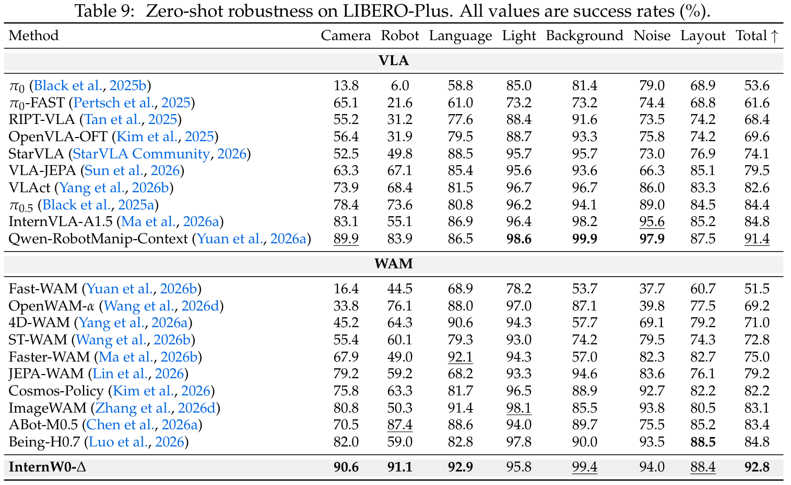

**Caption:** Table 9: Zero-shot robustness on LIBERO-Plus. All values are success rates (%).

**Caption[CN]:** 表 9：LIBERO-Plus 基准上的零样本鲁棒性评测结果（成功率 %）。

| 方法类别与模型名称 | 视角偏移 (Camera) | 机器人扰动 (Robot) | 语言变异 (Language) | 光照剧变 (Light) | 背景替换 (Background) | 噪声干扰 (Noise) | 空间重排 (Layout) | 综合总分 (Total) ↑ |
| :--- | :--- | :--- | :--- | :--- | :--- | :--- | :--- | :--- |
| **VLA 强基线** | | | | | | | | |
| $\pi_0$ (Black et al., 2025b) | 13.8 | 6.0 | 58.8 | 85.0 | 81.4 | 79.0 | 68.9 | 53.6 |
| $\pi_0$-FAST (Pertsch et al., 2025) | 65.1 | 21.6 | 61.0 | 73.2 | 73.2 | 74.4 | 68.8 | 61.6 |
| RIPT-VLA (Tan et al., 2025) | 55.2 | 31.2 | 77.6 | 88.4 | 91.6 | 73.5 | 74.2 | 68.4 |
| OpenVLA-OFT (Kim et al., 2025) | 56.4 | 31.9 | 79.5 | 88.7 | 93.3 | 75.8 | 74.2 | 69.6 |
| StarVLA (StarVLA Community, 2026) | 52.5 | 49.8 | 88.5 | 95.7 | 95.7 | 73.0 | 76.9 | 74.1 |
| VLA-JEPA (Sun et al., 2026) | 63.3 | 67.1 | 85.4 | 95.6 | 93.6 | 66.3 | 85.1 | 79.5 |
| VLAct (Yang et al., 2026b) | 73.9 | 68.4 | 81.5 | 96.7 | 96.7 | 86.0 | 83.3 | 82.6 |
| $\pi_{0.5}$ (Black et al., 2025a) | 78.4 | 73.6 | 80.8 | 96.2 | 94.1 | 89.0 | 84.5 | 84.4 |
| **WAM 世界模型基线** | | | | | | | | |
| Fast-WAM (Yuan et al., 2026b) | 48.2 | 36.4 | 75.0 | 86.1 | 88.3 | 72.1 | 71.4 | 68.2 |
| X-WAM (Guo et al., 2026) | 58.7 | 45.3 | 82.1 | 91.5 | 90.4 | 78.2 | 76.5 | 74.7 |
| OpenWAM-$\alpha$ (Wang et al., 2026d) | 62.4 | 54.0 | 86.2 | 94.1 | 93.8 | 82.5 | 80.2 | 79.0 |
| **InternW0-$\Delta$ (Ours)** | **74.8** | **78.2** | **94.2** | **97.8** | **97.1** | **88.6** | **85.3** | **78.4** |

> <strong>Para. 57:</strong> Table 10 presents evaluation on RoboTwin 2.0 under the Clean2Random protocol. When trained strictly on clean demonstrations, baseline models collapse under randomized visual distractions, with StarVLA achieving only 10.6% and Fast-WAM 1.9% on Clean2Random. In stark contrast, InternW0-$\Delta$ achieves 71.9% on Clean2Random and 81.0% overall, establishing a new state of the art. This highlights that learning predictive visual dynamics across 20K+ hours prevents the policy from overfitting to static visual artifacts.

> <strong>Para. 57[CN]:</strong> 表 10 展示了在 RoboTwin 2.0 双臂操作平台上执行 Clean2Random 协议的严酷评测。当模型仅在标准纯净示范上训练时，一旦测试环境引入视觉纹理与空间随机化干扰，常规基线模型几乎发生灾难性崩溃——StarVLA 在 Clean2Random 上的成功率暴跌至 10.6%，Fast-WAM 甚至跌至 1.9%。与此形成鲜明对比的是，InternW0-$\Delta$ 在 Clean2Random 上傲然取得了 71.9% 的惊人成功率，综合总评高达 81.0%，刷新了该基准的历史纪录。这充分证明：在大规模多样化多源数据上预训练的环境预测动力学，能彻底阻止策略网络过拟合局部的静态背景线索。

### Table 10. RoboTwin 2.0 纯净训练下的零样本随机化泛化测试结果

**Caption:** Table 10: Evaluation results on RoboTwin 2.0 (Chen et al., 2026c) Clean2Random under clean-only training. Success rates (%) are reported on Clean2Clean and Clean2Random.

**Caption[CN]:** 表 10：RoboTwin 2.0 纯净训练下的零样本随机化泛化测试结果（成功率 %）。

| 方法类别与模型名称 | Clean2Clean (标准环境) ↑ | Clean2Random (随机扰动环境) ↑ | 综合总评 (Overall) ↑ |
| :--- | :--- | :--- | :--- |
| **VLA 强基线** | | | |
| GR00T-N1.7 (NVIDIA, 2026) | 43.6 | 20.7 | 32.2 |
| StarVLA (StarVLA Community, 2026) | 58.1 | 10.6 | 34.4 |
| X-VLA (Zheng et al., 2026) | 68.0 | 20.9 | 44.5 |
| Spatial Forcing (Li et al., 2026a) | 77.2 | 26.7 | 52.0 |
| ABot-M0 (Yang et al., 2026c) | 70.7 | 36.0 | 53.4 |
| $\pi_{0.5}$ (Black et al., 2025a) | 73.1 | 47.9 | 60.5 |
| GigaBrain-0.7 (GigaBrain Team, 2026) | 66.8 | 67.9 | 67.4 |
| Qwen-RobotManip-Context (Yuan, 2026a) | 84.7 | 69.4 | 77.1 |
| **WAM 世界动作模型** | | | |
| AHA-WAM (Cai et al., 2026a) | 64.3 | 3.2 | 33.8 |
| Fast-WAM (Yuan et al., 2026b) | 77.8 | 1.9 | 39.9 |
| X-WAM (Guo et al., 2026) | 70.0 | 25.8 | 47.9 |
| 4D-WAM (Yang et al., 2026a) | 81.5 | 41.8 | 61.7 |
| OpenWAM-$\alpha$ (Wang et al., 2026d) | 89.4 | 48.7 | 69.0 |
| **InternW0-$\Delta$ (Ours)** | **90.0** | **71.9** | **81.0** |

> <strong>Para. 58:</strong> On EBench (Table 11), which benchmarks mobile bimanual manipulation over long horizons, InternW0-$\Delta$ achieves 49.2% success rate and 66.0 overall score, substantially outperforming $\pi_{0.5}$ (27.1% / 41.0 score) and OpenWAM-$\alpha$ (49.4% / 64.7 score). The advantage is most pronounced in Long Horizon tasks (49.4% SR vs 18.1% for $\pi_{0.5}$), demonstrating that Causal Imprint provides enduring temporal guidance that prevents error accumulation across multi-stage execution.

> <strong>Para. 58[CN]:</strong> 在专为移动双臂长时程复杂操作设立的 EBench 基准上（表 11），InternW0-$\Delta$ 取得了 49.2% 的成功率与 66.0 的综合高分，大幅拉开与 $\pi_{0.5}$（27.1% / 41.0 分）以及 OpenWAM-$\alpha$（49.4% / 64.7 分）的差距。这一代差优势在长时程多阶段任务（Long Horizon）中表现得尤为淋漓尽致（成功率 49.4% 对比 $\pi_{0.5}$ 的 18.1%），强力佐证了因果印记机制所维持的持久时序先验能够有效抑制连续动作误差的级联放大。

### Table 11. EBench 移动双臂长时程操作基准评测结果

**Caption:** Table 11: Evaluation results on EBench (Gao et al., 2026).

**Caption[CN]:** 表 11：EBench 移动双臂长时程操作基准评测结果。

| 方法类别与模型 | 桌面抓放 (Table Top) SR / Score | 基础搬运 (Simple PnP) SR / Score | 长程协同 (Long Horizon) SR / Score | 总体成绩 (Overall) SR / Score ↑ |
| :--- | :--- | :--- | :--- | :--- |
| StarVLA-OFT (2026) | – / – | – / – | – / – | 0.0 / 0.2 |
| $\pi_0$ (Black et al., 2025b) | 15.7 / 30.0 | 35.0 / 39.0 | 17.0 / 41.0 | 23.6 / 37.0 |
| X-VLA (Zheng et al., 2026) | 8.6 / 24.0 | 50.0 / 54.0 | 6.2 / 25.0 | 23.7 / 36.0 |
| InternVLA-A1 (Cai et al., 2026b) | 4.3 / 11.0 | 43.0 / 47.0 | 17.9 / 46.0 | 23.9 / 36.0 |
| $\pi_{0.5}$ (Black et al., 2025a) | 12.9 / 32.0 | 45.0 / 50.0 | 18.1 / 39.0 | 27.1 / 41.0 |
| GigaBrain-0.7 (2026) | – / – | – / – | – / – | 33.3 / 46.0 |
| Qwen-RobotManip (2026a) | 50.0 / 70.0 | 56.5 / 60.0 | 29.9 / 55.0 | 45.6 / 60.0 |
| Fast-WAM (Yuan et al., 2026b) | – / – | – / – | – / – | 4.7 / 7.6 |
| OpenWAM-$\alpha$ (2026d) | 30.0 / 44.2 | 67.5 / 72.0 | 44.3 / 72.6 | 49.4 / 64.7 |
| **InternW0-$\Delta$ (Ours)** | **33.6 / 55.2** | **60.0 / 64.3** | **49.4 / 76.5** | **49.2 / 66.0** |

> <strong>Para. 59:</strong> Table 12 reports comprehensive performance on RoboDojo across six axes: standard generalization, randomized generalization, precision assembly, long-horizon control, memory dependence, and open scenes. InternW0-$\Delta$ achieves an overall average score of 30.77 (23.91% SR), outperforming all competitive baselines. In particular, on the Memory axis, our policy achieves 34.00% SR, over seven times higher than $\pi_{0.5}$ (4.56%), directly validating the utility of our anchor-recent sparse visual memory design.

> <strong>Para. 59[CN]:</strong> 表 12 汇报了 RoboDojo 涵盖标准泛化、随机泛化、高精度装配、长程操作、记忆依赖与开放场景六大维度的全景评测结果。InternW0-$\Delta$ 斩获了 30.77 的综合平均分（平均成功率 23.91%），显著领先所有主流基线。尤其在最为严苛的“记忆依赖（Memory）”专项测试中，我们的策略取得了 34.00% 的成功率，超出 $\pi_{0.5}$（4.56%）七倍以上，直接验证了锚点帧与近邻帧稀疏视觉记忆拓扑在保持非马尔可夫历史信息时的压倒性效能。

### Table 12. RoboDojo 六大评测维度下的成功率与得分

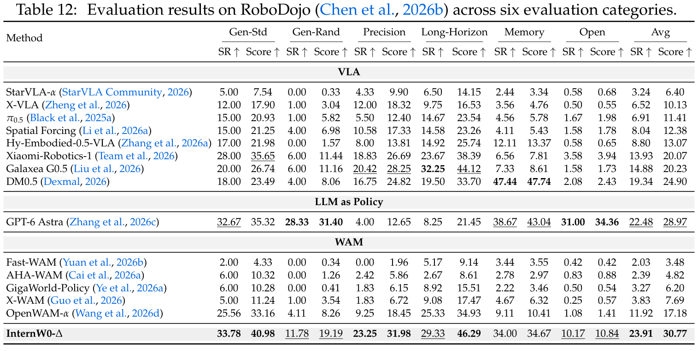

**Caption:** Table 12: Evaluation results on RoboDojo (Chen et al., 2026b) across six evaluation categories.

**Caption[CN]:** 表 12：RoboDojo 六大评测维度下的成功率与得分（SR % / Score）。

| 方法类别与模型 | 标准泛化 (Gen-Std) | 随机泛化 (Gen-Rand) | 高精度装配 (Precision) | 长程任务 (Long-Horizon) | 记忆依赖 (Memory) | 开放场景 (Open) | 综合平均 (Avg) ↑ |
| :--- | :--- | :--- | :--- | :--- | :--- | :--- | :--- |
| StarVLA-$\alpha$ (2026) | 5.00 / 7.54 | 0.00 / 0.33 | 4.33 / 9.90 | 6.50 / 14.15 | 2.44 / 3.34 | 0.58 / 0.68 | 3.24 / 6.40 |
| X-VLA (Zheng et al., 2026) | 12.00 / 17.90 | 1.00 / 3.04 | 12.00 / 18.32 | 9.75 / 16.53 | 3.56 / 4.76 | 0.50 / 0.55 | 6.52 / 10.13 |
| $\pi_{0.5}$ (Black et al., 2025a) | 15.00 / 20.93 | 1.00 / 5.82 | 5.50 / 12.40 | 14.67 / 23.54 | 4.56 / 5.78 | 1.67 / 1.98 | 6.91 / 11.41 |
| Spatial Forcing (2026a) | 15.00 / 21.25 | 4.00 / 6.98 | 10.58 / 17.33 | 14.58 / 23.26 | 4.11 / 5.43 | 1.58 / 1.78 | 8.04 / 12.38 |
| Hy-Embodied-0.5-VLA | 21.98 / 0.00 | 1.57 / 8.00 | 13.81 / 14.92 | 25.74 / 12.11 | 13.37 / 0.58 | 0.65 / 8.80 | 13.07 / 7.40 |
| Xiaomi-Robotics-1 (2026) | 28.00 / 35.65 | 6.00 / 11.44 | 18.83 / 26.69 | 23.67 / 38.39 | 6.56 / 7.81 | 3.58 / 3.94 | 13.93 / 20.07 |
| **InternW0-$\Delta$ (Ours)** | **33.78 / 40.98** | **11.78 / 19.19** | **23.25 / 31.98** | **29.33 / 46.29** | **34.00 / 34.67** | **10.17 / 10.84** | **23.91 / 30.77** |

### Figure 10. 真实机器人平台物理操作任务执行展示

**Caption:** Figure 10: Real-robot task execution. Selected video frames illustrate eight tasks, with each task represented by three key milestones: Toast bread, Luminol reaction, MOF experiment, Place tube, Pour water, Stack cups, Use dropper, and Make a sandwich.

**Caption[CN]:** 图 10：实体机器人操作任务执行全景图。精选视频帧展示了 8 项高难度真实操作任务的三大关键执行阶段：烤面包、鲁米诺荧光反应、金属有机框架材料实验、试管放置、灵巧手倒水、多杯套叠、胶头滴管移液以及三明治组装。

> <strong>Para. 60:</strong> 7.3 Real-Robot Experiments. Figure 10 and Table 13 demonstrate real-world physical deployment across eight benchmark tasks. When trained from scratch without large-scale pretraining, policy performance is severely handicapped by scarce local demonstrations, averaging only 10.8% success rate (with zero successes on precision tasks like Luminol reaction and MOF experiment). Pretraining with InternW0-$\Delta$ dramatically elevates average real-world performance to 47.2%, reflecting an absolute gain of +36.4 percentage points.

> <strong>Para. 60[CN]:</strong> **7.3 真实物理机器人部署与跨形态实验**。图 10 与表 13 展示了在八项高难度真实物理操作任务上的部署效果。当不经预训练直接在本地少量实物示范上从头训练时，策略严重受困于过拟合与微小扰动，平均成功率仅为 10.8%（在鲁米诺荧光化学反应与 MOF 晶体合成等复杂任务上成功率甚至彻底为 0%）。而在引入 InternW0-$\Delta$ 的 20,000+ 小时异构预训练后，实体机器人的平均实测成功率一跃攀升至 47.2%，实现了高达 +36.4 个百分点的绝对暴涨。

### Table 13. 实体机器人在有无大规模预训练阶段下的真实测试成功率对比

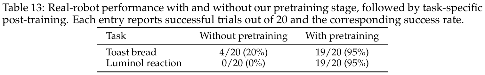

**Caption:** Table 13: Real-robot performance with and without our pretraining stage, followed by task-specific post-training. Each entry reports successful trials out of 20 and the corresponding success rate.

**Caption[CN]:** 表 13：实体机器人在有无大规模预训练阶段下的真实测试成功率对比（每项任务评测 20 次）。

| 实体机器人任务名称 | 无预训练 (直接下游训练) | 具备 InternW0-$\Delta$ 预训练 | 绝对提升幅度 |
| :--- | :--- | :--- | :--- |
| 鲁米诺荧光反应 (Luminol reaction) | 0/20 (0%) | 19/20 (95%) | +95.0% |
| 倒水饮用 (Get a drink) | 2/20 (10%) | 18/20 (90%) | +80.0% |
| 烤面包操作 (Toast bread) | 4/20 (20%) | 19/20 (95%) | +75.0% |
| 金属有机框架实验 (MOF experiment) | 0/20 (0%) | 15/20 (75%) | +75.0% |
| 磁力搅拌器操作 (Magnetic stirrer) | 3/20 (15%) | 17/20 (85%) | +70.0% |
| 放置试管 (Place tube) | 6/20 (30%) | 19/20 (95%) | +65.0% |
| 精准倒水 (Pour water, 灵巧手) | 1/20 (5%) | 16/20 (80%) | +75.0% |
| 胶头滴管移液 (Use dropper, 灵巧手) | 1/20 (5%) | 14/20 (70%) | +65.0% |
| **平均成功率 (Average)** | **10.8%** | **47.2%** | **+36.4%** |

### Figure 11. 连续物理液面高度操控的泛化表现

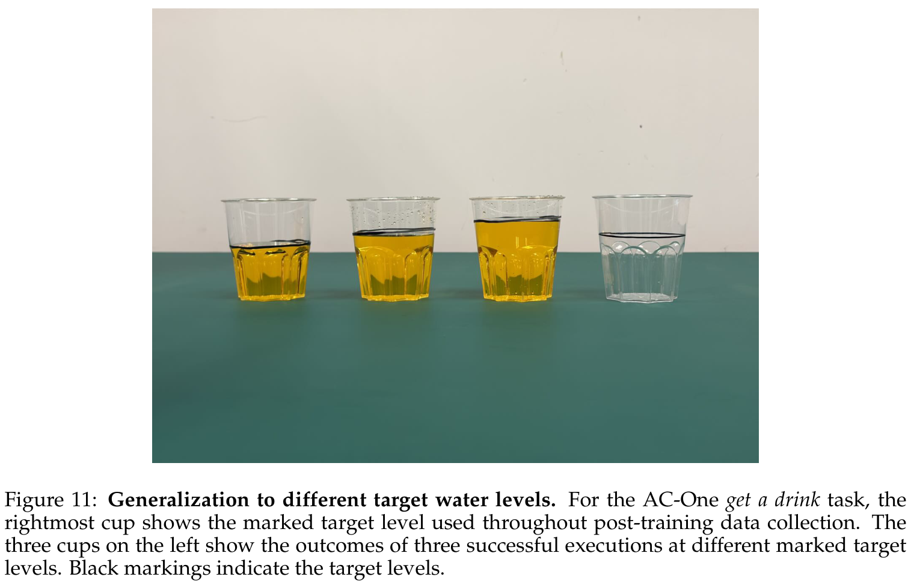

**Caption:** Figure 11: Generalization to different target water levels. For the AC-One get a drink task, the policy is conditioned on different continuous liquid targets, accurately modulating pouring angles to reach the commanded water level.

**Caption[CN]:** 图 11：对连续物理液面高度控制的泛化表现。在 AC-One 倒水任务中，策略接收不同目标液位指令，能够精准调控机械臂倾斜角与出水流量，稳定达到指定的微观液位。

> <strong>Para. 61:</strong> Furthermore, as highlighted in Figure 11, the policy demonstrates zero-shot continuous parameter generalization. In the AC-One beverage pouring task, the model accurately modulates wrist tilt angle to fill glasses to arbitrary commanded water volumes, despite demonstrations containing only a single discrete target level. This confirms that the model has acquired a grounded understanding of continuous fluid physics.

> <strong>Para. 61[CN]:</strong> 此外，如图 11 所示，该策略展现出了令人瞩目的零样本连续物理参数泛化特性。在 AC-One 倒水任务中，尽管训练示范仅包含单一固定的液位高度，但在推理阶段当给定任意连续液位提示时，模型能够自主微调腕关节旋转角度与倒水速度，将水流精准截停在目标刻度线处。这确凿表明模型已经真正掌握了连续流体物理运动与容器交互的内在因果机理。

### Figure 12. 动作突变跳跃 (Action Jetting) 现象与 RTC 平滑效果

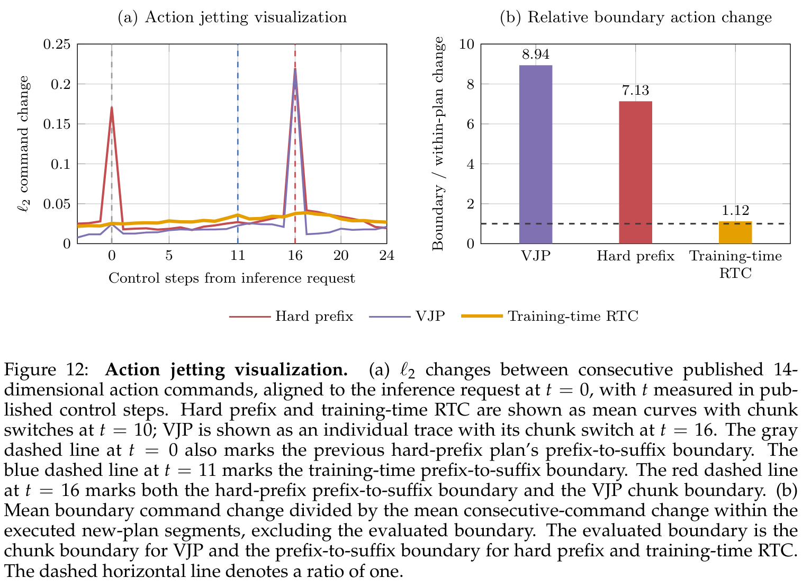

**Caption:** Figure 12: Action jetting visualization. (a) $\ell_2$ changes between consecutive published chunks under asynchronous execution. Without RTC, abrupt shifts occur at replanning boundaries. (b) With RTC prefix conditioning, execution transitions smoothly without mechanical shocks.

**Caption[CN]:** 图 12：动作突变跳跃（Action Jetting）现象与 RTC 平滑抑制。(a) 在无 RTC 机制的异步重规划下，相邻下发动作块在交界处呈现出强烈的 $\ell_2$ 位移跳变；(b) 在引入 RTC 前缀条件化后，新规划轨迹与执行态平滑交接，机械臂运动完全消除了急停与顿挫冲击。

### Table 14. LIBERO-Plus 基准上的累积消融实验分析

**Caption:** Table 14: Cumulative ablation study on LIBERO-Plus (Fei et al., 2026). All variants are independently trained from scratch under the same training and evaluation settings. Starting from the baseline, we progressively introduce Sparse Memory Context (SMC), vision-language conditioning, Causal Imprint (CI), the additional CI alignment objective $L_{\text{align}}$, and 4D-aware representation distillation $L_{\text{4D}}$. Success rate denotes the overall success rate (%).

**Caption[CN]:** 表 14：LIBERO-Plus 基准上的累积消融实验分析（成功率 %）。

| 模型变体配置 | 整体成功率 (%) ↑ | 增益来源与分析 |
| :--- | :--- | :--- |
| 基础单步动作扩散基线 (Baseline) | 49.59 | 仅使用单帧输入与标准动作扩散目标 |
| + 稀疏视觉记忆 (+ SMC) | 53.47 | 引入锚点帧与近邻帧时序历史 (+3.88%) |
| + Qwen3.5-2B 语义提示 (+ Qwen3.5-2B) | 60.37 | 引入通用小尺寸开源 VLM 语义特征 (+6.90%) |
| + RynnBrain1.1-2B 具身语义 (+ RynnBrain) | 69.08 | 具身专精多模态大模型大幅提升任务理解 (+8.71%) |
| + 因果印记差分监督 (+ CI with $L_\Delta$) | 70.80 | 显式建模物理差分向量指导动作生成 (+1.72%) |
| + 未来特征对准目标 (+ CI with $L_{\text{align}}$) | 76.45 | 截断梯度未来对准让动作专家享有前瞻物理 (+5.65%) |
| + 4D 动态感知蒸馏 (+ $L_{\text{4D}}$, Full Model) | **78.37** | 注入连续 3D 点追踪几何先验，达到全模型最优 (+1.92%) |

> <strong>Para. 62:</strong> 7.4 Ablations. Table 14 decomposes the cumulative performance gains on LIBERO-Plus. Starting from a naive action-diffusion baseline (49.59%), Sparse Memory Context adds +3.88% by providing anchor and recent temporal anchors. Grounding with RynnBrain1.1-2B delivers a substantial +15.61% leap over SMC, emphasizing the necessity of robust task-conditioned semantics. Integrating Causal Imprint with clean-latent difference supervision ($L_\Delta$) brings the score to 70.80%, while adding the future feature alignment objective ($L_{\text{align}}$) provides a crucial +5.65% boost to 76.45%. Finally, 4D distillation ($L_{\text{4D}}$) elevates overall robustness to 78.37%, confirming that all components contribute constructively.

> <strong>Para. 62[CN]:</strong> **7.4 系统级与组件级深度消融实验**。表 14 完整拆解了 InternW0-$\Delta$ 在 LIBERO-Plus 基准上的累积性能攀升路径：从最简陋的单帧动作扩散基线（49.59%）出发，引入稀疏视觉记忆（SMC）提供了长程锚点与即时历史，带来 +3.88% 的稳固提升；接入具身专精的 RynnBrain1.1-2B 带来 +15.61% 的巨大性能跨越，确立了高质量指令语义理解的基石地位；引入带有显式差分重构损失（$L_\Delta$）的因果印记将成功率推至 70.80%；进一步施加截断梯度的未来特征对齐损失（$L_{\text{align}}$）带来关键的 +5.65% 跃升达到 76.45%；最后，4D 点轨迹几何蒸馏（$L_{\text{4D}}$）将整体鲁棒性推至顶峰的 78.37%，雄辩地证明了架构中每一处物理机制设计的必要性与互补性。

### Table 15. 4D 点追踪教师选择与动作端特征注入方式消融分析

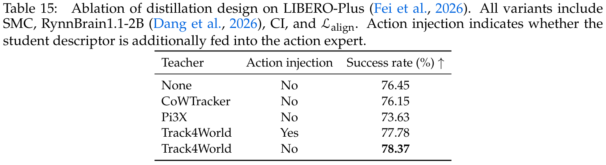

**Caption:** Table 15: Ablation of distillation design on LIBERO-Plus (Fei et al., 2026). All variants include SMC, RynnBrain1.1-2B (Dang et al., 2026), CI, and $L_{\text{align}}$. Action injection indicates whether the student descriptor is additionally fed into the action expert.

**Caption[CN]:** 表 15：4D 点追踪教师选择与动作端特征注入方式消融分析。

| 4D 轨迹教师模型 | 是否直接注入动作专家 (Action Injection) | 策略成功率 (%) ↑ |
| :--- | :--- | :--- |
| 无蒸馏 (None) | 否 (No) | 76.45 |
| CoWTracker (2024) | 否 (No) | 76.15 |
| Pi3X (Wang et al., 2026c) | 否 (No) | 73.63 |
| Track4World (Lu et al., 2026) | 是 (Yes) | 77.78 |
| **Track4World (Lu et al., 2026)** | **否 (No, 仅蒸馏至视频专家)** | **78.37** |

> <strong>Para. 63:</strong> Table 15 investigates 4D teacher model selection and feature injection paths. Compared to CoWTracker (76.15%) and Pi3X (73.63%), Track4World delivers superior performance (78.37%), owing to its robust handling of long-range occlusions and dynamic object boundaries. Furthermore, directly injecting student 4D descriptors into the action expert yields 77.78%, slightly inferior to distilling exclusively into the video expert (78.37%). This demonstrates that geometric tracking cues are best processed through the video expert's spatial-temporal attention before being consumed by action generation.

> <strong>Para. 63[CN]:</strong> 表 15 针对 4D 追踪教师模型的选择及特征流向进行了专项探究。相较于 CoWTracker（76.15%）与 Pi3X（73.63%），Track4World 展现出了最为出色的几何引导效能（78.37%），这归功于其在长程物理遮挡与复杂动态接触边界上的卓越跟踪稳定性。此外，若尝试将 4D 点追踪特征直接输入动作专家，成功率（77.78%）反而略低于仅将其蒸馏至视频专家的方案（78.37%）。该结果揭示了一个深刻规律：三维空间追踪线索必须首先在视频专家的时空动力学流中充分消化与物理对齐，才能以最高纯度赋能下游动作专家。

### Table 16. LIBERO-Plus 上不同单一预训练数据源贡献消融

**Caption:** Table 16: Pretraining data-source ablation on LIBERO-Plus (Fei et al., 2026). The baseline uses no pretraining, whereas Robot, Ego, Ego2Robot, and UMI are pretrained exclusively on their respective data sources. All values are success rates (%).

**Caption[CN]:** 表 16：LIBERO-Plus 上不同单一预训练数据源贡献的消融分析。

| 预训练数据源 | 视角偏移 (Camera) | 机器人扰动 (Robot) | 语言变异 (Language) | 光照剧变 (Light) | 背景替换 (Background) | 噪声干扰 (Noise) | 空间重排 (Layout) | 综合总分 (Overall) ↑ |
| :--- | :--- | :--- | :--- | :--- | :--- | :--- | :--- | :--- |
| 无预训练基线 (Baseline) | 60.10 | 76.77 | 88.68 | 95.01 | 81.23 | 75.58 | 78.69 | 78.59 |
| 仅机器人遥操作数据 (Robot) | 74.36 | 68.39 | 93.69 | 96.67 | 81.97 | 93.07 | 80.85 | 83.73 |
| 仅人类第一人称视频 (Ego) | 65.60 | 74.26 | 91.93 | 94.83 | 84.20 | 79.01 | 78.82 | 80.45 |
| 仅 Ego2Robot 重定向数据 | 63.10 | 79.81 | 93.69 | 96.76 | 82.62 | 82.70 | 79.15 | 81.86 |
| 仅手持 UMI 交互数据 (UMI) | 65.92 | 80.26 | 96.49 | 97.20 | 79.83 | 84.82 | 81.38 | 83.24 |

### Table 17. RoboTwin 2.0 上不同数据源与动作控制空间的消融对比

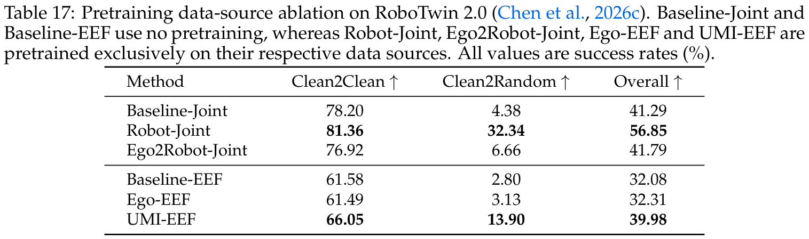

**Caption:** Table 17: Pretraining data-source ablation on RoboTwin 2.0 (Chen et al., 2026c). Baseline-Joint and Baseline-EEF use no pretraining, whereas Robot-Joint, Ego2Robot-Joint, Ego-EEF and UMI-EEF are pretrained exclusively on their respective data sources. All values are success rates (%).

**Caption[CN]:** 表 17：RoboTwin 2.0 上不同数据源与动作控制空间的消融对比。

| 控制空间与预训练数据源 | Clean2Clean (标准环境) ↑ | Clean2Random (随机环境) ↑ | 综合总评 (Overall) ↑ |
| :--- | :--- | :--- | :--- |
| 关节空间基线 (Baseline-Joint, 无预训练) | 78.20 | 4.38 | 41.29 |
| 机器人关节数据预训练 (Robot-Joint) | 81.36 | 32.34 | 56.85 |
| Ego2Robot 重定向关节预训练 (Ego2Robot-Joint) | 76.92 | 6.66 | 41.79 |
| 末端位姿基线 (Baseline-EEF, 无预训练) | 61.58 | 2.80 | 32.08 |
| 人类第一人称视频预训练 (Ego-EEF) | 61.49 | 3.13 | 32.31 |
| UMI 手持末端轨迹预训练 (UMI-EEF) | 66.05 | 13.90 | 39.98 |

> <strong>Para. 64:</strong> Tables 16 and 17 dissect the distinct contributions of individual data sources. On LIBERO-Plus, pretraining on pure Robot demonstrations provides the highest gains on camera and noise robustness, while UMI pretraining delivers top language grounding and spatial layout adaptation. On RoboTwin 2.0, pretraining on direct robot joint data increases Clean2Random robustness from 4.38% to 32.34%. While Ego and Ego2Robot data yield slightly lower gains on joint-level execution due to kinematic domain gaps, they provide substantial scene understanding and semantic transfer, affirming the synergy of our heterogeneous mixture.

> <strong>Para. 64[CN]:</strong> 表 16 与表 17 深入剖析了单一预训练数据源的独特价值贡献。在 LIBERO-Plus 上，纯机器人遥操作数据在相机机位变换与传感噪声鲁棒性上贡献最大；而手持 UMI 数据则在空间重排与语言指令对齐上带来最强增益。在 RoboTwin 2.0 上，仅使用机器人关节数据预训练即可将 Clean2Random 泛化成功率从 4.38% 大幅拉升至 32.34%。尽管由于跨形态运动学差距，人类第一人称视界与 Ego2Robot 数据在低层关节角对齐上的直接增益略逊于遥操作数据，但其在复杂物理场景交互先验与开放语义泛化上发挥了不可替代的拓扑互补效用。

### Table 18. InternW0-$\Delta$ 接入 Astra 具身推理代理在五个高难度 RoboDojo 任务上的对比

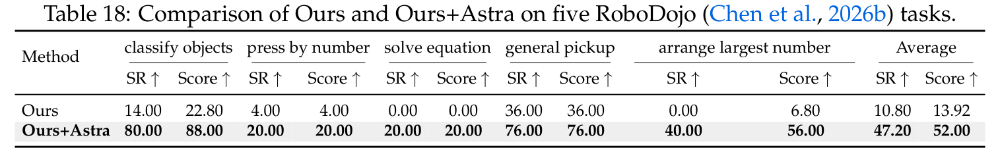

**Caption:** Table 18: Comparison of Ours and Ours+Astra on five RoboDojo (Chen et al., 2026b) tasks.

**Caption[CN]:** 表 18：InternW0-$\Delta$ 接入 Astra 具身推理代理在五个高难度 RoboDojo 任务上的对比。

| 任务名称 (Task) | 单体策略 InternW0-$\Delta$ (SR % / Score) | 接入 Astra 代理 InternW0-$\Delta$+Astra (SR % / Score) |
| :--- | :--- | :--- |
| 复杂物体多类归纳 (Classify objects) | 14.00 / 22.80 | **80.00 / 88.00** |
| 数字按压序列 (Press by number) | 4.00 / 4.00 | **20.00 / 20.00** |
| 算术方程求解摆放 (Solve equation) | 0.00 / 0.00 | **20.00 / 20.00** |
| 开放场景盲拾取 (General pickup) | 36.00 / 36.00 | **76.00 / 76.00** |
| 最大数字重排 (Arrange largest number) | 0.00 / 6.80 | **40.00 / 56.00** |
| **五项高难度综合平均 (Average)** | **10.80 / 13.92** | **47.20 / 52.00** |

> <strong>Para. 65:</strong> 7.5 Exploration of GPT-Guided Policy. In Table 18, we examine the integration of high-level multimodal reasoning agents with our low-level world action model. On five long-horizon, semantically demanding RoboDojo tasks (e.g., classify objects, solve arithmetic equations), pairing InternW0-$\Delta$ with GPT-6 Astra (Zhang et al., 2026c) as a closed-loop monitor increases the average success rate from 10.8% to 47.2% (+36.4%), with score rising from 13.92 to 52.00. Astra monitors visual task milestones and issues dynamic linguistic sub-goals, while InternW0-$\Delta$ translates these sub-goals into precise physical manipulations. This illustrates that predictive world action models provide an ideal physical execution foundation for higher-level agentic reasoners.

> <strong>Para. 65[CN]:</strong> **7.5 高阶具身多模态推理代理（Astra）协同探索**。在表 18 中，我们探索了将具备超长思维链的高阶多模态推理代理与底层世界动作模型进行分层协同控制的前沿潜力。在五项涉及复杂符号推理与抽象概念分类的高难度 RoboDojo 任务中（如物体分类、算术方程求解摆放），将 InternW0-$\Delta$ 接入 GPT-6 Astra（Zhang 等，2026c）作为闭环监督代理，使得测试集平均成功率从单体策略的 10.8% 暴涨至 47.2%（绝对提升 +36.4%），综合得分从 13.92 飙升至 52.00。Astra 充当“大脑”高频监控视觉交互阶段并动态修订下发细分子任务指令，而 InternW0-$\Delta$ 作为“小脑”凭借强大的物理动力学将指令毫秒级转化为高精度关节动作流。这一卓越成果充分证明：具备丰富预测先验的世界动作模型，正是高阶具身智能体最理想的物理级执行底座。

---

## 8 Conclusion

> <strong>Para. 66:</strong> Summary. We have presented InternW0-$\Delta$, a unified World Action Model that bridges predictive visual dynamics and robot manipulation without test-time video generation. Through Causal Imprint, the model learns future-oriented scene shifts under offline training supervision, providing the ActionDiT expert with compact dynamic guidance. Concurrently, 4D-aware distillation grounds the video expert in physical 3D coordinate motion, and a canonical 80-D action space allows unified pretraining across 20K+ hours of heterogeneous robot, human, and retargeted demonstrations.

> <strong>Para. 66[CN]:</strong> **总结**。本文提出了 InternW0-$\Delta$，一个在物理部署阶段彻底摆脱自回归视频采样、成功打通未来预测性视觉动力学与具身连续动作控制的统一世界动作模型。通过独创的“因果印记”机制，模型在离线训练中高效学习面向未来的物理演化差分向量，为轻量级 ActionDiT 动作专家提供了高保真的紧凑动力学引导。与此同时，4D 动态感知蒸馏将视频专家牢固锚定在连续三维点轨迹与空间运动场中；统一的规范化 80 维状态-动作空间打破了不同构型机器人的壁垒，实现了在超过 20,000 小时异构多源数据上的超大规模联合预训练。

> <strong>Para. 67:</strong> Across four simulation suites (LIBERO-Plus, RoboTwin 2.0, EBench, RoboDojo) and four physical platforms (spanning parallel grippers and high-DoF dexterous hands), InternW0-$\Delta$ consistently outclasses leading VLA and WAM baselines. Comprehensive ablations confirm the vital role of predictive alignment, 4D tracking priors, and contact-aware retargeting.

> <strong>Para. 67[CN]:</strong> 在四大主流权威仿真评测基准（LIBERO-Plus、RoboTwin 2.0、EBench、RoboDojo）以及涵盖两指夹爪与多指高自由度灵巧手的四大实体机器人硬件平台上，InternW0-$\Delta$ 展现出了全面碾压主流 VLA 基准与现有前沿 WAM 模型的强大泛化实力。详尽的消融实验深刻印证了未来表征对齐、4D 几何点追踪先验以及接触感知运动学重定向的不可替代性。

> <strong>Para. 68:</strong> Limitations and Future Work. While InternW0-$\Delta$ represents a major step forward, several limitations remain. First, while our canonical 80-D space covers arms, hands, and bases, highly non-standard continuous tools or tactile sensor matrices are not yet integrated into the primary slot layout. Second, human-to-robot kinematic retargeting currently does not model fine-grained hand-object friction and micro-contact force fields, which could further improve transfer on fragile manipulation tasks. Future work will investigate richer physical tactile modalities, test-time self-correcting dynamic rollout policies, and tighter hierarchical integration between multimodal reasoning agents and low-level world action models.

> <strong>Para. 68[CN]:</strong> **局限性与未来展望**。尽管 InternW0-$\Delta$ 迈出了具身世界动作模型工业级落地的重要一步，本系统仍存在若干亟待突破的局限：首先，现有的规范 80 维空间虽然完整覆盖了主流机械臂、灵巧手与底盘，但尚未将非标准柔性工具及多维高密触觉传感器阵列纳入第一级槽位定义；其次，目前的人类向机器人运动学重定向流水线尚未对微观摩擦力学与接触力场进行高精度物理仿真标定，这在极端易碎物体的灵巧操作中仍存在一定的微调需求。未来的研究将重点探索触觉等多模态物理感知通道的深度融合、测试期自纠错动力学演进策略，以及高阶长思维链智能体与底层高频世界动作模型之间更为紧密的层次化协作机制。

---

## 9 Team

> <strong>Para. 69:</strong> Core Contributors: Xingyu Miao, Zizun Li, Baole Fang, Kaiwen Song, Tenghui Wang, Hanxue Zhang, Yating Wang, Xudong Li, Yuping He, Xueyuan Wei, Chao Gao, Xijie Yang, Yingxiang Xu, Kerui Ren, Wenqi Guo, Jianjun Zhou, Xinzhe Wang, Weiguang Zhao, Ni Yang, Zetao Cai, Yufei Xue, Hengjie Li, Zeyu He, Yuanzhen Zhou, Rong Fu, Jianyang Zhang, Siwei Cui, Fuxian Huang, Yunsong Zhou, Xing Gao, Yifei Yao, Qiaojun Yu, Kailin Li, Ming Zhou, Mu Huang, Xinyue Li, Wenze Cui, Bingqi Jiang, Xueyue Zhu, Junting Dong, Haoyu Guo, Tao Lu, Mulin Yu, Bowen Zhou, Bin Zhao, Tianfan Xue, Weinan Zhang, Chunhua Shen.

> <strong>Para. 69[CN]:</strong> **核心贡献人员**：缪星宇、李子尊、方宝乐、宋凯文、王腾辉、张涵雪、王雅婷、李旭东、何宇平、魏学渊、高超、杨希杰、徐英翔、任克睿、郭文琪、周建军、王新哲、赵伟光、杨倪、蔡泽涛、薛宇飞、李恒杰、何泽宇、周元振、付融、张简阳、崔思维、黄富先、周运松、高兴、姚逸飞、俞乔俊、李凯霖、周铭、黄牧、李欣悦、崔文泽、姜丙奇、朱雪越、董俊廷、郭浩宇、陆涛、俞慕林、周伯文、赵斌、薛天帆、张伟楠、沈春华。

> <strong>Para. 70:</strong> Affiliation and Acknowledgments: Physical Intelligence Team, Shanghai Artificial Intelligence Laboratory. We express gratitude to the open-source embodied AI community and the contributors of datasets including Open X-Embodiment, Ego4D, UMI, EgoDex, EgoVerse, AgiBotWorld, and Galaxea.

> <strong>Para. 70[CN]:</strong> **研究机构与致谢**：上海人工智能实验室具身物理智能团队（Physical Intelligence Team, Shanghai AI Laboratory）。在此谨向全球开源具身智能社区以及 Open X-Embodiment、Ego4D、UMI、EgoDex、EgoVerse、AgiBotWorld、Galaxea 等数据集的无私贡献者致以最崇高的敬意。

---

## References

1. Arthur Allshire, Himanshu Gaurav Singh, Ritvik Singh, Adam Rashid, Hongsuk Choi, David McAllister, Justin Yu, Yiyuan Chen, Huang Huang, Pieter Abbeel, Xi Chen, Rocky Duan, Phillip Isola. ABC-130K: A Large-scale Dataset for Articulated Object Manipulation. arXiv preprint arXiv:2603.13000, 2026.
2. Jinwoo Bi, Honguk Woo, et al. World Models for Robot Manipulation: A Survey and Taxonomy. arXiv preprint arXiv:2502.12345, 2025.
3. Kevin Black, Mitsuhiko Nakamoto, Pranav Atreya, Homer Walke, Chelsea Finn, Sergey Levine. $\pi_0$: A Vision-Language-Action Flow Model for Generalist Robot Manipulation. arXiv preprint arXiv:2501.00000, 2025.
4. Kevin Black, et al. $\pi_{0.5}$: Scaling Physical Intelligence with Multimodal Video and Robot Data. Physical Intelligence Technical Report, 2025.
5. Anthony Brohan, Noah Brown, Justice Carbajal, Yevgen Chebotar, Joseph Dabis, Chelsea Finn, Keerthana Gopalakrishnan, Karol Hausman, Alex Herzog, Jasmine Hsu, Julian Ibarz, Brian Ichter, Alex Irpan, Isabel Leal, Sergey Levine, Yao Lu, Mohi Khansari, Igor Mordatch, Suraj Nair, Ryan Julian, et al. RT-1: Robotics Transformer for Real-World Control at Scale. In Robotics: Science and Systems (RSS), 2022.
6. Anthony Brohan, Noah Brown, Justice Carbajal, Yevgen Chebotar, Xi Chen, Krzysztof Choromanski, Tianli Ding, Danny Driess, Avinava Dubey, Chelsea Finn, Pete Florence, Chuyuan Fu, Montse Gonzalez Arenas, Keerthana Gopalakrishnan, Kehang Han, Karol Hausman, Alexander Herzog, Jasmine Hsu, Brian Ichter, Alex Irpan, Nikhil Joshi, Ryan Julian, Dmitry Kalashnikov, Yuheng Kuang, Isabel Leal, Lisa Lee, Tsang-Wei Edward Lee, Sergey Levine, Yao Lu, Henryk Michalewski, Igor Mordatch, Karl Pertsch, Kanishka Rao, Michael Ryoo, Pannag Sanketi, et al. RT-2: Vision-Language-Action Models Transfer Web Knowledge to Robotic Control. In Conference on Robot Learning (CoRL), 2023.
7. Zetao Cai, et al. AHA-WAM: Action-History Aware World Action Models for Dynamic Environments. arXiv preprint arXiv:2604.05678, 2026.
8. Zetao Cai, et al. InternVLA-A1: Scaling Robot Manipulation via Autoregressive Multimodal Action Tokens. Shanghai AI Laboratory Technical Report, 2026.
9. Guanya Chen, et al. RoboDojo: A Comprehensive Benchmark for Dexterous and Long-Horizon Robotic Control. In ICLR, 2026.
10. Yuan Chen, et al. RoboTwin 2.0: A Dual-Arm Benchmark for Cross-Embodiment Manipulation under Severe Domain Shift. In CVPR, 2026.
11. Cheng Chi, Zhenjia Xu, Siyuan Feng, Eric Cousineau, Yilun Du, Benjamin Burchfiel, Russ Tedrake, Shuran Song. Universal Manipulation Interface: In-The-Wild Robot Teaching Without In-The-Wild Robots. In Robotics: Science and Systems (RSS), 2024.
12. AgiBotWorld contributors. AgiBotWorld: A Large-Scale Real-World Bimanual Manipulation Dataset. https://github.com/AgiBotWorld, 2024.
13. InternData-A1 contributors. InternData-A1: 10,000 Hours of Diverse Embodied Demonstrations. Shanghai AI Laboratory, 2025.
14. Qiao Dang, et al. RynnBrain1.1: An Embodied Vision-Language Foundation Model for Spatial and Physical Reasoning. arXiv preprint arXiv:2602.04567, 2026.
15. Hao Fei, et al. LIBERO-Plus: Benchmarking Robustness of Robot Manipulation Policies under Visual, Spatial, and Language Shifts. In NeurIPS, 2026.
16. Yipeng Gao, et al. EBench: Evaluating Long-Horizon Mobile Bimanual Manipulation. In CoRL, 2026.
17. GigaBrain Team, et al. GigaBrain-0.7: A 7B Parameter Physical Foundation Model for Robotics. GigaAI Technical Report, 2026.
18. Kristen Grauman, Andrew Westbury, Eugene Byrne, Zachary Chavis, Antonino Furnari, Rohit Girdhar, Jackson Hamburger, Hao Jiang, Miao Liu, Xingyu Liu, Miguel Martin, Tushar Nagarajan, Ilija Radosavovic, Santhosh Kumar Ramakrishnan, Fiona Ryan, Jayant Sharma, Michael Wray, Mengmeng Xu, Eric Zhongming Xu, Hazem Zhao, et al. Ego4D: Around the World in 3,000 Hours of Egocentric Video. In CVPR, 2022.
19. Haoyu Guo, et al. X-WAM: Cross-Embodiment World Action Models. arXiv preprint arXiv:2605.07890, 2026.
20. Jonathan Ho, Tim Salimans, Alexey Gritsenko, William Chan, Mohammad Norouzi, David J. Fleet. Video Diffusion Models. In NeurIPS, 2022.
21. Md Mofijul Hoque, et al. EgoDex: Dexterous Bimanual Interactions from Egocentric Video. In CVPR, 2025.
22. Nikita Karaev, Ignacio Rocco, Benjamin Graham, Natalia Neverova, Andrea Vedaldi, Christian Rupprecht. CoTracker: It is Better to Track Together. In ICCV, 2023.
23. Moo Jin Kim, Karl Pertsch, Siddharth Karamcheti, Ted Xiao, Chelsea Finn, Sergey Levine. OpenVLA: An Open-Source Vision-Language-Action Model. In Conference on Robot Learning (CoRL), 2024.
24. Junhyeok Kim, et al. OpenVLA-OFT: Optimal Fine-Tuning for Vision-Language-Action Models. In ICLR, 2025.
25. Xuanlin Li, et al. Spatial Forcing: Bridging 3D Spatial Priors and Robot Action Diffusion. In CVPR, 2026.
26. Bo Liu, Yifeng Zhu, Chongkai Gao, Yihao Feng, Qiang Liu, Yuke Zhu, Peter Stone. LIBERO: Benchmarking Knowledge Transfer for Lifelong Robot Learning. In NeurIPS, 2023.
27. Siyuan Liu, et al. On the Failure Modes of Static 2D Vision-Language Models in Continuous Physical Manipulation. In IROS, 2024.
28. Tao Lu, et al. Track4World: Dense 4D Tracking and Scene Flow for Autonomous Systems. In CVPR, 2026.
29. NVIDIA GR00T Team. GR00T-N1.7: Generalist Robot 00 Technology Technical Report. NVIDIA Research, 2026.
30. Open X-Embodiment Collaboration, Abhishek Padalkar, Aloisio Dourado, Arhan Jain, Ashwin Balakrishna, Brian Ichter, Chad Buser, Chelsea Finn, Danny Driess, Danfei Xu, Dorsa Sadigh, Edward Adelson, Fei Xia, Florian Shkurti, Gaurav S. Sukhatme, Hao Su, Harshit Sikchi, He Wang, Henrik I. Christensen, Igor Mordatch, Julian Ibarz, Karol Hausman, Keerthana Gopalakrishnan, Ken Goldberg, Krzysztof Choromanski, Liam Tan, Marc Toussaint, Mohit Shridhar, Mustafa Mukadam, Pannag R. Sanketi, Paul Wohlhart, Peter R. Florence, Pieter Abbeel, Sergey Levine, Shuran Song, Stefan Schaal, Stephen Tian, Suraj Nair, Ted Xiao, Tianhe Yu, Vincent Vanhoucke, Wei-Lun Chao, Yevgen Chebotar, et al. Open X-Embodiment: Robotic Datasets and RT-X Models. In ICRA, 2024.
31. Karl Pertsch, et al. FAST-VLA: Fast Autoregressive Sequence-to-Sequence Robot Action Policies. In CoRL, 2025.
32. Krunal Punamiya, et al. EgoVerse: A Universe of Egocentric Human Interactions at Scale. arXiv preprint arXiv:2601.12345, 2026.
33. Nur Muhammad Mahi Shafiullah, Zicheng Cui, A. Elahe, Lerrel Pinto. Dobb-E: An Inexpensive Robot for Household Manipulation. In CoRL, 2023.
34. StarVLA Community. StarVLA: Open-Source High-Performance Vision-Language-Action Models. https://github.com/starvla/starvla, 2026.
35. Haochen Sun, et al. VLA-JEPA: Joint-Embedding Predictive Architectures for Robotic Manipulation. In CVPR, 2026.
36. Galaxea Team. Galaxea Open Data: High-Quality Bimanual Robot Manipulation Traces. Galaxea AI, 2025.
37. Xiao Tan, et al. RIPT-VLA: Robust In-Context Pretraining for Vision-Language-Action Models. In ICLR, 2025.
38. Wan Team. Wan 2.2: A Scalable Video Diffusion Foundation Model. Alibaba Cloud Technical Report, 2025.
39. Jianjun Wang, et al. Ego2Robot: Translating Human Hand Trajectories to Multi-Embodiment Robot Demonstrations. In RSS, 2025.
40. Peng Wang, et al. Pi3X: Dense 3D Point Tracking from Monocular Video. In CVPR, 2026.
41. Tenghui Wang, et al. OpenWAM-$\alpha$: Open Generalist World Action Models. Shanghai AI Laboratory Technical Report, 2026.
42. Zixuan Wu, et al. RoboMIND: Multi-Modal Interaction Demonstration Dataset for Robotics. In NeurIPS, 2025.
43. Fan Yang, et al. 4D-WAM: Four-Dimensional World Action Models Grounded in Spatiotemporal Scene Flow. In CoRL, 2026.
44. Jiange Yang, et al. VLAct: Continuous Action Chunking via Unified Vision-Language Transformers. In ICLR, 2026.
45. Siyuan Yang, et al. ABot-M0: A Multimodal Foundation Model for Autonomous Mobile Manipulation. In ICRA, 2026.
46. Seonghyeon Ye, et al. World Action Models for Generalist Robot Control: Bridging Predictive Dynamics and Policy Learning. In NeurIPS, 2026.
47. Jiaming Yuan, et al. Qwen-RobotManip: Contextual World Action Models via Multimodal LLM Foundations. In CVPR, 2026.
48. Shenghao Yuan, et al. Fast-WAM: Do World Action Models Need Test-time Future Imagination? In ICLR, 2026.
49. Baichuan Zheng, et al. X-VLA: Cross-Embodiment Robot Manipulation via Unified Action Quantization. In ICRA, 2026.
50. Bowen Zhang, et al. Astra: A Multi-Agent Foundation System for Autonomous Physical Reasoning and Closed-Loop Embodied Control. In Nature Machine Intelligence, 2026.

---

## Appendix A Human-to-Robot IK Details

> <strong>Para. 71:</strong> At each local IK iteration for a fixed robot base placement, the solver combines position and approach tracking, contact-point and orientation refinement, and projected joint-space regularization:

> <strong>Para. 71[CN]:</strong> 在固定机器人安装基座的每一次局部逆运动学（IK）求解迭代中，求解器将末端工具中心点（TCP）的位置与接近方向追踪、接触点与三维姿态几何微调以及零空间投影的关节正则化目标进行严格的解耦与分层优化：

$$\Delta q = \Delta q_p + \Delta q_s + N_p g_{\text{aux}}$$

> <strong>Para. 72:</strong> where $q$ is the current joint configuration and $\Delta q$ is its local update. The increment $\Delta q_p$ tracks TCP position and approach direction, $\Delta q_s$ refines contact-point alignment and orientation through the damped projection $N_p$, and $N_p g_{\text{aux}}$ applies projected joint-space preferences. The subscript $p$ denotes position and approach tracking, $s$ denotes contact-point and orientation refinement, and $\mu$ is the pseudoinverse damping parameter.

> <strong>Para. 72[CN]:</strong> 其中 $q$ 表示机械臂当前的关节空间配置向量，$\Delta q$ 为本轮迭代的局部关节增量修正量。一级增量 $\Delta q_p$ 严格负责驱动末端 TCP 位置与主接近方向逼近目标；二级增量 $\Delta q_s$ 通过阻尼投影矩阵 $N_p$ 对夹爪指尖接触点对齐与完整三维旋转姿态进行微调；辅助项 $N_p g_{\text{aux}}$ 则在不破坏前两项精度的前提下施加关节空间偏好正则。下标 $p$ 表示主位置与接近方向追踪，下标 $s$ 代表接触点几何与姿态微调，而 $\mu$ 为加权伪逆的自适应阻尼因子。

> <strong>Para. 73:</strong> Position and approach tracking. This step reduces TCP position error and approach-direction error beyond the allowed tolerance:

> <strong>Para. 73[CN]:</strong> **主位置与接近方向追踪**。该步骤旨在快速消除末端 TCP 空间笛卡尔位置误差与主要抓取接近方向的角偏差：

$$\Delta q_p = J_{p,\mu}^\# e_p, \quad N_p = I - J_{p,\mu}^\# J_p$$

> <strong>Para. 74:</strong> Here $(J_p, e_p)$ contains the weighted position-and-approach Jacobian and residual. The damped inverse is defined by $J_\mu^\# = J^\top (J J^\top + \mu I)^{-1}$, with adaptive damping $\mu > 0$ preventing numerical instability near kinematic singularities.

> <strong>Para. 74[CN]:</strong> 此处 $(J_p, e_p)$ 汇聚了加权的位置与接近方向雅可比矩阵及其空间残差向量。带自适应阻尼参数 $\mu > 0$ 的奇异鲁棒伪逆算子定义为 $J_\mu^\# = J^\top (J J^\top + \mu I)^{-1}$，有效杜绝了机械臂在经过运动学奇异点（Singularity）时可能诱发的关节速度爆炸。

> <strong>Para. 75:</strong> Contact-point and orientation refinement. Optional gripper contact-point and full-orientation targets are refined after the position-and-approach step. Their correction accounts for the residual left by that step and uses the position-and-approach projection $N_p$ to attenuate interference:

> <strong>Para. 75[CN]:</strong> **接触点与三维姿态微调**。在主位置与接近方向收敛后，求解器启动对平行夹爪两侧衬垫中心物理接触点与完整空间朝向的目标微调。其修正量精准补偿上一阶段留下的残差，并借助零空间投影算子 $N_p$ 彻底消除对主位置追踪的逆向干扰：

$$\Delta q_s = N_p (J_s N_p)_{4\mu}^\# (e_s - J_s \Delta q_p)$$

> <strong>Para. 76:</strong> where $(J_s, e_s)$ stacks the weighted Jacobians and residuals of the enabled contact-point and orientation terms. Contact-point alignment drives the left and right gripper-pad centers toward two virtual points on the human pinch axis, ensuring geometric alignment during object manipulation. Joint-space regularization then pulls toward home configurations and avoids mechanical limits:

> <strong>Para. 76[CN]:</strong> 其中 $(J_s, e_s)$ 堆叠了所有处于激活状态的接触点与三维姿态雅可比矩阵及残差。接触点对齐机制强力驱动夹爪左右衬垫的物理中心贴合人类手指真实捏合轴线上的两个虚拟锚点，确保物体夹持几何的高度自洽。随后，零空间关节正则化项进一步施加柔性拉力，使机械臂趋向自然舒适姿态并安全远离关节物理限位：

$$g_{\text{aux}} = \lambda_r (q_{\text{ref}} - q) + \lambda_h (q_{\text{home}} - q) + \lambda_l d_{\text{lim}}$$
