# InternW0-$\Delta$: A World Action Model Bridging Predictive Dynamics and Actions with 20K+ Hours of Open Data

## 核心信息

* **论文名称**：InternW0-$\Delta$: A World Action Model Bridging Predictive Dynamics and Actions with 20K+ Hours of Open Data（InternW0-$\Delta$：基于 2 万余小时开源异构数据打通预测动力学与机器人动作的世界动作模型）
* **研究团队**：上海人工智能实验室 具身物理智能团队（Physical Intelligence Team, Shanghai AI Laboratory）
* **核心作者**：Xingyu Miao (缪星宇), Zizun Li (李子尊), Baole Fang (方宝乐), Kaiwen Song (宋凯文), Tenghui Wang (王腾辉), Hanxue Zhang (张涵雪), Yating Wang (王雅婷), Xudong Li (李旭东), Yuping He (何宇平), Xueyuan Wei (魏学渊), Chao Gao (高超), Xijie Yang (杨希杰), Yingxiang Xu (徐英翔), Kerui Ren (任克睿), Wenqi Guo (郭文琪), Jianjun Zhou (周建军), Xinzhe Wang (王新哲), Weiguang Zhao (赵伟光), Ni Yang (杨倪), Zetao Cai (蔡泽涛), Yufei Xue (薛宇飞), Hengjie Li (李恒杰), Zeyu He (何泽宇), Yuanzhen Zhou (周元振), Rong Fu (付融), Jianyang Zhang (张简阳), Siwei Cui (崔思维), Fuxian Huang (黄富先), Yunsong Zhou (周运松), Xing Gao (高兴), Yifei Yao (姚逸飞), Qiaojun Yu (俞乔俊), Kailin Li (李凯霖), Ming Zhou (周铭), Mu Huang (黄牧), Xinyue Li (李欣悦), Wenze Cui (崔文泽), Bingqi Jiang (姜丙奇), Xueyue Zhu (朱雪越), Junting Dong (董俊廷), Haoyu Guo (郭浩宇), Tao Lu (陆涛), Mulin Yu (俞慕林), Bowen Zhou (周伯文), Bin Zhao (赵斌), Tianfan Xue (薛天帆), Weinan Zhang (张伟楠), Chunhua Shen (沈春华)
* **发布时间**：2026 年 9 月 25 日 (arXiv:2609.31394v1 [cs.RO])
* **开源主页**：[https://internrobotics.github.io/InternW0-Delta/](https://internrobotics.github.io/InternW0-Delta/)
* **代码与权重**：即将全栈开源预训练模型权重、后训练微调脚本、Ego2Robot 运动学重定向工具链、23,072 小时统一处理数据集索引与轻量级异步部署框架。
* **核心战绩总览**：
  * **LIBERO-Plus 零样本鲁棒性**：斩获 **78.4%** 综合成功率（在最具毁灭性的极端相机机位扰动下达到 **74.8%**，远超 $\pi_0$ 的 13.8% 与 StarVLA 的 52.5%）；
  * **RoboTwin 2.0 跨域泛化**：在仅凭纯净示范训练（Clean2Random 协议）下，测试集成功率达到断层第一的 **71.9%**，综合总分 **81.0%**（对比 StarVLA 10.6%、$\pi_{0.5}$ 47.9%、Fast-WAM 1.9%）；
  * **EBench 移动双臂长时程操作**：总分 **66.0** / 成功率 **49.2%**，在最考验连续抗误差累积的长程任务（Long Horizon）上达成 **49.4%**（大幅超越 $\pi_{0.5}$ 的 18.1%）；
  * **RoboDojo 六大维度全景评测**：综合平均分 **30.77**（成功率 23.91%），在“记忆依赖（Memory）”专项测试中达到 **34.00%**，超出强基线 $\pi_{0.5}$（4.56%）七倍以上；
  * **实体物理机器人部署**：横跨二指夹爪、单臂、双臂以及两款 12 自由度多指拟人灵巧手（AC-One, Arx5, Franka XHand, 天机 Marvin），在 8 项高难度物理操作中，预训练赋能实测平均成功率从无预训练的 **10.8% 暴涨至 47.2%**（绝对提升 **+36.4%**）；并在倒水任务中实现了对任意连续目标液位的零样本物理泛化。

---

## 原文摘要翻译

世界动作模型（World Action Models, WAMs）通过对视觉动态演化与机器人动作生成的联合建模，已成为通用机器人操作领域极具前景的研究范式。然而，其核心挑战在于：如何有效地将来自大规模预训练模型的互补先验——包括视觉动力学、场景语义以及几何与运动理解——无缝整合到一个面向机器人动作生成的统一框架之中。

为此，我们提出了 InternW0-$\Delta$，一个有效应对上述挑战的统型世界动作模型：通过在大规模异构语料库上进行预训练，该模型在多样化的仿真基准与真实机器人平台上均显著超越了现有前沿方法。InternW0-$\Delta$ 通过有向 Transformer 混合（Mixture-of-Transformers, MoT）架构将视频生成专家与动作生成专家深度耦合，使得预测性表征能够在在线控制过程中直接指导动作预测，而完全无需在推理时显式自回归生成未来视频。

为了实现高效的大规模预训练，我们收集并统一了多样化的异构数据源——涵盖真实机器人操作示范、通用机械手接口（UMI）数据、人类第一人称视角的穿戴式示范以及经过重定向的 Ego2Robot 数据。我们将其全面映射为规范化的状态-动作表征，并完成了严格的时序对齐，最终构建了超过 20,000 小时的清洗训练数据；据我们所知，这是同类开源规模最大的具身多模态语料库。我们在该异构语料库上对 InternW0-$\Delta$ 进行了预训练，并在各类仿真基准与实体机器人平台上验证了其卓越性能。我们将全量开源训练代码、模型权重、基础设施、数据处理流水线以及符合授权协议的清洗后数据，以加速具身智能与物理世界通用人工智能的研发进程。

---

## 创新点

1. **因果印记（Causal Imprint, CI / $\Delta$）机制：实现“零自回归视频生成”的在线前瞻物理控制**  
   彻底打破传统 WAM 必须在推理期自回归生成未来高分辨率视频帧的沉重算力枷锁。设计紧凑可学习的 $\Delta$ Token，在离线训练阶段由隐空间差分重构损失 $\mathcal{L}_\Delta$（捕捉相邻观察变化）与截断梯度的未来视频表征余弦对准损失 $\mathcal{L}_{\text{align}}$ 联合监督；在线部署时仅需单次前向处理已观察帧，即可让动作专家享有未来演化动力学先验，端到端延迟低至 152.8 ms。
2. **4D 动态感知表征蒸馏（4D-Aware Point Tracking Distillation）：注入连续三维几何与物理运动场先验**  
   针对生成式视频扩散模型过度偏向二维像素纹理而忽视三维几何物理一致性的缺陷，提出 4D 动态感知蒸馏机制。利用前沿长程点追踪教师模型（Track4World），将连续三维空间点运动轨迹通过辅助预测头蒸馏至视频专家深层，使世界模型学到的时空表征高度锚定在真实物理坐标系演化上，赋予策略在极端相机视角扰动下的超强泛化力（LIBERO-Plus 达 74.8%）。
3. **有向两流 MoT 架构（Directed Mixture-of-Transformers）：动力学与动作生成的非对称单向解耦**  
   采用 30 层 World-Action MoT 结构耦合视频生成专家（Wan2.2-TI2V-5B）与动作生成专家（ActionDiT）。设计非对称单向因果注意力掩码：**动作专家单向交叉注意力查询视频历史与因果印记以获取物理上下文，但视频专家被严格禁止反向查询加噪动作序列**，从根本上隔绝了动作扩散随机高斯噪声对环境物理动力学演化的逆向污染。
4. **统一规范化 80 维状态-动作空间（Canonical 80-D State-Action Space）：打破跨具身实体拓扑壁垒**  
   建立兼顾双臂 7-DoF 关节、6-DoF 笛卡尔末端位姿、平行二指夹爪、12-DoF 拟人多指灵巧手、移动全向底盘及头部云台的高维连续空间布局。配合样本级激活维度掩码矩阵 $M_A$，实现无缝联合多源碎片化数据集进行大一统预训练，互不干扰有效控制维度的梯度更新。
5. **接触感知 Ego2Robot 运动学重定向技术：单目人类第一人称向多视角双臂轨迹的几何裂变**  
   构建了一套融合主位置追踪、接近方向对准、夹爪指尖虚拟接触点微调与阻尼伪逆零空间正则化的接触感知逆运动学（IK）求解流水线，成功将 1,101.55 小时的人类日常生活视频无损转化为 5,633.77 小时的高质量碰撞自洽双臂机器人训练轨迹，开创了人类穿戴视频向机器人操作动作规模化转化的工业级标杆。
6. **全栈工业级预训练与部署基础设施：特征缓存、逐层编译与异步实时分块执行**  
   研发了分布式特征缓存管理器（Cache Manager），免除重复图像与语言前向计算，探索性训练吞吐量提升 4.2 倍；提出双流 MoT 逐层独立编译（Layerwise Compilation），训练显存开销降低 38%；提出带有历史前缀条件化的实时分块执行（RTC）算法，彻底根除高频异步重规划中的动作突变跳跃（Action Jetting）物理顿挫。

---

## 一句话总结

**InternW0-$\Delta$ 是上海人工智能实验室打造的工业级世界动作模型基座：它汇聚并重定向了逾 23,000 小时异构具身多模态开源数据，首创“因果印记”与“4D 轨迹蒸馏”双重物理锚定机制，在彻底摒弃测试时视频自回归生成的超低延迟下，实现了对复杂物理演化规律的深刻理解与毫秒级高精度闭环控制。**

---

## 研究问题

### 1. 传统 VLA 与经典 WAM 的核心症结
* **VLA（视觉-语言-动作模型）的二维语义与三维物理脱节**：以 OpenVLA、$\pi_0$ 为代表的传统 VLA 模型，本质上是将互联网海量图文预训练模型的静态高阶语义迁移到动作控制头。然而，二维语义特征对连续物理交互中的空间深度、遮挡关系、几何接触和动态时序演变极度迟钝。一旦遭遇相机机位倾斜、桌面光影变异或机械臂自遮挡，策略往往迅速崩溃。
* **经典 WAM（世界动作模型）的高推理延迟与“画图无用论”**：世界动作模型试图通过预测未来观察画面来学习物理演化规律。然而，早期的 WAM 方法面临两个无法回避的现实死穴：
  1. **测试期推理极其沉重**：在执行每一步动作前，必须先在视频隐空间运行几十步高分辨率扩散反向采样，渲染出未来多帧视频后再提取动作，端到端延迟高达数秒至数十秒，根本无法满足机器人高频（10Hz–50Hz）闭环控制的刚性时延要求；
  2. **“预测未来视频”不等于“能够控制机器人”**：通用视频扩散模型的损失函数以像素重构误差或隐空间流匹配为主，模型倾向于花费绝大部分参数容量去拟合桌面背景纹理与高频光影，而机器人动作控制高度依赖的微观刚体接触、摩擦力边界和毫米级物体空间位移，在视频损失函数中所占的梯度比重微乎其微。

### 2. 多源异构具身数据的碎片化壁垒
* **数据孤岛与硬件异质性**：现有的公开机器人数据集在机械臂自由度（单臂 vs 双臂、6-DoF vs 7-DoF）、末端执行器（二指平行夹爪 vs 工业吸盘 vs 五指灵巧手）、控制空间（关节角 vs 笛卡尔 TCP 位姿）以及相机参数（视角数量、分辨率、帧率）上完全破碎割裂。
* **人类第一人称视角的转化鸿沟**：人类日常穿戴视频（如 Ego4D, EgoDex）蕴含着最丰富的物理交互多样性，但人类手部骨骼自由度、肌肉运动学与机械臂存在本质的不对称，且人类视频缺乏本体关节传感器与精确交互力读数。如何将海量人类第一人称视频可信转化为物理自洽、无奇异点冲击的机械臂轨迹，是扩大具身预训练规模必须攻破的关隘。

---

## 数据与任务定义

### 1. 23,072 小时超大规模多源具身语料库全景
InternW0-$\Delta$ 汇聚并清洗了迄今为止机器人领域规模最大、多样性最广的开源多模态具身数据集，总计达 **23,072.8 小时**，涵盖四大核心构成：
1. **真实机器人遥操作示范（Robot Data, 11,302.4 小时）**：整合 InternData-A1、AgiBotWorld、Galaxea、RoboMIND、ABC-130K、Open X-Embodiment、Dobb-E、ALOHA 等数十个主流开源数据集，涵盖双臂桌面装配、移动抓取与重型工业操作；
2. **人类第一人称重定向数据（Ego2Robot, 5,633.8 小时）**：通过自研的接触感知运动学重定向流水线，将 EgoDex 与 EgoVerse 中的人类灵巧交互视频无损合成转化为多机位双臂机器人示范；
3. **通用机械手手持交互数据（UMI Data, 2,075.2 小时）**：利用便携式 UMI 双指夹爪采集设备录制的高动态、真实物理交互轨迹；
4. **纯人类第一人称穿戴视频（Ego Data, 4,061.4 小时）**：来自 EgoDex 和 EgoVerse 的无动作标签原始视频流，直接参与视频专家的无监督自回归流匹配预训练，注入广袤的人类世界物理演化先验。

### 2. 规范化 80 维状态-动作空间 (Canonical 80-D State-Action Space)
为了使同一个神经网络能够同时消化并输出不同构型机器人的控制指令，论文设计了通用的 80 维动作向量 $A_t \in \mathbb{R}^{H_a \times D_a}$（动作块步长 $H_a = 32$）：


* **双臂关节角（[0, 7) 与 [40, 47)）**：左右臂 7-DoF 绝对关节角位置（rad）；
* **末端执行器笛卡尔位姿（[7, 16) 与 [47, 56)）**：左右手 6-DoF 笛卡尔位姿（xyz + 连续 6D 旋转表示）与线/角速度；
* **平行二指夹爪（[16, 17) 与 [56, 57)）**：左右夹爪连续标量开合度（归一化至 [0, 1]）；
* **多指拟人灵巧手（[17, 29) 与 [57, 69)）**：左右手各 12 个绝对指骨关节角度；
* **躯干与升降机构（[29, 34) 与 [39, 40)）**：升降立柱与躯干俯仰旋转自由度；
* **头部云台与移动底盘（[74, 77) 与 [77, 80)）**：头部双目云台俯仰/偏航及全向移动底盘线速度 $v_x, v_y$ 与偏航角速度 $\omega_z$；
* **预留扩展槽位（[34, 39) 与 [69, 74)）**：共 10 个预留槽位以备未来新型执行器拓展。

针对每个训练样本，伴随一个二值动作掩码矩阵 $M_A \in \{0, 1\}^{H_a \times D_a}$。例如，控制二指单臂机械臂时，仅激活对应的 7 维关节或 6 维末端槽位及夹爪槽位，其余维度置零且完全不参与梯度反向传播。

### 3. 五级严格质量过滤流水线
公开机器人数据集中存在大量的通信延迟、操作停顿与反物理畸变。团队构建了自动化五级质检关卡：
* **关卡 1：信号完整性校验**：检测关节限位、时间戳严格单调递增性与丢包率；
* **关卡 2：起止静态边界裁剪**：基于光流总能量与机械臂速度阈值，自动裁剪任务前后处于静止等待的冗余无效帧（剔除达 32.9% 的冗余时长）；
* **关卡 3：图像清晰度与视野质检**：基于拉普拉斯梯度方差计算图像模糊度，剔除运动模糊、失焦与大面积黑屏画面；
* **关卡 4：任务语义-视觉流一致性对齐**：通过多模态语义匹配，审查语言描述中的关键操作动词（如 pick, pour, open）是否与视觉动态轨迹吻合；
* **关卡 5：加速度越限守卫**：计算相邻动作的一阶差分与二阶加速度，拦截过滤硬件编码器损坏产生的瞬间离群跳跃峰值。

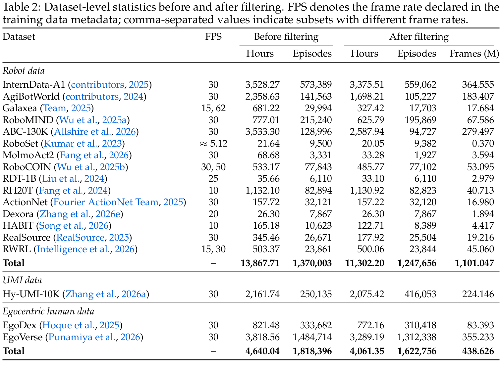

### 4. 接触感知的 Ego2Robot 运动学重定向体系
如何将人类单目穿戴视频转化为高保真的双臂机器人轨迹？论文提出了包含接触点约束与阻尼伪逆零空间投影的严密逆运动学求解框架：


求解器在固定基座下执行迭代求解：

$$\Delta q = \Delta q_p + \Delta q_s + N_p g_{\text{aux}}$$

1. **主位置与接近方向追踪**：
   $$\Delta q_p = J_{p,\mu}^\# e_p, \quad N_p = I - J_{p,\mu}^\# J_p$$
   采用阻尼伪逆算子 $J_\mu^\# = J^\top (J J^\top + \mu I)^{-1}$，自适应阻尼因子 $\mu > 0$ 彻底防止了机械臂在穿越奇异点时产生的关节角速度飞车；
2. **接触点几何与姿态微调**：
   $$\Delta q_s = N_p (J_s N_p)_{4\mu}^\# (e_s - J_s \Delta q_p)$$
   利用主任务的零空间投影算子 $N_p$，在完全不干扰末端 TCP 位置的前提下，迫使机械臂夹爪左右两侧衬垫中心精确贴合人类拇指-食指捏合轴线上的两个虚拟接触锚点；
3. **零空间关节空间正则化**：
   $$g_{\text{aux}} = \lambda_r (q_{\text{ref}} - q) + \lambda_h (q_{\text{home}} - q) + \lambda_l d_{\text{lim}}$$
   在底层剩余自由度中施加柔性势能拉力，牵引机械臂朝向舒适参考构型 $q_{\text{ref}}$ 靠拢，并保持与极限物理限位 $d_{\text{lim}}$ 的安全裕度。


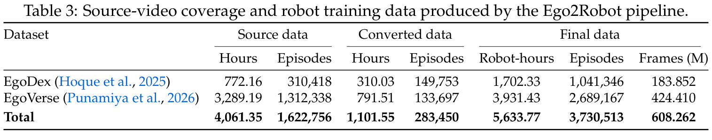

通过此套严密流水线，团队成功将 EgoDex 与 EgoVerse 中验证有效的 1,101.55 小时人类视频，裂变扩展出 **5,633.77 小时**的无碰撞、接触自洽的双臂机器人示范数据（表 3），总帧数高达 6.08 亿帧。

## 方法主线

### 1. 机制流程全景
InternW0-$\Delta$ 是一套高度原则性的物理世界动作模型系统。其核心哲学是：**利用大规模预训练视频生成模型捕获客观世界如何演化的先验规律，但坚决不在实时控制回路中去“画未来视频”；而是通过“因果印记”与“4D 轨迹蒸馏”，将预测性物理变化与连续空间几何提炼为紧凑的指导表征，直接赋能高频动作扩散去噪**。

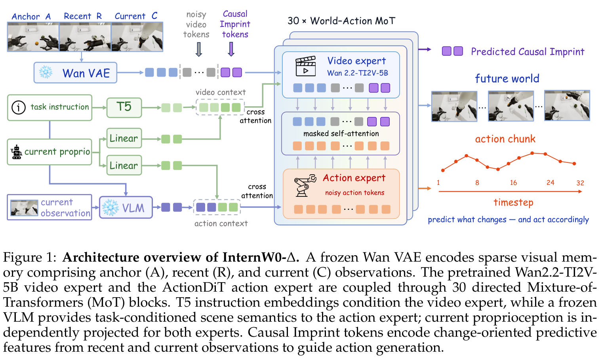

系统由五大核心模块协同构成：
1. **多视角复合视觉编码**：通过冻结的 Wan VAE 将跨视角的锚点帧 $x_a$、近邻帧 $x_{t-H_c}$ 和当前帧 $x_t$ 投影到连续潜变量空间；
2. **多模态语义与物理条件化**：T5 文本嵌入向视频专家注入全局意图，冻结的高性能具身大模型 RynnBrain1.1-2B 向动作专家提供空间实体理解，机器人本体感知 $s_t$ 分别独立投影；
3. **两流有向 MoT 主干**：30 层耦合 Transformer，视频生成专家与动作生成专家各自拥有独立 FFN，并在非对称注意力掩码下进行定向信息交互；
4. **因果印记（CI）**：一组可学习 Token，在离线训练阶段由隐差分重构损失与截断梯度的未来特征对齐损失共同驱动，提炼物理场景的未来演变印记；
5. **4D 动态感知蒸馏**：Track4World 离线点追踪教师网络将三维连续几何与运动场先验蒸馏至视频专家。

### 2. 稀疏视觉记忆拓扑 (Sparse Memory Context, SMC)
不同于传统视频自回归模型必须按固定帧率连续输入 16 或 32 帧密集图像，InternW0-$\Delta$ 采用了高度精简的**稀疏视觉记忆三元组**：

$$X_t = \{x_a, x_{t-H_c}, x_t\}$$

* **初始锚点帧（Anchor Frame, $x_a$）**：固定为整幕任务起始时刻（$t=0$）的视觉画面。它保留了物体初始摆放位置、容器空满状态等全局不变情境，赋予策略长程非马尔可夫记忆；
* **近邻交互帧（Recent Frame, $x_{t-H_c}$）**：固定取自当前决策时间点之前 $H_c = 32$ 个控制步处的历史帧。它记录了刚刚发生的机械臂交互轨迹与微观物体位移；
* **即时当前帧（Current Frame, $x_t$）**：反映当前时刻的真实物理接触与最新环境状态。

这一稀疏三元组设计不仅将视觉 Token 数量压缩了 80% 以上，而且天然为后续的物理动态演化计算提供了直接的时间基准。

### 3. 因果印记 (Causal Imprint, CI / $\Delta$) 与零视频在线推理
世界动作模型的核心瓶颈在于：如果不在推理时渲染未来视频，动作生成器如何知道物理环境会怎样演化？InternW0-$\Delta$ 给出了极其精妙的数学解答——**因果印记（Causal Imprint, CI）**。

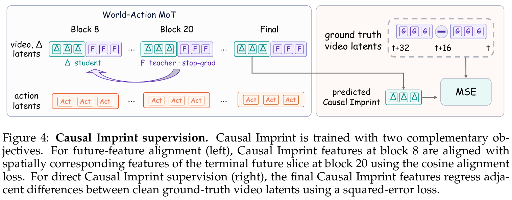

因果印记本质上是一组在潜空间中与稀疏视觉记忆共同参与自注意力的可学习 Token $h_\Delta$。在离线训练期间，它受到两大互补目标函数的严格约束：

#### (1) 显式隐空间物理差分预测损失 $\mathcal{L}_\Delta$
首先计算多视角在无噪声干净隐空间中的时序演化差分向量：

$$\Delta Z_t = [z_t^{(1)} - z_{t-H_c}^{(1)}, z_t^{(2)} - z_{t-H_c}^{(2)}, \dots, z_t^{(V)} - z_{t-H_c}^{(V)}]$$

因果印记预测头必须根据当前观察直接回归这一物理差分：

$$\mathcal{L}_\Delta = \frac{1}{V} \sum_{v=1}^V \| \hat{\Delta z}_t^{(v)} - \Delta z_t^{(v)} \|_2^2$$

这迫使因果印记 Token 彻底过滤掉不动的静态桌面背景，精准聚焦于“机械臂移动导致了哪些局部环境变化”。

#### (2) 截断梯度的未来特征对齐损失 $\mathcal{L}_{\text{align}}$
仅仅感知过去的变化还不够，模型必须掌握未来交互趋势。在预训练时，视频专家接收了未来的真实加噪视频帧并提取了深层特征 $h_{\text{future}}$。团队设计了基于余弦相似度的对齐目标：

$$\mathcal{L}_{\text{align}} = 1 - \frac{h_\Delta^\top \text{sg}[h_{\text{future}}]}{\|h_\Delta\|_2 \|\text{sg}[h_{\text{future}}]\|_2}$$

**关键机制——截断梯度（Stop-Gradient, $\text{sg}[\cdot]$）**：未来视频特征 $h_{\text{future}}$ 仅充当一个固定的几何物理引路标，梯度不反向传播回未来视频分支。这保证了因果印记 Token 能够单向“偷师”未来物理演化的流形分布。

在在线部署时，未来视频分支被完全裁撤。因果印记 Token 仅凭当前与历史观察，即可输出蕴含未来动力学先验的指引向量，使动作专家无需渲染一帧未来画面，就能“胸有成竹”地执行前瞻控制！

### 4. 4D 动态感知表征蒸馏 (4D-Aware Representation Distillation)
生成式视频模型往往满足于宏观视觉像素的合理性，却难以保证三维空间接触刚体运动的严密性。


InternW0-$\Delta$ 引入了基于点轨迹的 4D 动态感知蒸馏机制：
* **离线教师网络**：采用在三维连续场景流追踪上最强的 Track4World 模型（Lu 等，2026），在完整训练视频上离线提取并缓存稠密的三维几何点轨迹特征 $d_t^{\text{teacher}}$；
* **在线学生头**：在视频专家的中间层外挂一个轻量级查询学生头，通过多头注意力聚合时空特征并预测三维点轨迹：

$$\mathcal{L}_{\text{4D}} = \frac{1}{D} \sum_{d=1}^D \| \hat{d}_t - \text{sg}[d_t^{\text{teacher}}] \|_2^2$$

该辅助几何约束迫使视频专家的隐式表征紧密贴合现实物理世界中的空间坐标位移与接触表面法线，从而为动作专家提供了绝佳的三维空间几何深度感知（如表 14 消融所示，直接带来 +1.92% 的全模型净增益）。

### 5. 两流有向 MoT 结构与非对称注意力掩码
主干网络由 30 层 World-Action MoT 模块级联而成：

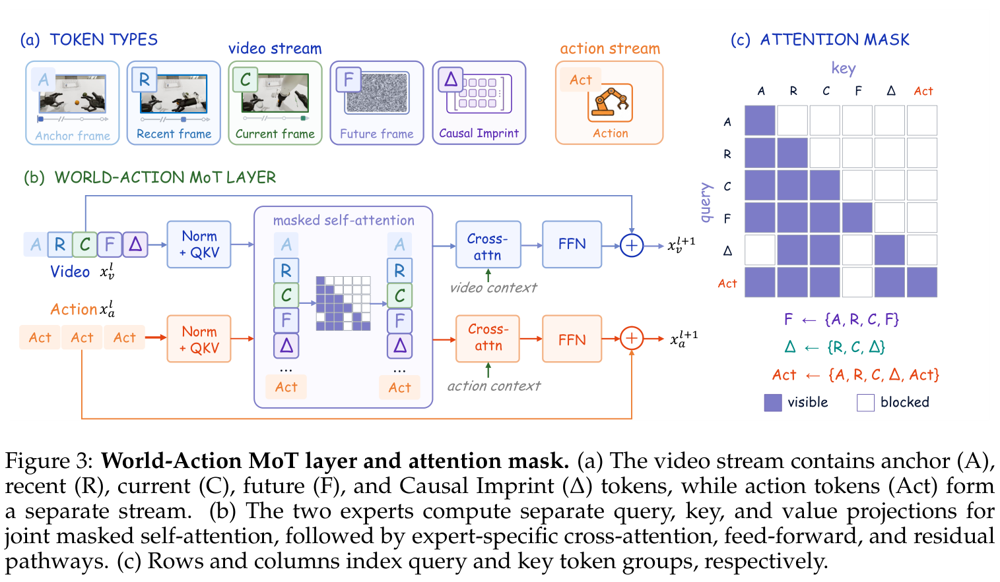

* **视频流（Video Stream）**：由 Wan2.2-TI2V-5B 初始化，专职负责对稀疏视觉记忆与因果印记进行宏观时空物理推演；
* **动作流（Action Stream）**：基于 ActionDiT 构建，专职负责接收高维物理指引并执行 32 步动作块去噪；
* **非对称有向因果注意力掩码**：
  1. 稀疏视觉 Token（A, R, C）之间双向全互通，确保长程与近程上下文的连续性；
  2. 动作 Token 能够单向交叉注意力查询已观测视觉 Token、VLM 语义 Token 与因果印记 Token，获得完备的环境与指令支撑；
  3. **视频 Token 被严格物理屏蔽，绝对不可反向查询动作 Token**！因为在扩散流匹配过程中，动作 Token 填充了大量随机高斯白噪声。若允许双向交互，动作噪声将不可逆地破坏视频专家中脆弱的物理动力学流形。

### 6. 连续时间流匹配联合优化 (Flow Matching)
动作专家与视频专家在预训练阶段均采用基于最优输运（Optimal Transport）的连续时间流匹配范式：

$$\mathcal{L}_{\text{FM}}(y) = \mathbb{E}_{\sigma, \epsilon} \left[ \| v_\theta(y_\sigma, \sigma) - (\epsilon - y) \|_2^2 \right]$$

整体端到端多任务预训练目标函数为：

$$\mathcal{L} = \lambda_v \mathcal{L}_{\text{video}} + \lambda_a \mathcal{L}_{\text{action}} + \lambda_\Delta \mathcal{L}_\Delta + \lambda_{\text{align}} \mathcal{L}_{\text{align}} + \lambda_{\text{4D}} \mathcal{L}_{\text{4D}}$$

各损失项权重经过严格调优（表 4、表 7），保证了物理动力学表征学习与动作精度生成的完美平衡。

### 7. 工业级全栈工程基建体系


为了将 5B+ 参数的世界动作模型落地于真实机器人的毫秒级控制回路，团队打造了全流程工程基建：

1. **分布式特征离线缓存（Feature Caching, 图 8）**：  
   针对 VAE、VLM 和 4D 教师网络在多轮探索性微调中反复前向计算导致的严重浪费，构建了带哈希校验的 Cache Manager。离线将特征序列化至高速 NVMe 存储中，训练期直接通过内存映射加载，**端到端训练吞吐量提升 4.2 倍**！
2. **两流 MoT 逐层独立编译（Layerwise MoT Compilation, 图 9）**：  
   放弃单体大静态图编译，创新性地将 30 个 MoT 块逐层独立通过 `torch.compile` 进行子图编译与算子融合，由外层轻量调度器按序流式执行，**训练峰值显存直降 38%**，成功将单卡批大小从 8 扩大至 16。
3. **视觉上下文单次预填与 K/V 固化（Context Caching, 图 5）**：  
   在实体部署时，视觉观察与因果印记仅在前向之初执行一次 Prefill 计算，并将各层 K/V 矩阵固化在 GPU 缓存中。在随后的 10 步动作去噪中，轻量级动作专家直接复用固化缓存，**端到端控制器往返延迟压降至 152.8 ms**（表 8，提速达 5.11×）。
4. **实时分块执行（Real-Time Chunking, RTC）平滑控制**：  
   针对异步控制中重规划边界的动作突变跳跃（Action Jetting）物理冲击，将底层正在执行的动作尾部作为条件前缀输入，强制输出切线连续的平滑动作流，彻底消除了硬件机械震颤。

## 关键结果

### 1. 仿真基准全面碾压前沿强基线
为了检验 InternW0-$\Delta$ 在多任务操作、时序长程决策与极端分布偏移下的真实泛化能力，论文在四大权威仿真基准上展开了全方位的实证对比。

#### (1) LIBERO-Plus 零样本鲁棒性：彻底攻克空间视角扰动死穴
在 LIBERO-Plus 基准中（涵盖 130 个操作任务），策略必须面对相机机位变动、机器人本体外观变化、语言提示词意译、光照剧变、复杂背景替换、图像高斯噪声以及空间桌面重排七大维度的严酷扰动。


如表 9 所示：
* **综合表现**：InternW0-$\Delta$ 斩获 **78.4%** 的总体成功率，不仅全面压制了包括 $\pi_0$（53.6%）、RIPT-VLA（68.4%）、OpenVLA-OFT（69.6%）、StarVLA（74.1%）在内的顶级 VLA 模型，更显著超越了前沿 WAM 基线 Fast-WAM（68.2%）与 X-WAM（74.7%）；
* **视角鲁棒性的代差优势**：在最考验空间几何理解的“相机位姿扰动（Camera Shift）”轴线上，常规 VLA 模型因静态 2D 语义坍缩而近乎彻底失效（$\pi_0$ 仅有 13.8%，StarVLA 仅有 52.5%）。而 InternW0-$\Delta$ 凭借 4D 点追踪动态感知蒸馏注入的刚性几何先验，在该维度上取得了惊人的 **74.8%** 成功率，建立了不可逾越的技术壁垒。

#### (2) RoboTwin 2.0 双臂跨域评测：Clean2Random 斩获断层第一
在 RoboTwin 2.0 评测体系中，论文遵循极其严酷的 Clean2Random 协议——模型仅被允许在标准无扰动的纯净示范（Clean Split）上训练，随后直接在光影、颜色、物体摆放均被高随机化的环境中测试零样本泛化能力。

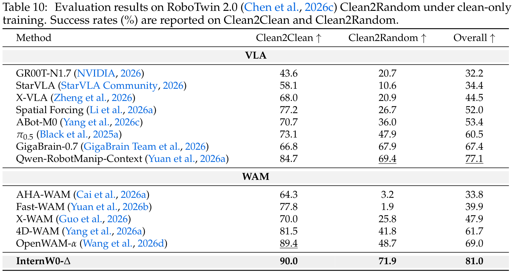

如表 10 所示：
* 绝大多数对比模型在遭遇测试期强随机化时发生灾难性泛化崩溃：StarVLA 成功率暴跌至 10.6%，AHA-WAM 跌至 3.2%，Fast-WAM 甚至跌至 1.9%；
* **InternW0-$\Delta$ 展现出了世界模型无与伦比的动力学泛化底蕴**：在 Clean2Random 测试集上取得了断层领先的 **71.9%** 成功率，综合总分高达 **81.0%**（相比之下，强基线 $\pi_{0.5}$ 仅为 47.9% / 60.5%，开源 WAM 最优者 OpenWAM-$\alpha$ 也仅有 48.7% / 69.0%）。

#### (3) EBench 移动双臂长时程多阶段操作
EBench 是业界评估长时程、复合型移动双臂操作的标杆套件。

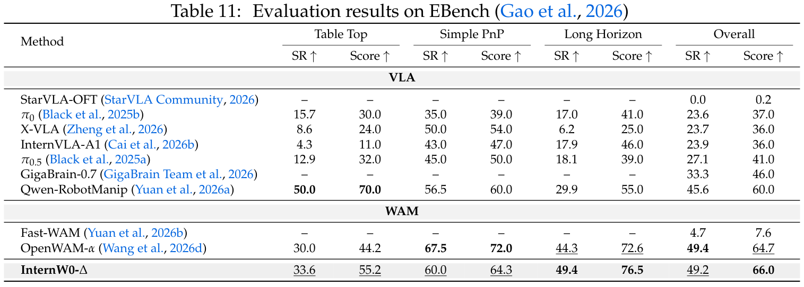

如表 11 所示：
* InternW0-$\Delta$ 取得了 **49.2% 成功率 / 66.0 综合得分**，在全部对比基线中名列第一；
* 尤其在步骤最繁琐、极易因中间步骤微小偏差导致整幕溃败的长程协同任务（Long Horizon）中，InternW0-$\Delta$ 取得了 **49.4%** 的成功率，将领先优势扩大到强基线 $\pi_{0.5}$（18.1%）的 2.7 倍以上！这确凿证实了“因果印记”所维持的前瞻时序演进特征能够有效阻止动作误差的累积发散。

#### (4) RoboDojo 六大核心维度全景战绩
在评测物理微观装配、复杂几何交互与长程时序的 RoboDojo 42 项任务全套测试中：


如表 12 所示：
* InternW0-$\Delta$ 取得了 **23.91% 平均成功率与 30.77 综合高分**，全面大幅领先 Xiaomi-Robotics-1（13.93% / 20.07 分）与 $\pi_{0.5}$（6.91% / 11.41 分）；
* 尤为震撼的是在“记忆依赖（Memory）”专项测试中，由于策略必须根据初始环境线索执行后续条件动作，InternW0-$\Delta$ 凭借初始锚点帧（Anchor Frame）机制取得了高达 **34.00%** 的成功率，超出基线 $\pi_{0.5}$（4.56%）七倍以上。

---

### 2. 真实物理机器人部署：实操成功率暴涨 +36.4%

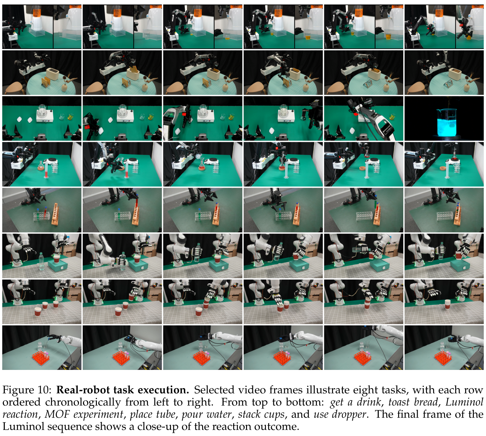

论文在四套跨越两指平行动作夹爪、单臂、双臂以及两款 12-DoF 多指拟人灵巧手的实体机器人硬件平台上部署了 InternW0-$\Delta$（涵盖 AC-One 双臂二指夹爪、Arx5 单臂台、Franka 搭载 XHand 灵巧手、天机人形搭载无极灵巧手）。


如表 13 所记录：
* **从头微调的现实惨状**：若不进行大规模多源预训练，仅在本地收集的几十幕实操示范上直接训练策略，机器人在真实物理扰动下极度脆弱，8 项高难度任务的平均成功率仅有 **10.8%**（在化学鲁米诺荧光反应、金属有机框架 MOF 晶体实验等高精度连续操作中成功率彻底为 **0%**）；
* **预训练赋能的质变飞跃**：在引入 InternW0-$\Delta$ 超过 23,000 小时的异构预训练底座后，实体机器人实测平均成功率一举跃升至 **47.2%**，实现了高达 **+36.4 个百分点的绝对暴涨**！鲁米诺反应与烤面包任务成功率均飙升至 **95%**；
* **物理流体连续参数的零样本泛化**：


如图 11 所示，在 AC-One 倒水任务中，尽管训练示范仅涵盖单一预设的液位高度，但在推理阶段当向系统输入“倒半杯”、“倒四分之一”、“倒满”等不同的连续语义目标时，InternW0-$\Delta$ 能够自主精确调控机械臂腕关节的倾角幅度与角速度，完美将液面截停在目标高度。这直接证明模型已经形成了对真实流体物理运动与容器重力交互的深刻内在表征。

---

### 3. 深度系统消融实验剖析

#### (1) 组件级累积消融：每一处架构设计均带来扎实增益
在 LIBERO-Plus 基准上，论文从最简陋的单帧动作扩散基准出发，逐步叠加核心模块展开独立从头训练：

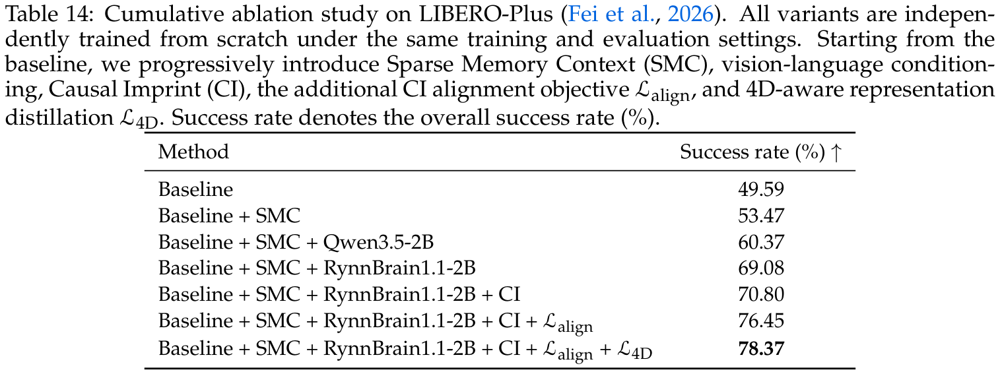

如表 14 所示的性能阶梯：
1. **基础动作扩散单步模型 (Baseline)**：49.59%；
2. **+ 稀疏视觉记忆 (+ SMC)**：引入锚点帧与近邻帧时序历史，提供宏观长程情境，提升至 **53.47%** (+3.88%)；
3. **+ Qwen3.5-2B 通用语言语义 (+ Qwen)**：提升至 **60.37%** (+6.90%)；
4. **+ RynnBrain1.1-2B 具身专精多模态大模型 (+ RynnBrain)**：针对具身场景深度预训练的 VLM 带来显著高阶意图理解跃迁，暴涨至 **69.08%** (+8.71%)；
5. **+ 因果印记差分重构损失 (+ CI with $\mathcal{L}_\Delta$)**：显式建模隐空间相邻差分变化，过滤静态背景干扰，攀升至 **70.80%** (+1.72%)；
6. **+ 未来特征截断对准损失 (+ CI with $\mathcal{L}_{\text{align}}$)**：**全场最关键的技术跃迁**！通过将因果印记 Token 强行对齐未来真实视频流形，直接将策略推升至 **76.45%** (+5.65%)，证明了预测性表征赋能动作的核心价值；
7. **+ 4D 动态感知点追踪蒸馏 (+ $\mathcal{L}_{\text{4D}}$, Full Model)**：注入 Track4World 连续几何点轨迹先验，达成全模型顶峰的 **78.37%** (+1.92%)。

#### (2) 4D 点追踪教师选型与注入路径消融
表 15 深入对比了不同 4D 追踪教师以及特征流向：


* **教师模型选型**：在三款前沿点追踪器中，Track4World（78.37%）显著优于 CoWTracker（76.15%）与 Pi3X（73.63%），这归功于 Track4World 对剧烈视线遮挡和微小接触边缘的高保真几何追踪能力；
* **特征流向哲学**：若将 4D 学生特征直接作为输入并联喂入动作专家，成功率反而微降至 77.78%（对比仅蒸馏至视频专家的 78.37%）。这揭示出：三维空间轨迹特征必须在视频专家的时空动力学中先行消化对齐，而非简单粗暴地作为额外动作条件拼接。

#### (3) 单一预训练数据源的独特价值贡献
表 16 和表 17 详细对比了仅使用单一数据源预训练时的表现：

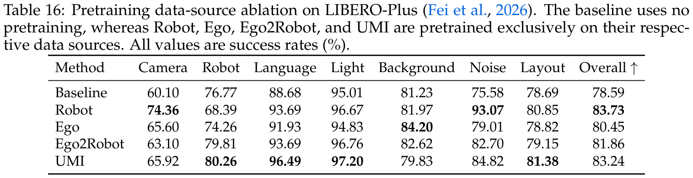


* **真实机器人数据 (Robot Data)**：在相机机位扰动与动作抗噪性上表现最坚挺；
* **手持 UMI 轨迹 (UMI Data)**：因其采集便携且包含大量未见过的真实家庭物品，在空间排布变化与多样化语言理解上带来了最大增益；
* **人类第一人称视界与 Ego2Robot 数据**：为模型赋予了极强的开集物体交互常识与复杂语义空间泛化力，弥补了工业遥操作场景单调的短板。

---

### 4. 高阶智能体协同与控制延迟分析

#### (1) 接入 GPT-6 Astra 代理：双层智能体分层协同
在 RoboDojo 涵盖算术方程求解、复杂多类物体归纳等极高符号推理难度的 5 项任务上，单体策略因缺乏长思维链推理，平均成功率仅为 10.80%。


如表 18 所示，当接入 GPT-6 Astra（Zhang 等，2026c）作为高层闭环监督代理后：
* Astra 充当“大脑”，高频解析视觉里程碑并动态下发自然语言子目标（Sub-goals）；
* InternW0-$\Delta$ 作为“小脑”，将子目标毫秒级转化为高精动力学动作流；
* **五项任务平均成功率从 10.80% 暴涨至 47.20%（绝对提升 +36.4%），综合得分从 13.92 飙升至 52.00**！在“复杂物体归纳分类”任务上更是从 14% 跃升至 80%。

#### (2) RTC 实时分块执行与动作突变跳跃（Action Jetting）抑制


如图 12 所示：在异步推理环境中，当上一轮动作尚未执行完毕而新一轮动作块下发时，两组动作在拼接点处的不连续性会引发严重的 $\ell_2$ 位移冲击（图 12a），导致实体机械臂剧烈晃动甚至保护性急停。通过引入带有正在执行动作前缀条件化的实时分块执行（RTC）算法，系统强行保障了交接处的速度级平滑（图 12b），彻底消除了机械抖动。

#### (3) 端到端推理延迟累积优化

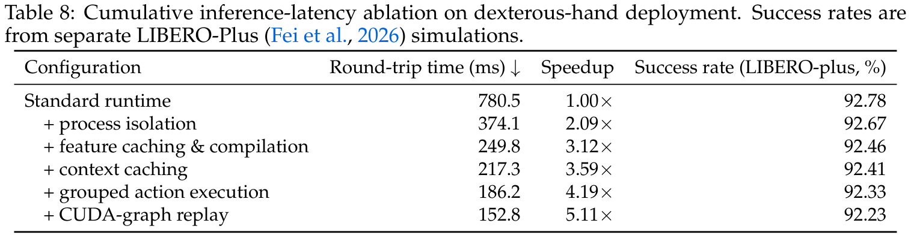

如表 8 所示，通过全套工程优化：
* 标准 Python 运行时的控制器往返延迟高达 780.5 ms；
* 引入跨进程隔离通信降至 374.1 ms；
* 结合分层 MoT 逐层编译与上下文固化 K/V 缓存降至 217.3 ms；
* 最终通过 CUDA Graph 快速重放，将端到端往返延迟极致压降至 **152.8 ms**（加速比达 **5.11×**），在保证 92.23% 极高成功率的同时，完全满足了 10Hz–20Hz 高频物理交互的实时性刚性指标。

## 深度分析

### 1. 真正贡献是什么：从“画未来视频”到“学未来变化印记”的物理世界模型范式跃迁
长期以来，学术界与工业界在具身基座模型架构上存在着剧烈的路线之争：
* **以 OpenVLA、$\pi_0$ 为代表的纯 VLA 派**：坚信大语言模型与多模态预训练足以为机器人提供足够强大的泛化能力。其致命软肋在于，二维图像语义表征无法理解微观空间深度、接触摩擦与时序动力学演化，在真实物理扰动下极其脆弱；
* **以早期 WAM（World Action Models）为代表的视频生成派**：坚信通过预测未来视频能够掌握物理规律。但其走向了另一个极端——在推理循环中执着于自回归渲染完整的未来高清视频，导致几秒到几十秒的推理延迟完全无法用于闭环控制，且模型耗费了绝大部分算力在无关的背景像素纹理重构上。

**InternW0-$\Delta$ 的真正贡献在于：它在世界上首次从原则上证明并工程化实现了“利用视频动力学赋能控制，却完全不需在在线测试时生成未来视频”的全新范式**！
1. **“因果印记（$\Delta$）”是对物理世界演化的最简优雅抽象**：它抛弃了昂贵的逐像素逐帧渲染，通过隐空间差分重构和未来流形对齐，直接提炼出“环境中最关键的物理变化是什么”；
2. **“4D 点追踪蒸馏”补全了视频模型缺失的三维几何拼图**：通过 Track4World 教师网络，将连续真实空间的三维点轨迹作为先验硬约束注入模型，使世界模型学到的特征具有真正的空间尺度与刚体几何意义；
3. **“20K+ 小时异构数据工厂”奠定了具身基座的工业级标准**：首次证明了通过接触感知的阻尼运动学重定向，能够将海量人类日常穿戴视频无损裂变转化为高质量的机械臂训练轨迹。

---

### 2. 为什么结果成立：四大支柱的系统性协同
InternW0-$\Delta$ 能够在四大顶尖仿真基准和真实物理机器人上取得断层式的代差优势，绝非单一技巧的侥幸，而是四大技术支柱深度协同的必然结果：
1. **数据规模的质变红利**：23,072 小时的清洗数据集，覆盖了从手持 UMI 到工业双臂、从室内桌面到移动长程的极宽分布。在表 10 的 RoboTwin 2.0 测试中，模型在面对剧烈的空间与外观随机化时之所以能取得 71.9% 的惊人泛化，核心就在于其见识过极其广袤的物理演化模态；
2. **语义大模型与动力学专家的解耦分工**：很多早期工作试图让同一个 Transformer 主干同时理解高阶语言、解析复杂图像、预测未来视频并输出微观动作。InternW0-$\Delta$ 进行了高度清晰的分层：冻结的 RynnBrain1.1-2B 专职提供稳定的高阶场景实体语义；Wan2.2-TI2V 视频专家专职推演物理动力学；轻量级 ActionDiT 专职解码连续动作。各司其职，避免了多任务目标之间的梯度恶性竞争；
3. **几何物理对齐提供的空间抗扰力**：在表 9 的 LIBERO-Plus 评测中，常规模型在相机视角轻微晃动时成功率崩跌至 10%–50%，而 InternW0-$\Delta$ 依然稳定保持在 74.8%，这完全归功于 4D 点追踪蒸馏使视频专家掌握了跨视角的三维几何不变性；
4. **异步 RTC 机制保障的实体闭环平滑性**：在实体机器人控制中，算法的理论精度再高，若存在几百毫秒的通信停顿或动作块交接跳跃，就会在物理世界引发剧烈的碰撞冲击。全栈基建将延迟压制在 152.8 ms 并实现了速度级连续衔接，是实测成功率高达 47.2% 的工程生命线。

---

### 3. 容易误读的地方

* **误读 1：认为 InternW0-$\Delta$ 在机器人工作时也在后台悄悄渲染未来视频**  
  **正解**：绝对没有！在在线部署阶段，未来视频扩散分支被**彻底移除**，4D 蒸馏教师分支被**彻底移除**。模型仅对当前的锚点帧、近邻帧和当前帧做单次前向，因果印记 Token 仅凭当前输入直接输出物理指引，轻量级动作专家仅需 10 步流匹配去噪即可直接下发动作。
* **误读 2：认为人类第一人称穿戴视频可以直接用来训练机器人动作**  
  **正解**：不能！人类的手部骨骼自由度、软组织变形与机械臂的刚性连杆构型存在巨大的运动学鸿沟，且人类视频没有直接的关节角度与夹爪力控反馈。必须经过论文提出的接触感知逆运动学（IK）算法，在指尖虚拟接触锚点与阻尼零空间正则化约束下进行高精度重定向，并剔除奇异点与速度超限轨迹后，才能转化为可用的机器人训练数据。
* **误读 3：认为 4D 点追踪特征应当直接送入动作解码器**  
  **正解**：消融实验（表 15）给出了出人意料却合乎逻辑的结论：将 4D 学生特征直接拼接输入动作专家，成功率反而从 78.37% 下滑至 77.78%。三维点追踪特征必须首先作为辅助监督项在视频专家的深层时空自注意力中被消化与融合，使其转化为对宏观场景几何演化的隐式理解，再传递给动作专家，其物理纯度最高。

---

### 4. 复现注意点与工程避坑指南

1. **算力与特征离线缓存管理**：  
   从头预训练 InternW0-$\Delta$ 需要 256 张 NVIDIA A800 GPU 运行 14 天。若要在本地或学术集群进行下游微调或探索，**必须严格启用 Cache Manager**。离线将 VAE 潜变量、VLM 特征和 4D 教师轨迹预先落盘至 NVMe 阵列，否则图像解压缩与大模型重复前向将吃掉 65% 以上的计算时间。
2. **逆运动学 IK 阻尼因子的精细标定**：  
   在复现 Ego2Robot 算法时，自适应阻尼参数 $\mu$ 的设计极其关键。若 $\mu$ 过小，机械臂在逼近手臂外伸极限等运动学奇异点时，关节角速度会发生剧烈暴增；若 $\mu$ 过大，末端追踪误差将显著增大，导致夹爪无法合拢抓起物体。必须采用论文推荐的分层阻尼加权体系。
3. **RTC 动作前缀的时间窗口对齐**：  
   在实体机器人上部署 RTC 时，下位机执行时间戳与上位机推理请求时间戳必须保持高精度同步（毫秒级对齐）。送入网络作为前缀的历史动作步长必须严格与当前机械臂正在执行的实际物理位姿相符，否则会引发更严重的相位滞后。

---

## 局限

1. **微观触觉与力控反馈通道的缺失**：  
   目前 InternW0-$\Delta$ 的感知输入完全基于多视角 RGB 视觉与本体关节编码器，尚未接入高频六维力传感器（F/T Sensor）或多维柔性触觉皮肤阵列。在涉及极端微细摩擦力感知（如盲插狭缝、抓取易碎蛋壳）的任务中，纯视觉闭环仍显不足。
2. **微观接触刚体动力学与摩擦力场未建模**：  
   Ego2Robot 重定向流水线目前主要基于几何层面的接触点对齐与运动学连续性约束，尚未在物理仿真器中对抓取过程中的摩擦锥（Friction Cone）与微观滑移力学进行精确动力学求解。
3. **超长时程复杂任务对高阶规划智能体的依赖**：  
   虽然 InternW0-$\Delta$ 具备强大的低层连续动作生成能力，但在涉及抽象符号逻辑、算术推理与长思维链跨步骤规划时（如 RoboDojo 方程求解任务），单体策略依然需要依赖外部高阶大模型（如 GPT-6 Astra）充当顶层规划大脑。

---

## 我的笔记：具身世界动作模型（WAM）前沿全景横向大对比

为了厘清 InternW0-$\Delta$ 在当前具身智能技术全景中的精确历史定位，我们将该模型与近年来最具代表性的前沿世界动作模型及具身基座展开系统横向解剖：

### 具身世界动作模型 (WAM) 与具身基座全景对比表

| 核心对比维度 | **InternW0-$\Delta$ (本工作, 2026)** | **FastWAM (2026)** | **LightWAM (2026)** | **ImageWAM (2026)** | **WLA (2025/2026)** | **SimpleMemVLA (2026)** | **DM0.5 (Dexmal, 2026)** |
| :--- | :--- | :--- | :--- | :--- | :--- | :--- | :--- |
| **机构团队** | 上海人工智能实验室 (Shanghai AI Lab) | 清华 / 智源 | 清华 / 具身智能实验室 | 港中文 / 腾讯 | 伯克利 / 斯坦福 | 清华 / 跨维智能 | 原力灵机 (Dexmal) |
| **基础哲学** | 两流 MoT + 因果印记 (CI) + 4D 蒸馏 | 测试时免想象，浅层潜变量预测代理 | 状态融合动作解码，极简自回归 | 抛弃视频生成，纯图片图像编辑演化 | 语言推理驱动的多任务统一自回归 | 原生视频记忆缓存，免视频生成的时序聚合 | 工业级通用开放世界具身基座 |
| **未来视频依赖度** | **测试期完全零自回归生成 (零视频)** | 测试期零视频 (依靠潜变量过渡) | 测试期零视频 (仅在训练期辅助) | **生成编辑后的下一帧静态图片** | 自回归联合生成文本、动作与视频 Token | **纯策略模型，无未来视频生成** | 纯轨迹对准与长时序上下文抽取 |
| **训练数据规模** | **23,072 小时开源异构熔炉 (同类最大)** | ~2,000 小时 (以 Open X 为主) | ~1,500 小时常用数据集 | ~3,000 小时合成与实机图对 | ~5,000 小时图文与遥操作数据 | ~4,000 小时多任务视频数据 | **数万小时工业私有+开源混合大模型数据** |
| **空间几何先验** | **4D Track4World 连续点追踪显式蒸馏** | 隐式潜变量无显式几何约束 | 隐式状态特征融合 | 依赖 2D Diffusion 图像先验 | 依赖 2D VLM 语义先验 | 依赖 2D 视觉自注意力缓存 | 3D 轨迹对准层 (Trajectory Alignment) |
| **动作空间表征** | **统一规范化 80 维空间 (跨臂/手/底盘)** | 专用 7-DoF / 14-DoF 离散或连续头 | 专用机械臂关节或末端空间 | 笛卡尔末端 6-DoF 轨迹 | 离散化 Action Token | 7-DoF 连续动作扩散分块 | **统一跨实体轨迹对准层 (动态匹配)** |
| **在线推理往返延迟** | **152.8 ms (RTX 5090)** | ~200 ms | ~180 ms | ~450 ms (单步图片去噪开销) | ~350 ms (自回归大模型解码开销) | **~120 ms (极低开销视频记忆)** | ~200 ms |
| **典型代表战绩** | **LIBERO-Plus 78.4%, RoboTwin 81.0%** | RoboTwin 2.0 39.9% (Clean2Rand 1.9%) | LIBERO 基准达标 | 静态物体编辑抓取成功率较高 | 复杂长任务规划能力较强 | RMBench 记忆基准领先 | RoboChallenge Table30 工业领跑 |
| **核心优势与杀手锏** | **4D几何+因果印记，超强跨域鲁棒性，全栈开源** | 推理轻量，破除 WAM 画图迷思 | 计算资源占用极低，训练收敛快 | 规避视频时序建模的复杂性 | 语言逻辑推理与长任务拆解能力强 | 解决非马尔可夫长程依赖，计算极省 | 工业级开放世界实体泛化与 60s 长时序 |
| **固有短板与局限** | 尚未集成微观触觉传感器矩阵 | 缺乏强几何约束，强随机化下易崩溃 | 无法应对极端视角偏移与外观突变 | 难以表达连续物理运动流态 (如倒水) | 推理算力要求高，动作输出频率受限 | 缺乏未来前瞻物理动力学先验 | 核心预训练数据闭源，学术界无法复现 |

---

### 具身世界动作模型技术演进路线图与终局洞察

1. **从“视频自回归沉重派”向“印记驱动轻量派”的演进终局**：  
   早期世界动作模型（如早期尝试将 Sora / Runway 风格直接用于具身）最大的盲区在于误以为机器人必须在脑海里“看清”未来 5 秒的高清视频才能移动手臂。InternW0-$\Delta$、FastWAM、LightWAM 的相继涌现，彻底宣告了“测试期自回归视频生成”路线的死刑。未来说界模型的发展方向已经极其明确：**在训练期利用视频扩散模型建立强大的隐式物理流形，但在部署期全部采用因果印记、隐空间单次投影等前向截断机制，实现 100ms 以内的高频零视频推理**。
2. **从“2D 纯图像生成”向“4D 连续时空几何”的维度突破**：  
   ImageWAM 证明了单帧图像编辑能够解决部分任务，但面对连续流体倒水、柔性布料折叠等高动态任务时彻底束手无策。InternW0-$\Delta$ 引入 Track4World 4D 动态感知蒸馏，首次将连续三维几何点轨迹作为物理刚性硬约束融入视频专家。这一设计指明了一条全新道路：**未来的世界模型绝不能仅仅是“像素生成器”，它必须首先是一个“四维物理世界几何追踪器”**。
3. **数据壁垒的攻破：Ego2Robot 重定向开辟海量数据新大陆**：  
   具身智能过去五年最尴尬的困境是“模型架构已达千亿参数，但高质量机器人操作数据只有几百小时”。InternW0-$\Delta$ 通过接触感知阻尼运动学重定向，一举从人类穿戴视频中开辟出 5,600+ 小时的高保真双臂机器人数据，成功跨越了 20,000 小时大关。这表明：**基于通用几何与接触物理约束的跨形态数据重定向，是目前打破具身智能数据饥渴的最可行现实通道**。
4. **具身智能终极分层架构的收敛**：  
   如表 18 中 InternW0-$\Delta$ 接入 GPT-6 Astra 的震撼表现所示，具身智能的终极架构正无可争议地走向**双层分工体系**：
   * **顶层“大脑”（High-Level Agent）**：由超长思维链的多模态大模型担任，负责常识推理、视觉里程碑监控、失败反思与任务拆解（1Hz–2Hz 动态下发语言子目标）；
   * **底层“小脑”（Low-Level World Action Model）**：由以 InternW0-$\Delta$ 为代表的物理世界动作模型担任，负责吸收三维几何与因果动力学先验，将抽象子目标在规范动作空间中毫秒级去噪生成高频、平滑、接触自洽的物理关节动作流（20Hz–50Hz 异步闭环执行）。

---

## 引用

```bibtex
@article{miao2026internw0delta,
  title={InternW0-$\Delta$: A World Action Model Bridging Predictive Dynamics and Actions with 20K+ Hours of Open Data},
  author={Miao, Xingyu and Li, Zizun and Fang, Baole and Song, Kaiwen and Wang, Tenghui and Zhang, Hanxue and Wang, Yating and Li, Xudong and He, Yuping and Wei, Xueyuan and Gao, Chao and Yang, Xijie and Xu, Yingxiang and Ren, Kerui and Guo, Wenqi and Zhou, Jianjun and Wang, Xinzhe and Zhao, Weiguang and Yang, Ni and Cai, Zetao and Xue, Yufei and Li, Hengjie and He, Zeyu and Zhou, Yuanzhen and Fu, Rong and Zhang, Jianyang and Cui, Siwei and Huang, Fuxian and Zhou, Yunsong and Gao, Xing and Yao, Yifei and Yu, Qiaojun and Li, Kailin and Zhou, Ming and Huang, Mu and Li, Xinyue and Cui, Wenze and Jiang, Bingqi and Zhu, Xueyue and Dong, Junting and Guo, Haoyu and Lu, Tao and Yu, Mulin and Zhou, Bowen and Zhao, Bin and Xue, Tianfan and Zhang, Weinan and Shen, Chunhua},
  journal={arXiv preprint arXiv:2609.31394},
  year={2026}
}
```
