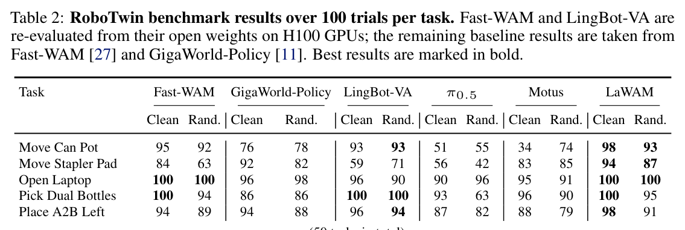
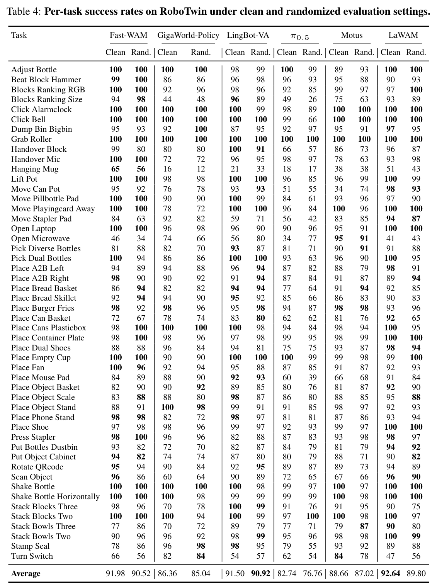
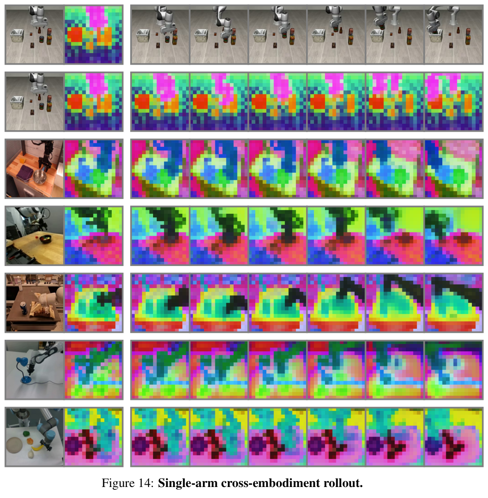
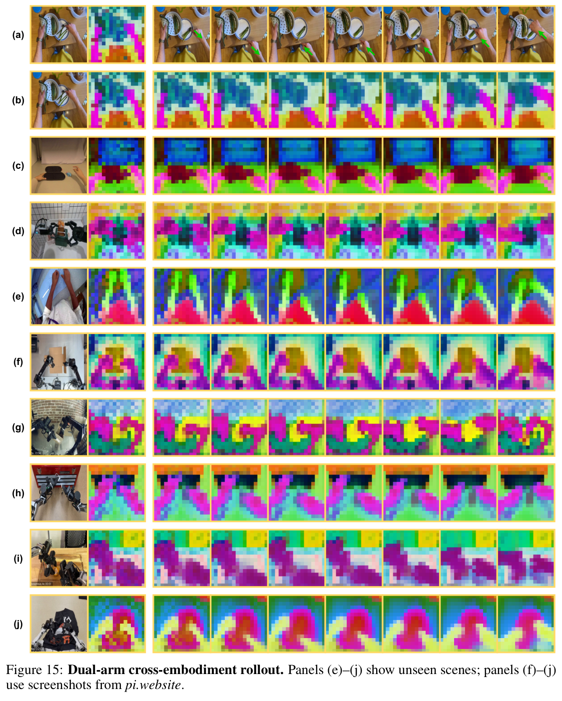

# LaWAM: Latent World Action Models for Efficient Dynamics-Aware Robot Policies

**Authors:** Jialei Chen, Kai Wang, Kang Chen, Shuaihang Chen, Feng Gao, Wenhao Tang, Zhiyuan Li, Weilin Liu, Zhuyu Yao, Boxun Li, Yuanbo Xu, Chao Yu (Tsinghua University, Jilin University, Nankai University, Peking University, Harbin Institute of Technology, Zhongguancun Academy, Striding.AI, Infinigence AI)  
**Source:** `/Users/roywangj/journey_wj/research/papers4zotero/zotero1/storage/2I9EGQ7W/Chen 等 - 2026 - LaWAM Latent World Action Models for Efficient Dynamics-Aware Robot Policies.pdf`  
**Detected source format:** selectable-text PDF (`pdf-text`)  
**Reader type:** full-paper Chinese-English Markdown reader with figure/table assets.

## Page / Section Index

| Pages | Section | Reader anchor |
|---:|---|---|
| 1 | Title, abstract | [Abstract](#abstract) |
| 1–3 | 1. Introduction | [Introduction](#1-introduction) |
| 3 | 2. Related Work | [Related Work](#2-related-work) |
| 3–5 | 3. Method | [Method](#3-method) |
| 5–8 | 4. Experiments | [Experiments](#4-experiments) |
| 8 | 5. Limitations | [Limitations](#5-limitations) |
| 8–9 | 6. Conclusion | [Conclusion](#6-conclusion) |
| 9–12 | References [1]–[47] | [References](#references) |
| 13–23 | Appendix A–D | [Appendix](#appendix) |

## Terminology Ledger

| Canonical term | 中文约定 | First-use definition / note |
|---|---|---|
| Vision-Language-Action model (VLA) | 视觉—语言—动作模型 | 由大规模视觉—语言预训练迁移到动作生成的机器人策略 |
| World-Action Model (WAM) | 世界—动作模型 | 以预测未来观测/状态为额外条件的策略 |
| LaWAM (Latent World Action Model) | LaWAM | 本文 2.3B 策略：以潜在视觉子目标条件化动作生成 |
| LaWM (Latent World Model) | 潜在世界模型 | 本文 230M 前向 decoder，预测未来观测特征 |
| latent action model (LAM) | 潜在动作模型 | 逆动力学 encoder + 前向 decoder，从无标注视频学习转移变量 |
| latent action (LA), $z$ | 潜在动作 | 从视觉转移 $(u,u_T)$ 推断的紧凑转移变量 |
| latent visual subgoal | 潜在视觉子目标 | $\hat{u}_T$：LaWM 单次前向输出的未来特征图 |
| inverse dynamics model (IDM) | 逆动力学模型 | 从期望视觉未来映射回动作（或潜在动作） |
| action chunk | 动作块 | 覆盖固定物理时长 $\tau$ 的动作序列 |
| action expert | 动作专家 | 生成动作块的流匹配去噪模块 |
| Alternate-DiT | Alternate-DiT | 在语义流与动力学流之间交替注意的 DiT block（沿用 GR00T N1） |
| Knowledge Insulation (KI) | 知识隔离 | 阻止动作专家梯度改写预训练 LaWM 动力学 |
| latent-action distillation | 潜在动作蒸馏 | 用 LAM 后验 $z$ 监督策略先验的 $\hat{z}$ |
| physical-time encoding | 物理时间编码 | 以秒为坐标的正弦时间戳编码，对齐混合控制频率数据 |
| DINOv3 | DINOv3 | 冻结视觉编码器（distilled ViT-B/16），特征空间 $f_\psi$ |
| flow matching | 流匹配 | 动作块去噪的条件训练目标 |
| success rate (SR) | 成功率 | 全文主要指标；LIBERO 98.6%、RoboTwin 91.22% |
| LIBERO / RoboTwin | LIBERO / RoboTwin | 单臂/双臂仿真操纵 benchmark，名称保留英文 |
| end-effector (EEF) | 末端执行器 | 全部动作标签统一转为 EEF 表征 |

## Abstract

> <span style="color:#3B82F6"><strong>Para. 1:</strong></span> Vision-Language-Action models (VLAs) leverage large-scale vision-language pretraining for semantic robot control, but often lack explicit foresight into how robot actions change the scene. World-Action Models (WAMs) address this limitation by conditioning policies on predicted futures, yet existing approaches typically rely on computationally expensive video generation with substantial pixel-level redundancy. We present LaWAM, a Latent World Action Model that exposes predictive dynamics to robot policies through compact latent visual subgoals instead of reconstructed future video. At the core of LaWAM is a latent-action-conditioned Latent World Model (LaWM). We obtain LaWM by training a latent action model in the latent space of a pretrained vision foundation model and repurposing its forward decoder to predict future observation features for scene evolution. LaWAM then conditions action generation on these predicted latent visual subgoals to enable dynamics-aware robot control. LaWAM achieves state-of-the-art or competitive success rates (SRs) across LIBERO (98.6% SR), RoboTwin (91.22% SR), and real-world manipulation tasks while retaining low-latency inference. LaWAM runs in 187 ms per action-chunk prediction and achieves up to 24× lower wall-clock latency than pixel-space WAMs.

> <span style="color:#F59E0B"><strong>Para. 1[CN]:</strong></span> 视觉—语言—动作模型（VLA）借助大规模视觉—语言预训练实现语义层面的机器人控制，却往往缺乏对“机器人动作将如何改变场景”的显式预见。世界—动作模型（WAM）通过让策略以预测的未来为条件来弥补这一缺陷，但现有方法通常依赖计算昂贵、像素级冗余严重的视频生成。我们提出 LaWAM——一种潜在世界—动作模型，它用紧凑的潜在视觉子目标（而非重建的未来视频）向机器人策略暴露预测动力学。LaWAM 的核心是一个以潜在动作为条件的潜在世界模型（LaWM）：我们在预训练视觉基础模型的潜在空间中训练一个潜在动作模型，并把它的前向 decoder 改造为预测未来观测特征、刻画场景演化的模块。LaWAM 随后以这些预测的潜在视觉子目标为条件生成动作，实现动力学感知的机器人控制。LaWAM 在 LIBERO（98.6% SR）、RoboTwin（91.22% SR）和真实世界操纵任务上取得最先进或有竞争力的成功率，同时保持低延迟推理：每次动作块预测仅需 187 ms，wall-clock 延迟比像素空间 WAM 低至多 24 倍。

## 1. Introduction

> <span style="color:#3B82F6"><strong>Para. 1:</strong></span> Vision-Language-Action models (VLAs) [1, 2, 3, 4, 5] have recently shown strong performance on robotic manipulation by transferring large-scale vision-language pretraining into action generation. However, most current VLAs predict actions primarily from the current visual-language context, without explicitly modeling how the scene evolves under candidate actions [6, 7].

> <span style="color:#F59E0B"><strong>Para. 1[CN]:</strong></span> 视觉—语言—动作模型（VLA）[1, 2, 3, 4, 5] 通过把大规模视觉—语言预训练迁移到动作生成，最近在机器人操纵上表现出色。然而当前多数 VLA 主要依据当前的视觉—语言上下文预测动作，并没有显式建模场景在候选动作作用下会如何演化 [6, 7]。

> <span style="color:#3B82F6"><strong>Para. 2:</strong></span> World-Action Models (WAMs) [8, 9, 10, 11, 12, 13, 14] offer a natural way to introduce temporal dynamics by augmenting policies with predicted future observations or states as additional context. However, current WAMs remain inefficient for manipulation policies. First, many methods predict future images or videos, allocating substantial modeling capacity to pixel-level synthesis rather than compact action-relevant dynamics. Second, iterative future generation introduces considerable inference latency; under the same evaluation setup used in Fig. 1, LingBot-VA [12] requires 4482 ms for a single policy inference, whereas the representative VLA $\pi_{0.5}$ [15] requires only 220 ms. Third, effective future prediction for manipulation should expose the state change relevant to the next action chunk, rather than merely generating visually plausible task-consistent futures.

> <span style="color:#F59E0B"><strong>Para. 2[CN]:</strong></span> 世界—动作模型（WAM）[8, 9, 10, 11, 12, 13, 14] 把预测的未来观测或状态作为额外上下文注入策略，是引入时间动力学的自然途径。但现有 WAM 对操纵策略而言仍然低效。第一，许多方法预测未来图像或视频，把大量建模容量花在像素级合成上，而不是紧凑的、与动作相关的动力学。第二，迭代式未来生成带来可观的推理延迟：在 Fig. 1 相同的评测设置下，LingBot-VA [12] 单次策略推理需要 4482 ms，而代表性 VLA $\pi_{0.5}$ [15] 只需 220 ms。第三，对操纵有效的未来预测应当暴露与下一个动作块直接相关的状态变化，而不仅仅是生成视觉上合理、与任务一致的未来画面。

### Figure 1. Latency–success trade-off on LIBERO


**Caption:** Latency–success trade-off on LIBERO. Latency for 10 denoising steps on an A100 GPU versus LIBERO success rate. The marker area denotes model size; the pink sector denotes world-modeling parameters.

**Caption[CN]:** LIBERO 上的延迟—成功率权衡。横轴为 A100 GPU 上 10 步去噪的延迟，纵轴为 LIBERO 成功率；圆面积表示模型规模，粉色扇区表示世界建模参数占比。

> <span style="color:#3B82F6"><strong>Para. 3:</strong></span> To address these limitations, we propose a Latent World Model (LaWM) for WAMs that predicts compact latent visual subgoals directly, rather than synthesizing future images or videos. LaWM is a latent-action-conditioned dynamics model that predicts future observation features corresponding to the scene change required for the next action chunk. By operating entirely in the latent space, LaWM models action-relevant dynamics efficiently without expensive or iterative pixel generation.

> <span style="color:#F59E0B"><strong>Para. 3[CN]:</strong></span> 为解决这些限制，我们为 WAM 提出潜在世界模型（LaWM）：它直接预测紧凑的潜在视觉子目标，而不去合成未来图像或视频。LaWM 是一个以潜在动作为条件的动力学模型，预测与“下一个动作块所需场景变化”对应的未来观测特征。由于完全在潜在空间中运行，LaWM 可以高效地建模与动作相关的动力学，无需昂贵或迭代的像素生成。

> <span style="color:#3B82F6"><strong>Para. 4:</strong></span> We obtain LaWM by revisiting latent action models (LAMs) in the latent space of frozen visual encoders [16], such as DINOv3 [17]. A LAM contains an inverse-dynamics encoder that infers latent actions from visual transitions and a decoder that predicts the future latent state conditioned on the current latent state and latent action. Prior latent-action-based VLAs mainly use this framework to learn embodiment-agnostic action representations, treating the decoder only as an auxiliary training component and discarding it after pretraining [18, 16, 19, 20]. In contrast, we repurpose the decoder as the core predictive module of LaWM, using latent actions to generate future observation features that serve as latent visual subgoals for action generation.

> <span style="color:#F59E0B"><strong>Para. 4[CN]:</strong></span> 我们通过在冻结视觉编码器（如 DINOv3 [17]）的潜在空间中重新审视潜在动作模型（LAM）[16] 来获得 LaWM。LAM 包含一个逆动力学 encoder（从视觉转移中推断潜在动作）和一个 decoder（以当前潜在状态和潜在动作为条件预测未来潜在状态）。此前基于潜在动作的 VLA 主要利用这一框架学习与机器人形态无关的动作表征，把 decoder 仅当作辅助训练组件、预训练后即丢弃 [18, 16, 19, 20]。与之相反，我们把这个 decoder 改造为 LaWM 的核心预测模块：用潜在动作生成未来观测特征，作为动作生成的潜在视觉子目标。

> <span style="color:#3B82F6"><strong>Para. 5:</strong></span> Building on this latent visual subgoal interface, we introduce the Latent World Action Model (LaWAM), which conditions action generation on LaWM-predicted future dynamics. Fig. 2 provides an overview of the full two-stage pretraining pipeline. We first train LaWM as a latent-action-conditioned world model, then pretrain LaWAM with latent-action distillation for subgoal-conditioned action generation. Overall, the training pipeline uses roughly 3,000 hours of robot videos and 1,500 hours of egocentric human videos. At test time, the policy predicts a latent action, LaWM decodes it into a latent visual subgoal in a single forward pass, and an action expert generates the action chunk conditioned on both the current context and predicted subgoal.

> <span style="color:#F59E0B"><strong>Para. 5[CN]:</strong></span> 在这一潜在视觉子目标接口之上，我们提出潜在世界—动作模型（LaWAM），让动作生成以 LaWM 预测的未来动力学为条件。Fig. 2 给出完整两阶段预训练流水线的总览：先把 LaWM 训练为潜在动作条件化的世界模型，再用潜在动作蒸馏预训练 LaWAM，实现子目标条件化的动作生成。整个训练流水线约使用 3,000 小时机器人视频和 1,500 小时人类第一视角视频。测试时，策略先预测潜在动作，LaWM 单次前向即可把它解码为潜在视觉子目标，动作专家随后同时以当前上下文和预测子目标为条件生成动作块。

### Figure 2. Overview of LaWAM


**Caption:** Overview of LaWAM. Stage 1 learns a latent-action-conditioned world model from visual transitions: an inverse-dynamics encoder infers latent actions, and the decoder is retained as LaWM to predict future observation features. Stage 2 integrates LaWM into a VLA policy: latent-action distillation teaches the policy to drive LaWM, whose predicted latent visual subgoal is passed to an Alternate-DiT action expert for subgoal-conditioned action generation.

**Caption[CN]:** LaWAM 总览。Stage 1 从视觉转移中学习潜在动作条件化的世界模型：逆动力学 encoder 推断潜在动作，decoder 被保留为 LaWM 以预测未来观测特征。Stage 2 把 LaWM 整合进 VLA 策略：潜在动作蒸馏教会策略驱动 LaWM，LaWM 预测的潜在视觉子目标被送入 Alternate-DiT 动作专家，实现子目标条件化的动作生成。

> <span style="color:#3B82F6"><strong>Para. 6:</strong></span> After benchmark-specific post-training, LaWAM achieves state-of-the-art or competitive success against strong VLA and WAM baselines across simulated benchmarks and physical robot tasks, including LIBERO [21], RoboTwin [22], and real-world pick-and-place, drawer opening, and towel folding, with 2.3B parameters. Beyond accuracy, Fig. 1 shows that LaWAM combines non-iterative latent prediction with a compact 230M-parameter LaWM, using about 95% fewer world-modeling parameters than the 5B WAN backbone [23]. LaWAM runs in 187 ms per action-chunk prediction and achieves up to 24× lower wall-clock latency than pixel-space WAMs.

> <span style="color:#F59E0B"><strong>Para. 6[CN]:</strong></span> 经过面向各 benchmark 的 post-training 后，LaWAM 以 2.3B 参数，在仿真 benchmark 和真机任务（包括 LIBERO [21]、RoboTwin [22]，以及真实世界的抓取放置、开抽屉和叠毛巾）上对强 VLA 和 WAM 基线取得最先进或有竞争力的成功率。在精度之外，Fig. 1 显示 LaWAM 把非迭代潜在预测与紧凑的 230M 参数 LaWM 结合，世界建模参数比 5B 的 WAN backbone [23] 少约 95%；每次动作块预测仅需 187 ms，wall-clock 延迟比像素空间 WAM 低至多 24 倍。

## 2. Related Work

> <span style="color:#3B82F6"><strong>Para. 1:</strong></span> Vision-Language-Action Models. VLAs transfer large-scale vision-language pretraining into robot control, giving policies strong semantic grounding over instructions, objects, and task compositions [1, 2, 4, 5, 14, 6]. This semantic prior helps specify what the robot should achieve, but it does not by itself provide explicit reasoning about how the scene evolves under embodied interaction. Recent VLA variants introduce temporal structure through learned future queries or feature-alignment objectives [24, 5, 25, 26]. These mechanisms are efficient and easy to integrate into VLA backbones, but they typically encode future dynamics into compact latent tokens rather than exposing an explicit action-conditioned future observation feature to the downstream action generator. LaWAM retains the semantic strengths of VLA backbones while introducing a latent world-model interface: a spatially structured latent visual subgoal that conditions action generation on predicted dynamics without reconstructing pixels.

> <span style="color:#F59E0B"><strong>Para. 1[CN]:</strong></span> 视觉—语言—动作模型。VLA 把大规模视觉—语言预训练迁移到机器人控制，使策略在指令、物体和任务组合上具备很强的语义 grounding [1, 2, 4, 5, 14, 6]。这种语义先验有助于说明机器人“应该达成什么”，但它本身并不提供对“场景在具身交互下如何演化”的显式推理。近期一些 VLA 变体通过可学习的 future query 或特征对齐目标引入时间结构 [24, 5, 25, 26]。这些机制高效且易于集成进 VLA 骨干，但它们通常把未来动力学编码进紧凑的潜在 token，而不是向下游动作生成器暴露显式的、以动作为条件的未来观测特征。LaWAM 保留 VLA 骨干的语义优势，同时引入一个潜在世界模型接口：具有空间结构的潜在视觉子目标，让动作生成以预测动力学为条件而无需重建像素。

> <span style="color:#3B82F6"><strong>Para. 2:</strong></span> World-Action Models. World-Action Models (WAMs) augment robot policies with predicted future context, allowing action generation to condition on how the scene may evolve under embodied interaction [8, 10, 13, 9, 12, 11, 27]. Pixel-space WAMs provide explicit physical foresight through generated images or videos, but they inherit costly iterative generation and substantial appearance-level redundancy [9, 12, 28]. $\pi_{0.7}$ similarly conditions robot policies on visual subgoals, but these subgoals are produced by a separate iterative pixel-space model [29]. Efficiency-oriented approaches such as Fast-WAM and GigaWorld-Policy reduce generation cost by making future prediction auxiliary or action-centered, which weakens the role of predicted dynamics as an explicit conditioning signal during test-time action generation [27, 11]. Concurrent analyses likewise suggest that pretrained visual latent spaces provide stronger policy-facing dynamics representations than pixel-reconstruction spaces [30]. While LDA-1B also models dynamics in a structured DINO latent space, it jointly denoises future visual states and action chunks through a diffusion-style process [31]. In contrast, LaWAM represents future dynamics through a single non-iterative latent visual subgoal that directly conditions the downstream action generator during inference.

> <span style="color:#F59E0B"><strong>Para. 2[CN]:</strong></span> 世界—动作模型。WAM 用预测的未来上下文增强机器人策略，让动作生成能以“场景在具身交互下可能如何演化”为条件 [8, 10, 13, 9, 12, 11, 27]。像素空间 WAM 通过生成图像或视频提供显式的物理预见，但也继承了昂贵的迭代生成和大量外观层面的冗余 [9, 12, 28]。$\pi_{0.7}$ 同样让机器人策略以视觉子目标为条件，但这些子目标由一个独立的迭代式像素空间模型产生 [29]。Fast-WAM 和 GigaWorld-Policy 等以效率为导向的方法通过把未来预测变成辅助目标或以动作为中心来降低生成成本，这削弱了预测动力学在测试时作为显式条件信号的作用 [27, 11]。同期分析也表明，预训练视觉潜在空间比像素重建空间能提供更强的、面向策略的动力学表征 [30]。LDA-1B 同样在结构化的 DINO 潜在空间中建模动力学，但它用扩散式过程联合去噪未来视觉状态和动作块 [31]。与之相反，LaWAM 用单个非迭代的潜在视觉子目标表示未来动力学，并在推理时直接作为下游动作生成器的条件。

> <span style="color:#3B82F6"><strong>Para. 3:</strong></span> Latent Action Models. Latent action models learn compact transition variables from unlabeled videos through latent inverse dynamics and forward prediction [18, 16, 19, 20]. Recent VLA and world-modeling methods use such variables as cross-embodiment action representations for policy learning and future prediction [19, 32, 33, 34, 35]. Most prior work focuses primarily on the latent action space itself—its discreteness or continuity, regularization, and downstream transfer. A complementary opportunity lies in the decoder: as concurrently observed by Garrido et al. [36], the decoder of a latent action model already implements a latent action-conditioned world model. LaWAM builds on this observation by repurposing the decoder as a policy-facing latent dynamics interface, where latent actions are expanded into embodiment-grounded future observation features that directly condition action generation.

> <span style="color:#F59E0B"><strong>Para. 3[CN]:</strong></span> 潜在动作模型。LAM 通过潜在逆动力学和前向预测，从无标注视频中学习紧凑的转移变量 [18, 16, 19, 20]。近期的 VLA 和世界建模方法把这些变量用作跨机器人形态的动作表征，服务于策略学习和未来预测 [19, 32, 33, 34, 35]。此前工作大多聚焦于潜在动作空间本身——离散还是连续、如何正则化、如何做下游迁移。一个互补的机会在于 decoder：正如 Garrido 等 [36] 同期观察到的，LAM 的 decoder 本身已经实现了一个以潜在动作为条件的世界模型。LaWAM 基于这一观察，把 decoder 改造为面向策略的潜在动力学接口：潜在动作被展开为落地于具体机器人形态的未来观测特征，直接条件化动作生成。

## 3. Method

### 3.1 Problem Formulation

> <span style="color:#3B82F6"><strong>Para. 1:</strong></span> Let $o$ denote the current observation, $l$ the task instruction, and $a_{1:T}$ an action chunk over a fixed physical horizon $\tau$. A standard VLA directly models $p(a_{1:T} \mid o, l)$, mapping the current perceptual and language context to executable actions. WAMs instead expose the policy to a predicted future. Using the horizon observation $o_T$ for notation, a common WAM decomposition is

> <span style="color:#F59E0B"><strong>Para. 1[CN]:</strong></span> 设 $o$ 为当前观测，$l$ 为任务指令，$a_{1:T}$ 为覆盖固定物理时长 $\tau$ 的动作块。标准 VLA 直接建模 $p(a_{1:T} \mid o, l)$，把当前感知—语言上下文映射为可执行动作。WAM 则让策略接触一个预测的未来。以时域末端观测 $o_T$ 记号表示，常见的 WAM 分解为：

$$
\underbrace{p(a_{1:T}, o_T \mid o, l)}_{\text{Joint}}
= \underbrace{p(o_T \mid o, l)}_{\text{Future Prediction}}\;
\underbrace{p(a_{1:T} \mid o, o_T)}_{\text{IDM}}
\quad (1)
$$

> <span style="color:#3B82F6"><strong>Para. 2:</strong></span> The second term acts as an inverse-dynamics model (IDM), mapping a desired visual future to actions. The same decomposition applies to future clips $o_{1:T}$. In either case, pixel-space WAMs must generate dense future images or videos, although chunk-level control often needs only a compact description of the relevant scene change.

> <span style="color:#F59E0B"><strong>Para. 2[CN]:</strong></span> 第二项充当逆动力学模型（IDM），把期望的视觉未来映射为动作。同样的分解也适用于未来视频片段 $o_{1:T}$。无论哪种情形，像素空间 WAM 都必须生成稠密的未来图像或视频，而块级控制往往只需要对相关场景变化的一个紧凑描述。

> <span style="color:#3B82F6"><strong>Para. 3:</strong></span> LaWAM keeps the future-conditioned structure but represents the future in a frozen visual feature space. Let $f_\psi$ be the frozen encoder, and define $u = f_\psi(o)$ and $u_T = f_\psi(o_T)$. We first learn a latent action model over such feature pairs:

> <span style="color:#F59E0B"><strong>Para. 3[CN]:</strong></span> LaWAM 保留“以未来为条件”的结构，但把未来表示在一个冻结的视觉特征空间中。设 $f_\psi$ 为冻结 encoder，定义 $u = f_\psi(o)$、$u_T = f_\psi(o_T)$。我们先在这样的特征对上学习一个潜在动作模型：

$$
z \sim q_\phi(z \mid u, u_T), \qquad \tilde{u}_T = \mathrm{LaWM}_\omega(u, z)
\quad (2)
$$

> <span style="color:#3B82F6"><strong>Para. 4:</strong></span> The distribution $q_\phi$ is the latent-action posterior: it acts as a latent inverse-dynamics model, inferring $z$ from the observed transition $(u, u_T)$. The decoder then predicts the horizon feature from the current feature and $z$, and we retain this decoder as the Latent World Model (LaWM).

> <span style="color:#F59E0B"><strong>Para. 4[CN]:</strong></span> 分布 $q_\phi$ 是潜在动作后验：它相当于潜在逆动力学模型，从观测到的转移 $(u, u_T)$ 中推断 $z$。decoder 则依据当前特征和 $z$ 预测时域末端特征；我们把这个 decoder 保留下来，即潜在世界模型（LaWM）。

> <span style="color:#3B82F6"><strong>Para. 5:</strong></span> At inference time, the future feature $u_T$ is unavailable, so the policy must predict the latent action before LaWM can predict the subgoal. LaWAM therefore factors action generation as

> <span style="color:#F59E0B"><strong>Para. 5[CN]:</strong></span> 推理时未来特征 $u_T$ 不可得，因此必须先由策略预测潜在动作，LaWM 才能预测子目标。LaWAM 据此把动作生成分解为：

$$
\underbrace{p(a_{1:T}, \hat{u}_T, \hat{z} \mid o, l)}_{\text{LaWAM}}
= \underbrace{p_\theta(\hat{z} \mid o, l)}_{\text{Policy Prior}}\;
\underbrace{p_\omega(\hat{u}_T \mid u, \hat{z})}_{\text{LaWM}}\;
\underbrace{p_\eta(a_{1:T} \mid o, l, u, \hat{u}_T)}_{\text{Action Expert}}
\quad (3)
$$

> <span style="color:#3B82F6"><strong>Para. 6:</strong></span> Here $p_\theta$ predicts the latent action, $p_\omega$ deterministically decodes it into $\hat{u}_T = \mathrm{LaWM}_\omega(u, \hat{z})$, and $p_\eta$ generates the action chunk. We use $u_T$ for the training target and $\hat{u}_T$ for the policy-driven subgoal.

> <span style="color:#F59E0B"><strong>Para. 6[CN]:</strong></span> 其中 $p_\theta$ 预测潜在动作，$p_\omega$ 把它确定性地解码为 $\hat{u}_T = \mathrm{LaWM}_\omega(u, \hat{z})$，$p_\eta$ 生成动作块。训练目标用 $u_T$ 表示，策略驱动的子目标用 $\hat{u}_T$ 表示。

### 3.2 Latent World Model

> <span style="color:#3B82F6"><strong>Para. 7:</strong></span> The first stage learns LaWM as the forward decoder of a latent action model. Each training example contains a current observation $o$ and a horizon observation $o_T$ sampled after the physical interval $\tau$. After encoding them as $(u, u_T)$, the inverse-dynamics encoder infers a latent action $z \sim q_\phi(z \mid u, u_T)$. The decoder then uses $(u, z)$ to predict the horizon feature, $\tilde{u}_T = \mathrm{LaWM}_\omega(u, z)$.

> <span style="color:#F59E0B"><strong>Para. 7[CN]:</strong></span> 第一阶段把 LaWM 作为潜在动作模型的前向 decoder 来学习。每个训练样本包含当前观测 $o$ 和物理间隔 $\tau$ 之后采样的时域末端观测 $o_T$。将二者编码为 $(u, u_T)$ 后，逆动力学 encoder 推断潜在动作 $z \sim q_\phi(z \mid u, u_T)$；decoder 再用 $(u, z)$ 预测末端特征 $\tilde{u}_T = \mathrm{LaWM}_\omega(u, z)$。

> <span style="color:#3B82F6"><strong>Para. 8:</strong></span> This training setup gives LaWM a simple role: given the current latent state and a latent action, predict the latent future state. The target $u_T$ directly supervises the decoder, and the inferred latent action $z$ serves as the teacher signal for the stage-two policy prior.

> <span style="color:#F59E0B"><strong>Para. 8[CN]:</strong></span> 这一训练设定赋予 LaWM 一个简单的角色：给定当前潜在状态和一个潜在动作，预测潜在的未来状态。目标 $u_T$ 直接监督 decoder，而推断出的潜在动作 $z$ 则作为第二阶段策略先验的教师信号。

> <span style="color:#3B82F6"><strong>Para. 9:</strong></span> We add one auxiliary signal during this pretraining stage. A lightweight predictor $g$ maps the current end-effector state $s$ and latent action $z$ to the horizon state $s_T$, encouraging $z$ to encode embodied motion rather than only visual appearance change. After pretraining, we discard this auxiliary head and keep the decoder as LaWM; the posterior encoder is used only to produce teacher latent actions for policy training. LaWM architecture details are provided in Appendix C.1.

> <span style="color:#F59E0B"><strong>Para. 9[CN]:</strong></span> 预训练阶段我们加入一个辅助信号：轻量预测器 $g$ 把当前末端执行器状态 $s$ 和潜在动作 $z$ 映射到末端状态 $s_T$，促使 $z$ 编码具身运动而不仅仅是视觉外观变化。预训练结束后丢弃该辅助 head，只保留 decoder 作为 LaWM；后验 encoder 仅用于为策略训练产生教师潜在动作。LaWM 架构细节见 Appendix C.1。

> <span style="color:#3B82F6"><strong>Para. 10:</strong></span> We train the latent action model with a forward-prediction objective and KL regularization, where $\mathcal{L}_{\mathrm{wm}} = \|\tilde{u}_T - u_T\|_2^2$ trains LaWM to match the horizon feature, and $\mathcal{L}_{\mathrm{aux}} = \|g(s, z) - s_T\|^2$ trains the auxiliary state predictor. The KL term regularizes the latent-action space so that it can later be modeled by the policy prior. Because both $u_T$ and $s_T$ are defined by the same physical interval $\tau$, the learned subgoal corresponds to a consistent amount of elapsed motion rather than a dataset-specific frame offset.

> <span style="color:#F59E0B"><strong>Para. 10[CN]:</strong></span> 我们用前向预测目标加 KL 正则训练潜在动作模型：其中 $\mathcal{L}_{\mathrm{wm}} = \|\tilde{u}_T - u_T\|_2^2$ 训练 LaWM 拟合末端特征，$\mathcal{L}_{\mathrm{aux}} = \|g(s, z) - s_T\|^2$ 训练辅助状态预测器；KL 项正则化潜在动作空间，使其之后可被策略先验建模。由于 $u_T$ 和 $s_T$ 都由同一物理间隔 $\tau$ 定义，学到的子目标对应一段一致的运动时长，而不是随数据集变化的帧偏移。

$$
\mathcal{L}_{\mathrm{LAM}} = \mathcal{L}_{\mathrm{wm}} + \mathcal{L}_{\mathrm{aux}} + \beta\, D_{\mathrm{KL}}\!\left(q_\phi(z \mid u, u_T)\,\|\,\mathcal{N}(0, I)\right)
\quad (4)
$$

### 3.3 Latent World Action Model

> <span style="color:#3B82F6"><strong>Para. 11:</strong></span> The second stage turns the pretrained LaWM into a test-time policy interface. The IDM encoder from stage one cannot be used during deployment, because it requires the future feature $u_T$. We therefore train the policy prior $p_\theta(\hat{z} \mid o, l)$ to predict the latent action from the current observation and instruction. The predicted latent action is passed through the pretrained LaWM decoder to produce $\hat{u}_T = \mathrm{LaWM}_\omega(u, \hat{z})$, giving the policy a latent prediction of the chunk-level visual future without generating future pixels.

> <span style="color:#F59E0B"><strong>Para. 11[CN]:</strong></span> 第二阶段把预训练好的 LaWM 变成测试时的策略接口。第一阶段的 IDM encoder 在部署时不可用，因为它需要未来特征 $u_T$。因此我们训练策略先验 $p_\theta(\hat{z} \mid o, l)$，从当前观测和指令预测潜在动作；预测出的潜在动作经过预训练 LaWM decoder 得到 $\hat{u}_T = \mathrm{LaWM}_\omega(u, \hat{z})$，使策略在不生成未来像素的情况下获得块级视觉未来的潜在预测。

> <span style="color:#3B82F6"><strong>Para. 12:</strong></span> The action expert uses this predicted future through an Alternate-DiT design [5]. One stream carries the semantic context from the VLM backbone, while the other carries the latent dynamics context formed by $(u, \hat{u}_T)$. Alternating between these streams lets the expert combine task intent with the predicted scene evolution when denoising the action chunk. Fig. 3 visualizes the resulting chunk-level execution: the action expert generates a robot motion chunk conditioned on the predicted latent subgoal, and the executed motion moves toward the corresponding subgoal region. Backbone, query layout, and Alternate-DiT details are given in Appendix C.2.

> <span style="color:#F59E0B"><strong>Para. 12[CN]:</strong></span> 动作专家通过 Alternate-DiT 设计 [5] 使用这个预测的未来：一条流承载来自 VLM 骨干的语义上下文，另一条流承载由 $(u, \hat{u}_T)$ 构成的潜在动力学上下文。在两条流之间交替注意，使专家在为动作块去噪时能同时融合任务意图与预测的场景演化。Fig. 3 可视化了由此产生的块级执行：动作专家以预测的潜在子目标为条件生成机器人运动块，实际执行的运动朝对应的子目标区域移动。骨干、query 布局和 Alternate-DiT 细节见 Appendix C.2。

### Figure 3. Subgoal-guided chunk execution


**Caption:** Subgoal-guided chunk execution. The top row shows observations within one executed LIBERO chunk together with the predicted latent subgoal; the bottom row overlays subgoal-derived robot-arm heatmaps, illustrating how the executed motion approaches the predicted subgoal region.

**Caption[CN]:** 子目标引导的动作块执行。上排展示一个已执行 LIBERO 动作块内的观测及预测的潜在子目标；下排叠加由子目标导出的机械臂热力图，说明实际执行的运动如何逼近预测的子目标区域。

> <span style="color:#3B82F6"><strong>Para. 13:</strong></span> Stage-two training combines latent-action distillation, subgoal supervision, and action flow matching. We further apply Knowledge Insulation (KI) [37] so action-expert gradients do not overwrite the pretrained LaWM dynamics. For mixed-frequency robot data, LaWAM keeps each dataset at its native control frequency and uses physical-time encoding, as detailed in Appendix C.3. In the full stage-two objective, $\mathcal{L}_{\mathrm{distill}} = \mathbb{E}[\|\hat{z} - z\|_2^2]$, $\mathcal{L}_{\mathrm{wm}} = \|\hat{u}_T - u_T\|_2^2$ supervises the policy-driven subgoal, and $\mathcal{L}_{\mathrm{act}}$ denotes the conditional flow-matching loss for $a_{1:T}$ given $(o, l, u, \hat{u}_T)$. Training schedules and optimization details are reported in Appendix C.5.

> <span style="color:#F59E0B"><strong>Para. 13[CN]:</strong></span> 第二阶段训练结合潜在动作蒸馏、子目标监督和动作流匹配三部分，并进一步施加知识隔离（KI）[37]，使动作专家的梯度不会覆写预训练的 LaWM 动力学。对混合控制频率的机器人数据，LaWAM 让每个数据集保持原生控制频率并使用物理时间编码（详见 Appendix C.3）。完整第二阶段目标中，$\mathcal{L}_{\mathrm{distill}} = \mathbb{E}[\|\hat{z} - z\|_2^2]$；$\mathcal{L}_{\mathrm{wm}} = \|\hat{u}_T - u_T\|_2^2$ 监督策略驱动的子目标；$\mathcal{L}_{\mathrm{act}}$ 是给定 $(o, l, u, \hat{u}_T)$ 时 $a_{1:T}$ 的条件流匹配损失。训练日程与优化细节见 Appendix C.5。

$$
\mathcal{L}_{\mathrm{LaWAM}} = \lambda_{\mathrm{distill}}\,\mathcal{L}_{\mathrm{distill}} + \lambda_{\mathrm{wm}}\,\mathcal{L}_{\mathrm{wm}} + \mathcal{L}_{\mathrm{act}}
\quad (5)
$$

## 4. Experiments

> <span style="color:#3B82F6"><strong>Para. 1:</strong></span> We use a modest pretraining setup built from open-source data [38, 39, 40, 41, 42, 43, 44, 45]. LaWM is pretrained on roughly 3,000 hours of robot videos and 1,500 hours of egocentric human videos, while LaWAM policy integration uses only robot trajectories with language instructions; human videos contribute only through the dynamics prior learned by LaWM. We evaluate LaWAM along five axes: simulated benchmark performance, inference efficiency, real-world transfer, latent-dynamics behavior, and component contributions. Benchmark-specific protocols are detailed in Appendices D.1, D.2, and D.3, with visualization protocols in Appendix B.

> <span style="color:#F59E0B"><strong>Para. 1[CN]:</strong></span> 我们采用一个基于开源数据的适度预训练设置 [38, 39, 40, 41, 42, 43, 44, 45]。LaWM 在约 3,000 小时机器人视频和 1,500 小时人类第一视角视频上预训练；LaWAM 的策略整合只使用带语言指令的机器人轨迹——人类视频仅通过 LaWM 学到的动力学先验发挥作用。我们沿五个维度评估 LaWAM：仿真 benchmark 性能、推理效率、真实世界迁移、潜在动力学行为、以及组件贡献。各 benchmark 具体协议见 Appendices D.1、D.2、D.3，可视化协议见 Appendix B。

### 4.1 LIBERO

> <span style="color:#3B82F6"><strong>Para. 2:</strong></span> We first evaluate on the four standard LIBERO suites [21]. As shown in Table 1, LaWAM achieves the best average success rate among the compared VLA, latent-action, and WAM baselines; the gap over latent-action baselines suggests that compact action tokens are more effective when expanded into spatially structured latent visual subgoals.

> <span style="color:#F59E0B"><strong>Para. 2[CN]:</strong></span> 我们首先在四个标准 LIBERO suite [21] 上评测。如 Table 1 所示，LaWAM 在所比较的 VLA、潜在动作和 WAM 基线中取得最高平均成功率；相对潜在动作类基线的差距表明，紧凑的动作 token 在被展开为具有空间结构的潜在视觉子目标后会更加有效。

### Table 1. LIBERO benchmark results


| Method | Size | Latency ms | Long | Goal | Object | Spatial | Average |
|---|---:|---:|---:|---:|---:|---:|---:|
| OpenVLA-OFT | 7B | — | 94.5 | 97.9 | 98.4 | 97.6 | 97.1 |
| $\pi_0$ | 3.5B | 220 | 88.4 | 94.4 | 96.8 | 98.0 | 94.4 |
| $\pi_{0.5}$ | 3.5B | 220 | 92.4 | 98.0 | 98.2 | 98.8 | 96.9 |
| GR00T-N1.6 | 3.3B | 259 | 94.4 | 97.5 | 98.5 | 97.7 | 97.0 |
| LAPA | 7B | — | 55.4 | 58.8 | 74.6 | 73.8 | 65.7 |
| UniVLA | 7B | — | 92.0 | 95.6 | 96.8 | 96.5 | 95.2 |
| Mantis | 5.8B | — | 94.2 | 94.4 | 99.2 | 98.8 | 96.7 |
| VLA-JEPA | 3B | — | 95.8 | 97.2 | 99.6 | 96.2 | 97.2 |
| F1 | 4B | 399.0 | 91.3 | 95.4 | 97.8 | 98.2 | 95.7 |
| Motus | 8B | 3231 | 97.6 | 96.6 | 99.8 | 96.8 | 97.7 |
| Cosmos-Policy | 2.1B | 1413 | 97.6 | 98.2 | 100.0 | 98.1 | 98.5 |
| LingBot-VA | 5.5B | 4482 | 98.5 | 97.2 | 99.6 | 98.5 | 98.5 |
| Fast-WAM | 6B | 486 | 95.2 | 97.0 | 100.0 | 98.2 | 97.6 |
| **LaWAM** | **2.3B** | **187** | **97.0** | **98.4** | **99.6** | **99.4** | **98.6** |

**Caption:** LIBERO benchmark results over 50 trials per task. Latency is model-only wall-clock time per action chunk, excluding simulator and robot execution overhead. LaWAM (2.3B) reaches 98.6 average SR (Long 97.0 / Goal 98.4 / Object 99.6 / Spatial 99.4), versus 98.5 for Cosmos-Policy (2.1B) and LingBot-VA (5.5B), 97.2 for VLA-JEPA, and 96.9 for $\pi_{0.5}$.

**Caption[CN]:** 每任务 50 次试验的 LIBERO 结果。延迟为每个动作块的纯模型 wall-clock 时间，不含仿真器与机器人执行开销。LaWAM（2.3B）平均 SR 98.6（Long 97.0 / Goal 98.4 / Object 99.6 / Spatial 99.4）；Cosmos-Policy（2.1B）与 LingBot-VA（5.5B）为 98.5，VLA-JEPA 为 97.2，$\pi_{0.5}$ 为 96.9。

> <span style="color:#3B82F6"><strong>Para. 3:</strong></span> This performance does not require expensive pixel-space imagination. Representative pixel-space WAMs rely on large video-generation backbones, whereas LaWAM uses a 230M LaWM in place of the 5B WAN backbone used by such models, reducing world-modeling parameters by about 95%. This keeps the full LaWAM model size at 2.3B and yields 187 ms latency, up to 24× faster than pixel-space WAMs as shown in Fig. 1. The efficiency comes from predicting one latent subgoal per action chunk rather than repeatedly generating pixel-space future frames. Appendix Fig. 8 extends the chunk-level visualization in Fig. 3 to complete executed LIBERO trajectories.

> <span style="color:#F59E0B"><strong>Para. 3[CN]:</strong></span> 这一性能并不需要昂贵的像素空间“想象”。代表性像素空间 WAM 依赖大型视频生成骨干，而 LaWAM 用 230M 的 LaWM 取代这类模型使用的 5B WAN 骨干，世界建模参数减少约 95%。这使 LaWAM 整体规模保持在 2.3B，延迟为 187 ms，如 Fig. 1 所示比像素空间 WAM 快至多 24 倍。效率来自“每个动作块只预测一个潜在子目标”，而不是反复生成像素空间的未来帧。Appendix Fig. 8 把 Fig. 3 的块级可视化扩展到完整执行的 LIBERO 轨迹。

### 4.2 RoboTwin

> <span style="color:#3B82F6"><strong>Para. 4:</strong></span> RoboTwin 2.0 [22] evaluates coordinated bimanual manipulation across 50 tasks, allowing us to test whether non-iterative latent world modeling scales beyond single-arm LIBERO tasks. Table 2 shows that LaWAM achieves the best clean-scene average and remains close to the strongest pixel-space WAMs under randomized scenes. These results suggest that latent subgoal prediction scales to complex bimanual manipulation while avoiding the heavy test-time rollout cost of pixel-space WAMs.

> <span style="color:#F59E0B"><strong>Para. 4[CN]:</strong></span> RoboTwin 2.0 [22] 在 50 个任务上评测双臂协同操纵，可用来检验非迭代潜在世界建模能否超出单臂 LIBERO 任务的范围。Table 2 显示，LaWAM 取得最高的 clean 场景平均成功率，并在随机化场景下与最强的像素空间 WAM 接近。这些结果表明潜在子目标预测能够扩展到复杂的双臂操纵，同时避免像素空间 WAM 沉重的测试时 rollout 开销。

### Table 2. RoboTwin benchmark results



**Caption:** RoboTwin benchmark results over 100 trials per task. Fast-WAM and LingBot-VA are re-evaluated from their open weights on H100 GPUs; the remaining baseline results are taken from Fast-WAM and GigaWorld-Policy. Averages (Clean/Rand.): Fast-WAM 91.98/90.52, GigaWorld-Policy 86.36/85.04, LingBot-VA 91.50/90.92, $\pi_{0.5}$ 82.74/76.76, Motus 88.66/87.02, LaWAM 92.64/89.80.

**Caption[CN]:** 每任务 100 次试验的 RoboTwin 结果。Fast-WAM 与 LingBot-VA 使用开源权重在 H100 上重新评测，其余基线数字取自 Fast-WAM 与 GigaWorld-Policy。平均值（Clean/Rand.）：Fast-WAM 91.98/90.52，GigaWorld-Policy 86.36/85.04，LingBot-VA 91.50/90.92，$\pi_{0.5}$ 82.74/76.76，Motus 88.66/87.02，LaWAM 92.64/89.80。

### 4.3 Real-World Experiments

> <span style="color:#3B82F6"><strong>Para. 5:</strong></span> For real-world transfer, we evaluate Pick-and-Place, Drawer Opening, and Towel Folding, covering rigid-object manipulation, articulated-object interaction, and long-horizon deformable-object manipulation. The test trials include both in-distribution initial configurations and out-of-distribution spatial configurations beyond the training demonstrations, testing whether latent dynamics learned from heterogeneous robot data transfer beyond benchmark environments. Fig. 4 shows representative real-world rollouts, and complete trajectory subgoal visualizations are provided in Appendix Figs. 11, 12, and 13.

> <span style="color:#F59E0B"><strong>Para. 5[CN]:</strong></span> 真实世界迁移评测三个任务：抓取放置（Pick-and-Place）、开抽屉（Drawer Opening）和叠毛巾（Towel Folding），分别覆盖刚体操纵、铰接物体交互和长时程可形变物体操纵。测试试验同时包含分布内初始配置和超出训练示范的分布外空间配置，检验从异构机器人数据学到的潜在动力学能否迁移到 benchmark 环境之外。Fig. 4 展示代表性真机 rollout，完整轨迹的子目标可视化见 Appendix Figs. 11、12、13。

### Figure 4. Representative real-world rollouts


**Caption:** Representative real-world rollouts for pick-and-place, drawer opening, and towel folding on two robot platforms.

**Caption[CN]:** 两个机器人平台上抓取放置、开抽屉与叠毛巾的代表性真机 rollout。

> <span style="color:#3B82F6"><strong>Para. 6:</strong></span> Table 3 shows that LaWAM achieves the best average real-world success rate and ranks first across all three tasks. It completes tasks stably and controls spatial target positions accurately, indicating that dense LaWM features encode useful spatial structure for real-world control. The advantage is especially clear in towel folding, where successful execution requires timely responses to dynamic cloth motion; high-latency baselines such as LingBot-VA can pause while the towel continues moving, causing delayed actions to become mismatched to the current cloth state.

> <span style="color:#F59E0B"><strong>Para. 6[CN]:</strong></span> Table 3 显示 LaWAM 取得最高的真实世界平均成功率，且在全部三个任务上均排名第一。它完成任务稳定、对空间目标位置控制准确，说明稠密的 LaWM 特征为真实世界控制编码了有用的空间结构。优势在叠毛巾上尤为明显：成功执行需要对动态布料运动的及时响应；LingBot-VA 等高延迟基线在生成动作期间毛巾仍在运动，导致延迟的动作与当前布料状态不匹配。

### Table 3. Real-world success rates

| Method | Pick-and-Place | Open Drawer | Fold Towel | Avg. |
|---|---:|---:|---:|---:|
| $\pi_{0.5}$ | 86.7 | 80.0 | 83.3 | 83.3 |
| GR00T-N1.6 | 83.3 | 76.7 | 46.7 | 68.9 |
| Fast-WAM | 56.7 | 63.3 | 70.0 | 63.3 |
| LingBot-VA | 76.7 | 83.3 | 0.0 | 53.3 |
| **LaWAM** | **93.3** | **86.7** | **90.0** | **90.0** |

**Caption:** Real-world SR over 30 trials per task (%). Transcribed to Markdown because the automatic crop captured only the caption region of this table.

**Caption[CN]:** 每任务 30 次真机试验的成功率（%）。自动裁切只截到该表的图注区域，故按原始数值转写为 Markdown 表。

### 4.4 LaWM Dynamics Analysis

> <span style="color:#3B82F6"><strong>Para. 7:</strong></span> We next analyze whether LaWM captures coherent dynamics rather than merely providing an auxiliary feature for the policy. Open-loop analyses in Fig. 5 show that applying the same latent action to unseen environments and embodiments produces coherent latent-space changes. This cross-embodiment rollout suggests two complementary properties: the latent action captures an embodiment-agnostic visual transition, while LaWM grounds it in the current latent visual state, which retains the embodiment-specific information needed to realize the dynamics. This also clarifies why using latent actions alone as the final policy interface can be limiting: the latent action becomes most useful after LaWM expands it into a visual subgoal grounded in the current embodiment. Appendix D.4 provides additional open-loop rollout and cross-embodiment visualizations of LaWM's dynamics-modeling behavior.

> <span style="color:#F59E0B"><strong>Para. 7[CN]:</strong></span> 我们进一步分析 LaWM 是否刻画了连贯的动力学，而不只是为策略提供辅助特征。Fig. 5 的开环分析显示，把同一潜在动作施加到未见过的环境和机器人形态上会产生连贯的潜在空间变化。这种跨形态 rollout 提示两个互补性质：潜在动作捕获了与机器人形态无关的视觉转移，而 LaWM 把它落地到当前潜在视觉状态中——后者保留了实现该动力学所需的形态特定信息。这也解释了为什么只把潜在动作作为最终策略接口会有局限：潜在动作要在被 LaWM 展开为落地于当前形态的视觉子目标之后才最有用。Appendix D.4 提供更多关于 LaWM 动力学建模行为的开环 rollout 与跨形态可视化。

### Figure 5. Cross-embodiment open-loop LaWM rollouts


**Caption:** Cross-embodiment open-loop LaWM rollouts from shared latent actions. (a) We infer a latent-action trajectory from the source video. (b)–(e) Given only one initial observation in each environment or embodiment, LaWM applies the same extracted latent actions to generate context-specific latent rollouts. Panels (d) and (e) use unseen screenshots from pi.website.

**Caption[CN]:** 共享潜在动作的跨形态开环 LaWM rollout。(a) 从源视频推断潜在动作轨迹；(b)–(e) 在每个环境或形态中仅给定一帧初始观测，LaWM 用同一组潜在动作生成依上下文而异的潜在 rollout。(d)(e) 使用来自 pi.website 的未见截图。

### 4.5 Component Ablations

> <span style="color:#3B82F6"><strong>Para. 8:</strong></span> We conduct LIBERO ablations to isolate the contribution of each part of the LaWAM interface. As shown in Fig. 6, performance degrades as this interface is progressively weakened. Removing LaWM causes the largest drop, especially on LIBERO-Long, showing that explicit latent subgoal conditioning is the main source of the gain. Removing latent-action distillation also substantially hurts performance, indicating that the policy needs direct supervision from the LAM posterior to reliably drive LaWM. The combined w/o KI & distill variant degrades further, suggesting that LaWM should be both driven by aligned latent actions and protected from action-expert gradients during policy learning.

> <span style="color:#F59E0B"><strong>Para. 8[CN]:</strong></span> 我们在 LIBERO 上做消融，以分离 LaWAM 接口各部分的贡献。如 Fig. 6 所示，随着该接口被逐步削弱，性能持续下降。移除 LaWM 造成的下降最大，在 LIBERO-Long 上尤其明显，说明显式的潜在子目标条件化是增益的主要来源。移除潜在动作蒸馏也会明显损害性能，表明策略需要来自 LAM 后验的直接监督才能可靠地驱动 LaWM。同时去掉 KI 与蒸馏的变体退化更严重，说明 LaWM 既应由对齐的潜在动作驱动，也应在策略学习期间免受动作专家梯度的破坏。

### Figure 6. Component ablations on LIBERO


**Caption:** Component ablations on LIBERO. The results show the contribution of pretraining, latent-action distillation, knowledge insulation, and LaWM.

**Caption[CN]:** LIBERO 组件消融。结果展示预训练、潜在动作蒸馏、知识隔离与 LaWM 各自的贡献。注意纵轴从 90% 起，视觉差距被放大；本裁切经人工去除左侧正文栏，图例上缘轻微裁边但可辨认。

## 5. Limitations

> <span style="color:#3B82F6"><strong>Para. 1:</strong></span> LaWAM is currently most effective in manipulation settings with relatively stable camera views. When camera motion dominates the observed transition, as in egocentric videos with abrupt shake or large viewpoint changes, LaWM can fail to learn a coherent latent action space. This limits the present formulation for humanoid or mobile robots whose observations are strongly shaped by self-motion. A second limitation is data coverage: fine-grained deformable-object dynamics, such as subtle cloth deformation during towel folding, are rare in the current training mixture, making them harder for LaWM to model reliably. Future work will scale LaWAM with broader data and model capacity to improve robustness under moving cameras and finer-grained physical interactions.

> <span style="color:#F59E0B"><strong>Para. 1[CN]:</strong></span> LaWAM 目前在相机视角相对稳定的操纵场景中最有效。当相机运动主导观测到的转移时——例如带剧烈抖动或大视角变化的第一视角视频——LaWM 可能学不出连贯的潜在动作空间。这限制了当前形式在人形或移动机器人上的应用，因为它们的观测被自身运动强烈影响。第二个限制是数据覆盖：细粒度的可形变物体动力学（如叠毛巾过程中细微的布料形变）在当前训练混合数据中很少见，LaWM 难以可靠建模。未来工作将以更广的数据和更大的模型容量扩展 LaWAM，提升在移动相机和更细粒度物理交互下的鲁棒性。

## 6. Conclusion

> <span style="color:#3B82F6"><strong>Para. 1:</strong></span> We presented LaWAM, a latent World-Action Model that brings predictive dynamics into robot policy inference without reconstructing pixel-space futures. LaWAM repurposes the forward decoder of a latent action model as LaWM, which expands policy-predicted latent actions into embodiment-grounded latent visual subgoals for action-chunk generation. Across simulated and real-world manipulation tasks, these subgoals provide action-relevant future context while avoiding the latency and parameter cost of pixel-space WAMs, suggesting that future prediction can serve as a compact latent interface between semantic instruction following and physically grounded control.

> <span style="color:#F59E0B"><strong>Para. 1[CN]:</strong></span> 我们提出了 LaWAM——一种潜在世界—动作模型，它把预测动力学引入机器人策略推理，而无需重建像素空间的未来。LaWAM 把潜在动作模型的前向 decoder 改造为 LaWM，将策略预测的潜在动作展开为落地于具体机器人形态的潜在视觉子目标，用于动作块生成。在仿真和真实操纵任务上，这些子目标提供了与动作相关的未来上下文，同时避免了像素空间 WAM 的延迟和参数开销——这表明未来预测可以充当“语义指令跟随”与“物理落地控制”之间一个紧凑的潜在接口。

## References

> <span style="color:#3B82F6"><strong>Para. 1:</strong></span> All 47 references are retained below in original English bibliographic form; entries are not translated.

> <span style="color:#F59E0B"><strong>Para. 1[CN]:</strong></span> 下文完整保留 47 条英文参考文献；规范书目记录不逐条翻译。

```text
[1] M. J. Kim, K. Pertsch, S. Karamcheti, T. Xiao, and A. Balakrishna. Openvla: An open-
     source vision-language-action model. arXiv preprint arXiv:2406.09246, Sept. 2024. URL
     http://arxiv.org/abs/2406.09246.

 [2] M. J. Kim, C. Finn, and P. Liang. Openvla-oft: Fine-tuning vision-language-action models:
     Optimizing speed and success. arXiv preprint arXiv:2502.19645, Apr. 2025. URL http:
     //arxiv.org/abs/2502.19645.

 [3] K. Black, N. Brown, D. Driess, A. Esmail, and M. Equi. π_0: A vision-language-action
     flow model for general robot control. arXiv preprint arXiv:2410.24164, Nov. 2024. URL
     http://arxiv.org/abs/2410.24164.

 [4] G. R. Team, S. Abeyruwan, J. Ainslie, J.-B. Alayrac, and M. G. Arenas. Gemini robotics:
     Bringing ai into the physical world. arXiv preprint arXiv:2503.20020, Mar. 2025. URL
     http://arxiv.org/abs/2503.20020.

 [5] Nvidia, J. Bjorck, F. Castañeda, N. Cherniadev, and X. Da. Gr00t n1: An open foundation
     model for generalist humanoid robots. arXiv preprint arXiv:2503.14734, Mar. 2025. URL
     http://arxiv.org/abs/2503.14734.

 [6] Y. Yang, X. Li, Y. Chen, J. Song, and Y. Wang. Mantis: A versatile vision-language-action
     model with disentangled visual foresight. arXiv preprint arXiv:2511.16175, Nov. 2025. URL
     http://arxiv.org/abs/2511.16175.

 [7] Y. Chen, Y. Ge, H. Zhou, M. Ding, Y. Ge, and X. Liu. Dial: Decoupling intent and action via
     latent world modeling for end-to-end vla. arXiv preprint arXiv:2603.29844v1, Mar. 2026. URL
     https://arxiv.org/abs/2603.29844v1.

 [8] J. Pai, L. Achenbach, V. Montesinos, B. Forrai, O. Mees, and E. Nava. Mimic-video: Video-
     action models for generalizable robot control beyond vlas. arXiv preprint arXiv:2512.15692,
     Dec. 2025. URL http://arxiv.org/abs/2512.15692.

 [9] M. J. Kim, Y. Gao, T.-Y. Lin, Y.-C. Lin, and Y. Ge. Cosmos policy: Fine-tuning video models
     for visuomotor control and planning. arXiv preprint arXiv:2601.16163, Jan. 2026. URL
     http://arxiv.org/abs/2601.16163.

[10] H. Bi, H. Tan, S. Xie, Z. Wang, and S. Huang. Motus: A unified latent action world model.
     arXiv preprint arXiv:2512.13030, Dec. 2025. URL http://arxiv.org/abs/2512.13030.

[11] A. Ye, B. Wang, C. Ni, G. Huang, and G. Zhao. Gigaworld-policy: An efficient action-
     centered world–action model. arXiv preprint arXiv:2603.17240, Mar. 2026. URL http:
     //arxiv.org/abs/2603.17240.

[12] L. Li, Q. Zhang, Y. Luo, S. Yang, and R. Wang. Causal world modeling for robot control. arXiv
     preprint arXiv:2601.21998, Mar. 2026. URL http://arxiv.org/abs/2601.21998.

[13] S. Ye, Y. Ge, K. Zheng, S. Gao, and S. Yu. World action models are zero-shot policies. arXiv
     preprint arXiv:2602.15922, Feb. 2026. URL http://arxiv.org/abs/2602.15922.

[14] Q. Lv, W. Kong, H. Li, J. Zeng, and Z. Qiu. F1: A vision-language-action model bridging
     understanding and generation to actions. arXiv preprint arXiv:2509.06951, Sept. 2025. URL
     http://arxiv.org/abs/2509.06951.

[15] P. Intelligence, K. Black, N. Brown, J. Darpinian, and K. Dhabalia. π_0.5: A vision-language-
     action model with open-world generalization. arXiv preprint arXiv:2504.16054, Apr. 2025.
     URL http://arxiv.org/abs/2504.16054.


                                                9

[16] J. Bruce, M. Dennis, A. Edwards, J. Parker-Holder, and Y. Shi. Genie: Generative interactive
     environments. arXiv preprint arXiv:2402.15391, Feb. 2024. URL http://arxiv.org/abs/
     2402.15391.

[17] O. Siméoni, H. V. Vo, M. Seitzer, F. Baldassarre, and M. Oquab. Dinov3. arXiv preprint
     arXiv:2508.10104, Aug. 2025. URL http://arxiv.org/abs/2508.10104.

[18] D. Schmidt and M. Jiang. Learning to act without actions. arXiv preprint arXiv:2312.10812,
     Mar. 2024. URL http://arxiv.org/abs/2312.10812.

[19] S. Ye, J. Jang, B. Jeon, S. Joo, and J. Yang. Lapa: Latent action pretraining from videos. arXiv
     preprint arXiv:2410.11758, May 2025. URL http://arxiv.org/abs/2410.11758.

[20] J. Yang, Y. Shi, H. Zhu, M. Liu, and K. Ma. Como: Learning continuous latent motion from
     internet videos for scalable robot learning. arXiv preprint arXiv:2505.17006, May 2025. URL
     http://arxiv.org/abs/2505.17006.

[21] B. Liu, Y. Zhu, C. Gao, Y. Feng, Q. Liu, Y. Zhu, and P. Stone. LIBERO: Benchmarking
     knowledge transfer for lifelong robot learning. arXiv preprint arXiv:2306.03310, June 2023.
     URL https://arxiv.org/abs/2306.03310.

[22] T. Chen, Z. Chen, B. Chen, Z. Cai, Y. Liu, Z. Li, Q. Liang, X. Lin, Y. Ge, Z. Gu, et al.
     RoboTwin 2.0: A scalable data generator and benchmark with strong domain randomization
     for robust bimanual robotic manipulation. arXiv preprint arXiv:2506.18088, June 2025. URL
     https://arxiv.org/abs/2506.18088.

[23] T. Wan, A. Wang, B. Ai, B. Wen, and C. Mao. Wan: Open and advanced large-scale video
     generative models. arXiv preprint arXiv:2503.20314, Apr. 2025. URL http://arxiv.org/
     abs/2503.20314.

[24] R. Zheng, J. Wang, S. Reed, J. Bjorck, and Y. Fang. Flare: Robot learning with implicit world
     modeling. arXiv preprint arXiv:2505.15659, May 2025. URL http://arxiv.org/abs/2505.
     15659.

[25] B. Team. Being-h0.7: A latent world-action model from egocentric videos. arXiv preprint
     arXiv:2605.00078, 2026. URL https://arxiv.org/abs/2605.00078.

[26] Y. Su, S. Chen, H. Shi, M. Liu, and Z. Zhang. World guidance: World modeling in condition
     space for action generation. arXiv preprint arXiv:2602.22010, Feb. 2026. URL http://arxiv.
     org/abs/2602.22010.

[27] T. Yuan, Z. Dong, Y. Liu, and H. Zhao. Fast-wam: Do world action models need test-time
     future imagination? arXiv preprint arXiv:2603.16666, Mar. 2026. URL http://arxiv.org/
     abs/2603.16666.

[28] Z. Jiang, S. Zhou, Y. Jiang, Z. Huang, M. Wei, Y. Chen, T. Zhou, Z. Guo, H. Lin, Q. Zhang,
     Y. Wang, H. Li, C. Yu, and D. Zhao. Wovr: World models as reliable simulators for post-training
     vla policies with rl. arXiv preprint arXiv:2602.13977, 2026. URL https://arxiv.org/abs/
     2602.13977.

[29] Physical Intelligence. π0.7 : a Steerable Generalist Robotic Foundation Model with Emergent
     Capabilities. arXiv preprint arXiv:2604.15483, Apr. 2026. URL https://arxiv.org/abs/
     2604.15483.

[30] Nilaksh, S. Jha, A. Zholus, and S. Chandar. Reconstruction or semantics? what makes a latent
     space useful for robotic world models. arXiv preprint arXiv:2605.06388, May 2026. URL
     https://arxiv.org/abs/2605.06388.


                                                 10

[31] J. Lyu, K. Liu, X. Zhang, H. Liao, and Y. Feng. Lda-1b: Scaling latent dynamics action model
     via universal embodied data ingestion. arXiv preprint arXiv:2602.12215, Feb. 2026. URL
     http://arxiv.org/abs/2602.12215.

[32] Q. Bu, Y. Yang, J. Cai, S. Gao, and G. Ren. Univla: Learning to act anywhere with task-centric
     latent actions. arXiv preprint arXiv:2505.06111, May 2025. URL http://arxiv.org/abs/
     2505.06111.

[33] J. Sun, W. Zhang, Z. Qi, S. Ren, and Z. Liu. Vla-jepa: Enhancing vision-language-action
     model with latent world model. arXiv preprint arXiv:2602.10098, Feb. 2026. URL http:
     //arxiv.org/abs/2602.10098.

[34] S. Gao, S. Zhou, Y. Du, J. Zhang, and C. Gan. Adaworld: Learning adaptable world models
     with latent actions. arXiv preprint arXiv:2503.18938, June 2025. URL http://arxiv.org/
     abs/2503.18938.

[35] S. Gao, W. Liang, K. Zheng, A. Malik, and S. Ye. Dreamdojo: A generalist robot world
     model from large-scale human videos. arXiv preprint arXiv:2602.06949, Feb. 2026. URL
     http://arxiv.org/abs/2602.06949.

[36] Q. Garrido, T. Nagarajan, B. Terver, N. Ballas, Y. LeCun, and M. Rabbat. Learning latent
     action world models in the wild. arXiv preprint arXiv:2601.05230, Jan. 2026. URL http:
     //arxiv.org/abs/2601.05230.

[37] D. Driess, J. T. Springenberg, B. Ichter, L. Yu, and A. Li-Bell. Knowledge insulating vision-
     language-action models: Train fast, run fast, generalize better. arXiv preprint arXiv:2505.23705,
     May 2025. URL http://arxiv.org/abs/2505.23705.

[38] R. Hoque, P. Huang, D. J. Yoon, M. Sivapurapu, and J. Zhang. Egodex: Learning dexterous
     manipulation from large-scale egocentric video. arXiv preprint arXiv:2505.11709, May 2025.
     URL http://arxiv.org/abs/2505.11709.

[39] K. Grauman, A. Westbury, E. Byrne, Z. Chavis, and A. Furnari. Ego4d: Around the world
     in 3,000 hours of egocentric video. arXiv preprint arXiv:2110.07058, Mar. 2022. URL
     http://arxiv.org/abs/2110.07058.

[40] B. Lai, X. Dai, L. Chen, G. Pang, J. M. Rehg, and M. Liu. Lego: Learning egocentric action
     frame generation via visual instruction tuning. arXiv preprint arXiv:2312.03849, Mar. 2024.
     URL http://arxiv.org/abs/2312.03849.

[41] AgiBot-World-Contributors, Q. Bu, J. Cai, L. Chen, and X. Cui. Agibot world colosseo: A
     large-scale manipulation platform for scalable and intelligent embodied systems. arXiv preprint
     arXiv:2503.06669, Apr. 2025. URL http://arxiv.org/abs/2503.06669.

[42] K. Wu, C. Hou, J. Liu, Z. Che, X. Ju, Z. Yang, M. Li, Y. Zhao, Z. Xu, G. Yang, et al. Robomind:
     Benchmark on multi-embodiment intelligence normative data for robot manipulation. In
     Robotics: Science and Systems (RSS) 2025. Robotics: Science and Systems Foundation, 2025.
     URL https://www.roboticsproceedings.org/rss21/p152.pdf.

[43] S. Wu, X. Liu, S. Xie, et al. Robocoin: An open-sourced bimanual robotic data collection for
     integrated manipulation. arXiv preprint arXiv:2511.17441, 2025. URL https://arxiv.org/
     abs/2511.17441.

[44] O. X.-E. Collaboration. Open X-Embodiment: Robotic learning datasets and RT-X models.
     arXiv preprint arXiv:2310.08864, 2023. URL https://arxiv.org/abs/2310.08864.

[45] A. Khazatsky, K. Pertsch, S. Nair, A. Balakrishna, and S. Dasari. Droid: A large-scale in-
     the-wild robot manipulation dataset. arXiv preprint arXiv:2403.12945, Apr. 2025. URL
     http://arxiv.org/abs/2403.12945.


                                                 11

[46] M. Assran, A. Bardes, D. Fan, Q. Garrido, and R. Howes. V-jepa 2: Self-supervised video
     models enable understanding, prediction and planning. arXiv preprint arXiv:2506.09985, June
     2025. URL http://arxiv.org/abs/2506.09985.
[47] J. Zhao, W. Lu, D. Zhang, Y. Liu, and Y. Liang. Do you need proprioceptive states in visuomotor
     policies? arXiv preprint arXiv:2509.18644, Sept. 2025. URL http://arxiv.org/abs/2509.
     18644.


                                                12
```

## Appendix

### A. Detailed RoboTwin Results

> <span style="color:#3B82F6"><strong>Para. 1:</strong></span> Table 4 reports per-task success rates on all 50 RoboTwin tasks under clean and randomized evaluation settings, expanding the averaged comparison in Table 2 (averages, Clean/Rand.: Fast-WAM 91.98/90.52, GigaWorld-Policy 86.36/85.04, LingBot-VA 91.50/90.92, $\pi_{0.5}$ 82.74/76.76, Motus 88.66/87.02, LaWAM 92.64/89.80).

> <span style="color:#F59E0B"><strong>Para. 1[CN]:</strong></span> Table 4 给出全部 50 个 RoboTwin 任务在 clean 与随机化两种评测设置下的逐任务成功率，是 Table 2 平均值比较的展开（平均值 Clean/Rand.：Fast-WAM 91.98/90.52，GigaWorld-Policy 86.36/85.04，LingBot-VA 91.50/90.92，$\pi_{0.5}$ 82.74/76.76，Motus 88.66/87.02，LaWAM 92.64/89.80）。

### Table 4. Per-task RoboTwin success rates



| Task | Fast-WAM C | Fast-WAM R | GigaWorld C | GigaWorld R | LingBot C | LingBot R | $\pi_{0.5}$ C | $\pi_{0.5}$ R | Motus C | Motus R | LaWAM C | LaWAM R |
|---|---:|---:|---:|---:|---:|---:|---:|---:|---:|---:|---:|---:|
| Adjust Bottle | 100 | 100 | 100 | 100 | 98 | 99 | 100 | 99 | 89 | 93 | 100 | 100 |
| Beat Block Hammer | 99 | 100 | 86 | 86 | 96 | 98 | 96 | 93 | 95 | 88 | 90 | 93 |
| Blocks Ranking RGB | 100 | 100 | 92 | 96 | 98 | 96 | 92 | 85 | 99 | 97 | 97 | 100 |
| Blocks Ranking Size | 94 | 98 | 44 | 48 | 96 | 89 | 49 | 26 | 75 | 63 | 93 | 89 |
| Click Alarmclock | 100 | 100 | 100 | 100 | 100 | 99 | 98 | 89 | 100 | 100 | 100 | 100 |
| Click Bell | 100 | 100 | 100 | 100 | 100 | 100 | 99 | 66 | 100 | 100 | 100 | 100 |
| Dump Bin Bigbin | 95 | 93 | 92 | 100 | 87 | 95 | 92 | 97 | 95 | 91 | 97 | 95 |
| Grab Roller | 100 | 100 | 100 | 100 | 100 | 100 | 100 | 100 | 100 | 100 | 100 | 100 |
| Handover Block | 99 | 80 | 80 | 80 | 100 | 91 | 66 | 57 | 86 | 73 | 96 | 87 |
| Handover Mic | 100 | 100 | 72 | 72 | 96 | 95 | 98 | 97 | 78 | 63 | 93 | 98 |
| Hanging Mug | 65 | 56 | 16 | 12 | 21 | 33 | 18 | 17 | 38 | 38 | 51 | 43 |
| Lift Pot | 100 | 100 | 98 | 98 | 100 | 100 | 96 | 85 | 96 | 99 | 100 | 99 |
| Move Can Pot | 95 | 92 | 76 | 78 | 93 | 93 | 51 | 55 | 34 | 74 | 98 | 93 |
| Move Pillbottle Pad | 100 | 100 | 90 | 90 | 100 | 99 | 84 | 61 | 93 | 96 | 97 | 90 |
| Move Playingcard Away | 100 | 100 | 78 | 72 | 100 | 100 | 96 | 84 | 100 | 96 | 100 | 100 |
| Move Stapler Pad | 84 | 63 | 92 | 82 | 59 | 71 | 56 | 42 | 83 | 85 | 94 | 87 |
| Open Laptop | 100 | 100 | 96 | 98 | 96 | 90 | 90 | 96 | 95 | 91 | 100 | 100 |
| Open Microwave | 46 | 34 | 74 | 66 | 56 | 80 | 34 | 77 | 95 | 91 | 41 | 43 |
| Pick Diverse Bottles | 81 | 88 | 82 | 70 | 93 | 87 | 81 | 71 | 90 | 91 | 91 | 88 |
| Pick Dual Bottles | 100 | 94 | 86 | 86 | 100 | 100 | 93 | 63 | 96 | 90 | 100 | 95 |
| Place A2B Left | 94 | 89 | 94 | 88 | 96 | 94 | 87 | 82 | 88 | 79 | 98 | 91 |
| Place A2B Right | 98 | 90 | 90 | 92 | 91 | 94 | 87 | 84 | 91 | 87 | 89 | 94 |
| Place Bread Basket | 86 | 94 | 82 | 82 | 94 | 94 | 77 | 64 | 91 | 94 | 92 | 85 |
| Place Bread Skillet | 92 | 94 | 94 | 90 | 95 | 92 | 85 | 66 | 86 | 83 | 90 | 83 |
| Place Burger Fries | 98 | 92 | 98 | 96 | 95 | 98 | 94 | 87 | 98 | 98 | 93 | 96 |
| Place Can Basket | 72 | 67 | 78 | 74 | 83 | 80 | 62 | 62 | 81 | 76 | 92 | 65 |
| Place Cans Plasticbox | 98 | 100 | 100 | 100 | 100 | 98 | 94 | 84 | 98 | 94 | 100 | 95 |
| Place Container Plate | 98 | 100 | 98 | 96 | 97 | 98 | 99 | 95 | 98 | 99 | 100 | 100 |
| Place Dual Shoes | 88 | 88 | 96 | 84 | 94 | 81 | 75 | 75 | 93 | 87 | 98 | 94 |
| Place Empty Cup | 100 | 100 | 90 | 90 | 100 | 100 | 100 | 99 | 99 | 98 | 99 | 100 |
| Place Fan | 100 | 96 | 92 | 94 | 95 | 88 | 87 | 85 | 91 | 87 | 92 | 93 |
| Place Mouse Pad | 84 | 89 | 88 | 90 | 92 | 93 | 60 | 39 | 66 | 68 | 91 | 84 |
| Place Object Basket | 82 | 90 | 90 | 92 | 89 | 85 | 80 | 76 | 81 | 87 | 92 | 90 |
| Place Object Scale | 83 | 88 | 88 | 80 | 98 | 87 | 86 | 80 | 88 | 85 | 95 | 88 |
| Place Object Stand | 88 | 91 | 100 | 98 | 99 | 91 | 91 | 85 | 98 | 97 | 92 | 93 |
| Place Phone Stand | 98 | 98 | 82 | 72 | 98 | 97 | 81 | 81 | 87 | 86 | 93 | 94 |
| Place Shoe | 97 | 98 | 98 | 96 | 99 | 97 | 92 | 93 | 99 | 97 | 100 | 100 |
| Press Stapler | 98 | 100 | 96 | 96 | 82 | 88 | 87 | 83 | 93 | 98 | 98 | 97 |
| Put Bottles Dustbin | 93 | 82 | 72 | 70 | 82 | 87 | 84 | 79 | 81 | 79 | 94 | 92 |
| Put Object Cabinet | 94 | 82 | 74 | 74 | 87 | 80 | 80 | 79 | 88 | 71 | 90 | 82 |
| Rotate QRcode | 95 | 94 | 90 | 84 | 92 | 95 | 89 | 87 | 89 | 73 | 94 | 89 |
| Scan Object | 96 | 86 | 60 | 64 | 90 | 89 | 72 | 65 | 67 | 66 | 96 | 90 |
| Shake Bottle | 100 | 100 | 100 | 100 | 100 | 98 | 99 | 97 | 100 | 97 | 100 | 100 |
| Shake Bottle Horizontally | 100 | 100 | 100 | 98 | 99 | 99 | 99 | 99 | 100 | 98 | 100 | 100 |
| Stack Blocks Three | 98 | 96 | 70 | 78 | 100 | 99 | 91 | 76 | 91 | 95 | 90 | 75 |
| Stack Blocks Two | 100 | 100 | 100 | 94 | 100 | 99 | 97 | 100 | 100 | 98 | 100 | 97 |
| Stack Bowls Three | 77 | 86 | 70 | 72 | 89 | 79 | 77 | 71 | 79 | 87 | 90 | 80 |
| Stack Bowls Two | 90 | 96 | 96 | 92 | 98 | 99 | 95 | 96 | 98 | 98 | 100 | 99 |
| Stamp Seal | 78 | 86 | 96 | 98 | 98 | 95 | 79 | 55 | 93 | 92 | 89 | 88 |
| Turn Switch | 66 | 56 | 82 | 84 | 54 | 57 | 62 | 54 | 84 | 78 | 47 | 56 |
| Average | 91.98 | 90.52 | 86.36 | 85.04 | 91.50 | 90.92 | 82.74 | 76.76 | 88.66 | 87.02 | 92.64 | 89.80 |

**Caption:** Per-task success rates on RoboTwin under clean and randomized evaluation settings.

**Caption[CN]:** RoboTwin 在 clean 与随机化评测设置下的逐任务成功率。

### B. Qualitative Visualization Protocol

> <span style="color:#3B82F6"><strong>Para. 2:</strong></span> Figs. 3, 8, 11, 12, and 13, listed in the order they are introduced in the main text, visualize LaWM subgoals and overlay them with the corresponding observations. Here we describe how these visualizations are produced. We use the predicted LaWM subgoal directly in the latent DINO feature space rather than reconstructing future pixels. For each sequence, we select a robot-arm patch in the initial observation, extract its DINO feature, and measure its cosine similarity to every patch in the predicted subgoal feature map. The green box in the first panel of Fig. 8 shows one selected patch. This heatmap reveals where the current robot-arm feature is expected to move in the latent subgoal and helps interpret the dynamics encoded by LaWM without requiring pixel-space reconstruction.

> <span style="color:#F59E0B"><strong>Para. 2[CN]:</strong></span> Figs. 3、8、11、12、13（按正文出现顺序）可视化 LaWM 子目标并把它们叠加到对应观测上。这里说明可视化的产生方式：我们直接在潜在 DINO 特征空间中使用预测的 LaWM 子目标，而不重建未来像素。对每条序列，先在初始观测中选定一个机械臂 patch，提取其 DINO 特征，再计算它与预测子目标特征图中每个 patch 的余弦相似度。Fig. 8 第一个面板中的绿框即选定的 patch。该热力图揭示当前机械臂特征在潜在子目标中预期移动到的位置，帮助解读 LaWM 编码的动力学，而无需像素空间重建。

> <span style="color:#3B82F6"><strong>Para. 3:</strong></span> During LaWAM inference, we consistently observe that within each action chunk, the executed robot motion drives the arm toward the predicted subgoal. We therefore provide extensive chunk-level qualitative examples in the main text and appendix; to save space, each panel reports only the final frame of an action chunk, which is the frame most aligned with the corresponding subgoal.

> <span style="color:#F59E0B"><strong>Para. 3[CN]:</strong></span> 在 LaWAM 推理过程中，我们一致地观察到：在每个动作块内部，实际执行的机器人运动都会把机械臂推向预测的子目标。因此正文和附录提供了大量块级定性示例；为节省篇幅，每个面板只展示动作块的最后一帧——即与对应子目标最对齐的一帧。

### Figure 8. Qualitative LIBERO examples


**Caption:** Qualitative LIBERO examples showing LaWAM action execution together with latent world rollouts. The predicted latent subgoals provide compact future dynamics that guide action generation without iterative pixel-space video prediction.

**Caption[CN]:** LIBERO 定性示例：LaWAM 动作执行与潜在世界 rollout 并列展示。预测的潜在子目标提供紧凑的未来动力学，在无需迭代像素级视频预测的情况下引导动作生成。

### C. Architecture and Implementation Details

#### C.1 Latent World Model Architecture

> <span style="color:#3B82F6"><strong>Para. 4:</strong></span> LaWM operates on features from the distilled DINOv3 ViT-B/16 encoder [17]. Its inverse-dynamics encoder and decoder are both 24-layer transformer modules. The encoder follows a V-JEPA2-style spatiotemporal design [46]: visual patches from the current and horizon observations are flattened into a single token sequence and processed jointly to infer the latent action posterior. Unlike the additive token injection used in Genie [16], our decoder conditions on the latent action $z$ through adaptive layer normalization, which we found more stable in the cross-embodiment setting; additive injection can make fluctuations in the latent-action norm induce global shifts of visual tokens and cause sharp loss spikes. The auxiliary state predictor uses lightweight MLP heads to handle inconsistent state semantics across robot embodiments and is discarded after LaWM training.

> <span style="color:#F59E0B"><strong>Para. 4[CN]:</strong></span> LaWM 在 distilled DINOv3 ViT-B/16 编码器 [17] 的特征上运行。其逆动力学 encoder 与 decoder 都是 24 层 transformer 模块。encoder 采用 V-JEPA2 风格的时空设计 [46]：当前观测和末端观测的视觉 patch 被摊平成单一 token 序列并联合处理，以推断潜在动作后验。与 Genie [16] 使用的加性 token 注入不同，我们的 decoder 通过自适应层归一化（adaptive layer normalization）来接受潜在动作 $z$ 的条件——我们发现这在跨形态设定下更稳定：加性注入会让潜在动作范数的波动引起视觉 token 的整体漂移，造成损失骤升。辅助状态预测器使用轻量 MLP head 以应对不同机器人形态间不一致的状态语义，并在 LaWM 训练结束后被丢弃。

#### C.2 Latent World Action Model Architecture

> <span style="color:#3B82F6"><strong>Para. 5:</strong></span> LaWAM follows the Qwen-GR00T architecture. We use the first 16 transformer layers of Qwen3-VL as the VLM backbone, and instantiate the action expert with four Alternate-DiT blocks, corresponding to 16 transformer layers in total. The hidden dimension is 1024. The policy input sequence contains the primary-view observation, the task instruction, latent-action query tokens, optional auxiliary-view images, and action-query tokens. All non-query tokens serve as context. With this ordering and a causal attention mask, the latent-action queries gather the information needed to drive LaWM, while the action queries still attend to the full semantic context used for control. The action expert receives the LaWM subgoal through Alternate-DiT [5]: instead of alternating only between visual and language streams, it alternates between the full VLM hidden state and a dynamics stream built from the current latent visual feature $u$ and the predicted subgoal feature $\hat{u}_T$. All robot action labels are converted to an end-effector (EEF) representation. During policy training and evaluation, we do not provide proprioceptive state inputs, which helps avoid overfitting to trajectory-specific state traces and improves spatial generalization [47]. All experiments use RGB-only observations, with images resized to 256 × 256.

> <span style="color:#F59E0B"><strong>Para. 5[CN]:</strong></span> LaWAM 沿用 Qwen-GR00T 架构：以 Qwen3-VL 的前 16 层 transformer 作为 VLM 骨干，动作专家由四个 Alternate-DiT block 实例化（共 16 层 transformer），隐藏维度 1024。策略输入序列包含主视角观测、任务指令、潜在动作 query token、可选的辅助视角图像和动作 query token；所有非 query token 充当上下文。在这一排序和因果注意力 mask 下，潜在动作 query 能收集驱动 LaWM 所需的信息，而动作 query 仍可注意到用于控制的完整语义上下文。动作专家通过 Alternate-DiT [5] 接收 LaWM 子目标：它不再只在视觉流与语言流之间交替，而是在完整 VLM 隐藏状态与由当前潜在视觉特征 $u$ 和预测子目标特征 $\hat{u}_T$ 构成的动力学流之间交替。所有机器人动作标签统一转换为末端执行器（EEF）表征。策略训练与评测均不提供本体感知状态输入，这有助于避免过拟合轨迹特定的状态轨迹并提升空间泛化 [47]。所有实验只用 RGB 观测，图像缩放到 256 × 256。

#### C.3 Physical-Time Alignment for Mixed-Frequency Data

> <span style="color:#3B82F6"><strong>Para. 6:</strong></span> Robot datasets and downstream embodiments can operate at different control frequencies, so the same action-token index does not necessarily represent the same elapsed physical time. LaWAM handles this by keeping each dataset or embodiment branch at its native control frequency while defining every action chunk by a fixed physical interval $\tau$. This makes the horizon correspond to a consistent amount of real elapsed time even when the number of discrete action tokens differs across branches. In the main text, $T$ denotes a generic action-chunk horizon for readability; here we make its branch-specific form explicit. For a branch $b$ with native control frequency $h_b$, the discrete action horizon is $H_b = \mathrm{round}(\tau h_b)$; the corresponding chunk contains $a_{b,1:H_b}$ and the paired horizon observation or feature is sampled at elapsed time $\tau$. For example, under the same $\tau$, a 5 Hz branch uses fewer action tokens than a 20 Hz branch, but both supervise LaWM against the future visual state reached after the same physical duration. This keeps latent subgoals comparable across datasets while allowing each branch to retain its native temporal resolution.

> <span style="color:#F59E0B"><strong>Para. 6[CN]:</strong></span> 机器人数据集和下游形态可能运行在不同控制频率下，因此同一个动作 token 下标并不必然对应相同的物理耗时。LaWAM 的处理方式是：让每个数据集/形态分支保持原生控制频率，同时用固定物理间隔 $\tau$ 定义每个动作块。这样即使各分支的离散动作 token 数量不同，时域末端也对应一致的真实耗时。正文中为可读性用 $T$ 表示一般化的动作块时域；此处给出分支特定形式：对原生控制频率为 $h_b$ 的分支 $b$，离散动作时域为 $H_b = \mathrm{round}(\tau h_b)$；对应块包含 $a_{b,1:H_b}$，配对的末端观测/特征在耗时 $\tau$ 处采样。例如在相同 $\tau$ 下，5 Hz 分支使用的动作 token 少于 20 Hz 分支，但两者都以相同物理时长后到达的未来视觉状态监督 LaWM。这使潜在子目标在数据集之间可比，同时让每个分支保留原生时间分辨率。

$$
H_b = \mathrm{round}(\tau h_b)
\quad (6)
$$

> <span style="color:#3B82F6"><strong>Para. 7:</strong></span> The action expert must also know where each action token lies in physical time. Because $H_b$ differs across branches, the token index alone is ambiguous: index $i$ may correspond to different elapsed times for different $h_b$. We therefore add a physical-time encoding to each action token. For token $i$ from branch $b$, its timestamp is computed in seconds as $t_{b,i} = i / h_b$, and the sinusoidal encoding is given below, where $\omega_k = \exp\!\left(-\log(P_{\max}) \cdot k / \max(K-1, 1)\right)$ and $K = \lceil d/2 \rceil$. We add $\phi(t_{b,i})$ to the corresponding action-query embedding before action denoising, so the expert receives both the token content and its physical-time coordinate. During batching, variable-length chunks are padded and masked, but the valid tokens keep their native timestamps. This maps mixed-frequency actions into a shared physical-time coordinate system: two tokens with the same elapsed time receive the same temporal code even if they occupy different indices, and two tokens with the same index receive different codes when their control frequencies imply different elapsed times. The resulting action sequence remains temporally aligned with the LaWM subgoal at $\tau$. The controlled mixed-frequency benchmark construction is described in Sec. C.4.

> <span style="color:#F59E0B"><strong>Para. 7[CN]:</strong></span> 动作专家还必须知道每个动作 token 在物理时间中的位置。由于 $H_b$ 因分支而异，仅凭 token 下标是有歧义的：同一下标 $i$ 在不同 $h_b$ 下可能对应不同耗时。因此我们给每个动作 token 加上物理时间编码：分支 $b$ 的 token $i$ 的时间戳按秒计算为 $t_{b,i} = i / h_b$，正弦编码见下式，其中 $\omega_k = \exp\!\left(-\log(P_{\max}) \cdot k / \max(K-1, 1)\right)$、$K = \lceil d/2 \rceil$。我们在动作去噪前把 $\phi(t_{b,i})$ 加到对应的动作 query 嵌入上，使专家同时获得 token 内容及其物理时间坐标。batch 处理时变长块会被 padding 和 mask，但有效 token 保留原生时间戳。这把混合频率的动作映射进共享的物理时间坐标系：两个耗时相同的 token 即使下标不同也得到相同时间编码；两个下标相同的 token 若控制频率意味着不同耗时则得到不同编码。最终动作序列在 $\tau$ 处与 LaWM 子目标保持时间对齐。受控的混合频率实验构造见 Sec. C.4。

$$
\phi(t_{b,i}) = \mathrm{Concat}\big[\sin(t_{b,i}\,\omega_k),\; \cos(t_{b,i}\,\omega_k)\big]_{k=0}^{K-1}
\quad (7)
$$

#### C.4 Mixed-Frequency Training Experiment

> <span style="color:#3B82F6"><strong>Para. 8:</strong></span> This experiment isolates the role of physical-time encoding in mixed-source pretraining, where different control frequencies can make the same discrete action index correspond to different physical times. Directly quantifying this effect in the full pretraining mixture is difficult because dataset scale, embodiment, task distribution, camera setup, and language coverage vary simultaneously. We therefore construct a controlled LIBERO analysis and train LaWAM from scratch, so that control frequency is the primary manipulated factor. Starting from the same native 20 Hz LIBERO trajectories, we create 10 Hz and 5 Hz versions by temporal downsampling, then co-train LaWAM on the combined 5/10/20 Hz data. This preserves the task distribution, embodiment, visual domain, and language instructions across branches while changing only the mapping between discrete action indices and elapsed physical time.

> <span style="color:#F59E0B"><strong>Para. 8[CN]:</strong></span> 该实验用于分离物理时间编码在混合来源预训练中的作用——不同控制频率会让同一离散动作下标对应不同物理时间。在完整预训练混合数据中直接量化这一效应很困难，因为数据规模、机器人形态、任务分布、相机设置和语言覆盖同时变化。因此我们构造一个受控的 LIBERO 分析并从零训练 LaWAM，使控制频率成为主要操纵变量。从同一批原生 20 Hz 的 LIBERO 轨迹出发，通过时间下采样得到 10 Hz 与 5 Hz 版本，然后在合并的 5/10/20 Hz 数据上联合训练。这保持了各分支的任务分布、形态、视觉域和语言指令不变，只改变离散动作下标与物理耗时之间的映射。

> <span style="color:#3B82F6"><strong>Para. 9:</strong></span> Since the lower-frequency branches are derived from the same 20 Hz demonstrations, mixed-frequency training does not introduce additional expert trajectories; in this controlled setting, the native 20 Hz-only model therefore serves as an upper-bound reference rather than a weaker data baseline. The goal is to test whether physical-time encoding recovers performance close to this reference by resolving the control-frequency ambiguity introduced by mixed-frequency training. As shown in Fig. 7, joint training without physical-time encoding substantially degrades success relative to the native 20 Hz upper-bound reference, while adding the encoding largely recovers performance toward this reference. This result supports our claim that physical-time encoding provides the temporal coordinate needed to make jointly trained mixed-frequency data consistent.

> <span style="color:#F59E0B"><strong>Para. 9[CN]:</strong></span> 由于低频分支源自同一批 20 Hz 示范，混合频率训练并没有引入额外的专家轨迹；在这一受控设置下，只用原生 20 Hz 数据训练的模型是一个上界参照，而不是数据更弱的基线。目标是检验物理时间编码能否通过消解混合频率训练引入的控制频率歧义，把性能恢复到接近该参照。如 Fig. 7 所示，不带物理时间编码的联合训练相对 20 Hz 上界参照显著退化，而加入编码后性能大幅回升、接近参照。这支持了我们的主张：物理时间编码提供了让联合训练的混合频率数据保持一致所需的时间坐标。

### Figure 7. Mixed-frequency training results on LIBERO


**Caption:** Mixed-frequency training results on LIBERO. Joint training across 5/10/20 Hz versions downsampled from the same LIBERO data shows that physical-time encoding resolves control-frequency confusion.

**Caption[CN]:** LIBERO 混合频率训练结果。对从同一批 LIBERO 数据下采样得到的 5/10/20 Hz 版本做联合训练，结果表明物理时间编码可以消解控制频率混淆。

#### C.5 Training Details

> <span style="color:#3B82F6"><strong>Para. 10:</strong></span> LaWM training. For LaWM training, we use continuous latent actions and optimize Eq. 4 with 16 H100 GPUs for 100k steps using AdamW, learning rate $3 \times 10^{-4}$, weight decay $10^{-2}$, and a global batch size of 1024. We set the KL regularization weight to $\beta = 10^{-5}$. The fixed physical-time horizon is 1.2 s for robot teleoperation videos and 0.4 s for egocentric human videos. Before DINOv3 encoding, we apply different random crops and color augmentations to encoder and decoder views, while keeping augmentations temporally consistent within each encoder clip; this discourages LaWM from memorizing embodiment-specific pixel layouts.

> <span style="color:#F59E0B"><strong>Para. 10[CN]:</strong></span> LaWM 训练。LaWM 训练使用连续潜在动作，以 AdamW 在 16 张 H100 GPU 上优化 Eq. 4 共 100k 步：学习率 $3 \times 10^{-4}$，权重衰减 $10^{-2}$，全局 batch size 1024，KL 正则权重 $\beta = 10^{-5}$。固定物理时域为：机器人遥操作视频 1.2 s，人类第一视角视频 0.4 s。在 DINOv3 编码之前，对 encoder 视图和 decoder 视图施加不同的随机裁剪与颜色增广，同时保证每段 encoder clip 内的增广在时间上一致——这抑制了 LaWM 记忆形态特定的像素布局。

> <span style="color:#3B82F6"><strong>Para. 11:</strong></span> LaWAM policy training and evaluation. Stage-two policy integration uses robot trajectories with explicit language instructions. Egocentric human videos contribute through the dynamics prior learned by LaWM, but are not used for policy integration because they usually lack task descriptions that specify the intended robot behavior. A lightweight query-aggregation block maps the latent-action query to $\hat{z}$ before latent-action distillation. We set $\lambda_{\mathrm{distill}} = \lambda_{\mathrm{wm}} = 0.1$ in all experiments. Before benchmark-specific post-training, we run a 200k-step policy-integration pretraining stage for LaWAM on 64 H100 GPUs, using a global batch size of 1024. During this stage, the action expert is trained with a learning rate $10^{-4}$, while all other modules use a learning rate $3 \times 10^{-5}$.

> <span style="color:#F59E0B"><strong>Para. 11[CN]:</strong></span> LaWAM 策略训练与评测。第二阶段策略整合只使用带显式语言指令的机器人轨迹；人类第一视角视频通过 LaWM 学到的动力学先验发挥作用，但不用于策略整合，因为它们通常缺少能指明目标机器人行为的任务描述。一个轻量 query 聚合 block 在潜在动作蒸馏前把潜在动作 query 映射为 $\hat{z}$。所有实验设 $\lambda_{\mathrm{distill}} = \lambda_{\mathrm{wm}} = 0.1$。在各 benchmark 的 post-training 之前，先在 64 张 H100 上以全局 batch size 1024 运行 200k 步的策略整合预训练；此阶段动作专家学习率为 $10^{-4}$，其余模块为 $3 \times 10^{-5}$。

> <span style="color:#3B82F6"><strong>Para. 12:</strong></span> For post-training on each benchmark, we use a learning rate of $10^{-4}$ with cosine decay. Benchmark-specific training schedules and evaluation protocols are provided in the following subsections. Unless otherwise specified, all policies are evaluated with 10 denoising steps. To measure inference latency, we run 1,000 repeated action-chunk predictions on an A100 GPU and report the average wall-clock latency. For WAM parameter counts reported in the paper, we exclude the video-diffusion VAE and the text encoder, whose size can reach 10B parameters. We compare against recent state-of-the-art VLA, latent-action, and WAM baselines, using numbers from the original papers whenever available and the strongest reproduced numbers otherwise.

> <span style="color:#F59E0B"><strong>Para. 12[CN]:</strong></span> 每个 benchmark 的 post-training 采用学习率 $10^{-4}$ 加余弦衰减；具体训练日程和评测协议见后续小节。除非特别说明，所有策略均以 10 步去噪评测。推理延迟的测量方式是在一张 A100 GPU 上重复 1,000 次动作块预测并报告平均 wall-clock 延迟。论文中报告的 WAM 参数量不含视频扩散 VAE 和文本编码器——它们的规模可达 10B。我们对比近期最先进的 VLA、潜在动作和 WAM 基线：原论文有数字则直接引用，否则采用最强的复现数字。

### D. Experimental Details

#### D.1 LIBERO Protocol

> <span style="color:#3B82F6"><strong>Para. 13:</strong></span> We follow the standard LIBERO protocol [21] and train on four suites: LIBERO-Spatial, LIBERO-Object, LIBERO-Goal, and LIBERO-Long. Following the OpenVLA evaluation setup [2], we remove failed demonstrations from the training data. LaWAM is trained for 25k steps with a global batch size of 256. We report success rates over 2,000 trials across 40 tasks.

> <span style="color:#F59E0B"><strong>Para. 13[CN]:</strong></span> 我们遵循标准 LIBERO 协议 [21]，在四个 suite 上训练：LIBERO-Spatial、LIBERO-Object、LIBERO-Goal、LIBERO-Long。按照 OpenVLA 评测设置 [2]，训练数据中剔除失败示范。LaWAM 训练 25k 步，全局 batch size 256。成功率统计覆盖 40 个任务、共 2,000 次试验。

#### D.2 RoboTwin Protocol

> <span style="color:#3B82F6"><strong>Para. 14:</strong></span> We follow the multi-task training setup used by Motus [10] and LingBot-VA [12]: models are trained on a mixture of 2,500 demonstrations collected in clean scenes and 25,000 demonstrations collected under heavy scene randomization, spanning over 50 tasks. LaWAM is trained for 100k steps with a global batch size of 1024, requiring about 20 hours on 64 H100 GPUs. We report average success rates over 100 trials per task under both clean and randomized settings.

> <span style="color:#F59E0B"><strong>Para. 14[CN]:</strong></span> 我们沿用 Motus [10] 和 LingBot-VA [12] 的多任务训练设置：模型在 2,500 条 clean 场景示范和 25,000 条强场景随机化示范的混合数据上训练，覆盖 50 余个任务。LaWAM 训练 100k 步、全局 batch size 1024，在 64 张 H100 上约需 20 小时。在 clean 与随机化两种设置下，各任务均报告 100 次试验的平均成功率。

#### D.3 Real-World Protocol

> <span style="color:#3B82F6"><strong>Para. 15:</strong></span> We use two physical robot platforms, shown in Appendix Fig. 9. Pick-and-place and drawer opening are conducted on a Franka Emika Panda arm with a parallel gripper and an external RGB camera observing the workspace, while towel folding is conducted on a Quanta X1 bimanual robot. We train the policy with 150 real-world demonstrations for each Franka task and 280 demonstrations for towel folding, and evaluate each task over 30 real-world trials spanning both seen conditions and unseen test conditions. To ensure controlled comparison, the initial configurations used in each task are generated once and then fixed across LaWAM and all baselines, so that all methods are evaluated under identical physical conditions.

> <span style="color:#F59E0B"><strong>Para. 15[CN]:</strong></span> 我们使用两个真机平台（见 Appendix Fig. 9）：抓取放置和开抽屉在配备平行夹爪、由外部 RGB 相机观察工作区的 Franka Emika Panda 机械臂上进行；叠毛巾在 Quanta X1 双臂机器人上进行。每个 Franka 任务用 150 条真机示范训练，叠毛巾用 280 条；每个任务评测 30 次真机试验，覆盖已见与未见测试条件。为保证受控比较，每个任务的初始配置只生成一次、随后对 LaWAM 和所有基线固定，使所有方法在完全相同的物理条件下评测。

### Figure 9. Real-world robot setups


**Caption:** Real-world robot setups. (a) A Franka Emika Panda robot with an external RGB camera is used for the single-arm pick-and-place and drawer-opening tasks. (b) The Quanta X1 bimanual robot is used for the long-horizon towel-folding task.

**Caption[CN]:** 真机实验平台。(a) 带外部 RGB 相机的 Franka Emika Panda，用于单臂抓取放置和开抽屉任务；(b) Quanta X1 双臂机器人，用于长时程叠毛巾任务。

> <span style="color:#3B82F6"><strong>Para. 16:</strong></span> Pick-and-place. The robot must grasp a target object and place it into a bowl. The test objects include plush vegetable toys and toy ducks, covering irregular shapes and different surface properties; in particular, the duck is made of smooth plastic, which creates a more challenging contact condition for stable grasping, and the toy scallion is longer than the bowl diameter, requiring accurate placement despite the size mismatch. Across the object set, we evaluate 30 randomly generated initial configurations that vary the object location, bowl location, and object pose. Some test positions slightly extend beyond the spatial region covered by the training demonstrations, providing a controlled probe of spatial generalization. A qualitative pick-and-place execution with LaWM subgoal visualizations is shown in Appendix Fig. 11.

> <span style="color:#F59E0B"><strong>Para. 16[CN]:</strong></span> 抓取放置。机器人需要抓住目标物体并放入碗中。测试物体包括毛绒蔬菜玩具和玩具鸭，覆盖不规则形状和不同表面属性：鸭子是光滑塑料材质，对稳定抓取构成更难的接触条件；玩具葱比碗的直径更长，尺寸不匹配下仍需精确放置。在整个物体集合上评测 30 个随机生成的初始配置，变量包括物体位置、碗位置和物体姿态；部分测试位置略微超出训练示范覆盖的空间范围，构成对空间泛化的受控探针。带 LaWM 子目标可视化的抓取放置定性执行见 Appendix Fig. 11。

### Figure 11. Real-world pick-and-place with subgoal visualization


**Caption:** Post-chunk observations for the real-world pick-and-place task with a toy duck on the Franka Emika Panda platform. Each panel shows the observation after executing one action chunk, together with the future-similarity overlay and LaWM subgoal PCA. The overlap between the executed robot arm and the predicted subgoal heatmap indicates how closely the action expert follows the LaWM subgoal as it approaches, grasps, transports, and places the object into the bowl.

**Caption[CN]:** Franka Emika Panda 平台上玩具鸭抓取放置任务的逐块观测。每个面板展示执行一个动作块后的观测、未来相似度叠加图和 LaWM 子目标 PCA。已执行机械臂与预测子目标热力图的重合程度，反映动作专家在接近、抓取、搬运、放入碗中的各阶段对 LaWM 子目标的跟随程度。

> <span style="color:#3B82F6"><strong>Para. 17:</strong></span> Drawer opening. The robot must grasp the handle of a closed drawer and pull it open. Due to the drawer material and sliding contact, pulling in a direction that is not parallel to the drawer motion creates substantial resistance, making the task sensitive to the grasp pose and pull direction. The drawer front edge is randomized within a predefined placement region, and the drawer is initialized with its orientation parallel to the short edge of the table before applying a random rotational perturbation of up to 15°. We evaluate 30 trials that uniformly cover 10 predefined initial configurations for this task. A representative drawer-opening rollout is visualized in Appendix Fig. 12.

> <span style="color:#F59E0B"><strong>Para. 17[CN]:</strong></span> 开抽屉。机器人需要抓住关闭抽屉的把手并将其拉开。受抽屉材质和滑动接触影响，拉动方向若不平行于抽屉运动方向会产生明显阻力，因此任务对抓取姿态和拉动方向敏感。抽屉前缘在预定义放置区域内随机化；初始朝向与桌子短边平行，再施加最多 15° 的随机旋转扰动。该任务评测 30 次试验，均匀覆盖 10 个预定义初始配置。代表性开抽屉 rollout 见 Appendix Fig. 12。

### Figure 12. Real-world drawer opening with subgoal visualization


**Caption:** Post-chunk observations for the real-world drawer-opening task on the Franka Emika Panda platform. Each panel shows the observation after executing one action chunk, together with the future-similarity overlay and LaWM subgoal PCA. The overlap between the executed robot arm and the predicted subgoal heatmap indicates how closely the action expert follows the LaWM subgoal while grasping the handle and pulling the drawer open.

**Caption[CN]:** Franka Emika Panda 平台上开抽屉任务的逐块观测。每个面板展示执行一个动作块后的观测、未来相似度叠加图和 LaWM 子目标 PCA；机械臂与子目标热力图的重合程度反映动作专家在抓把手、拉开抽屉过程中对 LaWM 子目标的跟随程度。

> <span style="color:#3B82F6"><strong>Para. 18:</strong></span> Towel folding. The Quanta X1 operates on a deformable towel and must complete a long-horizon folding sequence. The task begins by shaking out and flattening the towel, then requires two long-edge folds followed by one short-edge fold. Even an experienced teleoperator requires about 70 s to complete the full sequence, highlighting the task's long-horizon nature. This setting stresses bimanual coordination, contact-rich cloth manipulation, and temporal consistency over a substantially longer horizon than the rigid-object and articulated-object tasks. The full towel-folding sequence is shown in Appendix Fig. 13.

> <span style="color:#F59E0B"><strong>Para. 18[CN]:</strong></span> 叠毛巾。Quanta X1 需要在可形变毛巾上完成长时程折叠序列：先抖开并铺平毛巾，然后完成两次长边对折和一次短边对折。即使是熟练的遥操作员完成整个序列也需要约 70 秒，凸显任务的长时程属性。相比刚体和铰接物体任务，该设置对双臂协同、富接触布料操纵和更长时域上的时间一致性提出了更高要求。完整叠毛巾序列见 Appendix Fig. 13。

### Figure 13. Real-world towel folding with subgoal visualization


**Caption:** Post-chunk observations for the real-world towel-folding task on the Quanta X1 platform. The robot first shakes out and flattens the towel, then completes two long-edge folds followed by one short-edge fold, testing long-horizon bimanual deformable-object manipulation. Each panel shows the observation after executing one action chunk; the overlap between the executed robot arm and the predicted subgoal heatmap indicates how closely the action expert follows the LaWM subgoal.

**Caption[CN]:** Quanta X1 平台上叠毛巾任务的逐块观测。机器人先抖开铺平毛巾，再完成两次长边对折和一次短边对折，检验长时程双臂可形变物体操纵。每个面板展示执行一个动作块后的观测；机械臂与预测子目标热力图的重合程度反映动作专家对 LaWM 子目标的跟随程度。

> <span style="color:#3B82F6"><strong>Para. 19:</strong></span> Failure inspection. For Fast-WAM, failures on the two Franka tasks are often associated with spatial perception near the target, such as inaccurate object-distance estimates before grasping in pick-and-place and handle-distance estimates in drawer opening. For LingBot-VA, towel-folding failures are closely tied to high inference latency: while the policy is generating the next action, the towel can continue moving and remain wrinkled, making it difficult to shake out folds promptly and causing the generated action to be conditioned on a stale visual state. LaWAM still shows a limitation in deformable-object manipulation, where the current LaWM feature resolution is not yet fine-grained enough to precisely capture subtle cloth deformations. Nevertheless, by accurately predicting robot-arm subgoals, LaWAM achieves the strongest towel-folding performance among the compared methods.

> <span style="color:#F59E0B"><strong>Para. 19[CN]:</strong></span> 失败分析。Fast-WAM 在两个 Franka 任务上的失败常与目标附近的空间感知有关：抓取放置中抓取前的物体距离估计不准、开抽屉中把手距离估计不准。LingBot-VA 的叠毛巾失败与高推理延迟密切相关：策略生成下一个动作期间毛巾仍在运动、保持褶皱，难以及时抖开折痕，生成的动作也因此以过期的视觉状态为条件。LaWAM 在可形变物体操纵上仍有局限：当前 LaWM 特征分辨率还不足以精确捕捉细微布料形变。尽管如此，凭借对机械臂子目标的准确预测，LaWAM 在对比方法中取得最强的叠毛巾表现。

#### D.4 Additional LaWM Rollout Analysis

> <span style="color:#3B82F6"><strong>Para. 20:</strong></span> We use several complementary visualizations to examine the dynamics modeled by LaWM. Fig. 10 aggregates open-loop rollout behavior over 500 LIBERO trajectories by comparing the predicted horizon features against ground-truth future features and the initial features. The rollout remains close to the true future state while moving away from the initial state, indicating that LaWM models nontrivial latent dynamics rather than simply preserving the current observation. This aggregate probe supports LaWM's dynamics-modeling ability over extended open-loop rollouts.

> <span style="color:#F59E0B"><strong>Para. 20[CN]:</strong></span> 我们用多种互补可视化检查 LaWM 建模的动力学。Fig. 10 在 500 条 LIBERO 轨迹上聚合开环 rollout 行为：把预测的末端特征与真值未来特征、初始特征分别对比。rollout 始终贴近真实未来状态，同时逐渐远离初始状态，说明 LaWM 建模的是非平凡的潜在动力学，而不是简单保留当前观测。这一聚合探针支持 LaWM 在较长开环 rollout 中的动力学建模能力。

### Figure 10. Average LaWM rollout results over 500 LIBERO trajectories


**Caption:** Average LaWM rollout results over 500 LIBERO trajectories. Curves show feature cosine similarity for rollout vs. ground-truth future states (blue), ground-truth future vs. initial states (gray), and rollout vs. initial states (green). The consistently high rollout–ground-truth similarity, together with the decreasing similarity to the initial state, indicates that LaWM follows the true latent dynamics rather than remaining close to the starting observation.

**Caption[CN]:** 500 条 LIBERO 轨迹上的平均 LaWM rollout 结果。曲线分别为 rollout 与真值未来状态（蓝）、真值未来与初始状态（灰）、rollout 与初始状态（绿）的特征余弦相似度。rollout 与真值持续保持高相似、而与初始状态相似度递减，说明 LaWM 跟随真实潜在动力学，而非停留在起始观测附近。

> <span style="color:#3B82F6"><strong>Para. 21:</strong></span> Figs. 14 and 15 provide additional cross-environment and cross-embodiment rollout examples. These visualizations complement Fig. 5: applying the same latent action in different visual contexts yields coherent but context-specific latent changes. We interpret this as evidence that LaWM uses the current latent visual state to ground latent actions in the embodiment and scene, while the latent action specifies the abstract transition to be realized.

> <span style="color:#F59E0B"><strong>Para. 21[CN]:</strong></span> Figs. 14、15 提供更多跨环境和跨形态 rollout 示例，与 Fig. 5 互补：在不同视觉上下文中施加同一潜在动作，会产生连贯但依上下文而异的潜在变化。我们把这解读为：LaWM 用当前潜在视觉状态把潜在动作落地到具体形态和场景中，而潜在动作本身指定了要实现的抽象转移。

### Figure 14. Single-arm cross-embodiment rollout



**Caption:** Single-arm cross-embodiment rollout.

**Caption[CN]:** 单臂跨形态 rollout。

### Figure 15. Dual-arm cross-embodiment rollout



**Caption:** Dual-arm cross-embodiment rollout. Panels (e)–(j) show unseen scenes; panels (f)–(j) use screenshots from pi.website.

**Caption[CN]:** 双臂跨形态 rollout。(e)–(j) 为未见场景，(f)–(j) 使用来自 pi.website 的截图。

## Critical Reading Notes

- 真正的贡献是接口设计而非新目标函数：把 LAM 的 forward decoder 从“训练完即丢”的辅助件改造成策略可驱动、测试时在环的世界模型，一次前向就给出 chunk 级 latent subgoal。效率数字（187 ms、24× 提速、世界建模参数省 95%）全部来自“非迭代 + 230M + 不重建像素”这一个决定。
- LIBERO 98.6 处在饱和区间：与 Cosmos-Policy / LingBot-VA 的 98.5 只差 0.1 个点，真正的信息在 Table 1 的 latency 列和 Fig. 1 的横轴。RoboTwin 上 clean 平均第一（92.64），但随机化场景 89.80 低于 Fast-WAM（90.52）和 LingBot-VA（90.92）——“接近最强像素 WAM”是论文自己的措辞，不是全面领先。
- 真机每任务只有 30 trials，初始配置一次生成后对所有方法固定：对照公平，但统计功效有限；LingBot-VA 叠毛巾 0.0% 更多说明延迟不适配动态布料，而非模型能力全貌。
- 消融支持“显式 subgoal 条件化”是主要收益来源（w/o WM 掉幅最大、Long 上尤甚），但 Fig. 6 纵轴从 90% 起，视觉差距被放大，平均差约 2–3 个点；且消融均在 LIBERO 高分段进行，能否外推到真机长时程任务未验证。
- 方法的天花板绑定在冻结 DINOv3 特征上：作者自己承认特征分辨率不足以刻画细微布料形变；相机自运动主导转移时 latent action 空间会失稳，人形/移动平台暂不适用。这两条都是特征空间选择的直接后果，值得与 [30]（reconstruction vs semantics）对读。
- 定位上与三条近线形成对照：π0.7 的 subgoal 来自独立的迭代像素模型；Fast-WAM 主张测试时想象可以省略；LDA-1B 在同样的 DINO 空间里做扩散式联合去噪。LaWAM 的差异化主张是“显式、非迭代、单次前向”的 subgoal conditioning——这使它成为检验“测试时未来预测是否必要”争论的一个干净数据点。
- 复现要点：Qwen3-VL 前 16 层 + 4 个 Alternate-DiT block（hidden 1024）、EEF 动作表征、不用本体感知输入、RGB 256×256；LaWM 训练 τ=1.2 s（机器人）/0.4 s（人类视频）、β=1e-5；策略整合 200k 步 64×H100。代码与权重发布情况论文未说明，真机结果依赖私有平台（Quanta X1）。
