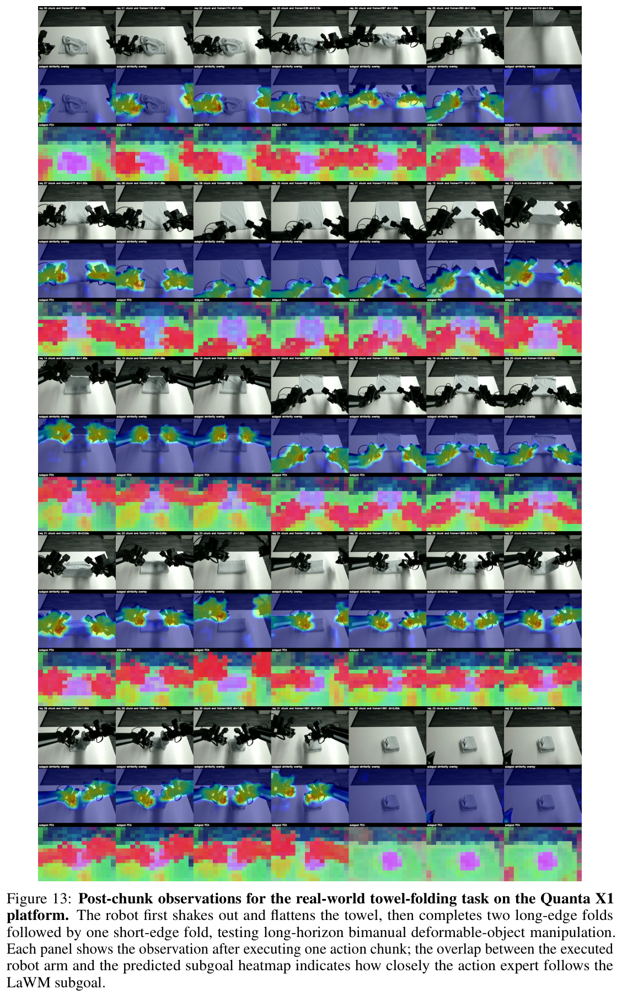
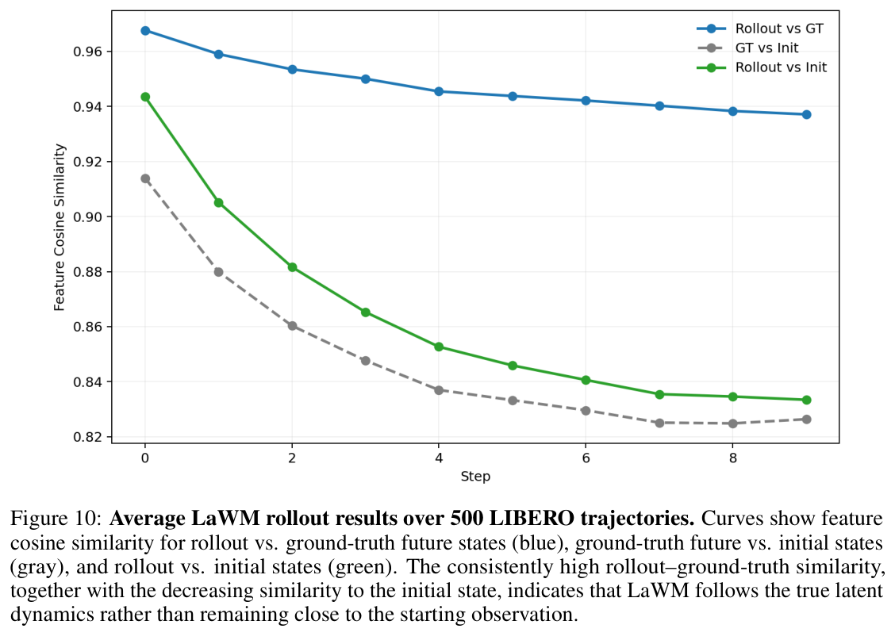

---
tags:
  - papers/WorldModel
  - robotics
  - world-action-model
  - latent-world-model
aliases:
  - LaWAM
  - LaWM
  - 潜空间世界动作模型
date: 2026-06-14
doi: 10.48550/arXiv.2606.15768
arxiv_id: "2606.15768"
---

# LaWAM: Latent World Action Models for Efficient Dynamics-Aware Robot Policies

## 核心信息

- 标题: LaWAM: Latent World Action Models for Efficient Dynamics-Aware Robot Policies
- 标题翻译: LaWAM：面向高效动力学感知机器人策略的潜空间世界动作模型
- 作者: Jialei Chen, Kai Wang, Kang Chen, Shuaihang Chen, Feng Gao, Wenhao Tang, Zhiyuan Li, Weilin Liu, Zhuyu Yao, Boxun Li, Yuanbo Xu, Chao Yu
- 机构: 清华大学；吉林大学；南开大学；北京大学；哈尔滨工业大学；中关村学院（Zhongguancun Academy）；Striding.AI；Infinigence AI
- 发表时间: 2026-06-14
- 发表渠道: arXiv 预印本（cs.RO）
- DOI: 10.48550/arXiv.2606.15768
- arXiv: 2606.15768
- 论文链接: https://arxiv.org/abs/2606.15768
- 数据 / 资源: 预训练约 3000 小时开源机器人视频与 1500 小时人类第一视角视频（AgiBot World、RoboMIND、RoboCOIN、Open X-Embodiment、DROID、EgoDex、Ego4D、LEGO 等）；论文未提供代码或权重链接
- 论文类型: 机器人操作 / 世界动作模型 / AI 方法论文

## 原文摘要翻译

视觉—语言—动作模型（VLA）借助大规模视觉—语言预训练实现语义化的机器人控制，但往往缺乏对"机器人动作将如何改变场景"的显式预见。世界—动作模型（WAM）通过让策略以预测出的未来为条件来弥补这一局限，然而现有方法通常依赖计算昂贵、带有大量像素级冗余的视频生成。

我们提出 LaWAM——一种潜空间世界动作模型，它以紧凑的潜在视觉子目标而非重建出的未来视频，向机器人策略暴露预测动力学。其核心是一个以潜动作为条件的潜空间世界模型 LaWM：我们在预训练视觉基础模型的潜空间中训练潜动作模型，并将其前向解码器改造为预测未来观测特征以刻画场景演化，从而得到 LaWM。随后，策略以这些预测出的潜在视觉子目标为条件生成动作，实现动力学感知的机器人控制。

LaWAM 在 LIBERO（98.6% 成功率）、RoboTwin（91.22% 成功率）以及真实世界操作任务上取得最先进或具有竞争力的成功率，同时保持低延迟推理。LaWAM 每次动作块预测仅需 187 毫秒，相比像素空间的世界—动作模型最多可将墙钟延迟降低 24 倍。

## 创新点

1. **把 LAM 训练完就丢弃的前向解码器，改造成策略可直接调用的世界模型。** 此前 LAPA、UniVLA 这类工作只把潜动作当跨本体动作表征，解码器只是预训练脚手架；这里把它保留为 230M 的 LaWM——给定当前潜特征与潜动作，一次前向就产出动作条件化的未来观测特征。世界建模能力几乎是"白捡"的。
2. **用单次前向的潜在视觉子目标替代迭代式像素视频，作为 WAM 的测试时未来接口。** 未来只需一帧潜特征而非整段视频：187 毫秒对 LingBot-VA 的 4482 毫秒，世界建模参数从 5B 视频骨干降到 230M，削减约 95%。
3. **一套让策略学会"驱动"世界模型的接口协议：潜动作蒸馏加知识绝缘。** 策略先验向第一阶段的逆动力学后验蒸馏，保证发出的潜动作落在 LaWM 能理解的分布内；知识绝缘（KI）冻结保护 LaWM 的动力学先验不被动作梯度覆写。消融证明这两件事都不是装饰。
4. **以固定物理时距定义子目标与动作块，配物理时间编码，解决混频数据共训。** 不同数据集控制频率不同，同一序号的动作在物理时间上并不对齐；这里让每条数据保持原生频率，但子目标始终对应经过时距 $\tau$ 后的未来，每个动作携带以秒计的正弦时间编码。受控实验显示这是混频共训不掉点的关键。

## 一句话总结

这篇论文要证明的不是"更强的世界模型"，而是"部署可用的最小未来接口"：把未来预测整体搬进冻结的 DINO 潜空间后，230M 的 LaWM 就能让 2.3B 策略在仿真基准与真机上打平或超过 5B 级像素空间 WAM，延迟最多只有对手的 1/24；但全部证据都落在相机稳定的桌面操作区间，"动力学感知"也只有特征相似度这类间接证据支撑。

## 研究问题

VLA 从视觉—语言预训练继承了"该做什么"的语义先验，但默认只以当前观测与指令为条件，不显式建模"我的动作会把场景变成什么样"。WAM 的思路是把预测未来喂给策略，问题是现有实现太贵。

作者点出三个具体低效点。其一，像素级未来合成把大量容量花在与动作无关的外观细节上；其二，迭代式生成造成延迟鸿沟——同一评测口径下 LingBot-VA 单次推理要 4482 毫秒，而 π0.5 只要 220 毫秒；其三，对操作任务真正有用的是"下一个动作块所需的状态变化"，而不是"看起来合理的未来画面"。

于是核心问题变成：策略真正需要的最小未来表征是什么？论文的答案是"冻结视觉编码器潜空间中、对应固定物理时距的一帧未来特征"，并由此派生三个技术问题——没有动作标注怎么得到动作条件化的潜空间动力学模型（复用 LAM 解码器）；部署时没有未来观测怎么驱动它（策略先验蒸馏）；预测出的子目标怎么进入动作生成（双流交替注意力）。

## 数据与任务定义

### 训练数据

| 数据 | 规模 | 用途 |
|---|---:|---|
| 开源机器人视频 | 约 3000 小时 | LaWM 预训练与策略整合（仅带语言指令的轨迹） |
| 人类第一视角视频 | 约 1500 小时 | 仅 LaWM 预训练，贡献动力学先验 |

- 机器人侧数据源：AgiBot World、RoboMIND、RoboCOIN、OXE、DROID 等开源数据集。
- 人类侧数据源：EgoDex、Ego4D、LEGO；这些视频没有任务指令，所以不进入策略整合阶段。
- 物理时距设定：机器人遥操作视频 $\tau=1.2$ 秒、人类第一视角视频 $\tau=0.4$ 秒，使同一潜动作对应一致的"已流逝运动量"，而非数据集相关的帧偏移。

### 评测设置

- LIBERO：四个标准套件，每任务 50 次、40 个任务共 2000 次试验；沿用 OpenVLA 评测配置并剔除失败示教。
- RoboTwin 2.0：50 个双臂协同任务，干净与强随机化两种场景各评 100 次/任务；训练混合 2500 条干净示教与 25000 条随机化示教。
- 真机：Franka Panda 做抓放与开抽屉（各 150 条示教），Quanta X1 双臂做长时程叠毛巾（280 条示教）；每任务 30 次试验，初始配置一次生成后对所有方法固定，并包含超出示教覆盖范围的空间配置。
- 延迟口径：A100 上 1000 次动作块预测的平均墙钟时间、10 步去噪、只含模型推理；统计 WAM 参数时不含视频扩散 VAE 与文本编码器（后者可达 10B）。

## 方法主线

### 机制流程

1. **输入 → 潜特征与语义上下文。** 当前观测经冻结 DINOv3 编码为潜特征 $u$；主视角图像、任务指令、潜动作查询、辅视角图像与动作查询依次拼接，送入 Qwen3-VL 前 16 层构成语义上下文，因果掩码保证潜动作查询先聚合所需信息。
2. **潜动作预测 → 策略先验输出。** 轻量查询聚合块把潜动作查询映射为预测潜动作 $\hat z$，训练时向第一阶段逆动力学后验给出的教师潜动作蒸馏。
3. **LaWM 展开子目标 → 未来潜特征。** LaWM 以当前潜特征和预测潜动作为条件，单次前向生成经过时距 $\tau$ 后的未来观测特征 $\hat u_T$，即潜在视觉子目标；不做任何迭代去噪。
4. **动作生成 → 可执行动作块。** 动作专家以 Alternate-DiT 结构在语义流与动力学流（当前特征与子目标拼接）之间交替注意力，用条件流匹配去噪出动作块，交给控制器执行。

*Fig. 2：LaWAM 两阶段总览：上半部分为潜动作模型预训练（逆动力学编码器 + 解码器），下半部分为策略整合（蒸馏、子目标条件化、知识绝缘）；裁切完整、含原始图注。*

### 分解与训练目标

标准 WAM 把联合分布拆成未来预测与逆动力学两个因子；LaWAM 因为推理时拿不到未来观测，进一步拆成三个因子——先由策略预测潜动作，再由世界模型展开子目标：

$$p(a_{1:T},\hat u_T,\hat z\mid o,l)=p_\theta(\hat z\mid o,l)\;p_\omega(\hat u_T\mid u,\hat z)\;p_\eta(a_{1:T}\mid o,l,u,\hat u_T)$$

三个因子分别对应策略先验、LaWM 与动作专家。训练目标按阶段拆开。第一阶段训练潜动作模型：

$$\mathcal{L}_{LAM}=\|\tilde u_T-u_T\|_2^2+\|g(s,z)-s_T\|_2^2+\beta\,D_{KL}\left(q_\phi(z\mid u,u_T)\,\|\,\mathcal{N}(0,I)\right),\qquad \beta=10^{-5}$$

- 前向预测项让解码器成为真正的动力学模型；KL 项把潜动作空间正则到策略先验后续可建模的形状。
- 辅助头 $g$ 从当前末端执行器状态与潜动作回归时距末端的状态，逼迫潜动作编码"身体的运动"而非单纯表观变化；预训练结束即丢弃。
- 一个值得记的工程细节：潜动作以 adaLN 注入解码器而非 Genie 式加性注入——作者发现加性注入下潜动作范数波动会整体平移全部视觉词元，触发训练损失尖峰。

第二阶段做策略整合：

$$\mathcal{L}_{LaWAM}=\lambda_{distill}\,\mathbb{E}\left[\|\hat z-z\|_2^2\right]+\lambda_{wm}\,\|\hat u_T-u_T\|_2^2+\mathcal{L}_{act},\qquad \lambda_{distill}=\lambda_{wm}=0.1$$

- 蒸馏项让策略先验对齐逆动力学后验；子目标项直接监督"策略驱动下"的 LaWM 输出；动作项是条件流匹配。知识绝缘（KI）切断动作梯度对世界模型的回传，保护预训练动力学。

### 物理时间对齐

混频数据的根本问题是同一动作序号对应不同物理时间。这里的做法：每个数据分支保持原生控制频率，动作块长度按时距与频率的乘积取整，子目标一律对应经过 $\tau$ 后的未来帧；再给每个动作加上以秒计的正弦物理时间编码，使"相同物理时刻的动作拿到相同时间码"：

$$H_b=\mathrm{round}(\tau h_b),\qquad \phi(t_{b,i})=\mathrm{Concat}\left[\sin(t_{b,i}\,\omega_k),\;\cos(t_{b,i}\,\omega_k)\right]_{k=0}^{K-1},\qquad t_{b,i}=i/h_b$$

附录里有一个干净的受控实验：把同一批 20 Hz 示教降采样出 10 Hz 与 5 Hz 版本共训（不新增轨迹），无时间编码时成功率大幅退化，加上编码后基本追平单频参考。

> [!figure] Figure 7：混频共训与物理时间编码
> 建议位置：方法主线（物理时间对齐小节）
> 放置原因：条形图直接给出无编码、有编码、单频参考三组对比，是该机制的唯一定量证据。
> 当前状态：图体与图注人工查看完整，但自动质量门标记 reject_visual_quality，按 fail-closed 契约保留占位；三组趋势已在正文转写。

### 关键实现细节

- 潜动作模型的逆动力学编码器与解码器均为 24 层 transformer；保留为 LaWM 的解码器共 230M；视觉特征来自蒸馏版 DINOv3 ViT-B/16（全程冻结）；编码器为 V-JEPA2 式时空联合设计。
- 策略侧：Qwen3-VL 前 16 层为骨干，动作专家为 4 个 Alternate-DiT 块（共 16 层、隐藏维 1024），总参数 2.3B。
- 输入输出：仅 RGB、分辨率 256×256；动作统一转为末端执行器表征；刻意不用本体感知输入，理由是避免过拟合示教特有的状态轨迹、提升空间泛化。
- 增广：编码前对编码器视图与解码器视图施加不同的随机裁剪与颜色增广（片段内保持时间一致），防止 LaWM 记住本体特定的像素布局。
- 训练预算：LaWM 用 16 张 H100 训十万步（批量 1024、学习率 3e-4）；策略整合用 64 张 H100 训二十万步（批量 1024）；每个基准再做后训练。

## 关键结果

### 主结果与强基线

| 方法 | 参数量 | 延迟(毫秒) | Long | Goal | Object | Spatial | 平均 |
|---|---:|---:|---:|---:|---:|---:|---:|
| OpenVLA-OFT | 7B | — | 94.5 | 97.9 | 98.4 | 97.6 | 97.1 |
| π0 | 3.5B | 220 | 88.4 | 94.4 | 96.8 | 98.0 | 94.4 |
| π0.5 | 3.5B | 220 | 92.4 | 98.0 | 98.2 | 98.8 | 96.9 |
| GR00T-N1.6 | 3.3B | 259 | 94.4 | 97.5 | 98.5 | 97.7 | 97.0 |
| LAPA | 7B | — | 55.4 | 58.8 | 74.6 | 73.8 | 65.7 |
| UniVLA | 7B | — | 92.0 | 95.6 | 96.8 | 96.5 | 95.2 |
| Mantis | 5.8B | — | 94.2 | 94.4 | 99.2 | 98.8 | 96.7 |
| VLA-JEPA | 3B | — | 95.8 | 97.2 | 99.6 | 96.2 | 97.2 |
| F1 | 4B | 399 | 91.3 | 95.4 | 97.8 | 98.2 | 95.7 |
| Motus | 8B | 3231 | 97.6 | 96.6 | 99.8 | 96.8 | 97.7 |
| Cosmos-Policy | 2.1B | 1413 | 97.6 | 98.2 | 100.0 | 98.1 | 98.5 |
| LingBot-VA | 5.5B | 4482 | 98.5 | 97.2 | 99.6 | 98.5 | 98.5 |
| Fast-WAM | 6B | 486 | 95.2 | 97.0 | 100.0 | 98.2 | 97.6 |
| **LaWAM** | **2.3B** | **187** | 97.0 | 98.4 | 99.6 | 99.4 | **98.6** |

先说清楚这张表真正证明了什么。98.6 对 Cosmos-Policy 与 LingBot-VA 的 98.5 只有 0.1 点差距，在每任务 50 次试验的口径下没有统计意义——LIBERO 顶部已经饱和。这张表的实质结论是另一个：进入像素 WAM 的精度带的同时，延迟从 1413–4482 毫秒压到 187 毫秒、比 π0.5 这样的纯 VLA 还快，且世界建模参数只有 5B 视频骨干的约 5%。

另一个读表方式：对比潜动作系方法（LAPA 65.7、UniVLA 95.2、VLA-JEPA 97.2），LaWAM 的差异在于潜动作先被 LaWM 展开成空间结构化的视觉子目标，而非直接拿紧凑潜动作当策略接口。论文把这一步视为对潜动作路线的主要修正。

*Fig. 1：延迟—成功率散点图，LaWAM 位于左上角（低延迟、高成功率），粉色扇区表示世界建模参数占比；裁切完整清晰。*

> [!figure] Table 1：LIBERO 主结果表
> 建议位置：关键结果（主结果与强基线小节）
> 放置原因：原表含参数量与延迟两列，是效率主张的核心证据。
> 当前状态：人工检查发现自动裁切在像素 WAM 分组处被截断，缺失全部 WAM 行与 LaWAM 行，表体不完整；保留占位，完整数值已从 PDF 原文转写为上方表格。

### RoboTwin：规模化到双臂

RoboTwin 2.0 用 50 个双臂协同任务检验潜空间子目标能否走出单臂 LIBERO 的舒适区。

| 方法 | 干净场景 | 随机化场景 |
|---|---:|---:|
| Fast-WAM | 91.98 | 90.52 |
| GigaWorld-Policy | 86.36 | 85.04 |
| LingBot-VA | 91.50 | 90.92 |
| π0.5 | 82.74 | 76.76 |
| Motus | 88.66 | 87.02 |
| **LaWAM** | **92.64** | 89.80 |

诚实的读法：干净场景第一（92.64），随机化场景 89.80 低于 LingBot-VA 的 90.92 与 Fast-WAM 的 90.52，论文措辞是"保持接近"而非领先；摘要里的 91.22% 是两种场景的均值口径。另外要注意，Fast-WAM 与 LingBot-VA 是作者用开源权重在 H100 上复评的，其余基线数字取自他人论文，跨行严格排序的意义有限，读成"同一量级、成本低得多"更稳妥。

> [!figure] Table 2：RoboTwin 逐任务结果
> 建议位置：关键结果（RoboTwin 小节）
> 放置原因：逐任务结果能看出各方法互有胜负的结构，均值掩盖了这些差异。
> 当前状态：人工检查发现自动裁切只保留前五个任务行，底部任务行与均值行全部被截断，表体不完整；保留占位，均值已从 PDF 原文转写为上方表格。

### 真实机器人：延迟差距变成成功率差距

| 方法 | 抓放 | 开抽屉 | 叠毛巾 | 平均 |
|---|---:|---:|---:|---:|
| π0.5 | 86.7 | 80.0 | 83.3 | 83.3 |
| GR00T-N1.6 | 83.3 | 76.7 | 46.7 | 68.9 |
| Fast-WAM | 56.7 | 63.3 | 70.0 | 63.3 |
| LingBot-VA | 76.7 | 83.3 | 0.0 | 53.3 |
| **LaWAM** | **93.3** | **86.7** | **90.0** | **90.0** |

三任务全部第一，平均 90.0 对次优 π0.5 的 83.3。信息量最大的是叠毛巾：LingBot-VA 直接 0%——作者的失败检查指出，它推理期间毛巾还在动，动作生成完毕时条件观测已经过期。这是"高延迟 WAM 在动态场景不可用"的一个干净案例，也是 LaWAM 效率主张最有力的下游证据。当然要记住样本量：每任务只有 30 次，初始配置对所有方法统一固定。

*Fig. 13：Quanta X1 叠毛巾的逐动作块记录（每组三行：观测、子目标相似度热图、子目标 PCA）：先抖平毛巾，再两次长边折叠加一次短边折叠；裁切完整。*

*Fig. 11：Franka 抓放玩具鸭的逐动作块可视化：热图显示机械臂特征在子目标中的预期位置，执行动作确实逐块逼近子目标区域；裁切完整。*

### 消融与动力学分析

消融在 LIBERO 上做，只给了条形图没给数值表，但排序信息是清楚的：

- 去掉 LaWM（不给子目标）掉幅最大，且长时程套件最敏感——长任务最需要"下一段场景演化"的信息；这直接支撑"显式测试时子目标条件化是主要收益来源"这一核心主张。
- 去掉潜动作蒸馏显著掉点：策略先验若得不到逆动力学后验的直接监督，就学不会发出 LaWM 能正确展开的潜动作。
- 再叠加去掉知识绝缘进一步退化：动作梯度会破坏 LaWM 的动力学先验。
- 有意思的是去掉预训练的降幅相对温和，说明在 LIBERO 这种窄域上，接口结构本身贡献了相当一部分收益；大规模预训练的价值更可能体现在这里没测的跨域泛化上。

> [!figure] Figure 6：LIBERO 组件消融
> 建议位置：关键结果（消融与动力学分析小节）
> 放置原因：唯一给出各组件贡献排序的实验图。
> 当前状态：人工检查发现自动裁切混入左侧正文段落、顶部图例文字被切断，无法独立可靠阅读；保留占位，排序结论已在上方转写。

LaWM 是否真的在建模动力学、而不是复读当前帧？附录给了聚合证据：在 500 条 LIBERO 轨迹上做开环多步预测，预测特征与真值未来特征的余弦相似度保持在约 0.94–0.97，同时与初始帧的相似度单调下降、贴近"真值未来对初始帧"的水平——预测确实在跟随真实演化而非停在起点。

*Fig. 10：500 条轨迹的开环预测评估：蓝线（预测对真值未来）始终最高，绿线（预测对初始帧）随步数下降并贴近灰线（真值未来对初始帧）；裁切完整。*

## 深度分析

### 真正贡献是什么

学术贡献是一个接口层面的观察：潜动作模型的前向解码器本来就是一个动作条件化的世界模型，而此前的主流做法是训练完即弃。LaWAM 把这个"免费"组件接到策略上，并补齐了让它可用的三件事——策略先验蒸馏（让策略会驱动它）、知识绝缘（让策略毁不掉它）、固定物理时距（让它的预测有一致语义）。同期 Garrido 等人也提出了"解码器即世界模型"的观察，所以想法本身属于共时涌现；这篇的差异化在于把它做成了完整的策略接口，并给出效率证据。

和邻近路线的边界值得画清楚：LDA-1B 同样在 DINO 潜空间建模动力学，但走联合扩散去噪，仍是迭代式；π0.7 也用视觉子目标条件化策略，但子目标来自独立的迭代像素模型；Fast-WAM 与 GigaWorld-Policy 为省时间把未来预测降级成辅助训练信号，牺牲了测试时的显式条件化。LaWAM 占住的生态位是三者的交集空缺：显式测试时未来条件化、单次前向、潜空间。

工程组装部分也要如实归类：Qwen3-VL 骨干、Alternate-DiT 动作专家、流匹配、KI 都是现成组件；物理时间编码是标准正弦编码的直接应用。这些不是新发明，但组合协议——哪里蒸馏、哪里冻结、哪里对齐时间——是这篇论文真正可复用的配方。

### 为什么结果成立

1. **潜空间过滤了外观冗余。** 像素 WAM 的大部分容量花在纹理、光照这类与动作无关的细节上；DINO 特征本身是外观不变性较强的语义—空间表征，动力学建模只需处理"特征会怎么移动"。同期分析工作也支持预训练视觉潜空间比像素重建空间更适合策略侧动力学。
2. **子目标粒度与控制粒度匹配。** 动作块级控制只需要块末端的一帧未来，中间帧对条件化动作生成的边际价值很低；这一步把未来预测的计算量从视频级降到单帧特征级，是延迟优势的根本来源。
3. **接口对齐三件套避免了两类失败。** 没有蒸馏时，策略发出的潜动作出分布，LaWM 展开的子目标不可信；没有知识绝缘时，动作梯度污染动力学先验。消融的退化排序正好对应这两类失败模式。
4. **低延迟本身就是能力。** 叠毛巾的对比说明：动态场景里策略质量再高，只要条件观测过期就会系统性失败。LaWAM 在这类任务上的优势与其说是"预测更准"，不如说是"预测足够便宜所以来得及"。

### 潜动作在跨本体场景中的行为

附录的跨本体开环实验值得单独一说：从一段源视频推断出潜动作序列，然后只给一帧不同环境或不同机器人的初始观测，让 LaWM 用同一串潜动作展开未来。结果是各环境的潜空间演化连贯且"各自本地化"——同一潜动作在不同本体上产生符合该本体的变化。作者的解释是分工明确：潜动作携带本体无关的抽象转移，LaWM 用当前潜特征把它落地到具体本体。这也解释了为什么"只拿潜动作当策略接口"会受限：潜动作必须经世界模型展开，才有扎根于当前本体的可执行语义。

*Fig. 14：单臂跨本体开环展开：同一串潜动作在仿真与多个真实场景上产生上下文相关的特征演化；裁切完整。*

*Fig. 15：双臂版本：后六个面板为未见场景，其中五个用 pi.website 截图，说明该性质延伸到完全未见的视觉域；裁切完整。*

### 容易误读的地方

- "24 倍"是对最慢基线的最大值：相对 Fast-WAM 只有约 2.6 倍，相对 π0.5 只有 1.2 倍。正确读法是"延迟回到纯 VLA 量级"，而不是"比所有对手快 24 倍"。
- 98.6% 不是零样本结果，是基准上后训练之后的成绩；这篇全文没有零样本主张，与像素 WAM 阵营（例如 DreamZero 的核心卖点）定位完全不同，两边的数字不可直接对读。
- "动力学感知"的证据全部是间接的：特征余弦相似度、热图、PCA 可视化。LaWM 预测的是 DINO 特征演化，没有任何物理量（位姿、接触、穿透）被直接检验；读成"学会了物理"是过度解读。
- 1500 小时人类视频只进了 LaWM 预训练，且没有对应消融；"人类视频有帮助"在这篇论文里是设计假设，不是被验证的结论。
- 随机化 RoboTwin 并非第一；两大 WAM 基线是作者复评的，其余数字来自各家论文，主结果表的跨行可比性中等。

### 复现注意点

1. 视觉编码器是蒸馏版 DINOv3 ViT-B/16 且全程冻结；LaWM 编码器与解码器各 24 层；潜动作用 adaLN 注入，加性注入会触发损失尖峰，作者明确警告过。
2. KL 权重很小（1e-5）但不可省：潜动作空间过散会让第二阶段的策略先验学不动；两个蒸馏系数都是 0.1。
3. 物理时距 $\tau$ 是首要超参：机器人 1.2 秒、人类第一视角 0.4 秒；它同时定义子目标语义与动作块长度，换数据集必须重调。
4. 无本体感知输入、动作统一为末端执行器表征、仅 RGB 256×256——这三个选择都影响空间泛化结论，不是可有可无的细节。
5. 训练预算：LaWM 16 张 H100 十万步、策略整合 64 张 H100 二十万步、批量均 1024；LIBERO 后训练 25k 步、RoboTwin 后训练 100k 步约 20 小时。这是中等学术算力可以够到的量级，比 14B 视频骨干路线便宜得多。
6. 评测口径：一律 10 步去噪；延迟是 A100 上 1000 次预测均值、只含模型侧；对比世界建模参数时排除了 VAE 与文本编码器。复现对比必须沿用同一口径。
7. 论文未发布代码与权重，逐任务数字与消融数值也没有表格化开源；目前只能按附录超参自行复现。

## 局限

1. **相机自运动是硬边界。** 当观测转移由相机运动主导（第一视角剧烈晃动、大视角变化），LaWM 学不出连贯的潜动作空间；当前框架对人形与移动机器人暂不适用。这是作者自己承认的限制，也是把该路线外推到导航或全身控制前必须解决的问题。
2. **可变形体细节超出特征分辨率。** ViT-B/16 的补丁粒度捕捉不了布料细微形变；叠毛巾能赢主要靠机械臂子目标预测得准，而不是布料动力学建模得好——作者在失败检查里明确承认这一点。
3. **基准区分度不足。** LIBERO 顶部已饱和（前五名挤在 1 点之内），RoboTwin 随机化场景未拿第一，真机每任务 30 次；效率结论坚实，精度结论只能算"同一梯队"。
4. **子目标是单帧且无不确定性表达。** 一帧时距末端特征无法表达多模态未来或失败风险，也没有机制在子目标不可靠时拒绝执行；接触密集或部分可观测任务可能需要中间帧或分布式预测。
5. **证据链缺物理检验与开源。** 动力学证据全部停留在特征空间；代码、权重、逐项数值均未发布，主张的可验证性打了折扣。

## 我的笔记

- 在本地地图上，这篇是"潜空间 WAM"一极的代表，与像素空间的 DreamZero 恰成对照轴：后者用 14B 视频扩散买泛化上限与零样本能力，代价是两张旗舰 GPU 才换来约 7 Hz；这篇用 230M 潜空间模型买部署效率，放弃零样本主张、评测全部经过后训练。两条路线卖的不是同一种东西，证据体系几乎不重叠。
- 真正值得追踪的是中间地带：潜空间接口的泛化上限在哪里？这篇的跨本体证据只有定性开环展开，没有对面阵营那种"纯视频示教迁移成策略"的定量实验——这是潜空间路线目前欠着的一块证据，也是判断两条路线优劣的关键实验。
- 对我自己的仿真锚定世界模型方案，这篇给了两个直接可用的部件。其一，辅助状态头（从潜动作回归末端执行器状态）正是我设想的状态一致性损失的已发表弱化版；把监督源换成仿真器的物体位姿与接触事件、并保留到推理期做校验，是自然的强化方向。
- 其二，潜空间监督天然规避我最担心的仿真渲染风格污染：DINO 特征对纹理差异远比像素鲁棒，仿真状态真值可以直接约束潜空间世界模型，不必做像素级对齐。这与"重建空间不如语义潜空间适合策略侧动力学"的同期分析互相印证，等于替仿真锚定路线扫掉了一个主要风险。
- LaWAM 与 Fast-WAM 给出一对表面矛盾的结论：后者说测试时未来想象可以省掉，前者的消融说显式子目标条件化是最大收益项。两者协议不同（未来的形态、注入方式、基准都不同），但这恰好定义了一个干净的开放问题——未来信息应该在训练时蒸馏进策略，还是在推理时显式条件化——值得做同骨干对照实验。
- 还要想清楚效率收益的可迁移部分："接口粒度匹配控制粒度"（块级控制只要单帧未来）这条原则与潜空间无关，像素 WAM 同样可以只生成块末端一帧。真正绑定潜空间的是那约 95% 的参数削减；如果下一代像素 WAM 做"单帧未来加小解码器"，两条路线的差距可能比延迟表暗示的小。
- 关联笔记：
  - DreamZero: [[World Action Models are Zero-shot Policies]]
  - Sim-anchored WAM roadmap: [[insight]]

## 引用

Chen, J., Wang, K., Chen, K., Chen, S., Gao, F., Tang, W., Li, Z., Liu, W., Yao, Z., Li, B., Xu, Y., Yu, C. *LaWAM: Latent World Action Models for Efficient Dynamics-Aware Robot Policies*. arXiv:2606.15768 (2026). DOI: 10.48550/arXiv.2606.15768.
