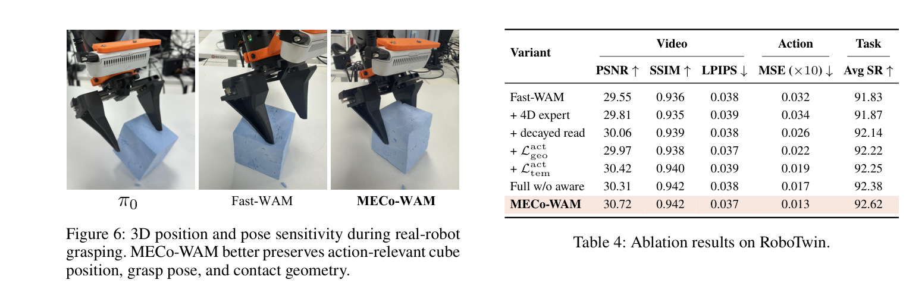

---
tags:
  - papers/world-model
  - papers/embodied-ai
  - papers/4d-geometry
aliases:
  - MECo-WAM
  - Learning 4D Geometric Priors
  - 学习面向高效世界动作模型的四维几何先验
date: 2026-07-06
arxiv_id: "2607.05468"
---

# Learning 4D Geometric Priors for Inference-Efficient World Action Models

## 核心信息
- 标题: Learning 4D Geometric Priors for Inference-Efficient World Action Models
- 标题翻译: 为推理高效的世界动作模型学习四维几何先验
- 作者: Jianjun Zhang, Jian Zhu, Taiyi Su, Chong Ma, Zitai Huang, Yi Xu, Hanli Wang
- 机构: Tongji University；AIRC, Midea Group
- 发表时间: 2026
- 发表渠道: arXiv
- DOI: 10.48550/arXiv.2607.05468
- arXiv: 2607.05468
- 论文链接: https://arxiv.org/abs/2607.05468
- 代码 / 项目: https://meco-wam.github.io
- 论文类型: 具身世界动作模型方法论文

## 原文摘要翻译
世界动作模型通过联合建模视觉未来动态与可执行动作序列，已经展现出用于机器人操作的强大潜力。然而，现有视频—动作协同训练主要优化面向外观的视频潜变量，可能不足以捕捉精确操作所需、随时间演化的几何结构。本文提出多专家协同训练世界动作模型 MECo-WAM：在保留原有轻量推理图的同时，将与动作相关的四维几何先验注入视频—动作表征。训练时，MECo-WAM 将视频专家、动作专家与轻量四维专家结合；后者由冻结 VGGT 编码器产生的关系目标监督。非对称的专家可见性阻止辅助几何到动作生成的非因果捷径。为把几何知识迁移到部署的视频—动作路径，作者提出可衰减的四维读取掩码注意力：它在训练早期提供受限的当前帧几何指导，并逐渐移除这种依赖。作者还提出动作感知的时间几何蒸馏，同时对齐帧内几何关系及其时间演化，并突出与机器人动作最相关的视觉区域。部署时，所有辅助四维组件均被移除。LIBERO（98.2%）、RoboTwin 2.0（92.6%）和具有挑战性的真实机器人操作实验显示，该方法可提升操作表现而不增加推理成本。

## 创新点
1. **将 4D 几何降格为训练期约束，而非部署期输出。** 论文不是让策略在测试时生成深度、点云或多视角未来；它用一个仅训练存在的 4D 专家接收冻结 VGGT 特征目标，目标是把与动作有关的时空关系压入原视频—动作表示。这是本文最核心的系统设计取舍。
2. **将“可访问”与“可删除”同时编码进注意力图。** 非对称专家掩码先限制未来标记的信息流向，再让视频/动作未来查询只临时读取当前帧 $g_0$；读取概率 $p_{4d}$ 从 1.0 线性退火到 0。它针对的不是一般正则化，而是训练期依赖辅助几何、部署时突然撤掉辅助几何的分布断裂。
3. **以关系而不是绝对坐标蒸馏几何。** 学生 $Z_k$ 与 VGGT 教师 $G_k^T$ 未被强制落在同一嵌入坐标系；损失比较标记对的平方距离矩阵，因而保留“夹爪—物体—目标”的相对结构。动作权重进一步把损失从一般场景几何转为与当前动作片段耦合的几何。
4. **显式监督关系如何变化。** 时间损失对相邻关键帧关系矩阵的归一化变化做匹配，瞄准接近、接触、搬运和释放，而不是仅让每一帧静态布局看起来像教师。

## 一句话总结
MECo-WAM 的可信增量不是“多了一个 4D 分支”，而是把一个昂贵、不可部署的几何教师变成可逐步断奶的训练信号：结果显示这能改善 Fast-WAM 的动作与成功率；但“零额外成本”只对部署计算图成立，尚不等同于训练成本、统计可靠性或跨相机几何鲁棒性都已解决。

## 研究问题
视频—动作联合训练已经比纯观察到动作的策略多了一条时序学习通路，但视频潜变量首先为外观重建服务。它可以生成视觉上合理的未来，却未必显式保持“夹爪是否可达”“物体是否与目标对齐”“接触后是否发生稳定转移”这些操控判据。更关键的是，这些关系是 4D 的：它们不仅存在于当前帧，还随接近、接触和移动而改变。[来源：正文第 1–2 页，`sec:introduction`]

直接把 4D 重建、深度预测或多视角未来加到部署端会引入几何解码器、传感器输入或额外去噪阶段；即便更几何化，也可能把优化容量花在与执行弱耦合的重建上。本文因此问得很具体：**能否在训练时学到动作相关的时间几何，而在测试时仍使用 Fast-WAM 的轻量观测—动作图？** [来源：正文第 1–3 页，`sec:introduction`、`sec:related-work`]

*图 1。MECo-WAM 在 RoboTwin 的图示点为 92.6% 成功率、198.73ms 动作块延迟；Fast-WAM 为 91.8%、198.65ms。它支持“部署延迟几乎不变”，但不报告训练算力或端到端闭环延迟分布。*

## 数据与任务定义
### 部署接口与训练样本
部署策略以当前视觉观测、机器人状态或本体感受和语言指令为条件，输出长度为 32 的动作块。每个训练块含 33 个机器人步，视频以 4 倍动作—视频时间比采样为 9 帧。视频骨干规模为 5B；动作专家含 30 个去噪变换模块、24 个注意力头、隐藏宽度 1024，约 1B 参数；训练期 4D 专家宽度为 512，约 0.45B 参数。

### 基准与真机口径
- **LIBERO**：Spatial、Object、Goal、Long 四个套件；每套 10 个任务、每任务 500 条专家示范。它较适合观察语言条件下的空间与目标关系，却仍是仿真成功率。
- **RoboTwin 2.0**：双臂操作，在洁净与随机化条件下测评；随机化包含物体姿态、外观、杂物、光照和桌面布局变化。这一随机化并不等价于任意相机、材质或物理接触分布外泛化。
- **真实桌面**：真实机械臂执行堆叠三块海绵立方体、按大小排序三块立方体；以成功率、进度率、校正次数和完成时间度量，且采用相同相机设置和执行预算。各任务的重复次数、置信区间与跨日方差尚待补充。

### 训练与推理资源
训练采用连续流匹配，1000 个训练时间步、偏移系数 5.0、学习率 $10^{-4}$、权重衰减 0.01、余弦衰减与梯度裁剪 1.0，在 64 张 H20 显卡上完成。推理以单张消费级显卡运行 10 个去噪步。这个资源配置对“训练期专家可删除”的工程可行性很重要：删除的是部署模块，不是已经支付的教师与并行训练成本。[来源：正文第 5 页]

## 方法主线
### 机制流程
1. **构造三个带噪序列。** 输入当前帧、未来视频帧、动作块与语言。视频专家以干净首帧 $f_0$ 为锚，对未来 VAE 标记去噪；动作专家以本体状态 $a_0$ 为锚，对未来动作槽去噪；冻结 VGGT 将当前和未来 RGB 编码为 $g_0,\bar g_1,\bar g_2,\bar g_h$，4D 专家只在训练期预测其带噪未来槽。 [来源：正文第 3 页，式 (2)–(5)]

2. **在受限混合注意力内协同训练。** 三组标记拼为 $X=[X_v,X_a,X_{4d}]$，各专家使用独立 $Q/K/V$ 投影后在专家级掩码下注意力交互。未来动作不能读取带噪未来视频，未来 4D 槽被限制在辅助分支；这一步的输出是不会直接从未来几何抄答案的共享视频—动作表示。 [来源：正文第 3–4 页，式 (6)–(8)]

3. **给主路径一个会消失的当前帧几何提示。** 未来视频/动作查询可随机读取当前 $g_0$，开关 $\gamma_s\sim\mathrm{Bernoulli}(p_{4d}(s))$；$p_{4d}$ 从训练初期的 1 线性衰减至 0。输出目的不是让策略永远用 $g_0$，而是使共享路径在该监督消失前吸收其可预测的几何规律。 [来源：正文第 4 页，式 (9)–(10)]

4. **用动作感知关系损失写入时间几何，随后删去整条辅助链。** 4D 专家的关键帧预测经 $P_{align}$ 得到 $Z_k$，与 VGGT 关系矩阵及其帧间变化对齐；视频、动作和 4D 损失共同更新。部署时移除 VGGT、4D 专家、对齐和所有 4D 标记，只留原视频与动作专家。 [来源：正文第 4–5 页，式 (11)–(23)]

*图 2。左侧是训练：冻结 VGGT 向 4D 专家提供目标，衰减读取掩码影响视频—动作主路径；右侧是部署：仅保留视频与动作专家。图中“删除”是架构删除，不是声称训练无需计算。*

### 为什么 4D 专家能在部署删除
一个孤立辅助分支并不会自动让主分支变好。本文的传递渠道有两条：第一，训练时三位专家在混合注意力中共同形成表示；第二，主路径早期可读取当前 $g_0$，于是它必须学会把与 $g_0$ 对应的几何规律整合为自己的条件计算。与此同时，4D 未来槽不能送给动作槽，清洁的教师未来特征只做损失目标，避免主路径以未来几何代替预测。

真正使删除合理的是退火，而不是“训练时见过教师”这一事实。若 $p_{4d}$ 在收尾仍非零，模型可能把 $g_0$ 当作不可替代输入；当 $p_{4d}=0$，后段优化必须在目标部署图上降低视频和动作损失。论文设定 $p_{start}=1.0$、在训练前半程线性退火至 $p_{end}=0$。这是一种课程式蒸馏假设：当前帧几何能帮助早期表征塑形，后期无辅助路径仍可复现其有用部分。[来源：正文第 4–5 页]

### 可衰减的 4D 读取掩码如何防止非因果捷径
掩码的因果性有两个层次。**时间层面**：仅当前帧 $g_0$ 被视频/动作未来查询暂时读取；未来几何 $g_1,g_2,g_h$ 留在 4D 分支做辅助预测，因此策略不可能训练时读取未来物体位置再输出当前动作。**优化层面**：读边由 Bernoulli 开关控制并退火；模型不会在整个训练过程中习惯固定几何旁路。

*图 3。斜线格是未来视频/动作查询到当前几何 $g_0$ 的临时读取；白格被掩蔽。推理图中不再实例化任何 4D 标记。该设计限制信息路径，但文中缺少专门的未来泄漏探测或退火曲线消融。*

作者的第 4 张表支持“通路很关键”：只加 4D 专家的平均成功率仅 91.87，甚至动作 MSE 从 0.032 变坏到 0.034；加衰减读取后为 92.14、MSE 0.026。可得出的结论是“辅助几何若不进入主路径几乎无效，临时当前帧读边能改善该任务”；不能得出“所有非因果捷径都已被数学证明消除”。

### 不做坐标对齐的动作感知关系匹配
学生标记 $Z_k=P_{align}(g_k^p)$ 与教师 VGGT 标记 $G_k^T$ 来自不同网络，即使线性投影后也没有理由共享绝对欧氏坐标。直接令 $Z_k\approx G_k^T$ 会把任意旋转、缩放或表征基变化当误差。论文改为对每对标记计算平方距离：

$$
R_{4d}^{k}(i,j)=\lVert Z_i^k-Z_j^k\rVert_2^2,\qquad R_T^{k}(i,j)=\lVert G_{T,i}^k-G_{T,j}^k\rVert_2^2.
$$

经有效项归一化后，损失匹配 $\hat R_{4d}^k$ 与 $\hat R_T^k$。这不需要二者的标记坐标数值相同，而要求它们对“哪些区域彼此更近、更远”的关系排序兼容。工程含义是：学生学到的是物体—夹爪—目标的相对布局结构，不是可直接读出的相机标定三维坐标。 [来源：正文第 4 页，式 (11)–(12)]

动作感知部分用同一时段的汇聚动作表示与视频标记的余弦相似度求相关性 $r_i^k$，再与均匀分布混合：

$$
w_i^k=\frac{(1-\eta)r_i^k+\eta/N}{\sum_j[(1-\eta)r_j^k+\eta/N]},\qquad w_{ij}^k=w_i^kw_j^k.
$$

所以高权重标记对更影响帧内损失 $\mathcal L_{geo}^{act}$；均匀项防止权重塌缩到一个显眼点，仍保留桌面、目标与接触上下文。这一设计声称“与动作相关”，但权重来自表示相似度，不是人工接触标注；在错误动作语义、遮挡或多物体竞争注意力时是否仍准确，文中未作测量。 [来源：正文第 4 页，式 (13)–(15)]

### 时间关系损失到底新增了什么
静态关系匹配只能保证每一关键帧分别像教师，却允许模型在帧间出现不正确的过渡。作者定义相邻关键帧的归一化关系变化：

$$
\Delta(R_k,R_{k^+})=\frac{R_{k^+}-R_k}{|R_{k^+}|+|R_k|+\epsilon},
$$

并以相邻两帧的乘积权重 $w_{ij}^kw_{ij}^{k^+}$ 对学生与教师变化差异求平均，得到 $\mathcal L_{tem}^{act}$。它的目标是让“夹爪靠近物体—接触—携带—释放”时哪些关系收缩、翻转或稳定下来与几何教师一致。相较只增添更多静态监督，这确实更匹配动作块的因果动态；但它仍在稀疏关键帧的特征距离上工作，并未显式模拟接触力、遮挡后的物体状态或连续轨迹的全时间物理。

最终目标是：

$$
\mathcal L_{total}=\lambda_{video}\mathcal L_{video}+\lambda_{action}\mathcal L_{action}+\lambda_{4d}\left(\alpha_{geo}\mathcal L_{geo}^{act}+\alpha_{tem}\mathcal L_{tem}^{act}\right).
$$

## 关键结果
### 主结果与强基线
| 评测 | Fast-WAM | MECo-WAM | 关键差值 | 应如何读 |
|---|---:|---:|---:|---|
| LIBERO 平均 SR | 97.6 | 98.2 | +0.6 | 无具身策略预训练条件下的直接基线增益；仍低于表中预训练 LingBot-VA 的 98.5。 |
| LIBERO Spatial / Object / Goal / Long | 98.2 / 100.0 / 97.0 / 95.2 | 98.8 / 100.0 / 98.2 / 95.8 | +0.6 / 0 / +1.2 / +0.6 | 最大增益在 Goal，不是所有空间套件均匀提升。 |
| RoboTwin 洁净条件 SR | 91.88 | 93.26 | +1.38 | 标称场景提升明显。 |
| RoboTwin 随机条件 SR | 91.78 | 91.98 | +0.20 | 对随机化提升很小，应避免泛化过度表述。 |
| RoboTwin 平均 SR | 91.83 | 92.62 | +0.79 | 略高于表中 LingBot-VA 92.20，但预训练口径不同。 |

*表 1。LIBERO 四套件结果；P.T. 表示具身策略预训练。横向总排名应结合这一训练数据差异阅读。*

*表 2。RoboTwin 2.0 汇总成功率；MECo-WAM 的 92.62 来自洁净条件 93.26 与随机条件 91.98。*

LIBERO 上，该方法的无具身策略预训练结果为 98.2，较直接基线高 0.6；RoboTwin 平均值为 92.62，洁净与随机条件的增益分别为 +1.38 与 +0.20。最稳妥的结论是：4D 共训改善了平均表现；随机鲁棒性仍需更大增益、方差和压力测试才能确认。

### 真机小样本任务：收益主要体现在执行质量而不只最终成功
| 任务 | 模型 | SR ↑ | PR ↑ | CR ↓ | CT ↓ |
|---|---|---:|---:|---:|---:|
| 堆叠立方体 | Fast-WAM | 60.0 | 75.0 | 1.67 | 27.06s |
| 堆叠立方体 | MECo-WAM | 60.0 | 75.0 | 0.83 | 25.71s |
| 按大小排序立方体 | Fast-WAM | 60.0 | 75.0 | 1.33 | 38.49s |
| 按大小排序立方体 | MECo-WAM | 70.0 | 80.0 | 1.00 | 31.96s |

*图 5。真实 ARX-R5 的堆叠与排序任务示例；它展示任务外观，不替代对失败类型、重复次数和跨日稳定性的量化报告。*

*表 3。真实任务用 SR、PR、CR、CT 同时度量；堆叠立方体的最终 SR 持平，但中间校正与时间改善。*

真机并非只看成功率：堆叠任务的成功与进度持平，但校正次数几乎减半，时间缩短 1.35 秒；排序任务成功率从 60 到 70，进度率从 75 到 80，时间缩短 6.53 秒。两任务汇总为平均 +5.0 成功率点、+2.5 进度率点、约 39% 更少校正、12% 更短时间。它支持“几何有助对位修正”的解释；但只有两类任务，且统计显著性和试验规模尚待补充。

### 表 4 完整消融：4D 专家、退火、空间与时间损失各自说明什么
| 变体 | PSNR ↑ | SSIM ↑ | LPIPS ↓ | 动作 MSE ↓ | 平均 SR ↑ |
|---|---:|---:|---:|---:|---:|
| Fast-WAM | 29.55 | 0.936 | 0.038 | 0.032 | 91.83 |
| + 4D 专家 | 29.81 | 0.935 | 0.039 | 0.034 | 91.87 |
| + 衰减读取 | 30.06 | 0.939 | 0.038 | 0.026 | 92.14 |
| + $\mathcal L_{geo}^{act}$ | 29.97 | 0.938 | 0.037 | 0.022 | 92.22 |
| + $\mathcal L_{tem}^{act}$ | 30.42 | 0.940 | 0.039 | 0.019 | 92.25 |
| 完整模型（无动作感知） | 30.31 | 0.942 | 0.038 | 0.017 | 92.38 |
| MECo-WAM | 30.72 | 0.942 | 0.037 | 0.013 | 92.62 |

*图 6。左侧给出抓取时的三维位置/姿态敏感性可视化，右侧是 RoboTwin 完整消融表。该图是原生页面裁剪，表格数值与上方转录一致。*

消融最清楚的讯号是**孤立教师无效，传递机制才有效**：+4D 专家 的 SR 只从 91.83 到 91.87，动作 MSE 还变差；+衰减读取 立即到 92.14 与 0.026。这支持当前几何读边承担了“让辅助约束进入主路径”的作用。空间关系损失继续把 MSE 压至 0.022，时间损失压至 0.019；说明帧内结构与变化率都提供独立、但不巨大的增量。

动作感知权重并非装饰：去掉动作感知时为 92.38、动作误差 0.017，完整模型为 92.62、动作误差 0.013；该组件贡献 +0.24 个成功率点。表中没有多随机种子离散度，因此 0.03 到 0.24 的细小差异仍须复验。

### 视频指标与动作收益不是单调同义词
三个视频质量指标测量像素或感知相似性，动作误差测量离线偏差，成功率才是闭环结果。表 4 否定“画面更好就必然更会操作”：空间损失令视频峰值信噪比从 30.06 降到 29.97，却使动作误差从 0.026 改善至 0.022、成功率从 92.14 升至 92.22；时间损失使感知距离从 0.037 变到 0.039，动作与任务指标仍改善。完整模型各指标均最佳，但不能把任一视频指标当作控制收益的充分代理。

*图 4。冻结视频—动作骨干后，对最后四层标记训练匹配的 DPT 风格头；MECo-WAM 的深度图更接近由 Video Depth Anything 生成的伪真值。它是表示迁移的视觉佐证，不是标定深度精度或真实三维误差评测。*

## 深度分析
### 真正贡献是什么
这篇论文的贡献是一套**辅助模态可移除的知识转移协议**，而非一个新传感器或独立 4D 世界模型。它抓住 Fast-WAM 已证明的部署原则：动作不必在测试时完整想象未来视频；然后将这个原则推进到几何——训练时允许 4D 教师影响表示，部署时不输出或输入几何。与显式 RGB-D/4D 世界生成路线相比，真正的工程价值在于把高成本模块留在训练图里。

但“同一部署图”需精确解释。图 1 的 198.73ms 对 198.65ms 和正文的“只保留原视频/动作专家”足以支持：若权重、实现与采样方式匹配，**推理额外图节点**没有增加。它不支持“该方法无额外总成本”：训练额外运行冻结 VGGT-1B、0.45B 4D 专家、对齐和关系损失，且整体训练用 64 张 H20。训练时间未列入正文、总 GPU 小时、峰值显存、吞吐下降或与 Fast-WAM 相同收敛预算下的比较；这些是判断训练换推理是否划算的必要成本项。

### 为什么这些结果可能成立
1. **几何 teacher 提供的是可迁移的相对约束。** 直接对齐绝对 feature vector 容易受教师—学生表征基变化影响；距离关系把目标缩为更稳定的局部/全局布局。这个选择特别适合缺少显式相机标定或学生 latent 不是三维坐标的 WAM。
2. **动作感知 weighting 缩小了监督目标。** 对操控而言，桌面远处纹理与夹爪、抓取物、目标的关系并不等价。以动作相似度加权并保留均匀底座，合理地将有限的 4D 专家容量放在接触链上。
3. **temporal 损失 补足静态假象。** 单帧“夹爪在物体附近”可同时对应靠近或离开；匹配关系变化才给出方向与阶段线索。时间损失后 MSE 的继续下降符合这一解释。
4. **退火将训练信号变成能力而非输入依赖。** 早期 $g_0$ 像教师提示，后期强制主图独立工作。表 4 从 孤立 专家 到 衰减读取 的跳跃与这个机制一致，但仍需更多退火对照来确认因果归因。

### 容易误读的地方
- **不是“学到真实 4D 重建”。** VGGT 监督、关系距离和深度伪真值探针均不能替代带尺度与标定的 3D 评测；模型可能学到对操控足够的相对空间线索，而非全局几何。
- **不是“对随机化稳健很多”。** RoboTwin 随机条件 只比 Fast-WAM 高 0.20 点。洁净条件 改善可来自较平滑的标称几何关系，但不足以说明强域外视觉鲁棒。
- **不是“所有强基线公平同数据”。** 表中 P.T. 标记混合了具身策略预训练与非预训练方法。最干净的同口径比较是 Fast-WAM 的 91.83 到 92.62；与 LingBot-VA 的绝对值只能作参考。
- **不是“深度探针 证明因果几何”。** 图 4 以 Video Depth Anything 产生的 伪真值 训练头，说明部署 标记 有可线性读出的深度样式信息；它可能受伪标签偏差、探针容量和图像先验影响。

### 统计、相机与几何失败边界
主表未列随机种子、置信区间、p 值或逐任务方差。LIBERO 的 +0.6、RoboTwin 平均值的 +0.79 与 随机条件 的 +0.20 需要在多随机种子 下复验；真机两任务更应报告每个测试序列、失败分类与跨日重复。真实任务“相同相机设置”也意味着结果主要覆盖固定视觉几何：相机外参漂移、视角切换、强遮挡、镜面或透明物体、运动模糊、细长或柔性物体都可能令 VGGT 教师关系不可靠，继而将错误先验蒸馏给策略。

方法还隐含一个教师覆盖假设：VGGT 在操作数据的相机、对象、时间尺度上确实编码有用的 4D 结构。若教师对接触遮挡、手臂自遮挡或快速物体运动不稳定，关系损失会把不稳定的标记距离当作真目标；动作感知权重甚至可能放大恰好最关键、也最易遮挡的接触区域。教师替换、加噪、跨相机或失效案例实验均未列出、加噪、跨相机或失效案例实验，因此这是下一步最值得做的鲁棒性审计。

### 复现注意点
- 将 Fast-WAM 的部署图严格固定；否则“同一部署成本”会被不同视频 backbone、动作步数、缓存或实现细节混淆。
- 复现 掩码 时应逐 标记 审计：动作 未来 不读 带噪 未来 video；video/action 未来 最多读 当前 $g_0$；未来 4D 标记 不泄漏到动作路径；训练末期 $p_{4d}=0$。
- 关键帧集合 $K$、相邻对集合 $A_K$、$\eta$、$\alpha_{geo}$、$\alpha_{tem}$、$\lambda$ 系数虽决定损失尺度，但正文不列具体数值；需从项目页、代码或作者补充材料确认，不能擅自默认。
- 需独立记录教师 VGGT 版本、冻结层、图像预处理、VAE 与动作 标记 化方式。师生 标记 数、有效 标记 掩码 和 关系归一化 都会影响 $O(N^2)$ 的 成对 损失。
- 除 SR 外复核动作 MSE、校正次数、完成时间和随机化子集；并报告均值、标准差、随机种子、每任务试验数、峰值显存、训练 GPU 小时 和端到端动作块延迟。

## 局限
1. **训练成本与部署成本不对称。** 论文部署删掉 4D 模块，但训练期增加约 0.45B 的专家、冻结 VGGT-1B 的编码及关系计算，且使用 64 张 H20；未呈现训练成本消融，无法判断是否优于更便宜的深度/视觉正则。
2. **几何没有被直接、标定地评估。** 深度探针 用伪真值，抓取图为定性示例；缺少真实深度、姿态、接触、跨视角与遮挡分层指标，不能确认收益来自可泛化的四维几何而不是教师相关纹理。
3. **统计证据不足。** 小于 1 个百分点的仿真增益与两项真机任务均未列方差、随机种子或显著性；尤其 随机条件 +0.20 可能落在评估噪声范围内。
4. **基线口径混合。** LIBERO/RoboTwin 表同时列出具身策略预训练和未预训练模型，参数量、视频预训练、动作数据和评测实现不统一；最可信的比较只限作者 Fast-WAM 变体。
5. **相机与对象边界未触碰。** 固定相机真机设置、有限刚体桌面任务无法覆盖透明/反光、形变、强遮挡、相机外参漂移、多视角或接触动力学失真；这些场景正是关系教师可能不稳定的地方。

## 我的笔记
- 对 WorldModel 线最值得抄的不是把 “4D” 加成输出头，而是 **训练期专家 → 有限信息边 → 退火撤除 → 部署图回归** 这条可验证的设计链。若我的方法也要在推理删除模块，必须给出像 表 4 那样“孤立专家无效、可传递路径有效、完全模型最好”的证据，而不是只报最终模型。
- 与 [[FastWAM  LightWAM  ImageWAM]] 的共同点是部署端都回避完整未来生成；本文提出的“同图”结论应拆成三个可测量命题：推理节点相同、动作块延迟相同、训练总成本可接受。当前论文只较充分验证了第一和第二。
- 下一组实验应是严格匹配的教师替换与退火审计：冻结 VGGT/小教师/随机教师，固定 4D 容量；线性/余弦/不退火/立即为零；再在多相机与遮挡扰动中报告 SR、动作误差、关系误差和置信区间。这样才能从“4D 监督有效”推进到“何种几何先验可被安全迁移”。

## 引用
- Zhang, J., Zhu, J., Su, T., Ma, C., Huang, Z., Xu, Y., and Wang, H. *Learning 4D Geometric Priors for Inference-Efficient World Action Models*. arXiv:2607.05468, 2026.
- Wang, J., Chen, M., Karaev, N., Vedaldi, A., Rupprecht, C., and Novotny, D. *VGGT: Visual Geometry Grounded Transformer*. CVPR, 2025.
- Yuan, T., Dong, Z., Liu, Y., and Zhao, H. *Fast-WAM: Do World Action Models Need Test-Time Future Imagination?* arXiv:2603.16666, 2026.
- Liu, B., Zhu, Y., Gao, C., Feng, Y., Liu, Q., Zhu, Y., and Stone, P. *LIBERO: Benchmarking Knowledge Transfer for Lifelong Robot Learning*. NeurIPS, 2023.
- Mu, Y. et al. *RoboTwin: Dual-arm Robot Benchmark with Generative Digital Twins*. CVPR, 2025.
