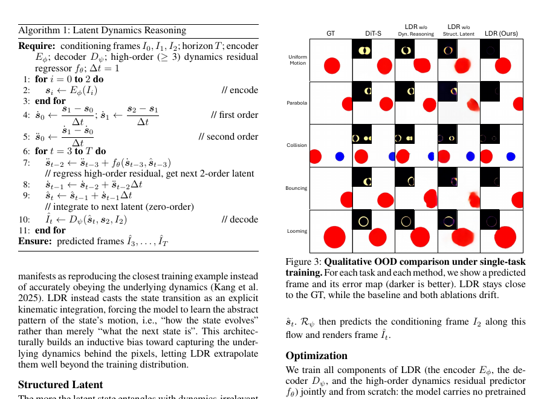
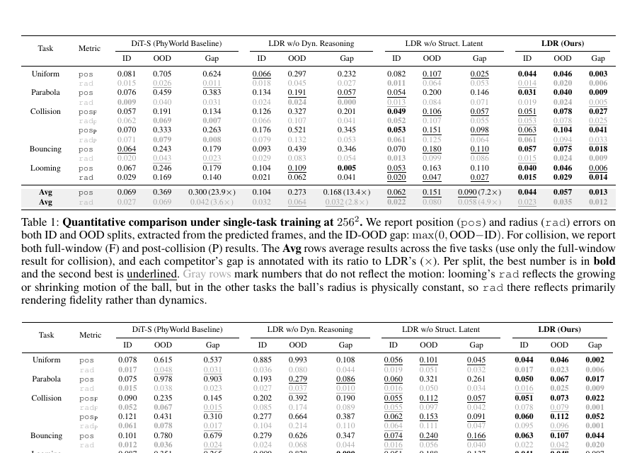
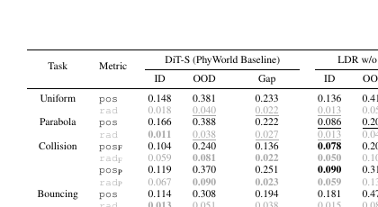

# Learning How the World Evolves: Extrapolative Video World Models via Latent Dynamics Reasoning

**Authors:** Haodong Li¹˒², Shaoteng Liu²* (Project lead), Tianyu Wang², Chongjian Ge², Sihui Ji², Jiahan Zhang², Xin Lin¹˒², Haolin Lu¹, Zhe Lin², Manmohan Chandraker¹  
**Affiliations:** ¹UCSD; ²Adobe  
**Source:** `Li 等 - 2026 - Learning How the World Evolves Extrapolative Video World Models via Latent Dynamics Reasoning.pdf`  
**arXiv:** 2608.09926v1 [cs.CV], 10 Aug 2026  
**Detected source format:** selectable-text, two-column PDF (`pdf-text`), 9 pages.  
**Reader type:** complete full-paper Chinese-English Markdown reader with locally rendered figure/table assets.

## Page / Section Index

- p. 1: title, Figure 1, Abstract
- pp. 2–3: Introduction, Related Works, Figure 2, Method
- pp. 3–4: Latent Dynamics Reasoning, Algorithm 1, Figure 3, Optimization, Experimental Setup
- pp. 4–6: Tables 1–5, Experimental Results, Figures 4–5
- p. 6: Stress Test, Summary, Limitation
- pp. 7–9: References

## Terminology Ledger

| English | Chinese used here | Note |
|---|---|---|
| Latent Dynamics Reasoning (LDR) | 潜在动力学推理 | Proposed method; keep acronym LDR. |
| structured latent (SL) | 结构化潜变量 | Geometric coordinate representation of convolutional features. |
| latent dynamics | 潜在动力学 | Dynamics of the latent trajectory. |
| kinematic integration | 运动学积分 | Explicit numerical integration of derivatives. |
| in-distribution (ID) / out-of-distribution (OOD) | 分布内 / 分布外 | Preserve abbreviations. |
| high-order residual | 高阶残差 | Third- and higher-order residual predicted by $f_\theta$. |
| rollout | 展开 / 滚动预测 | Future latent/frame rollout. |
| position / radius error | 位置误差 / 半径误差 | Metrics `pos` and `rad`. |
| world model | 世界模型 | Model intended to capture how a world evolves, not only generate plausible pixels. |
| PhyWorld | PhyWorld | White-box physics simulator and benchmark source. |
| DiT-S | DiT-S | PhyWorld video-diffusion baseline. |

## Figure 1. Learning how the world evolves

**Caption:** Figure 1: **Learning how the world evolves.** (A) Baseline method directly regresses the future, whereas our method regresses latent dynamics and reasons the future via kinematic integration. (B) Both match the ground truth (GT) in-distribution (ID), but only ours stays close to GT out-of-distribution (OOD). (C) Trained only on red balls moving left-to-right, LDR extrapolates the learned dynamics to a Pikachu and to a blue square moving right-to-left, while the baseline fails.

**Caption[CN]:** 图 1：**学习世界如何演化。** (A) 基线方法直接回归未来，而我们的方法回归潜在动力学，并通过运动学积分推理未来。(B) 在分布内（ID）时两者都能匹配真实值（GT），但在分布外（OOD）只有我们的方法仍贴近 GT。(C) LDR 仅在从左向右运动的红球上训练，却能将学到的动力学外推到 Pikachu，以及从右向左运动的蓝色方块；基线方法则失败。

## Abstract

> <strong>Para. 1:</strong> The world evolves following its dynamics, i.e., its laws of motion. However, leading video diffusion models largely fit the pixels without modeling how the pixels transit over time. Thus, they render visually plausible frames but may not accurately obey the laws. To capture the dynamics purely from pixels, we introduce Latent Dynamics Reasoning (LDR). LDR casts the latent transition as an explicit kinematic integration, where the lower-order dynamics are integrated numerically and the model regresses only the third- and higher-order residual that drives the rollout. For this integration to extrapolate better, LDR runs it on a structured latent rather than dense convolutional features. Following PhyWorld (Kang et al. 2025), we validate LDR on a controlled white-box physics benchmark spanning five tasks (uniform motion, parabola, collision, bouncing, looming), focusing on out-of-distribution scenarios that reveal whether a model has truly learned the underlying dynamics. LDR extrapolates the learned dynamics far better: the gap between its in- and out-of-distribution error is over 20× smaller than the video diffusion baseline’s, under both single- and joint-task training at $256^2$ resolution, while using 26× fewer parameters and running 143× faster. LDR can even generalize under severe shift: for example, trained only on red balls moving left-to-right, it correctly predicts the motion of a blue square moving right-to-left. To our knowledge, this is the first video world model that extrapolates learned dynamics beyond its training distribution. Project page: https://lat-dyn-reason.github.io/.

> <strong>Para. 1[CN]:</strong> 世界遵循其动力学（即运动定律）演化。然而，当前领先的视频扩散模型主要拟合像素，而没有建模像素如何随时间发生转移。因此，它们能够渲染视觉上合理的帧，却未必准确遵守这些定律。为仅从像素中捕获动力学，我们提出 Latent Dynamics Reasoning（LDR）。LDR 将潜在转移表示为显式的运动学积分：低阶动力学通过数值积分得到，而模型只回归驱动展开过程的三阶及更高阶残差。为了让这种积分具有更好的外推性，LDR 在结构化潜变量上运行，而不是在稠密卷积特征上运行。遵循 PhyWorld（Kang et al. 2025），我们在一个受控的白盒物理基准上验证 LDR，该基准涵盖五项任务（匀速运动、抛物线、碰撞、反弹、逼近/远离），重点考察能够揭示模型是否真正学到潜在动力学的分布外场景。在单任务和联合任务训练、$256^2$ 分辨率下，LDR 的分布内与分布外误差之差比视频扩散基线小 20 倍以上，同时参数量减少 26 倍、运行速度快 143 倍，因而能更好地外推动力学。LDR 甚至可以在严重分布偏移下泛化：例如，它仅在从左向右运动的红球上训练，却能正确预测从右向左运动的蓝色方块的运动。就我们所知，这是第一个将已学习动力学外推到训练分布之外的视频世界模型。项目主页：https://lat-dyn-reason.github.io/。

## Introduction

> <strong>Para. 1:</strong> The world evolves following its dynamics, i.e., the laws of motion that govern how its state changes over time. However, leading video diffusion models mainly learn “what the world looks like”, without capturing “how it evolves”, i.e., the underlying dynamics that drive the transitions of pixels. Thus, they render visually plausible frames but may not accurately obey the laws. We argue that capturing the underlying dynamics from pixels is one of the most fundamental differences that distinguish video world models from video generators. A video world model should capture how the world evolves and accurately extrapolate the learned dynamics to unseen scenarios.

> <strong>Para. 1[CN]:</strong> 世界遵循其动力学演化，也就是支配其状态随时间变化的运动定律。然而，当前领先的视频扩散模型主要学习“世界看起来是什么样”，却没有捕获“世界如何演化”，即驱动像素转移的底层动力学。因此，它们能渲染视觉上合理的帧，却未必准确遵守定律。我们认为，从像素中捕获底层动力学，是区分视频世界模型与视频生成器的最根本差异之一。视频世界模型应捕获世界如何演化，并将学到的动力学准确外推到未见过的场景。

> <strong>Para. 2:</strong> We introduce Latent Dynamics Reasoning (LDR), which predicts future frames by reasoning about the latent dynamics rather than regressing them directly (Fig. 1A). Specifically, LDR casts the latent transition as an explicit kinematic integration (Fig. 2B). From the structured latent (SL) of each conditioning frame, LDR starts by forming the first two time derivatives to initialize the rollout. It then rolls out step by step: the model regresses only the third- and higher-order residual, then numerically integrates the second-, first-, and zero-order SL in turn. This forces the model to learn the underlying dynamics, i.e., how the latent evolves over time, rather than merely what the next latent is. The SL gives a compact, structured representation free of the redundant semantic and appearance information carried by dense convolutional features, which makes the differentiation and integration of the dynamics more stable and more reliable when extrapolating (Fig. 2A). Finally, LDR decodes each future frame from its SL by warping the conditioning frame (Fig. 2C).

> <strong>Para. 2[CN]:</strong> 我们提出 Latent Dynamics Reasoning（LDR），通过推理潜在动力学而不是直接回归未来潜变量来预测未来帧（图 1A）。具体而言，LDR 将潜在转移表示为显式的运动学积分（图 2B）。对于每个条件帧的结构化潜变量（SL），LDR 先形成前两阶时间导数以初始化展开，然后逐步进行预测：模型只回归三阶及更高阶残差，随后依次对二阶、一阶和零阶 SL 做数值积分。这迫使模型学习底层动力学，即潜变量如何随时间演化，而不仅仅是学习下一个潜变量是什么。SL 是一种紧凑且结构化的表示，去除了稠密卷积特征中携带的冗余语义与外观信息，使动力学的微分与积分在外推时更加稳定、可靠（图 2A）。最后，LDR 通过对条件帧进行变形，将每个未来帧从其 SL 解码出来（图 2C）。

> <strong>Para. 3:</strong> We build our benchmark using the simulator of PhyWorld (Kang et al. 2025), a clean and controlled testbed, and validate LDR on five tasks: uniform motion, parabola, collision, bouncing, and looming. For each task, we define in-distribution (ID) ranges of the initial conditions and out-of-distribution (OOD) ranges that share the same laws of motion. The model is trained only on ID samples. In ID testing, the model only needs to reproduce motions it has seen. But in OOD testing, the model is required to extrapolate the learned dynamics beyond the training distribution, which cleanly distinguishes capturing the dynamics from merely memorizing the pixels. In addition, because the simulator is white-box, we can directly measure the accuracy of the learned dynamics by parsing each object’s position and size from the predicted pixels and comparing them against the ground truth (GT).

> <strong>Para. 3[CN]:</strong> 我们使用 PhyWorld（Kang et al. 2025）的模拟器构建基准，这是一个干净且受控的测试平台，并在五项任务上验证 LDR：匀速运动、抛物线、碰撞、反弹和逼近/远离。对于每项任务，我们定义初始条件的分布内（ID）范围，以及遵循相同运动定律的分布外（OOD）范围。模型只使用 ID 样本训练。在 ID 测试中，模型只需复现见过的运动；但在 OOD 测试中，模型必须将学到的动力学外推到训练分布之外，这能清楚地区分“捕获动力学”和“仅仅记忆像素”。此外，由于模拟器是白盒的，我们可以从预测像素中解析每个物体的位置和大小，并与真实值（GT）比较，直接测量所学动力学的准确性。

> <strong>Para. 4:</strong> Compared with PhyWorld’s standard video diffusion baseline (a DiT, for which we choose DiT-S), LDR extrapolates the learned dynamics to OOD samples far better while being much smaller and faster. Averaged over the five tasks at $256^2$ resolution, LDR’s gap between ID and OOD error is over 20× smaller than the baseline’s under both single-task and joint five-task training, while using 26× fewer parameters and running 143× faster. This efficiency comes from predicting future frames in a single forward pass, without iterative sampling or test-time optimization. We further ablate LDR’s two components by removing the dynamics reasoning or replacing SL with dense convolutional features. Either ablation widens the ID-OOD gap several-fold, confirming that both are necessary. Qualitatively, LDR tracks the true motion under both single-task and joint training where the DiT baseline and ablated variants drift (Fig. 3, 4). LDR can also generalize the learned dynamics under large OOD shifts (Fig. 1, 5). Our contributions are summarized as follows:

> - To learn the dynamics behind the pixels and extrapolate them to unseen scenarios, we propose Latent Dynamics Reasoning (LDR). To our knowledge, this is the first video world model that extrapolates learned dynamics beyond its training distribution.¹
> - We instantiate LDR as a model that reasons about latent dynamics through kinematic integration in structured latent space. On a controlled benchmark of five physics tasks, LDR extrapolates far better than the video diffusion baseline while being much smaller and faster.

> <strong>Para. 4[CN]:</strong> 与 PhyWorld 的标准视频扩散基线（DiT；我们选择 DiT-S）相比，LDR 能更好地将已学习的动力学外推到 OOD 样本，同时模型更小、速度更快。在 $256^2$ 分辨率下对五项任务取平均时，无论单任务还是五任务联合训练，LDR 的 ID-OOD 误差差距都比基线小 20 倍以上，同时参数量减少 26 倍、速度快 143 倍。这种效率来自单次前向传播就能预测未来帧，无需迭代采样或测试时优化。我们进一步通过移除动力学推理，或用稠密卷积特征替代 SL，对 LDR 的两个组件进行消融。任一消融都会使 ID-OOD 差距扩大数倍，说明两个组件都不可或缺。在定性结果中，无论单任务还是联合训练，LDR 都能跟随真实运动，而 DiT 基线及消融版本会发生漂移（图 3、4）。LDR 也能在大幅 OOD 偏移下泛化所学动力学（图 1、5）。我们的贡献总结如下：

> - 为学习像素背后的动力学并将其外推到未见场景，我们提出 Latent Dynamics Reasoning（LDR）。就我们所知，这是第一个将学到的动力学外推到训练分布之外的视频世界模型。¹
> - 我们将 LDR 实例化为一个在结构化潜在空间中通过运动学积分推理潜在动力学的模型。在一个受控的五任务物理基准上，LDR 的外推能力远胜视频扩散基线，同时规模更小、速度更快。

> <strong>Para. 5:</strong> ¹Scope: We validate LDR as a principle on simulated scenarios with simple objects. Scaling to richer, even real-world scenes with larger models is future work.

> <strong>Para. 5[CN]:</strong> ¹范围说明：我们在包含简单物体的模拟场景上验证 LDR 这一原则。使用更大模型扩展到更丰富、甚至真实世界的场景，是未来工作。

## Related Works

### Video Generation and Video World Models

> <strong>Para. 1:</strong> Video generation models synthesize realistic frames via latent diffusion modeling (Ho, Jain, and Abbeel 2020; Song, Meng, and Ermon 2021; Song et al. 2021; Rombach et al. 2022; Peebles and Xie 2023; Blattmann et al. 2023; Brooks et al. 2024; Yang et al. 2025; Li et al. 2026a). Some of them are regarded as video world models (Ha and Schmidhuber 2018; Hafner et al. 2025; Bruce et al. 2024; Alonso et al. 2024; Agarwal et al. 2025, 2026). Realism, though, does not imply that the underlying dynamics is captured: the latent transition is a black box fit to the training distribution, and Cosmos (Agarwal et al. 2025, 2026) also reports that physical accuracy remains unsolved. Both JEPA (Bardes et al. 2024; Assran et al. 2025) and our LDR can be categorized as “next-latent prediction”, but like DiT, JEPA regresses the future latents directly without reasoning about the dynamics. We argue that capturing and extrapolating the learned dynamics is what should distinguish video world models from video generation models, and that is the capability LDR provides.

> <strong>Para. 1[CN]:</strong> 视频生成模型通过潜在扩散建模合成逼真帧（Ho, Jain, and Abbeel 2020；Song, Meng, and Ermon 2021；Song et al. 2021；Rombach et al. 2022；Peebles and Xie 2023；Blattmann et al. 2023；Brooks et al. 2024；Yang et al. 2025；Li et al. 2026a）。其中一些被视为视频世界模型（Ha and Schmidhuber 2018；Hafner et al. 2025；Bruce et al. 2024；Alonso et al. 2024；Agarwal et al. 2025, 2026）。然而，逼真并不意味着捕获了底层动力学：潜在转移只是对训练分布的黑盒拟合，Cosmos（Agarwal et al. 2025, 2026）也报告物理准确性仍未解决。JEPA（Bardes et al. 2024；Assran et al. 2025）和我们的 LDR 都可以归为“下一潜变量预测”，但与 DiT 类似，JEPA 直接回归未来潜变量，并不推理动力学。我们认为，捕获并外推已学习动力学，才应是区分视频世界模型与视频生成模型的能力，而 LDR 正是提供了这种能力。

### Learning and Extrapolating the Laws of Motion

> <strong>Para. 2:</strong> Learning the laws of motion has been studied extensively. One route captures dynamics accurately but relies on external signals: some integrate dynamics over known states (Battaglia et al. 2016; Sanchez-Gonzalez et al. 2020; Liu et al. 2024; Kipf et al. 2018; Lam et al. 2023; Yin et al. 2023; Cachay et al. 2023), some under conservation or PDE priors (Greydanus, Dzamba, and Yosinski 2019; Cranmer et al. 2020; Guen and Thome 2020; Alet et al. 2021), while others draw supervision from physics engines or physical laws (Xue et al. 2025; Lin et al. 2025; Li et al. 2026b). Another route learns dynamics purely from pixels via neural ODE modeling (Chen et al. 2018; Rubanova, Chen, and Duvenaud 2019; Park et al. 2021; Watter et al. 2015; Krishnan, Shalit, and Sontag 2015; Çağatay Yıldız, Heinonen, and Lähdesmäki 2019), yet these are validated only within the training regime, leaving extrapolation of the learned dynamics largely unexplored.

> <strong>Para. 2[CN]:</strong> 运动定律的学习已经得到广泛研究。一条路线能够准确捕获动力学，但依赖外部信号：有些方法在已知状态上积分动力学（Battaglia et al. 2016；Sanchez-Gonzalez et al. 2020；Liu et al. 2024；Kipf et al. 2018；Lam et al. 2023；Yin et al. 2023；Cachay et al. 2023），有些使用守恒定律或 PDE 先验（Greydanus, Dzamba, and Yosinski 2019；Cranmer et al. 2020；Guen and Thome 2020；Alet et al. 2021），另一些则从物理引擎或物理定律获得监督（Xue et al. 2025；Lin et al. 2025；Li et al. 2026b）。另一条路线通过 neural ODE 建模，仅从像素中学习动力学（Chen et al. 2018；Rubanova, Chen, and Duvenaud 2019；Park et al. 2021；Watter et al. 2015；Krishnan, Shalit, and Sontag 2015；Çağatay Yıldız, Heinonen, and Lähdesmäki 2019），但这些方法只在训练机制内验证，使得已学习动力学的外推仍基本未被探索。

> <strong>Para. 3:</strong> Beyond its training distribution, a neural network extrapolates according to the inductive bias of its architecture rather than the data it has seen (Xu et al. 2021). A model therefore extrapolates dynamics only when the reasoning of dynamics is built into its architecture rather than fit directly from data. Following this principle, LDR reasons about the underlying dynamics through kinematic integration in a structured latent space, aiming not only to capture the dynamics purely from pixels but also to extrapolate the learned dynamics beyond the training distribution. To our knowledge, LDR is the first video world model that extrapolates learned dynamics beyond its training distribution.

> <strong>Para. 3[CN]:</strong> 在训练分布之外，神经网络依靠的是其架构的归纳偏置，而不是所见过的数据来进行外推（Xu et al. 2021）。因此，只有当动力学推理被构建进架构、而非直接从数据拟合出来时，模型才会外推动力学。遵循这一原则，LDR 在结构化潜在空间中通过运动学积分推理底层动力学，目标不仅是纯粹从像素捕获动力学，也是将学到的动力学外推到训练分布之外。就我们所知，LDR 是第一个将已学习动力学外推到训练分布之外的视频世界模型。

## Figure 2. Overview of LDR

**Caption:** Figure 2: **Overview of LDR.** Given three conditioning frames $I_0$, $I_1$, $I_2$, LDR predicts the future frames $\hat I_3$, $\hat I_4$, $\ldots$, $\hat I_T$ in three stages. (A) LDR first encodes each input frame into a structured latent (SL). (B) LDR measures the low-order time derivatives of the given SL, then rolls out by regressing only the high-order residual with $f_\theta$ and numerically integrating the lower orders to the next latent $\hat s_t$ ($t\in\{3,4,\cdots,T\}$). (C) LDR finally decodes each predicted latent to an RGB frame $\hat I_t$.

**Caption[CN]:** 图 2：**LDR 总览。** 给定三个条件帧 $I_0$、$I_1$、$I_2$，LDR 分三个阶段预测未来帧 $\hat I_3$、$\hat I_4$、$\ldots$、$\hat I_T$。(A) LDR 首先将每个输入帧编码为结构化潜变量（SL）。(B) LDR 测量给定 SL 的低阶时间导数，然后只用 $f_\theta$ 回归高阶残差，并数值积分低阶项，得到下一个潜变量 $\hat s_t$（$t\in\{3,4,\cdots,T\}$）。(C) LDR 最后将每个预测潜变量解码为 RGB 帧 $\hat I_t$。

## Method

> <strong>Para. 1:</strong> Latent Dynamics Reasoning (LDR) predicts future frames by reasoning about the dynamics behind the pixels (Fig. 2). It first encodes each input frame into a structured latent (SL) (Fig. 2A). It then reasons about how this latent evolves via explicit kinematic integration (Fig. 2B). Finally, it decodes each predicted latent back to a frame (Fig. 2C). Although LDR consists of three conceptual stages, it predicts in a single feed-forward pass, without test-time optimization or iterative solvers.

> <strong>Para. 1[CN]:</strong> Latent Dynamics Reasoning（LDR）通过推理像素背后的动力学预测未来帧（图 2）。它首先将每个输入帧编码为结构化潜变量（SL）（图 2A），随后通过显式运动学积分推理该潜变量如何演化（图 2B），最后将每个预测潜变量解码回帧（图 2C）。虽然 LDR 包含三个概念阶段，但它在单次前馈传播中完成预测，无需测试时优化或迭代求解器。

### Structured Representation

> <strong>Para. 2:</strong> As mentioned, LDR reasons about the dynamics in a structured latent space. This choice is motivated by (Jakab et al. 2018; Kulkarni et al. 2019; Minderer et al. 2019; Daniel and Tamar 2024; Locatello et al. 2020; Wu et al. 2023; Kipf, van der Pol, and Welling 2020; Jiang et al. 2024), where structured representations (e.g., geometric coordinates or object-centric slots) outperform unstructured features (e.g., convolutional features) in sequential modeling. For more stable reasoning and more reliable extrapolation, LDR follows (Jakab et al. 2018; Kulkarni et al. 2019; Minderer et al. 2019) to represent each frame as the geometric coordinates of its convolutional feature.

> <strong>Para. 2[CN]:</strong> 如前所述，LDR 在结构化潜在空间中推理动力学。这一选择受到（Jakab et al. 2018；Kulkarni et al. 2019；Minderer et al. 2019；Daniel and Tamar 2024；Locatello et al. 2020；Wu et al. 2023；Kipf, van der Pol, and Welling 2020；Jiang et al. 2024）的启发：在序列建模中，结构化表示（例如几何坐标或以物体为中心的 slot）优于非结构化特征（例如卷积特征）。为了获得更稳定的推理和更可靠的外推，LDR 遵循（Jakab et al. 2018；Kulkarni et al. 2019；Minderer et al. 2019），将每一帧表示为其卷积特征的几何坐标。

> <strong>Para. 3:</strong> The more the latent state entangles with dynamics-irrelevant details, the harder the dynamics is to reason (i.e., differentiation and integration) and to extrapolate. LDR thus reasons in the SL space, a compact representation free of the dynamics-irrelevant detail (e.g., appearance and semantics) carried by dense convolutional features, which makes the dynamics reasoning more stable and more reliable when extrapolating.

> <strong>Para. 3[CN]:</strong> 潜在状态越多地纠缠与动力学无关的细节，动力学推理（即微分与积分）和外推就越困难。因此，LDR 在 SL 空间中推理；SL 是一种紧凑表示，不包含稠密卷积特征携带的与动力学无关的细节（例如外观和语义），使动力学推理在外推时更加稳定、可靠。

### Encoding

> <strong>Para. 4:</strong> Before dynamics reasoning, LDR first encodes each input frame into a structured latent, $\forall i\in\{0,1,2\}$:

$$s_i=E_\phi(I_i)=\operatorname{Struct}(C_\phi(I_i))=(\mu_i,\sigma_i). \tag{3}$$

> <strong>Para. 4[CN]:</strong> 在进行动力学推理之前，LDR 首先把每个输入帧编码为结构化潜变量，$\forall i\in\{0,1,2\}$：

$$s_i=E_\phi(I_i)=\operatorname{Struct}(C_\phi(I_i))=(\mu_i,\sigma_i). \tag{3}$$

> <strong>Para. 5:</strong> A convolutional network $C_\phi$ maps the frame $I_i$ to a feature map $z_i$. A marginal soft-argmax then turns each channel of $z_i$ into a spatial distribution, from which LDR extracts the geometric coordinate (i.e., the centroid $\mu_i$ and extent $\sigma_i$) and forms the structured latent $s_i$ (Jakab et al. 2018; Kulkarni et al. 2019; Minderer et al. 2019).

> <strong>Para. 5[CN]:</strong> 卷积网络 $C_\phi$ 将帧 $I_i$ 映射为特征图 $z_i$。随后，边缘 soft-argmax 将 $z_i$ 的每个通道转换为空间分布，LDR 从中提取几何坐标（即质心 $\mu_i$ 和尺度 $\sigma_i$），并形成结构化潜变量 $s_i$（Jakab et al. 2018；Kulkarni et al. 2019；Minderer et al. 2019）。

### Decoding

> <strong>Para. 6:</strong> After dynamics reasoning, LDR decodes each predicted latent back to an RGB frame by warping the conditioning frame, following (Siarohin et al. 2019, 2021; Gao et al. 2019), $\forall t\in\{3,\ldots,T\}$:

$$\hat I_t=D_\psi(\hat s_t,s_2,I_2)=R_\psi(I_2,T_\psi(\hat s_t,s_2)). \tag{4}$$

> <strong>Para. 6[CN]:</strong> 在动力学推理之后，LDR 遵循（Siarohin et al. 2019, 2021；Gao et al. 2019），通过变形条件帧将每个预测潜变量解码为 RGB 帧，$\forall t\in\{3,\ldots,T\}$：

$$\hat I_t=D_\psi(\hat s_t,s_2,I_2)=R_\psi(I_2,T_\psi(\hat s_t,s_2)). \tag{4}$$

> <strong>Para. 7:</strong> A learned transformation module $T_\psi$ predicts a dense warping flow from the conditioning latent $s_2$ to the predicted one $\hat s_t$. $R_\psi$ then predicts the conditioning frame $I_2$ along this flow and renders frame $\hat I_t$.

> <strong>Para. 7[CN]:</strong> 学习得到的变换模块 $T_\psi$ 预测从条件潜变量 $s_2$ 到预测潜变量 $\hat s_t$ 的稠密变形流。随后，$R_\psi$ 沿该流变换条件帧 $I_2$，并渲染出帧 $\hat I_t$。

### Latent Dynamics Reasoning

> <strong>Para. 8:</strong> From the conditioning latents, LDR first measures their first- and second-order time derivatives to initialize the rollout. It then regresses only the third- and higher-order residual, and rolls out the future latents by kinematic integration.

> <strong>Para. 8[CN]:</strong> LDR 首先从条件潜变量中测量一阶和二阶时间导数，以初始化展开过程；随后只回归三阶及更高阶残差，并通过运动学积分展开未来潜变量。

#### Initialization

> <strong>Para. 9:</strong> Because LDR regresses only the third- and higher-order residual, it initializes the rollout only up to the second-order derivative. A second-order finite difference is fixed by three points, so LDR conditions on three frames. It forms the initial dynamics from the conditioning latents by finite differences:

$$\dot s_0=\frac{s_1-s_0}{\Delta t},\qquad \dot s_1=\frac{s_2-s_1}{\Delta t},\qquad \ddot s_0=\frac{\dot s_1-\dot s_0}{\Delta t}. \tag{1}$$

> <strong>Para. 9[CN]:</strong> 由于 LDR 只回归三阶及更高阶残差，因此展开初始化只到二阶导数。二阶有限差分由三个点确定，所以 LDR 以三帧作为条件。它通过有限差分从条件潜变量形成初始动力学：

$$\dot s_0=\frac{s_1-s_0}{\Delta t},\qquad \dot s_1=\frac{s_2-s_1}{\Delta t},\qquad \ddot s_0=\frac{\dot s_1-\dot s_0}{\Delta t}. \tag{1}$$

> <strong>Para. 10:</strong> with $\Delta t=1$. If we consider $s$ itself as “position”, $\dot s$ and $\ddot s$ are its “velocity” and “acceleration”, both derivatives of the latent trajectory.

> <strong>Para. 10[CN]:</strong> 其中 $\Delta t=1$。如果把 $s$ 本身看作“位置”，那么 $\dot s$ 和 $\ddot s$ 就是它的“速度”和“加速度”，二者都是潜在轨迹的导数。

#### Kinematics Integration

> <strong>Para. 11:</strong> LDR then rolls out the next latent one at a time, regressing the third- and higher-order residual and integrating the lower orders, $\forall t\in\{3,\ldots,T\}$:

$$\ddot s_{t-2}=\ddot s_{t-3}+\dddot s_{t-3}\Delta t\approx\ddot s_{t-3}+f_\theta(\dot s_{t-3},\hat s_{t-3}),$$

$$\dot s_{t-1}=\dot s_{t-2}+\ddot s_{t-2}\Delta t,\qquad \hat s_t=\hat s_{t-1}+\dot s_{t-1}\Delta t. \tag{2}$$

> <strong>Para. 11[CN]:</strong> 随后，LDR 一次展开一个潜变量，回归三阶及更高阶残差并对低阶项积分，$\forall t\in\{3,\ldots,T\}$：

$$\ddot s_{t-2}=\ddot s_{t-3}+\dddot s_{t-3}\Delta t\approx\ddot s_{t-3}+f_\theta(\dot s_{t-3},\hat s_{t-3}),$$

$$\dot s_{t-1}=\dot s_{t-2}+\ddot s_{t-2}\Delta t,\qquad \hat s_t=\hat s_{t-1}+\dot s_{t-1}\Delta t. \tag{2}$$

> <strong>Para. 12:</strong> The rollout is initiated by the conditioning latents, i.e., $\hat s_i=s_i$ for $i\in\{0,1,2\}$. Here $f_\theta(\cdot)=\tanh(\operatorname{MLP}(\cdot))$ regresses the third- and higher-order residual, i.e., the change in the second-order latent, approximating $\dddot s_{t-3}\Delta t$. The integration then propagates this residual down through the second- and first-order latents to produce the next latent. Only $f_\theta$ is learned; the integration chain is fixed (Alg. 1).

> <strong>Para. 12[CN]:</strong> 展开由条件潜变量初始化，即对于 $i\in\{0,1,2\}$，有 $\hat s_i=s_i$。这里 $f_\theta(\cdot)=\tanh(\operatorname{MLP}(\cdot))$ 回归三阶及更高阶残差，也就是二阶潜变量的变化，并近似 $\dddot s_{t-3}\Delta t$。积分随后将该残差依次传播到二阶和一阶潜变量，生成下一个潜变量。只有 $f_\theta$ 是学习得到的；积分链是固定的（算法 1）。

#### Why LDR Extrapolates?

> <strong>Para. 13:</strong> When tested beyond the training distribution, a network follows the inductive bias of its architecture rather than the data it was trained on, and a plain regressor with no such bias flattens toward the training mean off-support (Xu et al. 2021). In OOD video prediction, this manifests as reproducing the closest training example instead of accurately obeying the underlying dynamics (Kang et al. 2025). LDR instead casts the state transition as an explicit kinematic integration, forcing the model to learn the abstract pattern of the state’s motion, i.e., “how the state evolves” rather than merely “what the next state is”. This architecturally builds an inductive bias toward capturing the underlying dynamics behind the pixels, letting LDR extrapolate them well beyond the training distribution.

> <strong>Para. 13[CN]:</strong> 在训练分布之外测试时，网络遵循其架构的归纳偏置，而不是训练数据；没有这种偏置的普通回归器在支持域之外会趋向训练均值（Xu et al. 2021）。在 OOD 视频预测中，这表现为复现最接近的训练样本，而非准确遵守底层动力学（Kang et al. 2025）。相反，LDR 将状态转移表示为显式的运动学积分，迫使模型学习状态运动的抽象模式，即“状态如何演化”，而不只是“下一个状态是什么”。这在架构层面建立了捕获像素背后底层动力学的归纳偏置，使 LDR 能够将动力学远远外推到训练分布之外。

## Algorithm 1. Latent Dynamics Reasoning

> <strong>Para. 14:</strong> **Require:** conditioning frames $I_0,I_1,I_2$; horizon $T$; encoder $E_\phi$; decoder $D_\psi$; high-order ($\ge 3$) dynamics residual regressor $f_\theta$; $\Delta t=1$.
>
> 1. **for** $i=0$ to $2$ **do**
> 2. $s_i\leftarrow E_\phi(I_i)$ // encode
> 3. **end for**
> 4. $\dot s_0\leftarrow(s_1-s_0)/\Delta t$; $\dot s_1\leftarrow(s_2-s_1)/\Delta t$ // first order
> 5. $\ddot s_0\leftarrow(\dot s_1-\dot s_0)/\Delta t$ // second order
> 6. **for** $t=3$ to $T$ **do**
> 7. $\ddot s_{t-2}\leftarrow\ddot s_{t-3}+f_\theta(\dot s_{t-3},\hat s_{t-3})$ // regress high-order residual, get next 2-order latent
> 8. $\dot s_{t-1}\leftarrow\dot s_{t-2}+\ddot s_{t-2}\Delta t$
> 9. $\hat s_t\leftarrow\hat s_{t-1}+\dot s_{t-1}\Delta t$ // integrate to next latent (zero-order)
> 10. $\hat I_t\leftarrow D_\psi(\hat s_t,s_2,I_2)$ // decode
> 11. **end for**
>
> **Ensure:** predicted frames $\hat I_3,\ldots,\hat I_T$.

> <strong>Para. 14[CN]:</strong> **输入：**条件帧 $I_0,I_1,I_2$；预测时域 $T$；编码器 $E_\phi$；解码器 $D_\psi$；高阶（$\ge3$）动力学残差回归器 $f_\theta$；$\Delta t=1$。
>
> 1. **for** $i=0$ 到 $2$ **do**
> 2. $s_i\leftarrow E_\phi(I_i)$ // 编码
> 3. **end for**
> 4. $\dot s_0\leftarrow(s_1-s_0)/\Delta t$；$\dot s_1\leftarrow(s_2-s_1)/\Delta t$ // 一阶
> 5. $\ddot s_0\leftarrow(\dot s_1-\dot s_0)/\Delta t$ // 二阶
> 6. **for** $t=3$ 到 $T$ **do**
> 7. $\ddot s_{t-2}\leftarrow\ddot s_{t-3}+f_\theta(\dot s_{t-3},\hat s_{t-3})$ // 回归高阶残差，得到下一个二阶潜变量
> 8. $\dot s_{t-1}\leftarrow\dot s_{t-2}+\ddot s_{t-2}\Delta t$
> 9. $\hat s_t\leftarrow\hat s_{t-1}+\dot s_{t-1}\Delta t$ // 积分得到下一个潜变量（零阶）
> 10. $\hat I_t\leftarrow D_\psi(\hat s_t,s_2,I_2)$ // 解码
> 11. **end for**
>
> **输出保证：**预测帧 $\hat I_3,\ldots,\hat I_T$。

## Figure 3. Qualitative OOD comparison under single-task training

**Caption:** Figure 3: **Qualitative OOD comparison under single-task training.** For each task and each method, we show a predicted frame and its error map (darker is better). LDR stays close to the GT, while the baseline and both ablations drift.

**Caption[CN]:** 图 3：**单任务训练下的 OOD 定性比较。** 对于每项任务和每种方法，我们展示一个预测帧及其误差图（颜色越深越好）。LDR 保持贴近 GT，而基线与两个消融版本发生漂移。

## Optimization

> <strong>Para. 15:</strong> We train all components of LDR (the encoder $E_\phi$, the decoder $D_\psi$, and the high-order dynamics residual predictor $f_\theta$) jointly and from scratch: the model carries no pretrained weights or modules. Three terms supervise the training. An RGB reconstruction term optimizes the encoder and decoder:

$$L_{ae}^{rgb}=\sum_{t=0}^{T}\left\|\Phi(D_\psi(E_\phi(I_t),s_2,I_2))-\Phi(I_t)\right\|_1,$$

> <strong>Para. 15[CN]:</strong> 我们从头开始联合训练 LDR 的所有组件（编码器 $E_\phi$、解码器 $D_\psi$ 和高阶动力学残差预测器 $f_\theta$）；模型不包含预训练权重或模块。训练由三项损失监督。一项 RGB 重建损失优化编码器和解码器：

$$L_{ae}^{rgb}=\sum_{t=0}^{T}\left\|\Phi(D_\psi(E_\phi(I_t),s_2,I_2))-\Phi(I_t)\right\|_1,$$

> <strong>Para. 16:</strong> where $\Phi$ is a multi-scale image feature extractor (Johnson, Alahi, and Fei-Fei 2016). An RGB rollout term optimizes the entire model:

$$L_{roll}^{rgb}=\sum_{t=3}^{T}\left\|\Phi(I_t)-\Phi(\hat I_t)\right\|_1.$$

> <strong>Para. 16[CN]:</strong> 其中 $\Phi$ 是多尺度图像特征提取器（Johnson, Alahi, and Fei-Fei 2016）。RGB 展开损失优化整个模型：

$$L_{roll}^{rgb}=\sum_{t=3}^{T}\left\|\Phi(I_t)-\Phi(\hat I_t)\right\|_1.$$

> <strong>Para. 17:</strong> A latent rollout term primarily optimizes $f_\theta$:

$$L_{roll}^{SL}=\sum_{t=3}^{T}\left\|\hat s_t-\operatorname{sg}(s_t)\right\|_2^2.$$

> <strong>Para. 17[CN]:</strong> 潜在展开损失主要优化 $f_\theta$：

$$L_{roll}^{SL}=\sum_{t=3}^{T}\left\|\hat s_t-\operatorname{sg}(s_t)\right\|_2^2.$$

> <strong>Para. 18:</strong> The full objective is:

$$L_{LDR}=L_{roll}^{rgb}+\lambda_{ae}^{rgb}L_{ae}^{rgb}+\lambda_{roll}^{SL}L_{roll}^{SL}. \tag{5}$$

> <strong>Para. 18[CN]:</strong> 完整目标为：

$$L_{LDR}=L_{roll}^{rgb}+\lambda_{ae}^{rgb}L_{ae}^{rgb}+\lambda_{roll}^{SL}L_{roll}^{SL}. \tag{5}$$

> <strong>Para. 19:</strong> In training, we grow the rollout horizon from short to full, which stabilizes long-horizon backpropagation. In testing, we always roll out the full horizon.

> <strong>Para. 19[CN]:</strong> 训练时，我们将展开时域从短逐步增长到完整时域，以稳定长时域反向传播；测试时始终展开完整时域。

## Experiments

### Experimental Setup

#### Benchmark

> <strong>Para. 20:</strong> For validating LDR, we build a controlled benchmark on the PhyWorld simulator (Kang et al. 2025), spanning five physics tasks involving one or two moving balls: uniform motion (a ball translating at a constant velocity); parabola (a projectile under gravity); collision (two balls colliding elastically head-on); bouncing (a projectile rebounding off the ground, losing energy at each bounce); looming (a ball translating while growing or shrinking).

> <strong>Para. 20[CN]:</strong> 为验证 LDR，我们在 PhyWorld 模拟器（Kang et al. 2025）上构建了一个受控基准，涵盖五项涉及一个或两个运动球体的物理任务：uniform motion（球以恒定速度平移）；parabola（物体在重力作用下运动）；collision（两个球正面弹性碰撞）；bouncing（物体从地面反弹，每次反弹损失能量）；looming（球在平移的同时变大或变小）。

> <strong>Para. 21:</strong> In every task, the balls share the same ID range of initial conditions: a speed $v\in[1,4]$ and a radius $r\in[0.7,1.4]$ in a world of scale 10 (looming further fixes the growing or shrinking rate $|\dot r|\in[0,0.03]$). OOD test samples push these conditions beyond both ends of the ID range: the speed to $v\in[0.05,6]$, the radius to $r\in[0.6,2]$, and the scale rate to $|\dot r|\in[0.05,0.09]$. Since the same motion laws hold on both splits, OOD testing effectively evaluates the model’s capability in extrapolating the learned underlying dynamics in unseen scenarios.

> <strong>Para. 21[CN]:</strong> 在每项任务中，球体共享相同的 ID 初始条件范围：速度 $v\in[1,4]$、半径 $r\in[0.7,1.4]$，世界尺度为 10（looming 还固定增长或收缩率 $|\dot r|\in[0,0.03]$）。OOD 测试样本将这些条件推到 ID 范围两端之外：速度为 $v\in[0.05,6]$，半径为 $r\in[0.6,2]$，尺度变化率为 $|\dot r|\in[0.05,0.09]$。由于两个划分遵循相同的运动定律，OOD 测试实际上评估的是模型在未见场景中外推所学底层动力学的能力。

#### Training protocols

> <strong>Para. 22:</strong> We train all methods (the DiT-S baseline, LDR, and its ablated variants) from scratch. Single-task training fits one model per task. Joint training fits one model on all five tasks at once, which is a harder setting. Every model conditions on three frames, predicts the next 29 (i.e., $T=31$), and trains only on ID samples.

> <strong>Para. 22[CN]:</strong> 我们从头训练所有方法（DiT-S 基线、LDR 及其消融版本）。单任务训练为每项任务拟合一个模型；联合训练让一个模型同时拟合全部五项任务，设置更困难。每个模型以三帧为条件，预测接下来的 29 帧（即 $T=31$），并且只在 ID 样本上训练。

#### Metrics

> <strong>Para. 23:</strong> Because the simulator is white-box and each object in our benchmark is a ball, to directly evaluate the dynamics, we extract each object’s center and radius from the predicted frames and compare them against the GT, giving position error (pos) and radius error (rad). We report numbers tested on both ID and OOD splits and the ID-OOD gap: $\max(0,\mathrm{OOD}-\mathrm{ID})$. For collision, we report both full-window (F) and post-collision (P) results.

> <strong>Para. 23[CN]:</strong> 由于模拟器是白盒的，且基准中的每个物体都是球体，为直接评价动力学，我们从预测帧中提取每个物体的中心和半径，并与 GT 比较，得到位置误差（pos）和半径误差（rad）。我们报告 ID 与 OOD 划分上的测试数值，以及 ID-OOD 差距：$\max(0,\mathrm{OOD}-\mathrm{ID})$。对于 collision，同时报告完整窗口（F）和碰撞后（P）的结果。

#### Baselines and ablated variants

> <strong>Para. 24:</strong> We compare against the DiT-S baseline of PhyWorld, which represents the standard video diffusion solution of the community, and two ablations each remove one LDR component. Removing dynamics reasoning replaces the kinematic integration with a direct residual regression of the next latent (i.e., regressing $s_{t+1}-s_t$). Removing the structured latent (SL) runs the same dynamics reasoning but on a dense convolutional latent instead.

> <strong>Para. 24[CN]:</strong> 我们与 PhyWorld 的 DiT-S 基线比较，该基线代表社区中的标准视频扩散方案；同时使用两个分别移除 LDR 一个组件的消融版本。移除动力学推理时，用对下一个潜变量的直接残差回归（即回归 $s_{t+1}-s_t$）替代运动学积分。移除结构化潜变量（SL）时，动力学推理保持不变，但改在稠密卷积潜变量上运行。

#### Implementation details

> <strong>Para. 25:</strong> We train every model from scratch with AdamW (learning rate $10^{-4}$, weight decay 0.01, gradient clipping 1.0) and a global batch size of 256, for 10K steps by default and 20K for collision, bouncing, and joint training. LDR uses a three-layer MLP of width 256 for $f_\theta$ and weights the losses by $\lambda_{ae}^{rgb}=1.0$ and $\lambda_{roll}^{SL}=0.5$. The training rollout gradually grows to the full 29 frames by step 8K. All runs use seed 42 and report a single run on 8×8 NVIDIA A100-80G GPUs with PyTorch 2.4 and CUDA 12.1. Each model is trained in both $128^2$ and $256^2$ resolution.

> <strong>Para. 25[CN]:</strong> 我们使用 AdamW 从头训练每个模型（学习率 $10^{-4}$、权重衰减 0.01、梯度裁剪 1.0），全局 batch size 为 256；默认训练 10K 步，collision、bouncing 和联合训练训练 20K 步。LDR 的 $f_\theta$ 使用三层、宽度为 256 的 MLP，损失权重为 $\lambda_{ae}^{rgb}=1.0$、$\lambda_{roll}^{SL}=0.5$。训练展开过程在第 8K 步逐渐增长到完整的 29 帧。所有运行使用 seed 42，在 8×8 张 NVIDIA A100-80G GPU 上单次运行并报告结果，软件为 PyTorch 2.4 和 CUDA 12.1。每个模型都在 $128^2$ 和 $256^2$ 分辨率下训练。

## Tables 1–4. Quantitative comparisons

**Caption:** Table 1: **Quantitative comparison under single-task training at $256^2$.** We report position (pos) and radius (rad) errors on both ID and OOD splits, and the ID-OOD gap: $\max(0,\mathrm{OOD}-\mathrm{ID})$. For collision, we report both full-window (F) and post-collision (P) results. The Avg rows average results across the five tasks (use only the full-window result for collision), and each competitor’s gap is annotated with its ratio to LDR’s (×). Per split, the best number is in bold and the second best is underlined. Gray rows mark numbers that do not reflect the motion: looming’s rad reflects the growing or shrinking motion of the ball, but in the other tasks the ball’s radius is physically constant, so rad there reflects primarily rendering fidelity rather than dynamics.

**Caption[CN]:** 表 1：**$256^2$ 分辨率单任务训练下的定量比较。** 我们报告 ID 和 OOD 划分上的位置（pos）与半径（rad）误差，以及 ID-OOD 差距：$\max(0,\mathrm{OOD}-\mathrm{ID})$。对于 collision，同时报告完整窗口（F）和碰撞后（P）结果。Avg 行对五项任务取平均（collision 只使用完整窗口结果），每个竞争方法的差距还标注了相对于 LDR 的倍数（×）。每个划分中最佳数值加粗、次佳数值加下划线。灰色行标记不反映运动的数值：looming 的 rad 反映球的变大或变小运动，而其他任务中球半径在物理上恒定，因此其中的 rad 主要反映渲染保真度而非动力学。

> <strong>Para. 26:</strong> Table 2: **Quantitative comparison under joint five-task training at $256^2$.** Same organization, metrics, and notations as Tab. 1.

> <strong>Para. 26[CN]:</strong> 表 2：**$256^2$ 分辨率五任务联合训练下的定量比较。** 组织方式、指标和符号与表 1 相同。

**Table 1 searchable transcription**

| Task | Metric | DiT-S ID/OOD/Gap | LDR w/o Dyn. ID/OOD/Gap | LDR w/o Struct. ID/OOD/Gap | LDR ID/OOD/Gap |
|---|---|---|---|---|---|
| Uniform | pos | 0.081 / 0.705 / 0.624 | 0.066 / 0.297 / 0.232 | 0.082 / 0.107 / 0.025 | 0.044 / 0.046 / 0.003 |
| Uniform | rad | 0.015 / 0.026 / 0.011 | 0.018 / 0.045 / 0.027 | 0.011 / 0.064 / 0.053 | 0.014 / 0.020 / 0.006 |
| Parabola | pos | 0.076 / 0.459 / 0.383 | 0.134 / 0.191 / 0.057 | 0.054 / 0.200 / 0.146 | 0.031 / 0.040 / 0.009 |
| Parabola | rad | 0.009 / 0.040 / 0.031 | 0.024 / 0.024 / 0.000 | 0.013 / 0.084 / 0.071 | 0.019 / 0.024 / 0.005 |
| Collision | posF | 0.057 / 0.191 / 0.134 | 0.126 / 0.327 / 0.201 | 0.049 / 0.106 / 0.057 | 0.051 / 0.078 / 0.027 |
| Collision | radF | 0.062 / 0.069 / 0.007 | 0.066 / 0.107 / 0.041 | 0.052 / 0.107 / 0.055 | 0.053 / 0.078 / 0.025 |
| Collision | posP | 0.070 / 0.333 / 0.263 | 0.176 / 0.521 / 0.345 | 0.053 / 0.151 / 0.098 | 0.063 / 0.104 / 0.041 |
| Collision | radP | 0.071 / 0.079 / 0.008 | 0.079 / 0.132 / 0.053 | 0.061 / 0.125 / 0.064 | 0.061 / 0.094 / 0.033 |
| Bouncing | pos | 0.064 / 0.243 / 0.179 | 0.093 / 0.439 / 0.346 | 0.070 / 0.180 / 0.110 | 0.057 / 0.075 / 0.018 |
| Bouncing | rad | 0.020 / 0.043 / 0.023 | 0.029 / 0.083 / 0.054 | 0.013 / 0.099 / 0.086 | 0.015 / 0.024 / 0.009 |
| Looming | pos | 0.067 / 0.246 / 0.179 | 0.104 / 0.109 / 0.005 | 0.053 / 0.163 / 0.110 | 0.040 / 0.046 / 0.006 |
| Looming | rad | 0.029 / 0.169 / 0.140 | 0.021 / 0.062 / 0.041 | 0.020 / 0.047 / 0.027 | 0.015 / 0.029 / 0.014 |
| Avg | pos | 0.069 / 0.369 / 0.300 (23.9×) | 0.104 / 0.273 / 0.168 (13.4×) | 0.062 / 0.151 / 0.090 (7.2×) | 0.044 / 0.057 / 0.013 |
| Avg | rad | 0.027 / 0.069 / 0.042 (3.6×) | 0.032 / 0.064 / 0.032 (2.8×) | 0.022 / 0.080 / 0.058 (4.9×) | 0.023 / 0.035 / 0.012 |

**Table 2 searchable transcription (joint five-task training at $256^2$)**

| Task | Metric | DiT-S ID/OOD/Gap | LDR w/o Dyn. ID/OOD/Gap | LDR w/o Struct. ID/OOD/Gap | LDR ID/OOD/Gap |
|---|---|---|---|---|---|
| Uniform | pos | 0.078 / 0.615 / 0.537 | 0.885 / 0.993 / 0.108 | 0.056 / 0.101 / 0.045 | 0.044 / 0.046 / 0.002 |
| Uniform | rad | 0.017 / 0.048 / 0.031 | 0.036 / 0.080 / 0.044 | 0.019 / 0.051 / 0.032 | 0.017 / 0.023 / 0.006 |
| Parabola | pos | 0.075 / 0.978 / 0.903 | 0.193 / 0.279 / 0.086 | 0.060 / 0.321 / 0.261 | 0.050 / 0.067 / 0.017 |
| Parabola | rad | 0.015 / 0.038 / 0.023 | 0.027 / 0.037 / 0.010 | 0.016 / 0.050 / 0.034 | 0.016 / 0.025 / 0.009 |
| Collision | posF | 0.090 / 0.235 / 0.145 | 0.202 / 0.392 / 0.190 | 0.055 / 0.112 / 0.057 | 0.051 / 0.073 / 0.022 |
| Collision | radF | 0.052 / 0.067 / 0.015 | 0.085 / 0.174 / 0.089 | 0.055 / 0.097 / 0.042 | 0.078 / 0.079 / 0.001 |
| Collision | posP | 0.121 / 0.431 / 0.310 | 0.277 / 0.664 / 0.387 | 0.062 / 0.153 / 0.091 | 0.060 / 0.112 / 0.052 |
| Collision | radP | 0.061 / 0.078 / 0.017 | 0.104 / 0.214 / 0.110 | 0.064 / 0.111 / 0.047 | 0.095 / 0.096 / 0.001 |
| Bouncing | pos | 0.101 / 0.780 / 0.679 | 0.279 / 0.626 / 0.347 | 0.074 / 0.240 / 0.166 | 0.063 / 0.107 / 0.044 |
| Bouncing | rad | 0.012 / 0.036 / 0.024 | 0.024 / 0.068 / 0.044 | 0.016 / 0.056 / 0.040 | 0.022 / 0.042 / 0.020 |
| Looming | pos | 0.087 / 0.351 / 0.265 | 0.909 / 0.828 / 0.000 | 0.051 / 0.188 / 0.137 | 0.041 / 0.048 / 0.007 |
| Looming | rad | 0.027 / 0.138 / 0.111 | 0.166 / 0.306 / 0.140 | 0.019 / 0.054 / 0.035 | 0.018 / 0.032 / 0.014 |
| Avg | pos | 0.086 / 0.592 / 0.506 (27.7×) | 0.494 / 0.624 / 0.146 (8.0×) | 0.059 / 0.192 / 0.133 (7.3×) | 0.050 / 0.068 / 0.018 |
| Avg | rad | 0.025 / 0.065 / 0.040 (4.1×) | 0.068 / 0.133 / 0.065 (6.5×) | 0.025 / 0.062 / 0.037 (3.7×) | 0.030 / 0.040 / 0.010 |

## Tables 3–4. Resolution comparison

**Caption:** Table 3: **Quantitative comparison under single task training at $128^2$.** Same organization, metrics, and notations as Tab. 1. Table 4: **Quantitative comparison under joint five-task training at $128^2$.** Same organization, metrics, and notations as Tab. 1.

**Caption[CN]:** 表 3：**$128^2$ 分辨率单任务训练下的定量比较。** 组织方式、指标和符号与表 1 相同。表 4：**$128^2$ 分辨率五任务联合训练下的定量比较。** 组织方式、指标和符号与表 1 相同。

**Table 3 searchable transcription (single-task, $128^2$)**

| Task | Metric | DiT-S ID/OOD/Gap | LDR w/o Dyn. ID/OOD/Gap | LDR w/o Struct. ID/OOD/Gap | LDR ID/OOD/Gap |
|---|---|---|---|---|---|
| Uniform | pos | 0.148 / 0.381 / 0.233 | 0.136 / 0.414 / 0.278 | 0.128 / 0.137 / 0.009 | 0.088 / 0.087 / 0.000 |
| Uniform | rad | 0.018 / 0.040 / 0.022 | 0.013 / 0.053 / 0.040 | 0.031 / 0.091 / 0.060 | 0.008 / 0.016 / 0.008 |
| Parabola | pos | 0.166 / 0.388 / 0.222 | 0.086 / 0.203 / 0.117 | 0.091 / 0.301 / 0.210 | 0.081 / 0.080 / 0.000 |
| Parabola | rad | 0.011 / 0.038 / 0.027 | 0.013 / 0.040 / 0.027 | 0.018 / 0.128 / 0.110 | 0.020 / 0.026 / 0.006 |
| Collision | posF | 0.104 / 0.240 / 0.136 | 0.078 / 0.205 / 0.127 | 0.086 / 0.161 / 0.075 | 0.085 / 0.100 / 0.015 |
| Collision | radF | 0.059 / 0.081 / 0.022 | 0.050 / 0.109 / 0.059 | 0.053 / 0.125 / 0.072 | 0.054 / 0.084 / 0.030 |
| Collision | posP | 0.119 / 0.370 / 0.251 | 0.090 / 0.312 / 0.222 | 0.090 / 0.218 / 0.128 | 0.092 / 0.128 / 0.036 |
| Collision | radP | 0.067 / 0.090 / 0.023 | 0.059 / 0.132 / 0.073 | 0.060 / 0.142 / 0.082 | 0.063 / 0.101 / 0.038 |
| Bouncing | pos | 0.114 / 0.308 / 0.194 | 0.181 / 0.471 / 0.290 | 0.098 / 0.261 / 0.163 | 0.102 / 0.114 / 0.012 |
| Bouncing | rad | 0.013 / 0.051 / 0.038 | 0.015 / 0.089 / 0.074 | 0.015 / 0.143 / 0.128 | 0.024 / 0.043 / 0.019 |
| Looming | pos | 0.097 / 0.249 / 0.152 | 0.148 / 0.317 / 0.169 | 0.088 / 0.240 / 0.152 | 0.074 / 0.095 / 0.021 |
| Looming | rad | 0.035 / 0.166 / 0.131 | 0.041 / 0.148 / 0.107 | 0.023 / 0.053 / 0.030 | 0.029 / 0.045 / 0.016 |
| Avg | pos | 0.126 / 0.313 / 0.187 (19.6×) | 0.126 / 0.322 / 0.196 (20.5×) | 0.098 / 0.220 / 0.122 (12.7×) | 0.086 / 0.095 / 0.010 |
| Avg | rad | 0.027 / 0.075 / 0.048 (3.0×) | 0.026 / 0.088 / 0.062 (3.9×) | 0.028 / 0.108 / 0.080 (5.1×) | 0.027 / 0.043 / 0.016 |

**Table 4 searchable transcription (joint, $128^2$)**

| Task | Metric | DiT-S ID/OOD/Gap | LDR w/o Dyn. ID/OOD/Gap | LDR w/o Struct. ID/OOD/Gap | LDR ID/OOD/Gap |
|---|---|---|---|---|---|
| Uniform | pos | 0.094 / 0.172 / 0.078 | 0.800 / 0.927 / 0.127 | 0.090 / 0.193 / 0.103 | 0.091 / 0.089 / 0.000 |
| Uniform | rad | 0.027 / 0.035 / 0.008 | 0.033 / 0.098 / 0.065 | 0.020 / 0.067 / 0.047 | 0.016 / 0.022 / 0.006 |
| Parabola | pos | 0.086 / 0.358 / 0.272 | 0.169 / 0.294 / 0.125 | 0.091 / 0.383 / 0.292 | 0.083 / 0.125 / 0.042 |
| Parabola | rad | 0.014 / 0.041 / 0.027 | 0.036 / 0.062 / 0.026 | 0.017 / 0.075 / 0.058 | 0.017 / 0.030 / 0.013 |
| Collision | posF | 0.102 / 0.179 / 0.077 | 0.151 / 0.285 / 0.134 | 0.093 / 0.162 / 0.069 | 0.086 / 0.106 / 0.020 |
| Collision | radF | 0.050 / 0.064 / 0.014 | 0.057 / 0.125 / 0.068 | 0.059 / 0.131 / 0.072 | 0.056 / 0.079 / 0.023 |
| Collision | posP | 0.130 / 0.288 / 0.158 | 0.203 / 0.462 / 0.259 | 0.101 / 0.218 / 0.117 | 0.094 / 0.132 / 0.038 |
| Collision | radP | 0.060 / 0.074 / 0.014 | 0.069 / 0.155 / 0.086 | 0.068 / 0.147 / 0.079 | 0.066 / 0.094 / 0.028 |
| Bouncing | pos | 0.104 / 0.226 / 0.122 | 0.180 / 0.471 / 0.291 | 0.105 / 0.369 / 0.264 | 0.100 / 0.162 / 0.062 |
| Bouncing | rad | 0.014 / 0.030 / 0.016 | 0.032 / 0.087 / 0.055 | 0.020 / 0.079 / 0.059 | 0.011 / 0.046 / 0.035 |
| Looming | pos | 0.086 / 0.172 / 0.086 | 0.852 / 0.809 / 0.000 | 0.085 / 0.260 / 0.175 | 0.090 / 0.090 / 0.000 |
| Looming | rad | 0.035 / 0.113 / 0.078 | 0.172 / 0.309 / 0.137 | 0.022 / 0.058 / 0.036 | 0.016 / 0.037 / 0.021 |
| Avg | pos | 0.094 / 0.222 / 0.127 (5.1×) | 0.430 / 0.557 / 0.135 (5.5×) | 0.093 / 0.273 / 0.181 (7.3×) | 0.090 / 0.114 / 0.025 |
| Avg | rad | 0.028 / 0.057 / 0.029 (1.5×) | 0.066 / 0.136 / 0.070 (3.6×) | 0.028 / 0.082 / 0.054 (2.8×) | 0.023 / 0.043 / 0.020 |

## Experimental Results

### Quantitative Comparison

> <strong>Para. 27:</strong> We report the full quantitative comparison at both resolutions in Tab. 1, 2, 3, 4. At $256^2$, LDR’s averaged ID-OOD gap in position error is over 20× smaller than the DiT-S baseline’s, under both single-task (23.9×) and joint five-task (27.7×) training. The baseline reproduces ID motion accurately, yet its OOD error explodes, rising from an average of 0.086 to 0.592 under joint training, while LDR holds OOD close to ID (0.050 to 0.068). This is how a regressor with no dynamics bias behaves off the training distribution: it reverts toward the closest training sample (Xu et al. 2021; Kang et al. 2025), while LDR reliably extrapolates the learned dynamics to unseen scenarios.

> <strong>Para. 27[CN]:</strong> 我们在表 1、2、3、4 中报告两个分辨率下的完整定量比较。在 $256^2$ 下，无论单任务（23.9×）还是五任务联合训练（27.7×），LDR 的平均位置误差 ID-OOD 差距都比 DiT-S 基线小 20 倍以上。基线能够准确复现 ID 运动，但其 OOD 误差暴增：联合训练时从平均 0.086 升至 0.592；而 LDR 将 OOD 误差保持在接近 ID 的水平（0.050 到 0.068）。这正是没有动力学偏置的回归器在训练分布外的行为：它退回到最接近的训练样本（Xu et al. 2021；Kang et al. 2025），而 LDR 能可靠地将所学动力学外推到未见场景。

> <strong>Para. 28:</strong> Higher resolution strengthens LDR’s performance gain. From $128^2$ to $256^2$, the DiT-S baseline’s average OOD position error grows (joint 0.222 to 0.592) while LDR’s shrinks (joint 0.114 to 0.068), and the same directions hold under single-task training (Tab. 1, 3). The two methods scale in opposite directions. A capacity-driven regressor fits the training distribution more tightly at higher resolution, so it collapses harder OOD. LDR instead captures more precise dynamics from higher-resolution frames, so its ID and OOD error improve together. Explicit dynamics reasoning makes OOD error track ID error: LDR captures the underlying dynamics instead of memorizing the training distribution.

> <strong>Para. 28[CN]:</strong> 更高分辨率会增强 LDR 的性能优势。从 $128^2$ 到 $256^2$，DiT-S 基线的平均 OOD 位置误差上升（联合训练从 0.222 到 0.592），而 LDR 的误差下降（联合训练从 0.114 到 0.068）；单任务训练也呈现相同方向（表 1、3）。两种方法的缩放方向相反。由容量驱动的回归器在更高分辨率下更紧地拟合训练分布，因此在 OOD 上崩溃得更严重。相反，LDR 从高分辨率帧中捕获更精确的动力学，所以其 ID 和 OOD 误差同时改善。显式动力学推理使 OOD 误差跟随 ID 误差：LDR 捕获底层动力学，而不是记忆训练分布。

### Ablation Study

> <strong>Para. 29:</strong> Dynamics reasoning is the decisive component. Removing dynamics reasoning is the most damaging ablation. This variant regresses the residual to the next latent ($s_{t+1}-s_t$) directly instead of integrating the dynamics, similar to the DiT-S baseline that regresses the entire future clip $(I_3,I_4,\cdots,I_T)$. Under single-task training its averaged ID-OOD gap in position error is several times LDR’s, 0.168 against LDR’s 0.013 at $256^2$. Under joint five-task training it fails even within the training range: unable to disambiguate the five regimes, it misapplies one task’s dynamics to another, for example a downward pull on the horizontal uniform motion task, so its averaged ID position error (0.494) is an order of magnitude above LDR’s (0.050) while its OOD error stays large (0.624).² Without an inductive bias toward the dynamics, a direct regressor cannot capture the motion even within the training range.

> <strong>Para. 29[CN]:</strong> 动力学推理是决定性组件。移除动力学推理是破坏性最大的消融。该版本不再积分动力学，而是直接回归到下一个潜变量的残差（$s_{t+1}-s_t$），类似于回归整个未来片段 $(I_3,I_4,\cdots,I_T)$ 的 DiT-S 基线。在单任务训练下，它的平均位置误差 ID-OOD 差距是 LDR 的数倍：在 $256^2$ 下为 0.168，而 LDR 为 0.013。在五任务联合训练下，它甚至在训练范围内也失败：由于无法区分五种机制，它把一项任务的动力学错误应用到另一项任务，例如给水平匀速运动任务施加向下拉力；因此它的平均 ID 位置误差为 0.494，比 LDR 的 0.050 高一个数量级，而 OOD 误差仍很大（0.624）。² 没有面向动力学的归纳偏置，直接回归器即使在训练范围内也无法捕获运动。

> <strong>Para. 30:</strong> ²This variant fails on uniform motion and looming in both ID and OOD under joint training. Thus, its near-zero ID-OOD gap on these two tasks mainly reflects ID failure rather than robust OOD extrapolation.

> <strong>Para. 30[CN]:</strong> ²该版本在联合训练下的 uniform motion 和 looming 任务中，无论 ID 还是 OOD 都失败。因此，它在这两项任务上接近零的 ID-OOD 差距主要反映了 ID 失败，而不是稳健的 OOD 外推。

> <strong>Para. 31:</strong> The SL is a strong complement. Because LDR’s decoding is tightly coupled to the SL, we cannot cleanly remove only the “Structuralize” operation shown in Fig. 2A. Instead, we replace LDR’s whole encoding (Fig. 2A) and decoding (Fig. 2C) with the same frozen VAE as the DiT-S baseline (Rombach et al. 2022; Kang et al. 2025), while keeping the dynamics reasoning unchanged. This variant extrapolates position far better than the baseline and stays second best overall (Tab. 1, 2), with an average position gap of 0.133 against the baseline’s 0.506 at $256^2$ joint training, and 0.090 against 0.300 under single-task training. In summary, removing either component widens the gap, so both are necessary to LDR.

> <strong>Para. 31[CN]:</strong> SL 是一个强有力的互补组件。由于 LDR 的解码与 SL 紧密耦合，我们无法只干净地移除图 2A 中的“Structuralize”操作。相反，我们用与 DiT-S 基线相同的冻结 VAE（Rombach et al. 2022；Kang et al. 2025）替换 LDR 的完整编码（图 2A）和解码（图 2C），同时保持动力学推理不变。该版本的位置外推远胜基线，整体保持第二好（表 1、2）：在 $256^2$ 联合训练下，其平均位置差距为 0.133，而基线为 0.506；单任务训练下为 0.090，而基线为 0.300。总之，移除任一组件都会扩大差距，因此 LDR 的两个组件都是必要的。

### Qualitative Comparison

**Caption:** Figure 4: **Qualitative OOD comparison under joint five-task training.** A single model holds all five tasks, yet LDR still stays close to GT while the others drift.

**Caption[CN]:** 图 4：**五任务联合训练下的 OOD 定性比较。** 一个模型同时承担全部五项任务，但 LDR 仍贴近 GT，而其他方法发生漂移。

> <strong>Para. 32:</strong> Across both the single-task training and joint five-task training, LDR follows the true motion while the DiT-S baseline and both ablations drift (Fig. 3, 4 report the qualitative comparison at $256^2$). On the OOD cases, LDR’s error map stays dark while others’ are visibly lighter.

> <strong>Para. 32[CN]:</strong> 在单任务训练和五任务联合训练中，LDR 都跟随真实运动，而 DiT-S 基线和两个消融版本发生漂移（图 3、4 报告了 $256^2$ 下的定性比较）。在 OOD 案例中，LDR 的误差图保持较暗，而其他方法明显更亮。

## Table 5. Efficiency study

**Caption:** Table 5: **Efficiency study** measured on one NVIDIA A100-80G on 32-frame clips. The DiT-S baseline uses 50 DDIM steps following (Kang et al. 2025).

**Caption[CN]:** 表 5：在一张 NVIDIA A100-80G 上、对 32 帧片段测量的**效率研究**。DiT-S 基线遵循（Kang et al. 2025）使用 50 个 DDIM 步骤。

| Quantity | DiT-S (PhyWorld Baseline) | LDR (Ours) |
|---|---:|---:|
| Params (M) | 106.1114 | 4.0933 |
| Ratio to LDR (×) | 25.9 | 1.0 |
| Latency @ $128^2$ (s) | 0.7451 | 0.0174 |
| Ratio to LDR (×) | 42.8 | 1.0 |
| Latency @ $256^2$ (s) | 5.2069 | 0.0363 |
| Ratio to LDR (×) | 143.4 | 1.0 |

> <strong>Para. 33:</strong> Though it consists of three conceptual stages (Fig. 2), LDR predicts in a single feed-forward pass, using 26× fewer parameters than the DiT-S baseline and running up to 143× faster at $256^2$ (Tab. 5). It carries only 4.1M parameters against the baseline’s 106.1M, with no iterative diffusion sampling and no test-time optimization. The DiT-S baseline instead runs 50 denoising steps following (Kang et al. 2025), each a full transformer forward whose cost grows quadratically with token count, plus a heavy VAE encoding and decoding. LDR’s extrapolation is thus not simply a matter of scale or compute: it is at once more extrapolative and one to two orders of magnitude smaller and faster. This is consistent with (Kang et al. 2025): scaling neither the model nor the data helps a model extrapolate the underlying dynamics.

> <strong>Para. 33[CN]:</strong> 尽管 LDR 包含三个概念阶段（图 2），它仍在单次前馈传播中完成预测，参数量比 DiT-S 基线少 26 倍，在 $256^2$ 下速度最多快 143 倍（表 5）。LDR 只有 4.1M 个参数，而基线有 106.1M；它不进行迭代扩散采样，也不需要测试时优化。相反，DiT-S 基线遵循（Kang et al. 2025）运行 50 个去噪步骤，每一步都是一次完整的 Transformer 前向传播，其成本随 token 数量二次增长，此外还需要耗费较大的 VAE 编码和解码开销。因此，LDR 的外推优势并不只是规模或算力问题：它同时具有更强的外推性，并且规模和速度小/快一到两个数量级。这与（Kang et al. 2025）的结论一致：扩大模型或数据规模都不能帮助模型外推动力学。

## Figure 5. Stress test under severe OOD shift

**Caption:** Figure 5: **Stress test under severe OOD shift.** Trained only on red balls but tested on an unseen object (e.g., “earth”), LDR still predicts the correct motion, while the others fail.

**Caption[CN]:** 图 5：**严重 OOD 偏移下的压力测试。** 模型仅在红球上训练，却在未见过的物体（例如“地球纹理球”）上测试；LDR 仍能预测正确运动，而其他方法失败。

> <strong>Para. 34:</strong> LDR can also generalize under shifts far larger than the OOD ranges defined in our benchmark. Although it sees only red balls in training, we test it on unseen earth-textured balls (Fig. 5). Together with Fig. 1, these illustrations show that LDR still predicts motion that accurately obeys the dynamics even under large OOD shifts, where the DiT-S baseline fails. This robustness draws on both components of LDR. The SL encodes each frame as a geometric structure and decodes it by warping the conditioning frame, which grants robustness to unseen appearances. The dynamics reasoning learns only the high-order dynamics residual, leaving the low-order dynamics measured rather than learned, which grants robustness to unseen initial low-order dynamics.

> <strong>Para. 34[CN]:</strong> LDR 还能在远大于基准 OOD 范围的偏移下泛化。尽管训练时只见过红球，我们在未见过的地球纹理球上测试它（图 5）。结合图 1，这些图示表明，即使在 DiT-S 基线失败的大幅 OOD 偏移下，LDR 仍能预测准确遵循动力学的运动。这种鲁棒性来自 LDR 的两个组件。SL 将每帧编码为几何结构，并通过变形条件帧进行解码，因此对未见外观具有鲁棒性。动力学推理只学习高阶动力学残差，而低阶动力学是测量得到而非学习得到的，因此对未见的初始低阶动力学具有鲁棒性。

## Summary

> <strong>Para. 35:</strong> We introduced Latent Dynamics Reasoning (LDR), an extrapolative video world model that predicts by reasoning about the latent dynamics rather than regressing future frames directly. Reasoning about the dynamics lets a video world model learn how the world evolves and carry that knowledge beyond what it has seen. To our knowledge, LDR is the first video world model that extrapolates learned dynamics beyond its training distribution.

> <strong>Para. 35[CN]:</strong> 我们提出了 Latent Dynamics Reasoning（LDR），一种通过推理潜在动力学而非直接回归未来帧来进行预测的可外推视频世界模型。对动力学进行推理，使视频世界模型能够学习世界如何演化，并将这份知识带到其所见数据之外。就我们所知，LDR 是第一个将已学习动力学外推到训练分布之外的视频世界模型。

## Limitation

> <strong>Para. 36:</strong> The dynamics reasoning of LDR is content-agnostic: the kinematic integration makes no assumption about what the latent encodes or which laws of motion govern the pixels. However, the latent representation it reasons over limits the practical universality of LDR. First, the SL encodes only the “structure” of the image feature rather than the “content” itself, so LDR may not model dynamics that live in the appearance, such as color evolving over time. Second, the SL, implemented as a geometric coordinate, handles simple scenes but may not be expressive enough for richer scenes. Finally, we validate LDR as a principle on simulated scenes with simple objects, and scaling it to richer, even real-world scenes with larger models remains future work. Strengthening the latent representation while keeping the general reasoning core is a promising path toward true video world models that learn how the world evolves.

> <strong>Para. 36[CN]:</strong> LDR 的动力学推理与内容无关：运动学积分不对潜变量编码什么内容、像素受哪些运动定律支配作任何假设。然而，它所推理的潜在表示限制了 LDR 的实际通用性。第一，SL 只编码图像特征的“结构”，而不是“内容”本身，因此 LDR 可能无法建模存在于外观中的动力学，例如颜色随时间变化。第二，SL 以几何坐标实现，能够处理简单场景，但对于更丰富的场景可能表达能力不足。最后，我们在包含简单物体的模拟场景上验证 LDR 这一原则；使用更大模型扩展到更丰富、甚至真实世界的场景仍是未来工作。在保持通用推理核心的同时增强潜在表示，是走向真正学习世界如何演化的视频世界模型的一条有前景路径。

## References

> <strong>Ref. 1:</strong> Agarwal, N.; Ali, A.; Allen, J.; Antolini, M.; Aubame, A.; Azzolini, A.; Bai, J.; Bala, M.; Balaji, Y.; Bapst, J.; et al. 2026. Cosmos 3: Omnimodal World Models for Physical AI. *arXiv preprint arXiv:2606.02800*.

> <strong>Ref. 1[CN]:</strong> Agarwal 等，2026。《Cosmos 3：面向 Physical AI 的全模态世界模型》。*arXiv 预印本 arXiv:2606.02800*。（书目信息保留原文以便审计。）

> <strong>Ref. 2:</strong> Agarwal, N.; Ali, A.; Bala, M.; Balaji, Y.; Barker, E.; Cai, T.; Chattopadhyay, P.; Chen, Y.; Cui, Y.; Ding, Y.; et al. 2025. Cosmos World Foundation Model Platform for Physical AI. *arXiv preprint arXiv:2501.03575*.

> <strong>Ref. 2[CN]:</strong> Agarwal 等，2025。《面向 Physical AI 的 Cosmos 世界基础模型平台》。*arXiv 预印本 arXiv:2501.03575*。

> <strong>Ref. 3:</strong> Alet, F.; Doblar, D. D.; Zhou, A.; Tenenbaum, J.; Kawaguchi, K.; and Finn, C. 2021. Noether Networks: Meta-Learning Useful Conserved Quantities. In *NeurIPS*.

> <strong>Ref. 3[CN]:</strong> Alet 等，2021。《Noether Networks：元学习有用的守恒量》。发表于 *NeurIPS*。

> <strong>Ref. 4:</strong> Alonso, E.; Jelley, A.; Micheli, V.; Kanervisto, A.; Storkey, A.; Pearce, T.; and Fleuret, F. 2024. Diffusion for World Modeling: Visual Details Matter in Atari. In *NeurIPS*.

> <strong>Ref. 4[CN]:</strong> Alonso 等，2024。《用于世界建模的扩散：Atari 中视觉细节很重要》。发表于 *NeurIPS*。

> <strong>Ref. 5:</strong> Assran, M.; Bardes, A.; Fan, D.; Garrido, Q.; Howes, R.; Muckley, M.; Rizvi, A.; Roberts, C.; Sinha, K.; Zholus, A.; et al. 2025. V-JEPA 2: Self-Supervised Video Models Enable Understanding, Prediction and Planning. *arXiv preprint arXiv:2506.09985*.

> <strong>Ref. 5[CN]:</strong> Assran 等，2025。《V-JEPA 2：自监督视频模型实现理解、预测与规划》。*arXiv 预印本 arXiv:2506.09985*。

> <strong>Ref. 6:</strong> Bardes, A.; Garrido, Q.; Ponce, J.; Chen, X.; Rabbat, M.; LeCun, Y.; Assran, M.; and Ballas, N. 2024. Revisiting Feature Prediction for Learning Visual Representations from Video. *TMLR*.

> <strong>Ref. 6[CN]:</strong> Bardes 等，2024。《重新审视特征预测：从视频学习视觉表示》。*TMLR*。

> <strong>Ref. 7:</strong> Battaglia, P. W.; Pascanu, R.; Lai, M.; Rezende, D.; and Kavukcuoglu, K. 2016. Interaction Networks for Learning about Objects, Relations and Physics. In *NeurIPS*.

> <strong>Ref. 7[CN]:</strong> Battaglia 等，2016。《用于学习物体、关系和物理的交互网络》。发表于 *NeurIPS*。

> <strong>Ref. 8:</strong> Blattmann, A.; Dockhorn, T.; Kulal, S.; Mendelevitch, D.; Kilian, M.; Lorenz, D.; Levi, Y.; English, Z.; Voleti, V.; Letts, A.; Jampani, V.; and Rombach, R. 2023. Stable Video Diffusion: Scaling Latent Video Diffusion Models to Large Datasets. *arXiv preprint arXiv:2311.15127*.

> <strong>Ref. 8[CN]:</strong> Blattmann 等，2023。《Stable Video Diffusion：将潜在视频扩散模型扩展到大型数据集》。*arXiv 预印本 arXiv:2311.15127*。

> <strong>Ref. 9:</strong> Brooks, T.; Peebles, B.; Holmes, C.; DePue, W.; Guo, Y.; Jing, L.; Schnurr, D.; Taylor, J.; Luhman, T.; Luhman, E.; Ng, C.; Wang, R.; and Ramesh, A. 2024. Video generation models as world simulators.

> <strong>Ref. 9[CN]:</strong> Brooks 等，2024。《作为世界模拟器的视频生成模型》。

> <strong>Ref. 10:</strong> Bruce, J.; Dennis, M. D.; Edwards, A.; Parker-Holder, J.; Shi, Y.; Hughes, E.; Lai, M.; Mavalankar, A.; Steigerwald, R.; Apps, C.; et al. 2024. Genie: Generative Interactive Environments. In *ICML*.

> <strong>Ref. 10[CN]:</strong> Bruce 等，2024。《Genie：生成式交互环境》。发表于 *ICML*。

> <strong>Ref. 11:</strong> Cachay, S. R.; Zhao, B.; Joren, H.; and Yu, R. 2023. DYffusion: A Dynamics-informed Diffusion Model for Spatiotemporal Forecasting. In *NeurIPS*.

> <strong>Ref. 11[CN]:</strong> Cachay 等，2023。《DYffusion：用于时空预测的动力学感知扩散模型》。发表于 *NeurIPS*。

> <strong>Ref. 12:</strong> Chen, R. T. Q.; Rubanova, Y.; Bettencourt, J.; and Duvenaud, D. 2018. Neural Ordinary Differential Equations. In *NeurIPS*.

> <strong>Ref. 12[CN]:</strong> Chen 等，2018。《神经常微分方程》。发表于 *NeurIPS*。

> <strong>Ref. 13:</strong> Cranmer, M.; Greydanus, S.; Hoyer, S.; Battaglia, P.; Spergel, D.; and Ho, S. 2020. Lagrangian Neural Networks. In *ICLR Workshop*.

> <strong>Ref. 13[CN]:</strong> Cranmer 等，2020。《拉格朗日神经网络》。发表于 *ICLR Workshop*。

> <strong>Ref. 14:</strong> Daniel, T.; and Tamar, A. 2024. DDLP: Unsupervised Object-Centric Video Prediction with Deep Dynamic Latent Particles. *TMLR*.

> <strong>Ref. 14[CN]:</strong> Daniel 和 Tamar，2024。《DDLP：使用深度动态潜在粒子的无监督以物体为中心的视频预测》。*TMLR*。

> <strong>Ref. 15:</strong> Gao, H.; Xu, H.; Cai, Q.-Z.; Wang, R.; Yu, F.; and Darrell, T. 2019. Disentangling Propagation and Generation for Video Prediction. In *ICCV*.

> <strong>Ref. 15[CN]:</strong> Gao 等，2019。《解耦视频预测中的传播与生成》。发表于 *ICCV*。

> <strong>Ref. 16:</strong> Greydanus, S.; Dzamba, M.; and Yosinski, J. 2019. Hamiltonian Neural Networks. In *NeurIPS*.

> <strong>Ref. 16[CN]:</strong> Greydanus 等，2019。《哈密顿神经网络》。发表于 *NeurIPS*。

> <strong>Ref. 17:</strong> Guen, V. L.; and Thome, N. 2020. Disentangling Physical Dynamics from Unknown Factors for Unsupervised Video Prediction. In *CVPR*.

> <strong>Ref. 17[CN]:</strong> Guen 和 Thome，2020。《从未知因素中解耦物理动力学以进行无监督视频预测》。发表于 *CVPR*。

> <strong>Ref. 18:</strong> Ha, D. R.; and Schmidhuber, J. 2018. Recurrent World Models Facilitate Policy Evolution. In *NeurIPS*.

> <strong>Ref. 18[CN]:</strong> Ha 和 Schmidhuber，2018。《循环世界模型促进策略演化》。发表于 *NeurIPS*。

> <strong>Ref. 19:</strong> Hafner, D.; Pasukonis, J.; Ba, J.; and Lillicrap, T. 2025. Mastering diverse control tasks through world models. *Nature*.

> <strong>Ref. 19[CN]:</strong> Hafner 等，2025。《通过世界模型掌握多样控制任务》。*Nature*。

> <strong>Ref. 20:</strong> Ho, J.; Jain, A.; and Abbeel, P. 2020. Denoising Diffusion Probabilistic Models. In *NeurIPS*.

> <strong>Ref. 20[CN]:</strong> Ho 等，2020。《去噪扩散概率模型》。发表于 *NeurIPS*。

> <strong>Ref. 21:</strong> Jakab, T.; Gupta, A.; Bilen, H.; and Vedaldi, A. 2018. Unsupervised Learning of Object Landmarks through Conditional Image Generation. In *NeurIPS*.

> <strong>Ref. 21[CN]:</strong> Jakab 等，2018。《通过条件图像生成无监督学习物体标志点》。发表于 *NeurIPS*。

> <strong>Ref. 22:</strong> Jiang, J.; Deng, F.; Singh, G.; Lee, M.; and Ahn, S. 2024. Slot State Space Models. In *NeurIPS*.

> <strong>Ref. 22[CN]:</strong> Jiang 等，2024。《Slot 状态空间模型》。发表于 *NeurIPS*。

> <strong>Ref. 23:</strong> Johnson, J.; Alahi, A.; and Fei-Fei, L. 2016. Perceptual Losses for Real-Time Style Transfer and Super-Resolution. In *ECCV*.

> <strong>Ref. 23[CN]:</strong> Johnson 等，2016。《实时风格迁移与超分辨率的感知损失》。发表于 *ECCV*。

> <strong>Ref. 24:</strong> Kang, B.; Yue, Y.; Lu, R.; Lin, Z.; Zhao, Y.; Wang, K.; Huang, G.; and Feng, J. 2025. How Far is Video Generation from World Model: A Physical Law Perspective. In *ICML*.

> <strong>Ref. 24[CN]:</strong> Kang 等，2025。《视频生成距离世界模型还有多远：物理定律视角》。发表于 *ICML*。

> <strong>Ref. 25:</strong> Kipf, T.; Fetaya, E.; Wang, K.-C.; Welling, M.; and Zemel, R. 2018. Neural Relational Inference for Interacting Systems. In *ICML*.

> <strong>Ref. 25[CN]:</strong> Kipf 等，2018。《交互系统的神经关系推理》。发表于 *ICML*。

> <strong>Ref. 26:</strong> Kipf, T.; van der Pol, E.; and Welling, M. 2020. Contrastive Learning of Structured World Models. In *ICLR*.

> <strong>Ref. 26[CN]:</strong> Kipf 等，2020。《结构化世界模型的对比学习》。发表于 *ICLR*。

> <strong>Ref. 27:</strong> Krishnan, R. G.; Shalit, U.; and Sontag, D. 2015. Deep Kalman Filters. *arXiv preprint arXiv:1511.05121*.

> <strong>Ref. 27[CN]:</strong> Krishnan 等，2015。《深度 Kalman 滤波器》。*arXiv 预印本 arXiv:1511.05121*。

> <strong>Ref. 28:</strong> Kulkarni, T.; Gupta, A.; Ionescu, C.; Borgeaud, S.; Reynolds, M.; Zisserman, A.; and Mnih, V. 2019. Unsupervised Learning of Object Keypoints for Perception and Control. In *NeurIPS*.

> <strong>Ref. 28[CN]:</strong> Kulkarni 等，2019。《面向感知与控制的物体关键点无监督学习》。发表于 *NeurIPS*。

> <strong>Ref. 29:</strong> Lam, R.; Sanchez-Gonzalez, A.; Willson, M.; Wirnsberger, P.; Fortunato, M.; Alet, F.; Ravuri, S.; Ewalds, T.; Eaton-Rosen, Z.; Hu, W.; et al. 2023. Learning skillful medium-range global weather forecasting. *Science*.

> <strong>Ref. 29[CN]:</strong> Lam 等，2023。《学习高技能的中期全球天气预报》。*Science*。

> <strong>Ref. 30:</strong> Li, H.; Liu, S.; Lin, Z.; and Chandraker, M. 2026a. Rolling sink: Bridging limited-horizon training and open-ended testing in autoregressive video diffusion. *arXiv preprint arXiv:2602.07775*.

> <strong>Ref. 30[CN]:</strong> Li 等，2026a。《Rolling sink：弥合自回归视频扩散中的有限时域训练与开放式测试》。*arXiv 预印本 arXiv:2602.07775*。

> <strong>Ref. 31:</strong> Li, H.; Shao, L.; Lu, H.; Fu, Y.; Chen, Y.-R.; Jain, S.; and Chandraker, M. 2026b. $\phi$-Scene: Physically Grounded Image-to-3D Scene Reconstruction. *arXiv preprint arXiv:2606.21596*.

> <strong>Ref. 31[CN]:</strong> Li 等，2026b。《$\phi$-Scene：物理扎根的图像到 3D 场景重建》。*arXiv 预印本 arXiv:2606.21596*。

> <strong>Ref. 32:</strong> Lin, W.; Jia, L.; Hu, W.; Pan, K.; Yue, Z.; Zhao, W.; Chen, J.; Wu, F.; and Zhang, H. 2025. Reasoning Physical Video Generation with Diffusion Timestep Tokens via Reinforcement Learning. *arXiv preprint arXiv:2504.15932*.

> <strong>Ref. 32[CN]:</strong> Lin 等，2025。《通过强化学习使用扩散时间步 token 推理物理视频生成》。*arXiv 预印本 arXiv:2504.15932*。

> <strong>Ref. 33:</strong> Liu, Y.; Cheng, J.; Zhao, H.; Xu, T.; Zhao, P.; Tsung, F.; Li, J.; and Rong, Y. 2024. SEGNO: Generalizing Equivariant Graph Neural Networks with Physical Inductive Biases. In *ICLR*.

> <strong>Ref. 33[CN]:</strong> Liu 等，2024。《SEGNO：使用物理归纳偏置泛化等变图神经网络》。发表于 *ICLR*。

> <strong>Ref. 34:</strong> Locatello, F.; Weissenborn, D.; Unterthiner, T.; Mahendran, A.; Heigold, G.; Uszkoreit, J.; Dosovitskiy, A.; and Kipf, T. 2020. Object-Centric Learning with Slot Attention. In *NeurIPS*.

> <strong>Ref. 34[CN]:</strong> Locatello 等，2020。《使用 Slot Attention 的以物体为中心学习》。发表于 *NeurIPS*。

> <strong>Ref. 35:</strong> Minderer, M.; Sun, C.; Villegas, R.; Cole, F.; Murphy, K.; and Lee, H. 2019. Unsupervised Learning of Object Structure and Dynamics from Videos. In *NeurIPS*.

> <strong>Ref. 35[CN]:</strong> Minderer 等，2019。《从视频中无监督学习物体结构与动力学》。发表于 *NeurIPS*。

> <strong>Ref. 36:</strong> Park, S.; Kim, K.; Lee, J.; Choo, J.; Lee, J.; Kim, S.; and Choi, E. 2021. Vid-ODE: Continuous-Time Video Generation with Neural Ordinary Differential Equation. In *AAAI*.

> <strong>Ref. 36[CN]:</strong> Park 等，2021。《Vid-ODE：使用神经常微分方程的连续时间视频生成》。发表于 *AAAI*。

> <strong>Ref. 37:</strong> Peebles, W.; and Xie, S. 2023. Scalable Diffusion Models with Transformers. In *ICCV*.

> <strong>Ref. 37[CN]:</strong> Peebles 和 Xie，2023。《使用 Transformer 的可扩展扩散模型》。发表于 *ICCV*。

> <strong>Ref. 38:</strong> Rombach, R.; Blattmann, A.; Lorenz, D.; Esser, P.; and Ommer, B. 2022. High-Resolution Image Synthesis with Latent Diffusion Models. In *CVPR*.

> <strong>Ref. 38[CN]:</strong> Rombach 等，2022。《使用潜在扩散模型的高分辨率图像合成》。发表于 *CVPR*。

> <strong>Ref. 39:</strong> Rubanova, Y.; Chen, R. T. Q.; and Duvenaud, D. 2019. Latent Ordinary Differential Equations for Irregularly-Sampled Time Series. In *NeurIPS*.

> <strong>Ref. 39[CN]:</strong> Rubanova 等，2019。《不规则采样时间序列的潜在常微分方程》。发表于 *NeurIPS*。

> <strong>Ref. 40:</strong> Sanchez-Gonzalez, A.; Godwin, J.; Pfaff, T.; Ying, R.; Leskovec, J.; and Battaglia, P. 2020. Learning to Simulate Complex Physics with Graph Networks. In *ICML*.

> <strong>Ref. 40[CN]:</strong> Sanchez-Gonzalez 等，2020。《使用图网络学习模拟复杂物理》。发表于 *ICML*。

> <strong>Ref. 41:</strong> Siarohin, A.; Lathuilière, S.; Tulyakov, S.; Ricci, E.; and Sebe, N. 2019. First Order Motion Model for Image Animation. In *NeurIPS*.

> <strong>Ref. 41[CN]:</strong> Siarohin 等，2019。《用于图像动画的一阶运动模型》。发表于 *NeurIPS*。

> <strong>Ref. 42:</strong> Siarohin, A.; Woodford, O. J.; Ren, J.; Chai, M.; and Tulyakov, S. 2021. Motion Representations for Articulated Animation. In *CVPR*.

> <strong>Ref. 42[CN]:</strong> Siarohin 等，2021。《用于关节动画的运动表示》。发表于 *CVPR*。

> <strong>Ref. 43:</strong> Song, J.; Meng, C.; and Ermon, S. 2021. Denoising Diffusion Implicit Models. In *ICLR*.

> <strong>Ref. 43[CN]:</strong> Song 等，2021。《去噪扩散隐式模型》。发表于 *ICLR*。

> <strong>Ref. 44:</strong> Song, Y.; Sohl-Dickstein, J.; Kingma, D. P.; Kumar, A.; Ermon, S.; and Poole, B. 2021. Score-Based Generative Modeling through Stochastic Differential Equations. In *ICLR*.

> <strong>Ref. 44[CN]:</strong> Song 等，2021。《通过随机微分方程进行基于 score 的生成建模》。发表于 *ICLR*。

> <strong>Ref. 45:</strong> Watter, M.; Springenberg, J.; Boedecker, J.; and Riedmiller, M. 2015. Embed to Control: A Locally Linear Latent Dynamics Model for Control from Raw Images. In *NeurIPS*.

> <strong>Ref. 45[CN]:</strong> Watter 等，2015。《嵌入以实现控制：从原始图像进行控制的局部线性潜在动力学模型》。发表于 *NeurIPS*。

> <strong>Ref. 46:</strong> Wu, Z.; Dvornik, N.; Greff, K.; Kipf, T.; and Garg, A. 2023. SlotFormer: Unsupervised Visual Dynamics Simulation with Object-Centric Models. In *ICLR*.

> <strong>Ref. 46[CN]:</strong> Wu 等，2023。《SlotFormer：使用以物体为中心模型的无监督视觉动力学模拟》。发表于 *ICLR*。

> <strong>Ref. 47:</strong> Xu, K.; Zhang, M.; Li, J.; Du, S. S.; Kawarabayashi, K.-i.; and Jegelka, S. 2021. How Neural Networks Extrapolate: From Feedforward to Graph Neural Networks. In *ICLR*.

> <strong>Ref. 47[CN]:</strong> Xu 等，2021。《神经网络如何外推：从前馈网络到图神经网络》。发表于 *ICLR*。

> <strong>Ref. 48:</strong> Xue, Q.; Yin, X.; Yang, B.; and Gao, W. 2025. PhyT2V: LLM-Guided Iterative Self-Refinement for Physics-Grounded Text-to-Video Generation. In *CVPR*.

> <strong>Ref. 48[CN]:</strong> Xue 等，2025。《PhyT2V：LLM 引导的面向物理的文本到视频生成迭代自我精炼》。发表于 *CVPR*。

> <strong>Ref. 49:</strong> Yang, Z.; Teng, J.; Zheng, W.; Ding, M.; Huang, S.; Xu, J.; Yang, Y.; Hong, W.; Zhang, X.; Feng, G.; et al. 2025. CogVideoX: Text-to-Video Diffusion Models with an Expert Transformer. In *ICLR*.

> <strong>Ref. 49[CN]:</strong> Yang 等，2025。《CogVideoX：带有 Expert Transformer 的文本到视频扩散模型》。发表于 *ICLR*。

> <strong>Ref. 50:</strong> Yin, Y.; Kirchmeyer, M.; Franceschi, J.-Y.; Rakotomamonjy, A.; and Gallinari, P. 2023. Continuous PDE Dynamics Forecasting with Implicit Neural Representations. In *ICLR*.

> <strong>Ref. 50[CN]:</strong> Yin 等，2023。《使用隐式神经表示进行连续 PDE 动力学预测》。发表于 *ICLR*。

> <strong>Ref. 51:</strong> Çağatay Yıldız; Heinonen, M.; and Lähdesmäki, H. 2019. ODE2VAE: Deep generative second order ODEs with Bayesian neural networks. In *NeurIPS*.

> <strong>Ref. 51[CN]:</strong> Çağatay Yıldız 等，2019。《ODE2VAE：带有贝叶斯神经网络的深度生成二阶 ODE》。发表于 *NeurIPS*。

## Translation and provenance note

本文逐页处理源 PDF 的 9 个页面，包含正文、图 1–5、表 1–5、算法 1、脚注、限制和参考文献。参考文献的英文书目信息完整保留，以保证可审计性；紧随其后的中文行仅翻译题名/用途，不替换原始书目信息。图表素材由源 PDF 的页面渲染图实际裁剪得到，均通过相对 `assets/` 链接引用。公式中的变量、模型名、数据集名、指标名和 arXiv 标识符保持原样；显示公式统一使用 `$$...$$`。
