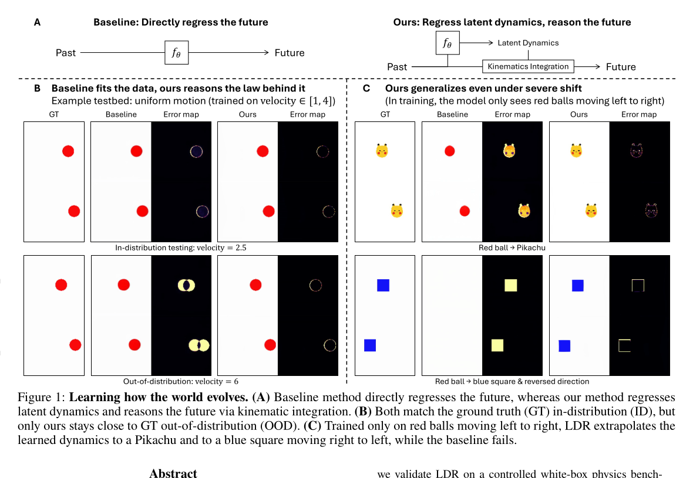
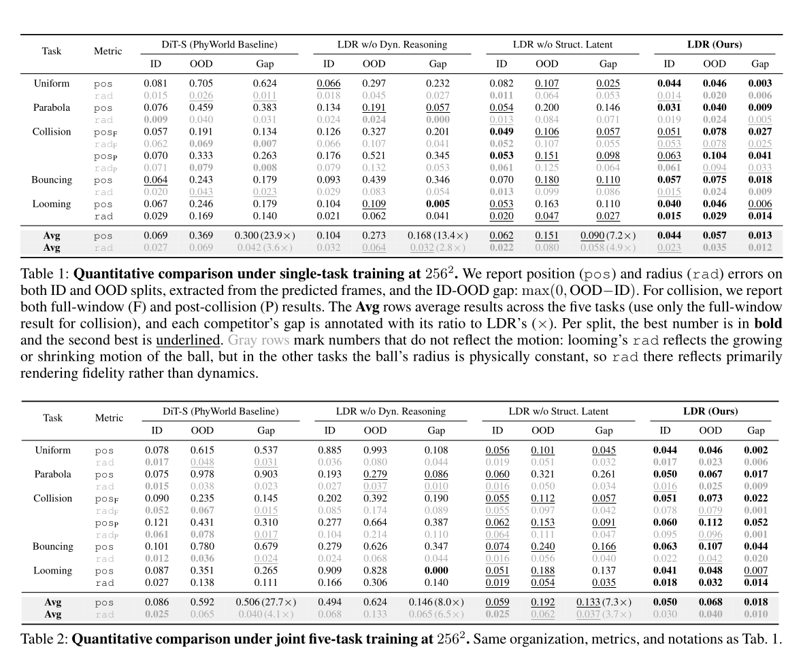
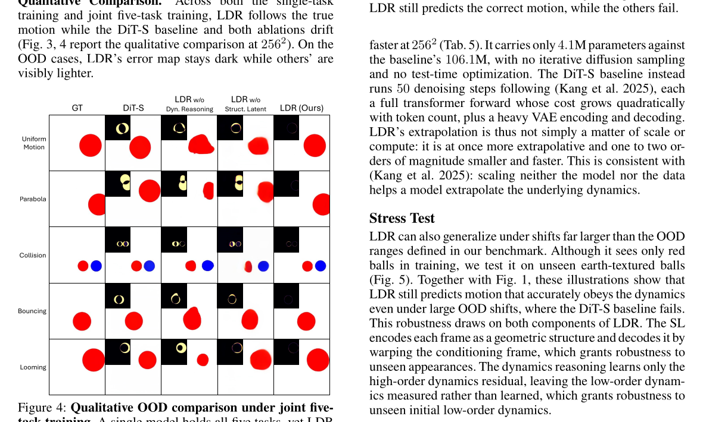
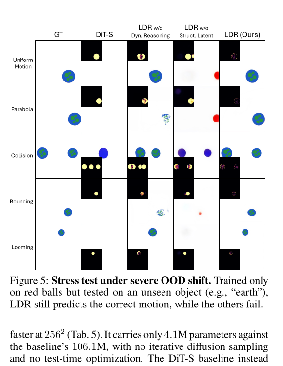

# Learning How the World Evolves: Extrapolative Video World Models via Latent Dynamics Reasoning

**Authors:** Haodong Li, Shaoteng Liu, Tianyu Wang, Chongjian Ge, Sihui Ji, Jiahan Zhang, Xin Lin, Haolin Lu, Zhe Lin, Manmohan Chandraker  
**Affiliations:** UCSD; Adobe  
**Source:** `Li 等 - 2026 - Learning How the World Evolves Extrapolative Video World Models via Latent Dynamics Reasoning.pdf`  
**Version/date:** arXiv:2608.09926v1, 10 Aug 2026；全文 9 页。  
**阅读范围：** 只依据给定 PDF；下文把“作者声称”和“我的判断”分开，不把模拟器上的成功自动外推到真实世界。

## 核心信息

这篇短文的真正命题不是“再做一个视频预测器”，而是把 world model 的判据从**能否生成看起来像真的帧**推进到**是否显式表示并外推产生这些帧的动力学**。作者提出 Latent Dynamics Reasoning（LDR）：先把每一帧压成结构化潜变量（structured latent, SL），从三个条件帧计算一阶、二阶差分；未来 rollout 时不直接回归下一个潜变量，而只学习三阶及以上残差，再用固定的运动学积分链传播低阶状态。解码阶段用预测 SL 对最后一帧做 warp。

在 PhyWorld 的五个白盒任务上，训练只看 ID 初始条件，测试额外考察 OOD 初始速度、半径和缩放率。256² 分辨率下，LDR 的平均位置 ID–OOD gap 在单任务训练中为 0.013，而 DiT-S 为 0.300（23.9×）；联合五任务时分别为 0.018 和 0.506（27.7×）。LDR 只有 4.0933M 参数，DiT-S 为 106.1114M；32 帧、A100-80G 上 256² 延迟分别为 0.0363s 和 5.2069s（143.4×）。这些结果支持“结构化表示 + 显式积分”有利于外推，但证据仍限定在简单球体模拟场景，且论文自己明确把丰富内容、真实场景和更大模型留作未来工作。

## 原文摘要翻译

世界按照其动力学，即支配状态随时间变化的运动规律而演化。然而，主流视频扩散模型很大程度上是在拟合像素，而不是建模像素如何随时间转移。因此它们可以渲染视觉上合理的帧，却未必遵守规律。为纯粹从像素捕获动力学，作者提出 Latent Dynamics Reasoning（LDR）。LDR 将潜变量转移写成显式的运动学积分：低阶动力学通过数值积分，模型只回归驱动 rollout 的三阶及更高阶残差。为了让积分更好地外推，LDR 在结构化潜空间而非稠密卷积特征上运行。

作者在 PhyWorld 模拟器构建的白盒物理 benchmark 上验证 LDR，覆盖匀速运动、抛物线、碰撞、反弹和逼近/远离（looming）五项任务，重点测试能够暴露模型是否学到潜在动力学的 OOD 情形。在 256² 分辨率、单任务和联合任务训练下，LDR 的 ID–OOD 误差差距都比视频扩散基线小 20 倍以上，同时参数少 26 倍、速度快 143 倍。LDR 还能在严重分布偏移下泛化：只在红球从左向右运动上训练，也能预测蓝色方块从右向左运动。作者据此声称，这是第一个能够把已学动力学外推到训练分布之外的视频 world model。

> 摘要中的“第一个”是作者的文献范围判断，不是本文实验直接证明的事实；其适用范围由脚注限定为简单模拟场景。

## 创新点

1. **把动力学推理写入状态转移架构。** 以固定的二阶积分链约束 rollout，只把未知的高阶变化交给 MLP；这与直接回归未来帧或下一 latent 的 inductive bias 不同。
2. **在结构化 latent 上积分。** 每个卷积特征通道经过 marginal soft-argmax 得到空间分布，再提取 centroid 与 extent，形成 $s_i=(\mu_i,\sigma_i)$。作者的直觉是去掉外观、语义等动力学无关细节，令差分和积分更稳定。
3. **用像素监督学习、但不用显式物理标签。** 编码器、warp 解码器和高阶残差 MLP 从头联合训练，监督来自多尺度 RGB 重建、RGB rollout 和 latent rollout，而不是 simulator 的位置/速度标签。
4. **把 ID–OOD gap 作为“是否学到规律”的可操作测试。** 五个任务共享 ID/OOD 运动规律，但初始条件范围不同；白盒 simulator 允许从预测帧解析球心和半径，而不只看感知相似度。
5. **效率不是附带结果。** 单次前馈预测 29 帧，不做扩散迭代和测试时优化；参数与延迟表明显式低维结构也改变了部署成本。

## 一句话总结

LDR 的核心不是让网络更大，而是让网络只学习“下一阶动力学残差”，把可由历史差分解释的低阶运动交给固定积分器；在简单白盒视频上，这个结构先验显著改善了分布外外推，但尚未证明能处理依赖外观内容或复杂交互的真实世界动力学。

## 研究问题

### 背景：视频生成不等于 world model

作者把视频生成器与 video world model 的差异定义为“what the world looks like”与“how it evolves”。扩散模型的视觉逼真度可能来自对训练分布的拟合，而不是对运动规律的捕获。于是一个关键诊断是：模型在 ID 上看起来很好，是否还能在同一运动法则下处理训练没见过的速度、尺度、方向或外观？

### 本文实际检验的命题

- **命题 A：** 直接回归未来会在 OOD 上趋向最近的训练样本或训练均值，而显式动力学积分能把规律外推出去。
- **命题 B：** 结构化 latent 比稠密卷积 latent 更适合做时间差分、积分和跨分布推理。
- **命题 C：** 若五种运动规律联合训练，显式状态转移偏置能帮助区分任务，而不是把一个任务的动力学误用到另一个任务。

作者没有在本文检验：自然视频、遮挡、复杂接触、多物体关系、动作条件 world model、长时间开放式 rollout，或比简单 MLP 更强的现代 video foundation model。故研究问题是一个**受控的动力学外推原理验证**，不是完整的通用 world model 评测。

### 相对现有 world/video model 的定位

| 路线 | 下一状态如何得到 | 外推假设 | 本文的位置 |
|---|---|---|---|
| 视频扩散/DiT | 直接生成未来像素或 latent，依赖多步去噪 | 主要由网络拟合训练分布 | LDR 反对把视觉逼真度等同于动力学学习 |
| JEPA / next-latent prediction | 直接预测未来 latent | 对 dynamics 没有显式积分约束 | LDR 同属 next-latent prediction，但把低阶演化显式化 |
| 物理先验/状态监督方法 | 可能使用状态、守恒量、PDE 或 simulator 标签 | 外部信号给出更强物理约束 | LDR 强调纯像素训练，不读取位置或速度标签 |
| Neural ODE / latent dynamics | 连续时间或隐式 latent 演化 | 常在训练 regime 内验证 | LDR 用离散有限差分 + 固定积分，直接把 OOD gap 作为主测试 |
| 结构化/对象中心 video model | slot、关键点或几何坐标 | 结构提升时序建模可分解性 | LDR 采用几何坐标式 SL，但仍从卷积特征无监督提取 |

我的定位：LDR 是一个**极简、可解释的动力学外推骨干**，不是与 Cosmos、Genie 等规模化 world model 同量级的模型竞争。其贡献更像给视频 world model 提供一个可证伪的架构原则：在 benchmark 明确问“你是否学会规律”时，固定积分和结构化状态比继续堆 capacity 更直接。

## 数据与任务定义

### Benchmark 与五个任务

作者基于 PhyWorld simulator 建立受控 benchmark，每个样本涉及一个或两个运动球：

- **Uniform motion：** 球以恒定速度平移。
- **Parabola：** 抛体受重力作用形成抛物线。
- **Collision：** 两球正面弹性碰撞。
- **Bouncing：** 抛体与地面反弹，每次反弹损失能量。
- **Looming：** 球平移并同时增大或缩小。

所有任务的 ID 初始条件共享：速度 $v\in[1,4]$，半径 $r\in[0.7,1.4]$，世界尺度为 10；looming 另设增长/缩小率 $|\dot r|\in[0,0.03]$。OOD 测试把范围扩大到 $v\in[0.05,6]$、$r\in[0.6,2]$、$|\dot r|\in[0.05,0.09]$。训练只使用 ID 样本，因此 OOD 与 ID 遵循相同运动规律但不共享初始条件范围。

每个模型输入三个条件帧 $I_0,I_1,I_2$，预测接下来的 29 帧，故 $T=31$。白盒环境让作者从预测 RGB 帧中解析每个球的中心和半径，并计算位置误差（pos）与半径误差（rad）；报告 ID、OOD 及

$$\text{gap}=\max(0,\text{OOD}-\text{ID}).$$

碰撞额外报告 full-window（F）和 post-collision（P）。需要注意：除 looming 外，球半径按物理规律恒定，因此其他任务的 rad 主要反映渲染/解码保真度，而非动力学本身。

### 可视证据：从常规 OOD 到严重 shift

**图 1（PDF p.1）。** 训练速度 $[1,4]$、测试速度 2.5 与 6 的示例，以及只见红球左向右运动时对 Pikachu、蓝色方块和反向运动的 severe-shift 示例。图中 LDR 预测更接近 GT；这支持“架构偏置能帮助外推”的直观命题，但仍是少量可视化案例，不是统计检验。

## 方法主线

### 机制流程

**图 2（PDF p.3）。** 论文的三阶段数据流：CNN 编码 $
ightarrow$ 结构化 latent $
ightarrow$ 高阶残差 + 数值积分 $
ightarrow$ 以 $I_2$ 为基准的 warp 解码。

1. **Encoding：** 对 $I_i$ 计算卷积特征 $z_i=C_\phi(I_i)$，对每个通道做 marginal soft-argmax 得到二维空间概率分布，再提取质心和范围，形成 $s_i=E_\phi(I_i)=(\mu_i,\sigma_i)$。
2. **Initialization：** 使用三个 SL 初始化一阶和二阶 latent dynamics，不需要 simulator 的速度标签。
3. **Rollout：** 每一步仅由 $f_\theta$ 预测高阶残差；固定积分器依次更新二阶、一阶、零阶 SL。
4. **Decoding：** 从条件 latent $s_2$ 到预测 latent $\hat s_t$ 预测 dense warp flow，变换最后一张条件帧 $I_2$，再由 CNN 渲染 $\hat I_t$。
5. **接口特点：** 三个阶段是概念划分，推理仍是一遍 feed-forward pass，不做 test-time optimization 或迭代求解器。

### 结构化 latent：为何不是直接用 feature map

若 latent 混入大量与运动无关的纹理、语义和外观，时间差分会把这些变化也当成状态变化，积分误差还会累积。LDR 因此把每个卷积通道转为空间分布的几何统计量：$\mu$ 表示 centroid，$\sigma$ 表示 extent。结构化表示不是完整的 object-centric scene representation，它仍依赖 CNN 通道能稳定对齐到几何结构；但在球体任务上，位置和尺度恰好是足够的状态变量。

这也解释了论文后面承认的边界：颜色等“动力学存在于 appearance 中”的变化不会被 SL 充分编码，复杂场景中的关系和内容也可能丢失。

### 初始化：三帧固定二阶有限差分

论文令 $\Delta t=1$，把 $s$ 类比为 position、$\dot s$ 类比为 velocity、$\ddot s$ 类比为 acceleration：

$$\dot s_0=\frac{s_1-s_0}{\Delta t},\qquad \dot s_1=\frac{s_2-s_1}{\Delta t},\qquad \ddot s_0=\frac{\dot s_1-\dot s_0}{\Delta t}. \tag{1}$$

三点是二阶有限差分的最小条件，因此模型输入不是任意一帧，而是三个连续条件帧。这里最值得注意的设计决策是：**低阶状态由观测历史测量，高阶变化才由网络学习。** 这减少了网络在 OOD 初速度上“猜测”低阶量的负担。

### Kinematics Integration：学习三阶及以上残差

对 $t\in\{3,\ldots,T\}$，LDR 更新二阶、一阶和零阶 SL：

$$\ddot s_{t-2}=\ddot s_{t-3}+\dddot s_{t-3}\Delta t\approx \ddot s_{t-3}+f_\theta(\dot s_{t-3},\hat s_{t-3}),$$

$$\dot s_{t-1}=\dot s_{t-2}+\ddot s_{t-2}\Delta t,\qquad \hat s_t=\hat s_{t-1}+\dot s_{t-1}\Delta t. \tag{2}$$

其中

$$f_\theta(\cdot)=\tanh(\operatorname{MLP}(\cdot)),$$

是三层、宽度 256 的 MLP。作者将它解释为“third- and higher-order residual”，近似 $\dddot s_{t-3}\Delta t$，也就是二阶 latent 的变化。只有 $f_\theta$ 学习 dynamics residual，积分链是固定的；算法 1 明确给出逐步循环和解码流程。

我的理解是，这并没有把真实物理方程硬编码进去：碰撞、重力和反弹规律仍由 $f_\theta$ 从像素间接学出。硬编码的是**状态变量的阶次关系**和数值更新方式。因此它的外推能力来自表示空间和积分形式的 inductive bias，而不是物理定律完全已知。

### 解码：从 latent 位移到 RGB

$$\hat I_t=D_\psi(\hat s_t,s_2,I_2)=R_\psi\big(I_2,T_\psi(\hat s_t,s_2)\big). \tag{4}$$

$T_\psi$ 预测从 $s_2$ 到 $\hat s_t$ 的 dense warping flow，$R_\psi$ 沿 flow 变换 $I_2$ 并渲染。这个设计让未见外观可以通过“保留条件帧内容 + 改变几何位置”处理，正是 Fig. 1/5 中从红球迁移到 Pikachu、earth-textured object 的理由之一；但也意味着变化必须能被 warp 和结构化几何表达。

### 训练目标与课程

作者从头联合训练编码器 $E_\phi$、解码器 $D_\psi$ 和高阶残差预测器 $f_\theta$，无预训练权重。三项损失为：

1. **重建损失**（训练 encoder/decoder）：

$$\mathcal L^{rgb}_{ae}=\sum_{t=0}^{T}\left\|\Phi\big(D_\psi(E_\phi(I_t),s_2,I_2)\big)-\Phi(I_t)\right\|_1,$$

其中 $\Phi$ 是多尺度图像特征提取器。

2. **RGB rollout 损失**（训练完整模型）：

$$\mathcal L^{rgb}_{roll}=\sum_{t=3}^{T}\left\|\Phi(\hat I_t)-\Phi(I_t)\right\|_1.$$

3. **latent rollout 损失**（主要训练 $f_\theta$）：

$$\mathcal L^{SL}_{roll}=\sum_{t=3}^{T}\left\|\hat s_t-\operatorname{sg}(s_t)\right\|_2^2,$$

其中 $\operatorname{sg}$ 表示 stop-gradient。

总目标：

$$\mathcal L_{LDR}=\mathcal L^{rgb}_{roll}+\lambda^{rgb}_{ae}\mathcal L^{rgb}_{ae}+\lambda^{SL}_{roll}\mathcal L^{SL}_{roll}. \tag{5}$$

实验使用 $\lambda^{rgb}_{ae}=1.0$、$\lambda^{SL}_{roll}=0.5$。为稳定长时域反传，训练时把 rollout horizon 从短逐渐增长到完整 29 帧，并在 step 8K 达到 full horizon；测试始终 rollout 完整 horizon。

## 训练数据和实现细节

- **训练协议：** DiT-S、LDR 及两个消融都从头训练；single-task 为每个任务单独一个模型，joint 为一个模型同时学习五个任务。
- **输入/输出：** 3 帧条件，预测未来 29 帧，$T=31$。
- **分辨率：** 128² 与 256²。
- **优化器：** AdamW，learning rate $10^{-4}$，weight decay 0.01，gradient clipping 1.0，全局 batch size 256。
- **步数：** 默认 10K；collision、bouncing 和 joint 使用 20K。
- **硬件/软件：** 8× NVIDIA A100-80G，PyTorch 2.4，CUDA 12.1；seed 42；作者报告 single run。
- **LDR 的动力学网络：** 三层 MLP，width 256，输出经过 tanh。
- **基线：** PhyWorld 的标准视频扩散 DiT-S；效率表说明其使用 50 DDIM steps。
- **监督信息：** 训练损失未使用 simulator 解析出的球位置/半径标签；这些量只在评估时从预测帧提取。

复现时一个常见误区是只实现公式 (2) 而忽略训练 horizon curriculum、stop-gradient、解码器耦合和三帧初始化；这些设置共同决定了长期梯度和 latent 的几何含义。

## 关键结果

### 主结果与强基线：256²

**表 1–2（PDF p.5）。** 图像素材保留作者完整表格的可视化；下面摘录影响判断的平均位置/半径 gap 和关键结果，避免把每一个 rad 数字都误读为动力学。

| 训练设置 | 方法 | Avg pos ID | Avg pos OOD | Avg pos gap | Avg rad gap |
|---|---:|---:|---:|---:|---:|
| 单任务 256² | DiT-S | 0.069 | 0.369 | 0.300 | 0.042 |
| 单任务 256² | LDR w/o Dyn. Reasoning | 0.104 | 0.273 | 0.168 | 0.032 |
| 单任务 256² | LDR w/o Struct. Latent | 0.062 | 0.151 | 0.090 | 0.058 |
| 单任务 256² | LDR | 0.044 | 0.057 | **0.013** | 0.012 |
| 联合五任务 256² | DiT-S | 0.086 | 0.592 | 0.506 | 0.040 |
| 联合五任务 256² | LDR w/o Dyn. Reasoning | 0.494 | 0.624 | 0.146 | 0.065 |
| 联合五任务 256² | LDR w/o Struct. Latent | 0.059 | 0.192 | 0.133 | 0.037 |
| 联合五任务 256² | LDR | 0.050 | 0.068 | **0.018** | 0.010 |

**作者的解读：** 单任务时 DiT-S 的 ID pos 误差并不差（0.069），但 OOD 从 0.069 增到 0.369；联合任务更明显，从 0.086 增到 0.592。LDR 的 OOD 保持接近 ID，因而 gap 约小 24–28 倍。去掉动力学推理的变体在单任务 pos gap 为 0.168；联合训练还出现 ID 失败（Avg pos ID 0.494），说明直接回归无法可靠区分五种 regime。

**重要 caveat：** “gap 小”不能单独代表外推成功。例如联合训练的 LDR w/o Dyn. Reasoning 在 looming 上出现近零 gap，但脚注指出它在 uniform motion 和 looming 的 ID/OOD 都失败；这是“ID 已失败，所以差值不大”，不是稳健外推。另一方面，rad 在恒半径任务中主要是渲染质量，不能当作物理规律学习的直接证据。

### 分辨率与 scaling 行为

128² 的平均位置 gap：单任务 DiT-S 0.187、LDR w/o Dyn. Reasoning 0.196、LDR w/o Struct. Latent 0.122、LDR 0.010；联合训练 DiT-S 0.127、LDR 0.135、结构化 latent 消融 0.181、LDR 0.025。256² 下 LDR 仍为 0.013/0.018，DiT-S 却升到 0.300/0.506。

作者的解释是：capacity-driven 的直接回归器在高分辨率下更紧地拟合训练分布，因而 OOD collapse 更严重；LDR 则从高分辨率帧中得到更精确的 dynamics，ID 和 OOD 一起改善。这个解释与表格一致，但因为每个设置只报告 seed 42 的 single run，没有方差或多 seed，不能把分辨率趋势当成普适 scaling law。

### 消融到底说明了什么

1. **去掉 dynamics reasoning：** 用直接回归下一 latent 差分 $s_{t+1}-s_t$ 替换积分链。单任务 256² 的 Avg pos gap 从 LDR 的 0.013 变为 0.168；联合训练时 ID pos 直接变差到 0.494。它是最有杀伤力的消融，支持“显式低阶积分而非普通 residual head”是关键。
2. **去掉 structured latent：** 用 dense convolutional latent 运行同样的 dynamics reasoning。单任务 gap 0.090、联合 gap 0.133，优于 DiT-S 但明显差于 LDR 0.013/0.018；说明积分链单独不够，状态表示也重要。
3. **解释上的边界：** 两个消融并未逐一匹配所有容量、解码难度或表示维度，且 LDR 的 decoder 与 SL 强耦合，作者承认不能“干净地”只删除 Structuralize。因此消融支持组件必要性，但不能严格分离所有工程因素。

### 定性证据

**图 3（PDF p.4）。** 五个任务的单任务 OOD 预测、GT 与 error map。LDR 的误差图更暗，基线和两种消融出现漂移。图像直观地展示了长时域误差累积，但单张最终帧不能显示每一步的稳定性或失败率。

**图 4（PDF p.7）。** 一个模型同时覆盖五种任务时，LDR 仍接近 GT，而其他方法漂移。这与联合表格中的直接回归 ID 失败相互印证。

### 严重分布偏移 stress test

**图 5（PDF p.7）。** 训练只见红球，测试换成 earth-textured ball；LDR 仍预测正确运动，其他方法失败。作者把这种鲁棒性归因于两点：SL 只编码几何结构并用 warp 保留未知外观；low-order dynamics 来自观测测量而非学习，因此未见初速度更不容易破坏 rollout。

这里的证据强度应标成“示例级”。图 1/5 很能说明机制与现象的一致性，却没有给出跨外观类别、跨随机种子或定量 severe-shift 指标；不能据此声称 LDR 已解决视觉内容变化。

### 效率

| 方法 | 参数量（M） | 相对 LDR | 延迟 @128²（s） | 延迟 @256²（s） |
|---|---:|---:|---:|---:|
| DiT-S | 106.1114 | 25.9× | 0.7451 | 5.2069 |
| LDR | 4.0933 | 1.0× | 0.0174 | 0.0363 |

论文将差距归因于：DiT-S 要做 50 DDIM denoising steps，每一步是完整 Transformer 前向，并且还包含 VAE 编解码；LDR 一遍前馈完成 29 帧预测。256² 上 143.4× 的比值是显著的，但它是同一张 A100-80G、32-frame clip、作者实现下的 wall-clock 测量，不等于跨硬件或端到端系统延迟。LDR 的计算量也随 horizon 增长，只是没有扩散采样循环。

## 深度分析

### 真正贡献是什么

我认为真正贡献是把“外推”变成架构可检验的对象，而不是把它当作训练技巧副产品。作者把三个可分离的因素放在一个小系统里：

- 历史差分提供低阶状态；
- MLP 只拟合高阶变化；
- 结构化坐标把状态压到可积分的几何空间。

这种拆分让 ID/OOD gap 有机制解释，也让消融的失败形态可读。相比再加一个扩散 loss，它更像是给 video world model 添加了一个“状态转移程序”。

工程组装部分同样重要但不应过度包装：soft-argmax 结构化表示来自关键点/对象中心表示文献，warp decoder 借鉴 motion transfer，固定差分/积分是经典数值思想。新意在于把这些组件组合成一个纯像素、面向 OOD dynamics extrapolation 的视频 world model，并用白盒 benchmark 直接测它。

### 为什么结果可能成立

1. **低阶 dynamics 不被网络重复学习。** 初速度和局部加速度由三帧测量，模型将容量集中到真正未观测的高阶项；对匀速和抛物线而言，这个分解尤其匹配任务规律。
2. **结构化 SL 降低无关自由度。** 几何坐标的变化比像素/稠密 feature 的变化更接近球体的真实状态，数值差分不必追踪颜色和纹理。
3. **固定积分器提供 off-support 归纳偏置。** 直接回归器在训练区间外没有约束，容易贴近最近样本；LDR 即使 $f_\theta$ 只在有限范围内可靠，历史速度和加速度仍会沿固定链传播。
4. **解码器对外观做了条件复用。** 通过对 $I_2$ warp，而不是从 latent 重新生成完整外观，未知球纹理不会完全成为 dynamics predictor 的负担。
5. **评测与方法目标严格对齐。** OOD 不是随机换数据集，而是同一运动法则下扩大初始条件，因此专门惩罚“记住外观/样本”而奖励“学到转移规律”。

### 与 WAM、视频 world model、latent dynamics 的关系

- **与 WAM：** 本文没有 action token、机器人本体状态或策略学习，不能直接算 world-action model。可迁移的只是设计原则：把可预测的低阶状态转移显式化，把学习模块留给 residual dynamics，未来可把 action 作为 $f_\theta(\dot s,\hat s,a)$ 的输入。
- **与视频 world model：** LDR 将 world model 的“world”收窄到视觉状态的运动规律。其贡献是可测量的 dynamics extrapolation，而不是开放式生成、多模态未来或交互控制。
- **与 latent dynamics：** 它属于离散、二阶、结构化 latent dynamics；区别于 neural ODE 的连续时间参数化、JEPA 的直接 feature prediction，以及使用物理监督的显式状态模型。LDR 不保证 latent 等于真实物理状态，只是让 latent 的某些坐标足够像可积分的状态。
- **与视频扩散：** DiT-S 作为 PhyWorld standard baseline 代表“直接拟合未来视频”。LDR 的效率提升部分来自取消 diffusion sampling，因此性能—速度对比同时混入了建模范式与计算预算差异；这正是论文要展示的系统级取舍，而不是只比较同一 backbone 的公平精度。

### 容易误读的地方

1. **“第一 个外推 world model”不是全领域定理。** 论文用“to our knowledge”并在脚注限定 simulated simple objects；不可写成已证明的普适优先权。
2. **OOD gap 不是 OOD 绝对误差。** 应同时看 OOD pos 与 ID pos；某模型 ID 很差时 gap 可能虚低。
3. **rad 不是五项任务都在测物理。** 非 looming 的半径恒定，rad 主要是渲染/解码 fidelity。
4. **LDR 并非完全无先验。** 它使用二阶运动学形式、三帧输入、warp 解码和几何结构；“纯像素”指没有外部状态标签，不等于无结构假设。
5. **143× 不是所有场景下的真实控制加速。** 表 5 只测 32 帧 clip，未报告数据加载、摄像头、控制器、后处理或滚动部署开销。
6. **严重外观 shift 目前主要是定性。** earth/Pikachu/方块例子不能证明颜色、材质和语义内容的 dynamics 都被建模。

### 复现注意点与缺口

可以从 PDF 复现的最低配置是：PhyWorld simulator、五种任务、ID/OOD 范围、3 帧输入/29 帧输出、AdamW 配方、seed 42、8×A100-80G、PyTorch 2.4/CUDA 12.1、MLP 结构、loss 权重和 horizon curriculum。仍有实质缺口：

- PDF 没有给出完整 CNN、soft-argmax 温度/坐标归一化、SL 通道数、warp CNN 结构、DiT-S 精确配置和参数初始化。
- 没有公开数据生成数量、每个任务的样本划分、OOD 采样分布、视频帧率/时间步对应的物理单位。
- 只报告 seed 42 的 single run，没有标准差、置信区间或显著性检验。
- 没有报告训练时间、显存、吞吐、推理 batch size、是否使用 AMP，以及 128²/256² 的精确裁剪与预处理。
- 位置/半径解析器、碰撞 full/post 窗口定义、误差归一化方式只给出高层描述，复现者需要获得 PhyWorld 代码。
- 只与 DiT-S 对比，未见同参数量直接回归器、同计算预算的更强 latent predictor、不同积分器阶数或多步 teacher forcing 对照。
- “从 scratch”针对 LDR 与 DiT-S 的本文模型，但不意味着该领域的所有视频 world model 都没有预训练；相关工作只作定位。

## 局限

作者明确承认的局限：

1. **内容盲区：** SL 编码的是图像特征的 structure 而非 content，颜色随时间变化等 appearance dynamics 可能无法表达。
2. **场景表达力有限：** 几何坐标对简单物体有效，但对丰富场景、复杂关系和多物体交互可能不足。
3. **验证范围窄：** 只在简单物体的模拟场景验证原则；扩展到丰富、甚至真实世界场景和更大模型仍是未来工作。

由实验进一步推断的局限：

- 二阶积分对非平滑事件（碰撞、反弹）依赖 $f_\theta$ 学高阶突变，长期 rollout 的误差上界尚未分析。
- latent rollout 训练目标使用编码器生成的 stop-gradient $s_t$，并不保证 latent 坐标具有跨样本统一的物理标度或可辨识性。
- 结构化表示与 decoder 强耦合，所以“SL 的收益”可能包含更容易重建的 inductive bias，不完全等价于 dynamics representation 的纯收益。
- 单次运行与极简 benchmark 使 20×、143× 等数字缺少不确定性；对数字的精确排序应谨慎。

## 我的笔记

### 可迁移研究洞见

1. **把“是否学到规律”改写成同法则 OOD。** 与其只增加视觉质量指标，不如设计 ID/OOD 条件，使记忆样本和学习转移产生不同预测。
2. **将低阶、可由历史测量的部分从学习器中拿掉。** 这既减少样本复杂度，也让 OOD 行为由显式程序决定。
3. **结构化表示是外推的前提之一。** 如果表示里混着外观与动力学，任何高阶网络都可能只是在拟合 nuisance variation。
4. **固定程序与可学习残差的组合可迁移到 WAM。** 对机器人，可让观测历史计算速度/接触趋势，把动作条件 residual 留给网络，从而以较小模型支持更长 horizon。
5. **必须同时报告绝对 OOD、ID–OOD gap、失败模式和成本。** 单报 gap 会被 ID 失败欺骗；单报成功率则无法比较计算/控制延迟。

### 最值得做的后续实验

- 在同一 LDR 框架中比较一阶、二阶、三阶和可学习阶数；测碰撞/反弹是否需要事件检测或混合积分器。
- 逐步替换 SL：几何坐标、slot、VAE latent、带 appearance/content 分支，验证结构化收益究竟来自坐标还是来自低维化。
- 让 $f_\theta$ 接收 action、接触状态或可观测历史，建立 LDR-WAM；对比动作条件预测的闭环成功率而非只看视频误差。
- 做 5–10 个 seeds 与 bootstrap 置信区间，并统一统计严重外观 shift 的定量结果。
- 在真实视频中构造“训练速度区间外但相同物理规律”的可控任务，例如滑块、摆、推物体，再测是否保留 gap 优势。
- 对比同参数/同 FLOPs 的 direct latent regressor、JEPA 式 predictor、neural ODE 和扩散模型，拆开架构收益与采样成本收益。

### 阅读判断

**证据强度：中等（原理验证强，通用性证据弱）。** 论文的内部因果链很清楚：架构写入积分 → 直接回归消融退化 → ID/OOD gap 显著缩小 → 定性轨迹与机制一致 → 参数/延迟更低。它足以支持“在 PhyWorld 这类简单可解析运动中，LDR 更适合外推”的判断。它不足以支持“通用视频 world model 已经学会世界规律”，也不足以说明外观迁移、复杂碰撞或真实机器人控制能够同样受益。

## 引用

Li, Haodong, Shaoteng Liu, Tianyu Wang, Chongjian Ge, Sihui Ji, Jiahan Zhang, Xin Lin, Haolin Lu, Zhe Lin, and Manmohan Chandraker. “Learning How the World Evolves: Extrapolative Video World Models via Latent Dynamics Reasoning.” arXiv:2608.09926v1, 10 Aug 2026. Project page: https://lat-dyn-reason.github.io/.

本文中涉及的相关方法均按 PDF 参考文献表转述，包括 PhyWorld（Kang et al., 2025）、JEPA/V-JEPA 2、Cosmos、Neural ODE、object-centric structured representation、First Order Motion Model 等；没有为本精读新增外部证据。
