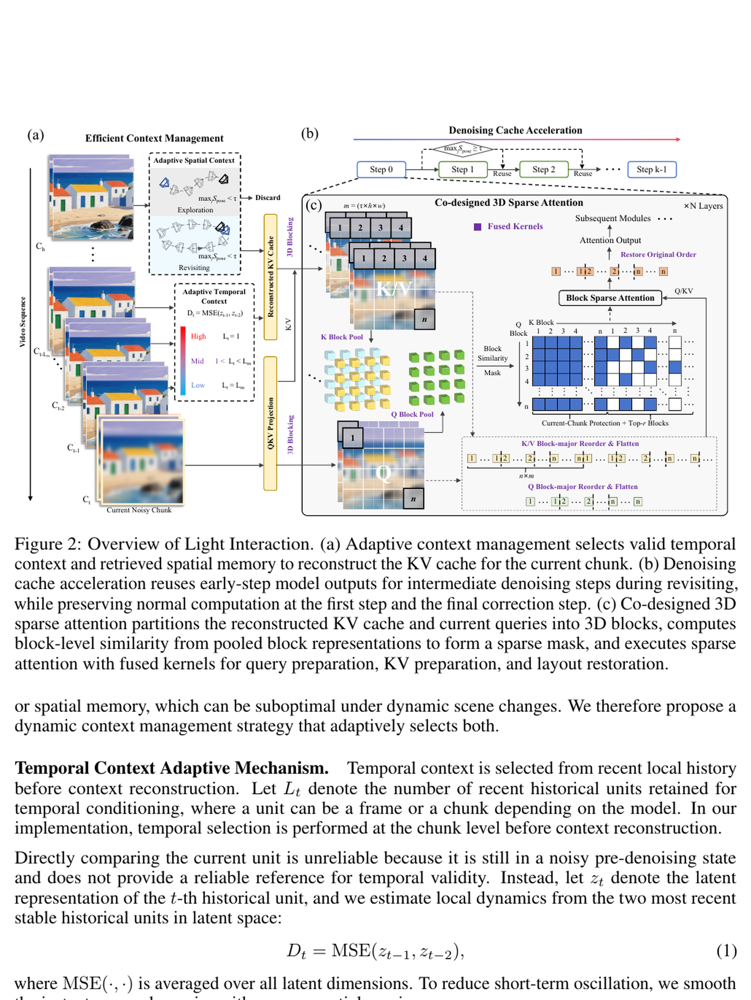
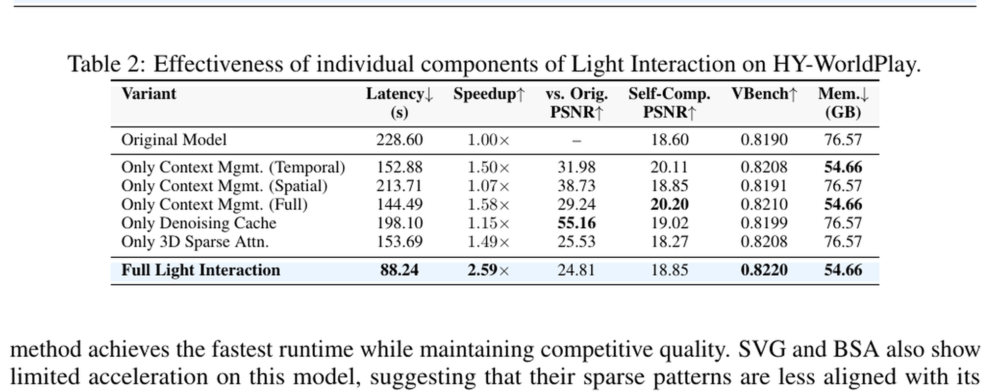
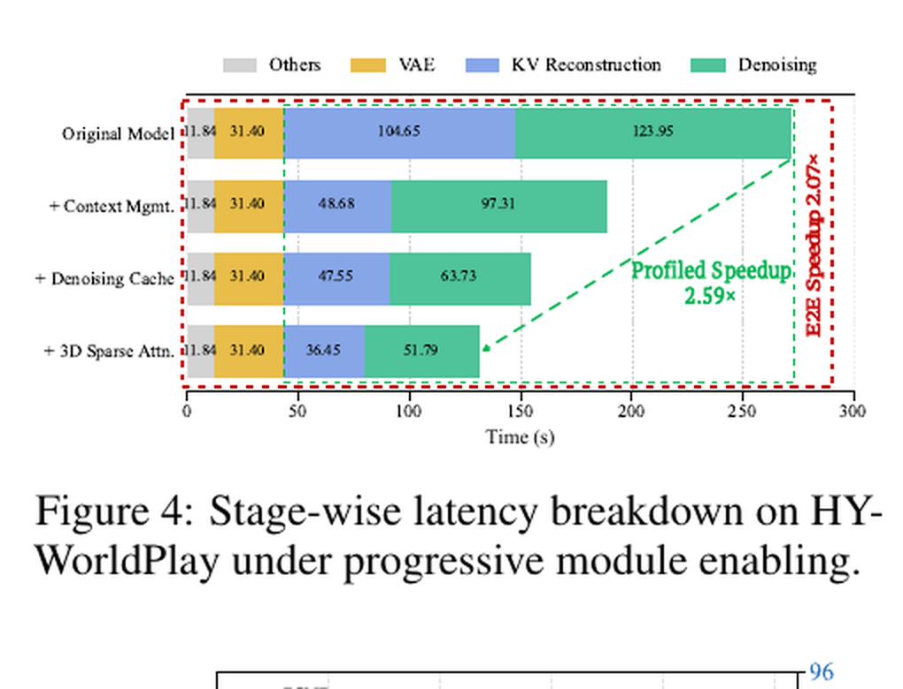
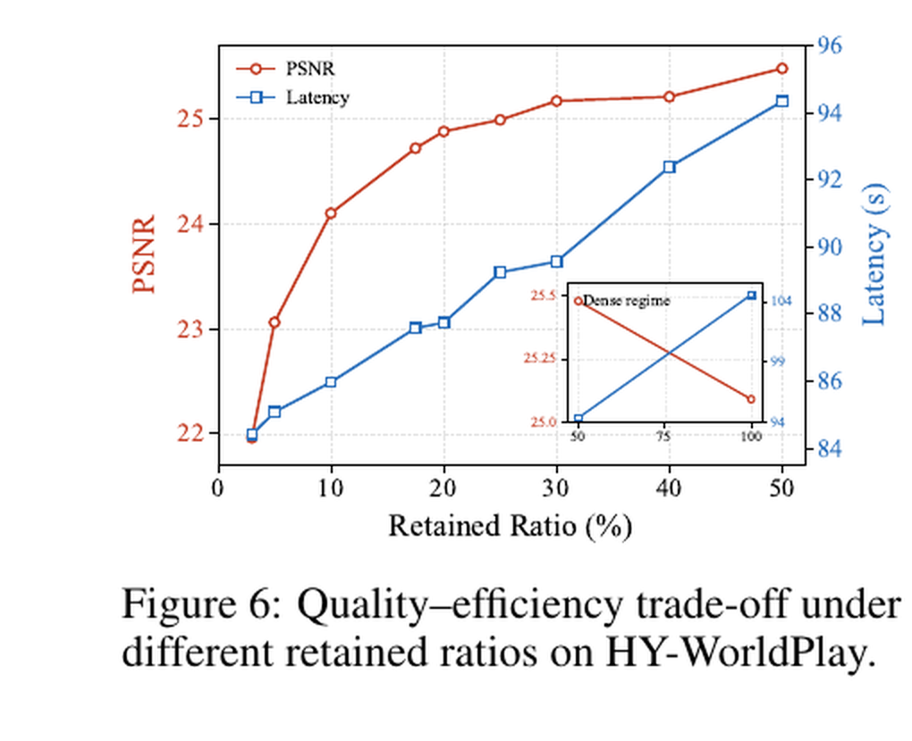
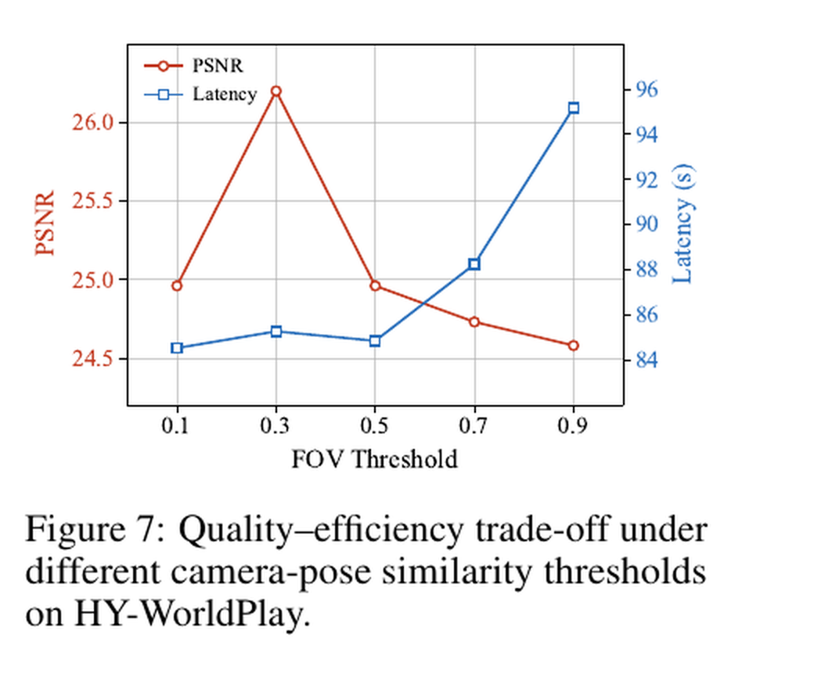
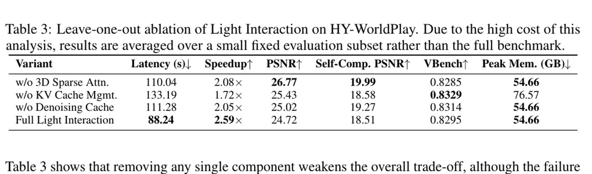

# Light Interaction: Training-Free Inference Acceleration for Interactive Video World Models

**Authors:** Jiacheng Lu, Haoyi Zhu, Sipei Yi, Enze Xie, Yu Li, Cheng Zhuo
**Affiliations:** Zhejiang University; NVIDIA
**Source:** arXiv:2605.31158v3, 18 June 2026, 13 pages, preprint
**Detected source format:** selectable-text PDF (`pdf-text`) with visual verification of page 9 plots.
**Reader type:** complete paragraph-level Chinese–English detailed reader. References are retained in their original English bibliographic form for searchability.

## Page / Section Index

| Pages | Content |
|---|---|
| 1–2 | Figure 1, Abstract, Introduction |
| 3 | Related Work, Light Interaction overview |
| 4–6 | Adaptive Context Management; Denoising Cache; 3D Sparse Attention |
| 7–9 | Experiments, Tables 1–2, Figures 4–7, Conclusion, Limitations, Broader Impacts |
| 10–12 | References [1]–[41] |
| 13 | Appendix A–B and Table 3 |

## Terminology Ledger

| English | 中文 | Note |
|---|---|---|
| interactive video world model | 交互式视频世界模型 | Chunk-by-chunk AR video generation controlled by camera motion |
| adaptive context management | 自适应上下文管理 | Joint temporal-window and retrieved-spatial-memory control |
| retrieved spatial memory | 检索式空间记忆 | Long-range history retrieved by pose similarity |
| local latent dynamics | 局部潜变量动态 | MSE between recent stable latent units |
| denoising cache | 去噪缓存 | Reuse of early-step model output during revisiting |
| 3D block sparse attention | 三维块稀疏注意力 | Sparse selection over historical visual KV blocks |
| training-free | 免训练 | No model retraining; inference code, thresholds and kernels still required |
| realized speedup | 实测速比 | Wall-clock result, distinct from theoretical sparse FLOP reduction |

### Figure 1. 质量保持下的推理加速

**Caption:** Light Interaction accelerates interactive video world models while maintaining quality. On a single A100 GPU, it achieves up to 2.59× and 1.61× speedup on HY-WorldPlay and Matrix-Game-3.0, with PSNR 24.81 and 17.76, respectively. (Camera trajectory: Forward, then Backward)

**Caption[CN]:** Light Interaction 在维持质量的同时加速交互式视频世界模型。在单张 A100 GPU 上，它在 HY-WorldPlay 和 Matrix-Game-3.0 上分别实现最高 2.59× 与 1.61× 加速，PSNR 分别为 24.81 与 17.76。（相机轨迹：先向前，再向后）

## Abstract

> <strong>Para. 1:</strong> Interactive video world models generate video chunk by chunk in response to user-controlled camera movements, paving the way toward real-time game simulation, virtual scene navigation, and embodied AI training. However, scaling to long interactive trajectories is prohibitively expensive: generating a 10-second video on HY-WorldPlay with a single A100 GPU can take >200 seconds due to growing context memory, quadratic attention complexity, and repeated denoising steps. Existing acceleration methods such as cache compression, denoising step reduction, and sparse attention either adopt uniform strategies or fail to deliver practical speedups in autoregressive (AR) settings due to causal constraints and/or asymmetric Q/K lengths.

> <strong>Para. 1[CN]:</strong> 交互式视频世界模型响应用户控制的相机运动，逐块生成视频，为实时游戏仿真、虚拟场景导航和具身 AI 训练铺平道路。然而，扩展到长交互轨迹的代价极高：由于上下文记忆不断增长、注意力复杂度呈二次增长且去噪步骤重复，在单张 A100 GPU 上用 HY-WorldPlay 生成 10 秒视频可能耗时超过 200 秒。缓存压缩、减少去噪步数和稀疏注意力等现有加速方法要么采用统一策略，要么因因果约束和/或不对称的 Q/K 长度而无法在自回归（AR）设置中获得实际加速。

> <strong>Para. 2:</strong> To address these challenges, we present Light Interaction, a training-free acceleration framework for interactive video world models. Our key insight is that interaction naturally enables adaptive computation: retrieved spatial memory can be discarded during novel scene exploration, temporal windows can shrink under large local latent dynamics, and early-step model outputs can be reused when the camera revisits familiar regions.

> <strong>Para. 2[CN]:</strong> 为解决这些挑战，我们提出 Light Interaction，一种面向交互式视频世界模型的免训练加速框架。核心洞见是交互天然允许自适应计算：探索新场景时可丢弃检索式空间记忆，局部潜变量动态较大时可缩短时间窗口，而相机重访熟悉区域时可复用早期步骤的模型输出。

> <strong>Para. 3:</strong> Based on these observations, we introduce: (1) adaptive context management prunes spatial memory by camera-pose-aware similarity and adjusts temporal windows according to local latent dynamics; (2) denoising cache acceleration reuses early-step model outputs for intermediate denoising steps in familiar scenes. Finally, we make sparse attention practical in the AR setting by introducing (3) hardware-software co-designed sparse attention which uses Triton fused kernels to close the gap between algorithmic sparsity and realized speedup. Evaluated on HY-WorldPlay and Matrix-Game-3.0, Light Interaction achieves up to 2.59× speedup without model retraining, while reaching 24.81 PSNR against the original model on HY-WorldPlay, maintaining competitive visual quality.

> <strong>Para. 3[CN]:</strong> 基于这些观察，我们引入：（1）自适应上下文管理，借助相机姿态感知相似度裁剪空间记忆，并根据局部潜变量动态调整时间窗口；（2）去噪缓存加速，在熟悉场景中将早期步骤模型输出复用于中间去噪步骤。最后，我们通过（3）软硬件协同设计的稀疏注意力，使稀疏注意力在 AR 设置中切实可用；它利用 Triton 融合核弥合算法稀疏性与实测加速之间的差距。在 HY-WorldPlay 和 Matrix-Game-3.0 上评估时，Light Interaction 无需重训练即可达到最高 2.59× 加速，并在 HY-WorldPlay 上相对原模型取得 24.81 PSNR，同时保持有竞争力的视觉质量。

## 1 Introduction

> <strong>Para. 1:</strong> Interactive video world models—systems in which an agent continuously navigates a dynamically synthesized world—are becoming increasingly important for game simulation, virtual scene exploration, and embodied AI [1–3]. Systems such as HY-WorldPlay [4] and Matrix-Game-3.0 [5] generate video chunk-by-chunk with camera-pose-aware memory retrieval, enabling long-horizon geometric consistency under interactive camera trajectories. However, scaling to long interactive trajectories is prohibitively expensive due to growing context memory, quadratic 3D spatio-temporal attention, and repeated Transformer executions across denoising steps. For example, generating 10 seconds of video on HY-WorldPlay with a single A100 GPU can take over 200 seconds.

> <strong>Para. 1[CN]:</strong> 交互式视频世界模型——智能体在动态合成世界中持续导航的系统——对游戏仿真、虚拟场景探索和具身 AI 日益重要 [1–3]。HY-WorldPlay [4] 与 Matrix-Game-3.0 [5] 等系统结合相机姿态感知记忆检索逐块生成视频，从而在交互相机轨迹下维持长时程几何一致性。然而，上下文记忆增长、二次复杂度的三维时空注意力，以及各去噪步骤中反复执行 Transformer，使长交互轨迹成本高昂。例如，在单张 A100 GPU 上用 HY-WorldPlay 生成 10 秒视频可能耗时超过 200 秒。

> <strong>Para. 2:</strong> Existing acceleration methods only partially address this bottleneck. KV cache compression methods [6–8] reduce context memory by compressing cached history, but do not determine whether retrieved spatial memory is useful under changing camera trajectories. Denoising cache methods [9–13] reuse cached denoising outputs to reduce repeated computation, but do not determine when such reuse is reliable. Sparse attention methods [14–18] reduce theoretical attention cost, but their practical gains are often weakened by causal layout constraints and gather/scatter overhead in AR execution. As a result, existing approaches either apply uniform computation across interaction scenarios or fail to achieve practical acceleration in AR generation.

> <strong>Para. 2[CN]:</strong> 现有方法只部分缓解这一瓶颈。KV 缓存压缩方法 [6–8] 通过压缩历史缓存降低上下文内存，却不判断检索式空间记忆在变化的相机轨迹下是否有用。去噪缓存方法 [9–13] 复用缓存的去噪输出来减少重复计算，却不判断何时复用可靠。稀疏注意力方法 [14–18] 降低理论注意力成本，但在 AR 执行中，因果布局约束和 gather/scatter 开销常削弱实际收益。因此，现有方案要么对不同交互场景一律使用相同计算，要么无法在 AR 生成中取得实际加速。

> <strong>Para. 3:</strong> Our key observation is that interaction naturally enables adaptive computation, meaning that the usefulness of different computation evolves with interaction dynamics. First, pose-aware retrieval similarity can indicate whether long-range retrieved spatial memory remains informative, distinguishing novel exploration, where such memory is often unreliable, from trajectory revisiting, where historical views become useful again. Second, the utility of temporal context depends on local latent dynamics rather than a fixed history budget. Third, during revisiting, early denoising-step outputs can approximate intermediate steps, reducing repeated Transformer computation.

> <strong>Para. 3[CN]:</strong> 关键观察是交互天然允许自适应计算，即不同计算的效用会随交互动态改变。第一，姿态感知检索相似度可表明长程检索式空间记忆是否仍有信息，从而区分这类记忆往往不可靠的新颖探索与历史视图重新变得有用的轨迹重访。第二，时间上下文的效用取决于局部潜变量动态，而非固定历史预算。第三，在重访期间，早期去噪步骤输出可近似中间步骤，减少重复 Transformer 计算。

> <strong>Para. 4:</strong> At the same time, making the remaining attention efficient is another systems challenge. Even after adaptive context management and denoising simplification, autoregressive generation still requires attention over long historical visual memory; without AR-aware layout and fused execution, sparse patterns can lose much of their theoretical benefit to gather/scatter and layout-conversion overhead.

> <strong>Para. 4[CN]:</strong> 与此同时，让剩余注意力高效执行又是一个系统挑战。即使完成自适应上下文管理和去噪简化，自回归生成仍需关注长历史视觉记忆；如果缺少 AR 感知布局与融合执行，稀疏模式的大量理论收益会被 gather/scatter 和布局转换开销抵消。

> <strong>Para. 5:</strong> We present Light Interaction, a novel training-free inference acceleration framework for interactive video world models. The core principle is trajectory-dependent adaptive computing: Light Interaction exploits pose-aware retrieval similarity to gate retrieved spatial memory and denoising reuse, uses local latent dynamics to adapt temporal context, and employs an AR-aware sparse attention backend to make the remaining attention computation hardware-efficient.

> <strong>Para. 5[CN]:</strong> 我们提出 Light Interaction，一种新的交互式视频世界模型免训练推理加速框架。其核心原则是轨迹依赖的自适应计算：利用姿态感知检索相似度控制检索式空间记忆与去噪复用，用局部潜变量动态调整时间上下文，并采用 AR 感知稀疏注意力后端，使剩余注意力计算具备硬件效率。

> <strong>Para. 6:</strong> Our contributions are as follows:
>
> - We propose adaptive context management, which disables unreliable spatial memory using camera-pose-aware retrieval similarity and adaptively adjusts the temporal context window according to local latent dynamics.
> - We propose denoising cache acceleration that reuses early-step model outputs for intermediate denoising steps when camera-pose-aware retrieval similarity indicates reliable revisiting, while preserving the final step for quality correction.
> - We introduce hardware-software co-designed 3D block sparse attention, which preserves text and current-chunk tokens, sparsifies only historical visual KV blocks, and uses fused Triton kernels to remove layout-conversion and gather/scatter overhead under autoregressive causal constraints.
>
> Experiments on HY-WorldPlay and Matrix-Game-3.0—the two representative open-source interactive video world models—demonstrate up to 2.59× speedup without model retraining.

> <strong>Para. 6[CN]:</strong> 贡献如下：
>
> - 提出自适应上下文管理：利用相机姿态感知检索相似度禁用不可靠空间记忆，并根据局部潜变量动态自适应调整时间上下文窗口。
> - 提出去噪缓存加速：当相机姿态感知检索相似度表明发生可靠重访时，将早期步骤模型输出复用于中间去噪步骤，同时保留最终步骤用于质量校正。
> - 提出软硬件协同设计的三维块稀疏注意力：保留文本和当前块 token，只稀疏化历史视觉 KV 块，并利用融合 Triton 核消除自回归因果约束下的布局转换与 gather/scatter 开销。
>
> 在两个代表性开源交互式视频世界模型 HY-WorldPlay 与 Matrix-Game-3.0 上的实验表明，无需模型重训练即可达到最高 2.59× 加速。

## 2 Related Work

> <strong>Para. 1:</strong> **Autoregressive Video Generation and Interactive World Models.** Compared with bidirectional video diffusion models [19–21], autoregressive generation predicts frames sequentially [22–25], naturally supporting streaming and interactive applications [1–3]. For long-term spatial consistency, prior work uses explicit 3D reconstruction [26–28] or camera-pose-aware retrieval [29, 30]. Recent works such as HY-WorldPlay [4] and Matrix-Game-3.0 [5] follow the latter paradigm, but primarily use retrieval for consistency preservation rather than inference acceleration.

> <strong>Para. 1[CN]:</strong> **自回归视频生成与交互式世界模型。** 与双向视频扩散模型 [19–21] 相比，自回归生成顺序预测帧 [22–25]，天然支持流式与交互式应用 [1–3]。为维持长期空间一致性，既有工作采用显式三维重建 [26–28] 或相机姿态感知检索 [29, 30]。HY-WorldPlay [4] 和 Matrix-Game-3.0 [5] 等近期工作采用后一范式，但主要用检索保持一致性，而非加速推理。

> <strong>Para. 2:</strong> **Context Management.** For retrieved spatial memory, KV cache compression methods [6–8] evict tokens based on attention scores to bound memory, and Light Forcing [18] applies uniform KV pruning for interactive video generation. For temporal context, autoregressive video models typically use a fixed sliding window [24, 25]. These methods use uniform policies regardless of camera trajectory, whereas our method adapts both retrieved spatial memory and temporal context.

> <strong>Para. 2[CN]:</strong> **上下文管理。** 对检索式空间记忆，KV 缓存压缩方法 [6–8] 根据注意力分数逐出 token 以限制内存，Light Forcing [18] 则对交互式视频生成应用统一 KV 裁剪。对时间上下文，自回归视频模型通常使用固定滑动窗口 [24, 25]。这些方法不考虑相机轨迹而采用统一策略；本方法则同时调整检索式空间记忆和时间上下文。

> <strong>Para. 3:</strong> **Denoising Cache Acceleration.** Step-reduction methods use improved solvers [31, 32] or distillation [33, 34]; CausVid [35] and Self-Forcing [23] make few-step ($K\le4$) AR inference practical. Caching methods exploit redundancy across denoising timesteps: DeepCache [9], $\Delta$-DiT [13], PAB [10], FasterCache [11], and TeaCache [12] reuse activations or estimate output similarity to skip computation. However, these methods use content-agnostic caching policies, which can be unreliable during novel exploration in interactive world models.

> <strong>Para. 3[CN]:</strong> **去噪缓存加速。** 减步方法使用改进求解器 [31, 32] 或蒸馏 [33, 34]；CausVid [35] 与 Self-Forcing [23] 使少步（$K\le4$）AR 推理切实可行。缓存方法利用去噪时间步间的冗余：DeepCache [9]、$\Delta$-DiT [13]、PAB [10]、FasterCache [11] 和 TeaCache [12] 复用激活或估计输出相似性以跳过计算。但这些方法使用内容无关的缓存策略，在交互式世界模型探索新区域时可能不可靠。

> <strong>Para. 4:</strong> **Sparse Attention for Video Generation.** Sparse attention methods for video DiTs [14–17, 36–38] exploit spatial-temporal head specialization and achieve 2.28–2.30× speedups [15, 16] on standard bidirectional generation. However, adapting these methods to autoregressive generation remains largely unexplored, as causal constraints and data reordering overhead substantially weaken practical gains without hardware-aware kernel design.

> <strong>Para. 4[CN]:</strong> **视频生成的稀疏注意力。** 视频 DiT 的稀疏注意力方法 [14–17, 36–38] 利用时空注意力头专门化，在标准双向生成上实现 2.28–2.30× 加速 [15, 16]。但其自回归适配仍缺乏探索：如果没有硬件感知的核设计，因果约束与数据重排开销会显著削弱实际收益。

## 3 Light Interaction

> <strong>Para. 1:</strong> As illustrated in Figure 2, Light Interaction combines trajectory-gated computation reduction with an AR-aware sparse attention backend: (a) Adaptive Context Management gates retrieved spatial memory by camera-pose-aware similarity and adapts temporal context according to local latent dynamics; (b) Denoising Cache Acceleration reuses early-step model outputs only when camera-pose-aware similarity indicates reliable revisiting; and (c) Hardware-Software Co-designed 3D Block Sparse Attention makes the remaining historical attention efficient under causal AR constraints.

> <strong>Para. 1[CN]:</strong> 如图 2 所示，Light Interaction 将轨迹门控的计算削减与 AR 感知稀疏注意力后端结合：（a）自适应上下文管理按相机姿态感知相似度门控检索式空间记忆，并依据局部潜变量动态调整时间上下文；（b）去噪缓存加速仅在相机姿态感知相似度表明可靠重访时复用早期模型输出；（c）软硬件协同设计的三维块稀疏注意力使剩余历史注意力在因果 AR 约束下高效执行。

### Figure 2. Light Interaction 总览

**Caption:** Overview of Light Interaction. (a) Adaptive context management selects valid temporal context and retrieved spatial memory to reconstruct the KV cache for the current chunk. (b) Denoising cache acceleration reuses early-step model outputs for intermediate denoising steps during revisiting, while preserving normal computation at the first step and the final correction step. (c) Co-designed 3D sparse attention partitions the reconstructed KV cache and current queries into 3D blocks, computes block-level similarity from pooled block representations to form a sparse mask, and executes sparse attention with fused kernels for query preparation, KV preparation, and layout restoration.

**Caption[CN]:** Light Interaction 总览。（a）自适应上下文管理选择有效时间上下文和检索式空间记忆，为当前块重建 KV 缓存。（b）去噪缓存加速在重访期间将早期步骤模型输出复用于中间去噪步骤，同时保持第一步和最终校正步的正常计算。（c）协同设计的三维稀疏注意力将重建 KV 缓存与当前查询划分为三维块，由池化块表示计算块级相似度形成稀疏掩码，并使用融合核完成查询准备、KV 准备与布局恢复。

## 3.1 Adaptive Context Management

> <strong>Para. 1:</strong> In autoregressive interactive video generation, contextual history is essential for suppressing error accumulation and maintaining long-horizon coherence. In practice, it mainly takes two complementary forms: temporal context and retrieved spatial memory. Temporal context refers to recent local history along the generation trajectory and supports short-range motion continuity. Retrieved spatial memory refers to long-range history retrieved by camera-pose-aware similarity and supports geometric consistency when the camera revisits previously seen regions.

> <strong>Para. 1[CN]:</strong> 在自回归交互式视频生成中，上下文历史对抑制误差累积和维持长时程连贯性至关重要。实践中主要有两种互补形式：时间上下文与检索式空间记忆。前者指生成轨迹上的近期局部历史，用于支持短程运动连续性；后者指通过相机姿态感知相似度检索的长程历史，在相机重访先前区域时支持几何一致性。

> <strong>Para. 2:</strong> However, spatial memory is useful only when it is geometrically relevant, and the optimal temporal window depends on local scene dynamics. Existing interactive autoregressive video generation models, including HY-WorldPlay [4] and Matrix-Game-3.0 [5], typically use fixed-length temporal or spatial memory, which can be suboptimal under dynamic scene changes. We therefore propose a dynamic context management strategy that adaptively selects both.

> <strong>Para. 2[CN]:</strong> 然而，空间记忆只有在几何相关时才有用，而最优时间窗口取决于局部场景动态。HY-WorldPlay [4] 与 Matrix-Game-3.0 [5] 等现有交互式自回归视频生成模型通常使用固定长度的时间或空间记忆，在动态场景变化下可能并非最优。因此，我们提出动态上下文管理策略，自适应选择二者。

> <strong>Para. 3:</strong> **Temporal Context Adaptive Mechanism.** Temporal context is selected from recent local history before context reconstruction. Let $L_t$ denote the number of recent historical units retained for temporal conditioning, where a unit can be a frame or a chunk depending on the model. In our implementation, temporal selection is performed at the chunk level before context reconstruction. Directly comparing the current unit is unreliable because it is still in a noisy pre-denoising state and does not provide a reliable reference for temporal validity. Instead, let $z_t$ denote the latent representation of the $t$-th historical unit, and we estimate local dynamics from the two most recent stable historical units in latent space:

> <strong>Para. 3[CN]:</strong> **时间上下文自适应机制。** 在上下文重建前，从近期局部历史中选择时间上下文。令 $L_t$ 表示保留用于时间条件的近期历史单元数量；单元可因模型而为帧或块。本实现先以块为单位选择时间上下文，再重建上下文。直接比较当前单元并不可靠，因为它仍处于去噪前的带噪状态，无法作为判断时间有效性的可靠参照。因此，令 $z_t$ 表示第 $t$ 个历史单元的潜表示，并由潜空间中最近两个稳定历史单元估计局部动态：

$$
D_t = \operatorname{MSE}(z_{t-1},z_{t-2}). \tag{1}
$$

> <strong>Para. 4:</strong> Here $\operatorname{MSE}(\cdot,\cdot)$ is averaged over all latent dimensions. To reduce short-term oscillation, we smooth the instantaneous dynamics with an exponential moving average:

> <strong>Para. 4[CN]:</strong> 其中 $\operatorname{MSE}(\cdot,\cdot)$ 对所有潜变量维度取平均。为减少短期振荡，使用指数移动平均平滑瞬时动态：

$$
\bar D_t=\alpha D_t+(1-\alpha)\bar D_{t-1},\qquad \alpha\in(0,1]. \tag{2}
$$

> <strong>Para. 5:</strong> The smoothing factor is $\alpha$, and $\bar D_t$ is initialized by the first valid $D_t$. Based on the smoothed dynamics $\bar D_t$, we adapt the temporal window within the budget $L_m$:

> <strong>Para. 5[CN]:</strong> $\alpha$ 为平滑因子，$\bar D_t$ 由第一个有效 $D_t$ 初始化。根据平滑动态 $\bar D_t$，在预算 $L_m$ 内调整时间窗口：

$$
L_t=\operatorname{clip}\left(L_m\cdot\left\lfloor\frac{\kappa}{\bar D_t+\kappa}\right\rceil,1,L_m\right). \tag{3}
$$

> <strong>Para. 6:</strong> Here $\kappa>0$ is on the scale of $\bar D_t$ and controls sensitivity. This shrinks the temporal window under large dynamics and expands it under stable dynamics.

> <strong>Para. 6[CN]:</strong> 其中 $\kappa>0$ 与 $\bar D_t$ 量级相当并控制敏感度。动态较大时缩短时间窗口，动态稳定时扩展窗口。

> <strong>Para. 7:</strong> **Retrieved Spatial Memory Adaptive Mechanism.** Retrieved spatial memory is selected from long-range historical memory according to camera-pose-aware similarity. Let $S_{\mathrm{pose}}(t,j)$ denote the pose-aware similarity between the current view at time $t$ and the $j$-th retrieved historical candidate, where larger values indicate higher geometric relevance. During revisiting, such context provides useful conditioning from geometrically relevant past views. During exploration, however, pose-aware retrieval may still return the most similar historical candidate even when no valid match exists, introducing irrelevant context and redundant downstream computation.

> <strong>Para. 7[CN]:</strong> **检索式空间记忆自适应机制。** 根据相机姿态感知相似度从长程历史记忆中选择检索式空间记忆。令 $S_{\mathrm{pose}}(t,j)$ 表示时刻 $t$ 的当前视图与第 $j$ 个历史候选之间的姿态感知相似度；值越大表示几何相关性越高。在重访期间，此上下文提供来自几何相关历史视图的有用条件。然而探索期间，即使不存在有效匹配，姿态感知检索仍可能返回最相似的历史候选，引入无关上下文和冗余后续计算。

> <strong>Para. 8:</strong> To prevent forced retrieval, we define an absolute pose-similarity threshold $\tau_{\mathrm{pose}}$. When the maximum retrieval similarity satisfies

> <strong>Para. 8[CN]:</strong> 为防止强制检索，我们定义绝对姿态相似度阈值 $\tau_{\mathrm{pose}}$。当最大检索相似度满足

$$
\max_j S_{\mathrm{pose}}(t,j)<\tau_{\mathrm{pose}}, \tag{4}
$$

> <strong>Para. 9:</strong> the current state is identified as a pure exploration phase. In this case, the retrieved spatial memory is discarded and excluded from subsequent context reconstruction. Otherwise, the matched retrieved spatial memory is retained for conditioning. In both HY-WorldPlay and Matrix-Game-3.0, we instantiate $S_{\mathrm{pose}}$ with $S_{\mathrm{FOV}}$, and $\tau_{\mathrm{pose}}$ with $\tau_{\mathrm{FOV}}$. This mechanism ensures that only valid long-range spatial memory is incorporated, while reducing the effective context length in unseen regions.

> <strong>Para. 9[CN]:</strong> 则当前状态被识别为纯探索阶段；此时丢弃检索式空间记忆，不让它参与后续上下文重建。否则，保留匹配到的检索式空间记忆作为条件。在 HY-WorldPlay 和 Matrix-Game-3.0 中，分别用 $S_{\mathrm{FOV}}$ 与 $\tau_{\mathrm{FOV}}$ 实例化 $S_{\mathrm{pose}}$ 与 $\tau_{\mathrm{pose}}$。该机制确保仅纳入有效长程空间记忆，同时缩短未见区域中的有效上下文长度。

## 3.2 Lightweight Denoising Cache Acceleration

> <strong>Para. 1:</strong> Rectified-Flow-based interactive video generators are typically executed with very few denoising steps after distillation [39]. Under such a short denoising horizon, adjacent model evaluations can be partially redundant, but this redundancy is highly state-dependent. During exploration of unseen regions, generation is only weakly anchored by historical context, leading to larger step-to-step variation in the denoising trajectory. In contrast, during revisiting, reliable spatial memory provides stronger geometric constraints, resulting in a more stable denoising process.

> <strong>Para. 1[CN]:</strong> 基于 Rectified Flow 的交互式视频生成器在蒸馏后通常只执行很少的去噪步骤 [39]。在如此短的去噪区间内，相邻模型评估可能部分冗余，但这种冗余高度依赖状态。探索未见区域时，历史上下文对生成的锚定较弱，去噪轨迹逐步变化较大；重访时，可靠空间记忆提供更强几何约束，使去噪过程更稳定。

> <strong>Para. 2:</strong> As shown in Figure 3, adjacent-step discrepancies are lower during revisiting than during exploration. Motivated by this observation, we enable denoising cache reuse only when the current view has a reliable pose-aware historical reference.

> <strong>Para. 2[CN]:</strong> 如图 3 所示，重访期间相邻步骤差异低于探索期间。因此，仅当当前视图具有可靠的姿态感知历史参照时，才启用去噪缓存复用。

### Figure 3. 探索与重访中的相邻去噪差异

**Caption:** Relative L1 distances of consecutive denoising-step pairs in exploration and revisiting, where $\mathrm{RelL1}(y_{s-1},y_s)=\lVert y_s-y_{s-1}\rVert_1/(\lVert y_{s-1}\rVert_1+\epsilon)$ and $\epsilon=10^{-8}$ is a small constant for numerical stability. (a) Chunk-wise relative L1 distance for Step 0 → 1, Step 1 → 2, and Step 2 → 3. (b) Mean relative L1 distance for each step pair in the two phases, with chunk-level samples overlaid.

**Caption[CN]:** 探索与重访中连续去噪步骤对的相对 L1 距离，其中 $\mathrm{RelL1}(y_{s-1},y_s)=\lVert y_s-y_{s-1}\rVert_1/(\lVert y_{s-1}\rVert_1+\epsilon)$，$\epsilon=10^{-8}$ 是保证数值稳定性的小常数。（a）步骤 0→1、1→2、2→3 的逐块相对 L1 距离。（b）两个阶段中每个步骤对的平均相对 L1 距离，并叠加块级样本。

> <strong>Para. 3:</strong> Specifically, we reuse the same camera-pose-aware signal as in adaptive retrieved spatial memory selection, and activate denoising cache acceleration only when

> <strong>Para. 3[CN]:</strong> 具体而言，复用自适应检索式空间记忆选择中的同一相机姿态感知信号，仅在以下条件成立时启用去噪缓存加速：

$$
\max_j S_{\mathrm{pose}}(t,j)\ge\tau_{\mathrm{pose}}. \tag{5}
$$

> <strong>Para. 4:</strong> In both HY-WorldPlay and Matrix-Game-3.0, this condition is instantiated as

> <strong>Para. 4[CN]:</strong> 在 HY-WorldPlay 与 Matrix-Game-3.0 中，该条件实例化为

$$
\max_j S_{\mathrm{FOV}}(t,j)\ge\tau_{\mathrm{FOV}}. \tag{6}
$$

> <strong>Para. 5:</strong> When this condition is satisfied, we evaluate the model at the first denoising step, and reuse its output to approximate the intermediate denoising steps. Let

> <strong>Para. 5[CN]:</strong> 满足条件时，在第一个去噪步骤评估模型，并复用其输出来近似中间去噪步骤。令

$$
v_\theta(x_i,t_i,c) \tag{7}
$$

> <strong>Para. 6:</strong> denote the model output at step $i$, where $c$ includes the selected context and camera conditioning. For a $K$-step denoising process, after obtaining the first-step output $v_\theta(x_0,t_0,c)$, we reuse it for all intermediate steps $i\in\{1,\ldots,K-2\}$:

> <strong>Para. 6[CN]:</strong> 表示步骤 $i$ 的模型输出，其中 $c$ 包含选定上下文与相机条件。对于 $K$ 步去噪过程，得到第一步输出 $v_\theta(x_0,t_0,c)$ 后，将其复用于所有中间步骤 $i\in\{1,\ldots,K-2\}$：

$$
v_\theta(x_i,t_i,c)\approx v_\theta(x_0,t_0,c),\qquad i\in\{1,\ldots,K-2\}. \tag{8}
$$

> <strong>Para. 7:</strong> The model is called only at the first and final denoising steps, while other steps reuse the first-step output. When $K\le2$, there are no intermediate steps to approximate, and no reuse is applied. The final denoising step is always computed normally to correct accumulated deviations before decoding. This design reduces repeated Transformer evaluations while restricting reuse to revisiting regimes where it is empirically more reliable.

> <strong>Para. 7[CN]:</strong> 模型仅在第一和最终去噪步骤被调用，其余步骤复用第一步输出。当 $K\le2$ 时，没有可近似的中间步骤，因此不复用。最终去噪步骤始终正常计算，以在解码前校正累积偏差。该设计减少重复 Transformer 评估，并将复用限制在经验上更可靠的重访状态。

## 3.3 Hardware-Software Co-designed 3D Sparse Attention

> <strong>Para. 1:</strong> Existing sparse video attention methods are not directly suitable for interactive autoregressive video generation. SVG sparse patterns [15] are mainly designed for non-autoregressive settings, while LongCat-Video-style 3D block sparsity [40] still suffers from substantial memory overhead caused by block gathering, layout conversion, and scattered memory access. We therefore adapt 3D block sparse attention to the autoregressive setting and further optimize its execution with fused operators.

> <strong>Para. 1[CN]:</strong> 现有稀疏视频注意力方法并不直接适用于交互式自回归视频生成。SVG 稀疏模式 [15] 主要面向非自回归设置，而 LongCat-Video 风格的三维块稀疏 [40] 仍承受由块收集、布局转换和分散内存访问造成的大量内存开销。因此，我们将三维块稀疏注意力适配到自回归设置，并以融合算子进一步优化执行。

> <strong>Para. 2:</strong> **Autoregressive Adaptation of 3D Block Sparse Attention.** 3D block sparse attention organizes visual tokens into regular spatiotemporal blocks and performs block-level selection. Unlike token-level pruning, this preserves the local structure of video data. In an autoregressive configuration, the model retains all text-conditioning tokens and current-frame denoising tokens. Sparsification is applied only to the historical visual KV cache, where tokens are partitioned into non-overlapping 3D blocks of size $(B_t,B_h,B_w)$. For each attention head, block pooling and sparse selection are performed independently.

> <strong>Para. 2[CN]:</strong> **三维块稀疏注意力的自回归适配。** 三维块稀疏注意力将视觉 token 组织为规则时空块并进行块级选择。与 token 级裁剪不同，这保留视频数据的局部结构。自回归配置中，模型保留全部文本条件 token 与当前帧去噪 token；只对历史视觉 KV 缓存稀疏化，将 token 划分为大小 $(B_t,B_h,B_w)$ 的不重叠三维块。每个注意力头独立进行块池化与稀疏选择。

> <strong>Para. 3:</strong> For each query block $Q_i$, we derive a pooled proxy vector to calculate relevance scores for the historical visual KV blocks:

> <strong>Para. 3[CN]:</strong> 对每个查询块 $Q_i$，构造池化代理向量以计算历史视觉 KV 块的相关性分数：

$$
\bar q_i=\frac{1}{|Q_i|}\sum_{j\in Q_i}q_j,\qquad \bar k_m=\frac{1}{|K_m|}\sum_{n\in K_m}k_n. \tag{9}
$$

> <strong>Para. 4:</strong> Let $M$ denote the number of historical visual KV blocks, and let $r\in(0,1]$ denote the retained fraction. We then select the retained historical block indices as

> <strong>Para. 4[CN]:</strong> 令 $M$ 表示历史视觉 KV 块数量，$r\in(0,1]$ 表示保留比例。保留的历史块索引选择为

$$
I_i=\operatorname{Top}_{\lfloor rM\rfloor}\left\{\frac{\bar q_i^\top\bar k_m}{\sqrt d}\right\}_{m=1}^{M}. \tag{10}
$$

> <strong>Para. 5:</strong> The same indices are then used to gather both K and V blocks. Let $S_i$ denote the selected historical visual KV blocks induced by $I_i$. The final attention context for query block $i$ is

> <strong>Para. 5[CN]:</strong> 随后用相同索引收集 K 与 V 块。令 $S_i$ 表示由 $I_i$ 诱导的选中历史视觉 KV 块。查询块 $i$ 的最终注意力上下文为

$$
C_i=T\cup K^{\mathrm{curr}}\cup S_i. \tag{11}
$$

> <strong>Para. 6:</strong> Here $T$ denotes all text-condition blocks and $K^{\mathrm{curr}}$ denotes all KV blocks from the current denoising frame. Therefore, sparsification is restricted to historical visual memory, while text tokens and current-frame tokens remain fully preserved.

> <strong>Para. 6[CN]:</strong> 其中 $T$ 表示所有文本条件块，$K^{\mathrm{curr}}$ 表示当前去噪帧的所有 KV 块。因此，稀疏化仅限历史视觉记忆，而文本 token 与当前帧 token 全部保留。

> <strong>Para. 7:</strong> **Hardware-Aware Operator Fusion.** We adopt a LongCat-style 3D block sparse attention kernel as the sparse attention core and optimize the surrounding autoregressive dataflow. The sparse pattern alone does not guarantee practical speedup, because block preparation and output restoration are dominated by memory movement. Since tokens in the same 3D block are non-contiguous in the original linear layout, a naive implementation would require separate operators for block gathering, mean pooling, layout conversion, boundary padding, and output scattering. We therefore fuse the sparse dataflow into three Triton kernels:

> <strong>Para. 7[CN]:</strong> **硬件感知算子融合。** 采用 LongCat 风格三维块稀疏注意力核作为核心，并优化周围自回归数据流。仅有稀疏模式并不能保证实际加速，因为块准备和输出恢复受内存移动支配。同一三维块内的 token 在原线性布局中不连续，朴素实现需要分别执行块收集、均值池化、布局转换、边界填充和输出散射。因此，将稀疏数据流融合成三个 Triton 核：

> <strong>Para. 8:</strong> - **Fused Q-Preparation:** fuses query block tiling, block-wise mean pooling, and block-major layout generation. It maps spatiotemporal block coordinates to linear token indices, writes query features to a contiguous block-major buffer, simultaneously computes pooled query features, and handles boundaries with masked loads.
> - **Fused KV-Preparation:** jointly reads K and V, performs 3D tiling and block-major conversion, writes tiled K/V into a global block-major buffer while skipping a preallocated text-token region, and computes pooled K features in the same pass.
> - **Fused Untile Scatter:** restores sparse-attention output to the original AR linear token order, maps blocks back to temporal-spatial coordinates, writes valid tokens to the dense output, and discards boundary padding with masked stores.

> <strong>Para. 8[CN]:</strong> - **融合 Q 准备：** 融合查询块切片、块均值池化与块主序布局生成；将时空块坐标映射为线性 token 索引，把查询特征写入连续块主序缓冲，同时计算池化查询特征，并用掩码加载处理边界。
> - **融合 KV 准备：** 联合读取 K/V，执行三维切片和块主序转换；写入全局块主序缓冲时跳过预分配文本 token 区域，并在同一遍处理中计算池化 K 特征。
> - **融合解块散射：** 将稀疏注意力输出恢复为原始 AR 线性 token 顺序，把块映射回时空坐标，将有效 token 写入稠密输出，并用掩码存储丢弃边界填充。

> <strong>Para. 9:</strong> Together, these fused operators eliminate redundant intermediate tensors and reduce repeated gather/scatter, layout conversion, and padding overhead, making 3D sparse attention practically effective in autoregressive interactive video generation.

> <strong>Para. 9[CN]:</strong> 这些融合算子共同消除冗余中间张量，减少重复 gather/scatter、布局转换和填充开销，使三维稀疏注意力在自回归交互式视频生成中真正有效。

## 4 Experiments — 4.1 Experimental Setup

> <strong>Para. 1:</strong> **Models.** We evaluate Light Interaction on two state-of-the-art open-source interactive video generation models: HY-World1.5-Autoregressive-480P-I2V-distill-8B (HY-WorldPlay) [4] and Matrix-Game-3.0-base-distill-5B [5]. Following HY-WorldPlay, we adopt two predefined camera trajectories, forward-backward and left-right, and report all main results averaged over both settings.

> <strong>Para. 1[CN]:</strong> **模型。** 在两个先进开源交互式视频生成模型上评估：HY-World1.5-Autoregressive-480P-I2V-distill-8B（HY-WorldPlay）[4] 与 Matrix-Game-3.0-base-distill-5B [5]。遵循 HY-WorldPlay，采用前后与左右两条预定义相机轨迹，所有主要结果均为两种设置的平均值。

> <strong>Para. 2:</strong> **Evaluation Metrics.** Quality metrics follow HY-WorldPlay: PSNR, SSIM, and LPIPS under both vs. Original and Self-Comparison. VBench [41] is also reported, using the averaged VBench score as in SVG2 [16]. Efficiency metrics are latency, speedup ratio, and peak memory. Because VAE decoding introduces nearly constant overhead across methods, VAE time is excluded and only generative-backbone latency is reported.

> <strong>Para. 2[CN]:</strong> **评估指标。** 质量指标遵循 HY-WorldPlay：在 vs. Original 与 Self-Comparison 两种设置下报告 PSNR、SSIM 和 LPIPS；还报告 VBench [41]，按 SVG2 [16] 使用平均 VBench 得分。效率指标包括延迟、加速比和峰值内存。由于 VAE 解码在不同方法间引入近似恒定开销，效率测量排除 VAE 时间，只报告生成骨干延迟。

> <strong>Para. 3:</strong> **Datasets.** We construct the evaluation set from image-text pairs in VBench [41]. Following recent works such as SVG2, we further refine the original prompts using LLaVA-1.6 to obtain richer descriptions for interactive image-to-video generation. In total, we use 200 image-text pairs.

> <strong>Para. 3[CN]:</strong> **数据集。** 从 VBench [41] 的图文对构建评估集。遵循 SVG2 等近期工作，用 LLaVA-1.6 进一步丰富原始提示，以获得适合交互式图生视频的更详细描述。共使用 200 个图文对。

> <strong>Para. 4:</strong> **Baselines.** We compare against three representative training-free acceleration baselines: Sparse VideoGen (SVG) [15], a static sparse attention method; LongCat-Video-BlockSparseAttention (BSA) [40], a dynamic 3D block-wise sparse attention baseline adapted from LongCat-Video; and TeaCache [12], a denoising cache acceleration method. We follow official configurations and adapt each baseline to the target architecture.

> <strong>Para. 4[CN]:</strong> **基线。** 对比三种代表性免训练加速基线：静态稀疏注意力 Sparse VideoGen（SVG）[15]；由 LongCat-Video 适配的动态三维块稀疏注意力 LongCat-Video-BlockSparseAttention（BSA）[40]；以及去噪缓存加速 TeaCache [12]。遵循官方配置，并将各基线适配到目标架构。

> <strong>Para. 5:</strong> **Implementation Details.** All experiments use NVIDIA A100 (80GB) GPUs. For sparse methods, sparse computation volume is matched within each model. On HY-WorldPlay, our method retains 17.5% of historical KV-cache tokens for attention, while BSA uses a global retained ratio of 31.25%; at the longest context these settings yield matched sparse computation volume. SVG uses `mul_val=2` on both models, TeaCache uses $\delta=0.1$, and camera-pose thresholds are 0.7 on HY-WorldPlay and 0.45 on Matrix-Game-3.0. Unless specified otherwise, results are averaged over the full evaluation set.

> <strong>Para. 5[CN]:</strong> **实现细节。** 所有实验使用 NVIDIA A100（80GB）GPU。稀疏方法在每个模型内匹配稀疏计算量。HY-WorldPlay 上，本方法保留 17.5% 历史 KV 缓存 token 参与注意力，BSA 的全局保留率为 31.25%；在最长上下文下二者稀疏计算量匹配。两模型上的 SVG 均用 `mul_val=2`，TeaCache 用 $\delta=0.1$；HY-WorldPlay 和 Matrix-Game-3.0 的相机姿态阈值分别为 0.7 与 0.45。除非另行说明，定量结果取完整评估集平均。

## 4.2 Overall Performance Evaluation

> <strong>Para. 1:</strong> Table 1 reports the quantitative comparison on HY-WorldPlay and Matrix-Game-3.0. Overall, Light Interaction achieves the best quality-efficiency trade-off on HY-WorldPlay and the fastest runtime on Matrix-Game-3.0 with competitive visual quality.

> <strong>Para. 1[CN]:</strong> 表 1 给出 HY-WorldPlay 与 Matrix-Game-3.0 的定量对比。总体而言，Light Interaction 在 HY-WorldPlay 上取得最佳质量—效率权衡，并在 Matrix-Game-3.0 上以具有竞争力的视觉质量实现最快运行。

### Table 1. 质量与效率对比

**Caption:** Quality and efficiency comparison of Light Interaction and baselines. vs. Original compares each method with the original full-computation model. Self-Comparison compares frame pairs with similar camera poses within the same revisiting trajectory to evaluate consistency.

**Caption[CN]:** Light Interaction 与基线的质量和效率对比。vs. Original 将各方法与原始全计算模型比较；Self-Comparison 比较同一重访轨迹内相机姿态相似的帧对，以评估一致性。

| Model | Method | vs. Orig. PSNR↑ | SSIM↑ | LPIPS↓ | Self PSNR↑ | SSIM↑ | LPIPS↓ | VBench↑ | Latency (s)↓ | Speedup↑ | Mem. (GB)↓ |
|---|---|---:|---:|---:|---:|---:|---:|---:|---:|---:|---:|
| HY-WorldPlay | Original | – | – | – | 18.60 | 0.5678 | 0.2051 | 0.8190 | 228.60 | 1.00× | 76.57 |
| HY-WorldPlay | SVG | 19.48 | 0.6028 | 0.2209 | 17.75 | 0.5299 | 0.2187 | 0.8082 | 247.65 | 0.92× | 77.86 |
| HY-WorldPlay | BSA | 15.94 | 0.4639 | 0.3755 | 15.44 | 0.4205 | 0.3720 | 0.7943 | 474.57 | 0.48× | 75.03 |
| HY-WorldPlay | TeaCache | 20.90 | 0.6588 | 0.1892 | 18.86 | 0.5743 | 0.2054 | 0.8150 | 203.25 | 1.12× | 76.64 |
| HY-WorldPlay | Ours | 24.81 | 0.6500 | 0.1788 | 18.85 | 0.5854 | 0.1963 | 0.8220 | 88.24 | 2.59× | 54.66 |
| Matrix-Game-3.0 | Original | – | – | – | 15.49 | 0.4685 | 0.4048 | 0.7432 | 59.70 | 1.00× | 35.04 |
| Matrix-Game-3.0 | SVG | 12.98 | 0.4170 | 0.5587 | 14.48 | 0.4949 | 0.4406 | 0.7511 | 96.16 | 0.62× | 35.02 |
| Matrix-Game-3.0 | BSA | 13.34 | 0.4228 | 0.5795 | 16.66 | 0.5326 | 0.4094 | 0.7336 | 63.26 | 0.94× | 35.03 |
| Matrix-Game-3.0 | TeaCache | 19.03 | 0.5619 | 0.3818 | 18.84 | 0.5765 | 0.3602 | 0.7146 | 41.49 | 1.44× | 35.32 |
| Matrix-Game-3.0 | Ours | 17.76 | 0.5306 | 0.3692 | 14.63 | 0.4570 | 0.4424 | 0.7350 | 37.07 | 1.61× | 35.04 |

> <strong>Para. 2:</strong> On HY-WorldPlay, our method achieves the strongest overall performance among all baselines, providing the best fidelity to the original model, the best self-comparison consistency, a 2.59× speedup, 140.36 s lower latency, and 21.91 GB less peak memory. SVG and BSA also incur additional adaptation overhead in this autoregressive setting: SVG introduces extra padding under mismatched Q/K lengths, while BSA triggers model offloading due to memory overflow, both of which limit practical acceleration.

> <strong>Para. 2[CN]:</strong> HY-WorldPlay 上，本方法在所有基线中总体表现最强：对原模型保真度最佳、自比较一致性最佳、加速 2.59×、延迟降低 140.36 秒、峰值内存减少 21.91 GB。SVG 和 BSA 在自回归设置中还产生额外适配开销：SVG 在 Q/K 长度不匹配时引入额外填充，BSA 则因内存溢出触发模型卸载，二者均限制实际加速。

> <strong>Para. 3:</strong> On Matrix-Game-3.0, our method achieves the best runtime with a 1.61× speedup. Although TeaCache obtains stronger self-comparison metrics, its lower VBench score suggests that higher retrospective similarity does not necessarily imply better overall perceptual quality. In contrast, our method achieves the fastest runtime while maintaining competitive quality. SVG and BSA also show limited acceleration on this model, suggesting that their sparse patterns are less aligned with its execution characteristics.

> <strong>Para. 3[CN]:</strong> Matrix-Game-3.0 上，本方法以 1.61× 加速取得最佳运行时间。TeaCache 虽有更强自比较指标，但较低 VBench 表明更高的回顾相似性不一定意味着更好的总体感知质量。相比之下，本方法在保持有竞争力质量的同时最快。SVG 与 BSA 在该模型上加速也有限，说明其稀疏模式与该模型执行特性不够匹配。

## 4.3 Effectiveness of Individual Components

> <strong>Para. 1:</strong> Table 2 compares the original model, the full Light Interaction method, and variants with only one component enabled on HY-WorldPlay. The results show that the three components are complementary.

> <strong>Para. 1[CN]:</strong> 表 2 在 HY-WorldPlay 上比较原始模型、完整 Light Interaction 及仅启用一个组件的变体，表明三个组件相互补充。

### Table 2. 单组件有效性（完整评估集）

**Caption:** Effectiveness of individual components of Light Interaction on HY-WorldPlay.

**Caption[CN]:** Light Interaction 各组件在 HY-WorldPlay 上的有效性。

| Variant | Latency (s)↓ | Speedup↑ | vs. Orig. PSNR↑ | Self-Comp. PSNR↑ | VBench↑ | Mem. (GB)↓ |
|---|---:|---:|---:|---:|---:|---:|
| Original Model | 228.60 | 1.00× | – | 18.60 | 0.8190 | 76.57 |
| Only Context Mgmt. (Temporal) | 152.88 | 1.50× | 31.98 | 20.11 | 0.8208 | 54.66 |
| Only Context Mgmt. (Spatial) | 213.71 | 1.07× | 38.73 | 18.85 | 0.8191 | 76.57 |
| Only Context Mgmt. (Full) | 144.49 | 1.58× | 29.24 | 20.20 | 0.8210 | 54.66 |
| Only Denoising Cache | 198.10 | 1.15× | 55.16 | 19.02 | 0.8199 | 76.57 |
| Only 3D Sparse Attn. | 153.69 | 1.49× | 25.53 | 18.27 | 0.8208 | 76.57 |
| Full Light Interaction | 88.24 | 2.59× | 24.81 | 18.85 | 0.8220 | 54.66 |

> <strong>Para. 2:</strong> **Context Management.** Temporal context management contributes most to latency and memory reduction, while spatial context management contributes more to fidelity to the original model. Combining them yields the strongest standalone quality gain and the best self-comparison score.

> <strong>Para. 2[CN]:</strong> **上下文管理。** 时间上下文管理对延迟和内存削减贡献最大，空间上下文管理则更多提升对原模型的保真度；结合二者可获得最强的独立质量收益和最佳自比较得分。

> <strong>Para. 3:</strong> **Denoising Cache Acceleration.** Denoising cache provides additional speedup by reducing the effective denoising cost from 4 steps to about 3 steps on average. It also achieves the highest PSNR against the original model, because the dynamic mechanism activates reuse only when intermediate-step approximation is expected to introduce limited error.

> <strong>Para. 3[CN]:</strong> **去噪缓存加速。** 去噪缓存把有效去噪成本从 4 步平均降至约 3 步，提供额外加速。其相对原模型 PSNR 也最高，因为动态机制仅在预期中间步骤近似误差有限时启用复用。

> <strong>Para. 4:</strong> **3D Sparse Attention.** 3D sparse attention is a major source of acceleration. Although it causes some quality degradation when used alone, this effect is largely compensated when combined with context management, which improves the quality of retained context before sparse execution.

> <strong>Para. 4[CN]:</strong> **三维稀疏注意力。** 三维稀疏注意力是主要加速来源。单独使用会造成一定质量退化，但与上下文管理结合后大体得到补偿，因为后者在稀疏执行前提升了保留上下文的质量。

> <strong>Para. 5:</strong> Figure 4 shows the stage-wise latency breakdown as modules are progressively enabled. Context Management mainly reduces KV reconstruction cost, Denoising Cache Acceleration shortens the denoising stage, and 3D Sparse Attention further lowers the remaining generation cost.

> <strong>Para. 5[CN]:</strong> 图 4 展示逐步启用模块时的分阶段延迟。上下文管理主要降低 KV 重建成本，去噪缓存缩短去噪阶段，三维稀疏注意力进一步降低剩余生成成本。

### Figure 4. 逐模块启用的延迟分解

**Caption:** Stage-wise latency breakdown on HY-WorldPlay under progressive module enabling.

**Caption[CN]:** HY-WorldPlay 上逐步启用模块时的分阶段延迟分解。

> <strong>Para. 6:</strong> Figure 5 further shows that kernel fusion reduces surrounding operator overhead without changing the sparse attention kernel itself, with the largest gain from KV Prep. Overall, kernel fusion brings a 1.40× speedup to the sparse-attention portion.

> <strong>Para. 6[CN]:</strong> 图 5 进一步表明，核融合在不改变稀疏注意力核本身的情况下减少周边算子开销，其中 KV Prep 收益最大。总体上，核融合使稀疏注意力部分加速 1.40×。

### Figure 5. 融合前后稀疏算子延迟

**Caption:** Latency of core sparse operators on HY-WorldPlay before and after kernel fusion.

**Caption[CN]:** HY-WorldPlay 上核心稀疏算子在核融合前后的延迟。

## 4.4 Hyperparameter Study

> <strong>Para. 1:</strong> **Retained Ratio.** Figure 6 shows the effect of the retained ratio in sparse context selection on HY-WorldPlay. Increasing the retained ratio preserves more historical context and improves reconstruction quality, but also weakens the runtime advantage of sparsity. The adopted sparse setting provides a balanced operating point between quality and efficiency.

> <strong>Para. 1[CN]:</strong> **保留比例。** 图 6 展示 HY-WorldPlay 上稀疏上下文选择中保留比例的影响。提高比例会保留更多历史上下文并改善重建质量，但也削弱稀疏性的运行时间优势。采用的稀疏设置在质量与效率之间形成平衡工作点。

### Figure 6. 不同保留比例下的质量—效率权衡

**Caption:** Quality–efficiency trade-off under different retained ratios on HY-WorldPlay.

**Caption[CN]:** HY-WorldPlay 上不同保留比例下的质量—效率权衡。

> <strong>Para. 2:</strong> **Camera-Pose Similarity Threshold.** Figure 7 shows the effect of the camera-pose similarity threshold used for adaptive gating. Small thresholds trigger spatial-memory retention and denoising-cache reuse more frequently, while overly large thresholds become too conservative and suppress valid revisiting states. Overall, a moderate threshold provides a favorable quality–efficiency trade-off.

> <strong>Para. 2[CN]:</strong> **相机姿态相似度阈值。** 图 7 展示自适应门控阈值的影响。较小阈值会更频繁触发空间记忆保留和去噪缓存复用；过大阈值又过于保守，会抑制有效重访状态。总体而言，中等阈值提供较好的质量—效率权衡。

### Figure 7. 不同相机姿态相似度阈值下的权衡

**Caption:** Quality–efficiency trade-off under different camera-pose similarity thresholds on HY-WorldPlay.

**Caption[CN]:** HY-WorldPlay 上不同相机姿态相似度阈值下的质量—效率权衡。

## 5 Conclusion

> <strong>Para. 1:</strong> We presented Light Interaction, a training-free acceleration framework for interactive video world models. By exploiting trajectory-dependent adaptive computing, Light Interaction reduces computation in three ways: adaptive context management that gates retrieved spatial memory by geometric validity and adapts the temporal window using local latent dynamics; denoising cache acceleration that reuses early-step model outputs to approximate intermediate denoising steps during revisiting; and hardware-software co-designed 3D block sparse attention with Triton fused kernels. Evaluated on HY-WorldPlay and Matrix-Game-3.0, we achieve up to 2.59× speedup without model retraining.

> <strong>Para. 1[CN]:</strong> 我们提出 Light Interaction，一种交互式视频世界模型免训练加速框架。借助轨迹依赖的自适应计算，它从三方面削减计算：依据几何有效性门控检索式空间记忆并按局部潜变量动态调整时间窗口的自适应上下文管理；在重访期间复用早期输出近似中间去噪步骤的去噪缓存；以及配合 Triton 融合核的软硬件协同三维块稀疏注意力。在 HY-WorldPlay 与 Matrix-Game-3.0 上，无需模型重训练即可实现最高 2.59× 加速。

> <strong>Para. 2:</strong> **Limitations.** Our framework assumes a camera-pose-aware relevance signal, which must be approximated from camera extrinsics or other geometric cues when not explicitly available. The denoising-output cache is validated only on short-step denoising models ($K\le4$). Moreover, the realized speedup of the sparse attention backend depends on the memory organization and execution structure of the underlying autoregressive interactive video model.

> <strong>Para. 2[CN]:</strong> **局限。** 框架假设存在相机姿态感知相关性信号；若模型未显式提供，则必须由相机外参或其他几何线索近似。去噪输出缓存仅在短步去噪模型（$K\le4$）上得到验证。此外，稀疏注意力后端的实测加速依赖底层自回归交互式视频模型的内存组织与执行结构。

## Broader Impacts

> <strong>Para. 1:</strong> Light Interaction accelerates interactive world models, improving accessibility for research and paving the way toward more responsive applications in embodied AI, game simulation, and virtual scene navigation. The primary societal risk is that faster generation lowers the barrier to creating synthetic media at scale; however, our method is inference-only and does not expand the model capabilities. Detection and attribution tools should continue to evolve alongside efficiency research.

> <strong>Para. 1[CN]:</strong> Light Interaction 加速交互式世界模型，提高研究可及性，并为具身 AI、游戏仿真和虚拟场景导航中响应更快的应用铺平道路。主要社会风险是更快生成降低了大规模创建合成媒体的门槛；但本方法仅作用于推理，不扩展模型能力。检测与归因工具应与效率研究同步发展。

## References

> **Bibliography policy:** The complete bibliography is retained in English for exact-title and author searchability; bibliographic entries are not translated.

[1] Eloi Alonso, Adam Jelley, Vincent Micheli, Anssi Kanervisto, Amos Storkey, Tim Pearce, and François
Fleuret. Diffusion for world modeling: Visual details matter in Atari. In Advances in Neural Information
Processing Systems (NeurIPS), volume 37, pages 58757–58791, 2024.
[2] Dani Valevski, Yaniv Leviathan, Moab Arar, and Shlomi Fruchter. Diffusion models are real-time game
engines. In Proceedings of the International Conference on Learning Representations (ICLR), 2025.
[3] Amir Bar, Gaoyue Zhou, Danny Tran, Trevor Darrell, and Yann LeCun. Navigation world models. In
Proceedings of the IEEE/CVF Conference on Computer Vision and Pattern Recognition (CVPR), pages
15791–15801, 2025.
[4] Wenqiang Sun, Haiyu Zhang, Haoyuan Wang, Junta Wu, Zehan Wang, Zhenwei Wang, Yunhong Wang,
Jun Zhang, Tengfei Wang, and Chunchao Guo. WorldPlay: Towards long-term geometric consistency for
real-time interactive world modeling. arXiv preprint arXiv:2512.14614, 2025.
[5] Yangguang Li et al. Matrix-Game 3.0: Real-time and streaming interactive world model with long-horizon
memory. arXiv preprint arXiv:2604.08995, 2026.
[6] Guangxuan Xiao, Yuandong Tian, Beidi Chen, Song Han, and Mike Lewis. Efficient streaming language
models with attention sinks. arXiv preprint arXiv:2309.17453, 2023.
[7] Zhenyu Zhang, Ying Sheng, Tianyi Zhou, Tianlong Chen, Lianmin Zheng, Ruisi Cai, Zhao Song, Yuandong
Tian, Christopher Ré, Clark Barrett, et al. H2O: Heavy-hitter oracle for efficient generative inference of
large language models. In Advances in Neural Information Processing Systems (NeurIPS), volume 36,
pages 34661–34710, 2023.
[8] Zichang Liu, Aditya Desai, Fangshuo Liao, Weitao Wang, Victor Xie, Zhaozhuo Xu, Anastasios Kyrillidis,
and Anshumali Shrivastava. Scissorhands: Exploiting the persistence of importance hypothesis for LLM
KV cache compression at test time. In Advances in Neural Information Processing Systems (NeurIPS),
volume 36, 2024.
[9] Xinyin Ma, Gongfan Fang, and Xinchao Wang. DeepCache: Accelerating diffusion models for free. In
Proceedings of the IEEE/CVF Conference on Computer Vision and Pattern Recognition (CVPR), 2024.
[10] Xuanlei Zhao, Xiaolong Jin, Kai Wang, and Yang You. Real-time video generation with pyramid attention
broadcast. arXiv preprint arXiv:2408.12588, 2024.
[11] Zhengyao Lv, Chenyang Si, Junhao Song, Zhenyu Yang, Yu Qiao, Ziwei Liu, and Kwan-Yee K.
Wong. FasterCache: Training-free video diffusion model acceleration with high quality. arXiv preprint
arXiv:2403.04704, 2024.
[12] Feng Liu, Shiwei Zhang, Xiaofeng Wang, Yujie Wei, Haonan Qiu, Yuzhong Zhao, Yingya Zhang, Qixiang
Ye, and Fang Wan. Timestep embedding tells: It’s time to cache for video diffusion model. arXiv preprint
arXiv:2411.19108, 2024.
[13] Pengtao Chen, Mingzhu Shen, Peng Ye, Jianjian Cao, Chongjun Tu, Christos-Savvas Bouganis, Yiren
Zhao, and Tao Chen. ∆-DiT: A training-free acceleration method tailored for diffusion transformers. arXiv
preprint arXiv:2406.01125, 2024.
[14] Jintao Zhang, Chendong Xiang, Haofeng Huang, Jia Wei, Haocheng Xi, Jun Zhu, and Jianfei Chen.
SpargeAttn: Accuratesparseattentionacceleratinganymodelinference. InProceedingsoftheInternational
Conference on Machine Learning (ICML), 2025.
[15] Haocheng Xi, Shuo Yang, Yilong Zhao, Chenfeng Xu, Muyang Li, Xiuyu Li, Yujun Lin, Han Cai,
Jintao Zhang, Dacheng Li, et al. Sparse VideoGen: Accelerating video diffusion transformers with
spatial-temporal sparsity. arXiv preprint arXiv:2502.01776, 2025.
[16] Shuo Yang, Haocheng Xi, Yilong Zhao, Muyang Li, Jintao Zhang, Han Cai, Yujun Lin, Xiuyu Li,
Chenfeng Xu, and Kelly Peng. Sparse VideoGen2: Accelerate video generation with sparse attention via
semantic-aware profiling. arXiv preprint arXiv:2505.18875, 2025.
[17] Jianzong Wu, Liang Hou, Haotian Yang, Xin Tao, Ye Tian, Pengfei Wan, Di Zhang, and Yunhai Tong.
VMoBA: Mixture-of-block attention for video diffusion models. arXiv preprint arXiv:2506.23858, 2025.
[18] Chengtao Lv, Yumeng Shi, Yushi Huang, Ruihao Gong, Shen Ren, and Wenya Wang. Light Forcing:
Accelerating autoregressive video diffusion via sparse attention. arXiv preprint arXiv:2602.04789, 2026.
[19] Team Wan, Ang Wang, Baole Ai, Bin Wen, Chaojie Mao, Chen-Wei Xie, Di Chen, Feiwu Yu, Haiming
Zhao, Jianxiao Yang, et al. Wan: Open and advanced large-scale video generative models. arXiv preprint
arXiv:2503.20314, 2025.
[20] Zhuoyi Yang, Jiayan Teng, Wendi Zheng, Ming Ding, Shiyu Huang, Jiazheng Xu, Yuanming Yang, Wenyi
Hong, Xiaohan Zhang, Guanyu Feng, et al. CogVideoX: Text-to-video diffusion models with an expert
transformer. arXiv preprint arXiv:2408.06072, 2024.
[21] Tim Brooks, Bill Peebles, Connor Holmes, Will DePue, Yufei Guo, Li Jing, David Schnurr, Joe Taylor,
Troy Luhman, Eric Luhman, et al. Video generation models as world simulators. OpenAI Blog, 1(8):1,
2024.
[22] Lvmin Zhang and Maneesh Agrawala. Packing input frame context in next-frame prediction models for
video generation. arXiv preprint arXiv:2504.12626, 2025.
[23] Xun Huang, Zhengqi Li, Guande He, Mingyuan Zhou, and Eli Shechtman. Self forcing: Bridging the
train-test gap in autoregressive video diffusion. arXiv preprint arXiv:2506.08009, 2025.
[24] Yuchao Gu, Weijia Mao, and Mike Zheng Shou. Long-context autoregressive video modeling with
next-frame prediction. arXiv preprint arXiv:2503.19325, 2025.
[25] Roberto Henschel, Levon Khachatryan, Hayk Poghosyan, Daniil Hayrapetyan, Vahram Tadevosyan,
Zhangyang Wang, Shant Navasardyan, and Humphrey Shi. StreamingT2V: Consistent, dynamic, and
extendable long video generation from text. In Proceedings of the IEEE/CVF Conference on Computer
Vision and Pattern Recognition (CVPR), pages 2568–2577, 2025.
[26] Runjia Li, Philip Torr, Andrea Vedaldi, and Tomas Jakab. VMem: Consistent interactive video scene
generation with surfel-indexed view memory. In Proceedings of the IEEE/CVF International Conference
on Computer Vision (ICCV), 2025.
[27] Hong-Xing Yu, Haoyi Duan, Charles Herrmann, William T Freeman, and Jiajun Wu. WonderWorld:
Interactive 3D scene generation from a single image. In Proceedings of the IEEE/CVF Conference on
Computer Vision and Pattern Recognition (CVPR), pages 5916–5926, 2025.
[28] Xuanchi Ren, Tianchang Shen, Jiahui Huang, Huan Ling, Yifan Lu, Merlin Nimier-David, Thomas Müller,
Alexander Keller, Sanja Fidler, and Jun Gao. Gen3C: 3D-informed world-consistent video generation with
precise camera control. In Proceedings of the IEEE/CVF Conference on Computer Vision and Pattern
Recognition (CVPR), pages 6121–6132, 2025.
[29] Zeqi Xiao, Yushi Lan, Yifan Zhou, Wenqi Ouyang, Shuai Yang, Yanhong Zeng, and Xingang Pan.
WorldMem: Long-term consistent world simulation with memory. arXiv preprint arXiv:2504.12369, 2025.
[30] Jiwen Yu, Jianhong Bai, Yiran Qin, Quande Liu, Xintao Wang, Pengfei Wan, Di Zhang, and Xihui Liu.
Context as memory: Scene-consistent interactive long video generation with memory retrieval. arXiv
preprint arXiv:2506.03141, 2025.
[31] Jiaming Song, Chenlin Meng, and Stefano Ermon. Denoising diffusion implicit models. In Proceedings of
the International Conference on Learning Representations (ICLR), 2020.
[32] Cheng Lu, Yuhao Zhou, Fan Bao, Jianfei Chen, Chongxuan Li, and Jun Zhu. DPM-Solver: A fast ODE
solver for diffusion probabilistic model sampling in around 10 steps. In Advances in Neural Information
Processing Systems (NeurIPS), 2022.
[33] Tim Salimans and Jonathan Ho. Progressive distillation for fast sampling of diffusion models. arXiv
preprint arXiv:2202.00512, 2022.
[34] Tianwei Yin, Michaël Gharbi, Richard Zhang, Eli Shechtman, Fredo Durand, William T Freeman, and
Taesung Park. One-step diffusion with distribution matching distillation. In Proceedings of the IEEE/CVF
Conference on Computer Vision and Pattern Recognition (CVPR), pages 6613–6623, 2024.
[35] Tianwei Yin, Qiang Zhang, Richard Zhang, William T Freeman, Fredo Durand, Eli Shechtman, and Xun
Huang. From slow bidirectional to fast autoregressive video diffusion models. In Proceedings of the
IEEE/CVF Conference on Computer Vision and Pattern Recognition (CVPR), pages 22963–22974, 2025.
[36] Peiyuan Zhang, Yongqi Chen, Runlong Su, Hangliang Ding, Ion Stoica, Zhenghong Liu, and Hao Zhang.
Fast video generation with sliding tile attention. arXiv preprint arXiv:2502.04507, 2025.
[37] Peiyuan Zhang, Yongqi Chen, Haofeng Huang, Will Lin, Zhengzhong Liu, Ion Stoica, Eric Xing, and Hao
Zhang. VSA: Faster video diffusion with trainable sparse attention. arXiv preprint arXiv:2505.13389,
2025.
[38] Yushi Huang, Xingtong Ge, Ruihao Gong, Chengtao Lv, and Jun Zhang. LinVideo: A post-training
framework towards O(N) attention in efficient video generation. arXiv preprint arXiv:2510.08318, 2025.
[39] Sangyun Lee, Zinan Lin, and Giulia Fanti. Improving the training of rectified flows. Advances in neural
information processing systems, 37:63082–63109, 2024.
[40] Meituan LongCat Team, Xunliang Cai, Qilong Huang, Zhuoliang Kang, Hongyu Li, Shijun Liang, Liya Ma,
Siyu Ren, Xiaoming Wei, Rixu Xie, et al. Longcat-video technical report. arXiv preprint arXiv:2510.22200,
2025.
[41] Ziqi Huang, Yinan He, Jiashuo Yu, Fan Zhang, Chenyang Si, Yuming Jiang, Yuanhan Zhang, Tianxing Wu,
Qingyang Jin, Nattapol Chanpaisit, et al. Vbench: Comprehensive benchmark suite for video generative
models. In Proceedings of the IEEE/CVF Conference on Computer Vision and Pattern Recognition, pages
21807–21818, 2024.
12

## Appendix A — Leave-One-Out Ablation of Light Interaction on HY-WorldPlay

> <strong>Para. 1:</strong> We perform a leave-one-out ablation on HY-WorldPlay using a fixed subset for computationally intensive analysis. Unlike Table 2, which measures the standalone contribution of each module, this experiment starts from the full system and removes one component at a time to test whether each part is necessary within the integrated pipeline.

> <strong>Para. 1[CN]:</strong> 我们使用一个固定子集在 HY-WorldPlay 上进行留一消融，以完成计算密集型分析。不同于衡量各模块独立贡献的表 2，本实验从完整系统出发，每次移除一个组件，以检验各部分在集成流水线中是否必要。

### Table 3. 留一消融（小型固定子集）

**Caption:** Leave-one-out ablation of Light Interaction on HY-WorldPlay. Due to the high cost of this analysis, results are averaged over a small fixed evaluation subset rather than the full benchmark.

**Caption[CN]:** Light Interaction 在 HY-WorldPlay 上的留一消融。由于该分析成本高昂，结果是在一个小型固定评估子集上取平均，而非完整基准。

| Variant | Latency (s)↓ | Speedup↑ | PSNR↑ | Self-Comp. PSNR↑ | VBench↑ | Peak Mem. (GB)↓ |
|---|---:|---:|---:|---:|---:|---:|
| w/o 3D Sparse Attn. | 110.04 | 2.08× | 26.77 | 19.99 | 0.8285 | 54.66 |
| w/o KV Cache Mgmt. | 133.19 | 1.72× | 25.43 | 18.58 | 0.8329 | 76.57 |
| w/o Denoising Cache | 111.28 | 2.05× | 25.02 | 19.27 | 0.8314 | 54.66 |
| Full Light Interaction | 88.24 | 2.59× | 24.72 | 18.51 | 0.8295 | 54.66 |

> <strong>Para. 2:</strong> Table 3 shows that removing any single component weakens the overall trade-off, although the failure mode differs across modules. Removing 3D Sparse Attention yields the strongest quality recovery, which is expected because denser attention preserves more information, but it also incurs a substantial latency increase. Removing KV Cache Management degrades both speed and memory efficiency, confirming that controlling historical context growth is a core requirement rather than a secondary refinement. Removing Denoising Cache also increases runtime, but the degradation is smaller, indicating that this module serves as a lightweight complementary accelerator on top of the other two components.

> <strong>Para. 2[CN]:</strong> 表 3 表明，移除任一组件都会削弱总体权衡，尽管不同模块的失效方式不同。移除三维稀疏注意力带来最强质量恢复——更稠密注意力保留更多信息，符合预期——但延迟也显著增加。移除 KV 缓存管理同时损害速度与内存效率，证实控制历史上下文增长是核心需求，而非次要修饰。移除去噪缓存也增加运行时间，但退化较小，说明它是在另外两个组件之上的轻量互补加速器。

## Appendix B — Additional Implementation Details

> <strong>Para. 1:</strong> **Model-specific instantiation.** The temporal context formulation in Section 3.1 is presented in a general form to describe a broader adaptive mechanism. In the current experiments, HY-WorldPlay uses a simplified instantiation that retains only the most recent temporal unit (i.e., $L_t=1$), since local dynamics in this model are typically strong. Matrix-Game-3.0 does not enable the parameterized temporal-window adaptation in the current implementation. The camera-pose similarity threshold and sparse retained ratio follow the settings in Section 4.

> <strong>Para. 1[CN]:</strong> **模型特定实例化。** 第 3.1 节以一般形式给出时间上下文公式，以描述更广泛的自适应机制。当前实验中，HY-WorldPlay 使用简化实例，只保留最近的时间单元（即 $L_t=1$），因为该模型局部动态通常较强。Matrix-Game-3.0 的当前实现未启用参数化时间窗口自适应。相机姿态相似度阈值与稀疏保留比例遵循第 4 节设置。

> <strong>Para. 2:</strong> **Sparse attention configuration.** For the hardware-software co-designed 3D sparse attention in Section 3.3, the 3D block size is $(4,8,4)$ on HY-WorldPlay and $(4,4,8)$ on Matrix-Game-3.0. Both settings use the same block volume of 128 tokens. In all experiments, sparsification is applied only to the historical visual KV cache, while text tokens and current-frame denoising KV remain fully preserved.

> <strong>Para. 2[CN]:</strong> **稀疏注意力配置。** 第 3.3 节的软硬件协同三维稀疏注意力在 HY-WorldPlay 上块大小为 $(4,8,4)$，在 Matrix-Game-3.0 上为 $(4,4,8)$；二者块体积均为 128 token。所有实验中，稀疏化仅施于历史视觉 KV 缓存，文本 token 与当前帧去噪 KV 全部保留。

> <strong>Para. 3:</strong> **Warm-up behavior.** To avoid unstable decisions when historical information is still insufficient, we keep the first three chunks in full dense computation without adaptive pruning or denoising cache reuse. The adaptive mechanisms are enabled only after sufficient history has been accumulated.

> <strong>Para. 3[CN]:</strong> **预热行为。** 为避免历史信息不足时的不稳定决策，前三个块保持完全稠密计算，不进行自适应裁剪或去噪缓存复用；积累足够历史后才启用自适应机制。

> <strong>Para. 4:</strong> **Overhead accounting.** The overhead of latent-dynamics estimation and camera-pose/FoV similarity computation is negligible compared with the generative backbone. Sparse index generation is counted as part of sparse attention. In the profiled timing analysis, we focus on the two dominant stages affected by the proposed method: KV reconstruction and denoising computation.

> <strong>Para. 4[CN]:</strong> **开销核算。** 与生成骨干相比，潜变量动态估计和相机姿态/FoV 相似度计算的开销可忽略。稀疏索引生成计入稀疏注意力。在性能剖析中，重点关注受本方法影响的两个主导阶段：KV 重建和去噪计算。

