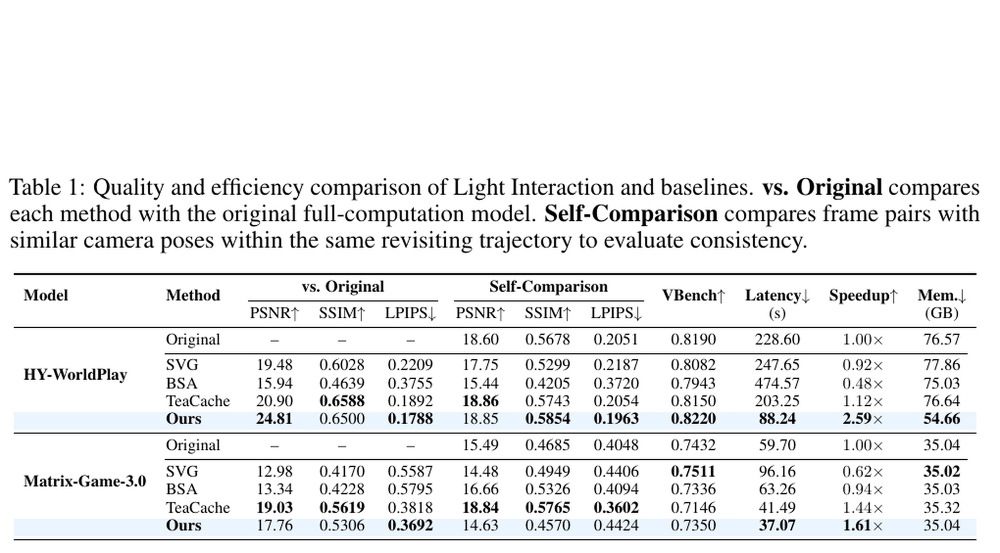
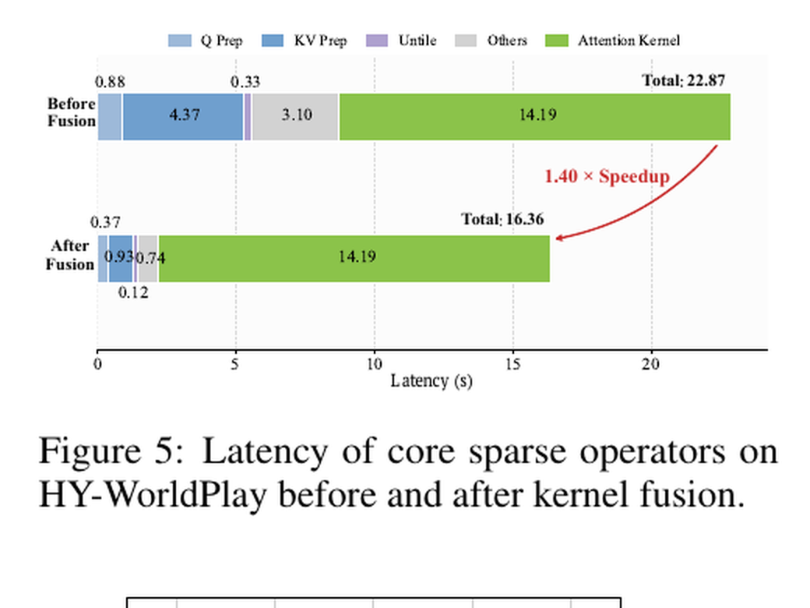

---
tags:
  - papers/world-model
  - papers/inference-acceleration
aliases:
  - Light Interaction
  - LI
  - Training-Free Interactive World Model Acceleration
date: 2026-06-18
arxiv_id: 2605.31158v3
---

# Light Interaction: Training-Free Inference Acceleration for Interactive Video World Models

## 核心信息

- 标题: Light Interaction: Training-Free Inference Acceleration for Interactive Video World Models
- 标题翻译: Light Interaction：交互式视频世界模型的免训练推理加速
- 作者: Jiacheng Lu, Haoyi Zhu, Sipei Yi, Enze Xie, Yu Li, Cheng Zhuo
- 机构: Zhejiang University; NVIDIA
- 发表时间: 2026-06-18
- 发表渠道: arXiv 预印本（v3）
- arXiv: 2605.31158v3
- 论文类型: 推理加速 / 系统与方法论文

## 原文摘要翻译

交互式视频世界模型响应用户控制的相机运动，逐块生成视频，为实时游戏仿真、虚拟场景导航和具身智能训练提供基础。然而，长交互轨迹的代价极高：由于上下文记忆持续增长、注意力复杂度呈二次增长，以及去噪过程中反复执行模型，在单张 `A100` 上使用 `HY-WorldPlay` 生成 10 秒视频可能耗时超过 200 秒。缓存压缩、减少去噪步数和稀疏注意力等现有方法，要么对所有交互状态采用统一策略，要么受自回归因果约束及不对称查询/键长度影响，无法形成实际加速。

为此，论文提出免训练框架 `Light Interaction`。核心观察是：交互轨迹本身可作为自适应计算信号。探索新区域时可丢弃不可靠的检索式空间记忆；局部潜变量变化较大时可缩短时间窗口；相机重访熟悉区域时可复用早期去噪输出。框架包含按相机姿态相似度裁剪空间记忆并按局部潜变量动态调整时间窗口的上下文管理、在熟悉区域复用早期输出的去噪缓存，以及使用 融合核弥合算法稀疏性与实际加速差距的软硬件协同稀疏注意力。在两个评测后端上，它无需模型重训练即可取得最高 `2.59×` 加速，并在第一个后端上相对原模型达到 `PSNR 24.81`。

## 创新点

1. **把交互状态变成计算预算控制器。** 论文不是固定裁剪上下文，而是用姿态/FoV 相似度区分探索与重访，再让同一可靠性信号共同控制空间记忆和去噪复用。这比把交互仅当作生成条件更进一步。
2. **把时间与空间上下文拆开治理。** 空间记忆由几何相关性门控；时间窗口原则上由稳定历史潜变量的局部动态决定。两者对应不同失效模式，而不是共享一个统一保留率。
3. **为少步去噪设计状态依赖缓存。** 重访时第一步输出近似中间步骤，但保留最后一步校正；这比无条件跳步更保守，且与姿态可靠性绑定。
4. **把自回归稀疏注意力做成可测的系统实现。** 只稀疏历史视觉 `KV`，完整保留文本与当前帧，并以三个 `Triton` 融合核处理准备和恢复开销。创新重点不是又一种块掩码，而是让该掩码在不对称查询/键与因果布局中真正变快。

## 一句话总结

这篇论文真正有价值的地方，是把“哪里可以少算”拆成由轨迹状态控制的上下文、去噪和注意力三层决策，再用后端融合把理论稀疏性兑现为端到端延迟；但标题中的“免训练”只表示不重训练生成模型，并不表示零适配、零调参或跨后端即插即用。

## 研究问题

### 具体瓶颈

交互式世界模型按块自回归生成。轨迹越长，历史视觉记忆越大；每个去噪步骤又重复调用 `Transformer`；三维时空注意力的理论成本和实际内存流量同时增长。`HY-WorldPlay` 的 10 秒生成在单张 `A100` 上超过 200 秒，与“交互”目标相去甚远。

### 为什么已有路线不够

- 缓存压缩只回答“哪些历史令牌显得重要”，不回答当前相机位置是否存在有效历史匹配。
- 去噪缓存通常使用内容无关的复用计划，探索新区域时误差恰好更大。
- 标准视频扩散稀疏注意力多面向双向布局；自回归执行中查询/键长度不对称、因果约束、块收集与布局转换会吞掉理论收益。

因此，它不是单纯提出更稀疏的掩码，而是把交互轨迹的可靠性与执行后端一起纳入推理预算设计。

## 数据与任务定义

### 评估对象与输入

论文评估两个开源模型：`HY-World1.5-Autoregressive-480P-I2V-distill-8B` 与 `Matrix-Game-3.0-base-distill-5B`。输入来自 `VBench` 的 200 个图文对，文本由 `LLaVA-1.6` 扩写；每个样本沿“前进—后退”和“左移—右移”两条轨迹生成，主结果对两种轨迹取平均。

### 质量和效率到底测什么

质量包括相对原始全计算模型的 `PSNR/SSIM/LPIPS`、同一重访轨迹内相似姿态帧的自比较指标，以及平均 `VBench`。效率报告生成骨干延迟、加速比和峰值内存；`VAE` 解码因近似恒定而被排除。因此论文声称的延迟不是完整应用的端到端交互延迟，而是生成骨干延迟。

所有主结果使用单张 `A100 80GB`。这让方法间比较较干净，却也把结论限制在特定硬件、内存布局和内核组合上。

## 方法主线

### 机制流程

*图 2：轨迹状态门控上下文、去噪复用与三维块稀疏注意力的完整执行链。*

1. **读取稳定历史并估计交互状态。** 当前带噪块不直接参与时间有效性判断；系统用最近两个稳定历史潜变量估计局部变化，同时计算当前相机与历史候选的姿态/FoV 相似度。
2. **重建自适应上下文。** 局部变化决定时间历史预算；最大姿态相似度低于阈值时判为探索并丢弃检索式空间记忆，否则保留几何相关历史。
3. **按状态执行少步去噪。** 重访时正常计算第一步，将其输出复用于中间步骤，再正常计算最终步骤校正；探索时不使用该捷径。
4. **稀疏执行剩余注意力。** 文本和当前帧令牌保持稠密，仅从历史视觉 `KV` 块中选择相关块；融合核完成块准备、池化、布局变换与输出恢复，结果进入后续网络层。

### 自适应时间上下文

局部动态由两个最近稳定潜变量的均方误差给出：

$$
D_t=\operatorname{MSE}(z_{t-1},z_{t-2}),\qquad
ar D_t=lpha D_t+(1-lpha)ar D_{t-1}.
$$

原则上，动态越大，窗口越短；动态越稳定，窗口越长。工程含义是不要让变化剧烈的旧局部历史继续占据条件预算。不过附录给出一个重要边界：当前 `HY-WorldPlay` 实验直接固定为最近一个单元，即 $L_t=1$；`Matrix-Game-3.0` 当前实现没有启用参数化时间窗口自适应。因而“通用动态窗口”更多是框架公式，跨模型的实验证据尚不完整。

### 姿态门控的空间记忆

若

$$
\max_j S_{\mathrm{pose}}(t,j)<	au_{\mathrm{pose}},
$$

系统把当前状态判为纯探索，丢弃检索返回的“最相似但仍无效”的历史。反之保留空间记忆。两套模型分别用 `FoV` 相似度实例化该信号，阈值为 `0.7` 与 `0.45`。这一步既减少无关条件造成的质量干扰，也直接缩短后续 `KV` 长度。

### 去噪缓存

当最大相似度超过阈值时，重访状态的几何约束使相邻去噪输出更接近。对 $K$ 步过程，系统计算第一步，并令中间步骤满足近似：

$$
v_	heta(x_i,t_i,c)pprox v_	heta(x_0,t_0,c),\qquad i\in\{1,\ldots,K-2\}.
$$

最终一步始终正常执行；$K\le 2$ 时没有中间步可复用。图 3 的相对 `L1` 距离支持“重访更稳定”这一门控依据，而不是证明任意场景都能安全缓存。前 3 个视频块还使用全稠密计算预热，避免历史不足时误判。

### 自回归感知三维块稀疏注意力

视觉令牌被划分为三维块；每个注意力头独立池化查询块和历史键块，并选择分数最高的 $\lfloor rM\rfloor$ 个历史块。最终上下文为：

$$
C_i=T\cup K^{\mathrm{curr}}\cup S_i.
$$

即文本块 $T$、当前帧块 $K^{\mathrm{curr}}$ 永不稀疏，只裁剪历史视觉块 $S_i$。两个后端的块大小分别为 `(4,8,4)` 和 `(4,4,8)`，体积均为 128 个令牌。前者保留 `17.5%` 历史令牌；对照块稀疏方法的全局保留率为 `31.25%`。

### Triton 融合为何不可缺

原线性序列中，同一三维块令牌并不连续。朴素实现需要块收集、池化、布局转换、填充和散射，通常受内存移动而非乘加量支配。论文把外围数据流合并为三个核：融合查询准备、融合键值准备、融合解块散射。尤其键值准备同时完成三维切片、重排、池化，并直接绕过预留文本区域。这个系统设计才是算法稀疏性转化为墙钟时间收益的关键。

## 关键结果

### 主结果与强基线

*表 1：两个后端上的质量、延迟、加速比与峰值内存对比。*

| 模型 | 方法 | 相对原模型 PSNR↑ | VBench↑ | 延迟↓ | 加速比↑ | 峰值内存↓ |
|---|---|---:|---:|---:|---:|---:|
| `HY-WorldPlay` | 原模型 | — | 0.8190 | 228.60 s | 1.00× | 76.57 GB |
| `HY-WorldPlay` | `SVG` | 19.48 | 0.8082 | 247.65 s | 0.92× | 77.86 GB |
| `HY-WorldPlay` | `BSA` | 15.94 | 0.7943 | 474.57 s | 0.48× | 75.03 GB |
| `HY-WorldPlay` | `TeaCache` | 20.90 | 0.8150 | 203.25 s | 1.12× | 76.64 GB |
| `HY-WorldPlay` | `Light Interaction` | **24.81** | **0.8220** | **88.24 s** | **2.59×** | **54.66 GB** |
| `Matrix-Game-3.0` | 原模型 | — | 0.7432 | 59.70 s | 1.00× | 35.04 GB |
| `Matrix-Game-3.0` | `TeaCache` | **19.03** | 0.7146 | 41.49 s | 1.44× | 35.32 GB |
| `Matrix-Game-3.0` | `Light Interaction` | 17.76 | **0.7350** | **37.07 s** | **1.61×** | 35.04 GB |

在 `HY-WorldPlay` 上，方法同时改善速度、峰值内存和 `VBench`，延迟减少 140.36 秒、内存减少 21.91 GB。更重要的反例是：`SVG` 与 `BSA` 虽然算法上稀疏，实际却分别只有 `0.92×` 和 `0.48×`，即比稠密原模型更慢。这直接支持论文关于执行布局和内核开销的论点。

在 `Matrix-Game-3.0` 上，收益收窄到 `1.61×`，且 `TeaCache` 的相对原模型与自比较指标更高；`Light Interaction` 只在延迟和 `VBench` 上占优。这说明 `2.59×` 不是框架的稳定跨后端倍率，而是 `HY-WorldPlay` 执行结构下三类削减恰好叠加的结果。

### 单模块消融到底说明什么

`Table 2` 使用完整 200 样本评估集，回答“每个模块单独启用能做什么”。时间上下文管理达到 `1.50×` 并把内存降至 `54.66 GB`；空间管理只有 `1.07×`，但相对原模型 `PSNR` 高达 `38.73`；单独去噪缓存为 `1.15×`；单独三维稀疏注意力为 `1.49×`。完整组合为 `2.59×`，低于各倍率简单相乘，符合端到端固定开销与模块重叠的预期。

### 留一消融不能与表 2 混读

*表 3：小型固定子集上的留一消融，只适合表内比较。*

表 3 从完整系统每次移除一个模块，但只在一个小型固定子集上计算。完整方法在这里的 `PSNR` 为 `24.72`、自比较 `PSNR` 为 `18.51`，已经不同于 表 2 的 `24.81/18.85`，说明两表样本集合不同。因此它适合比较表内相对趋势，不能把两表数值直接相减当作模块贡献。

在该固定子集内，移除三维稀疏注意力后质量恢复到 `26.77 PSNR`，但延迟上升到 `110.04 s`；移除上下文管理后延迟为 `133.19 s`，峰值内存回到 `76.57 GB`；移除去噪缓存后为 `111.28 s`。这说明上下文管理是内存控制核心，三维稀疏注意力和去噪缓存承担不同程度的附加加速，而质量—效率之间存在真实交换。

## 深度分析

### 真正贡献是什么

真正贡献不是三个独立技巧的并列组合，而是一条统一原则：**推理近似必须由交互可靠性控制，并由实际执行成本闭环验证。** 姿态信号同时决定是否保留空间记忆、是否复用去噪输出；潜变量动态控制局部历史；内核剖析再确认稀疏选择是否产生墙钟收益。这种“语义/几何控制面 + 系统数据面”的拆法可迁移到其他长上下文生成系统。

### 算法稀疏性不等于墙钟加速

*图 5：融合不改变注意力核心耗时，而是削减查询、键值准备和布局恢复开销。*

稀疏注意力核心的注意力核时间在融合前后均为 `14.19` 秒；变化来自周边操作，总计从 `22.87` 秒降到 `16.36` 秒，即稀疏注意力部分 `1.40×`。其中查询准备从 `0.88` 降至 `0.37` 秒，键值准备从 `4.37` 降至 `0.93` 秒，解块从 `0.33` 降至 `0.12` 秒，其他开销从 `3.10` 降至 `0.74` 秒。

这个结果不能被表述为“融合让整模型再快 `1.40×`”；它只针对稀疏注意力部分。端到端 `2.59×` 还来自上下文缩短和少调用一次左右的去噪骨干。相反，`SVG/BSA` 的负加速证明减少理论乘加量并不足够：不对称查询/键填充、模型卸载和数据重排都可能使系统更慢。

### 为什么两个后端差异明显

`HY-WorldPlay` 的原始延迟较大、峰值内存已达 `76.57 GB`，历史上下文管理能同时避免长 `KV` 与卸载压力，所以三条路线都拥有较大的可削减空间。`Matrix-Game-3.0` 原始模型只有 `59.70 s/35.04 GB`，内存不是紧瓶颈，且附录明确其未启用参数化时间窗口适配；最终收益自然收窄。论文也承认，实测速度依赖底层模型的内存组织和执行结构。

这意味着复现时不能只复制保留率。应该先做分阶段剖析：当前后端究竟受 `KV` 重建、去噪次数、注意力核还是布局转换支配，再决定三个组件的优先级。

### “免训练”的准确含义

免训练意味着不更新生成模型权重、不做蒸馏或后训练；它不意味着：

- 无需相机外参或 `FoV` 相似度；
- 无需按模型选择阈值、块形状和保留率；
- 无需修改注意力数据流并编写 `Triton` 核；
- 无需在目标硬件上重新剖析；
- 能保证不同交互轨迹和后端都达到相同倍率。

所以更准确的定位是“无需模型训练的推理时适配框架”，而非纯配置开关。

### 容易误读的地方

1. **通用时间窗口公式与实际实例不完全一致。** `HY-WorldPlay` 实际固定 $L_t=1$；`Matrix-Game-3.0` 未启用参数化适配。论文没有充分证明公式相较于固定窗口本身的收益。
2. **重访稳定性证据是相关性而非因果证明。** 图 3 表明重访相邻去噪步差异更小，支持门控启发式；但没有覆盖更长去噪链、复杂遮挡或错误姿态检索。
3. **质量指标存在冲突。** `Matrix-Game-3.0` 上 `TeaCache` 的相对原模型和自比较指标更强，而 `Light Interaction` 的 `VBench` 更高。不能用单一指标概括为全面质量最优。
4. **主结果不是完整应用延迟。** 实验排除了 `VAE`；随着生成骨干加速，未优化固定开销占比会提高，真实交互帧率提升可能小于表中倍率。

### 复现注意点

- 确认版本：`arXiv:2605.31158v3`，两个模型均为蒸馏少步版本；去噪缓存仅验证到 $K\le4$。
- 硬件：单张 `A100 80GB`；必须记录 `Triton/CUDA/PyTorch` 版本和注意力后端，否则墙钟结果难比较。
- 前 3 块使用全稠密预热；稀疏索引生成计入注意力时间；`VAE` 不计入延迟。
- `HY-WorldPlay` 的姿态阈值为 `0.7`，历史保留率 `17.5%`，块形状 `(4,8,4)`；`Matrix-Game-3.0` 阈值 `0.45`，块形状 `(4,4,8)`。
- 必须同时复现完整集的单模块实验与固定子集的留一实验，并清楚标注样本集合；不要跨表计算差值。
- 除总延迟外，至少记录 `KV` 重建、去噪、查询准备、键值准备、解块、注意力核与峰值内存，才能判断收益来源。

## 局限

1. 方法依赖可用且校准良好的相机姿态/FoV 相关性信号；若只由外参或其他几何线索近似，误门控可能同时污染空间记忆和去噪缓存两个分支。
2. 去噪缓存只在蒸馏后的 $K\le4$ 模型验证，无法外推到长采样链或不同求解器。
3. 两个模型对时间自适应的实现并不完整，削弱了“通用局部动态窗口”这一主张的实验支撑。
4. 评估仅覆盖 200 个 `VBench` 图文对、两类预设往返轨迹和单一 GPU 类型，尚未检验自由用户控制、快速旋转、遮挡与错误重定位。
5. 延迟排除 `VAE`，且没有报告吞吐、首块延迟、长轨迹长度扩展曲线或不同 GPU 上的结果。
6. 表 3 使用小型固定子集但没有注明子集大小，因而难以评估消融差异的统计稳定性。
7. 更快合成降低大规模生成门槛；方法本身不扩展模型能力，但仍会放大既有合成媒体风险。

## 我的笔记

### 可复用的研究思路

“可靠性信号一处估计、多处门控”值得复用：例如具身智能中的定位置信度可同时控制记忆检索、规划深度和视觉编码分辨率。不过多个捷径共享同一信号也会形成相关失效，后续方法应为门控加入不确定性估计和回退路径。

### 最值得补的实验

1. 在相同完整评估集上比较动态 $L_t$、固定 $L_t=1$ 与固定长窗口，单独验证局部潜变量动态机制。
2. 对姿态信号注入噪声，画出误门控率、质量和速度曲线，确定共享门控的鲁棒边界。
3. 在 `H100/B200` 与不同注意力后端上复现分阶段剖析，验证融合收益是否随内存带宽与核实现变化。
4. 报告包含 `VAE`、数据搬运和交互控制的端到端延迟，以及不同轨迹长度下的扩展曲线。
5. 用独立固定样本列表公开 `Table 3` 子集，并报告方差或置信区间。

### 阅读结论

这是一篇系统意识强、机制与工程互相支撑的推理加速工作。最值得引用的是“交互状态应决定计算预算”和“稀疏 FLOPs 必须通过数据布局与算子融合兑现”两点。若后续工作能补足动态时间窗口、门控鲁棒性和跨硬件结果，贡献会从一套有效实现进一步上升为可泛化的交互式生成加速范式。

## 引用

Lu, Jiacheng, Haoyi Zhu, Sipei Yi, Enze Xie, Yu Li, and Cheng Zhuo. “Light Interaction: Training-Free Inference Acceleration for Interactive Video World Models.” arXiv:2605.31158v3, 2026.
