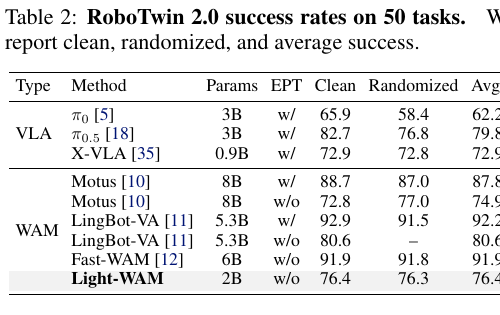
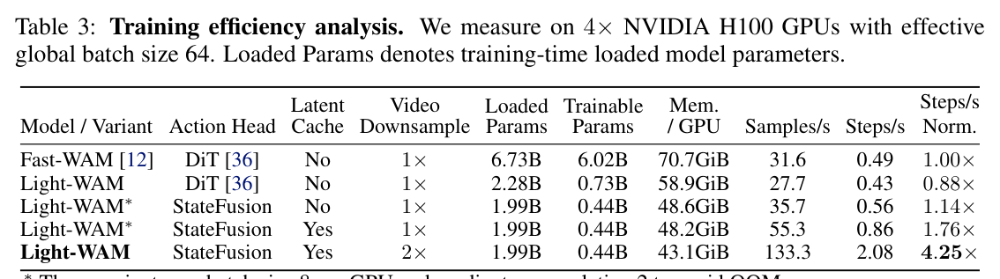
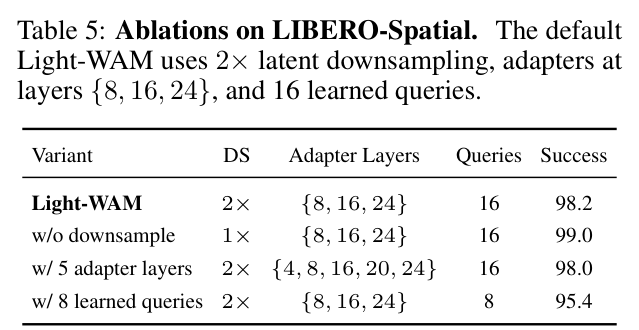
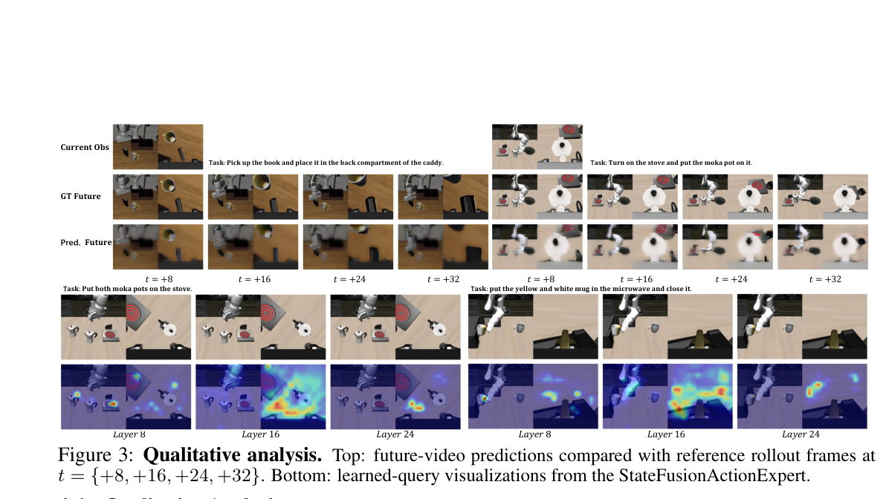
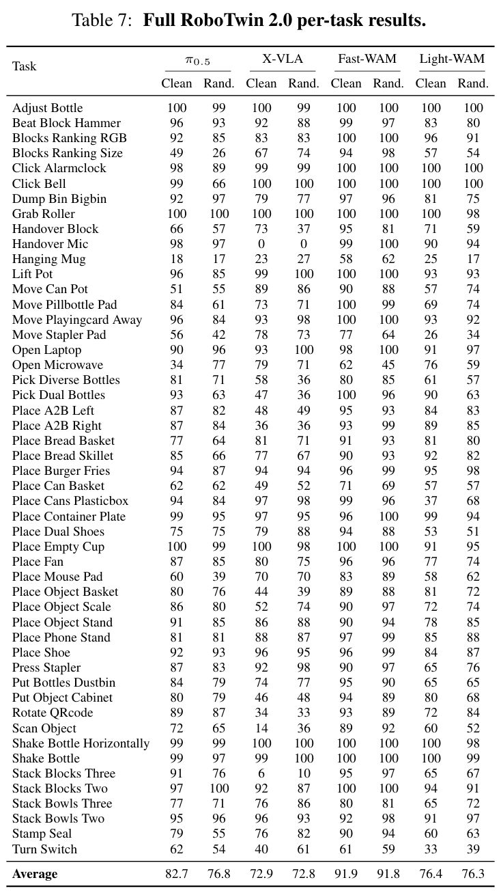

# Light-WAM: Efficient World Action Models with State-Fusion Action Decoding

**中文标题：** Light-WAM：采用状态融合动作解码的高效世界动作模型

**Authors / 作者：** Ziang Li$^{1,2*}$, Dongzhou Cheng$^{2,3*}$, Yibin Wang$^{2,4}$, Shiyue Wang$^{2,5}$, Xiaoyang Xu$^{1}$, Lingxuan Weng$^{5}$, Juan Wang$^{1\dagger}$, Jiaqi Wang$^{2\dagger}$

**Institutions / 机构：** $^1$ Wuhan University（武汉大学）；$^2$ Shanghai Innovation Institute（上海创新研究院）；$^3$ Southeast University（东南大学）；$^4$ Fudan University（复旦大学）；$^5$ East China Normal University（华东师范大学）

**Footnotes / 脚注：** $^*$ Equal contribution.（同等贡献。）$^\dagger$ Corresponding authors.（通讯作者。）

**Version / 版本：** arXiv:2606.08242v1 [cs.CV], 6 Jun 2026  
**Code / 代码：** https://github.com/L1ziang/Light-WAM

## Page / Section Index

| PDF pages | Content |
|---|---|
| 1 | Title, authors, institutions, footnotes, Abstract, Section 1 begins |
| 1–2 | 1. Introduction |
| 2–3 | 2. Related Work, Figure 1 |
| 3–5 | 3. Methodology, Equations (1)–(12) |
| 5–8 | 4. Experiments, Figures 2–4, Tables 1–5 |
| 8–9 | 5. Conclusion and Limitations |
| 9–12 | References [1]–[38] |
| 12–13 | Appendix A, Appendix B, Algorithms 1–2 |
| 14 | Table 6, Appendix C, Table 7 |
| 15 | Appendix D, Figure 5 |

## Terminology Ledger

| English | 中文 | Usage |
|---|---|---|
| World Action Model (WAM) | 世界动作模型 | Jointly learns robot actions and future-video prediction. |
| Vision Language Action (VLA) model | 视觉—语言—动作模型 | Maps visual observations and language instructions to robot actions. |
| future-video co-training | 未来视频协同训练 | Future-video supervision used during training. |
| StateFusionActionExpert | StateFusionActionExpert（状态融合动作专家） | The paper's direct, single-pass action decoder; the identifier is retained in English. |
| learned-query pooling | 可学习查询池化 | Compresses dense video tokens with learned queries. |
| proprioceptive state | 本体感知状态 | Robot-internal state appended to the cross-attention context. |
| embodied pretraining (EPT) | 具身预训练 | Large-scale robot-data pretraining; `w/` and `w/o` are kept as in the tables. |
| action chunk | 动作块 | A sequence of actions predicted in one pass. |

## Abstract

> <strong>Para. 1:</strong> World Action Models (WAMs) extend robot policy learning by incorporating future prediction as an additional training objective, encouraging the policy to encode task-relevant temporal structure in its representations. Current WAMs often rely on large-scale generative architectures that incur high training costs and inference latency, making them difficult to deploy as efficient closed-loop policies. We propose Light-WAM, a lightweight World Action Model for efficient robot manipulation. Specifically, it is built with a compact video backbone and performs future-video supervision in a downsampled latent space, reducing the cost of video co-training while retaining its benefits for representation learning. For action prediction, Light-WAM introduces the StateFusionActionExpert, which reads adapted states from multiple backbone layers, fuses them through learned-query pooling, and directly predicts action chunks in a single forward pass. This design provides an efficient interface between video backbone representations and robot actions, avoiding the need for heavy generative action experts. Experiments demonstrate that Light-WAM maintains strong performance on LIBERO and achieves usable multi-task performance on RoboTwin 2.0, while using only 0.44B trainable parameters. It also achieves 72.03ms inference latency with 4.1GiB peak GPU memory and improved training throughput. The code is available at https://github.com/L1ziang/Light-WAM.

> <strong>Para. 1[CN]:</strong> 世界动作模型（WAM）通过把未来预测纳入额外训练目标来扩展机器人策略学习，从而促使策略在其表征中编码与任务相关的时间结构。当前的 WAM 往往依赖大规模生成式架构，造成高昂的训练成本和推理延迟，使其难以部署为高效的闭环策略。我们提出 Light-WAM，一种面向高效机器人操作的轻量级世界动作模型。具体而言，该模型采用紧凑的视频骨干，并在下采样后的潜空间中进行未来视频监督，从而降低视频协同训练的成本，同时保留其对表征学习的益处。对于动作预测，Light-WAM 引入 StateFusionActionExpert：它读取多个骨干层的适配状态，通过可学习查询池化对这些状态进行融合，并在单次前向传播中直接预测动作块。这一设计在视频骨干表征与机器人动作之间提供了高效接口，避免了对重型生成式动作专家的需求。实验表明，Light-WAM 在 LIBERO 上保持强劲性能，并在 RoboTwin 2.0 上取得可用的多任务性能，同时仅使用 0.44B 可训练参数。它还实现了 72.03ms 的推理延迟、4.1GiB 的峰值 GPU 显存以及更高的训练吞吐量。代码可在 https://github.com/L1ziang/Light-WAM 获取。

## 1. Introduction / 引言

> <strong>Para. 1:</strong> Vision Language Action (VLA) models have shown strong performance in instruction-following robot manipulation by mapping visual observations and language instructions to robot actions [1, 2, 3, 4, 5, 6]. World Action Models (WAMs) extend this formulation by training robot policies jointly with future video prediction [7, 8, 9, 10, 11, 12]. The future-video objective provides additional supervision on how the scene changes over time, enabling the policy to learn representations that capture object motion, interaction dynamics, and task progress. However, current WAMs typically couple future-video prediction and action generation within large-scale generative architectures, resulting in substantial GPU memory usage, training cost, and inference latency. These overheads make it challenging to deploy WAMs as efficient closed-loop robot policies.

> <strong>Para. 1[CN]:</strong> 视觉—语言—动作（VLA）模型通过将视觉观测和语言指令映射为机器人动作，在指令跟随式机器人操作中展现了强劲性能 [1, 2, 3, 4, 5, 6]。世界动作模型（WAM）通过将机器人策略与未来视频预测联合训练来扩展这一范式 [7, 8, 9, 10, 11, 12]。未来视频目标针对场景如何随时间变化提供额外监督，使策略能够学习捕捉物体运动、交互动力学和任务进度的表征。然而，当前的 WAM 通常在大规模生成式架构中耦合未来视频预测与动作生成，导致大量 GPU 显存占用、训练成本和推理延迟。这些开销使 WAM 难以部署为高效的闭环机器人策略。

> <strong>Para. 2:</strong> Recent work has shown that test-time future video generation is not necessary for strong policy performance, suggesting that the main benefit of video prediction may come from training-time representation learning [12]. Building on this, we study whether WAMs can be made more efficient while retaining the training benefit of future-video prediction. This leads to a compact WAM designed for efficient training and fast inference.

> <strong>Para. 2[CN]:</strong> 近期工作表明，测试时生成未来视频并非获得强策略性能的必要条件，这说明视频预测的主要收益可能来自训练阶段的表征学习 [12]。在此基础上，我们研究能否在保留未来视频预测训练收益的同时提高 WAM 的效率。由此得到了一种面向高效训练和快速推理而设计的紧凑型 WAM。

> <strong>Para. 3:</strong> We propose Light-WAM, a lightweight World Action Model for efficient robot manipulation. Light-WAM uses Wan2.1-T2V-1.3B as the video backbone [13], keeps the pretrained backbone frozen, and adapts it with lightweight modules. To reduce the cost of video supervision, Light-WAM applies the future-video objective in a downsampled latent space. During inference, Light-WAM predicts action chunks from the current observation, without test-time future-video generation or a generative action expert. To connect the video backbone to robot actions, we introduce the StateFusionActionExpert. This module reads adapted states from multiple backbone layers and compresses dense video tokens with learned-query pooling. The pooled states are fused and mapped to actions in a single forward pass. This provides an efficient interface between video representations and action prediction, while allowing the action decoder to use information from different levels of the video backbone.

> <strong>Para. 3[CN]:</strong> 我们提出 Light-WAM，一种用于高效机器人操作的轻量级世界动作模型。Light-WAM 使用 Wan2.1-T2V-1.3B 作为视频骨干 [13]，冻结预训练骨干，并通过轻量级模块进行适配。为降低视频监督成本，Light-WAM 在下采样后的潜空间中施加未来视频目标。推理期间，Light-WAM 根据当前观测预测动作块，无需在测试时生成未来视频，也无需生成式动作专家。为连接视频骨干与机器人动作，我们引入 StateFusionActionExpert。该模块读取多个骨干层的适配状态，并通过可学习查询池化压缩密集视频 token。池化后的状态经过融合，并在单次前向传播中映射为动作。这样便在视频表征与动作预测之间提供了高效接口，同时允许动作解码器使用来自视频骨干不同层级的信息。

> <strong>Para. 4:</strong> We evaluate Light-WAM on LIBERO [14] and RoboTwin 2.0 [15]. On LIBERO, Light-WAM achieves 97.2% average success without embodied pretraining, which is competitive with larger WAM baselines. On RoboTwin 2.0, Light-WAM achieves 76.4% average success across 50 tasks. Compared with Fast-WAM [12], Light-WAM reduces trainable parameters from 6.02B to 0.44B, improves training throughput by 4.25×, and reduces inference latency to 72.03ms with 4.1GiB peak GPU memory. These results show that Light-WAM substantially improves the efficiency of the WAM pipeline while maintaining strong LIBERO performance and achieving usable multi-task performance in the more challenging RoboTwin 2.0.

> <strong>Para. 4[CN]:</strong> 我们在 LIBERO [14] 和 RoboTwin 2.0 [15] 上评估 Light-WAM。在 LIBERO 上，Light-WAM 在没有具身预训练的情况下取得 97.2% 的平均成功率，与更大的 WAM 基线相比具有竞争力。在 RoboTwin 2.0 上，Light-WAM 在 50 项任务上的平均成功率为 76.4%。与 Fast-WAM [12] 相比，Light-WAM 将可训练参数从 6.02B 降至 0.44B，将训练吞吐量提高 4.25×，并将推理延迟降至 72.03ms，峰值 GPU 显存为 4.1GiB。这些结果表明，Light-WAM 在保持强劲 LIBERO 性能、并在更具挑战性的 RoboTwin 2.0 上取得可用多任务性能的同时，显著提升了 WAM 流水线的效率。

> <strong>Para. 5:</strong> Our contributions are summarized as follows:
>
> - We propose Light-WAM, a lightweight World Action Model that combines a compact video backbone with downsampled latent-space video supervision, reducing the cost of WAM training while retaining the representation benefits of future-video co-training.
> - We introduce the StateFusionActionExpert, a direct action decoder that bridges video backbone representations and robot actions. It fuses multi-level adapted states through learned-query pooling and predicts action chunks in a single forward pass.
> - We evaluate Light-WAM on LIBERO and RoboTwin 2.0. Light-WAM achieves strong LIBERO performance and usable multi-task performance on RoboTwin 2.0, while substantially reducing both training and inference costs compared with heavier WAM baselines.

> <strong>Para. 5[CN]:</strong> 我们的贡献概括如下：
>
> - 我们提出 Light-WAM，一种将紧凑视频骨干与下采样潜空间视频监督相结合的轻量级世界动作模型；它在保留未来视频协同训练之表征收益的同时，降低了 WAM 的训练成本。
> - 我们引入 StateFusionActionExpert，这是一种连接视频骨干表征与机器人动作的直接动作解码器。它通过可学习查询池化融合多层适配状态，并在单次前向传播中预测动作块。
> - 我们在 LIBERO 和 RoboTwin 2.0 上评估 Light-WAM。与更重型的 WAM 基线相比，Light-WAM 在 LIBERO 上取得强劲性能、在 RoboTwin 2.0 上取得可用的多任务性能，同时大幅降低训练和推理成本。

## 2. Related Work / 相关工作

### Vision Language Action Models / 视觉—语言—动作模型

> <strong>Para. 1:</strong> Vision Language Action (VLA) models have become a central paradigm for instruction-following robot manipulation. Given visual observations and a language instruction, these models predict robot actions, enabling task conditioning and scalable learning from multi-task robot datasets [1, 2, 3, 5, 6, 16, 17, 18, 19, 20, 21]. Recent work further improves the practicality of VLA policies: SmolVLA [6] explores compact architectures for efficient training and deployment, while VLA-Adapter [21] introduces a lightweight interface for adapting vision-language representations to action prediction. However, these methods are primarily trained through action supervision, leaving the temporal structure of the task to be captured implicitly by the policy.

> <strong>Para. 1[CN]:</strong> 视觉—语言—动作（VLA）模型已成为指令跟随式机器人操作的核心范式。给定视觉观测和语言指令，这些模型预测机器人动作，从而支持任务条件化，以及从多任务机器人数据集中进行可扩展学习 [1, 2, 3, 5, 6, 16, 17, 18, 19, 20, 21]。近期工作进一步提升了 VLA 策略的实用性：SmolVLA [6] 探索用于高效训练和部署的紧凑架构，而 VLA-Adapter [21] 引入了一个轻量级接口，将视觉—语言表征适配到动作预测。然而，这些方法主要通过动作监督训练，因而将任务的时间结构留给策略隐式捕捉。

### World Action Models / 世界动作模型

> <strong>Para. 2:</strong> World Action Models (WAMs) provide a different perspective by coupling robot action learning with future video prediction. The future-video objective offers a temporal training signal that encourages the backbone to encode object motion, interaction dynamics, and task progress, leading to more world-aware visual representations [7, 8, 9, 10, 11, 12, 22, 23, 24, 25, 26, 27, 28]. Recent WAM systems such as Motus [10], LingBot-VA [11], and Fast-WAM [12] demonstrate the value of video co-training for robot policy learning, but they often rely on large video-action generative architectures and expensive training or inference pipelines.

> <strong>Para. 2[CN]:</strong> 世界动作模型（WAM）通过将机器人动作学习与未来视频预测相耦合，提供了另一种视角。未来视频目标提供时间性训练信号，促使骨干编码物体运动、交互动力学和任务进度，从而产生更具世界感知能力的视觉表征 [7, 8, 9, 10, 11, 12, 22, 23, 24, 25, 26, 27, 28]。Motus [10]、LingBot-VA [11] 和 Fast-WAM [12] 等近期 WAM 系统证明了视频协同训练对机器人策略学习的价值，但它们往往依赖大型视频—动作生成式架构，以及昂贵的训练或推理流水线。

> <strong>Para. 3:</strong> Our work shares the efficiency-oriented goal of recent VLA policies, but targets WAM robot policies, where future video prediction is used to shape the visual representations for robot control. It is also closely related to Fast-WAM, which shows that the video prediction branch can be used as training-time supervision without being executed during inference. Rather than focusing on inference-time video rollout, we focus on improving the efficiency of the overall WAM pipeline.

> <strong>Para. 3[CN]:</strong> 我们的工作与近期 VLA 策略共享以效率为导向的目标，但面向的是 WAM 机器人策略，其中未来视频预测用于塑造机器人控制所需的视觉表征。本工作还与 Fast-WAM 密切相关；后者表明，视频预测分支可以用作训练时监督，而无需在推理期间执行。我们不关注推理时的视频展开，而是专注于提高整个 WAM 流水线的效率。

### Figure 1. Overview of Light-WAM / Light-WAM 概览

**Caption:** Figure 1: Overview of Light-WAM. Light-WAM shares an adapted video backbone between video co-training and action prediction. During training, the video branch applies future-video supervision to downsampled latent videos $\bar{z}_{\mathrm{vid}}$, reducing the token cost of temporal supervision. The action prediction branch runs in both training and inference: it takes the current observation latent $z_{\mathrm{act}}$ and predicts action chunks without future-video rollout. The backbone is adapted with LoRA and sparse WAM adapters, and multi-level adapted states are fused by the StateFusionActionExpert through learned-query pooling for single-pass action decoding.

**Caption[CN]:** 图 1：Light-WAM 概览。Light-WAM 在视频协同训练和动作预测之间共享一个适配后的视频骨干。训练期间，视频分支对下采样的潜视频 $\bar{z}_{\mathrm{vid}}$ 施加未来视频监督，从而降低时间监督的 token 成本。动作预测分支同时运行于训练和推理：它接收当前观测潜变量 $z_{\mathrm{act}}$，并在不进行未来视频展开的情况下预测动作块。骨干通过 LoRA 和稀疏 WAM adapter 进行适配；StateFusionActionExpert 通过可学习查询池化融合多层适配状态，以进行单次前向动作解码。

## 3. Methodology / 方法

### 3.1 Overview / 概览

> <strong>Para. 1:</strong> Building on this motivation, Light-WAM keeps future-video supervision during training, but instantiates the policy with a compact backbone and a direct action interface at test time. Given the current observation $o$, language instruction $l$, and proprioceptive state $p$, it predicts an action sequence by

> <strong>Para. 1[CN]:</strong> 基于上述动机，Light-WAM 在训练期间保留未来视频监督，但在测试时使用紧凑骨干和直接动作接口来实例化策略。给定当前观测 $o$、语言指令 $l$ 和本体感知状态 $p$，它按下式预测动作序列：

$$
\hat{A}=\pi_{\phi}\bigl(h_{\theta}(o,l,p)\bigr). \tag{1}
$$

> <strong>Para. 2:</strong> where $h_{\theta}$ denotes the multi-level backbone representation extracted from the adapted video backbone, and $\pi_{\phi}$ is the StateFusionActionExpert. Light-WAM is designed to make the WAM pipeline efficient in both training and inference. It uses a compact video backbone with minimal adaptation to preserve the pretrained video prior, reduces video supervision cost via latent-space downsampling, and employs the StateFusionActionExpert to decode actions directly from multi-level backbone states, enabling fast closed-loop execution without iterative action denoising. The overall architecture of Light-WAM is illustrated in Figure 1. Detailed procedures are provided in Appendix A.

> <strong>Para. 2[CN]:</strong> 其中，$h_{\theta}$ 表示从适配后视频骨干中提取的多层骨干表征，$\pi_{\phi}$ 为 StateFusionActionExpert。Light-WAM 的设计目标是在训练和推理两个阶段都提高 WAM 流水线的效率。它使用仅做最少适配的紧凑视频骨干来保留预训练视频先验，通过潜空间下采样降低视频监督成本，并采用 StateFusionActionExpert 直接从多层骨干状态解码动作，从而无需迭代式动作去噪即可实现快速闭环执行。Light-WAM 的整体架构如图 1 所示，详细流程见附录 A。

### 3.2 Video Backbone Adaptation / 视频骨干适配

> <strong>Para. 3:</strong> Light-WAM uses Wan2.1-T2V-1.3B as the video backbone [13]. Given a VAE latent input $z$, the patch embedding layer produces the initial video-token state:

> <strong>Para. 3[CN]:</strong> Light-WAM 使用 Wan2.1-T2V-1.3B 作为视频骨干 [13]。给定 VAE 潜变量输入 $z$，patch embedding 层产生初始视频 token 状态：

$$
H_0=\operatorname{PatchEmbed}(z)\in\mathbb{R}^{B\times N\times d}. \tag{2}
$$

> <strong>Para. 4:</strong> where $N$ is the number of spatiotemporal video tokens and $d$ is the hidden dimension. The language instruction is encoded as text context tokens, and the proprioceptive state is projected to the same context dimension and appended to them:

> <strong>Para. 4[CN]:</strong> 其中，$N$ 是时空视频 token 的数量，$d$ 是隐藏维度。语言指令被编码为文本上下文 token，本体感知状态被投影到相同的上下文维度并追加到这些 token 之后：

$$
C=[c_1,\ldots,c_L,c_{\mathrm{prop}}]. \tag{3}
$$

> <strong>Para. 5:</strong> The backbone then updates the video-token state through transformer blocks, with $C$ provided as the cross-attention context. To preserve the pretrained video prior, we freeze the original Wan backbone and adapt it through low-rank updates on its attention and feed-forward projections [29]. We further insert lightweight WAM adapters at a sparse set of backbone depths. Let $F_{\ell}$ denote the $\ell$-th transformer block and $A_{\ell}$ the WAM adapter inserted at that depth, if present. Given the previous hidden state $H_{\ell-1}$ and context $C$, the layer update is

> <strong>Para. 5[CN]:</strong> 随后，骨干通过 transformer block 更新视频 token 状态，并将 $C$ 作为交叉注意力上下文。为保留预训练视频先验，我们冻结原始 Wan 骨干，并通过对其注意力投影和前馈投影施加低秩更新来进行适配 [29]。此外，我们还在一组稀疏的骨干深度插入轻量级 WAM adapter。令 $F_{\ell}$ 表示第 $\ell$ 个 transformer block，$A_{\ell}$ 表示在该深度插入的 WAM adapter（若存在）。给定前一隐藏状态 $H_{\ell-1}$ 和上下文 $C$，层更新为：

$$
U_{\ell}=F_{\ell}(H_{\ell-1},C),\qquad
H_{\ell}=
\begin{cases}
U_{\ell}+A_{\ell}(U_{\ell}), & \ell\in\mathcal{I},\\
U_{\ell}, & \text{otherwise}.
\end{cases} \tag{4}
$$

> <strong>Para. 6:</strong> where $\mathcal{I}$ denotes the depths exposed to the action decoder and $A_{\ell}$ is a lightweight bottleneck MLP. In this way, low-rank updates provide lightweight adaptation across the backbone, while the sparse WAM adapters provide additional robot-domain adaptation capacity at selected depths. The action branch reads a sparse set of adapted backbone states:

> <strong>Para. 6[CN]:</strong> 其中，$\mathcal{I}$ 表示暴露给动作解码器的深度，$A_{\ell}$ 是轻量级瓶颈 MLP。这样，低秩更新在整个骨干范围内提供轻量适配，而稀疏 WAM adapter 则在选定深度提供额外的机器人领域适配容量。动作分支读取一组稀疏的适配骨干状态：

$$
\mathcal{H}=\{H_{\ell}\}_{\ell\in\mathcal{I}}. \tag{5}
$$

> <strong>Para. 7:</strong> These multi-level backbone states form the interface between the video backbone and the StateFusionActionExpert. Instead of using only the final representation or exposing all backbone activations, Light-WAM selects a small set of states from different backbone levels, allowing the action head to access visual information at multiple granularities while keeping action decoding efficient.

> <strong>Para. 7[CN]:</strong> 这些多层骨干状态构成视频骨干与 StateFusionActionExpert 之间的接口。Light-WAM 不仅仅使用最终表征，也不暴露骨干的全部激活，而是从不同骨干层级中选择少量状态，使动作头能够访问多种粒度的视觉信息，同时保持动作解码高效。

### 3.3 Efficient Latent Video Co-training / 高效潜空间视频协同训练

> <strong>Para. 8:</strong> The future-video branch provides temporal supervision during training. Let $G^{\mathrm{vid}}_{\theta}$ denote the video prediction branch, which includes the adapted video backbone and the final video prediction head. Let $\bar{z}_{\mathrm{vid}}=D(z_{\mathrm{vid}})$ be the latent video after spatial downsampling, and let $\bar{z}_t$ denote its flow-matching perturbation at time $t$. The video branch is optimized by

> <strong>Para. 8[CN]:</strong> 未来视频分支在训练期间提供时间监督。令 $G^{\mathrm{vid}}_{\theta}$ 表示视频预测分支，其中包括适配后的视频骨干和最终视频预测头。令 $\bar{z}_{\mathrm{vid}}=D(z_{\mathrm{vid}})$ 表示经过空间下采样的潜视频，并令 $\bar{z}_t$ 表示其在时刻 $t$ 的 flow-matching 扰动。视频分支按下式优化：

$$
\mathcal{L}_{\mathrm{video}}=
\left\|G^{\mathrm{vid}}_{\theta}(\bar{z}_t,t,C)-u_t\right\|_2^2. \tag{6}
$$

> <strong>Para. 9:</strong> where $u_t$ is the corresponding flow-matching target [30]. The first latent frame is also downsampled by $D(\cdot)$ and kept fixed in $\bar{z}_t$ as the observation condition. For action prediction, Light-WAM takes the current observation from the original-resolution latent video:

> <strong>Para. 9[CN]:</strong> 其中，$u_t$ 是相应的 flow-matching 目标 [30]。第一个潜帧同样通过 $D(\cdot)$ 下采样，并在 $\bar{z}_t$ 中保持固定，作为观测条件。对于动作预测，Light-WAM 从原始分辨率的潜视频中取得当前观测：

$$
z_{\mathrm{act}}=z_{\mathrm{vid}}^{(0)}. \tag{7}
$$

> <strong>Para. 10:</strong> and does not apply the additional spatial downsampling used for video supervision. Thus, the video branch learns future dynamics in a lower-cost downsampled latent space, while the action branch preserves the original-resolution current observation needed for manipulation.

> <strong>Para. 10[CN]:</strong> 并且不应用视频监督所使用的额外空间下采样。因此，视频分支在成本更低的下采样潜空间中学习未来动力学，而动作分支保留操作所需的原始分辨率当前观测。

### 3.4 Query-Bottlenecked State Fusion and Action Decoding / 查询瓶颈状态融合与动作解码

> <strong>Para. 11:</strong> Given the full-resolution current observation latent $z_{\mathrm{act}}$, Light-WAM runs the adapted video backbone once and obtains the multi-level backbone states $\mathcal{H}=\{H_{\ell}\}_{\ell\in\mathcal{I}}$. The StateFusionActionExpert converts these dense video-token states into a fixed-width action state through learned-query pooling. This design is related to prior query-based pooling methods that use learnable queries to compress dense input tokens into compact representations [31, 32]. For each backbone state $H_{\ell}\in\mathcal{H}$, we learn a set of query tokens

> <strong>Para. 11[CN]:</strong> 给定全分辨率当前观测潜变量 $z_{\mathrm{act}}$，Light-WAM 对适配后的视频骨干执行一次前向传播，并获得多层骨干状态 $\mathcal{H}=\{H_{\ell}\}_{\ell\in\mathcal{I}}$。StateFusionActionExpert 通过可学习查询池化，将这些密集视频 token 状态转换为固定宽度的动作状态。该设计与先前基于 query 的池化方法有关，后者使用可学习 query 将密集输入 token 压缩为紧凑表征 [31, 32]。对于每个骨干状态 $H_{\ell}\in\mathcal{H}$，我们学习一组查询 token：

$$
Q_{\ell}\in\mathbb{R}^{N_q\times d}. \tag{8}
$$

> <strong>Para. 12:</strong> The query tokens attend to the video tokens of the corresponding backbone level, producing $P_{\ell}\in\mathbb{R}^{B\times N_q\times d}$, which is then averaged over queries and normalized:

> <strong>Para. 12[CN]:</strong> 查询 token 对相应骨干层级的视频 token 进行注意力计算，产生 $P_{\ell}\in\mathbb{R}^{B\times N_q\times d}$；随后在 query 维度上取平均并进行归一化：

$$
P_{\ell}=\operatorname{MHA}(Q_{\ell},H_{\ell},H_{\ell}),\qquad
s_{\ell}=\operatorname{LN}\!\left(\frac{1}{N_q}\sum_{j=1}^{N_q}P_{\ell,j}\right). \tag{9}
$$

> <strong>Para. 13:</strong> MHA and LN denote multi-head attention [33] and layer normalization [34], respectively. The number of queries controls the information passed from the video backbone to the action head. Too few queries may lose manipulation-relevant visual details, while too many reduce the compression effect and increase the burden on the action decoder. This design provides a controlled bottleneck that compresses dense video tokens into level-wise state representations. The resulting states are projected and fused as

> <strong>Para. 13[CN]:</strong> MHA 和 LN 分别表示多头注意力 [33] 与层归一化 [34]。query 的数量控制从视频骨干传递给动作头的信息量。query 过少可能丢失与操作有关的视觉细节，而 query 过多则会削弱压缩效果并增加动作解码器的负担。该设计提供了一个受控瓶颈，将密集视频 token 压缩为逐层状态表征。所得状态按下式投影并融合：

$$
h=\phi_{\mathrm{trunk}}\!\left(\phi_{\mathrm{fuse}}\!\left([M_{\ell}(s_{\ell})]_{\ell\in\mathcal{I}}\right)\right). \tag{10}
$$

> <strong>Para. 14:</strong> To decode actions, Light-WAM uses step embeddings $\{e_k\}_{k=1}^{K}$, where $K$ is the action horizon. Each embedding is projected by $\psi(\cdot)$ and added to the fused state $h$, after which an output head predicts the corresponding action:

> <strong>Para. 14[CN]:</strong> 为了解码动作，Light-WAM 使用步嵌入 $\{e_k\}_{k=1}^{K}$，其中 $K$ 是动作时域长度。每个嵌入都通过 $\psi(\cdot)$ 进行投影并加到融合状态 $h$ 上，随后由输出头预测相应动作：

$$
r_k=h+\psi(e_k),\qquad
\hat{a}_k=\phi_{\mathrm{out}}(\operatorname{LN}(r_k)),\qquad
\hat{A}=[\hat{a}_1,\ldots,\hat{a}_K]\in\mathbb{R}^{B\times K\times d_a}. \tag{11}
$$

> <strong>Para. 15:</strong> The full training objective combines future-video supervision and action regression:

> <strong>Para. 15[CN]:</strong> 完整训练目标结合了未来视频监督与动作回归：

$$
\mathcal{L}=\mathcal{L}_{\mathrm{video}}+\lambda\mathcal{L}_{\mathrm{action}}(\hat{A},A). \tag{12}
$$

> <strong>Para. 16:</strong> where $A$ denotes the target action sequence and $\mathcal{L}_{\mathrm{action}}$ measures the regression error. At inference time, Light-WAM directly predicts actions from the current observation without future-video rollout.

> <strong>Para. 16[CN]:</strong> 其中，$A$ 表示目标动作序列，$\mathcal{L}_{\mathrm{action}}$ 衡量回归误差。推理时，Light-WAM 直接根据当前观测预测动作，而不展开未来视频。

## 4. Experiments / 实验

### 4.1 Experimental Setup / 实验设置

#### Benchmarks and data / 基准与数据

> <strong>Para. 1:</strong> We evaluate Light-WAM on LIBERO [14] and RoboTwin 2.0 [15]. For LIBERO, we use the official datasets and report success rates on four suites: Spatial, Object, Goal, and Long. For RoboTwin 2.0, we follow the multi-task evaluation protocol used in prior work [10, 11, 12]: one policy is trained on 50 tasks using 2,500 clean demonstrations and 25,000 randomized demonstrations. We report performance under both clean and randomized evaluation settings.

> <strong>Para. 1[CN]:</strong> 我们在 LIBERO [14] 和 RoboTwin 2.0 [15] 上评估 Light-WAM。对于 LIBERO，我们使用官方数据集，并报告 Spatial、Object、Goal 和 Long 四个套件上的成功率。对于 RoboTwin 2.0，我们遵循先前工作 [10, 11, 12] 使用的多任务评估协议：使用 2,500 条干净示范和 25,000 条随机化示范，在 50 项任务上训练一个统一策略。我们同时报告干净评估设置与随机化评估设置下的性能。

#### Implementation details / 实现细节

> <strong>Para. 2:</strong> Light-WAM uses Wan2.1-T2V-1.3B [13] as a frozen video backbone and trains only the lightweight adaptation and action prediction modules. We insert WAM adapters at layers $\{8,16,24\}$, set the number of learned queries to 16 for each selected layer, and apply $2\times$ spatial latent downsampling in the video co-training branch. The default model has 1.99B total parameters and 0.44B trainable parameters. We train with AdamW using learning rate $1\mathrm{e}{-4}$, weight decay $1\mathrm{e}{-2}$, LIBERO batch size 64, and RoboTwin 2.0 batch size 128. Training is conducted on 4 NVIDIA H100 GPUs, and inference is measured on NVIDIA RTX 4090 48G GPUs. Additional implementation details are provided in Appendix B.

> <strong>Para. 2[CN]:</strong> Light-WAM 使用 Wan2.1-T2V-1.3B [13] 作为冻结的视频骨干，仅训练轻量级适配模块和动作预测模块。我们在第 $\{8,16,24\}$ 层插入 WAM adapter，将每个选定层的可学习 query 数设为 16，并在视频协同训练分支中应用 $2\times$ 空间潜变量下采样。默认模型共有 1.99B 参数，其中 0.44B 为可训练参数。我们使用 AdamW 训练，学习率为 $1\mathrm{e}{-4}$，权重衰减为 $1\mathrm{e}{-2}$，LIBERO batch size 为 64，RoboTwin 2.0 batch size 为 128。训练在 4 张 NVIDIA H100 GPU 上进行，推理则在 NVIDIA RTX 4090 48G GPU 上测量。更多实现细节见附录 B。

#### Baselines and metrics / 基线与指标

> <strong>Para. 3:</strong> We compare Light-WAM with representative VLA and WAM policies, including OpenVLA [3], OpenVLA-OFT [19], VLA-Adapter [21], $\pi_0$ [5], $\pi_{0.5}$ [18], X-VLA [35], Motus [10], LingBot-VA [11], and Fast-WAM [12]. Since large-scale embodied pretraining can significantly affect downstream manipulation performance, we indicate whether each method uses it. For task performance, we report success rate. For efficiency, we report trainable parameters, training throughput, inference latency, and peak GPU memory.

> <strong>Para. 3[CN]:</strong> 我们将 Light-WAM 与具有代表性的 VLA 和 WAM 策略进行比较，包括 OpenVLA [3]、OpenVLA-OFT [19]、VLA-Adapter [21]、$\pi_0$ [5]、$\pi_{0.5}$ [18]、X-VLA [35]、Motus [10]、LingBot-VA [11] 和 Fast-WAM [12]。由于大规模具身预训练会显著影响下游操作性能，我们标明每种方法是否使用具身预训练。对于任务性能，我们报告成功率；对于效率，我们报告可训练参数、训练吞吐量、推理延迟和峰值 GPU 显存。

### 4.2 LIBERO Results / LIBERO 结果

> <strong>Para. 4:</strong> Table 1 reports LIBERO results. Light-WAM achieves 97.2% average success, ranking first among methods without embodied pretraining and third among all compared methods. This indicates that Light-WAM remains competitive on LIBERO with fewer parameters than existing WAM baselines. Light-WAM obtains 98.2%, 99.6%, 97.8%, and 93.0% on Spatial, Object, Goal, and Long, respectively. The Long suite remains the most challenging setting, where larger policies such as Motus and LingBot-VA achieve higher success rates, suggesting that long-horizon tasks can still benefit from larger model capacity. Overall, the LIBERO results show that Light-WAM achieves competitive task performance with improved model efficiency.

> <strong>Para. 4[CN]:</strong> 表 1 报告了 LIBERO 结果。Light-WAM 的平均成功率为 97.2%，在未使用具身预训练的方法中排名第一，在所有比较方法中排名第三。这表明，在参数量少于现有 WAM 基线的情况下，Light-WAM 在 LIBERO 上仍具有竞争力。Light-WAM 在 Spatial、Object、Goal 和 Long 上分别取得 98.2%、99.6%、97.8% 和 93.0%。Long 套件仍是最具挑战性的设置；Motus 和 LingBot-VA 等更大的策略在该套件上取得了更高成功率，这说明长时域任务仍可受益于更大的模型容量。总体而言，LIBERO 结果表明，Light-WAM 在提升模型效率的同时取得了有竞争力的任务性能。

### Table 1. LIBERO success rates on the four official suites / 四个官方 LIBERO 套件上的成功率

**Caption:** Table 1: LIBERO success rates on the four official suites. We report average success, rank among methods without embodied pretraining (w/o EPT), and overall rank.

**Caption[CN]:** 表 1：四个官方 LIBERO 套件上的成功率。我们报告平均成功率、未使用具身预训练的方法中的排名（w/o EPT），以及总体排名。

| Type | Method | Params | EPT | Spatial | Object | Goal | Long | Avg. | w/o EPT Rank | Overall Rank |
|---|---|---:|:---:|---:|---:|---:|---:|---:|---:|---:|
| VLA | OpenVLA [3] | 7B | w/ | 84.7 | 88.4 | 79.2 | 53.7 | 76.5 | – | 9 |
| VLA | OpenVLA-OFT [19] | 7B | w/ | 97.6 | 98.4 | 97.9 | 94.5 | 97.1 | – | 4 |
| VLA | VLA-Adapter [21] | 0.6B | w/o | 96.0 | 96.8 | 97.4 | 94.4 | 96.2 | 3 | 7 |
| VLA | $\pi_0$ [5] | 3B | w/ | 96.8 | 98.8 | 95.8 | 85.2 | 94.1 | – | 8 |
| VLA | $\pi_{0.5}$ [18] | 3B | w/ | 98.8 | 98.2 | 98.0 | 92.4 | 96.9 | – | 6 |
| WAM | Motus [10] | 8B | w/ | 96.8 | 99.8 | 96.6 | 97.6 | 97.7 | – | 2 |
| WAM | LingBot-VA [11] | 5.3B | w/ | 98.5 | 99.6 | 97.2 | 98.5 | 98.5 | – | 1 |
| WAM | Fast-WAM [12] | 6B | w/o | 97.0 | 99.4 | 96.6 | 94.8 | 97.0 | 2 | 5 |
| WAM | **Light-WAM** | **2B** | **w/o** | **98.2** | **99.6** | **97.8** | **93.0** | **97.2** | **1** | **3** |

### 4.3 Multi-Task Learning on RoboTwin 2.0 / RoboTwin 2.0 多任务学习

> <strong>Para. 5:</strong> We further evaluate Light-WAM on RoboTwin 2.0 to study whether the lightweight architecture remains usable in a larger multi-task setting. Unlike LIBERO, RoboTwin 2.0 requires a single policy to learn across 50 bimanual manipulation tasks and handle randomized visual and physical conditions. This setting is more challenging for a lightweight model such as Light-WAM, with only 0.44B trainable parameters and a direct action head rather than large generative action experts.

> <strong>Para. 5[CN]:</strong> 我们进一步在 RoboTwin 2.0 上评估 Light-WAM，以研究该轻量级架构在更大的多任务设置中是否仍然可用。与 LIBERO 不同，RoboTwin 2.0 要求单个策略同时学习 50 项双臂操作任务，并应对随机化的视觉和物理条件。对于 Light-WAM 这样的轻量模型而言，该设置更具挑战性，因为它只有 0.44B 可训练参数，并采用直接动作头，而非大型生成式动作专家。

### Table 2. RoboTwin 2.0 success rates on 50 tasks / RoboTwin 2.0 的 50 项任务成功率

**Caption:** Table 2: RoboTwin 2.0 success rates on 50 tasks. We report clean, randomized, and average success.

**Caption[CN]:** 表 2：RoboTwin 2.0 的 50 项任务成功率。我们报告干净环境、随机化环境以及平均成功率。

| Type | Method | Params | EPT | Clean | Randomized | Avg. |
|---|---|---:|:---:|---:|---:|---:|
| VLA | $\pi_0$ [5] | 3B | w/ | 65.9 | 58.4 | 62.2 |
| VLA | $\pi_{0.5}$ [18] | 3B | w/ | 82.7 | 76.8 | 79.8 |
| VLA | X-VLA [35] | 0.9B | w/ | 72.9 | 72.8 | 72.9 |
| WAM | Motus [10] | 8B | w/ | 88.7 | 87.0 | 87.8 |
| WAM | Motus [10] | 8B | w/o | 72.8 | 77.0 | 74.9 |
| WAM | LingBot-VA [11] | 5.3B | w/ | 92.9 | 91.5 | 92.2 |
| WAM | LingBot-VA [11] | 5.3B | w/o | 80.6 | – | 80.6 |
| WAM | Fast-WAM [12] | 6B | w/o | 91.9 | 91.8 | 91.9 |
| WAM | **Light-WAM** | **2B** | **w/o** | **76.4** | **76.3** | **76.4** |

> <strong>Para. 6:</strong> As shown in Table 2, Light-WAM achieves 76.4% average success on RoboTwin 2.0 without embodied pretraining. Although it does not match Fast-WAM or the strongest embodied-pretrained WAMs, this result shows that Light-WAM can obtain usable multi-task performance with a much smaller trainable parameter budget. It outperforms $\pi_0$ and X-VLA in this comparison, and is competitive with Motus without embodied pretraining. These results position Light-WAM as an efficient WAM policy. While larger models perform better in the more complex RoboTwin 2.0 setting, Light-WAM achieves usable multi-task performance with much lower training and inference cost. Figure 2 visualizes the inference-side trade-off: Light-WAM achieves much lower inference latency and peak GPU memory among WAM methods, while maintaining usable average success on RoboTwin 2.0.

> <strong>Para. 6[CN]:</strong> 如表 2 所示，Light-WAM 在没有具身预训练的情况下，在 RoboTwin 2.0 上取得 76.4% 的平均成功率。尽管它未达到 Fast-WAM 或最强具身预训练 WAM 的水平，但这一结果表明，Light-WAM 能以小得多的可训练参数预算获得可用的多任务性能。在该比较中，它优于 $\pi_0$ 和 X-VLA，并与未使用具身预训练的 Motus 相当。这些结果将 Light-WAM 定位为一种高效 WAM 策略。虽然更大的模型在更复杂的 RoboTwin 2.0 设置中表现更好，但 Light-WAM 以低得多的训练和推理成本取得了可用的多任务性能。图 2 展示了推理侧的权衡：在 WAM 方法中，Light-WAM 的推理延迟和峰值 GPU 显存低得多，同时在 RoboTwin 2.0 上保持可用的平均成功率。

### Figure 2. RoboTwin 2.0 inference efficiency-performance comparison / RoboTwin 2.0 推理效率—性能比较

**Caption:** Figure 2: RoboTwin 2.0 inference efficiency-performance comparison.

**Caption[CN]:** 图 2：RoboTwin 2.0 推理效率—性能比较。

### 4.4 Efficiency Analysis / 效率分析

> <strong>Para. 7:</strong> Light-WAM is designed to reduce the cost of the entire WAM training and inference pipeline. Table 3 reports training efficiency. Compared with Fast-WAM, Light-WAM reduces total training-time parameters from 6.73B to 1.99B and trainable parameters from 6.02B to 0.44B, corresponding to 3.4× and 13.7× reductions, respectively. Peak per-GPU memory decreases from 70.7GiB to 43.1GiB, and throughput increases from 0.49 to 2.08 steps/s.

> <strong>Para. 7[CN]:</strong> Light-WAM 旨在降低整个 WAM 训练和推理流水线的成本。表 3 报告了训练效率。与 Fast-WAM 相比，Light-WAM 将训练时总参数从 6.73B 降至 1.99B，将可训练参数从 6.02B 降至 0.44B，分别对应 3.4× 和 13.7× 的缩减。单 GPU 峰值显存从 70.7GiB 降至 43.1GiB，吞吐量则从 0.49 提高到 2.08 steps/s。

> <strong>Para. 8:</strong> We further analyze the contribution of each efficiency component. A compact video backbone alone does not guarantee faster training, partly because the Wan2.1 VAE produces a denser latent grid than the high-compression VAE used by Wan2.2-TI2V-5B [13]. Introducing the StateFusionActionExpert reduces the action-side parameter and computation cost. Latent caching removes online VAE encoding from the training loop, and $2\times$ spatial downsampling reduces the token cost of future-video co-training. Together, these choices reduce training cost while preserving future-video supervision as part of the learning objective.

> <strong>Para. 8[CN]:</strong> 我们进一步分析各个效率组件的贡献。仅使用紧凑视频骨干并不能保证训练更快，部分原因在于 Wan2.1 VAE 产生的潜变量网格比 Wan2.2-TI2V-5B [13] 所用高压缩率 VAE 更密集。引入 StateFusionActionExpert 可降低动作侧的参数与计算成本。潜变量缓存从训练循环中移除了在线 VAE 编码，而 $2\times$ 空间下采样则降低了未来视频协同训练的 token 成本。这些选择共同降低训练成本，同时将未来视频监督保留为学习目标的一部分。

### Table 3. Training efficiency analysis / 训练效率分析

**Caption:** Table 3: Training efficiency analysis. We measure on $4\times$ NVIDIA H100 GPUs with effective global batch size 64. Loaded Params denotes training-time loaded model parameters.

**Caption[CN]:** 表 3：训练效率分析。测量使用 $4\times$ NVIDIA H100 GPU，有效全局 batch size 为 64。Loaded Params 表示训练时加载的模型参数。

| Model / Variant | Action Head | Latent Cache | Video Downsample | Loaded Params | Trainable Params | Mem. / GPU | Samples/s | Steps/s | Steps/s Norm. |
|---|---|:---:|:---:|---:|---:|---:|---:|---:|---:|
| Fast-WAM [12] | DiT [36] | No | $1\times$ | 6.73B | 6.02B | 70.7GiB | 31.6 | 0.49 | 1.00× |
| Light-WAM | DiT [36] | No | $1\times$ | 2.28B | 0.73B | 58.9GiB | 27.7 | 0.43 | 0.88× |
| Light-WAM$^*$ | StateFusion | No | $1\times$ | 1.99B | 0.44B | 48.6GiB | 35.7 | 0.56 | 1.14× |
| Light-WAM$^*$ | StateFusion | Yes | $1\times$ | 1.99B | 0.44B | 48.2GiB | 55.3 | 0.86 | 1.76× |
| **Light-WAM** | **StateFusion** | **Yes** | **$2\times$** | **1.99B** | **0.44B** | **43.1GiB** | **133.3** | **2.08** | **4.25×** |

**Table note:** $^*$ These variants use batch size 8 per GPU and gradient accumulation 2 to avoid OOM.

**表注：** $^*$ 这些变体在每张 GPU 上使用 batch size 8，并采用 2 次梯度累积以避免 OOM。

### Table 4. Inference efficiency on RoboTwin 2.0 inputs / RoboTwin 2.0 输入上的推理效率

**Caption:** Table 4: Inference efficiency on RoboTwin 2.0 inputs. Latency is measured per action query with cached language context on a single NVIDIA RTX 4090 48GB GPU. Overall latency includes VAE encoding and policy forward, while simulator and I/O overheads are excluded.

**Caption[CN]:** 表 4：RoboTwin 2.0 输入上的推理效率。延迟是在单张 NVIDIA RTX 4090 48GB GPU 上、缓存语言上下文的条件下，按每次动作查询测量的。总延迟包括 VAE 编码和策略前向传播，但不包括仿真器与 I/O 开销。

| Model | Params | Prediction Scope | VAE Enc. | Visual Branch | Action Branch | Policy Forward | Peak Mem. | Overall Latency | Norm. |
|---|---:|---|---:|---:|---:|---:|---:|---:|---:|
| $\pi_{0.5}$ [18] | 3B | Action-only | – | – | – | – | > 8GiB | 76ms$^*$ | 1.00× |
| LingBot-VA [11] | 5.3B | Video + action | 223.8ms | – | – | 2990.1ms | 18.9GiB | 3214.14ms | 42.29× |
| Motus [10] | 8B | Video + action | 16.1ms | – | – | 2130.7ms | 20.6GiB | 2148.68ms | 28.27× |
| Fast-WAM [12] | 6B | Action-only | 11.3ms | 36.0ms | 356.8ms | 392.8ms | 12.7GiB | 404.62ms | 5.32× |
| **Light-WAM** | **2B** | **Action-only** | **12.7ms** | **56.5ms** | **2.1ms** | **58.6ms** | **4.1GiB** | **72.03ms** | **0.95×** |

**Table note:** $^*$ The $\pi_{0.5}$ latency is reported by [37], which also evaluates on an NVIDIA RTX 4090 GPU.

**表注：** $^*$ $\pi_{0.5}$ 的延迟由文献 [37] 报告，该工作同样在 NVIDIA RTX 4090 GPU 上评估。

> <strong>Para. 9:</strong> Table 4 reports inference efficiency on RoboTwin 2.0 inputs. Latency is measured per action query with cached language context, including VAE encoding and policy forward. Light-WAM achieves 72.03ms overall latency with 4.1GiB peak GPU memory, substantially lower than prior WAM methods. The breakdown shows that its action branch takes only 2.1ms, while larger WAMs spend much more time on iterative action prediction or joint video-action generation. These results show that Light-WAM enables fast and memory-efficient action prediction for closed-loop control.

> <strong>Para. 9[CN]:</strong> 表 4 报告了 RoboTwin 2.0 输入上的推理效率。延迟是在缓存语言上下文的条件下按每次动作查询测量的，其中包括 VAE 编码和策略前向传播。Light-WAM 的总延迟为 72.03ms，峰值 GPU 显存为 4.1GiB，显著低于先前的 WAM 方法。分解结果显示，其动作分支仅耗时 2.1ms，而更大的 WAM 在迭代式动作预测或视频—动作联合生成上花费的时间多得多。这些结果表明，Light-WAM 可为闭环控制实现快速且显存高效的动作预测。

### 4.5 Ablation Studies / 消融实验

> <strong>Para. 10:</strong> We conduct ablations on LIBERO-Spatial for three Light-WAM designs: the resolution of video co-training, the number of adapter layers, and the capacity of learned-query pooling. As shown in Table 5, using the original-resolution video latent for co-training improves success from 98.2% to 99.0%. This suggests that higher-resolution video supervision can further improve policy performance. However, full-resolution video co-training raises the training cost substantially, as shown in Table 3. We therefore use $2\times$ latent downsampling to balance performance and training efficiency. Increasing the number of adapter layers from 3 to 5 gives similar performance, with success changing from 98.2% to 98.0%. This indicates that adding more adapter layers brings no clear gain in this setting. Considering the additional parameters and computation, we choose a sparse three-layer configuration $\{8,16,24\}$, which provides multi-level representations for the action decoder. Finally, reducing the number of learned queries from 16 to 8 decreases success to 95.4%, suggesting that the query bottleneck needs sufficient capacity to preserve manipulation-relevant visual information.

> <strong>Para. 10[CN]:</strong> 我们在 LIBERO-Spatial 上针对 Light-WAM 的三项设计进行消融：视频协同训练的分辨率、adapter 层数，以及可学习查询池化的容量。如表 5 所示，使用原始分辨率的视频潜变量进行协同训练，可将成功率从 98.2% 提升至 99.0%。这说明更高分辨率的视频监督能够进一步提高策略性能。然而，如表 3 所示，全分辨率视频协同训练会显著提高训练成本。因此，我们采用 $2\times$ 潜变量下采样，以平衡性能与训练效率。将 adapter 层数从 3 增加到 5 得到相近性能，成功率从 98.2% 变为 98.0%。这表明在该设置中增加更多 adapter 层并无明确收益。考虑到额外参数和计算，我们选择稀疏的三层配置 $\{8,16,24\}$，为动作解码器提供多层表征。最后，将可学习 query 数量从 16 减少到 8 会使成功率降至 95.4%，这说明查询瓶颈需要足够容量来保留与操作相关的视觉信息。

### Table 5. Ablations on LIBERO-Spatial / LIBERO-Spatial 消融实验

**Caption:** Table 5: Ablations on LIBERO-Spatial. The default Light-WAM uses $2\times$ latent downsampling, adapters at layers $\{8,16,24\}$, and 16 learned queries.

**Caption[CN]:** 表 5：LIBERO-Spatial 上的消融实验。默认 Light-WAM 使用 $2\times$ 潜变量下采样，在第 $\{8,16,24\}$ 层设置 adapter，并使用 16 个可学习 query。

| Variant | DS | Adapter Layers | Queries | Success |
|---|:---:|---|---:|---:|
| **Light-WAM** | **$2\times$** | **$\{8,16,24\}$** | **16** | **98.2** |
| w/o downsample | $1\times$ | $\{8,16,24\}$ | 16 | 99.0 |
| w/ 5 adapter layers | $2\times$ | $\{4,8,16,20,24\}$ | 16 | 98.0 |
| w/ 8 learned queries | $2\times$ | $\{8,16,24\}$ | 8 | 95.4 |

> <strong>Para. 11:</strong> Overall, Light-WAM achieves competitive LIBERO performance, usable 50-task performance on RoboTwin 2.0, and much lower training and inference cost. These results support the main design of Light-WAM: future-video prediction is retained as downsampled latent-space supervision, while multi-level adapted backbone states are fused by a single-pass StateFusionActionExpert for action decoding.

> <strong>Para. 11[CN]:</strong> 总体而言，Light-WAM 在 LIBERO 上取得了有竞争力的性能，在 RoboTwin 2.0 上取得了可用的 50 任务性能，同时训练和推理成本低得多。这些结果支持 Light-WAM 的核心设计：未来视频预测被保留为下采样潜空间中的监督，而多层适配骨干状态则由单次前向的 StateFusionActionExpert 融合，以完成动作解码。

### Figure 3. Qualitative analysis / 定性分析

**Caption:** Figure 3: Qualitative analysis. Top: future-video predictions compared with reference rollout frames at $t=\{+8,+16,+24,+32\}$. Bottom: learned-query visualizations from the StateFusionActionExpert.

**Caption[CN]:** 图 3：定性分析。上：在 $t=\{+8,+16,+24,+32\}$ 时，将未来视频预测与参考 rollout 帧进行比较。下：来自 StateFusionActionExpert 的可学习 query 可视化。

### 4.6 Qualitative Analysis / 定性分析

#### Future video visualization / 未来视频可视化

> <strong>Para. 12:</strong> The top row of Figure 3 shows examples from the video branch. For each task, we compare the predicted future frames with reference future frames from the environment rollout. The predictions are smoother than the reference frames because the video branch is trained in a downsampled latent space. However, they still capture the main motion and scene changes, suggesting that the video branch learns useful temporal information during training.

> <strong>Para. 12[CN]:</strong> 图 3 的上排展示了视频分支的示例。对于每项任务，我们将预测未来帧与环境 rollout 中的参考未来帧进行比较。由于视频分支在下采样潜空间中训练，预测结果比参考帧更加平滑。然而，它们仍然捕捉到了主要运动和场景变化，这表明视频分支在训练期间学到了有用的时间信息。

#### Learned-query visualization / 可学习 query 可视化

> <strong>Para. 13:</strong> The bottom row of Figure 3 visualizes attention maps derived from learned-query pooling. When projected back to image space, the maps from layers 8, 16, and 24 tend to emphasize different task-relevant regions, such as manipulated objects, the gripper, and target areas. This suggests that the selected backbone layers provide complementary visual cues, which is consistent with our design of fusing multi-level adapted states for action decoding.

> <strong>Para. 13[CN]:</strong> 图 3 的下排可视化了由可学习查询池化得到的注意力图。当投影回图像空间时，来自第 8、16 和 24 层的注意力图倾向于强调不同的任务相关区域，例如被操作物体、夹爪和目标区域。这说明选定的骨干层提供了互补的视觉线索，与我们融合多层适配状态以进行动作解码的设计一致。

### 4.7 Real-World Evaluation / 真实世界评估

> <strong>Para. 14:</strong> We evaluate Light-WAM on the IMETA Y1 dual-arm robot platform with three real-world manipulation tasks. For each task, we collect 50 demonstrations for training and compare Light-WAM with $\pi_{0.5}$ under the same setting. Figure 4 shows the robot setup, task observations, and success rates for the three tasks. Additional rollout frames are provided in Appendix D.

> <strong>Para. 14[CN]:</strong> 我们在 IMETA Y1 双臂机器人平台上，通过三项真实世界操作任务评估 Light-WAM。对于每项任务，我们收集 50 条示范用于训练，并在相同设置下比较 Light-WAM 与 $\pi_{0.5}$。图 4 展示了机器人设置、任务观测以及三项任务的成功率。更多 rollout 帧见附录 D。

### Figure 4. Real-world evaluation / 真实世界评估

**Caption:** Figure 4: Real-world evaluation. Robot setup and success rates on three dual-arm tasks.

**Caption[CN]:** 图 4：真实世界评估。机器人设置以及三项双臂任务的成功率。

## 5. Conclusion and Limitations / 结论与局限性

> <strong>Para. 1:</strong> We presented Light-WAM, a lightweight World Action Model for efficient robot manipulation. By combining a compact video backbone, downsampled latent-space video supervision, and the StateFusionActionExpert, Light-WAM improves the efficiency of both WAM training and inference. Experiments on LIBERO, RoboTwin 2.0, and real-world dual-arm tasks show a favorable performance-efficiency trade-off. There are also several limitations. In more challenging multi-task settings, larger WAMs and embodied-pretrained policies continue to achieve higher success rates, suggesting that model capacity and large-scale embodied data remain important for complex manipulation. Moreover, although we evaluate on existing benchmarks and real-world tasks, we do not train or test on benchmarks specifically designed for policy generalization and robustness, such as LIBERO-Plus [38]. Future work will incorporate data augmentation and robustness-oriented training to further improve the generalization ability of Light-WAM.

> <strong>Para. 1[CN]:</strong> 我们提出了 Light-WAM，一种用于高效机器人操作的轻量级世界动作模型。通过结合紧凑视频骨干、下采样潜空间视频监督和 StateFusionActionExpert，Light-WAM 同时提高了 WAM 训练与推理的效率。在 LIBERO、RoboTwin 2.0 和真实世界双臂任务上的实验展现了良好的性能—效率权衡。该方法也存在若干局限。在更具挑战性的多任务设置中，更大的 WAM 和经过具身预训练的策略仍能取得更高成功率，这说明模型容量和大规模具身数据对于复杂操作依然重要。此外，尽管我们在现有基准和真实世界任务上进行了评估，但并未在 LIBERO-Plus [38] 等专为策略泛化和鲁棒性设计的基准上训练或测试。未来工作将引入数据增强和面向鲁棒性的训练，以进一步提高 Light-WAM 的泛化能力。

## References / 参考文献

**No-translation policy / 不翻译政策：** The 38 references below are retained in their complete, searchable English bibliographic form because author names, publication titles, venues, page ranges, years, and arXiv identifiers are bibliographic metadata; translating them would reduce searchability and could alter citation identity. / 以下 38 条参考文献完整保留为可检索的英文书目形式，因为作者名、论文标题、出版 venue、页码范围、年份和 arXiv 标识符均属于书目元数据；翻译会降低可检索性，并可能改变引文身份。

[1] A. Brohan, N. Brown, J. Carbajal, Y. Chebotar, J. Dabis, C. Finn, K. Gopalakrishnan, K. Hausman, A. Herzog, J. Hsu, et al. RT-1: Robotics transformer for real-world control at scale. *arXiv preprint arXiv:2212.06817*, 2022.

[2] B. Zitkovich, T. Yu, S. Xu, P. Xu, T. Xiao, F. Xia, J. Wu, P. Wohlhart, S. Welker, A. Wahid, et al. RT-2: Vision-language-action models transfer web knowledge to robotic control. In *Conference on Robot Learning*, pages 2165–2183. PMLR, 2023.

[3] M. J. Kim, K. Pertsch, S. Karamcheti, T. Xiao, A. Balakrishna, S. Nair, R. Rafailov, E. Foster, G. Lam, P. Sanketi, et al. OpenVLA: An open-source vision-language-action model. *arXiv preprint arXiv:2406.09246*, 2024.

[4] A. O’Neill, A. Rehman, A. Maddukuri, A. Gupta, A. Padalkar, A. Lee, A. Pooley, A. Gupta, A. Mandlekar, A. Jain, et al. Open X-Embodiment: Robotic learning datasets and RT-X models: Open X-Embodiment collaboration 0. In *2024 IEEE International Conference on Robotics and Automation (ICRA)*, pages 6892–6903. IEEE, 2024.

[5] K. Black, N. Brown, D. Driess, A. Esmail, M. Equi, C. Finn, N. Fusai, L. Groom, K. Hausman, B. Ichter, et al. $\pi_0$: A vision-language-action flow model for general robot control. *arXiv preprint arXiv:2410.24164*, 2024.

[6] M. Shukor, D. Aubakirova, F. Capuano, P. Kooijmans, S. Palma, A. Zouitine, M. Aractingi, C. Pascal, M. Russi, A. Marafioti, et al. SmolVLA: A vision-language-action model for affordable and efficient robotics. *arXiv preprint arXiv:2506.01844*, 2025.

[7] J. Liang, P. Tokmakov, R. Liu, S. Sudhakar, P. Shah, R. Ambrus, and C. Vondrick. Video generators are robot policies. *arXiv preprint arXiv:2508.00795*, 2025.

[8] S. Li, Y. Gao, D. Sadigh, and S. Song. Unified video action model. *arXiv preprint arXiv:2503.00200*, 2025.

[9] C. Zhu, R. Yu, S. Feng, B. Burchfiel, P. Shah, and A. Gupta. Unified world models: Coupling video and action diffusion for pretraining on large robotic datasets. *arXiv preprint arXiv:2504.02792*, 2025.

[10] H. Bi, H. Tan, S. Xie, Z. Wang, S. Huang, H. Liu, R. Zhao, Y. Feng, C. Xiang, Y. Rong, et al. Motus: A unified latent action world model. *arXiv preprint arXiv:2512.13030*, 2025.

[11] L. Li, Q. Zhang, Y. Luo, S. Yang, R. Wang, F. Han, M. Yu, Z. Gao, N. Xue, X. Zhu, et al. Causal world modeling for robot control. *arXiv preprint arXiv:2601.21998*, 2026.

[12] T. Yuan, Z. Dong, Y. Liu, and H. Zhao. Fast-WAM: Do world action models need test-time future imagination? *arXiv preprint arXiv:2603.16666*, 2026.

[13] T. Wan, A. Wang, B. Ai, B. Wen, C. Mao, C.-W. Xie, D. Chen, F. Yu, H. Zhao, J. Yang, et al. Wan: Open and advanced large-scale video generative models. *arXiv preprint arXiv:2503.20314*, 2025.

[14] B. Liu, Y. Zhu, C. Gao, Y. Feng, Q. Liu, Y. Zhu, and P. Stone. LIBERO: Benchmarking knowledge transfer for lifelong robot learning. *Advances in Neural Information Processing Systems*, 36:44776–44791, 2023.

[15] T. Chen, Z. Chen, B. Chen, Z. Cai, Y. Liu, Z. Li, Q. Liang, X. Lin, Y. Ge, Z. Gu, et al. RoboTwin 2.0: A scalable data generator and benchmark with strong domain randomization for robust bimanual robotic manipulation. *arXiv preprint arXiv:2506.18088*, 2025.

[16] J. Bjorck, F. Castañeda, N. Cherniadev, X. Da, R. Ding, L. Fan, Y. Fang, D. Fox, F. Hu, S. Huang, et al. GR00T N1: An open foundation model for generalist humanoid robots. *arXiv preprint arXiv:2503.14734*, 2025.

[17] G. R. Team, S. Abeyruwan, J. Ainslie, J.-B. Alayrac, M. G. Arenas, T. Armstrong, A. Balakrishna, R. Baruch, M. Bauza, M. Blokzijl, et al. Gemini Robotics: Bringing AI into the physical world. *arXiv preprint arXiv:2503.20020*, 2025.

[18] P. Intelligence, K. Black, N. Brown, J. Darpinian, K. Dhabalia, D. Driess, A. Esmail, M. Equi, C. Finn, N. Fusai, et al. $\pi_{0.5}$: A vision-language-action model with open-world generalization. *arXiv preprint arXiv:2504.16054*, 2025.

[19] M. J. Kim, C. Finn, and P. Liang. Fine-tuning vision-language-action models: Optimizing speed and success. *arXiv preprint arXiv:2502.19645*, 2025.

[20] S. Liu, L. Wu, B. Li, H. Tan, H. Chen, Z. Wang, K. Xu, H. Su, and J. Zhu. RDT-1B: A diffusion foundation model for bimanual manipulation. In *International Conference on Learning Representations*, volume 2025, pages 29982–30009, 2025.

[21] Y. Wang, P. Ding, L. Li, C. Cui, Z. Ge, X. Tong, W. Song, H. Zhao, W. Zhao, P. Hou, et al. VLA-Adapter: An effective paradigm for tiny-scale vision-language-action model. In *Proceedings of the AAAI Conference on Artificial Intelligence*, volume 40, pages 18638–18646, 2026.

[22] Y. Du, S. Yang, B. Dai, H. Dai, O. Nachum, J. Tenenbaum, D. Schuurmans, and P. Abbeel. Learning universal policies via text-guided video generation. *Advances in Neural Information Processing Systems*, 36:9156–9172, 2023.

[23] H. Wu, Y. Jing, C. Cheang, G. Chen, J. Xu, X. Li, M. Liu, H. Li, and T. Kong. Unleashing large-scale video generative pre-training for visual robot manipulation. In *International Conference on Learning Representations*, volume 2024, pages 10641–10662, 2024.

[24] H. Bharadhwaj, D. Dwibedi, A. Gupta, S. Tulsiani, C. Doersch, T. Xiao, D. Shah, F. Xia, D. Sadigh, and S. Kirmani. Gen2Act: Human video generation in novel scenarios enables generalizable robot manipulation. *arXiv preprint arXiv:2409.16283*, 2024.

[25] S. Zhou, Y. Du, J. Chen, Y. Li, D.-Y. Yeung, and C. Gan. RoboDreamer: Learning compositional world models for robot imagination. *arXiv preprint arXiv:2404.12377*, 2024.

[26] Y. Hu, Y. Guo, P. Wang, X. Chen, Y.-J. Wang, J. Zhang, K. Sreenath, C. Lu, and J. Chen. Video prediction policy: A generalist robot policy with predictive visual representations. *arXiv preprint arXiv:2412.14803*, 2024.

[27] Y. Liao, P. Zhou, S. Huang, D. Yang, S. Chen, Y. Jiang, Y. Hu, J. Cai, S. Liu, J. Luo, et al. Genie Envisioner: A unified world foundation platform for robotic manipulation. *arXiv preprint arXiv:2508.05635*, 2025.

[28] S. Ye, Y. Ge, K. Zheng, S. Gao, S. Yu, G. Kurian, S. Indupuru, Y. L. Tan, C. Zhu, J. Xiang, et al. World action models are zero-shot policies. *arXiv preprint arXiv:2602.15922*, 2026.

[29] E. J. Hu, Y. Shen, P. Wallis, Z. Allen-Zhu, Y. Li, S. Wang, L. Wang, W. Chen, et al. LoRA: Low-rank adaptation of large language models. *ICLR*, 1(2):3, 2022.

[30] Y. Lipman, R. T. Chen, H. Ben-Hamu, M. Nickel, and M. Le. Flow matching for generative modeling. *arXiv preprint arXiv:2210.02747*, 2022.

[31] J. Lee, Y. Lee, J. Kim, A. Kosiorek, S. Choi, and Y. W. Teh. Set Transformer: A framework for attention-based permutation-invariant neural networks. In *International Conference on Machine Learning*, pages 3744–3753. PMLR, 2019.

[32] J. Li, D. Li, S. Savarese, and S. Hoi. BLIP-2: Bootstrapping language-image pre-training with frozen image encoders and large language models. In *International Conference on Machine Learning*, pages 19730–19742. PMLR, 2023.

[33] A. Vaswani, N. Shazeer, N. Parmar, J. Uszkoreit, L. Jones, A. N. Gomez, Ł. Kaiser, and I. Polosukhin. Attention is all you need. *Advances in Neural Information Processing Systems*, 30, 2017.

[34] J. L. Ba, J. R. Kiros, and G. E. Hinton. Layer normalization. *arXiv preprint arXiv:1607.06450*, 2016.

[35] J. Zheng, J. Li, Z. Wang, D. Liu, X. Kang, Y. Feng, Y. Zheng, J. Zou, Y. Chen, J. Zeng, et al. X-VLA: Soft-prompted transformer as scalable cross-embodiment vision-language-action model. *arXiv preprint arXiv:2510.10274*, 2025.

[36] W. Peebles and S. Xie. Scalable diffusion models with transformers. In *Proceedings of the IEEE/CVF International Conference on Computer Vision*, pages 4195–4205, 2023.

[37] K. Black, M. Galliker, and S. Levine. Real-time execution of action chunking flow policies. *Advances in Neural Information Processing Systems*, 38:33383–33407, 2026.

[38] S. Fei, S. Wang, J. Shi, Z. Dai, J. Cai, P. Qian, L. Ji, X. He, S. Zhang, Z. Fei, et al. LIBERO-Plus: In-depth robustness analysis of vision-language-action models. *arXiv preprint arXiv:2510.13626*, 2025.

## Appendix A. Algorithmic Details / 算法细节

### Backbone adaptation / 骨干适配

> <strong>Para. 1:</strong> Light-WAM uses Wan2.1-T2V-1.3B as the video backbone and keeps the pretrained backbone weights frozen. We adapt the backbone with two lightweight components. First, LoRA is applied to the self-attention, cross-attention, and feed-forward projections of all backbone blocks. Second, sparse WAM adapters are inserted at layers $\{8,16,24\}$. Each WAM adapter is a residual bottleneck module:

> <strong>Para. 1[CN]:</strong> Light-WAM 使用 Wan2.1-T2V-1.3B 作为视频骨干，并保持预训练骨干权重冻结。我们使用两个轻量组件适配骨干。首先，将 LoRA 应用于所有骨干 block 的自注意力、交叉注意力和前馈投影。其次，在第 $\{8,16,24\}$ 层插入稀疏 WAM adapter。每个 WAM adapter 都是一个残差瓶颈模块：

$$
A_{\ell}(x)=\gamma W_{\ell}^{\mathrm{up}}\,\sigma\!\left(W_{\ell}^{\mathrm{down}}x\right).
$$

> <strong>Para. 2:</strong> where $W_{\ell}^{\mathrm{down}}$ maps the backbone hidden state to a 256-dimensional bottleneck, $W_{\ell}^{\mathrm{up}}$ maps it back to the backbone hidden dimension, and $\gamma$ is the adapter scale. For a selected layer $\ell$, the adapted state is computed as

> <strong>Para. 2[CN]:</strong> 其中，$W_{\ell}^{\mathrm{down}}$ 将骨干隐藏状态映射到 256 维瓶颈，$W_{\ell}^{\mathrm{up}}$ 再将其映射回骨干隐藏维度，$\gamma$ 为 adapter 缩放系数。对于选定层 $\ell$，适配状态计算为：

$$
H_{\ell}=U_{\ell}+A_{\ell}(U_{\ell}).
$$

> <strong>Para. 3:</strong> where $U_{\ell}$ denotes the output of the corresponding backbone block. In our default configuration, $\gamma=1.0$. The adapted states from the selected layers are exposed to the StateFusionActionExpert for action prediction, while the final backbone output is used by the video prediction head for future-video co-training.

> <strong>Para. 3[CN]:</strong> 其中，$U_{\ell}$ 表示相应骨干 block 的输出。在默认配置中，$\gamma=1.0$。选定层的适配状态会暴露给 StateFusionActionExpert 以进行动作预测，而最终骨干输出则由视频预测头用于未来视频协同训练。

### State-fusion / 状态融合

> <strong>Para. 4:</strong> The StateFusionActionExpert maps the selected adapted backbone states to action chunks through query-based pooling and lightweight state fusion. For each selected layer $\ell\in\mathcal{I}$, we use a layer-specific set of learnable queries $Q_{\ell}$ to attend to the adapted video tokens $H_{\ell}$:

> <strong>Para. 4[CN]:</strong> StateFusionActionExpert 通过基于 query 的池化和轻量级状态融合，将选定的适配骨干状态映射为动作块。对于每个选定层 $\ell\in\mathcal{I}$，我们使用一组该层特有的可学习 query $Q_{\ell}$，对适配后的视频 token $H_{\ell}$ 进行注意力计算：

$$
P_{\ell}=\operatorname{MHA}(Q_{\ell},H_{\ell},H_{\ell}),\qquad
s_{\ell}=\operatorname{LN}\!\left(\frac{1}{N_q}\sum_{j=1}^{N_q}P_{\ell,j}\right).
$$

> <strong>Para. 5:</strong> In our default configuration, each layer uses $N_q=16$ queries and 8 attention heads. The pooled state $s_{\ell}$ is projected to a 4608-dimensional feature, and the features from layers $\{8,16,24\}$ are concatenated and projected to a 6144-dimensional fused state. A single residual MLP block further processes the fused state. For temporal decoding, sinusoidal step-position embeddings of width 256 are projected and added to the fused state, after which an output MLP predicts the action at each step. For RoboTwin 2.0, the decoder outputs a $24\times14$ action chunk.

> <strong>Para. 5[CN]:</strong> 在默认配置中，每层使用 $N_q=16$ 个 query 和 8 个注意力头。池化状态 $s_{\ell}$ 被投影为 4608 维特征，来自第 $\{8,16,24\}$ 层的特征被拼接并投影为 6144 维融合状态。一个残差 MLP block 对融合状态做进一步处理。对于时间解码，宽度为 256 的正弦步位置嵌入经过投影后加到融合状态上，随后输出 MLP 预测每一步的动作。对于 RoboTwin 2.0，解码器输出 $24\times14$ 的动作块。

## Appendix B. Training and Implementation Details / 训练与实现细节

### Training setup / 训练设置

> <strong>Para. 1:</strong> We train Light-WAM with AdamW, using a learning rate of $1\times10^{-4}$, weight decay of $1\times10^{-2}$, and a cosine learning-rate schedule with 1,000 warmup steps. All models are trained on 4 NVIDIA H100 GPUs. For LIBERO, we use a global batch size of 64. For RoboTwin 2.0, we use a global batch size of 128. Training uses cached Wan2.1 VAE latents to remove online VAE encoding from the training loop, while evaluation uses online VAE encoding. The video backbone weights are frozen, and the trainable components include the backbone LoRA modules, WAM adapters, video prediction head, proprio encoder, and StateFusionActionExpert.

> <strong>Para. 1[CN]:</strong> 我们使用 AdamW 训练 Light-WAM，学习率为 $1\times10^{-4}$，权重衰减为 $1\times10^{-2}$，并采用带 1,000 个 warmup step 的余弦学习率日程。所有模型均在 4 张 NVIDIA H100 GPU 上训练。对于 LIBERO，我们使用全局 batch size 64；对于 RoboTwin 2.0，则使用全局 batch size 128。训练使用缓存的 Wan2.1 VAE 潜变量，从训练循环中移除在线 VAE 编码；评估则使用在线 VAE 编码。视频骨干权重被冻结，可训练组件包括骨干 LoRA 模块、WAM adapter、视频预测头、本体感知编码器和 StateFusionActionExpert。

### Checkpoint selection / Checkpoint 选择

> <strong>Para. 2:</strong> For LIBERO, we select checkpoints for each suite: 60K steps for Spatial and Goal, 12.5K steps for Object, and 80K steps for Long. For RoboTwin 2.0, we evaluate the model trained for 460K steps.

> <strong>Para. 2[CN]:</strong> 对于 LIBERO，我们为每个套件分别选择 checkpoint：Spatial 和 Goal 使用 60K-step checkpoint，Object 使用 12.5K-step checkpoint，Long 使用 80K-step checkpoint。对于 RoboTwin 2.0，我们评估训练了 460K steps 的模型。

### Parameter breakdown / 参数分解

> <strong>Para. 3:</strong> Table 6 reports the parameter composition of the default Light-WAM model. The model has 1.99B total parameters, of which 0.44B are trainable. Most trainable parameters come from the StateFusionActionExpert and backbone LoRA modules, while the pretrained video backbone and VAE remain frozen.

> <strong>Para. 3[CN]:</strong> 表 6 报告了默认 Light-WAM 模型的参数构成。该模型共有 1.99B 参数，其中 0.44B 可训练。大多数可训练参数来自 StateFusionActionExpert 和骨干 LoRA 模块，而预训练视频骨干和 VAE 保持冻结。

### Algorithm 1. Light-WAM training on RoboTwin 2.0 / Light-WAM 在 RoboTwin 2.0 上的训练

> <strong>Para. 4:</strong> **Algorithm 1: Light-WAM training on RoboTwin 2.0**
>
> **Require:** Observation sequence $I_{0:32}$, target action chunk $A=\{a_k\}_{k=0}^{K-1}$, language embedding $c$, proprioceptive states $p_{0:K-1}$  
> **Require:** Selected adapter layers $\mathcal{I}=\{8,16,24\}$
>
> 1. Construct the RoboTwin canvas video $V$ from the three camera streams, and subsample frames with stride 4: $V_{\mathrm{sub}}=[I_0,I_4,I_8,\ldots,I_{32}]$.
> 2. Encode $V_{\mathrm{sub}}$ into Wan2.1 VAE latents $z_{\mathrm{vid}}$ using cached latents when available.
> 3. Build the cross-attention context $C=[c_1,\ldots,c_{128},c_{\mathrm{prop}}]$.
>
> **▷ Future-video co-training branch**
>
> 4. Spatially downsample the video latents, $\bar{z}_{\mathrm{vid}}=D(z_{\mathrm{vid}})$, and sample a flow-matching timestep $t$ and noise $\epsilon$.
> 5. Construct the perturbed latent $\bar{z}_t$ from $\bar{z}_{\mathrm{vid}}$, while keeping the first latent frame fixed as the observation anchor.
> 6. Predict the flow target with the adapted video backbone and video head: $\hat{u}_t=G^{\mathrm{vid}}_{\theta}(\bar{z}_t,t,C)$, $\mathcal{L}_{\mathrm{video}}=\|\hat{u}_t-u_t\|_2^2$.
>
> **▷ Action prediction branch**
>
> 7. Take the current observation latent at the original latent resolution: $z_{\mathrm{act}}=z_{\mathrm{vid}}^{(0)}$.
> 8. Run the adapted video backbone on $z_{\mathrm{act}}$ and collect multi-level adapted states: $\mathcal{H}=\{H_{\ell}\}_{\ell\in\mathcal{I}}=h_{\theta}(z_{\mathrm{act}},C)$.
> 9. Predict the action chunk with the StateFusionActionExpert: $\hat{A}=\{\hat{a}_k\}_{k=0}^{K-1}=\pi_{\phi}(\mathcal{H})$.
> 10. Compute the weighted action regression loss: $\mathcal{L}_{\mathrm{action}}=\sum_{k=0}^{K-1}w_k\|\hat{a}_k-a_k\|_2^2$.
>
> **▷ Joint optimization**
>
> 11. Update the trainable parameters using $\mathcal{L}=\mathcal{L}_{\mathrm{video}}+\mathcal{L}_{\mathrm{action}}$.

> <strong>Para. 4[CN]:</strong> **算法 1：Light-WAM 在 RoboTwin 2.0 上的训练**
>
> **Require:** 观测序列 $I_{0:32}$、目标动作块 $A=\{a_k\}_{k=0}^{K-1}$、语言嵌入 $c$、本体感知状态 $p_{0:K-1}$  
> **Require:** 选定 adapter 层 $\mathcal{I}=\{8,16,24\}$
>
> 1. 根据三路相机流构建 RoboTwin 画布视频 $V$，并以步长 4 对帧进行子采样：$V_{\mathrm{sub}}=[I_0,I_4,I_8,\ldots,I_{32}]$。
> 2. 将 $V_{\mathrm{sub}}$ 编码为 Wan2.1 VAE 潜变量 $z_{\mathrm{vid}}$；若有缓存的潜变量，则使用缓存。
> 3. 构建交叉注意力上下文 $C=[c_1,\ldots,c_{128},c_{\mathrm{prop}}]$。
>
> **▷ Future-video co-training branch（未来视频协同训练分支）**
>
> 4. 对视频潜变量进行空间下采样，$\bar{z}_{\mathrm{vid}}=D(z_{\mathrm{vid}})$，并采样 flow-matching 时间步 $t$ 和噪声 $\epsilon$。
> 5. 根据 $\bar{z}_{\mathrm{vid}}$ 构造扰动潜变量 $\bar{z}_t$，同时保持第一个潜帧固定，将其作为观测锚点。
> 6. 使用适配后的视频骨干和视频头预测 flow 目标：$\hat{u}_t=G^{\mathrm{vid}}_{\theta}(\bar{z}_t,t,C)$，$\mathcal{L}_{\mathrm{video}}=\|\hat{u}_t-u_t\|_2^2$。
>
> **▷ Action prediction branch（动作预测分支）**
>
> 7. 在原始潜变量分辨率下取得当前观测潜变量：$z_{\mathrm{act}}=z_{\mathrm{vid}}^{(0)}$。
> 8. 在 $z_{\mathrm{act}}$ 上运行适配后的视频骨干，并收集多层适配状态：$\mathcal{H}=\{H_{\ell}\}_{\ell\in\mathcal{I}}=h_{\theta}(z_{\mathrm{act}},C)$。
> 9. 使用 StateFusionActionExpert 预测动作块：$\hat{A}=\{\hat{a}_k\}_{k=0}^{K-1}=\pi_{\phi}(\mathcal{H})$。
> 10. 计算加权动作回归损失：$\mathcal{L}_{\mathrm{action}}=\sum_{k=0}^{K-1}w_k\|\hat{a}_k-a_k\|_2^2$。
>
> **▷ Joint optimization（联合优化）**
>
> 11. 使用 $\mathcal{L}=\mathcal{L}_{\mathrm{video}}+\mathcal{L}_{\mathrm{action}}$ 更新可训练参数。

### Algorithm 2. Light-WAM inference / Light-WAM 推理

> <strong>Para. 5:</strong> **Algorithm 2: Light-WAM inference**
>
> **Require:** Current observation $I_t$, language embedding $c$, proprioceptive state $p_t$  
> **Require:** Selected adapter layers $\mathcal{I}=\{8,16,24\}$
>
> 1. Build the current observation image from the camera inputs and encode it into a single-frame latent $z_{\mathrm{act}}$.
> 2. Build the cross-attention context $C=[c_1,\ldots,c_{128},c_{\mathrm{prop}}]$, where $c_{\mathrm{prop}}$ is obtained by projecting $p_t$.
> 3. Run one adapted video-backbone forward pass and collect selected adapted states: $\mathcal{H}=\{H_{\ell}\}_{\ell\in\mathcal{I}}=h_{\theta}(z_{\mathrm{act}},C)$.
> 4. Predict the action chunk: $\hat{A}=\{\hat{a}_k\}_{k=0}^{K-1}=\pi_{\phi}(\mathcal{H})$.
> 5. Execute the predicted actions.

> <strong>Para. 5[CN]:</strong> **算法 2：Light-WAM 推理**
>
> **Require:** 当前观测 $I_t$、语言嵌入 $c$、本体感知状态 $p_t$  
> **Require:** 选定 adapter 层 $\mathcal{I}=\{8,16,24\}$
>
> 1. 根据相机输入构建当前观测图像，并将其编码为单帧潜变量 $z_{\mathrm{act}}$。
> 2. 构建交叉注意力上下文 $C=[c_1,\ldots,c_{128},c_{\mathrm{prop}}]$，其中 $c_{\mathrm{prop}}$ 通过投影 $p_t$ 得到。
> 3. 执行一次适配后的视频骨干前向传播，并收集选定的适配状态：$\mathcal{H}=\{H_{\ell}\}_{\ell\in\mathcal{I}}=h_{\theta}(z_{\mathrm{act}},C)$。
> 4. 预测动作块：$\hat{A}=\{\hat{a}_k\}_{k=0}^{K-1}=\pi_{\phi}(\mathcal{H})$。
> 5. 执行预测动作。

### Table 6. Parameter breakdown of Light-WAM / Light-WAM 参数分解

**Caption:** Table 6: Parameter breakdown of Light-WAM. Numbers are reported in millions of parameters.

**Caption[CN]:** 表 6：Light-WAM 的参数分解。数值以百万参数为单位报告。

| Component | Total | Trainable | Frozen |
|---|---:|---:|---:|
| Frozen video backbone | 1418.90M | 0.00M | 1418.90M |
| Backbone LoRA modules | 87.49M | 87.49M | 0.00M |
| WAM adapters | 2.37M | 2.37M | 0.00M |
| Video prediction head | 0.10M | 0.10M | 0.00M |
| StateFusionActionExpert | 351.03M | 351.03M | 0.00M |
| Proprio encoder | 0.04M | 0.04M | 0.00M |
| Wan VAE | 126.89M | 0.00M | 126.89M |
| **Total** | **1986.82M** | **441.03M** | **1545.79M** |

## Appendix C. Full RoboTwin 2.0 Results / RoboTwin 2.0 完整结果

### Table 7. Full RoboTwin 2.0 per-task results / RoboTwin 2.0 完整逐任务结果

**Caption:** Table 7: Full RoboTwin 2.0 per-task results.

**Caption[CN]:** 表 7：RoboTwin 2.0 完整逐任务结果。

| Task | $\pi_{0.5}$ Clean | $\pi_{0.5}$ Rand. | X-VLA Clean | X-VLA Rand. | Fast-WAM Clean | Fast-WAM Rand. | Light-WAM Clean | Light-WAM Rand. |
|---|---:|---:|---:|---:|---:|---:|---:|---:|
| Adjust Bottle | 100 | 99 | 100 | 99 | 100 | 100 | 100 | 100 |
| Beat Block Hammer | 96 | 93 | 92 | 88 | 99 | 97 | 83 | 80 |
| Blocks Ranking RGB | 92 | 85 | 83 | 83 | 100 | 100 | 96 | 91 |
| Blocks Ranking Size | 49 | 26 | 67 | 74 | 94 | 98 | 57 | 54 |
| Click Alarmclock | 98 | 89 | 99 | 99 | 100 | 100 | 100 | 100 |
| Click Bell | 99 | 66 | 100 | 100 | 100 | 100 | 100 | 100 |
| Dump Bin Bigbin | 92 | 97 | 79 | 77 | 97 | 96 | 81 | 75 |
| Grab Roller | 100 | 100 | 100 | 100 | 100 | 100 | 100 | 98 |
| Handover Block | 66 | 57 | 73 | 37 | 95 | 81 | 71 | 59 |
| Handover Mic | 98 | 97 | 0 | 0 | 99 | 100 | 90 | 94 |
| Hanging Mug | 18 | 17 | 23 | 27 | 58 | 62 | 25 | 17 |
| Lift Pot | 96 | 85 | 99 | 100 | 100 | 100 | 93 | 93 |
| Move Can Pot | 51 | 55 | 89 | 86 | 90 | 88 | 57 | 74 |
| Move Pillbottle Pad | 84 | 61 | 73 | 71 | 100 | 99 | 69 | 74 |
| Move Playingcard Away | 96 | 84 | 93 | 98 | 100 | 100 | 93 | 92 |
| Move Stapler Pad | 56 | 42 | 78 | 73 | 77 | 64 | 26 | 34 |
| Open Laptop | 90 | 96 | 93 | 100 | 98 | 100 | 91 | 97 |
| Open Microwave | 34 | 77 | 79 | 71 | 62 | 45 | 76 | 59 |
| Pick Diverse Bottles | 81 | 71 | 58 | 36 | 80 | 85 | 61 | 57 |
| Pick Dual Bottles | 93 | 63 | 47 | 36 | 100 | 96 | 90 | 63 |
| Place A2B Left | 87 | 82 | 48 | 49 | 95 | 93 | 84 | 83 |
| Place A2B Right | 87 | 84 | 36 | 36 | 93 | 99 | 89 | 85 |
| Place Bread Basket | 77 | 64 | 81 | 71 | 91 | 93 | 81 | 80 |
| Place Bread Skillet | 85 | 66 | 77 | 67 | 90 | 93 | 92 | 82 |
| Place Burger Fries | 94 | 87 | 94 | 94 | 96 | 99 | 95 | 98 |
| Place Can Basket | 62 | 62 | 49 | 52 | 71 | 69 | 57 | 57 |
| Place Cans Plasticbox | 94 | 84 | 97 | 98 | 99 | 96 | 37 | 68 |
| Place Container Plate | 99 | 95 | 97 | 95 | 96 | 100 | 99 | 94 |
| Place Dual Shoes | 75 | 75 | 79 | 88 | 94 | 88 | 53 | 51 |
| Place Empty Cup | 100 | 99 | 100 | 98 | 100 | 100 | 91 | 95 |
| Place Fan | 87 | 85 | 80 | 75 | 96 | 96 | 77 | 74 |
| Place Mouse Pad | 60 | 39 | 70 | 70 | 83 | 89 | 58 | 62 |
| Place Object Basket | 80 | 76 | 44 | 39 | 89 | 88 | 81 | 72 |
| Place Object Scale | 86 | 80 | 52 | 74 | 90 | 97 | 72 | 74 |
| Place Object Stand | 91 | 85 | 86 | 88 | 90 | 94 | 78 | 85 |
| Place Phone Stand | 81 | 81 | 88 | 87 | 97 | 99 | 85 | 88 |
| Place Shoe | 92 | 93 | 96 | 95 | 96 | 99 | 84 | 87 |
| Press Stapler | 87 | 83 | 92 | 98 | 90 | 97 | 65 | 76 |
| Put Bottles Dustbin | 84 | 79 | 74 | 77 | 95 | 90 | 65 | 65 |
| Put Object Cabinet | 80 | 79 | 46 | 48 | 94 | 89 | 80 | 68 |
| Rotate QRcode | 89 | 87 | 34 | 33 | 93 | 89 | 72 | 84 |
| Scan Object | 72 | 65 | 14 | 36 | 89 | 92 | 60 | 52 |
| Shake Bottle Horizontally | 99 | 99 | 100 | 100 | 100 | 100 | 100 | 98 |
| Shake Bottle | 99 | 97 | 99 | 100 | 100 | 100 | 100 | 99 |
| Stack Blocks Three | 91 | 76 | 6 | 10 | 95 | 97 | 65 | 67 |
| Stack Blocks Two | 97 | 100 | 92 | 87 | 100 | 100 | 94 | 91 |
| Stack Bowls Three | 77 | 71 | 76 | 86 | 80 | 81 | 65 | 72 |
| Stack Bowls Two | 95 | 96 | 96 | 93 | 92 | 98 | 91 | 97 |
| Stamp Seal | 79 | 55 | 76 | 82 | 90 | 94 | 60 | 63 |
| Turn Switch | 62 | 54 | 40 | 61 | 61 | 59 | 33 | 39 |
| **Average** | **82.7** | **76.8** | **72.9** | **72.8** | **91.9** | **91.8** | **76.4** | **76.3** |

## Appendix D. Real-World Rollouts / 真实世界 Rollout

### Figure 5. Additional real-world rollouts / 更多真实世界 rollout

**Caption:** Figure 5: Additional real-world rollouts. Rollout frames on three dual-arm tasks and future-video predictions compared with ground-truth future frames.

**Caption[CN]:** 图 5：更多真实世界 rollout。三项双臂任务上的 rollout 帧，以及未来视频预测与真实未来帧的比较。
