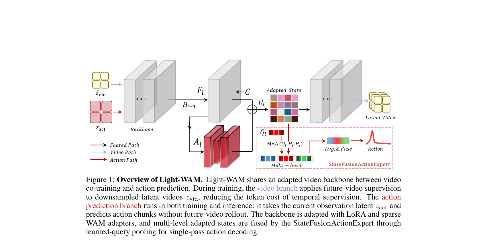
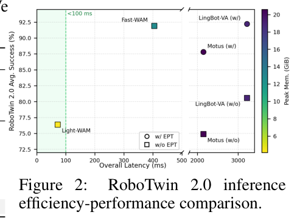
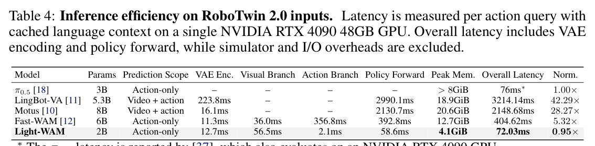
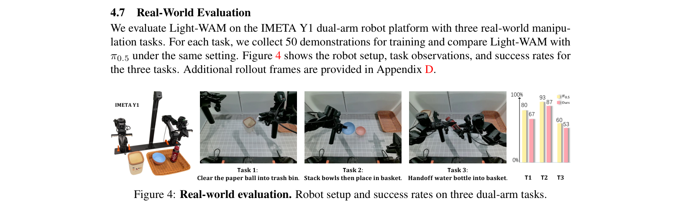
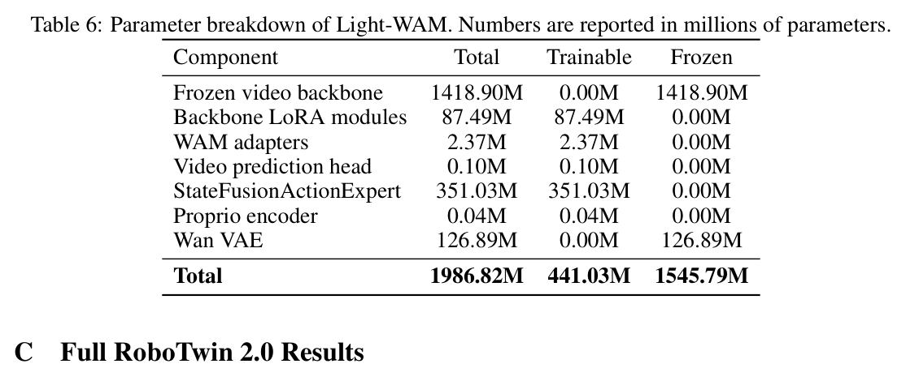
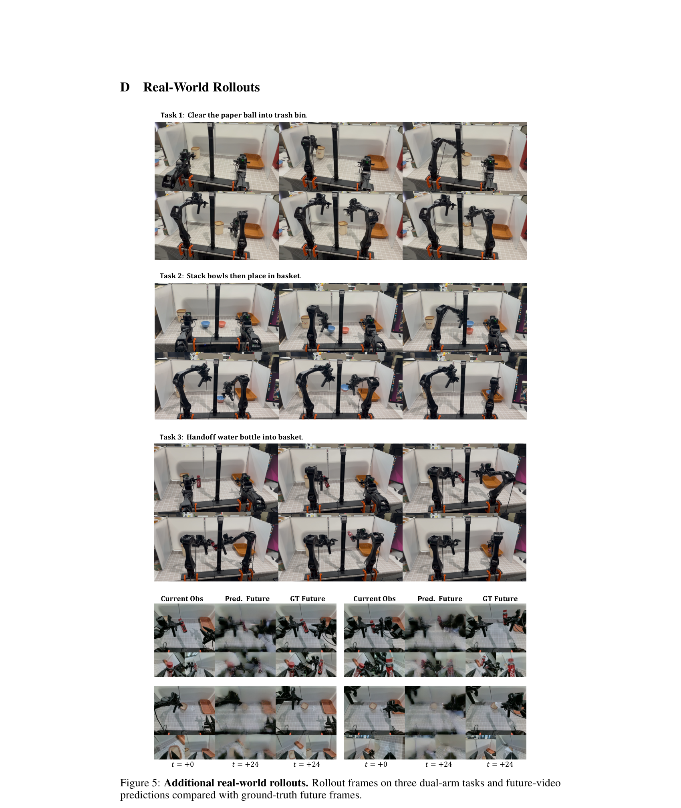

---
tags:
  - papers/WorldModel
  - robotics
  - efficient-wam
aliases:
  - Light-WAM
  - 轻量世界动作模型
date: 2026-06-06
arxiv_id: 2606.08242
---

# Light-WAM: Efficient World Action Models with State-Fusion Action Decoding

## 核心信息

- 标题: Light-WAM: Efficient World Action Models with State-Fusion Action Decoding
- 标题翻译: Light-WAM：使用状态融合动作解码的高效世界动作模型
- 作者: Ziang Li, Dongzhou Cheng, Yibin Wang, Shiyue Wang, Xiaoyang Xu, Lingxuan Weng, Juan Wang, Jiaqi Wang
- 机构: Wuhan University；Shanghai Innovation Institute；Southeast University；Fudan University；East China Normal University
- 发表时间: 2026-06-06
- 发表渠道: arXiv 预印本
- arXiv: 2606.08242v1
- 论文链接: https://arxiv.org/abs/2606.08242
- 代码 / 项目: https://github.com/L1ziang/Light-WAM
- 数据 / 资源: LIBERO；RoboTwin 2.0；IMETA Y1 双臂真机数据
- 论文类型: 高效世界动作模型 / 机器人控制方法论文

## 原文摘要翻译

世界动作模型通过把未来预测加入机器人策略训练，促使策略表征编码与任务有关的时间结构。现有 WAM 往往依赖大型生成架构，训练成本和推理延迟较高，难以作为高效闭环策略部署。本文提出轻量级世界动作模型 Light-WAM。它使用紧凑的视频骨干，并在空间下采样后的潜空间中施加未来视频监督，从而降低视频协同训练成本，同时保留表征学习收益。

动作预测模块 StateFusionActionExpert 从多个骨干层读取适配后状态，通过可学习查询池化进行融合，并在一次前向中直接预测动作块，避免使用重型生成式动作专家。Light-WAM 在 LIBERO 上保持较强性能，在 RoboTwin 2.0 上获得可用的多任务表现，同时仅使用 0.44B 可训练参数。其推理延迟为 72.03 ms，峰值显存为 4.1 GiB，训练吞吐也得到提高。

## 创新点

1. **把 WAM 明确拆成训练监督和在线策略两条路径。** 未来视频只在训练时塑造共享骨干；推理只看当前观测，不生成未来帧。
2. **用 StateFusionActionExpert 替换生成式动作专家。** 它从第 8、16、24 层读取状态，以少量查询向量压缩密集视频标记，再一次性回归整个动作块。
3. **从完整流水线而非单一模型尺寸优化效率。** 论文同时使用冻结小骨干、LoRA、稀疏 adapter、潜变量缓存、视频潜空间下采样和直接动作头。
4. **把性能损失作为效率结论的一部分。** Light-WAM 没有在 RoboTwin 和真机上击败强基线，论文的贡献是效率—性能折中，而非绝对成功率领先。

## 一句话总结

Light-WAM 证明 WAM 可以不做在线未来想象、也不使用生成式动作头：训练时用低分辨率未来视频约束共享骨干，推理时从当前观测的多层隐藏状态直接回归动作块；代价是复杂多任务性能明显低于重型 WAM。

## 研究问题

WAM 的基本吸引力在于：动作监督只告诉模型“应该输出什么动作”，未来视频监督还会告诉模型“场景接下来怎样变化”。后者能迫使表征编码物体运动、交互动力学和任务进度。

问题在于，许多 WAM 把视频生成与动作生成都做成大型扩散或流模型。这样虽然表达能力强，却同时增加训练显存、训练时长和闭环推理延迟。Fast-WAM 已经表明测试时不必真的生成未来视频；Light-WAM 再向前一步，追问能否连动作专家也从生成模型改为直接解码器。

它所选择的答案是：

- 视频生成保留为训练期辅助目标；
- 视频骨干尽量冻结，只做低秩和稀疏适配；
- 视频监督降低空间分辨率；
- 动作从多层当前观测特征一次性回归。


*Fig. 1：Light-WAM 总体结构。左侧是训练期低分辨率未来视频监督，右侧是训练和推理都使用的当前观测动作路径；二者共享适配后的视频骨干。*

## 数据与任务定义

### LIBERO

使用空间、物体、目标、长时程四个官方套件。论文按套件选择不同检查点：空间和目标为 60K 步，物体为 12.5K 步，长时程为 80K 步。

LIBERO 已接近饱和，因此 97.2 与 97.0 这类小差异不应被过度解释。

### RoboTwin 2.0

一个策略同时学习 50 项双臂任务，训练数据包括 2,500 条干净示范和 25,000 条随机化示范。模型分别在干净和随机化设置下评估。默认动作块为 $24\times14$，即一次输出 24 步、每步 14 维动作。

### 真机

平台为 IMETA Y1 双臂机器人，包含三项任务：把纸团清入垃圾桶、叠碗后放入篮子、水瓶交接后放入篮子。每项任务收集 50 条训练示范，与 $\pi_{0.5}$ 在相同设置下比较。正文没有说明测试 rollout 次数，因此无法给成功率计算置信区间。

### 训练和硬件

Light-WAM 使用 4 张 H100 训练。LIBERO 全局批量为 64，RoboTwin 为 128。

推理延迟在单张 RTX 4090 48GB 上测量；测试缓存语言上下文，但包含在线 VAE 编码和策略前向，不包含仿真器与 I/O。

## 方法主线

### 机制流程

1. **输入与骨干适配。** 当前图像或视频经 Wan VAE 编码；语言标记与本体状态组成上下文；冻结骨干通过 LoRA 和第 8、16、24 层的 WAM 适配器调整表征。
2. **双训练路径。** 未来视频潜变量做 $2\times$ 空间下采样并学习 flow matching；动作分支使用原分辨率当前观测，只运行一次骨干前向并收集三层状态。
3. **查询池化与状态融合。** 每层 16 个可学习查询向量对密集视频标记做注意力；三层池化状态随后投影、拼接、融合。
4. **直接动作解码与执行。** 动作步位置嵌入与融合状态相加，输出头一次性回归整个动作块；推理时不运行未来视频支路。

### 冻结视频骨干怎样适配机器人

输入潜变量首先经 patch 嵌入转成初始状态：

$$
H_0\in\mathbb R^{B\times N\times d}.
$$

第 $\ell$ 层先运行原始骨干块：

$$
U_\ell=F_\ell(H_{\ell-1},C).
$$

若 $\ell\in\{8,16,24\}$，再加入瓶颈 adapter 的残差：

$$
H_\ell=U_\ell+A_\ell(U_\ell).
$$

LoRA 覆盖自注意力、交叉注意力和前馈投影，提供全骨干范围的低秩适配；WAM adapter 只在三个稀疏深度提供机器人领域容量。adapter 瓶颈宽度为 256，残差缩放为 $\gamma=1$。

这种设计不是完全冻结特征提取器：LoRA 仍有 87.49M 可训练参数，动作梯度可以通过 LoRA 和 adapter 改变骨干表征。更准确的说法是“冻结原始权重、训练旁路适配参数”。

### 低成本未来视频监督

令 $z_{\mathrm{vid}}$ 表示完整视频潜变量，$D(\cdot)$ 表示 $2\times$ 空间下采样：

$$
\bar z_{\mathrm{vid}}=D(z_{\mathrm{vid}}).
$$

视频分支对加噪状态 $\bar z_t$ 学习 flow matching：

$$
\mathcal L_{\mathrm{video}}
=\left\|G_\theta^{\mathrm{vid}}(\bar z_t,t,C)-u_t\right\|_2^2.
$$

动作分支则不使用下采样未来视频，而只取原分辨率当前帧：

$$
z_{\mathrm{act}}=z_{\mathrm{vid}}^{(0)}.
$$

这项分离很关键：**视频目标可以牺牲空间细节换训练吞吐，动作路径仍保留当前观测细节。** 未来预测的目的不是成为漂亮视频，而是给共享骨干增加时间监督。

### StateFusionActionExpert

对每个选中层 $H_\ell$，模型学习 $N_q=16$ 个查询向量：

$$
P_\ell=\mathrm{MHA}(Q_\ell,H_\ell,H_\ell),
$$

$$
s_\ell=\mathrm{LN}\left(\frac{1}{N_q}\sum_{j=1}^{N_q}P_{\ell,j}\right).
$$

查询向量把数量很大的时空标记压缩成每层一个固定宽度状态。三个状态分别投影为 4608 维，再拼接并投影到 6144 维融合状态：

$$
h=\phi_{\mathrm{trunk}}\left(\phi_{\mathrm{fuse}}([M_\ell(s_\ell)]_{\ell\in\mathcal I})\right).
$$

随后给第 $k$ 个动作位置加入步嵌入：

$$
r_k=h+\psi(e_k),\qquad
\hat a_k=\phi_{\mathrm{out}}(\mathrm{LN}(r_k)).
$$

这里没有动作噪声、扩散时间步或迭代求解器。整个动作块是条件回归结果，这正是动作分支只有 2.1 ms 的根本原因。

总损失为：

$$
\mathcal L=\mathcal L_{\mathrm{video}}+\lambda\mathcal L_{\mathrm{action}}.
$$

### 训练和推理差异

RoboTwin 训练从三路相机组成画布，对 $I_{0:32}$ 以步长 4 抽帧，得到 9 帧视频。视频路径使用未来帧和 flow loss；动作路径只使用首帧原分辨率潜变量。

推理时输入当前多相机观测、128 个语言标记和本体状态，只执行一次适配骨干前向，读取第 8、16、24 层并直接输出动作块。视频输出头、未来帧和流求解器都不参与在线控制。

## 关键结果

### 主结果与强基线


*Table 1：LIBERO 四套件结果。Light-WAM 平均 97.2%，在无具身预训练方法中排名第一，但总体低于 LingBot-VA 和 Motus。*

| Benchmark | Light-WAM | 关键基线 | 应怎样解释 |
|---|---:|---:|---|
| LIBERO Avg. | 97.2 | Fast-WAM 97.0；Motus 97.7；LingBot-VA 98.5 | 接近饱和，Light-WAM 以更小训练预算保持竞争力 |
| LIBERO Long | 93.0 | Fast-WAM 94.8；Motus 97.6；LingBot-VA 98.5 | 长时程仍明显受容量影响 |
| RoboTwin 平均 | 76.4 | 无具身预训练 Motus 74.9；$\pi_{0.5}$ 79.8；Fast-WAM 91.9 | 可用但不领先，效率换取 15.5 点性能差距 |


*Table 2：RoboTwin 2.0 的 50 项任务平均结果；该图是从第 6 页重新独立裁剪，已去除相邻 Figure 2。*


*Fig. 2：RoboTwin 平均成功率、总体延迟和峰值显存之间的权衡。Light-WAM 位于低延迟低显存区域，但纵轴性能低于 Fast-WAM。*

### 训练效率来自哪里


*Table 3：训练效率逐组件分解。小骨干本身并未加速，StateFusion、潜变量缓存和视频下采样依次带来收益。*

| 变体 | Steps/s | 相对 Fast-WAM | 解释 |
|---|---:|---:|---|
| Fast-WAM | 0.49 | 1.00× | 6.02B 可训练参数、70.7 GiB/卡 |
| 小骨干 + DiT 动作头 | 0.43 | 0.88× | Wan2.1 VAE latent 更密，只有小骨干仍然不快 |
| + StateFusion | 0.56 | 1.14× | 删除重型生成动作头 |
| + latent cache | 0.86 | 1.76× | 训练循环不再在线运行 VAE |
| + $2\times$ 视频下采样 | 2.08 | 4.25× | 未来视频标记成本大幅下降 |

所以论文最扎实的工程结论是：**WAM 效率是流水线属性，不是参数量属性。** 单独把 5B 骨干换成 1.3B 骨干，训练反而可能更慢；必须同时处理 VAE 潜变量密度、动作头和视频标记数量。

### 推理效率


*Table 4：单张 RTX 4090 上的推理延迟分解；Light-WAM 的动作分支只有 2.1 ms。*

| 方法 | Overall latency | Peak memory | 关键瓶颈 |
|---|---:|---:|---|
| LingBot-VA | 3214.14 ms | 18.9 GiB | 联合视频—动作生成 |
| Motus | 2148.68 ms | 20.6 GiB | 大型生成式动作/视频路径 |
| Fast-WAM | 404.62 ms | 12.7 GiB | 动作分支 356.8 ms |
| Light-WAM | 72.03 ms | 4.1 GiB | 视觉分支 56.5 ms；动作仅 2.1 ms |

72.03 ms 对应理论约 13.9 次查询/秒，但不能直接等同于 13.9 Hz 完整机器人控制频率，因为表中排除了相机、I/O、动作执行和同步开销。

### 消融到底说明了什么


*Table 5：LIBERO-Spatial 消融。全分辨率视频监督略强；增加适配器无益；减少查询向量明显伤害性能。*

- 不下采样：99.0，对默认 98.2，说明更清晰的视频目标确实有额外收益，但只多 0.8 点。
- 五个 adapter：98.0，对三个 adapter 的 98.2，说明稀疏层选择已经足够，更多层不会自动更强。
- 每层 8 个查询向量：95.4，比 16 个查询向量低 2.8 点，说明查询瓶颈不能压得过窄。

这个消融支持“StateFusion 需要足够信息容量”，却没有证明三层融合本身优于 final-layer only，也没有与简单平均池化、最大池化或等参数 Perceiver 进行比较。

### 定性机制证据


*Fig. 3：上方是含下采样的视频未来预测，下方是第 8、16、24 层查询注意力图。不同层关注物体、夹爪和目标区域。*

未来视频明显比真实帧平滑甚至模糊，但主要物体运动和场景变化仍被保留。这恰好符合论文定位：视频分支只需提供时间监督，不必生产可供在线规划的高保真未来。

不同层的查询向量会关注互补区域，但注意力热图只能说明模型“看了哪里”，不能证明这些区域因果地决定动作。若要把机制证据做扎实，需要遮蔽干预或逐层删除实验。

### 真机结果


*Fig. 4：IMETA Y1 三项双臂任务。Light-WAM 为 67/87/53，$\pi_{0.5}$ 为 80/93/60。*

Light-WAM 三项任务都能达到过半成功率，说明 72 ms 路径具有实际可执行性。但三项结果全部低于 $\pi_{0.5}$，所以不能写成“真机优于 VLA”。更准确的表述是：**在每任务 50 条示范下，轻量 WAM 能获得可用的双臂控制，却尚未弥合与强 VLA 的性能差距。**

## 深度分析

### 真正贡献是什么

真正贡献不是 Wan2.1、LoRA、潜变量缓存或查询池化中的任何单个组件；这些都已有成熟先例。论文的增量是把它们组合成一条清晰的 WAM 效率路线：

```text
训练期：低分辨率未来视频 → 时间监督 → 适配共享骨干

推理期：当前观测 → 多层状态 → 查询压缩 → 一次性动作块
```

它把 WAM 中最昂贵的两个“生成”都弱化了：未来视频从在线生成改为训练辅助；动作从扩散/流生成改为直接回归。Light-WAM 因而更像“带视频辅助目标的时序视觉策略”，而不是传统意义上在线展开世界未来的模型。

### 为什么结果成立

**第一，未来视频监督和动作分辨率被解耦。** 下采样只作用于辅助目标，当前观测仍保留原始 latent 分辨率，因此训练成本降低时不会直接模糊策略输入。

**第二，多层状态补偿了最终层信息损失。** 第 8、16、24 层可能分别保留局部视觉结构、中层交互和高层任务信息；query pooling 把它们变成固定宽度接口。

**第三，直接回归特别适合动作块。** 当数据中的动作分布相对单峰、任务条件明确时，单次回归比迭代生成便宜很多。但在 RoboTwin 的复杂、多模态双臂任务中，它也可能平均掉多种有效动作模式，这可能是与 Fast-WAM 相差 15.5 点的原因之一。论文没有直接验证这一解释。

### 参数量该怎样读


*Table 6：Light-WAM 参数组成。总参数 1,986.82M，可训练参数 441.03M，冻结参数 1,545.79M。*

“只有 0.44B 参数”容易误读。准确情况是：

- 部署和前向需要约 1.99B 总参数；
- 其中 1.55B 冻结，0.44B 参与优化；
- StateFusionActionExpert 单独有 351.03M，占可训练参数约 80%；
- LoRA 有 87.49M；真正的 WAM adapter 只有 2.37M。

因此 Light-WAM 是**训练参数轻量、推理显存较低**，不是一个 0.44B 总规模模型；StateFusion 也不是微型 head，而是一个 351M 的直接动作解码器。

### 与 DreamZero、Fast-WAM、DiT4DiT 的关系

| 方法 | 视频信息怎样进入动作 | 在线视频生成 | 动作生成方式 |
|---|---|---|---|
| DreamZero | 视频与动作在统一自回归扩散模型中联合建模 | 原始形式联合去噪；Flash 单步化 | 生成式动作 |
| Fast-WAM | 训练过的视频 DiT 在推理时做一次 world encoding | 不需要 | 生成式动作专家仍较重 |
| DiT4DiT | 在指定层和噪声时间截取视频 DiT 中间特征 | 不需要 | 独立 action DiT 迭代生成 |
| Light-WAM | 训练期视频目标塑造共享骨干，在线池化当前观测多层状态 | 不需要 | 单次直接回归动作块 |

Light-WAM 是这条演化路线中最激进的“去生成化”版本：不仅去掉测试时视频想象，也去掉动作扩散。它因此最快，但在困难多任务上损失也最大。

### 容易误读的地方

1. **0.44B 不是总参数。** 总参数约 1.99B。
2. **72.03 ms 不是完整机器人闭环周期。** 仿真器、相机和 I/O 均未计入。
3. **4.25× 不是小骨干单独带来的。** 小骨干配 DiT 动作头反而只有 0.88×。
4. **视频预测并不参与推理。** 它是训练期辅助目标。
5. **Light-WAM 没有在 RoboTwin 或真机超过最强基线。** 它优化的是 Pareto 前沿。
6. **未来视频目标的独立收益没有被严格证明。** 论文缺少保持结构不变、只删除 $\mathcal L_{\mathrm{video}}$ 的 action-only 对照。

### 复现注意点

- Wan2.1-T2V-1.3B 原始权重冻结，但全部骨干块都有 LoRA。
- WAM adapter 位于第 8、16、24 层，瓶颈宽度 256，scale 为 1。
- 每层 16 个查询向量、8 个注意力头；三层特征各投影到 4608 维，融合状态 6144 维。
- RoboTwin 三相机先拼 canvas，再对 $I_{0:32}$ 按 stride 4 抽成 9 帧。
- 训练使用缓存的 Wan VAE latent；评估必须在线执行 VAE，不能只报告缓存后延迟。
- 视频支路做 $2\times$ 空间下采样，动作支路的当前观测不做该额外下采样。
- 优化器为 AdamW，学习率 $10^{-4}$，权重衰减 $10^{-2}$，warmup 1,000 step，余弦调度。
- RoboTwin checkpoint 为 460K step；LIBERO 不同 suite 选择不同训练步数。
- 延迟比较要固定语言缓存、输入相机数量、精度、同步方式与是否计入 VAE。


*Table 7：RoboTwin 2.0 全部 50 项任务结果。Light-WAM 在部分短任务接近满分，但在挂杯、移动订书机、堆叠三块积木、拨动开关等任务上与 Fast-WAM 差距很大。*


*Fig. 5：三项真机完整 rollout 与未来视频预测。预测较模糊，但仍保留机械臂和物体的粗略运动；这些预测只用于训练监督。*

## 局限

- 缺少结构一致的 action-only 消融，无法量化未来视频协同训练本身的净贡献。
- RoboTwin 平均成功率比 Fast-WAM 低 15.5 点，说明直接动作回归与小容量在复杂多任务中存在明显上限。
- 三项真机结果全部低于 $\pi_{0.5}$，且未报告测试次数和置信区间。
- LIBERO 接近饱和，不同 suite 使用不同 checkpoint，也没有报告跨 seed 方差。
- 消融只在 LIBERO-Spatial 上进行，不能保证查询数量、适配器层和下采样选择可迁移到 RoboTwin 或真机。
- 未评估 LIBERO-Plus、遮挡、相机位姿变化和物理参数变化等鲁棒性设置。
- 论文没有把直接回归动作与等容量生成式动作头做受控比较，性能损失来源仍不明确。

## 我的笔记

这篇值得保留的核心思想是：**WAM 不一定是一个在线生成未来的模型，它也可以是一种训练策略——用未来视频目标塑造表征，然后把生成路径彻底裁掉。**

对后续研究最有价值的不是继续把模型做小，而是补上三组关键实验：

1. 保持 Light-WAM 全部结构不变，只删除视频损失，测量时间监督的真实净收益。

2. 在相同 351M 参数下比较直接回归、流式动作头和扩散动作头，定位 RoboTwin 的 15.5 点差距来自哪里。

3. 画出视频下采样比例、查询数量、动作头宽度的三维 Pareto 曲线，而不是只给单点配置。

如果这三组实验成立，Light-WAM 会从一篇强工程论文进一步变成一个更普适的设计原则：训练期生成监督与推理期控制接口可以完全异构，只要共享表征确实吸收了动力学信息。

## 引用

Li, Z., Cheng, D., Wang, Y., Wang, S., Xu, X., Weng, L., Wang, J., & Wang, J. (2026). *Light-WAM: Efficient World Action Models with State-Fusion Action Decoding*. arXiv:2606.08242v1.
