# Long-WAM: Scaling the Context of World-Action Models
## 扩展世界-动作模型的上下文长度

---

### Page & Section Index | 章节与页面导引

- **Frontmatter & Metadata** | 论文元数据与核心信息
- **Terminology Ledger** | 核心术语与符号对照表
- **Title & Authors** | 标题、作者及单位 (p. 1)
- **Abstract** | 摘要 (p. 1)
  - [Figure 1: Long-WAM Overview](#figure-1-long-wam-框架概览) (p. 1)
- **1. Introduction** | 引言 (pp. 1–2)
- **2. Related Work** | 相关工作 (pp. 2–3)
  - [Figure 2: Attention Patterns and Video-Action Inference](#figure-2-注意力模式与视频动作推理策略) (p. 3)
- **3. Scaling the Context of WAMs from AR Video Generation** | 基于自回归视频生成的 WAM 上下文扩展 (pp. 3–4)
  - 3.1 LongLive2.0-Robot: Robot-Domain AR Video Pretraining | 机器人领域自回归视频预训练 (pp. 3–4)
  - 3.2 Causal-to-Causal World-Action Adaptation | 因果到因果的世界-动作适配 (p. 4)
  - 3.3 Context Scaling of World-Action Models | 世界-动作模型的上下文扩展 (p. 4)
- **4. Long-WAM Infrastructure: Real-Time Edge Deployment** | Long-WAM 基础设施：实时边缘端部署 (pp. 4–6)
  - [Figure 3: Asynchronous Model-Robot Execution with Streaming VAE](#figure-3-基于流式-vae-的异步模型-机器人执行调度) (p. 5)
  - 4.1 Asynchronous Execution | 纯异步执行与流式 VAE (pp. 5–6)
  - [Figure 4: Optimizations for Efficient Edge Deployment](#figure-4-边缘端高效部署的系统优化概览) (p. 6)
  - 4.2 Efficient Edge Deployment | 高效边缘端部署优化 (p. 6)
- **5. Experiments** | 实验评估 (pp. 6–8)
  - [Figure 5: Simulation Environments and Real-World Tasks](#figure-5-仿真评测环境与真机操作任务) (p. 7)
  - 5.1 Implementation Details | 实现细节 (p. 7)
  - 5.2 Results on Simulation Benchmarks | 仿真基准评测结果 (pp. 7–8)
    - [Table 1: LIBERO Success Rate](#table-1-libero-基准测试任务成功率) (p. 7)
    - [Table 2: RoboTwin 2.0 Success Rate](#table-2-robotwin-20-双臂基准测试成功率) (p. 7)
    - [Table 3: DOMINO Dynamic Manipulation](#table-3-domino-动态物体操作评测) (p. 8)
    - [Table 4: RoboCasa GR-1 Results](#table-4-robocasa-gr-1-多阶段任务成功率) (p. 8)
    - [Figure 6: Context Scaling Across Initializations](#figure-6-三种不同视频初始化下的上下文扩展规律) (p. 8)
  - 5.3 Ablation Studies | 消融实验分析 (pp. 8–9)
- **6. Atomic Execution and Compositional Planning** | 原子技能执行与复合分层规划 (pp. 9–11)
  - [Table 5: RoboCasa365 Hierarchical Evaluation](#table-5-robocasa365-分层规划与技能组合评测) (p. 9)
  - 6.1 Real-World Deployment | 真机部署评测 (pp. 10–11)
    - [Figure 7: Dynamic Manipulation on Unitree G1](#figure-7-宇树-g1-人形机器人上的动态流水线操作) (p. 10)
    - [Figure 8: Long-Horizon Execution on YAM](#figure-8-yam-双臂机器人上的长视界持续操作) (p. 10)
  - 6.2 Efficiency | 推理延迟与系统效率分析 (pp. 11–12)
    - [Table 6: RTX 5090 Latency and Success Rate](#table-6-rtx-5090-端到端推理延迟与-robotwin-20-成功率) (p. 11)
    - [Table 7: RoboTwin 2.0 Async vs Sync](#table-7-robotwin-20-同步与纯异步执行评测对比) (p. 11)
    - [Table 8: Cumulative Acceleration Across Devices](#table-8-不同计算设备上的累积优化端到端推理延迟) (p. 11)
- **References** | 参考文献 [1]–[59] (pp. 12–16)
- **Appendices** | 补充材料与详细附录 (pp. 17–28)
  - Appendix A: Discussion and Conclusion | 深入讨论与总结 (p. 17)
  - Appendix B: Data and Model Training Details | 数据与模型训练细节 (pp. 17–18)
    - [Table 9: Pretraining Data Composition](#table-9-预训练数据集构成统计) (p. 17)
  - Appendix C: LongLive2.0-Robot Video Predictions | 视频预测定性展示 (pp. 18–19)
    - [Figure 9: Task-Conditioned Video Prediction](#figure-9-longlive20-robot-任务条件视频预测可视化) (p. 19)
  - Appendix D: Baseline Details | 基线模型实现细节 (pp. 18–19)
  - Appendix E: Discussion of Asynchronous Overlap Length | 异步重叠步长深度讨论 (pp. 19–20)
    - [Table 10: Effect of Asynchronous Overlap Length](#table-10-异步执行重叠步长的影响消融) (p. 20)
  - Appendix F: IDM versus Co-Denoising: Capability and Latency | 逆动力学建模与联合去噪深入对比 (pp. 20–21)
    - [Table 11: Optimized IDM and CoD Inference on RTX 5090](#table-11-rtx-5090-上优化后的-idm-与-cod-推理对比) (p. 21)
  - Appendix G: Context-Dependent Inference Latency | 上下文长度对推理延迟的影响 (p. 21)
    - [Table 12: Context-Dependent Latency on RTX 5090](#table-12-rtx-5090-上随上下文长度变化的端到端延迟) (p. 21)
  - Appendix H: Additional Real-World Deployment Visualizations | 更多真机部署可视化序列 (pp. 21–28)
    - [Figure 10: Dynamic Cup Stacking with $\pi_{0.5}$](#figure-10-动态叠杯任务rollout-pi05) (p. 22)
    - [Figure 11: Dynamic Cup Stacking with Fast-WAM](#figure-11-动态叠杯任务rollout-fast-wam) (p. 23)
    - [Figure 12: Dynamic Cup Stacking with Long-WAM](#figure-12-动态叠杯任务rollout-long-wam-ours) (p. 24)
    - [Figure 13: Moving-Object Grasping with $\pi_{0.5}$](#figure-13-传送带动态抓取rollout-pi05) (p. 25)
    - [Figure 14: Moving-Object Grasping with Fast-WAM](#figure-14-传送带动态抓取rollout-fast-wam) (p. 26)
    - [Figure 15: Moving-Object Grasping with Long-WAM](#figure-15-传送带动态抓取rollout-long-wam-ours) (p. 27)
    - [Figure 16: Long-Horizon Manipulation with Long-WAM on YAM](#figure-16-yam-双臂平台长视界操作序列可视化) (p. 28)

---

### Terminology Ledger | 核心术语与符号对照表

| 英文专业术语 | 规范中文翻译 | 概念定义与工程实现说明 |
| :--- | :--- | :--- |
| **World-Action Model (WAM)** | 世界-动作模型 | 将物理世界动态视频预测与底层机器人可执行动作联合建模的基础策略模型。 |
| **Autoregressive (AR)** | 自回归 | 沿时间因果轴由历史向未来单向预测的生成建模范式。 |
| **Bidirectional** | 双向（非因果） | 在时间序列全域同时进行双向自注意力与去噪扩散的生成架构。 |
| **Causal Coupling** | 因果耦合 | 视频分支仅能观测自身与过去视界，动作分支单向条件化于观察历史与未来潜变量预测的非对称交互设计。 |
| **Inverse Dynamics Modeling (IDM)** | 逆动力学建模 | 先独立预测未来交互潜变量，再基于历史状态与未来预测条件化生成动作序列的“先想象再动作”推理模式。 |
| **Co-Denoising (CoD)** | 协同去噪 / 联合去噪 | 未来视频潜变量与动作轨迹在每个去噪步内同步双向交互并共同进化的联合去噪模式。 |
| **Teacher-Forcing AR Pretraining** | 教师引导并行自回归预训练 | 在训练期利用真实前缀块因果自注意力并行监督所有未来块的自回归训练技术。 |
| **Error Recycling** | 误差复用 / 误差循环 | 在预训练中将历史推理缓存中的扰动误差加入输入，提升长序自回归自修正能力的机制。 |
| **Streaming VAE** | 流式变分自编码器 | 随着控制步推移按帧组增量编码图像观测，避免在推理触发点发生全窗口重复编码阻塞的流式视觉架构。 |
| **Pure Asynchronous Execution** | 纯异步执行 | 模型推理计算与机器人底层运动执行在时间线上完全重叠进行，无需额外的测试期轨迹引导或去噪平滑混合。 |
| **Trigger Stride ($S$)** | 触发步长 | 连续两次模型推理请求之间经过的底层控制步数。 |
| **Execution Horizon ($R$)** | 可执行视界 | 每次预测出的动作块中允许下发给机器人执行的最大步数。 |
| **Overlap ($O = R - S$)** | 重叠区间 | 两次相邻动作块在时间轴上重叠交叠的控制步数。 |
| **Handoff** | 动作交接 / 移交 | 机器人在执行当前动作块到达 $S$ 步时，无缝切换执行最新预测动作块对齐后残余后缀的切换过程。 |
| **Jerk** | 跃度 / 加加速度 | 机器人关节轨迹三阶导数的离散差分代理，用于评估动作块交接处的运动平滑程度。 |
| **NVFP4 Quantization** | NVFP4 量化 | NVIDIA Blackwell 架构原生支持的 4-bit 浮点权重与激活张量量化格式 (W4A4)。 |
| **CUDA Graph Replay** | CUDA Graph 重放 | 预先捕获 GPU 算子调用拓扑图，消除大量小 kernel 启动 CPU 开销的低延迟推理技术。 |
| **Online Softmax** | 在线 Softmax | 在无需将视频和动作 KV 显存张量做实体拼接的前提下，利用在线缩放因子融合跨模态注意力的算法。 |
| **Shared Input Quantization** | 共享输入量化 | 对 $Q/K/V$ 投影共享的输入张量仅做一次动态量化，复用量化结果与缩放比例至后续矩阵乘法。 |
| **Denoising-Invariant Reuse** | 去噪不变量复用 | 在多步去噪循环中，固定不变的文本条件、观测视频与静态旋转位置编码 KV 缓存仅计算一次并全程复用。 |

---

## Title & Authors | 论文标题与作者信息

> <strong>Para. 1:</strong> **Long-WAM: Scaling the Context of World-Action Models**  
> Wei Huang$^{1,3,*}$, Bohan Zhang$^{2,*}$, Chenzhi Liu$^3$, Isabella Liu$^{1,4}$, Shuai Yang$^1$, Weian Mao$^1$, Luozhou Wang$^1$, Yicheng Xiao$^3$, Weifeng Lin$^1$, Qixin Hu, Bryan Chu$^1$, Sifei Liu$^1$, Linxi "Jim" Fan$^1$, Xiaojuan Qi$^3$, Song Han$^{1,2}$, Yukang Chen$^1$  
> $^1$NVIDIA, $^2$MIT, $^3$HKU, $^4$UCSD  
> $^*$Equal contribution.  
> Project Page: https://long-wam.github.io  
> Code: https://github.com/NVlabs/Long-WAM  
> arXiv:2610.10528v1 [cs.RO] 7 Oct 2026

> <strong>Para. 1[CN]:</strong> **Long-WAM：扩展世界-动作模型的上下文长度**  
> 黄威$^{1,3,*}$，张博涵$^{2,*}$，刘晨智$^3$，刘伊莎贝拉$^{1,4}$，杨帅$^1$，毛伟岸$^1$，王泺洲$^1$，肖亦成$^3$，林伟丰$^1$，胡其鑫，Bryan Chu$^1$，刘思飞$^1$，范麟熙（Jim Fan）$^1$，齐晓娟$^3$，韩松$^{1,2}$，陈雨康$^1$  
> $^1$英伟达（NVIDIA），$^2$麻省理工学院（MIT），$^3$香港大学（HKU），$^4$加州大学圣地亚哥分校（UCSD）  
> $^*$同等贡献。  
> 项目主页：https://long-wam.github.io  
> 代码开源：https://github.com/NVlabs/Long-WAM  
> arXiv:2610.10528v1 [cs.RO] 2026年10月7日

---

## Abstract | 摘要

> <strong>Para. 1:</strong> Real-time robot control demands enough visual history to infer motion and task progress, but processing that history can delay action. We present Long-WAM, a model–system framework for scaling the context of causal world-action models under real-time control constraints. Our central finding is that access to history is not the same as using it: longer histories pay off far more when the video foundation is pretrained autoregressively (AR). We first learn causal prediction from robot and egocentric videos without action labels, then preserve this history-to-future structure during world-action adaptation. On RoboCasa GR-1, increasing context from 0.0 to 19.2 seconds raises success from 63.3% to 78.7%, whereas a bidirectionally pretrained initialization shows no net gain; robot-domain AR pretraining further raises peak success on GR-1 and LIBERO-Long. Long-WAM also achieves the best results among compared methods on LIBERO-Long, RoboTwin 2.0, and DOMINO. Streaming observation encoding, asynchronous execution, and hardware-specific acceleration enable deployment on RTX 5090, DGX Spark, and Jetson AGX Thor without dropping future prediction; on RTX 5090, each action chunk, including future-video latent prediction, takes 107.4 ms. Real-time deployment on Unitree G1 and YAM supports dynamic and long-horizon manipulation, including 95% success on dynamic cup stacking, where $\pi_{0.5}$ and Fast-WAM succeed in none of 20 trials. As a memory-informed executor, Long-WAM also complements higher-level planning in composite tasks.

> <strong>Para. 1[CN]:</strong> 实时机器人控制需要足够的视觉历史信息来推断物体运动状态与任务执行进度，但处理过长的历史数据往往会造成动作决策延迟。我们提出了 Long-WAM，一个旨在实时控制约束下扩展因果世界-动作模型（World-Action Models, WAMs）上下文长度的模型—系统协同设计框架。我们的核心发现是：单纯拥有历史数据的访问权并不等同于能够有效利用它——当视频基础底座采用自回归（Autoregressive, AR）范式预训练时，长历史信息带来的收益要显著得多。我们首先从未标注动作标签的机器人与第一人称视频中学习因果动力学预测，随后在世界-动作适配过程中严格保留这种“由历史推演未来”的因果时序结构。在 RoboCasa GR-1 基准上，将上下文长度从 0.0 秒扩展至 19.2 秒使任务成功率从 63.3% 大幅提升至 78.7%，而基于双向预训练初始化的模型则完全没有展现出净收益；引入机器人领域的自回归预训练进一步刷新了 GR-1 和 LIBERO-Long 上的峰值成功率。Long-WAM 在 LIBERO-Long、RoboTwin 2.0 和 DOMINO 基准上也取得了对比方法中的最优表现。借助流式观测编码、异步执行以及针对特定硬件的底层加速，Long-WAM 能够在完全保留未来预测分支的前提下部署于 RTX 5090、DGX Spark 和 Jetson AGX Thor；在 RTX 5090 上，包含未来视频潜变量预测在内的每个动作块生成仅耗时 107.4 毫秒。在宇树（Unitree）G1 人形机器人和 YAM 双臂系统上的实时物理部署验证了对动态及长视界操作的卓越支持，包括在动态叠杯任务中取得 95% 的成功率，而 $\pi_{0.5}$ 和 Fast-WAM 在全部 20 次测试中均告失败（0%）。作为一个具备时序记忆感知的底层执行器，Long-WAM 还能在复杂复合任务中与高层规划器形成优势互补。

### Figure 1. Long-WAM 框架概览

**Caption:** Figure 1 | Overview of Long-WAM. (1) AR video pretraining. LongLive2.0-Robot learns predictive dynamics from approximately 10,000 window-equivalent hours of robot and egocentric videos. (2) Causal-to-causal adaptation. We preserve causal video dependencies while conditioning action-chunk denoising on observed history. (3) Context scaling. Relative to current-observation-only control, success increases from 63.3% to 78.7% on RoboCasa GR-1 and from 94.5% to 99.5% on LIBERO-Long, peaking at 19.2 and 2.4 seconds of history, respectively. (4) Efficient deployment. Asynchronous execution, streaming VAE encoding, decision-time prefill, within-call KV reuse, and hardware-specific acceleration enable real-time control on RTX 5090, DGX Spark, and Jetson AGX Thor.

**Caption[CN]:** 图 1 | Long-WAM 架构与系统全景概览。(1) 自回归视频预训练：LongLive2.0-Robot 从大约 10,000 窗口等效小时的机器人和第一视角视频中学习物理预测动力学。(2) 因果到因果适配：在将动作块去噪条件化于观测历史的同时，严格保留因果视频依赖关系。(3) 上下文扩展：相对于仅使用当前观测的控制，RoboCasa GR-1 上的成功率从 63.3% 跃升至 78.7%，LIBERO-Long 上的成功率从 94.5% 提升至 99.5%，分别在 19.2 秒和 2.4 秒历史长度处达到峰值。(4) 高效端侧部署：异步执行、流式 VAE 编码、决策时预填充、单次推理内 KV 缓存复用以及硬件定制加速，使得系统能够在 RTX 5090、DGX Spark 和 Jetson AGX Thor 上实现闭环实时控制。

---

## 1. Introduction | 引言

> <strong>Para. 1:</strong> Fast robot control requires understanding how the scene is changing. A single image can reveal an object’s position but leave its motion and interaction progress ambiguous. World-action models (WAMs) bring video prediction to closed-loop control [3, 26, 52], making visual history a natural resource for action. Yet processing more history can delay the response it is meant to improve. We therefore ask: how does WAM control scale with visual context, and how can those gains be retained under real-time constraints?

> <strong>Para. 1[CN]:</strong> 快速的机器人控制需要理解场景正在发生何种物理演变。单张图像虽然可以揭示物体的当前空间位置，但往往无法明确其速度、运动趋势以及交互阶段等时序信息。世界-动作模型（World-Action Models, WAMs）将视频预测引入闭环控制 [3, 26, 52]，使视觉历史成为动作决策的天然上下文资源。然而，处理更多历史帧所带来的计算开销往往会拖慢策略响应速度，进而损害其本应提升的控制性能。因此我们提出以下核心问题：世界-动作模型的控制性能如何随视觉上下文长度而缩放？又该如何在严格的实时控制约束下完整保留这种扩展带来的增益？

> <strong>Para. 2:</strong> Recent WAMs retain history through causal caches and persistent or selected memories [42, 44, 47, 50]. Yet access to history is distinct from learning to predict from it. DreamZero [52] and LingBot-VA [26] adapt bidirectionally pretrained video generators to causal video–action prediction, whereas LingBot-VA 2.0 [55] jointly pretrains causal video and learned latent actions. We investigate a complementary route: first learn autoregressive (AR) video prediction, then adapt to actions while preserving its history-to-future structure. Appendix 2 discusses related work.

> <strong>Para. 2[CN]:</strong> 近期的 WAM 系统主要通过因果缓存以及持久化或选择性记忆机制来保留历史上下文 [42, 44, 47, 50]。然而，“能够访问历史数据”与“学会从中推断未来”存在着本质区别。DreamZero [52] 与 LingBot-VA [26] 将双向预训练的视频生成底座适配至因果视频-动作预测，而 LingBot-VA 2.0 [55] 则选择联合预训练因果视频与可学习的潜变量动作。我们探索了一条截然不同的互补路线：首先学习纯自回归（Autoregressive, AR）视频预测，随后在向动作领域适配时完全保留这种由历史推断未来的因果结构。相关工作的详细对比参见第 2 节。

> <strong>Para. 3:</strong> We introduce Long-WAM (Figure 1), a model–system framework for context scaling in real-time robot control. Our central finding is that the value of longer context depends on how the video foundation is pretrained (Figure 6). On GR-1, both AR-pretrained foundations gain from extending context from 0.0 to 19.2 seconds, whereas a bidirectional initialization does not; the robot-domain AR model’s lead over it grows from 3.3 points without history to 17.1 points at 19.2 seconds. AR pretraining already learns the causal temporal factorization that WAM adaptation retains, giving the model a basis for using history rather than merely accessing it. Our LongLive2.0-Robot foundation learns from roughly 10,000 window-equivalent hours of robot and egocentric video; we preserve its causal structure during action adaptation, and robot-domain pretraining further raises peak success on both LIBERO-Long and GR-1.

> <strong>Para. 3[CN]:</strong> 我们提出了 Long-WAM（图 1），这是一个面向实时机器人控制上下文扩展的模型—系统一体化框架。我们的核心结论是：长上下文的实际价值在很大程度上取决于视频基础模型是如何预训练的（图 6）。在 RoboCasa GR-1 基准上，两种采用自回归预训练的基础底座在将上下文从 0.0 秒扩展到 19.2 秒时均获得了显著的性能提升，而双向预训练初始化则几乎没有净收益；机器人领域 AR 模型的相对领先优势从无历史时的 3.3 个百分点大幅扩大到 19.2 秒时的 17.1 个百分点。自回归预训练早已习得 WAM 动作适配所继承的因果时序因子分解结构，从而赋予了模型“利用历史”而非仅仅“读取历史”的根本能力。我们的 LongLive2.0-Robot 底座从约 10,000 窗口等效小时的机器人和第一视角视频中展开学习；我们在动作适配中完整保留了其因果结构，而机器人领域的专注预训练进一步拉高了模型在 LIBERO-Long 和 GR-1 上的最高成功率。

> <strong>Para. 4:</strong> Longer context helps only if the controller still responds in time, so we co-design asynchronous execution and edge acceleration while retaining future prediction. Predictive conditioning from the AR video foundation supports smooth action handoffs without blending or prefix guidance; streaming VAE encodes incoming observations while the robot executes, reducing post-trigger computation; and NVFP4 quantization with device-specific kernel tuning accelerates the video–action pipeline on RTX 5090, DGX Spark, and Jetson AGX Thor. With four denoising steps per expert, the optimized pipeline takes 107.4 ms per action chunk on RTX 5090, including the full observation VAE computation, a 3.3× speedup over BF16 eager execution (Section 4, Table 8).

> <strong>Para. 4[CN]:</strong> 只有当控制器依然能够及时响应时，长上下文才能真正转化为物理控制优势。因此，我们在完整保留未来视频预测的前提下，对异步执行与边缘端计算加速进行了系统协同设计。来自 AR 视频底座的预测条件能够天然支持平滑的动作块交接，无需任何显式的轨迹混合或前缀引导；流式变分自编码器（Streaming VAE）在机器人底层执行的同时增量编码实时到达的观测帧，大幅消减了推理触发后的计算负担；此外，NVFP4 浮点量化与特定设备算子级调优极大地加速了 RTX 5090、DGX Spark 及 Jetson AGX Thor 上的视频-动作流水线。在每个专家分配 4 步去噪步长时，优化后的流水线在 RTX 5090 上生成每个动作块仅耗时 107.4 毫秒（已包含全部观测 VAE 编码计算），相比未经优化的 BF16 eager 执行模式实现了 3.3 倍的端到端加速（第 4 节，表 8）。

> <strong>Para. 5:</strong> On RoboCasa [33] GR-1 Tabletop [37], increasing the history window from 0.0 to 19.2 seconds raises success from 63.3% to 78.7% (+15.4 points). On LIBERO-Long [30], 2.4 seconds of history improves success from 94.5% to 99.5%. Long-WAM also achieves 94.4% average success on RoboTwin 2.0 [9] and 34.9% success on DOMINO [15], the highest among compared methods. On a Unitree G1, Long-WAM grasps cups from a conveyor moving at 7.5 cm/s in 90% of trials and stacks moving cups in 95%, settings in which neither $\pi_{0.5}$ [38] nor Fast-WAM [54] succeeds once. On YAM, it completes tasks lasting over 40 seconds on average with 81.7% success, extending the evaluation from rapid interception to sustained execution. Long-WAM also serves as the executor of a hierarchical system on RoboCasa365 [34]: pairing its unchanged checkpoint with GPT-6 Astra raises overall success from 31.4% to 54.4%, versus 25.2% for the planner alone. Planner augmentation yields a larger gain for Long-WAM (+23.0 points) than for $\pi_{0.5}$ (+13.6; Section 6), suggesting that stronger execution lets planning pay off more. Together, these results suggest that context is a resource for generative control whose value depends on both predictive pretraining and timely execution.

> <strong>Para. 5[CN]:</strong> 在 RoboCasa [33] GR-1 桌面操作基准 [37] 上，将历史窗口从 0.0 秒增加到 19.2 秒将成功率从 63.3% 提升至 78.7%（净增 +15.4 个百分点）。在 LIBERO-Long [30] 上，2.4 秒的历史便使成功率从 94.5% 跃升至 99.5%。Long-WAM 在 RoboTwin 2.0 [9] 上的平均成功率达到 94.4%，在 DOMINO [15] 上达到 34.9%，均位居所有对比方法之首。在宇树 G1 人形机器人上，Long-WAM 在传送带移速高达 7.5 cm/s 的工况下保持了 90% 的抓取成功率，并在动态叠杯任务中取得了 95% 的成功率；而在相同设置下，$\pi_{0.5}$ [38] 和 Fast-WAM [54] 均无法完成任何一次成功抓取（0% 成功率）。在 YAM 双臂平台上，它在平均耗时超过 40 秒的长程任务中取得了 81.7% 的平均成功率，将验证范围从快速动态拦截扩展至稳定持续执行。此外，Long-WAM 还能在 RoboCasa365 [34] 上充当分层系统的底层执行基石：将其未经微调的策略检查点与 GPT-6 Astra 规划器搭配，使复合任务综合成功率从 31.4% 跃升至 54.4%（显著高于纯规划器的 25.2%）。规划器的引入为 Long-WAM 带来了高达 +23.0 个百分点的增益，明显高于对 $\pi_{0.5}$ 的增益（+13.6 个百分点；第 6 节），这表明更强大的底层物理执行能够让高层逻辑规划获得更高回报。综合上述成果，时序上下文是生成式控制的核心资源，其实际效能深度依赖于预测性预训练与超低延迟执行系统的强力支撑。

---

## 2. Related Work | 相关工作

> <strong>Para. 1:</strong> World-action modeling from video generators. WAMs connect visual dynamics to executable actions. Motus [3] combines pretrained video, vision–language, and action experts; DreamZero [52] and LingBot-VA [26] adapt bidirectional video backbones to causal control. Their video pretraining supplies visual priors, while causal prediction and action coupling are learned downstream. LingBot-VA 2.0 [55] instead jointly pretrains causal video and learned latent actions in a shared representation. EVA [48] aligns video generation with executable actions through inverse-dynamics rewards, and $\omega$-EVA [45] evaluates latent action consequences. Long-WAM develops a staged route: action-free robot-video AR pretraining followed by action adaptation under the same causal ordering. The action model thus inherits a visual dynamics prior explicitly trained for history-to-future prediction, separating predictive pretraining from learning an embodiment’s action representation.

> <strong>Para. 1[CN]:</strong> 基于视频生成器的世界-动作建模。世界-动作模型（WAMs）将高维视觉物理动态与底层可执行机器人动作相连接。Motus [3] 组合了预训练视频、视觉-语言和动作专家；DreamZero [52] 与 LingBot-VA [26] 将双向预训练的视频骨干网络适配至因果控制任务，其视频预训练仅提供静态与通用视觉先验，因果预测与动作耦合均是在下游阶段才习得。相比之下，LingBot-VA 2.0 [55] 在共享表征中联合预训练因果视频和可学习的潜变量动作。EVA [48] 借助逆动力学奖励将视频生成与可执行动作对齐，而 $\omega$-EVA [45] 则评估了潜变量动作的演变后果。Long-WAM 提出了一条分阶段的范式演进路线：先开展无动作标签的机器人视频自回归（AR）预训练，随后在完全相同的因果时间拓扑下完成动作适配。因此，动作模型直接继承了一个专为“由历史推演未来”而优化的物理动力学先验，实现了时序预测先验与特定本体动作空间学习的解耦。

> <strong>Para. 2:</strong> Memory and context scaling. Cache capacity, physical history duration, and the cost of rebuilding visual context are distinct quantities. Causal caches, compressed histories, and event retrieval provide complementary memory interfaces [26, 42, 44, 47, 50, 52]. Echo-Memory [25] studies memory for camera-conditioned video generation; RoboTTT [20] studies context scaling in robot policies; WAM-TTT [16] adapts memory from human video to steer a frozen WAM. Long-WAM studies the robot’s own observed interaction history: we vary its temporal extent across trained causal WAM variants and examine closed-loop success and online computation. Our focus is how predictive pretraining shapes the benefit of longer context, complementing work on memory compression, retrieval, and adaptation.

> <strong>Para. 2[CN]:</strong> 记忆机制与上下文扩展。键值缓存容量、物理历史持续时间以及重建视觉上下文的计算代价是截然不同的概念。因果缓存、压缩时序历史与事件检索机制提供了互补的记忆交互界面 [26, 42, 44, 47, 50, 52]。Echo-Memory [25] 探究了相机条件化视频生成中的记忆机制；RoboTTT [20] 研究了机器人策略中的测试期上下文扩展；WAM-TTT [16] 借鉴人类视频记忆来引导冻结的 WAM。Long-WAM 则专注于机器人自身经历的实际物理交互历史：我们在多种训练好的因果 WAM 变体中系统改变历史时长，并全面评估其闭环成功率与在线计算开销。我们的研究核心在于“预测性预训练如何塑造长上下文的实际增益”，这与记忆压缩、检索和测试期适配等技术形成了紧密互补。

> <strong>Para. 3:</strong> Efficient and deployable generative control. Large video backbones make online WAM control expensive. Prior systems reduce this cost through caching, few-step generation, pipelined execution, action-only decoding, or hierarchical update rates [7, 26, 52, 54]. LongLive-2.0 further develops parallel AR training, compressed KV caches, low-precision execution, and asynchronous VAE decoding [11]. Complementary work on compilation, kernel orchestration, and video-DiT quantization reduces inference cost [2, 19, 57]. Asynchronous deployment additionally requires consistency between consecutive action chunks. Existing methods constrain these transitions through inference-time guidance, prefix-conditioned training, or denoising-time blending [5, 6, 29]. An empirical WAM study highlights the importance of temporal alignment and the precision–smoothness trade-offs of transition strategies [32]. Long-WAM exhibits robust continuity under direct asynchronous switching while retaining explicit future visual conditioning. We preserve this imagine-then-act path and address its sequential cost through streaming observation encoding and device-specific acceleration, targeting continuity and speed together.

> <strong>Para. 3[CN]:</strong> 高效且可落地的生成式控制。庞大的视频模型底座使得在线 WAM 实时控制极其昂贵。先前的系统主要通过中间缓存、少步快速生成、流水线执行、纯动作解码或分层更新频率来压缩计算开销 [7, 26, 52, 54]。LongLive-2.0 进一步探索了并行自回归训练、紧凑 KV 缓存、低精度执行以及异步 VAE 解码等技术 [11]。关于图编译、算子编排与视频扩散变换器（Video-DiT）量化的补充工作也显著降低了推理成本 [2, 19, 57]。在异步部署方面，系统还必须保证相邻动作块之间的平滑一致性。现有方法多依赖测试期引导、前缀条件化训练或去噪过程中的轨迹融合来约束过渡阶段 [5, 6, 29]。一项针对 WAM 的经验性研究强调了时序对齐的重要性以及过渡策略在精度与平滑度之间的权衡 [32]。Long-WAM 在直接异步交接下展现出极为稳健的动作连续性，同时完整保留了显式的未来视觉条件。我们坚持这一“先想象后行动”的推理链路，并通过流式观测编码和针对特定设备的硬件级算子加速消解其串行开销，兼顾了控制平滑性与响应极致速度。

### Figure 2. 注意力模式与视频-动作推理策略

**Caption:** Figure 2 | Attention patterns and video–action inference strategies. (a) Action generation from the current observation only; (b) history-conditioned action generation without future prediction; (c) joint video–action co-denoising (CoD); (d) video prediction followed by action denoising (IDM). IDM conditions actions on both observed history and predicted future latents, reusing visual KV across action-denoising steps.

**Caption[CN]:** 图 2 | 注意力拓扑模式与视频-动作推理策略对比。(a) 仅基于当前观测帧的动作生成；(b) 条件化于历史观测但不进行未来预测的动作生成；(c) 联合视频-动作协同去噪（Co-Denoising, CoD）；(d) 视频预测随后引导动作去噪的逆动力学建模（Inverse Dynamics Modeling, IDM）。IDM 将动作生成同时条件化于已观测历史和所预测的未来视频潜变量，并在动作去噪多步迭代中全程复用视觉键值（KV）缓存。

---

## 3. Scaling the Context of WAMs from AR Video Generation | 基于自回归视频生成的 WAM 上下文扩展

> <strong>Para. 1:</strong> Long-WAM connects context scaling to the ability to predict physical evolution from history. We first learn robot motion and interaction dynamics through long-sequence AR video pretraining, then transfer this predictive foundation to action generation while preserving its causal temporal structure. The resulting policy conditions actions on both observed history and anticipated futures, making prediction an intermediate representation for control. We then study how the benefit of additional history depends on the video initialization, distinguishing access to a longer context from the learned ability to exploit it.

> <strong>Para. 1[CN]:</strong> Long-WAM 将上下文长度的扩展与“从历史中推断物理演化”的能力深度绑定。我们首先通过长序列自回归（AR）视频预训练学习机器人运动与交互动力学，随后在严格保持因果时序结构的前提下，将该预测底座迁移至动作生成。由此构建的控制策略将动作生成同时条件化于已观测历史和预判的未来状态，使时序预测成为动作控制的关键中间表征。在此基础上，我们进一步探究了引入更长历史的边际收益如何依赖于视频模型的初始预训练方式，从而明确区分“单纯拥有长上下文访问权”与“具备有效利用长上下文的习得能力”。

### 3.1 LongLive2.0-Robot: Robot-Domain AR Video Pretraining | 机器人领域自回归视频预训练

> <strong>Para. 2:</strong> Data and initialization. LongLive2.0-Robot continues training from LongLive-2.0’s 16-second AR checkpoint [11] on approximately 10,000 window-equivalent hours from RoVid-X [14], AgiBot World [1], EgoDex [18], EgoVerse [39], and VITRA [27]. Because supervision is video-only, the model can learn from multiple embodiments without requiring a shared action space. Appendix B.1 details the data accounting.

> <strong>Para. 2[CN]:</strong> 数据与模型初始化。LongLive2.0-Robot 从 LongLive-2.0 的 16 秒自回归检查点 [11] 开始继续训练，训练数据包含来自 RoVid-X [14]、AgiBot World [1]、EgoDex [18]、EgoVerse [39] 以及 VITRA [27] 的约 10,000 窗口等效小时视频。由于预训练过程仅采用纯视频监督，模型能够直接从多样化的机器人本体及第一人称数据中学习，而无需预先构建统一的动作空间。附录 B.1 详述了具体的数据统计算法与清洗细则。

> <strong>Para. 3:</strong> Teacher-forcing training. We pretrain on robot-video sequences up to 30 seconds long, exposing the model to extended motion and interaction histories. To support this temporal span, we adopt LongLive-2.0’s sequence-parallel AR training [11], which shards long sequences across GPUs. Following the teacher-forcing formulation for AR video generation [59], block-causal attention supervises every noisy chunk from its ground-truth prefix in parallel, while the conditioning image stays clean and outside the loss. We retain LongLive-2.0’s error recycling, derived from SVI [28]. For a clean target chunk $z_i$, let $\bar{z}_i$, $\bar{\epsilon}_i$, and $h_{<i}$ denote the target latent, sampled Gaussian noise, and preceding ground-truth context after optional buffered-error perturbations. The noisy input and teacher-forcing objective are:

> <strong>Para. 3[CN]:</strong> 教师引导式并行自回归训练。我们在长达 30 秒的机器人视频序列上进行预训练，使模型充分暴露于扩展的运动与物理交互历史中。为了支持如此长的时间跨度，我们采用了 LongLive-2.0 的序列并行自回归训练策略 [11]，将长序列切分并分散于多张 GPU 上并行计算。遵循自回归视频生成的强制教学（Teacher-Forcing）形式 [59]，块因果自注意力机制在训练期利用真实前缀块并行监督所有加噪未来块，而条件图像帧保持无噪且不计入损失。我们沿用了源自 SVI [28] 的 LongLive-2.0 误差复用（Error Recycling）技术。对于无噪的目标块 $z_i$，令 $\bar{z}_i$、$\bar{\epsilon}_i$ 和 $h_{<i}$ 分别表示经过可选缓冲误差扰动后的目标潜变量、采样高斯噪声以及先前真实上下文。加噪输入与教师引导优化目标定义如下：

$$x_i^{\sigma_i} = (1 - \sigma_i)\bar{z}_i + \sigma_i \bar{\epsilon}_i, \quad \sigma_i \in [0, 1]$$

$$\mathcal{L}_{\text{TF-AR}} = \mathbb{E} \left[ w(\sigma_i) \|v_\theta(x_i^{\sigma_i}, \sigma_i \mid h_{<i}, c) - (\bar{\epsilon}_i - z_i)\|_2^2 \right]$$

> <strong>Para. 4:</strong> Here $\sigma_i$ is the sampled noise level, $v_\theta$ the video velocity predictor, $c$ the language condition, and $w$ the scheduler weight. The recovery target retains the original $z_i$, teaching correction of rollout-like errors. Given one image and a language prompt, the model predicts coherent robot motion and object interactions (Appendix C), providing a predictive prior for action adaptation.

> <strong>Para. 4[CN]:</strong> 式中 $\sigma_i$ 为采样的噪声水平，$v_\theta$ 表示视频速度预测器，$c$ 为自然语言任务指令，$w$ 为加噪调度权重。恢复目标严格保留未经扰动的原始 $z_i$，从而训练模型纠正自回归推演过程中的累积漂移误差。在仅给定单张起始图像和文本提示的前提下，该模型即可生成物理连贯的机器人运动与物体交互演化过程（见附录 C 可视化分析），为下游世界-动作适配构建了强大的预测先验。

### 3.2 Causal-to-Causal World-Action Adaptation | 因果到因果的世界-动作适配

> <strong>Para. 5:</strong> Causal coupling. Following DreamZero [52] and LingBot-VA [26], we couple video and action experts through an asymmetric interface. Video queries read only their own and earlier visual blocks, never action tokens; action queries read observed history, partially denoised futures, and the entire noisy action chunk. This preserves pretrained causal visual dependencies while grounding actions in both past and anticipated interaction. Crucially, the history-to-future ordering is learned during video pretraining, not introduced only at action adaptation. At a decision made at control step $t$, let $Z_t^-$ denote observed video latents, $q_t$ the robot state, $c$ the language instruction, and $\mathcal{A}_t = a_{t:t+H-1}$ an $H$-step action chunk. The video expert $\theta$ predicts $K_v$ future latent steps $\tilde{Z}_t^+$ to noise level $\sigma^\star \in (0, 1)$, then supplies their joint visual cache $\mathcal{K}_t$ to action expert $\psi$:

> <strong>Para. 5[CN]:</strong> 因果时序耦合。借鉴 DreamZero [52] 与 LingBot-VA [26] 的设计思想，我们通过非对称接口将视频专家与动作专家耦合。视频查询向量仅能关注自身以及更早的视觉块，绝不读取动作 token；而动作查询向量则可同时读取已观测历史、部分去噪的未来潜变量以及完整的加噪动作块。这一机制在严格保留预训练习得的因果视觉时序依赖的同时，将动作决策牢固锚定在过去经历与预判未来交互的双重语境中。至关重要的是，“由历史推演未来”的时序组织方式是在视频预训练阶段就已深入习得，而非在动作适配阶段才临时强加。在控制步 $t$ 进行决策时，令 $Z_t^-$ 表示观测到的视频潜变量，$q_t$ 为机器人本体感知关节状态，$c$ 为语言指令，$\mathcal{A}_t = a_{t:t+H-1}$ 为长度为 $H$ 步的动作块。视频专家 $\theta$ 将未来潜变量前向预测 $K_v$ 步至特定噪声水平 $\sigma^\star \in (0, 1)$，生成预测未来 $\tilde{Z}_t^+$，随后将其联合视觉缓存 $\mathcal{K}_t$ 注入动作专家 $\psi$：

$$\tilde{Z}_t^+ = \text{Rollout}_{\theta, \sigma^\star}(\epsilon_v \mid Z_t^-, c, q_t)$$

$$\mathcal{K}_t = \text{Prefill}_\theta(Z_t^-, \tilde{Z}_t^+; c, q_t, \sigma^\star)$$

$$\hat{\mathcal{A}}_t = \text{Denoise}_\psi(\epsilon_a \mid \mathcal{K}_t, c, q_t)$$

> <strong>Para. 6:</strong> Here $\epsilon_v$ and $\epsilon_a$ are independent Gaussian noise, $\mathcal{K}_t$ contains layer-wise video keys and values, and observed latents remain clean throughout. We refer to this predict-then-act mode as inverse dynamics modeling (IDM, Figure 2).

> <strong>Para. 6[CN]:</strong> 其中 $\epsilon_v$ 与 $\epsilon_a$ 为相互独立的高斯白噪声，$\mathcal{K}_t$ 包含逐层的视频键值（KV）缓存，且已观测视频潜变量在整个过程中保持无噪。我们将这种“先预测后动作”的推理范式称为逆动力学建模（Inverse Dynamics Modeling, IDM；见图 2）。

> <strong>Para. 7:</strong> Training and inference. Training uses two passes: video flow matching conditioned on clean history, then action flow matching conditioned on history and a forward-noised ground-truth future, using $\sigma^\star = 0.9$. The second pass detaches the visual cache, so action loss updates only the action expert and proprioceptive adapter. Both branches predict noise-minus-data velocity, with weighted objective $\mathcal{L} = \lambda_v \mathcal{L}_{\text{video}} + \lambda_a \mathcal{L}_{\text{action}}$, where $\lambda_v$ and $\lambda_a$ balance the losses. At inference, the four video steps (V4) stop at $\sigma^\star = 0.9$ rather than at a clean video, and future latents are never decoded to pixels; their cache is reused throughout action denoising. Appendix B.2 specifies the training surrogate, masking, and cache scope.

> <strong>Para. 7[CN]:</strong> 训练与推理流程。模型训练分为两个前向阶段：首先是以无噪历史为条件的视频流匹配（Flow Matching），随后是以历史和加噪至 $\sigma^\star = 0.9$ 的真实未来潜变量为条件的动作流匹配。第二阶段阻断视觉缓存的梯度回传（Detach），因此动作损失仅更新动作专家与本体感知适配器参数。两个分支均预测“噪声减数据”的速度场目标，总加权损失函数为 $\mathcal{L} = \lambda_v \mathcal{L}_{\text{video}} + \lambda_a \mathcal{L}_{\text{action}}$，其中 $\lambda_v$ 和 $\lambda_a$ 平衡两项任务的梯度权重。在推理部署时，4 步视频去噪（V4）直接在 $\sigma^\star = 0.9$ 截断停止，无需生成最终无噪视频，且未来潜变量绝不被解码为像素图像；其构建的 KV 缓存随后在动作去噪的全过程中直接复用。附录 B.2 详述了训练代理目标、注意力掩码与缓存作用域。

### 3.3 Context Scaling of World-Action Models | 世界-动作模型的上下文扩展

> <strong>Para. 8:</strong> We scale the duration of real observations in the causal prefix, keeping the visual forecast and action horizon fixed within each benchmark. This tests whether additional past evidence improves the same near-term control decision, rather than changing how far the model predicts or acts. Each window uses a separately trained model evaluated at its training context length; zero history retains the current observation. Missing early-episode history repeats the initial frame.

> <strong>Para. 8[CN]:</strong> 我们在因果前缀中系统扩展真实物理观测帧的持续时长，同时在各个基准中保持未来视觉预测视界和动作执行步长完全恒定。这一设置旨在严格验证“更多的过去物理证据是否能直接提升当前的近程控制决策质量”，而非通过改变模型预测或行动的未来跨度来混淆因果。每个上下文窗口均对应一个在其训练历史长度下经过独立训练和评估的模型版本；0 历史长度即代表仅保留当前单帧观测。在任务初始阶段历史数据不足时，通过重复初始帧进行前向填充。

> <strong>Para. 9:</strong> We compare Wan2.2 (bidirectional), LongLive-2.0 (AR), and LongLive2.0-Robot (robot-domain AR) initializations under causal WAM adaptation. Here, bidirectional describes pretraining, not the adapted policy’s temporal mask. The question is whether longer context yields greater control benefits when causal prediction is learned before action adaptation. We sweep 0–38.4 seconds on RoboCasa GR-1 Tabletop [33, 37], with a complementary context study on LIBERO-Long [30] (Section 5.3). Longer prefixes also increase prefill, attention, and cache costs. We therefore treat context as an execution resource whose value depends on both predictive benefit and response time; the following infrastructure section addresses this deployment cost.

> <strong>Para. 9[CN]:</strong> 我们在相同因果 WAM 适配框架下对比了三种初始化基座：Wan2.2（双向非因果预训练）、LongLive-2.0（通用自回归预训练）以及 LongLive2.0-Robot（机器人领域自回归预训练）。需要强调的是，“双向”仅描述预训练阶段的注意力方式，下游适配后的策略网络全部采用因果掩码。核心命题在于：在动作适配前预先习得因果预测能力，是否能让更长历史释放出更显著的控制效益。我们在 RoboCasa GR-1 桌面操作任务 [33, 37] 上覆盖了 0 至 38.4 秒的完整历史跨度，并在 LIBERO-Long [30] 上开展了互补分析（第 5.3 节）。更长的前缀自然会推高预填充、自注意力以及 KV 缓存的开销。因此，我们将时序上下文视为一种特殊的系统执行资源，其实际效能取决于预测效益与响应延迟之间的权衡；接下来的基础设施章节将全面解决这一边缘部署成本。

---

## 4. Long-WAM Infrastructure: Real-Time Edge Deployment | Long-WAM 基础设施：实时边缘端部署

> <strong>Para. 1:</strong> Real-time deployment must accommodate both historical observations and future prediction within the time available to prepare the next action chunk. We address this constraint by co-designing asynchronous execution and edge acceleration (Figures 3 and 4). Asynchronous scheduling overlaps model inference with robot execution, while streaming causal VAE encoding moves prefix observation encoding ahead of the inference trigger. Shared optimizations, including NVFP4 quantization and within-call KV reuse, combine with device-specific kernel tuning to accelerate the video–action pipeline on RTX 5090, DGX Spark, and Jetson AGX Thor. Together, these designs target timely action handoffs while retaining the predictive conditioning that supports history-aware control.

> <strong>Para. 1[CN]:</strong> 实时在线部署必须在准备下一个动作块的有限窗口内，同时消化吸收历史时序观测并完成未来预测。针对这一苛刻约束，我们通过异步执行与边缘端计算加速的一体化协同设计攻克难题（图 3 与图 4）。异步调度将模型前向推理与机器人底层的物理运动执行在时间轴上完全重叠，而流式因果 VAE 编码则将前缀观测的编码计算前置于推理触发点之前完成。通用系统优化（包括 NVFP4 低精度浮点量化与单次推理内的 KV 缓存深度复用）结合针对特定硬件架构的底层算子调优，在 RTX 5090、DGX Spark 及 Jetson AGX Thor 上大幅加速了视频-动作推理流水线。这些技术协同发力，确保了严格准时的动作平滑移交，并完整保留了赋能时序感知控制的未来预测核心机制。

### Figure 3. 基于流式 VAE 的异步模型-机器人执行调度

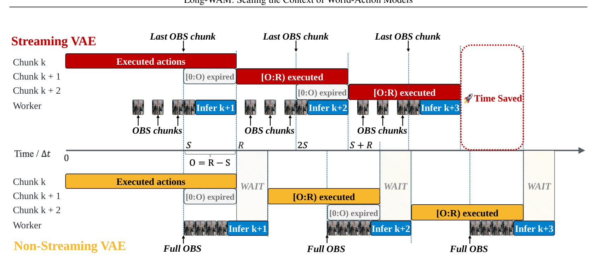

**Caption:** Figure 3 | Asynchronous model–robot execution with streaming VAE. Both schedules use the same nominal trigger stride $S$ and overlap $O = R - S$. Streaming VAE (top) encodes observation (OBS) chunks as they arrive and meets the handoff deadline $T_{\text{ready}} \le O \Delta t$. Full-window encoding (bottom) delays handoffs and subsequent triggers, accumulating robot idle time. Time is shown in units of $\Delta t$.

**Caption[CN]:** 图 3 | 基于流式 VAE 的异步模型-机器人协同执行流水线。两种调度方案均采用相同的名义触发步长 $S$ 与重叠步长 $O = R - S$。流式 VAE（顶部）在每一批观测图像帧到达时即刻增量编码，从而从容满足交接截止时间 $T_{\text{ready}} \le O \Delta t$。相比之下，全窗口编码（底部）会导致交接点与后续触发点的严重延迟，造成机器人底层等待停顿并不断累积空闲时间。时间轴单位为底层控制周期 $\Delta t$。

### 4.1 Asynchronous Execution | 纯异步执行与流式 VAE

> <strong>Para. 2:</strong> Pure asynchronous execution suffices. We overlap inference with robot execution without blending or prefix guidance. At decision $k$ (control step $t_k$), the predicted chunk is $\hat{\mathcal{A}}_{t_k} \in \mathbb{R}^{H \times d}$, where $d$ is the action dimension (Section 3.2). Only the first $R$ steps are eligible for execution; inference has nominal stride $S$ ($R/2 \le S < R \le H$), leaving an overlap of $O = R - S$ steps. At the handoff, the controller discards the elapsed prefix and executes the new chunk’s aligned suffix, waiting if it arrives late (Figure 3).

> <strong>Para. 2[CN]:</strong> 纯异步执行方案的充分性。我们将模型推理计算与机器人底层运动执行完全重叠，且无需进行任何启发式轨迹混合或测试期前缀引导。在第 $k$ 次决策（控制步 $t_k$）时，预测出的动作块为 $\hat{\mathcal{A}}_{t_k} \in \mathbb{R}^{H \times d}$，其中 $d$ 为动作空间自由度（第 3.2 节）。仅有前 $R$ 步允许下发执行；推理调度的名义触发步长为 $S$（满足 $R/2 \le S < R \le H$），从而在相邻块之间形成 $O = R - S$ 步的重叠交接区间。在交接时刻，控制器丢弃新动作块中对应已经流逝的重叠前缀，直接切换执行对齐后的新动作后缀；若推理发生延迟未能按时到达，机器人则原地等待（图 3）。

> <strong>Para. 3:</strong> Pure asynchronous execution can disrupt action continuity [32], motivating inference-time guidance [5] and training-time action conditioning [6]. Long-WAM requires neither in our experiments. Conditioned on temporally continuous LongLive2.0-Robot forecasts, consecutive chunks tend to agree in their overlap: on RoboTwin 2.0 [9], Long-WAM nearly keeps its synchronous success under asynchrony, whereas Fast-WAM [54] and LingBot-VA [26] lose 15.4 and 45.5 percentage points (Table 7).

> <strong>Para. 3[CN]:</strong> 纯异步执行在传统方法中极易破坏动作轨迹的平滑连续性 [32]，因而引发了大量关于测试期引导 [5] 和训练期动作前缀条件化 [6] 的探索。但在我们的实验中，Long-WAM 完全不需要这些复杂修补。得益于条件化在时序高度连贯的 LongLive2.0-Robot 物理未来预测之上，前后两次预测的动作块在重叠区间内展现出极高的一致性：在 RoboTwin 2.0 双臂基准 [9] 上，Long-WAM 在异步执行模式下几乎完全维持了其同步执行的基准成功率，而 Fast-WAM [54] 和 LingBot-VA [26] 则分别暴跌了 15.4 和 45.5 个百分点（见表 7）。

> <strong>Para. 4:</strong> Streaming VAE. Reducing overlap from 12 to 8 control steps lowers overlap RMSE about fourfold and jerk nearly threefold (Appendix E). At fixed $R$, shorter overlap requires later inference triggers and a tighter handoff deadline:

> <strong>Para. 4[CN]:</strong> 流式变分自编码器（Streaming VAE）。将重叠步长从 12 步缩短至 8 步能够使交接处的重叠均方根误差（RMSE）降低约 4 倍，并将跃度（Jerk）降低近 3 倍（附录 E）。在固定可执行视界 $R$ 时，更短的重叠意味着更晚发起推理请求，因而对交接截止时间施加了极为苛刻的延迟约束：

$$T_{\text{ready}} \le O \Delta t = (R - S) \Delta t$$

> <strong>Para. 5:</strong> where $\Delta t$ is the control interval and $T_{\text{ready}}$ includes transfer, queueing, and computation from the time the trigger observation becomes available. Streaming causal VAE encoding processes incoming frame groups. After the trigger, we encode the remaining frames, concatenate features, and project and normalize the latents. At the same $S$ and $O$, it avoids full-window encoding’s repeated waits and accumulated idle time (Figure 3), allowing later triggers and shorter overlap while retaining the latest observation.

> <strong>Para. 5[CN]:</strong> 式中 $\Delta t$ 为底层硬件控制周期，$T_{\text{ready}}$ 涵盖从触发帧观测就绪开始的数据传输、IPC 队列调度以及全部前向计算耗时。流式因果 VAE 编码随控制步推进持续增量处理新到达的帧组。在触发点到达后，仅需编码极少量的剩余最新帧，随后拼接特征并完成潜变量投影与归一化。在相同步长 $S$ 与重叠量 $O$ 条件下，流式机制彻底规避了全窗口批处理编码所带来的反复等待与累积空闲时间（图 3），使得系统能够在获取最新实时观测的同时支持更晚的触发时点与更紧凑的交接重叠。

### Figure 4. 边缘端高效部署的系统优化概览

**Caption:** Figure 4 | Optimizations for efficient edge deployment. Shared optimizations and device-specific tuning accelerate edge inference. “Base” denotes the Quant/GEMM implementation; shape-specific dispatch and autotuning remain enabled.

**Caption[CN]:** 图 4 | 边缘端实时推理加速的系统级优化概览。通用跨设备优化与特定硬件定制调优协同加速边缘端推理。“Base”表示基准量化与 GEMM 算子实现；特定张量形状的分发机制与自动调优保持开启。

### 4.2 Efficient Edge Deployment | 高效边缘端部署优化

> <strong>Para. 6:</strong> Local inference avoids network delays, but video-first prediction is costly on limited onboard compute. We accelerate Long-WAM on NVIDIA GeForce RTX 5090, DGX Spark, and Jetson AGX Thor to support short-overlap execution (Equation 4) while preserving visual imagination. Shared optimizations reduce common computation and data-movement costs; device-specific tuning addresses platform constraints, balancing portability and hardware efficiency.

> <strong>Para. 6[CN]:</strong> 本地边缘推理能够完全消除不可控的网络通信延迟，但以视频预测为先导的重度计算在资源受限的车载算力平台上开销极其沉重。我们针对 NVIDIA GeForce RTX 5090、DGX Spark 与 Jetson AGX Thor 平台全面加速 Long-WAM，旨在完整保留未来视觉想象能力的同时支持超短重叠执行（式 4）。通用优化消减了跨平台的公共计算与数据搬运开销，而特定设备的定制调优则精准化解了各硬件平台的底层资源瓶颈，在算法通用性与极致执行效率之间取得最佳平衡。

> <strong>Para. 7:</strong> Shared optimizations. Across devices (Figure 4), video-expert linear layers use W4A4 NVFP4 (four-bit weights and activations) during generation and key–value (KV) prefill [11, 35], while action compute and KV storage remain BF16. Action quantization offers limited latency savings and may compromise control precision, so we retain BF16. NVFP4 reduces compute and weight/activation storage, but adds small quantization and scaling kernels whose launch overhead can offset the compute savings. When NVFP4 is combined with CUDA Graph replay [17] and PyTorch compilation [2], launch overhead is reduced and eligible operations are fused. We also reuse denoising-invariant text/state KV, observed-video KV, and FP32 RoPE tables [43] within each inference call to reduce redundant computation; streaming-VAE operations that update state remain outside CUDA Graph capture.

> <strong>Para. 7[CN]:</strong> 通用跨设备优化。在所有部署平台上（图 4），视频专家的线性映射层在自回归生成及键值（KV）预填充阶段全部采用 W4A4 NVFP4 格式（4 位权重与 4 位激活）[11, 35]，而动作分支计算及动作 KV 缓存则保持原生 BF16 精度。对动作执行量化带来的延迟收益微乎其微，反而可能损害底层控制的精细度，因此我们保留 BF16。NVFP4 大幅削减了计算量与权重/激活显存占用，但引入了大量小碎算子进行动态量化和张量缩放，其 CPU 发射开销极易抵消掉底层 GEMM 计算的加速效益。当我们将 NVFP4 与 CUDA Graph 重放机制 [17] 及 PyTorch 图编译 [2] 深度结合时，CPU 发射开销得以彻底消除，且大量逐点算子被成功融合。此外，我们在单次推理请求内全面复用去噪步间保持不变的静态内容——包括文本/状态指令 KV 缓存、已观测历史视频 KV 缓存以及 FP32 旋转位置编码（RoPE）表 [43]，显著避免了冗余计算；而需要实时更新状态的流式 VAE 操作则保留在 CUDA Graph 捕获之外。

> <strong>Para. 8:</strong> Shared input quantization quantizes the shared input to Q/K/V projections once and reuses the quantized activations and scales across three separate GEMMs. We combine attention over separate video and action KV buffers using online softmax [31] with a shared normalization, avoiding buffer concatenation. For each query, let $(m_j, \ell_j, u_j)$ denote the maximum attention logit, the sum of exponentials shifted by $m_j$, and their value-weighted sum for segment $j \in \{v, a\}$; the merged output is:

> <strong>Para. 8[CN]:</strong> 共享输入量化针对 Q/K/V 投影共享的输入张量仅执行一次动态量化，将量化后的低位激活与缩放系数在后续 3 个独立的 GEMM 算子中直接复用。我们利用基于共享归一化因子的在线 Softmax 算法 [31] 融合对独立视频与动作 KV 显存缓冲区的注意力计算，彻底避免了物理显存拼接的巨大开销。对于每个查询向量，令 $(m_j, \ell_j, u_j)$ 分别表示段 $j \in \{v, a\}$ 上的最大注意力 Logit、经 $m_j$ 平移后的指数和以及加权值向量和，合并后的多模态注意力输出为：

$$m = \max(m_v, m_a)$$

$$\text{Attn} = \frac{e^{m_v - m} u_v + e^{m_a - m} u_a}{e^{m_v - m} \ell_v + e^{m_a - m} \ell_a}$$

> <strong>Para. 9:</strong> This preserves joint attention without a concatenated KV buffer. We also coalesce memory accesses, fuse scale/bias and cast operations, and simplify VAE layouts and padding, subject to shape and backend constraints. Device-specific tuning. Quant/GEMM tuning adjusts tile sizes, warps per block, pipeline stages, and buffers. Backend selection includes VAE layout and convolution tuning [12] and RTX 5090/Spark attention backends. RTX 5090 retains base Quant/GEMM implementations with shape-specific dispatch and execution tuning. Spark reduces quantization time with compact buffers and per-shape choices of warps per block. More resident thread blocks per streaming multiprocessor (SM) allow the illustrated grid to run in one wave. Thor’s larger per-block shared-memory budget supports GEMM configurations unavailable on Spark; smaller epilogue tiles avoid register spills. These adaptations reflect hardware constraints, not device-exclusive algorithms. Together, shared optimizations and device-specific tuning yield 3.2–4.1× total speedups over BF16 eager execution. Section 6.2 compares model latencies and cumulative gains (Tables 6 and 8).

> <strong>Para. 9[CN]:</strong> 该公式在无需将 KV 缓冲区做张量拼接的情况下，完美保留了跨模态联合注意力机制的数学等价性。我们还结合张量形状与后端约束，系统合并了全局内存访存请求，融合了 scale/bias 及类型转换算子，并重构了 VAE 的显存布局与填充机制。特定硬件定制调优：Quant/GEMM 调优深入微调了分块尺寸（Tile Size）、每个线程块的 Warp 数量、流水线深度阶段数以及中间缓冲池配置。后端选择包括 VAE 内存排布与卷积算子自动调优 [12]，以及针对 RTX 5090 与 DGX Spark 平台的自注意力定制后端。RTX 5090 保留了基准 Quant/GEMM 实现，并针对特定张量尺寸启用了分发与执行调优。DGX Spark 平台通过紧凑缓冲区以及按尺寸优化的 warp 策略大幅压缩了量化耗时；每个流式多处理器（SM）上允许驻留更多的线程块，使得计算网格能够在一个完整波次内全部执行完毕。Jetson Thor 更充裕的单块共享内存配额支持了 Spark 上无法运行的高效 GEMM 配置；同时采用更紧凑的尾部（epilogue）分块彻底避免了寄存器溢出（Spill）。这些适配精准响应了各硬件底层的微架构特性，而非引入设备专有算法。通用优化与设备专属调优合力取得了相比 BF16 eager 模式 3.2 至 4.1 倍的端到端整体加速比。第 6.2 节对各模型延迟与累积加速阶梯进行了详尽定量对比（见表 6 与表 8）。

---

## 5. Experiments | 实验评估

### Figure 5. 仿真评测环境与真机操作任务

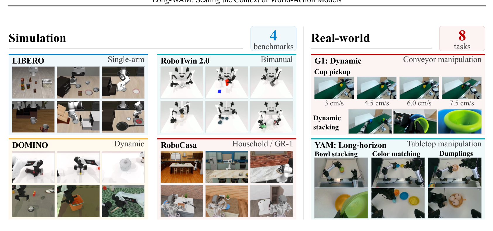

**Caption:** Figure 5 | Simulation environments and real-world tasks. Our evaluation spans four simulation benchmarks—LIBERO, RoboTwin 2.0, DOMINO, and RoboCasa—and eight real-world task configurations on G1 and YAM. These include cup pickup at four conveyor speeds, dynamic cup stacking, bowl stacking, brick sorting by color, and dumpling placement into a pan.

**Caption[CN]:** 图 5 | 仿真评测基准与物理真机任务概览。我们的评测涵盖了四个主流仿真基准——LIBERO、RoboTwin 2.0、DOMINO 以及 RoboCasa——以及在宇树 G1 和 YAM 双臂机器人上的八种真实物理任务配置。真机任务包括四种不同传送带速度下的动态水杯抓取、动态叠杯、碗具叠放、积木按颜色分类整理，以及将饺子放入煎锅。

### 5.1 Implementation Details | 实现细节

> <strong>Para. 1:</strong> Pretraining LongLive2.0-Robot uses approximately 30,720 GPU-hours on 64 NVIDIA H100 GPUs; downstream WAMs train on 16 GB200 GPUs. WAM training uses AdamW with a peak learning rate of $10^{-4}$, cosine decay, 5% warmup, BF16 precision, and gradient clipping at 1.0. Robot experiments use a Unitree G1 humanoid and a YAM bimanual manipulator. Appendix D lists baseline references.

> <strong>Para. 1[CN]:</strong> LongLive2.0-Robot 的预训练在 64 张 NVIDIA H100 GPU 上耗费了约 30,720 GPU 时；下游世界-动作模型（WAMs）的微调适配在 16 张 NVIDIA GB200 GPU 上完成。WAM 训练采用 AdamW 优化器，峰值学习率设为 $10^{-4}$，配合余弦学习率衰减（Cosine Decay）、5% 预热比例（Warmup）、BF16 混合精度计算以及 1.0 的梯度范数裁剪阈值。真机实验部署平台为宇树（Unitree）G1 人形机器人和 YAM 双臂桌面操作平台。附录 D 详细列出了所有对比基线方法的文献来源与配置说明。

### 5.2 Results on Simulation Benchmarks | 仿真基准评测结果

> <strong>Para. 2:</strong> We evaluate on LIBERO [30], RoboTwin 2.0 [9], DOMINO [15], and RoboCasa GR-1 [37] (Figure 5). For the first three benchmarks, the main results use up to 2.4 seconds of context; DOMINO adds moving objects, where recent motion informs anticipation and interception. RoboCasa GR-1, whose tasks chain several object transfers, hosts the longer-context study. We further evaluate compositional tasks on RoboCasa365, with GPT-6 Astra as a high-level planner (Appendix 6, Table 5).

> <strong>Para. 2[CN]:</strong> 我们在 LIBERO [30]、RoboTwin 2.0 [9]、DOMINO [15] 以及 RoboCasa GR-1 [37] 上展开全面评估（图 5）。在前三个基准测试中，主实验配置采用至多 2.4 秒的时序上下文；DOMINO 引入了动态移动物体，其中近期的时序运动信息直接为未来轨迹预判与空间拦截提供关键证据。RoboCasa GR-1 的任务串联了多个连续的物体转移阶段，因而作为深入研究超长上下文扩展规律的核心平台。我们还在 RoboCasa365 上进一步评估了复合长程任务，并引入 GPT-6 Astra 担任高层语义规划器（第 6 节，表 5）。

### Table 1. LIBERO 基准测试任务成功率

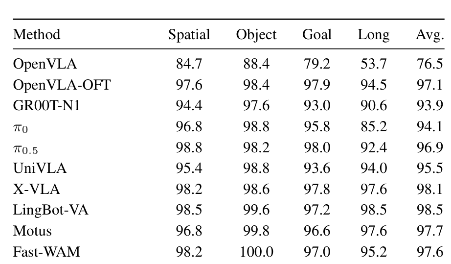

| Method | Spatial | Object | Goal | Long | Avg. |
| :--- | :---: | :---: | :---: | :---: | :---: |
| OpenVLA | 84.7 | 88.4 | 79.2 | 53.7 | 76.5 |
| OpenVLA-OFT | 97.6 | 98.4 | 97.9 | 94.5 | 97.1 |
| GR00T-N1 | 94.4 | 97.6 | 93.0 | 90.6 | 93.9 |
| $\pi_0$ | 96.8 | 98.8 | 95.8 | 85.2 | 94.1 |
| $\pi_{0.5}$ | 98.8 | 98.2 | 98.0 | 92.4 | 96.9 |
| UniVLA | 95.4 | 98.8 | 93.6 | 94.0 | 95.5 |
| X-VLA | 98.2 | 98.6 | 97.8 | 97.6 | 98.1 |
| LingBot-VA | 98.5 | 99.6 | 97.2 | 98.5 | 98.5 |
| Motus | 96.8 | 99.8 | 96.6 | 97.6 | 97.7 |
| Fast-WAM | 98.2 | 100.0 | 97.0 | 95.2 | 97.6 |
| Long-WAM (w/o V) | 98.0 | 99.5 | 97.0 | 94.5 | 97.3 |
| Long-WAM (CoD) | 98.6 | 99.8 | 96.8 | 95.8 | 97.8 |
| Long-WAM (IDM) | 99.5 | 100.0 | 98.0 | 99.5 | 99.5 |

**Caption:** Table 1 | Success rate (SR, %) on LIBERO. w/o V: no future-video denoising; CoD: video–action co-denoising; IDM: inverse dynamics modeling.

**Caption[CN]:** 表 1 | LIBERO 基准套件上的任务成功率（SR, %）。w/o V：无未来视频去噪分支；CoD：视频-动作协同联合去噪；IDM：逆动力学建模（先预测视频后去噪动作）。

### Table 2. RoboTwin 2.0 双臂基准测试成功率

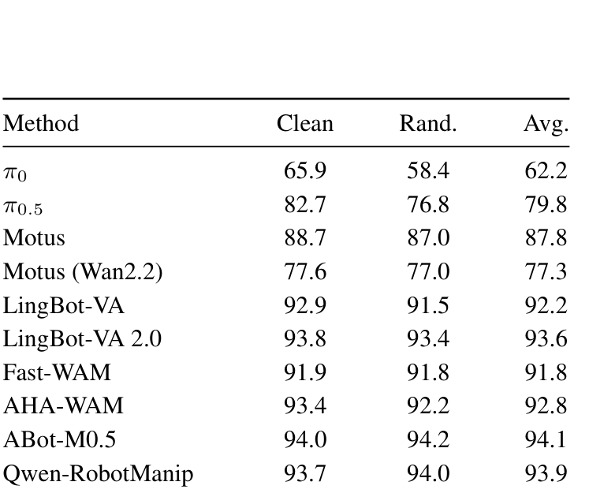

| Method | Clean | Rand. | Avg. |
| :--- | :---: | :---: | :---: |
| $\pi_0$ | 65.9 | 58.4 | 62.2 |
| $\pi_{0.5}$ | 82.7 | 76.8 | 79.8 |
| Motus | 88.7 | 87.0 | 87.8 |
| Motus (Wan2.2) | 77.6 | 77.0 | 77.3 |
| LingBot-VA | 92.9 | 91.5 | 92.2 |
| LingBot-VA 2.0 | 93.8 | 93.4 | 93.6 |
| Fast-WAM | 91.9 | 91.8 | 91.8 |
| AHA-WAM | 93.4 | 92.2 | 92.8 |
| ABot-M0.5 | 94.0 | 94.2 | 94.1 |
| Qwen-RobotManip | 93.7 | 94.0 | 93.9 |
| Long-WAM (w/o V) | 92.4 | 91.6 | 92.0 |
| Long-WAM (CoD) | 94.0 | 93.1 | 93.6 |
| Long-WAM (IDM) | 94.7 | 94.2 | 94.4 |

**Caption:** Table 2 | Success rate (SR, %) on RoboTwin 2.0.

**Caption[CN]:** 表 2 | RoboTwin 2.0 仿真基准上的任务成功率（SR, %）。Clean：标准整洁测试场景；Rand.：带有物体与环境随机化扰动的测试场景；Avg.：全任务平均成功率。

> <strong>Para. 3:</strong> LIBERO. Long-WAM (IDM) achieves the highest average success (99.5%) and 99.5% on LIBERO-Long (Table 1). Its margin is largest on LIBERO-Long, the suite with the longest tasks, where it exceeds LingBot-VA [26] and Fast-WAM [54] by 1.0 and 4.3 points.

> <strong>Para. 3[CN]:</strong> LIBERO 实验结果。Long-WAM（IDM 模式）取得了所有评测方法中最高的综合平均成功率（99.5%），并在任务难度最高的 LIBERO-Long 子集上同样达到 99.5% 的极高表现（表 1）。在任务时间跨度最长的 LIBERO-Long 上，其领先优势最为显著，分别超出强力基准 LingBot-VA [26] 和 Fast-WAM [54] 达 1.0 和 4.3 个百分点。

> <strong>Para. 4:</strong> RoboTwin 2.0. Long-WAM (IDM) leads on average (94.4%) and Clean (94.7%), and ties the best Randomized score (94.2%; Table 2). Its average exceeds ABot-M0.5 and LingBot-VA 2.0 [55] by 0.3 and 0.8 points, respectively.

> <strong>Para. 4[CN]:</strong> RoboTwin 2.0 实验结果。Long-WAM（IDM 模式）在整体平均成功率（94.4%）和标准场景 Clean（94.7%）上均名列前茅，并在随机化扰动场景 Randomized 上与最强基准打平（94.2%；表 2）。其全套件平均得分分别超越了 ABot-M0.5 和近期前沿工作 LingBot-VA 2.0 [55] 达 0.3 和 0.8 个百分点。

> <strong>Para. 5:</strong> DOMINO. After dynamic-data fine-tuning, Long-WAM leads with 34.9% SR and 45.1 MS (Table 3), exceeding the strongest baseline on each metric: Fast-WAM by 15.0 SR points and PUMA [15] by 10.1 MS points. Recent observations supply motion cues that a single image cannot, supporting prediction-conditioned interception; Section 6.1 tests this ability on a physical conveyor.

> <strong>Para. 5[CN]:</strong> DOMINO 动态操作结果。在动态移动物体数据上微调后，Long-WAM 以 34.9% 的任务成功率（SR）和 45.1 的综合操作得分（MS）大幅领跑（表 3），在两项指标上分别超越各自的最强基准：相比 Fast-WAM 成功率高出 15.0 个百分点，相比 PUMA [15] 操作得分超出 10.1 分。近期的连续视觉观测提供了单帧静态图像绝不可能具备的速度与加速度线索，从而有力赋能基于未来预判的动态拦截控制；第 6.1 节将把该能力直接带入真实的传送带物理机器人验证。

### Table 3. DOMINO 动态物体操作评测

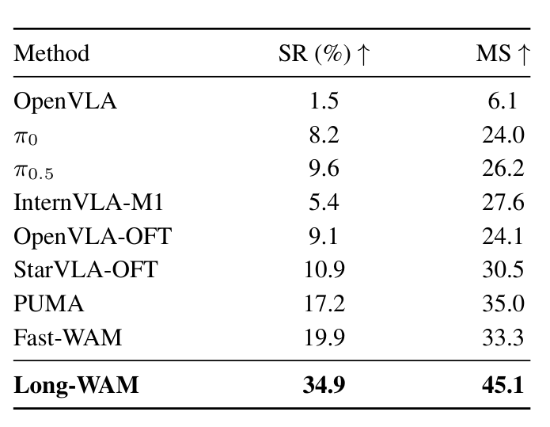

| Method | SR (%) ↑ | MS ↑ |
| :--- | :---: | :---: |
| OpenVLA | 1.5 | 6.1 |
| $\pi_0$ | 8.2 | 24.0 |
| $\pi_{0.5}$ | 9.6 | 26.2 |
| InternVLA-M1 | 5.4 | 27.6 |
| OpenVLA-OFT | 9.1 | 24.1 |
| StarVLA-OFT | 10.9 | 30.5 |
| PUMA | 17.2 | 35.0 |
| Fast-WAM | 19.9 | 33.3 |
| Long-WAM | 34.9 | 45.1 |

**Caption:** Table 3 | DOMINO results after dynamic-data fine-tuning. Success rate (SR); manipulation score (MS).

**Caption[CN]:** 表 3 | 动态数据微调后的 DOMINO 基准评测结果。SR 为任务成功率（%）；MS 为综合操作得分（Manipulation Score）。

### Table 4. RoboCasa GR-1 多阶段任务成功率

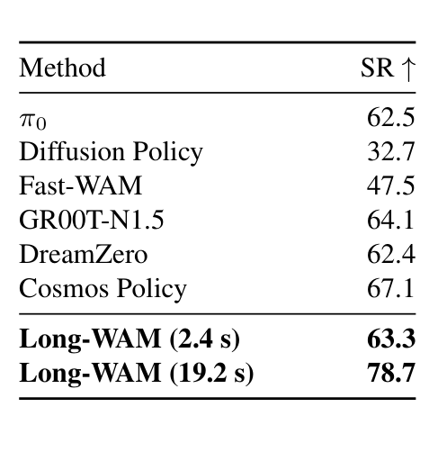

| Method | SR ↑ |
| :--- | :---: |
| $\pi_0$ | 62.5 |
| Diffusion Policy | 32.7 |
| Fast-WAM | 47.5 |
| GR00T-N1.5 | 64.1 |
| DreamZero | 62.4 |
| Cosmos Policy | 67.1 |
| Long-WAM (2.4 s) | 63.3 |
| Long-WAM (19.2 s) | 78.7 |

**Caption:** Table 4 | Success rate (SR, %) on RoboCasa GR-1.

**Caption[CN]:** 表 4 | RoboCasa GR-1 复杂多阶段桌面操作基准上的任务成功率（SR, %）。

### Figure 6. 三种不同视频初始化下的上下文扩展规律

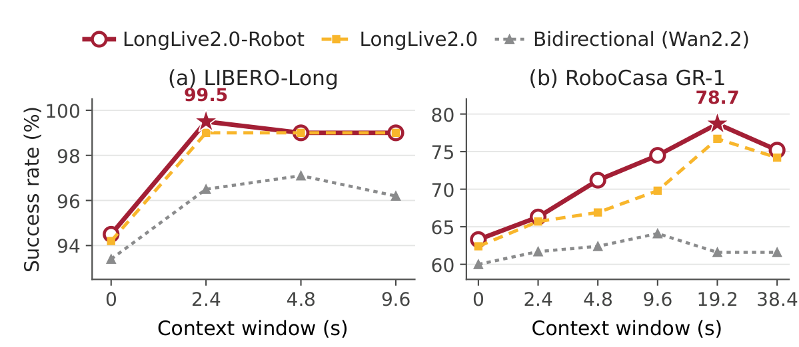

**Caption:** Figure 6 | Context scaling with three video initializations. Context windows are displayed at equal spacing.

**Caption[CN]:** 图 6 | 基于三种不同视频预训练初始化的上下文长度扩展规律对比。(a) LIBERO-Long；(b) RoboCasa GR-1。横坐标等间距展示了不同的历史上下文窗口时长（秒）。

### 5.3 Ablation Studies | 消融实验分析

> <strong>Para. 6:</strong> Context Scaling. Adding 2.4 seconds of history raises LIBERO-Long success from 94.5% to 99.5% with LongLive2.0-Robot and 94.2% to 99.0% with LongLive-2.0 (Figure 6). On RoboCasa GR-1, chosen for its multi-stage tasks [33, 37], scaling from 2.4 to 19.2 seconds improves success from 66.3% to 78.7% and 65.7% to 76.7%, respectively. The different peak context lengths suggest task-dependent memory needs: short histories capture most gains on LIBERO-Long, while GR-1 benefits from substantially longer interaction context. Robot-video pretraining yields higher peaks on both benchmarks; its 78.7% exceeds the strongest GR-1 baseline by 11.6 points (Table 4). At 38.4 seconds, success decreases to 75.2% and 74.2%; this window is three times the average training trajectory (12.1 seconds), and 80.4% of its sampled history frames are padding. We hypothesize that the decline reflects limited history coverage rather than an intrinsic memory limit. Context also has a price: 8× more history raises RTX 5090 latency 3.2× (107.4 to 341.0 ms; Appendix G).

> <strong>Para. 6[CN]:</strong> 上下文长度扩展效应。引入 2.4 秒的物理历史使得 LIBERO-Long 上的成功率在使用 LongLive2.0-Robot 时从 94.5% 跃升至 99.5%，在使用通用 LongLive-2.0 时从 94.2% 提升至 99.0%（图 6）。在因多阶段复杂交互特性而被选中的 RoboCasa GR-1 [33, 37] 上，将历史窗口从 2.4 秒进一步扩展至 19.2 秒分别带来了 66.3% 到 78.7% 以及 65.7% 到 76.7% 的持续显著增益。两种基准所呈现出的不同峰值上下文长度深刻揭示了控制任务对记忆需求的差异化：较短的历史便足以捕获 LIBERO-Long 中的大部分状态转移，而多步骤的 GR-1 则高度依赖大幅扩展的长程物理交互记忆。机器人专属领域的预训练在两个基准上均取得了更高的性能峰值，其 78.7% 的记录将最强 GR-1 基线直接拉开了 11.6 个百分点（表 4）。当上下文进一步拉长到 38.4 秒时，成功率回落至 75.2% 和 74.2%；该时间窗口已是训练集平均轨迹时长（12.1 秒）的三倍以上，导致其采样的历史帧中有 80.4% 均为主观填充帧（Padding）。我们推测这一回落主要源于现有数据集中有效长历史覆盖率的不足，而非模型记忆架构本身存在固有限制。同时，长上下文伴随着算力代价：历史长度增加 8 倍会导致 RTX 5090 上的推理延迟增加 3.2 倍（从 107.4 毫秒增至 341.0 毫秒；详见附录 G）。

> <strong>Para. 7:</strong> Autoregressive vs. Bidirectional Pretraining. The AR advantage itself grows with context: on GR-1, the robot-domain AR variant leads bidirectional initialization by 3.3 points without history and 17.1 points at 19.2 seconds (Figure 6). The bidirectional variant rises from 61.7% at 2.4 seconds to 64.1% at 9.6, then returns to 61.6% at 19.2; both AR variants instead gain 12.4 and 11.0 points over the 2.4–19.2-second interval. All variants use causal WAM adaptation, yet access to history alone does not reproduce the AR variants’ long-context gains. A plausible explanation is that AR pretraining learns the history-to-future dependencies retained during action adaptation, allowing additional observations to inform control through a predictive representation.

> <strong>Para. 7[CN]:</strong> 自回归预训练与双向预训练的根本差异。自回归（AR）架构带来的优势本身会随着上下文长度的增加而急剧放大：在 GR-1 上，机器人领域 AR 变体在无历史状态下领先双向非因果初始化 3.3 个百分点，而在 19.2 秒历史长度下其优势急剧扩大至 17.1 个百分点（图 6）。双向变体在 2.4 秒时成功率为 61.7%，在 9.6 秒时达到 64.1%，但在 19.2 秒时又回落至 61.6%，全程几乎无净收益；与此形成鲜明对比的是，两种 AR 变体在 2.4 至 19.2 秒的历史区间内分别斩获了 12.4 和 11.0 个百分点的巨大净增益。值得强调的是，所有变体在下游均经过了完全一致的因果 WAM 适配，然而仅仅赋予模型访问历史的权利，根本无法重现 AR 变体所具备的长上下文增益。对此最合理的科学解释是：自回归预训练从底层深刻习得了“由历史因果推演未来”的依赖关系，这些时序表征在动作适配中被完整传承，使得额外输入的物理观测能够真正通过前瞻性预测表征有效赋能底层控制。

> <strong>Para. 8:</strong> Video–Action Denoising Strategy. We compare action denoising without future-video prediction (w/o V), joint video–action denoising (CoD), and video prediction followed by history- and prediction-conditioned action denoising (IDM; Tables 1 and 2). IDM’s largest suite-level gains occur on LIBERO-Long: 99.5%, versus 94.5% (w/o V) and 97.8% (CoD), suggesting that first estimating how an interaction will evolve provides a useful condition for coordinating subsequent actions across multiple substeps. The resulting policy also supports dynamic grasping (Section 6.1). These gains use partially denoised future latents, without pixel-level synthesis, highlighting prediction as an intermediate control representation. Our infrastructure addresses the sequential-inference cost while preserving this predictive path (Section 6.2).

> <strong>Para. 8[CN]:</strong> 视频-动作去噪策略消融。我们系统对比了三种去噪模式：无未来视频去噪分支的动作去噪（w/o V）、视频-动作协同联合去噪（CoD），以及先预测未来视频潜变量再条件化去噪动作的逆动力学建模（IDM；表 1 与表 2）。IDM 最具统治力的套件级增益出现在长程任务集 LIBERO-Long 上：取得了 99.5% 的极高表现，显著超越 w/o V 的 94.5% 以及 CoD 的 97.8%。这表明“预先估计物理交互将如何演变”为协调跨多个子阶段的后续动作提供了无与伦比的高阶时序条件。由此得到的策略亦全面赋能了高动态物理拦截抓取（第 6.1 节）。需要指出的是，上述收益完全建立在部分去噪的高维未来潜变量之上，根本无需昂贵的像素级图像渲染，从而确立了未来预测作为纯粹中间控制表征的强大效能。我们的系统基础设施则通过软硬件协同消解了串行推理的延迟开销，完整守护了这条高价值的预测路径（第 6.2 节）。

---

## 6. Atomic Execution and Compositional Planning | 原子技能执行与复合分层规划

> <strong>Para. 1:</strong> RoboCasa365 [34] separates atomic household skills from their composition into multi-stage tasks, allowing us to examine Long-WAM as the execution foundation of a hierarchical robot system. We use a Human300-trained checkpoint with 2.4 seconds of visual context, then add GPT-6 Astra without further policy training. The planner grounds task goals into atomic subinstructions, selects execution-prefix lengths, and can issue bounded end-effector corrections; Long-WAM supplies the learned action chunks. Table 5 compares GPT-6 Astra alone, standalone and planner-augmented policies, and benchmark reference methods [40].

> <strong>Para. 1[CN]:</strong> RoboCasa365 [34] 将原子级家庭日常技能与由其构成的多阶段复合长程任务进行了系统解耦，使我们能够深入检验 Long-WAM 作为分层机器人具身智能系统底层物理执行基石的核心潜能。我们采用在 Human300 上预先训练且具备 2.4 秒视觉历史的策略检查点，并在无需对底层策略进行任何微调的前提下直接引入 GPT-6 Astra 规划大模型。高层规划器将抽象的任务宏观目标逐层锚定为原子级子指令，自适应选取动作前缀执行长度，并在必要时发出受限的末端执行器残差微调；而 Long-WAM 则负责精准输出习得的底层动作块。表 5 详尽对比了纯 GPT-6 Astra、单体策略、规划器增强分层系统以及前沿排行榜参考方法 [40]。

### Table 5. RoboCasa365 分层规划与技能组合评测

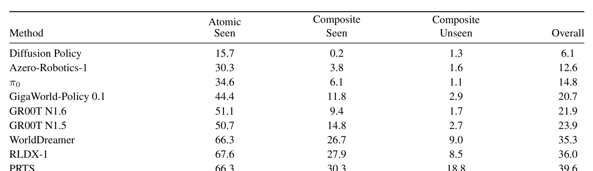

| Method | Atomic Seen | Composite Seen | Composite Unseen | Overall |
| :--- | :---: | :---: | :---: | :---: |
| Diffusion Policy | 15.7 | 0.2 | 1.3 | 6.1 |
| Azero-Robotics-1 | 30.3 | 3.8 | 1.6 | 12.6 |
| $\pi_0$ | 34.6 | 6.1 | 1.1 | 14.8 |
| GigaWorld-Policy 0.1 | 44.4 | 11.8 | 2.9 | 20.7 |
| GR00T N1.6 | 51.1 | 9.4 | 1.7 | 21.9 |
| GR00T N1.5 | 50.7 | 14.8 | 2.7 | 23.9 |
| WorldDreamer | 66.3 | 26.7 | 9.0 | 35.3 |
| RLDX-1 | 67.6 | 27.9 | 8.5 | 36.0 |
| PRTS | 66.3 | 30.3 | 18.8 | 39.6 |
| Qwen-RobotManip | 68.6 | 20.1 | 14.9 | 35.9 |
| ABot-M0.5 | 75.6 | 37.7 | 3.3 | 40.3 |
| GPT-6 Astra | 31.5 | 22.4 | 20.8 | 25.2 |
| $\pi_{0.5}$ | 39.6 | 7.1 | 1.2 | 16.9 |
| $\pi_{0.5}$ + GPT-6 Astra | 46.5 | 24.0 | 19.0 | 30.5 |
| Long-WAM | 67.9 | 15.8 | 6.1 | 31.4 |
| Long-WAM + GPT-6 Astra | 85.6 | 38.8 | 35.0 | 54.4 |

**Caption:** Table 5 | Success rate (SR, %) on RoboCasa365. Overall averages 50 tasks: 18 Atomic-Seen, 16 Composite-Seen, and 16 Composite-Unseen. Baseline sources: Appendix D.

**Caption[CN]:** 表 5 | RoboCasa365 基准上的各子集与综合成功率（SR, %）。综合指标 Overall 涵盖全部 50 项任务的平均值：18 项原子可见任务（Atomic-Seen）、16 项复合可见任务（Composite-Seen）以及 16 项复合未见任务（Composite-Unseen）。对比基线的具体文献出处参见附录 D。

> <strong>Para. 2:</strong> Strong atomic execution. Long-WAM alone achieves 67.9% Atomic-Seen success, compared with 39.6% for $\pi_{0.5}$ and 31.5% for GPT-6 Astra alone, providing a strong physical skill foundation. Querying the same policy every 15 steps yields 84.4% without a planner, close to the hierarchical system’s 85.6%.

> <strong>Para. 2[CN]:</strong> 强大的底层原子技能执行。单体 Long-WAM 策略独立达成了 67.9% 的 Atomic-Seen 原子技能成功率，相比之下 $\pi_{0.5}$ 仅为 39.6%，纯 GPT-6 Astra 仅为 31.5%，从而构筑了坚实强大的物理技能基石。如果将同一策略调整为每 15 步查询一次，在无规划器介入的情况下其原子成功率即可跃升至 84.4%，与完整分层系统的 85.6% 相当接近。

> <strong>Para. 3:</strong> Planning unlocks unseen skill compositions. With the policy checkpoint and visual context unchanged, adding the planner raises Composite-Seen success from 15.8% to 38.8% and Composite-Unseen success from 6.1% to 35.0%; Overall improves from 31.4% to 54.4%. The 15-step control reaches only 11.2% and 5.0% on the composite splits, so shorter execution intervals alone do not explain these gains.

> <strong>Para. 3[CN]:</strong> 逻辑规划全面激活未见技能组合。在底层策略权重与视觉上下文长度完全保持不变的前提下，引入高层规划器使 Composite-Seen 复合可见任务成功率从 15.8% 暴涨至 38.8%，使 Composite-Unseen 复合未见任务成功率从 6.1% 飙升至 35.0%；全套件综合成功率从 31.4% 大幅提升至 54.4%。值得注意的是，无规划器的 15 步短周期控制在两组复合任务子集上分别仅取得 11.2% 和 5.0% 的微弱得分，这雄辩地证明上述巨大提升绝非缩短控制间隔所致，而是高层语义规划与底层物理执行深度协同的结晶。

> <strong>Para. 4:</strong> Strong policies amplify agentic planning. GPT-6 Astra alone reaches 25.2% Overall success, and pairing it with $\pi_{0.5}$ reaches 30.5%, compared with 54.4% for Long-WAM + GPT-6 Astra. On unseen compositions, the Long-WAM hierarchy achieves 35.0%, exceeding both GPT-6 Astra alone (20.8%) and the $\pi_{0.5}$ hierarchy (19.0%). Planner augmentation yields a larger reported Overall gain for Long-WAM: 23.0 percentage points, versus 13.6 for $\pi_{0.5}$. These system-level comparisons highlight execution quality as a key complement to reasoning: Long-WAM supplies strong physical skills, while high-level planning extends their use to unseen compositions. This supports the division of labor in Appendix A, in which agentic planning and memory-informed execution jointly enable more capable long-horizon behavior.

> <strong>Para. 4[CN]:</strong> 强大的底层策略能够显著放大智能体规划效能。GPT-6 Astra 单独运行仅能达到 25.2% 的 Overall 综合成功率，而将其与 $\pi_{0.5}$ 组合仅能小幅提升至 30.5%，与 Long-WAM + GPT-6 Astra 达成的 54.4% 形成了鲜明对照。尤其在面对未见复合任务时，Long-WAM 分层系统斩获了 35.0% 的高成功率，远超纯 GPT-6 Astra（20.8%）和 $\pi_{0.5}$ 分层系统（19.0%）。规划器为 Long-WAM 注入了高达 23.0 个百分点的整体净增益，显著高于对 $\pi_{0.5}$ 带来的 13.6 个百分点提升。这一系统级深度对比清晰表明：高质量的物理执行是高阶推理决策不可或缺的基石——Long-WAM 提供了极其过硬的底层操作能力，而高层规划则将这种物理技能的适用边界延伸至未见组合环境。这有力印证了附录 A 中阐述的系统劳动分工理念：智能体逻辑规划与具备时序记忆感知的物理执行紧密配合，方能真正释放出驾驭长视界复杂任务的强大生命力。

### 6.1 Real-world Deployment | 真机部署评测

> <strong>Para. 5:</strong> We evaluate dynamic manipulation on Unitree G1 and long-horizon tasks on YAM, with 20 trials per policy and condition.

> <strong>Para. 5[CN]:</strong> 我们在宇树 G1 人形机器人上开展了高动态操作评测，并在 YAM 双臂平台上开展了长程多阶段操作评测，每种策略与评测条件均严格执行 20 次独立试验。

### Figure 7. 宇树 G1 人形机器人上的动态流水线操作

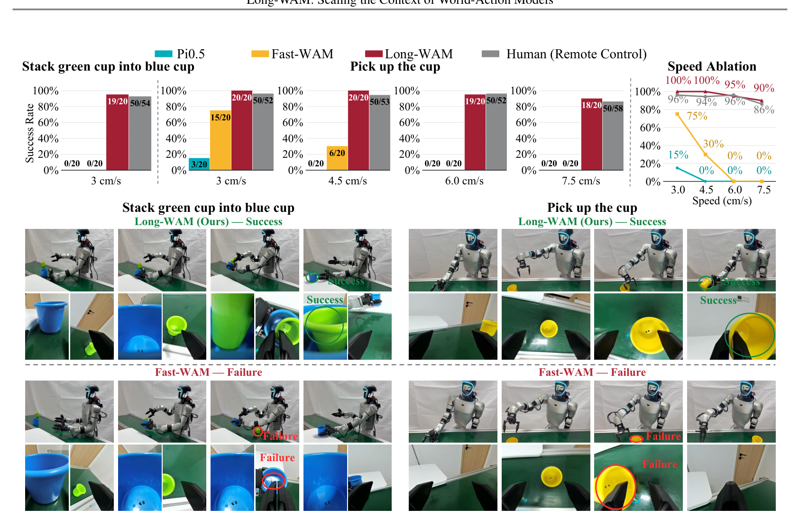

**Caption:** Figure 7 | Dynamic manipulation on Unitree G1. Long-WAM maintains 90–100% grasping success across conveyor speeds and achieves 95% success on dynamic cup stacking. Top: policy and human teleoperation comparisons. Bottom: Long-WAM and Fast-WAM rollouts.

**Caption[CN]:** 图 7 | 宇树 G1 人形机器人上的高动态物理操作实验。Long-WAM 在所有传送带速度下稳定保持了 90–100% 的抓取成功率，并在动态叠杯任务中取得了 95% 的超高成功率。顶部：不同策略与人类遥操作的成功率柱状对比；底部：Long-WAM 与 Fast-WAM 实际运行轨迹的时序抓拍对比。

> <strong>Para. 6:</strong> Dynamic Tasks. Conveyor speed separates the policies (Figure 7). As the belt accelerates from 3.0 to 7.5 cm/s, the grasping success of Fast-WAM [54] falls from 75% to 0% and that of $\pi_{0.5}$ [38] from 15% to 0%, whereas Long-WAM stays at 90–100% (100%, 100%, 95%, and 90%). Stacking a moving green cup into a blue cup at 3 cm/s adds alignment and placement to interception; Long-WAM succeeds in 19 of 20 trials, and neither baseline succeeds once.

> <strong>Para. 6[CN]:</strong> 动态操作任务。传送带的移动速度成为拉开各策略性能差距的分水岭（图 7）。随着传送带速度从 3.0 cm/s 加速至 7.5 cm/s，Fast-WAM [54] 的抓取成功率从 75% 直线暴跌至 0%，$\pi_{0.5}$ [38] 从 15% 跌至 0%；而 Long-WAM 则稳如磐石地维持在 90–100% 的超高区间（四个速度梯度分别为 100%、100%、95% 和 90%）。在 3 cm/s 移动速度下将运动中的绿色水杯精准叠入蓝色水杯的任务中，由于在高速动态拦截之外还必须同时保证精密的微距对齐与平稳嵌套，Long-WAM 在 20 次实测中成功 19 次（95% 成功率），而所有对比基准在全部测试中均无一成功（0%）。

### Figure 8. YAM 双臂机器人上的长视界持续操作

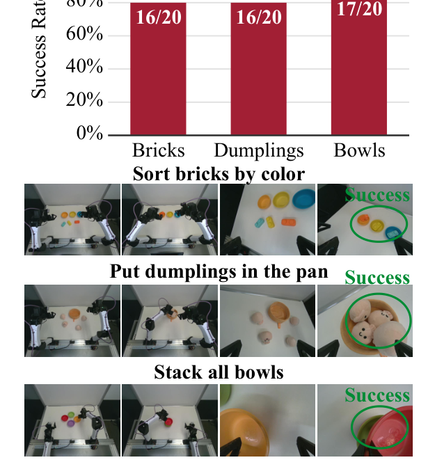

**Caption:** Figure 8 | Long-horizon execution on YAM: 20 trials per task.

**Caption[CN]:** 图 8 | YAM 双臂机器人上的长视界物理操作评测：每项任务进行 20 次独立试验。涵盖按颜色整理积木（Bricks）、将饺子放入煎锅（Dumplings）以及多层碗具叠放（Bowls）。

> <strong>Para. 7:</strong> Long-Horizon Tasks. On YAM, where tasks last over 40 seconds on average, Long-WAM succeeds in 80%, 80%, and 85% of trials on brick sorting by color, placing dumplings in a pan, and stacking bowls (81.7% on average; Figure 8), sustaining multi-step execution and rapid interception.

> <strong>Para. 7[CN]:</strong> 长视界操作任务。在单次平均操作时长超过 40 秒的 YAM 双臂平台上，Long-WAM 在按颜色分类整理积木、将饺子放入煎锅以及碗具叠放三项复杂任务中，分别取得了 80%、80% 和 85% 的成功率（综合平均成功率达到 81.7%；图 8），充分展现了兼顾敏捷动态拦截与长期多步稳定执行的系统韧性。

### 6.2 Efficiency | 推理延迟与系统效率分析

> <strong>Para. 8:</strong> Latency. On RTX 5090, the optimizations detailed in Section 4.2 jointly reduce the V4/A4 end-to-end inference latency to 107.4 ms while largely preserving SR (BF16: 94.4%; optimized: 93.5%; Table 6). Long-WAM achieves a 2.3× speedup over Fast-WAM [54] (244.1 ms) despite additionally predicting future video frames. Both optimized variants outperform existing baselines in both inference latency and reported SR; notably, V2/A2 trades a modest 1.0-point drop in SR for an additional 24% latency reduction (81.8 ms). The other baselines are evaluated under their native deployment configurations and denoising budgets.

> <strong>Para. 8[CN]:</strong> 推理延迟评测。在 NVIDIA RTX 5090 显卡上，第 4.2 节详述的软硬件协同优化将 V4/A4 标准配置的端到端推理延迟大幅削减至 107.4 毫秒，同时几乎完全维持了极高的任务成功率（BF16 基准为 94.4%；深度优化后为 93.5%；见表 6）。Long-WAM 相比 Fast-WAM [54]（244.1 毫秒）实现了 2.3 倍的推理加速，且这是在额外完整执行未来视频帧预测的前提下取得的。两款优化后的策略变体在推理延迟与任务成功率两方面均完胜所有现有基线；值得注意的是，轻量级的 V2/A2 配置仅以极其微弱的 1.0 个百分点成功率下降为代价，换取了延迟进一步骤降 24%（低至 81.8 毫秒）。其余对比基线均在其官方推荐的原生部署配置与去噪预算下进行测量。

### Table 6. RTX 5090 端到端推理延迟与 RoboTwin 2.0 成功率

| Method | Latency (ms) ↓ | SR (%) ↑ |
| :--- | :---: | :---: |
| LingBot-VA | 3618.4 | 92.2 |
| Motus | 1201.1 | 87.8 |
| Cosmos Policy | 470.6 | – |
| Fast-WAM | 244.1 | 91.8 |
| Long-WAM BF16 eager | 356.0 | 94.4 |
| Long-WAM Optimized (V4/A4) | 107.4 | 93.5 |
| Long-WAM Optimized (V2/A2) | 81.8 | 92.5 |

**Caption:** Table 6 | RTX 5090 end-to-end latency and RoboTwin 2.0 success rate (SR; Clean/Randomized mean). BF16 eager is the unoptimized V4/A4 baseline.

**Caption[CN]:** 表 6 | RTX 5090 上的端到端推理延迟与 RoboTwin 2.0 任务成功率（SR，Clean 与 Randomized 场景均值）。BF16 eager 为未经系统优化的原生 V4/A4 基线版本。

### Table 7. RoboTwin 2.0 同步与纯异步执行评测对比

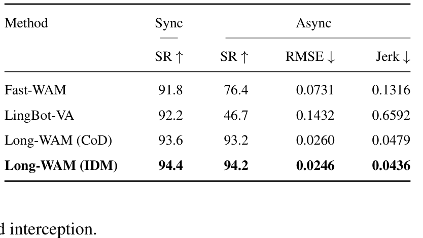

| Method | Sync SR ↑ | Async SR ↑ | RMSE ↓ | Jerk ↓ |
| :--- | :---: | :---: | :---: | :---: |
| Fast-WAM | 91.8 | 76.4 | 0.0731 | 0.1316 |
| LingBot-VA | 92.2 | 46.7 | 0.1432 | 0.6592 |
| Long-WAM (CoD) | 93.6 | 93.2 | 0.0260 | 0.0479 |
| Long-WAM (IDM) | 94.4 | 94.2 | 0.0246 | 0.0436 |

**Caption:** Table 7 | RoboTwin 2.0 success rate (SR, %). Sync: Table 2; Async: our evaluation. Jerk denotes a discrete smoothness proxy; see Appendix E.

**Caption[CN]:** 表 7 | RoboTwin 2.0 基准上的同步与纯异步执行成功率（SR, %）对比。Sync：表 2 中的同步执行；Async：纯异步执行评测。Jerk（跃度）为离散平滑度代理指标，详见附录 E。

### Table 8. 不同计算设备上的累积优化端到端推理延迟

| Optimization | RTX 5090 E2E (ms) ↓ | RTX 5090 Speedup ↑ | DGX Spark E2E (ms) ↓ | DGX Spark Speedup ↑ | Thor E2E (ms) ↓ | Thor Speedup ↑ |
| :--- | :---: | :---: | :---: | :---: | :---: | :---: |
| **Shared optimizations** | | | | | | |
| BF16 eager | 356.0 | 1.0× | 1342.8 | 1.0× | 1215.2 | 1.0× |
| + NVFP4 quantization + CUDA Graph + compile | 172.4 | 2.1× | 686.4 | 2.0× | 762.4 | 1.6× |
| + Denoising-invariant reuse | 144.9 | 2.5× | 464.5 | 2.9× | 524.5 | 2.3× |
| + Shared input quantization | 130.3 | 2.7× | 427.8 | 3.1× | 476.5 | 2.6× |
| + Video–action online softmax | 126.9 | 2.8× | 419.9 | 3.2× | 468.2 | 2.6× |
| **Device-specific tuning** | | | | | | |
| + Quant/GEMM tuning | 119.1 | 3.0× | 415.6 | 3.2× | 458.9 | 2.6× |
| + Backend selection | 107.4 | 3.3× | 328.2 | 4.1× | 378.7 | 3.2× |

**Caption:** Table 8 | End-to-end latency (E2E) of Long-WAM under cumulative optimizations across devices, including the full VAE computation. Each row keeps all preceding optimizations on a fixed input; speedups are relative to BF16 eager. The first optimized stage combines NVFP4 quantization, CUDA Graph replay, and compilation.

**Caption[CN]:** 表 8 | 跨不同计算硬件平台在逐级累积优化下的 Long-WAM 端到端延迟（E2E，毫秒），包含完整的 VAE 编解码计算。每一行在固定输入张量下保留所有先前已启用的优化技术；加速比统一相对于各设备上的原生 BF16 eager 模式计算。第一个优化阶段综合了 NVFP4 浮点量化、CUDA Graph 重放以及 PyTorch 图编译。

> <strong>Para. 9:</strong> Pure Asynchronous Execution. Long-WAM largely preserves synchronous success. At $S = 12$ ($R = 24$), IDM loses 0.2 percentage points (94.4% to 94.2%) and CoD loses 0.4; Fast-WAM and LingBot-VA [26] lose 15.4 and 45.5 (Table 7). Long-WAM’s overlap RMSE and jerk are about one-third of Fast-WAM’s. With a shorter overlap ($S = 16$), asynchronous success reaches 95.0%, on par with synchronous execution (Appendix E).

> <strong>Para. 9[CN]:</strong> 纯异步执行鲁棒性。Long-WAM 在异步执行下几乎完美保全了其同步控制的成功率。在 $S = 12$（$R = 24$）的标准设置下，IDM 仅损失了微弱的 0.2 个百分点（从 94.4% 微降至 94.2%），CoD 仅损失 0.4 个百分点；而 Fast-WAM 和 LingBot-VA [26] 则分别暴跌了 15.4 和 45.5 个百分点（表 7）。Long-WAM 在动作交接处的重叠 RMSE 和跃度（Jerk）仅为 Fast-WAM 的约三分之一。当采用更紧凑的短重叠配置（$S = 16$）时，异步成功率更是逆势提升至 95.0%，与理想同步执行完全并驾齐驱（附录 E）。

> <strong>Para. 10:</strong> Cumulative Acceleration. NVFP4’s compute savings can be offset by the launch overhead of added small kernels. When combined with CUDA Graph replay and compilation, NVFP4 yields end-to-end speedups while retaining reduced weight and activation storage. Together with the remaining shared optimizations, this reduces latency to 126.9, 419.9, and 468.2 ms on RTX 5090, Spark, and Thor (Table 8). Device-specific tuning reduces latency by another 15–22%, yielding 107.4, 328.2, and 378.7 ms, for total speedups of 3.3×, 4.1×, and 3.2× over BF16 eager. Appendix F details timing and configuration-dependent KV reuse effects.

> <strong>Para. 10[CN]:</strong> 累积加速效果拆解。NVFP4 的纯计算节省极易被新增大量小算子的 CPU 发射与调度开销所蚕食。当与 CUDA Graph 重放和 PyTorch 图编译深度结合时，NVFP4 在大幅压缩显存足迹的同时转化为实打实的端到端加速。辅以其余跨设备通用优化，系统在 RTX 5090、DGX Spark 和 Jetson Thor 上的端到端延迟分别压缩至 126.9、419.9 和 468.2 毫秒（表 8）。特定硬件专属调优进一步将延迟降低了 15% 至 22%，最终达成 107.4、328.2 和 378.7 毫秒的极致性能，相对于原生 BF16 eager 模式分别斩获 3.3 倍、4.1 倍和 3.2 倍的综合加速比。附录 F 深入剖析了时间开销构成与依赖配置的 KV 复用增益。

---

## References | 参考文献

> <strong>Para. 1:</strong> **Bibliographic Note:** The 59 references below are retained in their complete scholarly bibliographic format to ensure citation integrity, literature indexing, and cross-referencing fidelity across academic databases.

> <strong>Para. 1[CN]:</strong> **文献说明：** 以下共计 59 条参考文献均完整保留其学术规范原文书目格式，确保在 Google Scholar、arXiv 及学术数字图书馆中的引文检索精确性、文献索引完整性与学术严谨性。

1. [1] AgiBot-World-Contributors, Qingwen Bu, Jisong Cai, Li Chen, Xiuqi Cui, Yan Ding, Siyuan Feng, Shenyuan Gao, Xindong He, Xuan Hu, Xu Huang, Shu Jiang, Yuxin Jiang, Cheng Jing, Hongyang Li, Jialu Li, Chiming Liu, Yi Liu, Yuxiang Lu, Jianlan Luo, Ping Luo, Yao Mu, Yuehan Niu, Yixuan Pan, Jiangmiao Pang, Yu Qiao, Guanghui Ren, Cheng Ruan, Jiaqi Shan, Yongjian Shen, Chengshi Shi, Mingkang Shi, Modi Shi, Chonghao Sima, Jianheng Song, Huijie Wang, Wenhao Wang, Dafeng Wei, Chengen Xie, Guo Xu, Junchi Yan, Cunbiao Yang, Lei Yang, Shukai Yang, Maoqing Yao, Jia Zeng, Chi Zhang, Qinglin Zhang, Bin Zhao, Chengyue Zhao, Jiaqi Zhao, and Jianchao Zhu. AgiBot World Colosseo: A Large-scale Manipulation Platform for Scalable and Intelligent Embodied Systems, 2025. URL https://arxiv.org/abs/2503.06669.
2. [2] Jason Ansel, Edward Yang, Horace He, Natalia Gimelshein, Animesh Jain, Michael Voznesensky, Bin Bao, Peter Bell, David Berard, Evgeni Burovski, Geeta Chauhan, Anjali Chourdia, Will Constable, Alban Desmaison, Zachary DeVito, Elias Ellison, Will Feng, Jiong Gong, Michael Gschwind, Brian Hirsh, Sherlock Huang, Kshiteej Kalambarkar, Laurent Kirsch, Michael Lazos, Mario Lezcano, Yanbo Liang, Jason Liang, Yinghai Lu, C. K. Luk, Bert Maher, Yunjie Pan, Christian Puhrsch, Matthias Reso, Mark Saroufim, Marcos Yukio Siraichi, Helen Suk, Shunting Zhang, Michael Suo, Phil Tillet, Xu Zhao, Eikan Wang, Keren Zhou, Richard Zou, Xiaodong Wang, Ajit Mathews, William Wen, Gregory Chanan, Peng Wu, and Soumith Chintala. PyTorch 2: Faster Machine Learning Through Dynamic Python Bytecode Transformation and Graph Compilation. In Proceedings of the 29th ACM International Conference on Architectural Support for Programming Languages and Operating Systems, Volume 2, pp. 929–947. ACM, 2024. doi: 10.1145/3620665.3640366. URL https://doi.org/10.1145/3620665.3640366.
3. [3] Hongzhe Bi, Hengkai Tan, Shenghao Xie, Zeyuan Wang, Shuhe Huang, Haitian Liu, Ruowen Zhao, Yao Feng, Chendong Xiang, Yinze Rong, Hongyan Zhao, Hanyu Liu, Zhizhong Su, Lei Ma, Hang Su, and Jun Zhu. Motus: A Unified Latent Action World Model, 2025. URL https://arxiv.org/abs/2512.13030.
4. [4] Kevin Black, Noah Brown, Danny Driess, Adnan Esmail, Michael Equi, Chelsea Finn, Niccolo Fusai, Lachy Groom, Karol Hausman, Brian Ichter, Szymon Jakubczak, Tim Jones, Liyiming Ke, Sergey Levine, Adrian Li-Bell, Mohith Mothukuri, Suraj Nair, Karl Pertsch, Lucy Shi, Laura Smith, James Tanner, Quan Vuong, Anna Walling, Haohuan Wang, and Ury Zhilinsky. 𝜋0: A Vision-Language-Action Flow Model for General Robot Control. In Robotics: Science and Systems XXI, RSS2025. Robotics: Science and Systems Foundation, June 2025. doi: 10.15607/rss.2025.xxi.010. URL http: //dx.doi.org/10.15607/RSS.2025.XXI.010.
5. [5] Kevin Black, Manuel Galliker, and Sergey Levine. Real-Time Execution of Action Chunking Flow Policies. In Advances in Neural Information Processing Systems 38, NeurIPS 2025, pp. 37596–37620. Neural Information Processing Systems Foundation, Inc. (NeurIPS), 2025. doi: 10.52202/085713-1122. URL http://dx.doi.org/10.52202/085713-1122.
6. [6] Kevin Black, Allen Z. Ren, Michael Equi, and Sergey Levine. Training-Time Action Conditioning for Efficient Real-Time Chunking, 2025. URL https://arxiv.org/abs/2512.05964.
7. [7] Jisong Cai, Long Ling, Shiwei Chu, Zhongshan Liu, Jiayue Kang, Zhixuan Liang, Wenjie Xu, Yinan Mao, Weinan Zhang, Xiaokang Yang, Ru Ying, Ran Zheng, and Yao Mu. AHA-WAM:Asynchronous Horizon-Adaptive World-Action Modeling with Observation-Guided Context Routing, 2026. URL https://arxiv.org/abs/2606.09811.
8. [8] Ronghan Chen, Yandan Yang, Zuojin Tang, Dongjie Huo, Tong Lin, Haoning Wu, Haoyun Liu, Yuzhi Chen, Lulu Zheng, Botai Yuan, Tianlun Li, Mingxin Wang, Dekang Qi, Bin Hu, Wei Mei, Yuze Xuan, Haolong Yang, Yanqing Zhu, Mu Xu, Zhiheng Ma, and Xinyuan Chang. ABot-M0.5: Unified Mobility-and-Manipulation World Action Model, 2026. URL https://arxiv.org/abs/2607.00678.
9. [9] Tianxing Chen, Zanxin Chen, Baijun Chen, Zijian Cai, Yibin Liu, Zixuan Li, Qiwei Liang, Xianliang Lin, Yiheng Ge, Zhenyu Gu, Weiliang Deng, Yubin Guo, Tian Nian, Xuanbing Xie, Qiangyu Chen, Kailun Su, Tianling Xu, Guodong Liu, Mengkang Hu, Huan ang Gao, Kaixuan Wang, Zhixuan Liang, Yusen Qin, Xiaokang Yang, Ping Luo, and Yao Mu. RoboTwin 2.0: A Scalable Data Generator and Benchmark with Strong Domain Randomization for Robust Bimanual Robotic Manipulation, 2025. URL https://arxiv.org/abs/2506.18088.
10. [10] Xinyi Chen, Yilun Chen, Yanwei Fu, Ning Gao, Jiaya Jia, Weiyang Jin, Hao Li, Yao Mu, Jiangmiao Pang, Yu Qiao, Yang Tian, Bin Wang, Bolun Wang, Fangjing Wang, Hanqing Wang, Tai Wang, Ziqin Wang, Xueyuan Wei, Chao Wu, Shuai Yang, Jinhui Ye, Junqiu Yu, Jia Zeng, Jingjing Zhang, Jinyu Zhang, Shi Zhang, Feng Zheng, Bowen Zhou, and Yangkun Zhu. InternVLA-M1: A Spatially Guided Vision-Language-Action Framework for Generalist Robot Policy, 2025. URL https://arxiv.org/abs/2510.13778.
11. [11] Yukang Chen, Luozhou Wang, Wei Huang, Shuai Yang, Bohan Zhang, Yicheng Xiao, Ruihang Chu, Weian Mao, Qixin Hu, Shaoteng Liu, Yuyang Zhao, Huizi Mao, Ying-Cong Chen, Enze Xie, Xiaojuan Qi, and Song Han. LongLive-2.0: An NVFP4 Parallel Infrastructure for Long Video Generation, 2026. URL https://arxiv.org/abs/2605.18739.
12. [12] Sharan Chetlur, Cliff Woolley, Philippe Vandermersch, Jonathan Cohen, John Tran, Bryan Catanzaro, and Evan Shelhamer. cuDNN: Efficient Primitives for Deep Learning, 2014. URL https://arxiv.org/abs/1410.0759. 12 13 === Long-WAM: Scaling the Context of World-Action Models
13. [13] Cheng Chi, Siyuan Feng, Yilun Du, Zhenjia Xu, Eric Cousineau, Benjamin Burchfiel, and Shuran Song. Diffusion Policy: Visuomotor Policy Learning via Action Diffusion. In Robotics: Science and Systems XIX, RSS2023. Robotics: Science and Systems Foundation, July 2023. doi: 10.15607/rss.2023.xix.026. URL http://dx.doi.org/10.15607/RSS.2023. XIX.026.
14. [14] Yufan Deng, Zilin Pan, Hongyu Zhang, Xiaojie Li, Ruoqing Hu, Yufei Ding, Yiming Zou, Yan Zeng, and Daquan Zhou. Rethinking Video Generation Model for the Embodied World, 2026. URL https://arxiv.org/abs/2601.15282.
15. [15] Heng Fang, Shangru Li, Shuhan Wang, Xuanyang Xi, Dingkang Liang, and Xiang Bai. Towards Generalizable Robotic Manipulation in Dynamic Environments. In European Conference on Computer Vision (ECCV), 2026.
16. [16] Yusen Feng, Bingchen Han, Jiangran Lyu, Kai Liu, Yixin Zheng, Yuxuan Wan, Weiheng Liu, Sun Han, Ruiqin Li, Yulong Zhang, Fangfu Liu, Xuesong Shi, Libin Liu, Yizhou Wang, Zhizheng Zhang, and He Wang. WAM-TTT: Steering World-Action Models by Watching Human Play at Test Time, 2026. URL https://arxiv.org/abs/2607.06988.
17. [17] Alan Gray. Getting Started with CUDA Graphs. NVIDIA Technical Blog, 2019. URL https://developer.nvidia. com/blog/cuda-graphs/.
18. [18] Ryan Hoque, Peide Huang, David Yoon, Mouli Sivapurapu, and Jian Zhang. EgoDex: Learning Dexterous Manipulation from Large-Scale Egocentric Video. In C. Vondrick, B. Hariharan, C. Raffel, L. Pinto, D. Yang, and A. Faust (eds.), International Conference on Learning Representations, volume 2026, pp. 4218–4237, 2026. URL https://proceedings.iclr.cc/ paper_files/paper/2026/file/07fcc6e2b89439d3ee5ab60939aaa6a0-Paper-Conference.pdf.
19. [19] Muyan Hu, Ashwin Venkatram, Shreyashri Biswas, Balamurugan Marimuthu, Bohan Hou, Gabriele Oliaro, Haojie Wang, Liyan Zheng, Xupeng Miao, Jidong Zhai, and Zhihao Jia. Optimal Kernel Orchestration for Tensor Programs with Korch. In Proceedings of the 29th ACM International Conference on Architectural Support for Programming Languages and Operating Systems, Volume 3, pp. 755–769. ACM, 2024. doi: 10.1145/3620666.3651383. URL https://doi.org/10.1145/ 3620666.3651383.
20. [20] Yunfan Jiang, Yevgen Chebotar, Ruijie Zheng, Fengyuan Hu, Yunhao Ge, Jimmy Wu, Tianyuan Dai, Scott Reed, Li Fei-Fei, Yuke Zhu, and Linxi “Jim” Fan. RoboTTT: Context Scaling for Robot Policies, 2026. URL https://arxiv.org/abs/ 2607.15275.
21. [21] Dongyoung Kim, Huiwon Jang, Myungkyu Koo, Suhyeok Jang, Taeyoung Kim, Beomjun Kim, Byungjun Yoon, Changsung Jang, Daewon Choi, Dongsu Han, Donguk Lee, Heeseung Kwon, Hojin Jeon, Jaehyun Kang, Jaekyoung Bae, Jihyuk Lee, Jimin Lee, John Won, Joonwoo Ahn, Junhyeong Park, Junyoung Sung, Kyungmin Lee, Minseong Han, Minsung Yoon, Sejune Joo, Seonil Son, Seungcheol Park, Seunggeun Cho, Seungjun Moon, Seungku Kim, Yonghoon Dong, Yongjin Cho, Youngchan Kim, Chang Hwan Kim, Dohyeon Kim, Heecheol Kim, Heewon Lee, Hensen Ahn, Hyungkyu Ryu, Hyunsoo Choi, Hyunsoo Shin, Jaeheon Jung, Jaewoo Kim, Jinwook Kim, Joochul Chang, Joonsoo Kim, Junghun Park, Jungwoo Park, Junho Cho, Junhyeok Park, Junwon Lee, Kangwook Lee, Kwanghoon Kim, Kyoungwhan Choe, Manoj Bhadu, Nayoung Oh, Sangjun Kim, Sangwoo Kim, Seunghoon Shim, Seunghyun Kim, Seungjun Lee, Seungyup Ka, Sungryol Yang, Wook Jung, Yashu Shukla, Yeonjae Lee, Yeonwoo Bae, and Jinwoo Shin. RLDX-1 Technical Report, 2026. URL https://arxiv.org/abs/2605.03269.
22. [22] Moo Jin Kim, Karl Pertsch, Siddharth Karamcheti, Ted Xiao, Ashwin Balakrishna, Suraj Nair, Rafael Rafailov, Ethan Foster, Grace Lam, Pannag Sanketi, Quan Vuong, Thomas Kollar, Benjamin Burchfiel, Russ Tedrake, Dorsa Sadigh, Sergey Levine, Percy Liang, and Chelsea Finn. OpenVLA: An Open-Source Vision-Language-Action Model, 2024. URL https: //arxiv.org/abs/2406.09246.
23. [23] Moo Jin Kim, Chelsea Finn, and Percy Liang. Fine-Tuning Vision-Language-Action Models: Optimizing Speed and Success, 2025. URL https://arxiv.org/abs/2502.19645.
24. [24] Moo Jin Kim, Yihuai Gao, Tsung-Yi Lin, Yen-Chen Lin, Yunhao Ge, Grace Lam, Percy Liang, Shuran Song, Ming-Yu Liu, Chelsea Finn, and Jinwei Gu. Cosmos Policy: Fine-Tuning Video Models for Visuomotor Control and Planning, 2026. URL https://arxiv.org/abs/2601.16163.
25. [25] Wayne King, Zeyue Xue, Yuxuan Bian, Jie Huang, Haoran Li, Yaowei Li, Yaofeng Su, Yuming Li, Haoyu Wang, Shiyi Zhang, Songchun Zhang, Yuwei Niu, Sihan Xu, Junhao Zhuang, Haoyang Huang, and Nan Duan. Echo-Memory: A Controlled Study of Memory in Action World Models, 2026. URL https://arxiv.org/abs/2606.09803.
26. [26] Lin Li, Qihang Zhang, Yiming Luo, Shuai Yang, Ruilin Wang, Fei Han, Mingrui Yu, Zelin Gao, Nan Xue, Xing Zhu, Yujun Shen, and Yinghao Xu. Causal World Modeling for Robot Control, 2026. URL https://arxiv.org/abs/2601.21998.
27. [27] Qixiu Li, Yu Deng, Yaobo Liang, Lin Luo, Lei Zhou, Chengtang Yao, Lingqi Zeng, Zhiyuan Feng, Huizhi Liang, Sicheng Xu, Yizhong Zhang, Xi Chen, Hao Chen, Lily Sun, Dong Chen, Jiaolong Yang, and Baining Guo. Scalable Vision-Language-Action Model Pretraining for Robotic Manipulation with Real-Life Human Activity Videos, 2025. URL https://arxiv.org/ abs/2510.21571. 13 14 === Long-WAM: Scaling the Context of World-Action Models
28. [28] Wuyang Li, Wentao Pan, Po-Chien Luan, Yang Gao, and Alexandre Alahi. Stable Video Infinity: Infinite-Length Video Genera- tion with Error Recycling. In C. Vondrick, B. Hariharan, C. Raffel, L. Pinto, D. Yang, and A. Faust (eds.), International Con- ference on Learning Representations, volume 2026, pp. 23406–23432, 2026. URL https://proceedings.iclr.cc/ paper_files/paper/2026/file/2858f8c8683aaa8c12d487354cf328dc-Paper-Conference.pdf.
29. [29] Xuewu Lin, Tianwei Lin, Yun Du, Hongyu Xie, Yiwei Jin, Jiawei Li, Shijie Wu, Qingze Wang, Mengdi Li, Mengao Zhao, Ziang Li, Chaodong Huang, Hongzhe Bi, Lichao Huang, and Zhizhong Su. HoloBrain-0 Technical Report, 2026. URL https://arxiv.org/abs/2602.12062.
30. [30] Bo Liu, Yifeng Zhu, Chongkai Gao, Yihao Feng, Qiang Liu, Yuke Zhu, and Peter Stone. LIBERO: Benchmarking Knowl- edge Transfer for Lifelong Robot Learning. In A. Oh, T. Naumann, A. Globerson, K. Saenko, M. Hardt, and S. Levine (eds.), Advances in Neural Information Processing Systems, volume 36, pp. 44776–44791. Curran Associates, Inc., 2023. doi: 10.52202/075280-1939. URL https://proceedings.neurips.cc/paper_files/paper/2023/file/ 8c3c666820ea055a77726d66fc7d447f-Paper-Datasets_and_Benchmarks.pdf.
31. [31] Maxim Milakov and Natalia Gimelshein. Online normalizer calculation for softmax, 2018. URL https://arxiv.org/ abs/1805.02867.
32. [32] Motubrain Team. World Action Models in Real Time: An Empirical Study of Smooth Execution via Asynchronous Deployment, 2026. URL https://arxiv.org/abs/2608.01880.
33. [33] Soroush Nasiriany, Abhiram Maddukuri, Lance Zhang, Adeet Parikh, Aaron Lo, Abhishek Joshi, Ajay Mandlekar, and Yuke Zhu. RoboCasa: Large-Scale Simulation of Household Tasks for Generalist Robots. In Proceedings of Robotics: Science and Systems, Delft, Netherlands, July 2024. doi: 10.15607/RSS.2024.XX.050. URL https://www.roboticsproceedings. org/rss20/p050.html.
34. [34] Soroush Nasiriany, Sep Nasiriany, Abhiram Maddukuri, and Yuke Zhu. RoboCasa365: A Large-Scale Simu- lation Framework for Training and Benchmarking Generalist Robots. In C. Vondrick, B. Hariharan, C. Raf- fel, L. Pinto, D. Yang, and A. Faust (eds.), International Conference on Learning Representations, volume 2026, pp. 98643–98667, 2026. URL https://proceedings.iclr.cc/paper_files/paper/2026/file/ a05003fdb1e9562ab0c0a9719ea4de10-Paper-Conference.pdf.
35. [35] NVIDIA. NVIDIA Blackwell Architecture Technical Brief, 2024. URL https://resources.nvidia.com/ en-us-blackwell-architecture/blackwell-architecture-technical-brief.
36. [36] NVIDIA, Johan Bjorck, Fernando Castañeda, Nikita Cherniadev, Xingye Da, Runyu Ding, Linxi “Jim” Fan, Yu Fang, Dieter Fox, Fengyuan Hu, Spencer Huang, Joel Jang, Zhenyu Jiang, Jan Kautz, Kaushil Kundalia, Lawrence Lao, Zhiqi Li, Zongyu Lin, Kevin Lin, Guilin Liu, Edith Llontop, Loic Magne, Ajay Mandlekar, Avnish Narayan, Soroush Nasiriany, Scott Reed, You Liang Tan, Guanzhi Wang, Zu Wang, Jing Wang, Qi Wang, Jiannan Xiang, Yuqi Xie, Yinzhen Xu, Zhenjia Xu, Seonghyeon Ye, Zhiding Yu, Ao Zhang, Hao Zhang, Yizhou Zhao, Ruijie Zheng, and Yuke Zhu. GR00T N1: An Open Foundation Model for Generalist Humanoid Robots, 2025. URL https://arxiv.org/abs/2503.14734.
37. [37] NVIDIA GEAR. PhysicalAI-Robotics-GR00T-Teleop-Sim: Simulation GR1 Tabletop Task 1K Dataset. Hugging Face dataset, 2025. URL https://huggingface.co/datasets/nvidia/PhysicalAI-Robotics-GR00T-Teleop-Sim.
38. [38] Physical Intelligence, Kevin Black, Noah Brown, James Darpinian, Karan Dhabalia, Danny Driess, Adnan Esmail, Michael Equi, Chelsea Finn, Niccolo Fusai, Manuel Y. Galliker, Dibya Ghosh, Lachy Groom, Karol Hausman, Brian Ichter, Szymon Jakubczak, Tim Jones, Liyiming Ke, Devin LeBlanc, Sergey Levine, Adrian Li-Bell, Mohith Mothukuri, Suraj Nair, Karl Pertsch, Allen Z. Ren, Lucy Xiaoyang Shi, Laura Smith, Jost Tobias Springenberg, Kyle Stachowicz, James Tanner, Quan Vuong, Homer Walke, Anna Walling, Haohuan Wang, Lili Yu, and Ury Zhilinsky. 𝜋0.5: a Vision-Language-Action Model with Open-World Generalization, 2025. URL https://arxiv.org/abs/2504.16054.
39. [39] Ryan Punamiya, Simar Kareer, Zeyi Liu, Josh Citron, Ri-Zhao Qiu, Xiongyi Cai, Alexey Gavryushin, Jiaqi Chen, Davide Liconti, Lawrence Y. Zhu, Patcharapong Aphiwetsa, Baoyu Li, Aniketh Cheluva, Pranav Kuppili, Yangcen Liu, Dhruv Patel, Aidan Gao, Hye-Young Chung, Ryan Co, Renee Zbizika, Jeff Liu, Xiaomeng Xu, Haoyu Xiong, Geng Chen, Sebastiano Oliani, Wenkai Xuan, Chenyu Yang, Xi Wang, James Fort, Richard Newcombe, Josh Gao, Jason Chong, Garrett Matsuda, Aseem Doriwala, Marc Pollefeys, Robert Katzschmann, Xiaolong Wang, Shuran Song, Judy Hoffman, and Danfei Xu. EgoVerse: An Egocentric Human Dataset for Robot Learning from Around the World, 2026. URL https://arxiv.org/abs/2604.07607.
40. [40] RoboCasa Team. RoboCasa365 Leaderboard. https://robocasa.ai/leaderboard.html, 2026. Snapshot updated September 12, 2026; accessed September 16, 2026.
41. [41] StarVLA Community. StarVLA: A Lego-like Codebase for Vision-Language-Action Model Developing, 2026. URL https: //arxiv.org/abs/2604.05014. 14 15 === Long-WAM: Scaling the Context of World-Action Models
42. [42] Haisheng Su, Zongdai Liu, Xin Jin, Haoxuan Dou, Chengming Hu, Baorun Li, Zhanwang Liu, Ruiyan Xu, Jianjie Fang, Xin Zhang, Zhenjie Yang, Xue Yang, Chen Gao, Junchi Yan, Yong Li, and Wei Wu. WorldScape Policy 2.0: Empowering Steerable World Action Modeling with Reasoning-Augmented Memory, 2026. URL https://arxiv.org/abs/2607.18840.
43. [43] Jianlin Su, Murtadha Ahmed, Yu Lu, Shengfeng Pan, Wen Bo, and Yunfeng Liu. RoFormer: Enhanced transformer with Rotary Position Embedding. Neurocomputing, 568:127063, 2024. ISSN 0925-2312. doi: 10.1016/j.neucom.2023.127063. URL https://doi.org/10.1016/j.neucom.2023.127063.
44. [44] Xiaoquan Sun, Ruijian Zhang, Chen Cao, Yihan Sun, Jiahui Chen, Zetian Xu, Bo Chen, Haijier Chen, Zhen Yang, Jiarun Zhu, Yijun Hong, JingZhe Xu, Jingrui Pang, Mingqi Yuan, and Jiayu Chen. HiMem-WAM: Hierarchical Memory-Gated World Action Models for Robotic Manipulation, 2026. URL https://arxiv.org/abs/2606.10363.
45. [45] Zhenguo Sun, Yu Sun, Hande Huang, and Alois Knoll. 𝜔-EVA: Envision, Verify, and Act with Latent Interactive World Models, 2026. URL https://arxiv.org/abs/2606.09457.
46. [46] Team Wan, Ang Wang, Baole Ai, Bin Wen, Chaojie Mao, Chen-Wei Xie, Di Chen, Feiwu Yu, Haiming Zhao, Jianxiao Yang, Jianyuan Zeng, Jiayu Wang, Jingfeng Zhang, Jingren Zhou, Jinkai Wang, Jixuan Chen, Kai Zhu, Kang Zhao, Keyu Yan, Lianghua Huang, Mengyang Feng, Ningyi Zhang, Pandeng Li, Pingyu Wu, Ruihang Chu, Ruili Feng, Shiwei Zhang, Siyang Sun, Tao Fang, Tianxing Wang, Tianyi Gui, Tingyu Weng, Tong Shen, Wei Lin, Wei Wang, Wei Wang, Wenmeng Zhou, Wente Wang, Wenting Shen, Wenyuan Yu, Xianzhong Shi, Xiaoming Huang, Xin Xu, Yan Kou, Yangyu Lv, Yifei Li, Yijing Liu, Yiming Wang, Yingya Zhang, Yitong Huang, Yong Li, You Wu, Yu Liu, Yulin Pan, Yun Zheng, Yuntao Hong, Yupeng Shi, Yutong Feng, Zeyinzi Jiang, Zhen Han, Zhi-Fan Wu, and Ziyu Liu. Wan: Open and Advanced Large-Scale Video Generative Models, 2025. URL https://arxiv.org/abs/2503.20314.
47. [47] Kai Wang, Zhaopeng Gu, Yixiang Chen, Yuan Xu, Qisen Ma, Jiabing Yang, Zhaowen Li, Yan Huang, Liang Wang, and Peng Su. DIM-WAM: World-Action Modeling with Diverse Historical Event Memory, 2026. URL https://arxiv.org/abs/ 2606.27677.
48. [48] Ruixiang Wang, Qingming Liu, Yueci Deng, Guiliang Liu, Zhen Liu, and Kui Jia. EVA: Aligning Video World Models with Executable Robot Actions via Inverse Dynamics Rewards, 2026. URL https://arxiv.org/abs/2603.17808.
49. [49] Yuqi Wang, Xinghang Li, Wenxuan Wang, Junbo Zhang, Yingyan Li, Yuntao Chen, Xinlong Wang, and Zhaoxiang Zhang. Unified Vision-Language-Action Model, 2025. URL https://arxiv.org/abs/2506.19850.
50. [50] Sizhe Yang, Juncheng Mu, Tianming Wei, Chenhao Lu, Xiaofan Li, Linning Xu, Zhengrong Xue, Zhecheng Yuan, Dahua Lin, Jiangmiao Pang, and Huazhe Xu. MemoryWAM: Efficient World Action Modeling with Persistent Memory, 2026. URL https://arxiv.org/abs/2606.20562.
51. [51] Angen Ye, Boyuan Wang, Chaojun Ni, Guan Huang, Guosheng Zhao, Hao Li, Hengtao Li, Jie Li, Jindi Lv, Jingyu Liu, Min Cao, Peng Li, Qiuping Deng, Wenjun Mei, Xiaofeng Wang, Xinze Chen, Xinyu Zhou, Yang Wang, Yifan Chang, Yifan Li, Yukun Zhou, Yun Ye, Zhichao Liu, and Zheng Zhu. GigaWorld-Policy: An Efficient Action-Centered World–Action Model, 2026. URL https://arxiv.org/abs/2603.17240.
52. [52] Seonghyeon Ye, Yunhao Ge, Kaiyuan Zheng, Shenyuan Gao, Sihyun Yu, George Kurian, Suneel Indupuru, You Liang Tan, Chuning Zhu, Jiannan Xiang, Ayaan Malik, Kyungmin Lee, William Liang, Nadun Ranawaka, Jiasheng Gu, Yinzhen Xu, Guanzhi Wang, Fengyuan Hu, Avnish Narayan, Johan Bjorck, Jing Wang, Gwanghyun Kim, Dantong Niu, Ruijie Zheng, Yuqi Xie, Jimmy Wu, Qi Wang, Ryan Julian, Danfei Xu, Yilun Du, Yevgen Chebotar, Scott Reed, Jan Kautz, Yuke Zhu, Linxi “Jim” Fan, and Joel Jang. World Action Models are Zero-shot Policies, 2026. URL https://arxiv.org/abs/2602.15922.
53. [53] Haoqi Yuan, Zhixuan Liang, Anzhe Chen, Ye Wang, Haoyang Li, Pei Lin, Yiyang Huang, Zixing Lei, Tong Zhang, Jiazhao Zhang, Jie Zhang, Jingyang Fan, Gengze Zhou, Qihang Peng, Chenxu Lv, Xiaoyue Chen, An Yang, Fei Huang, Junyang Lin, Dayiheng Liu, Jingren Zhou, Chenfei Wu, and Xiong-Hui Chen. Qwen-RobotManip Technical Report: Alignment Unlocks Scale for Robotic Manipulation Foundation Models, 2026. URL https://arxiv.org/abs/2606.17846.
54. [54] Tianyuan Yuan, Zibin Dong, Yicheng Liu, and Hang Zhao. Fast-WAM: Do World Action Models Need Test-time Future Imagination?, 2026. URL https://arxiv.org/abs/2603.16666.
55. [55] Qihang Zhang, Lin Li, Luyao Zhang, Shuai Yang, Yiming Luo, Shuaiting Li, Ruilin Wang, Junke Wang, Jiahao Shao, Gangwei Xu, Jiaming Zhou, Yishu Shen, Yudong Jin, Fangyi Xu, Shuailei Ma, Jiaqi Liao, Guanxing Lu, Zifan Shi, Yongkun Wen, Yujie Zhao, Weixuan Tang, Xinyang Wang, Chaojian Li, Jiapeng Zhu, Ka Leong Cheng, Nan Xue, Xing Zhu, Yujun Shen, and Yinghao Xu. Native Video-Action Pretraining for Generalizable Robot Control, 2026. URL https://arxiv.org/abs/ 2607.08639.
56. [56] Yang Zhang, Jiangyuan Zhao, Chenyou Fan, Fangzheng Yan, Tian Li, Haitong Tang, Sen Fu, Xuan’er Wu, Qizhen Weng, Weinan Zhang, Xiu Li, Chi Zhang, Chenjia Bai, and Xuelong Li. PRTS: A Primitive Reasoning and Tasking System via Contrastive Representations, 2026. URL https://arxiv.org/abs/2604.27472. 15 16 === Long-WAM: Scaling the Context of World-Action Models
57. [57] Tianchen Zhao, Tongcheng Fang, Haofeng Huang, Rui Wan, Widyadewi Soedarmadji, Enshu Liu, Shiyao Li, Zinan Lin, Guohao Dai, Shengen Yan, Huazhong Yang, Xuefei Ning, and Yu Wang. ViDiT-Q: Efficient and Accurate Quantization of Diffusion Transformers for Image and Video Generation. In Y. Yue, A. Garg, N. Peng, F. Sha, and R. Yu (eds.), International Conference on Learning Representations, volume 2025, pp. 65811–65841, 2025. URL https://proceedings.iclr.cc/paper_ files/paper/2025/file/a4a1ee071ce0fe63b83bce507c9dc4d7-Paper-Conference.pdf.
58. [58] Jinliang Zheng, Jianxiong Li, Zhihao Wang, Dongxiu Liu, Xirui Kang, Yuchun Feng, Yinan Zheng, Jiayin Zou, Yilun Chen, Jia Zeng, Ya-Qin Zhang, Jiangmiao Pang, Jingjing Liu, Tai Wang, and Xianyuan Zhan. X-VLA: Soft-Prompted Transformer as Scalable Cross-Embodiment Vision-Language-Action Model, 2025. URL https://arxiv.org/abs/2510.10274.
59. [59] Deyu Zhou, Quan Sun, Yuang Peng, Kun Yan, Runpei Dong, Duomin Wang, Zheng Ge, Nan Duan, and Xiangyu Zhang. Taming Teacher Forcing for Masked Autoregressive Video Generation. In Proceedings of the IEEE/CVF Conference on Computer Vision and Pattern Recognition (CVPR), pp. 7374–7384, June 2025. URL https://openaccess.thecvf.com/content/CVPR2025/html/Zhou_Taming_Teacher_Forcing_ for_Masked_Autoregressive_Video_Generation_CVPR_2025_paper.html. 16

---

## Appendices | 详细附录

### Appendix A. Discussion and Conclusion | 深入讨论与总结

> <strong>Para. 1:</strong> Long-WAM studies context scaling where memory must ultimately serve action. The empirical gains on LIBERO-Long, RoboCasa GR-1, and real-world manipulation make recent physical history a useful resource for world-action modeling, while the deployment system connects that resource to responsive execution. This shifts the design question from whether a policy has memory to how its context, predictive representation, and execution budget should be designed together.

> <strong>Para. 1[CN]:</strong> Long-WAM 在“时序记忆必须最终服务于物理动作”的根本约束下深入探究了上下文扩展规律。在 LIBERO-Long、RoboCasa GR-1 以及物理真实机器人操作中所取得的显著经验性增益，证实了近程物理历史是世界-动作建模中极其宝贵的高价值资源；与此同时，一体化的端侧部署系统成功将这一资源转化为低延迟的高敏捷响应执行。这从根本上将具身智能的核心设计议题从“策略是否具备时序记忆”升维为“其上下文长度、前瞻预测表征与在线执行算力预算应当如何协同设计”。

> <strong>Para. 2:</strong> The goal is not unlimited history in the low-level controller. A manipulation policy benefits from remembering motion and recent interaction state, whereas hour-scale goals, reasoning, and task decomposition are naturally handled by a higher-level planner. These roles are complementary: a planner can maintain semantic continuity while Long-WAM executes local objectives with the physical context needed for control. The appropriate window may therefore depend on the task and the available compute, rather than follow a universal duration.

> <strong>Para. 2[CN]:</strong> 我们的终极目标并非在底层控制器中无节制地堆砌无限历史。底层物理操作策略的核心收益主要来自于记住当前的瞬时运动趋势与近期的物理交互微观状态；而小时级跨度的宏观长远目标、抽象语义推理以及复杂任务分解，天然更适合由高层逻辑规划器承担。二者的角色高度互补：高层规划器负责维持长期的语义连续性与逻辑编排，而 Long-WAM 则在精确控制所需的充沛物理时序上下文支撑下执行局部动作目标。因此，最理想的历史上下文窗口应紧密取决于具体任务特性与实时可用算力，而非盲目遵循某种通用的固定时长。

> <strong>Para. 3:</strong> Each context window in our study is trained as its own model, which gives a clean view of how much history helps at every length; the natural next step is a single policy that adjusts its window at test time. The measured latency profile (74.6 ms without history, 341.0 ms at 19.2 seconds; Appendix G) indicates how much computation such adaptivity could reclaim. The decline at 38.4 seconds coincides with sparse real history in current datasets (80.4% padding), so longer and denser robot recordings offer a direct route to extending the useful window. With the streaming deployment stack in place, real-robot context-length studies are a natural next step, showing how the simulated trends carry over to physical interaction.

> <strong>Para. 3[CN]:</strong> 在本研究中，每个上下文窗口长度均对应一个独立训练的模型版本，这为严格、纯净地观察“不同历史时长究竟能带来多少边际增益”提供了清晰无偏的科学视角；未来自然的研究演进方向是构建能够在测试期动态自适应调整历史窗口的单一通用策略模型。我们在附录 G 中实测的延迟曲线（无历史时为 74.6 毫秒，19.2 秒历史时为 341.0 毫秒）清晰指明了此类自适应机制所能释放的巨大计算吞吐潜力。而在 38.4 秒超长上下文下观察到的性能微弱回落，与当前机器人数据集中有效长历史的严重匮乏高度契合（填充帧比例高达 80.4%）；因此采集更长、更密集连续的物理机器人交互记录是进一步拓宽有效上下文窗口的直接坦途。随着流式边缘部署技术栈的彻底跑通，在物理真机上开展细粒度上下文长度缩放规律研究将是下一阶段的核心探索，进一步验证仿真中的演化趋势向真实物理环境迁移的鲁棒性。

> <strong>Para. 4:</strong> The observed trends motivate adaptive context allocation: preserving the history relevant to the current interaction while matching computation to its response requirements. They do not prescribe a power law or a fixed memory optimum. More broadly, Long-WAM motivates evaluating generative robot policies jointly by what they remember, how well they act, and how quickly they can incorporate new observations.

> <strong>Para. 4[CN]:</strong> 上述经验规律深刻启发了动态自适应上下文资源分配的系统设计哲学：在保留与当前物理交互高度相关的时序记忆的同时，使计算耗时与当前控制阶段的实时响应需求达到最优匹配。这些结论并非旨在拟合某条僵硬的幂律法则或断言存在固定的最优记忆长度。从更宏观的学术视野来看，Long-WAM 倡导建立全新的具身生成式策略评估范式——必须将模型“能够记住什么”、“动作执行质量如何”以及“以多快的速度消化吸收新观测”三者进行联合统一考量。

### Appendix B. Data and Model Training Details | 数据与模型训练细节

#### B.1. Pretraining Data | 预训练数据集统计

> <strong>Para. 5:</strong> The pretraining corpus contains 2,294,889 model-ready text-and-image-to-video samples from five dataset families. Table 9 records the six source subsets, including two AgiBot World subsets. The reported training, validation, and test splits contain 2,251,021, 21,931, and 21,937 samples, respectively. The approximately 10,000-hour training scale is a window-equivalent estimate: assigning 16 seconds to each training sample yields 10,004.5 aggregate hours. It is not a measurement of unique raw footage; overlapping windows, source clip lengths, and padding affect that distinction.

> <strong>Para. 5[CN]:</strong> 预训练语料库共汇聚了来自五大经典开源数据集家族的 2,294,889 条完全准备就绪的“文本+图像至视频”（Text-and-Image-to-Video, TI2V）样本。表 9 详尽记录了涵盖两个 AgiBot World 子集在内的六个数据来源划分。统计报告中的训练集、验证集和测试集划分分别包含 2,251,021、21,931 以及 21,937 个独立样本。正文中陈述的约 10,000 小时训练规模系指“窗口等效时长”（Window-Equivalent Estimate）：按每个训练样本对应 16 秒时间窗口换算，总计折合约 10,004.5 累计小时。该数值并不代表绝对不重复的原始视频总时长；滑动采样中的窗口重叠、源视频片段原始时长以及边界填充帧均会对实际唯一素材时长产生影响。

### Table 9. 预训练数据集构成统计

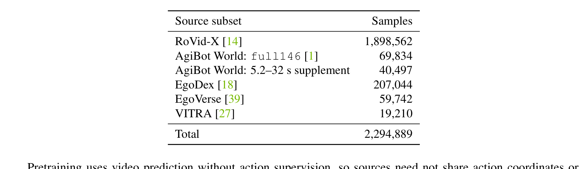

| Source subset | Samples |
| :--- | :---: |
| RoVid-X [14] | 1,898,562 |
| AgiBot World: full146 [1] | 69,834 |
| AgiBot World: 5.2–32 s supplement | 40,497 |
| EgoDex [18] | 207,044 |
| EgoVerse [39] | 59,742 |
| VITRA [27] | 19,210 |
| **Total** | **2,294,889** |

**Caption:** Table 9 | Pretraining data composition. Counts describe the full corpus before the train/validation/test split, not the published size of each source dataset.

**Caption[CN]:** 表 9 | 自回归预训练语料库构成细节。表中样本计数代表划分训练集、验证集和测试集之前的完整样本总量，而非各原始开源数据集的公开发布原始尺寸。

> <strong>Para. 6:</strong> Pretraining uses video prediction without action supervision, so sources need not share action coordinates or actuator dimensions. Action-space-independent supervision is a property of this stage; improved transfer to an unseen embodiment would require a separate evaluation.

> <strong>Para. 6[CN]:</strong> 视频预训练阶段完全依赖自监督物理视频演化预测，无需任何底层机器人动作标签，因此数据源无需统一动作坐标系、自由度或执行器控制协议。动作空间无关的监督是这一阶段的核心特性；而在该底座上针对全新未知本体迁移泛化能力的提升幅度，则需要建立独立的实验评估。

#### B.2. Training Objectives and Inference Interface | 训练优化目标与推理接口

> <strong>Para. 7:</strong> Video pretraining. Let $z_i$ denote an uncorrupted target chunk and $\epsilon_i \sim \mathcal{N}(0, I)$ its base Gaussian noise. With context, latent, and noise perturbations $\delta_i^c$, $\delta_i^z$, and $\delta_i^\epsilon$, the error-recycling inputs are:

> <strong>Para. 7[CN]:</strong> 视频自回归预训练。令 $z_i$ 表示未经破坏的目标视觉块，$\epsilon_i \sim \mathcal{N}(0, I)$ 为标准高斯底噪。在引入上下文、潜变量及噪声扰动量 $\delta_i^c$、$\delta_i^z$ 与 $\delta_i^\epsilon$ 后，具备误差复用能力的输入定义如下：

$$\bar{\epsilon}_i = \epsilon_i + \delta_i^\epsilon$$

$$x_i^{\sigma_i} = (1 - \sigma_i)(z_i + \delta_i^z) + \sigma_i \bar{\epsilon}_i$$

$$h_{<i} = (z_j + \delta_j^c)_{j < i}$$

> <strong>Para. 8:</strong> Perturbations are sampled from buffered model errors when their corresponding augmentation is enabled, and are zero otherwise. The velocity target is $\bar{\epsilon}_i - z_i$, not $\bar{\epsilon}_i - (z_i + \delta_i^z)$: latent-input corruption is corrected toward the original target. The conditioning image remains unperturbed and is excluded from the loss. Paired clean/noisy streams implement teacher forcing: a target block accesses preceding context blocks and its own noisy tokens, without accessing later blocks or its own clean target. Loss is averaged over eligible target elements and weighted by the scheduler, as in Eq. 2.

> <strong>Para. 8[CN]:</strong> 当对应的增强配置开启时，扰动项从历史推理缓冲的累积模型误差中采样；否则扰动项设为 0。流匹配速度场预测目标严格设定为 $\bar{\epsilon}_i - z_i$，而非 $\bar{\epsilon}_i - (z_i + \delta_i^z)$：这意味着潜变量输入中的破坏将被强力纠偏拉回至原始无噪真值。起始条件图像始终保持未被扰动状态且不参与损失计算。成对的干净/加噪数据流精确实现了强制教学（Teacher-Forcing）：目标块仅能访问先前的上下文块以及自身的加噪 token，绝不能访问未来块或自身的干净真值。损失在所有有效目标元素上求均值，并按照调度器权重加权，正如式 (2) 所示。

> <strong>Para. 9:</strong> World-action adaptation. Both branches use the flow path $x_\sigma = (1 - \sigma)x + \sigma \epsilon$ and target $u = \epsilon - x$. For branch $b \in \{v, a\}$, let $m_b$ select valid supervised elements and $r_b$ be its prediction residual. The masked loss is:

> <strong>Para. 9[CN]:</strong> 世界-动作适配。两个分支均遵循标准流匹配路径 $x_\sigma = (1 - \sigma)x + \sigma \epsilon$ 以及目标速度场 $u = \epsilon - x$。对于分支 $b \in \{v, a\}$，令 $m_b$ 选定有效受监督元素，$r_b$ 为其预测残差。带掩码的优化损失为：

$$\mathcal{L}_b = \mathbb{E} \left[ w_b(\sigma_b) \frac{\|m_b \odot r_b\|_2^2}{\max(\|m_b\|_1, 1)} \right]$$

$$r_b = v_b(x_b^{\sigma_b}, \sigma_b \mid \text{conditioning}) - (\epsilon_b - x_b)$$

> <strong>Para. 10:</strong> Here $\odot$ is element-wise multiplication, and the temporal validity mask is broadcast over feature dimensions. It excludes fully padded future latent steps and padded action timesteps. The video pass supervises noisy future latents with the observed prefix clamped clean. The action pass uses a detached video cache built from the observed prefix and ground-truth future latents forward-noised to $\sigma^\star = 0.9$. It updates the action expert and the shared proprioceptive adapter through the action-conditioning path, without backpropagating into the video cache. The two-pass objective does not use the paired-stream or error-recycling augmentations of video pretraining.

> <strong>Para. 10[CN]:</strong> 其中 $\odot$ 表示逐元素哈达玛乘积，时序有效性掩码在特征维度上广播。它严密排除了全填充的无效未来潜变量步长和填充的动作时间步。视频前向阶段对加噪的未来潜变量进行监督，并将已观测前缀严格固定为无噪；动作前向阶段则采用由观测前缀与加噪至 $\sigma^\star = 0.9$ 的真实未来潜变量共同构建的截断梯度（Detached）视觉缓存。动作损失通过条件化路径更新动作专家与共享本体感知适配器参数，绝不向视频缓存回传反向梯度。该双阶段目标不再使用视频预训练阶段的双流配对或误差复用增强。

> <strong>Para. 11:</strong> At inference, partial video rollout starts from Gaussian noise and stops at $\sigma^\star$; it does not observe ground-truth future frames. Training and inference share this noise level but not the source of the future latents: the training surrogate retains a residual ground-truth component. This is a training approximation, not an assertion of identical conditioning distributions. Future latents remain in latent space, and the resulting visual KV cache is reused throughout joint action-chunk denoising. Cache scope. The implementation appends a projection of the latest robot state $q_t$ to the conditioning tokens of both experts. Consequently, visual features can depend on $q_t$ at multiple layers. Reuse within one action solve is distinct from reuse across decisions: updating $q_t$, evicting old context, or changing temporal positions can invalidate previously computed visual keys and values. Any persistent-cache optimization must specify its refresh semantics and maintain the intended observation/position alignment.

> <strong>Para. 11[CN]:</strong> 在推理期，部分视频推演直接从高斯白噪声开始并在 $\sigma^\star$ 处截断停止，完全不依赖真实未来帧。训练与推理共享这一特定噪声截断水平，但未来潜变量的数据源存在差异：训练代理中保留了加噪的真实残差成分。这是一种为了训练稳定性而设计的实用代理手段，而非断言两者条件分布完全相同。生成的未来潜变量全程保留在潜空间中不解码为图像，其产生的视觉 KV 缓存被动作块联合去噪过程直接复用。缓存作用域说明：系统实现中将最新机器人关节状态 $q_t$ 的投影张量追加至双专家的条件 token 中。因此，视觉表征在多层网络中均会受到 $q_t$ 的调制。在单次动作求解内部复用 KV 缓存，与跨决策周期复用存在本质区别：更新关节状态 $q_t$、逐出旧上下文或移动时间序列位置，均会导致先前计算的视觉键值失效。任何跨周期的持久化缓存优化都必须明确指定严格的刷新语义，并精确维护观测帧与位置编码的时序对齐。

### Appendix C. LongLive2.0-Robot Video Predictions | 视频预测定性展示

> <strong>Para. 1:</strong> Given a single image and a language instruction, LongLive2.0-Robot predicts how a robot interacts with its environment (Figure 9). The selected rollouts follow the prompted tasks: the gripper positions a lid over a pan and withdraws, transfers the specified shoe into a container, and pulls a drawer open. Pouring and T-shirt folding further illustrate coordinated motion involving changing object configurations. Across these examples, the predicted arm movements and object transitions form coherent, task-directed sequences rather than merely preserving scene appearance. These qualitative results provide evidence that robot-video pretraining learns a predictive representation of robot motion and object interaction, supplying a task-conditioned visual prior for subsequent world-action adaptation.

> <strong>Para. 1[CN]:</strong> 在仅给定单张初始场景图像和自然语言指令的前提下，LongLive2.0-Robot 能够精确预测机器人与物理环境的后续交互全过程（图 9）。所展示的推演序列严格契合文本任务指令：夹爪将锅盖精准盖在平底锅上随后撤回、将指定的棕色鞋子抓取并放入蓝色收纳筐、平稳拉开抽屉。倒水与叠 T 恤的序列则进一步展示了涉及非刚体及流体接触的复杂形变协同控制。在所有这些定性范例中，预测出的机械臂轨迹与物体物理状态迁移构成了高度连贯、任务目标明确的时序序列，而非单纯维持背景画面的静态连贯。这些直观证据强力证明：机器人领域的自回归视频预训练成功习得了物理运动与物体交互的高阶预测表征，为下游的世界-动作模型适配提供了极其强大的任务条件化视觉动力学先验。

### Figure 9. LongLive2.0-Robot 任务条件视频预测可视化

**Caption:** Figure 9 | Task-conditioned video prediction with LongLive2.0-Robot. Five selected text-and-image-to-video (TI2V) examples, with the task prompt shown above each row. $f$ denotes the zero-based frame index. All frames retain the original field of view.

**Caption[CN]:** 图 9 | 基于 LongLive2.0-Robot 的任务条件化视频预测序列。展示了五组精选的“文本与单张图像到视频”（TI2V）推演序列，任务文本提示标注于各行上方。$f$ 表示从 0 开始的帧索引。所有生成的视频帧均严格保持原始相机视场角。

### Appendix D. Baseline Details | 基线模型实现细节

> <strong>Para. 1:</strong> Our policy baselines include Diffusion Policy [13], OpenVLA [22], OpenVLA-OFT [23], GR00T [36], $\pi_0$ [4], $\pi_{0.5}$ [38], UniVLA [49], X-VLA [58], InternVLA-M1 [10], and StarVLA [41]. UniVLA refers to Wang et al.’s Unified Vision-Language-Action Model; PUMA is the method introduced with DOMINO [15].

> <strong>Para. 1[CN]:</strong> 我们对比的经典策略基线包括 Diffusion Policy [13]、OpenVLA [22]、OpenVLA-OFT [23]、GR00T [36]、$\pi_0$ [4]、$\pi_{0.5}$ [38]、UniVLA [49]、X-VLA [58]、InternVLA-M1 [10] 以及 StarVLA [41]。其中 UniVLA 指代 Wang 等人提出的统一视觉-语言-动作模型；PUMA 为随 DOMINO 基准 [15] 一同提出的移动物体动态操作方法。

> <strong>Para. 2:</strong> World-action baselines include Motus [3], LingBot-VA [26], LingBot-VA 2.0 [55], Fast-WAM [54], AHA-WAM [7], DreamZero [52], Cosmos Policy [24], and ABot-M0.5 [8]. RoboCasa365 comparisons additionally include Azero-Robotics-1, WorldDreamer, GR00T N1.5/N1.6, GigaWorld-Policy [51], RLDX-1 [21], and PRTS [56], with external baseline scores from the leaderboard [40], except Qwen-RobotManip, whose scores come from its technical report [53].

> <strong>Para. 2[CN]:</strong> 对比的世界-动作模型（WAM）基线涵盖 Motus [3]、LingBot-VA [26]、LingBot-VA 2.0 [55]、Fast-WAM [54]、AHA-WAM [7]、DreamZero [52]、Cosmos Policy [24] 以及 ABot-M0.5 [8]。RoboCasa365 上的对比方法还额外囊括了 Azero-Robotics-1、WorldDreamer、GR00T N1.5/N1.6、GigaWorld-Policy [51]、RLDX-1 [21] 与 PRTS [56]；除 Qwen-RobotManip 的数据源自其官方技术报告 [53] 之外，其余外部基线分数均统一采自官方排行榜 [40]。

> <strong>Para. 3:</strong> Video initialization comparisons use Wan2.2 [46], LongLive-2.0 [11], and our LongLive2.0-Robot; GPT-6 Astra serves as the high-level planner in Appendix 6.

> <strong>Para. 3[CN]:</strong> 视频预训练初始化消融对比采用了 Wan2.2 [46]、LongLive-2.0 [11] 以及我们自研的 LongLive2.0-Robot；GPT-6 Astra 则在第 6 节中充当统一的高层语义规划大模型。

### Appendix E. Discussion of Asynchronous Overlap Length | 异步重叠步长深度讨论

> <strong>Para. 1:</strong> We evaluate Long-WAM (IDM) on RoboTwin 2.0 [9], varying the trigger stride $S$ with the execution horizon fixed at $R = 24$, giving overlaps $O = R - S$ of 12, 8, and 4 control steps. Table 10 reports Long-WAM’s success rate and action continuity under these settings. The $S = 12$ result is also used for Long-WAM (IDM) in Table 7.

> <strong>Para. 1[CN]:</strong> 我们在 RoboTwin 2.0 [9] 上对 Long-WAM（IDM 模式）进行了深入消融，固定单次动作块的可执行视界 $R = 24$，通过调整触发步长 $S$，分别构建了对应重叠步长 $O = R - S$ 为 12、8 和 4 个控制步的异步运行环境。表 10 详细记录了不同设置下 Long-WAM 的任务成功率与动作平滑连续性指标。其中 $S = 12$ 的数据亦直接对应表 7 中汇报的 Long-WAM (IDM) 异步结果。

> <strong>Para. 2:</strong> Continuity metrics. Overlap RMSE compares predictions aligned to the same absolute control steps within the overlap of $O$ control steps. Let $\mathcal{C}$ contain the non-gripper action dimensions and $d_c = |\mathcal{C}|$. Using the action chunks defined in Section 4.1, we compute:

> <strong>Para. 2[CN]:</strong> 动作连续性量化指标。重叠均方根误差（Overlap RMSE）严格度量了在长度为 $O$ 的重叠控制步区间内、对齐至相同绝对控制时间步的相邻两次预测轨迹之间的欧氏偏差。令 $\mathcal{C}$ 包含所有非夹爪的连续动作自由度，其维度记为 $d_c = |\mathcal{C}|$。利用第 4.1 节中定义的动作块表示，重叠误差计算公式如下：

$$E_{\text{ovlp}}^k(S) = \frac{\| \hat{\mathcal{A}}_{t_k}[S:R, \mathcal{C}] - \hat{\mathcal{A}}_{t_{k+1}}[0:O, \mathcal{C}] \|_F}{\sqrt{O d_c}}$$

> <strong>Para. 3:</strong> Slices are zero-indexed with exclusive upper endpoints. Jerk is a per-step proxy computed from measured non-gripper joint states $q_t$: we take the RMS of $q_{t+3} - 3q_{t+2} + 3q_{t+1} - q_t$ over windows that cross a chunk handoff, without dividing by $\Delta t^3$. Both metrics are computed per episode and then averaged equally over episodes with valid measurements, including successful and failed episodes. Smoothness and decision frequency. Both RMSE and jerk decrease as the overlap shortens, with a larger reduction from 12 to 8 steps than from 8 to 4 steps. This trend motivates the short-overlap execution enabled by streaming VAE (Section 4.1). The success rate does not improve monotonically with smoothness: it rises from 94.2% to 95.0%, then falls to 94.3%. We interpret this pattern as a trade-off between action continuity and decision frequency. At a fixed control interval $\Delta t$, increasing $S$ lengthens the nominal interval between inference decisions, $S\Delta t$, reducing the nominal decision frequency to $f_{\text{decision}} = 1/(S\Delta t)$ when no handoff waits occur. The robot still executes actions at the control rate $1/\Delta t$. Slower feedback can therefore offset the benefit of smoother chunk transitions. Minimizing discontinuity alone need not maximize task success.

> <strong>Para. 3[CN]:</strong> 切片索引从 0 开始且不包含右端点。跃度（Jerk）是根据实测非夹爪关节状态 $q_t$ 计算的逐控制步离散代理指标：我们针对跨越动作块交接点的局部时间窗口，计算 $q_{t+3} - 3q_{t+2} + 3q_{t+1} - q_t$ 的均方根值（RMS），计算中省略了常数除数 $\Delta t^3$。两项指标均在每个测试回合内独立计算，并在所有具备有效测量记录的回合（同时包括成功与失败回合）上求算术平均。平滑度与决策频率的深层权衡：随着重叠步长缩短，RMSE 与 Jerk 均持续显著下降，且从 12 步缩短到 8 步的降幅明显大于从 8 步缩短到 4 步。这一明确趋势直接坚定了我们研发流式 VAE 以支持超短重叠异步执行的架构决心（第 4.1 节）。然而，最终的任务成功率并未随着轨迹平滑度的提升而单调上升：它从 94.2% 攀升至 95.0% 的最高峰，随后在 4 步重叠时小幅滑落至 94.3%。我们将这一现象解释为“动作平滑连续性”与“闭环决策更新频率”之间的物理博弈。在固定的底层控制周期 $\Delta t$ 下，增大触发步长 $S$ 势必拉长相邻两次推理决策的名义物理间隔 $S\Delta t$，在没有交接停顿的理想状态下将名义决策频率压低至 $f_{\text{decision}} = 1/(S\Delta t)$。尽管底层硬件仍以 $1/\Delta t$ 的高频忠实执行动作，但反馈频率的降低会削弱系统应对意外扰动的敏捷修正能力，从而抵消动作交接更加平滑带来的好处。这充分证明：单纯追求最小化交接突变，并不必然最大化闭环控制的任务成功率。

### Table 10. 异步执行重叠步长的影响消融

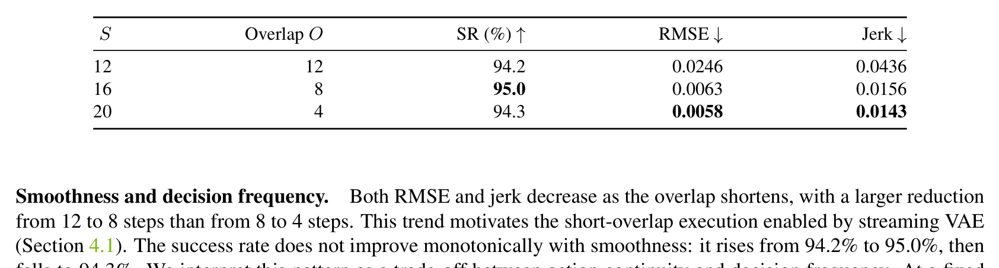

| $S$ | Overlap $O$ | SR (%) ↑ | RMSE ↓ | Jerk ↓ |
| :---: | :---: | :---: | :---: | :---: |
| 12 | 12 | 94.2 | 0.0246 | 0.0436 |
| 16 | 8 | 95.0 | 0.0063 | 0.0156 |
| 20 | 4 | 94.3 | 0.0058 | 0.0143 |

**Caption:** Table 10 | Effect of asynchronous overlap length. With $R = 24$, increasing the trigger stride $S$ shortens the overlap $O$. RMSE and jerk decrease throughout the tested range, whereas the highest observed success rate (SR) occurs at $S = 16$. Stride and overlap are measured in control steps.

**Caption[CN]:** 表 10 | 异步执行重叠步长长度对性能的影响。在可执行视界 $R = 24$ 条件下，增大触发步长 $S$ 会对应缩短重叠步长 $O$。随着重叠缩短，RMSE 与 Jerk 在测试区间内均单调下降，而最高任务成功率（SR）出现在 $S = 16$ 处。触发步长与重叠量均以底层控制步为单位计量。

### Appendix F. IDM versus Co-Denoising: Capability and Inference Latency | 逆动力学建模与联合去噪深入对比

> <strong>Para. 1:</strong> Long-WAM (IDM) retains video-first causal imagination: it predicts future visual latents independently of action tokens, then denoises actions conditioned on those predictions (Section 3.2). Co-denoising (CoD) instead updates future video and actions jointly, with bidirectional interaction at each denoising step. IDM provides the action expert with an explicit prediction of the future before generating actions, at the cost of sequential video and action inference. IDM achieves modestly higher reported average success rates on both LIBERO and RoboTwin 2.0 (Tables 1 and 2).

> <strong>Para. 1[CN]:</strong> Long-WAM（IDM 模式）坚持以视频预测为先导的因果想象范式：它完全独立于动作 token 首先推演未来视觉潜变量，随后以该预测为显式条件对动作序列进行去噪生成（第 3.2 节）。相比之下，协同联合去噪（Co-Denoising, CoD）在每个去噪时间步内同步更新未来视频与动作，并维持双向信息交互。IDM 赋予了动作专家在生成动作前审视明确未来物理演化的宝贵能力，但代价是必须承受视频与动作的串行两阶段推理开销。在最终控制表现上，IDM 在 LIBERO 和 RoboTwin 2.0 上均取得了更高的一致平均成功率（见表 1 与表 2）。

> <strong>Para. 2:</strong> Latency protocol. We compare optimized end-to-end inference latency on NVIDIA GeForce RTX 5090, including the full observation VAE computation but excluding preprocessing, text encoding, and controller/IPC overhead. Both variants use video NVFP4, BF16 action compute and KV storage, and observed-video KV reuse. For CoD, the first joint step builds the history KV cache for reuse by later steps; future-video and action KV continue to be updated jointly. Each variant uses its own trained denoising schedule.

> <strong>Para. 2[CN]:</strong> 推理延迟测量协议。我们在 NVIDIA GeForce RTX 5090 上对比了经过深度优化的端到端推理延迟，测量范围严格包含完整的视觉观测 VAE 编解码计算，但排除了图像预处理、静态文本编码以及控制器 IPC 通信调度开销。两种变体均采用视频 NVFP4 量化、BF16 动作计算与 KV 存储，并开启了已观测历史视频的 KV 缓存复用。对于 CoD，首个联合去噪步负责构建历史 KV 缓存供后续步复用，而未来视频与动作的 KV 则在去噪步间持续同步演化。各变体均采用各自独立训练得到的去噪调度方案。

> <strong>Para. 3:</strong> Reported latencies are the mean of the medians from two independent processes, each with five excluded warmups and 30 steady-state samples. The cumulative V4/A4 study in Table 8 uses the same aggregation and sample counts, excludes cold stabilization, and includes the full observation VAE and inference computation while excluding setup, text encoding, controller overhead, and IPC. Table 11 combines the IDM measurements from Table 6 with the CoD measurements. These timing runs are separate from the task-success evaluations above; the comparison uses each variant’s trained schedule and cache implementation, so it does not isolate execution order as the sole source of the latency difference.

> <strong>Para. 3[CN]:</strong> 汇报的延迟数值为两个独立运行进程各自中位数的平均值，每个进程均排除了前 5 次预热样本并严格采集 30 次稳态运行样本。表 8 中的累积 V4/A4 优化研究采用了完全一致的数据聚合方式与采样规模，剔除了冷启动阶段，完整涵盖了观测 VAE 编解码与模型前向推理的全部计算开销。表 11 将表 6 中的 IDM 延迟数据与对应的 CoD 测量值进行了系统整合。需要说明的是，这些延迟性能测试独立于前述的任务成功率闭环评估；对比采用的是各变体各自调优后的去噪步数与缓存实现，因此它反映的是端到端系统工程的综合差异，而非将执行计算顺序孤立为延迟差异的唯一因果来源。

> <strong>Para. 4:</strong> Capability and compute rate. CoD takes 90.9 ms with V4/A4 and 65.7 ms with V2/A2, compared with 107.4 and 81.8 ms for IDM (Table 11). IDM achieves higher success in the separate task evaluations, while its optimized inference reaches 9.3 and 12.2 Hz at the two budgets. The two-step configuration therefore fits within a 100 ms inference-compute budget. Online execution must also accommodate transfer and scheduling costs (Equation 4); asynchronous execution overlaps inference with ongoing robot motion. The real-world results in Section 6.1 provide separate evidence that IDM’s video-first design supports responsive manipulation.

> <strong>Para. 4[CN]:</strong> 算法能力与有效计算频率。在 V4/A4 配置下 CoD 耗时 90.9 毫秒，在 V2/A2 下耗时 65.7 毫秒，相比之下 IDM 分别耗时 107.4 毫秒和 81.8 毫秒（表 11）。IDM 在独立的任务控制评测中取得了全面占优的成功率，同时其优化后的推理计算频率在两种预算下分别达到 9.3 Hz 和 12.2 Hz。这意味着两步轻量化去噪配置能够完全收敛在 100 毫秒的实时推理算力预算之内。在线执行系统还必须充分容纳数据传输与进程调度开销（式 4）；而异步执行机制则巧妙地将这一全部耗时与机器人当前的物理运动无缝重叠。第 6.1 节所呈现的真机实验为“IDM 的视频先导设计足以强力支持超高敏捷物理操控”提供了无可辩驳的现实铁证。

### Table 11. RTX 5090 上优化后的 IDM 与 CoD 推理对比

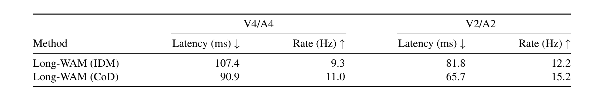

| Method | V4/A4 Latency (ms) ↓ | V4/A4 Rate (Hz) ↑ | V2/A2 Latency (ms) ↓ | V2/A2 Rate (Hz) ↑ |
| :--- | :---: | :---: | :---: | :---: |
| Long-WAM (IDM) | 107.4 | 9.3 | 81.8 | 12.2 |
| Long-WAM (CoD) | 90.9 | 11.0 | 65.7 | 15.2 |

**Caption:** Table 11 | Optimized IDM and CoD inference on RTX 5090. V4/A4 and V2/A2 use four and two steps per expert, respectively; CoD shares the denoising schedule across experts. Latency includes observation VAE computation. Rates are the reciprocals of inference latencies, not robot control frequencies.

**Caption[CN]:** 表 11 | RTX 5090 上深度优化后的 IDM 与 CoD 推理性能对比。V4/A4 与 V2/A2 分别代表每个专家分配 4 步和 2 步去噪；CoD 在跨专家间共享去噪调度。延迟包含完整的观测 VAE 编解码计算。计算速率（Rate）为推理延迟的倒数，并非底层机器人关节的物理控制频率。

> <strong>Para. 5:</strong> Observed-video KV reuse in IDM. Observed-video KV reuse changes token shapes. On RTX 5090, shape-specific dispatch extends the base quantizer’s 588-token tile choice to the 392/196-token inputs produced by reuse. With the complete V4/A4 configuration, latency is 107.4 ms with reuse versus 112.6 ms without it (4.6%). Spark reaches 328.2 ms versus 394.9 ms without reuse (16.9%). With V2/A2, reuse gives no latency reduction on RTX 5090 (81.8 versus 81.3 ms), while latency on Spark decreases from 280.8 to 254.4 ms (9.4%). These comparisons hold the remaining configuration fixed within each device and denoising budget. They differ from the reuse-stage gains in Table 8, which are measured before subsequent device-specific tuning.

> <strong>Para. 5[CN]:</strong> IDM 中的已观测视频 KV 缓存复用。对已观测历史视频启用 KV 缓存复用会改变送入算子的张量 Token 形状。在 RTX 5090 上，特定形状分发机制将基础量化器针对 588 个 Token 的分块选择，无缝扩展适配至复用后产生的 392 和 196 个 Token 输入。在完整的 V4/A4 配置下，启用复用的端到端延迟为 107.4 毫秒，而不复用则为 112.6 毫秒（带来 4.6% 的优化）。在 DGX Spark 平台上，复用使延迟从 394.9 毫秒锐减至 328.2 毫秒（大幅优化 16.9%）。在精简的 V2/A2 配置下，由于 RTX 5090 算力极为过剩，复用未带来明显延迟改善（81.8 毫秒对比 81.3 毫秒），而 Spark 上的延迟依然从 280.8 毫秒下降至 254.4 毫秒（优化 9.4%）。这些对比在每个设备及特定去噪预算内部严格控制了其他配置的一致性。这些数据与表 8 中汇报的“复用阶段增益”存在微小差异，因为表 8 的数值是在后续特定设备硬件定制调优之前所记录的阶段性快照。

### Appendix G. Context-Dependent Inference Latency | 上下文长度对推理延迟的影响

> <strong>Para. 1:</strong> Table 12 shows efficient long-context inference with our infrastructure on RTX 5090: increasing history eightfold, from 2.4 to 19.2 seconds, raises end-to-end chunk latency from 107.4 to 341.0 ms (approximately 3.2×). These results use the shared optimizations and device-specific tuning in Section 4.2. For online execution, streaming VAE additionally moves prefix encoding ahead of the inference trigger, reducing post-trigger preparation work (Section 4.1).

> <strong>Para. 1[CN]:</strong> 表 12 呈现了我们的系统基础设施在 NVIDIA RTX 5090 上实现的高效长上下文推理性能：将历史时序长度大幅拉长 8 倍（从 2.4 秒猛增至 19.2 秒），仅将动作块端到端生成延迟从 107.4 毫秒温和推高至 341.0 毫秒（仅增加约 3.2 倍）。这一卓越的亚线性缩放特性得益于第 4.2 节详述的通用跨设备优化与底层硬件深度调优。对于在线物理部署而言，流式 VAE 更进一步将历史前缀的编解码工作转移至推理触发时刻之前平摊消化，从而大幅削减了触发后的计算负载与交接等待（第 4.1 节）。

### Table 12. RTX 5090 上随上下文长度变化的端到端延迟

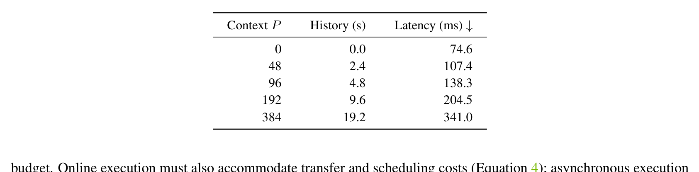

| Context $P$ | History (s) | Latency (ms) ↓ |
| :---: | :---: | :---: |
| 0 | 0.0 | 74.6 |
| 48 | 2.4 | 107.4 |
| 96 | 4.8 | 138.3 |
| 192 | 9.6 | 204.5 |
| 384 | 19.2 | 341.0 |

**Caption:** Table 12 | Context-dependent latency on RTX 5090. End-to-end inference time per action chunk with the Long-WAM infrastructure. Context $P$ counts preceding control intervals, corresponding to $P/20$ seconds of history; $P = 0$ retains the current observation.

**Caption[CN]:** 表 12 | RTX 5090 上随上下文长度变化而变化的端到端推理延迟。汇报了在完整 Long-WAM 基础设施下生成每个动作块的端到端耗时。上下文计数 $P$ 代表先前经历的底层控制周期步数，严格对应于 $P/20$ 秒的物理历史时长；$P = 0$ 表示仅保留当前单帧观测。

### Appendix H. Additional Real-World Deployment Visualizations | 更多真机部署可视化序列

> <strong>Para. 1:</strong> We provide detailed rollouts complementing the real-robot evaluation in Section 6.1. The montages retain the original overview and wrist-camera views, with red annotations marking failure events and green annotations marking successful outcomes. These selected examples illustrate execution behavior; aggregate success rates are reported in the main text.

> <strong>Para. 1[CN]:</strong> 我们提供了详尽的物理真实机器人轨迹连续帧序列，作为对第 6.1 节真机定量评测的重要补充。画卷完整保留了原始的全局上帝视角与腕部相机视角，并以红色标注指示失败事件、绿色标注指示成功判定。这些精选范例直观展现了各策略的底层物理执行动态行为；完整的统计成功率已在论文正文中汇报。

#### H.1. Dynamic Composite Manipulation | 动态复合操作

> <strong>Para. 2:</strong> Figures 10–12 show dynamic cup stacking on Unitree G1. Long-WAM coordinates grasping the blue cup, intercepting the moving green cup, and nesting it inside the blue cup. The baseline rollouts instead miss the green cup during interception.

> <strong>Para. 2[CN]:</strong> 图 10 至图 12 展示了宇树 G1 人形机器人上的高难度动态叠杯实验。Long-WAM 能够流畅协调一系列精密动作：抓取静态的蓝色水杯、拦截传送带上快速移动的绿色水杯、并将其平稳嵌套至蓝色水杯内部。相比之下，基线模型在高速动态拦截阶段均发生失误，彻底抓空。

### Figure 10. 动态叠杯任务Rollout ($\pi_{0.5}$)

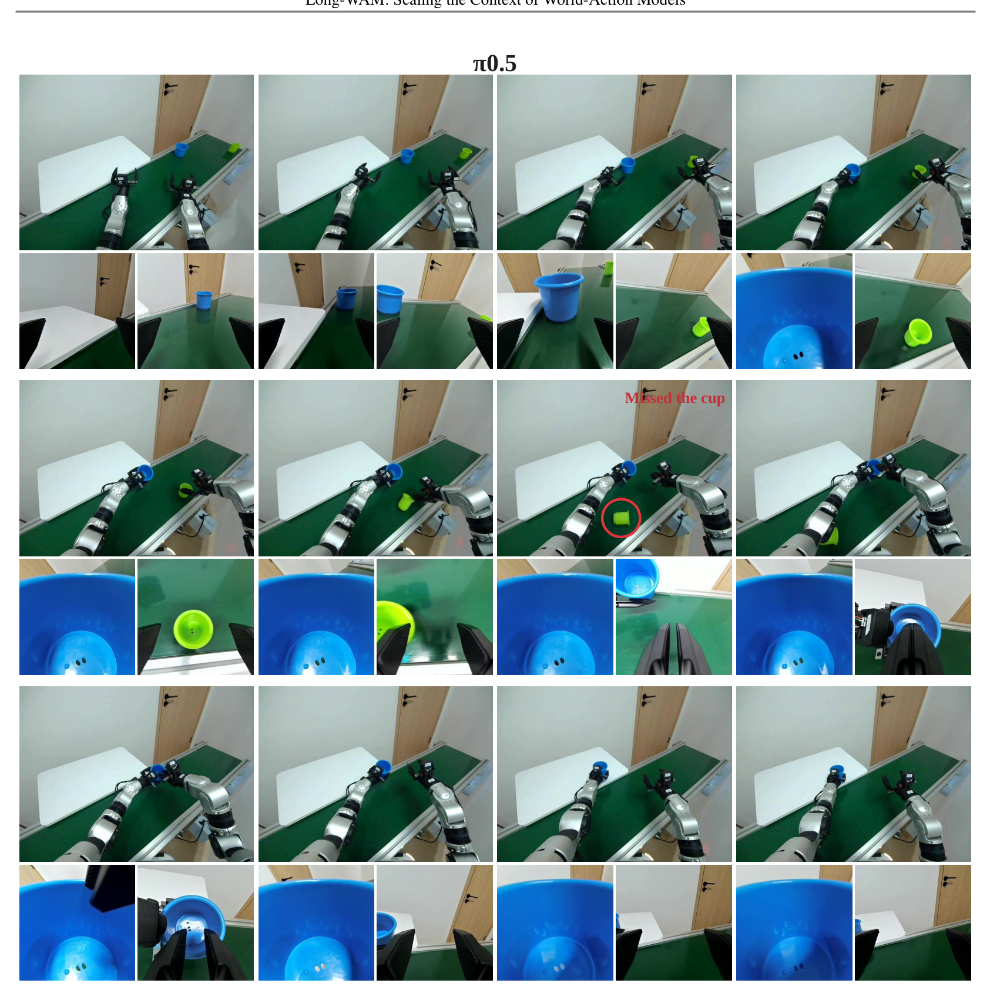

**Caption:** Figure 10 | Dynamic cup stacking with $\pi_{0.5}$. Time progresses left to right within each four-column block, then continues in the next block below; each overview frame is accompanied by two wrist views. The policy grasps the blue cup but misses the moving green cup (red circle), leaving the composite task incomplete.

**Caption[CN]:** 图 10 | 基于 $\pi_{0.5}$ 的动态叠杯任务轨迹抓拍。时间在每个四列表格块内从左向右推进，随后在下一行继续；每个全局视图帧均附带两个腕部相机视角。该策略虽然成功抓起了蓝色水杯，但在试图拦截传送带上移动的绿色水杯时抓空（红圈标注），导致整个复合任务执行失败。

### Figure 11. 动态叠杯任务Rollout (Fast-WAM)

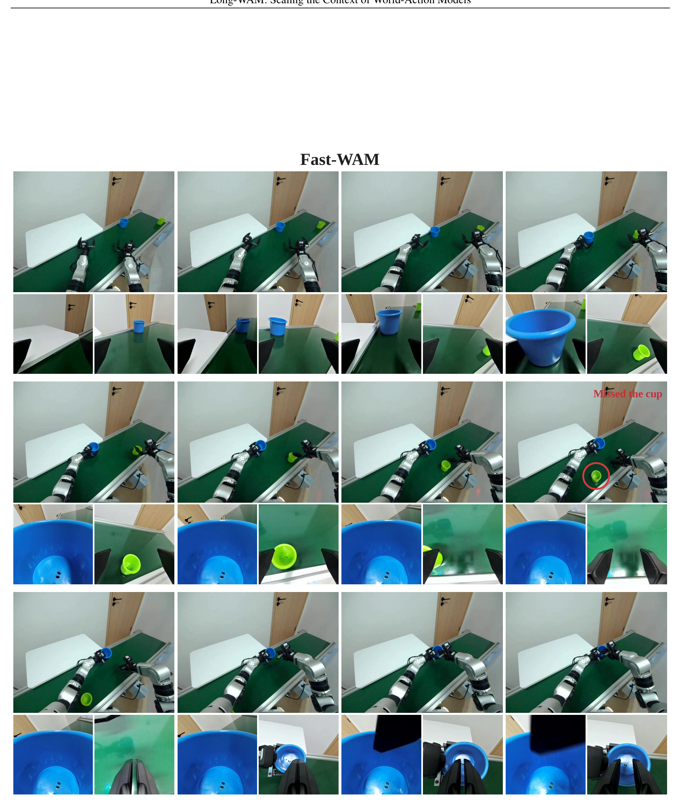

**Caption:** Figure 11 | Dynamic cup stacking with Fast-WAM. The sequence follows the same reading order as Figure 10. After grasping the blue cup, the policy reaches toward the green cup but misses it as it moves along the conveyor. The subsequent frames show that the nesting stage is not completed.

**Caption[CN]:** 图 11 | 基于 Fast-WAM 的动态叠杯任务轨迹抓拍。阅读顺序与图 10 完全一致。在抓起蓝色水杯后，策略伸向绿色水杯但发生严重时序脱节，随着绿色水杯沿传送带移动而未能抓住。后续画面显示其未能进入最后的嵌套对齐阶段。

### Figure 12. 动态叠杯任务Rollout (Long-WAM [Ours])

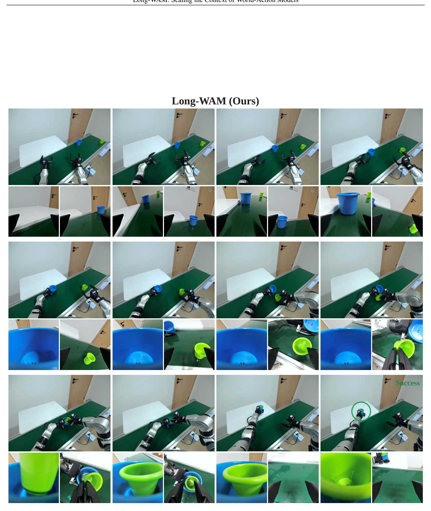

**Caption:** Figure 12 | Dynamic cup stacking with Long-WAM. Long-WAM grasps the blue cup, intercepts the moving green cup, and places the green cup inside the blue cup. The overview and wrist views reveal the transition from interception to alignment and insertion, illustrating coordinated execution across the stages of this dynamic task.

**Caption[CN]:** 图 12 | 基于 Long-WAM（本文方法）的动态叠杯成功轨迹抓拍。Long-WAM 稳健抓起蓝色水杯，精准预判并拦截移动中的绿色水杯，并将其顺畅放入蓝色水杯中。全局与腕部视角清晰展现了从高速动态拦截向微距精细对齐与平稳插入的平滑自然过渡，完美印证了在动态多阶段任务中的高超执行协调性。

#### H.2. Moving-Object Grasping at Different Speeds | 不同速度下的移动物体抓取

> <strong>Para. 3:</strong> Figures 13–15 compare conveyor grasping at four speeds. The baseline examples expose missed interceptions at higher speeds, whereas Long-WAM completes the illustrated grasp at every speed, consistent with the dynamic-control results in Section 6.1.

> <strong>Para. 3[CN]:</strong> 图 13 至图 15 系统对比了四种不同传送带移动速度（3.0、4.5、6.0 和 7.5 cm/s）下的水杯抓取表现。对比基线在较高移速下频频暴露抓取扑空的严重缺陷；与此相反，Long-WAM 在所有测试速度下均完美完成了抓取，与第 6.1 节中的定量统计完全吻合。

### Figure 13. 传送带动态抓取Rollout ($\pi_{0.5}$)

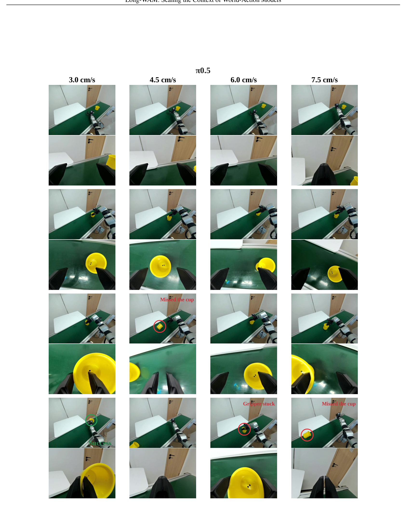

**Caption:** Figure 13 | Moving-object grasping with $\pi_{0.5}$. Columns show 3.0, 4.5, 6.0, and 7.5 cm/s; time advances downward through paired overview and wrist views. The selected rollout succeeds at 3.0 cm/s, misses the cup at 4.5 and 7.5 cm/s, and exhibits the annotated gripper-stuck failure at 6.0 cm/s.

**Caption[CN]:** 图 13 | 基于 $\pi_{0.5}$ 的传送带移动物体抓取实验序列。各列分别对应 3.0、4.5、6.0 和 7.5 cm/s 移动速度；时间沿垂直向下方向推进，包含成对的全局与腕部视角。所示轨迹在 3.0 cm/s 时勉强成功，但在 4.5 和 7.5 cm/s 时完全抓空，并在 6.0 cm/s 时因轨迹突变发生夹爪卡死异常（标注所示）。

### Figure 14. 传送带动态抓取Rollout (Fast-WAM)

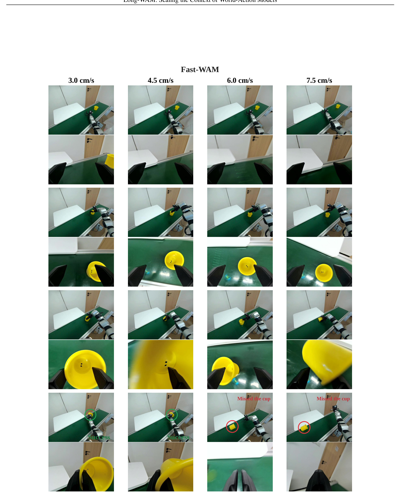

**Caption:** Figure 14 | Moving-object grasping with Fast-WAM. Columns and temporal ordering match Figure 13. The selected rollouts succeed at 3.0 and 4.5 cm/s but miss the cup at 6.0 and 7.5 cm/s. The wrist views show the target moving beyond the gripper before a secure grasp is established.

**Caption[CN]:** 图 14 | 基于 Fast-WAM 的传送带移动物体抓取实验序列。列排列与时间顺序同图 13。所示轨迹在 3.0 和 4.5 cm/s 较低速度下完成抓取，但在 6.0 和 7.5 cm/s 高速下均抓空。腕部特写视角揭示：在策略能够建立稳定夹持姿态之前，目标物体早已滑出夹爪闭合包络线。

### Figure 15. 传送带动态抓取Rollout (Long-WAM [Ours])

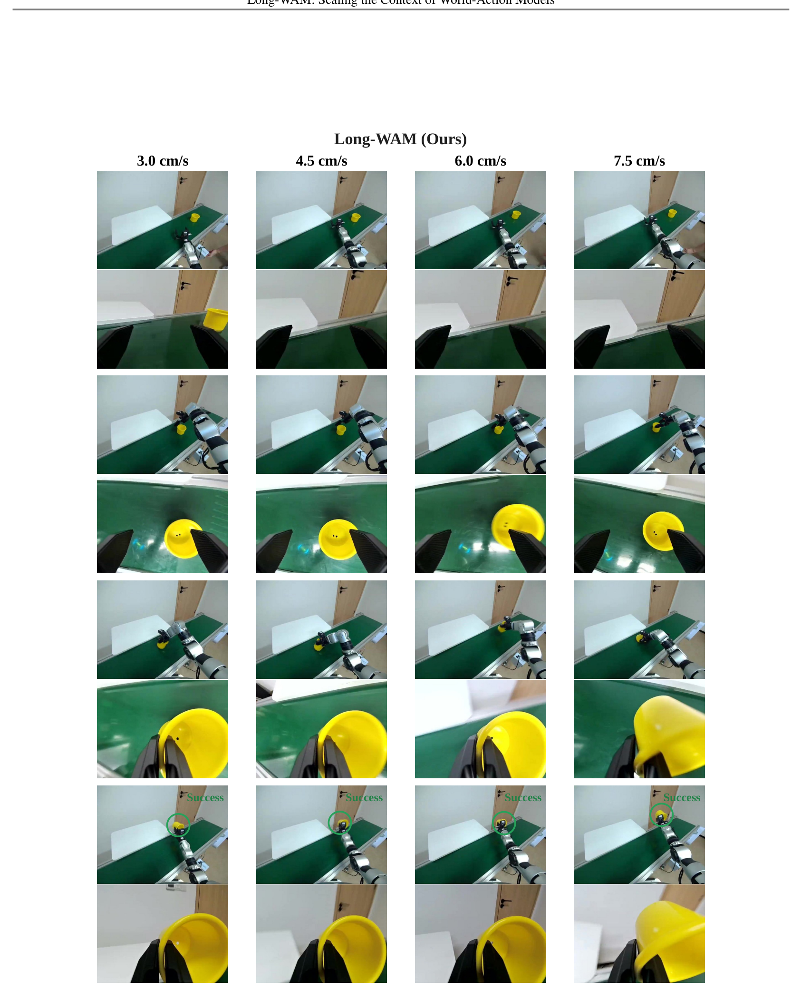

**Caption:** Figure 15 | Moving-object grasping with Long-WAM. The illustrated rollouts complete the grasp at all four conveyor speeds, including 6.0 and 7.5 cm/s. Successive wrist views show the moving cup entering the gripper and being retained after closure, illustrating responsive interception under progressively tighter timing constraints.

**Caption[CN]:** 图 15 | 基于 Long-WAM（本文方法）的传送带移动物体抓取成功序列。在全部四种传送带速度（包括极具挑战性的 6.0 和 7.5 cm/s）下均完美达成抓取。连续的腕部视角生动记录了运动水杯精准滑入夹爪中心并在闭合后被牢牢锁定的全过程，充分展示了在极限反应时间约束下的敏捷拦截能力。

#### H.3. Long-Horizon Manipulation | 长视界桌面复合操作

> <strong>Para. 4:</strong> Figure 16 shows Long-WAM executing three YAM tasks that require successive object interactions. The sequences illustrate task-directed progress through repeated pickup and placement, complementing the fast dynamic behaviors above. These tasks last over 40 seconds on average (Section 6.1).

> <strong>Para. 4[CN]:</strong> 图 16 展示了 Long-WAM 在 YAM 双臂平台上执行的三项需要连续进行多次物体交互的复合任务。这些轨迹生动呈现了通过反复精准抓取与放置推动任务稳步前进的全过程，与前述的高速动态拦截行为形成了完美的动静互补。这些长视界任务单次执行平均耗时超过 40 秒（第 6.1 节）。

### Figure 16. YAM 双臂平台长视界操作序列可视化

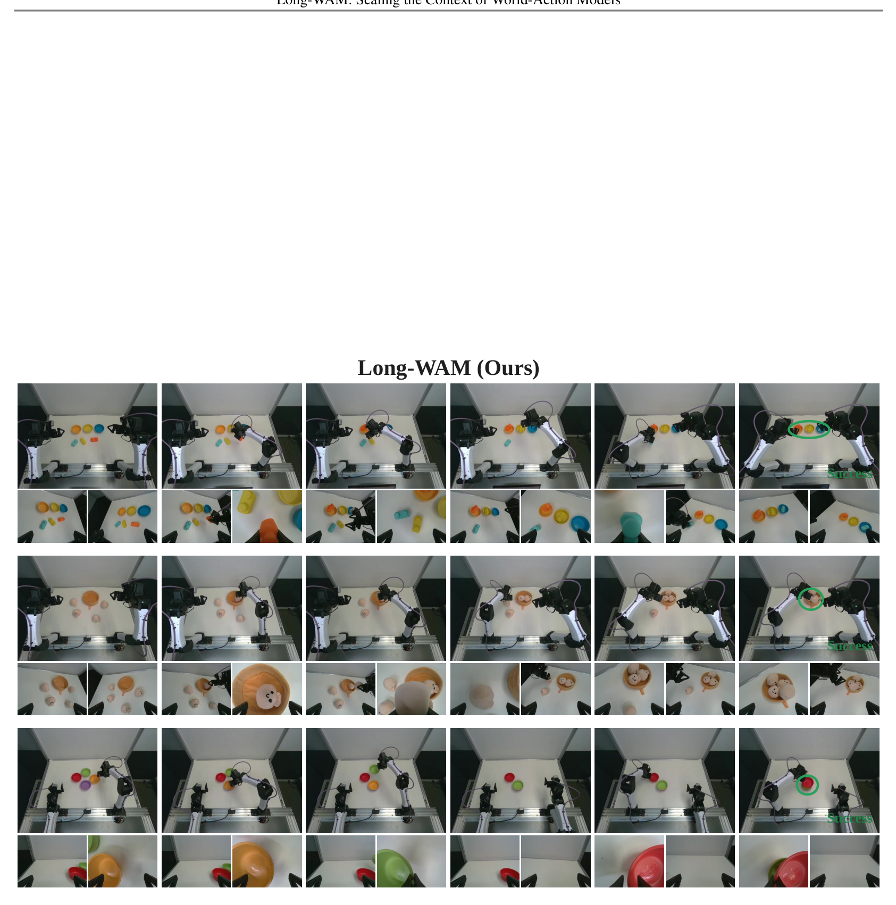

**Caption:** Figure 16 | Long-horizon manipulation with Long-WAM on YAM. Top to bottom: brick sorting by color, placing dumplings in a pan, and stacking bowls. Each task contains six chronological snapshots, read left to right, with paired wrist views below each overview frame. The final snapshots show successful task configurations across all three tasks.

**Caption[CN]:** 图 16 | YAM 双臂机器人上基于 Long-WAM 的长视界多阶段操作抓拍序列。从上至下依次为：按颜色分类积木、将饺子放入煎锅、以及多层碗具叠放。每个任务展示了 6 张按时间先后排列的抓拍帧（从左至右阅读），每个全局视场下方均配有对应的双腕相机视角。最终快照展示了所有三项任务均完美达成了终止成功状态。
