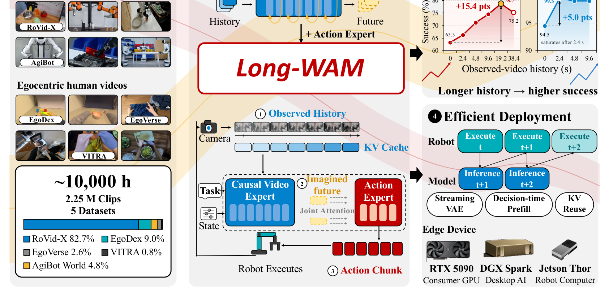
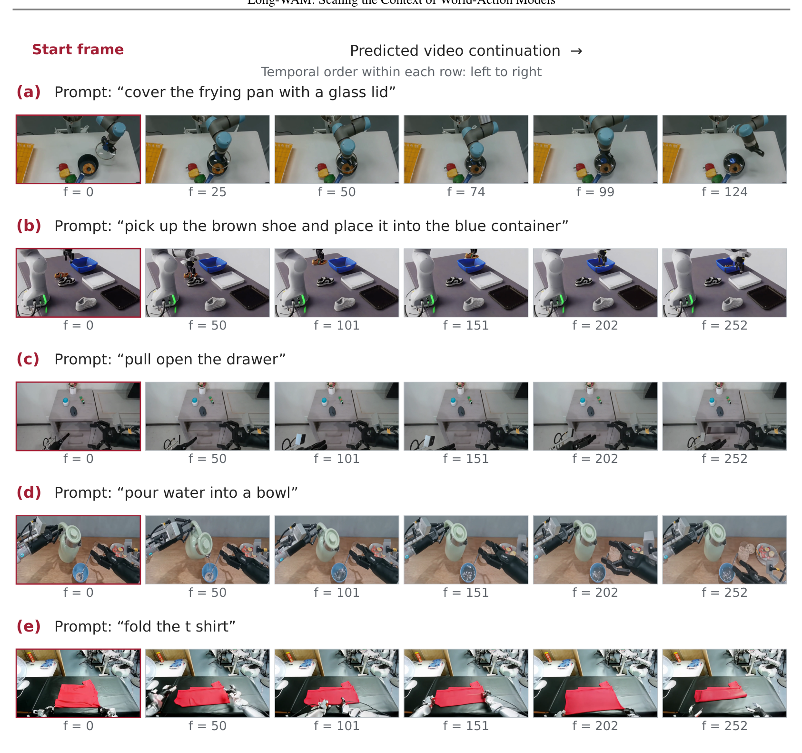
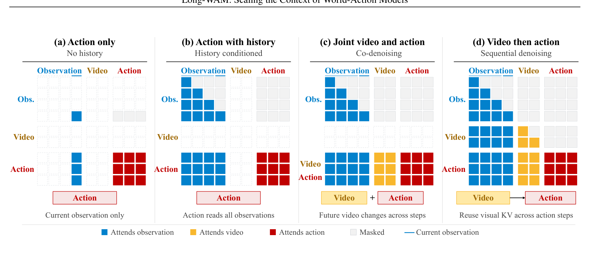
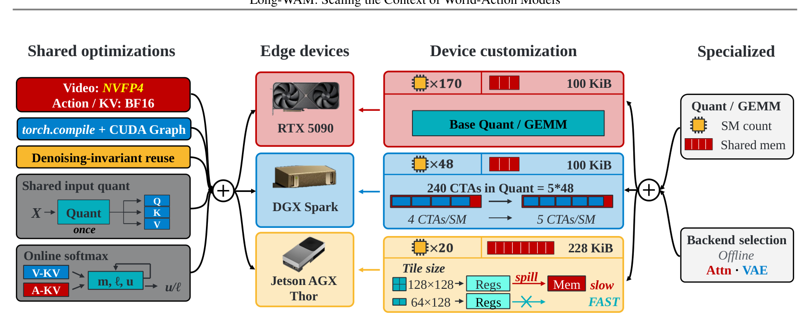
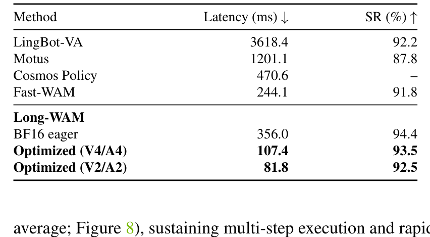
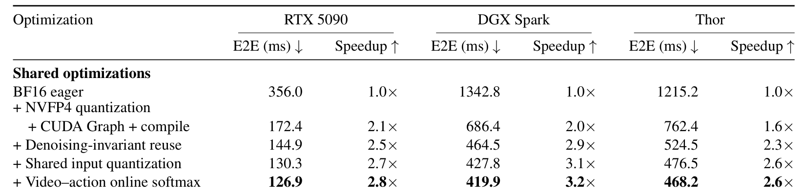

---
tags:
  - papers/world-model
  - papers/robot-learning
aliases:
  - Long-WAM
  - Scaling the Context of World-Action Models

date: 2026-10-08

doi: 10.48550/arXiv.2610.10528

arxiv_id: 2610.10528
---

# Long-WAM: Scaling the Context of World-Action Models

## 核心信息

- 标题: Long-WAM: Scaling the Context of World-Action Models
- 标题翻译: Long-WAM：扩展世界动作模型的上下文窗口
- 作者: Wei Huang, Bohan Zhang, Chenzhi Liu, Isabella Liu, Shuai Yang, Weian Mao, Luozhou Wang, Yicheng Xiao, Weifeng Lin, Qixin Hu, Bryan Chu, Sifei Liu, Linxi "Jim" Fan, Xiaojuan Qi, Song Han, Yukang Chen
- 机构: NVIDIA；MIT；HKU；UCSD
- 发表时间: 2026-10-08（arXiv 预印本）
- 发表渠道: arXiv 预印本
- DOI: 10.48550/arXiv.2610.10528
- arXiv: 2610.10528
- 论文链接: https://arxiv.org/abs/2610.10528
- 代码 / 项目: https://github.com/NVlabs/Long-WAM
- 数据 / 资源: RoVid-X, AgiBot World, EgoDex, EgoVerse, VITRA（共约 10,000 窗口等效小时预训练数据）
- 论文类型: 机器人学习、世界动作模型与长上下文实时部署系统

## 原文摘要翻译

实时机器人控制需要充分的视觉历史推断场景动态与任务进展，但处理冗长历史往往延缓动作响应。本文提出 Long-WAM 框架，在严格实时约束下扩展因果世界动作模型的上下文窗口。研究核心发现表明：拥有历史不等于会用历史；当视频基座采用原生自回归因果方式预训练时，更长的历史观测才能转化为实质性的控制性能飞跃。

模型首先从无动作标签的海量机器人与第一视角视频中学习因果物理动态，随后在世界动作适配中完整保留该历史到未来的因果结构。在 RoboCasa 评测中，将上下文从零扩展至 19.2 秒使成功率从 63.3% 跃升至 78.7%，而双向扩散预训练基座则未见净增益。该方法在 LIBERO、RoboTwin 与 DOMINO 等基准上均取得最优表现。

借助流式观测编码、纯异步非阻塞执行与底层硬件加速，模型在保留未来预测的同时成功部署于各类计算平台。在单张 RTX 5090 显卡上，每块动作与未来潜码联合推理仅耗时 107.4 毫秒。在 G1 人形机器人与双臂实体系统上的部署验证了高速动态拦截与长程复合操作能力。

## 创新点

1. **确立自回归因果视频预训练解锁长上下文控制的实证规律。** 论文揭示了当前具身智能界普遍忽视的关键盲区：仅仅在下游策略给视觉历史加上因果注意力掩码，并不能让模型真正学会从长历史提取动力学线索。双向扩散预训练模型在历史延长时性能停滞甚至退化；而基于自回归因果时序因式分解预训练的视频模型，能够将时序上下文扩展的收益完全变现（在 RoboCasa 基准上单调提升 15.4 个百分点），从根源上解释了长上下文策略性能分化的机理。
2. **构建因果到因果的世界动作适配范式。** 摒弃从双向视频模型暴力转因果的断层设计，直接将预训练中学习到的单向因果流延伸至下游控制。通过非对称注意力掩码实现严格的解耦：视频分支严禁窥探动作令牌以保全通用物理演化先验，动作分支则基于历史观测与前向预测的未来潜码进行逆动力学求解，既避免了对未来像素的高开销解码，又让动作决策具备明确的物理演变引导。
3. **首创流式因果特征编码与纯异步非阻塞执行调度。** 针对长上下文带来的严重前置延迟，提出流式分块因果编码机制：在机器人执行当前动作块的同时，增量编码新到达的视频帧，使得推理触发时刻仅需编码最新微量增量即可交付特征。配合基于因果视频预测带来的天然跨块时序一致性，实现了无需复杂推理期平滑的纯异步切换，在重叠区间将关节跳变加加速度降低三倍并消除等待停顿。
4. **全栈软硬件协同优化打破未来预测与边缘实时的矛盾。** 针对主流计算卡打造定制推理引擎：将视频网络线性层量化为四比特精度，动作与键值缓存保持高精度浮点，配合执行图捕获与在线跨注意力融合，将端到端决策耗时压缩至 107.4 毫秒，实现了真机超实时闭环。

## 一句话总结

Long-WAM 证明了世界动作模型扩展长视觉上下文的关键在于**基础模型必须采用原生自回归因果视频预训练**，并通过流式编码与全栈算子级优化，在单张消费级显卡上以 107.4 毫秒实现了包含显式未来潜码预测的超实时闭环物理控制。

## 研究问题

### 长视觉历史在世界动作模型中的核心困境：延迟与收益的死结

在物理世界操作中，机器人的单帧静态图像常常存在严重的信息欠定性：它能标定物体当前的几何位置，却无法告知物体的运动速度、加速度、转动惯量、机械接触滑移状态以及历史交互进展。将更长的时间序列历史观测输入策略，理论上能为控制决策提供关键的物理状态估计。

然而，在世界动作模型的实时控制闭环中，**处理更长的视觉历史往往直接摧毁了控制所必需的实时响应性**。当策略采用庞大的视觉骨干时，拉长历史序列长度会导致：
1. **视觉编码开销剧增**：每一轮决策触发前，特征编码器都需要对数十帧历史图像进行特征提取，导致动作输出严重滞后。
2. **注意力计算与键值缓存爆炸**：历史令牌数呈倍数增加，自注意力与交叉注意力前向耗时拉长。
3. **闭环延迟与动态失准**：机器人执行动作时观测到的世界早已发生变化，因延迟导致的超调或丢步直接导致动态拦截与精细操作崩溃。

### 核心科学分歧：拥有历史不等于真正会用历史

更为根本的问题在于：为什么以往很多尝试为策略模型注入长历史的工作，往往只能在两三帧之后就遭遇性能饱和，甚至引入负面噪声？

过去主流的世界动作模型大多采用双向扩散预训练的视频大模型作为初始化骨干。在双向预训练中，所有时空令牌之间均执行全局全向注意力：

$$
p(v_{1:T}) = \int \prod_{t=1}^T p(v_t \mid v_{\setminus t})
$$

这种预训练目标使注意力权重高度依赖全局前后文的相互平滑，其内部表征并未建立时间之箭上的条件转移概率分布。当这类模型被迁移至下游机器人控制时，哪怕人为施加因果掩码，其预训练权重依然缺少将历史观测逐步递归提炼为下一时刻状态演变信念的机制先验。

与之相对，自回归视频预训练严格遵循因果链式法则分解：

$$
p(v_{1:T}) = \prod_{t=1}^T p(v_t \mid v_{<t})
$$

模型在预训练阶段就必须学会仅凭借过去帧预测未来的物理运动。论文的核心命题正是：**下游长上下文控制的收益，本质上取决于视频基础模型是否具备原生的自回归因果时序因式分解**；同时，必须在系统工程上破除全窗口编码与注意力计算的延迟瓶颈，才能使长上下文真正服务于高速物理交互。

## 数据与任务定义

### 预训练语料：LongLive2.0-Robot（约 10,000 窗口等效小时）

为了赋予世界模型扎实的物理交互与机械臂运动先验，作者构建了涵盖五大多模态视频源的预训练数据集，涵盖 2,294,889 个高质量样本（训练集 2,251,021 个片段，验证集与测试集各约 2.19 万个），换算为 16 秒等效窗口后达到 10,004.5 小时。该阶段完全无需任何机械臂动作坐标标签，实现了跨本体运动先验的大规模汇聚：

| 数据集子集 | 样本数 (Clips) | 占比 (%) | 数据域与物理交互特性 |
|---|---|---|---|
| **RoVid-X** | 1,898,562 | 82.7% | 大规模机器人操作视频，涵盖多视角与丰富刚体交互 |
| **EgoDex** | 207,044 | 9.0% | 第一视角灵巧操作视频，提供密集接触与双手机械交互 |
| **AgiBot World (full146)** | 69,834 | 3.0% | 双臂轮式与人形机器人真实厨房及桌面长任务 |
| **AgiBot World 补充集合** | 40,497 | 1.8% | 具身长序列补充数据，强化跨物体多阶段交互连续性 |
| **EgoVerse** | 59,742 | 2.6% | 全球多样化人类日常第一视角活动，提供开放环境泛化 |
| **VITRA** | 19,210 | 0.8% | 复杂工具使用与真实动态交互视频 |
| **总计** | **2,294,889** | **100.0%** | **约 10,000 窗口等效小时纯视频因果预训练** |

### 评测基准与真机任务体系

论文的验证体系横跨四大仿真基准与两类实体机器人本体，覆盖了从单臂到双臂、从静态到高速动态、从原子技能到高层复合规划的全维度任务空间：

1. **LIBERO 基准**：单臂操作基准，包含空间定位、物体交互、目标达成以及最具挑战性的长时程套件，用于检验近程与中程时序记忆。
2. **RoboTwin 基准**：双臂协作操作基准，评测包含标准环境与带有剧烈视觉干扰及物体位姿强随机扰动的场景。
3. **DOMINO 动态基准**：专门评估动态交互与移动物体操作的基准，要求策略实时估计目标运动轨迹并做出拦截，采用成功率与操作得分综合评估。
4. **RoboCasa 桌面任务**：基于高保真厨房仿真环境，机械臂需要串联多个物体转移子任务，是长上下文时间窗口（0 秒至 38.4 秒）扩展消融的主战场。
5. **复合规划评测**：涵盖 50 个高难度长程复合任务，划分为已知原子技能、已知复合任务与未知复合任务三个测试集，检验与高层大语言模型规划器的协同。
6. **人形机器人动态真机测试**：搭载高速传送带系统，在四档速度下测试动态纸杯抓取拦截，以及在移动状态下执行难度极高的动态叠杯任务。
7. **双臂真机长程测试**：单次任务平均耗时超 40 秒，包含颜色积木分拣、饺子入锅与连续叠碗三个代表性长时程多阶段操作。

## 方法主线

### 机制流程

Long-WAM 的端到端推理闭环被精细分解为四大核心步骤，如图 1 所示：

*论文原图编号：Figure 1。系统全景架构：自回归因果视频预训练、因果世界动作适配、上下文扩展收益消融以及基于流式编码的边缘实时执行闭环。*

1. **增量观测流式编码**：在执行前一个动作块的时序重叠窗口内，外部相机采集的新图像输入流式因果编码器，以因果分块方式完成特征提取，更新当前观测潜码历史 $Z^-_t$。
2. **未来视觉潜码前向推演**：自回归视频专家基于历史观测潜码 $Z^-_t$、本体状态 $q_t$ 与语言指令 $c$，在潜码空间前向去噪 $K_v=4$ 步，停止在中间噪声级 $\sigma^\star = 0.9$，生成未来物理演变潜码 $\tilde{Z}^+_t$。
3. **视觉全局键值预填充与复用**：将历史观测与未来预测潜码联合输入视频骨干完成键值预填充，提取出冻结的复合时序视觉缓存 $\mathcal{K}_t$，供后续步骤全局复用。
4. **动作专家去噪与异步移交**：动作专家基于流匹配机制，以 $\mathcal{K}_t$ 为交叉注意力条件执行 4 步去噪输出动作块。控制器在重叠期限前完成前缀修剪并移交执行。

### 核心组件: 自回归因果视频预训练 (Causal AR Video Foundation: LongLive2.0-Robot)

为打破传统视频预训练的时间全向混淆，骨干网络采用大规模计算集群完成序列并行教师强制预训练（约 30,720 计算卡时）。

#### 序列并行与块因果教师强制

将长达 30 秒的连续视频序列切分为因果块。在注意力矩阵中，每个目标块只能访问自身以前的历史块上下文以及自身当前的加噪令牌，绝对禁止访问未来块。为了解决自回归模型训练过程中的曝光偏差并在长展开中具备自我纠错能力，论文引入了基于误差回收的流匹配目标。

设 $z_i$ 为目标干净潜码块，$\epsilon_i$ 为基础高斯噪声。在启用误差回收时，从历史预测误差缓冲区中采样扰动项 $\delta^c_i$、$\delta^z_i$ 和 $\delta^\epsilon_i$，构建加噪输入与上下文：

$$
\bar{\epsilon}_i = \epsilon_i + \delta^\epsilon_i, \quad x^{\sigma_i}_i = (1 - \sigma_i)(z_i + \delta^z_i) + \sigma_i \bar{\epsilon}_i, \quad h_{<i} = (z_j + \delta^c_j)_{j < i}
$$

其自回归教师强制训练目标定义为：

$$
\mathcal{L}_{\text{TF-AR}} = \mathbb{E}\left[ w(\sigma_i) \left\| v_\theta(x^{\sigma_i}_i, \sigma_i \mid h_{<i}, c) - (\bar{\epsilon}_i - z_i) \right\|_2^2 \right]
$$

注意其回归目标始终指向未经扰动的真实潜码速度 $(\bar{\epsilon}_i - z_i)$，使得模型学会将带有漂移误差的历史隐状态自动拉回物理真实的轨迹上。

*论文原图编号：Figure 9。模型在给定单帧图像与语言提示词下的长序列物理展开示例。展示了盖锅盖、鞋子入箱、拉开抽屉、倾倒液体和衣物折叠等复杂动态，展现了极强的因果物理交互先验。*

### 视频-动作因果耦合机制与注意力模式 (Video-Action Coupling & Causal Masking)

为了在策略适配阶段彻底杜绝动作信息反向污染通用的视频动态先验，同时让动作具备最丰富的物理引导，论文对世界动作模型的注意力解耦机制进行了严格的范式重构，如图 2 所示：

*论文原图编号：Figure 2。四类注意力掩码与推理策略架构对比：① 仅当前观测；② 历史条件无预测；③ 联合去噪 CoD；④ 顺序预测后动作 IDM。*

#### 严格的非对称因果接口

在混合注意力结构中，视频查询仅在历史与未来预测之间进行单向因果计算，完全屏蔽动作令牌；动作查询则可以跨注意力读取历史观测、预测未来以及当前动作块。这种非对称性确保了物理推演的客观性。

#### 先预测后动作的逆动力学建模（IDM）

设当前控制步为 $t$，观测历史潜码为 $Z^-_t$，本体感知状态为 $q_t$，语言指令为 $c$。推理过程如下：

$$
\tilde{Z}^+_t = \text{Rollout}_{\theta, \sigma^\star}(\epsilon_v \mid Z^-_t, c, q_t)
$$

$$
\mathcal{K}_t = \text{Prefill}_\theta(Z^-_t, \tilde{Z}^+_t; c, q_t, \sigma^\star)
$$

$$
\hat{A}_t = \text{Denoise}_\psi(\epsilon_a \mid \mathcal{K}_t, c, q_t)
$$

其中视频专家仅需将未来潜码去噪至 $\sigma^\star = 0.9$（保留平滑的宏观结构而滤除高频细节），完全跳过计算代价高昂的像素级解码。随后视觉缓存被预填充并冻结，供动作专家独立完成去噪。

#### 两阶段解耦流匹配训练

训练采用两遍前向传播机制：
- **第一阶段（视频流匹配）**：输入干净历史潜码，监督未来潜码的流匹配速度场损失 $\mathcal{L}_{\text{video}}$；
- **第二阶段（动作流匹配）**：将真实未来潜码加噪至 $\sigma^\star = 0.9$，连同历史潜码前向构建视觉缓存并切断梯度，仅让动作损失反向传播更新动作专家与适配器：

$$
\mathcal{L} = \lambda_v \mathcal{L}_{\text{video}} + \lambda_a \mathcal{L}_{\text{action}}
$$

这种梯度阻断设计确保了动作学习不会迫使视频网络产生表示退化，同时训练和推理在中间噪声级接口上保持了严密的分布对齐。

### 流式 VAE 与异步非阻塞执行系统 (Streaming VAE, Asynchronous Overlap & KV Cache)

在真实的低延迟闭环控制中，动作块长度为 $H$，控制器实际执行前 $R$ 步，并在步长为 $S$ 时触发下一轮推理，形成重叠区间。

*论文原图编号：Figure 3。流式编码与全窗口编码在异步机器人执行调度中的时序对比。流式机制将观测特征提取分散在动作执行期，使得推理触发时刻能立即满足移交截止期限，彻底消除了机器人的停顿等待。*

#### 流式因果特征编码的时序平摊

如果采用传统的全窗口编码，在决策时刻触发时，系统必须暂停流水线，一次性对过去所有帧执行完整的卷积与下采样，导致推理准备时间严重超时，机器人由于未收到新动作而被迫停机等待。

流式因果编码在机器人执行上一个动作块的持续时间里，将外部相机输入的新图像帧以增量方式编码为潜码并压入缓冲区。当推理触发点到达时，系统仅需处理最新到达的残余观测帧，将前置阻塞时间压至微秒级，严格满足硬实时移交截止期限：

$$
T_{\text{ready}} \le O \cdot \Delta t = (R - S) \cdot \Delta t
$$

#### 预测连续性驱动的纯异步无缝切换

由于动作生成条件于高度平滑的时序预测先验，相邻两次决策在重叠区间生成的动作轨迹具有天然自洽性。论文证实：在无需任何复杂引导或动作混合的前提下，纯异步执行下的关节跳变加加速度低至 0.0436，实现了肉眼无感的平滑移交。

### 边缘推理加速与 RTX 5090 部署

为了在低成本边缘设备上完整保留 4 步未来潜码预测而不妥协实时性，论文针对主流显卡与移动端嵌入式系统打造了全栈算子级协同优化体系，如图 4 所示：

*论文原图编号：Figure 4。面向边缘设备的推理加速架构图。左侧展示跨硬件的通用算子优化，右侧展示针对专用硬件的寄存器与共享内存底层调优。*

#### 通用算子协同加速

1. **混合精度量化策略**：基于原生四比特硬件特性，对参数庞大的视频网络线性层执行量化，显存与带宽需求锐减；对数值敏感的动作专家与键值缓存则严格保持高精度。
2. **执行图捕获与编译融合**：针对小批量下算子频繁启动的瓶颈，将多步流匹配前向路径完整固化为执行图，联合编译器消除运行时开销。
3. **去噪不变静态键值复用**：在单次决策调用的 4 步流匹配中，文本嵌入、机器人本体状态、历史观测视频的键值缓存以及位置编码表是静态的，仅在初始步预填充一次，后续去噪步骤全局无损复用。
4. **投影输入共享量化**：在注意力模块投影中，同一输入特征原本需被量化三次；优化后仅执行一次激活量化，其缩放因子与整型数据被三个独立的矩阵乘法算子直接共享。
5. **在线跨注意力融合**：在动作专家同时注意视频与动作键值缓存时，常规实现需要将两块物理内存拼接；论文采用在线归一化算法在片上直接完成合并，完全省去了大张量的显存搬运：

$$
m = \max(m_v, m_a), \quad \text{Attn} = \frac{e^{m_v - m} u_v + e^{m_a - m} u_a}{e^{m_v - m} \ell_v + e^{m_a - m} \ell_a}
$$

#### 平台级定制算子调优

- **RTX 5090**：优化计算瓦片尺寸，针对键值复用后产生的特殊序列长度建立专用内核分发，并结合专用计算库进行卷积与注意力深度适配。
- **DGX Spark**：压缩中间量化缓冲区，通过自动调优计算线程分配，将计算网格压缩至单波执行，消除硬件空闲等待。
- **Jetson AGX Thor**：充分利用其车载级大容量片上共享缓存，调整计算管线级数，采用紧凑瓦片彻底避免寄存器溢出。

## 关键结果

### 主结果与强基线 (RoboCasa GR-1, RoboCasa365, RoboTwin 2.0, LIBERO vs π0.5, Fast-WAM, GR00T-N1.5)

在各大仿真操作基准上，Long-WAM 展现了全方位的领先表现，全面超越了当期主流基线：

#### 1. LIBERO 单臂操作基准（Table 1）

在长序列任务主战场 LIBERO-Long 上，逆动力学版本达到了惊人的 **99.5%** 成功率，大幅刷新基准上限：

| 方法 | Spatial | Object | Goal | Long (长程) | Average (平均) |
|---|---|---|---|---|---|
| OpenVLA | 84.7 | 88.4 | 79.2 | 53.7 | 76.5 |
| GR00T-N1 | 94.4 | 97.6 | 93.0 | 90.6 | 93.9 |
| $\pi_0$ | 96.8 | 98.8 | 95.8 | 85.2 | 94.1 |
| $\pi_{0.5}$ | 98.8 | 98.2 | 98.0 | 92.4 | 96.9 |
| Fast-WAM | 98.2 | 100.0 | 97.0 | 95.2 | 97.6 |
| LingBot-VA | 98.5 | 99.6 | 97.2 | 98.5 | 98.5 |
| **Long-WAM (无未来预测)** | 98.0 | 99.5 | 97.0 | 94.5 | 97.3 |
| **Long-WAM (联合去噪)** | 98.6 | 99.8 | 96.8 | 95.8 | 97.8 |
| **Long-WAM (逆动力学)** | **99.5** | **100.0** | **98.0** | **99.5** | **99.5** |

#### 2. RoboTwin 双臂强随机化基准（Table 2）

在带有复杂光照、纹理及物体位姿强随机扰动的双臂任务中，模型在标准与随机化场景均位列第一：

| 方法 | Clean (标准) | Randomized (强随机化) | Average (平均) |
|---|---|---|---|
| $\pi_{0.5}$ | 82.7 | 76.8 | 79.8 |
| Motus | 88.7 | 87.0 | 87.8 |
| Fast-WAM | 91.9 | 91.8 | 91.8 |
| LingBot-VA | 92.9 | 91.5 | 92.2 |
| LingBot-VA 2.0 | 93.8 | 93.4 | 93.6 |
| Qwen-RobotManip | 93.7 | 94.0 | 93.9 |
| ABot-M0.5 | 94.0 | 94.2 | 94.1 |
| **Long-WAM (逆动力学)** | **94.7** | **94.2** | **94.4** |

#### 3. DOMINO 动态移动物体操作基准（Table 3）

动态拦截是检验未来世界预测是否真正有用的试金石。在物体高速运动的动态环境中，方法展现出巨大优势：

| 方法 | 成功率 SR (%) ↑ | 操作得分 MS ↑ |
|---|---|---|
| OpenVLA | 1.5 | 6.1 |
| $\pi_0$ | 8.2 | 24.0 |
| $\pi_{0.5}$ | 9.6 | 26.2 |
| PUMA | 17.2 | 35.0 |
| Fast-WAM | 19.9 | 33.3 |
| **Long-WAM** | **34.9** (+15.0) | **45.1** (+10.1) |

#### 4. RoboCasa 桌面基准（Table 4）

在复杂厨房多阶段操作中，扩展至 19.2 秒上下文的模型取得 **78.7%**，相较无历史版本提升 15.4 点，大幅领先对比基线：

| 方法 | 成功率 SR (%) ↑ |
|---|---|
| Diffusion Policy | 32.7 |
| Fast-WAM | 47.5 |
| DreamZero | 62.4 |
| $\pi_0$ | 62.5 |
| GR00T-N1.5 | 64.1 |
| Cosmos Policy | 67.1 |
| **Long-WAM (2.4s 上下文)** | 66.3 |
| **Long-WAM (19.2s 上下文)** | **78.7** (+11.6 vs Cosmos Policy) |

#### 5. 层次化长程复合任务（Table 5）

将未经微调的低层执行器接入高层语言模型规划器，展现出极强的复合任务解决能力：

| 系统组合 | 已知原子任务 | 已知复合任务 | 未知复合任务 | 总体表现 (Overall) |
|---|---|---|---|---|
| GPT-6 Astra 独立规划 | 31.5 | 22.4 | 20.8 | 25.2 |
| $\pi_{0.5}$ 独立执行 | 39.6 | 7.1 | 1.2 | 16.9 |
| $\pi_{0.5}$ 接入规划器 | 46.5 | 24.0 | 19.0 | 30.5 (+13.6) |
| **Long-WAM 独立执行** | 67.9 | 15.8 | 6.1 | 31.4 |
| **Long-WAM 接入规划器** | **85.6** | **38.8** | **35.0** | **54.4** (+23.0) |

在完全未见过的复合任务上，组合系统达到了 **35.0%**，而单独的高层规划器或基线组合仅有 20.8% 与 19.0%。更强健的物理低层执行器为高层规划带来了高达 **+23.0 个百分点** 的杠杆增益。

### 上下文扩展消融曲线 (Context scaling up to 16/32 frames; AR vs Bidirectional video initialization)

论文在长程任务上执行了严密的上下文时间跨度消融，彻底揭示了预训练底座的决定性作用，如图 6 所示：

*论文原图编号：Figure 6。上下文时间窗口扩展消融曲线：① LIBERO-Long；② RoboCasa GR-1。自回归预训练模型随历史拉长展现出持续跃升，而双向扩散模型完全无法吸收长历史收益。*

从消融数据中可以提炼出三条关键规律：
1. **自回归预训练是长历史变现的前提**：在长任务评测中，双向扩散预训练模型在因果适配后，成功率从 0 秒的 60.0% 微升至 9.6 秒的 64.1%，但在 19.2 秒时回落至 61.6%（净收益仅 1.6 点）。而自回归因果模型从 0 秒的 63.3% 强劲攀升至 19.2 秒的 **78.7%**（净增 15.4 点）。**两者的差距从无历史时的 3.3 点扩大至 19.2 秒时的 17.1 点。**
2. **机器人域视频预训练的额外增益**：相比于通用视频自回归预训练（在 19.2 秒达到 76.7%），注入了机器人域视频的模型在各个上下文长度上均保持系统性领先，峰值达到 78.7%。
3. **超长历史的数据截断回落效应**：当上下文进一步拉长至 38.4 秒时，成功率回落至 75.2%。论文敏锐地指出，这**不是记忆容量饱和，而是当前数据集的覆盖极限**：数据集中训练轨迹的平均长度仅为 12.1 秒，在 38.4 秒的采样窗口中，高达 **80.4% 的历史帧是纯静态填充**，导致模型在测试时遭遇了分布偏移。

### 真实机器人评测 (Unitree G1 人形机器人动态操作、YAM 双臂长时程多阶段操作)

真机测试分别针对高速动态拦截与超长程平稳执行两大场景展开：

#### 人形机器人传送带高速拦截与动态叠杯（Figure 7）

*论文原图编号：Figure 7。人形机器人动态操作评测。上图展示多档速度下的抓取成功率与动态叠杯对比；下图展示成功闭环轨迹与缺少预测导致的抓空脱靶快照对比。*

- **多速度动态抓取**：随着传送带速度从 3.0 提升到 7.5 cm/s，Fast-WAM 的成功率从 75% 骤降至 30%、15% 并最终彻底跌至 **0%**；$\pi_{0.5}$ 则从 15% 跌至 **0%**。而本文方法凭借历史速度估计与未来潜码指引，在四档速度下分别斩获 **100%、100%、95% 与 90%** 的超高成功率。
- **动态叠杯极限任务**：机械臂手持蓝杯，必须在运动中拦截并精确套入传送带上以 3.0 cm/s 移动的绿杯。该任务不仅需要拦截，还需要极高精度的末端微调：**本文方法取得了 19/20（95%）的高成功率，而两项基线在 20 次尝试中全部失败（0/20）**。

#### 双臂长时程多阶段执行（Figure 8）

*论文原图编号：Figure 8。双臂机器人在平均耗时超 40 秒的长时程任务上的成功率统计：积木颜色分拣（80%）、饺子入锅（80%）、连续叠碗（85%），平均成功率达到 81.7%。*

在平均单任务耗时超过 40 秒的长程桌面任务中，策略凭借长历史记忆，在涉及多次重复拾取、搬运与空间放置的复杂交互中展现出极其稳定的状态延续性，未发生任何灾难性动作漂移。

### 系统级推理延迟评测 (端到端延迟优化剖析，Table 6, Table 8, Table 11-12)

论文在部署延迟上的实证数据，彻底重塑了具身领域对世界模型开销的认知：

#### 1. 端到端延迟与成功率对比（Table 6）

*论文原图编号：Table 6。端到端推理延迟与双臂成功率对比。优化后的四步模型在保留未来潜码预测的前提下仅需 107.4 毫秒，较跳过未来预测的基线快逾两倍。*

| 方法 | 测试时未来预测 | 端到端延迟 (ms) ↓ | 双臂基准成功率 (%) ↑ |
|---|---|---|---|
| LingBot-VA | 显式视频生成 | 3618.4 | 92.2 |
| Motus | 潜码动作耦合 | 1201.1 | 87.8 |
| Cosmos Policy | 视频策略前向 | 470.6 | – |
| Fast-WAM | 跳过未来生成 | 244.1 | 91.8 |
| **Long-WAM (BF16 未优化基准)** | 保留潜码预测 | 356.0 | **94.4** |
| **Long-WAM (V4/A4 优化版)** | 潜码预测 | **107.4 ms** (9.3 Hz) | 93.5 |
| **Long-WAM (V2/A2 优化版)** | 潜码预测 | **81.8 ms** (12.2 Hz) | 92.5 |

#### 2. 全栈技术累积加速消融（Table 8）

*论文原图编号：Table 8。跨设备累积优化消融数据表。在桌面显卡与嵌入式平台上，低比特量化、图捕获、键值复用与底层算子调优实现了 3.2 倍至 4.1 倍的总加速比。*

| 优化阶段 | 桌面显卡延迟 | 加速比 | 集中计算平台 | 加速比 | 移动端计算卡 | 加速比 |
|---|---|---|---|---|---|---|
| 原始浮点基准 | 356.0 ms | 1.0× | 1342.8 ms | 1.0× | 1215.2 ms | 1.0× |
| + 低比特量化 + 图捕获 + 编译 | 172.4 ms | 2.1× | 686.4 ms | 2.0× | 762.4 ms | 1.6× |
| + 去噪静态键值复用 | 144.9 ms | 2.5× | 464.5 ms | 2.9× | 524.5 ms | 2.3× |
| + 投影输入共享量化 | 130.3 ms | 2.7× | 427.8 ms | 3.1× | 476.5 ms | 2.6× |
| + 在线跨注意力融合 | 126.9 ms | 2.8× | 419.9 ms | 3.2× | 468.2 ms | 2.6× |
| + 底层算子与网格调优 | 119.1 ms | 3.0× | 415.6 ms | 3.2× | 458.9 ms | 2.6× |
| + 专用计算后端优化 | **107.4 ms** | **3.3×** | **328.2 ms** | **4.1×** | **378.7 ms** | **3.2×** |

#### 3. 推理模式与上下文长度开销对比（Table 11, Table 12）

- **模式对比分析**：顺序预测后动作模式耗时为 107.4 毫秒（四步）与 81.8 毫秒（两步），而联合去噪模式耗时为 90.9 毫秒与 65.7 毫秒。虽然联合去噪略微更快，但在各项任务评测中，顺序模式凭借明确的未来物理状态解耦全面领先，证实了先预测后动作的合理性。
- **上下文长度对延迟的真实代价**：上下文从 0 秒（无历史，74.6 毫秒）拉长到 2.4 秒（107.4 毫秒）、4.8 秒（138.3 毫秒）、9.6 秒（204.5 毫秒），并在 19.2 秒达到 341.0 毫秒。这直接表明**长上下文是一项高昂的计算资源**，必须通过自适应机制与底层工程协同消化。

## 深度分析

### 真正贡献是什么 (access to history ≠ using history: why AR causal pretraining unlocks long context for robot control)

过去具身智能社区存在一种普遍的技术惯性：直接借用在互联网视频上表现最优的双向视频扩散大模型，在机器人数据上通过交叉注意力或者直接拼接历史帧进行微调，随后默认模型已经掌握了长时序物理规律。

论文最振聋发聩的贡献就在于击碎了这一假象：**“拥有历史”与“真正学会利用历史”之间存在本质鸿沟**。
- 双向扩散模型的数学本质是在整个时空体积内做全向补全，其隐空间特征高度依赖未来对现在的反向约束。当硬生生将其截断为因果掩码时，其注意力机制无法将漫长的历史序列递归压缩为有意义的当前物理状态估计。
- 自回归因果预训练从一开始就逼迫模型在缺少未来信息的前提下，利用历史信息建立极度紧凑的因果预测流。因此，当把它放置在长上下文机器人闭环中时，更长的历史观测能够被自然地解码为接触进展、速度矢量和动作趋势。这一机制洞见对未来所有具身基座模型的预训练选型具有决定性的指导意义。

### 为什么结果成立

1. **规模化真实具身物理先验**：预训练阶段注入了约 10,000 窗口等效小时真实机器人与第一视角操作视频。模型经历过数万小时的物理运动因果预测洗礼，学会了刚体碰撞、流体倾倒、布料折叠等复杂动力学先验。
2. **轻量级未来潜码作为控制媒介**：论文没有掉入必须生成高保真高清未来视频再反解动作的死胡同，而是停在中间噪声层级。这使得未来预测变成了一种纯粹的低维物理运动趋势先验，既保留了对动作生成的宏观空间引导，又完全省去了昂贵的像素渲染与去噪步数。
3. **软硬件全链路时序填平**：流式编码填平了前置停顿，纯异步调度填平了动作交接等待，低比特量化与在线融合填平了注意力计算与内存搬运开销。这三大工程创新的闭环，才让理论上的长上下文模型真正得以在物理机器人上按 10 Hz 频率闭环运转。

### 容易误读的地方

1. **误读一：本文否定了 Fast-WAM 的核心结论吗？**
   - 并非绝对否定，而是达成了更高维度的辩证统一。Fast-WAM 证明了如果未来视频生成耗时高达几百毫秒甚至数秒，那么在推理时砍掉未来预测以换取低延迟是绝对划算的。但本文证明了：**一旦通过系统工程手段将未来潜码预测的开销压缩到 107 毫秒以内，未来物理预测在高速动态拦截与复杂多阶段对齐中是不可替代的决定性信息**。两者共同描绘了世界模型中表征收益与延迟惩罚的权衡前沿。
2. **误读二：未来潜码去噪到中间噪声级还能提供足够的指导吗？**
   - 可以。在扩散流匹配中，早期的去噪阶段确立了宏观物体的空间位姿、运动速度与拓扑结构，而尾部的低噪声阶段主要填充纹理高频细节。对于机械臂控制而言，末端与目标的相对空间趋势已在中间噪声阶段完全确立，多余的像素细节对于动作生成反而是过拟合噪声。
3. **误读三：模型已经学会了动态自适应调整历史长度吗？**
   - 没有。论文消融曲线中的每一个数据点都是针对该固定长度**单独训练一个独立模型**测得的结果。模型在运行时并不能动态自动伸缩上下文窗口，动态分配仍属于未来的开放方向。

### 复现注意点

1. **硬件架构绑定特性**：论文取得 107.4 毫秒极致延迟的前提是使用了最新 GPU 架构对四比特计算的原生硬件加速。若在老旧计算卡上复现推理，由于缺乏对应硬件单元，必须降级为八比特，延迟将显著上升。
2. **本体状态对键值缓存的作用域隔离**：在实现中，当前机器人关节状态被投影后追加到条件令牌中。这意味着视觉特征在多层注意力中都与本体状态发生交互。跨决策周期复用键值缓存时，必须确保旧上下文被正确淘汰，且绝对不能在更新了状态之后错误地复用上一周期的跨注意力键值，否则会导致严重的控制抖动。
3. **流式编码的状态维护**：流式因果编码涉及历史时序隐状态的跨步传递，这部分动态更新逻辑必须放置在执行图捕获范围之外，否则会导致图捕获内存指针错乱或梯度异常。

## 局限

1. **长历史收益受制于当前具身数据集的轨迹长度截断**：在 38.4 秒时性能出现下滑，根本原因在于现有学术数据集平均单次演示仅 12.1 秒，超长窗口下 80.4% 的输入退化为静态填充，限制了模型在数分钟乃至小时级时间尺度上的扩展验证。
2. **静态任务中长上下文的边际收益递减与高昂算力代价**：在物体相对静止的操作中，2.4 秒上下文即已饱和；而将上下文拉长到 19.2 秒会使硬件推理延迟增加三倍以上，盲目堆砌历史会在无动态特征的任务中徒增计算负担。
3. **低层物理记忆无法替代高层语义规划**：在未知复合任务中，缺少高层语言模型规划器的独立模型成功率仅为 6.1%，表明纯靠扩大视觉注意力窗口无法自发涌现长程符号推理与任务分解能力。

## 我的笔记

### 具身世界动作模型谱系全景对比

为了明晰 Long-WAM 在当期具身记忆与世界模型研究格局中的精确坐标，下表系统梳理了其与主流代表性工作的多维对比：

| 维度 / 方法 | **Long-WAM** (本文) | **Fast-WAM** | **LingBot-VA** | **DreamZero** | **MemoryWAM** | **SimpleMemVLA** |
|---|---|---|---|---|---|---|
| **核心范式** | 因果预训练加潜码逆动力学与流式系统 | 训练期辅助视频加测试期纯动作前向 | 原生视频动作联合预训练 | 双向扩散基础模型因果微调 | 外部持久化显式记忆库与检索 | 关键帧记忆压缩与检索 |
| **视频基础模型** | 原生因果自回归视频骨干 | 双向扩散视频网络 | 自研因果视频动作底座 | 双向视频生成扩散模型 | 冻结预训练视觉骨干 | 冻结多模态视觉编码器 |
| **测试期未来预测** | **保留**（四步潜码无像素解码） | **跳过**（纯单帧观测前向） | **保留**（潜动作与视频联合演变） | **保留**（显式自回归视频生成） | **跳过**（侧重历史检索） | **跳过**（纯策略输出） |
| **上下文扩展机制** | 原生时序因果掩码加流式特征平摊 | 单动作块无历史仅保留当前帧 | 固定短时序因果缓存 | 滚动因果键值缓存 | 层次化门控加多样事件记忆库 | 稀疏关键帧缓存池 |
| **端到端推理延迟** | **107.4 ms**（包含未来潜码） | 244.1 ms（官方实现） | 约 3600 ms | 数百至数千毫秒 | 取决于外部检索机制 | 较低（依赖轻量骨干） |
| **高速动态拦截** | **极高**（动态叠杯 95% 成功率） | 较弱（动态抓取脱靶率高） | 中等表现 | 较弱（受制于生成延迟） | 未评测高速动态拦截 | 较弱（侧重长程语义） |

### 核心可复用原则与架构认知沉淀

1. **从静态特征提取迈向原生因果动力学先验**：Long-WAM 给具身大模型研发者上了关键一课——不要迷信在通用图文上预训练的双向扩散骨干。做控制必须尊重时间单向流动的物理因果律。未来的机器人基座预训练，应当全面转向大规模视频自回归因果因式分解。
2. **潜码世界模型是实时闭环的最佳可行解**：彻底告别像素级图像生成的虚荣指标。控制决策只需要几何与运动拓扑，在潜码空间前向预测数步并构建交叉注意力键值缓存，既能为机械臂提供未来轨迹的物理牵引，又能在工程上轻松压进 100 毫秒实时窗口。
3. **流式增量计算是长上下文落地的标准答案**：随着具身智能向长时程迈进，模型输入的历史信息必然越来越多。将计算开销平摊在机械臂物理执行周期的流式因果编码加异步执行流水线，将成为未来所有具身策略系统的标配基础设施。

## 引用

- [1] Huang, W., Zhang, B., Liu, C., Liu, I., Yang, S., Mao, W., Wang, L., Xiao, Y., Lin, W., Hu, Q., Chu, B., Liu, S., Fan, L. J., Qi, X., Han, S., & Chen, Y. (2026). Long-WAM: Scaling the Context of World-Action Models. *arXiv preprint arXiv:2610.10528*.
- [2] Chen, Y., Wang, L., Huang, W., Yang, S., Zhang, B., Xiao, Y., Chu, R., Mao, W., Hu, Q., Liu, S., Zhao, Y., Mao, H., Chen, Y.-C., Xie, E., Qi, X., & Han, S. (2026). LongLive-2.0: An NVFP4 Parallel Infrastructure for Long Video Generation. *arXiv preprint arXiv:2605.18739*.
- [3] Yuan, T., Dong, Z., Liu, Y., & Zhao, H. (2026). Fast-WAM: Do World Action Models Need Test-time Future Imagination? *arXiv preprint arXiv:2603.16666*.
- [4] Ye, S., Ge, Y., Zheng, K., Gao, S., Yu, S., Kurian, G., Indupuru, S., Tan, Y. L., Zhu, C., Xiang, J., Malik, A., Lee, K., Liang, W., Ranawaka, N., Gu, J., Xu, Y., Wang, G., Hu, F., Narayan, A., Bjorck, J., Wang, J., Kim, G., Niu, D., Zheng, R., Xie, Y., Wu, J., Wang, Q., Julian, R., Xu, D., Du, Y., Chebotar, Y., Reed, S., Kautz, J., Zhu, Y., Fan, L. J., & Jang, J. (2026). World Action Models are Zero-shot Policies (DreamZero). *arXiv preprint arXiv:2602.15922*.
- [5] Li, L., Zhang, Q., Luo, Y., Yang, S., Wang, R., Han, F., Yu, M., Gao, Z., Xue, N., Zhu, X., Shen, Y., & Xu, Y. (2026). Causal World Modeling for Robot Control (LingBot-VA). *arXiv preprint arXiv:2601.21998*.
- [6] Zhang, Q., Li, L., Zhang, L., Yang, S., Luo, Y., Li, S., Wang, R., Wang, J., Shao, J., Xu, G., Zhou, J., Shen, Y., Jin, Y., Xu, F., Ma, S., Liao, J., Lu, G., Shi, Z., Wen, Y., Zhao, Y., Tang, W., Wang, X., Li, C., Zhu, J., Cheng, K. L., Xue, N., Zhu, X., Shen, Y., & Xu, Y. (2026). Native Video-Action Pretraining for Generalizable Robot Control (LingBot-VA 2.0). *arXiv preprint arXiv:2607.08639*.
- [7] Black, K., Brown, N., Darpinian, J., Dhabalia, K., Driess, D., Esmail, A., Equi, M., Finn, C., Fusai, N., Galliker, M. Y., Ghosh, D., Groom, L., Hausman, K., Ichter, B., Jakubczak, S., Jones, T., Ke, L., LeBlanc, D., Levine, S., Li-Bell, A., Mothukuri, M., Nair, S., Pertsch, K., Ren, A. Z., Shi, L. X., Smith, L., Springenberg, J. T., Stachowicz, K., Tanner, J., Vuong, Q., Walke, H., Walling, A., Wang, H., Yu, L., & Zhilinsky, U. (2025). $\pi_{0.5}$: a Vision-Language-Action Model with Open-World Generalization. *arXiv preprint arXiv:2504.16054*.
- [8] Nasiriany, S., Nasiriany, S., Maddukuri, A., & Zhu, Y. (2026). RoboCasa365: A Large-Scale Simulation Framework for Training and Benchmarking Generalist Robots. *ICLR 2026*.
- [9] Chen, T., Chen, Z., Chen, B., Cai, Z., Liu, Y., Li, Z., Liang, Q., Lin, X., Ge, Y., Gu, Z., Deng, W., Guo, Y., Nian, T., Xie, X., Chen, Q., Su, K., Xu, T., Liu, G., Hu, M., Gao, H., Wang, K., Liang, Z., Qin, Y., Yang, X., Luo, P., & Mu, Y. (2025). RoboTwin 2.0: A Scalable Data Generator and Benchmark with Strong Domain Randomization for Robust Bimanual Robotic Manipulation. *arXiv preprint arXiv:2506.18088*.
- [10] Fang, H., Li, S., Wang, S., Xi, X., Liang, D., & Bai, X. (2026). Towards Generalizable Robotic Manipulation in Dynamic Environments (DOMINO). *ECCV 2026*.
- [11] Wang, K., Gu, Z., Chen, Y., Xu, Y., Ma, Q., Yang, J., Li, Z., Huang, Y., Wang, L., & Su, P. (2026). DIM-WAM: World-Action Modeling with Diverse Historical Event Memory. *arXiv preprint arXiv:2606.27677*.
- [12] Yang, S., Mu, J., Wei, T., Lu, C., Li, X., Xu, L., Xue, Z., Yuan, Z., Lin, D., Pang, J., & Xu, H. (2026). MemoryWAM: Efficient World Action Modeling with Persistent Memory. *arXiv preprint arXiv:2606.20562*.
- [13] Bi, H., Tan, H., Xie, S., Wang, Z., Huang, S., Liu, H., Zhao, R., Feng, Y., Xiang, C., Rong, Y., Zhao, H., Liu, H., Su, Z., Ma, L., Su, H., & Jun, Z. (2025). Motus: A Unified Latent Action World Model. *arXiv preprint arXiv:2512.13030*.
- [14] Chen, R., Yang, Y., Tang, Z., Huo, D., Lin, T., Wu, H., Liu, H., Chen, Y., Zheng, L., Yuan, B., Li, T., Wang, M., Qi, D., Hu, B., Mei, W., Xuan, Y., Yang, H., Zhu, Y., Xu, M., Ma, Z., & Chang, X. (2026). ABot-M0.5: Unified Mobility-and-Manipulation World Action Model. *arXiv preprint arXiv:2607.00678*.
