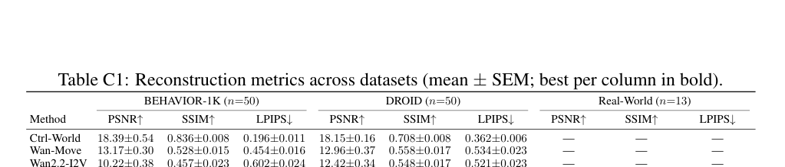

# Masked Visual Actions for Unified World Modeling

> **中文题目：**用于统一世界建模的掩码视觉动作

| Item | Details |
|---|---|
| Authors | Hadi Alzayer, Wenlong Huang, Haonan Chen, Christopher Luey, Lvmin Zhang, Maneesh Agrawala, Gordon Wetzstein, Li Fei-Fei, Yilun Du, Jiajun Wu, Jia-Bin Huang |
| Source | User-provided selectable-text PDF, 21 pages, arXiv preprint 2607.19343v1 (2026) |
| Paper type | Methods / algorithm paper for robotic video world modeling |
| Bilingual policy | English source prose is followed immediately by meaning-preserving Chinese translation; citations, formulas, numbers, datasets, and model names are retained. |

## Page and section index

- pp. 1–2: Abstract and Introduction
- p. 2–3: Related Work
- pp. 3–4: 3 Masked Visual Actions
- pp. 4–6: 4 Method
- pp. 6–10: 5 Experiments; 6 Discussion and Conclusions
- pp. 10–15: References (searchable English bibliography)
- pp. 16–21: Appendix A–I

## Terminology Ledger / 术语表

| Canonical term | 中文译法 | First-use / consistency note |
|---|---|---|
| Masked Visual Actions | 掩码视觉动作 | Paper method name; retain capitalization in English. |
| video world model | 视频世界模型 | A video model used to predict interaction outcomes. |
| masked conditioning | 掩码条件输入 | Pixel-space revealed region supplied to the model. |
| forward model | 前向模型 | Conditions on active/robot entity trajectories. |
| inverse model | 逆向模型 | Conditions on passive/object trajectories to recover robot behavior. |
| active / passive entity | 主动／被动实体 | Roles used to select conditioning set, not architectural labels. |
| embodiment | 机器人形态（具身形态） | Retained as “embodiment” where it names a benchmark setting. |
| LoRA | LoRA 低秩适配 | Low-Rank Adaptation; acronym retained. |
| VLM | 视觉语言模型 | Used here as a rollout judge/evaluator. |
| IDM | 逆动力学模型 | Inverse-dynamics model. |
| DROID / RoboCasa / BEHAVIOR-1K | DROID / RoboCasa / BEHAVIOR-1K | Dataset/benchmark names unchanged. |

## Abstract / 摘要

> <span style="color:#3B82F6"><strong>Para. 1:</strong></span> Video models absorb rich priors over how the visual world moves, interacts, and responds to contact, making them promising substrates for robotic world modeling. The central challenge is how to communicate action to such models in a form aligned with the visual space in which they learned these interaction priors, yet still grounded in physical manipulation. We introduce Masked Visual Actions, a pixel-space control interface that expresses action as a partially revealed trajectory of an arbitrary entity in a video. Revealing robot motion makes the model act as a forward dynamics model that predicts the scene’s response to low-level robot actions, while revealing desired object motion makes the same model recover robot behavior consistent with that outcome. Finetuned with only 15 hours of masked examples from real videos and simulation, a single checkpoint achieves strong visual fidelity and controllability across diverse scenes and multiple embodiments. In downstream manipulation settings, the model produces imagined rollouts whose outcomes correlate with real-world execution for policy evaluation, improves decision making by ranking candidate futures in model-based planning, and supports inverse modeling by synthesizing robot motion from desired object motion.

> <span style="color:#F59E0B"><strong>Para. 1[CN]:</strong></span> 视频模型吸收了视觉世界如何运动、交互及响应接触的丰富先验，因此是构建机器人世界模型的有前景基础。核心挑战在于：如何以既与其学习这些交互先验时所处的视觉空间对齐、又扎根于物理操作的形式，向此类模型传达动作。我们提出“掩码视觉动作”，这是一种像素空间控制接口，将动作表示为视频中任意实体被部分揭示的轨迹。揭示机器人运动时，模型作为前向动力学模型，预测场景对低层机器人动作的响应；揭示期望的物体运动时，同一模型则恢复与该结果一致的机器人行为。仅用来自真实视频和仿真的 15 小时掩码样例进行微调，单一检查点即可在多样场景和多种机器人形态上实现强视觉保真度与可控性。在下游操作任务中，该模型产生的想象 rollout 可用于策略评估，其结果与真实执行相关；它还能在基于模型的规划中通过排序候选未来改善决策，并能根据期望物体运动合成机器人运动以支持逆向建模。
### Fig. 1. 掩码视觉动作总览


**Caption:** Figure 1: Masked Visual Actions. We finetune a video model to condition on masked trajectories of robots, representing robot actions as pixel-space masked motions. Efficiently finetuned on only 15 hours of data, a single checkpoint of the model can act as an action-conditioned forward model to simulate robotic interactions with diverse and unseen embodiments. By conditioning it on object motion, it can also act as an inverse model that synthesizes the robot motion needed to achieve the desired outcome. We showcase the efficacy of our model for policy evaluation, model-based-planning, and action extraction where the video model acts as a policy.

**Caption[CN]:** 图 1：掩码视觉动作。我们微调视频模型，使其以机器人的掩码轨迹为条件，将机器人动作表示为像素空间的掩码运动。仅用 15 小时数据高效微调后，模型的单一检查点便可作为动作条件前向模型，模拟具有多样且未见形态的机器人交互。以物体运动为条件时，它还能作为逆向模型，合成为实现期望结果所需的机器人运动。我们展示了该模型在策略评估、基于模型的规划和动作提取中的有效性；在动作提取中视频模型可充当策略。

**Reading note:** Inspect the one-checkpoint switch: revealing robot motion queries forward dynamics; revealing object motion queries inverse behavior.

# 1 Introduction / 1 引言

> <span style="color:#3B82F6"><strong>Para. 1:</strong></span> Purposeful interaction requires connecting an agent’s actions to their effects in the world, and vice versa. In sensorimotor control, skilled behavior is often described as coupling a forward model that anticipates the sensory consequences of movement with an inverse model that recovers the movement needed to realize a desired state [67, 68, 69]. Robotic world models should similarly support both directions of reasoning in a single predictive framework.

> <span style="color:#F59E0B"><strong>Para. 1[CN]:</strong></span> 有目的的交互要求将智能体的动作与其在世界中的效果相连接，反之亦然。在感觉运动控制中，熟练行为通常被描述为将预测运动感知后果的前向模型，与恢复实现期望状态所需运动的逆向模型相耦合 [67, 68, 69]。机器人世界模型同样应在单一预测框架中支持这两个推理方向。
> <span style="color:#3B82F6"><strong>Para. 2:</strong></span> Recent advances in video models offer a promising route to this ambition. Trained on large-scale observation, they accumulate remarkably broad priors over motion, contact, persistence, deformation, and change, far beyond what can usually be distilled from robot data alone. However, most still remain passive observers rather than tools for intervention. Existing models condition generation on text [53, 63], tracks [13, 20, 56, 58, 82], forces [21, 22, 44], keypoints [66, 70], or motor commands [19, 25], signals that are often sparse, embodiment-specific, or misaligned with the model’s pre-trained visual experience. What remains missing is an action representation expressed directly in the visual space where pretrained video models learned their interaction priors. Once action is expressed visually, the same model can complete different parts of an interaction depending on the trajectory revealed: revealing robot motion prompts a scene response, while revealing object motion prompts robot behavior.

> <span style="color:#F59E0B"><strong>Para. 2[CN]:</strong></span> 视频模型的近期进展为实现这一目标提供了有希望的路径。它们在大规模观测数据上训练，积累了关于运动、接触、持续性、形变和变化的极其广泛先验，远超通常仅从机器人数据中可提炼的内容。然而，大多数模型仍是被动观察者，而非用于干预的工具。现有模型以文本 [53, 63]、轨迹 [13, 20, 56, 58, 82]、力 [21, 22, 44]、关键点 [66, 70] 或电机命令 [19, 25] 为生成条件；这些信号通常稀疏、依赖特定机器人形态，或与模型预训练视觉经验不对齐。仍然缺失的是一种直接在预训练视频模型学习交互先验的视觉空间中表达的动作表示。一旦以视觉方式表达动作，同一模型就能根据被揭示的轨迹补全交互的不同部分：揭示机器人运动会引出场景响应，而揭示物体运动会引出机器人行为。
> <span style="color:#3B82F6"><strong>Para. 3:</strong></span> To realize this vision, we introduce Masked Visual Actions, a method that recasts action as a visual primitive directly within the pre-trained model’s native representation. We finetune a pre-trained video model [63] to ingest actions as partially revealed spatiotemporal patterns in pixel space—a masked trajectory of an entity in the scene. When the revealed entity is the robot, the model predicts the scene’s response and acts as a forward dynamics model; when the revealed entity is instead an object or desired object motion, the same model acts as an inverse model to recover robot behavior consistent with that outcome. In this view, active and passive roles are not properties of separate architectures, but different queries to the same interaction prior. While conceptually simple, this interface is pixel-aligned, embodiment-agnostic, native to video, and efficient to inject into a pretrained model through lightweight adaptation.

> <span style="color:#F59E0B"><strong>Para. 3[CN]:</strong></span> 为实现这一愿景，我们提出掩码视觉动作：一种在预训练模型原生表示中将动作重述为视觉原语的方法。我们微调预训练视频模型 [63]，使其将动作作为像素空间中被部分揭示的时空模式——场景中某个实体的掩码轨迹——输入。当被揭示的实体是机器人时，模型预测场景响应并作为前向动力学模型；当被揭示的实体是物体或期望物体运动时，同一模型作为逆向模型，恢复与该结果一致的机器人行为。在此视角下，主动与被动角色并非不同架构的属性，而是对同一交互先验提出的不同查询。尽管概念简单，该接口与像素对齐、与具体形态无关、原生适配视频，并能通过轻量适配高效注入预训练模型。
> <span style="color:#3B82F6"><strong>Para. 4:</strong></span> In addition to superior visual fidelity compared to prior work, we validate our framework across three applications in robot manipulation, both in simulation and in the real world: policy evaluation, model-based planning, and inverse modeling, where the video model is used as part of a robot policy. All experiments use a single checkpoint of the model finetuned on as few as 15 hours of robot interaction data. In policy evaluation, the model’s imagined rollouts exhibit consistent correlation with real-world outcomes, so that simulated performance serves as a useful proxy for actual execution. In model-based planning, these same predictive capabilities are used to simulate the effects of different action trajectories and select the best one for execution, leading to consistent gains across diverse tasks and policy architectures. The same checkpoint can also be used in reverse: given desired object motion, it synthesizes robot motion that achieves the goal, and a learned inverse dynamics model extracts the resulting actions.

> <span style="color:#F59E0B"><strong>Para. 4[CN]:</strong></span> 除较以往工作更高的视觉保真度外，我们还在仿真和真实世界中，围绕机器人操作的三项应用验证了框架：策略评估、基于模型的规划以及逆向建模；在这些场景中视频模型是机器人策略的一部分。所有实验都使用同一模型检查点，该检查点仅以最少 15 小时机器人交互数据微调而成。在策略评估中，模型想象的 rollout 与真实世界结果持续相关，使模拟性能成为实际执行的有效代理。在基于模型的规划中，同样的预测能力用于模拟不同动作轨迹的效果，并选出最优轨迹执行，从而在多种任务和策略架构上带来稳定增益。同一检查点也可反向使用：给定期望物体运动，它合成实现目标的机器人运动，而学习得到的逆动力学模型提取由此产生的动作。
> <span style="color:#3B82F6"><strong>Para. 5:</strong></span> We summarize our contributions as follows: (1) we introduce Masked Visual Actions, a pixel-space control interface for pretrained video models, together with an efficient adaptation recipe based on masked examples from real and simulated data; (2) we show that forward and inverse robot world-modeling problems can be cast as complementary conditional prediction problems of the same video model, obtained by revealing different entities in the scene; and (3) we validate this framework in both simulation and the real world across three applications in robot manipulation: policy evaluation, model-based planning, and inverse modeling.

> <span style="color:#F59E0B"><strong>Para. 5[CN]:</strong></span> 我们的贡献如下：(1) 提出用于预训练视频模型的像素空间控制接口“掩码视觉动作”，并给出一种基于真实和仿真数据掩码样例的高效适配方案；(2) 表明前向与逆向机器人世界建模问题可被表述为同一视频模型的互补条件预测问题，其差别来自于揭示场景中的不同实体；(3) 在仿真和真实世界中，针对机器人操作的三项应用——策略评估、基于模型的规划与逆向建模——验证该框架。
# 2 Related Work / 2 相关工作

### Fig. 2. 用于学习的动作表示比较


**Caption:** Figure 2: Comparing action representations for learning. Low-dimensional robot actions are compact, but embodiment-specific and not aligned with the image observations used by video models. End-effector poses or robot skeletons are more visual, but remain sparse and require the model to infer geometry, contact, and interaction effects. Our masked visual actions provide dense, image-aligned conditioning, making robot motion and action directly visible, yielding a more learnable representation across embodiments and object interaction.

**Caption[CN]:** 图 2：用于学习的动作表示比较。低维机器人动作紧凑，但依赖具体形态，且与视频模型使用的图像观测不对齐。末端执行器位姿或机器人骨架更具视觉性，但仍然稀疏，要求模型推断几何、接触和交互效应。我们的掩码视觉动作提供稠密、与图像对齐的条件，使机器人运动和动作直接可见，因而在不同形态与物体交互之间形成更易学习的表示。

**Reading note:** Compare conditioning density and visual alignment rather than only action-vector dimensionality.

> <span style="color:#3B82F6"><strong>Para. 1:</strong></span> Controllable video generation as a robotic interface. Video models become simulators once a control signal is added: physical forces [21, 22], warped flow [5], hand poses [23, 32, 70], point or trajectory tracks [13, 20, 56, 58], and goal images [27]. None of these signals is dense, pixel-aligned, or shareable across embodiments. Closer to us, visual prompting via inpainting [1] and world modeling as conditional inference [35] show that varying which region of an image is provided enables a generic task parametrization in visual domains; we extend this idea to robotic world modeling by using masked frames as the control interface.

> <span style="color:#F59E0B"><strong>Para. 1[CN]:</strong></span> 作为机器人接口的可控视频生成。一旦加入控制信号，视频模型就成为模拟器：例如物理力 [21, 22]、扭曲流 [5]、手部姿态 [23, 32, 70]、点或轨迹轨道 [13, 20, 56, 58]，以及目标图像 [27]。这些信号都不同时具备稠密性、像素对齐性和跨形态可共享性。与我们更接近的是，基于修补的视觉提示 [1] 及作为条件推理的世界建模 [35] 表明，改变图像中被提供的区域可在视觉领域实现通用任务参数化；我们通过将掩码帧作为控制接口，把这一思想扩展到机器人世界建模。
> <span style="color:#3B82F6"><strong>Para. 2:</strong></span> Pixel-grounded action conditioning for robot world models. Most robotic video world models communicate actions through embodiment-specific channels: end-effector poses [25, 55, 73, 82], joint vectors [19, 25], or skeletons [60, 66]. A growing line replaces them with pixel-grounded signals. BridgeV2W [10] and Kinema4D [71] render the robot through its URDF and inject the resulting masks or pointmaps via ControlNet; Action Images [79] encodes 7-DoF actions as multi-view Gaussian heatmaps; ORV [74] conditions on 4D occupancy; Mask2IV [40] conditions on predicted mask trajectories; Mask World Model [47] predicts semantic masks as the output. A complementary line treats masks as a data-editing tool: Shadow [9, 36], Phantom [38], Masquerade [37], and EmbodiSwap [14] composite or render the robot onto human videos for cross-embodiment policy transfer. All of these works treat the robot as the active entity during training and run forward only. We expose the same masking interface to any subset of entities, so one model serves as a forward, inverse, or unconditional generator without retraining.

> <span style="color:#F59E0B"><strong>Para. 2[CN]:</strong></span> 机器人世界模型的像素落地动作条件输入。大多数机器人视频世界模型通过依赖具体形态的通道传递动作：末端执行器位姿 [25, 55, 73, 82]、关节向量 [19, 25] 或骨架 [60, 66]。不断增长的一类工作以像素落地信号取代它们。BridgeV2W [10] 和 Kinema4D [71] 通过 URDF 渲染机器人，并经由 ControlNet 注入得到的掩码或点图；Action Images [79] 将 7-DoF 动作编码为多视角高斯热图；ORV [74] 以 4D 占据为条件；Mask2IV [40] 以预测掩码轨迹为条件；Mask World Model [47] 则输出语义掩码。另一条互补路线将掩码作为数据编辑工具：Shadow [9, 36]、Phantom [38]、Masquerade [37] 和 EmbodiSwap [14] 将机器人合成或渲染到人类视频中，以进行跨形态策略迁移。所有这些工作都在训练时将机器人视为主动实体，并且仅沿前向运行。我们将同一掩码接口暴露给任意实体子集，因此一个模型无需重训练即可作为前向、逆向或无条件生成器。
> <span style="color:#3B82F6"><strong>Para. 3:</strong></span> Unified video-action models and downstream uses. UVA [42], UWM [81], AIM [18], X-WAM [24], and MotuBrain [50] unify forward dynamics, inverse dynamics, policy, and video generation in one model by masking modality channels (action vector vs. video) or by manipulating diffusion timesteps; large platforms such as Cosmos [53], Genie Envisioner [43], and DreamGen [29] package similar capabilities at foundation-model scale. Because the masking is over modality channels, actions remain low-dimensional vectors and the unification does not transfer across embodiments. Our masking is spatial: active and passive entities live on the same pixel canvas, so the same forward/inverse switch also bridges the embodiment gap. The forward direction is exercised for policy evaluation [60, 65, 75], policy improvement [25], planning [7, 16, 17, 28, 61, 78], and direct video-as-policy [26, 33]; the inverse direction extracts robot motion through point tracking [3, 30], object flow [34, 41, 80], predicted object pose [59], or learned IDMs [8, 16, 17, 54, 64, 76]. Critically, our inverse pipeline reuses the same backbone as the forward simulator, while prior work trains a separate IDM head or flow predictor.

> <span style="color:#F59E0B"><strong>Para. 3[CN]:</strong></span> 统一视频—动作模型及其下游用途。UVA [42]、UWM [81]、AIM [18]、X-WAM [24] 与 MotuBrain [50] 通过掩码模态通道（动作向量与视频）或操纵扩散时间步，在一个模型中统一前向动力学、逆向动力学、策略和视频生成；Cosmos [53]、Genie Envisioner [43] 和 DreamGen [29] 等大型平台则在基础模型规模上封装相近能力。由于掩码作用于模态通道，动作仍是低维向量，这种统一无法跨越机器人形态。我们的掩码是空间性的：主动与被动实体处于同一像素画布上，因此同一前向／逆向开关也弥合形态差距。前向方向用于策略评估 [60, 65, 75]、策略改进 [25]、规划 [7, 16, 17, 28, 61, 78] 以及直接的视频即策略 [26, 33]；逆向方向则经由点跟踪 [3, 30]、物体流 [34, 41, 80]、预测物体位姿 [59] 或学习得到的 IDM [8, 16, 17, 54, 64, 76] 提取机器人运动。关键在于，我们的逆向流程复用与前向模拟器相同的骨干网络，而先前工作训练独立的 IDM 头或流预测器。
# 3 Masked Visual Actions / 3 掩码视觉动作

> <span style="color:#3B82F6"><strong>Para. 1:</strong></span> Video generation models can be used to show how an initial scene evolves over time [4, 63], as they can model rich scene dynamics and object interactions. The video model captures the distribution $p(V)$ over videos $V \in \mathbb{R}^{T \times H \times W \times 3}$ depicting a scene. We view a scene $S$ as a set of entities $e_1, e_2, \ldots, e_n$, and the video model generates a sequence of frames depicting how the entities interact over time. In the output video, each $e_i$ has a spatiotemporal trajectory, and we abuse notation slightly and write $e_i$ for both the entity and the spatiotemporal region of pixels it occupies. Aligned with recent works built on structured masking and condition inference [2, 35, 45, 62], the video model implicitly captures the joint distribution over all entity trajectories.

> <span style="color:#F59E0B"><strong>Para. 1[CN]:</strong></span> 视频生成模型可展示初始场景如何随时间演化 [4, 63]，因为它们能够建模丰富的场景动力学和物体交互。视频模型捕获描述场景的视频 $V \in \mathbb{R}^{T imes H imes W imes 3}$ 上的分布 $p(V)$。我们将场景 $S$ 看作实体集合 $e_1, e_2, \ldots, e_n$，视频模型生成描绘这些实体如何随时间交互的帧序列。在输出视频中，每个 $e_i$ 都有时空轨迹；我们略微滥用记号，用 $e_i$ 同时表示实体及其占据的时空像素区域。与基于结构化掩码和条件推理的近期工作 [2, 35, 45, 62] 一致，视频模型隐式捕获所有实体轨迹的联合分布。
$$
p(V)=p(e_1,e_2,\ldots,e_n). \tag{1}
$$

> <span style="color:#3B82F6"><strong>Para. 2:</strong></span> Including the interactions among them. Conditioning on a subset $S \subseteq \{1,\ldots,n\}$ of entities yields the conditional distribution

> <span style="color:#F59E0B"><strong>Para. 2[CN]:</strong></span> 其中包括实体之间的交互。对实体子集 $S \subseteq \{1,\ldots,n\}$ 进行条件化，得到条件分布。
$$
p(\{e_i\}_{i\notin S}\mid \{e_j\}_{j\in S},I_0). \tag{2}
$$

> <span style="color:#3B82F6"><strong>Para. 3:</strong></span> where $I_0$ is a reference image of the initial scene. By varying $S$, the same model answers different questions about the same scene.

> <span style="color:#F59E0B"><strong>Para. 3[CN]:</strong></span> 其中 $I_0$ 是初始场景的参考图像。改变 $S$，同一模型便可回答关于同一场景的不同问题。
> <span style="color:#3B82F6"><strong>Para. 4:</strong></span> We realize this conditioning by masking. Let $M \in \{0,1\}^{T \times H \times W}$ be a binary mask indicating which spatiotemporal pixels are revealed to the model ($M_{t,h,w}=1$) versus predicted ($M_{t,h,w}=0$). For a chosen conditioning set $S$, the mask is the union of the pixel regions occupied by the conditioned entities,

> <span style="color:#F59E0B"><strong>Para. 4[CN]:</strong></span> 我们通过掩码实现这种条件化。令 $M \in \{0,1\}^{T \times H \times W}$ 为二值掩码，表示哪些时空像素被揭示给模型（$M_{t,h,w}=1$），哪些需要预测（$M_{t,h,w}=0$）。对于选定的条件集合 $S$，掩码是各条件实体所占像素区域的并集。
$$
M(S)=\bigcup_{i\in S} e_i. \tag{3}
$$

> <span style="color:#3B82F6"><strong>Para. 5:</strong></span> and the model receives as input the masked video $M \odot V$ together with the reference image $I_0$. Training proceeds by sampling $M$ from a distribution over masks and learning the conditional $p_\theta(V\mid M\odot V,I_0)$. We draw inspiration from masked modeling in language [15] and masked-image prompting [1], where varying the masked input enables diverse applications with the same model.

> <span style="color:#F59E0B"><strong>Para. 5[CN]:</strong></span> 模型将掩码视频 $M \odot V$ 与参考图像 $I_0$ 一同作为输入。训练时从掩码分布中采样 $M$，并学习条件分布 $p_\theta(V\mid M\odot V,I_0)$。我们受到语言中的掩码建模 [15] 和掩码图像提示 [1] 的启发：改变掩码输入可使同一模型支持多样应用。
> <span style="color:#3B82F6"><strong>Para. 6:</strong></span> In robotics, it is convenient to partition entities into two roles, as illustrated in Figure 3. We call entity $e_i$ active if it acts on the scene through its own agency, such as a robot arm or a human, and passive if its motion arises from interaction with an active entity, such as a manipulated object. Let $A \subseteq \{1,\ldots,n\}$ index the active entities and $P=\{1,\ldots,n\}\setminus A$ the passive ones. This partition surfaces two natural ways to use the model.

> <span style="color:#F59E0B"><strong>Para. 6[CN]:</strong></span> 在机器人学中，如图 3 所示，将实体划分为两种角色很方便。若实体 $e_i$ 通过自身能动性作用于场景（如机械臂或人），我们称其为主动；若其运动源于与主动实体的交互（如被操作物体），则称其为被动。令 $A \subseteq \{1,\ldots,n\}$ 索引主动实体，$P=\{1,\ldots,n\}\setminus A$ 索引被动实体。该划分给出两种自然的模型使用方式。
### Fig. 3. 前向、逆向与策略应用


**Caption:** Figure 3: Applications. The masked visual actions allow using the video model as a forward model, conditioned on robot actions, or as an inverse model that predicts the robot motion that satisfies the object trajectory. The forward model can be used for planning and choosing the best trajectory sampled from a policy, or policy evaluation. On the other hand, the inverse modeling can be combined with an inverse dynamics model to estimate robot actions from the generated video.

**Caption[CN]:** 图 3：应用。掩码视觉动作使视频模型可作为以机器人动作为条件的前向模型，也可作为预测满足物体轨迹的机器人运动的逆向模型。前向模型可用于规划，并从策略采样的轨迹中选择最佳轨迹，或用于策略评估。另一方面，逆向建模可与逆动力学模型结合，从生成视频中估计机器人动作。

**Reading note:** The same backbone supports planning/evaluation in the forward direction and action extraction in the inverse direction.

> <span style="color:#3B82F6"><strong>Para. 7:</strong></span> Forward model. Setting $S=A$, we condition on the active entities and predict the passive ones,

> <span style="color:#F59E0B"><strong>Para. 7[CN]:</strong></span> 前向模型。设定 $S=A$ 时，我们以主动实体为条件并预测被动实体。
$$
p(\{e_i\}_{i\in P}\mid\{e_j\}_{j\in A},I_0). \tag{4}
$$

> <span style="color:#3B82F6"><strong>Para. 8:</strong></span> This corresponds to the standard action-conditioned dynamics modeling, in which a robot’s motion is provided, and the model simulates its effect on the scene. Unlike prior work that conditions on low-dimensional action commands [19, 25], the active conditioning here is supplied as masked videos that are agnostic to embodiments.

> <span style="color:#F59E0B"><strong>Para. 8[CN]:</strong></span> 这对应于标准的动作条件动力学建模：给定机器人的运动，模型模拟其对场景的效果。不同于以低维动作命令为条件的既有工作 [19, 25]，此处主动条件以与形态无关的掩码视频提供。
> <span style="color:#3B82F6"><strong>Para. 9:</strong></span> Inverse model. Setting $S=P$, we condition on the passive entities and predict the active ones,

> <span style="color:#F59E0B"><strong>Para. 9[CN]:</strong></span> 逆向模型。设定 $S=P$ 时，我们以被动实体为条件并预测主动实体。
$$
p(\{e_i\}_{i\in A}\mid\{e_j\}_{j\in P},I_0). \tag{5}
$$

> <span style="color:#3B82F6"><strong>Para. 10:</strong></span> This direction has no analog in conventional action-conditioned world models: the user specifies a desired outcome in the world, and the video model recovers the agent behavior consistent with it.

> <span style="color:#F59E0B"><strong>Para. 10[CN]:</strong></span> 这一方向在传统动作条件世界模型中没有对应物：用户指定世界中的期望结果，视频模型则恢复与其一致的智能体行为。
> <span style="color:#3B82F6"><strong>Para. 11:</strong></span> The active/passive distinction is a convenient way to describe how we use the model rather than a property of the model itself. The model is trained on masked video completion without any explicit notion of agency, and at inference, any subset $S$ can be chosen. In fact, we trained our model only on masks depicting active robotic entities, yet it generalizes to queries conditioned on passive entities in a zero-shot manner. As observed in our empirical evaluations, this behavior is unique to our masked visual action conditioning, as conditioning the video model on sparser signals, such as low-level action commands or visualized skeletons, cannot achieve this level of generalization.

> <span style="color:#F59E0B"><strong>Para. 11[CN]:</strong></span> 主动／被动的区分是描述我们如何使用模型的便利方式，而不是模型自身的属性。模型在不显式引入能动性概念的情况下接受掩码视频补全训练；推理时可以选择任意子集 $S$。事实上，我们仅用描绘主动机器人实体的掩码训练模型，但它能以零样本方式泛化到以被动实体为条件的查询。正如实证评估所示，这种行为是我们掩码视觉动作条件输入所特有的；以低层动作命令或可视化骨架等更稀疏信号为视频模型提供条件，无法达到这一泛化水平。
# 4 Method / 4 方法

## 4.1 Dataset construction / 4.1 数据集构建

> <span style="color:#3B82F6"><strong>Para. 1:</strong></span> We construct the masked modeling dataset by combining real-world videos from DROID [31] and simulation data from Robocasa [52]. We use both success and failure trajectories from both datasets. We follow two approaches to construct masked conditioning for each video, based on video segmentation and rendering the robot state, as outlined below.

> <span style="color:#F59E0B"><strong>Para. 1[CN]:</strong></span> 我们将 DROID [31] 的真实世界视频与 Robocasa [52] 的仿真数据结合，构建掩码建模数据集。两个数据集都使用成功和失败轨迹。如下所述，我们根据视频分割与机器人状态渲染，采用两种方法为每段视频构建掩码条件输入。
> <span style="color:#3B82F6"><strong>Para. 2:</strong></span> Segmentation based dataset. Given any video, we can segment any entity in the scene using SegmentAnything [6], without the need for camera calibration or even explicitly knowing which robot is shown in the video. We use videos from DROID, and use the prompt “A robotic arm” for segmentation to isolate the robot. Using segmentation data enables the model to effectively learn to inpaint missing regions and to model the joint distribution over all entities in the scene. While a segmentation-based approach is highly general, it suffers from two major limitations: First, it is challenging for the user to provide an exact segmentation mask of entities at test time. Second, any occluded regions in the robot would implicitly leak information about the scene dynamics from the original video. To mitigate those limitations, we also explore the approach that explicitly renders robots from their recorded state.

> <span style="color:#F59E0B"><strong>Para. 2[CN]:</strong></span> 基于分割的数据集。给定任意视频，我们可使用 SegmentAnything [6] 分割场景中的任意实体，无需相机标定，甚至无需明确知道视频中是哪种机器人。我们使用 DROID 视频，并以提示词 “A robotic arm” 进行分割以隔离机器人。使用分割数据使模型能够有效学习修补缺失区域，并建模场景中所有实体的联合分布。尽管基于分割的方法泛化性很强，它有两个主要限制：其一，用户在测试时很难提供实体的精确分割掩码；其二，机器人被遮挡的区域会从原始视频中隐式泄露场景动力学信息。为缓解这些限制，我们还探索了从记录状态显式渲染机器人的方法。
> <span style="color:#3B82F6"><strong>Para. 3:</strong></span> Rendering based dataset. Instead of relying on segmentation, we can also align a robot mesh with the input video and use that as the masked conditioning. By rendering the robot mesh, we can visualize arbitrary action trajectories during inference and then use them as masked conditioning for the video model. To construct a rendering-based dataset, we require the robot state corresponding to the input video and the camera calibration. We use the DROID dataset and follow the protocols from PointWorld [28] to refine the camera calibration to accurately align the robot URDF with the input trajectories. In the Robocasa simulation, we render only the robot, excluding the rest of the scene, to generate the masked conditioning. To allow the model to see the full robot without self-occlusion, we render the robot only with translucent rendering and set the gripper fingers to bright red so the video model can easily observe the actions. Note that the rendering approach requires known camera calibration, and is limited to rendering the robot only as opposed to arbitrarily enabling masking any entity in the scene. As a result, we believe that the segmentation and rendering-based approaches are complementary.

> <span style="color:#F59E0B"><strong>Para. 3[CN]:</strong></span> 基于渲染的数据集。除依赖分割外，我们也可将机器人网格与输入视频对齐，并将其用作掩码条件输入。渲染机器人网格后，可在推理时可视化任意动作轨迹，再将其作为视频模型的掩码条件输入。构建基于渲染的数据集需要与输入视频对应的机器人状态及相机标定。我们使用 DROID 数据集，并遵循 PointWorld [28] 的流程细化相机标定，以使机器人 URDF 与输入轨迹精确对齐。在 Robocasa 仿真中，我们只渲染机器人、排除场景其余部分，以生成掩码条件输入。为让模型看到完整机器人且不受自遮挡影响，我们仅进行半透明渲染，并将夹爪手指设为亮红色，使视频模型易于观察动作。请注意，渲染方法要求已知相机标定，并且仅限于渲染机器人，不能任意对场景中的任何实体启用掩码。因此，我们认为分割与基于渲染的方法是互补的。
### Fig. 4. 数据集构建


**Caption:** Figure 4: Dataset construction. (a) To train our model, we need a reference frame of the initial scene, and the masked visual actions, and train it to reproduce a realistic video of the robot executing the input actions. (b) We use segmentation-based approach by segmenting the robot arm from robotics datasets as the masked visual actions. (c) However, to allow the user to provide arbitrary action trajectory at inference, the model needs to also accept simulated mesh visualization of those actions. As a result, we also include rendering-based dataset. Given that DROID also contains the robot state at each timestep, we render the robot URDF that matches the original video to construct masked visual actions.

**Caption[CN]:** 图 4：数据集构建。(a) 训练模型需要初始场景的参考帧和掩码视觉动作，并训练模型重建机器人执行输入动作的真实视频。(b) 我们采用基于分割的方法，从机器人数据集中分割机械臂并将其作为掩码视觉动作。(c) 但要让用户在推理时提供任意动作轨迹，模型还必须接受这些动作的模拟网格可视化。因此我们还加入基于渲染的数据集。由于 DROID 包含每个时间步的机器人状态，我们渲染与原视频匹配的机器人 URDF 来构建掩码视觉动作。

**Reading note:** The training triplet is reference frame + masked action sequence + target video; rendering supplies actionable test-time trajectories.

## 4.2 Model implementation and training / 4.2 模型实现与训练

> <span style="color:#3B82F6"><strong>Para. 1:</strong></span> We use Wan-Fun-Control 2.2 14B [63] as the base model. We encode the masked conditioning video using the same autoencoder as the video model and use concatenation as the conditioning mechanism. Concatenation is appropriate as the conditioning signal is spatially aligned with the desired output video. For the missing region from the masked conditioning, we set it to a uniform gray background. Instead of finetuning the entire model, we use LoRA finetuning with rank 256, and a batch size of 4 using 8 NVIDIA H200 GPUs. We train the model for approximately 10,000 steps over 4 days. For reproducibility, we will release our code, data, and model weights.

> <span style="color:#F59E0B"><strong>Para. 1[CN]:</strong></span> 我们使用 Wan-Fun-Control 2.2 14B [63] 作为基础模型。掩码条件视频使用与视频模型相同的自编码器编码，并以拼接作为条件机制；该选择适合条件信号与期望输出视频在空间上对齐的情形。掩码条件输入中的缺失区域被设为统一灰色背景。我们不微调整个模型，而采用秩为 256 的 LoRA 微调；使用 8 张 NVIDIA H200 GPU，批大小为 4。模型训练约 10,000 步，历时 4 天。为保证可复现性，我们将发布代码、数据和模型权重。
# 5 Experiments / 5 实验

> <span style="color:#3B82F6"><strong>Para. 1:</strong></span> We start by evaluating Masked Visual Actions as a control signal for world modeling. We evaluate visual fidelity and controllability against prior work and highlight generalization to embodiments unseen during training. Afterward, we evaluate diverse robotic applications of our video model. In particular, we show how it can be used for planning by evaluating sampled trajectories, for policy evaluation, and for using the video model as the policy itself through inverse modeling. Please refer to the project webpage for video results.

> <span style="color:#F59E0B"><strong>Para. 1[CN]:</strong></span> 我们首先将掩码视觉动作作为世界建模的控制信号进行评估。我们相对于既有工作评估视觉保真度和可控性，并强调其对训练中未见机器人形态的泛化。随后，我们评估视频模型的多种机器人应用：具体包括通过评估采样轨迹进行规划、策略评估，以及通过逆向建模将视频模型本身用作策略。视频结果请参阅项目网页。
## 5.1 Controllable video generation / 5.1 可控视频生成

> <span style="color:#3B82F6"><strong>Para. 1:</strong></span> Video generation traditionally conditioned on text is expressive, but underspecified. Conditioning on motion tracks preserves the generality while allowing us to condition on motion. On the other hand, conditioning on the action space for a specific robotic embodiment provides additional precision, but at the cost of generality. Through Masked Visual Actions, we aim to preserve the generality of the video model by visually conditioning the video model on the robotic actions, and setting the role of the video model to answer: given this visual masked action, how would the rest of the scene look like? As a baseline for using the robot’s raw end-effector state as input, we use Ctrl-world [25], a recent SoTA method. For track conditioning, we use Wan-move [13], conditioning it on ground-truth tracks computed from the robot mesh. Additionally, we include Wan2.2 14B image-to-video as a reference.

> <span style="color:#F59E0B"><strong>Para. 1[CN]:</strong></span> 传统以文本为条件的视频生成具有表达力，但条件约束不足。以运动轨迹为条件在允许约束运动的同时保留了通用性。另一方面，以特定机器人形态的动作空间为条件可提供更高精度，但会牺牲通用性。通过掩码视觉动作，我们希望通过在视觉上以机器人动作为视频模型提供条件来保留其通用性，并将模型的角色设为回答：给定这一视觉掩码动作，场景的其余部分会是什么样？作为把机器人的原始末端执行器状态作为输入的基线，我们使用近期 SOTA 方法 Ctrl-world [25]。对于轨迹条件输入，我们使用 Wan-move [13]，其条件为由机器人网格计算的真值轨迹。此外，我们将 Wan2.2 14B 图生视频模型作为参照。
> <span style="color:#3B82F6"><strong>Para. 2:</strong></span> In Fig. 6, we highlight that both Masked Visual Actions and Ctrl-world accurately follow the robot actions on our held out scenes from DROID. On the other hand, both Wan-Move and Wan I2V completely collapse and transform the input scene. However, unlike our method, conditioning on the raw robot state cannot generalize to unseen embodiments [39, 72]. We use data from BEHAVIOR [39], which uses a bimanual robot, R1-Pro, to evaluate generalization on unseen embodiments. In Fig. 5, we demonstrate that Ctrl-world simply outputs static or corrupted videos for unseen embodiments, while our model can gracefully handle the unseen embodiment. We quantitatively evaluate performance on generated videos across both DROID and BEHAVIOR in Table 1 and show that our method outperforms the baselines.

> <span style="color:#F59E0B"><strong>Para. 2[CN]:</strong></span> 在图 6 中，我们强调掩码视觉动作和 Ctrl-world 在 DROID 的留出场景上都能准确跟随机器人动作。相比之下，Wan-Move 与 Wan I2V 都完全崩溃并改变了输入场景。然而，与我们的方法不同，以原始机器人状态为条件无法泛化至未见形态 [39, 72]。我们使用采用双臂机器人 R1-Pro 的 BEHAVIOR 数据 [39] 来评估未见形态泛化。图 5 表明，Ctrl-world 对未见形态只输出静态或损坏的视频，而我们的模型可平稳处理未见形态。我们于表 1 中定量评估 DROID 和 BEHAVIOR 上生成视频的性能，并表明本方法优于基线。
### Fig. 6. DROID 上的基线比较


**Caption:** Figure 6: Comparing baselines on DROID. Using image-to-video [63] or even trajectory conditioned video generation [13] with GT tracks fails to execute the robot motion or preserve the input scene. On the other hand, our model can competitively match and outperform models that take the raw robot actions [25] while maintaining generalization.

**Caption[CN]:** 图 6：DROID 上的基线比较。使用图生视频 [63] 或即使使用真值轨迹的轨迹条件视频生成 [13]，均无法执行机器人运动或保持输入场景。相反，我们的模型在保持泛化性的同时，可与以原始机器人动作为输入的模型 [25] 相匹配并超越它们。

**Reading note:** Compare whether each output both preserves the initial scene and executes the conditioned robot movement.

### Table 1. 多样机器人形态上的基线比较


**Caption:** Table 1: Baseline comparison on diverse embodiments. We evaluate our method against Ctrl-World [25] on DROID as a seen robotic embodiment, as well as BEHAVIOR, which uses a bimanual robotic embodiment that’s unseen for all methods. Our model outperform the baseline on both datasets, and we include image-to-video and trajectory conditioned video models as a reference.

**Caption[CN]:** 表 1：多样机器人形态上的基线比较。我们以 DROID（已见机器人形态）上的 Ctrl-World [25]，以及使用对所有方法均未见的双臂机器人形态的 BEHAVIOR，评估本方法。我们的方法在两个数据集上都优于该基线，并将图生视频和轨迹条件视频模型作为参照。

**Searchable transcription:**

| Method | DROID LPIPS ↓ | SSIM ↑ | PSNR ↑ | BEHAVIOR LPIPS ↓ | SSIM ↑ | PSNR ↑ |
|---|---:|---:|---:|---:|---:|---:|
| Image-to-video [63] | 0.521 | 0.548 | 12.42 | 0.602 | 0.457 | 10.22 |
| Wan-move [13] | 0.534 | 0.562 | 12.99 | 0.312 | 0.756 | 13.17 |
| Ctrl-World [25] | 0.362 | 0.708 | 18.15 | 0.196 | 0.837 | 18.39 |
| **Masked Visual Actions (Ours)** | **0.0945** | **0.887** | **23.74** | **0.123** | **0.843** | **22.90** |

**Reading note:** Lower LPIPS and higher SSIM/PSNR consistently favor Masked Visual Actions on seen DROID and unseen BEHAVIOR.

### Fig. 5. 未见机器人形态泛化


**Caption:** Figure 5: Generalization to unseen embodiment. While using the raw action state such as in Ctrl-world [25] can work well within the training domain, it collapses on unseen embodiments. However, our method can generalize well to unseen embodiments.

**Caption[CN]:** 图 5：对未见机器人形态的泛化。尽管像 Ctrl-world [25] 那样使用原始动作状态可在训练域内良好工作，但在未见形态上会崩溃；我们的方法可较好地泛化至未见形态。

**Reading note:** The qualitative comparison isolates the cross-embodiment failure of raw-state conditioning.

> <span style="color:#3B82F6"><strong>Para. 3:</strong></span> Comparing the choice of visual actions. Conditioning on visual actions allows diverse ways to represent the action. We compare against visualizing the end-effector pose, inspired by IRASim [82], and the robot skeleton, adopted in VAP [66]. We train the same base model used for our method, and use the same training dataset from DROID to train the baselines. While we expect the varying action conditioning to perform similarly on the same domain as the training set, sparse conditioning signals require the model to explicitly learn the correspondence between the sparse action and the target video. However, by conditioning on masked visual actions, the model simply needs to model the interaction between the masked input and the rest of the scene. In Fig. 7, we show that on DROID, all the variants of our model perform similarly. However, on real-world data we captured using a similar robot to the one used in DROID, the Franka Emika Panda, but with a custom 3D-printed end-effector, we find that using a sparse conditioning signal suffers significantly. In particular, when conditioning on the robot skeleton, the video model would transform the robot to match the embodiment seen during training. When using the end-effector visualization as input, the model would simply introduce another robot into the scene that matches the training data. To further deviate from the training setting, we test the models on the R1 Pro in BEHAVIOR [39]. Given that R1 Pro has two end effectors, we adapt the baseline visualizations to show two end effectors and the skeleton poses of each. We find that conditioning on the end-effector or skeleton visualization completely collapses and distorts the robot. However, when using masked visual actions, the model can gracefully generalize and simulate the physical interaction of the robot opening the fridge. In Table 2, we quantitatively evaluate the video generation performance for masked visual actions, and the sparser conditioning mechanisms of end effector pose visualization and robot skeleton.

> <span style="color:#F59E0B"><strong>Para. 3[CN]:</strong></span> 比较视觉动作的选择。视觉动作条件输入允许以多种方式表示动作。我们与受 IRASim [82] 启发的末端执行器位姿可视化及 VAP [66] 采用的机器人骨架进行比较。我们训练与本方法相同的基础模型，并使用相同的 DROID 训练数据集来训练基线。尽管预期不同动作条件在训练集同域上的表现相近，稀疏条件信号要求模型显式学习稀疏动作与目标视频的对应关系。以掩码视觉动作为条件时，模型只需建模掩码输入与场景其余部分之间的交互。图 7 表明，在 DROID 上各模型变体表现相近；但对于我们用与 DROID 相似的 Franka Emika Panda 机器人（配备定制 3D 打印末端执行器）采集的真实数据，稀疏条件信号明显受损。尤其是骨架条件会让视频模型将机器人变形成训练时见到的形态；末端执行器可视化输入则会让模型在场景中引入另一台与训练数据相符的机器人。为进一步偏离训练设置，我们在 BEHAVIOR [39] 的 R1 Pro 上测试模型。R1 Pro 有两个末端执行器，因此我们调整基线可视化以显示两个末端执行器和每只机械臂的骨架姿态。结果发现，末端执行器或骨架可视化条件会完全崩溃并扭曲机器人；而掩码视觉动作能平稳泛化，并模拟机器人打开冰箱的物理交互。表 2 定量评估掩码视觉动作与更稀疏的末端执行器位姿可视化、机器人骨架条件机制的视频生成性能。
### Fig. 7. 动作条件输入比较


**Caption:** Figure 7: Comparing action conditioning. Training a video model on different conditioning signals on DROID such as masked visual actions, end effector visualization, or skeleton all work well within the training domain. However, when going beyond the training distribution, such as using a custom end-effector, the models trained on skeleton and end effector position would hallucinate the robot seen in training or transform the robot to match the training. Furthermore, on unseen embodiments such as bimanual robots in BEHAVIOR, using masked actions generalizes gracefully, while other conditioning signals transform and disfigure the robot.

**Caption[CN]:** 图 7：动作条件输入比较。在 DROID 上，用不同条件信号训练视频模型——如掩码视觉动作、末端执行器可视化或骨架——均可在训练域内良好工作。然而，超出训练分布（如使用定制末端执行器）时，在骨架和末端执行器位置上训练的模型会幻觉出训练中见到的机器人，或把机器人变形成与训练相符的样子。此外，在 BEHAVIOR 中的双臂机器人等未见形态上，掩码动作可平稳泛化，而其他条件信号会改变并扭曲机器人。

**Reading note:** Use the three rows to distinguish in-domain performance from custom-tool and bimanual out-of-distribution behavior.

### Table 2. 视觉条件信号消融


**Caption:** Table 2: Ablation on visual conditioning signal. When using sparse conditioning signal, the performance on held out data from the training distribution on DROID is similar to using masked visual actions. However, when using the same robot with unseen gripper (such as on our real world data), or on a robot from unseen embodiment in BEHAVIOR, the gap increases significantly between our masked actions and the other conditioning methods.

**Caption[CN]:** 表 2：视觉条件信号消融。使用稀疏条件信号时，在 DROID 中来自训练分布的留出数据上的性能与掩码视觉动作相近。然而，当使用配备未见夹爪的同一机器人（如我们的真实世界数据）或 BEHAVIOR 中未见形态的机器人时，掩码动作与其他条件方法之间的差距显著扩大。

**Searchable transcription:**

| Method | DROID LPIPS ↓ | SSIM ↑ | PSNR ↑ | Real world LPIPS ↓ | SSIM ↑ | PSNR ↑ | BEHAVIOR LPIPS ↓ | SSIM ↑ | PSNR ↑ |
|---|---:|---:|---:|---:|---:|---:|---:|---:|---:|
| End-effector vis. | 0.107 | 0.878 | 22.64 | 0.183 | 0.858 | 20.32 | 0.171 | 0.815 | 19.23 |
| Skeleton vis. | 0.106 | 0.878 | 22.74 | 0.169 | 0.866 | 21.02 | 0.162 | 0.824 | 19.58 |
| **Masked Visual Actions** | **0.0945** | **0.887** | **23.74** | **0.148** | **0.864** | **22.79** | **0.123** | **0.843** | **22.90** |

**Reading note:** The ablation shows that visual density matters primarily under embodiment shift, rather than only in-domain reconstruction.

## 5.2 Robotics applications / 5.2 机器人应用

> <span style="color:#3B82F6"><strong>Para. 1:</strong></span> We highlight multiple applications of our unified world model in robotics. We use our model as a forward model to simulate robot actions and demonstrate its use for planning and policy evaluation. We also use our model as an inverse model: given the desired object motion as a masked visual action, we generate a video of the robot performing the desired object manipulation and extract the actions using a learned inverse dynamics model. Across these applications, we use Robocasa [52] as the simulation environment.

> <span style="color:#F59E0B"><strong>Para. 1[CN]:</strong></span> 我们强调统一世界模型在机器人学中的多项应用。我们将其作为前向模型模拟机器人动作，并展示其在规划和策略评估中的用途。我们也将模型作为逆向模型：将期望物体运动作为掩码视觉动作给定，生成机器人完成期望物体操作的视频，再用学习得到的逆动力学模型提取动作。在这些应用中，我们使用 Robocasa [52] 作为仿真环境。
> <span style="color:#3B82F6"><strong>Para. 2:</strong></span> Planning. Given the same environment observation, multiple rollouts sampled from a stochastic policy may achieve varying levels of task progress. By rolling them out in an action-conditioned video model, one may evaluate the trajectories purely in imagination before executing them in the actual environment. In our experiments, we use Diffusion Policy [11, 12] as the stochastic policy and Best-of-N as the simplest model-based planning algorithm. After simulating the action candidates using the video model, we evaluate each rollout with Gemini 3.1 Pro to assess their relative task success, interaction fidelity, and physical realism. We evaluate on 10 scenes per task, with $N=10$. We include the detailed criteria in the appendix. After evaluating all the rollouts, we pick the best action sequence to execute. In Fig. 8, we highlight the improvement in performance on diverse tasks and show how success rate increases with the number of action samples. This approach can be viewed as a form of test-time scaling [48, 51], leveraging additional compute to achieve higher performance. In our case, the policy and video model act as the generator, and the VLM critic acts as the verifier.

> <span style="color:#F59E0B"><strong>Para. 2[CN]:</strong></span> 规划。在相同的环境观测下，从随机策略采样的多个 rollout 可能实现不同程度的任务进展。通过在动作条件视频模型中将它们 rollout，可在真实环境执行前纯粹凭想象评估这些轨迹。实验中我们以 Diffusion Policy [11, 12] 作为随机策略，并使用最简单的基于模型规划算法 Best-of-N。利用视频模型模拟动作候选后，我们使用 Gemini 3.1 Pro 评估每个 rollout 的相对任务成功、交互保真度与物理真实性。每项任务评估 10 个场景，$N=10$；详细标准在附录中给出。评估全部 rollout 后，选择最佳动作序列执行。图 8 展示了多种任务上的性能提升，以及成功率如何随动作样本数增加而提高。这一方法可视为测试时扩展 [48, 51]：利用额外计算获得更高性能。这里，策略和视频模型是生成器，VLM 评审器是验证器。
### Fig. 8. 规划应用


**Caption:** Figure 8: Application on Planning. By rolling out multiple trajectories from a pretrained diffusion policy, we can evaluate each trajectory by simulating the actions with the video model, and then using a VLM judge to pick the best action trajectory. We observe consistent improvement in task success when using the video model to roll out and choose best action sequences, as well as the positive correlation with the number of samples evaluated at test time. This demonstrates the ability of the model to simulate counterfactuals given the same initial condition.

**Caption[CN]:** 图 8：规划应用。通过从预训练扩散策略中 rollout 多条轨迹，我们可利用视频模型模拟动作来评估每条轨迹，再使用 VLM 评审器选择最佳动作轨迹。使用视频模型 rollout 并选择最佳动作序列时，任务成功持续提升；提升与测试时被评估样本数呈正相关。这证明模型能在相同初始条件下模拟反事实。

**Reading note:** Left: Best-of-N improves as more policy samples are evaluated. Right: planning improves task success across six tasks.

> <span style="color:#3B82F6"><strong>Para. 3:</strong></span> Policy evaluation. We can also use our model to evaluate policy performance by comparing a policy’s success rate within the video model to that within the ground-truth environment. Similarly to the section above, we use an open-loop diffusion policy across tasks and rollout 10 trajectories per scene. We simulate action trajectories using our model and manually evaluate each rollout as a success or failure based on predefined task rubrics. The simulated rollouts are additionally evaluated by physical interaction realism (e.g., hallucinated task progress without contact is considered failure). In Fig. 9, we plot the success rate of each policy in GT environment against that evaluated within the video model, which exhibits a strong correlation with $r=0.982$. However, we observe that the video model shows a positive bias towards task progress, as evidenced by consistently higher task success rates in its imagination. Beyond simulation, we evaluate our model in a real-world setup. For each of four tasks we collect 20 demonstrations, roll out each demonstration with the video model, and score both the real and simulated executions with a per-task rubric measuring partial task progress. For each task, we collect 20 demonstrations, and set a rubric for evaluating the success progress for each demonstration. Because each simulated rollout is paired with the demonstration it was generated from, we compare progress both in distribution and per trial. In Fig. 10 we plot the per-trial progress distribution in the video model against the ground-truth distribution for each task. The two distributions closely match, but similar to simulation, it shows a positive bias towards task progress. We include each task’s rubric in the appendix and all generated videos and GT demonstrations in the project webpage.

> <span style="color:#F59E0B"><strong>Para. 3[CN]:</strong></span> 策略评估。我们还可通过比较策略在视频模型内与在真值环境内的成功率，评估策略性能。与上一节类似，我们在多项任务中使用开环扩散策略，并为每个场景 rollout 10 条轨迹。我们用模型模拟动作轨迹，并依据预定义任务量规人工将每条 rollout 判断为成功或失败；同时还评估模拟 rollout 的物理交互真实性（例如没有接触却幻觉出任务进展被视为失败）。图 9 绘制每个策略在真值环境中的成功率与视频模型内评估成功率，呈现很强相关性 $r=0.982$。但视频模型对任务进展存在正偏差，其想象中的任务成功率持续偏高。除仿真外，我们还在真实世界设置中评估模型：对四项任务中的每一项收集 20 个示范，用视频模型 rollout 每个示范，并以衡量部分任务进展的任务特异量规为真实与模拟执行评分。由于每个模拟 rollout 与其生成来源的示范配对，我们同时按分布和单次试验比较进展。图 10 绘制每项任务中视频模型的逐试验进展分布与真值分布；两种分布紧密匹配，但与仿真类似，仍对任务进展呈正偏差。附录给出各任务量规，项目网页提供全部生成视频与真值示范。
> <span style="color:#3B82F6"><strong>Para. 4:</strong></span> Action extraction. Instead of providing the model with robot actions to execute, we can alternatively leverage Masked Visual Actions to formulate an inverse modeling problem: given desired object motion, prompting the video model to synthesize a video of a robot achieving that outcome. Action extraction can then be cast as an inverse-dynamics problem: given the synthesized robot video, recover an executable low-level action sequence with a learned inverse-dynamics model. We initially expected this setting to require explicit inverse-modeling finetuning. Instead, the video model trained only on forward examples already generalizes zero-shot to the inverse setting, likely because the conditioning signal is well-aligned with the model’s learned representation. We evaluate this pipeline on COFFEESERVEMUG in RoboCasa, where the robot must reach, grasp, transport, and place a mug from the coffee machine onto the table in a tightly constrained workspace. We compare to standard imitation learning baselines, including Diffusion Policy [11, 12], ACT [77], and SmolVLA [57]. The inverse-dynamics model and all baselines are trained on 100 demonstrations, whereas the video model itself has not seen examples from this task. Each method is evaluated with 20 trials, with success rates reported in Figure 11. Our method achieves the highest success rate at 90%. This indicates that, although the video model has not been trained on an inverse modeling problem, it can be effectively prompted to extract robot behaviors from its rich interaction priors, while maintaining the competitiveness of modern imitation learning methods.

> <span style="color:#F59E0B"><strong>Para. 4[CN]:</strong></span> 动作提取。除向模型提供待执行的机器人动作外，我们还可借助掩码视觉动作构造逆向建模问题：给定期望物体运动，提示视频模型合成机器人实现该结果的视频。然后，动作提取可被表述为逆动力学问题：给定合成的机器人视频，用学习得到的逆动力学模型恢复可执行的低层动作序列。起初我们预期该设置需要显式的逆向建模微调；但仅以前向样例训练的视频模型已能零样本泛化到逆向设置，这可能是因为条件信号与模型学习到的表示很好对齐。我们于 RoboCasa 的 COFFEESERVEMUG 上评估该流程；在严格受限的工作空间中，机器人须从咖啡机处伸手、抓取、运输并将杯子放在桌上。我们与标准模仿学习基线比较，包括 Diffusion Policy [11, 12]、ACT [77] 和 SmolVLA [57]。逆动力学模型与全部基线均以 100 个示范训练，而视频模型自身未见该任务样例。每种方法评估 20 次试验，成功率见图 11。我们的方法以 90% 获得最高成功率。这表明，尽管视频模型没有在逆向建模问题上训练，它仍可被有效提示，从丰富交互先验中提取机器人行为，同时保持与现代模仿学习方法的竞争力。
### Fig. 9. RoboCasa 策略评估


**Caption:** Figure 9: Robocasa policy evaluation. Video-model rollouts consistently track ground-truth success rates across RoboCasa tasks.

**Caption[CN]:** 图 9：RoboCasa 策略评估。视频模型的 rollout 在各 RoboCasa 任务上持续跟踪真值成功率。

**Reading note:** The scatter plot reports strong rank/alignment of imagined and ground-truth task success ($r=0.982$).

### Fig. 10. 真实世界策略评估


**Caption:** Figure 10: Real world policy evaluation. Rolling out real-world demonstrations with our video model produces videos with success progress closely aligned with what is observed in the real world execution.

**Caption[CN]:** 图 10：真实世界策略评估。用视频模型 rollout 真实世界示范产生的视频，其成功进展与真实世界执行中观察到的情况紧密对齐。

**Reading note:** Compare full distributions and per-trial progress; the paper notes a systematic optimistic bias.

### Fig. 11. 动作提取


**Caption:** Figure 11: Action extraction. Even without task-specific video-model training, inverse modeling recovers competitive robot behavior.

**Caption[CN]:** 图 11：动作提取。即使没有面向任务的视频模型训练，逆向建模仍能恢复有竞争力的机器人行为。

**Reading note:** The displayed success rates are DP 50%, ACT 80%, SmolVLA 85%, and Ours 90%.

# 6 Discussion and Conclusions / 6 讨论与结论

> <span style="color:#3B82F6"><strong>Para. 1:</strong></span> By finetuning a pretrained video model on a small amount of Masked Visual Actions data, we efficiently leverage the prior of the video model to synthesize counterfactuals by conditioning on a subset of scene entities. Our model can simulate robot actions when conditioned on robotic embodiment visualization as an action-conditioned forward model, and when acting as an inverse model, where it synthesizes suitable robot motion to realistically manipulate the object.

> <span style="color:#F59E0B"><strong>Para. 1[CN]:</strong></span> 通过在少量掩码视觉动作数据上微调预训练视频模型，我们可通过对场景实体子集进行条件化，高效利用视频模型先验合成反事实。以机器人形态可视化为条件时，模型可作为动作条件前向模型模拟机器人动作；作为逆向模型时，则合成适当的机器人运动以真实地操作物体。
> <span style="color:#3B82F6"><strong>Para. 2:</strong></span> Limitations. It is worth noting that our model, similarly to existing generative models, learns the correlation between object interaction rather than causal relationships, which remains an open research question. Furthermore, our method is naturally limited by the base video model’s capabilities, in terms of both inference speed and what it can express, as it re-purposes the model’s prior rather than modifying its capabilities.

> <span style="color:#F59E0B"><strong>Para. 2[CN]:</strong></span> 局限性。值得注意的是，与现有生成模型相似，我们的模型学习的是物体交互之间的相关性而非因果关系；这仍是开放研究问题。此外，由于本方法重新利用模型先验而非修改其能力，它自然受限于基础视频模型的能力，包括推理速度和其可表达的内容。
> <span style="color:#3B82F6"><strong>Para. 3:</strong></span> Societal and broader impact. By enabling video-based policy evaluation, planning, and inverse modeling, our work could lower the cost of developing robotic systems and make robot learning more accessible. However, the same capabilities could also be used for unsafe or unauthorized robotic behaviors, highlighting the need for responsible use and deployment.

> <span style="color:#F59E0B"><strong>Para. 3[CN]:</strong></span> 社会与更广泛影响。通过实现基于视频的策略评估、规划和逆向建模，本工作可能降低机器人系统开发成本，并使机器人学习更易获得。但同样的能力也可能被用于不安全或未经授权的机器人行为，这凸显了负责任使用和部署的必要性。
# References / 参考文献（英文可检索原文）

### Source page 10

[1] Amir Bar, Yossi Gandelsman, Trevor Darrell, Amir Globerson, and Alexei A. Efros. Visual prompting via image inpainting. In NeurIPS, 2022. [2] Daniel M Bear, Kevin Feigelis, Honglin Chen, Wanhee Lee, Rahul Venkatesh, Klemen Kotar, Alex Durango, and Daniel LK Yamins. Unifying (machine) vision via counterfactual world modeling. arXiv preprint arXiv:2306.01828, 2023. [3] Homanga Bharadhwaj, Roozbeh Mottaghi, Abhinav Gupta, and Shubham Tulsiani. Track2act: Predicting point tracks from internet videos enables generalizable robot manipulation, 2024. [4] Tim Brooks, Bill Peebles, Connor Holmes, Will DePue, Yufei Guo, Li Jing, David Schnurr, Joe Taylor, Troy Luhman, Eric Luhman, Clarence Ng, Ricky Wang, and Aditya Ramesh. Video generation models as world simulators. 2024. URL https://openai.com/research/ video-generation-models-as-world-simulators. [5] Ryan Burgert, Yuancheng Xu, Wenqi Xian, Oliver Pilarski, Pascal Clausen, Mingming He, Li Ma, Yitong Deng, Lingxiao Li, Mohsen Mousavi, Michael Ryoo, Paul Debevec, and Ning Yu. Go-with-the-flow: Motion-controllable video diffusion models using real-time warped noise. In CVPR, 2025. [6] Nicolas Carion, Laura Gustafson, Yuan-Ting Hu, Shoubhik Debnath, Ronghang Hu, Didac Suris Coll-Vinent, Chaitanya Ryali, Kalyan Vasudev Alwala, Haitham Khedr, Andrew Huang, Jie Lei, Tengyu Ma, Baishan Guo, Arpit Kalla, Markus Marks, Joseph Greer, Meng Wang, Peize Sun, Roman Rädle, Triantafyllos Afouras, Effrosyni Mavroudi, Katherine Xu, Tsung-Han Wu, Yu Zhou, Liliane Momeni, RISHI HAZRA, Shuangrui Ding, Sagar Vaze, Francois Porcher, Feng Li, Siyuan Li, Aishwarya Kamath, Ho Kei Cheng, Piotr Dollar, Nikhila Ravi, Kate Saenko, Pengchuan Zhang, and Christoph Feichtenhofer. SAM 3: Segment anything with concepts. In ICLR, 2026. [7] Boyuan Chen, Tianyuan Zhang, Haoran Geng, Kiwhan Song, William T. Freeman, Jitendra Malik, Russ Tedrake, Vincent Sitzmann, and Yilun Du. Large video planner, 2025. [8] Haonan Chen, Jiaming Xu, Lily Sheng, Tianchen Ji, Shuijing Liu, Yunzhu Li, and Katherine Driggs-Campbell. Learning coordinated bimanual manipulation policies using state diffusion and inverse dynamics models. In 2025 IEEE International Conference on Robotics and Automation (ICRA), 2025.

### Source page 11

[9] Haonan Chen, Cheng Zhu, Shuijing Liu, Yunzhu Li, and Katherine Rose Driggs-Campbell. Tool-as-interface: Learning robot policies from observing human tool use. In Proceedings of Robotics: Conference on Robot Learning (CoRL), 2025. [10] Yixiang Chen, Peiyan Li, Jiabing Yang, Keji He, Xiangnan Wu, Yuan Xu, Kai Wang, Jing Liu, Nianfeng Liu, Yan Huang, et al. Bridgev2w: Bridging video generation models to embodied world models via embodiment masks. arXiv preprint arXiv:2602.03793, 2026. [11] Cheng Chi, Siyuan Feng, Yilun Du, Zhenjia Xu, Eric Cousineau, Benjamin Burchfiel, and Shuran Song. Diffusion policy: Visuomotor policy learning via action diffusion. In Proceedings of Robotics: Science and Systems (RSS), 2023. [12] Cheng Chi, Zhenjia Xu, Siyuan Feng, Eric Cousineau, Yilun Du, Benjamin Burchfiel, Russ Tedrake, and Shuran Song. Diffusion policy: Visuomotor policy learning via action diffusion. The International Journal of Robotics Research, 2024. [13] Ruihang Chu, Yefei He, Zhekai Chen, Shiwei Zhang, Xiaogang Xu, Bin Xia, Dingdong Wang, Hongwei Yi, Xihui Liu, Hengshuang Zhao, et al. Wan-move: Motion-controllable video generation via latent trajectory guidance. arXiv preprint arXiv:2512.08765, 2025. [14] Eadom Dessalene, Pavan Mantripragada, Michael Maynord, and Yiannis Aloimonos. Embodis- wap for zero-shot robot imitation learning, 2025. [15] Jacob Devlin, Ming-Wei Chang, Kenton Lee, and Kristina Toutanova. BERT: Pre-training of deep bidirectional transformers for language understanding. In Jill Burstein, Christy Doran, and Thamar Solorio, editors, Proceedings of the 2019 Conference of the North American Chapter of the Association for Computational Linguistics: Human Language Technologies, Volume 1 (Long and Short Papers), pages 4171–4186, Minneapolis, Minnesota, June 2019. Association for Computational Linguistics. doi: 10.18653/v1/N19-1423. [16] Yilun Du, Sherry Yang, Bo Dai, Hanjun Dai, Ofir Nachum, Josh Tenenbaum, Dale Schuurmans, and Pieter Abbeel. Learning universal policies via text-guided video generation. Advances in neural information processing systems, 36:9156–9172, 2023. [17] Yilun Du, Sherry Yang, Pete Florence, Fei Xia, Ayzaan Wahid, Pierre Sermanet, Tianhe Yu, Pieter Abbeel, Joshua B Tenenbaum, Leslie Pack Kaelbling, et al. Video language planning. In The Twelfth International Conference on Learning Representations, 2023. [18] Liaoyuan Fan, Zetian Xu, Chen Cao, Wenyao Zhang, Mingqi Yuan, and Jiayu Chen. Aim: Intent-aware unified world action modeling with spatial value maps, 2026. [19] Shenyuan Gao, William Liang, Kaiyuan Zheng, Ayaan Malik, Seonghyeon Ye, Sihyun Yu, Wei-Cheng Tseng, Yuzhu Dong, Kaichun Mo, Chen-Hsuan Lin, Qianli Ma, Seungjun Nah, Loic Magne, Jiannan Xiang, Yuqi Xie, Ruijie Zheng, Dantong Niu, You Liang Tan, K.R. Zentner, George Kurian, Suneel Indupuru, Pooya Jannaty, Jinwei Gu, Jun Zhang, Jitendra Malik, Pieter Abbeel, Ming-Yu Liu, Yuke Zhu, Joel Jang, and Linxi "Jim" Fan. Dreamdojo: A generalist robot world model from large-scale human videos. arXiv preprint arXiv:2602.06949, 2026. [20] Daniel Geng, Charles Herrmann, Junhwa Hur, Forrester Cole, Serena Zhang, Tobias Pfaff, Tatiana Lopez-Guevara, Carl Doersch, Yusuf Aytar, Michael Rubinstein, Chen Sun, Oliver Wang, Andrew Owens, and Deqing Sun. Motion prompting: Controlling video generation with motion trajectories. In CVPR, 2025. [21] Nate Gillman, Charles Herrmann, Michael Freeman, Daksh Aggarwal, Evan Luo, Deqing Sun, and Chen Sun. Force prompting: Video generation models can learn and generalize physics-based control signals. In NeurIPS, 2025. [22] Nate Gillman, Yinghua Zhou, Zitian Tang, Evan Luo, Arjan Chakravarthy, Daksh Aggarwal, Michael Freeman, Charles Herrmann, and Chen Sun. Goal force: Teaching video models to accomplish physics-conditioned goals. In CVPR, 2026. [23] Raktim Gautam Goswami, Amir Bar, David Fan, Tsung-Yen Yang, Gaoyue Zhou, Prashanth Kr- ishnamurthy, Michael Rabbat, Farshad Khorrami, and Yann LeCun. World models for learning dexterous hand-object interactions from human videos. arXiv preprint arXiv:2512.13644, 2026.

### Source page 12

[24] Jun Guo, Qiwei Li, Peiyan Li, Zilong Chen, Nan Sun, Yifei Su, Heyun Wang, Yuan Zhang, Xinghang Li, and Huaping Liu. Unified 4d world action modeling from video priors with asynchronous denoising, 2026. [25] Yanjiang Guo, Lucy Xiaoyang Shi, Jianyu Chen, and Chelsea Finn. Ctrl-world: A controllable generative world model for robot manipulation. In ICLR, 2026. [26] Yucheng Hu, Yanjiang Guo, Pengchao Wang, Xiaoyu Chen, Yen-Jen Wang, Jianke Zhang, Koushil Sreenath, Chaochao Lu, and Jianyu Chen. Video prediction policy: A generalist robot policy with predictive visual representations, 2024. [27] Siqiao Huang, Jialong Wu, Qixing Zhou, Shangchen Miao, and Mingsheng Long. Vid2world: Crafting video diffusion models to interactive world models, 2025. [28] Wenlong Huang, Yu-Wei Chao, Arsalan Mousavian, Ming-Yu Liu, Dieter Fox, Kaichun Mo, and Fei-Fei Li. Pointworld: Scaling 3d world models for in-the-wild robotic manipulation. In CVPR, 2026. [29] Joel Jang, Seonghyeon Ye, Zongyu Lin, Jiannan Xiang, Johan Bjorck, Yu Fang, Fengyuan Hu, Spencer Huang, Kaushil Kundalia, Yen-Chen Lin, Loic Magne, Ajay Mandlekar, Avnish Narayan, You Liang Tan, Guanzhi Wang, Jing Wang, Qi Wang, Yinzhen Xu, Xiaohui Zeng, Kaiyuan Zheng, Ruijie Zheng, Ming-Yu Liu, Luke Zettlemoyer, Dieter Fox, Jan Kautz, Scott Reed, Yuke Zhu, and Linxi Fan. Dreamgen: Unlocking generalization in robot learning through video world models, 2025. [30] Nikita Karaev, Iurii Makarov, Jianyuan Wang, Natalia Neverova, Andrea Vedaldi, and Christian Rupprecht. Cotracker3: Simpler and better point tracking by pseudo-labelling real videos, 2024. [31] Alexander Khazatsky, Karl Pertsch, Suraj Nair, Ashwin Balakrishna, Sudeep Dasari, Siddharth Karamcheti, Soroush Nasiriany, Mohan Kumar Srirama, Lawrence Yunliang Chen, Kirsty Ellis, Peter David Fagan, Joey Hejna, Masha Itkina, Marion Lepert, Yecheng Jason Ma, Patrick Tree Miller, Jimmy Wu, Suneel Belkhale, Shivin Dass, Huy Ha, Arhan Jain, Abraham Lee, Young- woon Lee, Marius Memmel, Sungjae Park, Ilija Radosavovic, Kaiyuan Wang, Albert Zhan, Kevin Black, Cheng Chi, Kyle Beltran Hatch, Shan Lin, Jingpei Lu, Jean Mercat, Abdul Rehman, Pannag R Sanketi, Archit Sharma, Cody Simpson, Quan Vuong, Homer Rich Walke, Blake Wulfe, Ted Xiao, Jonathan Heewon Yang, Arefeh Yavary, Tony Z. Zhao, Christopher Agia, Rohan Baijal, Mateo Guaman Castro, Daphne Chen, Qiuyu Chen, Trinity Chung, Jaimyn Drake, Ethan Paul Foster, Jensen Gao, Vitor Guizilini, David Antonio Herrera, Minho Heo, Kyle Hsu, Jiaheng Hu, Muhammad Zubair Irshad, Donovon Jackson, Charlotte Le, Yunshuang Li, Kevin Lin, Roy Lin, Zehan Ma, Abhiram Maddukuri, Suvir Mirchandani, Daniel Morton, Tony Nguyen, Abigail O’Neill, Rosario Scalise, Derick Seale, Victor Son, Stephen Tian, Emi Tran, Andrew E. Wang, Yilin Wu, Annie Xie, Jingyun Yang, Patrick Yin, Yunchu Zhang, Osbert Bastani, Glen Berseth, Jeannette Bohg, Ken Goldberg, Abhinav Gupta, Abhishek Gupta, Dinesh Jayaraman, Joseph J Lim, Jitendra Malik, Roberto Martín-Martín, Subramanian Ramamoorthy, Dorsa Sadigh, Shuran Song, Jiajun Wu, Michael C. Yip, Yuke Zhu, Thomas Kollar, Sergey Levine, and Chelsea Finn. Droid: A large-scale in-the-wild robot manipulation dataset. 2024. [32] Byungjun Kim, Taeksoo Kim, Junyoung Lee, and Hanbyul Joo. Dexterous world models. In CVPR, 2026. [33] Moo Jin Kim, Yihuai Gao, Tsung-Yi Lin, Yen-Chen Lin, Yunhao Ge, Grace Lam, Percy Liang, Shuran Song, Ming-Yu Liu, Chelsea Finn, and Jinwei Gu. Cosmos policy: Fine-tuning video models for visuomotor control and planning, 2026. [34] Po-Chen Ko, Jiayuan Mao, Yilun Du, Shao-Hua Sun, and Joshua B Tenenbaum. Learning to act from actionless videos through dense correspondences. arXiv preprint arXiv:2310.08576, 2023. [35] Klemen Kotar, Wanhee Lee, Rahul Venkatesh, Honglin Chen, Daniel Bear, Jared Watrous, Simon Kim, Khai Loong Aw, Lilian Naing Chen, Stefan Stojanov, et al. World modeling with probabilistic structure integration. arXiv preprint arXiv:2509.09737, 2025. [36] Marion Lepert, Ria Doshi, and Jeannette Bohg. Shadow: Leveraging segmentation masks for cross-embodiment policy transfer, 2025.

### Source page 13

[37] Marion Lepert, Jiaying Fang, and Jeannette Bohg. Masquerade: Learning from in-the-wild human videos using data-editing, 2025. [38] Marion Lepert, Jiaying Fang, and Jeannette Bohg. Phantom: Training robots without robots using only human videos, 2025. [39] Chengshu Li, Ruohan Zhang, Josiah Wong, Cem Gokmen, Sanjana Srivastava, Roberto Martín- Martín, Chen Wang, Gabrael Levine, Wensi Ai, Benjamin Martinez, Hang Yin, Michael Lingelbach, Minjune Hwang, Ayano Hiranaka, Sujay Garlanka, Arman Aydin, Sharon Lee, Jiankai Sun, Mona Anvari, Manasi Sharma, Dhruva Bansal, Samuel Hunter, Kyu-Young Kim, Alan Lou, Caleb R Matthews, Ivan Villa-Renteria, Jerry Huayang Tang, Claire Tang, Fei Xia, Yunzhu Li, Silvio Savarese, Hyowon Gweon, C. Karen Liu, Jiajun Wu, and Li Fei-Fei. Behavior- 1k: A human-centered, embodied ai benchmark with 1,000 everyday activities and realistic simulation. arXiv preprint arXiv:2403.09227, 2024. [40] Gen Li, Bo Zhao, Jianfei Yang, and Laura Sevilla-Lara. Mask2iv: Interaction-centric video generation via mask trajectories, 2025. [41] Hongyu Li, Lingfeng Sun, Yafei Hu, Duy Ta, Jennifer Barry, George Konidaris, and Jiahui Fu. Novaflow: Zero-shot manipulation via actionable flow from generated videos, 2025. [42] Shuang Li, Yihuai Gao, Dorsa Sadigh, and Shuran Song. Unified video action model, 2025. [43] Yue Liao, Pengfei Zhou, Siyuan Huang, Donglin Yang, Shengcong Chen, Yuxin Jiang, Yue Hu, Jingbin Cai, Si Liu, Jianlan Luo, Liliang Chen, Shuicheng Yan, Maoqing Yao, and Guanghui Ren. Genie envisioner: A unified world foundation platform for robotic manipulation, 2025. [44] Wei Liu, Ziyu Chen, Zizhang Li, Yue Wang, Hong-Xing Yu, and Jiajun Wu. Realwonder: Real-time physical action-conditioned video generation, 2026. [45] Khai Loong Aw, Klemen Kotar, Wanhee Lee, Seungwoo Kim, Khaled Jedoui, Rahul Venkatesh, Lilian Naing Chen, Michael C Frank, and Daniel LK Yamins. Zero-shot world models are developmentally efficient learners. arXiv e-prints, pages arXiv–2604, 2026. [46] Ilya Loshchilov, Frank Hutter, et al. Fixing weight decay regularization in adam. arXiv preprint arXiv:1711.05101, 5(5):5, 2017. [47] Yunfan Lou, Xiaowei Chi, Xiaojie Zhang, Zezhong Qian, Chengxuan Li, Rongyu Zhang, Yaoxu Lyu, Guoyu Song, Chuyao Fu, Haoxuan Xu, Pengwei Wang, and Shanghang Zhang. Mask world model: Predicting what matters for robust robot policy learning, 2026. [48] Nanye Ma, Shangyuan Tong, Haolin Jia, Hexiang Hu, Yu-Chuan Su, Mingda Zhang, Xuan Yang, Yandong Li, Tommi Jaakkola, Xuhui Jia, and Saining Xie. Inference-time scaling for diffusion models beyond scaling denoising steps. 2025. [49] Ajay Mandlekar, Soroush Nasiriany, Bowen Wen, Iretiayo Akinola, Yashraj Narang, Linxi Fan, Yuke Zhu, and Dieter Fox. Mimicgen: A data generation system for scalable robot learning using human demonstrations. arXiv preprint arXiv:2310.17596, 2023. [50] MotuBrain Team, Chendong Xiang, Fan Bao, Haitian Liu, Hengkai Tan, Hongzhe Bi, James Li, Jiabao Liu, Jingrui Pang, Kiro Jing, Louis Liu, Mengchen Cai, Rongxu Cui, Ruowen Zhao, Runqing Wang, Shuhe Huang, Yao Feng, Yinze Rong, Zeyuan Wang, and Jun Zhu. Motubrain: An advanced world action model for robot control, 2026. [51] Niklas Muennighoff, Zitong Yang, Weijia Shi, Xiang Lisa Li, Li Fei-Fei, Hannaneh Hajishirzi, Luke Zettlemoyer, Percy Liang, Emmanuel Candès, and Tatsunori Hashimoto. s1: Simple test-time scaling. In Christos Christodoulopoulos, Tanmoy Chakraborty, Carolyn Rose, and Violet Peng, editors, Proceedings of the 2025 Conference on Empirical Methods in Natural Language Processing, pages 20275–20321, Suzhou, China, November 2025. Association for Computational Linguistics. ISBN 979-8-89176-332-6. doi: 10.18653/v1/2025.emnlp-main. 1025.

### Source page 14

[52] Soroush Nasiriany, Sepehr Nasiriany, Abhiram Maddukuri, and Yuke Zhu. Robocasa365: A large-scale simulation framework for training and benchmarking generalist robots. In ICLR, 2026. [53] NVIDIA, :, Niket Agarwal, Arslan Ali, Maciej Bala, Yogesh Balaji, Erik Barker, Tiffany Cai, Prithvijit Chattopadhyay, Yongxin Chen, Yin Cui, Yifan Ding, Daniel Dworakowski, Jiaojiao Fan, Michele Fenzi, Francesco Ferroni, Sanja Fidler, Dieter Fox, Songwei Ge, Yunhao Ge, Jinwei Gu, Siddharth Gururani, Ethan He, Jiahui Huang, Jacob Huffman, Pooya Jannaty, Jingyi Jin, Seung Wook Kim, Gergely Klár, Grace Lam, Shiyi Lan, Laura Leal-Taixe, Anqi Li, Zhaoshuo Li, Chen-Hsuan Lin, Tsung-Yi Lin, Huan Ling, Ming-Yu Liu, Xian Liu, Alice Luo, Qianli Ma, Hanzi Mao, Kaichun Mo, Arsalan Mousavian, Seungjun Nah, Sriharsha Niverty, David Page, Despoina Paschalidou, Zeeshan Patel, Lindsey Pavao, Morteza Ramezanali, Fitsum Reda, Xiaowei Ren, Vasanth Rao Naik Sabavat, Ed Schmerling, Stella Shi, Bartosz Stefaniak, Shitao Tang, Lyne Tchapmi, Przemek Tredak, Wei-Cheng Tseng, Jibin Varghese, Hao Wang, Haoxiang Wang, Heng Wang, Ting-Chun Wang, Fangyin Wei, Xinyue Wei, Jay Zhangjie Wu, Jiashu Xu, Wei Yang, Lin Yen-Chen, Xiaohui Zeng, Yu Zeng, Jing Zhang, Qinsheng Zhang, Yuxuan Zhang, Qingqing Zhao, and Artur Zolkowski. Cosmos world foundation model platform for physical ai, 2025. [54] Jonas Pai, Liam Achenbach, Victoriano Montesinos, Benedek Forrai, Oier Mees, and Elvis Nava. mimic-video: Video-action models for generalizable robot control beyond vlas, 2025. [55] Han Qi, Haocheng Yin, Aris Zhu, Yilun Du, and Heng Yang. Inference-time enhancement of generative robot policies via predictive world modeling. IEEE Robotics and Automation Letters, 2026. [56] Joonghyuk Shin, Zhengqi Li, Richard Zhang, Jun-Yan Zhu, Jaesik Park, Eli Shechtman, and Xun Huang. MotionStream: Real-Time Video Generation with Interactive Motion Controls. In ICLR, 2026. [57] Mustafa Shukor, Dana Aubakirova, Francesco Capuano, Pepijn Kooijmans, Steven Palma, Adil Zouitine, Michel Aractingi, Caroline Pascal, Martino Russi, Andres Marafioti, et al. Smolvla: A vision-language-action model for affordable and efficient robotics. arXiv preprint arXiv:2506.01844, 2025. [58] Assaf Singer, Noam Rotstein, Amir Mann, Ron Kimmel, and Or Litany. Time-to-move: Training-free motion-controlled video generation via dual-clock denoising. In ICLR, 2026. [59] Yue Su, Xinyu Zhan, Hongjie Fang, Yong-Lu Li, Cewu Lu, and Lixin Yang. Motion before action: Diffusing object motion as manipulation condition, 2024. [60] Gemini Robotics Team, Krzysztof Choromanski, Coline Devin, Yilun Du, Debidatta Dwibedi, Ruiqi Gao, Abhishek Jindal, Thomas Kipf, Sean Kirmani, Isabel Leal, Fangchen Liu, Anirudha Majumdar, Andrew Marmon, Carolina Parada, Yulia Rubanova, Dhruv Shah, Vikas Sindhwani, Jie Tan, Fei Xia, Ted Xiao, Sherry Yang, Wenhao Yu, and Allan Zhou. Evaluating gemini robotics policies in a veo world simulator, 2025. [61] Rhoda AI Team. Causal video models are data-efficient robot policy learners. Rhoda AI Blog, 2026. [62] Rahul Venkatesh, Honglin Chen, Kevin Feigelis, Daniel M Bear, Khaled Jedoui, Klemen Kotar, Felix Binder, Wanhee Lee, Sherry Liu, Kevin A Smith, et al. Understanding physical dynamics with counterfactual world modeling. In European Conference on Computer Vision, pages 368–387. Springer, 2024. [63] Team Wan, Ang Wang, Baole Ai, Bin Wen, Chaojie Mao, Chen-Wei Xie, Di Chen, Feiwu Yu, Haiming Zhao, Jianxiao Yang, et al. Wan: Open and advanced large-scale video generative models. arXiv preprint arXiv:2503.20314, 2025. [64] Ruixiang Wang, Qingming Liu, Yueci Deng, Guiliang Liu, Zhen Liu, and Kui Jia. Eva: Aligning video world models with executable robot actions via inverse dynamics rewards, 2026.

### Source page 15

[65] Yixuan Wang, Rhythm Syed, Fangyu Wu, Mengchao Zhang, Aykut Onol, Jose Barreiros, Hooshang Nayyeri, Tony Dear, Huan Zhang, and Yunzhu Li. Interactive world simulator for robot policy training and evaluation. arXiv preprint arXiv:2603.08546, 2026. [66] Yuang Wang, Chao Wen, Haoyu Guo, Sida Peng, Minghan Qin, Hujun Bao, Xiaowei Zhou, and Ruizhen Hu. Precise action-to-video generation through visual action prompts. In ICCV, 10 2025. [67] Daniel M. Wolpert and J. Randall Flanagan. Motor prediction. Current Biology, 11(18): R729–R732, 2001. doi: 10.1016/S0960-9822(01)00432-8. [68] Daniel M. Wolpert, Zoubin Ghahramani, and Michael I. Jordan. An internal model for sensori- motor integration. Science, 269(5232):1880–1882, 1995. doi: 10.1126/science.7569931. [69] Daniel M. Wolpert, R. Chris Miall, and Mitsuo Kawato. Internal models in the cerebellum. Trends in Cognitive Sciences, 2(9):338–347, 1998. doi: 10.1016/S1364-6613(98)01221-2. [70] Linxi Xie, Lisong C. Sun, Ashley Neall, Tong Wu, Shengqu Cai, and Gordon Wetzstein. Generated reality: Human-centric world simulation using interactive video generation with hand and camera control. arXiv preprint arXiv:2602.18422, 2026. [71] Mutian Xu, Tianbao Zhang, Tianqi Liu, Zhaoxi Chen, Xiaoguang Han, and Ziwei Liu. Kinema4d: Kinematic4d world modeling for spatiotemporal embodied simulation. arXiv preprint arXiv:2603.16669, 2026. [72] Xiaomeng Xu, Dominik Bauer, and Shuran Song. RoboPanoptes: The All-Seeing Robot with Whole-body Dexterity. In Proceedings of Robotics: Science and Systems, LosAngeles, CA, USA, June 2025. doi: 10.15607/RSS.2025.XXI.042. [73] Sherry Yang, Yilun Du, Kamyar Ghasemipour, Jonathan Tompson, Leslie Kaelbling, Dale Schuurmans, and Pieter Abbeel. Learning interactive real-world simulators. arXiv preprint arXiv:2310.06114, 2023. [74] Xiuyu Yang, Bohan Li, Shaocong Xu, Nan Wang, Chongjie Ye, Zhaoxi Chen, Minghan Qin, Yikang Ding, Zheng Zhu, Xin Jin, Hang Zhao, and Hao Zhao. Orv: 4d occupancy-centric robot video generation, 2025. [75] Kaifeng Zhang, Shuo Sha, Hanxiao Jiang, Matthew Loper, Hyunjong Song, Guangyan Cai, Zhuo Xu, Xiaochen Hu, Changxi Zheng, and Yunzhu Li. Real-to-sim robot policy evaluation with gaussian splatting simulation of soft-body interactions. In Proceedings of the IEEE International Conference on Robotics and Automation (ICRA), 2026. [76] Zhongru Zhang, Chenghan Yang, Qingzhou Lu, Yanjiang Guo, Jianke Zhang, Yucheng Hu, and Jianyu Chen. Veo-act: How far can frontier video models advance generalizable robot manipulation?, 2026. [77] Tony Z Zhao, Vikash Kumar, Sergey Levine, and Chelsea Finn. Learning fine-grained bimanual manipulation with low-cost hardware. arXiv preprint arXiv:2304.13705, 2023. [78] Haoyu Zhen, Qiao Sun, Hongxin Zhang, Junyan Li, Siyuan Zhou, Yilun Du, and Chuang Gan. Tesseract: learning 4d embodied world models. arXiv preprint arXiv:2504.20995, 2025. [79] Haoyu Zhen, Zixian Gao, Qiao Sun, Yilin Zhao, Yuncong Yang, Yilun Du, Pengsheng Guo, Tsun-Hsuan Wang, Yi-Ling Qiao, and Chuang Gan. Action images: End-to-end policy learning via multiview video generation, 2026. [80] Hongyan Zhi, Peihao Chen, Siyuan Zhou, Yubo Dong, Quanxi Wu, Lei Han, and Mingkui Tan. 3dflowaction: Learning cross-embodiment manipulation from 3d flow world model, 2025. [81] Chuning Zhu, Raymond Yu, Siyuan Feng, Benjamin Burchfiel, Paarth Shah, and Abhishek Gupta. Unified world models: Coupling video and action diffusion for pretraining on large robotic datasets, 2025. [82] Fangqi Zhu, Hongtao Wu, Song Guo, Yuxiao Liu, Chilam Cheang, and Tao Kong. Irasim: Learning interactive real-robot action simulators. In ICCV, 10 2025.

# Appendix Overview / 附录概览

> <span style="color:#3B82F6"><strong>Para. 1:</strong></span> This appendix provides detailed supplementary material supporting the main paper on video-based world models for robotic manipulation. It is organized into eight sections covering implementation details, evaluation protocols, and data collection procedures:

> <span style="color:#F59E0B"><strong>Para. 1[CN]:</strong></span> 本附录提供详细补充材料，支持主论文中面向机器人操作的基于视频世界模型。它由若干部分组成，涵盖实现细节、评估协议与数据采集流程：
> <span style="color:#3B82F6"><strong>Para. 2:</strong></span> 1. Project webpage: References to video results and qualitative demonstrations of the model’s performance on manipulation tasks.

> <span style="color:#F59E0B"><strong>Para. 2[CN]:</strong></span> 1. 项目网页：提供视频结果及模型在操作任务上表现的定性示例。
> <span style="color:#3B82F6"><strong>Para. 3:</strong></span> 2. Reproducibility: Commitment to release complete code, model weights, and training data to enable reproduction of results.

> <span style="color:#F59E0B"><strong>Para. 3[CN]:</strong></span> 2. 可复现性：承诺发布完整代码、模型权重和训练数据，以支持复现实验结果。
> <span style="color:#3B82F6"><strong>Para. 4:</strong></span> 3. Full quantitative results: Comprehensive tables presenting quantitative metrics across all reconstruction experiments with standard error bars, demonstrating consistent improvements over baselines.

> <span style="color:#F59E0B"><strong>Para. 4[CN]:</strong></span> 3. 完整定量结果：表格给出全部重建实验的定量指标和标准误差条，展示相对基线的一致改进。
> <span style="color:#3B82F6"><strong>Para. 5:</strong></span> 4. Additional training details: Dataset composition and construction, including use of DROID (1,000 demonstrations) and Robocasa (4,000 examples), handling of failure cases, and conditioning strategy for the video model.

> <span style="color:#F59E0B"><strong>Para. 5[CN]:</strong></span> 4. 补充训练细节：数据集构成与构建，包括 DROID（1,000 个示范）和 Robocasa（4,000 个样例）的使用、失败案例处理，以及视频模型的条件化策略。
> <span style="color:#3B82F6"><strong>Para. 6:</strong></span> 5. VLM Evaluation Protocol: Automated evaluation methodology using Gemini 3.1 Pro Preview to assess generated robot videos. Details the Gemini system prompt used, task-agnostic failure detection (ghost contact, post-disengagement coasting, frame-jump glitches), structured JSON output format, rollout ranking via lexicographic ordering, and subset enumeration for success-rate curves.

> <span style="color:#F59E0B"><strong>Para. 6[CN]:</strong></span> 5. VLM 评估协议：使用 Gemini 3.1 Pro Preview 自动评估生成机器人视频的方法。详细说明所用 Gemini 系统提示、任务无关的失败检测（幽灵接触、脱离后滑行、帧跳变故障）、结构化 JSON 输出格式、通过字典序排序的 rollout 排名，以及成功率曲线的子集枚举。
> <span style="color:#3B82F6"><strong>Para. 7:</strong></span> 6. Policy and Inverse-Dynamics Training Details: Training procedures for three policy settings—simulation policies for planning/evaluation in RoboCasa, inverse-dynamics model for action extraction from generated videos, and real-world policies for physical robot studies. Covers Diffusion Policy, ACT, and SmolVLA baselines.

> <span style="color:#F59E0B"><strong>Para. 7[CN]:</strong></span> 6. 策略与逆动力学训练细节：三种策略设置的训练流程——用于 RoboCasa 规划／评估的仿真策略、从生成视频提取动作的逆动力学模型，以及用于物理机器人研究的真实世界策略；涵盖 Diffusion Policy、ACT 与 SmolVLA 基线。
> <span style="color:#3B82F6"><strong>Para. 8:</strong></span> 7. Robot Data Collection: Hardware setup, calibration procedures, and data representation. Describes Franka Panda manipulator with custom end-effector, dual ZED Mini 2 cameras (wrist-mounted and external), AprilTag-based hand-eye calibration, and HDF5 trajectory storage with camera intrinsics and extrinsics.

> <span style="color:#F59E0B"><strong>Para. 8[CN]:</strong></span> 7. 机器人数据采集：硬件设置、标定流程和数据表示。介绍配备定制末端执行器的 Franka Panda 机械臂、双 ZED Mini 2 相机（腕部安装和外部安装）、基于 AprilTag 的手眼标定，以及含相机内外参的 HDF5 轨迹存储。
> <span style="color:#3B82F6"><strong>Para. 9:</strong></span> 8. Real World Tasks Rubrics: Description of the real-world tasks used for policy evaluation, and the scoring system used to determine the success progress.

> <span style="color:#F59E0B"><strong>Para. 9[CN]:</strong></span> 8. 真实世界任务量规：介绍用于策略评估的真实世界任务，以及确定成功进展的评分系统。
> <span style="color:#3B82F6"><strong>Para. 10:</strong></span> 9. Adapting Baselines to Unseen Embodiments: Methodology for evaluating generalization to unseen robot morphologies using BEHAVIOR-1K benchmark. Describes adaptation strategies for the video model (direct URDF conditioning), Ctrl-World baseline (heuristic-based active arm identification), and skeleton/pose visualizations for bimanual robots.

> <span style="color:#F59E0B"><strong>Para. 10[CN]:</strong></span> 9. 将基线适配到未见形态：使用 BEHAVIOR-1K 基准评估对未见机器人形态泛化的方法。说明视频模型（直接 URDF 条件输入）、Ctrl-World 基线（基于启发式的主动臂识别）以及双臂机器人的骨架／姿态可视化的适配策略。
## A Project webpage / A 项目网页

> <span style="color:#3B82F6"><strong>Para. 1:</strong></span> Please refer to the project webpage for video results at https://masked-visual-actions.github.io

> <span style="color:#F59E0B"><strong>Para. 1[CN]:</strong></span> 视频结果请参阅项目网页：https://masked-visual-actions.github.io
## B Reproducibility / B 可复现性

> <span style="color:#3B82F6"><strong>Para. 1:</strong></span> To ensure full reproducibility, we release our code and model weights.

> <span style="color:#F59E0B"><strong>Para. 1[CN]:</strong></span> 为保证完全可复现性，我们发布代码和模型权重。
## C Full quantitative results / C 完整定量结果

> <span style="color:#3B82F6"><strong>Para. 1:</strong></span> For completeness, in Table C1 we present the quantitative results across all reconstruction experiments, along with the standard error for each metric. Our method consistently outperforms all the baselines, and within the standard error of conditioning on the skeleton for the real-world data we captured using an unseen custom gripper on the robot.

> <span style="color:#F59E0B"><strong>Para. 1[CN]:</strong></span> 为完整起见，表 C1 给出所有重建实验的定量结果及每项指标的标准误。我们的方法始终优于所有基线；对于我们用机器人未见定制夹爪采集的真实世界数据，其结果处于骨架条件输入的标准误范围内。
### Table C1. 跨数据集重建指标



**Caption:** Table C1: Reconstruction metrics across datasets (mean ± SEM; best per column in bold).

**Caption[CN]:** 表 C1：跨数据集重建指标（均值 ± SEM；每列最优值以粗体标示）。

**Searchable transcription:**

| Method | BEHAVIOR-1K PSNR ↑ | SSIM ↑ | LPIPS ↓ | DROID PSNR ↑ | SSIM ↑ | LPIPS ↓ | Real-World PSNR ↑ | SSIM ↑ | LPIPS ↓ |
|---|---:|---:|---:|---:|---:|---:|---:|---:|---:|
| Ctrl-World | 18.39±0.54 | 0.836±0.008 | 0.196±0.011 | 18.15±0.16 | 0.708±0.008 | 0.362±0.006 | — | — | — |
| Wan-Move | 13.17±0.30 | 0.528±0.015 | 0.454±0.016 | 12.96±0.37 | 0.558±0.017 | 0.534±0.023 | — | — | — |
| Wan2.2-I2V | 10.22±0.38 | 0.457±0.023 | 0.602±0.024 | 12.42±0.34 | 0.548±0.017 | 0.521±0.023 | — | — | — |
| EEF | 19.23±0.34 | 0.815±0.006 | 0.171±0.007 | 22.64±0.26 | 0.878±0.005 | 0.107±0.005 | 20.32±0.25 | 0.858±0.005 | 0.183±0.008 |
| Skeleton | 19.58±0.34 | 0.824±0.006 | 0.162±0.007 | 22.74±0.28 | 0.878±0.005 | 0.106±0.004 | 21.02±0.38 | 0.866±0.005 | 0.169±0.010 |
| **Ours** | **22.90±0.52** | **0.842±0.007** | **0.123±0.007** | **23.74±0.24** | **0.887±0.004** | **0.095±0.004** | **22.79±0.35** | **0.864±0.008** | **0.148±0.010** |

**Reading note:** This expanded table adds standard errors and the real-world EEF/skeleton controls to the main-paper comparisons.

## D Additional training details / D 补充训练细节

> <span style="color:#3B82F6"><strong>Para. 1:</strong></span> In DROID, to ensure that our validation and testing do not include any scenes from the training data, we exclude all scenes from the labs CLVR and RAD from the training set and reserve them for our test set. We use approximately 1,000 DROID demonstrations with the two external cameras and process each demonstration with both the segmentation-based and rendering-based pipelines. We ensure that we keep the failure cases from DROID to ensure that the model can generate counterfactuals accurately. We also include 4,000 examples from Robocasa across all tasks that do not involve robot navigation, and generate failure cases to incorporate in the training data. Since the base video model requires a prompt as a condition, we include only a high-level prompt to ensure the model relies solely on the visual conditioning signal for video generation.

> <span style="color:#F59E0B"><strong>Para. 1[CN]:</strong></span> 在 DROID 中，为确保验证与测试不包含训练数据中的任何场景，我们从训练集排除 CLVR 和 RAD 实验室的所有场景，并将其保留作测试集。我们使用约 1,000 个带两个外部相机的 DROID 示范，并用基于分割和基于渲染的两条流程处理每个示范。我们保留 DROID 的失败案例，以确保模型能准确生成反事实。我们还纳入 Robocasa 中所有不涉及机器人导航任务的 4,000 个样例，并生成失败案例纳入训练数据。由于基础视频模型需要提示作为条件，我们只提供高层提示，以确保模型在视频生成时仅依赖视觉条件信号。
## E VLM Evaluation Protocol / E VLM 评估协议

> <span style="color:#3B82F6"><strong>Para. 1:</strong></span> In the policy evaluation, we used an off-the-shelf VLM to assess the generated videos, fully automating the process. Our evaluation protocol is as follows: For each generated rollout video, we query Gemini 3.1 Pro Preview (gemini-3.1-pro-preview, temperature 0, sampled at 15 fps so all 81 frames of the clip are seen) with a task-agnostic system instruction that calls out three world-model failure modes, the evaluator must penalize: ghost/weak contact (end-effector near but not touching), post-disengagement coasting (object continues toward the goal after the end-effector retracts), and frame-jump glitches (goal state appears after a teleport). The model returns a structured JSON object with four scored fields: robot_caused_outcome (boolean caused, categorical mechanism ∈ {robot_pushed, robot_grasped, teleported, vanished, autonomous, passthrough, no_attempt, other}), task_success (boolean plus confidence), end-effector_contact (boolean plus target object), and physics_realism (1–5 score with an issues list). Field order is enforced via the response schema so that the causal mechanism is committed before the binary success flag, anchoring the verdict on process rather than the final frame. Task-specific success criteria (e.g. “the toaster door must be flush, latched, and closed by a push from below”) are passed in the per-rollout user prompt rather than encoded in the system instruction.

> <span style="color:#F59E0B"><strong>Para. 1[CN]:</strong></span> 在策略评估中，我们使用现成 VLM 评估生成视频，使流程完全自动化。协议如下：对每个生成的 rollout 视频，我们以任务无关的系统指令查询 Gemini 3.1 Pro Preview（gemini-3.1-pro-preview，temperature 0，以 15 fps 采样，从而查看片段全部 81 帧）；该指令列出评估器必须惩罚的三种世界模型失败模式：幽灵／弱接触（末端执行器靠近但未接触）、脱离后滑行（末端执行器收回后物体仍继续朝目标移动）以及帧跳变故障（目标状态在瞬移后出现）。模型返回带四个评分字段的结构化 JSON 对象：robot_caused_outcome（布尔 caused、类别 mechanism ∈ {robot_pushed, robot_grasped, teleported, vanished, autonomous, passthrough, no_attempt, other}）、task_success（布尔值加置信度）、end-effector_contact（布尔值加目标物体）和 physics_realism（1–5 分及问题列表）。响应 schema 强制字段顺序，使系统在二元成功标志前先确定因果机制，从而使判决锚定在过程而不是最终帧。任务特异成功标准（例如“烤面包机门必须齐平、锁定并通过从下方推压关闭”）会传入每个 rollout 的用户提示，而不是编码在系统指令中。
> <span style="color:#3B82F6"><strong>Para. 2:</strong></span> To select one rollout per scene from $N_s$ candidates, we sort by the lexicographic key $\kappa=(\mathbf{1}[\mathrm{success}],\ \mathrm{realism},\ \mathrm{confidence},\ \mathbf{1}[\mathrm{contact}],\ -r)$ in descending order: prefer success-flagged rollouts; among them, prefer higher physics realism; then higher confidence; then visible contact; tiebreak deterministically by lower rollout index $r$. The pick is $\operatorname*{arg\,max}_r\kappa(v_{s,r})$, and the planner’s per-task success rate is the fraction of scenes for which the picked rollout is GT-correct ($\mathrm{max\_reward}=1.0$). To plot success as a function of $N$, we exhaustively enumerate every size-$N$ subset of the scene’s rollouts, take Gemini’s top-ranked rollout within each subset, and average the resulting hit rate across the $\binom{N_s}{N}$ subsets and across scenes. The random baseline reduces to this expression at $N=1$, where the planner has no choice and merely returns the per-scene mean GT rate.

> <span style="color:#F59E0B"><strong>Para. 2[CN]:</strong></span> 要从每个场景的 $N_s$ 个候选中选出一个 rollout，我们按字典序键 $\kappa=(\mathbf{1}[\mathrm{success}],\ \mathrm{realism},\ \mathrm{confidence},\ \mathbf{1}[\mathrm{contact}],\ -r)$ 降序排序：优先标记为成功的 rollout；在其中优先物理真实性更高者，然后是置信度更高者，再然后是可见接触；并以更低 rollout 索引 $r$ 确定性打破平局。选取结果为 $\operatorname*{arg\,max}_r\kappa(v_{s,r})$，规划器的每任务成功率是被选 rollout 与真值一致的场景比例（$\mathrm{max\_reward}=1.0$）。为绘制成功率随 $N$ 的函数，我们穷举场景 rollout 的每个大小为 $N$ 的子集，在每个子集中取 Gemini 排名最高的 rollout，并在 $\binom{N_s}{N}$ 个子集和所有场景上平均得到的命中率。随机基线在 $N=1$ 时退化为这个表达式，此时规划器无法选择，只返回每个场景的平均真值率。
## E.1 Gemini system prompt / E.1 Gemini 系统提示

> <span style="color:#3B82F6"><strong>Para. 1:</strong></span> The system instruction below is sent verbatim with every video query (model: gemini-3.1-pro-preview, temperature 0, sampled at 15 fps). Per-rollout user prompts add only the task description and the task-specific success criterion; all evaluation policy lives in this system instruction.

> <span style="color:#F59E0B"><strong>Para. 1[CN]:</strong></span> 下列系统指令会随每次视频查询原样发送（模型：gemini-3.1-pro-preview，temperature 0，以 15 fps 采样）。每个 rollout 的用户提示仅添加任务描述与任务特异成功标准；所有评估策略都在这条系统指令中。
**System instruction (English, verbatim)**

```text
You are a strict evaluator of robot-manipulation videos.
The video was produced by a generative video model that is meant to *simulate* a robot policy executing a task. The video is often visually flawed and may HALLUCINATE the desired outcome -- e.g. the target object teleports into its goal pose, vanishes and reappears in place, or moves on its own without the robot causing it. Your job is to judge whether the *robot* actually caused the outcome via plausible physical contact, not whether the final frame happens to look correct.

CRITICAL ANTI-PATTERNS -- these are common world-model artifacts that look superficially like success but must NOT be credited as robot_pushed / robot_grasped:

(a) Ghost / weak contact. The gripper must be in visible mechanical coupling with the object on the frames the object moves: the gripper geometry should be touching/compressing against the object surface, and the object's motion should be co-located in time with that contact. If the gripper is merely near the object, in front of it, or has only momentary glancing contact and the object still moves, treat the motion as autonomous or passthrough -- NOT as robot_pushed. “Implied” or “magic” contact does not count.

(b) Post-disengagement coasting / “momentum”. The simulated environment has NO momentum or follow-through: an object does not continue moving toward its goal after the gripper retracts or stops. If the gripper disengages (retracts, stops, or moves away) and the object continues to move closed/into-goal on its own afterwards, the post-disengagement frames are autonomous, regardless of what came before. Only credit the extent of progress that occurred WHILE the gripper was in active contact AND moving the object. If the goal state is only reached after the gripper has disengaged, robot_caused_outcome.caused is FALSE and task_success.success is FALSE.

(c) Glitchy reach-around or frame jumps. If the goal state appears in a frame following a visual discontinuity, scene reset, or sudden teleport -- even if the robot's pose looks plausible around it -- treat as teleported.

Score these fields:
1. robot_caused_outcome: caused is True only if the robot, via its gripper, is the visible physical cause of the goal-relevant motion AND the goal state is reached DURING the contact window. mechanism is one of robot_pushed, robot_grasped, teleported, vanished, autonomous, passthrough, no_attempt, other.
2. task_success: success=TRUE requires ALL THREE of: (a) end-state matches the success criterion, (b) robot_caused_outcome.caused is true, and (c) goal state was reached during a frame range where the gripper was actively in mechanical contact with the object.
3. gripper_contact: Did the gripper visibly make physical contact with the target object? “Hovering near”, “passing through”, or single-frame glancing contact does not count.
4. physics_realism: 1–5 plausibility. Penalize teleporting, morphing, gripper passing through solids, vanishing or duplicated objects, frame-to-frame jumps, ghost contact, and post-disengagement coasting.

Be terse but specific. Reference what you see in the video (frame ranges, objects, motions, whether the gripper was in contact when the goal state was reached). Do not speculate beyond what is visible.
```

**系统指令（中文译文）**

```text
你是一名严格的机器人操作视频评估员。
该视频由生成式视频模型产生，旨在*模拟*机器人策略执行任务。视频通常存在视觉缺陷，并可能幻觉出期望结果——例如目标物体瞬移到目标位姿、消失后在原地重现，或未由机器人造成而自行运动。你的工作是判断*机器人*是否通过合理的物理接触实际造成了结果，而不是判断最终帧是否恰好看起来正确。

关键反模式——这些是看似成功、但绝不能记为 robot_pushed / robot_grasped 的常见世界模型伪影：

(a) 幽灵／弱接触。物体运动的帧中，夹爪必须与物体形成可见的机械耦合：夹爪几何应接触或压迫物体表面，物体运动应在时间上与该接触共现。若夹爪仅靠近、位于物体前方，或只有瞬时擦碰而物体仍移动，应将运动视为 autonomous 或 passthrough，而非 robot_pushed。“暗示的”或“魔法般的”接触不计入。

(b) 脱离后滑行／“动量”。模拟环境没有动量或后续滑行：夹爪收回或停止后，物体不会继续向目标移动。若夹爪脱离（收回、停止或移开）且物体随后自行继续关闭／进入目标，无论此前发生什么，脱离后的帧都属于 autonomous。只认可夹爪仍主动接触并推动物体期间发生的进展。若目标状态只在夹爪脱离后才到达，robot_caused_outcome.caused 为 FALSE，task_success.success 为 FALSE。

(c) 故障性的绕行或帧跳变。若目标状态出现在视觉不连续、场景重置或突然瞬移之后的帧中——即使周围机器人的姿态看似合理——也应视为 teleported。

对以下字段评分：
1. robot_caused_outcome：仅当机器人经由夹爪是与目标相关运动的可见物理原因，且在接触窗口*期间*达到目标状态时，caused 才为 True。mechanism 取值为 robot_pushed、robot_grasped、teleported、vanished、autonomous、passthrough、no_attempt 或 other。
2. task_success：success=TRUE 必须同时满足：(a) 末状态符合成功标准，(b) robot_caused_outcome.caused 为真，(c) 在夹爪与物体主动机械接触的帧范围内达到目标状态。
3. gripper_contact：夹爪是否与目标物体发生了可见物理接触？“悬停在附近”“穿透”或单帧擦碰不计。
4. physics_realism：1–5 的可信度。惩罚瞬移、变形、夹爪穿透固体、物体消失或重复、帧间跳变、幽灵接触及脱离后滑行。

请简洁但具体。引用你在视频中看到的内容（帧范围、物体、运动、在达到目标时夹爪是否接触）。不要推测可见内容之外的信息。
```

> <span style="color:#3B82F6"><strong>Para. 2:</strong></span> Per-rollout user message. On top of the system prompt, the per-video user message provides only the natural-language task and the success criterion:

> <span style="color:#F59E0B"><strong>Para. 2[CN]:</strong></span> 每个 rollout 的用户消息。除系统提示外，每段视频的用户消息只提供自然语言任务与成功标准：
**Per-rollout user message (English, verbatim)**

```text
Intended task: {task_prompt}
Success criterion: {expected_outcome}
Score physics_realism on a 1-5 integer scale: 1 = nonsensical, 3 = obvious artifacts but recognizable, 5 = indistinguishable from real video. Return ONLY the JSON object matching the response schema.
```

**每个 rollout 的用户消息（中文译文）**

```text
预期任务：{task_prompt}
成功标准：{expected_outcome}
以 1–5 的整数尺度为 physics_realism 打分：1 = 荒谬，3 = 存在明显伪影但可识别，5 = 与真实视频无法区分。仅返回符合响应 schema 的 JSON 对象。
```

> <span style="color:#3B82F6"><strong>Para. 3:</strong></span> Structured response schema. The model is constrained to return JSON with five top-level fields, in this order (enforced via propertyOrdering): robot_caused_outcome (booleans caused, categorical mechanism, free-form reasoning), task_success (success, confidence, reasoning), gripper_contact (contact, target_object, reasoning), physics_realism (integer score ∈ [1, 5], issues list, reasoning), and a free-form summary. Ordering causal mechanism before the binary success flag forces the model to commit to a process explanation rather than rationalize from the final frame.

> <span style="color:#F59E0B"><strong>Para. 3[CN]:</strong></span> 结构化响应 schema。模型被约束以固定顺序返回含五个顶层字段的 JSON（通过 propertyOrdering 强制）：robot_caused_outcome（布尔 caused、类别 mechanism、自由文本 reasoning）、task_success（success、confidence、reasoning）、gripper_contact（contact、target_object、reasoning）、physics_realism（整数分数 ∈ [1, 5]、issues 列表、reasoning）以及自由文本 summary。将因果机制排在二元成功标志前，迫使模型先承诺过程解释，而不是由最终帧反向合理化。
## F Policy and Inverse-Dynamics Training Details / F 策略与逆动力学训练细节

> <span style="color:#3B82F6"><strong>Para. 1:</strong></span> Here, we discuss the training details for policy learning and the inverse-dynamics model. We distinguish between three settings: (i) simulation policies used for planning and policy evaluation in RoboCasa, (ii) the learned inverse-dynamics model used for action extraction, and (iii) policies trained for real-world rollout studies.

> <span style="color:#F59E0B"><strong>Para. 1[CN]:</strong></span> 这里讨论策略学习与逆动力学模型的训练细节。我们区分三种设置：(i) 在 RoboCasa 中用于规划和策略评估的仿真策略，(ii) 用于动作提取的学习式逆动力学模型，以及 (iii) 为真实世界 rollout 研究训练的策略。
### F.1 Simulation Policy Training for Planning and Policy Evaluation / F.1 用于规划和策略评估的仿真策略训练

> <span style="color:#3B82F6"><strong>Para. 1:</strong></span> Unless otherwise stated, the policy used in our planning and policy-evaluation experiments is a Diffusion Policy [11, 12] trained on task-specific mixtures of human demonstrations and MimicGen [49] trajectories provided by the official RoboCasa [52] sources. Each policy conditions on RGB observations from two fixed cameras together with the robot state, and predicts the full 12-D action sequence for the episode horizon. Concretely, these 12 dimensions are 3 end-effector position commands, 3 end-effector rotation commands, 1 end-effector-close command, 3 mobile-base commands, 1 torso command, and 1 control-mode command. Across tasks, the human teleoperation data contain approximately 100 demonstrations, while the MimicGen augmentation expands the training set to roughly thousands of trajectories, depending on the task and horizon. For example, in the MG+Human setting used for our atomic-task studies, the merged training sets are typically on the order of $9 imes 10^3$ trajectories.

> <span style="color:#F59E0B"><strong>Para. 1[CN]:</strong></span> 除非另有说明，我们在规划和策略评估实验中所用的策略是 Diffusion Policy [11, 12]；它在官方 RoboCasa [52] 来源提供的任务特异人类示范与 MimicGen [49] 轨迹混合数据上训练。每个策略以两个固定相机的 RGB 观测和机器人状态为条件，预测整个 episode 时域的完整 12-D 动作序列。具体而言，这 12 个维度包括 3 个末端执行器位置命令、3 个末端执行器旋转命令、1 个末端执行器闭合命令、3 个移动底座命令、1 个躯干命令和 1 个控制模式命令。各任务的人类遥操作数据约含 100 个示范；MimicGen 增广会随任务和时域而将训练集扩展到约数千条轨迹。例如，在原子任务研究所用的 MG+Human 设置中，合并训练集通常约为 $9 imes 10^3$ 条轨迹。
> <span style="color:#3B82F6"><strong>Para. 2:</strong></span> For the simulation policies, we evaluate them against the success conditions provided by the benchmark. In planning, these policies serve as proposal generators: we sample action candidates from the policy, simulate each candidate with the video model, and then rank the predicted futures with the VLM-based evaluator. In policy evaluation, the same class of policies provides the action trajectories whose success rate is compared between the simulator and the video model.

> <span style="color:#F59E0B"><strong>Para. 2[CN]:</strong></span> 对于仿真策略，我们按基准提供的成功条件评估它们。在规划中，这些策略是提案生成器：从策略采样动作候选，用视频模型模拟每个候选，再用基于 VLM 的评估器为预测未来排序。在策略评估中，同一类策略提供动作轨迹，其成功率在模拟器与视频模型之间进行比较。
### F.2 Learned Inverse Dynamics for Action Extraction / F.2 用于动作提取的学习式逆动力学

> <span style="color:#3B82F6"><strong>Para. 1:</strong></span> For action extraction, the video model first synthesizes a robot interaction conditioned on desired object motion, and a learned inverse-dynamics model then converts the generated video into an executable low-level action sequence. This inverse-dynamics model is trained on COFFEESERVEMUG using the same native 12-D RoboCasa action space. The model predicts the full action sequence with a transformer-based architecture and is optimized with AdamW [46] for 300 epochs.

> <span style="color:#F59E0B"><strong>Para. 1[CN]:</strong></span> 对于动作提取，视频模型首先以期望物体运动为条件合成机器人交互，随后学习式逆动力学模型将生成视频转换为可执行的低层动作序列。该逆动力学模型在 COFFEESERVEMUG 上使用相同的原生 12-D RoboCasa 动作空间训练。模型以基于 Transformer 的架构预测完整动作序列，并使用 AdamW [46] 优化 300 个 epoch。
> <span style="color:#3B82F6"><strong>Para. 2:</strong></span> We also include Diffusion Policy [11, 12], ACT [77], and SmolVLA [57] baselines in this experiment, but only as narrow controls for the action-extraction setting. Those baselines operate on the first frame of the generated video rather than the full synthesized interaction, and therefore do not require a separate dedicated discussion outside this subsection.

> <span style="color:#F59E0B"><strong>Para. 2[CN]:</strong></span> 该实验还包括 Diffusion Policy [11, 12]、ACT [77] 和 SmolVLA [57] 基线，但它们仅作为动作提取设置下的窄范围对照。这些基线作用于生成视频的第一帧，而非完整合成交互，因此无需在本小节外另行专门讨论。
### F.3 Real-World Policy Training / F.3 真实世界策略训练

> <span style="color:#3B82F6"><strong>Para. 1:</strong></span> For the real-world rollout studies, we additionally train image-conditioned policies directly on two captured manipulation tasks: mug on rack and close cabinet. These datasets are sampled at 10 Hz and contain 40 trajectories for each task. Each example provides four synchronized RGB views together with an 8-D joint-and-end-effector action sequence. For both tasks, we train Diffusion Policy [11, 12] and ACT [77] policies under the same observation-action contract.

> <span style="color:#F59E0B"><strong>Para. 1[CN]:</strong></span> 对于真实世界 rollout 研究，我们还直接在两个采集的操作任务上训练图像条件策略：mug on rack 和 close cabinet。这些数据集以 10 Hz 采样，每项任务包含 40 条轨迹。每个样例提供四个同步 RGB 视图以及 8-D 关节与末端执行器动作序列。对于两项任务，我们都在同一观测—动作契约下训练 Diffusion Policy [11, 12] 和 ACT [77] 策略。
## G Robot Data Collection / G 机器人数据采集

> <span style="color:#3B82F6"><strong>Para. 1:</strong></span> We collect real-robot data using a Franka Panda manipulator equipped with a custom 3D printed compliant end-effector. Demonstrations are collected through teleoperation with a custom GELLO interface. During each rollout, the operator controls the robot from an initial scene state $s_0$, while we record synchronized robot states and RGB observations from both wrist-mounted and external cameras.

> <span style="color:#F59E0B"><strong>Para. 1[CN]:</strong></span> 我们使用配备定制 3D 打印柔顺末端执行器的 Franka Panda 机械臂采集真实机器人数据。示范通过定制 GELLO 接口遥操作采集。在每次 rollout 中，操作员从初始场景状态 $s_0$ 控制机器人，我们同时记录来自腕部安装和外部相机的同步机器人状态与 RGB 观测。
### G.1 Hardware Setup / G.1 硬件设置

> <span style="color:#3B82F6"><strong>Para. 1:</strong></span> The sensing setup consists of two ZED Mini 2 cameras. One camera is mounted on the robot’s wrist and provides an egocentric view near the end-effector. The second camera is mounted externally and provides a fixed third-person view of the workspace. Both cameras record RGB frames at 720p resolution and 30 Hz.

> <span style="color:#F59E0B"><strong>Para. 1[CN]:</strong></span> 传感设置由两台 ZED Mini 2 相机组成。一台安装在机器人腕部，提供末端执行器附近的自我中心视角；第二台外部安装，提供工作空间固定的第三人称视角。两台相机均以 720p 分辨率和 30 Hz 记录 RGB 帧。
### G.2 Camera and Robot Frame Calibration / G.2 相机与机器人坐标系标定

> <span style="color:#3B82F6"><strong>Para. 1:</strong></span> We calibrate the camera and robot frames using a table-mounted AprilTag. The AprilTag remains fixed in the workspace throughout calibration. To estimate its pose in the robot base frame, we move the Franka through a set of diverse poses and capture images of the tag from the wrist camera. For each pose, Franka kinematics provide the end-effector frame $T^E_B(q_t)$, and AprilTag detection provides the tag pose in the wrist-camera frame. These observations are used to estimate the wrist-camera hand-eye transform $T^{C_{wrist}}_E$ and the AprilTag pose $T^A_B$ in the robot base frame.

> <span style="color:#F59E0B"><strong>Para. 1[CN]:</strong></span> 我们使用桌面安装的 AprilTag 标定相机与机器人坐标系。AprilTag 在整个标定期间固定在工作空间中。为估计其在机器人基座坐标系中的位姿，我们使 Franka 经过一组多样姿态，并从腕部相机拍摄标签图像。对于每个姿态，Franka 运动学提供末端执行器坐标系 $T^E_B(q_t)$，AprilTag 检测提供标签在腕部相机坐标系中的位姿。这些观测用于估计腕部相机手眼变换 $T^{C_{wrist}}_E$，以及机器人基座坐标系中的 AprilTag 位姿 $T^A_B$。
> <span style="color:#3B82F6"><strong>Para. 2:</strong></span> The external camera is then calibrated by observing the same table-mounted AprilTag. Since $T^A_B$ is known from the wrist-camera calibration, the external-camera pose relative to the robot base can be computed from the detected tag pose:

> <span style="color:#F59E0B"><strong>Para. 2[CN]:</strong></span> 然后通过观测同一个桌面安装 AprilTag 来标定外部相机。由于腕部相机标定已知 $T^A_B$，可由检测到的标签位姿计算外部相机相对机器人基座的位姿：
$$
T^{B}_{C_{ext}} = T^B_A\left(T^{C_{ext}}_A
ight)^{-1}.
$$

> <span style="color:#3B82F6"><strong>Para. 3:</strong></span> Thus, the table-mounted AprilTag provides a shared reference frame between the robot, wrist camera, and external camera. We verify calibration quality by projecting the robot model into the camera images and checking their alignment with the observed frames.

> <span style="color:#F59E0B"><strong>Para. 3[CN]:</strong></span> 因此，桌面安装的 AprilTag 为机器人、腕部相机和外部相机提供了共享参考坐标系。我们将机器人模型投影到相机图像中并检查其与观测帧的对齐情况，以验证标定质量。
### G.3 Trajectory Representation / G.3 轨迹表示

> <span style="color:#3B82F6"><strong>Para. 1:</strong></span> Each rollout is stored as a trajectory

> <span style="color:#F59E0B"><strong>Para. 1[CN]:</strong></span> 每次 rollout 都被存储为一条轨迹。
$$
\tau=\{(I^{ext}_t,I^{wrist}_t,q_t)\}_{t=1}^{T},
$$

> <span style="color:#3B82F6"><strong>Para. 2:</strong></span> where $I^{ext}_t$ and $I^{wrist}_t$ are the external and wrist RGB observations, and $q_t$ is the measured robot joint state.

> <span style="color:#F59E0B"><strong>Para. 2[CN]:</strong></span> 其中 $I^{ext}_t$ 和 $I^{wrist}_t$ 分别为外部与腕部 RGB 观测，$q_t$ 是测得的机器人关节状态。
> <span style="color:#3B82F6"><strong>Para. 3:</strong></span> All data are stored in HDF5 format. Each file corresponds to one rollout and contains RGB frames, joint states, timestamps, and calibration metadata. The calibration metadata includes

> <span style="color:#F59E0B"><strong>Para. 3[CN]:</strong></span> 所有数据以 HDF5 格式存储。每个文件对应一次 rollout，包含 RGB 帧、关节状态、时间戳和标定元数据。标定元数据包括：
$$
K_{ext},\quad K_{wrist},\quad T^B_A,\quad T^B_{C_{ext}},\quad T^E_{C_{wrist}}.
$$

> <span style="color:#3B82F6"><strong>Para. 4:</strong></span> For experiments involving visual robot masks, the stored joint states are combined with the Franka kinematic model, custom end-effector geometry, and calibrated camera parameters to render the robot geometry into the image plane.

> <span style="color:#F59E0B"><strong>Para. 4[CN]:</strong></span> 对于涉及视觉机器人掩码的实验，存储的关节状态会与 Franka 运动学模型、定制末端执行器几何以及已标定的相机参数结合，将机器人几何渲染到图像平面中。
## H Real World Tasks Rubrics / H 真实世界任务量规

> <span style="color:#3B82F6"><strong>Para. 1:</strong></span> We score each demonstration by awarding one point per completed sub-stage, and report task progress as the fraction of points earned, so that scores are comparable across tasks of differing length. The per-task rubrics are as follows.

> <span style="color:#F59E0B"><strong>Para. 1[CN]:</strong></span> 我们对每个完成的子阶段授予一分，并将任务进展报告为获得分数的比例，从而使不同长度任务的得分可比。各任务量规如下。
> <span style="color:#3B82F6"><strong>Para. 2:</strong></span> • Bagging orange (2 points): picking up the orange (1 point), and placing the orange inside the plastic bag (1 point).

> <span style="color:#F59E0B"><strong>Para. 2[CN]:</strong></span> • 装袋橙子（2 分）：拿起橙子（1 分），将橙子放入塑料袋中（1 分）。
> <span style="color:#3B82F6"><strong>Para. 3:</strong></span> • Stacking blocks (4 points): picking up the purple block (1 point), placing it on top of the orange block (1 point), picking up the black block (1 point), and placing it on top of the purple block (1 point).

> <span style="color:#F59E0B"><strong>Para. 3[CN]:</strong></span> • 堆叠积木（4 分）：拿起紫色积木（1 分），将其放在橙色积木上（1 分），拿起黑色积木（1 分），将其放在紫色积木上（1 分）。
> <span style="color:#3B82F6"><strong>Para. 4:</strong></span> • Placing towel (2 points): picking up the towel (1 point), and placing it inside the bowl (1 point).

> <span style="color:#F59E0B"><strong>Para. 4[CN]:</strong></span> • 放置毛巾（2 分）：拿起毛巾（1 分），将其放入碗中（1 分）。
> <span style="color:#3B82F6"><strong>Para. 5:</strong></span> • Closing drawer (1 point): fully closing the drawer.

> <span style="color:#F59E0B"><strong>Para. 5[CN]:</strong></span> • 关闭抽屉（1 分）：将抽屉完全关闭。
## I Adapting Baselines to Unseen Embodiments / I 将基线适配到未见机器人形态

> <span style="color:#3B82F6"><strong>Para. 1:</strong></span> To evaluate generalization to unseen embodiments, we evaluate our model and baseline methods in BEHAVIOR-1K [39], where a bimanual humanoid robot is tasked to complete household mobile manipulation tasks. Since our video model simply takes a masked visual action as input, adapting our model to unseen embodiments that are significantly different from what it has observed is straightforward, as we pass in the rendering of the new robot’s URDF. In Ctrl-World, since it is trained to predict multi-view video outputs, we adapt the camera view settings in BEHAVIOR to match DROID’s setup. For action conditioning, since Ctrl-World is trained on single-arm robots from DROID, while BEHAVIOR data uses a bimanual robot with a different action space, we first use a heuristic to identify the active arm based on the magnitude of the relative end-effector transformation. Then, we use the identified arm as the action conditioning for Ctrl-World. We find this to be an effective heuristic, as a majority of robot behaviors in the dataset consist of independent arm motions. For the model conditioned on the visualization of the end effector pose, we include both end effectors in the conditioning video. Similarly, for the model conditioned on the robotic arm skeleton, we visualize the skeletons of each robot arm from the bimanual robot.

> <span style="color:#F59E0B"><strong>Para. 1[CN]:</strong></span> 为评估对未见形态的泛化，我们在 BEHAVIOR-1K [39] 中评估模型与基线方法；其中双臂人形机器人需完成家庭移动操作任务。由于视频模型只以掩码视觉动作为输入，将模型适配至与已观测形态显著不同的未见形态很直接：我们传入新机器人的 URDF 渲染结果。Ctrl-World 被训练为预测多视角视频输出，因此我们将 BEHAVIOR 的相机视角设置调整为匹配 DROID 设置。对于动作条件输入，Ctrl-World 在 DROID 的单臂机器人上训练，而 BEHAVIOR 数据使用具有不同动作空间的双臂机器人；我们首先根据相对末端执行器变换的幅度，用启发式方法识别主动臂，再将识别出的臂作为 Ctrl-World 的动作条件输入。我们发现这是有效启发式，因为数据集中大多数机器人行为由独立的手臂运动组成。对于以末端执行器位姿可视化为条件的模型，我们在条件视频中纳入两个末端执行器；同样，对于以机器人臂骨架为条件的模型，我们可视化双臂机器人每只机械臂的骨架。
## 阅读提示 / Critical reading notes

1. The central unification claim is operational: one spatially masked video backbone receives different entity trajectories, rather than being trained with separate forward and inverse heads.
2. Generalization evidence is strongest under morphology shift (custom end-effector and BEHAVIOR bimanual robot); inspect both qualitative figures and the three reconstruction metrics.
3. The authors explicitly report optimistic task-progress bias in policy evaluation, and list correlation-not-causation plus base-model constraints as limitations.

