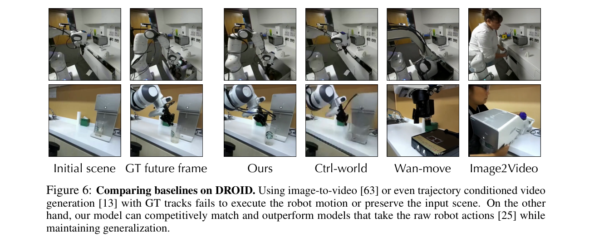
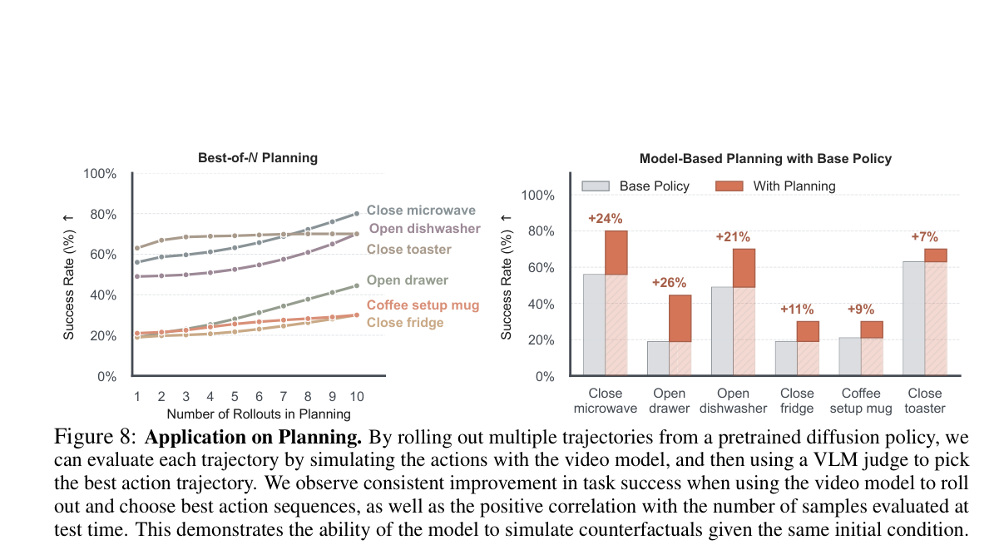

---
tags:
  - papers/WorldModel
  - papers/embodied-ai
  - papers/robotics
aliases:
  - 掩码视觉动作统一世界建模
  - Masked Visual Actions
  - MVA 世界模型
date: 2026-07-21
doi: 10.48550/arXiv.2607.19343
arxiv_id: "2607.19343"
---

# Masked Visual Actions for Unified World Modeling

## 核心信息

- 标题: Masked Visual Actions for Unified World Modeling
- 标题翻译: 用掩码视觉动作统一世界建模
- 作者: Hadi Alzayer、Wenlong Huang、Haonan Chen、Christopher Luey、Lvmin Zhang、Maneesh Agrawala、Gordon Wetzstein、Li Fei-Fei、Yilun Du、Jiajun Wu、Jia-Bin Huang
- 机构: Stanford University；University of Maryland, College Park；Harvard University
- 发表时间: 2026-07-21（预印本）
- DOI: 10.48550/arXiv.2607.19343
- arXiv: 2607.19343
- 论文链接: https://arxiv.org/abs/2607.19343
- 代码 / 项目: https://masked-visual-actions.github.io
- 数据 / 资源: DROID、RoboCasa、BEHAVIOR-1K；作者声明将发布代码、数据与模型权重
- 论文类型: AI 方法论文（具身世界模型与动作表示）

## 原文摘要翻译

视频模型吸收了关于视觉世界如何运动、交互并响应接触的丰富先验，因此是构建机器人世界模型的有前景基础。核心挑战在于，如何以既与这些模型学习交互先验时所处的视觉空间相对齐、又仍然锚定于物理操控的形式向模型传达动作。本文提出掩码视觉动作：一种像素空间控制接口，将动作表示为视频中任意实体被部分揭示的轨迹。揭示机器人运动时，模型作为前向动力学模型预测场景对低层机器人动作的响应；揭示期望的物体运动时，同一个模型恢复与该结果一致的机器人行为。仅用来自真实视频和仿真的 15 小时掩码样例进行微调后，单一检查点就在多种场景和多种具身上取得了较强的视觉保真度与可控性。在下游操控设置中，模型生成的想象轨迹结果与真实执行相关，可用于策略评估；它还可通过对候选未来排序改进基于模型的规划，并能从期望物体运动合成机器人运动以支持逆向建模。

## 创新点

1. **将动作改写为实体的可见时空区域，而不是控制向量。** 动作不再只是关节角、末端位姿或骨架点，而是与目标视频同一像素坐标系中的部分可见轨迹。这个设计直接把“谁在何处如何运动”提供给视频先验，避免模型先从稀疏符号反推机器人外观、几何与接触关系。
2. **用“揭示哪类实体”而非“切换哪种网络”统一前向与逆向查询。** 给定机器人实体掩码时，模型补全物体和环境响应；给定物体的期望运动掩码时，模型补全可实现该运动的机器人行为。统一发生在条件分布层面，而非把视频和动作向量的模态通道拼接后再遮蔽。
3. **把真实分割和可控渲染结合成可部署的训练接口。** 分割路径让真实机器人视频不必预先知道精确相机标定；渲染路径让测试时可把候选机器人状态、网格和相机外参变成任意动作提示。二者共同解决“从真实数据学习”与“在规划中输入未执行轨迹”之间的断裂。
4. **同一视频主干覆盖三种机器人用途。** 作者用同一检查点支撑策略评估、候选轨迹排序和逆向动作提取，并对跨具身视觉保真、规划增益、想象—真实相关性和动作提取成功率分别给出证据。

## 一句话总结

这篇论文的核心不是再训练一个动作条件视频模型，而是把**动作接口改成与视频本体同空间的实体掩码**：因此同一生成模型既能“给机器人轨迹、想象世界如何响应”，也能“给物体目标轨迹、想象机器人怎样去做”；其强项是跨具身的视觉条件对齐，短板则是仍未获得因果正确、低延迟且端到端可执行的机器人动力学。

## 研究问题

### 现有接口的表示失配

预训练视频模型从大规模观察中学习了运动、遮挡、接触、形变和对象持续性的视觉先验，但默认是被动观察者。要把它变为机器人世界模型，必须向它表达干预。低维关节命令和末端位姿虽然精确，却与视频模型预训练时看到的像素模式不对齐，并且绑定具体机器人运动学；末端点或骨架虽然可视化，依旧稀疏，迫使模型额外学习“线段或点位如何对应真实机器人、接触和场景变化”。

作者的论点是：若动作条件本身就是视频中的稠密实体运动，视频模型只需学习“已显式出现的实体如何与其余画面交互”，而不是从抽象控制符号重新构造视觉几何。这里的可迁移性不是由动作维度相同带来的，而是由新机器人也可以被渲染或分割到像素画布上带来的。

*图 2。低维关节量、末端位姿可视化和骨架可视化都比完整实体掩码更稀疏；本文将后者定位为更适合视频模型学习交互的动作条件。*

### 希望统一的两个方向

机器人内部模型通常区分两个问题：前向模型从动作预测后果，逆向模型从目标状态恢复动作。本文不把它们视为必须各训一个架构，而是把两者写成同一视频联合分布的两种条件查询：给主动实体，补全被动实体；给被动实体的目标运动，补全主动实体。关键问题因而是：**一个只学习掩码视频补全的模型，能否通过条件实体集合的切换承担这两个方向，并在未见具身上保持可控性？**

## 数据与任务定义

### 视频、实体与掩码查询

视频张量含有 $T$ 帧，每帧高为 $H$、宽为 $W$，并有三个颜色通道；场景包含实体集合 $\{e_1,\ldots,e_n\}$，其中 $e_i$ 同时指实体及其在时空中的像素占据区域。作者把视频模型视为学习实体轨迹的联合分布：

$$
p(V)=p(e_1,e_2,\ldots,e_n).
$$

对条件实体集合 $S$，二值时空掩码 $M$ 的尺寸等于视频的时间与空间尺寸；被揭示像素取 1、待预测像素取 0，且由条件实体区域的并集给出：

$$
M(S)=\bigcup_{i\in S}e_i,\qquad p_\theta\bigl(V\mid M(S)\odot V,I_0\bigr).
$$

$I_0$ 是初始参考帧。实现上，掩码视频与参考帧共同输入视频模型；未揭示区域被置为统一灰背景。公式的工程含义是：条件不再是额外的控制向量，而是原视频的一部分空间—时间证据。训练时从掩码分布采样 $M$ 并学习条件视频补全。

作者用“主动实体” $A$（机器人或人）和“被动实体” $P$（被操纵对象）说明两种常用查询：

前向查询预测未被给定实体的运动；逆向查询预测机器人实体的运动。作者在符号上分别写作：

$$
p(\{e_i\}_{i\notin A}\mid\{e_j\}_{j\in A},I_0),\qquad p(\{e_i\}_{i\notin P}\mid\{e_j\}_{j\in P},I_0).
$$

前者输入机器人可见轨迹并预测场景响应；后者输入物体期望轨迹并合成机器人轨迹。需注意，“主动”与“被动”是查询时的解释，不是模型中显式学习的因果变量；模型训练目标仍是相关性的像素补全。

### 数据构造：分割与渲染的互补性

训练数据混合真实 DROID 视频和 RoboCasa 仿真轨迹，并纳入成功与失败示例。每个训练三元组由初始参考帧、掩码视觉动作和完整目标视频组成。附录进一步披露：约使用 1,000 条 DROID 示范的两个外置相机视频，并处理每条示范的分割与渲染版本；同时加入约 4,000 个 RoboCasa 样例，且保留或生成失败情况。

*图 4。训练三元组及两条构造路径：从真实视频分割机器人，或从已记录状态、机器人网格和相机外参渲染机器人。*

- **分割路径。** 对 DROID 视频以“机器人手臂”为提示进行分割，优点是不要求知道相机标定、甚至不要求事先识别具体机器人；不足是测试时用户难以提供精确实体分割，而且机器人遮挡区域可能泄漏原视频中的场景动态。
- **渲染路径。** 用记录的机器人状态、相机标定和匹配的 URDF 渲染机器人网格。优点是规划时可将任意候选轨迹变成掩码条件；作者采用半透明渲染并把夹爪染为亮红色。代价是必须有已知几何与可靠标定，且该路径只能直接渲染机器人。

### 评测任务与协议边界

可控生成在三类分布上评测：域内机器人数据、作者采集的带未见定制夹爪的真实世界数据，以及使用双臂 R1-Pro 的未见具身数据。附录表格标明三者的量化规模分别为域内数据 $n=50$、双臂具身数据 $n=50$、真实世界 $n=13$；指标为感知相似度、结构相似度和峰值信噪比，故它们测量的是视频重建/保真而非直接的动作安全或闭环任务回报。

下游机器人任务均主要在 RoboCasa 展开：

- **规划：** 任务专属扩散策略从同一观测采样候选动作，视频模型分别滚动预测，视觉语言模型按任务成功、交互保真和物理真实感排序；每任务 10 个场景，候选数 $N=10$。
- **策略评估：** 对每场景 10 条开环扩散策略轨迹，比较视频想象内的成功判定与真值环境成功率；真实世界部分在 4 个任务各采集 20 条示范，用分阶段进度量表比较每条真实与想象轨迹。
- **动作提取：** 在 RoboCasa 的 COFFEESERVEMUG 中，先给定目标物体轨迹生成机器人视频，再由另训的逆动力学模型把视频转为原生 12 维动作序列；该模型和模仿学习基线都使用 100 条示范训练，并以 20 次试验报告成功率。

## 方法主线

### 机制流程

1. **构造条件输入。** 输入为初始场景帧 $I_0$、真实或候选机器人状态序列，以及相机外参；操作是通过分割或 URDF 渲染得到机器人或物体的时空掩码 $M(S)\odot V$；输出是与视频帧严格对齐的掩码视觉动作序列。
2. **进行条件视频补全。** 输入为参考帧和灰背景中的掩码序列；操作是用基础视频模型的同一自动编码器编码条件，并在潜空间以拼接方式注入；输出是包含机器人、物体和环境演化的生成视频。
3. **通过条件集合改变推理方向。** 输入若为主动机器人实体掩码，操作是预测其余实体的反应，输出送入策略评估或候选规划；输入若为被动物体的期望轨迹，操作是补全主动机器人运动，输出送入逆动力学模型。
4. **把视频预测转为决策。** 规划分支将策略样本逐条模拟并排序，输出选中的待执行动作序列；逆向分支将生成的机器人视频转换为低层动作，输出可在仿真中执行的控制序列。

*图 3。前向分支从策略动作渲染出机器人掩码，再用于规划或评估；逆向分支从物体目标轨迹合成机器人视频，随后经逆动力学恢复动作。*

### 模型与训练配置

基础模型是 Wan-Fun-Control 2.2 14B。作者使用与视频模型相同的自动编码器编码掩码条件，再以特征拼接而不是独立控制网络注入条件；这利用了条件与目标在空间上对齐的特性。训练采用 LoRA，秩为 256，批量大小为 4，使用 8 张 H200，约训练 10,000 步、耗时 4 天。论文摘要将总适配数据概括为 15 小时的真实视频和仿真掩码样例。

这套配置传达的是“冻结大模型、轻量适配接口”，而不是从头学习动力学。复现时最敏感的隐变量不是 LoRA 本身，而是掩码与目标帧的像素配准：渲染机器人在相机中若有偏移，模型会把系统误差学成动作—结果关系。论文描述了 DROID 的相机外参细化，却没有给出学习率、LoRA 作用模块、视频分辨率、序列长度、采样步数和掩码增强的完整数值，因此完全复现实验仍需等待代码或补充配置。

### 规划和评估的判别器

规划不是视频模型直接输出控制。它以扩散策略为候选生成器，以视频模型为模拟器，再以 Gemini 3.1 Pro 为视觉判别器。附录规定判别器以温度 0、15 帧每秒检查全部 81 帧，并明确惩罚三类生成失真：没有真实接触的幽灵接触、夹爪离开后物体继续自行运动、以及目标状态通过跳帧或瞬移出现。

候选 $r$ 的排序键按字典序降序为：

$$
\kappa(v_{s,r})=\bigl(\mathbb{1}[\mathrm{success}],\ \mathrm{realism},\ \mathrm{confidence},\ \mathbb{1}[\mathrm{contact}],\ -r\bigr).
$$

先偏好被判成功的轨迹，再比较物理真实感、置信度、可见接触，最后用较小索引打破平局。这一设计试图避免只看末帧的伪成功，但也把最终性能的一部分归因于外部视觉语言判别器和人工定义的任务规则，而不只归因于世界模型。

*图 1。单一微调检查点被放置在动作条件视频生成、跨具身泛化、策略评估、规划和动作提取之间；图中也展示前向与逆向的条件切换。*

## 关键结果

### 主结果：跨具身可控视频生成

下表是论文主表的紧凑转写。DROID 是训练分布内，BEHAVIOR 使用未见的双臂具身；三项指标分别偏好低 LPIPS、高 SSIM 和高 PSNR。

| 方法 | 域内：感知相似度↓ | 域内：结构相似度↑ | 域内：峰值信噪比↑ | 双臂具身：感知相似度↓ | 双臂具身：结构相似度↑ | 双臂具身：峰值信噪比↑ |
|---|---:|---:|---:|---:|---:|---:|
| 图像到视频 | 0.521 | 0.548 | 12.42 | 0.602 | 0.457 | 10.22 |
| Wan-Move | 0.534 | 0.562 | 12.99 | 0.312 | 0.756 | 13.17 |
| Ctrl-World | 0.362 | 0.708 | 18.15 | 0.196 | 0.837 | 18.39 |
| 掩码视觉动作 | **0.0945** | **0.887** | **23.74** | **0.123** | **0.843** | **22.90** |

*表 1。论文原表：在 DROID 和未见双臂具身 BEHAVIOR 上，掩码视觉动作在三项报告指标中均为最优。*

这证明在作者选择的视频重建协议中，稠密实体掩码比普通图像到视频、轨迹条件视频和低维状态条件的 Ctrl-World 更接近真值视频。它尤其支持“视觉接口有利于未见具身”的论点，但不能单独证明生成轨迹具有物理因果正确性。另一个解释边界是，作者脚注指出 Ctrl-World 在完整 DROID 上训练，已见其留出的场景；因此 DROID 域内比较不是严格相同训练集切分下的公平训练预算比较。

*图 6。定性样例显示图像到视频和轨迹条件方法容易改变输入场景或未执行机器人动作；掩码视觉动作与 Ctrl-World 在域内都能跟随动作。*

### 消融：为什么稠密掩码的收益主要出现在分布外

| 条件表示 | 域内：感知相似度 / 结构相似度 / 峰值信噪比 | 未见夹爪真实世界：感知相似度 / 结构相似度 / 峰值信噪比 | 双臂具身：感知相似度 / 结构相似度 / 峰值信噪比 |
|---|---|---|---|
| 末端执行器可视化 | 0.107 / 0.878 / 22.64 | 0.183 / 0.858 / 20.32 | 0.171 / 0.815 / 19.23 |
| 骨架可视化 | 0.106 / 0.878 / 22.74 | 0.169 / **0.866** / 21.02 | 0.162 / 0.824 / 19.58 |
| 掩码视觉动作 | **0.0945 / 0.887 / 23.74** | **0.148 / 0.864 / 22.79** | **0.123 / 0.843 / 22.90** |

*表 2。域内差距较小；跨到未见夹爪和未见双臂具身后，掩码条件在 LPIPS 与 PSNR 上优势扩大。真实世界的 SSIM 则由骨架条件以 0.866 略高于本方法的 0.864。*

该消融最有价值的不是“所有数值都第一”，而是结果形态：在 DROID 内，三种视觉条件已足够；离开训练外观后，骨架和末端点会诱导模型生成训练时的机器人或使机器人形变，而完整掩码保留了实际新具身的外观。也就是说，论文的核心证据支持的是**条件表示的分布外视觉锚定**，不是宣称稀疏状态永远无用。

### 下游用途：排序、代理评估与动作提取

| 用途 | 设置 | 核心结果 | 应如何解读 |
|---|---|---|---|
| 候选规划 | 6 个 RoboCasa 任务、每任务 10 场景、$N=10$ | 相对基础策略提升分别为 +24、+26、+21、+11、+9、+7 个百分点 | 世界模型为策略候选重排序；增益依赖候选策略、判别器和候选数共同存在 |
| 策略评估 | 每场景 10 条开环策略轨迹 | 视频内成功率与真值成功率相关系数 $r=0.982$ | 强相关支持“可作代理评估”，但作者观察到任务进展的正偏差 |
| 动作提取 | COFFEESERVEMUG，100 条示范训练逆动力学，20 次试验 | 本方法 90%，Diffusion Policy 50%，ACT 80%，SmolVLA 85% | 零样本逆向视频生成有用，但最后可执行性仍由额外逆动力学模型承担 |

*图 8。左图显示候选数增加时若干任务的成功率上升；右图给出六项任务相对基础策略的 7 至 26 个百分点提升。*

*图 11。在 COFFEESERVEMUG 的 20 次试验中，掩码视觉动作加逆动力学的成功率为 90%，高于三种报告对照。*

规划曲线支持“更多想象候选可换取更好决策”的测试时扩展叙事，但它不等于视频模型已被证明为精确模拟器：排序的收益至少还受候选质量和视觉语言判别器影响。策略评估中的 $r=0.982$ 也不是校准结论；作者明确报告想象轨迹通常更乐观。真实世界的四项任务进度分布与真值接近，是有价值的补充；高风险接触、长时程累积误差和闭环重规划下的失败率仍没有被量化呈现。

## 深度分析

### 为什么像素对齐可能比可视化控制点更稳

把机器人完整可见区域放入条件中，等于同时提供了外观、尺度、关节拓扑、相对遮挡和与物体接近的空间上下文。模型仍需预测真正的接触后果，但不必从少量末端点或线段猜出此刻的机器人、夹爪朝向以及它如何与桌面和对象相交。这解释了消融中域内相似、域外分化的模式：域内时稀疏提示到机器人外观的映射可从训练数据记忆；未见夹爪或双臂形态使这条映射失效，而完整掩码提供了新外观的直接证据。

不过，像素对齐并没有自动解决三维歧义。单视角掩码仍可能混淆深度、接触力、物体质量和被遮挡部分；视频生成器也可能在视觉上补出结果而未遵守刚体约束。因此它更像一个强视觉控制提示，而不是显式的状态转移或物理仿真器。

### 统一真正统一了什么，没有统一什么

本文统一的是视频主干的条件语义：改变 $S$ 即改变要预测的实体集合。它没有统一所有执行模块。前向分支的输出可供视觉语言模型打分；逆向分支的输出还需一个训练过的逆动力学模型还原 12 维动作。因而“单一检查点”应理解为单一生成世界模型检查点，而非单一端到端机器人策略。

这一点也区分了本文与以动作向量—视频双模态遮蔽实现统一的路线。后者可在同一序列模型内填补某一模态，但动作空间往往仍随机器人变化；本文把统一开关放在空间实体选择上，理论上只要能把新机器人渲染到画面，输入接口就不变。代价是接口从已知低维控制变成需要网格、状态与相机配准的可视化控制。

### 分割—渲染混合是最关键也最脆弱的工程环节

分割式数据让模型见到真实外观和真实接触杂质，渲染式数据让系统在没有真实未来视频时接受规划候选。这种混合恰好覆盖训练和部署两端，但也可能引入域缝：分割掩码包含真实遮挡、背景残留或边缘噪声，渲染掩码则是干净且依赖标定的合成几何。作者用半透明外观和红色夹爪降低可见性问题；但分割与渲染样本的精确混合比例、标定噪声消融和渲染风格变化的敏感性没有量化呈现，这限制了读者判断两条数据路径是否存在未控制域缝。

对复现者而言，最应先做的不是扩大模型，而是构建单元测试：将每帧 URDF 投影叠加回原视频，检查夹爪边缘和关节位置的像素误差；随后独立测量掩码的轻微平移、尺度误差和时间不同步对 LPIPS、规划排序与动作提取的影响。若这些误差未被控制，跨具身泛化可能退化为对渲染风格和相机配置的偶然适配。

### 证据链与因果边界

论文的证据链是完整但层级不同的：表 1 支持视觉保真优于报告基线；表 2 支持跨外观的条件表示优势；图 8 支持候选排序带来任务收益；$r=0.982$ 支持模拟成功率与真值成功率的相关；图 11 支持在一个任务上由目标物体运动引导的动作提取可行。它们合在一起说明该接口**值得作为世界模型的视觉前端**。

它们并不证明模型学到了可干预因果机制。作者的评估说明恰好暴露这一差异：若夹爪只靠近物体、物体在夹爪撤回后继续滑向目标，或目标通过跳帧出现，生成视频可看起来完成任务却不应该给成功分。附录用过程优先的判别规则缓解该问题，同时也说明真实性判断仍要依赖外部评估器，而非来自模型自身的物理守恒或接触约束。

## 局限

### 论文明确承认的限制

作者明确指出，模型与其他生成模型一样学习的是对象交互的相关性，而不是因果关系；其能力也受基础视频模型的表达上限和推理速度约束。对机器人而言，这不是抽象免责声明：一个视觉上逼真的物体位移仍可能由幽灵接触、物体自主移动、穿模或跳帧造成，因而不能直接作为安全执行的依据。

### 评测与外推限制

1. **视觉指标不是控制指标。** LPIPS、SSIM 和 PSNR 衡量与参考视频的外观接近度，无法保证动作可执行、接触力合理、约束满足或闭环稳定。
2. **跨具身证据仍有限。** 量化设置为 DROID 50 条、BEHAVIOR 50 条、真实世界 13 条；从单臂训练主体迁移到一个双臂场景的成功，不足以推出对任意机器人、相机位姿、工具或柔性物体的鲁棒性。
3. **规划性能混合了多个部件。** 提升既可能来自更好的世界模型，也可能来自候选策略、候选数、Gemini 判别器和任务规则；真值排序上界、判别器失配率与视频模型排序—真实回报校准误差均未被量化，故无法将全部增益归因于模拟能力。
4. **逆向路径尚非端到端。** 90% 的动作提取结果只在 COFFEESERVEMUG 上给出，最终动作来自另训逆动力学模型；生成视频如何在别的任务、接触模式和执行器中转换为可靠控制仍未验证。
5. **复现信息尚不充分。** 已报告基础模型、LoRA 秩、批量大小、设备、步数与训练时长；正文对学习率、LoRA 作用模块、视频分辨率、序列长度、采样参数和掩码增强等关键配置没有展开。这个缺口会阻碍独立复现实验，尽管作者承诺后续发布资源。

## 我的笔记

### 与世界模型的关系

这篇工作把世界模型的接口问题讲得比模型主干问题更清楚：若视频模型的强项来自视觉先验，最自然的控制语言也应尽量保留视觉结构。它把动作表示从控制器内部的低维变量，转成世界模型外部可观察的实体运动。这对于从人类视频、异构机器人视频和仿真混合学习尤其有吸引力，因为这些来源不必共享动作向量坐标系。

但应避免把像素空间误解成无需状态。部署时的前向规划仍要从候选动作状态、URDF 和相机外参渲染机器人；即便逆向分支能合成视觉机器人动作，执行前仍要通过逆动力学回到低层动作。这是一个**视觉层统一、控制层未统一**的系统。

### 可复现的最小闭环

若把本文作为项目起点，我会按以下顺序验证，而不是直接复现 14B 规模：

1. 在单一仿真任务上用完美渲染掩码训练小型视频模型，验证主动掩码能否预测物体响应、被动掩码能否补全机器人运动。
2. 固定动作候选与真实回报，先只测试视频模型对候选排序的秩相关、最优候选命中率和校准曲线，再引入视觉语言判别器，拆开模拟误差与判别误差。
3. 对掩码加入相机外参扰动、网格尺寸扰动、时序偏移和遮挡变化，量化跨具身性能何时崩溃。
4. 把视觉保真、接触因果性、动作可执行性和真实任务回报作为四个独立指标报告；必要时用多视角、显式几何或接触检测器约束生成过程。

### 值得追问的后续问题

- 若训练阶段主动混入物体条件掩码，逆向生成能否超越目前的零样本现象，并减少额外逆动力学模型的负担？
- 能否将几何接触、相机一致性或不确定性估计纳入视频滚动，专门压低作者观察到的进展正偏差？
- 在严格未见机器人、视角、对象材质和长时程多接触任务上，世界模型排序与真实回报究竟何时失配，增加候选数的收益是否值得其推理成本？
- 渲染条件若只来自粗略机器人模型或不精确标定，本文接口相比低维状态条件还保留多少优势？

## 引用

1. Alzayer, H. 等. *Masked Visual Actions for Unified World Modeling*. arXiv:2607.19343, 2026. DOI: 10.48550/arXiv.2607.19343. https://arxiv.org/abs/2607.19343

2. Guo, Y., Shi, L. X., Chen, J. 与 Finn, C. *Ctrl-World: A Controllable Generative World Model for Robot Manipulation*. ICLR, 2026.

3. Khazatsky, A. 等. *DROID: A Large-Scale In-the-Wild Robot Manipulation Dataset*. 2024.

4. Nasiriany, S. 等. *RoboCasa365: A Large-Scale Simulation Framework for Training and Benchmarking Generalist Robots*. ICLR, 2026.

5. Li, C. 等. *BEHAVIOR-1K: A Human-Centered, Embodied AI Benchmark with 1,000 Everyday Activities and Realistic Simulation*. 2024.
