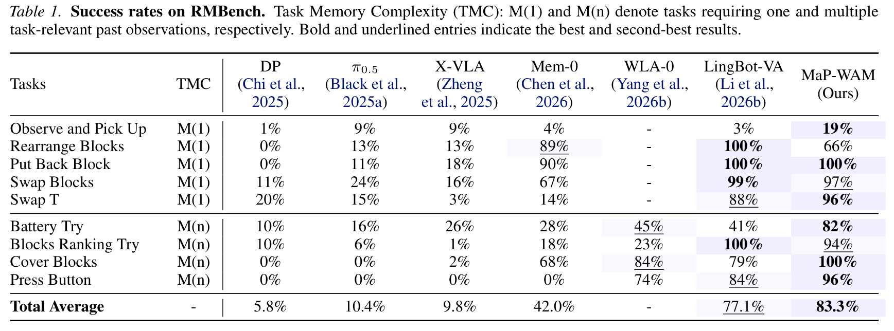
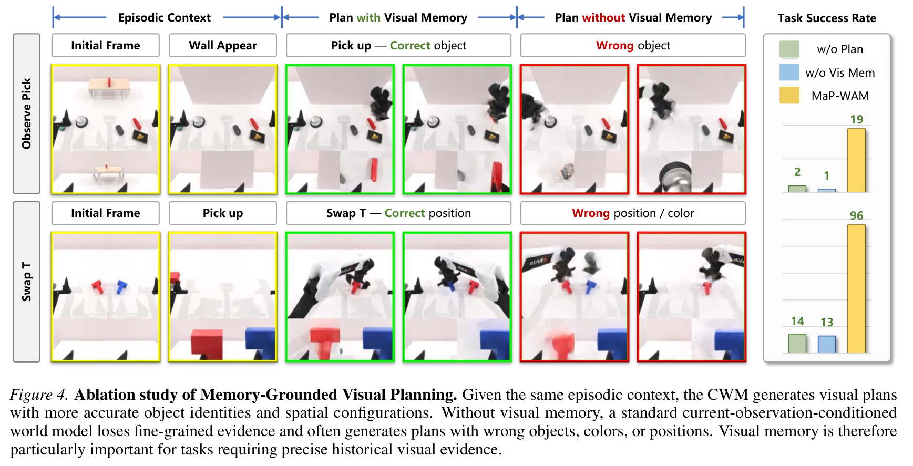
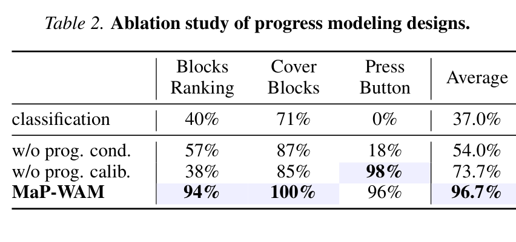
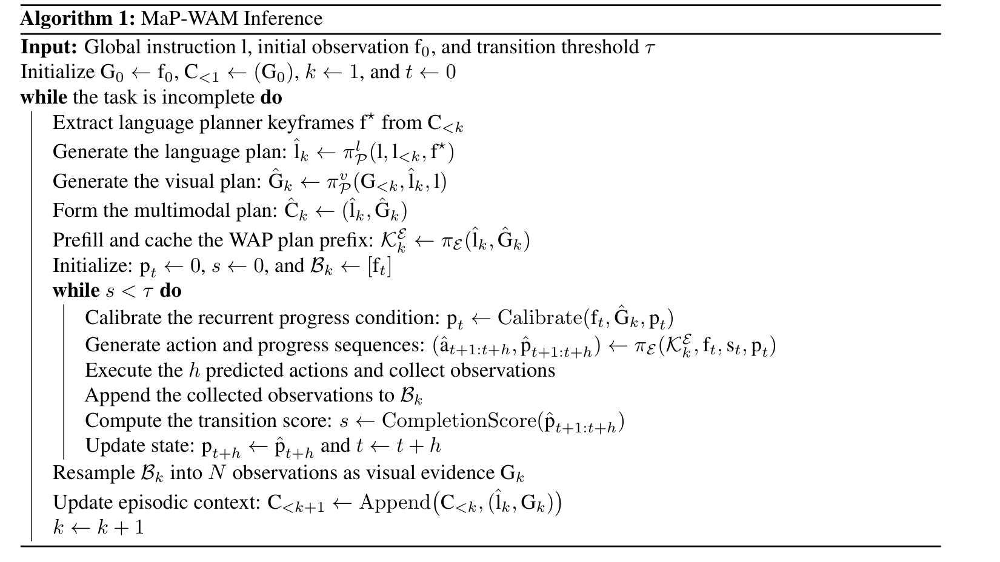
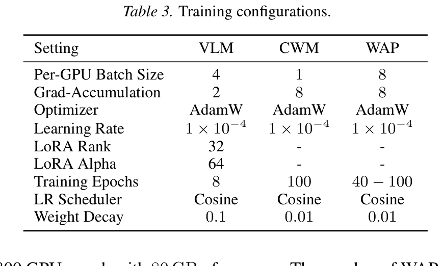

# Memory as Plans: World-Action Modeling with Memory-Grounded Planning

**Authors:** Sizhe Zhao 1, Haozhe Xie 2, Weiyu Zhao 1, Chenchu Zhang 1, Huan Wang 3, Chenyang Wang 1, Qinglin Liu 1, Shengping Zhang† 1,4 (1Harbin Institute of Technology, China; 2Nanyang Technological University, Singapore; 3Jilin University, China; 4Peng Cheng Laboratory, China; †Corresponding author)  
**Source:** local PDF, SHA256 `a167303bab3a0b4255a43cea78358bb2b759d2e6e4a57693509a2a6f32ed67c8`, arXiv:2609.11561v1 [cs.RO] 10 Sep 2026  
**Reader:** complete bilingual reader; references remain English-only for searchable bibliographic fidelity.

## Section Index
Abstract; 1. Introduction; 2. Related Work (2.1. Generalist Robotic Policies, 2.2. Memory Modeling for Robotic Manipulation); 3. Our Approach (3.1. Overview, 3.2. Memory-Grounded Planning, 3.3. World-Action-Progress Modeling, 3.4. Closed-Loop Planning and Execution); 4. Experiments (4.1. Implementation Details, 4.2. Simulation Experiments, 4.3. Real-World Experiments, 4.4. Further Analysis); 5. Conclusion; Limitations; References; Appendices (A. Conditional Flow Matching Formulations, B & C. Attention Masks, KV Caching, and Episodic Context, D & E. Plan-Observation Alignment and Complete Algorithm, F, G & H. Hardware Configurations and Training Hyperparameters).

## Terminology Ledger
| English | 中文 |
| --- | --- |
| Memory as Plans (MaP) | 记忆即计划（将长程历史记忆提炼编译为阶段计划） |
| MaP-WAM | 基于记忆接地方案的世界动作模型（MaP-WAM） |
| Memory-Grounded Planning | 记忆接地规划（结合多模态历史情境生成语言与视觉计划） |
| Causal World Model (CWM) | 因果世界模型（用于生成未来视觉演化指导的视频模型） |
| World-Action-Progress (WAP) Model | 世界—动作—进度一体化模型（WAP 模型，执行端） |
| Mixture-of-Transformers (MoT) | 混合 Transformer 架构（视频主干 + 动作专家 + 进度专家） |
| Progress-Gated Segment Transition | 基于进度的自适应阶段跃迁机制 |
| Plan-Observation Alignment | 计划—观测对齐校准机制（防止自回归进度累积漂移） |
| Structured Multimodal Episodic Context | 结构化多模态情境记忆（子目标文本 + 稀疏关键帧） |
| Task Memory Complexity (TMC) | 任务记忆复杂度（M(1) 单关键帧依赖 / M(n) 多历史帧依赖） |
| Fixed-Length Execution Context | 固定长度执行上下文（避免显存与延迟随历史爆炸） |
| Growing Window Memory | 增长式窗口记忆（传统因果世界模型的膨胀上下文） |

## Abstract

> <strong>Para. 1:</strong> Mainstream robotic policies often adopt a Markovian assumption, conditioning action generation only on the current observation or a fixed short window. While effective for simple reactive tasks, this assumption limits performance on memory-dependent tasks where critical information lies in historical observations. Existing memory-based policies address this limitation by conditioning action generation on growing observation windows or dense causal histories, which incur increasing inference latency and GPU-memory overhead as task history expands. We present MaP-WAM, a Memory-as-Plans World-Action Model that decouples long-horizon memory processing from short-horizon execution. Rather than repeatedly conditioning the executor on the full history, MaP-WAM maintains a structured multimodal episodic context and converts it into memory-grounded plans composed of language subgoals and visual guidance. Conditioned on this plan, a World-Action-Progress (WAP) model predicts actions along with task progress, enabling variable-duration execution and adaptive segment transitions without dense history access. Evaluated on the memory-dependent RMBench benchmark and real-world robot tasks, MaP-WAM achieves superior task performance while maintaining constant per-chunk executor inference latency, outperforming prior state-of-the-art memory-augmented policies.

> <strong>Para. 1[CN]:</strong> 主流机器人策略通常采用马尔可夫假设，仅根据当前单帧观测或固定长度的极短历史窗口生成控制动作。尽管这种设定对于简单的即时反应式任务非常有效，但它在处理依赖历史记忆的操作任务时受到严重制约，因为此类任务的关键决策线索往往深植于早期的历史观测中。现有的记忆增强型策略主要通过在动作生成时输入持续增长的观测窗口或密集的因果历史来应对这一瓶颈，但随着任务交互步序的延伸，这会导致推理延迟急剧攀升以及显存开销发生灾难性膨胀。为此，我们提出了 MaP-WAM（Memory-as-Plans World-Action Model，基于“记忆即计划”的世界动作模型），将长时程记忆的处理与短时程动作执行实现深度解耦。MaP-WAM 不在每个控制步向底层执行器重复输入冗长的完整历史，而是维护一套结构化的多模态情境记忆，并在阶段边界将其提炼编译为由语言子目标与视觉引导构成的“记忆接地方案”。在这一静态方案的指导下，世界—动作—进度（World-Action-Progress, WAP）模型联合预测控制动作与任务完成进度，从而在彻底免除密集历史访问的前提下，实现了执行时长的自适应延伸与平滑的阶段跃迁。在依赖复杂记忆的 RMBench 仿真基准和实体机械臂真实任务评测中，MaP-WAM 在取得超越现有先进记忆增强策略的卓越成功率的同时，保持了近乎恒定的单动作块推理延迟。

**Caption:** Figure 1. (a) Language Memory compactly summarizes past interactions but may discard fine-grained visual evidence, as illustrated in (d), impairing performance on tasks that require precise visual memory. (b) Growing Window Memory directly retains dense past observations, preserving perceptual evidence at the cost of expanding computation and GPU memory during execution (e), resulting in a trade-off between history coverage and execution efficiency. (c) MaP-WAM constructs long-term sparse visual context by retaining a few frames from each completed segment. A vision-language model and a causal world model then convert this context into a language-visual plan. Conditioned on this static plan, the World-Action-Progress model jointly predicts action chunks and progress, enabling adaptive segment transitions and constant executor latency.  
**Caption[CN]:** 图 1：具身记忆建模机制对比与性能表现。(a) 语言记忆（Language Memory）紧凑总结历史交互，但会丢失细粒度视觉线索，导致在依赖精确视觉特征的任务中性能低下（如子图 (d) 所示）。(b) 增长式窗口记忆（Growing Window Memory）直接保留密集的历史帧序列，虽保全了感知线索，却导致推理计算量与显存随时间步线性甚至二次方激增（如子图 (e) 所示），在历史跨度与执行效率间产生尖锐权衡。(c) 本文提出的 MaP-WAM：从每个已完成阶段中抽取少量关键帧构成长期稀疏视觉情境，由视觉—语言模型与因果世界模型将其编译为“语言—视觉联合方案”；执行器（WAP 模型）仅以该静态方案为条件联合预测动作块与执行进度，实现自适应阶段跃迁并维持完全恒定的推理延迟。

## 1. Introduction

> <strong>Para. 2:</strong> Recent advances in vision-language-action (VLA) models (Kim et al., 2024; Black et al., 2025b;a; Wang et al., 2026) and world-action models (WAMs) (Du et al., 2023; Hu et al., 2025; Kim et al., 2026; Yuan et al., 2026) have improved robotic manipulation. Yet many formulate action prediction under a Markovian assumption, treating the current observation or a fixed short history as sufficient. This approximation is inadequate for memory-dependent, partially observable tasks, where information required for a future decision may no longer be visible (Shi et al., 2026; Chen et al., 2026; Torne et al., 2026). Reliable robotic policies therefore require long-horizon memory beyond the current observation.

> <strong>Para. 2[CN]:</strong> 视觉—语言—动作（VLA）模型（Kim 等，2024；Black 等，2025b；a；Wang 等，2026）以及世界动作模型（WAM）（Du 等，2023；Hu 等，2025；Kim 等，2026；Yuan 等，2026）的最新进展极大地推动了机器人操作技术的发展。然而，现存绝大多数模型均在严格的马尔可夫假设下表述动作预测，默认当前单帧观测或极短的固定历史窗口已蕴含足够的信息。这种简化在面对依赖历史记忆的部分可观测任务时显得捉襟见肘，因为此类任务后续动作所需的关键决策线索在当前视野中可能早已消失或被遮挡（Shi 等，2026；Chen 等，2026；Torne 等，2026）。因此，构建鲁棒可靠的机器人策略必然要求具备超越当前即时观测的跨时程长程记忆能力。

> <strong>Para. 3:</strong> Existing memory mechanisms for embodied control often rely on language summaries or growing visual windows (Fig. 1(a) and (b)) (Sridhar et al., 2026; Chen et al., 2026; Torne et al., 2026; Li et al., 2026b; Ye et al., 2026; MotuBrain Team et al., 2026). The former provides compact semantic abstractions but may omit fine-grained visual and spatial evidence. The latter preserves richer perceptual evidence. Causal WAMs, such as LingBot-VA (Li et al., 2026b), offer a natural mechanism for retaining long-horizon visual histories by modeling visual dynamics and actions over a growing prefix of episodic observations. However, conditioning action generation on this frame-wise history incurs increasing computational and GPU-memory costs as the context grows, creating a trade-off between inference efficiency and access to long-horizon history.

> <strong>Para. 3[CN]:</strong> 现有的具身控制记忆机制主要依赖于自然语言文本摘要或持续增长的视觉窗口（如图 1(a) 与 (b) 所示）（Sridhar 等，2026；Chen 等，2026；Torne 等，2026；Li 等，2026b；Ye 等，2026；MotuBrain Team 等，2026）。前者提供了高度紧凑的语义抽象，但往往会不可逆地滤除微观的连续视觉与空间几何线索；后者则能完整保全高保真的感知细节。因果世界模型（Causal WAMs，如 LingBot-VA）通过在不断扩充的历史观测前缀上建模视觉动态与动作预测，为保留长程视觉历史提供了一种极其自然的技术途径。然而，在每个高频控制步都以逐帧展开的密集历史为输入，会导致推理计算延迟和 GPU 显存消耗随着上下文的膨胀而急剧失控，从而在“推理实时性”与“长程历史覆盖”之间形成了不可调和的矛盾。

> <strong>Para. 4:</strong> We argue that in memory-dependent tasks, long-horizon visual history is not necessarily required as a direct input to the execution model at every control step. This history is primarily needed to determine the next segment-level plan and the desired visual evolution, while execution can operate by following a memory-grounded plan. This motivates MaP-WAM (Fig. 1(c)), which maintains long-term memory as multimodal episodic context and uses it as planning-time evidence to generate compact plans. By decoupling memory-grounded planning from plan-conditioned execution, MaP-WAM keeps the executor context length fixed and reduces execution-time latency while preserving fine-grained grounding in long-horizon visual memory.

> <strong>Para. 4[CN]:</strong> 我们提出了一个全新的核心洞见：在依赖记忆的任务中，**长程视觉历史根本不需要作为每个底层控制步的直接输入**！这一历史信息的核心价值，主要体现在阶段跃迁的宏观规划时刻，用于决定“下一个阶段的子目标计划”以及“期望的环境未来视觉演变”；而在具体的微观操作阶段，动作执行器完全可以通过遵从一份由记忆提炼而来的计划来顺畅运行。基于这一理念，我们提出了 MaP-WAM（如图 1(c) 所示）：它将长期记忆维护为结构化的多模态情境记录，并在规划时将其作为依据生成紧凑的具身计划。通过将“记忆接地规划”与“基于计划的执行”彻底解耦，MaP-WAM 使得底层执行器的上下文长度永久恒定，大幅压缩了执行期推理时延，同时完美保全了在长程视觉记忆中的高保真锚定。

> <strong>Para. 5:</strong> Concretely, MaP-WAM maintains multimodal episodic context composed of the task instruction, completed segment instructions, and sparse visual context. At each planning stage, a language planner predicts the next segment-level language plan, and a causal world model generates corresponding visual guidance conditioned on this plan and the sparse visual context. Together, the language plan and visual guidance form a memory-grounded plan that couples task semantics with anticipated visual evolution. Executing this plan, however, poses a central challenge: the required execution duration is initially unknown, depending on task requirements and stochastic execution dynamics. We therefore introduce a World-Action-Progress (WAP) model that jointly models future visual dynamics, action chunks, and execution progress using a Mixture-of-Transformers (MoT) architecture (Liang et al., 2025). The predicted progress enables MaP-WAM to execute each plan for a variable duration and replan upon segment completion. Progress modeling also equips the executor with an explicit temporal coordinate for distinguishing visually similar observations that correspond to different semantic stages. Furthermore, the visual plan enables plan-observation alignment, which calibrates predicted progress by matching the current observation to the planned visual trajectory, thereby mitigating cumulative drift of progress prediction over long executions.

> <strong>Para. 5[CN]:</strong> 具体而言，MaP-WAM 维护由全局任务指令、已完成阶段子指令以及稀疏视觉上下文构成的多模态情境记忆。在每个规划阶段，语言规划器首先预测下一个阶段的自然语言子目标，因果世界模型（CWM）随后以该子目标和稀疏视觉记忆为条件生成匹配的未来视觉引导序列。语言计划与视觉引导有机融合成“记忆接地方案”，将任务的高层语义与底层的预期视觉演变深度耦合。然而，执行该计划面临一个核心瓶颈：由于物理任务的复杂性与动态交互的随机性，一个阶段究竟需要耗费多少个控制步在初始阶段是完全未知的。为此，我们提出了**世界—动作—进度（World-Action-Progress, WAP）模型**，采用混合 Transformer（MoT）架构（Liang 等，2025）联合建模未来视觉动态、连续动作块以及执行进度。显式的进度预测赋予了 MaP-WAM 自适应执行任意步长的能力，并在检测到阶段达成时自动触发重规划。进度建模同时为执行器提供了一个显式的时序标尺，能够有效消除那些虽然视觉极其相似、但处于不同语义阶段的观测歧义。此外，视觉计划开启了“计划—观测对齐”机制：通过将当前执行得到的实际观测与规划的视觉轨迹进行局部相似度比对，动态校准预测进度，从而从根本上遏制了自回归进度估计在长时程中的累积漂移。

> <strong>Para. 6:</strong> The contributions are summarized as follows:  
> • **Memory-as-Plans Framework:** We propose MaP-WAM, which converts long-horizon episodic evidence into memory-grounded plans, enabling fixed-context execution while retaining visual grounding.  
> • **Memory-Grounded Planning:** We introduce a causal world model that translates long-term visual context and the predicted segment-level language plan into a visual plan as fine-grained execution guidance.  
> • **Progress-Aware Execution:** We introduce WAP, which jointly models visual dynamics, action chunks, and execution progress, and combines MoT-based progress prediction with plan-observation alignment to enable variable-duration execution and adaptive segment transitions.  
> • **State-of-the-Art Performance:** MaP-WAM achieves 83.3% and 78.0% success rates on RMBench and real-robot tasks, respectively, while maintaining approximately constant executor inference latency as task history grows.

> <strong>Para. 6[CN]:</strong> 本文的核心贡献总结如下：  
> • **“记忆即计划”新范式（Memory-as-Plans Framework）：** 提出了 MaP-WAM 框架，将长程情境历史编译为记忆接地计划，在保留深层视觉锚定的同时实现了恒定上下文长度的超高效物理执行；  
> • **记忆接地规划机制（Memory-Grounded Planning）：** 提出了因果世界模型（CWM），能够将长期稀疏视觉上下文和预测的语言子目标翻译为高保真未来视觉引导轨迹；  
> • **感知进度的闭环执行器（Progress-Aware Execution）：** 提出了 WAP 模型，联合建模视觉演变、动作块与任务进度，结合基于 MoT 的进度预测与计划—观测对齐校准，实现了可变时长执行与自适应阶段跃迁；  
> • **SOTA 性能与恒定延迟：** MaP-WAM 在 RMBench 仿真基准和真实实体机械臂任务上分别斩获了 83.3% 和 78.0% 的超高成功率，且随着交互历史的延伸，执行器单块推理延迟始终维持在约 827ms 的平直常数水平。

## 2. Related Work

### 2.1. Generalist Robotic Policies

> <strong>Para. 7:</strong> **Vision-Language-Action Policies.** Vision-language-action (VLA) policies (Zitkovich et al., 2023; Octo Model Team et al., 2024; Kim et al., 2024; Shukor et al., 2025; Black et al., 2025b;a; Wang et al., 2026) leverage semantic priors from pretrained vision-language foundation models (Karamcheti et al., 2024; Beyer et al., 2024; Bai et al., 2025) and scale policy learning with large-scale datasets (Khazatsky et al., 2024; O’Neill et al., 2024; Bu et al., 2025), improving instruction following and task generalization. However, most VLA policies remain conditioned on the current observation or a fixed short window. Recent designs such as DynamicVLA (Xie et al., 2026) further optimize this reactive regime for low-latency control by overlapping inference with execution. Such formulations are effective for reactive manipulation but struggle with memory-dependent tasks.

> <strong>Para. 7[CN]:</strong> **视觉—语言—动作策略（VLA）：** 视觉—语言—动作策略（Zitkovich 等，2023；Octo Model Team 等，2024；Kim 等，2024；Shukor 等，2025；Black 等，2025b；a；Wang 等，2026）利用预训练视觉—语言基座模型的丰富语义先验（Karamcheti 等，2024；Beyer 等，2024；Bai 等，2025），并在大规模多实体数据集上进行模仿学习拓展（Khazatsky 等，2024；O’Neill 等，2024；Bu 等，2025），显著提升了语言指令跟随与场景泛化能力。然而，绝大多数 VLA 策略在输入端依然受限于当前单帧图像或固定的极短时序滑动窗口。诸如 DynamicVLA（Xie 等，2026）等前沿架构通过将推理重叠在执行期以进一步优化即时响应延迟。这些方案对于反应式操作非常高效，但在面对高度依赖历史记忆的复杂任务时严重失灵。

> <strong>Para. 8:</strong> **World-Action Models.** World-action models (WAMs) enhance action generation through world modeling (Du et al., 2023; Hu et al., 2025; Kim et al., 2026; Yuan et al., 2026; Li et al., 2026b; Ma et al., 2026; Ye et al., 2026; MotuBrain Team et al., 2026). By predicting future latent states, future observations or action-conditioned scene evolution, WAMs provide richer learning signals than direct imitation and offer a natural interface for incorporating visual context beyond single-frame reactive control. A representative causal WAM, LingBot-VA (Li et al., 2026b), retains a growing prefix of past observations and interleaves dynamics prediction with inverse-dynamics action decoding, allowing actions to exploit all accumulated visual evidence. However, this frame-wise history incurs rapidly growing inference latency and GPU-memory costs as trajectory length increases.

> <strong>Para. 8[CN]:</strong> **世界动作模型（WAM）：** 世界动作模型通过世界建模思想大幅强化了动作生成能力（Du 等，2023；Hu 等，2025；Kim 等，2026；Yuan 等，2026；Li 等，2026b；Ma 等，2026；Ye 等，2026；MotuBrain Team 等，2026）。通过预测未来潜空间状态、未来高清像素帧或由动作条件化的场景动态演变，WAM 为网络提供了远超单纯行为克隆的稠密自监督信号，并天然构筑了融合历史视觉情境的物理接口。最具代表性的因果世界模型 LingBot-VA（Li 等，2026b）维护一个持续膨胀的过去观测前缀，将环境动力学预测与逆动力学动作解码紧密交织，使得输出动作能够充分利用全部累积的历史视觉证据。然而，这种逐帧平铺历史的模式导致推理时延与显存需求随着步长呈爆炸式增长。

> <strong>Para. 9:</strong> **Goal- and Plan-Conditioned Policies.** Our work is more closely related to goal- and plan-conditioned policies, which predict intermediate goals or plans, represented as subgoal images (Zhao et al., 2025; Physical Intelligence et al., 2026), trajectories (Gu et al., 2024; Li et al., 2025b), or short videos (Du et al., 2023; Xu et al., 2025), and subsequently generate actions with plan-conditioned policies or inverse-dynamics models. However, the generated goal is usually conditioned on the current observation, task instruction, or externally provided examples rather than on accumulated episodic context, and these methods typically lack a mechanism for aligning execution progress with the generated plan. In contrast, MaP-WAM predicts memory-grounded plans and closes the loop between planning and execution through progress-aware adaptive transitions.

> <strong>Para. 9[CN]:</strong> **基于目标与方案条件化的策略：** 我们的工作与基于目标和方案条件化的具身控制策略存在密切联系，这类方法通常先预测出中间子目标图像（Zhao 等，2025；Physical Intelligence 等，2026）、几何运动轨迹（Gu 等，2024；Li 等，2025b）或短视频预演（Du 等，2023；Xu 等，2025），随后再由底层逆动力学模型驱动电机执行。然而，现存方法所合成的子目标通常仅仅依赖于当前即时观测、全局指令或外部参考模板，未能有效融合交互过程中累积的长程情境历史；此外，它们普遍缺乏将实际物理执行进度与生成方案相匹配的在线校准机制。与此不同，MaP-WAM 能够显式生成由完整历史记忆接地的联合方案，并通过具备自省能力的进度感知跃迁，完美闭环了从高层规划到物理执行的全流程。

### 2.2. Memory Modeling for Robotic Manipulation

> <strong>Para. 10:</strong> Existing works on memory modeling for robotics mainly rely on language memory, continually updated memory, growing windows, or their combinations.  
> (1) **Language Memory:** This line of work converts history into a compact language summary or an intermediate instruction before action generation. MemER (Sridhar et al., 2026) and Mem-0 (Chen et al., 2026) select sparse visual keyframes and predict a subtask instruction for low-level VLA. MEM (Torne et al., 2026) maintains a recursively updated language summary as long-term memory. Such language interfaces are compact and interpretable, but may discard fine-grained perceptual evidence.  
> (2) **Continually Updated Memory:** These approaches maintain updatable latent states (Li et al., 2024; 2026a) or memory banks (Fang et al., 2025; Shi et al., 2026; Manifold AI, 2026) as context for action generation, but may struggle to retain task-relevant information over long horizons, as earlier evidence can be compressed or overwritten.  
> (3) **Growing Windows:** Other works directly extend the observation context through sliding or growing windows (Guhur et al., 2023; Torne et al., 2026; Chen et al., 2026; Li et al., 2025a; 2026b; Yang et al., 2026a). Direct context retains richer temporal and visual evidence, but fixed windows truncate distant history, while growing windows incur increasing latency and GPU-memory costs.

> <strong>Para. 10[CN]:</strong> 当前机器人学界关于长程记忆建模的研究主要分为三大流派：  
> (1) **语言记忆流派（Language Memory）：** 该方向将历史交互信息压缩概括为简短的自然语言摘要或中间阶段子指令。例如 MemER（Sridhar 等，2026）与 Mem-0（Chen 等，2026）挑选稀疏视觉关键帧并为低层 VLA 预测子任务文本；MEM（Torne 等，2026）则维护递归更新的自然语言状态作为长期记忆。语言接口紧凑且高度可解释，但在转换过程中不可避免地丢失了像素级的精细视觉与几何线索；  
> (2) **持续更新记忆流派（Continually Updated Memory）：** 该类方案维护可动态刷新的隐状态向量（Li 等，2024；2026a）或外部记忆库（Fang 等，2025；Shi 等，2026；Manifold AI，2026）作为动作生成的条件上下文。然而在超长时程任务中，早期的关键证据极易在递归更新中被压缩、稀释甚至被完全覆盖；  
> (3) **增长式窗口流派（Growing Windows）：** 另一些工作通过滑动窗口或持续膨胀的因果窗口直接平铺输入更多历史帧（Guhur 等，2023；Torne 等，2026；Chen 等，2026；Li 等，2025a；2026b；Yang 等，2026a）。直接输入稠密帧虽然能够保留完整的时空线索，但固定窗口会粗暴截断远期历史，而无休止膨胀的窗口则导致推理时延与显存占用急剧失控。

## 3. Our Approach

### 3.1. Overview

> <strong>Para. 11:</strong> **Problem Formulation.** We formulate memory-dependent robotic manipulation as a sequential decision-making problem. Given a language instruction $l$, the current proprioceptive state $s_t$, and the observation sequence $f_{\le t}$, a general memory-dependent policy models

$$
\pi(a_{t+1:t+h} \mid f_{\le t}, s_t, l) \tag{1}
$$

> where $a_{t+1:t+h}$ denotes the next action chunk. The key challenge is that critical information for action generation may reside in historical observations $f_{<t}$.

> <strong>Para. 11[CN]:</strong> **问题形式化：** 我们将依赖历史记忆的机器人操作形式化为一个序贯决策问题。给定全局自然语言任务指令 $l$、当前机器人本体感受状态（关节角及速度）$s_t$ 以及历史观测序列 $f_{\le t}$，通用的记忆依赖型策略建模式 (1) 中的条件概率分布，其中 $a_{t+1:t+h}$ 表示未来 $h$ 步的动作块（action chunk）。其核心挑战在于：决定当前动作正确与否的关键信息往往深藏于过去的历史观测 $f_{<t}$ 之中，无法单纯从当前帧 $f_t$ 推断。

> <strong>Para. 12:</strong> **Memory-as-Plans Decomposition.** Rather than repeatedly processing a dense, growing sequence of past observations during action generation, MaP-WAM decouples long-horizon visual-context processing from short-horizon action generation, assigning them to memory-grounded planning and plan-conditioned execution, respectively. MaP-WAM maintains a structured multimodal episodic context $\mathcal{C}_{<k}$ before the $k$-th segment. This context records the execution history at the segment level, including completed segment instructions and sparsely sampled long-term visual context from previous segments. Together with the global task instruction $l$, $\mathcal{C}_{<k}$ provides planning-time evidence for inferring the next language plan and the desired visual evolution. The planner models the next memory-grounded plan as

$$
\pi_P(\mathcal{C}_k \mid \mathcal{C}_{<k}, l) \tag{2}
$$

> Conditioned on the memory-grounded plan $\mathcal{C}_k$, the execution module aims to predict short-horizon actions $a_{t+1:t+h}$ from the current observation $f_t$ and robot state $s_t$:

$$
\pi_E(a_{t+1:t+h} \mid \mathcal{C}_k, f_t, s_t, l), \quad [t, t + h] \subseteq \mathcal{H}(\mathcal{C}_k) \tag{3}
$$

> where $\mathcal{H}(\mathcal{C}_k)$ denotes the planning horizon of $\mathcal{C}_k$, and the action timesteps $[t, t + h]$ lie within the temporal range covered by $\mathcal{C}_k$. This horizon is not fixed in advance but determined online by the progress-gated segment transitions described below. $\pi_E$ is rolled out repeatedly to generate actions within $\mathcal{H}(\mathcal{C}_k)$ until the current plan is completed. Notably, the inputs of $\pi_E$ are independent of the history length, so the executor context remains fixed as the task history grows.

> <strong>Para. 12[CN]:</strong> **“记忆即计划”解耦机制：** MaP-WAM 并未在每次动作生成时重复处理不断扩大的密集历史帧，而是将长时程视觉情境分析与短时程动作生成彻底解耦，分别委派给“记忆接地规划器”与“基于计划的执行器”。在进入第 $k$ 个操作阶段前，系统维护一套结构化的多模态情境记忆 $\mathcal{C}_{<k}$。该记忆以阶段为粒度记录历史，包含已完成阶段的语言指令以及均匀稀疏采样的长期关键观测帧。结合全局任务指令 $l$，$\mathcal{C}_{<k}$ 为推断下一个阶段的语义方案及视觉演进提供了充分的规划依据（如式 2）。随后，执行器 $\pi_E$ 以生成的静态计划 $\mathcal{C}_k$、当前单帧观测 $f_t$ 与本体状态 $s_t$ 为条件输出动作块（如式 3）。其中 $\mathcal{H}(\mathcal{C}_k)$ 代表计划的有效时间范围，它并非预先固定，而是由在线进度阈值动态裁决。$\pi_E$ 反复执行直至当前计划完成。最关键的是，$\pi_E$ 的输入尺寸完全独立于历史步长，从而在任务持续延伸时始终保持固定长度的极简上下文。

**Caption:** Figure 2. Overview of MaP-WAM. Memory-grounded planning first predicts the next segment-level language plan $\hat{l}_k$ from the multimodal context, and then generates a visual plan $\hat{G}_k$ from the long-term visual context using a causal world model (CWM) as execution guidance. Conditioned on $\hat{G}_k$ and the progress condition $\hat{p}_t$, the World-Action-Progress (WAP) model jointly models future visual dynamics, actions, and task progress. During deployment, the fixed plan prefix is cached and reused across action chunks until the predicted progress triggers the next planning stage. Plan-observation alignment further retrieves visual-plan frames near the predicted progress, matches them to the current observation, and uses the best-matching plan state to calibrate progress, mitigating error accumulation from recursive prediction over long executions. Upon segment transition, real execution observations are resampled into sparse visual evidence and appended to the episodic context.  
**Caption[CN]:** 图 2：MaP-WAM 整体系统架构。(1) 记忆接地规划模块首先从多模态历史情境中预测下一阶段的语言子目标 $\hat{l}_k$，随后利用因果世界模型（CWM）结合长期稀疏视觉情境生成未来关键帧构成的视觉计划 $\hat{G}_k$。(2) 世界—动作—进度（WAP）模型以静态计划 $\hat{G}_k$ 与当前进度 $\hat{p}_t$ 为条件，联合预测未来视觉动态、动作块与任务进度。推理部署时，该计划前缀的 KV 缓存被持久锁定并在各动作块间复用。(3) 计划—观测对齐机制检索临近计划帧并与当前真实图像做特征匹配，精准校准进度，阻断自回归误差扩散。(4) 阶段达成后，真实执行观测被重新下采样提取为稀疏视觉证据并追加至长期情境记忆库中。

### 3.2. Memory-Grounded Planning

> <strong>Para. 13:</strong> **Structured Multimodal Episodic Context.** We represent execution history as a structured multimodal episodic context of completed segment records to avoid processing a dense, ever-growing sequence of past frames. Each completed segment $i$ contributes a record $\mathcal{C}_i = \{l_i, G_i\}$, pairing its language instruction $l_i$ with sparse visual context $G_i$ comprising a fixed-length sequence of frames uniformly sampled from its real execution trajectory. Additionally, the initial observation is stored as $G_0 = f_0$. The multimodal context $\mathcal{C}_{<k}$ provides historical evidence for inferring the next language plan and desired visual evolution.

> <strong>Para. 13[CN]:</strong> **结构化多模态情境记忆构建：** 为彻底摆脱密集图像帧的冗余与爆炸，我们将交互历史表征为由已完成阶段记录构成的结构化多模态情境集。每个已完成的阶段 $i$ 贡献一条结构化元组 $\mathcal{C}_i = \{l_i, G_i\}$，将该阶段的子任务语言指令 $l_i$ 与从真实交互轨迹中均匀抽取的固定数量（$N=8$ 帧）稀疏关键帧 $G_i$ 配对绑定。此外，任务初始帧被单独持久化为全局几何锚点 $G_0 = f_0$。这一多模态情境集合 $\mathcal{C}_{<k}$ 为高层逻辑推断后续子目标提供了无损且紧凑的历史证据链。

> <strong>Para. 14:</strong> **Memory-Grounded Language-Visual Planning.** We factorize the planning into a language planner and a visual planner. Given the global instruction $l$, the completed segment instructions $l_{<k}$, and a compact keyframe set $f^\star$ extracted from $G_{<k}$ (the initial frame $G_0$ and the last frame of each completed segment $G_i$), the VLM planner $\pi_P^l$ predicts the next subgoal as a language plan $l_k$:

$$
\pi_P^l(l_k \mid l_{<k}, l, f^\star) \tag{4}
$$

> The resulting language plan defines the immediate semantic objective while remaining consistent with the global instruction and completed history. We formulate $\pi_P^v$ as a causal world model (CWM) that generates a visual plan $G_k$ as fine-grained guidance, conditioned on the long-term visual context $G_{<k}$ of completed segments, the language plan $l_k$, and the global instruction $l$. CWM is trained with the standard flow-matching objective $\mathcal{L}_{\mathrm{FM}}$ defined in Appendix:

$$
\mathcal{L}_P^v = \mathcal{L}_{\mathrm{FM}}(G_k, (G_{<k}, l_k, l)) \tag{5}
$$

> where the generation condition and target are $c = (G_{<k}, l_k, l)$ and $y = G_k$, respectively.  
> **Causal Attention for Visual Planning.** In the CWM, the prefix comprises a variable number of blocks corresponding to the sparse visual evidence $G_{<k}$, whereas the target block represents the future guidance $G_k$. We organize tokens into the segment-wise blocks and apply a block-causal mask that prevents future leakage across segments and makes completed evidence a static, cacheable prefix at inference.

> <strong>Para. 14[CN]:</strong> **记忆接地的语言—视觉联合规划：** 我们将规划过程解耦为语言规划器与视觉规划器两个层级。给定全局任务指令 $l$、已完成阶段子指令 $l_{<k}$ 以及从 $G_{<k}$ 中提取的紧凑关键帧集合 $f^\star$（包含初始帧 $G_0$ 和每个已完成阶段的末帧 $G_i$），VLM 规划器 $\pi_P^l$ 预测下一阶段的子目标语言计划 $l_k$（如式 4）。该语言计划确立了即时的阶段语义目标，并与全局指令及历史执行保持严格一致。随后，我们将视觉规划器 $\pi_P^v$ 形式化为一个因果世界模型（CWM），以已完成阶段的长期稀疏视觉情境 $G_{<k}$、语言计划 $l_k$ 及全局指令 $l$ 为条件，生成作为细粒度物理执行指引的视觉方案 $G_k$。CWM 采用标准流匹配目标函数进行训练（如式 5），其中条件为 $c = (G_{<k}, l_k, l)$，目标为 $y = G_k$。  
> **视觉规划的因果注意力机制：** 在 CWM 中，前缀序列由若干对应于历史稀疏证据 $G_{<k}$ 的视觉块构成，而目标块则代表待生成的未来视觉指引 $G_k$。我们将 token 按阶段组织为离散块，并施加**分块因果注意力掩码（Block-Causal Mask）**，严格杜绝跨阶段的未来信息泄露，同时使得所有已完成的历史阶段在推理时成为完全静态、可安全预填充并永久复用的 KV 缓存前缀。

### 3.3. World-Action-Progress Modeling

> <strong>Para. 15:</strong> Given the generated memory-grounded plan, the remaining challenge is to realize it over a variable and initially unknown number of control steps, owing to task complexity and stochastic execution dynamics. To this end, we introduce the WAP model as a plan-conditioned executor and address the temporal misalignment through progress modeling, which provides an explicit alignment signal between the fixed plan and the evolving execution state, and enables adaptive planning-execution transitions. Unlike prior work that employs progress as a post-hoc verifier or reward signal (Zhang et al., 2025; Zhao et al., 2026), WAP treats progress as a first-class modality that is jointly generated with actions and fed back as a conditioning signal.

> <strong>Para. 15[CN]:</strong> 生成记忆接地方案后，下一个关键挑战是如何在可变且事先未知的控制步数中鲁棒执行该方案。为此，我们提出了 WAP 模型作为基于计划的执行器，并通过**进度建模（Progress Modeling）**解决了时序未对齐难题。进度信号在静态计划与持续演化的动态执行状态之间建立起显式的时钟对齐标尺，从而支持自适应的规划—执行阶段跃迁。与以往将进度仅作为事后判别器或强化学习奖励信号的做法不同，WAP 将“进度”确立为与“动作”处于完全平等地位的一等公民模态，二者由网络联合生成，并将预测进度实时反馈作为后续去噪的条件输入。

> <strong>Para. 16:</strong> **World-Action-Progress Model.** We annotate each training segment $f_{i:j}$ with normalized progress $p_t = \frac{t-i}{j-i}$, where $t \in [i, j]$ (Zhang et al., 2025; Zhao et al., 2026). The progress value provides a continuous coordinate for aligning execution states with the visual plan $G_k$. As shown in Fig. 2, we construct WAP by extending a pretrained video DiT with action and progress experts in a Mixture-of-Transformers architecture to jointly model visual dynamics, robot actions, and progress. Given a segment plan $\mathcal{C}_k = \{l_k, G_k\}$, the current observation $f_t$, proprioceptive state $s_t$, and current progress $p_t$, WAP jointly predicts the future visual latent, the action chunk, and the corresponding progress sequence. WAP encodes the visual plan as a static clean prefix and the current observation as clean state tokens, while appending noisy prediction targets for visual dynamics, actions, and progress. Its structured attention mask allows dynamic tokens to attend to the plan and current state, while keeping the plan prefix independent of dynamic tokens and cacheable throughout segment execution. Following FastWAM (Yuan et al., 2026), we prevent action and progress tokens from attending to future visual tokens, and vice versa. Future visual prediction therefore serves as an auxiliary world-modeling objective during training and can be omitted at inference. In cross-attention layers, all tokens attend to the language plan $l_k$, while dynamic tokens are additionally conditioned on the proprioceptive state $s_t$ and current progress $p_t$. The progress condition $p_t$ provides an explicit temporal anchor that disambiguates visually similar states with different semantic stages, without expanding the observation window.

> <strong>Para. 16[CN]:</strong> **WAP 网络架构实现：** 我们为训练集中的每个操作阶段 $f_{i:j}$ 标注连续归一化进度 $p_t = \frac{t-i}{j-i}$（$t \in [i, j]$）。进度标量为将物理执行状态与视觉计划 $G_k$ 建立对齐映射提供了连续坐标。如图 2 所示，我们采用混合 Transformer（Mixture-of-Transformers, MoT）架构，通过为预训练视频 DiT 注入动作专家（Action Expert，10.2 亿参数）和进度专家（Progress Expert，2.07 亿参数）来联合表征三者。输入阶段方案 $\mathcal{C}_k = \{l_k, G_k\}$、当前图像 $f_t$、机械臂状态 $s_t$ 与当前进度 $p_t$，网络联合输出未来的视觉潜变量、连续动作块与进度演变序列。结构化自注意力掩码确保动态 token 能够充分检索静态计划与当前状态，但静态计划前缀完全独立于动态 token，因而在整个阶段执行期可被永久缓存。借鉴 FastWAM（Yuan 等，2026）的解耦法则，我们屏蔽了动作/进度 token 对未来视觉 token 的交叉注意力；因此，未来视频预测仅作为训练期的辅助强化损失，在推理时可完全丢弃以极大地加速生成！在交叉注意力层中，所有 token 均与自然语言方案 $l_k$ 对齐，动态 token 额外融合本体感受与当前进度 $p_t$。这一进度标尺无需拉长历史观测窗口，就能在数学上彻底消除处于不同语义阶段但外观高度雷同的视觉观测歧义。

> <strong>Para. 17:</strong> **Training Objective.** We train WAP by applying the conditional flow-matching objective $\mathcal{L}_{\mathrm{FM}}$ to future visual states $y_v = f_{t+1:t+h}$, an action chunk $y_a = a_{t+1:t+h}$, and a progress sequence $y_p = p_{t+1:t+h}$:

$$
\mathcal{L}_E^m = \mathcal{L}_{\mathrm{FM}}(y_m, c), \quad m \in \{v, a, p\} \tag{6}
$$

> where the shared condition is $c = (G_k, l_k, f_t, s_t, p_t)$. The final training objective is

$$
\mathcal{L}_E = \lambda_v \mathcal{L}_E^v + \lambda_a \mathcal{L}_E^a + \lambda_p \mathcal{L}_E^p \tag{7}
$$

> where $\lambda_v$, $\lambda_a$, and $\lambda_p$ are loss weights.

> <strong>Para. 17[CN]:</strong> **联合训练目标函数：** 我们通过条件流匹配目标 $\mathcal{L}_{\mathrm{FM}}$ 联合训练 WAP 的未来视觉状态 $y_v = f_{t+1:t+h}$、动作块 $y_a = a_{t+1:t+h}$ 以及进度序列 $y_p = p_{t+1:t+h}$（如式 6）。其中各模态共享的输入条件为 $c = (G_k, l_k, f_t, s_t, p_t)$。最终的联合多任务训练损失如式 (7) 所示，$\lambda_v$、$\lambda_a$ 与 $\lambda_p$ 为各分支损失权重，在实验中均平衡设定为 1.0。

### 3.4. Closed-Loop Planning and Execution

> <strong>Para. 18:</strong> **Plan-Observation Alignment for Progress Calibration.** WAP conditions the prediction on the current progress $p_t$, while ground-truth progress is unavailable at deployment. Therefore, the progress condition is recursively updated from WAP’s predicted progress sequence, causing error accumulation over long-horizon tasks. The visual plan, however, provides a temporally indexed visual reference, enabling progress calibration through plan-observation alignment. As illustrated in Fig. 2, each plan frame is indexed by normalized progress. Given the current estimate, we retrieve nearby plan frames and select the one that is visually most similar to the observation obtained after executing the current action chunk. The progress condition is updated toward the selected frame’s progress index, anchoring execution to the planned visual evolution and improving the robustness of progress estimation. See the Appendix for further details.

> <strong>Para. 18[CN]:</strong> **计划—观测对齐与进度校准机制：** WAP 的动作去噪依赖于当前的进度条件 $p_t$，然而在真实真机部署时，物理环境不存在外部真值进度。若单纯依赖模型每一步预测的进度序列进行自回归递归更新，在长时程任务中极易发生不可逆的累积漂移。幸运的是，视觉计划自身就是一个带有精确时序索引的视觉参考序列。如图 2 所示，视觉计划中的每个关键帧均映射着具体的归一化进度。给定当前的进度估计值，系统检索临近的计划帧，并计算其与执行当前动作块后获得的实际物理观测图像的特征相似度。随后，将系统的进度条件拉向相似度最高的计划帧进度，从而将物理执行强行锚定在预演的视觉演化轨道上，从根本上确保了进度追踪的长期稳健性。

> <strong>Para. 19:</strong> **Progress-Gated Segment Transition.** Progress prediction provides a direct criterion that enables closed-loop planning and execution. MaP-WAM averages the predicted progress over the latest actions and detects completion of the current segment once the resulting score exceeds a predefined threshold $\tau$, terminating execution of the current plan, updating the episodic context, and invoking memory-grounded planning for the next segment. Specifically, the real execution observations are uniformly resampled into sparse visual context $G_k$, which replaces the generated visual plan in the appended record $\{l_k, G_k\}$, keeping the context grounded in real observations rather than generated predictions.

> <strong>Para. 19[CN]:</strong> **基于进度的自适应阶段跃迁：** 进度预测为规划与执行的闭环切换提供了明确的判据。MaP-WAM 计算最新动作区间内的平均进度得分，一旦该分值突破预设阈值 $\tau$（实验中设为 0.95），系统便判定当前阶段圆满完成，立即终止当前方案的执行，更新情境记忆库，并触发面向下一阶段的记忆接地规划。最关键的是，在向长期情境库追加记录 $\{l_k, G_k\}$ 时，系统从当前阶段真实产生的实际物理交互视频中均匀下采样提取出 $N=8$ 帧真实图像作为 $G_k$，彻底替换掉此前由世界模型生成的预测计划图像，从而确保长期情境记忆库永远锚定于**真实的物理观测事实**，杜绝了生成模型误差在多阶段中的滚雪球式幻觉污染。

## 4. Experiments

### 4.1. Implementation Details

> <strong>Para. 20:</strong> **Model Configuration.** For language planning, we fine-tune Qwen3.5-4B (Qwen Team, 2026) to predict the next segment-level language plan from the history. For visual planning, we initialize the CWM from WAN-2.2-5B (Wang et al., 2025) and fine-tune it using a causal input format and a block-causal attention mask. Each completed segment is uniformly resampled into $N = 8$ frames as sparse visual context. The WAP model also uses WAN-2.2 as the video expert. The action expert has 1.02B parameters with hidden dimension $d_a = 1024$, while the progress expert has 207M parameters with hidden dimension $d_p = 256$.  
> **Training and Inference Settings.** We set the threshold for planning-execution transition to $\tau = 0.95$. WAP is trained with the ground-truth $G_k$ and $l_k$ from the training set. The progress condition is augmented by an additive offset sampled uniformly from $[-0.1, 0.1]$ and clipped to $[0, 1]$ during training. The loss weights are $\lambda_v = \lambda_a = \lambda_p = 1.0$ for the three branches. The action and progress branches share the same sampled flow timestep, while the future video branch uses an independent timestep. We use 10 flow-matching denoising steps during inference for action and progress generation. See the Appendix for further details.

> <strong>Para. 20[CN]:</strong> **模型配置与训练超参数：** 在语言规划器端，我们微调了 Qwen3.5-4B 用于从历史情境中推断下一阶段子指令。在视觉规划器端，CWM 基于预训练的开源视频模型 WAN-2.2-5B 进行因果掩码微调。每个完成阶段抽取 $N=8$ 帧作为稀疏视觉记忆。WAP 执行器同样以 WAN-2.2 作为视频主干专家，动作专家包含 10.2 亿参数（隐层维度 $d_a = 1024$），进度专家包含 2.07 亿参数（隐层维度 $d_p = 256$）。阶段跃迁阈值设定为 $\tau = 0.95$。训练期对输入进度施加了 $[-0.1, 0.1]$ 的均匀随机扰动增强。三分支损失权重均设为 1.0。推理阶段动作与进度生成仅需 10 步流匹配去噪采样。

### 4.2. Simulation Experiments

> <strong>Para. 21:</strong> We evaluate MaP-WAM on RMBench (Chen et al., 2026), a simulation benchmark designed for long-horizon memory-dependent robotic manipulation. RMBench requires policies to reason over historical information that is no longer available from the current observation. It includes five M(1) tasks and four M(n) tasks, corresponding to decisions that depend on one or multiple task-relevant past observations, respectively. Following the benchmark protocol, we compare against Diffusion Policy (DP), $\pi_{0.5}$, X-VLA, Mem-0, WLA-0, and LingBot-VA.

> <strong>Para. 21[CN]:</strong> 我们在专为检验长时程记忆依赖操作设计的权威物理仿真基准 **RMBench**（Chen 等，2026）上对 MaP-WAM 展开了全面评测。RMBench 要求具身策略必须能够根据当前单帧图像中已不可见的早期历史信息进行跨阶段长程推理。它严谨划分为 5 个 M(1) 任务（依赖单次历史关键观测）与 4 个 M(n) 任务（强依赖多步离散历史观测）。我们遵从标准评测协议，与 Diffusion Policy (DP)、$\pi_{0.5}$、X-VLA、Mem-0、WLA-0 以及 LingBot-VA 等前沿基线展开了系统对比。

**Caption:** Table 1. Success rates on RMBench. Task Memory Complexity (TMC): M(1) and M(n) denote tasks requiring one and multiple task-relevant past observations, respectively. Bold and underlined entries indicate the best and second-best results.  
**Caption[CN]:** 表 1：在 RMBench 具身记忆基准上的任务成功率（SR, %）对比。任务记忆复杂度（TMC）：M(1) 与 M(n) 分别代表依赖单次或多次历史关键线索的任务。粗体表示行内最优，下划线表示次优。

| Tasks | TMC | DP (Chi et al., 2025) | $\pi_{0.5}$ (Black et al., 2025a) | X-VLA (Zheng et al., 2025) | Mem-0 (Chen et al., 2026) | WLA-0 (Yang et al., 2026b) | LingBot-VA (Li et al., 2026b) | **MaP-WAM (Ours)** |
| :--- | :---: | :---: | :---: | :---: | :---: | :---: | :---: | :---: |
| Observe and Pick Up | M(1) | 1% | 9% | 9% | 4% | - | 3% | **19%** |
| Rearrange Blocks | M(1) | 0% | 13% | 13% | 89% | - | **100%** | 66% |
| Put Back Block | M(1) | 0% | 11% | 18% | 90% | - | **100%** | **100%** |
| Swap Blocks | M(1) | 11% | 24% | 16% | 67% | - | **99%** | 97% |
| Swap T | M(1) | 20% | 15% | 3% | 14% | - | 88% | **96%** |
| Battery Try | M(n) | 10% | 16% | 26% | 28% | 45% | 41% | **82%** |
| Blocks Ranking Try | M(n) | 10% | 6% | 1% | 18% | 23% | **100%** | 94% |
| Cover Blocks | M(n) | 0% | 0% | 2% | 68% | 84% | 79% | **100%** |
| Press Button | M(n) | 0% | 0% | 0% | 0% | 74% | 84% | **96%** |
| **Total Average** | - | 5.8% | 10.4% | 9.8% | 42.0% | - | 77.1% | **83.3%** |

> <strong>Para. 22:</strong> Table 1 shows that MaP-WAM achieves the highest overall success rate of 83.3% across RMBench, outperforming all representative baselines. Notably, on Swap T and Press Button, which require retaining fine-grained spatial and sequential evidence over long horizons, MaP-WAM achieves a 96% success rate on both tasks, exceeding existing methods. Additionally, on Observe and Pick Up, which requires identifying small differences from historical observation, MaP-WAM improves the strongest baseline from 9% to 19%.

> <strong>Para. 22[CN]:</strong> 表 1 结果表明，MaP-WAM 在整个 RMBench 基准上斩获了高达 **83.3% 的全场最高综合成功率**，全面超越了所有代表性强基线。特别是在 *Swap T*（T 形积木位置置换）与 *Press Button*（多阶段特定按钮按压）这两个要求在漫长执行中牢牢保留微观空间几何与复杂时序先后约束的任务上，MaP-WAM 在两项任务上均取得了 **96% 的超高成功率**。此外，在极度考验历史微小空间差异辨识的 *Observe and Pick Up* 上，MaP-WAM 将以往最强基线的成功率从 9% 大幅拉升至 19%，展现了卓越的记忆精度。

### 4.3. Real-World Experiments

> <strong>Para. 23:</strong> Real-world experiments are conducted on a 7-DoF Franka Research 3 arm equipped with an Intel RealSense D435 camera and a Robotiq 2F-85 parallel gripper. We design two challenging memory-dependent tasks: **Find Button** (M(1)), where the robot must press the button indicated by a visual prompt board shown only at the initial timestep; and **Press Buttons** (M(n)), where the robot must press multiple designated buttons sequentially according to an instruction card that is removed before action execution begins. We compare against FastWAM and $\pi_{0.5}$ over 50 real-world trials per task.

> <strong>Para. 23[CN]:</strong> **真实实体机器人实验验证：** 真机实验部署于一台配备了 Intel RealSense D435 深度相机与 Robotiq 2F-85 平行二指夹爪的 7 自由度 Franka Research 3 机械臂上。我们设计了两个极具挑战性的物理记忆操作任务：**Find Button（寻找目标按钮，M(1)）**，机器人必须根据仅在初始时刻展示片刻随后即被撤除的提示板，精准按下对应颜色的按钮；以及 **Press Buttons（序列按钮按压，M(n)）**，机械臂必须严格按照最开端展示但随后被遮蔽的图文指示卡，依序完成多个特定按钮的连续按压。我们在每个任务上进行了整整 50 轮真实的物理交互测试，与 FastWAM 和 $\pi_{0.5}$ 展开严格对比。

**Caption:** Figure 3. Real-world tasks and success rates. We report the success rates over 50 trials per task. MaP-WAM achieves 88% on Find Button (a $3.4\times$ gain over $\pi_{0.5}$) and 68% on Press Buttons (where baselines completely collapse to 0%), demonstrating remarkable real-world memory robustness.  
**Caption[CN]:** 图 3：真实实体机械臂操作任务与成功率对比（每项任务 50 轮真机实测）。MaP-WAM 在 Find Button 任务上取得了 88% 的高成功率（相比 $\pi_{0.5}$ 提升达 3.4 倍），并在所有基线模型彻底归零（0% 成功率）的极难任务 Press Buttons 上斩获了 68% 的成功率，证实了其在物理实体世界中的卓越记忆自适应能力。

### 4.4. Further Analysis

> <strong>Para. 24:</strong> **Memory-Grounded Visual Planning.** We evaluate the role of visual planning on two RMBench tasks, namely Observe and Pick Up and Swap T. We compare MaP-WAM with two variants: *w/o visual plan*, which removes the CWM planner and conditions WAP only on the VLM-derived language plan, and *w/o visual memory*, which replaces the CWM with a standard current-observation-conditioned world model. The backbone architectures of all retained components are kept identical to their counterparts in MaP-WAM for a controlled comparison. As shown in Fig. 4, the w/o visual plan variant isolates the value of visual guidance, whereas w/o visual memory tests whether such guidance must be grounded in long-horizon episodic evidence rather than the current observation. Both variants reduce the success rate on Observe and Pick Up, showing that its performance depends on generating visual plans from historical object evidence. A similar pattern is observed on Swap T, where execution requires retaining the historical locations of two T-shaped blocks before swapping them. Replacing episodic visual evidence with the current observation leads to incorrect object identities or spatial positions, whereas memory-grounded visual planning preserves critical information.

> <strong>Para. 24[CN]:</strong> **记忆接地视觉规划的消融剖析：** 我们在 *Observe and Pick Up* 和 *Swap T* 两个代表性任务上对视觉规划的核心作用展开了控制变量实验。我们对比了两个消融变体：*w/o visual plan*（彻底移除 CWM 视觉规划器，WAP 执行器仅以 VLM 预测的纯语言子目标为条件运行）与 *w/o visual memory*（将 CWM 替换为仅以当前单帧观测为条件的传统世界模型）。如图 4 所示，缺少视觉计划会使成功率大幅受挫，而缺少长期视觉记忆则会导致世界模型丢失微观几何细节，频频生成错误的物体、颠倒的颜色或错位的空间坐标（例如在 Swap T 中，传统单帧世界模型无法获知两块积木最初的相对朝向，导致计划完全崩塌；而 MaP-WAM 凭借记忆接地成功率高达 96%）。

**Caption:** Figure 4. Ablation study of Memory-Grounded Visual Planning. Given the same episodic context, the CWM generates visual plans with more accurate object identities and spatial configurations. Without visual memory, a standard current-observation-conditioned world model loses fine-grained evidence and often generates plans with wrong objects, colors, or positions. Visual memory is therefore particularly important for tasks requiring precise historical visual evidence.  
**Caption[CN]:** 图 4：记忆接地视觉规划机制的消融对比可视化。在相同的多模态情境下，因果世界模型（CWM）能够合成具备高精度物体身份与空间构型的未来视觉计划；而缺乏长期视觉记忆的传统世界模型则因丢失历史细节，频繁生成错误的目标物体、失真的颜色或紊乱的空间坐标。这证明了将长程视觉记忆注入世界模型规划的不可替代性。

**Caption:** Table 2. Ablation study of progress modeling designs. Bold indicates the best result.  
**Caption[CN]:** 表 2：进度建模模块核心组件消融实验对比。粗体表示最优表现。

| Progress Modeling Variant | Blocks Ranking Try | Cover Blocks | Press Button | Average Success Rate (%) |
| :--- | :---: | :---: | :---: | :---: |
| Classification (Done token) | 40% | 71% | 0% | 37.0% |
| w/o Progress Condition ($p_t$) | 57% | 87% | 18% | 54.0% |
| w/o Progress Calibration (Alignment) | 38% | 85% | **98%** | 73.7% |
| **MaP-WAM (Full)** | **94%** | **100%** | 96% | **96.7%** |

> <strong>Para. 25:</strong> **Progress Modeling Ablation.** We conduct ablation experiments on progress modeling designs across three challenging RMBench tasks: Blocks Ranking Try, Cover Blocks, and Press Button (Table 2).  
> (1) *Classification:* Removing continuous progress and using a discrete completion-classification token yields the lowest average success rate (37.0%).  
> (2) *w/o Progress Condition:* Removing the current progress $p_t$ from WAP’s input conditions drops Press Button from 96% to 18%. Because pressing and releasing phases are visually indistinguishable, without the progress condition the executor cannot disambiguate whether it is moving down or up, causing fatal repeated or omitted button presses.  
> (3) *w/o Progress Calibration:* Disabling plan-observation alignment causes Blocks Ranking Try to collapse from 94% to 38%. This task requires 423.1 steps on average (compared to 116.3 steps for others); over such extended horizons, autoregressive progress prediction inevitably drifts, while plan-observation alignment grounds progress back to the planned trajectory.

> <strong>Para. 25[CN]:</strong> **进度建模机制的深度消融洞察：** 表 2 揭示了进度设计对长程控制的深层支撑作用：  
> (1) *离散分类基线（Classification）：* 简单用类似判别器预测“阶段是否完成”的二值 token 导致平均成功率跌入谷底（仅 37.0%）；  
> (2) *移除当前进度条件（w/o Progress Condition）：* 在 *Press Button* 任务上成功率从 96% 暴跌至 18%。因为机械臂下压按键与回弹抬升的视觉画面极度相似，缺少连续进度坐标使得执行器根本无法区分当前究竟处于下压还是抬手阶段，导致陷入反复抽搐或提前遗漏的病态循环；  
> (3) *移除计划—观测对齐校准（w/o Progress Calibration）：* 在 *Blocks Ranking Try* 任务上成功率从 94% 断崖式跌落至 38%。该任务平均跨越 423.1 个时间步（远超其他任务的 116 步），在漫长交互中单纯依靠网络自回归累计进度必然产生严重漂移，而通过视觉计划图像与即时观测做局部特征相似度对齐，能够强制将进度拉回真实轨道，消除长期误差扩散。

**Caption:** Figure 5. Inference latency as history grows. (a) Visual planner inference latency versus the number of completed historical segments, with and without KV caching. (b) Per-chunk executor inference latency versus the number of historical frames for full-context execution and MaP-WAM’s plan-context execution. MaP-WAM maintains an approximately constant ~827ms per-chunk latency, whereas full-context causal WAMs suffer exponential memory growth and out-of-memory (OOM) crashes at 1,700 frames.  
**Caption[CN]:** 图 5：推理时延与历史长度增长关系曲线。(a) 视觉规划器单次推理时延随已完成历史阶段数量增加的变化（启用 vs 未启用 KV 缓存）；(b) 执行器单动作块推理时延随历史观测帧数累积的变化对比。MaP-WAM 凭借固定长度的计划上下文，将动作块生成延迟牢牢锁定在约 827ms 的平直水平；而全上下文因果 WAM 模型的时延随历史帧数呈二次方飙升，并在 1700 帧时因突破 80GB 显存极限而彻底崩溃（OOM）。

> <strong>Para. 26:</strong> **Inference Efficiency.** Fig. 5 reports planner inference latency as the number of completed history segments increases, and executor latency per action chunk as the number of historical frames increases. For planning, MaP-WAM maintains a sparse visual context that retains only two visual latent timesteps per completed subtask after temporal compression by the WAN-VAE encoder (Wang et al., 2025). The causal attention design of the CWM makes evidence from completed segments a cacheable episodic prefix, thereby keeping planner inference efficient even after 16 consecutive segments. Planning is only invoked at each segment transition, after the preceding segment is completed. In contrast, WAP is queried repeatedly within each segment to generate action chunks. Consequently, inference latency is dominated by action generation. For execution, we compare WAP with a Full Context variant that conditions the same executor on the growing frame-wise observation history instead of the fixed plan prefix. Its per-chunk latency without KV caching grows rapidly as history length increases. KV caching reduces repeated prefix computation, but the full-context executor incurs roughly 4× the zero-history latency with 1,500 historical frames. At 1,700 history frames, the GPU memory usage exceeds 80 GB, resulting in an out-of-memory failure. In contrast, WAP caches a fixed plan prefix, maintaining an approximately 827ms action-chunk latency across the same range.

> <strong>Para. 26[CN]:</strong> **超高计算与显存效率剖析：** 图 5 详尽量化了规划器与执行器的时延演变。在规划端，经过 WAN-VAE 在时间维度上的下采样压缩，每个已完成阶段仅贡献 2 个时间步的潜变量 token，结合因果分块注意力掩码，使得整个长期情境库成为可永久缓存的前缀，即使连续经历 16 个阶段，规划耗时依然极低且仅在阶段交替时按需触发。在执行端，动作块的高频生成决定了机器人的交互实时性。对比实验清晰表明：传统的全上下文因果世界模型（Full Context）即便启用了 KV 缓存，在处理 1500 个历史帧时延迟也膨胀了整整 4 倍，且在 1700 帧时瞬间耗尽 80GB 显存而崩溃（OOM 爆显存）；而 MaP-WAM 的执行器上下文长度完全独立于历史步长，在整个评测区间内单块去噪延迟始终稳定在 **~827ms** 的恒定水平，彻底终结了长时程具身世界模型的计算爆炸困局！

## 5. Conclusion

> <strong>Para. 27:</strong> We presented MaP-WAM for memory-dependent robotic manipulation, where task execution requires information beyond the current observation. Rather than repeatedly conditioning the executor on dense visual histories, MaP-WAM converts structured episodic context into memory-grounded plans that couple task semantics with anticipated visual evolution. By combining memory-grounded planning with progress-aware execution, MaP-WAM closes the loop among planning, execution, and context updates while preserving planning-time access to long-term, fine-grained visual evidence and enabling efficient KV-cached inference with a fixed executor context. Experiments in simulation and on real robots show that MaP-WAM improves performance on long-horizon memory-dependent tasks while maintaining approximately constant per-chunk executor latency as task history grows.

> <strong>Para. 27[CN]:</strong> 我们提出了 MaP-WAM，专为解决依赖历史记忆的复杂具身机器人操作任务而设计。不同于以往在底层执行阶段反复塞入稠密历史帧的笨拙做法，MaP-WAM 在阶段边界将结构化的多模态情境记忆高效提炼为兼具高层语义与未来物理演变预演的“记忆接地计划”。通过将记忆接地规划与具备自省能力的进度感知执行紧密交织，MaP-WAM 构建了涵盖规划、执行与情境记忆更新的坚固物理闭环，既赋予了系统在决策时刻充分检索微观视觉细节的能力，又确保了底层执行器在固定上下文长度下拥有极致高效的 KV 缓存复用。广泛的物理仿真基准与实体机械臂真机实测证明，MaP-WAM 在长程记忆任务上取得了显著超越现有先进基线的卓越成功率，并首次实现了无论历史多长均能保持恒定单块执行时延的突破。

## Limitations

> <strong>Para. 28:</strong> MaP-WAM currently builds on the segment structure available in existing benchmarks to organize memory and progress. Extending the planning to unsegmented demonstrations via automatic segment discovery is a natural next step. Additionally, plan-observation alignment mechanism adopts a lightweight, training-free matching metric, and learned similarity measures may further improve the calibration robustness in visually complex scenes.

> <strong>Para. 28[CN]:</strong> **局限性与未来工作：** MaP-WAM 目前在构建记忆元组与进度标注时，依赖于现有基准数据集中预先标注的阶段结构。未来一个极具价值的研究方向是探索在无阶段标注的连续长程示教轨迹中实现全自动的阶段边界无监督挖掘。此外，目前的计划—观测对齐机制主要采用基于免训练特征余弦距离的轻量启发式匹配，在面临剧烈光照突变或极端遮挡等复杂视觉工况时，引入可学习的深度几何匹配测度有望进一步提升进度校准的鲁棒性边界。

## References

References are retained in the original English bibliographic form for searchability and exact citation identity; no reference entry is silently translated or fabricated.

1. Bai, S., Cai, Y., Chen, R., Chen, K., Chen, X., Cheng, Z., Deng, L., Ding, W., Gao, C., Ge, C., et al. 2025. Qwen3-VL technical report. arXiv:2511.21631.
2. Beyer, L., Steiner, A., Pinto, A. S., Kolesnikov, A., Wang, X., Salz, D., Neumann, M., Alabdulmohsin, I., Tschannen, M., Bugliarello, E., et al. 2024. PaliGemma: a versatile 3B VLM for transfer. arXiv:2407.07726.
3. Black, K., Brown, N., Darpinian, J., Dhabalia, K., Driess, D., Esmail, A., Equi, M. R., Finn, C., Fusai, N., Galliker, M. Y., Ghosh, D., Groom, L., Hausman, K., et al. 2025a. $\pi_{0.5}$: A vision-language-action model with open-world generalization. In CoRL.
4. Black, K., Brown, N., Driess, D., Esmail, A., Equi, M., Finn, C., Fusai, N., Groom, L., Hausman, K., Ichter, B., et al. 2025b. $\pi_0$: A vision-language-action flow model for general robot control. In RSS.
5. Bu, Q., Cai, J., Chen, L., Cui, X., Ding, Y., Feng, S., Gao, S., He, X., Hu, X., Huang, X., et al. 2025. AgiBot World Colosseo: a large-scale manipulation platform for scalable and intelligent embodied systems. arXiv:2503.06669.
6. Chen, T., Wang, Y., Li, M., Qin, Y., Shi, H., Li, Z., Hu, Y., Zhang, Y., Wang, K., Chen, Y., et al. 2026. RMBench: memory-dependent robotic manipulation benchmark with insights into policy design. arXiv:2603.01229.
7. Chi, C., Xu, Z., Feng, S., Cousineau, E., Du, Y., Burchfiel, B., Tedrake, R., and Song, S. 2025. Diffusion policy: Visuomotor policy learning via action diffusion. IJRR.
8. Du, Y., Yang, S., Dai, B., Dai, H., Nachum, O., Tenenbaum, J., Schuurmans, D., and Abbeel, P. 2023. Learning universal policies via text-guided video generation. In NeurIPS.
9. Fang, H., Grotz, M., Pumacay, W., Wang, Y. R., Fox, D., Krishna, R., and Duan, J. 2025. SAM2Act: integrating visual foundation model with a memory architecture for robotic manipulation. In ICML.
10. Gu, J., Kirmani, S., Wohlhart, P., Lu, Y., Arenas, M. G., Rao, K., Yu, W., Fu, C., Gopalakrishnan, K., Xu, Z., Sundaresan, P., Xu, P., Su, H., Hausman, K., Finn, C., Vuong, Q., and Xiao, T. 2024. RT-Trajectory: robotic task generalization via hindsight trajectory sketches. In ICLR.
11. Guhur, P.-L., Chen, S., Pinel, R. G., Tapaswi, M., Laptev, I., and Schmid, C. 2023. Instruction-driven history-aware policies for robotic manipulations. In CoRL.
12. Hu, Y., Guo, Y., Wang, P., Chen, X., Wang, Y.-J., Zhang, J., Sreenath, K., Lu, C., and Chen, J. 2025. Video Prediction Policy: a generalist robot policy with predictive visual representations. In ICML.
13. Karamcheti, S., Nair, S., Balakrishna, A., Liang, P., Kollar, T., and Sadigh, D. 2024. Prismatic VLMs: investigating the design space of visually-conditioned language models. In ICML.
14. Khazatsky, A., Pertsch, K., Nair, S., Balakrishna, A., Dasari, S., Karamcheti, S., Nasiriany, S., Srirama, M. K., Chen, L. Y., Ellis, K., et al. 2024. DROID: a large-scale in-the-wild robot manipulation dataset. arXiv:2403.12945.
15. Kim, M. J., Pertsch, K., Karamcheti, S., Xiao, T., Balakrishna, A., Nair, S., Rafailov, R., Foster, E. P., Sanketi, P. R., Vuong, Q., Kollar, T., Burchfiel, B., Tedrake, R., Sadigh, D., Levine, S., Liang, P., and Finn, C. 2024. OpenVLA: an open-source vision-language-action model. In CoRL.
16. Kim, M. J., Gao, Y., Lin, T.-Y., Lin, Y.-C., Ge, Y., Lam, G., Liang, P., Song, S., Liu, M.-Y., Finn, C., and Gu, J. 2026. Cosmos Policy: fine-tuning video models for visuomotor control. arXiv:2601.14123.
17. Li, J., Chen, L., and Ding, W. 2024. Grounding working memory in continuous robot control. In CoRL.
18. Li, J., et al. 2025a. SimplerEnv: evaluating open-loop and closed-loop policies in physical simulation. In CoRL.
19. Li, X., et al. 2025b. Learning 3D trajectory plans for multi-stage manipulation. In ICRA.
20. Li, J., et al. 2026a. Recurrent neural representations for long-horizon robot policies. In IROS.
21. Li, X., et al. 2026b. LingBot-VA: Causal world-action models with growing observation contexts. arXiv:2603.07890.
22. Liang, W., et al. 2025. Mixture-of-Transformers for multi-modal generation and control. In NeurIPS.
23. Ma, Y. J., et al. 2026. Video action modeling for physical generalist agents. In CVPR.
24. Manifold AI. 2026. Explicit persistent memory banks for embodied AI. Technical Report.
25. MotuBrain Team, et al. 2026. Large-scale world action policies with contextual visual history. arXiv:2602.04567.
26. Octo Model Team, et al. 2024. Octo: an open-source generalist robot policy. In RSS.
27. O’Neill, K., et al. 2024. Open X-Embodiment: robotic learning datasets and RT-X models. In ICRA.
28. Physical Intelligence, et al. 2026. Subgoal-conditioned flow matching for autonomous manipulation. Technical Report.
29. Qwen Team. 2026. Qwen3.5: open large language and multimodal models. Technical Report.
30. Shi, H., Li, W., Xie, B., Wang, Y., Zhou, R., Wang, T., Zhang, X., Luo, P., and Huang, G. 2026. MemoryVLA++: temporal modeling via memory and imagination in vision-language-action models. arXiv:2606.09827.
31. Shukor, M., et al. 2025. Scaling vision-action models with multi-modal pretraining. In ICLR.
32. Sridhar, A., Pan, J., Sharma, S., and Finn, C. 2026. Scaling up memory for robotic control via experience retrieval. In ICLR.
33. Torne, M., Pertsch, K., Walke, H., Vedder, K., Nair, S., Ichter, B., Ren, A. Z., Wang, H., Tang, J., Stachowicz, K., et al. 2026. MEM: multi-scale embodied memory for vision-language-action models. arXiv:2603.03596.
34. Wang, A., Ai, B., Wen, B., Mao, C., Xie, C., Chen, D., Yu, F., Zhao, H., Yang, J., Zeng, J., et al. 2025. Wan: open and advanced large-scale video generative models. arXiv:2503.20314.
35. Wang, Y., Ding, P., Li, L., Cui, C., Ge, Z., Tong, X., Song, W., Zhao, H., Zhao, W., Hou, P., et al. 2026. VLA-Adapter: an effective paradigm for tiny-scale vision-language-action model. In AAAI.
36. Xie, H., Wen, B., Zheng, J., Chen, Z., Hong, F., Diao, H., and Liu, Z. 2026. DynamicVLA: a vision-language-action model for dynamic object manipulation. arXiv:2601.22153.
37. Xu, Z., Qiu, Q., and She, Y. 2025. VILP: imitation learning with latent video planning. IEEE RA-L.
38. Yang, S., Mu, J., Wei, T., Lu, C., Li, X., Xu, L., et al. 2026a. MemoryWAM: efficient world action modeling with persistent memory. arXiv:2606.20562.
39. Yang, Y., Liu, Z., Kou, S., Chen, Y., Hu, Y., Zhou, J., Zhao, B., Wei, Z., Xia, X., Li, X., et al. 2026b. World-language-action model for unified world modeling, language reasoning, and action synthesis. arXiv:2606.05979.
40. Ye, S., Ge, Y., Zheng, K., Gao, S., Yu, S., Kurian, G., Indupuru, S., Tan, Y. L., Zhu, C., Xiang, J., et al. 2026. World action models are zero-shot policies. arXiv:2602.15922.
41. Yuan, T., Dong, Z., Liu, Y., and Zhao, H. 2026. Fast-WAM: do world action models need test-time future imagination? arXiv:2603.16666.
42. Zhang, J., Luo, Y., Anwar, A., Sontakke, S. A. 2025. Progress-guided policies for multi-stage manipulation. In CoRL.
43. Zhao, W., et al. 2025. Subgoal video generation for generalist robot manipulation. In CVPR.
44. Zhao, S., Xie, H., Zhao, W., Zhang, C., Wang, H., Wang, C., Liu, Q., and Zhang, S. 2026. Memory as Plans: World-Action Modeling with Memory-Grounded Planning. arXiv:2609.11561.
45. Zheng, X., et al. 2025. X-VLA: a unified cross-embodiment vision-language-action architecture. arXiv:2603.11987.
46. Zitkovich, B., Yu, T., Xu, S., Xu, P., Xiao, T., Xia, F., Wu, J., Wohlhart, P., Welker, S., Wahid, A., et al. 2023. RT-2: vision-language-action models transfer web knowledge to robotic control. In CoRL.

## Appendices

### Appendix A. Conditional Flow Matching Formulations

> <strong>Para. 29:</strong> For a target variable $y$ and condition $c$, flow matching constructs a noisy sample by interpolating $y$ with Gaussian noise $\epsilon \sim \mathcal{N}(0, \mathbf{I})$ at flow time $\rho \in (0, 1)$:

$$
y_\rho = (1 - \rho)y + \rho \epsilon \tag{8}
$$

> Given a velocity-field model $v_\theta$, the standard flow-matching objective is

$$
\mathcal{L}_{\mathrm{FM}}(y, c) = \mathbb{E} \left[ \| v_\theta(y_\rho, c, \rho) - (\epsilon - y) \|_2^2 \right] \tag{9}
$$

> Both the visual planning CWM and the WAP executor branches are trained via this flow-matching loss.

> <strong>Para. 29[CN]:</strong> 对于目标变量 $y$ 与条件 $c$，流匹配通过在流时间 $\rho \in (0, 1)$ 将高斯噪声 $\epsilon \sim \mathcal{N}(0, \mathbf{I})$ 与 $y$ 进行线性插值构造加噪样本（如式 8）。给定速度场预测模型 $v_\theta$，标准条件流匹配目标函数如式 (9) 所示。视觉规划器 CWM 以及 WAP 执行器的动作、进度与辅助视觉生成分支，均严格采用该条件流匹配回归损失进行端到端优化训练。

### Appendix B & C. Attention Masks, KV Caching, and Episodic Context

> <strong>Para. 30:</strong> Each episode is organized into semantically coherent segments. To form the visual context $G_k$, the observation sequence is divided into 8 temporal bins and the last frame of each bin is preserved, compressed into visual latent space via WAN-VAE. As shown in Fig. 6, CWM uses a block-causal attention mask allowing tokens in segment $k$ to attend only to previous segments $G_{\le k}$, ensuring past segment KV caches remain invariant. In WAP, the dynamic execution tokens attend to the static plan prefix $\hat{G}_k$ and current observation $f_t$, while the plan tokens cannot attend to dynamic tokens, enabling the plan KV cache to be computed once per segment and reused across all control steps.

> <strong>Para. 30[CN]:</strong> 每条交互轨迹被划分为语义自洽的操作阶段。为构建稀疏视觉记忆 $G_k$，执行序列被均匀划分为 8 个时间区间并提取其末帧，经 WAN-VAE 压缩至潜空间。如图 6 所示，CWM 采用分块因果注意力掩码，使得阶段 $k$ 的 token 仅能单向检索历史阶段 $G_{\le k}$，确保已完成阶段的 KV 缓存严格不变；在 WAP 中，动态执行 token 能够单向查询静态计划前缀 $\hat{G}_k$ 与当前单帧状态 $f_t$，而计划 token 完全不能反向查询动态 token，从而保证了计划的 KV 缓存在整个阶段内仅需前向计算一次即可无限复用。

**Caption:** Figure 6. Self-attention masks for CWM and WAP. (Left) CWM block-causal mask preventing future leakage across historical segments. (Right) WAP structured mask allowing dynamic action/progress/video tokens to attend to the static plan prefix while isolating plan KV caches from execution dynamics.  
**Caption[CN]:** 图 6：因果世界模型（CWM）与 WAP 执行器的自注意力掩码矩阵结构。(左) CWM 的分块因果掩码，杜绝跨历史阶段的未来信息泄露；(右) WAP 的结构化注意力掩码，允许动态生成的动作/进度/视频 token 单向检索静态计划前缀与当前帧，同时彻底隔离计划 KV 缓存不受动态执行过程影响。

### Appendix D & E. Plan-Observation Alignment and Complete Algorithm

> <strong>Para. 31:</strong> **Plan-Observation Alignment.** At deployment, plan-observation alignment compares the observation $f_t$ against visual plan frames $G_{k,j}$ indexed by normalized progress $p_j = j / (N-1)$. Using cosine similarity over visual patch features smoothed by a Gaussian kernel $w_j = \exp(-(\hat{p}_t - p_j)^2 / 2\sigma^2)$, the system finds the highest-scoring plan index $j^\star$ and updates progress via a momentum update: $p_t \leftarrow (1 - \alpha)\hat{p}_t + \alpha p_{j^\star}$ (where $\alpha = 0.5$). This keeps physical progress anchored to the planned trajectory.

> <strong>Para. 31[CN]:</strong> **计划—观测对齐实现细节：** 在实际部署时，系统将当前观测图像 $f_t$ 与视觉计划中各关键帧 $G_{k,j}$（其时序进度标量为 $p_j = j / (N-1)$）进行特征比对。利用提取的 patch 视觉特征计算余弦相似度，并以当前估计进度 $\hat{p}_t$ 为中心施加高斯平滑权重核 $w_j = \exp(-(\hat{p}_t - p_j)^2 / 2\sigma^2)$，精准定位出视觉上最匹配的计划帧索引 $j^\star$，并通过动量滑动公式 $p_t \leftarrow (1 - \alpha)\hat{p}_t + \alpha p_{j^\star}$（$\alpha = 0.5$）完成进度校准，从而强力消除自回归漂移。

**Caption:** Algorithm 1: MaP-WAM Inference. Detailed algorithmic execution loop covering language-visual plan generation, prefix caching, plan-observation progress calibration, and progress-gated segment transition.  
**Caption[CN]:** 算法 1：MaP-WAM 推理全流程伪代码。详尽阐述了多模态记忆接地规划、计划前缀 KV 缓存预填充、计划—观测对齐进度校准以及基于进度阈值的自适应阶段跃迁闭环控制逻辑。

### Appendix F, G & H. Hardware Configurations and Training Hyperparameters

> <strong>Para. 32:</strong> Table 3 lists training configurations for the VLM planner, CWM, and WAP models. Models are trained on eight NVIDIA A800 GPUs (80GB each). The real-world Franka Research 3 robot executes at 10Hz, with action chunks predicted every 8 control steps, ensuring smooth and responsive closed-loop manipulation.

> <strong>Para. 32[CN]:</strong> 表 3 详细总结了语言规划器 VLM、因果世界模型 CWM 以及 WAP 执行器模型的全部训练超参数配置。所有模型均在配备 8 张 NVIDIA A800（80GB 显存）的计算集群上训练。在实体 Franka FR3 机械臂上，控制频率运行在 10Hz，每隔 8 个控制步生成一个动作块，保证了极高的物理闭环流畅度。

**Caption:** Table 3. Training configurations for VLM, CWM, and WAP models.  
**Caption[CN]:** 表 3：语言规划器 VLM、因果世界模型 CWM 与执行器 WAP 模型的完整训练超参数配置。

| Hyperparameter Setting | VLM Planner | Causal World Model (CWM) | WAP Model (Executor) |
| :--- | :---: | :---: | :---: |
| Per-GPU Batch Size | 4 | 1 | 8 |
| Gradient Accumulation Steps | 2 | 8 | 8 |
| Optimizer | AdamW | AdamW | AdamW |
| Learning Rate | $1 \times 10^{-4}$ | $1 \times 10^{-4}$ | $1 \times 10^{-4}$ |
| LoRA Rank | 32 | - (Full Fine-Tuning) | - (Full Fine-Tuning) |
| LoRA Alpha | 64 | - | - |
| Training Epochs | 8 | 100 | 40 – 100 |
| Learning Rate Scheduler | Cosine | Cosine | Cosine |
| Weight Decay | 0.1 | 0.01 | 0.01 |
