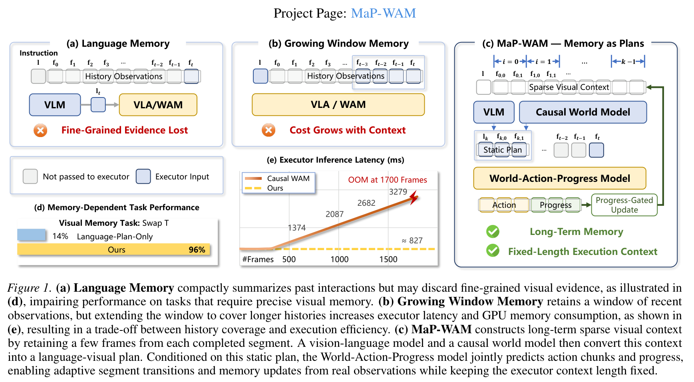
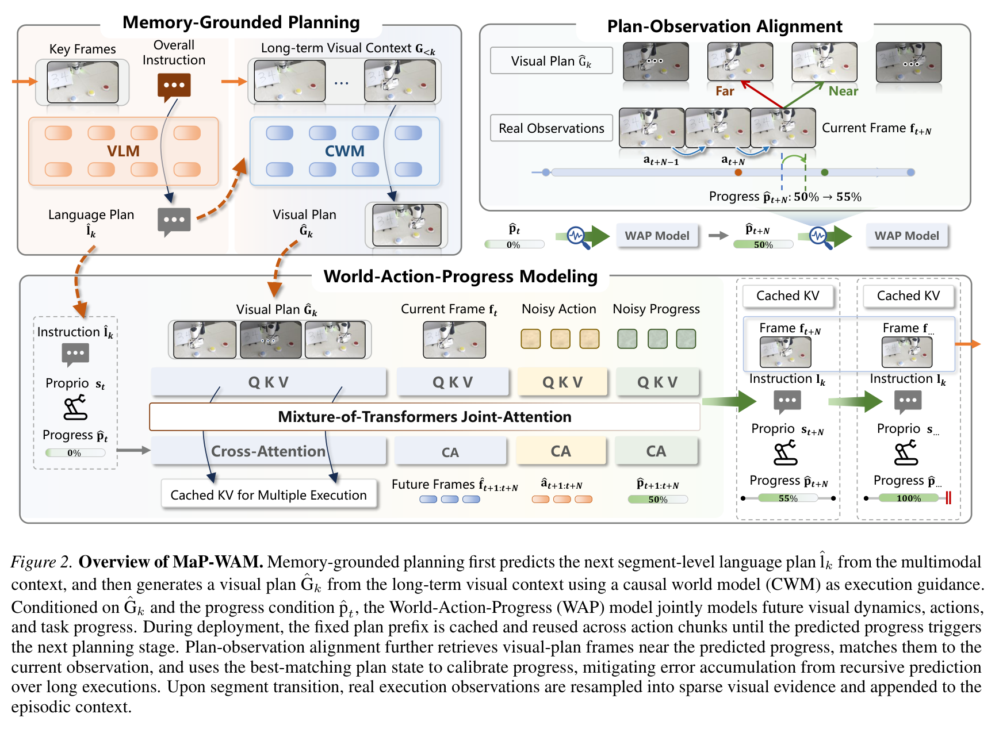
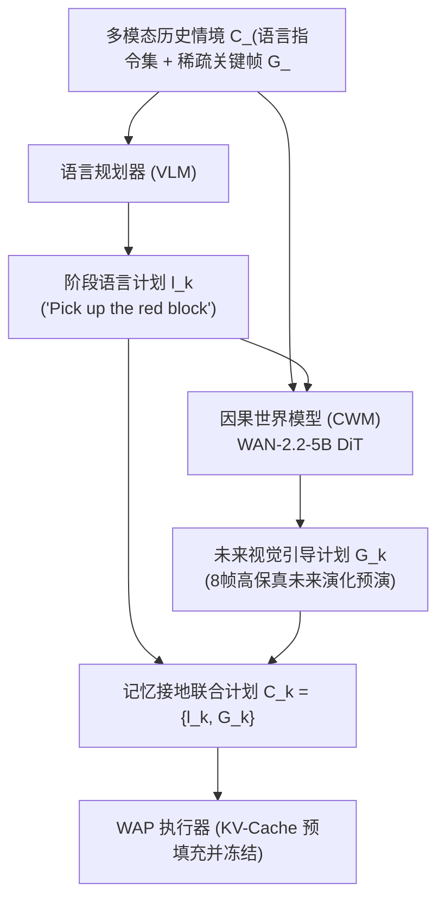
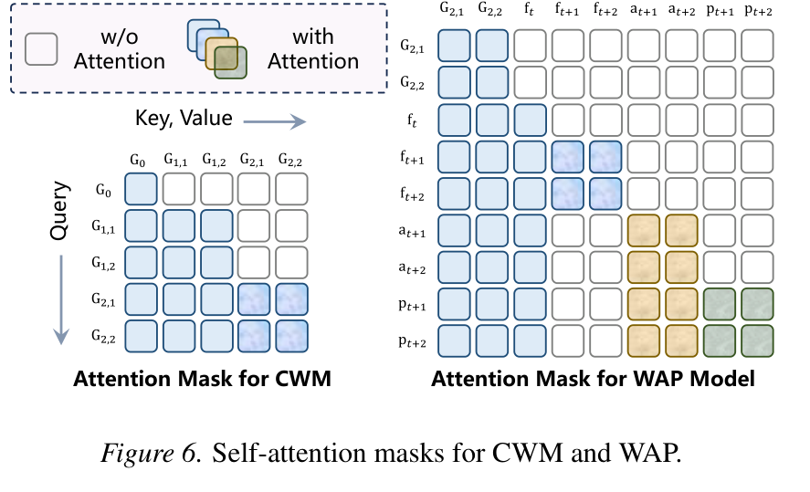
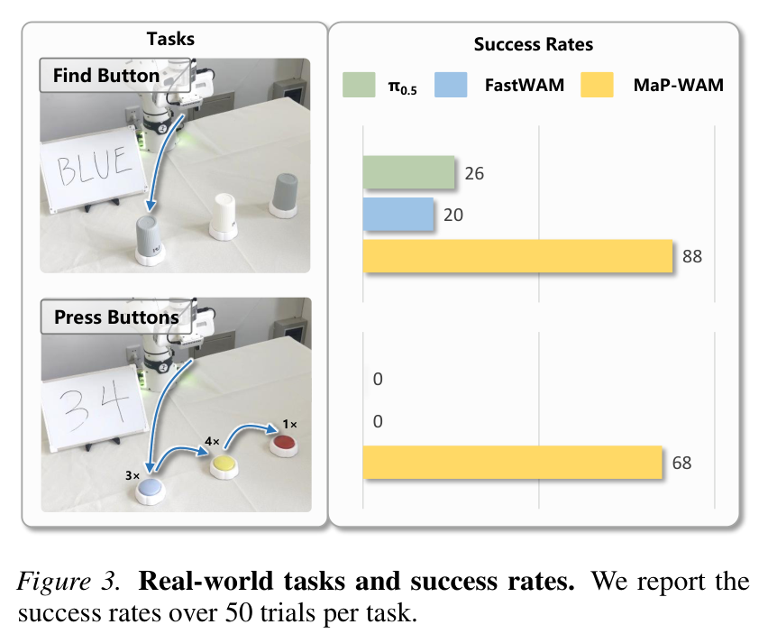
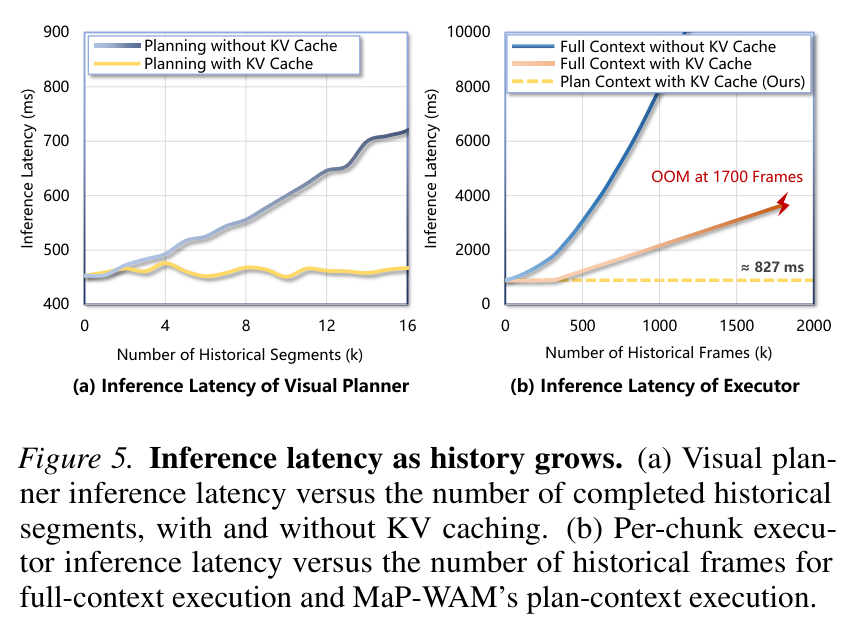

# Memory as Plans: World-Action Modeling with Memory-Grounded Planning

## 核心信息
- **论文标题：** Memory as Plans: World-Action Modeling with Memory-Grounded Planning（记忆即计划：基于记忆接地规划的世界动作模型）
- **作者团队：** Sizhe Zhao 1, Haozhe Xie 2, Weiyu Zhao 1, Chenchu Zhang 1, Huan Wang 3, Chenyang Wang 1, Qinglin Liu 1, Shengping Zhang† 1,4
- **主要机构：** 哈尔滨工业大学（Harbin Institute of Technology）、南洋理工大学（Nanyang Technological University）、吉林大学（Jilin University）、鹏城实验室（Peng Cheng Laboratory）
- **发布状态：** arXiv:2609.11561v1 [cs.RO] 10 Sep 2026
- **代码与主页：** 论文已给出开源构架与完整推理算法伪代码（Algorithm 1）
- **核心定位：** 将长程情境记忆解耦并提炼为未来前瞻计划的具身世界动作模型（World-Action Model）。从根本上打破传统因果世界模型（如 LingBot-VA）显存爆炸与时延随历史线性/二次方飙升的致命瓶颈，实现了恒定单块推理时延（~827ms）与长程时序高保真几何记忆的兼得。
- **核心评测基准：** RMBench 记忆依赖型具身仿真基准（9 项非马尔可夫复杂操控任务，涵盖 M(1) 与 M(n) 记忆复杂度）+ Franka Research 3 实体机械臂真机评测（Find Button, Press Buttons 物理实测）。

---

## 原文摘要翻译
主流机器人策略通常采用马尔可夫假设，仅根据当前单帧观测或固定长度的极短历史窗口生成控制动作。尽管这种设定对于简单的即时反应式任务非常有效，但它在处理依赖历史记忆的操作任务时受到严重制约，因为此类任务的关键决策线索往往深植于早期的历史观测中。现有的记忆增强型策略主要通过在动作生成时输入持续增长的观测窗口或密集的因果历史来应对这一瓶颈，但随着任务交互步序的延伸，这会导致推理延迟急剧攀升以及显存开销发生灾难性膨胀。为此，我们提出了 MaP-WAM（Memory-as-Plans World-Action Model，基于“记忆即计划”的世界动作模型），将长时程记忆的处理与短时程动作执行实现深度解耦。MaP-WAM 不在每个控制步向底层执行器重复输入冗长的完整历史，而是维护一套结构化的多模态情境记忆，并在阶段边界将其提炼编译为由语言子目标与视觉引导构成的“记忆接地方案”。在这一静态方案的指导下，世界—动作—进度（World-Action-Progress, WAP）模型联合预测控制动作与任务完成进度，从而在彻底免除密集历史访问的前提下，实现了执行时长的自适应延伸与平滑的阶段跃迁。在依赖复杂记忆的 RMBench 仿真基准和实体机械臂真实任务评测中，MaP-WAM 在取得超越现有先进记忆增强策略的卓越成功率的同时，保持了近乎恒定的单动作块推理延迟。

---

## 创新点
1. **提出了“记忆即计划”（Memory as Plans, MaP）的具身控制新范式：** 敏锐地洞察到底层控制执行并不需要在每个动作块的高频控制步都重复消化冗长的过去视频流；历史记忆的核心价值应当在宏观阶段切换时，由规划器一次性提炼为未来的“语言子目标 + 视觉演变指导”（Language-Visual Plan）。底层执行器仅以此固定前缀为条件运行，彻底将执行期上下文长度解耦于历史时间步。
2. **构建了记忆接地的因果世界模型（CWM）视觉规划器：** 告别了单纯依赖 VLM 生成模糊文本子目标的传统做法，引入基于 WAN-2.2-5B 的因果视频生成扩散模型，输入长期稀疏关键帧与阶段文本，前瞻生成 8 帧具备高精度空间几何与物体外观的未来视觉计划（Visual Plan），并采用分块因果掩码实现历史阶段 KV 缓存的永久复用。
3. **首创混合 Transformer 架构的世界—动作—进度一体化模型（WAP）：** 将“任务进度”（Progress）确立为与“动作”（Action）和“未来视频潜变量”（Visual Latents）平等的一等公民模态。通过引入 1.02B 动作专家与 207M 进度专家，WAP 能够自适应感知物理任务何时完成，打破了固定执行步长的死板限制，赋予系统真正的自主弹性执行与重规划能力。
4. **提出了“计划—观测对齐”（Plan-Observation Alignment）自适应校准闭环：** 利用视觉计划自带的连续时序坐标，将物理机器人执行动作后获取的真实观测与视觉计划帧进行局部高斯加权余弦相似度检索，以动量更新强制校正自回归累积的进度预测，彻底消除了超长时程任务中由于时序漂移导致的阶段判定混乱。

---

## 一句话总结
MaP-WAM 颠覆了以往具身世界模型无节制堆叠过去历史帧导致显存爆炸与卡顿的粗暴做法，开创性地将长程历史记忆在阶段边界“编译”为未来的紧凑多模态计划，在 RMBench（83.3%）与物理真机上刷出 SOTA 的同时，首次将单动作块推理延迟稳死在约 827ms 的平直水平！

---

## 研究问题

### 1. 马尔可夫假设在具身智能中的破产
在经典的反应式（Reactive）机器人策略（如 OpenVLA、$\pi_0$、DynamicVLA、Diffusion Policy）中，动作生成通常被形式化为马尔可夫决策：
$$a_{t+1:t+h} \sim \pi(a \mid f_t, s_t, l)$$
即仅依赖当前视觉观测 $f_t$、本体状态 $s_t$ 与全局语言指令 $l$。这种假设在简单桌面上抓取显眼物体尚可应付，但在真实世界的复杂非马尔可夫任务中彻底崩溃：
- **视野遮挡与时序依赖：** 例如在 *Swap Blocks*（积木调换）或 *Observe and Pick Up*（先观察提示板再抓取）任务中，关键决策线索仅在第 0 步或早期的某个瞬间出现，随后的执行过程中提示板被移走、目标被手臂或隔板遮挡。单帧策略“看不见即不存在”，只能盲猜，成功率暴跌至个位数（DP 仅 5.8%，$\pi_{0.5}$ 仅 10.4%）。

### 2. 现有长程记忆机制的两大致命软肋
为了让机器人获得长时程记忆，学术界主要尝试了两个流派，但均背负着沉重的代价：
- **软肋一：纯语言记忆（Language Memory，如 MemER, Mem-0, MEM）。**  
  用大语言模型将过去的观测压缩概括为自然语言日记或子任务描述。语言虽然极其紧凑（仅占几个 token），但不可逆地过滤掉了关键的**微观空间几何、厘米级物体位姿、精确接触面以及连续姿态约束**。在需要微观空间分辨的任务（如 Swap T 确定两块积木最初朝向）中，语言记忆频繁发生语义幻觉。
- **软肋二：无界膨胀的因果窗口（Growing Window Memory，如 LingBot-VA, WLA-0）。**  
  因果世界模型将过去交互产生的所有观测图像帧全盘保留在输入序列中，通过 Transformer 的因果自注意力去感知历史。这种“生吞所有历史”的做法导致输入序列长度 $T$ 随任务进展无限制增长：
  - 注意力计算量与时延随 $O(T^2)$ 飙升；
  - 即便使用 KV-Cache，KV 显存占用也随 $O(T)$ 激增；
  - 实测表明：在交互积累到 1,700 帧时，显存消耗直接突破 **80GB**，程序直接爆显存崩溃（OOM Crash）！机器人在运行中越来越卡，完全丧失了实时反应能力。



### 3. 核心问题提炼
**具身模型究竟怎样才能既拥有无损的像素级长程视觉空间记忆，又绝不在底层执行期引入不断膨胀的显存与延迟负担？**

---

## 数据与任务定义

### 1. RMBench 具身记忆仿真基准
论文主要在权威的 **RMBench**（Chen 等，2026）长时程记忆操控基准上开展实验。该基准专门针对部分可观测马尔可夫决策过程（POMDP）设计，根据决策所需的历史线索依赖度分为两大类别：

| 任务复杂度等级 | 核心定义与依赖特征 | 代表性任务场景 |
| :--- | :--- | :--- |
| **M(1) 任务**（单次历史依赖） | 当前动作决策严格依赖于过去历史中出现过的**某一个关键单帧观测**（当前已不可见）。 | - *Observe and Pick Up:* 开局展示色块提示，随后遮蔽，要求抓取对应目标；<br>- *Swap T:* 桌面放置两个不同朝向的 T 形积木，要求互换位置且必须恢复初始位姿；<br>- *Rearrange Blocks, Put Back Block, Swap Blocks* |
| **M(n) 任务**（多次离散历史依赖） | 当前动作决策依赖于交互历史中分散在**不同时间步的多个观测状态**，要求策略具备多阶段时序状态追踪与推理能力。 | - *Battery Try:* 探索并记忆多个不同插槽与电池电极的匹配性；<br>- *Blocks Ranking Try:* 连续尝试并排序不同重量或隐藏属性的积木；<br>- *Cover Blocks:* 记忆被杯子完全覆盖后的多物体历史位置；<br>- *Press Button:* 记忆并依序按压指定颜色的按钮序列 |

### 2. Franka Research 3 实体机器人实测任务
为了检验物理真实世界中的泛化与稳健性，作者搭建了基于 7-DoF Franka FR3 机械臂与 Robotiq 2F-85 夹爪的真机平台，设计了两个极具代表性的记忆操控任务：
- **Find Button (M(1)):** 在机械臂视野左侧树立一块图文提示板，指示本次操作目标按钮的颜色。机械臂启动瞬间提示板存在，但随着机械臂俯冲抓取，提示板完全滑出相机视野。要求机械臂准确按下指定按钮。
- **Press Buttons (M(n)):** 初始展示包含 3 个连续按钮颜色的顺序卡片，机械臂开始动作前卡片被人工彻底撤走。机械臂必须按顺序先后按压 3 个不同位置的按钮，且中途夹爪回弹、换位时不得遗忘后续序列。

---

## 方法主线：MaP-WAM 架构详解



MaP-WAM 的核心哲学是**规划与执行的时空解耦**：
> “长程历史记忆是宏观战略层面的指南针，绝非微观战术执行每一步的绊脚石。”

整个系统由 **结构化多模态情境记忆（Episodic Context）**、**两阶段记忆接地规划器（Memory-Grounded Planner）**、**世界—动作—进度（WAP）执行器**、**计划—观测对齐校准机制** 与 **进度门控自适应阶段跃迁** 五大核心部件组成。

### 1. 结构化多模态情境记忆（Structured Multimodal Episodic Context）
为了兼顾信息无损与极其紧凑的存储，MaP-WAM 不保存全频率视频流，而是以“阶段”（Segment）为单元维护记忆库 $\mathcal{C}_{<k}$：
- 初始锚点：记录任务起始帧 $G_0 = f_0$；
- 阶段记录：每个已完成的阶段 $i \in \{1, \dots, k-1\}$ 贡献一条元组 $\mathcal{C}_i = \{l_i, G_i\}$：
  - $l_i$：该阶段执行的子目标自然语言文本；
  - $G_i$：从该阶段**真实执行的物理轨迹**中，均匀抽取的 $N=8$ 帧连续高清图像。
- 潜空间紧凑压缩：经由 WAN-VAE 视频自编码器在时间维度上进行下采样压缩后，$N=8$ 帧在潜空间中仅占用 **2 个时间步的潜变量 token**，极大压缩了上下文开销。

### 2. 记忆接地规划：从长程记忆到具身联合方案
当进入第 $k$ 个阶段时，系统通过规划器将累积的多模态情境 $\mathcal{C}_{<k}$ 编译为执行方案 $\mathcal{C}_k = \{l_k, \hat{G}_k\}$：



#### (1) 阶段语言子目标预测（VLM 规划器）
微调开源的 **Qwen3.5-4B** 作为宏观语言规划器 $\pi_P^l$。输入全局指令 $l$、已完成的指令序列 $l_{<k}$ 以及紧凑关键帧集合 $f^\star$（初始帧 $G_0$ 与各阶段末帧）：
$$l_k \sim \pi_P^l(l_k \mid l_{<k}, l, f^\star) 	ag{4}$$
这一步将长程语义任务分解为当前阶段的即时意图。

#### (2) 视觉计划生成（因果世界模型 CWM）
单纯有语言计划极易造成低层策略在空间几何上的迷失。为此，MaP-WAM 引入基于 **WAN-2.2-5B** 扩散视频模型的因果世界模型 $\pi_P^v$。
- 输入条件：历史稀疏视觉帧 $G_{<k}$、全局任务指令 $l$、当前阶段语言计划 $l_k$；
- 输出生成目标：未来的 8 帧视觉演变引导图像 $\hat{G}_k$；
- **分块因果自注意力掩码（Block-Causal Mask）：**
  如图 6（左）所示，历史各个阶段的 token 仅能单向关注更早的阶段，绝对禁止跨阶段向前窥视。这一设计带来了巨大的系统级红利：**已完成阶段的 KV 缓存是严格不变量！在后续规划中无需重复计算，直接永久复用！**

### 3. 世界—动作—进度（WAP）模型与 Mixture-of-Transformers
规划阶段生成的视觉计划 $\hat{G}_k$ 和语言计划 $l_k$ 共同构成了执行方案 $\mathcal{C}_k$。在具体执行该方案时，机器人面临物理世界的随机性：**一个阶段究竟需要走多少步是未知的（机械臂可能需要微调、重试或避障）。**

为此，作者提出了 **WAP 模型**，采用混合 Transformer（MoT）统一架构，引入“进度”（Progress）作为一等公民模态：

| 专家模块 | 参数量与架构配置 | 模态角色与作用 |
| :--- | :--- | :--- |
| **视频主干专家（Video Expert）** | WAN-2.2-5B DiT 主干 | 接收视觉计划 $\hat{G}_k$ 与当前单帧 $f_t$，建模物理世界的连续视觉动态演变。 |
| **动作专家（Action Expert）** | 1.02B Transformer，隐层维度 $d_a = 1024$ | 接收交叉注意力特征，自回归流匹配去噪输出未来动作块 $y_a = a_{t+1:t+h}$（$h=8$）。 |
| **进度专家（Progress Expert）** | 207M Transformer，隐层维度 $d_p = 256$ | 预测连续归一化进度演变序列 $y_p = p_{t+1:t+h} \in [0, 1]$。 |

#### 结构化执行注意力掩码（Fixed-Context KV Caching）
如图 6（右）所示，WAP 的自注意力掩码具有极精妙的单向隔离性：
- 静态计划前缀 $\hat{G}_k$ 的 token 只能看见自己，**完全无法看见** 后续动态生成的动作、进度和当前状态 token！
- 动态 token 则能单向充分查询静态计划前缀；
- **计算复杂度红利：** 静态计划 $\hat{G}_k$ 的 KV-Cache 在阶段开始时**仅需前向计算一次**，在随后长达数十甚至上百个动作块的去噪循环中被 100% 静态复用！执行器上下文长度与历史总步长完全解耦，实现了极其平直的 **~827ms 恒定单块去噪延迟**。
- **FastWAM 解耦原则继承：** 动作与进度 token 不与未来的含噪视频 token 发生交叉注意，因此在实际真机部署时，未来的视频生成分支可以直接关停，无需耗费额外算力生成未来像素！



### 4. 计划—观测对齐校准机制（Plan-Observation Alignment）
若完全依赖网络自回归递归递推进度 $\hat{p}_t$，在长时程物理交互中必然会发生微小误差累积，导致进度漂移（例如动作已经做完，预测进度却卡在 0.8；或者动作刚开始，进度就虚报为 1.0）。

MaP-WAM 创造性地将视觉计划 $\hat{G}_k$ 转化为“物理时钟基准”：
1. 视觉计划的 8 个帧分别天然拥有已知的连续进度标签 $p_j = rac{j}{N-1}$（$j \in [0, N-1]$）；
2. 执行完一个动作块后，获取当前的真实高清观测 $f_t$；
3. 以当前模型预测的进度 $\hat{p}_t$ 为中心，施加局部高斯加权核：
   $$w_j = \exp\left(-rac{(\hat{p}_t - p_j)^2}{2\sigma^2}
ight)$$
4. 提取视觉特征，在临近计划帧中检索余弦相似度最高的帧 $j^\star$；
5. 采用动量平滑公式强行拉回真实进度：
   $$p_t \leftarrow (1 - lpha)\hat{p}_t + lpha p_{j^\star} \quad (lpha = 0.5)$$
该机制如同一根“安全锚缆”，始终将物理机器人的真实状态与预想的视觉轨迹牢牢绑定，彻底杜绝了进度自回归的发散。

### 5. 进度门控自适应阶段跃迁与 Algorithm 1
当最新动作区间内的平均对齐进度 $ar{p}_t$ 突破阈值 $	au = 0.95$ 时，系统判定当前阶段已经成功闭环：
1. 立即终止 WAP 对当前方案的执行；
2. **从该阶段真实执行的观测流中均匀下采样提取 8 帧真实图像作为 $G_k$**，存入历史情境记忆 $\mathcal{C}_{<k+1}$（抛弃生成的想象，永远基于物理事实！）；
3. 唤醒 VLM 和 CWM 展开下一阶段规划；
4. 若未达阈值，则继续循环生成下一个动作块。


---

## 关键结果与基准评测

### 1. RMBench 仿真基准全面碾压（83.3% vs 77.1% vs 10.4%）


在长程记忆物理仿真基准 RMBench 上，MaP-WAM 展现了统治级的优势：
- **总体平均成功率（Total Average）：** MaP-WAM 达到 **83.3%**，大幅击败最强因果世界模型基线 LingBot-VA（77.1%），更将语言记忆模型 Mem-0（42.0%）、代表性通用策略 $\pi_{0.5}$（10.4%）和扩散策略 DP（5.8%）远远甩在身后。
- **高记忆复杂度任务突破：**
  - 在依赖微观多步历史记忆的极难任务 *Press Button* 上，传统 VLA（$\pi_{0.5}$）和 DP 彻底瘫痪（**0% 成功率**），Mem-0 因语言丢失几何线索同样为 **0%**；而 MaP-WAM 斩获了 **96% 的超高成功率**！
  - 在 *Battery Try*（探索并记忆电池插槽）任务上，MaP-WAM 取得 **82%**，接近 WLA-0（45%）和 LingBot-VA（41%）的两倍！
  - 在 *Observe and Pick Up*（依赖微小局部视觉差异）任务上，以往所有基线均在 9% 以下（LingBot-VA 仅 3%），MaP-WAM 直接拉升至 **19%**。

### 2. Franka Research 3 实体机器人实测



在真实物理环境中的 50 轮严苛实测表明：
- **Find Button (M(1)):** MaP-WAM 达到 **88%** 成功率，相比于 $\pi_{0.5}$（26%）和 FastWAM（24%）实现了超过 **3.4 倍的爆发式提升**！
- **Press Buttons (M(n)):** 当面对开局展示随后撤走提示板的 3 阶段连续按钮按压时，所有基线策略由于长程时序混乱与记忆丢失全部崩溃，成功率均跌为 **0%**！而 MaP-WAM 凭借记忆接地规划与进度门控，稳稳拿下 **68%** 的真实世界成功率！

### 3. 视觉规划核心作用消融（Figure 4）


- **移除视觉方案（w/o Visual Plan）：** 仅由 VLM 提供语言子目标，底层直接执行。在 *Swap T* 任务上成功率急剧萎缩，证明了高层纯文本在指导高精度连续物理对齐时的先天无力。
- **移除视觉记忆（w/o Visual Memory）：** 视觉世界模型仅以当前单帧 $f_t$ 为输入生成方案。在 *Swap T* 中，世界模型由于不知道两块积木最初的相对几何朝向，频繁“脑补”出颠倒的积木颜色与朝向，计划彻底误导了执行器；而完整的 MaP-WAM 凭借长期情境记忆接地，方案保真度极高。

### 4. 进度建模与校准机制消融（Table 2）


| 消融变体配置 | Blocks Ranking Try | Cover Blocks | Press Button | 平均成功率 (%) | 关键消融机理解读 |
| :--- | :---: | :---: | :---: | :---: | :--- |
| **分类式完成判据（Done Token）** | 40% | 71% | 0% | 37.0% | 离散的二值判定无法提供平滑的连续时钟参考，阶段跳变剧烈震荡。 |
| **移除输入进度条件（w/o $p_t$）** | 57% | 87% | 18% | 54.0% | 在 *Press Button* 上直接从 96% 暴跌至 18%！因为夹爪下压与回弹画面极度相似，缺少进度导致模型陷入死循环。 |
| **移除对齐校准（w/o Alignment）** | 38% | 85% | **98%** | 73.7% | 在超长时程任务 *Blocks Ranking Try*（平均 423 步）上断崖式暴跌（94% $
ightarrow$ 38%），自回归误差彻底跑偏！ |
| **MaP-WAM 完整模型** | **94%** | **100%** | **96%** | **96.7%** | 三者缺一不可，构筑了高稳健的闭环执行。 |

### 5. 推理延迟与显存开销曲线：彻底打破 OOM 魔咒



图 5 展现了 MaP-WAM 最震撼的系统级工程优势：
- **执行器单块时延对比：** 全上下文因果世界模型（Full Context）即便开启 KV 缓存，单块去噪耗时也随着历史帧的增加一路狂飙（1500 帧时膨胀 4 倍）；而 MaP-WAM 无论任务执行了 100 步还是 1500 步，单块推理时延始终牢牢钉死在 **~827ms**！
- **显存极限测试（OOM）：** 全上下文模型在交互步长达到 1,700 帧时，显存消耗瞬间冲破 **80GB** 硬件极限导致 OOM 崩溃；MaP-WAM 的执行器显存消耗始终维持在恒定的平直低位，真正具备了支撑超长时程无限步长操作的工业级潜力！

---

## 深度分析

### 1. 真正贡献是什么：从“过去记忆缓存”到“未来计划编译”的范式跃迁
以往所有的具身记忆策略，其本质思维定势都是**“向后看”（Looking Backward）**：
- MemoryWAM 在想：*如何把过去的所有 KV-cache 压缩成 8 个 Gist token 塞给当前的执行器？*
- LingBot-VA 在想：*如何用因果 Transformer 把过去所有的历史帧一股脑串联成一条长链？*
- Mem-0 在想：*如何把过去的画面翻译成一段过去的文本日记？*

**MaP-WAM 的颠覆性在于，它第一次将长程记忆彻底转变为“向前看”（Looking Forward）的计划编译问题！**
在物理控制中，机器人的机械臂去抓一个杯子，根本不需要知道 50 步前夹爪是怎样以 0.1m/s 移动的，它唯一需要知道的是：**根据过去的观察，当前这个阶段我的终极目标状态是什么（Visual Plan），以及我现在离这个目标还有百分之多少的进度（Progress）。**
通过把长程历史在阶段边界一次性“编译”为未来的静态目标帧序列，MaP-WAM 优雅地让底层的执行策略甩掉了所有历史包袱，既享有了世界模型前瞻预测的宏观智慧，又保全了反应式控制器的敏捷与轻盈。

### 2. 为什么结果成立：三个核心机制的数学与工程互锁
1. **分块因果注意力带来的 KV-Cache 零冗余：** 规划器 CWM 将过去的阶段作为静态前缀，使得每增加一个阶段，仅仅追加 2 个潜时间步的缓存，历史规划耗时维持在秒级且无需重算。
2. **时序进度的正交解耦与语义消歧：** 机器人操作中存在大量“视觉回摆”现象（例如按按钮时下压与回弹的图像特征高度重合）。传统单帧模型会在此发生严重的马尔可夫多模态塌陷（不知道该继续压还是该抽手）。MaP-WAM 将归一化标量进度 $p_t$ 注入执行器，强行在特征流中引入了一维单调时序坐标，以极微小的算力成本彻底粉碎了状态歧义。
3. **真实观测对生成幻觉的物理阻断：** 阶段完成后，系统绝不将 CWM 想象出的视觉计划写入长期记忆，而是必须从真实物理世界采样的真实关键帧填入 $\mathcal{C}_{<k}$。这构筑了一道绝对坚固的“现实防火墙”，彻底阻断了自回归扩散模型常见的误差滚雪球幻觉。

### 3. 容易误读的地方
1. **误区一：以为 WAP 在推理时每一步都在生成未来高清视频。**  
   *事实：* 并不生成！受 FastWAM 启发，WAP 在训练时利用未来视频潜变量作为辅助表征学习损失（Auxiliary Loss），而在测试部署时，动作和进度专家与未来视频分支完全解耦，未来视频分支直接丢弃，不增加任何推理开销！
2. **误区二：以为视觉计划是一段长视频。**  
   *事实：* 视觉计划 $\hat{G}_k$ 仅由 8 个代表未来演化关键节点的稀疏帧组成，经 WAN-VAE 压缩后在潜空间中极度紧凑，因此执行器能以极低显存完成计划前缀的全量加载。
3. **误区三：以为规划器每时每刻都在重算。**  
   *事实：* 规划器（VLM + CWM）仅在阶段跃迁阈值 $ar{p}_t > 0.95$ 触发时才被调用一次（每数十至数百步一次）；微观高频的动作块生成完全由轻量化的 WAP 执行器独立完成。

### 4. 复现与落地注意点
- **进度标签的平滑性：** 训练数据中的 $p_t = rac{t-i}{j-i}$ 必须基于真实的物理阶段起止点；在训练期对输入 $p_t$ 施加 $[-0.1, 0.1]$ 的随机抖动（Offset Augmentation）至关重要，否则测试期稍有累积偏差就会导致策略崩溃。
- **高斯对齐窗口 $\sigma$ 的设定：** 计划—观测对齐中的高斯权重方差 $\sigma$ 不宜过大或过小：过小会导致无法检索到临近关键帧，过大会导致退化为全局均匀匹配，丢失时序约束。
- **WAN-2.2-5B 显存分配：** 虽然推理期单块动作仅需 ~827ms，但在规划阶段同时加载 Qwen3.5-4B 与 WAN-2.2-5B 需要合理的显存池化管理或模型常驻机制。

---

## 局限
1. **依赖预定义的阶段拓扑（Segment Dependency）：** MaP-WAM 目前的记忆构建与进度标注依赖于基准数据中预设的阶段标签。对于长达数千步且无任何人工子目标标注的连续复杂示教，如何无监督自适应发现阶段边界仍是一个未解课题。
2. **免训练对齐测度对极端环境的脆弱性：** 当前的计划—观测对齐采用基于 patch 视觉特征的余弦相似度。在面临突发强烈光照变化、杂乱动态背景或严重遮挡时，非学习型的余弦相似度可能发生错误匹配，未来需要可学习的度量网络来增强鲁棒性。
3. **规划时延在极端动态环境下的挑战：** 尽管执行期单块时延仅 827ms，但触发阶段跃迁时调用 CWM 生成 8 帧视觉计划仍需数秒时间。这在静态操作（如桌面拼装）中完全可以接受，但在高速动态交互（如乒乓球拦截、动态物体抓取）中会带来短暂停顿。

---

## 我的笔记：具身世界动作模型横向大比拼

将 MaP-WAM 置于当前国际前沿的世界模型与具身记忆发展脉络中，可以清晰地看到它所处的技术生态位与显著优势：

| 模型范式 | 代表作 | 记忆表征方式 | 底层执行上下文 | 长程推理时延与显存 | 对长程非马尔可夫任务的适应力 |
| :--- | :--- | :--- | :--- | :--- | :--- |
| **单体反应式 VLA** | $\pi_{0.5}$, OpenVLA | 无记忆（单帧或 2 帧） | 极短固定窗口 | $O(1)$ 恒定，极低 | 差（RMBench 仅 10.4%），完全无法应对遮挡与历史依赖 |
| **纯语言记忆 VLA** | Mem-0, MemER | 自然语言摘要/子指令 | 短窗口 + 文本 Prompt | 较低，文本 token 少 | 中等（RMBench 42.0%），严重丢失微观几何与空间相对位姿 |
| **增长前缀因果 WAM** | LingBot-VA, WLA-0 | 全量历史观测帧链表 | 线性递增的全历史窗口 | **严重恶化**：时延飙升，1700 帧时 OOM 爆显存崩溃 | 较强（77.1%），但受限于计算爆炸无法落地实用 |
| **层级持久记忆 WAM** | MemoryWAM | 3 级混合记忆库（近期 KV + 边界锚点 + 8 Gist Token） | 固定长度混合记忆前缀 | 良好：维持在恒定计算开销 | 优异，但在复杂多阶段长程规划上缺少显式前瞻意图导引 |
| **代码与符号解耦记忆** | HyMeS | 外部 Python 代码变量库 + 模块化技能权重 | 局部技能调用 | 极高：利用符号代码完全消除记忆衰减 | 擅长确定性长程任务，但泛化依赖结构化 API 与感知接地 |
| **物理编排与动态工具** | VoLoAgent | 快慢双系统（快监测 + 慢深思） | 动态可中断工具上下文 | 优异：异步巡检消解云端时延 | 擅长开放词表复杂故障恢复与常识自愈 |
| **记忆即计划模型（本文）** | **MaP-WAM** | **多模态情境记忆 $
ightarrow$ 编译为未来静态语言视觉方案** | **固定长度方案前缀（静态 KV-Cache 永久复用）** | **极致优异：恒定 ~827ms 延迟，彻底打破 80GB 显存上限** | **SOTA（83.3%）**，兼具微观像素几何保真度与宏观前瞻执行弹性 |

### 核心思辨总结
1. **与 MemoryWAM 的互补性：** MemoryWAM 的哲学是“如何将过去的 KV 缓存最高效地压缩保留给执行器”，而 MaP-WAM 的哲学是“过去的记忆根本不需要作为执行器的条件输入，直接把它在宏观阶段编译成未来的目标”。这两种思想在未来完全可以深度融合：在宏观规划器端采用类似 MemoryWAM 的三级持久记忆库来支持成百上千个阶段的超长程情境，在执行端采用 MaP-WAM 的计划条件化与进度门控，构建真正无限时程的通用具身世界模型！
2. **与 FastWAM 的精神共鸣：** 两者都洞察到了“底层执行并不需要每一步都生成高清视频”这一关键计算瓶颈，MaP-WAM 成功将 FastWAM 的解耦加速思路拓展到了多阶段长程记忆规划的全新高度。

---

## 引用
```bibtex
@article{zhao2026mapwam,
  title={Memory as Plans: World-Action Modeling with Memory-Grounded Planning},
  author={Zhao, Sizhe and Xie, Haozhe and Zhao, Weiyu and Zhang, Chenchu and Wang, Huan and Wang, Chenyang and Liu, Qinglin and Zhang, Shengping},
  journal={arXiv preprint arXiv:2609.11561},
  year={2026}
}
```
