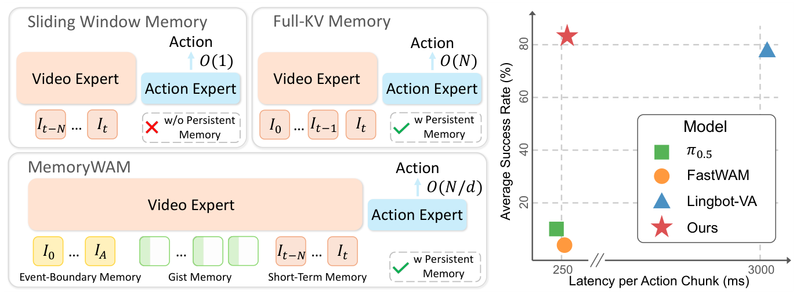
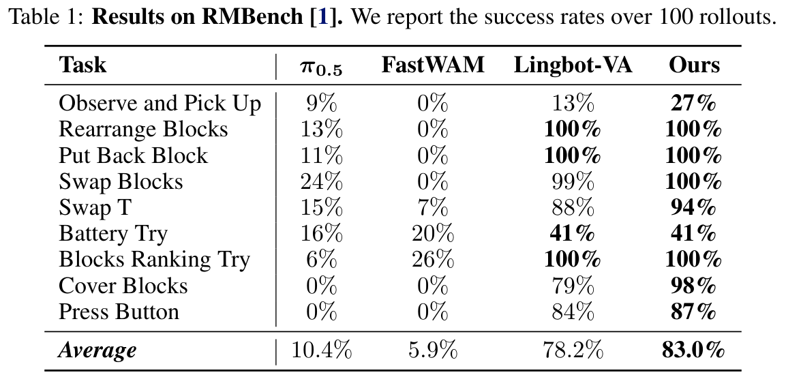
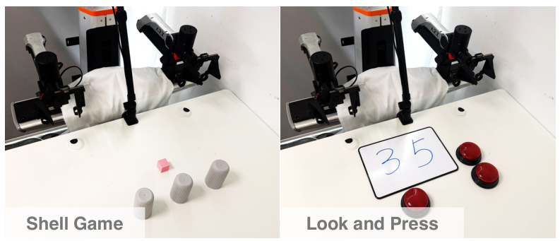
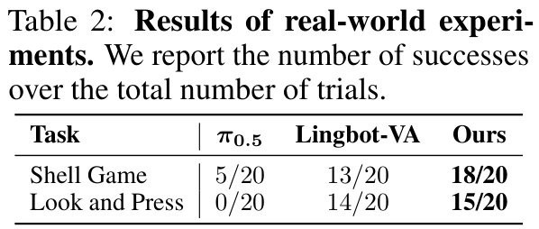
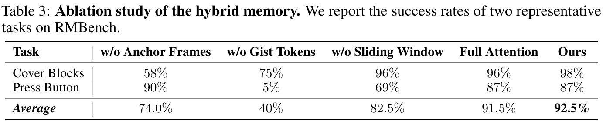
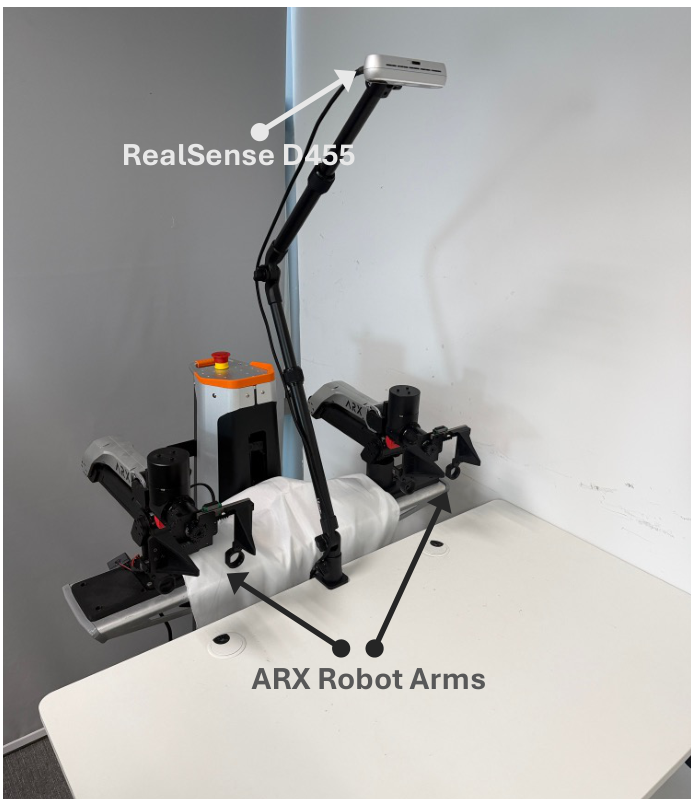

# MemoryWAM: Efficient World Action Modeling with Persistent Memory

**Authors:** Sizhe Yang, Juncheng Mu, Tianming Wei, Chenhao Lu, Xiaofan Li, Linning Xu, Zhengrong Xue, Zhecheng Yuan, Dahua Lin, Jiangmiao Pang, Huazhe Xu  
**Source:** canonical 15-page arXiv PDF, arXiv:2606.20562v1  
**Detected source format:** selectable-text PDF (`pdf-text`)  
**Reader type:** complete paragraph-level Chinese–English reader; authoritative file is `detailed_paper.md`.

## Page / Section Index

| Pages | Content |
|---|---|
| 1 | Title, Figure 1, Abstract |
| 2 | 1 Introduction |
| 3 | 2 Related Work; 3 Method / 3.1 Overview |
| 4–5 | 3.2 Architecture; 3.3 Hybrid Memory; Figures 2–3; Equations (2)–(7) |
| 6–9 | 4 Experiments; Figures 4–5; Tables 1–3; 5 Conclusion and limitations |
| 10–13 | References [1]–[68] |
| 14–15 | Appendix A; Figure 6 |

## Terminology Ledger

| Canonical term | 中文 | Decision |
|---|---|---|
| world action model (WAM) | 世界动作模型 | 首次展开后保留 WAM |
| persistent memory | 持久记忆 | 不译作“永久记忆” |
| hybrid memory | 混合记忆 | short-term + event-boundary + gist |
| gist token / gist memory | gist token / gist memory | 保留 gist，避免误译为普通摘要 |
| anchor frame / sink window | 锚点帧 / sink window | sink 保留英文以对应实现 |
| KV cache | KV cache（键值缓存） | 技术名称保留 |
| action chunk | 动作块 | 固定译法 |
| event-boundary memory | 事件边界记忆 | 本文实现实际为初始帧 |

## Abstract

> <strong>Para. 1:</strong> Robust robotic manipulation in the real world requires not only an understanding of the current observation, but also memory and dynamics modeling. World action models (WAMs) possess these capabilities by jointly modeling visual foresight and actions conditioned on both current and historical observations, making them a promising paradigm for robotic manipulation. However, existing WAMs face a fundamental trade-off: methods with efficient inference typically condition only on a bounded window of recent observations and therefore struggle in non-Markovian environments, whereas methods that preserve long histories incur time and space costs that grow substantially with sequence length. To address this challenge, we introduce MemoryWAM, a world action model with efficient persistent memory. MemoryWAM uses a hybrid memory design that combines recent frames, event-boundary anchor frames, and compact gist tokens that summarize long-range history. A tailored attention mechanism enables retrieval of both detailed short-term context and compressed long-term context, supporting memory-dependent decision-making with reduced inference latency and GPU memory usage. Across long-horizon, memory-dependent manipulation tasks in both simulation and the real world, MemoryWAM outperforms strong vision-language-action (VLA) and WAM baselines while maintaining favorable computational efficiency.

> <strong>Para. 1[CN]:</strong> 现实世界中的稳健机器人操作不仅需要理解当前观测，还需要记忆与动力学建模。世界动作模型（WAM）通过在当前及历史观测条件下联合建模视觉前瞻和动作而具备这些能力，因此成为一种很有前景的机器人操作范式。然而，现有 WAM 面临根本性的权衡：推理高效的方法通常只以有界的近期观测窗口为条件，因而难以应对非马尔可夫环境；保留长历史的方法则会产生随序列长度显著增长的时间与空间开销。为解决这一挑战，我们提出 MemoryWAM——一种具有高效持久记忆的世界动作模型。MemoryWAM 采用混合记忆设计，将近期帧、事件边界锚点帧以及概括长程历史的紧凑 gist tokens 结合起来。定制的注意力机制既能检索细致的短期上下文，也能检索压缩的长期上下文，从而以更低的推理延迟和 GPU 显存占用支持依赖记忆的决策。在仿真与现实世界的长时程、记忆依赖操作任务中，MemoryWAM 在保持良好计算效率的同时优于强大的视觉-语言-动作（VLA）和 WAM 基线。

### Figure 1

**Caption:** Overview. Prior WAMs typically face a memory-efficiency trade-off: sliding-window memory is efficient but forgets long-range context, while full-history KV caching preserves context but scales linearly with trajectory length $N$. MemoryWAM instead introduces hybrid memory: recent frames for short-term memory, anchor frames for event-boundary context, and gist tokens for long-range history. This reduces both time and space complexity at inference time from $O(N)$ to $O(N/d)$ while preserving persistent context, where $d$ is the compression ratio. On RMBench [1], MemoryWAM achieves state-of-the-art performance with significantly lower inference latency than full-history WAM baselines.

**Caption[CN]:** 概览。以往 WAM 面临记忆—效率权衡：滑动窗口高效但遗忘长程上下文；全历史 KV cache 保留上下文但随轨迹长度 $N$ 线性扩展。MemoryWAM 采用混合记忆：近期帧负责短期记忆，锚点帧保留事件边界上下文，gist tokens 保存长程历史，将推理时间与空间复杂度从 $O(N)$ 降至 $O(N/d)$，其中 $d$ 为压缩比。其在 RMBench [1] 上达到 SOTA，推理延迟显著低于全历史 WAM。

## 1 Introduction

> <strong>Para. 1:</strong> Vision-language-action models (VLAs) have emerged as a dominant paradigm for robotic foundation models, achieving strong generalization by transferring semantic priors from vision language models to robot manipulation [2, 3, 4, 5, 6]. However, most existing VLAs learn the direct mapping from the current observation to actions. While effective for semantically grounded short-horizon skills, they lack memory of historical observations and do not model how the physical world evolves through interaction. Open-world manipulation instead requires policies to reason not only about what is visible now, but also about what happened before and how the environment will evolve, especially when task-relevant cues are transient, occluded, or have delayed effects. World action models (WAMs) offer this capability by jointly modeling visual foresight and action prediction conditioned on current and historical observations [7, 8, 9, 10, 11]. By grounding manipulation in learned world dynamics, WAMs provide a promising path toward memory-aware, data-efficient robotic manipulation, while also enabling the use of large-scale unlabeled video data beyond costly robot demonstrations.

> <strong>Para. 1[CN]:</strong> 视觉-语言-动作模型（VLA）已成为机器人基础模型的主导范式，它们将视觉语言模型的语义先验迁移到机器人操作中，从而获得很强的泛化能力 [2, 3, 4, 5, 6]。然而，大多数现有 VLA 学习的是从当前观测到动作的直接映射。尽管这对具有语义基础的短时程技能有效，但它们缺少对历史观测的记忆，也不建模物理世界如何随交互演化。开放世界操作则要求策略不仅推理当前可见的内容，还要推理此前发生了什么以及环境将如何演化，尤其是在任务相关线索短暂出现、被遮挡或具有延迟效应时。世界动作模型（WAM）通过在当前和历史观测条件下联合建模视觉前瞻与动作预测来提供这种能力 [7, 8, 9, 10, 11]。通过将操作建立在学习到的世界动力学之上，WAM 为记忆感知、数据高效的机器人操作提供了一条有前景的路径，同时还能利用昂贵机器人示范之外的大规模无标签视频数据。

> <strong>Para. 2:</strong> Despite their promise, existing WAMs face a core memory-efficiency trade-off. Efficient WAMs such as Cosmos Policy [12], DiT4DiT [13], FastWAM [14], GigaWorld Policy [15], and X-WAM [16] condition on a fixed-size window of recent observations. Although computationally practical, this design provides only short-term memory and is insufficient for non-Markovian tasks in which crucial information lies outside the current observation window. In contrast, autoregressive WAMs such as LingBot-VA [7], DreamZero [11], and MotuBrain [17] cache all historical frames as memory. Although this strategy preserves richer temporal context, it renders both training and inference inefficient, as latency and memory consumption grow substantially with sequence length.

> <strong>Para. 2[CN]:</strong> 尽管前景可观，现有 WAM 仍面临核心的记忆—效率权衡。Cosmos Policy [12]、DiT4DiT [13]、FastWAM [14]、GigaWorld Policy [15] 和 X-WAM [16] 等高效 WAM 以固定大小的近期观测窗口为条件。尽管这种设计在计算上可行，但它只提供短期记忆，对于关键信息位于当前观测窗口之外的非马尔可夫任务并不足够。相比之下，LingBot-VA [7]、DreamZero [11] 和 MotuBrain [17] 等自回归 WAM 将全部历史帧缓存为记忆。虽然这种策略保留了更丰富的时间上下文，但延迟和内存消耗会随序列长度显著增长，使训练和推理都变得低效。

> <strong>Para. 3:</strong> Cognitive psychology suggests that human memory is not a unitary store, but a hybrid system composed of complementary forms [18]: short-term memory supports ongoing action planning but has limited capacity [19]; long-term memory tends to preserve abstract gist traces rather than exact verbatim details [20]; and event boundaries in continuous experience are especially salient for organizing memory [21]. Inspired by this hybrid organization, we introduce MemoryWAM, a world action model with efficient persistent memory. MemoryWAM implements a hybrid memory mechanism that enables efficient and effective memory utilization for decision-making by using only a small number of gist tokens together with a carefully designed attention mechanism. Specifically, a sliding observation window preserves high-fidelity short-term context for immediate control, a small set of gist tokens compresses long-range history, and anchor frames retain complete visual tokens at event boundaries with heightened mnemonic salience, such as the initial observations of a task.

> <strong>Para. 3[CN]:</strong> 认知心理学认为，人类记忆并非单一存储，而是由互补形式组成的混合系统 [18]：短期记忆支持持续的动作规划，但容量有限 [19]；长期记忆倾向于保留抽象的要旨痕迹，而非精确的逐字细节 [20]；连续经验中的事件边界对于组织记忆尤其显著 [21]。受这种混合组织方式启发，我们提出具有高效持久记忆的世界动作模型 MemoryWAM。MemoryWAM 仅使用少量 gist tokens 并配合精心设计的注意力机制，实现了可供决策高效、有效利用的混合记忆机制。具体而言，滑动观测窗口为即时控制保留高保真短期上下文，少量 gist tokens 压缩长程历史，锚点帧则在具有更高记忆显著性的事件边界处保留完整视觉 tokens，例如任务的初始观测。

> <strong>Para. 4:</strong> In this way, MemoryWAM retains persistent memory while incurring only a slight increase in inference latency and GPU memory consumption as the number of historical frames grows. We evaluate MemoryWAM against strong baselines on RMBench [1], a long-horizon, memory-dependent manipulation benchmark. MemoryWAM achieves an average success rate approximately 70 percentage points higher than methods that rely only on the current observation or short-term memory, and it even outperforms LingBot-VA [7], a strong WAM baseline with persistent memory. Similar advantages are also observed in real-world experiments. Moreover, MemoryWAM achieves substantially lower inference latency and GPU memory usage than previous WAMs with persistent memory. Fig. 1 compares different methods in terms of task success rate and inference latency.

> <strong>Para. 4[CN]:</strong> 通过这种方式，随着历史帧数量增长，MemoryWAM 仅付出推理延迟和 GPU 显存消耗的小幅增加，便能保留持久记忆。我们在长时程、记忆依赖操作基准 RMBench [1] 上将 MemoryWAM 与强基线进行比较。MemoryWAM 的平均成功率比仅依赖当前观测或短期记忆的方法高约 70 个百分点，甚至优于具有持久记忆的强 WAM 基线 LingBot-VA [7]。现实世界实验中也观察到类似优势。此外，MemoryWAM 的推理延迟和 GPU 显存占用显著低于以往具有持久记忆的 WAM。图 1 从任务成功率和推理延迟两个方面比较了不同方法。

> <strong>Para. 5:</strong> In summary, the contributions of this paper are threefold:
> 
> 1. We propose MemoryWAM, a world action model with efficient hybrid memory that integrates sliding-window context, gist tokens, and anchor frames to retain persistent history while substantially reducing GPU memory consumption and inference latency.
> 2. We present a systematic study of memory mechanisms for world action models, analyzing their trade-offs among inference latency, GPU memory cost, and policy performance.
> 3. We show that MemoryWAM consistently outperforms strong VLA and WAM baselines on long-horizon, memory-dependent manipulation tasks in both simulation and the real world.

> <strong>Para. 5[CN]:</strong> 总之，本文的贡献有三点：
> 
> 1. 我们提出 MemoryWAM，这是一种具有高效混合记忆的世界动作模型；它整合滑动窗口上下文、gist tokens 和锚点帧，在保留持久历史的同时显著降低 GPU 显存消耗和推理延迟。
> 2. 我们对世界动作模型的记忆机制进行了系统研究，分析其在推理延迟、GPU 显存成本和策略性能之间的权衡。
> 3. 我们证明，在仿真和现实世界的长时程、记忆依赖操作任务中，MemoryWAM 始终优于强大的 VLA 和 WAM 基线。

## 2 Related Work

> <strong>Para. 1:</strong> **Vision-Language-Action Models.** Vision-language-action (VLA) models have demonstrated strong generalization across diverse tasks and environments by transferring semantic priors from pretrained vision-language models to robotic manipulation [2, 22, 3, 4, 5, 6, 23, 24, 25, 26]. Their progress is further supported by large-scale robot datasets [27, 28], enabling policies to acquire broad visuomotor skills from heterogeneous demonstrations. However, most VLA approaches remain policy-centric: they map observations directly to actions, with temporal structure and physical dynamics only implicitly learned from action-labeled data. Consequently, physical dynamics are not treated as first-class modeling targets, which may limit data efficiency and robustness in long-horizon manipulation [29].

> <strong>Para. 1[CN]:</strong> **视觉-语言-动作模型。** 视觉-语言-动作（VLA）模型通过将预训练视觉语言模型的语义先验迁移到机器人操作，在多样任务与环境中展现了很强的泛化能力 [2, 22, 3, 4, 5, 6, 23, 24, 25, 26]。大规模机器人数据集 [27, 28] 进一步推动了这一进展，使策略能够从异构示范中获得广泛的视觉运动技能。然而，大多数 VLA 方法仍以策略为中心：它们将观测直接映射到动作，时间结构和物理动力学仅从带动作标注的数据中隐式学习。因此，物理动力学并未被视为一等建模目标，这可能限制长时程操作中的数据效率和稳健性 [29]。

> <strong>Para. 2:</strong> **World Action Models.** World action models (WAMs) provide a dynamics-centric alternative to direct observation-to-action policies by modeling how the world evolves in conjunction with robot actions. Early approaches first predict future visual goals and then infer actions from the current observation and the predicted visual goals [30, 31, 32, 33]. Other methods move toward unified video-action modeling, in which future observations and actions are learned jointly [34, 35, 36, 37, 13, 38, 17, 39, 12, 7, 11, 40]. Recently, several methods have shown that video prediction can serve primarily as training-time supervision for dynamics modeling, enabling inference without costly video denoising [14, 15]. However, most efficient WAMs rely on bounded recent context, whereas full-history methods incur inference latency and GPU memory cost that grow rapidly with sequence length [7, 11]. This limitation motivates MemoryWAM’s efficient persistent memory, which substantially accelerates inference while reducing GPU memory overhead.

> <strong>Para. 2[CN]:</strong> **世界动作模型。** 世界动作模型（WAM）通过建模世界如何随机器人动作共同演化，为直接的观测到动作策略提供了以动力学为中心的替代方案。早期方法先预测未来视觉目标，再根据当前观测和预测的视觉目标推断动作 [30, 31, 32, 33]。其他方法转向统一的视频—动作建模，在其中联合学习未来观测与动作 [34, 35, 36, 37, 13, 38, 17, 39, 12, 7, 11, 40]。近期若干方法表明，视频预测主要可作为训练时的动力学建模监督，使推理无需昂贵的视频去噪 [14, 15]。然而，大多数高效 WAM 依赖有界的近期上下文，而全历史方法的推理延迟和 GPU 显存成本会随序列长度快速增长 [7, 11]。这一限制促使本文提出 MemoryWAM 的高效持久记忆，它在降低 GPU 显存开销的同时显著加速推理。

> <strong>Para. 3:</strong> **Memory Mechanisms for Sequential Modeling.** Memory is central to sequence modeling, motivating mechanisms ranging from recurrent neural networks (RNNs) [41] and long short-term memory (LSTM) [42] to Transformers with full attention [43], linear attention [44, 45, 46], and test-time training [47]. These designs make trade-offs among memory capacity, update efficiency, and retrieval fidelity. Similar memory-efficiency trade-offs have recently emerged in long-horizon visual systems, including streaming 3D reconstruction [48, 49, 50], long video generation [51, 52, 53, 54], and memory-dependent robotic manipulation [55, 1, 56, 57, 58, 59, 60, 61]. Our work studies memory for WAMs and introduces a hybrid memory mechanism that retains long-range context while substantially reducing GPU memory overhead and inference latency.

> <strong>Para. 3[CN]:</strong> **序列建模的记忆机制。** 记忆是序列建模的核心，由此产生了从循环神经网络（RNN）[41]、长短期记忆（LSTM）[42]，到采用全注意力 [43]、线性注意力 [44, 45, 46] 和测试时训练 [47] 的 Transformer 等机制。这些设计在记忆容量、更新效率和检索保真度之间进行权衡。近期，类似的记忆—效率权衡也出现在长时程视觉系统中，包括流式三维重建 [48, 49, 50]、长视频生成 [51, 52, 53, 54] 和记忆依赖机器人操作 [55, 1, 56, 57, 58, 59, 60, 61]。本文研究 WAM 的记忆，并提出一种在显著降低 GPU 显存开销和推理延迟的同时保留长程上下文的混合记忆机制。

## 3.1 Overview

> <strong>Para. 1:</strong> Prior approaches in vision-language-action models (VLAs) [4, 62] and world action models (WAMs) [8, 14] typically map recent observations to actions, relying on a bounded temporal window $o_{t-N:t}$ and task instruction $l$:

$$
a_t = \pi_{\mathrm{short}}(o_{t-N:t}, l). \tag{1}
$$

> <strong>Para. 1: (cont.)</strong> While effective for short-horizon tasks, they struggle in non-Markovian environments where decisions depend on long-range history.

> <strong>Para. 1[CN]:</strong> 以往的视觉-语言-动作模型（VLA）[4, 62] 和世界动作模型（WAM）[8, 14] 通常把近期观测映射为动作，依赖有界时间窗口 $o_{t-N:t}$ 和任务指令 $l$：

$$
a_t = \pi_{\mathrm{short}}(o_{t-N:t}, l). \tag{1}
$$

> <strong>Para. 1[CN]: (cont.)</strong> 这对短时程任务有效，但在决策依赖长程历史的非马尔可夫环境中会遇到困难。

> <strong>Para. 2:</strong> A straightforward approach to retain long-term history is to preserve the full KV cache of all past observations within an autoregressive Transformer [7, 11, 17]. While this design allows the policy to access the complete history $o_{1:t}$, it suffers from rapidly increasing GPU memory usage and inference latency as $t$ grows, making it impractical for long-horizon tasks. To overcome these efficiency limitations, we draw inspiration from human cognition: (1) short-term memory supports ongoing action planning but has limited capacity [19]; (2) long-term memory tends to encode abstract gist traces rather than verbatim details [20]; and (3) event-boundary memory emphasizes the state at the onset of a task [21]. Motivated by these insights, we propose a hybrid memory mechanism that preserves high-fidelity short-term context, maintains a small set of gist tokens summarizing long-range history, and retains anchor frames at task onset. This human-like hybrid memory significantly reduces inference cost while enabling the policy to reason over long-horizon dependencies.

> <strong>Para. 2[CN]:</strong> 保留长期历史的一种直接方法，是在自回归 Transformer 中保存所有过去观测的完整 KV cache [7, 11, 17]。这种设计让策略可以访问完整历史 $o_{1:t}$，但随着 $t$ 增长，GPU 显存占用和推理延迟迅速上升，因此对长时程任务并不实用。为克服这些效率限制，我们从人类认知中汲取灵感：(1) 短期记忆支持持续动作规划但容量有限 [19]；(2) 长期记忆倾向于编码抽象的 gist 痕迹而非逐字细节 [20]；(3) 事件边界记忆强调任务开始时的状态 [21]。基于这些洞见，我们提出一种混合记忆机制：保留高保真短期上下文，维护少量概括长程历史的 gist tokens，并保留任务开始时的锚点帧。这种类人的混合记忆在显著降低推理成本的同时，使策略能够对长时程依赖进行推理。

## 3.2 Architecture

> <strong>Para. 1:</strong> MemoryWAM follows the recent video-action diffusion paradigm of world action models, where a pretrained video diffusion transformer (DiT) provides dynamics-aware visual representations and a separate action DiT predicts future actions conditioned on the learned visual dynamics. The model architecture is illustrated in Fig. 2. Given the observation $o_t$, we first encode it into a compact video latent $z_t$ using a causal video VAE [63] for computational efficiency. The video latent is processed by a video DiT $\Phi_v$, while action chunks $a_{t:t+h-1}$ are generated by an action DiT $\Phi_a$. The two branches are organized in a mixture-of-transformers (MoT) [64] architecture. Moreover, MemoryWAM inherits a key advantage of recent efficient WAMs [14, 15]: it learns physical dynamics through video prediction during training, while avoiding expensive video generation at inference time.

> <strong>Para. 1[CN]:</strong> MemoryWAM 遵循近期世界动作模型的视频—动作扩散范式：预训练视频扩散 Transformer（DiT）提供动力学感知的视觉表征，独立的动作 DiT 则在所学视觉动力学条件下预测未来动作。模型架构如图 2 所示。给定观测 $o_t$，我们首先使用因果视频 VAE [63] 将其编码为紧凑视频潜变量 $z_t$，以提高计算效率。视频潜变量由视频 DiT $\Phi_v$ 处理，而动作块 $a_{t:t+h-1}$ 由动作 DiT $\Phi_a$ 生成。两个分支组织为 mixture-of-transformers（MoT）[64] 架构。此外，MemoryWAM 继承了近期高效 WAM [14, 15] 的一个关键优势：训练期间通过视频预测学习物理动力学，同时避免推理时昂贵的视频生成。

### Figure 2

**Caption:** MemoryWAM adopts an MoT architecture with a video DiT and an action DiT. Video prediction provides dense supervision of dynamics modeling during training and is not required during inference. For persistent memory, MemoryWAM preserves tokens from initial anchor frames and recent frames, and compresses long-range history into a small set of gist tokens. This hybrid memory enables non-Markovian decision-making while maintaining low inference latency and GPU memory cost.

**Caption[CN]:** MemoryWAM 使用包含视频 DiT 与动作 DiT 的 MoT 架构。视频预测在训练时为动力学建模提供密集监督，推理时不需要。为实现持久记忆，它保留初始锚点帧和近期帧的 tokens，并把长程历史压缩为少量 gist tokens，从而以较低推理延迟与 GPU 显存成本支持非马尔可夫决策。

> <strong>Para. 2:</strong> During inference, the clean latent $z_t$ of the current observation is forwarded through the video DiT only once to update the video-side key-value (KV) cache $C_t^v$:

$$
C_t^v = \Phi_v(z_t, l; C_{<t}), \tag{2}
$$

> <strong>Para. 2: (cont.)</strong> where $C_{<t}$ denotes the accumulated temporal context. The action DiT then predicts the action chunk by denoising action tokens while attending to the cached video representations:

$$
a_{t:t+h-1} = \Phi_a(x_\tau^a, l; C_{\le t}^v), \tag{3}
$$

> <strong>Para. 2: (cont.)</strong> where $x_\tau^a$ denotes the noisy action tokens at diffusion time $\tau$. Thus, the video DiT extracts dynamics-aware features and maintains memory, while the action DiT maps these features to actions.

> <strong>Para. 2[CN]:</strong> 推理期间，当前观测的干净潜变量 $z_t$ 只通过视频 DiT 前向一次，以更新视频侧键值（KV）缓存 $C_t^v$：

$$
C_t^v = \Phi_v(z_t, l; C_{<t}), \tag{2}
$$

> <strong>Para. 2[CN]: (cont.)</strong> 其中 $C_{<t}$ 表示累积的时间上下文。随后，动作 DiT 在关注缓存视频表征的同时，通过对动作 tokens 去噪来预测动作块：

$$
a_{t:t+h-1} = \Phi_a(x_\tau^a, l; C_{\le t}^v), \tag{3}
$$

> <strong>Para. 2[CN]: (cont.)</strong> 其中 $x_\tau^a$ 表示扩散时间 $\tau$ 的含噪动作 tokens。因此，视频 DiT 提取动力学感知特征并维护记忆，而动作 DiT 将这些特征映射为动作。

## 3.3 Hybrid Memory

> <strong>Para. 1:</strong> As discussed above, full-history attention can lead to rapidly increasing GPU memory cost and inference latency. MemoryWAM addresses this issue with a hybrid memory design inspired by complementary forms of human memory: short-term memory for immediate closed-loop control, event-boundary memory for retrieval of the state at task onset, and gist memory for compact long-range history. Formally, at time step $t$, MemoryWAM maintains a compact temporal cache,

$$
C_{\le t}^v = C_{\mathrm{short}}^v \cup C_{\mathrm{anchor}}^v \cup C_{\mathrm{gist}}^v, \tag{4}
$$

> <strong>Para. 1: (cont.)</strong> where the three components correspond respectively to recent observations, event-boundary frames, and compressed long-term history.

> <strong>Para. 1[CN]:</strong> 如上所述，全历史注意力会导致 GPU 显存成本和推理延迟快速增长。MemoryWAM 以受人类互补记忆形式启发的混合记忆设计解决这一问题：用于即时闭环控制的短期记忆、用于检索任务开始状态的事件边界记忆，以及用于紧凑表示长程历史的 gist memory。形式化地，在时间步 $t$，MemoryWAM 维护一个紧凑时间缓存：

$$
C_{\le t}^v = C_{\mathrm{short}}^v \cup C_{\mathrm{anchor}}^v \cup C_{\mathrm{gist}}^v, \tag{4}
$$

> <strong>Para. 1[CN]: (cont.)</strong> 三个分量分别对应近期观测、事件边界帧和压缩的长期历史。

> <strong>Para. 2:</strong> **Short-term memory.** Short-term memory is responsible for immediate closed-loop control, where recent observations capture rapidly changing interaction cues such as object motion, contact state, and hand-object configuration. We instantiate this memory as a sliding-window cache over the most recent $N_{\mathrm{recent}}$ video frames. This preserves high-fidelity local context for action generation, while bounding the short-term attention cost by a constant window size.

> <strong>Para. 2[CN]:</strong> **短期记忆。** 短期记忆负责即时闭环控制，其中近期观测捕获快速变化的交互线索，例如物体运动、接触状态以及手—物体构型。我们将该记忆实例化为覆盖最近 $N_{\mathrm{recent}}$ 个视频帧的滑动窗口缓存。这样既为动作生成保留了高保真局部上下文，又将短期注意力成本限制在常数窗口大小内。

> <strong>Para. 3:</strong> **Event-boundary memory.** Not all historical observations are equally informative. In continuous experience, event boundaries provide salient information for memory organization. In robotic manipulation, such boundaries often correspond to task initiation and initial scene configurations. We therefore preserve a small set of anchor frames at task onset with full visual tokens, since the initial scene state often grounds key information in the instruction and may later become occluded or fall outside the observation window.

> <strong>Para. 3[CN]:</strong> **事件边界记忆。** 并非所有历史观测的信息量都相同。在连续经验中，事件边界为记忆组织提供显著信息。在机器人操作中，这类边界通常对应任务启动和初始场景构型。因此，我们在任务开始时保留少量带完整视觉 tokens 的锚点帧，因为初始场景状态常常为指令中的关键信息提供基础，而这些信息之后可能被遮挡或落到观测窗口之外。

> <strong>Para. 4:</strong> **Gist memory.** While short-term and event-boundary memories preserve selected frames in their entirety, they cannot represent the full long-range history. Let each video frame contain $L$ visual tokens. Then the number of cached video tokens for full-history attention after $N$ frames is

$$
|C_{\mathrm{full}}^v| = O(NL), \tag{5}
$$

> <strong>Para. 4: (cont.)</strong> and both KV-cache storage and attention cost grow linearly with $N$.

> <strong>Para. 4[CN]:</strong> **Gist memory。** 尽管短期记忆和事件边界记忆完整保留选定帧，但它们无法表示全部长程历史。设每个视频帧包含 $L$ 个视觉 tokens，则经过 $N$ 帧后，全历史注意力缓存的视频 token 数量为

$$
|C_{\mathrm{full}}^v| = O(NL), \tag{5}
$$

> <strong>Para. 4[CN]: (cont.)</strong> 并且 KV-cache 存储与注意力成本都随 $N$ 线性增长。

> <strong>Para. 5:</strong> To maintain efficient long-term memory, MemoryWAM attaches $M$ learnable gist tokens to each frame, where $M \ll L$. Given the $L$ visual tokens of frame $f_t$ at time $t$, the corresponding gist tokens $g_t$ attend to both $f_t$ and its historical context. For a video frame $f_i$ that is neither an anchor frame nor a recent frame, subsequent video and action tokens do not attend to $f_i$ directly; instead, they attend to the corresponding gist tokens $g_i$, which form a compressed representation of $f_i$. The attention mask of MemoryWAM is illustrated in Fig. 3. During inference, MemoryWAM evicts the KV cache of $f_i$ while preserving the KV cache of $g_i$. Consequently, long-range history is retained as a compact persistent memory rather than as a costly full-token KV cache.

> <strong>Para. 5[CN]:</strong> 为维持高效的长期记忆，MemoryWAM 为每个帧附加 $M$ 个可学习 gist tokens，其中 $M \ll L$。给定时间 $t$ 的帧 $f_t$ 所含的 $L$ 个视觉 tokens，相应的 gist tokens $g_t$ 同时关注 $f_t$ 及其历史上下文。对于既非锚点帧也非近期帧的视频帧 $f_i$，后续视频和动作 tokens 不再直接关注 $f_i$，而是关注相应的 gist tokens $g_i$，后者构成 $f_i$ 的压缩表征。MemoryWAM 的注意力掩码见图 3。推理时，MemoryWAM 驱逐 $f_i$ 的 KV cache，但保留 $g_i$ 的 KV cache。因此，长程历史被保留为紧凑的持久记忆，而不是昂贵的全 token KV cache。

### Figure 3

**Caption:** Attention mask of MemoryWAM. Example with three frames, one anchor frame, and one recent frame. $f$ denotes clean video frames, $g$ indicates gist tokens, and $a$ represents actions to be denoised. The video frames to be denoised are omitted, as they and the actions attend to the same historical context.

**Caption[CN]:** MemoryWAM 的注意力掩码。示例含三个帧、一个锚点帧和一个近期帧。$f$ 为干净视频帧，$g$ 为 gist tokens，$a$ 为待去噪动作。待去噪视频帧被省略，因为它们与动作关注相同历史上下文。

> <strong>Para. 6:</strong> This design substantially reduces the time and space complexity of long-term memory. If the compression ratio is defined as $d=L/M$, then the long-term cache size becomes

$$
|C_{\mathrm{gist}}^v| = O(NM) = O\left(\frac{NL}{d}\right). \tag{6}
$$

> <strong>Para. 6[CN]:</strong> 这一设计显著降低了长期记忆的时间与空间复杂度。若将压缩比定义为 $d=L/M$，则长期缓存大小变为

$$
|C_{\mathrm{gist}}^v| = O(NM) = O\left(\frac{NL}{d}\right). \tag{6}
$$

> <strong>Para. 7:</strong> Since $L$ is fixed for a given latent resolution, MemoryWAM reduces the sequence-length-dependent storage and attention cost from $O(N)$ to $O(N/d)$ with respect to trajectory length. In our implementation, each video frame contains $L=120$ latent visual tokens, while MemoryWAM uses only $M=8$ gist tokens per frame, yielding a compression ratio of $d=L/M=15$. Thus, for long-term memory, MemoryWAM reduces the KV cache by $15\times$ compared with full-history attention.

> <strong>Para. 7[CN]:</strong> 由于对于给定潜空间分辨率，$L$ 是固定的，因此就轨迹长度而言，MemoryWAM 将依赖序列长度的存储和注意力成本从 $O(N)$ 降至 $O(N/d)$。在实现中，每个视频帧包含 $L=120$ 个潜视觉 tokens，而 MemoryWAM 每帧仅使用 $M=8$ 个 gist tokens，得到压缩比 $d=L/M=15$。因此，对于长期记忆，相比全历史注意力，MemoryWAM 将 KV cache 缩减了 $15\times$。

> <strong>Para. 8:</strong> During action generation, the action DiT attends to the hybrid video cache:

$$
a_{t:t+h-1} = \Phi_a(x_\tau^a, l; C_{\mathrm{short}}^v \cup C_{\mathrm{anchor}}^v \cup C_{\mathrm{gist}}^v). \tag{7}
$$

> <strong>Para. 8: (cont.)</strong> This unified attention interface allows MemoryWAM to integrate high-fidelity local context, preserved task-boundary information, and compact long-term history for memory-dependent action generation.

> <strong>Para. 8[CN]:</strong> 动作生成期间，动作 DiT 关注混合视频缓存：

$$
a_{t:t+h-1} = \Phi_a(x_\tau^a, l; C_{\mathrm{short}}^v \cup C_{\mathrm{anchor}}^v \cup C_{\mathrm{gist}}^v). \tag{7}
$$

> <strong>Para. 8[CN]: (cont.)</strong> 这一统一注意力接口使 MemoryWAM 能够整合高保真局部上下文、保留的任务边界信息以及紧凑的长期历史，以生成依赖记忆的动作。

## 4 Experiments

> <strong>Para. 1:</strong> MemoryWAM aims to equip world action models with efficient persistent memory, enabling end-to-end execution of long-horizon manipulation tasks with low inference cost. In this section, we evaluate MemoryWAM from three complementary perspectives: efficiency, policy performance, and design effectiveness. We first describe the implementation details of MemoryWAM, including model architecture, training setup, and inference protocol in Sec. 4.1. We then conduct a systematic study of memory mechanisms in Sec. 4.2, comparing different memory designs in terms of inference latency, GPU memory overhead, and task performance. Next, we evaluate MemoryWAM on challenging memory-dependent manipulation tasks in simulation (Sec. 4.3) and the real world (Sec. 4.4). Finally, we provide comprehensive ablation studies (Sec. 4.5) to validate the contribution of each component in our hybrid memory design.

> <strong>Para. 1[CN]:</strong> MemoryWAM 旨在为世界动作模型赋予高效持久记忆，以较低推理成本端到端执行长时程操作任务。本节从效率、策略性能和设计有效性三个互补角度评估 MemoryWAM。首先在第 4.1 节介绍模型架构、训练设置与推理协议等实现细节；然后在第 4.2 节系统研究不同记忆机制在推理延迟、GPU 显存开销和任务性能上的差异；接着分别在仿真（第 4.3 节）与现实世界（第 4.4 节）的记忆依赖操作任务上评估；最后在第 4.5 节通过全面消融验证混合记忆各组成部分的贡献。

## 4.1 Implementation Details

> <strong>Para. 1:</strong> **Model architecture.** We build MemoryWAM on top of the pretrained Wan2.2-TI2V-5B [63], using its video DiT (hidden dim 3072, FFN dim 14336, 24 heads with head dim 128, 30 transformer blocks, patch size $1\times2\times2$ over the 48-channel latent), its T5 text encoder, and its 3D causal video VAE. Following FastWAM, the action expert is a separate action DiT that mirrors the video DiT’s depth (30 blocks) and attention shape (24 heads, head dim 128), but uses a reduced hidden dimension of $d_a=1024$ and FFN dim 4096, yielding a 1B action expert and a total model size of approximately 6B parameters. Following LingBot-VA [7], we initialize the weights of the action DiT by interpolating the pretrained video DiT along the hidden dimension. The action horizon is set to $h=16$, obtained from a frame stride of 4 and a temporal VAE stride of 4, so that each latent frame corresponds to one action chunk of 16 steps. For RMBench [1], images from the head, left-wrist, and right-wrist cameras are first concatenated into a single $384\times320$ mosaic (head at $256\times320$ on the bottom; left/right at $128\times160$ each, concatenated along the width to $128\times320$ on top) and then jointly encoded by the Wan2.2 VAE, yielding 120 tokens per video frame after patchification. The robot state and action are both 14-dimensional joint vectors (dual-arm); proprioception is projected by a learned linear layer to the text-token dimension and appended to the text context for the action expert. For the hybrid memory module, we keep $M_v=8$ learnable video gist tokens per frame, a sink window of $N_{\mathrm{init}}=2$ initial frames, and a sliding window of $N_{\mathrm{recent}}=4$ recent clean frames. Gist tokens are realized as learnable parameters and are placed in the same 3D RoPE coordinate system as their associated video frame, with $(h,w)$ pinned to a constant marker; for the action expert we share the video’s 3D RoPE basis so that action queries and cached video keys live in a single positional frame.

> <strong>Para. 1[CN]:</strong> **模型架构。** MemoryWAM 基于预训练 Wan2.2-TI2V-5B [63] 构建，使用其视频 DiT（隐藏维 3072、FFN 维 14336、24 个头且头维 128、30 个 Transformer 块、在 48 通道潜变量上的 patch 大小为 $1\times2\times2$）、T5 文本编码器和 3D 因果视频 VAE。沿用 FastWAM，动作专家是独立动作 DiT，其深度（30 块）和注意力形状（24 头、头维 128）与视频 DiT 相同，但隐藏维降为 $d_a=1024$、FFN 维为 4096，形成 1B 动作专家，总模型约 6B 参数。沿用 LingBot-VA [7]，动作 DiT 权重通过沿隐藏维插值预训练视频 DiT 来初始化。动作时域设为 $h=16$，来自帧步长 4 与时间 VAE 步长 4，因此每个潜帧对应一个 16 步动作块。对 RMBench [1]，头部、左腕和右腕相机图像先拼成单个 $384\times320$ 马赛克（底部头部视角 $256\times320$；顶部左右腕各 $128\times160$，沿宽度拼成 $128\times320$），再由 Wan2.2 VAE 联合编码，patch 化后每个视频帧得到 120 tokens。机器人状态和动作均为 14 维双臂关节向量；本体感觉经学习线性层投影至文本 token 维度，并附加到动作专家的文本上下文。混合记忆每帧保留 $M_v=8$ 个可学习视频 gist tokens、$N_{\mathrm{init}}=2$ 个初始帧的 sink window，以及 $N_{\mathrm{recent}}=4$ 个近期干净帧的滑动窗口。Gist tokens 是可学习参数，与对应视频帧置于同一 3D RoPE 坐标系，$(h,w)$ 固定为常数标记；动作专家共享视频的 3D RoPE 基底，使动作查询和缓存视频键位于同一位置坐标系。

> <strong>Para. 2:</strong> **Training setup.** We use the same continuous flow-matching formulation for both video and action branches with 1000 training timesteps. We adopt a shifted logit-normal distribution over $t$ as the noise schedule, with a shift of 5.0 for the video branch and 1.0 for the action branch. For each episode, we build a per-frame autoregressive sequence of interleaved clean/noisy video tokens together with the corresponding action chunks, and apply the hybrid memory attention mask described in Sec. 3.3 so that the training-time visibility exactly reproduces the inference-time KV cache. Following [65], we further augment every clean conditioning latent by linearly mixing it with Gaussian noise at a uniformly random ratio in $[0,1]$ (with probability $p=1.0$, applied only on the video side), which prevents teacher-forced training from overfitting to perfectly clean conditioning frames. We optimize with AdamW (learning rate $2\times10^{-4}$, weight decay 0.01, $\beta=(0.9,0.95)$) on 8 GPUs with a per-GPU batch size of 1. The total loss is $\mathcal{L}=\lambda_v\mathcal{L}_{\mathrm{video}}+\lambda_a\mathcal{L}_{\mathrm{action}}$ with $\lambda_v=\lambda_a=1.0$, where each MSE term is reweighted by the scheduler’s logit-normal training weight.

> <strong>Para. 2[CN]:</strong> **训练设置。** 视频与动作分支采用相同的连续 flow-matching 形式和 1000 个训练时间步。噪声调度是在 $t$ 上的平移 logit-normal 分布，视频分支平移 5.0，动作分支平移 1.0。每个 episode 构造逐帧自回归序列，其中交错放置干净/含噪视频 tokens 及相应动作块，并应用第 3.3 节的混合记忆注意力掩码，使训练时可见性精确复现推理时 KV cache。沿用 [65]，每个干净条件潜变量还会与高斯噪声以 $[0,1]$ 内均匀随机比例线性混合（概率 $p=1.0$，仅视频侧），以防 teacher-forced 训练过拟合于完全干净的条件帧。使用 AdamW，在 8 块 GPU 上训练，每卡 batch size 1；学习率 $2\times10^{-4}$、权重衰减 0.01、$\beta=(0.9,0.95)$。总损失为 $\mathcal{L}=\lambda_v\mathcal{L}_{\mathrm{video}}+\lambda_a\mathcal{L}_{\mathrm{action}}$，其中 $\lambda_v=\lambda_a=1.0$，各 MSE 项按调度器的 logit-normal 训练权重重加权。

## 4.2 Comparison of Memory Mechanisms

> <strong>Para. 1:</strong> MemoryWAM is designed to mitigate the rapidly increasing inference latency and GPU memory usage of full attention. To evaluate the effectiveness of the proposed hybrid memory, we compare it with three representative memory mechanisms: full attention [43], test-time-training (TTT) [47], and recurrent neural networks (RNNs) [41]. The integration of TTT and RNN modules into video diffusion models follows Zhang et al. [54]. Specifically, the original self-attention layer is modified to use sliding-window attention to preserve the capabilities of the pretrained model, while the TTT or RNN module captures long-range temporal dependencies. The outputs of the self-attention layer and the TTT or RNN module are then combined via element-wise addition and used as the input to the next layer.

> <strong>Para. 1[CN]:</strong> MemoryWAM 旨在缓解全注意力中快速增长的推理延迟与 GPU 显存占用。为评估混合记忆有效性，作者与三种代表机制比较：全注意力 [43]、测试时训练（TTT）[47] 和循环神经网络（RNN）[41]。将 TTT 与 RNN 模块集成进视频扩散模型遵循 Zhang 等人 [54]：原自注意力层改为滑动窗口注意力以保留预训练模型能力，TTT 或 RNN 模块捕获长程时间依赖；二者输出逐元素相加后作为下一层输入。

> <strong>Para. 2:</strong> For a controlled comparison of efficiency, we evaluate all four memory mechanisms within a single layer and measure how their single-pass inference latency and GPU memory usage scale with sequence length, as shown in Fig. 4 (a,b). TTT- and RNN-based memory maintain constant complexity with respect to sequence length, since they compress history into a fixed-size state or parameters. However, they introduce additional network parameters and update operations, leading to relatively high latency and memory usage even for short trajectories. Full attention preserves the complete historical KV cache, causing its latency and GPU memory usage to increase rapidly with trajectory length. Hybrid memory provides a more favorable trade-off: by preserving only initial and recent high-fidelity context and a small set of gist tokens for long-range history, it substantially reduces both inference latency and GPU memory usage. Notably, even at a trajectory length of 1,600 frames, hybrid memory remains more efficient than both RNN- and TTT-based alternatives.

> <strong>Para. 2[CN]:</strong> 为受控比较效率，作者在单层内评估四种记忆机制，测量其单次前向推理延迟和 GPU 显存占用如何随序列长度扩展，见图 4(a,b)。TTT 和 RNN 记忆把历史压缩为固定大小状态或参数，因此相对序列长度保持常数复杂度；但它们引入额外网络参数和更新操作，即使短轨迹也有较高延迟与显存占用。全注意力保留完整历史 KV cache，其延迟和显存随轨迹长度快速增加。混合记忆只保留初始与近期高保真上下文及少量长程 gist tokens，提供更有利的权衡，显著降低两种成本。即使轨迹长达 1,600 帧，混合记忆仍比 RNN 和 TTT 替代方案更高效。

### Figure 4

**Caption:** Comparison of memory mechanisms. We compare full attention, test-time training (TTT), recurrent neural networks (RNNs), and our hybrid memory mechanism with respect to (a) single-pass inference latency and (b) GPU memory usage as functions of sequence length, and (c) success rates on the Press Button task. Latency and GPU memory usage are measured for a single layer.

**Caption[CN]:** 记忆机制比较。比较全注意力、TTT、RNN 与混合记忆的：(a) 单次前向推理延迟、(b) GPU 显存占用随序列长度的变化，以及 (c) Press Button 成功率。延迟与显存均按单层测量。

> <strong>Para. 3:</strong> We further evaluate the performance of WAM variants equipped with different memory mechanisms on the challenging Press Button task in RMBench [1], as shown in Fig. 4 (c). RNN- and TTT-based memory mechanisms achieve lower success rates, suggesting that overly compressed or update-based states struggle to preserve all the task-relevant details required for memory-dependent manipulation. Full attention performs strongly and achieves an 87% success rate by retaining complete historical context, but at a much higher computational cost. Our proposed hybrid memory achieves the same 87% success rate as full attention while being substantially more efficient. These results demonstrate that the proposed hybrid memory offers an effective balance between long-term context retention, inference efficiency, and downstream manipulation performance.

> <strong>Para. 3[CN]:</strong> 作者还在 RMBench [1] 的 Press Button 任务上评估配备不同记忆机制的 WAM 变体，见图 4(c)。RNN 与 TTT 记忆成功率较低，说明过度压缩或基于更新的状态难以保留记忆依赖操作所需的全部任务相关细节。全注意力凭完整历史上下文达到 87% 成功率，但计算成本高得多。混合记忆同样达到 87%，效率却显著更高，表明其在长期上下文保留、推理效率和下游操作性能之间取得有效平衡。

## 4.3 Simulation Experiments

> <strong>Para. 1:</strong> We evaluate MemoryWAM on RMBench [1], a challenging simulation benchmark for long-horizon, memory-dependent robotic manipulation. Unlike common long-horizon manipulation benchmarks, where task-relevant information is typically available from the current observation, RMBench requires policies to retain and retrieve historical observations, making it well suited for evaluating persistent memory in robotic manipulation. RMBench contains nine dual-arm manipulation tasks spanning different levels of Task Memory Complexity. Following the benchmark protocol, we train all methods with 50 expert demonstrations per task and report success rates over 100 rollouts. We compare MemoryWAM against competitive VLA and WAM baselines, including $\pi_{0.5}$ [62], FastWAM [14], and LingBot-VA [7]. These baselines cover three representative paradigms: direct observation-to-action mapping, efficient WAMs with bounded observation windows, and WAMs with full history.

> <strong>Para. 1[CN]:</strong> 作者在长时程、记忆依赖机器人操作仿真基准 RMBench [1] 上评估 MemoryWAM。不同于任务相关信息通常可从当前观测获得的常见长时程基准，RMBench 要求策略保留并检索历史观测，适合评估持久记忆。它包含九个具有不同 Task Memory Complexity 的双臂操作任务。遵循协议，每种方法每任务用 50 条专家示范训练，并在 100 次 rollout 上报告成功率。比较基线包括 $\pi_{0.5}$ [62]、FastWAM [14] 和 LingBot-VA [7]，分别覆盖直接观测到动作映射、有界观测窗口的高效 WAM 和全历史 WAM 三种范式。

> <strong>Para. 2:</strong> The results are reported in Tab. 1. Since RMBench is designed to evaluate non-Markovian decision-making, baselines that rely on a bounded observation window, such as $\pi_{0.5}$ and FastWAM, fail on most tasks, achieving success rates of only 10.4% and 5.9%, respectively. LingBot-VA preserves the full historical KV cache and therefore achieves strong performance on most tasks, confirming the importance of long-term memory. MemoryWAM further improves the average success rate by 4.8 percentage points over LingBot-VA and achieves leading performance on every task. This suggests that retaining all historical tokens is not the only effective way to support persistent memory: by preserving full tokens for key observations and compressing long-range history into gist tokens, MemoryWAM retains task-relevant context in a more compact form.

> <strong>Para. 2[CN]:</strong> 结果见表 1。RMBench 专门评估非马尔可夫决策，因此依赖有界观测窗口的 $\pi_{0.5}$ 与 FastWAM 在多数任务失败，成功率仅 10.4% 和 5.9%。LingBot-VA 保留完整历史 KV cache，在多数任务表现较强，印证长期记忆的重要性。MemoryWAM 比 LingBot-VA 的平均成功率再提高 4.8 个百分点，并在每项任务达到领先。这说明，保留全部历史 tokens 并非支持持久记忆的唯一有效方式；MemoryWAM 通过对关键观测保留完整 tokens、把长程历史压缩为 gist tokens，以更紧凑形式保留任务相关上下文。

## 4.4 Real-World Experiments

> <strong>Para. 1:</strong> Our hardware platform consists of an ARX dual-arm robot and a RealSense D455 camera that provides RGB observations. We compare MemoryWAM with two representative baselines: $\pi_{0.5}$ [62] and LingBot-VA [7]. We design two challenging memory-dependent tasks, Shell Game and Look and Press, as shown in Fig. 5. In Shell Game, the robot should identify the cup covering a small cube after a human swaps the cups. In Look and Press, the robot observes two numbers on the table, presses the left and right buttons the corresponding number of times according to the observed numbers, and finally presses the rear button once to indicate completion.

> <strong>Para. 1[CN]:</strong> 硬件平台由 ARX 双臂机器人和提供 RGB 观测的 RealSense D455 相机构成。MemoryWAM 与两个代表基线 $\pi_{0.5}$ [62] 和 LingBot-VA [7] 比较。作者设计两个记忆依赖任务 Shell Game 与 Look and Press，如图 5。Shell Game 中，人交换杯子后机器人需识别覆盖小方块的杯子；Look and Press 中，机器人观察桌上两个数字，按对应次数分别按左右按钮，最后按一次后方按钮表示完成。

### Table 1

**Caption:** Results on RMBench [1]. We report the success rates over 100 rollouts.

**Caption[CN]:** RMBench [1] 结果。报告 100 次 rollout 的成功率。

| Task | $\pi_{0.5}$ | FastWAM | Lingbot-VA | Ours |
|---|---:|---:|---:|---:|
| Observe and Pick Up | 9% | 0% | 13% | 27% |
| Rearrange Blocks | 13% | 0% | 100% | 100% |
| Put Back Block | 11% | 0% | 100% | 100% |
| Swap Blocks | 24% | 0% | 99% | 100% |
| Swap T | 15% | 7% | 88% | 94% |
| Battery Try | 16% | 20% | 41% | 41% |
| Blocks Ranking Try | 6% | 26% | 100% | 100% |
| Cover Blocks | 0% | 0% | 79% | 98% |
| Press Button | 0% | 0% | 84% | 87% |
| **Average** | **10.4%** | **5.9%** | **78.2%** | **83.0%** |

> <strong>Para. 2:</strong> The results are reported in Tab. 2. Consistent with the simulation experiments, policies with only a short observation window struggle on memory-dependent tasks, while LingBot-VA improves by retaining full history. MemoryWAM achieves the best performance on both tasks with substantially lower latency and GPU memory cost than LingBot-VA. Notably, the high inference latency of LingBot-VA causes it to miss the cup swaps in the Shell Game, leading to task failure. These results demonstrate that the proposed hybrid memory not only improves efficiency but also provides a more compact and task-relevant memory representation for real-time, long-horizon robotic manipulation.

> <strong>Para. 2[CN]:</strong> 结果见表 2。与仿真一致，仅有短观测窗口的策略难以完成记忆依赖任务，LingBot-VA 通过保留全历史有所改善。MemoryWAM 在两个任务都最好，同时延迟和 GPU 显存成本显著低于 LingBot-VA。值得注意的是，LingBot-VA 的高推理延迟使其在 Shell Game 中错过杯子交换并导致失败。这表明混合记忆不仅提高效率，也为实时长时程操作提供更紧凑、任务相关的记忆表征。

## 4.5 Effectiveness of Design Choices

> <strong>Para. 1:</strong> To systematically validate the necessity of each component in the proposed hybrid memory, we conduct ablation studies on two challenging tasks from RMBench [1], Cover Blocks and Press Button. We compare MemoryWAM with four variants: (1) w/o Anchor Frames, which removes the original video latents corresponding to event-boundary observations from the context and uses gist tokens as a substitute; (2) w/o Gist Tokens, which removes the long-term gist memory; (3) w/o Sliding Window, which removes the original video latents corresponding to recent frames from the context and uses gist tokens as a substitute; and (4) Full Attention, which retains all historical video latents in the context without compression or eviction.

> <strong>Para. 1[CN]:</strong> 为系统验证混合记忆每个组成部分的必要性，作者在 RMBench [1] 的 Cover Blocks 和 Press Button 两个挑战任务上消融。四个变体为：(1) w/o Anchor Frames，从上下文移除事件边界观测对应的原始视频潜变量并用 gist tokens 替代；(2) w/o Gist Tokens，移除长期 gist memory；(3) w/o Sliding Window，从上下文移除近期帧对应的原始视频潜变量并用 gist tokens 替代；(4) Full Attention，保留上下文中全部历史视频潜变量，不压缩也不驱逐。

### Figure 5

**Caption:** Illustration of the real-world tasks.

**Caption[CN]:** 现实世界任务示意。

> <strong>Para. 2:</strong> The results are reported in Tab. 3. Different tasks exhibit different sensitivities to memory components, reflecting their distinct temporal dependencies. Removing gist tokens causes the largest performance drop, indicating that long-term history is essential for memory-dependent decision-making. Removing anchor frames or the sliding window also degrades performance, showing that task-boundary information and high-fidelity recent observations provide complementary benefits. Compared with the hybrid memory, full attention retains all historical video latents in the context, but achieves weaker performance. This suggests that retaining the entire history is not always optimal: dense historical context can introduce redundant information and make it harder to retrieve task-relevant information. Overall, these ablations confirm that MemoryWAM’s hybrid memory design is not merely an efficiency-oriented compromise, but an effective memory structure that balances short-term observation, event-boundary preservation, and long-term historical abstraction.

> <strong>Para. 2[CN]:</strong> 结果见表 3。不同任务对记忆组成部分的敏感性不同，反映其时间依赖差异。移除 gist tokens 导致最大性能下降，说明长期历史对记忆依赖决策至关重要。移除锚点帧或滑动窗口也会降级，表明任务边界信息与高保真近期观测具有互补收益。全注意力虽保留全部历史视频潜变量，表现却弱于混合记忆，说明保留整个历史并非总是最优：密集历史上下文可能引入冗余，使任务相关信息更难检索。总体上，消融证明混合记忆不只是效率导向的折衷，而是一种平衡短期观测、事件边界保留与长期历史抽象的有效记忆结构。

### Table 2

**Caption:** Results of real-world experiments. We report the number of successes over the total number of trials.

**Caption[CN]:** 现实世界实验结果。报告成功次数/总试验次数。

| Task | $\pi_{0.5}$ | Lingbot-VA | Ours |
|---|---:|---:|---:|
| Shell Game | 5/20 | 13/20 | 18/20 |
| Look and Press | 0/20 | 14/20 | 15/20 |

## 5 Conclusion

> <strong>Para. 1:</strong> We presented MemoryWAM, a world action model with efficient persistent memory for long-horizon robotic manipulation. By integrating a sliding observation window, preserved anchor frames, and compact gist tokens, MemoryWAM preserves historical context without prohibitive computational cost. Across memory-dependent manipulation tasks in both simulation and the real world, MemoryWAM outperforms competitive VLA and WAM baselines while achieving practical inference efficiency.

> <strong>Para. 1[CN]:</strong> 本文提出面向长时程机器人操作、具有高效持久记忆的世界动作模型 MemoryWAM。通过整合滑动观测窗口、保留锚点帧与紧凑 gist tokens，MemoryWAM 在不产生难以承受的计算成本下保留历史上下文。在仿真与现实世界的记忆依赖操作任务中，它在获得实用推理效率的同时优于有竞争力的 VLA 与 WAM 基线。

> <strong>Para. 2:</strong> **Limitations and future work.** MemoryWAM inherits the limitations of video diffusion models, particularly their limited capacity for semantic understanding and reasoning. Future work could address these limitations by incorporating dual-system architectures [66, 67] or unified models [68].

> <strong>Para. 2[CN]:</strong> **局限与未来工作。** MemoryWAM 继承了视频扩散模型的局限，尤其是语义理解与推理能力有限。未来可通过引入双系统架构 [66, 67] 或统一模型 [68] 来解决这些限制。

### Table 3

**Caption:** Ablation study of the hybrid memory. We report the success rates of two representative tasks on RMBench.

**Caption[CN]:** 混合记忆消融。在 RMBench 两个代表任务上报告成功率。

| Task | w/o Anchor Frames | w/o Gist Tokens | w/o Sliding Window | Full Attention | Ours |
|---|---:|---:|---:|---:|---:|
| Cover Blocks | 58% | 75% | 96% | 96% | 98% |
| Press Button | 90% | 5% | 69% | 87% | 87% |
| **Average** | **74.0%** | **40%** | **82.5%** | **91.5%** | **92.5%** |

## A.1 Implementation Details

> <strong>Para. 1:</strong> **Training setup.** Training is conducted in bfloat16 mixed precision with FSDP, activation checkpointing on every DiT block, and gradient clipping at 1.0. To ensure a fair comparison with Lingbot-VA, which is pretrained on extensive real-world and simulated data and utilizes action history, we autoregressively incorporate the action history into the action expert for the Swap T task in RMBench, and pretrain our model on the RoboTwin dataset for the Observe and Pick Up task. For all other tasks, however, we neither utilize pretraining nor incorporate the action history. Additionally, for the Observe and Pick Up task, we compare the versions without pretraining of MemoryWAM and Lingbot-VA, where MemoryWAM achieves a 5% success rate, outperforming Lingbot-VA’s 3%.

> <strong>Para. 1[CN]:</strong> **训练设置。** 使用 bfloat16 混合精度与 FSDP 训练，每个 DiT 块启用 activation checkpointing，梯度裁剪为 1.0。为与在大量现实和仿真数据上预训练且使用动作历史的 Lingbot-VA 公平比较，RMBench 的 Swap T 任务中将动作历史自回归地输入动作专家；Observe and Pick Up 任务中在 RoboTwin 数据集预训练。其余任务既不预训练也不加入动作历史。对 Observe and Pick Up 的无预训练版本，MemoryWAM 成功率 5%，高于 Lingbot-VA 的 3%。

> <strong>Para. 2:</strong> **Inference protocol.** MemoryWAM rolls out autoregressively and maintains, per transformer block, a hybrid memory KV cache consisting of (i) the sink keys/values of the first $N_{\mathrm{init}}=2$ clean video frames, (ii) the keys/values of the $N_{\mathrm{recent}}=4$ most recent clean video frames (older clean frames are evicted), and (iii) the keys/values of the $M_v=8$ context tokens of every past frame (never evicted). After each action chunk is executed, the new observation mosaics are encoded by the VAE. The corresponding keys and values of the clean latent frames and gist tokens are subsequently prefilled into the cache. Finally, the action expert denoises a new action chunk while attending to the KV cache. We use 50 flow-matching denoising steps for the action branch in simulation experiments and 10 denoising steps in real-world experiments. In our closed-loop control setting, video generation is disabled. After executing the 16 predicted actions in the environment, we subsample four mosaics at sub-step indices $\{3,7,11,15\}$, append them to the observation buffer, re-encode with the VAE, and use the resulting latent as the next conditioning latent frame.

> <strong>Para. 2[CN]:</strong> **推理协议。** MemoryWAM 自回归 rollout，并在每个 Transformer 块维护混合记忆 KV cache，包括：(i) 前 $N_{\mathrm{init}}=2$ 个干净视频帧的 sink keys/values；(ii) 最近 $N_{\mathrm{recent}}=4$ 个干净视频帧的 keys/values（更老干净帧被驱逐）；(iii) 每个过去帧的 $M_v=8$ 个上下文 tokens 的 keys/values（永不驱逐）。执行每个动作块后，新观测马赛克由 VAE 编码；相应干净潜帧与 gist tokens 的 keys/values 随后预填入缓存。最后动作专家关注 KV cache 并去噪新的动作块。动作分支在仿真使用 50 个 flow-matching 去噪步，现实实验用 10 步。闭环控制中禁用视频生成。环境执行 16 个预测动作后，在子步索引 $\{3,7,11,15\}$ 采样四个马赛克，加入观测缓冲，经 VAE 重编码，所得潜变量作为下一条件潜帧。

## A.2 Real-World Experiment Details

> <strong>Para. 1:</strong> **Hardware Setup.** The robotic platform used in the experiments consists of an ARX dual-arm robot, with each arm equipped with a parallel gripper. A RealSense D455 camera captures RGB images of the workspace. The complete hardware setup is illustrated in Fig. 6.

> <strong>Para. 1[CN]:</strong> **硬件设置。** 实验机器人平台由 ARX 双臂机器人构成，每条臂配备平行夹爪。RealSense D455 相机采集工作空间 RGB 图像。完整硬件设置见图 6。

> <strong>Para. 2:</strong> **Imitation Learning Details.** To validate the application of our method in memory-dependent scenarios, we design two challenging tasks: Shell Game and Look and Press, as illustrated in Fig. 5. In the Shell Game task, the robot is required to identify and pick up a specific cup that covers a small cube after a human operator randomly swaps the cups. This task is specifically designed to evaluate the policy’s ability to track occluded objects over time. For this task, we collect 50 demonstrations. In the Look and Press task, the robot observes two numbers (ranging from 1 to 5) placed on the table. It must then press the left and right buttons a corresponding number of times based on the observed numbers, and finally press a rear button once to indicate task completion. This task assesses the model’s counting and working memory capabilities. For this task, we collect 100 demonstrations. Regarding the hardware and deployment details, the input images captured by the cameras are cropped and resized to a resolution of $256\times352$. The trained model is deployed on a single NVIDIA RTX 4090 GPU. During real-world execution, the robot operates at a control frequency of 10 Hz within each action chunk.

> <strong>Para. 2[CN]:</strong> **模仿学习细节。** 为验证方法在记忆依赖场景中的应用，设计 Shell Game 和 Look and Press 两项任务，见图 5。Shell Game 中，人随机交换杯子后，机器人需识别并拿起覆盖小方块的特定杯子，专门评估策略随时间跟踪被遮挡物体的能力；收集 50 条示范。Look and Press 中，机器人观察桌面上两个 1 至 5 的数字，按相应次数分别按左右按钮，最后按一次后方按钮表示完成；该任务评估计数与工作记忆能力，收集 100 条示范。硬件部署方面，相机输入裁剪并缩放至 $256\times352$，模型部署在单块 NVIDIA RTX 4090 GPU 上。现实执行时，每个动作块内控制频率为 10 Hz。

> <strong>Para. 3:</strong> Furthermore, to account for the model’s inference time, there is an inter-chunk control latency of approximately 0.3 seconds.

> <strong>Para. 3[CN]:</strong> 此外，为计入模型推理时间，动作块之间存在约 0.3 秒的控制延迟。

### Figure 6

**Caption:** Hardware Setup. The experimental platform comprises a dual-arm robotic system equipped with RealSense D455 cameras for visual perception of the workspace.

**Caption[CN]:** 硬件设置。实验平台为配备 RealSense D455 相机进行工作空间视觉感知的双臂机器人系统。

## References

References are retained in English-only form under the reader policy.

[1] T. Chen, Y. Wang, M. Li, Y. Qin, H. Shi, Z. Li, Y. Hu, Y. Zhang, K. Wang, Y. Chen, et al. Rmbench: Memory-dependent robotic manipulation benchmark with insights into policy design. arXiv preprint arXiv:2603.01229, 2026.

[2] A. Brohan, N. Brown, J. Carbajal, et al. Rt-2: Vision-language-action models transfer web knowledge to robotic control. arXiv preprint arXiv:2307.15818, 2023.

[3] M. J. Kim, K. Pertsch, S. Karamcheti, T. Xiao, A. Balakrishna, S. Nair, et al. Openvla: An open-source vision-language-action model. arXiv preprint arXiv:2406.09246, 2024.

[4] K. Black, N. Brown, D. Driess, A. Esmail, M. Equi, C. Finn, et al. π0 : A vision-language-action flow model for general robot control. arXiv preprint arXiv:2410.24164, 2024.

[5] J. Bjorck, F. Castañeda, N. Cherniadev, X. Da, R. Ding, L. Fan, Y. Fang, D. Fox, F. Hu, S. Huang, et al. Gr00t n1: An open foundation model for generalist humanoid robots. arXiv preprint arXiv:2503.14734, 2025.

[6] S. Liu, L. Wu, B. Li, H. Tan, H. Chen, Z. Wang, K. Xu, H. Su, and J. Zhu. Rdt-1b: A diffusion foundation model for bimanual manipulation. arXiv preprint arXiv:2410.07864, 2024.

[7] L. Li, Q. Zhang, Y. Luo, S. Yang, R. Wang, F. Han, M. Yu, Z. Gao, N. Xue, X. Zhu, Y. Shen, and Y. Xu. Causal world modeling for robot control. arXiv preprint arXiv:2601.21998, 2026.

[8] H. Luo, W. Zhang, Y. Feng, S. Zheng, H. Xu, C. Xu, Z. Xi, Y. Fu, and Z. Lu. Being-h0.7: A latent world-action model from egocentric videos. arXiv preprint arXiv:2605.00078, 2026.

[9] R. A. Team. Causal video models are data-efficient robot policy learners. Rhoda AI Blog, 2026.

[10] H. Bi, H. Tan, S. Xie, Z. Wang, S. Huang, H. Liu, et al. Motus: A unified latent action world model. arXiv preprint arXiv:2512.13030, 2025.

[11] S. Ye, Y. Ge, K. Zheng, S. Gao, S. Yu, G. Kurian, et al. World action models are zero-shot policies. arXiv preprint arXiv:2602.15922, 2026.

[12] M. J. Kim, Y. Gao, T.-Y. Lin, Y.-C. Lin, Y. Ge, G. Lam, P. Liang, S. Song, M.-Y. Liu, C. Finn, and J. Gu. Cosmos policy: Fine-tuning video models for visuomotor control and planning. arXiv preprint arXiv:2601.16163, 2026.

[13] T. Ma, J. Zheng, Z. Wang, C. Jiang, A. Cui, J. Liang, and S. Yang. Dit4dit: Jointly modeling video dynamics and actions for generalizable robot control. arXiv preprint arXiv:2603.10448, 2026.

[14] T. Yuan, Z. Dong, Y. Liu, and H. Zhao. Fast-wam: Do world action models need test-time future imagination? arXiv preprint arXiv:2603.16666, 2026.

[15] A. Ye, B. Wang, C. Ni, G. Huang, G. Zhao, H. Li, et al. Gigaworld-policy: An efficient action-centered world–action model. arXiv preprint arXiv:2603.17240, 2026.

[16] J. Guo, Q. Li, P. Li, Z. Chen, N. Sun, Y. Su, H. Wang, Y. Zhang, X. Li, and H. Liu. Unified 4d world action modeling from video priors with asynchronous denoising. arXiv preprint arXiv:2604.26694, 2026.

[17] M. Team, C. Xiang, F. Bao, H. Liu, H. Tan, H. Bi, J. Li, J. Liu, J. Pang, K. Jing, et al. Motubrain: An advanced world action model for robot control. arXiv preprint arXiv:2604.27792, 2026.

[18] R. C. Atkinson and R. M. Shiffrin. Human memory: A proposed system and its control processes. In The Psychology of Learning and Motivation, volume 2, pages 89–195. Academic Press, 1968.

[19] A. D. Baddeley and G. Hitch. Working memory. In Psychology of Learning and Motivation, volume 8, pages 47–89. Academic Press, 1974.

[20] C. J. Brainerd and V. F. Reyna. The Science of False Memory. Oxford University Press, 2005.

[21] J. M. Zacks, N. K. Speer, K. M. Swallow, T. S. Braver, and J. R. Reynolds. Event perception: A mind-brain perspective. Psychological Bulletin, 133(2):273–293, 2007.

[22] Octo Model Team, D. Ghosh, H. Walke, K. Pertsch, K. Black, et al. Octo: An open-source generalist robot policy. arXiv preprint arXiv:2405.12213, 2024.

[23] Galaxea Team. Galaxea g0: Open-world dataset and dual-system vision-language-action model. arXiv preprint arXiv:2509.00576, 2025.

[24] P. Li, Y. Chen, H. Wu, X. Ma, X. Wu, Y. Huang, L. Wang, T. Kong, and T. Tan. BridgeVLA: Input-output alignment for efficient 3d manipulation learning with vision-language models. arXiv preprint arXiv:2506.07961, 2025.

[25] D. Qu, H. Song, Q. Chen, Y. Yao, X. Ye, Y. Ding, Z. Wang, J. Gu, B. Zhao, D. Wang, and X. Li. SpatialVLA: Exploring spatial representations for visual-language-action model. arXiv preprint arXiv:2501.15830, 2025.

[26] J. Wen, Y. Zhu, J. Li, Z. Tang, C. Shen, and F. Feng. Dexvla: Vision-language model with plug-in diffusion expert for general robot control. arXiv preprint arXiv:2502.05855, 2025.

[27] O. X.-E. Collaboration. Open x-embodiment: Robotic learning datasets and rt-x models. arXiv preprint arXiv:2310.08864, 2023.

[28] A. Khazatsky and et al. Droid: A large-scale in-the-wild robot manipulation dataset. arXiv preprint arXiv:2403.12945, 2024.

[29] Z. Zhang, Z. Li, B. Rahmati, R. H. Yang, Y. Ma, et al. Do world action models generalize better than vlas? a robustness study. arXiv preprint arXiv:2603.22078, 2026.

[30] Y. Du, M. Yang, B. Dai, H. Dai, O. Nachum, J. B. Tenenbaum, D. Schuurmans, and P. Abbeel. Learning universal policies via text-guided video generation. In Advances in Neural Information Processing Systems, 2023.

[31] Y. Feng, H. Tan, X. Mao, G. Liu, S. Huang, C. Xiang, H. Su, and J. Zhu. Vidar: Embodied video diffusion model for generalist bimanual manipulation. arXiv preprint arXiv:2507.12898, 2025.

[32] H. Bharadhwaj, D. Dwibedi, A. Gupta, S. Tulsiani, C. Doersch, T. Xiao, D. Shah, F. Xia, D. Sadigh, and S. Kirmani. Gen2act: Human video generation in novel scenarios enables generalizable robot manipulation. arXiv preprint arXiv:2409.16283, 2024.

[33] S. Zhou, Y. Du, J. Chen, Y. Li, D.-Y. Yeung, and C. Gan. Robodreamer: Learning compositional world models for robot imagination. arXiv preprint arXiv:2404.12377, 2024.

[34] Y. Hu, Y. Guo, P. Wang, X. Chen, Y.-J. Wang, J. Zhang, K. Sreenath, C. Lu, and J. Chen. Video prediction policy: A generalist robot policy with predictive visual representations. arXiv preprint arXiv:2412.14803, 2024.

[35] Y. Tian, S. Yang, J. Zeng, P. Wang, D. Lin, H. Dong, and J. Pang. Predictive inverse dynamics models are scalable learners for robotic manipulation. arXiv preprint arXiv:2412.15109, 2024.

[36] J. Pai, L. Achenbach, V. Montesinos, B. Forrai, O. Mees, and E. Nava. mimic-video: Videoaction models for generalizable robot control beyond vlas. arXiv preprint arXiv:2512.15692, 2025.

[37] J. Liang, P. Tokmakov, R. Liu, S. Sudhakar, P. Shah, R. Ambrus, and C. Vondrick. Video generators are robot policies. arXiv preprint arXiv:2508.00795, 2025.

[38] Y. Su, S. Chen, H. Shi, M. Liu, Z. Zhang, N. Huang, W. Zhong, Z. Zhu, Y. Liu, and X. Liu. World guidance: World modeling in condition space for action generation. arXiv preprint arXiv:2602.22010, 2026.

[39] C.-L. Cheang, G. Chen, Y. Jing, T. Kong, H. Li, Y. Li, Y. Liu, H. Wu, J. Xu, Y. Yang, H. Zhang, and M. Zhu. Gr-2: A generative video-language-action model with web-scale knowledge for robot manipulation. arXiv preprint arXiv:2410.06158, 2024.

[40] S. Li, V. Yao, C. Yang, T. Qu, R. Cheng, R. Yu, H. Lu, N. Von, V. Chen, Y. Tang, et al. Wall-wm: Carving world action modeling at the event joints. arXiv preprint arXiv:2606.01955, 2026.

[41] J. L. Elman. Finding structure in time. Cognitive Science, 14(2):179–211, 1990.

[42] S. Hochreiter and J. Schmidhuber. Long short-term memory. Neural Computation, 9(8): 1735–1780, 1997. doi:10.1162/neco.1997.9.8.1735.

[43] A. Vaswani, N. Shazeer, N. Parmar, J. Uszkoreit, L. Jones, A. N. Gomez, Ł. Kaiser, and I. Polosukhin. Attention is all you need. In Advances in Neural Information Processing Systems, 2017.

[44] A. Katharopoulos, A. Vyas, N. Pappas, and F. Fleuret. Transformers are RNNs: Fast autoregressive transformers with linear attention. In Proceedings of the International Conference on Machine Learning, 2020.

[45] I. Schlag, K. Irie, and J. Schmidhuber. Linear transformers are secretly fast weight programmers. In Proceedings of the International Conference on Machine Learning, 2021.

[46] S. Yang, J. Kautz, and A. Hatamizadeh. Gated delta networks: Improving mamba2 with delta rule. In International Conference on Learning Representations, volume 2025, pages 29687–29707, 2025.

[47] Y. Sun, X. Li, K. Dalal, J. Xu, A. Vikram, G. Zhang, Y. Dubois, X. Chen, X. Wang, S. Koyejo, T. Hashimoto, and C. Guestrin. Learning to (learn at test time): RNNs with expressive hidden states. In Proceedings of the International Conference on Machine Learning, 2025.

[48] J. Zhang, C. Herrmann, J. Hur, C. Sun, M.-H. Yang, F. Cole, T. Darrell, and D. Sun. LoGeR: Long-context geometric reconstruction with hybrid memory. arXiv preprint arXiv:2603.03269, 2026.

[49] T. Xie, P. Yang, Y. Jin, Y. Cai, W. Yin, W. Ren, Q. Zhang, W. Hua, S. Peng, X. Guo, and X. Zhou. Scal3R: Scalable test-time training for large-scale 3d reconstruction. arXiv preprint arXiv:2604.08542, 2026.

[50] L.-Z. Chen, J. Gao, Y. Chen, K. L. Cheng, Y. Sun, L. Hu, N. Xue, X. Zhu, Y. Shen, Y. Yao, and Y. Xu. Geometric context transformer for streaming 3d reconstruction. arXiv preprint arXiv:2604.14141, 2026.

[51] L. Zhang, S. Cai, M. Li, G. Wetzstein, and M. Agrawala. Frame context packing and drift prevention in next-frame-prediction video diffusion models. Advances in Neural Information Processing Systems, 38:30546–30566, 2026.

[52] J. Yu, J. Bai, Y. Qin, Q. Liu, X. Wang, P. Wan, D. Zhang, and X. Liu. Context as memory: Scene-consistent interactive long video generation with memory retrieval. In Proceedings of the SIGGRAPH Asia 2025 Conference Papers, pages 1–11, 2025.

[53] K. Dalal, D. Koceja, J. Xu, Y. Zhao, S. Han, K. C. Cheung, J. Kautz, Y. Choi, Y. Sun, and X. Wang. One-minute video generation with test-time training. In Proceedings of the Computer Vision and Pattern Recognition Conference, pages 17702–17711, 2025.

[54] T. Zhang, S. Bi, Y. Hong, K. Zhang, F. Luan, S. Yang, K. Sunkavalli, W. T. Freeman, and H. Tan. Test-time training done right. arXiv preprint arXiv:2505.23884, 2025.

[55] M. Torne, K. Pertsch, H. Walke, K. Vedder, S. Nair, D. Driess, et al. Mem: Multi-scale embodied memory for vision language action models. arXiv preprint arXiv:2603.03596, 2026.

[56] H. Shi, B. Xie, Y. Liu, L. Sun, F. Liu, T. Wang, E. Zhou, H. Fan, X. Zhang, and G. Huang. Memoryvla: Perceptual-cognitive memory in vision-language-action models for robotic manipulation. arXiv preprint arXiv:2508.19236, 2025.

[57] H. Li, F. Shen, D. Chen, L. Yang, X. Wang, J. Shi, Z. Bing, Z. Liu, and A. Knoll. Remem-vla: Empowering vision-language-action model with memory via dual-level recurrent queries. arXiv preprint arXiv:2603.12942, 2026.

[58] A. Sridhar, J. Pan, S. Sharma, and C. Finn. Memer: Scaling up memory for robot control via experience retrieval. arXiv preprint arXiv:2510.20328, 2025.

[59] H. Li, S. Yang, Y. Chen, Y. Tian, X. Yang, X. Chen, H. Wang, T. Wang, F. Zhao, D. Lin, et al. Cronusvla: Transferring latent motion across time for multi-frame prediction in manipulation. arXiv e-prints, pages arXiv–2506, 2025.

[60] Y. Gao, J. Liu, S. Li, and S. Song. Gated memory policy. arXiv preprint arXiv:2604.18933, 2026.

[61] H. Lei, W. Song, H. Zhang, J. Pei, J. Chen, H. Yan, H. Zhao, P. Ding, Z. Zhang, L. Huang, et al. Robomemarena: A comprehensive and challenging robotic memory benchmark. arXiv preprint arXiv:2605.10921, 2026.

[62] K. Black, N. Brown, J. Darpinian, K. Dhabalia, D. Driess, A. Esmail, M. Equi, C. Finn, N. Fusai, et al. π0.5 : A vision-language-action model with open-world generalization. arXiv preprint arXiv:2504.16054, 2025.

[63] T. Wan, A. Wang, B. Ai, B. Wen, C. Mao, C.-W. Xie, D. Chen, F. Yu, H. Zhao, J. Yang, J. Zeng, J. Wang, J. Zhang, J. Zhou, J. Wang, J. Chen, K. Zhu, K. Zhao, K. Yan, L. Huang, M. Feng, N. Zhang, P. Li, P. Wu, R. Chu, R. Feng, S. Zhang, S. Sun, T. Fang, T. Wang, T. Gui, T. Weng, T. Shen, W. Lin, W. Wang, W. Wang, W. Zhou, W. Wang, W. Shen, W. Yu, X. Shi, X. Huang, X. Xu, Y. Kou, Y. Lv, Y. Li, Y. Liu, Y. Wang, Y. Zhang, Y. Huang, Y. Li, Y. Wu, Y. Liu, Y. Pan, Y. Zheng, Y. Hong, Y. Shi, Y. Feng, Z. Jiang, Z. Han, Z.-F. Wu, and Z. Liu. Wan: Open and advanced large-scale video generative models. arXiv preprint arXiv:2503.20314, 2025.

[64] W. Liang, L. Yu, L. Luo, S. Iyer, N. Dong, C. Zhou, G. Ghosh, M. Lewis, W.-t. Yih, L. Zettlemoyer, et al. Mixture-of-transformers: A sparse and scalable architecture for multi-modal foundation models. arXiv preprint arXiv:2411.04996, 2024.

[65] X. Huang, Z. Li, G. He, M. Zhou, and E. Shechtman. Self forcing: Bridging the train-test gap in autoregressive video diffusion. In Advances in Neural Information Processing Systems, 2025.

[66] L. X. Shi, B. Ichter, M. Equi, L. Ke, K. Pertsch, Q. Vuong, J. Tanner, A. Walling, H. Wang, N. Fusai, et al. Hi robot: Open-ended instruction following with hierarchical vision-languageaction models. arXiv preprint arXiv:2502.19417, 2025.

[67] A. Figure. Helix: A vision-language-action model for generalist humanoid control. Figure AI News, 2024.

[68] C. Deng, D. Zhu, K. Li, C. Gou, F. Li, Z. Wang, S. Zhong, W. Yu, X. Nie, Z. Song, G. Shi, and H. Fan. Emerging properties in unified multimodal pretraining. arXiv preprint arXiv:2505.14683, 2025.

## Section-by-Section Quantitative Source Coverage Audit

| Section | Source groups | Bilingual pairs | Status |
|---|---:|---:|---|
| Abstract | 1 | 1 | complete |
| Introduction | 5 | 5 | complete |
| Related Work | 3 | 3 | complete |
| Method | 12 | 12 | complete |
| Experiments | 12 | 12 | complete |
| Conclusion / Limitations | 2 | 2 | complete |
| Appendix | 5 | 5 | complete |
| **Total substantive prose/list groups** | **40** | **40** | **equal** |

The six paired `(cont.)` blocks around display equations continue their preceding source paragraphs; they are not additional substantive source paragraph/list groups.

Additional inventory: 6 numbered figures + 3 numbered tables, each with one English/Chinese caption pair; 7 numbered equations; 68 English-only references; no algorithms, code/prompt blocks, acknowledgments, availability statement, or dense appendix table.
