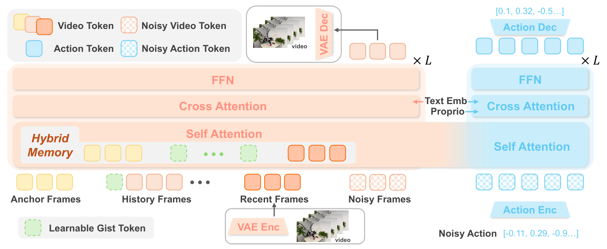
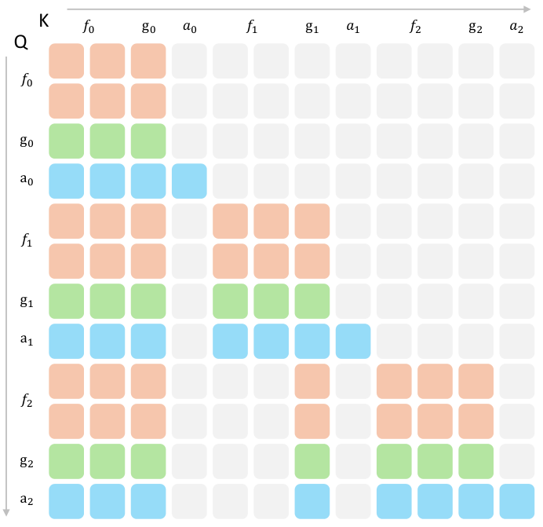
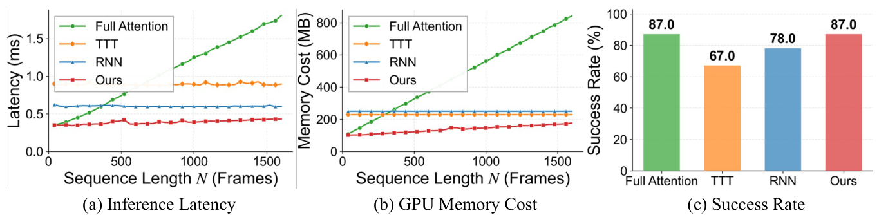

---
tags:
  - papers/world-model
  - papers/robotics
aliases:
  - MemoryWAM
  - Efficient World Action Modeling with Persistent Memory
date: 2026-06-18
arxiv_id: 2606.20562
---

# MemoryWAM: Efficient World Action Modeling with Persistent Memory

## 核心信息

- 标题: MemoryWAM: Efficient World Action Modeling with Persistent Memory
- 标题翻译: MemoryWAM：具有持久记忆的高效世界动作建模
- 作者: Sizhe Yang, Juncheng Mu, Tianming Wei, Chenhao Lu, Xiaofan Li, Linning Xu, Zhengrong Xue, Zhecheng Yuan, Dahua Lin, Jiangmiao Pang, Huazhe Xu
- 机构: 香港中文大学；清华大学；浙江大学
- 发表时间: 2026-06-18
- 发表渠道: arXiv:2606.20562v1
- arXiv: 2606.20562
- 论文链接: https://arxiv.org/abs/2606.20562
- 代码 / 项目: https://yangsizhe.github.io/MemoryWAM/ （论文仅给出项目页，未在正文声明代码已公开）
- 数据 / 资源: RMBench；RoboTwin；作者采集的 Shell Game 与 Look and Press 示范
- 论文类型: 世界动作模型方法论文 / 机器人持久记忆系统

## 原文摘要翻译

现实世界中的稳健机器人操作不仅需要理解当前观测，还需要记忆与动力学建模。世界动作模型通过在当前及历史观测条件下联合建模视觉前瞻和动作而具备这些能力，因此成为一种很有前景的机器人操作范式。然而，现有世界动作模型面临根本性的权衡：推理高效的方法通常只以有界的近期观测窗口为条件，因而难以应对非马尔可夫环境；保留长历史的方法则会产生随序列长度显著增长的时间与空间开销。为解决这一挑战，作者提出 MemoryWAM——一种具有高效持久记忆的世界动作模型。MemoryWAM 采用混合记忆设计，将近期帧、事件边界锚点帧以及概括长程历史的紧凑 gist tokens 结合起来。定制的注意力机制既能检索细致的短期上下文，也能检索压缩的长期上下文，从而以更低的推理延迟和 GPU 显存占用支持依赖记忆的决策。在仿真与现实世界的长时程、记忆依赖操作任务中，MemoryWAM 在保持良好计算效率的同时优于强大的视觉-语言-动作模型和世界动作模型基线。

## 创新点

1. **把世界动作模型的“记忆”明确拆成三种保真度。** 两个初始锚点帧保存完整事件边界信息，四个近期帧保存完整闭环细节，每个历史帧只永久保留八个 gist tokens。这不是给 FastWAM 简单增大窗口，而是在同一个视频侧 KV cache 中让不同时间位置以不同粒度存活（图 1、图 3，第 5 页；附录第 14 页）。
2. **用训练—推理一致的注意力可见性学习压缩记忆。** 训练序列交错放置干净/含噪视频 tokens 与动作块，并直接施加推理时相同的混合记忆掩码；因此 gist tokens 学到的不是离线摘要，而是供后续视频与动作查询访问的逐帧持久状态（第 6 页）。
3. **保留“视频预测用于训练动力学监督、推理只做动作”的高效 WAM 路线。** 当前观测潜变量只通过视频 DiT 一次以预填 KV cache，动作 DiT 再以 50 或 10 个 flow-matching 步生成动作块；闭环部署关闭视频生成（图 2；式 (2)–(3)；附录第 14 页）。
4. **不仅比较策略准确率，也比较记忆机制本身。** 单层效率曲线把 hybrid memory 与 full attention、TTT、RNN 对齐；Press Button 上 hybrid 与 full attention 同为 87%，但前者在 1,600 帧仍更省时省显存（图 4，第 7 页）。

## 一句话总结

MemoryWAM 的真正贡献是把每帧 120 个视觉 tokens 的全历史缓存改造成“初始帧完整保留 + 近期帧完整保留 + 每个旧帧永久保留 8 个 gist tokens”的分层 KV cache，并让动作专家直接读取这一缓存；它在 RMBench 上达到 83.0% 平均成功率，同时避免 LingBot-VA 式全历史推理的高延迟。

## 研究问题

现有高效 WAM（论文点名 FastWAM、Cosmos Policy 等）使用固定近期窗口，推理快但在关键信息已经遮挡或离开窗口时失忆；LingBot-VA、DreamZero 等保留全历史 KV cache，能完成非马尔可夫任务，却让缓存与注意力成本随轨迹增长。论文要回答两个相连的问题：

1. 是否可以在不保存全部视觉 tokens 的情况下维持真正跨长轨迹的状态？
2. 压缩后的长期状态是否既比固定窗口有效，又比全历史、RNN 或测试时训练更高效？

这里的“持久”不是常数内存：每个过去帧的 gist KV 都永不驱逐，所以历史相关部分仍按帧数线性增长，只是斜率从每帧 120 tokens 降为每帧 8 tokens，即理论压缩 15 倍（式 (5)–(6)，第 5 页）。

## 数据与任务定义

### RMBench 仿真协议

RMBench 包含九个双臂、记忆依赖任务。每个任务使用 50 条专家示范训练，按 100 次 rollout 报告成功率（第 7 页）。三路相机被拼成 $384\times320$ 马赛克，经 Wan2.2 VAE 与 patchification 后，每个视频帧得到 $L=120$ 个潜视觉 tokens；状态与动作都是 14 维双臂关节向量（第 6 页）。

需要特别注意两个协议例外（附录第 14 页）：Swap T 为公平对齐 LingBot-VA，MemoryWAM 的动作专家额外自回归接收动作历史；Observe and Pick Up 使用 RoboTwin 预训练。后者在双方都不预训练时是 5% 对 3%，而主表为 27% 对 13%。因此主表不是所有任务完全同质的“从零训练、无动作历史”比较。

### 现实任务

- **Shell Game:** 人随机交换杯子后，机器人需追踪被遮挡方块所在杯子；50 条示范。
- **Look and Press:** 先看两个 1–5 的数字，再按相应次数操作左右按钮，最后按后方按钮；100 条示范。

输入裁剪为 $256\times352$，模型部署在单块 RTX 4090 上。动作块内控制频率为 10 Hz，块间因推理有约 0.3 秒延迟（附录第 14–15 页）。

## 方法主线

### 机制流程

1. **初始化与观测编码。** episode 开始时，前 $N_{\mathrm{init}}=2$ 个干净视频帧以完整 KV 进入 anchor/sink cache；每次新观测先组成多相机马赛克，再由因果视频 VAE 编成视频潜变量 $z_t$（第 6 页；附录第 14 页）。
2. **一次视频侧写入。** 当前干净潜变量只通过视频 DiT 一次，生成当前帧完整视觉 KV 与 $M_v=8$ 个 gist-token KV，并预填到每个 Transformer 块的缓存：

$$
C_t^v=\Phi_v(z_t,l;C_{<t}).
$$

3. **更新与保留。** 最近 $N_{\mathrm{recent}}=4$ 个干净帧的完整 KV 留在滑动窗口；更老且非锚点的完整帧 KV 被驱逐；每个帧的八个 gist KV 永不驱逐。于是

$$
C_{\le t}^v=C_{\mathrm{short}}^v\cup C_{\mathrm{anchor}}^v\cup C_{\mathrm{gist}}^v.
$$

4. **读取并生成动作。** 动作 DiT 的含噪动作查询直接关注三部分视频缓存，经 flow matching 去噪得到长度 $h=16$ 的动作块。仿真用 50 步，现实用 10 步；执行后从子步 $\{3,7,11,15\}$ 采样四张马赛克，重编码为下一条件潜帧（式 (3)、式 (7)，附录第 14 页）。

### Gist token 如何形成持久状态

每个帧附加 $M$ 个可学习 gist tokens。帧 $f_t$ 的 gist tokens $g_t$ 同时关注本帧完整视觉 tokens 和历史上下文，因此其输出 KV 是在历史条件下形成的帧级压缩表征。某帧离开近期窗口后，后续视频和动作 tokens 不再直接访问 $f_i$，只访问 $g_i$；驱逐发生在完整帧 KV，而非 gist KV（图 3，第 5 页）。

这与固定大小 RNN 状态不同：MemoryWAM 不反复把全部历史覆盖进一个状态，而是每帧追加一小组只读式历史单元。好处是避免单状态持续覆写造成的信息冲突，代价是缓存仍随轨迹增长。

### 训练与推理的边界

| 阶段 | 视频分支 | 动作分支 | 记忆状态 |
|---|---|---|---|
| 训练 | 对视频 flow matching，提供密集动力学监督 | 对动作 flow matching | 使用与推理 KV cache 完全一致的混合注意力可见性 |
| 推理写入 | 当前干净观测只前向一次，不做视频去噪 | 尚未生成动作 | 新帧完整 KV 与 gist KV 被预填，旧完整帧按窗口驱逐 |
| 推理读取 | 不生成未来视频 | 50 步（仿真）或 10 步（现实）动作去噪 | 动作查询读取 anchor + recent + gist 三类 KV |

因此“推理不需要视频生成”不等于“推理不运行视频模型”：视频 DiT 仍需对每个新观测前向一次以更新缓存（图 2、式 (2)，第 4 页）。

### 复杂度与显存含义

全历史缓存为

$$
|C_{\mathrm{full}}^v|=O(NL),
$$

而 gist 部分为

$$
|C_{\mathrm{gist}}^v|=O(NM)=O\!\left(\frac{NL}{d}\right),\qquad d=L/M.
$$

本文 $L=120$、$M=8$、$d=15$。这证明的是**长期视频 token KV 部分的理论 15 倍压缩**，不是整个 6B 模型显存、端到端延迟或训练成本都降低 15 倍。anchor 与 recent 完整帧、模型权重、动作去噪以及 VAE/视频 DiT 前向仍然存在。

## 关键结果

### 主结果：分母与协议必须说清楚

| 模型 | RMBench 平均成功率（9 任务，100 rollouts/任务） | 记忆范式 |
|---|---:|---|
| $\pi_{0.5}$ | 10.4% | 当前/短窗口直接策略 |
| FastWAM | 5.9% | 有界近期窗口；训练时视频监督，推理不生成视频 |
| LingBot-VA | 78.2% | 全历史 KV cache |
| MemoryWAM | **83.0%** | anchor + recent + per-frame gist |

MemoryWAM 相比 LingBot-VA 提高 4.8 个百分点；相比 $\pi_{0.5}$ 与 FastWAM 分别高 72.6 和 77.1 个百分点（表 1，第 8 页）。后两项支持“非马尔可夫任务需要跨窗口历史”，但不能单独证明 gist 比所有其他长期记忆方案更优，因为这三类模型还存在架构、初始化与训练路线差异。

### 记忆机制受控比较

在单层测量中，full attention 的延迟和显存随序列长度快速上升；TTT/RNN 对长度近似常数，但引入额外参数和更新，所以短轨迹也较重；hybrid 在 1,600 帧仍低于二者（图 4a,b）。Press Button 成功率为 full attention 87%、TTT 67%、RNN 78%、hybrid 87%（图 4c）。

这组证据比跨模型主表更接近机制级因果链：相同任务中，hybrid 在保持 full-attention 成功率时改善效率。不过图中效率只测**单层、单次前向**，不是完整动作块端到端延迟；不能把曲线值直接解释为机器人系统吞吐。

### 现实世界结果

| Task（20 次） | $\pi_{0.5}$ | LingBot-VA | MemoryWAM |
|---|---:|---:|---:|
| Shell Game | 5/20 | 13/20 | **18/20** |
| Look and Press | 0/20 | 14/20 | **15/20** |

论文报告 LingBot-VA 的高延迟会在 Shell Game 中漏掉杯子交换（表 2 与第 8 页正文）。这是效率影响任务成功的具体模式，而不只是资源指标。但样本仅各 20 次，未给置信区间或显著性检验。

### 消融到底说明了什么

| 变体 | Cover Blocks | Press Button | 平均 |
|---|---:|---:|---:|
| w/o Anchor Frames | 58% | 90% | 74.0% |
| w/o Gist Tokens | 75% | 5% | 40.0% |
| w/o Sliding Window | 96% | 69% | 82.5% |
| Full Attention | 96% | 87% | 91.5% |
| Ours | **98%** | 87% | **92.5%** |

Press Button 对 gist 极敏感：去掉后从 87% 降到 5%；Cover Blocks 对 anchor 更敏感：去掉后从 98% 降到 58%（表 3，第 9 页）。这符合机制解释：任务对远期过程状态与初始场景线索的需求不同。Full Attention 平均低 1 个百分点不足以证明“压缩普遍提升检索”；只有两个任务，且差异可能来自有限 rollout 方差。更稳妥的结论是 hybrid 未因压缩明显牺牲性能，并在这些任务上略优。

## 深度分析

### 真正贡献是什么

MemoryWAM 不是新的基础视频生成器，也不是把语言推理接入机器人；它复用 Wan2.2-TI2V-5B、FastWAM 式训练时视频监督/推理时仅动作路线，以及 LingBot-VA 式动作 DiT 初始化。真正新增的是**视频侧时间缓存的数据结构与注意力路由**：完整 token 的保留由时间位置决定，压缩 token 则逐帧永久追加。

从 FastWAM 的论文内证据看，两者共同点是推理时避免视频去噪；差异在于 FastWAM 只看有界近期窗口，而 MemoryWAM 让更早历史通过 gist 持续存在。本文没有讨论 Light-WAM 或 ImageWAM，也没有给出与它们的实验。因此，若把 MemoryWAM 解释为“从未来图像生成转向状态压缩”的更广泛 WAM 趋势，这只能是跨论文研究者解释，不能当作本文实证结论。

### 为什么结果呈现这种模式

1. **短窗口基线在 RMBench 接近失效。** 任务刻意把关键信息放到当前观测之外，故 $\pi_{0.5}$ 与 FastWAM 的 10.4%/5.9% 主要反映 benchmark 与记忆范式的匹配，而不是一般机器人能力排名。
2. **gist 对 Press Button 极关键。** 任务需要保留跨多步操作的历史状态；只有 anchor 无法记录后续过程，recent 又覆盖不足，因此移除逐帧 gist 后跌至 5%。
3. **anchor 对 Cover Blocks 更关键。** 初始场景为后续遮挡或重排提供参照；完整初始视觉 tokens 比其八-token 压缩更可靠，移除 anchor 导致 40 点下降。
4. **full attention 未占优。** 论文归因为冗余历史干扰检索。现有证据只能说该解释与两任务结果一致；没有注意力分析、受控冗余注入或统计检验建立这一因果关系。

### 训练成本与推理成本不能混为一谈

论文明确宣称并测量的是推理记忆效率。训练仍需约 6B 参数、视频与动作两个 flow-matching 分支、8 块 GPU、每卡 batch size 1，并使用 FSDP 和逐块 activation checkpointing；但没有给训练时长、GPU 型号、总 GPU-hours，也没有与 FastWAM/LingBot-VA 对齐训练成本。因此“efficient”应限定为**长轨迹推理时缓存与注意力效率**，而不是整体训练更便宜。

### 复现关键设置

- 基座：Wan2.2-TI2V-5B；视频 DiT 30 层、hidden 3072、FFN 14336、24 heads；动作 DiT 30 层、hidden 1024、FFN 4096、约 1B。
- 动作块：$h=16$；帧步长 4，时间 VAE stride 4。
- 记忆：$N_{\mathrm{init}}=2$，$N_{\mathrm{recent}}=4$，$M_v=8$，每帧 $L=120$。
- 噪声：视频/动作均 1000 训练步；shifted logit-normal shift 分别 5.0/1.0。
- 优化：AdamW，学习率 $2\times10^{-4}$，weight decay 0.01，$\beta=(0.9,0.95)$；8 GPU，每卡 batch 1；视频/动作损失权重均 1。
- 稳定化：每个干净条件潜变量以 $[0,1]$ 随机比例混入高斯噪声，视频侧概率 1.0；bfloat16、FSDP、每块 activation checkpointing、gradient clipping 1.0。
- 部署：闭环不生成视频；仿真 50 个动作去噪步，现实 10 步；现实单 RTX 4090。

## 局限

1. **状态依赖 episode 边界。** anchor 被定义为任务开始的前两帧；如何自动检测真实连续流中的事件边界、何时清空缓存、跨任务污染如何处理，论文没有解决。
2. **持久但不定长。** 每个过去帧的 8 个 gist KV 永不驱逐，故空间仍为 $O(N/d)$ 而非常数。1,600 帧以外、更长部署中的显存上限与遗忘策略没有实验。
3. **压缩内容不可解释。** 没有可视化 gist 保存了什么，也没有在对象身份、计数、接触状态等信息维度上测保真度。
4. **equal-backbone 控制不完整。** 图 4 是单层记忆模块受控比较，但表 1 的 $\pi_{0.5}$、FastWAM、LingBot-VA 与 MemoryWAM 不是完全相同 backbone/training recipe；主结果不能完全归因于记忆结构。
5. **协议混杂。** Swap T 使用动作历史，Observe and Pick Up 使用 RoboTwin 预训练；这些任务的主表结果不能与其余任务视为完全同一协议。
6. **统计与规模有限。** 仿真按 100 rollout 给点估计，现实每任务 20 次；没有方差、置信区间或显著性检验。Full Attention 与 Ours 的 91.5%/92.5% 尤其不能过度解读。
7. **语义推理仍弱。** 作者自己承认继承视频扩散模型的语义理解和推理限制（第 9 页）。
8. **可获得性不充分。** PDF 给出项目页，但正文没有代码许可、release commit、训练 checkpoint 或完整效率测量环境；当前只能把“有项目页”与“代码已公开”分开记录。

## 我的笔记

- 这个设计更像“append-only compressed episodic cache”，而不是传统固定状态 recurrent memory。后续值得测试的不是只调 $M$，而是给 gist 加基于任务/置信度的选择性保留与合并，使长期部分从 $O(N/d)$ 进一步接近有界预算。
- 最关键的补实验是统一 backbone、统一训练数据，对 sliding-window、full KV、hybrid 做端到端动作块延迟/峰值显存/成功率三维曲线，并在多个轨迹长度上报告；当前图 4 的单层指标和表 1 的跨模型结果尚未完全接上。
- 自动 reset/event segmentation 是部署时的隐含前提。若 episode 边界错误，所谓 anchor 可能保存的是无关场景；这是从 benchmark episode 到开放世界连续运行的核心落差。
- 可以把 gist 的信息保真度做成诊断任务：从历史 gist 解码对象身份、位置、计数和已完成子目标，并比较随时间的遗忘曲线。这会把“gist 有效”从成功率消融推进到可解释机制证据。

## 引用

- Yang, S. et al. *MemoryWAM: Efficient World Action Modeling with Persistent Memory*. arXiv:2606.20562v1 (2026).
- 本笔记证据入口：[完整双语 reader](WorldModel/MemoryWAM%20Efficient%20World%20Action%20Modeling%20with%20Persistent%20Memory/detailed_paper.md)；[source map](WorldModel/MemoryWAM%20Efficient%20World%20Action%20Modeling%20with%20Persistent%20Memory/source_map.json)。
