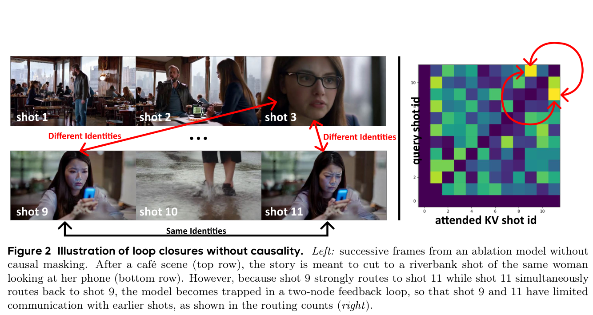
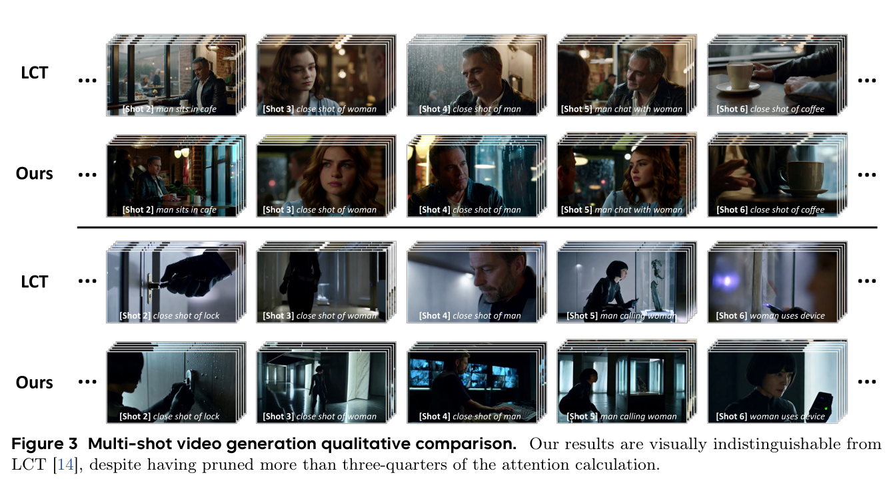
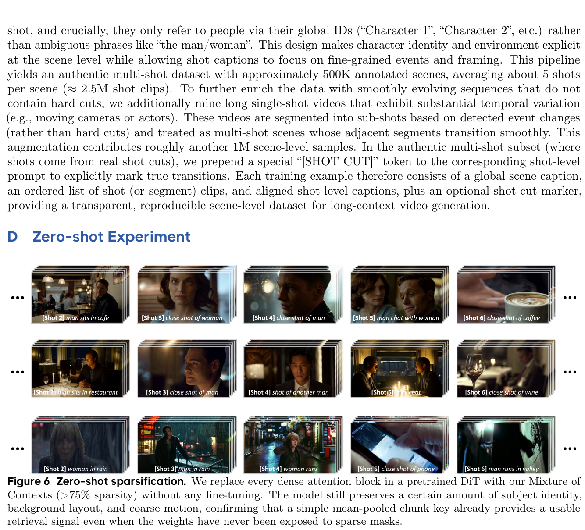
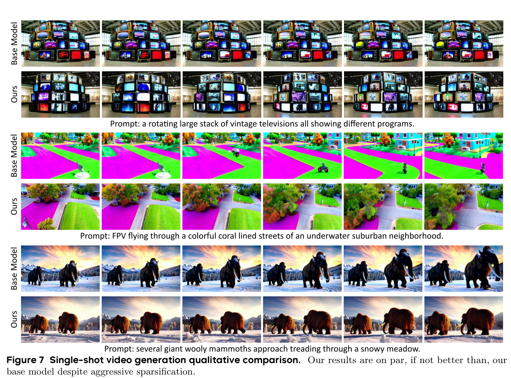
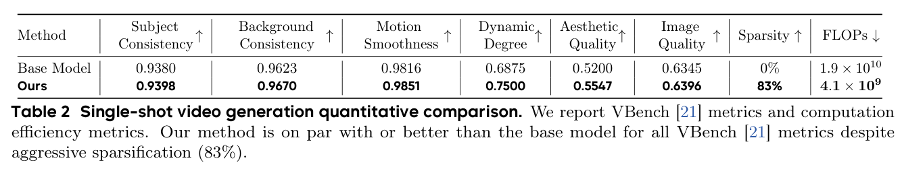
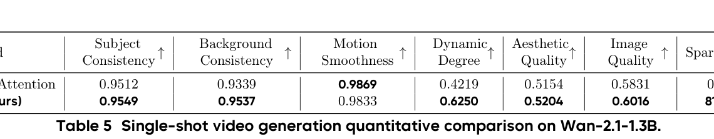

# Mixture of Contexts for Long Video Generation

**Authors:** Shengqu Cai$^{1,*}$, Ceyuan Yang$^{2,\dagger}$, Lvmin Zhang$^1$, Yuwei Guo$^4$, Junfei Xiao$^3$, Ziyan Yang$^2$, Yinghao Xu$^1$, Zhenheng Yang$^5$, Alan Yuille$^3$, Leonidas Guibas$^1$, Maneesh Agrawala$^1$, Lu Jiang$^2$, Gordon Wetzstein$^1$  
**Affiliations:** $^1$Stanford University, $^2$ByteDance Seed, $^3$Johns Hopkins University, $^4$CUHK, $^5$ByteDance  
**Notes:** $^*$Work done at ByteDance Seed, $^\dagger$Corresponding authors  
**Date:** December 10, 2025  
**arXiv:** 2508.21058v3 [cs.GR] 9 Dec 2025  
**Project Page:** [primecai.github.io/moc](https://primecai.github.io/moc/)  
**Source:** `/Users/roywangj/journey_wj/research/papers4zotero/zotero1/storage/7SWAYAM9/Cai 等 - 2025 - Mixture of Contexts for Long Video Generation.pdf`  
**Detected source format:** selectable-text PDF (`pdf-text`, 20 pages)  
**Reader type:** full-paper Chinese-English bilingual detailed reader with figure/table assets and searchable tables.

## Page / Section Index

| PDF Pages | Section | Content Summary |
|---|---|---|
| 1 | Abstract; 1 Introduction | 提出将长视频生成重构为内部信息检索任务，引入自适应上下文混合（MoC）机制 |
| 2–3 | 1 Introduction (cont.); 2 Related Work | 梳理长视频生成、视频稀疏注意力以及视觉生成上下文学习三大领域研究脉络 |
| 3–5 | 3 Method; 3.1 Mixture of Contexts | 阐述 MoC 核心架构、均值池化 key 机制、top-$k$ 动态路由、上下文丢弃与注入正则化及分头分布式路由 |
| 6–7 | 3.2 Attention Chunking and Routing; 3.3 Computation Efficiency | 详述内容对齐分块、跨模态注意汇（Attention Sink）、镜头内局部窗口、因果路由掩码及 Flash-Attention 算子优化与 FLOPs 复杂度推导 |
| 8–10 | 4 Experiments; 5 Conclusion; Limitation and Future Work | 8 镜头 64 秒多镜头长视频定量/定性实验、VBench 评测、一致性分析、方法局限性与硬件软硬件协同优化展望 |
| 11–14 | References | 完整 65 篇可检索中英文参考文献目录 |
| 15 | Appendix A–C; Figure 5 | 显存复杂度严格理论分析（Appendix A）、实现基准性能分析（Appendix B）、50 万场景多镜头数据集构建细节（Appendix C） |
| 16 | Appendix C (cont.), D, E; Figure 6 | 零样本稀疏化机制分析（Appendix D）、单镜头短视频生成验证（Appendix E） |
| 17 | Appendix E (cont.), F; Figure 7; Table 2 | 单镜头短视频定量/定性对比与计算效率分析、训练超参数与渐进式分块调度细节（Appendix F） |
| 18 | Appendix F (cont.), G; Table 3, Table 4 | 块大小与 top-$k$ 消融实验（Table 3）、强制连接与 Drop In/Out 正则化消融实验（Table 4） |
| 19 | Appendix H, I, J; Table 5 | Wan-2.1-1.3B 开源主干泛化实验（Table 5）、外循环上下文路由分层架构（Appendix I）、社会影响与安全考量（Appendix J） |
| 20 | Appendix J (cont.), K | 大语言模型（LLMs）辅助写作说明 |

## Terminology Ledger

| English Term | 中文统一译法 | Note / Context |
|---|---|---|
| Mixture of Contexts (MoC) | 上下文混合（MoC） | 本文提出的可学习稀疏注意力动态路由框架与机制 |
| Diffusion Transformers (DiT) | 扩散 Transformer（DiT） | 现代视频生成模型的基础架构范式 |
| Multimodal Diffusion Transformers (MMDiT) | 多模态扩散 Transformer（MMDiT） | 支持文本和视觉多模态序列交织的扩散模型架构 |
| Long-Context Tuning (LCT) | 长上下文微调（LCT） | 本文的主要密集基线架构（Guo et al., 2025），支持 8 镜头场景长视频 |
| sparse attention routing | 稀疏注意力路由 | 将 query 动态路由至高相关性 token 块的稀疏选择机制 |
| long-term memory retrieval engine | 长期记忆检索引擎 | 将生成模型长程一致性视为内部检索问题的核心定位 |
| content-aligned chunks | 内容对齐块（content-aligned chunks） | 沿帧、镜头、文本自然边界划分的变长 token 集合 |
| mean-pooled key / descriptor | 均值池化键 / 描述符 | 对块内所有 token 的 key 求算术平均，作为其代表性语义向量 |
| top-k selection | top-$k$ 选择 | 每个 query 在候选块池中选择相关性内积最大的前 $k$ 个块 |
| causal routing / causal mask | 因果路由 / 因果掩码 | 仅允许 query 检索序列前向块，消除无向图中的闭环回路 |
| loop closure / self-loop | 回路闭合 / 自反馈闭环 | 两个或多个块相互指向构成的孤立反馈回路，导致画面卡顿或重复 |
| attention sink | 注意力汇聚（Attention Sink） | 强制所有 query 关注的极少数关键 token（如提示词文本），提供低熵语义锚点 |
| forced links / mandatory anchors | 强制连接 / 强制锚点 | 预先指定的硬连接（跨模态文本连接与镜头内局部窗口） |
| intra-shot local window | 镜头内局部窗口 | 同一镜头内的 token 强制执行自注意力，保障局部几何与运动连续性 |
| cross-modal link | 跨模态连接 | 视觉 query 强制连接至全局与局部文本 prompt 的硬性连接 |
| context drop-off | 上下文丢弃（Context Drop-off） | 随机屏蔽选中的部分 top-$k$ 块，防止模型过度依赖特定路由路径 |
| context drop-in | 上下文注入（Context Drop-in） | 随机将未选中的块注入候选池，激活未充分利用的块并促进全图梯度流动 |
| per-head distributed routing | 分头分布式路由 | 每个注意力头独立选择不同的 top-$k$ 块，形成子空间集成覆盖 |
| outer loop context routing | 外循环上下文路由 | 在进入密集/细粒度注意力之前对长序列进行粗粒度镜头级筛选的外循环机制 |
| zero-shot context sparsification | 零样本上下文稀疏化 | 在不重新训练或微调权重的前提下直接将 MoC 插入密集 DiT |
| VBench | 视频生成基准评测套件（VBench） | 包含主体一致性、背景一致性、运动平滑度等 16 项指标的标准化基准 |
| Subject Consistency | 主体一致性 | 视频中主角外观特征在跨镜头/长时序下的一致保持程度 |
| Background Consistency | 背景一致性 | 场景背景与地标几何结构在跨镜头切换中的稳定性 |
| Motion Smoothness | 动作平滑度 | 视频运动过程的连贯流畅程度，无抖动或突变 |
| Dynamic Degree | 动态程度 | 视频内物体与场景的真实运动幅度（鼓励动态而非静止帧） |
| Aesthetic Quality | 美学质量 | 视频各帧在构图、色彩与光影方面的艺术视觉表现 |
| Image Quality | 图像质量 | 视频单帧的清晰度、细节分辨率与伪影抑制程度 |
| Flash-Attention var-len | Flash-Attention 可变长内核 | 针对不等长序列打包计算的高性能 GPU 注意力实现 |
| segment_reduce | 段规约（segment_reduce） | PyTorch 中在 GPU 上按段动态求均值的操作，避免在显存中实例化中间大张量 |

## Abstract

> <strong>Para. 1:</strong> Long-context video generation is fundamentally a memory problem: models must retain and retrieve salient events across long range without collapsing or drifting. However, scaling diffusion transformers (DiTs) to generate long-context videos is fundamentally limited by the quadratic cost of self-attention, which makes memory and computation intractable and difficult to optimize for long sequences. We recast long-context video generation as an internal information retrieval task and propose a simple, learnable sparse attention routing module, Mixture of Contexts (MoC), as an effective long-term memory retrieval engine. In MoC, each query dynamically selects a few informative chunks plus mandatory anchors (caption, local windows) to attend to, with causal routing that prevents loop closures. As we scale the data and gradually sparsify the routing, the model allocates compute to salient history, preserving identities, actions, and scenes over minutes of content. Efficiency follows as a byproduct of retrieval (near-linear scaling), which enables practical training and synthesis, and the emergence of memory and consistency at the scale of minutes.

> <strong>Para. 1[CN]:</strong> 长上下文视频生成本质上是一个记忆问题：模型必须在极长的时间跨度内保持并检索显著事件，同时避免内容崩溃或语义漂移。然而，将扩散 Transformer（DiT）扩展到长上下文视频生成受到自注意力二次方计算复杂度的根本限制，这使得针对长序列的显存占用和计算开销变得难以承受且难以优化。我们将长上下文视频生成重构为模型内部的信息检索任务，并提出了一种简洁且可学习的稀疏注意力路由模块——上下文混合（Mixture of Contexts，MoC），作为高效的长期记忆检索引擎。在 MoC 中，每个查询（query）动态选择少数高信息量的上下文块以及强制锚点（文本描述、局部窗口）进行交互，并通过因果路由防止自反馈闭环（loop closures）。随着训练数据的扩展与路由稀疏度的逐步提升，模型能够将计算资源精准分配给历史中的关键事件，在长达数分钟的内容中始终保持人物身份、动作以及场景的一致性。计算效率则是这一检索机制的自然副产物（呈现近线性扩展），它不仅使分钟级长视频的实际训练与合成成为可能，还促进了分钟级长期记忆与连贯性的涌现。

## 1 Introduction

> <strong>Para. 1:</strong> Video generation has emerged as a central problem in generative modeling, powering content creation, simulation for autonomous systems, and interactive storytelling. Recent Transformer-based diffusion models can synthesize increasingly realistic clips by modeling complex space–time dependencies; yet, pushing them to minute- or hour-long horizons exposes a deeper challenge: long-term memory. Models must retain and retrieve salient events across extended timelines without drift, collapse, or loss of identity. Dense self-attention becomes computationally prohibitive as sequences grow, and moreover, the core difficulty is not merely computational, but learning to selectively recall the right context at the right time.

> <strong>Para. 1[CN]:</strong> 视频生成已成为生成建模领域的核心课题，支撑着内容创作、自动驾驶仿真以及交互式叙事等众多前沿应用。近期基于 Transformer 的扩散模型通过建模复杂的空时依赖关系，能够合成日益逼真的视频片段；然而，将生成时长推进至数分钟乃至数小时量级时，面临着更为深层的核心挑战：长期记忆。模型必须在延展的时间线上留存并准确检索显著事件，而不发生画面漂移、内容崩溃或人物身份丢失。随着序列长度急剧膨胀，密集自注意力机制在计算上变得不可承受；更关键的是，核心难点并不仅仅在于算力瓶颈，更在于如何学会“在恰当的时机选择性召回正确的上下文”。

> <strong>Para. 2:</strong> A salient characteristic of video data is its high degree of temporal redundancy: consecutive frames frequently exhibit much pixel similarity or only minor motion, resulting in substantial repetition of information across the sequence. Therefore, prior efforts reduce cost either by compressing history into compact representations (e.g., keyframes [16, 45], frame packs [60], and latent states [7, 30]), or by imposing fixed sparse or selective patterns that thin interactions across the sequence [26, 41, 46, 53, 59]. These strategies lengthen the feasible horizon but hard-code a compromise between efficiency and fidelity: compressed summaries lose detail, and static sparsity or selection cannot adapt to which past events matter at each step, thereby limiting the preservation of long-range dependencies and narrative coherence.

> <strong>Para. 2[CN]:</strong> 视频数据的一个显著特征在于其高度的时间冗余性：连续帧之间往往展现出极高的像素相似度或仅伴随微小运动，导致整个序列中存在大量的信息重复。因此，以往的研究通常采用两类策略来削减计算开销：要么将历史信息压缩为紧凑表征（例如关键帧 [16, 45]、帧包打包 [60] 以及隐状态 [7, 30]），要么引入预设的固定稀疏或选择性注意力模式以稀疏化序列交互 [26, 41, 46, 53, 59]。这些策略虽然在一定程度上延长了可生成的视频时间跨度，但都在效率与保真度之间硬性设定了妥协：高度压缩的摘要必然丢失精细细节，而静态的稀疏或选择机制又无法根据生成步骤动态判断哪些历史事件至关重要，从而制约了长程依赖关系的保持与叙事连贯性。

> <strong>Para. 3:</strong> In this work, we reformulate long-context video generation as an internal information retrieval process, where each token dynamically accesses only the most relevant context through learnable sparse attention routing. To realize this, we propose an adaptive Mixture of Contexts (MoC) framework that learns to route each query to the most relevant segments of the video sequence, instead of relying on uniform or static sparse attention or a fixed selection strategy. Specifically, MoC partitions the multi-modal token stream into content-aligned chunks along frames, shots, and captions, then lets each query select only a few relevant chunks via a parameter-free yet trainable top-k router. Two mandatory anchors: cross-modal links to all text tokens and intra-shot local window links are activated to stabilize local fidelity while reserving routing capacity for genuinely long-range recall. A causal routing mask is additionally applied to prevent pathological loop closures by enforcing a directed acyclic interaction graph, improving roll-out robustness over minute-scale sequences. For efficient implementation, the selected key tokens are directly processed by the flash-attention kernel, which supports variable sequence lengths and high throughput. During training, we progressively adjust the granularity of chunks and the selectivity of the routing mechanism, resulting in a gradual sparsification that encourages the model to focus on the most informative context as training progresses.

> <strong>Para. 3[CN]:</strong> 在本研究中，我们将长上下文视频生成重构为一个内部信息检索过程，使得每个 token 能够通过可学习的稀疏注意力路由，动态地仅访问最相关的上下文。为此，我们提出了自适应上下文混合（Mixture of Contexts，MoC）框架，该框架能够学习将每个查询路由到视频序列中最相关的片段，而非依赖均匀或静态的稀疏注意力或固定的选择策略。具体而言，MoC 顺应帧、镜头以及文本描述等自然语义边界，将多模态 token 流切分为内容对齐的块（content-aligned chunks），随后利用无额外参数但可端到端训练的 top-$k$ 路由器，使每个查询仅选择少数相关块。同时引入两个强制锚点：连接所有文本 token 的跨模态连接，以及镜头内局部窗口连接，在稳固局部保真度的同时，为真正的长程历史召回预留路由容量。此外，引入因果路由掩码以构建有向无环交互图，防止病态闭环反馈回路（loop closures），大幅提升了分钟级序列逐步生成的鲁棒性。在工程实现上，筛选出的键 token 直接输入支持可变序列长度的 Flash-Attention 高性能内核，实现极高的吞吐率。在训练过程中，我们循序渐进地调整块粒度与路由选择度，实现渐进式稀疏化，引导模型在训练深入过程中自适应聚焦于信息量最高的上下文。

> <strong>Para. 4:</strong> We show that replacing dense self-attention with our Adaptive Mixture of Contexts (MoC) reframes long-video generation as internal in-context retrieval. A learned sparse context routing policy allocates compute to salient history and sustains cross-shot identities, actions, and layouts over minutes-long sequences, without modifying the diffusion backbone or its training recipe. Efficiency follows as an enabler, as MoC prunes over 85% of token pairs and reduces the attention FLOPs budget by up to 7×, yielding a measured 2.2× end-to-end generation speedup on minute-scale scenes (≈180k tokens). In short, our MoC is the first work that demonstrates learned sparse context routing could overcome the practical barriers of quadratic attention, and effectively deliver minutes-level long-context video memory at near short-video cost, while maintaining and often surpassing the fidelity and consistency of dense baselines.

> <strong>Para. 4[CN]:</strong> 我们证明，用自适应上下文混合（MoC）替代密集自注意力机制，能够将长视频生成成功重塑为内部的上下文检索过程。学习得到的稀疏上下文路由策略将算力集中分配给显著的历史上下文，在长达数分钟的序列中持续保持跨镜头的人物身份、连贯动作与空间布局，且完全无需改动扩散主干架构或其核心训练流程。更重要的是，高计算效率成为推动长视频生成的关键赋能因素：MoC 剪枝了超过 85% 的 token 交互对，将注意力计算的 FLOPs 预算降低高达 7 倍以上，在分钟级场景（约 18 万 token）上实现了实测 2.2 倍的端到端生成加速。简而言之，MoC 是首个证明“可学习的稀疏上下文路由能够打破自注意力二次方计算瓶颈”的工作，在接近短视频生成成本的条件下，有效提供了分钟级的长上下文视频记忆能力，同时保持甚至超越了密集注意力基线的保真度与一致性。

## 2 Related Work

> <strong>Para. 1:</strong> The prohibitive $O(L^2)$ computational cost of standard self-attention mechanisms in Transformer architectures [29, 37] becomes the primary obstacle when applied to the vast sequence lengths involved, and the difficulty of maintaining coherence and preventing visual degradation over long time horizons. Our work builds upon prior efforts in efficient sequence modeling and long-video generation frameworks.

> <strong>Para. 1[CN]:</strong> 在 Transformer 架构 [29, 37] 中，标准自注意力机制高昂的 $O(L^2)$ 计算开销，是将其应用于超长序列时的首要障碍；同时，在长时序范围内维持画面连贯性并防止视觉质量退化亦极具挑战。本研究建立在高效序列建模以及长视频生成框架的诸多前沿探索之上。

> <strong>Para. 2:</strong> **Long Video Generation.** Existing video generation models [1, 5, 6, 12, 13, 15, 17, 23, 36, 50, 56] are mostly limited to a few seconds. To push beyond this short horizon, TECO [48] introduces temporally consistent transformers with a recurrent state to propagate information over long sequences, and NUWA-XL [51] adopts a diffusion-over-diffusion hierarchy that generates extremely long videos by first synthesizing sparse keyframes and then recursively filling in between. Several recent frameworks specifically target longer video generation using autoregressive models that operate on frames, chunks, or segments, such as MALT [54] and CausVid [52]. While these frameworks extend generation capabilities, they often grapple with error accumulation [38] inherent in sequential prediction or face uncertain computational scaling to longer durations. To mitigate these issues, RollingDiffusion [31] and Diffusion Forcing [3] inject controlled noise into the historical context and train the model to denoise it, increasing robustness to compounding errors. MAGI-1 [32] and SkyReels-V2 [4] scale up these ideas by employing autoregressive denoising, aiming for potentially longer durations. An orthogonal strategy is to distill the entire past into a constant-size latent. TTTVideo [7] and LaCT [63] use a learnable MLP to encode the context during inference, while FramePack [60] encodes arbitrarily many frames into a fixed vector for next-frame prediction. FramePack [60] also proposes early planning of future frames to mitigate the error accumulation issue. This is similar to using keyframes or anchor frames [16, 19, 27, 39, 45, 47, 49, 65], where certain frames are predefined and the video generation model only does an interpolation sampling job. These methods extend video generation to the one-minute range but still face a hard ceiling on maintaining long-context coherence going forward, as they rely on lossy compression of the contexts. The work most closely related to ours is Long-Context Tuning [14] (LCT), which starts from a single-shot DiT and expands its context window to a scene comprising up to eight shots (≈8s, ∼$2.3 \times 10^4$ tokens each). LCT [14] keeps the attention mechanism dense: all text and video tokens inside the enlarged window attend to one another after being positioned with an interleaved 3D RoPE. While this design elegantly re-uses the pretrained weights and yields impressive multi-shot coherence, it inherits the quadratic cost of full self-attention – FLOPs and memory scale with $(8L_{\text{shot}})^2$.

> <strong>Para. 2[CN]:</strong> **长视频生成（Long Video Generation）。** 现有的视频生成模型 [1, 5, 6, 12, 13, 15, 17, 23, 36, 50, 56] 大多仅局限于数秒长度。为了突破这一极短时域限制，TECO [48] 引入了具有循环状态的时序连贯 Transformer，以在长序列上传播信息；NUWA-XL [51] 则采用“扩散套扩散”的分层架构，先合成稀疏关键帧，再递归插值填充生成超长视频。若干近期框架专门针对更长视频生成，采用作用于帧、块或片段的自回归模型，例如 MALT [54] 和 CausVid [52]。尽管这些框架扩展了生成时长，但往往难以克服顺序预测中固有的误差累积问题 [38]，或在扩展到更长时长时面临不确定的算力开销。为了缓解这些缺陷，RollingDiffusion [31] 与 Diffusion Forcing [3] 在历史上下文中注入可控噪声并训练模型对其去噪，从而增强了对复合误差的鲁棒性。MAGI-1 [32] 与 SkyReels-V2 [4] 则通过大规模自回归去噪进一步扩展这一思路，旨在支持潜在更长的生成时长。另一种正交的策略是将全部历史上下文蒸馏为固定维度的隐向量：TTTVideo [7] 与 LaCT [63] 在推理阶段使用可学习的 MLP 对上下文进行编码，而 FramePack [60] 将任意多帧编码为固定向量以执行下一帧预测，并提出未来帧的提前规划以抑制误差累积。这与利用关键帧或锚点帧的方法类似 [16, 19, 27, 39, 45, 47, 49, 65]，即预设特定帧，模型仅承担插值采样任务。这些方法将视频生成扩展到了 1 分钟量级，但由于依赖于对上下文的有损压缩，在进一步保持长上下文连贯性方面依然面临难以逾越的瓶颈。与本工作联系最紧密的是长上下文微调（Long-Context Tuning，LCT [14]），该方法从单镜头 DiT 出发，将其上下文窗口扩展为包含多达 8 个镜头的场景（每个镜头约 8 秒，包含约 $2.3 \times 10^4$ 个 token）。LCT [14] 保持了密集注意力机制：在利用交织三维旋转移位编码（3D RoPE）定位后，扩大窗口内的所有文本和视频 token 均相互进行全注意力交互。这种设计虽然巧妙地复用了预训练权重并实现了令人瞩目的多镜头一致性，但它完全继承了全自注意力的二次方代价——FLOPs 和显存开销均随 $(8L_{\text{shot}})^2$ 呈二次方增长。

> <strong>Para. 3:</strong> **Sparse Attention for Video Generation.** Sparse attention leverages the observation that attention matrices are often sparse (many scores are near zero) and computes attention only for a subset of important token pairs, a natural fit for video generation given spatiotemporal redundancy. Training-free pruners include SparseVideoGen [41], which profiles heads that dynamically specialize into spatial vs. temporal and selects a per-head pattern, and STA [62], which exploits localized 3D windows by operating tile-by-tile over FlashAttention-friendly blocks [8, 9]. Universal filters such as SpargeAttn/SageAttention [57–59] combine selective token compression with a softmax-aware pass to skip parts of $QK^\top / PV$, and AdaSpa [42] proposes a “blockified” dynamic pattern with Fused LSE-Cached Search that reuses sparse indices across denoising steps. Jenga [64] uses training-free block-wise attention carving plus progressive resolution. Beyond these post-hoc pruners, recent trainable or structured designs include VMoBA [40], which learns a mixture-of-block scheme with layer-wise partitions and global/thresholded block selection for VDMs. VSA [61] proposes a hardware-efficient coarse-to-fine sparse kernel that replaces full attention at both training and inference. Radial Attention [26] instead, uses a static $O(n \log n)$ mask derived from spatiotemporal energy-decay that enables longer generations with near-dense quality. While these advances substantially reduce costs and accelerate video generation, most methods either prune emergent dense maps or impose fixed sparsity priors, focusing on accelerating the generation of short videos. By contrast, our Mixture of Contexts learns deliberate, end-to-end routing of context sources and focuses on long context memory/consistency, with acceleration as a byproduct of sparsity.

> <strong>Para. 3[CN]:</strong> **视频生成稀疏注意力（Sparse Attention for Video Generation）。** 稀疏注意力机制利用了注意力矩阵通常高度稀疏（许多注意力分数趋近于零）的客观规律，仅对重要 token 对的子集计算注意力，鉴于视频数据的空时冗余性，这一机制天然适用于视频生成。免训练的剪枝方法包括 SparseVideoGen [41]，它通过分析注意力头在空间与时间上的动态分工来匹配分头模式；以及 STA [62]，它通过在适合 FlashAttention 的块上逐图块操作以利用局部 3D 窗口 [8, 9]。通用型注意力过滤器如 SpargeAttn/SageAttention [57–59] 将选择性 token 压缩与感知 softmax 的过滤过程结合，直接跳过 $QK^\top / PV$ 的部分计算；AdaSpa [42] 则提出了基于块状动态模式与融合 LSE 缓存搜索的技术，在扩散去噪步间复用稀疏索引；Jenga [64] 采用免训练的分块注意力雕刻与渐进式分辨率方案。除这些事后剪枝方法外，近期的可训练或结构化设计包括 VMoBA [40]，该方法为视频扩散模型学习了一种具有分层划分与全局/阈值化块选择的分块注意力混合方案；VSA [61] 提出了硬件友好的由粗到细稀疏内核，在训练与推理阶段全面替代全注意力；Radial Attention [26] 则利用基于空时能量衰减的静态 $O(n \log n)$ 掩码，在接近密集质量的同时实现了更长视频生成。尽管这些进展大幅降低了计算成本并加速了视频生成，但绝大多数方法要么是对涌现的密集注意力图进行局部剪枝，要么是施加静态固定的稀疏先验，且主要聚焦于短视频生成的加速。相比之下，我们的上下文混合（MoC）在训练中端到端学习对上下文源的主动路由，核心聚焦于长上下文的长期记忆与一致性，而推理加速只是稀疏化带来的自然副产物。

> <strong>Para. 4:</strong> **Context Learning in Visual Generation.** A complementary line of work treats context—past frames, states, or reference images—as a first-class signal for learning and control. For video world models, where action and camera position signals are available, WORLDMEM [46] augments simulators with an external memory bank of frames and states and retrieves relevant entries via Field-of-View (FoV) overlapping to preserve long-term scene consistency. A similar work, Context-as-Memory [53], targets interactive long videos, explicitly retrieving a small set of historical frames as conditions for each step to sustain scene consistency, also via FoV overlapping to select the relevant frames. Concurrently, VMem [25] uses a surfel-indexed, occlusion-aware memory to retrieve relevant views and maintain consistency under re-visits. Back to the image space, IC-LoRA [20] demonstrates that DiTs already exhibit in-context abilities and proposes concatenating reference images with lightweight task-specific LoRA [18] to adapt across tasks with few samples. DSD [2] turns in-context generation into paired supervision via self-distillation: curate image grids with a VLM, then fine-tune a text+image-to-image model. Omini-Control [35] offers a parameter-efficient, unified framework for image-conditioned control in DiTs, enabling broad conditioned tasks without auxiliary modules. Recent open-sourced models, such as FLUX-Context [24], concatenate text and images to unify in-context image generation and editing, with improved consistency. These works demonstrate that, given a sufficiently large training scale, routing and in-context learning are very powerful in extracting useful information from contexts. Our Mixture of Contexts follows this routine, and proposes to learn to route among multiple context sources end-to-end, enabling deliberate selection and composition of contextual signals rather than relying solely on fixed retrieval or a single conditioning pathway.

> <strong>Para. 4[CN]:</strong> **视觉生成中的上下文学习（Context Learning in Visual Generation）。** 另一条互补的研究路线将上下文——历史帧、状态或参考图像——视为用于学习与可控生成的一等信号。在具备动作与相机位姿信号的视频世界模型中，WORLDMEM [46] 通过引入包含历史帧与状态的外部记忆库来增强模拟器，并借助视场（Field-of-View，FoV）重叠检索相关记录以维持长期场景一致性；类似的工作 Context-as-Memory [53] 面向交互式长视频，在每个时间步显式检索极少量的历史帧作为条件输入，同样通过 FoV 重叠度筛选相关帧以维系场景连贯；与此同时，VMem [25] 采用面元索引（surfel-indexed）且感知遮挡的记忆模块来检索相关视角，保证了视角重访时的一致性。回到图像生成领域，IC-LoRA [20] 证明 DiT 本身已具备上下文学习能力，提出将参考图像与轻量级任务特定 LoRA [18] 拼接以进行少样本跨任务迁移；DSD [2] 通过自蒸馏将上下文生成转化为成对监督数据：先利用 VLM 整理图像网格，再微调图文到图像模型；Omini-Control [35] 为 DiT 提供了参数高效且统一的图像条件控制框架，无需外挂模块即可支持广泛的条件任务；近期开源模型（如 FLUX-Context [24]）通过拼接文本与图像，统一了上下文图像生成与编辑，显著提升了一致性。这些研究充分表明：只要训练规模足够大，路由与上下文学习在从复杂上下文中提取有效信息方面具有巨大潜力。我们的上下文混合（MoC）沿袭了这一技术路线，提出端到端学习在多重上下文源之间进行动态路由，从而实现对上下文信号的主动选择与有机组合，而非单纯依赖固定的检索策略或单一的条件通路。

## 3 Method

> <strong>Para. 1:</strong> To generate long videos without incurring the quadratic cost of standard self-attention, our method replaces the DiT [29] backbone’s dense attention with an adaptive, content-aligned Mixture of Contexts (MoC) layer. At a high level, MoC (i) routes each query only to the most relevant chunks of context, (ii) aligns those chunks with natural video boundaries such as frames, shots, and caption tokens, and (iii) enforces causality so information flows strictly forward in time. The following subsections detail the routing formulation (Sec. 3.1), chunking and selection strategy for the interleave text-to-video generation (Sec. 3.2), computation efficiency (Sec. 3.3). The overall pipeline of our method is shown in Fig. 1.

> <strong>Para. 1[CN]:</strong> 为了在不承担标准自注意力二次方计算开销的前提下生成长视频，我们的方法将 DiT [29] 主干网络中的密集注意力层替换为自适应且内容对齐的上下文混合（MoC）层。从高层架构来看，MoC 具有三大核心特性：(i) 将每个查询（query）仅路由到最相关的上下文块；(ii) 使这些块与帧、镜头以及文本描述等视频自然边界严密对齐；(iii) 施加因果约束以确保信息严格在时间上向前流动。后续各小节将详细阐述路由公式（3.1 节）、面向文本与视频交织生成的分块与选择策略（3.2 节）以及计算效率分析（3.3 节）。本方法的整体流程如图 1 所示。

### Figure 1. 自适应上下文混合（MoC）整体架构概览

**Caption:** Overview of our Adaptive Mixture of Contexts. Given a long multi-modal token stream, we first tag natural boundaries (frames, shots, text segments) and slice the sequence into content-aligned chunks (blue and pink blocks for texts and videos, respectively). Each chunk’s keys are then mean-pooled to obtain a single representative vector. For every query token q (green), we compute the dot-product between q and every pooled key, apply a top-k operation, and add mandatory links (global caption and intra-shot edges). The result fetches only a selected subset of chunks, which are forwarded to Flash-Attention – while all other tokens are skipped, yielding near-linear compute and memory in the number of retrieved chunks rather than quadratic in total sequence length.

**Caption[CN]:** 自适应上下文混合（MoC）架构概览。给定长多模态 token 流，我们首先标注自然边界（帧、镜头、文本片段），并将序列切分为内容对齐的块（文本和视频分别用蓝色和粉色块表示）。随后对每个块的键（key）进行均值池化，获得单一代表性向量。对于每个查询 token $q$（绿色），我们计算 $q$ 与每个池化键的点积，执行 top-$k$ 选择，并添加强制连接（全局提示词与镜头内局部连接）。最终仅检索选定的一小部分块送入 Flash-Attention，而跳过所有其他 token，从而使得计算与显存随检索块数呈近线性扩展，而非随序列总长度呈二次方增长。

### 3.1 Mixture of Contexts

> <strong>Para. 1:</strong> **Vanilla Attention in Diffusion Transformers.** We first revisit the attention module commonly used in Diffusion Transformers (DiT) [29, 37], the backbone of state-of-the-art video generation models. An attention module is defined as: $\text{Attn}(Q, K, V) = \text{Softmax}(QK^\top / \sqrt{d}) \cdot V$, where $Q$, $K$, and $V$ denote the query, key, and value features, respectively, while $d$ stands for the feature dimension. Note that when we consider $Q = \{q_i\}$ as a set of independent vectors, Eq. 1 can be written as $\text{Attn}(q_i, K, V) = \text{Softmax}(q_i K^\top / \sqrt{d}) \cdot V$ that performs in query-wise.

> <strong>Para. 1[CN]:</strong> **扩散 Transformer 中的标准注意力机制。** 我们首先回顾前沿视频生成模型核心主干——扩散 Transformer（DiT）[29, 37] 中通用的注意力模块。注意力模块定义如下：$\text{Attn}(Q, K, V) = \text{Softmax}(QK^\top / \sqrt{d}) \cdot V$，其中 $Q$、$K$ 和 $V$ 分别表示查询、键和值特征，$d$ 代表特征维度。需要注意的是，当我们将 $Q = \{q_i\}$ 视为一组独立向量时，式 (1) 可按逐查询形式写作 $\text{Attn}(q_i, K, V) = \text{Softmax}(q_i K^\top / \sqrt{d}) \cdot V$。

$$
\text{Attn}(Q, K, V) = \text{Softmax}\left(\frac{QK^\top}{\sqrt{d}}\right) \cdot V
$$

$$
\text{Attn}(q_i, K, V) = \text{Softmax}\left(\frac{q_i K^\top}{\sqrt{d}}\right) \cdot V
$$

> <strong>Para. 2:</strong> **Dynamic Routing via Top-k Selection.** In a video DiT [29], the sequence length easily scales up to nearly 200k for a 480p, 1-minute-long video. This makes the $O(L^2)$ computation of self-attention extremely expensive. Due to feature redundancy, a common practice is to divide the video sequence into several chunks, allowing a query token to interact with only a subset of these chunks. Autoregressive video generation works [3, 4, 52] often split context by frames as chunks, where the query $q_i$ attends only to the closest few chunks, losing context beyond a limited distance. Instead, we adopt a learned routing strategy, where each $q_i$ is routed to the most relevant chunks with: $\text{Attn}(q_i, K, V) = \text{Softmax}(q_i K_{\Omega(q_i)}^\top / \sqrt{d}) \cdot V_{\Omega(q_i)}$, where $\Omega(\cdot)$ yields a set of routed indices, and $\Omega(q_i)$ is the indices of all interested context positions for the query $q_i$. Given the list of all chunks $\Phi$, for every $q_i$, only a few chunks are considered for attention computation with a top-$k$ operation: $\Omega(q_i) = [ \arg\max_{\Omega^*} \sum_{\omega \in \Omega^*} q_i^\top \phi(K_\omega) ]$ where $\Omega^* \subseteq \Phi$ and $|\Omega^*| = k$, where $[\cdot]$ concatenate and join all indices of the top-$k$ chunks. The relevance between the $q_i$ and the chunk sequence $K_\omega$ is determined by the inner product of $q_i$ and the descriptor for $K_\omega$ denoted as $\phi(K_\omega)$. For this work, we use the simple, efficient, yet effective mean pooling operation as the descriptor transformation $\phi$. We argue that such a mean pooling operation is highly sufficient and expressive for video generation tasks.

> <strong>Para. 2[CN]:</strong> **基于 Top-$k$ 选择的动态路由。** 在视频 DiT [29] 中，对于一段 480p 分辨率、时长 1 分钟的视频，序列长度很容易膨胀至近 20 万 token。这使得自注意力的 $O(L^2)$ 计算极其昂贵。鉴于特征存在冗余，常规做法是将视频序列切分为若干块，仅允许查询 token 与这些块的子集交互。自回归视频生成研究 [3, 4, 52] 通常将各帧作为分块，查询 $q_i$ 仅关注距离最近的少数几个块，从而丢失了超出有限距离之外的历史上下文。与此不同，我们采用可学习的路由策略，每个 $q_i$ 被动态路由至最相关的块：$\text{Attn}(q_i, K, V) = \text{Softmax}(q_i K_{\Omega(q_i)}^\top / \sqrt{d}) \cdot V_{\Omega(q_i)}$，其中 $\Omega(\cdot)$ 输出一组路由索引，$\Omega(q_i)$ 代表查询 $q_i$ 所关注的所有上下文位置索引。给定全部块列表 $\Phi$，对于每个 $q_i$，通过 top-$k$ 操作仅筛选极少数块参与注意力计算：$\Omega(q_i) = [ \arg\max_{\Omega^*} \sum_{\omega \in \Omega^*} q_i^\top \phi(K_\omega) ]$（其中 $\Omega^* \subseteq \Phi$ 且 $|\Omega^*| = k$），其中 $[\cdot]$ 表示拼接并整合所选 top-$k$ 块内的所有 token 索引。$q_i$ 与块序列 $K_\omega$ 之间的相关性，由 $q_i$ 与 $K_\omega$ 的描述符 $\phi(K_\omega)$ 之间的内积决定。在本工作中，我们采用简洁、高效且效果显著的均值池化（mean pooling）操作作为描述符变换 $\phi$。我们认为，均值池化操作对于视频生成任务而言不仅完全足够，而且具有高度的表达能力。

$$
\text{Attn}(q_i, K, V) = \text{Softmax}\left(\frac{q_i K_{\Omega(q_i)}^\top}{\sqrt{d}}\right) \cdot V_{\Omega(q_i)}
$$

$$
\Omega(q_i) = \left[ \arg\max_{\Omega^* \subseteq \Phi, \, |\Omega^*| = k} \sum_{\omega \in \Omega^*} q_i^\top \phi(K_\omega) \right]
$$

> <strong>Para. 3:</strong> The effectiveness of this design relies on the intrinsic quality of the Diffusion Transformer’s learned features. As demonstrated by DDAE [43], denoising diffusion autoencoders function as unified self-supervised learners, naturally acquiring semantically meaningful and linearly separable internal representations. Consequently, the global average of a token chunk effectively captures its dominant semantic content and visual layout, providing a robust summary that enables queries to distinguish relevant context based on high-level alignment. This approach effectively captures dominant semantic features while being robust to local variations, a property that translates naturally to video chunks where spatially and temporally adjacent tokens often represent redundant or correlated visual elements (e.g., static backgrounds or gradual motions). Furthermore, in our trainable framework, this pooling is not a static heuristic but an adaptive mechanism: while top-k itself is non-differentiable, the model learns indirectly through the attention mechanism on selected chunks. Specifically, if a selected chunk proves irrelevant during attention computation, gradients from the loss will flow back through its keys/values, which is the source of the mean-pooled descriptor. This process attenuates unhelpful representations and encourages the query/key projections to produce more discriminative similarities over training iterations. This self-correcting process aligns with indirect adaptation seen in hard-routing MoE systems and sparse attention frameworks (e.g., where downstream modules provide the learning signal despite discrete and non-differentiable selections). This end-to-end differentiability and parameter-less router ensures that the seemingly simple dot-product routing becomes highly expressive, as the network shapes embeddings to emphasize discriminative features for sparse attention, without introducing additional parameters or computational overhead. Empirical zero-shot application to pretrained models further validates its efficacy, as will be detailed in our supplementary material.

> <strong>Para. 3[CN]:</strong> 该设计的有效性根植于扩散 Transformer 习得特征的内在优良性质。正如去噪扩散自编码器（DDAE [43]）所证明的，去噪扩散模型本质上充当着统一的自监督学习系统，能够自然获得富含高层语义且线性可分的内部表征。因此，一个 token 块的全局平均值能够有效捕捉其主导语义内容与视觉布局，提供鲁棒的宏观摘要，使得查询能够基于高维特征对齐精准辨析相关的上下文。这种方法在有效捕获主导语义的同时对局部微小变化具有极强鲁棒性，而这一特质天然契合视频分块：在空间与时间上相邻的 token 通常表征高度冗余或相关的视觉元素（例如静止背景或平缓运动）。更为关键的是，在我们的可训练框架中，均值池化并非僵化的经验启发式规则，而是一种自适应学习机制：尽管 top-$k$ 选择本身是离散不可导的，但模型通过选定块上的下游注意力计算实现间接端到端学习。具体而言，若某个被选中的块在注意力计算中被判定为无关，来自训练损失的梯度将回传穿过其键与值（这正是均值池化描述符的输入源），从而在训练迭代中抑制无益表征，并促使查询与键投影矩阵生成更具区分度的相似度分数。这种自我纠错机制与硬路由混合专家（MoE）系统以及稀疏注意力框架中的间接自适应高度契合（即即便中间路由不可微，下游模块依然能提供明确的学习信号）。这种端到端的可微性与无参路由器，确保了看似质朴的点积路由变得极具表达力——网络会自主调整嵌入空间，强化适合稀疏注意力的区分性特征，而无需引入任何额外参数或计算开销。零样本直接应用于预训练模型的实证结果进一步证实了其强大功效，具体详见补充材料。

> <strong>Para. 4:</strong> **Context Drop-off.** To enhance the robustness of our Mixture of Contexts (MoC) and mitigate issues akin to the “dead expert” problem in Mixture-of-Experts (MoE) systems, we first introduce context drop-off. Motivated by the observation that routing may suffer from inaccuracies due to noise in embeddings or evolving data distributions, this technique randomly removes a subset of the top-k selected chunks for each query token. Specifically, for a given query $q_i$, after computing the routed indices $\Omega(q_i)$ in Eq. 3, we sample a drop probability $p_{\text{drop}} \sim \text{Uniform}(0, p_{\text{max}})$ and mask out $\lfloor p_{\text{drop}} \cdot k \rfloor$ randomly chosen chunks from $\Omega(q_i)$. This forces the model to generate coherent outputs even when a certain chosen context is sporadically unavailable, promoting redundancy in the learned dependencies and preventing catastrophic failure from routing errors.

> <strong>Para. 4[CN]:</strong> **上下文丢弃（Context Drop-off）。** 为了提升上下文混合（MoC）的鲁棒性，并缓解类似于混合专家（MoE）系统中“死专家（dead expert）”的路由塌陷问题，我们首先引入了上下文丢弃机制。鉴于嵌入噪声或数据分布变化可能导致路由选择出现局部偏差，该技术在每个查询 token 的候选集中随机剔除一部分被 top-$k$ 选中的块。具体而言，对于给定查询 $q_i$，在根据式 (3) 计算出路由索引 $\Omega(q_i)$ 之后，我们采样丢弃概率 $p_{\text{drop}} \sim \text{Uniform}(0, p_{\text{max}})$，并从 $\Omega(q_i)$ 中随机屏蔽 $\lfloor p_{\text{drop}} \cdot k \rfloor$ 个块。这迫使模型在某些特定上下文偶尔缺失的情况下依然能够生成连贯的画面，促进依赖关系的表征冗余，有效防止因个别路由失误引发的灾难性生成崩溃。

> <strong>Para. 5:</strong> **Context Drop-in.** Complementarily, we employ context drop-in to inject extraneous chunks into the selected set to simulate over-inclusive routing. For each query, we randomly sample $m \sim \text{Poisson}(\lambda)$ chunks to be included in the selected pool $\Omega(q_i)$. This technique combats the dead route problem by artificially activating underutilized chunks, ensuring gradients flow through a broader range of context segments and balancing the routing distribution over time. Since our router is parameter-less and relies solely on mean-pooled feature similarity, these regularization techniques do not interfere with the learning of the routing mechanism itself. Instead, if a chunk is truly important, its relevance will be naturally enhanced through backpropagation in the attention modules, as the model adjusts the query and key projections to amplify meaningful similarities. In essence, the end-to-end differentiability of the system means that the attention process implicitly serves as the router’s learning signal, making the framework self-correcting and adaptive without dedicated routing parameters.

> <strong>Para. 5[CN]:</strong> **上下文注入（Context Drop-in）。** 作为互补策略，我们采用上下文注入技术，将额外的上下文块随机注入已选集合中，以模拟过度宽泛的路由场景。对于每个查询，我们随机采样 $m \sim \text{Poisson}(\lambda)$ 个块加入候选池 $\Omega(q_i)$。该技术通过人工激活未被充分利用的块来对抗“死路由”问题，确保梯度能够流经更广泛的上下文片段，随训练推进促使路由分布趋于均衡。由于我们的路由器是无参结构、纯粹依靠均值池化特征相似度进行判断，这些正则化技巧完全不会干扰路由机制本身的学习；相反，如果某个块确实具有关键语义，其相关性会在反向传播中通过注意力模块自然增强，模型会主动优化查询和键的投影矩阵以放大有价值的相似度。从本质上讲，系统的端到端可微性意味着注意力计算过程内隐地充当了路由器的学习信号，使得整个框架无需专属路由参数即可实现高度自我纠错与动态自适应。

> <strong>Para. 6:</strong> **Per-Head Distributed Routing.** A crucial design choice in Mixture of Contexts is the granularity of the retrieval process: is context selected globally once, or dynamically at every step? We implement routing at the finest granularity – independently for each attention head in every layer. Rather than relying on a single “global” router to select a fixed set of k chunks shared across the entire network, our approach effectively acts as an ensemble of $L_{\text{layers}} \times H_{\text{heads}}$ independent routers. This distinction is vital for two reasons. First, different attention heads in diffusion transformers specialize in distinct feature subspaces (e.g., low-level texture coherence vs. high-level semantic identity), necessitating access to different historical segments. Second, while each head is strictly sparse (attending to only k chunks), the union of selected chunks across all heads and layers covers a significantly larger portion of the context. This distributed routing ensures sufficient global communication and prevents the information bottleneck that would arise from a static global selection, allowing the model to utilize its entire parameter space to reconstruct the full context manifold through diverse, sparse viewpoints.

> <strong>Para. 6[CN]:</strong> **分头分布式路由（Per-Head Distributed Routing）。** 上下文混合中的一个核心设计决策在于检索过程的粒度：上下文应该在全局统一选择一次，还是在每一层、每一步动态筛选？我们在最细粒度上实现了路由机制——在每一层的每个注意力头上独立执行路由。我们的方法并非依赖单一的“全局”路由器为整个网络选定一套固定的 $k$ 个共享块，而是实质上构建了由 $L_{\text{layers}} \times H_{\text{heads}}$ 个独立路由器构成的集成系统。这一设计之所以至关重要，原因有二：首先，扩散 Transformer 中的不同注意力头专门负责不同的特征子空间（例如底层纹理连贯性对比高层语义身份），必然需要访问不同的历史片段；其次，尽管每个注意力头都严格保持高稀疏度（仅关注 $k$ 个块），但所有注意力头与层所选择块的并集却能覆盖显著更广泛的上下文空间。这种分布式路由确保了充足的全局信息流动，彻底避免了静态全局选择所必然导致的特征瓶颈，使模型能够调动其整个参数空间，通过多样化且高度稀疏的微观视角共同重构完整的上下文流形。

### 3.2 Attention Chunking and Routing

> <strong>Para. 1:</strong> **Content-aligned Chunking.** A critical and often overlooked design axis in Mixture of Contexts is how we carve the gigantic token stream into candidate chunks. In long-context LLMs this decision is trivial: the input is a homogeneous 1D sequence of sub-word tokens endowed with a single RoPE [34], so slicing it into fixed-length windows, such as in MoBA [28], both preserves local semantic coherence and matches the monotone positional metric. Video generation DiTs [29], by contrast, are often multi-modal, and operate on a heterogeneous 3D+modality lattice: a flattened order that interleaves spatial patches, temporal frames, text tokens, which have separate 3D RoPE [34] factors. Two neighboring indices may therefore lie far apart in space-time or span an abrupt shot cut, while a static background patch can repeat for hundreds of frames next to a single highly entropic motion token. Uniform windows blur these disparate signals, polluting the mean-pooled key used in Eq. 3 and forcing the top-k selector to waste slots on keys that are internally inconsistent. We instead partition the sequence along content-aware boundaries—frames, shots, and modality stripes – so that each chunk is semantically homogeneous and geometrically local in the 3D positional manifold. This alignment preserves the discriminative power of Eq. 3’s mean-pooled keys, yields more informative top-k retrieval, and slashes quadratic overhead without sacrificing long-range coherence. Such a chunking strategy can not only deal with existing single-shot text-to-video generators, but also is compatible with the existing long-video generation approach [14], which directly computes attention on an extremely long sequence with interleaved text-video pairs.

> <strong>Para. 1[CN]:</strong> **内容对齐分块（Content-aligned Chunking）。** 上下文混合中一个至关重要却常被忽视的设计维度，在于如何将庞大的 token 流划分为候选块。在长上下文大语言模型（LLM）中，这一决策相对简单：输入是由子词 token 组成的齐次一维序列，并配备单一的 RoPE [34]，因此切分为固定长度的窗口（如 MoBA [28]）既能保持局部语义连贯，又能契合单调的位置度量。相比之下，视频生成 DiT [29] 通常具有多模态特性，运行在一个异构的“3D空间+时间+模态”复合点阵上：展平后的序列交织着空间图块、时间帧以及文本 token，并且各自具有独立的 3D RoPE [34] 分解因子。因此，序列中相邻的两个索引在真实空时中可能相距甚远，甚至跨越突兀的镜头切换；而静止的背景图块可能会在数百帧中不断重复，紧邻着高信息熵的快速运动 token。采用均匀划分的固定窗口会模糊这些截然不同的信号，污染式 (3) 中计算的均值池化键，迫使 top-$k$ 选择器将宝贵的路由槽位浪费在内部语义自相矛盾的混乱键上。与此不同，我们沿着感知内容的自然边界——帧、镜头与模态条带——对序列进行划分，确保每个块在语义上高度均质，且在 3D 位置流形中保持几何局部性。这种对齐极大保全了均值池化键的区分能力，带来更具信息量的 top-$k$ 检索，并在大幅削减二次方计算开销的同时丝毫不损长程连贯性。这种分块策略不仅能妥善处理现有的单镜头文生视频模型，更完美兼容前沿长视频生成方案（如 LCT [14]），后者直接在交织图文对的超长序列上计算全局注意力。

> <strong>Para. 2:</strong> **Fixed Cross-Modal Selection as Attention Sink.** In addition to dynamically routed visual chunks, we explicitly require every visual query token to attend to all text tokens in the sequence. This design mirrors a naive use of “sink tokens [44]”: a small, persistent set of tokens that every query can attend to, which (i) provides a low-entropy, semantically meaningful anchor for the attention distribution, (ii) guarantees at least one well-conditioned dense block in each attention matrix, and (iii) creates a global gradient highway. We directly use the text tokens, as they typically constitute less than 1% of all tokens, while encoding the most semantically informative signals—specifying global style, character identities, and key actions. The computational overhead is negligible, yet the benefits are substantial: anchoring generation to the prompt significantly reduces prompt-drift errors and prevents the fading of rare attribute words during long video roll-outs. Furthermore, this hard cross-modal link facilitates joint gradient propagation into both text and visual embeddings, tightening their shared latent space and markedly improving editability in downstream tasks such as text-guided video editing.

> <strong>Para. 2[CN]:</strong> **固定跨模态选择作为注意力汇聚（Attention Sink）。** 除了动态路由的视觉块之外，我们显式要求每个视觉查询 token 必须关注序列中的所有文本 token。这一设计借鉴了“注意力汇聚 token（Attention Sink [44]）”的思想：设立一组体量极小但恒常存在的 token 供所有查询交互，其作用包括：(i) 为注意力分布提供低熵且富含高层语义的锚点；(ii) 确保每个注意力矩阵中至少存在一个良态调节的密集块；(iii) 开辟一条畅通无阻的全局梯度高速通道。我们直接选用文本 token 作为汇聚锚点，因为它们在总 token 中占比通常不足 1%，却编码了最具区分度的语义信号——规定了全局艺术风格、角色身份与关键动作。其增加的计算开销微乎其微，带来的收益却极为显著：将生成过程牢牢锚定在提示词上，大幅减少了长视频生成中的“提示词漂移（prompt drift）”错误，避免了生僻属性词在漫长推演中的特征淡化。此外，这种硬性跨模态连接有力促进了梯度向文本与视觉嵌入的联合反向传播，紧密拉近了两者共享的隐空间，并显著提升了诸如文本引导视频编辑等下游任务的可编辑性。

> <strong>Para. 3:</strong> **Fixed Intra-Shot Selection as Local Window.** Long videos naturally exhibit a strict hierarchical structure, with frames nested within shots and shots within scenes. To leverage this, we explicitly enforce the intra-shot connections in the attention mechanism, ensuring that each token always attends to its belonging shots—regardless of the routing decision. Intra-shot attention provides several key benefits: (1) High-Frequency Fidelity: local motions, fine-grained object textures, and continuous spatial backgrounds within the same shot require dense attention to preserve visual fidelity and avoid blurring; (2) Training Stability: providing a strong local attention prior significantly stabilizes the training of the routing mechanism, preventing degenerative solutions where tokens fail to attend to immediate neighbors; and (3) Hardware Optimization: since all tokens within a shot attend to the same local window, this dense block can be efficiently processed using standard Flash-Attention [8, 9] kernels without irregular memory access, maximizing hardware utilization. By reserving routing capacity exclusively for cross-shot retrieval, our method decouples local continuous motion synthesis from global semantic recall, yielding a clean separation of concerns.

> <strong>Para. 3[CN]:</strong> **固定镜头内选择作为局部窗口（Local Window）。** 长视频天然具备严密的层级结构：帧嵌套于镜头之中，镜头汇聚成宏观场景。为了充分利用这一特性，我们在注意力机制中显式强制执行镜头内部连接，确保每个 token 无论路由决策如何，都始终关注自身所属镜头内的所有上下文。镜头内全注意力具有多重关键优势：(1) 高频保真度：同一镜头内的细微局部运动、细腻物体纹理以及连续空间背景需要密集注意力来维持视觉清晰度并避免画面模糊；(2) 训练稳定性：提供坚实的局部注意力先验极大稳定了路由机制的收敛训练，防止出现 token 无法关注近邻上下文的退化解；(3) 硬件深度优化：由于镜头内所有 token 均关注同一个局部窗口，该密集块可直接通过标准 Flash-Attention [8, 9] 内核高效执行，完全避免非规整显存访问，从而实现硬件利用率的最大化。通过将动态路由容量完全专用于跨镜头检索，我们的方法将局部的连续运动合成与全局的宏观语义召回彻底解耦，达成了架构设计上的清晰分工。

### Figure 2. 无因果掩码时的闭环反馈回路示意

**Caption:** Illustration of loop closures without causality. Left: successive frames from an ablation model without causal masking. After a café scene (top row), the story is meant to cut to a riverbank shot of the same woman looking at her phone (bottom row). However, because shot 9 strongly routes to shot 11 while shot 11 simultaneously routes back to shot 9, the model becomes trapped in a two-node feedback loop, so that shot 9 and 11 have limited communication with earlier shots, as shown in the routing counts (right).

**Caption[CN]:** 无因果掩码时的闭环回路示意图。左图：未施加因果掩码的消融模型生成的连续帧。在咖啡馆场景（第一行）之后，剧情原本应切换到该女子在河岸看手机的镜头（第二行）。然而，由于镜头 9 强行路由至镜头 11，同时镜头 11 也强行反向路由回镜头 9，模型陷入了双节点自反馈闭环中，导致镜头 9 和 11 与更早的镜头之间几乎断绝了信息交互，右侧的路由统计直方图清晰展示了这一现象。

> <strong>Para. 4:</strong> **Causality in sparse MoC.** Sparse routing inherently introduces directionality into the token interaction graph, as each chunk selects a limited set of other chunks for attention. However, in the absence of explicit ordering constraints, this process can degenerate into pathologically closed loops. For example, in ablation studies where each chunk was permitted to select only a single peer, we frequently observed cases where chunk 5 routed to chunk 6 while chunk 6 simultaneously routed back to chunk 5, forming an isolated two-node cycle (see Fig. 2). Such self-loops localize information, obstruct gradient propagation, and manifest as stalled motion or repeated frames during bidirectional generation. To address this, we impose a causal mask at the routing stage, restricting each chunk to attend only to keys from earlier positions in the sequence; specifically, any edge ($i \to j$) with $j \ge i$ is masked out prior to top-k selection. This constraint transforms the routing graph into a directed acyclic graph (DAG), ensuring that information flows strictly forward in time and structurally precluding closed cycles. Empirically, causal routing not only eliminates isolated feedback pairs but also promotes richer long-range dependencies, resulting in smoother temporal dynamics and more stable training.

> <strong>Para. 4[CN]:</strong> **稀疏 MoC 中的因果性（Causality）。** 稀疏路由由于每个块仅挑选有限的特定块执行注意力，天然在 token 交互图中引入了方向性。然而，若缺乏显式的时序方向约束，该过程很容易退化为病态闭环反馈回路（closed loops）。例如，在每个块仅允许选择单个其他块的消融实验中，我们频繁观察到块 5 路由到块 6、同时块 6 又反向路由回块 5 的现象，构成了一个孤立的双节点死循环（如图 2 所示）。这种自环反馈严重局域化了信息，阻碍了梯度反向传播，在双向生成过程中往往直接表现为动作停滞或帧画面反复原地踏步。为了解决这一问题，我们在路由阶段施加因果掩码，严格限制每个块仅能检索序列中位置早于自身的键；具体而言，在执行 top-$k$ 选择前，任何满足 $j \ge i$ 的有向边 ($i \to j$) 均被全数屏蔽。这一约束将路由拓扑转换为严格的有向无环图（DAG），从结构上杜绝了闭环循环，确保信息仅能沿时间单向向前流动。实证表明，因果路由不仅彻底消除了孤立反馈节点对，而且激励了更丰富的长程依赖形成，带来了更为平滑的时序动态表现与显著更稳健的训练过程。

### 3.3 Computation Efficiency

> <strong>Para. 1:</strong> **Combination with Flash-Attention Kernels.** Dealing with content-aligned and highly unequal chunk sizes is substantially more complex than the evenly split setting, such as in MoBA [28] and NSA [55]. To accommodate frame, shot, and modality structure while preserving efficiency, we implement an adaptive attention mechanism that operates entirely on GPU, while explicitly exploiting the structural cues in video DiTs [29]. We first tag the flattened token stream with frame, shot, and caption boundaries and use torch.bucketize and prefix-sum tables (cu_seqlen, cu_shot, etc.) to derive content-aligned, variable-length chunks whose start and end indices coincide with those boundaries, ensuring that each chunk is semantically homogeneous. Boundary information is also used to build a pre-routing mask: forced links (e.g., caption–visual, intra-shot self edges) are inserted before the top-k sparsification step, guaranteeing that the router never spends budget on a chunk that is already mandatory. For each surviving chunk, we obtain a single representative key by on-the-fly segment_reduce mean pooling, thus avoiding materializing whole chunks and keeping memory flat even when chunk sizes differ by orders of magnitude. Tokens are gathered in head-major order (via rearrange(..., ‘s x h d $\to$ h s x d’) so that the ensuing gathers are coalesced, and the heterogeneous (query, key) pairs are packed into a single Flash-Attention [8, 9] var-len call. This design yields an attention kernel that respects video-specific constraints while remaining memory- and compute-efficient across millions of tokens. Since all operations involved are head-independent, we can fully utilize tensor parallelization and sharding computations across devices.

> <strong>Para. 1[CN]:</strong> **与 Flash-Attention 内核深度结合。** 处理与内容对齐且长度高度不均等的上下文块，其工程复杂度远高于如 MoBA [28] 和 NSA [55] 中的等长切分场景。为了在尊重帧、镜头与模态结构的同时兼顾极致效率，我们实现了一套完全运行在 GPU 上的自适应注意力机制，充分利用视频 DiT [29] 中的结构线索。我们首先在展平的 token 流上标注帧、镜头及文本边界，利用 `torch.bucketize` 与前缀和表（如 `cu_seqlen`、`cu_shot` 等）推导内容对齐的变长块，其起止索引与物理边界严格重合，确保每个块在语义上高度均质。边界元数据还被用于构建路由预掩码：强制连接（如文本-视觉连接、镜头内局部自注意力边）在 top-$k$ 稀疏化之前即行预埋，确保路由器绝不将宝贵预算耗费在已被强制选中的块上。对于每个候选块，我们通过动态段规约（`segment_reduce`）均值池化实时获取单一代表性键向量，完全无需在显存中实例化中间完整张量，即便不同块的大小相差数个数量级，显存占用依然保持扁平平稳。Token 按照多头优先顺序重排（通过 `rearrange(..., 's x h d -> h s x d')`），使得后续的 gather 内存访问完全合并，最后将异构的 (query, key) 对整体打包送入单次 Flash-Attention [8, 9] 可变长（var-len）内核调用中。这一设计打造了既严格契合视频特有结构约束、又能在数百万 token 规模下保持显存与算力极高利用率的注意力内核。此外，由于所有涉及的操作均在注意力头维度相互独立，能够完美利用张量并行并在多设备间实现高效计算切分。

> <strong>Para. 2:</strong> **Saved FLOPs.** For each attention head, let $L$ be the sequence length or number of query tokens, $C$ be the number of content-aligned chunks, $k$ be the top-$k$ chunks a query token keeps, $\bar{m}$ be the average length of those selected chunks, and $d$ be the head dimension. Mean-pooling keys inside each chunk costs only $Ld$ adds and is negligible. Routing then evaluates one inner product per query–chunk pair, costing $2LCd$ FLOPs ($\times 2$ since an inner product is one multiplication + one addition per dimension). Finally, fine-grain attention on the pruned set performs $QK$ and $PV$ products over at most $k\bar{m}$ keys per query token, for roughly $4Lk\bar{m}d$ FLOPs. Summing the three terms yields: $\text{FLOPs}_{\text{MoC}} \approx Ld + 2LCd + 4Lk\bar{m}d$. For the same $L$ and $d$, a vanilla full attention head costs: $\text{FLOPs}_{\text{dense}} = 4L^2 d$.

> <strong>Para. 2[CN]:</strong> **FLOPs 理论削减推导。** 对于每个注意力头，设 $L$ 为序列总长度或查询 token 总数，$C$ 为内容对齐的块数量，$k$ 为每个查询保留的 top-$k$ 块数，$\bar{m}$ 为所选块的平均 token 长度，$d$ 为单头特征维度。块内键的均值池化仅需 $Ld$ 次加法，开销几乎可以忽略不计。随后，路由阶段对每个查询与候选块计算一次内积，消耗 $2LCd$ FLOPs（每个维度包含一次乘法与一次加法，故乘以 2）。最后，在剪枝后的候选集上执行细粒度注意力计算，针对每个查询 token 最多在 $k\bar{m}$ 个键上执行 $QK$ 与 $PV$ 点积，产生约 $4Lk\bar{m}d$ FLOPs。将这三项开销累加，得到：$\text{FLOPs}_{\text{MoC}} \approx Ld + 2LCd + 4Lk\bar{m}d$。在相同的 $L$ 与 $d$ 条件下，标准密集全注意力头的计算量为：$\text{FLOPs}_{\text{dense}} = 4L^2 d$。

$$
\text{FLOPs}_{\text{MoC}} \approx Ld + 2LCd + 4Lk\bar{m}d
$$

$$
\text{FLOPs}_{\text{dense}} = 4L^2 d
$$

$$
\frac{\text{FLOPs}_{\text{dense}}}{\text{FLOPs}_{\text{MoC}}} \approx \frac{2L}{Cd + 2k\bar{m}}
$$

> <strong>Para. 3:</strong> Their ratio then simplifies to Eq. 6, which grows linearly with sequence length. For example, given a popular compression ratio of VAE (16× spatial and 4× temporal downsampling rate), a video with a resolution of 480P, 12fps, and a 1-minute duration becomes a sequence with around 180k tokens. Supposing we use $\bar{m} \approx 1024$, $k = 5$, $C = 36$, $d = 128$, we can calculate that $\text{FLOPs}_{\text{MoC}} \approx 2.32 \times 10^{12}$, while in comparison, dense self-attention on the same sequence costs $\text{FLOPs}_{\text{dense}} \approx 1.66 \times 10^{13}$, hence the adaptive Mixture of Contexts layer reduces multiply–adds by a factor of > 7×.

> <strong>Para. 3[CN]:</strong> 两者的算力比值可化简为式 (6)，显而易见，该加速比随序列长度 $L$ 呈线性增长。以业界常用的 VAE 压缩比为例（空间 16 倍、时间 4 倍下采样率），一段 480P 分辨率、12 fps、时长 1 分钟的视频将被转换为约 18 万个 token 的超长序列。假设取 $\bar{m} \approx 1024$、$k = 5$、$C = 36$、$d = 128$，可精确算出 $\text{FLOPs}_{\text{MoC}} \approx 2.32 \times 10^{12}$；作为对比，在完全相同的序列上执行密集自注意力计算的开销高达 $\text{FLOPs}_{\text{dense}} \approx 1.66 \times 10^{13}$。由此可见，自适应上下文混合层将乘加运算量直接削减了 7 倍以上。

## 4 Experiments

> <strong>Para. 1:</strong> We conduct our main experiment on long scene-level text-to-video generation with multiple shot cuts, a significant use case in AIGC video generation.

> <strong>Para. 1[CN]:</strong> 我们在包含多镜头切换的长场景级文生视频任务上开展主要实验，这是 AIGC 视频生成中最具实际价值与挑战性的核心场景之一。

> <strong>Para. 2:</strong> **Base model.** We build our model on a long-context video generator, LCT [14], which is the only available architecture that supports long, multi-shot video generation for general scenes. LCT adapts a 3B-parameter MMDiT [10] architecture that was trained on a mixture of images, single-shot, and multi-shot videos at their native resolutions and durations. The model’s full self-attention is expanded from per-shot scope to a scene-level context window of up to eight shots (roughly 8 seconds, 22k tokens each), using an interleaved 3D RoPE [34] to give every shot distinct absolute coordinates while preserving the relative layout of text and video tokens. We initialize our model weights from pretrained LCT [14] and replace its attention module with our MoC, then fine-tune using the identical training scheme as LCT [14].

> <strong>Para. 2[CN]:</strong> **基线模型（Base model）。** 我们将方法构建于长上下文视频生成模型 LCT [14] 之上，这是目前唯一支持通用场景多镜头长视频生成的公开架构。LCT 采用了 30 亿参数（3B）的 MMDiT [10] 架构，在原生分辨率和时长的图像、单镜头与多镜头视频混合数据集上预训练而成。该模型通过交织三维旋转移位编码（3D RoPE [34]），将全自注意力机制从单镜头范围拓展至最多覆盖 8 个镜头的场景级上下文窗口（每个镜头约 8 秒、包含约 2.2 万 token），既赋予每个镜头绝对坐标，又保留了文本与视频 token 的相对布局。我们直接加载预训练 LCT [14] 的权重，将其注意力模块替换为我们的 MoC，并采用与 LCT 完全一致的训练方案进行微调。

> <strong>Para. 3:</strong> **Baselines.** We compare MoC with the base model LCT [14], which uses dense attention. For these experiments, we test on 8-shot sequences, where each shot is an 8-second 480p video with 12 FPS. This yields roughly 180k tokens per 64-second scene.

> <strong>Para. 3[CN]:</strong> **对比基线（Baselines）。** 我们将 MoC 与采用密集注意力机制的基准模型 LCT [14] 进行系统对比。在这些实验中，我们在 8 镜头序列上进行评测，每个镜头为一段 8 秒、480p 分辨率、12 FPS 的视频。整段 64 秒的场景总计包含约 18 万个 token。

> <strong>Para. 4:</strong> **Evaluation Metrics.** We follow prior work [52, 60] and evaluate on the popular VBench [21, 22] benchmark. Specifically, Subject Consistency and Background Consistency indicate how faithfully the primary subject and background from the input image are preserved throughout the video, Motion Smoothness evaluates the fluidity of movement (lack of jitter or abrupt transitions), and Dynamic Degree measures the extent of motion in the video (encouraging the generation of dynamic content rather than static scenes). We also report Aesthetic Quality and Image Quality to quantify each frame’s visual appeal and technical quality. In addition, we report computational metrics such as sparsity, FLOPs, and inference speedup compared with Flash Attention [8, 9].

> <strong>Para. 4[CN]:</strong> **评测指标（Evaluation Metrics）。** 我们遵循前人工作 [52, 60]，采用权威的 VBench [21, 22] 基准进行全面评测。具体而言，“主体一致性（Subject Consistency）”与“背景一致性（Background Consistency）”衡量主体与背景在整个视频漫长时间线上的忠实保持程度；“动作平滑度（Motion Smoothness）”评估物体运动的流畅连贯性（无画面抖动或突兀跳变）；“动态程度（Dynamic Degree）”度量视频内物体的宏观运动幅度（鼓励生成生动内容而非近乎静止的画面）。此外，我们汇报“美学质量（Aesthetic Quality）”与“图像质量（Image Quality）”以量化单帧的艺术表现力与底层技术质量。在计算效率维度，我们汇报稀疏度、FLOPs 以及相较于 Flash Attention [8, 9] 的实测推理加速比。

> <strong>Para. 5:</strong> **Quantitative Results.** Tab. 1 presents a quantitative comparison between our content-aligned Mixture of Contexts (MoC) model and dense attention baseline on minute-long multi-shot scenes. MoC exhibits clear computational advantages. By discarding 85% of the context, our approach achieves a 2.2× speedup. Furthermore, it substantially enhances the performance of our model, particularly in terms of motion diversity, as evidenced by an increase in Dynamic-Degree from 0.46 to 0.56, while maintaining Motion-Smoothness. Although this increased motion budget leads to a slight reduction in appearance fidelity, all quality metrics remain high. Collectively, these results validate the core premise of our approach: learned, structure-aware sparsity reallocates computation from redundant frames to salient visual events, delivering significant efficiency gains without compromising (and in many cases improving) perceptual quality.

> <strong>Para. 5[CN]:</strong> **定量评测结果（Quantitative Results）。** 表 1 展示了我们的内容对齐上下文混合（MoC）模型与密集注意力基线在分钟级多镜头场景下的定量对比结果。MoC 展现出极其显著的计算优势：通过直接剪除 85% 的上下文，我们的方法实现了 2.2 倍的端到端生成加速。更令人瞩目的是，该方法大幅增强了模型的运动表现，特别是在运动多样性方面，“动态程度”从 0.46 显著提升至 0.56，同时依然保持极高的“动作平滑度”。尽管更大幅度的运动使得外观保真度略有极微小波动，但所有质量指标均保持在高水准。这些结果综合验证了本方法的核心立论：可学习且感知结构的稀疏化机制将计算资源从高度冗余的平庸帧重定向至关键视觉事件，在丝毫未损（且在多项维度甚至提升）感知质量的同时，带来了巨大的效率增益。

### Table 1. 多镜头长视频生成定量对比

| Method | Subject Consistency ↑ | Background Consistency ↑ | Motion Smoothness ↑ | Dynamic Degree ↑ | Aesthetic Quality ↑ | Image Quality ↑ | Sparsity ↑ | FLOPs ↓ |
| :--- | :---: | :---: | :---: | :---: | :---: | :---: | :---: | :---: |
| LCT [14] | 0.9378 | 0.9526 | 0.9859 | 0.4583 | 0.5436 | 0.5140 | 0% | $1.7 \times 10^{13}$ |
| Ours | 0.9421 | 0.9535 | 0.9920 | 0.5625 | 0.5454 | 0.5003 | 85% | $2.3 \times 10^{12}$ |

**Caption:** Table 1 Multi-shot video generation quantitative comparison. Under an 85% sparsity, our method reduced FLOPs by >7×, while the overall performances often improved.

**Caption[CN]:** 表 1 多镜头视频生成定量对比。在 85% 的稀疏度下，我们的方法将 FLOPs 降低了 7 倍以上，同时整体性能往往有所提升。

> <strong>Para. 6:</strong> **Qualitative Results.** We present qualitative comparisons in Fig. 3. We argue that such a mean pooling operation is highly suitable for videos since pixels that lie close in space and neighboring frames tend to depict the same object or background region. After the DiT [29]’s patch embedding, these tokens occupy a very narrow subspace: their first principal component often explains >90% of the local variance in practice. The arithmetic mean is exactly that first-component estimator for centered data, so a simple average already captures the dominant semantics of the whole chunk while discarding high-frequency noise. Zero-shot experiments support this claim – applying such a routing strategy directly to a pretrained video generation model, as will be shown in our supplementary material. Although the routing score in Eq. 3 is literally just a dot-product between the query and a mean-pooled key, it is not a fixed heuristic: the key vectors being averaged and the query vector doing the scoring are both produced by weights that are updated during training. Gradients flow through the mean-pool operation and the subsequent top-k mask back to the projection matrices, allowing the model to learn how to shape each chunk’s pooled key and each query in a way that best separates useful from irrelevant context. In practice, this makes the ostensibly “simple” mean + top-k rule highly expressive without introducing extra routing parameters or computation, as the network continuously adapts its internal representations to exploit it.

> <strong>Para. 6[CN]:</strong> **定性评测结果（Qualitative Results）。** 我们在图 3 中展示了定性对比。我们认为，均值池化操作高度契合视频数据特性，因为空间相邻且时间相邻帧的像素通常描绘的是同一物体或背景区域。在经过 DiT [29] 的 patch 嵌入之后，这些 token 占据着非常狭窄的特征子空间：在实践中，它们的第一主成分往往解释了局部方差的 90% 以上。对于中心化数据，算术平均值正是第一主成分的精确估计器，因此简单的均值便足以捕获整个块的主导语义，同时自然过滤掉高频噪声。零样本实验强力印证了这一观点——如补充材料所示，将该路由策略直接应用于预训练视频生成模型即可取得良好效果。尽管式 (3) 中的路由分数在字面上仅是查询与均值池化键的点积，但这绝非固定死板的经验法则：被求平均的键向量与打分的查询向量，均由在训练过程中持续更新的投影权重生成。梯度反向穿过均值池化操作与随后的 top-$k$ 掩码，回传至投影矩阵，使得模型能够主动学习如何重塑每个块的池化键与查询向量，从而最大化区分有用上下文与无关噪音。在实际运行中，这使得原本“简单”的均值加 top-$k$ 规则获得了极高的表达能力，而无需引入任何额外的路由参数或计算，网络会在训练中自适应调整内部表征以充分利用这一机制。

### Figure 3. 多镜头视频生成定性对比

**Caption:** Figure 3 Multi-shot video generation qualitative comparison. Our results are visually indistinguishable from LCT [14], despite having pruned more than three-quarters of the attention calculation.

**Caption[CN]:** 图 3 多镜头视频生成定性对比。尽管剪枝了四分之三以上的注意力计算量，我们的生成结果在视觉质感与连贯性上与 LCT [14] 基线几乎无法分辨。

> <strong>Para. 7:</strong> **Qualitative Illustration of Coherence.** We provide a qualitative verification of long-term coherence in Fig. 4, demonstrating that Mixture of Contexts (MoC) robustly preserves consistency across diverse modalities and shot boundaries. The visualizations confirm that our learned dynamic sparse attention routing mechanism effectively maintains geometric background stability, fine-grained object details, and semantic alignment throughout the generation process. Furthermore, the model demonstrates strong multi-character/subject consistency, successfully distinguishing and preserving the unique identities of multiple subjects in dynamic scenes without feature mixing or identity drifting. MoC successfully retrieved these small details and highly abstracted semantic contents across hundreds even thousands of frames.

> <strong>Para. 7[CN]:</strong> **长程连贯性定性展示。** 我们在图 4 中对长期连贯性进行了定性验证，证明上下文混合（MoC）在跨模态以及跨镜头切换时能够极其稳健地维持整体一致性。可视化结果确证：我们提出的自适应动态稀疏注意力路由机制，能够在整个生成过程中有效维持几何背景稳定性、精细物体细节以及语义对齐。此外，模型展现了极其强大的多角色/多主体一致性，在复杂动态场景中成功区分并保留了多个主体的独特身份特征，未发生特征混淆或身份漂移。MoC 成功在跨越数百乃至数千帧的漫长时间线上，准确检索出了这些微小细节与高度抽象的宏观语义。

### Figure 4. 上下文混合（MoC）实现的长程连贯性可视化展示

**Caption:** Figure 4 Illustration of coherence achieved by Mixture of Contexts. We highlight specific visual elements (indicated by red and green circles) that persist faithfully across shots, demonstrating the efficacy of MoC’s retrieval mechanism. Row 1: Background landmarks (cityscape buildings) remain geometrically consistent despite camera movement. Row 2: Semantic consistency is maintained where a sketchbook drawing transitions into the corresponding physical architecture. Row 3: Spatial layout and background elements (neon signage) are preserved across reverse-angle cuts. Row 4: Fine-grained object identity is retained, such as the side vent structure (green) and screen (red) of the computer. Row 5: Multi-character consistency is achieved in a dynamic car interior, where the identities of the driver, passenger, and child remain distinct without feature mixing.

**Caption[CN]:** 图 4 上下文混合（MoC）所实现的跨镜头连贯性可视化展示。我们高亮标注了在跨镜头切换中忠实留存的具体视觉元素（以红绿圆圈标出），强力证实了 MoC 检索机制的有效性。第 1 行：尽管相机大幅运镜，背景地标（城市建筑群）依然保持高度的几何一致性；第 2 行：速写画本中的素描无缝过渡为实体建筑物，精准维持了语义一致性；第 3 行：在正反打机位切换下，空间几何布局与背景元素（霓虹灯招牌）得以完美保留；第 4 行：微观物体细节身份得以精确维系，如计算机侧面的散热格栅（绿圈）与显示屏幕（红圈）；第 5 行：在复杂的动态汽车座舱内实现了多角色一致性，司机、乘客以及儿童的独特面貌身份清晰可辨，完全未发生特征混杂或面部融化。

## 5 Conclusion

> <strong>Para. 1:</strong> Adaptive Mixture of Contexts (MoC) demonstrates that learnable sparse attention routing can function as a powerful, data-driven memory retrieval engine. Our work is arguably the first to show that by scaling up training data with an efficient and learnable sparse routing mechanism, a model can develop a sophisticated method for long-term recall. This approach achieves minute-scale memory at a cost comparable to short-video generation. Critically, this capability emerges without explicit heuristics like 3D priors or Field-of-View (FoV) selection; the model learns entirely from data which historical context is salient. Because the routing is learned and the implementation is fast during inference, MoC provides a blueprint for the next generation of scalable, controllable, and responsible long-video generative models. It proves that removing the quadratic attention bottleneck is not just an efficiency gain but a direct path to unlocking emergent, long-term memory in video generation.

> <strong>Para. 1[CN]:</strong> 自适应上下文混合（MoC）充分证明：可学习的稀疏注意力路由能够作为一套极其强大、纯数据驱动的长期记忆检索引擎。本工作可以说是首次证明，通过将大规模训练数据与高效可学习的稀疏路由机制相结合，生成模型能够自发形成复杂精妙的长期召回机制。该方案在接近短视频生成成本的条件下，达成了分钟级的视频记忆能力。至关重要的是，这种长期记忆能力的涌现无需任何诸如 3D 几何先验或视场角（FoV）重叠等显式经验规则，模型完全通过海量数据自主学习哪些历史上下文最为显著。鉴于其路由机制完全由数据自适应学习驱动，且推理实现极快，MoC 为下一代可扩展、可控且负责任的长视频生成模型树立了架构蓝图。它雄辩地证明：打破自注意力的二次方计算瓶颈绝非单纯为了追求效率加速，更是解锁视频生成中涌现性长期记忆的根本必由之路。

> <strong>Para. 2:</strong> **Limitation and Future Work.** So far, we have trained and tested on the identical setups as LCT [14]. However, the ability of MoC to save computation on even longer sequences is yet to be explored. While our method already enables minute-scale context at near short-video cost, the current runtime relies on general-purpose variable-length attention and framework-level gathers. Given our FLOPs saving of 7×, substantial headroom for further speedups remains, which could be achieved with hardware–software co-design, e.g., block-sparse, chunk-aware var-len attention and more efficient customized CUDA/Triton kernels, fused routing+attention operators, persistent execution, and improved K/V layouts or quantization. We leave these extensions to future research.

> <strong>Para. 2[CN]:</strong> **局限性与未来展望（Limitation and Future Work）。** 截至目前，我们在与 LCT [14] 完全一致的实验设定下进行了训练与评测。然而，MoC 在迈向更长序列时的算力节约潜能仍有待进一步深入探索。尽管我们的方法已经以接近短视频的成本实现了分钟级上下文生成，但当前的实际运行开销依然依赖于通用的变长注意力内核以及框架层的 gather 显存收集操作。考虑到本方法在理论上带来了超过 7 倍的 FLOPs 削减，未来通过软硬件协同设计，仍有巨大的实际加速空间亟待释放——例如开发针对块稀疏与感知变长分块的定制化 CUDA/Triton 高性能内核、融合路由与注意力的一体化算子、GPU 常驻执行（persistent execution），以及更高效的 KV 内存排布或低比特量化技术。我们期待在未来的研究中进一步探索这些方向。

## References

> <em>Bibliographic Note: In accordance with academic reading conventions, references are retained in their original searchable English bibliographic citation form.</em>

1. Omer Bar-Tal, Hila Chefer, Omer Tov, Charles Herrmann, Roni Paiss, Shiran Zada, Ariel Ephrat, Junhwa Hur, Guanghui Liu, Amit Raj, et al. Lumiere: A space-time diffusion model for video generation. In SIGGRAPH Asia, 2024.

2. Shengqu Cai, Eric Chan, Yunzhi Zhang, Leonidas Guibas, Jiajun Wu, and Gordon. Wetzstein. Diffusion self-distillation for zero-shot customized image generation. In CVPR, 2025.

3. Boyuan Chen, Diego Martí Monsó, Yilun Du, Max Simchowitz, Russ Tedrake, and Vincent Sitzmann. Diffusion forcing: Next-token prediction meets full-sequence diffusion. In NeurIPS, 2025.

4. Guibin Chen, Dixuan Lin, Jiangping Yang, Chunze Lin, Junchen Zhu, Mingyuan Fan, Hao Zhang, Sheng Chen, Zheng Chen, Chengcheng Ma, Weiming Xiong, Wei Wang, Nuo Pang, Kang Kang, Zhiheng Xu, Yuzhe Jin, Yupeng Liang, Yubing Song, Peng Zhao, Boyuan Xu, Di Qiu, Debang Li, Zhengcong Fei, Yang Li, and Yahui Zhou. Skyreels-v2: Infinite-length film generative model. In arXiv, 2025.

5. Haoxin Chen, Menghan Xia, Yingqing He, Yong Zhang, Xiaodong Cun, Shaoshu Yang, Jinbo Xing, Yaofang Liu, Qifeng Chen, Xintao Wang, et al. Videocrafter1: Open diffusion models for high-quality video generation. In arXiv, 2023.

6. Haoxin Chen, Yong Zhang, Xiaodong Cun, Menghan Xia, Xintao Wang, Chao Weng, and Ying Shan. Videocrafter2: Overcoming data limitations for high-quality video diffusion models. In CVPR, 2024.

7. Karan Dalal, Daniel Koceja, Gashon Hussein, Jiarui Xu, Yue Zhao, Youjin Song, Shihao Han, Ka Chun Cheung, Jan Kautz, Carlos Guestrin, Tatsunori Hashimoto, Sanmi Koyejo, Yejin Choi, Yu Sun, and Xiaolong Wang. One-minute video generation with test-time training. In arXiv, 2025.

8. Tri Dao. FlashAttention-2: Faster attention with better parallelism and work partitioning. In ICLR, 2024.

9. Tri Dao, Daniel Y. Fu, Stefano Ermon, Atri Rudra, and Christopher Ré. FlashAttention: Fast and memory-efficient exact attention with IO-awareness. In NeurIPS, 2022.

10. Patrick Esser, Sumith Kulal, A. Blattmann, Rahim Entezari, Jonas Muller, Harry Saini, Yam Levi, Dominik Lorenz, Axel Sauer, Frederic Boesel, Dustin Podell, Tim Dockhorn, Zion English, Kyle Lacey, Alex Goodwin, Yannik Marek, and Robin Rombach. Scaling rectified flow transformers for high-resolution image synthesis. In arXiv, 2024.

11. Weichen Fan, Chenyang Si, Junhao Song, Zhenyu Yang, Yinan He, Long Zhuo, Ziqi Huang, Ziyue Dong, Jingwen He, Dongwei Pan, et al. Vchitect-2.0: Parallel transformer for scaling up video diffusion models. In arXiv, 2025.

12. Songwei Ge, Seungjun Nah, Guilin Liu, Tyler Poon, Andrew Tao, Bryan Catanzaro, David Jacobs, Jia-Bin Huang, Ming-Yu Liu, and Yogesh Balaji. Preserve your own correlation: A noise prior for video diffusion models. In CVPR, 2023.

13. Yuwei Guo, Ceyuan Yang, Anyi Rao, Zhengyang Liang, Yaohui Wang, Yu Qiao, Maneesh Agrawala, Dahua Lin, and Bo Dai. Animatediff: Animate your personalized text-to-image diffusion models without specific tuning. In ICLR, 2024.

14. Yuwei Guo, Ceyuan Yang, Ziyan Yang, Zhibei Ma, Zhijie Lin, Zhenheng Yang, Dahua Lin, and Lu Jiang. Long context tuning for video generation. In ICCV, 2025.

15. Yoav HaCohen, Nisan Chiprut, Benny Brazowski, Daniel Shalem, Dudu Moshe, Eitan Richardson, Eran Levin, Guy Shiran, Nir Zabari, Ori Gordon, et al. Ltx-video: Realtime video latent diffusion. In arXiv, 2024.

16. Roberto Henschel, Levon Khachatryan, Daniil Hayrapetyan, Hayk Poghosyan, Vahram Tadevosyan, Zhangyang Wang, Shant Navasardyan, and Humphrey Shi. Streamingt2v: Consistent, dynamic, and extendable long video generation from text. In CVPR, 2025.

17. Wenyi Hong, Ming Ding, Wendi Zheng, Xinghan Liu, and Jie Tang. Cogvideo: Large-scale pretraining for text-to-video generation via transformers. In ICLR, 2023.

18. Edward J. Hu, Yelong Shen, Phillip Wallis, Zeyuan Allen-Zhu, Yuanzhi Li, Shean Wang, Lu Wang, and Weizhu Chen. Lora: Low-rank adaptation of large language models. In ICLR, 2022.

19. Panwen Hu, Jin Jiang, Jianqi Chen, Mingfei Han, Shengcai Liao, Xiaojun Chang, and Xiaodan Liang. Storyagent: Customized storytelling video generation via multi-agent collaboration. In arXiv, 2025.

20. Lianghua Huang, Wei Wang, Zhi-Fan Wu, Yupeng Shi, Huanzhang Dou, Chen Liang, Yutong Feng, Yu Liu, and Jingren Zhou. In-context lora for diffusion transformers. In arXiv, 2024.

21. Ziqi Huang, Yinan He, Jiashuo Yu, Fan Zhang, Chenyang Si, Yuming Jiang, Yuanhan Zhang, Tianxing Wu, Qingyang Jin, Nattapol Chanpaisit, Yaohui Wang, Xinyuan Chen, Limin Wang, Dahua Lin, Yu Qiao, and Ziwei Liu. VBench: Comprehensive benchmark suite for video generative models. In Proceedings of the IEEE/CVF Conference on Computer Vision and Pattern Recognition, 2024.

22. Ziqi Huang, Fan Zhang, Xiaojie Xu, Yinan He, Jiashuo Yu, Ziyue Dong, Qianli Ma, Nattapol Chanpaisit, Chenyang Si, Yuming Jiang, Yaohui Wang, Xinyuan Chen, Ying-Cong Chen, Limin Wang, Dahua Lin, Yu Qiao, and Ziwei Liu. Vbench++: Comprehensive and versatile benchmark suite for video generative models. In arXiv, 2024.

23. Weijie Kong, Qi Tian, Zijian Zhang, Rox Min, Zuozhuo Dai, Jin Zhou, Jiangfeng Xiong, Xin Li, Bo Wu, Jianwei Zhang, et al. Hunyuanvideo: A systematic framework for large video generative models. In arXiv, 2024.

24. Black Forest Labs, Stephen Batifol, Andreas Blattmann, Frederic Boesel, Saksham Consul, Cyril Diagne, Tim Dockhorn, Jack English, Zion English, Patrick Esser, Sumith Kulal, Kyle Lacey, Yam Levi, Cheng Li, Dominik Lorenz, Jonas Müller, Dustin Podell, Robin Rombach, Harry Saini, Axel Sauer, and Luke Smith. Flux.1 kontext: Flow matching for in-context image generation and editing in latent space. In arXiv, 2025.

25. Runjia Li, Philip Torr, Andrea Vedaldi, and Tomas Jakab. Vmem: Consistent interactive video scene generation with surfel-indexed view memory. In ICCV, 2025.

26. Xingyang Li, Muyang Li, Tianle Cai, Haocheng Xi, Shuo Yang, Yujun Lin, Lvmin Zhang, Songlin Yang, Jinbo Hu, Kelly Peng, Maneesh Agrawala, Ion Stoica, Kurt Keutzer, and Song Han. Radial attention: O(n log n) sparse attention with energy decay for long video generation. In arXiv, 2025.

27. Fuchen Long, Zhaofan Qiu, Ting Yao, and Tao Mei. Videostudio: Generating consistent-content and multi-scene videos. In ECCV, 2024.

28. Enzhe Lu, Zhejun Jiang, Jingyuan Liu, Yulun Du, Tao Jiang, Chao Hong, Shaowei Liu, Weiran He, Enming Yuan, Yuzhi Wang, Zhiqi Huang, Huan Yuan, Suting Xu, Xinran Xu, Guokun Lai, Yanru Chen, Huabin Zheng, Junjie Yan, Jianlin Su, Yuxin Wu, Yutao Zhang, Zhilin Yang, Xinyu Zhou, Mingxing Zhang, and Jiezhong Qiu. Moba: Mixture of block attention for long-context llms. In arXiv, 2025.

29. William Peebles and Saining Xie. Scalable diffusion models with transformers. In ICCV, 2023.

30. Ryan Po, Yotam Nitzan, Richard Zhang, Berlin Chen, Tri Dao, Eli Shechtman, Gordon Wetzstein, and Xun Huang. Long-context state-space video world models. In ICCV, 2025.

31. David Ruhe, Jonathan Heek, Tim Salimans, and Emiel Hoogeboom. Rolling diffusion models. In arXiv, 2024.

32. Sand-AI. Magi-1: Autoregressive video generation at scale. In arXiv, 2025.

33. Chenyang Si, Weichen Fan, Zhengyao Lv, Ziqi Huang, Yu Qiao, and Ziwei Liu. Repvideo: Rethinking cross-layer representation for video generation. In arXiv, 2025.

34. Jianlin Su, Yu Lu, Shengfeng Pan, Bo Wen, and Yunfeng Liu. Roformer: Enhanced transformer with rotary position embedding. In arXiv, 2021.

35. Zhenxiong Tan, Songhua Liu, Xingyi Yang, Qiaochu Xue, and Xinchao Wang. Ominicontrol: Minimal and universal control for diffusion transformer. In arXiv, 2025.

36. Genmo Team. Mochi 1. In GitHub repository, 2024.

37. Ashish Vaswani, Noam Shazeer, Niki Parmar, Jakob Uszkoreit, Llion Jones, Aidan N. Gomez, Lukasz Kaiser, and Illia Polosukhin. Attention is all you need. In NeurIPS, 2017.

38. Jing Wang, Fengzhuo Zhang, Xiaoli Li, Vincent Y. F. Tan, Tianyu Pang, Chao Du, Aixin Sun, and Zhuoran Yang. Error analyses of auto-regressive video diffusion models: A unified framework. In arXiv, 2025.

39. Wenming Weng, Ruoyu Feng, Yanhui Wang, Qi Dai, Chunyu Wang, Dacheng Yin, Zhiyuan Zhao, Kai Qiu, Jianmin Bao, Yuhui Yuan, Chong Luo, Yueyi Zhang, and Zhiwei Xiong. Artv: Auto-regressive text-to-video generation with diffusion models. In arXiv, 2023.

40. Jianzong Wu, Liang Hou, Haotian Yang, Xin Tao, Ye Tian, Pengfei Wan, Di Zhang, and Yunhai Tong. Vmoba: Mixture-of-block attention for video diffusion models. In arXiv, 2025.

41. Haocheng Xi, Shuo Yang, Yilong Zhao, Chenfeng Xu, Muyang Li, Xiuyu Li, Yujun Lin, Han Cai, Jintao Zhang, Dacheng Li, et al. Sparse videogen: Accelerating video diffusion transformers with spatial-temporal sparsity. In arXiv, 2025.

42. Yifei Xia, Suhan Ling, Fangcheng Fu, Yujie Wang, Huixia Li, Xuefeng Xiao, and Bin Cui. Training-free and adaptive sparse attention for efficient long video generation. In arXiv, 2025.

43. Weilai Xiang, Hongyu Yang, Di Huang, and Yunhong Wang. Denoising diffusion autoencoders are unified self-supervised learners. In ICCV, 2023.

44. Guangxuan Xiao, Yuandong Tian, Beidi Chen, Song Han, and Mike Lewis. Efficient streaming language models with attention sinks. In ICLR, 2024.

45. Junfei Xiao, Ceyuan Yang, Lvmin Zhang, Shengqu Cai, Yang Zhao, Yuwei Guo, Gordon Wetzstein, Maneesh Agrawala, Alan Yuille, and Lu Jiang. Captain cinema: Towards short movie generation. In arXiv, 2025.

46. Zeqi Xiao, Yushi Lan, Yifan Zhou, Wenqi Ouyang, Shuai Yang, Yanhong Zeng, and Xingang Pan. Worldmem: Long-term consistent world simulation with memory. In arXiv, 2025.

47. Zhifei Xie, Daniel Tang, Dingwei Tan, Jacques Klein, Tegawend F. Bissyand, and Saad Ezzini. Dreamfactory: Pioneering multi-scene long video generation with a multi-agent framework. In arXiv, 2024.

48. Wilson Yan, Danijar Hafner, Stephen James, and Pieter Abbeel. Temporally consistent transformers for video generation. In ICML, 2023.

49. Dingyi Yang, Chunru Zhan, Ziheng Wang, Biao Wang, Tiezheng Ge, Bo Zheng, and Qin Jin. Synchronized video storytelling: Generating video narrations with structured storyline. In arXiv, 2024.

50. Zhuoyi Yang, Jiayan Teng, Wendi Zheng, Ming Ding, Shiyu Huang, Jiazheng Xu, Yuanming Yang, Wenyi Hong, Xiaohan Zhang, Guanyu Feng, et al. Cogvideox: Text-to-video diffusion models with an expert transformer. In arXiv, 2024.

51. Shengming Yin, Chenfei Wu, Huan Yang, Jianfeng Wang, Xiaodong Wang, Minheng Ni, Zhengyuan Yang, Linjie Li, Shuguang Liu, Fan Yang, Jianlong Fu, Ming Gong, Lijuan Wang, Zicheng Liu, Houqiang Li, and Nan Duan. NUWA-XL: Diffusion over diffusion for eXtremely long video generation. In ACL, 2023.

52. Tianwei Yin, Qiang Zhang, Richard Zhang, William T Freeman, Fredo Durand, Eli Shechtman, and Xun Huang. From slow bidirectional to fast autoregressive video diffusion models. In CVPR, 2025.

53. Jiwen Yu, Jianhong Bai, Yiran Qin, Quande Liu, Xintao Wang, Pengfei Wan, Di Zhang, and Xihui Liu. Context as memory: Scene-consistent interactive long video generation with memory retrieval. In arXiv, 2025.

54. Sihyun Yu, Meera Hahn, Dan Kondratyuk, Jinwoo Shin, Agrim Gupta, José Lezama, Irfan Essa, David A. Ross, and Jonathan Huang. Malt diffusion: Memory-augmented latent transformers for any-length video generation. In CVPRW, 2025.

55. Jingyang Yuan, Huazuo Gao, Damai Dai, Junyu Luo, Liang Zhao, Zhengyan Zhang, Zhenda Xie, Y. X. Wei, Lean Wang, Zhiping Xiao, Yuqing Wang, Chong Ruan, Ming Zhang, Wenfeng Liang, and Wangding Zeng. Native sparse attention: Hardware-aligned and natively trainable sparse attention. In arXiv, 2025.

56. David Junhao Zhang, Jay Zhangjie Wu, Jia-Wei Liu, Rui Zhao, Lingmin Ran, Yuchao Gu, Difei Gao, and Mike Zheng Shou. Show-1: Marrying pixel and latent diffusion models for text-to-video generation. In IJCV, 2023.

57. Jintao Zhang, Haofeng Huang, Pengle Zhang, Jia Wei, Jun Zhu, and Jianfei Chen. Sageattention2: Efficient attention with thorough outlier smoothing and per-thread int4 quantization. In ICML, 2025.

58. Jintao Zhang, Jia Wei, Pengle Zhang, Jun Zhu, and Jianfei Chen. Sageattention: Accurate 8-bit attention for plug-and-play inference acceleration. In International Conference on Learning Representations (ICLR), 2025.

59. Jintao Zhang, Chendong Xiang, Haofeng Huang, Jia Wei, Haocheng Xi, Jun Zhu, and Jianfei Chen. Spargeattn: Accurate sparse attention accelerating any model inference. In ICML, 2025.

60. Lvmin Zhang and Maneesh Agrawala. Packing input frame contexts in next-frame prediction models for video generation. In arXiv, 2025.

61. Peiyuan Zhang, Yongqi Chen, Haofeng Huang, Will Lin, Zhengzhong Liu, Ion Stoica, Eric Xing, and Hao Zhang. Vsa: Faster video diffusion with trainable sparse attention. In arXiv, 2025.

62. Peiyuan Zhang, Yongqi Chen, Runlong Su, Hangliang Ding, Ion Stoica, Zhengzhong Liu, and Hao Zhang. Fast video generation with sliding tile attention. In arXiv, 2025.

63. Tianyuan Zhang, Sai Bi, Yicong Hong, Kai Zhang, Fujun Luan, Songlin Yang, Kalyan Sunkavalli, William T Freeman, and Hao Tan. Test-time training done right. In arXiv, 2025.

64. Yuechen Zhang, Jinbo Xing, Bin Xia, Shaoteng Liu, Bohao Peng, Xin Tao, Pengfei Wan, Eric Lo, and Jiaya Jia. Training-free efficient video generation via dynamic token carving. In arXiv, 2025.

65. Canyu Zhao, Mingyu Liu, Wen Wang, Weihua Chen, Fan Wang, Hao Chen, Bo Zhang, and Chunhua Shen. Moviedreamer: Hierarchical generation for coherent long visual sequences. In ICLR, 2025.

## Appendix

### Figure 5. 上下文混合（MoC）推理性能基准对比

**Caption:** Figure 5 Performance benchmark of our content-aligned Mixture of Contexts implementation with full attention (implemented with Flash Attention 2 [8, 9]). Our method stays near linear with respect to the shot number (xaxis, assuming 8 seconds, 12 FPS, roughly 23k tokens), or in other words, the sequence length L.

**Caption[CN]:** 图 5 我们的内容对齐上下文混合（MoC）实现与全注意力（基于 Flash Attention 2 [8, 9] 实现）的推理性能基准对比。随着镜头数量增加（横轴，假设每个镜头为 8 秒、12 FPS，约 2.3 万 token，即序列长度 $L$），我们的方法在 FLOPs 和延迟上均保持近线性扩展。

### A Memory Complexity Analysis

> <strong>Para. 1:</strong> While sparse attention reduces computational complexity from $O(L^2)$ to roughly $O(k \cdot L)$, it introduces storage overhead for routing meta-data, specifically the mean-pooled keys, routing logits, and selection indices. However, this overhead is negligible in practice due to the coarse granularity of our chunking strategy. For a sequence length $L$ and chunk size $C$ (typically $C \in [10^3, 10^4]$), the number of chunks is $N \approx L/C$. Consequently, the memory required to store the representative mean-pooled keys scales as $O(N \cdot d)$, which is merely $1/C$ of the memory required for the full KV cache. Similarly, the routing logits matrix, which determines the top-k selection, occupies $O(L \cdot N) = O(L^2/C)$ space; this represents a reduction by a factor of $C$ compared to a dense attention map. Crucially, our implementation minimizes peak memory usage by avoiding the materialization of intermediate expansions: we utilize torch.segment_reduce to compute pooled representations on-the-fly and encapsulate the sparse gather-scatter operations within a custom torch.autograd.Function (wrapping Flash-Attention kernels). This ensures that the memory footprint is dominated by the linear-complexity attention computation itself, with the routing overhead remaining a tiny fraction (< 0.1%) of the total GPU memory budget.

> <strong>Para. 1[CN]:</strong> 尽管稀疏注意力机制将计算复杂度从 $O(L^2)$ 降低到约为 $O(k \cdot L)$，但它会为路由元数据引入额外的存储开销，特别是均值池化键、路由对数几率（logits）以及筛选索引。然而在实践中，由于我们的分块策略粒度适中，这一开销微乎其微。对于序列长度 $L$ 和分块大小 $C$（通常 $C \in [10^3, 10^4]$），块的总数为 $N \approx L/C$。因此，存储代表性均值池化键所需的显存仅按 $O(N \cdot d)$ 扩展，仅占完整 KV 缓存显存的 $1/C$。同样地，用于决定 top-$k$ 选择的路由 logits 矩阵仅占用 $O(L \cdot N) = O(L^2/C)$ 空间，相比密集注意力图直接缩小了 $C$ 倍。更为关键的是，我们的工程实现通过避免在显存中实例化中间扩展张量，最大程度压低了峰值显存占用：我们利用 `torch.segment_reduce` 动态实时计算池化表征，并将稀疏收集-分散（gather-scatter）操作封装在自定义的 `torch.autograd.Function` 内部（直接调用底层 Flash-Attention 内核）。这确保了显存占用完全由线性复杂度的注意力计算本身主导，路由元数据开销在 GPU 总显存预算中仅占极小比例（小于 0.1%）。

### B MoC Implementation Benchmark

> <strong>Para. 1:</strong> We benchmark our adaptive MoC’s performance with full attention (implemented with Flash Attention 2 [8, 9]) in Fig. 5, where our method stays near-linear in terms of FLOPs and latency with respect to the number of shots, or in other words, the sequence length $L$. On top of sparsity, the key to this efficiency lies in three design decisions: (1) the use of on-the-fly segment_reduce pooling avoids materializing variable-length chunks in memory; (2) tokens are organized in head-major order to ensure coalesced memory access during gather operations; and (3) the entire routing + attention computation is wrapped in a single Flash Attention [8, 9] var-len call, preserving kernel fusion and minimizing overhead.

> <strong>Para. 1[CN]:</strong> 我们在图 5 中对自适应 MoC 与全注意力机制（基于 Flash Attention 2 [8, 9] 实现）的性能进行了基准测试。结果显示，随着镜头数量增加（即序列长度 $L$ 增长），我们的方法在 FLOPs 和运行延迟两方面均保持严格的近线性扩展。除了高稀疏度之外，这一极高计算效率的关键归功于三项工程设计决策：(1) 采用动态实时的 `segment_reduce` 池化，避免在显存中实例化变长分块；(2) token 按照多头优先顺序组织，确保在 gather 内存收集操作中达成连续合并访存；(3) 将完整的路由与注意力计算无缝封装进单次 Flash Attention [8, 9] 可变长（var-len）内核调用中，完美保留了内核融合优势并将调用开销降至最低。

### C Dataset Details

> <strong>Para. 1:</strong> Our main experiments are trained on a large-scale, scene-level multi-shot dataset curated from public narrative videos, following the data preparation protocol of LCT [14]. Concretely, we collect long-form videos from publicly available sources across genres such as movies, TV series, and documentaries. Each raw video is first segmented into scenes using a standard scene boundary detector, and every scene is then further split into individual shots by shot-cut detection (PySceneDetect). A scene is thus represented as an ordered sequence of shots that share the same high-level semantics (characters, environment, storyline) but differ in local composition (framing, camera, micro-actions). For caption annotation, we use the multimodal model Gemini-1.5 as an automatic annotator and enforce a two-tier prompt structure similar to LCT [14]. Each scene receives (i) a global caption that summarizes the shared context across all shots in the template “[Character] [Environment] [Story]”, where characters are introduced as “Character [ID]: [Description]”; and (ii) a sequence of shot-level captions, one per shot. Shot-level captions describe the local action and camera/view for that shot, and crucially, they only refer to people via their global IDs (“Character 1”, “Character 2”, etc.) rather than ambiguous phrases like “the man/woman”. This design makes character identity and environment explicit at the scene level while allowing shot captions to focus on fine-grained events and framing.

> <strong>Para. 1[CN]:</strong> 我们的主要实验训练于一个遵循 LCT [14] 数据构建协议、从公开叙事视频中整理的大规模场景级多镜头数据集。具体而言，我们从电影、电视剧以及纪录片等多种题材的公开资源中搜集长视频。每段原始视频首先利用标准场景边界检测器切分为宏观场景，每个场景再通过镜头切换检测工具（PySceneDetect）进一步划分为独立镜头。因此，一个场景被表示为一系列有序镜头序列，它们共享相同的高层宏观语义（角色人物、整体环境、叙事主线），但在局部构图上各具特色（景别、机位运动、微动作）。在描述文本标注方面，我们采用多模态模型 Gemini-1.5 作为自动标注器，并采用类似于 LCT [14] 的双层提示词结构。每个场景获得：(i) 一段全局提示词，按照“[角色] [环境] [故事]”模板概括所有镜头的共享上下文，其中角色以“角色 [编号]: [外观描述]”进行规范定义；(ii) 一组镜头级提示词，对应各个具体镜头。镜头级提示词详细描述该镜头内的局部动作与机位视角，尤为关键的是，它们仅通过全局编号（如“角色 1”、“角色 2”）来指代人物，完全杜绝了如“那个男人/女人”这类模棱两可的模糊称谓。这种设计使得角色身份与环境设定在场景级高度明确，同时赋予镜头级描述专注于捕捉微观事件与运镜细节的自由度。

> <strong>Para. 2:</strong> This pipeline yields an authentic multi-shot dataset with approximately 500K annotated scenes, averaging about 5 shots per scene (≈2.5M shot clips). To further enrich the data with smoothly evolving sequences that do not contain hard cuts, we additionally mine long single-shot videos that exhibit substantial temporal variation (e.g., moving cameras or actors). These videos are segmented into sub-shots based on detected event changes (rather than hard cuts) and treated as multi-shot scenes whose adjacent segments transition smoothly. This augmentation contributes roughly another 1M scene-level samples. In the authentic multi-shot subset (where shots come from real shot cuts), we prepend a special “[SHOT CUT]” token to the corresponding shot-level prompt to explicitly mark true transitions. Each training example therefore consists of a global scene caption, an ordered list of shot (or segment) clips, and aligned shot-level captions, plus an optional shot-cut marker, providing a transparent, reproducible scene-level dataset for long-context video generation.

> <strong>Para. 2[CN]:</strong> 该数据构建管线最终产出了一套包含约 50 万个高质量标注场景的真实多镜头数据集，平均每个场景包含约 5 个镜头（总计约 250 万个镜头片段）。为了进一步丰富数据多样性并引入不含硬切画面的平滑过渡序列，我们额外挖掘了展现显著时序变化（如镜头持续移动或演员运动）的长单镜头视频。这些视频基于检测到的事件变化（而非硬切换）被切分为子镜头，并作为相邻片段平滑演进的多镜头场景处理。这一数据增强策略额外贡献了约 100 万个场景级样本。在真实的多镜头子集（镜头来源于真实剪辑硬切）中，我们在对应的镜头级提示词前附加一个特殊的“[SHOT CUT]”标记，显式指明此处为真实的镜头转换。因此，每个训练样本均由一个全局场景提示词、一个有序镜头（或子片段）列表、对齐的镜头级提示词以及可选的镜头切换标记组成，为长上下文视频生成研究提供了透明且完全可复现的高质量场景级数据集。

### Figure 6. 零样本稀疏化生成效果展示

**Caption:** Figure 6 Zero-shot sparsification. We replace every dense attention block in a pretrained DiT with our Mixture of Contexts (>75% sparsity) without any fine-tuning. The model still preserves a certain amount of subject identity, background layout, and coarse motion, confirming that a simple mean-pooled chunk key already provides a usable retrieval signal even when the weights have never been exposed to sparse masks.

**Caption[CN]:** 图 6 零样本稀疏化生成表现。在不进行任何微调的前提下，我们直接将预训练 DiT 中的每个密集注意力块替换为我们的上下文混合（>75% 稀疏度）。模型依然能够较好地保持主体身份、背景布局以及宏观运动，确证了即使模型权重从未见过稀疏掩码，简单的均值池化块键也足以提供高度可用的检索信号。

### D Zero-shot Experiment

> <strong>Para. 1:</strong> To isolate the benefit of the mean-pooled descriptor, independent of fine-tuning, we plug our MoC kernel directly into the pretrained dense model while freezing all weights. As shown in Fig. 6, despite never seeing sparse attention during training and high sparsity (>75%), the model maintains consistency reasonably. Because the descriptor is simply the arithmetic mean, it approximates the first principal component of each chunk, which is already well-aligned with dominant foreground/background patterns. This experiment highlights that the routing rule itself is data-adaptive, even without weight updates, while learning can refine the query/key projections to make better use of it and increase its accuracy. These results validate our design choice: the parameter-free, mean-pooled descriptor is a strong, low-overhead signal that converts dense attention into a retrieval step, even in zero-shot settings. We note concurrent work such as VSA [61] has similar observations.

> <strong>Para. 1[CN]:</strong> 为了在完全独立于微调的前提下剥离验证均值池化描述符的核心收益，我们冻结所有模型权重，直接将 MoC 内核插入预训练的密集注意力模型中。如图 6 所示，尽管模型在预训练时从未见过任何稀疏注意力模式，且当前处于极高稀疏度（>75%），它依然保持了相当出色的画面一致性。这是因为描述符仅需简单的算术平均即可逼近每个块的第一主成分，而该成分天然与画面的主导前景与背景模式高度对齐。该实验强力印证了：即便在没有权重更新的情况下，路由规则本身就已经具备了强大的数据自适应能力；而进一步的训练学习则能持续优化查询与键的投影矩阵，使其更充分地利用这一规则并提升检索精准度。这些结果充分证实了我们的架构设计选择：无需额外参数的均值池化描述符是一个极其强大且开销极低的关键信号，即使在零样本设置下也能顺利将密集注意力转化为高效的检索过程。我们注意到同期工作如 VSA [61] 亦得出了类似的观察结论。

### E Single-shot Short Video Generation

> <strong>Para. 1:</strong> Our MoC specifically targets long, scene-level video generation with shot cuts, aiming to maintain context memory across long durations and various cuts. Nonetheless, we additionally supply experiments on short, shot-level text-to-video generation. We compare against the native 3B MMDiT [10] video generation model that is used as the very foundation of LCT [14] and our work. We test on 8-second videos with a resolution of 320×192 and 12 FPS, yielding roughly 6,300 tokens per video. Tab. 2 and Fig. 7 show the quantitative and qualitative results, respectively. For short single-shot videos (6k tokens), despite the aggressive sparsification, our method matches or surpasses the dense baseline across all VBench metrics. This demonstrates that directing computational resources toward the most relevant chunks not only reduces FLOPs but also enables the model to maintain character fidelity and scene coherence better. However, for such short sequences, the additional overhead from index gathering and pooling outweighs the computational savings, resulting in a slower end-to-end pipeline.

> <strong>Para. 1[CN]:</strong> 尽管 MoC 专门针对包含镜头切换的长场景级视频生成，旨在跨越极长时域和镜头切换维持上下文记忆，我们依然补充了单镜头短视频文生视频实验。我们与作为 LCT [14] 和本工作底层基石的原生 30 亿参数（3B）MMDiT [10] 视频生成模型进行了对比。评测在 8 秒、320×192 分辨率、12 FPS 的视频上进行，每个视频约包含 6,300 个 token。表 2 和图 7 分别展示了定量与定性评测结果。对于短单镜头视频（约 6 千 token），尽管执行了高达 83% 的激进稀疏化，我们的方法在所有 VBench 指标上均与密集基线持平甚至超越。这充分说明，将计算资源集中导向最相关的块不仅大幅削减了 FLOPs，而且能帮助模型更好地保持角色保真度与场景连贯性。然而，对于如此短的序列，索引收集（gather）与均值池化引入的额外常数级开销超过了注意力算力节约的红利，导致端到端生成延迟略有增加。

### Figure 7. 单镜头短视频生成定性对比

**Caption:** Figure 7 Single-shot video generation qualitative comparison. Our results are on par, if not better than, our base model despite aggressive sparsification.

**Caption[CN]:** 图 7 单镜头短视频生成定性对比。尽管执行了大幅度的稀疏化，我们的生成结果在视觉质感与保真度上完全媲美甚至优于密集基线模型。

### Table 2. 单镜头短视频生成定量对比

| Method | Subject Consistency ↑ | Background Consistency ↑ | Motion Smoothness ↑ | Dynamic Degree ↑ | Aesthetic Quality ↑ | Image Quality ↑ | Sparsity ↑ | FLOPs ↓ |
| :--- | :---: | :---: | :---: | :---: | :---: | :---: | :---: | :---: |
| Base Model | 0.9380 | 0.9623 | 0.9816 | 0.6875 | 0.5200 | 0.6345 | 0% | $1.9 \times 10^{10}$ |
| Ours | 0.9398 | 0.9670 | 0.9851 | 0.7500 | 0.5547 | 0.6396 | 83% | $4.1 \times 10^9$ |

**Caption:** Table 2 Single-shot video generation quantitative comparison. We report VBench [21] metrics and computation efficiency metrics. Our method is on par with or better than the base model for all VBench [21] metrics despite aggressive sparsification (83%).

**Caption[CN]:** 表 2 单镜头视频生成定量对比。我们汇报了 VBench [21] 评估指标与计算效率指标。在 83% 的高稀疏度下，我们的方法在所有 VBench [21] 指标上均与密集基线模型持平或更优。

### F Training Details

> <strong>Para. 1:</strong> For our single-shot video generation model, we train jointly on images and videos. We use a chunk size of 256 and top-k=3, while enabling intra-chunk link and forced cross-modal link, where all chunks are forced to attend to themselves and the prompt tokens. We do not activate causality since we do not observe the pathologically closed-loop effect. For our multi-shot generation model, we train our model jointly on images, single-shot videos, and multi-shot videos using chunk size gradually decreasing from 10240, 5120, 2560 to 1280, and top-k=5, while enabling intra-shot link and forced cross-modal link, where each shot always performs self-attention, and each chunk attends to both local and global prompts. Both models are trained using a learning rate of $9e-5$, where the single-shot model is trained for 10k iterations and the multi-shot model is trained for 20k iterations.

> <strong>Para. 1[CN]:</strong> 对于单镜头视频生成模型，我们在图像和视频数据上进行联合训练。设置块大小为 256，top-$k=3$，同时启用块内自连接与强制跨模态连接，即所有块强制关注自身以及提示词 token。在此设置下我们未启用因果掩码，因为短序列中未观察到病态闭环反馈现象。对于多镜头生成模型，我们在图像、单镜头视频与多镜头视频上联合训练，块大小采用渐进式衰减策略（依次从 10240、5120、2560 逐步降至 1280），top-$k=5$，同时启用镜头内局部连接与强制跨模态连接，确保每个镜头始终执行完整的自注意力交互，且每个块均能关注到局部和全局提示词。两类模型均采用 $9 \times 10^{-5}$ 的学习率进行训练，其中单镜头模型训练 1 万步迭代，多镜头模型训练 2 万步迭代。

### G Ablation Study

> <strong>Para. 1:</strong> We systematically disentangle two design axes of our Mixture of Contexts: (1) efficiency/quality tradeoff over chunk size and k; and (2) the contribution of forced connections and contextual drop in & out regularization.

> <strong>Para. 1[CN]:</strong> 我们系统性地解耦并探究了上下文混合的两个核心设计维度：(1) 块大小与 top-$k$ 之间的效率与生成质量权衡；(2) 强制连接与上下文丢弃/注入正则化的具体贡献。

### Table 3. 不同块大小与路由 top-k 的消融实验

| Chunk Size | Top-$k$ | Subject Consistency ↑ | Background Consistency ↑ | Motion Smoothness ↑ | Dynamic Degree ↑ | Aesthetic Quality ↑ | Image Quality ↑ | Sparsity ↑ | FLOPs ↓ |
| :---: | :---: | :---: | :---: | :---: | :---: | :---: | :---: | :---: | :---: |
| 64 | 3 | 0.9868 | 0.9884 | 0.9928 | 0.3413 | 0.4964 | 0.6374 | 96% | $1.2 \times 10^9$ |
| 128 | 3 | 0.9909 | 0.9934 | 0.9937 | 0.2875 | 0.4634 | 0.6673 | 92% | $1.7 \times 10^9$ |
| 256 | 3 | 0.9916 | 0.9933 | 0.9938 | 0.4612 | 0.5283 | 0.6813 | 83% | $4.1 \times 10^9$ |
| 512 | 3 | 0.9649 | 0.9780 | 0.9873 | 0.5156 | 0.5275 | 0.6546 | 68% | $6.6 \times 10^9$ |
| 1024 | 3 | 0.9614 | 0.9736 | 0.9878 | 0.5938 | 0.5518 | 0.6471 | 35% | $1.3 \times 10^{10}$ |
| 256 | 1 | 0.9994 | 0.9995 | 0.9956 | 0.1313 | 0.3485 | 0.7421 | 92% | $2.1 \times 10^9$ |
| 256 | 2 | 0.9968 | 0.9966 | 0.9949 | 0.2781 | 0.4325 | 0.6940 | 88% | $3.1 \times 10^9$ |
| 256 | 3 | 0.9916 | 0.9933 | 0.9938 | 0.4612 | 0.5283 | 0.6813 | 83% | $4.1 \times 10^9$ |
| 256 | 4 | 0.9827 | 0.9863 | 0.9898 | 0.4531 | 0.5127 | 0.6276 | 80% | $5.2 \times 10^9$ |
| 256 | 5 | 0.9793 | 0.9848 | 0.9886 | 0.3594 | 0.5158 | 0.6456 | 76% | $6.2 \times 10^9$ |
| 256 | 6 | 0.9722 | 0.9805 | 0.9903 | 0.4219 | 0.5380 | 0.6629 | 72% | $7.2 \times 10^9$ |

**Caption:** Table 3 Ablation study on different chunk sizes and routing top-k.

**Caption[CN]:** 表 3 关于不同块大小与路由 top-$k$ 的消融实验。

> <strong>Para. 2:</strong> **Chunk size and k.** Ablation results on different chunk sizes and $k$ are presented in Tab. 3. When we fix the number of retrieved chunks at $k=3$ and sweep the chunk length from 64 to 1024 tokens, we notice that tiny chunks (64, 128) prune aggressively but harm motion, potentially because queries often lose access to far-context frames and are stuck with local optimums. We see similar trends with fixing the chunk size at 256 and varying $k$ (each query also keeps its own chunk, so the effective fan-out is $k + 1$). This is a strong indication that a progressive approach that starts from larger chunks and larger $k$, then gradually switches to smaller chunks and smaller $k$ might be desired in order to achieve very aggressive sparsification.

> <strong>Para. 2[CN]:</strong> **分块大小与 $k$ 的影响。** 关于不同分块大小与 $k$ 的消融结果详见表 3。当固定检索块数 $k=3$、并将块长度从 64 扫描至 1024 个 token 时，我们发现极小的分块（64、128）虽然剪枝率极高，但会损害运动动态，这可能是因为查询容易丢失对远距离历史帧的访问路径，从而陷入局部最优解。在固定分块大小为 256 并调整 $k$ 时，我们观察到了类似规律（由于每个查询同时保留自身所在块，实际交互块数为 $k + 1$）。这强力表明，若要实现极高比例的稀疏度，采用一种“从较大分块和较大 $k$ 开始训练、随后逐步过渡到更小分块和更小 $k$”的渐进式稀疏化策略将是最优选择。

### Table 4. 强制连接与上下文丢弃/注入消融实验

| Force Intra-shot | Force Cross-modal | Context Drop In & Out | Subject Consistency ↑ | Background Consistency ↑ | Motion Smoothness ↑ | Dynamic Degree ↑ | Aesthetic Quality ↑ | Image Quality ↑ |
| :---: | :---: | :---: | :---: | :---: | :---: | :---: | :---: | :---: |
| ✗ | ✗ | ✗ | 0.8532 | 0.9391 | 0.9949 | 0.0000 | 0.2957 | 0.1552 |
| ✗ | ✓ | ✗ | 0.8305 | 0.9358 | 0.9952 | 0.0208 | 0.2934 | 0.1572 |
| ✓ | ✗ | ✗ | 0.9238 | 0.9446 | 0.9910 | 0.5729 | 0.5406 | 0.4472 |
| ✓ | ✓ | ✗ | 0.9323 | 0.9426 | 0.9890 | 0.4844 | 0.5442 | 0.5104 |
| ✓ | ✓ | ✓ | 0.9368 | 0.9579 | 0.9920 | 0.5469 | 0.5427 | 0.5061 |

**Caption:** Table 4 Ablation study on the effect of forced links.

**Caption[CN]:** 表 4 关于强制连接与上下文丢弃/注入效果的消融实验。

> <strong>Para. 3:</strong> **Force links and Context Drop In & Out.** Ablation on the effects of forced routing links is presented in Tab. 4. Experiments are conducted with a chunk size of 5120 and $k=5$. When the intra-shot link is not forced to be selected, we compensate the model to be able to select four additional chunks, which is roughly the number of tokens per shot. We notice that the training becomes extremely unstable when there are no forced intra-shot links to provide a sufficiently reasonable lower bound. Empirically, we find this to be highly relevant to the learning rate and batch size, while adding the intra-shot links makes the training much more stable. We also find that adding cross-modal links and Context Drop In & Out generally improves the overall performance of the model. This is consistent with the observations in Attention Sink [44] and tricks typically used in sparse attention LLMs, where certain layers are designed as dense attention to enable better gradient flow, as in MoBA [28].

> <strong>Para. 3[CN]:</strong> **强制连接与上下文丢弃/注入机制。** 表 4 呈现了关于强制路由连接与正则化效果的消融实验。实验在块大小为 5120、$k=5$ 的设定下进行。当不强制选择镜头内自连接时，我们允许模型额外选择 4 个候选块作为算力补偿（大致相当于每个镜头的 token 数量）。我们注意到，如果没有强制的镜头内连接来提供合理的保底先验，模型训练会变得极其不稳定。实证分析表明，这与学习率和批大小密切相关，而显式引入镜头内局部连接极大增强了训练的稳定性。此外，我们发现加入跨模态连接以及上下文丢弃/注入机制均能显著提升模型的综合评测表现。这一现象与 Attention Sink [44] 的发现以及稀疏长上下文大语言模型中的通用设计高度吻合（例如在 MoBA [28] 中将特定层设计为全密集注意力，以维持更为顺畅的梯度流动）。

### Table 5. 在 Wan-2.1-1.3B 上的单镜头视频生成定量对比

| Method | Subject Consistency ↑ | Background Consistency ↑ | Motion Smoothness ↑ | Dynamic Degree ↑ | Aesthetic Quality ↑ | Image Quality ↑ | Sparsity ↑ |
| :--- | :---: | :---: | :---: | :---: | :---: | :---: | :---: |
| Dense Attention | 0.9512 | 0.9339 | 0.9869 | 0.4219 | 0.5154 | 0.5831 | 0% |
| MoC (ours) | 0.9549 | 0.9537 | 0.9833 | 0.6250 | 0.5204 | 0.6016 | 81% |

**Caption:** Table 5 Single-shot video generation quantitative comparison on Wan-2.1-1.3B.

**Caption[CN]:** 表 5 在 Wan-2.1-1.3B 上的单镜头视频生成定量对比。

### H Wan-2.1-1.3B Experiment

> <strong>Para. 1:</strong> To demonstrate the generalization ability of MoA on general open-sourced backbones, we implemented and tested MoC on the Wan-2.1-1.3B model. We compare two settings: fine-tune the pretrained model using dense attention and our proposed Mixture-of-Attention. Since Wan-2.1-1.3B is not an MMDiT model but a regular DiT model, we apply MoC only on its self-attention modules using the same hyperparameters as our single-shot experiment. We train these two settings, each on 32 GPUs for 1 day (2000 iterations), using the Vchitect [11, 33] dataset at a resolution of 480p, with chunk size set at 1560 — number of tokens for a frame in Wan-2.1-1.3B. Results are presented in Tab. 5. We observe a similar trend to the aforementioned single-shot experiment, where sparsity is at least on par and often better than dense attention. This is solid proof of the generalization ability of MoC to other backbones, even without any model-wise adaptation of the MoC algorithm. We also find that our MoC performs reasonably well without many visible artifacts on Wan-2.1-1.3B, even without fine-tuning, as long as the sparsity does not become too low.

> <strong>Para. 1[CN]:</strong> 为了验证 MoC 在主流开源主干网络上的通用泛化能力，我们将 MoC 移植并在 Wan-2.1-1.3B 模型上进行了实验测试。我们对比了两种设定：使用密集注意力微调预训练模型，以及采用我们提出的上下文混合（MoC）微调。由于 Wan-2.1-1.3B 属于标准 DiT 而非 MMDiT 架构，我们在与其自注意力模块上应用 MoC，采用与前述单镜头实验完全相同的超参数配置。两组实验均在 32 块 GPU 上训练 1 天（共 2000 步迭代），采用 480p 分辨率的 Vchitect [11, 33] 数据集，分块大小设为 1560（即 Wan-2.1-1.3B 中单帧的 token 数）。实验结果展示于表 5。我们观察到了与前述单镜头实验完全一致的趋势：在高稀疏度下生成质量与密集注意力持平甚至在多项指标上更具优势。这充分证明了 MoC 向其他架构迁移的卓越泛化性能，甚至完全无需针对特定主干做算法改动。此外我们还发现，只要稀疏度不至于过低，即便是未经任何微调的零样本设定，MoC 在 Wan-2.1-1.3B 上也能稳定运行且无明显视觉伪影。

### I Outer Loop Context Routing

> <strong>Para. 1:</strong> To further scale our approach to extremely long video sequences, we introduce an outer loop context routing mechanism in practice, which operates independently of the inner attention computation. Unlike the query-wise routing in Mixture of Contexts, which refines attention within selected chunks, the outer loop performs a preliminary selection of large-scale context chunks such as entire shot segments before any attention is computed. This pre-selection acts as a coarse filter, dynamically curating a subset of the global context to be fed into the subsequent Mixture of Contexts layers, thereby reducing the overall token pool and enabling linear scaling for sequences exceeding millions of tokens. Formally, given a flattened token stream partitioned into high-level chunks $\Psi = \{\Psi_1, \Psi_2, \dots, \Psi_P\}$ where each $\Psi_j$ encompasses multiple lower-level chunks, the outer router computes a global relevance score for each $\Psi_j$ relative to the current generation context. We employ the simple yet effective scorer again: a mean-pooled descriptor $\phi(\Psi_j) = \text{mean\_pool}(X[\Psi_j])$, where $X[\Psi_j]$ denotes the token features from all tokens in $\Psi_j$. For the current query block (e.g., the tokens of the shot being generated), we aggregate its token features into a single representative vector $x_g = \text{mean\_pool}(X_g)$ and compute the similarity score as $\langle x_g, \phi(\Psi_j) \rangle$, where the top-$M$ large chunks are then selected $\Omega_g = \arg\max_{\Omega^* \subseteq \Psi, \, |\Omega^*| = M} \sum_{j \in \Omega^*} s_j$. The selected high-level chunks $\Omega_g$ are concatenated with mandatory elements (e.g., the global caption) to form a reduced context stream, which is then passed to the inner Mixture of Contexts for more fine-grained routing and sparser attention. This outer-inner hierarchy decouples coarse global retrieval from local refinement: the outer loop prunes redundant historical segments, while the inner loop focuses on precise token-level interactions within the curated subset. This is particularly helpful when dealing with extremely long contexts that scale beyond our training maximum length, as the outer loop compresses the effective context size to within the model’s trained capacity, rendering the approach invariant to length extrapolation issues. Unlike dense attention mechanisms that suffer from positional embedding degradation (e.g., RoPE [34] extrapolation problems leading to instability or performance drops beyond trained lengths), our hierarchical routing maintains stable positional encodings by operating on a curated, shorter subsequence, ensuring consistent performance even for arbitrarily long inputs without requiring specialized extrapolation techniques or retraining. The outer loop routing can effectively increase the number of shots we could generate by 2-3 times, under an autoregressive sampling strategy.

> <strong>Para. 1[CN]:</strong> 为了将我们的方法进一步扩展至超长视频序列，我们在工程实践中引入了外循环上下文路由（outer loop context routing）机制，该机制完全独立于内部注意力计算运行。不同于上下文混合中逐查询在已选块内进行细粒度注意力筛选，外循环在执行任何注意力计算之前，先对大尺度上下文块（例如整个镜头片段）进行宏观初步筛选。这一预筛选过程充当粗粒度过滤器，动态精选出全局上下文的代表性子集，输入给后续的上下文混合层，从而大幅缩减总 token 候选池，使系统在处理超过数百万 token 的极限序列时依然能够保持近线性扩展。形式化地，给定划分成高层宏观块 $\Psi = \{\Psi_1, \Psi_2, \dots, \Psi_P\}$ 的展平 token 流（其中每个 $\Psi_j$ 包含多个底层细粒度块），外循环路由器针对当前生成上下文计算每个 $\Psi_j$ 的全局相关性分数。我们再次采用高效的打分器：均值池化描述符 $\phi(\Psi_j) = \text{mean\_pool}(X[\Psi_j])$，其中 $X[\Psi_j]$ 表示 $\Psi_j$ 内所有 token 的特征。对于当前的查询块（例如当前正在生成的镜头对应的所有 token），我们将其特征聚合为单一代表性向量 $x_g = \text{mean\_pool}(X_g)$，计算相似度分数 $s_j = \langle x_g, \phi(\Psi_j) \rangle$，并挑选得分最高的前 $M$ 个大块 $\Omega_g = \arg\max_{\Omega^* \subseteq \Psi, \, |\Omega^*| = M} \sum_{j \in \Omega^*} s_j$。选中的宏观大块 $\Omega_g$ 与强制核心元素（如全局提示词）拼接形成精简的上下文子序列，随后送入内部上下文混合层执行细粒度路由与稀疏注意力计算。这种“外循环检索+内循环路由”的分层架构将宏观全局粗筛与微观局部精修完美解耦：外循环负责大刀阔斧地剔除冗余的历史片段，内循环则专注于在精选子集内进行精准的 token 级交互。这在处理远超模型训练最大长度的极端超长序列时尤为强大，因为外循环将有效上下文压缩至模型训练容量之内，从根本上免疫了长度外推带来的失效问题。不同于密集自注意力机制深受位置编码衰减困扰（例如 RoPE [34] 在超出训练长度时发生的外推崩溃与数值不稳定），我们的分层路由机制通过始终在精选后的短子序列上操作，保持了稳定的位置编码，在无需任何专门外推算法或重新训练的条件下即可在任意长输入上保持稳健性能。在自回归采样策略下，外循环路由能够将我们可生成的镜头数量有效提升 2 到 3 倍。

### J Social Impact

> <strong>Para. 1:</strong> Long-form video generators can democratize animation and documentary production, educational content, and simulation. Still, like all powerful generative models, they also lower the barrier for misinformation and non-consensual media synthesis. We advocate for a gated release, watermarking, and prompt filtering similar to current large-image and language models.

> <strong>Para. 1[CN]:</strong> 长视频生成技术有望大幅降低动画创作、纪录片制作、教育课件开发以及物理仿真等领域的门槛。然而，正如所有强大的生成式模型一样，该技术也可能降低虚假信息生成与非自愿有害媒体合成的门槛。我们强烈倡导采取门禁式受限发布（gated release）、显式与隐式数字水印嵌入以及严格的提示词安全过滤机制，与当代前沿大图像及语言模型的安全治理对齐。

### K The Use of Large Language Models (LLMs)

> <strong>Para. 1:</strong> We have used LLMs only to refine the writing of the paper, including rephrasing sentences and correcting grammatical mistakes. We hereby confirm this in accordance with the ICLR Author Guide.

> <strong>Para. 1[CN]:</strong> 我们仅使用大语言模型（LLM）润色论文写作表述，包括重写句式与修正语法错误。我们特此确认，本声明严格遵循 ICLR 作者指南的相关规范要求。
