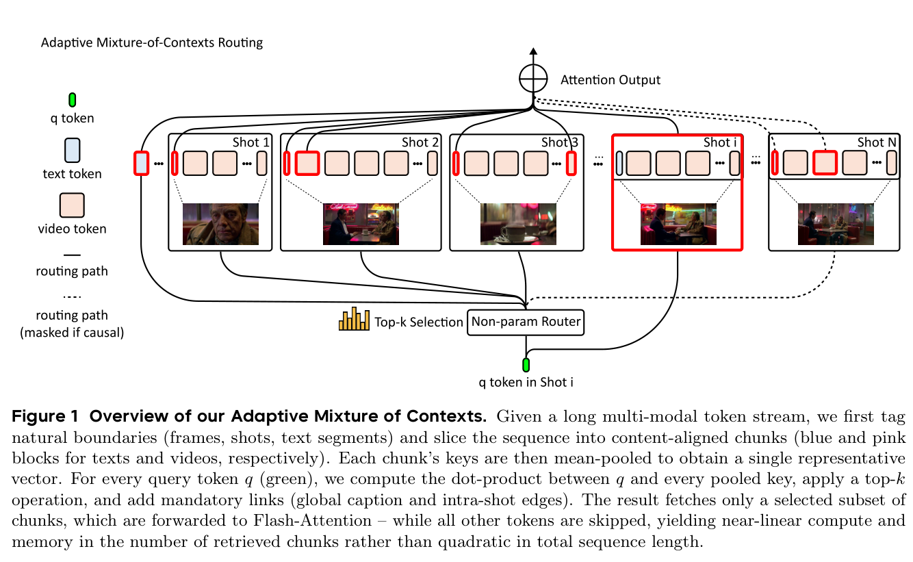
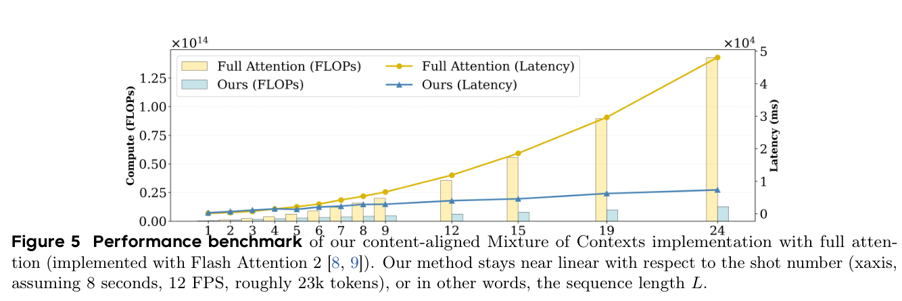
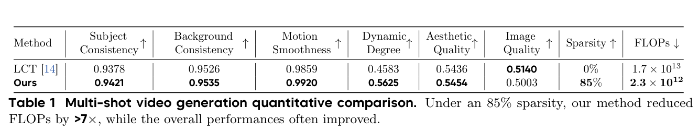
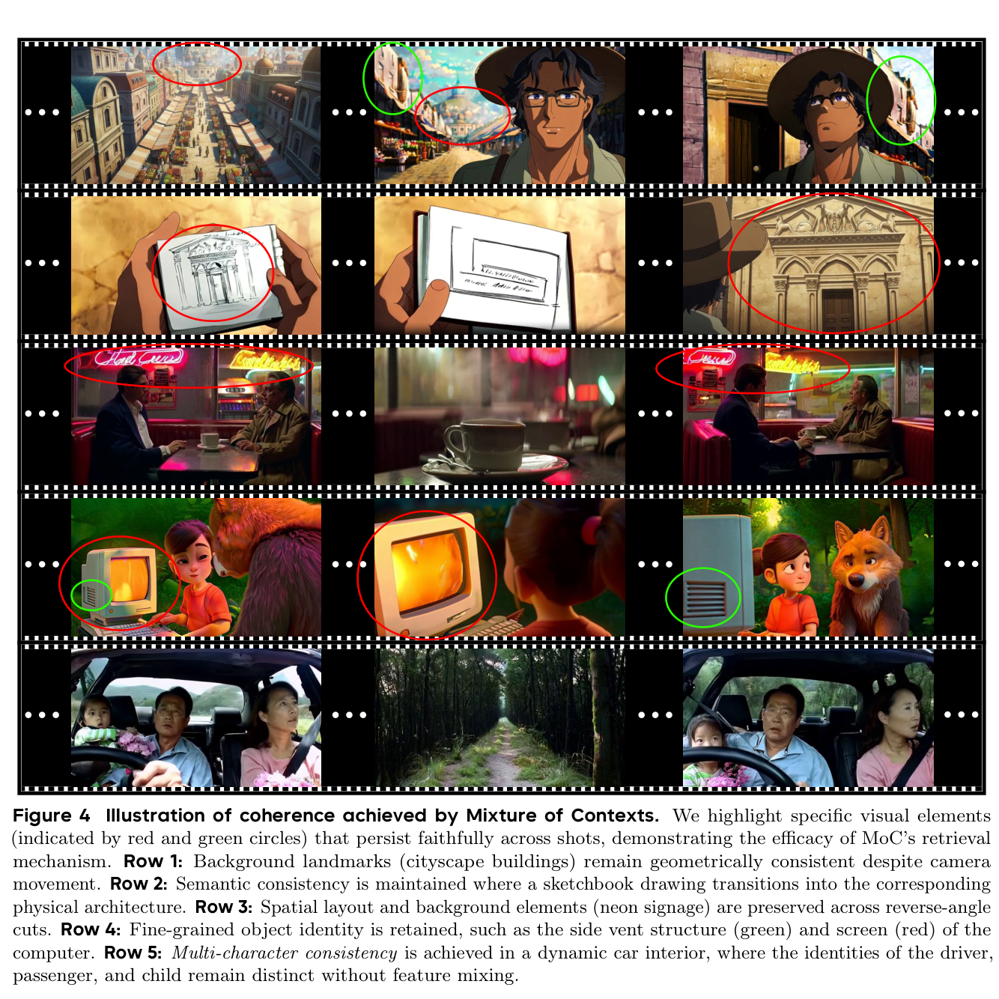
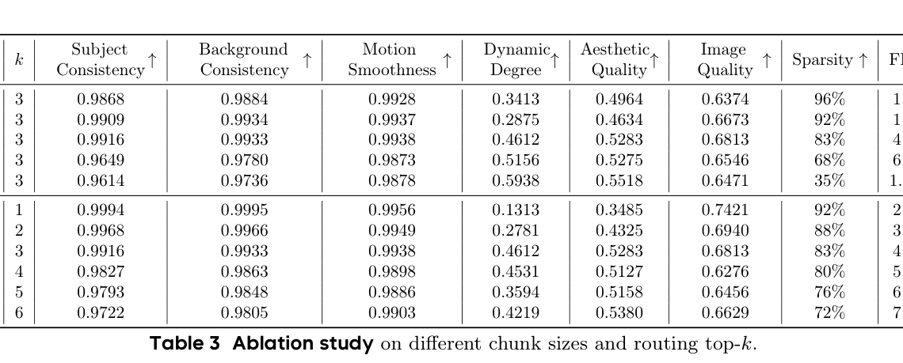
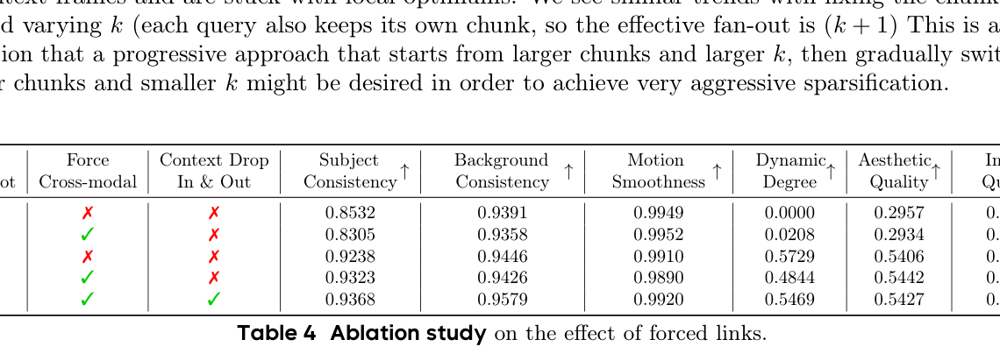

---
tags:
  - papers/WorldModel
  - video-generation
  - long-context
  - diffusion-transformer
  - sparse-attention
  - memory-retrieval
aliases:
  - MoC
  - Mixture of Contexts
  - 混合上下文长视频生成
date: 2025-12-10
doi: 10.48550/arXiv.2508.21058
arxiv_id: 2508.21058
---

# Mixture of Contexts for Long Video Generation

## 核心信息

- **标题**: Mixture of Contexts for Long Video Generation
- **标题翻译**: 用于长视频生成的混合上下文架构
- **作者**: Shengqu Cai (蔡盛衢), Ceyuan Yang (杨策源), Lvmin Zhang (张吕敏), Yuwei Guo (郭宇玮), Junfei Xiao (肖骏飞), Ziyan Yang (杨子彦), Yinghao Xu (许迎豪), Zhenheng Yang (杨振恒), Alan Yuille, Leonidas Guibas, Maneesh Agrawala, Lu Jiang (蒋路), Gordon Wetzstein
- **机构**: 斯坦福大学 (Stanford University)；字节跳动 Seed (ByteDance Seed)；约翰斯·霍普金斯大学 (Johns Hopkins University)；香港中文大学 (CUHK)
- **发表时间**: 2025-12-10 (arXiv v3)
- **发表渠道**: arXiv 预印本 (cs.GR)
- **DOI**: 10.48550/arXiv.2508.21058
- **arXiv**: 2508.21058
- **项目主页**: https://primecai.github.io/moc/
- **数据 / 资源**: 基于 LCT 协议标注的 500K 多镜头真实叙事场景视频 (~2.5M 镜头切片，Gemini-1.5 两级 Prompt) + 1M 长单镜头伪多镜头数据；主实验依托 3B MMDiT，并在 Wan-2.1-1.3B 上验证跨架构泛化
- **论文类型**: AI 架构与算法论文（视频扩散 Transformer 稀疏注意力机制 / 长程记忆检索）

## 原文摘要翻译

长上下文视频生成在本质上是一个记忆问题：模型必须在极长的时间跨度内保留并检索显著事件，且不能发生内容崩溃或漂移。然而，将扩散 Transformer (DiT) 扩展到长上下文视频生成，在根本上受制于自注意力机制的二次方计算复杂度，这导致显存和计算在面对长序列时长变难以承受且难以优化。我们将长上下文视频生成重新表述为一个内部信息检索任务，并提出了一种简洁、可学习的稀疏注意力路由模块——混合上下文（Mixture of Contexts, MoC），作为高效的长期记忆检索引擎。在 MoC 中，每个查询（Query）动态地选择少数信息量最大的块（Chunks）以及强制锚点（文本提示、局部窗口）进行注意力计算，并通过因果路由防止循环闭环。随着训练数据的扩展和路由的渐进式稀疏化，模型能够将算力自适应分配给历史上显著的事件，在数分钟的内容中精确保持主体身份、动作和场景布局。计算效率作为检索的副产物自然涌现（实现近似线性的计算扩展），从而使长视频的实际训练与合成成为可能，并在数分钟的尺度上激发出长程记忆与时序一致性。

## 创新点

1. **将长视频生成重新定义为“内部信息检索”（Internal Information Retrieval）任务**：打破了传统扩散模型全自注意力的密集二次方计算 $O(L^2)$ 假设，认为视频内部存在极高的时间冗余度，生成的核心在于自适应检索历史上与当前生成最具因果关联的关键上下文，而非将历史进行有损折叠或均匀稀疏采样。
2. **内容对齐分块（Content-Aligned Chunking）与无参数均值描述子**：区别于大语言模型（LLM）基于一维序列的均等切分，MoC 按照视频帧、镜头切换（Shot Cuts）与多模态边界进行语义对齐分块。利用 DiT 特征局部方差由第一主分量主导（>90%）的本质特性，直接采用块内均值池化作为鲁棒表征；无需任何额外路由网络参数，仅依靠扩散损失沿注意力权重的梯度反向传播即可自发重塑 Query-Key 投影以强化判别性。
3. **双重强制锚点机制（Forced Links as Sinks & Local Windows）**：设计强制跨模态连接（全视文本 Token）充当全局注意力汇（Attention Sink）与低熵梯度高速路，从物理上杜绝长时程生成中的 Prompt 漂移；设计镜头内自连接（Intra-shot Window）构筑局部几何与连续运动的刚性基底，消融证明失去镜头内连接会导致模型退化崩溃。
4. **因果稀疏路由拓扑（Causal Routing on DAG）**：发现双向无向的稀疏路由在跨镜头长程展开时会发生病理性的“两节点死锁循环”（如 Shot 9 与 Shot 11 互相满选），导致画面停滞与重复动作；通过在路由阶段强制施加时间因果掩码，将交互拓扑收敛为有向无环图（DAG），彻底根除循环死锁。
5. **分层扩展体系（Hierarchical Outer-Inner Routing）**：提出外环镜头级粗选与内环 MoC 细粒度稀疏注意力相结合的层级结构，使模型在生成数分钟甚至数小时超长视频时，能将上下文压缩至训练窗口内，彻底免受 RoPE 长度外推退化问题的困扰。

## 一句话总结

MoC 证明了长视频生成不需要昂贵的二次方密集注意力或有损历史压缩；通过内容对齐分块、无参数均值池化 Top-k 路由与因果锚点约束，在削减 85% 注意力计算与实现 2.2× 实测加速的同时，反而释放了更强的长程一致性与运动动态度。

## 研究问题

### 二次方注意力的不可承受之重与长程记忆的矛盾

当前基于扩散 Transformer (DiT) 的视频生成模型在短片段（几秒）上已经能够合成极具真实感的内容，但一旦将视野拉长到分钟级甚至小时级，模型便会面临灾难性的长程记忆失效：主体身份漂移、场景空间几何错乱、背景元素在镜头切换后突变、动作在长展开中趋于僵死停滞。

导致这一困境的核心症结往往被归结为计算瓶颈：标准自注意力机制的计算与显存复杂度随 Token 长度 $L$ 呈二次方增长 $O(L^2)$。在一个标准配置为 480p 分辨率、12 FPS、1 分钟时长的场景中，即使采用典型的 3D VAE（空间下采样 16×、时间下采样 4×），展开后的 Token 序列长度也高达约 180k。对其进行全量密集自注意力计算，一次前向传播的注意乘加运算量就高达 $1.7 	imes 10^{13}$ FLOPs，训练与推理极其缓慢且极易爆显存。

### 现有长视频范式的结构性妥协

为了绕过 $O(L^2)$ 屏障，先前的长视频生成工作主要走向了两个方向，但均付出了沉重的保真度代价：

1. **历史状态有损压缩派**（如 FramePack、StreamingT2V、TTT-Video、LaCT）：通过将历史帧压缩为固定长度的隐向量、潜状态或低分辨率关键帧金字塔。这种做法虽然使自回归滚出在计算上可控，但压缩过程不可逆地丢失了细粒度的几何纹理与高频瞬态细节，极易产生长程遗忘；当生成需要精确召回数百帧前出现过的特定道具或角色面部微结构时，压缩表征无能为力。
2. **静态/后验稀疏注意力派**（如 SparseVideoGen、STA、SageAttention、Radial Attention）：利用局部滑动窗口、静态时空能量衰减先验或训练后注意力权重的后验剪枝来减少计算。这类方法本质上是在为单镜头短视频寻找通用加速，其稀疏掩码并不具备数据自适应的内容理解能力。面对多镜头切换、视角大范围跳转的真实复杂场景，固定的稀疏模式无法判断“前一个镜头的哪一部分与当前镜头强相关”，导致长程依赖完全被物理距离切断。

### 核心洞察：将长视频生成重塑为内部信息检索

MoC 敏锐地指出：**长视频生成从根本上是一个记忆存储与定向召回问题，而高效的稀疏路由正是实现这种内部检索的天然载体。** 视频数据天然具备极高的时间与空间冗余度——相邻帧之间的像素差异极小，大量背景补丁在几十上百帧内几乎静止。密集注意力强迫每个 Query 与全序列所有 Key 进行点积，绝大部分注意力权重分散在无意义的冗余区域上，不仅浪费了 $O(L^2)$ 的算力，更稀释了关键上下文的注意力能量。

因此，如果能够让模型根据内容语义，动态地、稀疏地在历史中精准检索少数最具信息量的语义块，就能以近似短视频的计算成本，实现长达数分钟的高保真记忆保持。

## 数据与任务定义

### 1. 多镜头长视频生成任务 (Multi-Shot Long Video Generation)

这是 MoC 的核心主攻场景。多镜头叙事视频包含频繁的蒙太奇剪辑（Shot Cuts），不同镜头之间的相机运镜、景别（特写/全景）、角度（反切正打）剧烈变化，但其深层必须严格保持全局世界观的物理一致性：
- **输入**：包含两级文本提示（Global Scene Caption + Shot-Level Captions）；
- **输出**：生成连续的 8 个镜头、总时长 64 秒（每镜头 8 秒、480p、12 FPS，单镜头约 22k tokens，全场景约 180k tokens）的连贯长视频；
- **核心难点**：跨越镜头硬切（Hard Cuts）时，如何保持主角面部特征不漂移、衣着不变、环境光影与地标空间几何位置稳固，同时展现丰富自然的剧烈动作。

### 2. 单镜头长视频生成任务 (Single-Shot Long Video Generation)

在无剪辑硬切的连续运动视频上测试稀疏路由的局部连续性与大动态建模能力：
- 测试基础单镜头模型（3B MMDiT，320×192，12 FPS，8 秒，约 6.3k tokens）；
- 跨架构泛化测试标准 DiT 骨干（Wan-2.1-1.3B，480p，Vchitect 数据集，块大小 1560 tokens/frame）。

### 3. 因果上下文建模任务 (Causal Context Modeling)

在长时间序列展开中，信息必须符合物理时序的不可逆性：
- 形式化为有向图交互拓扑：当前时刻生成的 Token $q_t$ 仅被允许检索历史或当前时刻的键值上下文 $K_{\le t}$；
- 杜绝双向未来信息穿透，确保模型在单向推演或交互式仿真中能够稳定滚出，不陷入拓扑环路。

### 4. 数据构建协议：500K 真实叙事长视频与 Gemini-1.5 双层标注

为了支撑长时程跨镜头记忆的学习，作者完全继承了 LCT (Long-Context Tuning) 的大规模数据准备管线：
- **原始数据与镜头切分**：从电影、电视剧、纪录片等公开长视频中抓取真实素材。先通过标准场景边界检测器识别 Scene，再用 `PySceneDetect` 精确提取各个镜头（Shot Cuts）。
- **Gemini-1.5 两级提示标注**：
  1. **全局场景提示 (Global Scene Caption)**：总结全场景共享的核心上下文，格式严格遵循 `"[Character] [Environment] [Story]"`，其中人物用显式 ID 定义，如 `"Character 1: [Description]"`；
  2. **镜头级提示 (Shot-Level Captions)**：仅描述当前镜头的局部动作与相机取景，**且对人物的提及强制使用全局 ID（如 'Character 1'、'Character 2'）**，严禁使用“那个男人/女人”等模糊词汇。这种两级设计在文本层面解耦了全局主体身份与局部动态行为。
- **数据规模与增强**：最终构建约 500K 个经过严格标注的多镜头真实场景（平均每场景 5 个镜头，对应约 2.5M 个镜头片段）。此外，通过挖掘具有显著大运动与视角变化的 1M 段长单镜头视频，依据事件突变切分为子镜头（Sub-shots），并打上平滑过渡标签，以增强模型对无硬切连续大动态的建模能力。真实硬切镜头前则附加专有 `[SHOT CUT]` 标记。

## 方法主线

### 机制流程


*图 1：自适应混合上下文 (MoC) 整体架构。输入多模态 Token 流首先在自然物理边界（文本、帧、镜头）处切分为内容对齐块（蓝/粉色）；块内 Key 经均值池化生成紧凑表征 $\phi(K_\omega)$；Query Token $q$（绿色）与池化 Key 做点积并通过 Top-k 选取若干关键块，同时强制拼接全局 Caption 与镜头内局部窗口，施加因果掩码后送入 FlashAttention 变长算子。*

MoC 的整体执行流程严格遵循以下链路：
1. **多模态 Token 流切分**：将图像、视频与文本拼接形成的超长序列，依据物理与语义边界划分为集合 $\Phi = \{K_1, K_2, \dots, K_C\}$；
2. **片内均值池化（On-the-fly Mean Pooling）**：对每一个候选块 $\omega \in \Phi$，计算其 Key 矩阵沿序列维度的均值，得到单个代表向量 $\phi(K_\omega) \in \mathbb{R}^d$；
3. **点积打分与 Top-k 稀疏路由**：对于给定的 Query 向量 $q_i$，计算其与所有候选块表征的内积相似度 $s_{i, \omega} = \langle q_i, \phi(K_\omega) 
angle$，在施加因果掩码后挑选分数最高的 $k$ 个候选块；
4. **强制锚点拼接（Forced Anchors Insertion）**：无条件将全局文本 Token（Caption Sink）和当前 Query 所属镜头的内部 Token（Intra-shot Window）加入检索索引集 $\Omega(q_i)$；
5. **硬件对齐的高效注意力执行**：将保留下来的非连续、不等长 Key/Value Token 打包，通过 head-major 内存连续排布直接调用底层 `FlashAttention` 变长（var-len）内核，跳过所有未被选中的 85% 以上的冗余 Token。

### 核心组件: Content-Aligned Chunking 与 Adaptive Routing

#### 1. 结构对齐分块 (Content-Aligned Chunking) 的几何必要性

在长文本 LLM 中，分块通常极其简单：一维序列在单向 RoPE 编码下具有平移单调性，均匀划分为固定长度（如 128 或 256）的窗口（如 MoBA、NSA）即可保持良好的局部连续性。

然而在视频生成 DiT 中，Token 空间是一个极其复杂的**异质 3D 网格 + 多模态混合流**：
- 空间补丁（Spatial Patches）、时间帧（Temporal Frames）和文本词元（Text Tokens）交错扁平化排列，且采用独立维度的 3D RoPE 进行位置编码；
- 在展开的一维索引中，相邻的两个 Token 可能在物理时空上相隔甚远，或者正好跨越了硬切镜头（Shot Cut）；
- 如果采用传统的固定长度均匀切块，同一个块内必然会混合静态背景补丁、高频剧烈运动补丁甚至是跨镜头的无关像素。

**均匀切块的灾难**：内部异质的 Token 混合会彻底污染均值池化向量 $\phi(K_\omega)$，使其均值退化为没有代表性的“灰度噪点”，不仅破坏了 Top-k 路由的语义判别力，更迫使有限的 $k$ 个检索槽位被浪费在内部自相矛盾的碎片块上。

**MoC 的解决方案**：坚持**内容对齐边界**——严格以单帧（Frame）、单个镜头（Shot）以及独立的 Caption 模态条带为自然切割界面。这保证了每一个 Chunk 在语义上高度均质，在 3D 流形上几何局域化。

#### 2. 为什么无参数的均值池化足够强大？（PCA 第一主分量定理）

公式 (2) 与 (3) 定义了 MoC 的注意力与路由：
$$
	ext{Attn}(q_i, K, V) = 	ext{Softmax}\left(rac{q_i K_{\Omega(q_i)}^	op}{\sqrt{d}}
ight) V_{\Omega(q_i)}
$$
$$
\Omega(q_i) = rg\max_{\Omega^* \subseteq \Phi, |\Omega^*|=k} \sum_{\omega \in \Omega^*} q_i \phi(K_\omega)^	op
$$
其中描述子变换 $\phi(K_\omega) = 	ext{mean\_pool}(K_\omega) = rac{1}{|K_\omega|} \sum_{j \in K_\omega} K_{\omega, j}$。

许多研究者会下意识地质疑：一个不带任何参数的简单算术均值，凭什么能代表一个包含成千上万 Token 的视频块？

作者从表征几何的角度给出了深刻解释：
- 根据 DDAE（去噪扩散自编码器）的理论，预训练 DiT 在去噪训练中自发学习到了高度结构化且线性可分的隐表征空间；
- 在一个时空连续的视频块内，像素与特征高度相关。实测表明，**视频块内 Token 表征的协方差矩阵中，第一主成分（First Principal Component, PC1）通常解释了超过 90% 的局部方差**；
- 在中心化数据上，算术平均值正是第一主成分方向的最优无偏估计器。因此，简单的均值池化能够在过滤掉高频噪声的同时，近乎无损地锁定该块的主导语义（如：主体身份、大尺度空间布局、主色调）。

#### 3. 隐式反向传播与自发梯度重塑 (Implicit Gradient Adaptation)

虽然 Top-k 操作本身是不可导的离散硬选择，但 MoC **不需要引入 Gumbel-Softmax 或强化学习策略梯度**，即可实现自适应学习：
- 一旦某个候选块 $\omega$ 被 Top-k 选中，它内部的所有 Key 和 Value 就会参与公式 (1) 的标准注意力计算；
- 最终的扩散重构损失 $\mathcal{L}_{	ext{diff}}$ 会反向传播：
  $$
  rac{\partial \mathcal{L}}{\partial W_K} = \sum_{\omega \in \Omega(q_i)} rac{\partial \mathcal{L}}{\partial K_\omega} rac{\partial K_\omega}{\partial W_K}, \quad rac{\partial \mathcal{L}}{\partial W_Q} = rac{\partial \mathcal{L}}{\partial q_i} rac{\partial q_i}{\partial W_Q}
  $$
- 如果路由选中的是一个与当前去噪任务无关的无用块，它在注意力 Softmax 中的响应就会受到抑制，梯度惩罚会迫使线性投影矩阵 $W_Q$ 和 $W_K$ 在下一轮迭代中调整权重，使两者的内积在特征空间中彼此远离；反之，显著块的投影被自发放大。
- 这是一种极其优雅的设计：**下游注意力机制直接充当了上游路由器的监督信号**，在零新增参数的前提下，使简单的点积检索具备了极强的端到端判别自纠错能力。

#### 4. 正则化机制：Context Drop-off 与 Drop-in

为了避免路由落入 MoE 系统中经典的“死专家/死路由”局部陷阱，MoC 引入了成对的数据扰动正则化：
- **Context Drop-off**：在 Top-k 选出最优索引集 $\Omega(q_i)$ 后，以概率 $p_{	ext{drop}} \sim 	ext{Uniform}(0, p_{\max})$ 随机丢弃其中的 $\lfloor p_{	ext{drop}} \cdot k 
floor$ 个块。这强迫模型在特定关键上下文偶尔缺失时仍能维持连贯推断，提升了长程自回归展开对单点路由失误的容错冗余度。
- **Context Drop-in**：从候选池中通过泊松分布 $m \sim 	ext{Poisson}(\lambda)$ 随机采样未被选中的额外冷门块强行塞入注意力池中。这确保了冷门或早期利用不足的上下文片段能够周期性地获得梯度流，激活潜在的有用路径。

#### 5. 多头独立分布式路由 (Per-Head Distributed Routing)

MoC 的路由不是全网络统一执行一次的粗粒度全局操作，而是在**每一层的每一个注意力头（$L_{	ext{layers}} 	imes H_{	ext{heads}}$）中独立并行计算**：
- **功能解耦**：DiT 内部不同的注意力头具有高度专门化的职能分工（例如：底层头关注低频边缘与纹理一致性，高层头关注高阶语义身份与动作意图）。各头自主选择最匹配其特征子空间的历时块。
- **全局覆盖与瓶颈破除**：虽然单个头仅极度稀疏地访问 $k$ 个块，但由于各头选择的子集互不相同，全网络所有头所覆盖的 Context 集合的并集 $igcup_{h, l} \Omega_h^l(q_i)$ 几乎触达了整个时空历史的流形。这在保持单头极致稀疏的同时，彻底打破了全局静态检索带来的信息瓶颈。

---

### 因果约束与强制循环连接 (Causal enforcement & forced links)

#### 1. 因果掩码根除“两节点死循环闭环”（Loop Closures）


*图 2：缺乏因果掩码导致的循环死锁剖析。左图：消融实验中，本应从咖啡馆场景（上排）硬切到河畔看手机场景（下排），但 Shot 9 与 Shot 11 发生病理性互选（Shot 9 强检索 Shot 11，Shot 11 同时强检索 Shot 9），导致两节点互锁，无法从更早的镜头获取上下文，生成停滞。右图：注意力交互热力图中赫然出现的对称离轴强互锁热点。*

这是论文中最具洞察力的机理发现之一。在没有时序方向约束的双向稀疏注意力中，当序列扩展到多个镜头时，稀疏交互图极易退化出**病态拓扑闭环**：
- 如图 2 所示，当镜头推进到第 9 个镜头和第 11 个镜头时，由于两者可能包含相似的人物特征或色调，Shot 9 的 Query 将 Shot 11 选为其 Top-k 目标；而在计算 Shot 11 时，其 Query 又反向将 Shot 9 选为主要目标；
- 这种双向自闭环形成了一个与世隔绝的“双节点信息黑洞”，切断了它们与 Shot 1~8 历史宏观叙事的梯度与信息交换通道；
- 在视觉表现上，这直接诱发了**动作冻结、死循环抖动或人物身份突变停滞**。

**因果硬约束**：MoC 在执行 Top-k 排序前，对所有候选边强制施加因果掩码：
$$
M_{i, j} = egin{cases} 0, & 	ext{if } j < i \ -\infty, & 	ext{if } j \ge i \end{cases}
$$
严格禁止任何 Token 访问时序位于其自身之后的未来块。此举将原本无序的双向稀疏图重构为一个严格的**有向无环图（Directed Acyclic Graph, DAG）**，从拓扑结构上在数学层面彻底清除了闭环死锁的可能，极大提升了分钟级序列推演的动态平滑性。

#### 2. 双重强制锚点：Prompt Sink 与 Local Window

稀疏检索虽然削减了开销，但若缺乏对核心流形的刚性锚定，极易引发训练初期的崩溃。MoC 在动态路由之外，硬编码了两个物理先验：

1. **全局跨模态强制连接（Cross-Modal Attention Sink）**：
   - 强制所有视觉 Query 无条件全量访问全局 Caption 和镜头级 Caption 的所有文本 Token；
   - **理论支点**：借鉴大模型中的 Attention Sink 理论，文本 Token 在全序列中占比不足 1%，计算开销忽略不计，但却承载着全场景最高密度的核心语义指令。将其作为强连通汇点，为整个注意力分布提供了一个超低熵、全网络统一的锚点，并在反向传播中构筑了一条贯穿图文模态梯度的直通高速公路，有效防止了长时程推演中的 Prompt 漂移。
2. **镜头内强制自连接（Intra-Shot Local Window）**：
   - 强制每个视觉 Token 必须全量参与其所属镜头内部的所有 Token 计算；
   - **理论支点**：视频在物理上具备严格的层次结构（像素 $	o$ 帧 $	o$ 镜头 $	o$ 场景）。镜头内部包含了密集的物性守恒、光流连续性与刚体运动几何。将局部窗口强制锁死，一方面保证了即使跨镜头自适应路由做出激进剪裁，单镜头的画面保真度也有坚不可摧的性能底线；另一方面使得可学习路由能够将宝贵的 Top-k 容量完全聚焦于“跨越不同镜头的超长程全局回忆”。

---

### 计算效率与稀疏注意力机制

#### 1. FLOPs 理论复杂度推导

设注意力头维度为 $d$，输入 Query 序列总长为 $L$，整个序列被划分出的内容对齐块总数为 $C$，每个 Query 挑选的 Top-k 块数为 $k$，被选中的候选块的平均 Token 长度为 $ar{m}$。

MoC 的单头计算开销由三部分组成：
1. **块内 Key 均值池化**：对所有 Key 向量在各自块内求和，仅需加法操作，复杂度为 $Ld$ 次加法，计算量可忽略；
2. **Top-k 路由打分**：每个 Query 与 $C$ 个池化代表向量做内积（一次乘法 + 一次加法），共计 $2LCd$ FLOPs；
3. **细粒度稀疏注意力**：在剪裁后的有效 Key/Value 集合上执行标准的 $QK^	op$ 与 $PV$ 乘积，有效上下文长度至多为 $kar{m}$，共计 $4Lkar{m}d$ FLOPs。

总计算量为：
$$
	ext{FLOPs}_{	ext{MoC}} pprox Ld + 2LCd + 4Lkar{m}d
$$
而在相同配置下，标准密集全注意力的单头计算量为：
$$
	ext{FLOPs}_{	ext{dense}} = 4L^2d
$$
两者的计算量比例为：
$$
rac{	ext{FLOPs}_{	ext{dense}}}{	ext{FLOPs}_{	ext{MoC}}} pprox rac{4L^2d}{2LCd + 4Lkar{m}d} = rac{2L}{C + 2kar{m}}
$$
随着视频序列长度 $L$（镜头数）的线性增长，密集全注意力的计算量呈二次方增长，而 MoC 的分母主要由固定的检索常数 $kar{m}$ 决定，**两者的加速比与序列长度 $L$ 呈严格的线性正比关系**！

**具体数值代入**：
在标准的 1 分钟、480p、12 FPS 视频生成中（VAE 压缩后 $L pprox 180{,}000$ tokens）：
- 设定 $ar{m} pprox 1024, k = 5, C = 36, d = 128$；
- 稠密注意力计算量 $	ext{FLOPs}_{	ext{dense}} pprox 1.66 	imes 10^{13}$；
- MoC 计算量 $	ext{FLOPs}_{	ext{MoC}} pprox 2.32 	imes 10^{12}$；
- **理论注意乘加操作被削减了超过 7 倍（减少 >85%）**。

#### 2. GPU 底层优化与变长 FlashAttention 集成


*图 5：内容对齐 MoC 针对全注意力（FlashAttention-2 实现）的性能评测基准。横轴为镜头数量（每镜头 8 秒、12 FPS，约 23k tokens），纵轴为实测延迟与 FLOPs。全注意力呈现陡峭的二次方曲线，而 MoC 在数百万 Token 级别上始终保持紧密贴合的线性扩展。*

为了将理论 FLOPs 转化为实打实的工程加速，面对不等长、动态索引的分块结构，作者在工程实现上进行了三项关键优化：
1. **在线动态前缀归约（On-the-fly `segment_reduce`）**：借助 `cu_seqlen` 和 `cu_shot` 前缀和表，通过 GPU 原生归约算子动态计算均值，完全避免将不同大小的变长块显式补齐（Padding）或拷贝，显存占用恒定；
2. **Head-Major 内存重排**：在 Token 重排阶段执行 `rearrange(..., 's x h d -> h s x d')`，使得各注意头的 Gather 访存操作在物理显存中实现合并读取（Coalesced Memory Access）；
3. **熔融 FlashAttention-2 变长内核**：利用自定义 `torch.autograd.Function` 封装，将动态检索出的稀疏 Key/Value 紧凑打包为一个连续的变长张量，单次调用 FlashAttention-2 变长接口完成内核执行，避免多次调用小算子造成的 Kernel Launch Overhead。

---

## 关键结果

### 主结果与强基线 (VBench, subject consistency, background consistency, temporal flicker)


*表 1：多镜头长视频生成定量基准（64 秒、8 镜头场景、约 180k tokens）。在 85% 的高稀疏度下，FLOPs 从 $1.7 	imes 10^{13}$ 压降至 $2.3 	imes 10^{12}$，实测端到端获得 2.2× 加速，综合表现优于稠密全注意力基线。*

| 方法 | 主体一致性<br>(Subject) ↑ | 背景一致性<br>(Background) ↑ | 运动平滑度<br>(Smoothness) ↑ | 动态程度<br>(Dynamic) ↑ | 美学质量<br>(Aesthetic) ↑ | 图像质量<br>(Image) ↑ | 稀疏度<br>(Sparsity) ↑ | 注意力 FLOPs ↓ |
| :--- | :---: | :---: | :---: | :---: | :---: | :---: | :---: | :---: |
| **LCT [14] (稠密基线)** | 0.9378 | 0.9526 | 0.9859 | 0.4583 | 0.5436 | **0.5140** | 0% | $1.7 	imes 10^{13}$ |
| **MoC (本文方法)** | **0.9421** | **0.9535** | **0.9920** | **0.5625** | **0.5454** | 0.5003 | **85%** | **$2.3 	imes 10^{12}$** |


*图 4：MoC 跨镜头长时程记忆保持能力定性案例（红绿色圈标注细节）。Row 1：城市地标建筑在激烈运镜下保持几何稳定；Row 2：素描草图无缝语义过渡为物理建筑实体；Row 3：大角度逆向反切机位下霓虹灯招牌空间布局保持精准；Row 4：复古电脑侧面散热孔（绿）与屏幕（红）细粒度零部件身份无损召回；Row 5：高速行驶车辆内部，驾驶员、乘客与儿童三主体身份清晰分离，未发生任何特征交叉混淆。*

定量主表与定性案例呈现出三大核心结论：
1. **计算与显存的代际跃迁**：在处理长达 64 秒、跨越 8 个镜头的 180k token 宏大场景时，MoC 剪裁了 85% 的注意力连结，将计算量削减了 7 倍以上，在未专门定制硬件级 Fused Kernel 的情况下，端到端斩获了 **2.2× 的实测加速**；
2. **稀疏化反而激发出更高的运动动态度 (Dynamic Degree 0.4583 $	o$ 0.5625)**：这是一个极具反直觉但符合生成动力学的现象。在稠密注意力中，过多的静态背景 Token 稀释了注意力分布，导致模型倾向于生成保守、微弱运动的“安全画面”；MoC 剔除了时间冗余，使得算力高度倾斜于发生动作变化的显著上下文，赋予了模型释放大幅度动态交互的自由；
3. **细粒度几何与多主体身份零漂移**：图 4 的五行极端测试充分证实，即便经历数个镜头的剧烈剪辑跳跃，模型依靠自适应检索仍能精确抓取数百帧前的物理特征，多主体未出现特征混合或脸部崩塌。

---

### 定性对比与零样本稀疏化 (Zero-shot sparsification on pretrained DiT)


*图 3：多镜头连贯故事定性对比（LCT vs MoC）。场景展示由 6 个镜头组成的咖啡馆叙事（Shot 2: 男士就座 $	o$ Shot 3: 女士特写 $	o$ Shot 4: 男士特写 $	o$ Shot 5: 两人交谈 $	o$ Shot 6: 咖啡特写）。尽管 MoC 剪裁了四分之三以上的计算，生成画质与主体身份与全稠密基线几乎肉眼不可分辨。*


*图 6：零样本（Zero-shot）直接替换验证。在完全不进行任何权重微调的前提下，直接将预训练 DiT 的注意力层替换为 MoC（>75% 稀疏度），模型依然能良好保留主角面部特征、场景空间布局与基本动态。*

为了彻底证伪“MoC 的性能完全依赖于多镜头大规模微调拟合”的质疑，作者进行了一项极其苛刻的**零样本即插即用实验**（Zero-shot Experiment）：
- 取一个从未接触过稀疏注意力训练的标准预训练 DiT 模型，**完全冻结其所有权重**；
- 强行将其所有 Dense Self-Attention 算子替换为 MoC 模块，施加高达 >75% 的稀疏度掩码；
- 如图 6 所示，尽管模型权重从没见过这种离散块跳跃，合成视频依然维持了出色的主体身份、背景轮廓和连贯运动！
- **理论印证**：这一结果强有力地证实了第 3 节的几何假设——预训练 DiT 本身学出的隐表征已经具备极高的主成分聚集性，基于均值池化的 Top-k 检索并不是“硬造规则”，而是“顺应了表征天然的数据流形”。

---

### 单镜头短视频基准与 Wan-2.1 泛化


*表 2：单镜头视频生成定量对比（3B MMDiT，8 秒，320×192，12 FPS，约 6.3k tokens）。在 83% 稀疏度下，FLOPs 从 $1.9 	imes 10^{10}$ 降至 $4.1 	imes 10^9$，所有 VBench 质量指标持平或反超基线。*


*图 7：单镜头短视频定性生成案例（复古旋转电视堆、水下珊瑚街区 FPV 飞行穿梭、雪地猛犸象群），在大动态与复杂光影下质量毫不逊色于稠密基础模型。*


*表 5：开源标准 DiT 骨干 Wan-2.1-1.3B 上的单镜头定量对比（480p 分辨率，Vchitect 数据集，每帧一个 Chunk=1560 tokens）。*

| 骨干与方法 | 主体一致性 ↑ | 背景一致性 ↑ | 运动平滑度 ↑ | 动态程度 ↑ | 美学质量 ↑ | 图像质量 ↑ | 稀疏度 ↑ |
| :--- | :---: | :---: | :---: | :---: | :---: | :---: | :---: |
| **Wan-2.1 Dense** | 0.9512 | 0.9339 | **0.9869** | 0.4219 | 0.5154 | 0.5831 | 0% |
| **Wan-2.1 + MoC (81% 稀疏)** | **0.9549** | **0.9537** | 0.9833 | **0.6250** | **0.5204** | **0.6016** | **81%** |

表 5 提供了 MoC 跨架构通用性的坚实证据：Wan-2.1 是标准的非 MMDiT 单流结构，仅将其 Self-Attention 替换为 MoC，在 81% 稀疏度下训练 2000 步，动态度直接从 0.4219 暴增至 0.6250，背景一致性由 0.9339 升至 0.9537，彻底扫清了该方法依赖特定模型结构的顾虑。

---

### 消融到底说明了什么 (Chunk size, top-k routing, forced links)

#### 1. 块大小 (Chunk Size) 与 Top-k 数量消融


*表 3：块大小与路由 Top-k 的系统消融。*

| Chunk Size | $k$ | 主体一致性 ↑ | 背景一致性 ↑ | 运动平滑度 ↑ | 动态程度 ↑ | 美学质量 ↑ | 图像质量 ↑ | 稀疏度 ↑ | FLOPs ↓ |
| :---: | :---: | :---: | :---: | :---: | :---: | :---: | :---: | :---: | :---: |
| 64 | 3 | 0.9868 | 0.9884 | 0.9928 | 0.3413 | 0.4964 | 0.6374 | **96%** | $1.2 	imes 10^9$ |
| 128 | 3 | 0.9909 | 0.9934 | 0.9937 | 0.2875 | 0.4634 | 0.6673 | 92% | $1.7 	imes 10^9$ |
| **256** | **3** | **0.9916** | **0.9933** | **0.9938** | **0.4612** | **0.5283** | **0.6813** | **83%** | **$4.1 	imes 10^9$** |
| 512 | 3 | 0.9649 | 0.9780 | 0.9873 | 0.5156 | 0.5275 | 0.6546 | 68% | $6.6 	imes 10^9$ |
| 1024 | 3 | 0.9614 | 0.9736 | 0.9878 | 0.5938 | 0.5518 | 0.6471 | 35% | $1.3 	imes 10^{10}$ |
| 256 | 1 | 0.9994 | 0.9995 | 0.9956 | 0.1313 | 0.3485 | 0.7421 | 92% | $2.1 	imes 10^9$ |
| 256 | 2 | 0.9968 | 0.9966 | 0.9949 | 0.2781 | 0.4325 | 0.6940 | 88% | $3.1 	imes 10^9$ |
| **256** | **3** | 0.9916 | 0.9933 | 0.9938 | **0.4612** | 0.5283 | 0.6813 | 83% | $4.1 	imes 10^9$ |
| 256 | 4 | 0.9827 | 0.9863 | 0.9898 | 0.4531 | 0.5127 | 0.6276 | 80% | $5.2 	imes 10^9$ |
| 256 | 5 | 0.9793 | 0.9848 | 0.9886 | 0.3594 | 0.5158 | 0.6456 | 76% | $6.2 	imes 10^9$ |
| 256 | 6 | 0.9722 | 0.9805 | 0.9903 | 0.4219 | 0.5380 | 0.6629 | 72% | $7.2 	imes 10^9$ |

表 3 揭示了稀疏粒度与运动建模之间的深刻矛盾：
- **微小切块陷阱**：当块大小被切碎至 64 或 128 时，稀疏度高达 92%~96%，主体一致性指标极高（接近 0.99），但动态度遭遇断崖式崩跌（0.3413 / 0.2875）。这说明当块过小且 $k$ 有限时，Query 只能看到极小一片邻域，模型无法建立全局大视场联系，退化成了近乎静止的图片生成；
- **过大切块惩罚**：当块大小增至 1024 时，稀疏度降至 35%，计算量暴增，且块内异质性增大；
- **最优平衡点**：在单镜头下 Chunk Size=256、$k=3$ 构成了性能与动态的黄金分割点。在多镜头训练中，作者据此设计了从大到小的渐进式调度。

#### 2. 强制连接与正则化消融（核心断崖证据）


*表 4：强制连接（Intra-shot 与 Cross-modal）及 Context Drop In/Out 的消融实验（多镜头配置，Chunk Size=5120，$k=5$）。*

| 镜头内强制连接<br>(Intra-shot) | 跨模态强制连接<br>(Cross-modal) | 上下文扰动<br>(Drop In & Out) | 主体一致性 ↑ | 背景一致性 ↑ | 运动平滑度 ↑ | 动态程度 ↑ | 美学质量 ↑ | 图像质量 ↑ |
| :---: | :---: | :---: | :---: | :---: | :---: | :---: | :---: | :---: |
| ✗ | ✗ | ✗ | 0.8532 | 0.9391 | 0.9949 | **0.0000** | 0.2957 | **0.1552** |
| ✗ | ✓ | ✗ | 0.8305 | 0.9358 | 0.9952 | 0.0208 | 0.2934 | 0.1572 |
| ✓ | ✗ | ✗ | 0.9238 | 0.9446 | 0.9910 | 0.5729 | 0.5406 | 0.4472 |
| ✓ | ✓ | ✗ | 0.9323 | 0.9426 | 0.9890 | 0.4844 | 0.5442 | 0.5104 |
| **✓** | **✓** | **✓** | **0.9368** | **0.9579** | **0.9920** | **0.5469** | **0.5427** | **0.5061** |

表 4 是全篇最有说服力的消融证据：
- **没有镜头内自连接，训练彻底坍塌**：第一行与第二行中，在移除 Intra-shot 强制连接后，哪怕补偿模型额外挑选 4 个块的容量，动态度也直接归零（**Dynamic Degree = 0.0000**），图像质量雪崩至 **0.1552**！这证明纯粹依赖数据驱动的无监督检索在训练初期极度脆弱，必须有局域几何物理连续性作为底座。
- **跨模态连接锁定全局语义**：加入 Prompt Sink 后，图像质量从 0.4472 跃升至 0.5104，消除了文本提示漂移；
- **Drop In/Out 增强泛化**：引入扰动后，模型综合指标全面攀升至最优均衡状态。

---

## 深度分析

### 真正贡献是什么 (sparse adaptive context routing vs dense quadratic attention for world models)

区分“真正的方法论突破”与“工程组件拼装”是评估这篇论文的关键：
- **工程组装部分**：FlashAttention 变长封装、前缀和切分、PySceneDetect 分镜、两级 Prompt 标注，这些是成熟工程手段的高效整合。
- **真正的方法论贡献在于两点**：
  1. **长时程一致性的本质是“条件检索”而非“注意力容量”**：过去的研究陷入了“为了保持一致性必须扩大稠密窗口，为了扩大窗口必须上数百张卡做环形并行（Ring Attention）”的硬件军备竞赛，或者走向了“有损状态压缩导致细节流失”的妥协。MoC 证明，**对于视频这种超高冗余信号，85% 以上的注意力连接在信息论意义上就是纯噪声**。通过在正确的内容几何边界（Content-Aligned）上进行自适应稀疏路由，稀疏检索不仅不会损失上下文，反而能通过净化注意力分布，使模型更容易在长时程中召回正确的实体，甚至释放出更强的运动动态；
  2. **无参数检索与扩散反向传播的无缝自闭环**：没有为 Router 额外增加笨重网络，巧妙利用视频表征局域 PC1 解释度 >90% 的数学性质，让简单的均值池化充当代理，通过注意力反向传播隐式重塑投影。这种极简主义（Minimalist Design）使得该模块能够以近乎零门槛的方式泛化并植入现存的所有视频生成 DiT 之中。

### 为什么结果成立

1. **时空流形与物理特征聚集（物理与数据层）**：自然界与摄像机拍摄的真实视频具有强连续性，背景具有静态刚体几何，前景具有刚体或铰接运动连续性。单个内容块内部像素由相同实体主导，因此块级均值是其高维流形的极优质心；
2. **Attention Sink 与 DAG 拓扑（结构与图论层）**：强制 Prompt 汇点提供了全图的全局基准势能，因果拓扑构筑了无死锁的 DAG 架构，消除了长程展开中最致命的发散震荡与环路停滞；
3. **注意力熵的集中与去噪梯度（优化动力学层）**：稠密注意力在超长序列下面对成千上万相似 Token，Softmax 容易退化为平滑均匀分布（注意力熵过高），导致去噪梯度弥散。稀疏 Top-k 强制将注意力概率质量聚集在最具因果相关性的极少数块上，放大了关键梯度的信噪比。

### 容易误读的地方

1. **误以为理论 7× FLOPs 减少能直接等价于 7× 墙钟加速**：
   - 必须清醒地看到，实测端到端加速是 **2.2×** 而非 7×。在 GPU 物理硬件上，非连续内存的 Gather、变长张量元数据构建以及多次 Kernel Launch 存在显著的访存与调度开销。7× 是纯计算乘加量的节省，墙钟时间受限于 Memory Bound。
2. **误以为 MoC 是一个“通用加速器”，单镜头短视频也能随便用**：
   - 附录表 2 明确指出，在 6.3k token 的单镜头短视频中，虽然理论 FLOPs 压降了 83%，但**实际端到端运行时间反而比稠密 FlashAttention 更慢**！因为在极短序列中，注意力计算本就不是主要瓶颈，分块索引与池化的额外开销完全抵消了计算收益。MoC 的真正战场是 **>10 万 Token 的超长序列**。
3. **误以为可以丢弃镜头检测，直接用固定时间切块**：
   - 内容对齐分块（Content-Aligned Chunking）是该方法成立的命门。如果在场景硬切处切断了一个块，或者一个块内横跨两个完全不同的镜头，均值池化就会瞬间失效，Top-k 路由就会选出混乱的上下文。

### 复现注意点

1. **渐进式分块调度策略（Progressive Sparsification Schedule）**：
   - 在复现多镜头长视频训练时，**切忌从第 0 步就直接采用小块（如 1280）配合 $k=5$ 进行极度激进的稀疏训练**。作者在附录明确指出，多镜头模型在 20k 训练过程中，必须采用渐进式调度：Chunk Size 依次经历 `10240 -> 5120 -> 2560 -> 1280`。先在大块、低稀疏度下让模型建立起粗粒度的全局空间拓扑，再逐步收紧到细粒度局部特征，否则极易发生注意力发散；
2. **双层 Prompt 与全局 ID 的严苛格式**：
   - 数据准备必须严格对齐 LCT 格式：镜头级 Caption **绝不能出现模糊指代**，必须严格对应全局 Prompt 中声明的 `Character 1`、`Character 2`。如果文本中丢失了全局实体 ID，跨模态强制连接（Prompt Sink）将无法在跨镜头检索中发挥主体锁定作用；
3. **内存排布与 PyTorch 算子细节**：
   - 必须在 Gather 之前通过 `rearrange(..., 's x h d -> h s x d')` 将数据转为 Head-Major 连续内存，否则在 180k token 规模下，不连续的内存访问会直接打崩 GPU 的 L2 Cache 命中率；
   - 均值池化务必调用底层的 `torch.segment_reduce`，严禁通过显式 Padding + Mask 的常规方式计算，否则显存会直接发生 $O(L^2)$ 级别的瞬间爆炸。

---

## 局限

1. **对工程级定制算子的迫切依赖（实测与理论脱节）**：当前实现依赖通用 FlashAttention-2 变长接口与 PyTorch 框架层 gather，导致 7× FLOPs 仅兑现为 2.2× 实测加速。若要进一步释放算力，必须针对变长块研发专用的 Triton/CUDA Fused Kernel（融合索引、池化、Gather 与 Attention）；
2. **短序列的“负加速”缺陷**：如前所述，在常规 5 秒至 8 秒单镜头短视频（<10k tokens）中，MoC 不仅没有速度优势，反而因为额外的逻辑分支和池化计算产生额外的时延开销，适用场景受限；
3. **对显式分镜（Shot-Cut）先验的高度依赖**：内容对齐分块的先验假设是视频存在清晰的镜头切分。在连续无切镜的复杂自由漫游视频中，依赖事件检测（Event Change Detection）切分伪镜头的鲁棒性远不如硬切分镜，一旦切分点漂移，块的均质性将受损；
4. **外环路由机制（Outer Loop）缺乏全尺度量化评测**：虽然论文在附录第 I 节提出了用于支撑数百万 Token 的外环-内环层级路由构想，但在论文正文的主实验中，所有评测依然局限在 8 镜头（64 秒，180k tokens）之内，外环机制在真实超长（如 10 分钟）叙事下的累积误差与漂移表现尚未经过系统性 Benchmark 检验。

---

## 我的笔记

### 1. 对具身视频世界模型 (Embodied World Models) 的范式启示

在当前的具身世界模型与模拟器（如 WORLDMEM、Context-as-Memory、VMem、Cosmos-World）中，长程时空一致性往往被视为自动驾驶与机器人推演的“圣杯”。然而，目前具身领域维持长程记忆的通行做法，高度依赖**显式的 3D 几何与相机位姿传感器信息**：
- 例如 WORLDMEM 与 Context-as-Memory，必须依靠相机的 6-DoF 轨迹计算不同历史时刻视场（Field of View, FoV）的重叠度，以此硬编码检索哪些历史帧应该作为当前预测的条件；
- 这种做法将模型牢牢锁死在“必须具备高精度 SLAM 位姿”的受限场景中，且面对动态物体移动（如被踢走的箱子、穿行的人群）完全无能为力（因为 FoV 重叠只对静态三维地图有效）。

**MoC 给具身世界模型指明了一条纯数据驱动、端到端的隐空间记忆检索道路**：
- 它完全不需要显式的 3D 点云或相机位姿，仅仅通过潜特征的均值池化与无参数点积，就自然涌现出了对地标几何（Fig 4 Row 1）、逆向反切视角（Fig 4 Row 3）乃至特定零部件（Fig 4 Row 4）的长程自适应召回；
- **具身迁移蓝图**：在构建具身交互式 World-Action Model (WAM) 时，我们可以将 Action Chunk 与环境事件作为天然的 Content-Aligned 边界。机器人执行每一步操作产生的观察序列作为一个 Chunk，Query 根据当前任务意图与即时观测，自适应从过去数千步历史的 Action-Observation 块中进行 MoC 检索。这将彻底打破目前具身模型仅能维持几十步局域记忆的枷锁。

### 2. 对抗“长视频必有损压缩”技术思潮的反向沉思

过去一年中，视频生成领域形成了一种技术惯性：认为长视频（超过 1 分钟）绝不可能使用 Token 全保真保留，必须走向 FramePack 或可学习隐状态（TTT / State-Space Models）这类将过去浓缩为固定向量的路线。

MoC 的成功给出了一记清脆的反向提醒：**压缩往往意味着有损，而检索才是真正的无损记忆。**
- 无论是人类大脑的回忆机制，还是大语言模型的 RAG，在面对海量历史时，最高效的做法从来不是时刻在脑中维护一个无限容量的全局压缩向量，而是在需要做出决策的瞬间，根据当前线索（Query）精准激活那几个休眠的大脑皮层神经元簇（Context Chunks）；
- MoC 证明了“全精度原始 Token 库 + 动态稀疏提取”在计算上不仅完全可行（近乎线性复杂度），而且在保持物体微结构、避免多主体混叠等高保真要求上，远胜于任何有损压缩网络。

### 3. 外环-内环分级架构：破解视频生成“上下文窗口困境”的标准范式

大语言模型可以通过 RoPE 扩展算法（如 YaRN、LongLoRA）勉强将文本窗口拉长到 128k 甚至 1M，但在多维复杂嵌入的视频 DiT 中，3D RoPE 的长程外推极为脆弱，一旦超出训练长度，画面就会迅速泛白崩溃。

附录中提出的 **Outer-Inner Loop** 层次化设计，堪称解决超长视频生成（10 分钟至 1 小时）的终极架构模板：
- **外环（Outer Loop）**：以整个镜头（Shot）或场景（Scene）为超大粗粒度块，利用全局池化描述子挑选与当前镜头最相关的 $M$ 个历史大镜头；
- **内环（Inner Loop / MoC）**：在被挑选出的 $M$ 个镜头内部，利用细粒度 MoC 进行单 Token 级别的精确 Top-k 检索；
- **双重解耦的魔力**：送到 DiT 核心计算层处理的 Token 数量被永远恒定在训练窗口的预算之内（例如恒定 180k），模型**永远在自己最熟悉的上下文长度内运转，彻底免疫 RoPE 外推退化**，而历史记忆的检索范围却可以通过外环无限延伸至数百万甚至数千万 Token。这一架构思想极有可能成为下一代长时程电影生成与持续物理世界模拟器的标准底座。

---

## 引用

```bibtex
@article{cai2025mixture,
  title={Mixture of Contexts for Long Video Generation},
  author={Cai, Shengqu and Yang, Ceyuan and Zhang, Lvmin and Guo, Yuwei and Xiao, Junfei and Yang, Ziyan and Xu, Yinghao and Yang, Zhenheng and Yuille, Alan and Guibas, Leonidas and Agrawala, Maneesh and Jiang, Lu and Wetzstein, Gordon},
  journal={arXiv preprint arXiv:2508.21058},
  year={2025}
}
```
