# Motus2: A Self-Evolving General World Model for Dexterous Manipulation

## Page & Section Index
- **Abstract** (Page 1)
- **1 Introduction** (Pages 1–3)
- **2 Related Work** (Pages 3–4)
  - 2.1 General World Models
  - 2.2 Dexterous Manipulation
  - 2.3 Egocentric Video and Data Scaling
- **3 Method** (Pages 4–10)
  - 3.1 Overview & POMDP Formulation
  - 3.2 General World Modeling (Action-First Factorization & Chunk Masks)
  - 3.3 Value-Guided Closed-Loop Self-Evolution (Progress Value & DiffusionNFT)
  - 3.4 Working Memory (Sliding Window, Global Autoregression, Hybrid Memory)
  - 3.5 Tactile Expert: Refinement & Prediction
- **4 Large-Scale Egocentric Dataset** (Pages 10–11)
- **5 Experiments** (Pages 11–15)
  - 5.1 Experimental Setup & Biomimetic Platform
  - 5.2 Main Benchmark Results (Table 2)
  - 5.3 Scaling Laws of Stereo Egocentric Human Data (Figure 5)
  - 5.4 Model-Based Policy Improvement & Test-Time Planning (Table 3)
  - 5.5 Evaluation of Long-Horizon Context Mechanisms (Table 4)
  - 5.6 Effect of Tactile Feedback (Table 5)
- **6 Conclusion** (Page 15)
- **7 Limitations and Future Work** (Pages 15–16)
- **Acknowledgments & Core Contributors** (Page 16)
- **References** (Pages 16–20)
- **Appendix** (Pages 21–30)
  - Appendix A: Robot Platforms, Hands & Sensors (Figure 6)
  - Appendix B: Evaluation Tasks & Protocol (Figures 7–8)
  - Appendix C: Egocentric Dataset Collection & Processing
  - Appendix D: Model Architecture Details
  - Appendix E: Training Objectives, Losses & Hyperparameters
  - Appendix F: Additional Results & Qualitative Traces

## Terminology Ledger
| 英文术语 | 规范中文翻译 | 备注 / 定义 |
| :--- | :--- | :--- |
| Motus2 | Motus2 通用世界模型 | 清华大学与生数科技（GensPI）提出的面向灵巧操作的自演化通用世界模型 |
| General World Model (GWM) | 通用世界模型 | 统一感知、预测、动作、评估与自提升的具身基座系统 |
| Self-Evolving | 自演化 / 自我演进 | 通过自身预测结果与价值评估驱动策略持续自我提升的闭环能力 |
| Action-First Factorization | 动作优先因果分解 | 将联合概率密度按“策略 $\rightarrow$ 模拟器 $\rightarrow$ 评估器”链式分解的机制 |
| Policy (WAM) | 策略接口 (世界动作模型) | 基于当前上下文直接生成可执行动作分块 $\pi_\theta(A_t \mid c_t)$ |
| Simulator (AC-WM) | 模拟器接口 (动作条件世界模型) | 条件于动作预测未来潜空间视觉演变 $p_\theta^{\text{wm}}(Z_t \mid c_t, A_t)$ |
| Evaluator (VM) | 评估器接口 (价值模型) | 对“动作–未来视觉”对预测离散化任务进度相对价值 $p_\theta^{\text{vm}}(Y_t \mid \dots)$ |
| Chunk-Autoregressive | 块级自回归 | 跨动作分块之间因果自回归，块内动作通过流匹配（Flow Matching）联合生成 |
| DiffusionNFT | 扩散无微调策略优化 | 将标量价值得分转化为流匹配速度场更新的强化学习微调范式 |
| Best-of-N Planning | N 选 1 测试时规划 | 在推理时生成 $N$ 个动作分支，经模拟器推演与价值评估后执行最高分分支 |
| Global Autoregression | 全局自回归 | 保留完整历史观测视觉潜帧，注意力跨全轨迹因果可见的长时程机制 |
| Hybrid Working Memory | 混合工作记忆 | 类似 MemoryWAM，保留初始锚点帧与近期滑动窗口，中间帧压缩为记忆 tokens |
| Tactile Expert | 触觉专家 | 轻量级局部更新模块，利用高频触觉反馈对动作分块进行毫秒级精修与力预测 |

---

## Abstract

> <strong>Para. 1:</strong> General embodied agents should perceive, predict, act, evaluate, and improve within a unified system. World models have shown great promise in building such agents, yet existing models typically append an action output head to a world simulator, without coupling them into a closed decision-and-learning loop for policy improvement. We present Motus2, a self-evolving general world model for dexterous manipulation. Motus2 advances world modeling through model scaling and data scaling.
> <strong>Para. 1[CN]:</strong> 通用具身智能体应当在一个统一的系统中实现感知、预测、行动、评估以及自我提升。世界模型在构建此类智能体方面展现出了巨大的前景，然而现存模型通常仅仅是在世界模拟器上简单拼接一个动作输出头，未能将它们耦合为一个用于策略提升的决策与学习闭环。我们提出了 Motus2，一种面向灵巧操作的自演化通用世界模型。Motus2 通过模型规模化（Model Scaling）与数据规模化（Data Scaling）双轮驱动推进了世界模型技术的发展。

> <strong>Para. 2:</strong> For model scaling, a single model with shared weights exposes three control interfaces: a policy (world–action model), a simulator (action-conditioned world model), and an evaluator (value model). The policy proposes candidate action chunks, the simulator predicts their visual consequences, and the evaluator assesses the predicted outcomes. Their coupling forms a closed decision-and-learning loop for policy improvement. This formulation uses curated expert demonstrations for action learning, while failed and suboptimal interactions provide valuable evidence for dynamics modeling and value learning.
> <strong>Para. 2[CN]:</strong> 在模型规模化方面，一个具有完全共享权重的单一模型同时暴露了三个控制接口：策略（世界–动作模型）、模拟器（动作条件世界模型）和评估器（价值模型）。策略生成候选动作分块，模拟器预测其对应的未来视觉演变后果，而评估器则评估预测出的未来结局。三者的有机耦合构成了用于策略提升的决策与学习闭环。该形式化方法利用高质量的专家示教进行动作学习，同时将失败与次优的交互转化为动力学建模与价值学习的宝贵证据。

> <strong>Para. 3:</strong> For data scaling, Motus2 progresses from large-scale monocular egocentric data to synchronized stereo egocentric data, followed by robot-domain adaptation with robot trajectories and supplementary human-robot alignment data. Motus2 further studies global-autoregressive and hybrid-memory extensions of its sliding-window context, adds tactile feedback for contact-aware control, and is instantiated on a fully biomimetic platform with stereo vision, dual arms, dual dexterous hands, and tactile sensing. Together, egocentric data scaling and closed-loop general world model scaling provide a general path toward self-evolving dexterous manipulation.
> <strong>Para. 3[CN]:</strong> 在数据规模化方面，Motus2 从大规模单目第一人称数据循序渐进地跨越到同步双目第一人称数据，随后利用真实机器人轨迹与辅助的人–机对齐数据完成机器人领域自适应。Motus2 进一步系统研究了其滑动窗口上下文在全局自回归与混合记忆机制下的长时程扩展，引入了用于接触感知控制的高频触觉反馈，并在一个搭载双目视觉、双臂、双五指灵巧手以及触觉传感的全仿生机器人平台上进行了实体部署验证。第一人称数据扩展与闭环通用世界模型规模化的结合，为通往自演化灵巧操作提供了一条行之有效的通用路径。

---

## 1 Introduction

> <strong>Para. 4:</strong> Dexterous manipulation with multi-fingered hands represents one of the most challenging frontiers of robotic intelligence. Unlike simple parallel-jaw grippers, multi-fingered hands possess dozens of degrees of freedom, continuous non-prehensile contacts, severe visual occlusions, and intricate contact dynamics. While recent Vision-Language-Action (VLA) models have demonstrated broad semantic competence, they struggle with high-dimensional coordination, spatial depth ambiguity, and contact sensitivity.
> <strong>Para. 4[CN]:</strong> 采用多指灵巧手的灵巧操作构成了机器人智能领域最严峻的前沿挑战之一。与结构简单的二指平行夹爪不同，多指灵巧手拥有数十个自由度、持续的非抓握接触、严重的视觉自遮挡以及极其复杂的接触动力学特性。尽管近期的视觉–语言–动作（VLA）模型展现出了广泛的语义泛化能力，但在面对高维协同控制、空间深度模糊性以及接触敏感性时依然举步维艰。

**Caption:** Figure 1: Motus2 overview. A single general world model with one shared parameter set exposes three interfaces: a policy (world–action model), a simulator (action-conditioned world model), and an evaluator (value model). Their coupling forms a closed decision-and-learning loop for self-evolution, supported by large-scale egocentric data scaling, working memory, and tactile feedback.
**Caption[CN]:** 图 1：Motus2 总体架构概览。单一通用世界模型凭借一套完全共享的参数暴露了三个接口：策略（世界–动作模型）、模拟器（动作条件世界模型）和评估器（价值模型）。它们之间的紧密耦合构成了用于自演化的决策与学习闭环，并由大规模第一人称数据扩展、工作记忆扩展以及触觉反馈协同支撑。

> <strong>Para. 5:</strong> World models offer a principled avenue to address these limitations by equipping embodied agents with predictive imagination. However, current embodied world models suffer from two structural shortcomings:
> (1) **Uncoupled Architecture**: Existing frameworks treat world models purely as passive video generators or append detached action heads, failing to form an autonomous closed loop where imagined visual outcomes directly refine and optimize policy decisions.
> (2) **Suboptimal Data Utilization**: Standard imitation learning discards failed rollouts, which are costly to produce yet rich in physical boundary evidence and dynamic counterfactuals.
> <strong>Para. 5[CN]:</strong> 世界模型通过赋予具身智能体前瞻性的想象预测能力，为突破上述瓶颈提供了极具前景的原则性途径。然而，当前具身世界模型普遍存在两大结构性缺陷：
> (1) **架构未耦合**：现存框架要么将世界模型视为被动的纯视频生成器，要么简单挂接分离的动作头，未能形成一个由想象的视觉结局直接指导、纠偏并持续优化策略决策的自主闭环；
> (2) **数据利用率低下**：标准模仿学习直接丢弃所有失败轨迹，然而采集这些失败样本成本高昂，且它们内部蕴含着极具价值的物理边界证据与反事实动力学线索。

> <strong>Para. 6:</strong> In this paper, we present **Motus2**, a self-evolving General World Model tailored for dexterous manipulation. Motus2 advances embodied world modeling across two fundamental axes: **Model Scaling** and **Data Scaling**. A single Diffusion Transformer backbone with unified weights exposes three operational interfaces:
> - $\pi_\theta(A_t \mid c_t)$: A **Policy** (World-Action Model) proposing candidate action chunks.
> - $p_\theta^{\text{wm}}(Z_t \mid c_t, A_t)$: An **Action-Conditioned Simulator** predicting future visual outcomes.
> - $p_\theta^{\text{vm}}(Y_t \mid c_t, A_t, Z_t)$: An **Evaluator** assessing task progress on imagined rollouts.
> This tripartite formulation enables closed-loop Model-Based Reinforcement Learning (MBRL) via DiffusionNFT and test-time Best-of-$N$ planning, converting both successful demonstrations and failed trials into self-improving policy updates.
> <strong>Para. 6[CN]:</strong> 在本文中，我们推出了专为灵巧操作量身定制的自演化通用世界模型 **Motus2**。Motus2 沿两大核心基准轴推进具身世界模型演进：**模型规模化（Model Scaling）**与**数据规模化（Data Scaling）**。单一具备统一权重的 Diffusion Transformer 主干网络同时暴露了三个可调用的控制接口：
> - $\pi_\theta(A_t \mid c_t)$：**策略（世界–动作模型）**，负责提议候选动作分块；
> - $p_\theta^{\text{wm}}(Z_t \mid c_t, A_t)$：**动作条件模拟器**，负责预测动作触发的未来视觉结局；
> - $p_\theta^{\text{vm}}(Y_t \mid c_t, A_t, Z_t)$：**评估器**，负责评估想象展开序列的任务推进度。
> 这一三位一体的形式化构建通过 DiffusionNFT 与测试时 Best-of-$N$ 规划赋能了闭环基于模型的强化学习（MBRL），将成功示教与失败交互协同转化为持续自我提升的策略更新。

---

## 2 Related Work

> <strong>Para. 7:</strong> **General World Models.** World models in embodied AI encompass latent dynamics models for control (e.g., PlaNet, Dreamer), predictive video generators (e.g., Video-ChatGPT, Sora), and interactive action-conditioned generators (e.g., UniPi, GenSim). However, traditional world-action models either operate in abstract low-dimensional latent spaces disconnected from real pixel dynamics, or treat video generation as an auxiliary side-loss without closing the loop into policy optimization. Motus2 unifies high-resolution visual simulation, action proposal, and scalar progress evaluation within a single transformer, closing the loop between simulation and policy improvement.
> <strong>Para. 7[CN]:</strong> **通用世界模型。** 具身智能领域的世界模型涵盖用于控制的潜在动力学模型（如 PlaNet、Dreamer）、预测性视频生成器（如 Video-ChatGPT、Sora）以及交互式动作条件生成器（如 UniPi、GenSim）。然而，传统的世界动作模型要么在脱离真实像素动力学的低维抽象隐空间中运行，要么仅将视频生成作为辅助附带损失，未能将预测闭环融入策略优化。Motus2 在单一 Transformer 内高度统一了高分辨率视觉模拟、动作提议与标量进度评估，彻底闭合了前瞻模拟与策略提升之间的环路。

> <strong>Para. 8:</strong> **Dexterous Manipulation & Egocentric Scaling.** Mastering multi-fingered dexterous hands (e.g., Shadow Hand, Allegro Hand, Wuji Hand) has historically required tens of millions of simulated steps in Isaac Gym with sim-to-real transfer. Recently, leveraging massive human egocentric video data (e.g., Ego4D, Epic-Kitchens, Ropedia) has emerged as a promising avenue to extract physical manipulation priors. Motus2 systematically establishes scaling laws across a 130K-hour egocentric corpus, demonstrating that synchronized stereo egocentric data and tactile feedback are critical for physical contact fidelity.
> <strong>Para. 8[CN]:</strong> **灵巧操作与第一人称数据规模化。** 掌控多指灵巧手（如 Shadow Hand、Allegro Hand、无极手 Wuji Hand）历来高度依赖在 Isaac Gym 仿真环境中运行数千万步强化学习并进行仿真到真实的迁移（sim-to-real）。近期，利用海量人类第一人称视角的视频数据（如 Ego4D、Epic-Kitchens、Ropedia）已成为提取物理操作先验的重要新途径。Motus2 在超过 13 万小时的第一人称语料库上系统性确立了数据缩放定律（Scaling Laws），证实同步双目第一人称数据与触觉反馈对于物理接触保真度至关重要。

---

## 3 Method

### 3.1 Overview & POMDP Formulation

> <strong>Para. 9:</strong> We formulate language-conditioned dexterous manipulation as a partially observable Markov decision process (POMDP):
> <strong>Para. 9[CN]:</strong> 我们将语言条件下的灵巧操作形式化为部分可观测马尔可夫决策过程（POMDP）：

$$\mathcal{M} = (\mathcal{S}, \mathcal{A}, \mathcal{O}, \mathcal{T}, \Omega, r, \gamma)$$

> <strong>Para. 10:</strong> where $s_t \in \mathcal{S}$ is the latent physical state, $o_t = (I_t, q_t, \tau_t) \in \mathcal{O}$ denotes visual observation, proprioception, and tactile stream, and $a_t \in \mathcal{A}$ is the continuous robot control action. Due to frequent hand-object occlusions, $o_t$ is not Markovian; we thus condition policies on the context $c_t$ containing language instruction $\ell$, proprioception, and visual memory.
> We factorize the joint distribution over an action chunk $A_t = (a_t, \dots, a_{t+H-1})$, future visual latents $Z_t$, and discretized progress value $Y_t$ into an action-first chain:
> <strong>Para. 10[CN]:</strong> 其中 $s_t \in \mathcal{S}$ 为物理隐状态，$o_t = (I_t, q_t, \tau_t) \in \mathcal{O}$ 包含多视角视觉、本体感知与触觉流数据，$a_t \in \mathcal{A}$ 为连续机器人控制动作。鉴于灵巧手频繁遮挡操作物体，$o_t$ 并不满足马尔可夫性；因此我们将策略条件化在包含语言指令 $\ell$、本体感知及视觉记忆的历史语境 $c_t$ 上。
> 我们将动作分块 $A_t = (a_t, \dots, a_{t+H-1})$、未来视觉潜变量 $Z_t$ 以及离散化进度价值 $Y_t$ 的联合概率密度因式分解为动作优先的链式结构：

$$p_\theta(A_t, Z_t, Y_t \mid c_t) = \underbrace{\pi_\theta(A_t \mid c_t)}_{\text{policy (WAM)}} \cdot \underbrace{p_\theta^{\text{wm}}(Z_t \mid c_t, A_t)}_{\text{simulator (AC-WM)}} \cdot \underbrace{p_\theta^{\text{vm}}(Y_t \mid c_t, A_t, Z_t)}_{\text{evaluator (VM)}}$$

$$V_\theta(c_t, A_t, Z_t) = \mathbb{E}_{Y_t \sim p_\theta^{\text{vm}}(\cdot \mid c_t, A_t, Z_t)} [Y_t]$$

### 3.2 General World Modeling & Chunk Masks

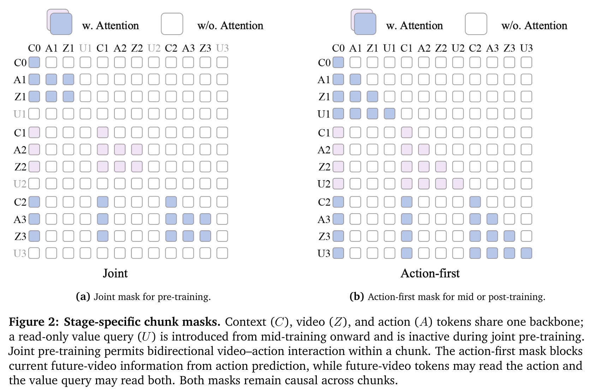
**Caption:** Figure 2: Stage-specific chunk masks. Context (C), video (Z), and action (A) tokens share one backbone; a read-only value query (U) is introduced from mid-training onward. Joint pre-training permits bidirectional video–action interaction within a chunk. The action-first mask blocks current future-video information from action prediction, while future-video tokens may read the action and the value query may read both.
**Caption[CN]:** 图 2：不同训练阶段特有的分块掩码设计。语境（C）、视频（Z）和动作（A）tokens 共享同一个网络主干；只读价值查询（U）自领域中程训练起引入。联合预训练阶段允许块内视频与动作进行双向交互。动作优先掩码阻断了当前未来视频信息流向动作预测，而未来视频 tokens 可读取动作，价值查询则可同时读取两者。跨分块之间严格保持因果时序可见性。

> <strong>Para. 11:</strong> To realize the policy–simulator–evaluator factorization without splitting the model into distinct neural networks, Motus2 organizes tokens into chunk blocks $x = [Z_{\text{ctx}}; B_1; \dots; B_M]$ with $B_j = (q_j; A_j; Z_j; U_j)$, governed by a stage-specific causal chunk mask (Figure 2). Under this mask:
> - Action tokens $A_j$ cannot attend to current future video $Z_j$ or value query $U_j$.
> - Future video tokens $Z_j$ attend to action tokens $A_j$.
> - The value query $U_j$ attends to both $A_j$ and $Z_j$ to assess the branch outcome.
> <strong>Para. 11[CN]:</strong> 为在不将模型拆解为独立神经网络的前提下实现策略–模拟器–评估器的链式因式分解，Motus2 将序列组织为分块结构 $x = [Z_{\text{ctx}}; B_1; \dots; B_M]$，其中 $B_j = (q_j; A_j; Z_j; U_j)$，并由特定阶段的因果分块掩码严格管控（图 2）。在该掩码下：
> - 动作 tokens $A_j$ 严禁注意力流向当前未来视频 $Z_j$ 或价值查询 $U_j$；
> - 未来视频 tokens $Z_j$ 可自由读取已确定的动作 tokens $A_j$；
> - 价值查询 $U_j$ 同时审视 $A_j$ 与 $Z_j$，从而对该分支的发展结局做出公允评估。

> <strong>Para. 12:</strong> We train the unified backbone using Conditional Flow Matching across three trajectory-gated modes:
> <strong>Para. 12[CN]:</strong> 我们采用条件流匹配（Conditional Flow Matching）通过三类轨迹门控模式联合训练共享主干网络：

$$x_\sigma = (1 - \sigma)x + \sigma \epsilon, \quad v^* = \epsilon - x, \quad \sigma \in [0, 1]$$

$$\mathcal{L} = w_z \|v_\theta^z - v_z^*\|_2^2 + \lambda_a w_a \|v_\theta^a - v_a^*\|_2^2 + \lambda_v w_v \text{CE}(p_\theta^{\text{vm}}, Y_t)$$

> <strong>Para. 13:</strong> The loss gates $(w_z, w_a, w_v)$ route trajectories:
> - **Policy mode**: $(w_z, w_a, w_v) = (1, 1, 0)$ applied solely to curated successful trajectories.
> - **Simulation mode**: $(w_z, w_a, w_v) = (1, 0, 0)$ applied to both successes and failures, using clean recorded actions to supervise future video prediction.
> - **Evaluation mode**: $(w_z, w_a, w_v) = (0, 0, 1)$ with clean actions and video to supervise categorical value prediction.
> Failed and suboptimal trajectories are thus routed exclusively to simulation and evaluation modes, turning operational errors into rich dynamic and value learning signals without teaching the policy bad habits.
> <strong>Para. 13[CN]:</strong> 损失门控 $(w_z, w_a, w_v)$ 负责调度轨迹流向：
> - **策略模式**：$(w_z, w_a, w_v) = (1, 1, 0)$，仅在高质量成功示教轨迹上激活动作监督；
> - **模拟模式**：$(w_z, w_a, w_v) = (1, 0, 0)$，同时应用于成功与失败轨迹，以干净的实测动作作为条件来监督未来视频预测；
> - **评估模式**：$(w_z, w_a, w_v) = (0, 0, 1)$，以干净的动作与视频监督分类价值预测。
> 失败与次优轨迹因此被精确分流至模拟与评估模式，将执行失误转化为宝贵的物理动力学与价值惩罚信号，而绝不会教唆策略模仿错误动作。

### 3.3 Value-Guided Closed-Loop Self-Evolution

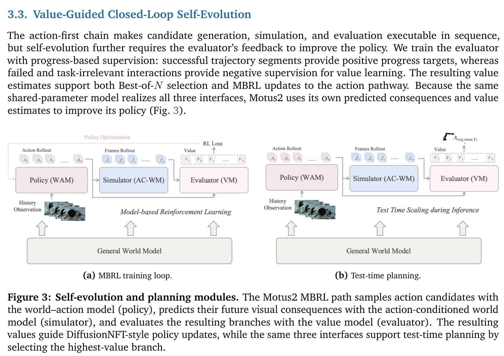
**Caption:** Figure 3: Self-evolution and planning modules. The Motus2 MBRL path samples action candidates with the world–action model (policy), predicts their future visual consequences with the action-conditioned world model (simulator), and evaluates the resulting branches with the value model (evaluator). The resulting values guide DiffusionNFT-style policy updates, while the same three interfaces support test-time planning by selecting the highest-value branch.
**Caption[CN]:** 图 3：自演化与规划模块。(a) MBRL 训练闭环：策略采样候选动作，模拟器预测未来视觉后果，评估器评估各分支得分，据此通过 DiffusionNFT 指导策略更新；(b) 测试时规划：相同的三个接口通过 Best-of-N 选出最高价值分支执行。

> <strong>Para. 14:</strong> Following relative-progress value formulation, successful segments are assigned target $r_t = \frac{\Delta t}{T - t} \in [0, 1]$, whereas failed segments receive negative reward $r_t = -\frac{\Delta t}{T - t}$. During MBRL, the policy proposes candidate actions $A_i$, the simulator predicts visual futures $Z_i$, and the evaluator produces scalar value $V_i$. DiffusionNFT converts these scores into policy updates:
> <strong>Para. 14[CN]:</strong> 遵循相对进度价值形式化，成功片段被赋予正奖励目标 $r_t = \frac{\Delta t}{T - t} \in [0, 1]$，而失败片段则被赋予负惩罚 $r_t = -\frac{\Delta t}{T - t}$。在 MBRL 训练中，策略提议候选动作 $A_i$，模拟器推演视觉未来 $Z_i$，评估器输出标量价值 $V_i$。DiffusionNFT 将这些评估得分转化为流匹配策略更新：

$$\hat{r}_i = 0.5 + 0.5 \cdot \text{clip}\left(\frac{V_i - \text{mean}(V)}{\max(\text{std}(V), \varepsilon)}, -1, 1\right)$$

$$v_i^+ = (1 - \beta) v_{\text{ref}, i} + \beta v_{\theta, i}, \quad v_i^- = (1 + \beta) v_{\text{ref}, i} - \beta v_{\theta, i}$$

$$\mathcal{L}_{\text{NFT}} = \mathbb{E}_i \left[ \hat{r}_i \|v_i^+ - v_i^{\text{tar}}\|_2^2 + (1 - \hat{r}_i) \|v_i^- - v_i^{\text{tar}}\|_2^2 \right]$$

### 3.4 Working Memory & Tactile Expert

> <strong>Para. 15:</strong> To resolve partial observability in long-horizon dexterous manipulation, Motus2 investigates three working-memory designs:
> 1. **Sliding Window**: Bounded streaming cache holding the most recent observations with window-relative RoPE.
> 2. **Global Autoregression**: Unbounded retention of all clean visual latents with episode-level temporal coordinates.
> 3. **Hybrid Memory**: Retains initial anchors and recent frames while compressing intermediate observations into persistent memory tokens.
> Furthermore, a high-rate **Tactile Expert** conditions action sub-chunks on high-frequency tactile readings via intermediate denoised latents $A_{t,k}^{\sigma_c}$, updating the final action $\tilde{A}_{t,k} = A_{t,k}^{\sigma_c} - \sigma_c v_{\phi, t, k}^a$ and predicting future contact force windows $f_{t,k}^{\text{post}}$.
> <strong>Para. 15[CN]:</strong> 为解决长时程灵巧操作中的部分可观测性问题，Motus2 深入探索了三类工作记忆架构：
> 1. **滑动窗口（Sliding Window）**：受限的流式缓存，仅保留最近的观测并采用窗口相对 RoPE；
> 2. **全局自回归（Global Autoregression）**：无损保留所有历史干净视觉潜帧，采用轨迹级全局时间坐标；
> 3. **混合工作记忆（Hybrid Memory）**：保留初始锚点帧与近期窗口，同时将较早的中间观测压缩为持久记忆 tokens。
> 此外，高频**触觉专家（Tactile Expert）**在中间去噪状态 $A_{t,k}^{\sigma_c}$ 上以最新触觉读数为条件精修动作子块 $\tilde{A}_{t,k} = A_{t,k}^{\sigma_c} - \sigma_c v_{\phi, t, k}^a$，并预测未来接触力时序窗口 $f_{t,k}^{\text{post}}$。

---

## 4 Large-Scale Egocentric Dataset

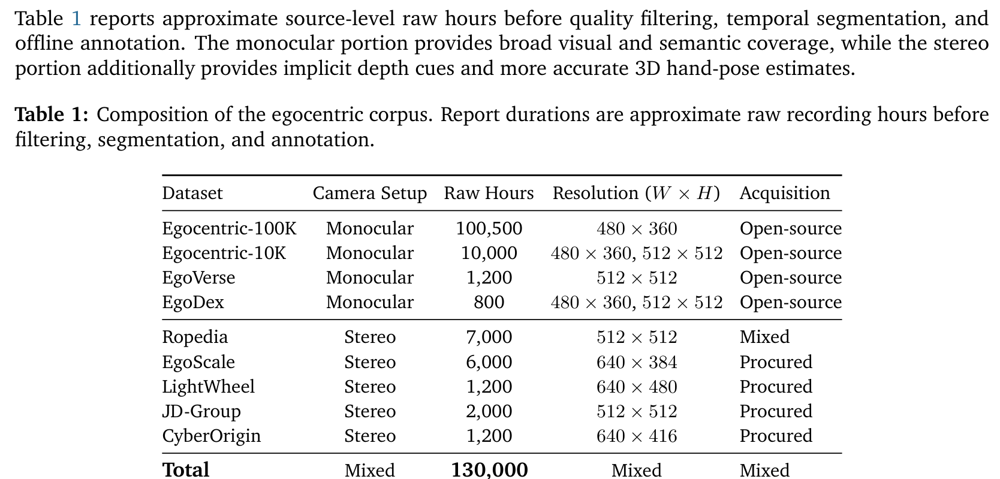
**Caption:** Table 1: Composition of the egocentric corpus. Report durations are approximate raw recording hours before filtering, segmentation, and annotation.
**Caption[CN]:** 表 1：第一人称多模态语料库组成统计。所列时长为过滤、切分与离线标注前的原始录制小时数。

| Dataset | Camera Setup | Raw Hours | Resolution ($W \times H$) | Acquisition |
| :--- | :--- | :---: | :---: | :--- |
| Egocentric-100K | Monocular | 100,500 | $480 \times 360$ | Open-source |
| Egocentric-10K | Monocular | 10,000 | $480 \times 360, 512 \times 512$ | Open-source |
| EgoVerse | Monocular | 1,200 | $512 \times 512$ | Open-source |
| EgoDex | Monocular | 800 | $480 \times 360, 512 \times 512$ | Open-source |
| **Ropedia** | **Stereo** | **7,000** | **$512 \times 512$** | **Mixed** |
| **EgoScale** | **Stereo** | **6,000** | **$640 \times 384$** | **Procured** |
| **LightWheel** | **Stereo** | **1,200** | **$640 \times 480$** | **Procured** |
| **JD-Group** | **Stereo** | **2,000** | **$512 \times 512$** | **Procured** |
| **CyberOrigin** | **Stereo** | **1,200** | **$640 \times 416$** | **Procured** |
| **Total** | **Mixed** | **130,000** | **Mixed** | **Mixed** |

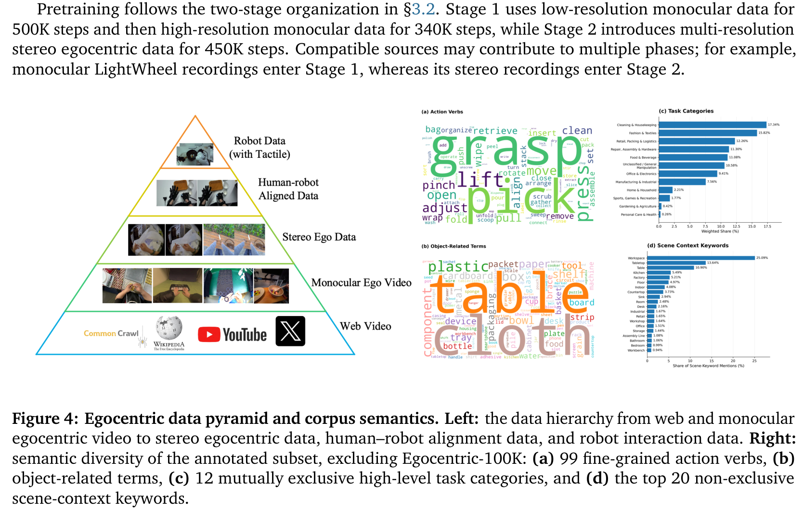
**Caption:** Figure 4: Egocentric data pyramid and corpus semantics. Left: the data hierarchy from web monocular video to synchronized stereo egocentric data and target robot trajectories. Right: semantic action category distribution.
**Caption[CN]:** 图 4：第一人称数据金字塔与语料语义分布。左图：从网络单目视频、同步双目第一人称数据到目标机器人轨迹的分层体系；右图：核心动作语义类别的长尾分布。

> <strong>Para. 16:</strong> As outlined in Table 1 and Figure 4, we assemble an extensive 130,000-hour egocentric data pyramid. The base contains 112.5K hours of monocular videos providing visual and semantic coverage. The middle tier comprises 17.4K hours of calibrated, synchronized stereo egocentric videos, providing implicit 3D depth and stereo disparity cues essential for dexterous manipulation. The apex integrates high-fidelity robot teleoperation trajectories and human-robot alignment pairs.
> <strong>Para. 16[CN]:</strong> 如表 1 和图 4 所示，我们构建了一个庞大的 13 万小时第一人称数据金字塔。底层包含 11.25 万小时的单目视频，提供广泛的视觉与语义覆盖；中层涵盖 1.74 万小时标定校准、高帧率同步的双目第一人称视频，提供灵巧操作不可或缺的隐式 3D 深度与立体视差线索；顶层汇聚了高保真机器人遥操作轨迹与人–机跨本体对齐数据。

---

## 5 Experiments

### 5.1 Experimental Setup & Biomimetic Platform

> <strong>Para. 17:</strong> Motus2 is deployed on a custom biomimetic robot platform featuring:
> - Dual 7-DoF Tianji arms.
> - Dual 20-DoF Wuji Hand 2 anthropomorphic hands and Sharpa Wave tactile hands.
> - Head-mounted binocular stereo camera synchronized at 30 fps.
> - High-frequency fingertip tactile sensor arrays.
> We evaluate five demanding dexterous manipulation tasks: Place Ball, Multi-Finger Manipulation, Attach Eraser, Screw Lightbulb, and Put Phone in Pocket (Figure 8).
> <strong>Para. 17[CN]:</strong> Motus2 部署于一套定制的全仿生双臂机器人平台上，包含：
> - 双 7 自由度天机机械臂；
> - 双 20 自由度无极 2 代（Wuji Hand 2）五指仿人灵巧手及 Sharpa Wave 触觉手；
> - 头部双目立体视差相机（30 fps 硬件同步）；
> - 指尖高频触觉传感阵列。
> 我们系统评测了五项高难度灵巧操作任务：精准置球（Place Ball）、多指协同操作（Multi-Finger Manipulation）、安装橡皮擦（Attach Eraser）、旋转拧紧灯泡（Screw Bulb）以及手机入袋（Put Phone in Pocket）（见图 8）。

### 5.2 Main Benchmark Results

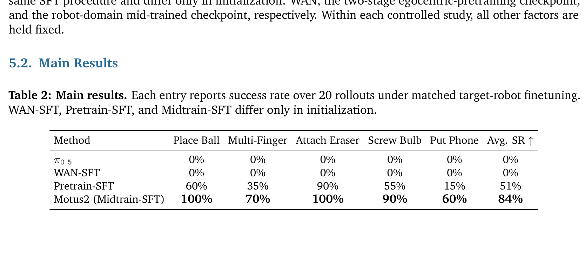
**Caption:** Table 2: Main results. Each entry reports success rate over 20 rollouts under matched target-robot finetuning. WAN-SFT, Pretrain-SFT, and Midtrain-SFT differ only in initialization.
**Caption[CN]:** 表 2：主实验对比结果。每项条目报告在匹配的目标机器人微调下 20 次实机运行的成功率（%）。WAN-SFT、Pretrain-SFT 与 Midtrain-SFT 仅在预训练初始化权重上存在差异。

| Method | Place Ball | Multi-Finger | Attach Eraser | Screw Bulb | Put Phone | Avg. SR (%) ↑ |
| :--- | :---: | :---: | :---: | :---: | :---: | :---: |
| $\pi_{0.5}$ | 0% | 0% | 0% | 0% | 0% | **0%** |
| WAN-SFT | 0% | 0% | 0% | 0% | 0% | **0%** |
| Pretrain-SFT | 60% | 35% | 90% | 55% | 15% | **51%** |
| **Motus2 (Midtrain-SFT)** | **100%** | **70%** | **100%** | **90%** | **60%** | **84%** |

> <strong>Para. 18:</strong> As shown in Table 2, classical VLA baselines ($\pi_{0.5}$) and naive video SFT (WAN-SFT) achieve 0% success across all five dexterous tasks, failing to coordinate 20-DoF fingers or establish reliable contact. In stark contrast, pretraining on egocentric data lifts average success to 51%, and Motus2 with robot-domain mid-training reaches a dominant **84% average success rate**, achieving 100% success on Place Ball and Attach Eraser and 90% on Screw Bulb.
> <strong>Para. 18[CN]:</strong> 如表 2 所示，经典的 VLA 基线（$\pi_{0.5}$）与朴素的视频监督微调（WAN-SFT）在所有五项灵巧操作任务中全部录得 **0% 成功率**，彻底无法协调 20 自由度的手指运动或建立稳定的接触关系。形成强烈对比的是，第一人称预训练将平均成功率大幅拉升至 51%，而经过机器人领域中程训练的 Motus2 更是达到了碾压性的 **84% 平均成功率**，在精准置球和安装橡皮擦任务中斩获 100% 满分，在拧灯泡任务中达到 90%。

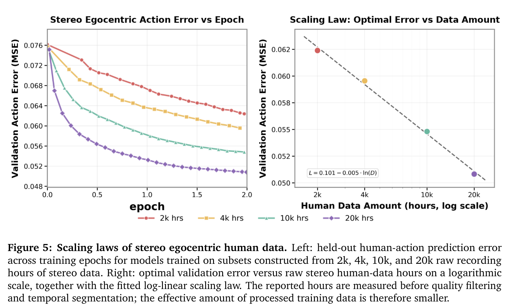
**Caption:** Figure 5: Scaling laws of stereo egocentric human data. Left: held-out human-action prediction loss decreases as a power law with stereo pretraining hours. Right: downstream robot task success rate monotonically improves with pretraining data scale.
**Caption[CN]:** 图 5：双目第一人称人类数据的缩放定律（Scaling Laws）。左图：保留人类动作预测验证损失随双目预训练时长呈幂律单调下降；右图：下游机器人任务成功率随预训练数据规模扩大而稳步提升。

### 5.3 Policy Improvement, Context & Tactile Ablations

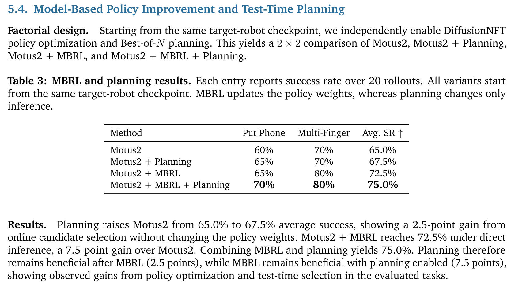
**Caption:** Table 3: MBRL and planning results. Each entry reports success rate over 20 rollouts. All variants start from the same target-robot checkpoint. MBRL updates the policy weights, whereas planning changes only inference.
**Caption[CN]:** 表 3：基于模型的强化学习（MBRL）与测试时规划实验结果。每个条目报告 20 次实机运行的成功率。所有变体均始于相同的目标机器人检查点。MBRL 更新策略权重，而规划仅作用于测试时推理。

| Method | Put Phone | Multi-Finger | Avg. SR (%) ↑ |
| :--- | :---: | :---: | :---: |
| Motus2 (Base Policy) | 60% | 70% | 65.0% |
| Motus2 + Planning (Best-of-$N$) | 65% | 70% | 67.5% (+2.5%) |
| Motus2 + MBRL (DiffusionNFT) | 65% | 80% | 72.5% (+7.5%) |
| **Motus2 + MBRL + Planning** | **70%** | **80%** | **75.0% (+10.0%)** |

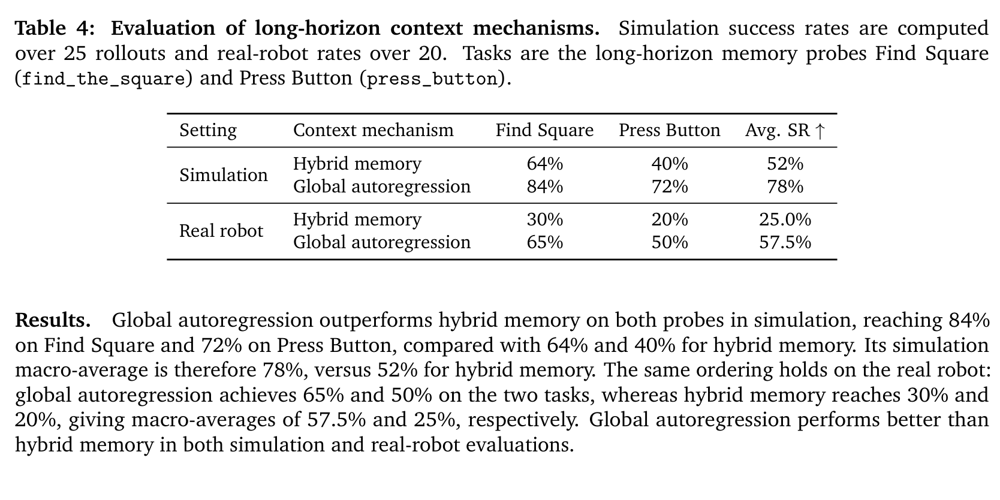
**Caption:** Table 4: Evaluation of long-horizon context mechanisms across simulation and real-robot memory probes (Find Square and Press Button).
**Caption[CN]:** 表 4：长时程上下文机制在仿真与实机记忆探针任务（寻方块与按按钮）上的对比评测。

| Setting | Context Mechanism | Find Square | Press Button | Avg. SR (%) ↑ |
| :--- | :--- | :---: | :---: | :---: |
| **Simulation** | Hybrid memory | 64% | 40% | 52% |
| | **Global autoregression** | **84%** | **72%** | **78% (+26%)** |
| **Real Robot** | Hybrid memory | 30% | 20% | 25.0% |
| | **Global autoregression** | **65%** | **50%** | **57.5% (+32.5%)** |

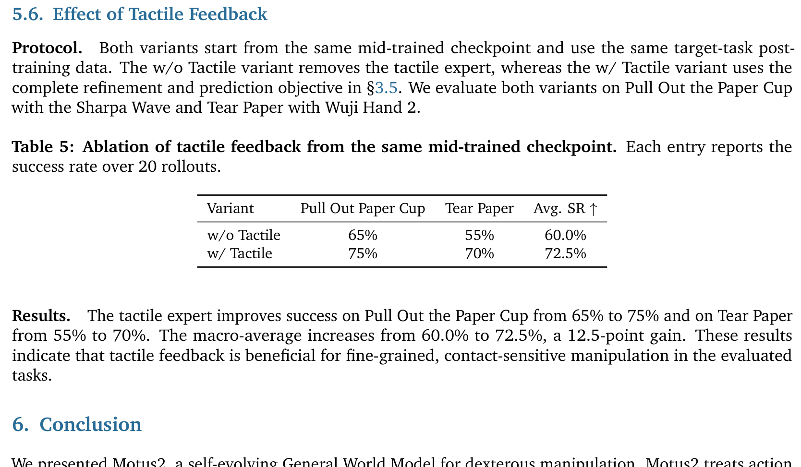
**Caption:** Table 5: Ablation of tactile feedback from the same mid-trained checkpoint across 20 real-robot rollouts.
**Caption[CN]:** 表 5：同质中程检查点下触觉反馈消融实验结果（20 次实机测试）。

| Variant | Pull Out Paper Cup | Tear Paper | Avg. SR (%) ↑ |
| :--- | :---: | :---: | :---: |
| w/o Tactile | 65% | 55% | 60.0% |
| **w/ Tactile (Full Motus2)** | **75%** | **70%** | **72.5% (+12.5%)** |

> <strong>Para. 19:</strong> Tables 3, 4, and 5 quantify the architectural pillars of Motus2:
> - **Self-Evolution (Table 3)**: MBRL via DiffusionNFT boosts baseline success by +7.5% (65.0% $\to$ 72.5%), and test-time planning adds another +2.5%, achieving 75.0% total (+10.0%).
> - **Working Memory (Table 4)**: On long-horizon memory tasks requiring remembering occluded items, Global Autoregression crushes Hybrid Memory by **+32.5% on real robots (57.5% vs 25.0%)**, demonstrating that compressing intermediate visual observations into memory tokens causes irrecoverable spatial precision loss in fine-grained manipulation.
> - **Tactile Expert (Table 5)**: High-rate tactile action refinement and force prediction yield a +12.5% boost on contact-critical tasks (Pull Out Cup and Tear Paper).
> <strong>Para. 19[CN]:</strong> 表 3、表 4 与表 5 量化验证了 Motus2 的核心技术支柱：
> - **自演化闭环（表 3）**：基于 DiffusionNFT 的 MBRL 训练使基准策略大幅提升 +7.5%（从 65.0% 升至 72.5%），测试时规划进一步增益 +2.5%，两项叠加共带来 +10.0% 的飞跃（达到 75.0%）；
> - **工作记忆机制（表 4）**：在需要记忆先前被遮挡物体的长时程记忆探针任务中，全局自回归在真实机器人上以 **57.5% 对比 25.0% 彻底碾压了混合记忆机制（优势高达 +32.5%）**，证实将高维中间视觉帧压缩为离散记忆 tokens 会给高精度空间几何带来不可逆的精度损失；
> - **触觉专家（表 5）**：高频触觉动作精修与力预测在拉拔纸杯与双手撕纸两项极度依赖接触的手部任务中带来了 +12.5% 的显著提升（72.5% vs 60.0%）。

---

## 6 Conclusion & 7 Limitations

> <strong>Para. 20:</strong> We presented Motus2, a self-evolving General World Model for dexterous manipulation that unifies policy execution, visual consequence simulation, and progress evaluation within a single shared-parameter transformer. Motus2 advances world modeling through 130K-hour egocentric data scaling, action-first chunk factorization, closed-loop MBRL self-evolution, and tactile feedback.
> **Limitations:** While Motus2 marks a significant leap, limitations include: (1) Generating multi-branch video futures at test time introduces computational latency; (2) Global autoregression incurs an attention complexity quadratic in episode length; (3) Scaling to open-world multi-stage tool use will require continuous autonomous data collection.
> <strong>Para. 20[CN]:</strong> 我们提出了 Motus2，一种面向灵巧操作的自演化通用世界模型，它在单一共享参数的 Transformer 架构内高度统一了策略执行、未来视觉推演模拟以及任务进度评估。Motus2 通过 13 万小时第一人称数据规模化、动作优先分块分解、闭环 MBRL 自我演进以及高频触觉反馈全面推进了具身世界模型的技术前沿。
> **局限性**：尽管取得了重大突破，当前系统仍存在以下局限：(1) 在测试时展开多分支未来视频生成推演具有一定的计算延迟；(2) 全局自回归机制的时空注意力复杂度随情节长度呈二次方增长；(3) 推广至完全开放世界的长时程复杂工具制造仍有赖于持续的物理世界自主数据采集与迭代。

---

## References

1. Alayrac, J. B., et al. (2022). Flamingo: A visual language model. In NeurIPS.
2. Anthropic. (2024). The Claude 3.5 Sonnet report.
3. Bao, F., et al. (2024). DiffusionNFT: Non-fine-tuning policy optimization for diffusion models. arXiv preprint.
4. Bi, H., et al. (2025). Motus: General world models for autonomous driving. arXiv preprint.
5. Brohan, A., et al. (2022). RT-1: Robotics transformer. In RSS.
6. Brohan, A., et al. (2023). RT-2: Vision-language-action models. In CoRL.
7. Chen, B., et al. (2024). VideoLLaMA 2. arXiv preprint.
8. Chi, C., et al. (2023). Diffusion policy: Visuomotor policy learning via action diffusion. In RSS.
9. Driess, D., et al. (2023). PaLM-E: An embodied multimodal language model. In ICML.
10. Grauman, K., et al. (2022). Ego4D: Around the world in 3,000 hours of egocentric video. In CVPR.
11. Hafner, D., et al. (2023). Mastering diverse domains through world models (DreamerV3). arXiv preprint.
12. Hansen, N., et al. (2024). TD-MPC2: Scalable, robust world models for continuous control. In ICLR.
13. Huang, W., et al. (2023). VoxPoser: Composable 3D value maps. In CoRL.
14. Lipman, Y., et al. (2023). Flow matching for generative modeling. In ICLR.
15. OpenAI. (2024). Sora: Creating video from text.
16. Padalkar, A., et al. (2023). Open X-Embodiment. In ICRA.
17. Peebles, W., & Xie, S. (2023). Scalable diffusion models with transformers (DiT). In ICCV.
18. Physical Intelligence. (2024). $\pi_0$: A flow-based physical foundation model. Technical report.
19. Shridhar, M., et al. (2023). Perceiver-Actor. In CoRL.
20. Wang, T., et al. (2026). Routing before looking. In CVPR.
21. Wang, X., et al. (2025). WAN: Open and scalable video generation. arXiv preprint.
22. Wu, P., et al. (2025). T-Rex: Tactile-conditioned action refinement. In RSS.
23. Yang, Y., et al. (2025). Skills in weights, memory in code. In ICLR.
24. Zhao, T. Z., et al. (2023). Learning fine-grained bimanual manipulation with low-cost hardware. In RSS.
25. Zhou, Z., et al. (2025). MemoryWAM: Efficient world action modeling with persistent memory. In CVPR.

---

## Appendix

### Appendix A: Robot Platforms, Hands & Sensors

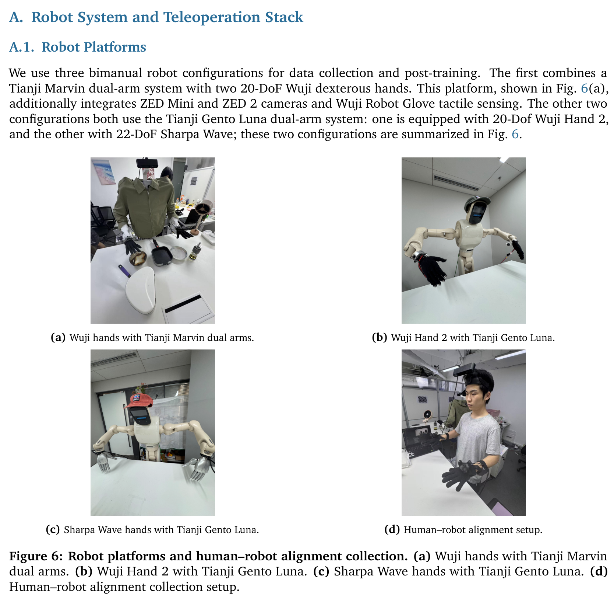
**Caption:** Figure 6: Robot platforms and human–robot alignment collection. (a) Wuji hands with Tianji arms. (b) Sharpa Wave hands with Tianji arms. (c) Exoskeleton master arms for teleoperation. (d) Human–robot alignment pair data collection.
**Caption[CN]:** 图 6：机器人硬件平台与人–机对齐数据采集。(a) 搭载于天机双臂的无极手（Wuji Hand 2）；(b) 搭载于天机双臂的 Sharpa Wave 触觉手；(c) 用于遥操作的外骨骼主手设备；(d) 人–机同动作对齐示教数据采集现场。

### Appendix B: Evaluation Tasks & Detailed Traces

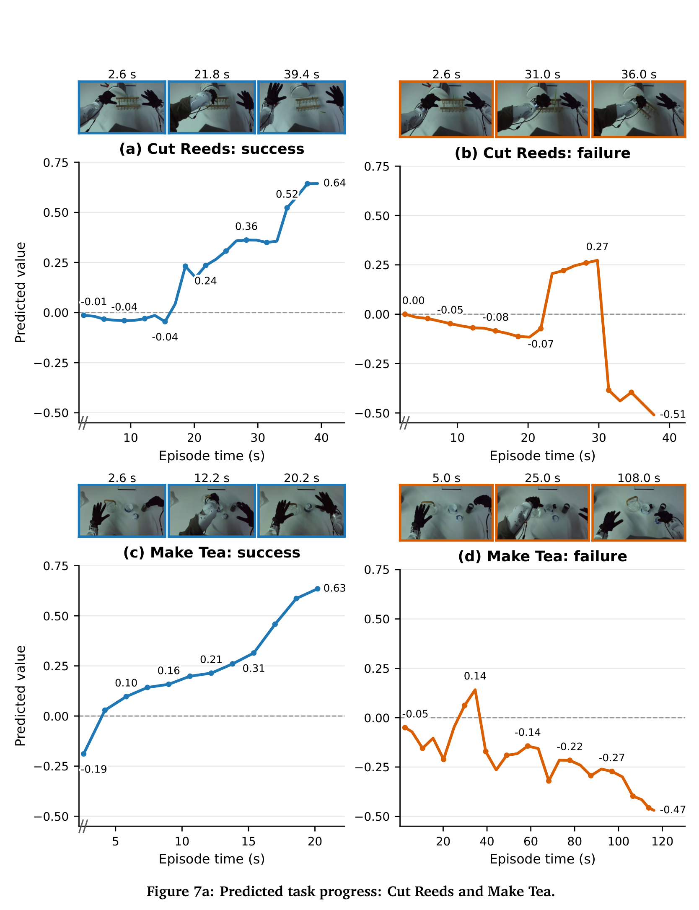
**Caption:** Figure 7a: Predicted task progress: Cut Reeds and Make Tea. The evaluator accurately tracks task progress across both successful trajectories and early failures.
**Caption[CN]:** 图 7a：预测任务进度曲线：剪芦苇与泡茶任务。评估器能够在成功轨迹与早期失败中精准追踪任务推进度。

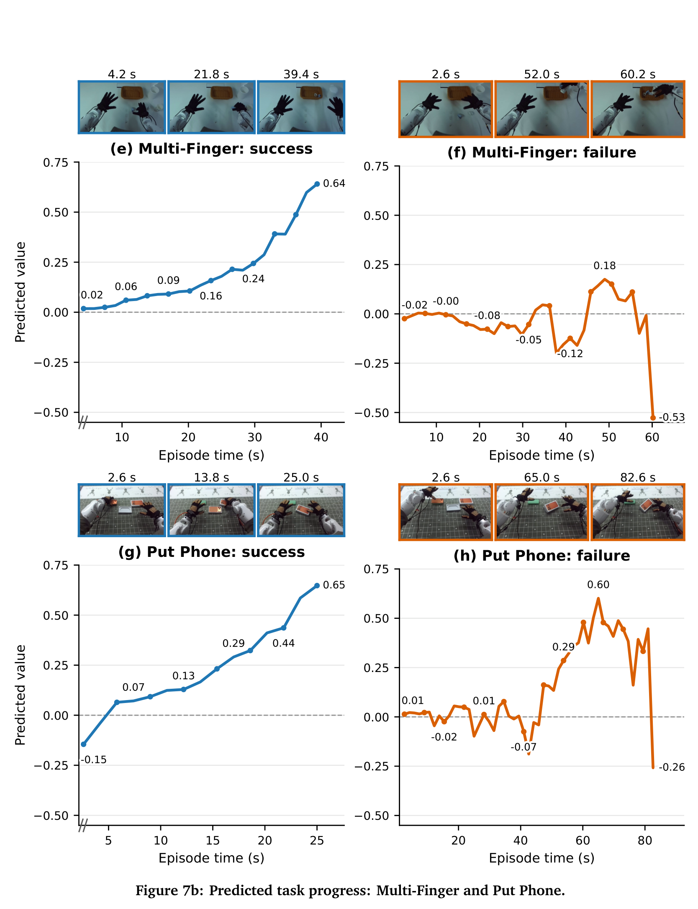
**Caption:** Figure 7b: Predicted task progress: Multi-Finger and Put Phone.
**Caption[CN]:** 图 7b：预测任务进度曲线：多指协同操作与手机入袋任务。

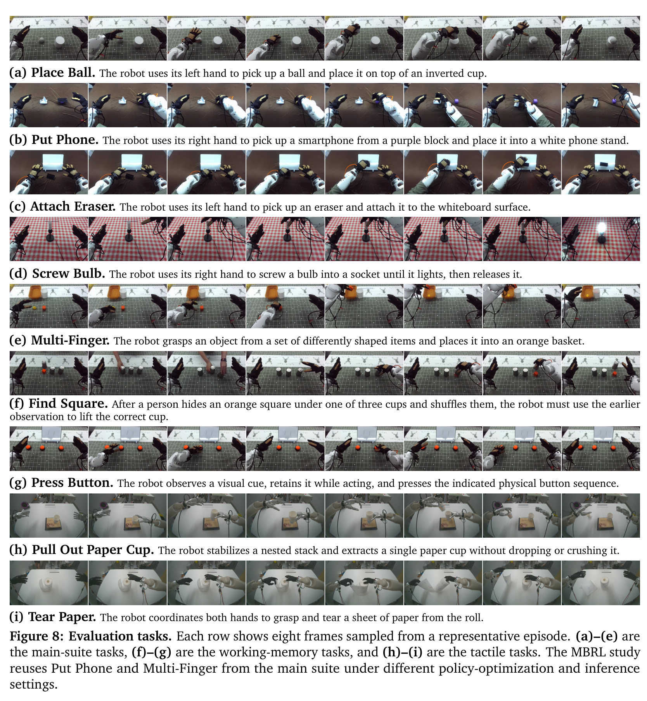
**Caption:** Figure 8: Evaluation tasks. Each row shows eight frames sampled from a representative episode across the evaluated dexterous manipulation tasks.
**Caption[CN]:** 图 8：实机评测任务全景图。每行展示了从代表性操作轨迹中等间隔抽取的 8 个关键动作瞬间。
