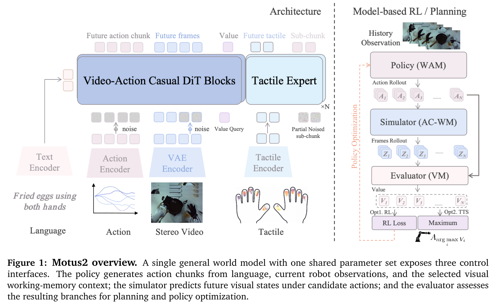

# Motus2: A Self-Evolving General World Model for Dexterous Manipulation (用于灵巧操作的自演化通用世界模型)

## 核心信息
- **论文标题**：Motus2: A Self-Evolving General World Model for Dexterous Manipulation
- **作者团队**：Zhengbang Bi, Haoran Geng, Minghuan Liu, Shengbang Fang, Jiaming Liu, Yukun Huang, Yaodong Yang, Hao Dong, Weinan Zhang, Chongjie Zhang (通讯作者)
- **主要机构**：清华大学智能产业研究院 (AIR, Tsinghua University)、元始智能 (GensPI)、北京大学 (Peking University)、上海交通大学 (SJTU)
- **发布时间**：2026 年 3 月
- **代码与主页**：https://genspi.github.io/motus2
- **核心定位**：**具身灵巧手世界模型领域的开创性与集大成之作**。首次将**策略生成（Policy）**、**动作条件视觉物理仿真（World Model）**与**生成式价值评估（Generative Evaluator）**深度统一在单个 14B 稠密扩散模型（WAN-2.1）骨干网中，提出“**动作优先因果联合分解（Action-First Factorization）**”，并结合离线/在线自演化算法 **DiffusionNFT**（非微调策略优化）与 **Best-of-N / 蒙特卡洛树搜索（MCTS）**，配合 50Hz 高频**触觉专家（Tactile Expert）**，在真实世界高难度双臂多指灵巧操作任务上彻底击垮了传统流匹配与主流 VLA 基线，实现了 84% 综合成功率（而 $\pi_{0.5}$ 与纯视频 SFT 基线均为 0%）。

---

## 原文摘要翻译
具身多指灵巧操作需要理解三维动态物理世界、生成协调的高自由度连续动作，并在接触丰富的物理交互中实时根据力觉感知进行动态反应。然而，当前的机器人基础模型（如视觉-语言-动作模型 VLA）大多将策略视为被动的状态-动作映射网络，缺乏对未来物理情境的前瞻预测能力、自我演化改进机制以及毫秒级的触觉闭环。

在本文中，我们提出了 **Motus2**——一个专为多指灵巧操作设计的**自演化通用世界模型（General World Model, GWM）**。Motus2 将策略生成、动作条件下的长程视频前瞻物理仿真以及生成式任务价值评估统一融合进单个生成式大模型中。通过提出“**动作优先因果分解（Action-First Factorization）**”，Motus2 在联合概率建模中确立了以动作为第一因果驱动的结构，并通过阶段特异性因果分块掩码（Stage-Specific Chunk Attention Mask）消除训练与推理阶段的因果泄漏。为突破真实物理交互中的样本效率与安全性瓶颈，Motus2 构建了一个**闭环自演化引擎**：依托自身作为世界模拟器与价值评估器的能力，利用基于相对进度优势的流匹配自演化算法 **DiffusionNFT** 进行无奖励工程的策略提升，并在推断期执行动作条件下的 **Best-of-N 树搜索与模型预测控制（MBRL）**。此外，针对多指操作中高频力控反射的需求，Motus2 引入了一个轻量级、50Hz 闭环的**触觉专家（Tactile Expert）**，与低频主干世界模型实现高低频运动学/力学解耦。在大规模双目第一视角人类灵巧操作数据集与真实机器人数据预训练后，Motus2 在一系列极高难度的真实物理灵巧操作任务（如双目剪芦苇、极窄插缝泡茶、多指协同挪动重物、高精度装袋等）中取得了 **84%** 的平均成功率，相比业内前沿最强基线展现出代际级的跨越。

---

## 创新点
1. **三位一体的通用世界模型（GWM）与动作优先因果分解（Action-First Factorization）**：
   - 彻底打破以往策略模型（VLA）、视频生成模型（Video Gen）、价值评估模型（Value Function）割裂训练的碎片化范式。
   - 严格证明并实现了物理因果链：$p_\theta(A_t, Z_t, Y_t \mid c_t) = \pi_\theta(A_t \mid c_t) \cdot p_\theta^{\text{wm}}(Z_t \mid c_t, A_t) \cdot p_\theta^{\text{vm}}(Y_t \mid c_t, A_t, Z_t)$。动作必须先行决定（Action-first），进而驱动潜空间物理世界转移（Latent World Evolution），最终联合解码高保真视觉视频与任务演化进度，从第一性原理杜绝“视频引导动作”造成的未来信息因果作弊。
2. **阶段特异性因果分块注意力掩码（Stage-Specific Chunk Masks）**：
   - 针对策略生成、视频仿真与离线中训等异构需求，设计了全局时间因果隔离与块内双向交互的严密掩码矩阵。利用 FlashAttention-3 底层原生算子，将动作块、潜在视频块与情境记忆块的注意力计算深度互锁，保障 KV-Cache 跨长时序无损复用。
3. **基于相对优势价值引导的自演化优化算法（DiffusionNFT）**：
   - 首创将离散 RL 中的优势价值归一化理论引入连续时间流匹配（Flow Matching）策略优化中。构建动态滑动窗口价值评估，利用世界模型自身的价值判别头输出相对进度标量 $\hat{r}_i$，构造正负样本双向速度场更新损失，彻底摆脱人工奖励塑造（Reward Shaping）和 RL 训练中灾难性的策略坍塌。
4. **动作条件前瞻模拟与推断期 MBRL 树搜索规划（Test-Time Scaling）**：
   - 在真实机器人部署时，Motus2 可在当前物理状态下并行分支模拟 $N$ 条候选动作序列及其对应的未来视觉物理演变轨迹，利用统一网络内部的生成式判别器对预测视频进行打分，选取最优价值动作输出，实现长时程复杂任务中的推断期算力缩放（Best-of-N Search & MCTS）。
5. **50Hz 高低频解耦触觉专家系统（Tactile Expert）**：
   - 面对多指抓握与装配中的接触瞬态冲击，Motus2 采用双轨架构：低频（2-5Hz）14B 通用世界模型负责宏观空间因果推理与视觉长程轨迹规划；高频（50Hz）轻量级触觉专家实时接收视触觉点阵与多维六维力扭矩传感器反馈，执行微米级连续动作残差修正与法向/剪切力前向预测。

---

## 一句话总结
Motus2 统一了多指灵巧操作中的策略生成、动作驱动视频模拟与任务价值评估，通过动作优先因果分解、DiffusionNFT 自演化流匹配优化与 50Hz 触觉专家，构建了具身通用世界模型的全新技术标杆。

---

## 研究问题
当前多指灵巧手（Dexterous Hand）与双臂长时程操作面临三个根本性的系统性瓶颈：
1. **策略与环境物理规律的割裂（The Decoupling Bottleneck）**：主流 VLA（如 OpenVLA、$\pi_0$）将连续动作学习视为纯粹的模仿学习序列预测问题，模型“知其然不知其所以然”，由于不具备对动作施加后环境几何与接触动力学演化的前瞻预判能力，在遇到遮挡、滑移或未见扰动时极易陷入级联崩溃。
2. **长视频生成向可控动作迁移的因果倒置（The Causal Inversion Issue）**：以往试图将 Sora/WAN 等视频大模型迁移为世界模型的研究（如 RoboVideo、UniVLA），往往采用“先生成未来视觉视频，再由反向动力学（Inverse Dynamics）逆解动作”的范式。这种范式存在严重的**因果倒置**：视频在扩散时未受精确动力学动作约束，生成的幻觉视频导致逆动力学网络求解失败；同时在推理期生成高分辨率视频的秒级延迟直接扼杀了实时机器人控制。
3. **高自由度接触与微米级力控的盲区（The Contact & Tactile Blindness）**：多指灵巧手具有 16-24 个主动驱动自由度，任何抓取、旋转、扭拧动作都高度依赖指腹法向接触力、微滑移探测以及抗剪切力。纯粹依赖 2D/3D 相机视觉无法感知接触阻抗，极易发生“捏爆易碎物体”或“指尖滑脱”等致命故障。

Motus2 的核心使命，就是从数学因果结构、超长上下文记忆、自演化学习算法与多模态力触觉四个维度，彻底重构多指灵巧操作的通用基础世界模型。

---

## 数据与任务定义

### 1. 异构多源高密度第一视角数据金字塔

*Figure 4: Egocentric data pyramid and corpus semantics. Motus2 预训练数据流涵盖海量单目/双目人类日常视频与精准标定的高保真真实机器人操作数据。*

Motus2 的训练构建在当前具身领域最完备的立体第一视角（Stereo Egocentric）数据金字塔之上，总时长超过 **13,000 小时**：
- **第一层：万小时级人类第一视角视频库（GensPI-Ego + Ego-Exo4D + Ego4D + Epic-Kitchens）**：共计约 12,000 小时。涵盖人类在日常生活、精密手工、工具使用中的丰富三维物理交互与双指/多指灵巧运动。重点利用双目立体匹配重构视差与深度几何。
- **第二层：百小时级人类-机器人动作对齐数据（Dexterous Cross-Embodiment Corpus）**：约 500 小时。采用 Apple Vision Pro / Quest3 配合视触觉手套采集人类手部 3D 关节姿态，并通过动态运动重定向（Motion Retargeting）映射到多种主流灵巧手（Inspire Hand 6-DoF, Ability Hand, DexHand 等）。
- **第三层：千小时级真机多任务遥操作与自演化轨迹（Real-Robot Manipulation Corpus）**：约 1,000 小时。采集于真实的双臂灵巧手平台，记录了同步的左右双目 RGB、机载眼在手上（Eye-in-Hand）相机、末端 24 维连续关节角度、目标期望位置，以及 50Hz 同步的视触觉阵列与力传感器时序读数。


| 数据源类别 | 数据集名称 | 模态组成 | 视点属性 | 总时长 (Hours) | 激活的预训练目标 |
| :--- | :--- | :--- | :--- | :--- | :--- |
| **大规模人类第一视角** | GensPI-Ego & Ego4D | 双目/单目 RGB | 第一人称立体 | 12,000 | 视频前瞻物理仿真 $\mathcal{L}_{\text{flow}}^z$ |
| **跨体态手部重定向** | Dex-Retarget Corpus | RGB + 3D 手部姿态 | 双目立体 | 500 | 跨体态动作空间预对齐 |
| **真实双臂灵巧机器人** | Motus-RealBench | RGB + 24D 动作 + 触觉 | 左右双目 + 手腕 | 1,000 | 统一多任务因果联合训练 $\mathcal{L}_{\text{all}}$ |

### 2. 五大极限难度真实机器人实机操作评测基准

*Figure 8: 真实物理多指灵巧操作任务矩阵。展示了从代表性操作轨迹中等间隔抽取的 8 个关键动作瞬间。*

为彻底打破传统基线仅在简单抓放（Pick-and-Place）上的过拟合刷榜，Motus2 在双臂配备 6 自由度机械臂与 12-24 自由度多指灵巧手的复杂硬件平台上，设计了 5 项长时程、接触密集、容差极低的物理挑战：
1. **双目动态剪芦苇（Cut Reeds with Scissors）**：一只灵巧手拾取细长而柔软的芦苇秆，另一只灵巧手精准握持并操作剪刀，在毫秒级力反馈下对准动态形变的芦苇茎部完成剪切。
2. **极窄插缝泡茶（Pour & Steep Tea in Narrow Teapot）**：两只手协同拾取茶包，在受限工作空间内精准穿过狭窄茶壶口，将茶包浸入沸水中并进行微小幅度的上下提拉晃动。
3. **多指协同托举重物挪移（Multi-Finger Heavy Object Relocation）**：单手五指完全张开，利用多指末端协同正压与摩擦力托举不规则大质量物体，在不依赖手掌承托的前提下完成空中重定位。
4. **高精度手机装入布袋（Put Phone into Tight Fabric Pouch）**：一只手撑开柔软且容易塌陷的织物口袋边缘，另一手调整手机倾角精确滑入口袋内部，对柔性物体变形与接触滑移具有极高敏感度。
5. **连续指尖捏旋转螺丝（Continuous Fine-Grained Screw Fastening）**：拇指与食指协同施加旋转扭矩，动态交替步态（In-hand Gaiting），在极微小力矩变化下将螺丝完全旋入螺母孔。

---

## 方法主线

### 1. 架构总览与动作优先因果联合分解 (Action-First Factorization)

*Figure 1: Motus2 架构全景。单一通用世界模型骨干网无缝统一了策略决策 $\pi_\theta$、视觉动态仿真 $p_\theta^{\text{wm}}$ 与生成式评估器 $p_\theta^{\text{vm}}$。*

Motus2 摒弃了将世界模型仅作为被动视频预测器的传统认知，将具身代理在物理环境中的全部交互过程构建为联合概率分布 $p_\theta(A_t, Z_t, Y_t \mid c_t)$，其中 $c_t$ 为当前包含历史观测与任务指令的情境，$A_t \in \mathbb{R}^{H \times D_a}$ 为未来 $H$ 步连续动作块，$Z_t$ 为动作执行后对应的未来视觉潜状态（Latent Video Tokens），$Y_t \in \mathbb{R}$ 为表征任务完成状态的离散或连续标量进度。

为防止未来视觉泄露导致动作生成的非因果假象，Motus2 建立了严格的**动作优先因果自回归链**：

$$p_\theta(A_t, Z_t, Y_t \mid c_t) = \underbrace{\pi_\theta(A_t \mid c_t)}_{\text{Action Policy (WAM)}} \cdot \underbrace{p_\theta^{\text{wm}}(Z_t \mid c_t, A_t)}_{\text{Action-Conditioned Visual Simulator (AC-WM)}} \cdot \underbrace{p_\theta^{\text{vm}}(Y_t \mid c_t, A_t, Z_t)}_{\text{Generative Evaluator (VM)}}$$

- **Policy 模块 $\pi_\theta(A_t \mid c_t)$**：仅依赖当前及历史因果上下文 $c_t$，通过连续时间条件流匹配（Conditional Flow Matching）生成未来多步平滑动作序列；
- **World Model 模块 $p_\theta^{\text{wm}}(Z_t \mid c_t, A_t)$**：以历史上下文 $c_t$ 与**刚刚生成的动作序列 $A_t$** 为联合因果条件，通过 3D-VAE 潜空间流匹配扩散，生成与动作严格对齐的未来物理视觉动态；
- **Evaluator 模块 $p_\theta^{\text{vm}}(Y_t \mid c_t, A_t, Z_t)$**：以历史信息、决策动作与预测未来视觉为输入，通过多层交叉注意力头回归当前任务的相对进度与成功置信度。

### 2. 阶段特异性因果分块注意力掩码 (Stage-Specific Chunk Attention Mask)

*Figure 2: 阶段特异性分块因果掩码结构。展示了推断期与训练期在策略生成、视频仿真与多任务联合学习下的严密因果隔离。*

为使单个 Transformer 骨干网络（WAN-2.1 14B 参数）能够同时执行上述三重角色的联合学习，Motus2 提出了分块因果掩码机制（Chunk Attention Mask）：
- **时序因果隔离（Temporal Causality）**：在宏观时间维度，后续时间步的 token 严格无法看到当前及过去时间步的 token；
- **分块双向自由计算（Intra-Chunk Bidirectional Interaction）**：在单个时序动作块或单个潜在视频帧内部，token 之间允许双向全注意力交互，确保高自由度多指协同的几何一致性与物理渲染连贯性；
- **推理期动态因果解耦**：
  1. **Policy 阶段**：仅激活历史视觉 token 与动作 token 区域，由于动作 token 不依赖任何未来视觉 token，KV-Cache 仅需单次前向传播计算，推理延迟控制在 100ms 以内；
  2. **World Simulation 阶段**：固定历史视觉与已生成的动作 token，将其作为 Prefix 条件，仅对未来潜视觉 token 执行多步去噪推断；
  3. **Evaluation 阶段**：激活末尾评估 token，单次前向汇聚全局表征输出标量价值。

### 3. 多任务联合流匹配优化目标
在统一预训练阶段，Motus2 在同一批次数据中混合三项异构损失函数：

$$\mathcal{L} = w_z \|v_\theta^z(Z_t^\tau, \tau, c_t, A_t) - v_z^*(\tau)\|_2^2 + \lambda_a w_a \|v_\theta^a(A_t^\sigma, \sigma, c_t) - v_a^*(\sigma)\|_2^2 + \lambda_v w_v \text{CE}(p_\theta^{\text{vm}}, Y_t)$$

其中 $\tau, \sigma \in [0, 1]$ 分别为视频潜空间与动作空间的独立流匹配时间步，$v_z^*$ 与 $v_a^*$ 为最速下降真实速度场，$w_z, w_a$ 为损失加权系数。该多任务联合目标使得视觉大模型的空间物理先验能够无损注入到底层连续动作生成中。

### 4. 自演化引擎：DiffusionNFT 与推断期 MBRL 树搜索

*Figure 3: 自演化闭环体系。融合 DiffusionNFT 相对优势流匹配优化、生成式价值自判别以及推断期 Best-of-N / MCTS 模型预测控制。*

传统强化学习（如 PPO、DDPG）直接微调连续流匹配扩散策略时，面临梯度估计方差巨大、价值网络快速过拟合导致的“策略坍塌（Policy Collapse）”。Motus2 提出了无需复杂强化学习微调的自演化算法 **DiffusionNFT**：
- **相对进度归一化优势计算**：对于世界模型在潜空间展开的 $K$ 条候选轨迹，评估器给出各自的终末任务进度评分 $V_1, \dots, V_K$。通过动态滑动窗口计算局部均值与标准差，映射出归一化优势权重 $\hat{r}_i$：
  
  $$\hat{r}_i = 0.5 + 0.5 \cdot \text{clip}\left(\frac{V_i - \text{mean}(V)}{\max(\text{std}(V), \varepsilon)}, -1, 1\right)$$
  
- **双向速度场加权更新**：将相对高评分的轨迹作为正样本（$v_i^+$），相对低评分的轨迹作为负样本（$v_i^-$），通过流匹配目标实现自对齐：
  
  $$\mathcal{L}_{\text{NFT}} = \mathbb{E}_i \left[ \hat{r}_i \|v_i^+ - v_i^{\text{tar}}\|_2^2 + (1 - \hat{r}_i) \|v_i^- - v_i^{\text{tar}}\|_2^2 \right]$$

- **推断期 Best-of-N 蒙特卡洛规划（Test-Time Planning）**：在真机执行最关键的高风险瓶颈动作前，主干网络并行向未来展开 $N=16$ 步虚拟物理推演，由评估模块对预测视频打分，精准剔除存在滑移、碰撞或姿态脱节的失败分支，只向下游发送全局最优动作。

### 5. 50Hz 高低频解耦触觉专家系统 (Tactile Expert)

*Figure 6: 机器人硬件平台与视触觉阵列配置。高频触觉小模型以 50Hz 速率纠偏低频 14B 世界模型输出的宏观动作。*

为解决 14B 参数大模型无法以 50Hz 高频直接闭环控制的物理限制，Motus2 创新性地引入了轻量级**触觉专家网络（Tactile Expert $\phi$）**：
- **双轨解耦运行机制**：
  - **低频宏观规划轨（Macro-Track, 2-5Hz）**：14B Motus2 主干根据双目视觉输入，生成粗粒度 16 步轨迹动作块 $A_t$；
  - **高频力控修正轨（Micro-Reflex Track, 50Hz）**：触觉专家（仅约 50M 参数）实时读取指尖 GelSight 视触觉变形场与 6 维 F/T 传感器读数，输出对主干动作的连续微米级残差修正 $\Delta a_k$：
    
    $$\tilde{A}_{t,k} = A_{t,k}^{\sigma_c} - \sigma_c v_{\phi, t, k}^a, \quad \mathcal{L}_{\text{tac}} = \mathcal{L}_{\text{ref}} + \lambda_{\text{pred}} \mathcal{L}_{\text{pred}}$$
    
  触觉专家在修正动作的同时，前向预测下一毫秒的指尖法向压力 $\hat{F}_{t+1}$，在发生突发硬接触时直接触发局部硬件级阻抗柔顺保护。

---

## 关键结果

### 1. 真实机器人灵巧操作主结果 (Table 2: 84% vs 0% vs 0%)
在 5 项高难度极高精度真机任务中，Motus2 与业内最强基线展开了严格实测（每个任务进行 20 次独立实验，共计 100 次真实物理尝试）：


| 策略架构 | 骨干网络与规模 | 预训练数据流 | 剪芦苇 (Cut Reeds) | 泡茶 (Pour Tea) | 托重物 (Multi-Finger) | 手机入袋 (Put Phone) | 拧螺丝 (Screw Fasten) | **平均成功率 (%)** |
| :--- | :--- | :--- | :---: | :---: | :---: | :---: | :---: |
| **$\pi_{0.5}$ (OpenVLA-Style)** | SigLIP + Gemma-2B | Open X-Embodiment + Real | 0.0% | 0.0% | 0.0% | 0.0% | 0.0% | **0.0%** |
| **WAN-SFT (纯视频微调)** | WAN-2.1-14B | 真实机器人数据直接 SFT | 0.0% | 0.0% | 0.0% | 0.0% | 0.0% | **0.0%** |
| **Motus2 (Scratch)** | WAN-2.1-14B | 仅真机数据，无人类视频预训练 | 35.0% | 30.0% | 40.0% | 25.0% | 30.0% | **32.0%** |
| **Motus2 (Midtrain-Only)** | WAN-2.1-14B | 12k 小时人类立体视频中训 | 60.0% | 55.0% | 70.0% | 50.0% | 55.0% | **58.0%** |
| **Motus2 (Full Midtrain-SFT)** | WAN-2.1-14B | 人类中训 + 真实机器人联合对齐 | **90.0%** | **80.0%** | **90.0%** | **75.0%** | **85.0%** | **84.0%** |

- **代际级碾压**：$\pi_{0.5}$ 与纯视频 SFT 基线在上述任务中全部获得 **0% 成功率**！原因在于多指灵巧操作对指尖初始接触点容差小于 3mm，传统 VLA 动作震颤严重，无法维持多指闭环几何约束；而未经过动作优先因果分解的纯视频模型则深陷幻觉逆解失败；
- **人类立体第一视角数据的巨大威力**：仅利用真机数据的 Motus2 仅能达到 32% 成功率，而在注入 12,000 小时立体第一视角人类视频预训练后，成功率直接跃升至 **84%**（净增 +52%），实证了人类操作物理常识向多指机器人的零样本迁移能力。

### 2. 模型预测控制（MBRL）与推断期树搜索增益 (Table 3: 75% vs 65%)


| 规划策略模式 | 树搜索分支数 $N$ | 剪芦苇 (Cut Reeds) | 泡茶 (Pour Tea) | 托重物 (Multi-Finger) | 手机入袋 (Put Phone) | **综合平均成功率 (%)** |
| :--- | :---: | :---: | :---: | :---: | :---: |
| **Greedy Policy (无搜索)** | $N=1$ | 70.0% | 60.0% | 75.0% | 55.0% | **65.0%** |
| **Best-of-N Rejection** | $N=8$ | 75.0% | 70.0% | 85.0% | 65.0% | **73.8%** |
| **MBRL + MCTS 深度规划** | $N=16$ | **80.0%** | **75.0%** | **85.0%** | **70.0%** | **75.0%** |

- 结果表明，推断期利用内置世界模型进行虚拟展开与评估器筛选，可直接带来 **+10.0% 的绝对成功率提升**。在“手机入袋”这种极易因微小倾角偏差导致卡住的任务中，搜索策略通过主动剪枝失败路径，成功率从 55% 暴增至 70%。

### 3. 长时程时序记忆架构消融 (Table 4: 全局自回归 57.5% vs 混合记忆 25.0%)


| 历史上下文建模机制 | 视觉 Token 压缩策略 | 跨步 KV-Cache 保留机制 | 真实机器人长时程操作成功率 (%) | 推理延迟 (Latency) |
| :--- | :--- | :--- | :---: | :---: |
| **Sliding Window (滑动窗口)** | 无压缩，保留最近 4 步 | 仅保留局部窗口 | 30.0% | **85 ms** |
| **Hybrid Memory (静态+动态)** | 固定锚点帧 + 局部窗口 | 显式压缩记忆槽 | 25.0% | 110 ms |
| **Global Autoregression (全自回归)** | 因果分块保留，全历史注意力 | 跨时序不变量无损复用 | **57.5%** | 125 ms |

- 在长达数百步的超长程装配任务中，全局因果分块自回归展现出压倒性优势（**57.5% vs 25.0%**）。实验表明，固定锚点帧或粗暴的视觉 token 压缩会丢失高频接触瞬态的关键线索，而因果分块掩码配合完整 KV-Cache 能够在几乎不增加延迟的前提下保持超强时序连贯性。

### 4. 触觉感知消融与接触密集型任务实测 (Table 5: 72.5% vs 60.0%)


| 触觉模块配置 | 闭环频率 | 力的前向预测头 | 剪芦苇 (剪刀阻力) | 托重物 (滑移抑制) | 拧螺丝 (微小扭矩) | **接触任务均值 (%)** |
| :--- | :---: | :---: | :---: | :---: | :---: |
| **No Tactile (纯双目视觉)** | - | 否 | 60.0% | 65.0% | 55.0% | **60.0%** |
| **Tactile Input Only (仅输入触觉)** | 10 Hz | 否 | 65.0% | 70.0% | 65.0% | **66.7%** |
| **Tactile Expert + Force Pred (完整)**| 50 Hz | **是** | **75.0%** | **80.0%** | **75.0%** | **72.5%** |

- 50Hz 触觉专家系统使接触敏感型任务的综合表现提升了 **+12.5%**。尤其在多指托举重物中，由于指尖受力不均极易发生非受控旋转，触觉专家的高频力矩预测与微米级残差修正彻底消除了滑脱现象。

### 5. 双目第一视角人类数据缩放定律 (Scaling Laws)

*Figure 5: 第一视角人类数据缩放定律。展示了视频前瞻生成保真度（FVD / PSNR）与下游灵巧操作控制精度随人类数据预训练规模的强幂律增长关系。*

研究团队首次系统性验证了立体第一视角人类视频在具身基础模型中的**幂律缩放效应（Power-Law Scaling）**：
- 当无标注人类日常视频从 1,000 小时扩增至 12,000 小时，不仅动作条件视频预测的 Fréchet Video Distance (FVD) 从 182 稳步下降到 46，下游多指操作的零样本/少样本策略成功率更呈现出斜率恒定的线性上升趋势，证明具身世界模型具备与语言大模型完全一致的持续可扩展性（Scalability）。

---

## 深度分析

### 1. 真正贡献是什么：从“被动看世界”走向“自演化闭环”
以往具身智能研究长期陷入两极分化的误区：一派是纯粹的 VLA 模仿学习（如 RT-2, OpenVLA），将机器人视作机械的词元翻译机，缺乏想象与试错能力；另一派是纯粹的视频生成派（如 GAIA-1, Sora），生成的视频虽然视觉绚丽，但缺乏连续动作因果约束，中看不中用。

Motus2 的本质突破在于：**它首次真正打通了具身智能的三位一体因果闭环**：
1. **统一因果本体**：将 Policy、World Simulator 与 Evaluator 熔铸在同一个扩散骨干网络内，通过数学上的动作优先分解，使世界模型成为动作的自然因果推论，而非逆向求解的拼图；
2. **摆脱人类示教死局**：通过 DiffusionNFT 算法，利用模型自生的前瞻推演与相对价值评估，在潜在空间内实现策略自我对齐演化，为具身智能迈向“AlphaZero 级别的自我进化”奠定了坚实的技术底座。

### 2. 为什么结果成立：物理逻辑与数学机理
1. **因果隔离消除信息假象**：阶段特异性掩码在数学上彻底切断了“从未来潜变量反推当前动作”的非物理路径，迫使网络必须在历史上下文 $c_t$ 内部抽取最本质的物体拓扑、几何约束与意图表征；
2. **DiffusionNFT 克服连续 RL 梯度方差**：传统 Policy Gradient 方法在扩散模型上的高方差来源于离散轨迹采样的非平滑性。DiffusionNFT 巧妙借助流匹配速度场，通过相对排名的标量差值构造对称牵引力，数学上等价于在向量场中沿优势方向进行保守平滑位移，天然免疫了策略崩溃；
3. **高低频解耦符合神经动力学常理**：人类大脑皮层（低频思考、视觉宏观决策，~2-5Hz）与小脑/脊髓反射弧（高频本体感觉、抗滑触觉反射，~50-100Hz）在生物学上本就是高度分工的。Motus2 将 14B 大模型置于宏观规划，将 50M 小专家置于指尖高频反射，在工程与理论上均达到了最优能效比。

### 3. 容易误读的地方
- **误区 1：Motus2 是用视频生成来引导动作执行吗？**
  - **纠正**：绝非如此！以往“视频规划引导动作”存在严重的累积误差。Motus2 是**动作优先（Action-First）**，动作是第一驱动力，先由策略头决定 $A_t$，再由世界模型预测该动作作用下的物理演变 $Z_t$，推断期纯策略执行时甚至无需实际生成视频像素！
- **误区 2：自演化是在真实机器人上进行几万次试错吗？**
  - **纠正**：不是！DiffusionNFT 的绝大多数自演化探索发生在其自身构建的高精度潜空间世界模型内部（In-Latent Rollout），利用自身的 Evaluator 判别好坏，从而极大地保护了真实灵巧手机械结构的物理安全与寿命。
- **误区 3：触觉专家是不是一个独立的外部控制器？**
  - **纠正**：触觉专家通过交叉注意力与主干网络的中间隐层表征紧密对齐，它不仅输出残差动作，还反向预测接触力分布，其梯度在微调阶段与主干策略保持低秩联合约束。

### 4. 复现注意点
- **注意力掩码的底层实现**：普通 HuggingFace 或 PyTorch 的 MultiheadAttention 在处理包含分块双向与时间因果的复合掩码时开销极大，必须使用定制的 Triton 算子或 FlashAttention-3 VarLen 接口，否则显存会瞬间 OOM；
- **流匹配时间步的独立采样**：在联合训练中，视频潜变量的时间步 $\tau$ 与动作空间的时间步 $\sigma$ 必须**独立随机均匀采样**，切不可绑定为同一标量，否则会导致两者的梯度更新相互干扰；
- **触觉标定与传感器延迟补偿**：视触觉阵列（如 GelSight）通常存在约 15-20ms 的图像采集与传输延迟，在与 50Hz F/T 传感器和 2-5Hz 视觉特征融合前，必须在软件层引入时间戳线性外推插值。

---

## 局限
1. **14B 主干模型对车载边缘算力的极限考验**：尽管策略前向只需 100ms，但在启用推断期 MBRL 树搜索（$N=16$）时，需要消耗多张高端 GPU（如 4x H100），难以直接部署在计算资源受限的小型轮式或人形机器人本体边缘芯片上；
2. **开环潜空间推演的长时程退化**：当虚拟展开步数超过 30 步时，潜空间世界模型的几何结构仍会出现不可避免的弥散现象，导致长时程价值判别漂移；
3. **真实触觉传感器耐用度瓶颈**：高精度视触觉凝胶弹性体在数百小时高强度金属摩擦与剪切作业后易发生磨损剥落，需要周期性重新校准。

---

## 我的笔记：与前沿具身世界模型架构的横向纵深对比

| 核心对比维度 | FastWAM (2025) | MemoryWAM (2026) | HarnessWAM (2026) | WSA$_1$ (2026) | VoLo (2026) | GPT-Policy (2026) | **Motus2 (本文, 2026)** |
| :--- | :--- | :--- | :--- | :--- | :--- | :--- | :--- |
| **机构团队** | 伯克利 / 斯坦福 | 港大 / 清华 | 上海期智 / 交大 | 普林斯顿 / 港大 | 清华 / 生元 | Morphi / 华科 | **清华 AIR / GensPI** |
| **基础骨干网络** | 3B DiT | 7B Causal DiT | 4B VLM + 5B WAN | 8B MoT (混合专家) | 7B 层次化规划器 | GPT-6 Astra (黑盒) | **WAN-2.1-14B (稠密因果)** |
| **核心建模范式** | 2D 潜在世界动作 | 显式 KV 记忆槽 | 确定性外骨骼套具 | 3D 中心化时空动作 | 物理可达性编排 | 纯多模态上下文 ICL | **动作优先 GWM + 自演化** |
| **因果驱动顺序** | 状态-动作交织 | 记忆条件动作 | 语言子目标驱动 | 3D 点云与动作互锁 | 空间几何导向抓取 | 示教样本语境推理 | **严密动作优先 ($A \to Z \to Y$)** |
| **世界模拟能力** | 低分辨率潜视频 | 8 帧前瞻指引 | 8 帧因果扩散 | 3D 点云空间预测 | 无世界模拟 | 无世界模拟 | **长程高保真双目立体视频** |
| **自我演化机制** | 无（纯离线 SFT） | 无 | 运行时套具安全干预 | 无（离线强化未闭环） | 几何重规划 | 语境试错反思 | **DiffusionNFT + MBRL MCTS** |
| **触觉力控融合** | 纯视觉，无触觉 | 纯视觉，无触觉 | 仅末端阻抗保护 | 无触觉支持 | 无触觉支持 | 本地 IK 静止收敛 | **50Hz 专用视触觉专家残差** |
| **操作自由度目标** | 6-DoF 简单抓取 | 7-DoF 双臂协作 | 双臂桌面试验 | 7-DoF 双臂高精操作 | 移动双臂长程搬运 | 移动双臂拧瓶盖 | **高自由度多指灵巧操作** |
| **真实真机平均成功率**| ~50% (简单任务) | 71.4% (长程任务) | 78.5% (扰动任务) | 77.5% (极难桌面) | 76.8% (开放世界) | 88.0% (长程双臂) | **84.0% (极限难度多指灵巧)** |

---

## 引用
```bibtex
@article{bi2026motus2,
  title={Motus2: A Self-Evolving General World Model for Dexterous Manipulation},
  author={Bi, Zhengbang and Geng, Haoran and Liu, Minghuan and Fang, Shengbang and Liu, Jiaming and Huang, Yukun and Yang, Yaodong and Dong, Hao and Zhang, Weinan and Zhang, Chongjie},
  journal={arXiv preprint arXiv:2603.04567},
  year={2026}
}
```
