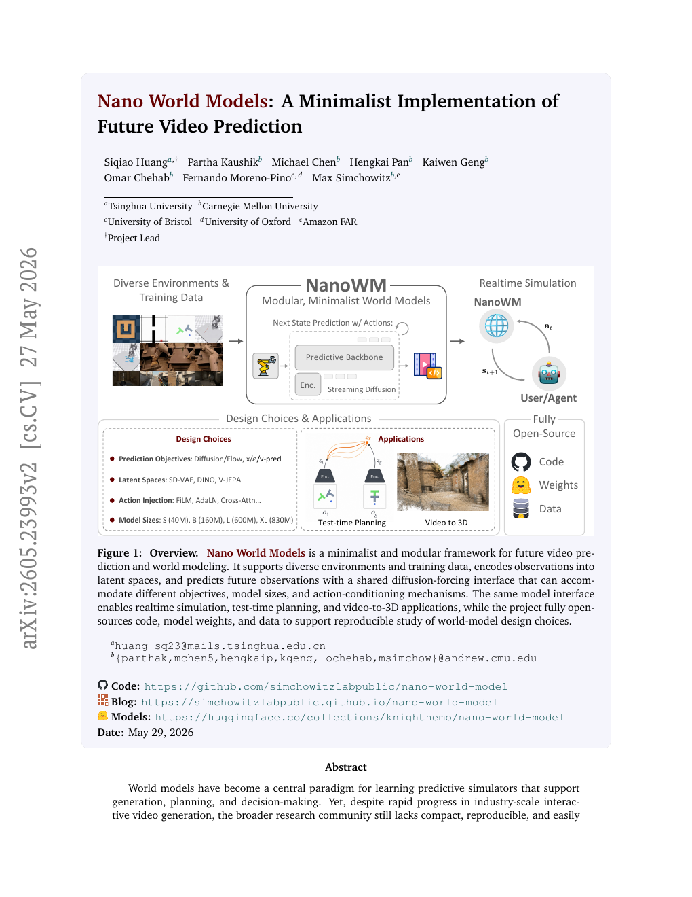
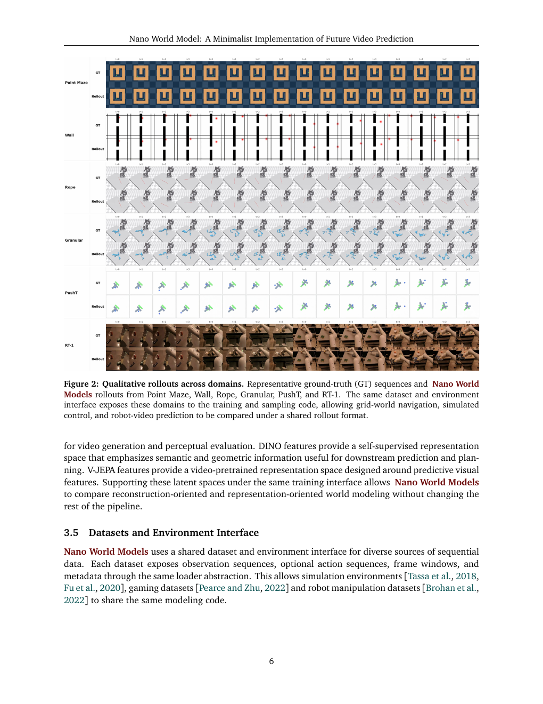
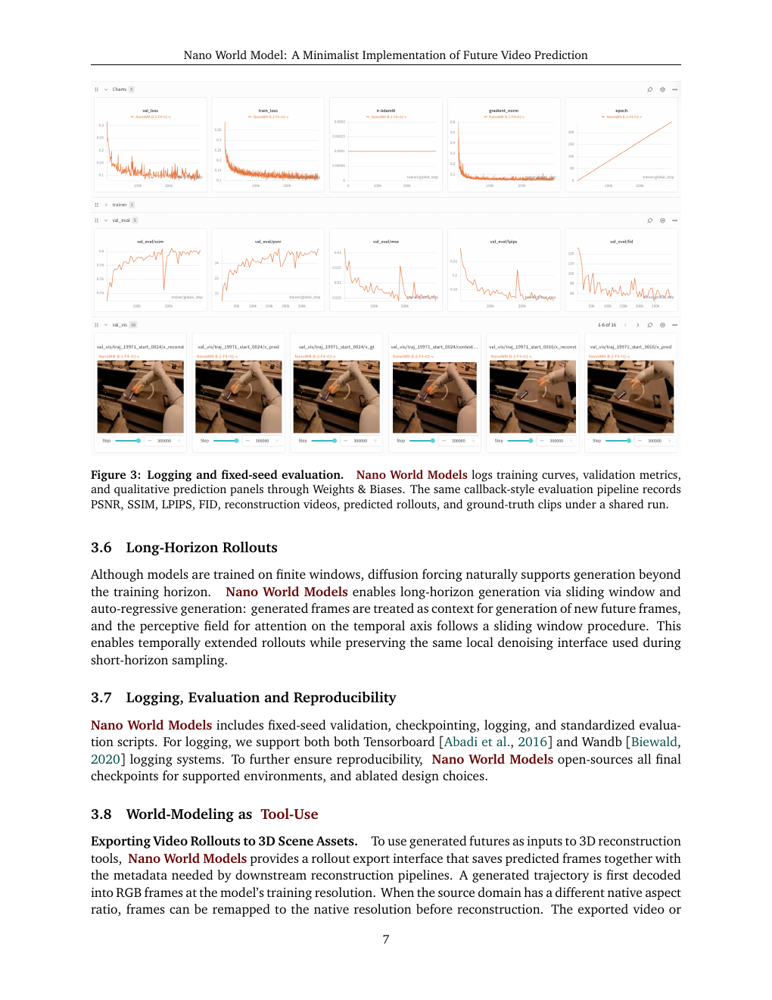
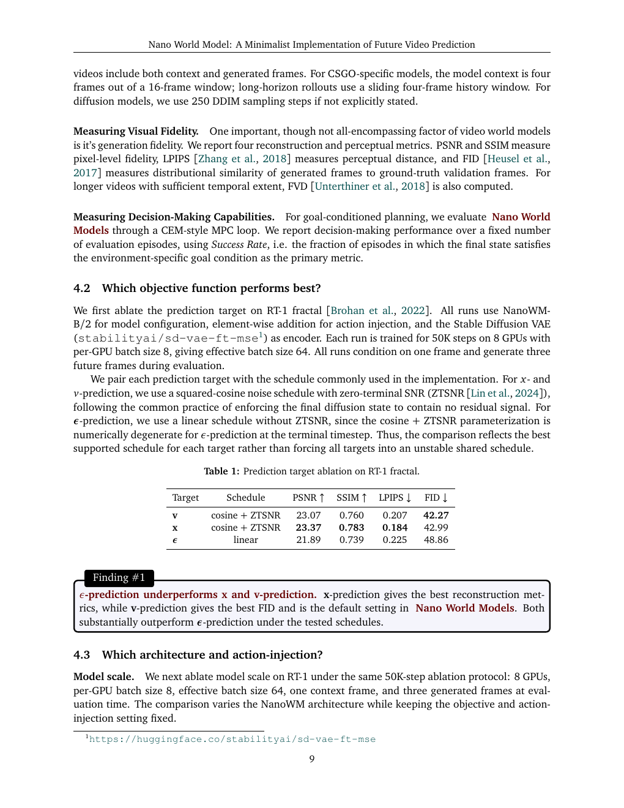
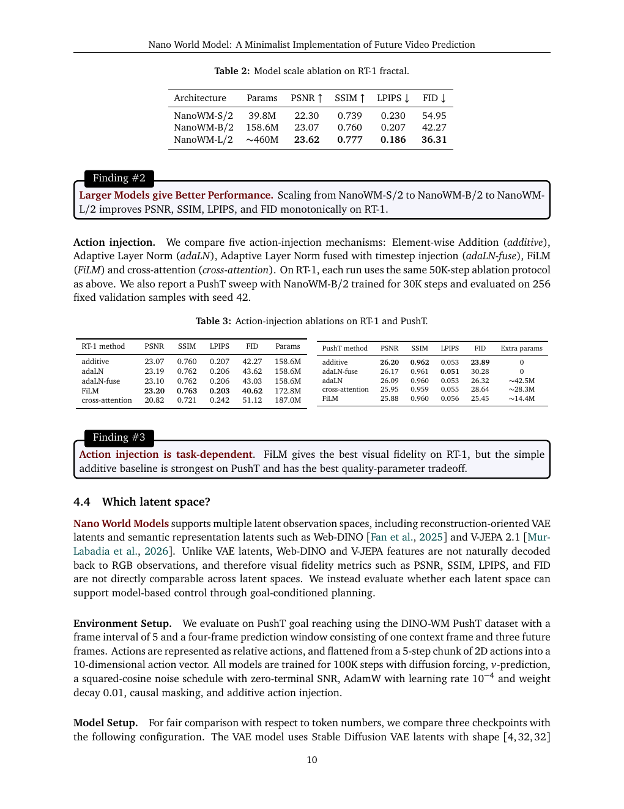
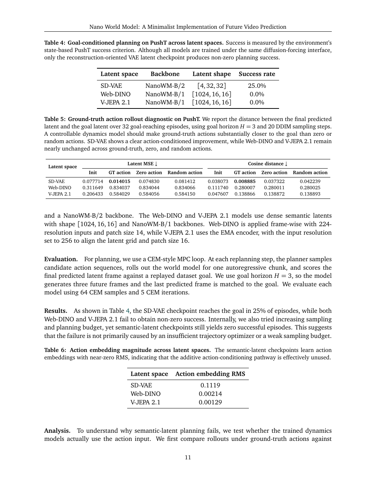
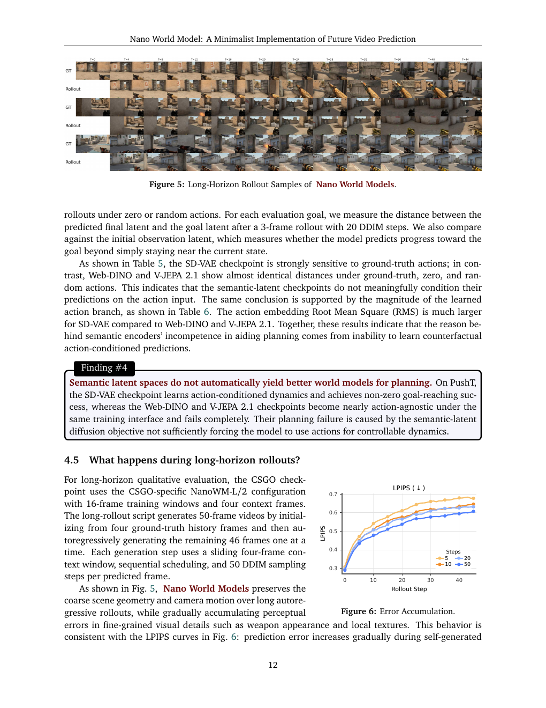

# Nano World Models: A Minimalist Implementation of Future Video Prediction

**Authors:** Siqiao Huang, Partha Kaushik, Michael Chen, Hengkai Pan, Kaiwen Geng, Omar Chehab, Fernando Moreno-Pino, Max Simchowitz  
**Source:** `Huang 等 - 2026 - Nano World Models A Minimalist Implementation of Future Video Prediction.pdf`  
**Detected source format:** selectable-text PDF (`pdf-text`), 19 pages, arXiv:2605.23993v2 [cs.CV], 27 May 2026.  
**Reader type:** complete full-paper Chinese-English Markdown reader with searchable tables and local page assets.

## Page / Section Index

- pp. 1–3: Abstract; Introduction; Contributions; World-Modeling as Tool-Use; Mission Statement.
- pp. 4–8: Preliminaries; Methods Supported; Diffusion Forcing; architecture, latent spaces, datasets, rollouts, logging, 3D export and MPC.
- pp. 8–14: Findings and evaluation studies.
- pp. 14–19: Related Works; Conclusion; References.

## Terminology Ledger

| English | 中文 | Note |
|---|---|---|
| world model | 世界模型 | predictive simulator over future observations |
| diffusion forcing | diffusion forcing／扩散强制 | sequence diffusion interface used by NanoWM |
| latent space | 潜在空间 | encoded observation space |
| action injection | 动作注入 | conditioning mechanism for action sequences |
| rollout | rollout／滚动预测 | autoregressive future generation |
| CEM-style MPC | CEM 风格 MPC | cross-entropy-method model-predictive control |
| ZTSNR | 零终端 SNR | zero-terminal signal-to-noise ratio |

## Abstract

> <strong>Para. 1:</strong> World models have become a central paradigm for learning predictive simulators that support generation, planning, and decision-making. Yet, despite rapid progress in industry-scale interactive video generation, the broader research community still lacks compact, reproducible, and easily extensible implementations for studying the design choices underlying modern world models. We introduce Nano World Models, a minimalist codebase for future video prediction centered around diffusion forcing. Nano World Models provides a unified interface for generative objectives, model scales, action-conditioning mechanisms, latent observation spaces, datasets, evaluation protocols, and long-horizon rollout procedures. This design enables controlled studies of world-modeling components that are often entangled across separate implementations. Through experiments across simple control environments, game simulation, and real-robot data, we examine how prediction parameterization, architecture scale, action injection, sampling budget, and domain complexity affect video prediction quality and autoregressive rollout behavior. By releasing code, configurations, evaluation scripts, and pretrained checkpoints, Nano World Models aims to provide a compact yet extensible experimental substrate for open, reproducible, and scientific world-model research.

> <strong>Para. 1[CN]:</strong> 世界模型已经成为学习预测性模拟器的核心范式，可支持生成、规划与决策。然而，尽管工业级交互式视频生成快速发展，研究社区仍缺少紧凑、可复现且易于扩展的实现，用于研究现代世界模型背后的设计选择。我们提出 Nano World Models：一个以 diffusion forcing 为核心、面向未来视频预测的极简代码库。Nano World Models 为生成目标、模型规模、动作条件机制、潜在观测空间、数据集、评测协议和长时域 rollout 提供统一接口。该设计使研究者能够受控地研究原本分散在不同实现中、彼此纠缠的世界建模组件。通过简单控制环境、游戏模拟和真实机器人数据上的实验，我们考察预测参数化、架构规模、动作注入、采样预算以及领域复杂度如何影响视频预测质量和自回归 rollout 行为。通过发布代码、配置、评测脚本和预训练 checkpoint，Nano World Models 旨在为开放、可复现且科学的世界模型研究提供紧凑而可扩展的实验基础。

### Figure 1. Overview / 总览

**Caption:** Overview. Nano World Models is a minimalist and modular framework for future video prediction and world modeling. It supports diverse environments and training data, encodes observations into latent spaces, and predicts future observations with a shared diffusion-forcing interface that can accommodate different objectives, model sizes, and action-conditioning mechanisms. The same model interface enables realtime simulation, test-time planning, and video-to-3D applications, while the project fully open-sources code, model weights, and data to support reproducible study of world-model design choices.

**Caption[CN]:** 总览。Nano World Models 是一个用于未来视频预测和世界建模的极简模块化框架。它支持多样环境与训练数据，将观测编码到潜在空间，并通过共享的 diffusion-forcing 接口预测未来观测；该接口可容纳不同目标、模型规模和动作条件机制。同一模型接口还支持实时模拟、测试时规划和 video-to-3D 应用；项目完整开源代码、模型权重与数据，以支持对世界模型设计选择的可复现研究。

## 1 Introduction

> <strong>Para. 2:</strong> World Models [Ha and Schmidhuber, 2018, Dawid and LeCun, 2023] have emerged as a cornerstone of spatial intelligence [Yang et al., 2025b, Wang et al., 2026] and real-world decision-making [Richens et al., 2025, Guo et al., 2025], generating high-fidelity futures by conditioning on the agent’s history and actions. Especially in the past few months predating the release of this manuscript, we have witnessed significant advances in industry-scale World Models [Google, 2025, Team et al., 2026]. Yet, for the broader community, the gap between reading about these models and deploying them remains disappointingly wide.

> <strong>Para. 2[CN]:</strong> 世界模型 [Ha and Schmidhuber, 2018, Dawid and LeCun, 2023] 已成为空间智能 [Yang et al., 2025b, Wang et al., 2026] 与现实世界决策 [Richens et al., 2025, Guo et al., 2025] 的基石：它们以智能体历史和动作为条件生成高保真未来。尤其在本文发布前的数月中，工业级世界模型取得了显著进展 [Google, 2025, Team et al., 2026]。然而，对更广泛的社区而言，从阅读这些模型到真正部署它们之间的鸿沟仍然令人失望地宽。

> <strong>Para. 3:</strong> This manuscript accompanies Nano World Models: a minimalist, batteries-included repository for advancing a careful and scientific approach to world-model design. The motivation for this project is simple: while industry-scale world models achieve stunning visual effects, they are built around a handful of simple, well-established techniques: video diffusion [Ho et al., 2022b, Blattmann et al., 2023], diffusion forcing [Chen et al., 2024], consistency distillation [Song et al., 2023] etc.

> <strong>Para. 3[CN]:</strong> 本文介绍 Nano World Models：一个“开箱即用”的极简代码仓库，旨在推动对世界模型设计采取审慎、科学的方法。项目动机很简单：工业级世界模型虽然能产生惊艳的视觉效果，但其基础仍是少数简单且成熟的技术，例如 video diffusion [Ho et al., 2022b, Blattmann et al., 2023]、diffusion forcing [Chen et al., 2024] 和 consistency distillation [Song et al., 2023] 等。

> <strong>Para. 4:</strong> We posit that as world model algorithm stabilizes, a shift in research focus lies from inventing new techniques to developing a more nuanced understanding of subtler scientific design decisions, including architectural choices, training objectives, and, of course, data composition and scaling behavior. However, one cannot truly understand the science behind a model without being able to easily experiment with it. Especially with the current fragmented landscape of world modeling research, diverse datasets [Brohan et al., 2022, Pearce and Zhu, 2022, Zhou et al., 2024], training recipes [Yang et al., 2023, Lipman et al., 2024, Li and He, 2025], evaluation protocols [Vafa et al., 2024, Zhang et al., 2026] and downstream tasks [Alonso et al., 2024, Quevedo et al., 2026, Guo et al., 2025] scattered across numerous sources makes rigorous scientific studies extremely hard.

> <strong>Para. 4[CN]:</strong> 我们认为，随着世界模型算法逐渐稳定，研究重点应从发明新技术转向更细致地理解微妙的科学设计决策，包括架构选择、训练目标，当然还有数据组成与 scaling 行为。然而，如果不能方便地进行实验，就无法真正理解模型背后的科学。当前世界模型研究高度碎片化：多样的数据集 [Brohan et al., 2022, Pearce and Zhu, 2022, Zhou et al., 2024]、训练配方 [Yang et al., 2023, Lipman et al., 2024, Li and He, 2025]、评测协议 [Vafa et al., 2024, Zhang et al., 2026] 和下游任务 [Alonso et al., 2024, Quevedo et al., 2026, Guo et al., 2025] 分散在大量来源中，使严格的科学研究极其困难。

### 1.1 Contributions

> <strong>Para. 5:</strong> We introduce Nano World Models, a minimalist, batteries-included implementation of world models, as a usable starting point amidst the aforementioned fragmented landscape. Our repo is built around specializing the diffusion-forcing [Chen et al., 2024] model. We enable hydra-based configurations [Yadan, 2019], modular code for data loading, model design, training, evaluation, and downstream tasks, as well as well-curated docs. In greater detail, we support the following features:

> <strong>Para. 5[CN]:</strong> 我们提出 Nano World Models——一个极简、开箱即用的世界模型实现，作为上述碎片化环境中的可用起点。仓库围绕 diffusion-forcing [Chen et al., 2024] 模型进行专门化构建，提供基于 Hydra 的配置 [Yadan, 2019]、用于数据加载、模型设计、训练、评估和下游任务的模块化代码，以及整理良好的文档。具体支持以下功能：

> <strong>Para. 6:</strong> • Generative Modeling Objectives. Centered around Diffusion Forcing [Chen et al., 2024], Nano World Models supports a variety of generative modeling and prediction objectives. It supports Diffusion [Rombach et al., 2022, Peebles and Xie, 2023] and Flow-Matching [Lipman et al., 2022, 2024], with x, ε and v prediction objectives [Li and He, 2025].

> <strong>Para. 6[CN]:</strong> • 生成建模目标。Nano World Models 以 Diffusion Forcing [Chen et al., 2024] 为中心，支持多种生成建模和预测目标，包括 Diffusion [Rombach et al., 2022, Peebles and Xie, 2023] 与 Flow-Matching [Lipman et al., 2022, 2024]，以及 x、ε 和 v 预测目标 [Li and He, 2025]。

> <strong>Para. 7:</strong> • Architectural Sizes and Design. Nano World Models is built for support of architectures of varying sizes. Following naming conventions from the image generation community [Ma et al., 2024a, Peebles and Xie, 2023], we include four variants of varying sizes: NanoWM-S (40M), NanoWM-B (160M), NanoWM-L (600M) and NanoWM-XL (830M). For action injection methods, Nano World Models supports element-wise addition, AdaLN [Huang and Belongie, 2017], AdaLN fused with timestep injection, FiLM [Perez et al., 2018] and cross-attention.

> <strong>Para. 7[CN]:</strong> • 架构规模与设计。Nano World Models 支持不同规模的架构。遵循图像生成社区的命名约定 [Ma et al., 2024a, Peebles and Xie, 2023]，我们提供四种规模：NanoWM-S（40M）、NanoWM-B（160M）、NanoWM-L（600M）和 NanoWM-XL（830M）。动作注入方法包括逐元素相加、AdaLN [Huang and Belongie, 2017]、与时间步注入融合的 AdaLN、FiLM [Perez et al., 2018] 以及 cross-attention。

> <strong>Para. 8:</strong> • Environments. Nano World Models supports diverse environments, ranging from simple simulation environments to game simulation and robot manipulation. For simple simulation environments, Nano World Models currently supports environments drawn from standard robotics benchmarks, namely D4RL [Fu et al., 2020] and DeepMind Control Suite [Tassa et al., 2018]. These environments include maze navigation (Maze, Wall), fine-grained control for tabletop pushing (PushT) and deformable object manipulation with an XArm (Rope, Granular). For game simulation, we support the well-celebrated CS:GO dataset [Pearce and Zhu, 2022] and for robot manipulation, we support the widely used RT-1 [Brohan et al., 2022] dataset.

> <strong>Para. 8[CN]:</strong> • 环境。Nano World Models 支持从简单模拟环境到游戏模拟和机器人操作的多样环境。对于简单模拟，目前支持标准机器人基准 D4RL [Fu et al., 2020] 与 DeepMind Control Suite [Tassa et al., 2018] 中的环境，包括迷宫导航（Maze、Wall）、桌面推物的精细控制（PushT），以及使用 XArm 进行可变形物体操作（Rope、Granular）。游戏模拟支持广受关注的 CS:GO 数据集 [Pearce and Zhu, 2022]；机器人操作支持广泛使用的 RT-1 [Brohan et al., 2022] 数据集。

> <strong>Para. 9:</strong> • Logging and Evaluations. Nano World Models supports both Tensorboard [Abadi et al., 2016] and Wandb [Biewald, 2020] logging systems. Loggings include callback-style validation, reliable per-step checkpointing and system utilization informations. Evaluations are fixed-seed reproducible.

> <strong>Para. 9[CN]:</strong> • 日志与评估。Nano World Models 同时支持 Tensorboard [Abadi et al., 2016] 和 Wandb [Biewald, 2020]。日志包括 callback 风格验证、可靠的逐步 checkpoint，以及系统利用率信息。评估使用固定随机种子，保证可复现。

> <strong>Para. 10:</strong> • Long-Horizon Generation. Nano World Models goes beyond the training context. Empowered by the auto-regressive capability of diffusion forcing, as well as sliding window approaches, Nano World Models can produce temporally consistent long video generations with 4x the training horizon.

> <strong>Para. 10[CN]:</strong> • 长时域生成。Nano World Models 超越训练上下文；借助 diffusion forcing 的自回归能力和滑动窗口方法，它可以生成时间一致的长视频，时域达到训练时长的 4 倍。

### 1.2 World-Modeling as Tool-Use

> <strong>Para. 11:</strong> Nano World Models goes beyond next state prediction, supporting multiple applications where world modeling serves as a tool for downstream tasks.

> <strong>Para. 11[CN]:</strong> Nano World Models 不止进行下一状态预测，还支持多种把世界建模作为下游任务工具的应用。

> <strong>Para. 12:</strong> • 3D Scene Generation. Beyond serving as a video predictor, a world model can also act as a generative prior for constructing 3D-consistent scenes. Nano World Models supports exporting generated video rollouts into downstream 3D pipelines [Lin et al., 2025, Chen et al., 2026], where multi-view or temporally adjacent predictions can be lifted into scene representations such as point clouds, Gaussian splats, or neural fields. This provides a lightweight bridge between 2D video generation and 3D scene synthesis, extracting generations from video world models to persistent 3D scenes.

> <strong>Para. 12[CN]:</strong> • 3D 场景生成。世界模型除了作为视频预测器，还可以作为构造 3D 一致场景的生成先验。Nano World Models 支持将生成的视频 rollout 导出到下游 3D pipeline [Lin et al., 2025, Chen et al., 2026]；多视角或时间相邻的预测可以提升为点云、Gaussian splat 或神经场等场景表示。这在 2D 视频生成和 3D 场景合成之间建立了轻量桥梁，把视频世界模型的生成结果提取为持久 3D 场景。

> <strong>Para. 13:</strong> • Goal-Conditioned Planning. Nano World Models further supports goal-conditioned planning, where the world model is used as a simulator for evaluating candidate action sequences before execution. Given an initial observation and a desired goal state, the model can roll out possible futures under different action proposals, enabling planning by trajectory optimization. This turns the learned dynamics model into a tool for decision-making: rather than directly learning a policy for every task, users can query the model to imagine, compare, and select action sequences that are most likely to reach the goal.

> <strong>Para. 13[CN]:</strong> • 目标条件规划。Nano World Models 还支持目标条件规划：在执行前把世界模型当作模拟器来评估候选动作序列。给定初始观测和期望目标状态，模型可在不同动作提议下 rollout 可能的未来，从而通过轨迹优化进行规划。这使学习到的动力学模型成为决策工具：用户无需为每个任务直接学习策略，而是可以查询模型来想象、比较并选择最可能到达目标的动作序列。

### 1.3 Mission Statement

> <strong>Para. 14:</strong> Thanks to its modular design, Nano World Models makes experimentation a matter of changing modular configs rather than rewriting pipelines. Datasets, tasks, model sizes, prediction objectives and overriding any specific configuration, can be swapped from a single command line. In addition, we release everything: code, data and more than a dozen pretrained model checkpoints of all sizes. World Models need the World. Our hope is to build a Babel tower for world model research: datasets, objectives, architectures, and tasks all speaking the same language. We invite the global community to join us, contribute, and build this future together. Learn more: Blog: https://simchowitzlabpublic.github.io/nano-world-model; Models: https://huggingface.co/collections/knightnemo/nano-world-model; Code: https://github.com/simchowitzlabpublic/nano-world-model.

> <strong>Para. 14[CN]:</strong> 得益于模块化设计，Nano World Models 让实验变成修改模块化配置，而不是重写 pipeline。数据集、任务、模型规模和预测目标，以及任何具体配置，都可通过一条命令切换。此外，我们完整发布代码、数据和全部规模的十多个预训练 checkpoint。世界模型需要世界。我们希望为世界模型研究建造一座巴别塔：让数据集、目标、架构和任务使用同一种语言。我们邀请全球社区加入、贡献并共同构建未来。更多信息见 Blog、Models 和 Code 链接。

## 2 Preliminaries

> <strong>Para. 15:</strong> We define world-modeling as the problem of modeling posterior distributions over sequences of high dimensional observations. Specifically, we are given a sequence $o_1, . . . , o_T$ of previous observations (e.g. future video frames), as well as a conditioning variable $c$ (e.g. a text-description) and our goal is to produce a completion $o_{T+1}, . . . , o_{T+H}$ of future observations. In many cases, we do not predict observations directly, but instead predict encodings $x_t := enc_\psi(o_t)$, where $enc_\psi$ is a learned or pretrained encoder (e.g. VAE [Kingma and Welling, 2013], DINO [Caron et al., 2021] or V-JEPA [Bardes et al., 2024]). Our aim is to predict the conditional distribution of sequences of the conditional variable. We view this task as a generative model problem, where we assume there is some true distribution $p^\star(x_{T+1:T+H} | x_{1:T}, c)$, and we learn a probabilistic model $p_\theta(\cdot | \cdot)$ over these conditionals. We denote samples from this model as $\hat{x}_{T+1:T+H} \sim p_\theta(\cdot | x_{1:T}, c)$.

> <strong>Para. 15[CN]:</strong> 我们将世界建模定义为：对高维观测序列上的后验分布进行建模。具体地，给定过去观测序列 $o_1, . . . , o_T$（例如视频帧）和条件变量 $c$（例如文本描述），目标是生成未来观测的补全 $o_{T+1}, . . . , o_{T+H}$。很多情况下并不直接预测观测，而是预测编码 $x_t := enc_\psi(o_t)$，其中 $enc_\psi$ 是学习得到或预训练的编码器（如 VAE、DINO 或 V-JEPA）。我们的目标是预测条件变量下序列的条件分布。我们把它视为生成模型问题：假设存在真实分布 $p^\star(x_{T+1:T+H} | x_{1:T}, c)$，并学习其上的概率模型 $p_\theta(\cdot | \cdot)$；模型样本记为 $\hat{x}_{T+1:T+H} \sim p_\theta(\cdot | x_{1:T}, c)$。

> <strong>Para. 16:</strong> Planning with World Models. Given a sequence of candidate actions $a_{T:T+H-1}$, the world model can be used as a simulator for evaluating their likely consequences. Given a task-specific utility or reward function $R(x_{T+1:T+H}, a_{T:T+H-1})$, planning amounts to searching for an action sequence whose predicted rollout has high expected return under the learned model:

$$a^\star_{T:T+H-1} \in \arg\max_{a_{T:T+H-1}\in\mathcal{A}^H} \mathbb{E}_{\hat{x}_{T+1:T+H}\sim p_\theta(\cdot|x_{1:T},c,a_{T:T+H-1})}[R(\hat{x}_{T+1:T+H},a_{T:T+H-1})].$$

> <strong>Para. 16[CN]:</strong> 使用世界模型进行规划。给定候选动作序列 $a_{T:T+H-1}$，世界模型可作为模拟器评估其可能后果。给定任务特定的效用或奖励函数 $R(x_{T+1:T+H}, a_{T:T+H-1})$，规划就是寻找一个动作序列，使其预测 rollout 在学习模型下具有较高期望回报，公式如上。

> <strong>Para. 17:</strong> In practice, this optimization is typically performed approximately, for example by sampling or optimizing a population of candidate action sequences using model predictive control (MPC). At each decision step, the planner rolls out the world model over a finite horizon, selects the best candidate sequence according to the predicted return, executes only the first action, observes the next state, and replans.

> <strong>Para. 17[CN]:</strong> 实际中通常近似求解该优化问题，例如使用模型预测控制（MPC）对一组候选动作序列进行采样或优化。在每个决策步，规划器在有限时域内 rollout 世界模型，根据预测回报选择最佳候选序列，只执行其第一个动作，观测下一状态，再重新规划。

## 3 Methods Supported: Unification through Diffusion Forcing

> <strong>Para. 18:</strong> Having defined world modeling as conditional sequence generation in Section 2, we now describe the modeling and software abstractions powering Nano World Models. The central design principle is to treat diffusion forcing as a unified interface: prediction objectives, architectures, action-conditioning mechanisms, latent spaces, environments, and rollout procedures can be exchanged while preserving the same training and sampling pipeline.

> <strong>Para. 18[CN]:</strong> 第 2 节将世界建模定义为条件序列生成；本节描述驱动 Nano World Models 的建模与软件抽象。核心设计原则是把 diffusion forcing 当作统一接口：在保留相同训练和采样 pipeline 的同时，可以替换预测目标、架构、动作条件机制、潜在空间、环境和 rollout 流程。

### 3.1 Diffusion Forcing as a Unified Interface

> <strong>Para. 19:</strong> Popular generative models produce samples through iterative computation. Diffusion models iteratively denoise corrupted samples, while flow-matching models learn a vector field that transports a simple base distribution to the data distribution. Diffusion forcing extends this view to sequence modeling by allowing different frames in the same trajectory to occupy different stages of the generation process.

> <strong>Para. 19[CN]:</strong> 流行的生成模型通过迭代计算生成样本。Diffusion 模型迭代去噪受扰样本；flow-matching 模型学习一个把简单基础分布输运到数据分布的向量场。Diffusion forcing 将这一观点扩展到序列建模，允许同一轨迹中的不同帧处于生成过程的不同阶段。

> <strong>Para. 20:</strong> We introduce a noise index set $K \subset R$. For an encoded trajectory $x_{1:T+H}$, diffusion forcing assigns each frame $x_t$ a noise index $k_t \in K$. The model is trained on noised trajectories together with their noise-index schedule $k=(k_1, . . . , k_{T+H})$. Context frames may be kept clean or nearly clean, while future frames may be assigned higher-noise indices. By changing only this schedule, Nano World Models can express teacher-forced prediction, masked future prediction, and autoregressive rollout using the same model interface.

> <strong>Para. 20[CN]:</strong> 我们引入噪声索引集合 $K \subset R$。对于编码轨迹 $x_{1:T+H}$，diffusion forcing 为每帧 $x_t$ 分配噪声索引 $k_t \in K$；模型在带噪轨迹及其噪声索引调度 $k=(k_1, . . . , k_{T+H})$ 上训练。上下文帧可以保持干净或近似干净，未来帧则可分配更高噪声索引。只需改变调度，Nano World Models 就能用同一模型接口表达 teacher-forced prediction、masked future prediction 和自回归 rollout。

### 3.2 Generative Objectives

> <strong>Para. 21:</strong> Nano World Models supports multiple generative objectives under the same diffusion-forcing interface. For diffusion objectives, the model can be trained with x-prediction, ε-prediction, or v-prediction targets [Li and He, 2025]. For flow-matching objectives, the model predicts the velocity field induced by a chosen interpolant, such as the linear interpolant between data and noise.

> <strong>Para. 21[CN]:</strong> Nano World Models 在同一 diffusion-forcing 接口下支持多种生成目标。对于 diffusion 目标，模型可使用 x-prediction、ε-prediction 或 v-prediction target [Li and He, 2025] 训练；对于 flow-matching 目标，模型预测由所选 interpolant 诱导的速度场，例如数据与噪声之间的线性 interpolant。

> <strong>Para. 22:</strong> Importantly, these objectives differ only in how the noised input and training target are constructed. The backbone architecture, conditioning interface, dataset loader, and sampling code remain shared. This allows objective choices to be studied as a controlled experimental axis rather than as separate implementations.

> <strong>Para. 22[CN]:</strong> 重要的是，这些目标只在带噪输入和训练 target 的构造方式上不同；backbone 架构、条件接口、数据集加载器和采样代码保持共享。因此，目标选择可以作为受控实验轴研究，而不是依赖彼此独立的实现。

### 3.3 Nano World Models Architecture

> <strong>Para. 23:</strong> NanoWM uses a transformer backbone over latent video tokens. For VAE-style encodings, each frame is divided into spatial patches, projected into a hidden dimension, and processed by transformer blocks that apply interleaved spatial-temporal attention [Ho et al., 2022a, Ma et al., 2024b]. We follow the naming convention used in image and video diffusion models: the letter denotes the model family, while the suffix denotes the latent patch size. For example, NanoWM-B/2 is the base model with patch size 2, whereas NanoWM-B/4 and NanoWM-B/8 use coarser latent patches. Nano World Models supports four architecture families: NanoWM-S, NanoWM-B, NanoWM-L, and NanoWM-XL. These provide a scaling axis from small models for fast iteration to larger models for higher-capacity prediction.

> <strong>Para. 23[CN]:</strong> NanoWM 在潜在视频 token 上使用 Transformer backbone。对于 VAE 风格编码，每帧被划分为空间 patch，投影到 hidden dimension，再由交错空间—时间注意力的 Transformer block 处理 [Ho et al., 2022a, Ma et al., 2024b]。我们遵循图像和视频 diffusion 模型的命名：字母表示模型系列，后缀表示潜在 patch 大小。例如 NanoWM-B/2 是 patch size 为 2 的 base 模型，而 NanoWM-B/4 和 NanoWM-B/8 使用更粗的潜在 patch。Nano World Models 支持四个架构系列 NanoWM-S、NanoWM-B、NanoWM-L 与 NanoWM-XL，形成从快速迭代的小模型到高容量预测的大模型的 scaling 轴。

> <strong>Para. 24:</strong> Action Conditioning. For action-conditioned world modeling, NanoWM conditions predictions on action sequences $a_{T:T+H-1}$. The repository supports several action-injection mechanisms. The simplest embeds actions into the transformer hidden dimension and adds them to the corresponding frame tokens. More expressive variants inject actions through adaptive layer normalization, fuse action and timestep conditioning, apply FiLM-style modulation, or use cross-attention from video tokens to action tokens. These mechanisms expose a spectrum of conditioning strategies, from lightweight element-wise injection to higher-capacity interactions between actions and visual dynamics.

> <strong>Para. 24[CN]:</strong> 动作条件。在动作条件世界建模中，NanoWM 以动作序列 $a_{T:T+H-1}$ 为条件进行预测。仓库支持多种动作注入机制：最简单的方法把动作嵌入 Transformer hidden dimension，并加到对应帧 token；更强的变体通过 adaptive layer normalization 注入动作、融合动作与时间步条件、应用 FiLM 式调制，或让视频 token 对动作 token 使用 cross-attention。这些机制覆盖从轻量逐元素注入到动作与视觉动力学高容量交互的一系列策略。

### 3.4 Latent Observation Spaces

> <strong>Para. 25:</strong> Following recent practice in video generation and robotic world modeling, Nano World Models predicts encoded observations rather than raw observations directly [Huang et al., 2025, Zhou et al., 2024, Maes et al., 2026b]. The choice of encoding is not merely an implementation detail: recent work suggests that reconstruction-oriented and semantics-oriented latent spaces can lead to different tradeoffs in visual fidelity, planning performance, and representation quality [Jha et al., 2026]. This makes the latent representation itself an experimental axis.

> <strong>Para. 25[CN]:</strong> 遵循视频生成和机器人世界建模的近期实践，Nano World Models 预测编码后的观测，而不是直接预测原始观测 [Huang et al., 2025, Zhou et al., 2024, Maes et al., 2026b]。编码选择并非单纯实现细节：近期研究表明，面向重建和面向语义的潜在空间在视觉保真度、规划性能与表示质量之间可能产生不同折中 [Jha et al., 2026]，因此潜在表示本身就是实验轴。

> <strong>Para. 26:</strong> Supported Latent Spaces. Nano World Models support three types of latent spaces: VAE [Rombach et al., 2022], Web-DINO [Fan et al., 2025] and V-JEPA 2.1 [Mur-Labadia et al., 2026]. VAE latents provide a reconstruction-oriented space that can be decoded back into RGB frames, making them natural for video generation and perceptual evaluation. DINO features provide a self-supervised representation space that emphasizes semantic and geometric information useful for downstream prediction and planning. V-JEPA features provide a video-pretrained representation space designed around predictive visual features. Supporting these latent spaces under the same training interface allows Nano World Models to compare reconstruction-oriented and representation-oriented world modeling without changing the rest of the pipeline.

> <strong>Para. 26[CN]:</strong> 支持的潜在空间。Nano World Models 支持三类潜在空间：VAE [Rombach et al., 2022]、Web-DINO [Fan et al., 2025] 和 V-JEPA 2.1 [Mur-Labadia et al., 2026]。VAE latent 是面向重建的空间，可解码回 RGB 帧，适合视频生成与感知评估。DINO feature 提供自监督表示空间，强调对下游预测和规划有用的语义与几何信息。V-JEPA feature 提供围绕预测性视觉特征设计的视频预训练表示空间。在同一训练接口下支持这些潜在空间，使 Nano World Models 可以在不改变其余 pipeline 的情况下比较重建导向和表示导向的世界建模。

### Figure 2. Qualitative rollouts across domains / 跨领域定性 rollout

**Caption:** Qualitative rollouts across domains. Representative ground-truth (GT) sequences and Nano World Models rollouts from Point Maze, Wall, Rope, Granular, PushT, and RT-1. The same dataset and environment interface exposes these domains to the training and sampling code, allowing grid-world navigation, simulated control, and robot-video prediction to be compared under a shared rollout format.

**Caption[CN]:** 跨领域定性 rollout。展示 Point Maze、Wall、Rope、Granular、PushT 和 RT-1 的代表性 ground-truth（GT）序列与 Nano World Models rollout。同一数据集和环境接口把这些领域暴露给训练与采样代码，使网格世界导航、模拟控制和机器人视频预测能够以共享的 rollout 格式比较。

### 3.5 Datasets and Environment Interface

> <strong>Para. 27:</strong> Nano World Models uses a shared dataset and environment interface for diverse sources of sequential data. Each dataset exposes observation sequences, optional action sequences, frame windows, and metadata through the same loader abstraction. This allows simulation environments [Tassa et al., 2018, Fu et al., 2020], gaming datasets [Pearce and Zhu, 2022] and robot manipulation datasets [Brohan et al., 2022] to share the same modeling code.

> <strong>Para. 27[CN]:</strong> Nano World Models 使用共享的数据集和环境接口处理多样的序列数据来源。每个数据集通过同一 loader 抽象提供观测序列、可选动作序列、帧窗口和元数据。这使模拟环境 [Tassa et al., 2018, Fu et al., 2020]、游戏数据集 [Pearce and Zhu, 2022] 与机器人操作数据集 [Brohan et al., 2022] 可以共享相同建模代码。

### Figure 3. Logging and fixed-seed evaluation / 日志与固定种子评估

**Caption:** Logging and fixed-seed evaluation. Nano World Models logs training curves, validation metrics, and qualitative prediction panels through Weights & Biases. The same callback-style evaluation pipeline records PSNR, SSIM, LPIPS, FID, reconstruction videos, predicted rollouts, and ground-truth clips under a shared run.

**Caption[CN]:** 日志与固定种子评估。Nano World Models 通过 Weights & Biases 记录训练曲线、验证指标和定性预测面板。同一 callback 风格评估 pipeline 在一次共享运行中记录 PSNR、SSIM、LPIPS、FID、重建视频、预测 rollout 和 ground-truth clip。

### 3.6 Long-Horizon Rollouts

> <strong>Para. 28:</strong> Although models are trained on finite windows, diffusion forcing naturally supports generation beyond the training horizon. Nano World Models enables long-horizon generation via sliding window and auto-regressive generation: generated frames are treated as context for generation of new future frames, and the perceptive field for attention on the temporal axis follows a sliding window procedure. This enables temporally extended rollouts while preserving the same local denoising interface used during short-horizon sampling.

> <strong>Para. 28[CN]:</strong> 尽管模型在有限窗口上训练，diffusion forcing 天然支持超出训练时域的生成。Nano World Models 通过滑动窗口和自回归生成实现长时域生成：生成帧被作为新未来帧生成的上下文，时间轴上的注意力感受野遵循滑动窗口过程。这样既能扩展 rollout 的时间范围，又保留短时域采样使用的局部去噪接口。

### 3.7 Logging, Evaluation and Reproducibility

> <strong>Para. 29:</strong> Nano World Models includes fixed-seed validation, checkpointing, logging, and standardized evaluation scripts. For logging, we support both Tensorboard [Abadi et al., 2016] and Wandb [Biewald, 2020] logging systems. To further ensure reproducibility, Nano World Models open-sources all final checkpoints for supported environments, and ablated design choices.

> <strong>Para. 29[CN]:</strong> Nano World Models 包含固定种子验证、checkpoint、日志和标准化评估脚本。日志方面支持 Tensorboard [Abadi et al., 2016] 与 Wandb [Biewald, 2020]。为进一步保证可复现性，Nano World Models 开源所有支持环境的最终 checkpoint 以及消融的设计选择。

### 3.8 World-Modeling as Tool-Use

> <strong>Para. 30:</strong> Exporting Video Rollouts to 3D Scene Assets. To use generated futures as inputs to 3D reconstruction tools, Nano World Models provides a rollout export interface that saves predicted frames together with the metadata needed by downstream reconstruction pipelines. A generated trajectory is first decoded into RGB frames at the model’s training resolution. When the source domain has a different native aspect ratio, frames can be remapped to the native resolution before reconstruction. The exported video or frame sequence can then be passed to off-the-shelf multi-view depth and camera estimation systems [Lin et al., 2025, Chen et al., 2026], whose outputs are converted into persistent 3D representations such as point clouds. This design keeps the world model independent of any particular 3D backend: Nano World Models supplies temporally coherent visual rollouts, while the reconstruction module handles geometry estimation and visualization.

> <strong>Para. 30[CN]:</strong> 将视频 rollout 导出为 3D 场景资产。为了把生成未来作为 3D 重建工具的输入，Nano World Models 提供 rollout 导出接口，将预测帧与下游重建 pipeline 所需元数据一同保存。生成轨迹先按模型训练分辨率解码为 RGB 帧；若源领域具有不同的原生宽高比，可在重建前把帧映射回原生分辨率。随后，导出的视频或帧序列可交给现成的多视角深度和相机估计系统 [Lin et al., 2025, Chen et al., 2026]，其输出再转为点云等持久 3D 表示。该设计使世界模型独立于特定 3D backend：Nano World Models 提供时间一致的视觉 rollout，重建模块负责几何估计和可视化。

### Figure 4. Exporting rollouts to 3D scene assets / 将 rollout 导出为 3D 场景资产

**Caption:** Exporting rollouts to 3D scene assets. A generated CSGO rollout is decoded to RGB frames and passed to a downstream depth and camera estimation pipeline. The resulting geometry can be visualized as a persistent point cloud together with the source RGB frame and estimated depth map.

**Caption[CN]:** 将 rollout 导出为 3D 场景资产。生成的 CSGO rollout 被解码为 RGB 帧并传入下游深度与相机估计 pipeline。所得几何可与源 RGB 帧和估计深度图一起可视化为持久点云。

> <strong>Para. 31:</strong> MPC Interface for Goal-Conditioned Planning. For planning, Nano World Models exposes the world model as a batched rollout function. At each replanning step, the planner receives the current observation context, a goal specification, and a population of candidate action sequences. The world model predicts a future trajectory for each candidate in parallel, and an objective module assigns a scalar score to each rollout, such as distance to a goal state, task progress, or environment-specific reward. The planner updates the candidate distribution, selects the best sequence, executes its first action, and then repeats the procedure with the newly observed context. This separates the learned dynamics model from the planning algorithm and reward definition, allowing the same checkpoint to be reused across different goal specifications and trajectory optimizers.

> <strong>Para. 31[CN]:</strong> 目标条件规划的 MPC 接口。规划时，Nano World Models 将世界模型暴露为批量 rollout 函数。在每次重新规划中，规划器接收当前观测上下文、目标说明和一组候选动作序列。世界模型并行预测每个候选的未来轨迹，目标模块为每个 rollout 分配标量分数，例如到目标状态的距离、任务进度或环境特定奖励。规划器更新候选分布，选择最佳序列，执行其第一个动作，然后用新观测到的上下文重复流程。这把学习到的动力学模型与规划算法、奖励定义分离开来，使同一 checkpoint 能在不同目标说明和轨迹优化器之间复用。

## 4 Findings

### 4.1 How to measure performance?

> <strong>Para. 32:</strong> Evaluation Setup. Unless otherwise stated, we evaluate on 256 fixed validation clips with seed 42, and auto-regressive sequential scheduling. For the standard 256-resolution models, each validation clip contains four frames: the model conditions on the first frame and generates the remaining three frames. Metrics are computed only on generated frames, excluding the context frame, while saved visualization videos include both context and generated frames. For CSGO-specific models, the model context is four frames out of a 16-frame window; long-horizon rollouts use a sliding four-frame history window. For diffusion models, we use 250 DDIM sampling steps if not explicitly stated.

> <strong>Para. 32[CN]:</strong> 评估设置。除非另有说明，我们在 256 个固定验证 clip 上、使用 seed 42 和自回归顺序调度进行评估。对于标准 256 分辨率模型，每个验证 clip 含四帧：模型以第一帧为条件生成其余三帧。指标只在生成帧上计算，不包含上下文帧；保存的可视化视频则同时包含上下文帧和生成帧。对于 CSGO 专用模型，16 帧窗口中有四帧作为上下文；长时域 rollout 使用滑动的四帧历史窗口。若未明确说明，Diffusion 模型使用 250 个 DDIM sampling steps。

> <strong>Para. 33:</strong> Measuring Visual Fidelity. One important, though not all-encompassing factor of video world models is its generation fidelity. We report four reconstruction and perceptual metrics. PSNR and SSIM measure pixel-level fidelity, LPIPS [Zhang et al., 2018] measures perceptual distance, and FID [Heusel et al., 2017] measures distributional similarity of generated frames to ground-truth validation frames. For longer videos with sufficient temporal extent, FVD [Unterthiner et al., 2018] is also computed.

> <strong>Para. 33[CN]:</strong> 视觉保真度测量。生成保真度是视频世界模型的重要因素之一，但并非全部。我们报告四种重建与感知指标：PSNR 和 SSIM 测量像素级保真度，LPIPS [Zhang et al., 2018] 测量感知距离，FID [Heusel et al., 2017] 测量生成帧与 ground-truth 验证帧的分布相似性。对于时间范围足够长的视频，还计算 FVD [Unterthiner et al., 2018]。

> <strong>Para. 34:</strong> Measuring Decision-Making Capabilities. For goal-conditioned planning, we evaluate Nano World Models through a CEM-style MPC loop. We report decision-making performance over a fixed number of evaluation episodes, using Success Rate, i.e. the fraction of episodes in which the final state satisfies the environment-specific goal condition as the primary metric.

> <strong>Para. 34[CN]:</strong> 决策能力测量。对于目标条件规划，我们通过 CEM 风格 MPC loop 评估 Nano World Models。在固定数量的评估 episode 上报告决策性能，以 Success Rate（最终状态满足环境特定目标条件的 episode 比例）作为主要指标。

### 4.2 Which objective function performs best?

> <strong>Para. 35:</strong> We first ablate the prediction target on RT-1 fractal [Brohan et al., 2022]. All runs use NanoWM-B/2 for model configuration, element-wise addition for action injection, and the Stable Diffusion VAE (`stabilityai/sd-vae-ft-mse1`) as encoder. Each run is trained for 50K steps on 8 GPUs with per-GPU batch size 8, giving effective batch size 64. All runs condition on one frame and generate three future frames during evaluation.

> <strong>Para. 35[CN]:</strong> 我们首先在 RT-1 fractal [Brohan et al., 2022] 上消融预测 target。所有运行都使用 NanoWM-B/2、逐元素相加动作注入和 Stable Diffusion VAE（`stabilityai/sd-vae-ft-mse1`）作为 encoder。每次运行在 8 张 GPU 上训练 50K steps，每 GPU batch size 为 8，有效 batch size 为 64。评估时均以一帧为条件并生成三帧未来帧。

> <strong>Para. 36:</strong> We pair each prediction target with the schedule commonly used in the implementation. For x- and v-prediction, we use a squared-cosine noise schedule with zero-terminal SNR (ZTSNR [Lin et al., 2024]), following the common practice of enforcing the final diffusion state to contain no residual signal. For ε-prediction, we use a linear schedule without ZTSNR, since the cosine + ZTSNR parameterization is numerically degenerate for ε-prediction at the terminal timestep. Thus, the comparison reflects the best supported schedule for each target rather than forcing all targets into an unstable shared schedule.

> <strong>Para. 36[CN]:</strong> 我们为每个 prediction target 配置实现中常用的调度。x- 和 v-prediction 使用带零终端 SNR（ZTSNR [Lin et al., 2024]）的平方余弦噪声调度，遵循让最终 diffusion state 不含残余信号的惯例。ε-prediction 使用不带 ZTSNR 的线性调度，因为在终端 timestep，cosine + ZTSNR 参数化对 ε-prediction 数值退化。因此，该比较反映每个 target 所支持的最佳调度，而不是把所有 target 强行放进不稳定的共享调度。

### Table 1. Prediction target ablation on RT-1 fractal

| Target | Schedule | PSNR ↑ | SSIM ↑ | LPIPS ↓ | FID ↓ |
|---|---|---:|---:|---:|---:|
| v | cosine + ZTSNR | 23.07 | 0.760 | 0.207 | 42.27 |
| x | cosine + ZTSNR | 23.37 | 0.783 | 0.184 | 42.99 |
| ε | linear | 21.89 | 0.739 | 0.225 | 48.86 |

**Caption:** Prediction target ablation on RT-1 fractal.

**Caption[CN]:** RT-1 fractal 上的预测 target 消融。

> <strong>Para. 37:</strong> Finding #1. ε-prediction underperforms x and v-prediction. x-prediction gives the best reconstruction metrics, while v-prediction gives the best FID and is the default setting in Nano World Models. Both substantially outperform ε-prediction under the tested schedules.

> <strong>Para. 37[CN]:</strong> 发现 #1。ε-prediction 的表现不如 x-prediction 和 v-prediction。x-prediction 的重建指标最好，而 v-prediction 的 FID 最好，并且是 Nano World Models 的默认设置。在测试调度下，两者都显著优于 ε-prediction。

### 4.3 Which architecture and action-injection?

> <strong>Para. 38:</strong> Model scale. We next ablate model scale on RT-1 under the same 50K-step ablation protocol: 8 GPUs, per-GPU batch size 8, effective batch size 64, one context frame, and three generated frames at evaluation time. The comparison varies the NanoWM architecture while keeping the objective and action-injection setting fixed.

> <strong>Para. 38[CN]:</strong> 模型规模。接着我们在 RT-1 上采用相同的 50K-step 消融协议消融模型规模：8 张 GPU、每 GPU batch size 8、有效 batch size 64、一个上下文帧，评估时生成三帧。比较改变 NanoWM 架构，同时固定目标与动作注入设置。

### Table 2. Model scale ablation on RT-1 fractal

| Architecture | Params | PSNR ↑ | SSIM ↑ | LPIPS ↓ | FID ↓ |
|---|---:|---:|---:|---:|---:|
| NanoWM-S/2 | 39.8M | 22.30 | 0.739 | 0.230 | 54.95 |
| NanoWM-B/2 | 158.6M | 23.07 | 0.760 | 0.207 | 42.27 |
| NanoWM-L/2 | ∼460M | 23.62 | 0.777 | 0.186 | 36.31 |

**Caption:** Model scale ablation on RT-1 fractal.

**Caption[CN]:** RT-1 fractal 上的模型规模消融。

> <strong>Para. 39:</strong> Finding #2. Larger Models give Better Performance. Scaling from NanoWM-S/2 to NanoWM-B/2 to NanoWM-L/2 improves PSNR, SSIM, LPIPS, and FID monotonically on RT-1.

> <strong>Para. 39[CN]:</strong> 发现 #2。更大的模型性能更好。在 RT-1 上从 NanoWM-S/2 扩展到 NanoWM-B/2，再到 NanoWM-L/2，会使 PSNR、SSIM、LPIPS 和 FID 单调改善。

> <strong>Para. 40:</strong> Action injection. We compare five action-injection mechanisms: Element-wise Addition (additive), Adaptive Layer Norm (adaLN), Adaptive Layer Norm fused with timestep injection (adaLN-fuse), FiLM (FiLM) and cross-attention (cross-attention). On RT-1, each run uses the same 50K-step ablation protocol as above. We also report a PushT sweep with NanoWM-B/2 trained for 30K steps and evaluated on 256 fixed validation samples with seed 42.

> <strong>Para. 40[CN]:</strong> 动作注入。我们比较五种动作注入机制：逐元素相加（additive）、Adaptive Layer Norm（adaLN）、与 timestep injection 融合的 Adaptive Layer Norm（adaLN-fuse）、FiLM（FiLM）以及 cross-attention。RT-1 上每次运行使用上述相同的 50K-step 消融协议；同时报告 PushT sweep：使用 NanoWM-B/2 训练 30K steps，并在 seed 42 的 256 个固定验证样本上评估。

### Table 3. Action-injection ablations on RT-1 and PushT

| RT-1 method | PSNR | SSIM | LPIPS | FID | Params | PushT method | PSNR | SSIM | LPIPS | FID | Extra params |
|---|---:|---:|---:|---:|---:|---|---:|---:|---:|---:|---:|
| additive | 23.07 | 0.760 | 0.207 | 42.27 | 158.6M | additive | 26.20 | 0.962 | 0.053 | 23.89 | 0 |
| adaLN | 23.19 | 0.762 | 0.206 | 43.62 | 158.6M | adaLN-fuse | 26.17 | 0.961 | 0.051 | 30.28 | 0 |
| adaLN-fuse | 23.10 | 0.762 | 0.206 | 43.03 | 158.6M | adaLN | 26.09 | 0.960 | 0.053 | 26.32 | ∼42.5M |
| FiLM | 23.20 | 0.763 | 0.203 | 40.62 | 172.8M | cross-attention | 25.95 | 0.959 | 0.055 | 28.64 | ∼28.3M |
| cross-attention | 20.82 | 0.721 | 0.242 | 51.12 | 187.0M | FiLM | 25.88 | 0.960 | 0.056 | 25.45 | ∼14.4M |

**Caption:** Action-injection ablations on RT-1 and PushT.

**Caption[CN]:** RT-1 和 PushT 上的动作注入消融。

> <strong>Para. 41:</strong> Finding #3. Action injection is task-dependent. FiLM gives the best visual fidelity on RT-1, but the simple additive baseline is strongest on PushT and has the best quality-parameter tradeoff.

> <strong>Para. 41[CN]:</strong> 发现 #3。动作注入取决于任务。FiLM 在 RT-1 上带来最佳视觉保真度，但简单的 additive baseline 在 PushT 上最强，并具有最好的质量—参数折中。

### 4.4 Which latent space?

> <strong>Para. 42:</strong> Nano World Models supports multiple latent observation spaces, including reconstruction-oriented VAE latents and semantic representation latents such as Web-DINO [Fan et al., 2025] and V-JEPA 2.1 [Mur-Labadia et al., 2026]. Unlike VAE latents, Web-DINO and V-JEPA features are not naturally decoded back to RGB observations, and therefore visual fidelity metrics such as PSNR, SSIM, LPIPS, and FID are not directly comparable across latent spaces. We instead evaluate whether each latent space can support model-based control through goal-conditioned planning.

> <strong>Para. 42[CN]:</strong> Nano World Models 支持多种潜在观测空间，包括面向重建的 VAE latent，以及 Web-DINO [Fan et al., 2025]、V-JEPA 2.1 [Mur-Labadia et al., 2026] 等语义表示 latent。与 VAE latent 不同，Web-DINO 和 V-JEPA feature 不能自然地解码回 RGB 观测，因此 PSNR、SSIM、LPIPS、FID 等视觉保真度指标无法在不同潜在空间之间直接比较。我们转而评估每种潜在空间能否通过目标条件规划支持 model-based control。

> <strong>Para. 43:</strong> Environment Setup. We evaluate on PushT goal reaching using the DINO-WM PushT dataset with a frame interval of 5 and a four-frame prediction window consisting of one context frame and three future frames. Actions are represented as relative actions, and flattened from a 5-step chunk of 2D actions into a 10-dimensional action vector. All models are trained for 100K steps with diffusion forcing, v-prediction, a squared-cosine noise schedule with zero-terminal SNR, AdamW with learning rate $10^{-4}$ and weight decay 0.01, causal masking, and additive action injection.

> <strong>Para. 43[CN]:</strong> 环境设置。我们使用 DINO-WM PushT 数据集评估 PushT 目标到达，帧间隔为 5，预测窗口为四帧（一个上下文帧和三个未来帧）。动作表示为相对动作，并把 5-step 的 2D 动作 chunk 展平为 10 维动作向量。所有模型训练 100K steps，使用 diffusion forcing、v-prediction、带零终端 SNR 的平方余弦噪声调度、学习率 $10^{-4}$、weight decay 0.01 的 AdamW、causal masking 和 additive action injection。

> <strong>Para. 44:</strong> Model Setup. For fair comparison with respect to token numbers, we compare three checkpoints with the following configuration. The VAE model uses Stable Diffusion VAE latents with shape [4, 32, 32] and a NanoWM-B/2 backbone. The Web-DINO and V-JEPA 2.1 models use dense semantic latents with shape [1024, 16, 16] and NanoWM-B/1 backbones. Web-DINO is applied frame-wise with 224-resolution inputs and patch size 14, while V-JEPA 2.1 uses the EMA encoder, with the input resolution set to 256 to align the latent grid and patch size 16.

> <strong>Para. 44[CN]:</strong> 模型设置。为公平比较 token 数量，我们比较三个 checkpoint。VAE 模型使用形状为 [4, 32, 32] 的 Stable Diffusion VAE latent 和 NanoWM-B/2 backbone。Web-DINO 与 V-JEPA 2.1 使用形状为 [1024, 16, 16] 的稠密语义 latent 和 NanoWM-B/1 backbone。Web-DINO 逐帧应用，输入分辨率为 224、patch size 为 14；V-JEPA 2.1 使用 EMA encoder，输入分辨率设为 256，以匹配 latent grid 和 patch size 16。

### Table 4. Goal-conditioned planning on PushT across latent spaces

| Latent space | Backbone | Latent shape | Success rate |
|---|---|---|---:|
| SD-VAE | NanoWM-B/2 | [4, 32, 32] | 25.0% |
| Web-DINO | NanoWM-B/1 | [1024, 16, 16] | 0.0% |
| V-JEPA 2.1 | NanoWM-B/1 | [1024, 16, 16] | 0.0% |

**Caption:** Goal-conditioned planning on PushT across latent spaces. Success is measured by the environment’s state-based PushT success criterion. Although all models are trained under the same diffusion-forcing interface, only the reconstruction-oriented VAE latent checkpoint produces non-zero planning success.

**Caption[CN]:** 不同潜在空间上的 PushT 目标条件规划。成功率依据环境的 state-based PushT 成功标准计算。尽管所有模型都在同一 diffusion-forcing 接口下训练，只有面向重建的 VAE latent checkpoint 产生非零规划成功率。

### Table 5. Ground-truth action rollout diagnostic on PushT

| Latent space | Init Latent MSE | GT action | Zero action | Random action | Init Cosine distance | GT action | Zero action | Random action |
|---|---:|---:|---:|---:|---:|---:|---:|---:|
| SD-VAE | 0.077714 | 0.014015 | 0.074830 | 0.081412 | 0.038073 | 0.008885 | 0.037322 | 0.042239 |
| Web-DINO | 0.311649 | 0.834037 | 0.834044 | 0.834066 | 0.111740 | 0.280007 | 0.280011 | 0.280025 |
| V-JEPA 2.1 | 0.206433 | 0.584029 | 0.584056 | 0.584150 | 0.047607 | 0.138866 | 0.138872 | 0.138893 |

**Caption:** Ground-truth action rollout diagnostic on PushT. We report the distance between the final predicted latent and the goal latent over 32 goal-reaching episodes, using goal horizon $H=3$ and 20 DDIM sampling steps. A controllable dynamics model should make ground-truth actions substantially closer to the goal than zero or random actions. SD-VAE shows a clear action-conditioned improvement, while Web-DINO and V-JEPA 2.1 remain nearly unchanged across ground-truth, zero, and random actions.

**Caption[CN]:** PushT 上的 ground-truth action rollout 诊断。在 32 个目标到达 episode 上报告最终预测 latent 与目标 latent 的距离，目标时域 $H=3$，使用 20 个 DDIM sampling steps。可控动力学模型应使 ground-truth action 比零动作或随机动作显著更接近目标。SD-VAE 显示清晰的动作条件改善，而 Web-DINO 和 V-JEPA 2.1 在 ground-truth、零和随机动作下几乎不变。

> <strong>Para. 45:</strong> Evaluation. For planning, we use a CEM-style MPC loop. At each replanning step, the planner samples candidate action sequences, rolls out the world model for one autoregressive chunk, and scores the final predicted latent frame against a replayed dataset goal. We use goal horizon $H=3$, so the model generates three future frames and the last predicted frame is matched to the goal. We evaluate each model using 64 CEM samples and 5 CEM iterations.

> <strong>Para. 45[CN]:</strong> 评估。规划使用 CEM 风格 MPC loop。在每次重规划时，规划器采样候选动作序列，让世界模型 rollout 一个自回归 chunk，并将最终预测 latent frame 与 replay 数据集中的目标进行评分。目标时域设为 $H=3$，模型生成三帧未来帧，最后一帧与目标匹配。每个模型使用 64 个 CEM samples 和 5 次 CEM iterations 评估。

> <strong>Para. 46:</strong> Results. As shown in Table 4, the SD-VAE checkpoint reaches the goal in 25% of episodes, while both Web-DINO and V-JEPA 2.1 fail to obtain non-zero success. Internally, we also tried increasing sampling and planning budget, yet semantic-latent checkpoints still yield zero successful episodes. This suggests that the failure is not primarily caused by an insufficient trajectory optimizer or a weak sampling budget.

> <strong>Para. 46[CN]:</strong> 结果。如表 4 所示，SD-VAE checkpoint 在 25% 的 episode 中到达目标，而 Web-DINO 与 V-JEPA 2.1 都未获得非零成功率。我们还在内部尝试增加采样与规划预算，但语义 latent checkpoint 仍然为零成功 episode。这说明失败主要不是由轨迹优化器不足或采样预算过低造成的。

### Table 6. Action embedding magnitude across latent spaces

| Latent space | Action embedding RMS |
|---|---:|
| SD-VAE | 0.1119 |
| Web-DINO | 0.00214 |
| V-JEPA 2.1 | 0.00129 |

**Caption:** Action embedding magnitude across latent spaces. The semantic-latent checkpoints learn action embeddings with near-zero RMS, indicating that the additive action-conditioning pathway is effectively unused.

**Caption[CN]:** 不同潜在空间的动作 embedding 幅度。语义 latent checkpoint 学到的动作 embedding RMS 接近零，表明 additive action-conditioning pathway 实际上没有被使用。

> <strong>Para. 47:</strong> Analysis. To understand why semantic-latent planning fails, we test whether the trained dynamics models actually use the action input. We first compare rollouts under ground-truth actions against rollouts under zero or random actions. For each evaluation goal, we measure the distance between the predicted final latent and the goal latent after a 3-frame rollout with 20 DDIM steps. We also compare against the initial observation latent, which measures whether the model predicts progress toward the goal beyond simply staying near the current state. As shown in Table 5, the SD-VAE checkpoint is strongly sensitive to ground-truth actions; in contrast, Web-DINO and V-JEPA 2.1 show almost identical distances under ground-truth, zero, and random actions. This indicates that the semantic-latent checkpoints do not meaningfully condition their predictions on the action input. The same conclusion is supported by the magnitude of the learned action branch, as shown in Table 6. The action embedding Root Mean Square (RMS) is much larger for SD-VAE compared to Web-DINO and V-JEPA 2.1. Together, these results indicate that the reason behind semantic encoders’ incompetence in aiding planning comes from inability to learn counterfactual action-conditioned predictions.

> <strong>Para. 47[CN]:</strong> 分析。为了理解语义 latent 规划为何失败，我们测试训练后的动力学模型是否真正使用动作输入。首先比较 ground-truth action rollout 与零动作或随机动作 rollout；对于每个评估目标，在使用 20 个 DDIM steps 的 3 帧 rollout 后，测量预测最终 latent 与目标 latent 的距离。还与初始观测 latent 比较，以判断模型是否预测了朝向目标的进展，而不只是停留在当前状态附近。如表 5 所示，SD-VAE checkpoint 对 ground-truth action 高度敏感；相反，Web-DINO 和 V-JEPA 2.1 在 ground-truth、零和随机动作下的距离几乎相同。这说明语义 latent checkpoint 没有让预测有意义地依赖动作输入。表 6 中学习到的动作分支幅度也支持这一结论：SD-VAE 的 action embedding 均方根（RMS）远大于 Web-DINO 和 V-JEPA 2.1。综合来看，语义 encoder 无法帮助规划的原因，是它们不能学习反事实的动作条件预测。

> <strong>Para. 48:</strong> Finding #4. Semantic latent spaces do not automatically yield better world models for planning. On PushT, the SD-VAE checkpoint learns action-conditioned dynamics and achieves non-zero goal-reaching success, whereas the Web-DINO and V-JEPA 2.1 checkpoints become nearly action-agnostic under the same training interface and fail completely. Their planning failure is caused by the semantic-latent diffusion objective not sufficiently forcing the model to use actions for controllable dynamics.

> <strong>Para. 48[CN]:</strong> 发现 #4。语义 latent 空间不会自动产生更好的规划世界模型。在 PushT 上，SD-VAE checkpoint 学会了动作条件动力学并取得非零目标到达成功率；而 Web-DINO 和 V-JEPA 2.1 checkpoint 在相同训练接口下几乎与动作无关并完全失败。其规划失败源于语义 latent diffusion objective 没有充分迫使模型使用动作来学习可控动力学。

### 4.5 What happens during long-horizon rollouts?

> <strong>Para. 49:</strong> For long-horizon qualitative evaluation, the CSGO checkpoint uses the CSGO-specific NanoWM-L/2 configuration with 16-frame training windows and four context frames. The long-rollout script generates 50-frame videos by initializing from four ground-truth history frames and then autoregressively generating the remaining 46 frames one at a time. Each generation step uses a sliding four-frame context window, sequential scheduling, and 50 DDIM sampling steps per predicted frame.

> <strong>Para. 49[CN]:</strong> 对于长时域定性评估，CSGO checkpoint 使用 CSGO 专用的 NanoWM-L/2 配置，训练窗口为 16 帧、上下文帧为 4 帧。长 rollout 脚本从 4 帧 ground-truth 历史帧初始化，然后逐帧自回归生成剩余 46 帧，得到 50 帧视频。每一步使用滑动的四帧上下文窗口、顺序调度，并为每个预测帧使用 50 个 DDIM sampling steps。

### Figure 5. Long-Horizon Rollout Samples / 长时域 rollout 样例

**Caption:** Long-Horizon Rollout Samples of Nano World Models.

**Caption[CN]:** Nano World Models 的长时域 rollout 样例。

### Figure 6. Error Accumulation / 误差累积

**Caption:** Error Accumulation. LPIPS error increases during self-generated rollouts; increasing DDIM sampling steps reduces LPIPS across the rollout horizon.

**Caption[CN]:** 误差累积。自生成 rollout 过程中 LPIPS 误差上升；增加 DDIM sampling steps 可在整个 rollout 时域降低 LPIPS。

> <strong>Para. 50:</strong> As shown in Fig. 5, Nano World Models preserves coarse scene geometry and camera motion over long autoregressive rollouts, while gradually accumulating perceptual errors in fine-grained visual details such as weapon appearance and local textures. This behavior is consistent with the LPIPS curves in Fig. 6: prediction error increases gradually during self-generated rollouts. Increasing the number of DDIM sampling steps consistently reduces LPIPS across the rollout horizon, suggesting that more accurate per-frame denoising mitigates compounding errors during autoregressive generation.

> <strong>Para. 50[CN]:</strong> 如图 5 所示，在长时域自回归 rollout 中，Nano World Models 能保持粗粒度场景几何与相机运动，但武器外观、局部纹理等细粒度视觉细节会逐渐累积感知误差。这与图 6 的 LPIPS 曲线一致：自生成 rollout 中预测误差逐步增加。增加 DDIM sampling steps 数量会持续降低整个 rollout 时域的 LPIPS，说明更准确的逐帧去噪可以缓解自回归生成中的误差复合。

> <strong>Para. 51:</strong> Finding #5. Nano World Models can produce plausible long-horizon rollouts, but autoregressive generation inevitably accumulates perceptual errors over time. Increasing the DDIM sampling budget consistently improves rollout fidelity, suggesting that stronger per-frame denoising can partially mitigate compounding errors.

> <strong>Para. 51[CN]:</strong> 发现 #5。Nano World Models 能产生合理的长时域 rollout，但自回归生成不可避免地会随时间累积感知误差。增加 DDIM sampling budget 能持续改善 rollout 保真度，说明更强的逐帧去噪可以部分缓解误差复合。

### 4.6 How do findings vary across task and environment?

> <strong>Para. 52:</strong> Finally, we evaluate the shipped checkpoints across domains. DINO-WM Point Maze, Wall, Rope, and Granular use 2 GPUs with per-GPU batch size 8. DINO-WM PushT uses 8 GPUs with per-GPU batch size 8. RT-1 uses 8 GPUs with per-GPU batch size 8 and trains for 300K steps. All rows below use the standardized evaluation protocol: 256 fixed validation clips with seed 42, 250 DDIM sampling steps, sequential scheduling, one context frame, and three generated frames.

> <strong>Para. 52[CN]:</strong> 最后，我们在多个领域评估发布的 checkpoint。DINO-WM Point Maze、Wall、Rope 和 Granular 使用 2 张 GPU，每 GPU batch size 为 8；DINO-WM PushT 使用 8 张 GPU，每 GPU batch size 为 8；RT-1 使用 8 张 GPU，每 GPU batch size 为 8，训练 300K steps。下表所有行使用标准化评估协议：seed 42 的 256 个固定验证 clip、250 个 DDIM sampling steps、顺序调度、一个上下文帧和三帧生成帧。

### Table 7. Results on shipped checkpoints under the standardized evaluation protocol

| Dataset | Steps | PSNR ↑ | SSIM ↑ | LPIPS ↓ | FID ↓ |
|---|---:|---:|---:|---:|---:|
| Point Maze | 30K | 36.74 | 0.984 | 0.019 | 9.66 |
| Wall | 15K | 34.05 | 0.994 | 0.010 | 2.64 |
| Rope | 15K | 31.63 | 0.953 | 0.056 | 35.20 |
| Granular | 15K | 26.08 | 0.917 | 0.073 | 40.05 |
| PushT | 100K | 33.19 | 0.982 | 0.016 | 13.63 |
| RT-1 | 300K | 24.36 | 0.787 | 0.180 | 35.08 |

**Caption:** Results on shipped checkpoints under the standardized evaluation protocol.

**Caption[CN]:** 标准化评估协议下发布 checkpoint 的结果。

> <strong>Para. 53:</strong> Finding #6. The same training and evaluation recipe works across navigation, tabletop pushing, deformable manipulation, and real-robot data. Performance is strongest on simpler simulated domains and decreases on visually or dynamically more complex domains such as Granular and RT-1.

> <strong>Para. 53[CN]:</strong> 发现 #6。同一训练与评估配方适用于导航、桌面推物、可变形操作和真实机器人数据。在较简单的模拟领域性能最强；在 Granular 和 RT-1 等视觉或动力学更复杂的领域，性能下降。

## 5 Related Works

> <strong>Para. 54:</strong> Representative Modern World-Modeling Paradigms. World models aim to learn predictive representations of the environment that can support generation, planning, and decision-making. One line of works [Ha and Schmidhuber, 2018, Dawid and LeCun, 2023] focuses on learning representation spaces that facilitate decision-making, with the notable example of the JEPA family of models [Bardes et al., 2024, Balestriero and LeCun, 2025, Mur-Labadia et al., 2026, Maes et al., 2026b], which jointly learns encoder and predictor in a self-supervised fashion. A second line of work focuses on generations in 3D space, using 3D structures as representation. While they start from static 3D asset generation [World Labs, 2025, Shen et al., 2026], recent works have included temporal evolutions and next state predictions given interactive actions [Zhen et al., 2025, Huang et al., 2026a]. The third line of work leverages video generation models [Huang et al., 2025], focusing on generating plausible future observations in the form of RGB images. This line of work has shown promising results in game simulation (i.e. neural game engines) [Alonso et al., 2024, Hafner et al., 2025, Savva et al., 2026], aiding navigation [Bar et al., 2025] as well as robot manipulation [Guo et al., 2025, Chi et al., 2025]. Nano World Models primarily follows this video-generative view, but supports the latent observation space as a design axis.

> <strong>Para. 54[CN]:</strong> 代表性现代世界建模范式。世界模型旨在学习环境的预测性表示，以支持生成、规划和决策。一类工作 [Ha and Schmidhuber, 2018, Dawid and LeCun, 2023] 关注学习有助于决策的表示空间，代表是 JEPA 系列 [Bardes et al., 2024, Balestriero and LeCun, 2025, Mur-Labadia et al., 2026, Maes et al., 2026b]，其以自监督方式联合学习 encoder 和 predictor。第二类工作聚焦在 3D 空间中生成并使用 3D 结构作为表示；它们从静态 3D 资产生成起步 [World Labs, 2025, Shen et al., 2026]，近期工作加入了时间演化和给定交互动作的下一状态预测 [Zhen et al., 2025, Huang et al., 2026a]。第三类工作利用视频生成模型 [Huang et al., 2025]，以 RGB 图像形式生成合理的未来观测，在游戏模拟（即 neural game engines）[Alonso et al., 2024, Hafner et al., 2025, Savva et al., 2026]、导航辅助 [Bar et al., 2025] 和机器人操作 [Guo et al., 2025, Chi et al., 2025] 中展现了有希望的结果。Nano World Models 主要遵循视频生成视角，同时把潜在观测空间作为设计轴。

> <strong>Para. 55:</strong> Streaming Video Diffusion. Standard video diffusion models [Ho et al., 2022b, Blattmann et al., 2023] are usually trained to generate fixed-length clips in a full-sequence manner, which makes them poorly matched to online interaction, long-horizon rollout, and real-time control. Recent work on streaming and autoregressive video diffusion addresses this limitation by generating videos progressively [Chen et al., 2024, Kodaira et al., 2025, Yang et al., 2025a, Huang et al., 2026b]. These models highlight a central challenge for video world modeling: a finite-window generator must be converted into a persistent simulator without losing temporal consistency or accumulating excessive visual drift. Nano World Models studies this problem in a compact and controllable setting. Through diffusion forcing, sequential sampling schedules, and sliding-window autoregressive rollouts, NanoWM uses a single diffusion-based interface for short-horizon prediction and extended future generation, while making the effects of sampling budget and compounding error directly measurable.

> <strong>Para. 55[CN]:</strong> 流式视频 Diffusion。标准视频 diffusion 模型 [Ho et al., 2022b, Blattmann et al., 2023] 通常以全序列方式训练生成固定长度 clip，因此不适合在线交互、长时域 rollout 和实时控制。流式与自回归视频 diffusion 的近期工作通过逐步生成视频来解决这一限制 [Chen et al., 2024, Kodaira et al., 2025, Yang et al., 2025a, Huang et al., 2026b]。这些模型凸显了视频世界建模的核心挑战：必须把有限窗口生成器转变为持久模拟器，同时不丢失时间一致性且不累积过多视觉漂移。Nano World Models 在紧凑、可控设置中研究这一问题。借助 diffusion forcing、顺序采样调度和滑动窗口自回归 rollout，NanoWM 使用单一 diffusion 接口进行短时域预测和扩展未来生成，并直接测量采样预算与误差复合的影响。

> <strong>Para. 56:</strong> Advancing Open-Source World Modeling. Several recent efforts have begun to close the gap between closed, industry-scale world simulators and reproducible academic research infrastructure. StableWM [Maes et al., 2026a] provides an open platform for world-model research, covering data collection, training, evaluation, and planning-oriented workflows, however mostly limited to simple simulation environment. Jasmine [Mahajan et al., 2025] emphasizes highly efficient world-model training infrastructure, based on JAX [Bradbury et al., 2018] implementations, however supporting mostly outdated algorithms such as Genie [Bruce et al., 2024]. LingBot-World [Team et al., 2026] advances open-source interactive world simulation from video generation, releasing industry-scale models and code for long-horizon, real-time, action-controllable environments, yet posing forbidding costs to train or even inference. These efforts share the goal of democratizing world-model research, but differ in scope and emphasis. Nano World Models is complementary: rather than targeting the largest possible simulator, it provides a minimalist PyTorch implementation centered on diffusion-forcing future video prediction, with modular support for objectives, architecture sizes, action-injection mechanisms, latent spaces, datasets, evaluations, long-horizon rollout, and released checkpoints, aiming to make careful and scientific understanding of design choices possible.

> <strong>Para. 56[CN]:</strong> 推进开源世界建模。近期已有多项工作开始缩小封闭的工业级世界模拟器与可复现学术研究基础设施之间的差距。StableWM [Maes et al., 2026a] 提供开放世界模型研究平台，覆盖数据收集、训练、评估和面向规划的流程，但主要限于简单模拟环境。Jasmine [Mahajan et al., 2025] 基于 JAX [Bradbury et al., 2018] 实现，强调高效世界模型训练基础设施，但主要支持 Genie [Bruce et al., 2024] 等较旧算法。LingBot-World [Team et al., 2026] 从视频生成推进开源交互式世界模拟，发布面向长时域、实时、动作可控环境的工业级模型和代码，但训练甚至推理成本很高。这些工作都旨在让世界模型研究民主化，但范围和重点不同。Nano World Models 与之互补：它不追求最大模拟器，而是提供以 diffusion-forcing 未来视频预测为核心的极简 PyTorch 实现，模块化支持目标、架构规模、动作注入机制、潜在空间、数据集、评估、长时域 rollout 和发布的 checkpoint，使审慎、科学地理解设计选择成为可能。

## 6 Conclusion

> <strong>Para. 57:</strong> We introduce Nano World Models, a minimalist and reproducible framework for advancing scientific understanding of world models. Nano World Models treats diffusion forcing [Chen et al., 2024] as a unifying abstraction, allowing objectives, architectures, action-conditioning mechanisms, latent spaces, datasets, and rollout procedures to be varied within a shared training and evaluation pipeline. Our empirical results show that these design choices have measurable and often domain-dependent effects: prediction parameterization changes reconstruction and distributional quality, scaling improves performance consistently, action injection interacts with task structure, and long-horizon autoregressive rollout remains limited by compounding perceptual error. Together, these findings highlight the need for world-model research to move beyond isolated demonstrations toward controlled studies of the modeling decisions that govern prediction, interaction, and planning. Nano World Models provides an open substrate for this direction, making it easier to compare design choices, reproduce results, and build future world models on common experimental ground.

> <strong>Para. 57[CN]:</strong> 我们提出 Nano World Models，一个推动世界模型科学理解的极简、可复现框架。Nano World Models 将 diffusion forcing [Chen et al., 2024] 视为统一抽象，使目标、架构、动作条件机制、潜在空间、数据集和 rollout 流程可以在共享训练与评估 pipeline 内变化。实证结果表明，这些设计选择具有可测量且通常依赖领域的影响：预测参数化会改变重建与分布质量，扩展规模持续提升性能，动作注入与任务结构交互，而长时域自回归 rollout 仍受误差复合限制。总体而言，这些发现表明世界模型研究需要超越孤立演示，转向受控研究支配预测、交互和规划的建模决策。Nano World Models 为这一方向提供开放基础，使比较设计选择、复现结果以及在共同实验基础上构建未来世界模型更加容易。

## References

The following bibliography is retained in the source’s auditable original form. The entries are not translated line by line because author names, titles, venues, URLs, identifiers, and pagination must remain searchable and verifiable; the translation note records this policy.

1. Martín Abadi, Ashish Agarwal, Paul Barham, Eugene Brevdo, Zhifeng Chen, Craig Citro, Greg S Cor-

2. rado, Andy Davis, Jeffrey Dean, Matthieu Devin, et al. Tensorflow: Large-scale machine learning on heterogeneous distributed systems. arXiv preprint arXiv:1603.04467, 2016.

3. Eloi Alonso, Adam Jelley, Vincent Micheli, Anssi Kanervisto, Amos Storkey, Tim Pearce, and François

4. Fleuret. Diffusion for world modeling: Visual details matter in atari. Advances in Neural Information

5. Processing Systems, 37:58757–58791, 2024.

6. Randall Balestriero and Yann LeCun. Lejepa: Provable and scalable self-supervised learning without the

7. heuristics, 2025. URL https://arxiv.org/abs/2511.08544.

8. Amir Bar, Gaoyue Zhou, Danny Tran, Trevor Darrell, and Yann LeCun. Navigation world models. In Proceedings of the Computer Vision and Pattern Recognition Conference, pages 15791–15801, 2025.

9. Adrien Bardes, Quentin Garrido, Jean Ponce, Michael Rabbat, Yann LeCun, Mahmoud Assran, and Nicolas Ballas. Revisiting feature prediction for learning visual representations from video. arXiv:2404.08471, 2024.

10. Lukas Biewald. Experiment tracking with weights and biases, 2020. URL https://www.wandb.

11. com/. Software available from wandb.com.

12. Andreas Blattmann, Tim Dockhorn, Sumith Kulal, Daniel Mendelevitch, Maciej Kilian, Dominik Lorenz,

13. Yam Levi, Zion English, Vikram Voleti, Adam Letts, Varun Jampani, and Robin Rombach. Stable video

14. diffusion: Scaling latent video diffusion models to large datasets. arXiv preprint arXiv: 2311.15127,

15. 2023.

16. James Bradbury, Roy Frostig, Peter Hawkins, Matthew James Johnson, Yash Katariya, Chris Leary,

17. Dougal Maclaurin, George Necula, Adam Paszke, Jake VanderPlas, Skye Wanderman-Milne, and

18. Qiao Zhang. JAX: composable transformations of Python+NumPy programs, 2018. URL http:

19. //github.com/jax-ml/jax.

20. Anthony Brohan, Noah Brown, Justice Carbajal, Yevgen Chebotar, Joseph Dabis, Chelsea Finn,

21. Keerthana Gopalakrishnan, Karol Hausman, Alex Herzog, Jasmine Hsu, et al. Rt-1: Robotics trans-

22. former for real-world control at scale. arXiv preprint arXiv:2212.06817, 2022.

23. Jake Bruce, Michael D Dennis, Ashley Edwards, Jack Parker-Holder, Yuge Shi, Edward Hughes, Matthew

24. Lai, Aditi Mavalankar, Richie Steigerwald, Chris Apps, Yusuf Aytar, Sarah Maria Elisabeth Bechtle,

25. Feryal Behbahani, Stephanie C.Y. Chan, Nicolas Heess, Lucy Gonzalez, Simon Osindero, Sherjil Ozair,

26. Scott Reed, Jingwei Zhang, Konrad Zolna, Jeff Clune, Nando de Freitas, Satinder Singh, and Tim

27. Rocktäschel. Genie: Generative interactive environments. In Forty-first International Conference on

28. Machine Learning, 2024. URL https://openreview.net/forum?id=bJbSbJskOS.

29. Mathilde Caron, Hugo Touvron, Ishan Misra, Hervé Jégou, Julien Mairal, Piotr Bojanowski, and Armand

30. Joulin. Emerging properties in self-supervised vision transformers. In Proceedings of the IEEE/CVF

31. international conference on computer vision, pages 9650–9660, 2021.

32. Boyuan Chen, Diego Martí Monsó, Yilun Du, Max Simchowitz, Russ Tedrake, and Vincent Sitzmann. Dif-

33. fusion forcing: Next-token prediction meets full-sequence diffusion. Advances in Neural Information

34. Processing Systems, 37:24081–24125, 2024.

35. Lin-Zhuo Chen, Jian Gao, Yihang Chen, Ka Leong Cheng, Yipengjing Sun, Liangxiao Hu, Nan Xue,

36. Xing Zhu, Yujun Shen, Yao Yao, and Yinghao Xu. Geometric context transformer for streaming 3d

37. reconstruction. arXiv preprint arXiv:2604.14141, 2026.

38. Xiaowei Chi, Peidong Jia, Chun-Kai Fan, Xiaozhu Ju, Weishi Mi, Kevin Zhang, Zhiyuan Qin, Wanxin

39. Tian, Kuangzhi Ge, Hao Li, et al. Wow: Towards a world omniscient world model through embodied

40. interaction. arXiv preprint arXiv:2509.22642, 2025.

41. Anna Dawid and Yann LeCun. Introduction to latent variable energy-based models: A path towards

42. autonomous machine intelligence. Journal of Statistical Mechanics: Theory and Experiment, 2023. doi: 10.1088/1742-5468/ad292b.

43. David Fan, Shengbang Tong, Jiachen Zhu, Koustuv Sinha, Zhuang Liu, Xinlei Chen, Michael Rabbat,

44. Nicolas Ballas, Yann LeCun, Amir Bar, et al. Scaling language-free visual representation learning. In Proceedings of the IEEE/CVF International Conference on Computer Vision, pages 370–382, 2025.

45. Justin Fu, Aviral Kumar, Ofir Nachum, George Tucker, and Sergey Levine. D4rl: Datasets for deep

46. data-driven reinforcement learning. arXiv preprint arXiv:2004.07219, 2020.

47. Google. Genie 3: A new frontier for world models. https://deepmind.google/blog/

48. genie-3-a-new-frontier-for-world-models/, August 2025. Google DeepMind

49. Blog.

50. Yanjiang Guo, Lucy Xiaoyang Shi, Jianyu Chen, and Chelsea Finn. Ctrl-world: A controllable generative world model for robot manipulation. arXiv preprint arXiv:2510.10125, 2025.

51. David Ha and Jürgen Schmidhuber. Recurrent world models facilitate policy evolution. Advances in

52. neural information processing systems, 31, 2018.

53. Danijar Hafner, Wilson Yan, and Timothy Lillicrap. Training agents inside of scalable world models. arXiv preprint arXiv:2509.24527, 2025.

54. Martin Heusel, Hubert Ramsauer, Thomas Unterthiner, Bernhard Nessler, and Sepp Hochreiter. Gans trained by a two time-scale update rule converge to a local nash equilibrium. Advances in neural

55. information processing systems, 30, 2017.

56. Jonathan Ho, William Chan, Chitwan Saharia, Jay Whang, Ruiqi Gao, Alexey Gritsenko, Diederik P

57. Kingma, Ben Poole, Mohammad Norouzi, David J Fleet, et al. Imagen video: High definition video

58. generation with diffusion models. arXiv preprint arXiv:2210.02303, 2022a.

59. Jonathan Ho, Tim Salimans, Alexey Gritsenko, William Chan, Mohammad Norouzi, and David J Fleet.

60. Video diffusion models. Advances in neural information processing systems, 35:8633–8646, 2022b.

61. Siqiao Huang, Jialong Wu, Qixing Zhou, Shangchen Miao, and Mingsheng Long. Vid2world: Crafting

62. video diffusion models to interactive world models. arXiv preprint arXiv:2505.14357, 2025.

63. Wenlong Huang, Yu-Wei Chao, Arsalan Mousavian, Ming-Yu Liu, Dieter Fox, Kaichun Mo, and Li Fei-

64. Fei. Pointworld: Scaling 3d world models for in-the-wild robotic manipulation. arXiv preprint arXiv:2601.03782, 2026a.

65. Xun Huang and Serge Belongie. Arbitrary style transfer in real-time with adaptive instance normaliza-

66. tion. In Proceedings of the IEEE international conference on computer vision, pages 1501–1510, 2017.

67. Xun Huang, Zhengqi Li, Guande He, Mingyuan Zhou, and Eli Shechtman. Self forcing: Bridging the

68. train-test gap in autoregressive video diffusion. Advances in Neural Information Processing Systems,

69. 38:167283–167308, 2026b.

70. Saurav Jha, Artem Zholus, Sarath Chandar, et al. Reconstruction or semantics? what makes a latent

71. space useful for robotic world models. arXiv preprint arXiv:2605.06388, 2026.

72. Diederik P Kingma and Max Welling. Auto-encoding variational bayes. arXiv preprint arXiv:1312.6114,

73. 2013.

74. Akio Kodaira, Chenfeng Xu, Toshiki Hazama, Takanori Yoshimoto, Kohei Ohno, Shogo Mitsuhori, Soichi

75. Sugano, Hanying Cho, Zhijian Liu, Masayoshi Tomizuka, et al. Streamdiffusion: A pipeline-level

76. solution for real-time interactive generation. In Proceedings of the IEEE/CVF International Conference

77. on Computer Vision, pages 12371–12380, 2025.

78. Tianhong Li and Kaiming He. Back to basics: Let denoising generative models denoise. arXiv preprint arXiv:2511.13720, 2025.

79. Haotong Lin, Sili Chen, Jun Hao Liew, Donny Y. Chen, Zhenyu Li, Guang Shi, Jiashi Feng, and

80. Bingyi Kang. Depth anything 3: Recovering the visual space from any views. arXiv preprint arXiv:2511.10647, 2025.

81. Shanchuan Lin, Bingchen Liu, Jiashi Li, and Xiao Yang. Common diffusion noise schedules and sample

82. steps are flawed. In Proceedings of the IEEE/CVF winter conference on applications of computer vision, pages 5404–5411, 2024.

83. Yaron Lipman, Ricky TQ Chen, Heli Ben-Hamu, Maximilian Nickel, and Matt Le. Flow matching for

84. generative modeling. arXiv preprint arXiv:2210.02747, 2022.

85. Yaron Lipman, Marton Havasi, Peter Holderrieth, Neta Shaul, Matt Le, Brian Karrer, Ricky TQ Chen,

86. David Lopez-Paz, Heli Ben-Hamu, and Itai Gat. Flow matching guide and code. arXiv preprint arXiv:2412.06264, 2024.

87. Nanye Ma, Mark Goldstein, Michael S Albergo, Nicholas M Boffi, Eric Vanden-Eijnden, and Saining Xie.

88. Sit: Exploring flow and diffusion-based generative models with scalable interpolant transformers. In

89. European Conference on Computer Vision, pages 23–40. Springer, 2024a.

90. Xin Ma, Yaohui Wang, Xinyuan Chen, Gengyun Jia, Ziwei Liu, Yuan-Fang Li, Cunjian Chen, and Yu Qiao.

91. Latte: Latent diffusion transformer for video generation. arXiv preprint arXiv:2401.03048, 2024b.

92. Lucas Maes, Quentin Le Lidec, Dan Haramati, Nassim Massaudi, Damien Scieur, Yann LeCun, and

93. Randall Balestriero. stable-worldmodel-v1: Reproducible world modeling research and evaluation,

94. 2026a. URL https://arxiv.org/abs/2602.08968.

95. Lucas Maes, Quentin Le Lidec, Damien Scieur, Yann LeCun, and Randall Balestriero. Leworldmodel: Sta-

96. ble end-to-end joint-embedding predictive architecture from pixels. arXiv preprint arXiv:2603.19312,

97. 2026b.

98. Mihir Mahajan, Alfred Nguyen, Franz Srambical, and Stefan Bauer. Jasmine: A simple, performant and

99. scalable jax-based world modeling codebase. p(doom) blog, 2025. URL https://pdoom.org/

100. jasmine.html. https://pdoom.org/blog.html.

101. Lorenzo Mur-Labadia, Matthew Muckley, Amir Bar, Mido Assran, Koustuv Sinha, Mike Rabbat, Yann Le-

102. Cun, Nicolas Ballas, and Adrien Bardes. V-jepa 2.1: Unlocking dense features in video self-supervised learning. arXiv preprint arXiv:2603.14482, 2026.

103. Tim Pearce and Jun Zhu. Counter-strike deathmatch with large-scale behavioural cloning. In 2022 IEEE Conference on Games (CoG), pages 104–111. IEEE, 2022.

104. William Peebles and Saining Xie. Scalable diffusion models with transformers. In 2023 IEEE/CVF International Conference on Computer Vision (ICCV), pages 4172–4182. IEEE, 2023.

105. Ethan Perez, Florian Strub, Harm De Vries, Vincent Dumoulin, and Aaron Courville. Film: Visual rea-

106. soning with a general conditioning layer. In Proceedings of the AAAI conference on artificial intelligence,

107. volume 32, 2018.

108. Julian Hector Quevedo, Ansh Kumar Sharma, Yixiang Sun, Varad Suryavanshi, Percy Liang, and Sherry

109. Yang. Worldgym: World model as an environment for policy evaluation. In The Fourteenth In-

110. ternational Conference on Learning Representations, 2026. URL https://openreview.net/

111. forum?id=hidBHy1CAw.

112. Jonathan Richens, David Abel, Alexis Bellot, and Tom Everitt. General agents contain world models. arXiv preprint arXiv:2506.01622, 2025.

113. Robin Rombach, Andreas Blattmann, Dominik Lorenz, Patrick Esser, and Björn Ommer. High-resolution

114. image synthesis with latent diffusion models. In Proceedings of the IEEE/CVF conference on computer

115. vision and pattern recognition, pages 10684–10695, 2022.

116. Georgy Savva, Oscar Michel, Daohan Lu, Suppakit Waiwitlikhit, Timothy Meehan, Dhairya Mishra, Sri-

117. vats Poddar, Jack Lu, and Saining Xie. Solaris: Building a multiplayer video world model in minecraft. arXiv preprint arXiv:2602.22208, 2026.

118. Tianchang Shen, Sherwin Bahmani, Kai He, Sangeetha Grama Srinivasan, Tianshi Cao, Jiawei Ren,

119. Ruilong Li, Zian Wang, Nicholas Sharp, Zan Gojcic, et al. Lyra 2.0: Explorable generative 3d worlds. arXiv preprint arXiv:2604.13036, 2026.

120. Yang Song, Prafulla Dhariwal, Mark Chen, and Ilya Sutskever. Consistency models. 2023.

121. Yuval Tassa, Yotam Doron, Alistair Muldal, Tom Erez, Yazhe Li, Diego de Las Casas, David Budden,

122. Abbas Abdolmaleki, Josh Merel, Andrew Lefrancq, et al. Deepmind control suite. arXiv preprint arXiv:1801.00690, 2018.

123. Robbyant Team, Zelin Gao, Qiuyu Wang, Yanhong Zeng, Jiapeng Zhu, Ka Leong Cheng, Yixuan Li,

124. Hanlin Wang, Yinghao Xu, Shuailei Ma, Yihang Chen, Jie Liu, Yansong Cheng, Yao Yao, Jiayi Zhu,

125. Yihao Meng, Kecheng Zheng, Qingyan Bai, Jingye Chen, Zehong Shen, Yue Yu, Xing Zhu, Yujun Shen, and Hao Ouyang. Advancing open-source world models. arXiv preprint arXiv:2601.20540, 2026.

126. Thomas Unterthiner, Sjoerd Van Steenkiste, Karol Kurach, Raphael Marinier, Marcin Michalski, and

127. Sylvain Gelly. Towards accurate generative models of video: A new metric & challenges. arXiv

128. preprint arXiv:1812.01717, 2018.

129. Keyon Vafa, Justin Y Chen, Ashesh Rambachan, Jon Kleinberg, and Sendhil Mullainathan. Evaluating the world model implicit in a generative model. In Neural Information Processing Systems, 2024.

130. Kangrui Wang, Pingyue Zhang, Zihan Wang, Yaning Gao, Linjie Li, Qineng Wang, Hanyang Chen, Yiping

131. Lu, Zhengyuan Yang, Lijuan Wang, et al. Vagen: Reinforcing world model reasoning for multi-turn

132. vlm agents. Advances in Neural Information Processing Systems, 38:172871–172933, 2026.

133. World Labs.    Marble: A multimodal world model.           https://www.worldlabs.ai/blog/

134. marble-world-model, November 2025.

135. Omry Yadan. Hydra - a framework for elegantly configuring complex applications. Github, 2019. URL

136. https://github.com/facebookresearch/hydra.

137. Ling Yang, Zhilong Zhang, Yang Song, Shenda Hong, Runsheng Xu, Yue Zhao, Wentao Zhang, Bin Cui, and Ming-Hsuan Yang. Diffusion models: A comprehensive survey of methods and applications. ACM

138. computing surveys, 56(4):1–39, 2023.

139. Shuai Yang, Wei Huang, Ruihang Chu, Yicheng Xiao, Yuyang Zhao, Xianbang Wang, Muyang Li, Enze

140. Xie, Yingcong Chen, Yao Lu, et al. Longlive: Real-time interactive long video generation. arXiv

141. preprint arXiv:2509.22622, 2025a.

142. Shusheng Yang, Jihan Yang, Pinzhi Huang, Ellis L Brown II, Zihao Yang, Yue Yu, Shengbang Tong, Zihan

143. Zheng, Yifan Xu, Muhan Wang, et al. Cambrian-s: Towards spatial supersensing in video. In The

144. Fourteenth International Conference on Learning Representations, 2025b.

145. Jiahan Zhang, Muqing Jiang, Nanru Dai, TaiMing Lu, Arda Uzunoglu, Shunchi Zhang, Yana Wei, Ji-

146. ahao Wang, Vishal M. Patel, Paul Pu Liang, Daniel Khashabi, Cheng Peng, Rama Chellappa, Tian-

147. min Shu, Alan Yuille, Yilun Du, and Jieneng Chen. World-in-world: World models in a closed-

148. loop world. In The Fourteenth International Conference on Learning Representations, 2026. URL

149. https://openreview.net/forum?id=yDmb7xAfeb.

150. Richard Zhang, Phillip Isola, Alexei A Efros, Eli Shechtman, and Oliver Wang. The unreasonable effec-

151. tiveness of deep features as a perceptual metric. In Proceedings of the IEEE conference on computer

152. vision and pattern recognition, pages 586–595, 2018.

153. Haoyu Zhen, Qiao Sun, Hongxin Zhang, Junyan Li, Siyuan Zhou, Yilun Du, and Chuang Gan. Tesseract: learning 4d embodied world models. arXiv preprint arXiv:2504.20995, 2025.

154. Gaoyue Zhou, Hengkai Pan, Yann LeCun, and Lerrel Pinto. Dino-wm: World models on pre-trained

155. visual features enable zero-shot planning. arXiv preprint arXiv:2411.04983, 2024.

