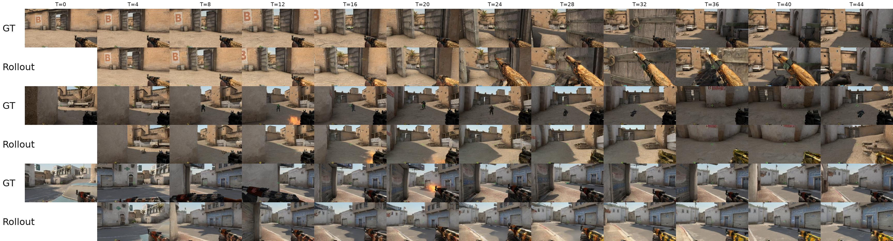
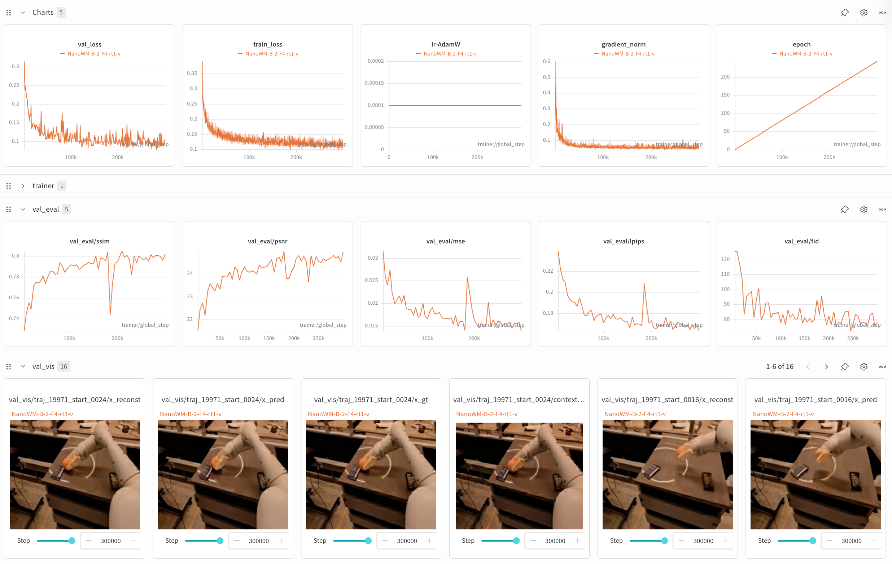
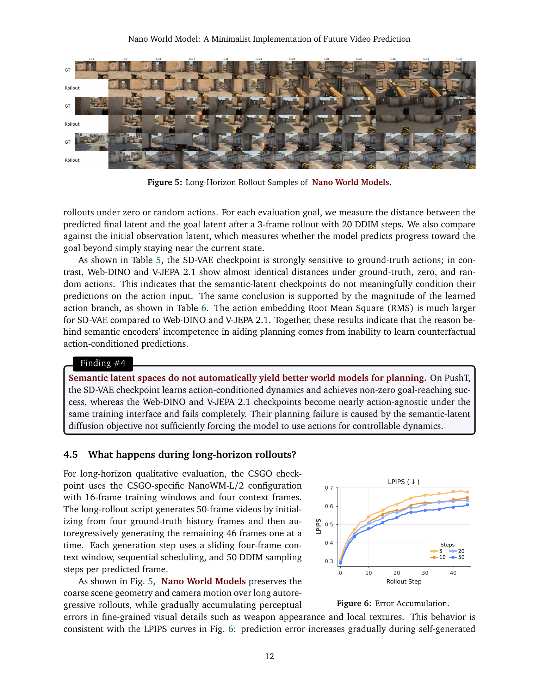
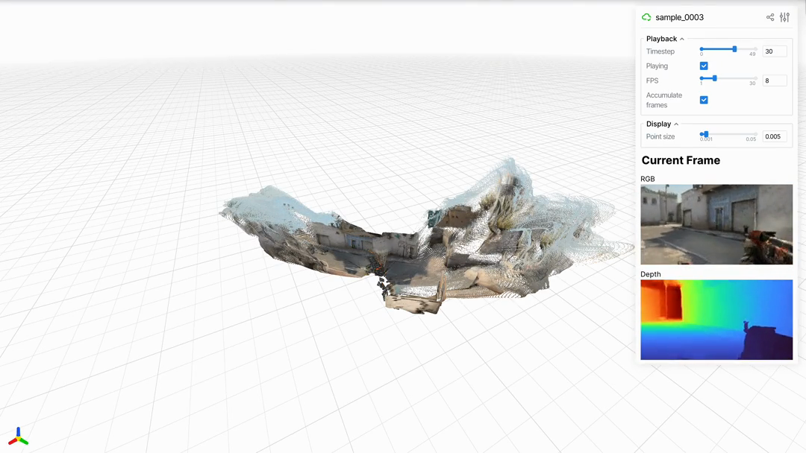
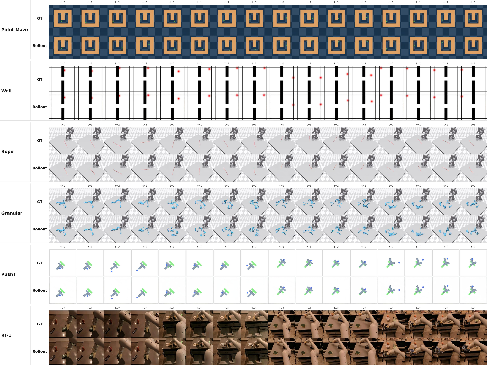

# Nano World Models: A Minimalist Implementation of Future Video Prediction

> WJ 精读笔记（中文为主）｜源文档：Huang 等，arXiv:2605.23993v2，2026-05-27/29
>
> 本笔记只做分析性交付，不替代同目录中的全文翻译。页码按 PDF 页码计（共 19 页，正文 p.1–14，参考文献 p.15–19）。

## 核心信息

- **论文类型**：开放源码的 world/video model 实验基座与设计选择研究，而不是提出一个新的大规模视频生成算法。
- **中心抽象**：把 Diffusion Forcing 作为统一接口；同一训练/采样管线可替换预测目标、模型大小、动作注入、latent 空间、数据集、评估协议和长时 rollout（原文 p.4–7）。
- **覆盖范围**：D4RL/DeepMind Control 的 Point Maze、Wall、PushT、Rope、Granular，CS:GO，以及 RT-1 机器人视频（p.3, 6）。
- **最有信息量的结论**：规模扩大在 RT-1 上单调改善四个视觉指标；x-prediction 更偏重重建，v-prediction 的 FID 最好；动作注入高度任务相关；语义 latent 并不会自动变成可控 dynamics；长时自回归视觉误差逐步累积（Tables 1–7）。
- **我的定位**：NanoWM 的真正贡献是把碎片化的 world-model 研究变量放入可复现实验坐标系。它是“研究基础设施 + 小规模实证地图”，不是已经证明可用于复杂决策的通用世界模拟器。

## 原文摘要翻译

World model 已成为学习预测式模拟器的核心范式，可支持生成、规划与决策。尽管工业界的交互式视频生成进展迅速，研究社区仍缺少紧凑、可复现且易扩展的实现，用来研究现代 world model 背后的设计选择。论文提出 Nano World Models：一个以 diffusion forcing 为中心、用于未来视频预测的极简代码库。它提供统一接口，覆盖生成目标、模型规模、动作条件、latent 观测空间、数据集、评估协议和长时 rollout，因此可以在受控条件下研究通常纠缠在不同实现中的组件。作者在简单控制环境、游戏模拟和真实机器人数据上考察预测参数化、架构规模、动作注入、采样预算与领域复杂度对视频预测质量和自回归 rollout 的影响。作者同时发布代码、配置、评估脚本和预训练 checkpoint，目标是提供紧凑、可扩展、开放且可复现的 world-model 研究底座。（摘要，p.1–2）

## 创新点

1. **统一接口而非新模块**：用 diffusion-forcing 的逐帧 noise-index schedule 表达 teacher-forced、masked-future 与 autoregressive 预测，减少为每种任务重写系统的需要（p.4）。
2. **把设计轴显式化**：x/ε/v prediction、diffusion/flow matching、四档模型规模、五种 action injection、SD-VAE/Web-DINO/V-JEPA latent 都能在同一管线内比较（p.3–6）。
3. **跨域“同一实验语言”**：仿真、游戏、机器人数据经 shared dataset/environment interface 进入同一套训练和评估流程（p.6）。
4. **将生成器当作工具**：提供 long-horizon rollout、CEM-style goal-conditioned MPC，以及把视频 rollout 导出到深度/相机估计和点云等 3D 后端的接口（p.7–8）。
5. **开放复现承诺**：作者声称发布代码、数据、配置、评估脚本、全部支持环境的 checkpoint，以及超过十个不同规模的预训练模型（p.3, 7）。这是项目价值的重要组成部分，但仍需要按仓库逐项核验。

## 一句话总结

NanoWM 不在于把 world model 做“大”，而在于把“视频预测器如何成为一个可实验的世界模型”拆成可替换、可测量、可复现的旋钮；其结果提醒我们，语义表示、动作条件和长时一致性之间没有免费午餐。

## 研究问题

### 背景与缺口

作者认为，工业级 world model 已展示惊人的视觉效果，但普通研究者仍难以从论文阅读走到部署和系统实验（p.2）。技术本身并非完全神秘：video diffusion、diffusion forcing、consistency distillation 等都是已有方法；真正缺的是一个让架构、目标、数据、评估和下游任务能被公平比较的共同底座（p.2–3）。

因此论文的研究问题不是“哪一个新网络结构刷新 SOTA”，而是：

- 在统一 video-world-model 管线下，prediction parameterization、scale、action injection、latent space、sampling budget 如何影响预测质量？
- 这些视觉改进是否转化为 action-conditioned dynamics 与规划能力？
- 有限训练窗口的生成器能否成为稳定的长时模拟器？误差怎样随 rollout 累积？
- 同一套代码是否能跨导航、操控、游戏和机器人视频工作？

### 相对现有 world/video model 的定位

论文把相关路线分为三类：面向决策表示的 world model/JEPA；以 3D 表示为中心、生成时空世界的模型；以及直接预测 RGB/latent future video 的生成式模型（p.13–14）。NanoWM 明确站在第三类，但把 latent representation 也当作实验轴，而不是固定使用 RGB 或 VAE。

与 standard full-sequence video diffusion 相比，NanoWM 依靠 diffusion forcing、sequential schedule 和 sliding-window autoregression 面向在线交互与长时生成（p.13）。与 StableWM、Jasmine、LingBot-World 的比较是**互补定位**：前两者偏基础设施/效率，后者偏大规模实时交互；NanoWM 选择小型 PyTorch、模块化、易改配置和可复现 checkpoint，而不是追求最大模拟器（p.13–14）。

与 WAM（World-Action Model）的关系：NanoWM 更像 WAM 的“可控视觉 dynamics 研究底座”，显式接收动作并可服务 MPC，但没有提出策略头、动作解码器、策略学习或闭环机器人控制的新机制。RT-1 只检验 video prediction；PushT 的 25% 成功率是其 latent dynamics 能否支持规划的诊断，不应读作通用 WAM 性能。对于 WAM 研究，最可迁移的接口是：动作注入可替换、latent 可替换、预测窗口和 sampling budget 可控，适合做 action-conditioned representation/dynamics 的因果消融。

## 数据与任务定义

### 数学任务

给定历史观测 $o_{1:T}$ 和条件变量 $c$，目标是生成未来 $o_{T+1:T+H}$。实际模型通常预测编码：

$$x_t := \mathrm{enc}_{\psi}(o_t),$$

并学习条件分布

$$p_\theta(\cdot\mid x_{1:T},c) \approx p^\star(x_{T+1:T+H}\mid x_{1:T},c),$$

从而采样 $\hat{x}_{T+1:T+H}\sim p_\theta(\cdot\mid x_{1:T},c)$（原文 p.4）。这里的 $c$ 可以包含动作序列；论文的 planning 定义进一步写成：

$$a^\star_{T:T+H-1}\in\arg\max_{a_{T:T+H-1}\in\mathcal A^H}\mathbb E_{\hat{x}\sim p_\theta(\cdot\mid x_{1:T},c,a_{T:T+H-1})}[R(\hat{x}_{T+1:T+H},a_{T:T+H-1})].$$

实际执行采用近似 MPC：采样/优化候选动作序列，按预测回报选最好的一条，只执行首个动作，观察新状态后重规划（p.4）。

### 数据域

- **简单仿真**：Point Maze、Wall（导航）；PushT（桌面推物）；Rope、Granular（XArm 下的可变形/颗粒物体）。
- **游戏**：CS:GO deathmatch，16-frame window 的专用配置。
- **真实机器人**：RT-1 fractal/manipulation 视频。

Figure 2 是跨域 rollout 的主要定性证据：Point Maze、Wall、Rope、Granular、PushT 和 RT-1 都用统一 grid/rollout 格式展示 GT 与预测。图像素材来自 PDF 原图，实际引用如下。

**读图判断**：简单场景中，rollout 的空间布局和运动趋势较易保持；RT-1 与颗粒/绳等更复杂动态的视觉误差更明显。该图支持“接口跨域可运行”，但不能单独证明各域的可控性或物理正确性。

### 观测编码与 token

NanoWM 对 VAE-style latent 将每帧切成空间 patch，投影到 hidden dimension，再经交错 spatial-temporal attention 的 Transformer backbone（p.5）。命名示例：NanoWM-B/2 是 base family、latent patch size 2；/4、/8 更粗。模型家族为 S/B/L/XL，论文在总览中列出约 40M、160M、600M、830M 的规模，但 Table 2 的实际 L/2 约 460M，故不能把总览的 600M 直接当作本消融配置。

支持三种 latent：

- SD-VAE：可解码回 RGB，适合重建和感知指标；
- Web-DINO：自监督、偏语义/几何；
- V-JEPA 2.1：视频预训练的预测特征。

Web-DINO 与 V-JEPA 无天然 RGB decoder，因此 PSNR/SSIM/LPIPS/FID 不与 VAE 直接横比；作者改用 goal-conditioned planning（p.10）。

## 方法主线

### 机制流程

1. 取观测窗口 $o_{1:T+H}$、可选动作 $a_{T:T+H-1}$ 和元数据。
2. 用 encoder 得到 latent trajectory $x_{1:T+H}$。
3. 为每一帧分配 noise index $k_t\in\mathcal K$，得到 schedule $k=(k_1,\ldots,k_{T+H})$。上下文帧可保持 clean/nearly clean，未来帧置于更高噪声级。
4. Transformer 在带噪 trajectory、noise indices、动作条件上预测指定目标：$x$、$\epsilon$、$v$，或 flow-matching velocity。
5. 采样时改变 schedule，就能表达 teacher-forced、masked-future 或 sequential/autoregressive 生成，而不换模型接口。
6. 生成 latent 解码成视频；长时阶段把生成帧作为新的 context，使用 temporal sliding window 继续 denoise。
7. 下游可执行两条工具链：批量候选 rollout + CEM/MPC，或 rollout RGB + 深度/相机估计 + point cloud/3D 表示。

### Diffusion Forcing 的统一性

关键不是“每一帧都同一时刻去噪”，而是允许**同一轨迹的帧处于不同生成阶段**（p.4）。这让下一帧预测和整段扩散不再是两个完全分离的实现：schedule 承担了上下文/未来的条件结构。论文只给出 noise-index 的接口定义和目标类型，没有在正文中给出完整的加噪核、训练 loss 展开式或采样伪代码；复现时必须以仓库实现与 config 为准，不能从本文自行补齐细节。

### 预测目标与噪声 schedule

实验比较三种 diffusion target：

| target | schedule | RT-1 PSNR | SSIM | LPIPS | FID |
|---|---|---:|---:|---:|---:|
| $v$ | cosine + ZTSNR | 23.07 | 0.760 | 0.207 | **42.27** |
| $x$ | cosine + ZTSNR | **23.37** | **0.783** | **0.184** | 42.99 |
| $\epsilon$ | linear | 21.89 | 0.739 | 0.225 | 48.86 |

作者特别说明：x/v 用 squared-cosine + zero-terminal SNR；$\epsilon$ 用 linear，因为 cosine + ZTSNR 在终端对 $\epsilon$-prediction 数值退化。因此这是“各 target 的实现中常用/可稳定 schedule”比较，不是所有变量完全相同的单变量实验（p.9）。

### 动作注入

动作序列先嵌入 hidden dimension，再按机制进入视频 token：element-wise addition；adaLN；adaLN 与 timestep 融合；FiLM；或 video-to-action cross-attention（p.5）。这形成轻量到高容量的条件交互谱，但增加参数并不必然改善结果。

## 关键结果

### 主结果与强基线

论文没有与外部 SOTA world model 做统一数据/算力/指标的强基线排行榜；“主结果”主要是自家 shipped checkpoints 和设计消融。因此最合理的证据等级是：**同一代码、有限预算下的内部比较**，不是跨论文 SOTA 结论。

### 规模消融（RT-1 fractal）

50K steps、8 GPUs、每 GPU batch 8、有效 batch 64、1 context + 3 future，目标和动作注入固定。结果单调改善：

| 架构 | 参数 | PSNR | SSIM | LPIPS | FID |
|---|---:|---:|---:|---:|---:|
| NanoWM-S/2 | 39.8M | 22.30 | 0.739 | 0.230 | 54.95 |
| NanoWM-B/2 | 158.6M | 23.07 | 0.760 | 0.207 | 42.27 |
| NanoWM-L/2 | ~460M | 23.62 | 0.777 | 0.186 | 36.31 |

作者 Finding #2 称 scaling 在 RT-1 上改善全部四项指标。我的判断是，这个趋势可信但仍是三档规模、单一机器人域、固定 50K steps 的 scaling slice；没有报告算力归一化或更大规模是否饱和。

### 动作注入消融

RT-1 用 50K steps；PushT 用 NanoWM-B/2、30K steps。数值如下：

| RT-1 方法 | PSNR | SSIM | LPIPS | FID | 参数 |
|---|---:|---:|---:|---:|---:|
| additive | 23.07 | 0.760 | 0.207 | 42.27 | 158.6M |
| adaLN | 23.19 | 0.762 | 0.206 | 43.62 | 158.6M |
| adaLN-fuse | 23.10 | 0.762 | 0.206 | 43.03 | 158.6M |
| FiLM | **23.20** | **0.763** | **0.203** | **40.62** | 172.8M |
| cross-attention | 20.82 | 0.721 | 0.242 | 51.12 | 187.0M |

| PushT 方法 | PSNR | SSIM | LPIPS | FID | 额外参数 |
|---|---:|---:|---:|---:|---:|
| additive | **26.20** | **0.962** | **0.053** | **23.89** | 0 |
| adaLN-fuse | 26.17 | 0.961 | 0.051 | 30.28 | 0 |
| adaLN | 26.09 | 0.960 | 0.053 | 26.32 | ~42.5M |
| cross-attention | 25.95 | 0.959 | 0.055 | 28.64 | ~28.3M |
| FiLM | 25.88 | 0.960 | 0.056 | 25.45 | ~14.4M |

作者结论是任务依赖：FiLM 在 RT-1 最好，PushT 则 additive 兼顾质量与参数。需要注意 RT-1 和 PushT 的训练步数、数据域不同，不能把两张子表当成一项严格可交换的排名。

### Latent space 与可控规划

PushT DINO-WM 数据：frame interval 5，1 context + 3 future，动作是 5-step chunk 展平为 10D；100K steps、v-prediction、cosine+ZTSNR、AdamW lr $10^{-4}$、weight decay 0.01、causal mask、additive action injection。CEM 使用 64 samples、5 iterations，$H=3$。

| latent | backbone / shape | goal success |
|---|---|---:|
| SD-VAE | NanoWM-B/2 / [4,32,32] | **25.0%** |
| Web-DINO | NanoWM-B/1 / [1024,16,16] | 0.0% |
| V-JEPA 2.1 | NanoWM-B/1 / [1024,16,16] | 0.0% |

动作敏感性诊断：

| latent | MSE init | MSE GT | MSE zero | MSE random | cosine init | cosine GT | cosine zero | cosine random |
|---|---:|---:|---:|---:|---:|---:|---:|---:|
| SD-VAE | 0.077714 | **0.014015** | 0.074830 | 0.081412 | 0.038073 | **0.008885** | 0.037322 | 0.042239 |
| Web-DINO | 0.311649 | 0.834037 | 0.834044 | 0.834066 | 0.111740 | 0.280007 | 0.280011 | 0.280025 |
| V-JEPA 2.1 | 0.206433 | 0.584029 | 0.584056 | 0.584150 | 0.047607 | 0.138866 | 0.138872 | 0.138893 |

动作 embedding RMS 进一步为 SD-VAE 0.1119、Web-DINO 0.00214、V-JEPA 0.00129（Table 6，p.11）。GT/zero/random 几乎相同且 embedding 近零，支持“语义 latent checkpoint 的 additive action branch 基本未被使用”。作者把失败归因于语义 latent 下的 diffusion objective 没有足够迫使模型学习 counterfactual action-conditioned prediction。我的判断更保守：这是一个很强的**诊断信号**，但还没有区分 encoder 几何、loss normalization、latent scale、action embedding 初始化/正则化、causal mask 或 decoder 缺失等多种可能原因，不能概括成“语义 latent 本质上不可控”。

### 长时 rollout 与采样预算

CS:GO 使用 NanoWM-L/2，16-frame training window、4 context；从 4 个 GT history frames 出发，生成 50-frame 视频，其中 46 帧逐帧自回归。每步 sliding 4-frame context、sequential schedule、50 DDIM steps（p.12）。

图 5 显示粗场景几何和摄像机运动尚能保持，但武器外观、局部纹理等细节渐变。Figure 6 的 LPIPS 曲线显示误差沿 rollout step 逐渐增加；5、10、20、50 DDIM steps 的曲线表明更大采样预算在整段 horizon 上降低 LPIPS。

这里“增加采样步数能缓解误差”是每帧 denoising 更准确的合理解释，但不是消除 exposure bias 或模型不可逆漂移；采样成本与实时性之间的折中没有被量化成 FPS/延迟表。

### 跨域 shipped checkpoints

标准协议：256 个固定验证 clip、seed 42、250 DDIM steps、sequential schedule、1 context + 3 generated frames；RT-1 训练 300K steps，其余如下：

| Dataset | steps | PSNR | SSIM | LPIPS | FID |
|---|---:|---:|---:|---:|---:|
| Point Maze | 30K | 36.74 | 0.984 | 0.019 | 9.66 |
| Wall | 15K | 34.05 | 0.994 | 0.010 | 2.64 |
| Rope | 15K | 31.63 | 0.953 | 0.056 | 35.20 |
| Granular | 15K | 26.08 | 0.917 | 0.073 | 40.05 |
| PushT | 100K | 33.19 | 0.982 | 0.016 | 13.63 |
| RT-1 | 300K | 24.36 | 0.787 | 0.180 | 35.08 |

作者据此称同一 recipe 跨导航、桌面推动、可变形操控和真实机器人数据工作，且简单仿真更强、Granular/RT-1 更难。应避免把表中数值跨数据集直接排序：视频分辨率、运动复杂度、训练步数与 latent/data statistics 未完全相同。

### 训练/评估可观测性

Figure 3 展示 W&B 中 val/train loss、learning rate、gradient norm、epoch 以及 SSIM、PSNR、MSE、LPIPS、FID 和可视化样例；论文声称同时支持 TensorBoard 与 W&B、callback validation、逐步 checkpoint 和固定 seed（p.7–8）。

## 深度分析

### 真正贡献是什么

**第一层是工程整合**：把已有的 diffusion/flow target、Transformer、latent encoder、action injection 与评估脚本组合成一套可换配置的系统。它本身不是新损失或新 backbone。

**第二层是研究方法论**：该整合使设计轴能在同一数据 loader、相同 eval protocol、固定 seed 下被比较。Table 1 的 schedule caveat、Table 4/5/6 的“规划失败—动作敏感性—branch magnitude”诊断链，是论文最有科研价值的部分。

**第三层是桥接下游**：3D 导出与 MPC 是应用接口。Figure 4 实际展示 CS:GO rollout 经 depth/camera estimation 后得到 point cloud；它说明“视频 world model → 持久化 3D”可被串起来，但几何质量主要由外部重建系统决定。

### 为什么结果成立

1. **目标参数化改变学习信号**：x-prediction 保留重建优势，v-prediction 在该 schedule 下 FID 最好；ε 在线性 schedule 下明显落后。这里 target 与 schedule 是成对系统，不宜只归因给 target。
2. **容量提高减少视觉欠拟合**：RT-1 从 39.8M 到 460M，四指标单调改善，说明此域的预测容量仍是瓶颈。
3. **动作注入匹配数据结构**：PushT 动作条件简单且局部 additive 已足够；RT-1 更复杂的机器人视频让 FiLM 有小幅优势，而 cross-attention 反而劣化，可能提示条件交互的优化/参数成本超过收益，但论文没有做机制级验证。
4. **latent 的“语义好”不等于“控制好”**：规划依赖 latent 距离与动作变化的几何一致性。若训练 loss 允许模型忽视 action branch，语义 representation 可能看起来有预测能力，却无法进行 counterfactual control。
5. **自回归闭环会放大局部误差**：每次采样的视觉偏差成为下一窗口 context；更多 DDIM steps 只能改善单步 denoising，不能从根本上恢复真实未来分布。

### 容易误读的地方

- **“统一接口”不等于统一性能**：latent、目标和动作注入共享 API，不代表它们处于可比的同一统计空间。
- **“支持规划”不等于“规划有效”**：只报告 PushT 中 VAE 的 25%，两种语义 latent 为 0%；没有更长 horizon、更复杂 goal、闭环真实机器人成功率。
- **“long-horizon 能生成”不等于世界状态准确**：CS:GO 50-frame 结果主要是定性及 LPIPS 趋势；粗几何保持可能伴随动作/物体状态错误。
- **“跨域工作”不等于跨域泛化**：每个域有单独 checkpoint 和训练；实验是多域复用 recipe，不是 zero-shot transfer。
- **“open-source/reproducible”仍需审计**：论文声称开放 code/data/weights，但正文没有列出 commit、硬件总时数、数据许可清单、完整 config 哈希或逐表生成命令。
- **表 1 的公平性有限**：x/v 与 ε 使用不同 schedule，作者解释了数值稳定性，但结论应写成“在各自支持的 schedule 下”。

### 复现注意点

- 依赖/入口：Hydra 配置；PyTorch 代码库；W&B 或 TensorBoard；固定 seed 42；需要 SD-VAE、Web-DINO、V-JEPA 2.1 权重及对应预处理。
- 训练：RT-1 目标消融 50K steps、8 GPU、每 GPU batch 8；scale 同 protocol；latent planning 100K steps、AdamW $10^{-4}$/0.01；跨域 shipped rows 的 steps 不同。
- 评估：普通 256-resolution 模型是 1 context → 3 future；指标排除 context frame；默认 diffusion 采样 250 DDIM steps；CS:GO long rollout 改为 16-frame window、4 context、50 frames、每帧 50 DDIM steps。
- 动作：PushT 使用 5-step、2D relative action chunk 展平为 10D；planning CEM 是 64 samples × 5 iterations、$H=3$。
- 输出：需要记录 encoder/latent shape、patch size、noise schedule、prediction target、action injection、mask 和 sequential/sliding-window schedule，否则“同模型”无法复现。
- 成本缺口：论文没有给出每个实验的 wall-clock、GPU 型号、显存、采样 latency/FPS、数据量/clip 数或完整超参；“实时 simulation”是应用目标/接口能力，不是本文已证实的实时速度。

## 局限

1. **实证规模窄**：视觉消融主要围绕 RT-1，latent/planning 主要只有 PushT，长时视频主要是 CS:GO；不能外推到通用 world model。
2. **缺乏外部强基线**：无与 Vid2World、DINO-WM、StableWM 或大型 interactive video model 在同 protocol 下的性能比较，内部指标无法回答“先进多少”。
3. **规划证据弱于预测证据**：仅 VAE latent 得到 25% PushT success；语义 latent 全 0 可能是训练/scale/目标适配失败，而非表示空间的普遍结论。
4. **物理和因果校验不足**：PSNR/SSIM/LPIPS/FID 衡量视觉，不衡量接触、动力学、动作后果、状态可达性或闭环安全。
5. **长时只做单次自回归示例**：没有系统改变 context window、训练时 scheduled sampling、错误恢复、不同 action policy 或 stochastic ensemble。
6. **核心公式不完整**：正文没有给出具体 forward noising、目标权重、loss aggregation、mask、采样器细节，读者必须依赖代码。
7. **3D pipeline 非端到端**：Figure 4 的点云来自 off-the-shelf depth/camera estimator，不能把几何质量归因给 NanoWM 本身。
8. **复现材料需要外部核验**：许可证、数据获取、checkpoint 对应 commit、训练日志和完整硬件成本在正文中未给全。

## 与 WAM、视频世界模型、latent dynamics 的关系

- **对 WAM**：NanoWM 把 world-action prediction 的视觉/latent dynamics 部分做成模块化实验台。WAM 论文可借其 action injection、latent choice、GT/zero/random rollout diagnostic 和 fixed-seed protocol；但若目标是 policy learning，仍需 action decoder、policy loss、闭环任务和真实执行评估。
- **对视频 world model**：它继承 video diffusion 的高保真路线，重点补上 sequential schedule、滑窗和动作条件，使固定 clip generator 具有 simulator 形态。其清晰结论是，视频质量与可控性不是同一指标。
- **对 latent dynamics**：Table 4–6 提供一个很具体的警告：表示的语义/几何质量不能替代 action-conditioned transition geometry。latent dynamics 训练应显式测试动作敏感性、反事实一致性和 goal distance，而非只看重建或 feature prediction loss。
- **对 JEPA 系列**：作者将 V-JEPA 2.1 当作可插拔预测 latent，但 NanoWM 的 diffusion-forcing predictor 与 JEPA 的联合 encoder/predictor 自监督范式不同。该实验没有证明谁更优，只说明把预训练 feature 接进同一动作预测接口时，未经额外控制设计可能失效。

## 可迁移研究洞见

1. **建立“预测—动作—规划”三层验收链**：视觉指标 → GT/zero/random action sensitivity → CEM/MPC success。只看第一层会把 action-agnostic predictor 误当 world model。
2. **把 sampling budget 当系统变量**：报告 DDIM steps 与质量、延迟、长时 drift 的曲线，而不是只给一个最佳采样点。
3. **动作分支必须有可观测性**：记录 action embedding RMS、action swap test、counterfactual rollout；必要时加 action-use auxiliary loss 或控制一致性损失。
4. **latent 选择要任务化**：重建型 latent 更适合可解码视频和当前 PushT 规划；语义 latent 需要重新校准 scale、decoder/goal metric 和 action coupling，不能直接套 VAE recipe。
5. **公平消融要报告 schedule coupling**：target、noise schedule、采样器和终端 SNR 经常联动；把它们写进实验矩阵，避免把数值稳定性误报成架构优势。
6. **长时评估要跨过训练 horizon**：至少同时报告短窗 teacher-forced、autoregressive rollout、不同历史窗口和误差曲线；Figure 6 的 LPIPS 轨迹比单个最终帧更能暴露模型是否适合作为 persistent simulator。
7. **开放代码的科研价值在可比性**：统一 loader、seed、logging、checkpoint naming 和 config provenance，本身比再加一个未经诊断的新模块更利于社区积累。

## 图表决策与证据导航

- Figure 2：纳入。它是跨域 GT/rollout 的唯一总览定性图，支撑“同一接口覆盖多域”，不是数值性能证据。
- Figure 3：纳入。它具体呈现训练与评估可观测性，支撑复现/日志主张。
- Figure 4：纳入。它说明 rollout 到 3D point cloud 的工具链边界，且明确外部重建模块的作用。
- Figure 5：纳入。它直接支撑 CS:GO 50-frame 长时定性结论。
- Figure 6：纳入，以 p.12 渲染页保存，因为曲线为 PDF 绘图元素且无独立嵌入位图；引用时注明同页包含 Figure 5。
- Figure 1：未单独裁剪；总览流程在正文机制流程中已文字化，避免把包含标题/大面积空白的首页截图当作主要证据。

## 材料级 caveat

源 PDF 是 19 页、可提取文本的 arXiv GenPDF；正文实验表格与图注可读取，但 PDF 没有把所有关键训练细节（具体 loss 权重、noise kernel、数据规模、硬件型号/时延、完整配置与代码版本）写进论文。Figure 6 由页面渲染保存而非独立原图，分辨率/裁剪不如嵌入式 Figure 2–5；Figure 4 的 3D 几何来自下游 depth/camera estimation，不能视为 NanoWM 的端到端几何指标。所有结论都应在“论文作者报告”与“本笔记判断”之间区分；尤其语义 latent 失败只在一个 PushT 设置上成立。

## 引用

- Huang, Siqiao, et al. “Nano World Models: A Minimalist Implementation of Future Video Prediction.” arXiv:2605.23993v2, 2026. PDF pp.1–19.
- Code: <https://github.com/simchowitzlabpublic/nano-world-model>
- Blog: <https://simchowitzlabpublic.github.io/nano-world-model>
- Models: <https://huggingface.co/collections/knightnemo/nano-world-model>
