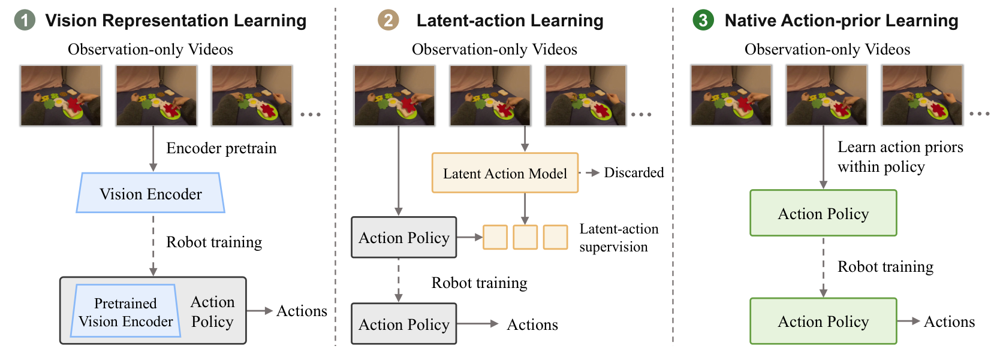
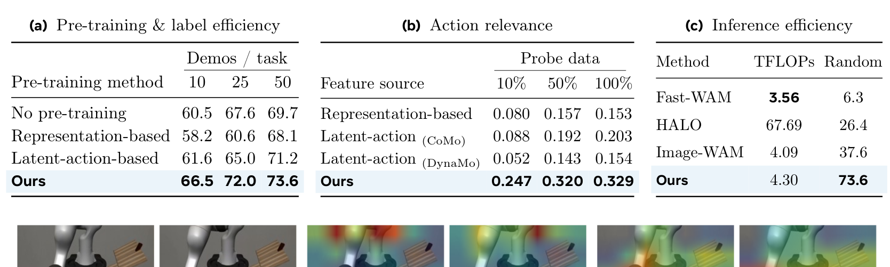
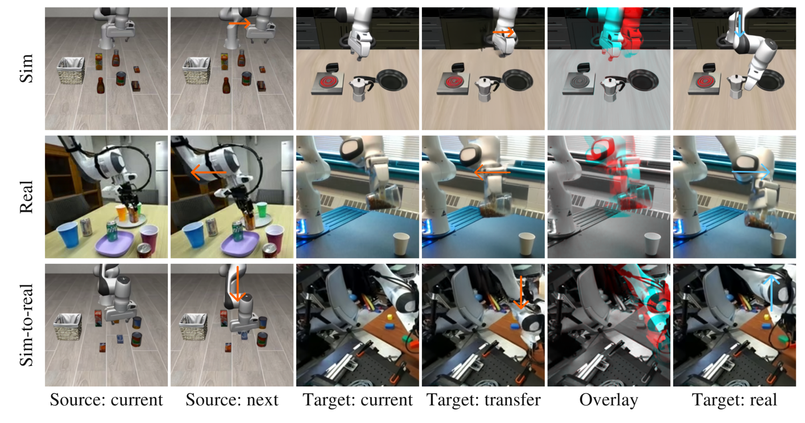
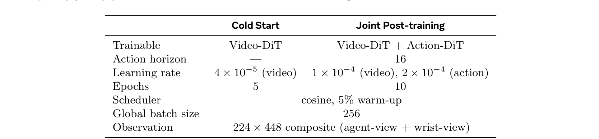
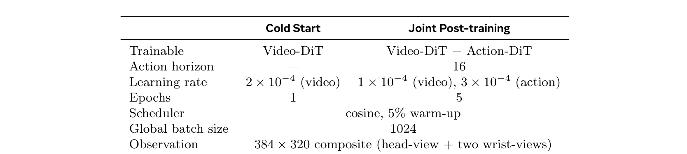
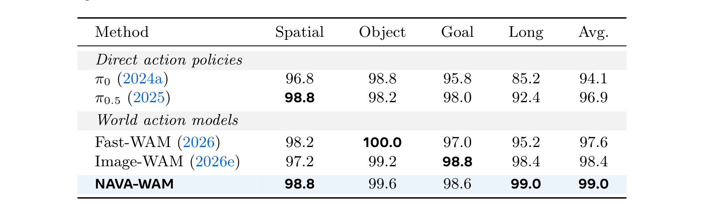
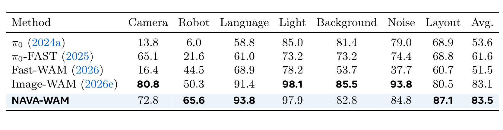
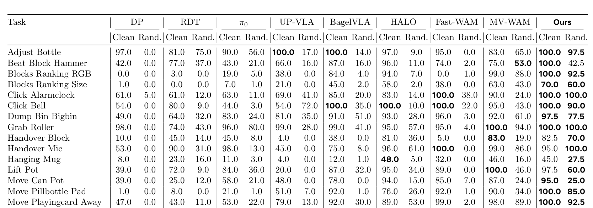
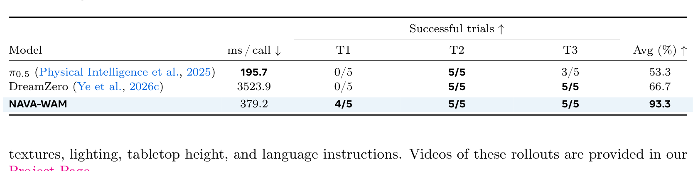

# Native Action-Prior Learning from Videos for World Action Models

**Authors:** Zhaochong An$^{1,2,\dagger}$, Fei Zhang$^1$, Menglin Jia$^1$, Duncan Frost$^1$, Zijian Zhou$^1$, Yikai Wang$^1$, Xudong Wang$^4$, Aditya Patel$^1$, Belinda Zeng$^1$, Tao Xiang$^1$, Serge Belongie$^2$, Amir Bar$^3$, Sen He$^{1,*}$  
**Affiliations:** $^1$Meta AI, $^2$University of Copenhagen, $^3$Imperial College London, $^4$Physical Intelligence  
**Notes:** $^\dagger$Work done at Meta, $^*$Project lead and corresponding author  
**Source:** `/Users/roywangj/journey_wj/research/papers4zotero/zotero1/storage/QDPQ5QXT/An 等 - 2026 - Native Action-Prior Learning from Videos for World Action Models.pdf`  
**Version:** arXiv:2610.03391v1 [cs.CV], 2 Oct 2026 (Updated 5 Oct 2026); 27 pages  
**Project Page:** https://zhaochongan.github.io/projects/NAVA-WAM/  
**Reader Type:** Complete paragraph-level English–Chinese detailed bilingual reader (`detailed_paper.md`)

---

## Page / Section Index

| Pages | Sections | Key Contents / Focus |
|---|---|---|
| 1–3 | Title, Abstract, 1. Introduction | 动机：利用无动作标注视频解决 WAM 对昂贵机器人动作轨迹的依赖；现有表征学习与潜在动作范式缺陷；NAVA-WAM 原生动作先验理念与核心收益 |
| 3–4 | 2. Related Work | 世界动作模型（级联式与联合式 WAM）；仅观测视频机器人学习（视觉表征学习 vs 潜在动作学习瓶颈） |
| 4–7 | 3. Method: NAVA-WAM | 问题形式化与 MoT 架构；原生动作先验预训练（逆—前向动力学隐式注意力、流匹配目标）；下游后训练与非对称注意力缓存推理机制 |
| 7–10 | 4. Experiments | 实验设置（Wan2.2-5B 视觉骨干、1B Action-DiT、预训练数据）；LIBERO / LIBERO-Plus / RoboTwin 2.0 仿真主实验；Franka FR3 真机部署（93.3% 成功率）；消融分析（预训练范式对比、数据规模扩展性、表示动作相关性 $R^2$、跨域动作迁移、推理开销） |
| 10 | 5. Conclusion and Limitations | 总结核心贡献与未来展望；致谢（Acknowledgements） |
| 10–15 | References | 完整参考文献库（95 篇，保留原文献条目格式以保障可检索性） |
| 16–17 | Appendix A: Theoretical Analysis of Native Action-Prior Learning | 动作通路捕获转移信息的理论保证（Proposition A.1）；高斯加噪扰动阻断目标直接复制捷径解的数学证明（Proposition A.2） |
| 17–20 | Appendix B: Additional Implementation Details | B.1 预训练数据整理与训练参数；B.2 下游后训练配置与冷启动超参数（Table 3, Table 4）；B.3 状态转移结构化注意力掩码详述（Figure 7）；B.4 基准评测协议；B.5 仅动作推理算法（Algorithm 1） |
| 20–27 | Appendix C: Additional Experimental Results | C.1 预训练收敛动态（Figure 8, Figure 9）；C.2 跨域动作迁移可视化补充（Figure 10）；C.3 详细分项评测（Table 5, Table 6, Table 7 全 50 任务分解）；C.4 RoboTwin 2.0 成功与失败轨迹分析（Figure 11）；C.5 真机评估与部署延迟对比（Table 8） |
| 27 | Appendix D: Limitations | 局限性分析（精细接触式操控、局部执行失误恢复机制） |

---

## Terminology Ledger

| English Term | Chinese Term | Definition / Context in NAVA-WAM |
|---|---|---|
| World Action Model (WAM) | 世界动作模型 | 同时建模未来视觉演化与机器人动作预测的具身智能统一模型 |
| Native Action-Prior Learning | 原生动作先验学习 | 直接利用未来视频预测监督优化动作策略网络，无需单独中间接口或潜在动作空间 |
| Action-DiT | 动作扩散 Transformer | NAVA-WAM 中专门负责生成连续动作块的扩散 Transformer 专家 |
| Video-DiT | 视频扩散 Transformer | NAVA-WAM 中建模环境视觉时空动态演化的视频生成 Transformer 专家 |
| Mixture-of-Transformers (MoT) | 混合 Transformer 架构 | 视频专家与动作专家解耦参数并通过联合注意力层交叉交互的双流架构 |
| Transition-structured Joint Attention | 转移结构化联合注意力 | 围绕相邻视觉状态转移构建的注意力掩码，实现隐式逆—前向动力学交互 |
| Asymmetric Transition Attention | 非对称转移注意力 | 后训练与推理期使视觉流单向独立于动作流，实现视觉隐表征缓存重用的注意力机制 |
| Future-video Flow Matching | 未来视频流匹配 | 基于速度场预测连续生成未来视频潜变量的流匹配预训练监督目标 |
| Joint Video–Action Flow Matching | 联合视频—动作流匹配 | 后训练阶段同时约束视频演化与动作块去噪的联合多模态流匹配损失 |
| Latent-Action Learning | 潜在动作学习 | 从视觉前后帧中提取连续/离散隐变量以作为中间监督的既有视频预训练范式 |
| Representation-to-Control Transfer | 表征到控制迁移 | 纯视觉编码器预训练后，在下游将视觉特征映射到动作控制的间接迁移模式 |
| Target-Copying Shortcut | 目标复制捷径（作弊解） | 逆动力学模型直接将清晰的未来目标观测特征抄入隐变量的退化退化失效模式 |
| Continuous Action Chunk | 连续动作块 | 策略一次性前向预测的跨越 $H$ 步时域的连续机械臂末端/关节控制序列 |
| Action-Only Inference | 仅动作推理 | 推理阶段仅执行动作去噪整合，不显式迭代生成未来视频的高效闭环控制范式 |
| Visual Latent Cache ($\mathcal{C}_V$) | 视觉隐表征缓存 | 首步前向计算并固化在各层的 Video-DiT 键值表征，供动作流后续去噪迭代免费复用 |
| Proprioceptive State / Proprioception | 本体感知状态 | 机器人机械臂当前关节角、末端执行器姿态及夹爪开合度等内部物理状态 ($q$) |

---

## Abstract

> <span style="color:#3B82F6"><strong>Para. 1:</strong></span> World action models integrate future visual dynamics with robot action prediction, but their scalability remains limited by the need for action-annotated robot trajectories. Observation-only videos contain rich evidence about interaction dynamics, but existing approaches typically use them either to pretrain visual representations that must later be adapted for control, or to infer latent actions that are subsequently grounded to robot commands. We present NAVA-WAM, which introduces native action-prior learning by directly pretraining the action policy from observation-only videos, avoiding indirect representation-to-control transfer or a separate latent-action model. Our training consists of two stages.

> <span style="color:#F59E0B"><strong>Para. 1[CN]:</strong></span> 世界动作模型（World Action Models, WAMs）将未来视觉动态演化与机器人动作预测相融合，但其规模化扩展能力一直受制于对昂贵且带动作标注的机器人轨迹数据的依赖。仅包含观测的无动作视频蕴含关于物理交互动态的丰富信息，然而现有方法通常仅将其用于预训练视觉表征（随后必须在下游适配至控制任务），或者用于推断潜在动作（随后再接地映射为机器人控制指令）。我们提出了 NAVA-WAM，通过直接从仅观测视频中对动作策略进行预训练来引入原生动作先验学习（native action-prior learning），从而避免了间接的“表征到控制”迁移过程，亦无需引入独立的潜在动作模型。我们的训练过程包含两个阶段。

> <span style="color:#3B82F6"><strong>Para. 2:</strong></span> First, we pretrain on observation-only videos, where future-video flow-matching supervision over visual transitions is propagated through transition-structured joint attention to optimize the Action-DiT and learn action-relevant priors. Second, we use action-labeled demonstrations to post-train the Action-DiT for robot control through joint video–action flow matching, while asymmetric attention decouples the visual branch from iterative action denoising and enables efficient action-only inference.

> <span style="color:#F59E0B"><strong>Para. 2[CN]:</strong></span> 第一阶段，我们在仅观测视频上进行预训练：作用于视觉状态转移的未来视频流匹配（flow-matching）监督信号，通过状态转移结构化的联合注意力机制进行反向传播，以优化动作扩散 Transformer（Action-DiT）并学习动作相关先验。第二阶段，我们利用带有动作标注的机器人演示数据，通过联合视频—动作流匹配对 Action-DiT 进行面向机器人控制的后训练；同时，非对称注意力机制使视觉分支与迭代动作去噪过程完全解耦，从而实现高效的“仅动作推理”（action-only inference）。

> <span style="color:#3B82F6"><strong>Para. 3:</strong></span> Extensive experiments show that NAVA-WAM consistently outperforms prior approaches under both in-distribution and out-of-distribution settings, while demonstrating strong action-label efficiency and effective real-robot generalization. These results establish native action-prior learning as an effective approach to directly pretrain action policies from observation-only videos, providing a scalable path beyond action-labeled robot data.

> <span style="color:#F59E0B"><strong>Para. 3[CN]:</strong></span> 广泛的实验表明，NAVA-WAM 在分布内（in-distribution）与分布外（out-of-distribution）评测设定下均持续显著优于以往方法，同时展现出卓越的动作标签数据利用效率以及高效的实体机器人跨域泛化能力。这些结果证实，原生动作先验学习是一种直接从仅观测视频中对动作策略网络进行预训练的有效途径，为摆脱对昂贵动作标注数据的依赖、实现具身策略的规模化扩展提供了一条全新道路。


## 1 Introduction

> <span style="color:#3B82F6"><strong>Para. 1:</strong></span> World action models (WAMs) (Zhu et al., 2025; Li et al., 2025; Ye et al., 2026c; Li et al., 2026a; Bi et al., 2026a) incorporate future visual dynamics into action learning, with strong potential to improve policy generalization. However, scaling WAMs remains challenging because they rely on action-annotated robot trajectories that are costly to collect and hard to standardize across embodiments. In contrast, large-scale observation-only videos provide abundant information about physical interactions and state transitions without action labels. The key challenge is therefore how to leverage such videos to learn priors that effectively improve action policy learning.

> <span style="color:#F59E0B"><strong>Para. 1[CN]:</strong></span> 世界动作模型（World Action Models, WAMs）（Zhu 等，2025；Li 等，2025；Ye 等，2026c；Li 等，2026a；Bi 等，2026a）将未来视觉动态演化深度融入动作学习中，展现出显著提升策略泛化能力的巨大潜力。然而，扩展世界动作模型仍然充满挑战，因为它们高度依赖带有精确动作标注的机器人运行轨迹，而这些轨迹数据的采集成本极其昂贵，且难以在跨本体（embodiments）硬件平台之间建立统一标准。相比之下，海量且易于获取的仅包含观测的视频（observation-only videos）在无需任何动作标签的前提下，提供了关于物理交互过程与状态转移的丰富时空信息。因此，核心挑战在于如何有效利用这类无标注视频来学习出能够实质性促进动作策略学习的底层先验。

> <span style="color:#3B82F6"><strong>Para. 2:</strong></span> Existing approaches largely follow two paradigms for exploiting observation-only videos. Vision representation learning first learns visual or predictive representations from videos and then trains an action policy on top of them using action-labeled robot demonstrations (Nair et al., 2023; Hu et al., 2025; Assran et al., 2025; Sun et al., 2026). Because the learned video prior remains encoded in a vision-centric representation, its connection to executable actions is established only during downstream robot training, introducing an indirect representation-to-control transfer. Latent-action learning instead infers action-like variables from visual transitions and uses them as intermediate supervision for subsequent policy learning (Schmidt and Jiang, 2024; Ye et al., 2025; Chen et al., 2025b; Bu et al., 2025b; Bi et al., 2026a; Chen et al., 2026b). While more action-oriented, this paradigm requires an additional latent-action modeling stage and relies on complex architectural or optimization constraints (Yang et al., 2026b; Wang et al., 2026b; Zhang et al., 2026d) to avoid shortcut solutions in which the latent action simply copies information from the target observation. These constraints increase modeling complexity and can restrict the expressiveness of the latent-action space, thereby limiting the supervision provided to the policy and impairing its control learning.

> <span style="color:#F59E0B"><strong>Para. 2[CN]:</strong></span> 现有利用无动作标注视频的方法主要遵循两种范式。其一是**视觉表征学习**（Vision representation learning），该范式首先从视频中学习纯视觉或预测性表征，随后在下游利用带动作标注的机器人演示数据在其之上训练动作策略（Nair 等，2023；Hu 等，2025；Assran 等，2025；Sun 等，2026）。由于所学到的视频先验始终被编码在以视觉为中心的表征空间内，其与可执行动作之间的映射关系直到下游机器人训练阶段才得以建立，从而引入了间接的“表征到控制”迁移屏障。其二是**潜在动作学习**（Latent-action learning），它从视觉状态转移中推断出类动作变量（latent actions），并将其作为中间监督信号用于后续的策略学习（Schmidt 与 Jiang，2024；Ye 等，2025；Chen 等，2025b；Bu 等，2025b；Bi 等，2026a；Chen 等，2026b）。尽管这种范式更具动作导向性，但它必须引入额外的潜在动作建模阶段，并且高度依赖复杂的架构设计或优化约束（Yang 等，2026b；Wang 等，2026b；Zhang 等，2026d），以防止潜在动作直接从目标观测中复制信息的“捷径作弊解”（shortcut solutions）。这些人为约束不仅显著增加了建模复杂度，还会限制潜在动作空间的表达能力，进而削弱提供给策略的监督信号质量并损害下游控制学习。

### Figure 1. 利用仅观测视频进行机器人策略学习的范式对比



**Caption:** Figure 1 Paradigms of leveraging observation-only videos for robot policy learning. (1) Vision representation learning first learns visual representations from videos within a vision encoder and then trains an action policy on top, introducing an indirect representation-to-control transfer. (2) Latent-action learning extracts latent actions from visual transitions as intermediate supervision for policy learning, introducing an additional modeling stage and a potential representational bottleneck. (3) Native action-prior learning directly uses video dynamics to optimize the action policy, avoiding additional intermediate interfaces and representational bottlenecks.

**Caption[CN]:** 图 1 利用仅包含观测的视频进行机器人策略学习的三种主要范式对比。(1) **视觉表征学习**：首先在视觉编码器内从视频中提取视觉特征，随后在下游训练动作策略，从而引入了间接的“表征到控制”迁移机制。(2) **潜在动作学习**：从前后视觉状态转移中提取潜在动作作为中间监督信号，用于后续策略学习，这引入了额外的建模阶段以及潜在的表征信息瓶颈。(3) **原生动作先验学习**（本文提出）：直接利用视频动态演化监督来优化动作策略模型自身，从根本上消除了额外的中间接口与表征瓶颈。

> <span style="color:#3B82F6"><strong>Para. 3:</strong></span> These limitations motivate a simple question: Can observation-only videos directly optimize an action policy without relying on an intermediate interface? We answer this question with NAVA-WAM, which introduces native action-prior learning for world action models. As illustrated in Fig. 1, instead of first learning a separate visual representation or latent-action space and then using it in policy training, NAVA-WAM uses future-video prediction to directly pretrain the action policy. This creates a direct learning path from scalable observation-only videos to the action policy, avoiding intermediate representation constraints and enabling more effective policy learning.

> <span style="color:#F59E0B"><strong>Para. 3[CN]:</strong></span> 上述局限性引出了一个直接且关键的科学问题：**能否在不依赖任何中间接口的前提下，直接利用仅包含观测的视频来优化动作策略网络？** 我们通过提出 NAVA-WAM 对此给出了肯定回答，并在世界动作模型中确立了**原生动作先验学习**范式。如图 1 所示，NAVA-WAM 不再先训练独立的视觉表征或潜在动作空间再去适配策略，而是利用未来视频预测任务直接对动作策略进行预训练。这在海量无标注视频与动作策略网络之间建立了一条端到端的直接优化通道，彻底避免了中间表征约束，从而实现了更为高效的动作策略学习。

> <span style="color:#3B82F6"><strong>Para. 4:</strong></span> Specifically, NAVA-WAM adopts a joint Mixture-of-Transformers (MoT) architecture (Liang et al., 2024), comprising a Video-DiT and an Action-DiT that interact through joint attention while retaining modality-specific parameters. During action-free pre-training, the Video-DiT is frozen and the Action-DiT is optimized solely through future-video flow-matching supervision. Our transition-structured joint attention allows the Action-DiT to model visual transitions while participating in future-state prediction, enabling the video objective to directly optimize the action policy. In this way, the Action-DiT learns action-relevant priors directly from visual transitions without requiring an intermediate interface. During downstream post-training, we jointly optimize the video and action streams on action-labeled robot demonstrations through video–action flow matching, adapting the pretrained Action-DiT to embodiment-specific control. We make cross-stream attention asymmetric to decouple the visual stream from the evolving action sample, allowing its representations to be cached and enabling efficient action-only inference without explicitly generating future videos.

> <span style="color:#F59E0B"><strong>Para. 4[CN]:</strong></span> 具体而言，NAVA-WAM 采用了一种联合混合 Transformer 架构（Mixture-of-Transformers, MoT）（Liang 等，2024），由视频扩散 Transformer（Video-DiT）与动作扩散 Transformer（Action-DiT）组成；二者在保留各自模态专用参数的同时，通过联合注意力机制（joint attention）紧密交互。在无动作标注的预训练阶段，Video-DiT 被完全冻结，而 Action-DiT 仅通过未来视频流匹配监督信号进行反向传播优化。我们提出的**状态转移结构化联合注意力**允许 Action-DiT 在参与未来视觉状态预测的同时显式建模前后状态转移，使得纯视频生成目标能够直接更新动作策略权重。在此机制下，Action-DiT 无需任何中间媒介即可直接从视觉状态转移中提取出动作相关先验。在下游后训练阶段，我们在带有动作标签的机器人演示数据上，通过视频—动作联合流匹配同时优化两股数据流，将预训练的 Action-DiT 接地适配至具体机器人本体的连续控制中。更进一步，我们将跨模态注意力设计为非对称结构，使视觉分支与逐步去噪演化的动作样本彻底解耦；这使得推理阶段可以预先缓存视觉键值表征，从而在无需显式渲染未来视频的情况下实现超高效的“仅动作推理”。

> <span style="color:#3B82F6"><strong>Para. 5:</strong></span> We evaluate NAVA-WAM on the simulation benchmarks LIBERO/LIBERO-Plus (Liu et al., 2023; Fei et al., 2025) and RoboTwin 2.0 (Chen et al., 2025a) under both in-distribution and out-of-distribution settings, demonstrating superior performance across both regimes. We further deploy NAVA-WAM on a physical Franka FR3, achieving 93.3% success across tabletop manipulation tasks, compared with 66.7% for DreamZero (Ye et al., 2026c) and 53.3% for π0.5 (Physical Intelligence et al., 2025). Controlled experiments show that native action-prior learning consistently outperforms representation-based and latent-action-based approaches across action-label budgets, with larger gains in low-budget regimes. Together, these results demonstrate that native action-prior learning can effectively leverage observation-only videos to learn action priors, improving generalization and action-label efficiency.

> <span style="color:#F59E0B"><strong>Para. 5[CN]:</strong></span> 我们在仿真基准 LIBERO/LIBERO-Plus（Liu 等，2023；Fei 等，2025）以及双臂操控基准 RoboTwin 2.0（Chen 等，2025a）上对 NAVA-WAM 进行了分布内与分布外全方位的严格评测，结果均展现出显著的性能优势。我们进一步将 NAVA-WAM 零样本部署于实体 Franka FR3 机械臂上，在桌面操控任务中斩获了 93.3% 的平均成功率，大幅超越 DreamZero 的 66.7%（Ye 等，2026c）与 $\pi_{0.5}$ 的 53.3%（Physical Intelligence 等，2025）。严格的受控消融实验表明，在各类动作标注数据预算下，原生动作先验学习的性能均持续压制基于视觉表征学习和基于潜在动作学习的方法，且在极低标注预算区间内性能增益尤为显著。这一系列结果强有力地证实：原生动作先验学习能够极其高效地盘活无动作视频以习得深刻的动作先验，同时大幅提升策略的跨域泛化能力与数据标注利用率。

---

## 2 Related Work

### 2.1 World Action Models

> <span style="color:#3B82F6"><strong>Para. 1:</strong></span> Direct visuomotor policies learn observation-to-action mappings across tasks and embodiments (Brohan et al., 2023; Team et al., 2024; Liu et al., 2025), while vision–language–action (VLA) models further leverage semantic priors from large-scale vision–language pre-training (Zitkovich et al., 2023; Kim et al., 2024; Black et al., 2024a; Physical Intelligence et al., 2025; Bjorck et al., 2025; Gemini Robotics Team et al., 2025; Team et al., 2026; Zhang et al., 2026a; Shin et al., 2026; Zhang et al., 2026f; Yang et al., 2026a). Their primary objective, however, remains conditional action prediction, leaving environment dynamics to be learned implicitly. With recent advances in video modeling (An et al., 2026a; Qiao et al., 2026; An et al., 2026b), world action models (WAMs) instead explicitly couple action learning with predictive modeling of future visual evolution. Existing WAMs can be broadly categorized into cascaded and joint architectures. Cascaded WAMs first extract predictive information from a video or world model and then use it to drive a separate action module (Du et al., 2023; Black et al., 2024b; Ko et al., 2024). Some methods explicitly generate future observations, visual subgoals, or motion cues before action prediction (Bharadhwaj et al., 2025; Zhou et al., 2024; Chen et al., 2026d; Li et al., 2026b; Lou et al., 2026; Wang et al., 2026a), while others condition policies on predictive intermediate representations without explicit pixel generation (Hu et al., 2025; Zhang et al., 2026e; Yan et al., 2026; Su et al., 2026; Luo et al., 2026b). Joint WAMs model future observations and actions within a shared architecture, enabling direct interaction between visual and action representations (Zhu et al., 2025; Li et al., 2025; Kim et al., 2026; Ye et al., 2026a; Huang et al., 2026b; Bi et al., 2026b). DreamZero and LingBot-VA (Ye et al., 2026c; Li et al., 2026a) jointly perform future visual prediction and action generation during closed-loop control, whereas Fast-WAM (Yuan et al., 2026) retains future-video prediction as training-time supervision while performing action-only inference. Dyna-2 (Dyna Robotics, 2026) further shows that adding human videos through co-training improves cross-embodiment generalization. NAVA-WAM follows the joint WAM paradigm with action-only inference, while enabling the action-generating expert to be directly pretrained from observation-only videos.

> <span style="color:#F59E0B"><strong>Para. 1[CN]:</strong></span> 直接视觉运动策略旨在跨任务与跨本体学习观测到动作的端到端映射（Brohan 等，2023；Team 等，2024；Liu 等，2025），而视觉—语言—动作（VLA）模型则进一步汲取了来自大规模视觉—语言预训练的深厚语义先验（Zitkovich 等，2023；Kim 等，2024；Black 等，2024a；Physical Intelligence 等，2025；Bjorck 等，2025；Gemini Robotics Team 等，2025；Team 等，2026；Zhang 等，2026a；Shin 等，2026；Zhang 等，2026f；Yang 等，2026a）。然而，它们的首要训练目标仍停留在条件动作预测层面，使得物理环境的动力学规律只能被隐式消化。随着视频生成建模技术的飞速演进（An 等，2026a；Qiao 等，2026；An 等，2026b），世界动作模型（WAMs）转而将动作学习与未来视觉演化的预测性建模进行显式耦合。现有的 WAMs 大致可划分为**级联式架构**与**联合式架构**两大类。级联式 WAMs 首先从视频或世界模型中提取预测信息，随后驱动独立的动作模块（Du 等，2023；Black 等，2024b；Ko 等，2024）。其中部分方法在预测动作前会显式渲染生成未来视觉帧、视觉子目标或运动线索（Bharadhwaj 等，2025；Zhou 等，2024；Chen 等，2026d；Li 等，2026b；Lou 等，2026；Wang 等，2026a），另一些方法则直接以预测性中间表征作为条件来引导策略，而无需在像素空间进行显式图像生成（Hu 等，2025；Zhang 等，2026e；Yan 等，2026；Su 等，2026；Luo 等，2026b）。联合式 WAMs 则在统一的共享骨干架构中对未来观测和动作进行一体化建模，促进了视觉特征与动作表征之间的直接双向交互（Zhu 等，2025；Li 等，2025；Kim 等，2026；Ye 等，2026a；Huang 等，2026b；Bi 等，2026b）。DreamZero 与 LingBot-VA（Ye 等，2026c；Li 等，2026a）在闭环控制执行中实时联合预测未来图像与动作，而 Fast-WAM（Yuan 等，2026）则将未来视频预测保留为训练期的高强度监督信号，在推理期执行纯动作生成。Dyna-2（Dyna Robotics，2026）更证实了在联合训练中纳入人类视频有助于跨机器人本体泛化。NAVA-WAM 继承了支持纯动作推理的高效联合式 WAM 范式，同时开创性地实现了动作生成专家能够直接从仅观测视频中进行预训练。

### 2.2 Learning from Observation-Only Videos

> <span style="color:#3B82F6"><strong>Para. 1:</strong></span> Observation-only videos provide scalable supervision for physical interactions and state transitions without action annotations. Existing robot learning approaches primarily leverage them through two paradigms. Vision representation learning learns visual or predictive representations from videos and uses them during downstream policy learning (Sun et al., 2026; Lin et al., 2026a; Feng et al., 2026; Nair et al., 2023; Goswami et al., 2025; Zhang et al., 2026b,c; Liang et al., 2026; Ren et al., 2026). VPP (Hu et al., 2025) conditions policies on predictive video features, and Masquerade (Lepert et al., 2025) learns visual representations through future robot-keypoint prediction. V-JEPA 2 and JEPA-VLA (Assran et al., 2025; Miao et al., 2026) use predictive video representations for planning and VLA learning. Such approaches retain video-derived knowledge in visual representations whose connection to executable actions is established only during downstream policy training, resulting in an indirect representation-to-control transfer. Latent-action learning instead infers action-like variables from visual transitions as intermediate supervision for policy learning (Bruce et al., 2024; Chen et al., 2025b; Nikulin et al., 2025; Bu et al., 2025b; Tharwat et al., 2025; Chen et al., 2026b; Liu et al., 2026; Lin et al., 2026b; Wan et al., 2026; Lee et al., 2026; Luo et al., 2026a). LAPO (Schmidt and Jiang, 2024) learns latent actions with a latent-to-action decoder, while LAPA (Ye et al., 2025) pretrains a VLA through discrete latent-action prediction before grounding them to robot actions. Motus (Bi et al., 2026a) incorporates optical-flow motion cues, while RepWAM and LingBot-VA 2.0 (Wang et al., 2026b; Zhang et al., 2026d) learn transition-oriented action representations in semantic visual spaces. However, these methods introduce an additional latent-action modeling stage and require architectural or optimization constraints to prevent shortcut solutions (Gao et al., 2026; Huang et al., 2026a; Yang et al., 2026b; Wang et al., 2026b; Zhang et al., 2026d; Chen et al., 2026a), which can constrain the learned latent-action space and the supervision it provides to the policy. In contrast, NAVA-WAM introduces native action-prior learning to learn transition priors directly within the action policy, providing a direct path from scalable observation-only videos to action policy pre-training.

> <span style="color:#F59E0B"><strong>Para. 1[CN]:</strong></span> 仅包含观测的视频在无需动作标注的情况下，为物理世界交互与状态转移提供了极具可扩展性的海量监督信号。现有的机器人学习方法主要通过两种主流范式对其加以利用。**视觉表征学习**从视频中学习通用视觉特征或预测表征，并在后续策略学习中直接冻结或微调这些表征（Sun 等，2026；Lin 等，2026a；Feng 等，2026；Nair 等，2023；Goswami 等，2025；Zhang 等，2026b,c；Liang 等，2026；Ren 等，2026）。例如，VPP（Hu 等，2025）以预测性视频特征为条件指导动作预测，Masquerade（Lepert 等，2025）通过预测未来机器人关键点来训练视觉特征提取器，而 V-JEPA 2 与 JEPA-VLA（Assran 等，2025；Miao 等，2026）则利用自监督预测视频特征进行规划和具身大模型决策。这类方法将从视频中提炼的物理知识牢牢固化在视觉表征内部，其与底层可执行机器人控制指令的关联只能延后到下游策略微调时缓慢建立，从而导致了低效且间接的“表征到控制”迁移屏障。与之相对，**潜在动作学习**尝试从前后帧视觉状态转移中反向推断出类动作隐变量，以此作为策略学习的中间监督桥梁（Bruce 等，2024；Chen 等，2025b；Nikulin 等，2025；Bu 等，2025b；Tharwat 等，2025；Chen 等，2026b；Liu 等，2026；Lin 等，2026b；Wan 等，2026；Lee 等，2026；Luo 等，2026a）。LAPO（Schmidt 与 Jiang，2024）借助潜在到真实动作的解码器完成动作落地；LAPA（Ye 等，2025）通过预测离散潜在动作对 VLA 进行预训练；Motus（Bi 等，2026a）引入光流作为显式运动线索；RepWAM 与 LingBot-VA 2.0（Wang 等，2026b；Zhang 等，2026d）则在语义视觉隐空间中构建面向状态转移的动作表征。然而，这类方法不可避免地引入了额外的潜在动作建模模块，并且必须依赖极其严苛的人为架构或优化约束来杜绝潜在动作直接复制未来观测信息的“作弊解”（Gao 等，2026；Huang 等，2026a；Yang 等，2026b；Wang 等，2026b；Zhang 等，2026d；Chen 等，2026a）。这些约束极大地压缩了潜在动作空间的表征容量，限制了其向下游策略传递的有效动作信息。相比之下，NAVA-WAM 提出了原生动作先验学习，将状态转移物理先验直接熔铸在动作策略网络的核心权重之中，开辟了一条从无标注视频直达动作策略预训练的高效大道。


## 3 Method: NAVA-WAM

> <span style="color:#3B82F6"><strong>Para. 1:</strong></span> We present NAVA-WAM, a world action model that learns action-relevant priors directly within the robot policy from observation-only videos, without relying on an intermediate interface. Our method is illustrated in Fig. 2. Sec. 3.1 introduces the problem formulation and model architecture. Sec. 3.2 presents native action-prior pre-training from observation-only videos, and Sec. 3.3 describes downstream post-training and inference.

> <span style="color:#F59E0B"><strong>Para. 1[CN]:</strong></span> 我们提出了 NAVA-WAM，这是一种能够直接从仅包含观测的无标注视频中在机器人动作策略网络内部学习动作相关物理先验、而无需借由任何中间接口的世界动作模型。该方法的整体架构与训练范式如图 2 所示。第 3.1 节介绍问题形式化与基础模型架构；第 3.2 节详述基于无标注视频的原生动作先验预训练机制；第 3.3 节阐述面向下游机器人控制的后训练与高效推理流程。

### Figure 2. NAVA-WAM 整体框架与双阶段训练流程


**Caption:** Figure 2 Overview of NAVA-WAM. During native action-prior pre-training, the Action-DiT is optimized solely through future-video supervision, learning action-relevant priors directly from observation-only videos. During post-training, the Video-DiT and Action-DiT are jointly optimized on action-labeled robot demonstrations using video and action flow-matching objectives, adapting the pretrained Action-DiT to continuous robot control. At inference, NAVA-WAM denoises only robot actions without explicitly generating future videos, enabling efficient closed-loop control.

**Caption[CN]:** 图 2 NAVA-WAM 架构与训练概览。(a) 在**原生动作先验预训练**阶段，Action-DiT 仅通过未来视频生成的流匹配监督进行反向传播优化，从而直接从无标注视频的状态转移中提炼动作相关先验。(b) 在**下游后训练**阶段，Video-DiT 与 Action-DiT 在带有动作标注的机器人演示数据上，利用视频与动作双重流匹配目标进行端到端联合优化，将预训练的 Action-DiT 接地适配至连续机器人控制。在**推理阶段**，NAVA-WAM 仅针对机器人动作执行迭代去噪积分，而无需显式渲染生成未来视频，从而保证了高效的闭环控制。

### 3.1 Preliminaries: World Action Models

> <span style="color:#3B82F6"><strong>Para. 1:</strong></span> Problem formulation. Let $o_t$ denote the visual observation at time $t$, $l$ the language instruction, and $q_t$ the current proprioceptive state. A robot policy $\mathcal{P}_\theta$ predicts a continuous action chunk $a_{t:t+H-1} \in \mathbb{R}^{H \times d_a}$ over a horizon of $H$ steps according to
>
> We consider two sources of training data. The observation-only dataset $\mathcal{D}_v = \{(o_{0:T}, l)\}$ contains videos and language descriptions without action annotations. The action-labeled robot dataset $\mathcal{D}_r = \{(o_{0:T}, l, q, a_{0:T-1})\}$ additionally provides proprioceptive states $q$ and continuous robot actions $a_{0:T-1}$. A frozen spatiotemporal VAE $\mathcal{E}$ (Wan et al., 2025) encodes each video clip into latent visual states $z_{0:K} = \mathcal{E}(o_{0:T})$, where each adjacent pair $(z_{k-1}, z_k)$ defines a visual state transition indexed by $k$. Our goal is to leverage the abundant action-free transitions in $\mathcal{D}_v$ to pretrain the action policy before adapting it to embodiment-specific control using $\mathcal{D}_r$.

$$
\mathcal{P}_\theta (a_{t:t+H-1} \mid o_t, l, q_t) . \tag{1}
$$

> <span style="color:#F59E0B"><strong>Para. 1[CN]:</strong></span> **问题形式化**。设 $o_t$ 表示时间步 $t$ 的多视角视觉观测，$l$ 为自然语言任务指令，$q_t$ 为机器人当前的本体感知状态（如关节角度与夹爪姿态）。机器人动作策略 $\mathcal{P}_\theta$ 根据当前环境与本体信息，预测未来 $H$ 个控制步的连续动作块 $a_{t:t+H-1} \in \mathbb{R}^{H \times d_a}$：
>
> 我们设定两种不同来源的训练数据。无动作标注的视频数据集 $\mathcal{D}_v = \{(o_{0:T}, l)\}$ 仅包含多视角视频片段及其对应的语言描述，不包含任何机械臂动作指令。带动作标签的机器人演示数据集 $\mathcal{D}_r = \{(o_{0:T}, l, q, a_{0:T-1})\}$ 则额外提供了精确记录的本体感知状态序列 $q$ 与连续机械臂控制动作 $a_{0:T-1}$。一个预先冻结权重的时空视觉变分自编码器（VAE）$\mathcal{E}$（Wan 等，2025）将每段原始视频编码为紧凑的潜空间视觉特征序列 $z_{0:K} = \mathcal{E}(o_{0:T})$，其中每个相邻的特征对 $(z_{k-1}, z_k)$ 构成一个由索引 $k$ 标识的视觉状态转移单元。我们的核心目标是充分盘活 $\mathcal{D}_v$ 中海量且廉价的无动作状态转移对 Action-DiT 实施预训练，随后在 $\mathcal{D}_r$ 上快速适配至具体机器人本体的高精度连续控制。

> <span style="color:#3B82F6"><strong>Para. 2:</strong></span> World action model architecture. We instantiate $\mathcal{P}_\theta$ as a Mixture-of-Transformers (MoT) (Liang et al., 2024) comprising a pretrained Video-DiT with parameters $\theta_V$ and an Action-DiT with parameters $\theta_A$. The Video-DiT models visual dynamics, while the Action-DiT generates continuous robot actions. The two experts retain modality-specific parameters while exchanging information through joint attention. Each expert independently constructs its queries, keys, and values. Queries from modality $m \in \{V, A\}$ attend jointly to the keys and values from both streams:
>
> Together, the two experts form a unified architecture for modeling visual dynamics and robot actions.

$$
H_m = \operatorname{Attn}(Q_m, [K_V; K_A], [V_V; V_A]) . \tag{2}
$$

> <span style="color:#F59E0B"><strong>Para. 2[CN]:</strong></span> **世界动作模型网络架构**。我们将策略模型 $\mathcal{P}_\theta$ 实例化为混合 Transformer 架构（Mixture-of-Transformers, MoT）（Liang 等，2024），包含一个参数量为 $\theta_V$ 的预训练视频扩散专家（Video-DiT）以及一个参数量为 $\theta_A$ 的动作扩散专家（Action-DiT）。Video-DiT 专职建模物理世界的视觉时空演化动态，而 Action-DiT 则专职去噪生成机器人的连续控制动作序列。这两个异构专家各自保持模态专用的权重参数，但在每一层通过联合注意力机制实现紧密的信息交互。各专家独立投影构建本模态的查询（Queries $Q_m$）、键（Keys $K_m$）和值（Values $V_m$）。来自模态 $m \in \{V, A\}$ 的查询向量将同时对拼接后的双模态键和值矩阵进行联合注意力交互：
>
> 两个专家由此构成了一个将视觉动态演化预测与物理动作控制无缝融为一体的统一大模型。

### 3.2 Native Action-Prior Pre-training

> <span style="color:#3B82F6"><strong>Para. 1:</strong></span> Observation-only videos capture visual state transitions that reveal the consequences of physical interactions, providing a rich and scalable source for learning action-relevant priors. Our goal is to improve WAM training by introducing a pre-training stage that learns action priors from such videos, while keeping the model architecture consistent with downstream WAM training and making only minimal changes. To this end, we propose native action-prior pre-training, which directly exploits transitions in $\mathcal{D}_v$ to pretrain the action policy without introducing an intermediate interface.

> <span style="color:#F59E0B"><strong>Para. 1[CN]:</strong></span> 仅包含观测的视频直观记录了物理交互引起的环境状态转移结果，为学习动作相关物理先验提供了极其丰富且可无限扩展的数据源泉。我们的目标是通过引入一个能够直接从此类视频中汲取动作先验的预训练阶段来革新 WAM 训练，同时保持模型骨干架构与下游控制阶段完全一致，实现真正的极简设计。为此，我们提出了**原生动作先验预训练**（native action-prior pre-training），该方法直接利用 $\mathcal{D}_v$ 中的状态转移数据预训练动作策略，而无需引入任何中间潜在接口。

> <span style="color:#3B82F6"><strong>Para. 2:</strong></span> Concretely, we retain the same MoT architecture used for downstream WAM training. During pre-training, action tokens are not supervised by robot actions; instead, we structure joint attention around visual transitions and optimize the Action-DiT solely through future-video supervision. This enables the action policy itself to acquire action priors directly from observation-only videos.

> <span style="color:#F59E0B"><strong>Para. 2[CN]:</strong></span> 具体来说，我们在预训练中完全保留了后续下游控制所需的 MoT 网络骨架。在预训练期间，动作 Token 并未接受任何真实机械臂控制标签的监督；相反，我们将跨模态联合注意力严谨地围绕视觉状态转移的时空因果进行结构化约束，仅凭借未来视频流匹配目标反向传播的梯度来强力驱动 Action-DiT 优化。这种机制使得动作策略网络自身能够直接且原生性地从海量无标注视频中领悟动作物理先验。

> <span style="color:#3B82F6"><strong>Para. 3:</strong></span> Inverse-forward dynamics modeling with attention. We motivate action-prior learning through an inverse–forward dynamics factorization (Schmidt and Jiang, 2024; Ye et al., 2025). Given two adjacent states $z_{k-1}$ and $z_k$, inverse dynamics extracts a transition-dependent variable $r_k$, while forward dynamics uses $r_k$ together with the preceding state to predict the future state:
>
> Rather than introducing separate inverse and forward models (Cui et al., 2024; Wang et al., 2026b; Zhang et al., 2026d; Yang et al., 2026b), we realize an analogous information flow implicitly within the policy through transition-structured joint attention.

$$
r_k = q(z_{k-1}, z_k), \quad \hat{z}_k = f(z_{k-1}, r_k) . \tag{3}
$$

> <span style="color:#F59E0B"><strong>Para. 3[CN]:</strong></span> **注意力机制下的隐式逆—前向动力学建模**。我们通过经典的逆—前向动力学分解（inverse–forward dynamics factorization）来建立动作先验学习的理论基石（Schmidt 与 Jiang，2024；Ye 等，2025）。给定两个相邻的视觉状态 $z_{k-1}$ 和 $z_k$，逆动力学模型负责提取表征两帧之间动作演化的转移变量 $r_k$，而前向动力学模型则以 $r_k$ 和前一时刻状态 $z_{k-1}$ 为输入预测未来状态：
>
> 与以往引入独立逆向和前向模型的做法（Cui 等，2024；Wang 等，2026b；Zhang 等，2026d；Yang 等，2026b）截然不同，我们通过设计**状态转移结构化联合注意力**（transition-structured joint attention），在统一的双流策略 Transformer 内部隐式地实现了完全等价的物理动力学信息流。

> <span style="color:#3B82F6"><strong>Para. 4:</strong></span> For each transition $z_{k-1} \to z_k$, we construct a segment containing the clean preceding state $z_{k-1}$, a noised version of the future state $z_k$, denoted $z_{k,\tau_v}$ at timestep $\tau_v$, and the corresponding group of Action-DiT tokens $x_k^a$, as illustrated in Fig. 2. Transition segments are isolated by the attention mask (detailed in Appendix B.3). Within each segment, clean preceding-state queries attend only to the clean state, whereas noised-future and action queries interact with all three token groups.

> <span style="color:#F59E0B"><strong>Para. 4[CN]:</strong></span> 如图 2 所示，对于每个视觉状态转移 $z_{k-1} \to z_k$，我们构建了一个转移片段（segment），该片段包含前一时刻无噪声的清晰状态 $z_{k-1}$、当前未来时刻被加噪至流匹配时间步 $\tau_v$ 的受扰状态 $z_{k,\tau_v}$，以及对应的 Action-DiT Token 组 $x_k^a$。不同时间转移片段之间被注意力掩码完全隔绝（详见附录 B.3）。在单个片段内部，前一时刻清晰状态的查询仅允许关注自身；而受扰未来状态和动作 Token 的查询则可以自由关注该片段内的所有三组 Token。

> <span style="color:#3B82F6"><strong>Para. 5:</strong></span> Under this transition-structured mask, the Action-DiT attention is given by
>
> The Action-DiT jointly accesses the preceding and future visual states and forms an internal representation of their transition. This information flow is analogous to inverse dynamics in Eq. 3, while keeping the transition representation implicit rather than materializing explicit latent actions.

$$
H_{A,k} = \operatorname{Attn}(Q_{A,k}, [K_{V,k-1}; K_{V,k,\tau_v}; K_{A,k}], [V_{V,k-1}; V_{V,k,\tau_v}; V_{A,k}]) . \tag{4}
$$

> <span style="color:#F59E0B"><strong>Para. 5[CN]:</strong></span> 在该转移结构化掩码的作用下，Action-DiT 的注意力计算展开为：
>
> 由此可见，Action-DiT 能够同时捕获前一时刻与未来时刻的视觉状态演变，并在其隐层神经元中自主形成关于该物理转移的高维内在表征。这一信息流动机制在数学本质上完美契合了式 (3) 中的逆动力学建模，但它将转移表征完整保留在策略的隐层激活中，而无需显式量化或约束任何外在的潜在动作向量。

> <span style="color:#3B82F6"><strong>Para. 6:</strong></span> Conversely, the noised future-state tokens attend to both visual states and the corresponding Action-DiT representations:
>
> This interaction parallels forward dynamics in Eq. 3, where future-state prediction depends on both the preceding state and a transition representation. Here, the Action-DiT accesses the future state only through its noised version $z_{k,\tau_v}$, precluding the trivial shortcut of directly copying the clean prediction target $z_k$ (Garrido et al., 2026; Ye et al., 2025). See Appendix A for formal analysis. Together, Eqs. 4 and 5 realize an implicit inverse–forward interaction within the joint transformer, with the Action-DiT modeling the transition between adjacent visual states.

$$
H_{V,k,\tau_v} = \operatorname{Attn}(Q_{V,k,\tau_v}, [K_{V,k-1}; K_{V,k,\tau_v}; K_{A,k}], [V_{V,k-1}; V_{V,k,\tau_v}; V_{A,k}]) . \tag{5}
$$

> <span style="color:#F59E0B"><strong>Para. 6[CN]:</strong></span> 与此同时，处于去噪过程中的受扰未来状态 Token 也会对前后视觉状态以及对应的 Action-DiT 内部表征进行交叉注意力聚合：
>
> 这种双向交互与式 (3) 中的前向动力学机制完全吻合，即未来状态的去噪重建必须同时依赖前一时刻基准状态以及由动作通路提供的转移表征。格外关键的是，在此过程中 Action-DiT 仅能接触到已被高斯噪声严重扰动的未来状态 $z_{k,\tau_v}$，这在数学上从根源上杜绝了网络通过直接“原样抄袭”清晰目标观测 $z_k$ 而蒙混过关的退化捷径解（Garrido 等，2026；Ye 等，2025；完整理论证明详见附录 A）。式 (4) 与式 (5) 的精妙配合，在联合 Transformer 架构内构建了一个紧密闭合的隐式逆—前向动力学循环，强力迫使 Action-DiT 扎实掌握相邻视觉状态之间的物理转移因果。

> <span style="color:#3B82F6"><strong>Para. 7:</strong></span> Pre-training formulation. We use standard flow matching for future-video prediction (Lipman et al., 2023). For each target future state $z_k$, we sample $\epsilon_k^v \sim \mathcal{N}(0, I)$ and a flow timestep $\tau_v \in [0, 1]$, and construct
>
> where $\tau_v = 0$ and $\tau_v = 1$ correspond to the data and noise endpoints, respectively, and $u_k^v$ is the target velocity. For the corresponding Action-DiT input, we independently sample $\epsilon_k^a \sim \mathcal{N}(0, I)$ with the action timestep at $\tau_a = 1$.

$$
z_{k,\tau_v} = (1 - \tau_v)z_k + \tau_v \epsilon_k^v, \quad u_k^v = \epsilon_k^v - z_k . \tag{6}
$$

> <span style="color:#F59E0B"><strong>Para. 7[CN]:</strong></span> **预训练数学形式化**。我们采用标准的条件流匹配（flow matching）技术来实现未来视频预测（Lipman 等，2023）。对于每个未来目标视觉特征 $z_k$，我们独立采样高斯噪声 $\epsilon_k^v \sim \mathcal{N}(0, I)$ 以及流匹配时间步 $\tau_v \in [0, 1]$，并构造线性扰动样本与对应的速度矢量场监督目标：
>
> 其中 $\tau_v = 0$ 与 $\tau_v = 1$ 分别对应真实数据端点与纯噪声端点，$u_k^v$ 为待拟合的条件目标速度矢量。对于对应的 Action-DiT 输入，我们独立采样标准高斯噪声 $\epsilon_k^a \sim \mathcal{N}(0, I)$，并始终将动作流时间步固定在纯噪声端点 $\tau_a = 1$。

> <span style="color:#3B82F6"><strong>Para. 8:</strong></span> For each transition, the Video-DiT receives $[z_{k-1}, z_{k,\tau_v}]$, while the Action-DiT receives $\epsilon_k^a$. We freeze the pretrained Video-DiT, $\theta_V = \bar{\theta}_V$, and optimize only the Action-DiT parameters $\theta_A$. With stream-wise timesteps $\tau = (\tau_v, 1)$, the pre-training objective is
>
> Through transition-structured joint attention, future-video prediction depends on the Action-DiT representations. Because the Video-DiT is frozen, minimizing the future-video objective directly updates $\theta_A$ through the joint-attention pathway. This direct optimization of the Action-DiT from visual transitions constitutes our native action-prior learning, allowing action-relevant priors to emerge without a separate transfer interface.

$$
\mathcal{L}_{\text{pre}} = \mathbb{E} \left[ \sum_{k=1}^K w(\tau) \left\| v_{\bar{\theta}_V, \theta_A}^v ([z_{k-1}, z_{k,\tau_v}], \epsilon_k^a, \tau \mid l) - u_k^v \right\|_2^2 \right] . \tag{7}
$$

> <span style="color:#F59E0B"><strong>Para. 8[CN]:</strong></span> 在每个状态转移计算中，Video-DiT 接收视觉拼接输入 $[z_{k-1}, z_{k,\tau_v}]$，而 Action-DiT 接收初始纯噪声 $\epsilon_k^a$。在整个预训练阶段，我们完全冻结预训练好的大规模视频模型权重 $\theta_V = \bar{\theta}_V$，仅对 Action-DiT 的参数 $\theta_A$ 执行梯度更新。设模态时间步为 $\tau = (\tau_v, 1)$，则原生动作先验预训练的目标损失函数定义为：
>
> 借由转移结构化联合注意力，未来视频流匹配的速度预测严重依赖 Action-DiT 提供的跨模态上下文表征。由于 Video-DiT 处于冻结状态，未来视频预测误差的全部梯度压力都将通过联合注意力交叉通道，完完整整地反向传播并施加在动作专家 $\theta_A$ 之上。这种完全通过视觉状态转移物理演化直接优化动作策略网络权重的全新范式，即构成了我们的**原生动作先验学习**，使深邃的物理动作规律在策略内部自发涌现，彻底告别了脆弱冗余的中间迁移接口。

### 3.3 Downstream Adaptation, Post-training and Inference

> <span style="color:#3B82F6"><strong>Para. 1:</strong></span> Action-labeled robot demonstrations provide direct supervision for embodiment-specific continuous control. We post-train on $\mathcal{D}_r$ to ground the action priors learned from observation-only videos to executable robot actions. We retain the transition-based structure from pre-training while adapting the cross-stream interaction to direct action supervision and efficient inference.

> <span style="color:#F59E0B"><strong>Para. 1[CN]:</strong></span> 带有真实动作标签的机器人演示数据为具体物理本体的高精度连续控制提供了最终的确定性监督。我们在演示数据集 $\mathcal{D}_r$ 上对模型进行后训练，以将预训练中习得的通用动作先验无缝接地（ground）为具体机械臂可执行的连续运动轨迹。我们在后训练中完全沿袭了预训练所建立的基于状态转移的模块骨架，同时将跨模态注意力交互重构为非对称形态，以完美契合直接动作监督并释放极致的推理性能。

> <span style="color:#3B82F6"><strong>Para. 2:</strong></span> Asymmetric transition attention. During native action-prior pre-training, future-video tokens attend to Action-DiT representations through Eq. 5, allowing the video objective to propagate supervision into the Action-DiT. During post-training, action labels become available and the Action-DiT receives direct supervision. We therefore make the visual stream independent of the action stream while retaining visual conditioning for the Action-DiT. This asymmetric interaction enables the visual representations to be cached and reused throughout action denoising at inference.

> <span style="color:#F59E0B"><strong>Para. 2[CN]:</strong></span> **非对称转移注意力**。在原生先验预训练中，未来视频 Token 必须根据式 (5) 关注 Action-DiT 表征，从而使视频生成损失能够向下传导梯度以驱动动作策略更新。而在下游后训练中，由于真实的机器人动作标签已经就位，Action-DiT 能够接收到来自物理控制流匹配损失的直接高精度监督。因此，我们解除视频流对动作流的反向依赖，使视觉分支单向独立于动作分支，同时确保 Action-DiT 依然能够充分享受全面的多视角视觉特征条件。这种精心设计的**非对称交互架构**，使得视觉分支的高维键值表征在推理期可以被一次性计算并全局缓存，在后续动作去噪的多步迭代中零成本反复复用。

> <span style="color:#3B82F6"><strong>Para. 3:</strong></span> Specifically, as shown in Fig. 2, Video-DiT queries attend only to the visual stream:
>
> while Action-DiT queries continue to attend to both visual and action streams:

$$
H_V = \operatorname{Attn}(Q_V, K_V, V_V) , \tag{8}
$$

$$
H_A = \operatorname{Attn}(Q_A, [K_V; K_A], [V_V; V_A]) . \tag{9}
$$

> <span style="color:#F59E0B"><strong>Para. 3[CN]:</strong></span> 具体而言，如图 2(b) 所示，后训练阶段的 Video-DiT 查询向量仅在视觉流内部进行自注意力聚合：
>
> 而 Action-DiT 的查询向量则持续保持对视觉流与动作流全部键值特征的跨模态联合注意力感知：

> <span style="color:#3B82F6"><strong>Para. 4:</strong></span> Post-training formulation. We jointly train the visual and action streams using standard flow matching. For each transition $z_{k-1} \to z_k$ and its corresponding continuous action chunk $a_k$, we independently sample $\epsilon_k^v, \epsilon_k^a \sim \mathcal{N}(0, I)$ and flow timesteps $\tau_v, \tau_a \in [0, 1]$, and construct
>
> With $\tau = (\tau_v, \tau_a)$, the post-training objective is $\mathcal{L}_{\text{post}} = \lambda_v \mathcal{L}_{\text{FM}}^v + \lambda_a \mathcal{L}_{\text{FM}}^a$, where
>
> Here, $\lambda_v$ and $\lambda_a$ weight the visual and action objectives, respectively. The video objective adapts the visual expert to downstream robot observations, while the action objective grounds the pretrained Action-DiT to embodiment-specific continuous control.

$$
z_{k,\tau_v} = (1 - \tau_v)z_k + \tau_v \epsilon_k^v, \quad u_k^v = \epsilon_k^v - z_k, \quad a_{k,\tau_a} = (1 - \tau_a)a_k + \tau_a \epsilon_k^a, \quad u_k^a = \epsilon_k^a - a_k . \tag{10}
$$

$$
\mathcal{L}_{\text{FM}}^m = \mathbb{E} \left[ \sum_{k=1}^K w_m(\tau_m) \left\| v_{\theta_V, \theta_A}^m ([z_{k-1}, z_{k,\tau_v}], a_{k,\tau_a}, \tau \mid l, q) - u_k^m \right\|_2^2 \right], \quad m \in \{v, a\} . \tag{11}
$$

> <span style="color:#F59E0B"><strong>Para. 4[CN]:</strong></span> **后训练数学目标**。我们使用标准流匹配联合训练视觉与动作分支。对于每个视觉转移 $z_{k-1} \to z_k$ 及其对应的真实连续动作块 $a_k$，我们独立采样高斯噪声 $\epsilon_k^v, \epsilon_k^a \sim \mathcal{N}(0, I)$ 以及各自的流匹配时间步 $\tau_v, \tau_a \in [0, 1]$，并线性构建受扰样本与目标流速度：
>
> 记多模态联合时间步为 $\tau = (\tau_v, \tau_a)$，后训练总优化目标定义为 $\mathcal{L}_{\text{post}} = \lambda_v \mathcal{L}_{\text{FM}}^v + \lambda_a \mathcal{L}_{\text{FM}}^a$，其中各模态损失为：
>
> 其中 $\lambda_v$ 和 $\lambda_a$ 分别作为视觉与动作目标的平衡加权系数（实验中均设为 1）。视频流匹配目标使视觉专家迅速适应目标机器人环境的多视角观测分布，而动作流匹配目标则将预训练好的 Action-DiT 先验与具体机械臂的高动态连续控制精准对齐。

> <span style="color:#3B82F6"><strong>Para. 5:</strong></span> Inference. Asymmetric attention makes the Video-DiT independent of the evolving action sample. We initialize the future-video and action streams with Gaussian noise and evaluate them at the first denoising step. During this forward pass, we cache the Video-DiT keys and values at each layer $\ell$:

$$
\mathcal{C}_V = \{K_\ell^V, V_\ell^V\}_{\ell=1}^L . \tag{12}
$$

> <span style="color:#F59E0B"><strong>Para. 5[CN]:</strong></span> **高效动作推理**。非对称注意力使得 Video-DiT 的各层表征完全脱离了动作去噪演化样本的影响。在每一次重规划（replanning）时刻，我们从高斯白噪声初始化未来视频流和动作流，并在第 1 个去噪时间步执行一次前向计算。在这次联合前向传播中，我们将 Video-DiT 在所有 Transformer 层 $\ell \in [1, L]$ 产生的键和值矩阵全部存入视觉缓存：

> <span style="color:#3B82F6"><strong>Para. 6:</strong></span> Subsequent denoising steps integrate only the action flow while reusing the visual cache $\mathcal{C}_V$:
>
> Thus, after the initial joint forward pass, iterative denoising runs only through the Action-DiT, enabling efficient closed-loop control without explicitly generating future videos.

$$
\frac{d a_{\tau_a}}{d \tau_a} = v_{\theta_A}^a (a_{\tau_a}, \tau_a \mid \mathcal{C}_V, l, q) , \quad \tau_a : 1 \to 0 . \tag{13}
$$

> <span style="color:#F59E0B"><strong>Para. 6[CN]:</strong></span> 在后续的所有去噪步骤中，模型只需在复用已固化的视觉缓存 $\mathcal{C}_V$ 的前提下，单纯沿着动作速度场进行数值积分：
>
> 由此，除了初始的首个联合前向步外，后续全部迭代去噪计算均只在紧凑轻量的 Action-DiT 内部极速完成。这使 NAVA-WAM 无需在闭环控制中消耗海量显存和时间显式渲染未来视频，彻底兼顾了世界动作模型的宏大先验与高频闭环执行的极致轻灵。


## 4 Experiments

> <span style="color:#3B82F6"><strong>Para. 1:</strong></span> We evaluate NAVA-WAM on standard simulation benchmarks under both in-domain (ID) and out-of-domain (OOD) settings, and further validate its deployment on a physical robot.

> <span style="color:#F59E0B"><strong>Para. 1[CN]:</strong></span> 我们在标准机器人仿真基准上的分布内（ID）与分布外（OOD）设定下全面评测了 NAVA-WAM 的综合性能，并进一步在实体物理机器人系统上验证了其真实的泛化部署能力。

### 4.1 Setup

> <span style="color:#3B82F6"><strong>Para. 1:</strong></span> NAVA-WAM initializes the Video-DiT from Wan2.2-5B (Wan et al., 2025) and uses a 1B-parameter Action-DiT with hidden dimension 1,024 (Li et al., 2026a; Yuan et al., 2026). Native action-prior pre-training uses observation-only videos from Open X-Embodiment (O’Neill et al., 2024), AgiBotWorld (Bu et al., 2025a), and EgoDex (Hoque et al., 2026). For downstream adaptation, we optimize the video and action streams with $\lambda_v = \lambda_a = 1$. More details are provided in Appendix B.

> <span style="color:#F59E0B"><strong>Para. 1[CN]:</strong></span> **模型与数据配置**。NAVA-WAM 的视频专家（Video-DiT）初始化自开源的高保真视频基础模型 Wan2.2-5B（Wan 等，2025），动作专家（Action-DiT）则采用参数量为 10 亿（1B）、隐藏层维度为 1,024 的专用架构（Li 等，2026a；Yuan 等，2026）。原生动作先验预训练阶段采用了来自 Open X-Embodiment（O’Neill 等，2024）、AgiBotWorld（Bu 等，2025a）以及 EgoDex（Hoque 等，2026）的无动作标注真实世界操控视频。在下游适配阶段，视频与动作流匹配目标的加权系数均设为 $\lambda_v = \lambda_a = 1$。更多模型架构与训练实现超参数参见附录 B。

> <span style="color:#3B82F6"><strong>Para. 2:</strong></span> Simulation evaluation. We evaluate on two simulation benchmark families. LIBERO and LIBERO-Plus. LIBERO (Liu et al., 2023) contains four 10-task suites, while LIBERO-Plus (Fei et al., 2025) extends them with seven distribution shifts. Following Zhang et al. (2026e) and Yuan et al. (2026), we train on 50 LIBERO demonstrations per task and evaluate on LIBERO (ID) and LIBERO-Plus (OOD). RoboTwin 2.0. We train exclusively on 50 Clean-domain demonstrations per task from RoboTwin 2.0 (Chen et al., 2025a) and use no Random-domain demonstrations. Following Chen et al. (2026c), we evaluate in both Clean and Random domains, treating Random as the OOD setting.

> <span style="color:#F59E0B"><strong>Para. 2[CN]:</strong></span> **仿真基准评测**。我们在两大主流具身仿真基准族上进行系统评测。(1) **LIBERO 与 LIBERO-Plus**：LIBERO（Liu 等，2023）包含 4 个各具 10 项任务的评测套件，而 LIBERO-Plus（Fei 等，2025）在此基础上引入了涉及相机视角、环境光照、物体布局、干扰背景等 7 类受控物理分布偏移。遵循标准评测协议（Zhang 等，2026e；Yuan 等，2026），我们在每项任务 50 条 LIBERO 演示数据上训练单一多任务策略，并在原版 LIBERO（分布内 ID）和 LIBERO-Plus（分布外 OOD）上严格评测。(2) **RoboTwin 2.0**：我们在 RoboTwin 2.0（Chen 等，2025a）的 50 项复杂双臂操控任务中，仅使用 Clean 领域每任务 50 条演示数据进行后训练，完全不接触任何 Random 领域的轨迹。遵循 Chen 等人（2026c）的基准设定，我们在 Clean（ID）与引入全方位随机扰动的 Random（OOD）领域分别进行评测。

> <span style="color:#3B82F6"><strong>Para. 3:</strong></span> Real-robot evaluation. We additionally deploy NAVA-WAM post-trained on DROID (Khazatsky et al., 2024) on a physical Franka FR3 arm without task-specific fine-tuning. We evaluate three tabletop manipulation tasks with five trials each and compare against $\pi_{0.5}$ (Physical Intelligence et al., 2025) and the DreamZero-DROID policy (Ye et al., 2026c). Additional details are in Appendix C.5.

> <span style="color:#F59E0B"><strong>Para. 3[CN]:</strong></span> **实体机器人部署**。为验证物理世界的跨域迁移能力，我们将经过大规模真实操控数据集 DROID（Khazatsky 等，2024）后训练的 NAVA-WAM 零样本直接部署于一台真实的 Franka FR3 七自由度机械臂上，未对测试任务或物理环境进行任何特定微调。我们选取了涵盖空间方位感知、可形变柔性物体交互及多物体堆叠的 3 项桌面操控任务（每任务 5 次独立测试），并与开源先进策略 $\pi_{0.5}$（Physical Intelligence 等，2025）和 DreamZero-DROID 官方权重（Ye 等，2026c）展开直接对比。实验配置详见附录 C.5。

### Table 1. 仿真基准性能对比：LIBERO/LIBERO-Plus 与 RoboTwin 2.0


| Benchmark / Category | Method | ID Success Rate (%) | OOD Success Rate (%) |
|---|---|---|---|
| **LIBERO / LIBERO-Plus** | **Direct Action Policies** | **LIBERO (ID)** | **LIBERO-Plus (OOD)** |
| | $\pi_0$ (2024a) | 94.1 | 53.6 |
| | $\pi_0$-FAST (2025) | 85.5 | 61.6 |
| | StarVLA-$\alpha$ (2026b) | 96.5 | 77.0 |
| | $\pi_{0.5}$ (2025) | 96.9 | 77.4 |
| | ABot-M0 (2026c) | 98.6 | 80.5 |
| | **World Action Models** | | |
| | JEPA-VLA (2026) | 96.4 | 25.6 |
| | Fast-WAM (2026) | 97.6 | 51.5 |
| | Image-WAM (2026e) | 98.4 | 83.1 |
| | Being-H0.7 (2026b) | **99.2** | 82.1 |
| | **NAVA-WAM (Ours)** | 99.0 | **83.5** |
| **RoboTwin 2.0** | **Direct Action Policies** | **Clean (ID)** | **Random (OOD)** |
| | DP (2025) | 28.0 | 0.6 |
| | RDT (2025) | 34.5 | 13.7 |
| | $\pi_0$ (2024a) | 46.4 | 16.3 |
| | UP-VLA (2025) | 52.9 | 15.2 |
| | **World Action Models** | | |
| | Fast-WAM (2026) | 71.9 | 6.3 |
| | BagelVLA (2026) | 75.3 | 20.5 |
| | HALO (2026) | 80.5 | 26.4 |
| | Image-WAM (2026e) | 85.0 | 37.6 |
| | MV-WAM (2026c) | 84.0 | 55.7 |
| | **NAVA-WAM (Ours)** | **88.5** | **73.6** |

**Caption:** Table 1 Results on LIBERO/LIBERO-Plus (left) and RoboTwin 2.0 (right). We report average success rate (%). LIBERO and RoboTwin Clean measure in-domain performance, while LIBERO-Plus and RoboTwin Random evaluate out-of-domain generalization. Best results are shown in bold.

**Caption[CN]:** 表 1 LIBERO/LIBERO-Plus（左）与 RoboTwin 2.0（右）仿真基准综合评测结果。表中汇报平均任务成功率（%）。LIBERO 与 RoboTwin Clean 衡量分布内（ID）控制表现，LIBERO-Plus 与 RoboTwin Random 衡量分布外（OOD）跨域泛化能力。每列最优成绩加粗显示。

### Figure 3. Franka FR3 实体物理机器人评测结果与动作回放


**Caption:** Figure 3 Real-robot evaluation on a Franka FR3. Left: success rate over five trials per task and average success over all 15 trials. Right: NAVA-WAM rollouts for the three evaluation tasks, shown from third-person and wrist-camera views. NAVA-WAM achieves 93.3% average success and correctly follows the spatial relation in T1, where both baselines fail across all trials.

**Caption[CN]:** 图 3 Franka FR3 实体机器人实验结果与轨迹可视化。左图：三项桌面任务各自 5 次独立测试的成功率以及全 15 次测试的综合平均成功率柱状图。右图：NAVA-WAM 在三项评测任务上的代表性执行序列，同步展示第三人称视角与腕部相机视角。NAVA-WAM 取得了 93.3% 的总成功率，并在需要精准理解空间相对关系的 T1 任务中成功达成 4/5，而对比基线在此任务中均完全失败（0/5）。

### 4.2 Main Results

> <span style="color:#3B82F6"><strong>Para. 1:</strong></span> Simulation results. Tab. 1 shows that NAVA-WAM achieves 99.0% success on LIBERO and 83.5% on LIBERO-Plus, maintaining strong performance under substantial distribution shifts. On RoboTwin 2.0, NAVA-WAM reaches 88.5% on Clean and 73.6% on Random. Compared with the strongest baseline, NAVA-WAM improves success by 3.5 points on Clean and 17.9 points on Random, while exhibiting a much smaller Clean-to-Random performance drop. Together, these results show that native action-prior learning preserves strong in-domain control while substantially improving generalization under visual and environmental distribution shifts.

> <span style="color:#F59E0B"><strong>Para. 1[CN]:</strong></span> **仿真基准主结果分析**。表 1 显示，NAVA-WAM 在 LIBERO 上斩获 99.0% 的极高成功率，并在大幅度视觉与物理扰动的 LIBERO-Plus 上稳稳保持 83.5% 的优异表现。在双臂长程基准 RoboTwin 2.0 上，NAVA-WAM 在 Clean 领域达到 88.5%，在 Random 领域达到 73.6%。相较于此前最强的基线模型（MV-WAM 的 55.7%），NAVA-WAM 在 Clean 领域提升了 3.5 个百分点，而在极具挑战的 Random 分布外领域更是实现了 **17.9 个百分点**的巨大突破，且其 Clean 到 Random 的性能衰减幅度远小于所有对比模型。这一系列数据充分表明，原生动作先验学习在牢牢保持分布内高精度控制的同时，极大地增强了策略在面临严峻视觉和环境动态变化时的泛化韧性。

> <span style="color:#3B82F6"><strong>Para. 2:</strong></span> Real-robot results. As shown in Fig. 3, NAVA-WAM succeeds in 14/15 trials (93.3%), compared with 10/15 (66.7%) for DreamZero and 8/15 (53.3%) for $\pi_{0.5}$. The largest difference occurs on T1, which requires placing a cube on the left side of a bowl: NAVA-WAM succeeds in 4/5 trials, whereas both baselines fail in all five trials. These results complement the simulation benchmarks and demonstrate that the learned action prior transfers effectively to physical robot deployment.

> <span style="color:#F59E0B"><strong>Para. 2[CN]:</strong></span> **真机评测主结果分析**。如图 3 所示，NAVA-WAM 在总计 15 次真实机械臂测试中成功完成了 14 次，总成功率高达 93.3%，相较之下，DreamZero 的成功率为 66.7%（10/15），$\pi_{0.5}$ 仅为 53.3%（8/15）。最大的性能差距出现在考验细粒度空间方位理解的 T1 任务（“将方块移至碗的左侧”）：NAVA-WAM 成功完成了 4/5 次测试，而两个对比基线在全部 5 次测试中均彻底失败（0/5）。真实机器人测试与高保真仿真基准形成了互为印证的闭环，强力证明了 Action-DiT 习得的原生动作先验能够高效迁移至现实物理世界的高动态操控之中。

### Table 2. RoboTwin 2.0 核心消融实验：预训练范式、动作相关性与推理开销



| (a) Pre-training & Label Efficiency | 10 Demos / task | 25 Demos / task | 50 Demos / task |
|---|---|---|---|
| No pre-training | 60.5 | 67.6 | 69.7 |
| Representation-based | 58.2 | 60.6 | 68.1 |
| Latent-action-based | 61.6 | 65.0 | 71.2 |
| **Ours (Native Action-Prior)** | **66.5** | **72.0** | **73.6** |
| **(b) Action Relevance ($R^2$)** | **10% Probe Data** | **50% Probe Data** | **100% Probe Data** |
| Representation-based | 0.080 | 0.157 | 0.153 |
| Latent-action (CoMo) | 0.088 | 0.192 | 0.203 |
| Latent-action (DynaMo) | 0.052 | 0.143 | 0.154 |
| **Ours (Action-DiT features)** | **0.247** | **0.320** | **0.329** |
| **(c) Inference Efficiency** | **TFLOPs / chunk $\downarrow$** | **Random Success (%) $\uparrow$** | |
| Fast-WAM | **3.56** | 6.3 | |
| HALO | 67.69 | 26.4 | |
| Image-WAM | 4.09 | 37.6 | |
| **Ours (Action-Only with Cache)** | 4.30 | **73.6** | |

**Caption:** Table 2 Ablation studies on RoboTwin 2.0. (a) Comparison of observation-only pre-training methods under varying action-label budgets. (b) Action relevance of learned representations, measured by ridge-regression R2 to ground-truth actions under different probe-data budgets. (c) Inference compute per action chunk and Random-domain performance. Best results are shown in bold.

**Caption[CN]:** 表 2 在 RoboTwin 2.0 上的关键消融实验。(a) 在不同动作标签数据预算下，各无标注视频预训练范式的跨域成功率对比。(b) 所学表征与真实底层动作的相关性分析，汇报在不同探测数据比例下线性岭回归预测真实动作的 $R^2$ 拟合优度。(c) 各模型单次动作块生成的推理浮点运算量（TFLOPs）与 Random 域成功率对比。最优结果加粗显示。

### Figure 4. 所学习动作表征对视觉 Token 的交叉注意力热力图对比


**Caption:** Figure 4 Attention of learned action representations. We visualize attention from action representations to visual tokens on held-out data, overlaid on the current and next input observations. Our pretrained Action-DiT attends to interaction-relevant regions and aligns with observed motion, while the CoMo latent-action baseline shows more diffuse attention over static regions.

**Caption[CN]:** 图 4 动作表征对视觉 Token 注意力权重的可视化对比。我们在保留测试集上可视化了动作表征在当前和未来观测上的空间注意力分布，并叠加在输入图像上。预训练的 Action-DiT 精确聚焦于与物体交互密切相关的动态关键区域（如夹爪和被操纵物体）并与观测到的运动趋势高度对齐；而基于潜在动作的 CoMo 基线则展现出分散在静态背景区域的弥散注意力。

### 4.3 Analysis & Ablation Studies

> <span style="color:#3B82F6"><strong>Para. 1:</strong></span> We conduct ablations on RoboTwin 2.0 to analyze native action-prior learning and its impact on downstream control. Unless otherwise specified, all variants follow the same training and evaluation protocol and differ only in the component under study.

> <span style="color:#F59E0B"><strong>Para. 1[CN]:</strong></span> 我们在 RoboTwin 2.0 基准上开展了一系列深入的消融实验，旨在全面剖析原生动作先验学习的内在工作机理及其对下游控制的深远影响。除非特别说明，所有变体均遵循完全一致的训练与评估协议，仅在所考察的目标组件上存在差异。

> <span style="color:#3B82F6"><strong>Para. 2:</strong></span> Observation-only pre-training method and action-label efficiency. We compare different methods for leveraging observation-only videos under the same downstream protocol. As shown in Tab. 2a, NAVA-WAM consistently outperforms representation-based and latent-action-based pre-training (Yang et al., 2026b) across all action-label budgets. With 25 demonstrations per task, it achieves 72.0% success versus 60.6% and 65.0%, respectively. Moreover, NAVA-WAM with only 25 demonstrations surpasses all baselines trained with 50, demonstrating both more effective observation-only pre-training and improved action-label efficiency.

> <span style="color:#F59E0B"><strong>Para. 2[CN]:</strong></span> **仅观测视频预训练范式对比与标注利用效率**。我们在相同的下游训练协议下，横向对比了不同利用无动作标注视频的预训练范式。如表 2(a) 所示，在所有动作标注数据预算（10、25、50 条演示/任务）下，NAVA-WAM 均大幅超越基于表征学习和基于潜在动作学习的方法（Yang 等，2026b）。在每任务仅 25 条演示的设定下，NAVA-WAM 取得了 72.0% 的成功率，远高于表征学习的 60.6% 和潜在动作学习的 65.0%。更加令人瞩目的是，**仅使用 25 条演示训练的 NAVA-WAM，性能直接超越了使用 50 条演示训练的所有基线模型**，这既证实了原生先验预训练的显著有效性，又体现了惊人的动作标注数据节约能力。

### Figure 6. 仅观测预训练视频规模扩展曲线


**Caption:** Figure 6 Scaling observation-only pre-training data. Success across data scales at different action-label budgets.

**Caption[CN]:** 图 6 仅观测预训练视频规模扩展效应。展示了在不同动作标注数据预算（10 条与 50 条演示/任务）下，下游 Random 域任务成功率随无标注预训练视频语料规模（0%、30%、70%、100%）的增长趋势。

> <span style="color:#3B82F6"><strong>Para. 3:</strong></span> Observation-only data scale. We study how scaling observation-only pre-training data affects downstream generalization. As shown in Fig. 6, Random-domain success consistently improves with corpus size under both action-label budgets, demonstrating that native action-prior learning benefits from more observation-only data.

> <span style="color:#F59E0B"><strong>Para. 3[CN]:</strong></span> **预训练视频数据规模效应**。我们深入探究了扩大无标注预训练视频规模对下游泛化能力的影响规律。如图 6 所示，无论是在低标注预算（10 条演示）还是充裕预算（50 条演示）下，Random 分布外领域的成功率均随着无标注预训练语料规模的扩大呈现出持续稳健的线性单调上升趋势（在 50 条演示下从无预训练的 69.7% 稳步跃升至 73.6%）。这清晰地证明，原生动作先验学习能够有效转化为计算与数据规模扩展红利。

> <span style="color:#3B82F6"><strong>Para. 4:</strong></span> Action relevance of learned representations. We probe the action relevance of representations learned from observation-only videos: Video-DiT features from vision representation learning, inferred latent actions from latent-action learning (Cui et al., 2024; Yang et al., 2026b), and Action-DiT features from native action-prior learning. In Tab. 2b, NAVA-WAM achieves the highest R2 across all probe-data budgets. Fig. 4 further provides complementary qualitative evidence: our Action-DiT focuses on interaction-relevant regions such as the gripper and manipulated objects, whereas the latent-action baseline (Yang et al., 2026b) exhibits more diffuse attention over static regions. Together, these results indicate that native action-prior learning encodes transition-relevant action information directly within the Action-DiT.

> <span style="color:#F59E0B"><strong>Para. 4[CN]:</strong></span> **所学特征表征的动作相关性探测**。我们通过线性探测探究了不同无标注预训练方法习得表征与物理动作之间的内在关联度：分别提取视觉表征学习的 Video-DiT 特征、潜在动作学习推断出的隐变量（Cui 等，2024；Yang 等，2026b），以及原生动作先验预训练中 Action-DiT 的内部隐层特征。如表 2(b) 所示，在 10%、50% 和 100% 的探测数据下，NAVA-WAM 线性预测真实动作的 $R^2$ 判定系数均显著拔得头筹（达到 0.329，比对比基线高出 60% 以上）。图 4 进一步提供了直观的可视化证据：我们的 Action-DiT 能够精准聚焦于机械臂末端夹爪和被操作物体的强接触区域，而潜在动作基线则将注意力涣散地铺在无关背景上。量化与定性结果共同证实，原生动作先验学习成功将状态转移中的动作精髓直接沉淀在了 Action-DiT 之中。

### Figure 5. 跨域动作迁移（Motion Transfer）定性可视化



**Caption:** Figure 5 Qualitative visualization of motion transfer across domains. Each example transfers the transition encoded by a source pair (Source: current → Source: next) to a different target observation. The source transition specifies the underlying motion cue (orange arrows), which is applied to Target: current to obtain Target: transfer. The Overlay visualizes the transferred state relative to the current target observation, while Target: real shows the corresponding real transition (blue arrows). Across simulation, real-world, and sim-to-real examples, the transferred states follow the source motion despite substantial changes in visual appearance and scene configuration.

**Caption[CN]:** 图 5 跨域动作迁移（Motion Transfer）定性可视化结果。每个示例将由源视频帧对（Source: current $\to$ Source: next）所编码的物理状态转移迁移至一个完全不同的目标环境观测中。源状态转移指定了底层的物理运动线索（橙色箭头），将其注入 Target: current 即可生成迁移后的预测状态 Target: transfer。Overlay 视图将迁移状态与当前目标观测进行半透明叠加以显式呈现相对位移，而 Target: real 则展示真实物理演化（蓝色箭头）。在仿真、真实世界以及 Sim-to-Real 的多样化场景中，迁移生成的预测状态均忠实复现了源运动意图，克服了视觉外观与物体构型的剧烈跨域差异。

> <span style="color:#3B82F6"><strong>Para. 5:</strong></span> Qualitative motion transfer. Fig. 5 analyzes the action prior learned by our pretrained Action-DiT. Given a source transition, we extract its Action-DiT activations and transfer them to a different target observation to predict the corresponding next state (Garrido et al., 2026; Todd et al., 2024). Across simulation, real-world, and sim-to-real examples, the transferred states reproduce the source motion despite substantial changes in appearance and scene configuration. These results show that native action-prior learning captures transferable action priors beyond the specific visual content of the source transition.

> <span style="color:#F59E0B"><strong>Para. 5[CN]:</strong></span> **动作迁移定性分析**。图 5 进一步定性剖析了预训练 Action-DiT 习得的通用动作先验。给定一段源状态转移视频，我们提取其 Action-DiT 的内部隐层激活值，并将其作为动作提示直接嫁接到一个构型完全不同的目标观测上，以预测目标环境在施加该动作后的下一时刻状态（Garrido 等，2026；Todd 等，2024）。在仿真环境内、真实世界内以及最具挑战的 Sim-to-Real 跨域设定下，生成的目标状态均高度保真地复现了源动作的几何运动轨迹，而未受环境纹理与物体外观巨大差异的干扰。这一结果强有力地证实，原生先验学习提取出的是超越特定像素内容的通用物理操控动作规律。

> <span style="color:#3B82F6"><strong>Para. 6:</strong></span> Inference efficiency. Tab. 2c compares the inference compute across methods. NAVA-WAM requires 4.30 TFLOPs, comparable to Image-WAM (4.09 TFLOPs) and Fast-WAM (3.56 TFLOPs), while achieving substantially higher Random-domain success at 73.6%. This demonstrates that our model achieves strong out-of-domain generalization with low inference overhead.

> <span style="color:#F59E0B"><strong>Para. 6[CN]:</strong></span> **推理计算开销对比**。表 2(c) 对比了不同世界动作模型在生成单个动作块时的推理计算量。NAVA-WAM 单次预测仅需 4.30 TFLOPs，与采用图像编辑简化的 Image-WAM（4.09 TFLOPs）和 Fast-WAM（3.56 TFLOPs）完全处于同一轻量级水平，但其在复杂的 Random 泛化测试域中却达成了高达 73.6% 的压倒性成功率（相比之下 Fast-WAM 仅 6.3%，Image-WAM 仅 37.6%）。这充分印证了 NAVA-WAM 借助非对称注意力视觉缓存机制，在保持极低在线推理开销的同时兼备超强物理泛化能力的卓越架构优势。


## 5 Conclusion and Limitations

> <span style="color:#3B82F6"><strong>Para. 1:</strong></span> We present NAVA-WAM, which introduces native action-prior learning for world action models, directly pre-training the action policy from observation-only videos without relying on an intermediate interface. By learning action-relevant priors from visual transitions and adapting them to robot control with action-labeled demonstrations, NAVA-WAM unifies action-free pre-training and downstream policy learning within a single model. Experiments demonstrate strong generalization in simulation and real-robot deployment, with efficient action-only inference. Overall, our results suggest that directly learning action priors from scalable observation-only videos offers a simple and effective path toward scaling world action models beyond costly action-labeled robot data.

> <span style="color:#F59E0B"><strong>Para. 1[CN]:</strong></span> 本文提出了 NAVA-WAM，为世界动作模型确立了原生动作先验学习的全新范式，使得动作策略网络能够直接从仅包含观测的无标注视频中开展预训练，而无需依赖任何中间表征或潜在动作接口。通过直接从视觉状态转移演化中吸纳动作物理先验，并在下游借助少量带动作标注的演示数据进行端到端对齐，NAVA-WAM 在统一的大模型架构内部实现了无动作预训练与具身策略学习的高度融合。广泛的仿真基准评测与实体机器人实验一致验证了其在分布内与极端分布外环境中的卓越泛化能力以及极具实用价值的轻量级闭环推理效率。总体而言，我们的研究成果强有力地表明：直接从海量无标注视频中提取原生动作先验，为打破机器人高昂动作数据壁垒、加速世界动作模型迈向物理通用智能铺就了一条简洁而极具前景的可扩展道路。

### Acknowledgements

> <span style="color:#3B82F6"><strong>Para. 1:</strong></span> We would like to thank Tian Xie (Meta AI), Shanlin Sun (Meta AI), and Hyojun Go (ETH Zurich) for their constructive feedback on this project. Zhaochong An and Serge Belongie are supported by funding from the Pioneer Centre for AI, DNRF grant number P1.

> <span style="color:#F59E0B"><strong>Para. 1[CN]:</strong></span> 我们衷心感谢 Tian Xie（Meta AI）、Shanlin Sun（Meta AI）以及 Hyojun Go（苏黎世联邦理工学院，ETH Zurich）对本项目提出的宝贵建设性反馈。Zhaochong An 与 Serge Belongie 获得了先锋人工智能中心（Pioneer Centre for AI, DNRF 资助号 P1）的科研基金支持。

---

## References

1. Zhaochong An, Menglin Jia, Haonan Qiu, Zijian Zhou, Xiaoke Huang, Zhiheng Liu, Weiming Ren, Kumara Kahatapitiya, Ding Liu, Sen He, et al. Onestory: Coherent multi-shot video generation with adaptive memory. In Proceedings of the IEEE/CVF conference on computer vision and pattern recognition, pages 16173–16184, 2026a.
2. Zhaochong An, Orest Kupyn, Théo Uscidda, Andrea Colaco, Karan Ahuja, Serge Belongie, Mar Gonzalez-Franco, and Marta Tintore Gazulla. Vggrpo: Towards world-consistent video generation with 4d latent reward. In European Conference on Computer Vision, pages 305–322. Springer, 2026b.
3. Mido Assran, Adrien Bardes, David Fan, Quentin Garrido, Russell Howes, Matthew Muckley, Ammar Rizvi, Claire Roberts, Koustuv Sinha, Artem Zholus, et al. V-jepa 2: Self-supervised video models enable understanding, prediction and planning. arXiv preprint arXiv:2506.09985, 2025.
4. Homanga Bharadhwaj, Debidatta Dwibedi, Abhinav Gupta, Shubham Tulsiani, Carl Doersch, Ted Xiao, Dhruv Shah, Fei Xia, Dorsa Sadigh, and Sean Kirmani. Gen2Act: Human video generation in novel scenarios enables generalizable robot manipulation. In Conference on Robot Learning, 2025.
5. Hongzhe Bi, Hengkai Tan, Shenghao Xie, Zeyuan Wang, Shuhe Huang, Haitian Liu, Ruowen Zhao, Yao Feng, Chendong Xiang, Yinze Rong, et al. Motus: A unified latent action world model. In Proceedings of the IEEE/CVF Conference on Computer Vision and Pattern Recognition, pages 35101–35113, 2026a.
6. Hongzhe Bi, Zihao Zhou, Yihang Tang, Jingrui Pang, Shuhe Huang, Haitian Liu, Runqing Wang, Shuai Huang, Yichen Wang, Yiming Cheng, et al. Motus2: A self-evolving general world model for dexterous manipulation. arXiv preprint arXiv:2608.30237, 2026b.
7. Johan Bjorck, Fernando Castañeda, Nikita Cherniadev, Xingye Da, Runyu Ding, Linxi Fan, Yu Fang, Dieter Fox, Fengyuan Hu, Spencer Huang, et al. GR00T N1: An open foundation model for generalist humanoid robots. arXiv preprint arXiv:2503.14734, 2025.
8. Kevin Black, Noah Brown, Danny Driess, Adnan Esmail, Michael Equi, Chelsea Finn, Niccolo Fusai, Lachy Groom, Karol Hausman, Brian Ichter, et al. π0: A vision-language-action flow model for general robot control. arXiv preprint arXiv:2410.24164, 2024a.
9. Kevin Black, Mitsuhiko Nakamoto, Pranav Atreya, Homer Walke, Chelsea Finn, Aviral Kumar, and Sergey Levine. Zero-shot robotic manipulation with pre-trained image-editing diffusion models. In International Conference on Learning Representations, volume 2024, pages 33431–33452, 2024b.
10. Anthony Brohan, Noah Brown, Justice Carbajal, Yevgen Chebotar, Joseph Dabis, Chelsea Finn, Keerthana Gopalakr- ishnan, Karol Hausman, Alex Herzog, Jasmine Hsu, et al. RT-1: Robotics transformer for real-world control at scale. In Robotics: Science and Systems, 2023.
11. Jake Bruce, Michael D Dennis, Ashley Edwards, Jack Parker-Holder, Yuge Shi, Edward Hughes, Matthew Lai, Aditi Mavalankar, Richie Steigerwald, Chris Apps, et al. Genie: Generative interactive environments. In International conference on machine learning, 2024.
12. Qingwen Bu, Jisong Cai, Li Chen, Xiuqi Cui, Yan Ding, Siyuan Feng, Shenyuan Gao, Xindong He, Xuan Hu, Xu Huang, et al. Agibot world colosseo: A large-scale manipulation platform for scalable and intelligent embodied systems. arXiv preprint arXiv:2503.06669, 2025a.
13. Qingwen Bu, Yanting Yang, Jisong Cai, Shenyuan Gao, Guanghui Ren, Maoqing Yao, Ping Luo, and Hongyang Li. UniVLA: Learning to act anywhere with task-centric latent actions. In Robotics: Science and Systems, 2025b.
14. Guangyan Chen, Qi Shao, Te Cui, Zichen Zhou, Weixin Mao, Luojie Yang, Meiling Wang, Yi Yang, Hua Chen, and Yufeng Yue. Learning a unified latent action space from videos with action-centric cycle consistency. In Proceedings of the IEEE/CVF Conference on Computer Vision and Pattern Recognition, pages 12871–12880, 2026a.
15. Jialei Chen, Kai Wang, Kang Chen, Shuaihang Chen, Feng Gao, Wenhao Tang, Zhiyuan Li, Weilin Liu, Zhuyu Yao, Boxun Li, et al. Lawam: Latent world action models for efficient dynamics-aware robot policies. arXiv preprint arXiv:2606.15768, 2026b.
16. Jintao Chen, Peidong Jia, Qingpo Wuwu, Jiaming Liu, Mengfei Du, Chun-Kai Fan, Xiaowei Chi, Hao Chen, Chengyu Bai, Zezhong Qian, et al. MV-WAM: Manifold-aware world action model with value augmentation. arXiv preprint arXiv:2606.21088, 2026c.
17. Tianxing Chen, Zanxin Chen, Baijun Chen, Zijian Cai, Yibin Liu, Zixuan Li, Qiwei Liang, Xianliang Lin, Yiheng Ge, Zhenyu Gu, et al. RoboTwin 2.0: A scalable data generator and benchmark with strong domain randomization for robust bimanual robotic manipulation. arXiv preprint arXiv:2506.18088, 2025a.
18. Yi Chen, Yuying Ge, Yizhuo Li, Yixiao Ge, Mingyu Ding, Ying Shan, and Xihui Liu. Moto: Latent motion token as the bridging language for robot manipulation. In Proceedings of the IEEE/CVF international conference on computer vision, 2025b.
19. Yixiang Chen, Peiyan Li, Yuan Xu, Qisen Ma, Jiabing Yang, Kai Wang, Jianhua Yang, Dong An, He Guan, Gaoteng Liu, et al. Flowwam: Optical flow as a unified action representation for world action models. arXiv preprint arXiv:2607.13017, 2026d.
20. Cheng Chi, Zhenjia Xu, Siyuan Feng, Eric Cousineau, Yilun Du, Benjamin Burchfiel, Russ Tedrake, and Shuran Song. Diffusion policy: Visuomotor policy learning via action diffusion. The International Journal of Robotics Research, 44(10-11):1684–1704, 2025.
21. Zichen J Cui, Hengkai Pan, Aadhithya Iyer, Siddhant Haldar, and Lerrel Pinto. DynaMo: In-domain dynamics pretraining for visuo-motor control. In Advances in Neural Information Processing Systems, volume 37, 2024.
22. Yilun Du, Sherry Yang, Bo Dai, Hanjun Dai, Ofir Nachum, Josh Tenenbaum, Dale Schuurmans, and Pieter Abbeel. Learning universal policies via text-guided video generation. Advances in neural information processing systems, 36: 9156–9172, 2023.
23. Dyna Robotics. Dyna-2: A 1-million-hour scaling law for world-action models. https://www.dyna.co/dyna-2, August 2026.
24. Senyu Fei, Siyin Wang, Junhao Shi, Zihao Dai, Jikun Cai, Pengfang Qian, Li Ji, Xinzhe He, Shiduo Zhang, Zhaoye Fei, et al. LIBERO-Plus: In-depth robustness analysis of vision-language-action models. arXiv preprint arXiv:2510.13626, 2025.
25. Yicheng Feng, Wanpeng Zhang, Ye Wang, Hao Luo, Haoqi Yuan, Sipeng Zheng, and Zongqing Lu. Spatial-aware vla pretraining through visual-physical alignment from human videos. In Proceedings of the IEEE/CVF Conference on Computer Vision and Pattern Recognition, pages 712–723, 2026.
26. Shenyuan Gao, William Liang, Kaiyuan Zheng, Ayaan Malik, Seonghyeon Ye, Sihyun Yu, Wei-Cheng Tseng, Yuzhu Dong, Kaichun Mo, Chen-Hsuan Lin, et al. Dreamdojo: A generalist robot world model from large-scale human videos. In International Conference on Machine Learning, 2026.
27. Quentin Garrido, Tushar Nagarajan, Basile Terver, Nicolas Ballas, Yann LeCun, and Michael Rabbat. Learning latent action world models in the wild. In International Conference on Machine Learning, 2026.
28. Gemini Robotics Team, Saminda Abeyruwan, Joshua Ainslie, Jean-Baptiste Alayrac, Montserrat Gonzalez Arenas, Travis Armstrong, Ashwin Balakrishna, Robert Baruch, Maria Bauza, Michiel Blokzijl, et al. Gemini robotics: Bringing AI into the physical world. arXiv preprint arXiv:2503.20020, 2025.
29. Raktim Gautam Goswami, Amir Bar, David Fan, Tsung-Yen Yang, Gaoyue Zhou, Prashanth Krishnamurthy, Michael Rabbat, Farshad Khorrami, and Yann LeCun. World models for learning dexterous hand-object interactions from human videos. arXiv preprint arXiv:2512.13644, 2025.
30. Ryan Hoque, Peide Huang, David Yoon, Jian Zhang, et al. Egodex: Learning dexterous manipulation from large-scale egocentric video. In International Conference on Learning Representations, volume 2026, pages 4218–4237, 2026.
31. Yucheng Hu, Yanjiang Guo, Pengchao Wang, Xiaoyu Chen, Yen-Jen Wang, Jianke Zhang, Koushil Sreenath, Chaochao Lu, and Jianyu Chen. Video prediction policy: A generalist robot policy with predictive visual representations. In International Conference on Machine Learning, 2025.
32. Yucheng Hu, Jianke Zhang, Yuanfei Luo, Yanjiang Guo, Xiaoyu Chen, Xinshu Sun, Kun Feng, Qingzhou Lu, Sheng Chen, Yangang Zhang, et al. Bagelvla: Enhancing long-horizon manipulation via interleaved vision-language-action generation. arXiv preprint arXiv:2602.09849, 2026.
33. Huang Huang, Sriram Yenamandra, Arjun Majumdar, Elie Aljalbout, Tushar Nagarajan, Tsung-Yen Yang, Akshara Rai, Michael Rabbat, Li Fei-Fei, Jiajun Wu, et al. Cross-embodiment robot foundation world models with latent actions. In International Conference on Machine Learning, 2026a.
34. Ze Huang, Jiahui Zhang, Hairuo Liu, Chenxi Zhang, Ran Cheng, and Li Zhang. Learning transferable dynamics priors from action to world modeling. In European Conference on Computer Vision, pages 430–449. Springer, 2026b.
35. Alexander Khazatsky, Karl Pertsch, Suraj Nair, Ashwin Balakrishna, Sudeep Dasari, Siddharth Karamcheti, Soroush Nasiriany, Mohan Kumar Srirama, Lawrence Yunliang Chen, Kirsty Ellis, et al. Droid: A large-scale in-the-wild robot manipulation dataset. arXiv preprint arXiv:2403.12945, 2024.
36. Moo Jin Kim, Karl Pertsch, Siddharth Karamcheti, Ted Xiao, Ashwin Balakrishna, Suraj Nair, Rafael Rafailov, Ethan Foster, Grace Lam, Pannag Sanketi, et al. Openvla: An open-source vision-language-action model. arXiv preprint arXiv:2406.09246, 2024.
37. Moo Jin Kim, Yihuai Gao, Tsung-Yi Lin, Yen-Chen Lin, Yunhao Ge, Grace Lam, Percy Liang, Shuran Song, Ming-Yu Liu, Chelsea Finn, et al. Cosmos policy: Fine-tuning video models for visuomotor control and planning. In International Conference on Learning Representations, 2026.
38. Po-Chen Ko, Jiayuan Mao, Yilun Du, Shao-Hua Sun, and Joshua B Tenenbaum. Learning to act from actionless videos through dense correspondences. In International Conference on Learning Representations, volume 2024, pages 40938–40958, 2024.
39. Jung Min Lee, Dohyeok Lee, Seokhun Ju, Taehyun Cho, Jin Woo Koo, Li Zhao, Sangwoo Hong, and Jungwoo Lee. Mvp-lam: Learning action-centric latent action via cross-viewpoint reconstruction. In International Conference on Machine Learning, 2026.
40. Marion Lepert, Jiaying Fang, and Jeannette Bohg. Masquerade: Learning from in-the-wild human videos using data-editing. arXiv preprint arXiv:2508.09976, 2025.
41. Lin Li, Qihang Zhang, Yiming Luo, Shuai Yang, Ruilin Wang, Fei Han, Mingrui Yu, Zelin Gao, Nan Xue, Xing Zhu, et al. Causal world modeling for robot control. arXiv preprint arXiv:2601.21998, 2026a.
42. Shuang Li, Yihuai Gao, Dorsa Sadigh, and Shuran Song. Unified video action model. In Robotics: Science and Systems, 2025.
43. Zhiyi Li, Peilin Wu, Xiaoshen Han, Ruojin Cai, and Yilun Du. Structured 4d latent predictive model for robot planning. In International Conference on Machine Learning, 2026b.
44. Qiwei Liang, Boyang Cai, Minghao Lai, Sitong Zhuang, Tao Lin, Yan Qin, Yixuan Ye, Jiaming Liang, and Renjing Xu. Bootstrap dynamic-aware 3d visual representation for scalable robot learning. In Proceedings of the IEEE/CVF Conference on Computer Vision and Pattern Recognition, pages 13419–13429, 2026.
45. Weixin Liang, Lili Yu, Liang Luo, Srinivasan Iyer, Ning Dong, Chunting Zhou, Gargi Ghosh, Mike Lewis, Wen-tau Yih, Luke Zettlemoyer, et al. Mixture-of-transformers: A sparse and scalable architecture for multi-modal foundation models. arXiv preprint arXiv:2411.04996, 2024.
46. Yihan Lin, Jiawei He, Shifeng Bao, Chen Zhao, Yang Li, Xiaobo Wang, Yan Wang, Cheng Chi, and Jing Zhang. Jepa- wam: Learning vision-language-action policies with joint-embedding world modeling. arXiv preprint arXiv:2608.09381, 2026a.
47. Yihan Lin, Haoyang Li, Yang Li, Haitao Shen, Yihan Zhao, Chao Shao, and Jing Zhang. From pixels to tokens: A systematic study of latent action supervision for vision-language-action models. In International Conference on Machine Learning, 2026b.
48. Yaron Lipman, Ricky T. Q. Chen, Heli Ben-Hamu, Maximilian Nickel, and Matt Le. Flow matching for generative modeling. In International Conference on Learning Representations, 2023.
49. Bo Liu, Yifeng Zhu, Chongkai Gao, Yihao Feng, Qiang Liu, Yuke Zhu, and Peter Stone. LIBERO: Benchmarking knowledge transfer for lifelong robot learning. Advances in Neural Information Processing Systems, 36:44776–44791, 2023.
50. Mengya Liu, Baoxiong Jia, Jiangyong Huang, Jingze Zhang, and Siyuan Huang. Lara: Latent action representation alignment for vision-language-action models. In International Conference on Machine Learning, 2026.
51. Songming Liu, Lingxuan Wu, Bangguo Li, Hengkai Tan, Huayu Chen, Zhengyi Wang, Ke Xu, Hang Su, and Jun Zhu. RDT-1B: a diffusion foundation model for bimanual manipulation. In International Conference on Learning Representations, volume 2025, pages 29982–30009, 2025.
52. Yunfan Lou, Xiaowei Chi, Xiaojie Zhang, Zezhong Qian, Chengxuan Li, Rongyu Zhang, Yaoxu Lyu, Guoyu Song, Chuyao Fu, Haoxuan Xu, et al. Mask world model: Predicting what matters for robust robot policy learning. In International Conference on Machine Learning, 2026.
53. Hao Luo, Ye Wang, Wanpeng Zhang, Haoqi Yuan, Yicheng Feng, Haiweng Xu, Sipeng Zheng, and Zongqing Lu. Joint-aligned latent action: Towards scalable vla pretraining in the wild. In Proceedings of the IEEE/CVF Conference on Computer Vision and Pattern Recognition, 2026a.
54. Hao Luo, Wanpeng Zhang, Yicheng Feng, Sipeng Zheng, Haiweng Xu, Chaoyi Xu, Ziheng Xi, Yuhui Fu, and Zongqing Lu. Being-h0. 7: A latent world-action model from egocentric videos. arXiv preprint arXiv:2605.00078, 2026b.
55. Shangchen Miao, Ningya Feng, Jialong Wu, Ye Lin, Xu He, Dong Li, and Mingsheng Long. JEPA-VLA: Video predictive embedding is needed for VLA models. arXiv preprint arXiv:2602.11832, 2026.
56. Suraj Nair, Aravind Rajeswaran, Vikash Kumar, Chelsea Finn, and Abhinav Gupta. R3M: A universal visual representation for robot manipulation. In Conference on Robot Learning, volume 205, pages 892–909. PMLR, 2023.
57. Alexander Nikulin, Ilya Zisman, Denis Tarasov, Nikita Lyubaykin, Andrei Polubarov, Igor Kiselev, and Vladislav Kurenkov. Latent action learning requires supervision in the presence of distractors. In International Conference on Machine Learning, 2025.
58. Abby O’Neill, Abdul Rehman, Abhiram Maddukuri, Abhishek Gupta, Abhishek Padalkar, Abraham Lee, Acorn Pooley, Agrim Gupta, Ajay Mandlekar, Ajinkya Jain, et al. Open x-embodiment: Robotic learning datasets and RT-X models. In IEEE International Conference on Robotics and Automation, pages 6892–6903, 2024.
59. Karl Pertsch, Kyle Stachowicz, Brian Ichter, Danny Driess, Suraj Nair, Quan Vuong, Oier Mees, Chelsea Finn, and Sergey Levine. FAST: Efficient action tokenization for vision-language-action models. arXiv preprint arXiv:2501.09747, 2025.
60. Physical Intelligence, Kevin Black, Noah Brown, James Darpinian, Karan Dhabalia, Danny Driess, Adnan Esmail, Michael Equi, Chelsea Finn, Niccolo Fusai, et al. π0.5: A vision-language-action model with open-world generalization. arXiv preprint arXiv:2504.16054, 2025.
61. Feng Qiao, Zhaochong An, Zhexiao Xiong, Serge Belongie, and Nathan Jacobs. Track2view: 4d-consistent camera- controlled video generation via paired 3d point tracks. arXiv preprint arXiv:2606.15534, 2026.
62. Zhongwei Ren, Yunchao Wei, Xiao Yu, Guixun Luo, Yao Zhao, Bingyi Kang, Jiashi Feng, and Xiaojie Jin. Videoworld 2: Learning transferable knowledge from real-world videos. In Proceedings of the IEEE/CVF Conference on Computer Vision and Pattern Recognition, 2026.
63. Dominik Schmidt and Minqi Jiang. Learning to act without actions. In International Conference on Learning Representations, volume 2024, pages 9379–9395, 2024.
64. Jinwoo Shin, John Won, Kyungmin Lee, Huiwon Jang, and Dongyoung Kim. Dual-stream diffusion for world-model augmented vision-language-action model. In International Conference on Machine Learning, 2026.
65. Quanxin Shou, Fangqi Zhu, Shawn Chen, Puxin Yan, Zhengyang Yan, Yikun Miao, Xiaoyi Pang, Zicong Hong, Ruikai Shi, Hao Huang, et al. HALO: A unified vision-language-action model for embodied multimodal chain-of-thought reasoning. arXiv preprint arXiv:2602.21157, 2026.
66. Yue Su, Sijin Chen, Haixin Shi, Mingyu Liu, Zhengshen Zhang, Ningyuan Huang, Weiheng Zhong, Zhengbang Zhu, Yuxiao Liu, and Xihui Liu. World guidance: World modeling in condition space for action generation. In International Conference on Machine Learning, 2026.
67. Jingwen Sun, Wenyao Zhang, Zekun Qi, Shaojie Ren, Zezhi Liu, Hanxin Zhu, Guangzhong Sun, Xin Jin, and Zhibo Chen. Vla-jepa: Enhancing vision-language-action model with latent world model. In European Conference on Computer Vision, pages 478–497. Springer, 2026.
68. Octo Model Team, Dibya Ghosh, Homer Walke, Karl Pertsch, Kevin Black, Oier Mees, Sudeep Dasari, Joey Hejna, Tobias Kreiman, Charles Xu, et al. Octo: An open-source generalist robot policy. arXiv preprint arXiv:2405.12213, 2024.
69. Xiaomi Robotics Team, Jun Guo, Piaopiao Jin, Jason Li, Peiyan Li, Yingyan Li, Futeng Liu, Wanli Peng, Optimus Qin, Yifei Su, et al. Xiaomi-robotics-1: Scaling vision-language-action models with over 100k hours of real-world trajectories. arXiv preprint arXiv:2607.15330, 2026.
70. Bahey Tharwat, Yara Nasser, Ali Abouzeid, and Ian Reid. Latent action pretraining through world modeling. arXiv preprint arXiv:2509.18428, 2025.
71. Eric Todd, Millicent Li, Arnab Sen Sharma, Aaron Mueller, Byron Wallace, and David Bau. Function vectors in large language models. In International conference on learning representations, volume 2024, pages 17282–17333, 2024.
72. Shenghua Wan, Xiaohai Hu, Xunlan Zhou, Lei Yuan, Le Gan, and De-Chuan Zhan. Multi-view consistent latent action learning for world modeling and control. In International Conference on Machine Learning, 2026.
73. Team Wan, Ang Wang, Baole Ai, Bin Wen, Chaojie Mao, Chen-Wei Xie, Di Chen, Feiwu Yu, Haiming Zhao, Jianxiao Yang, et al. Wan: Open and advanced large-scale video generative models. arXiv preprint arXiv:2503.20314, 2025.
74. Jiaxu Wang, Yicheng Jiang, Tianlun He, Jingkai Sun, Qiang Zhang, Junhao He, Jiahang Cao, Zesen Gan, Mingyuan Sun, Qiming Shao, et al. Mvista-4d: View-consistent 4d world model with test-time action inference for robotic manipulation. In International Conference on Machine Learning, 2026a.
75. Junke Wang, Qihang Zhang, Shuai Yang, Yiming Luo, Yujun Shen, Zuxuan Wu, Yu-Gang Jiang, and Yinghao Xu. Repwam: World action modeling with representation visual-action tokenizers. arXiv preprint arXiv:2606.13674, 2026b.
76. Zhuoyuan Wu and Jun Gao. OSCAR: Omni-embodiment action-conditioned world model for robotics. arXiv preprint arXiv:2606.04463, 2026.
77. Haodong Yan, Zhide Zhong, Jiaguan Zhu, Junjie He, Weilin Yuan, Wenxuan Song, Xin Gong, Yingjie Cai, Guanyi Zhao, Xu Yan, et al. S-vam: Shortcut video-action model by self-distilling geometric and semantic foresight. In European Conference on Computer Vision, 2026.
78. Fuxiang Yang, Donglin Di, Lulu Tang, Xuancheng Zhang, Lei Fan, Hao Li, Wei Chen, Tonghua Su, and Baorui Ma. Chain of world: World model thinking in latent motion. In Proceedings of the IEEE/CVF Conference on Computer Vision and Pattern Recognition, pages 6675–6684, 2026a.
79. Jiange Yang, Yansong Shi, Haoyi Zhu, Mingyu Liu, Kaijing Ma, Yating Wang, Gangshan Wu, Tong He, and Limin Wang. Como: Learning continuous latent motion from internet videos for scalable robot learning. In Proceedings of the IEEE/CVF Conference on Computer Vision and Pattern Recognition, pages 42352–42363, 2026b.
80. Yandan Yang, Shuang Zeng, Tong Lin, Xinyuan Chang, Dekang Qi, Junjin Xiao, Haoyun Liu, Ronghan Chen, Yuzhi Chen, Dongjie Huo, et al. ABot-M0: VLA foundation model for robotic manipulation with action manifold learning. arXiv preprint arXiv:2602.11236, 2026c.
81. Angen Ye, Boyuan Wang, Chaojun Ni, Guan Huang, Guosheng Zhao, Hao Li, Hengtao Li, Jie Li, Jindi Lv, Jingyu Liu, et al. Gigaworld-policy: An efficient action-centered world–action model. arXiv preprint arXiv:2603.17240, 2026a.
82. Jinhui Ye, Ning Gao, Senqiao Yang, Jinliang Zheng, Zixuan Wang, Yuxin Chen, Pengguang Chen, Yilun Chen, Shu Liu, and Jiaya Jia. StarVLA-α: Reducing complexity in vision-language-action systems. arXiv preprint arXiv:2604.11757, 2026b.
83. Seonghyeon Ye, Joel Jang, Byeongguk Jeon, Se June Joo, Jianwei Yang, Baolin Peng, Ajay Mandlekar, Reuben Tan, Yu-Wei Chao, Bill Yuchen Lin, et al. Latent action pretraining from videos. In International Conference on Learning Representations, volume 2025, pages 28213–28239, 2025.
84. Seonghyeon Ye, Yunhao Ge, Kaiyuan Zheng, Shenyuan Gao, Sihyun Yu, George Kurian, Suneel Indupuru, You Liang Tan, Chuning Zhu, Jiannan Xiang, et al. World action models are zero-shot policies. arXiv preprint arXiv:2602.15922, 2026c.
85. Tianyuan Yuan, Zibin Dong, Yicheng Liu, and Hang Zhao. Fast-wam: Do world action models need test-time future imagination? arXiv preprint arXiv:2603.16666, 2026.
86. He Zhang, Lingzhu Xiang, Haitao Lin, Zeyu Huang, Minghui Wang, Dingyan Zhong, Yubo Dong, Yihao Wu, Yongming Rao, Dongsheng Zhang, et al. Hy-embodied-0.5-vla: From vision-language-action models to a real-world robot learning stack. arXiv preprint arXiv:2606.14409, 2026a.
87. Jianke Zhang, Yanjiang Guo, Yucheng Hu, Xiaoyu Chen, Xiang Zhu, and Jianyu Chen. UP-VLA: A unified understanding and prediction model for embodied agents. arXiv preprint arXiv:2501.18867, 2025.
88. Jianke Zhang, Yucheng Hu, Yanjiang Guo, Xiaoyu Chen, Yichen Liu, Wenna Chen, Chaochao Lu, and Jianyu Chen. Unijepa: Enhancing robot policy via unified continuous and discrete representation learning. In International Conference on Machine Learning, 2026b.
89. Kaizhao Zhang, Tian Niu, Tianyu Liu, Chenen Guo, Zijun Xu, Qingda Hu, and Wenchao Ding. Diffuview: Multi-view diffusion pretraining for 3d aware robotic manipulation. In Proceedings of the IEEE/CVF Conference on Computer Vision and Pattern Recognition, pages 23601–23611, 2026c.
90. Qihang Zhang, Lin Li, Luyao Zhang, Shuai Yang, Yiming Luo, Shuaiting Li, Ruilin Wang, Junke Wang, Jiahao Shao, Gangwei Xu, et al. Native video-action pretraining for generalizable robot control. arXiv preprint arXiv:2607.08639, 2026d.
91. Yuyang Zhang, Wenyao Zhang, Zekun Qi, He Zhang, Haitao Lin, Jingbo Zhang, Yao Mu, Xiaokang Yang, Wenjun Zeng, and Xin Jin. Imagewam: Do world action models really need video generation, or just image editing? arXiv preprint arXiv:2606.19531, 2026e.
92. Zhuoyang Zhang, Shang Yang, Qinghao Hu, Luke J Huang, James Hou, Yufei Sun, Yao Lu, and Song Han. Foreact: Steering your vla with efficient visual foresight planning. In Proceedings of the IEEE/CVF Conference on Computer Vision and Pattern Recognition, 2026f.
93. Siyuan Zhou, Yilun Du, Jiaben Chen, Yandong Li, Dit-Yan Yeung, and Chuang Gan. RoboDreamer: Learning compositional world models for robot imagination. In International Conference on Machine Learning, 2024.
94. Chuning Zhu, Raymond Yu, Siyuan Feng, Benjamin Burchfiel, Paarth Shah, and Abhishek Gupta. Unified world models: Coupling video and action diffusion for pretraining on large robotic datasets. In Robotics: Science and Systems, 2025.
95. Brianna Zitkovich, Tianhe Yu, Sichun Xu, Peng Xu, Ted Xiao, Fei Xia, Jialin Wu, Paul Wohlhart, Stefan Welker, Ayzaan Wahid, et al. RT-2: Vision-language-action models transfer web knowledge to robotic control. In Conference on Robot Learning, 2023.


## Appendix A: Theoretical Analysis of Native Action-Prior Learning

> <span style="color:#3B82F6"><strong>Para. 1:</strong></span> We provide a simplified theoretical analysis of why the Action-DiT pathway captures transition information and how future-state corruption prevents a direct target copying shortcut. Following the notation in Sec. 3.2, consider a transition from the preceding visual state $z_{k-1}$ to the future state $z_k$. During pre-training, the Action-DiT does not directly observe the clean future state $z_k$, but instead accesses its noised version
>
> as defined in Eq. 6. We abstract the transition representation formed by the Action-DiT as
>
> and consider predicting the clean future state from the preceding state and this representation,
>
> This abstraction isolates the information carried through the Action-DiT pathway while suppressing the architectural details of the joint transformer.

$$
z_{k,\tau} = (1 - \tau)z_k + \tau \epsilon_k^v, \quad \epsilon_k^v \sim \mathcal{N}(0, I), \tag{14}
$$

$$
r_k = \mathcal{E}(z_{k-1}, z_{k,\tau}), \tag{15}
$$

$$
\hat{z}_k = \mathcal{D}(z_{k-1}, r_k) . \tag{16}
$$

> <span style="color:#F59E0B"><strong>Para. 1[CN]:</strong></span> 我们提供了一套精炼的数学理论分析，以严密阐释 Action-DiT 计算通路为何能够有效捕获物理状态转移信息，以及为何对未来状态施加高斯扰动能够从根本上阻断直接复制目标的捷径作弊解。沿用第 3.2 节的数学符号，考虑从前一时刻视觉状态 $z_{k-1}$ 到未来状态 $z_k$ 的状态转移过程。在预训练期间，Action-DiT 无法直接观测到清晰的未来目标状态 $z_k$，而只能接触到如式 (6) 所定义的受噪版本：
>
> 我们将 Action-DiT 内部自发构建的高维转移表征抽象为：
>
> 并将从前一时刻基准状态与该转移表征联合预测未来清晰状态的过程形式化为：
>
> 这一高度抽象的理论框架精确分离并刻画了流经 Action-DiT 通路的关键信息流，同时滤除了联合 Transformer 具体网络拓扑细节的干扰。

### The Action Pathway Captures Transition Information

> <span style="color:#3B82F6"><strong>Para. 2:</strong></span> We first characterize the predictive value of the transition representation $r_k$. Define the Bayes-optimal prediction errors
>
> and

$$
\mathcal{L}_z = \mathbb{E} \left[ \left\| z_k - \mathbb{E}[z_k \mid z_{k-1}] \right\|_2^2 \right] , \tag{17}
$$

$$
\mathcal{L}_{z,r} = \mathbb{E} \left[ \left\| z_k - \mathbb{E}[z_k \mid z_{k-1}, r_k] \right\|_2^2 \right] . \tag{18}
$$

> <span style="color:#F59E0B"><strong>Para. 2[CN]:</strong></span> 我们首先量化转移表征 $r_k$ 对于未来状态预测的信息增益价值。分别定义贝叶斯最优未来状态预测误差为：
>
> 以及在额外引入转移表征条件下的贝叶斯最优预测误差：

> <span style="color:#3B82F6"><strong>Para. 3:</strong></span> Proposition A.1 (Predictive value of the transition representation). The reduction in Bayes-optimal future-state prediction error from conditioning on $r_k$ is
>
> Thus, $r_k$ is useful to the extent that it captures information about the future state beyond what is already predictable from the preceding state $z_{k-1}$.

$$
\mathcal{L}_z - \mathcal{L}_{z,r} = \mathbb{E} \left[ \left\| \mathbb{E}[z_k \mid z_{k-1}, r_k] - \mathbb{E}[z_k \mid z_{k-1}] \right\|_2^2 \right] \ge 0 . \tag{19}
$$

> <span style="color:#F59E0B"><strong>Para. 3[CN]:</strong></span> **命题 A.1（转移表征的预测信息价值）**。以转移表征 $r_k$ 为额外条件所带来的贝叶斯最优未来状态预测误差削减量严格满足：
>
> 由此可知，$r_k$ 的有效性完全取决于其是否捕获到了超越单纯从前一状态 $z_{k-1}$ 可预测信息之外的未来动态新知识。

> <span style="color:#3B82F6"><strong>Para. 4:</strong></span> Proof. Let
>
> We decompose
>
> The two terms are orthogonal in expectation because
>
> Therefore,
>
> which yields Eq. 19.

$$
m_{k-1} = \mathbb{E}[z_k \mid z_{k-1}], \quad m_{k-1,r} = \mathbb{E}[z_k \mid z_{k-1}, r_k] . \tag{20}
$$

$$
z_k - m_{k-1} = (z_k - m_{k-1,r}) + (m_{k-1,r} - m_{k-1}) . \tag{21}
$$

$$
\mathbb{E}[z_k - m_{k-1,r} \mid z_{k-1}, r_k] = 0 . \tag{22}
$$

$$
\mathbb{E} \|z_k - m_{k-1}\|_2^2 = \mathbb{E} \|z_k - m_{k-1,r}\|_2^2 + \mathbb{E} \|m_{k-1,r} - m_{k-1}\|_2^2 , \tag{23}
$$

> <span style="color:#F59E0B"><strong>Para. 4[CN]:</strong></span> **证明**。记条件期望分别为：
>
> 我们对预测残差进行如下正交分解：
>
> 根据条件期望的投影性质，两项在期望意义下相互正交，即：
>
> 因此，均方误差严格分解为平方和：
>
> 代入定义即得式 (19)。证毕。

### Future Corruption Prevents a Target-Copying Shortcut

> <span style="color:#3B82F6"><strong>Para. 5:</strong></span> If the Action-DiT directly observed the clean future state $z_k$, the prediction objective would admit the degenerate shortcut
>
> which achieves zero prediction error by directly transmitting the prediction target, without requiring the action pathway to capture a meaningful transition representation. Instead, our attention construction exposes the Action-DiT only to the Gaussian-corrupted future state $z_{k,\tau}$.

$$
r_k = z_k, \quad \mathcal{D}(z_{k-1}, r_k) = r_k , \tag{24}
$$

> <span style="color:#F59E0B"><strong>Para. 5[CN]:</strong></span> 倘若 Action-DiT 能够直接无障碍地接触到清晰的未来状态 $z_k$，未来的预测目标函数将必然出现退化的恒等复制捷径：
>
> 该退化解直接透传预测目标，无需动作通路提取任何有意义的物理演化动态即可令预测误差恒为零。与此相反，我们的注意力掩码机制严格限制 Action-DiT 仅能感知被高斯噪声严重扰动后的未来状态 $z_{k,\tau}$。

> <span style="color:#3B82F6"><strong>Para. 6:</strong></span> Proposition A.2 (Gaussian corruption prevents exact target copying). Assume
>
> and let $r_k = \mathcal{E}(z_{k-1}, z_{k,\tau})$ be any representation computed from the corrupted future state in Eq. 14. Then
>
> Moreover, for any $\tau > 0$,
>
> and therefore
>
> Hence, at any non-zero corruption level, the clean future state cannot be transmitted perfectly through the transition representation $r_k$.

$$
z_k \mid z_{k-1} \sim \mathcal{N}(\mu(z_{k-1}), \Sigma) , \quad \Sigma \succ 0 , \tag{25}
$$

$$
\mathcal{L}_{z,r} \ge \mathbb{E} \left[ \left\| z_k - \mathbb{E}[z_k \mid z_{k-1}, z_{k,\tau}] \right\|_2^2 \right] . \tag{26}
$$

$$
\operatorname{Cov}(z_k \mid z_{k-1}, z_{k,\tau}) = \left( \Sigma^{-1} + \frac{(1 - \tau)^2}{\tau^2} I \right)^{-1} , \tag{27}
$$

$$
\mathcal{L}_{z,r} \ge \operatorname{tr} \left[ \left( \Sigma^{-1} + \frac{(1 - \tau)^2}{\tau^2} I \right)^{-1} \right] > 0 . \tag{28}
$$

> <span style="color:#F59E0B"><strong>Para. 6[CN]:</strong></span> **命题 A.2（高斯扰动阻断精确目标复制捷径）**。假设真实后验分布服从高斯分布：
>
> 且设 $r_k = \mathcal{E}(z_{k-1}, z_{k,\tau})$ 为从式 (14) 加噪状态中计算的任意转移表征。则预测误差下界满足：
>
> 此外，对于任意非零扰动时间步 $\tau > 0$，后验条件协方差满足：
>
> 因此最小预测均方误差具有严格正的确定性下界：
>
> 结论表明，在任意非零扰动强度下，清晰的未来目标状态都绝对不可能通过转移表征 $r_k$ 被完整无损地透传。

> <span style="color:#3B82F6"><strong>Para. 7:</strong></span> Proof. Because $r_k$ is computed from $(z_{k-1}, z_{k,\tau})$, conditioning on $(z_{k-1}, r_k)$ cannot provide more information about $z_k$ than conditioning directly on $(z_{k-1}, z_{k,\tau})$. Therefore,
>
> Under the Gaussian assumption in Eq. 25 and the corruption process in Eq. 14, standard Gaussian conditioning gives
>
> The minimum mean-squared prediction error is the trace of this conditional covariance. Since $\Sigma \succ 0$ and $\tau > 0$, the conditional covariance is positive definite, yielding the strictly positive lower bound in Eq. 28.

$$
\mathcal{L}_{z,r} \ge \mathbb{E} \left[ \left\| z_k - \mathbb{E}[z_k \mid z_{k-1}, z_{k,\tau}] \right\|_2^2 \right] . \tag{29}
$$

$$
\operatorname{Cov}(z_k \mid z_{k-1}, z_{k,\tau}) = \left( \Sigma^{-1} + \frac{(1 - \tau)^2}{\tau^2} I \right)^{-1} . \tag{30}
$$

> <span style="color:#F59E0B"><strong>Para. 7[CN]:</strong></span> **证明**。由于 $r_k$ 纯粹由 $(z_{k-1}, z_{k,\tau})$ 确定性计算而来，根据信息处理不等式，以 $(z_{k-1}, r_k)$ 为条件所包含的关于 $z_k$ 的信息量绝不可能超过直接以 $(z_{k-1}, z_{k,\tau})$ 为条件的信息量。因此下界必然成立：
>
> 在式 (25) 的高斯分布假设与式 (14) 的线性高斯加噪扰动模型下，依据经典高斯条件分布公式，直接导出后验条件协方差矩阵为：
>
> 贝叶斯最优预测的最小均方误差即为该条件协方差矩阵的迹（trace）。由于真实先验协方差矩阵严格正定 $\Sigma \succ 0$ 且扰动系数 $\tau > 0$，该条件协方差矩阵在全域保持严格正定，从而给出了式 (28) 中严格大于零的预测误差理论下界。证毕。

> <span style="color:#3B82F6"><strong>Para. 8:</strong></span> Together, Propositions A.1 and A.2 characterize the complementary roles of the transition representation and future-state corruption. Future prediction encourages the Action-DiT pathway to capture information about the transition beyond what is available from the preceding state, while future corruption prevents the objective from being solved by the trivial shortcut of directly transmitting the clean prediction target.

> <span style="color:#F59E0B"><strong>Para. 8[CN]:</strong></span> **理论总结**。命题 A.1 与命题 A.2 共同揭示了转移表征与未来状态高斯加噪之间相辅相成的对偶机制：未来视频流匹配目标强力促使 Action-DiT 通路提取出超越前一基准状态之外的全新物理状态转移先验；而未来观测高斯扰动则在数学底层彻底封死了网络退化为原样抄袭清晰预测目标的作弊通道。二者合力确保了 Action-DiT 能够真正学到高价值的物理动作先验。


## Appendix B: Additional Implementation Details

> <span style="color:#3B82F6"><strong>Para. 1:</strong></span> This section provides additional implementation details for native action-prior pre-training, downstream post-training, benchmark evaluation, and action-only inference.

> <span style="color:#F59E0B"><strong>Para. 1[CN]:</strong></span> 本节系统性地补充了 NAVA-WAM 的底层实现细节，涵盖原生动作先验预训练、下游后训练超参数配置、基准评测环境协议以及推理期“仅动作去噪”的具体算法实现。

### B.1 Native Action-Prior Pre-training

> <span style="color:#3B82F6"><strong>Para. 1:</strong></span> Pre-training data. We train on 235,790 observation-only manipulation episodes totaling 1,054.3 hours of video from Open X-Embodiment (O’Neill et al., 2024), AgiBotWorld (Bu et al., 2025a), and EgoDex (Hoque et al., 2026). For AgiBotWorld and EgoDex, we follow the OSCAR curation procedure (Wu and Gao, 2026), filtering short or low-quality interactions based on camera motion, manipulator activity, and hand visibility, followed by near-duplicate removal using visual and manipulator-trajectory similarity. Videos are divided into non-overlapping 65-frame clips, rendered on a 448 × 448 canvas, and temporally subsampled with a stride of 4, yielding approximately 1.41M training clips. Each clip is encoded by the frozen spatiotemporal VAE into five latent blocks, resulting in approximately 7.0M latent blocks for pre-training.

> <span style="color:#F59E0B"><strong>Para. 1[CN]:</strong></span> **预训练数据源与精细化清洗**。我们的原生预训练数据汇聚自三大公开具身数据集：Open X-Embodiment（O’Neill 等，2024）、AgiBotWorld（Bu 等，2025a）以及真实人手双目操控数据集 EgoDex（Hoque 等，2026），总计涵盖 235,790 个仅包含观测的操控回合，累计视频时长达 1,054.3 小时。针对 AgiBotWorld 和 EgoDex，我们遵循 OSCAR（Wu 与 Gao，2026）的自动化数据清洗管线：依据相机晃动幅度、机械臂运动活跃度以及人手可见性过滤掉无效碎片和低质量交互；随后基于视觉特征及末端轨迹相似度剔除高度重复的片段。所有视频被统一规整切分为互不重叠的 65 帧片段，渲染为 $448 \times 448$ 分辨率画布，并以跨度 4（stride 4）进行时间均匀子采样，最终提炼出约 141 万（1.41M）个优质训练片段。每个片段被冻结权重的时空 VAE 编码为 5 个潜空间特征块，共计产生约 700 万（7.0M）个潜状态块用于大规模先验预训练。

> <span style="color:#3B82F6"><strong>Para. 2:</strong></span> Optimization. Native action-prior pre-training uses only the future-video flow-matching objective in Eq. 7. As described in Sec. 3.2, the Video-DiT, text encoder, and VAE remain frozen, while only the Action-DiT is optimized. We train for 14,000 optimization steps on 128 GPUs using bf16 mixed precision and AdamW with $\beta_1 = 0.9, \beta_2 = 0.95$, and weight decay $10^{-2}$. We use a fixed learning rate of $1 \times 10^{-4}$ and a global batch size of 512.

> <span style="color:#F59E0B"><strong>Para. 2[CN]:</strong></span> **优化器配置与超参数**。原生动作先验预训练纯粹依赖式 (7) 的未来视频流匹配损失驱动。如第 3.2 节所述，在整个预训练期间，Video-DiT、文本编码器（T5）以及视觉 VAE 权重全程冻结，仅更新 Action-DiT 的参数。我们在 128 块 GPU 算力集群上采用 bf16 混合精度训练 14,000 个优化步，使用 AdamW 优化器（设置 $\beta_1 = 0.9, \beta_2 = 0.95$，权重衰减系数 $10^{-2}$）。学习率恒定保持为 $1 \times 10^{-4}$，全局批量大小（global batch size）设置为 512。

### B.2 Downstream Post-training

> <span style="color:#3B82F6"><strong>Para. 1:</strong></span> For downstream adaptation, we first perform an action-free cold start to adapt the Video-DiT to the target visual domain, following Chen et al. (2026c). During this stage, the pretrained Action-DiT remains frozen, while the Video-DiT is optimized using future-video flow matching on target-domain videos without action labels. This stage serves solely as target-domain visual initialization and introduces no additional action supervision. We then unfreeze both experts and jointly post-train the Video-DiT and Action-DiT using Eq. 11 with $\lambda_v = \lambda_a = 1$.

> <span style="color:#F59E0B"><strong>Para. 1[CN]:</strong></span> **下游领域适配流程**。针对具体机器人评测领域，我们遵循 Chen 等人（2026c）提出的无动作目标域冷启动（cold start）策略：在该初级阶段，保持已预训练的 Action-DiT 冻结，仅利用目标域的视频片段对 Video-DiT 进行未来视频流匹配微调，使视觉分支快速适应特定场景的多视角几何构型与渲染风格。这一冷启动过程纯粹作为目标域视觉特化初始化，绝对不接触任何动作监督信号。随后，我们同时解冻 Video-DiT 与 Action-DiT，利用式 (11) 的联合视频—动作流匹配目标（加权系数 $\lambda_v = \lambda_a = 1$）进行端到端联合后训练。

> <span style="color:#3B82F6"><strong>Para. 2:</strong></span> For both LIBERO and RoboTwin 2.0, downstream training is initialized from the same checkpoint pretrained with native action-prior learning. Benchmark-specific cold-start and joint post-training configurations are summarized in Tabs. 3 and 4, respectively.

> <span style="color:#F59E0B"><strong>Para. 2[CN]:</strong></span> 无论是 LIBERO 还是 RoboTwin 2.0 基准，下游后训练均从原生动作先验预训练完成的同一基础权重检查点出发。针对两个基准各自特点制定的冷启动与联合后训练超参数配置分别详尽汇编于表 3 和表 4 中。

### Table 3. LIBERO 基准下游训练超参数配置



| Hyperparameter / Stage | Cold Start | Joint Post-training |
|---|---|---|
| Trainable modules | Video-DiT | Video-DiT + Action-DiT |
| Action horizon ($H$) | — | 16 |
| Learning rate | $4 \times 10^{-5}$ (video) | $1 \times 10^{-4}$ (video), $2 \times 10^{-4}$ (action) |
| Epochs | 5 | 10 |
| LR Scheduler | Cosine, 5% warm-up | Cosine, 5% warm-up |
| Global batch size | 256 | 256 |
| Observation input | $224 \times 448$ composite (agent-view + wrist-view) | $224 \times 448$ composite (agent-view + wrist-view) |

**Caption:** Table 3 Downstream training hyperparameters on LIBERO. We first perform action-free target-domain cold start and subsequently jointly post-train the Video-DiT and Action-DiT using action-labeled demonstrations.

**Caption[CN]:** 表 3 LIBERO 基准下游后训练阶段超参数配置。流程包含先期无动作目标域冷启动（仅优化 Video-DiT），以及后续在带动作标注演示数据上的 Video-DiT 与 Action-DiT 联合后训练。

### Table 4. RoboTwin 2.0 基准下游训练超参数配置



| Hyperparameter / Stage | Cold Start | Joint Post-training |
|---|---|---|
| Trainable modules | Video-DiT | Video-DiT + Action-DiT |
| Action horizon ($H$) | — | 16 |
| Learning rate | $2 \times 10^{-4}$ (video) | $1 \times 10^{-4}$ (video), $3 \times 10^{-4}$ (action) |
| Epochs | 1 | 5 |
| LR Scheduler | Cosine, 5% warm-up | Cosine, 5% warm-up |
| Global batch size | 1024 | 1024 |
| Observation input | $384 \times 320$ composite (head-view + two wrist-views) | $384 \times 320$ composite (head-view + two wrist-views) |

**Caption:** Table 4 Downstream training hyperparameters on RoboTwin 2.0. We first perform action-free target-domain cold start and subsequently jointly post-train the Video-DiT and Action-DiT using Clean-domain demonstrations.

**Caption[CN]:** 表 4 RoboTwin 2.0 基准下游后训练阶段超参数配置。流程包含 Clean 域无动作冷启动，以及后续仅在 Clean 域演示数据上开展的双专家联合后训练。

### B.3 Detailed Transition-Structured Attention Masks

> <span style="color:#3B82F6"><strong>Para. 1:</strong></span> Fig. 7 provides a detailed visualization of the transition-structured attention masks introduced in Sec. 3.2. For a sequence of visual transitions, we construct one segment for each transition, where segment $k$ contains the clean preceding state $z_{k-1}$, the noised future state $z_{k,\tau_v}$, and the corresponding Action-DiT token group $x_k^a$. Different segments are fully isolated from one another, ensuring that each segment models its corresponding transition without accessing information from other transitions.

> <span style="color:#F59E0B"><strong>Para. 1[CN]:</strong></span> **状态转移分段隔离掩码机制**。图 7 完整呈现了第 3.2 节所引入的状态转移结构化注意力掩码矩阵结构。对于连续的视觉状态转移序列，我们为每个相邻状态转移划分独立的段（segment）：片段 $k$ 包含前一时刻无噪视觉特征 $z_{k-1}$、当前去噪目标特征 $z_{k,\tau_v}$ 以及隶属于该时间步的 Action-DiT Token 集合 $x_k^a$。不同时间转移片段（例如 $S_1, S_2, S_3$）之间在注意力矩阵中被完全遮蔽隔绝，确保网络聚焦于各局部状态转移的物理因果，而不发生跨时间转移片段的信息泄露。

### Figure 7. 预训练与后训练阶段状态转移结构化注意力掩码矩阵对比


**Caption:** Figure 7 Transition-structured attention masks. The pre-training mask (left) and post-training mask (right) are shown for three consecutive transition segments S1–S3. Each segment contains a clean preceding visual state, a noised future state, and the corresponding Action-DiT tokens, with attention isolated across segments. Pre-training allows noised-future and action-token queries to attend to all tokens within their segment, whereas during post-training, noised-future video queries attend only to visual tokens.

**Caption[CN]:** 图 7 状态转移结构化注意力掩码矩阵示意图。展示了三个连续时间状态转移片段（$S_1$ 至 $S_3$）在预训练掩码（左）与后训练掩码（右）下的行列注意力阻断规则。每个片段包含前一清晰视觉状态、后一受噪未来状态及对应 Action-DiT Token，跨片段注意力完全被阻断屏蔽（深灰色区域）。在预训练期，受噪未来视频与动作 Token 查询可完整感知该片段内部的所有三组 Token；而在后训练期，未来视频查询被限制为仅能关注视觉流 Token，使得视觉专家计算独立化并支持在线推理缓存。

> <span style="color:#3B82F6"><strong>Para. 2:</strong></span> Within each segment, the clean preceding-state queries attend only to themselves. During pre-training, the noised-future and action-token queries attend to all token groups within the segment, allowing future-video supervision to propagate through the Action-DiT. During post-training, noised-future video queries attend only to visual tokens, while action queries retain access to both visual and action tokens, yielding the asymmetric interaction described in Sec. 3.3.

> <span style="color:#F59E0B"><strong>Para. 2[CN]:</strong></span> 在单个片段内部，清晰基准状态 $z_{k-1}$ 的查询仅关注其自身，充当单向只读参照物。在原生预训练阶段（左图），受噪未来状态查询和动作 Token 查询均可全局关注本片段的所有 Token，从而使未来视频生成的反向传播梯度能够顺利传导至 Action-DiT 通路；而在下游后训练阶段（右图），未来视频查询被收敛为仅关注视觉 Token，动作查询则完整保留对双模态 Token 的感知能力，完美构建了第 3.3 节所述的非对称单向依赖交互。

### B.4 Benchmark and Evaluation Details

> <span style="color:#3B82F6"><strong>Para. 1:</strong></span> Baselines. We compare NAVA-WAM with representative action policies and recent world action models reported in Tab. 1. For RoboTwin 2.0, baseline results follow the Clean-to-Random evaluation reported by MV-WAM (Chen et al., 2026c). Unless otherwise specified, all other baseline results are taken from the corresponding papers.

> <span style="color:#F59E0B"><strong>Para. 1[CN]:</strong></span> **对比基线选择**。我们将 NAVA-WAM 与表 1 中汇报的代表性直接动作策略（如 $\pi_0, \pi_{0.5}$, StarVLA 等）以及前沿世界动作模型（如 JEPA-VLA, Fast-WAM, Image-WAM, MV-WAM 等）进行了系统对标。对于 RoboTwin 2.0，所有基线模型的 Clean-to-Random 泛化结果均直接采纳自 MV-WAM 官方论文所发布的标准评测报告（Chen 等，2026c）；其余基线成绩均转引自原论文发表数值。

> <span style="color:#3B82F6"><strong>Para. 2:</strong></span> LIBERO. LIBERO (Liu et al., 2023) is built on the robosuite simulator and comprises four task suites covering different manipulation and generalization settings. LIBERO-Spatial varies the spatial relationships between objects, LIBERO-Object varies the object category to be manipulated, and LIBERO-Goal fixes the objects and their spatial arrangement while varying the task goal. The fourth suite, LIBERO-Long, focuses on long-horizon tasks that combine these factors. Each suite contains ten tasks with 50 demonstrations per task. Following the standard protocol (Zhang et al., 2026e; Yuan et al., 2026), we train a single multi-task policy on all 40 tasks using 50 demonstrations per task, totaling 2,000 trajectories, and evaluate each task over 50 rollouts with a 7-D action space.

> <span style="color:#F59E0B"><strong>Para. 2[CN]:</strong></span> **LIBERO 仿真基准协议**。LIBERO（Liu 等，2023）构建于 robosuite 仿真平台之上，包含覆盖不同操控与泛化挑战的 4 个子套件：LIBERO-Spatial 改变物体间的空间相对方位；LIBERO-Object 变换待操纵物体的外观与类别；LIBERO-Goal 在保持物体排布不变的前提下变更操控目标；LIBERO-Long 则融合上述因素考察复合长程时序任务。每个套件包含 10 项具体任务，每任务提供 50 条专家演示数据。遵循学术界统一标准协议（Zhang 等，2026e；Yuan 等，2026），我们利用全部 40 项任务的演示数据（共计 2,000 条轨迹）训练单一多任务控制策略，并在每个任务上执行 50 次评测回放（7 维动作空间）。

> <span style="color:#3B82F6"><strong>Para. 3:</strong></span> LIBERO-Plus. LIBERO-Plus (Fei et al., 2025) reconstructs the 40 LIBERO evaluation tasks under controlled perturbations along seven factors: object layout, camera viewpoints, robot initial states, language instructions, lighting conditions, background textures, and sensor noise. The full benchmark comprises 10,030 test-only task instances. We use no LIBERO-Plus trajectories for training and directly evaluate the policy post-trained on the original LIBERO demonstrations. Following Zhang et al. (2026e), we perform one rollout per instance and report the macro-averaged success rate across perturbation types and task suites in Sec. C.3.

> <span style="color:#F59E0B"><strong>Para. 3[CN]:</strong></span> **LIBERO-Plus 分布外扰动基准**。LIBERO-Plus（Fei 等，2025）在 LIBERO 40 项任务的基础上，系统化引入了 7 大物理扰动维度：物体空间布局、相机视角、机械臂初始构型、自然语言同义指令、光照强弱、桌面背景纹理以及传感器高斯噪声，总共衍生出 10,030 个专用于泛化测试的任务实例。我们在训练期间完全不使用任何 LIBERO-Plus 数据，直接将在原版 LIBERO 上训练的策略进行零样本压力评测。遵循 Zhang 等人（2026e）的标准流程，每个扰动实例执行 1 次回放，并在各任务套件和扰动维度上汇报宏平均成功率。

> <span style="color:#3B82F6"><strong>Para. 4:</strong></span> RoboTwin 2.0. RoboTwin 2.0 (Chen et al., 2025a) provides bimanual manipulation tasks under Clean and domain-randomized conditions. It applies structured domain randomization along five axes: task-irrelevant distractor objects, background textures, lighting conditions, tabletop height, and language instructions. We evaluate the 50-task multi-task setting and, following Chen et al. (2026c), train exclusively on 50 Clean-domain demonstrations per task, totaling 2,500 action-labeled trajectories. No Random-domain demonstrations are used for training, making the Random domain an OOD evaluation relative to Clean-domain training. We evaluate 100 rollouts per task under both conditions with a 14-D action space.

> <span style="color:#F59E0B"><strong>Para. 4[CN]:</strong></span> **RoboTwin 2.0 双臂复杂操控基准**。RoboTwin 2.0（Chen 等，2025a）涵盖 50 项极具挑战的双臂协同长程操控任务，并提供了标准 Clean 环境与强域随机化 Random 环境。其域随机化沿 5 个维度全面扰动：无关干扰物体、桌面与背景纹理、光照阴影、工作台物理高度以及语言指令表述。遵循 Chen 等人（2026c）的基准设定，策略仅在 Clean 域每任务 50 条演示（总计 2,500 条轨迹）上训练，完全不对 Random 域暴露任何轨迹。每项任务在 Clean 与 Random 两种环境下各独立评估 100 次回放（包含双臂及双夹爪共 14 维动作空间）。

### B.5 Action-Only Inference

> <span style="color:#3B82F6"><strong>Para. 1:</strong></span> The asymmetric transition attention introduced in Sec. 3.3 makes the Video-DiT independent of the evolving action sample, allowing its representations to be reused across action-denoising steps. At each replanning step, we initialize the future-video and action streams with independent Gaussian noise and perform a single joint forward pass at $\tau_v = \tau_a = 1$. During this pass, we cache the layer-wise Video-DiT keys and values. All subsequent denoising steps evaluate only the Action-DiT while reusing the cached visual representations.

> <span style="color:#F59E0B"><strong>Para. 1[CN]:</strong></span> **基于视觉缓存的闭环推理加速**。第 3.3 节提出的非对称转移注意力将视觉流单向独立于动作样本演化，从而实现了视觉隐表征在动作去噪全流程中的零成本全局复用。在每一个闭环重规划周期开始时，我们从独立高斯分布中采样噪声初始化未来视频流和动作流，并在时间步 $\tau_v = \tau_a = 1$ 执行仅此一次的双模态联合前向计算。在该初始前向传播中，我们将 Video-DiT 在全部网络层产生的键矩阵和值矩阵深度固化至显存缓存 $\mathcal{C}_V$。在随后的所有动作去噪步中，模型完全关闭 Video-DiT 计算，仅激活 Action-DiT 进行轻量前向积分。

> <span style="color:#3B82F6"><strong>Para. 2:</strong></span> We integrate the action flow using $S = 10$ uniform Euler steps for both LIBERO and RoboTwin 2.0. The future-video latent is neither iteratively denoised nor decoded, and the visual cache is recomputed once at each replanning step. Algorithm 1 summarizes the inference procedure.

> <span style="color:#F59E0B"><strong>Para. 2[CN]:</strong></span> 在 LIBERO 与 RoboTwin 2.0 评测中，我们统一采用 $S = 10$ 步均匀欧拉积分步长对动作速度场进行数值求解。未来视频隐状态既不需要进行多步迭代去噪，也无需经过昂贵的高清像素解码；视觉缓存仅在每个重规划周期随最新观测更新一次。算法 1 完整给出了该高效闭环控制算法的伪代码流程。

```text
Algorithm 1 Action-only inference with cached Video-DiT representations
Require: observation latent z0; instruction l; proprioception q; flow steps S; step size Δτ = 1/S
Ensure: action chunk â of horizon H
 1: ϵv, ϵa ~ N(0, I)
 2: a ← ϵa;  τa ← 1
 3: (ua, CV) ← JointStep([z0, ϵv], a, τv = 1, τa = 1 | l, q)
 4: a ← a - Δτ * ua
 5: τa ← τa - Δτ
 6: for s = 2 to S do
 7:    ua ← v_θA^a(a, τa | CV, l, q)
 8:    a ← a - Δτ * ua
 9:    τa ← τa - Δτ
10: end for
11: return â ← a
```


## Appendix C: Additional Experimental Results

> <span style="color:#3B82F6"><strong>Para. 1:</strong></span> This section provides additional analyses of native action-prior pre-training, qualitative visualizations of learned transition priors, detailed benchmark breakdowns, and RoboTwin 2.0 policy rollouts.

> <span style="color:#F59E0B"><strong>Para. 1[CN]:</strong></span> 本节系统性地提供了补充实验结果，包含原生动作先验预训练收敛动态剖析、所学物理状态转移先验的定性可视化图谱、全维度基准分项评测明细以及 RoboTwin 2.0 双臂长程任务策略执行轨迹分析。

### C.1 Analysis of Native Action-Prior Pre-training

> <span style="color:#3B82F6"><strong>Para. 1:</strong></span> Pre-training dynamics. Fig. 8 shows the training and held-out future-video flow-matching losses throughout native action-prior pre-training. Both losses decrease rapidly during the first few thousand optimization steps and continue to decline gradually thereafter, indicating stable optimization.

> <span style="color:#F59E0B"><strong>Para. 1[CN]:</strong></span> **预训练收敛动态**。图 8 描绘了在整个原生动作先验预训练过程中，训练集与独立保留验证集（held-out validation set）上的未来视频流匹配损失演化轨迹。在最初的前几千个优化迭代步内，两项损失均呈现出迅猛的陡峭下降趋势，随后在数万步训练中平稳渐进式收敛，充分体现了转移结构化联合注意力优化 Action-DiT 的高度数值稳定性和强健泛化性。

### Figure 8. 原生动作先验预训练损失曲线动态


**Caption:** Figure 8 Native action-prior pre-training dynamics. Training and held-out future-video flow-matching losses over pre-training. The training curve shows the raw per-step loss (faint) and its exponential moving average (solid), while the held-out loss is evaluated periodically without smoothing.

**Caption[CN]:** 图 8 原生动作先验预训练收敛动力学曲线。展示了预训练全流程中未来视频流匹配的训练损失与独立验证集损失。训练曲线同时呈现了原始单步瞬时损失（浅色）及其指数移动平均平滑线（深色），保留验证集损失则为周期性独立计算的无平滑离散评估点。

### Figure 9. 原生动作先验预训练模型未来视频预测定性效果


**Caption:** Figure 9 Future-video prediction after native action-prior pre-training. Predictions on four held-out egocentric manipulation clips. Each example shows the ground-truth sequence (GT) and the corresponding prediction from NAVA-WAM (Ours) across block stacking, two-handed assembly, cloth folding, and card manipulation.

**Caption[CN]:** 图 9 原生动作先验预训练模型在保留第一人称视角操控视频上的未来视频预测质量。展示了四个具有代表性的复杂操控序列（包含积木堆叠、双手机械装配、柔性织物折叠以及精细纸牌操作）的真实物理演化真值（GT）与 NAVA-WAM 预测生成序列（Ours）的逐帧对比。

> <span style="color:#3B82F6"><strong>Para. 2:</strong></span> Future-video prediction. Fig. 9 visualizes future-video predictions on held-out egocentric manipulation clips after native action-prior pre-training. Each temporally subsampled clip contains 17 frames and is encoded into 5 VAE latent blocks. The first block is kept clean, while each subsequent block is independently denoised from Gaussian noise using 10 flow-matching steps. The predictions show that the model captures both hand motion and the evolution of manipulated objects across diverse interactions, indicating that the pretrained Action-DiT effectively supports visual-transition prediction.

> <span style="color:#F59E0B"><strong>Para. 2[CN]:</strong></span> **未来视频预测能力定性评估**。图 9 可视化了完成原生动作先验预训练后，模型在未见过的第一人称视角真实交互视频片段上的未来视频演化生成质量。每个均匀时间下采样的视频片段包含 17 帧，被 VAE 编码为 5 个潜空间特征块。我们将首个特征块作为无噪声的观测提示，其余后续 4 个特征块均从纯高斯白噪声出发，通过 10 步流匹配数值积分独立去噪生成。预测生成序列高度保真地复现了操作者双手的精细几何位移以及被操纵物体在物理接触下的受力形变演化，强有力地印证了 Action-DiT 的动作表征通路切实对视觉状态转移预测提供了不可或缺的强物理支持。

### C.2 Qualitative Analysis of Learned Transition Priors

> <span style="color:#3B82F6"><strong>Para. 1:</strong></span> Fig. 10 provides additional motion-transfer examples complementing Fig. 5. Across source–target pairs with substantial differences in scene appearance, layout, and camera viewpoint, the transferred target states follow the motion specified by the corresponding source transitions in simulation, real-world, and sim-to-real settings. These examples suggest that the pretrained Action-DiT captures transition-relevant action information that transfers across visual domains.

> <span style="color:#F59E0B"><strong>Para. 1[CN]:</strong></span> **跨域动作迁移拓展分析**。图 10 提供了对图 5 的重要扩充可视化。在涉及环境光照、物体类别、背景纹理及拍摄机位均存在巨大鸿沟的多组“源—目标”图像对之间，无论是在仿真内部、真实物理世界内部还是极端跨域的 Sim-to-Real 场景下，生成的目标状态均高度忠实地贯彻了由源状态转移所指定的物理运动意图。这一系列直观证据表明，预训练的 Action-DiT 成功抽离并掌握了深层的跨域通用状态转移物理规律。

### Figure 10. 跨域动作迁移（Motion Transfer）补充定性可视化


**Caption:** Figure 10 Additional qualitative visualizations of motion transfer across domains. Each example transfers the transition encoded by a source pair (Source: current → Source: next) to a different target observation. The source transition specifies the underlying motion cue (orange arrows), which is applied to Target: current to obtain Target: transfer. The Overlay visualizes the transferred state relative to the current target observation, while Target: real shows the corresponding real transition (blue arrows). Across simulation, real-world, and sim-to-real examples, the transferred states follow the source motion despite substantial changes in visual appearance and scene configuration.

**Caption[CN]:** 图 10 更多跨域动作迁移（Motion Transfer）定性可视化结果补充。每个案例展示了将源视频对（Source: current $\to$ Source: next）所蕴含的运动矢量线索（橙色箭头）迁移至全新目标观测（Target: current）以预测生成 Target: transfer 的效果。Overlay 呈现迁移结果相对于初始状态的空间位移，Target: real 给出物理世界真实运动轨迹（蓝色箭头）。在跨外观、跨物体布局的多样化测试中，迁移预测均精确重现了底层物理运动趋势。

### C.3 Detailed Benchmark Results

> <span style="color:#3B82F6"><strong>Para. 1:</strong></span> We report per-suite, per-perturbation, and per-task results underlying the aggregate success rates in Tab. 1.

> <span style="color:#F59E0B"><strong>Para. 1[CN]:</strong></span> 我们在此系统性地公开支撑表 1 综合性能汇总结果背后的所有细粒度评测明细，涵盖套件分项、扰动分项以及 RoboTwin 2.0 全 50 项任务的具体得分。

> <span style="color:#3B82F6"><strong>Para. 2:</strong></span> LIBERO. Tab. 5 reports success rates across the four LIBERO suites. NAVA-WAM performs consistently across all suites and achieves 99.0% success on LIBERO-Long, where several compared methods show their largest performance drop.

> <span style="color:#F59E0B"><strong>Para. 2[CN]:</strong></span> **LIBERO 套件分项表现**。表 5 汇报了 LIBERO 四大任务套件的具体成功率。NAVA-WAM 在所有子套件中均展现出极高的一致性水准，尤其在多步骤、极考验长时间因果连贯性的 LIBERO-Long 套件上斩获了高达 99.0% 的惊人成功率，而在该套件上众多对比基线策略均发生了剧烈的性能崩溃。

### Table 5. LIBERO 各任务套件分项成功率对比 (%)



| Method | Spatial | Object | Goal | Long | Avg. |
|---|---|---|---|---|---|
| **Direct action policies** | | | | | |
| $\pi_0$ (2024a) | 96.8 | 98.8 | 95.8 | 85.2 | 94.1 |
| $\pi_0.5$ (2025) | 98.8 | 98.2 | 98.0 | 92.4 | 96.9 |
| **World action models** | | | | | |
| Fast-WAM (2026) | 98.2 | 100.0 | 97.0 | 95.2 | 97.6 |
| Image-WAM (2026e) | 97.2 | 99.2 | 98.8 | 98.4 | 98.4 |
| **NAVA-WAM (Ours)** | **98.8** | **99.6** | **98.6** | **99.0** | **99.0** |

**Caption:** Table 5 Per-suite success rates (%) on LIBERO. All methods are trained on 50 demonstrations per task and evaluated over 50 rollouts per task. Avg. denotes the macro-average across the four task suites. Baselines with available per-suite results are reported. The best result in each column is shown in bold.

**Caption[CN]:** 表 5 LIBERO 基准四大套件分项成功率详表（%）。所有模型均在每任务 50 条演示数据上训练，每任务评测 50 次独立回放。Avg. 表示四大套件的宏平均成功率。各列最优成绩加粗显示。

> <span style="color:#3B82F6"><strong>Para. 3:</strong></span> LIBERO-Plus. Tab. 6 reports success rates across the seven LIBERO-Plus perturbation types, with baseline results taken from Zhang et al. (2026e). NAVA-WAM performs best on robot-initialization, language, and object-layout shifts, reaching 65.6%, 93.8%, and 87.1%, respectively. Image-WAM performs better on camera, lighting, background, and sensor-noise perturbations. Overall, NAVA-WAM achieves the highest macro-average success rate, demonstrating strong out-of-domain generalization across diverse perturbations.

> <span style="color:#F59E0B"><strong>Para. 3[CN]:</strong></span> **LIBERO-Plus 分布外扰动分项表现**。表 6 列出了在 LIBERO-Plus 的 7 类严苛物理扰动下的分项成功率，基线数据采纳自 Zhang 等人（2026e）。NAVA-WAM 在机械臂初始位姿扰动（Robot, 65.6%）、自然语言指令变体（Language, 93.8%）以及物体空间排布偏移（Layout, 87.1%）三大维度上均高居榜首。Image-WAM 则在纯视觉层面的相机视角、光照、背景和传感器噪声扰动上略占微弱优势。在全部 7 类复合物理扰动的宏平均综合考核下，NAVA-WAM 荣登最高总成功率宝座（83.5%），展示出极为均衡强健的通用分布外适应力。

### Table 6. LIBERO-Plus 各类分布外扰动细项成功率对比 (%)



| Method | Camera | Robot | Language | Light | Background | Noise | Layout | Avg. |
|---|---|---|---|---|---|---|---|---|
| $\pi_0$ (2024a) | 13.8 | 6.0 | 58.8 | 85.0 | 81.4 | 79.0 | 68.9 | 53.6 |
| $\pi_0$-FAST (2025) | 65.1 | 21.6 | 61.0 | 73.2 | 73.2 | 74.4 | 68.8 | 61.6 |
| Fast-WAM (2026) | 16.4 | 44.5 | 68.9 | 78.2 | 53.7 | 37.7 | 60.7 | 51.5 |
| Image-WAM (2026e) | **80.8** | 50.3 | 91.4 | **98.1** | **85.5** | **93.8** | 80.5 | 83.1 |
| **NAVA-WAM (Ours)** | 72.8 | **65.6** | **93.8** | 97.9 | 82.8 | 84.8 | **87.1** | **83.5** |

**Caption:** Table 6 Per-perturbation success rates (%) on LIBERO-Plus. Each column averages over the four LIBERO task suites, and Avg. denotes the macro-average across the seven perturbation types. No LIBERO-Plus trajectories are used for training. The best result in each column is shown in bold.

**Caption[CN]:** 表 6 LIBERO-Plus 基准 7 类物理与环境扰动下的分项成功率对比（%）。每列数值为该扰动在四大任务套件上的平均得分，Avg. 为全部 7 类扰动的宏平均。模型在训练中未接触任何扰动数据。每列最优成绩加粗显示。

> <span style="color:#3B82F6"><strong>Para. 4:</strong></span> RoboTwin 2.0. Tab. 7 reports success rates across all 50 RoboTwin 2.0 tasks. NAVA-WAM achieves the best or tied-best Random-domain performance on 44 of the 50 tasks and the best or tied-best Clean-domain performance on 32 tasks. Its aggregate Clean-to-Random performance drop is also substantially smaller than those of the compared baselines, indicating stronger robustness to the Random-domain shift.

> <span style="color:#F59E0B"><strong>Para. 4[CN]:</strong></span> **RoboTwin 2.0 全 50 项任务详尽拆解**。表 7 完整汇编了 RoboTwin 2.0 全部 50 项双臂长程任务的具体测试表现。NAVA-WAM 在整整 **44 项任务**中夺得了 Random 分布外领域的最优或并列最优成绩，并在 Clean 领域 32 项任务中位列第一。尤其值得注意的是，其从 Clean 到 Random 的绝对性能降幅仅为 14.9 个百分点（从 88.5% 微降至 73.6%），而所有对比基线模型的降幅普遍高达 28 至 65 个百分点，无可辩驳地印证了原生动作先验所筑起的强大抗扰动防御壁垒。

### Table 7. RoboTwin 2.0 全部 50 项任务分项成功率详表 (%)



| Task | DP (Clean / Rand) | RDT (Clean / Rand) | $\pi_0$ (Clean / Rand) | UP-VLA (Clean / Rand) | BagelVLA (Clean / Rand) | HALO (Clean / Rand) | Fast-WAM (Clean / Rand) | MV-WAM (Clean / Rand) | Ours (Clean / Rand) |
|---|---|---|---|---|---|---|---|---|---|
| Adjust Bottle | 97.0 / 0.0 | 81.0 / 75.0 | 90.0 / 56.0 | 100.0 / 17.0 | 100.0 / 14.0 | 97.0 / 9.0 | 95.0 / 0.0 | 83.0 / 65.0 | **100.0** / **97.5** |
| Beat Block Hammer | 42.0 / 0.0 | 77.0 / 37.0 | 43.0 / 21.0 | 66.0 / 16.0 | 87.0 / 16.0 | 96.0 / 11.0 | 74.0 / 2.0 | 75.0 / 53.0 | **100.0** / **42.5** |
| Blocks Ranking RGB | 0.0 / 0.0 | 3.0 / 0.0 | 19.0 / 5.0 | 38.0 / 0.0 | 84.0 / 4.0 | 94.0 / 7.0 | 0.0 / 1.0 | 99.0 / 88.0 | **100.0** / **92.5** |
| Blocks Ranking Size | 1.0 / 0.0 | 0.0 / 0.0 | 7.0 / 1.0 | 21.0 / 0.0 | 45.0 / 2.0 | 58.0 / 2.0 | 38.0 / 0.0 | 63.0 / 43.0 | **70.0** / **60.0** |
| Click Alarmclock | 61.0 / 5.0 | 61.0 / 12.0 | 63.0 / 11.0 | 69.0 / 41.0 | 85.0 / 20.0 | 83.0 / 14.0 | 100.0 / 38.0 | 90.0 / 24.0 | **100.0** / **100.0** |
| Click Bell | 54.0 / 0.0 | 80.0 / 9.0 | 44.0 / 3.0 | 54.0 / 72.0 | 100.0 / 35.0 | 100.0 / 10.0 | 100.0 / 22.0 | 95.0 / 43.0 | **100.0** / **90.0** |
| Dump Bin Bigbin | 49.0 / 0.0 | 64.0 / 32.0 | 83.0 / 24.0 | 81.0 / 35.0 | 91.0 / 51.0 | 93.0 / 28.0 | 96.0 / 3.0 | 92.0 / 61.0 | **97.5** / **77.5** |
| Grab Roller | 98.0 / 0.0 | 74.0 / 43.0 | 96.0 / 80.0 | 99.0 / 28.0 | 99.0 / 41.0 | 95.0 / 57.0 | 95.0 / 4.0 | 100.0 / 94.0 | **100.0** / **100.0** |
| Handover Block | 10.0 / 0.0 | 45.0 / 14.0 | 45.0 / 8.0 | 4.0 / 0.0 | 38.0 / 0.0 | 81.0 / 36.0 | 5.0 / 0.0 | 83.0 / 19.0 | **82.5** / **70.0** |
| Handover Mic | 53.0 / 0.0 | 90.0 / 31.0 | 98.0 / 13.0 | 45.0 / 0.0 | 75.0 / 8.0 | 96.0 / 61.0 | 100.0 / 0.0 | 99.0 / 86.0 | **95.0** / **100.0** |
| Hanging Mug | 8.0 / 0.0 | 23.0 / 16.0 | 11.0 / 3.0 | 4.0 / 0.0 | 12.0 / 1.0 | 48.0 / 5.0 | 32.0 / 0.0 | 46.0 / 16.0 | **45.0** / **27.5** |
| Lift Pot | 39.0 / 0.0 | 72.0 / 9.0 | 84.0 / 36.0 | 20.0 / 0.0 | 87.0 / 32.0 | 95.0 / 34.0 | 89.0 / 0.0 | 100.0 / 46.0 | **97.5** / **60.0** |
| Move Can Pot | 39.0 / 0.0 | 25.0 / 12.0 | 58.0 / 21.0 | 48.0 / 0.0 | 78.0 / 0.0 | 94.0 / 15.0 | 85.0 / 7.0 | 87.0 / 24.0 | **95.0** / **25.0** |
| Move Pillbottle Pad | 1.0 / 0.0 | 8.0 / 0.0 | 21.0 / 1.0 | 51.0 / 7.0 | 92.0 / 1.0 | 76.0 / 26.0 | 92.0 / 1.0 | 90.0 / 34.0 | **100.0** / **85.0** |
| Move Playingcard Away | 47.0 / 0.0 | 43.0 / 11.0 | 53.0 / 22.0 | 79.0 / 13.0 | 92.0 / 30.0 | 89.0 / 53.0 | 99.0 / 2.0 | 98.0 / 89.0 | **100.0** / **92.5** |
| Move Stapler Pad | 1.0 / 0.0 | 2.0 / 0.0 | 0.0 / 2.0 | 8.0 / 0.0 | 27.0 / 0.0 | 45.0 / 19.0 | 35.0 / 0.0 | 24.0 / 11.0 | **65.0** / **47.5** |
| Open Laptop | 49.0 / 0.0 | 59.0 / 32.0 | 85.0 / 46.0 | 86.0 / 21.0 | 96.0 / 37.0 | 89.0 / 37.0 | 90.0 / 8.0 | 94.0 / 59.0 | **92.5** / **67.5** |
| Open Microwave | 5.0 / 0.0 | 37.0 / 20.0 | 80.0 / 50.0 | 2.0 / 7.0 | 0.0 / 0.0 | 86.0 / 24.0 | 44.0 / 1.0 | 50.0 / 2.0 | **35.0** / **5.0** |
| Pick Diverse Bottles | 6.0 / 0.0 | 2.0 / 0.0 | 27.0 / 6.0 | 52.0 / 18.0 | 83.0 / 34.0 | 76.0 / 17.0 | 69.0 / 4.0 | 81.0 / 50.0 | **90.0** / **57.5** |
| Pick Dual Bottles | 24.0 / 0.0 | 42.0 / 13.0 | 57.0 / 12.0 | 82.0 / 31.0 | 93.0 / 56.0 | 82.0 / 30.0 | 76.0 / 9.0 | 93.0 / 56.0 | **100.0** / **75.0** |
| Place A2B Left | 2.0 / 0.0 | 3.0 / 1.0 | 31.0 / 1.0 | 74.0 / 4.0 | 79.0 / 12.0 | 68.0 / 8.0 | 76.0 / 1.0 | 90.0 / 69.0 | **95.0** / **77.5** |
| Place A2B Right | 13.0 / 0.0 | 1.0 / 1.0 | 27.0 / 6.0 | 56.0 / 1.0 | 81.0 / 11.0 | 52.0 / 9.0 | 84.0 / 3.0 | 87.0 / 68.0 | **92.5** / **90.0** |
| Place Bread Basket | 14.0 / 0.0 | 10.0 / 2.0 | 17.0 / 4.0 | 63.0 / 20.0 | 90.0 / 29.0 | 90.0 / 26.0 | 96.0 / 4.0 | 92.0 / 71.0 | **92.5** / **90.0** |
| Place Bread Skillet | 11.0 / 0.0 | 5.0 / 1.0 | 23.0 / 1.0 | 71.0 / 16.0 | 91.0 / 26.0 | 85.0 / 23.0 | 85.0 / 3.0 | 90.0 / 60.0 | **92.5** / **87.5** |
| Place Burger Fries | 72.0 / 0.0 | 50.0 / 27.0 | 80.0 / 4.0 | 97.0 / 26.0 | 99.0 / 11.0 | 99.0 / 37.0 | 96.0 / 8.0 | 90.0 / 79.0 | **100.0** / **100.0** |
| Place Can Basket | 18.0 / 0.0 | 19.0 / 6.0 | 41.0 / 5.0 | 20.0 / 0.0 | 63.0 / 0.0 | 68.0 / 34.0 | 58.0 / 0.0 | 80.0 / 44.0 | **80.0** / **60.0** |
| Place Cans Plasticbox | 40.0 / 0.0 | 6.0 / 5.0 | 34.0 / 2.0 | 66.0 / 24.0 | 94.0 / 5.0 | 98.0 / 47.0 | 93.0 / 2.0 | 99.0 / 48.0 | **97.5** / **90.0** |
| Place Container Plate | 41.0 / 0.0 | 78.0 / 17.0 | 88.0 / 45.0 | 86.0 / 48.0 | 100.0 / 58.0 | 96.0 / 22.0 | 98.0 / 17.0 | 96.0 / 86.0 | **97.5** / **77.5** |
| Place Dual Shoes | 8.0 / 0.0 | 4.0 / 4.0 | 15.0 / 0.0 | 45.0 / 0.0 | 57.0 / 0.0 | 15.0 / 3.0 | 24.0 / 0.0 | 42.0 / 24.0 | **80.0** / **52.5** |
| Place Empty Cup | 37.0 / 0.0 | 56.0 / 7.0 | 37.0 / 11.0 | 74.0 / 27.0 | 97.0 / 34.0 | 95.0 / 28.0 | 98.0 / 10.0 | 92.0 / 86.0 | **100.0** / **85.0** |
| Place Fan | 3.0 / 0.0 | 12.0 / 2.0 | 20.0 / 10.0 | 31.0 / 1.0 | 62.0 / 5.0 | 62.0 / 9.0 | 75.0 / 1.0 | 76.0 / 42.0 | **85.0** / **80.0** |
| Place Mouse Pad | 0.0 / 0.0 | 1.0 / 0.0 | 7.0 / 1.0 | 27.0 / 0.0 | 46.0 / 14.0 | 51.0 / 12.0 | 71.0 / 0.0 | 73.0 / 34.0 | **85.0** / **57.5** |
| Place Object Basket | 15.0 / 0.0 | 33.0 / 17.0 | 16.0 / 2.0 | 56.0 / 1.0 | 66.0 / 3.0 | 89.0 / 25.0 | 50.0 / 2.0 | 93.0 / 78.0 | **80.0** / **65.0** |
| Place Object Scale | 1.0 / 0.0 | 1.0 / 0.0 | 10.0 / 0.0 | 36.0 / 4.0 | 71.0 / 0.0 | 55.0 / 5.0 | 80.0 / 0.0 | 91.0 / 53.0 | **82.5** / **77.5** |
| Place Object Stand | 22.0 / 0.0 | 15.0 / 5.0 | 36.0 / 11.0 | 76.0 / 24.0 | 87.0 / 21.0 | 84.0 / 33.0 | 95.0 / 12.0 | 93.0 / 72.0 | **97.5** / **75.0** |
| Place Phone Stand | 13.0 / 0.0 | 15.0 / 6.0 | 35.0 / 7.0 | 32.0 / 0.0 | 61.0 / 2.0 | 91.0 / 10.0 | 85.0 / 0.0 | 79.0 / 52.0 | **85.0** / **72.5** |
| Place Shoe | 23.0 / 0.0 | 35.0 / 7.0 | 28.0 / 6.0 | 76.0 / 12.0 | 90.0 / 29.0 | 70.0 / 18.0 | 83.0 / 7.0 | 91.0 / 79.0 | **95.0** / **97.5** |
| Press Stapler | 6.0 / 0.0 | 41.0 / 24.0 | 62.0 / 29.0 | 79.0 / 56.0 | 94.0 / 58.0 | 92.0 / 64.0 | 58.0 / 19.0 | 99.0 / 45.0 | **90.0** / **67.5** |
| Put Bottles Dustbin | 22.0 / 0.0 | 21.0 / 4.0 | 54.0 / 13.0 | 7.0 / 0.0 | 42.0 / 10.0 | 80.0 / 13.0 | 83.0 / 2.0 | 93.0 / 43.0 | **87.5** / **75.0** |
| Put Object Cabinet | 42.0 / 0.0 | 33.0 / 18.0 | 68.0 / 18.0 | 7.0 / 0.0 | 52.0 / 0.0 | 59.0 / 8.0 | 41.0 / 0.0 | 45.0 / 25.0 | **50.0** / **37.5** |
| Rotate QRcode | 13.0 / 0.0 | 50.0 / 5.0 | 68.0 / 15.0 | 56.0 / 2.0 | 81.0 / 21.0 | 69.0 / 11.0 | 76.0 / 0.0 | 79.0 / 40.0 | **90.0** / **70.0** |
| Scan Object | 9.0 / 0.0 | 4.0 / 1.0 | 18.0 / 1.0 | 47.0 / 23.0 | 77.0 / 32.0 | 73.0 / 24.0 | 77.0 / 4.0 | 81.0 / 59.0 | **85.0** / **67.5** |
| Shake Bottle Horizontally | 59.0 / 18.0 | 84.0 / 51.0 | 99.0 / 51.0 | 100.0 / 68.0 | 100.0 / 73.0 | 100.0 / 66.0 | 100.0 / 41.0 | 100.0 / 97.0 | **100.0** / **100.0** |
| Shake Bottle | 65.0 / 8.0 | 74.0 / 45.0 | 97.0 / 60.0 | 98.0 / 54.0 | 100.0 / 74.0 | 98.0 / 73.0 | 100.0 / 49.0 | 100.0 / 98.0 | **100.0** / **100.0** |
| Stack Blocks Three | 0.0 / 0.0 | 2.0 / 0.0 | 17.0 / 0.0 | 8.0 / 0.0 | 45.0 / 5.0 | 96.0 / 37.0 | 0.0 / 0.0 | 97.0 / 51.0 | **97.5** / **87.5** |
| Stack Blocks Two | 7.0 / 0.0 | 21.0 / 2.0 | 42.0 / 1.0 | 61.0 / 0.0 | 95.0 / 6.0 | 100.0 / 60.0 | 2.0 / 0.0 | 100.0 / 75.0 | **100.0** / **95.0** |
| Stack Bowls Three | 63.0 / 0.0 | 51.0 / 17.0 | 66.0 / 24.0 | 42.0 / 1.0 | 63.0 / 13.0 | 92.0 / 25.0 | 77.0 / 1.0 | 86.0 / 68.0 | **80.0** / **62.5** |
| Stack Bowls Two | 61.0 / 0.0 | 76.0 / 30.0 | 91.0 / 41.0 | 69.0 / 12.0 | 90.0 / 52.0 | 98.0 / 49.0 | 96.0 / 11.0 | 90.0 / 81.0 | **97.5** / **90.0** |
| Stamp Seal | 2.0 / 0.0 | 1.0 / 0.0 | 3.0 / 4.0 | 34.0 / 2.0 | 77.0 / 8.0 | 60.0 / 21.0 | 68.0 / 0.0 | 73.0 / 30.0 | **90.0** / **52.5** |
| Turn Switch | 36.0 / 1.0 | 35.0 / 15.0 | 27.0 / 23.0 | 43.0 / 26.0 | 49.0 / 30.0 | 65.0 / 27.0 | 56.0 / 17.0 | 62.0 / 65.0 | **55.0** / **67.5** |
| **Average** | 28.0 / 0.6 | 34.5 / 13.7 | 46.4 / 16.3 | 52.9 / 15.2 | 75.3 / 20.5 | 80.5 / 26.4 | 71.9 / 6.3 | 84.0 / 55.7 | **88.5** / **73.6** |

**Caption:** Table 7 Per-task success rates (%) on RoboTwin 2.0. All methods are trained exclusively on Clean-domain demonstrations and evaluated in both the Clean and Random (Rand.) domains. Baseline per-task results are taken from MV-WAM (Chen et al., 2026c). The final row reports the average across all 50 tasks. The best result for each task and domain is shown in bold.

**Caption[CN]:** 表 7 RoboTwin 2.0 双臂操控基准全部 50 项任务分项成功率明细（%）。所有模型均只在 Clean 域演示数据上训练，并在 Clean 域和经过强域随机化的 Random 域分别独立评测。基线分项数据转引自 MV-WAM 官方论文（Chen 等，2026c）。最后一行给出 50 项任务的总平均成功率。各任务在 Clean 与 Random 域的最优成绩加粗显示。

### C.4 Qualitative RoboTwin 2.0 Rollouts

> <span style="color:#3B82F6"><strong>Para. 1:</strong></span> Fig. 11 presents representative NAVA-WAM rollouts from the RoboTwin 2.0 Random domain. All examples are drawn from the same evaluation setting as Tab. 7, where the policy is trained exclusively on Clean-domain demonstrations and evaluated under domain randomization unseen during training. Each Random-domain rollout therefore constitutes an out-of-domain evaluation under variations in distractor objects, background textures, lighting, tabletop height, and language instructions. Videos of these rollouts are provided in our Project Page.

> <span style="color:#F59E0B"><strong>Para. 1[CN]:</strong></span> **RoboTwin 2.0 策略执行轨迹定性展示**。图 11 精选了 NAVA-WAM 在 RoboTwin 2.0 Random 极端扰动域中的典型闭环执行回放序列。所有样例均严格遵循表 7 的零样本跨域评测协议（仅在 Clean 演示上后训练，直接投入 Random 域运行）。每个测试回合均叠加了未经见过的无关干扰杂物、异构桌面纹理、复杂动态阴影光照、工作台空间高度变化以及自然语言语义变体。全部测试视频已开源发布于项目官方主页。

### Figure 11. RoboTwin 2.0 典型成功执行与代表性失败案例时序关键帧


**Caption:** Figure 11 Qualitative NAVA-WAM rollouts on RoboTwin 2.0. We show seven successful rollouts (top) spanning diverse manipulation skills and two representative failures (bottom). Each row contains four temporal keyframes, with the head-camera view on the left and the two wrist-camera views stacked on the right. The row header gives the RoboTwin task description, and the final keyframe is outlined in blue for success and red for failure. All examples are from the Random (OOD) domain.

**Caption[CN]:** 图 11 NAVA-WAM 在 RoboTwin 2.0 Random 分布外环境中的定性回放序列。上方展示覆盖多样化操作技能的 7 个典型成功案例，下方展示 2 个代表性失败案例。每行包含 4 个等距时间关键帧，左侧为主机位头部视角，右侧垂直堆叠双臂手腕相机视角。行首注明任务描述，终止关键帧成功以蓝色边框标出，失败以红色标出。

> <span style="color:#3B82F6"><strong>Para. 2:</strong></span> Successful rollouts. The successful rollouts span diverse manipulation skills in RoboTwin 2.0. Handover Mic and Lift Pot require bimanual coordination, with the former transferring an object between the two arms and the latter synchronously lifting an object with both grippers. Place Dual Shoes combines bimanual manipulation with a terminal pose constraint, requiring both shoes to be placed inside the shoebox with the prescribed orientation. Place Bread Skillet requires precise single-arm placement into a small container, while Open Laptop requires manipulating an articulated object along its hinge. Blocks Ranking RGB and Stack Blocks Three are long-horizon multi-object tasks that require grounding color references and executing multiple consecutive pick-and-place operations without disturbing previously placed blocks. Across these tasks, NAVA-WAM completes the instructed behaviors despite substantial variation in distractors, appearance, and scene configuration.

> <span style="color:#F59E0B"><strong>Para. 2[CN]:</strong></span> **成功案例解析**。成功的回放序列广泛覆盖了 RoboTwin 2.0 中的多样化高难度技能：*Handover Mic*（话筒双臂交接）与 *Lift Pot*（双臂抬锅）极度考验双臂协同运动控制，前者需在半空中无缝交接，后者需双夹爪精密同步受力抬升；*Place Dual Shoes*（双臂摆放双鞋）融合了双臂交互与末端精确姿态对齐约束（鞋尖必须统一朝左）；*Place Bread Skillet*（将面包放入煎锅）考验单臂对狭小目标容器的精确定位抓放；*Open Laptop*（掀开笔记本电脑）考验沿固定转轴的关节连接物体机构操作；而 *Blocks Ranking RGB*（RGB 积木颜色排序）与 *Stack Blocks Three*（三阶积木堆叠）则属于超长时序复合任务，要求策略精准对齐多颜色语言指代并在连续多轮抓放中绝对不碰倒已归位积木。在面对大量背景杂物与剧烈外观变化时，NAVA-WAM 均精准无误地完成了全套动作。

> <span style="color:#3B82F6"><strong>Para. 3:</strong></span> Failure cases. The two representative failures occur during fine-grained grasping and contact-rich manipulation. In Move Can Pot, the reaching motion knocks the can over instead of establishing a stable grasp; the arm then executes the transport motion with an empty gripper without re-attempting the grasp, and the episode eventually reaches its step limit. In Hanging Mug, the policy completes the initial pick sub-goal, lifting the mug with the left arm and placing it beside the rack, but the right arm fails to continue the task by lifting the mug onto the rack, and the episode eventually reaches its step limit.

> <span style="color:#F59E0B"><strong>Para. 3[CN]:</strong></span> **失败案例与错误根源诊断**。图 11 下方的两个典型失败案例主要发生在极微小尺度的接触与精细抓取阶段。在 *Move Can Pot*（将易拉罐移至锅旁）中，机械臂在伸向目标时末端姿态出现轻微微米级偏差，碰倒了易拉罐而未能建立稳固包络抓取；然而模型随后仍固执地执行预定的空夹爪搬运轨迹，未曾主动尝试重新二次抓取，导致超时失败。在 *Hanging Mug*（杯子挂架）中，策略完美达成了左臂抓取杯子并摆放在杯架旁的初级子目标，但后续负责接力挂杯的右臂却未能精准对准挂钩，机械臂陷入停顿直至耗尽步数。

> <span style="color:#3B82F6"><strong>Para. 4:</strong></span> Together, these cases suggest that failures can arise during fine-grained, contact-rich interactions even when the target object and overall task progression are correctly identified. In both examples, the policy fails to recover from a local execution error, causing it to propagate into task failure.

> <span style="color:#F59E0B"><strong>Para. 4[CN]:</strong></span> **失败模式归纳**。上述案例共同表明：即便大模型已经精准识别了目标物体并把握了宏观任务时序进程，在充满摩擦力与几何碰撞的精细接触交互瞬间仍有可能诱发局部微小执行失误。在这两个案例中，策略均表现出缺乏“局部失误在线自反思与动态补救（recovery）”的能力，致使初始的小失误如多米诺骨牌般级联放大为最终的任务失败。

### C.5 Real-Robot Evaluation Details

> <span style="color:#3B82F6"><strong>Para. 1:</strong></span> To evaluate real-world transfer, we further post-train NAVA-WAM on DROID (Khazatsky et al., 2024) and directly deploy the resulting policy on a physical Franka FR3 robot following Ye et al. (2026c). DROID is a large-scale in-the-wild manipulation dataset containing approximately 76K teleoperated trajectories across diverse tasks and environments. No additional fine-tuning is performed on the evaluation tasks or physical test environment.

> <span style="color:#F59E0B"><strong>Para. 1[CN]:</strong></span> **真机泛化评测体系**。为了严谨评估模型面向现实复杂物理世界的跨域落地能力，我们遵循 Ye 等人（2026c）的基准协议，在海量真实世界遥操控数据集 DROID（Khazatsky 等，2024）上对 NAVA-WAM 实施下游后训练，并将得到的模型直接零样本部署于实体 Franka FR3 机械臂上。DROID 数据集汇集了在非结构化真实家庭与实验室环境中采集的约 7.6 万条轨迹。在整个实体部署评测过程中，我们绝不针对评测目标任务或测试实验台环境进行任何微调。

> <span style="color:#3B82F6"><strong>Para. 2:</strong></span> DROID post-training. Starting from the native action-prior pretrained checkpoint, we post-train NAVA-WAM on DROID following the training setup of DreamZero (Ye et al., 2026c). We use a global batch size of 256, a cosine learning-rate schedule with 5% warm-up, and a learning rate of $5 \times 10^-5$ for both experts. The policy predicts action chunks with a horizon of 32, and visual inputs are processed at a resolution of 352 × 640.

> <span style="color:#F59E0B"><strong>Para. 2[CN]:</strong></span> **DROID 后训练超参数**。以原生动作先验预训练检查点为起点，我们完全对齐 DreamZero（Ye 等，2026c）的官方训练配置在 DROID 上展开后训练：全局批量大小设置为 256，采用带 5% 预热的余弦学习率衰减调度器，双专家学习率统一设为 $5 \times 10^-5$。动作块预测时域设置为 $H = 32$，多视角视觉输入分辨率标准化为 $352 \times 640$。

> <span style="color:#3B82F6"><strong>Para. 3:</strong></span> Deployment setup. The policy receives one wrist-camera view and two third-person RGB views, composited into the same 352 × 640 visual input used during DROID post-training. NAVA-WAM predicts 32-step absolute joint-position action chunks, of which the first 24 steps are executed open-loop before replanning. The robot controller runs at 15 Hz, and each trial is capped at 1,000 control steps.

> <span style="color:#F59E0B"><strong>Para. 3[CN]:</strong></span> **实体物理部署工作流**。在物理机械臂工作台上，策略模型实时接收 1 路腕部视角与 2 路第三人称 RGB 视角画面，动态拼贴为与训练严格一致的 $352 \times 640$ 画布。NAVA-WAM 每次推理前向输出跨越 32 个时间步的绝对关节角度动作块，机械臂以开环方式执行前 24 步动作，随后触发下一次重规划。底层底层关节位置控制器运行频率为 15 Hz，单次回放最多允许执行 1,000 个物理控制步。

> <span style="color:#3B82F6"><strong>Para. 4:</strong></span> Tasks and baselines. We evaluate three tabletop manipulation tasks with five trials per task: T1, move the cube to the left side of the bowl; T2, put the banana in the box; and T3, put the blue cube on the red cube. We compare against $\pi_0.5$ (Physical Intelligence et al., 2025) and the released DreamZero-DROID checkpoint (Ye et al., 2026c). All policies use the same observation pipeline, communication protocol, and 15 Hz joint-position controller. The scene is manually reset to a random nominal layout before each trial. Each policy retains its own action parameterization and deployment horizon. $\pi_0.5$ predicts 24 relative-action steps and executes the first 8 before replanning, DreamZero predicts and executes 24 absolute-action steps, and NAVA-WAM predicts 32 absolute-action steps and executes the first 24.

> <span style="color:#F59E0B"><strong>Para. 4[CN]:</strong></span> **任务设计与基线部署协议**。我们设计了 3 项经典的桌面操控任务，每任务开展 5 次随机摆放的独立测试：T1（将方块移至碗的左侧）、T2（将香蕉放入包装盒）以及 T3（将蓝色方块叠放在红色方块上）。我们与开源先进模型 $\pi_0.5$（Physical Intelligence 等，2025）及 DreamZero-DROID 官方权重（Ye 等，2026c）进行严密对照。所有对比策略统一共享相同的数据前处理管线、机器人通信中间件以及 15 Hz 关节控制器，在每次试验前由人工对桌面物体进行全局随机初始化。各策略遵循自身官方推荐的动作参数化形式：$\pi_0.5$ 预测 24 步相对动作并执行前 8 步；DreamZero 预测并执行 24 步绝对动作；NAVA-WAM 预测 32 步绝对动作并执行前 24 步。

### Table 8. Franka FR3 实体物理机器人真机实验成功率与推理延迟对比



| Model | ms / call $\downarrow$ | T1 | T2 | T3 | Avg (%) $\uparrow$ |
|---|---|---|---|---|---|
| $\pi_0.5$ (Physical Intelligence et al., 2025) | 195.7 | 0/5 | 5/5 | 3/5 | 53.3 |
| DreamZero (Ye et al., 2026c) | 3523.9 | 0/5 | 5/5 | 5/5 | 66.7 |
| **NAVA-WAM (Ours)** | 379.2 | **4/5** | **5/5** | **5/5** | **93.3** |

**Caption:** Table 8 Real-robot success rates and inference cost. We report successful trials out of five runs per task on a Franka FR3, with Avg. denoting the success rate across all 15 trials. T1: move the cube to the left side of the bowl; T2: put the banana in the box; T3: put the blue cube on the red cube. ms / call denotes the server-side wall-clock latency per policy call on a single H100. The best result in each column is shown in bold.

**Caption[CN]:** 表 8 Franka FR3 真实机械臂操控任务成功率与在线推理延迟对比。表中汇报各任务 5 次独立测试的成功试验数（T1：将方块移至碗的左侧；T2：将香蕉放入盒中；T3：将蓝色方块叠放在红色方块上），Avg. 表示全部 15 次测试的总成功率。ms / call 表示单张 NVIDIA H100 GPU 上单次策略调用的服务器端壁钟延迟（毫秒）。最优结果加粗显示。

> <span style="color:#3B82F6"><strong>Para. 5:</strong></span> Detailed task analysis. As summarized in Tab. 8, NAVA-WAM succeeds in 14 of 15 trials (93.3%), compared with 10/15 (66.7%) for DreamZero and 8/15 (53.3%) for $\pi_0.5$. All three policies solve T2 in all five trials, showing that each policy can complete the basic manipulation under our deployment setup. The largest difference occurs on T1, which requires grounding the instructed spatial relation: NAVA-WAM succeeds in 4/5 trials, whereas both baselines fail in all five trials. Inspection of the baseline rollouts suggests that these failures are not primarily caused by object localization or grasping. In all ten baseline trials, the cube is successfully localized and grasped, but neither baseline ultimately places it to the left of the bowl. DreamZero instead moves the cube toward the bowl and terminates with it either inside the bowl or still held above it, while $\pi_0.5$ places the cube to the right of the bowl or inside it. On T3, both NAVA-WAM and DreamZero succeed in all five stacking trials, while $\pi_0.5$ succeeds in three. In its two failed trials, $\pi_0.5$ places the blue cube beside the red cube rather than on top of it. These results demonstrate that NAVA-WAM transfers effectively to physical robot deployment without task-specific fine-tuning.

> <span style="color:#F59E0B"><strong>Para. 5[CN]:</strong></span> **任务执行行为深度拆解**。如表 8 所汇总，NAVA-WAM 在总计 15 次测试中成功 14 次（93.3%），而 DreamZero 仅达 66.7%（10/15），$\pi_0.5$ 仅达 53.3%（8/15）。在相对基础的 T2（抓放香蕉入盒）任务中，三家模型均斩获 5/5 全胜，验证了通用抓放动作在当前部署环境下的可用性。而决定性的差距爆发在极具空间语言理解难度的 T1 任务上：NAVA-WAM 成功达成 4/5，而两大对比基线遭遇了 10 次全军覆没（各 0/5）。深度复盘基线回放录像揭示，失败并非由视觉目标定位或抓取失败引起——在全部 10 次基线测试中，机械臂均精准锁定了方块并顺利合拢夹爪夹起，但后续运动完全无法理解“碗的左侧”这一相对空间指令：DreamZero 误将方块直接扔进碗内或悬停在碗上方，而 $\pi_0.5$ 则把方块扔到了碗的右侧或碗中。在 T3 堆叠任务中，NAVA-WAM 与 DreamZero 均达成 5/5，而 $\pi_0.5$ 在 2 次失败中把蓝色方块摆在了红色方块旁边而非上方。这充分证明 NAVA-WAM 在复杂语言指令空间接地与精准物理执行上的卓越真机泛化优势。

> <span style="color:#3B82F6"><strong>Para. 6:</strong></span> Inference cost. We additionally report the server-side latency of one policy call on a single H100. NAVA-WAM requires 379.2 ms per call, compared with 195.7 ms for $\pi_0.5$ and 3523.9 ms for DreamZero. Because the policies execute different numbers of actions before replanning, per-call latency alone does not fully reflect the effective deployment cost. Normalizing by the number of executed actions per replanning step yields 15.8 ms per executed action for NAVA-WAM, 24.5 ms for $\pi_0.5$, and 146.8 ms for DreamZero.

> <span style="color:#F59E0B"><strong>Para. 6[CN]:</strong></span> **在线推理计算延迟系统评估**。我们进一步在单张 NVIDIA H100 GPU 上测试了各策略单次前向调用的壁钟物理延迟。NAVA-WAM 每次策略调用仅耗时 379.2 ms，相较之下 $\pi_0.5$ 为 195.7 ms，而必须显式生成未来视频像素的 DreamZero 暴涨至 3523.9 ms。由于各模型单次预测后实际执行开环步数各异，单次调用延迟并不能完全公允地反映实际物理执行开销。将延迟按每个重规划周期内实际执行的动作步数进行归一化后，**NAVA-WAM 每执行一步真实动作仅摊销 15.8 ms**，甚至比纯动作大模型 $\pi_0.5$（24.5 ms）还要轻快 35%，更是比 DreamZero（146.8 ms）快了整整近一个数量级（9.3 倍加速）。

---

## Appendix D: Limitations

> <span style="color:#3B82F6"><strong>Para. 1:</strong></span> First, NAVA-WAM can still struggle with challenging tasks that require precise grasping, complex interactions, and other fine-grained contact-rich manipulation. Fine-grained control and complex-instruction understanding therefore remain limitations that warrant further investigation. Second, the policy currently lacks an explicit mechanism for recovering from local execution errors. Developing mechanisms that enable the policy to identify such failures and recover during execution is an important direction for future work.

> <span style="color:#F59E0B"><strong>Para. 1[CN]:</strong></span> **当前局限性与未来研究方向**。首先，NAVA-WAM 在面对需要亚毫米级精准抓取、多刚体接触碰撞以及极端富接触摩擦交互的精细长程任务时，依然可能偶发抓取不稳或末端轻微磕碰的问题。因此，探索细粒度高频力控融合以及对嵌套复杂复合指令的深度语义解析，仍是极具价值的未来探索课题。其次，当前策略在执行架构上尚缺少显式的局部物理失误在线监测与自愈重试机制（local execution error recovery）。构建能够实时察觉执行偏差并自主动态发起补救性子动作的智能自省机制，是推动世界动作模型走向高鲁棒全自主工业级落地的重要未来方向。
