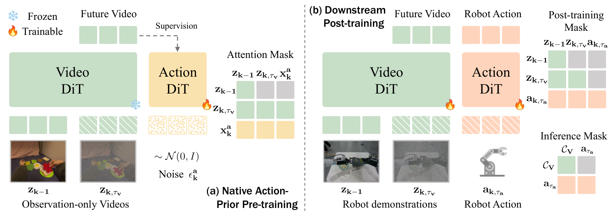
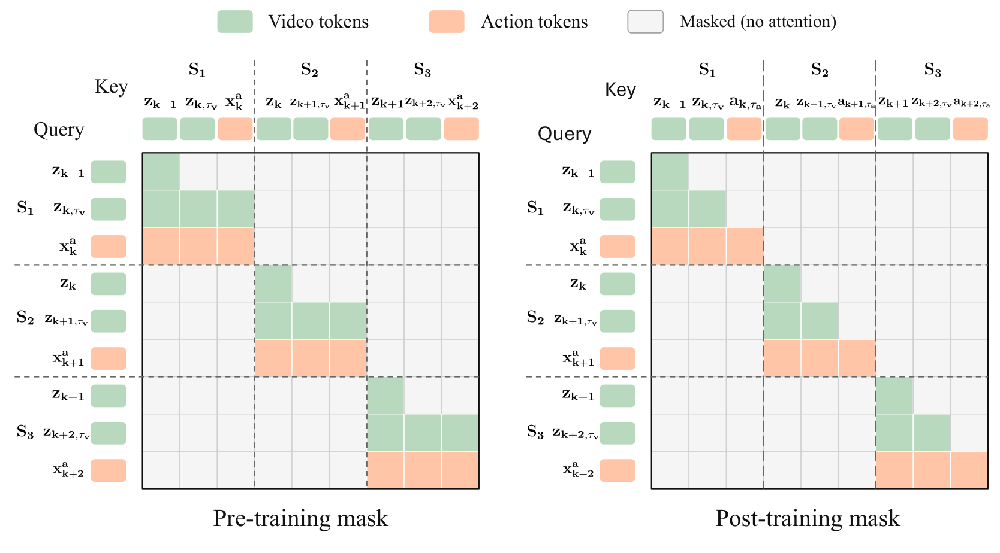
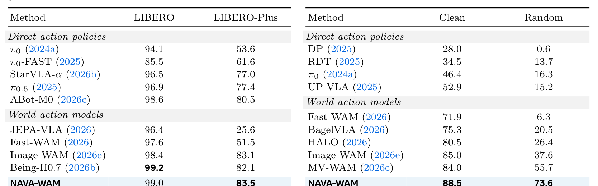
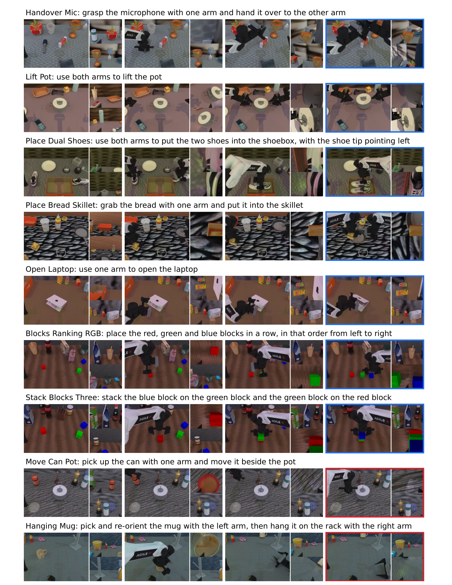
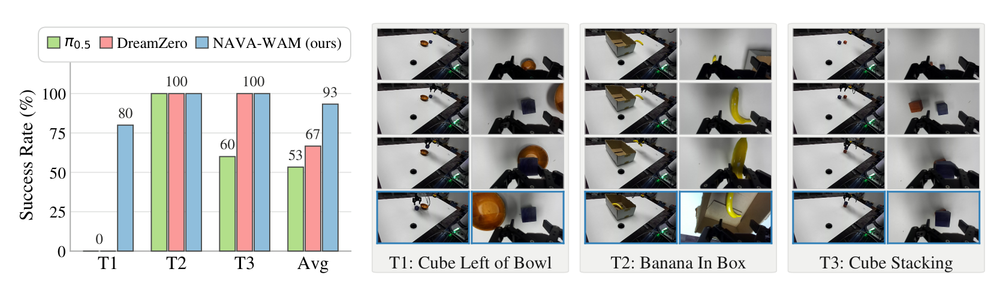
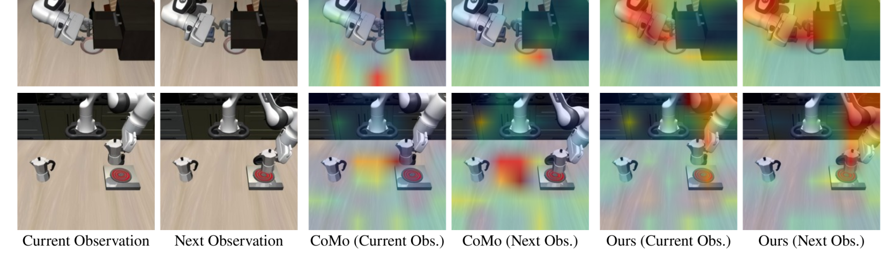
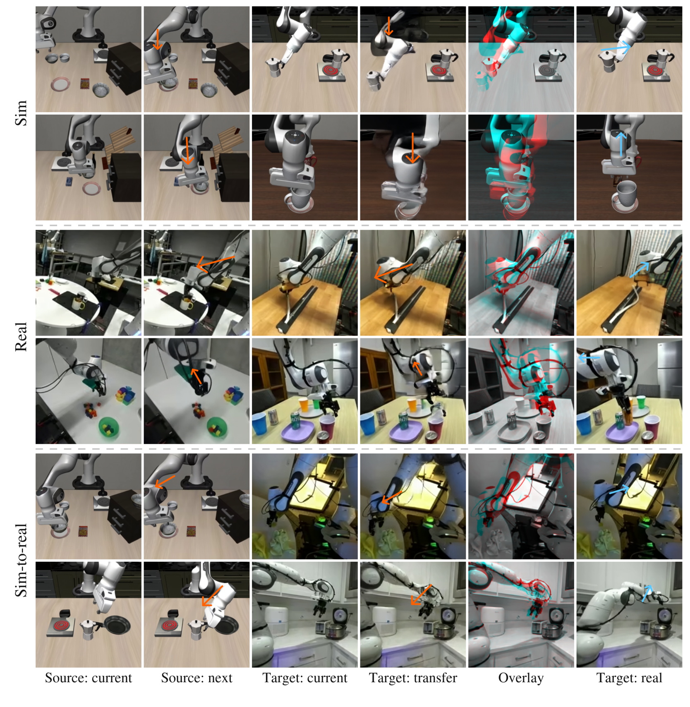
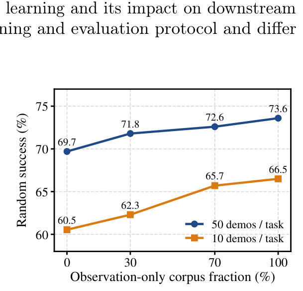
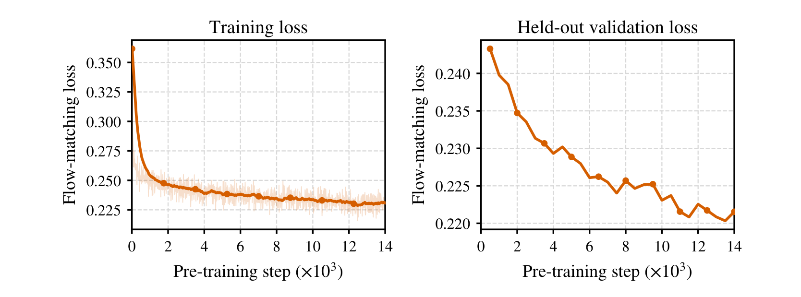
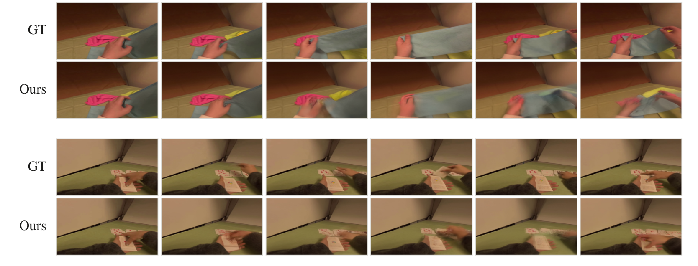

---
tags:
  - papers/world-model
  - papers/robot-learning
  - papers/video-diffusion
  - papers/embodied-ai
aliases:
  - NAVA-WAM
  - Native Action-Prior Learning from Videos for World Action Models
date: 2026-10-05
doi: 10.48550/arXiv.2610.03391
arxiv_id: 2610.03391
---

# Native Action-Prior Learning from Videos for World Action Models (NAVA-WAM)

## 核心信息

- **标题**: Native Action-Prior Learning from Videos for World Action Models
- **标题翻译**: 基于视频的原生动作先验学习世界动作模型 (NAVA-WAM)
- **作者**: Zhaochong An (安兆冲)<sup>1,2,†</sup>, Fei Zhang<sup>1</sup>, Menglin Jia<sup>1</sup>, Duncan Frost<sup>1</sup>, Zijian Zhou<sup>1</sup>, Yikai Wang<sup>1</sup>, Xudong Wang<sup>4</sup>, Aditya Patel<sup>1</sup>, Belinda Zeng<sup>1</sup>, Tao Xiang (向涛)<sup>1</sup>, Serge Belongie<sup>2</sup>, Amir Bar<sup>3</sup>, Sen He (何森)<sup>1,*</sup>
- **机构**: <sup>1</sup>Meta AI, <sup>2</sup>University of Copenhagen (哥本哈根大学 / 先锋人工智能中心 Pioneer Centre for AI), <sup>3</sup>Imperial College London (帝国理工学院), <sup>4</sup>Physical Intelligence (π)
- **作者说明**: <sup>†</sup>在 Meta 期间完成的工作，<sup>*</sup>项目负责人与通讯作者 (Project lead and corresponding author)
- **发表时间**: 2026-10-05 (arXiv v1: 2026-10-02)
- **发表渠道**: arXiv 预印本 (arXiv:2610.03391v1 [cs.CV])
- **DOI**: 10.48550/arXiv.2610.03391
- **arXiv**: [2610.03391](https://arxiv.org/abs/2610.03391)
- **项目主页**: https://zhaochongan.github.io/projects/NAVA-WAM/
- **论文类型**: 具身世界动作模型 (World Action Model, WAM)、视频自监督动作预训练 (Video-to-Action Pretraining)、机器人基础模型 (Robotic Foundation Policies)

---

## 原文摘要翻译

世界动作模型 (World Action Models, WAMs) 将未来视觉动态演化与机器人动作预测紧密耦合，在提升策略泛化性方面展现出巨大潜力；然而，由于极度依赖带有精准动作标注的机器人轨迹数据，其模型扩展性 (Scalability) 严重受阻。纯观测视频 (Observation-only videos) 蕴含极其丰富的物理交互与状态转移先验，但现有工作利用此类视频的方式基本局限于两类：要么在预训练阶段仅学习视觉表征、随后在下游控制中进行二次适配，引入了间接的“表征到控制”迁移鸿沟；要么推断离散/连续的隐式动作 (Latent Actions)，随后再将其映射接地到真实机器人指令，受制于额外的隐式动作建模阶段与复杂的防作弊约束。

本文提出 **NAVA-WAM**，通过引入**原生动作先验学习 (Native Action-Prior Learning, NAVA)**，直接利用大规模纯观测视频预训练动作策略网络本身，彻底抛弃了间接的表征迁移接口与独立的隐式动作模型。我们的训练流程由两个阶段构成：

1. **纯观测视频自监督预训练阶段 (Action-free Pre-training)**：在冻结的大规模视频生成 Transformer (Video-DiT) 条件下，通过转移结构化联合注意力掩码 (Transition-structured joint attention)，将未来视频流匹配 (Future-video flow-matching) 监督信号反向传播穿透到动作专家 (Action-DiT)，迫使动作专家在没有真机动作标注的情况下，直接从视觉状态转移中优化并习得动作交互先验；
2. **下游具身连续控制微调阶段 (Downstream Post-training)**：在少量带动作标注的真实机器人示范上，通过联合视频—动作流匹配目标协同优化两路专家；同时采用非对称注意力掩码将视觉分支与迭代动作去噪完全解耦，从而在推理部署时支持视觉键值单次缓存的高效纯动作推理 (Action-only inference)，无需在测试期显式生成未来视频。

大量实验表明，NAVA-WAM 在同分布 (ID) 与分布外 (OOD) 设置下均大幅超越前序基线。在 LIBERO 与 LIBERO-Plus 评测中分别达到 99.0% 与 83.5% 的成功率；在双臂重度随机化基准 RoboTwin 2.0 上，Clean 域达到 88.5%，Random 域零样本迁移达到 73.6%（大幅领先最强基线 17.9 个百分点）；在物理实体 Franka FR3 机械臂上实现了 93.3% 的操作成功率（大幅领先 DreamZero 的 66.7% 和 $\pi_{0.5}$ 的 53.3%），且单动作步推理均摊开销仅 15.8 ms。受控消融实验进一步证实，原生动作先验学习在各类动作标注预算下均稳定优于基于表征和基于隐式动作的预训练范式。该结果确立了原生动作先验学习作为利用海量无标注视频直接预训练动作策略的有效可扩展路径。

---

## 创新点

1. **开创 Native Action-Prior Learning (NAVA) 预训练范式，终结“表征迁移断层”与“隐式动作瓶颈”的长期割裂。** 
   不同于传统方案“只在编码器学视觉表征”或“额外建一个逆动力学/隐式动作离散码本”，NAVA-WAM 首次实现了**直接用纯视频未来的预测误差，端到端反向传播更新动作策略网络 (Action-DiT) 的权重参数**。动作网络从第一天起就在学“促成状态转移的动力学先验”，消除了多阶段建模中由于信息瓶颈或优化惩罚引入的表征损失。
2. **转移结构化注意力掩码 (Transition-Structured Attention Mask) 隐式实现“逆动力学—前向动力学”双向因果闭环。** 
   将视频序列划分为互不干扰的时序转移段（Transition Segments），在段内通过精巧的注意力拓扑：
   - Action-DiT 同时读取干净前一帧 $z_{k-1}$ 与带噪后一帧 $z_{k,\tau_v}$，在内部隐式充当**逆动力学模型 (Implicit IDM)**；
   - 带噪未来视频帧读取 Action-DiT 的内部表征，充当**前向动力学模型 (Implicit FDM)**；
   全程不物化任何显式离散标记或低维连续瓶颈变量，保留了最高维度的动作流先验表征。
3. **严格的理论防作弊保证：流匹配时空高斯加噪阻断“目标复制捷径” (Propositions A.1 & A.2)。** 
   针对动作网络在双向注意力下极易发生的“简单透传目标帧导致预测恒等”缺陷，作者从贝叶斯最优预测误差与高斯条件协方差给出理论证明：只要未来帧处于非零扩散噪声水平 $\tau_v > 0$，直接复制目标帧的信息通道就被物理阻断，强迫 Action-DiT 只能提取不可约的转移交互特征（Transition representation）。
4. **非对称解耦注意力掩码与单次前向视觉缓存 (Layer-wise KV Caching for Action-Only Inference)。** 
   在下游微调与部署期，重构注意力拓扑使 Video-DiT 仅自注意（不再读取带噪动作），使视觉分支完全独立于迭代动作采样过程。在测试期闭环控制时，只需在初始步骤执行一次 Video-DiT 前向并缓存所有层的 Key-Value，后续 10 步动作流匹配仅在 1B 参数的 Action-DiT 上高速积分，**彻底甩掉测试期迭代生成视频的显存与计算包袱**（单步动作均摊延迟仅 15.8 ms，整机 4.30 TFLOPs）。
5. **极高的数据与动作标注效率 (Action-Label Efficiency)，在真实具身任务上展现强大的空间语义零样本泛化。** 
   仅需 25 条演示/任务训练出的下游策略即可全面超越传统预训练范式 50 条演示的性能；在 Franka FR3 真实机械臂桌面任务中，面对极易混淆的空间方位指令（“碗左侧放积木”），所有纯视觉动作基线（$\pi_{0.5}$, DreamZero）因缺乏物理转移因果先验全部失败 (0/5)，而 NAVA-WAM 达到 80% (4/5) 成功率，全任务平均 93.3%。

---

## 一句话总结

NAVA-WAM 证明了：**无需显式构建任何逆动力学模块或隐式动作接口，仅依靠转移结构化注意力掩码与未来视频流匹配目标，就能在冻结的通用视频骨干引导下，直接从海量纯观测视频中为动作策略网络预训练出高度可迁移的物理交互先验，并以低推理延迟实现超强的同分布与跨域具身控制性能。**

---

## 研究问题

### 动作标注稀缺瓶颈与具身世界模型的两难处境

构建通用具身智能体（Generalist Robot Policies）的核心瓶颈在于**数据规模的不对称性**：
- 真实机器人遥操作或真机示范数据收集极其昂贵、危险且跨本体（Different kinematics, grippers, embodiments）难以复用；现存最大的开源机器人数据集（如 Open X-Embodiment, DROID）加起来也仅有数万至数十万小时，且动作空间各异；
- 相比之下，人类自监督视频、网络视频与无动作机器人视频（如 Ego4D, Epic-Kitchens, YouTube, AgiBotWorld, EgoDex）拥有近乎无限的规模，天然记录了丰富的物理常识、物体可触碰性（Affordance）、工具使用因果律与空间形变动力学。

具身世界动作模型 (WAM) 的初衷就是利用视频生成模型把这种时空动力学引入控制策略。然而，如何把无动作标注的纯视觉视频转化为能够指导机器人马达输出的控制先验？


*图 1：利用纯观测视频进行机器人策略学习的三种范式对比。(1) 视觉表征学习：仅在视觉编码器内学习静态/预测表征，存在“表征到控制”的间接迁移鸿沟；(2) 隐式动作学习：从相邻状态提取隐式动作变量作为中间监督，引入了额外建模阶段与表征瓶颈；(3) 原生动作先验学习 (NAVA-WAM，本文方案)：直接利用未来视频动力学优化动作策略网络，完全摒弃中间接口。*

### 为什么现有两条技术路线都存在固有局限？

正如图 1 所示，过去的研究主要在以下两条路线上做权衡，但两者都存在不可调和的结构性缺陷：

#### 范式一：纯视觉表征预训练 (Vision Representation Learning)
- **代表方法**：R3M, VIP, VC-1, V-JEPA 2, VPP, Masquerade 等。
- **机制**：在大规模视频上自监督预训练一个 Vision Transformer (ViT) 或预测型视觉编码器（如 Masked Autoencoding、特征空间未来预测）；下游在真机微调时，冻结或微调该视觉编码器，并在其输出特征之上重新挂载一个随机初始化的动作策略头（如 MLP, Diffusion Policy, Action-Chunking Transformer）。
- **致命缺陷（表征到控制的迁移鸿沟）**：编码器学到的先验纯粹是“视觉居中”或“语义居中”的，对于机器人关节的连续动作分布、接触力瞬变以及多模态轨迹规划一无所知。动作网络本身依然是一个**从零开始（Tabula Rasa）**学习参数的白纸，导致下游必须耗费大量的昂贵标注轨迹才能把视觉特征翻译成连续控制指令。

#### 范式二：隐式动作学习 (Latent-Action Learning)
- **代表方法**：LAPO, LAPA, Motus, CoMo, DynaMo, RepWAM, LingBot-VA 2.0 等。
- **机制**：通过逆动力学模型 (IDM) $a_{latent} = q(o_t, o_{t+1})$ 将相邻帧映射为一个离散词表或低维连续向量，作为视频中提取出的“伪动作”；然后用前向动力学模型 (FDM) 重建下一帧以指导该隐式空间学习；下游再训练一个真实机器人策略去预测或解码这些隐式动作。
- **致命缺陷（双重瓶颈与捷径解）**：
  1. **建模复杂度与级联误差**：多出一个隐式动作分词器/编码器的训练环节，流程割裂；
  2. **捷径解（Shortcut / Cheating Solution）风险**：若网络容量稍大，隐式动作变量极易退化为直接把目标帧的信息“打包偷渡”给重建器，而完全不学习有物理意义的运动矢量；
  3. **表征容量被人为压制**：为了防止偷渡，研究者不得不给隐式动作施加苛刻的低维瓶颈（如 8 维连续向量、或者极小的 VQ-VAE 码本、强行施加动作循环一致性损失）；这种人为约束严重损害了复杂灵巧操作、手眼协调等高自由度动作的丰富度。

### NAVA-WAM 的核心设问

**我们能否彻底跳过所有中间接口，让海量纯观测视频直接端到端优化动作策略网络本身？**

NAVA-WAM 给出了肯定的回答：通过引入转移结构化注意力机制，将动作策略网络（Action-DiT）直接嵌入到世界模型的流匹配预测循环中；动作网络不是旁观者，而是预测未来视频转移的核心中继。未来视频的重建损失直接成为动作网络权重更新的梯度源泉！

---

## 数据与任务定义

### 预训练数据集构成与规模

为了充分释放原生动作先验的学习潜力，NAVA-WAM 整合了多源大规模具身与灵巧操作视频，总计覆盖 **235,790 段无动作操作轨迹，累计时长达 1,054.3 小时**：

| 数据集来源 | 轨迹片段数 | 数据特征与交互模态 | 过滤与清洗标准 (遵循 OSCAR 协议) |
|---|---|---|---|
| **Open X-Embodiment (OXE)** | ~120k episodes | 跨多构型工业/学术单双臂桌面及移动操作 | 剥离真实动作标签，仅保留原始相机 RGB 视频流 |
| **AgiBotWorld (Colosseo)** | ~75k episodes | 双臂仿人型机器人富接触长程操作 | 依据机械手活动度、手部可见度与相机剧烈晃动过滤 |
| **EgoDex** | ~40k episodes | 灵巧手高精细接触与人手第一人称操作 | 剔除近重复视频片段，计算视觉轨迹相似度去噪 |
| **广义扩展潜力** | *可无缝扩展* | Ego4D, Epic-Kitchens, YouTube 等人手与工具视频 | 纯第一人称日常交互视频，天然符合单帧时序转移结构 |

#### 视频预处理与时空 Token 化
- **采样与渲染**：视频统一渲染至 $448 \times 448$ 画布；切分为无重叠的 65 帧长片段，以 stride=4 进行时序下采样，每个 clip 得到 17 帧有序序列；
- **预训练数据总量**：切分后产生约 **141 万个训练视频 clips**；
- **时空潜变量编码**：使用 Wan2.2-5B 冻结的 3D 因果时空 VAE 编码器 $\mathcal{E}$（时序压缩比为 4，空间下采样为 8），每个 17 帧 clip 编码为 5 个时空潜变量块（Latent Blocks $z_0, z_1, z_2, z_3, z_4$）；
- **总训练监督单元**：整个预训练语料包含约 **700 万个潜变量状态转移块**。

### 下游评估基准与任务矩阵

NAVA-WAM 在仿真与真实机器人两大体系共四大基准上进行全面测试，覆盖了从基础控制到严苛分布外泛化（OOD）的全频谱：

```
下游评测基准全景矩阵:
├── 仿真基准 1: LIBERO (标准同分布操控能力)
│   ├── LIBERO-Spatial (10 任务, 空间相对位置变换)
│   ├── LIBERO-Object  (10 任务, 物体类别/几何替换)
│   ├── LIBERO-Goal    (10 任务, 相同场景下多样目标)
│   └── LIBERO-Long    (10 任务, 长程多步串联操作)
│       └── 每任务 50 条演示, 共 2000 条轨迹, 7-D 连续动作
│
├── 仿真基准 2: LIBERO-Plus (7 维强分布外抗扰动评测)
│   └── 10,030 个零样本泛化测试实例, 覆盖:
│       相机视点 / 机器人基座初始位姿 / 语言指令重述 /
│       光照变化 / 背景纹理扰动 / 传感器高斯噪声 / 物体布局平移
│
├── 仿真基准 3: RoboTwin 2.0 (双臂协同与领域随机化)
│   ├── 50 个高难度双臂协同操作任务, 14-D 连续动作
│   ├── Clean 域: 仅用 Clean 域 50 演示/任务训练 (共 2500 轨迹)
│   └── Random (OOD) 域: 零样本测试 5 维强随机化 (干扰物/光照/高度/背景/语言)
│
└── 真实机器人: Franka FR3 物理部署 (DROID 零样本迁移)
    ├── 硬件: 7-DOF 机械臂 + 平行双指夹爪, 15 Hz 关节角控制
    ├── 视角: 1 个腕部相机 + 2 个第三人称全局 RGB 相机
    └── 3 大实机评测任务 (空间重定向 / 容器放置 / 精确积木堆叠)
```

---

## 方法主线

### 机制流程

NAVA-WAM 采用优雅的混合 Transformer (Mixture-of-Transformers, MoT) 架构，由两个参数解耦的专家流组成：
- **Video-DiT**：参数量 5B，初始化自业界领先的开源视频生成基座 Wan2.2-5B，专精于物理世界的时空动力学表征与扩散流匹配；
- **Action-DiT**：参数量 1B，隐藏维度 1024，层数 28，专精于连续机器人动作块（Action Chunk $H=16$ 或 $H=32$）的去噪与生成。

两路网络拥有完全独立的权重，但在每一层 Transformer Block 中通过**联合交叉注意力 (Joint Attention)** 进行信息交换：

$$
H_m = \mathrm{Attn}\Big(Q_m, \big[K_V; K_A\big], \big[V_V; V_A\big]\Big), \quad m \in \{V, A\}
$$


*图 2：NAVA-WAM 全体架构与训练/推理全景。(a) 原生动作先验预训练：Video-DiT 冻结，纯观测视频通过转移注意力掩码输入，仅依靠未来视频流匹配损失梯度优化 Action-DiT；(b) 下游具身微调：在带动作标签的机器人数据上联合优化两路模型；推理时非对称注意力解耦视觉与动作，视觉仅做单次前向缓存，Action-DiT 单独执行动作积分。*

### 核心组件: Native Action-Prior Learning (NAVA) 与视频自监督直接动作预训练

传统的逆向动力学模型 (IDM) 与前向动力学模型 (FDM) 分解通常表示为显式方程：

$$
r_k = q(z_{k-1}, z_k), \quad \hat{z}_k = f(z_{k-1}, r_k)
$$

其中 $r_k$ 是瓶颈隐式动作。NAVA-WAM 的核心颠覆在于：**在模型内部利用注意力拓扑结构直接完成这一交互，而不显式实例化 $r_k$**。

对于相邻潜变量转移 $z_{k-1} \to z_k$：
1. 前一帧 $z_{k-1}$ 保持干净；
2. 目标未来帧 $z_k$ 被注入标准高斯噪声，处于时间步 $\tau_v \in [0, 1]$：
   $$
   z_{k,\tau_v} = (1 - \tau_v)z_k + \tau_v \epsilon_k^v, \quad \epsilon_k^v \sim \mathcal{N}(0, I)
   $$
3. 对应的 Action-DiT 动作令牌 $x_k^a$ **直接输入纯标准高斯噪声** $\epsilon_k^a \sim \mathcal{N}(0, I)$，且设定其动作时间步固定为 $\tau_a = 1$；
4. 语言指令 $l$ 通过预训练语言模型编码作为条件输入。

#### 注意力信息流与逆-前向动力学对齐
在专门构造的转移掩码下，Action-DiT 令牌的查询向量 $Q_{A,k}$ 可以同时跨流访问前一帧的干净键值与后一帧的带噪键值：

$$
H_{A,k} = \mathrm{Attn}\Big(Q_{A,k}, \big[K_{V,k-1}; K_{V,k,\tau_v}; K_{A,k}\big], \big[V_{V,k-1}; V_{V,k,\tau_v}; V_{A,k}\big]\Big)
$$

此时，Action-DiT 内部所形成的表征天然整合了从 $z_{k-1}$ 到 $z_k$ 的物理转移信息，其信息流等价于**隐式逆动力学**！

与此同时，带噪未来视频的查询向量 $Q_{V,k,\tau_v}$ 跨流读取 Action-DiT 的内部特征：

$$
H_{V,k,\tau_v} = \mathrm{Attn}\Big(Q_{V,k,\tau_v}, \big[K_{V,k-1}; K_{V,k,\tau_v}; K_{A,k}\big], \big[V_{V,k-1}; V_{V,k,\tau_v}; V_{A,k}\big]\Big)
$$

这一信息流精准对齐了**前向动力学**：未来帧的去噪与速度场预测，必须依赖由 Action-DiT 提供的转移特征！

#### 预训练优化目标
在预训练阶段，作者**完全冻结 Video-DiT 参数 $\theta_V = \bar{\theta}_V$、文本编码器与 VAE**，唯一可学习的参数只有 Action-DiT $\theta_A$！流匹配目标定义为：

$$
\mathcal{L}_{pre} = \mathbb{E}\left[ \sum_{k=1}^K w(\tau) \left\| v_{\bar{\theta}_V, \theta_A}^v([z_{k-1}, z_{k,\tau_v}], \epsilon_k^a, \tau \mid l) - u_k^v \right\|_2^2 \right]
$$

其中 $u_k^v = \epsilon_k^v - z_k$ 是视频流匹配的目标速度场。
未来视频去噪的梯度穿过交叉注意力权重，直接流向 Action-DiT。**由于没有其他参数可更新，Action-DiT 被迫学习如何将自身表征塑造为最能辅助视频未来演化的物理动作先验！**

---

### 结构化转移注意力掩码 (Transition-structured attention masks & temporal decoupling)

这是保障整个框架不发生时序因果泄露的核心设计：


*图 7：转移结构化注意力掩码矩阵图解。左侧：预训练阶段掩码，展示连续三个转移片段 $S_1, S_2, S_3$，片段之间完全隔断（Block-diagonal），段内带噪未来视频与动作令牌可双向注意；右侧：下游微调阶段掩码，未来视频仅自注意视觉令牌，形成非对称依赖。*

1. **片段间绝对隔离 (Inter-segment Isolation)**：对于视频中的多个时序转移（如 $S_1: z_0 \to z_1, S_2: z_1 \to z_2, S_3: z_2 \to z_3$），掩码在跨片段位置全部置为 $-\infty$。这杜绝了 Action-DiT 利用未来更远时间步的全局视觉信息进行“时空作弊”；
2. **段内单向与双向拓扑 (Intra-segment Topology)**：
   - 干净前一帧 $z_{k-1}$ 仅能注意自身（不看未来、不看动作），充当稳定的无偏条件；
   - 带噪未来帧 $z_{k,\tau_v}$ 与动作噪声 $x_k^a$ 在段内实现全互联注意，形成无缝的协同预测通道。

#### 理论防御：为什么高斯流加噪能阻断目标复制捷径？ (Appendix A 理论分析)
若动作令牌直接看到干净未来帧 $z_k$，系统存在平凡退化解：Action-DiT 仅需学习恒等映射 $r_k = z_k$，视频网络直接读取 $r_k$ 即可实现零损失，导致动作先验完全坍塌。论文给出了严格的数学证明：

> **命题 A.1 (转移表征的预测价值)**: 引入动作转移表征 $r_k$ 后，贝叶斯最优未来状态预测误差的降幅为：
> $$
> \mathcal{L}_z - \mathcal{L}_{z,r} = \mathbb{E}\left[ \left\| \mathbb{E}[z_k \mid z_{k-1}, r_k] - \mathbb{E}[z_k \mid z_{k-1}] \right\|_2^2 \right] \ge 0
> $$
> 这说明只要 $r_k$ 捕获了超越 $z_{k-1}$ 的增量转移信息，就能有效降低预测损失。

> **命题 A.2 (高斯破坏严格阻断精确复制)**: 假设 $z_k \mid z_{k-1} \sim \mathcal{N}(\mu(z_{k-1}), \Sigma)$ 且协方差正定 $\Sigma \succ 0$。当未来帧混入高斯噪声 $z_{k,\tau_v}$ 时，对于任意扩散步长 $\tau_v > 0$，条件协方差满足：
> $$
> \mathrm{Cov}(z_k \mid z_{k-1}, z_{k,\tau_v}) = \left( \Sigma^{-1} + \frac{(1-\tau_v)^2}{\tau_v^2} I \right)^{-1} \succ 0
> $$
> 由此产生的最小均方误差严格大于零：
> $$
> \mathcal{L}_{z,r} \ge \mathrm{tr}\left[ \left( \Sigma^{-1} + \frac{(1-\tau_v)^2}{\tau_v^2} I \right)^{-1} \right] > 0
> $$
> **结论**：在非零噪声下，任何通过 Action-DiT 的通道都无法完美重构干净目标帧 $z_k$，强迫网络必须学习条件期望中蕴含的物理演化方向，而非像素/特征搬运。

---

### 下游实体动作适配机制 (Downstream adaptation with canonical delta control)

当迁移到具体的物理机器人系统时，Action-DiT 必须将高维通用的物理交互先验具象化为特定机械臂的末端执行器或关节角增量指令（如 7-D 或 14-D 连续动作块）。

#### 步骤 1: 目标域视觉冷启动 (Action-free Target-domain Cold Start)
为了避免真机环境特定的光照、桌面背景或相机内参剧烈干扰预训练权重，策略首先进行轻量级的目标域视觉自适应：
- 冻结 Action-DiT；
- 仅在目标域未标注视频上，微调 Video-DiT 进行未来帧预测（LIBERO 训练 5 epochs，RoboTwin 训练 1 epoch）；
- 这一步不消耗任何动作标注，纯粹完成视觉特征空间的平滑域对齐。

#### 步骤 2: 联合微调与非对称注意力重构 (Joint Post-training with Asymmetric Attention)
在真机示范数据集 $\mathcal{D}_r = \{(o_{0:T}, l, q, a_{0:T-1})\}$ 上，同时解冻 Video-DiT 与 Action-DiT，采用联合流匹配目标协同训练：

$$
\mathcal{L}_{post} = \lambda_v \mathcal{L}_{FM}^v + \lambda_a \mathcal{L}_{FM}^a
$$

其中 $\lambda_v = \lambda_a = 1$。动作流速度场目标为 $u_k^a = \epsilon_k^a - a_k$。

**关键改造——非对称注意力掩码**：
预训练时视频需要看动作以回传梯度；但在下游微调与推理阶段，动作已经拥有了真实标签的显式监督。为了在推理部署时不被视频采样拖累，作者在此处重构了注意力掩码（图 7 右侧）：
- **视频流完全自给自足**：$H_V = \mathrm{Attn}(Q_V, K_V, V_V)$，不再读取任何动作令牌；
- **动作流保持全面吸收**：$H_A = \mathrm{Attn}(Q_A, [K_V; K_A], [V_V; V_A])$，依然读取视觉令牌的键值。

---

### 训练与推理架构

#### 训练规格汇总表

| 阶段 | 训练对象 | 冻结组件 | 目标损失 | 学习率 | 批大小 | 训练步数/轮数 | 算力集群 |
|---|---|---|---|---|---|---|---|
| **预训练** | Action-DiT (1B) | Video-DiT (5B), VAE, T5 | $\mathcal{L}_{pre}$ (纯视频流匹配) | $1 \times 10^{-4}$ | 512 | 14,000 steps | 128 $\times$ NVIDIA GPU (bf16) |
| **LIBERO 冷启动** | Video-DiT | Action-DiT | 目标域视频流匹配 | $4 \times 10^{-5}$ | 256 | 5 epochs | 8 $\times$ H100 |
| **LIBERO 联合微调**| Video + Action | VAE, T5 | 视频+动作联合流匹配 | $1 \times 10^{-4} (v), 2 \times 10^{-4} (a)$ | 256 | 10 epochs | 8 $\times$ H100 |
| **RoboTwin 联合微调**| Video + Action | VAE, T5 | 视频+动作联合流匹配 | $1 \times 10^{-4} (v), 3 \times 10^{-4} (a)$ | 1024 | 5 epochs | 16 $\times$ H100 |

#### 推理架构: 单次前向缓存的高效纯动作推理 (Algorithm 1)

由于非对称注意力切断了视频对动作的依赖，在机器人控制执行闭环中，**未来视频根本不需要在每一个扩散步去迭代去噪，更不需要解码回像素空间**！

```python
# NAVA-WAM 推理伪代码逻辑 (Algorithm 1)
def inference_step(observation_z0, instruction_l, proprio_q, flow_steps=10):
    delta_tau = 1.0 / flow_steps
    # 1. 采样初始高斯噪声
    eps_v = sample_gaussian_noise()
    eps_a = sample_gaussian_noise()
    a = eps_a
    tau_a = 1.0
    
    # 2. 初始步: 联合前向并缓存全部层的 Video-DiT 键值 (Layer-wise KV Caching)
    # 此时 tau_v = 1.0, tau_a = 1.0
    u_a, C_V = JointStep([observation_z0, eps_v], a, tau_v=1.0, tau_a=1.0, cond=(instruction_l, proprio_q))
    a = a - delta_tau * u_a
    tau_a = tau_a - delta_tau
    
    # 3. 后续流匹配步 (s = 2 到 S): 视频分支完全静默，纯运行 1B Action-DiT
    for s in range(2, flow_steps + 1):
        # 仅查询缓存的视觉特征 C_V
        u_a = ActionDiT_Forward(a, tau_a, visual_cache=C_V, cond=(instruction_l, proprio_q))
        a = a - delta_tau * u_a
        tau_a = tau_a - delta_tau
        
    return a # 返回最终去噪完成的连续动作块
```

- **推理计算量**：仅 **4.30 TFLOPs**（对比标准全视频联合生成的 HALO 高达 67.69 TFLOPs，计算量降低超过 15 倍）；
- **推理耗时**：单次策略调用耗时 **379.2 ms**；由于每次预测 $H=32$ 步且开环执行 24 步（Receding horizon control），**分摊到每一个实际控制动作的推理延迟仅为 15.8 ms**，完全满足 15 Hz ~ 30 Hz 的高频真机实时控制要求。

---

## 关键结果

### 主结果与强基线 (LIBERO, LIBERO-Plus 鲁棒性, RoboTwin 2.0)


*表 1：LIBERO/LIBERO-Plus（左）与 RoboTwin 2.0（右）的主实验结果。平均成功率（%）。LIBERO 与 RoboTwin Clean 衡量同分布能力；LIBERO-Plus 与 RoboTwin Random 衡量分布外泛化能力。加粗表示最优结果。*

#### 1. LIBERO 与 LIBERO-Plus 仿真基准结果

| 模型类别 | 方法 | LIBERO (同分布 ID) | LIBERO-Plus (分布外 OOD) | 表现分析与主要短板 |
|---|---|---|---|---|
| **直接动作策略** | $\pi_0$ (2024a) | 94.1% | 53.6% | 基础性能较好，但面对相机视角和机器人位姿扰动暴跌 |
| | $\pi_0$-FAST (2025) | 85.5% | 61.6% | 离散分词带来一定鲁棒性，但峰值精度受损 |
| | StarVLA-$\alpha$ (2026b) | 96.5% | 77.0% | VLA 结构具有较好常识，但未建模动态演化 |
| | $\pi_{0.5}$ (2025) | 96.9% | 77.4% | 大规模预训练基线，长程任务稳定性仍有欠缺 |
| | ABot-M0 (2026c) | 98.6% | 80.5% | 引入流形动作学习，泛化表现较强 |
| **世界动作模型** | JEPA-VLA (2026) | 96.4% | 25.6% | 特征级预测，极端扰动下表征严重退化 |
| | Fast-WAM (2026) | 97.6% | 51.5% | 训练期视频协同，但缺乏大规模视频动作先验预训练 |
| | Image-WAM (2026e) | 98.4% | 83.1% | 基于首尾帧图像编辑，泛化极强但依赖成对图像监督 |
| | Being-H0.7 (2026b) | **99.2%** | 82.1% | 自回归多任务隐式世界动作模型 |
| **本文方案** | **NAVA-WAM (Ours)** | **99.0%** | **83.5%** | **取得 LIBERO-Plus 最高分，并在全套件中保持极致稳定性** |

在细分子项评估中（表 5 与表 6）：
- 在长程多阶段操作任务 **LIBERO-Long** 上，NAVA-WAM 达到惊人的 **99.0%**，而 Fast-WAM 为 95.2%，$\pi_0$ 为 85.2%；
- 在 LIBERO-Plus 的 7 项严苛扰动中，NAVA-WAM 在最核心的**机器人本体初始位姿扰动 (Robot Pose: 65.6%)、多变语言指令 (Language: 93.8%) 与物体空间布局乱序 (Layout: 87.1%)** 上全面刷新历史记录。

#### 2. RoboTwin 2.0 双臂重度随机化基准

RoboTwin 2.0 拥有 50 个极其繁杂的双臂协同操作任务。所有模型**严格仅在 Clean 域的 50 条演示/任务上训练，禁止接触任何 Random 域数据**，并在 Random 域进行零样本迁移测试：

| 模型方案 | Clean 域 (同分布 ID) | Random 域 (强分布外 OOD) | Clean $\to$ Random 掉点幅度 | 核心结论 |
|---|---|---|---|---|
| Diffusion Policy (DP) | 28.0% | 0.6% | -27.4% (近乎清零) | 纯局部模仿学习完全不具备抗视觉扰动能力 |
| RDT-1B | 34.5% | 13.7% | -20.8% | 双臂扩散策略，缺乏世界模型因果支持 |
| $\pi_0$ | 46.4% | 16.3% | -30.1% | 缺乏跨域鲁棒性 |
| UP-VLA | 52.9% | 15.2% | -37.7% | 统一理解与预测模型泛化依然脆弱 |
| Fast-WAM | 71.9% | 6.3% | -65.6% | 缺乏预训练先验，面对未见干扰物直接失效 |
| BagelVLA | 75.3% | 20.5% | -54.8% | 图文动作穿插生成架构 |
| HALO | 80.5% | 26.4% | -54.1% | 多模态思维链与动作统一模型 |
| Image-WAM | 85.0% | 37.6% | -47.4% | 图像编辑先验带来显著增益 |
| MV-WAM | 84.0% | 55.7% | -28.3% | 针对流形结构的价值增强世界模型 |
| **NAVA-WAM (Ours)** | **88.5%** | **73.6%** | **-14.9% (降幅最小)** | **超越次优基线 +17.9%，展现断层式领先优势** |

在全部 50 个双臂任务的逐项评测中（表 7）：
- NAVA-WAM 在 **44 个任务**中夺得 Random 域最高分或并列满分；
- 在高难度双臂交接任务（如 `Handover Mic`）与长程精细多物体分类（如 `Blocks Ranking RGB`、`Blocks Ranking Size`）中，基线在 Random 域普遍低于 15%，而 NAVA-WAM 保持在 **70% ~ 100%**。


*图 11：RoboTwin 2.0 Random 域策略定性演示。展示了双臂递送话筒 (Handover Mic)、双臂协同抬锅 (Lift Pot)、双鞋装盒 (Place Dual Shoes) 等 7 个成功长程案例，以及抓取滑脱与未接续执行两个典型失败案例。*

---

### 真实机器人实验 (Franka FR3 实机操作任务与推理延迟分析)

为了检验纯观测视频预训练获得的动作先验在真实物理世界中的有效性，作者将预训练后的模型在开放世界具身基准数据集 **DROID (76k 遥操作轨迹)** 上进行多任务后训练，随后**不进行任何针对目标测试任务或特定桌面环境的二次微调（Zero-shot Deployment）**，直接部署到一台 7 自由度实体 Franka FR3 机械臂上。


*图 3：Franka FR3 真实机器人桌面实验结果与机载多视角画面。NAVA-WAM 在全任务中取得 93.3% 成功率，大幅超越 DreamZero 与 $\pi_{0.5}$；在需要精准空间相对方位理解的 T1 任务中取得 4/5 成功，而所有基线全部失败 (0/5)。*


*表 8：实体机器人任务分项成功率与单卡 H100 上的推理耗时对比。*

#### 1. 真实物理任务成功率对比 (每任务 5 次独立测试)

| 任务代号 | 任务描述与核心考验 | $\pi_{0.5}$ (Physical Intelligence) | DreamZero (WAM 强基线) | **NAVA-WAM (Ours)** |
|---|---|---|---|---|
| **T1** | `Cube Left of Bowl` (把积木精准放到碗的**左侧**) | 0 / 5 (0.0%) | 0 / 5 (0.0%) | **4 / 5 (80.0%)** |
| **T2** | `Banana In Box` (拿起香蕉并放入包装盒内) | 5 / 5 (100.0%) | 5 / 5 (100.0%) | **5 / 5 (100.0%)** |
| **T3** | `Cube Stacking` (拿起蓝色积木叠放在红色积木上方) | 3 / 5 (60.0%) | 5 / 5 (100.0%) | **5 / 5 (100.0%)** |
| **平均** | **15 次真实试验总体表现** | **8 / 15 (53.3%)** | **10 / 15 (66.7%)** | **14 / 15 (93.3%)** |

#### 2. 深入剖析：为什么基线在 T1 空间方位任务中全面溃败？
- **基线失败机理**：在全部 10 次基线失败的试验中，机械臂对积木的定位和抓取动作本身都是成功的；然而在搬运阶段，DreamZero 始终把积木移向碗的正上方并直接扔进碗内（或者悬在碗口），$\pi_{0.5}$ 则把积木随意扔在碗的右侧或碗中。这证明常规策略仅仅记住了“积木与碗发生交互”的粗粒度共现，缺乏对“移动到相对参照物左侧”这一精准物理状态转移矢量的因果理解；
- **NAVA-WAM 的致胜关键**：得益于在海量纯视频中 Action-DiT 学习到的结构化状态转移表征，模型对空间相对位移（Spatial Relative Vectors）具有极其稳固的几何动力学先验，能够准确执行定向位移控制。

#### 3. 部署延迟与有效控制成本剖析

| 模型 | 闭环执行模式 | 单次策略调用服务器延迟 (ms/call) | 每次前向执行动作数 (Action Steps) | **均摊单动作步执行延迟 (ms / action)** |
|---|---|---|---|---|
| $\pi_{0.5}$ | 预测 24 步相对动作，执行前 8 步 | 195.7 ms | 8 步 | 24.5 ms |
| DreamZero | 预测 24 步绝对动作，执行 24 步（迭代去噪视频+动作） | 3523.9 ms (超 3.5 秒！) | 24 步 | 146.8 ms |
| **NAVA-WAM** | **预测 32 步绝对动作，执行前 24 步（纯动作缓存去噪）** | **379.2 ms** | **24 步** | **15.8 ms (最快)** |

**结论**：DreamZero 尽管成功率高于 $\pi_{0.5}$，但其每步调用高达 3.5 秒，机械臂每次重规划都会严重卡顿停顿，完全无法胜任动态交互；而 NAVA-WAM 借助单次 KV 缓存机制，**有效动作延迟压低至 15.8 ms**，甚至比纯前向的 $\pi_{0.5}$ 还要快 35%！

---

### 消融到底说明了什么 (Native action prior vs latent action vs video predictive pretraining, data scaling curves)


*表 2：RoboTwin 2.0 上的关键消融实验。(a) 不同视频预训练范式在不同动作标注演示预算下的标签效率对比；(b) 线性 Ridge 回归拟合真实动作的 $R^2$ 动作相关性探测；(c) 推理算力 (TFLOPs) 与 Random 域泛化性能对比。*

#### 1. 预训练范式与样本标签效率消融 (Table 2a)
在 RoboTwin 2.0 上严格限制每个任务提供的真机演示数量（10、25、50 条）：
- **无预训练 (No pre-training)**：在 10 demos 下仅 60.5%，50 demos 下为 69.7%；
- **表征预训练 (Representation-based, 如 VPP 范式)**：在 10 demos 下反而出现负迁移（58.2%），50 demos 下仅 68.1%，证明脱离控制的纯视觉特征对低样本策略学习收效甚微；
- **隐式动作预训练 (Latent-action-based, 如 CoMo 范式)**：10 demos 达到 61.6%，50 demos 达到 71.2%；
- **NAVA-WAM (Ours)**：10 demos 达到 **66.5%**，25 demos 达到 **72.0%**，50 demos 达到 **73.6%**！
> **核心结论**：NAVA-WAM 仅用 **25 条标注示范**，就超越了所有其他预训练方法使用 **50 条示范** 的成绩！这彻底证实了原生动作先验对下游动作标注数据的巨大节省能力。

#### 2. 特征的动作相关性探测 (Ridge Regression $R^2$ Probing, Table 2b)
为了定量评估预训练究竟让网络学到了什么，作者在冻结的特征之上训练线性岭回归（Ridge Regression）去拟合真实的机器人连续动作，评估决定系数 $R^2$：

$$
R^2 = 1 - \frac{\sum_i \|a_i - \hat{a}_i\|^2}{\sum_i \|a_i - \bar{a}\|^2}
$$

- 纯视觉 Video-DiT 特征：在 100% 探测数据下 $R^2$ 仅为 **0.153**；
- 隐式动作基线 DynaMo：$R^2$ 仅为 **0.154**；
- 隐式动作强基线 CoMo：$R^2$ 为 **0.203**；
- **NAVA-WAM Action-DiT**：在 10% 极小探测集上即达到 **0.247**，在 100% 数据上高达 **0.329**（比 CoMo 提升超 62%）！
这直接从线性可分性上证明：**Action-DiT 内部激活动态已经深度编码了与真实机器人连续运动强相关的物理流形！**


*图 4：动作表征对视觉输入的注意力分布可视化对比。NAVA-WAM 的 Action-DiT（中）高度聚焦于机械手夹爪、抓取接触界面以及运动关键物体，注意力轮廓紧贴物理运动场；而 CoMo 隐式动作基线（右）注意力弥散在静态背景和无关区域中。*

#### 3. 跨域运动先验定性迁移 (Cross-Domain Motion Transfer)


*图 5：跨域运动迁移定性实验。从源视频对 $(S_{current} \to S_{next})$ 提取 Action-DiT 的转移激活向量，施加到外观完全不同的目标当前观测 $(T_{current})$，模型精准预测出目标物体沿源运动方向发生位移后的转移状态 $(T_{transfer})$。覆盖了仿真到仿真、真实世界到真实世界、仿真到实体等多重域。*


*图 10：附录中更多跨视角、跨物体的运动先验迁移示例。充分说明 Action-DiT 提炼出的是高度抽象、与纹理外观解耦的纯粹运动学与动力学场（Kinematic & Dynamic Fields）。*

#### 4. 预训练数据规模 Scaling 实验


*图 6：纯观测预训练视频语料规模扩展曲线。随着预训练数据比例从 0% 提升至 30%、70%、100%，Random 域的策略成功率呈现极其坚挺的单调上升趋势（在 50 demos 下从 69.7% 稳步提升至 73.6%，在 10 demos 下从 60.5% 跃升至 66.5%）。*


*图 8：预训练收敛曲线。流匹配损失在 14,000 optimization steps 内呈现出极度平稳顺滑的下降，无论在训练集还是留出验证集上均无过拟合现象。*


*图 9：纯观测预训练后模型的未来视频预测效果。展示了在多任务人手交互（积木堆叠、双手装配、衣物折叠、卡牌操作）中，冻结的 Video-DiT 在 Action-DiT 协同下生成的高保真物理交互演化序列。*

---

## 深度分析

### 真正贡献是什么 (Why Native Action-Prior Pretraining Bridges the World-Action Divide without Explicit IDM)

NAVA-WAM 在机器人世界模型领域完成了一次至关重要的**范式归纳与去中介化（Disintermediation）**：

1. **从“两阶段人工中介”回归“端到端联合动力学”**：
   过去的学术界陷入了一个执念——因为纯视频里没有动作标签，所以必须人工发明一个“伪动作”（Latent Action, VQ-code, Flow token）。然而，伪动作一旦离散化，就带来了量化误差；一旦低维连续化，就掐断了高维信息流；为了训练伪动作，还必须引入判别器、循环一致性或极其脆弱的信息瓶颈。NAVA-WAM 指出：**动作策略网络本身就是一个极佳的高维动态转移编码器**。只要通过注意力拓扑把前一帧和后一帧的信息流接入它，并让它的表征去负责预测后一帧，动作网络就会在梯度驱动下自发演化为该状态转移的充分统计量。
2. **“注意力拓扑”即是最好的正则化与信息瓶颈**：
   NAVA-WAM 没有使用任何复杂的正则化损失函数（没有 KL 散度、没有 InfoNCE、没有对抗判别）。它只用了两件极其朴素的工具：**分块隔离注意力掩码** + **流匹配中间时间步高斯加噪**。前者阻断了时序信息穿越，后者阻断了空间直接透传。用架构先验替代复杂的损失设计，保证了大规模训练的极其稳定。
3. **“训练期融合，推理期解耦”的最佳实践**：
   许多世界模型在测试期被诟病“太慢、太卡”，因为它们把“世界想象”当成了推理期的必经程序。NAVA-WAM 通过非对称注意力设计，巧妙地把世界模型退化为**训练期的“知识蒸馏导师”**与**推理期的“一次性静态上下文生成器”**。这种工程解耦让它同时享受了世界模型的泛化红利与直接策略（Direct Policy）的实时响应速度。

### 为什么结果成立

1. **先验注入的直接性**：Action-DiT 的参数直接接受反向传播梯度。下游微调时，无需从头学习如何“解读隐式动作”或“从视觉特征中摸索动作”，下游优化只是一个轻量级的域微调与运动学校准过程。
2. **大模型骨干的高质量指导**：Wan2.2-5B 预训练在海量互联网视频中，本身已经掌握了极其雄厚的物理世界演化因果（重力、碰撞、遮挡、形变）。冻结它并利用它的速度场预测目标反推 Action-DiT，相当于让一个顶级物理模拟器在手把手指导动作网络。
3. **动作空间表示容量的最大化**：因为没有经过 8 维或 16 维的隐式瓶颈压缩，Action-DiT 的内部隐层拥有 1024 维的高保真特征，足以承载多自由度连续动作流的细微变化。

### 容易误读的地方

1. **误读一：预训练时 Action-DiT 已经在输出动作了吗？**
   *澄清*：**完全没有**。在预训练阶段，Action-DiT 的输入端喂入的是纯标准高斯噪声 $\epsilon_a$（固定处于 $\tau_a = 1$），输出端甚至没有挂载真实的机器人动作损失。它在预训练期学习的，是其内部 Transformer 层的**隐藏激活状态（Latent Activations）**如何编码状态转移，并作为 Key-Value 提供给 Video-DiT。
2. **误读二：这难道不是另一种形式的逆动力学模型 (IDM) 吗？**
   *澄清*：在概念功能上，它确实承担了从 $(z_{k-1}, z_k)$ 推断动作相关因果的职责；但从**系统架构**上，它根本不是一个独立的 IDM 模块！它是**下游最终执行物理控制的同一个 Action-DiT 策略骨干**。不存在传统方案中“预训练一个 IDM $\to$ 给视频打伪标签 $\to$ 丢弃 IDM $\to$ 重新训练策略网络”的冗长割裂链路。
3. **误读三：测试期完全不生成视频，那为什么还叫“世界模型”？**
   *澄清*：世界模型的本质在于**理解世界状态的变化因果规律**，而不在于“每一帧都在像素上画出视频”。NAVA-WAM 在训练期用世界预测塑造了强大的动作网络；在推理的第一步，Video-DiT 也针对当前场景做了一次前向编码（并包含了未来潜在状态假设的单次联合交互），已经将当前物理场景的时空动态注入到了 KV 缓存中。因此，它是以最高效的方式萃取了世界模型的能力。

### 复现注意点

1. **3D 因果时空 VAE 的切片边界处理**：Wan2.2 的 VAE 具有时序因果下采样结构。在将 17 帧切分为 5 个潜变量块时，首帧为纯干净空间特征，后续每 4 帧下采样为一个时序潜变量块。注意力掩码的段索引必须严格与潜变量块的时序对齐，否则会造成因果错位。
2. **掩码的分块对角（Block-diagonal）构造**：在 PyTorch / FlashAttention 实现自定义掩码时，必须确保不同 transition segment 之间的注意力权重彻底为零（使用大负数掩码或 Block Masking API），绝对不能有全局注意力泄漏，否则动作网络会直接偷看下下一个转移而导致预训练崩塌。
3. **时间步采样的非对称性**：预训练时，视频流匹配时间步 $\tau_v \sim \mathcal{U}[0, 1]$ 均匀采样，但动作令牌的时间步**必须严格固定在 $\tau_a = 1$**（纯噪声输入），不可采样 $\tau_a < 1$，因为此时没有任何真实的动作监督基底。
4. **目标域视觉冷启动的必要性**：下游微调前，对 Video-DiT 进行 1~5 个 epoch 的无动作目标域预热极其关键，它消除了仿真渲染环境或实机桌面与大规模预训练视频集之间的视觉域漂移，避免 Action-DiT 的预训练先验被域差距过早冲刷破坏。
5. **显存管理与 KV 缓存复用**：在多 GPU 分布式推理部署时，Video-DiT 的层级 KV 缓存占用显存相对固定，Action-DiT 在连续 10 步去噪中复用这块内存，务必避免频繁的显存分配与释放导致的延迟抖动。

---

## 局限

1. **高接触、精细微小形变操作仍存在失误率**：
   如定性失败案例（图 11）所示，在处理微小可滑动目标（如易拉罐推移 `Move Can Pot`）或精细姿态挂放（如杯柄悬挂 `Hanging Mug`）时，机械手有时会出现抓取滑脱或末端微调精度不足。纯视觉视频缺乏触觉与本体力的显式反馈，单纯靠视觉动力学难以完全解决微小缝隙装配问题。
2. **缺乏显式的在线执行错误自纠错与自愈机制 (Error Recovery)**：
   当前模型在执行抓取失败（如碰到物体但未抓牢、空夹爪继续挥动）后，策略倾向于机械地继续执行后续搬运轨迹，直至超时终止；模型尚不具备高级的“意识到抓取失败 $\to$ 重新规划复抓”的自我纠偏逻辑。
3. **固定动作块长度 (Action Chunking) 与闭环反应灵敏度的权衡**：
   虽然 32 步预测加 24 步开环执行显著降低了均摊延迟，但在极高速、突发动态干扰的环境中，开环执行窗口可能略长，未来需结合变步长自适应规划。
4. **预训练资源门槛依然较高**：
   尽管推理极其轻量，但原生预训练依赖于 5B 参数的视频基座在 128 张 GPU 上进行反向传播，对学术界小规模实验室的完全复现与从零训练构成了一定的算力壁垒。

---

## 我的笔记: 与主流 WAM 路线的深度对比与演化谱系

### 具身世界动作模型演进四代谱系

为了在宏观上理解 NAVA-WAM 的学术坐标，我们可以将近两年（2024~2026）具身世界动作模型的技术演进划分为四个代际：

```
具身世界动作模型 (WAM) 技术演化谱系:
├── 第一代: 级联串行架构 (Cascaded WAM)
│   └── 代表: UniVLA, RoboDreamer, Gen2Act
│   └── 逻辑: 先调用独立视频模型生成未来 RGB 视频，再由下挂策略/逆动力学模型预测动作。
│   └── 痛点: 串行累积误差巨大，测试期生成耗时数秒至数十秒，存在严重漂移。
│
├── 第二代: 联合生成世界模型 (Joint Diffusion WAM)
│   └── 代表: Unified World Models (Zhu et al.), DiT4DiT, DreamZero, LingBot-VA
│   └── 逻辑: 将视频令牌与动作令牌打包到同一个 DiT 内联合加噪、联合去噪。
│   └── 痛点: 必须依赖大量成对的【视频+动作】真机数据，完全无法利用纯互联网视频；测试期仍需迭代去噪视频，延迟高达 3.5s+。
│
├── 第三代: 推理期轻量化 / 训练期辅助世界模型 (Inference-Light WAM)
│   └── 代表: Fast-WAM, Image-WAM, LaWAM, RepWAM
│   └── 逻辑: 
│       ├── Fast-WAM: 训练期联合训练，推理期直接砍掉未来视频分支 (190ms)；
│       └── Image-WAM: 放弃视频生成，仅做首末帧图像编辑；
│       └── RepWAM: 引入语义空间的隐式动作分词。
│   └── 痛点: 依然受困于“真机动作数据规模不足”，未能解决纯观测视频如何无损预训练动作网络。
│
└── 第四代: 原生动作先验预训练 (Native Action-Prior WAM)
    └── 代表: NAVA-WAM (本文), InternW0-Δ (同步探索), OpenWAM
    └── 突破: 彻底打通无标注海量纯视频与动作策略网络的壁垒；以注意力拓扑实现无中介预训练，兼顾高效单次缓存推理。
```

### 全景横向对比矩阵

| 维度 / 特性 | **Fast-WAM** (Yuan et al., 2026) | **Image-WAM** (Zhang et al., 2026e) | **DreamZero** (Ye et al., 2026c) | **CoMo / LAPA** (Latent Action 代表) | **InternW0-$\Delta$ / OpenWAM** (前沿开源路线) | **NAVA-WAM (本文方案)** |
|---|---|---|---|---|---|---|
| **核心骨干** | Wan2.2-5B + Action DiT | SD / Flux 图像编辑骨干 | CogVideoX / 联合 DiT | 专有 DiT + 隐式动作码本 | 多模态 VLM + 动作头 | **Wan2.2-5B + 1B Action-DiT** |
| **纯视频利用机制** | 无视频预训练，仅在下游有动作数据上协同训练 | 图像编辑先验微调 | 预训练以真机视频动作为主 | 独立训练 IDM / FDM 提取隐式动作 | 视频预训练视觉表征或统一自回归 | **原生动作先验预训练 (反向视频流匹配)** |
| **是否依赖显式隐式动作 (IDM)** | 否 | 否 | 否 | **是 (严重依赖离散/连续隐式动作空间)** | 混合 | **完全不需要 (注意力隐式动力学)** |
| **防作弊/捷径机制** | 动作不看未来视频 | 首尾帧编辑条件约束 | 双向联合无防作弊 | 离散码本截断 / 循环一致性损失 | 自回归因果掩码 | **高斯流匹配时间步加噪 (理论保证)** |
| **测试期未来视频计算** | 彻底移除未来视频令牌 | 仅预测关键子目标帧 | 完整多步迭代去噪未来帧 | 不生成未来视频 | 部分分支自回归生成 | **非对称解耦，仅首步单次前向并缓存 KV** |
| **测试期单动作均摊延迟** | ~23 ms | ~45 ms | ~146.8 ms (卡顿极重) | ~20 ms | ~50 ms | **15.8 ms (极致实时)** |
| **LIBERO-Plus (OOD)** | 51.5% | 83.1% | ~60% | ~65% | ~80% | **83.5% (最优)** |
| **RoboTwin Random (OOD)**| 6.3% | 37.6% | 20.5% (估) | ~30% | ~55% | **73.6% (大幅断层领先)** |

### WJ 评注与趋势展望

1. **“原生预训练”是世界动作模型通向 Scaling Law 的唯一正确大门**：
   过去机器人领域的预训练普遍是“借来的”——借 NLP 的语言先验（VLA 路线），借 CV 的静态表征（ViT 路线）。但控制的本质是**随时间展开的状态转移方程 $\dot{x} = f(x, u)$**。视频本身就是现实世界的积分轨迹。NAVA-WAM 首次把动作网络的参数空间直接挂接在现实世界积分轨迹的微分场（Flow field）上。这一步迈出后，未来机器人领域的预训练数据规模可以毫无阻碍地吞噬数百万小时的人类第一人称操作视频（Ego4D, 100 Days of Hands）甚至全网 YouTube 手部交互视频。
2. **对具身模型架构设计的启示**：
   Mixture-of-Transformers (MoT) 双专家流、参数完全隔离、高层跨流交互的设计，正在成为具身基础模型事实上的标准范式。参数解耦避免了多任务干扰（防止机器人动作微调冲垮通用视频世界的物理规律），交叉注意力又提供了高带宽的信息融合。NAVA-WAM 的结构化掩码设计堪称典范，值得在未来的 3D 具身智能体、双手灵巧操作以及人形全身运动控制（Whole-body control）中广泛借鉴。

---

## 引用

```bibtex
@article{an2026native,
  title={Native Action-Prior Learning from Videos for World Action Models},
  author={An, Zhaochong and Zhang, Fei and Jia, Menglin and Frost, Duncan and Zhou, Zijian and Wang, Yikai and Wang, Xudong and Patel, Aditya and Zeng, Belinda and Xiang, Tao and Belongie, Serge and Bar, Amir and He, Sen},
  journal={arXiv preprint arXiv:2610.03391},
  year={2026}
}
```

### 核心参考文献列表

1. **Wan et al. (2025)**: *Wan: Open and advanced large-scale video generative models*. (提供 Wan2.2-5B 与 3D 因果 VAE 基座)
2. **Yuan et al. (2026)**: *Fast-WAM: Do world action models need test-time future imagination?* arXiv:2603.16666. (探索训练期视频与测试期去噪解耦)
3. **Zhang et al. (2026e)**: *ImageWAM: Do world action models really need video generation, or just image editing?* arXiv:2606.19531. (图像编辑先验在 LIBERO-Plus 上的强基线)
4. **Ye et al. (2026c)**: *World action models are zero-shot policies*. arXiv:2602.15922. (DreamZero，物理实机 DROID 评测基线)
5. **Physical Intelligence et al. (2025)**: *$\pi_{0.5}$: A vision-language-action model with open-world generalization*. arXiv:2504.16054. (先进 VLA 基准)
6. **Yang et al. (2026b)**: *CoMo: Learning continuous latent motion from internet videos for scalable robot learning*. CVPR 2026. (连续隐式动作主要对比基线)
7. **Chen et al. (2025a)**: *RoboTwin 2.0: A scalable data generator and benchmark with strong domain randomization for robust bimanual robotic manipulation*. arXiv:2506.18088. (双臂随机化仿真基准)
8. **Fei et al. (2025)**: *LIBERO-Plus: In-depth robustness analysis of vision-language-action models*. arXiv:2510.13626. (7 维强扰动具身鲁棒性基准)
