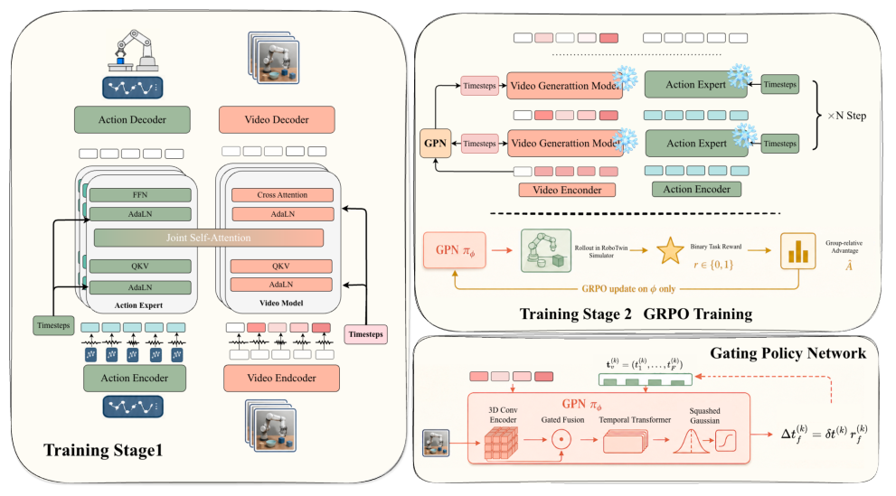
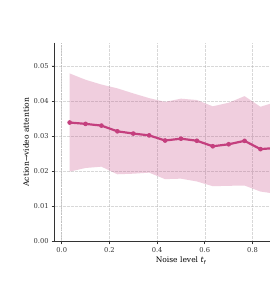
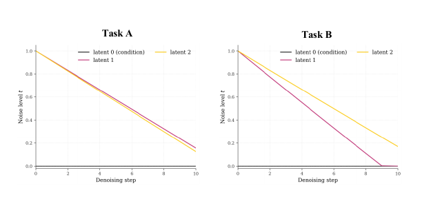
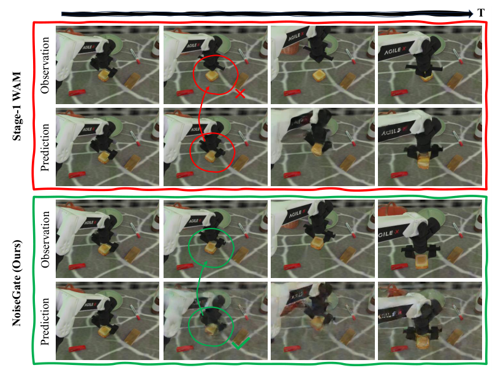
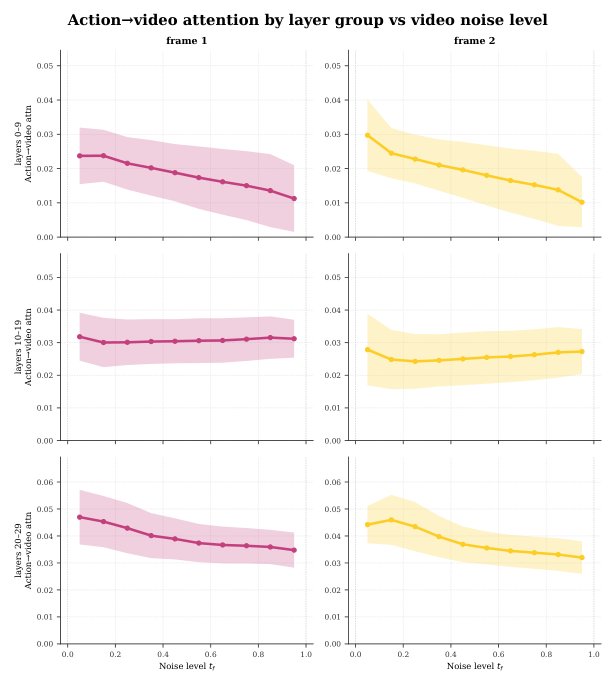
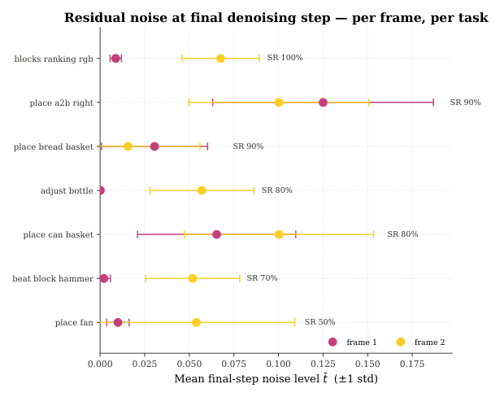

---
tags:
  - papers/robot-learning
  - papers/world-action-模型
  - papers/diffusion-策略
aliases:
  - NoiseGate
  - Per-Latent Timestep Gating
date: 2026-05-08
doi: 10.48550/arxiv.2605.07794
arxiv_id: 2605.07794
---

# NoiseGate: Learning Per-Latent Timestep Schedules as Information Gating in World Action Models

## 核心信息
- 标题: NoiseGate: Learning Per-Latent Timestep Schedules as Information Gating in World Action Models
- 标题翻译: NoiseGate：将每潜变量时间步调度学习为世界动作模型中的信息门控
- 作者: Wen Huang、Haoran Sun、Yongjian Guo、Yunxuan Ma、Haoran Li、Jing Long、Zhouying Mo、Zhong Guan、Yucheng Guo、Shuai Di、Junwu Xiong
- 机构: 清华大学、北京大学、JDT AI Infra、天津大学
- 发表时间: 2026-05-08（arXiv v1）
- 发表渠道: arXiv（cs.RO）
- DOI: 10.48550/arxiv.2605.07794
- arXiv: 2605.07794
- 论文链接: https://arxiv.org/abs/2605.07794
- 数据 / 资源: RoboTwin 2.0 随机场景操作基准
- 论文类型: AI 方法论文（联合视频—动作世界动作模型中的强化学习调度器）

## 原文摘要翻译

世界动作模型（WAM）是一类新兴策略，将机器人动作生成与未来观测建模联系起来。本文聚焦联合视频—动作建模范式：动作与想象的未来观测沿着共享的去噪或流匹配轨迹共同生成，使感知、预测和控制耦合在一个生成过程中。现有 WAM 通常以混合 变换器（混合结构）实现，视频标记与动作标记 通过共享自注意力进行交互。该架构原则上可以为每个预测的潜变量帧分配独立时间步 $t_f$，但当前系统通常将这一自由度压缩为一个共享标量 $t$。在 Diffusion Forcing 的“噪声即掩码”视角下，共享时间表施加了一个未经论证的先验，即每个预测潜变量对动作生成都同样可靠。本文转而将每潜变量时间表视为一种可学习的信息门控策略：通过改变潜变量帧的噪声水平，策略可以调节其键/值对动作标记的贡献可靠性。

我们提出 NoiseGate，它结合了骨干网络训练阶段的独立每潜变量时间步采样、在去噪过程中输出每潜变量时间增量的轻量级门控策略网络，以及利用任务奖励优化调度策略的方法，从而不需要手工设计的形状先验。NoiseGate 构建在联合视频—动作 MoT 骨干网络之上，在多种 RoboTwin 随机场景操作任务上取得了稳定增益。[p.1, Abstract]。

## 创新点

1. **把被折叠的时间步自由度重新定义为信息门控变量。** 论文不是另造一个视频预测模块，而是指出联合 MoT 的共享自注意力已经提供了作用位置：每个未来帧的噪声水平会改变其键/值进入动作标记 表征的可靠性，因此 $t_f$ 可以被理解为连续软门。[pp.1–4, §§1–3.2]。
2. **用独立噪声训练把推理时的异质时间表变成可用控制量。** 训练时独立采样每个未来帧的时间步，借用 Diffusion Forcing 的噪声即掩码思想，但将其从因果序列机制改造成适用于 块双向 WAM 的训练基底。[pp.2–5, §4.2]。
3. **学习相对时间增量，而不是直接预测绝对时间。** GPN 输出 $r_f$ 的范围为 $(0,2)$，再与原始标量调度器的名义步长 $\Delta t$ 相乘；这样保留全局去噪节拍，只让策略学习不同未来帧的相对优先级。[p.5, Eqs. (5)–(6)]。
4. **将任务奖励施加在调度器而非动作骨干上。** Stage 2 冻结 Wan 视频 扩散变换器 与 动作专家 扩散变换器，仅用 GRPO 和二值 回合成功奖励更新轻量 GPN。这使实验更接近“在固定 WAM 内学习信息揭示顺序”的因果隔离，而不是重新训练一个更强的 视觉语言动作策略。[pp.2,5–6, §4.4]。

## 一句话总结

该方法真正做的是把联合视频—动作 WAM 中原本被共享标量掩盖的“每个未来帧何时值得被动作读取”变成一个由任务成功率训练的控制变量；在 RoboTwin 仿真上，受控消融支持了这个机制，但主比较的平均提升只有 1.70 个百分点，且不能外推为真实机器人或所有世界模型都有效。[p.7, 表 1； p.7, 表 2； p.13, 附录（p.13）]。

## 研究问题

### 共享标量时间步隐藏了什么先验

WAM 同时建模未来潜变量与动作块，并以当前观测和语言为条件；现有实现却让所有未来帧共享同一标量时间步，因此默认它们在每个去噪阶段同样可靠。[pp.2–3, §3.1–3.2, 式(1)]。

问题在于，未来帧对当前动作的作用并不均匀：接触、抓取、放置等关键事件可能比其他帧更难预测或更容易被模型过度自信地想象。固定单调形状的调度器也没有真正解决问题，只是把“所有帧一样可靠”的先验替换为“帧序号决定可靠性”的另一种先验。[p.2, §1; p.3, §3.2]。

### 这不是普通的更强动作策略问题

论文研究的不是扩大动作头容量，而是安排联合生成过程中未来视频潜变量的噪声揭示顺序；动作沿固定全局时钟去噪，GPN 只控制预测视频帧的时间步。[pp.3–5, §§3.1–3.3, §4.1]。

## 数据与任务定义

### 生成对象与控制变量

- 未来视频潜变量：$v=(v_1,\ldots,v_F)$，每一帧的时间步 $t_f$ 范围为 $[0,T]$。
- 当前观测：干净潜变量 $v_0$，固定为 $t_0=0$。
- 动作：动作块 $a$ 长度为 $H$，所有动作标记在一个时刻使用共享的动作时间步 $t_a$。
- 条件：语言指令 $l$ 与当前观测 $v_0$。
- 骨干输出：扩散噪声预测或流匹配速度预测，具体取决于生成骨干的训练目标。[pp.2–5, §§3.1, 4.1]。

这里的模型并不直接预测“哪个未来帧是真实的”，也没有把视觉预测质量作为最终优化目标；它学习的是在动作生成过程中让哪些未来潜变量更早变得可靠、哪些仍保持部分掩码。[pp.3–5, §4.1–4.3]。

### RoboTwin 评测协议

论文在 RoboTwin 2.0 的 随机场景 条件下评测：每个 回合 随机化物体姿态、颜色和背景。指标是每个任务 100 个 回合 的成功率，主比较使用 缩放的 Fast-WAM 风格 配置，受控消融与诊断使用 Motus 配置 配置。正文表格展示部分任务，附录表 5 给出 50-task 背景范围。[pp.6–7, §5.1; p.16, 表 5]。

| 研究用途 | 骨干 配置 | 批大小 | 作用 |
|---|---|---:|---|
| 主性能比较 | Fast-WAM 风格 联合模型 | 1024 | 与 Fast-WAM、LingBot-VA、`π0.5`、Motus 等比较 |
| 受控消融与诊断 | Motus 配置，移除 VLM | 128 | 隔离独立噪声、手工时间表和 GPN 的作用 |

两种配置被作者视为同一 联合模型 家族的不同训练规模，而不是两个不同架构主张；因此主比较的 94.28% 与受控消融的 67.5% 不应直接当作同一实验条件下的数值比较。[p.6, §5.1]。

## 方法主线

### 机制流程

1. **输入与异质加噪。** 给定当前观测潜变量 $v_0$、语言 $l$、未来潜变量块和动作块，Stage 1 为每个未来帧独立采样 $t_f$，同时为动作采样全局 $t_a$，构造不同不确定度的联合序列。输出是能够读取异质噪声视频上下文的 WAM 骨干。[pp.4–5, §4.1–4.2]。
2. **共享注意力中的软门控。** 视频 扩散变换器 与 动作专家 扩散变换器 共享自注意力但保留各自前馈专家。带噪未来帧作为键/值被动作标记 读取；$t_f$ 越高，帧的可靠性越低，因而对动作表征的贡献被衰减。观测潜变量一直固定在 $t_0=0$，动作按固定全局时钟前进。[pp.3–5, §§3.2, 4.1]。
3. **GPN 逐步分配去噪预算。** 每个去噪步由 GPN 根据当前异质噪声状态为各未来帧给出相对步长，随后逐帧更新时间步并截断到零。[p.5, §§4.3, 式(4)–(6)]。
4. **冻结骨干、用任务回报训练调度器。** 运行更新后的异质时间表通过冻结的联合骨干生成动作并在仿真环境执行；对同一旧策略采样的一组轨迹计算组相对优势，用裁剪目标和熵奖励更新 GPN。输出是任务条件下的每帧时间轨迹，而不是修改后的动作网络。[pp.5–6, §4.4; pp.13–14, 算法 1]。

*图 2（p.4）：NoiseGate 的联合模型、两阶段训练与门控策略网络结构；图中保留训练阶段、强化学习回路和每步时间增量输出。*

### 联合 MoT 骨干：标准组件与论文特定用法

骨干由 块双向的 Wan 视频 扩散变换器 与 动作专家 扩散变换器 组成。视频标记 和动作标记 共享 自注意力，模态特定的前馈层分别处理视频与动作。论文的关键不是重新设计这一 MoT，而是利用它已有的跨模态读取路径：视频帧的噪声水平会影响其键/值进入动作标记的程度。[p.4, §4.1]。

### 独立每潜变量噪声训练

Stage 1 对每个训练样本独立采样 $t_v=(t_1,\ldots,t_F)$，另采样动作时间步 $t_a$，再以对应的扩散噪声目标或流匹配速度目标训练。这样推理阶段出现非均匀的 $t_v$ 时，骨干并没有完全离开训练分布。论文明确指出，这里的独立噪声不是 Diffusion Forcing 式的因果 滚动采样，而是使任意 逐潜变量剖面在块双向骨干上有意义的 基础。[pp.2–5, §§2, 4.2]。

### GPN 表征与动作参数化

附录给出的 GPN 先用两层带步幅的三维卷积、组归一化与 SiLU 压缩空间维度；每个潜变量经注意力、平均和最大池化后投影为 $D=256$ 的标记，再经通道注意力、观测条件融合、帧位置编码和三层八头变换器处理。当前时间步用正弦特征与多层感知机编码，最后注意力池化得到全局摘要 $g$。[pp.13–14, 附录（pp.13–14）]。

策略头输出每帧高斯分布的均值 $\mu_f$ 与标准差 $\sigma_f$，其中 $\log\sigma$ 被限制在 $[-5,2]$。采样后通过压缩函数得到范围为 $(0,2)$ 的相对尺度。相对动作和时间更新为：

$$
\Delta t_f^{(k)}=\Delta t^{(k)}r_f^{(k)},\qquad t_f^{(k+1)}=\max\{0,t_f^{(k)}-\Delta t_f^{(k)}\}.
$$

工程含义是：名义步长决定整个采样器走多快，相对尺度只决定第 $f$ 个未来帧相对于全局节奏应当加速还是减速。[p.5, 式(5)–(6); pp.13–14]。

### GRPO 训练目标

模拟器给出二值 回合 奖励 $r_i\in\{0,1\}$。对旧策略采样的 $G$ 条轨迹，以组均值为基线：

$$
\hat A_i=\frac{r_i-\bar r}{\operatorname{std}(\{r_j\}_{j=1}^{G})+\varepsilon},\qquad
\bar r=\frac{1}{G}\sum_{j=1}^{G}r_j.
$$

对每帧时间增量使用重要性比率

$$
\rho_f=\frac{\pi_\phi(\Delta t_f\mid v_t,t)}{\pi_{\phi_{\mathrm{old}}}(\Delta t_f\mid v_t,t)},
$$

并优化裁剪代理目标与熵奖励：

$$
\mathcal L_{\mathrm{GRPO}}(\phi)
=-\mathbb E\Big[\sum_f
\min\big(\rho_f\hat A,\operatorname{clip}(\rho_f,1-\varepsilon,1+\varepsilon)\hat A\big)
+\beta H[\pi_\phi]\Big].
$$

论文不加 KL 项，因为 GPN 从头训练，没有有意义的参考策略；稳定性主要来自比率裁剪和指数衰减的熵系数。骨干全程冻结，只有 $\phi$ 更新。[pp.5–6, §4.4, Eqs. (7)–(9)]。

### 推理链路与复现注意点

每步推理先由 GPN 编码当前潜变量和时间向量，采样各帧相对尺度并更新预测帧时间步；观测帧保持零时间步，动作时间步沿固定全局表前进，随后将新状态送入冻结的联合骨干。附录算法还保存每帧策略对数概率供更新使用。[pp.13–14, 算法 1]。

附录存在一个实现文字不一致：正文把相对尺度写成 $(0,2)$，而算法先采样 $(0,1)$ 的压缩值、再乘以 2；两者数值等价，但接口处仍有范围表述差异。复现时应统一压缩方式，并核对策略对数密度的雅可比项。[pp.5,13–14, 式(5)、(11)、算法 1]。

## 关键结果

### 主结果与强基线

主比较在 缩放的 Fast-WAM 风格 配置下进行，成功率为每任务 100 个随机场景 回合 的百分比。NoiseGate 相对同一骨干的 第一阶段 WAM 从 92.58% 提升到 94.28%，绝对提升 1.70 个百分点；相对其他公开基线，NoiseGate 也取得最高平均值。[p.7, 表 1]。

| 任务 | Fast-WAM | LingBot-VA | `π0.5` | Motus | 第一阶段 WAM | NoiseGate | Δ（相对 第一阶段） |
|---|---:|---:|---:|---:|---:|---:|---:|
| Blocks Ranking Size | 98 | 96 | 26 | 63 | 80 | **87** | +7 |
| Hanging Mug | 62 | 28 | 17 | 38 | 60 | **69** | +9 |
| Dump Bin Bigbin | 96 | 96 | 97 | 91 | 94 | **99** | +5 |
| Handover Block | 81 | 78 | 57 | 73 | 81 | **84** | +3 |
| Place Bread Skillet | 93 | 90 | 66 | 83 | 90 | **96** | +6 |
| Put Object Cabinet | 89 | 87 | 79 | 71 | 87 | **94** | +7 |
| Place Object Scale | 97 | 95 | 80 | 85 | 99 | 98 | **−1** |
| Rotate QRcode | 89 | 91 | 87 | 73 | 86 | 86 | 0 |
| Turn Switch | 59 | 45 | 54 | 78 | 76 | **78** | +2 |
| **Average** | **91.78** | **91.50** | **76.76** | **87.02** | **92.58** | **94.28** | **+1.70** |

结果模式比平均值更有信息：增益集中在仍有失败余量的抓取、排序、交接和放置任务；接近饱和的任务多为零增益。也存在小幅回退，说明策略不是无条件提高动作成功率，而是在任务上下文中重新安排未来帧可靠性。[p.7, 表 1； p.7, §5.2]。

### 消融到底说明了什么

受控实验使用 Motus 配置、batch 128 的配置。逐组件结果给出一条清晰但不能无限外推的证据链：

| 配置 | 平均成功率（%） | 相对 共享时间步 |
|---|---:|---:|
| 共享时间步：无 GPN、无独立每帧噪声训练 | 57.5 | 0.0 |
| 第一阶段 WAM：独立噪声训练，推理共享标量 | 61.3 | +3.8 |
| 手工设计：固定单调每帧时间表 | 63.4 | +5.9 |
| NoiseGate：独立噪声训练 + GPN | **67.5** | **+10.0** |

[p.7, 表 2； p.16, 表 4]。

解释顺序很重要。共享时间步 到 第一阶段 WAM 的 +3.8 个百分点说明“训练 骨干 去适应异质噪声”本身有价值；第一阶段 到 手工设计 的 +2.1 个百分点说明固定的每帧结构也能提供部分帮助；手工设计 到完整 NoiseGate 的 +4.1 个百分点才是任务自适应 GPN 相对任意固定形状的增益。因而论文真正支持的是“训练 基础 与任务自适应调度需要联动”，而不是单独证明 GPN 这一网络结构必然优于所有其他调度器。[p.7, §5.3]。

附录表 4 的 15 个受控任务中，完整模型在多数任务取得最高值；但在最难的取瓶任务上，手工设计调度与 NoiseGate 同为 0.39，表明学习策略并非每个任务都带来可见增益。[p.16, 表 4]。

### 定量结果的边界

主比较与受控消融不是同一个训练规模；主比较平均 94.28% 不能与受控消融的 67.5% 做绝对水平排序。更适合比较的是各自内部的对照：主比较中 第一阶段 第一阶段模型到 NoiseGate 的 +1.70 个百分点，受控比较中 共享时间步 到 NoiseGate 的 +10.0 个百分点。[p.6, §5.1; p.7, 表 1–2]。

完整的 50 任务结果也有明显非单调性：微波炉打开任务从第一阶段模型的 77% 降至 69%，物体放置任务从 99% 降至 98%；与此同时悬挂杯任务从 60% 升至 69%，柜内放置任务从 87% 升至 94%。因此总体增益不等于每个任务逐一改善。[p.16, 表 5; p.7, §5.2]。

## 定性结果

### 噪声确实改变了动作对视频的读取强度

图 3 将动作标记 指向各未来帧的平均注意力按当前 $t_f$ 分箱。曲线随噪声水平整体单调下降，支持“更高噪声使该帧对动作标记 更不可靠”的操作性解释。[p.8, §5.4, 图 3]。

*图 3（p.8）：动作到视频注意力随帧噪声水平 $t_f$ 的分箱均值与标准差。该图支持门控相关性，但没有单独证明注意力变化就是成功率提升的唯一因果路径。*

### GPN 学的是任务相关轨迹而非固定形状

图 4 展示两个任务的一个去噪块。任务甲 中两个预测帧大致同步下降，任务乙 中 第 1 帧 更快降到零而 第 2 帧 保留更高残余噪声。按照 图 3 的解释，更快降低 $t_f$ 表示更早向动作标记 暴露该帧；保留较高 $t_f$ 则继续抑制可能不可靠的未来证据。关键不只是曲线不相同，而是不同任务的帧排序也会改变，这与固定单调表不同。[p.8, §5.4, 图 4]。

*图 4（p.8）：两个任务的每帧时间轨迹。图中保留了观测帧、第 1 帧、第 2 帧 与去噪步数坐标。*

### 代表性抓取案例：视觉更清晰不等于动作更正确

图 5 对比 第一阶段 WAM 与 NoiseGate 的一个真实测试案例。第一阶段 WAM 的预测未来帧视觉上更干净，但在第二帧对抓取接触过度自信，导致提前抓取失败；NoiseGate 保留该关键帧的较高不确定性，使动作标记 更多结合其他未来帧与当前观测，最终完成抓取。[p.9, §5.5, 图 5]。

*图 5（p.9）：第一阶段 WAM 与 NoiseGate 的观测/预测序列案例。该案例说明“保留不确定性”可能比追求视觉上最干净的未来预测更利于控制。*

## 深度分析

当前证据来自相关性探针、消融和案例；反事实依据尚不充分，门控是否是唯一因果机制仍需检验，结论不能外推到真实机器人。

### 证据边界与未证明之处

论文的证据表明，在所报告的 RoboTwin 随机场景协议中，学习到的时间表与成功率提升、注意力衰减和任务相关轨迹同时出现；但反事实干预尚不充分，注意力衰减是否是唯一因果机制、策略能否迁移到真实机器人或其他世界模型仍待验证。[pp.7–9,13,17, 表 1–2, 图 3–7]。

### 真正贡献是什么

这篇论文最值得保留的抽象不是“用 GRPO 训练一个 GPN”，而是把生成模型中的噪声日程看作下游模块可读取的软路由。传统扩散调度器通常把时间步视为采样速度或全局质量控制；NoiseGate 则利用联合 MoT 的跨模态注意力，把每个未来帧的时间步变成“该帧当前应被动作读取多少”的连续变量。这个视角把 世界模型 的未来想象从被动上下文改写成了可按任务分配可信度的 门控记忆。[pp.3–5, §§3.2, 4.1]。

从相邻工作看，论文不替换联合视频—动作主干，而是释放并学习逐潜变量时间自由度；它借用独立噪声采样，却将其用于非因果块双向骨干的推理支持；相较直接对动作策略做强化学习，本文只优化信息揭示顺序。[pp.2–3, §2]。

### 为什么结果可能成立

证据链有三层：

1. **可用性层。** 独立噪声训练让 骨干 学会在不同帧具有不同不确定度时仍完成联合预测；否则推理时引入异质 $t_v$ 可能只是分布外扰动。共享时间步 57.5% 到 第一阶段 WAM 61.3% 的提升与此一致。[p.7, 表 2]。
2. **机制层。** 图 3 观察到注意力随噪声增加而下降，说明 $t_f$ 不是名义上的时间标签，而确实改变动作对未来帧的读取强度。附录 图 6 进一步显示早期层与晚期层的衰减更明显，中间层近似平坦；这提示门控作用可能发生在特定跨模态读取深度，而非均匀贯穿所有层。[p.8, 图 3; p.17, 图 6]。

*图 6（p.17）：按层组分解的动作到视频注意力与噪声水平关系；早期和晚期层衰减明显，中间层近似平坦。*
3. **效用层。** 图 4 与 图 7 显示 GPN 根据任务与未来帧选择不同的残余噪声，图 5 则给出一个关键接触帧被“保留不确定性”后动作成功的案例。也就是说，策略可能通过抑制错误的未来证据，避免 动作标记 被过度自信的想象牵引。[pp.8–9, 图 4–5; p.17, 图 7]。

这三层支持“机制与结果相容”，但仍不是完整因果证明。注意力探针没有做干预实验；论文没有列出固定相同轨迹、只改变 $t_f$ 的反事实控制；也没有把最终成功率与每个帧的 gate 开闭做统计相关。因此较稳妥的结论是：论文同时观察到可用性、注意力衰减和任务自适应轨迹，三者与信息门控假说一致，但还未排除 GPN 带来的其他状态条件化效应。[pp.8,17, 图 3、6–7]。

### 任务特异的残余噪声是关键现象

附录 图 7 把各任务的最终步残余噪声按未来帧分开统计。某些任务中 第 1 帧 已接近完全去噪，而 第 2 帧 仍保留较大残余噪声，且两帧之间的差异随任务改变；`place_a2b_right` 与 `place_can_basket` 等接触或放置不确定性较高的任务尤为明显。[p.17, 图 7]。

*图 7（p.17）：不同任务与未来帧的最终残余噪声；横线表示标准差，显示门控终点随任务变化。*

这说明 GPN 并不简单追求所有未来帧的视觉清晰度。对动作控制而言，未来帧的价值可能是“提供足够证据”而非“被预测得最逼真”：当模型无法可靠预测接触结果时，继续把该帧清晰化反而可能把错误的 键/值 特征放大。这个解释也与 图 5 的抓取案例吻合，但目前仍缺少视觉预测误差、校准误差与动作成功率之间的联合报告。[p.9, 图 5; p.17, 图 7]。

### 哪些地方容易被误读

- **“+10.0”不是主基线提升。** +10.0 来自受控配置 共享时间步 57.5% 到 NoiseGate 67.5%；主性能比较中对同一 第一阶段 WAM 的提升是 +1.70 个百分点。[p.7, 表 1–2]。
- **NoiseGate 没有端到端更新动作骨干。** 强化学习只更新 GPN，视频与动作扩散变换器保持冻结，因此不能把结果描述为直接增强动作表征能力。[pp.5–6, §4.4; p.14, 附录（pp.13–14）]。
- **独立噪声训练不是 GPN 本身。** 第一阶段 WAM 已经受益于异质噪声 基础；完整增益来自 基础 与学习到的调度策略的组合。[p.7, §5.3]。
- **“门控”不是显式乘法门。** 论文使用的是噪声水平对共享注意力 键/值 可靠性的间接调节，而不是在 注意力 矩阵中加入一个显式可解释的门值；图 3 是经验性支持，不是架构等式。[pp.3,8, §3.2; 图 3]。

### 可扩展性与成本

GPN 的参数量与骨干相比很轻，但每次策略更新仍需要 simulator 滚动采样。GRPO 使用稀疏二值成功奖励，成功轨迹少时优势估计噪声大，滚动采样 收集成为主成本；作者明确把跨大规模多任务套件的通用调度策略留作未来工作。[p.13, 附录（p.13）]。

论文给出的 配置是：组大小 组大小为 8、裁剪范围 0.2、内循环 4 轮、AdamW 优化器、学习率 $1\times10^{-4}$、梯度范数裁剪 1.0、初始熵系数 0.01、每步衰减 0.999、去噪步数 $K=10$、训练 50 轮、每轮 8 回合、8 个图形处理器滚动采样进程、随机种子 42。[p.14, 表 3]。

## 局限

真实机器人和跨平台验证尚未覆盖；依据是论文只报告仿真随机场景，影响是结论受限，不能视为普适部署结论。

### 已报告局限与本文判断

以下边界均直接来自论文的实验范围、附录说明或对结果表的核对；训练规模、代码与跨平台结果在论文中没有展开，不应补写为已知事实。

1. **仿真与真实部署之间仍有明显空缺。** 所有结果来自 RoboTwin 随机场景；没有真实机器人、传感器延迟、执行器误差或仿真到真实实验，因此门控在真实误差下是否有效尚未验证。[pp.6–7, §5.1; p.13, 论文附录]。
2. **奖励过于稀疏。** 二值回合成功奖励无法区分抓取、接触、放置和轨迹平滑等阶段；GPN 可能学到基准特定的成功捷径，而不是普适的不确定性校准。[p.6, §5.1; p.13, 论文附录]。
3. **主结果的增益有限且任务不均匀。** 平均提升为 +1.70 个百分点，有零增益与回退任务；这不支持“所有任务都受益”的强表述。[p.7, 表 1； p.16, 表 5]。
4. **机制证据仍是相关性与案例分析。** 图 3、4、6、7 与 图 5 相互一致，但没有对 $t_f$ 做反事实干预、论文没有列出随机种子方差，也没有给出 门控轨迹与成功率的统计检验。[pp.8–9, 图 3–5; p.17, 图 6–7]。
5. **消融覆盖面不足。** 没有系统改变未来帧数、独立噪声采样分布、动作全局时间表、GPN 容量、奖励塑形或 强化学习 算法，因此无法确定当前收益对这些设计的敏感性。[pp.5–7, §§4.2–5.3]。
6. **复现资源不完整。** 论文给出骨干家族、批大小、GRPO 超参数和随机种子，但代码仓库、完整训练数据规模、显存、总训练时长或滚动采样总成本没有在论文中展开；附录中相对尺度区间还有表述不一致。[pp.6,13–14, 论文附录]。
7. **与相邻 世界模型、3D 和 navigation 任务的关系仍是待验证的可能性。** 附录（p.13） 只提出视频预测、自动驾驶与具身导航也可能采用相同视角，没有这些任务的实验，不能把适用范围写成已证实结论。[p.13, 附录（p.13）]。

## 我的笔记

- **值得保留的研究抽象：** 在任何“上游生成 标记 被下游控制 标记 通过共享注意力读取”的模型里，都可以把噪声、掩码或置信度变成连续信息路由变量。对 3D 场景预测或导航而言，这可能对应按未来视点、目标实体或接触事件分配可见性，而不是只沿时间索引使用固定 调度。[p.13, 附录（p.13）]。
- **最值得复现的实验：** 在同一冻结 WAM 上增加四组对照：共享时间表、独立噪声训练、固定单调表、GPN；同时记录每帧 动作到视频注意力、最终残余噪声、视觉预测误差与分阶段成功率。这样可以检验“门控机制”是否比单纯的额外状态编码更能解释收益。[p.7, 表 2； pp.8,17, Figures 3,6–7]。
- **最需要验证的假设：** “关键接触帧应该保留不确定性”可能只适用于当前 WAM 的预测偏差结构；如果骨干已经能准确预测接触，继续掩码可能反而损失有用证据。应按任务难度和接触阶段分层比较 gate，而不是把更高残余噪声默认解释为更好的校准。[p.9, 图 5; p.17, 图 7]。
- **工程实现提醒：** 先确保训练数据覆盖推理时将使用的异质 $t_v$，再训练调度器；否则 强化学习 可能只是在利用 骨干 的分布外脆弱性。实现时优先复核 $r_f$ 的 压缩、对数密度 Jacobian、动作时间表与视频时间表的边界截断。[pp.4–6,13–14, §§4.2–4.4, 附录（pp.13–14）]。
- **下一篇对照方向：** 与不生成未来视频、直接依赖当前观测的 Fast-WAM 路线比较时，应把问题拆成两部分：未来想象本身提供了多少增益，NoiseGate 又从这批想象中筛掉了多少不可靠证据。当前论文的 第一阶段 WAM 对照回答了后半部分，但没有完全回答前半部分。[pp.2,6–7, §2, 表 1]。

## 引用

1. Huang, W. et al. “NoiseGate: Learning Per-Latent Timestep Schedules as Information Gating in World Action Models.” arXiv:2605.07794, 2026. 本笔记主证据。[pp.1–17]。
2. Bi, H. et al. “Motus: A unified latent action 世界模型.” arXiv:2512.13030, 2025. NoiseGate 所继承的联合视频—动作 WAM 参照。[p.10, Ref. 1]。
3. Yuan, T. et al. “Fast-WAM: Do world action models need test-time future imagination?” arXiv:2603.16666, 2026. 主比较中的 WAM 基线与路线对照。[p.10, Ref. 2]。
4. Chen, B. et al. “Diffusion Forcing: Next-token prediction meets full-sequence diffusion.” NeurIPS 37, 2024. 噪声即掩码与独立时间步采样的直接先例。[p.10, Ref. 9]。
5. Liang, W. et al. “Mixture-of-Transformers: A sparse and scalable architecture for multi-modal foundation models.” arXiv:2411.04996, 2024. 共享注意力、模态特定专家的 MoT 结构来源。[p.10, Ref. 10]。
6. Shao, Z. et al. “DeepSeekMath: Pushing the limits of mathematical reasoning in open language models.” arXiv:2402.03300, 2024. GRPO 方法来源。[p.10, Ref. 11]。
7. Chen, T. et al. “RoboTwin 2.0: A scalable data generator and benchmark with strong domain randomization for robust bimanual robotic manipulation.” arXiv:2506.18088, 2025. 评测基准来源。[p.12, Ref. 41]。
8. Peebles, W. and Xie, S. “Scalable Diffusion Models with Transformers.” ICCV, 2023. 扩散变换器 骨干范式参照。[p.12, Ref. 40]。
9. Ye, Z. et al. “Schedule on the fly: Diffusion time prediction for faster and better image generation.” CVPR, 2025. 学习时间表的单模态图像生成对照。[p.11, Ref. 31]。
10. Chi, C. et al. “Diffusion Policy: Visuomotor Policy Learning via Action Diffusion.” IJRR 44, 2025. 动作扩散策略背景。[p.10, Ref. 12]。

完整参考文献表位于源论文 pp.10–12；本笔记只保留与问题定位、机制来源和实验基准直接相关的条目。
