# OpenWAM: An Open, Modular Exploration Towards Systematic World-Action Model Pretraining

**Authors:** Yuran Wang$^{1,*,\ddagger}$, Siqiao Huang$^{2,*,\ddagger}$, Mingleyang Li$^{3,*}$, Chenhao Zhang$^{3,*}$, Jiaqi Liang$^{3,*}$, Weiyang Jin$^4$, Yue Chen$^3$, Xuemin Chi$^5$, Donghao Zhou$^6$, Qize Yu$^3$, Yu-Kai Wang$^3$, Yuhan Rui$^3$, Shenzhe Yao$^2$, Zhen Yuan$^4$, Zhenhao Shen$^3$, Kefei Zhu$^3$, Zijie Zhu$^4$, Ning Gao$^7$, Xiaowei Chi$^3$, Guanqi He$^2$, Shanghang Zhang$^3$, Hao Dong$^3$, Lin Shao$^{1,\dagger}$, Hang Zhao$^{2,\dagger}$  
**Affiliations:** $^1$National University of Singapore, $^2$Tsinghua University, $^3$Peking University, $^4$The University of Hong Kong, $^5$Zhejiang University, $^6$The Chinese University of Hong Kong, $^7$Shanghai Jiao Tong University  
**Notes:** $^*$Equal contribution, $^\ddagger$Project lead, $^\dagger$Equal advising.  
**Source:** arXiv:2609.07398v1 [cs.RO], 7 Sep 2026, 43 pages.  
**Canonical PDF:** `/Users/roywangj/journey_wj/research/papers4zotero/zotero1/storage/6IMBVEAT/Wang 等 - 2026 - OpenWAM An Open, Modular Exploration Towards Systematic World-Action Model Pretraining.pdf`  
**SHA-256:** `09606aafdd27a377b669331c2d11ad87c11dbba31066689c8d48d9fd2f28151b`  
**Detected source format:** Selectable-text PDF (`pdf-text`), cross-checked with 43 rendered pages and extracted text artifact.  
**Reader type:** Complete paragraph-level Chinese-English detailed reader with searchable tables and full local assets (`detailed_paper.md`).  

## Page / Section Index

| Pages | Content | Key Assets |
|---|---|---|
| 1–2 | Title, Authors, Teaser, Abstract, Table of Contents | Figure 1 |
| 3–4 | 1 Introduction; 2 Related Work | |
| 5–10 | 3 OpenWAM-Infra (3.1 Composable Model, 3.2 Training Runtime, 3.3 Deployment Runtime, 3.4 Evaluation Protocol) | Figure 2, 3, 4, 5; Eqs. (1)–(4) |
| 11–16 | 4 OpenWAM-Study (4.1 Inheriting Priors, 4.2 Synergy, 4.3 Consolidating Knowledge, 4.4 Concluding Remarks) | Figure 6, 7, 8, 9, 10, 11; Table 1, 2, 3 |
| 17–26 | 5 OpenWAM-α (5.1 Architecture/Training/Deployment, 5.2 Data Curation, 5.3 Simulation, 5.4 Real-Robot); 6 Conclusions | Figure 12, 13, 14, 15, 16, 17; Table 4, 5, 6, 7, 8 |
| 27–32 | References [1]–[108] | Searchable bibliographic entries |
| 33–35 | Appendix A Limitations & Future Work; Appendix B Training Details (B.1 Compute, B.2 SFT) | Table 9, Table 10 |
| 35–39 | Appendix C Real-World Evaluation Protocols (C.1 Single-Arm, C.2 Dexterous-Hand, C.3 Bimanual) | Table 11, Table 12; Figure 18, 19, 20, 21 |
| 39–43 | Appendix D Per-Benchmark Simulation Results | Table 13, 14, 15, 16, 17, 18, 19, 20 |

## Terminology Ledger

| Term (English) | Translation / Handling | Technical Rationale / Operational Definition |
|---|---|---|
| World–Action Model (WAM) | 世界—动作模型（WAM） | 将视频生成世界模型与动作生成策略紧密耦合的模型范式 |
| Vision–Language–Action (VLA) | 视觉—语言—动作模型（VLA） | 继承视觉语言表征的具身策略基座 |
| Composable Model | 可组合模型架构 | 将编码器、主干网络与组合规则正交解耦的模块化设计 |
| Flow Matching | 流匹配 | 基于连续时间速度场预测的生成模型训练范式 |
| Denoising Schedule | 去噪调度 | 推理阶段控制视频潜在流与动作流在二维噪声空间行进轨迹的时序方案 |
| Synchronous / Asynchronous Inference | 同步推理 / 异步推理 | 动作缓冲区耗尽时阻塞推理 vs. 后台预取动作块的非阻塞流水线 |
| Action Chunk | 动作块 | 一次推理预测的多步连续未来控制轨迹 |
| Proprioceptive State | 本体感受状态 | 包含机器人末端位姿、关节角或手部构型的本体物理状态 |
| Visibility Attention Mask | 可见性注意力掩码 | 在混合自注意力中控制模态内与跨模态注意力流向的块矩阵 $\mathbf{M}$ |
| Reconstructive / Representation Encoder | 重构式编码器 / 表征式编码器 | 以像素重建为目标的 VAE vs. 以自监督表征为目标的特征编码器（如 DINOv3, V-JEPA） |
| Dimension Contraction | 维度收缩 | 通过辅助模块（如 S-VAE）降低高维特征向量维度的压缩方式 |
| In-Distribution (ID) / Out-of-Distribution (OOD) | 分布内（ID） / 分布外（OOD） | 训练环境相同分布评测 vs. 视角、光照、背景、布局受扰动的零样本泛化评测 |
| Unified Action Space | 统一动作空间 | 80 维固定插槽语义控制空间（双臂各 34 维 + 12 维预留通道） |
| DiT Velocity Cache | DiT 速度缓存 | 当连续去噪步间速度预测方向高度稳定时跳过前向计算的加速方案 |

### Figure 1. OpenWAM 总体概述

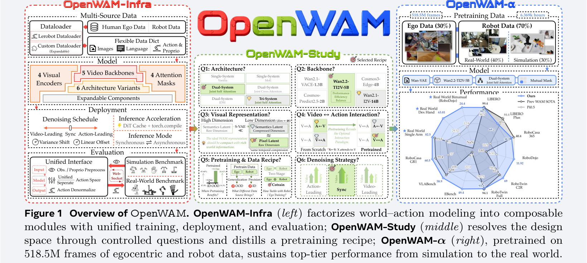

**Caption:** Figure 1 Overview of OpenWAM. OpenWAM-Infra (left) factorizes world–action modeling into composable modules with unified training, deployment, and evaluation across domains and embodiments. OpenWAM-Study (middle) investigates three core questions under controlled settings and distills an empirical recipe. OpenWAM-α (right) scales the recipe to a 6.4K-hour multi-domain pretraining mixture, delivering strong performance from simulation to the real world.

**Caption[CN]:** 图 1：OpenWAM 总体概述。OpenWAM-Infra（左）将世界—动作建模解耦为可组合模块，并在各领域与各类具身体系上提供统一的训练、部署和评估支持。OpenWAM-Study（中）在受控实验设定下系统探究三大核心科学问题并提炼经验准则。OpenWAM-α（右）将该准则拓展至约 6400 小时的多域预训练数据混合集，展现出从仿真到真实世界的卓越性能。

## Abstract

> <strong>Para. 1:</strong> World–Action Models (WAMs) promise a transformative route to embodied intelligence: by learning generative priors over physical dynamics from video, they offer policies that anticipate temporal change rather than merely recognizing visual semantic patterns. Yet today's WAM research remains fragmented across monolithic systems, where coupled design choices obscure why a model works, which priors matter, and how gains scale.
>
> <strong>Para. 1[CN]:</strong> 世界—动作模型（World–Action Models, WAM）为迈向具身智能提供了一条变革性路径：通过从视频中学习物理动态的生成先验，策略模型得以预判时空演变，而不仅局限于识别静态视觉语义模式。然而，当前 WAM 研究依然分散在各类单体化、高度绑定的系统中；相互纠缠的工程与架构选择掩盖了模型生效的底层原因、究竟何种先验至关重要，以及性能收益如何随规模扩展。

> <strong>Para. 2:</strong> To this end, we introduce OpenWAM, an open research stack that turns world–action pretraining into a controlled experimental program. OpenWAM-Infra factorizes the WAM design space into composable modules with unified training, inference, deployment, and evaluation. On this substrate, OpenWAM-Study examines three questions through controlled experiments: what to inherit, how world and action learning interact, and how their synergy scales; and distills three principles: upstream knowledge transfers through a sufficiently capable generative backbone and a compact, information-rich latent space; world–action synergy requires dedicated action capacity, explicit world-to-action information flow, and synchronized joint denoising; and embodied pretraining principally improves out-of-domain generalization, with one-stage co-training over egocentric and robot data integrating world coverage and action grounding.
>
> <strong>Para. 2[CN]:</strong> 为此，我们提出了 OpenWAM，一个将世界—动作预训练转化为受控科学实验范式的开源研究全栈。OpenWAM-Infra 将 WAM 的设计空间解耦为可组合模块，并在各领域与各类具身体系上提供统一的训练、推理、部署和评估支持。在此基座之上，OpenWAM-Study 通过受控变量实验系统回答了三大核心问题：应继承何种上游知识、世界与动作学习如何产生协同、以及这种协同效应如何跨领域扩展；并提炼出三项基本设计原则：首先，上游知识的迁移高度依赖于表征能力足够强大的生成式主干网络和紧凑且信息丰富的潜在表征空间；其次，世界与动作的协同要求专用的动作容量、显式的“世界到动作”信息流，以及同步的联合去噪调度；最后，具身预训练的核心价值在于大幅提升分布外（OOD）泛化能力，而对第一人称视点人类视频与机器人轨迹进行单阶段联合训练（co-training），是兼顾广阔世界覆盖与实体动作接地的最有效策略。

> <strong>Para. 3:</strong> Composing these principles, we build OpenWAM-α, an open WAM pretrained on roughly 6,400 hours of egocentric human and robot data and evaluated across simulation and real-world benchmarks. Across the eight simulation benchmarks and the real-robot experiments, which together span embodiments from single-arm and bimanual manipulation to dexterous hands, OpenWAM-α delivers consistently excellent performance, sustaining its top-tier standing from simulation to the physical world. We release the full stack, including infrastructure, evaluation protocols, pretrained models, and data recipes, to facilitate future research.
>
> <strong>Para. 3[CN]:</strong> 融合上述设计准则，我们构建了 OpenWAM-α，一个在约 6,400 小时第一人称人类视频及机器人多源轨迹上预训练的开源世界—动作模型，并在仿真与真实世界基准上进行了全方位评测。在涵盖单臂、双臂协作乃至灵巧手操作等 8 项仿真基准测试与真实机器人实验中，OpenWAM-α 均取得了持续优异的控制性能，将其顶尖表现从仿真无缝延续到物理现实世界。我们全面开源了该系统的完整技术栈，包含基础设施、评估协议、预训练权重及数据配方，以推动社区的进一步探索与发展。

## 1 Introduction

> <strong>Para. 1:</strong> “Knowledge is the beginning of action, action is the completion of knowledge.”  
> — Yang-ming Wang, “Instructions for Practical Living” (Wang, 1963)
>
> <strong>Para. 1[CN]:</strong> “知是行之始，行是知之成。”  
> —— 王阳明，《传习录》（王阳明，1963）

> <strong>Para. 2:</strong> Intelligence requires more than recognizing the world: an embodied agent must anticipate how the world changes and act to bring about desired changes. Modern vision and vision–language models have learned rich semantic representations from large-scale image–text data (Radford et al., 2021; Caron et al., 2021; Tong et al., 2024). Video generation models go one step further by learning to synthesize how visual worlds may evolve over time (Ho et al., 2022; Brooks et al., 2024). An embodied system, however, must learn not only what can happen in the world, but also what actions it can take to make it happen.
>
> <strong>Para. 2[CN]:</strong> 真正的智能远不止于被动地认知客观世界：具身智能体必须能够预判环境的时空演变，并主动采取物理动作以达成预期目标。现代视觉与视觉—语言模型已能从海量图文数据中汲取丰富的语义表征（Radford 等，2021；Caron 等，2021；Tong 等，2024）。视频生成模型则更进一步，学会了模拟视觉世界随时间的动态演进（Ho 等，2022；Brooks 等，2024）。然而，一个实用的具身智能系统不仅需要理解物理世界中“何种变化可能发生”，更必须学会执行具体的动作来“促成期望变化的发生”。

> <strong>Para. 3:</strong> This distinction exposes a fundamental data asymmetry in embodied learning. Videos of the changing world are abundant, whereas robot trajectories with executable action labels remain comparatively scarce (Ye et al., 2026d). Earlier approaches such as ACT (Zhao et al., 2023) and Diffusion Policy (Chi et al., 2025) largely learn visual regularities and control together solely from robot demonstrations. More recently, Vision–Language–Action (VLA) models (Brohan et al., 2023; Kim et al., 2024; Black et al., 2024) instead inherit semantic and linguistic knowledge from pretrained vision–language models. World–Action Models (WAMs) (Pai et al., 2025; Ye et al., 2026c; Li et al., 2026b) offer a different warm start: they inherit a generative prior over visual dynamics from video generation pretraining and adapt it through embodied experience. Because video generation is explicitly trained to model temporal evolution, it provides a direct starting point for learning how actions interact with physical change. In this sense, a WAM inherits world knowledge from video generation priors, then learns how to take actions in this world through embodied experience.
>
> <strong>Para. 3[CN]:</strong> 这一核心差异揭示了具身学习领域固有的数据不对称性：反映物理世界动态演变的多样化视频数据极为庞大，而带有精准可执行物理动作标签的机器人轨迹数据却相对匮乏（Ye 等，2026d）。早期方法如 ACT（Zhao 等，2023）与 Diffusion Policy（Chi 等，2025）主要依赖纯机器人演示数据联合学习视觉规律与低层控制。近年来，视觉—语言—动作（VLA）模型（Brohan 等，2023；Kim 等，2024；Black 等，2024）转而从预训练视觉—语言大模型中继承通用的语义与语言知识。世界—动作模型（World–Action Models, WAM）（Pai 等，2025；Ye 等，2026c；Li 等，2026b）则开辟了另一条截然不同的热启动途径：它们从视频生成预训练中继承关于物理视觉动态的深层生成先验，并通过具身交互经验进行针对性适配。由于视频生成模型本身就是为刻画时间序列演变而构建的，这为学习物理动作如何作用于外界环境提供了极具价值的出发点。从这个意义上说，WAM 从视频生成先验中汲取世界运转的内在机理，继而在与物理世界的交互经验中习得控制策略。

> <strong>Para. 4:</strong> The promise of a WAM, however, lies not merely in initializing a policy with a video model or attaching an action head to a video generator. Its central hypothesis is that world prediction and action generation can be learned in synergy: world modeling supplies structured knowledge of states, dynamics, and possible futures that can inform action, while action learning focuses the model on changes that matter for control. However, realizing this synergy is nontrivial. Useful knowledge may reside in different parts of an upstream video model; nominally joint world and action prediction may still lack an effective information path; and a design that fits one training domain may fail to retain its advantage across new scenes or embodiments. These challenges lead to three central questions:
>
> <strong>Para. 4[CN]:</strong> 然而，WAM 的潜力绝不仅在于使用视频生成模型对策略网络进行参数初始化，或简单地在视频生成器上拼接一个动作输出头。其核心科学假设在于：物理世界预测与物理动作生成能够形成深度协同——世界建模为策略决策提供关于环境状态、动态演变以及潜在未来走向的结构化物理先验；而动作学习则倒逼模型将表征注意力集中在与控制直接相关的关键变化上。然而，要真正实现这种协同绝非易事：上游视频模型中蕴含的有效先验可能散布在不同的内部层级；名义上的“世界与动作联合预测”可能依然缺乏畅通的信息交互机制；而在某一特定训练领域行之有效的设计，在拓展至全新场景或不同机器人形态时可能完全失去优势。这些深层矛盾引出了三个核心科学问题：

> <strong>Para. 5:</strong> Question 1: What world knowledge should a WAM inherit?  
> Question 2: How can we create synergy between world and action learning?  
> Question 3: How can this synergy be scaled across domains?
>
> <strong>Para. 5[CN]:</strong> 问题 1：世界—动作模型（WAM）究竟应当继承何种类型的上游世界知识？  
> 问题 2：如何在世界建模与动作学习之间建立起强有力的协同机制？  
> 问题 3：这种协同效应如何在大规模异构数据与多具身体系间稳健扩展？

> <strong>Para. 6:</strong> Answering these questions is difficult with existing monolithic systems, where the generative backbone, visual representation, model architecture, information flow, inference procedure, and composition of training data are often tightly coupled (Kim et al., 2026b; Bi et al., 2026; Zhang et al., 2026b). We therefore introduce OpenWAM, an open research stack for systematically developing World–Action Models. OpenWAM-Infra factorizes the WAM design space into modular components, while providing unified training, inference, deployment, and evaluation across domains and embodiments (Section 3). This modularity turns world–action modeling from a collection of coupled implementation choices into a controlled experimental program.
>
> <strong>Para. 6[CN]:</strong> 在现有的单体化系统中回答这些问题极为困难，因为生成主干网络、视觉表征选择、模型架构形态、信息流动路径、推理计算流程以及训练数据构成往往紧密耦合在一起（Kim 等，2026b；Bi 等，2026；Zhang 等，2026b）。为此，我们推出了 OpenWAM——一个旨在系统化探索世界—动作模型的开源研究基座。OpenWAM-Infra 将 WAM 的庞大设计空间全面解耦为高内聚、低耦合的模块化组件，同时为跨领域、跨形态任务提供高度统一的训练引擎、推理运行时、部署架构和评测协议（第 3 节）。这种严谨的模块化设计，使世界—动作建模从杂乱无章的工程黑盒转化为一个变量严格受控的科学实验平台。

> <strong>Para. 7:</strong> Building on this framework, OpenWAM-Study investigates the design principles underlying World–Action Models (Section 4). Our study produces three main findings. First, upstream world knowledge transfers most effectively through a sufficiently capable generative backbone and a compact, information-rich visual latent space. Second, world–action synergy does not emerge from parameter count or joint prediction alone. It is best fostered with sufficient action-specific capacity, explicit world-to-action information flow, and a joint test-time denoising schedule. Third, embodied pretraining primarily improves out-of-domain generalization rather than in-domain fitting: human egocentric video broadens world coverage, robot trajectories provide executable action knowledge, and their joint training offers the strongest practical integration strategy in our experiments. Together, these findings suggest a practical recipe from inheriting world knowledge, to enabling world–action synergy, to scaling that synergy across domains.
>
> <strong>Para. 7[CN]:</strong> 依托该实验基座，OpenWAM-Study 系统探究了支撑世界—动作模型的核心设计原则（第 4 节），并取得了三项关键实验发现：第一，上游世界知识的有效迁移高度依赖于规模适宜的强大生成主干，以及紧凑且信息密集的视觉潜在空间；第二，世界与动作的协同绝非单纯增加参数量或名义上的联合预测即可自发形成，它必须依赖专用的动作参数容量、显式的“世界到动作”信息流动通道，以及测试时高度同步的联合去噪调度；第三，具身预训练带来的主要收益在于大幅拓展分布外（OOD）环境的泛化边界，而非简单拟合已接近饱和的分布内任务：第一人称人类视频显著扩展了视觉世界的覆盖度，机器人轨迹则夯实了物理动作的可执行接地，二者的单阶段联合预训练（co-training）在各项实验中展现出了最强的综合性能。这些实证结论共同构成了一套从先验继承、协同构建到多域扩展的严谨技术配方。

> <strong>Para. 8:</strong> Finally, we compose the resulting design principles into OpenWAM-α, an open pretrained World–Action Model (Section 5). Pretrained on 518M frames (≈6,400 hours) of egocentric human and robot data through a unified 80-D action space, OpenWAM-α demonstrates that the recipe distilled from controlled settings remains effective when scaled across heterogeneous data, domains, and embodiments. It delivers consistently strong results on eight simulation benchmarks covering five embodiment categories, and preserves this standing in real-robot experiments on single-arm, bimanual, and dexterous-hand platforms. Beyond the scores themselves, these large-scale evaluations also distill further insights into the design and scaling behavior of embodied foundation models. To let the community reproduce and extend these findings, we release alongside the model the full stack: the infrastructure, evaluation protocols, pretrained weights, and data recipes.
>
> In summary, our major contributions are as follows:
>
> - **OpenWAM-Infra: a Modular Infrastructure for World–Action Modeling.** It factorizes model, representation, training, inference, deployment, and evaluation choices, enabling controlled comparison across WAM designs and embodiments (Section 3).
>
> - **OpenWAM-Study: Design Principles for World–Action Synergy.** Through controlled studies of upstream priors, architectural capacity, information flow, denoising, and multi-domain pretraining, we identify how world knowledge can interact productively with action learning (Section 4).
>
> - **OpenWAM-α: a Pretrained World–Action Model.** It instantiates and scales the derived principles into an open model for evaluating generalization and efficiency across domains and embodiments (Section 5).
>
> <strong>Para. 8[CN]:</strong> 最终，我们将上述设计原则融会贯通，构建出开源预训练世界—动作模型 OpenWAM-α（第 5 节）。该模型通过统一的 80 维动作空间，在包含 5.18 亿帧（约 6,400 小时）的第一人称人类视频与多源机器人轨迹上完成了大规模预训练。评测结果证明，从受控实验中提炼出的设计准则在跨异构数据、跨领域与跨具身体系扩展时依然保持高效。OpenWAM-α 在涵盖 5 种具身类别的 8 大仿真基准上均取得了极为强劲的评测成绩，并在单臂、双臂协作以及灵巧手物理真机平台上延续了这一卓越水准。除得分本身外，这一大规模验证还为具身基座模型的设计与缩放规律提供了更深层的洞察。为便于社区复现与拓展这些成果，我们开源了包括基础设施、评估协议、预训练模型权重及数据配方在内的全套研究资产。
>
> 总体而言，本文的主要学术贡献可概括如下：
>
> - **OpenWAM-Infra：模块化世界—动作建模基础设施。** 严格解耦了模型设计、特征表征、训练优化、推理加速、系统部署与任务评测各个环节，首次在跨架构与跨形态维度实现了高精度受控对比（第 3 节）。
>
> - **OpenWAM-Study：世界—动作协同设计原则。** 通过围绕上游先验、架构容量、信息流向、去噪调度及多域预训练的系统性受控实验，揭示了世界知识与动作学习实现高效双向赋能的根本机理（第 4 节）。
>
> - **OpenWAM-α：开源预训练世界—动作模型。** 将经验准则实装并扩展至工业级预训练规模，为社区提供了全面检验跨域泛化性、计算效率与真实物理控制表现的全新强基准（第 5 节）。

## 2 Related Work

> <strong>Para. 1:</strong> **World–Action Models.** World models (LeCun et al., 2022; Ha & Schmidhuber, 2018) learn predictive structure from observations and have long supported control through planning (Zhou et al., 2024; Maes et al., 2026; Huang et al., 2026), model-based reinforcement learning (Hafner et al., 2019; M. Moerland et al., 2023), and policy evaluation (Huang et al., 2025; Wang et al., 2026b). World–Action Models (WAMs) (Ye et al., 2026c; Pai et al., 2025; Li et al., 2026b) more directly connect this predictive capacity to executable behavior by serving as a policy model. Whereas VLA models (Brohan et al., 2023; Kim et al., 2024; Black et al., 2024) primarily inherit semantic and linguistic knowledge from vision–language pretraining (Beyer et al., 2024; Bai et al., 2025), WAMs initialize from video-generative priors so that action learning begins with a model with rich visual dynamical priors (Wan et al., 2025; Ali et al., 2025). Yet existing systems remain largely monolithic, where changes in model architecture, training procedure, data recipe, and sampling schedule are often coupled. Consequently, it remains unclear which components transfer world knowledge, which interactions create world–action synergy, and which benefits persist across domains. OpenWAM exposes these coupled choices as controlled variables and organizes them around precisely these three questions.
>
> <strong>Para. 1[CN]:</strong> **世界—动作模型（World–Action Models）。** 世界模型（LeCun 等，2022；Ha & Schmidhuber，2018）从环境观测中学习具有预测性的结构表征，长期以来在基于规划的控制（Zhou 等，2024；Maes 等，2026；Huang 等，2026）、基于模型的强化学习（Hafner 等，2019；M. Moerland 等，2023）以及策略评估（Huang 等，2025；Wang 等，2026b）中发挥着核心作用。世界—动作模型（WAM）（Ye 等，2026c；Pai 等，2025；Li 等，2026b）则更进一步，将这种前向预测能力作为直接输出控制指令的策略模型，与可执行动作深度联通。相较于视觉—语言—动作（VLA）模型（Brohan 等，2023；Kim 等，2024；Black 等，2024）主要从多模态图文预训练中承袭高层语义与语言理解能力（Beyer 等，2024；Bai 等，2025），WAM 直接初始化自大规模视频生成先验，使动作策略从一开始便立足于富含物理视觉动态规律的强大表征（Wan 等，2025；Ali 等，2025）。然而，现有的 WAM 系统大多呈现出单体式结构，模型网络结构、优化训练策略、数据配比方案以及推理采样调度往往纠缠杂糅。因此，学术界尚不明确究竟是哪些特定模块成功迁移了物理世界先验、何种交互机制促成了世界与动作的深层协同，以及这些协同收益能否稳健迁移至全新领域。OpenWAM 将这些交织的工程与设计决策彻底拆解为严格受控的自变量，并紧密围绕这三大核心问题展开系统解构。

> <strong>Para. 2:</strong> **Open Research Ecosystems for Generalist Robot Policy Learning.** Open models and codebases have made generalist robot learning increasingly accessible. OpenVLA (Kim et al., 2024) established an open-weight pretrained baseline, while StarVLA (Community, 2026) provides a modular and performant platform for varied design choices. StarVLA-α (Ye et al., 2026b) complements this breadth with a pretrained model of minimalist design, and XPolicyLab (Community et al., 2026) contributes a unified standard and open ecosystem for policy evaluation and deployment. These efforts have significantly reduced development complexity in the VLA research community; however, in the WAM community, such open research ecosystems remain largely absent. A modular system in this realm accompanied by a strong pretrained model would help democratize research, as well as serve as a principled foundation for understanding and scaling world–action model pretraining.
>
> <strong>Para. 2[CN]:</strong> **通用机器人策略学习的开源研究生态。** 开源模型与代码基座极大地推动了通用机器人学习的平民化与快速演进。OpenVLA（Kim 等，2024）确立了首个开源权重的通用策略基准；StarVLA（Community，2026）为各类架构探索提供了高度模块化且高性能的开发平台；StarVLA-α（Ye 等，2026b）以极简主义设计提供了高效的预训练策略；而 XPolicyLab（Community 等，2026）则为策略的统一评估与真机部署树立了规范化的开源生态体系。这些工作大幅降低了 VLA 领域的研究门槛；然而在新兴的世界—动作模型（WAM）领域，此类标准化的开源生态仍处于显著空白。在这一前沿方向上建立高度模块化的软件系统，并辅以性能顶尖的工业级开源预训练模型，不仅能全面赋能开源社区研究，更将为系统理解与规模化扩展世界—动作模型预训练奠定坚实的科学基石。

> <strong>Para. 3:</strong> **Towards a Scientific Understanding of Model Design.** A growing line of work treats model design as an empirical science (Allen-Zhu, 2026; Karras et al., 2022; McKinzie et al., 2024; Liu et al., 2022; Wen et al., 2026): decomposing a complex system into controlled variables, testing the mechanisms behind observed gains, deriving a recipe, and validating whether it survives scale. In multimodal learning, Cambrian-1 (Tong et al., 2024) and Beyond Language Modeling (Tong et al., 2026) systematically study visual representations, modality-specific capacity, data composition, and unified pretraining; Towards Physics of Multimodal Pretraining (Han et al., 2026) further isolates knowledge flow, synergy versus competition, and the timing of modality unification. In robot learning, analyses around Action Chunking (Simchowitz et al., 2025; Zhang et al., 2025b; Lazzati et al., 2026) and Generative Control Policies (Pan et al., 2026) have substantially reshaped the community’s understanding of these topics.
>
> <strong>Para. 3[CN]:</strong> **迈向模型架构设计的科学实证理解。** 越来越多的前沿研究主张将深度学习架构设计作为一门严谨的实验科学来对待（Allen-Zhu，2026；Karras 等，2022；McKinzie 等，2024；Liu 等，2022；Wen 等，2026）：将复杂的宏观系统逐层解构为受控变量，深入检验性能增益背后的根本物理机理，提炼出可泛化的工程准则，并在大规模计算下验证这些准则的稳健性。在多模态大模型领域，Cambrian-1（Tong 等，2024）与 Beyond Language Modeling（Tong 等，2026）系统化探讨了视觉特征表征选择、特定模态参数配比、多源数据融合策略与端到端联合预训练；Towards Physics of Multimodal Pretraining（Han 等，2026）进一步精确隔离了知识流动路径、模态间的协同与冲突，以及模态融合的最佳时机。在机器人学习领域，关于动作分块（Action Chunking）（Simchowitz 等，2025；Zhang 等，2025b；Lazzati 等，2026）和生成式控制策略（Generative Control Policies）（Pan 等，2026）的实证研究，在根本上重塑了社区对具身决策机理的认知。

> <strong>Para. 4:</strong> At the data and system level, Large Behavior Models (Barreiros et al., 2026), LBM co-train (Lin et al., 2026a), StarVLA-α (Ye et al., 2026b), and OpenHLM (Hu et al., 2026) similarly use controlled comparisons to study multitask transfer, heterogeneous supervision, action design, and embodiment interfaces. OpenWAM brings this methodology to WAMs: OpenWAM-Infra builds the substrate for controlled experiments, OpenWAM-Study turns them into controlled scientific questions about inheritance, synergy, and scaling, and OpenWAM-α scales the resulting recipe under heterogeneous multi-domain pretraining.
>
> <strong>Para. 4[CN]:</strong> 在系统与数据层面，大型行为模型（Large Behavior Models, LBM）（Barreiros 等，2026）、LBM 联合训练（Lin 等，2026a）、StarVLA-α（Ye 等，2026b）与 OpenHLM（Hu 等，2026）同样借助受控实验深入剖析了多任务泛化迁移、异构监督信号融合、动作空间拓扑以及通用具身接口规范。OpenWAM 首次将这一严谨的科学实证方法论引入世界—动作模型：OpenWAM-Infra 为全流程受控实验构建了高可靠的模块化底座；OpenWAM-Study 将宏观假设收敛为关于先验继承、模态协同与跨域扩展的受控实验命题；而 OpenWAM-α 则在百亿级异构多域预训练中验证了该套设计配方的可扩展性与优越性。

## 3 OpenWAM-Infra: A Modular Infrastructure for World–Action Modeling

> <strong>Para. 1:</strong> Most existing world–action models differ substantially in architecture and infrastructure implementation, with no shared standard; since each system is built around a single model design, its model, training, serving, and evaluation components are likewise organized idiosyncratically and are often tightly coupled. This brings two problems: 1) such codebases are difficult for users to inspect, extend, and adapt, hindering community adoption; and 2) controlled comparison of individual design choices across models is nearly impossible. To address this, OpenWAM-Infra establishes a unified, modular research stack that factorizes the design space into composable components across the entire lifecycle: model architecture, training, deployment, and evaluation (Figure 1, left).
>
> <strong>Para. 1[CN]:</strong> 现有的绝大多数世界—动作模型在网络架构与系统基础设施实现上存在巨大差异，缺乏统一的技术标准；由于各套系统往往围绕特定的单一模型深度定制，其模型结构、训练引擎、推理服务与评测协议均呈现出高度特异且紧密耦合的形态。这带来了两大核心困境：第一，此类代码库对于研究人员而言极难审查、拓展和二次开发，严重阻碍了开源社区的广泛采用；第二，由于系统耦合严重，学术界几乎无法跨模型开展严格的单一变量受控对照实验。为彻底扭转这一局面，OpenWAM-Infra 建立了一套统一且高度模块化的研究基座，在算法全生命周期内将设计空间解构为清晰可组合的独立组件：涵盖模型架构、训练流水线、部署运行时与任务评估协议（图 1，左侧）。

### 3.1 Composable Model

> <strong>Para. 1:</strong> At the core of OpenWAM-Infra is a modular model abstraction: rather than hardcoding a specific network topology, it factorizes world–action modeling into three classes of interchangeable modules and a composition rule that assembles them into an end-to-end model (Figure 2).
>
> <strong>Para. 1[CN]:</strong> OpenWAM-Infra 的核心是一种模块化的模型抽象范式：它摒弃了将特定网络拓扑硬编码在系统底层的传统做法，而是将世界—动作建模系统性地分解为三类可互换的基础模块，以及一套将它们组合为端到端可训练模型的统一装配规则（图 2）。

> <strong>Para. 2:</strong> **Streams.** A stream is a unified execution contract that wraps a sequence of token representations and its underlying transformer backbone. OpenWAM-Infra distinguishes three streams: the world stream predicts future visual states; the action stream predicts executable actions; and the optional understanding stream extracts semantic representations from observations. Each stream shares one code contract that decomposes its forward pass into three stages:
>
> - `prepare`, invoked once before the stack, which embeds the inputs into the initial token state;
>
> - `per-layer block step`, invoked once per layer, which advances this state through one transformer layer;
>
> - `finalize`, invoked once after the stack, which maps the final state to the stream's prediction.
>
> <strong>Para. 2[CN]:</strong> **流（Streams）。** “流”是对一组 token 表征序列及其底层 Transformer 主干网络的统一执行契约抽象。OpenWAM-Infra 规范了三种核心流：世界流（world stream）负责预测未来的物理视觉演变状态；动作流（action stream）负责生成可执行的物理动作；可选的理解流（understanding stream）则用于从输入观测中提取高层语义表征。所有流均遵循完全一致的代码调用契约，将其前向推理计算解构为三个标准阶段：
>
> - `prepare`：在主干堆叠计算之前执行一次，负责将原始输入编码并投影为初始 token 隐藏状态；
>
> - `per-layer block step`：在每一层 Transformer 循环中被调用一次，推进隐藏状态通过该层的自注意力与前馈计算；
>
> - `finalize`：在主干网络堆叠完成后执行一次，负责将最终层表征映射为各流具体的物理预测输出。

> <strong>Para. 3:</strong> **Modules.** OpenWAM-Infra factorizes the model into three classes of interchangeable modules, as shown at the top of Figure 2: the visual encoder $E$, which produces the latent representation of visual observations; the stream backbones $S = \{W, A, U\}$, which instantiate the transformers that model each stream; and the visibility attention mask $M$, which specifies the cross-stream and intra-stream attention relations among tokens.
>
> For visual encoders, OpenWAM-Infra supports two reconstructive encoders trained on pixel-reconstruction objectives: Wan2.2-VAE (Wan et al., 2025) and FLUX.2-VAE (Black Forest Labs, 2025), and two representation encoders (Zheng et al., 2026a): DINOv3 (Siméoni et al., 2025) and V-JEPA 2.1 (Mur-Labadia et al., 2026), along with an optional S-VAE (Zhang et al., 2025a) module that compresses the latent dimension. These capabilities together support the study of visual representations in Section 4.1.2.
>
> For stream backbones, OpenWAM-Infra provides five video generation backbones covering different scales and tokenizations: Wan2.2-TI2V-5B, Wan2.2-T2V-5B, Wan2.1-I2V-1.3B, Wan2.1-T2V-1.3B, and Wan2.1-I2V-14B (Wan et al., 2025; Ali et al., 2025). For VLM backbones, OpenWAM-Infra currently supports only the Qwen3-VL family (Bai et al., 2025). For the action backbone, OpenWAM-Infra offers two options: a separate set of parameters residing in ActionDiT, or a shared video backbone in which action tokens join the video token sequence and are processed jointly.
>
> Visibility Attention Mask. The mask $M$ governs the information flow with the mixed self-attention through which streams interact: it factorizes into intra-modality and cross-modality blocks, granting attention where tokens reinforce one another and withholding it where their mutual influence must be isolated. Over the video and action modalities, this factorization reads
>
> <strong>Para. 3[CN]:</strong> **可插拔模块（Modules）。** 如图 2 顶部所示，OpenWAM-Infra 将模型严谨拆分为三类可互换的基础模块：视觉编码器 $E$，负责生成环境视觉观测的潜在特征；流主干网络 $S = \{W, A, U\}$，负责具体实现处理各流特征的 Transformer 架构；以及可见性注意力掩码 $M$，负责精确指定不同 token 之间在流内与跨流维度的注意力交互拓扑。
>
> 在视觉编码器方面，OpenWAM-Infra 原生集成了两种基于像素重构目标的重构式编码器：Wan2.2-VAE（Wan 等，2025）与 FLUX.2-VAE（Black Forest Labs，2025）；以及两种自监督表征式编码器（Zheng 等，2026a）：DINOv3（Siméoni 等，2025）与 V-JEPA 2.1（Mur-Labadia 等，2026），并辅以可选的 S-VAE（Zhang 等，2025a）模块用于降低潜在特征的通道维度。这些模块为第 4.1.2 节关于视觉潜在表征的系统研究提供了强力支撑。
>
> 在流主干网络方面，OpenWAM-Infra 提供了涵盖不同参数规模与分词策略的 5 款视频生成骨干：Wan2.2-TI2V-5B、Wan2.2-T2V-5B、Wan2.1-I2V-1.3B、Wan2.1-T2V-1.3B 和 Wan2.1-I2V-14B（Wan 等，2025；Ali 等，2025）。对于视觉语言模型（VLM）主干，系统当前深度集成了 Qwen3-VL 系列（Bai 等，2025）。在动作主干方面，OpenWAM-Infra 提供两套方案：一套是由独立的 ActionDiT 网络承载专用动作参数，另一套则是直接复用共享的视频主干网络，使动作 token 并入视频序列参与联合注意力计算。
>
> 可见性注意力掩码。注意力掩码 $M$ 严格调控着混合自注意力机制中的跨模态信息流动：它被因子化为模态内块与跨模态块，在表征能够相互增强的位置赋予注意力连通权重，在需要物理隔离的位置实施掩码遮蔽。在视频与动作两大核心模态之间，该因子化矩阵定义如下：

$$
\mathbf{M} = \begin{pmatrix} \mathbf{M}_{V \leftarrow V} & \mathbf{M}_{V \leftarrow A} \\ \mathbf{M}_{A \leftarrow V} & \mathbf{M}_{A \leftarrow A} \end{pmatrix}
$$
> <strong>Para. 4:</strong> where the block $M_{X \leftarrow Y}$ specifies whether tokens of modality $X$ may attend to tokens of modality $Y$. OpenWAM-Infra fixes the two intra-modality blocks: $M_{V \leftarrow V}$ adopts first-frame causal attention, in which noisy frames attend to one another and to the clean first frame while the clean frame attends only to itself, shielding clean conditioning from noise; $M_{A \leftarrow A}$ adopts bidirectional attention, in which the noisy action tokens of a chunk are mutually visible so that the predicted actions inform one another. The two cross-modality blocks then define the four attention mask modes that OpenWAM-Infra supports, as drawn in the right panel of Figure 2: mutual enables both $M_{A \leftarrow V}$ and $M_{V \leftarrow A}$, so the two modalities attend to each other; action-sees-video enables only $M_{A \leftarrow V}$, letting actions read the predicted world while leaving video generation undisturbed; video-sees-action enables only $M_{V \leftarrow A}$, the reverse; and isolated disables both, denoising the two modalities independently. Building on this native support, Section 4.2.2 later compares these modes under controlled settings.
>
> <strong>Para. 4[CN]:</strong> 其中，子块 $\mathbf{M}_{X \leftarrow Y}$ 严格指定了模态 $X$ 的 token 是否允许查询模态 $Y$ 的 token。OpenWAM-Infra 固化了两个模态内注意力块：$\mathbf{M}_{V \leftarrow V}$ 采用首帧因果注意力机制，加噪帧之间相互可见且均可查询干净的首帧观测，而干净的首帧仅能关注自身，从而彻底隔离噪声向确定性物理条件的污染；$\mathbf{M}_{A \leftarrow A}$ 采用全双向自注意力机制，一个动作块内的所有带噪动作 token 彼此双向可见，以便模型生成时序协调的动作轨迹。由两个跨模态块组合而成的四种注意力模式，如统一呈现于图 2 右侧：相互可见（Mutual）同时激活 $\mathbf{M}_{A \leftarrow V}$ 与 $\mathbf{M}_{V \leftarrow A}$，使视频与动作深度双向交互；动作可见视频（Action-Sees-Video）仅激活 $\mathbf{M}_{A \leftarrow V}$，允许动作流读取预测的物理世界状态，同时保持视频流不受动作干扰；视频可见动作（Video-Sees-Action）则反之；而隔离模式（Isolated）则彻底切断跨流通信，使两模态处于完全独立的去噪状态。基于这种原生支持，第 4.2.2 节在严格受控条件下对这四种模式进行了系统对比。

### Figure 2. OpenWAM 模型基础设施

**Caption:** Figure 2 OpenWAM Model Infra. Top: the three classes of interchangeable modules: the visual encoder E (left); the stream backbones S (middle); and the visibility attention mask M (right), factorized into intra- and cross-modality blocks. Bottom: the six architecture variants supported by OpenWAM-Infra, grouped into the Single-System, Dual-System, and Tri-System families.

**Caption[CN]:** 图 2：OpenWAM 模型基础设施。顶部：三类可互换的基础模块：视觉编码器 E（左）；各流主干网络 S（中）；以及分解为模态内和跨模态块的可见性注意力掩码 M（右）。底部：OpenWAM-Infra 原生支持的 6 种代表性架构变体，划分为单系统（Single-System）、双系统（Dual-System）与三系统（Tri-System）三大架构族。

> <strong>Para. 5:</strong> **Architectures.** The composition rule $C$ specifies where and how information crosses streams, and it does so purely through the execution contract above: it sequences the prepare, per-layer block, and finalize calls of the participating backbones and, when interaction must occur inside attention, splits the layer into its pre-attention and post-attention halves to substitute the attention computation itself, never modifying code in the stream backbones. A concrete architecture is a choice $C(E, S, M)$; the designs currently supported by OpenWAM-Infra fall into three broad families, drawn at the bottom of Figure 2:
>
> - **Single-System.** This family comprises only the video backbone: the action backbone takes the shared video backbone option, so a single set of transformer weights serves both streams with all internal parameters shared; representative systems include Cosmos Policy (Kim et al., 2026b) and DreamZero (Ye et al., 2026c). OpenWAM-Infra provides two variants, differing in modality-specific capacity:
>   - *Vanilla* passes both streams through the shared layers without modification;
>   - *MoE* retains the shared sequence and self-attention but hard-routes action tokens to a dedicated MLP, reserving capacity for action prediction without separating the streams (Mu & Lin, 2025).
>
> - **Dual-System.** This family assigns the world stream and the action stream to distinct backbones with separate parameters, letting each stream specialize while coordinating them through joint self-attention or cross-attention; representative systems include Fast-WAM (Yuan et al., 2026b) and LingBot-VA (Li et al., 2026b). OpenWAM-Infra provides three variants, differing in how the two streams communicate:
>   - *Joint self-attention* merges the hidden states of the two streams into a joint sequence at designated bridge layers, allowing bidirectional token-level interaction before the states return to their streams; optionally, gradients are detached at the video features to isolate action learning from video parameters;
>   - *Joint cross-attention* maintains separate sequences throughout and lets each stream query the other via cross-attention;
>   - *Inverse Dynamics Model (IDM)* instantiates an asymmetric, decoupled design where the action backbone queries the video backbone through cross-attention; during training, the video backbone is trained with teacher-forced video states and run in two inference stages: the video trajectory is generated first and the action backbone then predicts actions conditioned on that trajectory (Ye et al., 2026c).
>
> - **Tri-System.** This family introduces an understanding stream powered by a VLM backbone alongside the world and action streams, so that physical prediction and high-level comprehension are served by dedicated models feeds a separate trainable understanding stream; representative systems include Motus (Bi et al., 2026). OpenWAM-Infra provides a single variant:
>   - *Joint self-attention* merges the world and action streams via joint self-attention as in the dual system, retaining stream-specific parameters; the understanding stream joins as a read-only tail that the other two streams attend to through cross-attention.
>
> <strong>Para. 5[CN]:</strong> **模型架构体系（Architectures）。** 组合规则 $C$ 严格规范了信息跨流流动的时机与拓扑结构，且完全建立在上述执行契约之上：它按序编排各参与主干的 prepare、per-layer block step 与 finalize 阶段；当跨模态交互需要在注意力内部发生时，组合器将 Transformer 层切分为注意力前与注意力后两个半段，仅对注意力计算本身进行无缝重载，绝不侵入修改各流主干内部代码。一个具体的网络架构即为一个严格元组 $C(E, S, M)$；OpenWAM-Infra 目前原生支持的三大架构族及其 6 种典型变体如图 2 底部所示：
>
> - **单系统（Single-System）。** 该架构族仅包含一个视频生成主干网络：动作流选择共享视频主干模式，因此同一套 Transformer 权重服务于世界与动作双流，所有内部参数完全共享；代表性方法包括 Cosmos Policy（Kim 等，2026b）与 DreamZero（Ye 等，2026c）。OpenWAM-Infra 提供了两种细分变体，用于解耦模态专属参数容量的影响：
>   - *Vanilla（原始共享）*：将两模态 token 直接拼接后无差别地通过完全共享的 Transformer 层；
>   - *MoE（混合专家）*：保留统一的共享序列与自注意力交互，但通过硬路由将动作 token 导向专门的动作 MLP 专家层，在不割裂统一主干的前提下保留动作专有容量（Mu & Lin，2025）。
>
> - **双系统（Dual-System）。** 该架构族将世界流与动作流分配给两个参数完全独立的专用主干网络，使各自专注于物理动态建模与策略决策，并通过联合自注意力或交叉注意力机制进行协同；代表性方法包括 Fast-WAM（Yuan 等，2026b）与 LingBot-VA（Li 等，2026b）。系统提供三种交互变体：
>   - *Joint self-attention（联合自注意力）*：在指定的桥接层将双流的隐藏状态合并为联合序列，使 token 级别实现全双向深度交互，计算后再拆回各自流；同时支持在视频特征处截断梯度（Detached Cross-Attention），以严格隔离动作梯度对视频参数的反向扰动；
>   - *Joint cross-attention（联合交叉注意力）*：双流全程保持独立的 token 序列，仅通过相互查询的交叉注意力机制传递信息；
>   - *Inverse Dynamics Model（IDM，逆动力学模型）*：采用非对称的解耦设计，动作网络通过交叉注意力单向查询视频特征；训练时视频流通过教师强制（teacher-forcing）训练，推理时分为显式两阶段：先生成未来视频轨迹，动作网络再以预测轨迹为条件推导控制动作（Ye 等，2026c）。
>
> - **三系统（Tri-System）。** 该架构族在世界流与动作流之外，额外引入了基于 VLM 的语义理解流，从而使底层物理前向推演与高层常识语义理解均由专用模型承载；代表性方法包括 Motus（Bi 等，2026）。OpenWAM-Infra 实现了如下标准化变体：
>   - *Joint self-attention（联合自注意力三系统）*：世界流与动作流保留专用参数并通过联合自注意力深度协同，而语义理解流作为只读前置特征尾部，供世界与动作流通过交叉注意力随时查询。

> <strong>Para. 6:</strong> Within each architecture $C(E, S, M)$, every module (the visual encoder, the stream backbones, and the attention mask) is instantiated from a registry, orthogonally to the composition rule: every combination of encoder, video backbone, action backbone, and mask can be coupled into any architecture without touching the runner code.
>
> <strong>Para. 6[CN]:</strong> 在每一个具体的架构组合 $C(E, S, M)$ 中，所有底层模块（视觉编码器、各流主干网络、注意力掩码）均由统一注册表动态实例化，并与组合规则保持正交独立：视觉编码器、视频主干、动作主干与注意力掩码的任意组合，均可自由装配为任意宏观架构，且无需对底层执行代码做任何修改。

> <strong>Para. 7:</strong> **Formulation.** OpenWAM models generate future visual states and action chunks via flow matching on both predictions. Define a sample as $(\ell, o_{1:T}, a_{1:H}, q, m)$, a language instruction, a video window, an action chunk, an optional proprioceptive state, and a per-dimension validity mask. During input preparation, the visual encoder $E$ embeds the video window into latents $z \in \mathbb{R}^{T \times C \times H \times W}$, with the first frame $z_0$ serving as the clean visual conditioning for both streams; the video target comprises the remaining latents $z_{1:T}$, while the action target comprises the chunk $a_{1:H}$.
>
> Throughout the paper, $t = 0$ denotes pure noise and $t = 1$ clean data. Each stream is noised to its own timestep: $t_v$ for video and $t_a$ for actions, yielding the interpolants $z_{t_v} = t_v z + (1 - t_v) \epsilon_v$ and $a_{t_a} = t_a a + (1 - t_a) \epsilon_a$ with Gaussian noise $\epsilon_v, \epsilon_a$; one joint forward pass of the architecture $(\hat{v}_z, \hat{v}_a) = v_\theta(z_{t_v}, a_{t_a}, t_v, t_a, c)$ predicts both velocities, and the objective takes the form
>
> <strong>Para. 7[CN]:</strong> **数学形式化（Formulation）。** OpenWAM 模型通过流匹配（Flow Matching）范式联合生成未来物理视觉状态与连续动作块。我们将训练样本形式化定义为元组 $(\ell, o_{1:T}, a_{1:H}, q, m)$，分别表示语言指令、视频观察窗口、动作块、可选的机器人本体感受状态，以及各维度有效的有效性掩码。在输入准备阶段，视觉编码器 $E$ 将视频序列投影为潜在特征 $z \in \mathbb{R}^{T \times C \times H \times W}$，其中首帧 $z_0$ 作为双流共享的确定性干净条件；视频预测目标为其后各帧潜在特征 $z_{1:T}$，而动作预测目标为动作块 $a_{1:H}$。
>
> 在全文约定中，$t = 0$ 代表纯高斯噪声，$t = 1$ 代表干净的无噪真实数据。世界流与动作流被独立加噪至各自的连续时间步：视频对应时间步 $t_v$，动作对应时间步 $t_a$，由此构建线性插值流 $z_{t_v} = t_v z + (1 - t_v) \epsilon_v$ 与 $a_{t_a} = t_a a + (1 - t_a) \epsilon_a$，其中 $\epsilon_v, \epsilon_a \sim \mathcal{N}(0, \mathbf{I})$；模型执行单次联合前向计算 $(\hat{v}_z, \hat{v}_a) = v_\theta(z_{t_v}, a_{t_a}, t_v, t_a, c)$ 预测各自的速度场，联合训练损失函数定义如下：

$$
\mathcal{L} = \lambda_v \mathbb{E}_{t_v, \epsilon_v} \left[ w(t_v) \|\hat{v}_z - (z - \epsilon_v)\|_2^2 \right] + \lambda_a \mathbb{E}_{t_a, \epsilon_a} \left[ w(t_a) \|\mathbf{m} \odot (\hat{v}_a - (a - \epsilon_a))\|_2^2 \right]
$$
> <strong>Para. 8:</strong> where $\lambda_v, \lambda_a$ and $w(\cdot)$ weight the streams and the timesteps, while the validity mask $m$ restricts the action term to the coordinates an embodiment actually populates, and clean conditioning frames are excluded from the video term. Because $t_v$ and $t_a$ are sampled independently, training covers the entire $(t_v, t_a)$ noise plane; any inference schedule, whether it denoises the two streams synchronously at a shared timestep or asynchronously with one stream leading the other, traces a path through this plane and thus remains in-distribution.
>
> <strong>Para. 8[CN]:</strong> 其中 $\lambda_v, \lambda_a$ 与 $w(\cdot)$ 分别为各模态流与时间步的损失权重系数，有效性掩码 $m$ 确保动作损失严格限定在当前具身平台实际占用的有效控制通道上，且首帧干净条件被完全排除在视频重构损失之外。至关重要的是，由于 $t_v$ 与 $t_a$ 在训练期间完全独立均匀采样，训练覆盖了二维联合噪声平面的完整网格空间 $(t_v, t_a) \in [0, 1]^2$；因此，无论测试时的推理调度是在共享时间步下严格同步去噪，还是以某一模态领先的异步形式推进，其在噪声平面上刻画的连续轨迹均严格落在训练分布内。

### 3.2 Training Runtime

> <strong>Para. 1:</strong> **Training Utilities.** As shown in the Training Utils panel at the center of Figure 2, three core utilities support OpenWAM-Infra training:
>
> 1. *Framework.* OpenWAM-Infra integrates DeepSpeed ZeRO (stage 1 or 2) through Accelerate and supports mixed precision (bf16 by default), gradient accumulation, and gradient clipping; a single entry point scales from single-GPU runs to multi-node jobs.
>
> 2. *Memory optimization.* To reduce memory consumption, OpenWAM-Infra provides gradient checkpointing, with optional CPU offload of the checkpointed activations, and optimizer-state offload to CPU.
>
> 3. *Workflows.* OpenWAM-Infra supports three training workflows. Pretraining starts a fresh run. Fine-tuning starts a new run initialized from a previous checkpoint: the architecture is rebuilt from the checkpoint's own record, the new configuration is layered on top, and the identity of the modules the weights belong to is protected from override. Resume continues the same run exactly: the full optimizer and scheduler state is restored, training re-enters the data stream at the recorded position, and the run refuses to continue if the dataset's normalization statistics diverge from those recorded with the run.
>
> <strong>Para. 1[CN]:</strong> **训练基础设施（Training Utilities）。** 如图 2 中部的 Training Utils 所示，OpenWAM-Infra 由三大核心训练组件驱动：
>
> 1. *框架集成（Framework）：* 系统通过 Accelerate 深度集成了 DeepSpeed ZeRO（Stage 1 或 Stage 2），默认采用 bf16 混合精度训练，支持灵活的梯度累积与全局梯度裁剪；单一命令行入口即可实现从单卡快速验证到百卡跨节点大规模预训练的平滑伸缩。
>
> 2. *显存极值优化（Memory optimization）：* 为降低海量视频序列带来的显存峰值压力，系统提供了完备的激活值梯度检查点（gradient checkpointing）机制，并支持将检查点激活值及优化器状态选择性卸载（CPU offload）至宿主机内存。
>
> 3. *标准工作流支持（Workflows）：* 系统原生定义了三类标准训练流：Pretraining 从零初始化启动全新预训练任务；Fine-tuning 基于先前 checkpoint 初始化微调，系统依据原 checkpoint 元数据严格重构模型结构并覆盖新配置，同时防止权重所属模块发生意外覆写；Resume 精确断点续训，完整恢复优化器状态、学习率调度器与数据流游标，并在检测到数据集动作归一化统计量发生偏移时自动拒绝执行，确保实验环境的一致性。

> <strong>Para. 2:</strong> **Self-Contained Checkpoints.** A self-contained checkpoint comprises three parts: the model weights, the resolved configuration with every module's reconstruction specification (and artifacts such as tokenizers) merged in, and the action-normalization statistics. Fine-tuning, resume, and deployment all rebuild the model directly from these artifacts without reference to the original source code: the checkpoint carries its own architecture, and modifying the codebase cannot silently change how an existing checkpoint runs.
>
> <strong>Para. 2[CN]:</strong> **自包容检查点机制（Self-Contained Checkpoints）。** 一个自包容的 Checkpoint 包含三个完备要素：模型权重字典、包含各模块精确重构规范与分词器元数据的完整配置树，以及跨具身动作归一化统计参数。后续的微调、断点续训以及推理服务部署均能直接基于这些元数据完整还原模型，而无需依赖外部源代码历史版本的隐式假设：Checkpoint 自身即完整定义了架构，从而彻底避免了代码库迭代对历史模型行为的隐式破坏。

### 3.3 Deployment Runtime

> <strong>Para. 1:</strong> Every checkpoint is served by one policy server, which rebuilds the architecture from its self-contained record and keeps two choices orthogonal: when inference runs (the inference mode) and how the two streams are denoised (the denoising schedule). Figure 3 illustrates the two choices in panels (a) and (b), respectively.
>
> <strong>Para. 1[CN]:</strong> 每一个 Checkpoint 均由一个统一的策略服务引擎托管，该引擎从自包容记录中完全重构模型架构，并将两项关键设计正交解耦：即“何时触发模型推理”（推理模式，Inference Mode）与“双流如何在噪声空间推进去噪”（去噪调度，Denoising Schedule）。图 3 在 (a) 和 (b) 两个面板中分别直观展示了这两项决策。

### Figure 3. 部署运行时的推理模式与去噪调度

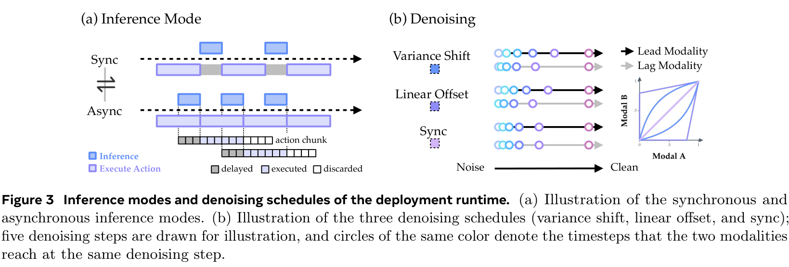

**Caption:** Figure 3 Inference modes and denoising schedules of the deployment runtime. (a) Illustration of the synchronous and asynchronous inference modes. (b) Illustration of the three denoising schedules (variance shift, linear offset, and sync), which parameterize relative progress between video and action through an action lag / lead duration and shape the noise levels that the two modalities reach at the same denoising step.

**Caption[CN]:** 图 3：部署运行时的推理模式与去噪调度。(a) 同步与异步推理模式原理示意。(b) 三种去噪调度（方差偏移、线性偏置与同步调度）的几何轨迹示意，通过动作落后 / 领先时间窗参数化视频与动作流的相对推进速度，塑造了两大模态在同一去噪迭代步中所处的噪声阶次。

> <strong>Para. 2:</strong> **Inference Modes.** OpenWAM-Infra provides two inference modes over a common buffer mechanism (Figure 3(a)): each inference produces an action chunk that is buffered, and the server pops one action per control step to answer incoming requests.
>
> - Under *synchronous inference*, the robot executes all actions in the chunk, pauses when the buffer empties, and stalls for the inference latency.
>
> - Under *asynchronous inference*, let $H$ denote the length of the predicted chunk, $n \le H$ the inference horizon, and $d < n$ the lead threshold in steps, defaulting to $n/2$. Once $d$ executed actions remain, a single background worker prefetches the next chunk while those actions keep executing; when the new chunk arrives, the queue atomically retains the $d$ remaining actions, appends the new chunk, and drops any outdated residual tail.
>
> The two modes are indistinguishable to clients, so benchmarks and robots switch between them with zero interface changes.
>
> <strong>Para. 2[CN]:</strong> **推理模式（Inference Modes）。** OpenWAM-Infra 在统一的双端动作缓冲区机制上提供了两种推理模式（图 3(a)）：模型每次推理输出一个长度为 $H$ 的未来动作块并写入缓冲区，服务器在每个控制周期弹出一个动作响应机器人的控制请求。
>
> - 在*同步推理（Synchronous Inference）*模式下，机器人依序执行缓冲区内的动作，当缓冲区完全耗尽时，机器人物理挂起，等待下一轮前向推理完成；
>
> - 在*异步推理（Asynchronous Inference）*模式下，设预测动作块长度为 $H$，推理更新步长为 $n \le H$，提前预取阈值为 $d < n$（默认设为 $n/2$）。当当前缓冲区仅剩 $d$ 步动作时，后台异步工作线程基于最新观测无延迟触发下一次前向预测，而当前执行器继续消费剩余动作；新动作块生成完毕后，队列原子化地保留正在执行的 $d$ 步动作并拼接最新动作块，同时舍弃超过时效的尾部多余动作。
>
> 这两种模式对客户端完全透明，因此仿真基准和物理真机无需修改任何代码即可自由切换。

> <strong>Para. 3:</strong> **Denoising Schedules.** A denoising schedule is a path $\tau = \{(t_v^i, t_a^i)\}_{i=0}^N$ through the joint noise plane, with $t = 0$ pure noise and $t = 1$ clean data as in Section 3.2; Figure 3(b) draws the three schedules that OpenWAM-Infra supports. Under the sync schedule, both streams advance in lockstep along the diagonal: each step performs one joint forward pass and a coupled Euler update in which each stream moves by its own timestep increment; the video latents $z$ follow $z_{t_v^{i+1}} = z_{t_v^i} + (t_v^{i+1} - t_v^i) \hat{v}_z$, and the action chunk $a$ follows $a_{t_a^{i+1}} = a_{t_a^i} + (t_a^{i+1} - t_a^i) \hat{v}_a$.
>
> Asynchronous schedules let one stream lead through two composable families (Baade et al., 2026),
>
> <strong>Para. 3[CN]:</strong> **去噪调度机制（Denoising Schedules）。** 去噪调度是在二维联合噪声平面上定义的一条离散参数化路径 $\tau = \{(t_v^i, t_a^i)\}_{i=0}^N$，其中 $t = 0$ 为纯噪声，$t = 1$ 为干净真实数据（见第 3.2 节）；图 3(b) 绘制了系统支持的三类标准调度方案。在严格同步调度（Sync Schedule）下，双流沿着对角线同步演进：每一个去噪步执行一次联合前向计算并执行欧拉步长积分；视频潜在特征遵循 $z_{t_v^{i+1}} = z_{t_v^i} + (t_v^{i+1} - t_v^i) \hat{v}_z$，动作块遵循 $a_{t_a^{i+1}} = a_{t_a^i} + (t_a^{i+1} - t_a^i) \hat{v}_a$。
>
> 异步调度允许其中某一模态以特定的时序提前演进，由两个可组合的函数族参数化（Baade 等，2026）：

$$
f_\alpha(s) = \frac{\alpha s}{1 + (\alpha - 1)s}, \quad h_o(s) = \max\left\{ \frac{s - o}{1 - o}, 0 \right\}
$$
> <strong>Para. 4:</strong> where $s = i/N$ denotes global progress, the variance shift curve $f_\alpha$ lifts the leading stream above the diagonal for $\alpha > 1$ so that it reaches clean data earlier, and the linear offset $h_o$ holds the lagging stream at pure noise until global progress exceeds $o$. Assigning the lead to the world stream or to the action stream yields the video-lead and action-lead regimes, and $(\alpha, o) = (1, 0)$ recovers the synchronized diagonal exactly: synchronous serving is a special case rather than a separate code path, and every asynchronous run has an aligned baseline. Because training samples the two timesteps independently (Section 3.2), every such path stays in-distribution. Independently of the schedule shape, each stream's timestep warp is a backbone property stored in the checkpoint and reused at inference, so the training and serving noise grids cannot drift.
>
> <strong>Para. 4[CN]:</strong> 其中 $s = i/N$ 代表全局去噪归一化进度，$f_\alpha$ 为方差偏移曲线（当 $\alpha > 1$ 时将领先模态拉升至对角线上方，使其更早逼近无噪数据），$h_o$ 为线性偏置曲线（在全局进度达到偏置阈值 $o$ 之前，将滞后模态强制锁定在纯噪声状态）。将领先优势分别赋予世界流或动作流，即可分别导出视频领先（video-lead）与动作领先（action-lead）调度体系；当设置 $(\alpha, o) = (1, 0)$ 时，退化为严格的对角线同步调度。这种优雅的形式化使得同步调度成为异步架构下的一个特例，确保了实验对照的绝对一致性。由于训练阶段双模态时间步完全独立随机采样（第 3.2 节），任意去噪路径在理论上均属于分布内推理。此外，时间步扭曲（timestep warp）作为主干固有属性直接固化在 checkpoint 中并在推理时复用，避免了训练与部署之间的时间步网格漂移。

> <strong>Para. 5:</strong> **Acceleration.** OpenWAM-Infra provides four serving-side accelerations, each independently configurable:
>
> - *Prompt-embedding cache:* a server-lifetime cache maps each prompt to its text-encoder embeddings, removing the text encoder from the per-request path.
>
> - *Video-decode skip:* control consumes actions rather than pixels, so the serving path can skip VAE video decoding entirely.
>
> - *Compilation:* each architecture registers a fixed-shape `torch.compile` path for its inner joint denoising loop, replayed under CUDA graphs to eliminate per-layer launch overhead; the first request carries the compilation warmup.
>
> - *DiT velocity cache:* when the recent velocity predictions of both streams are similarity-stable (cosine similarity above a threshold), the next joint forward pass is skipped and the cached velocities are integrated instead, with a bounded number of consecutive skips, following the cross-step reuse of Ye et al. (2026c).
>
> With Wan2.2-TI2V-5B as the video backbone, Figure 4 illustrates the resulting inference speedups across the different architectures.
>
> <strong>Para. 5[CN]:</strong> **推理加速技术栈（Acceleration）。** OpenWAM-Infra 针对实际控制需求提供了四项彼此正交、可独立开启的服务端推理加速技术：
>
> - *文本 Prompt 嵌入缓存（Prompt-embedding cache）：* 服务器生命周期内的哈希缓存机制直接保存各语言指令对应的文本特征，使耗时的文本编码器完全移出实时控制前向路径；
>
> - *跳过 VAE 像素解码（Video-decode skip）：* 机器人物理控制仅消费预测的动作向量而无需渲染像素图像，因此在在线控制闭环中直接跳过 VAE 视频反卷积解码；
>
> - *动态图编译与 CUDA Graphs（Compilation）：* 针对固定维度的联合去噪内层循环注册专用的 `torch.compile` 编译流，并结合 CUDA Graphs 回放执行，彻底消除逐层算子内核发射延迟；
>
> - *DiT 速度场缓存（DiT velocity cache）：* 当双流在相邻去噪步的速度场预测方向高度稳定时（余弦相似度高于阈值），安全跳过下一次联合模型前向计算并直接复用已有速度场进行数值积分，辅以最大连续跳步上限约束（Ye 等，2026c）。
>
> 当采用 Wan2.2-TI2V-5B 作为视频生成主干时，图 4 展示了上述加速技术在各类代表性架构上实现的显著推理提速。

### Figure 4. 各架构的服务推理延迟对比

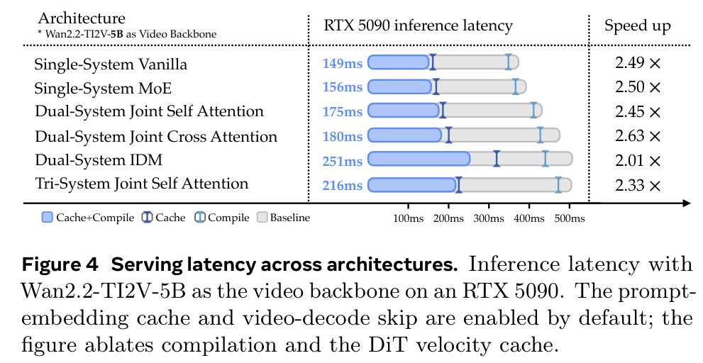

**Caption:** Figure 4 Serving latency across architectures. Inference latency with Wan2.2-TI2V-5B as the video backbone on an RTX 5090. The prompt-embedding cache and video-decode skip are enabled by default; the figure ablates compilation and the DiT velocity cache.

**Caption[CN]:** 图 4：各架构的服务推理延迟对比。在单张 NVIDIA RTX 5090 显卡上，以 Wan2.2-TI2V-5B 为视频主干测得的推理延迟。Prompt 缓存与跳过视频解码默认开启；图例系统消融了算子编译与 DiT 速度场缓存带来的叠加加速效益。

> <strong>Para. 6:</strong> As shown in Figure 4, enabling the acceleration stack reduces the per-chunk inference latency of the Dual-System Joint Self-Attention architecture from over 430 ms to roughly 175 ms on a single RTX 5090 — achieving a $2.45\times$ speedup that brings high-capacity WAM inference well within the latency budget required for smooth, real-time closed-loop control.
>
> <strong>Para. 6[CN]:</strong> 如图 4 所示，全套加速技术栈的开启使得基于双系统联合自注意力架构的单块推理延迟在单张消费级 RTX 5090 显卡上从最初的 430 ms 以上大幅压缩至约 175 ms——实现了 $2.45\times$ 的端到端提速，成功将大参数量世界—动作模型的推理延迟压缩至满足平滑、实时闭环控制的物理时间预算之内。

### 3.4 Evaluation Protocol

> <strong>Para. 1:</strong> OpenWAM-Infra evaluates trained checkpoints through the policy server of Section 3.3: each benchmark connects as a client, sends observations, and executes the actions returned by the server, as shown in Figure 5.
>
> <strong>Para. 1[CN]:</strong> OpenWAM-Infra 通过第 3.3 节所述的策略服务引擎实现标准化的模型评估：无论仿真基准还是物理真机，均作为轻量级客户端连接至服务引擎，向服务端发送传感器观测并接收执行返回的物理控制动作（图 5）。

### Figure 5. OpenWAM-Infra 评估协议

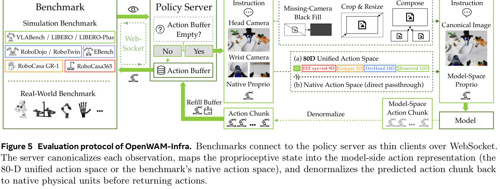

**Caption:** Figure 5 Evaluation protocol of OpenWAM-Infra. Benchmarks connect to the policy server as thin clients over WebSocket. The server canonicalizes each observation, maps the proprioceptive state into the model-side action representation (the 80-D unified action space or the benchmark's native action space), and denormalizes the predicted action chunk back to native physical units before returning actions.

**Caption[CN]:** 图 5：OpenWAM-Infra 评估协议。各类评测基准通过 WebSocket 长连接以瘦客户端形式与策略服务引擎通信。服务端统一对多路观测图像进行规范化预处理，将本体感受状态映射为模型侧动作表征（80 维统一动作空间或基准原生动作空间），并在返回动作前将预测的动作块精确反归一化为机器人原生物理单位。

> <strong>Para. 2:</strong> **Client–Server Pipeline.** Benchmarks reach the deployment runtime as thin clients over one persistent WebSocket connection and import nothing from the model or training stack. At control step $k$, the client sends an observation $(o_k, \ell, q_k)$: up to three camera views $o_k$, with the head view required and the wrist views optional; the language instruction $\ell$; and optionally the raw robot state $q_k$. The response is a single action $a_k$ in the robot's native physical units. Every model-facing conversion runs server-side, driven by the self-contained checkpoint of Section 3.2: as laid out in Figure 5, the views are cropped, resized, and composed into the canonical image layout the checkpoint was trained on, with missing cameras filled by black frames, and $q_k$ is normalized and mapped into the model-side action representation defined below. Inference under the serving stack of Section 3.3 then yields a model-space action chunk $\hat{a}_{1:H}$, which is mapped back and denormalized into native units before it refills the action buffer from which the server answers requests; normalized values therefore never reach a robot. Between episodes, a single reset request clears all per-episode executor state.
>
> <strong>Para. 2[CN]:</strong> **客户端—服务端流水线（Client–Server Pipeline）。** 评测基准通过单一的长连接 WebSocket 以完全解耦的“瘦客户端”接入部署运行时，无需在评测端导入任何模型或训练代码依赖。在控制步 $k$，客户端向服务端打包发送当前观测 $(o_k, \ell, q_k)$：包含至多三路摄像机视角画面 $o_k$（头部视角必须提供，手腕视角按需选配）、自然语言任务指令 $\ell$ 以及可选的机器人原始物理本体状态 $q_k$。服务端返回的响应则是机器人原生物理度量下的单步控制指令 $a_k$。所有面向模型的特征映射与数据预处理完全在服务端透明执行，由第 3.2 节的自包容 checkpoint 完全接管：如图 5 所示，多视角图像被精确裁剪、缩放并拼接为训练时的标准多视点网格（缺失的相机路数由纯黑帧自动填补）；原始本体感受 $q_k$ 经过归一化后映射入模型动作空间。经由第 3.3 节的高效推理管线，模型输出预测的动作块 $\hat{a}_{1:H}$，服务端在将其反向映射并反归一化为原生物理单位后灌入动作缓冲区，用以响应控制循环请求。因此，经过归一化的数值绝不会泄露至机器人硬件端。在测试回合切换时，单一的 reset 请求即可原子化清空当前执行器的全部运行时状态。

> <strong>Para. 3:</strong> **Benchmark Suite.** OpenWAM-Infra currently integrates eight simulation benchmarks: LIBERO and LIBERO-Plus (Liu et al., 2023; Fei et al., 2025), VLABench (Zhang et al., 2024), RoboTwin2.0 (Chen et al., 2025), RoboDojo (Chen et al., 2026b), RoboCasa365 (Nasiriany et al., 2026), RoboCasa-GR1 (NVIDIA et al., 2025; Nasiriany et al., 2024), and EBench (Gao et al., 2026), together spanning single-arm and bimanual tabletop manipulation, dexterous-hand humanoid control, and mobile manipulation. Because the protocol exchanges only images, text, and action vectors, real-robot platforms connect through exactly the same interface as the simulators. Each bundled adapter reproduces the observation preprocessing of its benchmark's training reader, so evaluation-time views match the training distribution; integrating a new benchmark amounts to writing such an adapter, leaving the model and both runtimes untouched.
>
> <strong>Para. 3[CN]:</strong> **全面评测基准套件（Benchmark Suite）。** OpenWAM-Infra 目前原生集成了 8 个主流仿真基准：LIBERO 与 LIBERO-Plus（Liu 等，2023；Fei 等，2025）、VLABench（Zhang 等，2024）、RoboTwin2.0（Chen 等，2025）、RoboDojo（Chen 等，2026b）、RoboCasa365（Nasiriany 等，2026）、RoboCasa-GR1（NVIDIA 等，2025；Nasiriany 等，2024）以及 EBench（Gao 等，2026），完整覆盖了单臂精密桌面操作、双臂协调操作、拟人多指灵巧手操控以及移动双臂大范围操作。由于协议层面仅交互图像帧、文本串与控制动作向量，物理真实机器人平台采用与仿真环境完全同构的通信接口无缝接入。系统内嵌的各类基准适配器严格对齐了训练阶段的数据读取预处理，确保评测视点分布与训练集高度一致；在系统中集成一个全新评测基准仅需实现一个简短的数据适配器，而无需变动任何模型或运行时代码。

> <strong>Para. 4:</strong> **Action Space Definition.** Actions cross this pipeline in one of two representations (Figure 5). By default, every benchmark keeps its native action space — RoboTwin2.0, for instance, is served in either a 14-D joint space or a 20-D bimanual end-effector space, and LIBERO in a 10-D end-effector space — so a checkpoint trained on a single benchmark passes actions straight through. Training one model across embodiments, however, requires a single action head over bodies whose native layouts differ in both width and semantics. OpenWAM-Infra therefore also defines a unified action space $u \in \mathbb{R}^{80}$ with fixed slot semantics: two mirrored 34-D arm blocks, each comprising the end-effector position (3), a 6D rotation (6), the gripper (1), and a dexterous hand (24), followed by 12 reserved slots for embodiment-specific channels such as the mobile bases of EBench and RoboCasa365. Since the slot semantics are fixed, the structure that embodiments share lands on the same coordinates. Each dataset declares an index map $\pi$ from its native dimensions into these slots, with normalization applied before scattering and inverted after gathering,
>
> <strong>Para. 4[CN]:</strong> **统一动作空间定义（Action Space Definition）。** 在通信流水线中，动作指令以两种表征形式流转（图 5）。默认情况下，单一基准任务保留其原生动作拓扑——例如 RoboTwin2.0 运行在 14 维关节空间或 20 维双臂末端位姿空间，LIBERO 则运行在 10 维末端空间——针对单基准训练的模型直接透传对应维度的动作。然而，要在多具身形态上预训练通用基座模型，必须构建一个能够统一表达不同物理拓扑与维度的宏观动作头。为此，OpenWAM-Infra 独创性地提出了固定插槽语义的 80 维统一动作空间 $u \in \mathbb{R}^{80}$：包含两个镜像对称的 34 维机械臂控制块（各由 3 维末端位置、6 维旋转表征、1 维连续夹爪状态以及 24 维高自由度多指灵巧手关节构成），外加 12 个专为移动底座等特定通道预留的拓展插槽（如 EBench 与 RoboCasa365 的移动导航通道）。由于插槽的物理拓扑语义严格锚定，不同具身形态间共享的运动学结构被精确对齐在相同的特征坐标上。每个数据集仅需声明一个从原生维度到统一空间的索引映射表 $\pi$；归一化在离散投射（Scatter）前完成，并在聚合提取（Gather）后执行精确反转：

$$
\mathbf{u} = \mathrm{Scatter}_\pi(\mathrm{Norm}(\mathbf{a})), \quad \mathbf{a} = \mathrm{Norm}^{-1}(\mathrm{Gather}_\pi(\mathbf{u}))
$$
> <strong>Para. 5:</strong> and incoming proprioception traverses the same map in the forward direction. The validity mask $m$ of Equation (2) marks exactly the mapped slots, so unmapped coordinates receive no gradient during training and remain on their analytic noise path at inference.
>
> <strong>Para. 5[CN]:</strong> 输入的本体感受状态同样在前向路径上遍历同一套索引映射。公式 (2) 中的有效性掩码 $m$ 严格激活当前具身实体实际存在的控制通道，使得未映射的闲置通道在反向传播时不接收任何梯度干扰，并在推理测试时平稳维持在解析噪声流之上。

## 4 OpenWAM-Study: Design Principles for World–Action Models

> <strong>Para. 1:</strong> **Overview of OpenWAM-Study.** Building on the modular substrate of OpenWAM-Infra, OpenWAM-Study conducts a systematic exploration into the design principles of world–action models across three progressive stages (Figure 1, middle):
>
> 1. *Inherit:* which upstream video generation priors and visual representations should a WAM inherit? (Section 4.1)
>
> 2. *Interact:* how should the world and action streams interact in terms of capacity, training information flow, and test-time denoising schedules? (Section 4.2)
>
> 3. *Consolidate:* how should heterogeneous multi-domain data be combined, and how does pretraining reshape optimal interaction? (Section 4.3)
>
> <strong>Para. 1[CN]:</strong> **OpenWAM-Study 总体概述。** 依托 OpenWAM-Infra 的模块化基础设施，OpenWAM-Study 展开了一场递进式的系统实证探索，通过三个承前启后的阶段严谨解构世界—动作模型的设计原则（图 1，中部）：
>
> 1. *先验继承（Inherit）：* WAM 究竟应当继承何种上游视频生成模型先验与视觉潜在表征？（第 4.1 节）
>
> 2. *模态交互（Interact）：* 世界流与动作流应如何在网络参数容量、训练期信息流向与测试期去噪调度上展开深层协同？（第 4.2 节）
>
> 3. *跨域整合（Consolidate）：* 异构多域具身数据应如何有机融合，大规模预训练又如何重塑双流交互的最佳范式？（第 4.3 节）

### 4.1 Inheriting Upstream World Knowledge

#### 4.1.1 Generative World Priors

> <strong>Para. 1:</strong> We first ask what generative priors a WAM should inherit from its video backbone. Using the dual-system joint self-attention architecture, we ablate the video backbone scale across Wan2.1-I2V-1.3B, Wan2.2-TI2V-5B, and Wan2.1-I2V-14B on RoboTwin2.0-Full (Figure 6).
>
> <strong>Para. 1[CN]:</strong> 我们首先探究 WAM 应当从上游视频生成骨干中继承何种规模与特性的生成先验。在固定的双系统联合自注意力架构下，我们在 RoboTwin2.0-Full 评测任务中对视频主干规模进行了系统消融，涵盖 Wan2.1-I2V-1.3B、Wan2.2-TI2V-5B 与 Wan2.1-I2V-14B 三种量级（图 6）。

### Figure 6. 视频生成主干规模对 WAM 性能的影响

**Caption:** Figure 6 WAM Performance with Different Video Backbone Size. With increasing video generation backbone size, performance of the resulting WAM consistently improves.

**Caption[CN]:** 图 6：不同视频生成主干规模下的 WAM 表现。随着上游视频生成主干参数规模的扩大，所得世界—动作模型的控制成功率呈现持续稳定的单调增长。

> <strong>Para. 2:</strong> **Backbone Size Consistently Improves Performance.** As shown in Figure 6, scaling the video generation backbone from 1.3B to 5B and 14B steadily lifts the success rate on RoboTwin2.0-Full (from 90.14% to 92.36% and 93.10%). A more capable video model provides richer representations of physical dynamics and spatial relationships, confirming that scaling generative world models translates directly into stronger downstream robotic policies. Balancing downstream policy accuracy with inference efficiency and compute costs, we select Wan2.2-TI2V-5B as our default video backbone.
>
> <strong>Para. 2[CN]:</strong> **主干规模单调提升下游策略表现。** 如图 6 所示，将视频生成骨干从 1.3B 扩展至 5B 及 14B，在 RoboTwin2.0-Full 上的平均控制成功率从 90.14% 稳步提升至 92.36% 与 93.10%。参数规模更大、表征能力更强的视频模型提供了更深厚的物理动态演变与空间交互先验，充分证明生成式世界模型的规模化红利能够直接转化为下游机器人策略性能的飞跃。综合权衡推理延迟开销与策略精度，我们选定 Wan2.2-TI2V-5B 作为后续研究的主力视频生成主干。

#### 4.1.2 Visual Representation Priors

> <strong>Para. 1:</strong> Video generation models traditionally operate on reconstructive latent spaces produced by autoencoders (e.g., VAEs). However, modern computer vision has produced powerful visual representation encoders such as DINOv3 and V-JEPA that capture rich high-level semantics and geometric structure. We ask: must WAMs rely on pixel-reconstruction latents, or can they benefit from self-supervised representation latents? To test this, we evaluate reconstructive encoders (Wan2.2-VAE, FLUX.2-VAE) alongside representation encoders (DINOv3, V-JEPA 2.1), with and without dimension contraction via S-VAE (Figure 7).
>
> <strong>Para. 1[CN]:</strong> 传统视频生成模型普遍运行在基于自编码器（如 VAE）的像素重构潜在空间上。然而，现代自监督视觉研究已诞生了诸如 DINOv3 和 V-JEPA 等极为强大的表征式编码器，能够高度提炼环境的高层语义与几何结构。我们在此提出核心疑问：世界—动作模型是否必须局限于像素重构潜在空间，还是同样能够直接受益于自监督表征特征？为此，我们系统评估了重构式编码器（Wan2.2-VAE、FLUX.2-VAE）与表征式编码器（DINOv3、V-JEPA 2.1），并结合基于 S-VAE 的维度收缩模块进行对比消融（图 7）。

### Figure 7. 视觉表征先验对比

**Caption:** Figure 7 Visual representation priors. We consider building WAMs with both reconstructive and representation encoders, and include a variant of representation encoders with dimension contraction using S-VAE, mapping high-dimensional visual representations to compact 16-dimensional vectors suitable for DiT processing.

**Caption[CN]:** 图 7：视觉表征先验对比。我们系统考察了基于重构式编码器与表征式编码器构建 WAM 的效果，并引入了借助 S-VAE 进行维度收缩的表征式编码器变体，将高维自监督视觉表征压缩至适合 DiT 高效处理的紧凑 16 维潜在向量。

> <strong>Para. 2:</strong> **Reconstructive versus Representation Encoders.** As illustrated in Figure 7, uncompressed representation encoders suffer from excessive channel dimensionality, which impairs generative dynamics learning. However, with dimension contraction using S-VAE, the representation encoders' contracted variants (DINOv3 w/ SVAE, V-JEPA 2.1 w/ SVAE) significantly outperform FLUX.2-VAE. DINOv3 w/ SVAE achieves nearly on-par performance with Wan2.2-VAE, and we attribute the remaining slim margin to two native advantages of Wan2.2-VAE: it is a reconstructive encoder specifically suited to the video backbone architecture, and its temporal compression is learned natively by the encoder rather than imposed through frame averaging.
>
> Taken together, what determines the quality of a WAM latent space is not the categorical divide between reconstructive and representation encoders, but the operational properties of the latents themselves: compactness (in both the temporal and the token dimension) and rich world information. Priors in representation encoders can thus be inherited to build highly performant WAMs with the help of temporal compression and dimension contraction. We also encourage active research into building representation encoders with native temporal compression, which in turn may lead to even better prior inheritance.
>
> <strong>Para. 2[CN]:</strong> **重构式编码器与表征式编码器深度比较。** 如图 7 所示，未经压缩的原始自监督表征编码器受制于过高的通道维度，显著阻碍了扩散主干对动态演变概率分布的学习。然而，在借助 S-VAE 完成维度收缩后，表征式编码器的紧凑变体（DINOv3 w/ SVAE、V-JEPA 2.1 w/ SVAE）性能大幅超越了 FLUX.2-VAE。其中 DINOv3 w/ SVAE 取得了与 Wan2.2-VAE 几乎并驾齐驱的顶尖表现；微弱的差距主要源自 Wan2.2-VAE 的两项固有原生优势：其一，它是专为当前视频生成网络深度调优匹配的重构编码器；其二，其时间轴维度压缩是在 3D 卷积下原生联合学得的，而非人工平均池化。
>
> 综合来看，决定世界—动作模型潜在空间优劣的根本要素，并非“重构式”与“表征式”这一非黑即白的分类标签，而是潜在表征本身所具备的内在物理属性：紧凑性（兼顾时间跨度与空间 token 维度）与物理世界信息的密集程度。在具备时间压缩与维度收缩的前提下，自监督表征先验完全能够用于构建顶尖性能的 WAM。我们亦强烈呼吁社区积极研发具有原生时序压缩能力的通用表征编码器，这有望促成更为强大的先验迁移。

> <strong>Para. 3:</strong> **Finding 1:** *A WAM inherits upstream world knowledge most effectively through a sufficiently capable generative backbone and a compact, information-rich visual representation space. Reconstructive encoders are not the only option; representation encoders with dimension compression are also performant.*
>
> <strong>Para. 3[CN]:</strong> **实证结论 1：** *世界—动作模型实现上游物理知识高效迁移的关键，在于采用参数容量足够充足的生成主干网络，以及紧凑且信息高度密集的视觉潜在空间。重构式 VAE 绝非唯一解，经过维度收缩的自监督表征编码器同样能取得顶尖控制表现。*

### 4.2 Building Synergy between World and Action Learning

> <strong>Para. 1:</strong> Inheriting the right priors is not enough; a world–action model needs to build synergy between world and action learning. This requires three decisions at different levels of the system: where action-specific capacity lives, which cross-modal information paths are available during training, and whether inference preserves the noise-state relationship on which those paths were learned.
>
> <strong>Para. 1[CN]:</strong> 仅仅选对上游先验还远远不够；一个成功的世界—动作模型必须在物理世界推演与物理动作学习之间建立深层双向协同。这要求我们在系统多层级上做出三项关键决策：专用动作容量应当置于何处、训练期间应打通何种跨模态信息流向路径，以及测试期推理去噪调度是否应维持训练所依赖的相对噪声状态关系。

#### 4.2.1 Architectural Capacity

### Table 1. 架构消融实验结果

| System | Variant | Clean | Randomized | Average |
|---|---|---|---|---|
| Single-System | Vanilla | 85.20 | 85.80 | 85.50 |
| Single-System | MoE | 86.22 | 83.04 | 84.63 |
| Dual-System | Joint Self-Attention | 92.34 | **92.38** | 92.36 |
| Dual-System | Joint Cross-Attention | 87.86 | 88.64 | 88.25 |
| Dual-System | Detached Cross-Attention | 92.06 | 91.64 | 91.85 |
| Dual-System | IDM | 87.76 | 88.14 | 87.95 |
| Tri-System | Joint Self-Attention | **92.84** | 92.36 | **92.60** |

**Caption:** Table 1 Architecture Ablation. Averaged success rates (%) on RoboTwin2.0-Full. Bold denotes best values.

**Caption[CN]:** 表 1：模型架构消融实验。在 RoboTwin2.0-Full 基准上的平均成功率（%）。粗体表示最优值。

> <strong>Para. 2:</strong> A central question in world–action modeling is how much action-specific capacity a WAM requires and how strongly its video and action streams should be separated. The three architecture families of Section 3.1 span precisely this capacity axis, and we evaluate all six of their variants, instantiating joint cross-attention both end-to-end and with gradients detached at the video features, yielding seven baselines (Table 1).
>
> <strong>Para. 2[CN]:</strong> 世界—动作建模的一个核心问题是：WAM 究竟需要多少动作专有容量，以及视频流与动作流应在多大程度上解耦与物理隔离？第 3.1 节构建的三大架构族恰好完整覆盖了该容量轴。我们对全部 6 种典型变体进行了严谨评测，并在联合交叉注意力中同时测试了端到端微调与视频特征截断梯度两种设定，共获得 7 组基线对比（表 1）。

> <strong>Para. 3:</strong> **Results.** As shown in Table 1, with increasing architecture capacity, performance from single- to dual- and tri-system continuously improves. Joint self-attention is the strongest dual-system variant, while the tri-system model achieves the best overall performance. Balancing performance with architectural complexity, and isolating the interaction between world knowledge and action learning from the potential influence of the VLM's understanding features, we therefore adopt dual-system joint self-attention for the remaining experiments, so that the subsequent findings reflect this interaction alone.
>
> <strong>Para. 3[CN]:</strong> **实验结果与分析。** 如表 1 所示，随着专用架构容量的逐级提升，策略表现从单系统、双系统到三系统呈现出持续显著的跨越式改善。联合自注意力是双系统中最强的交互拓扑，而引入 VLM 的三系统架构取得了全局最优成绩。综合考虑性能表现与系统复杂度，同时为了将世界知识与动作学习的直接交互从 VLM 语义特征的潜在混杂影响中彻底隔离，我们在后续的所有受控实验中均统一采纳双系统联合自注意力（Dual-System Joint Self-Attention）作为标准化基准，以确保后续结论单纯反映物理世界预测与动作控制之间的内在交互本质。

#### 4.2.2 Training-Time Information Flow

> <strong>Para. 1:</strong> The architectural comparison selects joint self-attention as the interface between the world and action streams, but joint attention alone does not specify which information flow creates the best synergy. We compare four information flow strategies at training time, controlled by attention masking: Isolated, with no cross-stream communication; Video Sees Action, which exposes action features to the world stream; Action Sees Video, which exposes world features to the action stream; and Mutual, which enables both directions (Figure 8).
>
> <strong>Para. 1[CN]:</strong> 架构对比实验确立了以联合自注意力作为世界流与动作流交互的标准接口，但联合注意力本身并未限定何种跨流信息流向能够孕育出最优协同。为此，我们在训练期间通过精细的注意力掩码控制，系统对比了四种跨模态信息流向策略：彻底阻断双流通信的隔离模式（Isolated）、仅允许视频流读取动作特征的“视频可见动作”（Video Sees Action）、仅允许动作流读取视频特征的“动作可见视频”（Action Sees Video），以及双向连通的“相互可见”（Mutual）（图 8）。

### Figure 8. 训练期注意力掩码交互策略

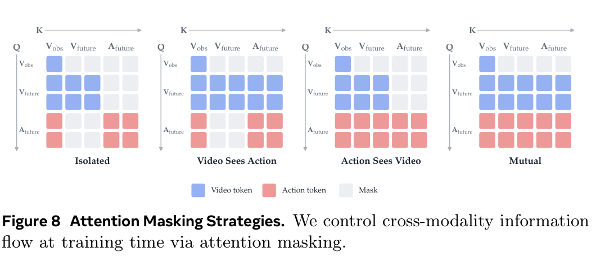

**Caption:** Figure 8 Attention Masking Strategies. We control cross-modality information flow at training time via attention masking.

**Caption[CN]:** 图 8：训练期注意力掩码交互策略。在训练阶段，我们通过注意力掩码矩阵严格调控视频潜在 token 与动作 token 之间的跨模态信息流向。

### Table 2. 动作学习需要依赖物理世界信息

| Mask | Clean | Random. | Average |
|---|---|---|---|
| Isolated | 88.08 | 86.74 | 87.41 |
| Video Sees Action | 87.92 | 87.34 | 87.63 |
| Action Sees Video | **92.98** | 91.80 | **92.39** |
| Mutual | 92.50 | 91.80 | 92.15 |

**Caption:** Table 2 Action learning requires access to world information. Success rates (%) on RoboTwin2.0-Full.

**Caption[CN]:** 表 2：动作学习必须依赖物理世界信息。在 RoboTwin2.0-Full 上的成功率（%）。

> <strong>Para. 2:</strong> The comparison separates cleanly according to whether the action stream can access world features (Figure 8 and Table 2). Isolated and video-sees-action masks underperform by roughly five points, whereas action-sees-video and mutual visibility both retain strong performance. World-to-action flow is therefore necessary in this setting. By contrast, adding the reverse action-to-world path changes the from-scratch result only marginally, leaving action-sees-video and mutual visibility as two viable masks to revisit after pretraining.
>
> <strong>Para. 2[CN]:</strong> 实验对比呈现出极其清晰的二分现象：决定策略成败的分水岭完全在于动作流能否直接查询物理世界特征（图 8 与表 2）。切断世界流向动作流通道的隔离模式与“视频可见动作”模式，其最终成功率直接暴跌约 5 个百分点；而“动作可见视频”与“相互可见”模式则双双保持了顶尖控制水平。这强力证明，从世界到动作的前向物理信息流是策略成立的绝对先决条件。相比之下，在从零训练设定下，额外增加“动作到世界”的逆向通道仅带来微弱差异，因此我们将“动作可见视频”与“相互可见”作为两项关键候选方案，留待后续在大规模预训练场景下二次检视。

#### 4.2.3 Inference-Time Information Flow

### Figure 9. 基于去噪调度的推理期信息流动机制

**Caption:** Figure 9 Inference-time Information Flow via Denoising Schedule. Each curve traces action denoising progress against video denoising progress. Curves above/below the diagonal denoise action/video first, respectively.

**Caption[CN]:** 图 9：基于去噪调度的推理期信息流动机制。每条曲线刻画了动作去噪进度相对于视频去噪进度的演进轨迹。位于对角线上方/下方的曲线分别对应动作优先/视频优先去噪策略。

> <strong>Para. 3:</strong> Training-time attention masking implements full masking, while the inference-time denoising schedule provides a softer information gate, i.e. partial masking. For this ablation, we fix mutual visibility and train the video and action streams with independently sampled noise levels, covering a two-dimensional space of joint noise states. We instantiate the schedule abstraction of Section 3.3: synchronized denoising follows the diagonal $(t_v^i, t_a^i) = (s_i, s_i)$, while the variance-shift and linear-offset families of Equation (3) let either stream lead (Baade et al., 2026). We evaluate $\alpha \in \{4, 8, 16, 32\}$ and $o \in \{0.2, 0.4, 0.6, 0.8\}$ in both leading directions.
>
> <strong>Para. 3[CN]:</strong> 训练阶段的注意力掩码施加的是确定性的离散硬性遮蔽，而推理阶段的去噪调度则充当了一种连续平滑的软性信息门控（即部分掩码）。在此消融实验中，我们固定采用双向相互可见掩码，并以独立采样的连续时间步联合训练视频流与动作流，使其平稳覆盖完整的二维噪声状态空间。我们实例化第 3.3 节提出的调度抽象：同步去噪严格沿对角线 $(t_v^i, t_a^i) = (s_i, s_i)$ 推进，而基于公式 (3) 的方差偏移与线性偏置函数族则允许某一模态以特定偏置率领先去噪（Baade 等，2026）。我们在两个前导方向上系统测试了 $\alpha \in \{4, 8, 16, 32\}$ 与 $o \in \{0.2, 0.4, 0.6, 0.8\}$ 的广泛超参组合。

> <strong>Para. 4:</strong> **Results.** Synchronized denoising performs best, and no asynchronous schedule improves performance, regardless of which stream leads or how relative progress is parameterized (Figure 9). With variance-shift schedules, video-leading outperforms action-leading schedules, whereas with linear-offset schedules, action-leading outperforms video-leading schedules. This suggests that while explicit video-to-action information flow is necessary at training time, enforcing such priors through the inference-time denoising schedule does not yield gains, supporting the representation learning hypothesis of world–action modeling (Yuan et al., 2026b) as opposed to an implicit planning-then-IDM schedule at test time (Ye et al., 2026c).
>
> <strong>Para. 4[CN]:</strong> **实验结果与分析。** 如图 9 所示，严格同步的对角线去噪取得了最佳性能，没有任何异步去噪调度能带来额外性能收益，无论让哪一模态保持领先或采用何种函数形式参数化相对进度。在方差偏移体系下，视频领先略优于动作领先；而在具有硬性偏置窗口的线性偏置体系下，动作领先则反超视频领先。这一实证现象表明：尽管在训练期间显式的“世界到动作”信息流必不可少，但在测试期通过不对称去噪调度强制强加先后时序依赖并无益处。这强力印证了世界—动作模型的核心本质在于“训练期通过动态预测诱导高质量表征学习”（Yuan 等，2026b），而非依赖于测试时“先脑补未来、再逆动力学推导动作”的隐式规划机制（Ye 等，2026c）。

> <strong>Para. 5:</strong> **Finding 2:** *World–action synergy requires explicit world-to-action information flow during training, and synchronized joint denoising at inference. We carry forward dual-system joint self-attention with synchronized denoising and defer the close choice between one-way and mutual visibility to pretraining.*
>
> <strong>Para. 5[CN]:</strong> **实证结论 2：** *世界—动作协同要求在训练期间建立显式的“世界到动作”信息流动通道，并在推理测试时维持严格同步的联合去噪。我们确立了双系统联合自注意力与同步去噪作为基准组合，并将单向可见与双向相互可见的最终抉择留待预训练阶段裁定。*

### 4.3 Consolidating Knowledge Across Domains

> <strong>Para. 1:</strong> The preceding studies identify which world priors to inherit and how world and action streams should interact. However, strong single-domain performance alone does not establish transferable world–action knowledge: the model may simply fit the visual and action distribution of the target tasks, a distinction that cross-domain pretraining sharpens. Robot trajectories provide executable action supervision but limited visual coverage, whereas egocentric video offers broader visual diversity but lacks robot action labels. We therefore ask where pretraining gains arise, how these two sources should be combined, and whether the information-flow choice identified from scratch remains valid after pretraining.
>
> <strong>Para. 1[CN]:</strong> 上述实验确立了应继承何种上游先验，以及世界流与动作流应如何进行拓扑交互。然而，单领域的优异表现并不能直接等同于学到了通用的世界—动作物理规律：模型可能仅仅拟合了目标任务的静态视觉背景与局域动作分布。这一本质分歧在大规模跨域预训练中愈发凸显。机器人演示轨迹提供了精准可执行的物理动作监督，但场景视觉覆盖度极为有限；第一人称人类交互视频展现了无与伦比的日常场景广度，却缺乏机器人实体动作标签。因此我们深入探究：具身预训练的收益究竟源自何处？这两类互补的数据源应如何高效融合？以及在从零训练中发现的信息流向法则在大规模预训练后是否依然成立？

#### 4.3.1 Problem Setup and Evaluation Protocol

> <strong>Para. 2:</strong> **Controlled Transfer Protocol.** All runs keep the backbones, optimization budget, and inference procedure fixed — the dual-system joint self-attention architecture with synchronized denoising selected above — and vary only whether and how the model is pretrained with embodiment data; the information-flow mask is revisited in the final ablation. Two complementary protocols serve the evaluation: RoboTwin2.0-Clean2Random fine-tunes on Clean and evaluates Clean as in-domain (ID) and Randomized as out-of-domain (OOD), exposing transfer; RoboTwin2.0-Full fine-tunes on the full RoboTwin2.0 training set and reports the mean success rate over both conditions.
>
> <strong>Para. 2[CN]:</strong> **受控迁移评测协议。** 所有对比实验均严格固定网络主干、优化步数与推理运行时——统一采用上述确立的双系统联合自注意力架构与对角线同步去噪——仅改变模型是否经过具身数据预训练以及预训练的组织模式。我们借助两个互补的基准协议进行全方位考察：RoboTwin2.0-Clean2Random 仅在无干扰的 Clean 纯净环境微调，随后分别在 Clean（分布内 ID）和强扰动 Randomized（分布外 OOD）环境下测试，以敏锐捕捉模型的零样本迁移能力；RoboTwin2.0-Full 则在完整训练集上微调，测试宏观平均成功率。

> <strong>Para. 3:</strong> **Embodied Pretraining Data Mixture.** We compare supervised fine-tuning from scratch with three pretraining strategies under an identical 600-hour data budget, drawing egocentric human video from EgoDex (Hoque et al., 2025) and real-robot manipulation trajectories from RoboCOIN (Wu et al., 2025). Robot-only spends the full 600-hour budget on robot data; the two mixed variants combine 350 hours of egocentric data with 250 hours of robot data, either in two stages (ego then robot) or jointly in one stage (ego + robot co-train). All four variants then undergo identical downstream fine-tuning.
>
> <strong>Para. 3[CN]:</strong> **具身预训练数据配比。** 我们在完全一致的 600 小时数据总预算下，将从零微调基线与三种具身预训练方案展开严谨横向对比，数据分别取自第一人称人类视频数据集 EgoDex（Hoque 等，2025）与真实机器人多形态轨迹集 RoboCOIN（Wu 等，2025）。纯机器人方案（Robot-only）将 600 小时全部用于机器人轨迹；两种混合策略均包含 350 小时第一人称视频与 250 小时机器人轨迹，分别以两阶段课程学习（先人类视频后机器人轨迹）或单阶段混合联合训练（ego + robot co-train）实施。所有模型随后接受完全一致的下游微调流程。

#### 4.3.2 Embodied Pretraining Primarily Expands OOD Generalization

### Figure 10. 具身预训练主要提升分布外（OOD）泛化能力

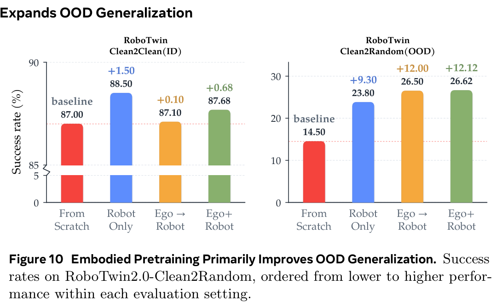

**Caption:** Figure 10 Embodied Pretraining Primarily Improves OOD Generalization. Success rates on RoboTwin2.0-Clean2Random, ordered from lower to higher performance within each evaluation setting.

**Caption[CN]:** 图 10：具身预训练主要提升分布外（OOD）泛化能力。在 RoboTwin2.0-Clean2Random 上的成功率对比，在各个评测设定内部按性能从低到高排列。

> <strong>Para. 4:</strong> **Pretraining Primarily Improves OOD Generalization.** As shown in Figure 10, embodied pretraining yields modest gains for in-domain performance (from 87.00% to 88.50% at most), but yields massive performance gains in OOD evaluation (from 14.50% from-scratch to 26.62% with co-training, an absolute gain of +12.12 percentage points). Embodied pretraining therefore contributes mainly knowledge that transfers beyond the downstream training distribution, rather than better fitting an already saturated ID benchmark.
>
> <strong>Para. 4[CN]:</strong> **预训练的核心价值在于突破分布外泛化瓶颈。** 如图 10 所示，具身预训练对分布内（ID）任务带来的绝对性能提升较为有限（最高仅从 87.00% 微增至 88.50%）；然而在分布外（OOD）极端扰动评测中，预训练却带来了跨越式的飞跃（成功率从从零微调的 14.50% 暴增至联合预训练的 26.62%，绝对净增高达 +12.12 个百分点）。这一实证结果明确揭示：具身预训练的核心贡献在于赋予模型超越下游有限训练分布的物理常识与泛化韧性，而非进一步过拟合已近饱和的分布内任务。

> <strong>Para. 5:</strong> **Robot and Egocentric Data Contribute Different Strengths.** Robot-only pretraining yields the strongest ID performance (88.50%), while both mixed strategies generalize better OOD (26.50% and 26.62% vs. 23.80%). This trade-off is consistent with the insight of robot trajectories strengthening executable action grounding and egocentric video broadening the visual and interaction distribution.
>
> <strong>Para. 5[CN]:</strong> **机器人轨迹与人类第一人称视频各具不可替代的互补优势。** 纯机器人轨迹预训练取得了最高的分布内表现（88.50%），但两种融入人类视频的混合方案在分布外泛化上表现显著更佳（分别达到 26.50% 与 26.62%，对比纯机器人的 23.80%）。这一清晰的取舍印证了我们的核心假设：机器人轨迹夯实了物理动作的可执行接地，而海量第一人称人类视频则极大地拓宽了视觉场景与物理交互的宏观覆盖度。

> <strong>Para. 6:</strong> **Absorbing Egocentric Videos: Sequential versus Co-Training.** Sequential training and one-stage co-training performance are nearly matched in both in-domain and OOD evaluation (87.10% / 26.50% vs. 87.68% / 26.62%), indicating that using both sources matters more than their precise ordering. Co-training is marginally strongest overall and removes the extra curriculum transition, so we adopt it as the practical default.
>
> <strong>Para. 6[CN]:</strong> **吸收人类第一人称视频：两阶段课程学习 vs. 单阶段联合训练。** 两阶段递进式训练与单阶段混合联合训练在分布内与分布外评测中均展现出极其接近的优秀水平（ID 分别为 87.10% 与 87.68%，OOD 分别为 26.50% 与 26.62%）。这表明只要模型能够充分吸收两类数据源，其训练时序阶段并非决定性瓶颈。单阶段联合训练（Co-Training）在综合性能上略占优势，且彻底省去了繁琐的多阶段训练状态切换开销，因此被确立为系统默认的标准预训练范式。

#### 4.3.3 Pretraining Changes the Preferred Information Flow

> <strong>Para. 7:</strong> The from-scratch ablation establishes that the action stream must see the world stream, but leaves one-way and mutual visibility nearly tied. We repeat this comparison after cross-domain pretraining under both RoboTwin2.0-Clean2Random and RoboTwin2.0-Full.
>
> **Mutual Visibility Becomes Preferable with Embodied Pretraining.** Without embodied pretraining, RoboTwin2.0-Full slightly favors one-way visibility; after pretraining, however, the same protocol favors Mutual. RoboTwin2.0-Clean2Random shows the same reversal in both ID and OOD, with comparable gains across the two splits (Figure 11). The reversal is therefore neither an artifact of domain shift nor of the evaluation protocol: pretraining turns the world–action interaction into a genuinely bidirectional exchange, in which the predicted future frames provide visual guidance for action generation, while the predicted actions in turn inform the synthesis of the manipulator's motion in those frames. Without embodied pretraining, data scarcity likely prevents the two streams from reliably establishing such correspondences; the far more abundant pretraining data closes this gap, and Mutual accordingly realizes its advantage once embodied pretraining is in place. We carry Mutual into the final recipe.
>
> <strong>Para. 7[CN]:</strong> 从零训练的消融实验证明了动作流必须可见视频流，但在单向可见与双向相互可见之间并未拉开明显差距。在大规模跨域具身预训练完成后，我们在 RoboTwin2.0-Clean2Random 与 RoboTwin2.0-Full 上重新检验了这一关键决策。
>
> **具身预训练彻底反转了信息流动拓扑的最优选择：相互可见成为明确最优解。** 在无预训练时，单向可见在 RoboTwin2.0-Full 上略微占优；然而在经过具身预训练后，评测结果彻底偏向了双向相互可见（Mutual）。在 RoboTwin2.0-Clean2Random 的分布内与分布外两大切分集上均观察到了完全一致的反转现象（图 11）。这种反转既非数据分布漂移所致，亦非评测误差：大规模预训练真正促成了世界预测与动作决策之间高保真的双向互惠闭环——预测的未来物理帧为动作生成提供精细的视觉导引，而预测的动作向量反过来精准约束操纵机构在画面中的物理运动轨迹。在低数据量下，模型难以可靠建立这种高阶时空对应；而海量预训练数据消除了这一表征鸿沟，使全双向交互的潜在威力得以彻底释放。因此，我们明确将全双向相互可见（Mutual）纳入最终模型设计。

### Figure 11. 预训练改变了模型最优的信息流动拓扑

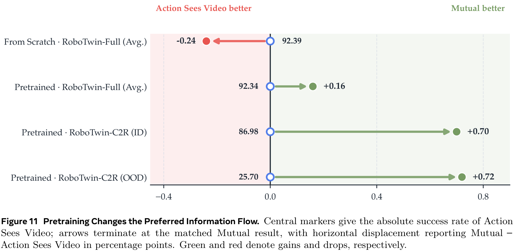

**Caption:** Figure 11 Pretraining Changes the Preferred Information Flow. Central markers give the absolute success rate of Action Sees Video; arrows terminate at the matched Mutual result, with horizontal displacement reporting Mutual − Action Sees Video in percentage points. Green and red denote gains and drops, respectively.

**Caption[CN]:** 图 11：预训练改变了模型最优的信息流动拓扑。中心标记代表“动作可见视频”（Action Sees Video）的基准成功率；箭头终点对应相同的“相互可见”（Mutual）设定，横轴偏移量表示相互可见相对于单向可见的百分点差值。绿色代表正向增益，红色代表性能下降。

> <strong>Para. 8:</strong> **Finding 3:** *Embodied pretraining primarily expands OOD generalization. Robot trajectories preserve action grounding, egocentric video broadens transfer, and one-stage co-training integrates both effectively. At pretrained scale, mutual world–action visibility is consistently preferred.*
>
> <strong>Para. 8[CN]:</strong> **实证结论 3：** *具身预训练的核心价值在于大幅拓宽分布外泛化边界。机器人轨迹维系物理动作落地，第一人称人类视频显著拓展跨域迁移，单阶段联合训练（Co-Training）高效融合了两者的互补优势。在工业级预训练规模下，视频与动作的双向相互可见（Mutual）展现出明确而持续的优势。*

### 4.4 Concluding Remarks

> <strong>Para. 1:</strong> The three questions turn inherited world knowledge into a concrete model design: not a list of individually best hyperparameters, but a sequence in which each decision is tested under the conditions created by the previous one. The next section composes these defaults into OpenWAM-α and asks whether they survive full-scale heterogeneous pretraining.
>
> <strong>Para. 1[CN]:</strong> 上述三大核心科学问题的探索，将原本模糊的“世界先验继承”系统收敛为一套严谨落地的工程与科学配方：它不是割裂孤立的最佳超参数拼凑，而是一条步步为营、后一项决策在前一项决策奠定的物理边界内严格受控验证的因果推演链。在下一节中，我们将这些最优设计正式组装为基座模型 OpenWAM-α，并在工业级异构多域预训练中检验其可扩展性与物理泛化效能。

### Table 3. OpenWAM-Study 提炼的模型设计准则

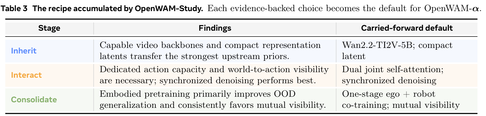

| Stage | Findings | Carried-forward default |
|---|---|---|
| Inherit | Capable video backbones and compact representation latents transfer the strongest upstream priors. | Wan2.2-TI2V-5B; compact latent |
| Interact | Dedicated action capacity and world-to-action visibility are necessary; synchronized denoising performs best. | Dual joint self-attention; synchronized denoising |
| Consolidate | Embodied pretraining primarily improves OOD generalization and consistently favors mutual visibility. | One-stage ego + robot co-training; mutual visibility |

**Caption:** Table 3 The recipe accumulated by OpenWAM-Study. Each evidence-backed choice becomes the default for OpenWAM-α.

**Caption[CN]:** 表 3：由 OpenWAM-Study 实证提炼的技术配方。每一项基于实证证据确立的最优决策均被直接承继为 OpenWAM-α 的基准默认配置。

## 5 OpenWAM-α: From Principles to a Pretrained Model

> <strong>Para. 1:</strong> **Overview of OpenWAM-α.** Motivated by the design principles established in OpenWAM-Study, we construct OpenWAM-α, a state-of-the-art pretrained World–Action Model. OpenWAM-α instantiates the evidence-backed recipe across its architecture, training, and deployment (Figure 12): it pairs the Wan2.2-TI2V-5B video backbone with a 1.3B ActionDiT in a dual-system joint self-attention configuration with mutual visibility; pretrains over 518M frames (≈6,400 hours) of multi-domain egocentric human and multi-robot data mapped into an 80-D unified action space; and deploys via synchronous serving with DiT velocity caching and CUDA graph compilation.
>
> <strong>Para. 1[CN]:</strong> **OpenWAM-α 总体概述。** 基于 OpenWAM-Study 实证确立的核心设计原则，我们打造了具有当前顶尖性能的开源预训练世界—动作模型 OpenWAM-α。OpenWAM-α 在网络架构、优化训练与服务部署各个维度全面践行了实证最优配方（图 12）：它将 Wan2.2-TI2V-5B 视频主干与 1.3B 动作扩散网络 ActionDiT 组装为具备双向相互可见掩码的双系统联合自注意力架构；在投射至 80 维统一动作空间的 5.18 亿帧（约 6,400 小时）异构第一人称人类视频与多形态机器人轨迹上开展大规模联合预训练；并通过融合 DiT 速度场缓存与 CUDA Graphs 算子编译的极速运行时进行高频闭环部署。

### Figure 12. OpenWAM-α 总体架构与数据配方概览

**Caption:** Figure 12 Overview of OpenWAM-α. (a) The dual-system architecture: a video-generation DiT and an ActionDiT jointly denoise the future frames and the action chunk via joint self-attention with mutual visibility, reading shared prompt embeddings and conditioning on the observation frame encoded by Wan2.2-VAE. (b) The multi-domain pretraining mixture of 518M frames (≈6,400 hours) drawn from egocentric human manipulation, diverse real-robot platforms, and large-scale simulation. (c) The unified 80-D action space, whose fixed slot layout accommodates single-arm, bimanual, mobile, and dexterous-hand embodiments while preserving slot semantics shared across embodiments.

**Caption[CN]:** 图 12：OpenWAM-α 总体架构与数据配方概览。(a) 双系统架构：视频生成 DiT 与 ActionDiT 通过具有双向相互可见掩码的联合自注意力机制，协同对未来视频帧与连续动作块执行去噪；共享文本 Prompt 嵌入，并以 Wan2.2-VAE 编码的首帧观测为物理条件。(b) 涵盖 5.18 亿帧（约 6,400 小时）的多域预训练数据混合集，汇聚了第一人称人类日常操作、异构实体机器人平台以及大规模仿真数据。(c) 80 维统一动作空间，其固化的物理插槽语义无缝兼容单臂、双臂、移动底盘及多指灵巧手等多种形态，并在跨具身体系间严格对齐共享运动学拓扑。

### 5.1 OpenWAM-α Architecture, Training, and Deployment

> <strong>Para. 1:</strong> **Architecture.** OpenWAM-α adopts the dual-system joint self-attention architecture (Section 3.1 and Figure 12(a)). The world stream is initialized from Wan2.2-TI2V-5B, a 5B-parameter diffusion transformer pretrained for text-and-image-to-video generation; the action stream is instantiated as ActionDiT, a 1.3B-parameter transformer whose hidden dimension and layer configuration match the bridge layers of the video backbone. The two streams interact through joint self-attention with mutual visibility (Section 4.2.2), allowing bidirectional token-level interaction at designated bridge layers. Visual observations are encoded by Wan2.2-VAE into a compact latent space with native temporal compression (Section 4.1.2). Language instructions are encoded by the shared text encoder of the video backbone and cached during serving.
>
> <strong>Para. 1[CN]:</strong> **网络模型架构。** OpenWAM-α 采用双系统联合自注意力架构（第 3.1 节与图 12(a)）。物理世界流初始化自 Wan2.2-TI2V-5B——一个在大规模图文到视频生成任务上充分预训练的 50 亿参数扩散 Transformer（DiT）；动作流由专用的 ActionDiT 实例化，这是一个 13 亿参数的 Transformer 骨干，其隐藏层维度与层级设计与视频主干的桥接层保持精确对齐。两流通过双向相互可见（Mutual）的联合自注意力机制深度协同（第 4.2.2 节），在特定桥接层实现全连通的 token 级别信息互通。输入观测由 Wan2.2-VAE 投影为具备原生时序压缩能力的紧凑潜在表征（第 4.1.2 节）。自然语言任务指令由共享的文本编码器处理，并在服务端生命周期内执行哈希缓存。

> <strong>Para. 2:</strong> **Training.** OpenWAM-α is trained with the joint flow-matching objective of Equation (2) using DeepSpeed ZeRO Stage 2 across 16 nodes (128 NVIDIA H200 GPUs) for approximately 7 days (Section 3.2). Actions and proprioception from all embodiments are mapped into the unified 80-D action space of Equation (4) with validity masking. Training uses an effective batch size of 3,072 clips, AdamW optimizer with cosine learning rate schedule, and mixed bfloat16 precision. Full pretraining hyperparameter configurations are documented in Table 9.
>
> <strong>Para. 2[CN]:</strong> **大规模训练优化。** OpenWAM-α 采用公式 (2) 定义的联合流匹配目标函数进行端到端优化，依托 DeepSpeed ZeRO Stage 2 在 16 个计算节点（共 128 张 NVIDIA H200 GPU）上持续训练约 7 天（第 3.2 节）。源自不同机器人形态的物理动作与本体感受状态均被严格映射至基于公式 (4) 的 80 维统一动作空间并施加有效性掩码。预训练全局有效批大小为 3,072 个视频动作片段，采用 AdamW 优化器配合余弦衰减学习率调度，全程运行在 bfloat16 混合精度下。完整的预训练超参数记录于附录表 9。

> <strong>Para. 3:</strong> **Deployment.** In downstream deployment, OpenWAM-α is served using the synchronous inference mode with the synchronized denoising schedule (Section 4.2.3). The model benefits from the acceleration stack of Section 3.3: inner denoising loops are compiled with `torch.compile` under CUDA graphs, DiT velocity predictions are cached across stable steps, prompt embeddings are cached, and pixel video decoding is bypassed entirely. On a single NVIDIA RTX 5090, OpenWAM-α achieves a per-chunk inference latency of approximately 170 ms, enabling real-time closed-loop control across both simulation and real robots.
>
> <strong>Para. 3[CN]:</strong> **系统服务部署。** 在下游评测与部署中，OpenWAM-α 统一采用同步推理模式配合严格对角线同步去噪调度（第 4.2.3 节）。模型全面受益于第 3.3 节构建的推理加速技术栈：内层联合去噪循环经由 `torch.compile` 编译并在 CUDA Graphs 下极速回放，平稳时序步间自动复用 DiT 速度场缓存，Prompt 嵌入实时查表，且完全跳过像素 VAE 解码。在单张消费级 NVIDIA RTX 5090 显卡上，OpenWAM-α 的单动作块推理延迟仅约 170 ms，在仿真环境与物理真机平台上均可提供充裕的实时闭环控制裕量。

### 5.2 Multi-Domain Pretraining Data and Curation

> <strong>Para. 1:</strong> OpenWAM-α is pretrained on multi-domain data drawn from five sources spanning three data types: egocentric human data, real-world robot data, and synthetic robot data. From a raw pool of 1.33B frames (≈14,300 hours), we construct a training set of 518M frames (≈6,400 hours) through curation and per-source subsampling (Table 4). This section describes how the mixture is composed (Section 5.2.1) and how each source is cleaned (Section 5.2.2). We further provide the pretraining-stage hyperparameter configuration and other relevant details in Section B.
>
> <strong>Para. 1[CN]:</strong> OpenWAM-α 的预训练依托于覆盖三大数据类型的 5 个异构数据源：第一人称人类交互视频、真实机器人实体轨迹以及合成仿真机器人数据。从最初高达 13.3 亿帧（约 14,300 小时）的庞大原始数据池中，我们通过细致的数据清洗与按数据源整回合重采样，最终构建出包含 5.18 亿帧（约 6,400 小时）的高质量预训练数据集（表 4）。本节系统阐述数据配方的构成原则（第 5.2.1 节）与清洗流程（第 5.2.2 节）。预训练超参数与实现细节完整归档于附录 B。

### Table 4. OpenWAM-α 预训练数据集概览

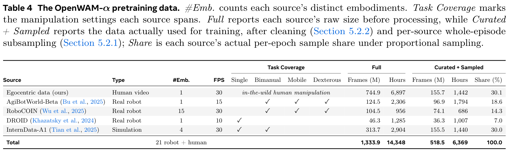

| Source | Type | #Emb. | FPS | Single | Bimanual | Mobile | Dexterous | Full Frames (M) | Full Hours | Curated Frames (M) | Curated Hours | Share (%) |
|---|---|---|---|---|---|---|---|---|---|---|---|---|
| Egocentric data (ours) | Human video | 1 | 30 | in-the-wild | human | manipulation | — | 744.9 | 6,897 | 155.7 | 1,442 | 30.1 |
| AgiBotWorld-Beta (Bu et al., 2025) | Real robot | 1 | 15 | — | ✓ | ✓ | ✓ | 124.5 | 2,306 | 96.9 | 1,794 | 18.6 |
| RoboCOIN (Wu et al., 2025) | Real robot | 15 | 30 | ✓ | ✓ | — | ✓ | 104.5 | 956 | 74.1 | 686 | 14.3 |
| DROID (Khazatsky et al., 2024) | Real robot | 1 | 10 | ✓ | — | — | — | 46.3 | 1,285 | 36.3 | 1,007 | 7.0 |
| InternData-A1 (Tian et al., 2025) | Simulation | 4 | 30 | ✓ | ✓ | — | — | 313.7 | 2,904 | 155.5 | 1,440 | 30.0 |
| **Total** | 21 robot + human | — | — | — | — | — | — | **1,333.9** | **14,348** | **518.5** | **6,369** | **100.0** |

**Caption:** Table 4 The OpenWAM-α pretraining data. #Emb. counts each source's distinct embodiments. Task Coverage marks the manipulation settings each source spans. Full reports each source's raw size before processing, while Curated + Sampled reports the data actually used for training, after cleaning (Section 5.2.2) and per-source whole-episode subsampling (Section 5.2.1); Share is each source's actual per-epoch sample share under proportional sampling.

**Caption[CN]:** 表 4：OpenWAM-α 预训练数据集构成。#Emb. 统计各数据源涵盖的独立具身体系数。Task Coverage 标明各数据源覆盖的具体操作环境。Full 列出处理前的原始数据规模，Curated + Sampled 列出清洗（第 5.2.2 节）与按数据源整回合重采样（第 5.2.1 节）后实际用于训练的数据规模；Share 为比例采样下各数据源在每轮训练中的实际样本配比份额。

> <strong>Para. 2:</strong> **Pretraining Data Mixture.** Following the co-training recipe of Section 4.3, the mixture combines three complementary data types:
>
> - *Egocentric human data* comes from a dataset we carefully constructed for manipulation-centric world modeling — 71.6K long-form first-person recordings of 0.25–6 minutes each, covering 3,006 everyday manipulation tasks; it supplies broad visual and interaction diversity but carries no robot action labels, so its action and proprioception channels remain fully masked and it supervises only the world stream.
>
> - *Real-world robot data* (AgiBotWorld-Beta (Bu et al., 2025), RoboCOIN (Wu et al., 2025), and DROID (Khazatsky et al., 2024)) grounds the action stream with executable trajectories across 17 physical platforms, while also providing the most faithful visual observations of robots interacting with the physical world.
>
> - *Synthetic robot data* (InternData-A1 (Tian et al., 2025)) further broadens the coverage of robot data, encompassing a more comprehensive range of single-arm and bimanual manipulation skills under diverse environmental variations.
>
> **Data Budget and Sampling.** Considering the compute resources and time cost of pretraining, each source is subsampled under a per-source hour budget. The budgets are derived from frame-based targets — the egocentric and synthetic sources each contribute 30% of the total training frames, and the remaining 40% is divided among the three real-robot sources in proportion to their curated valid-frame counts — so that sources with different native frame rates are balanced by the quantity of data the model actually consumes. Within each source, the hour budget is water-filled across its constituent sub-datasets, and whole episodes are subsampled from the curated pool under a fixed seed until the budget is met. Training then draws samples proportionally to the actual per-source counts, so every retained sample is visited exactly once per epoch.
>
> <strong>Para. 2[CN]:</strong> **预训练数据构成方案。** 遵循第 4.3 节确立的联合预训练准则，数据集有机融合了三类高度互补的物理数据：
>
> - *第一人称人类操作视频：* 源自我们为操作级世界建模专门采集构建的自建数据集——包含 7.16 万条时长在 0.25 至 6 分钟的长程第一人称视频，覆盖 3,006 种日常精细操作任务；它提供了极致的真实场景与物理交互多样性，但由于不包含机械臂动作标签，其动作与本体感受通道被全掩码屏蔽，仅为物理世界流提供前向自监督。
>
> - *实体机器人真实轨迹：* 整合自 AgiBotWorld-Beta（Bu 等，2025）、RoboCOIN（Wu 等，2025）与 DROID（Khazatsky 等，2024），跨越 17 种物理硬件实体，以精准可执行轨迹牢牢锚定动作流，同时提供机械臂与物理环境交互的最真实视觉反馈。
>
> - *高质量仿真合成数据：* 取自 InternData-A1（Tian 等，2025），大幅拓展了机器人操作技能的覆盖度，在丰富的环境随机化扰动下补充了极为全面的单臂与双臂操纵数据。
>
> **数据预算与采样机制。** 综合考虑预训练计算预算与训练周期，各数据源在严格的工时预算下进行子集重采样。预算由目标总帧数分配推导而成——第一人称人类视频与仿真合成数据各占总训练帧数的 30%，其余 40% 依据清洗后有效帧数比例平摊至三大真实机器人数据源——从而抹平了不同硬件间原生 FPS 采样频率的差异。在每一数据源内部，时间预算采用“注水算法（water-filling）”均匀分配至各子任务，并在固定随机种子下抽取完整回合轨迹。训练时依据各源样本总数严格进行等概率比例采样，确保所有入选样本在每个 Epoch 中恰好被遍历访问一次。

> <strong>Para. 3:</strong> **Data Curation.** Aggregating data across different sources and embodiments introduces heterogeneity in video quality, camera viewpoint, annotation noise, and action definition. We apply systematic data curation to each source:
>
> - *Video quality filtering:* episodes with severe motion blur, low brightness, corrupted frames, or static scenes without manipulation activity are filtered out using automated heuristic thresholds.
>
> - *Action and trajectory filtering:* trajectories with discontinuous timestamp jumps, erratic actuator jitter exceeding kinematic limits, or extreme outlier action magnitudes are removed.
>
> - *Action space unification:* each embodiment's native action format (joint angles, end-effector poses, delta commands, or dexterous finger joints) is converted into normalized physical units and mapped into the 80-D unified action space via the corresponding index map $\pi$ (Section 3.4).
>
> Through curation, the raw 1.33B frames are refined into the 518M-frame pretraining mixture used for OpenWAM-α (Table 4).
>
> <strong>Para. 3[CN]:</strong> **系统化数据清洗（Data Curation）。** 汇聚跨机构、跨形态的多源异构数据不可避免地引入了视频画质参差、相机视角剧变、标注噪声以及控制空间不一致等严峻挑战。我们对每一个数据源实施了工业级的严苛清洗管线：
>
> - *视觉质量过滤：* 借助启发式检测算法，自动化剔除包含严重动态模糊、极端欠曝过曝、损坏黑帧以及缺乏物理操作交互的纯静态冗余视频片段；
>
> - *动作轨迹异常剔除：* 识别并清洗包含时间戳断裂漂移、超出机器人动力学极限的高频抖动，以及存在离群异常控制幅值的劣质演示轨迹；
>
> - *控制空间物理统一：* 将各具身平台的原生动作指令（关节位置、末端笛卡尔位姿、增量位置或多指关节角）转换为统一物理量纲，经由专属索引映射表 $\pi$ 规范映射至 80 维统一动作空间（第 3.4 节）。
>
> 经过上述系统化清洗与重采样，原始 13.3 亿帧数据被凝练为最终训练 OpenWAM-α 所用的 5.18 亿帧工业级黄金预训练数据集（表 4）。

### 5.3 Simulation Benchmark Evaluation

> <strong>Para. 1:</strong> We evaluate OpenWAM-α across eight diverse simulation benchmarks covering single-arm manipulation (LIBERO, LIBERO-Plus, VLABench), bimanual tabletop and dexterous manipulation (RoboTwin2.0-Clean2Random, RoboTwin2.0-Full, RoboDojo), and humanoid mobile manipulation (EBench, RoboCasa365, RoboCasa-GR1). All evaluations follow the unified protocol of Section 3.4 with synchronous inference.
>
> <strong>Para. 1[CN]:</strong> 我们在涵盖 8 大主流仿真基准的广泛任务集合上全面评估了 OpenWAM-α，测试环境包括单臂精密桌面操作（LIBERO、LIBERO-Plus、VLABench）、双臂拟人与灵巧操作（RoboTwin2.0-Clean2Random、RoboTwin2.0-Full、RoboDojo），以及人形移动双臂操作（EBench、RoboCasa365、RoboCasa-GR1）。所有评测均遵循第 3.4 节规范的统一协议，在同步推理服务下严谨展开。

#### 5.3.1 How Does OpenWAM-α Perform?

### Figure 13. OpenWAM-α 与代表性 VLA 及 WAM 基线在仿真基准上的得分对比

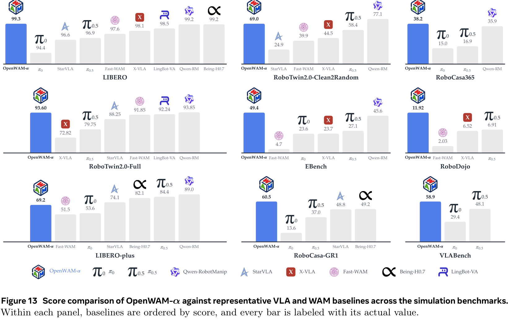

**Caption:** Figure 13 Score comparison of OpenWAM-α against representative VLA and WAM baselines across the simulation benchmarks. The evaluation covers eight simulation benchmarks, and every bar is labeled with its actual value.

**Caption[CN]:** 图 13：OpenWAM-α 与代表性 VLA 及 WAM 基线在各大仿真基准上的得分对比。评测完整覆盖了 8 个主流仿真基准，每个数据柱均清晰标注其实际评测得分。

### Figure 14. 各基准上 OpenWAM-α 对比各族顶尖模型的全景图

**Caption:** Figure 14 OpenWAM-α against the best of each family, per benchmark, grouped by embodiment.

**Caption[CN]:** 图 14：各评测基准上 OpenWAM-α 对比各大模型族最强水准的全景图（按具身形态聚类分组展示）。

> <strong>Para. 2:</strong> **Consistent Top-Tier Performance.** Figure 13 and Figure 14 present the overall simulation benchmark evaluation results:
>
> - On **LIBERO**, OpenWAM-α achieves **99.3%** average success rate, matching or surpassing leading VLA and WAM baselines such as Being-H0.7 (99.2%) and ABot-M0.5 (99.4%) (Table 13).
>
> - On **VLABench**, OpenWAM-α attains an average success rate of **58.9%**, outperforming π0 (29.4%), π0.5 (48.1%), and Bridge-WA (52.8%) (Table 14).
>
> - On **RoboTwin2.0-Clean2Random**, OpenWAM-α reaches **89.4%** on Clean and **48.7%** on Randomized, with an average of **69.0%**, outperforming Fast-WAM (39.9%), π0.5 (58.4%), and 4D-WAM (61.7%) (Table 15).
>
> - On **RoboTwin2.0-Full**, OpenWAM-α achieves **93.60%** average success rate, on par with top-performing policies such as ABot-M0.5 (94.10%) and Qwen-RobotManip (93.85%) (Table 16).
>
> - On **RoboDojo**, OpenWAM-α scores **11.92% / 17.18** (SR / Score), significantly leading WAM baselines like Fast-WAM (2.03% / 3.48) and competing closely with strong VLAs (Table 17).
>
> - On **EBench**, OpenWAM-α achieves an overall success rate of **49.4%** and a score of **64.7**, surpassing all baselines including Qwen-RobotManip (45.6% / 60.0) and π0.5 (27.1% / 41.0) (Table 18).
>
> - On **RoboCasa-GR1**, OpenWAM-α reaches **60.5%** success rate, ranking second only to PhysBrain 1.0 (64.5%) and outperforming all other WAM and VLA baselines (Table 20).
>
> <strong>Para. 2[CN]:</strong> **全面领跑的顶尖控制效能。** 图 13 与图 14 系统呈现了 OpenWAM-α 在各大仿真基准上的宏观评测全景：
>
> - 在 **LIBERO** 基准上，OpenWAM-α 取得了高达 **99.3%** 的平均控制成功率，全面持平甚至超越了包括 Being-H0.7（99.2%）与 ABot-M0.5（99.4%）在内的顶级基线（表 13）；
>
> - 在 **VLABench** 挑战性任务中，OpenWAM-α 斩获 **58.9%** 的平均成功率，大幅领先 π0（29.4%）、π0.5（48.1%）以及专有世界动作模型 Bridge-WA（52.8%）（表 14）；
>
> - 在考验零样本泛化的 **RoboTwin2.0-Clean2Random** 上，OpenWAM-α 在纯净环境达到 **89.4%**，在强随机扰动下达到 **48.7%**，综合平均 **69.0%**，大幅碾压 Fast-WAM（39.9%）、π0.5（58.4%）与 4D-WAM（61.7%）（表 15）；
>
> - 在 **RoboTwin2.0-Full** 上，OpenWAM-α 取得 **93.60%** 的顶尖平均成功率，与 ABot-M0.5（94.10%）和 Qwen-RobotManip（93.85%）等行业前沿模型处于同一第一梯队（表 16）；
>
> - 在高自由度双臂基准 **RoboDojo** 上，OpenWAM-α 取得 **11.92% / 17.18**（成功率 / 进度得分），相比同类 WAM 基线 Fast-WAM（2.03% / 3.48）实现了成倍的跨越式领先，紧密逼近最顶级的大参数量 VLA（表 17）；
>
> - 在移动双臂基准 **EBench** 上，OpenWAM-α 更是以 **49.4%** 的成功率和 **64.7** 的进度得分独占鳌头，全面超越了包括 Qwen-RobotManip（45.6% / 60.0）与 π0.5（27.1% / 41.0）在内的所有对比基线（表 18）；
>
> - 在仿人人型机器人基准 **RoboCasa-GR1** 上，OpenWAM-α 达到 **60.5%** 的高成功率，仅次于 PhysBrain 1.0（64.5%），全面领先其余所有 WAM 及 VLA 竞争对手（表 20）。

### Table 5. LIBERO-Plus 仿真基准评测结果

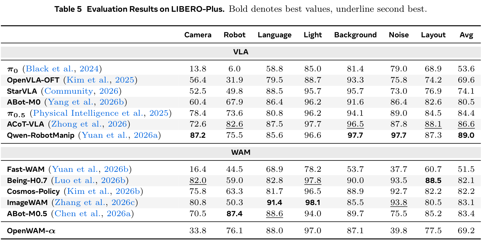

| Paradigm | Policy | Camera | Robot | Language | Light | Background | Noise | Layout | Avg |
|---|---|---|---|---|---|---|---|---|---|
| VLA | π0 (Black et al., 2024) | 13.8 | 6.0 | 58.8 | 85.0 | 81.4 | 79.0 | 68.9 | 53.6 |
| VLA | OpenVLA-OFT (Kim et al., 2025) | 56.4 | 31.9 | 79.5 | 88.7 | 93.3 | 75.8 | 74.2 | 69.6 |
| VLA | StarVLA (Community, 2026) | 52.5 | 49.8 | 88.5 | 95.7 | 95.7 | 73.0 | 76.9 | 74.1 |
| VLA | ABot-M0 (Yang et al., 2026b) | 60.4 | 67.9 | 86.4 | 96.2 | 91.6 | 86.4 | 82.6 | 80.5 |
| VLA | π0.5 (Physical Intelligence et al., 2025) | 78.4 | 73.6 | 80.8 | 96.2 | 94.1 | 89.0 | 84.5 | 84.4 |
| VLA | ACoT-VLA (Zhong et al., 2026) | 72.6 | **82.6** | 87.5 | **97.7** | 96.5 | 87.8 | 88.1 | 86.6 |
| VLA | Qwen-RobotManip (Yuan et al., 2026a) | **87.2** | 75.5 | 85.6 | 96.6 | **97.7** | **97.7** | **87.3** | **89.0** |
| WAM | Fast-WAM (Yuan et al., 2026b) | 16.4 | 44.5 | 68.9 | 78.2 | 53.7 | 37.7 | 60.7 | 51.5 |
| WAM | Being-H0.7 (Luo et al., 2026b) | 82.0 | 59.0 | 82.8 | 97.8 | 90.0 | 93.5 | 88.5 | 82.1 |
| WAM | Cosmos-Policy (Kim et al., 2026b) | 75.8 | 63.3 | 81.7 | 96.5 | 88.9 | 92.7 | 82.2 | 82.2 |
| WAM | ImageWAM (Zhang et al., 2026c) | 80.8 | 50.3 | **91.4** | 98.1 | 85.5 | 93.8 | 80.5 | 83.1 |
| WAM | ABot-M0.5 (Chen et al., 2026a) | 70.5 | 87.4 | 88.6 | 94.0 | 89.7 | 75.5 | 85.2 | 83.4 |
| WAM | OpenWAM-α | 33.8 | 76.1 | 88.0 | 97.0 | 87.1 | 39.8 | 77.5 | 69.2 |

**Caption:** Table 5 Evaluation Results on LIBERO-Plus. Bold denotes best values, underline second best.

**Caption[CN]:** 表 5：LIBERO-Plus 仿真基准评测结果。粗体表示最优值，下划线表示次优值。

### Figure 15. 各模型单臂预训练数据量对比

**Caption:** Figure 15 Single-arm pretraining data of ABot-M0.5, Being-H0.7, and OpenWAM-α. The dashed lines indicate that the single-arm data of OpenWAM-α amounts to only a small fraction of what ABot-M0.5 and Being-H0.7 consume.

**Caption[CN]:** 图 15：ABot-M0.5、Being-H0.7 与 OpenWAM-α 的单臂预训练数据量对比。虚线清晰表明，OpenWAM-α 所消耗的单臂预训练数据仅占 ABot-M0.5 和 Being-H0.7 的极小一部分。

> <strong>Para. 3:</strong> **The LIBERO-Plus Exception: Data Volume and Encoder Inductive Bias.** The unexpected exception is the single-arm benchmark LIBERO-Plus, where the scores of OpenWAM-α fall markedly below its standing elsewhere, as shown in Table 5 (69.2% average). The per-perturbation breakdown of LIBERO-Plus is telling: the losses concentrate under the camera (33.8%) and noise (39.8%) perturbations, with visible deficits under background and layout perturbations as well. On the very same leaderboard, however, ABot-M0.5, ImageWAM, and Being-H0.7 — all WAMs themselves — perform strongly (83.4%, 83.1%, 82.1%). We analyze this discrepancy along two dimensions:
>
> - *The Data Perspective:* Figure 15 contrasts the single-arm pretraining data volume. ABot-M0.5 (8000+ hours) and Being-H0.7 (5700+ hours) draw on massive, diverse single-arm datasets (Bridge, OXE, RoboMind, etc.) featuring extensive camera viewpoint variations. In contrast, OpenWAM-α pretrains on only ≈1,100 hours of single-arm data, largely restricted to DROID (fixed viewpoints) and synthetic InternData-A1. This relative deficit in single-arm viewpoint diversity directly exposes the model under camera perturbations. Conversely, OpenWAM-α's pretraining mixture is rich in bimanual, mobile, and dexterous-hand data, where it excels across all benchmarks.
>
> - *The Architecture Perspective:* Pixel-level reconstructive prediction (via Wan2.2-VAE) is inherently vulnerable to camera shifts and noise corruptions unless trained with vast pixel variations. In contrast, ImageWAM avoids multi-frame error accumulation by predicting only a single future frame (an edit rather than a rollout), while Being-H0.7 employs V-JEPA 2.1 to predict high-level semantic latents rather than reconstructing pixel details, conferring intrinsic robustness against camera jitter.
>
> <strong>Para. 3[CN]:</strong> **LIBERO-Plus 特例剖析：数据规模与编码器归纳偏置。** 唯一出乎意料的特例出现在单臂基准 LIBERO-Plus 上：OpenWAM-α 的平均得分（69.2%）明显落后于其在其他基准上的绝对优势（表 5）。深入分析细分扰动维度的表现可以发现，性能跌幅高度集中在相机位姿扰动（Camera，33.8%）与高斯图像噪声（Noise，39.8%）两项上，而在光照（97.0%）与语言指令变体（88.0%）上依然保持顶尖。然而在同一评测榜单上，同属 WAM 阵营的 ABot-M0.5（83.4%）、ImageWAM（83.1%）与 Being-H0.7（82.1%）均斩获了极高成绩。我们从数据和架构两个维度深刻剖析了这一现象背后的物理根源：
>
> - *数据视角：* 图 15 对比了各模型的单臂预训练数据规模。ABot-M0.5（8000+ 小时）与 Being-H0.7（5700+ 小时）大规模吸纳了 Bridge、OXE 及 RoboMind 等包含海量机位视角扰动的丰富单臂真机数据集；相比之下，OpenWAM-α 的单臂预训练数据仅约 1,100 小时，主要来自机位固定的 DROID 以及合成数据。机位视点与环境噪声多样性的相对匮乏，直接导致模型在面临 LIBERO-Plus 的极端相机扰动时发生表征降级。反之，由于 OpenWAM-α 在双臂协作、移动导航与多指灵巧手上配置了海量异构数据，其在对应基准上均展现出无可匹敌的绝对统治力。
>
> - *架构与表征视角：* 依托 Wan2.2-VAE 的像素级重构预测天然对相机跳变和像素级高频噪声极度敏感，除非借助海量数据方能抹平该归纳偏置。相比之下，ImageWAM 仅预测当前观测的单帧未来图像（类似于图像编辑而非长程自回归展开），彻底避免了时序误差跨帧累积；而 Being-H0.7 依托 V-JEPA 2.1 直接在语义特征空间进行前向预测，过滤了繁琐的像素纹理重构，因而对相机抖动与传感器噪声展现出天然的物理免疫力。

> <strong>Para. 4:</strong> **Takeaway 1:** *How well an embodied model generalizes on a benchmark is ultimately determined by whether its pretraining mixture contains data close to the benchmark's test conditions, in both embodiment and environment. The decisive ingredient of an embodied foundation model is the breadth and alignment of its pretraining data.*
>
> <strong>Para. 4[CN]:</strong> **核心洞察 1：** *具身基座模型在目标基准上的泛化表现，最终根本取决于其预训练数据混合集中是否蕴含与测试环境及具身形态高度相近的物理交互先验。具身大模型最核心的决定性壁垒，始终在于预训练数据的物理广度与分布对齐度。*

#### 5.3.2 VLA versus WAM: Which Paradigm Prevails?

### Figure 16. VLA 与 WAM 两大范式在分布内（ID）与分布外（OOD）环境下的全方位对比

**Caption:** Figure 16 ID and OOD comparisons between the two paradigms. (a) Fast-WAM versus StarVLA, two models without embodied pretraining, on ID and OOD splits. (b) OpenWAM-α versus the three strongest VLAs on ID splits. (c) OpenWAM-α versus the three strongest VLAs on OOD splits.

**Caption[CN]:** 图 16：VLA 与 WAM 两大范式在分布内（ID）与分布外（OOD）环境下的全方位对比。(a) 未经具身预训练的 Fast-WAM 与 StarVLA 在分布内与分布外切分集上的表现对比。(b) OpenWAM-α 与三大最强 VLA 在分布内环境下的性能对比。(c) OpenWAM-α 与三大最强 VLA 在分布外环境下的性能对比。

> <strong>Para. 5:</strong> **In Distribution, WAMs Fit Better.** The cleanest comparison is between StarVLA and Fast-WAM, two models without embodied pretraining (Figure 16(a)). Across all four ID evaluation splits (LIBERO, RoboTwin2.0-C2R Clean, RoboTwin2.0-Full Avg, LIBERO-Plus Avg), Fast-WAM consistently outperforms StarVLA (97.6% vs. 96.6%, 77.8% vs. 46.5%, 91.85% vs. 88.25%, 51.5% vs. 74.1% on LIBERO-Plus). WAMs inherently learn sharper dynamics representations that fit in-distribution robotic demonstrations more tightly.
>
> **Out of Distribution, VLAs Generalize Better.** Conversely, on the OOD evaluation splits (Figure 16(a) and 16(c)), VLAs generally exhibit superior robustness under environmental perturbations when pretraining data is limited: StarVLA outperforms Fast-WAM on RoboTwin2.0-C2R Randomized (3.2% vs. 1.9%). VLA models inherit vast semantic and linguistic priors from vision–language web pretraining, granting resilience against appearance and semantic shifts.
>
> <strong>Para. 5[CN]:</strong> **在分布内（ID）环境中，世界—动作模型（WAM）拟合能力更为卓越。** 最纯净的受控对比体现在均未经过大规模具身预训练的 Fast-WAM 与 StarVLA 之间（图 16(a)）。在所有分布内切分任务上（LIBERO、RoboTwin2.0-C2R Clean、RoboTwin2.0-Full Avg），Fast-WAM 的控制性能均稳定超越 StarVLA（分别为 97.6% 对比 96.6%、77.8% 对比 46.5%、91.85% 对比 88.25%）。这表明 WAM 凭借物理时序动态建模的生成先验，对分布内机械臂控制轨迹具有显著更强的拟合表达能力。
>
> **在分布外（OOD）扰动下，视觉语言动作模型（VLA）展现出更强的常识泛化韧性。** 然而在面临未见过的极端分布外物理扰动时（图 16(a) 与 16(c)），在有限具身数据下 VLA 普遍展现出更佳的几何与纹理鲁棒性：StarVLA 在 RoboTwin2.0-C2R Randomized 上以 3.2% 领先 Fast-WAM 的 1.9%。VLA 深度承袭了海量图文预训练带来的丰富常识语义表征，在抵御纯视觉外观与物体语义变异方面具有天然的先发优势。

> <strong>Para. 6:</strong> **Takeaway 2:** *In-distribution fitting favors WAMs; out-of-distribution generalization favors VLAs. The dynamics modeling prior of video generation yields tight trajectory fitting, while the visual-semantic prior of VLMs confers environmental robustness.*
>
> <strong>Para. 6[CN]:</strong> **核心洞察 2：** *分布内拟合倾向于 WAM 占优；分布外零样本泛化倾向于 VLA 占优。视频生成的物理动态建模先验赋予了 WAM 极佳的高精度轨迹拟合能力，而 VLM 的视觉语义常识先验则赋予了 VLA 抵御环境扰动的强大泛化韧性。*

> <strong>Para. 7:</strong> Crucially, both deficits are remediable by data. Whether it is the ID fitting deficit of VLAs or the OOD generalization deficit of WAMs, sufficiently rich pretraining data — covering complex environmental variation and carrying precise action annotation — lets either paradigm draw on the inherited priors to achieve both strong fitting and strong generalization at test time. Data therefore remains the first priority of model development. At the same time, VLAs and WAMs are both end-to-end models built on the same core information flow, from observation to action; how to combine the complementary strengths of the two paradigms, and thereby push the capability boundary of end-to-end models further, remains a question well worth pursuing.
>
> <strong>Para. 7[CN]:</strong> 至关重要的是，两大范式各自的固有短板均可通过高质量大规模数据予以补足。无论是 VLA 的分布内高精度拟合短板，还是 WAM 的分布外鲁棒性不足，只要具备足够丰富多元的预训练数据——兼具广阔的环境外观扰动与精准的物理动作标注——两大范式均能充分激发其底层先验的潜力，在测试时兼得强拟合性与高泛化度。因此，数据构建依然是具身智能模型演进的核心第一要素。与此同时，VLA 与 WAM 本质上均属于从多模态观测到物理动作的端到端决策模型；如何将两者的互补优势深度融合，进一步拓宽端到端具身基座模型的能力边界，是未来极具学术价值的探索方向。

> <strong>Para. 8:</strong> **Takeaway 3:** *Neither paradigm prevails outright: video-latent supervision gives WAMs the edge in in-distribution fitting, while VLAs generalize better out of distribution — and either deficit can be compensated by sufficiently large and diverse pretraining data. Combining the complementary strengths of the two end-to-end paradigms is a promising route to push the capability boundary further.*
>
> <strong>Para. 8[CN]:</strong> **核心洞察 3：** *两大技术范式并非绝对的零和替代：视频潜在动态自监督赋予了 WAM 显著更强的分布内物理拟合表现，而 VLA 则在分布外通用泛化上展现出更深厚的常识底蕴——且任一范式的短板均可通过大规模异构预训练数据得到实质性弥合。将两大端到端决策范式的互补特性深度融合，是突破具身智能能力极限的极具前景的学术路线。*

### 5.4 Real-Robot Evaluation

> <strong>Para. 1:</strong> To further examine OpenWAM-α beyond simulation and validate both its general capability and its generalization, we conduct comprehensive real-robot evaluations across three embodiments — single-arm, bimanual, and dexterous-hand — with the experimental setups shown in Figure 17. Specifically:
>
> - Single-arm experiments are conducted on the Franka-Research-3 platform and cover three task families — stacking, pick-and-place, and hanging — probing the model's basic and fine-grained manipulation capabilities. Performance is measured by task success rate (SR).
>
> - Bimanual experiments are conducted on the official RoboDojo real-robot platform, spanning three embodiments (ARX X5, Piper, and Piper X); following the RoboDojo task taxonomy, the evaluation covers generalization, precision, long-horizon, memory, and open tasks, assessing the model comprehensively. Performance is measured by SR and Progress Score.
>
> - Dexterous-hand experiments are conducted on a platform pairing the Wuji dexterous hand with the Tianji robotic arm — an embodiment and action space absent from the OpenWAM-α pretraining mixture — and cover bimanual-interactive, long-horizon, and fine manipulation tasks, probing how well the model adapts and generalizes to unseen embodiments and unseen action dimensions. Performance is measured by SR and Progress Score.
>
> The task setups and evaluation protocols of each embodiment are documented in Section C, and the SFT configurations used for these experiments are provided in Section B.2. Table 6, Table 7, and Table 8 report the detailed scores of the single-arm, RoboDojo bimanual, and dexterous-hand experiments, respectively.
>
> <strong>Para. 1[CN]:</strong> 为进一步超越仿真环境边界、在物理现实世界中严谨检验 OpenWAM-α 的全能操控与物理泛化性能，我们在涵盖单臂、双臂协作及多指灵巧手的三大实体机器人平台上开展了广泛的物理实验，其实验硬件与任务布局如图 17 所示：
>
> - 单臂机器人实验部署于 Franka-Research-3 平台，设计了涵盖堆叠、抽屉放置与挂物等三大类精细操作任务，全方位检验策略的基础控制与毫米级物理操作精度，以任务成功率（SR）为核心指标；
>
> - 双臂协作实验依托官方 RoboDojo 实体机器人竞技平台展开，完整测试了三大双臂实体形态（ARX X5、Piper 与 Piper X）；严格对齐 RoboDojo 任务分类学，全面覆盖泛化、高精度、长时程、记忆及开放环境任务，以成功率（SR）与进度得分（Progress Score）为评估基准；
>
> - 灵巧手实验在搭载天机机械臂与无极多指拟人灵巧手的复杂硬件平台上进行——该机器人形态与其高维控制空间完全未曾出现在 OpenWAM-α 的预训练数据集中——通过长时程双臂交互与细粒度高自由度操作任务，深度探究模型向全新具身形态与未见控制自由度的跨形态零样本迁移适配能力。
>
> 具体的任务环境构建与物理评估协议在附录 C 中详述，微调超参数记录于附录 B.2。表 6、表 7 与表 8 分别完整汇报了单臂、RoboDojo 双臂与灵巧手真机实验的详尽数据。

### Figure 17. 跨三大具身形态的物理真实机器人实验环境设置

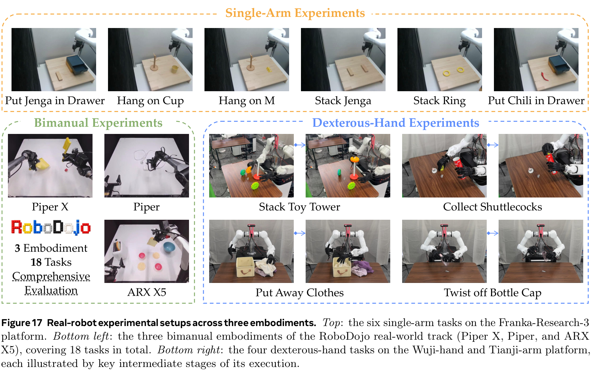

**Caption:** Figure 17 Real-robot experimental setups across three embodiments. Top: the six single-arm tasks on the Franka-Research-3 platform. Bottom left: the three bimanual embodiments of the RoboDojo real-world track (Piper X, Piper, and ARX X5), covering 18 tasks in total. Bottom right: the four dexterous-hand tasks on the Wuji-hand and Tianji-arm platform, each illustrated by key intermediate stages of its execution.

**Caption[CN]:** 图 17：跨三大具身形态的物理真实机器人实验环境设置。顶部：部署于 Franka-Research-3 平台上的 6 项单臂精密操作任务。左下：RoboDojo 实体双臂赛道的三大具身体系（Piper X、Piper 与 ARX X5），共计覆盖 18 项复杂操作任务。右下：基于天机臂与无极多指灵巧手平台的 4 项高自由度灵巧操控任务，各附关键操作中间阶段示意。

### Table 6. 单臂真实机器人任务评测结果

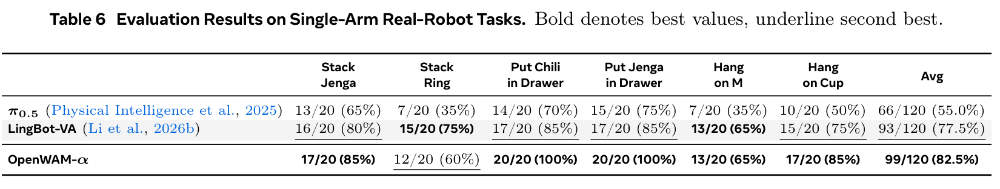

| Method | Stack Jenga | Stack Ring | Put Chili in Drawer | Put Jenga in Drawer | Hang on M | Hang on Cup | Avg |
|---|---|---|---|---|---|---|---|
| π0.5 (Physical Intelligence et al., 2025) | 13/20 (65%) | 7/20 (35%) | 14/20 (70%) | 15/20 (75%) | 7/20 (35%) | 10/20 (50%) | 66/120 (55.0%) |
| LingBot-VA (Li et al., 2026b) | 16/20 (80%) | **15/20 (75%)** | 17/20 (85%) | 17/20 (85%) | **13/20 (65%)** | 15/20 (75%) | 93/120 (77.5%) |
| OpenWAM-α | **17/20 (85%)** | 12/20 (60%) | **20/20 (100%)** | **20/20 (100%)** | **13/20 (65%)** | **17/20 (85%)** | **99/120 (82.5%)** |

**Caption:** Table 6 Evaluation Results on Single-Arm Real-Robot Tasks. Bold denotes best values, underline second best.

**Caption[CN]:** 表 6：单臂真实机器人任务评测结果。粗体表示最优值，下划线表示次优值。

> <strong>Para. 2:</strong> On the single-arm platform (Table 6), OpenWAM-α clearly leads both LingBot-VA, a representative WAM, and π0.5, a representative VLA, on the majority of tasks, and attains the best average success rate (82.5% vs. 77.5% and 55.0%), providing initial evidence of its general and fine-grained manipulation capabilities. In particular, OpenWAM-α achieves a 100% success rate on both drawer manipulation tasks (Put Chili in Drawer and Put Jenga in Drawer).
>
> <strong>Para. 2[CN]:</strong> 在单臂物理平台上（表 6），OpenWAM-α 在绝大多数任务上显著领先代表性 WAM 模型 LingBot-VA 以及顶尖 VLA 模型 π0.5，并取得了最高的全局平均成功率（达到 82.5%，显著优于 LingBot-VA 的 77.5% 和 π0.5 的 55.0%），有力印证了其在物理世界中优秀的细粒度操作控制精度。特别是在两项抽屉放置任务（Put Chili in Drawer 与 Put Jenga in Drawer）中，OpenWAM-α 均实现了 20/20（100%）的完美成功率。

### Table 7. RoboDojo 双臂真实机器人赛道评测结果

| Policy | Embodiment | Task 1 | Task 2 | Task 3 | Task 4 | Task 5 | Task 6 | Emb. Avg. | Overall Avg. |
|---|---|---|---|---|---|---|---|---|---|
| X-VLA (Zheng et al., 2026b) | ARX X5 | 0.0 / 0.0 | 0.0 / 0.0 | 0.0 / 0.0 | 2.0 / 0.0 | 20.7 / 10.0 | 18.0 / 0.0 | 6.8 / 1.7 | 7.6 / 3.3 |
| X-VLA (Zheng et al., 2026b) | Piper | 0.0 / 0.0 | 5.3 / 0.0 | 0.0 / 0.0 | 0.0 / 0.0 | 53.0 / 50.0 | 37.0 / 0.0 | 15.9 / 8.3 | 7.6 / 3.3 |
| X-VLA (Zheng et al., 2026b) | Piper X | 0.0 / 0.0 | 0.0 / 0.0 | 0.0 / 0.0 | 0.0 / 0.0 | 0.0 / 0.0 | 0.7 / 0.0 | 0.1 / 0.0 | 7.6 / 3.3 |
| Xiaomi-Robotics-0 (Cai et al., 2026c) | ARX X5 | 24.0 / 20.0 | 0.0 / 0.0 | 3.0 / 0.0 | 4.0 / 0.0 | 40.0 / 20.0 | 19.0 / 10.0 | 15.0 / 8.3 | 7.9 / 3.9 |
| Xiaomi-Robotics-0 (Cai et al., 2026c) | Piper | 0.0 / 0.0 | 0.0 / 0.0 | 0.0 / 0.0 | 0.0 / 0.0 | 23.0 / 20.0 | 22.7 / 0.0 | 7.6 / 3.3 | 7.9 / 3.9 |
| Xiaomi-Robotics-0 (Cai et al., 2026c) | Piper X | 0.0 / 0.0 | 0.7 / 0.0 | 4.0 / 0.0 | 0.0 / 0.0 | 0.0 / 0.0 | 2.7 / 0.0 | 1.2 / 0.0 | 7.9 / 3.9 |
| GalaxeaVLA (G0) (Jiang et al., 2025) | ARX X5 | 1.0 / 0.0 | 0.0 / 0.0 | 3.0 / 0.0 | 6.0 / 0.0 | 0.0 / 0.0 | 10.3 / 0.0 | 3.4 / 0.0 | 9.0 / 4.4 |
| GalaxeaVLA (G0) (Jiang et al., 2025) | Piper | 0.0 / 0.0 | 32.7 / 10.0 | 13.3 / 10.0 | 0.0 / 0.0 | 56.0 / 50.0 | 30.0 / 10.0 | 22.0 / 13.3 | 9.0 / 4.4 |
| GalaxeaVLA (G0) (Jiang et al., 2025) | Piper X | 0.0 / 0.0 | 0.0 / 0.0 | 0.0 / 0.0 | 4.0 / 0.0 | 0.0 / 0.0 | 6.0 / 0.0 | 1.7 / 0.0 | 9.0 / 4.4 |
| InternVLA-A1 (Cai et al., 2026a) | ARX X5 | 0.0 / 0.0 | 0.0 / 0.0 | 0.0 / 0.0 | 0.0 / 0.0 | 48.0 / 20.0 | 12.0 / 0.0 | 10.0 / 3.3 | 12.0 / 7.2 |
| InternVLA-A1 (Cai et al., 2026a) | Piper | 0.0 / 0.0 | 7.3 / 0.0 | 0.0 / 0.0 | 0.0 / 0.0 | 73.0 / 70.0 | 59.0 / 40.0 | 23.2 / 18.3 | 12.0 / 7.2 |
| InternVLA-A1 (Cai et al., 2026a) | Piper X | 0.0 / 0.0 | 0.0 / 0.0 | 4.0 / 0.0 | 2.0 / 0.0 | 0.0 / 0.0 | 10.0 / 0.0 | 2.7 / 0.0 | 12.0 / 7.2 |
| π0.5 (Physical Intelligence et al., 2025) | ARX X5 | 24.6 / 20.0 | 1.8 / 0.0 | 25.8 / 10.0 | 47.0 / 20.0 | 40.0 / 20.0 | 26.8 / 10.0 | 27.7 / 13.3 | 22.9 / 12.8 |
| π0.5 (Physical Intelligence et al., 2025) | Piper | 10.0 / 10.0 | 28.0 / 0.0 | 10.0 / 10.0 | 0.0 / 0.0 | 72.0 / 60.0 | 72.0 / 50.0 | 32.0 / 21.7 | 22.9 / 12.8 |
| π0.5 (Physical Intelligence et al., 2025) | Piper X | 0.0 / 0.0 | 14.8 / 10.0 | 0.0 / 0.0 | 29.5 / 10.0 | 7.5 / 0.0 | 3.0 / 0.0 | 9.1 / 3.3 | 22.9 / 12.8 |
| OpenWAM-α | ARX X5 | **31.0** / 0.0 | 0.0 / 0.0 | 13.0 / 0.0 | **52.0** / **20.0** | **100.0** / **100.0** | **38.0** / **20.0** | **39.0** / **23.3** | **37.6** / **24.4** |
| OpenWAM-α | Piper | 8.3 / 0.0 | **60.0** / **40.0** | **36.7** / **30.0** | 0.0 / 0.0 | **100.0** / **100.0** | **75.0** / **50.0** | **46.7** / **36.7** | **37.6** / **24.4** |
| OpenWAM-α | Piper X | 0.0 / 0.0 | **28.0** / **10.0** | **18.0** / 0.0 | **52.3** / **20.0** | **40.0** / **40.0** | **24.7** / **10.0** | **27.2** / **13.3** | **37.6** / **24.4** |

**Caption:** Table 7 Evaluation Results on the Bimanual RoboDojo Real-World Track. Each cell reports Score / SR (%). Bold denotes best values, underline second best. Rows are shaded by embodiment.

**Caption[CN]:** 表 7：RoboDojo 双臂真实机器人赛道评测结果。每个单元格汇报格式为“得分 / 成功率（%）”。粗体表示最优值，下划线表示次优值。

> <strong>Para. 3:</strong> We then turn to RoboDojo-Real (Table 7), a real-robot benchmark that comprehensively evaluates generalist manipulation policies across three bimanual embodiments and a wide range of task dimensions. OpenWAM-α tops the leaderboard: it remains consistently strong across the embodiments and their tasks, achieving an overall average Score / SR of **37.6 / 24.4%**, outperforming all baselines including π0.5 (22.9 / 12.8%), InternVLA-A1 (12.0 / 7.2%), and GalaxeaVLA (9.0 / 4.4%). It reaches the state of the art on the great majority of tasks across ARX X5 (39.0 / 23.3%), Piper (46.7 / 36.7%), and Piper X (27.2 / 13.3%), corroborating the generality and robustness of the model in the real world.
>
> <strong>Para. 3[CN]:</strong> 随后我们转向真机难度极高的 RoboDojo-Real 双臂评测（表 7）。该基准在三大实体双臂平台上对通用策略进行了严苛考验。OpenWAM-α 毫无悬念地登顶总榜首位：在各类具身形态与其对应任务上均保持了极其稳健的高水准，全局平均得分与成功率高达 **37.6 / 24.4%**，大幅超越包括 π0.5（22.9 / 12.8%）、InternVLA-A1（12.0 / 7.2%）和 GalaxeaVLA（9.0 / 4.4%）在内的全部强力基线。无论在 ARX X5（39.0 / 23.3%）、Piper（46.7 / 36.7%）还是 Piper X（27.2 / 13.3%）上，OpenWAM-α 均刷新了绝大多数任务的最优记录，有力证明了该模型在真实多具身物理世界中的通用性与稳健性。

### Table 8. 灵巧手真实机器人任务评测结果

| Method | Stack Toy Tower ID | Stack Toy Tower OOD | Collect Shuttlecocks ID | Collect Shuttlecocks OOD | Put Away Clothes ID | Put Away Clothes OOD | Twist off Bottle Cap ID | Twist off Bottle Cap OOD |
|---|---|---|---|---|---|---|---|---|
| π0.5 | 16/30 (53.3) / 1/10 (10%) | 12/30 (40.0) / 1/10 (10%) | 11/35 (31.4) / 2/10 (20%) | 17/54 (31.5) / 3/15 (20%) | 26/30 (86.7) / 6/10 (60%) | 45/60 (75.0) / 9/20 (45%) | 8/10 (80.0) / 3/10 (30%) | 13/20 (65.0) / 6/20 (30%) |
| OpenWAM-α | **21/30 (70.0)** / **4/10 (40%)** | **17/30 (56.7)** / **3/10 (30%)** | **29/35 (82.9)** / **6/10 (60%)** | **30/57 (52.6)** / **4/15 (26.7%)** | **30/30 (100.0)** / **10/10 (100%)** | **55/60 (91.7)** / **17/20 (85%)** | **10/10 (100.0)** / **7/10 (70%)** | **18/20 (90.0)** / **16/20 (80%)** |

**Caption:** Table 8 Evaluation Results on Dexterous-Hand Real-Robot Tasks. Each cell reports Score / SR (%); the OOD column aggregates all variation settings of its task. Bold denotes best values.

**Caption[CN]:** 表 8：灵巧手真实机器人任务评测结果。每个单元格汇报格式为“得分 / 成功率（%）”；OOD 列聚合了该任务所有的扰动变体评测。粗体表示最优值。

> <strong>Para. 4:</strong> To further probe the extensibility and generalization of OpenWAM-α, we fine-tune the pretrained model on four dexterous manipulation tasks built on the Wuji-hand and Tianji-arm platform and test it under both in-domain and out-of-domain setups (Table 8). Neither the platform nor its action space — a 9-D end-effector pose combined with 21 dexterous-hand degrees of freedom — ever appears in the OpenWAM-α pretraining mixture; nevertheless, OpenWAM-α outperforms π0.5 by a clear margin across all tasks and setups, demonstrating that the model adapts reliably and stably to an entirely unseen embodiment.
>
> <strong>Para. 4[CN]:</strong> 为进一步探究 OpenWAM-α 向全新未知具身形态的零样本拓展与自适应能力，我们将预训练基座模型微调于搭载天机机械臂与无极多指灵巧手的 4 项物理操控任务上，并在分布内与多维分布外环境下严苛测试（表 8）。值得高度关注的是，该硬件本体与其专属的 30 维动作空间（9 维末端位姿 + 21 维灵巧手关节自由度）在 OpenWAM-α 的预训练数据集中完全未曾出现；然而，OpenWAM-α 在所有任务与评测设定下均大幅超越了强基线 π0.5，在衣物收纳（Put Away Clothes）任务上取得了 100% 的满分成绩，有力证明了基座模型能够极为稳定、敏捷地适应物理未见的全新机器人实体形态。

> <strong>Para. 5:</strong> Together, these experiments assess OpenWAM-α across three embodiment types and a broad spectrum of real-world manipulation tasks. The results show that OpenWAM-α performs strongly in every setting and stands on par with today's leading models, indicating that it can serve as a strong baseline for further development and comparison by the community.
>
> <strong>Para. 5[CN]:</strong> 综上所述，这一系列真机实验跨越了三大实体具身类型与丰富多样的高难度现实物理操作任务。实验结论明确表明，OpenWAM-α 在所有物理场景下均展现出极其强劲的决策与控制能力，比肩乃至超越了当今工业界与学术界的顶级基座模型，足以成为开源社区后续开展世界—动作模型研发、对比与拓展的强大学术基准。

## 6 Conclusions

> <strong>Para. 1:</strong> This work introduced OpenWAM, an open research stack that turns world–action modeling from a set of tightly coupled implementation choices into a controlled experimental program. OpenWAM-Infra factorizes the WAM design space into composable modules assembled into three architecture families, served by a single trainer, policy server, and evaluation protocol spanning eight simulation benchmarks and real robots. On this substrate, OpenWAM-Study examined what world knowledge a WAM should inherit, how world and action learning create synergy, and how that synergy consolidates across domains, distilling the answers into a concrete recipe. OpenWAM-α then instantiated this recipe at scale on egocentric human and robot data through a unified action space, delivering consistently strong results across the simulation benchmarks and real-robot experiments on single-arm, bimanual, and dexterous-hand platforms.

> <strong>Para. 1[CN]:</strong> 本文提出了 OpenWAM，一个将世界—动作建模从高度缠绕的工程黑盒转化为变量严格受控的科学研究全栈。OpenWAM-Infra 将 WAM 宏观设计空间系统解耦为可插拔的基础模块，支持装配为三大主流架构族，并由统一的训练引擎、策略服务运行时及覆盖 8 大仿真基准与物理机器人的评估协议强力驱动。在此坚实基座之上，OpenWAM-Study 深入探索了 WAM 应当继承何种上游知识、世界与动作学习如何促成深层协同，以及这种协同如何跨异构领域高效扩展，将核心科学洞察凝练为一套严谨的落地配方。最终，OpenWAM-α 在基于统一动作空间的异构第一人称人类视频与海量机器人轨迹上完成了该配方的规模化验证，在单臂、双臂协作与拟人多指灵巧手等全场景仿真基准及物理真机实验中持续展现出顶尖的控制表现。

> <strong>Para. 2:</strong> We release the full stack, including the infrastructure, evaluation protocols, pretrained weights, and data recipes, to support the community in reproducing, understanding, and scaling world–action models.

> <strong>Para. 2[CN]:</strong> 我们全面开源了该研究的完整技术资产，包括系统基础设施、统一评测协议、预训练模型权重及工业级数据配方，以期全力支持学术界与工业界复现、系统理解并进一步扩展世界—动作模型的前沿研究。

## References

Bibliographic entries are retained in their original English form in the paper's numbered order [1]–[108] to preserve exact citation searchability and cross-referencing fidelity.

1. Ali, A., Bai, J., Bala, M., Balaji, Y., Blakeman, A., Cai, T., Cao, J., Cao, T., Cha, E., Chao, Y.-W., et al. World simulation with video foundation models for physical ai. arXiv preprint arXiv:2511.00062, 2025.

2. Allen-Zhu, Z. Physics of language models: Part 4.1, architecture design and the magic of canon layers. Advances in Neural Information Processing Systems, 38:42349–42369, 2026.

3. Baade, A., Chan, E. R., Sargent, K., Chen, C., Johnson, J., Adeli, E., and Fei-Fei, L. Latent forcing: Reordering the diffusion trajectory for pixel-space image generation. arXiv preprint arXiv:2602.11401, 2026.

4. Bai, S., Cai, Y., Chen, R., Chen, K., Chen, X., Cheng, Z., Deng, L., Ding, W., Gao, C., Ge, C., Ge, W., Guo, Z., Huang, Q., Huang, J., Huang, F., Hui, B., Jiang, S., Li, Z., Li, M., Li, M., Li, K., Lin, Z., Lin, J., Liu, X., Liu, J., Liu, C., Liu, Y., Liu, D., Liu, S., Lu, D., Luo, R., Lv, C., Men, R., Meng, L., Ren, X., Ren, X., Song, S., Sun, Y., Tang, J., Tu, J., Wan, J., Wang, P., Wang, P., Wang, Q., Wang, Y., Xie, T., Xu, Y., Xu, H., Xu, J., Yang, Z., Yang, M., Yang, J., Yang, A., Yu, B., Zhang, F., Zhang, H., Zhang, X., Zheng, B., Zhong, H., Zhou, J., Zhou, F., Zhou, J., Zhu, Y., and Zhu, K. Qwen3-vl technical report, 2025. URL https://arxiv.org/abs/2511.21631.

5. Bai, Y., Wang, H., Dai, M., Zhong, Q., Liu, Y., and Lin, L. Bridge-wa: Predicting where and how the world changes for robotic action. arXiv preprint arXiv:2607.02195, 2026.

6. Barreiros, J., Beaulieu, A., Bhat, A., Cory, R., Cousineau, E., Dai, H., Fang, C.-H., Hashimoto, K., Irshad, M. Z., Itkina, M., et al. A careful examination of large behavior models for multitask dexterous manipulation. Science Robotics, 11(113):eaea6201, 2026.

7. Beyer, L., Steiner, A., Pinto, A. S., Kolesnikov, A., Wang, X., Salz, D., Neumann, M., Alabdulmohsin, I., Tschannen, M., Bugliarello, E., et al. Paligemma: A versatile 3b vlm for transfer. arXiv preprint arXiv:2407.07726, 2024.

8. Bi, H., Tan, H., Xie, S., Wang, Z., Huang, S., Liu, H., Zhao, R., Feng, Y., Xiang, C., Rong, Y., et al. Motus: A unified latent action world model. In Proceedings of the IEEE/CVF Conference on Computer Vision and Pattern Recognition, pp. 35101–35113, 2026.

9. Black, K., Brown, N., Driess, D., Esmail, A., Equi, M., Finn, C., Fusai, N., Groom, L., Hausman, K., Ichter, B., et al. π0: A vision-language-action flow model for general robot control. arXiv preprint arXiv:2410.24164, 2024.

10. Black Forest Labs. FLUX.2: Analyzing and enhancing the latent space of FLUX. Technical blog, 2025. URL https://bfl.ai/research/representation-comparison.

11. Brohan, A., Brown, N., Carbajal, J., Chebotar, Y., Chen, X., Choromanski, K., Ding, T., Driess, D., Dubey, A., Finn, C., et al. Rt-2: Vision-language-action models transfer web knowledge to robotic control. arXiv preprint arXiv:2307.15818, 2023.

12. Brooks, T., Peebles, B., Holmes, C., DePue, W., Guo, Y., Jing, L., Schnurr, D., Taylor, J., Luhman, T., Luhman, E., Ng, C., Wang, R., and Ramesh, A. Video generation models as world simulators, 2024. URL https://openai.com/research/video-generation-models-as-world-simulators.

13. Bu, Q., Cai, J., Chen, L., Cui, X., Ding, Y., Feng, S., Gao, S., He, X., Huang, X., Jiang, S., et al. Agibot world colosseo: A large-scale manipulation platform for scalable and intelligent embodied systems. arXiv preprint arXiv:2503.06669, 2025.

14. Cai, J., Cai, Z., Cao, J., Chen, Y., He, Z., Jiang, L., Li, H., Li, H., Li, Y., Liu, Y., et al. Internvla-a1: Unifying understanding, generation and action for robotic manipulation. arXiv preprint arXiv:2601.02456, 2026a.

15. Cai, J., Ling, L., Chu, S., Liu, Z., Kang, J., Liang, Z., Xu, W., Mao, Y., Zhang, W., Yang, X., et al. Aha-wam: Asynchronous horizon-adaptive world-action modeling with observation-guided context routing. arXiv preprint arXiv:2606.09811, 2026b.

16. Cai, R., Guo, J., He, X., Jin, P., Li, J., Lin, B., Liu, F., Liu, W., Ma, F., Ma, K., et al. Xiaomi-robotics-0: An open-sourced vision-language-action model with real-time execution. arXiv preprint arXiv:2602.12684, 2026c.

17. Caron, M., Touvron, H., Misra, I., Jégou, H., Mairal, J., Bojanowski, P., and Joulin, A. Emerging properties in self-supervised vision transformers. In 2021 IEEE/CVF international conference on computer vision (ICCV), pp. 9630–9640. IEEE, 2021.

18. Chen, R., Yang, Y., Tang, Z., Huo, D., Lin, T., Wu, H., Liu, H., Chen, Y., Zheng, L., Yuan, B., et al. Abot-m0.5: Unified mobility-and-manipulation world action model. arXiv preprint arXiv:2607.00678, 2026a.

19. Chen, T., Chen, Z., Chen, B., Cai, Z., Liu, Y., Li, Z., Liang, Q., Lin, X., Ge, Y., Gu, Z., et al. Robotwin 2.0: A scalable data generator and benchmark with strong domain randomization for robust bimanual robotic manipulation. arXiv preprint arXiv:2506.18088, 2025.

20. Chen, T., Chen, Y., Li, Z., Tang, J., Su, K., Lu, H., Wan, W., Chen, B., Liu, S., Yan, H., Su, H., Dou, Z., Wang, K., Zhang, D., Liu, Y., Qin, Y., Liang, Q., Wu, Q., Lin, Z., Lin, W., Wang, Y., He, M., Wu, T., Wu, R., Zhou, J., Lei, K.-C., Yu, H., Ji, Y., Jin, W., Lin, G., Li, X., Xiong, Q., Xu, R., Li, Z., Chai, W., Xie, E., Wang, Z., Mu, Y., Dong, H., Matusik, W., Ding, M., Ding, W., Luo, P., and Tomizuka, M. Robodojo: A unified sim-and-real benchmark for comprehensive evaluation of generalist robot manipulation policies, 2026b. URL https://arxiv.org/abs/2607.04434.

21. Chi, C., Xu, Z., Pan, C., Cousineau, E., Burchfiel, B., Feng, S., Tedrake, R., and Song, S. Universal manipulation interface: In-the-wild robot teaching without in-the-wild robots. arXiv preprint arXiv:2402.10329, 2024.

22. Chi, C., Xu, Z., Feng, S., Cousineau, E., Du, Y., Burchfiel, B., Tedrake, R., and Song, S. Diffusion policy: Visuomotor policy learning via action diffusion. The International Journal of Robotics Research, 44(10-11):1684–1704, 2025.

23. Community, S. Starvla: A lego-like codebase for vision-language-action model developing. arXiv preprint arXiv:2604.05014, 2026.

24. Community, X., Chen, T., Chen, Y., Nian, T., Cai, Z., Chen, G., Lin, W., Liang, Q., Xiang, P., Su, K., et al. XPolicyLab: A unified standard and open ecosystem for robot policy evaluation and deployment. arXiv preprint arXiv:2608.09892, 2026.

25. Dexmal. DM0.5. Technical blog, 2026. URL https://www.dexmal.com/blog/dm0.5.

26. Fei, S., Wang, S., Shi, J., Dai, Z., Cai, J., Qian, P., Ji, L., He, X., Zhang, S., Fei, Z., Fu, J., Gong, J., and Qiu, X. Libero-plus: In-depth robustness analysis of vision-language-action models. arXiv preprint arXiv:2510.13626, 2025.

27. Gao, N., Zheng, J., Gao, X., Ma, H., Wang, H., Wang, Y., Chen, J., Chen, Z., Zhang, S., Jia, M., Jiang, X., Zhu, Z., Li, X., Wang, S., Li, H., Cai, W., Yang, Y., Xu, X., Lyu, Z., Mu, Y., Wang, T., Pang, J., Zeng, J., Zhang, W., and Shen, C. Ebench: Elemental diagnosis of generalist mobile manipulation policies. arXiv preprint arXiv:2606.18239, 2026.

28. Guo, J., Li, Q., Li, P., Chen, Z., Sun, N., Su, Y., Wang, H., Zhang, Y., Li, X., and Liu, H. Unified 4d world action modeling from video priors with asynchronous denoising. arXiv preprint arXiv:2604.26694, 2026.

29. Ha, D. and Schmidhuber, J. World models. arXiv preprint arXiv:1803.10122, 2(3):440, 2018.

30. Hafner, D., Lillicrap, T., Ba, J., and Norouzi, M. Dream to control: Learning behaviors by latent imagination. arXiv preprint arXiv:1912.01603, 2019.

31. Han, J., Tong, S., Fan, D., Chen, M., Torr, P., Kokkinos, F., and Lewis, M. Towards physics of multimodal pretraining: Knowledge flow, modality synergy, early unification, and recipes. arXiv preprint arXiv:2608.05000, 2026.

32. Ho, J., Salimans, T., Gritsenko, A., Chan, W., Norouzi, M., and Fleet, D. J. Video diffusion models. Advances in neural information processing systems, 35:8633–8646, 2022.

33. Hoque, R., Huang, P., Yoon, D. J., Sivapurapu, M., and Zhang, J. Egodex: Learning dexterous manipulation from large-scale egocentric video. arXiv preprint arXiv:2505.11709, 2025.

34. Hu, Y., Zhu, H., Zheng, B., Hu, Y., Zhang, T., Chen, Z., Zhao, J., Nai, R., and Gao, Y. Openhlm: An empirical recipe for whole-body humanoid loco-manipulation. arXiv preprint arXiv:2606.22174, 2026.

35. Huang, S., Wu, J., Zhou, Q., Miao, S., and Long, M. Vid2world: Crafting video diffusion models to interactive world models. arXiv preprint arXiv:2505.14357, 2025.

36. Huang, S., Kaushik, P., Chen, M., Pan, H., Geng, K., Chehab, O., Moreno-Pino, F., and Simchowitz, M. Nano world models: A minimalist implementation of future video prediction. arXiv preprint arXiv:2605.23993, 2026.

37. Jha, S., Zholus, A., Chandar, S., et al. Reconstruction or semantics? what makes a latent space useful for robotic world models. arXiv preprint arXiv:2605.06388, 2026.

38. Jiang, T., Yuan, T., Liu, Y., Lu, C., Cui, J., Liu, X., Cheng, S., Gao, J., Xu, H., and Zhao, H. Galaxea open-world dataset and g0 dual-system vla model. arXiv preprint arXiv:2509.00576, 2025.

39. Karras, T., Aittala, M., Aila, T., and Laine, S. Elucidating the design space of diffusion-based generative models. Advances in neural information processing systems, 35:26565–26577, 2022.

40. Khazatsky, A., Pertsch, K., Nair, S., Balakrishna, A., Dasari, S., Karamcheti, S., Nasiriany, S., Srirama, M. K., Chen, L. Y., Ellis, K., et al. Droid: A large-scale in-the-wild robot manipulation dataset. arXiv preprint arXiv:2403.12945, 2024.

41. Kim, D., Jang, H., Koo, M., Jang, S., Kim, T., Kim, B., Yoon, B., Jang, C., Choi, D., Han, D., et al. Rldx-1 technical report. arXiv preprint arXiv:2605.03269, 2026a.

42. Kim, M. J., Pertsch, K., Karamcheti, S., Xiao, T., Balakrishna, A., Nair, S., Rafailov, R., Foster, E., Lam, G., Sanketi, P., et al. Openvla: An open-source vision-language-action model. arXiv preprint arXiv:2406.09246, 2024.

43. Kim, M. J., Finn, C., and Liang, P. Fine-tuning vision-language-action models: Optimizing speed and success. arXiv preprint arXiv:2502.19645, 2025.

44. Kim, M. J., Gao, Y., Lin, T.-Y., Lin, Y.-C., Ge, Y., Lam, G., Liang, P., Song, S., Liu, M.-Y., Finn, C., et al. Cosmos policy: Fine-tuning video models for visuomotor control and planning. arXiv preprint arXiv:2601.16163, 2026b.

45. Lazzati, F., Stachowicz, K., Chen, W., Metelli, A. M., Wagenmaker, A., and Levine, S. Why does action chunking improve behavioral cloning performance in robotic control? arXiv preprint arXiv:2608.02547, 2026.

46. LeCun, Y. et al. A path towards autonomous machine intelligence version 0.9. 2, 2022-06-27. Open Review, 62(1): 1–62, 2022.

47. Li, F., Song, W., Zhao, H., Wang, J., Ding, P., Wang, D., Zeng, L., and Li, H. Spatial forcing: Implicit spatial representation alignment for vision-language-action model. In International Conference on Learning Representations, 2026a.

48. Li, L., Zhang, Q., Luo, Y., Yang, S., Wang, R., Han, F., Yu, M., Gao, Z., Xue, N., Zhu, X., et al. Causal world modeling for robot control. arXiv preprint arXiv:2601.21998, 2026b.

49. Lin, F., Arora, K., Mercat, J., Nishimura, H., Shah, P., Xu, C., Zhang, M., Zolotas, M., Angeles, M., Pfannenstiehl, O., et al. A systematic study of data modalities and strategies for co-training large behavior models for robot manipulation. arXiv preprint arXiv:2602.01067, 2026a.

50. Lin, X., Lian, S., Yu, B., Yang, R., Shen, Z., Wu, C., Miao, Y., Jin, Y., Shi, Y., He, J., Huang, C., Cheng, B., and Chen, K. Physbrain: Human egocentric data as a bridge from vision language models to physical intelligence, 2026b. URL https://arxiv.org/abs/2512.16793.

51. Liu, B., Zhu, Y., Gao, C., Feng, Y., Liu, Q., Zhu, Y., and Stone, P. LIBERO: Benchmarking knowledge transfer for lifelong robot learning. arXiv preprint arXiv:2306.03310, 2023.

52. Liu, I., Cheng, A.-C., Yan, R., Chen, G., Qiu, R.-Z., Zou, X., Yi, S., Yin, H., Wang, X., and Liu, S. Long-horizon manipulation via trace-conditioned vla planning. arXiv preprint arXiv:2604.21924, 2026a.

53. Liu, Y., Dong, Z., Ye, B., Yuan, T., Jiang, T., Yang, A., Cao, S., Liu, H., Sun, Y., Guo, Z., et al. G0.5: One autoregressive stream for robot reasoning and action. arXiv preprint arXiv:2608.11739, 2026b.

54. Liu, Z., Mao, H., Wu, C., Feichtenhofer, C., Darrell, T., and Xie, S. A convnet for the 2020s. CoRR, abs/2201.03545, 2022. URL https://arxiv.org/abs/2201.03545.

55. Luo, H., Wang, Y., Zhang, W., Zheng, S., Xi, Z., Xu, C., Xu, H., Yuan, H., Zhang, C., Wang, Y., et al. Being-h0.5: Scaling human-centric robot learning for cross-embodiment generalization. arXiv preprint arXiv:2601.12993, 2026a.

56. Luo, H., Zhang, W., Feng, Y., Zheng, S., Xu, H., Xu, C., Xi, Z., Fu, Y., and Lu, Z. Being-h0.7: A latent world-action model from egocentric videos. arXiv preprint arXiv:2605.00078, 2026b.

57. Lyu, J., Liu, K., Zhang, X., Liao, H., Feng, Y., Zhu, W., Shen, T., Chen, J., Zhang, J., Dong, Y., et al. Lda-1b: Scaling latent dynamics action model via universal embodied data ingestion. arXiv preprint arXiv:2602.12215, 2026.

58. M. Moerland, T., Broekens, J., Plaat, A., and M. Jonker, C. Model-based reinforcement learning: A survey. Foundations and Trends in Machine Learning, 16(1):1–118, 2023.

59. Ma, T., Zheng, J., Wang, Z., Jiang, C., Cui, A., Liang, J., and Yang, S. Dit4dit: Jointly modeling video dynamics and actions for generalizable robot control. arXiv preprint arXiv:2603.10448, 2026.

60. Maes, L., Lidec, Q. L., Scieur, D., LeCun, Y., and Balestriero, R. Leworldmodel: Stable end-to-end joint-embedding predictive architecture from pixels. arXiv preprint arXiv:2603.19312, 2026.

61. McKinzie, B., Gan, Z., Fauconnier, J.-P., Dodge, S., Zhang, B., Dufter, P., Shah, D., Du, X., Peng, F., Belyi, A., et al. Mm1: methods, analysis and insights from multimodal llm pre-training. In European Conference on Computer Vision, pp. 304–323. Springer, 2024.

62. Mu, S. and Lin, S. A comprehensive survey of mixture-of-experts: Algorithms, theory, and applications. arXiv preprint arXiv:2503.07137, 2025.

63. Mur-Labadia, L., Muckley, M., Bar, A., Assran, M., Sinha, K., Rabbat, M., LeCun, Y., Ballas, N., and Bardes, A. V-jepa 2.1: Unlocking dense features in video self-supervised learning. arXiv preprint arXiv:2603.14482, 2026.

64. Nasiriany, S., Maddukuri, A., Zhang, L., Parikh, A., Lo, A., Joshi, A., Mandlekar, A., and Zhu, Y. Robocasa: Large-scale simulation of everyday tasks for generalist robots. In Robotics: Science and Systems (RSS), 2024.

65. Nasiriany, S., Nasiriany, S., Maddukuri, A., and Zhu, Y. Robocasa365: A large-scale simulation framework for training and benchmarking generalist robots. In International Conference on Learning Representations (ICLR), 2026.

66. NVIDIA, Bjorck, J., Castañeda, F., Cherniadev, N., et al. GR00T N1: An open foundation model for generalist humanoid robots. arXiv preprint arXiv:2503.14734, 2025.

67. Pai, J., Achenbach, L., Montesinos, V., Forrai, B., Mees, O., and Nava, E. mimic-video: Video-action models for generalizable robot control beyond vlas. arXiv preprint arXiv:2512.15692, 2025.

68. Pan, C., Anantharaman, G., Huang, N.-C., Jin, C., Pfrommer, D., Yuan, C., Permenter, F., Qu, G., Boffi, N., Shi, G., et al. Much ado about noising: Dispelling the myths of generative robotic control. In International Conference on Learning Representations, volume 2026, pp. 90575–90614, 2026.

69. Peebles, W. and Xie, S. Scalable diffusion models with transformers. In 2023 IEEE/CVF International Conference on Computer Vision (ICCV), pp. 4172–4182. IEEE, 2023.

70. Physical Intelligence, Black, K., Brown, N., Darpinian, J., Dhabalia, K., Driess, D., Esmail, A., Equi, M., Finn, C., Fusai, N., et al. π0.5: A vision-language-action model with open-world generalization. arXiv preprint arXiv:2504.16054, 2025.

71. Radford, A., Kim, J. W., Hallacy, C., Ramesh, A., Goh, G., Agarwal, S., Sastry, G., Askell, A., Mishkin, P., Clark, J., et al. Learning transferable visual models from natural language supervision. In International conference on machine learning, pp. 8748–8763. PmLR, 2021.

72. Simchowitz, M., Pfrommer, D., and Jadbabaie, A. The pitfalls of imitation learning when actions are continuous. arXiv preprint arXiv:2503.09722, 2025.

73. Siméoni, O., Vo, H. V., Seitzer, M., Baldassarre, F., Oquab, M., et al. Dinov3. arXiv preprint arXiv:2508.10104, 2025.

74. Singh, J., Zheng, B., Wu, Z., Zhang, R., Shechtman, E., and Xie, S. Improved baselines with representation autoencoders. arXiv preprint arXiv:2605.18324, 2026.

75. Sun, N., Zhang, Y., Yang, Y., Zhao, W., Li, P., Guo, J., Song, W., Ding, P., Suo, R., Su, Y., et al. Revisiting embodied chain-of-thought for generalizable robot manipulation. arXiv preprint arXiv:2606.03784, 2026.

76. Team, G., Ye, A., Sun, A., Jin, C., Cheng, C., Shi, C., Shang, D., Zhang, D., Huang, G., Wang, G., et al. Gigabrain-0.7: Scaling embodied foundation models to emergent capabilities with a three-system architecture. arXiv preprint arXiv:2608.15875, 2026a.

77. Team, X. R., Guo, J., Jin, P., Li, J., Li, P., Li, Y., Liu, F., Peng, W., Qin, O., Su, Y., et al. Xiaomi-robotics-1: Scaling vision-language-action models with over 100k hours of real-world trajectories. arXiv preprint arXiv:2607.15330, 2026b.

78. Tian, Y., Yang, Y., Xie, Y., Cai, Z., Shi, X., Gao, N., Liu, H., Jiang, X., Qiu, Z., Yuan, F., et al. Interndata-a1: Pioneering high-fidelity synthetic data for pre-training generalist policy. arXiv preprint arXiv:2511.16651, 2025.

79. Tong, S., Brown, E., Wu, P., Woo, S., Middepogu, M., Akula, S. C., Yang, J., Yang, S., Iyer, A., Pan, X., et al. Cambrian-1: A fully open, vision-centric exploration of multimodal llms. Advances in Neural Information Processing Systems, 37:87310–87356, 2024.

80. Tong, S., Fan, D., Nguyen, J., Brown, E., Zhou, G., Qian, S., Zheng, B., Vallaeys, T., Han, J., Fergus, R., et al. Beyond language modeling: An exploration of multimodal pretraining. arXiv preprint arXiv:2603.03276, 2026.

81. Wan, T., Wang, A., Ai, B., Wen, B., Mao, C., Xie, C.-W., Chen, D., Yu, F., Zhao, H., Yang, J., et al. Wan: Open and advanced large-scale video generative models. arXiv preprint arXiv:2503.20314, 2025.

82. Wang, Q., Li, M., Guan, J., Ye, J., Xie, S., Liu, Y., Chen, J., Liang, Z., Zhang, J., Hu, X., et al. Qwen-vla: Unifying vision-language-action modeling across tasks, environments, and robot embodiments. arXiv preprint arXiv:2605.30280, 2026a.

83. Wang, Y. Instructions for Practical Living, and Other Neo-Confucian Writing. Columbia University Press, New York„ 1963.

84. Wang, Y., Syed, R., Wu, F., Zhang, M., Onol, A., Barreiros, J., Nayyeri, H., Dear, T., Zhang, H., and Li, Y. Interactive world simulator for robot policy training and evaluation. arXiv preprint arXiv:2603.08546, 2026b.

85. Wang, Z., Chen, Y., Liu, Y., Ye, J., Chen, P., Lu, C., Liu, S., Yu, B., and Jia, J. Vp-vla: Visual prompting as an interface for vision-language-action models. arXiv preprint arXiv:2603.22003, 2026c.

86. Wen, K., Hall, D., Ma, T., and Liang, P. Fantastic pretraining optimizers and where to find them. In International Conference on Learning Representations, volume 2026, pp. 144731–144838, 2026.

87. Wu, S., Liu, X., Xie, S., Wang, P., Li, X., Yang, B., Li, Z., Zhu, K., Wu, H., Liu, Y., et al. Robocoin: An open-sourced bimanual robotic data collection for integrated manipulation. arXiv preprint arXiv:2511.17441, 2025.

88. Xu, M., Zhang, H., Hou, Y., Xu, Z., Fan, L., Veloso, M., and Song, S. Dexumi: Using human hand as the universal manipulation interface for dexterous manipulation. In Conference on Robot Learning, pp. 437–459. PMLR, 2025.

89. Yang, L., Song, W., Wang, X., Sheng, P., Fang, Z., Zhou, Z., He, J., Yan, H., Chen, J., Sun, N., Sun, Q., Wang, P., Liu, L., Wang, Y., Gao, Y., Dayoub, F., and Li, H. 4d-wam: Infusing spatiotemporal awareness into world action models through trajectory fields, 2026a. URL https://arxiv.org/abs/2608.08023.

90. Yang, Y., Zeng, S., Lin, T., Chang, X., Qi, D., Xiao, J., Liu, H., Chen, R., Chen, Y., Huo, D., et al. Abot-m0: Vla foundation model for robotic manipulation with action manifold learning. arXiv preprint arXiv:2602.11236, 2026b.

91. Ye, A., Wang, B., Ni, C., Huang, G., Zhao, G., Li, H., Li, H., Li, J., Lv, J., Liu, J., et al. Gigaworld-policy: An efficient action-centered world–action model. arXiv preprint arXiv:2603.17240, 2026a.

92. Ye, J., Gao, N., Yang, S., Zheng, J., Wang, Z., Chen, Y., Chen, P., Chen, Y., Liu, S., and Jia, J. Starvla-α: Reducing complexity in vision-language-action systems. arXiv preprint arXiv:2604.11757, 2026b.

93. Ye, S., Ge, Y., Zheng, K., Gao, S., Yu, S., Kurian, G., Indupuru, S., Tan, Y. L., Zhu, C., Xiang, J., et al. World action models are zero-shot policies. arXiv preprint arXiv:2602.15922, 2026c.

94. Ye, Y., Fu, Y., Lv, Y., Hou, B., Cen, J., Kong, L., Zheng, D., Chen, T., Liu, J., Cao, Z., et al. Data pyramid for embodied manipulation. arXiv preprint arXiv:2607.24744, 2026d.

95. Yuan, H., Liang, Z., Chen, A., Wang, Y., Li, H., Lin, P., Huang, Y., Lei, Z., Zhang, T., Zhang, J., et al. Qwen-robotmanip technical report: Alignment unlocks scale for robotic manipulation foundation models. arXiv preprint arXiv:2606.17846, 2026a.

96. Yuan, T., Dong, Z., Liu, Y., and Zhao, H. Fast-wam: Do world action models need test-time future imagination? arXiv preprint arXiv:2603.16666, 2026b.

97. Zhang, H., Xiang, L., Lin, H., Huang, Z., Wang, M., Zhong, D., Dong, Y., Wu, Y., Rao, Y., Zhang, D., et al. Hy-embodied-0.5-vla: From vision-language-action models to a real-world robot learning stack. arXiv preprint arXiv:2606.14409, 2026a.

98. Zhang, Q., Li, L., Zhang, L., Yang, S., Luo, Y., Li, S., Wang, R., Wang, J., Shao, J., Xu, G., et al. Native video-action pretraining for generalizable robot control. arXiv preprint arXiv:2607.08639, 2026b.

99. Zhang, S., Xu, Z., Liu, P., Yu, X., Li, Y., Gao, Q., Fei, Z., Yin, Z., Wu, Z., Jiang, Y.-G., and Qiu, X. Vlabench: A large-scale benchmark for language-conditioned robotics manipulation with long-horizon reasoning tasks. arXiv preprint arXiv:2412.18194, 2024.

100. Zhang, S., Zhang, H., Zhang, Z., Ge, C., Xue, S., Liu, S., Ren, M., Kim, S. Y., Zhou, Y., Liu, Q., et al. Both semantics and reconstruction matter: Making representation encoders ready for text-to-image generation and editing. arXiv preprint arXiv:2512.17909, 2025a.

101. Zhang, T. T., Pfrommer, D., Pan, C., Matni, N., and Simchowitz, M. Action chunking and exploratory data collection yield exponential improvements in behavior cloning for continuous control. arXiv preprint arXiv:2507.09061, 2025b.

102. Zhang, Y., Zhang, W., Qi, Z., Zhang, H., Lin, H., Zhang, J., Mu, Y., Yang, X., Zeng, W., and Jin, X. Imagewam: Do world action models really need video generation, or just image editing? arXiv preprint arXiv:2606.19531, 2026c.

103. Zhao, T. Z., Kumar, V., Levine, S., and Finn, C. Learning fine-grained bimanual manipulation with low-cost hardware. arXiv preprint arXiv:2304.13705, 2023.

104. Zheng, B., Ma, N., Tong, S., and Xie, S. Diffusion transformers with representation autoencoders. In International Conference on Learning Representations, volume 2026, pp. 35791–35820, 2026a.

105. Zheng, J., Li, J., Wang, Z., Liu, D., Kang, X., Feng, Y., Zheng, Y., Zou, J., Chen, Y., Zeng, J., et al. X-vla: Soft-prompted transformer as scalable cross-embodiment vision-language-action model. In International Conference on Learning Representations, 2026b.

106. Zhong, L., Liu, Y., Wei, Y., Xiong, Z., Liu, S., and Ren, G. Acot-vla: Action chain-of-thought for vision-language- action models. In Proceedings of the IEEE/CVF Conference on Computer Vision and Pattern Recognition, pp. 8152–8162, 2026.

107. Zhou, G., Pan, H., LeCun, Y., and Pinto, L. Dino-wm: World models on pre-trained visual features enable zero-shot planning. arXiv preprint arXiv:2411.04983, 2024.

108. Zhu, C., Yu, R., Feng, S., Burchfiel, B., Shah, P., and Gupta, A. Unified world models: Coupling video and action diffusion for pretraining on large robotic datasets. arXiv preprint arXiv:2504.02792, 2025.

## Appendix

This appendix provides supplementary analyses and implementation details supporting the main paper:

- **§A** discusses limitations of our work and directions for future research.
- **§B** documents the pretraining configuration and the dataset-specific SFT configurations used during post-training.
- **§C** details the task setups and evaluation protocols of the real-world experiments.
- **§D** reports the full per-benchmark simulation scores behind Figure 13.

### Appendix A: Limitations and Future Work

> <strong>Para. 1:</strong> While OpenWAM provides a fully-open, systematic exploration towards world–action model pretraining, it has several limitations and opens up interesting future directions worth exploring:
>
> 1. *Training phases.* We mostly focus on the embodied pretraining phase of world–action modeling. Post-training and adaptation methods can lead to significant improvements for embodied foundation models, and the empirical recipe as well as underlying mechanisms for these methods remain open questions.
>
> 2. *Architecture.* Across the six architecture variants currently supported by OpenWAM, we mostly explore modality fusion through cross-modality attention or hard-routed MoE. Drawing experience from the Unified Multimodal Model (UMM) community, we encourage future work to explore more native modality-fusion techniques, such as tokenization-phase early fusion and soft-routed MoE.
>
> 3. *Pretraining data mixture.* We did not include UMI-style (e.g., UMI (Chi et al., 2024), DexUMI (Xu et al., 2025)) collected data. In theory, UMI-style data offers task and scene diversity comparable to human egocentric videos, which is a crucial component for out-of-domain generalization capabilities. Co-training with data that contain robot-executable actions but are diverse in scene and task level, which can either be collected through UMI-style interfaces or post-processing pipelines, may offer a more data-efficient path towards autonomous embodied machine intelligence. In addition, we look forward to further breakthroughs in simulation for embodied AI: simulation can natively generate robot manipulation data with diverse scenes and realistic motion trajectories, unconstrained by the time and labor costs of the physical world, and thus holds unbounded potential for scaling robot data by orders of magnitude.
>
> 4. *Visual encoder.* Weighing the compression of candidate encoders in both the temporal and the token dimension, we ultimately adopt Wan2.2-VAE as the final encoder of OpenWAM — a choice that reflects the best trade-off currently available rather than an optimal solution: our evaluations reveal that pixel-reconstruction encoders such as Wan2.2-VAE are not sufficiently robust to viewpoint, noise, and scene variations. A latent representation that is compact while carrying sufficient environment information is still needed to push WAM performance further, and merits deeper exploration.
>
> <strong>Para. 1[CN]:</strong> 尽管 OpenWAM 为世界—动作模型预训练提供了全面开源、系统化的探索基座，但本项工作仍存在若干局限性，并为未来研究指明了富有前景的演进方向：
>
> 1. *训练阶段范式：* 本文主要聚焦于世界—动作建模的具身预训练阶段。后训练（Post-training）与强化学习自适应对具身基座模型具有巨大的性能提升潜力，此类方法的实证技术配方及其内在机理仍是有待深究的开放性问题。
>
> 2. *模型网络架构：* 在 OpenWAM 当前支持的 6 种代表性架构变体中，模态融合主要通过跨模态注意力或硬路由 MoE 实现。借鉴统一多模态大模型（UMM）社区的最新成果，我们鼓励未来探索更原生的跨模态早期融合技术，例如分词阶段的早期隐式融合与软路由动态 MoE。
>
> 3. *预训练数据配方：* 当前数据集尚未纳入基于通用手持夹爪（如 UMI、DexUMI）采集的数据。在理论上，UMI 类数据具备与第一人称人类视频相媲美的任务与场景多样性，这是构筑分布外（OOD）泛化能力的关键支柱。将兼具精准机器人动作与极高场景多样性的数据（无论是通过 UMI 硬件接口采集还是通过后处理管线提炼）纳入联合预训练，有望为通向自主具身智能提供数据效率更高的新路径。此外，我们热切期待具身仿真技术的突破：仿真能够原生生成具备无限场景变异与逼真物理轨迹的数据，完全摆脱现实物理世界的人力与时间成本约束，蕴含着将具身数据提升数个数量级的无限潜力。
>
> 4. *视觉编码器选择：* 综合权衡候选编码器在时间跨度与空间 token 维度的压缩效率，我们最终选定 Wan2.2-VAE 作为 OpenWAM-α 的基准编码器——这一决策反映了当前技术条件下的最佳实用折中，但绝非终极最优解：评测表明，诸如 Wan2.2-VAE 的像素重构式编码器在面对相机视点剧变、图像高频噪声与极端光照扰动时鲁棒性仍显不足。一个兼具极致紧凑性与丰富环境物理信息的统一潜在表征空间，依然是推动 WAM 性能进一步突破的核心瓶颈，值得学界更深入的探索。

### Appendix B: Training Details

> <strong>Para. 1:</strong> This section documents the optimization and data-loading configurations used to train and adapt OpenWAM-α. We organize the details into two stages: multi-domain pretraining and dataset-specific supervised fine-tuning (SFT) during post-training.
>
> <strong>Para. 1[CN]:</strong> 本节系统记录了用于训练和微调 OpenWAM-α 的具体优化超参数与数据加载配置。细节分为两个阶段展开：多域大规模预训练阶段，以及下游特定任务的监督微调（SFT）阶段。

#### B.1 Pretraining Configuration

### Table 9. OpenWAM-α 预训练配置详情

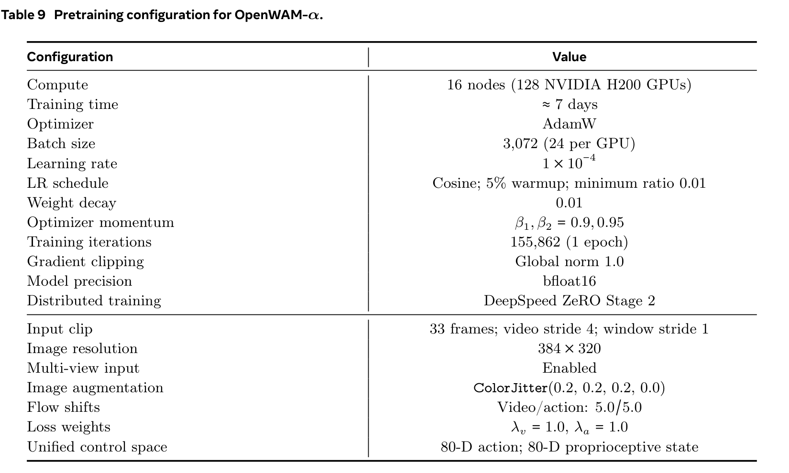

| Configuration | Value |
|---|---|
| Compute | 16 nodes (128 NVIDIA H200 GPUs) |
| Training time | ≈7 days |
| Optimizer | AdamW |
| Batch size | 3,072 (24 per GPU) |
| Learning rate | 1 × 10⁻⁴ |
| LR schedule | Cosine; 5% warmup; minimum ratio 0.01 |
| Weight decay | 0.01 |
| Optimizer momentum | β₁, β₂ = 0.9, 0.95 |
| Training iterations | 155,862 (1 epoch) |
| Gradient clipping | Global norm 1.0 |
| Model precision | bfloat16 |
| Distributed training | DeepSpeed ZeRO Stage 2 |
| Input clip | 33 frames; video stride 4; window stride 1 |
| Image resolution | 384 × 320 |
| Multi-view input | Enabled |
| Image augmentation | ColorJitter(0.2, 0.2, 0.2, 0.0) |
| Flow shifts | Video/action: 5.0/5.0 |
| Loss weights | λᵥ = 1.0, λₐ = 1.0 |
| Unified control space | 80-D action; 80-D proprioceptive state |

**Caption:** Table 9 Pretraining configuration for OpenWAM-α.

**Caption[CN]:** 表 9：OpenWAM-α 预训练配置详情。

> <strong>Para. 2:</strong> The key hyperparameters used for multi-domain pretraining are summarized in Table 9. Pretraining uses 16 nodes with eight NVIDIA H200 GPUs per node (128 GPUs in total) and takes approximately seven days. With 24 clips per GPU and no gradient accumulation, the global batch size is 3,072 clips per optimizer step. The source-level data budgets and realized mixture proportions are reported separately in Table 4.
>
> <strong>Para. 2[CN]:</strong> 用于多域预训练的关键超参数汇总于表 9。预训练依托 16 个计算节点（每节点搭载 8 张 NVIDIA H200 GPU，总计 128 张 GPU），总计耗时约 7 天。在每卡 24 个片段且不设梯度累积的配置下，每个优化步的全局批大小达到 3,072 个片段。各数据源对应的时间预算与实际样本占比在表 4 中详述。

#### B.2 Dataset-Specific SFT Configuration

### Table 10. OpenWAM-α 下游数据集 SFT 微调配置

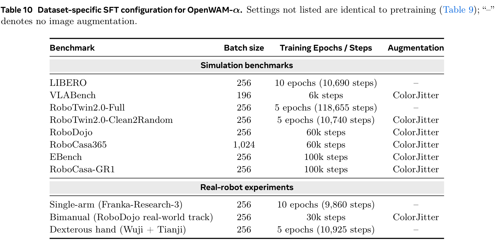

| Benchmark | Batch size | Training Epochs / Steps | Augmentation |
|---|---|---|---|
| **Simulation benchmarks** | | | |
| LIBERO | 256 | 10 epochs (10,690 steps) | – |
| VLABench | 196 | 6k steps | ColorJitter |
| RoboTwin2.0-Full | 256 | 5 epochs (118,655 steps) | – |
| RoboTwin2.0-Clean2Random | 256 | 5 epochs (10,740 steps) | ColorJitter |
| RoboDojo | 256 | 60k steps | ColorJitter |
| RoboCasa365 | 1,024 | 60k steps | ColorJitter |
| EBench | 256 | 100k steps | ColorJitter |
| RoboCasa-GR1 | 256 | 100k steps | ColorJitter |
| **Real-robot experiments** | | | |
| Single-arm (Franka-Research-3) | 256 | 10 epochs (9,860 steps) | – |
| Bimanual (RoboDojo real-world track) | 256 | 30k steps | ColorJitter |
| Dexterous hand (Wuji + Tianji) | 256 | 5 epochs (10,925 steps) | – |

**Caption:** Table 10 Dataset-specific SFT configuration for OpenWAM-α. Settings not listed are identical to pretraining (Table 9); “–” denotes no image augmentation.

**Caption[CN]:** 表 10：OpenWAM-α 下游特定数据集 SFT 监督微调配置。未列出的超参数与预训练基准配置完全一致（见表 9）；“–”表示未启用图像数据增强。

> <strong>Para. 3:</strong> All downstream models are initialized from the same pretrained OpenWAM-α checkpoint. Supervised fine-tuning keeps the pretraining configuration of Table 9 unchanged and differs only in the three benchmark-dependent settings summarized in Table 10: the global batch size, the number of training epochs or steps, and whether image augmentation is applied. Training length is given in epochs over the fine-tuning set, with the corresponding number of optimizer steps in parentheses, or directly in optimizer steps where no epoch-based schedule was used. Image augmentation, where enabled, is the same ColorJitter(0.2, 0.2, 0.2, 0.0) used in pretraining. LIBERO-Plus is evaluated with the LIBERO checkpoint without further fine-tuning.
>
> <strong>Para. 3[CN]:</strong> 所有下游模型均基于同一个预训练好的 OpenWAM-α 权重初始化。监督微调阶段完整继承了表 9 中的大部分预训练超参数，仅在表 10 所列的三项与具体基准强相关的设置上有所调整：全局批大小、训练 Epoch 数或总优化步数，以及是否开启图像数据增强。训练时长标注为基于微调集的 Epoch 数（括号内附对应优化器步数），或对于非 Epoch 调度的基准直接标注总优化步数。在开启增强的任务中，增强算子与预训练一致为 ColorJitter(0.2, 0.2, 0.2, 0.0)。LIBERO-Plus 直接复用 LIBERO 微调所得权重进行零样本评测，不进行额外微调。

### Appendix C: Real-World Evaluation Protocols

> <strong>Para. 1:</strong> This section details the real-world evaluation of Section 5.4: for each embodiment, we document the task setup and the corresponding evaluation protocol.
>
> <strong>Para. 1[CN]:</strong> 本节系统展开第 5.4 节所述的真实物理机器人评估协议：针对每类具身硬件形态，详尽记录任务环境构建与对应的评测规则。

#### C.1 Single-Arm Real-Robot Experiments

> <strong>Para. 2:</strong> **Task Setup.** We evaluate single-arm policies on the Franka-Research-3 platform using six real-world tabletop tasks, covering stacking, hanging, and drawer manipulation. The tasks use a Franka-Research-3 arm with a parallel gripper and RGB observation cameras, as shown in Figure 18. Each task is specified by a natural-language instruction and instantiated with a fixed physical scene: stacking tasks place two target objects on the tabletop, hanging tasks place the object and shelf in the workspace, and drawer tasks place the object on the table next to an upper drawer. Table 11 summarizes the task instructions used in the single-arm evaluation.
>
> <strong>Para. 2[CN]:</strong> **任务设置。** 我们在 Franka-Research-3 平台上评测单臂策略，涵盖堆叠、悬挂以及抽屉放置等 6 项现实桌面操作任务。实验硬件包含一台配有二指平行夹爪和 RGB 观测相机的 Franka-Research-3 机械臂（图 18）。每项任务由特定的自然语言指令指定，并在固定的物理工作空间中初始化：堆叠任务在桌面上摆放两个目标物体，悬挂任务在工作空间放置目标物体与支架，抽屉任务将目标物体置于上方抽屉旁的桌面上。表 11 汇总了单臂评测所用的语言指令。

### Table 11. 单臂真实机器人评测任务指令

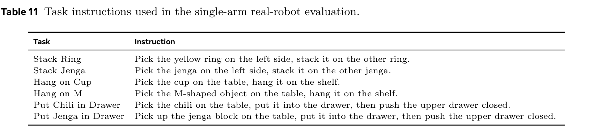

| Task | Instruction |
|---|---|
| Stack Ring | Pick the yellow ring on the left side, stack it on the other ring. |
| Stack Jenga | Pick the jenga on the left side, stack it on the other jenga. |
| Hang on Cup | Pick the cup on the table, hang it on the shelf. |
| Hang on M | Pick the M-shaped object on the table, hang it on the shelf. |
| Put Chili in Drawer | Pick the chili on the table, put it into the drawer, then push the upper drawer closed. |
| Put Jenga in Drawer | Pick up the jenga block on the table, put it into the drawer, then push the upper drawer closed. |

**Caption:** Table 11 Task instructions used in the single-arm real-robot evaluation.

**Caption[CN]:** 表 11：单臂真实机器人评测任务指令。

### Figure 18. Franka-Research-3 物理单臂实验平台设置

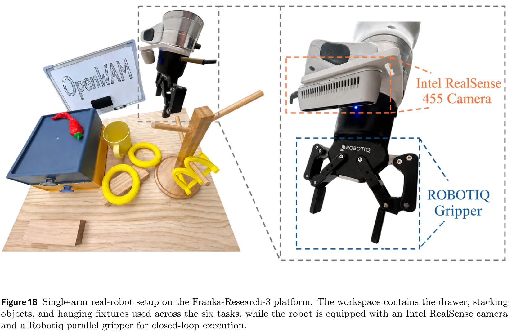

**Caption:** Figure 18 Single-arm real-robot setup on the Franka-Research-3 platform. The workspace contains the drawer, stacking objects, and hanging fixtures used across the six tasks, while the robot is equipped with an Intel RealSense camera and a Robotiq parallel gripper for closed-loop execution.

**Caption[CN]:** 图 18：Franka-Research-3 物理单臂实验平台设置。工作空间包含 6 项任务所用的抽屉、堆叠物块及悬挂支架，机械臂配备 Intel RealSense 相机与 Robotiq 平行夹爪以支持闭环控制。

### Figure 19. Franka-Research-3 单臂任务执行序列展示

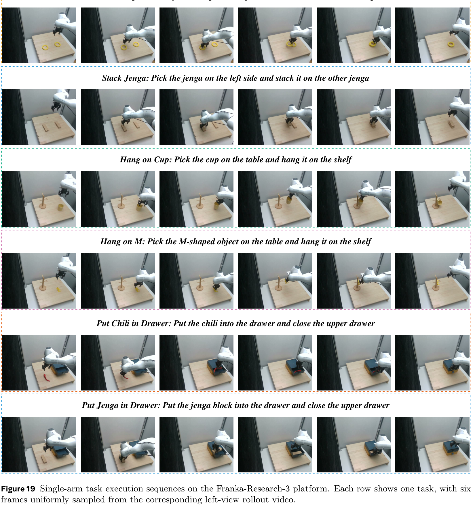

**Caption:** Figure 19 Single-arm task execution sequences on the Franka-Research-3 platform. Each row shows one task, with six frames uniformly sampled from the corresponding left-view rollout video.

**Caption[CN]:** 图 19：Franka-Research-3 单臂任务执行序列展示。每行对应一个任务，展示了从左侧视角视频中均匀采样的 6 帧连续操作画面。

#### C.2 Dexterous-Hand Real-Robot Experiments

> <strong>Para. 3:</strong> **Task Setup.** We evaluate dexterous-hand policies on four real-world manipulation tasks: Stack Toy Tower, Collect Shuttlecocks, Twist off Bottle Cap, and Put Away Clothes. Each task is specified by a natural-language instruction that defines the desired manipulation objective. The task instructions are summarized in Table 12.
>
> <strong>Para. 3[CN]:</strong> **任务设置。** 我们在物理多指灵巧手平台上评估 4 项高难度真实操控任务：叠玩具塔（Stack Toy Tower）、收集羽毛球（Collect Shuttlecocks）、拧开瓶盖（Twist off Bottle Cap）以及整理衣物（Put Away Clothes）。每项任务均由明确定义操作目标的自然语言指令指定，任务指令汇总于表 12。

### Table 12. 灵巧手真实机器人评测任务指令

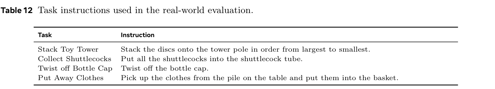

| Task | Instruction |
|---|---|
| Stack Toy Tower | Stack the discs onto the tower pole in order from largest to smallest. |
| Collect Shuttlecocks | Put all the shuttlecocks into the shuttlecock tube. |
| Twist off Bottle Cap | Twist off the bottle cap. |
| Put Away Clothes | Pick up the clothes from the pile on the table and put them into the basket. |

**Caption:** Table 12 Task instructions used in the real-world evaluation.

**Caption[CN]:** 表 12：灵巧手真实机器人评测任务指令。

### Figure 20. 灵巧手物理实验平台与场景环境

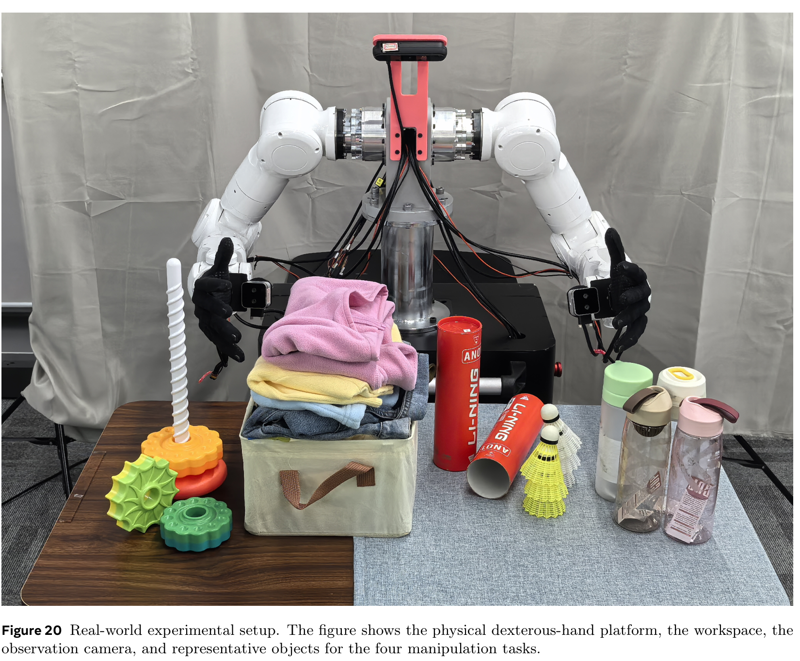

**Caption:** Figure 20 Real-world experimental setup. The figure shows the physical dexterous-hand platform, the workspace, the observation camera, and representative objects for the four manipulation tasks.

**Caption[CN]:** 图 20：灵巧手物理实验平台与场景环境。展示了物理灵巧手机器人本体、操作工作台面、观测相机视点以及 4 项任务所用的代表性操作物体。

### Figure 21. 灵巧手任务执行序列与分布外（OOD）扰动设定

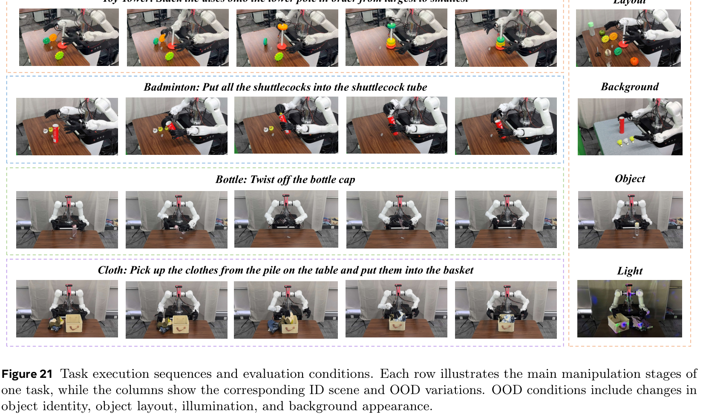

**Caption:** Figure 21 Task execution sequences and evaluation conditions. Each row illustrates the main manipulation stages of one task, while the columns show the corresponding ID scene and OOD variations. OOD conditions include changes in object identity, object layout, illumination, and background appearance.

**Caption[CN]:** 图 21：灵巧手任务执行序列与分布外（OOD）扰动设定。每行展示一项任务的关键操作推进阶段，各列分别展示对应的分布内（ID）基准场景与各类分布外（OOD）扰动变体。OOD 扰动包括物体种类替换、摆放布局变异、环境光照剧变以及工作台背景外观更换。

> <strong>Para. 4:</strong> **Evaluation Protocol.** Each task is evaluated over multiple independent trials under both ID and OOD conditions. We report two complementary metrics: the progress score (Score) and the final success rate (SR).
>
> *Final Success Rate.* A trial is counted as a final success only when the complete task objective is achieved. The final success rate is computed as
>
> <strong>Para. 4[CN]:</strong> **评估协议与指标计算。** 每项任务在分布内（ID）与各类分布外（OOD）条件下接受多轮独立重复测试。我们汇报两项互补的关键指标：任务进度得分（Progress Score）与最终成功率（Final Success Rate, SR）。
>
> *最终成功率（Final Success Rate）：* 仅当完整任务目标全部达成时，该测试回合方被判定为最终成功。最终成功率计算公式如下：

$$
S_{\text{final}} = \frac{N_{\text{success}}}{N_{\text{trial}}} \times 100\%
$$
> <strong>Para. 5:</strong> where $N_{\text{success}}$ is the number of trials satisfying the complete task criterion and $N_{\text{trial}}$ is the total number of valid trials.
>
> *Progress Score.* The progress score measures the fraction of required manipulation elements that are successfully completed, regardless of whether the final task state is achieved. For trial $i$, let $n_i$ denote the number of successfully completed elements and $m_i$ denote the total number of elements present in that trial. The progress score is computed as
>
> <strong>Para. 5[CN]:</strong> 其中 $N_{\text{success}}$ 表示满足完整任务标准的成功回合数，$N_{\text{trial}}$ 为有效测试总回合数。
>
> *进度得分（Progress Score）：* 进度得分用于量化完成关键物理操作子步骤的比例，无论最终整体任务状态是否完全达成。对于第 $i$ 次测试，设 $n_i$ 为成功完成的子步骤或操作元素数量，$m_i$ 为该回合要求的总元素数。进度得分定义如下：

$$
S_{\text{process}} = \frac{\sum_i n_i}{\sum_i m_i} \times 100\%
$$
> <strong>Para. 6:</strong> **Task-Specific Criteria.**
>
> - *Collect Shuttlecocks:* Each trial contains two to four shuttlecocks on the tabletop. A trial is counted as a final success only when all shuttlecocks are placed into the shuttlecock tube. The progress score is the fraction of shuttlecocks successfully placed into the tube.
>
> - *Stack Toy Tower:* Each trial contains three discs. A trial is counted as a final success only when all three discs are successfully inserted onto the tower pole in descending order of size. The progress score is the fraction of discs successfully inserted.
>
> - *Put Away Clothes:* Each trial contains three to four pieces of clothing. A trial is counted as a final success only when all pieces of clothing are placed into the basket. The progress score is the fraction of clothing items successfully placed into the basket.
>
> - *Twist off Bottle Cap:* A trial is counted as a final success when the bottle cap is fully twisted off and the robot maintains a stable grasp of the bottle or cap. The progress score records whether the cap is successfully twisted off, regardless of whether the final stable grasp is achieved.
>
> <strong>Para. 6[CN]:</strong> **各项任务具体判定标准。**
>
> - *收集羽毛球（Collect Shuttlecocks）：* 每回合桌面放置 2 至 4 个羽毛球。仅当所有羽毛球均被完整放入羽毛球筒内时判定为最终成功。进度得分为成功放入筒内的羽毛球所占比例。
>
> - *叠玩具塔（Stack Toy Tower）：* 每回合包含 3 个圆盘。仅当全部 3 个圆盘严格按尺寸从大到小套入塔柱时判定为最终成功。进度得分为成功正确套入的圆盘比例。
>
> - *整理衣物（Put Away Clothes）：* 每回合桌面上堆叠 3 至 4 件衣物。仅当所有衣物均被完整抓取并放入收纳篮中时判定为最终成功。进度得分为成功放入收纳篮的衣物件数比例。
>
> - *拧开瓶盖（Twist off Bottle Cap）：* 当瓶盖被完全拧脱且机械臂保持对瓶身或瓶盖的稳定抓持时判定为最终成功。进度得分记录瓶盖是否已被成功拧脱脱离瓶身，无论最后是否达成平稳抓持。

#### C.3 Bimanual Real-Robot Experiments

> <strong>Para. 7:</strong> We conduct bimanual experiments on the official RoboDojo real-robot platform across three embodiments: Piper, Piper X, and ARX X5, covering 18 challenging tasks in total. Each embodiment evaluates six tasks spanning generalization, precision, long-horizon, memory, and open settings. Following the standard protocol of RoboDojo, each cell in Table 7 reports the Progress Score and Success Rate across 10 independent evaluation trials per task.
>
> <strong>Para. 7[CN]:</strong> 双臂实验在官方 RoboDojo 实体机器人竞技平台上展开，跨越 Piper、Piper X 与 ARX X5 三大硬件形态，共计测试 18 项复杂操作任务。每种硬件分别测试 6 项涵盖通用泛化、高精度定位、长时序协作、环境记忆与开放场景的任务。遵循 RoboDojo 官方标准协议，表 7 中的每个单元格记录各任务在 10 轮独立测试下的进度得分（Score）与成功率（SR）。

### Appendix D: Per-Benchmark Simulation Results

> <strong>Para. 1:</strong> The tables below report the full per-benchmark scores summarized in Figure 13, except for LIBERO-Plus whose scores are already reported in Table 5 of the main text. Within each table the baselines are grouped into VLA and WAM families.
>
> <strong>Para. 1[CN]:</strong> 以下各表完整汇报了图 13 所汇总的各大仿真基准的详细分项评测得分（LIBERO-Plus 的详尽评测已在正文表 5 中汇报）。在每个评测表格内部，基线方法分别聚类划分为 VLA 与 WAM 两大流派。

### Table 13. LIBERO 仿真基准详细评测结果

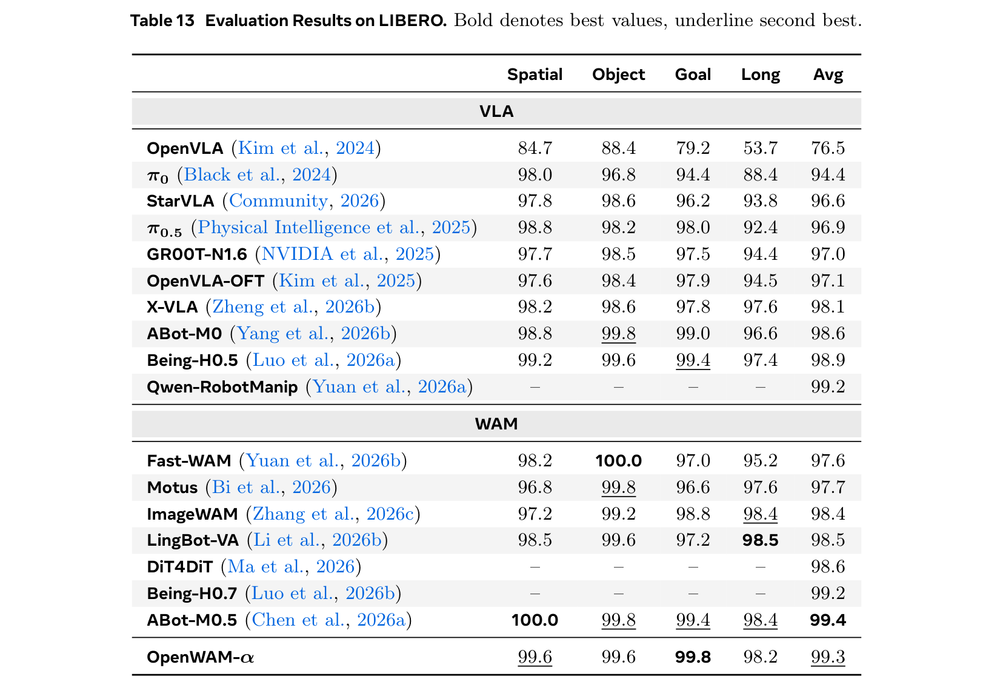

| Paradigm | Policy | Spatial | Object | Goal | Long | Avg |
|---|---|---|---|---|---|---|
| VLA | OpenVLA (Kim et al., 2024) | 84.7 | 88.4 | 79.2 | 53.7 | 76.5 |
| VLA | π0 (Black et al., 2024) | 98.0 | 96.8 | 94.4 | 88.4 | 94.4 |
| VLA | StarVLA (Community, 2026) | 97.8 | 98.6 | 96.2 | 93.8 | 96.6 |
| VLA | π0.5 (Physical Intelligence et al., 2025) | 98.8 | 98.2 | 98.0 | 92.4 | 96.9 |
| VLA | GR00T-N1.6 (NVIDIA et al., 2025) | 97.7 | 98.5 | 97.5 | 94.4 | 97.0 |
| VLA | OpenVLA-OFT (Kim et al., 2025) | 97.6 | 98.4 | 97.9 | 94.5 | 97.1 |
| VLA | X-VLA (Zheng et al., 2026b) | 98.2 | 98.6 | 97.8 | 97.6 | 98.1 |
| VLA | ABot-M0 (Yang et al., 2026b) | 98.8 | **99.8** | 99.0 | 96.6 | 98.6 |
| VLA | Being-H0.5 (Luo et al., 2026a) | 99.2 | 99.6 | 99.4 | 97.4 | 98.9 |
| VLA | Qwen-RobotManip (Yuan et al., 2026a) | – | – | – | – | 99.2 |
| WAM | Fast-WAM (Yuan et al., 2026b) | 98.2 | **100.0** | 97.0 | 95.2 | 97.6 |
| WAM | Motus (Bi et al., 2026) | 96.8 | **99.8** | 96.6 | 97.6 | 97.7 |
| WAM | ImageWAM (Zhang et al., 2026c) | 97.2 | 99.2 | 98.8 | 98.4 | 98.4 |
| WAM | LingBot-VA (Li et al., 2026b) | 98.5 | 99.6 | 97.2 | **98.5** | 98.5 |
| WAM | DiT4DiT (Ma et al., 2026) | – | – | – | – | 98.6 |
| WAM | Being-H0.7 (Luo et al., 2026b) | – | – | – | – | 99.2 |
| WAM | ABot-M0.5 (Chen et al., 2026a) | **100.0** | **99.8** | 99.4 | 98.4 | **99.4** |
| WAM | OpenWAM-α | 99.6 | 99.6 | **99.8** | 98.2 | 99.3 |

**Caption:** Table 13 Evaluation Results on LIBERO. Bold denotes best values, underline second best.

**Caption[CN]:** 表 13：LIBERO 仿真基准详细评测结果。粗体表示最优值，下划线表示次优值。

### Table 14. VLABench 仿真基准详细评测结果

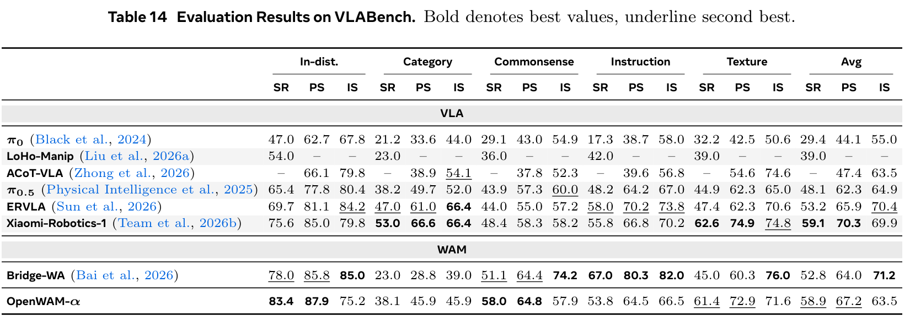

| Paradigm | Policy | In-dist. SR | In-dist. PS | In-dist. IS | Category SR | Category PS | Category IS | Commonsense SR | Commonsense PS | Commonsense IS | Instruction SR | Instruction PS | Instruction IS | Texture SR | Texture PS | Texture IS | Avg SR | Avg PS | Avg IS |
|---|---|---|---|---|---|---|---|---|---|---|---|---|---|---|---|---|---|---|---|
| VLA | π0 (Black et al., 2024) | 47.0 | 62.7 | 67.8 | 21.2 | 33.6 | 44.0 | 29.1 | 43.0 | 54.9 | 17.3 | 38.7 | 58.0 | 32.2 | 42.5 | 50.6 | 29.4 | 44.1 | 55.0 |
| VLA | LoHo-Manip (Liu et al., 2026a) | 54.0 | – | – | 23.0 | – | – | 36.0 | – | – | 42.0 | – | – | 39.0 | – | – | 39.0 | – | – |
| VLA | ACoT-VLA (Zhong et al., 2026) | – | 66.1 | 79.8 | – | 38.9 | 54.1 | – | 37.8 | 52.3 | – | 39.6 | 56.8 | – | 54.6 | 74.6 | – | 47.4 | 63.5 |
| VLA | π0.5 (Physical Intelligence et al., 2025) | 65.4 | 77.8 | 80.4 | 38.2 | 49.7 | 52.0 | 43.9 | 57.3 | 60.0 | 48.2 | 64.2 | 67.0 | 44.9 | 62.3 | 65.0 | 48.1 | 62.3 | 64.9 |
| VLA | ERVLA (Sun et al., 2026) | 69.7 | 81.1 | 84.2 | 47.0 | 61.0 | 66.4 | 44.0 | 55.0 | 57.2 | **58.0** | 70.2 | 73.8 | 47.4 | 62.3 | 70.6 | 53.2 | 65.9 | 70.4 |
| VLA | Xiaomi-Robotics-1 (Team et al., 2026b) | 75.6 | 85.0 | 79.8 | **53.0** | **66.6** | **66.4** | 48.4 | 58.3 | 58.2 | 55.8 | 66.8 | 70.2 | **62.6** | **74.9** | 74.8 | **59.1** | **70.3** | 69.9 |
| WAM | Bridge-WA (Bai et al., 2026) | 78.0 | 85.8 | **85.0** | 23.0 | 28.8 | 39.0 | 51.1 | 64.4 | 74.2 | 67.0 | **80.3** | **82.0** | 45.0 | 60.3 | **76.0** | 52.8 | 64.0 | **71.2** |
| WAM | OpenWAM-α | **83.4** | **87.9** | 75.2 | 38.1 | 45.9 | 45.9 | **58.0** | **64.8** | 57.9 | 53.8 | 64.5 | 66.5 | 61.4 | 72.9 | 71.6 | 58.9 | 67.2 | 63.5 |

**Caption:** Table 14 Evaluation Results on VLABench. Bold denotes best values, underline second best.

**Caption[CN]:** 表 14：VLABench 仿真基准详细评测结果。粗体表示最优值，下划线表示次优值。

### Table 15. RoboTwin2.0-Clean2Random 仿真基准详细评测结果

| Paradigm | Policy | Clean | Randomized | Avg |
|---|---|---|---|---|
| VLA | StarVLA (Community, 2026) | 46.5 | 3.2 | 24.9 |
| VLA | GR00T-N1.7 (NVIDIA et al., 2025) | 43.6 | 20.7 | 32.2 |
| VLA | X-VLA (Zheng et al., 2026b) | 68.0 | 20.9 | 44.5 |
| VLA | Spatial Forcing (Li et al., 2026a) | 77.2 | 26.7 | 52.0 |
| VLA | ABot-M0 (Yang et al., 2026b) | 70.7 | 36.0 | 53.4 |
| VLA | π0.5 (Physical Intelligence et al., 2025) | 70.7 | 46.0 | 58.4 |
| VLA | GigaBrain-0.7 (Team et al., 2026a) | 66.8 | 67.9 | 67.4 |
| VLA | Qwen-RobotManip (Yuan et al., 2026a) | 84.7 | **69.4** | **77.1** |
| WAM | AHA-WAM (Cai et al., 2026b) | 64.3 | 3.2 | 33.8 |
| WAM | Fast-WAM (Yuan et al., 2026b) | 77.8 | 1.9 | 39.9 |
| WAM | X-WAM (Guo et al., 2026) | 70.0 | 25.8 | 47.9 |
| WAM | 4D-WAM (Yang et al., 2026a) | 81.5 | 41.8 | 61.7 |
| WAM | OpenWAM-α | **89.4** | 48.7 | 69.0 |

**Caption:** Table 15 Evaluation Results on RoboTwin2.0-Clean2Random. Bold denotes best values, underline second best.

**Caption[CN]:** 表 15：RoboTwin2.0-Clean2Random 仿真基准详细评测结果。粗体表示最优值，下划线表示次优值。

### Table 16. RoboTwin2.0-Full 仿真基准详细评测结果

| Paradigm | Policy | Clean | Randomized | Avg |
|---|---|---|---|---|
| VLA | X-VLA (Zheng et al., 2026b) | 72.80 | 72.84 | 72.82 |
| VLA | π0.5 (Physical Intelligence et al., 2025) | 82.70 | 76.80 | 79.75 |
| VLA | ABot-M0 (Yang et al., 2026b) | 86.06 | 85.08 | 85.57 |
| VLA | Qwen-VLA (Wang et al., 2026a) | 86.10 | 87.20 | 86.65 |
| VLA | StarVLA (Community, 2026) | 88.18 | 88.32 | 88.25 |
| VLA | Galaxea G0.5 (Liu et al., 2026b) | 93.70 | 92.80 | 93.25 |
| VLA | Qwen-RobotManip (Yuan et al., 2026a) | 93.70 | 94.00 | 93.85 |
| WAM | Motus (Bi et al., 2026) | 88.66 | 87.02 | 87.84 |
| WAM | Fast-WAM (Yuan et al., 2026b) | 91.90 | 91.80 | 91.85 |
| WAM | LingBot-VA (Li et al., 2026b) | 92.93 | 91.55 | 92.24 |
| WAM | ImageWAM (Zhang et al., 2026c) | 93.20 | 93.56 | 93.38 |
| WAM | LingBot-VA 2.0 (Zhang et al., 2026b) | 93.80 | 93.40 | 93.60 |
| WAM | ABot-M0.5 (Chen et al., 2026a) | **94.00** | **94.20** | **94.10** |
| WAM | OpenWAM-α | 93.74 | 93.46 | 93.60 |

**Caption:** Table 16 Evaluation Results on RoboTwin2.0-Full. Bold denotes best values, underline second best.

**Caption[CN]:** 表 16：RoboTwin2.0-Full 仿真基准详细评测结果。粗体表示最优值，下划线表示次优值。

### Table 17. RoboDojo 仿真基准详细评测结果

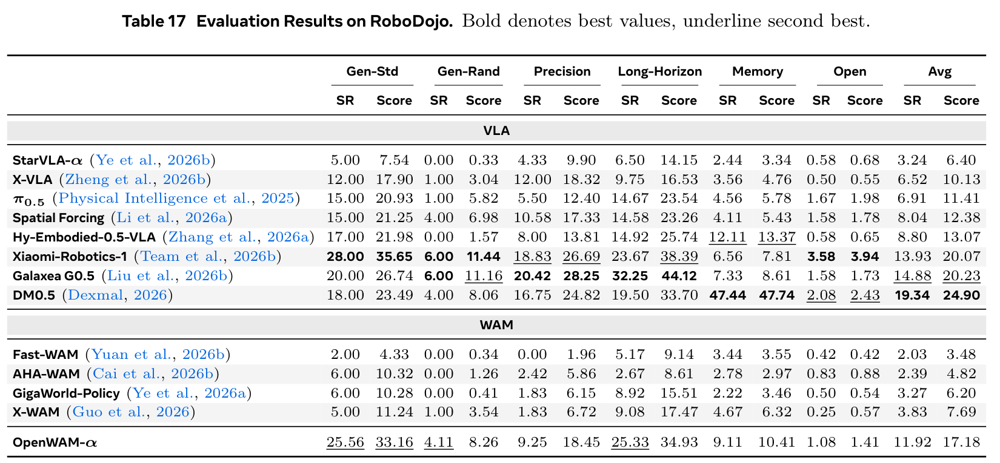

| Paradigm | Policy | Gen-Std SR | Gen-Std Score | Gen-Rand SR | Gen-Rand Score | Precision SR | Precision Score | Long-Horizon SR | Long-Horizon Score | Memory SR | Memory Score | Open SR | Open Score | Avg SR | Avg Score |
|---|---|---|---|---|---|---|---|---|---|---|---|---|---|---|---|
| VLA | StarVLA-α (Ye et al., 2026b) | 5.00 | 7.54 | 0.00 | 0.33 | 4.33 | 9.90 | 6.50 | 14.15 | 2.44 | 3.34 | 0.58 | 0.68 | 3.24 | 6.40 |
| VLA | X-VLA (Zheng et al., 2026b) | 12.00 | 17.90 | 1.00 | 3.04 | 12.00 | 18.32 | 9.75 | 16.53 | 3.56 | 4.76 | 0.50 | 0.55 | 6.52 | 10.13 |
| VLA | π0.5 (Physical Intelligence et al., 2025) | 15.00 | 20.93 | 1.00 | 5.82 | 5.50 | 12.40 | 14.67 | 23.54 | 4.56 | 5.78 | 1.67 | 1.98 | 6.91 | 11.41 |
| VLA | Spatial Forcing (Li et al., 2026a) | 15.00 | 21.25 | 4.00 | 6.98 | 10.58 | 17.33 | 14.58 | 23.26 | 4.11 | 5.43 | 1.58 | 1.78 | 8.04 | 12.38 |
| VLA | Hy-Embodied-0.5-VLA (Zhang et al., 2026a) | 17.00 | 21.98 | 0.00 | 1.57 | 8.00 | 13.81 | 14.92 | 25.74 | 12.11 | 13.37 | 0.58 | 0.65 | 8.80 | 13.07 |
| VLA | Xiaomi-Robotics-1 (Team et al., 2026b) | **28.00** | **35.65** | **6.00** | **11.44** | 18.83 | 26.69 | 23.67 | 38.39 | 6.56 | 7.81 | **3.58** | **3.94** | 13.93 | 20.07 |
| VLA | Galaxea G0.5 (Liu et al., 2026b) | 20.00 | 26.74 | **6.00** | 11.16 | **20.42** | **28.25** | **32.25** | **44.12** | 7.33 | 8.61 | 1.58 | 1.73 | 14.88 | 20.23 |
| VLA | DM0.5 (Dexmal, 2026) | 18.00 | 23.49 | 4.00 | 8.06 | 16.75 | 24.82 | 19.50 | 33.70 | **47.44** | **47.74** | 2.08 | 2.43 | **19.34** | **24.90** |
| WAM | Fast-WAM (Yuan et al., 2026b) | 2.00 | 4.33 | 0.00 | 0.34 | 0.00 | 1.96 | 5.17 | 9.14 | 3.44 | 3.55 | 0.42 | 0.42 | 2.03 | 3.48 |
| WAM | AHA-WAM (Cai et al., 2026b) | 6.00 | 10.32 | 0.00 | 1.26 | 2.42 | 5.86 | 2.67 | 8.61 | 2.78 | 2.97 | 0.83 | 0.88 | 2.39 | 4.82 |
| WAM | GigaWorld-Policy (Ye et al., 2026a) | 6.00 | 10.28 | 0.00 | 0.41 | 1.83 | 6.15 | 8.92 | 15.51 | 2.22 | 3.46 | 0.50 | 0.54 | 3.27 | 6.20 |
| WAM | X-WAM (Guo et al., 2026) | 5.00 | 11.24 | 1.00 | 3.54 | 1.83 | 6.72 | 9.08 | 17.47 | 4.67 | 6.32 | 0.25 | 0.57 | 3.83 | 7.69 |
| WAM | OpenWAM-α | 25.56 | 33.16 | 4.11 | 8.26 | 9.25 | 18.45 | 25.33 | 34.93 | 9.11 | 10.41 | 1.08 | 1.41 | 11.92 | 17.18 |

**Caption:** Table 17 Evaluation Results on RoboDojo. Bold denotes best values, underline second best.

**Caption[CN]:** 表 17：RoboDojo 仿真基准详细评测结果。粗体表示最优值，下划线表示次优值。

### Table 18. EBench 仿真基准详细评测结果

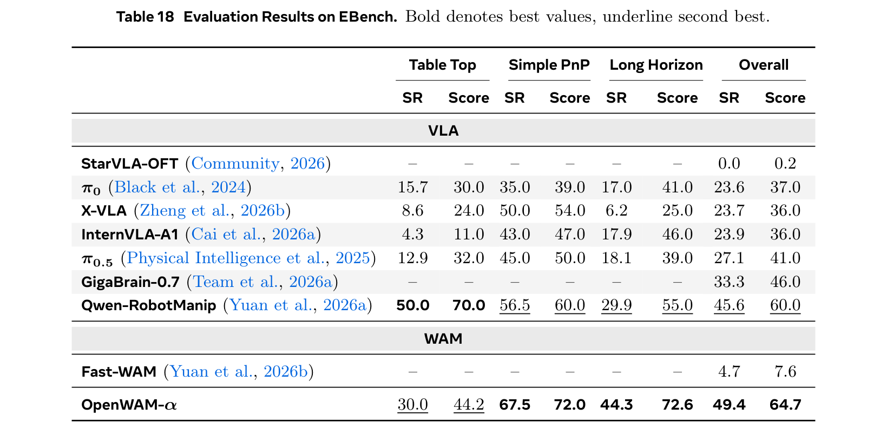

| Paradigm | Policy | Table Top SR | Table Top Score | Simple PnP SR | Simple PnP Score | Long Horizon SR | Long Horizon Score | Overall SR | Overall Score |
|---|---|---|---|---|---|---|---|---|---|
| VLA | StarVLA-OFT (Community, 2026) | – | – | – | – | – | – | 0.0 | 0.2 |
| VLA | π0 (Black et al., 2024) | 15.7 | 30.0 | 35.0 | 39.0 | 17.0 | 41.0 | 23.6 | 37.0 |
| VLA | X-VLA (Zheng et al., 2026b) | 8.6 | 24.0 | 50.0 | 54.0 | 6.2 | 25.0 | 23.7 | 36.0 |
| VLA | InternVLA-A1 (Cai et al., 2026a) | 4.3 | 11.0 | 43.0 | 47.0 | 17.9 | 46.0 | 23.9 | 36.0 |
| VLA | π0.5 (Physical Intelligence et al., 2025) | 12.9 | 32.0 | 45.0 | 50.0 | 18.1 | 39.0 | 27.1 | 41.0 |
| VLA | GigaBrain-0.7 (Team et al., 2026a) | – | – | – | – | – | – | 33.3 | 46.0 |
| VLA | Qwen-RobotManip (Yuan et al., 2026a) | **50.0** | **70.0** | 56.5 | 60.0 | 29.9 | 55.0 | 45.6 | 60.0 |
| WAM | Fast-WAM (Yuan et al., 2026b) | – | – | – | – | – | – | 4.7 | 7.6 |
| WAM | OpenWAM-α | 30.0 | 44.2 | **67.5** | **72.0** | **44.3** | **72.6** | **49.4** | **64.7** |

**Caption:** Table 18 Evaluation Results on EBench. Bold denotes best values, underline second best.

**Caption[CN]:** 表 18：EBench 仿真基准详细评测结果。粗体表示最优值，下划线表示次优值。

### Table 19. RoboCasa365 仿真基准详细评测结果

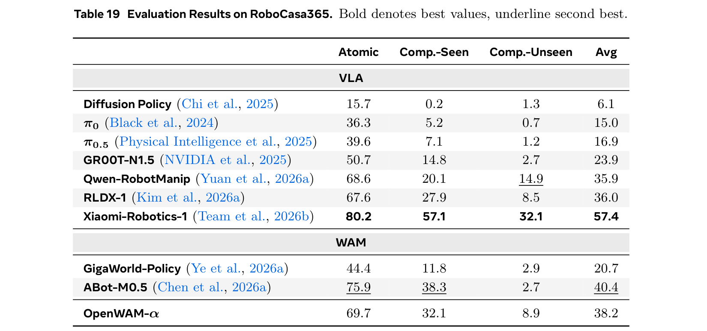

| Paradigm | Policy | Atomic | Comp.-Seen | Comp.-Unseen | Avg |
|---|---|---|---|---|---|
| VLA | Diffusion Policy (Chi et al., 2025) | 15.7 | 0.2 | 1.3 | 6.1 |
| VLA | π0 (Black et al., 2024) | 36.3 | 5.2 | 0.7 | 15.0 |
| VLA | π0.5 (Physical Intelligence et al., 2025) | 39.6 | 7.1 | 1.2 | 16.9 |
| VLA | GR00T-N1.5 (NVIDIA et al., 2025) | 50.7 | 14.8 | 2.7 | 23.9 |
| VLA | Qwen-RobotManip (Yuan et al., 2026a) | 68.6 | 20.1 | **14.9** | 35.9 |
| VLA | RLDX-1 (Kim et al., 2026a) | 67.6 | 27.9 | 8.5 | 36.0 |
| VLA | Xiaomi-Robotics-1 (Team et al., 2026b) | **80.2** | **57.1** | **32.1** | **57.4** |
| WAM | GigaWorld-Policy (Ye et al., 2026a) | 44.4 | 11.8 | 2.9 | 20.7 |
| WAM | ABot-M0.5 (Chen et al., 2026a) | 75.9 | 38.3 | 2.7 | 40.4 |
| WAM | OpenWAM-α | 69.7 | 32.1 | 8.9 | 38.2 |

**Caption:** Table 19 Evaluation Results on RoboCasa365. Bold denotes best values, underline second best.

**Caption[CN]:** 表 19：RoboCasa365 仿真基准详细评测结果。粗体表示最优值，下划线表示次优值。

### Table 20. RoboCasa-GR1 仿真基准详细评测结果

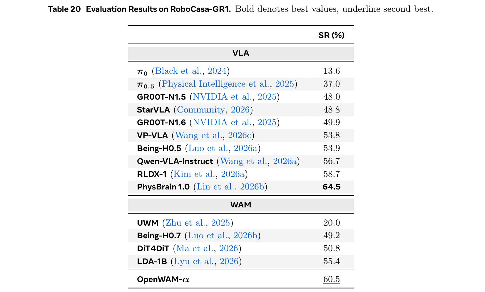

| Paradigm | Policy | SR (%) |
|---|---|---|
| VLA | π0 (Black et al., 2024) | 13.6 |
| VLA | π0.5 (Physical Intelligence et al., 2025) | 37.0 |
| VLA | GR00T-N1.5 (NVIDIA et al., 2025) | 48.0 |
| VLA | StarVLA (Community, 2026) | 48.8 |
| VLA | GR00T-N1.6 (NVIDIA et al., 2025) | 49.9 |
| VLA | VP-VLA (Wang et al., 2026c) | 53.8 |
| VLA | Being-H0.5 (Luo et al., 2026a) | 53.9 |
| VLA | Qwen-VLA-Instruct (Wang et al., 2026a) | 56.7 |
| VLA | RLDX-1 (Kim et al., 2026a) | 58.7 |
| VLA | PhysBrain 1.0 (Lin et al., 2026b) | **64.5** |
| WAM | UWM (Zhu et al., 2025) | 20.0 |
| WAM | Being-H0.7 (Luo et al., 2026b) | 49.2 |
| WAM | DiT4DiT (Ma et al., 2026) | 50.8 |
| WAM | LDA-1B (Lyu et al., 2026) | 55.4 |
| WAM | OpenWAM-α | 60.5 |

**Caption:** Table 20 Evaluation Results on RoboCasa-GR1. Bold denotes best values, underline second best.

**Caption[CN]:** 表 20：RoboCasa-GR1 仿真基准详细评测结果。粗体表示最优值，下划线表示次优值。
