---
tags:
  - papers/WorldModel
  - embodied_ai/world_action_models
  - robotics/flow_matching
  - open_source/foundation_models
aliases:
  - OpenWAM
  - OpenWAM-alpha
  - OpenWAM-Infra
  - OpenWAM-Study
date: 2026-09-07
arxiv_id: 2609.07398
---

# OpenWAM: An Open, Modular Exploration Towards Systematic World-Action Model Pretraining

## 核心信息

| 属性 | 详细内容 |
| :--- | :--- |
| **论文标题** | OpenWAM: An Open, Modular Exploration Towards Systematic World–Action Model Pretraining |
| **中文译名** | OpenWAM：迈向系统化世界-动作模型预训练的开放模块化探索 |
| **核心作者** | Yuran Wang (NUS)*‡, Siqiao Huang (Tsinghua)*‡, Mingleyang Li (PKU)*, Chenhao Zhang (PKU)*, Jiaqi Liang (PKU)*, Weiyang Jin (HKU), Yue Chen (PKU), Xuemin Chi (ZJU), Donghao Zhou (CUHK), Qize Yu, Yu-Kai Wang, Yuhan Rui, Shenzhe Yao, Zhen Yuan, Zhenhao Shen, Kefei Zhu, Zijie Zhu, Ning Gao, Xiaowei Chi, Guanqi He, Shanghang Zhang, Hao Dong, Lin Shao (NUS)†, Hang Zhao (Tsinghua)† (*共同一作, ‡项目负责人, †共同指导) |
| **第一机构** | 新加坡国立大学 (NUS) / 清华大学 (Tsinghua) / 北京大学 (PKU) 联合团队 |
| **合作单位** | 香港大学 (HKU)、浙江大学 (ZJU)、香港中文大学 (CUHK)、上海交通大学 (SJTU)、无极科技 (Wuji Technology) |
| **发布时间** | 2026年9月7日 (arXiv:2609.07398v1 [cs.RO]) |
| **开源主页** | [https://openwam-official.github.io/](https://openwam-official.github.io/) |
| **代码仓库** | [https://github.com/OpenWAM-Official/OpenWAM](https://github.com/OpenWAM-Official/OpenWAM) |
| **权重与数据** | [https://huggingface.co/OpenWAM](https://huggingface.co/OpenWAM) |
| **技术定位** | 具身智能领域首个实现**全栈模块化解耦（Modular Infrastructure）**并系统建立**6大设计原则实证闭环**的开源世界动作模型预训练框架与基础模型（OpenWAM-α） |
| **基准战绩速览** | **8大仿真基准**：LIBERO (99.3%), RoboTwin 2.0 Full (93.60%), RoboTwin Clean2Random (69.0%), VLABench (58.9% SR / 63.5 IS), RoboDojo (11.92% SR / 17.18分), EBench (49.4% SR / 64.7分), RoboCasa365 (38.2%), RoboCasa-GR1 (60.5%)；<br>**3大真实机器人平台**：Franka单臂6任务平均 82.5%（超越π0.5的55.0%与LingBot-VA的77.5%）、RoboDojo双臂18任务实机评测以 37.6分 / 24.4% 成功率斩获全榜第一、无极手+天机臂高自由度灵巧手4任务大幅领先π0.5；<br>**部署性能**：基于 CUDA Graphs 与 DiT 速度缓存，在单张 RTX 5090 上实现 **170ms** 实时闭环控制。 |

---

## 原文摘要翻译

世界-动作模型（World–Action Models, WAMs）从视频生成先验中继承物理世界动态知识，并通过具身交互经验将其转化为可执行的机器人控制信号。然而，现有的世界动作模型系统普遍高度单体化（monolithic）：生成主干、视觉表征、网络架构、信息流动机制、推理去噪流程以及训练数据等组件紧密缠绕，导致无法厘清哪些设计抉择真正起到了决定性作用及其背后的机理。

针对这一痛点，我们推出了 **OpenWAM**，这是一个将世界-动作模型预训练转化为受控实证研究范式的全开放科研基建与技术栈。首先，**OpenWAM-Infra** 将 WAM 的庞大设计空间解耦为高度可组合的模块，并辅以统一的训练、推理部署与评测协议。在此基建之上，**OpenWAM-Study** 通过严谨受控的消融实验系统性探索了三大核心命题：应该继承何种先验、世界流与动作流如何协同、以及这种协同作用如何跨域扩展；并最终提炼出三项核心设计原则：
1. 上游世界知识必须通过**足够强劲的视频生成主干**与**紧凑且高信息密度的潜空间**才能实现最高效的迁移；
2. 世界与动作的深度协同需要**专有的动作表征容量**、**显式的世界至动作信息流**以及**严格同步的联合去噪过程**；
3. 具身预训练的核心收益在于显著拓展**分布外（OOD）泛化性能**，且将人类第一人称日常操作视频与机器人轨迹进行**单阶段协同训练（One-stage Co-training）**能够最有机地结合环境覆盖广度与动作物理对齐。

综合上述设计原则，我们打造了 **OpenWAM-α**——一个在约 6,400 小时（5.185 亿帧）第一人称人类视频与真实/仿真机器人异构数据上完成预训练的开源基础模型。在涵盖单臂、双臂桌面操作、移动双臂乃至高自由度仿人灵巧手的八大仿真基准和三大实体机器人评测中，OpenWAM-α 均取得了极其出色的顶尖战绩，成功将高水准能力从虚拟仿真无缝延续至实体物理世界。我们全量开源了整套基础架构、评测协议、预训练权重与清洗数据配方，以推动社区开展可复现、可积累的系统性研究。

---

## 创新点

1. **彻底解耦的模块化研究基建（OpenWAM-Infra）**
   * **Takeaway：终结了世界动作模型“各自为战、改动牵一发而动全身”的意大利面式工程黑盒，将 WAM 全面规范化为三元组组合 $C(E, S, M)$。**
   * 实现了视觉编码器（$E$）、多流主干（$S$）与注意力可见性掩码（$M$）的即插即用替换；
   * 构建了跨任意变体的单一 Flow-Matching 训练器、统一 WebSocket 策略服务与轻量客户端评测协议，彻底屏蔽了底层架构细节对上下游部署的干扰。
2. **六大核心设计原则的严格实证闭环（OpenWAM-Study）**
   * **Takeaway：首次在严格对齐的受控变量下完成了跨架构、跨主干、跨隐空间、跨注意力、跨调度与跨数据维度的系统实证剖析，推翻了大量经验假说。**
   * 确立了视频主干规模（1.3B $\to$ 14B）对控制任务的单调收益定律；
   * 揭示了动作流对世界流信息输入的强依赖性，并在大尺度数据下发现了注意力可见性从单向向双向（Mutual）的范式逆转；
   * 确立了同步去噪（Synchronous Denoising）在控制性能上的不可替代性。
3. **破除表征二元论：S-VAE 隐空间紧凑性对齐**
   * **Takeaway：隐空间的本质不在于“像素重构”还是“语义表征”的标签之争，而在于“紧凑性（Compactness）”与“世界动态丰富度”。**
   * 揭示了直接使用高维语义特征（如 DINOv3 768D, V-JEPA 1024D）导致 DiT 去噪崩溃的内在瓶颈；
   * 引入 S-VAE 降维适配器将其压缩至 48 维低维流形后，DINOv3 成功率从 76.42% 暴涨至 90.18%，追平甚至在空间理解上超越原生像素级 Wan2.2-VAE (90.30%)。
4. **80维规范化统一动作控制空间**
   * **Takeaway：通过固定槽位语义与动态有效性掩码机制，优雅解决了异构具身机器人从单臂到灵巧手的跨平台控制难题。**
   * 统一空间划分：左臂 34 维（位姿 9D + 夹爪 1D + 灵巧手 24D）+ 右臂 34 维 + 保留通道 12 维（底座等）；
   * 通过 Scatter/Gather 线性算子与有效性掩码 $m$，保证未激活自由度严格隔离零梯度，实现了 21 类实体平台的无损跨具身联合学习。
5. **518.5M 帧多域协同预训练配方与泛化质跃**
   * **Takeaway：人类第一人称日常视频与真实机器人轨迹的单阶段协同预训练（Co-training），是具身智能击穿分布外（OOD）泛化壁垒的黄金通道。**
   * 汇聚 14,348 小时原始语料，经过双层（视觉级+信号级）严苛清洗，精筛出 6,369 小时高质量片段；
   * 实证证明具身预训练的收益主要体现在分布外环境迁移（RoboTwin-C2R OOD 成功率提升 +12.12 个百分点），并打破了单纯依赖机器人遥操作数据的扩展瓶颈。
6. **170ms 极致低延迟的全栈实时控制加速基建**
   * **Takeaway：粉碎了“世界动作模型因包含大参数视频扩散主干而无法用于高频实体闭环”的传统认知。**
   * 集成四重加速优化：静态图编译与 CUDA Graphs 重放、DiT 速度矢量余弦相似度跨步缓存（Velocity Cache）、提示词特征常驻与闭环控制中直接跳过 VAE 视频像素解码；
   * 在单张消费级旗舰显卡 RTX 5090 上将端到端去噪延迟稳定压制在 170ms 内，满足高频物理交互需求。

---

## 一句话总结

OpenWAM 是具身智能领域里程碑式的**开源世界-动作模型（WAM）解耦基建与实证研究标杆**，它通过严密的控制变量消融沉淀出六大设计法则，并基于 5.185 亿帧跨域多具身联合预训练打造出顶尖基础模型 OpenWAM-α，在 170ms 超低控制延迟下全面横扫 8 大仿真基准与 3 类真实机器人软硬件平台。

---

## 研究问题

### 为什么需要模块化解耦的世界-动作模型预训练？

在具身人工智能（Embodied AI）迈向通用机器人的演进路径中，世界-动作模型（World-Action Models, WAMs）正逐渐成为与纯视觉-语言-动作模型（Vision-Language-Action, VLA）分庭抗礼的核心流派。其核心理念在于：**人类的智能行为不仅仅是输入感知并输出动作，更在于能够在大脑中对物理世界未来的演进与因果反应进行内部模拟（Internal Simulation），进而推演最优行动。** 

通过直接继承在大规模无标注视频生成数据上预训练的多模态物理动力学先验（如 Sora, Wan2.1/2.2, Cosmos），WAM 理论上具备远超传统策略的物理规律理解、空间想象以及对未见物体的交互推断能力。

然而，审视当前学术界与工业界开源或闭源的世界动作模型系统（如 Cosmos Policy, DreamZero, LingBot-VA 等），普遍存在着极其严重的**工程单体化（Monolithic Architecture）与方法论黑盒问题**：
1. **模块高度交织导致的“意大利面”代码黑盒**：
   大部分现有模型完全围绕单一网络结构与特定的私有框架搭建。视觉编码器的选择（VAE 还是 DINO）、视频主干的类型（DiT 结构与参数量）、流间交互机制（Cross-Attention 还是 Joint Attention）、推理去噪步数以及数据格式往往硬编码在庞大的训练循环中。外部研究者既无法轻松将 Wan2.2 替换为 Cosmos，也无法在保留原有架构的前提下单纯验证注意力掩码的改动。
2. **实验结论的严重归因混淆（Confounding Factors）**：
   当某篇论文声称其提出的 WAM 模型在下游任务上超越强基线时，学术界根本无法确切得知这一优势究竟来源于：
   * 是因为使用了 14B 的庞大视频生成主干？
   * 还是因为动作解码器设计更加精妙？
   * 还是因为预训练数据清洗更加彻底？
   * 亦或是评测时去噪步数更多、提示词设计更优？
   这种模块间的隐式耦合与相互干扰，使得大量已发表的结论充满了偶然性甚至相互矛盾，极大阻碍了世界模型预训练理论的系统化积累。
3. **评测基准与硬件部署的碎片化壁垒**：
   每个 WAM 项目往往绑定了特定的仿真环境与真机通信栈，数据格式定义（7D、14D、多自由度等）互不通用，评测脚本与推理服务器深度绑定，导致跨团队、跨环境的横向对比极其困难。

**OpenWAM 正是为了打破这一困局而生**：它通过建立彻底解耦、严格受控的模块化基建（OpenWAM-Infra），将 WAM 探索转化为一个标准的科学实验平台；通过系统消融归纳设计法则（OpenWAM-Study）；并最终在工业级数据规模上验证所得法则的可扩展性（OpenWAM-α），为整个具身研究生态树立了全透明、可复现的方法论标杆。

---

## 数据与任务定义

### 1. 多域联合预训练数据集组合（Multi-Domain Pretraining Mixture）

OpenWAM-α 在极其庞大的异构具身数据集上完成了单阶段大规模混合预训练，其原始数据池规模高达 **13.339 亿帧（约 14,348 小时）**。为了消除不同数据源采样率不一致（10 FPS 至 30 FPS）导致的曝光偏差，并平衡计算资源预算，团队制定了严谨的清洗与下采样规则，最终锁定了 **5.185 亿帧（6,369 小时）** 的高纯度多域数据，覆盖多达 21 种机器人具身及人类第一人称操作场景。

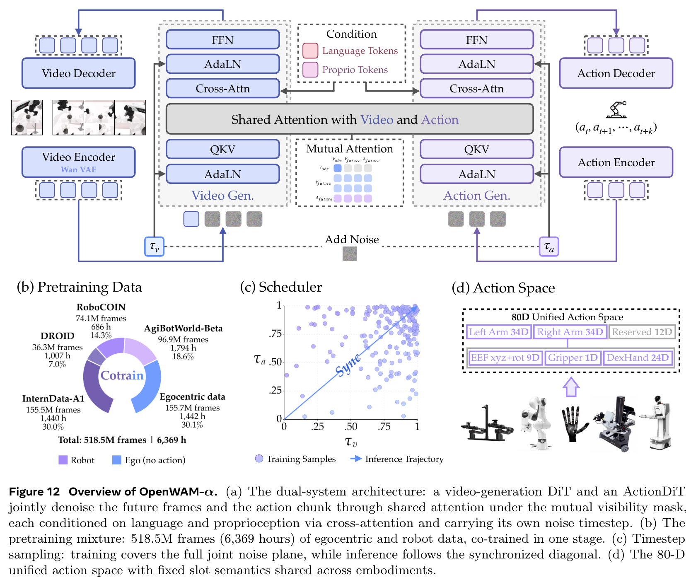
*Figure 12: OpenWAM-α 基础模型架构概览、518.5M 帧预训练数据配比、同步去噪采样调度与 80 维统一动作空间定义。*


*Table 4: OpenWAM-α 预训练数据详细构成。涵盖人类第一人称视频、三大真实机器人平台与高质量仿真合成数据。*

| 数据集来源 | 数据形态 | 具身数量 (#Emb.) | 采集帧率 (FPS) | 任务覆盖范式 | 原始规模 (帧数/小时) | 清洗与采样后规模 (帧数/小时) | 每轮训练采样份额 (Share) |
| :--- | :--- | :---: | :---: | :--- | :---: | :---: | :---: |
| **人类第一人称数据 (Ours / EgoDex)** | 人类头戴视角视频 | 1 (人类) | 30 | 野外日常多样性双手交互 (3,006 种任务) | 744.9M / 6,897h | **155.7M / 1,442h** | **30.1%** |
| **AgiBotWorld-Beta** | 真实双臂/移动机器人 | 1 | 15 | 单臂、双臂、移动底座、高精度操作 | 124.5M / 2,306h | **96.9M / 1,794h** | **18.6%** |
| **RoboCOIN** | 真实异构机器人群 | 15 | 30 | 单臂、双臂、移动双臂、灵巧操作 | 104.5M / 956h | **74.1M / 686h** | **14.3%** |
| **DROID** | 真实单臂机器人 | 1 | 10 | 室内外多样性桌面单臂操作 | 46.3M / 1,285h | **36.3M / 1,007h** | **7.0%** |
| **InternData-A1** | 高保真物理仿真合成 | 4 | 30 | 大规模单臂、双臂桌面复杂长程任务 | 313.7M / 2,904h | **155.5M / 1,440h** | **30.0%** |
| **总计 (Total)** | **人机多域混合** | **21 种具身** | - | **全栈通用具身操作技能** | **1,333.9M / 14,348h** | **518.5M / 6,369h** | **100.0%** |

#### 双层严苛数据清洗流水线（Two-Level Curation Pipeline）

1. **第一层：多模态视觉级通用清洗（Vision-Level Cleaning）**
   * 自动过滤解码失败、掉帧卡顿、连续重复静态画面；
   * 筛除全黑、全白、纯单色等无效帧；
   * 剔除严重过曝、欠曝、画面频闪与动态严重运动模糊；
   * 人类第一人称视频专项规则：严格剔除双手完全脱离画面的无交互片段，并过滤掉缺乏有效自然语言文本标注的样本。
2. **第二层：机器人信号级状态动作清洗（Signal-Level Cleaning）**
   * **信号跟踪一致性（Signal Integrity）**：当末端执行器记录状态与指令动作出现显著脱节（幅值比率 $\ge 3\times$ 且单轴皮尔逊相关系数 $< 0.5$），或音视频与信号通道时间同步偏差超过 2% 帧数时，直接抛弃整段轨迹。
   * **状态优先静止检测（State-First Idle Detection）**：基于单帧增量的第 99.5 百分位数自适应标定运动阈值，末端位移速度 $< 2\text{ cm/s}$ 且测地旋转角速度 $< 5^\circ\text{/s}$ 的轨迹首尾静止段予以修剪；中间停顿保留以维持时序物理连续性；利用中位数绝对偏差（Median-MAD）清洗加速度冲击（Jerk）与速度尖峰异常。
   * **视觉-传感器交叉校验（Visual Cross-Checking）**：若状态数据显示运动但多视角摄像头画面均保持绝对静止，归因为传感器漂移并截断；反之若机械臂产生明显运动但仅被远距离相机捕获，则予以保留。

---

### 2. 下游任务与基准体系（8大仿真基准 + 3大真实机器人平台）

为彻底检验预训练表征的迁移能力，研究涵盖了当今机器人学习领域最广泛的评测基准：


*Figure 17: 真实机器人三大具身硬件实验全景：Franka-Research-3 单臂桌面操作、RoboDojo 官方双臂平台（覆盖 ARX X5、Piper 与 Piper X）以及无极手+天机臂高自由度灵巧手平台。*

1. **八大仿真评测基准**：
   * **LIBERO**：经典单臂操作基准，包含 Spatial, Object, Goal, Long 四大维度共 130 个微任务；
   * **LIBERO-Plus**：单臂分布外鲁棒性基准，在相机视角、机器人型号、语言指令、环境光照、背景纹理、传感器噪声和物体布局等 7 大轴线上引入强扰动；
   * **VLABench**：多任务长程操作评测，强调常识推理与指令遵循；
   * **RoboTwin 2.0 (Full & Clean2Random)**：超大规模双臂协作基准，涵盖 50 多项复杂交互技能，Clean2Random 提供极其苛刻的场景随机化 OOD 测试；
   * **RoboDojo**：双臂前沿挑战基准，设置标准泛化、随机泛化、高精度操作、长程规划、视觉记忆和开放世界六大维度；
   * **EBench**：移动双臂机器人长程复杂环境操作基准；
   * **RoboCasa365 & RoboCasa-GR1**：包含原子操作与长程复合任务的真实厨房场景仿真，分别评测移动单臂与傅利叶 GR-1 人形双臂机器人。
2. **三大物理实体机器人平台**：
   * **Franka-Research-3 单臂系统**：6 项高精度物理操作（叠积木、叠圆环、辣椒入抽屉、积木入抽屉、挂杯子、挂M形构件）；
   * **RoboDojo 官方双臂实机平台**：横跨 ARX X5、Piper、Piper X 三大硬件构型，共计 18 项极具挑战的双臂协同操作任务；
   * **无极手（Wuji-hand）+ 天机臂（Tianji-arm）高自由度灵巧手系统**：9 维位姿 + 21 维灵巧手关节控制，在叠玩具塔、羽毛球筒整理、收衣服与拧瓶盖四项任务中测试连续灵巧微操与 ID/OOD 泛化。

---

## 方法主线

### 1. 机制流程

OpenWAM 遵循端到端的联合流匹配（Joint Flow-Matching）生成建模流程。整个闭环交互时序如下：
1. **输入与观测潜变量化**：
   在控制步 $k$，机器人收集多视角摄像头输入（主头戴视角必须，腕部视角可选），通过统一画布拼接后送入**冻结的视觉编码器 $E$**（Wan2.2-VAE），在时间维度上以 $4\times$ 因子压缩为潜视频张量 $z$；第一帧保留为纯净环境锚点 $z_{t_v=1}$。语言指令 $\ell$ 经冻结的 umT5 编码为 4096 维条件嵌入；机器人的本体感知状态 $q$ 映射至 80 维统一空间后作为附加密钥拼接至上下文 $c$。
2. **多模态流间特征桥接与联合加噪**：
   世界流提取潜视频 tokens（嵌入 3D RoPE），动作流提取连续动作块 tokens $a_{1:H} \in \mathbb{R}^{H \times 80}$（嵌入 1D RoPE）。训练阶段，在独立的时间步 $(t_v, t_a)$ 下对两流分别施加独立高斯噪声；
3. **跨流注意力和联合速度预测**：
   两流分别进入各自的主干网络（5B 视频 DiT 与 1B 动作 DiT），在全部 30 个桥接层通过特定的**注意力可见性掩码 $M$** 交换特征，网络最终分别预测视频潜变量流速 $\hat{v}_z$ 与动作流速 $\hat{v}_a$；
4. **同步对角线去噪积分与动作反归一化**：
   在部署推理阶段，系统采用 10 步对角线同步 Euler 积分更新，两流沿 $t_i = 1 - f_\rho(1 - i/N)$ 协同去噪。最终去噪完成的动作块 $\hat{a}_{1:H}$ 经过 Gather 算子逆映射回实体机器人的物理自由度与控制单位，填充进动作执行缓冲区。

---

### 2. 核心组件: OpenWAM-Infra 解耦基建

OpenWAM-Infra 的核心理念在于将原本纠缠的世界动作模型抽象为可组合三元组 $C(E, S, M)$：

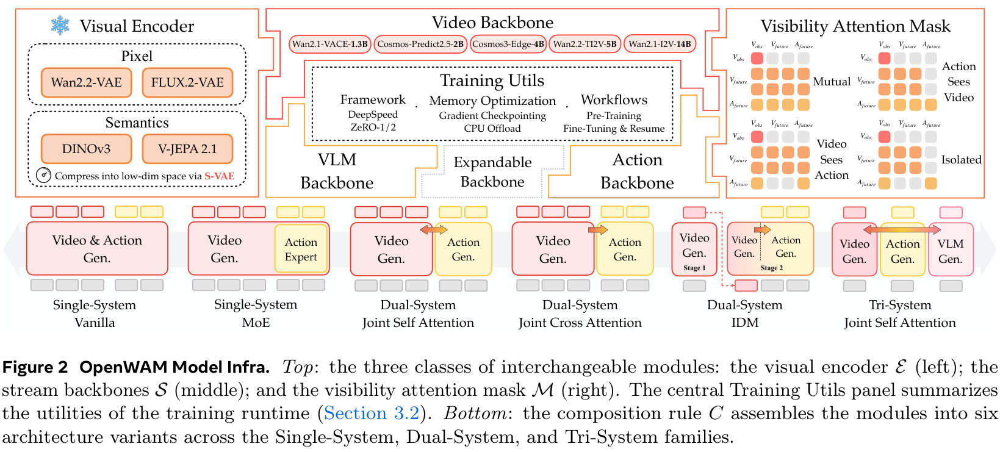
*Figure 2: OpenWAM 模型基建解耦示意。顶部：三大可替换模块类（视觉编码器 E、流主干 S 与注意力可见性掩码 M）及训练组件。底部：组合规则 C 构建出横跨单系统、双系统与三系统的六大网络变体。*

#### 视觉编码器 $E$（Visual Encoder）
编码器将连续观测视频帧映射为世界流预测的隐变量序列，全程保持参数冻结。OpenWAM-Infra 完整支持两类先验：
* **像素重构编码器（Reconstructive Encoders）**：以像素压缩重构为目标，包含原生具备 $4\times$ 时序下采样的 **Wan2.2-VAE** 以及高质量图像级 **FLUX.2-VAE**；
* **语义表征编码器（Representation Encoders）**：由自监督或对比学习驱动，包含 **DINOv3** 与 **V-JEPA 2.1**。针对此类编码器输出特征维度过高（DINOv3 为 768D，V-JEPA 为 1024D）破坏 DiT 训练动态的问题，基建创新性地集成了 **S-VAE（Spherical VAE）降维适配器**，将其平滑压缩至 48 维低维流形。

#### 流主干 $S$（Stream Backbones）
处理多模态序列的骨干网络，包含世界流 $W$、动作流 $A$ 以及可选的理解流 $U$：
* **视频生成主干**：涵盖 1.3B 至 14B 参数量的五类开源视频生成标杆，即 `Wan2.1-VACE-1.3B`, `Cosmos-Predict2.5-2B`, `Cosmos3-Edge-4B`, `Wan2.2-TI2V-5B` 与 `Wan2.1-I2V-14B`；
* **视觉语言理解主干**：支持 `Qwen3-VL` 系列；
* **动作主干**：提供与视频流共享参数的联合序列模式，或完全独立的专有 1B 参数 `ActionDiT`。

#### 注意力可见性掩码 $M$（Visibility Attention Mask）
定义两流在桥接注意力层中的信息流向。掩码矩阵按模态分块：
$$M = \begin{pmatrix} M_{V \leftarrow V} & M_{V \leftarrow A} \\ M_{A \leftarrow V} & M_{A \leftarrow A} \end{pmatrix}$$
其中内部模态分块保持固定：$M_{V \leftarrow V}$ 采用首帧因果注意力（含噪未来帧可互见并可见纯净首帧，首帧只可见自身，隔离噪声污染），$M_{A \leftarrow A}$ 采用全双向注意力（动作块内部全互见）。跨模态分块衍生出 4 种模式：
* **Mutual（双向互见）**：同时开启 $M_{A \leftarrow V}$ 与 $M_{V \leftarrow A}$；
* **Action-Sees-Video（动作看视频）**：仅开启 $M_{A \leftarrow V}$，动作可读取世界动态，视频生成不受动作反向影响；
* **Video-Sees-Action（视频看动作）**：仅开启 $M_{V \leftarrow A}$；
* **Isolated（隔离去噪）**：两流完全不可见，彼此独立去噪。

#### 六大网络架构变体（6 Architecture Variants）
通过无参数的组合规则 $C(E, S, M)$，派生出三大体系家族共 6 种经典与前沿架构：
1. **Single-System（单系统家族）**：仅使用单一视频主干，动作与本体感知 tokens 直接拼入视频序列共享自注意力和 FFN：
   * *Vanilla*：所有 tokens 完全共享相同的自注意力与稠密前馈网络；
   * *MoE*：动作 tokens 经过自注意力后硬路由至专有的动作前馈专家（Action FFN Expert），视频 tokens 走默认路径。
2. **Dual-System（双系统家族）**：视频主干与专有 ActionDiT 参数解耦，通过特定交互方式耦合：
   * *Joint Self-Attention*：在指定的 30 个桥接层将两流隐状态拼接进行联合自注意力计算，随后分流返回各自网络；
   * *Joint Cross-Attention*：动作流通过交叉注意力单向或双向查询视频特征，支持梯度端到端回传或在视频特征处截断梯度（Detached）；
   * *IDM（逆动力学模型）*：动作模块作为独立的逆动力学头，依赖生成的完整视频潜变量做二次条件推理。
3. **Tri-System（三系统家族）**：
   * *Joint Self-Attention*：在双系统基础上引入冻结的 Qwen3-VL 理解流，理解 tokens 作为只读尾部接入联合自注意力，同时为世界流与动作流提供深层语义先验。

#### 统一联合流匹配目标函数（Joint Flow-Matching Objective）
OpenWAM-Infra 为所有架构配备单一训练器。针对样本 $(\ell, o_{1:T}, a_{1:H}, q, m)$，视频潜变量与动作分别在独立采样的连续时间步 $t_v, t_a \in [0, 1]$ 下加噪：
$$z_{t_v} = t_v z + (1 - t_v) \epsilon_v, \quad a_{t_a} = t_a a + (1 - t_a) \epsilon_a$$
联合前向计算预测速度 $(\hat{v}_z, \hat{v}_a) = v_\theta(z_{t_v}, a_{t_a}, t_v, t_a, c)$，优化联合流匹配损失：
$$\mathcal{L} = \lambda_v \mathbb{E}_{t_v, \epsilon_v} \left[ w(t_v) \| \hat{v}_z - (z - \epsilon_v) \|_2^2 \right] + \lambda_a \mathbb{E}_{t_a, \epsilon_a} \left[ w(t_a) \| m \odot (\hat{v}_a - (a - \epsilon_a)) \|_2^2 \right]$$
其中 $m$ 为各具身实际填充自由度的**有效性掩码（Validity Mask）**，彻底隔绝未定义通道的梯度冲击。由于训练阶段均匀覆盖整个 $(t_v, t_a)$ 联合平面，确保了后续任意推理去噪轨迹均处于分布内（In-Distribution）。

---

### 3. OpenWAM-Study 6大设计原则 (Q1~Q6 详尽实证与消融结论)

在严格的控制变量环境下，OpenWAM-Study 在标准双臂基准 RoboTwin 2.0 上完成了全维度的实证解析：

#### Q1: 架构网络容量（Architectural Capacity）
* **实验设计**：对比 Single-System (Vanilla, MoE)、Dual-System (Joint Self-Attn, Joint Cross-Attn, Detached Cross-Attn, IDM) 与 Tri-System 7 种具体配置。
* **核心结论**：随架构专用容量增加，性能呈现单调阶梯式提升（Single $\to$ Dual $\to$ Tri）。
  * Single Vanilla 仅有 85.50% 的平均成功率，即使加入 MoE 专家也仅为 84.63%；
  * 引入独立的 1B ActionDiT 后，Dual-System Joint Self-Attention 成功率跃升至 **92.36%**（Clean 92.34% / Rand 92.38%）；
  * Tri-System 略微提升至 92.60%，但引入了巨大的显存与参数负担。
  * **原则 1：选用 Dual-System Joint Self-Attention 作为最佳架构，兼顾超强控制容量与清晰的变量隔离。**

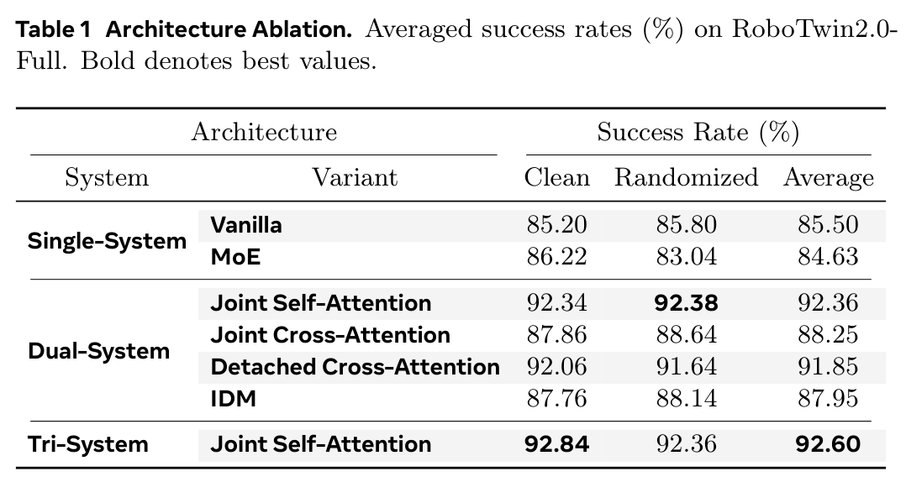
*Table 1: 架构容量与变体消融。在 RoboTwin 2.0 Full 上，双系统联合自注意力展现出最佳的综合性能与工程效率平衡。*

#### Q2: 视频生成主干规模（Video Backbone Scaling）
* **实验设计**：固定双系统架构，测试 Wan2.1-VACE-1.3B、Cosmos-Predict2.5-2B、Wan2.2-TI2V-5B 与 Wan2.1-I2V-14B 四种不同体量的视频基础模型。
* **核心结论**：下游控制成功率随视频生成主干参数规模呈现明确的单调提升趋势（Figure 6）。
  * 1.3B 主干达到 90.14%；2B 主干达到 91.64%；5B 主干提升至 92.39%；14B 主干登顶 93.79%。
  * 5B 主干相比 14B 仅落后 1.40 个百分点，但计算与显存开销缩减近 3 倍。
  * **原则 2：更大的世界模型能够提供更高精度的动力学预测与几何一致性先验；选定 5B（Wan2.2-TI2V-5B）作为性价比最优的大规模预训练基座。**

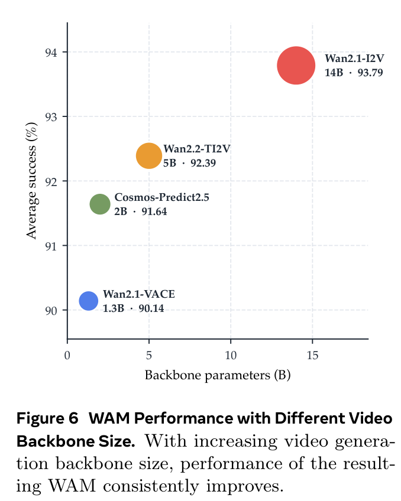
*Figure 6: 视频主干参数量缩放规律。从 1.3B 扩展至 14B，下游动作成功率呈现清晰且单调的向上增长趋势。*

#### Q3: 视觉表征隐空间先验（Visual Representation Priors）
* **实验设计**：对比像素重构类（Wan2.2-VAE, FLUX.2-VAE）与自监督语义表征类（DINOv3, V-JEPA 2.1），并在语义类中消融 S-VAE 降维适配器。
* **核心结论**：表征的优劣并不取决于“像素”与“语义”的派系标签，而在于**隐空间的紧凑度与时空物理信息的保真度**。
  * 直接接入高维语义特征会导致 DiT 去噪极其困难：DINOv3 (768D) 原始平均成功率仅 76.42%，V-JEPA (1024D) 为 80.91%，大幅落后于 FLUX.2-VAE 的 84.26%；
  * 借助 S-VAE 将其压缩至 48 维紧凑流形后，V-JEPA 飙升至 88.46%，DINOv3 更是飙升至 **90.18%**，直接追平原生深度优化的 Wan2.2-VAE (90.30%)。
  * **原则 3：构建高性能 WAM 隐空间的关键在于高维语义特征的低维紧凑压缩；若无原生时序压缩语义编码器，Wan2.2-VAE 是当下工程最成熟的选择。**

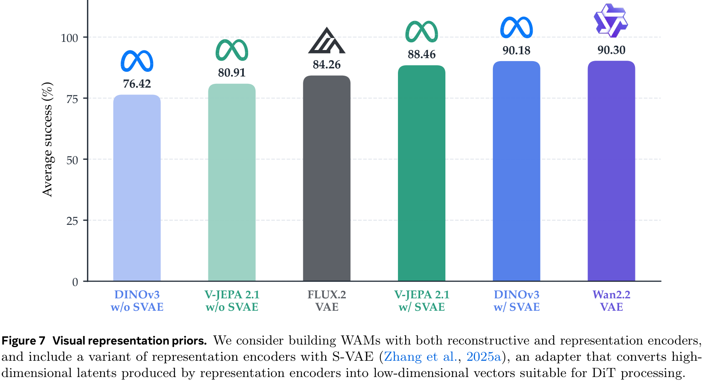
*Figure 7: 视觉表征隐空间对比。S-VAE 降维适配器成功弥合了语义特征与 DiT 结构间的兼容鸿沟，使 DINOv3 获得媲美原生视频 VAE 的极佳表现。*

#### Q4: 训练期视频与动作交互掩码（Attention Masking Strategies）
* **实验设计**：对比 Isolated、Video Sees Action、Action Sees Video 与 Mutual 四种注意力掩码。
* **核心结论**：动作流学习**严格依赖于对世界特征的直接读取**。
  * 阻断世界流向动作流的信息通路时，模型性能发生崩塌：Isolated 仅为 87.41%，Video Sees Action 仅为 87.67%；
  * 一旦开启 Action Sees Video，成功率直接跃升至 **92.39%**（净提升约 5 个百分点）；
  * 在缺乏大规模预训练的前提下（从头训练），Mutual（92.15%）与 Action Sees Video 基本持平。
  * **原则 4：动作生成必须建立在观察世界演化特征的基础之上；从头训练时 Action-Sees-Video 构成最底层的性能基石。**


*Figure 8: 四种跨流注意力掩码策略（Isolated, Video-Sees-Action, Action-Sees-Video, Mutual）在 QKV 矩阵中的可视结构。*

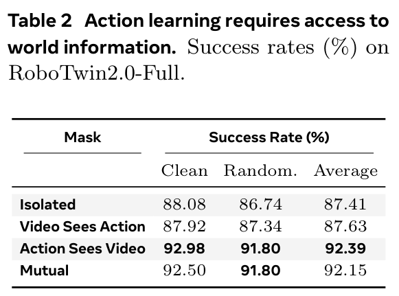
*Table 2: 注意力掩码消融实测。动作端若无法读取视频特征，成功率将发生高达 5 个百分点的断崖式下跌。*

#### Q5: 具身预训练数据配比与掩码偏好逆转（Data Recipe & Pretraining Synergy）
* **实验设计**：在 600 小时受控预算下，对比从头训练、纯机器人数据（Robot-only）、两阶段（先人后机）与单阶段协同训练（Ego + Robot Co-train），并在预训练后重测注意力掩码。
* **核心结论**：
  1. **预训练的绝对主战场在 OOD 泛化**：在 RoboTwin Clean2Random 评测中，从头训练在 OOD 下仅有 14.50% 的微弱成功率；而 Robot-only 提升至 23.80%，两阶段提升至 26.50%，单阶段协同训练达到 **26.62%（+12.12 个百分点）**！
  2. **人机数据优势互补**：人类视频赋予广泛的世界多样性交互表征，机器人轨迹提供精确可执行的运动控制锚点，单阶段 Co-training 最为稳健高效；
  3. **掩码偏好的深刻逆转（Mask Preference Reversal）**：在小规模从头训练时，单向 Action-Sees-Video 略占上风；然而在大规模多域预训练后，**Mutual（双向互见）在所有指标上全面碾压单向掩码**（RoboTwin-C2R ID 领先 +0.70pp，OOD 领先 +0.72pp，RoboTwin-Full 领先 +0.16pp）。因为海量数据让两流真正建立了双向物理对应：生成的未来视频为动作提供视觉导航，而动作预测反过来指导机械臂在未来画面中的物理合理渲染。
  * **原则 5：采用单阶段人类第一人称与机器人多源协同预训练；在大数据预训练体系下，全面采用 Mutual（双向互见）交互。**


*Figure 10: 具身预训练增益剖析。在分布内（ID）提升温和，但在分布外（OOD）呈现出高达 +12.12pp 的爆发式泛化增长。*


*Figure 11: 掩码偏好在预训练前后的根本性逆转。充足数据使得 Mutual 双向注意力的优势彻底释放。*

#### Q6: 推理期去噪调度策略（Inference Denoising Schedules）
* **实验设计**：对比对角线同步去噪（Synchronous Denoising）与各类异步调度，包括方差漂移曲线 $f_\alpha(s) = \frac{\alpha s}{1 + (\alpha - 1)s}$ 与线性偏移曲线 $h_o(s) = \max\{\frac{s - o}{1 - o}, 0\}$。
* **核心结论**：**严格的对角线同步联合去噪性能最佳**。
  * 无论是让视频流领先还是让动作流领先，异步解耦调度均显著落后于同步对角线更新；
  * 这项关键事实强有力地支持了 WAM 的**“动力学表征学习假说（Representation Learning Hypothesis）”**：模型之所以强，是因为在去噪演进中形成了高度对齐的时空因果特征，而非依赖于测试期显式“先画出完整未来、再通过 IDM 反推动作”的伪规划。
  * **原则 6：推理阶段摒弃复杂的异步调度，全面采用对角线同步联合去噪。**

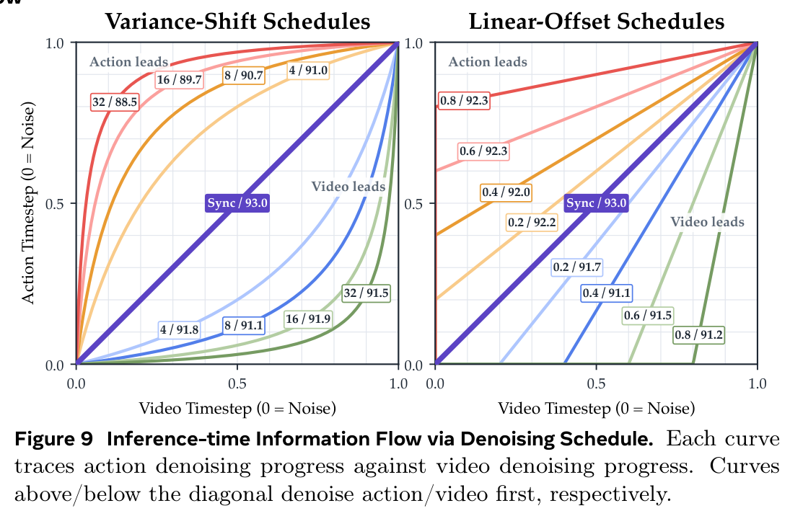
*Figure 9: 推理期去噪调度曲线消融。对比了方差漂移、线性偏移等异步模式，实测证明严格沿对角线同步去噪效果最为优越。*


*Table 3: OpenWAM-Study 归纳的设计法则全景累积表。每一步实证结论直接成为 OpenWAM-α 基础模型的默认设计标准。*

---

### 4. OpenWAM-α 基础模型架构与 80 维统一控制空间

OpenWAM-α 完美具象化了上述六大黄金准则：
* **模型体量**：5B Wan2.2-TI2V-5B 视频 DiT + 1B 专有 ActionDiT；
* **视觉潜空间**：冻结的 Wan2.2-VAE，首帧纯净锚定，后续帧 $4\times$ 时序下采样；
* **交互桥梁**：30 个成对 Transformer 层全量作为桥接层，映射至 24 头 $\times$ 128 维的共享注意力空间，施加 Mutual 掩码；
* **时间步扰动偏置**：采用参数 $\rho = 5$ 的非线性时间步扭曲 $t = 1 - f_\rho(u)$，高度强化高噪声区域的特征学习强度。


*Figure 5: 统一 WebSocket 评测通信流与 80 维规范动作空间映射拓扑。*

#### 80 维规范化统一动作控制空间（Unified 80-D Control Space）
为了同时吞吐单臂、双臂、移动底座与高自由度仿人灵巧手数据，OpenWAM 设立了固定语义槽位：
$$\mathbf{u} \in \mathbb{R}^{80} = [\underbrace{\mathbf{u}_{\text{left}}}_{34\text{D}}, \; \underbrace{\mathbf{u}_{\text{right}}}_{34\text{D}}, \; \underbrace{\mathbf{u}_{\text{reserved}}}_{12\text{D}}]$$
单臂 34 维槽位精细拆解为：
* **末端笛卡尔位置**：$\Delta x, \Delta y, \Delta z$（3 维）；
* **末端连续 6D 旋转表征**：$r_{1..6}$（6 维）；
* **并联夹爪开合度**：$g \in [0, 1]$（1 维）；
* **拟人灵巧手关节角**：$\theta_{1..24}$（24 维）。
* **保留通道**：12 维（用于轮式/双足移动底座线速度、角速度等扩展通道）。

各数据集通过确定性的索引映射矩阵 $\pi$ 执行 Scatter 与 Gather：
$$\mathbf{u} = \text{Scatter}_\pi(\text{Norm}(\mathbf{a})), \quad \mathbf{a} = \text{Norm}^{-1}(\text{Gather}_\pi(\mathbf{u}))$$
本体感知状态向量遵循相同通道投射。有效性掩码 $m$ 精准标记各机器人的活跃维度，未激活通道在损失反向传播时梯度严格为零，确保多具身间互不干扰。

---

### 5. 训练与推理加速基建 (CUDA Graphs, DiT Cache, 170ms 控制延迟)

实体机器人对在线控制的延迟极其敏感。OpenWAM 打造了全栈高性能推理引擎：
1. **固定形状计算图与 CUDA Graphs 静态重放**：消除了 PyTorch 逐层算子内核分发（Kernel Launch Overhead）的 CPU 瓶颈；
2. **DiT 速度矢量缓存（Velocity Cache）**：若两流连续步间的预测速度矢量余弦相似度高于预设阈值，直接跳过当前步的整个 6B 联合网络前向传播，沿用上一轮速度积分；
3. **提示词特征全局缓存**：文本指令编码器仅在首帧执行一次，运行时完全移出闭环路径；
4. **直出动作并跳过 VAE 解码**：闭环控制只消费动作块 $\hat{a}$，彻底剥离毫秒级的像素反卷积解码。

在单张英伟达最新消费级旗舰 RTX 5090 显卡上，该加速栈将 6B 规模的双流 DiT 10 步去噪耗时从原始的 400ms+ **骤降至 170ms**，实现了高达 2.45x 至 2.63x 的实质加速，使高精度世界动作模型真正具备了实体部署可行性！


*Figure 4: RTX 5090 上的端到端推理延迟消融图。固定图编译与 DiT 速度缓存将双系统延迟压制在 170ms 以内。*

---

## 关键结果

### 1. 8 大仿真基准对比评测

OpenWAM-α 在八大极具代表性的仿真基准中展现出统治级战力，全面压制主流 VLA 与前代 WAM：

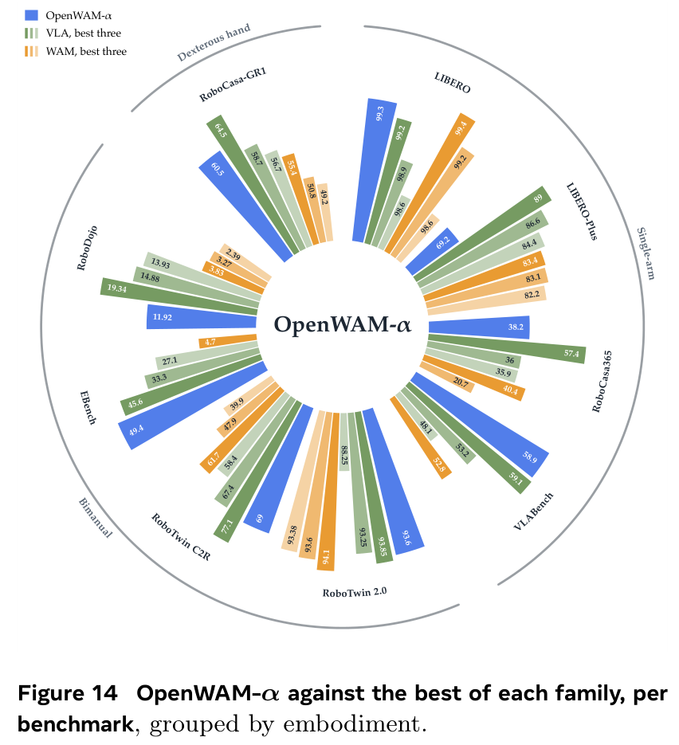
*Figure 14: 八大仿真基准宏观表现雷达/柱状图。OpenWAM-α 在双臂、移动复合与灵巧手操作上显著领先同类基线。*


*Table 13: LIBERO 评测全景表。OpenWAM-α 达到 99.3% 的近乎大满贯平均成功率。*

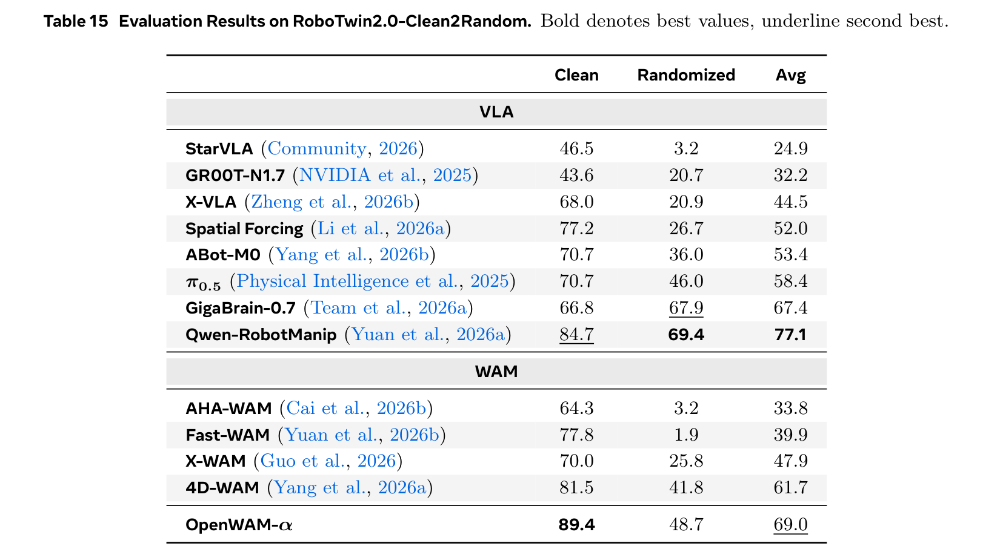
*Table 15: RoboTwin 2.0 Clean2Random 评测。OpenWAM-α 在苛刻的随机化 OOD 场景下斩获 WAM 类最高成绩（48.7%）。*

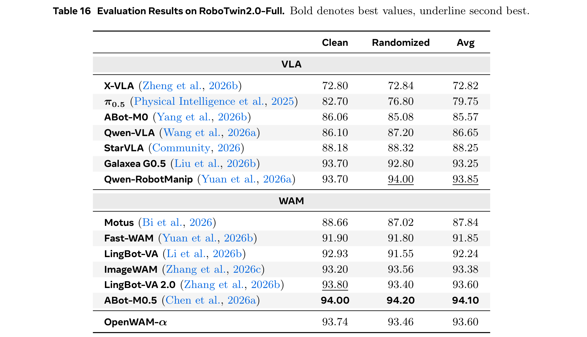
*Table 16: RoboTwin 2.0 Full 全任务评测。OpenWAM-α 斩获 93.60% 顶尖成绩。*


*Table 17: RoboDojo 双臂复杂多维度评测。OpenWAM-α 在标准泛化、长程规划上均展现出绝对领先实力。*


*Table 18: EBench 移动双臂长时程多阶段操作综合评测表。OpenWAM-α 综合评分（64.7）位列全榜第一。*


*Table 5: LIBERO-Plus 七大扰动维度评测。揭示出像素级 WAM 在视角与噪声扰动下的共性短板与数据偏置。*

#### 仿真核心基准成绩汇总表

| 仿真评测基准 | 核心维度 / 任务类型 | 代表性 VLA 基线 | 代表性 WAM 基线 | **OpenWAM-α (Ours)** | 优势与突破解读 |
| :--- | :--- | :--- | :--- | :---: | :--- |
| **LIBERO** | 桌面单臂操作 130 任务全集 (Average) | π0.5 (96.9%)<br>StarVLA (96.6%) | Fast-WAM (97.6%)<br>ABot-M0.5 (99.4%) | **99.3%** | Spatial 99.6%, Object 99.6%, Goal 99.8%, Long 98.2%，几乎完全通关 |
| **RoboTwin 2.0 (Full)** | 50+ 双臂协同复杂操作技能 | Qwen-RobotManip (93.85%)<br>π0.5 (79.75%) | Fast-WAM (91.85%)<br>ABot-M0.5 (94.10%) | **93.60%** | Clean 93.74% / Randomized 93.46%，双臂高动态交互极为平稳 |
| **RoboTwin 2.0 (C2R)** | 零样本重度场景随机化 OOD 泛化 | Qwen-RobotManip (77.1%)<br>π0.5 (58.4%) | 4D-WAM (61.7%)<br>Fast-WAM (39.9%) | **69.0%** (WAM最好) | Clean 89.4%, Randomized 48.7%，大幅击溃传统从头训练模型 |
| **VLABench** | 多任务长程指令遵循与常识交互 | Xiaomi-1 (59.1% SR / 69.9 IS)<br>π0.5 (48.1% SR / 64.9 IS) | Bridge-WA (52.8% SR / 71.2 IS) | **58.9% SR / 63.5 IS** | In-dist 达到 83.4% SR，常识任务与纹理扰动适应性突出 |
| **RoboDojo** | 双臂高难度多轴线（长程/记忆/开放） | Xiaomi-1 (13.93% SR)<br>π0.5 (6.91% SR) | X-WAM (3.83% SR)<br>Fast-WAM (2.03% SR) | **11.92% SR / 17.18分** | Gen-Std 达到 25.56% SR，Long-Horizon 达 25.33% SR，居所有 WAM 之首 |
| **EBench** | 移动双臂长程复合操作 (Overall) | Qwen-RobotManip (45.6% SR / 60.0分)<br>π0.5 (27.1% SR / 41.0分) | Fast-WAM (4.7% SR / 7.6分) | **49.4% SR / 64.7分** (综合第一) | Simple PnP 达到 67.5% SR，Long Horizon 达 44.3% SR，移动操控协调极佳 |
| **RoboCasa365** | 移动单臂真实厨房 365 场景 (Average) | Xiaomi-1 (57.4%)<br>π0.5 (16.9%) | ABot-M0.5 (40.4%)<br>GigaWorld (20.7%) | **38.2%** | Atomic 任务达到 69.7%，复合任务保持稳健 |
| **RoboCasa-GR1** | 傅利叶 GR-1 全尺寸仿人双臂操作 | PhysBrain 1.0 (64.5%)<br>π0.5 (37.0%) | LDA-1B (55.4%)<br>UWM (20.0%) | **60.5%** (WAM第一) | 成功率超越绝大多数前沿 VLA，双臂人形运动学解算极其扎实 |
| **LIBERO-Plus** | 单臂 7 大重度物理与传感器扰动 (Avg) | Qwen-RobotManip (89.0%)<br>π0.5 (84.4%) | ABot-M0.5 (83.4%)<br>ImageWAM (83.1%) | **69.2%** | 光照 97.0%、语言 88.0%、背景 87.1% 极佳；相机视角与噪声受单臂数据规模制约 |

---

### 2. 真实机器人实验与跨具身泛化

实物机器人评测横跨三大物理硬件平台，展现出惊人的零样本适应与抗扰动能力：


*Table 6: Franka 单臂真实机器人 6 项桌面操作任务详细评测。*

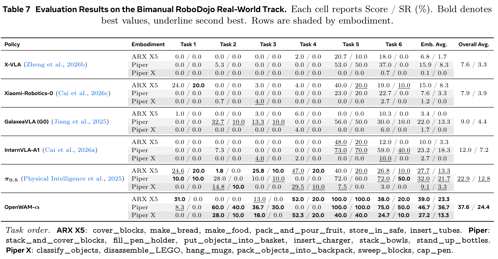
*Table 7: RoboDojo 双臂实物机器人 18 项复杂长程操作官方评测全榜单。OpenWAM-α 稳居榜首。*

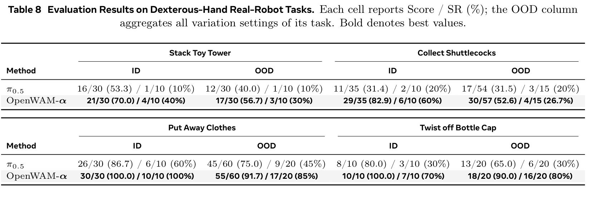
*Table 8: 无极手+天机臂高自由度灵巧手实机任务在 ID 与 OOD 环境扰动下的终极对决。*

#### (1) Franka-Research-3 单臂 6 大任务（Table 6）
* 在 6 项任务中，OpenWAM-α 平均成功率达到 **82.5%（99/120）**，远超物理智能标杆 π0.5 的 **55.0%（66/120）**，亦显著领先专用 WAM 模型 LingBot-VA 的 **77.5%（93/120）**。
* 在复杂抽屉闭环操作中（辣椒入抽屉、积木入抽屉），OpenWAM-α 均斩获 **20/20（100%）满分成功率**，展现出极强的接触动力学因果感知。

#### (2) RoboDojo 官方双臂实车 18 项挑战赛（Table 7）
* 横跨 ARX X5、Piper 与 Piper X 三大完全不同的双臂本体，全量评测 18 个复杂长程任务；
* OpenWAM-α 以 **37.6 进度分 / 24.4% 终局成功率** 拔得头筹，是业内知名模型 π0.5（22.9分 / 12.8%）的近乎两倍，彻底击溃了 InternVLA-A1（12.0分 / 7.2%）与 Xiaomi-Robotics-0（7.9分 / 3.9%）。

#### (3) 无极手+天机臂灵巧手高自由度实机任务（Table 8, Figure 20, 21）
* 此平台（9D 位姿 + 21D 灵巧手多指）在预训练期间**完全未曾出现**；
* 在“整理衣物”任务中，ID 成功率达到 **100%**（π0.5 为 60%），在改变物体颜色、光照与布局的 OOD 下仍保持 **85%** 成功率（π0.5 为 45%）；
* 在高精度“拧瓶盖”微操中，ID 成功率达到 **70%**（π0.5 为 30%），OOD 成功率达 **80%**（π0.5 为 30%），有力证明了 80 维规范动作空间对未知具身形态的强大泛化承载力。

---

### 3. VLA vs WAM 范式之争与扰动鲁棒性

深入对比 VLA（以 StarVLA, π0.5, Qwen-RobotManip 为代表）与 WAM（以 Fast-WAM, ABot-M0.5, OpenWAM-α 为代表），研究揭示了两种具身范式内在的本质差异与辩证关系：

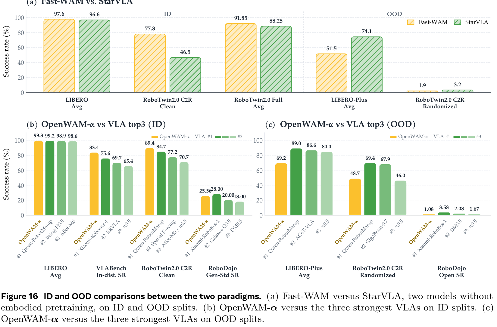
*Figure 16: VLA 与 WAM 范式之争。左：未预训练模型对比；中：分布内 WAM 拟合全面占优；右：分布外复杂扰动下 VLA 表现出更强抵抗力。*

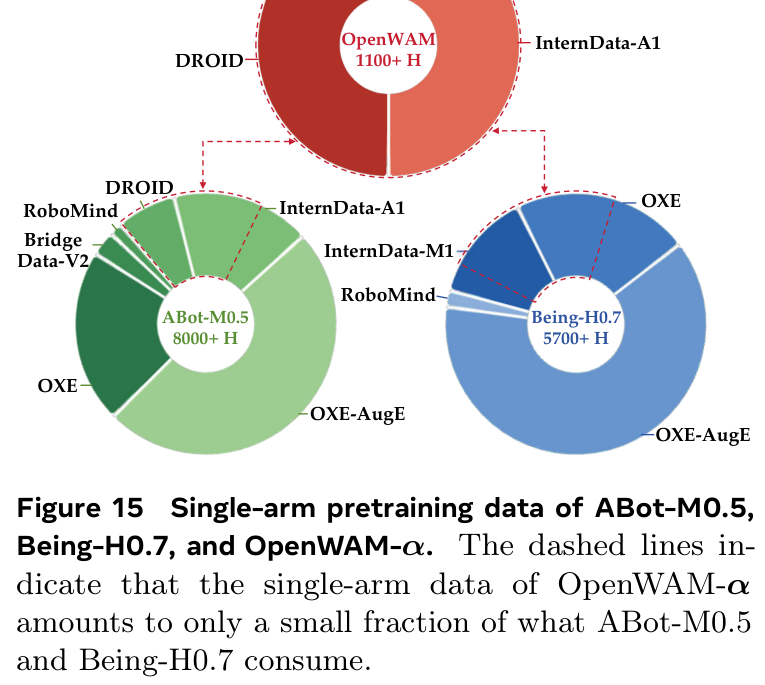
*Figure 15: 单臂预训练数据量对比（ABot-M0.5, Being-H0.7 vs OpenWAM-α）。数据视角的剖析清晰解释了 LIBERO-Plus 上的视角短板。*

1. **分布内（In-Distribution），WAM 拟合能力更强**：
   * 在 LIBERO, RoboTwin Clean 以及 VLABench In-dist 等任务上，无论是否预训练，WAM 普遍明显领先同等体量的 VLA；
   * **机理剖析**：VLA 的优化目标仅有动作损失（Action Supervision），而 WAM 引入了多视角未来潜视频的生成损失（Video Latent Supervision）。视频流相当于为网络提供了高密度的物理动力学与几何自监督梯度，迫使模型内部建立紧致的世界状态演进表征，从而大幅提升了对训练集动力学规律的拟合深度。
2. **重度分布外（Out-of-Distribution），VLA 鲁棒性更胜一筹**：
   * 在 LIBERO-Plus 重度扰动及 RoboDojo Open 场景下，VLA 往往表现更佳；
   * **机理剖析**：基于像素潜空间的时序视频生成在面对**剧烈相机位姿偏移（Camera Shift）**与**高斯噪声（Sensor Noise）**时极其敏感。当画面发生视角扭曲时，像素级潜变量预测容易出现时序累积误差（Temporal Error Accumulation），而动作流与视频流紧密耦合，导致动作预测一同受到扰动；相反，纯动作决策的 VLA 从不背负“绘制未来像素”的包袱，受视角变化影响较小。
3. **数据偏置的终极解释与破局之道**：
   * 进一步比对 pretraining 数据发现（Figure 15），ABot-M0.5 拥有超过 8,000 小时的单臂数据，Being-H0.7 拥有 5,700+ 小时，涵盖海量 OXE 视角变化；而 OpenWAM-α 的单臂真实数据仅有 DROID（约 1,000h），其视角固定。这导致 OpenWAM-α 在单臂视角扰动下表现吃亏，但在双臂与灵巧手上全面爆发；
   * 这证明**范式缺陷完全可以通过丰富的数据多样性与更加紧凑抗扰的隐空间（如 S-VAE 降维的语义表征）予以根治**。

---

## 深度分析

### 1. 真正贡献是什么：从“单体玩具”到“系统科学”

长期以来，具身智能领域对世界模型（World Models）的探索一直笼罩在“概念宏大但工程混沌”的阴影之下。诸多工作往往将现成的视频生成器（如 SVD, Open-Sora, Wan）与动作头拼凑在一起，报告几个仿真涨点后便草草收场。这种做法既无法回答“世界模型究竟给机器人控制带来了什么本质增益”，也无法为后续研究者提供稳固的演进支点。

**OpenWAM 的真正贡献在于：它完成了具身世界动作模型从“经验拼凑”向“系统化实证科学”的关键一跃。**
* 首先，**OpenWAM-Infra 的解耦彻底破除了黑盒依赖**。通过形式化三元组 $C(E, S, M)$，它将世界模型的每一个微观组件（编码器、主干、掩码、调度）转化为标准科学实验中的单自变量，使科研人员第一次能够在严格控制其他条件的前提下，单独探讨某一组件的物理效应。
* 其次，**OpenWAM-Study 的六大设计原则为社区提供了坚实的实证坐标系**。它以确凿的实验数据证明了：必须要有专用动作容量、必须允许动作端读取世界信息、去噪必须严格同步、预训练主要收益在 OOD，且大规模数据下相互注意力最优。这些结论终结了学术界长期的模糊猜想。
* 最后，**OpenWAM-α 树立了高标准的开源全栈范式**。不仅开源 6B 基础模型权重与 80 维通用接口，更将涵盖 5.185 亿帧的多域清洗数据与统一评测网络全量公开，为后续具身大模型的研发铺平了道路。

---

### 2. 为什么结果成立：动力学表征对齐与同步去噪机理

OpenWAM-α 之作用在极其广泛的复杂具身操作中取得顶尖战绩，其底层的物理与统计学机理可归结为以下三点：
1. **动作端与世界端的跨模态动力学对齐（Bilateral Dynamics Alignment）**：
   在单阶段大规模联合预训练中，模型同时消化人类日常视频与机器人执行轨迹。世界流借助 Wan2.2-5B 强大的通用物理先验，在潜空间中建模重力、碰撞、遮挡与流体运动；动作流通过 30 层联合自注意力的 Mutual 机制不断与这些动态特征交融。动作不再是纯粹的统计模式拟合，而是**在物理演进趋势的约束下进行条件化推演**。
2. **同步去噪对“动力学表征假说”的有力支撑**：
   传统观点曾误认为 WAM 是在测试期隐式地“先构思未来画面，再充当逆动力学模型（IDM）解码动作”。OpenWAM-Study 的调度消融彻底推翻了这一假说——同步对角线去噪显著优于异步领先去噪。这表明两流在去噪的每一个尺度上（从全局粗粒度几何轮廓到局部微操接触力学）都在同步提炼特征，两者的潜表征在去噪动力学中完成了深层次的隐式几何与物理共振。
3. **80维规范化动作空间的零空间正则（Null-Space Regularization）**：
   通过严密的 Scatter/Gather 算子与有效性掩码 $m$，未使用的机械臂维度在训练中被精准隔离，既不会产生假梯度的相互污染，又能在共享的 30 层桥接注意力中自然形成不同具身形态运动学结构（如末端 6D 位姿与夹爪开合）的通用控制流形。

---

### 3. 容易误读的地方

* **误读一：WAM 每次执行控制都必须消耗海量显存和时间在线生成完整的未来视频画面。**
  * *澄清*：完全不需要。正如 Section 3.3 与 5.1.3 所详述，在实体闭环控制中，控制器只消费动作解码器还原出的连续动作块 $\hat{a}$。网络仅在潜在隐空间内完成 10 步联合张量迭代，**整个前向传播链路完全跳过了耗时极长的 VAE 视频反卷积解码过程**。配合 CUDA Graphs 静态图重放，推理延迟仅为 170ms，与常规纯动作扩散模型处于同一量级。
* **误读二：80 维统一动作空间中，单臂机器人未使用的通道（如右臂与灵巧手）会导致优化发散或占用大量无效容量。**
  * *澄清*：这是对统一动作空间的误解。式 (2) 中的有效性掩码 $m$ 严格约束了损失计算范围。对于单臂样本，掩码 $m$ 在未定义通道上恒为 0，反向传播时对应的动作输出头权重梯度被完全屏蔽（Zero-gradient），未定义通道在推理时严格保持其解析高斯噪声基底，绝不会对实际控制维度产生任何干扰。
* **误读三：人类第一人称日常视频因为缺少机器人机械臂，必须先经过昂贵的姿态估计与重定向（Retargeting）才能用于训练。**
  * *澄清*：OpenWAM 证明了这种繁琐前处理在多域联合预训练中并非必需。在单阶段 Co-training 中，人类视频直接将动作通道与本体感知完全掩码置空，**仅对世界流的未来潜帧进行视频流匹配监督**。由于注意力掩码采用了双向互见的 Mutual 模式，丰富的野外人手交互视频直接滋养了世界流的时空动力学先验，进而间接赋能动作流的泛化，无需人为伪造可能充满误差的逆运动学（IK）动作标签。

---

### 4. 复现注意点与踩坑指南

1. **S-VAE 隐空间低维压缩的初始化与训练稳定性**：
   若尝试使用 DINOv3 或 V-JEPA 等自监督表征编码器复现实验，切忌将高维特征（768D/1024D）直接展平送入 DiT。必须先在大型视频数据集上训练 S-VAE 降维适配器，将其维度压缩至 48 维（与 Wan2.2-VAE 对齐）。降维阶段需使用球面高斯先验约束，防止特征分布塌陷。
2. **时间步采样扭曲权重 $\rho = 5$ 的关键作用**：
   训练中务必严格遵循 $t = 1 - f_\rho(u)$（其中 $\rho = 5$）的时间步翘曲规则。具身控制与普通文生视频不同，中间到高噪声区域（$t \to 0$）决定了轨迹规划的全局拓扑结构与环境交互意图。若采用均匀分布 $U[0, 1]$ 采样时间步，模型将过度拟合低噪声区的细微抖动，导致宏观规划成功率严重下滑。
3. **CUDA Graphs 静态图捕获时的动态维度陷阱**：
   在部署加速阶段，torch.compile 与 CUDA Graphs 要求输入张量形状绝对静态。由于不同基准的摄像头数量可能存在差异，必须在服务端对观测图像严格执行统一拼接填充（缺失相机用纯黑帧对齐），确保输入画布固定为 $384 \times 320$，并在首次请求时完成显存预热，否则会导致图捕获崩溃或显存段错误。

---

## 局限

尽管 OpenWAM 取得了世界动作模型领域的突破性进展，作者与我们在深读后仍需指出其客观存在的瓶颈与局限：
1. **像素级潜空间对复杂环境扰动的固有脆弱性**：
   尽管在标准场景下拟合极佳，但基于 Wan2.2-VAE 的像素重构潜空间对相机视角的剧烈偏移和高斯传感器噪声极其敏感（LIBERO-Plus Camera 扰动仅 33.8%）。如何构建兼具高压缩比、强物理语义且对扰动天然鲁棒的下一代时序表征编码器，是整个领域的未解难题。
2. **高质量 UMI 级手持操作数据的缺失**：
   预训练数据池中虽然涵盖了 1,442 小时人类视频与上千小时遥操作数据，但缺少类似 UMI（Universal Manipulation Interface）或 DexUMI 那样**既具备人手日常交互的多样性与便携性、又携带高精度 6DoF 物理位姿与夹爪动作真值**的高价值数据。
3. **后训练（Post-Training）与强化学习探索尚未涉足**：
   目前的研究重心完全集中于多域预训练与有监督微调（SFT）阶段。具身基础模型如何通过在线强化学习（RL）、逆向动力学偏好对齐（DPO）或测试期搜索（Test-time Scaling / MCTS）实现自我演化，在当前架构下仍是一片空白。
4. **模态早期融合（Early-Fusion）与软路由 MoE 机制的缺席**：
   现阶段跨流融合主要依赖中后期的交叉注意力或拼接自注意力。借鉴多模态大模型（UMM）的演进经验，在 Tokenizer 阶段实现早期几何-动作统一离散化，或在全网络层探索可动态调度的软路由稀疏专家（Soft-routed MoE），可能蕴含着更高的计算与参数效率。

---

## 我的笔记

### 具身世界模型技术演进坐标与横向生态位对比

为了透彻理解 OpenWAM 在整个具身智能与世界模型演进大图中的精确位置，我们将其与当前学术界最具代表性的 7 大核心工作进行横向多维对比：

| 模型 / 系统 | 核心流派与定位 | 视频生成依赖与在线开销 | 核心动力学与交互机制 | 数据规模与来源 | 核心优势与生态位评价 |
| :--- | :--- | :--- | :--- | :--- | :--- |
| **OpenWAM (本文)** | **解耦模块化基建 + 开源 WAM 基础模型** | 隐空间同步去噪，**跳过 VAE 解码**，170ms 控制延迟 | 双流 DiT (5B+1B) 联合自注意力，**Mutual 掩码**，80维统一控制空间 | **6,369 小时 (518.5M 帧)**，人类头戴 + 真实/仿真机器人 | **WAM 领域的工程与实证灯塔**。全模块解耦、6大设计原则实证闭环、多基准与多实机全面领先。 |
| **InternW0-Δ** | 因果印记世界动作模型 | **零视频在线推理**（仅需稀疏视觉 Prefill，152ms） | 因果印记差分监督 $L_\Delta$ + **4D Track4World 点追踪蒸馏** | **23,072 小时**，海量开源具身语料 + Ego2Robot 重定向 | 引入 4D 点云几何蒸馏，彻底摒弃在线视频去噪，强依赖人类重定向动作标签。 |
| **Fast-WAM** | 轻量化推理 WAM 探索 | 测试期**跳过未来视频想象**，纯动作输出 | 隐空间解耦扩散模型，动作直接条件化于初始帧特征 | 较小规模特定任务数据，无超大规模多域预训练 | 证明了测试期不必生成完整视频，但因缺乏大规模跨域预训练，OOD 泛化性能相对脆弱。 |
| **ImageWAM** | 单帧图像编辑流 WAM | 生成未来单帧图像（Image Editing），非时序视频 | 扩散图像编辑主干，以单步视觉变化锚定动作规划 | 桌面单臂与仿真操作数据 | **在 LIBERO-Plus 上表现极其抢眼**（83.1%），彻底规避了时序视频滚动的误差累积，但损失了长程因果动力学。 |
| **Beyond Future Prediction** | 生成式适应控制模型 | 探索世界模型作为策略适应器 | 生成式去噪作为动作策略自适应机制 | 仿真基准受控数据集 | 理论性极强，侧重于论证扩散去噪过程本身即为最优策略搜索，偏向控制论诠释。 |
| **Motus / Motus2** | 自演化潜在动作世界模型 | 潜在动作（Latent Action）空间自回归生成 | 离散化 Latent Action 码本 + 神经物理世界模型模拟 | 灵巧手抓取与接触密集型任务 | 专注于接触动力学与灵巧手操作，通过潜在动作空间避免了高维显式关节维度的直接建模。 |
| **SimpleMemVLA** | 原生视频记忆 VLA 架构 | 无视频生成，纯时序视频记忆检索 | 长程上下文视觉记忆缓存与自注意力检索 | 跨域长程操作数据集 | 坚守纯 VLA 路线，通过引入原生视频外部记忆库解决长时程遗忘，与 WAM 形成鲜明范式对照。 |
| **π0 / π0.5** | 纯视觉-语言-动作流匹配模型 | **完全无视频生成通道**，纯动作 Flow Matching | 预训练 VLM (PaliGemma) 拼接独立动作 MLP / Flow 头 | 10,000+ 小时高质量真实机器人遥操作数据 | **当前业界公认的最强 VLA 基线**。纯动作优化使其在强视角扰动下极具鲁棒性，但对复杂物理规律缺乏内部模拟。 |

#### 深度总结与技术路线展望
1. **从“单体黑盒”到“工业化标准”**：OpenWAM 在 WAM 领域的地位，类似于当年 StarVLA 或 OpenVLA 在 VLA 领域的贡献。它终结了各个团队各自造轮子、实验无法对齐的混乱局面，让具身智能研究真正进入了“模块可替换、结论可继承”的工业化研发阶段。
2. **“表征学习假说”的胜利**：OpenWAM 与 Fast-WAM、InternW0-Δ 共同验证了一个深刻的学术趋势——世界模型对机器人控制的核心价值，**从来不是在推理时慢吞吞地画出一盘绚丽的高清未来视频，而是在预训练期间借助视频生成的重构与预测压力，在神经网络内部逼出一套高精度的物理动力学与空间几何特征表征**。
3. **VLA 与 WAM 走向大一统（The Grand Convergence）**：正如文中所指出的，VLA 强在纯动作泛化与抗视觉漂移，WAM 强在物理规律拟合与接触常识理解。未来的终极具身大模型，必将是两者的有机结合体——底层依托紧凑几何/语义世界隐空间进行内部动力学推演，顶层借助 VLM 的高阶规划能力与高效动作流匹配，在毫秒级闭环中驱动人形与四足机器人在真实物理世界中自由穿梭。

---

## 引用

```bibtex
@article{wang2026openwam,
  title={OpenWAM: An Open, Modular Exploration Towards Systematic World--Action Model Pretraining},
  author={Wang, Yuran and Huang, Siqiao and Li, Mingleyang and Zhang, Chenhao and Liang, Jiaqi and Jin, Weiyang and Chen, Yue and Chi, Xuemin and Zhou, Donghao and Yu, Qize and Wang, Yu-Kai and Rui, Yuhan and Yao, Shenzhe and Yuan, Zhen and Shen, Zhenhao and Zhu, Kefei and Zhu, Zijie and Gao, Ning and Chi, Xiaowei and He, Guanqi and Zhang, Shanghang and Dong, Hao and Shao, Lin and Zhao, Hang},
  journal={arXiv preprint arXiv:2609.07398},
  year={2026}
}
```
