# RLinf: Flexible and Efficient Large-scale Reinforcement Learning via Macro-to-Micro Flow Transformation

## Metadata

- **Title:** RLinf: Flexible and Efficient Large-scale Reinforcement Learning via Macro-to-Micro Flow Transformation
- **Authors:** Chao Yu; Yuanqing Wang; Zhen Guo; Hao Lin; Si Xu; Hongzhi Zang; Quanlu Zhang; Yongji Wu; Chunyang Zhu; Junhao Hu; Zixiao Huang; Mingjie Wei; Yuqing Xie; Ke Yang; Bo Dai; Zhexuan Xu; Jiakun Du; Xiangyuan Wang; Xu Fu; Letong Shi; Zhihao Liu; Kang Chen; Weilin Liu; Gang Liu; Boxun Li; Jianlei Yang; Zhi Yang; Guohao Dai; Yu Wang
- **Affiliations:** Tsinghua University; Zhongguancun Academy; Infinigence AI; Peking University; UC Berkeley; Beihang University; Shanghai Jiaotong University
- **Version/date:** arXiv:2509.15965v2, 29 December 2025
- **DOI:** 10.48550/arXiv.2509.15965
- **Project:** https://github.com/RLinf/RLinf
- **License:** CC BY 4.0
- **Source:** canonical 16-page selectable-text PDF; SHA256 `b4f26818a69edf2cb55c4fcb1cc4ab9d0d753205c83a1fc08c42e4b42c5a068a`
- **Zotero:** parent `JKUF2Y7Q`; attachment `STKQ8SYL`; collection `worldmodel`
- **Reader status:** Complete bilingual reader of all substantive source content. The source contains 16 figures, 3 tables, Algorithm 1, one displayed equation, and 60 references; it contains no appendix, limitations, acknowledgments, data/code-availability statement, or ethics statement as separately headed sections.

## Page / Section Index

| PDF pages | Content |
|---|---|
| 1–2 | Abstract; 1 Introduction; 2 Background and Motivation; Fig. 1 |
| 3–4 | 2.1 RL Workflows; 2.2 Inefficiencies; 2.3 Flexibility; Figs. 2–4; 3.1 Overview; 3.2 interface begins |
| 5–6 | 3.2 Workflow Construction Interface; 3.3 M2Flow Transformation; Figs. 5–7 |
| 7–8 | 3.4 Scheduling Policy; Algorithm 1; equation; 3.5 Adaptive Communication; 4 Implementation |
| 9–11 | 5 Evaluation; 5.1 End-to-End Experiments; Figs. 8–16 |
| 12 | 5.2 Search Policy; 5.3 Model Performance; Tables 1–3; 6 Related Works |
| 13–16 | 7 Conclusion; References [1]–[60] |

## Terminology Ledger

| Canonical term | 中文 | Definition / policy |
|---|---|---|
| RLinf | RLinf | System name; never translated |
| macro-to-micro flow transformation (M2Flow) | 宏到微流转换（M2Flow） | Macro logical workflow is decoupled from micro physical execution |
| macro logical flow | 宏观逻辑流 | Coarse, imperative control/data dependencies authored by the developer |
| micro execution flow | 微观执行流 | Concrete placement, timing, and processing granularity selected by the system |
| worker / WorkerGroup | worker / WorkerGroup | Component process abstraction / collective proxy; identifiers kept exact |
| temporal scheduling / RLinf-Temporal | 时间调度 / RLinf-Temporal | Collocated device sharing through sequential execution and context switching |
| spatial scheduling / RLinf-Spatial | 空间调度 / RLinf-Spatial | Disaggregated placement with pipeline execution |
| hybrid scheduling / RLinf-Hybrid | 混合调度 / RLinf-Hybrid | Combination of spatial pipelining and temporal multiplexing |
| elastic pipelining | 弹性流水线 | Adjusts processing granularity and device allocation |
| context switching | 上下文切换 | `onload`/`offload` governed temporal device multiplexing |
| device lock | 设备锁 | Globally consistent data-channel lock controlling dependent resource access |
| data channel | 数据通道 | FIFO-like producer–consumer facility with weighted load balancing |
| rollout | rollout（采样展开） | Preserve English system term in identifiers/labels |
| inference / generation / training | 推理 / 生成 / 训练 | Distinct RL components with heterogeneous resource profiles |
| s–t cut | s–t 割 | Directed graph partition used by the dynamic-programming scheduler |
| profiling-guided scheduling | 性能剖析引导的调度 | Profiler estimates component time/memory; scheduler searches execution plans |
| throughput | 吞吐率 | Tokens/s for reasoning RL; environment steps/s for embodied RL |

# Abstract

> <span style="color:#3B82F6"><strong>Para. 1:</strong></span> Reinforcement learning (RL) has demonstrated immense potential in advancing artificial general intelligence, agentic intelligence, and embodied intelligence. However, the inherent heterogeneity and dynamicity of RL workflows often lead to low hardware utilization and slow training on existing systems. In this paper, we present RLinf, a high-performance RL training system based on our key observation that the major roadblock to efficient RL training lies in system flexibility. To maximize flexibility and efficiency, RLinf is built atop a novel RL system design paradigm called macro-to-micro flow transformation (M2Flow), which automatically breaks down high-level, easy-to-compose RL workflows at both the temporal and spatial dimensions, and recomposes them into optimized execution flows. Supported by RLinf workers’ adaptive communication capability, we devise context switching and elastic pipelining to realize M2Flow transformation, and a profiling-guided scheduling policy to generate optimal execution plans. Extensive evaluations on both reasoning RL and embodied RL tasks demonstrate that RLinf consistently outperforms state-of-the-art systems, achieving $1.07\times$–$2.43\times$ speedup in end-to-end training throughput.

> <span style="color:#F59E0B"><strong>Para. 1[CN]:</strong></span> 强化学习（RL）在推进通用人工智能、智能体智能与具身智能方面展现出巨大潜力。然而，RL 工作流固有的异构性与动态性，常使现有系统出现硬件利用率低、训练缓慢的问题。本文提出高性能 RL 训练系统 RLinf。其关键观察是：阻碍 RL 高效训练的主要瓶颈在于系统灵活性。为同时最大化灵活性与效率，RLinf 构建于一种新的 RL 系统设计范式——宏到微流转换（M2Flow）之上；该范式会沿时间与空间两个维度自动拆解高层、易组合的 RL 工作流，并将其重组为优化后的执行流。在 RLinf worker 自适应通信能力的支持下，作者设计了上下文切换与弹性流水线来实现 M2Flow，并采用性能剖析引导的调度策略生成最优执行计划。在推理 RL 与具身 RL 任务上的广泛评测表明，RLinf 始终优于最先进系统，端到端训练吞吐率提升达到 $1.07\times$–$2.43\times$。

# 1 Introduction

> <span style="color:#3B82F6"><strong>Para. 1:</strong></span> The rapid progress of large language models (LLMs) has reached a point where further scaling model alone yields diminishing returns. To push intelligence beyond pretraining, RL has emerged as a crucial paradigm. RLHF [6,33], GRPO [42], RL for embodied agents [19,20], and Deep Research [30,59] rely on RL to align LLMs with human preferences, improve reasoning, and enable autonomous interaction with complex environments. OpenAI and others predict that RL workloads will soon consume more computational resources than LLM pretraining [32], making RL training efficiency a critical systems concern.

> <span style="color:#F59E0B"><strong>Para. 1[CN]:</strong></span> 大语言模型（LLM）的快速发展已进入仅靠扩大模型规模便会收益递减的阶段。为使智能突破预训练，RL 已成为关键范式。RLHF [6,33]、GRPO [42]、具身智能体 RL [19,20] 与 Deep Research [30,59] 均依赖 RL 来使 LLM 与人类偏好对齐、增强推理，并实现在复杂环境中的自主交互。OpenAI 等机构预测，RL 工作负载不久将比 LLM 预训练消耗更多计算资源 [32]，因此 RL 训练效率成为关键系统问题。

> <span style="color:#3B82F6"><strong>Para. 2:</strong></span> Efficient RL training across reasoning, agentic, and embodied scenarios at modern-model scale is challenging because it combines highly heterogeneous components with diverse workload and resource demands: LLM generation, inference and training, reward and critic models, agent tooling, and embodied simulators. Training stores gradients and optimizer states and therefore consumes more accelerator memory than generation or prefill-only inference; generation has dynamic response lengths and low utilization; training supports data, tensor, and pipeline parallelism whereas simulators may scale only by instance replication and may use CPUs for physics plus GPU graphics pipelines for rendering.

> <span style="color:#F59E0B"><strong>Para. 2[CN]:</strong></span> 在现代模型规模下，为推理、智能体和具身场景实现高效 RL 训练十分困难，因为工作流组合了高度异构且资源需求各异的组件：LLM 生成、推理与训练，奖励模型与评论家模型，智能体工具，以及具身模拟器。训练需保存梯度和优化器状态，故比生成或仅 prefill 推理占用更多加速器内存；生成具有动态响应长度且利用率偏低；训练支持数据、张量与流水线并行，而模拟器可能只能通过实例复制扩展，并使用 CPU 执行物理仿真、使用 GPU 图形流水线进行渲染。

> <span style="color:#3B82F6"><strong>Para. 3:</strong></span> A single execution mode cannot capture this diversity. Collocated execution [44], in which components sequentially occupy accelerators, suffers long-tail idle time. Disaggregated pipelining [11], in which components run concurrently on separate accelerators, mitigates long tails but introduces memory and computation imbalance. Neither is universally optimal; many workloads need hybrid scheduling. Yet different modes usually require different program structures and communication patterns, and selecting one demands substantial manual tuning.

> <span style="color:#F59E0B"><strong>Para. 3[CN]:</strong></span> 单一执行模式无法涵盖这种多样性。共置执行 [44] 让组件依次占用加速器，会遭受长尾造成的空闲；解耦流水线 [11] 让组件在分离的加速器上并发运行，虽缓解长尾，却引入内存与计算失衡。二者都非普适最优，许多工作负载需要混合调度。但不同模式通常要求不同的程序结构与通信模式，选择模式也需要大量人工调优。

> <span style="color:#3B82F6"><strong>Para. 4:</strong></span> RLinf centers on M2Flow—macro logical flow with micro execution flow—which decouples logical programming from physical planning. Developers imperatively define coarse-grained communication and synchronization; RLinf transforms that program into a fine-grained plan tailored to workload and hardware in spatial and temporal dimensions. Thus clean workflow semantics remain fixed while the system explores temporal multiplexing, spatial pipelining, and hybrids.

> <span style="color:#F59E0B"><strong>Para. 4[CN]:</strong></span> RLinf 的核心是 M2Flow——以微观执行流执行宏观逻辑流——它将逻辑编程与物理执行规划解耦。开发者以命令式方式定义粗粒度通信与同步，RLinf 再沿空间和时间维度，将程序转换为适配工作负载与硬件的细粒度计划。因此，清晰的工作流语义保持不变，而系统可探索时间复用、空间流水线及其混合形式。

> <span style="color:#3B82F6"><strong>Para. 5:</strong></span> RLinf realizes this design through: (1) a worker abstraction for flexible placement plus adaptive communication independent of worker/data placement; (2) elastic pipelining and automatic context switching for pipeline-granularity tuning and temporal accelerator multiplexing; and (3) a profiling-guided scheduler that balances heterogeneous components. It uses Ray for cluster management and remote process launch and provides common components, algorithms, and models.

> <span style="color:#F59E0B"><strong>Para. 5[CN]:</strong></span> RLinf 通过三组机制实现该设计：（1）用于灵活放置的 worker 抽象，以及不受 worker/数据位置限制的自适应通信；（2）用于流水粒度调节和加速器时间复用的弹性流水线与自动上下文切换；（3）平衡异构组件的性能剖析引导调度器。系统使用 Ray 管理集群并远程启动进程，同时提供常见组件、算法和模型支持。

> <span style="color:#3B82F6"><strong>Para. 6:</strong></span> Across Qwen2.5-1.5B/7B/32B, Qwen3, OpenVLA, and OpenVLA-OFT, RLinf improves reasoning-RL throughput by up to $1.7\times$ and embodied-RL throughput by up to $2.43\times$. The authors open-source the full codebase.

> <span style="color:#F59E0B"><strong>Para. 6[CN]:</strong></span> 在 Qwen2.5-1.5B/7B/32B、Qwen3、OpenVLA 与 OpenVLA-OFT 上，RLinf 将推理 RL 吞吐率最高提升 $1.7\times$，将具身 RL 吞吐率最高提升 $2.43\times$。作者已开源完整代码库。

> <span style="color:#3B82F6"><strong>Para. 7:</strong></span> Contributions: (1) analysis of representative RL algorithms/scenarios and current-system inefficiencies; (2) M2Flow, which decouples logical workflow programming from execution planning; (3) worker abstraction, elastic pipelining, context switching, adaptive communication, and profiling-guided scheduling as a cohesive implementation; and (4) broad evaluations showing efficiency and flexibility gains.

> <span style="color:#F59E0B"><strong>Para. 7[CN]:</strong></span> 贡献包括：（1）分析代表性 RL 算法与场景，并定位现有系统低效来源；（2）提出将逻辑工作流编程与执行规划解耦的 M2Flow；（3）以 worker 抽象、弹性流水线、上下文切换、自适应通信和性能剖析引导调度形成完整实现；（4）通过广泛评测展示效率与灵活性提升。

### Figure 1. 不同场景中的多样化 RL 工作流


**Caption:** Diverse RL workflows in various scenarios.

**Caption[CN]:** 不同场景中的多样化 RL 工作流。

# 2 Background and Motivation

## 2.1 RL Workflows in LLM Era

> <span style="color:#3B82F6"><strong>Para. 1:</strong></span> Modern RL may involve multiple large models. Figure 1 shows four workflows. GRPO [42] uses one LLM to generate multiple responses (e.g., eight) per query, compute their log probabilities, train that same model, and synchronize updated weights back to inference and generation.

> <span style="color:#F59E0B"><strong>Para. 1[CN]:</strong></span> 现代 RL 可能在闭环中包含多个大模型。图 1 展示四类工作流。GRPO [42] 使用单个 LLM 为每个查询生成多个响应（如八个），计算其对数概率，再训练同一模型，并将更新后的权重同步回推理与生成阶段。

> <span style="color:#3B82F6"><strong>Para. 2:</strong></span> RLHF with PPO [33,41] uses four LLMs: the actor generates responses; the fixed reference constrains drift; the reward model assigns scalar rewards; and the critic estimates expected reward. Actor and critic are trainable, whereas reference and reward models are frozen.

> <span style="color:#F59E0B"><strong>Para. 2[CN]:</strong></span> 采用 PPO 的 RLHF [33,41] 使用四个 LLM：actor 生成响应；固定 reference 抑制策略偏离初始模型；reward 模型赋予标量奖励；critic 估计期望回报。actor 与 critic 可训练，而 reference 与 reward 模型被冻结。

> <span style="color:#3B82F6"><strong>Para. 3:</strong></span> Embodied RL adds a physical-world simulator: the LLM generates actions, receives feedback, and produces trajectories for training. Deep Research RL interacts with a search server, feeds rollout results into training, and otherwise follows the GRPO inference pattern.

> <span style="color:#F59E0B"><strong>Para. 3[CN]:</strong></span> 具身 RL 加入物理世界模拟器：LLM 生成动作、接收反馈，并产出用于训练的轨迹。Deep Research RL 与搜索服务器交互，将 rollout 结果送入训练，其余推理流程遵循 GRPO 模式。

> <span style="color:#3B82F6"><strong>Para. 4:</strong></span> RL components differ in memory, compute, accelerator type, and parallelization. Training retains gradients and optimizer states; generation is often memory-bandwidth bound; simulators may run on CPUs or use GPUs for non-tensor rendering; training uses data/tensor/pipeline parallelism while simulators generally replicate instances. Dependencies include data at response or micro-batch granularity, cyclic flows in embodied and Deep Research workflows, and weight-update barriers between generation and training.

> <span style="color:#F59E0B"><strong>Para. 4[CN]:</strong></span> RL 组件在内存、计算、加速器类型和并行方式上各不相同。训练保留梯度与优化器状态；生成往往受内存带宽限制；模拟器可能运行于 CPU，或用 GPU 执行非张量渲染；训练采用数据/张量/流水线并行，而模拟器通常通过复制实例扩展。依赖关系包括响应级或微批级数据流、具身与 Deep Research 工作流中的循环数据流，以及生成与训练间作为屏障的权重更新。

## 2.2 Inefficiencies in Diverse RL Workflows

> <span style="color:#3B82F6"><strong>Para. 1:</strong></span> **Dynamic rollout wastes computation.** Response lengths, embodied-task step counts, and search-interaction counts vary. Batched rollout therefore has a long tail: a few slow queries block the phase before inference or training can proceed.

> <span style="color:#F59E0B"><strong>Para. 1[CN]:</strong></span> **动态 rollout 浪费计算。** 响应长度、具身任务步数和搜索交互次数均会变化。批量 rollout 因此产生长尾：少数慢查询会阻塞整个阶段，使推理或训练无法继续。

### Figure 2. 数学 RL 生成阶段的长尾


**Caption:** The distribution of response lengths and the number of unfinished responses over time in the generation phase of a math RL experiment.

**Caption[CN]:** 数学 RL 实验生成阶段中，响应时长分布及随时间变化的未完成响应数量。

> <span style="color:#3B82F6"><strong>Para. 2:</strong></span> In a 7B math-RL experiment on 8 nodes with 8 H100 GPUs each, unfinished responses rapidly drop below 5%, yet that tiny long-tail set stalls generation and leaves many GPUs idle; scaling to more GPUs increases idle time. Pipelining lets inference/training begin from partial samples but introduces a first-batch wait. Hence neither collocation nor full pipelining is universally optimal.

> <span style="color:#F59E0B"><strong>Para. 2[CN]:</strong></span> 在一个使用 8 个节点、每节点 8 张 H100 GPU 的 7B 数学 RL 实验中，未完成响应很快降至 5% 以下，但这极少量长尾样本仍会阻塞生成、使大量 GPU 空闲；扩展 GPU 数量还会增加空闲时间。流水线可让推理/训练从部分样本开始，却引入等待首批数据的问题。因此，共置与完全流水化都不是普适最优。

> <span style="color:#3B82F6"><strong>Para. 3:</strong></span> **Simple execution modes cannot fit diverse components.** For embodied RL, simulator time rises only slightly with environment count and GPU utilization stays below 24%, although memory rises linearly; generation runtime and memory scale linearly with batch size while GPU-core utilization remains above 70%; training uses more memory but takes only one-third as long as generation.

> <span style="color:#F59E0B"><strong>Para. 3[CN]:</strong></span> **简单执行模式无法适配多样化组件。** 在具身 RL 中，模拟器时间随环境数仅小幅增加，GPU 利用率低于 24%，但内存线性增长；生成的运行时间和内存随 batch size 线性增长，同时 GPU 核心利用率保持在 70% 以上；训练使用更多内存，但耗时仅为生成的三分之一。

### Figure 3. 生成与模拟器的执行剖析


**Caption:** The execution time of generation and simulator with different batch sizes respectively; batch size in simulator is the number of environments.

**Caption[CN]:** 生成和模拟器在不同 batch size 下的执行时间；模拟器中的 batch size 指环境数量。

> <span style="color:#3B82F6"><strong>Para. 4:</strong></span> This profile favors a hybrid: run many simulator environments on disaggregated GPUs with pipelining; share GPUs for training to avoid wasted compute; after rollout, offload simulator and generation to CPU and let training take over the GPU. Selecting such orchestration manually is tedious, workload-dependent, and lacks clear guidance.

> <span style="color:#F59E0B"><strong>Para. 4[CN]:</strong></span> 该剖析结果支持混合模式：在解耦 GPU 上以流水线运行大量模拟器环境；让训练共享 GPU 以避免计算浪费；rollout 后将模拟器与生成卸载到 CPU，由训练接管 GPU。人工选择这种编排既繁琐、依赖工作负载，也缺少明确准则。

## 2.3 Flexibility as a Key to Efficiency

> <span style="color:#3B82F6"><strong>Para. 1:</strong></span> Collocated execution is coarse, phase-level, and sequential; disaggregated pipelining is fine-grained, batch-level, and timing-sensitive. Combining them further raises complexity. RLinf aims to preserve an intuitive logical workflow while varying execution mode to match component and workflow characteristics.

> <span style="color:#F59E0B"><strong>Para. 1[CN]:</strong></span> 共置执行是粗粒度、阶段级且顺序执行的；解耦流水线则是细粒度、batch 级且对时序敏感的；混合二者会进一步增加复杂度。RLinf 的目标是在保留直观逻辑工作流的同时，按组件与工作流特征改变执行模式。

# 3 RLinf Design

## 3.1 Overview

> <span style="color:#3B82F6"><strong>Para. 1:</strong></span> M2Flow lets developers imperatively specify coarse macro-level communication among RL components, then automatically transforms the workflow into a micro execution flow specifying where, when, and at what granularity workers run. It decouples programmable code logic from physical execution and scheduling.

> <span style="color:#F59E0B"><strong>Para. 1[CN]:</strong></span> M2Flow 让开发者以命令式方式指定 RL 组件之间的粗粒度宏观通信，再自动将工作流转换为微观执行流，明确 worker 在哪里、何时以及以何种粒度运行。它由此将可编程代码逻辑与物理执行和调度解耦。

### Figure 4. RLinf 架构


**Caption:** The architecture of RLinf.

**Caption[CN]:** RLinf 的系统架构。

> <span style="color:#3B82F6"><strong>Para. 2:</strong></span> The procedural interface defines interactions; components are workers with communication and resource offloading. Spatial scheduling assigns accelerators, temporal scheduling determines execution periods, and spatio-temporal scheduling controls pipelined granularity. A profiler-guided policy searches modes; the Controller assigns workers, manages connections, and dispatches functions. Elastic pipelining and context switching implement spatial and temporal orchestration, adaptive communication forms the data plane, and Ray launches/controls workers.

> <span style="color:#F59E0B"><strong>Para. 2[CN]:</strong></span> 过程式接口定义交互；组件被封装为具备通信与资源卸载能力的 worker。空间调度分配加速器，时间调度决定执行时段，时空调度控制流水粒度。性能剖析引导策略搜索执行模式；Controller 分配 worker、管理连接并分派函数。弹性流水线和上下文切换分别实现空间与时间编排，自适应通信构成数据平面，Ray 则启动并控制 worker。

## 3.2 Workflow Construction Interface

> <span style="color:#3B82F6"><strong>Para. 1:</strong></span> RLinf deliberately uses procedural rather than graph-based declarative programming, preserving control-flow flexibility, debuggability, and transparency. An RL program has worker programs defining component logic and a workflow runner invoking workers and defining interactions.

> <span style="color:#F59E0B"><strong>Para. 1[CN]:</strong></span> RLinf 有意采用过程式而非基于图的声明式编程，以保留控制流灵活性、可调试性与透明度。一个 RL 程序由定义组件逻辑的 worker 程序，以及调用 worker 并定义交互的 workflow runner 两部分构成。

### Figure 5. RLinf 工作流编程接口


**Caption:** RLinf workflow programming interface: (a) a typical RLinf worker; (b) a workflow runner example.

**Caption[CN]:** RLinf 工作流编程接口：（a）典型 RLinf worker；（b）workflow runner 示例。

> <span style="color:#3B82F6"><strong>Para. 2:</strong></span> Exact interface literals shown in Figure 5 include `class Worker`, `send(self, obj, dst, async_op)`, `recv(self, src, async_op)`, `onload(self)`, `offload(self)`, `class RolloutWorker(Worker)`, `with self.device_lock`, `in_channel.get()`, `self.model.gen(batch)`, and `out_channel.put(res)`. The runner uses `Cluster(num_nodes=4, devices_per_node=8)`, `RolloutWorker.launch(cluster)`, `ActorWorker.launch(cluster)`, `Channel.create("Data")`, `Channel.create("Rollout")`, `_update_rollout_weights()`, `rollout_group.generate(...)`, and `actor_group.train(self.rollout_ch).wait()`.

> <span style="color:#F59E0B"><strong>Para. 2[CN]:</strong></span> 图 5 中展示的精确接口字面量包括 `class Worker`、`send(self, obj, dst, async_op)`、`recv(self, src, async_op)`、`onload(self)`、`offload(self)`、`class RolloutWorker(Worker)`、`with self.device_lock`、`in_channel.get()`、`self.model.gen(batch)` 与 `out_channel.put(res)`。runner 使用 `Cluster(num_nodes=4, devices_per_node=8)`、`RolloutWorker.launch(cluster)`、`ActorWorker.launch(cluster)`、`Channel.create("Data")`、`Channel.create("Rollout")`、`_update_rollout_weights()`、`rollout_group.generate(...)` 和 `actor_group.train(self.rollout_ch).wait()`。

> <span style="color:#3B82F6"><strong>Para. 3:</strong></span> The base `Worker` supplies communication primitives; every worker implements `onload` and `offload`. Workers launch SPMD-style under scheduler-chosen or manually specified placement. A `WorkerGroup` exposes public worker methods and asynchronously dispatches them to all or selected processes, returning a handle whose `wait` creates barriers. Data channels decouple control and data flows. For GRPO, rollout may proceed per query, but response normalization waits until all responses for that query arrive.

> <span style="color:#F59E0B"><strong>Para. 3[CN]:</strong></span> 基类 `Worker` 提供通信原语；每个 worker 都实现 `onload` 与 `offload`。worker 以 SPMD 方式在调度器选择或人工指定的位置启动。`WorkerGroup` 暴露 worker 公共方法，并异步将调用分派给全部或选定进程，返回的句柄可通过 `wait` 建立屏障。数据通道将控制流与数据流解耦。对 GRPO 而言，rollout 可按 query 推进，但响应归一化必须等待该 query 的全部响应到齐。

## 3.3 M2Flow Transformation

> <span style="color:#3B82F6"><strong>Para. 1:</strong></span> The workflow describes logical control/data flow—how workers should run. M2Flow converts it into concrete spatial placement, temporal timing, and processing granularity. Its two enabling mechanisms are elastic pipelining and context switching; the policy selecting the execution flow follows in §3.4.

> <span style="color:#F59E0B"><strong>Para. 1[CN]:</strong></span> 工作流描述逻辑控制/数据流，即 worker 应如何运行。M2Flow 将其转换为具体的空间放置、时间安排与处理粒度。两项支撑机制是弹性流水线和上下文切换；选择执行流的策略见 §3.4。

### Figure 6. M2Flow 执行逻辑


**Caption:** The M2Flow execution logic.

**Caption[CN]:** M2Flow 的执行逻辑。

> <span style="color:#3B82F6"><strong>Para. 2:</strong></span> **Elastic pipelining.** Most RL workers follow SPMD and can handle variable batch sizes. SGLang/vLLM can serve one prompt or a list; prefill-only inference likewise accepts one or multiple batches. The Execution Flow Manager forwards output when a configured quantity is ready, starting downstream workers early with small batches or later with larger ones. Training semantics still constrain choices: micro-batch sets forward/backward units; global batch sets model-update timing.

> <span style="color:#F59E0B"><strong>Para. 2[CN]:</strong></span> **弹性流水线。** 多数 RL worker 遵循 SPMD，可处理可变 batch size。SGLang/vLLM 可服务一个 prompt 或 prompt 列表；仅 prefill 推理也可接收单批或多批。Execution Flow Manager 在配置数量的输出就绪时即转发数据，使下游以小批更早启动，或以大批更晚启动。训练语义仍约束选择：micro-batch 决定前向/反向单元，global batch 决定模型更新时间。

> <span style="color:#3B82F6"><strong>Para. 3:</strong></span> **Automatic context switching.** Workers that cannot co-reside because of memory limits share devices sequentially through a distributed data-channel `device_lock`. Before resource use a worker atomically acquires the globally consistent lock; `onload` restores offloaded resources. After its task it releases the lock and calls `offload` so dependent children can proceed. Dependency information enforces parent-before-child acquisition and prevents contention/deadlock; placement information avoids unnecessary loading/offloading across distinct devices.

> <span style="color:#F59E0B"><strong>Para. 3[CN]:</strong></span> **自动上下文切换。** 因内存限制无法共驻的 worker，通过分布式数据通道 `device_lock` 顺序共享设备。使用资源前，worker 以原子方式获取全局一致的锁；若资源已卸载，`onload` 将其恢复。任务完成后释放锁并调用 `offload`，使依赖它的子 worker 得以继续。依赖信息确保父节点入队并释放锁后子节点才可获取，从而避免竞争与死锁；放置信息则避免不同设备间不必要的加载/卸载。

### Figure 7. Worker 的空间与时间调度


**Caption:** Spatial and temporal scheduling of workers.

**Caption[CN]:** worker 的空间与时间调度。

> <span style="color:#3B82F6"><strong>Para. 4:</strong></span> The imperative loop may contain rollout, inference, and training. `generate(data, ch1)` enqueues results; the manager may split inputs into smaller chunks or coalesce tasks into larger chunks, changing pipeline granularity without changing source logic. Device locks coordinate dependent resource use. Pure temporal mode swaps workers over all accelerators and is necessary when a large model needs all devices, but suffers rollout long tails. Pure spatial mode places workers on separate GPUs and pipelines them, requiring balanced stage times. Hybrid mode pipelines some workers across GPUs, then swaps completed stages out for successors.

> <span style="color:#F59E0B"><strong>Para. 4[CN]:</strong></span> 命令式循环可包含 rollout、inference 与 training。`generate(data, ch1)` 将结果入队；管理器可把输入拆成更小块，或将任务合并为更大块，从而在不改变源逻辑的情况下调整流水粒度。设备锁协调具有依赖关系的资源使用。纯时间模式让 worker 依次占用全部加速器，在大模型必须使用全部设备时很有用，但受 rollout 长尾影响。纯空间模式将 worker 放在独立 GPU 上并流水执行，要求各阶段时间均衡。混合模式让部分 worker 跨 GPU 流水化，再将已完成阶段换出，由后继阶段接管。

## 3.4 Scheduling Policy

> <span style="color:#3B82F6"><strong>Para. 1:</strong></span> The profiler measures component execution time and memory under different data-parallel sizes. Simulator data parallelism means instance count; model training/generation additionally requires user-provided model-parallel configuration, usually determined by model size and GPU memory. For larger data-parallel sizes, execution time and memory are estimated by polynomial extrapolation. The workflow graph is captured just in time by tracing data flow through communication primitives.

> <span style="color:#F59E0B"><strong>Para. 1[CN]:</strong></span> profiler 测量组件在不同数据并行规模下的执行时间和内存。对模拟器，数据并行规模指实例数；对模型训练/生成，用户还需提供通常由模型大小和 GPU 内存决定的模型并行配置。更大的数据并行规模通过多项式外推估计执行时间与内存。系统通过通信原语追踪数据流，以即时方式捕获工作流图。

### Algorithm 1. Worker scheduling policy / Worker 调度策略

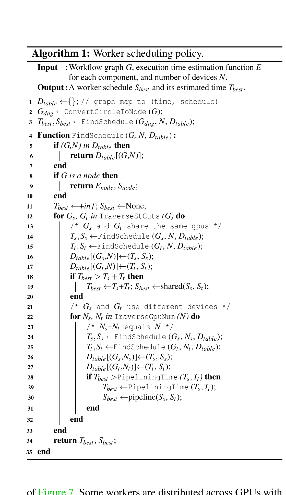

**Caption:** Worker scheduling policy.

**Caption[CN]:** Worker 调度策略。

**Algorithm 1 (searchable transcription):**

```text
Input: Workflow graph G, execution-time estimation function E for each component,
       and number of devices N.
Output: A worker schedule S_best and its estimated time T_best.

D_table ← {};                    // graph map to (time, schedule)
G_dag ← ConvertCircleToNode(G);
T_best, S_best ← FindSchedule(G_dag, N, D_table);

Function FindSchedule(G, N, D_table):
  if (G, N) in D_table then return D_table[(G, N)];
  if G is a node then return E_node, S_node;
  T_best ← +inf; S_best ← None;
  for G_s, G_t in TraverseStCuts(G) do
    // G_s and G_t share the same GPUs
    T_s, S_s ← FindSchedule(G_s, N, D_table);
    T_t, S_t ← FindSchedule(G_t, N, D_table);
    D_table[(G_s,N)] ← (T_s,S_s); D_table[(G_t,N)] ← (T_t,S_t);
    if T_best > T_s + T_t then
      T_best ← T_s + T_t; S_best ← shared(S_s,S_t);
    end
    // G_s and G_t use different devices
    for N_s, N_t in TraverseGpuNum(N) do
      // N_s + N_t equals N
      T_s, S_s ← FindSchedule(G_s, N_s, D_table);
      T_t, S_t ← FindSchedule(G_t, N_t, D_table);
      D_table[(G_s,N_s)] ← (T_s,S_s); D_table[(G_t,N_t)] ← (T_t,S_t);
      if T_best > PipeliningTime(T_s,T_t) then
        T_best ← PipeliningTime(T_s,T_t); S_best ← pipeline(S_s,S_t);
      end
    end
  end
  return T_best, S_best;
end
```

> <span style="color:#3B82F6"><strong>Para. 2:</strong></span> Algorithm 1 recursively partitions graph $G$ into subgraphs $G_s$ and $G_t$ connected by directed s–t cuts. Temporal candidates share the same devices and execute sequentially; spatial candidates receive disjoint device sets and pipeline. Dynamic programming memoizes subproblems, searches device allocation and processing granularity, and recursively reduces subgraphs to nodes.

> <span style="color:#F59E0B"><strong>Para. 2[CN]:</strong></span> 算法 1 通过有向 s–t 割，将图 $G$ 递归划分为子图 $G_s$ 与 $G_t$。时间候选方案共享同一组设备并顺序执行；空间候选方案使用不相交设备集并流水执行。动态规划缓存子问题，搜索设备分配与处理粒度，并递归地将子图缩减为节点。

> <span style="color:#3B82F6"><strong>Para. 3:</strong></span> Temporal cost sums $G_s$, $G_t$, and resource offload/reload overhead. Spatial runtime is estimated as:

> <span style="color:#F59E0B"><strong>Para. 3[CN]:</strong></span> 时间调度成本为 $G_s$、$G_t$ 与资源卸载/重载开销之和。空间调度运行时间估计为：

$$
T_{\mathrm{critical}} + (M/m - 1) \times T_{\mathrm{bottleneck}},
$$

> <span style="color:#3B82F6"><strong>Para. 4:</strong></span> where $T_{\mathrm{critical}}$ is pipeline warm-up and cool-down time, $T_{\mathrm{bottleneck}}$ is the slowest-subgraph runtime, $M$ is total batch size, and $m$ is processing granularity. Before `FindSchedule`, cycles are collapsed into single nodes; at such a node computation is evenly partitioned across GPUs. This avoids exhaustive enumeration and is described only as near-optimal, not exact.

> <span style="color:#F59E0B"><strong>Para. 4[CN]:</strong></span> 其中 $T_{\mathrm{critical}}$ 为流水线预热与排空时间，$T_{\mathrm{bottleneck}}$ 为最慢子图的运行时间，$M$ 为总 batch size，$m$ 为数据处理粒度。调用 `FindSchedule` 前，循环会被折叠为单个节点；到达这种节点时，计算被均匀划分到各 GPU。该处理避免穷举，论文仅称其达到近似最优，而非精确最优。

## 3.5 Adaptive Communication

> <span style="color:#3B82F6"><strong>Para. 1:</strong></span> RLinf requires communication to be flexible across any worker placement/program logic and adaptive to data on CPUs or GPUs across nodes while saturating links. Standard NCCL, Gloo, and MPI assume fixed process sets and common buffers; RL workers may collocate or distribute, appear/disappear dynamically, and exchange nested, variable-sized Python structures.

> <span style="color:#F59E0B"><strong>Para. 1[CN]:</strong></span> RLinf 要求通信既能跨任意 worker 放置与程序逻辑保持灵活，也能适应跨节点 CPU/GPU 上的数据并充分利用链路。标准 NCCL、Gloo 与 MPI 假设固定进程集合和常规缓冲区；RL worker 却可能共置或分散、动态创建/终止，并交换嵌套且大小可变的 Python 结构。

> <span style="color:#3B82F6"><strong>Para. 2:</strong></span> Workers register placement, IP, and port globally. Connections are lazily established on first communication, with metadata held locally and by a connection manager; termination triggers teardown notifications. RLinf offers synchronous/asynchronous `send` and `recv` plus collectives such as `broadcast`. It chooses NCCL for inter-GPU communication, zero-copy CUDA IPC for intra-GPU communication, and Gloo for CPU communication. Arbitrary Python objects are structure-aware: buffers are extracted and transferred directly, while structure metadata is piggybacked for reconstruction.

> <span style="color:#F59E0B"><strong>Para. 2[CN]:</strong></span> worker 将放置位置、IP 与端口注册到全局管理器。连接在首次通信时惰性建立，元数据由 worker 本地和连接管理器共同维护；worker 终止时会通知相关方拆除连接。RLinf 提供同步/异步 `send`、`recv` 及 `broadcast` 等集合通信。系统对 GPU–GPU 通信选择 NCCL，对同一 GPU 内通信选择零拷贝 CUDA IPC，对 CPU 通信选择 Gloo。任意 Python 对象以结构感知方式处理：提取数据缓冲区直接传输，并捎带结构元数据供接收端重建。

> <span style="color:#3B82F6"><strong>Para. 3:</strong></span> The high-level data channel is a FIFO-like producer–consumer queue hosted by a channel worker and passed by handle. It supports CPU/GPU data, optional GPU-to-CPU offload, and weighted load balancing: every enqueued item can carry a weight, and consumers may provide a custom dequeue policy.

> <span style="color:#F59E0B"><strong>Para. 3[CN]:</strong></span> 高层数据通道是由 channel worker 承载、通过句柄传递的 FIFO 式生产者—消费者队列。它支持 CPU/GPU 数据、可选的 GPU 到 CPU 卸载，以及加权负载均衡：每个入队项可带权重，消费者也可提供自定义出队策略。

# 4 Implementation

> <span style="color:#3B82F6"><strong>Para. 1:</strong></span> RLinf comprises 20K lines of Python: 5K for core worker/controller/scheduler components; 2K for reusable rollout workers based on SGLang, vLLM, and HuggingFace Transformers, training actors based on Megatron and FSDP, and embodied simulators; and 13K mainly for PPO/GRPO and other algorithm support. A typical reasoning-RL workflow runner is under 100 lines and needs no changes between temporal and spatial scheduling.

> <span style="color:#F59E0B"><strong>Para. 1[CN]:</strong></span> RLinf 含 20K 行 Python：5K 行用于核心 worker/controller/scheduler；2K 行用于基于 SGLang、vLLM、HuggingFace Transformers 的通用 rollout worker、基于 Megatron/FSDP 的训练 actor 与具身模拟器；余下 13K 行主要支持 PPO、GRPO 等算法。典型推理 RL workflow runner 不足 100 行，在时间与空间调度之间切换无需改代码。

> <span style="color:#3B82F6"><strong>Para. 2:</strong></span> Supported scenarios include LLM reasoning RL, tool-using agentic RL, and embodied RL with 3D rendering, physics simulation, and robotic control. Algorithms include PPO, GRPO, DAPO, REINFORCE++, and some off-policy asynchronous variants. Models include Qwen language models, VLMs, VLA models, and $\pi_0$.

> <span style="color:#F59E0B"><strong>Para. 2[CN]:</strong></span> 支持场景包括 LLM 推理 RL、使用工具的智能体 RL，以及含 3D 渲染、物理仿真和机器人控制的具身 RL。算法包括 PPO、GRPO、DAPO、REINFORCE++ 及部分离策略异步变体。模型包括 Qwen 语言模型、VLM、VLA 模型与 $\pi_0$。

> <span style="color:#3B82F6"><strong>Para. 3:</strong></span> Ray launches remote workers and dispatches functions, but RLinf does not use Ray device allocation because packed/spread policies are too rigid. Any worker can receive arbitrary device global IDs across nodes; robot arms and other non-accelerators are also schedulable devices. Timers wrap remote public functions, reduce process values by mean/max/min, and support user-defined fine-grained regions.

> <span style="color:#F59E0B"><strong>Para. 3[CN]:</strong></span> Ray 负责远程启动 worker 与分派函数，但 RLinf 不采用 Ray 的设备分配，因为 packed/spread 策略过于僵硬。worker 可通过全局 ID 获得跨节点任意设备；机械臂等非加速器硬件也被抽象为可调度设备。计时器包裹远程公共函数，可用 mean/max/min 归约各进程数值，并支持用户定义的细粒度代码区域。

# 5 Evaluation

> <span style="color:#3B82F6"><strong>Para. 1:</strong></span> Evaluation spans Qwen2.5, Qwen3-MoE, OpenVLA, and OpenVLA-OFT; GRPO and PPO; reasoning and embodied workloads; and multiple scales. The headline range is $1.07\times$–$1.70\times$ over veRL/Slime for math reasoning and $1.05\times$–$2.43\times$ over SimpleVLA-RL on LIBERO, with up to $1.87\times$ among RLinf modes on ManiSkill. Scheduler search takes $7\times10^{-4}$–$5.98$ s from 8 to 1024 GPUs.

> <span style="color:#F59E0B"><strong>Para. 1[CN]:</strong></span> 评测覆盖 Qwen2.5、Qwen3-MoE、OpenVLA、OpenVLA-OFT，GRPO 与 PPO，推理与具身负载，以及多种集群规模。核心范围为：数学推理相对 veRL/Slime 提升 $1.07\times$–$1.70\times$；LIBERO 相对 SimpleVLA-RL 提升 $1.05\times$–$2.43\times$；ManiSkill 上 RLinf 各模式间最高提升 $1.87\times$。8–1024 GPU 上调度搜索耗时 $7\times10^{-4}$–$5.98$ 秒。

## 5.1 End-to-End Experiments

> <span style="color:#3B82F6"><strong>Para. 1:</strong></span> Experiments use 32 nodes, each with 8 NVIDIA H100-80GB GPUs, two Intel Xeon Platinum 8558 CPUs (2.1 GHz, 48 cores), and 2 TB memory. Intra-node links are NVLink; inter-node links use eight Mellanox ConnectX-7 RDMA NICs per node at 400 Gbps each with RoCEv2.

> <span style="color:#F59E0B"><strong>Para. 1[CN]:</strong></span> 实验使用 32 个节点，每节点配备 8 张 NVIDIA H100-80GB GPU、2 颗 Intel Xeon Platinum 8558 CPU（2.1 GHz、48 核）和 2 TB 内存。节点内采用 NVLink；节点间每节点使用 8 张 Mellanox ConnectX-7 RDMA 网卡，每张 400 Gbps，并采用 RoCEv2。

### 5.1.1 Reasoning RL Training

> <span style="color:#3B82F6"><strong>Para. 1:</strong></span> Qwen2.5 models distilled by DeepSeek-R1 (1.5B–32B) and Qwen3-30B-A3B MoE use AReaL-boba-Data. Baselines are veRL v0.5 and Slime v0.1. Fairness controls include SGLang rollout, Megatron-LM training, and identical parallelism settings. Tokens/s equals prompt-plus-response tokens per global batch divided by iteration time; results average 10 post-warm-up iterations.

> <span style="color:#F59E0B"><strong>Para. 1[CN]:</strong></span> 实验采用 DeepSeek-R1 蒸馏的 Qwen2.5（1.5B–32B）和 Qwen3-30B-A3B MoE，以及 AReaL-boba-Data。基线为 veRL v0.5 与 Slime v0.1。公平性控制包括统一使用 SGLang rollout、Megatron-LM 训练和相同并行配置。tokens/s 定义为 global batch 中 prompt 与 response token 总数除以迭代时间；结果为预热后 10 次迭代均值。

### Figure 8. Qwen2.5 GRPO 吞吐率

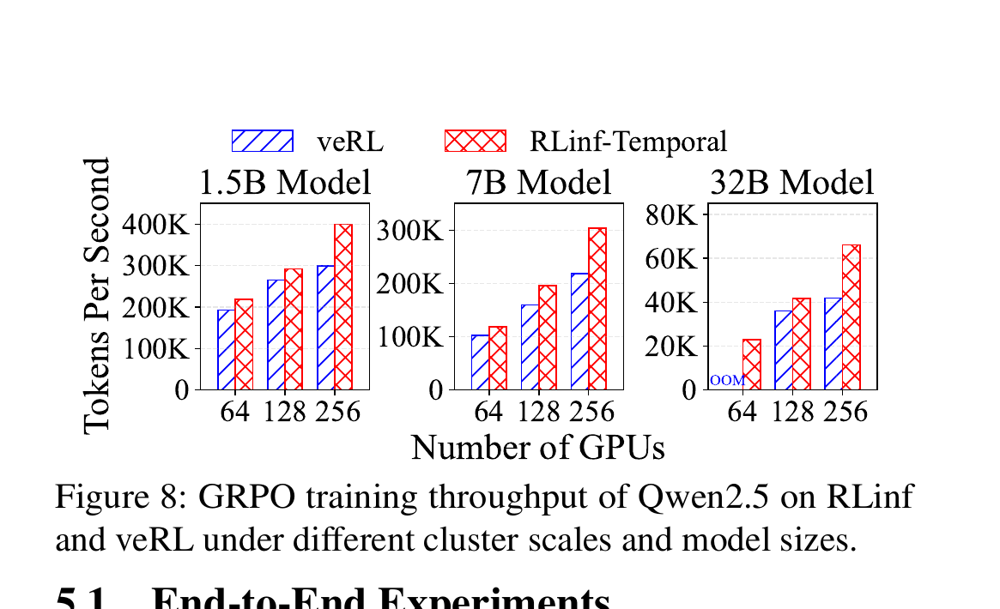

**Caption:** GRPO training throughput of Qwen2.5 on RLinf and veRL under different cluster scales and model sizes.

**Caption[CN]:** 不同集群规模与模型大小下，RLinf 和 veRL 的 Qwen2.5 GRPO 训练吞吐率。

> <span style="color:#3B82F6"><strong>Para. 2:</strong></span> For Qwen2.5 GRPO, 1.5B/7B/32B use 64/128/256 GPUs respectively, rollout batch 512, and maximum sequence length 28672. RLinf-Temporal yields $1.10\times$–$1.58\times$ over veRL, mainly from larger KV cache and lower synchronization overhead. veRL inference share rises from 15.2% to 19.9% between 64 and 256 GPUs. Crucially, RLinf-Spatial is not always better: on the 7B setting it is 44.3%–68.6% slower than veRL because disjoint smaller GPU sets slow all stages, long sequences delay the first training batch, and the rollout batch gives insufficient overlap.

> <span style="color:#F59E0B"><strong>Para. 2[CN]:</strong></span> 在 Qwen2.5 GRPO 中，1.5B/7B/32B 分别使用 64/128/256 张 GPU，rollout batch 为 512，最大序列长度为 28672。RLinf-Temporal 相对 veRL 提升 $1.10\times$–$1.58\times$，主要源于更大的 KV cache 与更低同步开销。veRL 的推理占比从 64 GPU 时的 15.2% 增至 256 GPU 时的 19.9%。关键是 RLinf-Spatial 并非总是更优：在 7B 设置中，它比 veRL 慢 44.3%–68.6%，因为分离且更小的 GPU 集合拖慢各阶段，长序列推迟首批训练数据，而 rollout batch 又不足以提供充分重叠。

### Figure 9. Qwen2.5 7B 训练时延分解

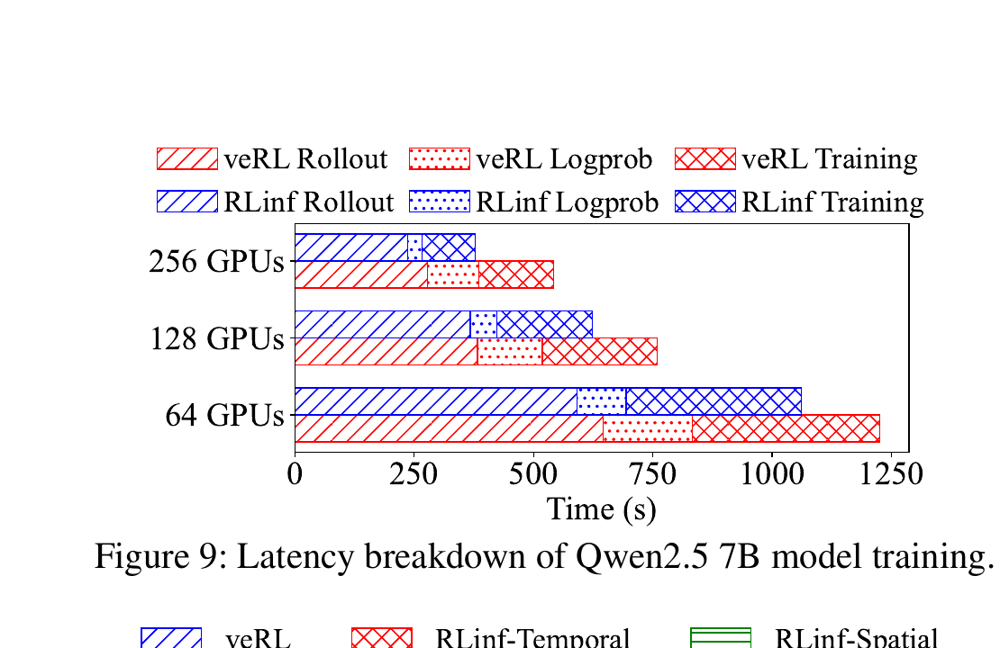

**Caption:** Latency breakdown of Qwen2.5 7B model training.

**Caption[CN]:** Qwen2.5 7B 模型训练的时延分解。

### Figure 10. Qwen2.5 PPO 吞吐率

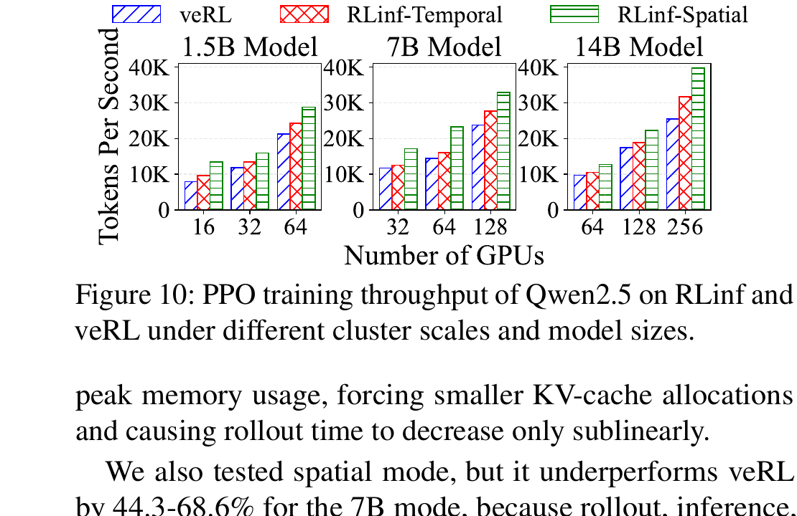

**Caption:** PPO training throughput of Qwen2.5 on RLinf and veRL under different cluster scales and model sizes.

**Caption[CN]:** 不同集群规模与模型大小下，RLinf 和 veRL 的 Qwen2.5 PPO 训练吞吐率。

> <span style="color:#3B82F6"><strong>Para. 3:</strong></span> Qwen2.5 PPO uses the same-size actor and critic (1.5B/7B/14B), 16–256 GPUs, rule reward, maximum sequence length 12288, rollout batches 256–1024, and a 4:1:1:1:1 spatial GPU ratio for rollout, actor inference, actor training, critic inference, and critic training. For 1.5B, Spatial beats veRL by 69.6%, 35.0%, and 35.6% on 16/32/64 GPUs and beats Temporal by 39.8%, 19.4%, and 18.6%. For 7B it beats veRL by 38.7%–60.7% and Temporal by 19.0%–44.8%. The 14B trend is similar but smaller: 27.2%–56.5% over veRL and 17.7%–25.7% over Temporal.

> <span style="color:#F59E0B"><strong>Para. 3[CN]:</strong></span> Qwen2.5 PPO 使用同尺寸 actor 与 critic（1.5B/7B/14B）、16–256 张 GPU、规则奖励、最大序列长度 12288、rollout batch 256–1024；空间模式按 4:1:1:1:1 将 GPU 分给 rollout、actor inference、actor training、critic inference 与 critic training。1.5B 时，Spatial 在 16/32/64 GPU 上分别比 veRL 快 69.6%、35.0%、35.6%，比 Temporal 快 39.8%、19.4%、18.6%。7B 时，它比 veRL 快 38.7%–60.7%，比 Temporal 快 19.0%–44.8%。14B 趋势相同但增益更小：相对 veRL 为 27.2%–56.5%，相对 Temporal 为 17.7%–25.7%。

### Figure 11. Qwen2.5 7B PPO 时延分解

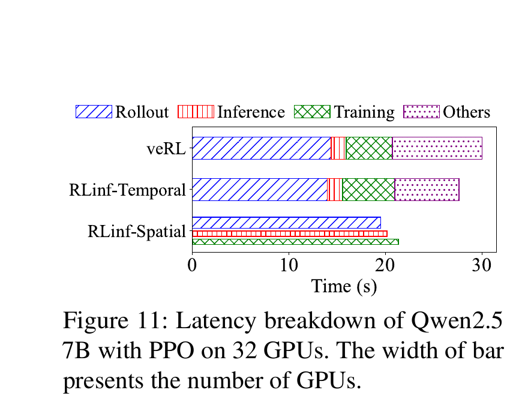

**Caption:** Latency breakdown of Qwen2.5 7B with PPO on 32 GPUs. The width of bar presents the number of GPUs.

**Caption[CN]:** 32 张 GPU 上 Qwen2.5 7B PPO 的时延分解；条形宽度表示 GPU 数量。

> <span style="color:#3B82F6"><strong>Para. 4:</strong></span> Qwen3-30B-A3B GRPO uses 32/64/128 GPUs, rollout batch 1536, sequence length 20480, and disables logprob recomputation. Baselines are Slime spatial-without-pipeline and Slime-Colocate temporal. At 32 and 64 GPUs, RLinf-Spatial is 31.2% and 7.2% faster than Slime-Colocate; at 128 GPUs RLinf-Temporal beats Slime-Colocate by 3.7%. RLinf-Spatial underperforms at 128 GPUs because rollout and training overlap poorly and training runs 80 s after rollout ends. Temporal also limits SGLang `max_running_requests` to 128 versus Spatial’s 256 due to memory contention.

> <span style="color:#F59E0B"><strong>Para. 4[CN]:</strong></span> Qwen3-30B-A3B GRPO 使用 32/64/128 张 GPU、rollout batch 1536、序列长度 20480，并关闭 logprob 重计算。基线为无流水线的 Slime 空间模式与 Slime-Colocate 时间模式。在 32 和 64 GPU 上，RLinf-Spatial 分别比 Slime-Colocate 快 31.2% 和 7.2%；在 128 GPU 上，RLinf-Temporal 比 Slime-Colocate 快 3.7%。RLinf-Spatial 在 128 GPU 上反而较差，因为 rollout 与训练重叠不足，rollout 结束后训练仍持续 80 秒。时间模式还因内存竞争将 SGLang `max_running_requests` 限制为 128，而空间模式为 256。

### Figure 12. Qwen3-30B-A3B 训练吞吐率

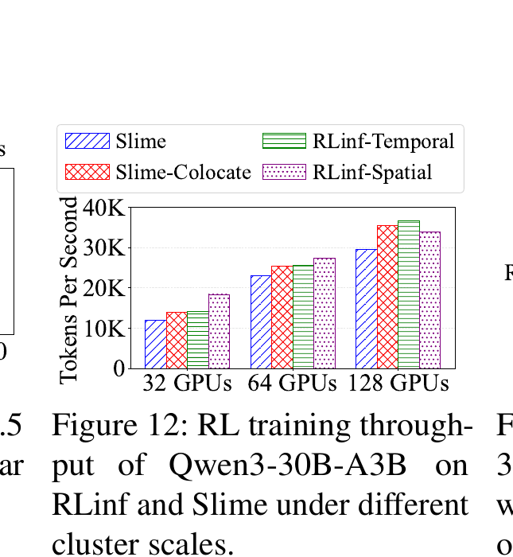

**Caption:** RL training throughput of Qwen3-30B-A3B on RLinf and Slime under different cluster scales.

**Caption[CN]:** 不同集群规模下 RLinf 与 Slime 的 Qwen3-30B-A3B RL 训练吞吐率。

### Figure 13. Qwen3-30B-A3B 时延分解

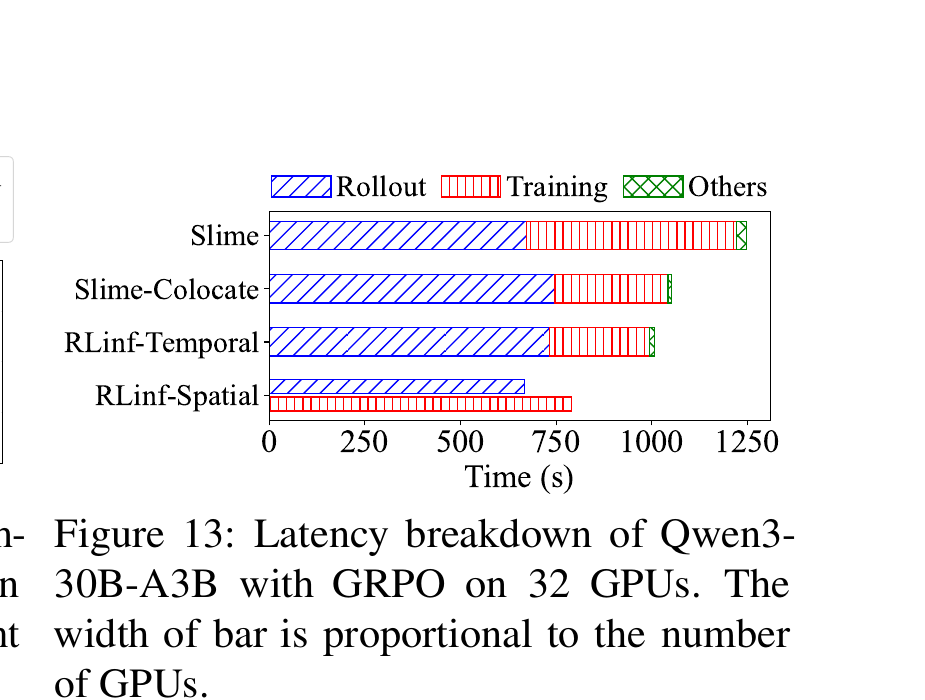

**Caption:** Latency breakdown of Qwen3-30B-A3B with GRPO on 32 GPUs. The width of bar is proportional to the number of GPUs.

**Caption[CN]:** 32 张 GPU 上 Qwen3-30B-A3B GRPO 的时延分解；条形宽度与 GPU 数量成比例。

### 5.1.2 Embodied RL Training

> <span style="color:#3B82F6"><strong>Para. 1:</strong></span> OpenVLA and OpenVLA-OFT are supervised-finetuned using RL4VLA and SimpleVLA-RL, then trained on ManiSkill and LIBERO. LIBERO compares SimpleVLA-RL commit `d001d`; ManiSkill lacks a distributed baseline, so RLinf modes are compared. Throughput is environment steps divided by iteration time.

> <span style="color:#F59E0B"><strong>Para. 1[CN]:</strong></span> OpenVLA 与 OpenVLA-OFT 分别经 RL4VLA 和 SimpleVLA-RL 监督微调，再在 ManiSkill 与 LIBERO 上训练。LIBERO 比较 SimpleVLA-RL commit `d001d`；ManiSkill 没有分布式基线，因此比较 RLinf 各模式。吞吐率定义为环境步数除以迭代时间。

### Figure 14. 具身 RL 端到端吞吐率

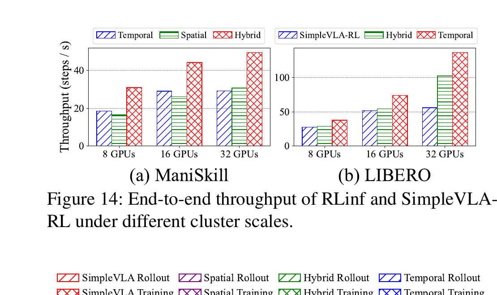

**Caption:** End-to-end throughput of RLinf and SimpleVLA-RL under different cluster scales: (a) ManiSkill; (b) LIBERO.

**Caption[CN]:** 不同集群规模下 RLinf 与 SimpleVLA-RL 的端到端吞吐率：（a）ManiSkill；（b）LIBERO。

> <span style="color:#3B82F6"><strong>Para. 2:</strong></span> ManiSkill uses OpenVLA on `PutCarrotOnPlateInScene-v2`, 256 parallel environments, and 80 steps per iteration. On 8/16/32 GPUs, Hybrid is 52.2%–69.1% above Temporal and 60.7%–87.2% above Spatial. Since per-step simulator time is nearly constant and scaling is memory-limited, dedicated environment GPUs help; temporally sharing GPUs between rollout and training is also effective. Temporal constrains environment count/batch size by co-residency, while Spatial leaves too few GPUs for rollout after reserving enough to run training.

> <span style="color:#F59E0B"><strong>Para. 2[CN]:</strong></span> ManiSkill 使用 OpenVLA 在 `PutCarrotOnPlateInScene-v2` 上训练，设 256 个并行环境，每次迭代 80 步。在 8/16/32 GPU 上，Hybrid 比 Temporal 高 52.2%–69.1%，比 Spatial 高 60.7%–87.2%。由于模拟器单步时间近乎恒定且扩展受内存限制，为环境分配专用 GPU 有利；同时让 rollout 与 training 时间共享 GPU 也有效。Temporal 因共驻限制环境数/batch size；Spatial 为保证训练可运行而预留足够 GPU 后，留给 rollout 的 GPU 太少。

> <span style="color:#3B82F6"><strong>Para. 3:</strong></span> LIBERO uses OpenVLA-OFT, 512 parallel environments, 64 steps per iteration, and public task groups. Temporal is 37.8%, 42.6%, and 143.4% faster than SimpleVLA-RL on 8/16/32 GPUs due to eliminating redundant environment initialization and computing action plus log probability in one forward pass. Hybrid is worse than Temporal because LIBERO is CPU-intensive: placing environments on only a subset of GPU hosts restricts CPU-core use, making rollout even slower than SimpleVLA-RL.

> <span style="color:#F59E0B"><strong>Para. 3[CN]:</strong></span> LIBERO 使用 OpenVLA-OFT、512 个并行环境、每次迭代 64 步及公开任务组。Temporal 在 8/16/32 GPU 上分别比 SimpleVLA-RL 快 37.8%、42.6% 和 143.4%，原因是消除了 rollout 期间重复的环境初始化，并在一次前向中同时计算动作与对数概率。Hybrid 比 Temporal 更差，因为 LIBERO 为 CPU 密集型：仅把环境分配到部分 GPU 主机限制了 CPU 核利用，使 rollout 甚至比 SimpleVLA-RL 更慢。

### Figure 15. ManiSkill 与 LIBERO 时延分解

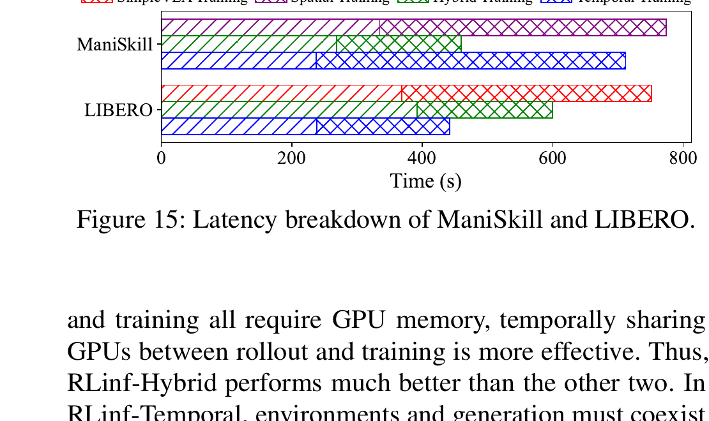

**Caption:** Latency breakdown of ManiSkill and LIBERO.

**Caption[CN]:** ManiSkill 与 LIBERO 的时延分解。

## 5.2 Effectiveness of Search Policy

> <span style="color:#3B82F6"><strong>Para. 1:</strong></span> In four Qwen2.5-GRPO cases—1.5B/128 GPUs and 7B/64 GPUs, each at temperatures 0.6 and 1.0—Temporal estimation error is below 2%; Spatial is below 5%, with extra error from response-length pipeline imbalance. The error does not change the ranking of feasible modes in these experiments.

> <span style="color:#F59E0B"><strong>Para. 1[CN]:</strong></span> 在四个 Qwen2.5-GRPO 案例中——1.5B/128 GPU 与 7B/64 GPU，均测试温度 0.6 和 1.0——Temporal 估计误差低于 2%；Spatial 低于 5%，额外误差来自响应长度变化造成的流水不平衡。在这些实验中，误差未改变可行模式的排序。

### Figure 16. 时延预测与搜索开销

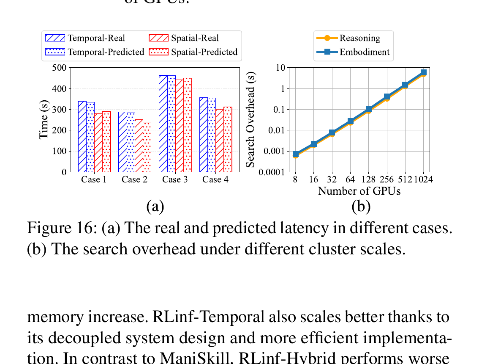

**Caption:** (a) The real and predicted latency in different cases. (b) The search overhead under different cluster scales.

**Caption[CN]:** （a）不同案例中的真实与预测时延；（b）不同集群规模下的搜索开销。

> <span style="color:#3B82F6"><strong>Para. 2:</strong></span> Search complexity depends chiefly on graph nodes and GPU count. RL workflows usually have fewer than ten nodes. For a three-node graph and 8–1024 GPUs, time grows exponentially with GPU count but remains under five seconds in Figure 16(b); the broader reported range is $7\times10^{-4}$–$5.98$ s.

> <span style="color:#F59E0B"><strong>Para. 2[CN]:</strong></span> 搜索复杂度主要取决于图节点数和 GPU 数。RL 工作流通常少于十个节点。对三节点图与 8–1024 张 GPU，搜索时间随 GPU 数指数增长，但图 16(b) 中仍低于 5 秒；全文报告的更宽范围为 $7\times10^{-4}$–$5.98$ 秒。

## 5.3 Model Performance

> <span style="color:#3B82F6"><strong>Para. 1:</strong></span> Built-in GRPO trains DeepSeek-R1-Distill-Qwen-1.5B/7B. Table 1 reports the best average for both RLinf models; RLinf-1.5B is best on all three benchmarks and improves by up to 20 points over base, while RLinf-7B is best on GPQA-diamond.

> <span style="color:#F59E0B"><strong>Para. 1[CN]:</strong></span> 内置 GRPO 用于训练 DeepSeek-R1-Distill-Qwen-1.5B/7B。表 1 中两个 RLinf 模型的平均分均最高；RLinf-1.5B 在三项基准上都最佳，相对 base 最高提升 20 分；RLinf-7B 在 GPQA-diamond 上最佳。

### Table 1. RLinf-math 与开源模型评测分数

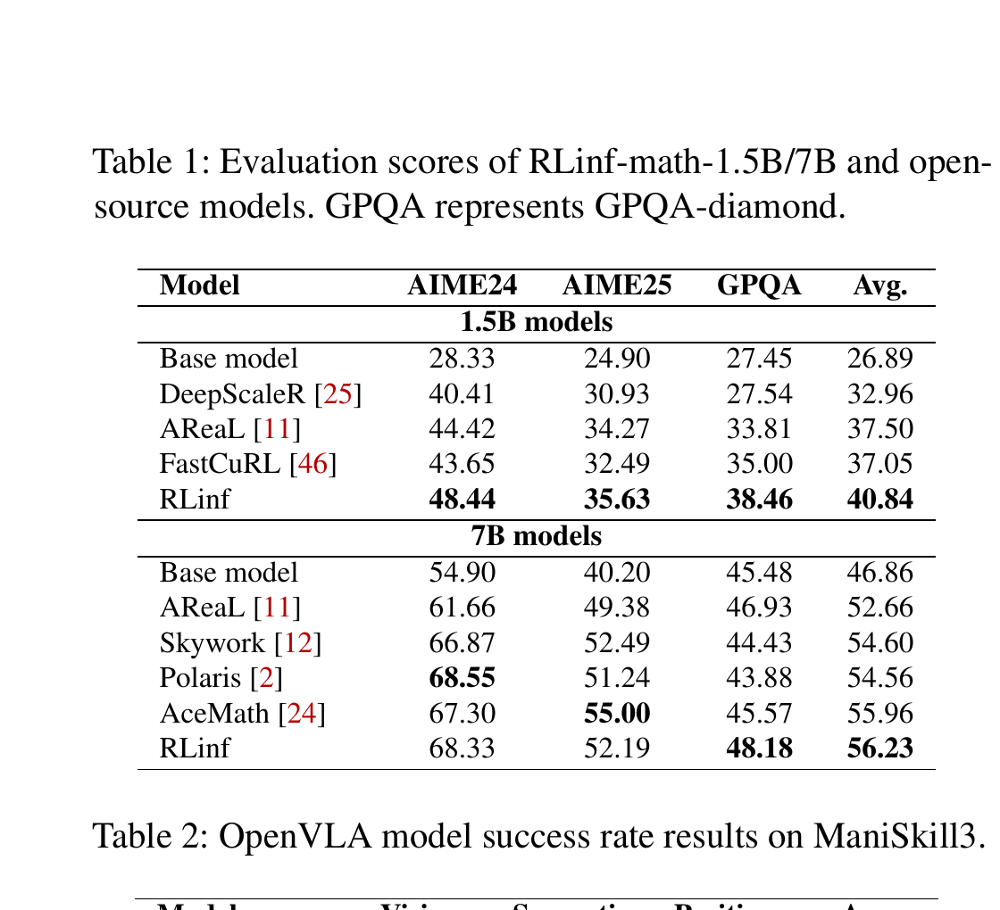

**Caption:** Evaluation scores of RLinf-math-1.5B/7B and open-source models. GPQA represents GPQA-diamond.

**Caption[CN]:** RLinf-math-1.5B/7B 与开源模型的评测分数；GPQA 表示 GPQA-diamond。

| Model | AIME24 | AIME25 | GPQA | Avg. |
|---|---:|---:|---:|---:|
| **1.5B models** |  |  |  |  |
| Base model | 28.33 | 24.90 | 27.45 | 26.89 |
| DeepScaleR [25] | 40.41 | 30.93 | 27.54 | 32.96 |
| AReaL [11] | 44.42 | 34.27 | 33.81 | 37.50 |
| FastCuRL [46] | 43.65 | 32.49 | 35.00 | 37.05 |
| RLinf | **48.44** | **35.63** | **38.46** | **40.84** |
| **7B models** |  |  |  |  |
| Base model | 54.90 | 40.20 | 45.48 | 46.86 |
| AReaL [11] | 61.66 | 49.38 | 46.93 | 52.66 |
| Skywork [12] | 66.87 | 52.49 | 44.43 | 54.60 |
| Polaris [2] | **68.55** | 51.24 | 43.88 | 54.56 |
| AceMath [24] | 67.30 | **55.00** | 45.57 | 55.96 |
| RLinf | 68.33 | 52.19 | **48.18** | **56.23** |

> <span style="color:#3B82F6"><strong>Para. 2:</strong></span> PPO-trained OpenVLA on ManiSkill exceeds RL4VLA in every category. PPO-trained OpenVLA-OFT on LIBERO is compared with the public one-trajectory supervised-finetuned model and rises from 34.33% to 97.83% average success.

> <span style="color:#F59E0B"><strong>Para. 2[CN]:</strong></span> 在 ManiSkill 上，经 PPO 训练的 OpenVLA 在每个类别均超过 RL4VLA。在 LIBERO 上，经 PPO 训练的 OpenVLA-OFT 与公开的 one-trajectory 监督微调模型比较，平均成功率从 34.33% 提升至 97.83%。

### Table 2. ManiSkill3 上的 OpenVLA 成功率

**Caption:** OpenVLA model success rate results on ManiSkill3.

**Caption[CN]:** ManiSkill3 上 OpenVLA 模型的成功率结果。

| Model | Vision | Semantic | Position | Avg. |
|---|---:|---:|---:|---:|
| RL4VLA [23] | 80.47% | 75.00% | 81.77% | 79.15% |
| RLinf | **82.03%** | **78.35%** | **85.42%** | **81.93%** |

### Table 3. LIBERO 上 RL 后的 OpenVLA-OFT 成功率

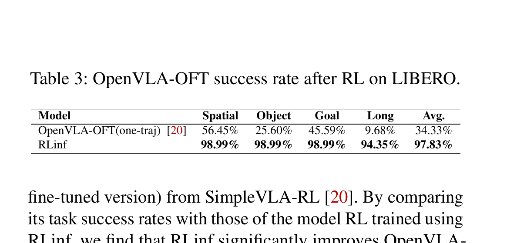

**Caption:** OpenVLA-OFT success rate after RL on LIBERO.

**Caption[CN]:** 在 LIBERO 上进行 RL 后 OpenVLA-OFT 的成功率。

| Model | Spatial | Object | Goal | Long | Avg. |
|---|---:|---:|---:|---:|---:|
| OpenVLA-OFT(one-traj) [20] | 56.45% | 25.60% | 45.59% | 9.68% | 34.33% |
| RLinf | **98.99%** | **98.99%** | **98.99%** | **94.35%** | **97.83%** |

# 6 Related Works

> <span style="color:#3B82F6"><strong>Para. 1:</strong></span> **RL training frameworks.** Task-colocated DeepSpeed Chat and veRL share GPUs; task-separated NeMo-Aligner and OpenRLHF divide components; AReaL adds asynchronous model updates. RLinf instead makes component-to-device placement flexible so execution configurations can match workload characteristics.

> <span style="color:#F59E0B"><strong>Para. 1[CN]:</strong></span> **RL 训练框架。** 任务共置的 DeepSpeed Chat 与 veRL 共享 GPU；任务分离的 NeMo-Aligner 与 OpenRLHF 划分组件；AReaL 进一步加入异步模型更新。RLinf 则让组件到设备的映射保持灵活，使执行配置能匹配工作负载特征。

> <span style="color:#3B82F6"><strong>Para. 2:</strong></span> **Distributed LLM training.** Megatron-LM combines tensor, pipeline, and data parallelism; DeepSpeed ZeRO shards optimizer state, gradients, and activations. RL systems inherit multi-device scaling challenges but add interactive generation and asynchronous updates.

> <span style="color:#F59E0B"><strong>Para. 2[CN]:</strong></span> **分布式 LLM 训练。** Megatron-LM 结合张量、流水线和数据并行；DeepSpeed ZeRO 切分优化器状态、梯度与激活。RL 系统继承多设备扩展难题，又加入交互式数据生成与异步更新。

> <span style="color:#3B82F6"><strong>Para. 3:</strong></span> **Dataflow systems.** MapReduce, Dryad, Naiad, and Spark excel on static graphs and centralized scheduling for predictable batch/stream processing. RL has dynamic task graphs and asynchronous data collection/policy updates; Ray’s actor execution and decentralized control are better suited, but RLinf adds RL-specific orchestration.

> <span style="color:#F59E0B"><strong>Para. 3[CN]:</strong></span> **数据流系统。** MapReduce、Dryad、Naiad 与 Spark 擅长以静态任务图和集中调度处理可预测的批/流工作负载。RL 则具有动态任务图及异步数据收集/策略更新；Ray 的 actor 执行与去中心化控制更合适，而 RLinf 进一步加入面向 RL 的编排。

# 7 Conclusion

> <span style="color:#3B82F6"><strong>Para. 1:</strong></span> RL workflows are too diverse and dynamic for rigid execution models. RLinf argues that decoupling workflow logic from execution through macro-to-micro transformation can unlock efficiency and programmability. The authors position this beyond RL as a blueprint for AI runtimes that unify training, inference, simulation, and reasoning, and as an early step toward an operating system for AI workloads.

> <span style="color:#F59E0B"><strong>Para. 1[CN]:</strong></span> RL 工作流过于多样且动态，僵化执行模型难以适配。RLinf 表明，通过宏到微转换将工作流逻辑与执行解耦，可以同时释放效率与可编程性。作者进一步将其视为超越 RL 的 AI runtime 蓝图，用统一执行框架编排训练、推理、模拟与推理过程，并称其为迈向 AI 工作负载操作系统的早期一步。

# References

> <span style="color:#3B82F6"><strong>Para. 1:</strong></span> References are retained in their original searchable bibliographic form; titles, author names, venues, URLs, and identifiers are not translated to avoid corrupting citation metadata.

> <span style="color:#F59E0B"><strong>Para. 1[CN]:</strong></span> 参考文献按原始、可检索的书目信息保留；题名、作者名、期刊/会议、URL 与标识符不作翻译，以避免破坏引文元数据。

1. Martín Abadi, Paul Barham, Jianmin Chen, Zhifeng Chen, Andy Davis, Jeffrey Dean, Matthieu Devin, Sanjay Ghemawat, Geoffrey Irving, Michael Isard, et al. TensorFlow: A system for large-scale machine learning. *OSDI*, pp. 265–283, 2016.
2. Chenxin An et al. Polaris: A post-training recipe for scaling reinforcement learning on advanced reasoning models. 2025.
3. Shuai Bai et al. Qwen2.5-VL technical report. arXiv:2502.13923, 2025.
4. Chang Chen et al. Centauri: Enabling efficient scheduling for communication-computation overlap in large model training via communication partitioning. *ASPLOS*, pp. 178–191, 2024.
5. Tianqi Chen, Bing Xu, Chiyuan Zhang, and Carlos Guestrin. Training deep nets with sublinear memory cost. arXiv:1604.06174, 2016.
6. Paul F. Christiano et al. Deep reinforcement learning from human preferences. *NeurIPS*, 2017.
7. Jeffrey Dean and Sanjay Ghemawat. MapReduce: Simplified data processing on large clusters. *Communications of the ACM*, 51(1):107–113, 2008.
8. Jiafei Duan et al. A survey of embodied AI: From simulators to research tasks. *Proceedings of IEEE*, 2022.
9. Lester Randolph Ford and Delbert Ray Fulkerson. *Flows in Networks*. 2015.
10. Message Passing Interface Forum. MPI: A message-passing interface standard. https://www.mpi-forum.org, 2025.
11. Wei Fu et al. AReaL: A large-scale asynchronous reinforcement learning system for language reasoning. arXiv:2505.24298, 2025.
12. Jujie He et al. Skywork Open Reasoner Series. Notion Blog, 2025.
13. Jian Hu. REINFORCE++: A simple and efficient approach for aligning large language models. arXiv:2501.03262, 2025.
14. Jian Hu et al. OpenRLHF: An easy-to-use, scalable and high-performance RLHF framework. arXiv:2405.11143, 2024.
15. Zixiao Huang et al. Stalloc: Enhancing memory efficiency in large-scale model training with spatio-temporal planning. 2025.
16. Michael Isard et al. Dryad: Distributed data-parallel programs from sequential building blocks. *EuroSys*, pp. 59–72, 2007.
17. Anand Jayarajan et al. Priority-based parameter propagation for distributed DNN training. *Proceedings of MLSys*, 1:132–145, 2019.
18. Moo Jin Kim, Chelsea Finn, and Percy Liang. Fine-tuning vision-language-action models: Optimizing speed and success. arXiv:2502.19645, 2025.
19. Moo Jin Kim et al. OpenVLA: An open-source vision-language-action model. arXiv:2406.09246, 2024.
20. Haozhan Li et al. SimpleVLA-RL: Scaling VLA training via reinforcement learning. 2025.
21. Shenggui Li et al. Colossal-AI: A unified deep learning system for large-scale parallel training. *ICPP*, pp. 766–775, 2023.
22. Bo Liu et al. LIBERO: Benchmarking knowledge transfer for lifelong robot learning. arXiv:2306.03310, 2023.
23. Jijia Liu et al. What can RL bring to VLA generalization? An empirical study. *NeurIPS*, 2025.
24. Zihan Liu et al. AceMath: Advancing frontier math reasoning with post-training and reward modeling. arXiv preprint, 2024.
25. Michael Luo et al. DeepScaleR: Surpassing O1-preview with a 1.5B model by scaling RL. Notion Blog, 2025.
26. Kshiteej Mahajan et al. Better together: Jointly optimizing ML collective scheduling and execution planning using Syndicate. *NSDI*, pp. 809–824, 2023.
27. Chen Meng et al. Training deeper models by GPU memory optimization on TensorFlow. *ML Systems Workshop in NIPS*, vol. 7, 2017.
28. Philipp Moritz et al. Ray: A distributed framework for emerging AI applications. *OSDI*, pp. 561–577, 2018.
29. Derek G. Murray et al. Naiad: A timely dataflow system. *SOSP*, pp. 439–455, 2013.
30. Reiichiro Nakano et al. WebGPT: Browser-assisted question-answering with human feedback. arXiv:2112.09332, 2021.
31. NVIDIA. NVIDIA Collective Communications Library (NCCL). https://developer.nvidia.com/nccl, 2025.
32. OpenAI. Learning to reason with LLMs. https://openai.com/index/learning-to-reason-with-llms/, 2025.
33. Long Ouyang et al. Training language models to follow instructions with human feedback. *NeurIPS*, 35:27730–27744, 2022.
34. PyTorch. Gloo: Collective communications library. https://github.com/pytorch/gloo, 2025.
35. Qwen Team et al. Qwen2.5 technical report. 2025.
36. Samyam Rajbhandari et al. ZeRO: Memory optimizations toward training trillion parameter models. *SC*, pp. 1–16, 2020.
37. Samyam Rajbhandari et al. ZeRO-Infinity: Breaking the GPU memory wall for extreme scale deep learning. *SC*, pp. 1–14, 2021.
38. Jeff Rasley et al. DeepSpeed: System optimizations enable training deep learning models with over 100 billion parameters. *SIGKDD*, pp. 3505–3506, 2020.
39. David Rein et al. GPQA: A graduate-level Google-proof Q&A benchmark. *First Conference on Language Modeling*, 2024.
40. Jie Ren et al. ZeRO-Offload: Democratizing billion-scale model training. *ATC*, pp. 551–564, 2021.
41. John Schulman et al. Proximal policy optimization algorithms. arXiv:1707.06347, 2017.
42. Zhihong Shao et al. DeepSeekMath: Pushing the limits of mathematical reasoning in open language models. arXiv:2402.03300, 2024.
43. Gerald Shen et al. NeMo-Aligner: Scalable toolkit for efficient model alignment. arXiv:2405.01481, 2024.
44. Guangming Sheng et al. HybridFlow: A flexible and efficient RLHF framework. *EuroSys*, pp. 1279–1297, 2025.
45. Mohammad Shoeybi et al. Megatron-LM: Training multi-billion parameter language models using model parallelism. arXiv:1909.08053, 2019.
46. Mingyang Song et al. FastCuRL: Curriculum reinforcement learning with stage-wise context scaling for efficient training R1-like reasoning models. 2025.
47. Stone Tao et al. ManiSkill3: GPU parallelized robotics simulation and rendering for generalizable embodied AI. *Robotics: Science and Systems*, 2025.
48. Physical Intelligence team. openpi holds open-source models and packages for robotics. https://github.com/Physical-Intelligence/openpi, 2025.
49. HuggingFace xDAN-datasets. xDAN-datasets/AReaL-boba-Data. https://huggingface.co/datasets/xDAN-datasets/AReaL-boba-Data, 2025.
50. An Yang et al. Qwen3 technical report. arXiv:2505.09388, 2025.
51. Zhewei Yao et al. DeepSpeed-Chat: Easy, fast and affordable RLHF training of ChatGPT-like models at all scales. arXiv:2308.01320, 2023.
52. Qiying Yu et al. DAPO: An open-source LLM reinforcement learning system at scale. arXiv:2503.14476, 2025.
53. Matei Zaharia et al. Apache Spark: A unified engine for big data processing. *Communications of the ACM*, 59(11):56–65, 2016.
54. Yifan Zhang and Team Math-AI. American Invitational Mathematics Examination (AIME) 2024. 2024.
55. Yifan Zhang and Team Math-AI. American Invitational Mathematics Examination (AIME) 2025. 2025.
56. Yanli Zhao et al. PyTorch FSDP: Experiences on scaling fully sharded data parallel. arXiv:2304.11277, 2023.
57. Lianmin Zheng et al. Alpa: Automating inter- and intra-operator parallelism for distributed deep learning. *OSDI*, pp. 559–578, 2022.
58. Lianmin Zheng et al. SGLang: Efficient execution of structured language model programs. 2024.
59. Yuxiang Zheng et al. DeepResearcher: Scaling deep research via reinforcement learning in real-world environments. arXiv:2504.03160, 2025.
60. Zilin Zhu, Chengxing Xie, Xin Lv, and slime Contributors. slime: An LLM post-training framework for RL scaling. https://github.com/THUDM/slime, 2025. GitHub repository. Corresponding author: Xin Lv.

# Critical Reading Notes / 批判性阅读提示

- The paper’s strongest systems contribution is the separation of a stable imperative macro flow from a searched micro flow that controls placement, timing, and data granularity; it is not merely another fixed collocated/disaggregated implementation.
- The evidence explicitly rejects a universal best mode: Spatial GRPO can be 44.3%–68.6% slower than veRL; 128-GPU MoE Spatial has an 80 s training tail; Hybrid loses to Temporal on CPU-bound LIBERO.
- Scheduler claims depend on component profiling, polynomial extrapolation, cycle collapse, and even partitioning of cyclic nodes. The paper calls the resulting performance near-optimal; it does not prove global optimality for the original cyclic graph.
- The canonical PDF reports hardware and some workload parameters, but does not provide a separate reproducibility appendix with complete per-experiment configuration, fault-tolerance protocol, checkpoint policy, random seeds, variance/error bars, or comprehensive software-version details. These absent items must not be inferred.
