---
tags:
  - papers/embodied-ai/robotic-manipulation
  - papers/world-model
  - papers/benchmark
aliases:
  - RMBench
  - Mem-0
  - 记忆依赖机器人操作基准
arxiv_id: "2603.01229"
doi: "10.48550/arxiv.2603.01229"
date: 2026-03-01
---

# RMBench：带有策略设计洞察的记忆依赖机器人操作基准

## 核心信息

- 标题: RMBench: Memory-Dependent Robotic Manipulation Benchmark with Insights into Policy Design
- 标题翻译: RMBench：带有策略设计洞察的记忆依赖机器人操作基准
- 作者: Tianxing Chen, Yuran Wang, Mingleyang Li, Yan Qin, Hao Shi, Zixuan Li, Yifan Hu, Yingsheng Zhang, Kaixuan Wang, Yue Chen, Hongcheng Wang, Junjie Wang, Tianhang Yang, Renjing Xu, Ruihai Wu, Yao Mu, Yaodong Yang, Hao Dong, Ping Luo
- 发表时间: 2026
- 发表渠道: arXiv
- DOI: 10.48550/arxiv.2603.01229
- arXiv: 2603.01229
- 论文链接: https://arxiv.org/abs/2603.01229
- 代码 / 项目: https://github.com/robotwin-Platform/rmbench；https://rmbench.github.io
- 数据 / 资源: RoboTwin 2.0、SAPIEN，另实现于 NVIDIA Isaac Lab - Arena
- 论文类型: 双臂机器人操作的记忆基准与模块化策略分析

## 原文摘要翻译

近年来，机器人操作策略取得了快速进展，但大多数现有方法对记忆能力考虑有限。因此，它们难以解决需要根据历史观测进行推理、并在时间上维持任务相关信息的任务；这类需求在真实世界操作场景中很常见。尽管已经提出了若干具备记忆意识的策略，记忆依赖操作的系统化评估仍研究不足，架构设计选择与记忆性能之间的关系也尚不清楚。为弥补这一空缺，本文提出 `RMBench`：一个包含九项操作任务的仿真基准，覆盖多个记忆复杂度等级，可系统评估策略的记忆能力。作者还提出带有显式记忆组件、支持受控消融的模块化操作策略 `Mem-0`。通过大量仿真与真实世界实验，论文识别出现有策略的记忆相关局限，并给出架构设计选择如何影响记忆性能的经验性洞察。

## 创新点

1. **把“是否需要记忆”改写为任务属性。** `Task Memory Complexity`（TMC）不从某一网络的窗口长度出发，而定义最优决策所需保留的最少**任务相关历史观测数**。这使基准可以先规定记忆需求，再比较策略，而不是把架构能力与任务难度混为一谈。
2. **构造九个可控的双臂非马尔可夫任务。** 五个 `M(1)` 与四个 `M(n)` 任务把“记住一次被遮挡的线索”和“跨多次尝试累计、检索历史”分开，特别针对仅凭当前帧不能消除状态混叠的情形。
3. **给出可消融的分层记忆策略。** `Mem-0` 将跨子任务的关键事件记忆、子任务起点的锚点记忆、近期动态的滑动记忆，以及终止分类器拆开；贡献不只是又加一个缓存，而是让不同时间尺度的记忆责任可被逐一检验。
4. **揭示终止检测而非高层规划本身是明显瓶颈。** 用模拟器真值替换终止分类器后，`M(n)` 平均从 `28.5%` 升至 `45.3%`，把“能记住什么”与“何时切换子任务”这两个常被混在一起的问题拆开。

## 一句话总结

`RMBench` 的价值在于把机器人记忆问题落实为**可标注的任务依赖结构**；`Mem-0` 的结果表明，长期任务并不只需要更长历史窗口，而需要把“固定参照、短期运动、已完成子任务、切换时机”分配给不同机制，并承认末端终止检测会成为系统瓶颈。

## 研究问题

主流模仿学习和视觉语言动作策略多取固定长度的最近观测窗口，隐含近似马尔可夫假设：$a_t$ 由当前观察（或短窗口）充分决定。但操作中的遮挡、延迟后果与状态混叠会破坏这一假设：机器人看不到先前被遮住的参照物、忘记物块原位置，或必须累计按钮试验的历史。

论文面对的不是泛化意义的“长时程”，而是更具体的反事实：**若删掉少量发生在任意时间点的关键观测，当前帧是否仍能决定正确动作？** `LIBERO-Long` 一类长任务若任务信息始终可见，并不必然要求记忆；而 `RMBench` 试图让历史信息成为最优决策的必要条件。Fig. 3 将基线问题直观化：仅以当前观察预测下一动作，在九类非马尔可夫状态中会走向相似但错误的操作分支。

*源 PDF 原生裁图。*

## 数据与任务定义

### TMC：记忆条目数而不是时间窗口长度

作者将任务表述为部分可观测马尔可夫决策过程，潜在状态、观测和动作分别以 $s_t$、$o_t$、$a_t$ 表示。完整交互历史是：

$$
h_t=(o_{1:t},a_{1:t-1}). \tag{1}
$$

令 $M_t$ 是从历史中构造的记忆状态，$M^{(k)}$ 至多编码 $k$ 个任务相关历史观测。任务记忆复杂度定义为满足下式的最小整数 $m\ge0$：

$$
\exists\pi^*\quad\text{s.t.}\quad \pi^*(a_t\mid h_t)=\pi^*(a_t\mid M^{(m)}),\ \forall t. \tag{2}
$$

- `M(0)`：当前观察足以唯一确定任务进度与最优动作，即记忆无必要。
- `M(1)`：必须保留**一个**任务相关过去观测，才能消除当前状态歧义；它不等于“只看一帧历史”，关键帧可发生在很早之前。
- `M(n)`：最优决策依赖 $n$ 个任务相关过去观测，体现非局部、多步骤时间依赖；实践中通常对应多次试错、累计计数或按反馈改变策略。

这个定义的合理之处是把“缓存内有多少连续帧”替换为“真正决定下一步的稀疏信息有几条”。它适合诊断选择性保留与检索能力；但也有边界：$m$ 是概念上的最小任务相关观测数，不是可测的信息量、存储比特数或历史间隔，文中也没有呈现独立标注者一致性。因此 `M(n)` 仍是一个粗粒度桶：记住三次离散反馈与跨两百步检索三条线索，在该标签下可能同属一类。

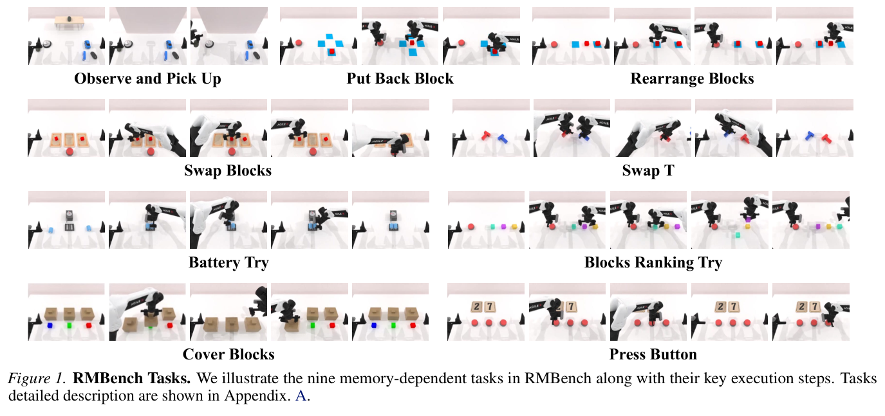
*源 PDF 原生裁图。*

### 九项任务：五个 `M(1)`，四个 `M(n)`

| TMC | 任务 | 必须保留的关键信息 / 任务机制 |
|---|---|---|
| `M(1)` | 观察后抓取 | 先观察货架上的参照物；它随后被遮挡，需从桌面多个物体中抓取匹配者。 |
| `M(1)` | 重排物块 | 物块经中间垫与按钮状态改变后，需记住先前布局并把另一物块移至中间。 |
| `M(1)` | 归还物块 | 将物块移到中心、按按钮后，须回到最初所在垫。 |
| `M(1)` | 交换物块 | 借助空垫交换两物块，并在正确时机按确认按钮。 |
| `M(1)` | 交换 T 形块 | 两个不同颜色的 T 形物块要交换位置与朝向；初始朝向是后续放置的参照。 |
| `M(n)` | 电池试插 | 电池与双槽座随机朝向；需根据插入反馈反复尝试次序与方向，直至两者成功插入。 |
| `M(n)` | 物块排序试错 | 反复尝试三色物块排列并按按钮验证，需累计此前失败尝试。 |
| `M(n)` | 覆盖物块 | 先从左至右盖住三色物块，再按红—绿—蓝顺序揭盖并归位。 |
| `M(n)` | 按按钮 | 根据两个数字卡，分别按左、中的按钮相应次数，再按右侧按钮确认。 |

九项任务的英文原名可由本文所附的任务说明图表核对。基准建于 RoboTwin 2.0 / SAPIEN，可自动合成数据，并对每个动作—观察对给出细粒度语言标注。这些密集语言标签对训练高层推理或记忆模块有用，但本文并未把它们与普通演示标签做单独比较。

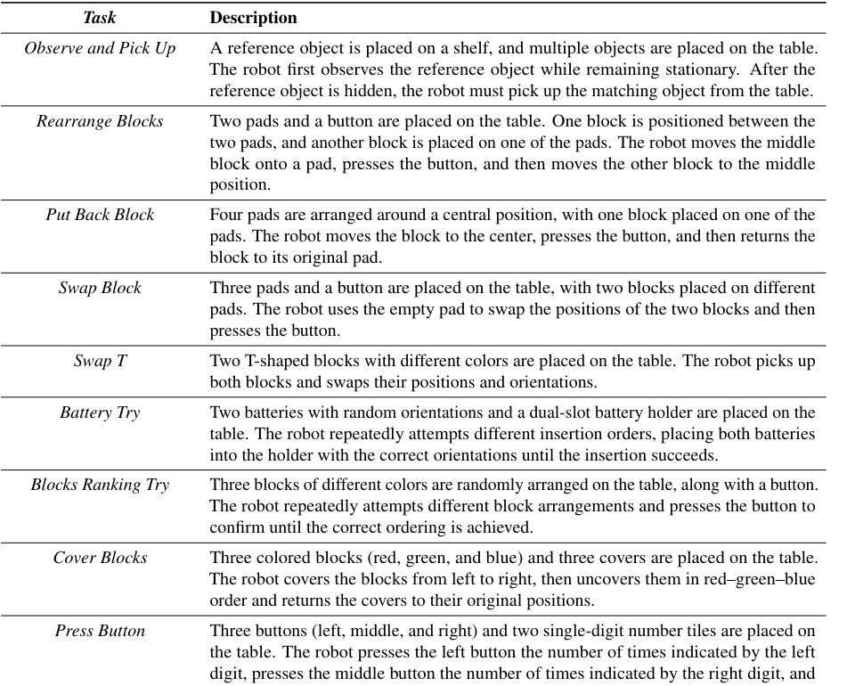
*源 PDF 原生裁图。*

## 方法主线

### 机制流程

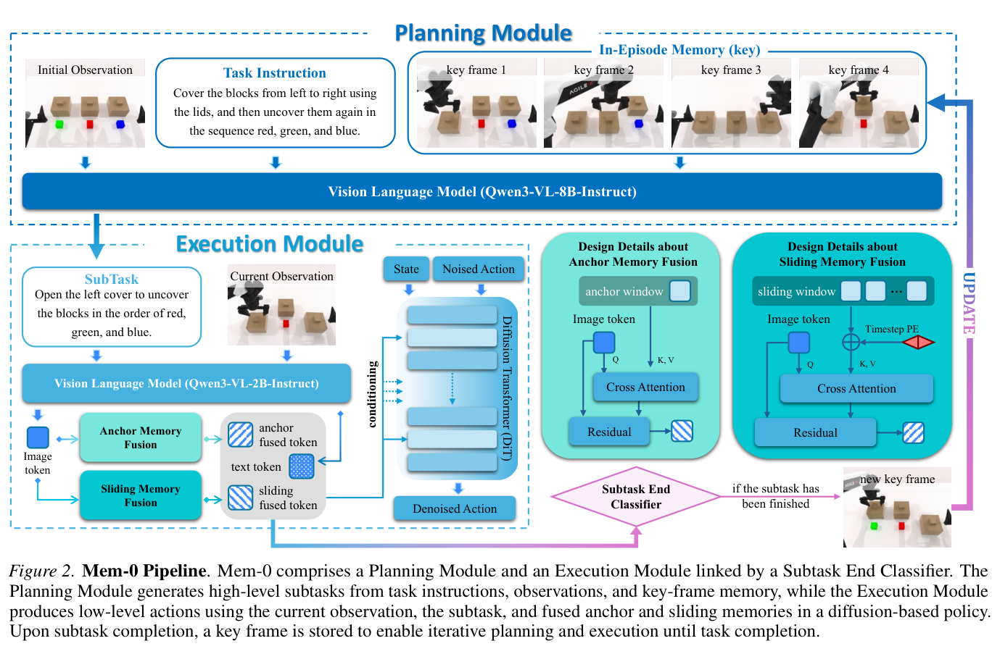
*源 PDF 原生裁图。*

1. **输入初始化并规划。** 每个 episode 提供初始 RGB 图像 $o_0$、全局指令 $g$ 与已完成子任务记忆 $M_{t-1}$；规划器用 `Qwen3-VL-8B-Instruct` 预测下一文本子任务：
   $$s_t=V_{\mathrm{plan}}(o_0,g,M_{t-1}). \tag{3}$$
   规划器不逐控制帧调用；它只在子任务结束时重规划，规划调用次数由随控制步数增长的量级降至随子任务数增长的量级。
2. **保留跨子任务的 key memory。** 已完成的第 $i$ 个子任务文本 $s_i$ 与其终止观察 $o_i^{\mathrm{end}}$ 成对存储：
   $$M_{t-1}=\{(s_i,o_i^{\mathrm{end}})\}_{i=1}^{t-1}. \tag{4}$$
   它服务于 `M(n)` 的高层下一步推断，例如按钮已按几次、何种排列已试过；它不是给低层控制器塞入所有中间帧。
3. **子任务内执行。** 执行器以当前 RGB 观察与子任务文本编码图像与文本表征：
   $$Z_{\mathrm{img}},Z_{\mathrm{text}}=V_{\mathrm{exec}}(o_t,s_t). \tag{5}$$
   图像表征经均值池化得到 $z_{\mathrm{img}}$，再分别对锚点与滑动记忆做交叉注意力：
   $$\tilde z_t^l=\mathrm{CrossAttn}(z_{\mathrm{img}},M_l)+z_{\mathrm{img}},\quad l\in\{\mathrm{anchor},\mathrm{slide}\}. \tag{6}$$
   将两个融合表征与文本表征拼接为条件 $c_t$，送入动作扩散变换器。
4. **动作块控制、更新并闭环切换。** 滑动窗口每步追加当前图像表征并仅保留最新 $K$ 个：
   $$S_{t+1}=\mathrm{Trunc}_K(S_t\cup\{z_{\mathrm{img},t}\}). \tag{7}$$
   固定动作视野为 $H=30$，扩散变换器从加噪动作块预测去噪动作：
   $$\hat a_{t:t+H-1}=\mathrm{DiT}(a^\epsilon_{t:t+H-1},x_t,c_t), \tag{8}$$
   实际只执行前缀 $\Delta$ 步后再判断。轻量多层感知器产生二元终止信号 $C_{\mathrm{end}}(c_t)$；只有连续 $L=8$ 帧均预测结束时才切换：
   $$\sum_{i=t-L+1}^{t}C_{\mathrm{end}}(c_i)=L. \tag{9}$$
   切换后将末帧与子任务写入 key memory，并清空该子任务的 anchor 与 sliding 缓存。

### 三种记忆的职责不是“长短窗口”这么简单

| 组件 | 写入时机与生命周期 | 功能 | 主要服务对象 |
|---|---|---|---|
| **anchor memory** | 子任务起始帧写入，直至子任务结束固定不变 | 保存不应被后续帧挤掉的初始视觉参照，例如物块初始位置、T 形方向 | `M(1)` 中的持续身份/几何参照 |
| **sliding memory** | 每个控制时刻追加，只保留最近 $K$ 个表征 | 表达最近运动趋势与接触过程，帮助判别“刚发生了什么” | 短时动态、按钮是否仍在连续执行 |
| **key memory** | 每个子任务结束时写入“文本子任务 + 终止帧” | 在规划层压缩已完成步骤，支撑跨阶段检索和试错累积 | `M(n)` 的子任务选择 |

一个重要细节是：锚点/滑动记忆位于低层扩散执行器，关键事件记忆位于高层规划器。这样划分匹配时间语义，却也让终止分类器成为两层之间唯一的时序闸门；闸门错一次，后面即使 关键事件记忆完整，规划器也会在错误上下文中工作。

### 训练组织与算力不是免费的

规划模块以 `LoRA` 微调 `Qwen3-VL-8B-Instruct`，单任务使用 8 张 `NVIDIA A800`，约半小时；低秩适配秩为 8、批量 16、学习率 $10^{-4}$、训练 25 轮、余弦调度、`bf16`（见超参数表）。执行模块是**逐任务从头训练**：8 张 `A800`、全局批量 448、30,000 次迭代、约 18 小时。

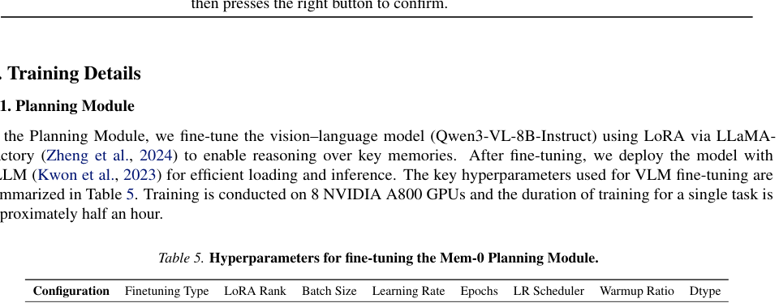
*源 PDF 原生裁图。*

内存融合要求同一回合的时序完整性：VLM 表征生成和动作块生成可以并行，而滑动/锚点融合需串行；作者为此维护跨批次的回合级全局记忆，并定制数据加载器。执行端用分组学习率、`AdamW`、余弦调度和线性预热；VLM 与记忆库用 `bf16`，其余模块 `float32`，输入统一为 $224\times224$ 并使用轻度颜色抖动。这使复现者不能把它当作普通独立帧的行为克隆训练。

*源 PDF 原生裁图。*

## 关键结果

### 主结果与强基线

所有模型在每个任务上训练 50 条合成专家演示，并评估 100 次轨迹执行。无预训练比较对象包括 `DP` 和 `ACT`；预训练比较对象包括 `Pi0.5` 与 `X-VLA`。

这些方法没有做子任务分解。对于 `M(1)`，`Mem-0` 也不做分解，故更多检验执行模块；对于 `M(n)`，结果是规划与执行的联合结果。

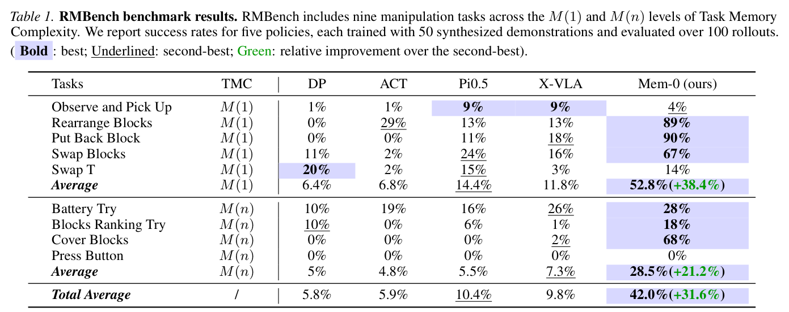
*源 PDF 原生裁图。*

| 分组 | 最强基线平均成功率 | Mem-0 | 相对最强基线的绝对提升 | 应如何理解 |
|---|---:|---:|---:|---|
| `M(1)` | `14.4%`（`Pi0.5`） | **`52.8%`** | **`+38.4`** 个百分点 | 固定参照加短时动态对单次历史依赖很有效。 |
| `M(n)` | `7.3%`（`Pi0.5`） | **`28.5%`** | **`+21.2`** 个百分点 | 分层记忆明显有用，但多次试错仍远未稳健。 |
| 全部任务 | `10.4%`（`Pi0.5`） | **`42.0%`** | **`+31.6`** 个百分点 | 论文的核心数字；不要把它误读成对所有任务都接近可用。 |

按任务看，`重排物块`、`归还物块`、`交换物块` 分别达到 `89%`、`90%`、`67%`；`覆盖物块` 为 `68%`。反例同样重要：`观察后抓取` 涉及细粒度语义辨识，预训练模型保持优势；`交换 T 形块` 的摆放精度使收益有限；`按按钮` 因单次按压视觉变化太小而达到 `0%`。因此主结果证明的是“显式记忆改善多数被构造的非马尔可夫任务”，而非“记忆已解决精细操作”。

### 消融到底说明了什么

*源 PDF 原生裁图。*

- **去 anchor：长期参照被逐出。** `M(1)` 平均从 `52.8%` 降至 `26.8%`，`重排物块` 与 `归还物块` 尤其受损。滑窗仍在也无法替代固定起点，因为早期关键线索会被新帧截断。
- **去 sliding：多数任务失去运动连续性。** `M(1)` 平均降至 `40.4%`；无最近动态时，按钮类操作更易振荡、重复或过早切换。该结论是任务依赖的，而不是“滑窗越长越好”。
- **反常的 `交换 T 形块`。** 论文观察到去 sliding 反而优于 vanilla：训练数据存在固定运动模式，且该任务对**初始朝向**极敏感；删掉短期瞬态线索会把模型推向 anchor，减少干扰。这个现象很有价值：memory fusion 不是无条件单调增益，错误时间尺度的记忆会造成竞争。
- **去 key：规划器退回单帧。** `M(n)` 下，无法可靠推断下一子任务，因为“试过什么、完成到哪一步”不再可检索；它验证的是跨子任务摘要的必要性，而不是低层动作记忆的必要性。
- **GT Classifier 直指真正短板。** 给模拟器真值终止信号后，`M(n)` 平均为 **`45.3%`**，比 vanilla `28.5%` 高 **`16.8`** 个百分点。它既说明子任务分解是有力归纳偏置，也说明真实系统中不能把高分直接归因于记忆本身：理想终止器提供了不可部署的额外信息。

### 真实世界：有迁移，但样本与覆盖都有限

在 `X-One` 双臂平台，作者对三项真实任务各采集 100 条演示，分别评估 40 次。`Mem-0` 的成功率为 `17.5%`、`37.5%`、`12.5%`，平均 **`22.50%`**；`ACT` 为 `0.00%`，`Pi0.5` 为 `5.83%`。

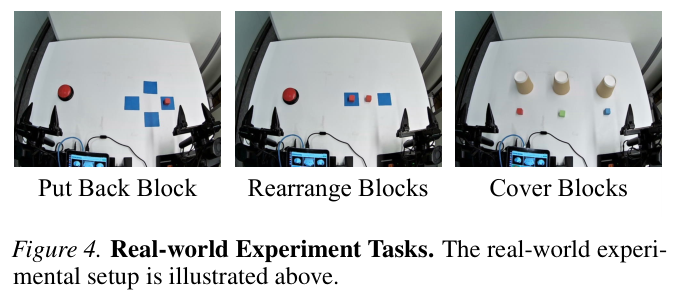
*源 PDF 原生裁图。*

*源 PDF 原生裁图。*

这证明记忆组件并未只在仿真中完全失效，但三项任务、每项 40 个 rollout 仍不足以估计跨物体、扰动、视觉条件和长任务的可靠性。作者将主要失败归因于低层物块操作不精确：真实采集行为多样、且执行器未做专门机器人预训练。换言之，真实世界 `22.5%` 更像“有正向信号”的证据，而非可部署性能。

## 深度分析

### 真正贡献：提供可诊断的失败切面

这篇工作最值得保留的是诊断框架，而不是 `Mem-0` 的某个注意力实现。基线把下一动作主要建模为当前观察函数，在 TMC 任务中会因隐藏参照、按钮计数或历史尝试而发生状态混叠。`Mem-0` 把失败分解成：**记住错误、短期动态错误、跨子任务检索错误、终止时刻错误、低层精度错误**。这比把历史帧统一堆进大模型更接近可实验的系统设计；这一判断建立在主结果与消融表的量化差异、以及附录 C 的可视化失效轨迹之上，而非仅凭架构命名。

但论文的公平比较也要谨慎读：`M(n)` 的 `Mem-0` 有显式子任务语言分解，而各基线没有；这符合作者要检验的系统归纳偏置，却使“主表提升”同时包含记忆、分解、终止逻辑和模块化训练的影响。GT 终止器实验正说明这些因素不能被简单归为单一记忆增益。

### 为什么这些结果会成立

1. **信息保真优先于平均历史。** anchor 使关键初始条件在一个子任务中不被窗口淘汰；这解释了布局恢复类任务的强增益。
2. **状态变化需要方向信息。** sliding 提供最近轨迹趋势，而单帧难以知道按钮是“正在按、刚弹起还是已经完成”。
3. **高层检索必须跨越子任务边界。** 关键事件记忆存“文本动作 + 终止视觉结果”，把连续轨迹压缩成可供规划器读取的事件序列，适合试错与计数。
4. **闭环最弱环节决定端到端成功率。** 连续八帧规则抑制瞬态假阳性，却无法弥补 VLM token 对细微按钮位移的分辨率不足；故 `按按钮` 与多个附录失败都集中在切换器。

### 协议、统计与可比性

- **仿真协议。** 每任务 50 条合成演示、100 个 rollout，以成功率为唯一报告指标。100 次二项试验的分辨率有限，文中未呈现跨 seed 方差、置信区间或显著性检验，因此小差异（特别是低成功率行）不应过度排序。
- **构造与外推。** 九任务覆盖的是作者选择的遮挡、布局回溯、计数、试错模式；它不是对所有 POMDP 操作任务的分层抽样。`M(n)` 也同时改变了子任务数量、试错性和执行长度，不能把性能差唯一归因于 $n$。
- **训练预算。** 单任务从头训练的执行模块约 18 小时 / 8 张 `A800`，加上规划微调；这是研究型受控分析，而非一个已经展示大规模多任务经济性的方案。

## 局限

### 附录 A-C 的覆盖与失败案例：记忆并不自动变成可执行行为

附录 A 给出九项任务的完整文字定义，附录 B 记录规划器和执行器的训练预算与超参数，附录 C 提供以下失败轨迹；这三部分共同限定了主表数字可被如何解释。

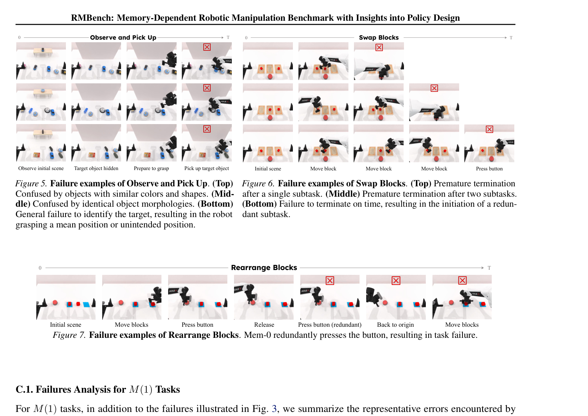
*源 PDF 原生裁图。*

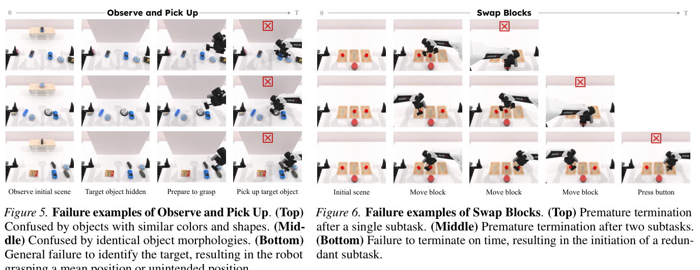
*源 PDF 原生裁图。*

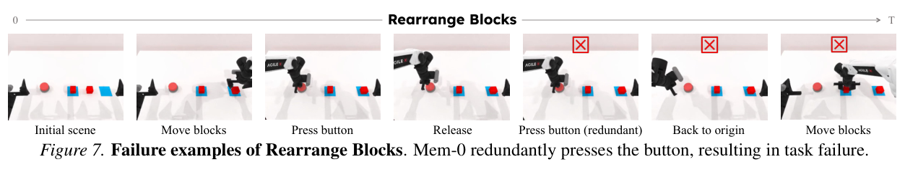
*源 PDF 原生裁图。*

`M(1)` 中，观察后抓取 会把颜色/形状相近物体混淆，甚至抓取均值位置；交换物块 会在一两个子任务后过早终止，或未及时终止而启动冗余子任务；重排物块 出现多按按钮。作者将前两类与锚点记忆的持续利用不足、后者与滑动记忆的不足相连，但这也暴露视觉语义与终止检测不可由记忆缓存单独解决。

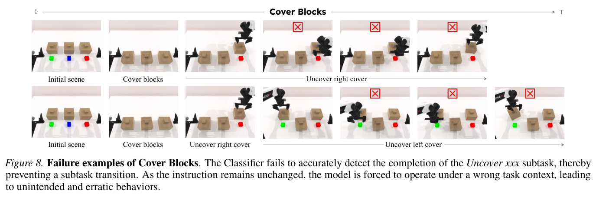
*源 PDF 原生裁图。*

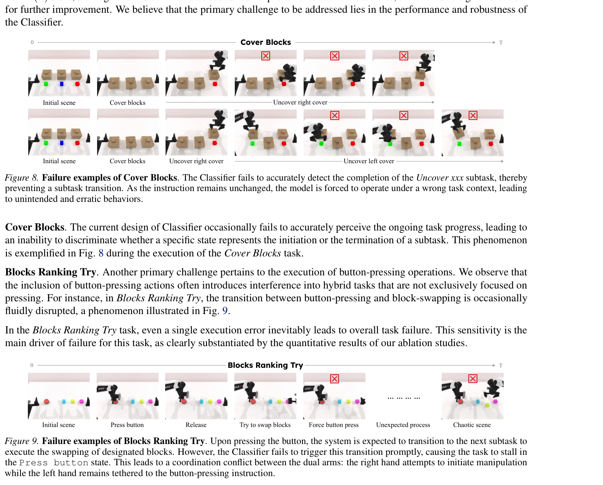
*源 PDF 原生裁图。*

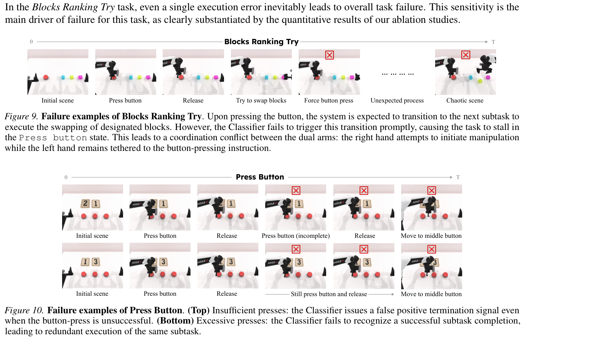
*源 PDF 原生裁图。*

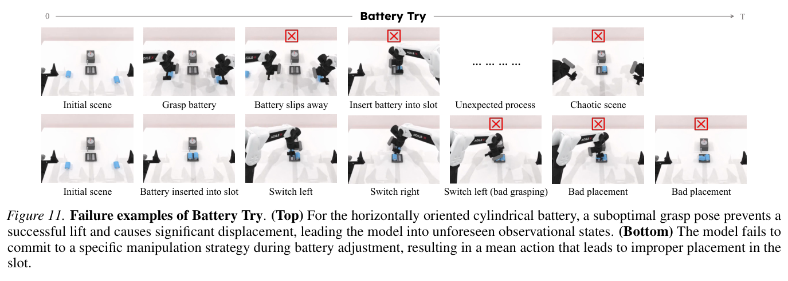
*源 PDF 原生裁图。*

`M(n)` 的失败更尖锐：覆盖物块 中分类器无法确认揭盖完成，旧指令持续生效；物块排序试错 在按按钮后迟迟不切换，双臂分别服从不相容的旧/新意图；按按钮 会产生未按到却误终止、或按到后重复执行两种相反错误；电池试插 的微小槽位线索和抓取姿态误差会把系统带入未见观察状态，随后平均化动作造成错误放置。作者建议加入本体感觉或触觉反馈，这是合理方向，但论文尚未验证。

### 不能由本文推出的结论

- TMC 的标签本身没有经过人类标注协议、对抗性状态混叠测试或信息量测量；它是很好的设计语言，尚不是严格的复杂度理论。
- GT Classifier 的 `45.3%` 不是可实现上界：它借用了模拟器事件真值，真实世界没有同等信号。
- `M(1)` / `M(n)` 改善不等于开放世界语义泛化改善。真实实验仅三任务，且平均成功率仍为 `22.5%`。
- 论文没有把 `Mem-0` 与“同样子任务分解、但没有显式三类记忆”的强等计算量基线彻底分离，故各模块的绝对贡献仍有耦合。

## 我的笔记

- 对 World-Action Model 或具身智能系统，这篇论文提示一个实用设计：不要把视频上下文当成均质表征序列。可把**起点参照、局部动力学、已完成事件**显式分槽，再针对每一槽设计淘汰和检索策略。
- 后续工作若想把 TMC 做实，应报告每项任务的关键观测数、关键帧时间间隔、检索干扰度与终止检测难度，而不只给 `M(1)` / `M(n)`。特别是应构造控制变量：固定子任务数但改变记忆条目数，或固定记忆条目数但改变间隔。
- 如果复现，优先审查终止器数据标注、连续八帧阈值、动作前缀 $\Delta$、跨 batch episode 状态是否泄漏；这些实现细节比把视觉编码器再扩大一点更可能改变 `M(n)` 成绩。
- 最值得延伸的实验是：预训练低层视觉动作策略 + 显式事件记忆 + 视觉/触觉/本体的终止检测器，并报告真实世界不同物体、干扰和延迟下的成功率及置信区间。

## 引用

Chen, T. et al. *RMBench: Memory-Dependent Robotic Manipulation Benchmark with Insights into Policy Design*. arXiv:2603.01229, 2026. [arXiv](https://arxiv.org/abs/2603.01229) · [项目主页](https://rmbench.github.io) · [代码](https://github.com/robotwin-Platform/rmbench)
