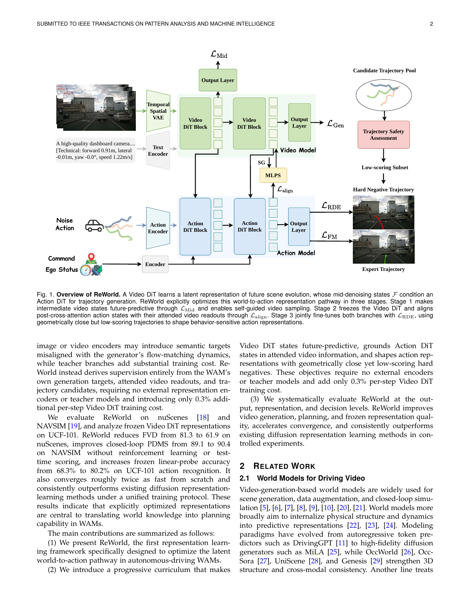
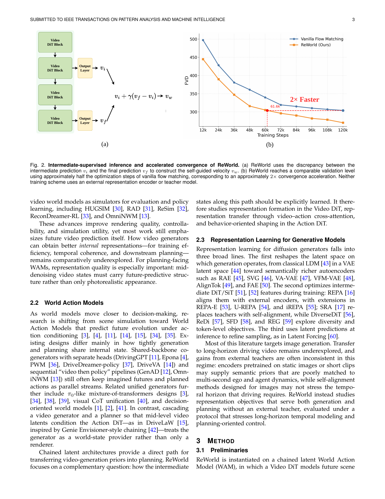
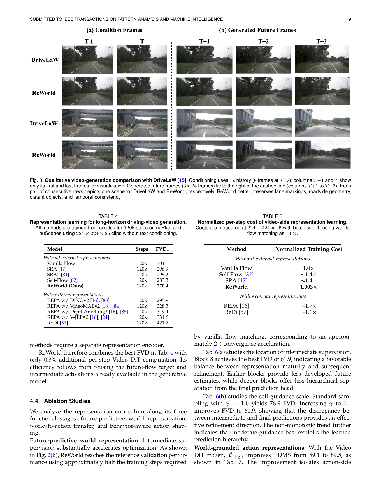
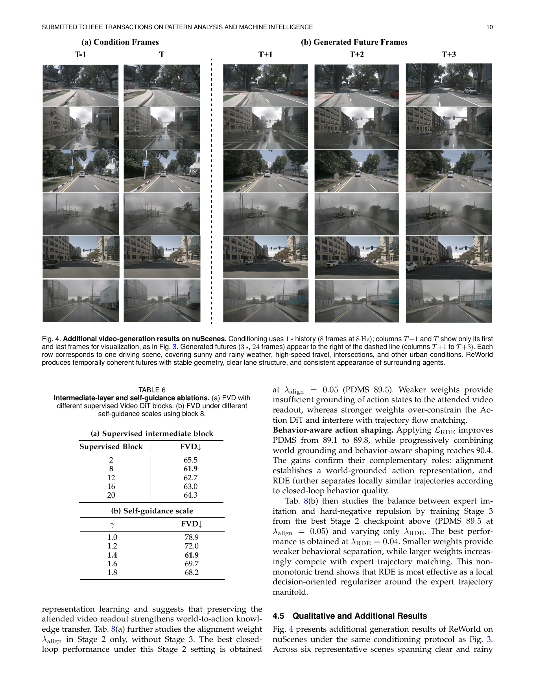
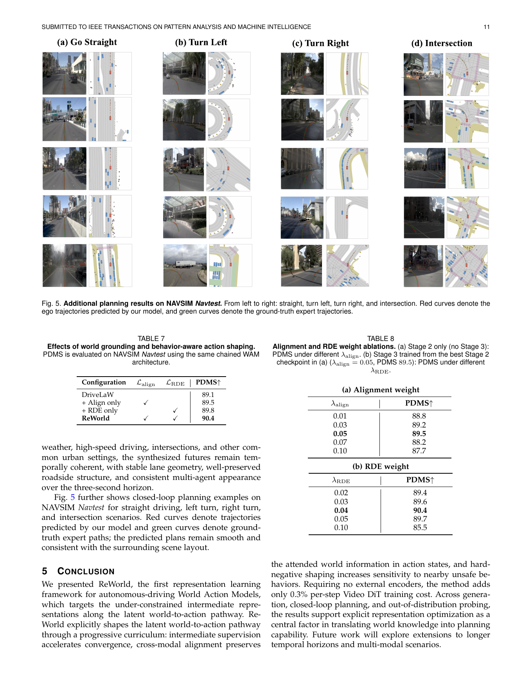

# ReWorld: Representation Learning for World Action Models

> **来源信息**：Xia 等，*ReWorld: Representation Learning for World Action Models*，arXiv:2606.27504v2，2026-08-24；提交至 *IEEE Transactions on Pattern Analysis and Machine Intelligence*。以下为 PDF 全文的逐段英中对照阅读稿。PDF 共 15 页。原文中的模型名、数据集名、指标、变量、引用编号和数值均尽量保持原样。

## 页面与结构索引

- pp. 1–2：标题、摘要、引言、图 1 与贡献概述
- pp. 2–3：相关工作、图 2
- pp. 4–7：方法、公式 (1)–(22)
- pp. 7–8：实验设置、表 1–2、主要结果
- pp. 8–9：表示分析、表 3–5、图 3
- pp. 9–11：消融实验、图 4–5、表 6–8
- p. 12：结论、致谢
- pp. 12–14：参考文献 [1]–[85]
- pp. 14–15：作者简介

## 术语表

| English | 中文 | 说明 |
|---|---|---|
| World Action Model (WAM) | 世界动作模型 | 同时建模未来环境演化与动作/轨迹生成 |
| Video DiT / Action DiT | 视频 DiT / 动作 DiT | 基于 Transformer 的扩散/流匹配生成模块 |
| world-to-action pathway | 世界到动作通路 | 从视频世界表示到规划动作表示的潜变量接口 |
| future-predictive | 未来可预测的 | 中间表示携带未来场景演化信息 |
| world-grounded | 世界信息锚定的 | 动作表示保留跨注意力检索到的视频信息 |
| hard negative | 难负样本 | 几何上接近专家轨迹但闭环得分较低的候选轨迹 |
| FID / FVD | Fréchet Inception Distance / Fréchet Video Distance | 帧级保真度 / 视频时序质量指标 |
| PDMS | Predictive Driver Model Score | NAVSIM 的综合闭环规划指标 |
| NC / DAC / TTC / Comf. / EP | 无责碰撞 / 可行驶区域合规 / 碰撞时间 / 舒适度 / 自车进度 | NAVSIM 规划指标 |

# Abstract

> <strong>Para. 1:</strong> World Action Models (WAMs) unify future environment prediction with action generation for autonomous driving, yet existing approaches optimize only the final outputs, leaving intermediate representations as incidental byproducts. We present ReWorld, the first representation learning framework specifically designed for autonomous-driving WAMs. ReWorld explicitly optimizes the latent world-to-action pathway through three complementary mechanisms. First, it imposes future-predictive supervision on intermediate Video DiT states to encode temporal scene dynamics, enabling self-guided sampling and a roughly twofold convergence speedup.

> <strong>Para. 1[CN]:</strong> 世界动作模型（World Action Models，WAM）将未来环境预测与动作生成统一起来，用于自动驾驶；然而，现有方法只优化最终输出，把中间表示留作附带产生的副产品。我们提出 ReWorld，这是首个专门面向自动驾驶 WAM 的表示学习框架。ReWorld 通过三个互补机制显式优化潜在的世界到动作通路。首先，它对中间 Video DiT 状态施加未来预测监督，使其编码场景的时间动态，并实现自引导采样与约两倍的收敛加速。

> <strong>Para. 2:</strong> Second, it aligns Action DiT states with their attended video readouts so that the retrieved world information is retained in the representations used for planning. Third, it shapes the action space using geometrically close yet low-scoring hard negatives to separate the expert trajectory from nearby unsafe alternatives. ReWorld constructs supervision entirely from the WAM’s own generation targets and attended features, requiring no external encoders or teacher models and introducing only 0.3% additional per-step training cost. Experiments show that ReWorld reduces FVD from 81.3 to 61.9 on nuScenes, improves closed-loop PDMS from 89.1 to 90.4 on NAVSIM without reinforcement learning or test-time scoring, and increases frozen linear-probe accuracy from 68.3% to 80.2% on UCF-101 action recognition. These results indicate that explicitly optimized representations are central to translating world knowledge into planning capability in WAMs. Code is available at https://github.com/xiaomi-research/ReWorld.

> <strong>Para. 2[CN]:</strong> 其次，它使 Action DiT 状态与其注意到的视频读出特征对齐，从而让检索到的世界信息保留在用于规划的表示中。第三，它使用几何上接近但得分较低的难负样本塑造动作空间，将专家轨迹与其附近的不安全替代轨迹分离。ReWorld 的监督信号完全来自 WAM 自身的生成目标和注意力读出特征，不需要外部编码器或教师模型，每步训练成本仅额外增加 0.3%。实验表明，在 nuScenes 上 ReWorld 将 FVD 从 81.3 降至 61.9；在无需强化学习或测试时打分的情况下，将 NAVSIM 的闭环 PDMS 从 89.1 提升至 90.4；在 UCF-101 动作识别上，将冻结线性探针准确率从 68.3% 提升至 80.2%。这些结果表明，显式优化的表示是将世界知识转化为 WAM 规划能力的关键。代码地址为 https://github.com/xiaomi-research/ReWorld。

> <strong>Para. 3:</strong> Index Terms—World Action Models, Representation Learning, Video Generation, Autonomous Driving

> <strong>Para. 3[CN]:</strong> 关键词——世界动作模型，表示学习，视频生成，自动驾驶。

# 1 Introduction

> <strong>Para. 1:</strong> World models have emerged as an important direction in autonomous driving by learning how driving scenes evolve over time and providing dynamic priors beyond instantaneous perception [1], [2], [3], [4]. In particular, video-generation-based world models learn scene dynamics and physical regularities directly from large-scale driving videos through future pixel prediction [5], [6], [7], [8], [9], [10]. However, video prediction is not the ultimate goal of a decision-oriented system. World Action Models (WAMs) go beyond visual forecasting by coupling future world prediction with action generation, allowing knowledge learned from video to support decision-making directly [3], [4], [11], [12], [13], [14].

> <strong>Para. 1[CN]:</strong> 世界模型通过学习驾驶场景如何随时间演化，并提供超越瞬时感知的动态先验，已经成为自动驾驶中的一个重要方向 [1]–[4]。具体而言，基于视频生成的世界模型通过未来像素预测，直接从大规模驾驶视频中学习场景动态与物理规律 [5]–[10]。然而，对于面向决策的系统而言，视频预测并不是最终目标。世界动作模型（WAM）将未来世界预测与动作生成结合起来，超越单纯的视觉预测，使从视频中学到的知识能够直接支持决策 [3], [4], [11]–[14]。

> <strong>Para. 2:</strong> A central challenge for WAMs is transferring world knowledge from video generation to planning. Simulator-based methods and auxiliary prediction objectives affect planning only indirectly, while joint generation–planning models often preserve separate output streams [4], [11]. DriveLaW [15] introduces a chained formulation that conditions an Action DiT directly on intermediate Video DiT features cached at the initial reverse-flow step (Fig. 1). This latent connection turns the video generator from a visual renderer into a source of planning representations.

> <strong>Para. 2[CN]:</strong> WAM 面临的核心挑战，是将视频生成中的世界知识传递到规划中。基于模拟器的方法和辅助预测目标对规划的影响都只是间接的，而联合生成—规划模型往往保留相互分离的输出流 [4], [11]。DriveLaW [15] 提出链式形式，在初始反向流步骤缓存的中间 Video DiT 特征上直接条件化 Action DiT（图 1）。这一潜变量连接使视频生成器不再只是视觉渲染器，而成为规划表示的来源。

> <strong>Para. 3:</strong> Yet latent access alone does not ensure effective representations. With standard output-level objectives, intermediate Video DiT states are supervised only through the final denoising output, and Action DiT states only through the final trajectory prediction. Consequently, video states may lack explicit future-predictive structure, while action states may fail to retain the world information retrieved through cross-attention. Imitation learning further provides limited supervision for distinguishing expert actions from geometrically similar yet unsafe alternatives. We term this limitation the representation bottleneck of WAMs: the intermediate representations connecting world prediction to action generation are not explicitly optimized to be future-predictive, cross-modally grounded, or sensitive to closed-loop behavior quality.

> <strong>Para. 3[CN]:</strong> 但仅能访问潜变量并不能保证得到有效表示。在标准的输出级目标下，中间 Video DiT 状态只通过最终去噪输出获得监督，Action DiT 状态也只通过最终轨迹预测获得监督。因此，视频状态可能缺乏显式的未来预测结构，而动作状态可能无法保留通过跨注意力检索到的世界信息。模仿学习对于区分专家动作与几何上相似但不安全的替代动作，也提供了有限监督。我们将这一局限称为 WAM 的表示瓶颈：连接世界预测与动作生成的中间表示，没有被显式优化为未来可预测、跨模态锚定，或对闭环行为质量敏感的表示。

> <strong>Para. 4:</strong> We present ReWorld, the first representation learning framework specifically designed for autonomous-driving WAMs. ReWorld addresses this bottleneck through a progressive curriculum that optimizes representation formation, cross-modal transfer, and decision-oriented shaping. First, auxiliary prediction heads make intermediate Video DiT states explicitly future-predictive. The resulting shallow-to-deep prediction hierarchy further enables inference-time self-guidance (Fig. 2) and a roughly twofold convergence speedup from scratch. Second, ReWorld aligns Action DiT states with the video readouts retrieved through cross-attention, grounding action representations in world information while keeping the video branch frozen. Third, it jointly fine-tunes both branches with geometrically close yet low-scoring hard negatives, making the action space sensitive to unsafe behaviors near the expert trajectory.

> <strong>Para. 4[CN]:</strong> 我们提出 ReWorld，这是首个专门面向自动驾驶 WAM 的表示学习框架。ReWorld 通过逐步课程学习来优化表示形成、跨模态传递和面向决策的塑形，从而解决这一瓶颈。首先，辅助预测头使中间 Video DiT 状态具备显式的未来预测能力。由此形成的浅层到深层预测层级还支持推理时自引导（图 2），并使从头训练的收敛速度约提升两倍。其次，ReWorld 使 Action DiT 状态与跨注意力检索到的视频读出特征对齐，在冻结视频分支的同时，将动作表示锚定到世界信息上。第三，它使用几何上接近但得分较低的难负样本联合微调两个分支，使动作空间能够感知专家轨迹附近的不安全行为。

> <strong>Para. 5:</strong> Representation learning methods developed for image diffusion provide useful precedents [16], [17], but do not transfer directly to long-horizon driving video. External image or video encoders may introduce semantic targets misaligned with the generator’s flow-matching dynamics, while teacher branches add substantial training cost. ReWorld instead derives supervision entirely from the WAM’s own generation targets, attended video readouts, and trajectory candidates, requiring no external representation encoders or teacher models and introducing only 0.3% additional per-step Video DiT training cost.

> <strong>Para. 5[CN]:</strong> 为图像扩散开发的表示学习方法提供了有益先例 [16], [17]，但不能直接迁移到长时域驾驶视频。外部图像或视频编码器可能引入与生成器流匹配动态不一致的语义目标，而教师分支会显著增加训练成本。ReWorld 则完全从 WAM 自身的生成目标、注意力视频读出特征和轨迹候选中构造监督，无需外部表示编码器或教师模型，每步 Video DiT 训练成本仅额外增加 0.3%。

> <strong>Para. 6:</strong> We evaluate ReWorld on nuScenes [18] and NAVSIM [19], and analyze frozen Video DiT representations on UCF-101. ReWorld reduces FVD from 81.3 to 61.9 on nuScenes, improves closed-loop PDMS from 89.1 to 90.4 on NAVSIM without reinforcement learning or test-time scoring, and increases frozen linear-probe accuracy from 68.3% to 80.2% on UCF-101 action recognition. It also converges roughly twice as fast from scratch and consistently outperforms existing diffusion representation-learning methods under a unified training protocol. These results indicate that explicitly optimized representations are central to translating world knowledge into planning capability in WAMs.

> <strong>Para. 6[CN]:</strong> 我们在 nuScenes [18] 和 NAVSIM [19] 上评估 ReWorld，并在 UCF-101 上分析冻结的 Video DiT 表示。在 nuScenes 上，ReWorld 将 FVD 从 81.3 降至 61.9；在无需强化学习或测试时打分的情况下，将 NAVSIM 闭环 PDMS 从 89.1 提升到 90.4；在 UCF-101 动作识别上，将冻结线性探针准确率从 68.3% 提升到 80.2%。它还在从头训练时实现约两倍的收敛速度，并在统一训练协议下持续优于已有扩散表示学习方法。这些结果表明，显式优化表示是 WAM 将世界知识转化为规划能力的核心。

> <strong>Para. 7:</strong> The main contributions are summarized as follows:
>
> - (1) We present ReWorld, the first representation learning framework specifically designed to optimize the latent world-to-action pathway in autonomous-driving WAMs.
> - (2) We introduce a progressive curriculum that makes Video DiT states future-predictive, grounds Action DiT states in attended video information, and shapes action representations with geometrically close yet low-scoring hard negatives. These objectives require no external encoders or teacher models and add only 0.3% per-step Video DiT training cost.
> - (3) We systematically evaluate ReWorld at the output, representation, and decision levels. ReWorld improves video generation, planning, and frozen representation quality, accelerates convergence, and consistently outperforms existing diffusion representation learning methods in controlled experiments.

> <strong>Para. 7[CN]:</strong> 主要贡献总结如下：
>
> - （1）提出 ReWorld，这是首个专门设计用于优化自动驾驶 WAM 潜在世界到动作通路的表示学习框架。
> - （2）提出逐步课程学习，使 Video DiT 状态具备未来预测能力，使 Action DiT 状态锚定于注意到的视频信息，并用几何上接近但得分较低的难负样本塑造动作表示。这些目标不需要外部编码器或教师模型，每步 Video DiT 训练成本仅增加 0.3%。
> - （3）从输出、表示和决策三个层面系统评估 ReWorld。ReWorld 改善了视频生成、规划和冻结表示质量，加快了收敛，并在受控实验中持续优于已有扩散表示学习方法。

### Figure 1. ReWorld 概览

**Caption:** Overview of ReWorld. A Video DiT learns a latent representation of future scene evolution, whose mid-denoising states F condition an Action DiT for trajectory generation. ReWorld explicitly optimizes this world-to-action representation pathway in three stages. Stage 1 makes intermediate video states future-predictive through $L_{Mid}$ and enables self-guided video sampling. Stage 2 freezes the Video DiT and aligns post-cross-attention action states with their attended video readouts through $L_{align}$. Stage 3 jointly fine-tunes both branches with $L_{RDE}$, using geometrically close but low-scoring trajectories to shape behavior-sensitive action representations.

**Caption[CN]:** ReWorld 概览。Video DiT 学习未来场景演化的潜在表示，其中间去噪状态 $F$ 为 Action DiT 的轨迹生成提供条件。ReWorld 分三个阶段显式优化世界到动作的表示通路。阶段 1 通过 $L_{Mid}$ 使中间视频状态具备未来预测能力，并启用自引导视频采样；阶段 2 冻结 Video DiT，通过 $L_{align}$ 使跨注意力之后的动作状态与其注意到的视频读出特征对齐；阶段 3 使用几何上接近但得分较低的轨迹，以 $L_{RDE}$ 联合微调两个分支，从而塑造对行为敏感的动作表示。

# 2 Related Work

## 2.1 World Models for Driving Video

> <strong>Para. 1:</strong> Video-generation-based world models are widely used for scene generation, data augmentation, and closed-loop simulation [5], [6], [7], [8], [9], [10], [20], [21]. World models more broadly aim to internalize physical structure and dynamics into predictive representations [22], [23], [24]. Modeling paradigms have evolved from autoregressive token predictors such as DrivingGPT [11] to high-fidelity diffusion generators such as MiLA [25], while OccWorld [26], OccSora [27], UniScene [28], and Genesis [29] strengthen 3D structure and cross-modal consistency. Another line treats video world models as simulators for evaluation and policy learning, including HUGSIM [30], RAD [31], ReSim [32], ReconDreamer-RL [33], and OmniNWM [13].

> <strong>Para. 1[CN]:</strong> 基于视频生成的世界模型被广泛用于场景生成、数据增强和闭环模拟 [5]–[10], [20], [21]。更广义地说，世界模型旨在将物理结构和动态内化为预测性表示 [22]–[24]。建模范式已从 DrivingGPT [11] 这类自回归 token 预测器，发展到 MiLA [25] 这类高保真扩散生成器；OccWorld [26]、OccSora [27]、UniScene [28] 和 Genesis [29] 则进一步增强了三维结构和跨模态一致性。另一条路线将视频世界模型作为评估和策略学习的模拟器，包括 HUGSIM [30]、RAD [31]、ReSim [32]、ReconDreamer-RL [33] 和 OmniNWM [13]。

> <strong>Para. 2:</strong> These advances improve rendering quality, controllability, and simulation utility, yet most work still emphasizes future video prediction itself. How video generators can obtain better internal representations—for training efficiency, temporal coherence, and downstream planning—remains comparatively underexplored. For planning-facing WAMs, representation quality is especially important: mid-denoising video states must carry future-predictive structure rather than only photorealistic appearance.

> <strong>Para. 2[CN]:</strong> 这些进展改善了渲染质量、可控性和模拟实用性，但大多数工作仍然强调未来视频预测本身。视频生成器如何获得更好的内部表示，以提升训练效率、时间连贯性和下游规划能力，仍相对缺乏研究。对于面向规划的 WAM，表示质量尤其重要：视频的中间去噪状态必须承载未来预测结构，而不能只有照片般真实的外观。

## 2.2 World Action Models

> <strong>Para. 1:</strong> As world models move closer to decision-making, research is shifting from scene simulation toward World Action Models that predict future evolution under action conditioning [3], [4], [11], [14], [15], [34], [35]. Existing designs differ mainly in how tightly generation and planning share internal state. Shared-backbone co-generators with separate heads (DrivingGPT [11], Epona [4], PWM [36], DriveDreamer-policy [37], DriveVA [14]) and sequential “video then policy” pipelines (GenAD [12], OmniNWM [13]) still often keep imagined futures and planned actions as parallel streams. Related unified generators further include $\pi_0$-like mixture-of-transformers designs [3], [34], [38], [39], visual CoT unification [40], and decision-oriented world models [1], [2], [41]. In contrast, cascading a video generator and a planner so that mid-level video latents condition the Action DiT—as in DriveLaW [15], inspired by Genie Envisioner-style chaining [42]—treats the generator as a world-state provider rather than only a renderer.

> <strong>Para. 1[CN]:</strong> 随着世界模型越来越接近决策，研究正从场景模拟转向在动作条件下预测未来演化的世界动作模型 [3], [4], [11], [14], [15], [34], [35]。现有设计的主要差异，在于生成与规划共享内部状态的紧密程度。带独立输出头的共享主干协同生成器（DrivingGPT [11]、Epona [4]、PWM [36]、DriveDreamer-policy [37]、DriveVA [14]）以及“先视频、后策略”的串行流程（GenAD [12]、OmniNWM [13]），通常仍将想象的未来与规划动作保留为并行流。相关统一生成器还包括类似 $\pi_0$ 的 mixture-of-transformers 设计 [3], [34], [38], [39]、视觉思维链统一 [40] 和面向决策的世界模型 [1], [2], [41]。相比之下，将视频生成器与规划器级联，使中层视频潜变量为 Action DiT 提供条件——如 DriveLaW [15]，其设计受到 Genie Envisioner 式链式结构 [42] 的启发——把生成器视为世界状态提供器，而不仅是渲染器。

> <strong>Para. 2:</strong> Chained latent architectures provide a direct path for transferring video-generation priors into planning. ReWorld focuses on a complementary question: how the intermediate states along this path should be explicitly learned. It therefore studies representation formation in the Video DiT, representation transfer through video–action cross-attention, and behavior-oriented shaping in the Action DiT.

> <strong>Para. 2[CN]:</strong> 链式潜变量架构为把视频生成先验传递到规划中提供了直接路径。ReWorld 关注一个互补问题：这条路径上的中间状态应如何被显式学习。因此，它研究 Video DiT 中的表示形成、通过视频—动作跨注意力进行的表示传递，以及 Action DiT 中面向行为的表示塑形。

## 2.3 Representation Learning for Generative Models

> <strong>Para. 1:</strong> Representation learning for diffusion generators falls into three broad lines. The first reshapes the latent space on which generation operates, from classical LDM [43] in a VAE latent space [44] toward semantically richer autoencoders such as RAE [45], SVG [46], VA-VAE [47], VFM-VAE [48], AlignTok [49], and FAE [50]. The second optimizes intermediate DiT/SiT [51], [52] features during training: REPA [16] aligns them with external encoders, with extensions in REPA-E [53], U-REPA [54], and iREPA [55]; SRA [17] replaces teachers with self-alignment, while DiverseDiT [56], ReDi [57], SFD [58], and REG [59] explore diversity and token-level objectives. The third uses latent predictions at inference to refine sampling, as in Latent Forcing [60].

> <strong>Para. 1[CN]:</strong> 扩散生成器的表示学习大致分为三条路线。第一条重塑生成所依赖的潜空间：从经典的 LDM [43] 在 VAE 潜空间 [44] 中生成，发展到使用语义更丰富的自动编码器，如 RAE [45]、SVG [46]、VA-VAE [47]、VFM-VAE [48]、AlignTok [49] 和 FAE [50]。第二条在训练期间优化 DiT/SiT [51], [52] 的中间特征：REPA [16] 将其与外部编码器对齐，并扩展出 REPA-E [53]、U-REPA [54] 和 iREPA [55]；SRA [17] 用自对齐取代教师，而 DiverseDiT [56]、ReDi [57]、SFD [58] 和 REG [59] 探索多样性和 token 级目标。第三条在推理时使用潜变量预测来改进采样，例如 Latent Forcing [60]。

> <strong>Para. 2:</strong> Most of this literature targets image generation. Transfer to long-horizon driving video remains underexplored, and gains from external teachers are often inconsistent in this regime: encoders pretrained on static images or short clips may supply semantic priors that are poorly matched to multi-second ego and agent dynamics, while self-alignment methods designed for images may not stress the temporal horizon that driving requires. ReWorld instead studies representation objectives that serve both generation and planning without an external teacher, evaluated under a protocol that stresses long-horizon temporal modeling and planning-oriented control.

> <strong>Para. 2[CN]:</strong> 这类研究大多面向图像生成。迁移到长时域驾驶视频仍缺乏充分研究，并且外部教师在这一场景中的收益通常并不稳定：在静态图像或短视频片段上预训练的编码器，可能提供与持续数秒的自车和其他智能体动态不匹配的语义先验；而为图像设计的自对齐方法，可能无法充分强调驾驶所需的时间跨度。ReWorld 则在没有外部教师的情况下，研究同时服务于生成和规划的表示目标，并通过强调长时域时间建模和面向规划控制的协议进行评估。

# 3 Method

## 3.1 Preliminaries

> <strong>Para. 1:</strong> ReWorld is instantiated on a chained latent World Action Model (WAM), in which a Video DiT models future scene evolution and an Action DiT generates ego trajectories conditioned on the Video DiT’s mid-denoising states. We follow the DriveLaW architecture [15] for this latent world-to-action interface. Unlike parallel designs that connect generation and planning only through decoded frames or separate policy heads, the chained design conditions the Action DiT [51] directly on mid-denoising video features F. These features are extracted at the initial reverse-flow step, corresponding to the maximum-noise endpoint of video flow time and the first discrete video denoising step. They provide the planner with an abstract scene representation shaped by the video-generation prior [42].

> <strong>Para. 1[CN]:</strong> ReWorld 构建在链式潜变量世界动作模型（WAM）上，其中 Video DiT 建模未来场景演化，Action DiT 则以 Video DiT 的中间去噪状态为条件生成自车轨迹。我们采用 DriveLaW [15] 的架构实现这一潜在世界到动作接口。不同于只通过解码帧或独立策略头连接生成与规划的并行设计，链式设计直接以中间去噪视频特征 $F$ 为 Action DiT [51] 提供条件。这些特征在初始反向流步骤提取，对应视频流时间的最大噪声端点和第一个离散视频去噪步骤。它们为规划器提供了由视频生成先验塑造的抽象场景表示 [42]。

> <strong>Para. 2:</strong> Concretely, the chained WAM consists of a 2B Video DiT [51] and a 133M Action DiT (Fig. 1). The Video DiT models future scene evolution from highly compressed causal VAE latents and employs hybrid late-stage pixel decoding [61]. Following diffusion-based planners [62], [63], [64], the Action DiT predicts ego trajectories directly from mid-denoising video features rather than from a separate perception or policy head. At the first discrete video denoising step, we retain the block features $F = \{f^{(b)}\}_{b=1}^{B}$ within the current forward pass and condition the planner on them. Thus, imagined scene evolution and planned motion are connected through a shared latent interface. Here, “cached” means that these activations are reused across action flow-matching steps, rather than precomputed or detached offline. The standard WAM is pretrained with a motion-first progressive schedule under output-level supervision [15].

> <strong>Para. 2[CN]:</strong> 具体而言，链式 WAM 由一个 2B 参数的 Video DiT [51] 和一个 133M 参数的 Action DiT 组成（图 1）。Video DiT 从高度压缩的因果 VAE 潜变量中建模未来场景演化，并采用后期混合像素解码 [61]。遵循基于扩散的规划器 [62]–[64]，Action DiT 直接从中间去噪视频特征预测自车轨迹，而不是依赖独立的感知头或策略头。在第一个离散视频去噪步骤，保留当前前向传播中的块特征 $F = \{f^{(b)}\}_{b=1}^{B}$，并以此为规划器提供条件。这样，想象的场景演化与规划运动通过共享潜在接口连接起来。这里“缓存”是指这些激活在多个动作流匹配步骤之间重复使用，而不是预先计算后离线分离。标准 WAM 在输出级监督下采用先运动的渐进式日程进行预训练 [15]。

> <strong>Para. 3:</strong> Given a driving clip x, ego kinematics $s_{\le 0}$, and navigation command g, the spatiotemporal VAE [61] encodes the clip into a compact latent representation $z_0 = E(x)$. Ego motion and navigation intent for the video branch are converted into a motion-conditioned natural-language prompt and encoded by a frozen T5 text encoder, producing the condition embedding $c_v$. Under the rectified-flow parameterization [65], we independently sample the video flow time $t_v \sim U(0,1)$ and construct

$$z_{t_v} = (1-t_v)z_0 + t_v\epsilon_z,\qquad \epsilon_z\sim N(0,I). \tag{1}$$

> <strong>Para. 3[CN]:</strong> 给定驾驶视频片段 $x$、自车运动学状态 $s_{\le 0}$ 和导航指令 $g$，时空 VAE [61] 将视频编码为紧凑潜表示 $z_0 = E(x)$。视频分支的自车运动与导航意图被转换为运动条件自然语言提示，并由冻结的 T5 文本编码器编码，得到条件嵌入 $c_v$。在整流流参数化 [65] 下，独立采样视频流时间 $t_v \sim U(0,1)$，构造式 (1)。

> <strong>Para. 4:</strong> The Video DiT velocity field $v_{\theta_z}$ is trained with

$$L_{Gen}=\mathbb{E}_{z_0,t_v,\epsilon_z}\left[\left\|v_{\theta_z}(z_{t_v},t_v,c_v)-(\epsilon_z-z_0)\right\|_2^2\right]. \tag{2}$$

> <strong>Para. 4[CN]:</strong> Video DiT 的速度场 $v_{\theta_z}$ 使用式 (2) 训练，即最小化模型预测速度与目标速度 $(\epsilon_z-z_0)$ 之间的平方 $\ell_2$ 距离的期望。

> <strong>Para. 5:</strong> The future ego trajectory is represented as $a_0\in\mathbb{R}^{L\times3}$, consisting of waypoints $(x_\ell,y_\ell,\psi_\ell)$, and is normalized before flow matching. Given an independently sampled action flow time $t_a\sim U(0,1)$ and noise $\epsilon_a\sim N(0,I)$, we construct

$$a_{t_a}=(1-t_a)a_0+t_a\epsilon_a. \tag{3}$$

> <strong>Para. 5[CN]:</strong> 未来自车轨迹表示为 $a_0\in\mathbb{R}^{L\times3}$，由航点 $(x_\ell,y_\ell,\psi_\ell)$ 组成，并在流匹配之前进行归一化。给定独立采样的动作流时间 $t_a\sim U(0,1)$ 和噪声 $\epsilon_a\sim N(0,I)$，构造式 (3)。

> <strong>Para. 6:</strong> The noised trajectory and structured driving context are encoded as

$$h_{act}=E_{act}(a_{t_a}),\qquad h_{ctx}=E_{ctx}([s_{\le0};g]). \tag{4}$$

> <strong>Para. 6[CN]:</strong> 加噪轨迹和结构化驾驶上下文编码为式 (4)。

> <strong>Para. 7:</strong> Conditioned on the driving context and video features, the Action DiT predicts

$$v_{\phi_a}(a_{t_a},t_a,c_a,F)=\mathrm{DiT}_{act}([h_{act};t_a]\mid h_{ctx},F), \tag{5}$$

> <strong>Para. 7[CN]:</strong> 在驾驶上下文和视频特征条件下，Action DiT 按式 (5) 预测动作速度场，其中 $c_a=\{s_{\le0},g\}$ 由 $h_{ctx}$ 表示。

> <strong>Para. 8:</strong> The corresponding flow-matching objective [66] is

$$L_{FM}=\mathbb{E}_{a_0,t_a,\epsilon_a}\left[\left\|v_{\phi_a}(a_{t_a},t_a,c_a,F)-(\epsilon_a-a_0)\right\|_2^2\right]. \tag{6}$$

> <strong>Para. 8[CN]:</strong> 对应的流匹配目标 [66] 如式 (6) 所示，即动作速度预测与目标 $(\epsilon_a-a_0)$ 之间的平方 $\ell_2$ 损失。

> <strong>Para. 9:</strong> The standard chained WAM is trained sequentially with

$$\underbrace{L_{Gen}}_{\text{video training}}\longrightarrow\underbrace{L_{FM}}_{\text{action training}}. \tag{7}$$

> <strong>Para. 9[CN]:</strong> 标准链式 WAM 按顺序使用式 (7) 训练：先进行视频训练 $L_{Gen}$，再进行动作训练 $L_{FM}$。

> <strong>Para. 10:</strong> During planning inference, the initial video latent is sampled from $N(0,I)$, and a single Video DiT forward pass at the first discrete denoising step extracts F. The Action DiT then generates the trajectory without decoding the future video, retaining the computational efficiency of latent-space planning. During training, the video and action flow times $t_v$ and $t_a$ are sampled independently. In Stage 2, the Video DiT parameters are frozen. In Stage 3, F is recomputed online without gradient detachment, allowing planning losses to propagate through the Action DiT conditioning pathway into the Video DiT. In the following, $v_i$, $v_f$, $v_w$, and $\gamma$ denote the intermediate velocity, final velocity, self-guided velocity, and guidance scale, respectively, as defined in Eq. (11).

> <strong>Para. 10[CN]:</strong> 在规划推理时，初始视频潜变量从 $N(0,I)$ 采样，并在第一个离散去噪步骤执行一次 Video DiT 前向传播以提取 $F$。随后 Action DiT 不解码未来视频而直接生成轨迹，从而保留潜空间规划的计算效率。训练期间，视频流时间 $t_v$ 和动作流时间 $t_a$ 独立采样。阶段 2 冻结 Video DiT 参数。阶段 3 在线重新计算 $F$ 且不进行梯度分离，使规划损失能够沿 Action DiT 条件路径反向传播到 Video DiT。下文中 $v_i$、$v_f$、$v_w$ 和 $\gamma$ 分别表示式 (11) 定义的中间速度、最终速度、自引导速度和引导尺度。

## 3.2 Explicitly Shaping the World-to-Action Representation Pathway

> <strong>Para. 1:</strong> A standard chained WAM is optimized using output-level video-generation and trajectory-prediction objectives. Although these objectives provide the supervision required for the two output tasks, they leave the intermediate world-to-action pathway largely unconstrained. In particular, they do not explicitly specify what future information should be exposed by planner-facing Video DiT states, what video information should be retained by Action DiT states after cross-attention, or how the resulting action space should reflect closed-loop behavior quality.

> <strong>Para. 1[CN]:</strong> 标准链式 WAM 使用输出级视频生成目标和轨迹预测目标进行优化。尽管这些目标为两个输出任务提供了所需监督，但它们基本没有约束中间的世界到动作通路。具体而言，它们没有明确规定：面向规划器的 Video DiT 状态应暴露哪些未来信息；跨注意力之后的 Action DiT 状态应保留哪些视频信息；以及最终动作空间应如何反映闭环行为质量。

> <strong>Para. 2:</strong> To the best of our knowledge, ReWorld is the first representation learning framework specifically designed for autonomous-driving WAMs. It addresses these three limitations through a progressive curriculum for representation formation, cross-modal transfer, and decision-oriented shaping. First, ReWorld directly supervises intermediate Video DiT states using the future-video flow target, encouraging future-predictive information to emerge before the final prediction head. Second, it freezes the video branch and uses the attended video readout computed in each forward pass as a stop-gradient grounding target for the Action DiT. Third, it introduces a decision-oriented trajectory objective that repels predictions from geometrically close but low-scoring alternatives. The first two stages directly constrain intermediate features, whereas the third shapes the shared representation pathway through hard-negative trajectory gradients.

> <strong>Para. 2[CN]:</strong> 据我们所知，ReWorld 是首个专门面向自动驾驶 WAM 的表示学习框架。它通过表示形成、跨模态传递和面向决策塑形的渐进式课程，解决上述三个局限。首先，ReWorld 使用未来视频流目标直接监督中间 Video DiT 状态，促使未来预测信息在最终预测头之前就出现。其次，它冻结视频分支，将每次前向传播计算得到的注意力视频读出作为 Action DiT 的停止梯度锚定目标。第三，它引入面向决策的轨迹目标，使预测远离几何上接近但得分较低的替代轨迹。前两个阶段直接约束中间特征，第三个阶段则通过难负样本轨迹梯度塑造共享表示通路。

> <strong>Para. 3:</strong> These objectives are applied sequentially because they play distinct optimization roles. Stage 1 first establishes future-predictive structure in the video representation. Stage 2 then grounds the action representation in a stable video feature space. Finally, Stage 3 allows planning-oriented gradients to jointly adapt the Action DiT and the planner-facing Video DiT states. Accordingly, we apply $L_{align}$ and $L_{RDE}$ in separate stages rather than combining them into a single objective. Stage 2 requires stop-gradient readouts derived from frozen video features to establish a stable grounding target, whereas Stage 3 intentionally allows decision-oriented gradients to reshape the planner-facing video states.

> <strong>Para. 3[CN]:</strong> 这些目标按顺序应用，因为它们承担不同的优化作用。阶段 1 首先在视频表示中建立未来预测结构；阶段 2 随后将动作表示锚定到稳定的视频特征空间；最后，阶段 3 允许面向规划的梯度联合调整 Action DiT 和面向规划器的 Video DiT 状态。因此，我们将 $L_{align}$ 和 $L_{RDE}$ 放在不同阶段应用，而不是合并成单一目标。阶段 2 需要从冻结的视频特征得到停止梯度读出，以建立稳定锚定目标；阶段 3 则有意允许面向决策的梯度重塑面向规划器的视频状态。

## 3.3 Future-Predictive World Representations

> <strong>Para. 1:</strong> Video generators acquire powerful world priors because predicting future observations requires internalizing how scenes evolve [22], [23], [67]. Under standard diffusion training, however, this predictive structure is explicitly enforced only at the final output. Intermediate layers are free to organize information according to the final generation objective, without being directly required to expose future-predictive structure. This creates a mismatch in a chained WAM because the planner consumes precisely these intermediate Video DiT states. Inspired by [68], we attach auxiliary prediction heads to selected intermediate Video DiT layers.

> <strong>Para. 1[CN]:</strong> 视频生成器之所以获得强大的世界先验，是因为预测未来观测要求模型内化场景如何演化 [22], [23], [67]。然而，在标准扩散训练下，这种预测结构只在最终输出处受到显式约束。中间层可以按照最终生成目标自由组织信息，并不直接要求它们暴露未来预测结构。这在链式 WAM 中造成了不匹配，因为规划器恰恰消费这些中间 Video DiT 状态。受 [68] 启发，我们在选定的 Video DiT 中间层附加辅助预测头。

> <strong>Para. 2:</strong> Let $h_{t_v}^{(l)}$ denote the hidden feature of the l-th Video DiT block at video flow time $t_v$. For every supervised layer $l\in S$, a lightweight head $q_l(\cdot)$ predicts the same velocity target as the final generation head:

$$\hat v_{t_v}^{(l)}=q_l\left(h_{t_v}^{(l)}\right). \tag{8}$$

> <strong>Para. 2[CN]:</strong> 令 $h_{t_v}^{(l)}$ 表示视频流时间 $t_v$ 下第 $l$ 个 Video DiT 块的隐藏特征。对于每个受监督层 $l\in S$，轻量级头 $q_l(\cdot)$ 预测与最终生成头相同的速度目标，如式 (8) 所示。

> <strong>Para. 3:</strong> Unless otherwise specified, we use $S=\{8\}$. The intermediate supervision objective is

$$L_{Mid}=\frac{1}{|S|}\sum_{l\in S}\mathbb{E}_{z_0,t_v,\epsilon_z}\left[\left\|\hat v_{t_v}^{(l)}-v_{t_v}^{*}\right\|_2^2\right],\qquad v_{t_v}^{*}=\epsilon_z-z_0, \tag{9}$$

> <strong>Para. 3[CN]:</strong> 除非另有说明，我们使用 $S=\{8\}$。中间监督目标如式 (9) 所示，其中 $v_{t_v}^{*}=\epsilon_z-z_0$ 是未来视频流目标。

> <strong>Para. 4:</strong> The Stage 1 objective becomes

$$L_{Video}=L_{Gen}+\lambda_{Mid}L_{Mid}. \tag{10}$$

> <strong>Para. 4[CN]:</strong> 阶段 1 的目标变为式 (10)，即原视频生成损失与中间监督损失的加权和。

> <strong>Para. 5:</strong> Intermediate supervision is the representation-learning objective, whereas self-guidance is an inference-time mechanism enabled by the resulting cross-layer prediction hierarchy. During training, $L_{Mid}$ moves the future-video constraint from the final output into the process of intermediate representation formation. Empirically, this supervision reaches a comparable validation level using approximately half the optimization steps required by vanilla flow matching, corresponding to an approximately 2× convergence acceleration (Fig. 2(b)).

> <strong>Para. 5[CN]:</strong> 中间监督是表示学习目标，而自引导则是由所得跨层预测层级启用的推理时机制。在训练期间，$L_{Mid}$ 将未来视频约束从最终输出移入中间表示形成过程。经验上，这种监督只需 vanilla flow matching 约一半的优化步数便可达到相当的验证水平，对应约 2× 的收敛加速（图 2(b)）。

> <strong>Para. 6:</strong> Intermediate supervision also induces a systematic discrepancy between the intermediate and final velocity predictions (Fig. 2(a)). At inference, we use this cross-layer discrepancy as a correction direction. Let $v_i$ and $v_f$ denote the velocities predicted by the supervised intermediate head and final head, respectively. We construct the self-guided velocity as

$$v_w=v_i+\gamma(v_f-v_i), \tag{11}$$

> <strong>Para. 6[CN]:</strong> 中间监督还会在中间速度预测和最终速度预测之间产生系统性差异（图 2(a)）。推理时，我们把这种跨层差异作为修正方向。令 $v_i$ 和 $v_f$ 分别表示受监督中间头和最终头预测的速度，构造自引导速度如式 (11)。

> <strong>Para. 7:</strong> Here $\gamma$ is the guidance scale. The scheduler uses $v_w$ in place of $v_f$ to advance the denoising trajectory. This correction is applied only during sampling and does not alter the training objective. The Action DiT continues to read F from the first discrete video denoising step of the same Video DiT. Therefore, self-guidance improves video sampling without changing the planner-facing latent interface. The reported FVD of 61.9 reflects the combined effect of intermediate supervision and self-guided sampling.

> <strong>Para. 7[CN]:</strong> 其中 $\gamma$ 是引导尺度。调度器使用 $v_w$ 替代 $v_f$ 来推进去噪轨迹。该修正只在采样时应用，不改变训练目标。Action DiT 仍从同一 Video DiT 的第一个离散视频去噪步骤读取 $F$。因此，自引导在不改变面向规划器的潜在接口的前提下改善视频采样。论文报告的 FVD 61.9 反映了中间监督与自引导采样的综合效果。

### Figure 2. 中间监督推理与加速收敛

**Caption:** Intermediate-supervised inference and accelerated convergence of ReWorld. (a) ReWorld uses the discrepancy between the intermediate prediction $v_i$ and the final prediction $v_f$ to construct the self-guided velocity $v_w$. (b) ReWorld reaches a comparable validation level using approximately half the optimization steps of vanilla flow matching, corresponding to an approximately 2× convergence acceleration. Neither training scheme uses an external representation encoder or teacher model.

**Caption[CN]:** ReWorld 的中间监督推理与加速收敛。(a) ReWorld 使用中间预测 $v_i$ 与最终预测 $v_f$ 之间的差异构造自引导速度 $v_w$。(b) ReWorld 使用约为 vanilla flow matching 一半的优化步数达到相当的验证水平，对应约 2× 的收敛加速。两种训练方案都不使用外部表示编码器或教师模型。

## 3.4 World-Grounded Action Representations

> <strong>Para. 1:</strong> The chained interface allows action tokens to retrieve video information through cross-attention, but access alone does not guarantee retention. Under standard trajectory supervision, the Action DiT may use attended video information transiently without preserving it in the post-attention states that support subsequent trajectory generation. We therefore introduce an explicit alignment objective that encourages Action DiT states to retain information consistent with their attended video readouts.

> <strong>Para. 1[CN]:</strong> 链式接口允许动作 token 通过跨注意力检索视频信息，但能够访问并不意味着能够保留。在标准轨迹监督下，Action DiT 可能暂时使用注意到的视频信息，却不将其保存在支持后续轨迹生成的注意力后状态中。因此，我们引入显式对齐目标，鼓励 Action DiT 状态保留与其注意力视频读出一致的信息。

> <strong>Para. 2:</strong> At the k-th cross-attention layer of the Action DiT, let $a_i^{(k)}$ denote the post-cross-attention hidden state of action token i. Let $\alpha_{ij}^{(k)}$ denote its attention weight on video token j, and let $v_j^{(k)}$ denote the corresponding value vector. For notational simplicity, we write the output-projected multi-head cross-attention readout as

$$r_i^{(k)}=\sum_j\alpha_{ij}^{(k)}v_j^{(k)}. \tag{12}$$

> <strong>Para. 2[CN]:</strong> 在 Action DiT 的第 $k$ 个跨注意力层，令 $a_i^{(k)}$ 表示动作 token $i$ 的跨注意力后隐藏状态；令 $\alpha_{ij}^{(k)}$ 表示其对视频 token $j$ 的注意力权重，$v_j^{(k)}$ 表示对应的 value 向量。为简化记号，将经过输出投影的多头跨注意力读出写为式 (12)。

> <strong>Para. 3:</strong> We encourage the post-attention action state to remain consistent with this retrieved video information in representation space. Empirically, we apply the loss to a deep Action DiT cross-attention layer, $K=\{12\}$, where video information has already been aggregated into action states that directly support trajectory flow matching:

$$L_{align}=\frac{1}{|K|N_a}\sum_{k\in K}\sum_{i=1}^{N_a}\left[1-\cos\left(a_i^{(k)},\operatorname{sg}(r_i^{(k)})\right)\right]. \tag{13}$$

> <strong>Para. 3[CN]:</strong> 我们鼓励注意力后的动作状态在表示空间中与检索到的视频信息保持一致。经验上，将损失施加在较深的 Action DiT 跨注意力层 $K=\{12\}$，此时视频信息已经聚合到直接支持轨迹流匹配的动作状态中，如式 (13) 所示。

> <strong>Para. 4:</strong> Here, $N_a$ is the number of action tokens, and cosine similarity measures directional agreement in representation space. The stop-gradient operator prevents the readout target from adapting merely to reduce the alignment loss. Gradients continue to flow through $a_i^{(k)}$, including its Action DiT cross-attention pathway, so the planner is trained to preserve the attended information rather than allowing the grounding target to follow the planner state.

> <strong>Para. 4[CN]:</strong> 其中 $N_a$ 是动作 token 数，余弦相似度衡量表示空间中的方向一致性。停止梯度算子防止读出目标仅仅为了降低对齐损失而发生适应。梯度仍然通过 $a_i^{(k)}$（包括其 Action DiT 跨注意力路径）传播，因此训练的是规划器保留注意到的信息，而不是让锚定目标跟随规划器状态。

> <strong>Para. 5:</strong> In Stage 2, the Video DiT is frozen and only the Action DiT is updated:

$$L_{act}^{(2)}=L_{FM}+\lambda_{align}L_{align}. \tag{14}$$

> <strong>Para. 5[CN]:</strong> 在阶段 2，冻结 Video DiT，仅更新 Action DiT，如式 (14) 所示。

> <strong>Para. 6:</strong> Freezing the video branch establishes a stable world-representation space. The attended readout is recomputed in every forward pass, and its attention weights still depend on the Action DiT, but the stop-gradient operation makes the resulting readout a fixed grounding target within each optimization step.

> <strong>Para. 6[CN]:</strong> 冻结视频分支可以建立稳定的世界表示空间。每次前向传播都会重新计算注意力读出，其注意力权重仍依赖 Action DiT；但是停止梯度操作使所得读出在每个优化步骤内成为固定的锚定目标。

## 3.5 Behavior-Aware Action Representations

> <strong>Para. 1:</strong> World-grounded action states encode scene content and future dynamics, but they are not explicitly organized according to closed-loop behavior quality. A trajectory may be geometrically close to the expert while still causing collisions, violating drivable-area constraints, or reducing progress and comfort. Standard imitation learning provides little contrastive supervision among such nearby alternatives. Alignment with video readouts cannot provide this signal either because the video prior is not optimized using closed-loop quality scores. Inspired by [69], we introduce hard-negative trajectory supervision to make the world-to-action pathway sensitive to low-scoring closed-loop behaviors.

> <strong>Para. 1[CN]:</strong> 世界信息锚定的动作状态编码了场景内容和未来动态，但没有按照闭环行为质量进行显式组织。一条轨迹可能在几何上接近专家轨迹，却仍然导致碰撞、违反可行驶区域约束，或降低行驶进度与舒适度。标准模仿学习很少对这些相近替代方案提供对比监督。与视频读出对齐也无法提供这一信号，因为视频先验并未使用闭环质量分数进行优化。受 [69] 启发，我们引入难负样本轨迹监督，使世界到动作通路能够感知低分闭环行为。

### Hard-negative construction

> <strong>Para. 1:</strong> For each training scene, we construct an offline pool of N candidate trajectories $\{\tau^{(n)}\}_{n=1}^{N}$, where $\tau^{(n)}\in\mathbb{R}^{L\times3}$, and evaluate them using the NAVSIM PDM simulator [19]. We use the overall PDM score as the closed-loop quality function $s(\cdot)$, with higher values indicating better aggregate behavior. For an expert trajectory $\tau^{exp}$, the hard negative $\tau^{neg}$ is defined as the closest low-scoring candidate in normalized trajectory space:

$$I_{low}=\{n\mid s(\tau^{(n)})<\delta\},\qquad\delta=0.6, \tag{15}$$

$$n^{\star}=\arg\min_{n\in I_{low}}\frac{1}{L}\sum_{\ell=1}^{L}\left\|\tau_\ell^{(n)}-\tau_\ell^{exp}\right\|_2^2, \tag{16}$$

$$\tau^{neg}=\tau^{(n^{\star})}. \tag{17}$$

> <strong>Para. 1[CN]:</strong> 对每个训练场景，我们构造一个包含 $N$ 条候选轨迹的离线池 $\{\tau^{(n)}\}_{n=1}^{N}$，其中 $\tau^{(n)}\in\mathbb{R}^{L\times3}$，并使用 NAVSIM PDM 模拟器 [19] 对其评估。我们将总体 PDM 分数作为闭环质量函数 $s(\cdot)$，分数越高表示综合行为越好。对于专家轨迹 $\tau^{exp}$，难负样本 $\tau^{neg}$ 定义为归一化轨迹空间中距离最近的低分候选，见式 (15)–(17)。

> <strong>Para. 2:</strong> The nearest-neighbor distance is computed after applying the same per-channel normalization used for trajectory flow matching. Scenes without a low-scoring candidate are excluded from this objective. Selecting the nearest low-scoring trajectory, rather than a random low-scoring candidate, matters because random negatives are often distinguishable by geometry alone. The selected hard negative instead occupies the local neighborhood of the expert while scoring poorly in closed loop, exposing precisely the behavioral ambiguity that standard imitation does not resolve.

> <strong>Para. 2[CN]:</strong> 最近邻距离在应用轨迹流匹配所使用的相同逐通道归一化之后计算。没有低分候选的场景不参与该目标。选择距离最近的低分轨迹而不是随机低分候选很重要，因为随机负样本往往仅凭几何形状就能区分。选定的难负样本则位于专家轨迹的局部邻域内，却在闭环中得分较低，准确暴露了标准模仿学习无法解决的行为歧义。

### Repulsive distance loss

> <strong>Para. 1:</strong> Because the planner parameterizes trajectories through a velocity field, we recover an instantaneous clean trajectory estimate from the same forward pass and the same sampled $t_a$ used by $L_{FM}$:

$$\hat a_0=a_{t_a}-t_a v_{\phi_a}(a_{t_a},t_a,c_a,F),\qquad\hat\tau=\operatorname{Denorm}(\hat a_0). \tag{18}$$

> <strong>Para. 1[CN]:</strong> 由于规划器通过速度场参数化轨迹，我们使用与 $L_{FM}$ 相同的前向传播和采样的 $t_a$，恢复瞬时的干净轨迹估计，如式 (18) 所示，其中 $\operatorname{Denorm}(\cdot)$ 是轨迹流匹配所用归一化的可微仿射逆变换。

> <strong>Para. 2:</strong> To emphasize relative motion rather than absolute position, we use a delta representation. Each waypoint is mapped to

$$\Delta(\tau)_\ell=\left[\Delta x_{g_\ell},\Delta y_{f_\ell},\sin\psi_\ell,\cos\psi_\ell\right]\in\mathbb{R}^{4}, \tag{19}$$

> <strong>Para. 2[CN]:</strong> 为强调相对运动而非绝对位置，我们使用增量表示，将每个航点映射为式 (19)。其中 $\Delta x_{g_\ell}$ 与 $\Delta y_{f_\ell}$ 是归一化的位置增量。正弦—余弦参数化避免了角坐标的不连续性。

> <strong>Para. 3:</strong> We then define the repulsive distance objective as

$$L_{RDE}=-\frac{1}{|V|}\sum_{b\in V}\frac{1}{L}\sum_{\ell=1}^{L}\frac{1}{4}\sum_{d=1}^{4}\left|\Delta(\hat\tau_b)_\ell^{(d)}-\Delta(\tau_b^{neg})_\ell^{(d)}\right|. \tag{20}$$

> <strong>Para. 3[CN]:</strong> 随后定义排斥距离目标如式 (20)，其中 $V$ 表示具有有效难负样本的训练场景集合，$d$ 索引式 (19) 中的四个通道。如果一个 minibatch 中不存在有效难负样本，即 $V=\varnothing$，则设 $L_{RDE}=0$。

> <strong>Para. 4:</strong> The negative sign encourages the predicted trajectory to move away from the selected low-scoring neighbor in delta space, while $L_{FM}$ continues to anchor it to the expert trajectory. Although the repulsive objective is not lower-bounded in isolation, it is used only as a weak regularizer alongside the quadratic flow-matching objective. As shown by the weight analysis in Sec. 4.4, excessive repulsion competes with imitation and degrades closed-loop performance. Gradients from $L_{RDE}$ propagate through the shared forward graph into the Action DiT. When the Video DiT is unfrozen in Stage 3, F is recomputed online without detachment, allowing these behavior-oriented gradients to adapt the video features used for planning.

> <strong>Para. 4[CN]:</strong> 负号促使预测轨迹在增量空间中远离选定的低分邻居，而 $L_{FM}$ 继续将其锚定到专家轨迹。尽管排斥目标单独使用时没有下界，但它只作为弱正则项与二次流匹配目标共同使用。第 4.4 节的权重分析表明，过强排斥会与模仿目标竞争并降低闭环性能。$L_{RDE}$ 的梯度通过共享前向图传播到 Action DiT。阶段 3 解冻 Video DiT 后，$F$ 在线上重新计算且不分离梯度，使这些面向行为的梯度能够调整用于规划的视频特征。

> <strong>Para. 5:</strong> In Stage 3, the Video DiT and Action DiT are jointly fine-tuned:

$$L_{act}^{(3)}=L_{FM}+\lambda_{RDE}L_{RDE}. \tag{21}$$

> <strong>Para. 5[CN]:</strong> 在阶段 3，联合微调 Video DiT 和 Action DiT，如式 (21) 所示。该阶段位于阶段 2 之后且不保留 $L_{align}$，因为面向规划器的视频表示被有意允许在行为监督下适应。

## 3.6 Progressive Representation Curriculum

> <strong>Para. 1:</strong> ReWorld applies a three-stage representation curriculum. Stage 1 trains the Video DiT with future-predictive intermediate supervision using $L_{Video}$ (Eq. 10). Stage 2 freezes the Video DiT and grounds the Action DiT in attended video information using $L_{act}^{(2)}$ (Eq. 14). Stage 3 jointly fine-tunes both branches with hard-negative repulsion using $L_{act}^{(3)}$ (Eq. 21). This ordering first forms a future-predictive world representation, then establishes stable world-to-action transfer, and finally shapes the shared pathway according to closed-loop behavior quality. Initialization, step counts, batch sizes, and hyperparameters are provided in Sec. 4. Hard negatives are mined offline using training scenes only. During video sampling, ReWorld applies self-guidance with $\gamma=1.4$, while the Action DiT continues to read F from the first discrete video denoising step during planning.

> <strong>Para. 1[CN]:</strong> ReWorld 采用三阶段表示课程。阶段 1 使用 $L_{Video}$（式 (10)）和未来预测中间监督训练 Video DiT；阶段 2 冻结 Video DiT，并使用 $L_{act}^{(2)}$（式 (14)）将 Action DiT 锚定到注意到的视频信息；阶段 3 使用 $L_{act}^{(3)}$（式 (21)）和难负样本排斥联合微调两个分支。这一顺序先形成未来预测世界表示，再建立稳定的世界到动作传递，最后按照闭环行为质量塑造共享通路。初始化、步数、批大小和超参数见第 4 节。难负样本只使用训练场景离线挖掘。视频采样期间，ReWorld 使用 $\gamma=1.4$ 的自引导；规划时 Action DiT 继续从第一个离散视频去噪步骤读取 $F$。

# 4 Experiments

## 4.1 Experimental Setup

> <strong>Para. 1:</strong> Following established autonomous-driving WAM protocols [3], [4], [36], we use nuPlan [70] and nuScenes [18] for video training and NAVSIM [19] for trajectory learning and evaluation. nuScenes contains 1,000 urban driving sequences collected in Boston and Singapore with synchronized camera and LiDAR observations, including 850 development sequences and 150 held-out sequences. nuPlan provides approximately 1,200 hours of human-driving data collected across four metropolitan areas. We sample camera streams at 8 Hz for video training and use 2 Hz observations from NAVSIM for trajectory supervision.

> <strong>Para. 1[CN]:</strong> 遵循已有自动驾驶 WAM 协议 [3], [4], [36]，我们使用 nuPlan [70] 和 nuScenes [18] 进行视频训练，使用 NAVSIM [19] 进行轨迹学习和评估。nuScenes 包含在波士顿和新加坡采集的 1,000 个城市驾驶序列，具有同步相机与 LiDAR 观测，其中 850 个为开发序列、150 个为留出序列。nuPlan 提供约 1,200 小时的人类驾驶数据，采集自四个大都市区域。视频训练以 8 Hz 采样相机流，并使用 NAVSIM 的 2 Hz 观测进行轨迹监督。

> <strong>Para. 2:</strong> NAVSIM is a data-driven, non-reactive closed-loop planning benchmark built on OpenScene [71], with approximately 103k scenes in Navtrain and 12k scenes in Navtest. We evaluate video generation on nuScenes using Fréchet Inception Distance (FID) [72] and Fréchet Video Distance (FVD) [73]. FID measures frame-level visual fidelity, while FVD evaluates video quality with an emphasis on temporal coherence. Temporal ablations therefore focus on FVD. Closed-loop planning is evaluated on NAVSIM v1 [19] using no-at-fault collision (NC), drivable-area compliance (DAC), time-to-collision (TTC), comfort (Comf.), ego progress (EP), and the Predictive Driver Model Score (PDMS):

$$\mathrm{PDMS}=\mathrm{NC}\times\mathrm{DAC}\times\frac{5\cdot\mathrm{EP}+5\cdot\mathrm{TTC}+2\cdot\mathrm{Comf.}}{12}. \tag{22}$$

> <strong>Para. 2[CN]:</strong> NAVSIM 是建立在 OpenScene [71] 上的数据驱动、非反应式闭环规划基准，Navtrain 约有 103k 个场景，Navtest 约有 12k 个场景。我们在 nuScenes 上使用 Fréchet Inception Distance（FID）[72] 和 Fréchet Video Distance（FVD）[73] 评估视频生成。FID 衡量帧级视觉保真度，FVD 重点衡量时间连贯性下的视频质量，因此时间相关消融聚焦 FVD。在 NAVSIM v1 [19] 上，闭环规划使用无责碰撞（NC）、可行驶区域合规（DAC）、碰撞时间（TTC）、舒适度（Comf.）、自车进度（EP）和 Predictive Driver Model Score（PDMS）进行评估，公式如式 (22)。

> <strong>Para. 3:</strong> We further perform frozen linear probing on UCF-101 action recognition to assess the quality and transferability of the spatiotemporal representations learned by the Video DiT.

> <strong>Para. 3[CN]:</strong> 我们还在 UCF-101 动作识别上进行冻结线性探针实验，以评估 Video DiT 学到的时空表示的质量与可迁移性。

### Backbone and sequential pretraining

> <strong>Para. 4:</strong> ReWorld is instantiated on the chained DriveLaW architecture [15], comprising a 2B Video DiT [51] initialized from LTX-Video [61] and a 133M Action DiT. The standard chained WAM is obtained using the sequential objectives in Eq. (7). The Video DiT is first optimized with $L_{Gen}$ through a progressive video curriculum consisting of long low-resolution clips $(740\times352\times121)$, followed by short high-resolution clips $(1280\times704\times25)$. The Action DiT is subsequently conditioned on the pretrained video latents and optimized with $L_{FM}$.

> <strong>Para. 4[CN]:</strong> ReWorld 构建在链式 DriveLaW 架构 [15] 上，由一个从 LTX-Video [61] 初始化的 2B Video DiT [51] 和一个 133M Action DiT 组成。标准链式 WAM 使用式 (7) 的串行目标获得。首先通过渐进式视频课程使用 $L_{Gen}$ 优化 Video DiT：课程先使用长的低分辨率视频片段 $(740\times352\times121)$，再使用短的高分辨率视频片段 $(1280\times704\times25)$。随后以预训练视频潜变量为条件，使用 $L_{FM}$ 优化 Action DiT。

> <strong>Para. 5:</strong> Throughout the experiments, DriveLaW denotes this standard chained WAM trained with output-level supervision, while ReWorld augments the same architecture and latent interface with the proposed representation curriculum.

> <strong>Para. 5[CN]:</strong> 在全部实验中，DriveLaW 指采用输出级监督训练的标准链式 WAM；ReWorld 则在相同架构和潜在接口上加入本文提出的表示课程。

### Representation curriculum

> <strong>Para. 6:</strong> Stage 1 initializes the Video DiT from LTX-Video [61] and optimizes it with $L_{Gen}+\lambda_{Mid}L_{Mid}$ for 20k steps using a global batch size of 64. We use AdamW with a learning rate of $1\times10^{-5}$ and a weight decay of $5\times10^{-2}$. The video flow time is sampled token-wise from $t_v\in[0,1]$, and the default supervised block is $S=\{8\}$.

> <strong>Para. 6[CN]:</strong> 阶段 1 从 LTX-Video [61] 初始化 Video DiT，使用 $L_{Gen}+\lambda_{Mid}L_{Mid}$、全局批大小 64 训练 20k 步。采用 AdamW，学习率为 $1\times10^{-5}$，权重衰减为 $5\times10^{-2}$。视频流时间按 token 从 $t_v\in[0,1]$ 采样，默认受监督块为 $S=\{8\}$。

> <strong>Para. 7:</strong> Stage 2 initializes from the DriveLaW checkpoint, freezes the Video DiT, and optimizes the Action DiT with $L_{FM}+\lambda_{align}L_{align}$ for 6k steps using a batch size of 128. We set $\lambda_{align}=0.05$ and apply the alignment objective at the 12th cross-attention layer.

> <strong>Para. 7[CN]:</strong> 阶段 2 从 DriveLaW 检查点初始化，冻结 Video DiT，使用 $L_{FM}+\lambda_{align}L_{align}$、批大小 128 优化 Action DiT 6k 步。设 $\lambda_{align}=0.05$，并在第 12 个跨注意力层施加对齐目标。

> <strong>Para. 8:</strong> Stage 3 jointly fine-tunes the Video DiT and Action DiT with $L_{FM}+\lambda_{RDE}L_{RDE}$ for 10k steps using a batch size of 160, with $\lambda_{RDE}=0.04$. Video features are recomputed online, allowing decision-oriented gradients to shape the planner-facing world representations.

> <strong>Para. 8[CN]:</strong> 阶段 3 使用 $L_{FM}+\lambda_{RDE}L_{RDE}$、批大小 160 联合微调 Video DiT 和 Action DiT 10k 步，设 $\lambda_{RDE}=0.04$。视频特征在线重新计算，使面向决策的梯度能够塑造面向规划器的世界表示。

> <strong>Para. 9:</strong> Hard negatives are mined offline from the training set following BeyondDrive [69]. For each scene, a flow-matching trajectory generator produces 64 candidate trajectories using classifier-free guidance and noise-scale adjustment to increase diversity. Each candidate is evaluated by the NAVSIM PDM simulator. Candidates with scores below $\delta=0.6$ form the low-scoring set, from which we select the trajectory closest to the expert under the same per-channel normalization used for trajectory flow matching. Video generation uses 30 sampling steps with self-guidance scale $\gamma=1.4$, and trajectory generation uses five flow-matching steps.

> <strong>Para. 9[CN]:</strong> 遵循 BeyondDrive [69]，从训练集离线挖掘难负样本。对于每个场景，轨迹流匹配生成器使用 classifier-free guidance 和噪声尺度调整来增加多样性，生成 64 条候选轨迹。每条候选轨迹都由 NAVSIM PDM 模拟器评估。分数低于 $\delta=0.6$ 的候选构成低分集合，再从中按照轨迹流匹配所用的相同逐通道归一化，选择与专家轨迹距离最近者。视频生成使用 30 个采样步骤和 $\gamma=1.4$ 的自引导尺度，轨迹生成使用 5 个流匹配步骤。

> <strong>Para. 10:</strong> For controlled comparison with diffusion representation-learning methods, we train all approaches from scratch on LTX-Video using nuPlan and nuScenes for 120k steps. The unified setting uses a batch size of 32, $224\times224\times25$ video clips, and no text encoder. We report FVD on the nuScenes test set and normalized per-step Video DiT training cost relative to vanilla flow matching.

> <strong>Para. 10[CN]:</strong> 为与扩散表示学习方法进行受控比较，我们在 LTX-Video 上从头训练所有方法，使用 nuPlan 和 nuScenes 训练 120k 步。统一设置采用批大小 32、$224\times224\times25$ 视频片段且不使用文本编码器。我们报告 nuScenes 测试集上的 FVD，以及相对于 vanilla flow matching 归一化的每步 Video DiT 训练成本。

## 4.2 Main Results

> <strong>Para. 1:</strong> We first evaluate the two functional endpoints of a WAM. Video generation measures the quality of future-world modeling, while closed-loop planning evaluates how effectively the learned world representation supports action generation.

> <strong>Para. 1[CN]:</strong> 我们首先评估 WAM 的两个功能端点。视频生成衡量未来世界建模质量，闭环规划则评估学到的世界表示支持动作生成的有效程度。

### Video generation

> <strong>Para. 2:</strong> Tab. 1 reports video-generation results on the nuScenes validation set. DriveLaW establishes a strong baseline with 4.6 FID and 81.3 FVD, outperforming previous single-view generators including DriveWorld [74], Vista [6], and Epona [4]. With standard sampling ($\gamma=1.0$), future-predictive intermediate supervision improves FVD from 81.3 to 78.9, showing that direct supervision of intermediate Video DiT states strengthens temporal generation. The resulting intermediate-to-final prediction hierarchy further enables self-guided sampling, reducing FVD to 61.9, a relative improvement of 23.9% over DriveLaW. ReWorld also improves FID from 4.6 to 4.4.

> <strong>Para. 2[CN]:</strong> 表 1 报告了 nuScenes 验证集上的视频生成结果。DriveLaW 以 4.6 FID 和 81.3 FVD 建立了强基线，优于 DriveWorld [74]、Vista [6] 和 Epona [4] 等此前的单视角生成器。在标准采样（$\gamma=1.0$）下，未来预测中间监督将 FVD 从 81.3 提升到 78.9，说明直接监督中间 Video DiT 状态可以增强时间生成能力。所得的中间到最终预测层级进一步支持自引导采样，将 FVD 降到 61.9，相比 DriveLaW 相对提升 23.9%。ReWorld 还将 FID 从 4.6 提升到 4.4。

> <strong>Para. 3:</strong> The FVD reduction indicates stronger modeling of scene dynamics and cross-frame consistency, while the FID result shows that ReWorld preserves the frame-level fidelity of the underlying video generator. Together, these results support future-predictive intermediate supervision as a mechanism for improving both the sampling process and the generated future.

> <strong>Para. 3[CN]:</strong> FVD 的下降表明模型对场景动态和跨帧一致性的建模更强，而 FID 结果说明 ReWorld 保留了底层视频生成器的帧级保真度。综合来看，这些结果支持将未来预测中间监督作为同时改善采样过程和生成未来的机制。

### Closed-loop planning

> <strong>Para. 4:</strong> Tab. 2 reports closed-loop planning results on NAVSIM Navtest. ReWorld improves PDMS from 89.1 to 90.4 on the same chained WAM architecture, achieving the best overall performance among the compared methods. The gains are particularly evident in safety- and compliance-related metrics: DAC increases from 97.1 to 98.2, TTC from 96.7 to 97.7, and NC from 99.0 to 99.1.

> <strong>Para. 4[CN]:</strong> 表 2 报告了 NAVSIM Navtest 上的闭环规划结果。在相同链式 WAM 架构上，ReWorld 将 PDMS 从 89.1 提升至 90.4，在比较方法中取得最佳总体性能。收益在安全与合规相关指标上尤其明显：DAC 从 97.1 增至 98.2，TTC 从 96.7 增至 97.7，NC 从 99.0 增至 99.1。

> <strong>Para. 5:</strong> ReWorld outperforms strong traditional end-to-end planners, including the camera–LiDAR DiffusionDrive [63], as well as world-model-based approaches such as Epona [4], DriveVLA-W0 [3], PWM [36], and WorldDrive [76]. It achieves the highest PDMS, NC, DAC, and TTC among the compared world-model methods. These results indicate that explicitly learning world-to-action transfer and behavior-sensitive action representations converts predictive world knowledge into safer closed-loop decisions.

> <strong>Para. 5[CN]:</strong> ReWorld 优于强大的传统端到端规划器，包括使用相机—LiDAR 的 DiffusionDrive [63]，也优于 Epona [4]、DriveVLA-W0 [3]、PWM [36] 和 WorldDrive [76] 等基于世界模型的方法。在比较的世界模型方法中，它取得最高的 PDMS、NC、DAC 和 TTC。这些结果表明，显式学习世界到动作传递和对行为敏感的动作表示，可以将预测性世界知识转化为更安全的闭环决策。

### Table 1. Video generation on nuScenes validation set

| Method | FID↓ | FVD↓ |
|---|---:|---:|
| DriveGAN [75] | 73.4 | 502.3 |
| DriveDreamer [9] | 52.6 | 452.0 |
| DrivingGPT [11] | 12.8 | 142.6 |
| DriveWorld [74] | 7.4 | 90.9 |
| Vista [6] | 6.9 | 89.4 |
| Epona [4] | 7.5 | 82.8 |
| DriveLaW [15] | 4.6 | 81.3 |
| ReWorld (Ours) | **4.4** | **61.9** |

**Caption:** Video generation on the nuScenes validation set. DriveLaW denotes the standard chained WAM trained with the sequential objectives in Eq. (7). ReWorld uses future-predictive intermediate supervision and self-guided sampling with $\gamma=1.4$.

**Caption[CN]:** nuScenes 验证集上的视频生成。DriveLaW 表示使用式 (7) 的串行目标训练的标准链式 WAM。ReWorld 使用未来预测中间监督和 $\gamma=1.4$ 的自引导采样。

### Table 2. Closed-loop planning performance on NAVSIM Navtest

| Method | Ref | Image | Lidar | NC↑ | DAC↑ | TTC↑ | Comf.↑ | EP↑ | PDMS↑ |
|---|---|:---:|:---:|---:|---:|---:|---:|---:|---:|
| **Traditional End-to-End Methods** |||||||||
| VADv2-V8192 [77] | arXiv’24 | ✓ |  | 97.2 | 89.1 | 91.6 | 100 | 76.0 | 80.9 |
| UniAD [78] | CVPR’23 | ✓ |  | 97.8 | 91.9 | 92.9 | 100 | 78.8 | 83.4 |
| TransFuser [79] | TPAMI’23 | ✓ | ✓ | 97.7 | 92.8 | 92.8 | 100 | 79.2 | 84.0 |
| PARA-Drive [80] | CVPR’24 | ✓ |  | 97.9 | 92.4 | 93.0 | 99.8 | 79.3 | 84.0 |
| ReCogDrive-IL [64] | ICLR’26 | ✓ |  | 98.1 | 94.7 | 94.2 | 100 | 80.9 | 86.5 |
| DiffusionDrive [63] | CVPR’25 | ✓ | ✓ | 98.2 | 96.2 | 94.7 | 100 | 82.2 | 88.1 |
| **World Model Methods** |||||||||
| DrivingGPT [11] | ICCV’25 | ✓ |  | 98.9 | 90.7 | 94.9 | 95.6 | 79.7 | 82.4 |
| LAW [1] | ICLR’25 | ✓ |  | 96.4 | 95.4 | 88.7 | 99.9 | 81.7 | 84.6 |
| Epona [4] | ICCV’25 | ✓ |  | 97.9 | 95.1 | 93.8 | 99.9 | 80.4 | 86.2 |
| ReSim [32] | NeurIPS’25 | ✓ |  | – | – | – | – | – | 86.6 |
| WoTE [41] | ICCV’25 | ✓ | ✓ | 98.5 | 96.8 | 94.9 | 99.9 | 81.9 | 88.3 |
| DriveVLA-W0† [3] | ICLR’26 | ✓ |  | 98.4 | 95.3 | 95.2 | 100 | 80.9 | 87.2 |
| PWM [36] | NeurIPS’25 | ✓ |  | 98.6 | 95.9 | 95.4 | 100 | 81.8 | 88.1 |
| WorldDrive [76] | arXiv’26 | ✓ |  | 98.4 | 96.8 | 95.2 | 100 | 83.3 | 89.0 |
| DriveLaW [15] | CVPR’26 | ✓ |  | 99.0 | 97.1 | 96.7 | 100 | 81.3 | 89.1 |
| ReWorld (Ours) | – | ✓ |  | **99.1** | **98.2** | **97.7** | 99.8 | **82.0** | **90.4** |

**Caption:** Closed-loop planning performance on NAVSIM Navtest. Methods are grouped into traditional end-to-end planners and world-model methods. † denotes training with the same flow-matching objective. ReWorld applies the proposed representation curriculum to the chained DriveLaW architecture.

**Caption[CN]:** NAVSIM Navtest 上的闭环规划性能。方法分为传统端到端规划器和世界模型方法。† 表示使用相同的流匹配目标训练。ReWorld 将所提出的表示课程应用于链式 DriveLaW 架构。

## 4.3 Representation Analysis

> <strong>Para. 1:</strong> The task-level results show gains at both outputs of the WAM. We next examine the representations underlying these improvements from two perspectives: their transferability to motion recognition and their behavior under a unified generative representation-learning protocol.

> <strong>Para. 1[CN]:</strong> 任务层面的结果显示 WAM 的两个输出端都获得了收益。接下来我们从两个角度考察支撑这些改进的表示：其向运动识别迁移的能力，以及其在统一生成式表示学习协议下的表现。

### Frozen linear probing on UCF-101

> <strong>Para. 2:</strong> Tab. 3 reports frozen linear-probe accuracy on UCF-101. LTX-Video achieves 66.8%, while driving-domain pretraining in DriveLaW improves the accuracy to 68.3%. Stage 1 future-predictive supervision further increases it to 71.7%, demonstrating that intermediate flow supervision strengthens the motion-discriminative structure encoded by the Video DiT. After the full representation curriculum, ReWorld reaches 80.2%, improving by 11.9 points over DriveLaW. The progression from generic video pretraining to driving adaptation and then to explicit representation learning shows that ReWorld yields stronger spatiotemporal representations whose motion structure transfers to action recognition.

> <strong>Para. 2[CN]:</strong> 表 3 报告了 UCF-101 上的冻结线性探针准确率。LTX-Video 达到 66.8%，而 DriveLaW 的驾驶领域预训练将准确率提升到 68.3%。阶段 1 的未来预测监督进一步将其提高到 71.7%，说明中间流监督增强了 Video DiT 编码的运动判别结构。完成整个表示课程后，ReWorld 达到 80.2%，比 DriveLaW 高 11.9 个百分点。从通用视频预训练到驾驶适应，再到显式表示学习的递进表明，ReWorld 得到更强的时空表示，其运动结构能够迁移到动作识别。

> <strong>Para. 3:</strong> All checkpoints follow the same protocol, using 33-frame clips at $224\times224$, the same video flow timestep, feature normalization, and classifier schedule. Given VAE-encoded video latents, we extract the representation from the final block of the 28-layer Video DiT,

$$h^{(28)}\in\mathbb{R}^{B\times N\times C_h}, \tag{23}$$

> <strong>Para. 3[CN]:</strong> 所有检查点都遵循相同协议，使用 $224\times224$ 的 33 帧片段、相同的视频流时间、特征归一化和分类器日程。给定 VAE 编码的视频潜变量，从 28 层 Video DiT 的最后一个块提取表示 $h^{(28)}$（式 (23)），在 token 维度上进行全局平均池化，并在所得 $\mathbb{R}^{B\times C_h}$ 特征上训练线性分类器。比较 LTX-Video、DriveLaW、阶段 1 后的 ReWorld 和完整课程后的 ReWorld。

### Table 3. Frozen linear probing on UCF-101 split 1

| Frozen Video DiT representation | Top-1 Acc. (%)↑ |
|---|---:|
| LTX-Video [61] | 66.8 |
| DriveLaW [15] | 68.3 |
| ReWorld (Stage 1) | 71.7 |
| ReWorld | **80.2** |

**Caption:** Frozen linear probing on UCF-101 split 1. All methods use 33-frame clips at $224\times224$, final-block Video DiT features, global mean pooling, and the same linear-classifier protocol.

**Caption[CN]:** UCF-101 split 1 上的冻结线性探针。所有方法使用 $224\times224$ 的 33 帧片段、Video DiT 最终块特征、全局平均池化和相同的线性分类器协议。

### Comparison with representation-learning methods

> <strong>Para. 4:</strong> Tab. 4 compares representation-learning strategies under the unified long-horizon driving-video protocol. ReWorld achieves the best FVD of 270.4, outperforming Vanilla Flow by 33.7 points and the strongest competing self-supervised method, Self-Flow, by 12.9 points.

> <strong>Para. 4[CN]:</strong> 表 4 在统一的长时域驾驶视频协议下比较表示学习策略。ReWorld 取得最佳 FVD 270.4，比 Vanilla Flow 低 33.7 分，比最强的竞争性自监督方法 Self-Flow 低 12.9 分。

> <strong>Para. 5:</strong> The comparison highlights the importance of task-aligned representation objectives for generative modeling. External feature spaces primarily encode semantic, geometric, or recognition-oriented structure. Long-horizon video generation, however, requires intermediate states to preserve continuous temporal evolution and flow-consistent dynamics. ReWorld directly applies the generator’s native future-flow target to intermediate states, aligning representation learning with the temporal structure of the generative process. This generator-native supervision yields the strongest video-generation performance among the compared methods.

> <strong>Para. 5[CN]:</strong> 这一比较凸显了与任务对齐的表示目标对于生成建模的重要性。外部特征空间主要编码语义、几何或识别导向的结构；然而，长时域视频生成要求中间状态保留连续的时间演化和与流一致的动态。ReWorld 直接将生成器原生的未来流目标施加到中间状态，使表示学习与生成过程的时间结构对齐。这种生成器原生监督在比较方法中取得了最强的视频生成性能。

### Training efficiency

> <strong>Para. 6:</strong> Tab. 5 compares the normalized per-step cost of video-side representation learning. ReWorld introduces only a lightweight intermediate prediction head and incurs 1.003× training cost. In comparison, SRA and Self-Flow require an additional DiT forward pass to construct self-supervised targets, while external-alignment methods require a separate representation encoder. ReWorld therefore combines the best FVD in Tab. 4 with only 0.3% additional per-step Video DiT computation. Its efficiency follows from reusing the future-flow target and intermediate activations already available in the generative model.

> <strong>Para. 6[CN]:</strong> 表 5 比较了视频侧表示学习的归一化每步成本。ReWorld 只引入轻量级中间预测头，训练成本为 1.003×。相比之下，SRA 和 Self-Flow 需要额外的一次 DiT 前向传播来构造自监督目标，而外部对齐方法需要单独的表示编码器。因此，ReWorld 以仅额外 0.3% 的每步 Video DiT 计算，结合了表 4 中最佳的 FVD。其效率来自复用生成模型中已经可用的未来流目标和中间激活。

### Table 4. Representation learning for long-horizon driving-video generation

| Model | Steps | FVD↓ |
|---|---:|---:|
| **Without external representations** |||
| Vanilla Flow | 120k | 304.1 |
| SRA [17] | 120k | 296.9 |
| SRA2 [81] | 120k | 295.2 |
| Self-Flow [82] | 120k | 283.3 |
| ReWorld (Ours) | 120k | **270.4** |
| **With external representations** |||
| REPA w/ DINOv2 [16], [83] | 120k | 295.9 |
| REPA w/ VideoMAEv2 [16], [84] | 120k | 328.3 |
| REPA w/ DepthAnything3 [16], [85] | 120k | 319.4 |
| REPA w/ V-JEPA2 [16], [24] | 120k | 331.6 |
| ReDi [57] | 120k | 421.7 |

**Caption:** Representation learning for long-horizon driving-video generation. All methods are trained from scratch for 120k steps on nuPlan and nuScenes using $224\times224\times25$ clips without text conditioning.

**Caption[CN]:** 长时域驾驶视频生成的表示学习。所有方法均在 nuPlan 和 nuScenes 上从头训练 120k 步，使用无文本条件的 $224\times224\times25$ 视频片段。

### Table 5. Normalized per-step cost

| Method | Normalized Training Cost |
|---|---:|
| **Without external representations** ||
| Vanilla Flow | 1.0× |
| Self-Flow [82] | ∼1.4× |
| SRA [17] | ∼1.4× |
| ReWorld | **1.003×** |
| **With external representations** ||
| REPA [16] | ∼1.7× |
| ReDi [57] | ∼1.6× |

**Caption:** Normalized per-step cost of video-side representation learning. Costs are measured at $224\times224\times25$ with batch size 1, using vanilla flow matching as 1.0×.

**Caption[CN]:** 视频侧表示学习的归一化每步成本。在 $224\times224\times25$、批大小 1 下测量成本，以 vanilla flow matching 为 1.0×。

## 4.4 Ablation Studies

> <strong>Para. 1:</strong> We analyze the representation curriculum along its three functional stages: future-predictive world representation, world-to-action transfer, and behavior-aware action shaping.

> <strong>Para. 1[CN]:</strong> 我们沿着表示课程的三个功能阶段进行分析：未来预测世界表示、世界到动作传递，以及行为感知动作塑形。

### Future-predictive world representation

> <strong>Para. 2:</strong> Intermediate supervision substantially accelerates optimization. As shown in Fig. 2(b), ReWorld reaches the reference validation performance using approximately half the training steps required by vanilla flow matching, corresponding to an approximately 2× convergence acceleration. Tab. 6(a) studies the location of intermediate supervision. Block 8 achieves the best FVD of 61.9, indicating a favorable balance between representation maturity and subsequent refinement. Earlier blocks provide less developed future estimates, while deeper blocks offer less hierarchical separation from the final prediction head.

> <strong>Para. 2[CN]:</strong> 中间监督显著加速优化。如图 2(b) 所示，ReWorld 使用 vanilla flow matching 所需训练步数的大约一半就达到参考验证性能，对应约 2× 的收敛加速。表 6(a) 研究了中间监督的位置。块 8 取得最佳 FVD 61.9，表明表示成熟度与后续细化之间达到了有利平衡。更早的块提供的未来估计不够成熟，而更深的块与最终预测头之间的层级分离较少。

> <strong>Para. 3:</strong> Tab. 6(b) studies the self-guidance scale. Standard sampling with $\gamma=1.0$ yields 78.9 FVD. Increasing $\gamma$ to 1.4 improves FVD to 61.9, showing that the discrepancy between intermediate and final predictions provides an effective refinement direction. The non-monotonic trend further indicates that moderate guidance best exploits the learned prediction hierarchy.

> <strong>Para. 3[CN]:</strong> 表 6(b) 研究了自引导尺度。$\gamma=1.0$ 的标准采样得到 78.9 FVD；将 $\gamma$ 增至 1.4 后，FVD 提升到 61.9，说明中间预测与最终预测之间的差异提供了有效的细化方向。非单调趋势进一步表明，中等强度引导最能利用所学习的预测层级。

### World-grounded action representations

> <strong>Para. 4:</strong> With the Video DiT frozen, $L_{align}$ improves PDMS from 89.1 to 89.5, as shown in Tab. 7. The improvement isolates action-side representation learning and suggests that preserving the attended video readout strengthens world-to-action knowledge transfer. Tab. 8(a) further studies the alignment weight $\lambda_{align}$ in Stage 2 only, without Stage 3. The best closed-loop performance under this Stage 2 setting is obtained at $\lambda_{align}=0.05$ (PDMS 89.5). Weaker weights provide insufficient grounding of action states to the attended video readout, whereas stronger weights over-constrain the Action DiT and interfere with trajectory flow matching.

> <strong>Para. 4[CN]:</strong> 在冻结 Video DiT 时，$L_{align}$ 将 PDMS 从 89.1 提升到 89.5（表 7）。这一改进隔离了动作侧表示学习的作用，并表明保留注意到的视频读出能够增强世界到动作的知识传递。表 8(a) 进一步仅在阶段 2 中研究对齐权重 $\lambda_{align}$，不包含阶段 3。在这一阶段 2 设置下，$\lambda_{align}=0.05$ 时闭环性能最佳（PDMS 89.5）。较小权重不足以将动作状态锚定到注意到的视频读出，而较大权重会过度约束 Action DiT，并干扰轨迹流匹配。

### Behavior-aware action shaping

> <strong>Para. 5:</strong> Applying $L_{RDE}$ improves PDMS from 89.1 to 89.8, while progressively combining world grounding and behavior-aware shaping reaches 90.4. The gains confirm their complementary roles: alignment establishes a world-grounded action representation, and RDE further separates locally similar trajectories according to closed-loop behavior quality. Tab. 8(b) then studies the balance between expert imitation and hard-negative repulsion by training Stage 3 from the best Stage 2 checkpoint above (PDMS 89.5 at $\lambda_{align}=0.05$) and varying only $\lambda_{RDE}$. The best performance is obtained at $\lambda_{RDE}=0.04$. Smaller weights provide weaker behavioral separation, while larger weights increasingly compete with expert trajectory matching. This non-monotonic trend shows that RDE is most effective as a local decision-oriented regularizer around the expert trajectory manifold.

> <strong>Para. 5[CN]:</strong> 应用 $L_{RDE}$ 将 PDMS 从 89.1 提升到 89.8；逐步结合世界锚定和行为感知塑形后达到 90.4。这些收益确认了二者的互补作用：对齐建立世界信息锚定的动作表示，RDE 则根据闭环行为质量进一步分离局部相似轨迹。随后，表 8(b) 研究专家模仿与难负样本排斥之间的平衡：从上述最佳阶段 2 检查点（$\lambda_{align}=0.05$ 时 PDMS 89.5）开始训练阶段 3，只改变 $\lambda_{RDE}$。$\lambda_{RDE}=0.04$ 时性能最佳。较小权重带来较弱的行为分离，而较大权重会越来越多地与专家轨迹匹配竞争。这种非单调趋势表明，RDE 作为专家轨迹流形周围的局部面向决策正则项时最有效。

### Table 6. Intermediate-layer and self-guidance ablations

| (a) Supervised intermediate block | FVD↓ |
|---:|---:|
| 2 | 65.5 |
| 8 | **61.9** |
| 12 | 62.7 |
| 16 | 63.0 |
| 20 | 64.3 |

| (b) Self-guidance scale $\gamma$ | FVD↓ |
|---:|---:|
| 1.0 | 78.9 |
| 1.2 | 72.0 |
| 1.4 | **61.9** |
| 1.6 | 69.7 |
| 1.8 | 68.2 |

**Caption:** Intermediate-layer and self-guidance ablations. (a) FVD with different supervised Video DiT blocks. (b) FVD under different self-guidance scales using block 8.

**Caption[CN]:** 中间层和自引导消融。(a) 不同受监督 Video DiT 块的 FVD；(b) 使用块 8 时不同自引导尺度下的 FVD。

### Table 7. Effects of world grounding and behavior-aware action shaping

| Configuration | $L_{align}$ | $L_{RDE}$ | PDMS↑ |
|---|:---:|:---:|---:|
| DriveLaW |  |  | 89.1 |
| + Align only | ✓ |  | 89.5 |
| + RDE only |  | ✓ | 89.8 |
| ReWorld | ✓ | ✓ | **90.4** |

**Caption:** Effects of world grounding and behavior-aware action shaping. PDMS is evaluated on NAVSIM Navtest using the same chained WAM architecture.

**Caption[CN]:** 世界锚定和行为感知动作塑形的效果。PDMS 在 NAVSIM Navtest 上使用相同链式 WAM 架构评估。

### Table 8. Alignment and RDE weight ablations

| (a) $\lambda_{align}$ | PDMS↑ |
|---:|---:|
| 0.01 | 88.8 |
| 0.03 | 89.2 |
| 0.05 | **89.5** |
| 0.07 | 88.2 |
| 0.10 | 87.7 |

| (b) $\lambda_{RDE}$ | PDMS↑ |
|---:|---:|
| 0.02 | 89.4 |
| 0.03 | 89.6 |
| 0.04 | **90.4** |
| 0.05 | 89.7 |
| 0.10 | 85.5 |

**Caption:** Alignment and RDE weight ablations. (a) Stage 2 only (no Stage 3): PDMS under different $\lambda_{align}$. (b) Stage 3 trained from the best Stage 2 checkpoint in (a) ($\lambda_{align}=0.05$, PDMS 89.5): PDMS under different $\lambda_{RDE}$.

**Caption[CN]:** 对齐和 RDE 权重消融。(a) 仅阶段 2（无阶段 3）：不同 $\lambda_{align}$ 下的 PDMS；(b) 从 (a) 中最佳阶段 2 检查点（$\lambda_{align}=0.05$，PDMS 89.5）训练阶段 3：不同 $\lambda_{RDE}$ 下的 PDMS。

## 4.5 Qualitative and Additional Results

> <strong>Para. 1:</strong> Fig. 3 provides a qualitative comparison of future video generation between ReWorld and DriveLaW. Both methods are conditioned on one second of historical observation (8 frames at 8 Hz) and synthesize the subsequent three seconds (24 frames). In the figure, the dashed line separates the conditioning interval from the generated future, and each scene is shown as a DriveLaW–ReWorld pair. For visualization, columns $T-1$ and $T$ show only the first and last frames of the 1 s history, while columns $T+1$ to $T+3$ depict the predicted 3 s future. Relative to DriveLaW, ReWorld yields sharper lane markings, more stable roadside structures, clearer distant agents, and stronger temporal continuity over the predicted horizon, which is consistent with the observed FVD reduction and indicates that future-predictive intermediate supervision improves long-horizon video coherence under challenging dynamics.

> <strong>Para. 1[CN]:</strong> 图 3 对 ReWorld 与 DriveLaW 的未来视频生成进行了定性比较。两种方法都以 1 秒历史观测（8 Hz 下 8 帧）为条件，合成随后 3 秒（24 帧）。图中的虚线将条件区间与生成未来分开，每个场景以 DriveLaW–ReWorld 对的形式展示。为便于可视化，$T-1$ 和 $T$ 列只显示 1 秒历史的第一帧和最后一帧，$T+1$ 至 $T+3$ 列显示预测的 3 秒未来。与 DriveLaW 相比，ReWorld 产生更清晰的车道线、更稳定的道路边缘结构、更清楚的远处智能体，并在预测时域内保持更强的时间连续性。这与观察到的 FVD 下降一致，说明未来预测中间监督能够在具有挑战性的动态下改善长时域视频连贯性。

> <strong>Para. 2:</strong> Fig. 4 presents additional generation results of ReWorld on nuScenes under the same conditioning protocol as Fig. 3. Across six representative scenes spanning clear and rainy weather, high-speed driving, intersections, and other common urban settings, the synthesized futures remain temporally coherent, with stable lane geometry, well-preserved roadside structure, and consistent multi-agent appearance.

> <strong>Para. 2[CN]:</strong> 图 4 在与图 3 相同的条件协议下，展示了 ReWorld 在 nuScenes 上的额外生成结果。对于涵盖晴天和雨天、高速驾驶、路口以及其他常见城市环境的六个代表性场景，合成未来保持了时间连贯性，车道几何稳定，道路边缘结构保存良好，多智能体外观一致。

> <strong>Para. 3:</strong> Fig. 5 further shows closed-loop planning examples on NAVSIM Navtest for straight driving, left turn, right turn, and intersection scenarios. Red curves denote trajectories predicted by our model and green curves denote ground-truth expert paths; the predicted plans remain smooth and consistent with the surrounding scene layout.

> <strong>Para. 3[CN]:</strong> 图 5 进一步展示了 NAVSIM Navtest 上直行、左转、右转和路口场景的闭环规划示例。红色曲线表示模型预测轨迹，绿色曲线表示真实专家路径；预测规划保持平滑，并与周围场景布局一致。

### Figure 3. Qualitative video-generation comparison

**Caption:** Qualitative video-generation comparison with DriveLaW [15]. Conditioning uses 1 s history (8 frames at 8 Hz); columns $T-1$ and $T$ show only its first and last frames for visualization. Generated future frames (3 s, 24 frames) lie to the right of the dashed line (columns $T+1$ to $T+3$). Each pair of consecutive rows depicts one scene for DriveLaW and ReWorld, respectively. ReWorld better preserves lane markings, roadside geometry, distant objects, and temporal consistency.

**Caption[CN]:** 与 DriveLaW [15] 的定性视频生成比较。条件使用 1 秒历史（8 Hz 下 8 帧）；为便于可视化，$T-1$ 和 $T$ 列只显示历史的第一帧和最后一帧。生成的未来帧（3 秒、24 帧）位于虚线右侧（$T+1$ 至 $T+3$ 列）。每连续两行分别展示一个场景下的 DriveLaW 和 ReWorld。ReWorld 更好地保留了车道线、道路边缘几何、远处物体和时间一致性。

### Figure 4. Additional nuScenes generation results

**Caption:** Additional video-generation results on nuScenes. Conditioning uses 1 s history (8 frames at 8 Hz); columns $T-1$ and $T$ show only its first and last frames for visualization, as in Fig. 3. Generated futures (3 s, 24 frames) appear to the right of the dashed line (columns $T+1$ to $T+3$). Each row corresponds to one driving scene, covering sunny and rainy weather, high-speed travel, intersections, and other urban conditions. ReWorld produces temporally coherent futures with stable geometry, clear lane structure, and consistent appearance of surrounding agents.

**Caption[CN]:** nuScenes 上的额外视频生成结果。条件使用 1 秒历史（8 Hz 下 8 帧）；与图 3 相同，$T-1$ 和 $T$ 列仅为可视化显示历史的第一帧和最后一帧。生成未来（3 秒、24 帧）出现在虚线右侧（$T+1$ 至 $T+3$ 列）。每行对应一个驾驶场景，涵盖晴雨天气、高速行驶、路口及其他城市环境。ReWorld 生成的未来具有时间连贯性、稳定几何、清晰车道结构以及周围智能体外观的一致性。

### Figure 5. Additional NAVSIM planning results

**Caption:** Additional planning results on NAVSIM Navtest. From left to right: straight, turn left, turn right, and intersection. Red curves denote the ego trajectories predicted by our model, and green curves denote the ground-truth expert trajectories.

**Caption[CN]:** NAVSIM Navtest 上的额外规划结果。从左到右依次为直行、左转、右转和路口。红色曲线表示模型预测的自车轨迹，绿色曲线表示真实专家轨迹。

# 5 Conclusion

> <strong>Para. 1:</strong> We presented ReWorld, the first representation learning framework for autonomous-driving World Action Models, which targets the under-constrained intermediate representations along the latent world-to-action pathway. ReWorld explicitly shapes the latent world-to-action pathway through a progressive curriculum: intermediate supervision accelerates convergence, cross-modal alignment preserves the attended world information in action states, and hard-negative shaping increases sensitivity to nearby unsafe behaviors. Requiring no external encoders, the method adds only 0.3% per-step Video DiT training cost. Across generation, closed-loop planning, and out-of-distribution probing, the results support explicit representation optimization as a central factor in translating world knowledge into planning capability. Future work will explore extensions to longer temporal horizons and multi-modal scenarios.

> <strong>Para. 1[CN]:</strong> 我们提出了 ReWorld，这是首个面向自动驾驶世界动作模型的表示学习框架，目标是解决潜在世界到动作通路上约束不足的中间表示问题。ReWorld 通过渐进式课程显式塑造潜在世界到动作通路：中间监督加速收敛，跨模态对齐保留动作状态中的注意到的世界信息，难负样本塑形增强对附近不安全行为的敏感性。该方法不需要外部编码器，每步 Video DiT 训练成本仅增加 0.3%。在生成、闭环规划和分布外探测任务上，结果支持将显式表示优化视为把世界知识转化为规划能力的核心因素。未来工作将探索更长时间跨度和多模态场景的扩展。

# Acknowledgments

> <strong>Para. 1:</strong> This work was in part supported by the National Natural Science Foundation of China (NSFC U25B2067).

> <strong>Para. 1[CN]:</strong> 本工作部分得到国家自然科学基金（NSFC U25B2067）资助。

# References

> <strong>Para. 1:</strong> The references below are retained in the paper’s original bibliographic form for searchable traceability; titles, author names, venue names, years, page ranges, and identifiers are not translated.

> <strong>Para. 1[CN]:</strong> 下列参考文献为便于检索和追溯，保留论文中的原始书目形式；标题、作者名、会议/期刊名、年份、页码范围和标识符不翻译。

1. Y. Li, L. Fan, J. He, Y. Wang, Y. Chen, Z. Zhang, and T. Tan, “Enhancing end-to-end autonomous driving with latent world model,” arXiv preprint arXiv:2406.08481, 2024.
2. Y. Wang, J. He, L. Fan, H. Li, Y. Chen, and Z. Zhang, “Driving into the future: Multiview visual forecasting and planning with world model for autonomous driving,” CVPR, 2024, pp. 14749–14759.
3. Y. Li et al., “Drivevla-w0: World models amplify data scaling law in autonomous driving,” arXiv:2510.12796, 2025.
4. K. Zhang et al., “Epona: Autoregressive diffusion world model for autonomous driving,” arXiv:2506.24113, 2025.
5. R. Gao et al., “Magicdrive: Street view generation with diverse 3d geometry control,” arXiv:2310.02601, 2023.
6. S. Gao et al., “Vista: A generalizable driving world model with high fidelity and versatile controllability,” NeurIPS, 2024, pp. 91560–91596.
7. A. Hu et al., “Gaia-1: A generative world model for autonomous driving,” arXiv:2309.17080, 2023.
8. X. Li, Y. Zhang, and X. Ye, “Drivingdiffusion: layout-guided multi-view driving scenarios video generation with latent diffusion model,” ECCV, 2024, pp. 469–485.
9. X. Wang et al., “Drivedreamer: Towards real-world-drive world models for autonomous driving,” ECCV, 2024, pp. 55–72.
10. G. Zhao et al., “Drivedreamer-2: Llm-enhanced world models for diverse driving video generation,” AAAI, vol. 39, no. 10, 2025, pp. 10412–10420.
11. Y. Chen, Y. Wang, and Z. Zhang, “Drivinggpt: Unifying driving world modeling and planning with multi-modal autoregressive transformers,” ICCV, 2025, pp. 26890–26900.
12. W. Zheng et al., “Genad: Generative end-to-end autonomous driving,” arXiv:2402.11502, 2024.
13. B. Li et al., “Omninwm: Omniscient driving navigation world models,” arXiv:2510.18313, 2025.
14. M. Liu et al., “Driveva: Video action models are zero-shot drivers,” arXiv:2604.04198, 2026.
15. T. Xia et al., “Drivelaw: Unifying planning and video generation in a latent driving world,” CVPR, 2026, pp. 39701–39712.
16. S. Yu et al., “Representation alignment for generation: Training diffusion transformers is easier than you think,” arXiv:2410.06940, 2024.
17. D. Jiang et al., “No other representation component is needed: Diffusion transformers can provide representation guidance by themselves,” arXiv:2505.02831, 2025.
18. H. Caesar et al., “nuscenes: A multimodal dataset for autonomous driving,” CVPR, 2020, pp. 11621–11631.
19. D. Dauner et al., “Navsim: Data-driven non-reactive autonomous vehicle simulation and benchmarking,” NeurIPS, vol. 37, 2024, pp. 28706–28719.
20. Y. Wen et al., “Panacea: Panoramic and controllable video generation for autonomous driving,” CVPR, 2024, pp. 6902–6912.
21. L. Russell et al., “Gaia-2: A controllable multi-view generative world model for autonomous driving,” arXiv:2503.20523, 2025.
22. T. Brooks et al., “Video generation models as world simulators,” OpenAI Blog, vol. 1, no. 8, p. 1, 2024.
23. J. Bruce et al., “Genie: Generative interactive environments,” ICML, 2024.
24. M. Assran et al., “V-jepa 2: Self-supervised video models enable understanding, prediction and planning,” arXiv:2506.09985, 2025.
25. H. Wang et al., “Mila: Multi-view intensive-fidelity long-term video generation world model for autonomous driving,” arXiv:2503.15875, 2025.
26. W. Zheng et al., “Occworld: Learning a 3d occupancy world model for autonomous driving,” ECCV, 2024, pp. 55–72.
27. L. Wang et al., “Occsora: 4d occupancy generation models as world simulators for autonomous driving,” arXiv:2405.20337, 2024.
28. B. Li et al., “Uniscene: Unified occupancy-centric driving scene generation,” CVPR, 2025, pp. 11971–11981.
29. X. Guo et al., “Genesis: Multimodal driving scene generation with spatio-temporal and cross-modal consistency,” arXiv:2506.07497, 2025.
30. H. Zhou et al., “Hugsim: A real-time, photo-realistic and closed-loop simulator for autonomous driving,” arXiv:2412.01718, 2024.
31. H. Gao et al., “Rad: Training an end-to-end driving policy via large-scale 3dgs-based reinforcement learning,” arXiv:2502.13144, 2025.
32. J. Yang et al., “Resim: Reliable world simulation for autonomous driving,” arXiv:2506.09981, 2025.
33. C. Ni et al., “Recondreamer-rl: Enhancing reinforcement learning via diffusion-based scene reconstruction,” arXiv:2508.08170, 2025.
34. F. Bartoccioni et al., “Vavim and vavam: Autonomous driving through video generative modeling,” arXiv:2502.15672, 2025.
35. L. Wang et al., “Latent-wam: Latent world action modeling for end-to-end autonomous driving,” arXiv:2603.24581, 2026.
36. Z. Zhao et al., “From forecasting to planning: Policy world model for collaborative state-action prediction,” NeurIPS, vol. 38, 2025, pp. 134585–134611.
37. Y. Zhou et al., “Drivedreamer-policy: A geometry-grounded world-action model for unified generation and planning,” arXiv:2604.01765, 2026.
38. K. Black et al., “π0: A vision-language-action flow model for general robot control,” arXiv:2410.24164, 2024.
39. W. Liang et al., “Mixture-of-transformers: A sparse and scalable architecture for multi-modal foundation models,” arXiv:2411.04996, 2024.
40. S. Zeng et al., “Futuresightdrive: Thinking visually with spatio-temporal cot for autonomous driving,” arXiv:2505.17685, 2025.
41. Y. Li et al., “End-to-end driving with online trajectory evaluation via bev world model,” arXiv:2504.01941, 2025.
42. Y. Liao et al., “Genie envisioner: A unified world foundation platform for robotic manipulation,” arXiv:2508.05635, 2025.
43. R. Rombach et al., “High-resolution image synthesis with latent diffusion models,” CVPR, 2022, pp. 10684–10695.
44. D. P. Kingma and M. Welling, “Auto-encoding variational bayes,” arXiv:1312.6114, 2013.
45. B. Zheng, N. Ma, S. Tong, and S. Xie, “Diffusion transformers with representation autoencoders,” arXiv:2510.11690, 2025.
46. M. Shi et al., “Latent diffusion model without variational autoencoder,” arXiv:2510.15301, 2025.
47. J. Yao, B. Yang, and X. Wang, “Reconstruction vs. generation: Taming optimization dilemma in latent diffusion models,” CVPR, 2025, pp. 15703–15712.
48. T. Bi et al., “Vision foundation models can be good tokenizers for latent diffusion models,” CVPR, 2026, pp. 43310–43319.
49. B. Chen et al., “Aligning visual foundation encoders to tokenizers for diffusion models,” ICLR, 2026.
50. Y. Gao, C. Chen, and J. Gu, “One layer is enough: Adapting pretrained visual encoders for image generation,” CVPR, 2026, pp. 4688–4697.
51. W. Peebles and S. Xie, “Scalable diffusion models with transformers,” ICCV, 2023, pp. 4195–4205.
52. N. Ma et al., “SiT: Exploring flow and diffusion-based generative models with scalable interpolant transformers,” ECCV, 2024, pp. 23–40.
53. X. Leng et al., “Repa-e: Unlocking vae for end-to-end tuning of latent diffusion transformers,” ICCV, 2025, pp. 18262–18272.
54. Y. Tian et al., “U-repa: Aligning diffusion u-nets to vits,” NeurIPS, vol. 38, 2025, pp. 11003–11024.
55. J. Singh et al., “What matters for representation alignment: Global information or spatial structure?” arXiv:2512.10794, 2025.
56. M. Yang et al., “Diversedit: Towards diverse representation learning in diffusion transformers,” CVPR, 2026, pp. 40591–40601.
57. T. Kouzelis et al., “Boosting generative image modeling via joint image-feature synthesis,” NeurIPS, vol. 38, 2025, pp. 16685–16714.
58. Y. Pan et al., “Semantics lead the way: Harmonizing semantic and texture modeling with asynchronous latent diffusion,” CVPR, 2026, pp. 43664–43674.
59. G. Wu et al., “Representation entanglement for generation: Training diffusion transformers is much easier than you think,” NeurIPS, vol. 38, 2025, pp. 7714–7743.
60. A. Baade et al., “Latent forcing: Reordering the diffusion trajectory for pixel-space image generation,” arXiv:2602.11401, 2026.
61. Y. HaCohen et al., “Ltx-video: Realtime video latent diffusion,” arXiv:2501.00103, 2024.
62. Y. Zheng et al., “Diffusion-based planning for autonomous driving with flexible guidance,” arXiv:2501.15564, 2025.
63. B. Liao et al., “Diffusiondrive: Truncated diffusion model for end-to-end autonomous driving,” CVPR, 2025, pp. 12037–12047.
64. Y. Li et al., “Recogdrive: A reinforced cognitive framework for end-to-end autonomous driving,” arXiv:2506.08052, 2025.
65. X. Liu, C. Gong, and Q. Liu, “Flow straight and fast: Learning to generate and transfer data with rectified flow,” arXiv:2209.03003, 2022.
66. Y. Lipman et al., “Flow matching for generative modeling,” arXiv:2210.02747, 2022.
67. N. Agarwal et al., “Cosmos world foundation model platform for physical ai,” arXiv:2501.03575, 2025.
68. X. Zhou et al., “Guiding a diffusion transformer with the internal dynamics of itself,” CVPR, 2026, pp. 11536–11545.
69. J. Wang et al., “Beyond imitation: Learning safe end-to-end autonomous driving from hard negatives,” arXiv:2605.19771, 2026.
70. H. Caesar et al., “nuplan: A closed-loop ml-based planning benchmark for autonomous vehicles,” arXiv:2106.11810, 2021.
71. O. Contributors, “Openscene: The largest up-to-date 3d occupancy prediction benchmark in autonomous driving,” CVPR, Vancouver, Canada, 2023, pp. 18–22.
72. M. Heusel et al., “Gans trained by a two time-scale update rule converge to a local nash equilibrium,” NeurIPS, vol. 30, 2017.
73. T. Unterthiner et al., “Towards accurate generative models of video: A new metric & challenges,” arXiv:1812.01717, 2018.
74. C. Min et al., “Driveworld: 4d pre-trained scene understanding via world models for autonomous driving,” CVPR, 2024, pp. 15522–15533.
75. S. W. Kim, J. Philion, A. Torralba, and S. Fidler, “Drivegan: Towards a controllable high-quality neural simulation,” CVPR, 2021, pp. 5820–5829.
76. X. Gui et al., “Bridging scene generation and planning: Driving with world model via unifying vision and motion representation,” arXiv:2603.14948, 2026.
77. S. Chen et al., “Vadv2: End-to-end vectorized autonomous driving via probabilistic planning,” arXiv:2402.13243, 2024.
78. Y. Hu et al., “Planning-oriented autonomous driving,” CVPR, 2023, pp. 17853–17862.
79. K. Chitta et al., “Transfuser: Imitation with transformer-based sensor fusion for autonomous driving,” IEEE TPAMI, vol. 45, no. 11, pp. 12878–12895, 2022.
80. X. Weng et al., “Para-drive: Parallelized architecture for real-time autonomous driving,” CVPR, 2024, pp. 15449–15458.
81. M. Wang et al., “Sra 2: Variational autoencoder self-representation alignment for efficient diffusion training,” CVPR, 2026, pp. 32978–32987.
82. H. Chefer et al., “Self-supervised flow matching for scalable multi-modal synthesis,” arXiv:2603.06507, 2026.
83. M. Oquab et al., “Dinov2: Learning robust visual features without supervision,” arXiv:2304.07193, 2023.
84. L. Wang et al., “Videomae v2: Scaling video masked autoencoders with dual masking,” CVPR, 2023, pp. 14549–14560.
85. H. Lin et al., “Depth anything 3: Recovering the visual space from any views,” arXiv:2511.10647, 2025.

# Author Biographies

> <strong>Para. 1:</strong> Tianze Xia received the B.S. degree in Computer Science and Technology from the Huazhong University of Science and Technology, Wuhan, China, in 2026. He is currently pursuing the M.S. degree in electronics and information engineering at the Huazhong University of Science and Technology. His research interests include autonomous driving, world models, and video generation.

> <strong>Para. 1[CN]:</strong> Tianze Xia 于 2026 年在中国武汉的华中科技大学获得计算机科学与技术学士学位。目前，他在华中科技大学攻读电子与信息工程硕士学位。研究兴趣包括自动驾驶、世界模型和视频生成。

> <strong>Para. 2:</strong> Lijun Zhou received her Ph.D. degree from the University of Chinese Academy of Sciences, Beijing, China, in 2021. She is currently an Algorithm Researcher at Xiaomi EV. Her research interests include world models, video generation, and autonomous driving.

> <strong>Para. 2[CN]:</strong> Lijun Zhou 于 2021 年在中国北京的中国科学院大学获得博士学位。目前，她是 Xiaomi EV 的算法研究员。研究兴趣包括世界模型、视频生成和自动驾驶。

> <strong>Para. 3:</strong> Kaixin Xiong received the master’s degree in information and communication engineering from the Huazhong University of Science and Technology, Wuhan, China, in 2023. He is currently an Algorithm Engineer at Xiaomi EV. His research interests include world models, 3D vision, and autonomous driving.

> <strong>Para. 3[CN]:</strong> Kaixin Xiong 于 2023 年在中国武汉的华中科技大学获得信息与通信工程硕士学位。目前，他是 Xiaomi EV 的算法工程师。研究兴趣包括世界模型、三维视觉和自动驾驶。

> <strong>Para. 4:</strong> Jingfeng Yao is a Ph.D. student with the Department of Electronic Information and Communications, Huazhong University of Science and Technology. He is supervised by Prof. Xinggang Wang and is expected to graduate in 2027. His previous research includes image matting and representation learning. His current research interests focus on generative models.

> <strong>Para. 4[CN]:</strong> Jingfeng Yao 是华中科技大学电子信息与通信系的博士生，由 Xinggang Wang 教授指导，预计于 2027 年毕业。他此前的研究包括图像抠图和表示学习，目前的研究兴趣集中于生成模型。

> <strong>Para. 5:</strong> Zhenxin Zhu received the M.S. degree in Control Science and Engineering from Beihang University, Beijing, China, in 2025. He is currently an Algorithm Engineer at Xiaomi EV. His research interests include physical AI and world models.

> <strong>Para. 5[CN]:</strong> Zhenxin Zhu 于 2025 年在中国北京的北京航空航天大学获得控制科学与工程硕士学位。目前，他是 Xiaomi EV 的算法工程师。研究兴趣包括物理 AI 和世界模型。

> <strong>Para. 6:</strong> Haiyang Sun received the master’s degree in information and communication engineering from Tsinghua University, Beijing, China, in 2016. He is currently an Expert Algorithm Engineer at Xiaomi EV. His research interests include world models, 3D vision, and autonomous driving.

> <strong>Para. 6[CN]:</strong> Haiyang Sun 于 2016 年在中国北京的清华大学获得信息与通信工程硕士学位。目前，他是 Xiaomi EV 的专家算法工程师。研究兴趣包括世界模型、三维视觉和自动驾驶。

> <strong>Para. 7:</strong> Bing Wang received his Ph.D. degree from the School of Electrical and Electronic Engineering, Nanyang Technological University, Singapore, in 2016. He is currently an Expert Algorithm Engineer at Xiaomi EV. His research interests include computer vision, machine learning, world models, autonomous driving, and robotics.

> <strong>Para. 7[CN]:</strong> Bing Wang 于 2016 年在新加坡南洋理工大学电气与电子工程学院获得博士学位。目前，他是 Xiaomi EV 的专家算法工程师。研究兴趣包括计算机视觉、机器学习、世界模型、自动驾驶和机器人学。

> <strong>Para. 8:</strong> Guang Chen received the Ph.D. degree from the Electrical and Computer Department of the University of Missouri in 2014. He is currently an Expert Algorithm Engineer at Xiaomi EV. His research interests include computer vision, machine learning, and autonomous driving.

> <strong>Para. 8[CN]:</strong> Guang Chen 于 2014 年在密苏里大学电气与计算机系获得博士学位。目前，他是 Xiaomi EV 的专家算法工程师。研究兴趣包括计算机视觉、机器学习和自动驾驶。

> <strong>Para. 9:</strong> Wenyu Liu (SM’15) received the B.S. degree in computer science from Tsinghua University, Beijing, China, in 1986, and the M.S. and Ph.D. degrees in electronics and information engineering from Huazhong University of Science and Technology (HUST), Wuhan, China, in 1991 and 2001, respectively. He is currently a Professor with the School of Electronic Information and Communications, HUST. His research interests include computer vision, multimedia, and machine learning.

> <strong>Para. 9[CN]:</strong> Wenyu Liu（SM’15）于 1986 年在中国北京的清华大学获得计算机科学学士学位，并分别于 1991 年和 2001 年在中国武汉的华中科技大学（HUST）获得电子与信息工程硕士和博士学位。目前，他是 HUST 电子信息与通信学院教授。研究兴趣包括计算机视觉、多媒体和机器学习。

> <strong>Para. 10:</strong> Hangjun Ye received his Ph.D. degree from the Department of Computer Science and Technology, Tsinghua University, China, in 2003. He is currently the head of the Autonomous Driving and Robotics Division, Xiaomi EV. His research interests include computer vision, machine learning, autonomous driving, and robotics.

> <strong>Para. 10[CN]:</strong> Hangjun Ye 于 2003 年在中国清华大学计算机科学与技术系获得博士学位。目前，他是 Xiaomi EV 自动驾驶与机器人部门负责人。研究兴趣包括计算机视觉、机器学习、自动驾驶和机器人学。

> <strong>Para. 11:</strong> Xinggang Wang (SM’24) received the B.S. and Ph.D. degrees in electronics and information engineering from Huazhong University of Science and Technology (HUST), Wuhan, China, in 2009 and 2014, respectively. He was a Visiting Scholar with Temple University and the University of California, Los Angeles. He is currently a Professor with the School of Electronic Information and Communications, HUST. His research interests include visual representation learning, visual perception, visual planning, and multi-modal foundation models. He has more than 60,000 Google Scholar citations and an h-index of 90. He is the Co-Editor-in-Chief of Image and Vision Computing, an Associate Editor of IEEE TPAMI and Machine Vision Applications, and has served as an Area Chair for CVPR, ICCV, and NeurIPS.

> <strong>Para. 11[CN]:</strong> Xinggang Wang（SM’24）分别于 2009 年和 2014 年在中国武汉的华中科技大学（HUST）获得电子与信息工程学士和博士学位。他曾在 Temple University 和 University of California, Los Angeles 担任访问学者。目前，他是 HUST 电子信息与通信学院教授。研究兴趣包括视觉表示学习、视觉感知、视觉规划和多模态基础模型。他在 Google Scholar 上拥有超过 60,000 次引用，h-index 为 90。他是 *Image and Vision Computing* 的共同主编、IEEE TPAMI 和 *Machine Vision Applications* 的副编辑，并曾担任 CVPR、ICCV 和 NeurIPS 的领域主席。

## 材料级 caveat

> <strong>Para. 1:</strong> The supplied source is an arXiv v2 PDF dated 24 Aug 2026 and marked “SUBMITTED TO IEEE TRANSACTIONS ON PATTERN ANALYSIS AND MACHINE INTELLIGENCE.” The PDF contains raster/vector figure content and author biographies; no supplementary appendix beyond the main paper and biographies is present in the supplied 15 pages.

> <strong>Para. 1[CN]:</strong> 所提供源文件是标注日期为 2026 年 8 月 24 日的 arXiv v2 PDF，并标记为“SUBMITTED TO IEEE TRANSACTIONS ON PATTERN ANALYSIS AND MACHINE INTELLIGENCE”。该 PDF 包含栅格/矢量图内容和作者简介；所提供的 15 页中没有超出正文与作者简介之外的补充附录。

> <strong>Para. 2:</strong> The PDF’s two-column extraction interleaves text and figure/table regions. The reader preserves source order at section level, transcribes all substantive tables, and links page-render assets for Figs. 1–5. Equation typography was normalized to reader-facing Markdown math while preserving symbols, equation numbers, literals, and reported values. Bibliographic entries are retained in searchable original form rather than translated.

> <strong>Para. 2[CN]:</strong> PDF 的双栏文本提取会将正文与图表区域交错排列。本阅读稿在章节层面保持源顺序，转录了所有实质性表格，并为图 1–5 链接页面渲染资源。公式排版被规范为读者可直接阅读的 Markdown 数学格式，同时保留符号、公式编号、字面量和报告数值。参考文献保留为可检索的原始形式，没有翻译书目内容。
