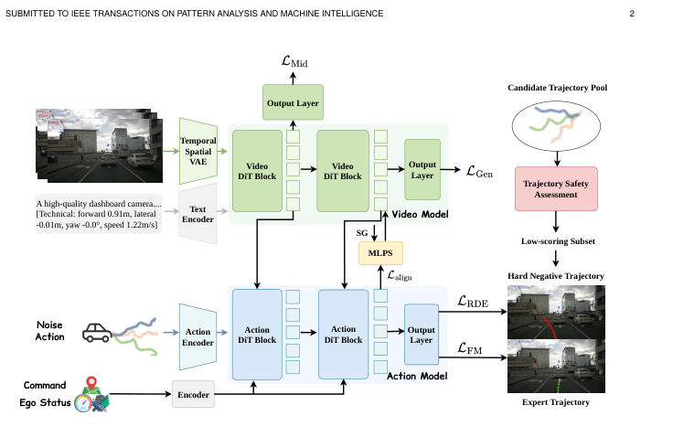
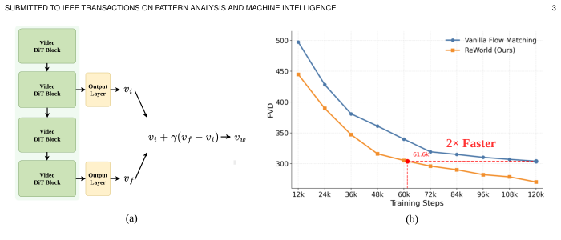
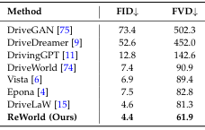
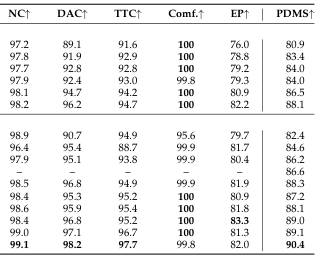
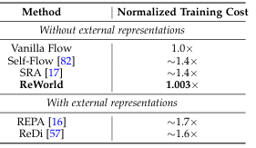
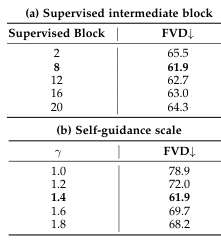
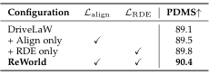
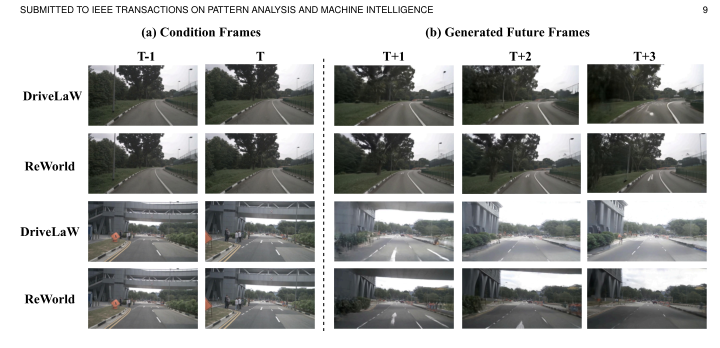
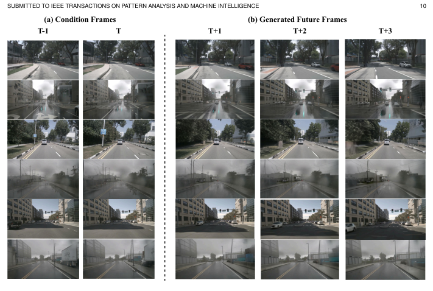
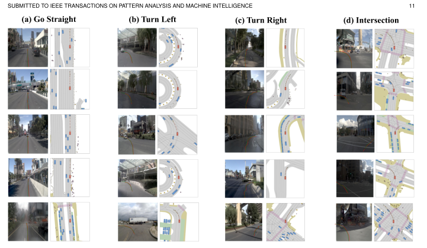

---
tags:
  - papers/WorldModel
  - autonomous-driving
  - representation-learning
aliases:
  - ReWorld
  - 世界动作模型表征学习
  - World Action Models
date: 2026-08-27
arxiv_id: 2606.27504
doi: 10.48550/arxiv.2606.27504
---

# ReWorld: Representation Learning for World Action Models

## 核心信息

- 标题: ReWorld: Representation Learning for World Action Models
- 标题翻译: ReWorld：世界动作模型的表征学习
- 作者: Tianze Xia, Lijun Zhou, Kaixin Xiong, Jingfeng Yao, Zhenxin Zhu, Haiyang Sun, Bing Wang, Guang Chen, Wenyu Liu, Hangjun Ye, Xinggang Wang
- 机构: 华中科技大学；小米汽车
- 发表时间: 2026-06-25（arXiv v2，PDF 标注 2026-08-24）
- 发表渠道: arXiv 预印本；投稿 IEEE TPAMI
- DOI: 10.48550/arxiv.2606.27504
- arXiv: 2606.27504v2
- 论文链接: https://arxiv.org/abs/2606.27504v2
- 代码 / 项目: https://github.com/xiaomi-research/ReWorld
- 数据 / 资源: nuPlan、nuScenes、NAVSIM v1/Navtest、UCF-101
- 论文类型: 自动驾驶世界动作模型 / 生成模型表征学习方法论文

## 原文摘要翻译

世界动作模型（WAM）把未来环境预测与动作生成结合起来，用于自动驾驶；然而，现有方法只优化最终输出，中间表征只是附带产物。本文提出 ReWorld，这是首个专门面向自动驾驶 WAM 的表征学习框架。ReWorld 通过三种互补机制显式优化潜在的“世界到动作”路径。第一，在中间 Video DiT 状态上施加未来预测监督，使其编码时间场景动态，并支持自引导采样，使收敛速度大约提高一倍。第二，把 Action DiT 状态与其注意力读取到的视频信息对齐，使取回的世界信息保留在用于规划的表征中。第三，使用几何上接近但得分较低的困难负样本塑造动作空间，把专家轨迹与附近的不安全替代轨迹分开。ReWorld 完全从 WAM 自身的生成目标和注意力读取特征构造监督，不需要外部编码器或教师模型，并且只增加每步 Video DiT 训练成本的 0.3%。实验显示，ReWorld 在 nuScenes 上把 FVD 从 81.3 降到 61.9，在 NAVSIM 上把闭环 PDMS 从 89.1 提高到 90.4，且不使用强化学习或测试时打分；在 UCF-101 动作识别的冻结线性探测中，准确率从 68.3% 提高到 80.2%。这些结果说明，显式优化表征是把世界知识转化为 WAM 规划能力的关键。

## 创新点

1. **把 WAM 的瓶颈定位为中间“世界到动作”表征，而不是单纯的输出质量。** DriveLaW 已经让 Action DiT 读取 Video DiT 的中间状态；ReWorld 进一步问这些状态是否真的携带未来、跨模态和闭环决策信息。
2. **用生成器自身的未来流目标监督中间 Video DiT。** 在第 8 个 Video DiT 层加入轻量预测头，直接预测与最终头相同的流速度目标；因此不引入静态图像编码器或教师分支。
3. **用 stop-gradient 的跨注意力读出约束 Action DiT。** 第 12 个跨注意力层的动作状态被要求保留其读取的视频信息，形成稳定的世界到动作传递目标。
4. **用 NAVSIM PDM 得分挖掘几何近邻困难负样本。** 负样本不是随机不安全轨迹，而是专家附近、但闭环得分低于 0.6 的候选，随后用排斥距离损失塑造局部动作流形。
5. **三阶段课程把表征形成、跨模态转移和行为塑形解耦。** 这使每个损失的功能可以单独评估，但也意味着最终提升是多阶段累积效果，不能归因于单一损失。

## 一句话总结

ReWorld 不再把 Video DiT 的中间状态当作免费缓存，而是先让它预测未来、再让 Action DiT 保留读取到的世界信息，最后用闭环低分困难负样本塑造动作空间；在同一 DriveLaW 接口上，这同时改善视频、规划和迁移表征，但其效率与性能结论仍受单一架构、单一数据协议和缺少严格 action-only 对照的限制。

## 研究问题

WAM 的目标不是只生成好看的未来视频，而是让未来世界知识帮助动作决策。链式 WAM（本文沿用 DriveLaW）把 2B Video DiT 的初始反向流步骤中间特征 $F$ 缓存给 133M Action DiT；规划时不解码未来视频，而是直接从该潜表示生成自车轨迹。这个接口给出了知识传递通道，但没有保证通道里的状态具备正确语义。

作者指出三个具体缺口：

- **Video DiT 缺少中间未来约束。** 普通流匹配只在最终输出头上要求未来预测；规划端消费的中间层可能按最终生成需要组织，而非按未来动力学组织。
- **Action DiT 可能只瞬时使用跨注意力。** 它可以读取视频特征，却未必把读到的世界信息保存在后续轨迹生成所用的状态中。
- **模仿学习不区分局部不安全轨迹。** 一个轨迹可与专家在几何上很近，却导致碰撞、驶离可行驶区域、进度下降或舒适度下降；仅拟合专家无法提供这种局部对比信号。

因此论文的核心假设是：如果依次优化未来预测的世界状态、世界信息在动作状态中的保留、以及局部行为质量，那么同一个潜接口应同时改善生成输出、规划决策和可迁移表征。论文证明的是这一具体链式 WAM 在给定协议下的效果，并没有证明所有 WAM 都必须采用同样的三阶段设计。

## 数据与任务定义

### 数据集和评测任务

- **nuScenes：** 1,000 条城市驾驶序列，来自 Boston 和 Singapore；其中 850 条开发序列、150 条留出序列，含同步相机和 LiDAR。用于视频生成训练/验证，视频采样率为 8 Hz。
- **nuPlan：** 约 1,200 小时人工驾驶数据，来自四个大都市区域，用于视频训练和受控表征学习协议。
- **NAVSIM v1：** 基于 OpenScene 的数据驱动、非反应式闭环规划基准；Navtrain 约 103k 场景，Navtest 约 12k 场景。轨迹监督使用 2 Hz 观测，规划评价指标为 NC、DAC、TTC、舒适度、EP 和 PDMS。
- **UCF-101：** 用于冻结 Video DiT 的线性探测，评估表征是否迁移到动作识别。使用 split 1、33 帧、$224\times224$ 片段、最终层特征、全局平均池化和统一线性分类器协议。

视频生成报告 FID（帧级视觉保真度）与 FVD（强调时间一致性的视频质量）；闭环规划使用：无责任碰撞 NC、可行驶区域合规 DAC、碰撞时间 TTC、舒适度 Comf.、自车进度 EP，以及

$$
\mathrm{PDMS}=\mathrm{NC}\times\mathrm{DAC}\times\frac{5\cdot\mathrm{EP}+5\cdot\mathrm{TTC}+2\cdot\mathrm{Comf.}}{12}.
$$

NAVSIM 是非反应式仿真评测，因此 PDMS 改善应理解为该基准和 PDM 评分器下的闭环规划改善，而不是现实交通安全的直接证明。

### 受控基线和训练协议

主系统以 DriveLaW 为架构基线：2B Video DiT 初始化自 LTX-Video，133M Action DiT 读取视频中间特征。视频先经过长低分辨率片段 $(740\times352\times121)$，再经过短高分辨率片段 $(1280\times704\times25)$ 的渐进式预训练；动作分支随后使用预训练视频潜变量做流匹配。

为了比较表征学习方法，作者从 LTX-Video 从头训练 120k 步，使用 nuPlan 与 nuScenes、$224\times224\times25$ 片段、无文本编码器，批量大小 32，报告 nuScenes 测试集 FVD 和相对每步 Video DiT 成本。这个协议与主 DriveLaW/ReWorld 训练不是同一个设置，不能直接把两个 FVD 数值横向比较。

## 方法主线

### 机制流程

1. **未来世界表征形成。** 给 Video DiT 的中间层加入辅助速度预测头，使用与最终生成头相同的未来流目标训练；输出的是带时间动力学约束的中间特征 $F$。
2. **自引导视频采样。** 推理时取中间头速度 $v_i$ 和最终头速度 $v_f$ 的差异，构造 $v_w=v_i+\gamma(v_f-v_i)$；默认 $\gamma=1.4$，只改变采样，不改变训练目标。
3. **世界到动作转移。** 冻结 Video DiT，Action DiT 在第 12 个跨注意力层把动作状态与自身读取的视频值向量对齐；stop-gradient 只作用于读出目标，动作状态和跨注意力路径仍获得梯度。
4. **闭环行为塑形。** 从每个场景离线生成 64 条候选轨迹，用 NAVSIM PDM 评分；选取专家附近、但得分低于 0.6 的候选作为困难负样本。最后解冻两条分支，以弱排斥损失让预测轨迹远离该局部不安全邻居，同时继续用流匹配拟合专家。

*图 1（p.2）：ReWorld 总览。上方 Video DiT 生成未来场景并在中间状态提取 $F$，下方 Action DiT 用该状态生成轨迹；右侧困难负样本由候选池经轨迹安全评估得到。图中明确展示三阶段监督位置，是理解“形成—转移—塑形”顺序的最有用证据。*

### 链式 WAM 和基础流匹配

给定驾驶片段 $x$、历史自车运动 $s_{\le0}$ 和导航命令 $g$，时空 VAE 得到 $z_0=E(x)$。视频流时间 $t_v\sim U(0,1)$，噪声 $\epsilon_z\sim\mathcal N(0,I)$，插值得到

$$
z_{t_v}=(1-t_v)z_0+t_v\epsilon_z,
$$

Video DiT 学习速度场

$$
\mathcal L_{\mathrm{Gen}}=\mathbb E\left[\|v^z_\theta(z_{t_v},t_v,c^v)-(\epsilon_z-z_0)\|_2^2\right].
$$

未来自车轨迹 $a_0\in\mathbb R^{L\times3}$ 的每个 waypoint 为 $(x_\ell,y_\ell,\psi_\ell)$。独立采样动作流时间 $t_a$ 和噪声 $\epsilon_a$，得到 $a_{t_a}=(1-t_a)a_0+t_a\epsilon_a$。动作编码器产生 $h_{\mathrm{act}}=E_{\mathrm{act}}(a_{t_a})$，历史运动与导航命令编码为 $h_{\mathrm{ctx}}=E_{\mathrm{ctx}}([s_{\le0};g])$，Action DiT 通过跨注意力读取 $F$ 并预测

$$
\phi(a_{t_a},t_a,c^a,F)=\mathrm{DiT}_{\mathrm{act}}([h_{\mathrm{act}};t_a]\mid h_{\mathrm{ctx}},F),
$$

其基础目标为

$$
\mathcal L_{\mathrm{FM}}=\mathbb E\left[\|\phi(a_{t_a},t_a,c^a,F)-(\epsilon_a-a_0)\|_2^2\right].
$$

基础 DriveLaW 按视频训练、动作训练的顺序优化 $\mathcal L_{\mathrm{Gen}}$ 和 $\mathcal L_{\mathrm{FM}}$。规划推理只在第一个离散视频去噪步骤做一次 Video DiT 前向并缓存 $F$，不解码未来视频；Action DiT 用五个流匹配步骤生成轨迹。这里“缓存”是同一前向激活跨动作流步骤复用，并非离线预计算。

### 阶段 1：未来预测的中间表征

在选定 Video DiT block $l$ 的隐藏状态 $h^{(l)}_{t_v}$ 上添加轻量预测头 $q_l$：

$$
\hat v^{(l)}_{t_v}=q_l(h^{(l)}_{t_v}),
$$

并令 $v^*_{t_v}=\epsilon_z-z_0$，中间损失为

$$
\mathcal L_{\mathrm{Mid}}=\frac1{|S|}\sum_{l\in S}\mathbb E\left[\|\hat v^{(l)}_{t_v}-v^*_{t_v}\|_2^2\right],\qquad S=\{8\}.
$$

阶段 1 的视频目标为

$$
\mathcal L_{\mathrm{Video}}=\mathcal L_{\mathrm{Gen}}+\lambda_{\mathrm{Mid}}\mathcal L_{\mathrm{Mid}}.
$$

这个辅助头的意义不是增加一个独立任务，而是把“最终才能知道的未来流方向”提前压进规划端要读取的中间表示。论文报告从头训练时达到同等验证水平约需 vanilla flow matching 一半步数，但未给出完整训练曲线、方差或具体等水平判据。

自引导只在推理时使用：

$$
v_w=v_i+\gamma(v_f-v_i).
$$

调度器用 $v_w$ 而不是 $v_f$ 更新去噪轨迹。由于 $F$ 仍取自第一个离散视频去噪步骤，视频采样自引导改善不能被直接等同为动作规划时使用了完整生成视频。

*图 2（p.3）：中间预测与最终预测的差异构成自引导方向；右侧曲线显示 ReWorld 约用一半训练步数达到 vanilla flow matching 的参考验证水平。该图支持“加速收敛和采样修正”这一机制，但不单独隔离中间监督与自引导对最终 FVD 的贡献。*

### 阶段 2：跨模态世界对齐

第 $k$ 个 Action DiT 跨注意力层中，动作标记 $i$ 的后跨注意力状态为 $a_i^{(k)}$，其对视频标记 $j$ 的注意力权重为 $\alpha_{ij}^{(k)}$，对应值向量为 $v_j^{(k)}$。多头输出投影后的读出为

$$
r_i^{(k)}=\sum_j\alpha_{ij}^{(k)}v_j^{(k)}.
$$

作者在深层第 12 个跨注意力层施加余弦对齐：

$$
\mathcal L_{\mathrm{align}}=\frac1{|K|N_a}\sum_{k\in K}\sum_{i=1}^{N_a}\left[1-\cos\left(a_i^{(k)},\operatorname{sg}(r_i^{(k)})\right)\right],\qquad K=\{12\}.
$$

$\operatorname{sg}$ 阻止 readout 目标为降低损失而跟随动作状态；梯度仍通过 $a_i^{(k)}$ 和其跨注意力路径传播。阶段 2 冻结 Video DiT，只优化

$$
\mathcal L_{\mathrm{act}}^{(2)}=\mathcal L_{\mathrm{FM}}+\lambda_{\mathrm{align}}\mathcal L_{\mathrm{align}},\qquad \lambda_{\mathrm{align}}=0.05.
$$

因此它是“稳定世界空间中的动作侧保留”，不是把视频和动作特征强行做全局相等。注意力权重仍依赖 Action DiT；冻结视频分支和 stop-gradient 只保证每次更新内的目标不随动作状态反向适配。

### 阶段 3：行为感知动作表征

#### 困难负样本

每个训练场景离线生成 $N=64$ 条候选轨迹 $\{\tau^{(n)}\}$，用 NAVSIM PDM 得分 $s(\cdot)$ 评估。给定专家轨迹 $\tau^{\mathrm{exp}}$，先筛出

$$
I_{\mathrm{low}}=\{n\mid s(\tau^{(n)})<\delta\},\qquad \delta=0.6,
$$

再在归一化轨迹空间选择离专家最近者：

$$
n^*=\arg\min_{n\in I_{\mathrm{low}}}\sum_{\ell=1}^{L}\|\tau_\ell^{(n)}-\tau_\ell^{\mathrm{exp}}\|_2^2,\qquad \tau^{\mathrm{neg}}=\tau^{(n^*)}.
$$

没有低分候选的场景不参与该损失。使用最近低分邻居比随机负样本更针对，因为随机轨迹往往已经能从几何上区分；该选择针对的是专家附近“看起来相似但闭环不安全”的歧义。

#### 排斥距离目标

从与 $\mathcal L_{\mathrm{FM}}$ 相同的前向和动作流时间恢复瞬时干净轨迹：

$$
\hat a_0=a_{t_a}-t_a\,\phi(a_{t_a},t_a,c^a,F),\qquad \hat\tau=\operatorname{Denorm}(\hat a_0).
$$

为强调相对运动而不是绝对位置，每个 waypoint 映射为四通道增量 $\Delta(\tau)_\ell=(\Delta x_\ell,\Delta y_\ell,\sin\psi_\ell,\cos\psi_\ell)$；正弦—余弦编码避免角度断点。对有效困难负样本场景集合 $V$，定义

$$
\mathcal L_{\mathrm{RDE}}=-\frac1{|V|}\sum_{b\in V}\sum_{\ell=1}^{L}\sum_{d=1}^{4}\left|\Delta(\hat\tau_b)_\ell^{(d)}-\Delta(\tau_b^{\mathrm{neg}})_\ell^{(d)}\right|.
$$

负号促使预测轨迹在增量空间远离低分邻居，而 $\mathcal L_{\mathrm{FM}}$ 继续把它锚定在专家轨迹。该损失单独并非有下界，因此只能作为弱正则项；阶段 3 联合解冻两分支，使用

$$
\mathcal L_{\mathrm{act}}^{(3)}=\mathcal L_{\mathrm{FM}}+\lambda_{\mathrm{RDE}}\mathcal L_{\mathrm{RDE}},\qquad \lambda_{\mathrm{RDE}}=0.04.
$$

## 关键结果

### 主结果与强基线

#### 视频生成

| 方法 | FID↓ | FVD↓ |
|---|---:|---:|
| DriveGAN | 73.4 | 502.3 |
| DriveDreamer | 52.6 | 452.0 |
| DrivingGPT | 12.8 | 142.6 |
| DriveWorld | 7.4 | 90.9 |
| Vista | 6.9 | 89.4 |
| Epona | 7.5 | 82.8 |
| DriveLaW | 4.6 | 81.3 |
| ReWorld | **4.4** | **61.9** |

表 1（p.7）显示，在 nuScenes 验证集上，ReWorld 相对 DriveLaW 的 FVD 下降 19.4，约相对改善 23.9%；FID 也从 4.6 降到 4.4。标准采样（$\gamma=1.0$）时，仅加入中间监督把 FVD 从 81.3 降到 78.9；61.9 是中间监督与 $\gamma=1.4$ 自引导的组合结果。因而不能把 61.9 的全部增益归因于辅助头。

*表 1（p.7）：nuScenes 视频生成主结果。图像裁剪可读性有限，正文表格保留了完整数值；FID 与 FVD 的下降方向分别对应帧级保真度和长时程时间一致性。*

#### NAVSIM 闭环规划

表 2 的完整数值如下，† 表示使用相同流匹配目标训练。ReWorld 与 DriveLaW 使用同一链式 WAM 架构接口。

| 方法 | NC↑ | DAC↑ | TTC↑ | Comf.↑ | EP↑ | PDMS↑ |
|---|---:|---:|---:|---:|---:|---:|
| VADv2-V8192 | 97.2 | 89.1 | 91.6 | 100 | 76.0 | 80.9 |
| UniAD | 97.8 | 91.9 | 92.9 | 100 | 78.8 | 83.4 |
| TransFuser | 97.7 | 92.8 | 92.8 | 100 | 79.2 | 84.0 |
| PARA-Drive | 97.9 | 92.4 | 93.0 | 99.8 | 79.3 | 84.0 |
| ReCogDrive-IL | 98.1 | 94.7 | 94.2 | 99.8 | 79.3 | 84.0 |
| DiffusionDrive | 98.2 | 96.2 | 94.7 | 100 | 82.2 | 88.1 |
| DrivingGPT | 98.9 | 90.7 | 94.9 | 95.6 | 79.7 | 82.4 |
| LAW | 96.4 | 95.4 | 88.7 | 99.9 | 81.7 | 84.6 |
| Epona | 97.9 | 95.1 | 93.8 | 99.9 | 80.4 | 86.2 |
| ReSim | — | — | — | — | — | — |
| WoTE | 98.5 | 96.8 | 94.9 | 99.9 | 81.9 | 88.3 |
| DriveVLA-W0† | 98.4 | 95.3 | 95.2 | 100 | 80.9 | 87.2 |
| PWM | 98.6 | 95.9 | 95.4 | 100 | 81.8 | 88.1 |
| WorldDrive | 98.4 | 96.8 | 95.2 | 100 | 83.3 | 89.0 |
| DriveLaW | 99.0 | 97.1 | 96.7 | 100 | 81.3 | 89.1 |
| ReWorld | **99.1** | **98.2** | **97.7** | 99.8 | **82.0** | **90.4** |

表 2（p.8）中，ReWorld 相对 DriveLaW 的 PDMS 提升 1.3；DAC 从 97.1 到 98.2，TTC 从 96.7 到 97.7，NC 从 99.0 到 99.1，EP 从 81.3 到 82.0。舒适度由 100 降为 99.8，说明改善不是所有指标都同步。它在该表的世界模型组中 PDMS、NC、DAC、TTC 最高，但这是 NAVSIM 的非反应式评分，不等同于现实道路安全。

> **图表占位说明：表 2 的 PDF 自动裁剪没有得到独立可用图像。** 为避免把相邻内容误当作表格，本文采用逐项转写；数字以 PDF 表 2 为准。

#### 冻结表征迁移

| 冻结 Video DiT 表征 | UCF-101 Top-1 Acc.↑ |
|---|---:|
| LTX-Video | 66.8 |
| DriveLaW | 68.3 |
| ReWorld（阶段 1） | 71.7 |
| ReWorld（完整课程） | **80.2** |

表 3（p.8）在统一 33 帧、最终层、全局平均池化协议下显示，阶段 1 已比 DriveLaW 高 3.4 个百分点，完整课程再高 8.5 个百分点。它支持表征的时空迁移能力增强，但 UCF-101 与自动驾驶规划并非同一任务，不能单独证明规划因果收益。

*表 3（p.8）：UCF-101 冻结线性探测。该裁剪可读，图中文字和正文数值一致。*

#### 受控长时程表征学习比较

| 方法 | 步数 | FVD↓ |
|---|---:|---:|
| Vanilla Flow | 120k | 304.1 |
| SRA | 120k | 296.9 |
| SRA2 | 120k | 295.2 |
| Self-Flow | 120k | 283.3 |
| ReWorld | 120k | **270.4** |
| REPA + DINOv2 | 120k | 295.9 |
| REPA + VideoMAEv2 | 120k | 328.3 |
| REPA + DepthAnything3 | 120k | 319.4 |
| REPA + V-JEPA2 | 120k | 331.6 |
| ReDi | 120k | 421.7 |

表 4（p.9）显示 ReWorld 比 Vanilla Flow 低 33.7 FVD，比最强自监督对手 Self-Flow 低 12.9。这个协议去掉文本并从头训练，结果支持“生成器原生未来流目标比外部语义空间更匹配长时程视频”的解释，但不应与表 1 的 FVD 直接比较。

> **图表占位说明：表 4 未获得独立可用的 PDF 裁剪。** 这里保留完整 Markdown 转写，避免以低清或错位图片替代数值。

#### 每步训练成本

| 方法 | 归一化每步 Video DiT 成本 |
|---|---:|
| Vanilla Flow | 1.0× |
| Self-Flow | 约 1.4× |
| SRA | 约 1.4× |
| ReWorld | **1.003×** |
| REPA | 约 1.7× |
| ReDi | 约 1.6× |

表 5（p.9）把 ReWorld 的额外成本归因于一个轻量中间预测头，并复用已有激活与未来流目标；它没有额外编码器或教师前向。0.3% 是每步 Video DiT 的归一化增量，不是端到端总训练时间或显存增量的保证。

*表 5（p.9）：视频侧表征学习成本。裁剪可读；成本比较只在作者设定的 $224\times224\times25$、batch size 1 测量。*

### 消融到底说明了什么

#### 中间层和自引导

| 监督 Video DiT block | FVD↓ |
|---:|---:|
| 2 | 65.5 |
| 8 | **61.9** |
| 12 | 62.7 |
| 16 | 63.0 |
| 20 | 64.3 |

| 自引导尺度 $\gamma$ | FVD↓ |
|---:|---:|
| 1.0 | 78.9 |
| 1.2 | 72.0 |
| 1.4 | **61.9** |
| 1.6 | 69.7 |
| 1.8 | 68.2 |

表 6（p.10）显示第 8 层是表示成熟度与层级分离之间的折中；过早的层对未来估计不足，过深的层与最终头分离不够。$\gamma$ 呈非单调趋势，过强引导会破坏修正方向，不能把“更大指导”理解为总是更好。

*表 6（p.10）：中间监督位置和自引导尺度消融。裁剪仅包含表体；完整数值已在上方转写。*

#### 世界 grounding 与行为塑形

| 配置 | $\mathcal L_{\mathrm{align}}$ | $\mathcal L_{\mathrm{RDE}}$ | PDMS↑ |
|---|:---:|:---:|---:|
| DriveLaW |  |  | 89.1 |
| 仅 Align | ✓ |  | 89.5 |
| 仅 RDE |  | ✓ | 89.8 |
| ReWorld | ✓ | ✓ | **90.4** |

表 7（p.11）把两个动作侧机制分开：Align 单独 +0.4，RDE 单独 +0.7，联合后 +1.3。作者据此认为二者互补，但该表该表未列出标准差、不同随机种子或按场景类型拆分；因此联合互补性只能作为当前协议下的观察，不能视为稳定性证明。

*表 7（p.11）：世界 grounding 与困难负样本塑形的 PDMS 消融。图像裁剪清晰，✓ 的含义与正文一致。*

#### 对齐和 RDE 权重

| $\lambda_{\mathrm{align}}$（阶段 2，无阶段 3） | PDMS↑ |
|---:|---:|
| 0.01 | 88.8 |
| 0.03 | 89.2 |
| 0.05 | **89.5** |
| 0.07 | 88.2 |
| 0.10 | 87.7 |

| $\lambda_{\mathrm{RDE}}$ | PDMS↑ |
|---:|---:|
| 0.02 | 89.4 |
| 0.03 | 89.6 |
| 0.04 | **90.4** |
| 0.05 | 89.7 |
| 0.10 | 85.5 |

表 8（p.11）说明两个正则项都有窄的有效区间：对齐太弱无法保留视频读出，太强会干扰流匹配；RDE 太弱行为分离不足，太强则与专家模仿竞争。它也暴露了超参数敏感性，尤其 RDE 从 0.04 到 0.10 时 PDMS 降到 85.5。

> **图表占位说明：表 8 没有独立可用裁剪。** 使用 Markdown 转写保留全部权重扫描；不把低质量候选图像插入正文。

### 定性结果

*图 3（p.9）：DriveLaW 与 ReWorld 在相同 1 秒历史（8 帧、8 Hz）条件下预测后续 3 秒（24 帧）。ReWorld 的车道线、路侧结构、远处目标和跨帧连续性看起来更稳定。定性图与 FVD 下降方向一致，但不能替代全量定量评测。*

*图 4（p.10）：六个 nuScenes 场景的补充未来视频，覆盖晴雨天气、高速行驶和路口。图中显示稳定的道路几何和周围车辆外观；它扩大了定性覆盖面，但仍是作者挑选的代表场景。*

*图 5（p.11）：NAVSIM Navtest 的直行、左转、右转和路口规划示例；红色为模型轨迹，绿色为专家轨迹。轨迹整体平滑且符合场景布局，但可视化没有展示失败样本、碰撞事件或困难负样本的局部差异。*

## 深度分析

### 真正贡献是什么

真正的增量不是新的视频骨干、流匹配或 Action DiT，而是围绕既有链式接口明确设计三种表征监督：未来目标进入中间视频层，视频 readout 进入动作状态，闭环得分进入动作局部几何。第一、二阶段在特征路径上直接施加约束，第三阶段则通过轨迹梯度间接重塑共享表示。这个设计把“Video DiT 能生成未来”和“Action DiT 能输出轨迹”之间的未约束区域变成了可训练对象。

论文最有说服力的证据链是：中间监督单独把 FVD 从 81.3 降到 78.9；适中的自引导再达到 61.9；Align 和 RDE 分别在同一 DriveLaW 上带来 PDMS 增益；完整课程在冻结线性探测上从 68.3 到 80.2。证据链覆盖生成、规划和迁移，但没有逐项报告三个阶段对最终完整系统的独立因果贡献，也没有跨随机种子统计。

### 为什么结果可能成立

1. **生成器原生目标与长时程动态对齐。** 外部 DINO、深度或视频编码器的目标可以偏向语义、几何或识别，未必与视频流匹配中的连续时间演化一致。ReWorld 让中间层直接逼近 $\epsilon_z-z_0$，因而更可能保留与生成过程一致的动力学方向。
2. **中间预测形成跨层层级。** 第 8 层已能给出未来估计，但仍与最终头有足够差异；差异 $v_f-v_i$ 可作为采样修正方向。第 2 层未来结构尚未成熟，第 20 层又过度接近最终头，这解释了表 6 的 U 形趋势。
3. **stop-gradient 对齐解决“读取但不保留”。** 如果只依赖跨注意力，Action DiT 可能在某一层短暂使用视频信息，随后用自身捷径完成轨迹预测。对齐后状态与 readout 的方向，至少在表征空间保留了跨模态信息；但余弦相似度不保证保留了对安全决策真正有用的因果变量。
4. **最近低分邻居提供局部安全边界。** RDE 不是让模型远离所有非专家轨迹，而是远离专家附近、PDM 评分低的轨迹，同时用流匹配维持专家锚点。因此权重适中时可能改善碰撞和可行驶区指标；权重过高则会破坏专家拟合，表 8 的 0.10→85.5 正好显示这一竞争。

### 与相关 WAM 的位置

| 方法 | 视频—动作连接 | 在线未来视频 | 动作侧生成 |
|---|---|---|---|
| DriveLaW | Video DiT 中间状态直接条件化 Action DiT | 规划时只做一次潜空间前向 | 流匹配 Action DiT |
| Fast-WAM | 训练后的视频中间状态作为一次性世界编码 | 不需要 | 仍使用较重生成式动作专家 |
| DiT4DiT | 指定视频 DiT 层和时间的中间特征 | 不需要完整解码 | 独立 Action DiT 迭代生成 |
| ReWorld | 未来监督 + readout 对齐 + 困难负样本塑形 | 不解码未来；规划读取首个离散步骤的 $F$ | 保持 Action DiT 流匹配 |

ReWorld 的重点不是删掉生成器，而是让链式 WAM 的中间状态可解释地承担“未来—世界—动作”三种职责。相对图像扩散表征学习，它把任务目标从静态语义迁移到长时程驾驶动态；相对只做输出监督的 WAM，它把规划质量反馈到动作状态和共享视频状态。

### 容易误读的地方

1. **“两倍收敛”不是两倍端到端速度。** 论文说达到参考验证水平约需一半优化步数；在线规划仍包括一次 Video DiT 前向和五个 Action DiT 流步骤。
2. **FVD 61.9 是组合结果。** $\gamma=1.0$ 时中间监督为 78.9，$\gamma=1.4$ 才到 61.9；自引导的独立作用和中间监督作用未完全分离。
3. **0.3% 只对应视频侧每步训练成本。** 它不代表三阶段课程的总 wall-clock 成本，也不包含离线困难负样本挖掘成本。
4. **RDE 不是安全证明。** 负样本依赖 64 条候选和 PDM 评分器；候选池没有覆盖的失败模式不会被该损失学习。
5. **PDMS 提升不是所有组成项都提升。** ReWorld 的舒适度为 99.8，低于 DriveLaW 的 100；总体分数提升来自其他指标组合。
6. **UCF-101 的 80.2% 不是自动驾驶规划指标。** 它说明时空表征的迁移信号增强，但不提供从线性探测到闭环控制的直接因果链。

### 复现注意点

- 代码仓库在摘要中给出，但本文未提供完整代码版本、训练脚本或公开检查点；复现需要先确认仓库状态与依赖。
- 主干是 2B Video DiT + 133M Action DiT，视频初始化自 LTX-Video；不要把表征学习受控协议的无文本、$224\times224\times25$ 小片段设置误当作主系统输入。
- 阶段 1：20k 步、全局 batch 64、AdamW、学习率 $10^{-5}$、权重衰减 $5\times10^{-2}$、$S=\{8\}$；使用 $\mathcal L_{\mathrm{Gen}}+\lambda_{\mathrm{Mid}}\mathcal L_{\mathrm{Mid}}$。
- 阶段 2：从 DriveLaW checkpoint 初始化，冻结 Video DiT，6k 步、batch 128，第 12 个跨注意力层、$\lambda_{\mathrm{align}}=0.05$。
- 阶段 3：两分支联合微调 10k 步、batch 160、$\lambda_{\mathrm{RDE}}=0.04$；在线重算 $F$ 且不 detach，使 RDE 梯度能到达视频分支。
- 困难负样本只从训练场景离线挖掘；每场景 64 条候选，$\delta=0.6$，使用流匹配生成器、无分类器引导和噪声尺度调整提高多样性。
- 视频采样 30 步、$\gamma=1.4$；动作轨迹采样 5 个流匹配步骤。视频与动作训练流时间独立采样。
- 应分别报告：只中间监督、只自引导、只 Align、只 RDE、完整课程；当前论文的表 6–8 已部分覆盖，但没有结构完全一致的 video-loss removal。
- 规划缓存的 $F$ 来自第一次离散视频去噪步骤；不能在复现中用最终视频输出替代，也不能把五个动作步骤间的缓存误写成五次视频前向。
- 成本报告需要固定 GPU、batch、片段形状、采样步数、精度和是否计入离线候选挖掘；0.3% 结果使用特定的归一化 Video DiT 每步成本。

## 局限

- **缺少严格的 action-only 对照。** 没有保持 DriveLaW 架构、训练步数和动作目标完全不变、只删除未来视频表征监督的核心实验，因此无法量化未来视频协同训练的净贡献。
- **三阶段因果归因不完整。** 中间监督、自引导、Align、RDE 的组合顺序合理，但没有完整的排列实验或每阶段多种随机种子；“互补”主要由少量消融支持。
- **RDE 依赖评分器与候选池。** PDM 的得分阈值 0.6、64 候选和非反应式 NAVSIM 决定了负样本分布。该损失可能学到评分器偏好，而不是真实道路中的安全边界。
- **表征评测范围窄。** UCF-101 只用 split 1 的冻结线性探测；没有跨数据集、跨驾驶天气或跨传感器的表征鲁棒性结果。
- **规划基准不是现实闭环。** NAVSIM 使用数据驱动的非反应式仿真，不能覆盖对其他交通参与者反应、分布外道路和真实执行器延迟。
- **超参数敏感。** $\lambda_{\mathrm{RDE}}=0.10$ 的 PDMS 为 85.5，说明排斥项容易与专家拟合竞争；第 8 层和 $\gamma=1.4$ 也依赖网格搜索。
- **效率统计不等于总成本。** 0.3% 只计算每步视频侧增量；离线困难负样本生成和 PDM 评估成本未纳入该数字。
- **论文范围有限。** 只展示单视角驾驶视频链式 WAM，未来工作才提出更长时间范围和多模态场景；结论不应外推到机器人操作或多摄像头世界模型。

## 我的笔记

这篇论文最值得保留的原则是：**在 WAM 中，真正需要学习的不是“能不能生成未来”和“能不能输出动作”两个端点，而是二者之间的中间表示是否具备未来性、可传递性和决策敏感性。**

对后续工作，我会优先补三组实验：

1. 固定 DriveLaW 的全部架构和训练预算，只删除 $\mathcal L_{\mathrm{Mid}}$ / 视频协同目标，给出 action-only、video-only 和完整课程的多 seed 结果。
2. 在相同视频特征和相同 Action DiT 容量下比较无 Align、余弦 Align、均方 Align、readout detach 与不 detach，验证“保留读出”而非正则强度本身带来的收益。
3. 把 RDE 的候选数量、PDM 阈值、负样本距离和真实失败类型分开扫描；报告 NC、DAC、TTC、舒适度的变化，检验它是否真的改善局部安全边界而不是只改变评分器分布。

如果这些对照成立，ReWorld 的贡献会从“在 DriveLaW 上有效的三阶段正则”上升为更普遍的 WAM 设计准则：未来预测监督应放在规划消费的中间状态上，跨模态信息应有显式保留目标，行为监督应针对专家邻域中的实际失败模式。当前证据已经足以说明该方向有价值，但尚不足以证明三种损失在其他 WAM、其他时域或真实交互交通中同样有效。

## 引用

Xia, T., Zhou, L., Xiong, K., Yao, J., Zhu, Z., Sun, H., Wang, B., Chen, G., Liu, W., Ye, H., & Wang, X. (2026). *ReWorld: Representation Learning for World Action Models*. arXiv:2606.27504v2. https://arxiv.org/abs/2606.27504v2
