# RoboMemArena: A Comprehensive and Challenging Robotic Memory Benchmark

## 文档元数据与来源

- **Source / 来源**: Huashuo Lei et al., “RoboMemArena: A Comprehensive and Challenging Robotic Memory Benchmark,” arXiv:2605.10921v1 [cs.RO], 11 May 2026.
- **Authors / 作者**: Huashuo Lei, Wenxuan Song, Huarui Zhang, Jieyuan Pei, Jiayi Chen, Haodong Yan, Han Zhao, Pengxiang Ding, Zhipeng Zhang, Lida Huang, Donglin Wang, Yan Wang, Haoang Li.
- **Affiliations / 单位**: The Hong Kong University of Science and Technology (Guangzhou); Zhejiang University; Westlake University; Tsinghua University; Zhejiang University of Technology; Shanghai Jiao Tong University.
- **Source length / 源文件长度**: 22 PDF pages (main text, references, and appendices A–H).
- **Reading convention / 阅读约定**: Each English source paragraph is followed immediately by its Chinese translation. Model, dataset, metric, API, JSON key, filename, and mathematical identifiers are retained in English when precision requires it. References are retained in searchable original bibliographic form, as permitted by the reader contract.

## Page/section index / 页码与章节索引

| PDF pages | Content | 内容 |
|---|---|---|
| 1–2 | Title, abstract, Introduction, Figure 1 | 标题、摘要、引言、图1 |
| 3 | Related Work; start of RoboMemArena | 相关工作；RoboMemArena 开始 |
| 4–6 | Task setting, generation pipeline, Table 1, data analysis, Figure 3 | 任务设置、生成流水线、表1、数据分析、图3 |
| 7–10 | Evaluation, PrediMem, experiments, Tables 2–4, Figure 5 | 评测、PrediMem、实验、表2–4、图5 |
| 11–14 | References | 参考文献 |
| 15–16 | Appendix A–B, exact prompts and JSON | 附录A–B、完整提示词与 JSON |
| 17 | Appendix C–D, Algorithm 1, Table S1 | 附录C–D、算法1、表S1 |
| 18–20 | Appendix E–F, Tables S2–S3 | 附录E–F、表S2–S3 |
| 21–22 | Appendix G–H, Figure S2–S3 | 附录G–H、图S2–S3 |

## Terminology ledger / 术语表

| English | Chinese used here |
|---|---|
| robotic memory | 机器人记忆 |
| memory-dependent subtask | 依赖记忆的子任务 |
| keyframe | 关键帧 |
| recent buffer | 最近帧缓冲区 |
| keyframe buffer/bank | 关键帧缓冲区/关键帧库 |
| dual-system VLA | 双系统视觉-语言-动作模型 |
| predictive coding | 预测编码 |
| task success rate (TSR) | 任务成功率 |
| cumulative success rate (CSR) | 累积成功率 |
| transferring / occlusion / counting / sequence | 转移 / 遮挡 / 计数 / 顺序执行 |
| subtask | 子任务 |
| state oracle | 状态预言器（程序化状态判定信号） |
| flow matching | 流匹配 |

---

# Abstract / 摘要

> <span style="color:#3B82F6"><strong>Para. 1:</strong></span> Memory is a critical component of robotic intelligence, as robots must rely on past observations and actions to accomplish long-horizon tasks in partially observable environments. However, existing robotic memory benchmarks still lack multimodal annotations for memory formation, provide limited task coverage and structural complexity, and remain restricted to simulation without real-world evaluation. We address this gap with RoboMemArena, a large-scale benchmark of 26 tasks, with average trajectory lengths exceeding 1,000 steps per task and 68.9% of subtasks being memory-dependent. The generation pipeline leverages a vision-language model (VLM) to design and compose subtasks, generates full trajectories through atomic functions, and provides memory-related annotations, including subtask instructions and native keyframe annotations, while paired real-world memory tasks support physical evaluation. We further design PrediMem, a dual-system VLA in which a high-level VLM planner manages a memory bank with recent and keyframe buffers and uses a predictive coding head to improve sensitivity to task dynamics. Extensive experiments on RoboMemArena show that PrediMem outperforms all baselines and provides insights into memory management, model architecture, and scaling laws for complex memory systems.

> <span style="color:#F59E0B"><strong>Para. 1[CN]:</strong></span> 记忆是机器人智能的关键组成部分，因为机器人必须依赖过去的观测与动作，才能在部分可观测环境中完成长时域任务。然而，现有机器人记忆基准仍缺少用于记忆形成的多模态标注，任务覆盖与结构复杂度有限，并且局限于仿真、缺乏真实世界评测。为弥补这一空白，我们提出 RoboMemArena：一个包含 26 个任务的大规模基准；每个任务的平均轨迹长度超过 1,000 步，68.9% 的子任务依赖记忆。其生成流水线利用视觉-语言模型（VLM）设计并组合子任务，通过原子函数生成完整轨迹，并提供包括子任务指令和原生关键帧标注在内的记忆相关标注；配套的真实世界记忆任务支持物理评测。我们进一步设计 PrediMem，这是一种双系统 VLA：高层 VLM 规划器管理包含最近帧缓冲区和关键帧缓冲区的记忆库，并利用预测编码头提升对任务动态的敏感性。在 RoboMemArena 上的大量实验表明，PrediMem 超越所有基线，并为复杂记忆系统的记忆管理、模型架构和缩放规律提供了洞见。

> <span style="color:#3B82F6"><strong>Para. 2:</strong></span> Code: `RoboMemArena`; Dataset: `RoboMemArenaBenchmark/RoboMemArena`; Model Weights: `huashuolei/PrediMem`; Project Page & Leaderboard: `github.io/RoboMemArena`.

> <span style="color:#F59E0B"><strong>Para. 2[CN]:</strong></span> 代码：`RoboMemArena`；数据集：`RoboMemArenaBenchmark/RoboMemArena`；模型权重：`huashuolei/PrediMem`；项目主页与排行榜：`github.io/RoboMemArena`。

# 1 Introduction / 引言

> <span style="color:#3B82F6"><strong>Para. 1:</strong></span> Memory is a critical component of robotic intelligence, as it determines whether a robot can accomplish long-horizon and complex tasks in partially observable environments. With the advancement of robot foundation policies (Kim et al., 2025; Black et al., 2025; Intelligence et al., 2025), recent research (Shi et al., 2025; Sridhar et al., 2026; Lin et al., 2025; Torne et al., 2026; Fang et al., 2025) has begun to endow these foundation models with effective memory mechanisms, enabling them to handle longer-horizon and more complex tasks. This trend drives the development of corresponding benchmarks (Fang et al., 2025; Cherepanov et al., 2026; Chen et al., 2026a).

> <span style="color:#F59E0B"><strong>Para. 1[CN]:</strong></span> 记忆是机器人智能的关键组成部分，因为它决定机器人能否在部分可观测环境中完成长时域、复杂任务。随着机器人基础策略的发展（Kim et al., 2025；Black et al., 2025；Intelligence et al., 2025），近期研究（Shi et al., 2025；Sridhar et al., 2026；Lin et al., 2025；Torne et al., 2026；Fang et al., 2025）开始为这些基础模型赋予有效的记忆机制，使其能够处理更长时域和更复杂的任务。这一趋势推动了相应基准的发展（Fang et al., 2025；Cherepanov et al., 2026；Chen et al., 2026a）。

> <span style="color:#3B82F6"><strong>Para. 2:</strong></span> However, existing robotic memory benchmarks suffer from several limitations. (1) Their datasets lack the multimodal annotations necessary for memory formation. Recent works (Torne et al., 2026; Intelligence et al., 2026) have highlighted the inherently multimodal nature of robotic memory. Similar to human memory, comprehensive memory representations may include multiple modalities, such as visual information (e.g., keyframe images) and language (e.g., subtask instructions). Existing benchmarks, however, do not provide such annotations. (2) Their task coverage remains limited: they primarily focus on short-term memory, exhibit relatively low structural complexity, offer limited task diversity, and, in many cases, include tasks that do not genuinely require memory. (3) These benchmarks are restricted to simulation and lack corresponding real-world robotic evaluations. As a result, there remains a significant gap between memory effectiveness in simulated planning and execution in the physical world.

> <span style="color:#F59E0B"><strong>Para. 2[CN]:</strong></span> 然而，现有机器人记忆基准存在若干局限。（1）其数据集缺少记忆形成所需的多模态标注。近期工作（Torne et al., 2026；Intelligence et al., 2026）指出，机器人记忆本质上是多模态的。与人类记忆类似，完整的记忆表示可以包含多种模态，例如视觉信息（如关键帧图像）和语言信息（如子任务指令）。但现有基准并未提供这些标注。（2）任务覆盖仍然有限：它们主要关注短期记忆，结构复杂度相对较低，任务多样性有限，而且在许多情况下包含实际上并不需要记忆的任务。（3）这些基准局限于仿真，缺少相应的真实世界机器人评测。因此，仿真规划中的记忆有效性与物理世界中的执行之间仍存在显著差距。

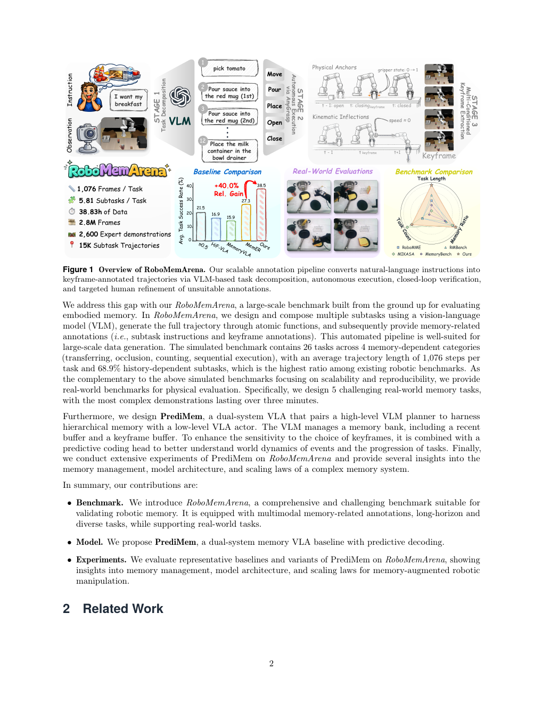
**Caption:** Figure 1 Overview of RoboMemArena. Our scalable annotation pipeline converts natural-language instructions into keyframe-annotated trajectories via VLM-based task decomposition, autonomous execution, closed-loop verification, and targeted human refinement of unsuitable annotations.
**Caption[CN]:** 图1 RoboMemArena 概览。我们的可扩展标注流水线通过基于 VLM 的任务分解、自主执行、闭环验证以及针对不合适标注的定向人工修订，将自然语言指令转换为带关键帧标注的轨迹。

> <span style="color:#3B82F6"><strong>Para. 3:</strong></span> We address this gap with our RoboMemArena, a large-scale benchmark built from the ground up for evaluating embodied memory. In RoboMemArena, we design and compose multiple subtasks using a vision-language model (VLM), generate the full trajectory through atomic functions, and subsequently provide memory-related annotations (i.e., subtask instructions and keyframe annotations). This automated pipeline is well-suited to large-scale data generation. The simulated benchmark contains 26 tasks across 4 memory-dependent categories (transferring, occlusion, counting, sequential execution), with an average trajectory length of 1,076 steps per task and 68.9% history-dependent subtasks, which is the highest ratio among existing robotic benchmarks. As a complement to the simulated benchmarks focusing on scalability and reproducibility, we provide real-world benchmarks for physical evaluation. Specifically, we design 5 challenging real-world memory tasks, with the most complex demonstrations lasting over three minutes.

> <span style="color:#F59E0B"><strong>Para. 3[CN]:</strong></span> 我们提出 RoboMemArena 来弥补这一空白，这是一个从零构建、用于评测具身记忆的大规模基准。在 RoboMemArena 中，我们使用视觉-语言模型（VLM）设计并组合多个子任务，通过原子函数生成完整轨迹，随后提供记忆相关标注（即子任务指令与关键帧标注）。这一自动化流水线适合大规模数据生成。仿真基准包含 4 类依赖记忆的任务（转移、遮挡、计数、顺序执行），共 26 个任务；每个任务的平均轨迹长度为 1,076 步，依赖历史的子任务比例为 68.9%，是现有机器人基准中最高的比例。作为强调可扩展性和可复现性的仿真基准的补充，我们提供真实世界基准进行物理评测。具体而言，我们设计了 5 个具有挑战性的真实世界记忆任务，其中最复杂的演示持续时间超过三分钟。

> <span style="color:#3B82F6"><strong>Para. 4:</strong></span> Furthermore, we design PrediMem, a dual-system VLA that pairs a high-level VLM planner to harness hierarchical memory with a low-level VLA actor. The VLM manages a memory bank, including a recent buffer and a keyframe buffer. To enhance sensitivity to the choice of keyframes, it is combined with a predictive coding head to better understand world dynamics of events and the progression of tasks. Finally, we conduct extensive experiments of PrediMem on RoboMemArena and provide several insights into memory management, model architecture, and scaling laws of a complex memory system.

> <span style="color:#F59E0B"><strong>Para. 4[CN]:</strong></span> 此外，我们设计 PrediMem：一种双系统 VLA，将高层 VLM 规划器与低层 VLA 执行器结合，以利用层次化记忆。VLM 管理一个包含最近帧缓冲区和关键帧缓冲区的记忆库。为增强模型对关键帧选择的敏感性，我们加入预测编码头，使其更好地理解事件的世界动态和任务进展。最后，我们在 RoboMemArena 上对 PrediMem 进行大量实验，并对复杂记忆系统的记忆管理、模型架构和缩放规律给出若干洞见。

> <span style="color:#3B82F6"><strong>Para. 5:</strong></span> In summary, our contributions are:
>
> - **Benchmark.** We introduce RoboMemArena, a comprehensive and challenging benchmark suitable for validating robotic memory. It is equipped with multimodal memory-related annotations, long-horizon and diverse tasks, while supporting real-world tasks.
> - **Model.** We propose PrediMem, a dual-system memory VLA baseline with predictive decoding.
> - **Experiments.** We evaluate representative baselines and variants of PrediMem on RoboMemArena, showing insights into memory management, model architecture, and scaling laws for memory-augmented robotic manipulation.

> <span style="color:#F59E0B"><strong>Para. 5[CN]:</strong></span> 总结而言，我们的贡献如下：
>
> - **基准。** 我们提出 RoboMemArena，这是一个全面且具有挑战性的机器人记忆验证基准。它配备多模态记忆相关标注、长时域且多样的任务，并支持真实世界任务。
> - **模型。** 我们提出 PrediMem，一种带预测解码的双系统记忆 VLA 基线。
> - **实验。** 我们在 RoboMemArena 上评测代表性基线和 PrediMem 的不同变体，展示记忆管理、模型架构以及记忆增强机器人操作的缩放规律方面的洞见。

# 2 Related Work / 相关工作

## 2.1 Robotic Memory Benchmarks / 机器人记忆基准

> <span style="color:#3B82F6"><strong>Para. 1:</strong></span> Existing robotic manipulation benchmarks (Xiang et al., 2020b; Mu et al., 2024; Nasiriany et al., 2024; Tao et al., 2024; Li et al., 2023; Xiang et al., 2020a; Lu et al., 2024; Wang et al., 2025) cover broad objects, scenes, and skills, but many tasks remain locally observable and therefore do not isolate memory as the central bottleneck. Recent memory-oriented benchmarks (Cherepanov et al., 2026; Fang et al., 2025; Chen et al., 2026a; Dai et al., 2026) move closer to this goal, yet three gaps remain. First, they lack rich multimodal memory annotations that can directly supervise dual-system planners. Second, existing memory benchmarks are often limited in task scale and diversity. MemoryBench (Fang et al., 2025) and MIKASA (Cherepanov et al., 2026) are memory-focused, but both remain short-horizon and mainly evaluation-oriented. RMBench (Chen et al., 2026a) broadens memory-complexity settings, but task coverage is relatively small. Third, most benchmarks are not paired with aligned real-world memory evaluations. RoboMME (Dai et al., 2026) standardizes multiple memory dimensions, but its annotations mainly focus on subtask-boundary keyframes and stage-level signals rather than richer multimodal memory supervision. By contrast, RoboMemArena addresses these gaps jointly with native multimodal supervision, scalable memory-dependent manipulation tasks, and paired real-world memory evaluations.

> <span style="color:#F59E0B"><strong>Para. 1[CN]:</strong></span> 现有机器人操作基准（Xiang et al., 2020b；Mu et al., 2024；Nasiriany et al., 2024；Tao et al., 2024；Li et al., 2023；Xiang et al., 2020a；Lu et al., 2024；Wang et al., 2025）覆盖广泛的物体、场景和技能，但许多任务仍可局部观测，因此没有将记忆单独作为核心瓶颈。近期面向记忆的基准（Cherepanov et al., 2026；Fang et al., 2025；Chen et al., 2026a；Dai et al., 2026）更接近这一目标，但仍有三点不足。第一，它们缺少能够直接监督双系统规划器的丰富多模态记忆标注。第二，现有记忆基准通常受限于任务规模和多样性。MemoryBench（Fang et al., 2025）和 MIKASA（Cherepanov et al., 2026）聚焦记忆，但都仍是短时域、主要面向评测的基准。RMBench（Chen et al., 2026a）扩展了记忆复杂度设置，但任务覆盖相对较小。第三，大多数基准没有配套、对齐的真实世界记忆评测。RoboMME（Dai et al., 2026）规范化了多个记忆维度，但其标注主要聚焦子任务边界关键帧和阶段级信号，而不是更丰富的多模态记忆监督。相比之下，RoboMemArena 通过原生多模态监督、可扩展的依赖记忆操作任务以及配套真实世界记忆评测，同时解决了这些问题。

## 2.2 VLA Models with Memory / 带记忆的 VLA 模型

> <span style="color:#3B82F6"><strong>Para. 1:</strong></span> Large-scale VLA pretraining has produced strong language-conditioned manipulation backbones (Kim et al., 2025; Black et al., 2025; Intelligence et al., 2025; Octo Model Team et al., 2024; Zheng et al., 2025b; Chi et al., 2025; Zhao et al., 2023; Wen et al., 2025; Bai et al., 2026; Cui et al., 2025; Song et al., 2025b), with recent extensions adding multi-frame context and future-aware action modeling (Li et al., 2024, 2026a; Lin et al., 2025; Jang et al., 2025; Sun et al., 2026a; Zhang et al., 2026; Hu et al., 2026; Song et al., 2026; Li et al., 2025a; Zhao et al., 2026; Song et al., 2025a; Qiu et al., 2026). We refer to VLAs that predict the next action from the current observation without event memory as reactive policies. These policies become brittle when task-relevant information lies in the past. Memory-augmented VLAs (Sridhar et al., 2026; Han et al., 2025; Shi et al., 2025; Hu et al., 2025; Koo et al., 2025; Li et al., 2025b, 2026e; Torne et al., 2026; Sun et al., 2026b; Wang et al., 2026; Fang et al., 2025; Zheng et al., 2025a; Bi et al., 2025; Li et al., 2026c; Yuan et al., 2026; Liu et al., 2026; Li et al., 2026d,b) address this limitation through visual retrieval, history reasoning, working memory, temporal caches, or multimodal memory compression. For keyframe selection, prior work uses gripper or velocity heuristics, progress-aware embeddings, or retrieved visual keyframes (James and Abbeel, 2022; Chen et al., 2026b; Sridhar et al., 2026). PrediMem differs by using predictive coding to reshape the shared VLM hidden space, allowing keyframes to be selected through the standard language model (LM) head without extra retrieval modules at inference.

> <span style="color:#F59E0B"><strong>Para. 1[CN]:</strong></span> 大规模 VLA 预训练产生了强大的语言条件操作骨干（Kim et al., 2025；Black et al., 2025；Intelligence et al., 2025；Octo Model Team et al., 2024；Zheng et al., 2025b；Chi et al., 2025；Zhao et al., 2023；Wen et al., 2025；Bai et al., 2026；Cui et al., 2025；Song et al., 2025b），近期扩展进一步加入多帧上下文和面向未来的动作建模（Li et al., 2024, 2026a；Lin et al., 2025；Jang et al., 2025；Sun et al., 2026a；Zhang et al., 2026；Hu et al., 2026；Song et al., 2026；Li et al., 2025a；Zhao et al., 2026；Song et al., 2025a；Qiu et al., 2026）。我们将不带事件记忆、仅依据当前观测预测下一动作的 VLA 称为反应式策略。当任务相关信息位于过去时，这些策略会变得脆弱。记忆增强 VLA（Sridhar et al., 2026；Han et al., 2025；Shi et al., 2025；Hu et al., 2025；Koo et al., 2025；Li et al., 2025b, 2026e；Torne et al., 2026；Sun et al., 2026b；Wang et al., 2026；Fang et al., 2025；Zheng et al., 2025a；Bi et al., 2025；Li et al., 2026c；Yuan et al., 2026；Liu et al., 2026；Li et al., 2026d,b）通过视觉检索、历史推理、工作记忆、时间缓存或多模态记忆压缩来解决这一限制。在关键帧选择方面，既有工作使用夹爪或速度启发式、进度感知嵌入或检索到的视觉关键帧（James and Abbeel, 2022；Chen et al., 2026b；Sridhar et al., 2026）。PrediMem 的区别在于使用预测编码重塑共享的 VLM 隐空间，使关键帧能够通过标准语言模型（LM）头选择，而无需在推理时加入额外检索模块。

# 3 RoboMemArena / RoboMemArena 基准

> <span style="color:#3B82F6"><strong>Para. 1:</strong></span> In this section, we introduce RoboMemArena, a complex and challenging robotic memory benchmark, in four parts: (1) We present a task suite with four memory-demand categories (transferring, occlusion, counting, and sequential execution) as well as paired real-world tasks (Section 3.1). (2) We propose a data generation pipeline that combines VLM-based task decomposition, autonomous execution, and multi-conditioned keyframe extraction (Section 3.2). (3) We compare RoboMemArena with existing robotic benchmarks (Section 3.3). (4) We introduce an evaluation protocol that measures both full-task success and stage-level progress (Section 3.4).

> <span style="color:#F59E0B"><strong>Para. 1[CN]:</strong></span> 本节分四部分介绍复杂且具有挑战性的机器人记忆基准 RoboMemArena：（1）提出包含四种记忆需求类别（转移、遮挡、计数和顺序执行）以及配套真实世界任务的任务套件（第3.1节）；（2）提出结合基于 VLM 的任务分解、自主执行和多条件关键帧提取的数据生成流水线（第3.2节）；（3）将 RoboMemArena 与现有机器人基准进行比较（第3.3节）；（4）介绍同时衡量完整任务成功和阶段级进展的评测协议（第3.4节）。

## 3.1 Task Setting / 任务设置

> <span style="color:#3B82F6"><strong>Para. 1:</strong></span> **Simulation.** RoboMemArena is designed to evaluate the complementary regime, where the next action depends on task-relevant information that is no longer visible. The 26 tasks cover four representative failure modes of reactive policies: (1) **Multi-Object Transferring.** The agent relocates multiple objects between visually identical containers and must remember the source–target mapping and which transfers have already been completed. (2) **Multi-Object Occlusion.** The agent places objects into drawers or cabinets that later become visually closed, so it must remember what was placed, where it was placed, and the prior state of each container. This category is the largest in our benchmark (11 tasks), reflecting how often occlusion causes reactive-policy failures. (3) **Multi-Object Counting.** The agent must perform an action a specified number of times (e.g., pour exactly twice), even when the scene before consecutive repetitions looks nearly identical. (4) **Multi-Object Sequence.** The correct downstream action depends on an earlier subtask outcome, such as placing a new object into the same container used in a previous step. The challenge is not only the hidden state, but also resolving references that span multiple operations. We provide one representative task from each category in Figure 2. Detailed task-by-task descriptions are summarized in Appendix Table S2.

> <span style="color:#F59E0B"><strong>Para. 1[CN]:</strong></span> **仿真。** RoboMemArena 旨在评测这样一种互补场景：下一动作依赖已经不可见的任务相关信息。26 个任务覆盖反应式策略的四种代表性失败模式：（1）**多物体转移。** 智能体在视觉上相同的容器之间转移多个物体，必须记住源-目标映射以及哪些转移已经完成。（2）**多物体遮挡。** 智能体将物体放入抽屉或柜子，之后这些容器在视觉上关闭；因此它必须记住放入了什么、放在哪里以及每个容器先前的状态。这是基准中规模最大的类别（11 个任务），反映遮挡经常导致反应式策略失败。（3）**多物体计数。** 即便连续重复动作前的场景几乎相同，智能体也必须执行指定次数的动作（例如恰好倾倒两次）。（4）**多物体顺序。** 后续动作的正确选择取决于早先子任务的结果，例如将新物体放入前一步使用过的同一容器。挑战不仅在于隐藏状态，还在于解析跨越多次操作的指代。图2给出了每类的一个代表性任务；逐任务说明见附录表 S2。

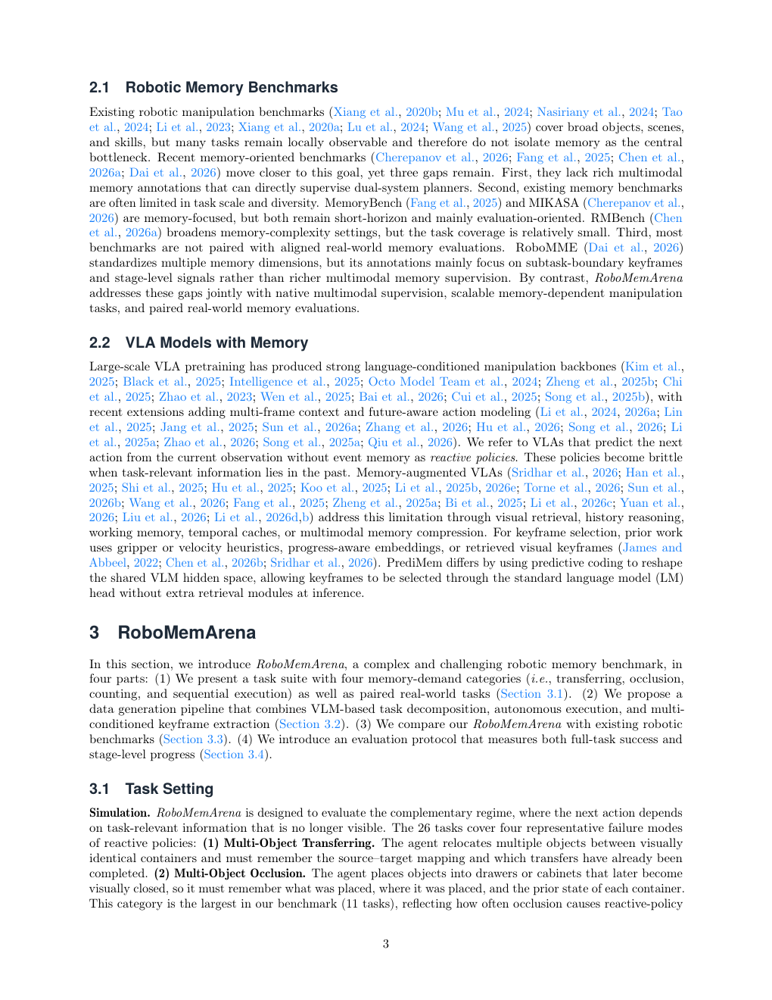
**Caption:** Figure 2 Visualization of 4 task categories of RoboMemArena. Each row shows the task instruction, subtask decomposition, and execution rollout for Multi-Object Counting, Occlusion, Sequence, and Transferring.
**Caption[CN]:** 图2 RoboMemArena 四种任务类别的可视化。每一行展示多物体计数、遮挡、顺序和转移任务的任务指令、子任务分解与执行展开。

> <span style="color:#3B82F6"><strong>Para. 2:</strong></span> **Real-world Tasks.** Beyond simulation, RoboMemArena is paired with five real-world memory tasks on a dual-arm platform: Pour Bottle ×2, Brush Plates with Swap, Transfer Objects, Shell Game, and Imitate Human to Make Breakfast (IHMB). Together, they cover counting, occlusion, sequential execution, hidden-target tracking, and memory conditioned on human demonstration. All tasks are collected and evaluated on the AgileX Cobot Mobile Aloha Platform. We use them as a physical validation set for the benchmark design. Detailed task descriptions and representative snapshots are provided in Appendix Table S4 and Figure S2.

> <span style="color:#F59E0B"><strong>Para. 2[CN]:</strong></span> **真实世界任务。** 除仿真外，RoboMemArena 在双臂平台上配套五个真实世界记忆任务：Pour Bottle ×2、Brush Plates with Swap、Transfer Objects、Shell Game，以及 Imitate Human to Make Breakfast（IHMB）。这些任务共同覆盖计数、遮挡、顺序执行、隐藏目标跟踪，以及以人类演示为条件的记忆。所有任务均在 AgileX Cobot Mobile Aloha Platform 上采集并评测，并作为基准设计的物理验证集。详细任务说明和代表性快照见附录表 S4 与图 S2。

## 3.2 Automated Data Generation Pipeline / 自动数据生成流水线

> <span style="color:#3B82F6"><strong>Para. 1:</strong></span> RoboMemArena resolves the usual trade-off between scalable automatic collection and fine-grained temporal annotation through three stages (Figure 1).

> <span style="color:#F59E0B"><strong>Para. 1[CN]:</strong></span> RoboMemArena 通过三个阶段（图1）解决可扩展自动采集与细粒度时间标注之间通常存在的权衡。

> <span style="color:#3B82F6"><strong>Para. 2:</strong></span> **Stage 1. VLM-Driven Task Decomposition.** Given a high-level instruction and the current RGB observation, a VLM proposes an ordered sequence of executable subtasks as scalable initial annotations in simulation. We then manually refine the subset of decompositions that are unsuitable or inconsistent before downstream execution. The prompt is designed to expose memory demands such as occlusion, counting, and order-dependent execution.

> <span style="color:#F59E0B"><strong>Para. 2[CN]:</strong></span> **阶段1：VLM 驱动的任务分解。** 给定高层指令和当前 RGB 观测，VLM 在仿真中提出有序、可执行的子任务序列，作为可扩展的初始标注。随后，在下游执行前，我们人工修订其中不合适或不一致的分解。提示词专门设计为暴露遮挡、计数和依赖顺序的执行等记忆需求。

> <span style="color:#3B82F6"><strong>Para. 3:</strong></span> **Stage 2. AnyGrasp-Based Autonomous Generation.** Each subtask is executed autonomously using AnyGrasp (Fang et al., 2023), a 6-DoF grasp-pose estimator operating on point-cloud input. Estimated poses are dispatched to predefined primitives to generate action trajectories. Moreover, we add a post-condition checker that retries failed subtasks with updated grasp poses. This closed-loop execution keeps collection automatic while maintaining high success rates.

> <span style="color:#F59E0B"><strong>Para. 3[CN]:</strong></span> **阶段2：基于 AnyGrasp 的自主生成。** 每个子任务均使用 AnyGrasp（Fang et al., 2023）自主执行；AnyGrasp 是一个以点云为输入的 6-DoF 抓取位姿估计器。估计出的位姿被派发给预定义原语以生成动作轨迹。此外，我们加入后置条件检查器，在子任务失败时使用更新后的抓取位姿重试。该闭环执行在保持较高成功率的同时实现自动采集。

> <span style="color:#3B82F6"><strong>Para. 4:</strong></span> **Stage 3. Multi-Conditioned Keyframe Extraction.** Fixed-frequency sampling either misses state transitions or stores redundant static frames. Let a continuous trajectory be denoted by $\tau=\{(s_t,a_t)\}_{t=1}^{T}$, where $s_t$ is the state and $a_t$ is the action at timestep $t$. We extract the keyframe set $K$ by taking the union of frames satisfying either of the following physically grounded conditions:

$$K=K_{\mathrm{phys}}\cup K_{\mathrm{kin}}. \tag{1}$$

> <span style="color:#F59E0B"><strong>Para. 4[CN]:</strong></span> **阶段3：多条件关键帧提取。** 固定频率采样要么错过状态转移，要么存储冗余的静态帧。设连续轨迹为 $\tau=\{(s_t,a_t)\}_{t=1}^{T}$，其中 $s_t$ 是状态，$a_t$ 是时间步 $t$ 的动作。我们取满足以下任一物理条件的帧的并集，提取关键帧集合 $K$：

$$K=K_{\mathrm{phys}}\cup K_{\mathrm{kin}}. \tag{1}$$

> <span style="color:#3B82F6"><strong>Para. 5:</strong></span> **1. Physical interaction anchors.** Gripper-state transitions mark grasp closure and release. Let $g_t\in\{0,1\}$ denote the gripper state ($1=$ closed, $0=$ open). The anchor set is

$$K_{\mathrm{phys}}=\{t\in[1,T]\mid g_t\ne g_{t-1}\}. \tag{2}$$

> <span style="color:#F59E0B"><strong>Para. 5[CN]:</strong></span> **1. 物理交互锚点。** 夹爪状态转移标记抓取闭合和释放。令 $g_t\in\{0,1\}$ 表示夹爪状态（$1=$闭合，$0=$打开），则锚点集合为

$$K_{\mathrm{phys}}=\{t\in[1,T]\mid g_t\ne g_{t-1}\}. \tag{2}$$

> <span style="color:#3B82F6"><strong>Para. 6:</strong></span> **2. Kinematic inflections.** End-effector velocity minima and abrupt direction changes mark transitions between motion phases. Let $v_t\in\mathbb{R}^3$ be the end-effector linear velocity. We identify a kinematic inflection at timestep $t$ if the velocity magnitude drops below a threshold $\epsilon$ or the cosine similarity between consecutive velocity vectors falls below $\cos(\theta)$:

$$K_{\mathrm{kin}}=\left\{t\in[1,T]\mid \|v_t\|<\epsilon\ \lor\ \frac{v_t\cdot v_{t-1}}{\|v_t\|\|v_{t-1}\|}<\cos(\theta)\right\}. \tag{3}$$

> <span style="color:#F59E0B"><strong>Para. 6[CN]:</strong></span> **2. 运动学拐点。** 末端执行器速度极小值和突然的方向变化标志着运动阶段之间的转移。令 $v_t\in\mathbb{R}^3$ 为末端执行器线速度。当速度幅值低于阈值 $\epsilon$，或连续速度向量之间的余弦相似度低于 $\cos(\theta)$ 时，我们将时间步 $t$ 识别为运动学拐点：

$$K_{\mathrm{kin}}=\left\{t\in[1,T]\mid \|v_t\|<\epsilon\ \lor\ \frac{v_t\cdot v_{t-1}}{\|v_t\|\|v_{t-1}\|}<\cos(\theta)\right\}. \tag{3}$$

> <span style="color:#3B82F6"><strong>Para. 7:</strong></span> Together, these conditions select information-bottleneck frames that reconstruct task progress while avoiding dense video storage. The annotations provide temporal supervision for VLMs while keeping the memory representation compact and event-focused.

> <span style="color:#F59E0B"><strong>Para. 7[CN]:</strong></span> 这些条件共同选择信息瓶颈帧：它们能够重建任务进展，同时避免密集视频存储。标注为 VLM 提供时间监督，并使记忆表示保持紧凑、聚焦事件。

## 3.3 Data Analysis / 数据分析

> <span style="color:#3B82F6"><strong>Para. 1:</strong></span> To highlight the unique features of RoboMemArena, we perform qualitative comparisons against popular robotic benchmarks and quantitative comparisons against existing robotic memory benchmarks.

> <span style="color:#F59E0B"><strong>Para. 1[CN]:</strong></span> 为突出 RoboMemArena 的独特特征，我们将其与流行机器人基准进行定性比较，并与现有机器人记忆基准进行定量比较。

> <span style="color:#3B82F6"><strong>Para. 2:</strong></span> **Benchmark Comparison.** We provide a thorough comparison between RoboMemArena and 14 established benchmarks across 8 feature dimensions in Table 1. RoboMemArena is the only entry that satisfies all eight criteria. Taken together, these comparisons highlight three benchmark-level strengths: richer multimodal memory supervision through native keyframes, broader scale and diversity through automated trajectory generation, and paired real-world evaluation for physical validation.

> <span style="color:#F59E0B"><strong>Para. 2[CN]:</strong></span> **基准比较。** 表1从 8 个特征维度对 RoboMemArena 与 14 个成熟基准进行了全面比较。RoboMemArena 是唯一满足全部八项标准的条目。综合来看，这些比较凸显了 RoboMemArena 在基准层面的三项优势：通过原生关键帧提供更丰富的多模态记忆监督；通过自动轨迹生成实现更大的规模和更多样性；以及通过配套真实世界评测进行物理验证。

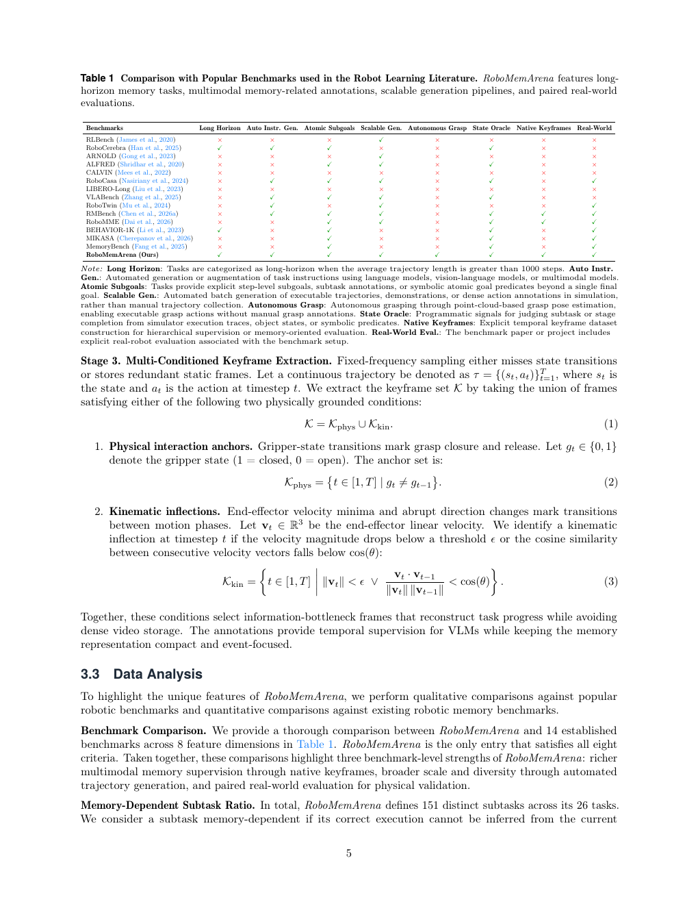
**Caption:** Table 1 Comparison with Popular Benchmarks used in the Robot Learning Literature. RoboMemArena features long-horizon memory tasks, multimodal memory-related annotations, scalable generation pipelines, and paired real-world evaluations.
**Caption[CN]:** 表1 与机器人学习文献中常用基准的比较。RoboMemArena 具备长时域记忆任务、多模态记忆相关标注、可扩展生成流水线以及配套真实世界评测。

| Benchmark           | Long Horizon | Auto Instr. Gen. | Atomic Subgoals | Scalable Gen. | Autonomous Grasp | State Oracle | Native Keyframes | Real-World |
| ------------------- | -----------: | ---------------: | --------------: | ------------: | ---------------: | -----------: | ---------------: | ---------: |
| RLBench             |            × |                × |               × |             ✓ |                × |            × |                × |          × |
| RoboCerebra         |            ✓ |                ✓ |               ✓ |             × |                × |            ✓ |                × |          × |
| ARNOLD              |            × |                × |               × |             ✓ |                × |            × |                × |          × |
| ALFRED              |            × |                × |               ✓ |             ✓ |                × |            ✓ |                × |          × |
| CALVIN              |            × |                × |               × |             × |                × |            × |                × |          × |
| RoboCasa            |            × |                ✓ |               ✓ |             ✓ |                × |            ✓ |                × |          ✓ |
| LIBERO-Long         |            × |                × |               × |             × |                × |            × |                × |          × |
| VLABench            |            × |                ✓ |               ✓ |             ✓ |                × |            ✓ |                × |          × |
| RoboTwin            |            × |                ✓ |               × |             ✓ |                × |            × |                × |          ✓ |
| RMBench             |            × |                ✓ |               ✓ |             ✓ |                × |            ✓ |                ✓ |          ✓ |
| RoboMME             |            × |                × |               ✓ |             ✓ |                × |            ✓ |                ✓ |          ✓ |
| BEHAVIOR-1K         |            ✓ |                × |               ✓ |             × |                × |            ✓ |                × |          ✓ |
| MIKASA              |            × |                × |               ✓ |             × |                × |            ✓ |                × |          ✓ |
| MemoryBench         |            × |                × |               ✓ |             × |                × |            ✓ |                × |          ✓ |
| RoboMemArena (Ours) |            ✓ |                ✓ |               ✓ |             ✓ |                ✓ |            ✓ |                ✓ |          ✓ |

> <span style="color:#3B82F6"><strong>Para. 2a:</strong></span> Table 1 uses the following definitions: **Long Horizon** means the average trajectory length is greater than 1000 steps. **Auto Instr. Gen.** means automated generation or augmentation of task instructions using language models, vision-language models, or multimodal models. **Atomic Subgoals** means explicit step-level subgoals, subtask annotations, or symbolic atomic goal predicates beyond a single final goal. **Scalable Gen.** means automated batch generation of executable trajectories, demonstrations, or dense action annotations in simulation rather than manual trajectory collection. **Autonomous Grasp** means autonomous grasping through point-cloud-based grasp-pose estimation, enabling executable grasp actions without manual grasp annotations. **State Oracle** means programmatic signals for judging subtask or stage completion from simulator traces, object states, or symbolic predicates. **Native Keyframes** means explicit temporal keyframe dataset construction for hierarchical supervision or memory-oriented evaluation. **Real-World Eval.** means that the benchmark paper or project includes explicit real-robot evaluation associated with the benchmark setup.

> <span style="color:#F59E0B"><strong>Para. 2a[CN]:</strong></span> 表1采用以下定义：**Long Horizon（长时域）**指平均轨迹长度大于 1000 步；**Auto Instr. Gen.（自动指令生成）**指使用语言模型、视觉-语言模型或多模态模型自动生成或增强任务指令；**Atomic Subgoals（原子子目标）**指超越单一最终目标的显式逐步子目标、子任务标注或符号原子目标谓词；**Scalable Gen.（可扩展生成）**指在仿真中自动批量生成可执行轨迹、演示或密集动作标注，而非人工采集轨迹；**Autonomous Grasp（自主抓取）**指通过基于点云的抓取位姿估计进行自主抓取，无需人工抓取标注即可生成可执行抓取动作；**State Oracle（状态预言器）**指根据仿真执行轨迹、物体状态或符号谓词判断子任务或阶段完成的程序化信号；**Native Keyframes（原生关键帧）**指为层次化监督或面向记忆的评测显式构建时间关键帧数据集；**Real-World Eval.（真实世界评测）**指基准论文或项目包含与基准设置关联的明确真实机器人评测。
 > <span style="color:#3B82F6"><strong>Para. 3:</strong></span> **Memory-Dependent Subtask Ratio.** RoboMemArena defines 151 distinct subtasks across 26 tasks. We consider a subtask memory-dependent if its correct execution cannot be inferred from the current observation alone and requires information from earlier subtasks or observations. For the $i$-th task with $n_i$ subtasks and $m_i$ memory-dependent subtasks, its task-level memory ratio is $r_i=m_i/n_i$. Across all tasks, 104 of 151 subtasks are memory-dependent, giving a 68.9% history-dependent subtask ratio. Figure 3(c) shows that RoboMemArena also has the highest history-dependent subtask ratio among all robotic memory benchmarks. The calculation protocol is detailed in Appendix Section D.

> <span style="color:#F59E0B"><strong>Para. 3[CN]:</strong></span> **依赖记忆的子任务比例。** RoboMemArena 在 26 个任务中定义了 151 个不同子任务。若子任务的正确执行无法仅从当前观测推断，而需要早期子任务或观测的信息，则将其视为依赖记忆。对于包含 $n_i$ 个子任务、其中 $m_i$ 个依赖记忆的第 $i$ 个任务，其任务级记忆比例为 $r_i=m_i/n_i$。在全部任务中，151 个子任务有 104 个依赖记忆，因此依赖历史的子任务比例为 68.9%。图3(c)显示，RoboMemArena 在所有机器人记忆基准中也具有最高的依赖历史子任务比例。计算协议详见附录 D。

> <span style="color:#3B82F6"><strong>Para. 4:</strong></span> **Scale and Diversity.** For each of the 26 tasks, we collect 100 successful demonstrations, yielding 2,600 long-horizon visual trajectories. These produce 15,100 keyframe-aligned short segments for hierarchical supervision. In terms of average trajectory length, RoboMemArena is longer than existing robotic memory benchmarks, achieving 1,076 steps per task, as shown in Figure 3(a). Figure 3(b) shows the task composition: 4 transferring tasks, 11 occlusion tasks, 7 counting tasks, and 4 sequence tasks.

> <span style="color:#F59E0B"><strong>Para. 4[CN]:</strong></span> **规模与多样性。** 对 26 个任务中的每一个，我们收集 100 条成功演示，得到 2,600 条长时域视觉轨迹。这些轨迹产生 15,100 个与关键帧对齐的短片段，用于层次化监督。在平均轨迹长度方面，RoboMemArena 长于现有机器人记忆基准，每个任务达到 1,076 步，如图3(a)所示。图3(b)显示其任务构成为：4 个转移任务、11 个遮挡任务、7 个计数任务和 4 个顺序任务。

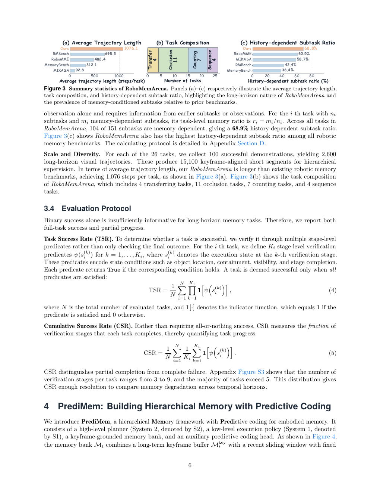
**Caption:** Figure 3 Summary statistics of RoboMemArena. Panels (a)–(c) respectively illustrate the average trajectory length, task composition, and history-dependent subtask ratio, highlighting the long-horizon nature of RoboMemArena and the prevalence of memory-conditioned subtasks relative to prior benchmarks.
**Caption[CN]:** 图3 RoboMemArena 的统计摘要。(a)–(c)分别展示平均轨迹长度、任务构成和依赖历史的子任务比例，突出 RoboMemArena 的长时域特性，以及相较既有基准其中依赖记忆条件子任务的普遍性。

## 3.4 Evaluation Protocol / 评测协议

> <span style="color:#3B82F6"><strong>Para. 1:</strong></span> Binary success alone is insufficiently informative for long-horizon memory tasks. Therefore, we report both full-task success and partial progress.

> <span style="color:#F59E0B"><strong>Para. 1[CN]:</strong></span> 对长时域记忆任务而言，仅报告二元成功是不够有信息量的。因此，我们同时报告完整任务成功和部分进展。

> <span style="color:#3B82F6"><strong>Para. 2:</strong></span> **Task Success Rate (TSR).** To determine whether a task is successful, we verify it through multiple stage-level predicates rather than only checking the final outcome. For the $i$-th task, define $K_i$ stage-level verification predicates $\psi(s_i^{(k)})$ for $k=1,\ldots,K_i$, where $s_i^{(k)}$ denotes the execution state at the $k$-th verification stage. These predicates encode state conditions such as object location, containment, visibility, and stage completion. Each predicate returns True if its condition holds. A task is successful only when all predicates are satisfied:

$$\mathrm{TSR}=\frac{1}{N}\sum_{i=1}^{N}\mathbf{1}\left[\bigwedge_{k=1}^{K_i}\psi(s_i^{(k)})\right]. \tag{4}$$

> <span style="color:#F59E0B"><strong>Para. 2[CN]:</strong></span> **任务成功率（TSR）。** 为判断任务是否成功，我们通过多个阶段级谓词进行验证，而不是只检查最终结果。对于第 $i$ 个任务，定义 $K_i$ 个阶段级验证谓词 $\psi(s_i^{(k)})$（$k=1,\ldots,K_i$），其中 $s_i^{(k)}$ 表示第 $k$ 个验证阶段的执行状态。这些谓词编码物体位置、包含关系、可见性和阶段完成等状态条件。当对应条件成立时，谓词返回 True。只有所有谓词均满足时，任务才被视为成功：公式（4）。

> <span style="color:#3B82F6"><strong>Para. 3:</strong></span> Here, $N$ is the total number of evaluated tasks, and $\mathbf{1}[\cdot]$ is the indicator function, which equals 1 if the predicate is satisfied and 0 otherwise. **Cumulative Success Rate (CSR).** Rather than requiring all-or-nothing success, CSR measures the fraction of verification stages that each task completes, thereby quantifying task progress:

$$\mathrm{CSR}=\frac{1}{N}\sum_{i=1}^{N}\frac{1}{K_i}\sum_{k=1}^{K_i}\mathbf{1}[\psi(s_i^{(k)})]. \tag{5}$$

> <span style="color:#F59E0B"><strong>Para. 3[CN]:</strong></span> 其中，$N$ 是评测任务总数，$\mathbf{1}[\cdot]$ 是指示函数：谓词满足时为 1，否则为 0。**累积成功率（CSR）。** CSR 不要求全有或全无的成功，而是衡量每个任务完成的验证阶段比例，从而量化任务进展：公式（5）。

> <span style="color:#3B82F6"><strong>Para. 4:</strong></span> CSR distinguishes partial completion from complete failure. Appendix Figure S3 shows that the number of verification stages per task ranges from 3 to 9, and the majority of tasks exceed 5. This distribution gives CSR enough resolution to compare memory degradation across temporal horizons.

> <span style="color:#F59E0B"><strong>Para. 4[CN]:</strong></span> CSR 能区分部分完成和完全失败。附录图 S3 显示，每个任务的验证阶段数为 3–9 个，且多数任务超过 5 个。这一分布使 CSR 具有足够分辨率，可以比较不同时间跨度下的记忆退化。

# 4 PrediMem: Building Hierarchical Memory with Predictive Coding / PrediMem：用预测编码构建层次化记忆

> <span style="color:#3B82F6"><strong>Para. 1:</strong></span> We introduce PrediMem, a hierarchical Memory framework with Predictive coding for embodied memory. It consists of a high-level planner (System 2, denoted S2), a low-level execution policy (System 1, denoted S1), a keyframe-grounded memory bank, and an auxiliary predictive coding head. As shown in Figure 4, the memory bank $M_t$ combines a long-term keyframe buffer $M_t^{\mathrm{key}}$ with a recent sliding window $M_t^{\mathrm{rec}}$ of fixed horizon: $M_t=M_t^{\mathrm{key}}\cup M_t^{\mathrm{rec}}$. S2 takes the current observation together with the memory bank to predict the current subtask and decide whether the current frame should be stored as a keyframe. Accepted keyframes are written back into the keyframe buffer, allowing the system to preserve decision-critical events beyond the recent observation window. Meanwhile, S1 predicts the freshest subtask-conditioned action chunk.

> <span style="color:#F59E0B"><strong>Para. 1[CN]:</strong></span> 我们提出 PrediMem，这是一种用于具身记忆的预测编码层次化记忆框架。它由高层规划器（系统2，记为 S2）、低层执行策略（系统1，记为 S1）、以关键帧为基础的记忆库以及辅助预测编码头组成。如图4所示，记忆库 $M_t$ 将长期关键帧缓冲区 $M_t^{\mathrm{key}}$ 与固定时间跨度的最近滑动窗口 $M_t^{\mathrm{rec}}$ 结合：$M_t=M_t^{\mathrm{key}}\cup M_t^{\mathrm{rec}}$。S2 将当前观测与记忆库共同输入，以预测当前子任务并判断当前帧是否应存储为关键帧。被接受的关键帧写回关键帧缓冲区，使系统能够在最近观测窗口之外保留决策关键事件。同时，S1 预测最新的、以子任务为条件的动作块。

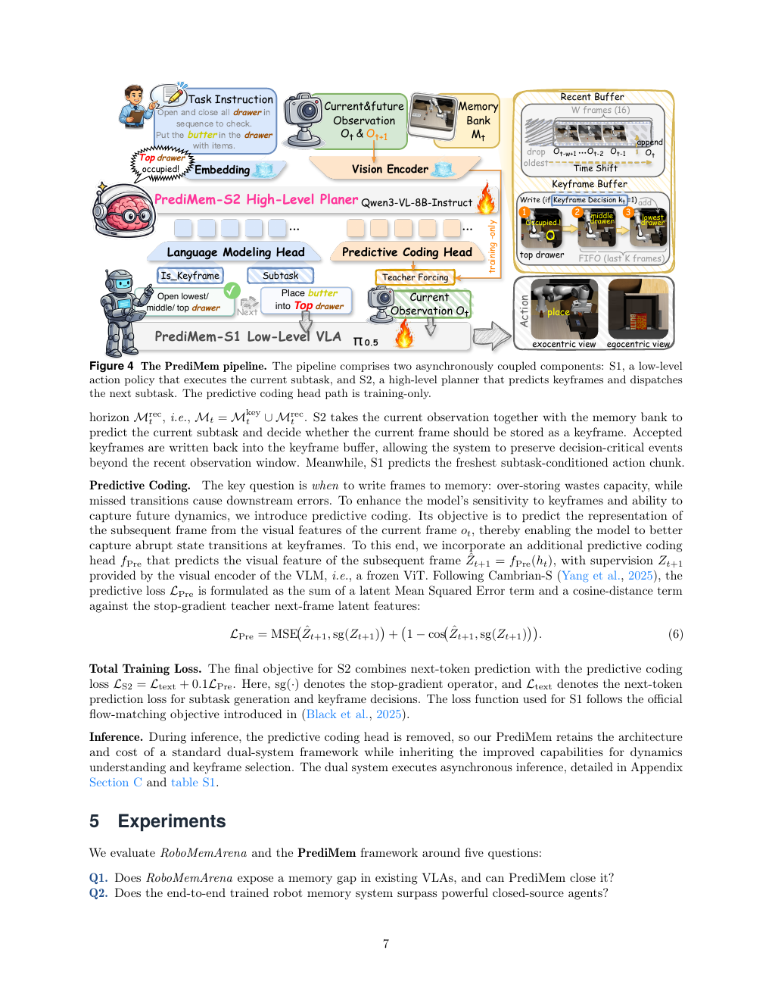
**Caption:** Figure 4 The PrediMem pipeline. The pipeline comprises two asynchronously coupled components: S1, a low-level action policy that executes the current subtask, and S2, a high-level planner that predicts keyframes and dispatches the next subtask. The predictive coding head path is training-only.
**Caption[CN]:** 图4 PrediMem 流水线。该流水线包含两个异步耦合组件：S1 是执行当前子任务的低层动作策略，S2 是预测关键帧并派发下一子任务的高层规划器。预测编码头路径仅在训练时使用。

> <span style="color:#3B82F6"><strong>Para. 2:</strong></span> **Predictive Coding.** The key question is when to write frames to memory: over-storing wastes capacity, while missed transitions cause downstream errors. To enhance sensitivity to keyframes and ability to capture future dynamics, we introduce predictive coding. Its objective is to predict the representation of the subsequent frame from the visual features of the current frame $o_t$, thereby enabling the model to better capture abrupt state transitions at keyframes. We incorporate an additional predictive coding head $f_{\mathrm{Pre}}$ that predicts the visual feature of the subsequent frame, $\hat Z_{t+1}=f_{\mathrm{Pre}}(h_t)$, with supervision $Z_{t+1}$ provided by the visual encoder of the VLM, i.e., a frozen ViT. Following Cambrian-S (Yang et al., 2025), the predictive loss is

$$L_{\mathrm{Pre}}=\mathrm{MSE}(\hat Z_{t+1},\mathrm{sg}(Z_{t+1}))+1-\cos(\hat Z_{t+1},\mathrm{sg}(Z_{t+1})). \tag{6}$$

> <span style="color:#F59E0B"><strong>Para. 2[CN]:</strong></span> **预测编码。** 关键问题是何时将帧写入记忆：存储过多会浪费容量，而错过状态转移会导致下游错误。为提升模型对关键帧的敏感性和捕捉未来动态的能力，我们引入预测编码。其目标是根据当前帧的视觉特征 $o_t$ 预测后续帧的表示，使模型更好地捕捉关键帧处的突发状态转移。我们加入额外的预测编码头 $f_{\mathrm{Pre}}$，预测后续帧的视觉特征 $\hat Z_{t+1}=f_{\mathrm{Pre}}(h_t)$；监督信号 $Z_{t+1}$ 由 VLM 的视觉编码器（即冻结的 ViT）提供。遵循 Cambrian-S（Yang et al., 2025），预测损失为公式（6）。

> <span style="color:#3B82F6"><strong>Para. 3:</strong></span> **Total Training Loss.** The final objective for S2 combines next-token prediction with predictive coding loss: $L_{S2}=L_{text}+0.1L_{Pre}$. Here, $\mathrm{sg}(\cdot)$ denotes the stop-gradient operator, and $L_{text}$ denotes the next-token prediction loss for subtask generation and keyframe decisions. The loss function used for S1 follows the official flow-matching objective introduced in (Black et al., 2025).

> <span style="color:#F59E0B"><strong>Para. 3[CN]:</strong></span> **总训练损失。** S2 的最终目标将下一词元预测与预测编码损失结合：$L_{S2}=L_{text}+0.1L_{Pre}$。其中，$\mathrm{sg}(\cdot)$ 表示停止梯度操作，$L_{text}$ 表示用于子任务生成和关键帧决策的下一词元预测损失。S1 使用的损失函数遵循 Black et al.（2025）提出的官方流匹配目标。

> <span style="color:#3B82F6"><strong>Para. 4:</strong></span> **Inference.** During inference, the predictive coding head is removed, so PrediMem retains the architecture and cost of a standard dual-system framework while inheriting improved capabilities for dynamics understanding and keyframe selection. The dual system executes asynchronous inference, detailed in Appendix Section C and Table S1.

> <span style="color:#F59E0B"><strong>Para. 4[CN]:</strong></span> **推理。** 推理时移除预测编码头，因此 PrediMem 保留标准双系统框架的架构和成本，同时继承对动态理解和关键帧选择的改进能力。双系统执行异步推理，详见附录 C 和表 S1。

# 5 Experiments / 实验

> <span style="color:#3B82F6"><strong>Para. 1:</strong></span> We evaluate RoboMemArena and the PrediMem framework around five questions: Q1. Does RoboMemArena expose a memory gap in existing VLAs, and can PrediMem close it? Q2. Does the end-to-end trained robot memory system surpass powerful closed-source agents? Q3. How much do the predictive coding head and keyframe bank contribute, and how does predictive coding shape the learned memory representations? Q4. How does scaling of memory influence model performance? Q5. How do different baselines perform in the real-world evaluation of RoboMemArena?

> <span style="color:#F59E0B"><strong>Para. 1[CN]:</strong></span> 我们围绕五个问题评测 RoboMemArena 和 PrediMem 框架：Q1，RoboMemArena 是否揭示了现有 VLA 的记忆差距，PrediMem 能否缩小该差距？Q2，端到端训练的机器人记忆系统能否超越强大的闭源智能体？Q3，预测编码头和关键帧库各自贡献多少，预测编码如何塑造学习到的记忆表示？Q4，记忆规模如何影响模型性能？Q5，不同基线在 RoboMemArena 真实世界评测中的表现如何？

## 5.1 Experimental Setup / 实验设置

> <span style="color:#3B82F6"><strong>Para. 1:</strong></span> **Baselines.** We compare against $\pi_{0.5}$ (Black et al., 2025), a reactive VLA that acts only on the current observation. We also compare with HiF-VLA (Lin et al., 2025), which models hindsight, insight, and foresight motion representations; MemoryVLA (Shi et al., 2025), which uses token-level working memory; and MemER (Sridhar et al., 2026), which follows a dual-system design with keyframe retrieval.

> <span style="color:#F59E0B"><strong>Para. 1[CN]:</strong></span> **基线。** 我们与 $\pi_{0.5}$（Black et al., 2025）比较；它是一种仅依据当前观测行动的反应式 VLA。我们还比较 HiF-VLA（Lin et al., 2025），其建模 hindsight、insight 和 foresight 运动表示；MemoryVLA（Shi et al., 2025），其使用词元级工作记忆；以及 MemER（Sridhar et al., 2026），其采用带关键帧检索的双系统设计。

> <span style="color:#3B82F6"><strong>Para. 2:</strong></span> **Implementation.** All experiments are conducted on RoboMemArena. We report TSR and CSR as defined in Section 3.4. PrediMem builds on Qwen3-VL-8B-Instruct with the vision tower frozen and the remaining modules fully fine-tuned for 2 epochs on $4\times$H100 with learning rate $1\times10^{-5}$. The predictive coding head uses latent MSE and cosine losses (weight 0.1 each). The recent buffer holds 5 frames, and the keyframe buffer is uncapped. The prompt format is given in Appendix Section B.

> <span style="color:#F59E0B"><strong>Para. 2[CN]:</strong></span> **实现。** 所有实验均在 RoboMemArena 上进行。我们报告第3.4节定义的 TSR 和 CSR。PrediMem 基于 Qwen3-VL-8B-Instruct，冻结视觉塔，其余模块在 $4\times$H100 上以学习率 $1\times10^{-5}$ 完全微调 2 个 epoch。预测编码头使用潜在 MSE 和余弦损失（各自权重 0.1）。最近帧缓冲区保存 5 帧，关键帧缓冲区不设上限。提示词格式见附录 B。

## 5.2 Main Results in Simulation (Q1, Q2) / 仿真主要结果

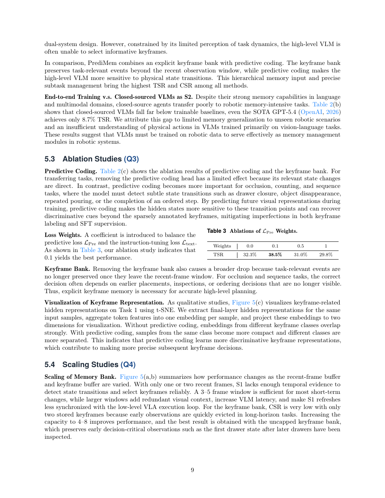
**Caption:** Table 2 Comparison on RoboMemArena. Per-category TSR/CSR (%) and overall averages. Ground Truth shown in gray as an oracle reference.
**Caption[CN]:** 表2 RoboMemArena 上的比较。给出各类别 TSR/CSR（%）与总体平均值；灰色的 Ground Truth 作为预言器参考。

| Method | Transferring TSR/CSR | Occlusion TSR/CSR | Counting TSR/CSR | Sequence TSR/CSR | Average TSR/CSR |
|---|---:|---:|---:|---:|---:|
| $\pi_{0.5}$ | 20.0 / 42.8 | 12.7 / 17.2 | 14.3 / 50.9 | 60.0 / 71.6 | 21.5 / 38.7 |
| HiF-VLA | 17.5 / 38.9 | 12.7 / 27.1 | 8.6 / 45.9 | 42.5 / 70.2 | 16.9 / 39.8 |
| MemoryVLA | 15.0 / 37.2 | 7.3 / 13.1 | 14.3 / 55.1 | 37.5 / 65.2 | 15.0 / 35.3 |
| MemER | 20.0 / 36.1 | 16.4 / 33.2 | 27.1 / 65.1 | 65.0 / 79.1 | 27.3 / 49.1 |
| Qwen3-VL-8B (frozen) | 15.0 / 34.6 | 0.0 / 6.8 | 9.3 / 44.6 | 7.5 / 39.2 | 6.0 / 26.2 |
| GPT-5.4 | 13.8 / 32.9 | 1.8 / 9.2 | 12.9 / 50.7 | 15.0 / 47.3 | 8.7 / 30.5 |
| Ground Truth | 32.5 / 54.8 | 33.6 / 49.8 | 51.4 / 75.6 | 85.0 / 92.3 | 46.1 / 64.8 |
| w/o Predictive Coding Head | 25.0 / 43.7 | 19.5 / 30.2 | 38.6 / 61.8 | 63.8 / 80.7 | 32.3 / 49.0 |
| w/o Keyframe Bank | 17.5 / 33.3 | 6.4 / 22.8 | 20.0 / 61.7 | 45.0 / 66.3 | 17.7 / 41.6 |
| PrediMem w/ Qwen3-1.7B | 15.0 / 31.6 | 7.3 / 20.8 | 28.6 / 60.2 | 50.0 / 73.9 | 19.9 / 41.4 |
| PrediMem w/ Qwen3-4B | 20.0 / 42.1 | 18.2 / 34.7 | 38.6 / 64.9 | 65.0 / 84.6 | 31.9 / 51.7 |
| PrediMem (Ours) | 22.5 / 45.2 | 27.3 / 38.4 | 45.7 / 69.3 | 72.5 / 89.5 | 38.5 / 55.2 |

> <span style="color:#3B82F6"><strong>Para. 2:</strong></span> Table 2(a) shows that $\pi_{0.5}$ reaches 21.5% average TSR and 38.7% average CSR. Because it is a reactive policy without explicit history modeling, it attains relatively high success rates only on certain sequential tasks, where many intermediate steps remain governed by local visual regularities and do not inherently require recalling distant past events. However, when a task requires remembering an earlier state, it fails almost completely. For example, in drawer-based tasks, once the first drawer has been opened and the scene returns to a visually similar state, the policy may repeatedly revisit or reopen the same drawer instead of tracking which drawer has already been inspected.

> <span style="color:#F59E0B"><strong>Para. 2[CN]:</strong></span> 表2(a)显示，$\pi_{0.5}$ 的平均 TSR 为 21.5%，平均 CSR 为 38.7%。由于它是没有显式历史建模的反应式策略，它只在某些顺序任务上取得相对较高的成功率；这些任务的许多中间步骤仍由局部视觉规律支配，本身不需要回忆遥远过去的事件。然而，当任务需要记住早期状态时，它几乎完全失败。例如，在抽屉任务中，打开第一个抽屉后场景恢复为视觉上相似的状态，策略可能反复访问或重新打开同一抽屉，而不是跟踪哪些抽屉已经检查过。

> <span style="color:#3B82F6"><strong>Para. 3:</strong></span> HiF-VLA introduces richer motion representations, which help short-horizon execution, but it does not explicitly store task-level events such as object placements, previous drawer states, or action counts. MemoryVLA stores history as transformer tokens, but this token-level memory is not explicitly aligned with the sparse physical transitions that determine task progress in our benchmark. MemER performs better than purely reactive baselines because it retrieves visual keyframes and follows a dual-system design. However, constrained by its limited perception of task dynamics, the high-level VLM is often unable to select informative keyframes.

> <span style="color:#F59E0B"><strong>Para. 3[CN]:</strong></span> HiF-VLA 引入更丰富的运动表示，有助于短时域执行，但它没有显式存储物体放置、先前抽屉状态或动作次数等任务级事件。MemoryVLA 将历史存储为 Transformer 词元，但这种词元级记忆没有与决定本基准任务进展的稀疏物理转移显式对齐。MemER 由于检索视觉关键帧并采用双系统设计，表现优于纯反应式基线。然而，由于其对任务动态的感知有限，高层 VLM 往往无法选择有信息量的关键帧。

> <span style="color:#3B82F6"><strong>Para. 4:</strong></span> In comparison, PrediMem combines an explicit keyframe bank with predictive coding. The keyframe bank preserves task-relevant events beyond the recent observation window, while predictive coding makes the high-level VLM more sensitive to physical state transitions. This hierarchical memory input and precise subtask management bring the highest TSR and CSR among all methods.

> <span style="color:#F59E0B"><strong>Para. 4[CN]:</strong></span> 相比之下，PrediMem 将显式关键帧库与预测编码结合。关键帧库在最近观测窗口之外保留任务相关事件，而预测编码使高层 VLM 对物理状态转移更加敏感。这种层次化记忆输入和精确的子任务管理使其在所有方法中取得最高 TSR 和 CSR。

> <span style="color:#3B82F6"><strong>Para. 5:</strong></span> **End-to-End Training vs. Closed-Source VLMs as S2.** Despite strong memory capabilities in language and multimodal domains, closed-source agents transfer poorly to robotic memory-intensive tasks. Table 2(b) shows that closed-source VLMs fall far below trainable baselines; even GPT-5.4 (OpenAI, 2026) achieves only 8.7% TSR. We attribute this gap to limited memory generalization to unseen robotic scenarios and insufficient understanding of physical actions in VLMs trained primarily on vision-language tasks. These results suggest that VLMs must be trained on robotic data to serve effectively as memory-management modules in robotic systems.

> <span style="color:#F59E0B"><strong>Para. 5[CN]:</strong></span> **端到端训练与闭源 VLM 作为 S2 的比较。** 尽管闭源智能体在语言和多模态领域具有强大的记忆能力，但它们向机器人记忆密集型任务的迁移效果较差。表2(b)显示，闭源 VLM 远低于可训练基线；即使 GPT-5.4（OpenAI, 2026）也仅取得 8.7% 的 TSR。我们将这一差距归因于 VLM 对未见机器人场景的记忆泛化有限，以及主要在视觉-语言任务上训练的 VLM 对物理动作理解不足。这些结果表明，VLM 必须在机器人数据上训练，才能有效充当机器人系统中的记忆管理模块。

## 5.3 Ablation Studies (Q3) / 消融研究

> <span style="color:#3B82F6"><strong>Para. 1:</strong></span> **Predictive Coding.** Removing the predictive coding head has a limited effect for transferring tasks because their relevant state changes are direct. In contrast, predictive coding becomes more important for occlusion, counting, and sequence tasks, where the model must detect subtle state transitions such as drawer closure, object disappearance, repeated pouring, or completion of an ordered step. By predicting future visual representations during training, predictive coding makes hidden states more sensitive to these transition points and can recover discriminative cues beyond sparsely annotated keyframes, mitigating imperfections in keyframe labeling and SFT supervision.

> <span style="color:#F59E0B"><strong>Para. 1[CN]:</strong></span> **预测编码。** 对转移任务而言，移除预测编码头的影响有限，因为相关状态变化是直接的。相比之下，在遮挡、计数和顺序任务中预测编码更为重要，因为模型必须检测抽屉关闭、物体消失、重复倾倒或有序步骤完成等细微状态转移。通过在训练中预测未来视觉表示，预测编码使隐藏状态对这些转移点更加敏感，并能恢复稀疏标注关键帧之外的判别线索，从而减轻关键帧标注和 SFT 监督的不完善。


**Caption:** Table 3 Ablations of $L_{Pre}$ weights.
**Caption[CN]:** 表3 $L_{Pre}$ 权重的消融。

| Weight | 0.0 | 0.1 | 0.5 | 1 |
|---|---:|---:|---:|---:|
| TSR | 32.3% | 38.5% | 31.0% | 29.8% |

> <span style="color:#3B82F6"><strong>Para. 2:</strong></span> **Loss Weights.** A coefficient balances the predictive loss $L_{Pre}$ and instruction-tuning loss $L_{text}$. As shown in Table 3, our ablation study indicates that 0.1 yields the best performance.

> <span style="color:#F59E0B"><strong>Para. 2[CN]:</strong></span> **损失权重。** 我们引入系数来平衡预测损失 $L_{Pre}$ 与指令微调损失 $L_{text}$。如表3所示，消融研究表明权重 0.1 能取得最佳性能。

> <span style="color:#3B82F6"><strong>Para. 3:</strong></span> **Keyframe Bank.** Removing the keyframe bank also causes a broader drop because task-relevant events are no longer preserved once they leave the recent-frame window. For occlusion and sequence tasks, the correct decision often depends on earlier placements, inspections, or ordering decisions that are no longer visible. Thus, explicit keyframe memory is necessary for accurate high-level planning.

> <span style="color:#F59E0B"><strong>Para. 3[CN]:</strong></span> **关键帧库。** 移除关键帧库也会造成更广泛的性能下降，因为任务相关事件一旦离开最近帧窗口就不再被保留。对于遮挡和顺序任务，正确决策通常依赖早先的放置、检查或排序决定，而这些信息已不可见。因此，显式关键帧记忆对于准确的高层规划是必要的。

> <span style="color:#3B82F6"><strong>Para. 4:</strong></span> **Visualization of Keyframe Representation.** Figure 5(c) visualizes keyframe-related hidden representations on Task 1 using t-SNE. We extract final-layer hidden representations for the same input samples, aggregate token features into one embedding per sample, and project these embeddings to two dimensions. Without predictive coding, embeddings from different keyframe classes overlap strongly. With predictive coding, samples from the same class become more compact and different classes become more separated. This indicates that predictive coding learns more discriminative keyframe representations, contributing to more precise subsequent keyframe decisions.

> <span style="color:#F59E0B"><strong>Para. 4[CN]:</strong></span> **关键帧表示可视化。** 图5(c)使用 t-SNE 可视化任务1中与关键帧相关的隐藏表示。我们提取相同输入样本的最终层隐藏表示，将每个样本的词元特征聚合为一个嵌入，并将嵌入投影到二维空间。没有预测编码时，不同关键帧类别的嵌入强烈重叠；加入预测编码后，同类样本更加紧凑，不同类别更加分离。这表明预测编码学习到了更具判别性的关键帧表示，有助于后续作出更精确的关键帧决策。

## 5.4 Scaling Studies (Q4) / 缩放研究

> <span style="color:#3B82F6"><strong>Para. 1:</strong></span> **Scaling of Memory Bank.** Figure 5(a,b) summarizes performance as the recent-frame buffer and keyframe buffer vary. With only one or two recent frames, S1 lacks enough temporal evidence to detect state transitions and select keyframes reliably. A 3–5-frame window is sufficient for most short-term changes, while larger windows add redundant visual context, increase VLM latency, and make S1 refreshes less synchronized with the low-level VLA execution loop. For the keyframe bank, CSR is very low with only two stored keyframes because early observations are quickly evicted in long-horizon tasks. Increasing capacity to 4–8 improves performance, and the best result is obtained with an uncapped keyframe bank, which preserves early decision-critical observations such as the first drawer state after later drawers have been inspected.

> <span style="color:#F59E0B"><strong>Para. 1[CN]:</strong></span> **记忆库缩放。** 图5(a、b)总结了最近帧缓冲区和关键帧缓冲区变化时的性能。当最近帧只有一帧或两帧时，S1 缺乏足够的时间证据，无法可靠检测状态转移并选择关键帧。3–5 帧窗口足以应对大多数短期变化，而更大的窗口会加入冗余视觉上下文、增加 VLM 延迟，并使 S1 刷新与低层 VLA 执行循环的同步性下降。对于关键帧库，仅存储两个关键帧时 CSR 很低，因为在长时域任务中早期观测很快被驱逐。将容量增加到 4–8 个可以提升性能；最佳结果来自不设上限的关键帧库，它能保留早期的决策关键观测，例如在检查后续抽屉之后仍保留第一个抽屉的状态。

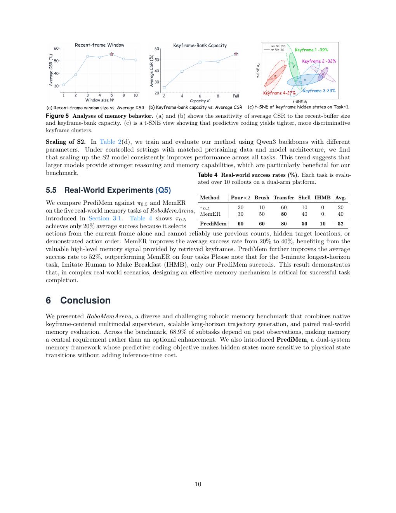
**Caption:** Figure 5 Analyses of memory behavior. (a) and (b) show the sensitivity of average CSR to the recent-buffer size and keyframe-bank capacity. (c) is a t-SNE view showing that predictive coding yields tighter, more discriminative keyframe clusters.
**Caption[CN]:** 图5 记忆行为分析。(a)和(b)展示平均 CSR 对最近缓冲区大小和关键帧库容量的敏感性；(c)为 t-SNE 视图，显示预测编码产生更紧凑、判别性更强的关键帧簇。

> <span style="color:#3B82F6"><strong>Para. 2:</strong></span> **Scaling of S2.** Under controlled settings with matched pretraining data and model architecture, we train and evaluate our method using Qwen3 backbones with different parameter counts. We find that scaling up the S2 model consistently improves performance across all tasks. This trend suggests that larger models provide stronger reasoning and memory capabilities, which are particularly beneficial for this benchmark.

> <span style="color:#F59E0B"><strong>Para. 2[CN]:</strong></span> **S2 的缩放。** 在预训练数据和模型架构匹配的受控设置下，我们使用不同参数量的 Qwen3 骨干训练并评测方法。结果发现，扩大 S2 模型规模能够在所有任务上持续提升性能。这一趋势表明，更大的模型提供更强的推理和记忆能力，而这对本基准尤其有益。

## 5.5 Real-World Experiments (Q5) / 真实世界实验


**Caption:** Table 4 Real-world success rates (%). Each task is evaluated over 10 rollouts on a dual-arm platform.
**Caption[CN]:** 表4 真实世界成功率（%）。每个任务在双臂平台上进行 10 次展开评测。

| Method | Pour×2 | Brush | Transfer | Shell | IHMB | Avg. |
|---|---:|---:|---:|---:|---:|---:|
| $\pi_{0.5}$ | 20 | 10 | 60 | 10 | 0 | 20 |
| MemER | 30 | 50 | 80 | 40 | 0 | 40 |
| PrediMem | 60 | 60 | 80 | 50 | 10 | 52 |

> <span style="color:#3B82F6"><strong>Para. 1:</strong></span> We compare PrediMem against $\pi_{0.5}$ and MemER on the five real-world memory tasks introduced in Section 3.1. Table 4 shows that $\pi_{0.5}$ achieves only 20% average success because it selects actions from the current frame alone and cannot reliably use previous counts, hidden target locations, or demonstrated action order. MemER improves average success from 20% to 40%, benefiting from the high-level memory signal provided by retrieved keyframes. PrediMem further improves average success to 52%, outperforming MemER on four tasks. For the 3-minute longest-horizon task, Imitate Human to Make Breakfast (IHMB), only PrediMem succeeds. This result demonstrates that, in complex real-world scenarios, designing an effective memory mechanism is critical for successful task completion.

> <span style="color:#F59E0B"><strong>Para. 1[CN]:</strong></span> 我们在第3.1节介绍的五个真实世界记忆任务上，将 PrediMem 与 $\pi_{0.5}$ 和 MemER 比较。表4显示，$\pi_{0.5}$ 的平均成功率只有 20%，因为它仅从当前帧选择动作，无法可靠使用先前的计数、隐藏目标位置或演示中的动作顺序。MemER 得益于检索关键帧提供的高层记忆信号，将平均成功率从 20% 提升到 40%。PrediMem 进一步将平均成功率提升至 52%，在五个任务中的四个上超过 MemER。对于持续 3 分钟的最长时域任务 Imitate Human to Make Breakfast（IHMB），只有 PrediMem 成功。这一结果表明，在复杂真实世界场景中，设计有效的记忆机制对于任务成功完成至关重要。

# 6 Conclusion / 结论

> <span style="color:#3B82F6"><strong>Para. 1:</strong></span> We presented RoboMemArena, a diverse and challenging robotic memory benchmark that combines native keyframe-centered multimodal supervision, scalable long-horizon trajectory generation, and paired real-world memory evaluation. Across the benchmark, 68.9% of subtasks depend on past observations, making memory a central requirement rather than an optional enhancement. We also introduced PrediMem, a dual-system memory framework whose predictive coding objective makes hidden states more sensitive to physical state transitions without adding inference-time cost.

> <span style="color:#F59E0B"><strong>Para. 1[CN]:</strong></span> 我们提出了 RoboMemArena，这是一个多样且具有挑战性的机器人记忆基准，将原生的、以关键帧为中心的多模态监督、可扩展长时域轨迹生成以及配套真实世界记忆评测结合起来。在整个基准中，68.9% 的子任务依赖过去观测，使记忆成为核心要求，而不是可选增强。我们还提出 PrediMem，这是一种双系统记忆框架，其预测编码目标使隐藏状态对物理状态转移更加敏感，同时不增加推理时成本。

# References / 参考文献

> The following bibliography is preserved in the source’s searchable English form; author names, titles, venues, years, URLs, DOIs, and arXiv identifiers are not translated so that citations remain exact and retrievable. / 以下参考文献按源文献可检索的英文书目形式保留；作者、标题、会议/期刊、年份、URL、DOI 与 arXiv 标识不翻译，以保持引用精确可检索。

1. Shuanghao Bai, Meng Li, Xinyuan Lv, Jiawei Wang, Xinhua Wang, Fei Liao, Chengkai Hou, Langzhe Gu, Wanqi Zhou, Kun Wu, et al. Hex: Humanoid-aligned experts for cross-embodiment whole-body manipulation. arXiv preprint arXiv:2604.07993, 2026.
2. Hongzhe Bi, Hengkai Tan, Shenghao Xie, Zeyuan Wang, Shuhe Huang, Haitian Liu, Ruowen Zhao, Yao Feng, Chendong Xiang, Yinze Rong, et al. Motus: A unified latent action world model. arXiv preprint arXiv:2512.13030, 2025.
3. Kevin Black, Noah Brown, James Darpinian, Karan Dhabalia, Danny Driess, Adnan Esmail, Michael Robert Equi, Chelsea Finn, Niccolo Fusai, Manuel Y. Galliker, Dibya Ghosh, Lachy Groom, Karol Hausman, brian ichter, Szymon Jakubczak, Tim Jones, Liyiming Ke, Devin LeBlanc, Sergey Levine, Adrian Li-Bell, Mohith Mothukuri, Suraj Nair, Karl Pertsch, Allen Z. Ren, Lucy Xiaoyang Shi, Laura Smith, Jost Tobias Springenberg, Kyle Stachowicz, James Tanner, Quan Vuong, Homer Walke, Anna Walling, Lili Yu, and Ury Zhilinsky. $\pi_{0.5}$: a vision-language-action model with open-world generalization. 9th Annual Conference on Robot Learning, 2025.
4. Tianxing Chen, Yuran Wang, Mingleyang Li, Yan Qin, Hao Shi, Zixuan Li, Yifan Hu, Yingsheng Zhang, Kaixuan Wang, Yue Chen, et al. Rmbench: Memory-dependent robotic manipulation benchmark with insights into policy design. arXiv preprint arXiv:2603.01229, 2026a.
5. Yipeng Chen et al. Non-markovian long-horizon robot manipulation via keyframe chaining. arXiv preprint arXiv:2603.01465, 2026b.
6. Egor Cherepanov, Nikita Kachaev, Alexey Kovalev, and Aleksandr Panov. Memory, benchmark & robots: A benchmark for solving complex tasks with reinforcement learning. The Fourteenth International Conference on Learning Representations, 2026.
7. Cheng Chi, Zhenjia Xu, Siyuan Feng, Eric Cousineau, Yilun Du, Benjamin Burchfiel, Russ Tedrake, and Shuran Song. Diffusion policy: Visuomotor policy learning via action diffusion. The International Journal of Robotics Research, 44(10–11), 2025.
8. Can Cui, Pengxiang Ding, Wenxuan Song, Shuanghao Bai, Xinyang Tong, Zirui Ge, Runze Suo, Wanqi Zhou, Yang Liu, Bofang Jia, et al. Openhelix: A short survey, empirical analysis, and open-source dual-system VLA model for robotic manipulation. arXiv preprint arXiv:2505.03912, 2025.
9. Yinpei Dai, Hongze Fu, Jayjun Lee, Yuejiang Liu, Haoran Zhang, Jianing Yang, Chelsea Finn, Nima Fazeli, and Joyce Chai. Robomme: Benchmarking and understanding memory for robotic generalist policies. arXiv preprint arXiv:2603.04639, 2026.
10. Hao-Shu Fang, Chenxi Wang, Hongjie Fang, Minghao Gou, Jirong Liu, Hengxu Yan, Wenhai Liu, Yichen Xie, and Cewu Lu. Anygrasp: Robust and efficient grasp perception in spatial and temporal domains. IEEE Transactions on Robotics, 39(5), 2023. doi: 10.1109/TRO.2023.3281153.
11. Haoquan Fang, Markus Grotz, Wilbert Pumacay, Yi Ru Wang, Dieter Fox, Ranjay Krishna, and Jiafei Duan. SAM2act: Integrating visual foundation model with a memory architecture for robotic manipulation. Forty-second International Conference on Machine Learning, 2025.
12. Ran Gong, Jiangyong Huang, Yizhou Zhao, Haoran Geng, Xiaofeng Gao, Qingyang Wu, Wensi Ai, Ziheng Zhou, Demetri Terzopoulos, Song-Chun Zhu, Baoxiong Jia, and Siyuan Huang. Arnold: A benchmark for language-grounded task learning with continuous states in realistic 3d scenes. In 2023 IEEE/CVF International Conference on Computer Vision (ICCV), 2023. doi: 10.1109/ICCV51070.2023.01873.
13. Songhao Han, Boxiang Qiu, Yue Liao, Siyuan Huang, Chen Gao, Shuicheng Yan, and Si Liu. Robocerebra: A large-scale benchmark for long-horizon robotic manipulation evaluation. arXiv preprint arXiv:2506.06677, 2025.
14. Qingda Hu, Ziheng Qiu, Zijun Xu, Kaizhao Zhang, Xizhou Bu, Zuolei Sun, Bo Zhang, Jieru Zhao, Zhongxue Gan, and Wenchao Ding. Resolving state ambiguity in robot manipulation via adaptive working memory recoding. arXiv preprint arXiv:2512.24638, 2025.
15. Yutong Hu, Jan-Nico Zaech, Nikolay Nikolov, Yuanqi Yao, Sombit Dey, Giuliano Albanese, Renaud Detry, Luc Van Gool, and Danda Paudel. Ar-vla: True autoregressive action expert for vision-language-action models. arXiv preprint arXiv:2603.10126, 2026.
16. Physical Intelligence, Ali Amin, et al. $\pi_{0.6}$: a vla that learns from experience. arXiv preprint arXiv:2511.14759, 2025.
17. Physical Intelligence, Bo Ai, Ali Amin, Raichelle Aniceto, Ashwin Balakrishna, Greg Balke, Kevin Black, George Bokinsky, Shihao Cao, Thomas Charbonnier, et al. $\pi_{0.7}$: A steerable generalist robotic foundation model with emergent capabilities. arXiv preprint arXiv:2604.15483, 2026.
18. Stephen James and Pieter Abbeel. Coarse-to-fine q-attention with learned path ranking. arXiv preprint arXiv:2204.01571, 2022.
19. Stephen James, Zicong Ma, David Rovick Arrojo, and Andrew J. Davison. RLBench: The robot learning benchmark & learning environment. IEEE Robotics and Automation Letters, 5(2), 2020. doi: 10.1109/LRA.2020.2974707.
20. Huiwon Jang, Sihyun Yu, Heeseung Kwon, Hojin Jeon, Younggyo Seo, and Jinwoo Shin. ContextVLA: Vision-language-action model with amortized multi-frame context. arXiv preprint arXiv:2510.04246, 2025.
21. Moo Jin Kim, Karl Pertsch, Siddharth Karamcheti, Ted Xiao, Ashwin Balakrishna, Suraj Nair, Rafael Rafailov, Ethan P Foster, Pannag R Sanketi, Quan Vuong, et al. OpenVLA: An open-source vision-language-action model. Conference on Robot Learning, 2025.
22. Myungkyu Koo, Daewon Choi, Taeyoung Kim, Kyungmin Lee, Changyeon Kim, Younggyo Seo, and Jinwoo Shin. Hamlet: Switch your vision-language-action model into a history-aware policy. arXiv preprint arXiv:2510.00695, 2025.
23. Chengshu Li, Ruohan Zhang, Josiah Wong, Cem Gokmen, Sanjana Srivastava, Roberto Martín-Martín, Chen Wang, Gabrael Levine, Michael Lingelbach, Jiankai Sun, et al. BEHAVIOR-1K: A benchmark for embodied AI with 1,000 everyday activities and realistic simulation. Conference on Robot Learning, 2023.
24. Fuhao Li, Wenxuan Song, Han Zhao, Jingbo Wang, Pengxiang Ding, Donglin Wang, Long Zeng, and Haoang Li. Spatial forcing: Implicit spatial representation alignment for vision-language-action model. arXiv preprint arXiv:2510.12276, 2025a.
25. Hao Li, Shuai Yang, Yilun Chen, Xinyi Chen, Xiaoda Yang, Yang Tian, Hanqing Wang, Tai Wang, Dahua Lin, Feng Zhao, et al. CronusVLA: Towards efficient and robust manipulation via multi-frame vision-language-action modeling. Proceedings of the AAAI Conference on Artificial Intelligence, 40(22), 2026a.
26. Ji Li, Bo Wang, Jing Xia, Mingyi Li, and Shiyan Hu. HIMM: Human-inspired long-term memory modeling for embodied exploration and question answering. arXiv preprint arXiv:2602.15513, 2026b.
27. Qixiu Li, Yaobo Liang, Zeyu Wang, Lin Luo, Xi Chen, Mozheng Liao, Fangyun Wei, Yu Deng, Sicheng Xu, Yizhong Zhang, et al. CogACT: A foundational vision-language-action model for synergizing cognition and action in robotic manipulation. arXiv preprint arXiv:2411.19650, 2024.
28. Qixiu Li et al. MemCtrl: Using MLLMs as active memory controllers on embodied agents. arXiv preprint arXiv:2601.20831, 2026c.
29. Runhao Li, Wenkai Guo, Zhenyu Wu, Changyuan Wang, Haoyuan Deng, Zhenyu Weng, Yap-Peng Tan, and Ziwei Wang. MAP-VLA: Memory-augmented prompting for vision-language-action model in robotic manipulation. arXiv preprint arXiv:2511.09516, 2025b.
30. Ruoran Li, Xinghua Zhang, Haiyang Yu, Shitong Duan, Xiang Li, Wenxin Xiang, Chonghua Liao, Xudong Guo, Yongbin Li, and Jinli Suo. MemPO: Self-memory policy optimization for long-horizon agents. arXiv preprint arXiv:2603.00680, 2026d.
31. Zaijing Li, Bing Hu, Rui Shao, Gongwei Chen, Dongmei Jiang, Pengwei Xie, Jianye Hao, and Liqiang Nie. Global prior meets local consistency: Dual-memory augmented vision-language-action model for efficient robotic manipulation. arXiv preprint arXiv:2602.20200, 2026e.
32. Minghui Lin, Pengxiang Ding, Shu Wang, Zifeng Zhuang, Yang Liu, Xinyang Tong, Wenxuan Song, Shangke Lyu, Siteng Huang, and Donglin Wang. HiF-VLA: Hindsight, insight and foresight through motion representation for vision-language-action models. arXiv preprint arXiv:2512.09928, 2025.
33. Bo Liu, Yifeng Zhu, Chongkai Gao, Yihao Feng, Qiang Liu, Yuke Zhu, and Peter Stone. LIBERO: Benchmarking knowledge transfer for lifelong robot learning. Advances in Neural Information Processing Systems, 36, 2023.
34. Zhuoyang Liu, Jiaming Liu, Hao Chen, Jiale Yu, Ziyu Guo, Chengkai Hou, Chenyang Gu, Xiangju Mi, Renrui Zhang, Kun Wu, et al. Last$_0$: Latent spatio-temporal chain-of-thought for robotic vision-language-action model. arXiv preprint arXiv:2601.05248, 2026.
35. Haoran Lu, Ruihai Wu, Yitong Li, Sijie Li, Ziyu Zhu, Chuanruo Ning, Yan Shen, Longzan Luo, Yuanpei Chen, and Hao Dong. GarmentLab: A unified simulation and benchmark for garment manipulation. Proceedings of the 38th International Conference on Neural Information Processing Systems, 2024.
36. Oier Mees, Lukas Hermann, Erick Rosete-Beas, and Wolfram Burgard. CALVIN: A benchmark for language-conditioned policy learning for long-horizon robot manipulation tasks. IEEE Robotics and Automation Letters, 7(3), 2022. doi: 10.1109/LRA.2022.3180108.
37. Yao Mu, Tianxing Chen, Shijia Peng, Zanxin Chen, Zeyu Gao, Yude Zou, Lunkai Lin, Zhiqiang Xie, and Ping Luo. RoboTwin: Dual-arm robot benchmark with generative digital twins (early version). European Conference on Computer Vision, 2024.
38. Soroush Nasiriany, Abhiram Maddukuri, Lance Zhang, Adeet Parikh, Aaron Lo, Abhishek Joshi, Ajay Mandlekar, and Yuke Zhu. RoboCasa: Large-scale simulation of everyday tasks for generalist robots. arXiv preprint arXiv:2406.02523, 2024.
39. Octo Model Team et al. Octo: An open-source generalist robot policy. Robotics: Science and Systems, 2024.
40. OpenAI. Introducing gpt-5.4. OpenAI Blog. https://openai.com/index/introducing-gpt-5-4, 2026.
41. Weikang Qiu, Tinglin Huang, and Rex Ying. Efficient long-horizon vision-language-action models via static-dynamic disentanglement. arXiv preprint arXiv:2602.03983, 2026.
42. Hao Shi, Bin Xie, Yingfei Liu, Lin Sun, Fengrong Liu, Tiancai Wang, Erjin Zhou, Haoqiang Fan, Xiangyu Zhang, and Gao Huang. MemoryVLA: Perceptual-cognitive memory in vision-language-action models for robotic manipulation. arXiv preprint arXiv:2508.19236, 2025.
43. Mohit Shridhar et al. ALFRED: A benchmark for interpreting grounded instructions for everyday tasks. Proceedings of CVPR, 2020.
44. Wenxuan Song et al. Accelerating vision-language-action model integrated with action chunking via parallel decoding. arXiv preprint arXiv:2503.02310, 2025a.
45. Wenxuan Song et al. RationalVLA: A rational vision-language-action model with dual system. arXiv preprint arXiv:2506.10826, 2025b.
46. Wenxuan Song et al. ReconVLA: Reconstructive vision-language-action model as effective robot perceiver. Proceedings of AAAI, 40, 18549–18557, 2026.
47. Ajay Sridhar, Jennifer Pan, Satvik Sharma, and Chelsea Finn. MemER: Scaling up memory for robotic control via experience retrieval. The Fourteenth International Conference on Learning Representations, 2026.
48. Jingwen Sun et al. VLA-JEPA: Enhancing vision-language-action model with latent world model. arXiv preprint arXiv:2602.10098, 2026a.
49. Jun Sun et al. TempoFit: Plug-and-play layer-wise temporal KV memory for long-horizon vision-language-action manipulation. arXiv preprint arXiv:2603.07647, 2026b.
50. Stone Tao et al. ManiSkill3: GPU parallelized robotics simulation and rendering for generalizable embodied AI. arXiv preprint arXiv:2410.00425, 2024.
51. Marcel Torne et al. MEM: Multi-scale embodied memory for vision language action models. arXiv preprint arXiv:2603.03596, 2026.
52. Yuran Wang et al. DexGarmentLab: Dexterous garment manipulation environment with generalizable policy. arXiv preprint arXiv:2505.11032, 2025.
53. Zhenan Wang et al. TacMamba: A tactile history compression adapter bridging fast reflexes and slow VLA reasoning. arXiv preprint arXiv:2603.01700, 2026.
54. Junjie Wen et al. DexVLA: Vision-language model with plug-in diffusion expert for general robot control. Conference on Robot Learning, 2025.
55. Fanbo Xiang et al. SAPIEN: A simulated part-based interactive environment. CVPR, 2020a/b.
56. Shusheng Yang et al. Cambrian-S: Towards spatial supersensing in video. arXiv preprint arXiv:2511.04670, 2025.
57. Mingfeng Yuan et al. STAR: Scalable task-conditioned retrieval for long-horizon multi-modal robot memory. IEEE Robotics and Automation Letters, 11(5), 2026. doi: 10.1109/LRA.2026.3677723.
58. Shiduo Zhang et al. VLABench: A large-scale benchmark for language-conditioned robotics manipulation with long-horizon reasoning tasks. ICCV, 11142–11152, 2025.
59. Wenyao Zhang et al. DreamVLA: A vision-language-action model dreamed with comprehensive world knowledge. NeurIPS, 38:24195–24228, 2026.
60. Han Zhao et al. Frappe: Infusing world modeling into generalist policies via multiple future representation alignment. arXiv preprint arXiv:2602.17259, 2026.
61. Tony Zhao, Vikash Kumar, Sergey Levine, and Chelsea Finn. Learning fine-grained bimanual manipulation with low-cost hardware. Robotics: Science and Systems XIX, 2023.
62. Jinliang Zheng et al. X-VLA: Soft-prompted transformer as scalable cross-embodiment vision-language-action model. arXiv preprint arXiv:2510.10274, 2025a/b.

# Appendix / 附录

## A VLM Input Prompt for Data Generation / 用于数据生成的 VLM 输入提示词

> <span style="color:#3B82F6"><strong>Para. A.1:</strong></span> We use a VLM input prompt template to generate long-horizon robot data by decomposing a coarse task description into executable subtasks and matching each subtask to a predefined planner. Below we show a representative input-only example.

> <span style="color:#F59E0B"><strong>Para. A.1[CN]:</strong></span> 我们使用 VLM 输入提示词模板生成长时域机器人数据：将粗粒度任务描述分解为可执行子任务，并将每个子任务匹配到预定义规划器。下面给出一个仅输入的代表性示例。

**System Prompt.**
```text
You are a robotic data-generation assistant for long-horizon,
memory-dependent manipulation tasks.

You will be given:
1. One RGB image of the current environment.
2. A coarse long-horizon task description.

Your job is to:
- decompose the task into an ordered list of executable subtasks;
- assign each subtask to one predefined planner from
  {Move, Place, Pour, Open, Close};
- keep the subtasks grounded in the visible scene;
- preserve memory-dependent structure when later steps depend on earlier
  placements, occluded objects, or counted actions;
- return strict JSON only.

Return exactly one field:
- subtasks: a list of ordered subtask entries, each with
  step_id, subtask, planner, and target.
```

**System Prompt[CN]：**
```text
你是一个面向长时域、依赖记忆的机器人操作任务的数据生成助手。

你将获得：
1. 当前环境的一张 RGB 图像。
2. 一个粗粒度的长时域任务描述。

你的任务是：
- 将任务分解为有序的可执行子任务列表；
- 将每个子任务分配给以下一个预定义规划器：
  {Move, Place, Pour, Open, Close}；
- 使子任务以可见场景为依据；
- 当后续步骤依赖早期放置、被遮挡物体或已计数动作时，保留依赖记忆的结构；
- 仅返回严格 JSON。

只返回一个字段：
- subtasks：有序子任务条目列表，每个条目包含 step_id、subtask、planner 和 target。
```

**User Prompt.**
```text
Current environment image:
<image>

Long-horizon task description:
Pour tomato sauce over the cookies and heat them, then pour milk into a cup.

Please decompose this task into executable subtasks and assign the
predefined planner to each step.
```

**User Prompt[CN]：**
```text
当前环境图像：
<image>

长时域任务描述：
将番茄酱倒在饼干上并加热，然后将牛奶倒入杯中。

请将该任务分解为可执行子任务，并为每一步分配预定义规划器。
```

## B VLM Training Prompt and JSON Format / VLM 训练提示词与 JSON 格式

> <span style="color:#3B82F6"><strong>Para. B.1:</strong></span> We train S2 with a fixed multi-image prompt template. Below we show a representative Task 1 prompt template adapted from `swift_compiled_data.jsonl`.

> <span style="color:#F59E0B"><strong>Para. B.1[CN]:</strong></span> 我们使用固定的多图像提示词模板训练 S2。下面给出一个改编自 `swift_compiled_data.jsonl` 的任务1代表性提示词模板。

**System Prompt.**
```text
You are a robotic planning assistant specialized in memory-based task
understanding.

Your task is to infer the current primitive action from multi-image
observation:
1. Historical keyframes from earlier in the same trajectory.
2. A recent 5-timestep visual window ending at the current frame.

Important rules:
- Historical keyframes are earlier than the current window.
- Each timestep contains two images: one agentview_rgb image and one eye_in_hand_rgb image.
- The recent 5-timestep window is the primary evidence for current action.
- If there is no keyframe inside the current window, keyframe_positions must be an empty list.
- Return strict JSON only. Do not output extra text.
- Return exactly two fields:
  - current_primitive: one primitive from the predefined task1 primitive set.
  - keyframe_positions: 1-indexed keyframe positions inside the recent 5-timestep window.
```

**System Prompt[CN]：**
```text
你是专门进行基于记忆的任务理解的机器人规划助手。

你的任务是从多图像观测中推断当前原子动作：
1. 同一轨迹早期的历史关键帧。
2. 以当前帧结束的最近 5 个时间步视觉窗口。

重要规则：
- 历史关键帧早于当前窗口。
- 每个时间步包含两张图像：一张 agentview_rgb 图像和一张 eye_in_hand_rgb 图像。
- 最近 5 个时间步窗口是判断当前动作的主要证据。
- 如果当前窗口内没有关键帧，keyframe_positions 必须是空列表。
- 仅返回严格 JSON，不得输出额外文本。
- 只返回两个字段：
  - current_primitive：来自预定义 task1 原子动作集合的一个原子动作。
  - keyframe_positions：最近 5 个时间步窗口内以 1 为起点编号的关键帧位置。
```

**User Prompt.**
```text
Global task: Infer the current primitive action from recent visual history
for a task that stores the cookies and the tomato sauce into the same
target container.

Scene description:
- The manipulation happens on a tabletop.
- The target container is the basket on the right side of the table.
- The square object near the middle is the cookies item.
- The cylindrical object near the middle is the tomato sauce container.
- Each timestep contains two images: one agentview_rgb image and one eye_in_hand_rgb image.
- Camera order for every timestep: agentview_rgb, eye_in_hand_rgb.

Current observation:
Recent visual context: 5 consecutive timesteps ending at the current frame
(10 images total; two per timestep, ordered as agentview_rgb followed by
eye_in_hand_rgb):
<image> <image> <image> <image> <image>
<image> <image> <image> <image> <image>

Return strict JSON with fields current_primitive and keyframe_positions
(1-indexed positions inside the recent 5-timestep context).
```

**Assistant Label JSON.**
```json
{"current_primitive":"pick cookies","keyframe_positions":[]}
```

**Top-Level JSONL Format.**
```json
{
  "qid": "seed100_order0_win0_r0",
  "messages": [
    {"role": "system", "content": "..."},
    {"role": "user", "content": "..."},
    {"role": "assistant", "content": "{\"current_primitive\":\"pick cookies\",\"keyframe_positions\":[]}"}
  ],
  "images": ["data:image/jpeg;base64,...", "... x10"],
  "metadata": {
    "task_id": 1,
    "prompt_style": "breakfast_like",
    "current_primitive": "pick cookies",
    "keyframe_positions": [],
    "camera_keys": ["agentview_rgb", "eye_in_hand_rgb"],
    "history_keyframe_count": 0,
    "num_context_frames": 5,
    "num_context_images": 10,
    "image_size": [256, 256],
    "...": "other window/index fields"
  }
}
```

**Top-Level JSONL Format[CN]：** 上述 JSON 结构中的键、值和占位符按原文保留；其含义为：每行记录包含问题 ID、system/user/assistant 消息、10 张图像，以及任务编号、提示词风格、当前原子动作、关键帧位置、相机键、历史关键帧数、上下文帧数、上下文图像数和图像尺寸等元数据。

## C Asynchronous Inference Protocol / 异步推理协议

> <span style="color:#3B82F6"><strong>Para. C.1:</strong></span> Given instruction $\ell$ and observation $o_0$, S2 runs asynchronously on the recent-frame buffer and memory bank $M_t$, emitting subtask $c_t$ and keyframe decision $k_t$; the buffered subtask is overwritten whenever a newer S2 result arrives. S1 takes the current observation $o_t$ together with the latest subtask $c_t$ at the higher control rate and produces an action chunk

$$a_t=\pi_{S1}(o_t,c_t), \tag{7}$$

> where $\pi_{S1}$ denotes the S1 low-level policy (a VLA action head), $o_t$ is the current visual observation, $c_t$ is the freshest subtask prediction produced by S2, and $a_t$ is the action chunk executed in the next control window.

> <span style="color:#F59E0B"><strong>Para. C.1[CN]:</strong></span> 给定指令 $\ell$ 和观测 $o_0$，S2 在最近帧缓冲区和记忆库 $M_t$ 上异步运行，输出子任务 $c_t$ 和关键帧决策 $k_t$；每当新的 S2 结果到达时，缓冲的子任务就会被覆盖。S1 以更高控制频率将当前观测 $o_t$ 与最新子任务 $c_t$ 一起输入，并产生动作块：公式（7）。其中，$\pi_{S1}$ 表示 S1 低层策略（VLA 动作头），$o_t$ 是当前视觉观测，$c_t$ 是 S2 产生的最新子任务预测，$a_t$ 是在下一个控制窗口执行的动作块。

> <span style="color:#3B82F6"><strong>Para. C.2:</strong></span> In our implementation, S2 runs at 1.06 Hz and S1 at 3.40 Hz, so each S2 update overlaps roughly 2.92 S1 chunks. Because $M_t$ retains prior events, the agent can recover without restarting. Table S1 shows the detailed runtime profile of RoboMemArena’s asynchronous inference loop.

> <span style="color:#F59E0B"><strong>Para. C.2[CN]:</strong></span> 在我们的实现中，S2 以 1.06 Hz 运行，S1 以 3.40 Hz 运行，因此每次 S2 更新大约覆盖 2.92 个 S1 动作块。由于 $M_t$ 保留之前的事件，智能体无需重启即可恢复。表 S1 给出了 RoboMemArena 异步推理循环的详细运行时配置。

**Algorithm 1: PrediMem Inference Protocol / 算法1：PrediMem 推理协议**
```text
Input: Task instruction ℓ, initial observation o0
Output: Action sequence {a1, ..., aT}
1: M0 ← ∅; g ← ∅
2: Initialize recent-frame buffer with o0
3: for t = 1 to T do
4:     at ← πS1(ot, g)                         // High-frequency execution loop
5:     if S2 is idle and the recent window is ready then
6:         Trigger S2(ℓ, ot, Mt^rec, Mt^key) asynchronously  // Predict latest subtask
7:     end if
8:     if S2 result (gnew, kτ) is available then
9:         g ← gnew                              // Refresh current subtask
10:        if kτ = 1 then Mt^key ← Mt^key ∪ {oτ} end if // Memory write
11:    end if
12:    Mt^rec ← last W frames                    // Update recent sliding window
13: end for
```

> <span style="color:#3B82F6"><strong>Para. C.3:</strong></span> Figure S1 shows the inference protocol: S2 asynchronously predicts the latest subtask and keyframe decisions from recent visual history, while S1 executes precise actions at a high control frequency under the freshest available subtask.

> <span style="color:#F59E0B"><strong>Para. C.3[CN]:</strong></span> 图 S1 展示了推理协议：S2 根据最近视觉历史异步预测最新子任务和关键帧决策，S1 则在最新可用子任务条件下以高控制频率执行精确动作。

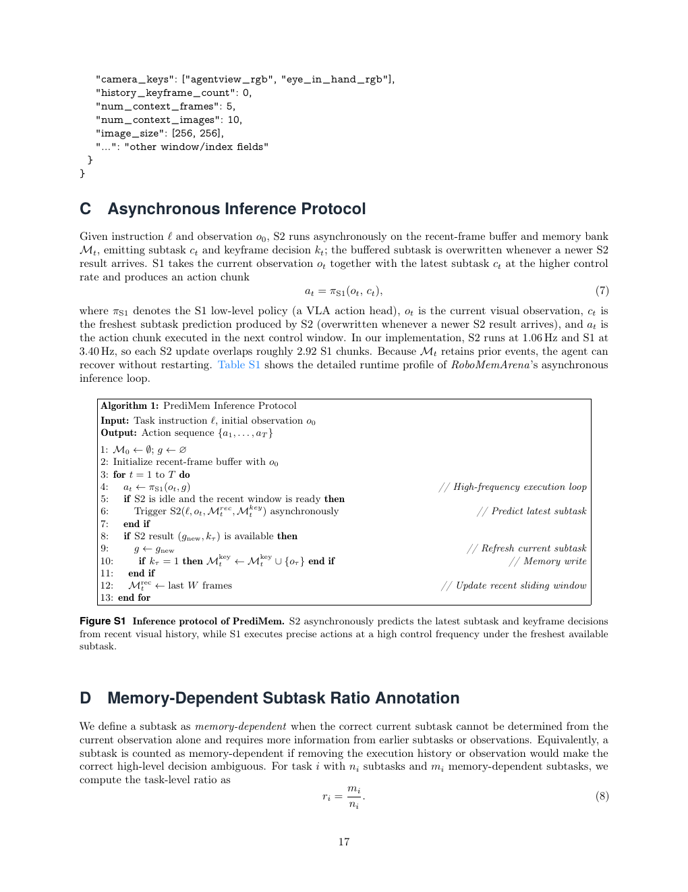
**Caption:** Figure S1 Inference protocol of PrediMem. S2 asynchronously predicts the latest subtask and keyframe decisions from recent visual history, while S1 executes precise actions at a high control frequency under the freshest available subtask.
**Caption[CN]:** 图 S1 PrediMem 的推理协议。S2 根据最近视觉历史异步预测最新子任务和关键帧决策，S1 则在最新可用子任务条件下以高控制频率执行精确动作。

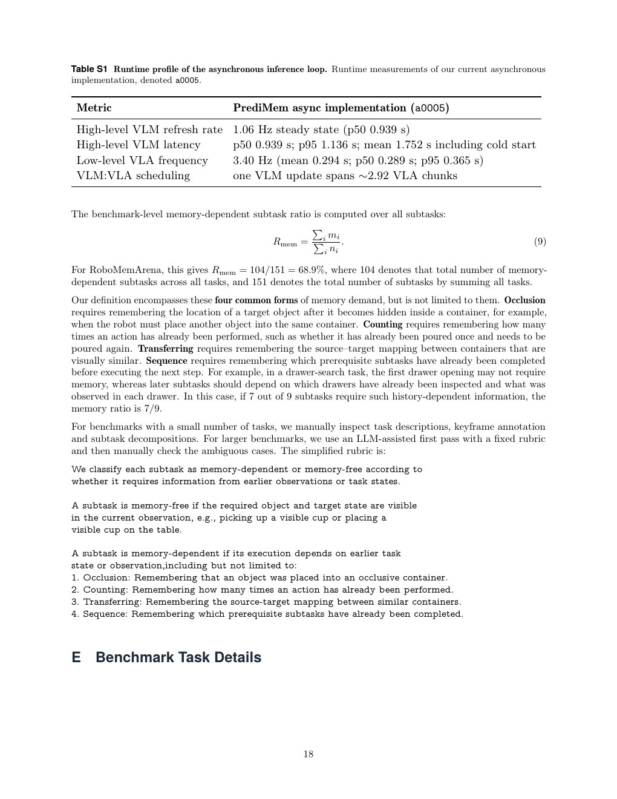
**Caption:** Table S1 Runtime profile of the asynchronous inference loop. Runtime measurements of the current asynchronous implementation, denoted a0005.
**Caption[CN]:** 表 S1 异步推理循环的运行时配置。给出当前异步实现（记为 a0005）的运行时测量。

| Metric | PrediMem async implementation (a0005) |
|---|---|
| High-level VLM refresh rate | 1.06 Hz steady state (p50 0.939 s) |
| High-level VLM latency | p50 0.939 s; p95 1.136 s; mean 1.752 s including cold start |
| Low-level VLA frequency | 3.40 Hz (mean 0.294 s; p50 0.289 s; p95 0.365 s) |
| VLM:VLA scheduling | one VLM update spans ∼2.92 VLA chunks |

> <span style="color:#3B82F6"><strong>Para. C.4:</strong></span> The runtime profile reports a 1.06 Hz steady-state high-level VLM refresh rate (p50 0.939 s), high-level VLM latency of p50 0.939 s, p95 1.136 s, and mean 1.752 s including cold start; the low-level VLA runs at 3.40 Hz (mean 0.294 s, p50 0.289 s, p95 0.365 s), and one VLM update spans approximately 2.92 VLA chunks.

> <span style="color:#F59E0B"><strong>Para. C.4[CN]:</strong></span> 运行时配置报告：高层 VLM 稳态刷新率为 1.06 Hz（p50 为 0.939 s），高层 VLM 延迟为 p50 0.939 s、p95 1.136 s（包含冷启动时均值为 1.752 s）；低层 VLA 以 3.40 Hz 运行（均值 0.294 s、p50 0.289 s、p95 0.365 s）；一次 VLM 更新约覆盖 2.92 个 VLA 动作块。

## D Memory-Dependent Subtask Ratio Annotation / 依赖记忆的子任务比例标注

> <span style="color:#3B82F6"><strong>Para. D.1:</strong></span> We define a subtask as memory-dependent when the correct current subtask cannot be determined from the current observation alone and requires more information from earlier subtasks or observations. Equivalently, a subtask is counted as memory-dependent if removing the execution history or observation would make the correct high-level decision ambiguous. For task $i$ with $n_i$ subtasks and $m_i$ memory-dependent subtasks, we compute

$$r_i=\frac{m_i}{n_i}. \tag{8}$$

> <span style="color:#F59E0B"><strong>Para. D.1[CN]:</strong></span> 当无法仅从当前观测确定正确的当前子任务，而需要早期子任务或观测中的更多信息时，我们将该子任务定义为依赖记忆。等价地，如果移除执行历史或观测会使正确的高层决策变得不明确，则该子任务计为依赖记忆。对于具有 $n_i$ 个子任务、其中 $m_i$ 个依赖记忆的任务 $i$，计算公式为（8）。

> <span style="color:#3B82F6"><strong>Para. D.2:</strong></span> The benchmark-level ratio is computed over all subtasks:

$$R_{mem}=\frac{\sum_i m_i}{\sum_i n_i}. \tag{9}$$

> For RoboMemArena, $R_{mem}=104/151=68.9\%$, where 104 is the total number of memory-dependent subtasks and 151 is the total number of subtasks across all tasks.

> <span style="color:#F59E0B"><strong>Para. D.2[CN]:</strong></span> 基准级比例在全部子任务上计算：公式（9）。对于 RoboMemArena，$R_{mem}=104/151=68.9\%$；其中 104 是所有任务中依赖记忆的子任务总数，151 是将所有任务相加得到的子任务总数。

> <span style="color:#3B82F6"><strong>Para. D.3:</strong></span> Our definition encompasses four common forms of memory demand, but is not limited to them. Occlusion requires remembering the location of a target object after it becomes hidden inside a container, for example, when the robot must place another object into the same container. Counting requires remembering how many times an action has already been performed, such as whether it has already been poured once and needs to be poured again. Transferring requires remembering the source–target mapping between visually similar containers. Sequence requires remembering which prerequisite subtasks have already been completed before executing the next step. In a drawer-search task, the first drawer opening may not require memory, whereas later subtasks should depend on which drawers have already been inspected and what was observed in each drawer. If 7 out of 9 subtasks require such history-dependent information, the memory ratio is 7/9.

> <span style="color:#F59E0B"><strong>Para. D.3[CN]:</strong></span> 我们的定义涵盖四种常见记忆需求，但并不限于此。遮挡要求在目标物体藏入容器后记住其位置，例如机器人必须将另一个物体放入同一容器。计数要求记住动作已经执行了多少次，例如是否已经倾倒过一次、还需要再倾倒一次。转移要求记住视觉相似容器之间的源-目标映射。顺序要求在执行下一步前记住哪些前置子任务已完成。例如在抽屉搜索任务中，第一次打开抽屉可能不需要记忆，而后续子任务应依赖哪些抽屉已检查以及每个抽屉中观察到的内容。若 9 个子任务中有 7 个需要这种依赖历史的信息，则记忆比例为 7/9。

> <span style="color:#3B82F6"><strong>Para. D.4:</strong></span> For benchmarks with a small number of tasks, we manually inspect task descriptions, keyframe annotations, and subtask decompositions. For larger benchmarks, we use an LLM-assisted first pass with a fixed rubric and then manually check ambiguous cases. The simplified rubric is: classify each subtask as memory-dependent or memory-free according to whether it requires information from earlier observations or task states. A subtask is memory-free if the required object and target state are visible in the current observation, e.g., picking up a visible cup or placing a visible cup on the table. A subtask is memory-dependent if execution depends on earlier task state or observation, including but not limited to: (1) Occlusion: remembering that an object was placed into an occlusive container; (2) Counting: remembering how many times an action has already been performed; (3) Transferring: remembering the source-target mapping between similar containers; (4) Sequence: remembering which prerequisite subtasks have already been completed.

> <span style="color:#F59E0B"><strong>Para. D.4[CN]:</strong></span> 对于任务数量较少的基准，我们人工检查任务描述、关键帧标注和子任务分解。对于较大的基准，我们使用固定标准进行 LLM 辅助的第一遍筛选，再人工检查模糊案例。简化标准是：根据子任务是否需要早期观测或任务状态的信息，将其分类为依赖记忆或不依赖记忆。如果所需物体和目标状态在当前观测中可见，例如拿起可见的杯子或将可见的杯子放到桌上，则该子任务不依赖记忆。如果执行依赖早期任务状态或观测，则该子任务依赖记忆，包括但不限于：（1）遮挡：记住物体被放入遮挡容器；（2）计数：记住动作已执行多少次；（3）转移：记住相似容器之间的源-目标映射；（4）顺序：记住哪些前置子任务已经完成。

## E Benchmark Task Details / 基准任务详情

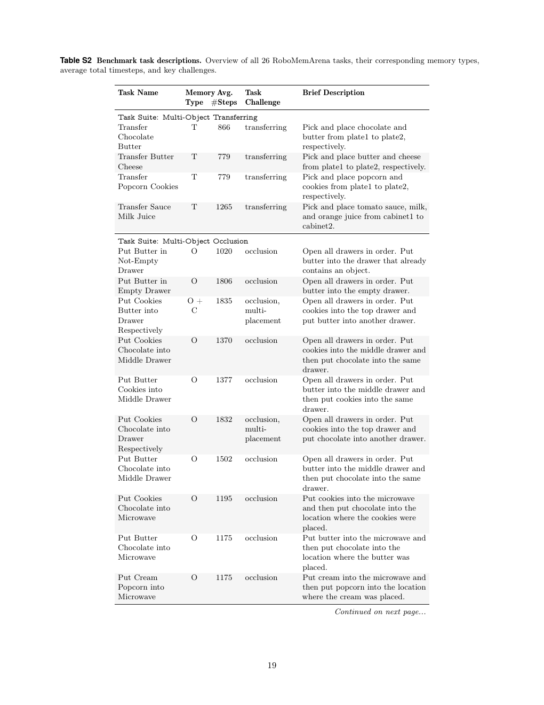
**Caption:** Table S2 Benchmark task descriptions. Overview of all 26 RoboMemArena tasks, their corresponding memory types, average total timesteps, and key challenges.
**Caption[CN]:** 表 S2 基准任务描述。概览 RoboMemArena 全部 26 个任务、对应记忆类型、平均总时间步和关键挑战。

| Task suite / task | Type | Avg. steps | Brief description |
|---|---|---:|---|
| Transfer Chocolate Butter | T | 866 | Pick and place chocolate and butter from plate1 to plate2, respectively. |
| Transfer Butter Cheese | T | 779 | Pick and place butter and cheese from plate1 to plate2, respectively. |
| Transfer Popcorn Cookies | T | 779 | Pick and place popcorn and cookies from plate1 to plate2, respectively. |
| Transfer Sauce Milk Juice | T | 1265 | Pick and place tomato sauce, milk, and orange juice from cabinet1 to cabinet2. |
| Put Butter in Not-Empty Drawer | O | 1020 | Open all drawers in order; put butter into the drawer that already contains an object. |
| Put Butter in Empty Drawer | O | 1806 | Open all drawers in order; put butter into the empty drawer. |
| Put Cookies Butter into Drawer Respectively | O+C | 1835 | Open all drawers in order; put cookies into the top drawer and butter into another drawer. |
| Put Cookies Chocolate into Middle Drawer | O | 1370 | Open all drawers in order; put cookies into the middle drawer and then chocolate into the same drawer. |
| Put Butter Cookies into Middle Drawer | O | 1377 | Open all drawers in order; put butter into the middle drawer and then cookies into the same drawer. |
| Put Cookies Chocolate into Drawer Respectively | O | 1832 | Open all drawers in order; put cookies into the top drawer and chocolate into another drawer. |
| Put Butter Chocolate into Middle Drawer | O | 1502 | Open all drawers in order; put butter into the middle drawer and then chocolate into the same drawer. |
| Put Cookies Chocolate into Microwave | O | 1195 | Put cookies into the microwave and then put chocolate into the location where the cookies were placed. |
| Put Butter Chocolate into Microwave | O | 1175 | Put butter into the microwave and then put chocolate into the location where the butter was placed. |
| Put Cream Popcorn into Microwave | O | 1175 | Put cream into the microwave and then put popcorn into the location where the cream was placed. |
| Put Cookies Popcorn into Microwave | O | 1195 | Put cookies into the microwave and then put popcorn into the location where the cookies were placed. |
| Pour Sauce on Cookies ×2; Place Sauce into Drainer | C+O | 624 | Pour tomato sauce over cookies twice and place the sauce bottle into the bowl drainer. |
| Pour Sauce on Frypan ×2; Place Sauce into Drainer | C+O | 537 | Pour tomato sauce over the frypan twice and place the sauce bottle into the bowl drainer. |
| Pour Sauce Twice over Chocolate in Frypan; Place Sauce into Drainer | C | 910 | Pick and place chocolate into the frypan, pour tomato sauce over it twice, then place the sauce bottle into the bowl drainer. |
| Pour Sauce ×2 over Butter in Frypan | C | 958 | Put butter into the frypan and pour sauce over it twice. |
| Pour Wine into Mug Twice | C | 472 | Pour wine into the mug twice. |
| Pour Milk Twice over Butter in Frypan | C | 1055 | Pick and place butter into the frypan, then pour milk over it twice. |
| Pour Milk ×2 over Mug; Place Milk into Drainer | C+O | 594 | Pick milk from the table, pour it into the mug twice, then place the milk container into the bowl drainer. |
| Put Cookies Sauce into Basket in Order | S | 742 | Pick and place cookies into the basket, then pick and place tomato sauce into the same basket. |
| Put Butter Popcorn into Basket in Order | S | 708 | Pick and place butter into the basket, then pick and place popcorn into the same basket. |
| Put Cream Chocolate into Basket in Order | S | 708 | Pick and place cream into the basket, then pick and place chocolate into the same basket. |
| Pour Sauce ×2; Put Cookies into Microwave | S | 1565 | Pour tomato sauce over cookies twice, then put the cookies into the microwave. |

> <span style="color:#3B82F6"><strong>Para. E.1:</strong></span> Table S2 provides the task name, memory type, average total timesteps, and brief challenge description for all 26 RoboMemArena tasks. The task suites are Multi-Object Transferring, Multi-Object Occlusion, Multi-Object Counting, and Multi-Object Sequence.

> <span style="color:#F59E0B"><strong>Para. E.1[CN]:</strong></span> 表 S2 提供 RoboMemArena 全部 26 个任务的任务名称、记忆类型、平均总时间步和简要挑战描述；所有任务名称、记忆类型、步数与挑战描述按源文逐项保留。其中 T=transferring（转移），O=occlusion（遮挡），C=counting（计数），S=sequence（顺序）。例如，转移套件要求在相似盘子或柜子之间保持物体对应关系；遮挡套件要求先按顺序检查抽屉，再记住物体应放入哪个已观察容器；计数套件要求精确重复倾倒指定次数；顺序套件要求将后续物体放入此前使用的同一目标容器。

## F Reactive Policy Failure Modes / 反应式策略失败模式

> <span style="color:#3B82F6"><strong>Para. F.1:</strong></span> The quantitative gap between reactive and memory-augmented policies maps to two concrete failures. First, the reactive policy cannot distinguish whether a drawer has already been checked once the visual state resets. Second, it cannot preserve the instruction-level constraint that all drawers must be opened before the final placement. Detailed failure modes are provided in Table S3.

> <span style="color:#F59E0B"><strong>Para. F.1[CN]:</strong></span> 反应式策略与记忆增强策略之间的定量差距对应两种具体失败。第一，一旦视觉状态重置，反应式策略无法区分某个抽屉是否已经检查过。第二，它无法保留“最终放置前必须打开所有抽屉”这一指令级约束。详细失败模式见表 S3。

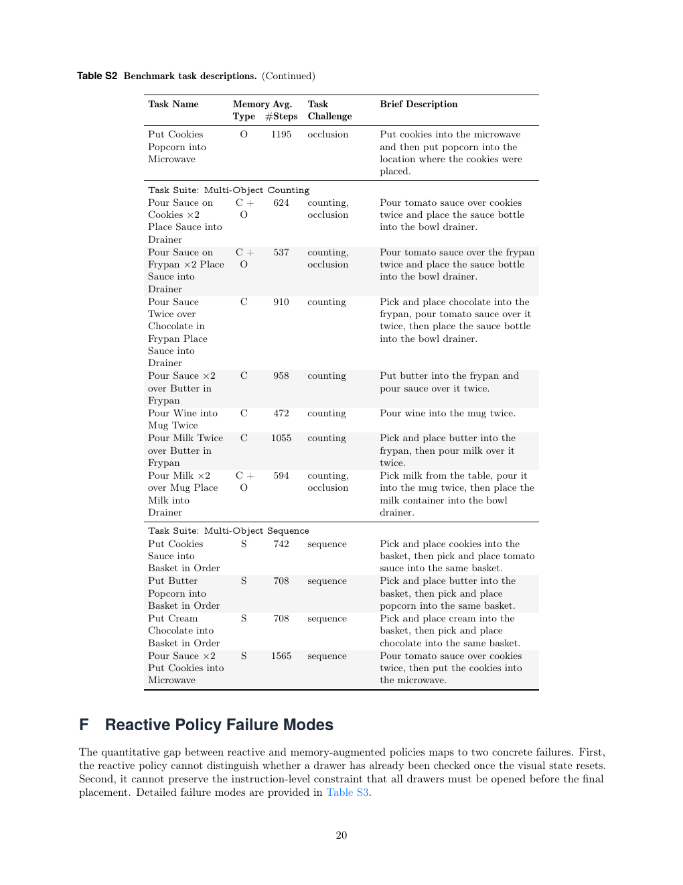
**Caption:** Table S3 Failure modes of the reactive $\pi_{0.5}$ baseline on a memory-dependent drawer task.
**Caption[CN]:** 表 S3 反应式 $\pi_{0.5}$ 基线在依赖记忆的抽屉任务中的失败模式。

| Failure mode | Description |
|---|---|
| State aliasing | After the first drawer is closed, the observation becomes visually similar to the initial frame. Without memory, the policy repeatedly opens the same drawer and enters a loop. |
| Constraint forgetting | After finding one locally valid empty drawer, the policy places the butter immediately and forgets the global instruction to inspect all drawers before deciding. |

> <span style="color:#3B82F6"><strong>Para. F.2:</strong></span> Table S3 identifies state aliasing and constraint forgetting as the two failure modes of the reactive $\pi_{0.5}$ baseline on a memory-dependent drawer task.

> <span style="color:#F59E0B"><strong>Para. F.2[CN]:</strong></span> 表 S3 将依赖记忆的抽屉任务中反应式 $\pi_{0.5}$ 基线的失败归纳为状态混淆和约束遗忘。**状态混淆：** 第一个抽屉关闭后，观测与初始帧在视觉上相似；没有记忆时，策略会重复打开同一抽屉并陷入循环。**约束遗忘：** 找到一个局部有效的空抽屉后，策略立即放入黄油，忘记了在作出决定前检查所有抽屉的全局指令。

## G Real-World Task Details / 真实世界任务详情

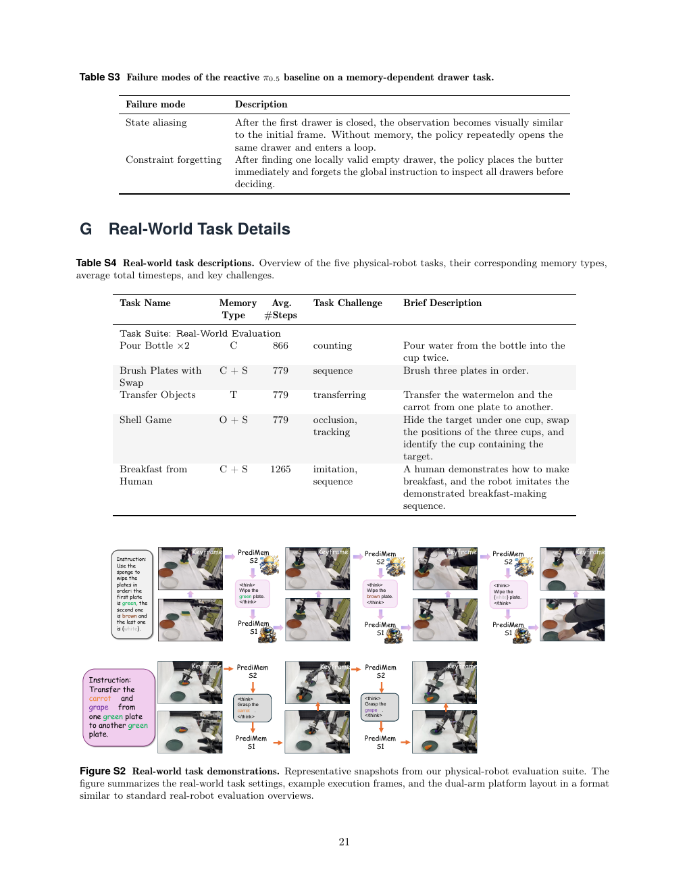
**Caption:** Table S4 Real-world task descriptions. Overview of the five physical-robot tasks, their corresponding memory types, average total timesteps, and key challenges.
**Caption[CN]:** 表 S4 真实世界任务描述。概览五个实体机器人任务、对应记忆类型、平均总时间步和关键挑战。

| Task | Type | Avg. steps | Challenge | Brief description |
|---|---|---:|---|---|
| Pour Bottle ×2 | C | 866 | counting | Pour water from the bottle into the cup twice. |
| Brush Plates with Swap | C+S | 779 | sequence | Brush three plates in order. |
| Transfer Objects | T | 779 | transferring | Transfer the watermelon and carrot from one plate to another. |
| Shell Game | O+S | 779 | occlusion, tracking | Hide the target under one cup, swap the positions of three cups, and identify the cup containing the target. |
| Breakfast from Human | C+S | 1265 | imitation, sequence | A human demonstrates how to make breakfast, and the robot imitates the demonstrated breakfast-making sequence. |

> <span style="color:#3B82F6"><strong>Para. G.1:</strong></span> Table S4 summarizes five physical-robot tasks, their memory types, average total timesteps, challenges, and brief descriptions. The suite includes Pour Bottle ×2, Brush Plates with Swap, Transfer Objects, Shell Game, and Breakfast from Human.

> <span style="color:#F59E0B"><strong>Para. G.1[CN]:</strong></span> 表 S4 汇总五个实体机器人任务、其记忆类型、平均总时间步、挑战和简要描述。任务套件包括 Pour Bottle ×2、Brush Plates with Swap、Transfer Objects、Shell Game 和 Breakfast from Human。这些任务分别覆盖精确倾倒两次、按顺序刷三只盘子、在盘子间转移物体、交换杯子后追踪隐藏目标，以及模仿人类演示制作早餐。C、S、T、O 分别表示计数、顺序、转移和遮挡；最长的 Breakfast from Human 任务平均为 1265 步。


**Caption:** Figure S2 Real-world task demonstrations. Representative snapshots from the physical-robot evaluation suite, summarizing task settings, example execution frames, and the dual-arm platform layout.
**Caption[CN]:** 图 S2 真实世界任务演示。展示实体机器人评测套件的代表性快照，总结任务设置、示例执行帧和双臂平台布局。

## H Verification-Step Distribution / 验证步骤分布

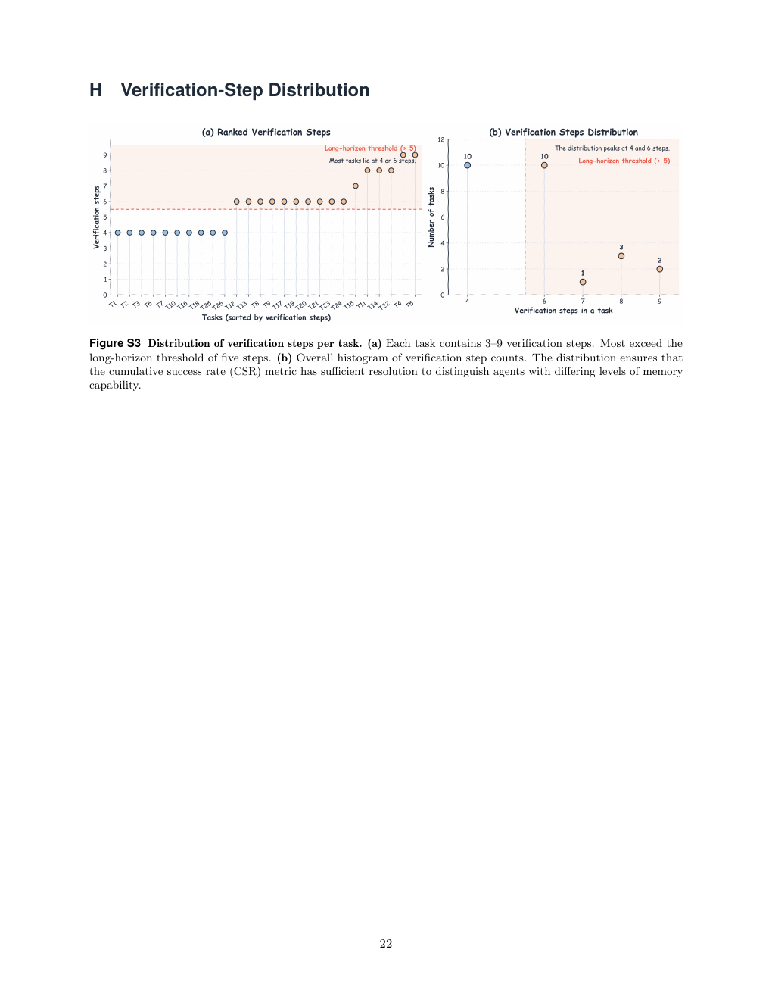
**Caption:** Figure S3 Distribution of verification steps per task. (a) Each task contains 3–9 verification steps. Most exceed the long-horizon threshold of five steps. (b) Overall histogram of verification step counts. The distribution ensures that CSR has sufficient resolution to distinguish agents with differing levels of memory capability.
**Caption[CN]:** 图 S3 每个任务验证步骤的分布。(a)每个任务包含 3–9 个验证步骤，大多数超过五步的长时域阈值；(b)验证步骤数量的总体直方图。该分布确保 CSR 具有足够分辨率，能够区分记忆能力不同的智能体。

> <span style="color:#3B82F6"><strong>Para. H.1:</strong></span> Each task contains 3–9 verification steps, and most exceed the long-horizon threshold of five steps. The overall histogram of verification-step counts provides sufficient resolution for the cumulative success rate (CSR) to distinguish agents with differing levels of memory capability.

> <span style="color:#F59E0B"><strong>Para. H.1[CN]:</strong></span> 每个任务包含 3–9 个验证步骤，大多数超过五步的长时域阈值。验证步骤数的总体直方图为累积成功率（CSR）提供了足够分辨率，使其能够区分记忆能力不同的智能体。

---

## Translation and material caveats / 翻译与材料级 caveat

1. The supplied PDF is a 22-page arXiv manuscript. Text extraction from its two-column layout produced occasional line-order artifacts and a few visibly corrupted glyphs in the original PDF (notably the carrot symbol in Figure S2); those literals are retained as text only where they are semantically recoverable, and the rendered page assets remain the visual authority.
2. Figures and tables are represented by 120-dpi full-page renders of the source pages rather than newly cropped figures. This preserves all axes, legends, table rows, and prompt illustrations, but a reader may need to zoom or crop visually.
3. The PDF’s Table S2 continuation is transcribed into a searchable Markdown table. Where the source’s line wrapping splits task names, the complete task name is reconstructed from adjacent source lines without changing task counts, type codes, step counts, or descriptions.
4. References are intentionally kept in original bibliographic form, with a Chinese policy note, rather than translated entry by entry.
5. No claims beyond the supplied PDF are added. In particular, the source states “68.9%” in the abstract and conclusion while Figure 3 labels the rounded value as “68.8%”; both source values are preserved where they occur.
