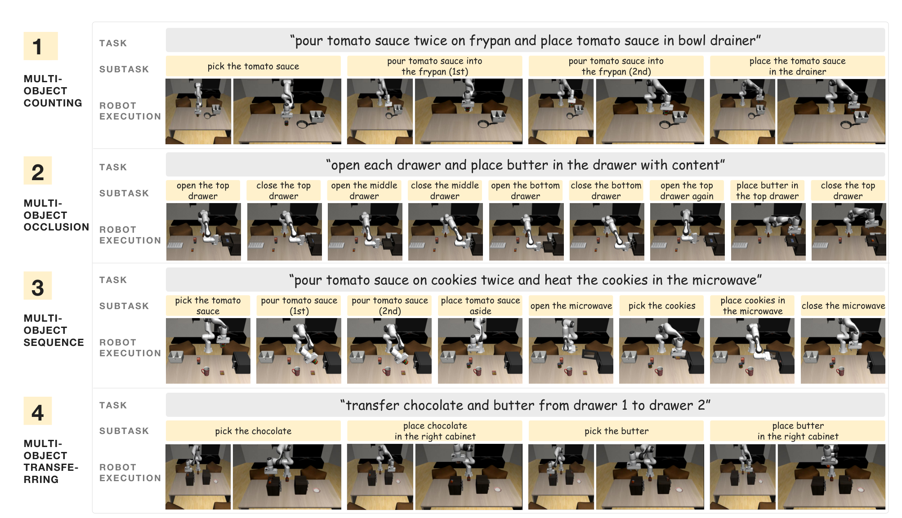
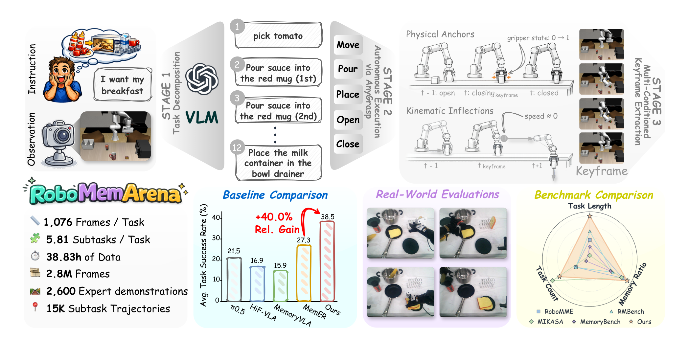
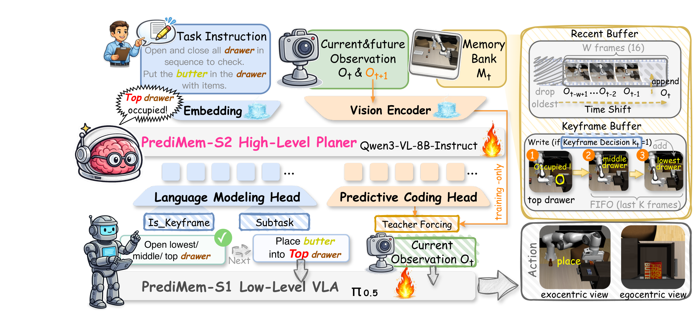
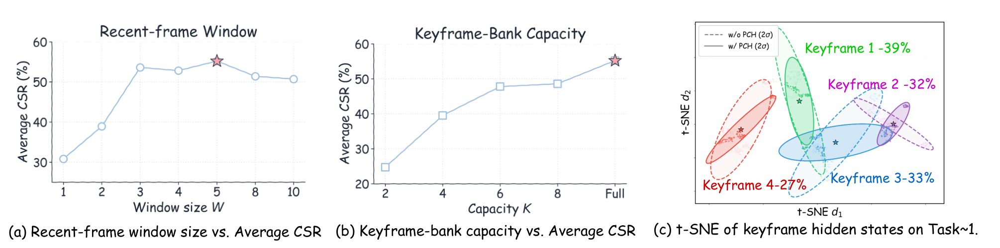
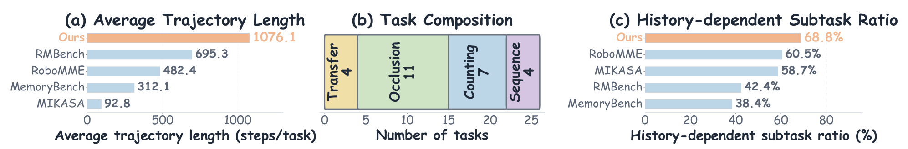

---
tags:
  - papers/robotics
  - papers/embodied-ai
  - papers/benchmark
aliases:
  - RoboMemArena
  - PrediMem
arxiv_id: "2605.10921"
doi: "10.48550/arxiv.2605.10921"
date: 2026-08-27
---

# RoboMemArena: A Comprehensive and Challenging Robotic Memory Benchmark

## 核心信息
- 标题: RoboMemArena: A Comprehensive and Challenging Robotic Memory Benchmark
- 标题翻译: RoboMemArena：全面且具挑战性的机器人记忆基准
- 作者: Huashuo Lei, Wenxuan Song, Huarui Zhang, Jieyuan Pei, Jiayi Chen, Haodong Yan, Han Zhao, Pengxiang Ding, Zhipeng Zhang, Lida Huang, Donglin Wang, Yan Wang, Haoang Li
- 机构: 香港科技大学（广州）、浙江大学、西湖大学、清华大学、浙江工业大学、上海交通大学
- 发表时间: 2026-05-11（arXiv v1）
- 发表渠道: arXiv
- DOI: 10.48550/arxiv.2605.10921
- arXiv: 2605.10921
- 论文链接: https://arxiv.org/abs/2605.10921
- 代码 / 项目: RoboMemArenaBenchmark/RoboMemArena；huashuolei/PrediMem
- 数据 / 资源: RoboMemArena 仿真 benchmark；AgileX Cobot Mobile Aloha Platform 上的五项真实任务
- 论文类型: benchmark / dataset，附带参考模型 PrediMem

## 原文摘要翻译
记忆是机器人智能的关键组成部分，因为机器人必须依赖过去的观测与动作，才能在部分可观测环境中完成长时程任务。然而，现有机器人记忆基准仍然缺少用于记忆形成的多模态标注，任务覆盖与结构复杂度有限，并且局限于仿真，缺少真实世界评估。为弥补这一缺口，我们提出 RoboMemArena：一个包含 26 个任务的大规模基准，每个任务的平均轨迹长度超过 1,000 步，且 68.9% 的子任务依赖记忆。其生成流程利用视觉语言模型设计并组合子任务，通过原子函数生成完整轨迹，并提供记忆相关标注，包括子任务指令与原生关键帧标注；配套的真实世界记忆任务支持物理评估。我们进一步设计 PrediMem，一个双系统视觉语言动作模型：高层视觉语言模型规划器管理包含近期缓冲区和关键帧缓冲区的记忆库，并使用预测编码头提升对任务动态的敏感性。在 RoboMemArena 上的大量实验表明，PrediMem 优于所有基线，并为复杂记忆系统中的记忆管理、模型架构和规模规律提供了观察。

## 创新点
1. **把记忆依赖变成可审计的基准构念。** 论文不把“轨迹很长”直接等同于“需要记忆”，而是定义：若当前观测不足以确定正确子任务、移除历史会使决策产生歧义，则该子任务计为历史依赖。四类任务分别制造转移映射、遮挡后位置、重复计数和跨步骤顺序依赖。
2. **同时提供语言与视觉的原生记忆标注。** 视觉语言模型先生成有序子任务指令，轨迹再用物理交互锚点与运动学拐点抽取关键帧。这种标注比只给最终成功标签更接近双系统规划器实际需要的监督。
3. **将规模化仿真生成与真实机器人验证配对。** 26 个仿真任务由自动执行生成 2,600 条成功演示，另有五项双臂真实任务作为物理验证集。论文因此不只比较离线任务难度，也检验记忆机制是否能跨过仿真到物理执行的接口。
4. **PrediMem 作为可复现的参考模型。** 它以近期窗口加关键帧库形成层级记忆，并在训练期预测下一帧视觉表征，使高层模型更容易识别状态转移；预测头在推理时移除，主张不增加推理成本。

## 一句话总结
RoboMemArena 的核心价值不是“又一个长时程操作集合”，而是把历史依赖、事件级关键帧、阶段验证和真实机器人任务放在同一个可比较协议里；PrediMem 的结果说明稀疏事件记忆和动态敏感表征确实能提高该协议下的表现，但尚不足以证明对所有机器人记忆问题的普遍优越性。

## 研究问题
论文围绕三个基准缺口和五个实验问题展开。

- **缺口一：记忆形成缺少多模态监督。** 既有工作往往只有最终任务标签或边界关键帧，不能直接监督“当前该做哪个子任务”以及“哪一帧值得长期保存”。RoboMemArena 同时保留子任务语言和原生关键帧。
- **缺口二：任务不一定真的需要记忆。** 许多操作基准虽然轨迹较长，但每个动作仍可由当前画面决定。本文用遮挡、计数、相似容器转移和顺序约束制造当前观测的状态别名。
- **缺口三：仿真成绩与真实执行脱节。** 论文补充五项真实任务，但真实集规模小，定位更接近物理验证而非完整训练集。

实验问题为：Q1，现有视觉语言动作模型是否在该基准上暴露记忆缺口，PrediMem 能否缩小缺口；Q2，端到端训练的机器人记忆系统是否胜过强闭源模型；Q3，预测编码头和关键帧库各贡献多少；Q4，记忆容量和高层模型规模如何影响性能；Q5，不同基线在真实机器人任务上的表现如何。

## 数据与任务定义

### 仿真任务与记忆构念
RoboMemArena 包含 26 个任务、151 个子任务，平均每任务 1,076 步；其中 104 个子任务被判定为依赖历史，比例为 $104/151=68.9\%$。四类任务分布如下：

| 记忆类型 | 任务数 | 当前观测为何不够 | 代表性依赖 |
|---|---:|---|---|
| transferring | 4 | 相似容器外观不能透露原始映射 | 记住哪个物体应从哪个源容器转到哪个目标容器 |
| occlusion | 11 | 抽屉/微波炉关闭后内部状态不可见 | 记住物体放入了哪个容器、该容器此前的内容 |
| counting | 7 | 连续重复动作后的画面几乎相同 | 记住已经倒了几次，避免一次或三次 |
| sequence | 4 | 后续动作取决于前置步骤是否完成 | 记住先放入的物体与已完成的操作顺序 |

“历史依赖”并非模型预测标签，而是任务构造层面的判定：如果拿掉历史观测或早期任务状态，正确的高层决策会变得不确定，就计为依赖记忆。作者对小规模任务人工检查；对较大基准使用固定判定规则的语言模型辅助初筛，再人工核对模糊案例。这个定义可复现，但其比例仍会受判定规则和人工判断影响。

### 五项真实任务
真实集在 AgileX Cobot Mobile Aloha 双臂平台上评估：双瓶倾倒（计数）、交换刷盘（按顺序刷三块盘）、物体转移（跨盘转移两个物体）、猜杯游戏（遮挡后追踪目标杯）以及模仿人类制作早餐（从人类示范中模仿早餐制作顺序）。最长任务超过三分钟；每项任务在表 4 中进行 10 次重复试验。

### 规模与资源
论文报告 2,600 条成功专家演示、约 2.8M 帧、38.83 小时数据和 15,100 个关键帧对齐短片段。26 个任务各采集 100 条成功演示；短片段用于高层子任务与关键帧监督。论文给出了项目名、模型权重名和项目页线索，但本精读不假定这些资源在当前 PDF 外一定可下载或与版本完全一致。

### Figure 2：四类任务的可视化

*Caption: 图 2 展示 transferring、occlusion、counting、sequence 四类任务，每行同时给出自然语言任务、子任务分解和执行过程。它最有用的地方是显示“需要记住什么”如何由任务结构而非抽象标签产生：例如连续两次倒液体和随后把瓶子放入沥水架，会把计数与遮挡依赖连接起来。*

## 方法主线

这里要区分两条流程：前半条是基准的数据构建与标注流程，后半条是用来验证基准区分度的 PrediMem 参考模型。

### 机制流程
1. **输入：粗粒度指令与彩色场景观测。** 视觉语言模型接收当前环境和长时程指令，输出有序、可执行的子任务列表，并为每个子任务分配移动、放置、倾倒、打开、关闭之一。**输出去向：** 原子规划器与后续轨迹生成。
2. **执行：AnyGrasp 驱动的原子操作。** AnyGrasp 从点云估计 6-DoF 抓取位姿，再调用预定义 primitive 执行每个子任务；post-condition checker 检查状态，失败时用更新后的抓取位姿重试。**输出去向：** 完整仿真轨迹和状态谓词。
3. **标注：多条件关键帧抽取。** 关键帧集合取物理交互锚点与运动学拐点的并集，避免固定频率抽帧遗漏状态转换或保存大量静态冗余帧。**输出去向：** 关键帧对齐片段、视觉语言模型训练提示和历史依赖分析。
4. **评估/参考模型：S2 管理层级记忆，S1 执行动作。** PrediMem 的 S2 从任务指令、近期窗口和关键帧库预测当前子任务及是否写入关键帧；S1 用最新子任务和当前观测预测动作块。**输出去向：** 任务成功率、累计成功率与真实任务成功率。

### Figure 1：数据构建与 benchmark 总览

*Caption: 图 1 将视觉语言模型任务分解、AnyGrasp 自动执行、物理/运动学关键帧抽取、真实世界评估、基线比较和规模统计放在同一张图中。图中给出的每任务 1,076 帧、每任务 5.81 个子任务、2,600 条专家演示与 15K 条子任务轨迹是论文的基准规模摘要，不应误读成每个任务都严格拥有相同长度。*

### 数据构建与关键帧协议
给定轨迹 $\tau=\{(s_t,a_t)\}_{t=1}^{T}$，论文把关键帧写为

$$K=K_{\mathrm{phys}}\cup K_{\mathrm{kin}}.$$

物理锚点来自夹爪状态变化：

$$K_{\mathrm{phys}}=\{t\mid g_t\ne g_{t-1}\},$$

其中 $g_t\in\{0,1\}$ 表示夹爪开合。运动学集合在末端速度幅值很小，或相邻速度方向发生显著改变时触发：

$$K_{\mathrm{kin}}=\left\{t\mid \|v_t\|<\epsilon\ \lor\ \frac{v_t\cdot v_{t-1}}{\|v_t\|\|v_{t-1}\|}<\cos(\theta)\right\}.$$

这是一种事件导向的稀疏标注：抓取闭合/释放、运动阶段转换和停顿被当作信息瓶颈。它并不保证每个关键帧都是语义上唯一正确的“记忆”，而是提供了可自动化、可批量生成的物理代理信号。

### 评测协议：TSR 与 CSR
每个任务不是只检查最后一帧。作者为第 $i$ 个任务定义 $K_i$ 个阶段验证谓词 $\psi(s^{(k)})$，涉及物体位置、容器关系、可见性和阶段完成状态。任务成功率为所有阶段谓词均满足的任务比例：

$$\mathrm{TSR}=\frac{1}{N}\sum_{i=1}^{N}\mathbf{1}\left[\bigwedge_{k=1}^{K_i}\psi(s_i^{(k)})\right].$$

累计成功率按所有任务的阶段完成比例统计：

$$\mathrm{CSR}=\frac{1}{N}\sum_{i=1}^{N}\frac{1}{K_i}\sum_{k=1}^{K_i}\mathbf{1}[\psi(s_i^{(k)})].$$

每任务有 3–9 个验证阶段，多数任务超过 5 个，因此 CSR 能区分“完成前半段但记忆断裂”和“一开始就失败”。

### PrediMem 的记忆结构
PrediMem 的高层 S2 基于 Qwen3-VL-8B-Instruct。记忆库为近期滑动窗口与长期关键帧库的并集。

$$M_t=M_t^{\mathrm{key}}\cup M_t^{\mathrm{rec}}.$$

近期缓冲区保存最近 $W$ 帧；关键帧缓冲区在默认实验中不设上限。S2 输出当前子任务和二值关键帧决策；决定写入时，当前帧进入长期库。低层 S1 基于 $\pi_{0.5}$ 预测以子任务为条件的动作块。

### Figure 4：双系统与预测编码

*Caption: 图 4 显示 S2 高层规划器接收任务指令、当前/未来观测和记忆库，输出下一子任务与关键帧决策；S1 以更高频率执行动作。预测编码头通过教师强制使用当前帧与下一帧表征，但图中明确标为仅在训练阶段使用。*

预测编码头 $f_{\mathrm{Pre}}$ 从当前表征预测下一帧冻结视觉编码器表征：$\hat Z_{t+1}=f_{\mathrm{Pre}}(h_t)$。其损失为均方误差与余弦距离之和：

$$L_{\mathrm{Pre}}=\mathrm{MSE}(\hat Z_{t+1},\mathrm{sg}(Z_{t+1}))+1-\cos(\hat Z_{t+1},\mathrm{sg}(Z_{t+1})).$$

S2 总损失由语言损失和预测损失组成：

$$L_{S2}=L_{\mathrm{text}}+0.1L_{\mathrm{Pre}}.$$ 

S1 使用官方流匹配目标。

推理时移除预测编码头，因此作者声称能力收益不带来额外推理开销，但训练成本和高层模型刷新延迟仍然存在。

### 异步推理与复现参数
S2 空闲且近期窗口准备好时异步刷新；新结果到达后覆盖当前子任务，若关键帧决策为 1 则写入对应帧；近期窗口随后保留最后 $W$ 帧。

实测 S2 刷新率为 1.06 Hz（稳态中位延迟 0.939 s），S1 频率为 3.40 Hz（平均 0.294 s）。

一次 S2 更新约覆盖 2.92 个 S1 动作块。

默认训练/评估设置是视觉塔冻结、其余模块微调 2 个训练轮次、4×H100、学习率 $1\times10^{-5}$、近期窗口 5 帧、关键帧库不设上限；预测损失中的均方误差与余弦项各使用 0.1 系数，最终总损失系数仍为 0.1。

## 关键结果

### 主结果与强基线
下表转录表 2 的平均结果；TSR/CSR 均为百分比。它比只看 Figure 1 的柱状摘要更适合复现和跨类别判断。

| 方法 | 转移类任务成功率/累计成功率 | 遮挡类任务成功率/累计成功率 | 计数类任务成功率/累计成功率 | 顺序类任务成功率/累计成功率 | 平均任务成功率/累计成功率 |
|---|---:|---:|---:|---:|---:|
| π0.5 | 20.0 / 42.8 | 12.7 / 17.2 | 14.3 / 50.9 | 60.0 / 71.6 | 21.5 / 38.7 |
| HiF-VLA | 17.5 / 38.9 | 12.7 / 27.1 | 8.6 / 45.9 | 42.5 / 70.2 | 16.9 / 39.8 |
| MemoryVLA | 15.0 / 37.2 | 7.3 / 13.1 | 14.3 / 55.1 | 37.5 / 65.2 | 15.0 / 35.3 |
| MemER | 20.0 / 36.1 | 16.4 / 33.2 | 27.1 / 65.1 | 65.0 / 79.1 | 27.3 / 49.1 |
| Qwen3-VL-8B（冻结） | 15.0 / 34.6 | 0.0 / 6.8 | 9.3 / 44.6 | 7.5 / 39.2 | 6.0 / 26.2 |
| GPT-5.4 | 13.8 / 32.9 | 1.8 / 9.2 | 12.9 / 50.7 | 15.0 / 47.3 | 8.7 / 30.5 |
| PrediMem | 22.5 / 45.2 | 27.3 / 38.4 | 45.7 / 69.3 | 72.5 / 89.5 | 38.5 / 55.2 |
| Ground Truth oracle | 32.5 / 54.8 | 33.6 / 49.8 | 51.4 / 75.6 | 85.0 / 92.3 | 46.1 / 64.8 |

PrediMem 的平均任务成功率比 MemER 高 11.2 个百分点，累计成功率高 6.1 个百分点；相对图 1 中 MemER 的 27.3% 任务成功率，38.5% 对应约 40.0% 相对增益。

优势并非均匀：顺序类最容易，遮挡类最难；PrediMem 在四类上都达到最高的可训练基线结果，但距离真值预言机仍有 7.6 个百分点平均任务成功率和 9.6 个百分点平均累计成功率的差距。

比较必须注意训练状态不对称。π0.5、HiF-VLA、MemoryVLA、MemER 是不同记忆设计的可训练或已有模型基线；Qwen3-VL-8B 与 GPT-5.4 是冻结/闭源高层参考。后者的低分支持“通用 VLM 直接迁移不足”，但不能当作严格同预算模型竞赛。

### 消融到底说明了什么

| 变体 | 平均 TSR | 平均 CSR | 相对 PrediMem 的主要含义 |
|---|---:|---:|---|
| PrediMem | 38.5 | 55.2 | 完整配置 |
| 去掉预测编码头 | 32.3 | 49.0 | 动态敏感性有独立贡献 |
| 去掉关键帧库 | 17.7 | 41.6 | 长期事件保存是更大的结构性贡献 |
| Qwen3-1.7B | 19.9 | 41.4 | 高层容量不足 |
| Qwen3-4B | 31.9 | 51.7 | 随 S2 规模增大而改善 |

去掉关键帧库的平均 TSR 比完整模型低 20.8 个百分点，幅度大于去掉预测编码头的 6.2 个百分点。这说明两者不是替代关系：关键帧库解决“早期事件还在不在”，预测编码解决“当前表征是否敏感于状态转移”。转移任务中的预测编码收益较小，因为抓取/放置变化直接；遮挡、计数、顺序任务中的抽屉关闭、物体消失、重复倒液和顺序完成更需要动态线索。

预测损失权重的表 3 为：$0.0\rightarrow32.3\%$ TSR，$0.1\rightarrow38.5\%$，$0.5\rightarrow31.0\%$，$1.0\rightarrow29.8\%$。因此“加辅助目标”不是越强越好；0.1 是当前训练协议下的峰值，过强的预测目标可能挤压语言/子任务监督。

### Figure 5：记忆容量与表征分析

*Caption: 图 5 的第一面板显示近期窗口从 1、2 增大到 3–5 帧后累计成功率明显提高，5 帧最好，继续增大到 8、10 帧反而略降；第二面板显示关键帧容量从 2 增至 4、6、8 后改善，不设上限时最好；第三面板的降维可视化显示有预测编码时，同类关键帧更紧、不同类更分离。图中的降维可视化是定性表征证据，不是独立的任务性能指标。*

作者给出的解释是：近期窗口太小，S1/S2 看不到足够的时间变化；窗口太大则增加冗余、视觉语言模型延迟并破坏异步同步。关键帧库容量为 2 时，长轨迹中早期事件很快被驱逐；4–8 个有所改善，但不设上限保留了第一次抽屉状态等早期决策事件。高层骨干也显示单调扩展趋势：Qwen3-1.7B、4B、8B 的平均 TSR 分别为 19.9%、31.9%、38.5%，但参数规模与效果的关系只在作者所称“预训练数据和架构匹配”的设置中成立。

### 真实世界结果

| 方法 | Pour×2 | Brush | Transfer | Shell | IHMB | 平均 |
|---|---:|---:|---:|---:|---:|---:|
| π0.5 | 20 | 10 | 60 | 10 | 0 | 20 |
| MemER | 30 | 50 | 80 | 40 | 0 | 40 |
| PrediMem | 60 | 60 | 80 | 50 | 10 | 52 |

每项任务 10 次重复试验。PrediMem 平均成功率比 MemER 高 12 个百分点，并在五项中四项胜过 MemER；在最长、约三分钟的 IHMB 上，只有 PrediMem 成功。这里的证据支持物理平台上的记忆设计有用，但样本量不足以给出可靠置信区间，不能把 52% 视为稳定的现实部署成功率。

## 深度分析

### Figure 3：benchmark 统计

*Caption: 图 3 汇总平均轨迹长度、任务构成和历史依赖子任务比例；它支持“长时程且记忆密集”的任务定位，但不替代逐任务难度分析。*

### 基准真正测到了什么
它主要测量的是**部分可观测长时程操作中的事件记忆与高层状态追踪**，具体包括：跨相似容器的绑定关系、遮挡后的对象位置、重复动作计数、前置步骤与引用解析。TSR/CSR 通过程序化谓词把高层计划是否正确落到物体位置、容器关系、可见性和阶段状态上。因此它比纯语言问答或只比较动作轨迹相似度更接近可执行的记忆依赖。

但“68.9% 历史依赖”是任务设计统计，不是心理学意义上的记忆强度，也不说明每个依赖都必须调用视觉关键帧。某些转移类子任务可能只需要一个稳定的对象—容器映射；某些顺序类子任务还依赖语言中的全局约束。基准能区分记忆系统的失败，却不能单独分解视觉记忆、语言记忆、计数器、检索器和低层控制各自的因果贡献。

### 为什么 PrediMem 的模式合理
1. **事件保存与事件识别分工。** 近期窗口处理当前动作，关键帧库保留已离开视野的状态；这直接对应遮挡和跨抽屉任务的失败结构。
2. **预测编码提供转移压力。** 仅用稀疏关键帧或下一词元监督，模型不一定需要把“闭合前后”“重复一次与两次”的差异编码到高层表征。预测下一帧表征迫使当前表征解释即将发生的变化，因而可能改善关键帧决策。表 3 的倒 U 型结果说明这是正则化信号而非免费增益。
3. **异步系统保留控制频率。** S2 只需较慢地更新子任务，S1 继续高频执行动作块；这避免让昂贵的视觉语言模型规划器成为每一步控制瓶颈。代价是过时子任务、S2 延迟和记忆写入时刻可能错位，论文给出频率但没有按异步失配统计失败率。

### 与强基线和替代路线的定位
MemER 是最接近的对照：它也采用双系统和视觉关键帧检索，但作者认为其高层视觉语言模型对任务动态感知不足，难以选出信息性关键帧。MemoryVLA 的词元级工作记忆保存了历史，却未必与稀疏物理转移对齐；HiF-VLA 的回溯、洞察和预见运动表示提高了短时动作，却没有显式记录对象放置、抽屉状态和动作计数。π0.5 则呈现清晰的反应式策略下界：它在顺序类上仍有 60% 的任务成功率，因为部分中间动作由局部视觉规律决定，但在需要回忆的抽屉场景会陷入重复打开同一抽屉的循环。

表 1 的基准功能比较称 RoboMemArena 是 14 个对比项中唯一同时具备八个特征的项目：长时程、自动指令生成、原子子目标、可扩展生成、自动抓取、状态预言机、原生关键帧和真实世界评估。这个结论说明产品形态完整，不是统一质量实验；二元勾选不能替代对任务难度、标注质量和机器人覆盖的测量。

### 失败模式与容易误读之处
- **状态别名不等于纯记忆失败。** π0.5 重复打开抽屉也可能包含低层闭环或视觉检测问题；附录表 S3 将其描述为状态别名和约束遗忘，但没有逐步诊断高层/低层错误比例。
- **真值预言机不是可学习模型。** 它是阶段谓词的理想参考，代表任务验证上限，不代表现实中可用的策略。
- **闭源模型比较不公平。** GPT-5.4 只有 8.7% 平均任务成功率，但它与经过机器人数据训练的 PrediMem 不同，结果应读作迁移差距，而非通用智能排名。
- **降维图不是因果证据。** 图 5(c) 的聚类与更好的关键帧决策相容，但不能单独证明预测编码导致性能提升；真正的支撑来自去掉预测头的消融和损失权重消融。

### 复现注意点
1. **资源与版本。** 需确认 `RoboMemArenaBenchmark/RoboMemArena`、`huashuolei/PrediMem` 与 PDF v1 是否对应同一提交、任务划分、模型权重和提示模板。
2. **生成协议。** 视觉语言模型分解不是自由文本总结，而是严格 JSON：每个子任务含 step_id、subtask、planner、target，并限制规划器集合。自动执行后要保留后置条件重试与人工修订的分支。
3. **关键帧参数。** 复现必须记录夹爪状态阈值、速度阈值 $\epsilon$、方向阈值 $\theta$、帧索引约定和是否保留同一事件的多帧；论文正文没有把所有数值阈值列全。
4. **训练设置。** 视觉塔冻结，Qwen3-VL-8B-Instruct 其余模块训练 2 个训练轮次，4×H100、$1\times10^{-5}$ 学习率，近期 5 帧，关键帧库默认不设上限；S2 还要使用指定提示格式和下一词元/关键帧联合标签。
5. **评估实现。** 不能用最终场景肉眼替代阶段谓词；需重建每任务 3–9 个验证阶段，并分别报告任务成功率与累计成功率。真实任务的 10 次重复试验应固定平台、相机、物体摆位和失败重试规则。
6. **运行成本。** 训练期预测编码需要下一帧教师表征；推理期虽然移除预测头，但 S2 仍有约 0.939 s 中位延迟，异步调度和上下文增长会影响端到端吞吐。不设上限的关键帧库的内存与上下文成本需要额外工程设计。

## 局限
1. **任务覆盖仍是作者选定的四类。** 转移、遮挡、计数、顺序能覆盖典型的家庭场景记忆失效，但不能代表导航记忆、触觉记忆、跨回合经验、语言事实记忆或动态人类交互。
2. **分布不均衡。** 遮挡类有 11 个任务，其他三类各 4、7、4 个；平均分可能被任务数量和难度结构影响，按任务进行自助法置信区间的结果在当前材料中不可核验。
3. **记忆依赖标注有规范偏差。** 大规模任务先由语言模型按固定规则初筛，再人工核对；当前 PDF 只描述了这一流程，未呈现标注者一致性、语言模型与人工分歧率或逐任务标注表的公开审计，因此难以判断规范偏差的幅度。
4. **自动生成并非完全无人。** 视觉语言模型完成任务分解后仍需人工修订不合适的分解；成功演示数量是经过执行成功筛选的结果，可能低估失败轨迹和真实收集成本。
5. **真实评估规模小且平台单一。** 五项任务、每项 10 次重复试验、一个双臂平台，最长任务虽有三分钟但不足以证明跨机器人、跨相机和跨物体泛化。
6. **基线条件不完全对称。** 冻结且闭源的视觉语言模型与用机器人数据微调的视觉语言动作模型，在数据、训练、提示和延迟方面不同；因此 PrediMem 的领先首先是当前协议下的工程与训练优势。
7. **关键帧库无上限的可扩展性未解决。** 图 5 支持“不设上限”时容量最好，但长轨迹继续增长时，存储、上下文长度、检索延迟和错误累积都可能成为新瓶颈。
8. **统计不确定性有限。** 主结果和真实结果基本是点估计；跨训练种子的方差、显著性检验和逐任务完整失败日志在当前 PDF 中均未呈现，故细小差异不宜过度解读。

## 我的笔记
这篇论文值得保留在记忆依赖基准的线索中，原因是它把“记忆是否必要”从口号改造成任务级判定，并且把数据生成、关键帧标注和阶段评测连接起来。对后续基准设计，最可复用的是三点：第一，显式构造状态别名并定义移除历史后的歧义；第二，用物理事件而非固定频率抽帧作为稀疏记忆监督；第三，用 CSR 观察长轨迹中记忆在哪里断裂。

我不会把 PrediMem 的 38.5% TSR 直接写成“解决了机器人记忆”。它只在作者自己的任务、谓词、训练数据和基线协议上领先；距离 oracle 仍有明显差距，真实集也只有 52% 平均成功率。真正有研究价值的下一步，是把 历史依赖 标注拆成可干预的子能力（关系绑定、计数、遮挡追踪、顺序约束），并在固定训练数据、参数量、延迟和上下文预算下比较检索、压缩、语言状态和关键帧方案。

三个可直接复用的工程判断是：近期窗口不应盲目增大，3–5 帧在当前协议已足够；关键帧容量不能只保留很小的先进先出队列，否则长任务早期信息会被驱逐；预测辅助损失需要小权重并通过消融校准，0.1 的最优不是架构定律。若要把此基准用作新模型的回归测试，还应保存每个阶段谓词的失败类型，而不只记录平均 TSR/CSR。

## 引用
Lei, Huashuo, Wenxuan Song, Huarui Zhang, Jieyuan Pei, Jiayi Chen, Haodong Yan, Han Zhao, Pengxiang Ding, Zhipeng Zhang, Lida Huang, Donglin Wang, Yan Wang, and Haoang Li. “RoboMemArena: A Comprehensive and Challenging Robotic Memory Benchmark.” arXiv:2605.10921, 2026. https://arxiv.org/abs/2605.10921

**本笔记的证据边界：** 数值、任务定义、公式、基线与局限均据用户指定的本地 PDF（arXiv v1，22 页）及其附录；未把 PDF 外部项目页的可用性、代码实现细节或未来版本变化当作已验证事实。
