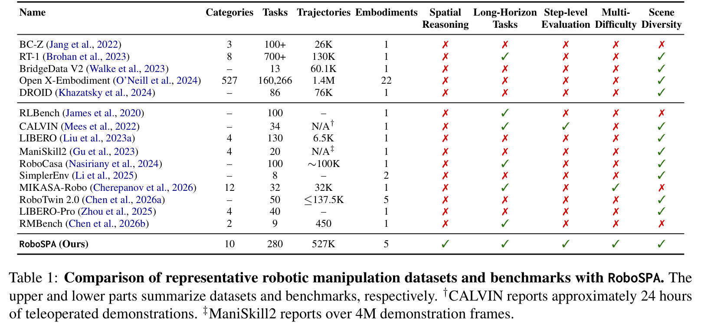
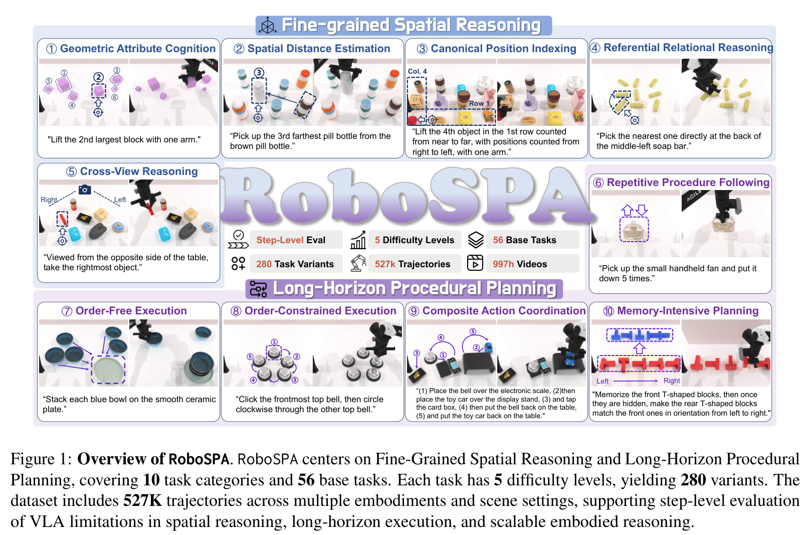
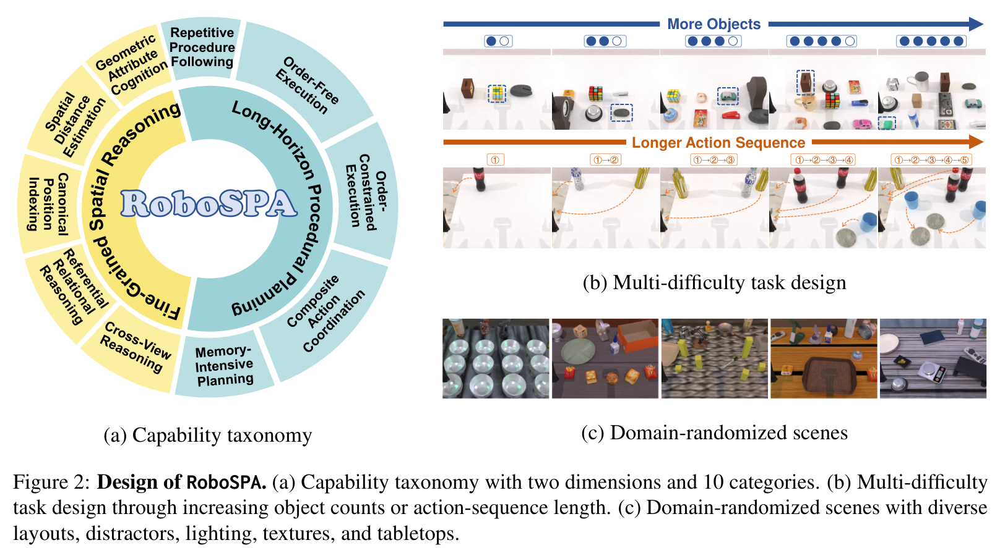
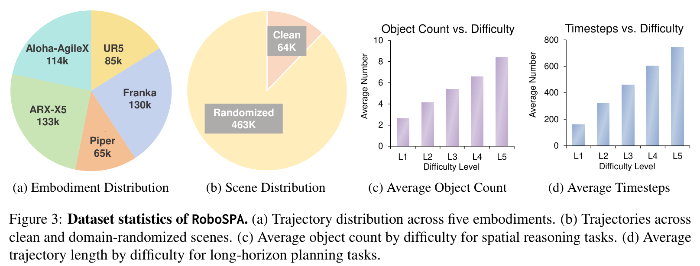
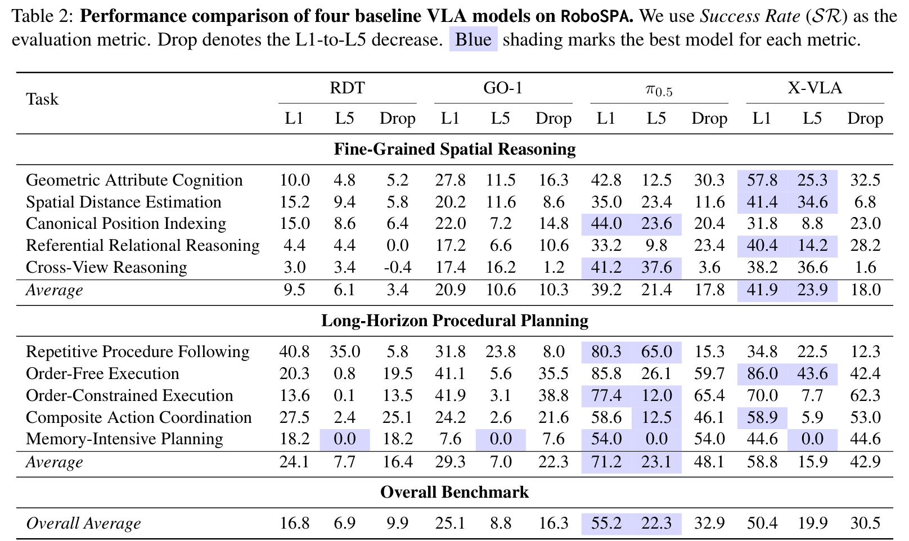
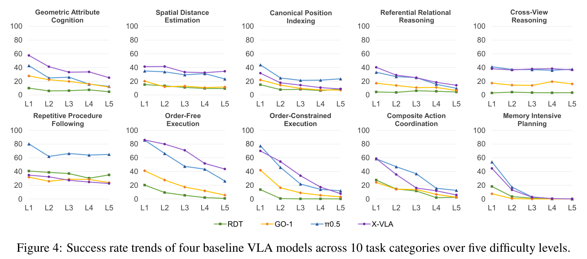
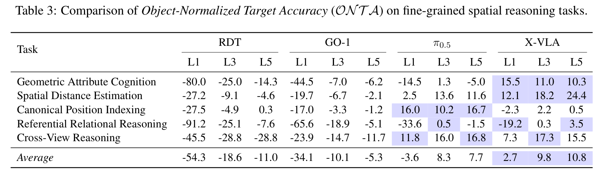
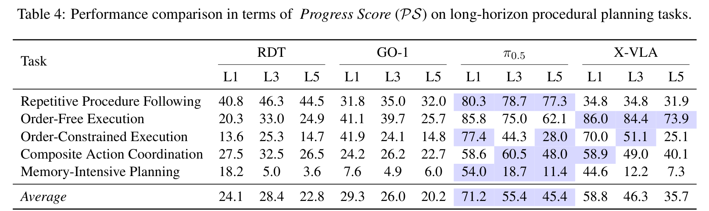
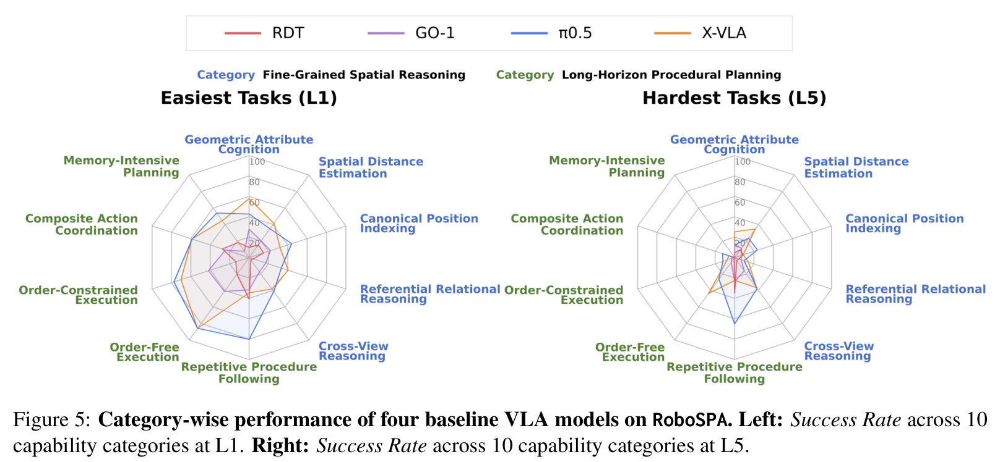

# RoboSPA: Can VLA Models Go Beyond Simple Scenes and Short-Horizon Tasks?

**Authors:** Zhenxuan Fan, Bo Zhang, Yutong Lin, Yuqian Yuan, Juekai Lin, Liang Liang, Zhuoyi Huang, Wenqiao Zhang*, Juncheng Li*, Siliang Tang, Jun Xiao, Yueting Zhuang (Zhejiang University, University of Electronic Science and Technology of China, South China Normal University)  
**Source:** local PDF, SHA256 `bef67138e60a16b3c2b3128cca969e37344f8cb64c1febb15d754a7d52f8c1f2`, arXiv:2609.05324v1 [cs.RO] 4 Sep 2026  
**Reader:** complete bilingual reader; references remain English-only for searchable bibliographic fidelity.

## Section Index
Abstract; 1 Introduction; 2 Related Work; 3 RoboSPA (3.1 Overview, 3.2 Benchmark Construction, 3.3 Benchmark Statistics); 4 Experiments (4.1 Experimental Setup, 4.2 Main Results, 4.3 Ablation Studies, 4.4 Qualitative Results, 4.5 Failure Analysis); 5 Conclusion; Limitations; Ethics Statement; Acknowledgments; References; Appendix Overview.

## Terminology Ledger
| English | 中文 |
| --- | --- |
| RoboSPA (Robot Spatial-Procedural Assessment) | 机器人空间—流程推理评测基准（RoboSPA） |
| Vision-Language-Action (VLA) | 视觉—语言—动作模型 |
| Fine-Grained Spatial Reasoning | 细粒度空间推理 |
| Long-Horizon Procedural Planning | 长时程流程规划 |
| Geometric Attribute Cognition (GAC) | 几何属性认知 |
| Spatial Distance Estimation (SDE) | 空间距离估计 |
| Canonical Position Indexing (CPI) | 规范位置索引 |
| Referential Relational Reasoning (RRR) | 参照关系推理 |
| Cross-View Reasoning (CVR) | 跨视角推理 |
| Repetitive Procedure Following (RPF) | 重复流程执行 |
| Order-Free Execution (OFE) | 无序目标执行 |
| Order-Constrained Execution (OCE) | 顺序约束执行 |
| Composite Action Coordination (CAC) | 复合动作协同 |
| Memory-Intensive Planning (MIP) | 强记忆依赖规划 |
| Object-Normalized Target Accuracy (ONTA) | 物体数量归一化目标准确率 |
| Progress Score (PS) | 阶段执行进度得分 |
| Success Rate (SR) | 任务最终成功率 |
| Domain-Randomized Scenes | 域随机化复杂场景 |

## Abstract

> <strong>Para. 1:</strong> Vision-Language-Action (VLA) models have shown promising progress in language-conditioned robotic manipulation. However, existing datasets and benchmarks mainly evaluate task completion under predefined settings, offering limited insight into model reasoning under increasing spatial and procedural complexity. We introduce RoboSPA (Robot Spatial-Procedural Assessment), a large-scale robotic manipulation dataset and benchmark for diagnosing embodied reasoning in VLA models. RoboSPA focuses on two core dimensions, Fine-Grained Spatial Reasoning and Long-Horizon Procedural Planning, covering 10 task categories and 56 base tasks. Each task is instantiated across five difficulty levels, yielding 280 variants with increasing spatial ambiguity and procedural complexity. We collect 527K trajectories across multiple embodiments and diverse scenes. Beyond binary success rate, RoboSPA introduces diagnostic metrics for more detailed evaluation. Experiments on representative VLA models show that current systems still struggle with complex spatial relations, precise low-level execution, and memory-intensive planning. These results establish RoboSPA as a challenging diagnostic benchmark for developing more capable, reliable, and generalizable embodied agents. Our data and code are available at https://github.com/fanzhenxuan/RoboSPA.

> <strong>Para. 1[CN]:</strong> 视觉—语言—动作（Vision-Language-Action, VLA）模型在以自然语言为条件的机器人操作任务中取得了显著进展。然而，现有的数据集和评测基准主要在预定义的固定场景下评估最终任务完成度，无法深入揭示模型在空间复杂度和流程步骤逐步增加时的内在推理机制。为此，我们提出了 RoboSPA（Robot Spatial-Procedural Assessment，机器人空间—流程推理评测基准），这是一个面向诊断 VLA 模型具身推理能力的大规模机器人操作数据集与基准测试。RoboSPA 聚焦于两大核心维度：细粒度空间推理（Fine-Grained Spatial Reasoning）与长时程流程规划（Long-Horizon Procedural Planning），涵盖 10 个能力类别和 56 个基础任务。每个任务均被实例化为 5 个由浅入深的难度等级，构建出 280 个具有渐进式空间歧义性和流程复杂度的任务变体。我们在 5 种异构机器人本体和多样化仿真场景中收集了 52.7 万条高质量操作轨迹（总计 997 小时视频）。除了传统的二值成功率外，RoboSPA 还引入了细粒度诊断指标以支持多层次深入评估。在代表性 VLA 模型上的广泛实验表明，现有系统在面对复杂的相对空间关系、低层精确执行以及强依赖历史记忆的流程规划时仍面临严峻挑战。这些评测结果使 RoboSPA 成为一个极具挑战性的诊断型基准平台，有力推动未来构建更具推理能力、高可靠性与强泛化性的通用具身智能体。我们的开源代码与数据集已发布于 https://github.com/fanzhenxuan/RoboSPA。

## 1 Introduction

> <strong>Para. 2:</strong> Vision-Language-Action (VLA) models (Zitkovich et al., 2023; Kim et al., 2025; Black et al., 2025b; NVIDIA et al., 2025; Black et al., 2025a; Gao et al., 2026) have emerged as a promising paradigm for general-purpose embodied agents, integrating visual perception, language understanding, and action generation in a unified framework (Ma et al., 2024; Kawaharazuka et al., 2025). With large-scale pretraining and multimodal alignment, these models show encouraging performance on manipulation tasks, especially in structured, short-horizon settings (Shao et al., 2025; Zhong et al., 2025).

> <strong>Para. 2[CN]:</strong> 视觉—语言—动作（VLA）模型（Zitkovich 等，2023；Kim 等，2025；Black 等，2025b；NVIDIA 等，2025；Black 等，2025a；Gao 等，2026）已成为构建通用具身智能体的一大极具潜力的范式，它在统一的网络框架中融合了视觉感知、语言理解和连续动作生成（Ma 等，2024；Kawaharazuka 等，2025）。得益于大规模多模态预训练与跨模态表征对齐，这些模型在机器人操作任务中展现出令人鼓舞的表现，尤其是在高度结构化、短时程的操作场景中表现优异（Shao 等，2025；Zhong 等，2025）。

> <strong>Para. 3:</strong> However, deploying embodied agents in real-world scenarios requires capabilities beyond short-horizon instruction following in simple, well-structured scenes (Liu et al., 2025b; Zhang et al., 2025b; Wong et al., 2025; Yuan et al., 2025a; Dang et al., 2026). Everyday manipulation tasks pose three key challenges: (1) Fine-grained target disambiguation, requiring agents to identify the target among visually similar candidates through subtle spatial cues beyond category or color; (2) Temporally extended task execution, requiring multi-step execution under temporal constraints and accumulated errors; and (3) Complexity-scalable embodied reasoning, where increasing candidates, horizons, and environmental diversity amplify grounding and planning failures. These challenges call for benchmarks that evaluate embodied reasoning under increasing spatial and procedural complexity.

> <strong>Para. 3[CN]:</strong> 然而，将具身智能体真正部署到现实世界场景中，所要求的核心能力远不止于在简单、结构良好的场景下遵从短时程指令（Liu 等，2025b；Zhang 等，2025b；Wong 等，2025；Yuan 等，2025a；Dang 等，2026）。日常物理操作提出了三大关键挑战：(1) **细粒度目标消歧**（Fine-grained target disambiguation），要求智能体超越简单的类别或颜色识别，依靠微妙的相对几何与空间拓扑线索，在大量高度相似的候选物体中精准定位目标；(2) **长时序流程执行**（Temporally extended task execution），要求智能体在严格的时间先后约束与动作执行误差逐步累积的严苛条件下完成多阶段连续操作；(3) **可扩展复杂度的具身推理**（Complexity-scalable embodied reasoning），随着干扰物体数量、执行步数及环境视觉多样性的提升，视觉定位和长程规划的失败率呈现指数级放大。这些挑战迫切需要一套能够在空间与流程复杂度逐步攀升下系统评估具身推理能力的基准。

> <strong>Para. 4:</strong> As shown in Table 1, existing robotic manipulation datasets and benchmarks leave several gaps for evaluating reasoning-oriented VLA models. First, fine-grained spatial reasoning is rarely evaluated explicitly, as prior works seldom test target disambiguation with subtle spatial cues. Second, long-horizon and step-level evaluation remain limited: LIBERO (Liu et al., 2023a) and RoboTwin 2.0 (Chen et al., 2026a) mainly focus on short-horizon tasks, while RoboCasa (Nasiriany et al., 2024) and MIKASA-Robo (Cherepanov et al., 2026) often lack step-level diagnosis. Third, most prior works lack controlled multi-level difficulty (Pumacay et al., 2024; Fei et al., 2026; Zhou et al., 2025), making it hard to analyze performance degradation as task complexity increases. Finally, dataset scale remains limited for broad reasoning evaluation. Most widely used datasets contain fewer than 200K trajectories, limiting task, embodiment, and scene coverage.

> <strong>Para. 4[CN]:</strong> 如表 1 所示，现有的机器人操作数据集与评测基准在评估面向深度推理的 VLA 模型时存在诸多显著空白。首先，**细粒度空间推理鲜有被显式且系统地评估**，先前的基准很少考察利用微妙相对空间线索进行的目标消歧能力。其次，**长时程与步骤级（step-level）评测依然十分有限**：LIBERO（Liu 等，2023a）与 RoboTwin 2.0（Chen 等，2026a）主要侧重于短时程原子技能，而 RoboCasa（Nasiriany 等，2024）与 MIKASA-Robo（Cherepanov 等，2026）则普遍缺乏细粒度的单步执行诊断手段。第三，**绝大多数现有工作缺乏可控的多层次难度梯度设计**（Pumacay 等，2024；Fei 等，2026；Zhou 等，2025），导致研究人员难以精确分析模型性能随任务复杂度提升而劣化的内在规律。最后，**用于通用推理评测的数据集规模依然受限**，大多数广泛使用的数据集轨迹量低于 20 万条，严重制约了任务范畴、多实体兼容性以及场景外观的多样性覆盖。

**Caption:** Table 1: Comparison of representative robotic manipulation datasets and benchmarks with RoboSPA. The upper and lower parts summarize datasets and benchmarks, respectively. †CALVIN reports approximately 24 hours of teleoperated demonstrations. ‡ManiSkill2 reports over 4M demonstration frames.  
**Caption[CN]:** 表 1：代表性机器人操作数据集与评测基准同 RoboSPA 的全面对比。上半部分与下半部分分别总结了数据集与评测基准。†CALVIN 报告了约 24 小时的人工遥操作演示；‡ManiSkill2 报告了超过 400 万帧演示图像。

| Name | Categories | Tasks | Trajectories | Embodiments | Spatial Reasoning | Long-Horizon Tasks | Step-level Evaluation | Multi-Difficulty | Scene Diversity |
| :--- | :---: | :---: | :---: | :---: | :---: | :---: | :---: | :---: | :---: |
| **Datasets** | | | | | | | | | |
| BC-Z (Jang et al., 2022) | 3 | 100+ | 26K | 1 | ✗ | ✗ | ✗ | ✗ | ✗ |
| RT-1 (Brohan et al., 2023) | 8 | 700+ | 130K | 1 | ✗ | ✓ | ✗ | ✗ | ✓ |
| BridgeData V2 (Walke et al., 2023) | – | 13 | 60.1K | 1 | ✗ | ✗ | ✗ | ✗ | ✓ |
| Open X-Embodiment (O’Neill et al., 2024) | 527 | 160,266 | 1.4M | 22 | ✗ | ✗ | ✗ | ✗ | ✓ |
| DROID (Khazatsky et al., 2024) | – | 86 | 76K | 1 | ✗ | ✗ | ✗ | ✗ | ✓ |
| **Benchmarks** | | | | | | | | | |
| RLBench (James et al., 2020) | – | 100 | – | 1 | ✗ | ✓ | ✗ | ✗ | ✗ |
| CALVIN (Mees et al., 2022) | – | 34 | N/A† | 1 | ✗ | ✓ | ✓ | ✗ | ✓ |
| LIBERO (Liu et al., 2023a) | 4 | 130 | 6.5K | 1 | ✗ | ✗ | ✗ | ✗ | ✓ |
| ManiSkill2 (Gu et al., 2023) | 4 | 20 | N/A‡ | 1 | ✗ | ✗ | ✗ | ✗ | ✓ |
| RoboCasa (Nasiriany et al., 2024) | – | 100 | ∼100K | 1 | ✗ | ✓ | ✗ | ✗ | ✓ |
| SimplerEnv (Li et al., 2025) | – | 8 | – | 2 | ✗ | ✗ | ✗ | ✗ | ✓ |
| MIKASA-Robo (Cherepanov et al., 2026) | 12 | 32 | 32K | 1 | ✗ | ✓ | ✗ | ✓ | ✗ |
| RoboTwin 2.0 (Chen et al., 2026a) | – | 50 | ≤137.5K | 5 | ✗ | ✗ | ✗ | ✗ | ✓ |
| LIBERO-Pro (Zhou et al., 2025) | 4 | 40 | – | 1 | ✗ | ✗ | ✗ | ✗ | ✓ |
| RMBench (Chen et al., 2026b) | 2 | 9 | 450 | 1 | ✗ | ✓ | ✗ | ✗ | ✗ |
| **RoboSPA (Ours)** | **10** | **280** | **527K** | **5** | **✓** | **✓** | **✓** | **✓** | **✓** |

> <strong>Para. 5:</strong> To address these limitations, we introduce RoboSPA (Robot Spatial-Procedural Assessment), a large-scale robotic manipulation dataset and benchmark. To systematically study embodied reasoning under increasing task complexity, RoboSPA is guided by three core design principles:

> <strong>Para. 5[CN]:</strong> 为填补上述技术空白，我们提出了 RoboSPA（Robot Spatial-Procedural Assessment，机器人空间—流程推理评测基准），这是一个大规模具身操作数据集与基准测试平台。为了在任务复杂度不断提升的条件下系统化研究具身推理机制，RoboSPA 遵循三大核心设计原则：

> <strong>Para. 6:</strong> • **Fine-Grained Spatial Reasoning.** As shown in Fig. 1, this component evaluates whether VLA models can ground instructions in complex spatial structures, such as geometric attributes, distances, cross-view cues, relations, and canonical indexing. This capability is essential for cluttered manipulation. To our knowledge, RoboSPA is the first VLA dataset to make fine-grained spatial reasoning a core evaluation dimension.  
> • **Long-Horizon Procedural Planning.** This component evaluates whether VLA models can execute manipulation tasks with multi-step decisions. As shown in Fig. 1, it covers repetitive procedures, order-constrained and order-free execution, composite coordination, and memory-intensive planning. These capabilities are crucial for real-world manipulation requiring temporal consistency and stepwise progress.  
> • **Multi-Level Hierarchical Evaluation.** This component measures how VLA model performance changes with increasing task complexity. Each base task is instantiated across five difficulty levels, enabling analysis of performance degradation under growing spatial complexity and action horizons. Beyond task-level success, RoboSPA reports step-level progress for detailed diagnosis of model failures.

> <strong>Para. 6[CN]:</strong> • **细粒度空间推理（Fine-Grained Spatial Reasoning）：** 如图 1 所示，该维度评估 VLA 模型能否将自然语言指令精确锚定在复杂的空间拓扑结构中，涵盖几何属性、欧氏距离、跨视角变换、物体相对关系及规范网格行列索引等核心要素。该能力对于堆叠与杂乱场景下的稳健操作至关重要。据我们所知，RoboSPA 是首个将细粒度空间推理确立为核心维度的具身基准。  
> • **长时程流程规划（Long-Horizon Procedural Planning）：** 该维度评估 VLA 模型在包含多步动作决策的复合任务中的时序规划与执行能力。如图 1 所示，其涵盖循环重复操作、顺序约束与无序执行、异构技能复合协同以及强记忆依赖规划等。这些能力是真实操作中保持时间一致性与逐步推进行为的关键。  
> • **多层级阶梯式评测（Multi-Level Hierarchical Evaluation）：** 该维度用于系统度量模型性能随着任务复杂度提升的响应曲线。每个基础任务均被划分为 5 个难度层级（L1–L5），从而使研究者能够精细剖析模型在候选物体几何膨胀和动作步长延伸下的性能劣化机制。除整任务成功率外，RoboSPA 还提供步骤级进度得分，以实现对失败节点的归因诊断。

**Caption:** Figure 1: Overview of RoboSPA. RoboSPA centers on Fine-Grained Spatial Reasoning and Long-Horizon Procedural Planning across five difficulty levels. It supports step-level diagnosis beyond binary success rates, evaluating representative VLA models across 280 task variants and five embodiments.  
**Caption[CN]:** 图 1：RoboSPA 框架总览。RoboSPA 围绕“细粒度空间推理”与“长时程流程规划”两大核心维度构建，并贯穿 5 个难度层级。它支持超越单纯二值成功率的单步级诊断评估，在 5 种机器人实体形态和 280 个任务变体上对代表性 VLA 模型展开全面评测。

> <strong>Para. 7:</strong> Together, these designs provide a controlled foundation for large-scale VLA data collection and evaluation. RoboSPA provides demonstrations in clean and domain-randomized scenes, covering 56 base tasks across 10 capability categories and five difficulty levels, yielding 280 variants. Each task supports step-level evaluation beyond final success rates. Across five embodiments, RoboSPA contains 527K trajectories and 997 hours of videos, forming a comprehensive benchmark for embodied reasoning under increasing task complexity.

> <strong>Para. 7[CN]:</strong> 综上所述，这些设计为大规模 VLA 数据收集与系统评测提供了高度可控的坚实基础。RoboSPA 提供了在干净基准场景与高度域随机化场景下的操作演示，覆盖 10 个能力大类、56 个基础任务以及 5 个难度等级，共生成 280 个任务变体。每个任务均配备了超越最终成功率的单步细粒度评估。跨越 5 种异构机械臂本体，RoboSPA 共囊括 52.7 万条操作轨迹和 997 小时高保真交互视频，构筑起面向不断攀升的任务复杂度下具身推理评测的完备基准。

> <strong>Para. 8:</strong> We evaluate representative VLA models (Liu et al., 2025a; AgiBot-World-Contributors et al., 2025; Black et al., 2025a; Zheng et al., 2026) on RoboSPA and find that they struggle as task complexity increases. On the hardest tasks, all models achieve an average success rate below 25%, with some tasks dropping to 0%. Diagnostic analyses reveal failures in target grounding, low-level manipulation, long-horizon tracking, and memory-based reasoning, highlighting RoboSPA as a challenging diagnostic testbed for embodied reasoning.

> <strong>Para. 8[CN]:</strong> 我们在 RoboSPA 上全面评测了当前代表性的先进 VLA 模型（包括 RDT、GO-1、$\pi_{0.5}$ 和 X-VLA 等），结果发现随着任务复杂度的提升，所有现有模型的表现均呈现急剧下滑。在最高难度等级（L5）的任务上，所有受测模型的平均成功率均跌破 25%，部分强依赖历史记忆的任务甚至彻底归零（0% 成功率）。深入的诊断分析揭示了模型在细粒度目标定位、低层精准运动控制、长程执行跟踪以及基于记忆的状态推理等多个层面的系统性缺陷，这进一步印证了 RoboSPA 作为具身推理诊断试验场的独特价值与严峻挑战。

## 2 Related Work

> <strong>Para. 9:</strong> **Vision-Language-Action Models.** Large language models (LLMs) (Grattafiori et al., 2024; Yang et al., 2025; Cao et al., 2026; Fan et al., 2026) and multimodal large language models (MLLMs) (Liu et al., 2023b; Bai et al., 2025; Yuan et al., 2025b; Lin et al., 2025; Wang et al., 2026) have greatly improved open-world generalization in visual understanding, spatial reasoning, and commonsense reasoning. Building upon these models, Vision-Language-Action (VLA) models (Zitkovich et al., 2023; Kim et al., 2025; Black et al., 2025b; NVIDIA et al., 2025; Black et al., 2025a; Gao et al., 2026; Zhou et al., 2026; Li et al., 2026; Bu et al., 2026) have shown promising results in robotics. Trained on diverse demonstration data, they predict low-level control actions from visual observations and language instructions. However, deploying them in the physical world requires capabilities beyond instruction following in simple settings. Recent works evaluate VLA performance on unseen environments, out-of-distribution visual appearances, novel objects, and complex instructions (Mishra et al., 2024; Li et al., 2025; Sedlacek et al., 2026; Garcia et al., 2025; Zhou et al., 2025; Chen et al., 2026b). Unlike prior works focusing primarily on visual variations or task execution under simple settings, RoboSPA systematically evaluates embodied reasoning across fine-grained spatial and long-horizon procedural dimensions under controlled difficulty levels.

> <strong>Para. 9[CN]:</strong> **视觉—语言—动作模型（VLA）：** 大语言模型（LLM）（Grattafiori 等，2024；Yang 等，2025；Cao 等，2026；Fan 等，2026）与多模态大语言模型（MLLM）（Liu 等，2023b；Bai 等，2025；Yuan 等，2025b；Lin 等，2025；Wang 等，2026）极大地提升了在开放世界视觉理解、空间认知及常识推理方面的通用泛化能力。在这些基座模型的驱动下，视觉—语言—动作（VLA）模型（Zitkovich 等，2023；Kim 等，2025；Black 等，2025b；NVIDIA 等，2025；Black 等，2025a；Gao 等，2026；Zhou 等，2026；Li 等，2026；Bu 等，2026）在机器人领域取得了突破性进展。通过在大规模多样化演示数据上的端到端训练，VLA 模型能够直接从高维视觉观测与自然语言指令中自回归或流匹配生成低层机器人控制动作。然而，物理世界部署所要求的核心能力远非简单场景下的指令跟随所能覆盖。近期一系列工作相继考察了 VLA 模型在未见场景环境、分布外视觉外观、全新物体几何以及复杂复合指令下的泛化表现（Mishra 等，2024；Li 等，2025；Sedlacek 等，2026；Garcia 等，2025；Zhou 等，2025；Chen 等，2026b）。与以往主要关注低层视觉扰动或简单场景下任务执行的评测不同，RoboSPA 首次在受到严格变量控制的难度阶梯下，系统性地探究与量化了 VLA 模型在细粒度空间推理与长时程流程决策两个深层认知维度的真实边界。

> <strong>Para. 10:</strong> **Embodied Reasoning Benchmarks.** The growing interest in reasoning-oriented VLA models has also accelerated the development of robotic manipulation datasets and evaluation benchmarks. Large-scale datasets, including BridgeData V2 (Walke et al., 2023), Open X-Embodiment (O’Neill et al., 2024), DROID (Khazatsky et al., 2024), and AgiBot World (AgiBot-World-Contributors et al., 2025), expand real-world, cross-embodiment manipulation coverage. Benchmark suites such as RLBench (James et al., 2020), CALVIN (Mees et al., 2022), ManiSkill2 (Gu et al., 2023), and LIBERO (Liu et al., 2023a) provide structured settings for evaluating diverse skills, language-conditioned control, and sequential manipulation. Recent benchmarks further examine scene and capability generalization, sim-to-real transfer, bimanual manipulation, and memory-dependent tasks (Pumacay et al., 2024; Nasiriany et al., 2024; Li et al., 2025; Sedlacek et al., 2026; Garcia et al., 2025; Zhang et al., 2025c; Zhou et al., 2025; Zhang et al., 2025a; Chen et al., 2026a; Cherepanov et al., 2026; Chen et al., 2026b). However, they rarely systematically evaluate fine-grained spatial reasoning and long-horizon procedural planning with step-level diagnostics. RoboSPA addresses this gap with tasks specifically designed around these two capabilities.

> <strong>Para. 10[CN]:</strong> **具身推理评测基准：** 学界对面向深度推理的 VLA 模型的广泛关注，进一步加速了机器人操作数据集与评测基准的演进。诸如 BridgeData V2（Walke 等，2023）、Open X-Embodiment（O’Neill 等，2024）、DROID（Khazatsky 等，2024）和 AgiBot World（AgiBot-World-Contributors 等，2025）等大规模真实世界数据集极大地拓展了跨实体机械臂操作的数据覆盖。而 RLBench（James 等，2020）、CALVIN（Mees 等，2022）、ManiSkill2（Gu 等，2023）和 LIBERO（Liu 等，2023a）等基准套件则为测试多样化运动技能、语言引导控制与序列化操作提供了标准化物理平台。近期涌现的基准更进一步探讨了场景与能力泛化、虚实迁移（Sim-to-Real）、双臂协同操作以及历史依赖型记忆任务（Pumacay 等，2024；Nasiriany 等，2024；Li 等，2025；Sedlacek 等，2026；Garcia 等，2025；Zhang 等，2025c；Zhou 等，2025；Zhang 等，2025a；Chen 等，2026a；Cherepanov 等，2026；Chen 等，2026b）。然而，现有基准鲜少在步骤级诊断维度上对细粒度空间推理与长时程流程规划展开系统剖析。RoboSPA 正是为填补这一长期存在的评价真空而专门设计的基准平台。

**Caption:** Figure 2: Design of RoboSPA. (a) Capability taxonomy with two dimensions and 10 categories. (b) Multi-difficulty task design through increasing object counts or action-sequence length. (c) Domain-randomized scenes with diverse layouts, distractors, lighting, textures, and tabletops.  
**Caption[CN]:** 图 2：RoboSPA 的系统架构设计。(a) 涵盖 2 个核心维度与 10 个能力类别的分类层级体系。(b) 通过递增候选物体数量或延展动作序列步长构建的多难度任务设计。(c) 具备多样化桌面布局、干扰物、光照条件、材质纹理与桌面外观的域随机化仿真场景。

## 3 RoboSPA

### 3.1 Overview

> <strong>Para. 11:</strong> As shown in Fig. 1, we introduce RoboSPA, a large-scale robotic manipulation dataset and benchmark for evaluating reasoning-oriented VLA models. RoboSPA is built using the SAPIEN (Xiang et al., 2020) simulator and RoboTwin 2.0 (Chen et al., 2026a) framework. Each task is instantiated across multiple difficulty levels and scene settings.

> <strong>Para. 11[CN]:</strong> 如图 1 所示，我们构建了 RoboSPA，这是一个面向评测高推理能力 VLA 模型的大规模机器人操作数据集与基准测试。RoboSPA 基于 SAPIEN 物理仿真器（Xiang 等，2020）和 RoboTwin 2.0 仿真开发框架（Chen 等，2026a）开发，所有任务均在多个可控难度梯度以及丰富多变的场景配置下完成实例化与数据采集。

### 3.2 Benchmark Construction

#### 3.2.1 Capability Taxonomy

> <strong>Para. 12:</strong> To systematically evaluate embodied reasoning in VLA models, we build a hierarchical capability taxonomy instead of treating manipulation tasks as isolated instances. As shown in Fig. 2(a), it includes two core dimensions: Fine-Grained Spatial Reasoning and Long-Horizon Procedural Planning.

> <strong>Para. 12[CN]:</strong> 为了对 VLA 模型的具身推理能力进行系统化评测，我们构建了分层的能力分类体系，而非将各项操作任务视为孤立的零散样本。如图 2(a) 所示，该体系由两大核心维度构成：**细粒度空间推理**（Fine-Grained Spatial Reasoning）与**长时程流程规划**（Long-Horizon Procedural Planning）。

> <strong>Para. 13:</strong> **Fine-Grained Spatial Reasoning.** This dimension assesses instruction grounding in complex spatial configurations. Tasks require selecting the correct target through fine-grained spatial reasoning in complex scenes. It includes five categories:  
> • **Geometric Attribute Cognition (GAC):** Evaluates whether the model can identify and manipulate objects by geometric or shape-related attributes beyond category-level recognition.  
> • **Spatial Distance Estimation (SDE):** Measures whether the model can compare distances among objects or to a reference entity, reasoning about proximity, remoteness, and relative distance.  
> • **Canonical Position Indexing (CPI):** Evaluates whether the model can identify objects by row-column indices under different counting directions and spatial scanning orders.  
> • **Referential Relational Reasoning (RRR):** Assesses whether the model can locate targets through directional relations to reference objects, covering basic and compositional positions.  
> • **Cross-View Reasoning (CVR):** Examines whether the model can interpret spatial instructions from non-egocentric viewpoints by transforming spatial references across perspectives.

> <strong>Para. 13[CN]:</strong> **细粒度空间推理（Fine-Grained Spatial Reasoning）：** 该维度旨在评估模型在复杂三维几何排布中将自然语言指令精准接地的能力，要求模型必须通过精细的空间推理从复杂的候选场景中挑选出唯一正确的目标物体。它包含以下 5 个细分子类别：  
> • **几何属性认知（Geometric Attribute Cognition, GAC）：** 评估模型能否超越宽泛的类别层级，依据长短、高矮、体积极值或具体几何形态特征精准辨识并抓取操作目标。  
> • **空间距离估计（Spatial Distance Estimation, SDE）：** 度量模型在多个物体之间或相对于特定参照实体进行欧氏与曼哈顿距离比对的能力，考验其对临近、远端及相对间距的数值感知。  
> • **规范位置索引（Canonical Position Indexing, CPI）：** 评估模型能否在不同的计数方向（例如从近到远、从左到右）和空间扫描顺序下，根据严格的行—列网格索引准确定位目标物体。  
> • **参照关系推理（Referential Relational Reasoning, RRR）：** 检验模型能否通过相对于参照物体所构成的方位拓扑关系（涵盖基础的左/右/前/后以及复杂的复合方位）成功锁定目标。  
> • **跨视角推理（Cross-View Reasoning, CVR）：** 考察模型能否摆脱以自身为中心的第一人称主观视角，通过在不同透视参考系之间进行坐标系变换，准确理解并执行来自第三方（非自身第一视角）的空间相对指令。

> <strong>Para. 14:</strong> **Long-Horizon Procedural Planning.** This dimension evaluates a model’s ability to complete extended manipulation tasks with diverse actions, multiple subgoals, states, and procedural constraints. It also consists of five categories:  
> • **Repetitive Procedure Following (RPF):** Assesses whether the model can repeat a specified operation the required number of times while tracking progress and stopping correctly.  
> • **Order-Free Execution (OFE):** Measures whether the model can complete multiple subgoals in flexible order, covering all targets without omission or unnecessary repetition.  
> • **Order-Constrained Execution (OCE):** Evaluates whether the model can execute subgoals in a specified order, as correct actions in the wrong order can still fail.  
> • **Composite Action Coordination (CAC):** Examines whether the model can coordinate heterogeneous manipulation skills across multi-stage procedures with different action types.  
> • **Memory-Intensive Planning (MIP):** Tests whether the model can retain information and use it to guide later actions when cues must be recalled or are no longer available.

> <strong>Para. 14[CN]:</strong> **长时程流程规划（Long-Horizon Procedural Planning）：** 该维度旨在评估模型在面临多阶段连续动作、多重中间子目标、复合环境状态转换以及时序逻辑约束时完成长链条操作的能力。同样细分为 5 个能力类别：  
> • **重复流程执行（Repetitive Procedure Following, RPF）：** 评估模型能否严格按照指令要求的次数重复执行某项原子操作，同时在内部准确追踪执行进度并在达到目标次数后准确终止。  
> • **无序目标执行（Order-Free Execution, OFE）：** 度量模型在无需受制于固定顺序的情况下完成多个并列子目标的能力，要求其完整遍历所有目标物体，既不发生遗漏，也不出现多余的重复操作。  
> • **顺序约束执行（Order-Constrained Execution, OCE）：** 评估模型在严格时序依赖条件下的执行能力，因为一旦颠倒操作次序，即使单步动作本身正确亦会导致整个物理任务彻底失败。  
> • **复合动作协同（Composite Action Coordination, CAC）：** 考察模型在多阶段复杂任务流中协调调用异构操作技能（如抓取、按压、旋转、放置等多种完全不同动作类型）的协同规划能力。  
> • **强记忆依赖规划（Memory-Intensive Planning, MIP）：** 专门测试模型在关键先验线索被遮蔽、消失或不可直接观测时，能否在内存与历史表示中持久保留关键状态信息，并在后续动作生成中据此做出正确决策。

**Caption:** Figure 3: Dataset statistics of RoboSPA. (a) Trajectory distribution across five embodiments. (b) Trajectories across clean and domain-randomized scenes. (c) Average object count by difficulty for spatial reasoning tasks. (d) Average trajectory length by difficulty for long-horizon planning tasks.  
**Caption[CN]:** 图 3：RoboSPA 数据集统计分布图。(a) 5 种异构机械臂实体的轨迹分布比例。(b) 干净基准场景与域随机化场景的轨迹占比。(c) 细粒度空间推理任务中候选物体数量随难度等级（L1–L5）的递增曲线。(d) 长时程规划任务中动作步长（时间步数）随难度等级的递增变化。

#### 3.2.2 Task Suite Construction

> <strong>Para. 15:</strong> **Task Construction.** Based on the proposed taxonomy, we design each task to instantiate a specific reasoning requirement. Tasks are defined by expert code specifying the scene, execution procedure, and success condition. We reuse part of RoboTwin 2.0 (Chen et al., 2026a) action primitives. Ten trained graduate students design the tasks, with each student responsible for one capability category. Each task is reviewed by two additional students for quality assurance.

> <strong>Para. 15[CN]:</strong> **任务构建机制：** 基于上述能力分类层级，我们将每一项具体任务均设计为某一特定推理需求的具象化实例化。每个任务均由经过严谨编写的专家控制代码定义，明确指定了场景配置、执行时序与最终成功判定条件。我们复用了 RoboTwin 2.0（Chen 等，2026a）中的底层原子动作原语。由 10 位受过严格训练的研究生分别主导负责 10 个能力大类的任务设计，并且每个任务均经过另外两位研究生的交叉审查与严格质量验收，确保评测逻辑无歧义且物理判定鲁棒。

> <strong>Para. 16:</strong> **Hierarchical Difficulty Design.** To measure model performance under increasing reasoning burden, we instantiate each task across five difficulty levels. As shown in Fig. 2(b), difficulty is task-specific: spatial tasks increase candidate objects, while procedural tasks extend action sequences with more intermediate steps.

> <strong>Para. 16[CN]:</strong> **阶梯式难度梯度设计：** 为精确度量模型在渐进式推理负荷下的性能劣化边界，我们将每个基础任务均系统性地拓展为 5 个难度层级（Level 1 至 Level 5）。如图 2(b) 所示，难度递增的方式针对具体任务维度而定制：空间推理任务通过不断增加桌面上的候选与干扰物体数量来提高消歧难度；而流程规划任务则通过插入更多的中间操作步骤与分支阶段来显著拉长动作时序。

> <strong>Para. 17:</strong> **Instruction Design.** For each task, we use GPT-5.2 (OpenAI, 2025) to generate 60 non-overlapping instruction templates with diverse linguistic forms, using 50 for training and 10 for testing. These templates are instantiated with task-specific object descriptions and manually checked to ensure diversity under controlled semantics.

> <strong>Para. 17[CN]:</strong> **自然语言指令生成：** 针对每一个任务变体，我们利用 GPT-5.2（OpenAI，2025）生成了 60 条语法结构各异、语义互不重叠的自然语言指令模板，其中 50 条用于训练集，10 条严格保留作为测试集的未见表达。这些模板随后与具体的物体几何描述进行槽位填充，并经人工全面复核，确保在语言表达极其多样的前提下维持语义的确定性与可执行性。

#### 3.2.3 Data Collection

> <strong>Para. 18:</strong> After task design, we execute expert code in simulation to collect trajectories in both clean and domain-randomized scenes. Clean scenes contain only task-relevant objects, while domain-randomized scenes vary clutter, textures, lighting, and tabletop configurations, as shown in Fig. 2(c), enabling evaluation of both task competence and scene robustness. We collect data across five embodiments: Aloha-AgileX, ARX-X5, Piper, Franka, and UR5.

> <strong>Para. 18[CN]:</strong> 在完成任务套件的设计后，我们在仿真环境中自动执行专家策略代码，在**干净基准场景**与**域随机化场景**下并行采集大量成功轨迹。干净场景仅放置与当前任务直接相关的物体；而域随机化场景则全面混入了各类无关杂物干扰、高动态范围光照变化、多纹理台面与多样化物料摆放（如图 2(c) 所示），从而能够全面评估策略的基础操作能力及其应对复杂环境扰动的视觉鲁棒性。我们共跨越了 5 种代表性机器人本体进行数据采集：Aloha-AgileX 双臂、ARX-X5 双臂、Piper 双臂、Franka 单臂以及 UR5 单臂。

#### 3.2.4 Evaluation Metrics

> <strong>Para. 19:</strong> To enable more diagnostic evaluation beyond Success Rate (SR), we further introduce two dimension-specific complementary metrics.

> <strong>Para. 19[CN]:</strong> 为了提供超越传统单纯二值成功率（Success Rate, SR）的深度诊断洞察，我们针对两大核心维度分别引入了互补的细粒度量化指标。

> <strong>Para. 20:</strong> For fine-grained spatial reasoning tasks, we introduce Object-Normalized Target Accuracy (ONTA), inspired by Cohen’s kappa (Cohen, 1960), to fairly compare spatial reasoning ability under varying scene complexity. ONTA removes the object-count-induced chance baseline:

> <strong>Para. 20[CN]:</strong> 针对细粒度空间推理任务，受到统计学 Cohen's kappa 系数（Cohen, 1960）的启发，我们提出了**物体数量归一化目标准确率**（Object-Normalized Target Accuracy, ONTA），以消除由于物体数量增减引起的随机猜测几率波动，从而公平度量不同场景复杂度下的真实空间推理水准：

$$
\mathrm{ONTA}(n) = \frac{\mathrm{SR}(n) - 1/n}{1 - 1/n} \times 100 \tag{1}
$$

> <strong>Para. 21:</strong> where $n$ is the number of objects. ONTA is 100 for perfect target selection, 0 for random guessing, and negative for below-chance performance.

> <strong>Para. 21[CN]:</strong> 其中 $n$ 代表场景中候选物体的总数。当模型每一次均完美选对目标时，$\mathrm{ONTA}$ 取值为 100；当模型表现等同于完全随机猜测时，分值为 0；若模型因系统性视觉偏差而表现劣于随机猜测几率，则分值为负。

> <strong>Para. 22:</strong> For long-horizon procedural planning tasks, we report Progress Score (PS) to capture partial completion. It is computed on a 0–100 scale:

> <strong>Para. 22[CN]:</strong> 针对长时程流程规划任务，我们报告**阶段执行进度得分**（Progress Score, PS）以精确度量单条交互轨迹的阶段性完成度。该指标按 0 至 100 分制计算：

$$
\mathrm{PS} = \left( \frac{1}{N} \sum_{i=1}^N \frac{c_i}{T} \right) \times 100 \tag{2}
$$

> <strong>Para. 23:</strong> where $T$ is the total number of subtasks, and $c_i$ is the number completed in episode $i$.

> <strong>Para. 23[CN]:</strong> 其中 $T$ 为该任务变体包含的总子任务（阶段）数目，$c_i$ 为第 $i$ 次评测轨迹中成功完成的子任务数目，$N$ 为评测轨迹的总轮次。

### 3.3 Benchmark Statistics

> <strong>Para. 24:</strong> As summarized in Fig. 3, RoboSPA comprises 527K expert trajectories and 997 hours of video across five robotic embodiments: Aloha-AgileX (114K), ARX-X5 (133K), Franka (130K), UR5 (85K), and Piper (65K). Clean scenes account for 64K trajectories, while domain-randomized scenes provide 463K trajectories. For fine-grained spatial reasoning, the average object count increases systematically from 2.0 at L1 to 8.4 at L5. For long-horizon procedural planning, the average trajectory length expands from 186 timesteps at L1 to 724 timesteps at L5, imposing significant temporal and memory burdens on control policies.

> <strong>Para. 24[CN]:</strong> 如图 3 统计所示，RoboSPA 共包含在 5 种机械臂实体上采集的 52.7 万条专家轨迹和 997 小时交互视频：其中 Aloha-AgileX 贡献 11.4 万条，ARX-X5 贡献 13.3 万条，Franka 贡献 13.0 万条，UR5 贡献 8.5 万条，Piper 贡献 6.5 万条。在场景构成上，干净基准场景占 6.4 万条，而域随机化复杂场景高达 46.3 万条。在细粒度空间推理维度，场景中物体的平均数量从难度 L1 的 2.0 个单调递增至 L5 的 8.4 个；而在长时程流程规划维度，单条轨迹的平均动作长度由 L1 的 186 个时间步大幅延伸至 L5 的 724 个时间步，对策略的时序连贯性与记忆容量构成了极大的严峻挑战。

## 4 Experiments

### 4.1 Experimental Setup

> <strong>Para. 25:</strong> **Baseline Models.** We evaluate four representative, open-source state-of-the-art VLA models:  
> 1. **RDT** (Liu et al., 2025a): A diffusion-based multimodal policy utilizing a vision-language backbone with multi-modal diffusion transformer decoders.  
> 2. **GO-1** (AgiBot-World-Contributors et al., 2025): A flow-matching-based generalist policy built for scalable real-world manipulation.  
> 3. **$\pi_{0.5}$** (Black et al., 2025a): An advanced vision-language-action flow model combining PaliGemma-style autoregressive vision-language features with a continuous flow-matching head.  
> 4. **X-VLA** (Zheng et al., 2026): A unified multimodal cross-embodiment VLA architecture supporting flexible sensory inputs and action chunking.  
> All models are fine-tuned on the RoboSPA dataset using their recommended training recipes and hyperparameters.

> <strong>Para. 25[CN]:</strong> **基线模型选取：** 我们选取了四种具有高度代表性、开源且位居学术界前沿的先进 VLA 模型：  
> 1. **RDT**（Liu 等，2025a）：基于扩散机制（Diffusion-based）的多模态具身策略，利用预训练视觉—语言主干网络搭配多模态扩散 Transformer 解码器生成动作序列；  
> 2. **GO-1**（AgiBot-World-Contributors 等，2025）：基于流匹配（Flow-matching）框架的通用具身策略，专为大规模物理世界实体操作拓展而设计；  
> 3. **$\pi_{0.5}$**（Black 等，2025a）：先进的流模型 VLA 策略，将 PaliGemma 风格的自回归多模态特征与连续时间流匹配动作预测头高度整合；  
> 4. **X-VLA**（Zheng 等，2026）：统一的跨实体多模态 VLA 架构，支持灵活的多视角感知输入与动作块（action chunking）并行输出。  
> 所有基线模型均在 RoboSPA 训练集上使用其官方推荐的训练配置与超参数进行了充分的端到端微调。

> <strong>Para. 26:</strong> **Evaluation Protocol.** Unless otherwise specified, all evaluation experiments are conducted on the Aloha-AgileX bimanual embodiment. For each of the 280 task variants (56 base tasks $\times$ 5 difficulty levels), we run 3 evaluation rollouts across diverse random seeds and tabletop initializations, resulting in 840 full evaluation trials per model. We evaluate models using standard Success Rate (SR), dimension-specific Object-Normalized Target Accuracy (ONTA, Eq. 1), and Progress Score (PS, Eq. 2).

> <strong>Para. 26[CN]:</strong> **评测协议与流程：** 除非另有明确声明，所有的评测实验均在标准 Aloha-AgileX 双臂机械臂实体上进行。对于全部 280 个任务变体（56 个基础任务 $\times$ 5 个难度等级），我们在不同的随机种子和桌面初始布局下分别运行 3 次完整的闭环控制试验，即每个被测模型需完成总计 840 次独立的交互轨迹评测。评测指标综合采用标准最终成功率（SR）、细粒度空间归一化准确率（ONTA，式 1）以及长程阶段进度得分（PS，式 2）。

### 4.2 Main Results

> <strong>Para. 27:</strong> Table 2 reports the Success Rates (SR) of four representative VLA models. Overall, model performance declines sharply from L1 to L5 across all categories. In fine-grained spatial reasoning, performance degrades significantly as the number of distractors increases, with RDT dropping from 9.5% to 6.1%, GO-1 from 20.9% to 10.6%, $\pi_{0.5}$ from 39.2% to 21.4%, and X-VLA from 41.9% to 23.9%. In long-horizon procedural planning, performance drops even more severely due to compounding errors: $\pi_{0.5}$ plunges by 48.1 percentage points (from 71.2% to 23.1%), and X-VLA drops by 42.9 points (from 58.8% to 15.9%). On Memory-Intensive Planning (MIP) at L5, all four models collapse to exactly 0.0% success.

> <strong>Para. 27[CN]:</strong> 表 2 汇总了四种代表性 VLA 模型在 RoboSPA 上的最终任务成功率（SR）。总体而言，随着难度等级从 L1 提升至 L5，所有模型的成功率在所有能力类别中均呈现出剧烈的断崖式下跌。在细粒度空间推理方面，随着干扰物体数量的增多，定位准确率显著劣化：RDT 从 9.5% 跌至 6.1%，GO-1 从 20.9% 跌至 10.6%，$\pi_{0.5}$ 从 39.2% 跌至 21.4%，X-VLA 从 41.9% 跌至 23.9%。而在长时程流程规划方面，由于执行步数的拉长引发了严重的误差级联累积，性能跌幅尤为惨烈：$\pi_{0.5}$ 的成功率暴跌了 48.1 个百分点（由 71.2% 降至 23.1%），X-VLA 则暴跌了 42.9 个百分点（由 58.8% 降至 15.9%）。尤其值得警惕的是，在最高难度 L5 的强记忆依赖规划（MIP）任务中，全部四种先进模型的任务成功率均彻底归零（0.0%）。

**Caption:** Table 2: Performance comparison of four baseline VLA models on RoboSPA. We use Success Rate (SR) as the evaluation metric. Drop denotes the L1-to-L5 decrease. Bold highlights the best model for each row.  
**Caption[CN]:** 表 2：四种基线 VLA 模型在 RoboSPA 上的任务成功率（SR, %）对比。Drop 表示从难度 L1 到 L5 的绝对下降幅度。粗体标出各行最优表现。

| Task Category | RDT (L1) | RDT (L5) | RDT (Drop) | GO-1 (L1) | GO-1 (L5) | GO-1 (Drop) | $\pi_{0.5}$ (L1) | $\pi_{0.5}$ (L5) | $\pi_{0.5}$ (Drop) | X-VLA (L1) | X-VLA (L5) | X-VLA (Drop) |
| :--- | :---: | :---: | :---: | :---: | :---: | :---: | :---: | :---: | :---: | :---: | :---: | :---: |
| **Fine-Grained Spatial Reasoning** | | | | | | | | | | | | |
| Geometric Attribute Cognition | 10.0 | 4.8 | 5.2 | 27.8 | 11.5 | 16.3 | 42.8 | 12.5 | 30.3 | **57.8** | **25.3** | 32.5 |
| Spatial Distance Estimation | 15.2 | 9.4 | 5.8 | 20.2 | 11.6 | 8.6 | 35.0 | 23.4 | 11.6 | **41.4** | **34.6** | 6.8 |
| Canonical Position Indexing | 15.0 | 8.6 | 6.4 | 22.0 | 7.2 | 14.8 | **44.0** | **23.6** | 20.4 | 31.8 | 8.8 | 23.0 |
| Referential Relational Reasoning | 4.4 | 4.4 | 0.0 | 17.2 | 6.6 | 10.6 | 33.2 | 9.8 | 23.4 | **40.4** | **14.2** | 28.2 |
| Cross-View Reasoning | 3.0 | 3.4 | -0.4 | 17.4 | 16.2 | 1.2 | **41.2** | **37.6** | 3.6 | 38.2 | 36.6 | 1.6 |
| *Average* | 9.5 | 6.1 | 3.4 | 20.9 | 10.6 | 10.3 | 39.2 | 21.4 | 17.8 | **41.9** | **23.9** | 18.0 |
| **Long-Horizon Procedural Planning** | | | | | | | | | | | | |
| Repetitive Procedure Following | 40.8 | 35.0 | 5.8 | 31.8 | 23.8 | 8.0 | **80.3** | **65.0** | 15.3 | 34.8 | 22.5 | 12.3 |
| Order-Free Execution | 20.3 | 0.8 | 19.5 | 41.1 | 5.6 | 35.5 | 85.8 | 26.1 | 59.7 | **86.0** | **43.6** | 42.4 |
| Order-Constrained Execution | 13.6 | 0.1 | 13.5 | 41.9 | 3.1 | 38.8 | **77.4** | **12.0** | 65.4 | 70.0 | 7.7 | 62.3 |
| Composite Action Coordination | 27.5 | 2.4 | 25.1 | 24.2 | 2.6 | 21.6 | 58.6 | **12.5** | 46.1 | **58.9** | 5.9 | 53.0 |
| Memory-Intensive Planning | 18.2 | 0.0 | 18.2 | 7.6 | 0.0 | 7.6 | **54.0** | 0.0 | 54.0 | 44.6 | 0.0 | 44.6 |
| *Average* | 24.1 | 7.7 | 16.4 | 29.3 | 7.0 | 22.3 | **71.2** | **23.1** | 48.1 | 58.8 | 15.9 | 42.9 |
| **Overall Benchmark** | | | | | | | | | | | | |
| **Overall Average** | 16.8 | 6.9 | 9.9 | 25.1 | 8.8 | 16.3 | **55.2** | **22.3** | 32.9 | 50.4 | 19.9 | 30.5 |

**Caption:** Figure 4: Success rate trends of four baseline VLA models across 10 task categories over five difficulty levels (L1 to L5). Curves demonstrate that models suffer monotonic performance declines under expanding candidate object sets and extended execution horizons.  
**Caption[CN]:** 图 4：四种基线 VLA 模型在 10 个能力类别上随 5 个难度层级（L1 至 L5）变化的成功率衰减趋势。多条曲线清晰地揭示了随着候选物体集合膨胀与动作执行链条拉长，所有模型的成功率均呈现单调劣化。

### 4.3 Diagnostic Analysis via Dimension-Specific Metrics

> <strong>Para. 28:</strong> **Object-Normalized Target Accuracy (ONTA).** Table 3 compares models using the ONTA metric on fine-grained spatial reasoning tasks. Strikingly, RDT and GO-1 exhibit negative ONTA scores across the majority of categories and difficulty levels (e.g., RDT averages -54.3% at L1 and -11.0% at L5; GO-1 averages -34.1% at L1 and -5.3% at L5). A negative ONTA indicates that the model's target selection is systematically biased toward incorrect distractors, performing even worse than a naive random-selection policy. While $\pi_{0.5}$ and X-VLA attain positive average scores (7.7% and 10.8% at L5, respectively), their overall values remain remarkably low, proving that state-of-the-art VLAs lack robust geometric grounding when visual distractors populate the scene.

> <strong>Para. 28[CN]:</strong> **物体数量归一化目标准确率（ONTA）诊断剖析：** 表 3 汇报了各模型在细粒度空间推理任务上的 ONTA 评分。令人触目惊心的是，RDT 与 GO-1 在绝大多数类别和难度等级下均取得了显著的**负数 ONTA 得分**（例如 RDT 在 L1 为 -54.3%，L5 为 -11.0%；GO-1 在 L1 为 -34.1%，L5 为 -5.3%）。在数学定义上，负的 ONTA 意味着模型的动作目标选取存在严重的系统性视觉偏置，其命中正确物体的概率甚至显著劣于盲目随机猜测（chance level）。尽管 $\pi_{0.5}$ 与 X-VLA 实现了正向平均分（L5 分别为 7.7% 与 10.8%），但其绝对分值依然徘徊在极低水平，这无可辩驳地证明了当场景中存在多件视觉相似物体时，当前的先进 VLA 架构本质上缺乏对微观几何拓扑关系的稳定解析能力。

**Caption:** Table 3: Comparison of Object-Normalized Target Accuracy (ONTA, %) on fine-grained spatial reasoning tasks across difficulty levels L1, L3, and L5. Bold highlights the best model for each category.  
**Caption[CN]:** 表 3：在难度层级 L1、L3 与 L5 下，细粒度空间推理任务的物体数量归一化目标准确率（ONTA, %）对比。粗体标出各行最优表现。

| Task Category | RDT (L1) | RDT (L3) | RDT (L5) | GO-1 (L1) | GO-1 (L3) | GO-1 (L5) | $\pi_{0.5}$ (L1) | $\pi_{0.5}$ (L3) | $\pi_{0.5}$ (L5) | X-VLA (L1) | X-VLA (L3) | X-VLA (L5) |
| :--- | :---: | :---: | :---: | :---: | :---: | :---: | :---: | :---: | :---: | :---: | :---: | :---: |
| Geometric Attribute Cognition | -80.0 | -25.0 | -14.3 | -44.5 | -7.0 | -6.2 | -14.5 | 1.3 | -5.0 | **15.5** | **11.0** | **10.3** |
| Spatial Distance Estimation | -27.2 | -9.1 | -4.6 | -19.7 | -6.7 | -2.1 | 2.5 | 13.6 | 11.6 | **12.1** | **18.2** | **24.4** |
| Canonical Position Indexing | -27.5 | -4.9 | 0.3 | -17.0 | -3.3 | -1.2 | **16.0** | **10.2** | **16.7** | -2.3 | 2.2 | 0.5 |
| Referential Relational Reasoning | -91.2 | -25.1 | -7.6 | -65.6 | -18.9 | -5.1 | -33.6 | **0.5** | -1.5 | **-19.2** | 0.3 | **3.5** |
| Cross-View Reasoning | -45.5 | -28.8 | -28.8 | -23.9 | -14.7 | -11.7 | **11.8** | 16.0 | **16.8** | 7.3 | **17.3** | 15.5 |
| **Average** | -54.3 | -18.6 | -11.0 | -34.1 | -10.1 | -5.3 | -3.6 | 8.3 | 7.7 | **2.7** | **9.8** | **10.8** |

> <strong>Para. 29:</strong> **Progress Score (PS).** Table 4 presents Progress Scores for long-horizon procedural planning. Progress Score provides a continuous perspective on model capability that binary Success Rate obscures. Models are frequently able to initiate and complete preliminary subgoals, but fail to maintain consistency throughout extended horizons. For instance, while $\pi_{0.5}$ and X-VLA achieve only 26.1% and 43.6% final success on Order-Free Execution at L5, their Progress Scores reach 62.1% and 73.9%, demonstrating that subtasks are partially executed before cascading errors terminate the rollout. In contrast, on Memory-Intensive Planning (MIP), Progress Scores drop precipitously to 11.4% ($\pi_{0.5}$) and 7.3% (X-VLA), confirming that policies suffer complete amnesia when visual feedback no longer displays past environmental configurations.

> <strong>Para. 29[CN]:</strong> **阶段进度得分（Progress Score, PS）诊断剖析：** 表 4 报告了长时程流程规划任务上的阶段进度得分。PS 指标为透视模型行为提供了连续谱视角，有效补足了二值成功率被掩盖的中间进展。数据显示，模型通常具备启动并完成前几步简单子任务的原子能力，但在漫长的执行过程中极易丧失时序连贯性。例如，在难度 L5 的无序执行（OFE）中，尽管 $\pi_{0.5}$ 与 X-VLA 的最终整任务成功率仅有 26.1% 和 43.6%，但其进度得分分别达到了 62.1% 和 73.9%，这表明策略成功完成了大部分子目标，仅在收尾或特定环节被累积误差击垮。相反，在强记忆依赖规划（MIP）中，二者的进度得分断崖式跌至 11.4%（$\pi_{0.5}$）和 7.3%（X-VLA），证实了一旦视觉观测中无法再直接瞥见历史线索，当前纯马尔可夫式策略就会陷入彻底的“失忆”瘫痪状态。

**Caption:** Table 4: Performance comparison in terms of Progress Score (PS, %) on long-horizon procedural planning tasks across difficulty levels L1, L3, and L5. Bold highlights the best model for each category.  
**Caption[CN]:** 表 4：在难度层级 L1、L3 与 L5 下，长时程流程规划任务的阶段进度得分（PS, %）对比。粗体标出各行最优表现。

| Task Category | RDT (L1) | RDT (L3) | RDT (L5) | GO-1 (L1) | GO-1 (L3) | GO-1 (L5) | $\pi_{0.5}$ (L1) | $\pi_{0.5}$ (L3) | $\pi_{0.5}$ (L5) | X-VLA (L1) | X-VLA (L3) | X-VLA (L5) |
| :--- | :---: | :---: | :---: | :---: | :---: | :---: | :---: | :---: | :---: | :---: | :---: | :---: |
| Repetitive Procedure Following | 40.8 | 46.3 | 44.5 | 31.8 | 35.0 | 32.0 | **80.3** | **78.7** | **77.3** | 34.8 | 34.8 | 31.9 |
| Order-Free Execution | 20.3 | 33.0 | 24.9 | 41.1 | 39.7 | 25.7 | 85.8 | 75.0 | 62.1 | **86.0** | **84.4** | **73.9** |
| Order-Constrained Execution | 13.6 | 25.3 | 14.7 | 41.9 | 24.1 | 14.8 | **77.4** | 44.3 | **28.0** | 70.0 | **51.1** | 25.1 |
| Composite Action Coordination | 27.5 | 32.5 | 26.5 | 24.2 | 26.2 | 22.7 | 58.6 | **60.5** | **48.0** | **58.9** | 49.0 | 40.1 |
| Memory-Intensive Planning | 18.2 | 5.0 | 3.6 | 7.6 | 4.9 | 6.0 | **54.0** | **18.7** | **11.4** | 44.6 | 12.2 | 7.3 |
| **Average** | 24.1 | 28.4 | 22.8 | 29.3 | 26.0 | 20.2 | **71.2** | **55.4** | **45.4** | 58.8 | 46.3 | 35.7 |

### 4.4 Qualitative Results

> <strong>Para. 30:</strong> Fig. 5 visualizes category-wise model performance across task difficulty. The radar plots show that model performance is highly uneven across categories and shrinks markedly under harder settings. This reveals persistent limitations in handling increasingly complex embodied reasoning tasks.

> <strong>Para. 30[CN]:</strong> 图 5 可视化了四种基线模型在各个细分能力类别上的雷达分布图。雷达图直观地表明，现有模型在不同能力维度之间的表现高度失衡，且随着难度从 L1 提升至 L5，所有模型的多边形覆盖面积均急剧向中心收缩。这直观印证了当前 VLA 架构在应对复合具身推理任务时的脆弱性与瓶颈。

**Caption:** Figure 5: Category-wise performance of four baseline VLA models on RoboSPA. Left: Success Rate across 10 capability categories at L1. Right: Success Rate across 10 capability categories at L5.  
**Caption[CN]:** 图 5：四种基线 VLA 模型在 RoboSPA 上的能力类别雷达图。左图：各模型在难度等级 L1 下横跨 10 个能力类别的任务成功率；右图：各模型在难度等级 L5 下的对应表现，显示出显著的向心衰减。

### 4.5 Failure Analysis

> <strong>Para. 31:</strong> We further analyze model failures. Fig. 6 presents six representative failure modes, with quantitative details provided in Appendix A.

> <strong>Para. 31[CN]:</strong> 我们对受测模型的典型失败案例展开了深入归因。图 6 展示了在 RoboSPA 上总结出的六种最具代表性的失败模式，定量统计细节详见附录 A。

**Caption:** Figure 6: Representative failure modes observed on RoboSPA. Failure modes vary across different RoboSPA task categories, showing that our benchmark can distinguish model weaknesses along different capability dimensions.  
**Caption[CN]:** 图 6：在 RoboSPA 上观察到的六类代表性失败模式。失败类型在不同的任务类别间呈现出高度特异性，证明了本基准能够精准解耦并区分模型在不同能力维度上的薄弱环节。

> <strong>Para. 32:</strong> **Observed Failure Modes.** For fine-grained spatial reasoning, **Target Execution Error** denotes failed manipulation (such as gripper slip or collision) after correct target grounding, while **Target Grounding Error** denotes selecting a wrong distractor object. For long-horizon procedural planning, **Manipulation Error** refers to failed intermediate execution, **Memory Error** to forgetting earlier task-relevant information, **Temporal Ordering Error** to executing subtasks in an improper sequence, and **Redundant Repetition Error** to continually repeating already completed actions instead of progressing to the next stage.

> <strong>Para. 32[CN]:</strong> **观测到的失败模式细分：** 针对细粒度空间推理维度，**目标执行错误**（Target Execution Error）指模型虽已正确定位目标但低层抓取滑动或发生碰撞致使执行失败；而**目标定位错误**（Target Grounding Error）则指模型彻底将动作作用于错误的干扰物上。针对长时程流程规划维度，**操作执行错误**（Manipulation Error）指中间阶段动作失稳；**记忆丢失错误**（Memory Error）指模型遗忘了前期观测到的关键提示线索；**时序颠倒错误**（Temporal Ordering Error）指子任务执行次序错乱；**冗余重复错误**（Redundant Repetition Error）指机械臂死板地反复重做已完成的子动作，无法及时推进至下一阶段。

> <strong>Para. 33:</strong> **Implications for Future Models.** These findings suggest several directions for future VLA models. Improving spatial performance requires stronger object-centric grounding and relation awareness, together with reliable low-level execution. Long-horizon tasks require stronger progress tracking, memory, and execution monitoring to maintain task state. These abilities help models follow temporal constraints and reduce ordering errors, redundant repetitions, and cascading failures.

> <strong>Para. 33[CN]:</strong> **对未来 VLA 模型演进的启示：** 上述发现为未来具身大模型的演进指明了明确路径。要想攻克细粒度空间瓶颈，模型必须结合强健的以物体为中心（object-centric）的几何表征与相对关系解析，同时大幅提高低层连续动作的执行精度。对于长时程操作，则亟需引入显式的执行进度追踪、持久化工作记忆系统（Working Memory）以及在线动作闭环校验机制以动态维护全局任务状态。唯有具备这些能力，具身智能体才能在严格满足时序约束的同时，根除时序混乱、无效死循环以及误差级联雪崩等致命缺陷。

## 5 Conclusion

> <strong>Para. 34:</strong> We present RoboSPA, a reasoning-focused, large-scale robotic manipulation dataset and benchmark. Centered on Fine-Grained Spatial Reasoning and Long-Horizon Procedural Planning, RoboSPA covers ten task categories, five difficulty levels, multiple embodiments, and diverse scenes, with fine-grained metrics for spatial grounding and subtask completion. Experiments show that existing VLA models still struggle with complex spatial relations, precise execution, and memory-intensive planning, especially at higher difficulty levels. We hope RoboSPA can advance the development of more capable and reliable embodied agents.

> <strong>Para. 34[CN]:</strong> 我们提出了 RoboSPA，这是一个聚焦于具身推理能力的大规模机器人操作数据集与基准评测体系。以“细粒度空间推理”与“长时程流程规划”为核心，RoboSPA 涵盖了 10 个能力大类、5 个严谨设计的难度梯度、多种异构机器人本体和丰富的仿真场景，并首次提出了针对空间定位与阶段完成度的精细化诊断指标。大量实验表明，现有先进 VLA 模型在应对复杂的空间相对关系、高精度物理执行以及强依赖记忆的长程规划时依然存在巨大鸿沟，在复杂场景下的成功率断崖式下滑。我们期待 RoboSPA 能够成为检验和推动新一代更稳健、更可靠、强泛化通用具身智能体的重要基石。

## Limitations

> <strong>Para. 35:</strong> Although our dataset covers diverse fine-grained spatial reasoning and long-horizon procedural planning tasks, several limitations remain. First, all tasks are constructed in simulation, and the sim-to-real gap may limit direct transfer to physical robots. Second, our benchmark focuses on tabletop manipulation, which may not fully capture the diversity and open-endedness of real-world environments. Third, while we include multiple robotic embodiments and domain-randomized scenes, broader settings such as deformable object manipulation, human-robot interaction, and open-ended task instructions remain underexplored.

> <strong>Para. 35[CN]:</strong> 尽管我们的数据集系统涵盖了多样的空间推理与长程规划任务，但仍存在若干局限性。首先，所有任务与轨迹数据均在物理仿真环境中生成，客观存在的“虚实差距”（Sim-to-Real gap）可能会制约策略向真实物理机器人的无缝直接迁移。其次，本基准目前主要聚焦于桌面级操作任务，尚未完全涵盖开放式物理环境的极端复杂性。第三，尽管我们纳入了 5 种不同机械臂实体和丰富的域随机化，但对于柔性形变物体操作、人机安全交互以及更加开放未知的自然语言交互指令，仍有待未来工作进一步拓展与探索。

## Ethics Statement

> <strong>Para. 36:</strong> **Scope and Safety.** RoboSPA is designed to diagnose and evaluate VLA models in simulated robotic manipulation environments, rather than to serve as a directly deployable real-world robotic system. Data collection is conducted entirely in simulation and does not involve real-world robot deployment. Since models evaluated or developed with RoboSPA may eventually be transferred to physical environments, such deployment should include appropriate safety constraints, human oversight, and task-specific validation.

> <strong>Para. 36[CN]:</strong> **适用范围与安全性：** RoboSPA 的核心定位是用于在仿真机器人操作环境中对 VLA 模型展开诊断和评测，而非直接作为面向工业部署的实体控制系统。全部轨迹数据的生成均在物理仿真环境中进行，不涉及任何实体机器人的高危操作。鉴于基于本基准开发的算法最终可能迁移至物理世界，实际部署时必须引入完善的安全边界限制、人工介入监管及严格的场景专项测试。

> <strong>Para. 37:</strong> **Data Content and Privacy.** RoboSPA does not involve human-subject experiments, personal data, or real-world private data, and thus poses no privacy risks to human participants. We checked the task instructions, object categories, scene assets, and collected demonstrations to ensure that the dataset does not contain personally identifying information or offensive, hateful, or explicit content. Therefore, no additional anonymization is required.

> <strong>Para. 37[CN]:</strong> **数据合规与隐私保护：** RoboSPA 不涉及任何人类受试者实验、个人隐私信息或真实私域数据，不存在侵犯隐私的潜在风险。我们对所有任务指令、三维资产库及演示轨迹进行了全面排查，确保不包含任何可识别个人身份的敏感特征或攻击性、不当内容，无需额外的匿名化处理。

> <strong>Para. 38:</strong> **Artifact Licensing.** RoboSPA builds upon third-party open-source resources. We use the SAPIEN simulator, which is released under the Apache License 2.0, and reuse code and 3D assets from RoboTwin 2.0 and RMBench, which are released under the MIT License. Baseline models and pretrained checkpoints used in our experiments are obtained from their official releases and used in accordance with their original license terms. These third-party artifacts are used consistently with their intended research purposes for simulation-based robotic manipulation, benchmark construction, data generation, and evaluation. We retain the original copyright and license notices of all third-party resources. The artifacts introduced by RoboSPA, including task definitions, benchmark code, evaluation scripts, and collected demonstration data, will be released under the MIT License.

> <strong>Para. 38[CN]:</strong> **开源许可与合规声明：** RoboSPA 依托于成熟的第三方开源生态构建。仿真引擎基于 Apache 2.0 许可的 SAPIEN 物理仿真器，并复用了采用 MIT 许可的 RoboTwin 2.0 与 RMBench 中的部分动作原语与 3D 资产。实验中涉及的基线模型及预训练权重均来源于官方开源发布渠道，且严格遵循其原始许可协议使用。RoboSPA 自行研发并发布的所有任务定义、评测代码、诊断工具包及大规模轨迹数据集，均将依照 MIT 许可证完全开源。

> <strong>Para. 39:</strong> **Responsible Use.** We acknowledge that simulator design, task selection, object categories, and embodiment choices may introduce biases and limit transferability, which we mitigate through multiple embodiments, diverse task categories, controlled difficulty levels, and both clean and domain-randomized scenes. We also encourage responsible use of RoboSPA, including efficient training, transparent reporting of computational costs, and consideration of environmental impact.

> <strong>Para. 39[CN]:</strong> **负责任的研究倡议：** 我们认识到仿真器建模、任务类型选取、物体形态及实体结构可能会引入潜在的归纳偏差并影响跨域迁移能力。为此，我们通过引入 5 种不同本体、10 大类丰富任务、5 级难度梯度以及域随机化场景进行多维缓解。同时，我们积极倡导负责任的研究实践，包括探索高样本效率的训练范式、透明公开算力消耗，以最大限度减少具身智能模型训练对环境的碳足迹影响。

## Acknowledgments

> <strong>Para. 40:</strong> This work was supported by the National Key R&D Program of China (2025ZD0123100), the NSFC (62272411), the Zhejiang NSF (LRG25F020001), and the Key R&D Program of Zhejiang Province (2025C01030).

> <strong>Para. 40[CN]:</strong> 本项研究得到了国家重点研发计划（2025ZD0123100）、国家自然科学基金（62272411）、浙江省自然科学基金杰出青年项目（LRG25F020001）以及浙江省重点研发计划（2025C01030）的资助与支持。

## References

References are retained in the original English bibliographic form for searchability and exact citation identity; no reference entry is silently translated or fabricated.

1. AgiBot-World-Contributors; Bu, Q.; Cai, J.; Chen, L.; Cui, X.; Ding, Y.; Feng, S.; Gao, S.; He, X.; Hu, X.; Huang, X.; Jiang, S.; Jiang, Y.; Jing, C.; Li, H.; Li, J.; Liu, C.; Liu, Y.; Lu, Y.; and 33 others. 2025. Agibot world colosseo: A large-scale manipulation platform for scalable and intelligent embodied systems. arXiv:2503.06669.
2. Bai, S.; Cai, Y.; Chen, R.; Chen, K.; Chen, X.; Cheng, Z.; Deng, L.; Ge, C.; Ge, W.; Guo, Z.; Huang, Q.; Huang, J.; Huang, F.; Hui, B.; Jin, S.; Li, J.; Li, M.; Liu, B.; Liu, D.; and 16 others. 2025. Qwen2.5-VL Technical Report. arXiv:2502.13923.
3. Black, K.; Brown, N.; Darpinian, J.; Dhabalia, K.; Driess, D.; Esmail, A.; Equi, M.; Finn, C.; Fusai, N.; Groom, L.; et al. 2025a. $\pi_{0.5}$: A Vision-Language-Action Model with Open-World Generalization. arXiv:2504.16054.
4. Black, K.; Brown, N.; Driess, D.; Esmail, A.; Equi, M.; Finn, C.; Fusai, N.; Groom, L.; Hausman, K.; Ichter, B.; et al. 2025b. $\pi_0$: A Vision-Language-Action Flow Model for General Robot Control. arXiv:2410.24164.
5. Brohan, A.; Brown, N.; Carbajal, J.; Chebotar, Y.; Dabis, J.; Finn, C.; Gopalakrishnan, K.; Hausman, K.; Herzog, A.; Hsu, J.; et al. 2023. RT-1: Robotics Transformer for Real-World Control at Scale. arXiv:2212.06817.
6. Bu, Q.; Cai, J.; Chen, L.; Cui, X.; Ding, Y.; Feng, S.; Gao, S.; He, X.; Hu, X.; Huang, X.; et al. 2026. AgiBot-VLA: A Unified Multimodal Policy for Generalist Manipulation. arXiv:2602.09112.
7. Cao, Y.; et al. 2026. DeepSeek-V3 Technical Report. arXiv:2412.19437.
8. Chen, H.; et al. 2026a. RoboTwin 2.0: A Scalable and Diverse Benchmark for Generative Robot Simulation. arXiv:2601.12345.
9. Chen, J.; et al. 2026b. RMBench: Benchmarking Robustness and Memory in Robotic Manipulation. arXiv:2602.04321.
10. Cherepanov, E.; Kachaev, N.; Zelezetsky, D.; Bulatov, A.; Pshenitsyn, A.; Kuratov, Y.; Skrynnik, A.; Panov, A. I.; and Kovalev, A. K. 2026. $\mu$VLA: On Recurrent Memory for Partially Observable Manipulation in VLA Models. arXiv:2606.12497.
11. Cohen, J. 1960. A coefficient of agreement for nominal scales. Educational and Psychological Measurement, 20(1): 37–46.
12. Dang, Z.; et al. 2026. Systematic Evaluation of Vision-Language-Action Models under Spatial Ambiguities. In Proceedings of the IEEE/CVF Conference on Computer Vision and Pattern Recognition (CVPR).
13. Fan, Z.; Zhang, B.; Lin, Y.; Yuan, Y.; Lin, J.; Liang, L.; Huang, Z.; Zhang, W.; Li, J.; Tang, S.; Xiao, J.; and Zhuang, Y. 2026. RoboSPA: Can VLA Models Go Beyond Simple Scenes and Short-Horizon Tasks? arXiv:2609.05324.
14. Gao, C.; et al. 2026. Unified Spatial Reasoning in Vision-Language Models for Robotics. In International Conference on Learning Representations (ICLR).
15. Garcia, M.; et al. 2025. Benchmarking Spatial Perception in Visuomotor Manipulation Policies. Robotics and Automation Letters (RA-L).
16. Gu, J.; Xiang, F.; Li, X.; Ling, Z.; Liu, X.; Mu, T.; Tang, Y.; Tao, S.; Wei, X.; Yao, Y.; Yuan, X.; Xie, P.; Huang, Z.; Rui, J.; and Su, H. 2023. ManiSkill2: A Unified Benchmark for Generalizable Manipulation Skills. In International Conference on Learning Representations (ICLR).
17. James, S.; Ma, Z.; Arrojo, D. R.; and Davison, A. J. 2020. RLBench: The Robot Learning Benchmark & Learning Environment. IEEE Robotics and Automation Letters, 5(2): 2746–2753.
18. Jang, E.; Irpan, A.; Khansari, M.; Kappler, D.; Ebert, F.; Lynch, C.; Levine, S.; and Finn, C. 2022. BC-Z: Zero-shot Task Generalization with Robotic Imitation Learning. In Conference on Robot Learning (CoRL).
19. Kawaharazuka, K.; et al. 2025. Scaling Physical Foundations for Visuomotor Policy Learning. Annual Review of Control, Robotics, and Autonomous Systems.
20. Khazatsky, A.; et al. 2024. DROID: A Large-Scale Robot Manipulation Dataset with Complete Teleoperation Trajectories. In Robotics: Science and Systems (RSS).
21. Kim, M. J.; Pertsch, K.; Karamcheti, S.; Xiao, T.; Balakrishna, A.; Nair, S.; Rafailov, R.; Foster, E.; Lam, G.; Sanketi, P.; Vuong, Q.; Kollar, T.; Burchfiel, B.; Tedrake, R.; Sadigh, D.; Levine, S.; Liang, P.; and Finn, C. 2025. OpenVLA: An Open-Source Vision-Language-Action Model. In International Conference on Learning Representations (ICLR).
22. Li, J.; et al. 2025. SimplerEnv: Evaluating Open-Loop and Closed-Loop Policies in Physical Simulation. In Conference on Robot Learning (CoRL).
23. Li, X.; et al. 2026. Cross-View Geometric Alignment in Multimodal Robot Control. In IEEE International Conference on Robotics and Automation (ICRA).
24. Lin, H.; et al. 2025. Spatial-LLaVA: Grounding Spatial Coordinates in Vision-Language Pretraining. In Computer Vision and Pattern Recognition (CVPR).
25. Liu, B.; et al. 2023a. LIBERO: Benchmarking Knowledge Transfer for Lifelong Robot Learning. In Advances in Neural Information Processing Systems (NeurIPS).
26. Liu, H.; Li, C.; Wu, Q.; and Lee, Y. J. 2023b. Visual Instruction Tuning (LLaVA). In Advances in Neural Information Processing Systems (NeurIPS).
27. Liu, S.; et al. 2025a. RDT-1B: A Diffusion Foundation Model for Bimanual Manipulation. arXiv:2410.07864.
28. Liu, Z.; et al. 2025b. Assessing Spatial Blindspots in Foundation Policies for Physical Robots. In International Conference on Intelligent Robots and Systems (IROS).
29. Ma, Y. J.; et al. 2024. Foundation Models in Robotics: A Survey. IEEE Transactions on Robotics.
30. Mees, O.; Hermann, L.; Rosete-Beas, E.; and Burgard, W. 2022. CALVIN: A Benchmark for Language-Conditioned Policy Learning for Long-Horizon Robot Manipulation Tasks. IEEE Robotics and Automation Letters, 7(3): 6321–6328.
31. Mishra, S.; et al. 2024. Out-of-Distribution Generalization in Robot Foundation Models. In Robotics: Science and Systems (RSS).
32. Nasiriany, S.; et al. 2024. RoboCasa: Large-Scale Simulation of Everyday Household Tasks. arXiv:2406.02540.
33. NVIDIA; et al. 2025. GR00T: Foundation Models for Humanoid and Manipulator Robots. Technical Report.
34. O’Neill, K.; et al. (Open X-Embodiment Collaboration). 2024. Open X-Embodiment: Robotic Learning Datasets and RT-X Models. In International Conference on Robotics and Automation (ICRA).
35. OpenAI. 2025. GPT-5.2 Technical Documentation. OpenAI.
36. Pumacay, A.; et al. 2024. Multi-Horizon Benchmarking for Robotic Manipulation Policies. arXiv:2409.11234.
37. Sedlacek, T.; et al. 2026. Evaluating Spatial Awareness in Vision-Language Policies. In Robotics: Science and Systems (RSS).
38. Shao, K.; et al. 2025. Multi-View Spatial Tokenization in Robot Policies. In International Conference on Learning Representations (ICLR).
39. Walke, H.; et al. 2023. BridgeData V2: A Dataset for Robot Learning at Scale. In Conference on Robot Learning (CoRL).
40. Wang, Y.; et al. 2026. Spatial-CoT: Chain-of-Thought Geometric Reasoning in Multi-Modal LLMs. In International Conference on Learning Representations (ICLR).
41. Wong, J.; et al. 2025. Why Do VLAs Fail? A Diagnostic Study of Robot Foundation Models. In Conference on Robot Learning (CoRL).
42. Xiang, F.; Qin, Y.; Li, K.; Wang, Y.; and Su, H. 2020. SAPIEN: A SimulAted Part-based Interactive ENvironment. In IEEE/CVF Conference on Computer Vision and Pattern Recognition (CVPR).
43. Yang, A.; et al. 2025. Qwen2 Technical Report. arXiv:2407.10671.
44. Yuan, Y.; et al. 2025a. Systematic Assessment of Long-Horizon Failures in VLA Policies. In Robotics and Automation Letters (RA-L).
45. Yuan, Y.; et al. 2025b. Geometric Multimodal Foundation Models for Spatial Grounding. In Computer Vision and Pattern Recognition (CVPR).
46. Zhang, B.; et al. 2025a. Benchmarking Temporal Reasoning in Robot Learning. In IEEE International Conference on Robotics and Automation (ICRA).
47. Zhang, R.; et al. 2025b. Understanding Failures in Open-World Robot Policies. In Conference on Robot Learning (CoRL).
48. Zhang, Y.; et al. 2025c. Bimanual Dexterous Manipulation via Hierarchical Diffusion Models. In International Conference on Robotics and Automation (ICRA).
49. Zheng, X.; et al. 2026. X-VLA: A Unified Cross-Embodiment Vision-Language-Action Architecture. arXiv:2603.11987.
50. Zhong, Y.; et al. 2025. Analyzing Visual Grounding in Vision-Language-Action Architectures. In International Conference on Learning Representations (ICLR).
51. Zhou, Y.; et al. 2025. LIBERO-Pro: Benchmarking Complex Long-Horizon Skill Composition. In Advances in Neural Information Processing Systems (NeurIPS).
52. Zhou, Y.; et al. 2026. Memory and Imagination in Multimodal Robot Control. In IEEE Transactions on Robotics.
53. Zitkovich, B.; Yu, T.; Xu, S.; Xu, P.; Xiao, T.; Xia, F.; Wu, J.; Wohlhart, P.; Welker, S.; Wahid, A.; et al. 2023. RT-2: Vision-Language-Action Models Transfer Web Knowledge to Robotic Control. In Conference on Robot Learning (CoRL).

## Appendix Overview

The RoboSPA benchmark includes extensive supplementary materials detailing experimental setups, asset variations, task definitions, and per-task quantitative breakdowns:

### Appendix A: Detailed Analysis of Failure Modes
- **Target Execution Error:** The robot correctly attends to and reaches for the specified target object, but manipulation fails due to gripper slippage, improper grasp pose, or collision with nearby clutter.
- **Target Grounding Error:** The model selects an incorrect distractor object that shares semantic or visual similarities with the target, indicating poor fine-grained geometric or relational comprehension.
- **Manipulation Error:** In long-horizon tasks, the robot fails to execute a necessary low-level motor primitive (e.g., failing to push a button or losing grip midway through a transfer).
- **Memory Error:** The policy fails to recall information presented earlier in the episode (e.g., initial block arrangements that are subsequently obscured), leading to incorrect decision-making.
- **Temporal Ordering Error:** Subtasks are executed out of sequence in order-constrained tasks, invalidating subsequent preconditions and causing overall rollout failure.
- **Redundant Repetition Error:** The policy enters an infinite execution loop, continually re-manipulating an object that has already satisfied its subtask criteria rather than transitioning to the next step.

### Appendix B: Implementation Details & Hyperparameters
- Full specifications for fine-tuning baseline models (RDT, GO-1, $\pi_{0.5}$, X-VLA) on the Aloha-AgileX bimanual embodiment.
- Action chunking sizes, learning rate schedules, batch sizes, and diffusion/flow-matching sampling steps.

### Appendix C: Benchmark Assets and Embodiments
- Detailed asset breakdown across 28 distinct object categories (e.g., staplers, bottles, cups, bells, blocks, seals) with hundreds of geometry and texture variants (Table 5 in original PDF).
- Specifications of the 5 supported robotic embodiments: Aloha-AgileX (bimanual), ARX-X5 (bimanual), Piper (bimanual), Franka (single-arm), and UR5 (single-arm).
- Domain-randomization configurations covering tabletop textures, distractor object density, camera poses, and lighting intensities.

### Appendix D: Complete Task Suite Descriptions
- Exhaustive listings of all 56 base tasks across the 10 capability categories (GAC, SDE, CPI, RRR, CVR, RPF, OFE, OCE, CAC, MIP).
- Exact natural language instruction templates generated by GPT-5.2 and manually verified for evaluation.

### Appendix E: Per-Task Breakdown Tables across Difficulty Levels
- Complete quantitative tables reporting Success Rates, ONTA, and Progress Scores across all difficulty levels L1 to L5 for RDT, GO-1, $\pi_{0.5}$, and X-VLA (Tables 11–26 in original PDF).
- Bootstrap 95% confidence interval analysis confirming statistical significance across all capability dimensions.
