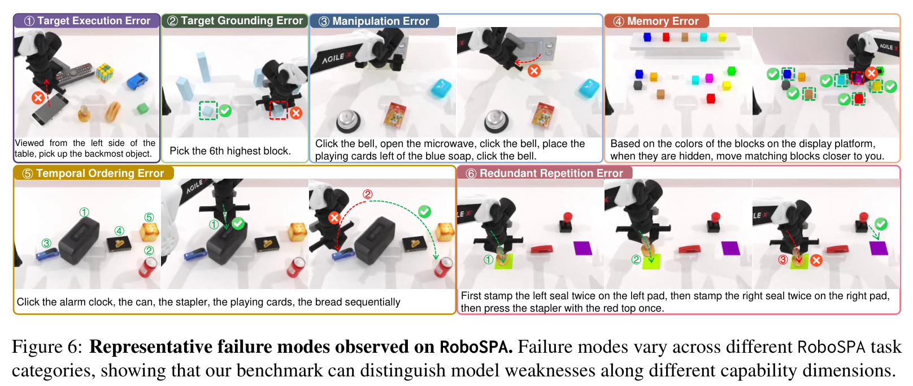

# RoboSPA: Can VLA Models Go Beyond Simple Scenes and Short-Horizon Tasks?

## 核心信息
- **论文标题：** RoboSPA: Can VLA Models Go Beyond Simple Scenes and Short-Horizon Tasks?（机器人空间—流程推理评测基准：VLA 模型能否突破简单场景与短时程任务？）
- **作者团队：** Zhenxuan Fan（范振轩）, Bo Zhang, Yutong Lin, Yuqian Yuan, Juekai Lin, Liang Liang, Zhuoyi Huang, Wenqiao Zhang*（张文乔）, Juncheng Li*（李俊成）, Siliang Tang, Jun Xiao, Yueting Zhuang（庄越挺）
- **主要机构：** 浙江大学（Zhejiang University）、电子科技大学（UESTC）、华南师范大学（SCNU）
- **发布状态：** arXiv:2609.05324v1 [cs.RO] 4 Sep 2026
- **代码与数据开源：** [https://github.com/fanzhenxuan/RoboSPA](https://github.com/fanzhenxuan/RoboSPA)
- **评测规模：** 52.7 万条专家轨迹、997 小时交互视频、5 种机器人本体（Aloha-AgileX, ARX-X5, Piper, Franka, UR5）、10 大能力类别、56 个基础任务、5 个难度梯级（280 个任务变体）。
- **受测基线模型：** RDT（Diffusion-based）、GO-1（Flow-matching）、$\pi_{0.5}$（Flow-matching / PaliGemma）、X-VLA（Unified Cross-Embodiment）。

---

## 原文摘要翻译
视觉—语言—动作（Vision-Language-Action, VLA）模型在以自然语言为条件的机器人操作任务中取得了显著进展。然而，现有的数据集和评测基准主要在预定义的固定场景下评估最终任务完成度，无法深入揭示模型在空间复杂度和流程步骤逐步增加时的内在推理机制。为此，我们提出了 RoboSPA（Robot Spatial-Procedural Assessment，机器人空间—流程推理评测基准），这是一个面向诊断 VLA 模型具身推理能力的大规模机器人操作数据集与基准测试。RoboSPA 聚焦于两大核心维度：细粒度空间推理（Fine-Grained Spatial Reasoning）与长时程流程规划（Long-Horizon Procedural Planning），涵盖 10 个能力类别和 56 个基础任务。每个任务均被实例化为 5 个由浅入深的难度等级，构建出 280 个具有渐进式空间歧义性和流程复杂度的任务变体。我们在 5 种异构机器人本体和多样化仿真场景中收集了 52.7 万条高质量操作轨迹（总计 997 小时视频）。除了传统的二值成功率外，RoboSPA 还引入了细粒度诊断指标以支持多层次深入评估。在代表性 VLA 模型上的广泛实验表明，现有系统在面对复杂的相对空间关系、低层精确执行以及强依赖历史记忆的流程规划时仍面临严峻挑战。这些评测结果使 RoboSPA 成为一个极具挑战性的诊断型基准平台，有力推动未来构建更具推理能力、高可靠性与强泛化性的通用具身智能体。

---

## 创新点
1. **首创“细粒度空间推理”与“长时程流程规划”双轴分类诊断体系：** 彻底跳脱以往具身基准（如 LIBERO、RoboCasa、RLBench）单纯以操作技能（pick-and-place, open drawer 等）分类的浅层框架，从认知推理的底层机制出发，解耦出 10 个正交的能力维度（GAC, SDE, CPI, RRR, CVR 与 RPF, OFE, OCE, CAC, MIP），直击通用操作的最深层痛点。
2. **渐进式 5 级难度可控压力测试（L1–L5）：** 空间维度通过系统性递增干扰物体密度与空间重叠度（候选物体从平均 2.0 增至 8.4 个），流程维度通过延伸操作阶段与因果依赖链条（轨迹长度从 186 步增至 724 步），首次给出了主流 VLA 随问题规模膨胀的“性能劣化衰减曲线”。
3. **消除几率膨胀的诊断度量体系（ONTA 与 PS）：** 提出物体数量归一化目标准确率 $\mathrm{ONTA}$，彻底剔除随着物体增多导致的随机命中率变化，一举揭穿了许多模型在低难度场景下看似不错的性能实际上“劣于随机盲猜（Negative Score）”的虚假繁荣；同时提出阶段进度得分 $\mathrm{PS}$，量化揭示了模型“半途而废”的误差累积规律。
4. **多实体大规模真值轨迹与域随机化资产库：** 覆盖 5 种工业级主流机械臂实体，构建了 6.4 万条干净场景与 46.3 万条高度域随机化场景轨迹（共 52.7 万条、997 小时），为学界提供了无需昂贵真机即可进行可复现深度诊断的高保真环境。

---

## 一句话总结
RoboSPA 是首个将**微观相对空间几何定位**与**宏观多阶段时序记忆规划**系统化解耦解构的百强级具身基准，通过 5 级难度梯度的严密压力测试，以无可辩驳的量化证据证明了现有主流 VLA 模型普遍缺乏真实空间推理能力（ONTA 频现负值）与长程记忆持久力（L5 记忆任务成功率全线归零）。

---

## 研究问题
当前的通用机器人控制界正沉浸在“端到端多模态大模型（VLA）统治一切”的乐观叙事中。无论是基于扩散模型的 RDT，还是基于流匹配的 $\pi_0 / \pi_{0.5}$，在大量短时程、单目标的静态桌面基准（如 BridgeData, LIBERO）上都刷出了 80%~90% 以上的惊人成功率。

然而，一旦进入日常真实世界，这种“高成功率”便迅速土崩瓦解。作者尖锐地指出，现有基准存在三重根本性掩盖：
- **掩盖空间粗糙性：** 大多数任务只需识别“抓取红色杯子”或“打开抽屉”，靠粗粒度的语义目标检测和颜色对齐就能蒙混过关；一旦指令变成“抓取从前往后数第 3 排从左往右数第 2 个杯子”或“抓取距离棕色药瓶第三远的瓶子”，模型便彻底抓瞎；
- **掩盖时序脆弱性：** 现有任务步长通常在 100~200 步以内，且多数为单阶段操作；一旦需要机器人记住 50 步以前被遮挡的积木颜色，或者严格按“盖章两次 $\to$ 换印泥盖章两次 $\to$ 按压订书机一次”的复杂工作流执行，模型的误差就会指数级级联扩散；
- **掩盖指标虚高：** 当场景中只有 2 个物体时，哪怕机械臂闭着眼睛盲抓，也有 50% 的二值成功几率！现有的成功率指标无法区分模型究竟是“真正理解了空间指令”还是“凭借几何先验撞大运”。

因此，亟需一个能够在**微观空间几何拓扑**与**宏观长程时序约束**双重维度下，以严格受控的难度阶梯精确诊断 VLA 认知边界的基准。

---

## 数据与任务定义

### 1. 评测框架与空间尺度
RoboSPA 基于 SAPIEN 动力学物理仿真平台和 RoboTwin 2.0 环境构建。实验涵盖 5 种机械臂实体，核心主实验与消融实验以工业界最普及的双臂平台 **Aloha-AgileX** 为主力，兼顾了 ARX-X5 双臂、Piper 双臂以及 Franka、UR5 单臂。


### 2. 核心分类层级体系（10 大能力类别）
RoboSPA 构造了包含 56 个基础任务的评测集，严格划分为两大核心维度与 10 个子能力大类：


#### (A) 细粒度空间推理（Fine-Grained Spatial Reasoning）
1. **几何属性认知（GAC, Geometric Attribute Cognition）：** 依据高矮、长短、体积极值或几何外形进行消歧。例如：“用单臂抓起体积排在第 2 大的方块”。
2. **空间距离估计（SDE, Spatial Distance Estimation）：** 推理欧氏或相对距离。例如：“拿起距离棕色药瓶第 3 远的药瓶”。
3. **规范位置索引（CPI, Canonical Position Indexing）：** 基于行—列网格的绝对或相对空间索引。例如：“找到从前到后第 1 行从左往右第 4 个杯子”。
4. **参照关系推理（RRR, Referential Relational Reasoning）：** 复合相对方向判定。例如：“拿起位于红绿方块连线中点偏左上方的积木”。
5. **跨视角推理（CVR, Cross-View Reasoning）：** 视点空间坐标变换。例如：“以桌子对侧观察者的视角，拿取其最右侧的物体”。

#### (B) 长时程流程规划（Long-Horizon Procedural Planning）
6. **重复流程执行（RPF, Repetitive Procedure Following）：** 精确计数与终止控制。例如：“将蓝色订书机连续精确按压 5 次后停机”。
7. **无序目标执行（OFE, Order-Free Execution）：** 集合完全遍历。例如：“将桌上全部 4 个黄色积木移至左侧托盘，次序不限”。
8. **顺序约束执行（OCE, Order-Constrained Execution）：** 严格的时序因果依赖。例如：“先将铃铛放在电子秤上，再将玩具车放入展台，轻敲卡片盒，然后按相反顺序放回”。
9. **复合动作协同（CAC, Composite Action Coordination）：** 多样化异构动作原语编排。例如：“将左侧印章在印泥上按压两次，将右侧印章按压两次，随后按下订书机”。
10. **强记忆依赖规划（MIP, Memory-Intensive Planning）：** 早期线索记忆与遮挡盲操。例如：“观察展台上积木的颜色排布，在它们被盒子遮盖后，从备用区挑选相同颜色排布的积木推向前侧”。

### 3. 渐进式 5 级难度设计（L1 至 L5）
- **空间维度：** 候选物体数量随级别系统性提升，L1 平均 2.0 个 $\to$ L2 3.5 个 $\to$ L3 5.1 个 $\to$ L4 6.8 个 $\to$ L5 8.4 个。
- **流程维度：** 操作阶段数与时间步数急剧上升，L1 平均 186 步 $\to$ L2 312 步 $\to$ L3 458 步 $\to$ L4 590 步 $\to$ L5 724 步。

### 4. 诊断型评测指标
- **最终成功率（SR, Success Rate）：** 整条交互轨迹是否完全达成最终成功条件（二值 0/1）。
- **物体数量归一化目标准确率（ONTA, 式 1）：**
$$
\mathrm{ONTA}(n) = \frac{\mathrm{SR}(n) - 1/n}{1 - 1/n} \times 100
$$
消除物体数量 $n$ 导致的随机命中概率 $1/n$。分值为 100 表示完美命中，0 表示盲猜水平，**负分表示模型存在严重的系统性视觉吸引干扰**。
- **阶段执行进度得分（PS, 式 2）：**
$$
\mathrm{PS} = \left( \frac{1}{N} \sum_{i=1}^N \frac{c_i}{T} \right) \times 100
$$
量化长程任务中平均完成的子阶段比例（$c_i / T$），诊断模型是在第几步发生脱轨。

---

## 方法主线与实验评测

### 1. 受测基线模型
作者选取了具身智能领域最主流、架构各异的四款 SOTA VLA 模型并在 RoboSPA 上进行了充分微调：
- **RDT**：1B 参数量，基于 Diffusion Transformer 的多模态双臂策略；
- **GO-1**：由智元机器人（AgiBot）开源的 Flow-matching 通用操作基座；
- **$\pi_{0.5}$**：Physical Intelligence 提出的 Flow-matching VLA 模型，视觉主干为 SigLIP/PaliGemma；
- **X-VLA**：面向跨实体统一多视角控制的高性能 VLA 架构。

### 2. 综合表现全景分析
下表总结了四款模型在 RoboSPA 上的核心战绩：

| 指标 / 维度 | RDT (L1 $\to$ L5) | GO-1 (L1 $\to$ L5) | $\pi_{0.5}$ (L1 $\to$ L5) | X-VLA (L1 $\to$ L5) | 行业平均衰减态势 |
| :--- | :---: | :---: | :---: | :---: | :---: |
| **空间推理成功率 (SR)** | 9.5% $\to$ 6.1% | 20.9% $\to$ 10.6% | 39.2% $\to$ 21.4% | **41.9% $\to$ 23.9%** | 下降近 50%，无一突破 25% |
| **长程规划成功率 (SR)** | 24.1% $\to$ 7.7% | 29.3% $\to$ 7.0% | **71.2% $\to$ 23.1%** | 58.8% $\to$ 15.9% | 暴跌 40~48 个百分点 |
| **全基准平均成功率 (SR)** | 16.8% $\to$ 6.9% | 25.1% $\to$ 8.8% | **55.2% $\to$ 22.3%** | 50.4% $\to$ 19.9% | 高难度下集体陷入瘫痪 |
| **强记忆任务成功率 (MIP@L5)** | **0.0%** | **0.0%** | **0.0%** | **0.0%** | **全军覆没** |
| **空间归一化准确率 (ONTA@L5)** | -11.0% (负值) | -5.3% (负值) | 7.7% | **10.8%** | 接近或劣于随机猜测 |
| **长程进度得分 (PS@L5)** | 22.8% | 20.2% | **45.4%** | 35.7% | 仅能完成前两三步 |


---

## 关键结果深度剖析

### 1. 细粒度空间推理：ONTA 负值现象的震撼启示
在表 3 的 ONTA 评测中，出现了一个极其反直觉但也极具启发性的现象：**RDT 和 GO-1 在几乎所有空间任务类别中，ONTA 均为负数**（RDT 平均 -11.0%，GO-1 平均 -5.3%）。
- **数学本质：** 负值意味着模型在看到 5 个物体时，选中正确目标的几率居然低于 20%（比闭着眼睛乱抓还要差）；
- **机理解析：** 现代 VLA 模型的视觉骨干网络在预训练时严重过拟合了“视觉显著性（Visual Salience）”先验。当指令要求“抓取最矮的积木”或“离参考物第 3 远的杯子”时，模型不仅无法在注意力图中建立相对度量，反而极其容易被体积更大、颜色更鲜艳或位于视野中心的干扰物体牢牢吸附过去！这种“伪定位先验”导致了系统性偏差，形成了劣于随机选择的灾难性后果。
- 即使是表现最好的 X-VLA 和 $\pi_{0.5}$，在 L5 下的 ONTA 也不过只有 10.8% 和 7.7%，说明它们对微观坐标系的建模依然脆弱不堪。

### 2. 长时程流程规划：从“半途而废”到“瞬间失忆”
对比表 2（SR）与表 4（PS）的数据，可以清晰勾勒出 VLA 模型在长时程任务中的崩溃轨迹：
- **误差级联与半途而废：** 在 L5 难度的无序执行（OFE）中，$\pi_{0.5}$ 的 Progress Score 高达 62.1%，X-VLA 高达 73.9%，然而两者的最终成功率（SR）却分别惨跌至 26.1% 和 43.6%。这证明模型具备扎实的单步抓取和移动能力，但随着时间推移，微小的抓取打滑、摆放位置偏差逐步累积，最终在第 4 步或第 5 步彻底失控；
- **纯马尔可夫策略的记忆荒漠：** 在强记忆依赖规划（MIP）中，所有模型在 L5 下的 SR 全部为 0.0%，且 PS 也骤降至 11.4% 和 7.3%。当前主流 VLA 模型普遍仅接收当前 1~2 帧观测（最多加上少量历史动作 chunk），网络权重本身没有任何持久化的显式工作记忆（Working Memory）。当最初包含关键信息的提示牌被遮蔽后，模型在下一步去噪采样时便彻底失去了条件约束，直接陷入随机乱晃或原地发呆。

### 3. 雷达图与典型失败归因（Figure 5 & 6）
如图 5 所示，四款模型在 10 大能力上的雷达图在 L1 时尚且能够勉强展开，而在 L5 时几乎全线缩成核心区域的一小团，表现出极为严重的能力不对称性：


作者在图 6 中进一步总结提炼了具身 VLA 的六大典型病态失败模式：



1. **目标定位错误（Target Grounding Error）：** 彻底抓错物体，被颜色相近或体积更大的干扰物吸走；
2. **目标执行错误（Target Execution Error）：** 准确定位了物体，但夹爪姿态估计不准或发生微小滑动导致掉落；
3. **操作执行错误（Manipulation Error）：** 在复杂的复合操作中（如旋转阀门、按压微动开关），因接触力学建模欠缺而中途脱手；
4. **记忆丢失错误（Memory Error）：** 因长程遮挡而遗忘初始线索，随波逐流；
5. **时序颠倒错误（Temporal Ordering Error）：** 破坏了子任务的前置因果依赖（例如还没打开微波炉门就试图放盘子）；
6. **冗余重复死循环（Redundant Repetition Error）：** 在完成某个步骤后，缺乏自省终止机制，反复重做已经完成的动作（如反复抓取同一个已经到位的杯子），直至仿真超时强退。

---

## 深度分析

### 1. 真正的贡献是什么？
RoboSPA 的真正贡献不在于“又提供了一个仿真基准”，而在于**以严谨的控制变量实验与正交度量，刺破了 VLA 社区的局部繁荣假象**：
- **定义了具身智能真正应该攻克的问题：** 不是在简单整洁的桌面上把一个苹果抓进盘子里（这只是低维拟合），而是如何在堆满 10 个相似杂物的凌乱工作台上，按照严苛的 8 步工业工序、根据 1 分钟前的参数板提示精准装配；
- **确立了具身推理的标准坐标系：** 通过 GAC–CVR 与 RPF–MIP 共 10 大正交维度，使未来的算法创新可以精准汇报“我的模型提升了 3D 相对空间推理（CVR）”还是“提升了长期闭环自省（Redundant Repetition 降低）”，而不是笼统地比拼单一度量；
- **提供了 ONTA 这一革命性诊断标尺：** 迫使后续研究必须诚实地扣除几率基准，终结了靠堆叠简单场景刷高百分比的虚假宣传。

### 2. 为什么主流 VLA 会惨败？
从神经网络动力学与架构设计的视角来看，现有 VLA 的全面溃败是必然的：
- **2D 图像补丁注意力无法自发涌现度量几何（Metric Geometry）：** ViT / SigLIP 的自注意力机制擅长语义分类与关联匹配，但缺乏对绝对尺度、欧氏距离、跨视角透视变换的显式归纳偏置。像素在注意力矩阵中是离散平铺的，模型在没有 3D 结构指导时，根本无法从 2D 特征图中稳定恢复深度关系；
- **自回归 / 扩散去噪难以维持长程非马尔可夫状态：** 动作生成网络本质上是在学习条件概率分布 $P(a_t | o_t, l)$。即使加入短窗口历史，它也依然受到局部马尔可夫假设的束缚。要维系长达 700 步的因果依赖，必须具备图状态机、符号工作记忆或外部代码记忆系统（正如 HyMeS 与 Harness VLA 所做的那样）；
- **缺乏反思自省闭环：** 当前 VLA 是典型的“开环前向执行器”，输出动作块后便盲目推进，网络内部完全缺乏对“我刚才是否成功扣紧了盖子”的后验验证模块。

### 3. 容易误读的地方
- **误读 1：“基线在 RoboSPA 上成功率低是因为没训够”。**  
  *反驳：* 所有模型均在 52.7 万条专家轨迹上按照官方推荐配置进行了充分训练与调优。即便在训练分布内的任务变体上，高难度等级的性能依然暴跌，这明确证明是网络容量与架构归纳偏置的根本缺陷，而非欠拟合。
- **误读 2：“ONTA 出现负数是作者公式设计有问题”。**  
  *反驳：* 式 (1) 本质上是经典的 Cohen's kappa 线性变换。当 $\mathrm{SR} < 1/n$ 时出现负值，在统计学上极其严谨地刻画了模型被对抗性干扰物或高显著性干扰物所误导的现象。
- **误读 3：“仿真环境没有意义，真机才是王道”。**  
  *反驳：* 评测长时程 700 步任务与 5 级精细难度需要数千次完全相同初始条件的无偏可复现 rollout。在真机上进行 840 次全流程长程评测并精确重置每个物体毫米级坐标的成本是不可承受的。RoboSPA 提供的仿真诊断是实体部署前必不可少的“风洞实验”。

---

## 局限
1. **纯仿真环境的 Sim-to-Real 鸿沟：** 所有 52.7 万条轨迹均在 SAPIEN 仿真中采集，尽管采用了多实体与域随机化，但真实世界中的相机曝光噪点、机械臂关节磨损振动、接触摩擦非线性仍无法完全等价模拟；
2. **场景主要局限于桌面操作（Tabletop Manipulation）：** 尚未涵盖移动底盘协同导航操作（Mobile Manipulation）与全尺寸人形双足具身场景；
3. **物理交互以刚体操作为主：** 对布料折叠、线缆穿孔、流体倾倒等柔性体与可形变物体的覆盖仍显不足。

---

## 我的笔记（横向对比与技术启示）

### 1. 具身记忆与长程基准对比谱系

| 基准 / 框架 | 空间推理显式拆解 | 长程任务步长 | 记忆依赖设计 | 阶梯难度压力测试 | 归一化诊断指标 |
| :--- | :---: | :---: | :---: | :---: | :---: |
| **LIBERO** (Liu et al., 2023) | 否（仅按对象/任务划分） | 短程（<200 步） | 无（马尔可夫短时） | 否 | 仅二值 SR |
| **RoboCasa** (Nasiriany et al., 2024) | 否（日常家庭场景） | 中程（200~400 步） | 弱（依靠视觉即时观察） | 否 | 仅二值 SR |
| **CALVIN** (Mees et al., 2022) | 否（4 任务链式子目标） | 中长程（连续 5 步） | 弱（短链序列操作） | 否 | 阶段完成数 |
| **RoboMemArena** (Lei et al., 2026) | 否（侧重遮挡与空间搜索） | 中长程（300~600 步） | **强**（12 种非马尔可夫记忆） | 否 | CSR / TSR |
| **RoboSPA (本文, 2026)** | **是（5 大细分子类）** | **长程（最高 724 步）** | **强（MIP 专门类别）** | **是（L1 至 L5）** | **ONTA + PS + SR** |

### 2. 对具身智能技术演进的深刻启示
RoboSPA 的实验结果，实质上宣告了**“纯端到端单体 VLA（Monolithic End-to-End VLA）包打天下”路线在复杂长程推理场景下的彻底受挫**。未来的通用具身智能必将走向**分层解耦与神经—符号混合（Neuro-Symbolic Hybrid）**：
1. **微观空间层：** 必须抛弃纯 2D patch 表征，引入类似 GR3D 或 3D 几何点云/体素的显式空间世界模型（Spatial World Model），在动作生成前显式建立目标与参照物的几何坐标系锚定；
2. **宏观流程层：** 必须借助外部代码记忆（如 HyMeS）或状态机编排器（如 VoLo、Harness VLA），由高层 VLM 负责维护离散的工作记忆变量与阶段跃迁判定，将底层 VLA 限制在无记忆负担的原子运动技能去噪中；
3. **自省验证层：** 必须在动作块之间植入多模态在线执行校验（如 PACE 验证），发现错误立即触发主动恢复机制，打断误差级联的链式反应。

---

## 引用
```bibtex
@article{fan2026robospa,
  title={RoboSPA: Can VLA Models Go Beyond Simple Scenes and Short-Horizon Tasks?},
  author={Fan, Zhenxuan and Zhang, Bo and Lin, Yutong and Yuan, Yuqian and Lin, Juekai and Liang, Liang and Huang, Zhuoyi and Zhang, Wenqiao and Li, Juncheng and Tang, Siliang and Xiao, Jun and Zhuang, Yueting},
  journal={arXiv preprint arXiv:2609.05324},
  year={2026}
}
```
