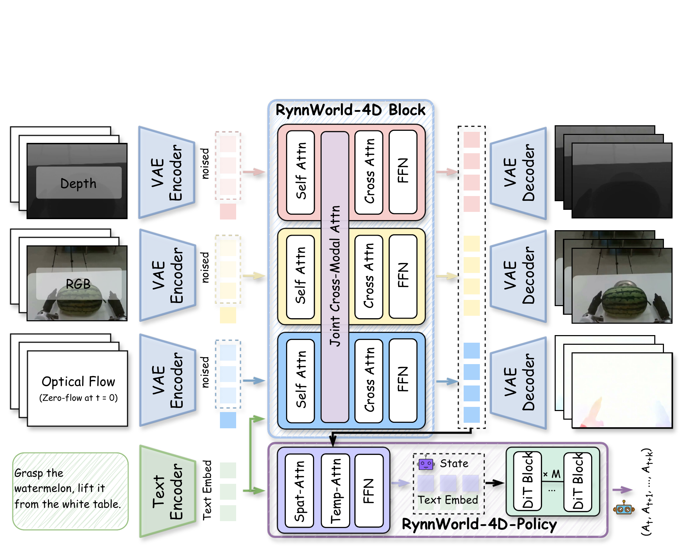
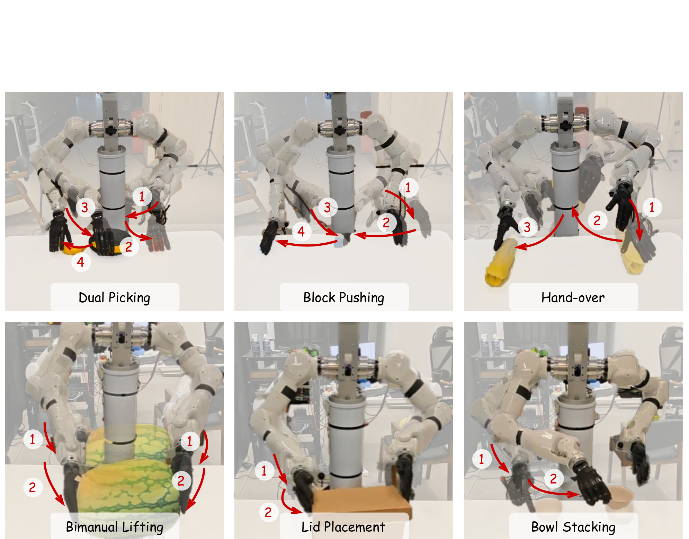
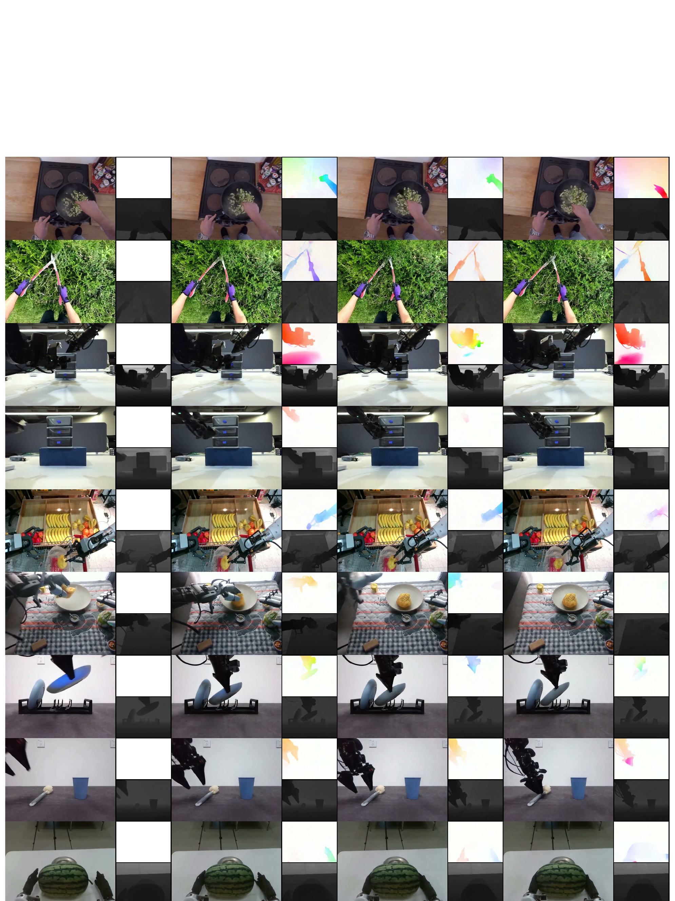
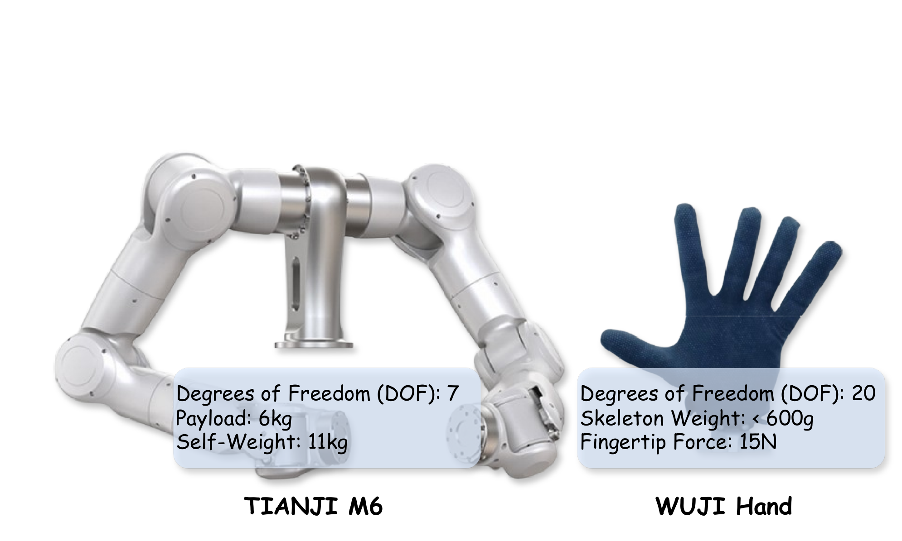
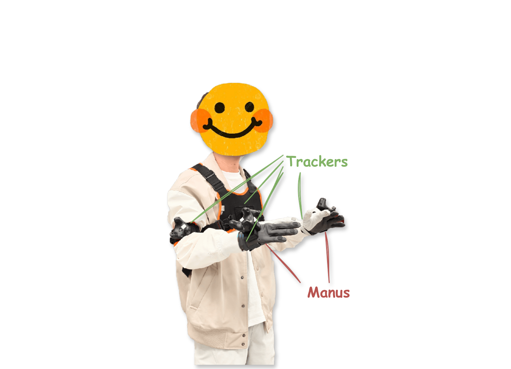
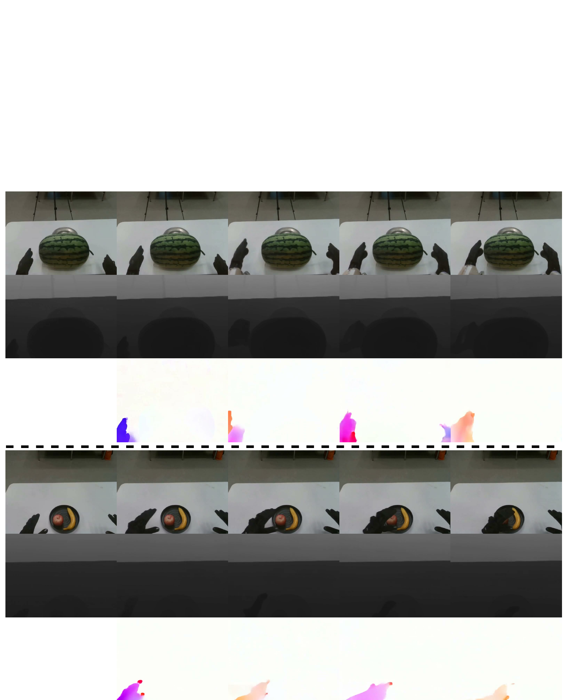

# RynnWorld-4D: 4D Embodied World Models for Robotic Manipulation

**Authors:** Haoyu Zhao, Xingyue Zhao, Siteng Huang, Xin Li, Deli Zhao, Zhongyu Li
**Source:** `/Users/roywangj/journey_wj/research/papers4zotero/zotero1/storage/HVJ283GL/Zhao 等 - 2026 - RynnWorld-4D 4D Embodied World Models for Robotic Manipulation.pdf`
**Detected source format:** selectable-text PDF (`pdf-text`)
**Reader type:** complete 26-page paragraph-level Chinese-English reader with native figure assets, searchable tables, equations, bibliography, and Appendices A–E.
**Version:** arXiv:2607.06559v1, 7 July 2026

## Page / Section Index

| Source pages | Content |
|---|---|
| 1–3 | Abstract; Introduction; Related Work |
| 4–9 | Method; Rynn4DDataset 1.0; RGB-DF reconstruction; RynnWorld-4D; Policy; latency |
| 9–15 | Experiments; implementation; metrics; real-robot results; ablations; Conclusion and Limitations |
| 16–21 | References (82 entries) |
| 22–26 | Appendix A–E; robot setup; metrics; preliminaries; baselines; qualitative results |

## Terminology Ledger

| Canonical term | First-use definition | Chinese rendering | Decision |
|---|---|---|---|
| RGB-DF | synchronized RGB, depth, and optical flow | 同步 RGB、深度与光流 | retain acronym and modality order |
| projective 4D representation | 2D-aligned representation liftable to metric 3D scene flow | 投影式 4D 表示 | distinguish from explicit 4D volumes/Gaussians |
| Rynn4DDataset 1.0 | 254.4M-frame hybrid embodied dataset | Rynn4DDataset 1.0 | dataset name untranslated |
| Joint Cross-Modal Attention (JA) | frame-wise cross-branch attention with 3D RoPE | 联合跨模态注意力（JA） | use JA consistently |
| Branch Dropout | stochastic dropping of depth or flow noisy latents | 分支丢弃 | RGB is never dropped |
| Flow Former | policy feature compressor | Flow Former | module name untranslated |
| planning frequency | world-model refresh rate | 规划频率 | distinct from effective control frequency |
| effective control frequency | action execution rate enabled by chunking | 有效控制频率 | reported as approximately 9 Hz |
| AbsRel / $\delta_1$ / AEPE | depth and optical-flow metrics | retain metric symbols | lower/higher direction preserved |

**Haoyu Zhao\*¹˒²˒³, Xingyue Zhao\*¹, Siteng Huang†¹˒⁴, Xin Li¹˒⁴, Deli Zhao†¹, Zhongyu Li†²˒³**

¹ DAMO Academy, Alibaba Group; ² Hong Kong Embodied AI Lab; ³ CUHK; ⁴ Hupan Lab  
\* Equal contribution; † Corresponding author

¹ 阿里巴巴集团达摩院；² 香港具身智能实验室；³ 香港中文大学；⁴ 湖畔实验室  
\* 同等贡献；† 通讯作者

## Abstract / 摘要

> <strong>Para. 1:</strong> Robotic manipulation in the open world requires not only recognizing what a scene looks like, but also anticipating how its 3D structure moves under interaction. We argue that synchronized RGB, depth, and optical flow (RGB-DF) provide a physically grounded representation that captures the underlying 4D dynamics of a scene. Compared to 2D pixel videos, this multi-modal synergy aligns visual appearance with geometric structure and temporal motion, creating a representation space significantly closer to low-level end-effector actions demanded by robotic systems, narrowing the gap between world prediction and policy learning. Building on this insight, we introduce RynnWorld-4D, a generative model that co-produces future RGB frames, depth maps, and optical flow from a single RGB-D image and a language instruction within one unified diffusion process. This 4D world model features a tri-branch architecture that integrates cross-modal attention with frame-wise 3D RoPE, ensuring that appearance, geometry, and motion evolve consistently. To supply training data at scale, we curate Rynn4DDataset 1.0, a massive dataset of over 254.4 million frames across egocentric human and robotic manipulation videos with high-quality pseudo-labels for depth and optical flow. We further propose RynnWorld-4D-Policy, an inverse dynamics head that consumes the internal 4D representations of RynnWorld-4D in a single forward pass, bypassing expensive multi-step denoising, to output robot actions in a closed-loop manner. Experiments show that RynnWorld-4D produces temporally and spatially coherent 4D predictions, and that RynnWorld-4D-Policy achieves state-of-the-art performance on real-world dexterous bimanual manipulation tasks, particularly excelling in tasks demanding spatial precision and temporal coordination.

> <strong>Para. 1[CN]:</strong> 开放世界中的机器人操作不仅需要识别场景的外观，还需要预判其三维结构在交互作用下如何运动。我们认为，同步的 RGB、深度和光流（RGB-DF）提供了一种具有物理基础的表示，能够捕捉场景内在的 4D 动力学。与二维像素视频相比，这种多模态协同将视觉外观与几何结构及时间运动对齐，构建出一种明显更接近机器人系统所需低层末端执行器动作的表示空间，从而缩小世界预测与策略学习之间的差距。基于这一洞见，我们提出 RynnWorld-4D：一个生成模型，它在统一的扩散过程中，以单张 RGB-D 图像和一条语言指令为条件，协同生成未来的 RGB 帧、深度图和光流。该 4D 世界模型采用三分支架构，将跨模态注意力与逐帧 3D RoPE 相结合，确保外观、几何和运动保持一致地演化。为了规模化提供训练数据，我们构建了 Rynn4DDataset 1.0，这是一个包含超过 2.544 亿帧的大规模数据集，涵盖以第一人称视角拍摄的人类操作视频和机器人操作视频，并为深度与光流提供高质量伪标签。我们进一步提出 RynnWorld-4D-Policy，这是一个逆动力学头；它通过单次前向传播使用 RynnWorld-4D 的内部 4D 表示，绕过代价高昂的多步去噪，以闭环方式输出机器人动作。实验表明，RynnWorld-4D 能够生成时间和空间一致的 4D 预测；RynnWorld-4D-Policy 则在真实世界灵巧双臂操作任务上取得了最先进的性能，尤其擅长要求空间精度与时间协调的任务。

> <strong>Para. 2:</strong> Project page: https://alibaba-damo-academy.github.io/RynnWorld-4D.github.io  
> Code: https://github.com/alibaba-damo-academy/RynnWorld-4D  
> Hugging Face: https://huggingface.co/Alibaba-DAMO-Academy/RynnWorld-4D  
> ModelScope: https://www.modelscope.cn/models/DAMO_Academy/RynnWorld-4D  
> Date: July 8, 2026

> <strong>Para. 2[CN]:</strong> 项目主页：https://alibaba-damo-academy.github.io/RynnWorld-4D.github.io  
> 代码：https://github.com/alibaba-damo-academy/RynnWorld-4D  
> Hugging Face：https://huggingface.co/Alibaba-DAMO-Academy/RynnWorld-4D  
> ModelScope：https://www.modelscope.cn/models/DAMO_Academy/RynnWorld-4D  
> 日期：2026 年 7 月 8 日

## 1 Introduction / 引言

> <strong>Para. 1:</strong> Robotic manipulation in the open world could greatly benefit from visual world models that predict how the environment would evolve given an agent’s interactions (Zhao et al., 2026b, 2025a; Li et al., 2026; Agarwal et al., 2025; Ali et al., 2025). While recent generative video models (Ha and Schmidhuber, 2018a; Xiang et al., 2024; Zheng et al., 2024; Wang et al., 2025a) have shown encouraging progress in policy synthesis (Du et al., 2023b; Liang et al., 2024; Zhen et al., 2025), data simulation and generation (Zhu et al., 2024), and long-horizon planning (Du et al., 2023a; Li et al., 2025a), they remain limited by the 2D projective nature of pixels. This inherent limitation leads to a loss of critical spatial relationships, preventing precise 6-DoF pose estimation and depth-aware interaction (Hu et al., 2024; Agarwal et al., 2025; Li et al., 2026). Furthermore, 2D models often lack geometric grounding, leading to temporal inconsistencies such as fluctuating object scales and unphysical shape morphing, which hinders their utility in robust policy learning. Consequently, transitioning generative world modeling from 2D videos to geometry-integrated 4D scene evolution is an essential step toward a solid foundation for embodied intelligence.

> <strong>Para. 1[CN]:</strong> 若能借助视觉世界模型来预测环境将如何随智能体的交互而演化，开放世界中的机器人操作将从中大幅受益（Zhao et al., 2026b, 2025a; Li et al., 2026; Agarwal et al., 2025; Ali et al., 2025）。尽管近期的生成式视频模型（Ha and Schmidhuber, 2018a; Xiang et al., 2024; Zheng et al., 2024; Wang et al., 2025a）在策略合成（Du et al., 2023b; Liang et al., 2024; Zhen et al., 2025）、数据模拟与生成（Zhu et al., 2024）以及长时程规划（Du et al., 2023a; Li et al., 2025a）方面展现出令人鼓舞的进展，但它们仍受限于像素的二维投影属性。这一固有限制会造成关键空间关系的丢失，使模型无法进行精确的六自由度（6-DoF）位姿估计和深度感知交互（Hu et al., 2024; Agarwal et al., 2025; Li et al., 2026）。此外，二维模型通常缺乏几何基础，因而会产生物体尺度波动和不符合物理规律的形状变形等时间不一致问题，妨碍其用于鲁棒的策略学习。因此，将生成式世界建模从二维视频推进到融合几何的 4D 场景演化，是为具身智能奠定坚实基础的关键一步。

### Figure 1

**Caption:** Figure 1. Given an input RGB-D image and description, RynnWorld-4D generates RGB, depth, and optical flow videos synchronously, which can be further lifted into 3D scene flow (right).

**Caption[CN]:** 图 1。 给定一张输入 RGB-D 图像和一段描述，RynnWorld-4D 同步生成 RGB、深度和光流视频，并可进一步将其提升为三维场景流（右图）。

> <strong>Para. 3:</strong> Existing 4D scene-modeling approaches fall into two categories. The first builds on Neural Radiance Fields (NeRF) (Mildenhall et al., 2021) or 3D Gaussian Splatting (3DGS) (Kerbl et al., 2023), which can be further divided into optimization-based methods (Zhao et al., 2024a,b; Yu et al., 2024; Bahmani et al., 2024) that are computationally intensive and scene-specific, and feed-forward models (Ren et al., 2024; Wu et al., 2025a) that prioritize speed but typically focus on object-centric generation. These approaches often require multi-view inputs or struggle to scale to complex scene-level environments. The second category comprises dynamic Structure-from-Motion (SfM) approaches (Wang et al., 2025b; Li et al., 2025b), which reconstruct time-varying point clouds but lack the generative capability to predict future states from a single image. Neither category readily provides a compact, scalable representation that integrates with the strong generative priors of pretrained video diffusion models.

> <strong>Para. 3[CN]:</strong> 现有 4D 场景建模方法可分为两类。第一类建立在神经辐射场（NeRF）（Mildenhall et al., 2021）或三维高斯泼溅（3DGS）（Kerbl et al., 2023）之上，又可进一步分为计算开销大且针对特定场景的基于优化的方法（Zhao et al., 2024a,b; Yu et al., 2024; Bahmani et al., 2024），以及优先考虑速度、但通常聚焦于以物体为中心的生成的前馈模型（Ren et al., 2024; Wu et al., 2025a）。这些方法通常需要多视角输入，或难以扩展到复杂的场景级环境。第二类包括动态运动恢复结构（SfM）方法（Wang et al., 2025b; Li et al., 2025b），它们能够重建随时间变化的点云，却不具备从单张图像预测未来状态的生成能力。这两类方法都难以直接提供一种紧凑、可扩展，并能与预训练视频扩散模型的强大生成先验相结合的表示。

> <strong>Para. 4:</strong> To bridge this gap, we propose a lightweight projective 4D representation by predicting synchronized sequences of RGB, depth, and optical flow (RGB-DF): depth lifts each pixel to a 3D location, and depth together with optical flow can be back-projected into 3D scene flow under standard pinhole-camera assumptions, providing a per-point 3D motion cue (illustrated as the “3D Flow” in Fig. 1). Compared to RGB-only sequences, this representation makes geometry and motion explicit; compared to explicit 3D volumes or 4D Gaussians, it stays in a 2D-aligned format and therefore inherits the scalability and the rich generative priors of large-scale video diffusion models.

> <strong>Para. 4[CN]:</strong> 为弥合这一差距，我们通过预测同步的 RGB、深度和光流（RGB-DF）序列，提出一种轻量级投影式 4D 表示：深度将每个像素提升到一个三维位置；在标准针孔相机假设下，深度与光流可共同反投影为三维场景流，从而为每个点提供三维运动线索（在图 1 中显示为“3D Flow”）。与仅含 RGB 的序列相比，该表示显式呈现几何与运动；与显式三维体或 4D 高斯相比，它仍采用与二维对齐的格式，因而继承了大规模视频扩散模型的可扩展性和丰富生成先验。

> <strong>Para. 5:</strong> Building on this representation, we present RynnWorld-4D, a 4D embodied world model that, conditioned on a single RGB-D image and a text instruction, synchronously generates RGB, depth, and optical-flow videos within one shared denoising loop (Fig. 1). Specifically, we extend a pretrained video diffusion model (Wang et al., 2025a) into a tri-branch transformer, where each branch handles one modality with independent transformer with shared cross attention keys/values across modalities, while Joint Cross-Modal Attention modules enforce cross-modal consistency. This design preserves the strong generative priors of the pretrained backbone while allowing each modality to specialize, i.e., textures for RGB, spatial geometry for depth, and motion displacements for optical flow. A key challenge for training RynnWorld-4D is the absence of large-scale datasets with dense 4D annotations. To address this, we curate Rynn4DDataset 1.0, a large-scale hybrid dataset comprising over 254 million video frames drawn from egocentric human activity datasets (Damen et al., 2020; Wang et al., 2024) and robotic manipulation datasets (Wu et al., 2024; Liu et al., 2024; Jiang et al., 2025b; Wu et al., 2025b; Bu et al., 2025), each enriched with high-quality pseudo-annotations for depth and optical flow.

> <strong>Para. 5[CN]:</strong> 基于这一表示，我们提出 RynnWorld-4D——一个 4D 具身世界模型；在单张 RGB-D 图像和文本指令的条件下，它可在同一个共享去噪循环中同步生成 RGB、深度和光流视频（图 1）。具体而言，我们将一个预训练视频扩散模型（Wang et al., 2025a）扩展为三分支 Transformer，其中每个分支以独立的 Transformer 处理一种模态，同时在不同模态之间共享跨注意力的键/值，而联合跨模态注意力（Joint Cross-Modal Attention）模块则用于保证跨模态一致性。该设计在保留预训练骨干网络强大生成先验的同时，允许各模态形成专门能力，即分别对 RGB 的纹理、深度的空间几何和光流的运动位移进行建模。训练 RynnWorld-4D 的一项关键挑战，是缺少带有稠密 4D 标注的大规模数据集。为此，我们构建了 Rynn4DDataset 1.0，这是一个大规模混合数据集，包含超过 2.54 亿个视频帧，数据取自第一人称人类活动数据集（Damen et al., 2020; Wang et al., 2024）和机器人操作数据集（Wu et al., 2024; Liu et al., 2024; Jiang et al., 2025b; Wu et al., 2025b; Bu et al., 2025），并为每个样本补充了高质量的深度与光流伪标注。

> <strong>Para. 6:</strong> The RGB-DF representation offers a critical advantage: it aligns more closely with a robot’s action space than raw 2D pixel changes. Consequently, a downstream policy trained on RynnWorld-4D’s internal 4D representations bypasses the heavy structural inference typically required when operating on 2D latents alone. Leveraging this synergy, we introduce RynnWorld-4D-Policy, an inverse dynamics head that extracts robot actions directly from RynnWorld-4D’s predictive 4D features. By utilizing these internal latents in a single forward pass and bypassing the iterative denoising bottleneck, RynnWorld-4D-Policy enables high-frequency, closed-loop control suitable for real-time interaction. In summary, our work makes the following contributions:

> <strong>Para. 6[CN]:</strong> RGB-DF 表示具有一项关键优势：与原始二维像素变化相比，它与机器人的动作空间更加对齐。因此，在 RynnWorld-4D 内部 4D 表示上训练的下游策略，可以绕过仅操作二维潜变量时通常需要进行的繁重结构推断。利用这种协同作用，我们提出 RynnWorld-4D-Policy，这是一个直接从 RynnWorld-4D 的预测性 4D 特征中提取机器人动作的逆动力学头。RynnWorld-4D-Policy 在单次前向传播中使用这些内部潜变量并绕过迭代去噪瓶颈，从而实现适合实时交互的高频闭环控制。总而言之，我们的工作具有以下贡献：

> <strong>Para. 7:</strong> • We introduce a **projective 4D representation** that co-generates RGB, depth, and optical flow, and we show how it admits a natural 3D-scene-flow reading that makes geometry and motion explicit while staying compatible with large-scale video diffusion priors.

> <strong>Para. 7[CN]:</strong> • 我们提出一种**投影式 4D 表示**，协同生成 RGB、深度和光流，并说明如何自然地将其解读为三维场景流，在保持与大规模视频扩散先验兼容的同时，显式呈现几何与运动。

> <strong>Para. 8:</strong> • We develop **RynnWorld-4D**, a tri-branch 4D world model that co-generates physically coherent RGB-DF sequences through mutual cross-modal interactions.

> <strong>Para. 8[CN]:</strong> • 我们开发了 **RynnWorld-4D**，这是一种三分支 4D 世界模型，通过相互的跨模态交互，协同生成物理一致的 RGB-DF 序列。

> <strong>Para. 9:</strong> • We curate **Rynn4DDataset 1.0**, a large-scale 4D embodied video dataset with depth and optical flow annotations for training 4D embodied world model.

> <strong>Para. 9[CN]:</strong> • 我们构建了 **Rynn4DDataset 1.0**，这是一个带有深度和光流标注的大规模 4D 具身视频数据集，用于训练 4D 具身世界模型。

> <strong>Para. 10:</strong> • We propose **RynnWorld-4D-Policy**, which leverages the internal 4D representations to enable high-frequency, closed-loop robotic control.

> <strong>Para. 10[CN]:</strong> • 我们提出 **RynnWorld-4D-Policy**，利用内部 4D 表示实现高频、闭环的机器人控制。

## 2 Related Work / 相关工作

### 2.1 World Model / 世界模型

> <strong>Para. 1:</strong> Learning a dynamics model of the world that supports downstream action generation has been a long-standing challenge (Ha and Schmidhuber, 2018b; Sutton, 1991). Early work learns world models in low-dimensional state spaces (Achille and Soatto, 2018; Lesort et al., 2018), which are efficient to train but difficult to generalize across visually diverse environments. With advances in generative modeling, a growing body of recent work has explored video models as foundation world models (Kong et al., 2024; Wang et al., 2025a; Yang et al., 2024). However, these models remain in the 2D pixel space, limiting their ability to capture 3D geometric structure and leaving a large representational gap between their predictions and the 3D actions a robot must produce.

> <strong>Para. 1[CN]:</strong> 学习一种能够支持下游动作生成的世界动力学模型，一直是一项长期挑战（Ha and Schmidhuber, 2018b; Sutton, 1991）。早期工作在低维状态空间中学习世界模型（Achille and Soatto, 2018; Lesort et al., 2018）；这类模型训练效率高，却难以泛化到视觉上多样的环境。随着生成建模的发展，越来越多的近期工作开始探索将视频模型作为基础世界模型（Kong et al., 2024; Wang et al., 2025a; Yang et al., 2024）。然而，这些模型仍停留在二维像素空间，限制了其捕捉三维几何结构的能力，并使其预测结果与机器人必须生成的三维动作之间存在巨大的表示鸿沟。

> <strong>Para. 2:</strong> 3D world models attempt to close this gap by reasoning over meshes or explicit surfaces (Wang et al., 2021; Pfaff et al., 2020; Jiang et al., 2025a; Zhao et al., 2025b; Xia et al., 2025, 2024; Zhen et al., 2025; Guo et al., 2026), radiance fields or Gaussians (Mildenhall et al., 2021; Kerbl et al., 2023; Driess et al., 2023; Xie et al., 2024), or particle systems (Sanchez-Gonzalez et al., 2020; Abou-Chakra et al., 2024; Zhang et al., 2025; Chen et al., 2025). Hybrid approaches additionally reason over hierarchical structures (Kaelbling and Lozano-Pérez, 2011; Wang et al., 2025c; Zhao et al., 2026a). While these representations offer richer geometric reasoning, they often require multi-view inputs, are scene-specific, or lack the scalability of pretrained video priors. Most closely related to our work are (Zhen et al., 2025), which models the 4D scene from RGB-DN (RGB, Depth, and Normal) videos with language-conditioned control, and (Chen et al., 2025), which produces high-quality dynamic point clouds for novel-view video synthesis. Our work shares the goal of scalable 4D prediction but introduces a projective 4D representation that co-generates optical flow alongside RGB and depth, making inter-frame 3D motion explicit. Unlike methods relying on static geometry like surface normals (Zhen et al., 2025), our inclusion of optical flow allows for back-projection into 3D scene flow, providing explicit dynamic cues essential for learning accurate inverse dynamics. This is particularly critical for dexterous manipulation, where the fine-grained trajectory of objects and end-effectors is what differentiates success from failure.

> <strong>Para. 2[CN]:</strong> 三维世界模型尝试通过在网格或显式表面（Wang et al., 2021; Pfaff et al., 2020; Jiang et al., 2025a; Zhao et al., 2025b; Xia et al., 2025, 2024; Zhen et al., 2025; Guo et al., 2026）、辐射场或高斯（Mildenhall et al., 2021; Kerbl et al., 2023; Driess et al., 2023; Xie et al., 2024），或粒子系统（Sanchez-Gonzalez et al., 2020; Abou-Chakra et al., 2024; Zhang et al., 2025; Chen et al., 2025）上进行推理来缩小这一差距。混合方法还会在层次化结构上进行推理（Kaelbling and Lozano-Pérez, 2011; Wang et al., 2025c; Zhao et al., 2026a）。尽管这些表示提供了更丰富的几何推理能力，但它们通常需要多视角输入、针对特定场景，或缺少预训练视频先验的可扩展性。与我们的工作关系最密切的是（Zhen et al., 2025）和（Chen et al., 2025）：前者从 RGB-DN（RGB、深度和法线）视频中对 4D 场景建模，并使用语言条件进行控制；后者则生成高质量动态点云，用于新视角视频合成。我们的工作同样以可扩展的 4D 预测为目标，但引入了一种投影式 4D 表示，在生成 RGB 和深度的同时协同生成光流，从而显式呈现帧间三维运动。不同于依赖表面法线等静态几何的方法（Zhen et al., 2025），我们引入光流后可以将其反投影为三维场景流，提供学习准确逆动力学所必需的显式动态线索。这对灵巧操作尤其关键，因为物体和末端执行器的细粒度轨迹正是决定任务成功或失败的关键。

### 2.2 Future Prediction for Embodied Control / 面向具身控制的未来预测

> <strong>Para. 1:</strong> A growing line of work bridges generative modeling and control by using 2D future prediction to guide policy learning (Bharadhwaj et al., 2024; Ye et al., 2024, 2026; Bi et al., 2025; Hu et al., 2024). Representative methods include SuSIE (Black et al., 2023), which employs a goal-conditioned keyframe generator (Brooks et al., 2023), and UniPi (Du et al., 2023b), which learns inverse dynamics over generated sequences. Downstream actions are then derived via online planning (Hu et al., 2024; Williams et al., 2017; Hafner et al., 2019b; Pineau et al., 2003), offline policy synthesis (Hafner et al., 2019a; Hansen et al., 2023; Chua et al., 2018; Hafner et al., 2025), or inverse-dynamics models (Du et al., 2023b; Bi et al., 2025). However, because these pipelines operate entirely in 2D pixel space and often require repeated denoising for every action step, they face inherent limitations in both geometric accuracy and control reactivity. In contrast, RynnWorld-4D operates on a unified 4D representation that jointly encodes appearance, geometry, and motion. Building upon this, RynnWorld-4D-Policy directly consumes the internal predictive features of RynnWorld-4D in a single forward pass. By bypassing the need for per-step video decoding and denoising, our approach enables high-frequency, closed-loop robotic control, effectively translating imagined 4D trajectories into precise, real-time robotic actions.

> <strong>Para. 1[CN]:</strong> 越来越多的工作通过使用二维未来预测来指导策略学习，从而连接生成建模与控制（Bharadhwaj et al., 2024; Ye et al., 2024, 2026; Bi et al., 2025; Hu et al., 2024）。代表性方法包括 SuSIE（Black et al., 2023）和 UniPi（Du et al., 2023b）：前者采用目标条件关键帧生成器（Brooks et al., 2023），后者则在生成序列上学习逆动力学。随后，下游动作通过在线规划（Hu et al., 2024; Williams et al., 2017; Hafner et al., 2019b; Pineau et al., 2003）、离线策略合成（Hafner et al., 2019a; Hansen et al., 2023; Chua et al., 2018; Hafner et al., 2025）或逆动力学模型（Du et al., 2023b; Bi et al., 2025）获得。然而，由于这些流水线完全在二维像素空间中运行，而且往往需要为每个动作步骤反复去噪，因此在几何精度和控制反应能力上都面临固有限制。相比之下，RynnWorld-4D 在统一的 4D 表示上运行，该表示联合编码外观、几何与运动。在此基础上，RynnWorld-4D-Policy 通过单次前向传播直接使用 RynnWorld-4D 的内部预测特征。通过免除逐步视频解码与去噪，我们的方法能够实现高频闭环机器人控制，将想象的 4D 轨迹有效转化为精确、实时的机器人动作。

### Figure 2

**Caption:** Figure 2. Composition of the Rynn4DDataset 1.0 dataset. We provide a large-scale hybrid collection of 254.4M frames, balancing human egocentric videos with diverse robotic manipulation data. This diversity ensures that the world model learns both general object interaction priors and robot-specific execution traces.

**Caption[CN]:** 图 2。Rynn4DDataset 1.0 数据集的构成。 我们提供了一个包含 2.544 亿帧的大规模混合集合，在人类第一人称视频与多样化机器人操作数据之间实现平衡。这种多样性确保世界模型既能学习通用的物体交互先验，也能学习机器人特有的执行轨迹。

## 3 Method / 方法

> <strong>Para. 1:</strong> To address the data scarcity in 4D generative modeling, we first introduce Rynn4DDataset 1.0 in Sec. 3.1, a large-scale hybrid dataset specifically curated for training feed-forward 4D generative models. Building upon this, Sec. 3.3 presents RynnWorld-4D, a framework capable of co-generating future sequences—including RGB frames, depth maps, and optical flow from a single RGB-D observation and a linguistic task description. Finally, in Sec. 3.4, we introduce RynnWorld-4D-Policy, which leverages the predictive 4D representations from RynnWorld-4D to derive final robotic actions.

> <strong>Para. 1[CN]:</strong> 为解决 4D 生成建模中的数据匮乏问题，我们首先在第 3.1 节介绍 Rynn4DDataset 1.0，这是一个专为训练前馈 4D 生成模型而构建的大规模混合数据集。在此基础上，第 3.3 节介绍 RynnWorld-4D，该框架能够根据单次 RGB-D 观测和语言任务描述，协同生成未来序列，包括 RGB 帧、深度图和光流。最后，在第 3.4 节中，我们将介绍 RynnWorld-4D-Policy，它利用 RynnWorld-4D 的预测性 4D 表示得到最终的机器人动作。

### 3.1 Rynn4DDataset 1.0

> <strong>Para. 1:</strong> To bridge the gap in large-scale 4D training data, we introduce Rynn4DDataset 1.0, a hybrid dataset comprising over 254.4 million video frames from human-centric (Epic-Kitchens (Damen et al., 2020), EgoVid (Wang et al., 2024)) and robotic manipulation datasets (RoboMIND (Wu et al., 2024), RDT-1B (Liu et al., 2024), Galaxea (Jiang et al., 2025b), RoboCoin (Wu et al., 2025b), AgiBot (Bu et al., 2025)). Each frame is enriched with high-quality 4D pseudo-annotations: fine-grained instructions (Bai et al., 2025), monocular depth (Lin et al., 2025), and dense optical flow (Morimitsu et al., 2025). The statistics and composition of Rynn4DDataset 1.0 are visualized in Fig. 2. The pipeline for our multimodal annotation is illustrated in Fig. 3.

> <strong>Para. 1[CN]:</strong> 为弥补大规模 4D 训练数据的缺口，我们提出 Rynn4DDataset 1.0，这是一个混合数据集，包含超过 2.544 亿个视频帧，来源包括以人类为中心的数据集（Epic-Kitchens（Damen et al., 2020）、EgoVid（Wang et al., 2024））和机器人操作数据集（RoboMIND（Wu et al., 2024）、RDT-1B（Liu et al., 2024）、Galaxea（Jiang et al., 2025b）、RoboCoin（Wu et al., 2025b）、AgiBot（Bu et al., 2025））。每一帧都配有高质量的 4D 伪标注：细粒度指令（Bai et al., 2025）、单目深度（Lin et al., 2025）以及稠密光流（Morimitsu et al., 2025）。Rynn4DDataset 1.0 的统计信息与构成如图 2 所示。我们的多模态标注流水线如图 3 所示。

> <strong>Para. 2:</strong> **Video captioning.** We use Qwen3-VL (Bai et al., 2025) to generate captions for the video data (Damen et al., 2020; Wang et al., 2024; Wu et al., 2024; Liu et al., 2024; Jiang et al., 2025b). Specifically, we leverage the model’s strong video-language understanding capabilities to produce detailed, structured descriptions of each video clip. The videos are first sampled at a frame rate of 1 FPS and split into segments of 5 seconds. For each segment, we provide the following prompt to the model:

> <strong>Para. 2[CN]:</strong> **视频描述生成。** 我们使用 Qwen3-VL（Bai et al., 2025）为视频数据（Damen et al., 2020; Wang et al., 2024; Wu et al., 2024; Liu et al., 2024; Jiang et al., 2025b）生成描述。具体而言，我们利用该模型强大的视频—语言理解能力，为每个视频片段生成详细、结构化的描述。首先以 1 FPS 的帧率对视频采样，并将其划分为 5 秒长的片段。对于每个片段，我们向模型提供以下提示词：

> <strong>Para. 3:</strong> Please describe this video in detail. Include the following aspects:  
> 1. The main subject and action in the video.  
> 2. The environment and background.  
> 3. Any objects and their interactions.  
> 4. The overall scene context and atmosphere.  
> Provide a concise but comprehensive caption in one paragraph.

> <strong>Para. 3[CN]:</strong> 请详细描述这段视频。请包含以下方面：  
> 1. 视频中的主要主体和动作。  
> 2. 环境和背景。  
> 3. 所有物体及其交互。  
> 4. 整体场景语境和氛围。  
> 请用一个段落提供简洁但全面的描述。

### Figure 3

**Caption:** Figure 3. Data Curation Pipeline. The video data is collected from diverse sources and partitioned into short clips during data preprocessing. Each clip undergoes a multi-modal annotation process: (1) **Video Captioning:** Qwen3-VL (Bai et al., 2025) generates detailed natural language descriptions of the video content; (2) **Optical Flow Estimation:** DPFlow (Morimitsu et al., 2025) computes dense per-frame motion fields, which are visualized and saved as flow videos; (3) **Depth Estimation:** Depth Anything 3 (Lin et al., 2025) produces monocular depth predictions, which are upsampled to the original resolution and saved as depth videos with a global depth range of [0.0, 5.0] meters.

**Caption[CN]:** 图 3。数据构建流水线。 视频数据收集自不同来源，并在数据预处理期间被划分为短片段。每个片段都经过多模态标注流程：(1) **视频描述生成：**Qwen3-VL（Bai et al., 2025）为视频内容生成详细的自然语言描述；(2) **光流估计：**DPFlow（Morimitsu et al., 2025）计算稠密的逐帧运动场，将其可视化并保存为光流视频；(3) **深度估计：**Depth Anything 3（Lin et al., 2025）生成单目深度预测，将其上采样至原始分辨率，并以 [0.0, 5.0] 米的全局深度范围保存为深度视频。

> <strong>Para. 5:</strong> The generation is performed with a maximum output length of 512 tokens and a temperature of 0.7 to balance creativity and coherence. The generated captions are then collected and stored in JSON format for downstream tasks.

> <strong>Para. 5[CN]:</strong> 生成时将最大输出长度设为 512 个 token、温度设为 0.7，以平衡创造性与连贯性。随后，生成的描述被汇总并以 JSON 格式存储，供下游任务使用。

> <strong>Para. 6:</strong> **Optical flow annotation.** We employ DPFlow (Morimitsu et al., 2025), a state-of-the-art optical flow estimation model. For each video, frame pairs are processed sequentially at native resolution, and the estimated flow fields are visualized via color encoding and saved as MP4 videos at 25 FPS.

> <strong>Para. 6[CN]:</strong> **光流标注。** 我们采用最先进的光流估计模型 DPFlow（Morimitsu et al., 2025）。对于每段视频，模型以原始分辨率依次处理各帧对；估计得到的光流场通过颜色编码进行可视化，并以 25 FPS 保存为 MP4 视频。

> <strong>Para. 7:</strong> **Depth annotation.** We employ Depth Anything 3 (Lin et al., 2025), specifically the DA3NESTED-GIANT-LARGE-1.1 checkpoint, which provides dense per-frame depth predictions along with camera pose estimation. Each video is sampled at 30 FPS and processed at a working resolution of 392 pixels (short side, upper-bound resize).

> <strong>Para. 7[CN]:</strong> **深度标注。** 我们采用 Depth Anything 3（Lin et al., 2025），具体使用 DA3NESTED-GIANT-LARGE-1.1 检查点；该模型可提供稠密的逐帧深度预测以及相机位姿估计。每段视频以 30 FPS 采样，并在 392 像素的工作分辨率下处理（以短边为准进行有上限的尺寸调整）。

> <strong>Para. 8:</strong> To convert the estimated depth maps into viewable depth videos, we load the compressed depth arrays and upsample each frame to the original video resolution using bilinear interpolation. Depth values are clipped to a global range of [0.0, 5.0] meters and quantized to 8-bit grayscale via $I = \lfloor d/d_{\max} \times 255 \rfloor$. The resulting frames are saved as RGB videos.

> <strong>Para. 8[CN]:</strong> 为将估计的深度图转换为可观看的深度视频，我们加载压缩后的深度数组，并使用双线性插值将每一帧上采样至原始视频分辨率。深度值被裁剪到 [0.0, 5.0] 米的全局范围，并通过 $I = \lfloor d/d_{\max} \times 255 \rfloor$ 量化为 8 位灰度。得到的帧被保存为 RGB 视频。

### 3.2 3D Scene Reconstruction from Multi-Modal Videos / 从多模态视频重建三维场景

> <strong>Para. 1:</strong> A key advantage of the RGB-DF (i.e., RGB, depth, and optical flow) representation is its inherent geometric interpretability. By combining the co-generated depth and optical flow, we can reconstruct a temporally consistent 3D scene and derive metric scene flow.

> <strong>Para. 1[CN]:</strong> RGB-DF（即 RGB、深度和光流）表示的一项关键优势，是其内在的几何可解释性。通过结合协同生成的深度与光流，我们能够重建时间一致的三维场景，并推导出度量场景流。

> <strong>Para. 2:</strong> **Geometric Unprojection.** Given the generated depth map $D_t$ at frame $t$, each pixel $\mathbf{p}_t=[u,v,1]^\top$ in homogeneous coordinates is unprojected into the 3D camera space as:

> <strong>Para. 2[CN]:</strong> **几何反投影。** 给定第 $t$ 帧生成的深度图 $D_t$，齐次坐标中的每个像素 $\mathbf{p}_t=[u,v,1]^\top$ 按如下方式反投影到相机三维空间：

$$
\mathbf{P}_t = D_t(u,v)\cdot\mathbf{K}^{-1}\mathbf{p}_t . \tag{1}
$$

> <strong>Para. 3:</strong> where $\mathbf{K}$ is the camera intrinsic matrix. This process lifts the 2D projective sequence into a metric 3D point cloud $\mathcal{C}_t=\{\mathbf{P}_t^i\}_{i=1}^{H\times W}$.

> <strong>Para. 3[CN]:</strong> 其中，$\mathbf{K}$ 为相机内参矩阵。该过程将二维投影序列提升为度量三维点云 $\mathcal{C}_t=\{\mathbf{P}_t^i\}_{i=1}^{H\times W}$。

### Figure 4

**Caption:** Figure 4. Overview of RynnWorld-4D. Our pipeline leverages the large-scale Rynn4DDataset 1.0 dataset to train a generative model capable of predicting future 4D sequences. Given a single RGB-D observation and a language instruction, RynnWorld-4D co-generates future RGB frames, depth maps, and optical flow. These predictive 4D representations are then aggregated by RynnWorld-4D-Policy to derive the final robot actions.

**Caption[CN]:** 图 4。RynnWorld-4D 概览。 我们的流水线利用大规模 Rynn4DDataset 1.0 数据集，训练一个能够预测未来 4D 序列的生成模型。给定单次 RGB-D 观测和一条语言指令，RynnWorld-4D 协同生成未来 RGB 帧、深度图和光流。随后，RynnWorld-4D-Policy 聚合这些预测性 4D 表示，以得到最终的机器人动作。

> <strong>Para. 5:</strong> **Metric Scene Flow Derivation.** To capture the underlying 4D dynamics, we leverage the co-generated dense optical flow $\mathbf{f}_{\mathrm{opt}}=[\Delta u,\Delta v]^\top$ to establish temporal correspondences. A 3D point $\mathbf{P}_t$ is tracked to its position at $t+1$ by:

> <strong>Para. 5[CN]:</strong> **度量场景流推导。** 为捕捉内在的 4D 动力学，我们利用协同生成的稠密光流 $\mathbf{f}_{\mathrm{opt}}=[\Delta u,\Delta v]^\top$ 建立时间对应关系。三维点 $\mathbf{P}_t$ 在 $t+1$ 时刻的位置按如下方式追踪：

$$
\mathbf{P}_{t+1}=D_{t+1}(u+\Delta u,v+\Delta v)\cdot\mathbf{K}^{-1}\left(\mathbf{p}_t+[\Delta u,\Delta v,0]^\top\right). \tag{2}
$$

> <strong>Para. 6:</strong> The 3D scene flow is then defined as $\mathbf{f}_{3D}=\mathbf{P}_{t+1}-\mathbf{P}_t$, representing the per-point metric displacement. This explicit 4D mapping ensures that the generated trajectories are not merely visual hallucinations but correspond to physically plausible 3D movements.

> <strong>Para. 6[CN]:</strong> 随后，将三维场景流定义为 $\mathbf{f}_{3D}=\mathbf{P}_{t+1}-\mathbf{P}_t$，表示逐点的度量位移。这种显式 4D 映射确保生成的轨迹并非仅仅是视觉幻觉，而是对应于物理上合理的三维运动。

> <strong>Para. 7:</strong> **Refinement and Visualization.** To suppress artifacts at depth discontinuities, we apply a depth-gradient-based edge filter, masking out pixels where $\|\nabla D\|>\tau$. The resulting refined 3D trajectories are projected into a canonical bird’s-eye view (BEV). In our qualitative analysis (see the “3D Flow” panel in Fig. 1), these trajectories are rendered as colored trails over a depth-ordered point cloud backdrop, providing an intuitive verification of the model’s spatial-temporal coherence.

> <strong>Para. 7[CN]:</strong> **细化与可视化。** 为抑制深度不连续处的伪影，我们应用基于深度梯度的边缘滤波器，屏蔽满足 $\|\nabla D\|>\tau$ 的像素。随后，将细化后的三维轨迹投影到规范化的鸟瞰图（BEV）中。在我们的定性分析中（见图 1 的“3D Flow”面板），这些轨迹以彩色拖尾的形式绘制在按深度排序的点云背景上，从而直观验证模型的时空一致性。

### 3.3 RynnWorld-4D

> <strong>Para. 1:</strong> To achieve synchronized generation of RGB-DF sequences, we extend a pretrained video generative model into a tri-branch architecture (see the overview in Fig. 4). This representation is not merely a concatenation of channels; it admits a physically-grounded unprojection into 3D scene flow, as detailed in Sec. 3.2. We denote the latents for modality $m\in\{\mathrm{rgb},\mathrm{depth},\mathrm{flow}\}$ as $\mathbf{z}_t^m$, where $t\in[0,1]$ represents the flow-matching timestep. Each $\mathbf{z}_t^m\in\mathbb{R}^{T\times C\times H\times W}$ encapsulates the entire temporal sequence of $T$ frames.

> <strong>Para. 1[CN]:</strong> 为实现 RGB-DF 序列的同步生成，我们将一个预训练视频生成模型扩展为三分支架构（概览见图 4）。该表示并非简单地拼接通道；如第 3.2 节所述，它可以在物理基础上反投影为三维场景流。我们将模态 $m\in\{\mathrm{rgb},\mathrm{depth},\mathrm{flow}\}$ 的潜变量记为 $\mathbf{z}_t^m$，其中 $t\in[0,1]$ 表示流匹配时间步。每个 $\mathbf{z}_t^m\in\mathbb{R}^{T\times C\times H\times W}$ 都包含由 $T$ 帧构成的完整时间序列。

> <strong>Para. 2:</strong> **Tri-branch Architecture.** To inherit the powerful generative priors of the pretrained model while capturing the distinct characteristics of each modality, we expand the single-branch backbone of Wan (Wang et al., 2025a) into a tri-branch structure. This decoupled design allows each modality to model its unique feature distributions, such as complex textures for RGB, spatial geometry for depth, and motion displacements for flow to mitigate representation interference among divergent modalities.

> <strong>Para. 2[CN]:</strong> **三分支架构。** 为了在继承预训练模型强大生成先验的同时捕捉各模态的不同特性，我们将 Wan（Wang et al., 2025a）的单分支骨干网络扩展为三分支结构。这种解耦设计使每个模态都能对其独有的特征分布进行建模，例如 RGB 的复杂纹理、深度的空间几何以及光流的运动位移，从而减轻不同模态之间的表示干扰。

> <strong>Para. 3:</strong> **Joint Cross-Modal Attention.** To enforce cross-modal consistency, we introduce a Joint Cross-Modal Attention (JA) module that is inserted every three transformer blocks across all 30 Wan-2.2 layers (at layers 0, 3, 6, ..., 27), yielding 10 JA modules in total. Each JA module is appended after the intra-modal self-attention of its host block.

> <strong>Para. 3[CN]:</strong> **联合跨模态注意力。** 为保证跨模态一致性，我们引入联合跨模态注意力（Joint Cross-Modal Attention，JA）模块，并在 Wan-2.2 的全部 30 层中每隔三个 Transformer 块插入一次（位于第 0、3、6、...、27 层），共得到 10 个 JA 模块。每个 JA 模块都被追加在其所在块的模态内自注意力之后。

> <strong>Para. 4:</strong> Before cross-modal mixing, each branch $m\in\{\mathrm{rgb},\mathrm{depth},\mathrm{flow}\}$ receives a learnable modality embedding $\mathbf{e}^m\in\mathbb{R}^{1\times1\times d}$ (zero-initialized so the module starts as a pure residual) and is normalized by a per-modality LayerNorm $\mathrm{LN}^m$ to align numerical scales across branches:

> <strong>Para. 4[CN]:</strong> 在进行跨模态混合之前，每个分支 $m\in\{\mathrm{rgb},\mathrm{depth},\mathrm{flow}\}$ 都会接收一个可学习的模态嵌入 $\mathbf{e}^m\in\mathbb{R}^{1\times1\times d}$（采用零初始化，使模块从纯残差状态开始），并通过每个模态独立的 LayerNorm $\mathrm{LN}^m$ 进行归一化，以对齐不同分支的数值尺度：

$$
\widetilde{\mathbf{z}}_l^m=\mathrm{LN}^m\!\left(\mathbf{z}_l^m+\mathbf{e}^m\right). \tag{3}
$$

> <strong>Para. 5:</strong> Each branch $m$ produces one query and one shared key/value pair that is reused by all other branches’ queries, reducing the parameter cost from $18d^2$ to $12d^2$ per block:

> <strong>Para. 5[CN]:</strong> 每个分支 $m$ 生成一个查询以及一对共享的键/值；这对键/值会被所有其他分支的查询复用，从而将每个块的参数开销从 $18d^2$ 降至 $12d^2$：

$$
\mathbf{Q}_l^m=\mathrm{RMSNorm}_q\!\left(\mathrm{QProj}_l^m(\widetilde{\mathbf{z}}_l^m)\right),\qquad
[\mathbf{K}_l^m,\mathbf{V}_l^m]=\mathrm{KVProj}_l^m(\widetilde{\mathbf{z}}_l^m),\qquad
\mathbf{K}_l^m\leftarrow\mathrm{RMSNorm}_k(\mathbf{K}_l^m). \tag{4}
$$

> <strong>Para. 6:</strong> Tokens are reshaped from $[B,T\cdot S,d]$ to $[B\cdot T,S,d]$ so that cross-modal attention is restricted to tokens of the same temporal frame across modalities, and 3D Rotary Positional Embeddings are applied to $\mathbf{Q}_l^m$ and $\mathbf{K}_l^m$ to inject spatial position information consistently across branches. Each query attends only to the keys/values of the two complementary modalities:

> <strong>Para. 6[CN]:</strong> Token 的形状从 $[B,T\cdot S,d]$ 重塑为 $[B\cdot T,S,d]$，使跨模态注意力仅作用于不同模态中属于同一时间帧的 token；同时，对 $\mathbf{Q}_l^m$ 和 $\mathbf{K}_l^m$ 应用三维旋转位置嵌入，从而在不同分支中一致地注入空间位置信息。每个查询只关注另外两个互补模态的键/值：

$$
\mathbf{A}_l^m=\mathrm{Attn}\!\left(\mathrm{RoPE}(\mathbf{Q}_l^m),\mathrm{RoPE}(\mathbf{K}_l^{\mathrm{cross}}),\mathbf{V}_l^{\mathrm{cross}}\right), \tag{5}
$$

> <strong>Para. 7:</strong> with $\mathbf{K}_l^{\mathrm{cross}}=\operatorname{concat}(\{\mathbf{K}_l^j\}_{j\ne m})$ and $\mathbf{V}_l^{\mathrm{cross}}=\operatorname{concat}(\{\mathbf{V}_l^j\}_{j\ne m})$.

> <strong>Para. 7[CN]:</strong> 其中，$\mathbf{K}_l^{\mathrm{cross}}=\operatorname{concat}(\{\mathbf{K}_l^j\}_{j\ne m})$，且 $\mathbf{V}_l^{\mathrm{cross}}=\operatorname{concat}(\{\mathbf{V}_l^j\}_{j\ne m})$。

> <strong>Para. 8:</strong> Instead of the double zero-initialization used in ControlNet—which we found to introduce a saddle-point deadlock—we combine a zero-initialized output projection $\mathrm{OutProj}_l^m$ with a learnable gate $g_l^m$ initialized to 1:

> <strong>Para. 8[CN]:</strong> 我们没有采用 ControlNet 中使用的双重零初始化——我们发现它会引入鞍点死锁——而是将零初始化的输出投影 $\mathrm{OutProj}_l^m$ 与初始化为 1 的可学习门控 $g_l^m$ 相结合：

$$
\widehat{\mathbf{z}}_l^m=\mathbf{z}_l^m+\tanh(g_l^m)\cdot\mathrm{OutProj}_l^m(\mathbf{A}_l^m). \tag{6}
$$

> <strong>Para. 9:</strong> At initialization $\mathrm{OutProj}_l^m\equiv0$ guarantees a smooth warm start from the Stage-1 checkpoint, while $\tanh(g_l^m)=\tanh(1)\ne0$ ensures non-zero gradients flow into the gate so that it can decrease, increase, or change sign as training proceeds, preventing the joint pathway from being trapped at the origin.

> <strong>Para. 9[CN]:</strong> 初始化时，$\mathrm{OutProj}_l^m\equiv0$ 保证模型能够从阶段 1 检查点平滑热启动；与此同时，$\tanh(g_l^m)=\tanh(1)\ne0$ 确保非零梯度流入门控，使其可以随训练推进而减小、增大或改变符号，从而防止联合路径被困在原点。

> <strong>Para. 10:</strong> **Phased Training Strategy.** To bridge the significant distribution gaps between modalities, we propose a phased training paradigm: **Stage 1: Modality Adaptation.** In this initial stage, we disable the Joint Cross-Modal Attention and train the three branches independently. This allows the depth and flow branches to effectively adapt to their respective geometric and kinetic distributions. **Stage 2: Joint Attention Training.** We insert Joint Cross-Modal Attention modules every three layers across all 30 transformer blocks. The entire backbone and per-branch self-attention/FFN are frozen; only the Joint Cross-Modal Attention projections, RMSNorms, per-modality LayerNorms, tanh gates, and the three modality embeddings are trainable. Joint Cross-Modal Attention uses 3D RoPE and a frame-wise mask so cross-modal attention stays within the same temporal frame. **Stage 3: Full-Parameter Joint SFT.** With the joint module already aligned, we unfreeze the entire model and continue on the full Rynn4DDataset 1.0.

> <strong>Para. 10[CN]:</strong> **分阶段训练策略。** 为弥合不同模态之间显著的分布差异，我们提出一种分阶段训练范式：**阶段 1：模态适配。** 在初始阶段，我们禁用联合跨模态注意力，并分别独立训练三个分支。这使深度与光流分支能够有效适应各自的几何分布和运动分布。**阶段 2：联合注意力训练。** 我们在全部 30 个 Transformer 块中每隔三层插入一个联合跨模态注意力模块。整个骨干网络以及各分支的自注意力/FFN 均被冻结；只有联合跨模态注意力的投影层、RMSNorm、各模态的 LayerNorm、tanh 门控和三个模态嵌入可训练。联合跨模态注意力使用 3D RoPE 和逐帧掩码，使跨模态注意力保持在同一时间帧内。**阶段 3：全参数联合 SFT。** 在联合模块完成对齐后，我们解冻整个模型，并在完整的 Rynn4DDataset 1.0 上继续训练。

> <strong>Para. 11:</strong> **Branch Dropout.** In Stages 2 and 3, with probability $p_{\mathrm{drop}}$ we randomly select one of $\{\mathrm{depth},\mathrm{flow}\}$ at each training step and replace its noisy latent (frames $[1:]$) with pure Gaussian noise, forcing the JA modules to reconstruct it from the visible modalities. The RGB branch is never dropped, since it serves as the appearance anchor: destroying it would leave the joint module with no consistent reference.

> <strong>Para. 11[CN]:</strong> **分支丢弃。** 在阶段 2 和阶段 3 中，每个训练步骤都以概率 $p_{\mathrm{drop}}$ 从 $\{\mathrm{depth},\mathrm{flow}\}$ 中随机选择一个分支，并将其含噪潜变量（帧 $[1:]$）替换为纯高斯噪声，迫使 JA 模块根据可见模态重建该分支。RGB 分支始终不会被丢弃，因为它充当外观锚点：若将其破坏，联合模块将失去一致的参照。

> <strong>Para. 12:</strong> **Training Objective.** All three stages are optimized using the flow matching objective (Lipman et al., 2022). For each modality $m\in\mathcal{M}=\{\mathrm{rgb},\mathrm{depth},\mathrm{flow}\}$, we learn a velocity field $\mathbf{v}_\theta^m$ that transports Gaussian noise $\boldsymbol{\epsilon}^m$ to data $\mathbf{z}_0^m$ along the path $\mathbf{z}_t^m=(1-t)\mathbf{z}_0^m+t\boldsymbol{\epsilon}^m$. The first frame of each modality is the clean image-to-video

> <strong>Para. 12[CN]:</strong> **训练目标。** 三个阶段均使用流匹配目标（Lipman et al., 2022）进行优化。对于每个模态 $m\in\mathcal{M}=\{\mathrm{rgb},\mathrm{depth},\mathrm{flow}\}$，我们学习一个速度场 $\mathbf{v}_\theta^m$，它沿路径 $\mathbf{z}_t^m=(1-t)\mathbf{z}_0^m+t\boldsymbol{\epsilon}^m$ 将高斯噪声 $\boldsymbol{\epsilon}^m$ 传输到数据 $\mathbf{z}_0^m$。每个模态的第一帧都是用于图像到视频生成的干净

## 3.3 RynnWorld-4D（续）

> <strong>Para. 1:</strong> **Phased Training Strategy.** To bridge the significant distribution gaps between modalities, we propose a phased training paradigm: **Stage 1: Modality Adaptation.** In this initial stage, we disable the Joint Cross-Modal Attention and train the three branches independently. This allows the depth and flow branches to effectively adapt to their respective geometric and kinetic distributions. **Stage 2: Joint Attention Training.** We insert Joint Cross-Modal Attention modules every three layers across all 30 transformer blocks. The entire backbone and per-branch self-attention/FFN are frozen; only the Joint Cross-Modal Attention projections, RMSNorms, per-modality LayerNorms, tanh gates, and the three modality embeddings are trainable. Joint Cross-Modal Attention uses 3D RoPE and a frame-wise mask so cross-modal attention stays within the same temporal frame. **Stage 3: Full-Parameter Joint SFT.** With the joint module already aligned, we unfreeze the entire model and continue on the full Rynn4DDataset 1.0.

> <strong>Para. 1[CN]:</strong> **分阶段训练策略。** 为弥合不同模态之间显著的分布差异，我们提出了一种分阶段训练范式：**阶段 1：模态适配（Modality Adaptation）。** 在这一初始阶段，我们禁用联合跨模态注意力（Joint Cross-Modal Attention），并独立训练三个分支。这使深度分支和光流分支能够有效适配各自的几何分布与运动分布。**阶段 2：联合注意力训练（Joint Attention Training）。** 我们在全部 30 个 Transformer 块中每隔三层插入一个联合跨模态注意力模块。整个骨干网络以及各分支的自注意力/FFN 均被冻结；仅训练联合跨模态注意力的投影层、RMSNorm、各模态的 LayerNorm、tanh 门控以及三个模态嵌入。联合跨模态注意力采用 3D RoPE 和逐帧掩码，使跨模态注意力始终限制在同一时间帧内。**阶段 3：全参数联合监督微调（Full-Parameter Joint SFT）。** 在联合模块完成对齐后，我们解冻整个模型，并在完整的 Rynn4DDataset 1.0 上继续训练。

> <strong>Para. 2:</strong> **Branch Dropout.** In Stages 2 and 3, with probability $p_{\mathrm{drop}}$ we randomly select one of $\{\mathrm{depth},\mathrm{flow}\}$ at each training step and replace its noisy latent (frames $[1:]$) with pure Gaussian noise, forcing the JA modules to reconstruct it from the visible modalities. The RGB branch is never dropped, since it serves as the appearance anchor: destroying it would leave the joint module with no consistent reference.

> <strong>Para. 2[CN]:</strong> **分支丢弃（Branch Dropout）。** 在阶段 2 和阶段 3 中，每个训练步骤都以概率 $p_{\mathrm{drop}}$ 从 $\{\mathrm{depth},\mathrm{flow}\}$ 中随机选择一个分支，并将其带噪潜变量（帧 $[1:]$）替换为纯高斯噪声，从而迫使 JA 模块依据可见模态重建该分支。RGB 分支永远不会被丢弃，因为它充当外观锚点：若破坏该分支，联合模块便会失去一致的参照。

> <strong>Para. 3:</strong> **Training Objective.** All three stages are optimized using the flow matching objective (Lipman et al., 2022). For each modality $m \in \mathcal{M}=\{\mathrm{rgb},\mathrm{depth},\mathrm{flow}\}$, we learn a velocity field $v_\theta^m$ that transports Gaussian noise $\epsilon^m$ to data $z_0^m$ along the path $z_t^m=(1-t)z_0^m+t\epsilon^m$. The first frame of each modality is the clean image-to-video conditioning latent (a real RGB frame, a real depth frame, and a zero-flow frame, respectively) and is excluded from supervision; we use the slice $[1:]$ to denote frames $1,\ldots,T-1$. The total loss is:

> <strong>Para. 3[CN]:</strong> **训练目标。** 三个阶段均采用流匹配目标（Lipman et al., 2022）进行优化。对于每个模态 $m \in \mathcal{M}=\{\mathrm{rgb},\mathrm{depth},\mathrm{flow}\}$，我们学习一个速度场 $v_\theta^m$，沿路径 $z_t^m=(1-t)z_0^m+t\epsilon^m$ 将高斯噪声 $\epsilon^m$ 输运到数据 $z_0^m$。每个模态的第一帧均为干净的图像到视频条件潜变量（分别为真实 RGB 帧、真实深度帧和零光流帧），因此不纳入监督；我们用切片 $[1:]$ 表示第 $1,\ldots,T-1$ 帧。总损失为：

$$
\mathcal{L}_{\mathrm{total}}
=
\sum_{m\in\mathcal{M}}
\lambda_m\,
\mathbb{E}_{z_0^m,\epsilon^m,t,c}
\left[
\left\|
 v_\theta^m(z_t^m,t,c)_{[1:]}
-
(\epsilon^m-z_0^m)_{[1:]}
\right\|_2^2
\right].
\tag{7}
$$

> <strong>Para. 4:</strong> where $c$ denotes the text prompt together with the initial RGB-D observation, and $\epsilon^{\mathrm{rgb}}=\epsilon^{\mathrm{depth}}=\epsilon^{\mathrm{flow}}$ is a single Gaussian noise sample shared across the three modalities so that their denoising trajectories stay temporally aligned. The modality weights are $\lambda_{\mathrm{rgb}}=\lambda_{\mathrm{depth}}=1$ throughout, while $\lambda_{\mathrm{flow}}=0.5$ in Stage 1 (the flow first frame carries no informative signal at warm-up) and $\lambda_{\mathrm{flow}}=1.0$ in Stages 2 and 3.

> <strong>Para. 4[CN]:</strong> 其中，$c$ 表示文本提示与初始 RGB-D 观测；$\epsilon^{\mathrm{rgb}}=\epsilon^{\mathrm{depth}}=\epsilon^{\mathrm{flow}}$ 是三个模态共享的同一个高斯噪声样本，以使它们的去噪轨迹在时间上保持对齐。模态权重始终满足 $\lambda_{\mathrm{rgb}}=\lambda_{\mathrm{depth}}=1$；阶段 1 中 $\lambda_{\mathrm{flow}}=0.5$（预热时光流第一帧不携带有效信息），阶段 2 和阶段 3 中则有 $\lambda_{\mathrm{flow}}=1.0$。

## 3.4 RynnWorld-4D-Policy

> <strong>Para. 1:</strong> We leverage RynnWorld-4D as a *predictive 4D vision encoder*. Given the current RGB-D observation and instruction, we perform a forward pass through the frozen RynnWorld-4D, which yields a latent trajectory encoding future dynamics—serving as a powerful representation for robotic manipulation. We extract intermediate hidden states across all branches and concatenate them along the channel dimension to form $F_p \in \mathbb{R}^{B\times T\times 3C\times H\times W}$, where $C$ is the latent channel dimension per branch. By concatenating features from these decoupled branches, RynnWorld-4D-Policy benefits from specialized representations: the RGB branch provides rich visual context, while the independent depth and flow branches offer explicit geometric and kinetic cues, respectively.

> <strong>Para. 1[CN]:</strong> 我们将 RynnWorld-4D 用作一个*预测式 4D 视觉编码器*。给定当前 RGB-D 观测和指令，我们通过冻结的 RynnWorld-4D 执行一次前向传播，得到一条编码未来动态的潜在轨迹，从而为机器人操作提供强大的表征。我们提取所有分支的中间隐藏状态，并沿通道维拼接，形成 $F_p \in \mathbb{R}^{B\times T\times 3C\times H\times W}$，其中 $C$ 是每个分支的潜在通道维度。通过拼接这些解耦分支的特征，RynnWorld-4D-Policy 可以利用各自专门化的表征：RGB 分支提供丰富的视觉上下文，而独立的深度分支和光流分支则分别提供显式的几何线索与运动线索。

> <strong>Para. 2:</strong> **Flow Former.** To compress 4D features, we use a Flow Former with learnable queries $\mathbf{Q}$. It processes $F_p$ via frame-wise spatial cross-attention followed by temporal self-attention:

> <strong>Para. 2[CN]:</strong> **Flow Former。** 为压缩 4D 特征，我们采用带有可学习查询 $\mathbf{Q}$ 的 Flow Former。它先通过逐帧空间交叉注意力处理 $F_p$，随后执行时间自注意力：

$$
\mathbf{Q}'_i
=
\operatorname{Spat\text{-}CrossAttn}(\mathbf{Q}_i,F_p[i]),
\qquad
\mathbf{Q}''
=
\operatorname{FFN}\!\left(\operatorname{Temp\text{-}SelfAttn}(\mathbf{Q}')\right),
\quad i\in\{1,\ldots,T\}.
\tag{8}
$$

> <strong>Para. 3:</strong> where $i$ indexes the frame sequence, and $\mathbf{Q}''$ encapsulate the predicted spatio-temporal dynamics.

> <strong>Para. 3[CN]:</strong> 其中，$i$ 是帧序列的索引，$\mathbf{Q}''$ 封装了预测得到的时空动态。

> <strong>Para. 4:</strong> **Action Generation.** We employ a flow matching (Lipman et al., 2022) policy to generate actions, following the objective defined in Eq. 7. Here, the velocity field $v_\phi$ operates on the action space $a$, conditioned on the predictive 4D tokens $\mathbf{Q}''$, text embedding $l_{\mathrm{emb}}$, and proprioception $p_0$. During inference, the action is derived via an ODE solver in $N=4$ steps, enabling high-frequency closed-loop control through parallel action chunking (see Sec. 3.5 for details).

> <strong>Para. 4[CN]:</strong> **动作生成。** 我们采用流匹配策略（Lipman et al., 2022）生成动作，其目标遵循公式 7 的定义。此处，速度场 $v_\phi$ 作用于动作空间 $a$，并以预测式 4D token $\mathbf{Q}''$、文本嵌入 $l_{\mathrm{emb}}$ 和本体感觉 $p_0$ 为条件。推理时，动作通过 ODE 求解器以 $N=4$ 步得到，并借助并行动作分块实现高频闭环控制（详见第 3.5 节）。

## 3.5 Inference Latency and Real-time Control / 推理延迟与实时控制

> <strong>Para. 1:</strong> To evaluate the feasibility of RynnWorld-4D-Policy in real-world scenarios, we conduct a detailed timing analysis of our inference pipeline. The model is deployed on a workstation equipped with an NVIDIA RTX 5090 GPU, leveraging FP8 quantization and FlashAttention 3 (FA3) kernels to accelerate the transformer-based 4D generation.

> <strong>Para. 1[CN]:</strong> 为评估 RynnWorld-4D-Policy 在真实场景中的可行性，我们对推理流水线进行了详细的计时分析。模型部署在配备 NVIDIA RTX 5090 GPU 的工作站上，并利用 FP8 量化和 FlashAttention 3（FA3）内核加速基于 Transformer 的 4D 生成。

> <strong>Para. 2:</strong> **Note that the 4D visual features are extracted from the frozen RynnWorld-4D in a single forward pass ($N=1$). The subsequent 4-step ODE sampling for action generation occurs only within the lightweight RynnWorld-4D-Policy head.**

> <strong>Para. 2[CN]:</strong> **需要注意的是，4D 视觉特征通过冻结的 RynnWorld-4D 仅用一次前向传播（$N=1$）提取。随后用于动作生成的 4 步 ODE 采样仅发生在轻量级 RynnWorld-4D-Policy 头内部。**

> <strong>Para. 3:</strong> **Latency Breakdown.** The overall control frequency is determined by the total cycle time of the RynnWorld-4D forward pass and the action generation head. Given a sequence of $K=10$ actions generated per forward pass, a control frequency of approximately 9 Hz is achieved with a cycle time of $\sim 1.1$ s. Tab. 1 provides a granular breakdown of the time spent in each phase.

> <strong>Para. 3[CN]:</strong> **延迟分解。** 总体控制频率由 RynnWorld-4D 前向传播与动作生成头的总周期时间决定。当每次前向传播生成包含 $K=10$ 个动作的序列时，周期时间约为 $\sim 1.1$ s，可实现约 9 Hz 的控制频率。表 1 详细分解了各阶段的耗时。

> <strong>Para. 4:</strong> The primary bottleneck is the tri-branch Transformer, which accounts for 89.5% of the total latency.

> <strong>Para. 4[CN]:</strong> 主要瓶颈是三分支 Transformer，其占总延迟的 89.5%。

> <strong>Para. 5:</strong> **Control Frequency.** It is important to distinguish between the *planning frequency* (the rate at which the 4D world model refreshes its mental state) and the *effective control frequency*. Although a single forward pass takes $\sim 1.1$ s (yielding a planning frequency of $\approx 0.9$ Hz), the RynnWorld-4D-Policy employs **action chunking** by predicting $K=10$ future steps in a single inference. As these 10 actions are executed sequentially while the next planning cycle is computed in parallel, the system achieves an effective control frequency of $\approx 9$ Hz.

> <strong>Para. 5[CN]:</strong> **控制频率。** 需要区分*规划频率*（4D 世界模型刷新其内部状态的速率）与*有效控制频率*。尽管一次前向传播耗时 $\sim 1.1$ s（对应 $\approx 0.9$ Hz 的规划频率），RynnWorld-4D-Policy 通过单次推理预测未来 $K=10$ 步来实现**动作分块**。系统在依次执行这 10 个动作的同时，并行计算下一个规划周期，因此可达到 $\approx 9$ Hz 的有效控制频率。

### Table 1

**Caption:** Table 1. Inference latency breakdown on NVIDIA RTX 5090 (FP8).

**Caption[CN]:** 表 1. NVIDIA RTX 5090（FP8）上的推理延迟分解。

| Phase / 阶段 | Latency (ms) / 延迟（ms） | Percentage / 占比 |
|---|---:|---:|
| Depth Estimation (DA3; Lin et al. (2025)) / 深度估计（DA3；Lin et al. (2025)） | 85 | 7.7% |
| VAE Encoding & Latent Prep / VAE 编码与潜变量准备 | 18 | 1.6% |
| RynnWorld-4D | 990 | 89.5% |
| Feature Reshape & Concat / 特征重塑与拼接 | 1 | 0.1% |
| Flow Former | 4 | 0.4% |
| Action Flow Matching Head / 动作流匹配头 | 8 | 0.7% |
| **Total Evaluation (Forward) / 总评估（前向）** | **1,106** | **100%** |

> <strong>Para. 7:</strong> **Closed-loop Robustness.** While 9 Hz is lower than traditional low-level PID controllers (typically $>500$ Hz), RynnWorld-4D-Policy maintains high robustness through two mechanisms:

> <strong>Para. 7[CN]:</strong> **闭环鲁棒性。** 尽管 9 Hz 低于传统低层 PID 控制器的频率（通常 $>500$ Hz），RynnWorld-4D-Policy 仍通过以下两种机制保持较高的鲁棒性：

> <strong>Para. 8:</strong> Instead of a single action, the policy outputs a sequence of $K=10$ future actions. During the $\sim 1.1$ s inference cycle, the robot executes the previously planned action chunk at 50 Hz via a cached lookup. The 9 Hz update rate is sufficient to capture most human-scale manipulation dynamics.

> <strong>Para. 8[CN]:</strong> 该策略输出的不是单个动作，而是由 $K=10$ 个未来动作组成的序列。在 $\sim 1.1$ s 的推理周期内，机器人通过缓存查找以 50 Hz 执行此前规划的动作块。9 Hz 的更新率足以捕捉大多数人类尺度的操作动态。

> <strong>Para. 9:</strong> Unlike 2D policies that suffer from visual aliasing or depth ambiguity, our policy’s internal latents are grounded in 3D scene flow. As shown in our ablation, the inclusion of explicit kinetic cues allows the policy to predict object movements. This anticipation compensates for the slight sensing-to-actuation lag, as the model is not just reacting to the current frame but is conditioned on a predicted 4D trajectory.

> <strong>Para. 9[CN]:</strong> 不同于受视觉混叠或深度歧义影响的 2D 策略，我们策略的内部潜变量以 3D 场景流为基础。如消融实验所示，引入显式运动线索使策略能够预测物体运动。这种预判可以补偿轻微的感知到执行延迟，因为模型并非只对当前帧作出反应，而是以一条预测的 4D 轨迹为条件。

> <strong>Para. 10:</strong> In real-world tests, we observe that even when objects are slightly bumped during the 1 s execution window, the next 9 Hz update effectively re-plans the trajectory because the RynnWorld-4D latents encompass a spatial volume rather than just a pixel point, providing a wider capture range for recovery.

> <strong>Para. 10[CN]:</strong> 在真实世界测试中，我们观察到，即使物体在 1 s 的执行窗口内受到轻微碰撞，下一次 9 Hz 更新仍能有效地重新规划轨迹。这是因为 RynnWorld-4D 潜变量覆盖的是一个空间体积，而非单个像素点，从而为恢复提供了更宽的捕获范围。

# 4 Experiments / 实验

## 4.1 Implementation Details / 实现细节

### 4.1.1 RynnWorld-4D

> <strong>Para. 1:</strong> Our RynnWorld-4D model is built upon the Wan 2.2-TI2V-5B diffusion transformer (Wang et al., 2025a), a 30-layer DiT with hidden dimension $d=3072$ and FFN dimension 14,336. We extend its native single-branch RGB backbone into a unified tri-branch architecture for the synchronous synthesis of RGB, depth, and optical flow sequences. The depth and flow branches are initialized by duplicating the pre-trained components—patch embeddings, self-attention, normalization layers, and FFNs—leveraging the robust spatial-temporal priors of the video backbone.

> <strong>Para. 1[CN]:</strong> 我们的 RynnWorld-4D 模型建立在 Wan 2.2-TI2V-5B 扩散 Transformer（Wang et al., 2025a）之上；后者是一个 30 层 DiT，隐藏维度为 $d=3072$，FFN 维度为 14,336。我们将其原生的单分支 RGB 骨干扩展为统一的三分支架构，用于同步合成 RGB、深度和光流序列。深度分支和光流分支通过复制预训练组件进行初始化，包括 patch 嵌入、自注意力、归一化层和 FFN，从而利用视频骨干稳健的时空先验。

> <strong>Para. 2:</strong> To ensure semantic alignment while minimizing overhead, we share the text cross-attention Key/Value projections across all three branches, as the linguistic task description provides a modality-agnostic semantic signal. We insert Joint Cross-Modal Attention (JA) modules every three transformer blocks across all 30 layers (at layers $0,3,6,\ldots,27$), yielding 10 modules in total. For each branch $m$, the JA module queries the concatenated K/V pairs from the complementary modalities $j\neq m$:

> <strong>Para. 2[CN]:</strong> 为确保语义对齐并尽量降低开销，我们在三个分支之间共享文本交叉注意力的 Key/Value 投影，因为语言任务描述提供的是与模态无关的语义信号。我们在全部 30 层中每隔三个 Transformer 块插入一个联合跨模态注意力（JA）模块（位于第 $0,3,6,\ldots,27$ 层），共计 10 个模块。对于每个分支 $m$，JA 模块以互补模态 $j\neq m$ 拼接后的 K/V 对作为查询对象：

$$
\hat{z}_l^m
=
z_l^m
+
\tanh(g_l^m)\cdot
\operatorname{CrossBranchAttn}
\left(Q_l^m,K_l^{\mathrm{cross}},V_l^{\mathrm{cross}}\right).
\tag{9}
$$

> <strong>Para. 3:</strong> where $g_l^m$ is a learnable scalar gate initialized to 1. To ensure a smooth transition from independent branch training, we initialize the output projection to zero while keeping $g_l^m=1$. JA employs 3D RoPE and a frame-wise mask to restrict attention to tokens within the same temporal frame.

> <strong>Para. 3[CN]:</strong> 其中，$g_l^m$ 是初始化为 1 的可学习标量门控。为确保从独立分支训练平滑过渡，我们将输出投影初始化为零，同时保持 $g_l^m=1$。JA 采用 3D RoPE 和逐帧掩码，将注意力限制在同一时间帧内的 token 之间。

> <strong>Para. 4:</strong> **Phased Training Strategy.** We adopt a three-stage curriculum to bridge modality distribution gaps. Tab. 2 summarizes the stage-wise configuration. Each stage is initialized from the model-only checkpoint of the previous stage (optimizer/scheduler reset) to ensure stability. We utilize the AdamW optimizer ($\beta_1=0.9$, $\beta_2=0.95$, weight decay $1\times10^{-4}$) with cosine scheduling and linear warm-up. We track an Exponential Moving Average (EMA, decay 0.9999) with shadow weights on CPU for inference.

> <strong>Para. 4[CN]:</strong> **分阶段训练策略。** 我们采用三阶段课程学习来弥合模态分布差异。表 2 汇总了各阶段的配置。为确保稳定性，每个阶段均从上一阶段仅含模型参数的检查点初始化（优化器/调度器重置）。我们使用 AdamW 优化器（$\beta_1=0.9$、$\beta_2=0.95$、权重衰减 $1\times10^{-4}$），搭配余弦调度和线性预热。推理时，我们跟踪一个指数移动平均（EMA，衰减率 0.9999），其影子权重存放在 CPU 上。

### Table 2

**Caption:** Table 2. Stage-wise training configuration. Effective batch size is per-GPU batch (1) × gradient accumulation (2–4) × $N_{\mathrm{GPU}}$.

**Caption[CN]:** 表 2. 各阶段训练配置。有效批大小为单 GPU 批大小（1）× 梯度累积（2–4）× $N_{\mathrm{GPU}}$。

| Configuration / 配置 | Stage 1 / 阶段 1 | Stage 2 / 阶段 2 | Stage 3 / 阶段 3 |
|---|---:|---:|---:|
| Fusion mode / 融合模式 | none | joint (frozen bb.) | joint (full SFT) |
| Trainable params / 可训练参数 | all branches | JA + mod. embed. | all parameters |
| Learning rate / 学习率 | $2\times10^{-5}$ | $5\times10^{-5}$ | $1\times10^{-5}$ |
| LR warm-up steps / 学习率预热步数 | 500 | 200 | 500 |
| $\lambda_{\mathrm{flow}}$ | 0.5 | 1.0 | 1.0 |
| Branch Dropout / 分支丢弃 | — | 0.2 | 0.1 |

> <strong>Para. 6:</strong> **Stage 1: Modality Adaptation.** Branches are trained independently under modality-specific flow-matching supervision to repurpose RGB priors for geometric and kinetic modeling without gradient interference. We use a learning rate of $2\times10^{-5}$ with 500 warm-up steps and flow weight $\lambda_{\mathrm{flow}}=0.5$.

> <strong>Para. 6[CN]:</strong> **阶段 1：模态适配。** 各分支在模态特定的流匹配监督下独立训练，从而在不产生梯度干扰的情况下，将 RGB 先验重新用于几何建模与运动建模。我们采用 $2\times10^{-5}$ 的学习率、500 个预热步骤以及光流权重 $\lambda_{\mathrm{flow}}=0.5$。

> <strong>Para. 7:</strong> **Stage 2: Frozen-Backbone Joint Attention.** We freeze the backbone and instantiate the 10 JA modules. To preserve established representations, we employ zero-initialization for the output projections of the JA modules. The learning rate is set to $5\times10^{-5}$ with 200 warm-up steps. We apply Branch Dropout ($p_{\mathrm{drop}}=0.2$) on $\{\mathrm{depth},\mathrm{flow}\}$ to enhance cross-modal robustness.

> <strong>Para. 7[CN]:</strong> **阶段 2：冻结骨干的联合注意力。** 我们冻结骨干网络并实例化 10 个 JA 模块。为保留已经建立的表征，我们将 JA 模块的输出投影进行零初始化。学习率设为 $5\times10^{-5}$，并采用 200 个预热步骤。我们对 $\{\mathrm{depth},\mathrm{flow}\}$ 应用分支丢弃（$p_{\mathrm{drop}}=0.2$），以增强跨模态鲁棒性。

> <strong>Para. 8:</strong> **Stage 3: Full-Parameter Joint SFT.** We unfreeze the entire model for joint fine-tuning on the Rynn4DDataset 1.0. We employ the learning rate as $1\times10^{-5}$ for all trainable parameters. Branch Dropout is reduced to $p_{\mathrm{drop}}=0.1$.

> <strong>Para. 8[CN]:</strong> **阶段 3：全参数联合监督微调。** 我们解冻整个模型，在 Rynn4DDataset 1.0 上进行联合微调。所有可训练参数均采用 $1\times10^{-5}$ 的学习率。分支丢弃降低至 $p_{\mathrm{drop}}=0.1$。

> <strong>Para. 9:</strong> **Resource and Optimization.** All stages train at $81\times480\times640$ (yielding $T=21$ latent frames under the causal VAE’s $4\times$ temporal compression, i.e., $T_{\mathrm{latent}}=(T_{\mathrm{pixel}}-1)/4+1$) with bf16 mixed precision and gradient checkpointing. Stages 2 and 3 leverage DeepSpeed ZeRO-2 with optimizer offload to manage memory for additional JA parameters.

> <strong>Para. 9[CN]:</strong> **资源与优化。** 所有阶段均以 $81\times480\times640$ 进行训练；在因果 VAE 的 $4\times$ 时间压缩下，这会产生 $T=21$ 个潜在帧，即 $T_{\mathrm{latent}}=(T_{\mathrm{pixel}}-1)/4+1$。训练采用 bf16 混合精度与梯度检查点。阶段 2 和阶段 3 使用带优化器卸载的 DeepSpeed ZeRO-2，以管理额外 JA 参数带来的显存占用。

### 4.1.2 RynnWorld-4D-Policy

> <strong>Para. 10:</strong> We utilize RynnWorld-4D as a frozen 4D vision encoder. The model operates at $480\times640$ resolution, producing $T=21$ latent frames (after VAE temporal compression with a ratio of 4). At each inference step, we perform single-step feature extraction at diffusion timestep $t=500$, capturing intermediate hidden states from block 15 of the transformer. By concatenating the 3072-dimensional features from the RGB, depth, and optical flow branches, we obtain a comprehensive 4D representation $F_p$.

> <strong>Para. 10[CN]:</strong> 我们将 RynnWorld-4D 用作冻结的 4D 视觉编码器。模型以 $480\times640$ 分辨率运行，并产生 $T=21$ 个潜在帧（VAE 的时间压缩比为 4）。在每个推理步骤中，我们在扩散时间步 $t=500$ 处执行单步特征提取，捕获 Transformer 第 15 个块的中间隐藏状态。通过拼接 RGB、深度和光流分支各自的 3072 维特征，我们得到综合的 4D 表征 $F_p$。

> <strong>Para. 11:</strong> At each decision step, we take a single RGB observation frame as input. The condition frame is center-cropped to $480\times640$ and normalized to $[-1,1]$. The extracted spatiotemporal features are reshaped and fed into Flow Former. This compresses the high-dimensional RynnWorld-4D features into a fixed-size representation suitable for policy decoding.

> <strong>Para. 11[CN]:</strong> 在每个决策步骤中，我们输入单个 RGB 观测帧。条件帧经中心裁剪至 $480\times640$，并归一化到 $[-1,1]$。提取出的时空特征经重塑后输入 Flow Former，从而将高维 RynnWorld-4D 特征压缩为适合策略解码的固定大小表征。

> <strong>Para. 12:</strong> We employ a flow matching policy head with 4-step Euler ODE sampling at inference time. Despite the multi-step sampling in the action space, the policy maintains high efficiency because the heavy 4D backbone features are only computed once. The policy predicts action chunks of length 10, where each action is 54-dimensional. During deployment, the model executes 10 actions open-loop before re-querying the visual backbone, yielding an effective control frequency of $\sim9$ Hz.

> <strong>Para. 12[CN]:</strong> 推理时，我们采用带有 4 步 Euler ODE 采样的流匹配策略头。尽管动作空间中存在多步采样，该策略仍保持较高效率，因为计算开销较大的 4D 骨干特征只需计算一次。策略预测长度为 10 的动作块，其中每个动作均为 54 维。部署期间，模型在再次查询视觉骨干之前以开环方式执行 10 个动作，由此得到 $\sim9$ Hz 的有效控制频率。

> <strong>Para. 13:</strong> We train with AdamW optimizer using a learning rate of $1\times10^{-4}$, $\beta=(0.9,0.9)$, and weight decay 0.05. We employ a tri-stage learning rate schedule: 2% linear warmup, 8% constant hold, and 90% cosine decay to $10^{-6}\times$ the peak learning rate. The RynnWorld-4D backbone is kept frozen throughout training; only the Flow Former and flow matching policy head are optimized. Training uses mixed precision with a batch size of 1 per GPU for 100 epochs.

> <strong>Para. 13[CN]:</strong> 我们采用 AdamW 优化器进行训练，学习率为 $1\times10^{-4}$，$\beta=(0.9,0.9)$，权重衰减为 0.05。我们使用三阶段学习率调度：2% 线性预热、8% 恒定保持，以及占 90% 的余弦衰减，最终降至峰值学习率的 $10^{-6}\times$。整个训练过程中，RynnWorld-4D 骨干始终保持冻结；仅优化 Flow Former 和流匹配策略头。训练采用混合精度，每个 GPU 的批大小为 1，共训练 100 个 epoch。

## 4.2 Setups and Baselines / 设置与基线

> <strong>Para. 1:</strong> **World model metrics.** To evaluate the generative performance and physical fidelity of our world model, we conduct benchmarks on a held-out test set of 50 video sequences, randomly sampled from (Wu et al., 2024; Liu et al., 2024; Jiang et al., 2025b). We assess the model across three axes:

> <strong>Para. 1[CN]:</strong> **世界模型指标。** 为评估世界模型的生成性能与物理保真度，我们在一个留出的测试集上进行基准评测；该测试集包含从（Wu et al., 2024；Liu et al., 2024；Jiang et al., 2025b）中随机采样的 50 个视频序列。我们从三个维度评估模型：

> <strong>Para. 2:</strong> • **(1) Visual Synthesis Quality:** generative fidelity, following (Zhou et al., 2025) (IQ, MS, SC, Subj.) and pixel-level alignment (PSNR, SSIM, LPIPS) with ground truth;

> <strong>Para. 2[CN]:</strong> • **（1）视觉合成质量：** 按照（Zhou et al., 2025）评估生成保真度（IQ、MS、SC、Subj.），并通过 PSNR、SSIM 和 LPIPS 衡量与真实值的像素级对齐；

> <strong>Para. 3:</strong> • **(2) Geometric Accuracy:** evaluating structural integrity via depth estimation metrics (AbsRel, $\delta_1<1.25$);

> <strong>Para. 3[CN]:</strong> • **（2）几何准确性：** 通过深度估计指标（AbsRel、$\delta_1<1.25$）评估结构完整性；

> <strong>Para. 4:</strong> • **(3) Temporal Motion Consistency:** measuring dynamic precision through optical flow error (AEPE).

> <strong>Para. 4[CN]:</strong> • **（3）时间运动一致性：** 通过光流误差（AEPE）衡量动态精度。

> <strong>Para. 5:</strong> Detailed metric definitions are provided in Appendix B.

> <strong>Para. 5[CN]:</strong> 各项指标的详细定义见附录 B。

### Figure 5

**Caption:** Figure 5. Real-world Manipulation Benchmark. We establish a comprehensive evaluation suite comprising six diverse tasks to assess the model’s performance in open-world manipulation, providing a rigorous testbed for our 4D world model.

**Caption[CN]:** 图 5. 真实世界操作基准。 我们建立了一套由六项多样化任务组成的综合评估套件，用于评估模型在开放世界操作中的性能，并为我们的 4D 世界模型提供严格的测试平台。

> <strong>Para. 7:</strong> **Real-world task metric.** The primary evaluation metric is the Success Rate, defined as the percentage of successful task completions over 35 consecutive real-world trials. A trial is considered successful if the robot completes the task within 120 seconds.

> <strong>Para. 7[CN]:</strong> **真实世界任务指标。** 主要评估指标为成功率，其定义是在连续 35 次真实世界试验中成功完成任务的比例。若机器人在 120 秒内完成任务，则该次试验视为成功。

> <strong>Para. 8:</strong> **Hardware platform.** For real-world data collection and policy evaluation, we utilize the TIANJI M6 robot equipped with a WUJI HAND. A RealSense D435i camera is integrated to capture first-person view (FPV) images. Please refer to our Appendix A for more details.

> <strong>Para. 8[CN]:</strong> **硬件平台。** 在真实世界数据采集与策略评估中，我们使用配备 WUJI HAND 的 TIANJI M6 机器人，并集成一台 RealSense D435i 相机来采集第一人称视角（FPV）图像。更多细节请参见附录 A。

> <strong>Para. 9:</strong> **Robot tasks.** To demonstrate the generalization ability of our pipeline across diverse manipulation challenges, we evaluate our method on six distinct tasks that span varying levels of bimanual coordination, contact richness, and precision:

> <strong>Para. 9[CN]:</strong> **机器人任务。** 为展示我们的流水线在多种操作挑战中的泛化能力，我们在六项不同任务上评估所提出的方法；这些任务涵盖不同程度的双手协调、丰富接触和精确性要求：

> <strong>Para. 10:</strong> • **(1) Dual Picking:** The robot uses its left arm to pick an apple and its right arm to pick a banana from a plate, sequentially placing both objects onto the tabletop.

> <strong>Para. 10[CN]:</strong> • **（1）双臂拾取（Dual Picking）：** 机器人用左臂从盘子中拾取苹果，用右臂拾取香蕉，然后依次将两个物体放到桌面上。

> <strong>Para. 11:</strong> • **(2) Block Pushing:** A sequential pushing task where the left arm pushes a large block from the left zone to the center, after which the right arm takes over to push it to the designated right target zone.

> <strong>Para. 11[CN]:</strong> • **（2）方块推动（Block Pushing）：** 一项顺序推动任务：左臂先将一个大方块从左侧区域推到中央，随后右臂接手并将其推至指定的右侧目标区域。

### Table 3

**Caption:** Table 3. Statistics of the Real-World Dataset used for training.

**Caption[CN]:** 表 3. 用于训练的真实世界数据集统计。

| Task Name / 任务名称 | Description / 描述 | RynnWorld-4D | RynnWorld-4D-Policy |
|---|---|---:|---:|
| Dual Picking / 双臂拾取 | Pick apple and banana from plate to table. / 将苹果和香蕉从盘子中拾取并放到桌面上。 | 500 | 200 |
| Block Pushing / 方块推动 | Push block from left to center, then to the right. / 将方块从左侧推到中央，再推到右侧。 | 500 | 200 |
| Hand-over / 交接 | Hand-over cabbage from left to right hand and place. / 将卷心菜从左手交接给右手并放置。 | 300 | 200 |
| Bimanual Lifting / 双臂抬升 | Lift a watermelon pillow and place it into a tray. / 抬起西瓜抱枕并将其放入托盘。 | 500 | 200 |
| Lid Placement / 盒盖放置 | Pick the lid and place it precisely on top of the box. / 拾取盒盖并将其精确放到盒子顶部。 | 300 | 200 |
| Bowl Stacking / 碗具堆叠 | Stack one bowl onto another. / 将一个碗叠放到另一个碗上。 | 300 | 200 |
| **Total / 总计** |  | **2,400** | **1,200** |

> <strong>Para. 13:</strong> • **(3) Hand-over:** An intra-robot transfer task where the left gripper picks up a cabbage and hands it over to the right gripper, which then completes the placement.

> <strong>Para. 13[CN]:</strong> • **（3）交接（Hand-over）：** 一项机器人内部的转移任务：左夹爪拾起卷心菜并将其交给右夹爪，再由右夹爪完成放置。

> <strong>Para. 14:</strong> • **(4) Bimanual Lifting:** A heavy-load coordination task where both arms must synchronously lift a watermelon plush from the table and accurately place it into a tray.

> <strong>Para. 14[CN]:</strong> • **（4）双臂抬升（Bimanual Lifting）：** 一项重载协调任务：双臂必须同步地从桌面抬起一个西瓜毛绒玩具，并将其准确放入托盘。

> <strong>Para. 15:</strong> • **(5) Lid Placement:** A precision-oriented task requiring the robot to pick up a lid and accurately align it to cover a cardboard box.

> <strong>Para. 15[CN]:</strong> • **（5）盒盖放置（Lid Placement）：** 一项以精度为导向的任务，要求机器人拾起盒盖并准确对齐，以盖住纸箱。

> <strong>Para. 16:</strong> • **(6) Bowl Stacking:** There are two small bowls on the table; the task involves picking up one bowl and carefully stacking it on top of the other.

> <strong>Para. 16[CN]:</strong> • **（6）碗具堆叠（Bowl Stacking）：** 桌面上有两个小碗；任务要求拾起其中一个碗，并小心地将其叠放在另一个碗上。

> <strong>Para. 17:</strong> As shown in Fig. 5, these tasks collectively challenge the model’s proficiency in dual-arm synergy, temporal sequencing, and long-horizon interaction. Tab. 3 summarizes the per-task demonstration budget: the full corpus is used to train RynnWorld-4D, exposing it to a rich diversity of physical interactions, while a fixed budget of 200 episodes per task is allocated for training RynnWorld-4D-Policy. For each task, we evaluate the model’s generalization by applying significant randomization to the initial environment state. This includes varying the 6-DoF poses of task-relevant objects (e.g., fruits) in terms of both workspace coordinates and axial rotations.

> <strong>Para. 17[CN]:</strong> 如图 5 所示，这些任务共同考验模型在双臂协同、时间顺序组织和长时程交互方面的能力。表 3 汇总了各任务的演示数据预算：完整语料用于训练 RynnWorld-4D，使其接触丰富多样的物理交互；而训练 RynnWorld-4D-Policy 时，每项任务固定分配 200 个 episode。对于每项任务，我们通过对初始环境状态施加显著随机化来评估模型的泛化能力，其中包括在工作空间坐标和轴向旋转两个方面改变任务相关物体（例如水果）的 6-DoF 位姿。

## 4.3 Results / 结果

> <strong>Para. 1:</strong> **4D World Modeling.** As shown in Tab. 4, compared to state-of-the-art video generation models such as Wan (Wang et al., 2025a) and CogVideoX (Yang et al., 2024), RynnWorld-4D maintains highly competitive visual quality (IQ) while significantly outperforming them in reconstruction fidelity. This indicates that while general video models excel at creative synthesis, our model is better at preserving the structural and textural integrity of the scene during evolution, benefiting from the mutual regularization between depth and flow branches. When compared to existing 4D world models, RynnWorld-4D demonstrates a clear advantage in both spatial and temporal accuracy. In terms of geometry, our model achieves a $\delta_1$ of 0.610, nearly doubling the performance of 4DNeX (Chen et al., 2025) (0.327) and TesserAct (Zhen et al., 2025) (0.279). Regarding motion, RynnWorld-4D uniquely provides synchronized optical flow with a low AEPE of 0.170, whereas most baseline 4D models lack the capability to produce explicit motion fields.

> <strong>Para. 1[CN]:</strong> **4D 世界建模。** 如表 4 所示，与 Wan（Wang et al., 2025a）和 CogVideoX（Yang et al., 2024）等最先进的视频生成模型相比，RynnWorld-4D 在保持极具竞争力的视觉质量（IQ）的同时，在重建保真度上显著优于这些模型。这表明，尽管通用视频模型擅长创造性合成，但受益于深度分支与光流分支之间的相互正则化，我们的模型更善于在场景演化过程中保持结构与纹理的完整性。与现有 4D 世界模型相比，RynnWorld-4D 在空间准确性和时间准确性方面均展现出明显优势。在几何方面，我们的模型取得 0.610 的 $\delta_1$，几乎是 4DNeX（Chen et al., 2025）的 0.327 和 TesserAct（Zhen et al., 2025）的 0.279 的两倍。在运动方面，RynnWorld-4D 独有地提供同步光流，并取得较低的 0.170 AEPE，而大多数 4D 基线模型不具备生成显式运动场的能力。

> <strong>Para. 2:</strong> As visualized in Fig. 6, the generated depth and flow maps are not only internally consistent but also precisely aligned with the RGB texture changes. This result validates our core hypothesis: jointly modeling RGB, depth, and flow within a single diffusion loop acts as a powerful physical regularizer.

> <strong>Para. 2[CN]:</strong> 如图 6 所示，生成的深度图和光流图不仅内部一致，而且与 RGB 纹理变化精确对齐。这一结果验证了我们的核心假设：在单个扩散循环中联合建模 RGB、深度和光流，可以发挥强有力的物理正则化作用。

> <strong>Para. 3:</strong> **Policy Learning.** Tab. 5 summarizes the performance of RynnWorld-4D-Policy across various robotic manipulation tasks, where it consistently outperforms state-of-the-art baselines including Diffusion Policy (DP) (Chi et al., 2025) and foundation models like $\pi_0$ (Black et al., 2024) and $\pi_{0.5}$ (Intelligence et al., 2025).

> <strong>Para. 3[CN]:</strong> **策略学习。** 表 5 汇总了 RynnWorld-4D-Policy 在多项机器人操作任务上的表现；它持续优于包括 Diffusion Policy（DP）（Chi et al., 2025）以及 $\pi_0$（Black et al., 2024）和 $\pi_{0.5}$（Intelligence et al., 2025）等基础模型在内的最先进基线。

> <strong>Para. 4:</strong> Notably, in tasks requiring high spatial precision such as *Lid Placement* and *Bowl Stacking*, RynnWorld-4D-Policy achieves success rates of 65.71%, surpassing the next best baseline (DP) by 8.57%. Even more striking is the *Hand-over* task, a challenge involving dynamic object transfer where foundation models struggle. This performance gap stems from two fundamental limitations of current foundation models: first, their pre-training data is predominantly biased towards parallel-jaw grippers, lacking the inherent priors for the complex dexterous hand coordination. Second, in a hand-over scenario, 2D-based models struggle to reason about the relative 3D distance and potential self-occlusion between two high-DOF end-effectors. Furthermore, while these 2D policies must implicitly recover complex transfer dynamics from appearance residuals in the RGB stream, RynnWorld-4D-Policy benefits from explicit kinetic and geometric cues provided by the world model’s internal 4D latents, proving that predictive 4D representations are essential for tasks requiring precise temporal and spatial coordination where pure generative 2D priors fall short.

> <strong>Para. 4[CN]:</strong> 值得注意的是，在*盒盖放置*和*碗具堆叠*等要求较高空间精度的任务中，RynnWorld-4D-Policy 均取得 65.71% 的成功率，比次优基线 DP 高出 8.57%。更引人注目的是*交接*任务：这是一个涉及动态物体转移、基础模型难以应对的挑战。这一性能差距源于当前基础模型的两项根本局限。第一，它们的预训练数据主要偏向平行夹爪，缺少复杂灵巧手协调所需的内在先验。第二，在交接场景中，基于 2D 的模型难以推理两个高自由度末端执行器之间的相对 3D 距离与潜在自遮挡。此外，这些 2D 策略必须从 RGB 流中的外观残差隐式恢复复杂的转移动力学，而 RynnWorld-4D-Policy 则受益于世界模型内部 4D 潜变量所提供的显式运动与几何线索。这证明：对于那些需要精确时间与空间协调、纯生成式 2D 先验力有不逮的任务，预测式 4D 表征至关重要。

### Figure 6

**Caption:** Figure 6. Qualitative results of RynnWorld-4D. Starting from a single RGB-D image and a text prompt, RynnWorld-4D synchronously generates RGB video, depth maps, and optical flow, preserving sharp geometric structures and producing temporally consistent motion fields.

**Caption[CN]:** 图 6. RynnWorld-4D 的定性结果。 从单张 RGB-D 图像和一个文本提示出发，RynnWorld-4D 同步生成 RGB 视频、深度图和光流，在保留清晰几何结构的同时生成时间一致的运动场。

### Table 4

**Caption:** Table 4. Quantitative evaluation of 4D world modeling quality. Metrics span visual synthesis (RGB), geometric structure (Depth), and temporal dynamics (Optical Flow). N/A denotes that the baseline lacks the native capability to generate specific modalities.

**Caption[CN]:** 表 4. 4D 世界建模质量的定量评估。 指标涵盖视觉合成（RGB）、几何结构（深度）和时间动态（光流）。N/A 表示该基线原生不具备生成特定模态的能力。

| Method / 方法 | IQ ↑ | MS ↑ | SC ↑ | Subj. ↑ | SSIM ↑ | PSNR ↑ | LPIPS ↓ | AbsRel ↓ | $\delta_1$ ↑ | AEPE ↓ |
|---|---:|---:|---:|---:|---:|---:|---:|---:|---:|---:|
| **Video Generation Models / 视频生成模型** |  |  |  |  |  |  |  |  |  |  |
| CogVideoX (Yang et al., 2024) | 0.604 | 0.976 | 0.866 | 0.917 | 0.534 | 12.17 | 0.577 | N/A | N/A | N/A |
| Wan-2.2-TI2V-5B (Wang et al., 2025a) | 0.555 | 0.970 | 0.886 | 0.909 | 0.593 | 14.54 | 0.489 | N/A | N/A | N/A |
| Wan-2.1-I2V-14B (Wang et al., 2025a) | 0.684 | 0.988 | 0.891 | 0.956 | 0.536 | 12.72 | 0.568 | N/A | N/A | N/A |
| **4D World Models / 4D 世界模型** |  |  |  |  |  |  |  |  |  |  |
| Free4D (Liu et al., 2025) | 0.354 | 0.993 | 0.787 | 0.848 | 0.492 | 12.40 | 0.597 | 0.804 | 0.179 | N/A |
| TesserAct (Zhen et al., 2025) | 0.608 | 0.992 | 0.904 | 0.956 | 0.693 | 16.91 | 0.335 | 0.699 | 0.279 | N/A |
| 4DNeX (Chen et al., 2025) | 0.637 | 0.994 | 0.917 | 0.986 | 0.649 | 14.47 | 0.404 | 0.423 | 0.327 | N/A |
| **RynnWorld-4D** | **0.635** | **0.995** | **0.957** | **0.992** | **0.754** | **17.85** | **0.269** | **0.310** | **0.610** | **0.170** |
| **Ablation Study / 消融实验** |  |  |  |  |  |  |  |  |  |  |
| Independent Branches | 0.613 | 0.986 | 0.922 | 0.971 | 0.683 | 17.26 | 0.346 | 0.737 | 0.245 | 0.247 |
| w/o MA | 0.621 | 0.992 | 0.952 | 0.975 | 0.699 | 17.85 | 0.303 | 0.507 | 0.479 | 0.231 |
| w/o 4D Pre-training | 0.615 | 0.982 | 0.879 | 0.938 | 0.651 | 16.25 | 0.344 | 0.797 | 0.263 | 0.729 |
| w/o RoPE in JA | 0.628 | 0.990 | 0.935 | 0.980 | 0.710 | 17.10 | 0.295 | 0.420 | 0.450 | 0.210 |
| shared FFN | 0.618 | 0.985 | 0.902 | 0.965 | 0.695 | 16.50 | 0.320 | 0.580 | 0.380 | 0.280 |

### Table 5

**Caption:** Table 5. Success rates (%) on robotic manipulation tasks. We compare RynnWorld-4D-Policy against state-of-the-art policy learning baselines and foundation models across six challenging tasks.

**Caption[CN]:** 表 5. 机器人操作任务的成功率（%）。 我们在六项具有挑战性的任务上，将 RynnWorld-4D-Policy 与最先进的策略学习基线和基础模型进行比较。

| Method / 方法 | Dual Picking / 双臂拾取 | Block Pushing / 方块推动 | Hand-over / 交接 | Bimanual Lifting / 双臂抬升 | Lid Placement / 盒盖放置 | Bowl Stacking / 碗具堆叠 |
|---|---:|---:|---:|---:|---:|---:|
| DP (Chi et al., 2025) | 77.14 | 85.71 | 17.14 | 88.57 | 57.14 | 57.14 |
| $\pi_0$ (Black et al., 2024) | 88.57 | 94.29 | 2.86 | 91.43 | 34.29 | 51.43 |
| $\pi_{0.5}$ (Intelligence et al., 2025) | 94.29 | 100.00 | 0.00 | 94.29 | 37.14 | 42.86 |
| **RynnWorld-4D-Policy** | **94.29** | **97.14** | **28.57** | **97.14** | **65.71** | **65.71** |
| **Ablation Study / 消融实验** |  |  |  |  |  |  |
| w/o RynnWorld-4D | 71.43 | 88.57 | 11.43 | 85.71 | 51.43 | 60.00 |
| RGB | 77.14 | 91.43 | 14.29 | 91.43 | 57.14 | 60.00 |
| RGB + Depth | 91.43 | 91.43 | 28.57 | 97.14 | 60.00 | 62.86 |
| RGB + Optical Flow | 85.71 | 88.57 | 20.00 | 88.57 | 54.29 | 62.86 |

## 4.4 Ablation Study / 消融实验

> <strong>Para. 1:</strong> We conduct extensive ablation studies to validate our architectural design and training strategies.

> <strong>Para. 1[CN]:</strong> 我们开展了广泛的消融实验，以验证架构设计和训练策略。

> <strong>Para. 2:</strong> **Effectiveness of Tri-branch Fusion.** To verify the necessity of synchronized generation, we compare RynnWorld-4D with the Independent Branches baseline, where three diffusion branches are trained separately. As shown in Tab. 4, while independent branches can generate individual modalities, they suffer from significant performance degradation in depth (0.737 vs. 0.310 AbsRel) and flow (0.247 vs. 0.170 AEPE). This confirms that our mutual feature interaction mechanism is crucial for enforcing cross-modal consistency and physical fidelity in 4D sequences.

> <strong>Para. 2[CN]:</strong> **三分支融合的有效性。** 为验证同步生成的必要性，我们将 RynnWorld-4D 与 Independent Branches 基线进行比较；在该基线中，三个扩散分支彼此独立训练。如表 4 所示，尽管独立分支能够生成各个模态，但其深度性能（AbsRel：0.737 vs. 0.310）和光流性能（AEPE：0.247 vs. 0.170）均显著下降。这证实，我们的相互特征交互机制对于在 4D 序列中强化跨模态一致性和物理保真度至关重要。

> <strong>Para. 3:</strong> **Necessity of Modality Adaptation.** The comparison between the full model and the w/o MA baseline (which skips the initial modality-specific adaptation and proceeds directly to joint tri-branch training) highlights the efficacy of our phased training strategy. Without this first stage, the depth and flow branches struggle to bridge the gap between their inherited RGB priors and their specific modality distributions (Tab. 4). This leads to a substantial drop in geometric accuracy ($\delta_1$ decreases from 0.610 to 0.479) and compromised motion precision, proving that modality-specific adaptation is a prerequisite for effective multi-modal fusion.

> <strong>Para. 3[CN]:</strong> **模态适配的必要性。** 完整模型与 w/o MA 基线（跳过最初的模态特定适配，直接进行三分支联合训练）之间的比较，突出了分阶段训练策略的有效性。缺少第一阶段时，深度分支和光流分支难以弥合其继承的 RGB 先验与各自特定模态分布之间的差距（表 4）。这会导致几何准确性大幅下降（$\delta_1$ 从 0.610 降至 0.479），运动精度也会受损，从而证明模态特定适配是实现有效多模态融合的前提。

> <strong>Para. 4:</strong> **Significance of Large-scale 4D Pre-training.** We evaluate the necessity of Rynn4DDataset 1.0 by comparing our full model with the w/o 4D Pre-training variant, which is trained exclusively on a limited set of task-specific robotic manipulation data. Omitting the large-scale pre-training on Rynn4DDataset 1.0 leads to a severe performance collapse across all dimensions, with the AEPE surging from 0.170 to 0.729 (Tab. 4). These results underscore that task-specific data alone lacks the diversity required to master complex spatio-temporal dynamics.

> <strong>Para. 4[CN]:</strong> **大规模 4D 预训练的重要性。** 我们将完整模型与 w/o 4D Pre-training 变体进行比较，以评估 Rynn4DDataset 1.0 的必要性；该变体仅在有限的任务特定机器人操作数据上训练。省略 Rynn4DDataset 1.0 上的大规模预训练会导致各个维度的性能严重崩塌，其中 AEPE 从 0.170 激增至 0.729（表 4）。这些结果强调，仅凭任务特定数据不具备掌握复杂时空动态所需的多样性。

> <strong>Para. 5:</strong> **Effectiveness of Predictive Latents.** To verify the importance of the RynnWorld-4D latent space, we compare our model against a baseline that replaces the predictive encoder with a standard ResNet-18 (He et al., 2016) image encoder (w/o RynnWorld-4D in Tab. 5). The significant performance drop across all tasks—most notably in Dual Picking where success falls from 94.29% to 71.43%—highlights that static 2D features are insufficient for complex tasks. This confirms that the temporal and spatial dynamics captured in RynnWorld-4D’s predictive representations are crucial for robust policy learning.

> <strong>Para. 5[CN]:</strong> **预测式潜变量的有效性。** 为验证 RynnWorld-4D 潜在空间的重要性，我们将模型与一个基线进行比较；该基线以标准 ResNet-18（He et al., 2016）图像编码器替换预测式编码器（表 5 中的 w/o RynnWorld-4D）。所有任务上的显著性能下降——尤其是双臂拾取任务的成功率从 94.29% 降至 71.43%——说明静态 2D 特征不足以应对复杂任务。这证实，RynnWorld-4D 预测式表征所捕捉的时间与空间动态对于稳健的策略学习至关重要。

> <strong>Para. 6:</strong> **Impact of 4D Modalities.** We further analyze the individual contribution of each modality (Tab. 5). Using only RGB latents (RGB) yields sub-optimal success rates as the policy lacks explicit structural grounding. Integrating depth (RGB + Depth) provides significant gains in tasks requiring spatial precision, such as Hand-over and Bimanual Lifting. Meanwhile, adding optical flow (RGB + Optical Flow) enhances motion-sensitive tasks. The full RynnWorld-4D-Policy, combining all three, achieves the best performance, confirming that the synergy of visual context, spatial geometry, and kinetic dynamics is essential for robust robotic manipulation.

> <strong>Para. 6[CN]:</strong> **4D 模态的影响。** 我们进一步分析各模态各自的贡献（表 5）。仅使用 RGB 潜变量（RGB）会得到次优成功率，因为策略缺乏显式结构基础。整合深度（RGB + Depth）能在交接和双臂抬升等要求空间精度的任务中带来显著提升；与此同时，加入光流（RGB + Optical Flow）可增强运动敏感型任务的表现。结合全部三个模态的完整 RynnWorld-4D-Policy 取得最佳性能，证实视觉上下文、空间几何与运动动态的协同对于稳健的机器人操作至关重要。

> <strong>Para. 7:</strong> **Role of 3D RoPE in Joint Attention.** We disable the 3D Rotary Positional Embedding (RoPE) inside the Joint Cross-Modal Attention modules (w/o RoPE in JA in Tab. 4) to decouple spatial coordinates from cross-modal interactions. Although intra-modal self-attention preserves local spatial structure, removing the shared positional bias in the cross-branch pathway disrupts the geometric correspondence between modality-specific features at identical $(u,v)$ coordinates. This misalignment manifests as a significant decay in reconstruction fidelity, with $\delta_1$ dropping from 0.610 to 0.450 and AEPE rising from 0.170 to 0.210. These results highlight that 3D RoPE serves as a critical alignment bridge, enabling the JA modules to achieve spatially-aware feature fusion at the pixel level rather than mere global semantic averaging.

> <strong>Para. 7[CN]:</strong> **3D RoPE 在联合注意力中的作用。** 我们禁用联合跨模态注意力模块内部的 3D 旋转位置嵌入（RoPE）（表 4 中的 w/o RoPE in JA），以将空间坐标与跨模态交互解耦。尽管模态内自注意力保留了局部空间结构，但移除跨分支路径中的共享位置偏置，会破坏相同 $(u,v)$ 坐标处模态特定特征之间的几何对应关系。这种错位表现为重建保真度显著下降：$\delta_1$ 从 0.610 降至 0.450，AEPE 从 0.170 升至 0.210。这些结果表明，3D RoPE 充当关键的对齐桥梁，使 JA 模块能够在像素层面实现具备空间感知能力的特征融合，而非仅仅进行全局语义平均。

> <strong>Para. 8:</strong> **Per-branch FFN vs. Shared FFN.** By default, our architecture employs independent feed-forward networks (FFNs) for each branch, initialized from the pre-trained RGB backbone to preserve specialized representation manifolds. Replacing these with a single FFN shared across all modalities (Shared FFN in Tab. 4) leads to a systemic performance collapse. This suggests that the latent spaces of RGB textures, depth manifolds, and motion fields are inherently heterogeneous; forcing them through a shared non-linear transformation induces catastrophic interference in feature representation. The resulting decline in geometric accuracy (AbsRel 0.580 / $\delta_1$ 0.380) and motion stability (AEPE 0.280) empirically validates that modality-specific FFNs are essential to mitigate cross-modal distribution shifts and maintain high-fidelity 4D generation. Although this shared variant reduces parameter overhead, the substantial drop in generative fidelity underscores the necessity of modality-specific capacity in 4D world modeling.

> <strong>Para. 8[CN]:</strong> **分支独立 FFN 与共享 FFN。** 默认情况下，我们的架构为每个分支采用独立的前馈网络（FFN），并以预训练 RGB 骨干进行初始化，以保留专门化的表征流形。将其替换为所有模态共享的单个 FFN（表 4 中的 Shared FFN）会导致系统性性能崩塌。这表明，RGB 纹理、深度流形和运动场的潜在空间本质上是异构的；强迫它们通过共享的非线性变换会在特征表征中引发灾难性干扰。由此产生的几何准确性下降（AbsRel 0.580 / $\delta_1$ 0.380）和运动稳定性下降（AEPE 0.280），从实证上验证了模态特定 FFN 对于缓解跨模态分布偏移并维持高保真 4D 生成不可或缺。尽管这一共享变体减少了参数开销，但生成保真度的大幅下降进一步凸显了 4D 世界建模中模态特定容量的必要性。

# 5 Conclusion

> <strong>Para. 1:</strong> In this paper, we presented RynnWorld-4D, a novel framework that shifts the paradigm of generative world modeling from 2D pixel sequences to consistent 4D scene evolution. By introducing a lightweight yet expressive representation consisting of synchronized RGB, depth, and optical flow (RGB-DF), we effectively bridge the gap between the scalability of video diffusion models and the geometric rigor required for robotic manipulation. Our core contributions include the development of a tri-branch architecture that ensures cross-modal consistency through mutual feature interactions, and the curation of Rynn4DDataset 1.0, the large-scale hybrid dataset specifically designed for training 4D generative models. Furthermore, we demonstrated that RynnWorld-4D-Policy can effectively leverage these predictive 4D representations as an implicit world model, enabling high-frequency, closed-loop robotic control that outperforms existing 2D-based baselines. Extensive experiments show that our approach not only generates high-fidelity 4D futures but also significantly enhances the success rate and precision of downstream manipulation tasks. We believe RynnWorld-4D provides a promising foundation for building general-purpose embodied intelligence capable of understanding and interacting with the complex 3D world.

> <strong>Para. 1[CN]:</strong> 本文提出了 RynnWorld-4D，这一新颖框架将生成式世界建模的范式从二维像素序列转向一致的四维场景演化。通过引入一种轻量而富有表达力的表示——由同步的 RGB、深度和光流（RGB-DF）构成——我们有效弥合了视频扩散模型的可扩展性与机器人操作所需几何严谨性之间的鸿沟。我们的核心贡献包括：开发了一种三分支架构，通过相互特征交互确保跨模态一致性；以及构建了 Rynn4DDataset 1.0——专门用于训练 4D 生成模型的大规模混合数据集。此外，我们证明 RynnWorld-4D-Policy 能够有效利用这些预测性 4D 表示作为隐式世界模型，从而实现高频、闭环的机器人控制，并优于现有的基于 2D 的基线方法。大量实验表明，我们的方法不仅能生成高保真 4D 未来状态，还能显著提升下游操作任务的成功率和精度。我们相信，RynnWorld-4D 为构建能够理解并与复杂三维世界交互的通用具身智能提供了一个有前景的基础。

# Limitation

> <strong>Para. 1:</strong> Despite the reactive capabilities of RynnWorld-4D-Policy, our framework has several limitations. First, the 4D sequence generation relies on a diffusion denoising process, which introduces computational overhead. Currently, our implementation achieves an effective control frequency of approximately 9 Hz on an NVIDIA RTX 5090 GPU; while sufficient for many tasks, this latency remains a bottleneck for ultra-high-frequency control. Second, our model is primarily optimized for egocentric perspectives. Extending 4D spatio-temporal consistency to multi-view systems or collaborative multi-robot setups remains an open challenge for future research.

> <strong>Para. 1[CN]:</strong> 尽管 RynnWorld-4D-Policy 具备反应能力，我们的框架仍存在若干局限。首先，4D 序列生成依赖扩散去噪过程，这会引入计算开销。目前，我们的实现可在 NVIDIA RTX 5090 GPU 上达到约 9 Hz 的有效控制频率；尽管这对于许多任务已足够，但该延迟对于超高频控制仍是瓶颈。其次，我们的模型主要针对第一人称视角进行了优化。将 4D 时空一致性扩展至多视角系统或多机器人协作设置，仍是未来研究面临的一个开放挑战。

# References

1. Jad Abou-Chakra, Feras Dayoub, and Niko Sünderhauf. Particlenerf: A particle-based encoding for online neural radiance fields. In Proceedings of the IEEE/CVF Winter Conference on Applications of Computer Vision, pages 5975–5984, 2024.

2. Alessandro Achille and Stefano Soatto. A separation principle for control in the age of deep learning. Annual Review of Control, Robotics, and Autonomous Systems, 1(1):287–307, 2018.

3. Niket Agarwal, Arslan Ali, Maciej Bala, Yogesh Balaji, Erik Barker, Tiffany Cai, Prithvijit Chattopadhyay, Yongxin Chen, Yin Cui, Yifan Ding, et al. Cosmos world foundation model platform for physical ai. arXiv preprint arXiv:2501.03575, 2025.

4. Arslan Ali, Junjie Bai, Maciej Bala, Yogesh Balaji, Aaron Blakeman, Tiffany Cai, Jiaxin Cao, Tianshi Cao, Elizabeth Cha, Yu-Wei Chao, et al. World simulation with video foundation models for physical ai. arXiv preprint arXiv:2511.00062, 2025.

5. Sherwin Bahmani, Ivan Skorokhodov, Victor Rong, Gordon Wetzstein, Leonidas Guibas, Peter Wonka, Sergey Tulyakov, Jeong Joon Park, Andrea Tagliasacchi, and David B Lindell. 4d-fy: Text-to-4d generation using hybrid score distillation sampling. In Proc. of IEEE Conf. on Computer Vision and Pattern Recognition, pages 7996–8006, 2024.

6. Shuai Bai, Yuxuan Cai, Ruizhe Chen, Keqin Chen, Xionghui Chen, Zesen Cheng, Lianghao Deng, Wei Ding, Chang Gao, Chunjiang Ge, et al. Qwen3-vl technical report. arXiv preprint arXiv:2511.21631, 2025.

7. Homanga Bharadhwaj, Debidatta Dwibedi, Abhinav Gupta, Shubham Tulsiani, Carl Doersch, Ted Xiao, Dhruv Shah, Fei Xia, Dorsa Sadigh, and Sean Kirmani. Gen2act: Human video generation in novel scenarios enables generalizable robot manipulation. arXiv preprint arXiv:2409.16283, 2024.

8. Hongzhe Bi, Hengkai Tan, Shenghao Xie, Zeyuan Wang, Shuhe Huang, Haitian Liu, Ruowen Zhao, Yao Feng, Chendong Xiang, Yinze Rong, et al. Motus: A unified latent action world model. arXiv preprint arXiv:2512.13030, 2025.

9. Kevin Black, Mitsuhiko Nakamoto, Pranav Atreya, Homer Walke, Chelsea Finn, Aviral Kumar, and Sergey Levine. Zero-shot robotic manipulation with pretrained image-editing diffusion models. arXiv preprint arXiv:2310.10639, 2023.

10. Kevin Black, Noah Brown, Danny Driess, Adnan Esmail, Michael Equi, Chelsea Finn, Niccolo Fusai, Lachy Groom, Karol Hausman, Brian Ichter, et al. π0: A vision-language-action flow model for general robot control. arXiv preprint arXiv:2410.24164, 2024.

11. Tim Brooks, Aleksander Holynski, and Alexei A Efros. Instructpix2pix: Learning to follow image editing instructions. In Proc. of IEEE Conf. on Computer Vision and Pattern Recognition, pages 18392–18402, 2023.

12. Qingwen Bu, Jisong Cai, Li Chen, Xiuqi Cui, Yan Ding, Siyuan Feng, Shenyuan Gao, Xindong He, Xuan Hu, Xu Huang, et al. Agibot world colosseo: A large-scale manipulation platform for scalable and intelligent embodied systems. arXiv preprint arXiv:2503.06669, 2025.

13. Zhaoxi Chen, Tianqi Liu, Long Zhuo, Jiawei Ren, Zeng Tao, He Zhu, Fangzhou Hong, Liang Pan, and Ziwei Liu. 4dnex: Feed-forward 4d generative modeling made easy. arXiv preprint arXiv:2508.13154, 2025.

14. Cheng Chi, Zhenjia Xu, Siyuan Feng, Eric Cousineau, Yilun Du, Benjamin Burchfiel, Russ Tedrake, and Shuran Song. Diffusion policy: Visuomotor policy learning via action diffusion. The International Journal of Robotics Research, 44(10-11):1684–1704, 2025.

15. Kurtland Chua, Roberto Calandra, Rowan McAllister, and Sergey Levine. Deep reinforcement learning in a handful of trials using probabilistic dynamics models. Proc. of Advances in Neural Information Processing Systems, 31, 2018.

16. Dima Damen, Hazel Doughty, Giovanni Maria Farinella, Sanja Fidler, Antonino Furnari, Evangelos Kazakos, Davide Moltisanti, Jonathan Munro, Toby Perrett, Will Price, et al. The epic-kitchens dataset: Collection, challenges and baselines. IEEE Transactions on Pattern Analysis and Machine Intelligence, 43(11):4125–4141, 2020.

17. Danny Driess, Zhiao Huang, Yunzhu Li, Russ Tedrake, and Marc Toussaint. Learning multi-object dynamics with compositional neural radiance fields. In Conference on robot learning, pages 1755–1768. PMLR, 2023.

18. Yilun Du, Mengjiao Yang, Pete Florence, Fei Xia, Ayzaan Wahid, Brian Ichter, Pierre Sermanet, Tianhe Yu, Pieter Abbeel, Joshua B Tenenbaum, et al. Video language planning. arXiv preprint arXiv:2310.10625, 2023a.

19. Yilun Du, Sherry Yang, Bo Dai, Hanjun Dai, Ofir Nachum, Josh Tenenbaum, Dale Schuurmans, and Pieter Abbeel. Learning universal policies via text-guided video generation. Proc. of Advances in Neural Information Processing Systems, 36:9156–9172, 2023b.

20. Patrick Esser, Sumith Kulal, Andreas Blattmann, Rahim Entezari, Jonas Müller, Harry Saini, Yam Levi, Dominik Lorenz, Axel Sauer, Frederic Boesel, et al. Scaling rectified flow transformers for high-resolution image synthesis. In Proc. of Intl. Conf. on Machine Learning, 2024.

21. Lijun Guo, Haoyu Zhao, Xingyue Zhao, Rong Fu, Linghao Zhuang, Siteng Huang, Zhongyu Li, and Hua Zou. Articulat3d: Reconstructing articulated digital twins from monocular videos with geometric and motion constraints. arXiv preprint arXiv:2603.11606, 2026.

22. David Ha and Jürgen Schmidhuber. Recurrent world models facilitate policy evolution. Proc. of Advances in Neural Information Processing Systems, 31, 2018a.

23. David Ha and Jürgen Schmidhuber. World models. arXiv preprint arXiv:1803.10122, 2018b.

24. Danijar Hafner, Timothy Lillicrap, Jimmy Ba, and Mohammad Norouzi. Dream to control: Learning behaviors by latent imagination. arXiv preprint arXiv:1912.01603, 2019a.

25. Danijar Hafner, Timothy Lillicrap, Ian Fischer, Ruben Villegas, David Ha, Honglak Lee, and James Davidson. Learning latent dynamics for planning from pixels. In Proc. of Intl. Conf. on Machine Learning, pages 2555–2565. PMLR, 2019b.

26. Danijar Hafner, Wilson Yan, and Timothy Lillicrap. Training agents inside of scalable world models. arXiv preprint arXiv:2509.24527, 2025.

27. Nicklas Hansen, Hao Su, and Xiaolong Wang. Td-mpc2: Scalable, robust world models for continuous control. arXiv preprint arXiv:2310.16828, 2023.

28. Kaiming He, Xiangyu Zhang, Shaoqing Ren, and Jian Sun. Deep residual learning for image recognition. In Proc. of IEEE Conf. on Computer Vision and Pattern Recognition, pages 770–778, 2016.

29. Yucheng Hu, Yanjiang Guo, Pengchao Wang, Xiaoyu Chen, Yen-Jen Wang, Jianke Zhang, Koushil Sreenath, Chaochao Lu, and Jianyu Chen. Video prediction policy: A generalist robot policy with predictive visual representations. arXiv preprint arXiv:2412.14803, 2024.

30. Physical Intelligence, Kevin Black, Noah Brown, James Darpinian, Karan Dhabalia, Danny Driess, Adnan Esmail, Michael Equi, Chelsea Finn, Niccolo Fusai, et al. π0.5: A vision-language-action model with open-world generalization. arXiv preprint arXiv:2504.16054, 2025.

31. Hanxiao Jiang, Hao-Yu Hsu, Kaifeng Zhang, Hsin-Ni Yu, Shenlong Wang, and Yunzhu Li. Phystwin: Physics-informed reconstruction and simulation of deformable objects from videos. In Proc. of IEEE Conf. on Computer Vision and Pattern Recognition, pages 7219–7230, 2025a.

32. Tao Jiang, Tianyuan Yuan, Yicheng Liu, Chenhao Lu, Jianning Cui, Xiao Liu, Shuiqi Cheng, Jiyang Gao, Huazhe Xu, and Hang Zhao. Galaxea open-world dataset and g0 dual-system vla model. arXiv preprint arXiv:2509.00576, 2025b.

33. Leslie Pack Kaelbling and Tomás Lozano-Pérez. Hierarchical task and motion planning in the now. In 2011 IEEE international conference on robotics and automation, pages 1470–1477. IEEE, 2011.

34. Junjie Ke, Qifei Wang, Yilin Wang, Peyman Milanfar, and Feng Yang. Musiq: Multi-scale image quality transformer. In Proc. of IEEE Intl. Conf. on Computer Vision, pages 5148–5157, 2021.

35. Bernhard Kerbl, Georgios Kopanas, Thomas Leimkühler, George Drettakis, et al. 3d gaussian splatting for real-time radiance field rendering. ACM Trans. Graph., 42(4):139–1, 2023.

36. Weijie Kong, Qi Tian, Zijian Zhang, Rox Min, Zuozhuo Dai, Jin Zhou, Jiangfeng Xiong, Xin Li, Bo Wu, Jianwei Zhang, et al. Hunyuanvideo: A systematic framework for large video generative models. arXiv preprint arXiv:2412.03603, 2024.

37. Timothée Lesort, Natalia Díaz-Rodríguez, Jean-Franois Goudou, and David Filliat. State representation learning for control: An overview. Neural Networks, 108:379–392, 2018.

38. Hongyu Li, Lingfeng Sun, Yafei Hu, Duy Ta, Jennifer Barry, George Konidaris, and Jiahui Fu. Novaflow: Zero-shot manipulation via actionable flow from generated videos. arXiv preprint arXiv:2510.08568, 2025a.

39. Lin Li, Qihang Zhang, Yiming Luo, Shuai Yang, Ruilin Wang, Fei Han, Mingrui Yu, Zelin Gao, Nan Xue, Xing Zhu, et al. Causal world modeling for robot control. arXiv preprint arXiv:2601.21998, 2026.

40. Zhen Li, Zuo-Liang Zhu, Ling-Hao Han, Qibin Hou, Chun-Le Guo, and Ming-Ming Cheng. Amt: All-pairs multi-field transforms for efficient frame interpolation. In Proc. of IEEE Conf. on Computer Vision and Pattern Recognition, pages 9801–9810, 2023.

41. Zhengqi Li, Richard Tucker, Forrester Cole, Qianqian Wang, Linyi Jin, Vickie Ye, Angjoo Kanazawa, Aleksander Holynski, and Noah Snavely. Megasam: Accurate, fast and robust structure and motion from casual dynamic videos. In Proc. of IEEE Conf. on Computer Vision and Pattern Recognition, pages 10486–10496, 2025b.

42. Junbang Liang, Ruoshi Liu, Ege Ozguroglu, Sruthi Sudhakar, Achal Dave, Pavel Tokmakov, Shuran Song, and Carl Vondrick. Dreamitate: Real-world visuomotor policy learning via video generation. arXiv preprint arXiv:2406.16862, 2024.

43. Haotong Lin, Sili Chen, Junhao Liew, Donny Y Chen, Zhenyu Li, Guang Shi, Jiashi Feng, and Bingyi Kang. Depth anything 3: Recovering the visual space from any views. arXiv preprint arXiv:2511.10647, 2025.

44. Yaron Lipman, Ricky TQ Chen, Heli Ben-Hamu, Maximilian Nickel, and Matt Le. Flow matching for generative modeling. arXiv preprint arXiv:2210.02747, 2022.

45. Songming Liu, Lingxuan Wu, Bangguo Li, Hengkai Tan, Huayu Chen, Zhengyi Wang, Ke Xu, Hang Su, and Jun Zhu. Rdt-1b: a diffusion foundation model for bimanual manipulation. arXiv preprint arXiv:2410.07864, 2024.

46. Tianqi Liu, Zihao Huang, Zhaoxi Chen, Guangcong Wang, Shoukang Hu, Liao Shen, Huiqiang Sun, Zhiguo Cao, Wei Li, and Ziwei Liu. Free4d: Tuning-free 4d scene generation with spatial-temporal consistency. In Proc. of IEEE Conf. on Computer Vision and Pattern Recognition, pages 25571–25582, 2025.

47. Ben Mildenhall, Pratul P Srinivasan, Matthew Tancik, Jonathan T Barron, Ravi Ramamoorthi, and Ren Ng. Nerf: Representing scenes as neural radiance fields for view synthesis. Communications of the ACM, 65(1):99–106, 2021.

48. Henrique Morimitsu, Xiaobin Zhu, Roberto M Cesar, Xiangyang Ji, and Xu-Cheng Yin. Dpflow: Adaptive optical flow estimation with a dual-pyramid framework. In Proc. of IEEE Conf. on Computer Vision and Pattern Recognition, pages 17810–17820, 2025.

49. Tobias Pfaff, Meire Fortunato, Alvaro Sanchez-Gonzalez, and Peter W Battaglia. Learning mesh-based simulation with graph networks. arXiv preprint arXiv:2010.03409, 2020.

50. Joelle Pineau, Geoff Gordon, Sebastian Thrun, et al. Point-based value iteration: An anytime algorithm for pomdps. In Ijcai, volume 3, pages 1025–1032, 2003.

51. Jiawei Ren, Kevin Xie, Ashkan Mirzaei, Hanxue Liang, Xiaohui Zeng, Karsten Kreis, Ziwei Liu, Antonio Torralba, Sanja Fidler, Seung W Kim, et al. L4gm: Large 4d gaussian reconstruction model. Proc. of Advances in Neural Information Processing Systems, 37:56828–56858, 2024.

52. Alvaro Sanchez-Gonzalez, Jonathan Godwin, Tobias Pfaff, Rex Ying, Jure Leskovec, and Peter Battaglia. Learning to simulate complex physics with graph networks. In Proc. of Intl. Conf. on Machine Learning, pages 8459–8468. PMLR, 2020.

53. Richard S Sutton. Dyna, an integrated architecture for learning, planning, and reacting. ACM Sigart Bulletin, 2(4): 160–163, 1991.

54. Ang Wang, Baole Ai, Bin Wen, Chaojie Mao, Chen-Wei Xie, Di Chen, Feiwu Yu, Haiming Zhao, Jianxiao Yang, Jianyuan Zeng, et al. Wan: Open and advanced large-scale video generative models. arXiv preprint arXiv:2503.20314, 2025a.

55. Peng Wang, Lingjie Liu, Yuan Liu, Christian Theobalt, Taku Komura, and Wenping Wang. Neus: Learning neural implicit surfaces by volume rendering for multi-view reconstruction. arXiv preprint arXiv:2106.10689, 2021.

56. Qianqian Wang, Yifei Zhang, Aleksander Holynski, Alexei A Efros, and Angjoo Kanazawa. Continuous 3d perception model with persistent state. In Proc. of IEEE Conf. on Computer Vision and Pattern Recognition, pages 10510–10522, 2025b.

57. Qineng Wang, Wenlong Huang, Yu Zhou, Hang Yin, Tianwei Bao, Jianwen Lyu, Weiyu Liu, Ruohan Zhang, Jiajun Wu, Li Fei-Fei, et al. Enact: Evaluating embodied cognition with world modeling of egocentric interaction. arXiv preprint arXiv:2511.20937, 2025c.

58. Xiaofeng Wang, Kang Zhao, Feng Liu, Jiayu Wang, Guosheng Zhao, Xiaoyi Bao, Zheng Zhu, Yingya Zhang, and Xingang Wang. Egovid-5m: A large-scale video-action dataset for egocentric video generation. arXiv preprint arXiv:2411.08380, 2024.

59. Grady Williams, Andrew Aldrich, and Evangelos A Theodorou. Model predictive path integral control: From theory to parallel computation. Journal of Guidance, Control, and Dynamics, 40(2):344–357, 2017.

60. Kun Wu, Chengkai Hou, Jiaming Liu, Zhengping Che, Xiaozhu Ju, Zhuqin Yang, Meng Li, Yinuo Zhao, Zhiyuan Xu, Guang Yang, et al. Robomind: Benchmark on multi-embodiment intelligence normative data for robot manipulation. arXiv preprint arXiv:2412.13877, 2024.

61. Rundi Wu, Ruiqi Gao, Ben Poole, Alex Trevithick, Changxi Zheng, Jonathan T Barron, and Aleksander Holynski. Cat4d: Create anything in 4d with multi-view video diffusion models. In Proc. of IEEE Conf. on Computer Vision and Pattern Recognition, pages 26057–26068, 2025a.

62. Shihan Wu, Xuecheng Liu, Shaoxuan Xie, Pengwei Wang, Xinghang Li, Bowen Yang, Zhe Li, Kai Zhu, Hongyu Wu, Yiheng Liu, et al. Robocoin: An open-sourced bimanual robotic data collection for integrated manipulation. arXiv preprint arXiv:2511.17441, 2025b.

63. Hongchi Xia, Zhi-Hao Lin, Wei-Chiu Ma, and Shenlong Wang. Video2game: Real-time interactive realistic and browser-compatible environment from a single video. In Proc. of IEEE Conf. on Computer Vision and Pattern Recognition, pages 4578–4588, 2024.

64. Hongchi Xia, Entong Su, Marius Memmel, Arhan Jain, Raymond Yu, Numfor Mbiziwo-Tiapo, Ali Farhadi, Abhishek Gupta, Shenlong Wang, and Wei-Chiu Ma. Drawer: Digital reconstruction and articulation with environment realism. In Proc. of IEEE Conf. on Computer Vision and Pattern Recognition, pages 21771–21782, 2025.

65. Jiannan Xiang, Guangyi Liu, Yi Gu, Qiyue Gao, Yuting Ning, Yuheng Zha, Zeyu Feng, Tianhua Tao, Shibo Hao, Yemin Shi, et al. Pandora: Towards general world model with natural language actions and video states. arXiv preprint arXiv:2406.09455, 2024.

66. Tianyi Xie, Zeshun Zong, Yuxing Qiu, Xuan Li, Yutao Feng, Yin Yang, and Chenfanfu Jiang. Physgaussian: Physics-integrated 3d gaussians for generative dynamics. In Proc. of IEEE Conf. on Computer Vision and Pattern Recognition, pages 4389–4398, 2024.

67. Zhuoyi Yang, Jiayan Teng, Wendi Zheng, Ming Ding, Shiyu Huang, Jiazheng Xu, Yuanming Yang, Wenyi Hong, Xiaohan Zhang, Guanyu Feng, et al. Cogvideox: Text-to-video diffusion models with an expert transformer. arXiv preprint arXiv:2408.06072, 2024.

68. Seonghyeon Ye, Joel Jang, Byeongguk Jeon, Sejune Joo, Jianwei Yang, Baolin Peng, Ajay Mandlekar, Reuben Tan, Yu-Wei Chao, Bill Yuchen Lin, et al. Latent action pretraining from videos. arXiv preprint arXiv:2410.11758, 2024.

69. Seonghyeon Ye, Yunhao Ge, Kaiyuan Zheng, Shenyuan Gao, Sihyun Yu, George Kurian, Suneel Indupuru, You Liang Tan, Chuning Zhu, Jiannan Xiang, et al. World action models are zero-shot policies. arXiv preprint arXiv:2602.15922, 2026.

70. Heng Yu, Chaoyang Wang, Peiye Zhuang, Willi Menapace, Aliaksandr Siarohin, Junli Cao, Laszlo A Jeni, Sergey Tulyakov, and Hsin-Ying Lee. 4real: Towards photorealistic 4d scene generation via video diffusion models. Proc. of Advances in Neural Information Processing Systems, 37:45256–45280, 2024.

71. Hao Zhang, Feng Li, Shilong Liu, Lei Zhang, Hang Su, Jun Zhu, Lionel M Ni, and Heung-Yeung Shum. Dino: Detr with improved denoising anchor boxes for end-to-end object detection. arXiv preprint arXiv:2203.03605, 2022.

72. Kaifeng Zhang, Baoyu Li, Kris Hauser, and Yunzhu Li. Particle-grid neural dynamics for learning deformable object models from rgb-d videos. arXiv preprint arXiv:2506.15680, 2025.

73. Haoyu Zhao, Chen Yang, Hao Wang, Xingyue Zhao, and Wei Shen. Sg-gs: Photo-realistic animatable human avatars with semantically-guided gaussian splatting. arXiv preprint arXiv:2408.09665, 2024a.

74. Haoyu Zhao, Xingyue Zhao, Lingting Zhu, Weixi Zheng, and Yongchao Xu. Hfgs: 4d gaussian splatting with emphasis on spatial and temporal high-frequency components for endoscopic scene reconstruction. arXiv preprint arXiv:2405.17872, 2024b.

75. Haoyu Zhao, Sixu Lin, Qingwei Ben, Minyue Dai, Hao Fei, Jingbo Wang, Hua Zou, and Junting Dong. Smap: Self-supervised motion adaptation for physically plausible humanoid whole-body control. arXiv preprint arXiv:2505.19463, 2025a.

76. Haoyu Zhao, Hao Wang, Xingyue Zhao, Hao Fei, Hongqiu Wang, Chengjiang Long, and Hua Zou. Physsplat: Efficient physics simulation for 3d scenes via mllm-guided gaussian splatting. In Proc. of IEEE Intl. Conf. on Computer Vision, pages 5242–5252, 2025b.

77. Haoyu Zhao, Cheng Zeng, Linghao Zhuang, Yaxi Zhao, Shengke Xue, Hao Wang, Xingyue Zhao, Zhongyu Li, Kehan Li, Siteng Huang, et al. High-fidelity simulated data generation for real-world zero-shot robotic manipulation learning with gaussian splatting. IEEE Robotics and Automation Letters, 2026a.

78. Haoyu Zhao, Linghao Zhuang, Xingyue Zhao, Cheng Zeng, Haoran Xu, Yuming Jiang, Jun Cen, Kexiang Wang, Jiayan Guo, Siteng Huang, et al. Towards affordance-aware robotic dexterous grasping with human-like priors. In Proc. of the AAAI Conf. on Artificial Intelligence, volume 40, pages 13126–13134, 2026b.

79. Haoyu Zhen, Qiao Sun, Hongxin Zhang, Junyan Li, Siyuan Zhou, Yilun Du, and Chuang Gan. Learning 4d embodied world models. In Proc. of IEEE Conf. on Computer Vision and Pattern Recognition, pages 5337–5347, 2025.

80. Zangwei Zheng, Xiangyu Peng, Tianji Yang, Chenhui Shen, Shenggui Li, Hongxin Liu, Yukun Zhou, Tianyi Li, and Yang You. Open-sora: Democratizing efficient video production for all. arXiv preprint arXiv:2412.20404, 2024.

81. Fengzhe Zhou, Jiannan Huang, Jialuo Li, Deva Ramanan, and Humphrey Shi. Pai-bench: A comprehensive benchmark for physical ai. arXiv preprint arXiv:2512.01989, 2025.

82. Fangqi Zhu, Hongtao Wu, Song Guo, Yuxiao Liu, Chilam Cheang, and Tao Kong. Irasim: Learning interactive real-robot action simulators. arXiv preprint arXiv:2406.14540, 2024.

### Figure 7

**Caption:** Figure 7. Standardized Experimental Platform. All real-world experiments are conducted on a unified hardware configuration consisting of the TIANJI M6 7-DOF robotic arm and the 20-DOF WUJI dexterous hand. This integrated system provides the high-precision control and high-dimensional actuation space required for complex manipulation tasks.

**Caption[CN]:** 图 7。标准化实验平台。 所有真实世界实验均在统一的硬件配置上开展，该配置由 TIANJI M6 7-DOF 机械臂和 20-DOF WUJI 灵巧手组成。该集成系统提供了复杂操作任务所需的高精度控制能力和高维驱动空间。

# Appendix

# 附录

## A Real Robot System Setup

## A 真实机器人系统设置

> <strong>Para. 1:</strong> Our real robot is built on the TIANJI M6 and WUJI Hand, as shown in Fig. 7. The policy’s inference frequency is set at 50 Hz. The commands are sent with a delay kept between 18 and 30 milliseconds. The low-level interface operates at a frequency of 500 Hz, ensuring smooth real-time control. The communication between the control policy and the low-level interface is realized through LCM (Lightweight Communications and Marshalling).

> <strong>Para. 1[CN]:</strong> 如图 7 所示，我们的真实机器人基于 TIANJI M6 和 WUJI Hand 构建。策略的推理频率设为 50 Hz。指令发送延迟保持在 18 至 30 毫秒之间。底层接口以 500 Hz 的频率运行，从而确保平滑的实时控制。控制策略与底层接口之间通过 LCM（Lightweight Communications and Marshalling，轻量级通信与编组）实现通信。

> <strong>Para. 2:</strong> We collect real-world demonstration data through a teleoperation system, as shown in Fig. 8. Our hardware setup consists of dual Tianji 7-DOF robotic arms and dual Wuji 20-DOF dexterous hands, yielding a total of 54 degrees of freedom.

> <strong>Para. 2[CN]:</strong> 如图 8 所示，我们通过遥操作系统采集真实世界示范数据。我们的硬件系统由两台 Tianji 7-DOF 机械臂和两只 Wuji 20-DOF 灵巧手组成，总计具有 54 个自由度。

> <strong>Para. 3:</strong> For arm control, the human operator wears five HTC Vive trackers (mounted on the chest, both wrists, and both upper arms). The system computes wrist-to-chest relative transforms at 100–120 Hz and feeds them into a Pinocchio-based inverse kinematics solver running in a separate process. The resulting joint commands are further smoothed by a Ruckig trajectory generator with velocity, acceleration, and jerk constraints before being sent to the robot arms at 200 Hz.

> <strong>Para. 3[CN]:</strong> 对于机械臂控制，人类操作者佩戴五个 HTC Vive 追踪器（分别安装于胸部、双侧手腕和双侧上臂）。系统以 100–120 Hz 的频率计算手腕相对于胸部的变换，并将其输入在独立进程中运行的、基于 Pinocchio 的逆运动学求解器。所得关节指令随后由带有速度、加速度和加加速度约束的 Ruckig 轨迹生成器进一步平滑，再以 200 Hz 的频率发送至机械臂。

> <strong>Para. 4:</strong> For hand control, the operator wears Manus data gloves. The raw glove signals are converted to a 21-point MediaPipe hand skeleton format and retargeted to the 20-DOF Wuji hand joint space via a dedicated retargeting module, with an exponential moving average filter applied for motion smoothing.

> <strong>Para. 4[CN]:</strong> 对于手部控制，操作者佩戴 Manus 数据手套。原始手套信号被转换为 21 点 MediaPipe 手部骨架格式，并通过专用重定向模块重定向至 20-DOF Wuji 手部关节空间，同时应用指数移动平均滤波器进行运动平滑。

### Figure 8

**Caption:** Figure 8. Operator to collect real world data.

**Caption[CN]:** 图 8。采集真实世界数据的操作者。

## B Additional Details on Evaluation Metrics

## B 评估指标的更多细节

> <strong>Para. 1:</strong> This section provides technical definitions and implementation details for all evaluation metrics used in our experiments.

> <strong>Para. 1[CN]:</strong> 本节给出我们实验中所用全部评估指标的技术定义与实现细节。

### B.1 Generative Quality

### B.1 生成质量

> <strong>Para. 2:</strong> We adopt a subset of task-aligned metrics from PAI-Bench (Zhou et al., 2025) to assess the visual and temporal quality of generated videos:

> <strong>Para. 2[CN]:</strong> 我们采用 PAI-Bench（Zhou et al., 2025）中与任务相匹配的一组指标，以评估生成视频的视觉质量和时间质量：

> <strong>Para. 3:</strong> • **Imaging Quality (IQ):** Evaluates low-level visual fidelity including clarity, noise levels, and compression artifacts. We employ the MUSIQ (Ke et al., 2021) predictor trained on the SPAQ dataset to compute a frame-level perceptual quality score.

> <strong>Para. 3[CN]:</strong> • **成像质量（Imaging Quality, IQ）：**评估低层视觉保真度，包括清晰度、噪声水平和压缩伪影。我们采用在 SPAQ 数据集上训练的 MUSIQ（Ke et al., 2021）预测器，计算帧级感知质量分数。

> <strong>Para. 4:</strong> • **Motion Smoothness (MS):** Quantifies temporal coherence and physical plausibility of motion dynamics. It is computed as the reconstruction error between generated frames and those synthesized via the AMT-S (Li et al., 2023) frame interpolation model, where lower interpolation error indicates smoother motion.

> <strong>Para. 4[CN]:</strong> • **运动平滑度（Motion Smoothness, MS）：**量化运动动态的时间连贯性和物理合理性。该指标计算生成帧与通过 AMT-S（Li et al., 2023）帧插值模型合成的帧之间的重建误差，其中，插值误差越低表示运动越平滑。

> <strong>Para. 5:</strong> • **Subject Consistency (SC):** Measures the identity stability of the primary subject across the video sequence. We compute the mean pairwise cosine similarity of DINO (Zhang et al., 2022) ViT-B/16 features between the first frame and all subsequent frames.

> <strong>Para. 5[CN]:</strong> • **主体一致性（Subject Consistency, SC）：**衡量主要主体在整个视频序列中的身份稳定性。我们计算第一帧与所有后续帧之间 DINO（Zhang et al., 2022）ViT-B/16 特征的平均成对余弦相似度。

> <strong>Para. 6:</strong> • **I2V-Subject (Subj.):** For image-to-video generation, this metric evaluates how faithfully the model preserves the identity of the input reference image throughout the generated sequence. It is computed as the DINO feature similarity between the conditioning image and each generated frame.

> <strong>Para. 6[CN]:</strong> • **I2V-主体（I2V-Subject, Subj.）：**对于图像到视频生成，该指标评估模型在整个生成序列中对输入参考图像主体身份的保持程度。其计算方式为条件图像与每个生成帧之间的 DINO 特征相似度。

> <strong>Para. 7:</strong> • **PSNR (Peak Signal-to-Noise Ratio):** Measures pixel-wise reconstruction accuracy between generated and GT frames. Higher values indicate lower distortion. We report the mean PSNR across all frames (excluding the shared first frame) and all video samples.

> <strong>Para. 7[CN]:</strong> • **PSNR（Peak Signal-to-Noise Ratio，峰值信噪比）：**衡量生成帧与 GT 帧之间的逐像素重建准确度。数值越高表示失真越小。我们报告所有帧（不包括共用的第一帧）及所有视频样本上的平均 PSNR。

> <strong>Para. 8:</strong> • **SSIM (Structural Similarity Index):** Evaluates the preservation of structural information by jointly considering luminance, contrast, and structural components between generated and GT frame pairs.

> <strong>Para. 8[CN]:</strong> • **SSIM（Structural Similarity Index，结构相似性指数）：**通过联合考虑生成帧与 GT 帧对之间的亮度、对比度和结构分量，评估结构信息的保持程度。

> <strong>Para. 9:</strong> • **LPIPS (Learned Perceptual Image Patch Similarity):** Measures perceptual distance between generated and GT frames using deep features from a pre-trained AlexNet. Lower values indicate higher perceptual similarity, and LPIPS is generally better aligned with human visual judgments than pixel-level metrics.

> <strong>Para. 9[CN]:</strong> • **LPIPS（Learned Perceptual Image Patch Similarity，学习感知图像块相似度）：**使用预训练 AlexNet 的深度特征衡量生成帧与 GT 帧之间的感知距离。数值越低表示感知相似度越高；与像素级指标相比，LPIPS 通常与人类视觉判断更为一致。

### B.2 Geometric Accuracy

### B.2 几何准确度

> <strong>Para. 10:</strong> For methods that jointly predict depth maps, we evaluate structural fidelity of the estimated geometry using scale-invariant depth metrics:

> <strong>Para. 10[CN]:</strong> 对于联合预测深度图的方法，我们使用尺度不变深度指标评估所估计几何结构的结构保真度：

> <strong>Para. 11:</strong> • **Absolute Relative Error (AbsRel ↓):** Measures the mean relative deviation between the predicted depth $\hat{d}$ and ground-truth depth $d^*$. Since different methods may produce depth in arbitrary scales, we first perform scale-invariant alignment via median scaling: $s = \operatorname{median}(d^*)/\operatorname{median}(\hat{d})$, then compute:

> <strong>Para. 11[CN]:</strong> • **绝对相对误差（Absolute Relative Error, AbsRel ↓）：**衡量预测深度 $\hat{d}$ 与真实深度 $d^*$ 之间的平均相对偏差。由于不同方法可能生成任意尺度的深度，我们首先通过中位数缩放执行尺度不变对齐：$s = \operatorname{median}(d^*)/\operatorname{median}(\hat{d})$，然后计算：

$$
\operatorname{AbsRel}=\frac{1}{|\mathcal{V}|}\sum_{p\in\mathcal{V}}\frac{\left|s\cdot\hat{d}_p-d_p^*\right|}{d_p^*}. \tag{10}
$$

> <strong>Para. 12:</strong> where $\mathcal{V}$ denotes the set of valid pixels ($d^* > 0$).

> <strong>Para. 12[CN]:</strong> 其中，$\mathcal{V}$ 表示有效像素集合（$d^* > 0$）。

> <strong>Para. 13:</strong> • **Threshold Accuracy ($\delta_1 < 1.25$ ↑):** Reports the percentage of pixels whose depth ratio falls within a tolerance threshold:

> <strong>Para. 13[CN]:</strong> • **阈值准确率（$\delta_1 < 1.25$ ↑）：**报告深度比值落入容差阈值范围内的像素百分比：

$$
\delta_1=\frac{1}{|\mathcal{V}|}\sum_{p\in\mathcal{V}}\mathbb{I}\!\left[\max\!\left(\frac{s\cdot\hat{d}_p}{d_p^*},\frac{d_p^*}{s\cdot\hat{d}_p}\right)<1.25\right]. \tag{11}
$$

> <strong>Para. 14:</strong> Higher values indicate better geometric alignment with the ground truth.

> <strong>Para. 14[CN]:</strong> 数值越高表示与真实几何结构的对齐越好。

### B.3 Motion Consistency

### B.3 运动一致性

> <strong>Para. 15:</strong> For methods that predict optical flow, we evaluate the temporal dynamics accuracy:

> <strong>Para. 15[CN]:</strong> 对于预测光流的方法，我们评估其时间动态准确度：

> <strong>Para. 16:</strong> • **Average End-Point Error (AEPE ↓):** Measures the accuracy of predicted optical flow fields against ground-truth flow. For each pixel $p$ with predicted flow $\hat{\mathbf{f}}_p=(\hat{u}_p,\hat{v}_p)$ and ground-truth flow $\mathbf{f}_p^*=(u_p^*,v_p^*)$, the end-point error is defined as:

> <strong>Para. 16[CN]:</strong> • **平均端点误差（Average End-Point Error, AEPE ↓）：**衡量预测光流场相对于真实光流的准确度。对于每个像素 $p$，其预测光流为 $\hat{\mathbf{f}}_p=(\hat{u}_p,\hat{v}_p)$，真实光流为 $\mathbf{f}_p^*=(u_p^*,v_p^*)$，则端点误差定义为：

$$
\operatorname{AEPE}=\frac{1}{|\mathcal{V}|}\sum_{p\in\mathcal{V}}\left\|\hat{\mathbf{f}}_p-\mathbf{f}_p^*\right\|_2=\frac{1}{|\mathcal{V}|}\sum_{p\in\mathcal{V}}\sqrt{(\hat{u}_p-u_p^*)^2+(\hat{v}_p-v_p^*)^2}. \tag{12}
$$

> <strong>Para. 17:</strong> Since both predicted and ground-truth optical flow are stored as color-coded visualizations using the Middlebury color wheel encoding, we compute the AEPE as the per-pixel $\ell_2$ distance in the normalized RGB color space between the predicted and ground-truth flow maps. The metric is averaged over all valid frames (excluding the first frame, which has no temporal reference) and all video samples. Lower AEPE indicates more accurate motion prediction.

> <strong>Para. 17[CN]:</strong> 由于预测光流和真实光流均以采用 Middlebury 色轮编码的彩色可视化形式存储，因此，我们将 AEPE 计算为预测光流图与真实光流图在归一化 RGB 颜色空间中的逐像素 $\ell_2$ 距离。该指标在所有有效帧（不包括没有时间参考的第一帧）和所有视频样本上取平均值。AEPE 越低，表示运动预测越准确。

## C Preliminaries

## C 预备知识

> <strong>Para. 1:</strong> Our study builds upon the Wan family of video generation models (Wang et al., 2025a), a latent video diffusion transformer capable of generating temporally coherent video from a single input image or text prompt. The model consists of a 3D variational autoencoder $(\mathcal{E},\mathcal{D})$ and a transformer-based diffusion model parameterized by $\Theta$. Given an input latent $\mathbf{z}_0=\mathcal{E}(\mathbf{V}_0)$, the forward process follows the rectified flow formulation (Esser et al., 2024), where the noised latent is generated by linear interpolation:

> <strong>Para. 1[CN]:</strong> 我们的研究建立在 Wan 系列视频生成模型（Wang et al., 2025a）之上。该系列模型是一类潜空间视频扩散 Transformer，能够根据单个输入图像或文本提示生成时间连贯的视频。模型由一个 3D 变分自编码器 $(\mathcal{E},\mathcal{D})$ 和一个由 $\Theta$ 参数化、基于 Transformer 的扩散模型组成。给定输入潜变量 $\mathbf{z}_0=\mathcal{E}(\mathbf{V}_0)$，前向过程遵循整流流公式（Esser et al., 2024），其中，通过线性插值生成加噪潜变量：

$$
\mathbf{z}_t=(1-t)\mathbf{z}_0+t\boldsymbol{\epsilon},\qquad \boldsymbol{\epsilon}\sim\mathcal{N}(0,\mathbf{I}). \tag{13}
$$

> <strong>Para. 2:</strong> with timestep $t\in[0,1]$. The denoising process learns a velocity field $\mathbf{v}_\Theta(\mathbf{z}_t,t)$ that guides the transformation of noise back to data. The model is trained using a conditional flow matching (Lipman et al., 2022), with objective:

> <strong>Para. 2[CN]:</strong> 其中，时间步 $t\in[0,1]$。去噪过程学习速度场 $\mathbf{v}_\Theta(\mathbf{z}_t,t)$，以引导噪声向数据转换。模型使用条件流匹配（Lipman et al., 2022）进行训练，其目标函数为：

$$
\mathcal{L}_{\mathrm{CFM}}=\mathbb{E}_{t,\mathbf{z}_0,\boldsymbol{\epsilon}}\!\left[\left\|\mathbf{v}_\Theta(\mathbf{z}_t,t)-\mathbf{u}_t(\mathbf{z}_0\mid\boldsymbol{\epsilon})\right\|_2^2\right]. \tag{14}
$$

> <strong>Para. 3:</strong> where $\mathbf{u}_t$ is the target velocity derived analytically from the forward process. At inference, a sequence of latent frames is recovered by integrating $\mathbf{v}_\Theta$ over time.

> <strong>Para. 3[CN]:</strong> 其中，$\mathbf{u}_t$ 是从前向过程中解析推导得到的目标速度。在推理时，通过对 $\mathbf{v}_\Theta$ 随时间进行积分来恢复潜帧序列。

> <strong>Para. 4:</strong> In the image-to-video (I2V) setting, the model is conditioned on an initial image $\mathbf{I}_0$ encoded as $\mathbf{z}_{\mathrm{img}}=\mathcal{E}(\mathbf{I}_0)$. The transformer-based denoiser $\mathcal{F}_\Theta$ autoregressively predicts video latents $\{\mathbf{z}^{(f)}\}_{f=1}^{F}$, starting from $\mathbf{z}_{\mathrm{img}}$ and producing temporally consistent sequences. In the text-to-video (T2V) setting, the model is instead conditioned on a text prompt $p$ encoded as $\mathbf{z}_{\mathrm{text}}=\mathcal{T}(p)$ and starts the autoregressive generation from noise. The final video is reconstructed as $\hat{\mathbf{V}}=\mathcal{D}(\mathbf{z}^{(1)},\ldots,\mathbf{z}^{(F)})$.

> <strong>Para. 4[CN]:</strong> 在图像到视频（I2V）设置中，模型以初始图像 $\mathbf{I}_0$ 为条件，该图像被编码为 $\mathbf{z}_{\mathrm{img}}=\mathcal{E}(\mathbf{I}_0)$。基于 Transformer 的去噪器 $\mathcal{F}_\Theta$ 从 $\mathbf{z}_{\mathrm{img}}$ 开始，以自回归方式预测视频潜变量 $\{\mathbf{z}^{(f)}\}_{f=1}^{F}$，并生成时间一致的序列。在文本到视频（T2V）设置中，模型转而以文本提示 $p$ 为条件，该提示被编码为 $\mathbf{z}_{\mathrm{text}}=\mathcal{T}(p)$，并从噪声开始自回归生成。最终视频重建为 $\hat{\mathbf{V}}=\mathcal{D}(\mathbf{z}^{(1)},\ldots,\mathbf{z}^{(F)})$。

## D Baseline Implementation Details

## D 基线实现细节

> <strong>Para. 1:</strong> **Free4D.** Free4D (Liu et al., 2025) lifts a single image into a dynamic 4D Gaussian Splatting (4DGS) representation. Given the first frame of each ground-truth video as input, we run the full Free4D pipeline: (1) the built-in ViewCrafter module with DUSt3R-based monocular depth estimation synthesizes 25 novel views from the input image via a video diffusion model at $576\times1024$ resolution; (2) COLMAP sparse reconstruction estimates camera poses and produces a sparse point cloud for Gaussian initialization; (3) the 4DGS model with HexPlane-based deformation fields is optimized for 10,000 iterations (3,000 static initialization + 7,000 joint optimization), with temporal resolution $[64,64,64,150]$; (4) RGB and depth videos are rendered from the original camera viewpoint across all timesteps. Since the rendered depth is in arbitrary scale, we apply per-frame median scaling alignment before computing depth metrics.

> <strong>Para. 1[CN]:</strong> **Free4D。**Free4D（Liu et al., 2025）将单幅图像提升为动态 4D Gaussian Splatting（4DGS）表示。以每个真实视频的第一帧作为输入，我们运行完整的 Free4D 流程：(1) 内置 ViewCrafter 模块结合基于 DUSt3R 的单目深度估计，通过视频扩散模型以 $576\times1024$ 分辨率从输入图像合成 25 个新视角；(2) COLMAP 稀疏重建估计相机位姿，并生成用于高斯初始化的稀疏点云；(3) 对具有基于 HexPlane 的形变场的 4DGS 模型进行 10,000 次迭代优化（3,000 次静态初始化 + 7,000 次联合优化），时间分辨率为 $[64,64,64,150]$；(4) 在所有时间步上，从原始相机视角渲染 RGB 和深度视频。由于渲染深度采用任意尺度，我们在计算深度指标之前应用逐帧中位数缩放对齐。

> <strong>Para. 2:</strong> **4DNeX.** 4DNeX (Chen et al., 2025) is a feed-forward 4D scene generation framework that repurposes the Wan2.1-I2V-14B (Wang et al., 2025a), fine-tuned with learnable domain embeddings and LoRA adapters, to jointly produce RGB appearance and per-pixel XYZ point-cloud geometry from a single image and a text prompt. We adopt the official variant, using the provided `4dnex-lora` weights (rank 64, fused at scale 0.5). For each sequence we extract the first frame of the ground-truth video as the conditioning image and use the corresponding caption, appending the official `POINTMAP_STYLE.` suffix as required by the released model. For each sample we run 50 denoising steps with classifier-free guidance scale 5.0 and seed 42, generating 49 frames at 24 fps. We obtain the depth video by taking the z-channel of the predicted pointmap, min–max normalized per sequence to $[0,255]$.

> <strong>Para. 2[CN]:</strong> **4DNeX。**4DNeX（Chen et al., 2025）是一种前馈式 4D 场景生成框架，它对经过可学习域嵌入和 LoRA 适配器微调的 Wan2.1-I2V-14B（Wang et al., 2025a）进行重新利用，根据单幅图像和文本提示联合生成 RGB 外观与逐像素 XYZ 点云几何结构。我们采用官方变体，使用所提供的 `4dnex-lora` 权重（rank 64，以 scale 0.5 融合）。对于每个序列，我们提取真实视频的第一帧作为条件图像，并使用相应的描述文本；按照发布模型的要求，在其后附加官方 `POINTMAP_STYLE.` 后缀。对于每个样本，我们使用 classifier-free guidance scale 5.0 和 seed 42，运行 50 个去噪步骤，以 24 fps 生成 49 帧。我们取预测 pointmap 的 z 通道得到深度视频，并针对每个序列将其最小–最大归一化至 $[0,255]$。

> <strong>Para. 3:</strong> **TesserAct.** TesserAct (Zhen et al., 2025) is built upon CogVideoX-5b-I2V (Yang et al., 2024) and fine-tuned to jointly generate RGB, depth, and surface normal videos from a single initial frame and a language instruction. We adopt the official checkpoint. Since TesserAct requires depth and normal maps as additional conditioning inputs, we first extract the initial RGB frame from each ground-truth video, then apply network to estimate monocular depth and surface normals. The three modalities are concatenated along the channel dimension to form a 9-channel input. We generate 49 frames at $640\times480$ resolution using 50 DDPM denoising steps with guidance scale 7.5, image guidance scale 1.5. The model outputs RGB, depth, and normal videos concatenated along the width axis; we split along width to obtain separate RGB and depth predictions for evaluation.

> <strong>Para. 3[CN]:</strong> **TesserAct。**TesserAct（Zhen et al., 2025）建立在 CogVideoX-5b-I2V（Yang et al., 2024）之上，并经过微调，以根据单个初始帧和一条语言指令联合生成 RGB、深度和表面法线视频。我们采用官方检查点。由于 TesserAct 需要将深度图和法线图作为额外条件输入，因此，我们首先从每个真实视频中提取初始 RGB 帧，然后应用网络估计单目深度和表面法线。这三种模态沿通道维拼接，形成一个 9 通道输入。我们使用 50 个 DDPM 去噪步骤，以 guidance scale 7.5、image guidance scale 1.5，在 $640\times480$ 分辨率下生成 49 帧。模型输出沿宽度轴拼接的 RGB、深度和法线视频；我们沿宽度方向进行拆分，得到单独的 RGB 和深度预测以供评估。

## E Additional Qualitative Visualizations via RynnWorld-4D

## E RynnWorld-4D 的更多定性可视化结果

> <strong>Para. 1:</strong> To further showcase the generation quality of RynnWorld-4D, we provide extended paired visualizations of RGB, Depth, and Optical Flow generated via RynnWorld-4D (Fig. 9). RynnWorld-4D synchronously predicts future RGB, depth maps, and optical flow from a single RGB-D observation. These results demonstrate:

> <strong>Para. 1[CN]:</strong> 为进一步展示 RynnWorld-4D 的生成质量，我们提供由 RynnWorld-4D 生成的 RGB、深度和光流的扩展配对可视化结果（图 9）。RynnWorld-4D 根据单个 RGB-D 观测同步预测未来 RGB、深度图和光流。这些结果表明：

> <strong>Para. 2:</strong> **(i) Cross-modal Consistency:** The geometric structures in depth maps and motion boundaries in optical flow are precisely aligned with the RGB textures.

> <strong>Para. 2[CN]:</strong> **(i) 跨模态一致性：**深度图中的几何结构和光流中的运动边界与 RGB 纹理精确对齐。

> <strong>Para. 3:</strong> **(ii) Physical Fidelity:** The model accurately captures complex 4D dynamics, such as object displacements and multi-contact interactions, in both human-centric and robot-specific environments.

> <strong>Para. 3[CN]:</strong> **(ii) 物理保真度：**无论在人类中心环境还是机器人特定环境中，该模型都能准确捕捉复杂的 4D 动态，例如物体位移和多接触交互。

> <strong>Para. 4:</strong> **(iii) Temporal Coherence:** The generated sequences maintain stability over time without significant flickering or structural morphing.

> <strong>Para. 4[CN]:</strong> **(iii) 时间连贯性：**生成序列随时间保持稳定，不会出现明显闪烁或结构形变。

### Figure 9

**Caption:** Figure 9. Extended qualitative results. Each row displays the generated RGB, depth, and optical flow sequences. The results highlight RynnWorld-4D’s ability to produce spatially and temporally coherent 4D predictions across various manipulation scenarios.

**Caption[CN]:** 图 9。扩展定性结果。每一行均展示生成的 RGB、深度和光流序列。这些结果凸显了 RynnWorld-4D 在各种操作场景中生成空间与时间连贯的 4D 预测的能力。

## Critical Reading Notes / 批判性阅读提示

- 本 reader 严格保留论文的技术主张与实验数字；“物理上可信”仍主要由同步模态指标、消融与六项真实机器人任务支持，并不等同于完整动力学约束或形式化物理保证。
- 约 9 Hz 是动作分块与并行规划产生的**有效控制频率**；世界模型自身约 1.1 s 一次前向传播，对应约 0.9 Hz 的规划频率，二者不可混淆。
- 真实机器人结果每项任务为 35 次试验；泛化范围仍受单一硬件平台、第一人称视角及六类任务约束。
