# RynnWorld-4D: 4D Embodied World Models for Robotic Manipulation

## 核心信息

- 标题: RynnWorld-4D: 4D Embodied World Models for Robotic Manipulation
- 标题翻译: RynnWorld-4D：面向机器人操作的四维具身世界模型
- 作者: Haoyu Zhao, Xingyue Zhao, Siteng Huang, Xin Li, Deli Zhao, Zhongyu Li
- 机构: DAMO Academy, Alibaba Group；Hong Kong Embodied AI Lab；CUHK；Hupan Lab
- 发表时间: 2026-07-08（论文首页；arXiv v1 为 2026-07-07）
- 发表渠道: arXiv 预印本
- arXiv: [2607.06559](https://arxiv.org/abs/2607.06559)
- 论文链接: [项目主页](https://alibaba-damo-academy.github.io/RynnWorld-4D.github.io)
- 代码 / 项目: [GitHub](https://github.com/alibaba-damo-academy/RynnWorld-4D)；[Hugging Face](https://huggingface.co/Alibaba-DAMO-Academy/RynnWorld-4D)
- 数据 / 资源: Rynn4DDataset 1.0，254.4M 帧，7 个来源数据集
- 论文类型: 具身世界模型、视频扩散、真实机器人策略学习

## 原文摘要翻译

开放世界中的机器人操作不仅需要识别场景的外观，还需要预判其三维结构在交互作用下如何运动。作者主张，同步的 RGB、深度与光流（RGB-DF）能够提供一种具有物理基础的表示，以捕捉场景底层的四维动态。相较二维像素视频，这种多模态协同将视觉外观、几何结构与时间运动对齐，形成更接近机器人系统所需低层末端执行器动作的表示空间，从而缩小世界预测与策略学习之间的差距。基于这一观点，论文提出 RynnWorld-4D：从单张 RGB-D 图像与语言指令出发，在统一扩散过程中共同生成未来 RGB 帧、深度图与光流。该模型采用三分支架构，将跨模态注意力与逐帧三维旋转位置编码结合，使外观、几何和运动保持一致演化。为提供规模化训练数据，作者整理了 Rynn4DDataset 1.0，覆盖以人为中心和机器人操作视频的 2.544 亿余帧，并为深度与光流生成伪标签。论文还提出 RynnWorld-4D-Policy：它在一次前向传播中读取 RynnWorld-4D 的内部四维表示，绕过昂贵的多步去噪，以闭环方式输出机器人动作。实验显示，RynnWorld-4D 能生成时空一致的四维预测；其策略在真实双臂灵巧操作中达到最优表现，尤其适合需要空间精度与时间协调的任务。（原文摘要，PDF p.1）

## 创新点

1. **用 RGB-DF 定义“投影式四维”，而不是构造完整显式四维场。** 深度把像素抬升为相机坐标系点云，光流提供跨帧对应，再结合下一帧深度反投影出逐点三维位移。二维规则网格兼容视频扩散先验，却比 RGB 多出显式几何和运动。（Fig. 1；Eq. 1–2；PDF pp.2, 5–6）
2. **三分支生成与受控跨模态耦合。** RGB、深度、光流各自保留独立主干与 FFN；每三层插入一次 Joint Cross-Modal Attention（JA），通过共享 K/V、逐帧遮罩、3D RoPE 和零初始化输出投影实现空间对齐与稳定融合。（Fig. 4；Eq. 3–6, 9；PDF pp.6–9）
3. **规模化伪四维数据工程。** Rynn4DDataset 1.0 汇合 20.6M 人类第一视角帧和 233.8M 机器人交互帧，再用 Qwen3-VL、Depth Anything 3、DPFlow 自动生成文本、单目深度和光流标注。（Fig. 2–3；PDF pp.4–5）
4. **把世界模型当冻结的预测编码器，而非在线视频采样器。** 策略在固定扩散时间步只做一次重型前向，拼接三分支中间特征，经 Flow Former 压缩，再由轻量动作流匹配头进行 4 步 ODE 求解。（Eq. 8；PDF pp.7–10）
5. **动作分块部署。** 一次规划输出 10 个动作；上一动作块以 50 Hz 缓存查询执行，同时计算下一块。论文据此区分约 0.9 Hz 的规划频率与约 9 Hz 的“有效动作频率”，但 9 Hz 不是 9 次视觉闭环重规划。（Table 1；PDF p.8）

## 一句话总结

RynnWorld-4D 的实质不是把单视图变成可任意观察、可持久维护的完整四维场，而是用**同步 RGB、深度、光流视频作为可反投影的 projective 4D 接口**，再以大规模伪标签和三分支扩散模型学到预测特征，供冻结世界模型上的动作头使用；最强证据来自跨模态生成消融与六项真实双臂任务，但“物理四维”“高频闭环”都要结合单视图可见表面、伪标签和动作分块的边界来读。

## 研究问题

2D world action model 擅长生成“看起来会发生什么”，但机器人动作需要“对象和末端执行器在三维中往哪里移动”。纯 RGB latent 必须隐式恢复深度、遮挡关系和速度，世界预测与 54 维低层动作之间仍隔着困难的三维反演。（Introduction；PDF pp.1–3）

显式 NeRF/4DGS 可提供新视角和一致几何，但优化式方法昂贵且场景专属，前馈方法常依赖多视图或偏对象中心；动态 SfM 能重建点云，却未必能从单图预测未来。本文选择折中：继续在二维规则格点上生成，但让每个格点携带颜色、深度和跨帧位移，使其在已知内参和针孔相机假设下可解释为三维点与三维运动。（Related Work；PDF pp.2–3）

核心问题有四个：如何兼容视频扩散规模先验又接近三维动作；如何让三种异质模态专门化且同步；如何用伪标签解决四维数据稀缺；如何利用扩散世界模型的预测能力而不在线完整采样视频。

## 数据与任务定义

### 254.4M 帧构成

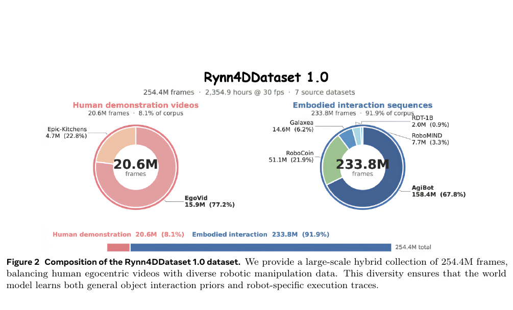

**Figure 2（PDF p.4）** 给出 **254.4M frames，2,354.9 hours @ 30 fps，7 个来源**：

| 大类 | 数据源 | 帧数 | 总量占比 |
|---|---:|---:|---:|
| 人类第一视角 | EgoVid | 15.9M | 6.25% |
| 人类第一视角 | EPIC-KITCHENS | 4.7M | 1.85% |
| 机器人交互 | AgiBot | 158.4M | 62.26% |
| 机器人交互 | RoboCoin | 51.1M | 20.09% |
| 机器人交互 | Galaxea | 14.6M | 5.74% |
| 机器人交互 | RoboMIND | 7.7M | 3.03% |
| 机器人交互 | RDT-1B | 2.0M | 0.79% |
| **合计** | 人类 20.6M + 机器人 233.8M | **254.4M** | **100%** |

机器人数据占 **91.9%**，AgiBot 一项约占总量 **62.3%**。“混合多源”不等于均衡，预训练分布主要由少数机器人数据源主导；人类视频只占 8.1%。（Fig. 2；Sec. 3.1；PDF p.4）

### 自动标注与伪标签偏差

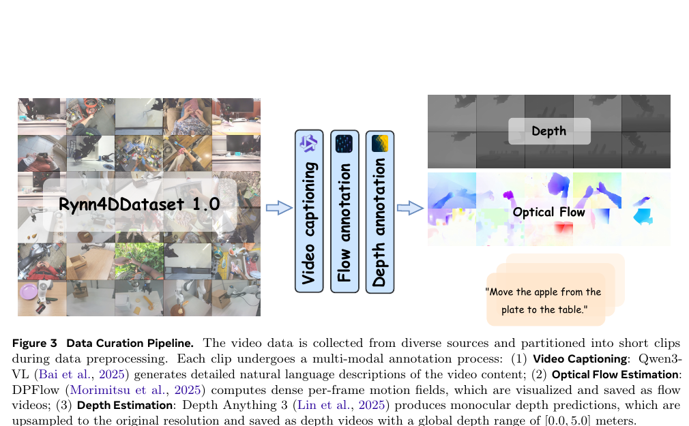

- **文本**：1 FPS 采样、切 5 秒片段；Qwen3-VL 生成主体动作、环境、对象交互与语境描述，max 512 tokens、temperature 0.7。
- **光流**：DPFlow 处理相邻原分辨率帧，以颜色编码保存为 25 FPS MP4。
- **深度**：DA3NESTED-GIANT-LARGE-1.1 在短边 392 上预测，双线性上采样，裁剪到 $[0,5]$ m，再以 $I=\lfloor d/d_{max}\times255\rfloor$ 量化成 8-bit 视频。（Sec. 3.1；PDF p.5）

偏差包括：单目深度对透明、反光、细杆、手指和遮挡的域偏差；二维光流无法完整描述遮挡消失和新显露表面；训练/评估 teacher 误差可能相关；1 FPS 文本采样漏快速接触且 temperature 0.7 可能幻觉；文本、深度、光流的处理频率分别涉及 1/30/25 FPS，论文未充分交代时间对齐与质量过滤。故它是规模化的**伪标注 RGB-DF 集合**，不是 254.4M 帧真实 metric 4D ground truth。

### 真实机器人任务

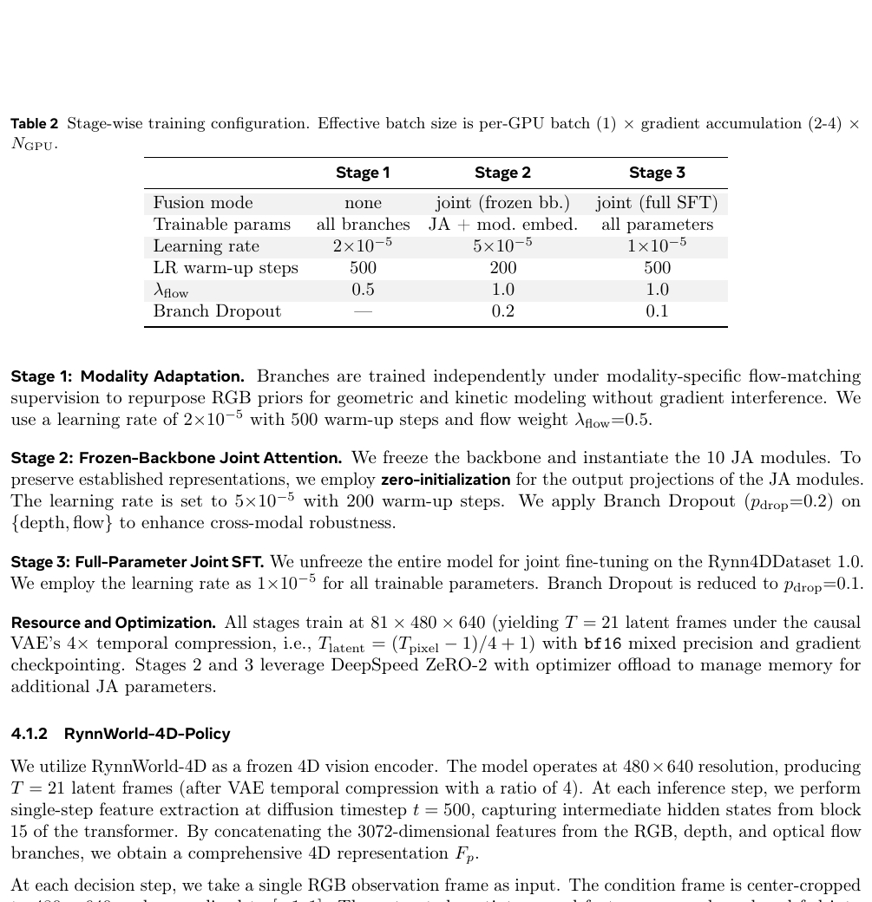

六任务是 Dual Picking、Block Pushing、Hand-over、Bimanual Lifting、Lid Placement、Bowl Stacking。（Fig. 5；PDF p.10）世界模型任务域训练共 2,400 episodes，策略每项 200、共 1,200。（Table 3；PDF p.11）

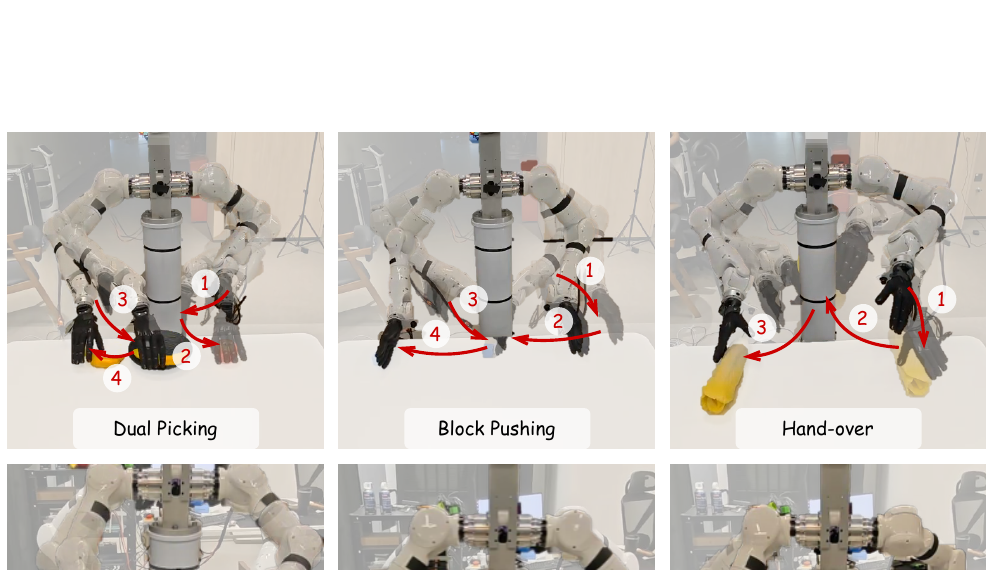

每方法每任务进行 **35 次连续真实试验**，120 秒内完成算成功。最小步长为 $1/35=2.857\%$：94.29%=33/35，97.14%=34/35，65.71%=23/35，28.57%=10/35。（Sec. 4.2；PDF p.10）论文未报置信区间、随机种子方差或显著性检验。

## 方法主线

### 机制流程

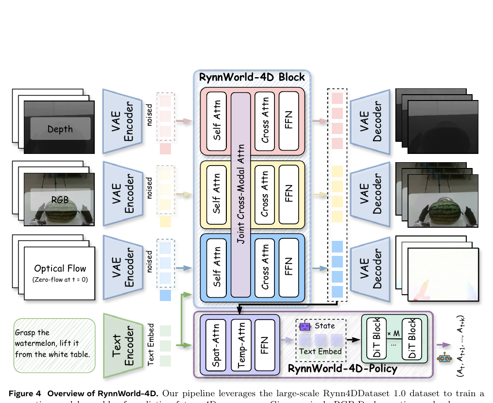

1. 给定当前 RGB-D 与语言指令，三条 VAE/DiT 分支分别建模未来 RGB、深度、光流；首帧是实 RGB、实深度、zero-flow conditioning。（Fig. 4；Eq. 7；PDF pp.6–7）
2. 各分支保留独立 self-attention/FFN；JA 每三层让一个分支 query 读取另外两分支的 K/V，以 frame-wise 3D RoPE 对齐同一时刻的空间 token。（Eq. 3–6, 9）
3. 先独立适配模态，再冻结主干训练 JA，最后解冻全参数联合微调；Stage 2–3 对 depth/flow 做 branch dropout。（Table 2；PDF p.9）
4. 策略在 $t=500$ 只做一次世界模型前向，取 block 15 三分支 hidden states；Flow Former 聚合，动作头用 4-step Euler ODE 输出 10×54D action chunk。（Eq. 8；PDF pp.7, 9–10）

### 为什么是 projective 4D 而非完整显式 4D

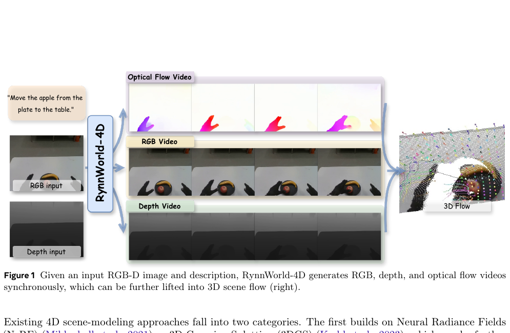

对像素 $\mathbf p_t=[u,v,1]^\top$：

$$\mathbf P_t=D_t(u,v)\mathbf K^{-1}\mathbf p_t. \tag{1}$$

二维光流 $[\Delta u,\Delta v]^\top$ 给出下一帧对应位置：

$$\mathbf P_{t+1}=D_{t+1}(u+\Delta u,v+\Delta v)\mathbf K^{-1}(\mathbf p_t+[\Delta u,\Delta v,0]^\top),$$
$$\mathbf f_{3D}=\mathbf P_{t+1}-\mathbf P_t. \tag{2}$$

这就是 depth+flow 反投影 scene flow。（Sec. 3.2；PDF pp.5–6）它输出相机坐标系逐点位移，但仍只是**当前视角可见表面序列**：索引是 $(u,v,t)$ 而非持久世界场 $(x,y,z,t)$；隐藏背面无状态；遮挡、新显露和拓扑变化没有完整对应；需要已知内参且公式未显式补偿相机外参变化；没有长期实体身份或持久地图。深度边缘过滤只是删除 $\|\nabla D\|>\tau$ 的困难点。因此“lightweight projective 4D”准确，把它等同 4DGS/动态 NeRF 则过度。

### Tri-branch、JA、3D RoPE、shared K/V

基座是 Wan 2.2-TI2V-5B：30 层 DiT，$d=3072$，FFN 14,336；depth/flow 复制 patch embedding、self-attention、normalization、FFN。（Sec. 4.1.1；PDF p.8）

$$\tilde{\mathbf z}_l^m=\mathrm{LN}^m(\mathbf z_l^m+\mathbf e^m). \tag{3}$$

$$\mathbf Q_l^m=\mathrm{RMSNorm}_q(\mathrm{QProj}_l^m(\tilde{\mathbf z}_l^m)),\quad [\mathbf K_l^m,\mathbf V_l^m]=\mathrm{KVProj}_l^m(\tilde{\mathbf z}_l^m),\quad \mathbf K_l^m\leftarrow\mathrm{RMSNorm}_k(\mathbf K_l^m). \tag{4}$$

$$\mathbf A_l^m=\mathrm{Attn}(\mathrm{RoPE}(\mathbf Q_l^m),\mathrm{RoPE}(\mathbf K_l^{cross}),\mathbf V_l^{cross}). \tag{5}$$

每模态生成一套 K/V，供其他模态 query 复用，参数从 $18d^2$ 降到 $12d^2$。实现部分另说三分支共享**文本 cross-attention** K/V 投影；两种“shared K/V”不可混淆。（PDF pp.6, 8）token reshape 为 $[B\cdot T,S,d]$，JA 只做同帧交互。3D RoPE 在这里主要提供一致的时空 token 坐标，不是直接恢复世界坐标。

### Zero-init gate

$$\hat{\mathbf z}_l^m=\mathbf z_l^m+\tanh(g_l^m)\mathrm{OutProj}_l^m(\mathbf A_l^m). \tag{6}$$

$\mathrm{OutProj}=0$ 保证 Stage-1 checkpoint 行为不变，$g=1$ 让 $\tanh(1)\neq0$，使输出投影能获得梯度，避免 gate 和投影同时为零的乘法死锁。（PDF p.6）严格说初始化瞬间 gate 自身因 OutProj=0 仍无梯度；先更新 OutProj 后 gate 才能学习。论文“non-zero gradients flow into the gate”的说法略简化。

### Branch dropout 与 shared FFN

Stage 2/3 以 0.2/0.1 概率把 depth 或 flow 的 frames [1:] noisy latent 替换为 Gaussian noise，迫使 JA 跨模态补全；RGB 永不丢弃，是 appearance anchor。这并非对称的模态缺失鲁棒性。（PDF pp.6, 9）shared FFN 消融的 AbsRel/δ1/AEPE 为 0.580/0.380/0.280，而 full 为 0.310/0.610/0.170，说明共享对齐通路有益，但异质模态需要独立非线性容量。（Table 4）

### 三阶段训练

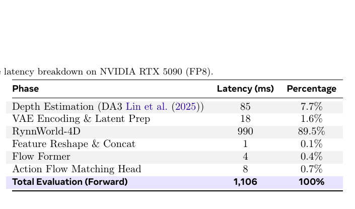

| 配置 | Stage 1 模态适配 | Stage 2 冻结主干 JA | Stage 3 全参数 SFT |
|---|---:|---:|---:|
| Fusion | none | joint, frozen bb. | joint, full SFT |
| 参数 | all branches | JA + mod. embed. | all |
| LR | $2e{-5}$ | $5e{-5}$ | $1e{-5}$ |
| warm-up | 500 | 200 | 500 |
| $\lambda_{flow}$ | 0.5 | 1.0 | 1.0 |
| branch dropout | — | 0.2 | 0.1 |

三阶段统一使用 flow matching：

$$\mathbf z_t^m=(1-t)\mathbf z_0^m+t\boldsymbol\epsilon^m,$$
$$\mathcal L=\sum_m\lambda_m\mathbb E\left[\|\mathbf v_\theta^m(\mathbf z_t^m,t,c)_{[1:]}-(\boldsymbol\epsilon^m-\mathbf z_0^m)_{[1:]}\|_2^2\right]. \tag{7}$$

三模态共享同一 Gaussian sample；首帧是 I2V 条件、不监督。81×480×640 经 causal VAE 得 21 latent frames；bf16、checkpointing，Stage 2/3 用 ZeRO-2 offload。（PDF pp.7, 9）curriculum 的逻辑是先把 RGB 先验迁移到几何/运动域，再低扰动融合，最后联合收敛。缺少各阶段 steps、GPU 数和总算力。

### Policy：single forward latent + Flow Former + 4-step ODE

冻结世界模型在 diffusion timestep $t=500$ 做一次 feature extraction，不执行完整视觉多步生成。取 block 15 的三分支中间状态，沿通道拼接为 $F_p$。（Sec. 4.1.2；PDF p.9）

$$\mathbf Q_i'=\mathrm{SpatCrossAttn}(\mathbf Q_i,\mathbf F_p[i]),\qquad \mathbf Q''=\mathrm{FFN}(\mathrm{TempSelfAttn}(\mathbf Q')). \tag{8}$$

动作 flow-matching 头条件于 $\mathbf Q''$、文本 embedding、proprioception，4-step Euler 输出 10×54D actions。只训 Flow Former 和 head，世界模型冻结，100 epochs。“single forward”只是相对视觉多步去噪更省；单次三分支前向仍为 990 ms。

## 关键结果

### Table 4 全指标

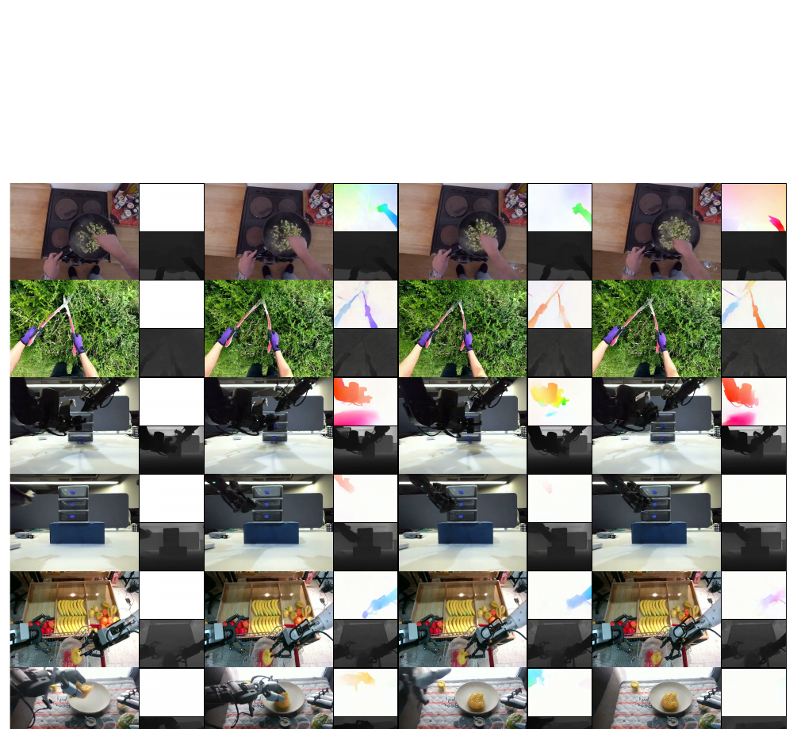

| Method | IQ↑ | MS↑ | SC↑ | Subj.↑ | SSIM↑ | PSNR↑ | LPIPS↓ | AbsRel↓ | δ1↑ | AEPE↓ |
|---|---:|---:|---:|---:|---:|---:|---:|---:|---:|---:|
| CogVideoX | 0.604 | 0.976 | 0.866 | 0.917 | 0.534 | 12.17 | 0.577 | N/A | N/A | N/A |
| Wan-2.2-TI2V-5B | 0.555 | 0.970 | 0.886 | 0.909 | 0.593 | 14.54 | 0.489 | N/A | N/A | N/A |
| Wan-2.1-I2V-14B | **0.684** | 0.988 | 0.891 | 0.956 | 0.536 | 12.72 | 0.568 | N/A | N/A | N/A |
| Free4D | 0.354 | 0.993 | 0.787 | 0.848 | 0.492 | 12.40 | 0.597 | 0.804 | 0.179 | N/A |
| TesserAct | 0.608 | 0.992 | 0.904 | 0.956 | 0.693 | 16.91 | 0.335 | 0.699 | 0.279 | N/A |
| 4DNeX | 0.637 | 0.994 | 0.917 | 0.986 | 0.649 | 14.47 | 0.404 | 0.423 | 0.327 | N/A |
| **RynnWorld-4D** | 0.635 | **0.995** | **0.957** | **0.992** | **0.754** | **17.85** | **0.269** | **0.310** | **0.610** | **0.170** |

（Table 4；PDF p.13）Rynn 并非 IQ 第一，但 GT 对齐的 fidelity、depth 和唯一原生 flow 占优。test set 仅 50 sequences；Free4D 逐场景 10,000 次优化，4DNeX/TesserAct 各 50 denoise steps，输入和深度归一化不同，故更能证明该协议下 RGB-DF 有效，不能证明普适全面领先。（Sec. 4.2；Appendix D）

### Table 4 消融

| Variant | SSIM↑ | PSNR↑ | LPIPS↓ | AbsRel↓ | δ1↑ | AEPE↓ |
|---|---:|---:|---:|---:|---:|---:|
| Full | 0.754 | 17.85 | 0.269 | 0.310 | 0.610 | **0.170** |
| Independent Branches | 0.683 | 17.26 | 0.346 | 0.737 | 0.245 | 0.247 |
| w/o MA | 0.699 | 17.85 | 0.303 | 0.507 | 0.479 | 0.231 |
| w/o 4D Pre-training | 0.651 | 16.25 | 0.344 | 0.797 | 0.263 | **0.729** |
| w/o RoPE in JA | 0.710 | 17.10 | 0.295 | 0.420 | 0.450 | **0.210** |
| shared FFN | 0.695 | 16.50 | 0.320 | **0.580** | **0.380** | **0.280** |

（Table 4；PDF pp.13–14）最强证据是 w/o 4D pretraining 的 AEPE 从 0.170 恶化到 0.729，但它同时改变规模和多样性。Independent Branches 支持 JA；w/o MA 支持 curriculum；w/o RoPE 支持位置对齐；shared FFN 支持专门化。仍缺 JA 间隔、shared K/V、zero-init gate、branch dropout 和共享噪声的独立消融。

### Table 5 六任务与 Hand-over

| Method | Dual Picking | Block Pushing | Hand-over | Bimanual Lifting | Lid Placement | Bowl Stacking |
|---|---:|---:|---:|---:|---:|---:|
| DP | 77.14 | 85.71 | 17.14 | 88.57 | 57.14 | 57.14 |
| π0 | 88.57 | 94.29 | 2.86 | 91.43 | 34.29 | 51.43 |
| π0.5 | **94.29** | **100.00** | 0.00 | 94.29 | 37.14 | 42.86 |
| **RynnWorld-4D-Policy** | **94.29** | 97.14 | **28.57** | **97.14** | **65.71** | **65.71** |

（Table 5；PDF p.13）**65.71% 是 Lid Placement 和 Bowl Stacking 各自 23/35，不是二者平均。** 两项 next best 都是 DP 57.14%=20/35，因此各高 8.57 个百分点，即 3 次成功。正文表述成立，但离散样本小。

Hand-over 是绝对最弱任务：Rynn 28.57%=10/35，虽高于 DP 6/35、π0 1/35、π0.5 0/35，但仍失败 25 次。它证明相对优势，未解决交接。作者归因于 parallel-jaw 预训练偏置、双手相对三维距离、自遮挡和 RGB 隐式动态恢复；合理但未逐项因果验证。

去掉 RynnWorld-4D、换 ResNet-18 后 Dual Picking 从 94.29 降至 71.43。RGB+Depth 在 Hand-over 和 Bimanual Lifting 已等于 full，说明 depth 是主要边际贡献，flow 并非所有任务额外提高；完整三模态在若干任务继续占优。（Table 5）

### 定性证据

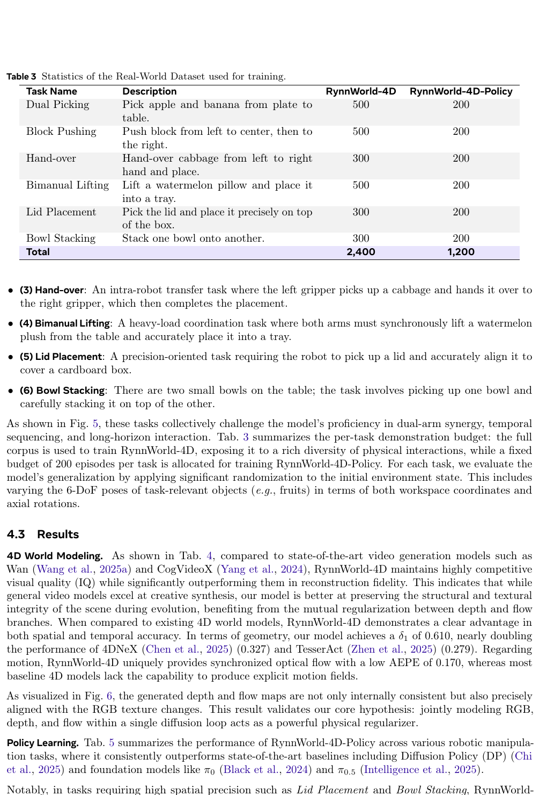

Figure 6（PDF p.12）展示 9 类同步序列；Appendix E 的 Figure 9（PDF p.26）补充两组：

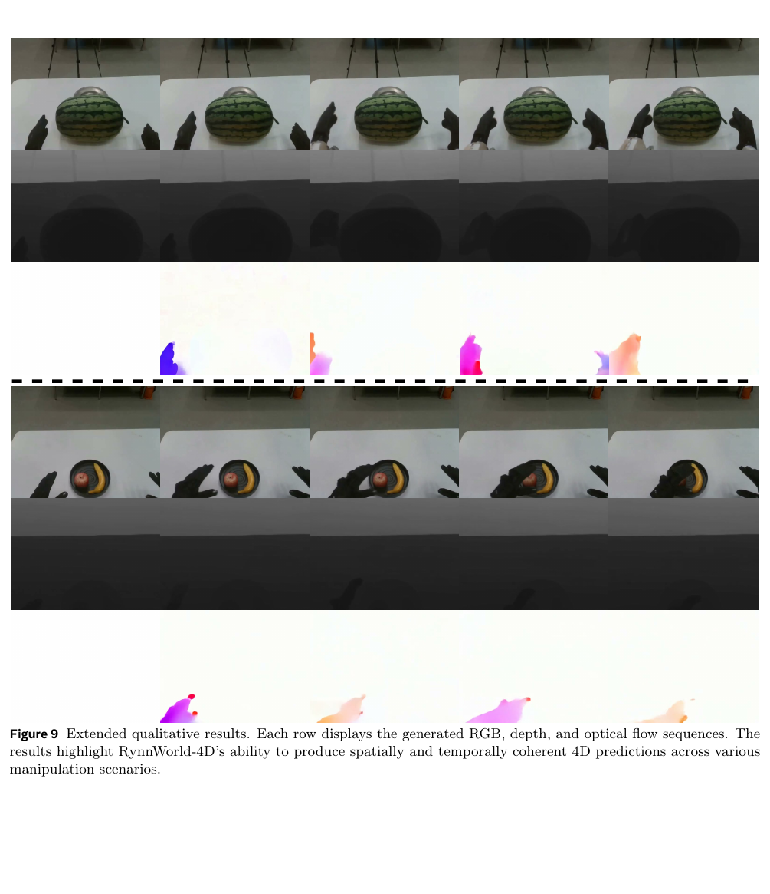

静态 PDF 只抽样少数帧，可支持可见的跨模态边界与短时一致性，不能严格判断 flicker、接触动力学、长时 identity persistence，也无 baseline 逐例并排。

## 延迟与闭环语义

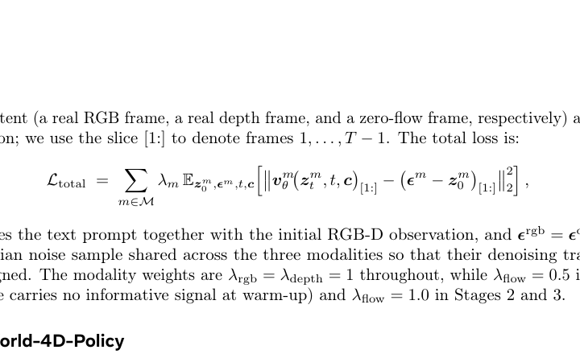

| 阶段 | 延迟 | 占比 |
|---|---:|---:|
| DA3 depth | 85 ms | 7.7% |
| VAE prep | 18 ms | 1.6% |
| **RynnWorld-4D** | **990 ms** | **89.5%** |
| reshape | 1 ms | 0.1% |
| Flow Former | 4 ms | 0.4% |
| action head | 8 ms | 0.7% |
| **总计** | **1,106 ms** | **100%** |

（Table 1；PDF p.8；RTX 5090、FP8、FA3）新的视觉世界状态约每 **0.9 Hz** 刷新。每次输出 10 个动作并串行执行，同时算下一块，故 $10/1.106\approx9$ Hz 被称为 effective control frequency。低层接口 500 Hz，缓存动作按 50 Hz 查询。（Appendix A）

频率含义：500 Hz 是底层关节接口；50 Hz 是缓存 chunk 执行；约 9 Hz 是动作吞吐；约 0.9 Hz 才是视觉重规划。实现明确写“executes 10 actions open-loop before re-querying the visual backbone”（PDF p.10）。这是块间闭环、块内开环；高速接触、滑移或安全事件可在约 1 s 内发生。

## 与相邻路线的定位

### 2D WAM

相比 RGB 未来视频，depth/flow 是明确 inductive bias，policy ablation 支持 predictive latent 优于静态 RGB encoder。但没有同参数、同数据的强 RGB predictive latent、RGB-D policy 或直接 VLA 对照，表示收益与大规模预训练收益仍混合。

### explicit 4DGS / Free4D

Free4D 表示显式、可新视角渲染、场景专属，需 novel-view generation、COLMAP 和 10,000 次优化。Rynn 是 feed-forward、单视图、继承视频先验；代价是只有投影视锥可见表面，不能天然支持 viewpoint change、持久遮挡或跨视图一致性。同视角 Table 4 更偏向 projective 方法。

### 4DNeX / TesserAct

4DNeX 联合 RGB 与 per-pixel XYZ pointmap；TesserAct 联合 RGB/depth/normal。Rynn 的关键增量是 optical flow 使相邻帧可反投影为 scene flow。4DNeX IQ 略高（0.637 vs 0.635），Rynn fidelity/depth 更好；但 AEPE 无横向 competitor，0.170 是绝对质量而非 SOTA 对比。

### VLA / policy

π0/π0.5 强在跨任务大规模 VLA 预训练；Rynn 是冻结任务相关世界模型、只训动作头，在本地双臂灵巧手占优。六任务、单平台、每项 200 demos 不能证明普遍胜过 VLA。更合理定位是**可插入 policy/VLA 的 predictive 4D encoder**。

### baseline 公平性

Appendix D（PDF p.25）说明 Free4D、4DNeX、TesserAct 的输入、推理步数、guidance、深度尺度各异。显式方法偏场景生成/新视角，Rynn 偏未来预测/控制，Table 4 有参考价值但并非同容量竞赛。

## 深度分析

### 真正贡献是什么

1. 最真实概念贡献：把 RGB-DF 组织成视频模型可学、又能计算 scene flow 的接口。
2. 最强系统贡献：数据、三分支 curriculum、冻结 predictive encoder 到 54-DoF 策略的整合。
3. 最重规模工程：254.4M 帧伪标签；w/o pretraining 崩溃也说明结果难与规模解耦。
4. JA 是扎实工程增量而非新范式；多个细组件缺单独消融。

### 为什么结果成立

更直接的 appearance/geometry/motion 监督减少 RGB 隐式反演负担；DA3/DPFlow teacher knowledge 被蒸馏；独立 FFN 防 interference、稀疏 JA 保一致；冻结 predictive latent 让 200 demos/task 的策略读取未来轨迹而非重新学习动态。

### 容易误读

1. “4D”不等于完整世界坐标四维场。
2. “single forward”不等于低延迟：990 ms 世界模型，动作侧仍 4-step ODE。
3. “9 Hz closed-loop”不等于 9 Hz 感知重规划，规划约 0.9 Hz。
4. AEPE 0.170 不是标准像素 EPE；Appendix B.3 在 Middlebury color-coded flow 的 normalized RGB 空间算 $\ell_2$。
5. 65.71% 是两个任务各自 23/35，各比 DP 多 3 次成功。
6. Hand-over 相对领先但绝对仅 10/35。
7. metric scene flow 依赖深度 metricity、内参和相机运动处理；论文未充分展开。

### 复现注意点

Wan 2.2-TI2V-5B、30 layers、3072 hidden、14,336 FFN；JA layers 0,3,…,27，共 10；同帧 mask、3D RoPE、OutProj zero-init/gate=1、独立 FFN、文本 K/V 共享。三阶段 optimizer/scheduler reset；AdamW $(0.9,0.95)$、wd $1e{-4}$、EMA 0.9999；81×480×640、21 latent frames、bf16、checkpointing、ZeRO-2 offload。策略用 DA3、$t=500$、block 15、4-step Euler、10×54D，100 epochs。缺世界模型 stage steps/GPU/时长、action normalization、proprioception schema、成功判定细则、种子和失败统计。延迟依赖 RTX 5090、FP8、FA3。

## 公式与附录覆盖索引

| 公式 | 内容 | 作用 | 页码 |
|---|---|---|---|
| Eq. 1 | depth+intrinsics | 2D 到 3D 点 | p.5 |
| Eq. 2 | depth+flow correspondence | 3D scene flow | p.6 |
| Eq. 3 | modality embedding+LN | 数值对齐 | p.6 |
| Eq. 4 | Q 与共享 K/V | JA 降参 | p.6 |
| Eq. 5 | complementary attention | 跨模态融合 | p.6 |
| Eq. 6 | zero-OutProj+tanh gate | 稳定热启动 | p.6 |
| Eq. 7 | 三模态 flow loss | 同步训练 | p.7 |
| Eq. 8 | Flow Former | latent 到 policy token | p.7 |
| Eq. 9 | JA 实现摘要 | cross-branch residual | p.8 |
| Eq. 10 | median-scaled AbsRel | depth error | p.24 |
| Eq. 11 | $\delta_1<1.25$ | depth accuracy | p.24 |
| Eq. 12 | AEPE | flow color RGB 距离 | p.24 |
| Eq. 13 | rectified-flow path | Wan 预备知识 | p.24 |
| Eq. 14 | conditional flow matching | 训练基础 | p.24 |

- **Appendix A（p.22）**：TIANJI M6 7-DoF + WUJI 20-DoF；双臂双手 54 DoF；策略 50 Hz、延迟 18–30 ms、底层 500 Hz。5 个 HTC Vive trackers 100–120 Hz，Pinocchio IK + Ruckig 后 200 Hz 发臂；Manus glove 经 21-point MediaPipe retarget。（Fig. 7–8）
- **Appendix B（pp.22–24）**：IQ/MS/SC/Subj./PSNR/SSIM/LPIPS/AbsRel/$\delta_1$/AEPE；AEPE 的 color-RGB 实现是关键 caveat。（Eq. 10–12）
- **Appendix C（pp.24–25）**：Wan 的 3D VAE、rectified flow、conditional flow matching。（Eq. 13–14）
- **Appendix D（p.25）**：Free4D、4DNeX、TesserAct 的输入、步骤、guidance、归一化和 checkpoint。
- **Appendix E（pp.25–26）**：额外 RGB/depth/flow 定性示例。（Fig. 9）

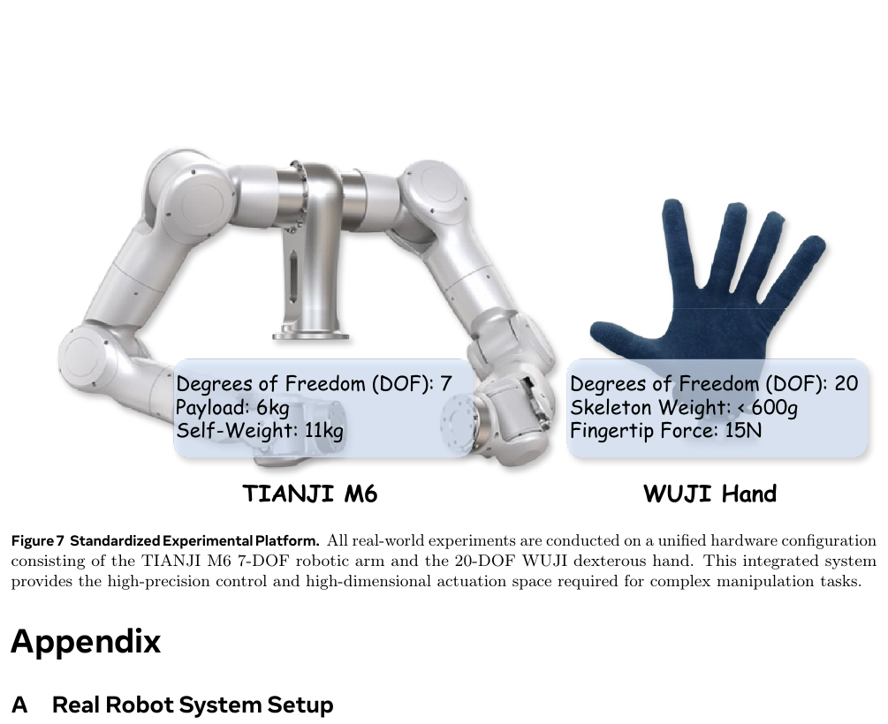

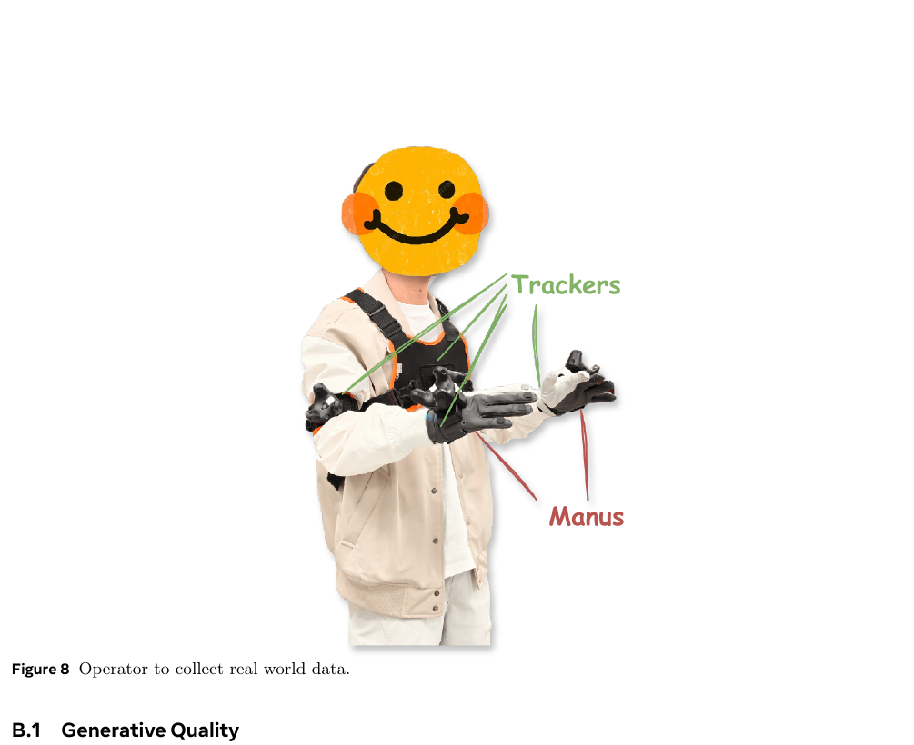

## 局限

作者明确承认 diffusion 开销使 RTX 5090 上有效动作频率约 9 Hz，难满足超高频控制；模型主要面向 egocentric perspective，多视角、多机器人协作未解决。（Conclusion；PDF p.15）

更深局限：单视图无隐藏面或持久状态；伪 depth/flow 有 teacher ceiling；Eq. 1–2 未明确相机外参变化，metricity 论证不足；990/1106 ms 的延迟只是被 chunk 摊销；块内 10 动作开环；world-model test 仅 50 sequences，真实任务每格 35 trials、无不确定性；baseline 输入目标不完全同配；架构贡献与 254.4M 规模纠缠；Hand-over 仍仅 28.57%；无 perception/planning/grasp/slip/collision 等失败类型分解。

## 我的笔记

值得保留之处不是“完整 4D 已解决”，而是一个现实中间层：**以视频模型友好的二维 latent 为载体，用 depth/flow 把几何和动态变成显式目标，再让 policy 读取 predictive latent。** 它比 RGB 视频后处理更紧，比在线 4DGS 更适合规模预训练。

下一步应以真实 RGB-D/多视角 scene flow 校准伪标签；显式分解 ego-motion；做同数据同骨干 RGB/RGB-D/RGB-flow/RGB-DF 参数匹配比较；蒸馏 990 ms encoder 或在 chunk 内加入快速 residual policy；报告 chunk 长度—planning rate—安全曲线；对 Hand-over 做遮挡、滑移、交接时序的失败分解。否则它更像由巨大伪标签支撑的单视图 predictive encoder，而不是可查询、可验证、可长期维护的通用四维世界状态。

## 图表覆盖与选图说明

Figure 1–9 均在正文解释并保存原生 PDF 页面裁图；Table 1–3 有裁图与数字转写；Table 4–5 因同页宽表合并裁图并完整转写 Markdown。Figure 6/9 为高尺寸多帧图，Markdown 图用于结构参考，逐帧细节建议看原 PDF。

## 引用

Zhao, H., Zhao, X., Huang, S., Li, X., Zhao, D., & Li, Z. (2026). *RynnWorld-4D: 4D Embodied World Models for Robotic Manipulation*. arXiv:2607.06559. 全文 26 页；本文覆盖 Figure 1–9、Table 1–5、Equation 1–14 与 Appendix A–E。
