# SC²-WM: A Self-Correcting World Model with Closed-Loop Feedback for Vision-and-Language Navigation

**Authors:** Xuan Yao, Yuze Zhu, Junyu Gao, Zongmeng Wang, Changsheng Xu
**Detected source format:** selectable-text PDF (`pdf-text`)
**Coverage:** 18 / 18 PDF pages; full extracted source text retained below.

## Page / Section Index

| PDF pages | Content |
|---|---|---|
| 1 | Full source extraction, figures/tables/equations/appendix/references in PDF reading order |
| 2 | Full source extraction, figures/tables/equations/appendix/references in PDF reading order |
| 3 | Full source extraction, figures/tables/equations/appendix/references in PDF reading order |
| 4 | Full source extraction, figures/tables/equations/appendix/references in PDF reading order |
| 5 | Full source extraction, figures/tables/equations/appendix/references in PDF reading order |
| 6 | Full source extraction, figures/tables/equations/appendix/references in PDF reading order |
| 7 | Full source extraction, figures/tables/equations/appendix/references in PDF reading order |
| 8 | Full source extraction, figures/tables/equations/appendix/references in PDF reading order |
| 9 | Full source extraction, figures/tables/equations/appendix/references in PDF reading order |
| 10 | Full source extraction, figures/tables/equations/appendix/references in PDF reading order |
| 11 | Full source extraction, figures/tables/equations/appendix/references in PDF reading order |
| 12 | Full source extraction, figures/tables/equations/appendix/references in PDF reading order |
| 13 | Full source extraction, figures/tables/equations/appendix/references in PDF reading order |
| 14 | Full source extraction, figures/tables/equations/appendix/references in PDF reading order |
| 15 | Full source extraction, figures/tables/equations/appendix/references in PDF reading order |
| 16 | Full source extraction, figures/tables/equations/appendix/references in PDF reading order |
| 17 | Full source extraction, figures/tables/equations/appendix/references in PDF reading order |
| 18 | Full source extraction, figures/tables/equations/appendix/references in PDF reading order |

## Terminology Ledger

| Canonical term | 中文 | Decision |
|---|---|---|
| SC²-WM | SC²-WM | 方法名不译 |
| Vision-and-Language Navigation in Continuous Environments (VLN-CE) | 连续环境视觉语言导航 | 首次展开后用 VLN-CE |
| internal feedback | 内部反馈 | 统一译法 |
| foresight prediction | 前瞻预测 | 统一译法 |
| state-level correction | 状态级修正 | 统一译法 |
| model-level correction | 模型级修正 | 统一译法 |
| conditional world-aware adaptation | 条件世界感知适应 | 统一译法 |
| Visual Calibration Module (VCM) | 视觉校准模块 | 首次展开后用 VCM |
| Foresight-Reconstruction Loss (FRL) | 前瞻重建损失 | 统一译法 |

## Full bilingual reader
### PDF page 1

> <strong>Para. 1:</strong> SC2 -WM: A Self-Correcting World Model with Closed-Loop Feedback for Vision-and-Language Navigation in Continuous Environments Xuan Yao 1 2 3 Yuze Zhu 2 Junyu Gao 1 2 Zongmeng Wang 1 Changsheng Xu 1 2 4 (a) Conventional Open-Loop VLN                                 (b) Classical Closed-Loop Control Abstract Action 𝒂𝑡 𝒍                                                                           Error 𝑣 = 2.8 Controller Vision-and-Language Navigation in Continuous                           Instruction   Policy 𝜋                                                       + Σ −                    Action    Output Environments (VLN-CE) requires agents to make                          𝒐𝑡                                                              Inputs Observation             Interaction with Environment fine-grained navigation decisions under partial ob- servability. However, most existing methods rely                              (c) Self-Correcting World Model with Closed-Loop Feedback Action 𝒂𝑡 on open-loop execution, lacking mechanisms to                           𝒍                𝒔𝑡     Adaptation       ෤𝒔𝑡+1      Internal Feedback      (∆) 𝒔𝑡−1 Policy detect and correct internal state drift during infer-                  Instruction Latent                                   + ∆ −        Refined 𝜋  Latent State           Foresight Prediction ence. We propose SC2 -WM, a self-correcting                            𝒐𝑡 … State … Observation            Latent Dynamics Learning in Our World Model                           Interaction with Environment world model framework that introduces inter- nal feedback for closed-loop decision making                         Figure 1. Comparison of (a) conventional open-loop VLN frame- in VLN-CE. Our method derives feedback from                          work, (b) classical closed-loop control, and (c) our self-correcting world-model foresight to perform state-level plan                    world model with closed-loop feedback. Unlike open-loop meth- refinement before action execution. To handle                        ods that execute actions without validation, SC2 -WM leverages challenging scenarios, we further introduce con-                     internal feedback derived from foresight prediction to refine latent states before action execution. ditional world-aware adaptation, which enables model-level correction by selectively updating the world model at test time when feedback in- dicates model capacity insufficiency. Experi-                        et al., 2024; Gao et al., 2025b; Yuan et al., 2025). ments on standard VLN-CE benchmarks demon- Extending Vision-and-Language Navigation to continuous strate improved navigation robustness and gen- environments (VLN-CE) (Krantz et al., 2020; An et al., eralization. Our code is available at https: 2024) imposes substantially stricter demands on embodied //github.com/sunrise-ikun/SC2_WM. agents. Beyond fine-grained control in a continuous action space, the agent must continuously update its understanding of the environment during execution. Moreover, real-world 1. Introduction                                                           navigation is inherently partially observable, requiring the Vision-and-Language Navigation (VLN) (Anderson et al.,                    agent to integrate historical information into an internal 2018b; Qi et al., 2020; Chen et al., 2022c) is a representa-              representation while remaining aligned with the semantic tive embodied AI task that requires an agent to navigate au-              constraints of natural language instructions. tonomously in 3D environments following natural language                  Despite recent advances in model architectures and decision instructions. Targeting real-world interactive settings, this             policies for VLN-CE (An et al., 2024; Wang et al., 2024b), task captures tight coupling between language understand-                 most existing approaches still adopt an open-loop execu- ing and spatial decision making, making it a central topic                tion paradigm at inference time, as shown in Figure 1(a). in multimodal and embodied intelligence research (Zhang                   The agent predicts actions from current observations and 1                                                                     history, and executes them without validating their conse- State Key Laboratory of Multimodal Artificial Intelligence Systems (MAIS), Institute of Automation, Chinese Academy of               quences. As a result, early decision errors may accumulate Sciences (CASIA) 2 School of Artificial Intelligence, University of       over time, degrading navigation performance. Classical Chinese Academy of Sciences (UCAS) 3 HiThink Research, China              closed-loop control (Figure 1(b)) addresses this by com- 4 Peng Cheng Laboratory, ShenZhen, China. Correspondence to:              paring outputs against references to compute error signals. Junyu Gao <junyu.gao@nlpr.ia.ac.cn>.                                      While introducing closed-loop feedback mechanisms seems Proceedings of the 43 rd International Conference on Machine              a natural solution (Bu et al., 2024; Li et al., 2024), doing Learning, Seoul, South Korea. PMLR 306, 2026. Copyright 2026              so in VLN-CE is inherently challenging: external super- by the author(s).                                                         vision is typically sparse and delayed, with success only 1

> <strong>Para. 1[CN]:</strong> 本文提出 SC²-WM，用世界模型前瞻预测产生内部反馈，在执行动作前修正潜在状态，并在反馈显示模型能力不足时进行条件式世界感知适应。

### PDF page 2

> <strong>Para. 2:</strong> A Self-Correcting World Model with Closed-Loop Feedback for VLN-CE observable at the trajectory level. Prior attempts incorpo-                  • We propose SC2 -WM, a dual-level self-correcting rate feedback through reinforcement learning (Wang et al.,                     world model framework for VLN-CE that leverages in- 2024a) or model predictive control (Dey & Bhasin, 2025),                       ternal foresight to enable closed-loop decision making but often rely on manually designed rewards and suffer from                    with internal generated feedback. training instability. Test-time adaptation methods (Wang et al., 2020; Gao et al., 2024) instead adjust models using                  • We introduce a dual-level self-correction mechanism, output-level statistics such as uncertainty or entropy, yet                    comprising feedback-guided plan refinement for im- these signals remain decoupled from the agent’s internal                       mediate state-level correction and conditional world- representation and cannot directly reveal misalignment in                      aware adaptation for targeted model-level correction at its understanding of the environment.                                          test time. Based on the above analysis, we argue that effective closed-                • We conduct extensive experiments on standard VLN- loop decision making in VLN-CE hinges on constructing                         CE benchmarks and real-world deployment, demon- appropriate feedback signals. Since external rewards are                      strating that SC2 -WM consistently improves naviga- difficult to obtain or design reliably, we turn to an alternative:            tion performance. ‘can the agent extract internal feedback signals from its own decision process for self-correction?’ Predictive processing             2. Related Work in cognitive science (Huang & Rao, 2011) suggests that adaptive behavior relies on continuously monitoring the                  Vision-and-Language Navigation in Continuous Envi- consistency between internal predictions and subsequent                  ronments. Vision-and-Language Navigation (VLN) has observations, rather than on single-pass inference or delayed            emerged as a cornerstone of embodied AI, requiring agents external supervision. This perspective aligns well with VLN-             to navigate unseen environments following natural language CE, where navigation failures often arise not from a single              instructions (Anderson et al., 2018b; Qi et al., 2020; Baner- erroneous observation, but from gradual drift in the agent’s             jee et al., 2021; Chen et al., 2022b; An et al., 2022a; Qiao internal understanding of the environment or instruction. If             et al., 2023; Song et al., 2025; Guo et al., 2026a). While such drift can be detected during execution, the agent can               early works operated in discrete settings, Krantz et al. (2020) correct its representation before errors amplify further.                introduced Vision-and-Language Navigation in Continu- ous Environments (VLN-CE) to narrow the sim-to-real gap. Inspired by this, we propose SC2 -WM, a self-correcting                   This setting transitions agents from graph-based teleporta- world model framework for VLN-CE that enables closed-                     tion to continuous 3D spaces, introducing higher demands loop decision making through a computable internal feed-                  for understanding the environment state. To address the back signal (Figure 1(c)). SC2 -WM focuses on detecting                   challenges posed by partial observability and the absence and correcting deviations in the agent’s internal understand-             of topological priors in VLN-CE, many existing approaches ing of the environment during navigation. The core of SC2 -               adopt lightweight navigation architectures, improving navi- WM is a world model that captures environment dynamics                    gation robustness and execution stability through enhanced and produces foresight predictions from latent state repre-               state representation (Wang & Lee, 2025; Huang et al., 2025), sentations. These predictions reflect both the anticipated                trajectory modeling (An et al., 2024; Wang et al., 2023c), evolution of the environment and the agent’s current internal             and action selection strategies (Wang et al., 2025c; 2024b). assumptions. During inference, the discrepancy between                    These methods typically emphasize efficient perception and the current latent state and its foresight provides an internal           compact policy learning, enabling practical deployment un- reference signal indicating how the selected action would                 der limited computational resources while maintaining com- steer the agent’s internal dynamics before it is executed.                petitive navigation performance in complex environments. Based on this signal, SC2 -WM introduces a dual-level self-               More recently, with the rapid advancement of multimodal correction mechanism. (i) At the state level, feedback-                   large-language models (MLLMs), recent works (Lin et al., guided plan refinement performs state-level correction by                 2025; Zhang et al., 2025; 2024; Gao et al., 2025b; Yuan modulating the current latent state using foresight-derived               et al., 2025) have explored incorporating MLLMs into VLN signals, mitigating local inference drift during action selec-            to leverage their strong language understanding and cross- tion. (ii) At the model level, conditional world-aware adap-              modal reasoning abilities, thereby enhancing the model- tation targets model-level correction by updating the world               ing of complex instructions, long-term dependencies, and model when feedback reveals heavy reliance on foresight-                  high-level semantic relationships. Despite their promising derived guidance, improving its generalization ability for the            semantic performance, such approaches typically incur sub- testing environments. Together, these mechanisms enable                   stantial computational overhead and still face limitations in effective navigation in continuous, dynamic environments.                 online inference efficiency and edge deployment. There- fore, we focus on the lightweight model paradigm for VLN- Our main contributions are summarized as follows:                         CE, investigating how to systematically improve navigation 2

> <strong>Para. 2[CN]:</strong> 本文回顾连续环境视觉语言导航、世界模型和具身闭环机制，指出现有方法缺乏可计算的内部误差信号，且容易累积导航漂移。

### PDF page 3

> <strong>Para. 3:</strong> A Self-Correcting World Model with Closed-Loop Feedback for VLN-CE decision-making and online adaptability within a compact             on reinforcement learning and is difficult to train. There- model framework, without focusing on large-scale MLLMs.              fore, this paper focuses on exploring how to efficiently ex- tract internal feedback signals from the world model’s own World Models. World models are fundamentally defined decision-making process to enable self-correction at both as internal representations that capture environmental dy- the decision and model levels. namics, enabling agents to simulate future states based on current observations and potential actions (Ha & Schmid- huber, 2018; Hafner et al., 2025). This predictive capabil-          3. Our Approach ity has been extensively applied across various embodied In this section, we propose SC2 -WM, a self-correcting world tasks, ranging from game simulation in virtual environments model framework for VLN-CE. Our model incorporates an (Valevski et al., 2024) to autonomous driving (Ren et al., internal feedback mechanism to support closed-loop deci- 2025; Russell et al., 2025) and robotic manipulation (Chi sion making, enabling self-correction to enhance navigation. et al., 2025; 2024). In the context of VLN, world models empower agents to overcome partial observability through             Task Definition. In VLN-CE (Krantz et al., 2020; Krantz predictive foresight. DreamWalker (Wang et al., 2023b)               & Lee, 2022; Wang et al., 2025c), an agent navigates in integrates scene synthesis with Monte Carlo Tree Search               continuous 3D environments given RGB-D observations (MCTS) for decision making. NavMorph (Yao et al., 2025)               and a natural language instruction. Each episode starts from employs a recurrent state-space model to characterize the             an initial position and terminates when the agent issues a evolution of internal states. However, these approaches fol-         ‘STOP’ action or reaches a predefined maximum number of low an open-loop paradigm, in which action execution is               steps. At each timestep t, the agent receives an observation not guided by feedback signals, making them prone to the              ot and selects a navigation action at based on predicted accumulation of navigation errors. Although a few works               candidate waypoints (Krantz et al., 2021; Hong et al., 2022), (Huang et al., 2025) explore predictive feedback, they are           which is then executed via low-level continuous control. limited to modeling discrete environments and do not ex-              Formally, the agent follows a learnable policy π that maps plicitly quantify error signals for joint correction at both          the instruction l, observation history o1:t , and past actions the decision and model levels. To date, how to construct              a1:t−1 to the current action: at ∼ π(at | l, o1:t , a1:t−1 ). closed-loop, feedback-driven world models for tasks with Framework Overview. As illustrated in Figure 2, we pro- sparse and delayed supervision remains an open problem. pose SC2 -WM, a self-correcting world model framework Closed-Loop Mechanisms for Embodied Tasks. The                       that integrates internal foresight with closed-loop feedback goal of closed-loop control is to continuously adjust ac-            for robust decision making in VLN-CE. The framework tions based on real-time sensory feedback to minimize the            supports two complementary forms of self-correction: (i) discrepancy between the current state and the target state           feedback-guided plan refinement, which performs immedi- (Hutchinson et al., 2002; Levine et al., 2016). Early ap-            ate, state-level correction before action execution; and (ii) proaches typically focused on tasks with real-time error             conditional world-aware adaptation, which selectively up- sensors, such as visual servoing (Hutchinson et al., 2002).          dates the world model at test time when feedback signals However, in contemporary embodied manipulation or navi-              challenging scenarios, achieving model-level correction. gation tasks, the absence of supervision signals often makes At each timestep t, the agent encodes the current obser- it difficult to compute error signals in real-time, hindering vation ot into visual features v t and integrates them with the construction of closed-loop systems. To address this, the linguistic representation extracted from the instruction CLOVER (Bu et al., 2024) uses video diffusion models to l (Chen et al., 2022c; An et al., 2024). These features are generate visual sub-goals for establishing closed-loop con- then incorporated into a latent state st , maintained by the trol during manipulation. The fast-slow system paradigm world model to capture the navigational context. This state (Li et al., 2024) leverages the semantic reasoning capabil- is updated recurrently via a posterior transition q(st | ·) that ity of large language models to construct feedback signals, integrates the previous state, the executed action, and the where the fast system is responsible for efficient execution current visual-linguistic features. Based on st , a foresight and the slow system is used for failure reflection and correc- policy π̃ proposes a provisional action ãt , and the world tion. Other methods have explored the design of feedback model anticipates a foresight state s̃t+1 via a prior transition signals in VLA models, delegating closed-loop control to p(s̃t+1 | ·) without observing new visual input. An internal lightweight policies (Sendai et al., 2025). In recent years, feedback signal derived from this foresight is used for plan world models have become a viable approach for building                                                             (∆) closed-loop feedback mechanisms due to their ability to              refinement, correcting the current state to st (detailed in predict future states. However, current explorations in this         Section 3.1), from which the navigation policy π selects the area are primarily based on the Model Predictive Control             final action at . We formalize SC2 -WM as follows: (MPC) framework (Sendai et al., 2025), which heavily relies 3

> <strong>Para. 3[CN]:</strong> 任务定义和框架总览给出：观测与指令编码为潜在状态，前瞻策略提出临时动作，先验转移预测下一状态，差异信号用于计划细化，导航策略据此产生最终动作。

### PDF page 4

> <strong>Para. 4:</strong> A Self-Correcting World Model with Closed-Loop Feedback for VLN-CE Continuously Updating VCM                   𝒔෤ 𝑡+1          𝑑                      VCM           𝒔෤ 𝑡+2                       𝑑 Episodic Memory ℳ𝑡                          … +                                                         + Adaptive ෝ 𝒗𝑡                𝑓𝑝        𝚫𝑡           Internal       ෝ 𝒗𝑡+1           𝑓𝑝         𝚫𝑡+1 Gating Fusion Feedback Memory                                                                                     −                                                         − Spatial-    Retrieval (∆) 𝒔𝑡−1                 𝑓𝑞                𝒔𝑡             𝜓 (∆) 𝒔𝑡             𝑓𝑞            𝒔𝑡+1                         𝜓                … Temporal VCM     … Cues                                                                                                                                                             Prior State Transition Posterior State Update State-Level                                                 Internal 𝚫𝑡 Feedback          (∆) 𝒔𝑡 Feedback- Refined States Feedback-                    𝒂𝑡−1               ෥𝑡 𝒂                                            𝒂𝑡          ෥𝑡+1 𝒂 Self-                                               𝒔𝑡 ෤𝒔𝑡 Predicted Latent States 𝒗𝑡                                                                                                                                                      w or w/o Observation Guided Plan                                                         Correction                                             𝒗𝑡    ෝ𝑡 𝒗      Input Visual Features w or w/o Calibration Predicted Action w or w/o Refinement 𝒂𝑡    ෥𝑡 𝒂  Feedback-guided Correction Topological                                                Policy 𝝅                        ෥ Policy 𝝅                            Policy 𝝅                     ෥ Policy 𝝅         𝑓𝑝 Prior / Posterior Map             𝑓𝑒𝑛𝑐                                                                                                                                              𝑓𝑞        Transition Function Timestep t                                     −𝜂 ⋅ ∇Θ ℒ𝑟𝑒𝑐 Observation                               Conditional                   Only 𝒐𝑡                                                            triggered ෥ 𝒂𝑡                   Action            𝒂𝑡 ?            Θ                                         Θ′ World-Aware                  during                             Distribution Walk past the sofa,                                                                                               ∆                             Model-Level Instruction 𝒍 continue down the hallway, and ... Adaptation                  testing              ෥ (𝒔𝑡 ) 𝝅                  𝐷𝐾𝐿             𝝅(𝒔𝑡 ) Θ        Self-Correction Figure 2. Overview of SC2 -WM framework, which has two complementary self-correction modules: (i) feedback-guided plan refinement for state-level correction before action execution, and (ii) conditional world-aware adaptation for model-level correction during test time. relevant dynamics while suppressing variations from view- point changes, partial observability, and rendering noise. Visual Representation: v t = fenc (ot ),                                             (1)           Otherwise, the state shift induced by foresight may become Initial Latent State: s0 ∼ N (0, I),                                             (2)           ambiguous, making it unclear whether the predicted change (∆)                                       reflects the agent’s decision or incidental perceptual fluc- Posterior State Update: st ∼ q                     st | st−1 , at−1 , v t , l , (3)                 tuations. To mitigate this, we first calibrate the visual rep- Provisional Decision: ãt ∼ π̃(· | st ),                                            (4)           resentation so that the latent state more faithfully reflects Prior State Transition: s̃t+1 ∼ p s̃t+1 | st , ãt ,  (5)           action-conditioned dynamics. Action Prediction: at ∼ π(· | st (∆) ),                      (6)           Visual Calibration Module (VCM). VCM maintains an                               episodic memory of recent visual representations, Mt = Visual Decoder: ṽ t+1 ∼ p ṽ t+1 | s̃t+1 ,                                (7)           {(ki , mi )}t−1 i=t−L , where L denotes the memory horizon. Each memory element mi stores visual features extracted Here, the visual decoder reconstructs future visual features from past observations. To retrieve relevant context for from the foresight state, providing a learning signal for calibration, VCM constructs attention keys on the fly by training the world model, as described in Section 3.2. augmenting the stored visual features with relative spatial When the above feedback-guided plan refinement leads to a                                            and temporal cues with respect to the current step t (see pronounced change in the action distributions generated by                                           Appendix for details). (∆) π̃(st ) and π(st ), it suggests that foresight-derived guid-                                         Given the current visual representation v t as the query, ance plays a substantial role in shaping the current decision.                                       VCM retrieves contextual information from Mt via cross- In such cases, SC2 -WM selectively activates conditional                                             attention with learnable temporal decay: world-aware adaptation to further enhance its modeling ca-                                                   X pacity for the current environment dynamics. This adapta-                                              ct =     softmax(Ai ) mi , Ai ∝ v ⊤  t ki − φ(δti ), (8) tion operates at the model level by updating the world model                                                       i parameters using its internal self-supervised objective. We detail the adaptation procedure in Section 3.3.                                                      where δti = t − i is the temporal distance and φ(·) down- weights temporally distant observations. 3.1. Feedback-Guided Plan Refinement                                                                 The retrieved context ct is then fused with the current repre- sentation via adaptive gating: v̂ t = αt ⊙ v t + (1 − αt ) ⊙ ct , Having introduced the overall pipeline, this section focuses where αt is a learnable weight. on how the internal feedback signal is constructed and used for plan refinement. In our latent-based world model, an                                             By aggregating observations from multiple viewpoints along effective feedback mechanism critically depends on the qual-                                         the trajectory, the calibrated representation v̂ t captures ity of the latent state representation. To serve as a reliable                                       richer geometric and semantic cues about the environment, basis for feedback, the latent state should capture action-                                          effectively mitigating ambiguity arising from partial ob- 4

> <strong>Para. 4[CN]:</strong> 反馈引导的计划细化使用视觉校准模块汇聚近期多视角历史，并计算前瞻状态与当前状态的差异 Δ；轻量网络据此修正状态。

### PDF page 5

> <strong>Para. 5:</strong> A Self-Correcting World Model with Closed-Loop Feedback for VLN-CE servability and perceptual noise (Arandjelovic et al., 2016).          Algorithm 1 Feedback-Guided Plan Refinement (Forward This multi-view integration provides a more stable basis for           Pass) latent-state inference, ensuring that state shifts induced by          Input: Observation sequence O, instruction l, navigation foresight primarily reflect action-relevant dynamics rather                graph than incidental perceptual fluctuations.                               Output: Executed action sequence A, refined latent states Internal Feedback. With the calibrated visual input pro-                1: Initialize: episodic memory M0 = ∅, refined initial (∆) viding a stable latent state st , which better captures action-            state s0 conditioned dynamics, we now construct an internal feed-                2: for t = 1 to T do back signal from foresight to guide plan refinement. Based              3:    // Visual Context Memory on st , the foresight policy π̃ proposes a provisional action           4:    v t = fenc (ot , l) ãt . Since future observations are unavailable before exe-             5:    mt = MemoryRetrieval(Mt−1 , v t ) cution, we leverage the world model’s prior transition fp               6:    v̂ t = AdaptiveGatingFusion(v t , mt ) to anticipate the outcome: s̃t+1 = fp (st , ãt ). Here, fp is          7:    // Posterior state update (∆) implemented as a Transformer-based transition model. Note               8:    st = fq (st−1 , at−1 , v̂ t ) that while the world model formulation in Eq.(5) models the             9:    // Foresight prediction prior transition as a distribution, we use the deterministic           10:    ãt ∼ π̃(· | st ) mean prediction (Min et al., 2024) to obtain s̃t+1 , avoiding          11:    s̃t+1 = fp (st , ãt ) the introduction of additional noise into the feedback signal.         12:    // Internal feedback and refinement 13:    ∆t = s̃t+1 − st The foresight state s̃t+1 encodes the anticipated conse-                        (∆) quence of the provisional action. However, it represents               14:    st = ψ(st , ∆t ) a future latent state rather than actionable information for           15:    // Action execution and memory update (∆) the current decision. We therefore extract the action-induced          16:    at ∼ π(· | st ) change by computing the latent discrepancy:                            17:    Execute at and observe ot+1 (∆) 18:    Update Mt with (v̂ t , st ) ∆t = s̃t+1 − st .                     (9)        19: end for Notably, ∆t is not a training target to be minimized, but a model-internal guidance signal that captures how the provi- where a∗t denotes the expert action at time step t. In prac- sional action would steer the latent dynamics. tice, this objective is implemented using standard imitation Based on this guidance, we perform self-correction by up-              learning supervision (An et al., 2024; Wang et al., 2025c). dating the current latent: In addition, we regularize the prior transition (Eq.(5)) (∆)                                             by aligning it with the observation-conditioned posterior st      = ψ(st , ∆t ),                (10) (Eq.(3)) via KL divergence, encouraging distributional con- (∆) where ψ(·) is a learnable neural network and st is the                 sistency between inference and foresight: feedback-refined state for final action prediction (Eq.(6)).                                h                        i Lwm = Et DKL q(st | ·) p(s̃t | ·) ,          (12) The overall forward process of the proposed state-level self- correction mechanism is summarized in Algorithm 1. However, distributional alignment alone does not guarantee that the foresight state captures meaningful environment 3.2. Pre-training Objective dynamics. To this end, we further supervise the action- The pre-training of SC2 -WM aims to learn an internal latent           conditioned prior transition by its ability to anticipate future state st that is suitable for feedback-guided plan refinement.         visual features. Specifically, given the foresight state s̃t+1 Specifically, the learned state is expected to (i) support reli-       predicted by the world model, a lightweight decoder d(·) able action prediction and (ii) encode predictive latent dy-           maps it to an estimate of the next-step front-view visual namics that anticipate future observations. Together, these            representation (Eq.(7)). The supervision signal v t+1 is ob- properties provide the necessary foundation for feedback-              tained by encoding the observation at t+1 with a pretrained guided refinement mechanism introduced in Section 3.1 and              visual encoder (Dosovitskiy, 2020): conditional world-aware adaptation described in Section 3.3.                                   h 2 i Lrec = Et ∥d(s̃t+1 ) − v t+1 ∥2 .              (13) We first impose action-level supervision on both original la- (∆) tent state st and feedback-refined latent state st , ensuring          Although defined in the visual feature space, this objective a consistent decision basis before and after refinement:               directly constrains the transitioned latent state, encourag- h                                    i                ing the world model to encode task-relevant environment (∆) Lac = − Et log p(a∗t | st ) + log p(a∗t | st ) , (11)               dynamics without resorting to pixel-level reconstruction. 5

> <strong>Para. 5[CN]:</strong> 预训练同时监督动作预测、先验与后验状态分布的一致性以及未来视觉特征重建，从而让潜在状态既支持导航又编码与动作相关的环境动态。

### PDF page 6

> <strong>Para. 6:</strong> A Self-Correcting World Model with Closed-Loop Feedback for VLN-CE The final training objective jointly optimizes action predic-         Algorithm 2 Conditional World-Aware Adaptation (Test- tion and predictive dynamics by combining navigation and              Time) world model losses: L = Lac + Lwm + Lrec .                            Input: Pre-trained world model parameters Θ, adaptation threshold τ , learning rate η 3.3. Conditional World-Aware Adaptation                               Output: Adapted world model parameters Θ′ 1: for each testing step t do The feedback-guided refinement enables immediate self- 2:    // Compute action distributions correction by modulating the latent state before action exe- 3:    p̃t = π̃(st ) cution, leveraging foresight from the trained world model.                             (∆) Its effectiveness thus depends on how accurately the world             4:    pt = π(st ) model captures the current environment dynamics.                       5:    // Measure feedback-induced discrepancy 6:    κt = DKL (p̃t ∥ pt ) During deployment, the agent may encounter environments                7:    // Conditional adaptation trigger whose visual appearance or dynamics differ from train-                 8:    if κt > τ then ing. Under such domain shifts, the prior transition (Eq.(5))           9:       Lrec = ∥d(s̃t+1 ) − v̂ t ∥22 learned offline may become less aligned with the current              10:       Θ ← Θ − η · ∇Θ Lrec observations, reducing the informativeness of the resulting           11:    end if feedback signal. Adapting the world model to better reflect           12: end for environment-specific characteristics can improve foresight quality, thereby strengthening feedback-guided refinement. We therefore introduce a conditional world-aware adapta- 4. Experiments tion mechanism that selectively updates the world model parameters at test time, activated only when the agent’s              To validate the effectiveness of our proposed method, we decision relies heavily on feedback guidance.                         conduct experiments on two continuous environment bench- marks: R2R-CE and RxR-CE (Krantz et al., 2020), which To determine when adaptation is beneficial, we monitor the are continuous reconstructions of the discrete R2R (Ander- magnitude of feedback-induced corrections via the KL diver- son et al., 2018b) and RxR (Ku et al., 2020) datasets. Addi- gence between action distributions before and after refine- tional experimental results and ablation studies are provided ment: κt = DKL (p̃t ∥ pt ) , where p̃t = softmax(π̃(st )) (∆)                                         in Sec. D of the Appendix. and pt = softmax(π(st )). A large κt indicates that feedback has substantially altered the agent’s action prefer- 4.1. Experimental Setup ence, suggesting that the world model would benefit from adapting to the current environment dynamics.                         Datasets. The R2R-CE dataset (Krantz et al., 2020; An- derson et al., 2018b) consists of 5,611 shortest-path trajec- Instead of relying on a fixed threshold, we maintain a run- tories distributed across training, validation, and test sets. ning buffer of recent κ values and trigger adaptation when Each path is associated with an average of three English κt exceeds the τ -th percentile of this empirical distribution. instructions. The trajectories feature a mean length of 9.89 We further require that the entropy of pt falls below a thresh- meters, while the instructions have an average length of 32 old ϵ, ensuring that updates occur only when the corrective words.The RxR-CE dataset (Krantz et al., 2020; Ku et al., signal is both substantial and confident. 2020), which shares similar scene splits, presents a more Once triggered, we update the world model using the self-             challenging setting with a larger scale and multilingual in- supervised reconstruction objective Lrec (Eq.(13)):                   structions (English, Hindi, and Telugu). The instructions here are significantly longer, averaging 120 words.A key distinction lies in the agent dynamics: R2R-CE agents pos- Θ ← Θ − η · ∇Θ Lrec ,                   (14)        sess a chassis radius of 0.10 meters and are permitted to slide along obstacles. In contrast, RxR-CE agents have a larger radius of 0.18 meters and are strictly prohibited from where η denotes the adaptation learning rate and we de-               sliding, making them more susceptible to collisions. note all components of the world model without policies Evaluation Metrics. We employ a comprehensive set of collectively by parameters Θ. metrics used in prior works(Anderson et al., 2018a;b; Il- This online update allows SC2 -WM to refine its internal              harco et al., 2019): Trajectory Length (TL), Navigation dynamics in testing scenarios, working synergistically with           Error (NE), Success Rate given Oracle stop policy (OSR), plan refinement to enable effective navigation. The com-              Success Rate (SR), Success weighted by Path Length (SPL), plete procedure of the proposed conditional world-aware               Normalized Dynamic Time Warping (NDTW), and Success adaptation is summarized in Algorithm 2.                              weighted by NDTW (SDTW). More details are provided in 6

> <strong>Para. 6[CN]:</strong> 条件世界感知适应依据修正前后动作分布的 KL 散度触发，在测试时以未来特征重建损失更新世界模型；实验在 R2R-CE 和 RxR-CE 上进行。

### PDF page 7

> <strong>Para. 7:</strong> A Self-Correcting World Model with Closed-Loop Feedback for VLN-CE Table 1. Experimental results on R2R-CE dataset. Results better than base model are shown in blue. Best results for both panoramic and monocular settings are underlined. * indicates experimental results that we have reproduced. Val Seen                                 Val Unseen                                 Test Unseen Camera                           Methods TL ↓     NE ↓ OSR           SR     SPL     TL ↓     NE ↓ OSR SR               SPL      TL ↓     NE ↓ OSR SR              SPL LAW (Raychaudhuri et al., 2021) [EMNLP21]           9.34     6.35      49      40      37      8.89     6.83      44      35      31      9.67     7.69      28      38      25 CM2 (Georgakis et al., 2022) [CVPR22]              12.05     6.10     50.7    42.9    34.8    11.54     7.02     41.5    34.3    27.6    13.90     7.70      39      31      24 WS-MGMap (Chen et al., 2022a) [NeurIPS22]          10.12     5.65     51.7    46.9    43.4    10.00     6.28     47.6    38.9    34.3    12.30     7.11      45      35      28 NaVid (Zhang et al., 2024) [RSS24]                    -        -        -       -       -        -      5.47     49.1    37.4    35.9       -        -        -       -       - ETPNav/p (Wang et al., 2025c) [CoRL24]                -        -        -       -       -        -      6.81     42.4    32.9    23.1       -        -        -       -       - NavMorph (Yao et al., 2025) [ICCV2025]             20.03     4.58     62.7    55.8    38.9    22.54     5.75     56.9    47.9    33.2    24.75     6.01     54.5    45.7    30.2 Monocular      g3D-LF (Wang & Lee, 2025) [CVPR2025]                  -        -        -       -       -        -      5.70     59.5    47.2    34.6       -      6.00     57.5    46.3    32.2 VLN-3DFF (Wang et al., 2025c) [CoRL24]               -         -       -       -       -        -       5.95     55.8    44.9    30.4      -       6.24     54.4    43.7    28.9 VLN-3DFF*                                          22.90     4.92     62.1    52.7    36.7    26.16     6.05     54.9    43.8    29.4    26.02     6.22     54.7    43.8    28.6 SC2 -WM                                            17.26     4.53     64.3    56.0    41.9    17.65     5.37     58.8    50.9    37.2    21.68     6.04     57.1    47.0    32.1 Seq2Seq (Anderson et al., 2018b) [CVPR18]           9.26     7.12      46      37      35      8.64     7.37      40      32      30      8.85     7.91      36      28      25 Sim2Sim (Krantz & Lee, 2022) [ECCV22]              11.18     4.67      61      52      44     10.69     6.07      52      43      36     11.43     6.17      52      44      37 CWP-CMA (Hong et al., 2022) [CVPR22]               11.47     5.20      61      51      45     10.90     6.20      52      41      36     11.85     6.30      49      38      33 CWP-BERT (Hong et al., 2022)[CVPR22]               12.50     5.02      59      50      44     12.23     5.74      53      44      39     13.51     5.89      51      42      36 DREAMW (Wang et al., 2023a) [ICCV23]               11.60     4.09      59      66      48     11.30     5.53      49      59      44     11.80     5.48      49      57      44 GridMM (Wang et al., 2023c) [ICCV23]               12.69     4.21      69      59      51     13.36     5.11      61      49      41     13.31     5.64      56      46      39 BEVBert (An et al., 2022a) [ICCV23]                13.98     3.77      73      68      60     13.27     4.57      67      59      50     15.31     4.70      67      59      50 FSTTA (Gao et al., 2024) [ICML24]                  12.39     4.25      69      58      50     11.58     5.27      58      48      42     13.17     5.84      55      46      38 Dynam3D (Wang et al., 2025b) [ICCV2025]               -        -        -       -       -        -      5.34      62      53      46        -      5.53      60      51      45 NavMorph (Yao et al., 2025) [ICCV2025]             11.76     3.66      78      70      62     12.68     4.37      68      64      53     12.69     4.69      68      60      52 g3D-LF (Wang & Lee, 2025) [CVPR2025]                  -        -        -       -       -        -      4.53      68      61      52        -      4.78      68      58      51 Panoramic ETPNav (An et al., 2024) [TPAMI24]                 11.78     3.95      72      66      59     11.99     4.71      65      57      49     12.87     5.12      63      55      48 ETPNav*                                            11.35     3.93      72      66      59     11.40     4.69      64      57      49     12.72     5.10      63      55      48 SC2 -WM                                            12.15     3.85      73      68      60     12.05     4.60      68      59      51     13.88     4.97      65      57      50 HNR (Wang et al., 2024b) [CVPR24]                  11.79     3.67      76      69      61     12.64     4.42      67      61      51     13.03     4.81      67      58      50 HNR*                                               11.84     3.73      76      69      61     12.76     4.57      67      61      51     12.92     4.85      67      58      50 SC2 -WM                                            12.09     3.28      80      71      64     12.89     4.25      70      66      54     13.42     4.90      71      62      53 Note: Following prior work, we report the results with different precision formats across camera configurations——integers for panoramic settings and two decimal places for monocular settings. Sec. B of the Appendix.                                                                              All experiments follow the online VLN evaluation proto- col (Gao et al., 2024) with batch size 1 during inference. Implementation Details. We evaluate our method in both Our implementation is based on PyTorch and trained on a monocular and panoramic navigation settings. In the monoc- single NVIDIA RTX 3090 GPU. Additional implementation ular setting, we adopt the VLN-3DFF framework (Wang details are provided in Sec. C of the Appendix. et al., 2025c), which leverages the pretrained 3D Feature Fields (Wang et al., 2024b) to enable monocular agents to operate in environments originally designed for panoramic                                            4.2. Comparison with State-of-the-art VLN Models observations. This setting better reflects practical deploy-                                         R2R-CE. Table 1 presents a comprehensive comparison be- ment constraints, where monocular cameras provide advan-                                             tween our proposed SC2 -WM and previous state-of-the-art tages in cost and energy efficiency.                                                                 methods on R2R-CE datasets. Our method significantly out- Under the panoramic setting, we follow the standard VLN-                                             performs the strong baseline, VLN-3DFF, across multiple CE protocol (Krantz et al., 2020; 2021), where 12 RGB-D                                              metrics. On the Val Unseen split, we achieve remarkable observations are captured at 30◦ intervals at each location.                                         gains of 7.1% in Success Rate (SR) and nearly 7.8% in Suc- We integrate SC2 -WM with ETPNav (An et al., 2024) and                                               cess weighted by Path Length (SPL). Simultaneously, the HNR (Wang et al., 2024b) to verify its compatibility and                                             method demonstrates a sharp reduction in Trajectory Length generalizability across different navigation architectures.                                          (TL), with an average decrease of 5 meters. These gains generalize robustly to the Test Unseen split, where SC2 - To perform conditional adaptation, we maintain a dynamic                                             WM surpasses baseline by 3.2% in SR and 3.5% in SPL. percentile-based queue over recent discrepancy values κt ,                                           Compared with the recent method g3D-LF, our approach and trigger adaptation when the current discrepancy exceeds                                          achieves superior or comparable performance on most met- the τ -th percentile (τ = 0.5). The refinement function ψ in                                         rics. It is worth noting that g3D-LF leverages additional Eq. (10) is implemented as a lightweight dynamic gating                                              3D representations, whereas our method does not. Besides, network that predicts residual corrections conditioned on                                            recent monoVLN method (Lu et al., 2025) employs more reconstructed state and action features. A sigmoid gate is                                           powerful 3DGS-based feature fields and achieves superior further employed to adaptively modulate the update magni-                                            performance. Since monoVLN has not been open-sourced, tude. The entire framework is trained end-to-end using the                                           we are unable to adopt it as a base model for world model objectives described in Sec. 3.2.                                                                    construction. Incorporating more expressive 3D representa- 7

> <strong>Para. 7[CN]:</strong> 实现覆盖单目与全景设置、视觉记忆和动态百分位触发；主要结果显示 SC²-WM 在多项成功率、路径效率和轨迹长度指标上优于基线。

### PDF page 8

> <strong>Para. 8:</strong> A Self-Correcting World Model with Closed-Loop Feedback for VLN-CE Table 2. Experimental results on RxR-CE dataset. Results better                                           Table 3. Ablation Study of the proposed World Model. Best results than base model are shown in blue. Best results for both panoramic                                        are highlighted in bold. and monocular settings are underlined. * indicates experimental R2R-CE Val Unseen results that we have reproduced.                                                                          Model                 State-C    VCM       Model-C TL↓      NE↓     OSR   SR     SPL NDTW                 SDTW Base model               -          -          -        26.16    6.05    54.92    43.77    29.39     40.94     29.30 Val Unseen                                                ✓                              21.75    5.69    56.22    48.34    33.02     45.36     32.82 Camera                     Methods NE ↓     SR       SPL NDTW        SDTW                                    ✓         ✓                    18.73    5.46    59.22    49.86    36.05     48.10     34.62 SC2 -WM LAW (Raychaudhuri et al., 2021)            10.87     8.0    8.0      -          -                                    ✓         ✓          ✓†        18.43    5.43    58.67    50.30    36.58     48.66     35.37 ✓         ✓          ✓         17.65    5.37    58.84    50.90    37.17     49.31     35.70 CM2 (Georgakis et al., 2022)               8.98     14.4    9.2      -          - WS-MGMap (Chen et al., 2022a)               9.83    15.0    12.1     -          -           SC2 -WM w/o Lrec         ✓         ✓          ✓         18.12    5.55    57.37    48.89    34.58     47.62     33.91 NaVid (Zhang et al., 2024)                  8.41    23.8    32.2     -          -              Note: State-C and Model-C denote State-Level Correction and Model-Level Correction, respectively. † indicates fixed- Monocular                                                                                                   interval adaptation performed every T = 2 steps, instead of the proposed feedback-triggered adaptation strategy. A2 -Nav (Chen et al., 2023)                   -     16.8    6.3      -          - NavMorph (Yao et al., 2025)                 8.85    30.8    22.8    44.2       23.3 VLN-3DFF (Wang et al., 2025c)              8.79     25.5    18.1     -          - VLN-3DFF*                                  9.40     26.7    20.1    42.9       20.4 SC2 -WM                                    8.36     35.8    27.2    44.9       26.5 our method improves SR from 55% to 57% and SPL from LAW-Pano (Raychaudhuri et al., 2021)       11.04     10      9        -          -          45% to 47% on the val-unseen split, while reducing NE Seq2Seq (Anderson et al., 2018b)           12.10     14     12       31         11 CWP-CMA (Hong et al., 2022)                 8.76     27     22       47          - from 5.96 m to 5.57 m, indicating more efficient navigation CWP-BERT (Hong et al., 2022)                8.98     27     23       47          -          paths. Notably, the consistent improvements across both AO-Planner (Chen et al., 2024)              7.06     43     30       50          - Panoramic Reborn (An et al., 2022b)                   5.98     49     42       63         42          frameworks demonstrate that our self-correcting mechanism NavMorph (Yao et al., 2025)                 5.70     58     49       65         49 is complementary to existing approaches and effectively mit- ETPNav (An et al., 2024)                   5.64      55     45       62         45 ETPNav*                                    5.96      55     45       61         45          igates error accumulation through closed-loop feedback. SC2 -WM                                    5.57      57     46       64         47 HNR (Wang et al., 2024b)                   5.51      56     47       64         47          Discussion. While recent MLLM-based VLN approaches HNR*                                       5.75      56     47       63         47 SC2 -WM                                    5.72      60     50       67         50          (full comparisons are provided in Table 4 of the Appendix) Note: Following prior work, we report the results with different precision formats across camera       primarily improve navigation through scaling multimodal se- configurations, integers for panoramic settings and two decimal places for monocular settings. mantic reasoning, our work focuses on a lightweight world- model paradigm that enhances execution-time adaptability tions will be explored as future work.                                                                    and decision stability within a compact framework. Notably, SC2 -WM requires only a single NVIDIA RTX 3090 GPU We attribute the reduction in trajectory length directly to our                                           and less than 40 hours of training, demonstrating that ef- correction mechanism. By anticipating potential future ob-                                                fective closed-loop self-correction can be achieved without servations before executing an action, the agent effectively                                              relying on large-scale multimodal models. Further discus- prunes useless exploration and avoids sub-optimal steps. Re-                                              sion is provided in Sec. D.2 of the Appendix. garding the improvements in SR and SPL, these stem from the intrinsic nature of the predictive module, alongside the                                              4.3. Further Remarks effective utilization of historical memory. The objective of successfully predicting future visual features implicitly com-                                            Ablation Study of the Proposed World Model. To in- pels the model to develop a deeper cognitive understanding                                                vestigate the efficacy of each component in SC2 -WM, we of the environment; this enhanced internal representation                                                 conduct ablation studies by incrementally incorporating the indirectly strengthens the agent’s overall decision-making                                                feedback-guided plan refinement (‘State-C’), the visual cali- capability. Furthermore, our online Test-Time Adaptation                                                  bration module (‘VCM’), and the conditional world-aware (TTA) plays a critical role in generalization, as it contin-                                              adaptation (‘Model-C’). Here, state-level correction refers uously refines the World Model’s predictive accuracy to                                                   to feedback-guided plan refinement that adjusts latent repre- maintain high environmental awareness even in unfamil-                                                    sentations before action execution, while model-level cor- iar, unseen settings. In the panoramic setting, SC2 -WM                                                   rection refers to conditional world-aware adaptation that achieves the best overall results on the Val Unseen split,                                                selectively updates the world model at test time. Table 3 outperforming HNR by +5% SR and +3% SPL, indicating                                                       details the contribution of each component on the R2R-CE more stable and goal-aligned decision making.                                                             Val Unseen split: RxR-CE. Table 2 extends our evaluation to the RxR-CE                                                         • Effect of State-Level Self-Correction. Introducing dataset, where SC2 -WM achieves comprehensive improve-                                                         feedback-guided plan refinement leads to a direct in- ments over VLN-3DFF. We observe substantial gains of                                                           crease in SR from 43.77% to 48.34%, alongside a 9.1% in SR and 7.1% in SPL, alongside a consistent reduc-                                                      reduction in TL (from 26.16 m to 21.75 m). This indi- tion in average trajectory length (8.36 m vs 9.41 m). Con-                                                     cates that the state-level correction effectively identifies sidering the strict sequentiality and temporal complexity of                                                   and prunes erroneous steps by adjusting latent states RxR instructions, these results underscore the necessity of                                                    based on world-model foresight. our correction mechanism, which ensures the agent adheres closer to the described path, yielding higher path fidelity                                                  • Impact of VCM. The integration of the VCM mod- as evidenced by the significant boost in SDTW (26.5% vs                                                        ule triggers a substantial performance leap, reducing 20.4%). As for panoramic setting, when built upon ETPNav,                                                      TL to 18.73 m and boosting SPL to 36.05%. Episodic 8

> <strong>Para. 8[CN]:</strong> 消融实验逐步加入状态修正、视觉校准和模型修正；结果显示三者互补，视觉记忆提供历史上下文，条件适应改善未见环境泛化。

### PDF page 9

> <strong>Para. 9:</strong> A Self-Correcting World Model with Closed-Loop Feedback for VLN-CE Ground Truth              SC2-WM                               Key Timesteps in SC2-WM Navigation Process                                      Step 0                      Step 3                     Step 10                     Step 12 Green Plant                                          Lamp (a) Instruction: “Go through the doorway and turn right. Walk past the bedroom. Go straight and wait a few steps down the stairs..”             Instruction: “Walk forward and find the green plant. Continue ahead, passing the table on the right, and stop in front of the lamp.” Step 0                      Step 7                     Step 13                     Step 18 Table by the Bed (b) Instruction: “Go through the door straight across the hall walk straight through the kitchen. Turn right at the end of the bar turn left again and go in the room to the left stand in between the closet and the sink.” Figure 3. Qualitative results on R2R-CE unseen set. Comparison between our SC2 -WM (blue) and baseline VLN-3DFF (green)                                                                                        Instruction: “Go straight and enter the bedroom. Once inside, turn right and stop near the table by the bed.” against ground truth (black). Yellow arrows indicate the agent’s moving direction.                                                                                                                              Figure 4. Real-world deployment on a Unitree GO2 quadruped robot. SC2 -WM enables robust vision-and-language navigation in indoor environments, leveraging internal feedback for self- correction under complex instructions. Memory in VCM provides the world model with essen- tial historical context, enriching its foresight capability and enabling more accurate feedback signals for plan refinement.                                                                                                                           ulation. The platform consists of a Unitree GO2 quadruped robot equipped with an Intel RealSense D435i RGB-D cam- • Benefit of Model-Level Correction. Conditional                                                                                           era for visual perception. Given natural language navigation world-aware adaptation further elevates performance                                                                                      instructions, the robot is required to navigate through indoor by selectively updating the world model online. By                                                                                       environment. As shown in Figure 4, SC2 -WM demonstrates adapting the predictive module to unseen environments,                                                                                   robust navigation behavior across varying conditions, high- model-level correction achieves the best overall per-                                                                                    lighting the benefit of closed-loop self-correction for real- formance with an SR of 50.9% and the lowest TL of                                                                                        world deployment. Details are provided in the Appendix. 17.65 m, validating the importance of dynamic adap- tation for generalization. Notably, compared to the fixed-interval update mechanism adopted in (Gao et al.,                                                                                  5. Conclusion 2024), where we set T = 2 to match the average up-                                                                                       We presented SC2 -WM, a self-correcting world model date frequency of our method for fair comparison, our                                                                                    framework that enables closed-loop decision making for feedback-triggered approach yields higher SR and SPL,                                                                                    vision-and-language navigation. By deriving internal feed- demonstrating that selective adaptation based on inter-                                                                                  back from world-model foresight, our approach performs nal feedback signals outperforms naive periodic up-                                                                                      state-level plan refinement and model-level adaptation, pro- dates. Additionally, removing the reconstruction loss                                                                                    viding a principled way to mitigate error accumulation under Lrec (Eq. (13)) leads to performance degradation, con-                                                                                   partial observability. firming that Lrec helps learn effective latent represen- tations for accurate world model predictions.                                                                                            The current framework opens several promising directions for future research. The quality of internal feedback is tied to world-model expressiveness, suggesting potential Qualitative Analysis. Figure 3 presents qualitative com- benefits from incorporating uncertainty-aware or structured parisons on the VLN-CE task using the R2R-CE dataset. world models. Additionally, the test-time adaptation mech- We visualize two navigation episodes with varying instruc- anism could be further optimized for efficiency to enable tion complexity. In both cases, our SC2 -WM (blue) pro- deployment on resource-constrained platforms. We also duces trajectories that closely align with the ground truth plan to extend the framework to longer-horizon planning (black), while the baseline method (green) tends to deviate and multi-agent scenarios, and explore tighter integration from the intended path after a few steps. Notably, in Fig- between language grounding and world modeling for richer ure 3(b) where the instruction involves multiple turns and semantic feedback. spatial references, our method maintains correct navigation throughout the episode, whereas the baseline fails to recover after early mistakes. These results suggest that our dual                                                                                      Acknowledgments world-model design enables better spatial reasoning and This work was supported in part by the Guangdong S&T more robust long-horizon navigation. Program (2024B0101050004), in part by the National Nat- Real-world Experiments. We deploy SC2 -WM on a physi-                                                                                          ural Science Foundation of China under Grants 62472422, cal robotic platform to validate its effectiveness beyond sim-                                                                                 U23A20387, and 62236008. 9

> <strong>Para. 9[CN]:</strong> 定性结果显示方法能沿参考路径导航并在早期错误后恢复；Unitree GO2 实机实验验证了复杂室内指令下的稳健性。

### PDF page 10

> <strong>Para. 10:</strong> A Self-Correcting World Model with Closed-Loop Feedback for VLN-CE Impact Statement                                                       Chen, P., Sun, X., Zhi, H., Zeng, R., Li, T. H., Liu, G., Tan, M., and Gan, C. A2 nav: Action-aware zero-shot robot This paper presents work whose goal is to advance the field              navigation by exploiting vision-and-language ability of of Machine Learning. There are many potential societal                   foundation models. arXiv preprint arXiv:2308.07997, consequences of our work, none which we feel must be                     2023. specifically highlighted here. Chen, S., Guhur, P.-L., Tapaswi, M., Schmid, C., and Laptev, References                                                               I. Think global, act local: Dual-scale graph transformer for vision-and-language navigation. In CVPR, 2022b. An, D., Qi, Y., Li, Y., Huang, Y., Wang, L., Tan, T., and Shao, J. Bevbert: Topo-metric map pre-training for language-               Chen, S., Guhur, P.-L., Tapaswi, M., Schmid, C., and Laptev, guided navigation. arXiv preprint arXiv:2212.04385,                    I. Think global, act local: Dual-scale graph transformer 2022a.                                                                 for vision-and-language navigation. In CVPR, pp. 16537– 16547, 2022c. An, D., Wang, Z., Li, Y., Wang, Y., Hong, Y., Huang, Y., Wang, L., and Shao, J. 1st place solutions for                    Cheng, A.-C., Ji, Y., Yang, Z., Gongye, Z., Zou, X., Kautz, rxr-habitat vision-and-language navigation competition.                J., Bıyık, E., Yin, H., Liu, S., and Wang, X. Navila: arXiv preprint arXiv:2206.11610, 2022b.                                Legged robot vision-language-action model for naviga- tion. arXiv preprint arXiv:2412.04453, 2024. An, D., Wang, H., Wang, W., Wang, Z., Huang, Y., He, K., and Wang, L. Etpnav: Evolving topological planning for               Chi, X., Zhang, H., Fan, C.-K., Qi, X., Zhang, R., Chen, A., vision-language navigation in continuous environments.                  min Chan, C., Xue, W., Luo, W., Zhang, S., and Guo, Y. IEEE TPAMI, 2024.                                                      Eva: An embodied world model for future video anticipa- Anderson, P., Chang, A., Chaplot, D. S., Dosovitskiy, A.,                tion, 2024. URL https://arxiv.org/abs/2410. Gupta, S., Koltun, V., Kosecka, J., Malik, J., Mottaghi, R.,           15461. Savva, M., et al. On evaluation of embodied navigation Chi, X., Jia, P., Fan, C.-K., Ju, X., Mi, W., Zhang, K., Qin, agents. arXiv preprint arXiv:1807.06757, 2018a. Z., Tian, W., Ge, K., Li, H., et al. Wow: Towards a world Anderson, P., Wu, Q., Teney, D., Bruce, J., Johnson, M.,                 omniscient world model through embodied interaction. Sünderhauf, N., Reid, I., Gould, S., and Van Den Hengel,              arXiv preprint arXiv:2509.22642, 2025. A. Vision-and-language navigation: Interpreting visually- Dai, G., Zhao, J., Chen, Y., Qin, Y., Zhao, H., Xie, G., Yao, grounded navigation instructions in real environments. In Y., Shu, X., and Li, X. Unitedvln: Generalizable gaus- CVPR, pp. 3674–3683, 2018b. sian splatting for continuous vision-language navigation. Arandjelovic, R., Gronat, P., Torii, A., Pajdla, T., and Sivic,          arXiv preprint arXiv:2411.16053, 2024. J. Netvlad: Cnn architecture for weakly supervised place recognition. In CVPR, pp. 5297–5307, 2016.                           Dey, A. and Bhasin, S. Adaptive output feedback mpc with guaranteed stability and robustness. IEEE Transactions Banerjee, S., Thomason, J., and Corso, J. The robotslang                 on Automatic Control, 2025. benchmark: Dialog-guided robot localization and naviga- tion. In CoRL, pp. 1384–1393, 2021.                                  Dosovitskiy, A. An image is worth 16x16 words: Trans- formers for image recognition at scale. arXiv preprint Bu, Q., Zeng, J., Chen, L., Yang, Y., Zhou, G., Yan, J., Luo,            arXiv:2010.11929, 2020. P., Cui, H., Ma, Y., and Li, H. Closed-loop visuomotor control with generative expectation for robotic manipula-            Gao, J., Yao, X., and Xu, C. Fast-slow test-time adaptation tion. NeurIPS, 37:139002–139029, 2024.                                 for online vision-and-language navigation. In ICML, pp. 14902–14919, 2024. Chen, J., Lin, B., Liu, X., Liang, X., and Wong, K.-Y. K. Affordances-oriented planning using foundation models                Gao, J., Yang, K., Yao, X., and Hu, Y. Unity in diversity: for continuous vision-language navigation. arXiv preprint              Video editing via gradient-latent purification. In CVPR, arXiv:2407.05890, 2024.                                                pp. 23401–23411, 2025a. Chen, P., Ji, D., Lin, K.-L. C., Zeng, R., Li, T. H., Tan, M.,         Gao, J., Yao, X., Rui, Y., and Xu, C. Building embodied and Gan, C. Weakly-supervised multi-granularity map                    evoagent: A brain-inspired paradigm for bridging multi- learning for vision-and-language navigation. In NeurIPS,               modal large models and world models. In ACM MM, pp. pp. 38149–38161, 2022a.                                                3280–3289, 2025b. 10

> <strong>Para. 10[CN]:</strong> 结论强调世界模型前瞻驱动的状态级与模型级自我修正，讨论不确定性世界模型、更高效测试时适应、长时域和多智能体扩展。

### PDF page 11

> <strong>Para. 11:</strong> A Self-Correcting World Model with Closed-Loop Feedback for VLN-CE Georgakis, G., Schmeckpeper, K., Wanchoo, K., Dan, S.,                  Krantz, J., Gokaslan, A., Batra, D., Lee, S., and Maksymets, Miltsakaki, E., Roth, D., and Daniilidis, K. Cross-modal                O. Waypoint models for instruction-guided navigation map learning for vision and language navigation. In                     in continuous environments. In ICCV, pp. 15162–15171, CVPR, pp. 15439–15449, 2022.                                            2021. Guo, W., Wang, Z., Hu, Y., and Gao, J. History-guided                   Ku, A., Anderson, P., Patel, R., Ie, E., and Baldridge, J. prompt generation for vision-and-language navigation.                   Room-across-room: Multilingual vision-and-language IEEE Transactions on Cybernetics, 56(2):1013–1026,                       navigation with dense spatiotemporal grounding. In 2026a.                                                                 EMNLP, pp. 4392–4412, 2020. Guo, W., Zhao, P., Wang, Z., Hu, Y., and Gao, J. Dual-                  Levine, S., Finn, C., Darrell, T., and Abbeel, P. End-to-end level adaptation for multi-object tracking: Building test-              training of deep visuomotor policies. Journal of Machine time calibration from experience and intuition. In CVPR,                Learning Research, 17(39):1–40, 2016. 2026b. Li, C., Liu, J., Wang, G., Li, X., Chen, S., Heng, L., Xiong, Ha, D. and Schmidhuber, J. World models. arXiv preprint                   C., Ge, J., Zhang, R., Zhou, K., et al. A self-correcting arXiv:1803.10122, 2(3), 2018.                                           vision-language-action model for fast and slow system manipulation. arXiv preprint arXiv:2405.17418, 2024. Hafner, D., Pasukonis, J., Ba, J., and Lillicrap, T. Mastering diverse control tasks through world models. Nature, pp.               Lin, B., Nie, Y., Wei, Z., Chen, J., Ma, S., Han, J., Xu, H., 1–7, 2025.                                                               Chang, X., and Liang, X. Navcot: Boosting llm-based vision-and-language navigation via learning disentangled He, K., Zhang, X., Ren, S., and Sun, J. Deep residual reasoning. IEEE TPAMI, 2025. learning for image recognition. In CVPR, pp. 770–778, 2016.                                                                 Liu, Y. Roberta: A robustly optimized bert pretraining approach. arXiv preprint arXiv:1907.11692, 364, 2019. Hong, Y., Wang, Z., Wu, Q., and Gould, S. Bridging the gap between learning in discrete and continuous environments Long, Y., Cai, W., Wang, H., Zhan, G., and Dong, H. for vision-and-language navigation. In CVPR, pp. 15418– Instructnav: Zero-shot system for generic instruction 15428, 2022. navigation in unexplored environment. arXiv preprint Huang, C., Tang, L., Zhan, Z., Yu, L., Zeng, R., Liu, Z.,                 arXiv:2406.04882, 2024. Wang, Z., and Li, J. UNeMo: Collaborative visual- Lu, R., Zhou, Y., Cheng, H., Meng, J., and Zheng, W.-S. language reasoning and navigation via a multimodal monovln: Bridging the observation gap between monoc- world model. arXiv preprint arXiv:2511.18845, 2025. ular and panoramic vision and language navigation. In Huang, Y. and Rao, R. P. N. Predictive coding. Wiley                      ICCV, pp. 9477–9486, October 2025. Interdisciplinary Reviews: Cognitive Science, 2(5):580– Min, C., Zhao, D., Xiao, L., Zhao, J., Xu, X., Zhu, Z., Jin, L., 593, 2011. Li, J., Guo, Y., Xing, J., et al. Driveworld: 4d pre-trained Hutchinson, S., Hager, G. D., and Corke, P. I. A tutorial on             scene understanding via world models for autonomous visual servo control. IEEE transactions on robotics and                driving. In CVPR, pp. 15522–15533, 2024. automation, 12(5):651–670, 2002. Qi, Y., Wu, Q., Anderson, P., Wang, X., Wang, W. Y., Shen, Ilharco, G., Jain, V., Ku, A., Ie, E., and Baldridge, J. General          C., and Hengel, A. v. d. Reverie: Remote embodied evaluation for instruction conditioned navigation using                visual referring expression in real indoor environments. dynamic time warping. arXiv preprint arXiv:1907.05446,                 In CVPR, pp. 9982–9991, 2020. 2019. Qiao, Y., Qi, Y., Hong, Y., Yu, Z., Wang, P., and Wu, Q. Krantz, J. and Lee, S. Sim-2-sim transfer for vision-and-                 HOP+: History-Enhanced and Order-Aware Pre-Training language navigation in continuous environments. In                      for Vision-and-Language Navigation. IEEE TPAMI, 45 ECCV, pp. 588–603, 2022.                                                (7):8524–8537, 2023. Krantz, J., Wijmans, E., Majumdar, A., Batra, D., and Lee, S.           Raychaudhuri, S., Wani, S., Patel, S., Jain, U., and Chang, Beyond the nav-graph: Vision-and-language navigation                    A. X. Language-aligned waypoint (law) supervision for in continuous environments. In ECCV, pp. 104–120,                       vision-and-language navigation in continuous environ- 2020.                                                                   ments. In EMNLP, pp. 4018–4028, 2021. 11

> <strong>Para. 11[CN]:</strong> 参考文献，保留原始英文条目以便检索。

### PDF page 12

> <strong>Para. 12:</strong> A Self-Correcting World Model with Closed-Loop Feedback for VLN-CE Ren, X., Lu, Y., Cao, T., Gao, R., Huang, S., Sabour, A.,            Wang, Z., Li, X., Yang, J., Liu, Y., and Jiang, S. Gridmm: Shen, T., Pfaff, T., Wu, J. Z., Chen, R., Kim, S. W.,               Grid memory map for vision-and-language navigation. In Gao, J., Leal-Taixe, L., Chen, M., Fidler, S., and Ling,            ICCV, pp. 15625–15636, 2023c. H. Cosmos-drive-dreams: Scalable synthetic driving data generation with world foundation models, 2025. URL                 Wang, Z., Li, X., Yang, J., Liu, Y., Hu, J., Jiang, M., and https://arxiv.org/abs/2506.09042.                                   Jiang, S. Lookahead exploration with neural radiance representation for continuous vision-language navigation. Russell, L., Hu, A., Bertoni, L., Fedoseev, G., Shotton, J.,          In CVPR, pp. 13753–13762, 2024b. Arani, E., and Corrado, G. Gaia-2: A controllable multi- view generative world model for autonomous driving.                Wang, Z., Lee, S., and Lee, G. H. Dynam3d: Dynamic arXiv preprint arXiv:2503.20523, 2025.                              layered 3d tokens empower vlm for vision-and-language navigation. In NeurIPS, 2025b. Sendai, K., Alvarez, M., Matsushima, T., Matsuo, Y., and Iwasawa, Y. Leave no observation behind: Real-time                 Wang, Z., Li, X., Yang, J., and Jiang, S. Sim-to-real transfer correction for vla action chunks, 2025. URL https:                  via 3d feature fields for vision-and-language navigation. //arxiv.org/abs/2509.23224.                                         In CoRL, 2025c. Shi, X., Li, Z., Lyu, W., Xia, J., Dayoub, F., Qiao, Y., and         Wei, M., Wan, C., Peng, J., Yu, X., Yang, Y., Feng, D., Wu, Q. Smartway: Enhanced waypoint prediction and                   Cai, W., Zhu, C., Wang, T., Pang, J., et al. Ground slow, backtracking for zero-shot vision-and-language naviga-              move fast: A dual-system foundation model for gener- tion. arXiv preprint arXiv:2503.10069, 2025.                        alizable vision-and-language navigation. arXiv preprint arXiv:2512.08186, 2025a. Song, X., Chen, W., Liu, Y., Chen, W., Li, G., and Lin, L. Towards long-horizon vision-language navigation:                Wei, M., Wan, C., Yu, X., Wang, T., Yang, Y., Mao, X., Zhu, Platform, benchmark and method. In CVPR, 2025.                      C., Cai, W., Wang, H., Chen, Y., et al. Streamvln: Stream- ing vision-and-language navigation via slowfast context Tan, H. and Bansal, M. Lxmert: Learning cross-modality                modeling. arXiv preprint arXiv:2507.05240, 2025b. encoder representations from transformers. arXiv preprint arXiv:1908.07490, 2019.                                            Yao, X., Gao, J., and Xu, C. Navmorph: A self-evolving world model for vision-and-language navigation in con- Valevski, D., Leviathan, Y., Arar, M., and Fruchter, S. Dif-           tinuous environments. In ICCV, pp. 5536–5546, 2025. fusion models are real-time game engines, 2024. URL https://arxiv.org/abs/2408.14837.                                  Yuan, S., Song, K., Chen, J., Tan, X., Li, D., and Yang, D. Evoagent: Towards automatic multi-agent generation Wang, D., Shelhamer, E., Liu, S., Olshausen, B., and Darrell,          via evolutionary algorithms. In Proceedings of the 2025 T. Tent: Fully test-time adaptation by entropy minimiza-              Conference of the Nations of the Americas Chapter of tion. arXiv preprint arXiv:2006.10726, 2020.                          the Association for Computational Linguistics: Human Wang, H., Liang, W., Gool, L. V., and Wang, W.                         Language Technologies (Volume 1: Long Papers), pp. Dreamwalker: Mental planning for continuous vision-                   6192–6217, 2025. language navigation. In ICCV, pp. 10873–10883, 2023a. Zhang, J., Wang, K., Xu, R., Zhou, G., Hong, Y., Fang, X., Wang, H., Liang, W., Van Gool, L., and Wang, W.                        Wu, Q., Zhang, Z., and He, W. Navid: Video-based vlm Dreamwalker: Mental planning for continuous vision-                   plans the next step for vision-and-language navigation. language navigation. In ICCV, pp. 10873–10883, 2023b.                 In RSS, 2024. Wang, S., Wang, Y., Li, W., Cai, X., Wang, Y., Chen, M.,             Zhang, Z., Zhu, W., Pan, H., Wang, X., Xu, R., Sun, X., Wang, K., Su, Z., Li, D., and Fan, Z. Aux-think: Explor-              and Zheng, F. Activevln: Towards active exploration via ing reasoning strategies for data-efficient vision-language           multi-turn rl in vision-and-language navigation. arXiv navigation. arXiv preprint arXiv:2505.11886, 2025a.                   preprint arXiv:2509.12618, 2025. Wang, Y., Sun, Z., Zhang, J., Xian, Z., Biyik, E., Held, D., and Erickson, Z. Rl-vlm-f: Reinforcement learning from vision language foundation model feedback. arXiv preprint arXiv:2402.03681, 2024a. Wang, Z. and Lee, G. H. g3d-lf: Generalizable 3d-language feature fields for embodied tasks. In CVPR, pp. 14191– 14202, June 2025. 12

> <strong>Para. 12[CN]:</strong> 参考文献，保留原始英文条目以便检索。

### PDF page 13

> <strong>Para. 13:</strong> A Self-Correcting World Model with Closed-Loop Feedback for VLN-CE § A presents the guidelines for our source code. § B presents more details about evaluation metrics. Implementation details for experiments are provided in § C, and further comparisons against state-of-the-art methods are shown in § D. Finally, we present real-world verification to validate the effectiveness of our method in § E. A. Source Code The source code to reproduce our experimental results is included in the supplementary material (6618-supp.zip) under the ./code directory. For more details, please refer to the README file therein. B. Evaluation Metrics for VLN-CE agents We follow previous approaches (Anderson et al., 2018b;a; Ilharco et al., 2019) and adopt the standard metrics for evaluating VLN-CE agents: • TL (Trajectory length) measures the average length of the predicted navigation trajectories. • NE (Navigation Error) measures the average distance (in meter) between the agent’s final position in the predicted trajectory and the target in the ground truth. • SR (Success Rate) is the proportion of the agent stopping in the predicted route within a threshold distance (set as 3 meters) of the goal in the reference route. • OSR (Oracle Success Rate) is the proportion of the closest point in the predicted trajectory to the target in the reference trajectory within a threshold distance. • SPL (Success weighted by Path Length) is a comprehensive metric method integrating SR and TL that takes both effectiveness and efficiency into account. • NDTW (Normalized Dynamic Time Warping) measures the normalized cumulative distance between reference path and agent position. • SDTW (Success weighted by normalized Dynamic Time Warping) is a comprehensive metric method integrating NDTW and SR that takes both path efficiency and task completion into account. C. Implementation Details The Baseline Framework. In conventional panoramic VLN-CE frameworks (An et al., 2024; Wang et al., 2023c), the agent perceives its surroundings through multi-view RGB-D panoramas captured at 30-degree intervals at each timestep t. These panoramic observations are processed by a trained waypoint prediction module(Hong et al., 2022) to identify navigable waypoints. The VLN model then encodes both the visual features of these waypoints and their spatial information (relative direction and distance) to construct a topological map. This map is subsequently integrated with the navigation instruction via the Cross-Modal Graph Transformer(Chen et al., 2022c; An et al., 2024), which selects the optimal waypoint as the agent’s next navigation goal. Monocular VLN-CE settings rely on a single RGB-D camera, which presents challenges in waypoint estimation due to the lack of full panoramic coverage. To address this, an enhanced waypoint predictor (Wang et al., 2025c) utilizes a semantic traversability map and 3D feature fields to infer viable waypoints, ensuring effective decision-making even with limited field-of-view. Model Configuration. Following previous baseline models (An et al., 2024; Wang et al., 2025c), we utilize CLIP-pretrained ViT-B/16 (Dosovitskiy, 2020) for RGB feature extraction on R2R-CE, while ViT-B/32 (Dosovitskiy, 2020) is adopted for RxR-CE to maintain consistency with prior settings. Depth information is processed using a point-goal navigation pretrained ResNet-50 (He et al., 2016). The framework maintains encoder depths of 2, 9, and 4 layers for panoramic, textual, and cross-modal graph components respectively, aligned with (Hong et al., 2022; Georgakis et al., 2022). Other hyperparameters are the same as LXMERT (Tan & Bansal, 2019) on the R2R-CE dataset and pre-trained RoBerta (Liu, 2019) for the multilingual RxR-CE dataset. The camera’s HFOV is set to 90◦ for R2R-CE and 79◦ for RxR-CE. 13

> <strong>Para. 13[CN]:</strong> 附录给出源代码说明、VLN-CE 评价指标和基线框架。

### PDF page 14

> <strong>Para. 14:</strong> A Self-Correcting World Model with Closed-Loop Feedback for VLN-CE Experimental Details. We conduct our experiments using distinct initialization and training strategies for the R2R-CE and RxR-CE datasets. For R2R-CE, we initialize the model with weights pretrained on the R2R-CE dataset for 25,000 iterations. We employ a hierarchical training strategy consisting of two stages: First, we jointly train all modules with a learning rate of 1 × 10−5 for 12,000 episodes. Subsequently, we freeze the language encoder and fine-tune the remaining components with a reduced learning rate of 4 × 10−6 for an additional 10,000 episodes. For RxR-CE, we initialize our framework using the pretrained checkpoint from VLN-3DFF (Wang et al., 2025c). The model is then trained with a learning rate of 1 × 10−5 for 14,000 episodes. In addition, We use a dynamic percentile-based queue over recent , triggering adaptation when it exceeds the τ -th percentile (τ = 0.5). This self-adapts to recent dynamics without manual threshold tuning. ψ in Eq. (10) is implemented as a dynamic gating network that predicts a residual correction conditioned on reconstructed state and action features. A sigmoid gate modulates the update magnitude adaptively. The network is trained end-to-end with the same objectives. Temporal Prior in Memory of VCM module. To explicitly incorporate temporal locality and prioritize recent navigational contexts, we inject a learnable temporal bias into the cross-attention mechanism of the memory Mt . We introduce a learnable scalar parameter λ (initialized to 0.1) to regulate the attention distribution based on the temporal distance between the current time step t and a historical memory step k. A bias term, formulated as Bt,k = −|λ| · (t − k), is added to the raw attention logits prior to the softmax normalization. This linear decay effectively penalizes older historical observations, encouraging the agent to assign higher attention weights to the most immediate predecessor steps during the reasoning process. Spatio-temporal Encodings in Memory of VCM Module. To effectively ground historical observations within the agent’s current frame of reference, we enhance the visual features of memory items with explicit spatial and temporal encodings prior to the attention mechanism: (i) Relative Spatial Encoding. We compute a 7-dimensional relative geometric feature vector gt,k ∈ R7 for each historical node k with respect to the agent’s current pose at step t. This vector consists of the relative heading and elevation (represented by sine and cosine values) and the normalized Euclidean distance. These geometric features are projected into the model’s hidden dimension D via a linear layer followed by Layer Normalization: (pos) et,k     = LayerNorm(Wp gt,k + bp ),                                           (15) where Wp and bp are learnable parameters. (ii) Step (Temporal) Embedding. To encode the sequential order and temporal distance of visited nodes, we introduce a discrete step embedding. Let δt = min(t − k, Tmax ) denote the clamped time difference between the current step t and the memory step k. We utilize a learnable lookup table Estep to retrieve a dense vector representation for this time lag: (step) et,k       = Estep [δt].                                             (16) (pos)        (step) Both et,k and et,k are added element-wise to the visual features of the corresponding memory item, thereby fusing spatiotemporal context into the visual representation. D. Complementary Experiments D.1. Full Results In our main paper, we provide representative comparison results on the R2R-CE (Krantz et al., 2020) and RxR-CE (Krantz et al., 2020) benchmarks due to space constraints. Here, we present the complete results across the ‘validation seen’, ‘validation unseen’, and ‘test unseen’ splits of these benchmarks, including comparisons with a broader range of state- of-the-art methods, as detailed in Table 4 and Table 5. Our proposed SC2 -WM method enhances its ability to perform navigation decision based on self-correcting with closed-loop feedback, effectively handling complex navigation tasks even with monocular input. Note that the recent monoVLN method (Lu et al., 2025) employs more powerful 3DGS-based feature fields and achieves superior performance. Since monoVLN has not been open-sourced, we are unable to adopt it as a base model for world model construction. Incorporating more expressive 3D representations will be explored as future work. Besides, compared with monoVLN, our method achieves better performance on the RxR dataset. 14

> <strong>Para. 14[CN]:</strong> 附录给出模型配置、训练初始化、学习率、训练轮数和视觉校准记忆中的时空编码。

### PDF page 15

> <strong>Para. 15:</strong> A Self-Correcting World Model with Closed-Loop Feedback for VLN-CE D.2. Discussion on Model Paradigm While we include MLLM-based VLN methods in the full results (Table 4), our work focuses on a lightweight world- model-based framework rather than incorporating large-scale multimodal language models. Although recent MLLM- based approaches demonstrate strong semantic reasoning, they typically incur substantial computational overhead and remain limited in online adaptability during execution. In contrast, prior studies have shown that improving internal state representations and predictive dynamics can effectively enhance decision stability under partial observability (Yao et al., 2025; Wang & Lee, 2025; Huang et al., 2025; An et al., 2024). Building on this line of work, our design introduces internal feedback and self-correction within a compact world model, enabling robust execution-time regulation without relying on large-scale models. It is worth noting that the model proposed in this paper requires only a single NVIDIA RTX 3090 GPU and less than 40 hours of training to achieve strong performance, whereas such computational resources are typically insufficient to meet the demands of methods based on large-scale multimodal models. Table 4. Experimental results on R2R-CE dataset. Results better than base model are shown in blue. Best results for both panoramic and monocular settings are underlined. * indicates experimental results that we have reproduced. † Methods based on large language/vision- language models. Val Seen                                 Val Unseen                                 Test Unseen Camera                           Methods TL ↓     NE ↓ OSR           SR     SPL     TL ↓     NE ↓ OSR SR               SPL      TL ↓     NE ↓ OSR SR              SPL LAW (Raychaudhuri et al., 2021) [EMNLP21]           9.34     6.35      49      40      37      8.89     6.83      44      35      31      9.67     7.69      28      38      25 CM2 (Georgakis et al., 2022) [CVPR22]              12.05     6.10     50.7    42.9    34.8    11.54     7.02     41.5    34.3    27.6    13.90     7.70      39      31      24 WS-MGMap (Chen et al., 2022a) [NeurIPS22]          10.12     5.65     51.7    46.9    43.4    10.00     6.28     47.6    38.9    34.3    12.30     7.11      45      35      28 NaVid (Zhang et al., 2024) [RSS24]                    -        -        -       -       -        -      5.47     49.1    37.4    35.9       -        -        -       -       - ETPNav/p (Wang et al., 2025c) [CoRL24]                -        -        -       -       -        -      6.81     42.4    32.9    23.1       -        -        -       -       - NavMorph (Yao et al., 2025) [ICCV2025]             20.03     4.58     62.7    55.8    38.9    22.54     5.75     56.9    47.9    33.2    24.75     6.01     54.5    45.7    30.2 g3D-LF (Wang & Lee, 2025) [CVPR2025]                  -        -        -       -       -        -      5.70     59.5    47.2    34.6       -      6.00     57.5    46.3    32.2 monoVLN (Lu et al., 2025) [CVPR2025]                  -        -        -       -       -        -      4.61     62.4    54.8    44.4       -      4.97     60.5    53.6    44.9 Monocular      NaVILA† (Cheng et al., 2024) [arxiv2025]              -        -        -       -       -        -      5.43     62.5    54.0    49.0       -        -        -       -       - UniNaVid† (Zhang et al., 2024) [arxiv2025]            -        -        -       -       -        -      5.58     53.3    47.0    42.7       -        -        -       -       - StreamVLN† (Wei et al., 2025b) [arxiv2025]            -        -        -       -       -        -      4.98     64.2    56.9    51.9       -        -        -       -       - DualVLN† (Wei et al., 2025a)[arxiv2025]               -        -        -       -       -        -      4.05     70.7    64.3    58.5       -        -        -       -       - VLN-3DFF (Wang et al., 2025c) [CoRL24]               -         -       -       -       -        -       5.95     55.8    44.9    30.4      -       6.24     54.4    43.7    28.9 VLN-3DFF*                                          22.90     4.92     62.1    52.7    36.7    26.16     6.05     54.9    43.8    29.4    26.02     6.22     54.7    43.8    28.6 SC2 -WM                                            17.26     4.53     64.3    56.0    41.9    17.65     5.37     58.8    50.9    37.2    21.68     6.04     57.1    47.0    32.1 Seq2Seq (Anderson et al., 2018b) [CVPR18]           9.26     7.12      46      37      35      8.64     7.37      40      32      30      8.85     7.91      36      28      25 Sim2Sim (Krantz & Lee, 2022) [ECCV22]              11.18     4.67      61      52      44     10.69     6.07      52      43      36     11.43     6.17      52      44      37 CWP-CMA (Hong et al., 2022) [CVPR22]               11.47     5.20      61      51      45     10.90     6.20      52      41      36     11.85     6.30      49      38      33 CWP-BERT (Hong et al., 2022)[CVPR22]               12.50     5.02      59      50      44     12.23     5.74      53      44      39     13.51     5.89      51      42      36 DREAMW (Wang et al., 2023a) [ICCV23]               11.60     4.09      59      66      48     11.30     5.53      49      59      44     11.80     5.48      49      57      44 GridMM (Wang et al., 2023c) [ICCV23]               12.69     4.21      69      59      51     13.36     5.11      61      49      41     13.31     5.64      56      46      39 BEVBert (An et al., 2022a) [ICCV23]                13.98     3.77      73      68      60     13.27     4.57      67      59      50     15.31     4.70      67      59      50 InstructNav† (Long et al., 2024) [arxiv2024]          -        -        -       -       -      7.74     6.89       -      31      24        -        -        -       -       - FSTTA (Gao et al., 2024) [ICML24]                  12.39     4.25      69      58      50     11.58     5.27      58      48      42     13.17     5.84      55      46      38 SmartWay† (Shi et al., 2025) [arxiv2025]              -        -        -       -       -     13.09     7.01      51      29      22        -        -        -       -       - Aux-Think† (Wang et al., 2025a) [arxiv2025]           -        -        -       -       -        -      6.01      52      46      41        -        -        -       -       - Panoramic      Dynam3D† (Wang et al., 2025b) [ICCV2025]              -        -        -       -       -        -      5.34      62      53      46        -      5.53      60      51      45 NavMorph (Yao et al., 2025) [ICCV2025]             11.76     3.66      78      70      62     12.68     4.37      68      64      53     12.69     4.69      68      60      52 g3D-LF (Wang & Lee, 2025) [CVPR2025]                  -        -        -       -       -        -      4.53      68      61      52        -      4.78      68      58      51 ETPNav (An et al., 2024) [TPAMI24]                 11.78     3.95      72      66      59     11.99     4.71      65      57      49     12.87     5.12      63      55      48 ETPNav*                                            11.35     3.93      72      66      59     11.40     4.69      64      57      49     12.72     5.10      63      55      48 SC2 -WM                                            12.15     3.85      73      68      60     12.05     4.60      68      59      51     13.88     4.97      65      57      50 HNR (Wang et al., 2024b) [CVPR24]                  11.79     3.67      76      69      61     12.64     4.42      67      61      51     13.03     4.81      67      58      50 HNR*                                               11.84     3.73      76      69      61     12.76     4.57      67      61      51     12.92     4.85      67      58      50 SC2 -WM                                            12.09     3.28      80      71      64     12.89     4.25      70      66      54     13.42     4.90      71      62      53 Note: Following prior work, we report the results with different precision formats across camera configurations——integers for panoramic settings and two decimal places for monocular settings. Analysis of Optimization Objectives for Conditional World-Aware Adaptation. As detailed in Table 6, we investigate the effectiveness of three distinct self-supervised objectives for the adaptation of the world model during inference. Recent test-time adaptation studies on dynamic tasks have demonstrated the effectiveness of different optimization objectives (Guo et al., 2026b; Gao et al., 2025a). We compare the Self-Entropy Loss, which minimizes the entropy of the scoring distribution to encourage high-confidence predictions; the Asynchronous Scoring Loss, which utilizes the posterior score from the subsequent step to supervise the current step under the assumption that later steps possess better context; and our proposed Foresight-Reconstruction Loss (FRL, Eq.(13)), which aligns the World Model’s predicted next-step features with the actual observations. Experimental results indicate that the Self-Entropy Loss fails to improve performance, as it lacks grounded supervision and merely reinforces existing beliefs without correcting errors. Besides, the Asynchronous Scoring Loss achieves superior results compared to the w/o-adaptation baseline. However, the improvement is not significant due to the 15

> <strong>Para. 15[CN]:</strong> 附录完整结果比较不同数据划分，并解释轻量世界模型范式与大规模多模态模型的边界。

### PDF page 16

> <strong>Para. 16:</strong> A Self-Correcting World Model with Closed-Loop Feedback for VLN-CE Table 5. Experimental results on RxR-CE datasets. Results better than the base model are shown in blue. Best results for the panoramic and monocular settings are each highlighted in bold. Val Seen                                                              Val Unseen                                                Test Unseen Camera                          Methods TL ↓     NE ↓      OSR       SR      SPL        NDTW        SDTW       TL ↓      NE ↓      OSR      SR     SPL        NDTW    SDTW    TL ↓    NE ↓    OSR      SR     SPL    NDTW    SDTW LAW (Raychaudhuri et al., 2021)                 7.92     11.94     20.0      7.0        6.0        -          -         4.01     10.87    21.0       8.0       8.0      -       -       -       -      -       -       -       -       - CM2 (Georgakis et al., 2022)                      -         -        -        -          -         -          -        12.29     8.98     25.3      14.4       9.2      -       -       -       -      -       -       -       -       - WS-MGMap (Chen et al., 2022a)                  10.37     10.19      27.7     14.0      12.3        -          -        10.80      9.83    29.8      15.0      12.1      -       -       -       -      -       -       -       -       - NaVid (Zhang et al., 2024)                        -         -        -        -          -         -          -        10.59      8.41     34.5      23.8      32.2     -       -       -       -      -       -       -       -       - A2 -Nav (Chen et al., 2023)                       -         -        -        -          -         -          -           -         -       -       16.8        6.3     -       -       -       -      -       -       -       -       - Monocular      NavMorph (Yao et al., 2025)                    21.61      9.80     41.27    29.81     23.23      44.51      22.68      20.28      8.85    43.05     30.76     22.84   44.19   23.30   21.13   9.81     -     24.93   16.82   33.71   15.64 monoVLN (Lu et al., 2025)                         -         -        -        -          -         -          -           -       8.29     37.7      31.8      26.8     -     25.2      -       -      -       -       -       -       - VLN-3DFF (Wang et al., 2025c)                    -          -        -        -         -          -          -          -       8.79     36.7      25.5      18.1      -       -       -       -      -       -       -       -       - VLN-3DFF*                                      18.91      9.87     40.54    27.72     20.61      42.37      20.94      16.21     9.41     38.40     26.66     20.11   42.91   20.36   20.85   10.19    -     23.41   15.43   32.38   14.75 SC2 -WM                                        22.08      9.39     44.83    31.66     23.97      42.81      23.65      20.87     8.36     48.38     35.77     27.20   44.93   26.47     -       -      -       -       -       -       - Seq2Seq (Anderson et al., 2018b)                 -          -        -        -         -          -          -         7.33      12.1      -       13.93     11.96   30.86   11.01     -     12.10    -     13.93   11.96   30.86   11.01 Reborn (An et al., 2022b)                        -        5.69       -      52.43     45.46      66.27      44.47         -       5.98      -       48.60     42.05   63.35   41.82     -     7.10     -     45.82   38.82   55.43   38.42 CWP-CMA (Hong et al., 2022)                      -          -        -        -         -          -          -           -       8.76      -       26.59     22.16   47.05     -     20.04    10.4    -     24.08   19.07   37.39   18.65 CWP-RecBERT (Hong et al., 2022)                  -          -        -        -         -          -          -           -       8.98      -       27.08     22.65   46.71     -     20.09    10.4    -     24.85   19.61   37.30   19.05 AO-Planner (Chen et al., 2024)                   -          -        -        -         -          -          -           -       7.06      -        43.3      30.5    50.1     -       -        -     -       -       -       -       - LAW-Pano (Raychaudhuri et al., 2021)           6.27      12.07     17.0      9.0       9.0         -          -        4.62      11.04    16.0       10.0       9.0     -       -       -        -     -       -       -       -       - UnitedVLN (Dai et al., 2024)                     -        4.74       -       65.1      52.9       69.4       53.6         -      5.48       -       57.9      45.9    63.9    48.1      -        -     -       -       -       -       - Panoramic       NavMorph (Yao et al., 2025)                    20.80      5.10     67.88    64.95     54.17      70.94      54.82      21.33      5.67    66.02     58.02     48.98   64.77   48.85   23.36    6.67    -     54.98   43.02   57.31   44.76 ETPNav (An et al., 2024)                         -        5.03       -      61.46     50.83      66.41      51.28        -       5.64       -       54.79     44.89   61.90   45.33     -     6.99     -     51.21   39.86   54.11   41.30 ETPNav*                                        18.16      5.06     64.06    62.09     50.64      66.06      51.17      18.92     5.96     63.66     54.83     44.62   61.36   44.87   21.83   6.92     -     51.38   39.90   53.85   40.91 SC2 -WM                                        18.88      4.91     67.13    64.89     52.71      68.34      52.98      19.65     5.57     65.17     56.72     46.17   63.66   46.87     -       -      -       -       -       -       - HNR (Wang et al., 2024b)                         -        4.85       -      63.72     53.17      68.81      52.78        -       5.51       -       56.39     46.73   63.56   47.24     -     6.81     -     53.22   41.14   55.61   42.89 HNR*                                           19.74      4.93     66.01    63.55     53.37      69.02      52.66      20.41     5.75     64.93     56.48     46.62   63.43   47.38   23.02   6.88     -     53.33   41.18   55.47   42.95 SC2-WM                                         20.54      4.98     68.76    65.10     54.67      71.32      54.94      21.01     5.72     66.77     60.02     49.79   66.77   49.50     -       -      -       -       -       -       - Note: The official evaluation server for the Test Unseen split of RxR-CE dataset is currently unavailable, thus we only report results on the Val Seen and Unseen split. Table 6. Ablation study of different loss functions for online model adaptation, including average time per episode. Best results are highlighted in bold. R2R-CE Val Unseen Methods                                                                                                                                                            Time (s) TL ↓            NE ↓              OSR                SR                 SPL       NDTW           SDTW Base model                                                                26.16             6.05            54.92              43.77           29.39          40.94          29.30               17.21 SC2 -WM w/o Adaptation                                                    18.73             5.46            59.22              49.86           36.05          48.10          34.62               17.78 SC2 -WM w/ Self-Entropy Loss                                              18.62             5.46            58.62              49.48           35.84          48.32          34.52               19.93 SC2 -WM w/ Async Scoring Loss                                             18.57             5.42            59.43              50.19           36.20          48.31          34.78               18.76 SC2 -WM w/ FRL (Ours)                                                     17.65             5.37            58.84              50.90           37.17          49.31          35.70               18.92 scoring function’s lack of strict temporal consistency; influenced by extraneous factors like the absolute step index, the posterior score serves as a noisy supervision target. In contrast, FRL achieves superior performance by retaining objective consistency with the training phase. By leveraging the deviation between the model’s ‘imagination’ and reality as a robust error signal, FRL ensures effective model updates and better generalization in unseen environments. Ablation Study of Visual Memory Design. We further investigate the optimal size of the memory buffer, which stores visual features from preceding steps to augment the current observation. We evaluate memory lengths L ∈ {2, 4, 6, 8} and find that L = 4 yields the best performance, with results shown in Table 7. Shorter memory lengths (e.g., L = 2) provide insufficient historical context, leading to a ‘myopic’ agent that fails to capture necessary temporal dependencies. Conversely, excessive memory lengths (e.g., L = 8) degrade performance due to attention dilution. As the search space expands, the attention mechanism struggles to allocate focus efficiently, resulting in a dispersed (near-uniform) weight distribution that drowns out salient features. Thus, L = 4 strikes an optimal balance, providing rich context without overwhelming the attention module. Additionally, we clarify that VCM is designed as a lightweight functional module tailored for our closed-loop correction framework, rather than a standalone memory architecture. VCM performs query-conditioned retrieval directly in the latent space, avoiding explicit map construction while enabling efficient access to short-term visual history. This design makes it particularly suitable for high-frequency step-wise refinement in real-time VLN settings. The employed 7D geometric encoding follows standard VLN practice, consisting of 4D angular features (sine/cosine of relative heading and elevation) together with 3D distance features. D.3. Further Discussions Clarification of “Closed-Loop”. Our formulation differs from a classical control-theoretic ”closed-loop”, which relies on external environmental measurements to compute feedback signals. In our work, ”closed-loop” refers to an internal feedback 16

> <strong>Para. 16[CN]:</strong> 附录比较在线适应损失和视觉记忆长度；前瞻重建损失表现最好，记忆长度为 4 时取得最佳平衡。

### PDF page 17

> <strong>Para. 17:</strong> A Self-Correcting World Model with Closed-Loop Feedback for VLN-CE Table 7. Ablation study of different memory lengths in the proposed World Model. R2R-CE Val Unseen Methods TL ↓     NE ↓     OSR        SR       SPL     NDTW        SDTW Base model             26.16     6.05     54.92    43.77     29.39     40.94       29.30 SC2 -WM (L = 2)        21.47     5.96     57.31    46.49     32.24     43.29       31.17 SC2 -WM (L = 4)        17.65     5.37     58.84    50.90     37.17     49.31       35.70 SC2 -WM (L = 6)        18.50     5.97     53.83    46.00     32.81     45.82       32.59 SC2 -WM (L = 8)        16.13     5.82     51.17    44.48     33.78     48.84       32.75 cycle over latent states. Specifically, the agent evaluates a provisional action through world-model foresight and computes a discrepancy between the predicted next state and the current state. This signal is then used to refine the latent state before committing to a final decision, forming a self-correcting loop within the model. Importantly, this mechanism operates on internally predicted dynamics rather than external measurements. Therefore, it is more precisely an internal refinement loop grounded in model-based foresight, rather than a classical feedback control process. We will clarify this distinction in final version. Our terminology is inspired by predictive processing in cognitive science (Huang & Rao, 2011), where internal prediction errors are used to guide behavior. This design is particularly motivated by VLN settings (Krantz et al., 2020), where dense and reliable external feedback signals are difficult to obtain, making internal feedback a practical alternative. Difference from critic-based feedback. Our feedback mechanism differs fundamentally from critic-based feedback in both representation and functionality. In reinforcement learning, a critic typically outputs a scalar value estimate that reflects the expected return of the current state or action. Such scalar supervision is highly compressed and, under partial observability, can become noisy or biased. In contrast, the proposed feedback ∆t is a high-dimensional latent signal derived from world-model foresight. Rather than merely evaluating whether an action is beneficial, ∆t captures structured state-transition information that can directly guide online state correction. Consequently, critic signals mainly serve an evaluative role, whereas ∆t functions as a predictive corrective signal. Our goal is therefore not to compare reinforcement learning with world modeling, but to investigate how foresight-driven latent feedback can improve error correction in VLN-CE. Moreover, quantitatively isolating and comparing these heterogeneous signals across paradigms is itself non-trivial. Potential extension to reinforcement learning. The current implementation of SC2 -WM adopts imitation learning because VLN-CE exhibits severe partial observability and sparse reward supervision, making purely reward-driven optimization unstable in practice. Demonstration supervision is therefore important for establishing reliable navigation behaviors before introducing exploration. Nevertheless, the proposed framework is naturally compatible with reinforcement learning. For example, the foresight feedback ∆t could be incorporated as an intrinsic reward to provide denser training signals, or used as an auxiliary latent representation to facilitate policy optimization. Importantly, the core contribution of SC2 - WM—leveraging world-model foresight for online self-correction—is orthogonal to the choice of policy learning paradigm, making reinforcement-learning-based extensions a promising future direction. E. Real-World Verification We further evaluate SC2 -WM on a real-world vision-and-language navigation platform using a Unitree GO2 quadruped robot equipped with an Intel RealSense D435i camera, as illustrated in Figure 5. Experiments are conducted in indoor home environments, covering an area of approximately 100m2 and includeing diverse furniture layouts/rooms. The robot is required to follow natural language navigation instructions such as “Go through the table and find the trash can”. The robot executes actions (forward, turn left/right, stop) consistent with our simulation setup, and visual observations are processed in real-time. Depth sensing is utilized only for collision avoidance as a safety mechanism. We perform 100 navigation trials (500 physical runs, 100 trials × 5 repetitions) across diverse layouts and instructions with varying levels of complexity. A trial is considered successful if the robot reaches the goal location described in the instruction (within 1.5 meters). SC2 -WM achieves an overall success rate of 85%, compared to 70% for the baseline. The performance gain is particularly notable in scenarios involving visual ambiguity or decision-making at intersections, where the self-correction mechanism enables the robot to recover from suboptimal actions. Importantly, the proposed adaptation mechanism introduces only limited runtime overhead in practice. Since adaptation is conditionally triggered rather than 17

> <strong>Para. 17[CN]:</strong> 附录澄清内部闭环与经典控制反馈的差异，比较 critic 信号，并说明未来可与强化学习结合。

### PDF page 18

> <strong>Para. 18:</strong> A Self-Correcting World Model with Closed-Loop Feedback for VLN-CE applied at every step, its frequency remains low. In addition, we adopt an asynchronous execution strategy, where gradient updates in Eq. (14) are performed in parallel while the robot executes the current action, preventing the control loop from waiting for backpropagation. Although our current system relies on offboard computation, the lightweight design remains compatible with resource-constrained embodied platforms. Overall, these results demonstrate that SC2 -WM transfers effectively from simulation to real-world deployment and exhibits promising practicality for real-world VLN tasks. Instruction: “Go through the table and find the trash can. Turn right and          Intel RealSense D435i Camera stand besides the TV.” Unitree GO2 quadruped robot Figure 5. Real-world deployment of SC2 -WM on a quadruped robot navigating indoor environments with natural language instructions. 18

> <strong>Para. 18[CN]:</strong> 实机验证使用 Unitree GO2 和 RealSense D435i，在约 100 平方米室内环境进行 100 个试验、每个重复五次；成功率为 85%，基线为 70%。

## Equations / 公式\n\nThe following display equations are normalized from the numbered equations in the source PDF; symbols, subscripts, superscripts, and equation numbers are retained.\n\n以下独立公式根据源 PDF 中的编号公式规范化转录；保留符号、下标、上标和公式编号。\n\n**Eq. (1) — Visual representation / 视觉表示**\n\n$$\nv_t = f_{enc}(o_t)\n$$\n\n**Eq. (2) — Initial latent state / 初始潜在状态**\n\n$$\ns_0 \sim \mathcal{N}(0, I)\n$$\n\n**Eq. (3) — Posterior state update / 后验状态更新**\n\n$$\ns_t \sim q\left(s_t \mid s_{t-1}, a_{t-1}, v_t, l\right)\n$$\n\n**Eq. (4) — Provisional decision / 临时决策**\n\n$$\n\tilde{a}_t \sim \tilde{\pi}(\cdot \mid s_t)\n$$\n\n**Eq. (5) — Prior state transition / 先验状态转移**\n\n$$\n\tilde{s}_{t+1} \sim p\left(\tilde{s}_{t+1} \mid s_t, \tilde{a}_t\right)\n$$\n\n**Eq. (6) — Action prediction / 动作预测**\n\n$$\na_t \sim \pi\left(\cdot \mid s_t^{(\Delta)}\right)\n$$\n\n**Eq. (7) — Visual decoder / 视觉解码器**\n\n$$\n\tilde{v}_{t+1} \sim p\left(\tilde{v}_{t+1} \mid \tilde{s}_{t+1}\right)\n$$\n\n**Eq. (8) — Memory retrieval / 记忆检索**\n\n$$\nc_t = \sum_i \operatorname{softmax}(A_i)m_i, \qquad A_i \propto v_t^{\top}k_i - \phi(\delta_{ti})\n$$\n\n**Eq. (9) — Internal discrepancy / 内部差异**\n\n$$\n\Delta_t = \tilde{s}_{t+1} - s_t\n$$\n\n**Eq. (10) — Feedback-guided refinement / 反馈引导的细化**\n\n$$\ns_t^{(\Delta)} = \psi(s_t, \Delta_t)\n$$\n\n**Eq. (11) — Action-level loss / 动作级损失**\n\n$$\n\mathcal{L}_{ac} = -\mathbb{E}_t\left[\log p(a_t^* \mid s_t) + \log p\left(a_t^* \mid s_t^{(\Delta)}\right)\right]\n$$\n\n**Eq. (12) — World-model KL loss / 世界模型 KL 损失**\n\n$$\n\mathcal{L}_{wm} = \mathbb{E}_t\left[D_{KL}\left(q(s_t \mid \cdot) \parallel p(\tilde{s}_t \mid \cdot)\right)\right]\n$$\n\n**Eq. (13) — Foresight-reconstruction loss / 前瞻重建损失**\n\n$$\n\mathcal{L}_{rec} = \mathbb{E}_t\left[\left\|d(\tilde{s}_{t+1}) - v_{t+1}\right\|_2^2\right]\n$$\n\n**Combined objective / 联合目标**\n\n$$\n\mathcal{L} = \mathcal{L}_{ac} + \mathcal{L}_{wm} + \mathcal{L}_{rec}\n$$\n\n**Eq. (14) — Test-time update / 测试时更新**\n\n$$\n\Theta \leftarrow \Theta - \eta \cdot \nabla_{\Theta}\mathcal{L}_{rec}\n$$\n\n**Eq. (15) — Relative spatial encoding / 相对空间编码**\n\n$$\ne_{t,k}^{(pos)} = \operatorname{LayerNorm}(W_p g_{t,k} + b_p)\n$$\n\n**Eq. (16) — Step embedding / 步嵌入**\n\n$$\ne_{t,k}^{(step)} = E_{step}[\delta_t]\n$$\n\n## Figures and tables

### Fig. 1. SC²-WM closed-loop concept

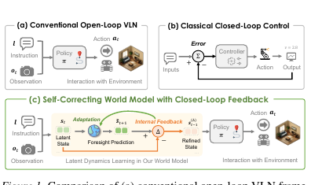

**Caption:** Comparison of conventional open-loop VLN, classical closed-loop control, and SC²-WM with closed-loop feedback.

**Caption[CN]:** 比较传统开环 VLN、经典闭环控制以及带闭环反馈的 SC²-WM。

### Fig. 2. SC²-WM framework

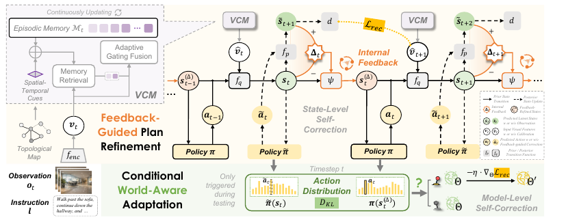

**Caption:** Overview of the SC²-WM framework with state-level plan refinement and conditional world-aware adaptation.

**Caption[CN]:** SC²-WM 框架总览，包括状态级计划细化和条件世界感知适应。

### Fig. 3. Qualitative navigation

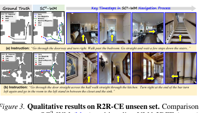

**Caption:** Qualitative comparison on the R2R-CE unseen set.

**Caption[CN]:** R2R-CE 未见环境上的定性比较。

### Fig. 4. Real-world deployment

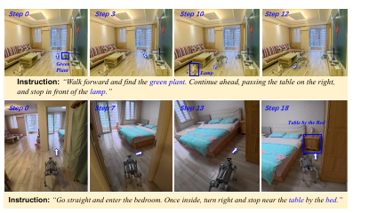

**Caption:** Real-world deployment on a Unitree GO2 quadruped robot.

**Caption[CN]:** 在 Unitree GO2 四足机器人上的实机部署。

### Fig. 5. Deployment platform

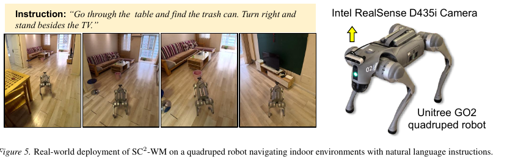

**Caption:** SC²-WM deployment with an Intel RealSense D435i camera and Unitree GO2.

**Caption[CN]:** 使用 Intel RealSense D435i 相机和 Unitree GO2 的 SC²-WM 部署。

## Tables / 表格证据

The following crops are rendered from the source PDF and kept together with searchable Markdown transcriptions. Values are copied from the PDF text layer; `-` denotes an unreported value in the source.

以下裁剪图均由源 PDF 实际渲染得到，并与可搜索的 Markdown 转录并列保留。数值复制自 PDF 文本层；`-` 表示源文未报告该值。

### Table 1. Experimental results on R2R-CE / R2R-CE 实验结果

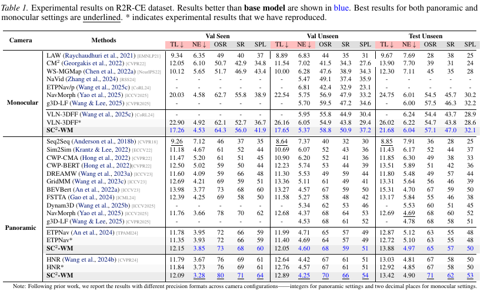

**Caption:** Table 1. Experimental results on R2R-CE dataset. Results better than base model are shown in blue. Best results for both panoramic and monocular settings are underlined. * indicates experimental results that we have reproduced.

**Caption[CN]:** 表 1。R2R-CE 数据集上的实验结果。优于基础模型的结果以蓝色显示；单目和全景设置下的最佳结果加下划线。* 表示我们复现实验得到的结果。

| Camera | Method | Split | TL ↓ | NE ↓ | OSR | SR | SPL |
|---|---|---|---:|---:|---:|---:|---:|
| Monocular | VLN-3DFF* | Val Unseen | 26.16 | 6.05 | 54.9 | 43.8 | 29.4 |
| Monocular | SC²-WM | Val Unseen | 17.65 | 5.37 | 58.8 | 50.9 | 37.2 |
| Monocular | VLN-3DFF* | Test Unseen | 26.02 | 6.22 | 54.7 | 43.8 | 28.6 |
| Monocular | SC²-WM | Test Unseen | 21.68 | 6.04 | 57.1 | 47.0 | 32.1 |
| Panoramic | HNR* | Val Unseen | 12.76 | 4.57 | 67 | 61 | 51 |
| Panoramic | SC²-WM | Val Unseen | 12.89 | 4.25 | 70 | 66 | 54 |
| Panoramic | HNR* | Test Unseen | 12.92 | 4.85 | 67 | 58 | 50 |
| Panoramic | SC²-WM | Test Unseen | 13.42 | 4.90 | 71 | 62 | 53 |

### Table 2. Experimental results on RxR-CE / RxR-CE 实验结果

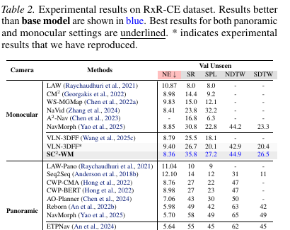

**Caption:** Table 2. Experimental results on RxR-CE dataset. Results better than base model are shown in blue. Best results for both panoramic and monocular settings are underlined. * indicates experimental results that we have reproduced.

**Caption[CN]:** 表 2。RxR-CE 数据集上的实验结果。优于基础模型的结果以蓝色显示；单目和全景设置下的最佳结果加下划线。* 表示我们复现实验得到的结果。

| Camera | Method | NE ↓ | SR | SPL | NDTW | SDTW |
|---|---|---:|---:|---:|---:|---:|
| Monocular | VLN-3DFF* | Val Unseen | 9.40 | 26.7 | 20.1 | 42.9 | 20.4 |
| Monocular | SC²-WM | Val Unseen | 8.36 | 35.8 | 27.2 | 44.9 | 26.5 |
| Panoramic | ETPNav* | Val Unseen | 5.96 | 55 | 45 | 61 | 45 |
| Panoramic | SC²-WM | Val Unseen | 5.57 | 57 | 46 | 64 | 47 |
| Panoramic | HNR* | Val Unseen | 5.75 | 56 | 47 | 63 | 47 |
| Panoramic | SC²-WM | Val Unseen | 5.72 | 60 | 50 | 67 | 50 |

### Table 3. Ablation study of the proposed World Model / 所提世界模型消融

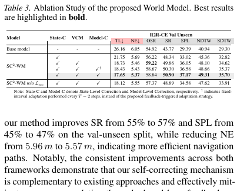

**Caption:** Table 3. Ablation Study of the proposed World Model. Best results are highlighted in bold.

**Caption[CN]:** 表 3。所提世界模型的消融实验。最佳结果以粗体突出。

| Model | State-C | VCM | Model-C | TL ↓ | NE ↓ | OSR | SR | SPL | NDTW | SDTW |
|---|:---:|:---:|:---:|---:|---:|---:|---:|---:|---:|---:|
| Base model | - | - | - | 26.16 | 6.05 | 54.92 | 43.77 | 29.39 | 40.94 | 29.30 |
| SC²-WM | ✓ |  |  | 21.75 | 5.69 | 56.22 | 48.34 | 33.02 | 45.36 | 32.82 |
| SC²-WM | ✓ | ✓ |  | 18.73 | 5.46 | 59.22 | 49.86 | 36.05 | 48.10 | 34.62 |
| SC²-WM | ✓ | ✓ | ✓† | 18.43 | 5.43 | 58.67 | 50.30 | 36.58 | 48.66 | 35.37 |
| SC²-WM | ✓ | ✓ | ✓ | 17.65 | 5.37 | 58.84 | 50.90 | 37.17 | 49.31 | 35.70 |
| SC²-WM w/o $L_{rec}$ | ✓ | ✓ | ✓ | 18.12 | 5.55 | 57.37 | 48.89 | 34.58 | 47.62 | 33.91 |

**Note:** State-C and Model-C denote State-Level Correction and Model-Level Correction, respectively. † indicates fixed-interval adaptation performed every $T = 2$ steps, instead of the proposed feedback-triggered adaptation strategy.

**注：** State-C 和 Model-C 分别表示状态级修正和模型级修正。† 表示每隔固定 $T = 2$ 步进行适应，而不是采用所提出的反馈触发适应策略。

### Table 4. Full R2R-CE results / R2R-CE 完整结果

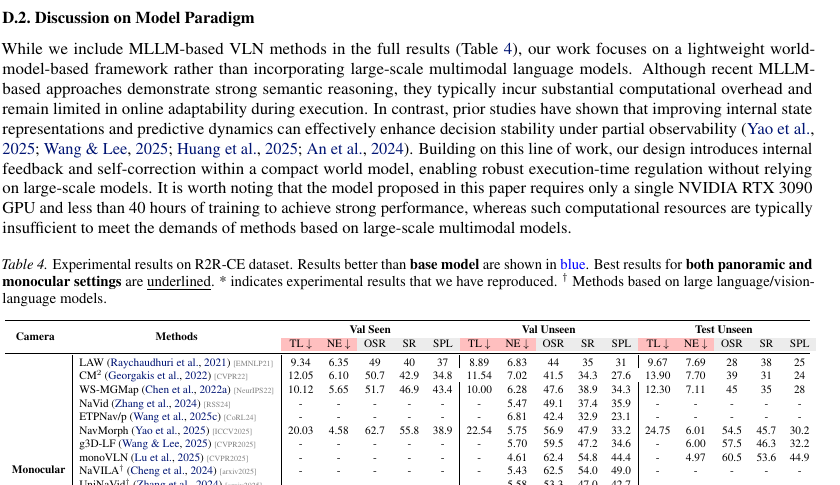

**Caption:** Table 4. Experimental results on R2R-CE dataset. Results better than the base model are shown in blue. Best results for both panoramic and monocular settings are underlined. * indicates experimental results that we have reproduced. † Methods based on large language/vision-language models.

**Caption[CN]:** 表 4。R2R-CE 数据集上的实验结果。优于基础模型的结果以蓝色显示；单目和全景设置下的最佳结果加下划线。* 表示我们复现实验得到的结果；† 表示基于大语言模型/视觉语言模型的方法。

The complete method-by-split matrix, including MLLM-based methods, is preserved in the rendered crop and in the page-15 source extraction.

完整的方法—数据划分矩阵（包括基于 MLLM 的方法）保留在渲染裁剪图和第 15 页源文本转录中。

### Table 5. Full RxR-CE results / RxR-CE 完整结果

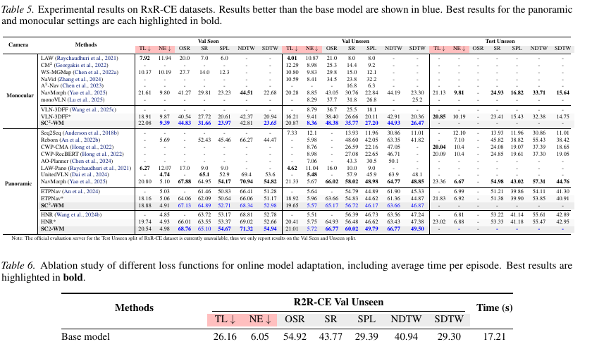

**Caption:** Table 5. Experimental results on RxR-CE datasets. Results better than the base model are shown in blue. Best results for the panoramic and monocular settings are each highlighted in bold.

**Caption[CN]:** 表 5。RxR-CE 数据集上的实验结果。优于基础模型的结果以蓝色显示；单目和全景设置下的最佳结果分别以粗体突出。

The complete method-by-split matrix is preserved in the rendered crop and in the page-16 source extraction.

完整的方法—数据划分矩阵保留在渲染裁剪图和第 16 页源文本转录中。

### Table 6. Online adaptation loss ablation / 在线适应损失消融

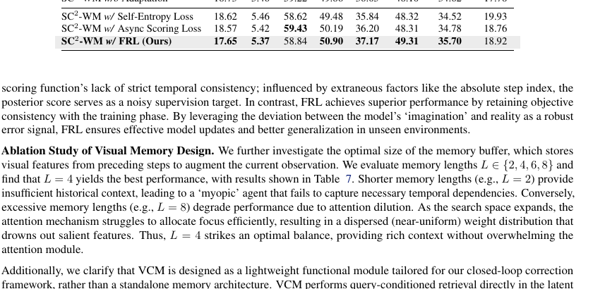

**Caption:** Table 6. Ablation study of different loss functions for online model adaptation, including average time per episode. Best results are highlighted in bold.

**Caption[CN]:** 表 6。在线模型适应中不同损失函数的消融实验，包括每个 episode 的平均时间。最佳结果以粗体突出。

| Method | TL ↓ | NE ↓ | OSR | SR | SPL | NDTW | SDTW | Time (s) |
|---|---:|---:|---:|---:|---:|---:|---:|---:|
| Base model | 26.16 | 6.05 | 54.92 | 43.77 | 29.39 | 40.94 | 29.30 | 17.21 |
| SC²-WM w/o Adaptation | 18.73 | 5.46 | 59.22 | 49.86 | 36.05 | 48.10 | 34.62 | 17.78 |
| SC²-WM w/ Self-Entropy Loss | 18.62 | 5.46 | 58.62 | 49.48 | 35.84 | 48.32 | 34.52 | 19.93 |
| SC²-WM w/ Async Scoring Loss | 18.57 | 5.42 | 59.43 | 50.19 | 36.20 | 48.31 | 34.78 | 18.76 |
| SC²-WM w/ FRL (Ours) | 17.65 | 5.37 | 58.84 | 50.90 | 37.17 | 49.31 | 35.70 | 18.92 |

### Table 7. Visual-memory length ablation / 视觉记忆长度消融

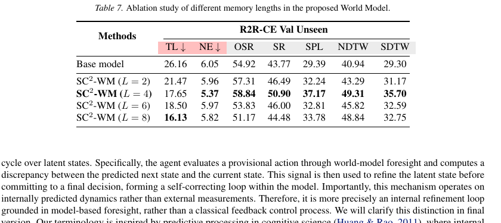

**Caption:** Table 7. Ablation study of different memory lengths in the proposed World Model.

**Caption[CN]:** 表 7。所提世界模型中不同记忆长度的消融实验。

| Method | TL ↓ | NE ↓ | OSR | SR | SPL | NDTW | SDTW |
|---|---:|---:|---:|---:|---:|---:|---:|
| Base model | 26.16 | 6.05 | 54.92 | 43.77 | 29.30 | 40.94 | 29.30 |
| SC²-WM ($L = 2$) | 21.47 | 5.96 | 57.31 | 46.49 | 32.24 | 43.29 | 31.17 |
| SC²-WM ($L = 4$) | 17.65 | 5.37 | 58.84 | 50.90 | 37.17 | 49.31 | 35.70 |
| SC²-WM ($L = 6$) | 18.50 | 5.97 | 53.83 | 46.00 | 32.81 | 45.82 | 32.59 |
| SC²-WM ($L = 8$) | 16.13 | 5.82 | 51.17 | 44.48 | 33.78 | 48.84 | 32.75 |

## 阅读提示 / Critical reading notes

核心证据链是“观测与历史 → 后验潜在状态 → 临时动作 → 先验前瞻状态 → Δ 内部反馈 → 状态修正 → 最终动作 → 环境交互”。论文将 closed-loop 明确限定为模型内部的潜在状态细化循环，而非经典控制器依赖外部参考测量的闭环。性能结论应按 R2R-CE、RxR-CE、单目/全景和验证划分分别解释；实机成功率来自作者报告的 100 个导航试验、每次 5 次重复。