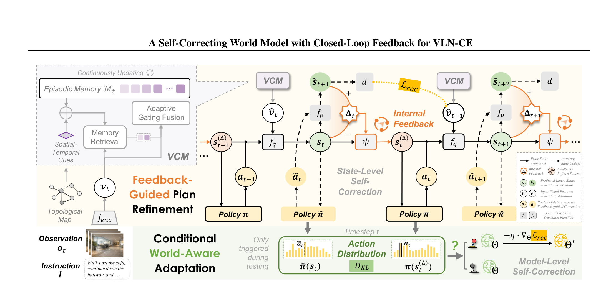
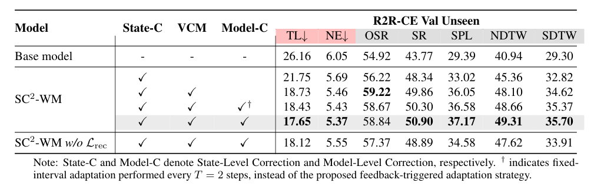
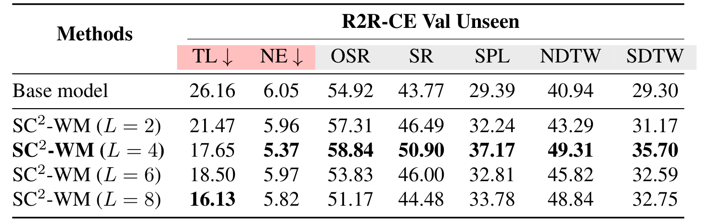
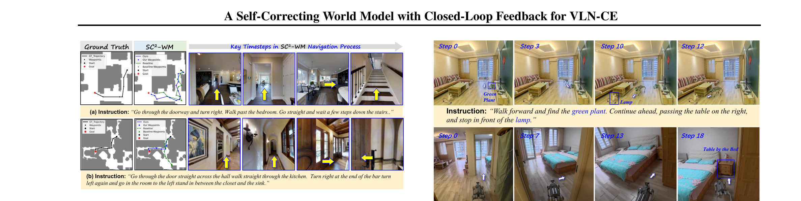

---
tags:
  - papers/embodied-AI
  - papers/vision-language-navigation
aliases:
  - "SC²-WM"
  - "Self-Correcting World Model"
date: 2026-08-01
doi: 10.48550/arxiv.2608.07548
arxiv_id: 2608.07548
---

# SC²-WM：面向连续环境视觉-语言导航的闭环反馈自校正世界模型

## 核心信息

- 标题: SC²-WM: A Self-Correcting World Model with Closed-Loop Feedback for Vision-and-Language Navigation in Continuous Environments
- 标题翻译: SC²-WM：面向连续环境视觉-语言导航的闭环反馈自校正世界模型
- 作者: Xuan Yao, Yuze Zhu, Junyu Gao, Zongmeng Wang, Changsheng Xu
- 机构: State Key Laboratory of Multimodal Artificial Intelligence Systems, Institute of Automation, Chinese Academy of Sciences；University of Chinese Academy of Sciences；HiThink Research；Peng Cheng Laboratory（论文首页脚注，页码 1）
- 发表时间: 2026-08-01
- 发表渠道: arXiv；论文正文标注为 ICML 2026, PMLR 306（页码 1）
- DOI: 10.48550/arxiv.2608.07548
- arXiv: 2608.07548
- 论文链接: https://arxiv.org/abs/2608.07548
- 代码 / 项目: https://github.com/sunrise-ikun/SC2_WM；补充材料 `6618-sup页码zip` 的 `./code` 目录（附录 A, 页码 13）
- 数据 / 资源: `R2R-CE`、`RxR-CE`；Unitree GO2 + Intel RealSense D435i 真实室内导航平台
- 论文类型: AI_method；具身智能 / 视觉-语言导航 / 世界模型

## 原文摘要翻译

连续环境中的视觉-语言导航（`VLN-CE`）要求智能体在部分可观测条件下做出细粒度的导航决策。然而，现有大多数方法依赖开环执行，在推理过程中缺少检测和纠正内部状态漂移的机制。本文提出 `SC²-WM`，一种为 `VLN-CE` 引入内部反馈、实现闭环决策的自校正世界模型框架。该方法利用世界模型的前瞻预测生成反馈，在动作执行前进行状态级计划细化。为应对更具挑战性的场景，本文进一步提出条件式世界感知适配：当反馈表明模型容量不足时，在测试时有选择地更新世界模型，从而实现模型级纠正。在标准 `VLN-CE` 基准上的实验表明，`SC²-WM` 提升了导航的鲁棒性和泛化能力。作者同时公开了代码地址（页码 1，摘要）。

## 创新点

1. **把世界模型的前瞻预测改造成动作前的内部纠错信号。** `SC²-WM` 不把世界模型只当作未来状态生成器，而是先由临时策略提出动作，再用先验转移预测其潜在后果，取潜状态差分 $\Delta_t=\tilde{s}_{t+1}-s_t$，并用 $\psi$ 修正当前状态后再执行动作（页码 4，§3；页码 4–5，§3.1）。这使“想象”进入当前决策，而不是等到轨迹结束才得到奖励。
2. **将校正拆成状态级和模型级两层。** `State-C` 只改变当前潜状态，面向局部决策漂移；`Model-C` 在动作分布差异足够大且策略足够自信时，用重构损失更新世界模型，面向模型对新环境动力学的失配（页码 4–6，§3.1–§3.3）。这种分层避免了每一步都做昂贵的梯度更新。
3. **短期视觉记忆稳定反馈所依赖的表示。** 历史视觉特征加入相对几何和时间编码，再通过带时间衰减的交叉注意力与自适应门控融合当前观测；消融显示记忆长度取 $L=4$ 时效果最好（页码 4，§3.1；附录 C/D.3, 页码 16–17）。
4. **用预测视觉特征重构作为世界模型的可落地自监督目标。** `Lrec` 不在像素空间重建图像，而是让前瞻潜状态解码出的下一步视觉特征接近预训练视觉编码器对真实下一观测的表示；这为测试时适配提供与预训练阶段一致的目标（页码 5，§3.2；页码 16，表 6）。
5. **在轻量基座和真实四足机器人上验证执行时自校正。** 论文不仅报告 `R2R-CE`、`RxR-CE`，还在约 $100\,\mathrm{m^2}$ 的室内环境完成 $100\times5=500$ 次物理运行，报告成功率 `85%` 对基线 `70%`（附录 E, 页码 17–18）。但这是有限规模的迁移验证，不等于通用端到端部署。

## 一句话总结

这篇论文真正做的是：在轻量 `VLN-CE` 世界模型内加入“临时动作—潜状态前瞻—差分修正—再决策”的内部循环，并只在反馈显示模型失配时进行测试时更新；结果支持它在指定基座、数据集和在线评测协议下减少误差累积，但还没有证明该潜差分等价于经典控制中的真实环境误差。

## 研究问题

`VLN-CE` 与离散导航不同：智能体在连续三维空间中接收 `RGB-D` 观测和自然语言指令，预测候选航点，再由低层连续控制执行。部分可观测意味着当前视角不足以确定“我在哪里、已经完成了哪一步、下一步该朝哪里走”；而外部成功信号通常只在整条轨迹结束后才可见（页码 1–2，§1）。因此，开环策略会把早期的航向或语义对齐误差写入隐状态，错误沿时间累积。

论文试图回答的不是“能否再加一个预测头”，而是两个更具体的问题：

- 在没有密集外部奖励的情况下，世界模型自身能否产生一个**动作前可计算**、而且保留结构信息的反馈信号？
- 如果反馈在测试环境中反复大幅改变动作偏好，能否把它解释为世界模型容量或动力学失配，并只在这些位置更新模型？

相邻路线各自补足了一部分能力：`NavMorph` 使用循环状态空间模型建模内部状态演化，但仍是开环执行；`DreamWalker` 将场景合成与 `MCTS` 结合，但并未把前瞻差分显式用作双层纠错；`FSTTA` 等测试时适配方法主要依赖输出熵或统计量，信号与内部空间表示脱节（页码 2–4，§2）。`SC²-WM` 的切入点是把“世界模型预测与当前状态的差异”保留为高维内部信号。

## 数据与任务定义

### 任务定义与动作空间

每个回合从初始位置开始，智能体在连续三维环境中迭代接收观测 $o_t$，输入自然语言指令 $l$ 和历史动作，输出航点导向的导航动作 $a_t$；当智能体发出 `STOP` 或达到最大步数时终止（页码 4，§3）。策略形式为：

$$
a_t \sim \pi(a_t\mid l,o_{1:t},a_{1:t-1}).
$$

这里的动作不是直接输出电机控制量，而是先选择候选航点，再通过低层连续控制执行（页码 4，§3）。这一层级很重要：论文的“动作前纠错”主要发生在航点/策略决策的潜状态上，不能直接解读为对底层控制器的稳定性证明。

### 数据集与观测配置

| 数据集 / 设置 | 论文报告的任务特点 | 关键协议锚点 |
|---|---|---|
| `R2R-CE` | `5,611` 条最短路径轨迹；每条路径平均约 `3` 条英文指令；平均轨迹长度 `9.89 m`；指令平均 `32` 词 | 页码 6，§4.1 |
| `RxR-CE` | 更大规模、多语言（英语、印地语、泰卢固语）；指令平均 `120` 词；更强调时序与语言长度 | 页码 6，§4.1 |
| `R2R-CE` agent | 底盘半径 `0.10 m`，允许沿障碍物滑动 | 页码 6，§4.1 |
| `RxR-CE` agent | 底盘半径 `0.18 m`，禁止沿障碍物滑动，更易碰撞 | 页码 6，§4.1 |
| 全景 | 每个位置捕获 `12` 个 `RGB-D` 视角，间隔 `30°` | 页码 7，§4.1；附录 C, 页码 15 |
| 单目 | 单个 `RGB-D` 相机；使用带语义可通行图和 `三维特征场` 的 航点 预测器 | 页码 7；附录 C, 页码 15 |

`R2R-CE` 的主结果对比主要基于 `VLN-3DFF` 单目框架，并同时将方法接入 `ETPNav` 和 `HNR` 的全景基座，以测试兼容性（页码 7，§4.1）。`RxR-CE` 的 `测试未见` 官方评测服务器不可用，因此附录只报告 `验证已见` 和 `验证未见`，不能把该数据集的结果外推为完整三分割验证（附录 D.1, 页码 16）。

### 指标

- `TL`：预测轨迹平均长度，越低通常意味着更少的无效探索。
- `NE`：终点到目标的平均距离，越低越好。
- `SR`：终点在参考目标 `3 m` 阈值内的成功率。
- `OSR`：预测轨迹中离目标最近点达到阈值的成功率，偏向“曾经到过”。
- `SPL`：同时考虑成功和路径长度的综合效率指标。
- `NDTW` / `SDTW`：分别衡量路径与参考路径的归一化动态时间规整距离，以及将其与成功率结合的指标（附录 B, 页码 14）。

## 方法主线

### 机制流程

*论文原图编号：图 2。完整闭环框架；插入是因为它同时展示 `VCM`、前瞻状态、内部反馈、状态级纠正和条件模型级适配。来源 页码 4。*

1. **输入与历史读取。** 当前观测 $o_t$ 和指令 $l$ 经视觉/语言编码得到 $v_t$；`VCM` 从最近 $L$ 个历史观测中检索相关视觉特征，加入相对空间与时间线索后得到校准表示 $\hat{v}_t$（页码 4，§3.1；算法 1, 页码 5）。
2. **后验状态与临时动作。** 后验转移 $q$ 融合上一时刻的反馈修正状态、上一动作和 $\hat{v}_t$，得到当前潜状态 $s_t$。
临时策略据此提出候选导航动作（页码 4，§3；算法 1, 页码 5）。
3. **前瞻差分与状态级修正。** 先验转移根据临时动作预测下一潜状态，并计算当前状态与前瞻状态的差分。
可学习函数 $\psi$ 生成 $s_t^{(\Delta)}=\psi(s_t,\Delta_t)$；最终策略依据修正状态选择并执行动作（页码 4–5，§3.1）。
4. **条件模型级适配与循环更新。** 比较修正前后的动作分布，计算 $\kappa_t=D_{KL}(\tilde{p}_t\Vert p_t)$；当它超过近期队列的分位点且修正后分布熵足够低时，用 $L_{rec}$ 更新世界模型参数。执行动作后获取 $o_{t+1}$，更新视觉记忆，进入下一步（页码 5–6，§3.3；算法 2, 页码 6）。

### 模型结构与 `VCM`

`VCM` 的记忆为 $M_t=\{(k_i,m_i)\}_{i=t-L}^{t-1}$。当前视觉表示作为 查询，历史视觉特征及其空间/时间 线索 构成 键和值。带时间衰减的交叉注意力可写为：

$$
c_t=\operatorname{softmax}(A_i)m_i,\qquad A_i\propto v_t^\top k_i-\phi(\delta_{ti}),\quad \delta_{ti}=t-i.
$$

随后用门控融合当前特征和历史上下文：

$$
\hat v_t=\alpha_t\odot v_t+(1-\alpha_t)\odot c_t.
$$

工程上，附录给出的时间偏置是 $B_{t,k}=-|\lambda|(t-k)$，其中 $\lambda$ 初始化为 `0.1`；每个历史节点还加入 `7D` 相对几何特征和离散步嵌入（公式 (15)–(16), 附录 C, 页码 16）。
`7D` 由相对朝向/俯仰角的正余弦（`4D`）与归一化距离（`3D`）组成。它不是显式地图，而是在潜空间中做以当前查询为条件的短期检索（附录 D.3, 页码 17）。

### 内部反馈与状态修正

前瞻策略 $\tilde\pi$ 只负责提出一个用于“试想”的动作；真正执行的动作由修正后的策略 $\pi(s_t^{(\Delta)})$ 产生。论文强调，$\Delta_t$ 不是一个要被直接最小化的训练目标，而是描述候选动作如何推动潜动力学的内部引导信号（页码 5，§3.1）。这一区分决定了它与价值评估器的差别：价值评估器通常压缩成标量价值，而 $\Delta_t$ 是高维潜状态转移，可以输入 $\psi$ 直接改变当前表示（附录 D.3, 页码 17–18）。

需要留意一个概念边界：预测的是模型自己的 $\tilde{s}_{t+1}$，并没有使用未来真实观测。因此这里的“闭环”严格说是**世界模型内部的前瞻—修正循环**，而不是经典控制中由外部传感器测得跟踪误差后形成的闭环（附录 D.3, 页码 17）。

### 训练目标

训练同时约束动作决策、先验/后验一致性和未来视觉特征预测：

$$
L_{ac}=-\mathbb E_t[\log p(a_t^*\mid s_t)+\log p(a_t^*\mid s_t^{(\Delta)})],
$$

确保修正前后都保留专家动作可预测性；

$$
L_{wm}=\mathbb E_t D_{KL}\big(q(s_t\mid\cdot)\,\Vert\,p(\tilde{s}_t\mid\cdot)\big),
$$

让观察条件的后验状态与无新观测的先验转移在分布上保持一致；最后用视觉特征重构损失

$$
L_{rec}=\mathbb E_t\left\|d(\tilde{s}_{t+1})-v_{t+1}\right\|_2^2,
$$

将前瞻潜状态约束到预训练视觉编码器抽取的真实下一步特征。总目标为：

$$
L=L_{ac}+L_{wm}+L_{rec}.
$$

其中 `Lrec` 是最关键的动力学锚点：它不是像素生成，而是要求“预测状态能解释下一步视觉表示”（页码 5，§3.2）。

### 条件世界感知适配

适配触发量为：

$$
\kappa_t=D_{KL}(\tilde p_t\Vert p_t),\qquad \tilde p_t=\operatorname{softmax}(\tilde\pi(s_t)),\quad p_t=\operatorname{softmax}(\pi(s_t^{(\Delta)})).
$$

论文维护近期 $\kappa$ 的动态队列，以当前值超过经验分位点（设 $\tau=0.5$）作为主要触发条件，并要求修正后动作分布的熵低于阈值 $\epsilon$，即“大幅改变且足够自信”才更新（页码 5–6，§3.3；页码 7，实现细节）。触发后按

$$
\Theta\leftarrow\Theta-\eta\nabla_\Theta L_{rec}
$$

更新世界模型参数 $\Theta$，策略本身不作为适配对象（页码 6，公式 (14)）。这让状态级纠错和模型级适配承担不同时间尺度，但论文缺少每个回合的触发次数、回滚机制或跨回合隔离策略。

## 关键结果

下文只把论文明确报告的比较写成结论；稳定性、实时性和统计显著性的判断仍受信息缺口限制。

### 主结果与强基线

#### `R2R-CE`：单目与全景

论文主文表 1 的单目`验证未见`复现实验中，本文方法相对复现基线取得明显提升。
相对复现基线，本文方法将终点成功率从 `43.8` 提升到 `50.9`，路径效率从 `29.4` 提升到 `37.2`，并把轨迹长度从 `26.16 m` 降至 `17.65 m`。
在`测试未见`上，`SR/SPL`为`57.1/32.1`，基线为`54.7/28.6`（页码 7，表 1）。主表指出不同相机配置采用不同精度格式，单目保留两位小数、全景多为整数，不能把格式差异当成统计精度提升。

| 设置 | 轨迹长度 | 终点误差 | 曾到达成功率 | 终点成功率 | 路径效率 | 路径一致性 | 成功路径一致性 |
|---|---:|---:|---:|---:|---:|---:|---:|
| `VLN-3DFF*`, 验证未见 | 26.16 | 6.05 | 54.9 | 43.8 | 29.4 | — | — |
| `SC²-WM`, 验证未见 | **17.65** | **5.37** | 58.8 | **50.9** | **37.2** | — | — |
| `VLN-3DFF*`, 测试未见 | 26.02 | 6.22 | 54.7 | 43.8 | 28.6 | — | — |
| `SC²-WM`, 测试未见 | 21.68 | 6.04 | 57.1 | 47.0 | 32.1 | — | — |

全景 `验证未见` 中，论文把 `SC²-WM` 接到 `ETPNav` 和 `HNR`，分别报告 `SR/SPL` 为 `57/47` 与 `57/47` 左右的兼容结果。
论文文字强调其相对 `HNR` 的全景结果约有 `+5% SR` 和 `+3% SPL`，但表格的不同精度和基座复现标记应以原表为准（页码 7–8，表 1；页码 8，§4.2）。这里最稳妥的结论是：收益并不只出现在一个导航架构上，但“全面超过所有强基线”并非该表能支持的表述。

#### `RxR-CE`：更长、多语言指令

单目 `验证未见` 上，`SC²-WM` 的五项指标依次为 `8.36/35.8/27.2/44.9/26.5`。
复现的 `VLN-3DFF*` 为 `9.41/26.7/20.4/42.9/20.4`（页码 8，表 2）。论文据此强调在更长指令和更严格碰撞约束下，`SDTW` 的提升反映路径保真度增加，而不仅是“最后碰巧停得更近”。全景设置下，`ETPNav*` 和 `HNR*` 上的兼容结果也得到改善，但 `RxR-CE 测试未见` 服务器不可用（附录 D.1, 页码 16）。

### 组件消融：收益来自哪一层

*论文原图编号：表 3。`R2R-CE 验证未见` 组件递进消融；插入是因为它直接显示 `State-C`、`VCM`、`Model-C` 的增量关系。来源 页码 8。*

| 设置 | 轨迹长度 | 终点误差 | 曾到达成功率 | 终点成功率 | 路径效率 | 路径一致性 | 成功路径一致性 |
|---|---:|---:|---:|---:|---:|---:|---:|
| 基础模型 | 26.16 | 6.05 | 54.92 | 43.77 | 29.39 | 40.94 | 29.30 |
| + `State-C` | 21.75 | 5.69 | 56.22 | 48.34 | 33.02 | 45.36 | 32.82 |
| + `VCM` | 18.73 | 5.46 | **59.22** | 49.86 | 36.05 | 48.10 | 34.62 |
| + 固定间隔 `Model-C†` | 18.43 | 5.43 | 58.67 | 50.30 | 36.58 | 48.66 | 35.37 |
| + 反馈触发 `Model-C` | **17.65** | **5.37** | 58.84 | **50.90** | **37.17** | **49.31** | **35.70** |
| `SC²-WM` 去掉 `Lrec` | 18.12 | 5.55 | 57.37 | 48.89 | 34.58 | 47.62 | 33.91 |

`State-C` 单独把 `SR` 从 `43.77` 提升到 `48.34`，同时把 `TL` 从 `26.16 m` 降到 `21.75 m`，支持“动作前潜状态修正能减少无效步骤”的局部归因。
加入短期视觉记忆后，路径效率从 `33.02` 升到 `36.05`，说明稳定的历史表示是反馈质量的重要中间条件。最后，反馈触发的模型级适配将终点成功率和路径效率推到 `50.90/37.17`，但固定每两步更新也有接近的数值；因此选择性触发的价值主要是更合理的更新时机与潜在开销控制，而不是已经被充分隔离的纯精度增益（页码 8，表 3；页码 8–9，§4.3）。

### 适配目标、记忆长度与负结果

表 6 同时报告每回合时间和性能：无适配为 `18.73 s`、终点成功率/路径效率为 `49.86/36.05`；熵最小化损失为 `19.93 s`、终点成功率/路径效率为 `49.48/35.84`，没有改善。
异步评分损失为 `18.76 s`、终点成功率/路径效率为 `50.19/36.20`，提升有限；特征重构损失为 `18.92 s`、终点成功率/路径效率为 `50.90/37.17`（附录 D.2，页码 16）。这支持论文对训练信号的解释：只压低熵会强化模型已有信念，不提供“预测与真实下一特征之间”的有真实观测锚定的监督；异步评分把后续状态作为当前目标，仍可能受到绝对步数等噪声影响。

*论文原图编号：表 7。`VCM` 记忆长度消融；插入是因为它清楚呈现短期历史与注意力稀释之间的非单调关系。来源 页码 17。*

| 记忆长度 | 轨迹长度↓ | 终点误差↓ | 最近点成功率 | 终点成功率 | 路径效率 | 路径一致性 | 成功路径一致性 |
|---:|---:|---:|---:|---:|---:|---:|---:|
| 基础模型 | 26.16 | 6.05 | 54.92 | 43.77 | 29.39 | 40.94 | 29.30 |
| $L=2$ | 21.47 | 5.96 | 57.31 | 46.49 | 32.24 | 43.29 | 31.17 |
| $L=4$ | **17.65** | **5.37** | **58.84** | **50.90** | **37.17** | **49.31** | **35.70** |
| $L=6$ | 18.50 | 5.97 | 53.83 | 46.00 | 32.81 | 45.82 | 32.59 |
| $L=8$ | **16.13** | 5.82 | 51.17 | 44.48 | 33.78 | 48.84 | 32.75 |

$L=8$ 的 TL 最短，却明显输给 $L=4$ 的 SR/SPL；这不是“历史越长越好”的结果，而是注意力接近均匀后稀释了当前真正有用的视觉线索（附录 D.3, 页码 16–17）。它也提醒实现者不能只看轨迹长度：过短历史造成近视，过长历史则可能降低终点成功率。

### 定性结果

*论文原图编号：图 3。`R2R-CE` 未见 的两条示例轨迹；插入是因为它并列展示路径、关键时间步视觉观测和指令复杂度。来源 页码 9。*

图 3 给出两条带多个转弯和空间指代的示例。图中 `SC²-WM` 的蓝色轨迹更接近黑色 参考轨迹，而 `VLN-3DFF` 的绿色轨迹在若干步后偏离；第二个例子中基线早期出错后没有恢复，`SC²-WM` 仍能沿指令继续（页码 9，图 3）。这类图支持“模型有恢复行为”的可解释案例，但只有两个 回合，不能替代失败率、方差或大规模分层统计。

### 真实世界验证

平台为 Unitree GO2 四足机器人和 Intel RealSense D435i `RGB-D` 相机；室内约 `100 m²`，包含不同家具布局和房间。
动作仍是前进、左转、右转和停止，深度只用于碰撞规避安全机制。共 `100` 个导航试验，每个重复 `5` 次，合计 `500` 次物理运行；距目标 `1.5 m` 内算成功，`SC²-WM` 为 `85%`，基线为 `70%`（附录 E, 页码 17–18）。作者称在线适配以异步方式执行，梯度更新与当前动作并行，因此控制环无需等待反向传播。

这证明的是在一个有限室内平台和给定传感器上存在可行的仿真到真实迁移，而不是端到端机载计算：论文明确说明当前系统使用机外计算，同时缺少端到端控制延迟、触发频率、失败恢复或不同房间/指令分层方差的测量（附录 E, 页码 18）。

## 深度分析

### 真正贡献是什么

核心贡献不是“加了一个世界模型”或“用了测试时适配”，而是把世界模型的中间动力学状态变成了决策时可消费的结构化信号。世界模型先预测一个临时动作的潜在后果，再用其变化方向调节当前状态；因此它改变的是策略的输入，而不是只在输出端打一个置信度分数。`Model-C` 又把“反馈对动作分布的影响很大”解释为当前世界模型可能不够适配，从而建立状态级和模型级两种校正的时间尺度分离（页码 4–6）。

从工程角度看，`VCM`、动态门控和三个损失并非完全新的基本算子；可复用的设计模式是将预测—现实差异保留在向量空间中，并把“状态修正”和“参数更新”置于不同触发器下。论文的增量消融能支持这条机制链，但没有做固定参数量、固定浮点运算量 或更强 `3D` 表示的严格配平。

### 为什么结果成立

1. **`State-C` 的作用对应短期误差控制。** `Lac` 要求修正前后都能预测专家动作，防止 $\psi$ 只把状态推向一个不可决策的表示；表 3 中 `TL` 和 `SR` 同时改善，与“提前剪掉无效探索”相符。
2. **`VCM` 缓解了反馈歧义。** 在部分可观测场景，单帧变化混合了视角变化、渲染噪声和真正的动作后果；相对几何、时间衰减和短记忆把多视角证据对齐到当前位姿，因此 `VCM` 的加入带来 `SPL` 跃升（页码 4，§3.1；页码 8，表 3）。
3. **`Lrec` 把先验动力学锚定到视觉可验证结果。** 仅做先验/后验 KL 对齐并不保证状态包含任务相关动力学；未来特征重构使 $\tilde{s}_{t+1}$ 需要解释真实 $v_{t+1}$。
去掉 `Lrec` 后 `SR/SPL` 下降即提供了直接支持（页码 5，§3.2；页码 8，表 3）。
4. **分位点触发避免“每步适配”。** 让阈值跟随近期 $\kappa_t$ 分布，理论上能适应不同回合的动态尺度；熵门槛再过滤掉“大变化但不确定”的更新。不过论文缺少触发次数或更新开销曲线，所以“更高效”目前主要是机制上的合理性，而非完整测量结论。

### 与相邻路线的关系

- **与开环世界模型。** `NavMorph` 等方法重在学习内部状态演化；`SC²-WM` 的差异是把预测状态变化用于动作提交前的细化，而不是执行后再用结果更新。
- **与三维表示。** `g3D-LF`、`VLN-3DFF`、`monoVLN` 依赖更显式或更强的空间特征场。论文选择轻量 `VCM` 和潜状态反馈来换取单卡训练与执行时调节。
附录承认 `monoVLN` 在部分 `R2R-CE` 结果更强，且因未开源无法整合为同一世界模型基座（页码 7；附录 D.1, 页码 16）。
- **与 价值评估器 / 熵适配。** 价值评估器输出标量评价，熵最小化只改变分布尖锐度；`Δ_t` 和 `FRL` 试图保留预测动力学与未来观测之间的结构关系。论文并没有做跨范式的同预算严格比较，因此这里是表示与训练信号的定位，不是证明世界模型普遍优于强化学习。
- **与 多模态大模型/VLA。** 多模态大模型 路线增加高层语义推理，但计算成本高、在线更新困难；`SC²-WM` 把目标限定在紧凑的执行时稳定性上，训练只用单张 RTX 3090、少于 `40 h`（页码 8–9；附录 D.2, 页码 16）。这是一种算力—语义规模的取舍，不应写成对 多模态大模型 的全面替代。

### 容易误读的地方

- “闭环”不是使用未来真实观测计算控制误差，而是使用模型内部的前瞻状态差分；真实观测只在动作执行后进入下一轮后验更新（附录 D.3, 页码 17）。
- `Model-C` 的触发器监测的是修正前后**动作分布**的 KL，不是测得的真实状态漂移；高 $\kappa_t$ 可能代表世界模型不准，也可能代表策略对细化很敏感。
- $L=8$ 的轨迹更短，不代表导航更好；它的 `SR/SPL` 比 $L=4$ 低，说明效率指标和成功/路径保真度必须一起读（附录 D.3, 页码 17）。
- 真实实验的 `85%` 是有限室内、多次重复的总体成功率；缺少场景独立置信区间、随机种子、在线更新失败率或纯机载测量。

### 复杂度与扩展性

单步执行至少包含一次后验状态更新、一次临时策略与先验转移、一次细化策略，以及可能触发的一次梯度更新；`VCM` 还要对长度为 $L$ 的历史做交叉注意力。论文通过 $L=4$ 和异步适配控制了常规路径开销，但缺少每步浮点运算量、显存、控制频率或端到端延迟。更长指令、动态障碍和多智能体场景会同时扩大记忆混淆与世界模型失配，不能仅凭当前基准结果外推。

### 复现注意点

- `R2R-CE`：先用其数据预训练 `25,000` 迭代；再以学习率 `1×10^{-5}` 联合训练 `12,000` 回合，冻结语言编码器后以 `4×10^{-6}` 再训练 `10,000` 回合。
- `RxR-CE`：从 `VLN-3DFF` 预训练检查点初始化，以 `1×10^{-5}` 训练 `14,000` 回合（附录 C, 页码 16）。
- 视觉编码器：`R2R-CE` 用 `CLIP ViT-B/16`，`RxR-CE` 用 `ViT-B/32`。
深度走点目标预训练 `ResNet-50`；相机水平视场角分别为 `90°` 和 `79°`（附录 C, 页码 16）。
- 结构：全景、文本、跨模态图组件深度为 `2/9/4` 层；推理 batch size 为 `1`；在线队列分位点参数设为 $\tau=0.5$；时间偏置参数初始化 $λ=0.1$。
- 评测公平性：区分作者复现标记 `*`、全景/单目设置和不同数值精度；`RxR-CE` 测试未见不可用时不要补写结果。
- 源码：补充材料声称包含 `./code` 和说明文档，但本笔记只依据 PDF 记录其存在，未独立验证仓库当前提交版本、依赖版本或训练脚本可运行性。

## 局限

稳定性、实时性和统计显著性的判断仍受信息缺口限制；论文没有量化反馈触发频率、适配失败率、跨回合污染、随机种子方差或端到端控制延迟。

1. **内部反馈的语义仍是模型内定义。** $\Delta_t$ 的大小和方向是否与真实导航误差、碰撞风险或指令偏离相关，没有独立相关性实验；论文只展示了加入模块后的指标改善（页码 4–5；页码 8）。
2. **因果归因仍受组件耦合影响。** `VCM`、`Lrec`、`State-C` 和 `Model-C` 是联合训练/串联执行，表 3 的递进消融不能排除表示容量和交互效应；没有固定算力下与显式地图、强 `3D` 表示的等预算对照。
3. **测试时适配的安全性信息不足。** 当前材料缺少触发频率、单次更新耗时、跨回合是否累积、错误自监督导致的漂移、灾难性遗忘或回滚策略；论文只定性说明异步更新和有限开销（附录 E, 页码 18）。
4. **真实世界外推边界窄。** 仅覆盖约 `100 m²` 室内家居环境、单一 GO2 平台和 D435i 传感器，且使用机外计算；不能等同于纯机载、动态障碍、室外或长时间连续运行（附录 E, 页码 17–18）。
5. **统计报告不完整。** 主要基准结果缺少多随机种子方差和显著性检验，真实实验也没有按房间、指令复杂度或失败类型拆分。图 3 只有两个定性回合，适合说明行为模式，不适合估计总体恢复率。
6. **材料级 局限说明。** 当前 PDF 的文本抽取对附录标题、算法编号和跨页表格存在布局错位；本笔记以原 PDF 页面视觉核验为主，重要表格同时转录为可搜索 Markdown。`图 1`、`算法 1/2`、`表 1/2/4/5/6` 的裁剪候选未达到独立、干净、稳定可读的图片门槛，因此保留文字/表格证据或占位，没有强行插入。

## 我的笔记

### 研究启示

- 将世界模型的预测—现实差异保留为结构化潜变量，通常比压成一个“置信度分数”更有机会直接指导表示修正；但应同时测量该向量与可观测任务误差的对应关系。
- 状态级纠正与参数级适配应有不同触发器：前者可以逐步运行，后者必须证明触发必要性、更新收益和回滚安全性。
- 短期记忆的最佳长度是任务和表示共同决定的超参数，$L=4$ 的结果提醒我们不要把“更长上下文”当作单调增益。

### 工程启示

- 在线适配要把控制线程、反向传播线程、版本隔离和失败回滚设计成一等公民；只报告“异步执行”不足以证明实时性。
- 评测应同时保留 `TL`、`SR`、`SPL`、`NDTW/SDTW`，避免 $L=8$ 这种“走得更短但更不成功”的配置被误选。
- 若迁移到端侧，应优先测量单步 `VCM`/前瞻开销、触发频率和端到端动作延迟，再决定是否保留梯度更新。

### 可复现实验清单

1. 固定 `VLN-3DFF`、`ETPNav`、`HNR` 基座和视觉编码器，逐项复现基础模型、`State-C`、`VCM`、反馈触发 `Model-C`。
2. 记录每回合的 $\kappa_t$ 序列、触发次数、适配耗时、适配前后性能和是否跨回合持久化。
3. 做 $L=2、4、6、8$ 的多种子重复，报告均值、标准差以及轨迹长度与成功率/路径效率的联合选择规则。
4. 加入显式地图、更强 `3D` 特征和纯熵适配，使用相同训练时长/显存预算做等条件比较。
5. 在纯机载设备上复现 GO2 试验，报告控制频率、相机延迟、反向传播延迟、碰撞次数和按场景分层的置信区间。

### 后续问题

- $\|\Delta_t\|$ 或其方向是否能预测未来 `NE`、碰撞和指令偏离？
- 在固定计算预算下，`VCM`、潜状态反馈和额外 `3D` 表示谁贡献最大？
- 适配是回合内短暂更新，还是跨回合持续？错误 `Lrec` 目标如何检测并回滚？
- 更长指令、动态障碍、多机器人和传感器失效时，分位点触发是否仍可靠？

## 引用

- Yao et al. (2026). *SC²-WM: A Self-Correcting World Model with Closed-Loop Feedback for Vision-and-Language Navigation in Continuous Environments*. arXiv:2608.07548.
- Krantz et al. (2020). *Beyond the Nav-Graph: Vision-and-Language Navigation in Continuous Environments*. ECCV.
- An et al. (2024). *ETPNav: Evolving Topological Planning for Vision-Language Navigation in Continuous Environments*. IEEE TPAMI.
- Wang et al. (2025). *Sim-to-Real Transfer via 3D Feature Fields for Vision-and-Language Navigation*. CoRL.
- Yao et al. (2025). *NavMorph: A Self-Evolving World Model for Vision-and-Language Navigation in Continuous Environments*. ICCV.
- Wang and Lee (2025). *g3D-LF: Generalizable 3D-Language Feature Fields for Embodied Tasks*. CVPR.
- Gao et al. (2024). *Fast-Slow Test-Time Adaptation for Online Vision-and-Language Navigation*. ICML.
- Wang et al. (2020). *Tent: Fully Test-Time Adaptation by Entropy Minimization*. arXiv:2006.10726.
- Ha and Schmidhuber (2018). *World Models*. arXiv:1803.10122.
- Ku et al. (2020). *Room-Across-Room: Multilingual Vision-and-Language Navigation with Dense Spatiotemporal Grounding*. EMNLP.
