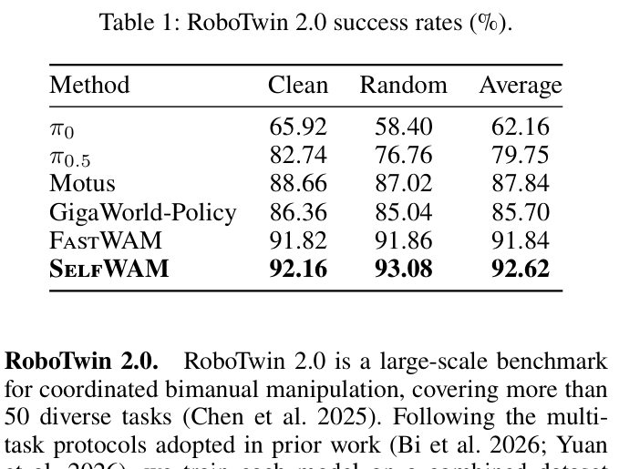
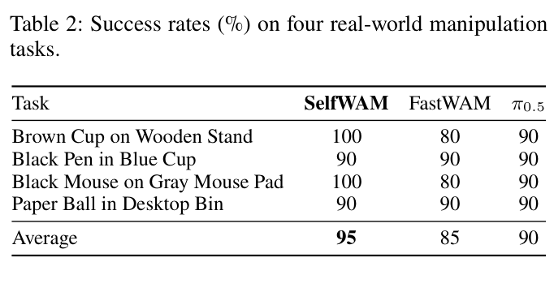
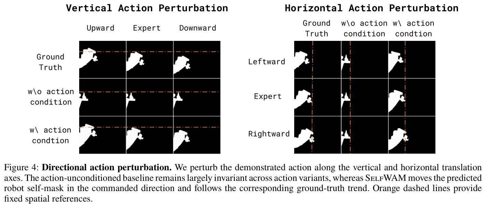
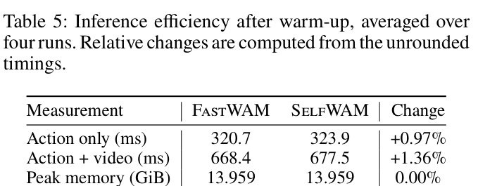
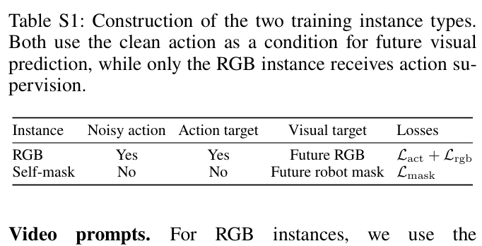
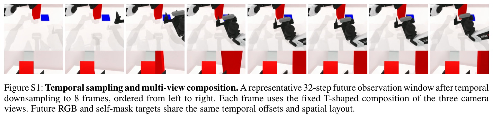
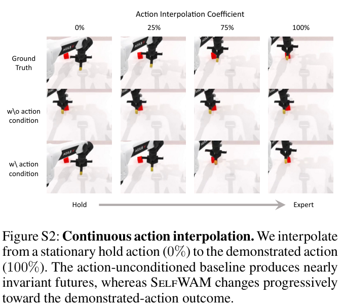
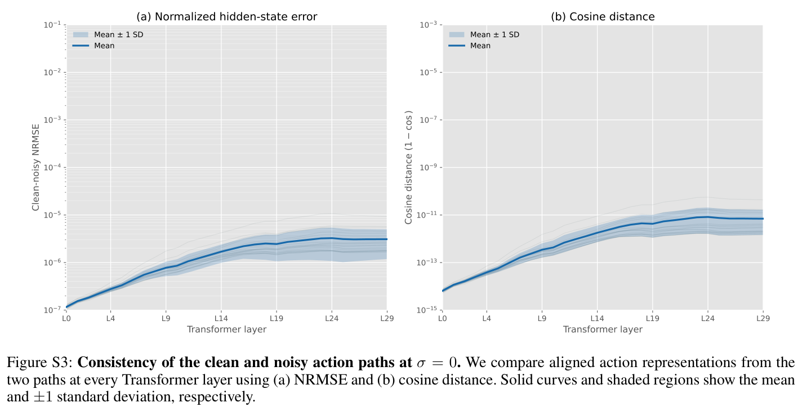

# SelfWAM: A Self-Grounded Unified World Action Model for Fast Robot Control

**Authors:** Bikang Pan$^{1,2,*}$, Fan Liu$^{1,2,*}$, Haotao Lu$^{1,2}$, Jingya Wang$^1$, Ye Shi$^{1,2}$  
**Affiliation:** $^1$ShanghaiTech University, $^2$InstAdapt ($^*$Equal contribution)  
**Correspondence:** `{panbk2023, liufan2025, shiye}@shanghaitech.edu.cn`  
**Project Page:** [https://selfwam.github.io/](https://selfwam.github.io/)  
**Source:** `/Users/roywangj/journey_wj/research/papers4zotero/zotero1/storage/AKPPJA6W/Pan 等 - 2026 - SelfWAM A Self-Grounded Unified World Action Model for Fast Robot Control.pdf`  
**Detected source format:** selectable-text PDF (`pdf-text`), 14 pages  
**Version:** arXiv:2608.00725v1 [cs.RO], 1 Aug 2026  
**Reader type:** complete paragraph-level Chinese–English bilingual reader with searchable equations, tables, captions, acknowledgments, appendices, and references.

> [!note] 阅读说明
> 本文严格按照原文结构进行逐段中英文对照排版。每个英文段落（`Para. X:`）后紧跟对应中文翻译（`Para. X[CN]:`）。正文与附录中的所有图表（图 1–4、图 S1–S3；表 1–5、表 S1–S4）均完整嵌入本地资产并提供中英文双语图注；所有统计表格均完整转录为可搜索的 Markdown 表格（包括包含全部 50 项任务的表 S4）。数学公式统一采用标准 LaTeX 数学语法，独立公式置于引用块之外。参考文献完整保留 32 条原始书目条目，便于学术检索。

## Page / Section Index

| Pages | Source section | 本稿位置 |
|---|---|---|
| 1 | Abstract | [Abstract](#abstract) |
| 1–2 | 1 Introduction | [1 Introduction](#1-introduction) |
| 2 | 2 Related Work | [2 Related Work](#2-related-work) |
| 2–5 | 3 Method (SelfWAM) | [3 Method](#3-method) |
| 5–7 | 4 Experiments | [4 Experiments](#4-experiments) |
| 7 | 5 Conclusion | [5 Conclusion](#5-conclusion) |
| 7 | Acknowledgements | [Acknowledgements](#acknowledgements) |
| 8 | Appendix (Overview) | [Appendix](#appendix) |
| 8–9 | Appendix A Implementation and Reproducibility Details | [Appendix A Implementation and Reproducibility Details](#appendix-a-implementation-and-reproducibility-details) |
| 9–10 | Appendix B Extended RoboTwin Evaluation | [Appendix B Extended RoboTwin Evaluation](#appendix-b-extended-robotwin-evaluation) |
| 11–12 | Appendix C Action Sensitivity and Controlled Rollouts | [Appendix C Action Sensitivity and Controlled Rollouts](#appendix-c-action-sensitivity-and-controlled-rollouts) |
| 11–12 | Appendix D Consistency of the Clean and Noisy Action Paths | [Appendix D Consistency of the Clean and Noisy Action Paths](#appendix-d-consistency-of-the-clean-and-noisy-action-paths) |
| 12–13 | Appendix E Real Robot Experimental Details | [Appendix E Real Robot Experimental Details](#appendix-e-real-robot-experimental-details) |
| 13 | Appendix F Limitations and Future Work | [Appendix F Limitations and Future Work](#appendix-f-limitations-and-future-work) |
| 13–14 | References | [References](#references) |

## Terminology Ledger

| English term | 中文译法 | 使用说明 |
|---|---|---|
| World Action Model (WAM) | 世界—动作模型 | 联合建模机器人未来视觉观测与动作控制的生成式模型 |
| Self-Grounded / Self-Grounding | 自身锚定 / 自锚定 | 将未来预测显式扎根于机器人自身可见本体及其动作诱导运动的机制 |
| Mixture-of-Transformers (MoT) | Transformer 混合架构 | 为视频扩散主干和动作专家分配专用子网络的模块化架构 |
| Clean-Action Conditioning | 干净动作条件化 | 训练时将未经加噪的示范动作作为条件输入视频分支，但对动作分支保持隐藏 |
| Robot Self-Mask | 机器人本体掩码 | 仅分割机器人手臂与末端本体的二值掩码序列，剥离环境纹理与背景干扰 |
| Flow Matching | 流匹配 | 本文用于连续动作去噪与视频扩散生成的训练目标 |
| Action Chunk | 动作块 | 策略一次性预测的未来时域动作序列（本文为 32 步） |
| Action-Only Inference | 纯动作推理 | 部署时省略未来视频去噪，仅通过动作专家直接输出动作的快速闭环控制路径 |
| Target Leakage | 目标泄露 | 训练时真实目标信息非预期地流入预测网络，导致测试时性能崩溃的问题 |
| Action Following | 动作跟随度 | 改变输入动作条件时生成未来视频特征的平均成对差异（WorldArena 指标） |
| Directional Action Perturbation | 方向性动作扰动 | 沿特定空间方向对示范动作施加关节偏移，测试模型对动作因果的响应 |
| NRMSE | 归一化均方根误差 | 衡量干净动作路径与带噪动作路径特征差异的归一化指标 |

## Abstract

> <strong>Para. 1:</strong> World Action Models (WAMs) improve robot policy learning by jointly modeling actions and future observations. However, conditioning future prediction only on the task prompt and observation context risks capturing generic task progression rather than the action-specific consequences of the executed action. We introduce SelfWAM, a unified self-grounded WAM built on a modality-specialized Mixture-of-Transformers (MoT) architecture that jointly predicts actions, action-conditioned future RGB frames, and robot self-masks, thereby grounding future prediction in the robot’s visible body and its action-induced motion. During joint training, SelfWAM allows future visual queries to attend to a clean copy of the demonstrated action, turning the video branch into an action-specific consequence model while leaving the fast action-only inference path unchanged. To focus video learning on action-relevant visual changes, we use prompt-specific objectives for future robot self-mask prediction, which removes appearance details and provides a target whose temporal evolution is tightly coupled with the conditioning action. Together, clean-action conditioning and future self-mask supervision make future predictions more directly reflect how the executed action changes the robot’s visible motion and the surrounding scene. Experiments on RoboTwin 2.0 and real-world manipulation tasks show that SelfWAM produces more action-sensitive futures and preserves fast policy inference, while improving policy performance.

> <strong>Para. 1[CN]:</strong> 世界—动作模型（World Action Models, WAMs）通过联合建模动作与未来观测来提升机器人策略学习性能。然而，如果未来预测仅以任务提示词和当前观测上下文为条件，模型容易捕获通用的任务演变过程，而非所执行动作带来的特异性后果。我们提出了 SelfWAM，这是一种基于模态专用 Transformer 混合架构（Mixture-of-Transformers, MoT）的统一自锚定世界—动作模型，能够联合预测动作、以动作为条件的未来 RGB 视频帧以及机器人本体掩码，从而将未来预测扎根于机器人可见本体及其动作诱导的运动之中。在联合训练期间，SelfWAM 允许未来视觉查询关注示范动作的“干净副本”，将视频分支转变为能够刻画动作特异性后果的模型，同时保持快速的纯动作推理路径完全不变。为了使视频学习聚焦于与动作紧密相关的视觉变化，我们为未来机器人本体掩码预测设计了特定提示词目标，从而剥除外观纹理细节，提供时间演变与条件动作紧密耦合的预测目标。结合干净动作条件化与未来本体掩码监督，未来预测能够更直接地反映所执行动作如何改变机器人的可见运动与周围场景。在 RoboTwin 2.0 仿真环境与真实世界机械臂操作任务上的实验表明，SelfWAM 能够生成对动作更具敏感性的未来，并在显著提升策略性能的同时保持快速的策略推理速度。

## 1 Introduction

> <strong>Para. 1:</strong> A policy-facing world model should answer not only what is likely to happen next, but also what will change under a particular robot action, where those changes will occur, and how the robot’s own body will mediate them. This calls for self-grounded future prediction that explicitly models the robot’s visible body and its action-induced motion. This form of grounding is particularly important for manipulation, where the same observation can admit multiple plausible actions, each inducing a different future. World Action Models (WAMs) provide a natural framework for this goal by coupling action prediction with future visual modeling, thereby bringing pretrained video dynamics priors into policy learning.

> <strong>Para. 1[CN]:</strong> 一个面向策略的世界模型，不仅应当回答未来可能发生什么，更应回答在特定的机器人动作下会产生什么改变、这些改变将在何处发生，以及机器人自身的本体将如何介导这些变化。这需要建立一种“自身锚定”（self-grounded）的未来预测机制，显式地建模机器人的可见本体及其由动作引起的运动。这种具身锚定对于机器人操作尤为关键：在相同的观测条件下，往往存在多个可行的合理动作，而每个动作都会诱导完全不同的未来演化。世界—动作模型（World Action Models, WAMs）通过将动作预测与未来视觉建模耦合，将预训练视频动力学先验引入策略学习，为实现这一目标提供了自然的统一框架。

> <strong>Para. 2:</strong> Recent WAMs exploit pretrained video generators to improve visuomotor policies by jointly learning visual dynamics and robot actions (Ye et al. 2026b; Ma et al. 2026b). FastWAM further demonstrates that most of these gains can be realized without future-video generation at inference. It uses future-video prediction only as a co-training objective, while the deployed policy predicts actions directly (Yuan et al. 2026). This design supports efficient closed-loop control. However, in FastWAM, future-video prediction is conditioned on the current observation but not on the demonstrated action that produced the target future. Consequently, the auxiliary objective does not explicitly require the model to distinguish the visual consequences of different actions. This motivates an action-conditioned formulation that explicitly links each target future to the demonstrated action that produced it.

> <strong>Para. 2[CN]:</strong> 近期的 WAM 研究利用预训练视频生成模型，通过联合学习视觉动力学与机器人动作来提升视觉运动策略（Ye et al. 2026b; Ma et al. 2026b）。FastWAM 进一步表明，绝大多数增益可以在推理阶段无需生成未来视频的情况下实现：它仅将未来视频预测作为协同训练目标，而部署的策略则直接预测动作（Yuan et al. 2026）。这种设计有力支持了高效的闭环控制。然而，在 FastWAM 中，未来视频预测仅以当前观测为条件，而并未以产生目标未来的示范动作为条件。因此，该辅助目标并未显式要求模型区分不同动作所诱导的视觉后果差异。这就促使我们探索一种动作条件化表述，显式地将每个目标未来与产生它的示范动作绑定起来。

> <strong>Para. 3:</strong> Action conditioning alone, however, does not necessarily direct the visual objective toward the most action-relevant changes. RGB future prediction must also account for object appearance, texture, lighting, and background variation, much of which is only weakly related to the robot action. These details can dominate the learning objective without providing direct supervision for how the robot moves through the scene. Robot self-mask prediction complements RGB prediction by suppressing appearance-related variation and isolating the robot’s visible motion. Because the temporal evolution of the mask is directly determined by the conditioning action, it provides a more focused learning signal for action-specific embodied dynamics. Moreover, the pretrained video backbones underlying WAMs already provide the generative capacity needed to model both RGB and self-mask futures within a unified action-learning framework.

> <strong>Para. 3[CN]:</strong> 然而，仅仅引入动作条件化并不必然引导视觉目标聚焦于与动作最相关的变化。RGB 未来预测还必须兼顾物体外观、纹理、光照以及背景变化，而其中大部分因素与机器人动作的关联非常微弱。这些细节可能会主导学习目标，却无法为机器人如何在场景中移动提供直接的监督信号。机器人自身本体掩码（self-mask）预测通过抑制外观层面的变异并隔离出机器人的可见运动，对 RGB 预测形成了有益补充。由于本体掩码的时间演化直接由条件动作决定，它为动作特异性的具身动力学提供了更加专注的学习信号。此外，作为 WAM 基础的预训练视频主干已经具备强大的生成能力，足以在统一的动作学习框架中同时建模 RGB 与本体掩码的未来演变。

> <strong>Para. 4:</strong> We propose SelfWAM, a unified self-grounded action-conditioned WAM that couples a deployable policy with an action-conditioned world model. SelfWAM retains the modality specialized two stream Mixture-of-Transformers (MoT) architecture of FastWAM, which consists of a pretrained video backbone and a lightweight action expert coupled through mixed attention (Yuan et al. 2026). During training, a clean copy of the demonstrated action is encoded by the action expert and exposed only to future visual queries, allowing the shared video backbone to predict either future RGB observations or robot self-mask videos under separate output prompts. In contrast, the noisy action-prediction queries attend only to the current observation, language instruction, proprioceptive state, and their own noisy action visual tokens. This asymmetric information flow prevents target leakage while grounding predicted visual consequences in both the executed action and the robot’s own motion. At deployment, SelfWAM retains current-context encoding and the lightweight action expert while omitting clean-action conditioning and future visual denoising, thereby preserving a fast action-only inference path.

> <strong>Para. 4[CN]:</strong> 我们提出了 SelfWAM，这是一种将可部署策略与动作条件化世界模型相结合的统一自锚定动作条件化 WAM。SelfWAM 保留了 FastWAM 的模态专用双流 Transformer 混合架构（MoT），该架构由预训练视频主干和轻量级动作专家组成，并通过混合注意力相互耦合（Yuan et al. 2026）。在训练期间，示范动作的“干净副本”由动作专家编码，且仅向未来视觉查询暴露，从而允许共享视频主干在不同的输出提示词下预测未来 RGB 观测或机器人本体掩码视频。相反，带噪动作预测查询仅关注当前观测、语言指令、本体感觉状态以及其自身的带噪动作视觉 token。这种非对称的信息流在防止目标标签泄露的同时，将预测的视觉后果牢固锚定在所执行的动作与机器人自身运动之上。在实际部署时，SelfWAM 保留当前上下文编码与轻量级动作专家，而省略干净动作条件化与未来视觉去噪，从而完整保留了极快的纯动作推理路径。

> <strong>Para. 5:</strong> Our contributions are:
>
> - We extend the two-stream MoT with a conditioning path for a clean copy of the demonstrated action, unifying action prediction and action-conditioned future modeling within a single architecture. By exposing this action condition only to future visual tokens, the model can distinguish the future consequences induced by different actions while preserving the lightweight action-only inference path.
> - Building on this unified design, we introduce future robot self-mask sequence prediction as an auxiliary objective. By excluding appearance and background variation, self-mask prediction focuses action-conditioned modeling on the robot’s future visible motion and strengthens the self-grounding of future prediction.
> - Experiments on RoboTwin 2.0 and real-world manipulation tasks show that SelfWAM improves future prediction fidelity and sensitivity to action changes, strengthens policy performance, and keeps the action-only inference cost nearly unchanged.

> <strong>Para. 5[CN]:</strong> 我们的主要贡献包括：
>
> - 我们通过为示范动作的干净副本建立条件化路径扩展了双流 MoT，在单一架构内统一了动作预测与动作条件化未来建模。通过仅将该动作条件暴露给未来视觉 token，模型能够有效区分不同动作诱导的未来后果，同时保留轻量级的纯动作推理路径。
> - 在此统一步骤的基础上，我们引入了未来机器人本体掩码序列预测作为辅助目标。通过排除外观与背景变化，本体掩码预测将动作条件化建模聚焦于机器人未来的可见运动，极大地强化了未来预测的自身具身锚定。
> - 在 RoboTwin 2.0 与真实世界机械臂操作任务上的实验表明，SelfWAM 显著提升了未来预测的保真度以及对动作变化的敏感性，增强了策略成功率，并且使纯动作推理的计算开销几乎保持不变。

## 2 Related Work

### World-Action Models

> <strong>Para. 1:</strong> Modern robot policies directly map visual observations, language, and proprioception to continuous actions, ranging from task-specific diffusion policies to large-scale generalist vision-language-action models (Chi et al. 2023; Kim et al. 2024; Octo Model Team et al. 2024; Black et al. 2024; Physical Intelligence et al. 2025). Although effective for action prediction, their training objectives do not explicitly require modeling the visual consequences of a selected action.

> <strong>Para. 1[CN]:</strong> 现代机器人策略通常将视觉观测、自然语言指令与本体感觉直接映射为连续动作，涵盖了从任务专用的扩散策略到大规模通用视觉—语言—动作模型等广泛形式（Chi et al. 2023; Kim et al. 2024; Octo Model Team et al. 2024; Black et al. 2024; Physical Intelligence et al. 2025）。尽管这些方法在动作预测上非常有效，但其训练目标并未显式要求模型推断所选动作诱导的未来视觉后果。

> <strong>Para. 2:</strong> Earlier unified formulations establish that video and action prediction can be learned within a shared generative model. UVA learns joint video-action representations with decoupled output heads, allowing policy inference to bypass video generation, while UWM uses modality-specific diffusion timesteps to represent policies, forward and inverse dynamics, and video prediction within a single model (Li et al. 2025; Zhu et al. 2025).

> <strong>Para. 2[CN]:</strong> 早期的统一框架证明了视频与动作预测可以在单一共享生成模型中共同学习。UVA 通过解耦输出头学习联合的视频—动作表征，允许策略推理绕过耗时的视频生成过程；而 UWM 则利用模态特定的扩散时间步，在单一模型中同时表征策略、正向动力学、逆动力学与视频预测（Li et al. 2025; Zhu et al. 2025）。

> <strong>Para. 3:</strong> More recent World-Action Models integrate future visual prediction more directly into policy learning. DreamZero, LingBot-VA, DiT4DiT, and ImageWAM jointly generate actions and visual futures or use video representations to support action prediction (Ye et al. 2026b; Li et al. 2026; Ma et al. 2026b; Zhang et al. 2026). FastWAM instead uses future video prediction only as a training objective, enabling direct action inference without future visual generation (Yuan et al. 2026). GigaWorld-Policy instead makes future prediction action-conditioned within a shared Transformer while retaining optional visual rollout at deployment (Ye et al. 2026a). $\tau_0$-WM further uses action-conditioned futures to evaluate and refine candidate actions at test time (Zhou et al. 2026).

> <strong>Para. 3[CN]:</strong> 更近期的世界—动作模型将未来视觉预测更直接地整合到了策略学习中。DreamZero、LingBot-VA、DiT4DiT 和 ImageWAM 联合生成动作与视觉未来，或利用视频表征来辅助动作预测（Ye et al. 2026b; Li et al. 2026; Ma et al. 2026b; Zhang et al. 2026）。FastWAM 则仅将未来视频预测作为训练阶段的协同目标，实现了无需生成未来视觉的直接动作推理（Yuan et al. 2026）。GigaWorld-Policy 在共享 Transformer 内实现了动作条件化的未来预测，同时在部署时保留了可选的视觉展开功能（Ye et al. 2026a）。$\tau_0$-WM 则进一步利用动作条件化的未来预测在测试期评估和优化候选动作（Zhou et al. 2026）。

> <strong>Para. 4:</strong> SelfWAM retains the efficient policy interface of FastWAM but makes future prediction explicitly dependent on the demonstrated action. A clean action copy is exposed only to future visual queries, preventing target leakage into action prediction. Beyond RGB prediction, SelfWAM predicts future robot self masks to provide embodiment-focused supervision without changing the deployed action path.

> <strong>Para. 4[CN]:</strong> SelfWAM 保留了 FastWAM 高效的策略推理接口，但使未来预测显式依赖于示范动作。动作的干净副本仅暴露给未来视觉查询，从而防止了标签泄露到动作预测分支。在 RGB 预测之外，SelfWAM 还预测未来机器人本体掩码，在完全不改变部署动作路径的前提下提供了聚焦于具身物理实体的强监督。

### Structured Visual and Robot Body Modeling

> <strong>Para. 5:</strong> Structured visual targets can focus predictive learning on geometry, semantics, or task-relevant entities. GeoSem-WAM augments RGB prediction with future geometry and semantic supervision, while Mask World Model and MaskWAM use semantic or object masks as predictive targets or prompts (Ma et al. 2026a; Lou et al. 2026; Yu et al. 2026). These representations primarily describe scene structure or task objects. In contrast, SelfWAM predicts future robot self masks to directly supervise action-induced motion of the visible robot body.

> <strong>Para. 5[CN]:</strong> 结构化的视觉目标能够引导预测学习聚焦于几何、语义或任务相关实体。GeoSem-WAM 引入未来的几何与语义监督来增强 RGB 预测，而 Mask World Model 和 MaskWAM 则将语义掩码或物体掩码作为预测目标或提示（Ma et al. 2026a; Lou et al. 2026; Yu et al. 2026）。这些表征主要描述场景结构或任务操作物体。相比之下，SelfWAM 预测未来机器人本体掩码，旨在直接监督可见机器人本体由动作诱导的自身运动。

> <strong>Para. 6:</strong> Prior work on robot self-recognition has segmented robot hands, learned visual body models, and associated visual observations with proprioceptive signals (Almeida, Vicente, and Bernardino 2021; Chen et al. 2022, 2026). Robot masks have also been used to reduce appearance differences across embodiments (Lepert, Doshi, and Bohg 2025). These studies motivate explicit robot-centric representations, but do not integrate action-conditioned future RGB and self-mask prediction with an independently deployable policy.

> <strong>Para. 6[CN]:</strong> 先前关于机器人自我认知（self-recognition）的研究已经实现了对机器人手臂的分割、视觉本体模型的学习，以及将视觉观测与本体感觉信号建立关联（Almeida, Vicente, and Bernardino 2021; Chen et al. 2022, 2026）。机器人掩码还被用于减少跨具身本体之间的外观差异（Lepert, Doshi, and Bohg 2025）。这些研究为显式构建以机器人为中心的表征提供了动机，但尚未将以动作为条件的未来 RGB 和本体掩码预测与可独立部署的策略进行统一整合。

## 3 Method

### 3.1 Problem Formulation

> <strong>Para. 1:</strong> At control step $t$, the current context is defined as $c_t = (o_t, q_t, \ell_t)$, where $o_t$ is the current multi-view RGB observation, $q_t$ is proprioception, and $\ell_t$ is the language instruction. The target is an $H$-step action chunk with action dimension $d_a$:

> <strong>Para. 1[CN]:</strong> 在控制步骤 $t$，当前上下文被定义为 $c_t = (o_t, q_t, \ell_t)$，其中 $o_t$ 为当前多视角 RGB 观测，$q_t$ 为关节本体感觉状态，$\ell_t$ 为自然语言任务指令。预测目标为时域长度为 $H$、动作维度为 $d_a$ 的动作块：

$$
c_t = (o_t, q_t, \ell_t),
\tag{1}
$$

$$
\mathbf{a}_t = (a_t, \ldots, a_{t+H-1}) \in \mathbb{R}^{H \times d_a}.
\tag{2}
$$

> <strong>Para. 2:</strong> For world-model supervision, we use the next $K$ consecutive frames within the temporal horizon covered by the action chunk:

> <strong>Para. 2[CN]:</strong> 对于世界模型的预测监督，我们采用动作块所覆盖时间跨度内的接续 $K$ 帧未来视频观测：

$$
o_t^{\text{fut}} = (o_{t+1}, \ldots, o_{t+K}).
\tag{3}
$$

> <strong>Para. 3:</strong> The optimal policy output is defined as the action chunk that minimizes the conditional expected action prediction loss:

> <strong>Para. 3[CN]:</strong> 最优策略输出被定义为在给定当前上下文条件下，最小化条件期望动作预测损失的动作块：

$$
\pi^*(c_t) = \arg\min_{\hat{a}} \mathbb{E}[\ell_a(\hat{a}, \mathbf{a}_t) \mid c_t].
\tag{4}
$$

> <strong>Para. 4:</strong> Similarly, the optimal world-model output is defined as the future observation sequence that minimizes the conditional expected visual-prediction loss given the current context and the conditioning action:

> <strong>Para. 4[CN]:</strong> 类似地，最优世界模型输出被定义为在给定当前上下文与条件动作的前提下，最小化条件期望视觉预测损失的未来观测序列：

$$
\mathcal{F}^*(c_t, \mathbf{a}_t) = \arg\min_{\hat{o}} \mathbb{E}\left[ d_v(\hat{o}, o_t^{\text{fut}}) \mid c_t, \mathbf{a}_t \right].
\tag{5}
$$

> <strong>Para. 5:</strong> Thus, the policy branch learns which action is best supported by the demonstrations for the current observation, while the world branch learns which future observation is most consistent with the observation-action pair.

> <strong>Para. 5[CN]:</strong> 因此，策略分支学习在当前观测下哪种动作受到示范数据的最佳支持，而世界模型分支则学习哪种未来视觉观测与“观测—动作”对最为一致。

### Figure 1. SelfWAM 架构总览

**Caption:** Figure 1: Overview of SelfWAM. Compared with action-unconditioned video prediction, SelfWAM shifts the model from a passive observer to an actor that predicts the visual consequences of its own actions, making future generation both action-sensitive and action-consistent. As shown in the top comparison, its predicted motion follows the same slow-to-fast progression as the ground truth when the executed action is scaled. Given robot videos, trajectories, and instructions, it couples a lightweight action expert with a shared video backbone. During training, the executed action conditions a shared video backbone that is trained on both future RGB and future self-mask prediction through separate prompts, aligning visual dynamics with control while directing attention toward action-induced robot motion rather than background appearance and texture. At deployment, future-video denoising and mask generation are omitted. The current observation is encoded once, after which iterative action denoising proceeds only through the lightweight action expert.

**Caption[CN]:** 图 1：SelfWAM 总览。相较于非动作条件化的视频预测，SelfWAM 将模型从被动观察者转变为主动执行者，预测其自身动作带来的视觉结果，从而使未来生成兼具动作敏感性与动作一致性。如顶部对比所示，当执行动作被缩放时，其预测运动与真实标签遵循相同的由慢到快演化。给定机器人视频、轨迹与指令，模型将轻量级动作专家与共享视频主干耦合。在训练期间，执行的动作作为条件输入共享视频主干，后者通过不同提示词同时进行未来 RGB 与未来本体掩码预测的训练，在将视觉动力学与控制对齐的同时，将注意力引向动作诱导的机器人运动而非背景外观与纹理。在部署时，未来视频去噪与掩码生成被省略；当前观测仅编码一次，随后迭代动作去噪仅通过轻量级动作专家进行。

### 3.2 Modality-Specialized Mixture-of-Transformers

#### Architecture

> <strong>Para. 1:</strong> SelfWAM builds on the two-stream MoT design shown in Fig. 2. The video stream uses a pretrained video diffusion backbone to jointly process the encoded current observation and noisy future-video latents. The action stream contains noisy future-action tokens processed by a lightweight action expert. All parameters of the action expert are initialized by interpolating the corresponding weights from the pretrained video expert to match the action-stream architecture. The two experts retain modality-specific projections and feed-forward layers, while mixed attention controls which token groups may exchange information. After mixed attention, the tokens are routed back to their respective modality streams and processed by the corresponding modality-specific feed-forward networks. Language and proprioceptive features condition both streams.

> <strong>Para. 1[CN]:</strong> SelfWAM 基于图 2 所示的双流 MoT 设计构建。视频流采用预训练视频扩散主干，联合处理编码后的当前观测与带噪未来视频潜变量。动作流包含由轻量级动作专家处理的带噪未来动作 token。动作专家的所有参数均通过插值预训练视频专家的对应权重进行初始化，以适配动作流的网络架构。两个专家保留各自模态专用的投影层与前馈网络层，并通过混合注意力（mixed attention）精确控制不同 token 分组之间的信息交换。在混合注意力计算后，token 被路由回各自的模态分支，并由对应的模态前馈网络进行处理。自然语言指令与本体感觉特征对两个分支同时施加条件调制。

> <strong>Para. 2:</strong> The architecture produces future actions through the action expert and future visual targets through the video backbone. The visual target can be either RGB video or robot self-mask video, as described below. The video stream is used only for co-training and optional rollout. Action-only inference retains the current-observation encoding and the lightweight action expert.

> <strong>Para. 2[CN]:</strong> 该架构通过动作专家输出未来动作，并通过视频主干输出未来视觉目标。如下文所述，视觉目标既可以是 RGB 视频，也可以是机器人本体掩码视频。视频流仅用于协同训练与可选的世界模型展开。纯动作推理时仅保留当前观测编码与轻量级动作专家。

### Figure 2. SelfWAM 架构与注意力设计

**Caption:** Figure 2: SelfWAM architecture and attention design. Left: the modality-specialized MoT contains a video backbone and a lightweight action expert coupled through mixed attention. Middle: during training, clean executed-action tokens condition only future-video queries, aligning the predicted dynamics with the executed control while preventing ground-truth action leakage into future-action prediction. This keeps the policy path consistent with action-only deployment. Right: SelfWAM supports two inference modes. For fast control, the action expert predicts actions directly from the current observation without generating future video. For optional world-model rollout, a supplied action and output prompt condition the video backbone to generate either future RGB or future self-mask video.

**Caption[CN]:** 图 2：SelfWAM 架构与注意力设计。左图：模态专用的 MoT 包含视频主干与轻量级动作专家，二者通过混合注意力耦合。中图：在训练期间，干净的执行动作 token 仅作为未来视频查询的条件，在将预测动力学与执行控制对齐的同时，防止真实动作泄露到未来动作预测中，从而使策略路径与纯动作部署保持一致。右图：SelfWAM 支持两种推理模式。对于快速控制，动作专家直接根据当前观测预测动作，无需生成未来视频；对于可选的世界模型展开，提供的动作与输出提示词调节视频主干生成未来 RGB 或未来本体掩码视频。

#### Information Flow

> <strong>Para. 3:</strong> In the original FastWAM information flow, the action and video streams are co-trained but remain action-agnostic on the world-model side: noisy future-action queries attend to the current context and noisy action sequence, whereas future-video queries attend only to the current context and their own video tokens (Yuan et al. 2026). Consequently, the video stream is not explicitly informed of the action that produced the demonstrated future. SelfWAM preserves the original policy-side dependency and introduces one additional one-way route: the executed action is exposed to future-video queries while remaining hidden from noisy future-action queries.

> <strong>Para. 3[CN]:</strong> 在 FastWAM 原有的信息流中，动作流与视频流虽进行协同训练，但在世界模型一侧依然与动作无关：带噪未来动作查询仅关注当前上下文与带噪动作序列，而未来视频查询仅关注当前上下文及其自身的视频 token（Yuan et al. 2026）。因此，视频流并未被显式告知是哪种动作产生了示范中的目标未来。SelfWAM 保留了策略端原有的依赖关系，并引入了一条额外的单向信息路径：执行动作仅向未来视频查询暴露，而对带噪未来动作查询保持严格不可见。

> <strong>Para. 4:</strong> To instantiate this route, the standard action stream receives a corrupted future-action chunk and learns to denoise it from the current context. We create a second copy of the same action chunk as a clean conditioning stream. This copy is kept uncorrupted, encoded by the same action tokenizer and action blocks, and assigned the clean denoising timestep $t = 0$. At action index $i$, the clean token uses the same temporal position encoding as the corresponding noisy future-action token. The two streams therefore share action semantics and horizon alignment, while their timestep embeddings distinguish a clean condition from a denoising state.

> <strong>Para. 4[CN]:</strong> 为了实现这一单向路径，标准动作流接收被破坏加噪的未来动作块，并学习根据当前上下文对其进行去噪恢复。我们创建了相同动作块的第二个副本作为干净的条件流。该副本保持完全未加噪状态，由相同的动作分词器与动作网络块进行编码，并赋予干净去噪时间步 $t = 0$。在动作索引 $i$ 处，干净 token 采用与对应带噪未来动作 token 完全相同的时间位置编码。因此，两条流共享相同的动作语义和时间跨度对齐，而其时间步嵌入则明确区分了干净条件状态与去噪中间状态。

> <strong>Para. 5:</strong> Let $\mathbf{O}$ denote the current-context tokens, $\tilde{\mathbf{A}}$ the noisy future-action tokens, $\mathbf{A}$ the clean-action tokens, and $\tilde{\mathbf{V}}$ the noisy future-visual tokens. For a query group $\mathcal{Q}_X$, we write $\mathcal{Q}_X \to \mathcal{S}$ to indicate that its queries may attend to the token groups in $\mathcal{S}$:

> <strong>Para. 5[CN]:</strong> 令 $\mathbf{O}$ 表示当前上下文 token，$\tilde{\mathbf{A}}$ 表示带噪未来动作 token，$\mathbf{A}$ 表示干净动作条件 token，$\tilde{\mathbf{V}}$ 表示带噪未来视觉 token。对于查询组 $\mathcal{Q}_X$，我们用 $\mathcal{Q}_X \to \mathcal{S}$ 表示该查询组能够对集合 $\mathcal{S}$ 中的 token 组施加注意力：

$$
\begin{aligned}
\mathcal{Q}_{\tilde{\mathbf{A}}} &\to \{ \mathbf{O}, \tilde{\mathbf{A}} \}, \\
\mathcal{Q}_{\tilde{\mathbf{V}}} &\to \{ \mathbf{O}, \tilde{\mathbf{V}}, \mathbf{A} \}, \\
\mathcal{Q}_{\mathbf{A}} &\to \{ \mathbf{O}, \mathbf{A} \}.
\end{aligned}
\tag{6}
$$

> <strong>Para. 6:</strong> Thus, future-video prediction is explicitly tied to the demonstrated action, while the policy cannot recover its target from either the clean-action copy or future-video representations. The policy-side computation graph remains identical to action-only deployment.

> <strong>Para. 6[CN]:</strong> 这样一来，未来视频预测显式地与示范动作紧密绑定，而策略分支既无法从干净动作副本中窥视目标，也无法从未来视觉表征中恢复标签。策略端的计算图与纯动作部署阶段保持完全一致。

> <strong>Para. 7:</strong> The clean-action stream serves only as a world-model condition rather than a second action-prediction target. It is enabled during world-model co-training and optional visual rollout, but removed during action-only inference. For rollout, a policy sample or any candidate action can be inserted into the clean-action slots using the same $t = 0$ and temporal-position convention, turning the video stream into an action-conditioned world model.

> <strong>Para. 7[CN]:</strong> 干净动作流仅作为世界模型的输入条件，而非第二个动作预测目标。它仅在世界模型协同训练和可选的视觉前向展开时启用，而在纯动作推理时直接被移除。在进行视觉展开时，策略生成的动作样本或任意候选动作均可按照相同的 $t = 0$ 和时间位置约定插入到干净动作插槽中，从而将视频分支转化为受控的动作条件化世界模型。

#### Robot Mask Prediction

> <strong>Para. 8:</strong> We reuse the same video backbone for RGB prediction and robot self-mask prediction. Each demonstration yields two world-model training instances with identical current RGB observation, instruction, proprioception, and clean-action condition. They differ only in the output prompt and the future target. The RGB prompt selects the future RGB clip, while the self-mask prompt selects the aligned robot-segmentation clip. Both output modes use the same spatiotemporal token layout, noise schedule, position encodings, and directed attention pattern.

> <strong>Para. 8[CN]:</strong> 我们复用完全相同的视频主干网络同时进行 RGB 预测与机器人本体掩码预测。每个示范数据窗口都会构造两个世界模型训练实例，它们拥有完全相同的当前 RGB 观测、任务指令、关节本体感觉以及干净动作条件；它们唯一的不同在于输出提示词与未来监督目标。RGB 提示词指示生成未来 RGB 视频片段，而自身掩码提示词指示生成对齐的机器人分割视频片段。两种输出模式采用相同的时空 token 排布、噪声计划表、位置编码以及定向注意力模式。

> <strong>Para. 9:</strong> This formulation treats self-mask prediction as a second output domain of the video model rather than a separate expert. The observation remains RGB in both cases, so the model must infer the robot body from the same visual context used by the policy. The action condition is also unchanged, requiring the generated mask sequence to follow the demonstrated robot motion.

> <strong>Para. 9[CN]:</strong> 这种表述将本体掩码预测视为视频模型的第二种输出领域，而非设计独立的专家网络。在两种情况下，输入观测始终保持为 RGB，因此模型必须从策略所依赖的相同视觉上下文中推断机器人本体。动作条件同样保持不变，从而强制生成的掩码序列严格遵循示范中的机器人运动。

> <strong>Para. 10:</strong> The mask-prompted instance does not supervise action prediction. It contains the clean action only as a condition for the video backbone; no noisy future-action target or action-denoising loss is added for this duplicated instance. The policy target is therefore counted once, while RGB and mask prediction provide two complementary world-model objectives.

> <strong>Para. 10[CN]:</strong> 掩码提示词实例不对动作预测提供监督。它仅将干净动作作为视频主干的输入条件；对于这一复制实例，不再添加带噪未来动作目标或动作去噪损失。因此，策略学习目标仅被计算一次，而 RGB 预测与本体掩码预测则提供了互补的世界模型训练目标。

### 3.3 Training and Inference

> <strong>Para. 1:</strong> We use the standard flow-matching objectives of the base action and video models. Let $\mathcal{L}_{\text{act}}$ denote the action-denoising loss, and let $\mathcal{L}_{\text{rgb}}$ and $\mathcal{L}_{\text{mask}}$ denote the video-denoising losses under the RGB and self-mask prompts, respectively. We define $\mathcal{L}_{\text{rgb/mask}}$ as their mixture expectation. The overall training objective is

> <strong>Para. 1[CN]:</strong> 我们采用基础动作模型与视频模型的标准流匹配（flow-matching）目标。令 $\mathcal{L}_{\text{act}}$ 表示动作去噪损失，令 $\mathcal{L}_{\text{rgb}}$ 与 $\mathcal{L}_{\text{mask}}$ 分别表示在 RGB 与本体掩码提示词下的视频去噪损失。我们将 $\mathcal{L}_{\text{rgb/mask}}$ 定义为二者的混合期望。总体训练目标为：

$$
\mathcal{L} = \lambda_{\text{act}} \mathcal{L}_{\text{act}} + \lambda_{\text{video}} \mathcal{L}_{\text{rgb/mask}}.
\tag{7}
$$

> <strong>Para. 2:</strong> The action loss is evaluated once for each policy-training example. The mask-prompted copy contributes only $\mathcal{L}_{\text{mask}}$. At deployment, SelfWAM follows the action-only path: it encodes the current context, denoises an action chunk with the lightweight action expert, executes the first actions, and replans. Clean-action and future-video tokens are not instantiated. For optional diagnosis or counterfactual rollout, a candidate action is inserted through the clean-action path and the output prompt selects either a future RGB video or a future self-mask video.

> <strong>Para. 2[CN]:</strong> 动作损失对每个策略训练样本仅计算一次。由掩码提示词派生的样本仅贡献 $\mathcal{L}_{\text{mask}}$。在实际部署时，SelfWAM 遵循纯动作推理路径：它编码当前上下文，使用轻量级动作专家对动作块进行去噪，执行前若干步动作，然后基于最新观测重新规划。干净动作 token 与未来视频 token 在推理时不予实例化。若用于可选的模型诊断或反事实前向展开，则可将候选动作输入干净动作路径，并通过输出提示词选择生成未来 RGB 视频或未来本体掩码视频。

## 4 Experiments

> <strong>Para. 1:</strong> Our experiments span RoboTwin 2.0 and real-world manipulation settings, with the goal of evaluating policy performance, action-grounded future prediction, and deployment efficiency. We further analyze the contribution of each component through controlled ablations and action perturbation studies.

> <strong>Para. 1[CN]:</strong> 我们的实验涵盖 RoboTwin 2.0 仿真基准与真实世界双臂机械臂操作场景，旨在全面评估策略成功率、动作锚定的未来预测能力以及部署运行效率。我们进一步通过受控消融实验与动作扰动分析，深入剖析各核心组件的独立贡献。

### Implementation Details

> <strong>Para. 2:</strong> We initialize the shared video backbone from WAN2.2-5B (Wan Team 2025). The lightweight action expert is initialized from the same WAN2.2-5B checkpoint through parameter interpolation. The policy receives three camera views, which are arranged into a T-shaped composite image with a resolution of $384 \times 320$. The action horizon is 32 steps, and the corresponding 32-frame future video sequence is temporally downsampled to 8 frames for visual prediction.

> <strong>Para. 2[CN]:</strong> 我们使用预训练的 WAN2.2-5B（Wan Team 2025）初始化共享视频主干网络。轻量级动作专家同样通过参数插值从相同的 WAN2.2-5B 检查点初始化。策略接收三个相机视角的输入，并将其拼接为分辨率为 $384 \times 320$ 的 T 形复合图像。动作预测时域跨度为 32 步，对应的 32 帧未来视频序列在时域上下采样至 8 帧用于视觉预测。

> <strong>Para. 3:</strong> We assign equal weights to the action and visual flow-matching objectives, i.e., $\lambda_{\text{act}} = 1, \lambda_{\text{video}} = 1$. RGB-prompted and self-mask-prompted visual examples are sampled at a ratio of $9 : 1$. We train all models for 5 epochs using AdamW with a learning rate of $1 \times 10^{-4}$. All training runs are conducted on Ubuntu 22.04 with 1 TB of system memory, using Python 3.10.12 and PyTorch 2.7.1 compiled with CUDA 12.8. Training is distributed across 64 NVIDIA A800 GPUs with a global batch size of 1024, corresponding to a per-GPU batch size of 16, and takes approximately 30 hours.

> <strong>Para. 3[CN]:</strong> 我们对动作与视觉流匹配目标赋予相等权重，即 $\lambda_{\text{act}} = 1, \lambda_{\text{video}} = 1$。RGB 提示词与本体掩码提示词的视觉样本按 $9 : 1$ 的比例混合采样。所有模型均使用 AdamW 优化器训练 5 个 epoch，学习率设为 $1 \times 10^{-4}$。所有训练任务均在配置 1 TB 内存的 Ubuntu 22.04 系统上完成，软件环境为 Python 3.10.12 及基于 CUDA 12.8 编译的 PyTorch 2.7.1。训练任务分布式运行在 64 张 NVIDIA A800 GPU 上，全局批大小为 1024（单卡批大小为 16），总训练耗时约 30 小时。

> <strong>Para. 4:</strong> At inference, the policy uses 10 denoising steps to predict a 32-step action chunk. It executes the first 24 actions before replanning from the latest observation.

> <strong>Para. 4[CN]:</strong> 在推理阶段，策略采用 10 次去噪步数预测包含 32 步动作的动作块。在从最新观测重新规划之前，策略先连续执行动作块中的前 24 步动作。

### Benchmarks

> <strong>Para. 5:</strong> We conduct experiments in RoboTwin 2.0 and on a physical bimanual robot. Together, these benchmarks measure policy performance in controlled simulation and physical environments, with task success as the primary metric and inference latency reported to characterize deployment efficiency.

> <strong>Para. 5[CN]:</strong> 我们在 RoboTwin 2.0 仿真平台和真实物理双臂机器人上开展实验。这些基准综合评测了模型在受控仿真与真实物理环境中的策略表现，以任务成功率作为核心指标，并汇报推理时延以表征实际部署效率。

> <strong>Para. 6:</strong> RoboTwin 2.0. RoboTwin 2.0 is a large-scale benchmark for coordinated bimanual manipulation, covering more than 50 diverse tasks (Chen et al. 2025). Following the multi-task protocols adopted in prior work (Bi et al. 2026; Yuan et al. 2026), we train each model on a combined dataset consisting of 2,500 demonstrations from clean environments and 25,000 demonstrations collected with extensive scene randomization. We evaluate performance separately in clean and randomized settings and report the mean task success rate over 100 rollouts per task. The simulator provides exact per-camera robot masks, enabling controlled evaluation of body motion and background randomization.

> <strong>Para. 6[CN]:</strong> RoboTwin 2.0 基准。RoboTwin 2.0 是一个用于协同双臂操作的大规模基准，涵盖 50 多项多样化任务（Chen et al. 2025）。遵循先前研究所采用的多任务协议（Bi et al. 2026; Yuan et al. 2026），我们在一个包含 2,500 条来自清洁环境示范和 25,000 条包含广泛场景随机化示范的合并数据集上训练所有模型。我们在清洁与随机化两种设定下分别评估策略表现，并汇报每项任务 100 次仿真展开的平均成功率。仿真器提供了精确的逐相机机器人本体掩码，支持对本体运动和背景随机化的精确受控评估。

### Table 1. RoboTwin 2.0 任务成功率对比

| Method | Clean | Random | Average |
|---|---|---|---|
| $\pi_0$ | 65.92 | 58.40 | 62.16 |
| $\pi_{0.5}$ | 82.74 | 76.76 | 79.75 |
| Motus | 88.66 | 87.02 | 87.84 |
| GigaWorld-Policy | 86.36 | 85.04 | 85.70 |
| FastWAM | 91.82 | 91.86 | 91.84 |
| SelfWAM | 92.16 | 93.08 | 92.62 |

**Caption:** Table 1: RoboTwin 2.0 success rates (%).

**Caption[CN]:** 表 1：RoboTwin 2.0 成功率（%）。

### Main Results

#### RoboTwin 2.0 Evaluation

> <strong>Para. 7:</strong> Table 1 reports policy performance across 50 RoboTwin 2.0 tasks. SelfWAM outperforms both pure policy baselines and prior world-action models under both clean and randomized settings. Compared with FastWAM, it increases clean success from 91.82% to 92.16% and randomized success from 91.86% to 93.08%, giving an average improvement of 0.78%. The larger gain under randomization indicates that grounding future prediction in the robot’s own body helps the policy focus on action-relevant dynamics rather than background appearance changes.

> <strong>Para. 7[CN]:</strong> 表 1 汇报了 50 项 RoboTwin 2.0 任务上的策略表现。SelfWAM 在清洁与随机化两种设置下均优于纯策略基线以及先前的世界—动作模型。与 FastWAM 相比，SelfWAM 在清洁环境下的成功率从 91.82% 提升至 92.16%，在随机化环境下的成功率从 91.86% 提升至 93.08%，平均提升了 0.78%。在随机化环境下取得的更显著增益表明，将未来预测锚定在机器人自身本体上有助于策略聚焦于与动作相关的动力学，而非受到背景外观变化的干扰。

#### Real-Robot Evaluation

> <strong>Para. 8:</strong> We further evaluate SelfWAM on four real-world pick-and-place tasks: placing a brown cup on a wooden stand, inserting a black pen into a blue cup, placing a black mouse on a gray mouse pad, and depositing a paper ball into a desktop bin. These tasks cover both precise placement onto a target surface and insertion into a receptacle. We compare SelfWAM against FastWAM and $\pi_{0.5}$ under the same initial-state distribution and evaluation protocol. Each method is evaluated for 10 trials per task, and a trial is considered successful only when the target object is grasped and placed in the specified destination without human intervention.

> <strong>Para. 8[CN]:</strong> 我们在四项真实世界的抓取与放置任务上进一步评估了 SelfWAM：将棕色水杯放在木质杯架上、将黑色圆珠笔插入蓝色笔筒中、将黑色鼠标放置在灰色鼠标垫上，以及将纸团扔进桌面垃圾桶中。这些任务同时涵盖了在目标表面上的精确放置以及向容器内的插放。我们在相同的初始状态分布与评估协议下，将 SelfWAM 与 FastWAM 及 $\pi_{0.5}$ 进行对比。每种方法在每项任务上均进行 10 次测试，仅当目标物体被成功抓取并放置到指定目的地且无需人工介入时才计为成功。

> <strong>Para. 9:</strong> As shown in Table 2, SelfWAM achieves policy performance comparable to or better than the strong baselines across all four real-world tasks. These results indicate that the proposed world-model objectives transfer effectively to physical deployment without compromising closed-loop control performance. Figure 3 presents representative rollouts.

> <strong>Para. 9[CN]:</strong> 如表 2 所示，在所有四项真实世界任务中，SelfWAM 取得了与强基线相当或更优的策略表现。这些结果表明，所提出的世界模型目标能够有效迁移到真实物理机器人的实际部署中，且不会损害闭环控制性能。图 3 展示了代表性的执行轨迹展开。

### Figure 3. 真实机器人操作代表性轨迹

**Caption:** Figure 3: Representative real-robot manipulation rollouts. Each column shows a closed-loop execution of SelfWAM on one of four tasks: Cup $\to$ Stand, Pen $\to$ Cup, Mouse $\to$ Pad, and Ball $\to$ Bin. The rows depict the initial scene, the main interaction stage, and the final outcome, respectively. Zoomed-in insets highlight the manipulated object and the corresponding target region.

**Caption[CN]:** 图 3：真实机器人操作的代表性执行过程。每列展示 SelfWAM 在四个任务之一上的闭环执行过程：水杯 $\to$ 杯架、笔 $\to$ 笔筒、鼠标 $\to$ 鼠标垫以及纸团 $\to$ 桌面垃圾桶。各行分别展示初始场景、主要交互阶段与最终结果。局部放大图突出了被操作物体及对应目标区域。

### Table 2. 真实机械臂四个操作任务成功率

| Task | SelfWAM | FastWAM | $\pi_{0.5}$ |
|---|---|---|---|
| Brown Cup on Wooden Stand | 100 | 80 | 90 |
| Black Pen in Blue Cup | 90 | 90 | 90 |
| Black Mouse on Gray Mouse Pad | 100 | 80 | 90 |
| Paper Ball in Desktop Bin | 90 | 90 | 90 |
| Average | 95 | 85 | 90 |

**Caption:** Table 2: Success rates (%) on four real-world manipulation tasks.

**Caption[CN]:** 表 2：四个真实世界操作任务的成功率（%）。

### Action-Conditioned Future Prediction

#### Future Prediction Evaluation

> <strong>Para. 10:</strong> We next examine the effect of demonstrated-action conditioning on future prediction. We uniformly sample 275 trajectories, corresponding to 1% of the 27,500 demonstrations in the RoboTwin 2.0 multi-task dataset, and evaluate future prediction over the full duration of each trajectory. Both models are evaluated on the same trajectory subset, differing only in whether future prediction is conditioned on the observation context alone or additionally on the clean demonstrated action. We evaluate future-video fidelity using LPIPS (Zhang et al. 2018), PSNR (Huynh-Thu and Ghanbari 2008), and FVD with I3D features (Unterthiner et al. 2018).

> <strong>Para. 10[CN]:</strong> 接下来，我们检验示范动作条件化对未来预测质量的影响。我们从 RoboTwin 2.0 多任务数据集的 27,500 条示范中均匀采样出 275 条轨迹（占 1%），并在每条轨迹的完整时间跨度内评估未来预测。两个模型均在相同的轨迹子集上进行评估，唯一区别在于未来预测是仅以观测上下文为条件，还是额外以干净示范动作为条件。我们使用 LPIPS（Zhang et al. 2018）、PSNR（Huynh-Thu and Ghanbari 2008）以及基于 I3D 特征的 FVD（Unterthiner et al. 2018）来评估未来视频保真度。

> <strong>Para. 11:</strong> Compared with the observation-conditioned FastWAM objective, action conditioning yields lower LPIPS and FVD-I3D together with higher PSNR, indicating improved perceptual similarity, pixel-level fidelity, and overall video-distribution quality. This improvement primarily arises from conditioning future prediction on the controllable action sequence aligned with each offline trajectory, allowing the model to generate consequences that more closely match the demonstrated future.

> <strong>Para. 11[CN]:</strong> 与仅以观测为条件的 FastWAM 相比，动作条件化带来了更低的 LPIPS 与 FVD-I3D，以及更高的 PSNR，表明感知相似度、像素级保真度以及整体视频分布质量均得到了改善。这一提升主要归因于将未来预测与每条离线轨迹相匹配的可控动作序列进行了条件绑定，从而使模型能够生成与真实示范未来更吻合的视觉结果。

### Table 3. 未来视频质量评估（275 条轨迹）

| Model | LPIPS↓ | PSNR↑ | FVD-I3D↓ |
|---|---|---|---|
| FastWAM (uncond.) | 0.0636 | 29.24 | 45.92 |
| SelfWAM | 0.0429 | 32.79 | 34.55 |

**Caption:** Table 3: Future-video quality on 275 trajectories.

**Caption[CN]:** 表 3：275 条轨迹上的未来视频质量评估。

#### Directional Action Perturbation

> <strong>Para. 12:</strong> To construct perturbed action conditions, we apply a joint-space offset that ramps from 0 to $\pm 0.10$ rad over the first eight steps and remains fixed thereafter. Directional labels are determined by the induced robot-arm displacement in the high-camera image plane, yielding upward, downward, leftward, and rightward variants. For each variant, we keep the observation, instruction, and sampling noise fixed to isolate the effect of action perturbation. Figure 4 compares the resulting self-mask predictions with the corresponding ground-truth motion trends.

> <strong>Para. 12[CN]:</strong> 为了构建扰动动作条件，我们在前 8 步施加从 0 线性增加到 $\pm 0.10$ 弧度的关节空间偏移，并在随后的步骤中保持恒定。动作方向标签由高位相机图像平面上诱导产生的机械臂位移决定，从而得到向上、向下、向左和向右四个动作变体。对于每个变体，我们保持观测、任务指令与采样随机噪声完全不变，以精准隔离动作扰动带来的影响。图 4 将生成的本体掩码预测结果与仿真器中对应的真实运动趋势进行了对比。

### Figure 4. 方向性动作扰动下的掩码预测

**Caption:** Figure 4: Directional action perturbation. We perturb the demonstrated action along the vertical and horizontal translation axes. The action-unconditioned baseline remains largely invariant across action variants, whereas SelfWAM moves the predicted robot self-mask in the commanded direction and follows the corresponding ground-truth trend. Orange dashed lines provide fixed spatial references.

**Caption[CN]:** 图 4：方向性动作扰动。我们沿垂直和平移平面的轴对示范动作施加扰动。非动作条件化的基线在不同动作变体间基本保持不变，而 SelfWAM 会沿指令方向移动预测的机器人本体掩码，并遵循对应的真实标签运动趋势。橙色虚线提供了固定的空间参考线。

### Component Ablation

> <strong>Para. 13:</strong> Table 4 examines the incremental contributions of clean-action conditioning and future self-mask supervision. Introducing action-conditioned future RGB prediction alone largely preserves the policy performance of FastWAM, suggesting that the modified information flow does not substantially interfere with action learning. Adding future self-mask supervision then improves performance in both clean and randomized settings, leading to the strongest overall results. This indicates that clean-action conditioning can enrich the world-modeling objective without severely compromising control, while self-mask prediction provides a more embodiment-focused training signal that better supports policy learning.

> <strong>Para. 13[CN]:</strong> 表 4 检验了干净动作条件化与未来本体掩码监督的递进贡献。仅引入以动作为条件的未来 RGB 预测能够在很大程度上保持 FastWAM 的策略性能，表明修改后的信息流并未对动作学习产生实质性干扰。进一步加入未来本体掩码监督后，模型在清洁与随机化两种设定下的性能均得到提升，取得了最强的总体表现。这表明干净动作条件化能够丰富世界模型学习目标而不会损害控制表现，而本体掩码预测则提供了更加聚焦于具身实体的训练信号，从而更有力地支持了策略学习。

### Table 4. RoboTwin 2.0 上的组件消融实验

| Method | Action Cond. | Self-Mask | Clean | Random | Average |
|---|---|---|---|---|---|
| FastWAM | $\times$ | $\times$ | 91.82 | 91.86 | 91.84 |
| Ours w/o self-mask | $\checkmark$ | $\times$ | 90.80 | 90.80 | 90.80 |
| SelfWAM | $\checkmark$ | $\checkmark$ | 92.16 | 93.08 | 92.62 |

**Caption:** Table 4: Component ablation on RoboTwin 2.0. Action Cond. denotes clean-action conditioning for future-RGB prediction, and Self-Mask denotes future robot self-mask supervision. Success rates are reported in %.

**Caption[CN]:** 表 4：RoboTwin 2.0 上的组件消融实验。Action Cond. 表示用于未来 RGB 预测的干净动作条件化，Self-Mask 表示未来机器人自身掩码监督。成功率以 % 汇报。

### Inference Efficiency

> <strong>Para. 14:</strong> We evaluate inference efficiency on a single NVIDIA H200 GPU using a fixed episode, a 32-step action prediction horizon, and 10 denoising steps. Action-only inference encodes the current context once and omits the clean-action and future-visual streams; the joint setting additionally performs action-conditioned future-RGB denoising, but not future self-mask generation.

> <strong>Para. 14[CN]:</strong> 我们在单张 NVIDIA H200 GPU 上评估了推理效率，实验采用固定测试片段、32 步动作预测跨度以及 10 次去噪迭代步数。纯动作推理时，模型对当前上下文仅编码一次，并省略干净动作与未来视觉流；而在联合预测设定下，模型额外执行以动作为条件的未来 RGB 去噪，但不生成未来本体掩码。

> <strong>Para. 15:</strong> SelfWAM increases action-only latency by only 0.97% and joint action and video latency by 1.36%, with no measured increase in peak memory. The auxiliary clean-action and future-visual streams therefore add world-model capability without materially changing the deployment cost of the iterative policy path.

> <strong>Para. 15[CN]:</strong> SelfWAM 的纯动作推理时延仅微增了 0.97%，动作与视频联合推理时延仅微增了 1.36%，且峰值显存占用未发生任何可测量的增长。因此，辅助性的干净动作与未来视觉分支在赋予模型世界模型能力的同时，并未实质性改变迭代式策略执行路径的实际部署成本。

### Table 5. 推理效率对比（单卡 NVIDIA H200）

| Measurement | FastWAM | SelfWAM | Change |
|---|---|---|---|
| Action only (ms) | 320.7 | 323.9 | +0.97% |
| Action + video (ms) | 668.4 | 677.5 | +1.36% |
| Peak memory (GiB) | 13.959 | 13.959 | 0.00% |

**Caption:** Table 5: Inference efficiency after warm-up, averaged over four runs. Relative changes are computed from the unrounded timings.

**Caption[CN]:** 表 5：预热后的推理效率（四次运行平均）。相对变化由未四舍五入的时间计算得出。

## 5 Conclusion

> <strong>Para. 1:</strong> We introduced SelfWAM, a self-grounded World Action Model that turns future prediction from a generic auxiliary objective into action-conditioned consequence modeling. Its asymmetric conditioning scheme allows the visual branch to learn futures associated with the demonstrated action while keeping policy learning isolated from clean target actions and future observations. Future self-mask supervision further focuses this predictive objective on the robot’s visible motion, providing an embodiment-specific signal complementary to RGB prediction. Across RoboTwin 2.0 and real-world manipulation tasks, SelfWAM improves policy performance, future-video fidelity, and sensitivity to controlled action perturbations, while retaining fast action-only inference.

> <strong>Para. 1[CN]:</strong> 我们提出了 SelfWAM，这是一种自锚定的世界—动作模型，将未来预测从通用的辅助目标转化为受动作调控的后果因果建模。其非对称条件化机制允许视觉分支学习与示范动作相关联的未来演变，同时使策略学习对未加噪的目标动作与未来观测保持严格隔离。未来本体掩码监督进一步将该预测目标聚焦于机器人的可见运动，提供了与 RGB 预测互为补充的具身特异性监督信号。在 RoboTwin 2.0 与真实世界机械臂操作任务中，SelfWAM 显著提升了策略成功率、未来视频保真度以及对受控动作扰动的敏感性，同时完全保留了极速的纯动作推理能力。

## Acknowledgements

> <strong>Para. 1:</strong> This work was supported by the National Natural Science Foundation of China under Grants 62406195, the HPC Platform of ShanghaiTech University, and Key Laboratory of Intelligent Perception and Human-Machine Collaboration (ShanghaiTech University), Ministry of Education. Computational resources were also provided in part by Fcloud Co., Ltd.

> <strong>Para. 1[CN]:</strong> 本项工作得到了国家自然科学基金项目（资助号 62406195）、上海科技大学高性能计算平台以及教育部智能感知与人机协同重点实验室（上海科技大学）的资助与支持。部分计算资源由泛联云技术有限公司（Fcloud Co., Ltd.）提供。

## Appendix

> <strong>Para. 1:</strong> This supplementary material provides implementation and reproducibility details, task-level simulation results, controlled analyses of action sensitivity, diagnostics of the clean and noisy action paths, and the real robot protocol.

> <strong>Para. 1[CN]:</strong> 本补充材料提供了实现与可复现性细节、任务级仿真实验结果、对动作敏感性的受控分析、干净与带噪动作路径的诊断分析，以及真实机器人的评估协议。

## Appendix A Implementation and Reproducibility Details

> <strong>Para. 1:</strong> This section specifies how training instances are assembled, how action and visual targets are aligned, and which optimization and inference settings are used. Architectural definitions and the directed attention pattern are presented in the main paper and are not repeated here.

> <strong>Para. 1[CN]:</strong> 本节详细说明训练实例的组装方式、动作与视觉目标的对齐方案，以及所采用的优化与推理配置参数。网络架构定义与定向注意力模式已在正文中阐述，此处不再赘述。

### Training Instance Construction

> <strong>Para. 2:</strong> Each demonstration window is used to construct either an RGB training instance or a self-mask training instance. Both instance types share the current RGB observation, language instruction, proprioceptive state, clean action condition, video noise schedule, and spatiotemporal positions. They differ in the video prompt, visual target, and action supervision, as summarized in Table S1.

> <strong>Para. 2[CN]:</strong> 每个示范数据窗口用于构造一个 RGB 训练实例或一个本体掩码训练实例。两种实例类型共享当前的 RGB 观测、语言指令、本体感觉状态、干净动作条件、视频加噪计划表以及时空位置编码。它们在视频提示词、视觉目标和动作监督上存在差异，如表 S1 所总结。

### Table S1. 两种训练实例的构造对比

| Instance | Noisy action | Action target | Visual target | Losses |
|---|---|---|---|---|
| RGB | Yes | Yes | Future RGB | $\mathcal{L}_{\text{act}} + \mathcal{L}_{\text{rgb}}$ |
| Self-mask | No | No | Future robot mask | $\mathcal{L}_{\text{mask}}$ |

**Caption:** Table S1: Construction of the two training instance types. Both use the clean action as a condition for future visual prediction, while only the RGB instance receives action supervision.

**Caption[CN]:** 表 S1：两种训练实例类型的构造。两者均使用干净动作作为未来视觉预测的条件，而仅有 RGB 实例接收动作监督。

### Video Prompts

> <strong>Para. 3:</strong> For RGB instances, we use the prompt `A video recorded from a robot’s point of view executing the following instruction: task`. For self-mask instances, we use `A robot-arm mask video recorded from a robot’s point of view executing the following instruction: task`. Here, `task` is replaced with the natural-language task instruction from RoboTwin. A self-mask instance uses the corresponding initial RGB frame as its visual condition and predicts a sequence of binary robot-arm masks. Because the target includes only the robot arm, the prompt does not require an actor-color legend. The clean action condition is constructed using the standard RGB prompt and reused by the self-mask instance.

> <strong>Para. 3[CN]:</strong> 对于 RGB 实例，我们采用提示词 `A video recorded from a robot’s point of view executing the following instruction: task`。对于自身掩码实例，我们采用 `A robot-arm mask video recorded from a robot’s point of view executing the following instruction: task`。其中，`task` 被替换为来自 RoboTwin 的自然语言任务指令。自身掩码实例采用对应的初始 RGB 帧作为其视觉条件，并预测一系列二值机械臂掩码。由于目标仅包含机械臂本体，该提示词不需要主体颜色图例（actor-color legend）。干净动作条件由标准 RGB 提示词构建，并由自身掩码实例复用。

> <strong>Para. 4:</strong> RGB and self-mask instances are sampled at a ratio of 9:1. We set $\lambda_{\text{act}} = \lambda_{\text{video}} = 1$ for the action and visual flow-matching losses.

> <strong>Para. 4[CN]:</strong> RGB 实例与自身掩码实例按照 9:1 的比例进行采样。我们将动作与视觉流匹配损失的权重设为 $\lambda_{\text{act}} = \lambda_{\text{video}} = 1$。

### Temporal Sampling and Multi-View Preprocessing

> <strong>Para. 5:</strong> For a window starting at control step $t$, the policy target contains the 32 actions from $a_t$ to $a_{t+31}$. We collect the corresponding 32 future visual observations over the same horizon and downsample them to 8 frames in temporal order. The RGB and self-mask targets use the same frame offsets, so each mask frame is aligned with the matching RGB frame and the corresponding part of the action chunk.

> <strong>Para. 5[CN]:</strong> 对于起始于控制步骤 $t$ 的时间窗口，策略目标包含从 $a_t$ 到 $a_{t+31}$ 的 32 个动作。我们在相同的时间跨度内收集对应的 32 帧未来视觉观测，并按时间顺序下采样为 8 帧。RGB 目标与自身掩码目标采用相同的帧偏移量，因此每个掩码帧均与对应的 RGB 帧以及动作块的对应部分精准对齐。

> <strong>Para. 6:</strong> At each selected time step, the three camera views are placed in a fixed T-shaped layout and represented as a $384 \times 320$ composite. The view order and spatial placement are shared by the current RGB observation, future RGB target, and future self-mask target. For the physical robot, the three sources are one fixed high camera and the left and right wrist cameras. RoboTwin uses the corresponding three simulator views. Figure S1 illustrates the resulting eight-frame sequence and multi-view composition.

> <strong>Para. 6[CN]:</strong> 在每个选定的时间步，三个相机视角按照固定的 T 形布局拼接，并表示为 $384 \times 320$ 分辨率的复合图像。视角排列顺序与空间位置在当前 RGB 观测、未来 RGB 目标与未来本体掩码目标中完全一致。对于物理机器人，三个图像源为一个固定的高位相机以及左右手腕相机；RoboTwin 则采用对应的三个仿真器视角。图 S1 展示了生成的 8 帧视频序列与多视角拼接效果。

> <strong>Para. 7:</strong> RGB and mask composites follow the same video encoding path, temporal positions, latent dimensions, and flow-matching noise schedule. The mask targets are binary robot self-masks and are used only as prediction targets; the policy input remains RGB in both instance types.

> <strong>Para. 7[CN]:</strong> RGB 与掩码拼接图像遵循相同的视频编码路径、时间位置编码、潜变量维度与流匹配加噪计划表。掩码目标为二值机器人本体掩码，仅作为预测目标使用；在两种实例类型中，策略的输入始终保持为 RGB 图像。

### Figure S1. 时间下采样与多视角拼接示意

**Caption:** Figure S1: Temporal sampling and multi-view composition. A representative 32-step future observation window after temporal downsampling to 8 frames, ordered from left to right. Each frame uses the fixed T-shaped composition of the three camera views. Future RGB and self-mask targets share the same temporal offsets and spatial layout.

**Caption[CN]:** 图 S1：时间采样与多视角拼接。展示了一个代表性的 32 步未来观测窗口在时间下采样为 8 帧后的序列（从左至右排序）。每帧均采用三个相机视角的固定 T 形拼接布局。未来 RGB 与自身掩码目标共享相同的时间偏移与空间布局。

### Configuration

> <strong>Para. 8:</strong> Following FastWAM (Yuan et al. 2026), we initialize the shared video backbone from WAN2.2-5B (Wan Team 2025) and transfer its pretrained parameters to the action expert through weight interpolation. Parameters with matching shapes are copied directly, while semantically corresponding parameters with different shapes are resized to the action-expert dimensions. For each mismatched axis, we apply one-dimensional linear interpolation with aligned endpoints. When resizing an axis from $d_v$ to $d_a$, target index $j \in \{0, \ldots, d_a - 1\}$ is mapped to the source coordinate:

> <strong>Para. 8[CN]:</strong> 遵循 FastWAM（Yuan et al. 2026），我们从 WAN2.2-5B（Wan Team 2025）初始化共享视频主干网络，并通过权重插值将其预训练参数迁移至动作专家。形状匹配的参数直接复制，而形状不同但语义对应的参数则重置大小以匹配动作专家的维度。对于每个不匹配的轴，我们应用端点对齐的一维线性插值。当将某个轴从维度 $d_v$ 调整为 $d_a$ 时，目标索引 $j \in \{0, \ldots, d_a - 1\}$ 被映射到源坐标：

$$
u_j = \frac{j(d_v - 1)}{d_a - 1},
$$

> <strong>Para. 9:</strong> and its value is obtained by linear interpolation between the two neighboring source entries. For tensors with multiple mismatched axes, the operation is applied sequentially along each axis. When the resized axis is the input dimension of a weight tensor, we additionally scale the interpolated weights by $\sqrt{d_v / d_a}$ to compensate for the change in input width and maintain comparable activation magnitudes. Action-specific input and output layers without corresponding video-backbone parameters are initialized separately. Table S2 summarizes the settings used in the reported experiments. During deployment, the policy encodes the latest observation, predicts a 32-step action chunk with 10 denoising steps, executes the first 24 actions, and then replans. The clean-action and future-visual streams are not instantiated. Optional visual rollout instead inserts a candidate action through the clean-action path and selects future RGB or future self-mask prediction with the corresponding output prompt.

> <strong>Para. 9[CN]:</strong> 其取值通过两个相邻的源条目之间的线性插值获得。对于具有多个不匹配轴的张量，该操作依次沿每个轴进行。当被调整大小的轴是权重张量的输入维度时，我们额外将插值后的权重缩放 $\sqrt{d_v / d_a}$，以补偿输入宽度的改变并保持可比的激活值幅度。对于没有对应视频主干参数的动作专用输入输出层，则单独初始化。表 S2 总结了实验中所采用的详细配置参数。在部署期间，策略编码最新观测，通过 10 次去噪迭代预测 32 步动作块，执行前 24 步动作，然后重新规划。干净动作与未来视觉流均不予实例化。可选的视觉展开则通过干净动作路径输入候选动作，并通过对应输出提示词选择未来 RGB 或未来自身掩码预测。

### Table S2. 优化、推理与系统配置参数

| Setting | Value |
|---|---|
| Video backbone | WAN2.2-5B |
| Input views | 3 |
| Composite resolution | $384 \times 320$ |
| Action horizon | 32 steps |
| Visual target length | 8 frames |
| Optimizer | AdamW |
| Learning rate | $1 \times 10^{-4}$ |
| Training epochs | 5 |
| $\lambda_{\text{act}}$, $\lambda_{\text{video}}$ | 1, 1 |
| RGB:self-mask sampling ratio | 9:1 |
| Global batch size | 1024 |
| Per-GPU batch size | 16 |
| Action denoising steps | 10 |
| Executed actions before replanning | 24 |
| Training hardware | 64 NVIDIA A800 GPUs |
| Training time | Approximately 30 hours |
| Operating system | Ubuntu 22.04 |
| Python / PyTorch | 3.10.12 / 2.7.1 |
| CUDA | 12.8 |
| System memory | 1 TB |

**Caption:** Table S2: Optimization, inference, and system configuration.

**Caption[CN]:** 表 S2：优化、推理和系统配置。

### Datasets and Splits

> <strong>Para. 10:</strong> For RoboTwin 2.0, every method is trained on the same multi-task dataset of 27,500 demonstrations. This dataset contains 2,500 demonstrations from clean environments and 25,000 demonstrations collected under the benchmark’s scene randomization protocol. The future-video analysis uses a uniformly sampled subset of 275 trajectories, corresponding to 1% of this offline dataset. This analysis measures fidelity to demonstrated futures under matched context and action conditions; it should not be interpreted as a separate test of held-out video generalization.

> <strong>Para. 10[CN]:</strong> 对于 RoboTwin 2.0，所有方法均在包含 27,500 条示范的相同多任务数据集上进行训练。该数据集包含来自清洁环境的 2,500 条示范以及在基准场景随机化协议下采集的 25,000 条示范。未来视频分析使用均匀采样的 275 条轨迹子集（相当于该离线数据集的 1%）。该分析测量了在匹配的上下文与动作条件下对示范未来的保真度，不应被解释为对未见视频泛化能力的独立测试。

> <strong>Para. 11:</strong> The physical-robot dataset contains 17,307 episodes and 9,557,419 transitions. We use a fixed episode-level random split with seed 42. The training split contains 17,133 episodes and 9,461,919 transitions, while the validation split contains 174 episodes and 95,500 transitions. All real robot baselines are trained on the same training split. The validation episodes are excluded from gradient updates.

> <strong>Para. 11[CN]:</strong> 真实机器人数据集包含 17,307 个片段（episodes）和 9,557,419 次状态转移（transitions）。我们使用随机种子 42 进行固定的片段级随机划分。训练集包含 17,133 个片段与 9,461,919 次转移，验证集包含 174 个片段与 95,500 次转移。所有真实机器人基线均在相同的训练集上训练，验证集片段严格排除在梯度更新之外。

## Appendix B Extended RoboTwin Evaluation

### Evaluation Protocol

> <strong>Para. 1:</strong> We evaluate 50 RoboTwin 2.0 tasks in both clean and randomized environments. Each method is evaluated for 100 simulator rollouts per task and setting, giving 5,000 evaluation episodes for each setting. We use the simulator’s task success signal and report the unweighted mean success rate across tasks. Clean and randomized results are reported separately because the latter changes scene appearance and configuration while preserving the task objective.

> <strong>Para. 1[CN]:</strong> 我们在清洁与随机化环境下分别对 50 项 RoboTwin 2.0 任务进行评测。每种方法在每项任务与每种设置下均进行 100 次仿真器前向运行，每种设置共计 5,000 个评估片段。我们采用仿真器自带的任务成功判定信号，并汇报跨任务的未加权平均成功率。清洁与随机化结果分别独立汇报，因为后者在保持任务目标不变的同时极大地改变了场景外观与物体配置。

### Task-Level Results

> <strong>Para. 2:</strong> Table S4 reports the complete task-level results for the methods included in our per-task evaluation export. Relative to FastWAM, SelfWAM achieves higher mean success rates in both clean and randomized environments, with a more pronounced improvement under randomization. The largest randomized gains occur on Open Microwave, Hanging Mug, Handover Block, and Place Mouse Pad. The gains are not uniform across all tasks, which is consistent with the modest aggregate improvement reported in the main paper. The overall pattern indicates that self-grounded supervision is most useful on a subset of tasks requiring stronger spatial alignment between visible robot motion and the manipulated scene.

> <strong>Para. 2[CN]:</strong> 表 S4 汇报了导出数据中各方法的完整逐任务结果。相较于 FastWAM，SelfWAM 在清洁与随机化环境下均取得了更高的平均成功率，且在随机化环境下的提升更为显著。增益最大的随机化任务包括 Open Microwave（开微波炉）、Hanging Mug（挂马克杯）、Handover Block（双臂传递积木）以及 Place Mouse Pad（放置鼠标垫）。增益并未均等地分布在所有任务上，这与正文汇报的总体稳健增益一致。总体规律表明，自身具身锚定监督在需要可见机器人运动与操作场景之间建立更强空间对齐的任务子集上最为有效。

### Table S4. RoboTwin 2.0 全部 50 项任务成功率（清洁与随机环境）

| Task | SelfWAM Clean | SelfWAM Rand. | w/o Mask Clean | w/o Mask Rand. | FastWAM Clean | FastWAM Rand. | $\pi_{0.5}$ Clean | $\pi_{0.5}$ Rand. | Motus Clean | Motus Rand. |
|---|---|---|---|---|---|---|---|---|---|---|
| Adjust Bottle | 100 | 100 | 100 | 99 | 100 | 99 | 100 | 99 | 89 | 93 |
| Beat Block Hammer | 100 | 99 | 100 | 94 | 98 | 97 | 96 | 93 | 95 | 88 |
| Blocks Ranking RGB | 100 | 97 | 98 | 95 | 100 | 99 | 92 | 85 | 99 | 97 |
| Blocks Ranking Size | 98 | 98 | 89 | 92 | 93 | 96 | 49 | 26 | 75 | 63 |
| Click Alarmclock | 100 | 100 | 100 | 100 | 100 | 100 | 98 | 89 | 100 | 100 |
| Click Bell | 100 | 100 | 100 | 100 | 100 | 100 | 99 | 66 | 100 | 100 |
| Dump Bin Bigbin | 95 | 91 | 95 | 98 | 98 | 98 | 92 | 97 | 95 | 91 |
| Grab Roller | 100 | 100 | 100 | 100 | 100 | 100 | 100 | 100 | 100 | 100 |
| Handover Block | 93 | 93 | 88 | 77 | 96 | 84 | 66 | 57 | 86 | 73 |
| Handover Mic | 97 | 100 | 98 | 99 | 100 | 98 | 98 | 97 | 78 | 63 |
| Hanging Mug | 61 | 65 | 57 | 48 | 48 | 53 | 18 | 17 | 38 | 38 |
| Lift Pot | 99 | 100 | 100 | 99 | 100 | 100 | 96 | 85 | 96 | 99 |
| Move Can Pot | 91 | 98 | 79 | 88 | 90 | 96 | 51 | 55 | 34 | 74 |
| Move Pillbottle Pad | 99 | 96 | 99 | 98 | 100 | 100 | 84 | 61 | 93 | 96 |
| Move Playingcard Away | 99 | 100 | 100 | 100 | 100 | 99 | 96 | 84 | 100 | 96 |
| Move Stapler Pad | 73 | 75 | 79 | 72 | 72 | 69 | 56 | 42 | 83 | 85 |
| Open Laptop | 98 | 98 | 100 | 100 | 97 | 97 | 90 | 96 | 95 | 91 |
| Open Microwave | 74 | 67 | 68 | 72 | 54 | 41 | 34 | 77 | 95 | 91 |
| Pick Diverse Bottles | 77 | 87 | 80 | 86 | 88 | 84 | 81 | 71 | 90 | 91 |
| Pick Dual Bottles | 89 | 97 | 99 | 93 | 98 | 96 | 93 | 63 | 96 | 90 |
| Place A2B Left | 96 | 99 | 89 | 97 | 94 | 96 | 87 | 82 | 88 | 79 |
| Place A2B Right | 97 | 100 | 95 | 96 | 97 | 97 | 87 | 84 | 91 | 87 |
| Place Bread Basket | 91 | 95 | 95 | 96 | 92 | 95 | 77 | 64 | 91 | 94 |
| Place Bread Skillet | 87 | 95 | 95 | 93 | 94 | 96 | 85 | 66 | 86 | 83 |
| Place Burger Fries | 99 | 99 | 93 | 99 | 98 | 99 | 94 | 87 | 98 | 98 |
| Place Can Basket | 68 | 63 | 71 | 55 | 70 | 67 | 62 | 62 | 81 | 76 |
| Place Cans Plasticbox | 98 | 97 | 100 | 97 | 99 | 97 | 94 | 84 | 98 | 94 |
| Place Container Plate | 100 | 99 | 98 | 96 | 98 | 98 | 99 | 95 | 98 | 99 |
| Place Dual Shoes | 95 | 94 | 86 | 89 | 86 | 91 | 75 | 75 | 93 | 87 |
| Place Empty Cup | 100 | 100 | 98 | 100 | 100 | 98 | 100 | 99 | 99 | 98 |
| Place Fan | 93 | 96 | 97 | 96 | 97 | 94 | 87 | 85 | 91 | 87 |
| Place Mouse Pad | 94 | 94 | 86 | 85 | 86 | 85 | 60 | 39 | 66 | 68 |
| Place Object Basket | 88 | 86 | 80 | 76 | 87 | 86 | 80 | 76 | 81 | 87 |
| Place Object Scale | 96 | 98 | 89 | 95 | 93 | 99 | 86 | 80 | 88 | 85 |
| Place Object Stand | 97 | 93 | 95 | 87 | 96 | 96 | 91 | 85 | 98 | 97 |
| Place Phone Stand | 97 | 95 | 97 | 98 | 99 | 98 | 81 | 81 | 87 | 86 |
| Place Shoe | 95 | 100 | 95 | 96 | 97 | 99 | 92 | 93 | 99 | 97 |
| Press Stapler | 95 | 97 | 89 | 94 | 90 | 91 | 87 | 83 | 93 | 98 |
| Put Bottles Dustbin | 96 | 89 | 87 | 87 | 92 | 95 | 84 | 79 | 81 | 79 |
| Put Object Cabinet | 89 | 90 | 87 | 91 | 90 | 95 | 80 | 79 | 88 | 71 |
| Rotate QRcode | 94 | 85 | 86 | 88 | 89 | 90 | 89 | 87 | 89 | 73 |
| Scan Object | 92 | 91 | 87 | 87 | 93 | 93 | 72 | 65 | 67 | 66 |
| Shake Bottle | 100 | 100 | 100 | 100 | 100 | 100 | 99 | 97 | 100 | 97 |
| Shake Bottle Horizontally | 100 | 100 | 100 | 100 | 100 | 100 | 99 | 99 | 100 | 98 |
| Stack Blocks Three | 98 | 95 | 97 | 96 | 98 | 96 | 91 | 76 | 91 | 95 |
| Stack Blocks Two | 100 | 100 | 99 | 99 | 100 | 100 | 97 | 100 | 100 | 98 |
| Stack Bowls Three | 73 | 81 | 82 | 83 | 77 | 78 | 77 | 71 | 79 | 87 |
| Stack Bowls Two | 91 | 94 | 94 | 93 | 93 | 96 | 95 | 96 | 98 | 98 |
| Stamp Seal | 80 | 95 | 80 | 88 | 85 | 93 | 79 | 55 | 93 | 92 |
| Turn Switch | 66 | 73 | 64 | 73 | 69 | 69 | 62 | 54 | 84 | 78 |
| Average | 92.16 | 93.08 | 90.80 | 90.80 | 91.82 | 91.86 | 82.74 | 76.76 | 88.66 | 87.02 |

**Caption:** Table S4: Task-level success rates (%) on RoboTwin 2.0 under the clean and randomized settings.

**Caption[CN]:** 表 S4：在清洁与随机化设置下，RoboTwin 2.0 任务级成功率（%）。

### Future-Video Fidelity Protocol

> <strong>Para. 3:</strong> We evaluate the observation-conditioned FastWAM objective and the clean-action-conditioned SelfWAM objective. For every trajectory, future predictions are generated across its full duration using matched context windows. The two models use the same observation, instruction, target trajectory, and evaluation subset; the only intended change is whether the future visual stream receives the clean demonstrated action.

> <strong>Para. 3[CN]:</strong> 我们对比评估了以观测为条件的 FastWAM 目标与以干净动作为条件的 SelfWAM 目标。对于每条轨迹，模型在匹配的上下文窗口下跨越完整时长生成未来预测。两个模型采用完全相同的输入观测、自然语言指令、目标轨迹以及评估子集；唯一预期的变更在于未来视觉流是否接收干净示范动作。

> <strong>Para. 4:</strong> We report LPIPS (Zhang et al. 2018), PSNR (Huynh-Thu and Ghanbari 2008), and FVD with I3D features (Unterthiner et al. 2018). These reference-based metrics measure similarity to the recorded future, but they do not establish whether a model responds to controlled changes in the conditioning action. We therefore pair them with the action sensitivity analyses reported below.

> <strong>Para. 4[CN]:</strong> 我们汇报了 LPIPS（Zhang et al. 2018）、PSNR（Huynh-Thu and Ghanbari 2008）以及基于 I3D 特征的 FVD（Unterthiner et al. 2018）。这些基于参考标签的指标度量了生成视频与记录未来之间的相似度，但并不能确认模型是否能够对条件动作的受控改变作出响应。因此，我们将它们与下文汇报的动作敏感性分析结合使用。

### Table S3. 基于 WorldArena 的动作敏感度与原始一致性得分

| Model | Action Following↑ | Subject Raw↑ | Background Raw↑ | Photometric Raw↑ |
|---|---|---|---|---|
| FastWAM | 0.0000 | 0.9138 | 0.9309 | 0.8126 |
| SelfWAM w/o self-mask | 0.0181 | 0.9321 | 0.9380 | 1.5168 |
| SelfWAM | 0.0184 | 0.9326 | 0.9385 | 1.4361 |

**Caption:** Table S3: WorldArena-based action sensitivity and raw consistency scores. Higher is better for all reported metrics.

**Caption[CN]:** 表 S3：基于 WorldArena 的动作敏感度与原始一致性得分。所有报告的指标均为越高越好。

## Appendix C Action Sensitivity and Controlled Rollouts

### WorldArena Metrics

> <strong>Para. 1:</strong> Standard reference-based metrics measure how closely a predicted future matches the ground-truth video, but do not reveal whether the prediction responds to the supplied action. We therefore adopt Action Following and three consistency metrics from WorldArena (Shang et al. 2026). For each context, we fix the initial observation and sampling noise while varying only the conditioning action chunk.

> <strong>Para. 1[CN]:</strong> 标准的基于参考标签的指标仅度量预测未来与真实视频的接近程度，却无法揭示预测是否对输入的动作产生响应。因此，我们采纳了来自 WorldArena（Shang et al. 2026）的动作跟随度（Action Following）以及三项一致性指标。对于每个上下文，我们固定初始观测与采样噪声，仅改变输入的条件动作块。

> <strong>Para. 2:</strong> Given $M$ generated futures and their global CLIP features $\{f_i\}_{i=1}^M$, Action Following is the average pairwise feature dissimilarity:

> <strong>Para. 2[CN]:</strong> 给定 $M$ 个生成的未来视频及其全局 CLIP 特征 $\{f_i\}_{i=1}^M$，动作跟随度定义为两两特征之间的平均相异度：

$$
S_{\text{act}} = \frac{2}{M(M-1)} \sum_{i < j} \left( 1 - \frac{f_i^\top f_j}{\|f_i\| \|f_j\|} \right).
\tag{S1}
$$

> <strong>Para. 3:</strong> A larger value indicates that the model produces more distinct futures when the conditioning action changes. This metric diagnoses action sensitivity rather than physical correctness. For a generated video $\mathcal{V} = \{I_t\}_{t=1}^T$, Subject Raw Consistency uses DINO features $d_t$, and Background Raw Consistency uses CLIP image features $c_t$:

> <strong>Para. 3[CN]:</strong> 该值越大，表明当条件动作改变时模型所生成的未来差异越明显。该指标用于诊断动作敏感度而非物理准确性。对于生成的视频 $\mathcal{V} = \{I_t\}_{t=1}^T$，主体原始一致性（Subject Raw Consistency）采用 DINO 特征 $d_t$，而背景原始一致性（Background Raw Consistency）采用 CLIP 图像特征 $c_t$：

$$
S_{\text{subj}}^{\text{raw}} = \frac{1}{T-1} \sum_{t=2}^T \frac{\cos(d_t, d_1) + \cos(d_t, d_{t-1})}{2},
\tag{S2}
$$

$$
S_{\text{bg}}^{\text{raw}} = \frac{1}{T-1} \sum_{t=2}^T \frac{\cos(c_t, c_1) + \cos(c_t, c_{t-1})}{2}.
\tag{S3}
$$

> <strong>Para. 4:</strong> Photometric Raw Consistency is based on forward and backward optical-flow warping. Let $E_{\text{photo}}$ be the mean round-trip endpoint error and $S_{\text{dyn}}$ the WorldArena dynamic-degree score. We report the pre-normalized quantity:

> <strong>Para. 4[CN]:</strong> 光度原始一致性（Photometric Raw Consistency）基于正向与反向光流变形（optical-flow warping）。令 $E_{\text{photo}}$ 为平均往返端点误差，$S_{\text{dyn}}$ 为 WorldArena 动态程度得分。我们汇报未经归一化的量：

$$
S_{\text{photo}}^{\text{raw}} = \frac{1}{E_{\text{photo}}} \min\left(1, \frac{S_{\text{dyn}}}{\gamma}\right),
\tag{S4}
$$

> <strong>Para. 5:</strong> where $\gamma$ is the benchmark’s motion threshold. Because this is a raw reciprocal error score, it is not restricted to $[0, 1]$. We report raw consistency values to avoid dependence on empirical normalization bounds from a different model pool. High consistency can still result from nearly static predictions, so all three consistency metrics are interpreted jointly with Action Following and the controlled rollouts below.

> <strong>Para. 5[CN]:</strong> 其中 $\gamma$ 为该基准的运动阈值。由于这是一个未经调整的倒数误差分数，它并不局限于 $[0, 1]$ 之间。我们汇报原始一致性数值，以避免依赖来自不同模型池的经验归一化上下界。由于近乎静态的预测结果同样可能获得极高的一致性得分，因此所有三项一致性指标均须与动作跟随度以及下文中的受控展开实验结合进行综合解读。

> <strong>Para. 6:</strong> Table S3 shows that clean-action conditioning accounts for most of the improvement in action sensitivity. Adding self-mask supervision further improves subject and background consistency, while photometric consistency decreases slightly. Overall, the complete model preserves strong action sensitivity while achieving broader improvements in visual consistency.

> <strong>Para. 6[CN]:</strong> 表 S3 表明，干净动作条件化贡献了动作敏感度提升的主要部分。添加本体掩码监督进一步提升了主体与背景一致性，而光度一致性略有下降。总体而言，完整模型在保持强动作敏感度的同时，实现了在视觉一致性维度的广泛提升。

### Directional Action Perturbation

> <strong>Para. 7:</strong> To construct directional action variants, we perturb the demonstrated action along the vertical and horizontal translation axes, producing upward, downward, leftward, and rightward variants. The perturbation magnitude increases linearly over the first eight action steps and remains fixed for the rest of the chunk. We keep the observation, instruction, and sampling noise fixed across variants to isolate the effect of action conditioning. The qualitative results in the main paper show that the action-unconditioned baseline remains nearly invariant, whereas SelfWAM shifts the predicted robot self-mask in the perturbed direction and follows the corresponding simulator motion trend.

> <strong>Para. 7[CN]:</strong> 为了构建方向性动作变体，我们沿着垂直和平移轴对示范动作施加扰动，生成向上、向下、向左和向右四个动作变体。扰动幅度在前 8 个动作步内线性递增，并在该动作块的其余步中保持恒定。我们在所有变体间保持观测、指令与采样噪声完全相同，以精准隔离动作条件的作用。正文中的定性结果表明，非动作条件化的基线生成的预测几乎保持不变，而 SelfWAM 则能够沿着扰动方向移动预测的机器人本体掩码，并精准跟随仿真器中对应的运动趋势。

### Figure S2. 连续动作插值未来预测结果

**Caption:** Figure S2: Continuous action interpolation. We interpolate from a stationary hold action (0%) to the demonstrated action (100%). The action-unconditioned baseline produces nearly invariant futures, whereas SelfWAM changes progressively toward the demonstrated-action outcome.

**Caption[CN]:** 图 S2：连续动作插值。我们从静止保持动作（0%）插值到示范动作（100%）。非动作条件化基线生成的未来几乎保持不变，而 SelfWAM 则随着插值比例逐步朝着示范动作的结果变化。

### Continuous Action Interpolation

> <strong>Para. 8:</strong> We additionally test whether the learned response changes continuously between a stationary action and the demonstrated action. Let $a_{\text{hold}}$ denote the hold action and $a_{\text{demo}}$ the demonstrated action. We construct:

> <strong>Para. 8[CN]:</strong> 我们进一步检验模型学习到的未来响应在静止动作与示范动作之间是否呈现连续平滑的变化。令 $a_{\text{hold}}$ 表示保持静止的原地动作，$a_{\text{demo}}$ 表示真实的示范动作。我们构造插值动作：

$$
a(\alpha) = (1 - \alpha) a_{\text{hold}} + \alpha a_{\text{demo}}, \quad \alpha \in [0, 1].
\tag{S5}
$$

> <strong>Para. 9:</strong> The visualization uses $\alpha \in \{0, 0.25, 0.75, 1\}$ and keeps the context and sampling noise fixed.

> <strong>Para. 9[CN]:</strong> 可视化实验采用 $\alpha \in \{0, 0.25, 0.75, 1\}$，并保持上下文与采样噪声恒定不变。

> <strong>Para. 10:</strong> As shown in Figure S2, the action-unconditioned baseline predicts nearly unchanged RGB futures as $\alpha$ increases. In contrast, SelfWAM progresses from the hold outcome toward the demonstrated-action outcome in the same qualitative direction as the corresponding rollout. The metric results, directional perturbations, and interpolation study provide complementary evidence that the learned future prediction is action dependent, directionally aligned, and locally continuous around demonstrated actions.

> <strong>Para. 10[CN]:</strong> 如图 S2 所示，随着 $\alpha$ 的增加，非动作条件化基线预测出的 RGB 未来几乎毫无变化；相比之下，SelfWAM 则从静止结果平滑过渡至示范动作结果，其演化方向与仿真前向展开在定性上完全吻合。指标量化结果、方向扰动实验以及连续插值研究共同提供了互补证据，证明模型所学到的未来预测高度依赖于动作，在空间方向上精准对齐，且在示范动作邻域内保持局部连续性。

## Appendix D Consistency of the Clean and Noisy Action Paths

> <strong>Para. 1:</strong> Our training design represents each demonstrated action through two paths: a clean copy that conditions future visual prediction and a noise-perturbed copy used for action denoising. The two paths share the same action-side network, but their tokens serve different roles under the directed attention pattern. We therefore examine whether they produce consistent representations when the perturbation on the noisy path is removed.

> <strong>Para. 1[CN]:</strong> 我们的训练设计通过两条路径表征每个示范动作：一条是用于条件化未来视觉预测的干净副本，另一条是用于动作去噪学习的加噪扰动副本。两条路径共享相同的动作侧网络，但其 token 在定向注意力模式下承担着截然不同的角色。因此，我们检验当去除带噪路径上的扰动时，两条路径是否能生成数值一致的内部特征表征。

### Figure S3. 干净动作路径与带噪动作路径在零噪声下的特征一致性

**Caption:** Figure S3: Consistency of the clean and noisy action paths at $\sigma = 0$. We compare aligned action representations from the two paths at every Transformer layer using (a) NRMSE and (b) cosine distance. Solid curves and shaded regions show the mean and $\pm 1$ standard deviation, respectively.

**Caption[CN]:** 图 S3：在 $\sigma = 0$ 时干净动作路径与带噪动作路径的一致性。我们在每个 Transformer 层比较来自两条路径的对齐动作表征，使用 (a) 归一化均方根误差 (NRMSE) 和 (b) 余弦距离。实线曲线与阴影区域分别表示均值与 $\pm 1$ 个标准差。

> <strong>Para. 2:</strong> Let $h_l^{\text{clean}}$ and $h_l^{\text{noisy}}(\sigma)$ denote the aligned action-token representations after Transformer layer $l$ on the clean and noisy paths, respectively. At $\sigma = 0$, the noisy path receives the original demonstrated action without perturbation. We compare $h_l^{\text{clean}}$ and $h_l^{\text{noisy}}(0)$ at every Transformer layer using normalized root mean squared error (NRMSE) and cosine distance. Specifically, we define:

> <strong>Para. 2[CN]:</strong> 令 $h_l^{\text{clean}}$ 与 $h_l^{\text{noisy}}(\sigma)$ 分别表示在干净路径与带噪路径上经过 Transformer 第 $l$ 层后的对齐动作 token 表征。在 $\sigma = 0$ 时，带噪路径接收未经扰动的原始示范动作。我们通过归一化均方根误差（NRMSE）与余弦距离，在每个 Transformer 层比较 $h_l^{\text{clean}}$ 与 $h_l^{\text{noisy}}(0)$。具体定义如下：

$$
\text{NRMSE}(x, y) = \frac{\sqrt{\frac{1}{N} \sum_{i=1}^N (x_i - y_i)^2}}{\sqrt{\frac{1}{N} \sum_{i=1}^N x_i^2 + \epsilon}},
$$

> <strong>Para. 3:</strong> where $x$ is the clean-path representation, $y$ is the corresponding noisy-path representation, and $N$ is the number of aligned token-channel elements. Both metrics are computed over aligned action tokens and feature channels.

> <strong>Para. 3[CN]:</strong> 其中 $x$ 为干净路径表征，$y$ 为对应的带噪路径表征，$N$ 为对齐的 token 通道元素总数。两项指标均在对齐的动作 token 与特征通道上计算。

> <strong>Para. 4:</strong> As shown in Figure S3, the discrepancies remain small throughout the action network. They increase gradually with network depth, with no abrupt increase at any individual layer. Across the sampled validation windows and all Transformer layers, the maximum NRMSE and cosine distance are approximately $1 \times 10^{-5}$ and $6 \times 10^{-11}$, respectively. These results indicate that the clean and noisy paths produce numerically consistent representations when evaluated on the same unperturbed action. In particular, we observe no layer-specific mismatch attributable to their different roles in the directed attention pattern. The clean action representation can therefore be viewed as the zero-noise endpoint of the action denoising path.

> <strong>Para. 4[CN]:</strong> 如图 S3 所示，在整个动作网络中，两条路径之间的差异始终保持极小。差异随着网络深度的增加平缓上升，在任何单独网络层均未出现突跃。在采样的验证窗口和所有 Transformer 层中，最大 NRMSE 与余弦距离分别约为 $1 \times 10^{-5}$ 和 $6 \times 10^{-11}$。这些结果表明，当在相同的未受扰动动作上评估时，干净路径与带噪路径能够产生数值高度一致的特征表征。特别地，我们并未观察到由于二者在定向注意力模式中扮演不同角色而导致的特定层失配。因此，干净动作表征完全可以被视作动作去噪路径在零噪声下的理论终点。

## Appendix E Real Robot Experimental Details

### Platform and Data

> <strong>Para. 1:</strong> We conduct physical experiments on a stationary AgileX ALOHA dual-arm platform (AgileX Robotics 2026a). The full teleoperation setup pairs the two follower arms with two leader arms for data collection. Visual observations are captured by two wrist cameras and one fixed high camera, following the standard Cobot Magic camera configuration (AgileX Robotics 2026b). No mobile-base command is included during training or evaluation.

> <strong>Para. 1[CN]:</strong> 我们在固定的松灵（AgileX）ALOHA 双臂机器人平台上进行物理实验（AgileX Robotics 2026a）。完整的遥操作数据采集设置将两个从动机械臂与两个主控机械臂配对。视觉观测由两个手腕相机和一个固定的顶部高位相机捕获，遵循标准的 Cobot Magic 相机布局配置（AgileX Robotics 2026b）。训练和评估期间均不包含移动底盘控制指令。

> <strong>Para. 2:</strong> The policy uses joint-position control. Low-level robot commands are executed at 30 Hz. Each action contains six target joint angles and one gripper command for each arm, giving a 14-dimensional action vector; proprioception follows the same 14-dimensional ordering (AgileX Robotics 2026a).

> <strong>Para. 2[CN]:</strong> 策略采用关节位置控制。底层机器人控制指令以 30 Hz 的频率执行。每个控制动作包含每个手臂的 6 个目标关节角度与 1 个夹爪开合指令，构成 14 维的动作向量；关节本体感觉同样遵循完全相同的 14 维排序（AgileX Robotics 2026a）。

### RobotSeg Mask Generation

> <strong>Para. 3:</strong> RobotSeg is a robot-specific image and video segmentation model built on SAM 2 (Mei et al. 2026a). It introduces a Robot Prompt Generator that initializes segmentation from semantic robot categories without manual spatial prompts, together with a Structure-Enhanced Memory Associator that preserves articulated robot structure during temporal propagation. RobotSeg supports arm, gripper, and whole-robot categories; we use the whole-robot category for all physical-robot targets.

> <strong>Para. 3[CN]:</strong> RobotSeg 是基于 SAM 2 构建的面向机器人的专用图像与视频分割模型（Mei et al. 2026a）。它引入了机器人提示生成器（Robot Prompt Generator），能够根据语义机器人类别自动初始化分割，无需任何人工空间提示；同时配备了结构增强记忆关联器（Structure-Enhanced Memory Associator），能够在时间传播过程中有效保持多关节机器人的构型完整性。RobotSeg 支持机械臂、夹爪与整机三种分割类别；我们在所有物理机器人目标上均采用“整机”（whole-robot）类别。

> <strong>Para. 4:</strong> Robot mask generation. We generate robot-arm masks offline using the released RobotSeg checkpoint (Mei et al. 2026b). Each camera stream is processed independently using the automatic robot category, without manual points, bounding boxes, or reference masks. The resulting binary masks are arranged into the same T-shaped layout as the RGB observations and used only as future self-mask targets. The policy receives no mask input, and RobotSeg is not used during deployment.

> <strong>Para. 4[CN]:</strong> 机器人掩码离线生成。我们使用开源发布的 RobotSeg 检查点离线生成机器人本体掩码（Mei et al. 2026b）。每个相机视频流均基于自动机器人类别独立处理，无需人工标注点、边界框或参考掩码。生成的二值掩码被拼接为与 RGB 观测相同的 T 形复合布局，且仅用作未来自身掩码的预测目标。策略在输入端不接收任何掩码，且 RobotSeg 在实际部署时不参与任何计算。

### Real-Robot Evaluation Details

> <strong>Para. 5:</strong> We use one fixed language instruction for each task:
>
> 1. Pick up the brown cup and place it on the wooden stand.
> 2. Pick up the black pen and place it in the blue cup.
> 3. Pick up the black mouse and place it on the gray mouse pad.
> 4. Pick up the paper ball and place it in the desktop bin.

> <strong>Para. 5[CN]:</strong> 我们为每个任务使用一条固定的自然语言指令：
>
> 1. 拿起棕色杯子并将其放在木质杯架上。
> 2. 拿起黑色笔并将其放入蓝色杯子中。
> 3. 拿起黑色鼠标并将其放在灰色鼠标垫上。
> 4. 拿起纸团并将其扔进桌面垃圾桶中。

> <strong>Para. 6:</strong> For each trial, we randomly place both the manipulated object and the target within predefined regions of the workspace. The policy may make multiple attempts within the same episode, such as regrasping the object or correcting an unsuccessful placement, without resetting the scene. An episode ends when the task is completed or when the current scene state no longer allows the policy to complete the task without human intervention.

> <strong>Para. 6[CN]:</strong> 在每次测试中，我们在工作空间的预定区域内随机放置被操作物体与目标放置位置。在同一测试片段内，策略允许进行多次尝试（例如重新抓取滑落的物体或纠正未到位的放置），而无需重置场景。当任务顺利完成，或者当前场景状态已经无法在没有人工干预的情况下继续完成任务时，测试片段即宣告结束。

## Appendix F Limitations and Future Work

> <strong>Para. 1:</strong> SelfWAM predicts future RGB observations and robot masks, but does not explicitly model contact, force, or interactions hidden by occlusion. Extending the prediction targets with these signals could provide richer supervision for contact-rich manipulation and partially observed interactions.

> <strong>Para. 1[CN]:</strong> SelfWAM 预测未来的 RGB 观测与机器人本体掩码，但尚未显式建模物理接触、交互力或被遮挡所隐藏的交互动态。在未来的工作中，将预测目标扩展至这些多模态物理信号，有望为富接触（contact-rich）的操作任务和部分可观测的交互场景提供更丰富的监督信息。

## References

1. AgileX Robotics. 2026a. ALOHA Modality Configuration. https://github.com/agilexrobotics/gr00t-agilex/blob/master/examples/aloha/modality.json. Official configuration file, accessed July 30, 2026.
2. AgileX Robotics. 2026b. COBOT Magic. https://global.agilex.ai/products/cobot-magic. Product page, accessed July 30, 2026.
3. Almeida, A.; Vicente, P.; and Bernardino, A. 2021. Where Is My Hand? Deep Hand Segmentation for Visual Self-Recognition in Humanoid Robots. Robotics and Autonomous Systems, 145: 103857.
4. Bi, H.; Tan, H.; Xie, S.; Wang, Z.; Huang, S.; Liu, H.; Zhao, R.; Feng, Y.; Xiang, C.; Rong, Y.; Zhao, H.; Liu, H.; Su, Z.; Ma, L.; Su, H.; and Zhu, J. 2026. Motus: A Unified Latent Action World Model. In Proceedings of the IEEE/CVF Conference on Computer Vision and Pattern Recognition, 35101–35113.
5. Black, K.; Brown, N.; Driess, D.; Esmail, A.; Equi, M.; Finn, C.; Fusai, N.; Groom, L.; Hausman, K.; Ichter, B.; et al. 2024. $\pi_0$: A Vision-Language-Action Flow Model for General Robot Control. arXiv preprint arXiv:2410.24164.
6. Chen, B.; Kwiatkowski, R.; Vondrick, C.; and Lipson, H. 2022. Full-Body Visual Self-Modeling of Robot Morphologies. Science Robotics, 7(68): eabn1944.
7. Chen, T.; Chen, Z.; Chen, B.; Cai, Z.; Liu, Y.; Li, Z.; Liang, Q.; Lin, X.; Ge, Y.; Gu, Z.; et al. 2025. RoboTwin 2.0: A Scalable Data Generator and Benchmark with Strong Domain Randomization for Robust Bimanual Robotic Manipulation. arXiv:2506.18088.
8. Chen, Y.; Gao, T.; Ge, Y.; Ban, S.; Wang, Y.; Xiong, H.; Zeng, W.; and Zhu, W. 2026. Proprioceptive-Visual Correspondence Enables Self-Other Distinction in Humanoid Robots. arXiv:2606.13222.
9. Chi, C.; Xu, Z.; Feng, S.; Cousineau, E.; Du, Y.; Burchfiel, B.; Tedrake, R.; and Song, S. 2023. Diffusion Policy: Visuomotor Policy Learning via Action Diffusion. In Robotics: Science and Systems.
10. Huynh-Thu, Q.; and Ghanbari, M. 2008. Scope of Validity of PSNR in Image/Video Quality Assessment. Electronics Letters, 44(13): 800–801.
11. Kim, M. J.; Pertsch, K.; Karamcheti, S.; Xiao, T.; Balakrishna, A.; Nair, S.; Rafailov, R.; Foster, E.; Lam, G.; Sanketi, P.; Vuong, Q.; Kollar, T.; Burchfiel, B.; Tedrake, R.; Sadigh, D.; Levine, S.; Liang, P.; and Finn, C. 2024. OpenVLA: An Open-Source Vision-Language-Action Model. In Conference on Robot Learning.
12. Lepert, M.; Doshi, R.; and Bohg, J. 2025. Shadow: Leveraging Segmentation Masks for Cross-Embodiment Policy Transfer. arXiv:2503.00774.
13. Li, L.; Zhang, Q.; Luo, Y.; Yang, S.; Wang, R.; Han, F.; Yu, M.; Gao, Z.; Xue, N.; Zhu, X.; et al. 2026. Causal World Modeling for Robot Control. arXiv preprint arXiv:2601.21998.
14. Li, S.; Gao, Y.; Sadigh, D.; and Song, S. 2025. Unified Video Action Model. In Proceedings of Robotics: Science and Systems. Los Angeles, CA, USA.
15. Lou, Y.; Chi, X.; Zhang, X.; Qian, Z.; Li, C.; Zhang, R.; Lyu, Y.; Song, G.; Fu, C.; Xu, H.; Wang, P.; and Zhang, S. 2026. Mask World Model: Predicting What Matters for Robust Robot Policy Learning. arXiv:2604.19683.
16. Ma, F.; Peng, D.; Yue, W.; Cao, J.; Wang, B.; Zhang, Q.; and Ma, J. 2026a. GeoSem-WAM: Geometry-and Semantic-Aware World Action Models. arXiv preprint arXiv:2606.03188.
17. Ma, T.; Zheng, J.; Wang, Z.; Jiang, C.; Cui, A.; Liang, J.; and Yang, S. 2026b. DiT4DiT: Jointly Modeling Video Dynamics and Actions for Generalizable Robot Control. arXiv:2603.10448.
18. Mei, H.; Huang, Q.; Ci, H.; and Shou, M. Z. 2026a. RobotSeg: A Model and Dataset for Segmenting Robots in Image and Video. In Proceedings of the IEEE/CVF Conference on Computer Vision and Pattern Recognition.
19. Mei, H.; Huang, Q.; Ci, H.; and Shou, M. Z. 2026b. RobotSeg Official Implementation. https://github.com/showlab/RobotSeg. Accessed July 30, 2026.
20. Octo Model Team; Ghosh, D.; Walke, H.; Pertsch, K.; Black, K.; Mees, O.; Dasari, S.; Hejna, J.; Kreiman, T.; Xu, C.; et al. 2024. Octo: An Open-Source Generalist Robot Policy. In Robotics: Science and Systems.
21. Physical Intelligence; Black, K.; Brown, N.; Darpinian, J.; Dhabalia, K.; Driess, D.; Esmail, A.; Equi, M.; Finn, C.; Fusai, N.; et al. 2025. $\pi_{0.5}$: A Vision-Language-Action Model with Open-World Generalization. arXiv preprint arXiv:2504.16054.
22. Shang, Y.; Li, Z.; Ma, Y.; Su, W.; Jin, X.; Wang, Z.; Jin, L.; Zhang, X.; Tang, Y.; Su, H.; et al. 2026. WorldArena: A unified benchmark for evaluating perception and functional utility of embodied world models. arXiv preprint arXiv:2602.08971.
23. Unterthiner, T.; van Steenkiste, S.; Kurach, K.; Marinier, R.; Michalski, M.; and Gelly, S. 2018. Towards Accurate Generative Models of Video: A New Metric and Challenges. arXiv preprint arXiv:1812.01717.
24. Wan Team. 2025. Wan: Open and Advanced Large-Scale Video Generative Models. arXiv:2503.20314.
25. Ye, A.; Wang, B.; Ni, C.; Huang, G.; Zhao, G.; et al. 2026a. GigaWorld-Policy: An Efficient Action-Centered World–Action Model. arXiv:2603.17240.
26. Ye, S.; Ge, Y.; Zheng, K.; Gao, S.; Yu, S.; et al. 2026b. World Action Models Are Zero-shot Policies. arXiv:2602.15922.
27. Yu, H.; Lin, H.; Zhang, J.; Zhang, W.; Gu, C.; Li, H.; and Tan, P. 2026. MaskWAM: Unifying Mask Prompting and Prediction for World-Action Models. arXiv:2606.13515.
28. Yuan, T.; Dong, Z.; Liu, Y.; and Zhao, H. 2026. Fast-WAM: Do World Action Models Need Test-time Future Imagination? arXiv:2603.16666.
29. Zhang, R.; Isola, P.; Efros, A. A.; Shechtman, E.; and Wang, O. 2018. The Unreasonable Effectiveness of Deep Features as a Perceptual Metric. In IEEE Conference on Computer Vision and Pattern Recognition.
30. Zhang, Y.; Zhang, W.; Qi, Z.; Zhang, H.; Lin, H.; et al. 2026. ImageWAM: Do World Action Models Really Need Video Generation, or Just Image Editing? arXiv:2606.19531.
31. Zhou, P.; Chen, S.; Chen, D.; Wang, J.; Jin, R.; Zhu, B.; Pan, Y.; Gu, S.; Wang, K.; Nan, S.; Qiu, X.; Qiu, C.; Yang, P.; Cai, Y.; Gao, J.; Li, Y.; Fu, Y.; Yue, X.; Chen, Z.; and Luo, J. 2026. $\tau_0$-WM: A Unified Video-Action World Model for Robotic Manipulation. arXiv preprint arXiv:2606.01027.
32. Zhu, C.; Yu, R.; Feng, S.; Burchfiel, B.; Shah, P.; and Gupta, A. 2025. Unified World Models: Coupling Video and Action Diffusion for Pretraining on Large Robotic Datasets. In Proceedings of Robotics: Science and Systems. Los Angeles, CA, USA.
