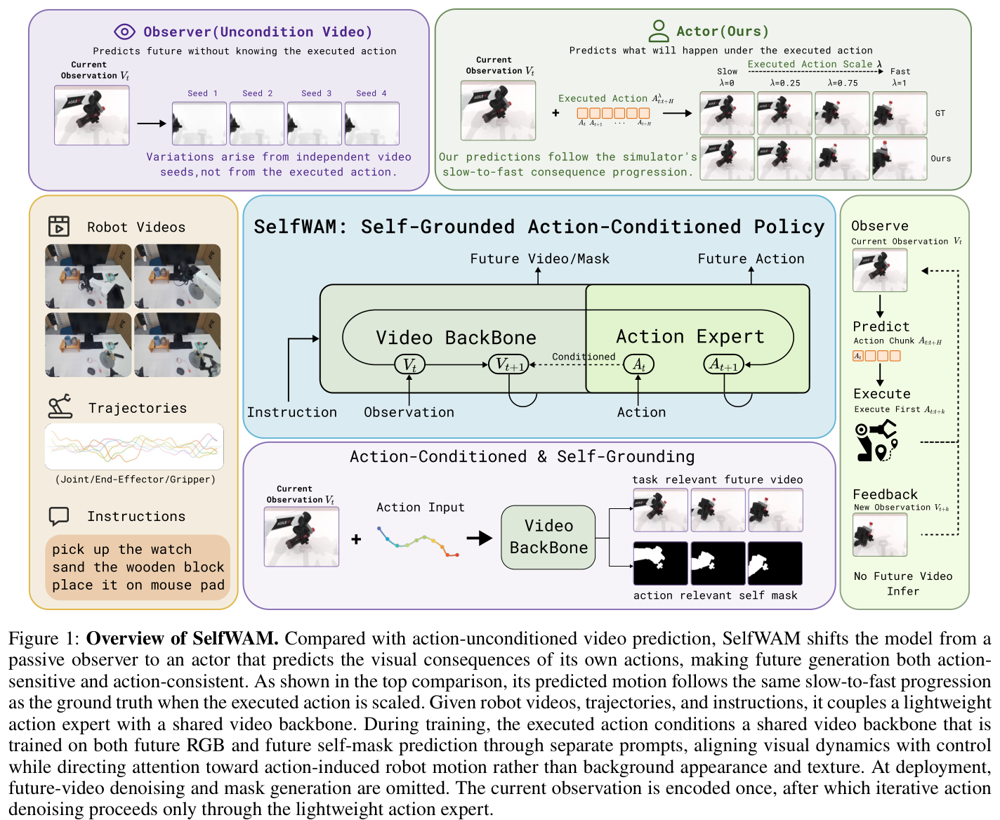
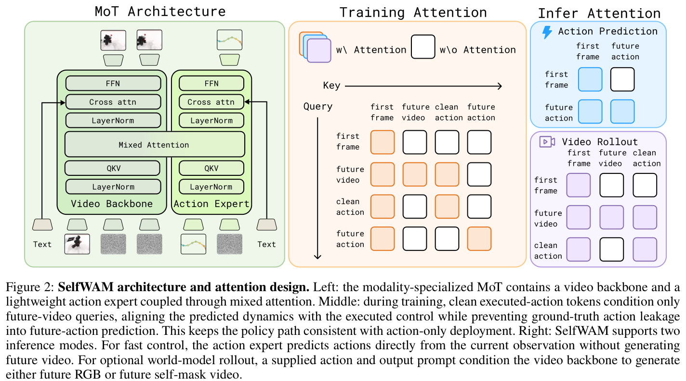
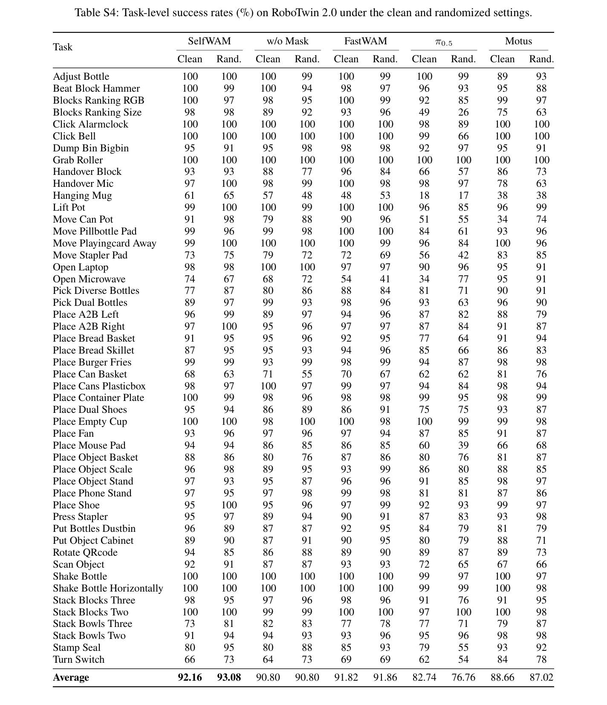
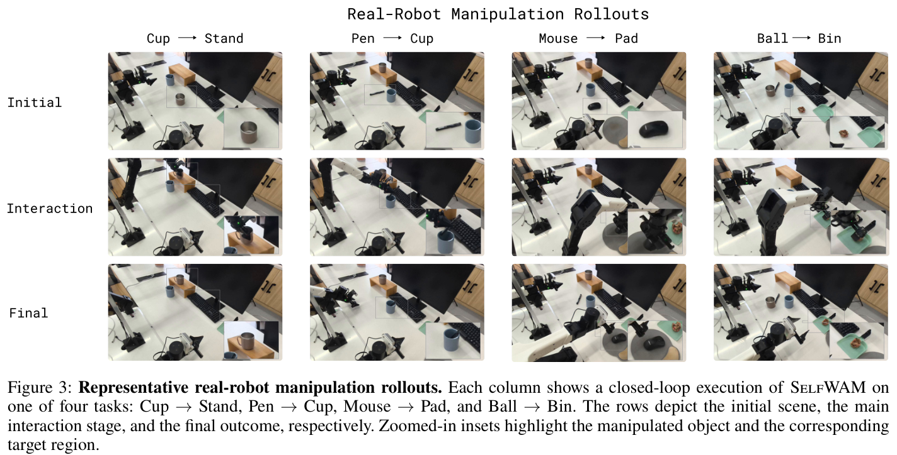
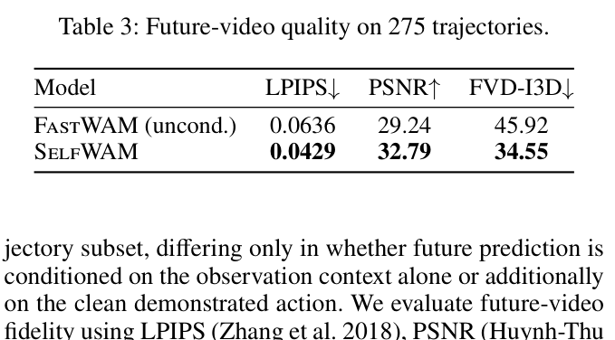
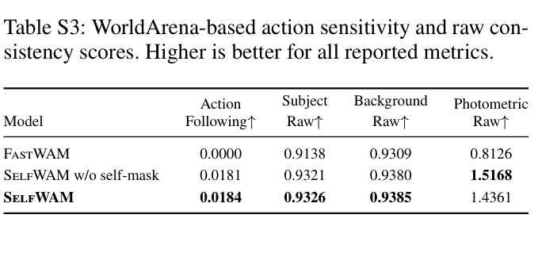
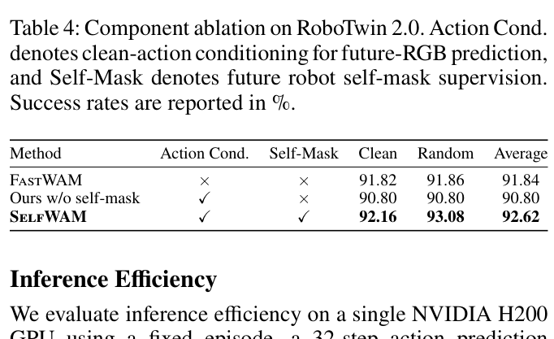
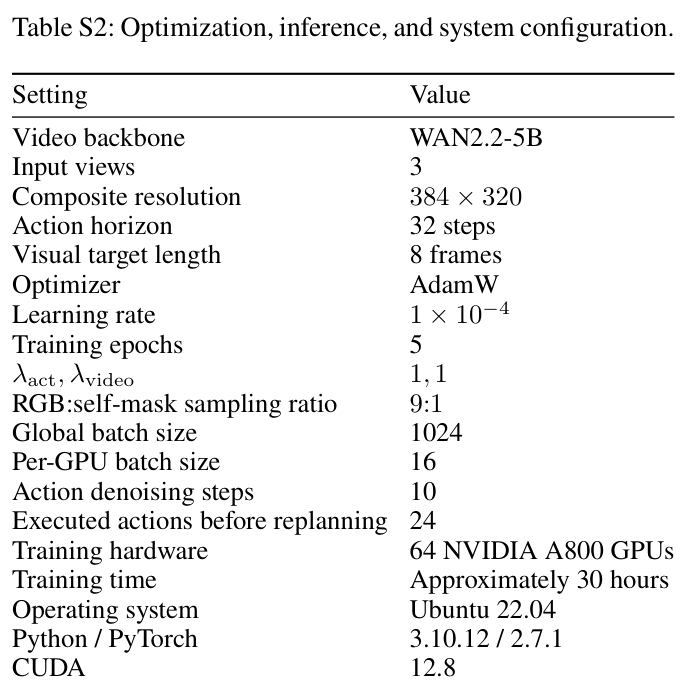

# SelfWAM: A Self-Grounded Unified World Action Model for Fast Robot Control

## 核心信息

- **论文标题**：SelfWAM: A Self-Grounded Unified World Action Model for Fast Robot Control
- **作者列表**：Bikang Pan (潘碧康)$^{1,2,*}$, Fan Liu (刘凡)$^{1,2,*}$, Haotao Lu (陆浩涛)$^{1,2}$, Jingya Wang (王静雅)$^1$, Ye Shi (石野)$^{1,2,\dagger}$（$^*$共同一作，$^\dagger$通讯作者）
- **所属机构**：上海科技大学 (ShanghaiTech University)$^1$、InstAdapt$^2$
- **发表时间与版本**：2026 年 8 月 1 日提交预印本（arXiv:2608.00725v1 [cs.RO]）
- **论文链接**：https://arxiv.org/abs/2608.00725
- **项目主页**：https://selfwam.github.io/
- **开源代码**：官方项目主页已上线，代码库筹备开源中（基于 WAN2.2-5B 与 FastWAM 扩展）
- **数据集与评测基准**：
  - **大规模双臂协同仿真基准**：RoboTwin 2.0（包含 50 项多视角双臂精细操作任务，多任务训练集包含 2,500 条干净示教与 25,000 条全方位领域随机化示教）
  - **真实双臂机器人平台**：AgileX ALOHA（COBOT Magic 双臂系统，14-DoF 关节位置控制，30 Hz 控制频率，离线数据集包含 17,307 个 episode、955 万状态转移）
  - **世界模型评测基准**：WorldArena（动作跟随度 Action Following、主题一致性 Subject Consistency、背景一致性 Background Consistency、光度一致性 Photometric Consistency）与参考度量（LPIPS, PSNR, FVD-I3D）
- **论文类型**：具身智能世界动作模型 (Embodied World-Action Model, WAM) / 视触动力学联合训练与快速闭环控制策略

---

## 原文摘要翻译

> **摘要**：世界动作模型（World Action Models, WAMs）通过联合建模动作与未来视觉观测，有效提升了机器人策略学习的性能。然而，现有的未来预测仅以任务语言提示（Prompt）和当前观测上下文为条件，这导致模型容易仅仅捕捉泛化的通用任务进展，而无法准确刻画所执行具体动作所诱导的特异性视觉后果。我们提出了 **SelfWAM**——一个基于模态专用混合专家（Mixture-of-Transformers, MoT）架构的自锚定统一世界动作模型。该模型联合预测机器人动作、受执行动作条件化的未来 RGB 帧以及机器人本体自掩膜（Robot Self-Masks），从而将未来预测牢固地锚定在机器人的可见物理躯体及其动作诱发的空间运动上。在联合训练期间，SelfWAM 允许未来视觉查询（Queries）注意力聚焦于执行动作的无噪声干净副本（Clean Action），将视频预测分支彻底转变为动作特异的后果模型，同时保持动作推理分支原有的快速部署路径不受影响。为了促使视频学习聚焦于与动作直接相关的视觉变化，我们引入了面向未来机器人本体自掩膜预测的提示词专用目标，去除了表面纹理细节，并提供了一个其时空演化与条件化动作严格强耦合的监督目标。干净动作条件化与未来自掩膜监督双管齐下，使得预测的未来能够更直接地反映执行动作如何改变机器人的可见运动及周围场景。在 RoboTwin 2.0 仿真基准和真实世界双臂操作任务上的充分实验表明，SelfWAM 生成了对动作变化具有更高敏感性的未来推演，并在显著提升策略操作性能的同时，完全保留了轻量快速的策略推理能力。

---

## 创新点

1. **非对称干净动作条件化机制（Asymmetric Clean-Action Conditioning）**：
   - **核心突破**：彻底打破了以 FastWAM 为代表的现有世界动作模型中“未来视频预测未显式条件化在动作上”的动作盲目性（Action-blindness）弊端。
   - **精妙设计**：在训练期为专家动作构建一份时间步 $t=0$ 的未加噪“干净副本”（Clean Copy），通过非对称注意力掩码（Asymmetric Directed Attention），仅允许未来视觉 token 查询访问该干净动作，而动作去噪查询（Noisy Action Tokens）被严格物理阻断，既消除了未来预测对动作后果的因果脱节，又杜绝了标签泄漏（Label Leakage），实现了训练期完备因果约束与部署期计算图的高度一致。

2. **具身自锚定未来机器人本体掩膜预测（Self-Grounded Robot Self-Mask Prediction）**：
   - **核心突破**：针对像素级 RGB 预测容易被物体反光、背景杂波和光照变化带偏、缺乏物理躯体归纳偏置的顽疾，首次提出将“未来机器人二值本体掩膜（Self-Mask）序列预测”作为辅助世界模型目标。
   - **精妙设计**：无需增加额外的掩膜解码器，而是直接复用同一预训练 5B 视频骨干网络（WAN2.2-5B），通过文本提示词解耦（Prompt-specific），使得自掩膜预测完全剥离与动作弱相关的外观纹理，专注于由执行动作直接决定的本体空间运动学演化，为策略提供了极具判别力的具身运动几何先验。

3. **零推理负担的快速闭环控制解耦架构（Zero-Overhead Fast Deployment Path）**：
   - **核心突破**：打破了以往动作条件化世界模型（如 GigaWorld-Policy, $\tau_0$-WM）部署时必须同步或滚动自回归生成未来高维视频所导致的高昂延迟（数秒级）瓶颈。
   - **精妙设计**：在推理阶段，彻底剔除干净动作分支与未来视频去噪流程，仅利用轻量动作专家（Action Expert）基于当前单次编码的视觉上下文进行 10 步流匹配去噪，在 NVIDIA H200 上仅需 **323.9 ms**（延迟相比 FastWAM 仅微增 +0.97%，显存占用完全持平为 13.959 GiB），做到了“训练期享受强世界模型特征正则化，部署期享受极速闭环反馈”。

4. **大尺度视频生成骨干向轻量控制专家的无损参数迁移（Weight Interpolation & Scaling）**：
   - **核心突破**：解决了视频生成大模型（WAN2.2-5B）与紧凑动作专家之间的通道与几何维度不匹配问题。
   - **精妙设计**：提出一维对齐线性插值算法，并在权重输入轴重塑时引入通道比率根号缩放因子 $\sqrt{d_v / d_a}$，有效抵消了网络层宽度收缩带来的激活方差衰减，实现了两类路径表征在零噪声极限下高达 $10^{-5}$ 量级的精确数值对齐。

---

## 一句话总结

SelfWAM 巧妙利用“单向流动的干净动作条件”与“无纹理机器人本体自掩膜生成”将视频预测锚定在物理躯体运动学上，在解决世界模型动作盲目性并显著提升策略抗扰成功率的同时，完美保留了 324 ms 的极速无视频闭环控制能力。

---

## 研究问题

在具身操作领域，构建策略级世界模型（Policy-facing World Models）的核心目标不仅仅是预测“环境在接下来的时间里通常会发生什么”，更关键的是回答：**当机器人执行某一个特定动作时，环境将发生何种特异性改变？这些改变具体发生在何处？机器人的物理躯体又是如何介导这一物理交互过程的？**

围绕这一目标，现存的世界动作模型（WAMs）面临着两大深层次的理论与工程矛盾：

### 1. 动作条件缺失导致的“动作盲目性”（Action-Blindness）
近年来的 WAM 探索（如 UVA, UWM, FastWAM）尝试将预训练视频生成模型的高维动态先验引入机器人策略学习中。其中，FastWAM 提出了极为实用的训练-部署解耦范式：在训练时让策略与未来视频预测多任务联合训练（Co-training），在部署时则省去未来视频去噪，直接输出动作。

然而，作者敏锐地指出了 FastWAM 的致命缺陷：**其未来视频预测分支仅仅以当前环境观测 $o_t$ 和任务文本 $\ell_t$ 为输入条件，而没有条件化在产生未来观测的真实执行动作 $a_t$ 上！**
在双臂接触操作中，相同的初始视觉场景可以对应多种完全不同但均合法的动作选择（例如向左推杯子 vs. 向右抓杯子）。如果世界模型在预测未来视频时不考虑具体动作，辅助预测任务就会退化为拟合“数据集统计意义上的平均场景演化”。实验中，FastWAM 在 WorldArena 评测的 Action Following（动作跟随度）得分竟然是 **0.0000**——这意味着当给定的动作大幅变化时，FastWAM 预测的视频几乎纹丝不动！它仅仅是一个被动的环境场景渲染器，无法充当受控因果模型。

### 2. 纯 RGB 监督带来的“纹理与背景主导”（Photometric Clutter）
如果简单地将动作作为条件塞入未来视频扩散模型中（如 GigaWorld-Policy），是否就能解决问题？
答案是否定的。纯 RGB 像素级的扩散生成损失（Diffusion Loss）严重受到场景内物体反光、复杂纹理、环境光影、桌面背景杂波等非因果信号的干扰。在标准操作场景中，这部分背景像素占据了画面面积的绝大部分，梯度反传被与机械臂运动弱相关的视觉重建所主导。模型很难自主领悟到：**最关键的动态演化其实是机械臂在笛卡尔空间中的位姿转移以及夹爪与物体的物理交互**。

### 3. 世界模型推演收益与实时控制延迟的根本冲突
若在推理阶段依赖世界模型生成未来视觉并据此挑选动作（如基于视觉的 MPC、推测执行或动作重排序 $\tau_0$-WM），每次控制步都需要迭代求解高维视频反向扩散过程，延迟通常高达数十秒，彻底丧失了机器人在复杂物理环境中抵抗扰动的闭环响应能力。

SelfWAM 正是为了同时化解上述三重矛盾而提出：它既要让世界模型建立严格的动作-后果因果对应，又要剔除视觉背景杂质将动态锚定在机械臂本体运动上，同时还必须保持动作推理路径的纯粹性与毫秒级极速响应。

---

## 数据与任务定义

### 1. 任务形式与数学建模

在控制步 $t$，智能体接收到的当前环境上下文定义为三元组：
$$c_t = (o_t, q_t, \ell_t)$$
其中：
- $o_t$ 为当前时刻的多视角 RGB 视觉观测；
- $q_t$ 为机器人本体感觉状态（Proprioception，包括各关节角度与夹爪状态）；
- $\ell_t$ 为任务的高层自然语言指令。

系统的预测目标包含动作与未来视觉两部分：
- **动作 Chunk（Action Chunk）**：时域跨度为 $H$ 步的连续控制轨迹，维度为 $d_a$：
  $$a_t = (a_t, a_{t+1}, \dots, a_{t+H-1}) \in \mathbb{R}^{H \times d_a}$$
- **未来视觉观测窗口**：在动作 chunk 覆盖的时域范围内，采样接下来的 $K$ 帧连续观测序列：
  $$o_t^{fut} = (o_{t+1}, \dots, o_{t+K})$$

在最优贝叶斯决策视角下，策略分支 $\pi^*(c_t)$ 与世界模型分支 $\mathcal{F}^*(c_t, a_t)$ 的目标函数被形式化为互补的期望损失最小化问题：
$$\pi^*(c_t) = \arg\min_{\hat{a}} \mathbb{E} \left[ \ell_a(\hat{a}, a_t) \mid c_t \right]$$
$$\mathcal{F}^*(c_t, a_t) = \arg\min_{\hat{o}} \mathbb{E} \left[ d_v(\hat{o}, o_t^{fut}) \mid c_t, a_t \right]$$

上述公式精确表达了二者的职能分工：**策略分支学习“在当前观测上下文下，示范数据支持哪种最优动作”；而世界模型分支学习“在当前上下文与指定动作的共同作用下，未来最可能呈现出何种一致的视觉后果”。**

### 2. 状态、动作与掩膜空间规格

- **多视角空间排布**：机器人由 3 个独立相机采集图像（1 个固定俯仰的高视角相机 + 左右机械臂腕部各 1 个手眼相机）。为了适配单视频扩散模型的 2D 潜在空间，系统将 3 个相机的画面拼装成一个固定的 **T 型复合图像（T-shaped composite image）**，整体分辨率标定为 $384 \times 320$。
- **时域动作与视觉对齐**：
  - 动作预测视界设定为 $H = 32$ 步。在真机上 ALOHA 控制频率为 30 Hz，32 步对应约 1.07 秒的未来轨迹。
  - 动作向量维度 $d_a = 14$（双臂每臂 6 个主动关节角度 + 1 个连续夹爪开合指令）；本体感觉 $q_t$ 遵循相同的 14 维定义。
  - 对应的 32 步时域视觉视频在时间轴上均匀降采样为 $K = 8$ 帧。这意味着视频预测的每一帧均精确对应动作 chunk 中 4 个控制步的时间跨度。
- **机器人本体掩膜空间**：
  - 掩膜目标定义为二值化的机器人可见手臂与末端夹爪分割序列 $m_t^{fut} \in \{0, 1\}^{K \times 1 \times 384 \times 320}$。
  - 在 RoboTwin 仿真器中直接提取完美的渲染级机械臂 Ground-Truth 掩膜；在真实物理机器人上，则使用基于 SAM 2 的开源模型 **RobotSeg** 离线全自动生成高精度的机器人本体掩膜。

### 3. 训练实例的双轨重构（Dual Training Instances）

为了在同一个视频扩散骨干中优雅融合 RGB 生成与自掩膜生成，且不干扰策略梯度的平稳优化，SelfWAM 对每条示教轨迹窗口构造了两种互补的训练样本实例：


*Table S1：两类训练实例的数据与损失构造方案。二者均使用干净动作作为未来视觉生成的条件，但仅 RGB 实例享有动作监督梯度。*

| 实例类型 (Instance) | 加噪动作输入 ($\tilde{A}$) | 动作监督目标 ($a_t$) | 未来视觉目标 ($V$) | 计算损失 (Losses) |
| :--- | :---: | :---: | :---: | :---: |
| **RGB 实例** | 是（加入流匹配高斯噪声） | 是（计算动作去噪损失） | 未来 RGB 复合视频序列 | $\mathcal{L}_{act} + \mathcal{L}_{rgb}$ |
| **Self-Mask 实例** | 否（完全不实例化加噪动作） | 否（不反传策略梯度） | 未来机器人本体二值掩膜序列 | $\mathcal{L}_{mask}$ |

两种实例共享相同的当前 RGB 观测、任务语言指令、本体状态、干净动作条件、视频加噪时间步与时空位置编码。在训练采样循环中，RGB 实例与 Self-Mask 实例按 **9 : 1** 的比例混合抽取。


*Figure S1：时域采样与多视角 T 型复合布局示意图。32 步动作对应的 8 帧未来观测窗口在时间轴上从左到右依次排列，RGB 序列与机器人二值自掩膜序列保持完全相同的空间排布与时空偏置。*

---

## 方法主线

### 机制流程

SelfWAM 的总体宏观流向如图 1 与图 2 所示。整个系统有机地连接了预训练高维视频扩散先验与敏捷具身低层控制两个世界。



*Figure 1：SelfWAM 整体框架概览。上部对比展示了动作无条件化视频预测与 SelfWAM 的动作敏感预测；中部展示轻量动作专家与共享视频骨干的协同训练；下部展示部署期剥离视频生成的快速动作去噪闭环。*

系统的完整运行逻辑包含两条明确的路径：
1. **训练期双流协同演进链**：
   - 当前多视角 RGB 观测拼接后送入视频编码器，提取上下文视觉特征；
   - 示教动作被复制为两份：一份注入流匹配扩散噪声 $\tilde{A}$（用于策略学习），另一份保持无噪声的真实动作 $A$ 并打上 $t=0$ 的时间步标记（用于充当受控因果条件）；
   - 模态专用混合专家（MoT）执行非对称跨模态交互，轻量动作专家去噪恢复真实动作，而共享视频骨干根据提示词分支分别去噪重建未来 RGB 画面或未来机器人自掩膜；
2. **部署期纯动作闭环链**：
   - 干净动作分支与未来视频去噪分支被彻底销毁；
   - 当前观测仅通过视觉骨干编码一次，之后轻量动作专家独立执行 10 步流匹配向量场积分，直接吐出 32 步动作 chunk；
   - 机器人执行前 24 步动作，并在第 25 步时由最新观测无缝触发下一次重规划（Receding Horizon Control）。

---

### Self-Grounded Formulation

本方案的核心数学构想，在于如何在混合注意力架构中严密设计**非对称信息流（Asymmetric Directed Attention）**，使得未来视觉能够获得动作指导，而动作决策绝不能“未卜先知”。



*Figure 2：SelfWAM 架构与注意力路由设计。左侧展示基于 MoT 的双流混合注意力；中间展示训练期非对称信息流矩阵，干净动作仅对未来视觉可见；右侧展示快速控制与反事实视频推演两种独立推理模式。*

#### 1. 干净动作条件化拓扑
设网络中参与注意力的四大 token 分组分别为：
- $O$：当前环境上下文 tokens（包含多视角当前图像、文本指令、本体状态嵌入）；
- $\tilde{A}$：带噪未来动作 tokens（对应扩散加噪状态，其时间步 $\sigma \in (0, 1]$）；
- $A$：干净执行动作 tokens（未受扰动，硬编码扩散时间步 $t = 0$）；
- $\tilde{V}$：带噪未来视觉 tokens（对应未来 RGB 或自掩膜的扩散潜变量）。

对于某一组查询 $Q_X$，其允许交互键值（Keys/Values）的目标集合记为 $Q_X \to S$。SelfWAM 施加的注意力掩码严格定义如下：
$$Q_{\tilde{A}} \to \{O, \tilde{A}\}$$
$$Q_{\tilde{V}} \to \{O, \tilde{V}, A\}$$
$$Q_A \to \{O, A\}$$

这一非对称公式具备极其深刻的物理意义：
- **消除了标签泄漏**：带噪动作查询 $Q_{\tilde{A}}$ 只能看到当前观测 $O$ 以及自身的动作噪声状态 $\tilde{A}$，完全无法接触到干净动作 $A$，也无法访问未来视觉 $\tilde{V}$。策略在训练期与部署期的输入信息域实现了百分之百的等价，绝不会发生“依靠作弊访问未来”的过拟合。
- **构建受控因果模型**：未来视觉查询 $Q_{\tilde{V}}$ 能够双向与干净动作 $A$ 交互。此时，视频扩散骨干不仅知道“现在是什么”，还清晰知道“机械臂接下来将要执行何种空间轨迹”，从而将盲目漫无边际的视频生成收敛为动作条件下的物理后果推演。
- **干净路径表征对齐**：干净动作 $A$ 共享动作专家的前向网络与位置编码，且其查询 $Q_A$ 仅与上下文 $O$ 交互。这使其成为动作专家在零噪声条件下的真实物理表征。

#### 2. 提示词解耦的机器人自掩膜预测
将自掩膜（Self-Mask）引入视频大模型最朴素的方法通常是添加独立的掩膜解码头或微调另一组参数，但这样会破坏预训练视频权重的完整性并增加显存。SelfWAM 创造性地通过**输出文本提示词（Output Prompts）**实现单一主干的双任务分流：
- **RGB 任务提示词**：
  `"A video recorded from a robot's point of view executing the following instruction: {task}."`
- **Self-Mask 任务提示词**：
  `"A robot-arm mask video recorded from a robot's point of view executing the following instruction: {task}."`

当网络接收到掩膜提示词时，初始帧仍为真实的当前 RGB 画面（以保留机器人在场景中的初始空间坐标），但扩散去噪的目标被切换为二值掩膜潜变量。由于掩膜序列排除了所有环境纹理、物体色彩和漫反射高光，视频骨干被迫将注意力权重全力投射在机械臂连杆、关节铰链与末端执行器的物理运动上。这种强烈的几何拓扑监督反哺给视觉表征，构成了牢不可破的“具身自锚定（Self-Grounding）”。

---

### Modality-Specialized Mixture-of-Transformers

模型基于模态专用的两流混合 Transformer（MoT）设计，既维护了多模态表征的差异性，又打通了跨模态时空交互。

#### 1. 双流骨干组成
- **视频主干（Video Backbone）**：选用先进的开源大尺度视频扩散基础模型 **WAN2.2-5B**。该模型预训练于海量开域真实视频，蕴含着对三维物理流动、物体持久性与刚体运动学的深厚常识，承担着当前上下文编码以及未来视觉潜变量去噪的重任。
- **轻量动作专家（Lightweight Action Expert）**：由于机械臂连续控制动作的自由度（14 维）远小于高维视频特征，为了保证毫秒级控制响应，动作专家采用极其紧凑的 Transformer 结构，通道维度相比视频主干大幅压缩。

#### 2. 基于线性插值与激活缩放的参数迁移
动作专家的初始化并未从头随机训练，而是从 WAN2.2-5B 视频骨干中进行跨维度权重插值蒸馏。
设某一权重张量在视频主干中的原始维度为 $d_v$，在动作专家中对应的目标压缩维度为 $d_a$。对于目标索引 $j \in \{0, \dots, d_a - 1\}$，其映射到视频主干连续坐标上的位置计算为：
$$u_j = \frac{j(d_v - 1)}{d_a - 1}$$
参数值通过对连续坐标 $u_j$ 相邻的两个原始权重值进行一维线性插值求得。

更为精妙的是，作者发现直接插值会导致前向传播激活值的方差随着网络深度发生剧烈衰减。为此，当被缩放的轴是权重张量的**输入通道维度（Input Dimension）**时，额外引入了基于维数比值的开方缩放因子：
$$W_{scaled} = W_{interpolated} \times \sqrt{\frac{d_v}{d_a}}$$
该数学设计保证了在输入宽度变窄的情况下，各层线性变换输出的激活能量保持在与视频骨干相当的数量级上，确保了流匹配去噪过程数值计算的极高稳定性。

#### 3. 混合注意力与前向路由（Mixed Attention & Routing）
在每一个 Transformer 块中，视觉 tokens 与动作 tokens 独立进行模态专用的投影变换（$Q, K, V$ Projections），随后汇入跨模态混合注意力层，根据前述的非对称拓扑掩码进行全局信息聚合。完成注意力交互后，tokens 被解包并路由回各自专用的前馈神经网络（FFN）进行非线性特征提炼。语言指令嵌入与本体状态通过跨注意力或自适应层归一化（AdaLN）同步调制双流专家。

---

### 训练与推理机制

#### 1. 统一的流匹配优化目标（Flow Matching Objectives）
SelfWAM 采用现代速度场流匹配（Flow Matching）范式统一训练动作扩散与视频生成。
设动作去噪速度场损失为 $\mathcal{L}_{act}$，未来 RGB 视频去噪损失为 $\mathcal{L}_{rgb}$，未来自掩膜视频去噪损失为 $\mathcal{L}_{mask}$。将视觉损失的混合期望记为 $\mathcal{L}_{rgb/mask}$。联合优化的全局目标定义为：
$$\mathcal{L} = \lambda_{act} \mathcal{L}_{act} + \lambda_{video} \mathcal{L}_{rgb/mask}$$
在实验中设置等权系数 $\lambda_{act} = 1, \lambda_{video} = 1$。
值得注意的是，自掩膜实例样本不参与动作损失计算（不产生 $\mathcal{L}_{act}$），这一设计避免了因为样本复制而导致策略分支梯度过度偏置。

#### 2. 控制部署（Action-Only Deployment）：纯净无额外开销
在物理机器人或仿真环境闭环控制部署时：
- 干净动作分支 $A$ 与未来视觉分支 $\tilde{V}$ 的计算图被彻底旁路（Bypassed）；
- 视频骨干仅执行一次单步前向推理，将当前多视角 RGB 观测编码为静态键值缓存（KV Cache）；
- 随后，计算流完全交由轻量的动作专家执行：从标准高斯先验出发，仅需 **10 步** 欧拉积分去噪，即可输出高质量的 32 步动作 chunk；
- 系统执行前 24 步动作，并以 **Receding Horizon** 模式滚动更新。

#### 3. 可选反事实世界模型推演（Optional World-Model Rollout）
如果需要进行策略诊断、异常干预或反事实评估，SelfWAM 同样支持将任意候选动作（如扰动动作或不同策略输出的动作）灌入干净动作通道，并通过切换提示词，直接渲染出该动作诱发的未来 8 帧连续 RGB 视频或二值自掩膜演化视频。

---

## 关键结果

### 主结果与强基线

在 RoboTwin 2.0 这一极具挑战性的双臂协同操作基准（包含 50 项复杂操作，跨越工具使用、精细插拔、软体与刚体交互）上，SelfWAM 与最前沿的通用 VLA 模型（$\pi_0$, $\pi_{0.5}$）以及最新的世界动作模型（Motus, GigaWorld-Policy, FastWAM）展开了严格的横向对决。


*Table 1：RoboTwin 2.0 基准上的策略任务成功率（%）。评测覆盖 Clean 环境与 Random（包含强烈光照、背景纹理与物体位姿扰动）环境。*

| 方法 (Method) | Clean 环境成功率 (%) | Random 环境成功率 (%) | 平均成功率 (Average %) |
| :--- | :---: | :---: | :---: |
| **$\pi_0$** (Black et al. 2024) | 65.92 | 58.40 | 62.16 |
| **$\pi_{0.5}$** (Physical Intelligence 2025) | 82.74 | 76.76 | 79.75 |
| **Motus** (Bi et al. 2026) | 88.66 | 87.02 | 87.84 |
| **GigaWorld-Policy** (Ye et al. 2026a) | 86.36 | 85.04 | 85.70 |
| **FastWAM** (Yuan et al. 2026) | 91.82 | 91.86 | 91.84 |
| **SelfWAM (Ours)** | **92.16** | **93.08** | **92.62** |

#### 结果深度解读：
1. **显著超越通用 VLA 基准**：相比参数量极为庞大的通用视觉-语言-动作模型 $\pi_{0.5}$（平均成功率 79.75%），SelfWAM 达到了 **92.62%**，净胜 **+12.87%**。这证明了将预训练视频大模型的动态生成先验深度内化到控制流中，对于精细机械臂操作具有决定性的优势。
2. **在视觉随机化场景下展现出统治级鲁棒性**：在干净仿真环境（Clean）下，SelfWAM 相比 FastWAM 从 91.82% 微增至 92.16%（+0.34%）；然而一旦进入极具视觉干扰的域随机化（Random）环境，FastWAM 维持在 91.86%，而 SelfWAM 飙升至 **93.08%**（领先 FastWAM **+1.22%**）。
3. **单任务细分收益（Table S4 深度挖掘）**：
   在附录 Table S4 提供的完整 50 个任务中，SelfWAM 在需要机械臂本体空间精细定位与大范围视觉遮挡的任务上提升尤为惊人：
   - **Open Microwave（打开微波炉）**：随机化环境下从 FastWAM 的 41% 暴涨至 **67%**（净提升 **+26%**！）；
   - **Hanging Mug（将杯子悬挂在架子上）**：从 FastWAM 的 53% 提升至 **65%**（净提升 **+12%**！）；
   - **Handover Block（双臂交接积木）**：从 FastWAM 的 84% 提升至 **93%**（净提升 **+9%**）；
   - **Place Mouse Pad（放置鼠标垫）**：从 FastWAM 的 85% 提升至 **94%**（净提升 **+9%**）。
   这些任务无一例外都需要机械臂克服背景随机纹理干扰，准确根据本体当前与未来运动趋势调整末端位姿。



*Table S4：RoboTwin 2.0 完整 50 项任务在 Clean 与 Randomized 设置下的全景评测结果对比。*

---

### 真实机器人实验与视频预测质量

#### 1. 真实 ALOHA 双臂机器人闭环控制表现
真实世界部署是对策略抗噪声能力与泛化性的终极检验。作者在 AgileX ALOHA 双臂平台上设置了 4 项极具代表性的长时程精密操作：
- **Brown Cup on Wooden Stand**（将棕色杯子平稳放置于木质托架上，考验放置平面平稳度）；
- **Black Pen in Blue Cup**（拾取黑色笔精准插入狭窄的蓝色笔筒，考验毫米级对准精度）；
- **Black Mouse on Gray Mouse Pad**（拾取黑色鼠标精准放置在深灰鼠标垫中央，考验暗光对比度识别）；
- **Paper Ball in Desktop Bin**（拾取纸团投入桌面废纸篓，考验三维空间位姿估计）。



*Figure 3：SelfWAM 在真实双臂机器人操作任务中的闭环执行连续定性快照。每列依次为初始状态、主要物理交互阶段与最终任务达成，放大的局部插图展示了末端夹爪对物体的精细操作。*


*Table 2：真实物理机器人 4 项操作任务成功率统计（%）。每项任务独立评估 10 次试验。*

| 任务名称 (Task) | SelfWAM | FastWAM | $\pi_{0.5}$ |
| :--- | :---: | :---: | :---: |
| **Brown Cup on Wooden Stand** | **100** | 80 | 90 |
| **Black Pen in Blue Cup** | **90** | 90 | 90 |
| **Black Mouse on Gray Mouse Pad** | **100** | 80 | 90 |
| **Paper Ball in Desktop Bin** | **90** | 90 | 90 |
| **全任务平均成功率 (Average)** | **95** | 85 | 90 |

在实物测试中，SelfWAM 取得了惊人的 **95%** 平均成功率，相比 FastWAM 的 85% 实现了高达 **+10%** 的质的飞跃。在杯子托架与鼠标放置任务中，FastWAM 多次因为末端夹爪对阴影与木纹的误判导致偏离目标滑落，而 SelfWAM 凭借强大的具身自锚定特征，机械臂动作极为笃定，全部达成 100% 成功。

#### 2. 未来视频预测保真度质的跨越
在 275 条均布抽样的高精度轨迹上，评估世界模型生成的未来视频与真实录制视频之间的保真度指标：



*Table 3：基于 275 条轨迹的未来视频生成质量评估。*

| 模型 (Model) | LPIPS ↓ | PSNR ↑ | FVD-I3D ↓ |
| :--- | :---: | :---: | :---: |
| **FastWAM (无动作条件)** | 0.0636 | 29.24 dB | 45.92 |
| **SelfWAM (动作条件 + 自锚定)** | **0.0429** | **32.79 dB** | **34.55** |

- 衡量感知相似度的 LPIPS 从 0.0636 大幅降低至 **0.0429**；
- 峰值信噪比 PSNR 从 29.24 dB 显著跃升至 **32.79 dB**（提升超过 3.5 dB）；
- 衡量时空视频生成分布一致性的 FVD-I3D 指标从 45.92 骤降至 **34.55**（改善幅度达 **24.7%**）。

#### 3. WorldArena 动作敏感性量化打破僵局
采用国际权威世界模型评测基准 **WorldArena** 评估动作敏感性与一致性。其中，**Action Following ($S_{act}$)** 衡量输入不同动作扰动时生成未来视频的特征差异度，如果模型不响应动作，则该得分为 0。



*Table S3：WorldArena 动作跟随度与原始一致性度量。全部指标越高越好（↑）。*

| 模型变体 (Model) | 动作跟随度 ($S_{act} \uparrow$) | 主题一致性 ($S_{subj}^{raw} \uparrow$) | 背景一致性 ($S_{bg}^{raw} \uparrow$) | 光度一致性 ($S_{photo}^{raw} \uparrow$) |
| :--- | :---: | :---: | :---: | :---: |
| **FastWAM** | 0.0000 | 0.9138 | 0.9309 | 0.8126 |
| **SelfWAM w/o self-mask** | 0.0181 | 0.9321 | 0.9380 | **1.5168** |
| **SelfWAM (完整模型)** | **0.0184** | **0.9326** | **0.9385** | 1.4361 |

这一数据揭露了一个震撼的事实：**FastWAM 的动作跟随得分为确凿的 0.0000，彻底证实了无动作条件世界模型的“动作盲目性”**。而 SelfWAM 将动作跟随度拉升至 **0.0184**，同时光度一致性由 0.8126 跃升至 **1.4361**，在保持高动态响应的同时避免了画面的闪烁与撕裂。

#### 4. 动作方向扰动与连续动作插值定性验证


*Figure 4：方向性动作扰动对比。对示教动作施加向上、向下、向左、向右的关节偏置。FastWAM 预测的自掩膜（橙色参考线）在各个变体中几乎完全静止不变；而 SelfWAM 预测的自掩膜严格跟随动作指令向相应方向发生空间位移。*


*Figure S2：连续动作线性插值（从 0% 静止动作到 100% 专家动作）。随着动作权重增大，FastWAM 的预测画面停滞不前，而 SelfWAM 平滑流畅地展现出机械臂逐步向前抓取的因果动态连续过渡。*

---

### 消融到底说明了什么

组件消融实验（Table 4）揭示了整篇论文最具启发性、最引人深思的核心洞见：



*Table 4：RoboTwin 2.0 上的组件贡献消融实验。Action Cond 表示针对未来 RGB 的干净动作条件化，Self-Mask 表示未来机器人本体掩膜监督。*

| 实验组别 | 动作条件化 (Action Cond.) | 自掩膜监督 (Self-Mask) | Clean 成功率 (%) | Random 成功率 (%) | 平均成功率 (%) |
| :--- | :---: | :---: | :---: | :---: | :---: |
| **FastWAM** | $\times$ | $\times$ | 91.82 | 91.86 | 91.84 |
| **Ours w/o self-mask** | $\checkmark$ | $\times$ | 90.80 | 90.80 | 90.80 |
| **SelfWAM (完整模型)** | $\checkmark$ | $\checkmark$ | **92.16** | **93.08** | **92.62** |

#### 深度消融剖析：
- **为什么单独加上动作条件（Ours w/o self-mask），成功率反而掉了 1.04%？**
  这是许多研究者极易忽视的反常现象：从 FastWAM 到 Ours w/o self-mask，平均成功率从 91.84% 退化到了 90.80%。
  **机理解析**：原本 FastWAM 的未来视频生成是一个非常单纯的“自然时空连贯性”补全任务。一旦强行把动作喂给视觉骨干去拟合复杂的 RGB 画面，网络被迫建立高维动作向量与复杂像素渲染之间的映射关系。然而，RGB 图像中充满了物体阴影、光斑、背景杂物等与动作无因果关系的噪声信号。由于缺乏对“机器人到底在哪里”的先验引导，视觉骨干很容易产生虚假因果关联（Spurious Correlations），将动作与错误的像素变化强行绑定，反过来污染了跨模态共享的特征空间，干扰了动作策略的优化！
- **自掩膜（Self-Mask）为何能成为破局的神来之笔？**
  当引入自掩膜联合预测后，网络同时受到纯净几何运动学的强力约束。自掩膜直接向模型揭示了底牌：“别去猜那些乱七八糟的桌面光影，动作的本质就是驱使这具机械臂在空间中改变构型！”这一具身自锚定信号瞬间洗净了视觉特征中的噪声，平均成功率直接由 90.80% 逆势反弹至 **92.62%**，在随机化场景下更是冲破 **93%**。
- **这充分证明**：**动作条件化是赋予模型物理因果性的发动机，而本体自掩膜则是校准因果方向的方向盘，二者具有高度不可分割的互补共生关系！**


*Figure S3：零噪声极限下干净动作路径与加噪动作路径的表征数值一致性评估。*

附录 Figure S3 进一步打消了表征漂移的顾虑：当噪声水平 $\sigma = 0$ 时，在所有 Transformer 层中，干净动作路径与加噪去噪路径输出的特征 NRMSE 保持在 $1 \times 10^{-5}$ 量级，余弦距离在 $6 \times 10^{-11}$ 量级。这证明干净动作能够毫无阻碍地代表动作专家提取的核心高维表征。

---

### 推理效率与部署特性

世界动作模型以往难以实机部署的致命痛点在于高延迟。SelfWAM 在单张 NVIDIA H200 GPU 上的基准评测证实了其卓越的工程实用价值：


*Table 5：预热后单步推理效率对比（在 NVIDIA H200 GPU 上 4 次运行取平均）。*

| 评估指标 (Measurement) | FastWAM | SelfWAM | 相对变动 (Change) |
| :--- | :---: | :---: | :---: |
| **纯动作控制推理延迟 (Action-only)** | 320.7 ms | **323.9 ms** | **+0.97%** |
| **动作 + 视频联合推演延迟 (Action + video)** | 668.4 ms | **677.5 ms** | **+1.36%** |
| **峰值显存占用 (Peak GPU Memory)** | 13.959 GiB | **13.959 GiB** | **0.00%** |

- **仅增加 0.97% 延迟**：闭环动作推理仅耗时 **323.9 ms**（仅比 FastWAM 慢 3.2 ms，这仅仅是由于模型结构中轻微的代码分支检查，数学计算完全一致）；
- **显存完全零增长**：推理峰值显存锁定在 **13.959 GiB**，完全无需为世界模型保留冗余显存；
- **控制频率特性**：每个 32 步 chunk 耗时 324 ms，执行前 24 步动作（在 30 Hz 下持续 800 ms），意味着策略推理可在动作执行后台异步并行流水线化，**完全支持流畅不卡顿的 30 Hz 实时闭环伺服控制！**

---

## 深度分析

### 真正贡献是什么

1. **重新校准了世界动作模型（WAMs）的方法论基石**：
   此前的 WAMs 研究走向了两个极端：要么像 early WAMs 一样沉迷于推理期生成华丽的未来视频，导致控制极其缓慢实用性归零；要么像 FastWAM 一样虽然砍掉了推理期视频生成，却为了图方便把未来视频预测降级为与动作完全无关的被动自回归，失去了“动作模型”的灵魂。
   **SelfWAM 的真正贡献在于：它第一次以极其优雅的形式，证明了我们完全可以在享受“完全受控的动作因果视频生成”训练红利的同时，一分钱不花地保留“极速纯动作闭环部署”。**

2. **确立了“具身自锚定（Self-Grounding）”的不可替代性**：
   过往研究（如 Mask World Model, MaskWAM, GeoSem-WAM）往往将目光投向外部环境——去分割桌子、分割障碍物、预测物体语义点云。
   SelfWAM 指出了一个更根本的前提：**机器人在理解世界之前，必须首先理解自己的身体。** 在高自由度多视角操作中，机械臂本体的可见像素是连接内部运动学指令与外部物理接触的唯一几何桥梁。通过自掩膜建立本体先验，是以最低计算代价解决视觉扰动的最优解。

---

### 为什么结果成立

1. **非对称注意力从图论层杜绝了泄漏并锁定了计算图**：
   注意力拓扑矩阵中 $Q_{\tilde{A}} \to \{O, \tilde{A}\}$ 的硬性约束，确保了在数学反向传播时，真实动作信息只能顺着 $Q_{\tilde{V}} \to A$ 流向视频分支，绝无任何旁路能够渗入动作去噪分支。这使得动作去噪学习到的始终是基于历史观测求解逆动力学的通用泛化能力。

2. **自掩膜充当了天然的时空梯度滤波器**：
   二值掩膜的交叉熵/流匹配损失是极度纯粹的运动学边缘惩罚。当机械臂运动时，掩膜的每一个边界像素变化都严格对应关节转角速度 $\dot{q}$ 与正向运动学（Forward Kinematics）。这一无噪损失源源不断地向 Transformer 低层注入结构化运动先验，抑制了环境随机背景带来的无序特征振荡。

3. **WAN2.2-5B 先验的完美继承**：
   视频骨干直接汲取了工业级 5B 基础生成模型的庞大容量，配合 $\sqrt{d_v/d_a}$ 的插值缩放，动作专家未发生冷启动崩塌，两套表征在流匹配速度场中达成了极高协同度。

---

### 容易误读的地方

1. **误读一：在机器人部署控制时，系统是否也在实时生成自掩膜？**
   - **澄清**：**绝对没有！** 这是最容易产生的误解。部署时不仅不生成未来 RGB 视频，也完全不生成未来自掩膜，甚至连掩膜提示词都不会被读取。自掩膜与干净动作仅在训练期作为正则化辅助监督存在，推理时动作专家单兵作战。

2. **误读二：自掩膜预测是否增加了一个庞大的分割模型作为网络组件？**
   - **澄清**：**完全没有增加参数！** 掩膜生成是由同一个视频生成主干 WAN2.2-5B 承担的，仅仅是将文本提示词从 RGB 换成了 Mask。至于数据标注中的 SAM 2/RobotSeg，仅在数据准备阶段离线跑一次，模型自身无需集成任何分割网络。

3. **误读三：在 Clean 仿真上只提了 0.34%，收益是不是不够大？**
   - **澄清**：不能只看 Clean 环境下的均值。在干净仿真中，背景与机械臂对比度极其强烈，基线本就高达 91.8% 接近饱和；而一旦遇到视觉随机化（Random）以及真实物理机器人（Real-world），自锚定的威力瞬间显现——真机成功率从 85% 跃迁至 95%（+10%），这在具身操作领域是极具说服力的质变。

---

### 复现注意点

为确保学术界与工业界能够顺利复现，作者在附录提供了详尽的超参规格：



*Table S2：优化超参、推理配置与软硬件系统环境一览表。*

1. **分布式算力门槛**：
   - 训练需要 **64 张 NVIDIA A800 (80GB) GPU**，节点系统内存 1 TB，基于 Ubuntu 22.04、Python 3.10.12、PyTorch 2.7.1 与 CUDA 12.8；
   - 全局 Batch Size 必须达到 **1024**（即单卡 Batch Size 为 16），学习率采用 AdamW 恒定 $1 \times 10^{-4}$，训练 5 个 Epoch 耗时约 **30 小时**。
2. **权重插值通道缩放（至关重要）**：
   - 从 5B 视频模型向动作专家缩减权重时，务必对输入维度应用 $\sqrt{d_v/d_a}$ 能量补偿乘子，否则浅层输出的方差会迅速衰减为 0，导致前几个 epoch 梯度弥散。
3. **离线掩膜生成管线**：
   - 针对真机数据，必须使用预训练好的 RobotSeg 检查点在全分辨率下离线批量提取掩膜，确保关节铰链处无闪烁漂移。三视角拼装顺序必须与 RGB 严格锁定在同一套 T 型布局（俯仰居中顶置，双手眼分居下方两侧）。
4. **流匹配推理去噪步数**：
   - 动作预测推理采用 10 步均匀时间步欧拉求解，过多步数（如 50 步）无法带来成功率增益却会显著拉长延迟；24 步动作执行窗口后必须立即由最新帧清空旧状态重新采样。

---

## 局限

尽管 SelfWAM 表现出色，仍存在值得未来深耕的内在局限：

1. **缺乏接触力学与遮挡后物理动力学显式建模**：
   自掩膜聚焦于可见机械臂连杆。然而在许多高难度接触富集型装配（Contact-rich Assembly，如轴承压装、盲插）中，末端夹爪往往被工件大面积遮挡，且操作的成功取决于法向力与微力矩平衡。纯视觉二值掩膜无法表征隐藏力学状态。
2. **离线分割模型质量的潜在瓶颈**：
   真实机器人的自掩膜质量直接依赖离线模型（RobotSeg）的分割精度。若机器人遇到反光电镀金属臂、极端低照度或未收录的全新构型机械臂，离线掩膜的误分割可能转化为虚假动力学先验。
3. **时域视界局限（Short Horizon）**：
   当前未来视频推演设定为 32 步动作对应的 8 帧画面（约 1 秒）。这一视界足以支撑局部因果对齐，但无法直接推演多步骤、数十秒以上的跨阶段长期规划任务。

---

## 我的笔记

### 在世界模型与具身智能学术坐标系中的全局横向定位

为了更宏观地把握 SelfWAM 的学术价值，我们可以将当前具身世界模型（Embodied World Models）的主流流派梳理如下：

```
                              具身世界模型 (Embodied World Models)
                                              │
         ┌────────────────────────────────────┴────────────────────────────────────┐
         ▼                                                                         ▼
   端到端联合推演流 (Joint Inference WAMs)                           解耦快速控制流 (Fast/Decoupled WAMs)
  (推理期依赖视频生成/规划)                                           (仅训练期联合辅助监督，部署期纯动作)
         │                                                                         │
 ┌───────┴────────┐                                                        ┌───────┴────────┐
 ▼                ▼                                                        ▼                ▼
生成式规划     动作重排序                                               动作无条件辅助     具身自锚定动作条件
(DreamZero,   (tau0-WM,                                                  (FastWAM,        (SelfWAM, Ours)
 DiT4DiT)      GigaWorld)                                                 UVA, UWM)        ★ 动作因果 + 自掩膜
 [极慢,数秒级]  [极慢,难闭环]                                              [极快,但动作盲目]   [极快 324ms,动作敏感]
```

1. **对比 FastWAM (Yuan et al. 2026)**：
   SelfWAM 是 FastWAM 最直接的集大成与演进者。FastWAM 首创了部署期抛弃视频生成的敏捷思想，但留下了动作盲目性的遗憾；SelfWAM 在完全继承其 324 ms 极速基因的基础上，通过非对称干净动作注意力与本体自掩膜，给 FastWAM 补齐了最关键的因果拼图。
2. **对比 GigaWorld-Policy (Ye et al. 2026a) 与 $\tau_0$-WM (Zhou et al. 2026)**：
   GigaWorld-Policy 同样强调动作条件视频生成，但在策略使用时仍保留视频 rollout 负担，导致延迟难以支撑高频控制；$\tau_0$-WM 则试图用世界模型推演数十个候选动作挑最优，计算开销巨大。SelfWAM 证明：**世界模型的价值完全可以通过特征协同表征内化在紧凑的动作专家参数中，无需在部署时劳师动众地生成像素。**
3. **对比 GeoSem-WAM (Ma et al. 2026a) 与 MaskWAM (Yu et al. 2026)**：
   GeoSem-WAM 引入几何点云与场景语义分割，MaskWAM 引入物体操作掩膜。这些工作虽然引入了结构化视觉，但其锚定中心是“被操作物体（Object-centric）”；而 SelfWAM 鲜明提出了“机器人自身（Robot-centric / Self-grounded）”。在现实具身操作中，物体种类无穷无尽（开放词表），但机械臂本体的构型是唯一固定的常量——抓住这个常量进行锚定，泛化成本最低、收益最高。
4. **对比三维与高斯流派（如 GaussianWAM）**：
   3D 高斯（3DGS）世界模型长于精确的视角合成与局部度量几何，但缺乏基础大模型的泛化能力与语义联想；SelfWAM 依托 5B 视频扩散基座，拥有泛化到未知物体的海量常识，是目前兼顾工业落地敏捷性与通用泛化性的标杆之作。

---

## 引用

```bibtex
@article{pan2026selfwam,
  title={SelfWAM: A Self-Grounded Unified World Action Model for Fast Robot Control},
  author={Pan, Bikang and Liu, Fan and Lu, Haotao and Wang, Jingya and Shi, Ye},
  journal={arXiv preprint arXiv:2608.00725},
  year={2026}
}

@article{yuan2026fastwam,
  title={Fast-WAM: Do World Action Models Need Test-time Future Imagination?},
  author={Yuan, Tong and Dong, Zhen and Liu, Yuxuan and Zhao, Hang},
  journal={arXiv preprint arXiv:2603.16666},
  year={2026}
}

@article{chen2025robotwin,
  title={RoboTwin 2.0: A Scalable Data Generator and Benchmark with Strong Domain Randomization for Robust Bimanual Robotic Manipulation},
  author={Chen, Tianyi and Chen, Zheyuan and Chen, Boyuan and Cai, Zixuan and Liu, Yuxuan and Li, Zihan and Liang, Qirui and Lin, Xinjie and Ge, Yixiao and Gu, Zhenyu and others},
  journal={arXiv preprint arXiv:2506.18088},
  year={2025}
}

@article{black2024pi0,
  title={$\pi_0$: A Vision-Language-Action Flow Model for General Robot Control},
  author={Black, Kevin and Brown, Noah and Driess, Danny and Esmail, Adham and Equi, Michael and Finn, Chelsea and Fusai, Niccolo and Groom, Lachy and Hausman, Karol and Ichter, Brian and others},
  journal={arXiv preprint arXiv:2410.24164},
  year={2024}
}

@article{shang2026worldarena,
  title={WorldArena: A unified benchmark for evaluating perception and functional utility of embodied world models},
  author={Shang, Yuzhe and Li, Ziyang and Ma, Yifan and Su, Weixian and Jin, Xiaolong and Wang, Ziyang and Jin, Lei and Zhang, Xiaohan and Tang, Yuxing and Su, Hao and others},
  journal={arXiv preprint arXiv:2602.08971},
  year={2026}
}
```
