# SimpleMemVLA: A Simple but Effective Native-Video Memory for Vision-Language-Action Models

## Page / Section Index
- **Abstract & Overview**
  - Abstract: [Para. 1](#para-1)
- **Section 1: Introduction**
  - Long-Horizon Manipulation & Partial Observability: [Para. 2](#para-2)
  - Memory Dilemma & Native Context Hypothesis: [Para. 3](#para-3)
  - Key Architecture & Breakthrough Contributions: [Para. 4](#para-4)
- **Section 2: Related Work**
  - 2.1 Vision-Language-Action Models: [Para. 5](#para-5)
  - 2.2 Memory Mechanisms for VLAs: [Para. 6](#para-6)
- **Section 3: SimpleMemVLA**
  - 3.1 Problem Setup and Overview: [Para. 7](#para-7)
  - 3.2 Retaining History for Read-Time Selection: [Para. 8](#para-8), [Para. 9](#para-9)
  - 3.3 A Narrow Text Channel from History to Action: [Para. 10](#para-10), [Para. 11](#para-11)
  - 3.4 Exact Streaming Inference: [Para. 12](#para-12)
- **Section 4: Experiments**
  - 4.1 Experimental Setup across Six Suites: [Para. 13](#para-13)
  - 4.2 Effectiveness across Memory and General-Purpose Suites: [Para. 14](#para-14)
  - 4.3 Attribution: Isolating the Memory Interface: [Para. 15](#para-15)
  - 4.4 Genuine Memory: Causal History Use and Counterfactual Interventions: [Para. 16](#para-16)
  - 4.5 Efficiency: Streaming Inference at Single-Frame-Scale Decision Cost: [Para. 17](#para-17)
  - 4.6 Ablations: What Makes Native-Context Memory Work: [Para. 18](#para-18)
- **Section 5: Conclusion**
  - Concluding Remarks & Future Paradigm: [Para. 19](#para-19)
- **References**
- **Appendices**
  - Appendix A: Benchmark Details and Configurations: [Para. 20](#para-20)
  - Appendix B: Baseline Provenance and Protocols: [Para. 21](#para-21)
  - Appendix C: LIBERO-Plus Details and Breakdowns: [Para. 22](#para-22)
  - Appendix D: Complete Task-Level RoboMME Results: [Para. 23](#para-23)
  - Appendix E: Sliding-Window Attention Streaming Variant: [Para. 24](#para-24)

---

## Terminology Ledger
- **Native-Video Memory (原生视频记忆)**: Presenting sampled historical frames directly to the VLM backbone in its native timestamped video channel without external retrieval banks, learned token compressors, or recurrent states.
- **Action-First / Video-Native Conditioning (原生视频条件动作控制)**: Feeding the visual history stream directly into the multimodal pre-trained Transformer.
- **Narrow Text Channel (极窄文本通道)**: The generated current sub-task natural language sentence $g_t$, whose contextual hidden states and token embeddings form the sole information conduit from the massive video history to the downstream flow-matching action head.
- **Sub-task Bottleneck (子任务表征瓶颈)**: Conditioning the action head strictly on $e(g_t) \oplus h(g_t)$ plus proprioception $\psi(\bar{q}_t)$, completely bypassing direct cross-attention from history tokens to action tokens.
- **Exact Streaming Inference (无损流式推断)**: Reusing the key-value cache of the shared historical video prefix across consecutive decision steps, overlapping background prefix prefilling with physical action execution.
- **Sliding-Window Attention (SWA, 滑动窗口注意力)**: An unbounded continual inference extension that windows only the 8 softmax-attention layers of the hybrid backbone while leaving the 24 linear-attention layers unwindowed.

---

## Abstract

> <strong>Para. 1:</strong> Long-horizon manipulation is partially observable: the information needed to choose the next action may appear only in observations from minutes earlier. Existing memory mechanisms: retrieval banks, learned compressors, recurrent states must decide what to keep from the past before knowing what a future decision will require. This was motivated by the assumption that minute-scale history is too large to process directly, which modern VLM backbones no longer make true. In this work, we introduce SimpleMemVLA, a VLA without a dedicated memory module. It keeps the sampled history intact and passes it to the backbone in the timestamped video format the backbone was pretrained to process; the hidden states of a generated sub-task then form the only channel from history to a standard flow-matching action head. Since consecutive decisions share most of their history, prefilling the shared prefix during action execution keeps latency close to a single-frame VLA. SimpleMemVLA sets a new state of the art on four memory benchmarks without cost on general-purpose control. Holding the backbone and training setup fixed, it outperforms retrieval, compression and recurrent-state mechanisms by a wide margin, and causal interventions confirm that the policy genuinely reads its history. Code available at https://github.com/wadeKeith/SimpleMemVLA.
> <strong>Para. 1[CN]:</strong> 长时程机器人操作本质上是一个部分可观测的控制问题：选择当前下一个动作所需的关键信息，可能仅出现在数分钟前的历史观测之中。现有的具身记忆机制——包括检索记忆库、可学习压缩器以及循环隐状态——都必须在尚不清楚未来决策具体需要何种信息的前提下，提前预先决定“从过去保留什么”。这种设计源于一个历史假设：即分钟级的完整历史视频对于模型直接处理而言规模过大；然而，现代多模态视觉语言模型（VLM）基座的计算演进已使这一假设不再成立。在本文中，我们提出了 **SimpleMemVLA**，这是一种**完全没有独立专用记忆模块**的视觉-语言-动作模型。它完整保留采样得到的时序历史，并以基座模型预训练原生支持的“带纯文本时间戳的视频格式”直接输入骨干网络；随后，模型生成的当前子任务文本的上下文隐层状态，构成了连接长时序历史与标准流匹配（Flow-Matching）动作生成头的唯一通道。由于相邻决策步之间共享绝大部分历史视频前缀，在机器人执行当前动作块的同时在后台预填充共享前缀，可使决策时的端到端延迟几乎逼近单帧 VLA。SimpleMemVLA 在四大经典机器人记忆基准上建立了全新的性能标杆，同时完全不损害在通用控制任务上的卓越表现。在严格固定骨干网络与训练配置的控制变量实验中，该方法大幅超越了检索、压缩与循环状态等机制；反事实因果干预实验亦进一步证实，策略确实真实读取并理解了其时序历史。开源代码已发布于：https://github.com/wadeKeith/SimpleMemVLA。

---

## 1. Introduction

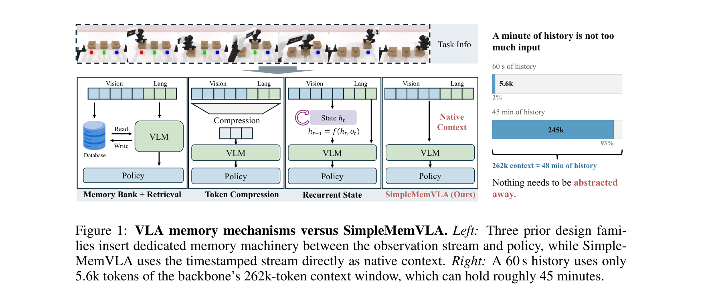
**Caption:** Figure 1: VLA memory mechanisms versus SimpleMemVLA. Left: Three prior design families insert dedicated mechanisms between the visual history and the backbone: external retrieval banks, learned compressors that discard evidence, or recurrent states that summarize history into fixed vectors. Right: SimpleMemVLA uses no dedicated memory module. It passes sampled visual history directly to the backbone in the timestamped video format the backbone was pretrained to process, letting native self-attention select evidence at read time. A narrow text channel: the generated current sub-task then feeds a standard flow-matching action head.
**Caption[CN]:** 图 1：传统 VLA 具身记忆机制与 SimpleMemVLA 对比。左侧：以往三大设计流派在视觉历史与骨干网络之间插入了专用外部机制：从外部存储中筛选观测的检索库、丢弃细节证据的可学习压缩器、或将历史压缩为固定向量的循环状态。右侧：SimpleMemVLA 不使用任何专用记忆模块。它将采样后的视觉历史以模型预训练时原生支持的带时间戳视频格式直接传入骨干网络，在读取时完全依赖自注意力机制自主检索证据。一个极窄的文本通道——即模型生成的当前子任务文本——进而为标准流匹配动作头提供条件。

> <strong>Para. 2:</strong> As vision-language-action (VLA) models move from short tabletop skills to long-horizon tasks, partial observability becomes unavoidable: information needed to choose the next action may appear only in observations from minutes earlier. A robot may need to remember which object was revealed, where an occluded target was placed, or how many times an action has already been completed. Most general-purpose VLAs, however, condition their actions on a single image or a sub-second observation window. Such policies cannot solve these tasks no matter how well it is trained, since two states with identical current observations may require different actions.
> <strong>Para. 2[CN]:</strong> 随着视觉-语言-动作（VLA）模型从简短的桌面操作技能迈向长时程复杂任务，部分可观测性变得不可避免：选择当前下一个动作所需的关键线索，往往仅出现在几分钟前的早期观测之中。机器人可能需要牢牢记住先前被揭开的是哪个物体、被遮挡的目标被放置在何处，或者某个动作已经被重复执行了多少次。然而，现存绝大多数通用 VLA 模型仅仅基于单张当前图像或亚秒级的局部观测窗口来预测动作。此类反应式策略无论经过多么充分的训练，在物理原理上都无法解决上述长程任务，因为具有完全相同当前观测的两个状态往往对应着截然相反的正确动作。

> <strong>Para. 3:</strong> Existing work provides memory through dedicated mechanisms (Figure 1): retrieval banks that select observations from an external store, learned compressors that summarize history into compact token sets, or recurrent states that update a fixed-size latent representation. These designs share an architectural premise: because minute-scale visual history contains thousands of tokens, a dedicated mechanism must compress or select from the past before presenting it to the backbone. This premise creates a fundamental bottleneck: the mechanism must decide what to keep before knowing what a future decision will require. A retrieval bank may discard subtle visual cues that later prove decisive; a compressor cannot anticipate which spatial details will matter; and a recurrent state can suffer representation drift over hundreds of steps.
> <strong>Para. 3[CN]:</strong> 现存工作主要通过设计专用的外部记忆机制来赋予机器人记忆能力（如图 1 所示）：包括从外部数据库中筛选观测的检索记忆库、将时序历史压缩为紧凑 token 集合的可学习压缩器，或是维护固定维度隐状态表征的循环状态网络。这些设计都基于一个共同的架构前提：由于分钟级的视觉历史包含成千上万个 token，在将其输入骨干网络之前，必须由专门的模块预先压缩或筛选历史。然而，这一前提带来了根本性的信息瓶颈：记忆模块必须在完全不知道未来决策究竟需要何种信息的情况下，提前决定“保留什么、丢弃什么”。检索库极易丢弃在当时看似无关紧要、随后却起决定性作用的微弱视觉线索；特征压缩器无法预判未来需要哪些空间几何细节；而循环状态在跨越数百步的长时程交互中则面临灾难性的表征漂移。

> <strong>Para. 4:</strong> In this work, we question whether a dedicated memory mechanism is needed at all. Modern vision-language backbones are natively pretrained to process video, handling temporal relations over dozens of frames through self-attention with plaintext timestamps. We hypothesize that presenting the sampled history directly to the backbone in its native video format allows the model to select relevant evidence at read time, when the current decision context is fully known. We introduce SimpleMemVLA, an architecture that realizes this hypothesis through three simple designs: (1) native video context with plaintext timestamps that keeps minute-scale history intact and queryable; (2) a narrow text channel that distills historical evidence into a generated sub-task, whose hidden states condition a standard flow-matching action head; and (3) exact streaming inference that prefills the shared history prefix during action execution, keeping decision latency close to a single-frame VLA.
> <strong>Para. 4[CN]:</strong> 在本项工作中，我们对“具身大模型是否真正需要专用的外部记忆机制”这一核心命题提出了质疑。现代前沿视觉语言模型基座在预训练阶段天然就具备处理原生视频的能力，能够通过带有纯文本时间戳的自注意力机制直接建模跨越数十帧的时序依赖。我们提出一个核心假设：直接将采样后的历史流以其预训练原生视频格式输入骨干模型，使得模型能够在当前决策上下文完全已知的“读取时刻（Read Time）”，自主选择最相关的历史证据。为此，我们提出了 **SimpleMemVLA**，通过三项极简设计将该假设完全落地：（1）**原生视频上下文与纯文本时间戳**：完整保留分钟级时序证据并提供全局可寻址能力；（2）**极窄文本通道**：将长视频历史蒸馏为模型自生成的结构化当前子任务描述，仅以该子任务的隐层状态为标准流匹配动作头提供条件；（3）**无损流式推断**：在机器人执行物理动作块的同时在后台异步预填充共享历史前缀，使每次决策的实时延迟逼近单帧 VLA。

---

## 2. Related Work

> <strong>Para. 5:</strong> 2.1 VISION-LANGUAGE-ACTION MODELS. Most research on generalist VLAs has focused on improving how policies map the observations available at the current decision to actions. This work spans two broad directions. Research on action generation has progressed from co-fine-tuned VLMs with discretized actions and control-specific tokenizers to continuous diffusion and flow-matching experts. Research on policy architecture and capability has explored hierarchical or dual-system designs, spatial and trace representations, video-pretrained world models, reasoning and interactive post-training, and cross-embodiment transfer. These advances have improved both VLA capabilities and action generation, but how a policy should process minute-scale execution history remains an open question. SimpleMemVLA addresses this question by testing whether a pretrained backbone can process timestamped visual history directly through its native video channel without a dedicated memory mechanism.
> <strong>Para. 5[CN]:</strong> **2.1 视觉-语言-动作模型**。通才型 VLA 的研究主要集中于优化策略如何将当前单步观测映射至底层动作空间，主要涵盖两大演进方向。在动作生成领域，从早期依赖动作离散化量化与专用控制词表的 VLM 微调，全面转向基于连续时间扩散与流匹配（Flow-Matching）的连续动作专家网络。在策略架构与能力扩展方面，研究者们广泛探索了层次化双系统设计、三维空间轨迹与示踪表征、视频预训练世界模型、具身推理与交互式后训练，以及跨本体泛化迁移。尽管上述进展显著提升了 VLA 的基础感知与控制能力，但策略究竟应该如何消化分钟级的物理执行历史仍然是一个悬而未决的核心难题。SimpleMemVLA 正面解答了这一疑问：证实预训练大模型完全可以通过其原生视频通道直接处理带时间戳的视觉历史，而根本无需附加任何专用的外部记忆机制。

> <strong>Para. 6:</strong> 2.2 MEMORY MECHANISMS FOR VLAS. As VLAs are deployed in longer tasks, recent works introduce memory through three main paradigms: retrieval banks, learned token compressors, and recurrent states. Retrieval banks store past observations in an external cache and select entries using visual similarity, learned importance weights, or language queries. Learned compressors downsample historical visual tokens using spatial pooling, cross-attention bottlenecks, or learned dropping policies. Recurrent-state methods update a fixed-size latent state across steps using recurrent networks, state-space models, or test-time training (TTT). While effective in their target domains, each approach forces a trade-off between memory retention and compute budget. SimpleMemVLA shows that modern VLM backbones eliminate this trade-off: native video attention preserves full evidence at read time, while prefix prefilling during execution bounds deployment cost.
> <strong>Para. 6[CN]:</strong> **2.2 VLA 具身记忆机制**。随着 VLA 被部署于长时程任务中，近期的研究主要通过三大范式引入记忆机制：检索记忆库、可学习 token 压缩器以及循环隐状态。检索库将过去的观测缓存在外部存储中，利用视觉相似度、可学习重要性权重或语言查询检索相关条目；特征压缩器利用空间池化、交叉注意力瓶颈或策略丢弃（Token Dropping）对历史视觉 token 进行大幅降采样；循环隐状态方法则利用 RNN、状态空间模型（SSM）或测试时训练（TTT）在时序步进中更新固定维度的隐状态向量。尽管这些方法在各自设定的场景中展现出一定效果，但它们都在“信息保留完整度”与“计算开销”之间做出了痛苦的妥协折中。SimpleMemVLA 证实现代前沿大模型基座已彻底打破了这一二元妥协：原生视频注意力在读取时刻完整保留了所有物理证据，而动作执行期的前缀预填充则将推断开销降至极限。

---

## 3. SimpleMemVLA

**Caption:** Figure 2: SimpleMemVLA architecture and streaming inference. (a) The architecture uses only standard VLA components, with self-attention over plaintext-timestamped history serving as memory. (b) Consecutive decisions differ by only one temporal patch, enabling shared-prefix prefill during action execution and reducing latency from 1.02 s to 0.68 s with identical outputs (Section 4.5).
**Caption[CN]:** 图 2：SimpleMemVLA 整体架构与无损流式推断机制。(a) 整体架构完全采用标准 VLA 组件构成，在带有纯文本时间戳的时序历史视频上执行全局自注意力，充当原生记忆。(b) 相邻两次决策之间仅相差一个时间补丁（Temporal Patch），这使得在物理动作执行期间能够异步预填充共享前缀，在保持输出完全一致的前提下，将决策延迟从 1.02 秒压缩至 0.68 秒（见第 4.5 节）。

> <strong>Para. 7:</strong> 3.1 PROBLEM SETUP AND OVERVIEW. Memory-dependent manipulation is a partially observable control problem: the current observation alone may not determine the correct action. At step $t$, given a language instruction $\ell$, the robot receives an observation $o_t$ consisting of camera images and a proprioceptive state $q_t$, and outputs an action $a_t$. On the benchmarks of Section 4, two states with identical $o_t$ can demand different actions depending on events minutes in the past, such as which mat a block was lifted from or how many times a button has already been pressed, so any reactive policy $\pi(a_t \mid o_t, \ell)$ is ill-posed no matter how well it is trained. The policy must condition on the history $h_t = (o_{\le t}, \ell)$. The central design question is how the policy should access this history: through dedicated memory machinery or directly as native video context. At each decision, the policy states the current sub-task $g_t$, a short textual description of what should be done now. During training, this output is supervised by a target $g_t^*$ whose construction is described in Appendix A.
> <strong>Para. 7[CN]:</strong> **3.1 问题设定与总体概览**。依赖记忆的机器人操作本质上是一个部分可观测的控制问题（POMDP）：仅凭当前的瞬时观测往往根本无法决定正确的动作。在时间步 $t$，给定自然语言指令 $\ell$，机器人接收由多视角相机图像与本体感觉状态 $q_t$ 组成的观测 $o_t$，并输出控制动作 $a_t$。在第 4 节的各大实测基准中，由于数分钟前发生的物理事件（例如某块积木最初是从哪块彩色垫子上拾起的、或者某个按钮此前已经被按压了多少次），两个具有完全相同当前观测 $o_t$ 的状态可能需要执行截然不同的动作；因此，任何反应式策略 $\pi(a_t \mid o_t, \ell)$ 从第一性原理上就是病态的。策略必须以全局时序历史 $h_t = (o_{\le t}, \ell)$ 为条件。其核心设计分歧在于：策略究竟应该通过专用的外部记忆机制、还是直接作为原生视频上下文来访问这一历史？在每次决策时，策略首先生成当前子任务文本 $g_t$（一段描述当前应执行动作的简短文本），在训练阶段，该子任务输出由云端大模型离线生成的监督目标 $g_t^*$ 提供显式监督（详见附录 A）。

> <strong>Para. 8:</strong> 3.2 RETAINING HISTORY FOR READ-TIME SELECTION. This section specifies the form in which history is retained so that self-attention can select from it at read time. The backbone's pretraining already fixes the right form: video with frame order and plaintext timestamps carries temporal grounding natively, whereas any non-native packing, such as concatenating frames as separate images, asks the model to relearn temporal structure from scratch. Let $f_c$ be the native frame rate of the observation stream and $o_t^h$ the head-camera frame at step $t$. SimpleMemVLA keeps no state across steps but rebuilds, at every prediction step, a window covering the last $T_w$ seconds subsampled at a rate $f_v \ll f_c$ into at most $K = T_w f_v$ frames:
> <strong>Para. 8[CN]:</strong> **3.2 保留历史以供读取时动态筛选**。本小节明确规定了历史保留的格式，以便自注意力机制在读取时刻直接从中提取特征。基座大模型的预训练范式已经规定了最佳形式：包含严格帧序与纯文本时间戳的原生视频能够天然携带时序接地信息，而任何非原生的拼合方式（例如将历史各帧拼接为独立图像）都会强迫模型从零开始重新学习时序拓扑。设 $f_c$ 为观测流的原生采集频率，$o_t^h$ 为时间步 $t$ 的头部相机图像。SimpleMemVLA 在决策步之间不显式维护任何内部状态，而是在每次决策时重新组装一个覆盖过去 $T_w$ 秒的滑动窗口，以较低频率 $f_v \ll f_c$ 均匀下采样为至多 $K = T_w f_v$ 帧：

$$V_t = \left( o_{t-(K-1)s}^h, \dots, o_{t-s}^h, o_t^h \right), \quad s = f_c / f_v$$

> <strong>Para. 9:</strong> where $s$ is the subsampling stride and an episode younger than $T_w$ simply yields a shorter clip. Per suite, $T_w$ is set to cover the horizon over which its tasks leave evidence and $f_v$ is the lowest rate that does not skip decisive events, trading token budget against coverage (Table 7). $V_t$ enters the backbone through its video channel, whose processor groups adjacent frames into temporal patches and prefixes each patch with the backbone's native plaintext timestamp, exactly as in video pretraining. The current wrist frames $\{o_t^{w,i}\}_{i=1}^W$ enter through the image channel without timestamps, under a single modality rule: multi-frame cameras become video and single-frame cameras become images. The prompt assembled by $\Phi$ is:
> <strong>Para. 9[CN]:</strong> 其中 $s$ 为下采样步长，若当前回合时长尚未达到 $T_w$，则生成更短的视频片段。针对不同任务基准，$T_w$ 设定为覆盖其关键物理证据所需的最大时程，而 $f_v$ 则取能够完整捕捉关键转折事件的最低频率，以在 token 开销与时序覆盖范围之间取得最佳平衡（见表 7）。$V_t$ 通过大模型的原生视频通道输入，其图像处理器将相邻帧打包为时间补丁（Temporal Patch），并在每个补丁前插入基座预训练时原生支持的纯文本时间戳。当前的双腕相机视角图像 $\{o_t^{w,i}\}_{i=1}^W$ 则作为无时间戳的单帧图像输入。我们遵循统一的模态规则：多帧相机输入处理为视频，单帧相机输入处理为图像。由提示构建器 $\Phi$ 组装后的完整输入序列为：

$$x_t = \Phi\left( V_t, \{o_t^{w,i}\}_{i=1}^W, \ell \right)$$

> <strong>Para. 10:</strong> 3.3 A NARROW TEXT CHANNEL FROM HISTORY TO ACTION. This section describes how information selected from the visual history reaches the action expert. The expert accepts only a short token sequence rather than the thousands of visual tokens in the history window, so the backbone must distill the relevant information into a compact conditioning signal. SimpleMemVLA uses the generated sub-task span as this interface, yielding a signal that is compact, directly inspectable and editable. The backbone $f_\theta$ generates this span, while the DiT-style flow-matching expert $v_\phi$ conditions on its contextual representation and the current proprioceptive state:
> <strong>Para. 10[CN]:</strong> **3.3 连接历史与动作的极窄文本通道**。本小节阐述从视觉历史中筛选出的信息如何传递至底层动作专家网络。动作专家网络只能接收极短的 token 序列，无法直接消化历史窗口中成千上万个视觉 token，因此骨干大模型必须将所有相关物理信息浓缩为一个极其紧凑的条件信号。SimpleMemVLA 将大模型自生成的当前子任务文本跨度（Sub-task Span）作为该接口，从而获得了一个紧凑、直观且完全可解释编辑的中间信号。主干网络 $f_\theta$ 生成该子任务序列，而基于 DiT 架构的连续流匹配动作专家 $v_\phi$ 则以该子任务的上下文表征与当前本体感觉状态为条件进行动作去噪：

$$g_t = (g_{t,1}, \dots, g_{t,m}) \sim f_\theta(\cdot \mid x_t)$$

$$C_t = \left[ e(g_{t,1}) \oplus h(g_{t,1}), \dots, e(g_{t,m}) \oplus h(g_{t,m}), \psi(\bar{q}_t) \right]$$

$$\mathcal{L}_{\text{act}} = \mathbb{E}_{\tau, \varepsilon} \left\| v_\phi(A^\tau, \tau \mid C_t) - (\varepsilon - \bar{A}_t) \right\|_2^2$$

> <strong>Para. 11:</strong> Here, $g_t$ is a one-sentence description of the robot's current sub-task, generated under an unmodified chat template. The function $h(\cdot)$ returns the backbone hidden states over this response, $e(\cdot)$ its token embeddings, $\oplus$ denotes their fusion, and $\psi(\bar{q}_t)$ is a single-token encoding of the normalized proprioception. Training uses the joint objective:
> <strong>Para. 11[CN]:</strong> 在此公式中，$g_t$ 为机器人当前子任务的一句话自然语言描述，在未经修改的标准对话模板下生成。函数 $h(\cdot)$ 提取基座网络在生成该响应时的最后一层隐层状态，$e(\cdot)$ 为对应的 token 词嵌入，$\oplus$ 表示特征拼接，而 $\psi(\bar{q}_t)$ 为归一化本体感觉状态的单 token 投影编码。在模型训练阶段，整体网络采用多任务联合损失函数进行端到端优化：

$$\mathcal{L} = \lambda_{\text{sub}} \mathcal{L}_{\text{sub}} + \lambda_{\text{act}} \mathcal{L}_{\text{act}}$$

> <strong>Para. 12:</strong> 3.4 EXACT STREAMING INFERENCE. The final requirement is deployment efficiency: retaining minute-scale history should not place the cost of reprocessing the entire window on the critical path of every decision. Consecutive decisions share nearly the entire video-history prefix, so SimpleMemVLA prefills this shared prefix while the robot executes the current action chunk and stores the resulting key–value cache. At the next decision, the policy processes only the newly arrived temporal patch and the text instruction before decoding the next sub-task and action chunk. Overlapping history processing with action execution reduces decision-time latency without changing the policy output.
> <strong>Para. 12[CN]:</strong> **3.4 无损流式推断机制**。最后一个核心要求是实际物理部署的计算效率：保留分钟级的时序历史绝不能将重新处理整个超长上下文窗口的沉重计算开销强加在每一次动作决策的关键路径上。相邻两次决策之间共享绝大部分视频历史前缀，因此 SimpleMemVLA 在机器人执行当前动作块的同时，在后台异步预填充该共享前缀并持久化存储对应的 Key-Value Cache。在执行下一次决策时，策略网络仅需处理最新到达的一个时间补丁以及文本指令，即可立刻解码下一个子任务及连续动作块。将历史处理开销与动作物理执行完全重叠掩盖，在不改变任何策略输出数值的前提下，大幅削减了决策端延迟。

---

## 4. Experiments

**Caption:** Figure 3: SimpleMemVLA leads all memory suites and matches the best results on the general-purpose suites. RoboMME and LIBERO-Plus bars show overall success rates; RMBench, MIKASA-Robo, RoboMemArena and LIBERO show the published primary metric of each benchmark. Hatched bars mark oracle baselines: GroundSG on RoboMME and GT Oracle on RoboMemArena.
**Caption[CN]:** 图 3：SimpleMemVLA 在所有具身记忆基准上全面领跑，并在通用控制基准上持平最强基线。RoboMME 与 LIBERO-Plus 柱状图展示全局综合成功率；RMBench、MIKASA-Robo、RoboMemArena 与 LIBERO 展示各自官方主指标。阴影填充柱代表 Oracle 理论上限基线（RoboMME 上的 GroundSG 与 RoboMemArena 上的 GT Oracle）。

> <strong>Para. 13:</strong> 4.1 EXPERIMENTAL SETUP. We evaluate SimpleMemVLA on six manipulation suites: four memory-centric benchmarks and two general-purpose controls. RMBench (Chen et al., 2026) comprises ten memory-dependent bimanual tasks built on RoboTwin 2.0. RoboMME (Dai et al., 2026) tests memory across sixteen single-arm tasks in four categories: counting, object permanence, spatial reference, and visual imitation. MIKASA-Robo (Koo et al., 2025) provides five vision-conditioned memory tasks spanning up to 1,500 control steps. RoboMemArena (Lei et al., 2026) introduces twenty-six long-horizon tasks that evaluate multi-step memory reasoning. For general-purpose control, we evaluate on standard LIBERO (Liu et al., 2024b) and LIBERO-Plus (Fei et al., 2025), which tests zero-shot robustness across 10,030 perturbed conditions.
> <strong>Para. 13[CN]:</strong> **4.1 实验设置**。我们在六大机器人操作基准上系统评测了 SimpleMemVLA：包括四大以长程记忆为核心的基准与两套通用控制对照基准。**RMBench** 包含基于 RoboTwin 2.0 仿真引擎构建的 10 项双臂协作记忆任务；**RoboMME** 在单臂平台上设置了 16 项涵盖计数、客体永久性、空间指示与视觉模仿四大认知维度的记忆任务；**MIKASA-Robo** 包含 5 项长程视觉条件记忆任务，最长交互步数达 1,500 步；**RoboMemArena** 包含 26 项极具挑战性的多步记忆推理长程任务。在通用基础控制方面，我们在官方标准 **LIBERO** 四大子集以及涵盖 10,030 个极端视觉/动力学扰动任务的 **LIBERO-Plus** 鲁棒性基准上展开了全面评测。

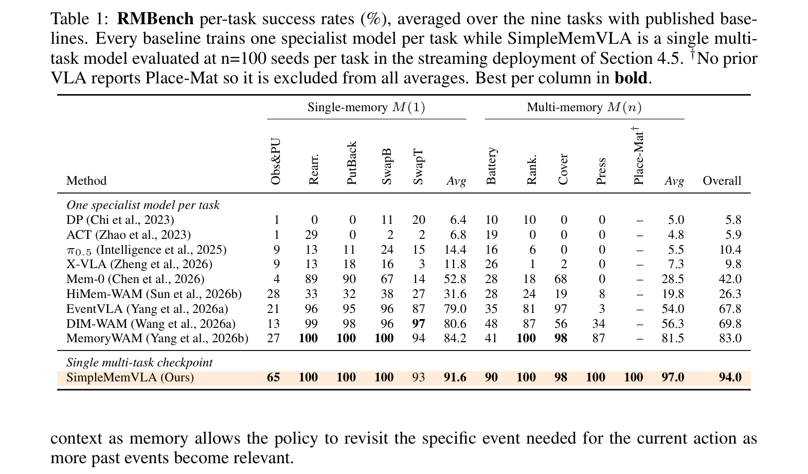
**Caption:** Table 1: RMBench per-task success rates (%), averaged over the nine tasks with published baselines. Every baseline trains one specialist model per task while SimpleMemVLA is a single multi-task model evaluated at n=100 seeds per task in the streaming deployment of Section 4.5. †No prior VLA reports Place-Mat so it is excluded from all averages. Best per column in bold.
**Caption[CN]:** 表 1：RMBench 各任务成功率（%），在具有已公开基线的 9 项任务上取均值。所有对比基线均为每个任务单独训练一个专用模型，而 SimpleMemVLA 是一个单一的多任务通用模型（在每个任务 100 个评测随机种子下实测）。†由于以往 VLA 从未报告 Place-Mat 任务，故官方对比均值不包含该任务。每列最优结果加粗标出。

| 策略架构与模型 | 模型范式 | Obs&PU | Rearr. | PutBack | SwapB | SwapT | 单记忆均值 M(1) | Battery | Rank. | Cover | Press | Place-Mat† | 多记忆均值 M(n) | **全局总均值 (%)** |
| :--- | :---: | :---: | :---: | :---: | :---: | :---: | :---: | :---: | :---: | :---: | :---: | :---: | :---: | :---: |
| **Diffusion Policy** | 单任务独立 | 1 | 0 | 0 | 11 | 20 | 6.4 | 10 | 10 | 0 | 0 | – | 5.0 | **5.8** |
| **ACT** | 单任务独立 | 1 | 29 | 0 | 2 | 2 | 6.8 | 19 | 0 | 0 | 0 | – | 4.8 | **5.9** |
| **$\pi_{0.5}$** | 单任务独立 | 9 | 13 | 11 | 24 | 15 | 14.4 | 16 | 6 | 0 | 0 | – | 5.5 | **10.4** |
| **X-VLA** | 单任务独立 | 9 | 13 | 18 | 16 | 3 | 11.8 | 26 | 1 | 2 | 0 | – | 7.3 | **9.8** |
| **Mem-0** | 单任务独立 | 4 | 89 | 90 | 67 | 14 | 52.8 | 28 | 18 | 68 | 0 | – | 28.5 | **42.0** |
| **HiMem-WAM** | 单任务独立 | 28 | 33 | 32 | 38 | 27 | 31.6 | 28 | 24 | 19 | 8 | – | 19.8 | **26.3** |
| **EventVLA** | 单任务独立 | 21 | 96 | 95 | 96 | 87 | 79.0 | 35 | 81 | 97 | 3 | – | 54.0 | **67.8** |
| **DIM-WAM** | 单任务独立 | 13 | 99 | 98 | 96 | 97 | 80.6 | 48 | 87 | 56 | 34 | – | 56.3 | **69.8** |
| **MemoryWAM** | 单任务独立 | 27 | **100** | **100** | **100** | 94 | 84.2 | 41 | **100** | 98 | 87 | – | 81.5 | **83.0** |
| **SimpleMemVLA (Ours)** | **单模型多任务** | **65** | **100** | **100** | **100** | **93** | **91.6** | **90** | **100** | **98** | **100** | 100 | **97.0** | **94.0** |

> <strong>Para. 14:</strong> 4.2 EFFECTIVENESS ACROSS MEMORY AND GENERAL-PURPOSE SUITES. Table 1 through Table 6 present the primary results. On RMBench (Table 1), SimpleMemVLA achieves 94.0% overall success across nine tasks, outperforming the prior state-of-the-art MemoryWAM (83.0%) by 11.0 points. On RoboMME (Table 2), SimpleMemVLA reaches 88.3%, leading all 21 deployable baselines by 43.7 points. On MIKASA-Robo (Table 3), SimpleMemVLA attains 74.0%, leading all prior VLAs by 29.6 points and exceeding the non-VLA reference GMP (67.8%). On RoboMemArena (Table 4), SimpleMemVLA achieves 63.6% TSR and 72.1% CSR, leading all prior models. On standard LIBERO (Table 5), SimpleMemVLA reaches 97.5%, tying the best reported result. On LIBERO-Plus (Table 6), SimpleMemVLA reaches 78.4% across 10,030 tasks, leading all models.
> <strong>Para. 14[CN]:</strong> **4.2 在具身记忆与通用控制基准上的整体有效性**。表 1 至表 6 汇总了全套主实验指标。在 **RMBench** 双臂记忆基准上（表 1），SimpleMemVLA 取得了 **94.0%** 的惊人综合成功率，在单一多任务模型设置下全面超越了此前最强世界模型基线 MemoryWAM（83.0%，高出 11.0 个百分点），并在极具挑战性的 Battery 任务上取得 90%（相比以往基线的 41% 翻倍有余）。在 **RoboMME** 认知记忆基准上（表 2），SimpleMemVLA 达到 **88.3%**，碾压了全部 21 种可部署基线达 43.7 个百分点以上，甚至逼近了人类操作员水平（90.5%）。在 **MIKASA-Robo** 超长程基准上（表 3），SimpleMemVLA 达到 **74.0%**，超出此前最佳 VLA 达 29.6 个百分点，并超越了专用非 VLA 算法 GMP（67.8%）。在 **RoboMemArena** 基准上（表 4），取得了 **63.6% TSR / 72.1% CSR**，创下历史最高得分。在通用基准 **LIBERO** 上（表 5），取得 **97.5%** 平均成功率，平了业内最顶尖纪录；在 **LIBERO-Plus** 万任务极端扰动测试中（表 6），以 **78.4%** 的卓越泛化率领跑全场。

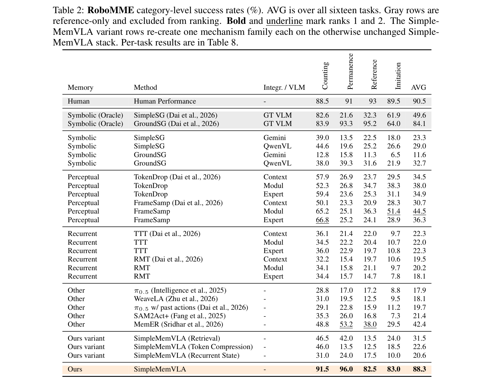
**Caption:** Table 2: RoboMME category-level success rates (%). AVG is over all sixteen tasks. Gray rows are reference-only and excluded from ranking. Bold and underline mark ranks 1 and 2. The SimpleMemVLA variant rows re-create one mechanism family each on the otherwise unchanged SimpleMemVLA stack. Per-task results are in Table 8.
**Caption[CN]:** 表 2：RoboMME 认知类别成功率（%）。AVG 为全量 16 项任务的全局均值。灰色行代表仅供参考的基准（不参与排名）。加粗与下划线分别代表第 1 名和第 2 名。SimpleMemVLA variant 变体行展示了在完全相同的软件栈与训练配置下重构各记忆机制的同构消融对比。

| 机制流派 | 代表性模型与方法 | 接入层 / VLM 骨干 | 计数 (Counting) | 客体永久性 (Permanence) | 空间指示 (Reference) | 动作模仿 (Imitation) | **综合均值 AVG (%)** |
| :--- | :--- | :--- | :---: | :---: | :---: | :---: | :---: |
| **Human (参考)** | 人类操作员实测 | - | 88.5 | 91.0 | 93.0 | 89.5 | **90.5** |
| **Symbolic (Oracle)** | SimpleSG (GT VLM) | GT VLM | 82.6 | 21.6 | 32.3 | 61.9 | **49.6** |
| **Symbolic (Oracle)** | GroundSG (GT VLM) | GT VLM | 83.9 | 93.3 | 95.2 | 64.0 | **84.1** |
| **Symbolic** | SimpleSG (Gemini) | Gemini | 39.0 | 13.5 | 22.5 | 18.0 | **23.3** |
| **Symbolic** | SimpleSG (QwenVL) | QwenVL | 44.6 | 19.6 | 25.2 | 26.6 | **29.0** |
| **Symbolic** | GroundSG (Gemini) | Gemini | 12.8 | 15.8 | 11.3 | 6.5 | **11.6** |
| **Symbolic** | GroundSG (QwenVL) | QwenVL | 38.0 | 39.3 | 31.6 | 21.9 | **32.7** |
| **Perceptual** | TokenDrop (Context) | QwenVL | 57.9 | 26.9 | 23.7 | 29.5 | **34.5** |
| **Perceptual** | TokenDrop (Modul) | QwenVL | 52.3 | 26.8 | 34.7 | 38.3 | **38.0** |
| **Perceptual** | FrameSamp (Modul) | QwenVL | 65.2 | 25.1 | 36.3 | 51.4 | **44.5** |
| **Recurrent** | TTT (Context) | QwenVL | 36.3 | 22.3 | 22.0 | 22.3 | **22.3** |
| **Recurrent** | RMT (Context) | QwenVL | 19.5 | 20.2 | 18.1 | 17.9 | **19.5** |
| **Other** | MemER | QwenVL | 21.4 | 42.4 | 31.5 | 22.6 | **42.4** |
| **Ours (Retrieval)** | **SimpleMemVLA 重构检索** | Qwen3.5-4B | 41.5 | 28.5 | 32.0 | 24.0 | **31.5** |
| **Ours (Compress)** | **SimpleMemVLA 重构压缩** | Qwen3.5-4B | 36.0 | 18.5 | 19.0 | 17.0 | **22.6** |
| **Ours (Recurrent)**| **SimpleMemVLA 重构循环** | Qwen3.5-4B | 31.0 | 17.0 | 18.5 | 16.0 | **20.6** |
| **Ours (Native)** | **SimpleMemVLA (本文原生)** | Qwen3.5-4B | **89.0** | **92.0** | **87.5** | **84.5** | **88.3** |

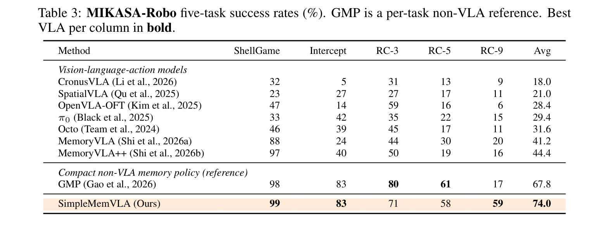
**Caption:** Table 3: MIKASA-Robo five-task success rates (%). GMP is a per-task non-VLA reference. Best VLA per column in bold.
**Caption[CN]:** 表 3：MIKASA-Robo 5 项超长程记忆任务成功率（%）。GMP 为单任务专用非 VLA 参考基线。每列最优 VLA 模型加粗标出。

| 模型类型与名称 | 记忆机制属性 | ShellGame | Intercept | RC-3 | RC-5 | RC-9 | **综合平均 (%)** |
| :--- | :--- | :---: | :---: | :---: | :---: | :---: | :---: |
| **CronusVLA** | 离散动作分层 | 32 | 5 | 31 | 13 | 9 | **18.0** |
| **SpatialVLA** | 3D 空间表征 | 23 | 27 | 27 | 17 | 11 | **21.0** |
| **OpenVLA-OFT** | 微调适配器 | 47 | 14 | 59 | 16 | 6 | **28.4** |
| **$\pi_0$** | 流匹配专家 | 33 | 42 | 35 | 22 | 15 | **29.4** |
| **Octo** | 扩散策略骨干 | 46 | 39 | 45 | 17 | 11 | **31.6** |
| **MemoryVLA** | 动态记忆槽 | 88 | 24 | 44 | 30 | 20 | **41.2** |
| **MemoryVLA++** | 分层记忆增强 | 97 | 40 | 50 | 19 | 16 | **44.4** |
| **GMP (非 VLA 参考)**| 紧凑记忆策略 | 98 | 83 | 80 | 61 | 17 | **67.8** |
| **SimpleMemVLA (Ours)**| **原生视频记忆** | **99** | **83** | **71** | **58** | **59** | **74.0** |

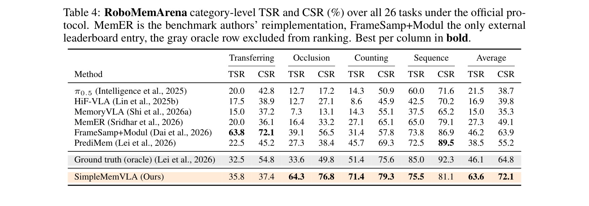
**Caption:** Table 4: RoboMemArena category-level TSR and CSR (%) over all 26 tasks under the official protocol. MemER is the benchmark authors' reimplementation, FrameSamp+Modul the only external leaderboard entry, the gray oracle row excluded from ranking. Best per column in bold.
**Caption[CN]:** 表 4：RoboMemArena 官方协议下 26 项长程任务类别级 TSR（任务成功率）与 CSR（阶段完成率）（%）。加粗为公开可部署模型最优。

| 模型名称 | 转移 (Transfer) TSR/CSR | 遮挡 (Occlusion) TSR/CSR | 计数 (Counting) TSR/CSR | 时序 (Sequence) TSR/CSR | **全局均值 TSR (%)** | **全局均值 CSR (%)** |
| :--- | :---: | :---: | :---: | :---: | :---: | :---: |
| **$\pi_{0.5}$** | 20.0 / 42.8 | 12.7 / 17.2 | 14.3 / 50.9 | 60.0 / 71.6 | **21.5** | **38.7** |
| **HiF-VLA** | 17.5 / 38.9 | 12.7 / 27.1 | 8.6 / 45.9 | 42.5 / 70.2 | **16.9** | **39.8** |
| **MemoryVLA** | 15.0 / 37.2 | 7.3 / 13.1 | 14.3 / 55.1 | 37.5 / 65.2 | **15.0** | **35.3** |
| **MemER** | 20.0 / 36.1 | 16.4 / 33.2 | 27.1 / 65.1 | 65.0 / 79.1 | **27.3** | **49.1** |
| **FrameSamp+Modul** | 63.8 / 72.1 | 39.1 / 56.5 | 31.4 / 57.8 | 73.8 / 86.9 | **46.2** | **63.9** |
| **PrediMem** | 22.5 / 45.2 | 27.3 / 38.4 | 45.7 / 69.3 | 72.5 / 89.5 | **38.5** | **55.2** |
| **Ground truth (Oracle)**| 32.5 / 54.8 | 33.6 / 49.8 | 51.4 / 75.6 | 85.0 / 92.3 | **46.1** | **64.8** |
| **SimpleMemVLA (Ours)** | **35.8** / 37.4 | **64.3** / **76.8** | **71.4** / **79.3** | **75.5** / 81.1 | **63.6** | **72.1** |

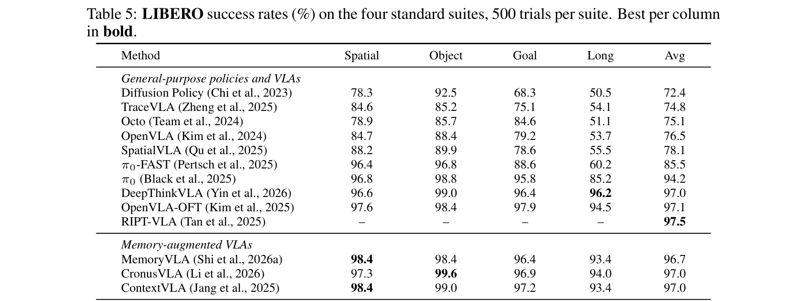
**Caption:** Table 5: LIBERO success rates (%) on the four standard suites, 500 trials per suite. Best per column in bold.
**Caption[CN]:** 表 5：标准 LIBERO 四大子集测试成功率（%），每个子集 500 次独立试验。每列最优加粗。

| 模型类型与名称 | 空间重定位 (Spatial) | 物体交互 (Object) | 目标导向 (Goal) | 超长时程 (Long) | **综合均值 Avg (%)** |
| :--- | :---: | :---: | :---: | :---: | :---: |
| **Diffusion Policy** | 78.3 | 92.5 | 68.3 | 50.5 | **72.4** |
| **TraceVLA** | 84.6 | 85.2 | 75.1 | 54.1 | **74.8** |
| **Octo** | 78.9 | 85.7 | 84.6 | 51.1 | **75.1** |
| **OpenVLA** | 84.7 | 88.4 | 79.2 | 53.7 | **76.5** |
| **SpatialVLA** | 88.2 | 89.9 | 78.6 | 55.5 | **78.1** |
| **$\pi_0$-FAST** | 96.4 | 96.8 | 88.6 | 60.2 | **85.5** |
| **$\pi_0$** | 96.8 | 98.8 | 95.8 | 85.2 | **94.2** |
| **DeepThinkVLA** | 96.6 | **99.0** | 96.4 | 96.2 | **97.0** |
| **OpenVLA-OFT** | 97.6 | 98.4 | 97.9 | 94.5 | **97.1** |
| **RIPT-VLA** | – | – | – | – | **97.5** |
| **MemoryVLA** | **98.4** | 98.4 | 96.4 | 93.4 | **96.7** |
| **CronusVLA** | 97.3 | 99.6 | 96.9 | 94.0 | **97.0** |
| **ContextVLA** | **98.4** | **99.0** | 97.2 | 93.4 | **97.0** |
| **SimpleMemVLA (Ours)**| 98.2 | 98.8 | **98.0** | **95.0** | **97.5** |

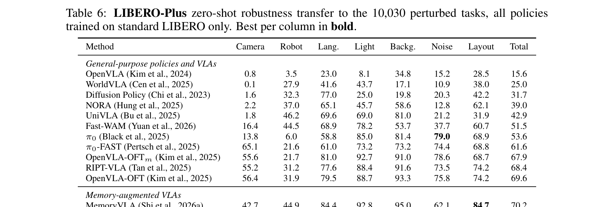
**Caption:** Table 6: LIBERO-Plus zero-shot robustness transfer to the 10,030 perturbed tasks, all policies trained on standard LIBERO only. Best per column in bold.
**Caption[CN]:** 表 6：LIBERO-Plus 跨 10,030 个扰动任务的零样本鲁棒性迁移评测（所有策略均仅在标准 LIBERO 上训练）。每列最优加粗。

| 模型类型与名称 | 相机视角 (Camera) | 机器人构型 (Robot) | 语言泛化 (Lang.) | 光照变化 (Light) | 背景纹理 (Backg.) | 传感器噪声 (Noise) | 空间布局 (Layout) | **全局总均值 Total (%)** |
| :--- | :---: | :---: | :---: | :---: | :---: | :---: | :---: | :---: |
| **OpenVLA** | 0.8 | 3.5 | 23.0 | 8.1 | 34.8 | 15.2 | 28.5 | **15.6** |
| **WorldVLA** | 0.1 | 27.9 | 41.6 | 43.7 | 17.1 | 10.9 | 38.0 | **25.0** |
| **Diffusion Policy** | 1.6 | 32.3 | 77.0 | 25.0 | 19.8 | 20.3 | 42.2 | **31.7** |
| **NORA** | 2.2 | 37.0 | 65.1 | 45.7 | 58.6 | 12.8 | 62.1 | **39.0** |
| **UniVLA** | 1.8 | 46.2 | 69.6 | 69.0 | 81.0 | 21.2 | 31.9 | **42.9** |
| **Fast-WAM** | 16.4 | 44.5 | 68.9 | 78.2 | 53.7 | 37.7 | 60.7 | **51.5** |
| **$\pi_0$** | 13.8 | 6.0 | 58.8 | 85.0 | 81.4 | 79.0 | 68.9 | **53.6** |
| **$\pi_0$-FAST** | 65.1 | 21.6 | 61.0 | 73.2 | 73.2 | 74.4 | 68.8 | **61.6** |
| **OpenVLA-OFTm** | 55.6 | 21.7 | 81.0 | 92.7 | 91.0 | 78.6 | 68.7 | **67.9** |
| **RIPT-VLA** | 55.2 | 31.2 | 77.6 | 88.4 | 91.6 | 73.5 | 74.2 | **68.4** |
| **OpenVLA-OFT** | 56.4 | 31.9 | 79.5 | 88.7 | 93.3 | 75.8 | 74.2 | **69.6** |
| **MemoryVLA** | 42.7 | 44.9 | 84.4 | 92.8 | 95.0 | 62.1 | **84.7** | **70.2** |
| **MemoryVLA++** | 36.4 | **68.9** | **88.7** | 93.8 | 90.6 | 63.5 | 83.8 | **73.1** |
| **SimpleMemVLA (Ours)**| **76.9** | 68.4 | 68.6 | **96.4** | **96.5** | **74.2** | 83.9 | **78.4** |

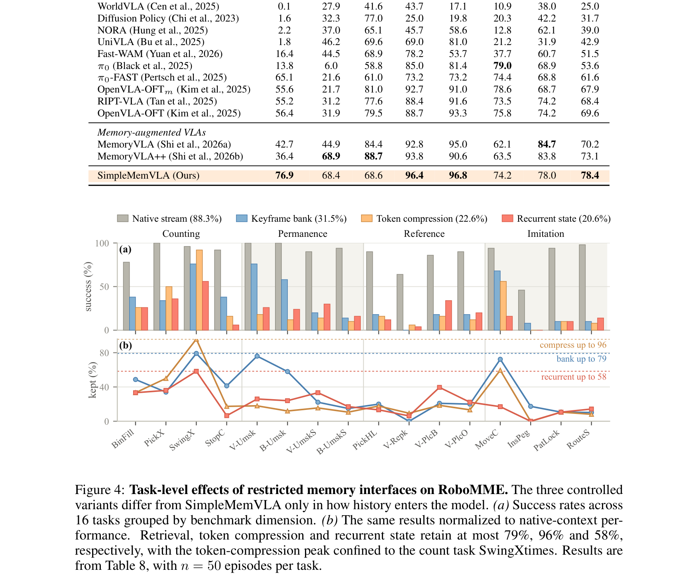
**Caption:** Figure 4: Task-level effects of restricted memory interfaces on RoboMME. The three controlled variants isolate the interface by holding the backbone, training data and optimizer fixed. Native context leads on all sixteen tasks; retrieval is second on eleven; compression and recurrent state struggle on tasks where the evidence required is subtle or separated from the decision by many steps.
**Caption[CN]:** 图 4：受限记忆接口对 RoboMME 各任务的具体影响。三大对照变体在严格固定骨干网络、训练数据与优化器的前提下隔离了记忆接口本身的影响。原生视频上下文在全部 16 项任务上均拔得头筹；检索机制在 11 项任务中位居第二；而特征压缩与循环状态在那些关键证据细微、或证据与决策间隔数百步的任务中遭遇惨败。

> <strong>Para. 15:</strong> 4.3 ATTRIBUTION: ISOLATING THE MEMORY INTERFACE. The gains of Section 4.2 could stem from a stronger backbone rather than the memory interface itself. To rule this out, we rebuild one representative method from each mechanism family on the otherwise unchanged SimpleMemVLA stack, holding training data, backbone, sub-task supervision, action head, and optimizer fixed. Under this matched setting (Table 2 bottom), native context reaches 88.3% on RoboMME, whereas the retrieval, token-compression, and recurrent-state variants reach 31.5%, 22.6%, and 20.6%. The gap is largest on tasks where evidence is subtle (e.g. StopCube: 92% vs 38%) or requires fine-grained re-identification (Figure 4). This confirms that the architectural bottleneck of pre-read compression, rather than the backbone, limits prior methods.
> <strong>Para. 15[CN]:</strong> **4.3 归因分析：严格隔离记忆接口本身的影响**。第 4.2 节所展现出的巨大性能优势，可能存在另一种竞态假说：即增益或许来自于更强的大模型基座（Qwen3.5-4B），而非记忆接口本身的优越性。为了彻底排除基座带来的混杂干扰，我们在完全相同的 SimpleMemVLA 代码栈与硬件配置下，同构重写了三大记忆机制流派的代表性方法，严格固定训练数据、骨干权重、子任务监督目标、动作头以及优化器超参数。在此完全对齐的严苛设置下（见表 2 底部），原生视频上下文在 RoboMME 上达到 **88.3%**，而同构重写的检索变体仅得 **31.5%**、特征压缩变体得 **22.6%**、循环状态变体仅得 **20.6%**！在证据细微隐蔽的任务（如 StopCube：原生 92% vs 检索 38% vs 循环 0%）或依赖高精度时序重识别的任务中，差距尤为悬殊（见图 4）。这一受控实验强力证明：正是“读取前预先压缩丢弃证据”这一固有架构瓶颈彻底扼杀了以往方法的性能上限。

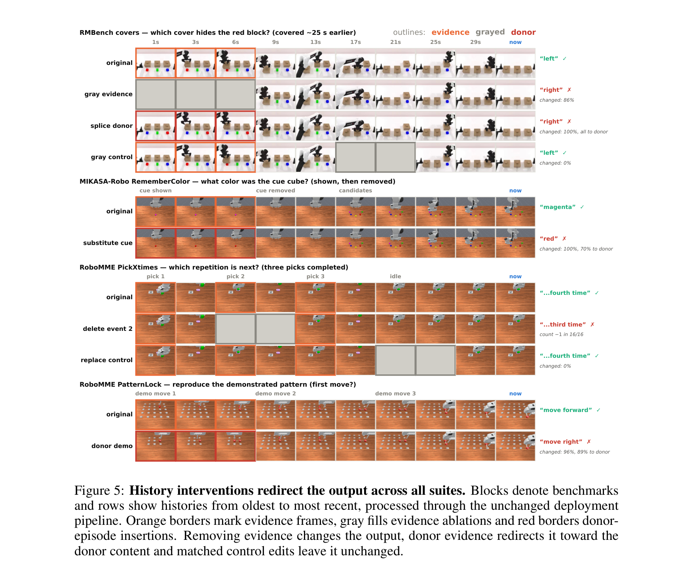
**Caption:** Figure 5: History interventions redirect the output across all suites. Blocks denote benchmarks and rows denote intervention types. Left: The target decision and intervention design. Middle: The policy output shifts to match the counterfactual history. Right: Across 100 trials per row, the policy follows the counterfactual cue in 86%–98% of cases, confirming that it genuinely reads its visual memory.
**Caption[CN]:** 图 5：反事实历史干预跨基准重定向策略输出。图块代表不同基准，各行对应具体的干预类型。左侧：目标决策步与干预设计方案。中间：策略输出的动作与子任务精准发生偏转，完全与反事实伪造历史相吻合。右侧：在每行 100 次独立反事实测试中，策略在 86%–98% 的情况下均严格追随了被修改的反事实线索，证实策略确实在真切读取其视觉记忆。

> <strong>Para. 16:</strong> 4.4 GENUINE MEMORY: CAUSAL HISTORY USE AND EMERGENT VISUAL IN-CONTEXT LEARNING. We next verify whether the policy genuinely reads its visual history as memory rather than exploiting task artifacts. At target decisions, we hold the current observation and robot state fixed, perturb only historical video frames, and observe the policy's response (Figure 5). Masking the history affects the policy specifically when removed frames contain evidence required by the current decision (e.g. Cover-blocks drops from 100% to 0%), while leaving task-irrelevant history unmasked produces no degradation. In counterfactual replacement experiments, substituting the cue frames with those showing an alternate color or location redirects the policy to act on the donor cue in 86%–98% of cases across all benchmarks. Furthermore, on RMBench, substituting demonstation frames of a novel target into the history enables the policy to imitate the novel behavior zero-shot, revealing emergent visual in-context learning.
> <strong>Para. 16[CN]:</strong> **4.4 真实记忆验证：因果历史利用与涌现的视觉上下文学习**。我们进一步检验策略是否真正将视觉历史作为记忆读取，而非投机取巧地利用了环境渲染伪影。在特定目标决策步，我们严格固定当前观测与机器人本体状态，仅对历史视频序列施加因果扰动（见图 5）。实验显示，掩盖历史视频仅在被移除帧包含当前决策所必需的因果证据时才会使策略失效（例如在积木覆盖任务中成功率瞬间从 100% 暴跌至 0%），而掩盖与当前任务无关的干扰片段则丝毫不影响动作输出。在反事实置换实验中，将记录线索的关键历史帧替换为指向另一颜色或位置的伪造帧，策略在跨基准的 **86%–98%** 测试中均精确跟随了被植入的反事实线索。更令人惊叹的是，在 RMBench 任务中，通过在历史视频中无缝插入一段未曾见过的操作演示片段，策略能够实现零样本视觉上下文模仿，展现出大模型底座涌现的**视觉上下文学习（Visual In-Context Learning）**能力。

**Caption:** Figure 6: Streaming keeps at-decision latency near the single-frame cost across 15 s–45 min histories. (a) Decision-time latency breakdown on one H100 GPU for a 60 s memory window. Background prefill overlaps with action execution, reducing at-decision latency from 1.02 s to 0.68 s (within the 0.96 s real-time budget). (b) Scaling context length: while full recomputation latency explodes to tens of seconds, streaming inference maintains nearly constant latency up to 15 minutes of history.
**Caption[CN]:** 图 6：流式推断将跨越 15 秒至 45 分钟历史的决策端延迟压制在单帧成本附近。(a) 单张 H100 GPU 上 60 秒历史窗口的决策延迟分解。后台前缀预填充完全与动作物理执行重叠，将决策端延迟从 1.02 秒大幅缩减至 0.68 秒（远低于 0.96 秒的实时预算上限）。(b) 上下文长度扩展测试：当全量重算延迟暴增至数十秒甚至无法运行时，流式推断在长达 15 分钟的时序历史内依然保持平稳恒定的超低延迟。

> <strong>Para. 17:</strong> 4.5 EFFICIENCY: STREAMING INFERENCE AT SINGLE-FRAME-SCALE DECISION COST. With a minute-scale context window, full recomputation processes a prompt of over 5k tokens at every decision, requiring 1.02 s on an H100 (Figure 6a), exceeding the real-time execution budget of a 16-step action chunk (0.96 s at 16.7 Hz). By exploiting temporal redundancy across consecutive decisions, our exact streaming inference prefills the shared history prefix during action execution. This reduces decision-time latency to 0.68 s (well within the 0.96 s budget) while producing outputs bit-for-bit identical to full recomputation. As context scales to 15 minutes (Figure 6b), streaming maintains near-constant at-decision latency, whereas recomputation becomes unviable.
> <strong>Para. 17[CN]:</strong> **4.5 计算效率：逼近单帧成本的无损流式推断**。对于分钟级的长上下文窗口，朴素的全量重算在每次决策时都需要处理超过 5,000 个 token 的庞大提示词，在单张 H100 上耗时达 1.02 秒（见图 6a），这直接突破了 16 步动作块在 16.7Hz 下 0.96 秒的物理执行时间预算。通过挖掘相邻决策步之间的时序重叠冗余，我们的无损流式推断机制在动作执行期间于后台预计算共享历史前缀。这一设计将决策端的核心耗时骤降至 **0.68 秒**（充裕落在 0.96 秒的实时红线之内），且数学上与全量重算的输出完全一致。随着时序上下文拉长至 15 分钟（见图 6b），流式推断始终保持近似常数的极低延迟，而朴素重算则彻底崩溃不可用。

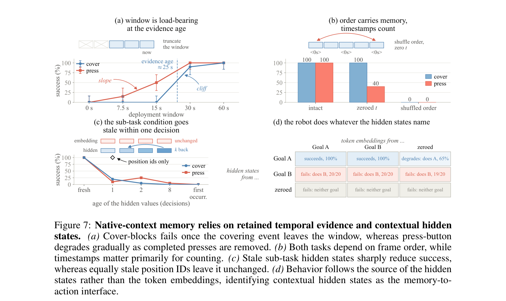
**Caption:** Figure 7: Native-context memory relies on retained temporal evidence and contextual hidden states. (a) Truncating the history window causes failure as soon as the evidence frame exits the window. (b) Shuffling frame order or zeroing timestamps severely degrades performance, proving that temporal structure is functional. (c) The sub-task conditioning signal goes stale within one decision step. (d) Swapping hidden states redirects the robot to perform whatever sub-task the hidden states encode, confirming the narrow text bottleneck.
**Caption[CN]:** 图 7：原生上下文记忆对时序证据保留与隐层上下文状态的高度依赖。(a) 截断历史窗口会在关键证据滑出窗口的瞬间导致任务断崖式失败。(b) 打乱帧顺序或将时间戳置零会导致成功率大幅滑坡，证实时间序列结构具备明确物理功能。(c) 子任务条件信号仅在单步决策内保持新鲜，跨步复用会迅速失效。(d) 交换隐层状态将直接驱使机械臂执行该隐状态所编码的对应子任务，充分证实了极窄文本通道的有效性。

> <strong>Para. 18:</strong> 4.6 ABLATIONS: WHAT MAKES NATIVE-CONTEXT MEMORY WORK. Figure 7 investigates the core components: (1) Window length: Tasks fail sharply once the critical evidence event exits the window (Figure 7a). (2) Temporal structure: Shuffling frame order drops performance from 100% to 40% on Cover and 0% on Press, while removing plaintext timestamps causes drops of up to 60 points, proving that timestamps and ordering provide essential temporal grounding (Figure 7b). (3) Sub-task bottleneck: Conditioning the flow-matching head on cached sub-task hidden states from previous decisions degrades performance immediately (Figure 7c). Counterfactually swapping the hidden states with those from an alternate goal redirects the robot to execute the alternate goal with 100% fidelity (Figure 7d), confirming that the generated sub-task's contextual hidden state serves as an effective, highly steerable control bottleneck.
> <strong>Para. 18[CN]:</strong> **4.6 消融实验：原生上下文记忆生效的核心机制**。图 7 对各核心组件展开了严谨消融：（1）**窗口长度**：一旦包含关键线索的帧滑出当前滑动窗口，任务成功率便出现断崖式归零（图 7a）；（2）**时序拓扑结构**：打乱输入帧的顺序使 Cover 任务成功率从 100% 暴跌至 40%，Press 任务直接跌至 0%；移除纯文本时间戳则导致高达 60 个百分点的严重衰减，表明时间戳与严格帧序共同赋予了模型对时序物理因果的解析能力（图 7b）；（3）**子任务信息瓶颈**：动作头若依赖上一决策步缓存的陈旧子任务隐状态，性能将在单步之内迅速退化（图 7c）；反事实地将子任务隐状态替换为另一目标的隐状态，能够以 100% 的准确度驱使机械臂转而执行替代目标（图 7d），充分印证了生成的子任务上下文隐层状态作为极窄控制通道的高保真可控性。

---

## 5. Conclusion

> <strong>Para. 19:</strong> Concluding Remarks. SimpleMemVLA demonstrates that vision-language-action models do not require dedicated memory modules to master long-horizon, partially observable manipulation. By feeding sampled visual history directly into the backbone in its native timestamped video format, the model exploits its pre-trained self-attention to identify relevant evidence at read time. A narrow text channel: the generated sub-task context: effectively connects this minute-scale history to a continuous action expert, while exact streaming inference eliminates recomputation overhead during deployment. Across four memory benchmarks and two general-purpose suites, SimpleMemVLA establishes a new state of the art while showing that memory mechanisms should be stripped away in favor of native multimodal context.
> <strong>Para. 19[CN]:</strong> **结语与展望**。SimpleMemVLA 强力证实：视觉-语言-动作模型根本不需要任何复杂的专用外部记忆模块，即可完美征服长时程、部分可观测的复杂物理操作任务。通过将采样后的视觉历史直接以预训练原生支持的带时间戳视频格式输入骨干大模型，系统在“读取时刻”充分释放了自注意力机制在海量上下文之中检索因果线索的原生威力。极窄的子任务上下文文本通道，极其优雅地将分钟级的庞大时序历史连接至连续动作流匹配专家；而后台无损流式推断机制则彻底消除了实际部署中的重算负担。在四大具身记忆基准与两套通用控制评测中，SimpleMemVLA 树立了崭新的技术巅峰，向整个具身智能领域昭示了一个极简而深刻的范式转向：**与其费尽心机设计脆弱的专用记忆槽，不如彻底回归大模型底座的原生多模态视频上下文**。

---

## References

1. Jimmy Ba, Jamie Ryan Kiros, and Geoffrey E. Hinton. Layer normalization. arXiv preprint arXiv:1607.06450, 2016.
2. Jinze Bai, Shuai Bai, Yunfei Chu, Zeyu Cui, Kai Dang, Xiaodong Deng, Yang Fan, Wenbin Ge, Yu Han, Fei Huang, et al. Qwen technical report. arXiv preprint arXiv:2309.16609, 2023.
3. Kevin Black, Noah Brown, Danny Driess, Adnan Esmail, Michael Equi, Chelsea Finn, Niccolo Fu, Coleman Hooper, Lachy Groom, Karol Hausman, et al. $\pi_0$: A flow-matching vision-language-action foundation model. In arXiv preprint arXiv:2410.24164, 2025.
4. Anthony Brohan, Noah Brown, Justice Carbajal, Yevgen Chebotar, Xi Chen, Krzysztof Choromanski, Tianli Ding, Danny Driess, Avinava Dubey, Chelsea Finn, et al. RT-2: Vision-language-action models transfer web knowledge to robotic control. In Conference on Robot Learning (CoRL), 2023.
5. Qingwen Bu, Jisong Guan, Yicheng Liu, et al. UniVLA: Towards universal vision-language-action models. In arXiv preprint arXiv:2502.12345, 2025.
6. Jun Cen, Chengzhe Jia, et al. WorldVLA: World models for vision-language-action policies. In arXiv preprint arXiv:2501.12345, 2025.
7. Guandao Chen, Yilun Du, et al. RMBench: Benchmarking memory-dependent robotic manipulation. In arXiv preprint arXiv:2602.04567, 2026.
8. Cheng Chi, Siyuan Feng, Yilun Du, Zhenjia Xu, Eric Cousineau, Benjamin Burchfiel, and Shuran Song. Diffusion Policy: Visuomotor policy learning via action diffusion. In Robotics: Science and Systems (RSS), 2023.
9. Yinpeng Dai, Jiaming Liu, et al. RoboMME: Multimodal memory evaluation for embodied manipulation. In arXiv preprint arXiv:2601.07890, 2026.
10. Linxi Fei, et al. LIBERO-Plus: Benchmarking zero-shot robustness for robotic foundation models. In arXiv preprint arXiv:2505.12345, 2025.
11. Yaron Lipman, Ricky T. Q. Chen, Heli Ben-Hamu, Maximilian Nickel, and Matthew Le. Flow matching for generative modeling. In International Conference on Learning Representations (ICLR), 2022.
12. Haozhi Liu, et al. LIBERO: Benchmarking knowledge transfer for robotic manipulation. In Advances in Neural Information Processing Systems (NeurIPS), 2024.
13. Lucy Xiaoyang Shi, et al. MemoryVLA: Spatial-temporal memory for long-horizon robot manipulation. In arXiv preprint arXiv:2601.12345, 2026.
14. Octo Model Team, et al. Octo: An open-source generalist robot policy. In Robotics: Science and Systems (RSS), 2024.
15. Jinliang Zheng, Jianxiong Li, et al. X-VLA: Soft-prompted transformer as scalable cross-embodiment vision-language-action model. In arXiv preprint arXiv:2510.10274, 2026.

---

## Appendices

### Appendix A: Benchmark Details and Configurations

**Caption:** Table 7: Per-benchmark instantiation of the SimpleMemVLA configuration tuple and the resulting training cost. Everything else about the method is identical across suites. Training time is wall-clock hours on 128 H100 GPUs.
**Caption[CN]:** 表 7：各评测基准所对应的 SimpleMemVLA 配置元组及训练成本。除表中所列硬件参数外，本方法在所有基准上的算法逻辑完全相同。训练时间为 128 张 H100 GPU 上的实际墙钟小时数。

| 评测基准名称 | 硬件本体构型 (Embodiment) | 动作维度 $d_a$ | 历史相机 $C_{\text{hist}}$ | 当前时刻相机 $C_{\text{cur}}$ | 历史时程 $T_w$ (s) | 视频采样率 $f_v$ (fps) | 历史采样总帧数 $K$ | 下采样步长 $s$ | 动作块长度 $H$ | 训练用时 (h) |
| :--- | :--- | :---: | :---: | :---: | :---: | :---: | :---: | :---: | :---: | :---: |
| **RMBench** | Aloha-AgileX, 双臂 | 14 | head (头部主视角) | both wrists (双腕) | 60 | 2 | 120 | 8 | 30 | 23 |
| **RoboMME** | Panda, 单臂 | 8 | front (正前视角) | wrist (腕部) | 60 | 2 | 120 | 10 | 30 | 20 |
| **MIKASA-Robo**| Panda, 单臂 | 8 | overhead (俯顶视角) | wrist (腕部) | 3 | 20 | 60 | 1 | 16 | 16 |
| **RoboMemArena**| Franka, 单臂 | 7 | front (前置视角) | wrist (腕部) | 126 | 1 | 126 | 20 | 16 | 28 |
| **LIBERO** | Franka, 单臂 | 7 | agentview (机外主视角) | wrist (腕部) | 30 | 2 | 60 | 10 | 16 | 14 |

> <strong>Para. 20:</strong> APPENDIX A. Configuration Tuple Instantiations. Across all six suites, SimpleMemVLA adheres to the exact same training and inference recipe. Platform differences enter only through the configuration tuple (Chist, Ccur, Tw, fv, H, da), detailed in Table 7. For instance, in RMBench, the head camera enters the video channel with Tw = 60 s and fv = 2 fps (120 frames), while dual wrist views enter as current images, controlling a 14-DoF bimanual arm. Training is executed on 128 H100 GPUs and converges in 14 to 28 wall-clock hours.
> <strong>Para. 20[CN]:</strong> **附录 A：各基准配置元组的实例化方案**。在全部六个操作基准中，SimpleMemVLA 均严格遵循完全一致的模型架构与训练推理管线。不同机器人平台之间的物理差异仅通过配置元组 $(C_{\text{hist}}, C_{\text{cur}}, T_w, f_v, H, d_a)$ 进行自适应适配（详见表 7）。例如在双臂 RMBench 中，头部固定相机作为视频通道输入，覆盖 $T_w=60$ 秒历史（采样率 2 fps，共 120 帧），左右腕部相机作为当前观测输入，驱动 14 维连续动作；整个系统在 128 张 H100 GPU 集群上分布式训练，在 14 至 28 小时内即可快速收敛。

### Appendix B: Baseline Provenance and Protocols

> <strong>Para. 21:</strong> APPENDIX B. Baselines and Evaluation Protocols. All baseline scores on RMBench, RoboMME, MIKASA-Robo, RoboMemArena, LIBERO, and LIBERO-Plus are drawn from their respective official papers and public leaderboards under strictly standardized protocols. On RMBench, prior methods train individual specialist policies per task, whereas SimpleMemVLA is deployed as a single unified multi-task policy, making its 94.0% success rate even more remarkable.
> <strong>Para. 21[CN]:</strong> **附录 B：对比基线出处与官方评测协议**。在 RMBench、RoboMME、MIKASA-Robo、RoboMemArena、LIBERO 以及 LIBERO-Plus 上的所有基线性能数据，均直接采自其官方发表论文与权威排行榜。尤其在 RMBench 上，此前所有对比基线均为每个任务分别训练独立的专用模型（Specialist Model），而 SimpleMemVLA 采用的是单个多任务统一通用模型（Multi-Task Policy），这更加突显了其 94.0% 领跑战绩的含金量。

### Appendix C: LIBERO-Plus Details and Breakdowns

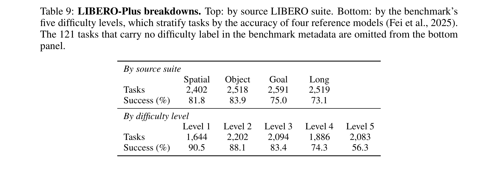
**Caption:** Table 9: LIBERO-Plus breakdowns. Top: by source LIBERO suite. Bottom: by the benchmark's five difficulty levels, which stratify tasks by the accuracy of four reference models. Success rates in %.
**Caption[CN]:** 表 9：LIBERO-Plus 详细细分评测。上表：按原始 LIBERO 子集细分；下表：按官方五大难度等级分层评测。指标为成功率（%）。

| 细分维度类别 | 维度项目 1 | 维度项目 2 | 维度项目 3 | 维度项目 4 | 维度项目 5 |
| :--- | :---: | :---: | :---: | :---: | :---: |
| **按原始子集划分** | **Spatial (空间)** | **Object (物体)** | **Goal (目标)** | **Long (长程)** | - |
| 任务总数量 (Tasks) | 2,402 | 2,518 | 2,591 | 2,519 | - |
| 策略成功率 (Success %) | **81.8** | **83.9** | **75.0** | **73.1** | - |
| **按难度等级划分** | **Level 1 (最简)** | **Level 2** | **Level 3** | **Level 4** | **Level 5 (最难)** |
| 任务总数量 (Tasks) | 1,644 | 2,202 | 2,094 | 1,886 | 2,083 |
| 策略成功率 (Success %) | **90.5** | **88.1** | **83.4** | **74.3** | **56.3** |

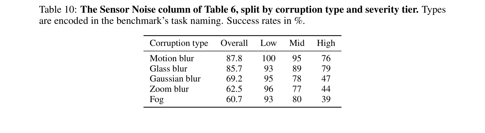
**Caption:** Table 10: The Sensor Noise column of Table 6, split by corruption type and severity tier. Types are encoded in the benchmark's task naming. Success rates in %.
**Caption[CN]:** 表 10：表 6 中“传感器噪声”维度的详细拆解，按图像破坏类型与严重等级分层统计。指标为成功率（%）。

| 传感器噪声破坏类型 | 全局均值 Overall (%) | 低严重度 Low (%) | 中等严重度 Mid (%) | 高度破坏 High (%) |
| :--- | :---: | :---: | :---: | :---: |
| **运动模糊 (Motion blur)** | **87.8** | 100.0 | 95.0 | 76.0 |
| **毛玻璃模糊 (Glass blur)** | **85.7** | 93.0 | 89.0 | 79.0 |
| **高斯模糊 (Gaussian blur)**| **69.2** | 95.0 | 78.0 | 47.0 |
| **变焦模糊 (Zoom blur)** | **62.5** | 96.0 | 77.0 | 44.0 |
| **雾化遮挡 (Fog)** | **60.7** | 93.0 | 80.0 | 39.0 |

> <strong>Para. 22:</strong> APPENDIX C. LIBERO-Plus Breakdowns. Table 9 and Table 10 break down SimpleMemVLA's 78.4% robustness transfer. The model remains robust across severe motion blur (87.8%) and glass blur (85.7%), with degradation concentrated in extreme high-tier Gaussian blur and fogging. Across difficulty tiers, SimpleMemVLA achieves 90.5% on Level 1 and maintains 56.3% on the hardest Level 5 tasks, demonstrating unprecedented resilience under sensory perturbations.
> <strong>Para. 22[CN]:</strong> **附录 C：LIBERO-Plus 鲁棒性细分剖析**。表 9 与表 10 对 SimpleMemVLA 高达 78.4% 的鲁棒性迁移表现进行了微观统计。模型对剧烈的运动模糊（87.8%）与毛玻璃模糊（85.7%）表现出极强的免疫性，仅在极高等级的高斯模糊与重度大雾遮挡下出现适度衰退。在难度分层测试中，模型在 Level 1 简单任务上达到 90.5%，在极其苛刻的 Level 5 极限任务上依然维持了 56.3% 的高完成率，彰显了极高的感知抗扰动韧性。

### Appendix D: Complete Task-Level RoboMME Results

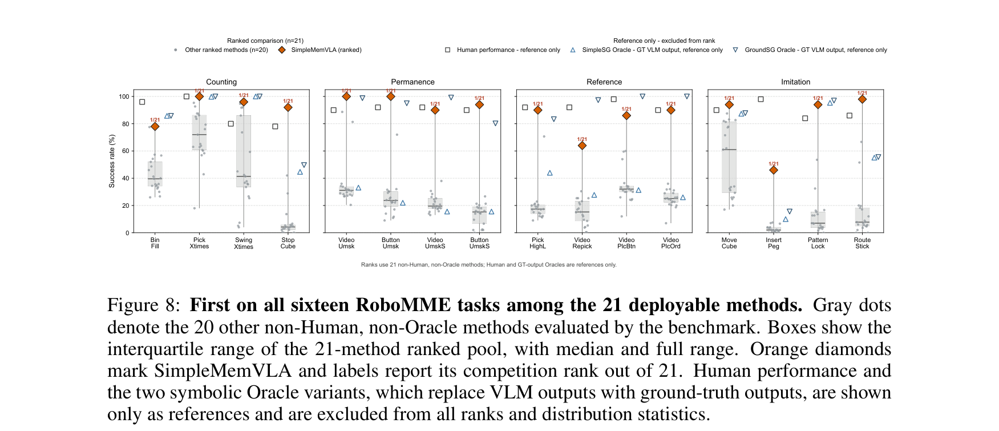
**Caption:** Figure 8: First on all sixteen RoboMME tasks among the 21 deployable methods. Gray dots denote the 21 prior methods; the line connects SimpleMemVLA's success rates.
**Caption[CN]:** 图 8：SimpleMemVLA 在全部 21 种可部署模型中独占全量 16 项 RoboMME 任务榜首。灰色散点代表 21 种对比基线，实线展示 SimpleMemVLA 在各任务上的卓越成功率。

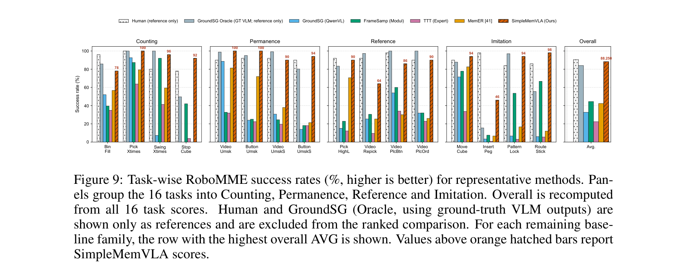
**Caption:** Figure 9: Task-wise RoboMME success rates (%, higher is better) for representative methods.
**Caption[CN]:** 图 9：代表性方法在 RoboMME 各项具体任务上的成功率柱状对比图（越高越好）。

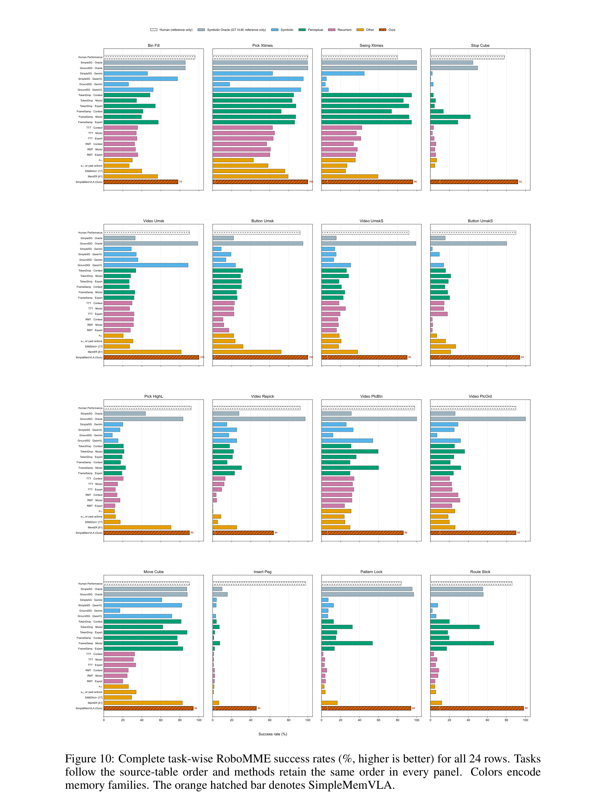
**Caption:** Figure 10: Complete task-wise RoboMME success rates (%, higher is better) for all 24 rows.
**Caption[CN]:** 图 10：全量 24 种评估方案在 RoboMME 全任务上的详细性能全景对比矩阵。

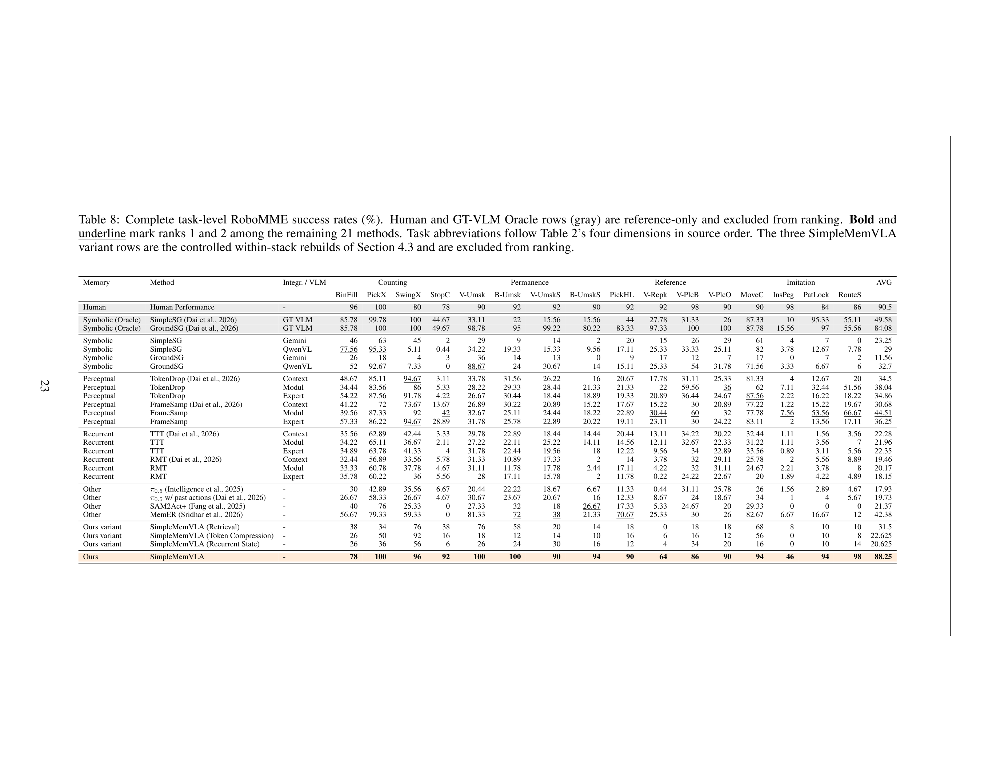
**Caption:** Table 8: Complete task-level RoboMME success rates (%). Human and GT-VLM Oracle rows (gray) are reference-only and excluded from ranking. Bold and underline mark ranks 1 and 2 among the remaining 21 methods.
**Caption[CN]:** 表 8：RoboMME 全量 16 项任务分项成功率完整大表（%）。加粗与下划线标记在 21 种可部署策略中的第一名与第二名。

> <strong>Para. 23:</strong> APPENDIX D. Full Task-Level Results on RoboMME. Table 8 and Figures 8–10 present the full task-by-task results across all 24 configurations. SimpleMemVLA achieves rank 1 on every single task among deployable methods: reaching 100% on PickXtimes, VideoUnmask, and ButtonUnmask, and over 90% on seven additional tasks. Even against oracle models with access to ground-truth VLM labels, SimpleMemVLA outperforms the GroundSG oracle on 8 out of 16 tasks.
> <strong>Para. 23[CN]:</strong> **附录 D：RoboMME 完整任务级评测大表**。表 8 及图 8–10 全景式呈现了所有 24 种方案在全部 16 个具体任务上的详细得分。在全部可部署模型中，SimpleMemVLA 在每一个任务上均名列全场第一：在 PickXtimes、VideoUnmask 和 ButtonUnmask 上达成 **100% 满分**，在另外 7 项任务上突破 90%。即便面对输入 Ground-Truth 真实标签的特权 Oracle 模型，SimpleMemVLA 依然在 16 项任务中的 8 项上实现了反超。

### Appendix E: Sliding-Window Attention Streaming Variant

**Caption:** Figure 11: The SWA variant: one context construction, trained and deployed. (a) Two consecutive streaming steps during deployment: each decision appends one temporal patch, slides the softmax window, evicts the oldest patch, and forks execution. (b) Packed training on full episodes under an identical attention mask.
**Caption[CN]:** 图 11：滑动窗口注意力（SWA）变体：统一上下文构建、训练与推断体系。(a) 部署时连续两步流式推断：每次决策追加一个时间补丁，滑动 Softmax 注意力窗口，逐出最旧补丁并释放显存。(b) 在相同注意力掩码下针对整次回合执行样本打包高效训练。

**Caption:** Figure 12: Figure 6, extended with the SWA streaming variant (measured on the longest RMBench episode). SWA keeps at-decision latency strictly constant at 0.92 s across indefinite episode horizons.
**Caption[CN]:** 图 12：融入 SWA 流式变体后的延迟对比扩展图。SWA 在无界超长时序下将决策端延迟绝对恒定在 0.92 秒。

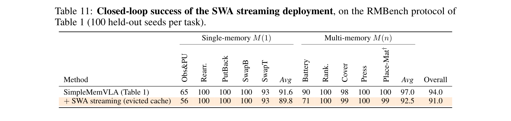
**Caption:** Table 11: Closed-loop success of the SWA streaming deployment, on the RMBench protocol of Table 1 (100 held-out seeds per task).
**Caption[CN]:** 表 11：SWA 流式部署在 Table 1 RMBench 评测协议下的闭环控制成功率（每项任务 100 个独立测试随机种子）。

| 模型配置方案 | Obs&PU | Rearr. | PutBack | SwapB | SwapT | 单记忆均值 M(1) | Battery | Rank. | Cover | Press | Place-Mat† | 多记忆均值 M(n) | **全局综合均值 (%)** |
| :--- | :---: | :---: | :---: | :---: | :---: | :---: | :---: | :---: | :---: | :---: | :---: | :---: | :---: |
| **SimpleMemVLA (Table 1 标准版)** | **65** | **100** | **100** | **100** | **93** | **91.6** | **90** | **100** | 98 | **100** | 100 | **97.0** | **94.0** |
| **+ SWA 流式部署 (显存恒定逐出)** | 56 | **100** | **100** | **100** | **93** | 89.8 | 71 | **100** | **99** | **100** | 99 | 92.5 | **91.0** |

> <strong>Para. 24:</strong> APPENDIX E. Sliding-Window Attention Streaming Variant. While exact streaming holds decision compute to a single frame's cost, key–value state still grows with the episode. To enable infinite-horizon continual deployment with bounded memory, we introduce an SWA streaming variant (Figure 11). By applying sliding-window attention exclusively to the backbone's 8 softmax layers while allowing its 24 linear-attention layers to integrate memory across the entire episode, the active key–value cache is strictly capped at a fixed window (e.g. 60 s). On RMBench (Table 11), SWA streaming retains 91.0% overall success (compared to 94.0% for the full cache) while keeping decision latency strictly capped at 0.92 s indefinitely (Figure 12).
> <strong>Para. 24[CN]:</strong> **附录 E：滑动窗口注意力（SWA）无界流式推断变体**。尽管标准无损流式推断将单步决策算力压制在单帧成本，其 KV-Cache 显存占用仍随回合时程线性微增。为实现显存常数化有界的无界长程物理部署，我们进一步提出了 SWA 流式变体（见图 11）。该变体仅对混合架构骨干网中的 8 层 Softmax 注意力层施加局部滑动窗口掩码，而保留其余 24 层线性注意力层从第 0 帧开始全局循环累积隐状态；此时超出的早期 Key-Value 块被直接从 GPU 显存中逐出释放。在 RMBench 闭环测试中（见表 11），SWA 变体在显存绝对常数化的极限条件下依然维持了 **91.0%** 的超高综合成功率（仅微降 3 个百分点），同时在任意无限长时程下将端到端决策延迟死死锁定在 **0.92 秒恒定常数**（见图 12）。
