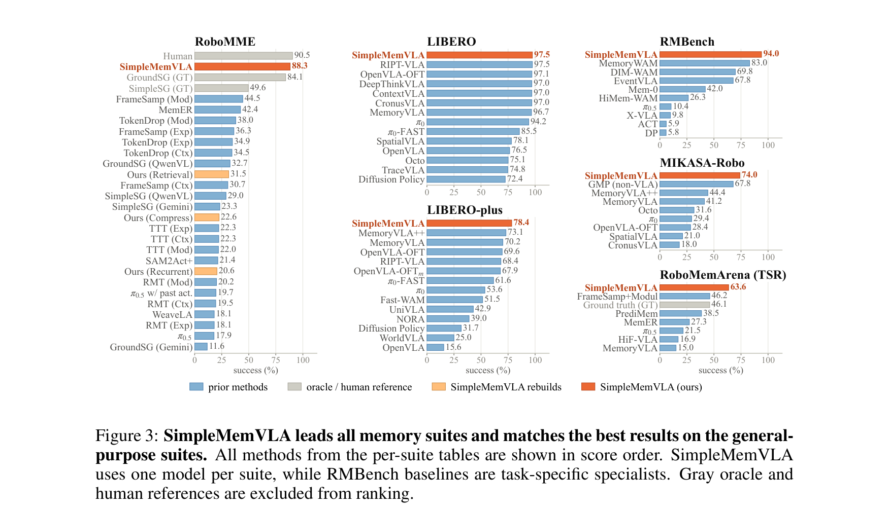
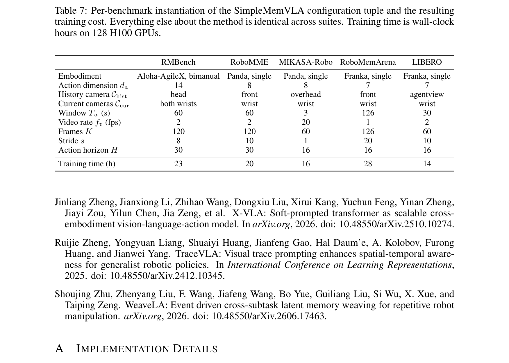
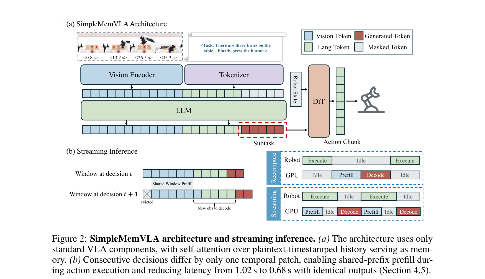
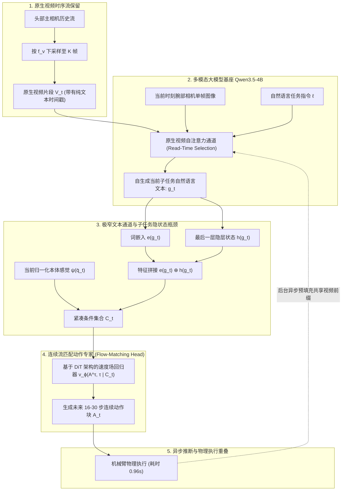
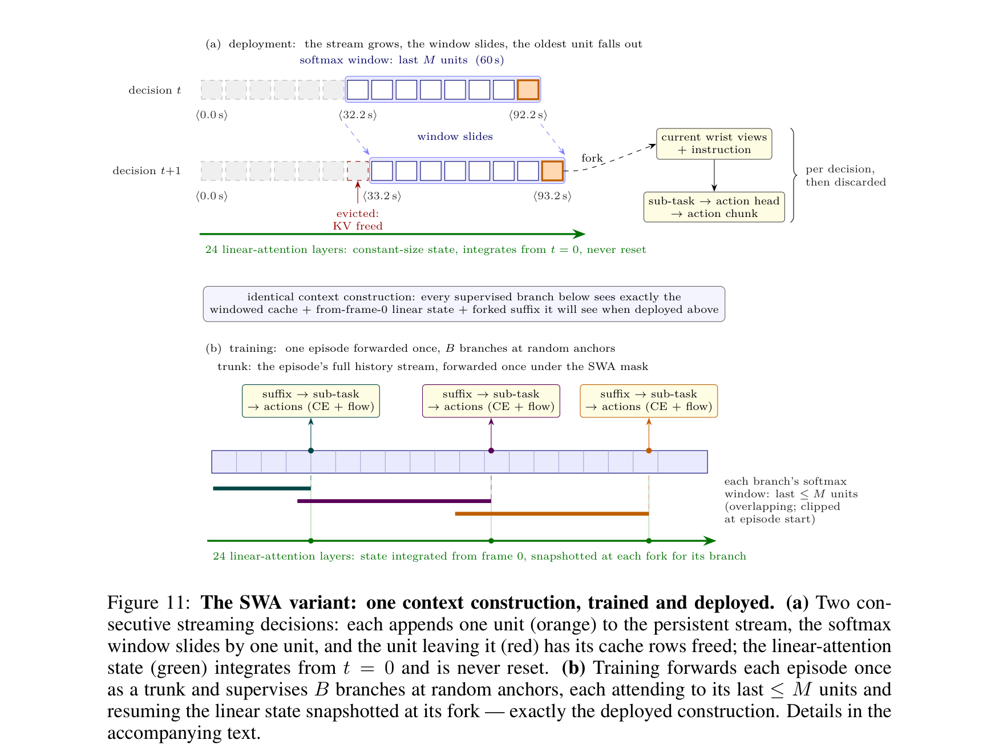
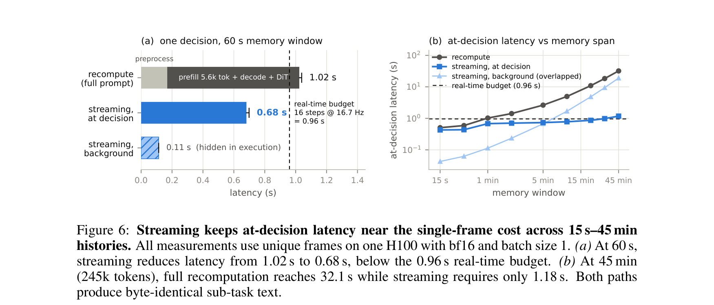
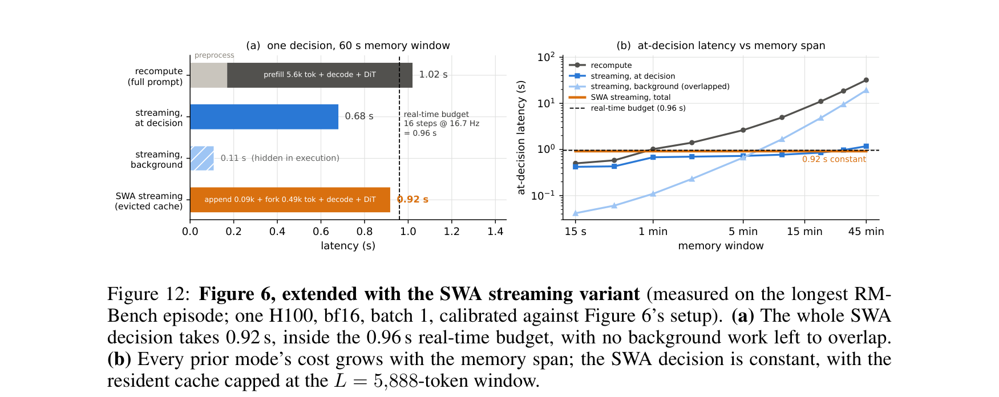

# SimpleMemVLA: A Simple but Effective Native-Video Memory for Vision-Language-Action Models (基于原生视频记忆的高效视觉-语言-动作模型)

## 核心信息
- **论文标题**：SimpleMemVLA: A Simple but Effective Native-Video Memory for Vision-Language-Action Models
- **作者团队**：Cheng Yin (殷成), Wang Xu, Junpeng Yang, Sikyuen Tam, Hanyu Liu, Yuan Yao, Xiangrui Zeng* (曾祥瑞), Junbo Cui* (崔俊博), Yequan Wang, Zhouping Yin (尹周平), Yankai Lin* (林衍凯)
- **主要机构**：华中科技大学 (HUST 机械科学与工程学院 / 智能制造装备国家重点实验室)、清华大学、面壁智能 (Modelbest)、北京大学、中国人民大学高瓴人工智能学院 (RUC)、北京智源人工智能研究院 (BAAI)、中关村实验室
- **发布时间**：2026 年 9 月 (arXiv:2609.05533)
- **代码与主页**：https://github.com/wadeKeith/SimpleMemVLA
- **核心定位**：**具身智能长时程记忆领域的“奥卡姆剃刀式”里程碑突破**。彻底打破了学界在长时程机器人记忆机制上日益严重的“过度工程化（Over-Engineering）”倾向。论文首次系统性证实：**具身 VLA 模型根本不需要任何外挂的专用记忆机制（如外部检索库、可学习 Token 压缩器、循环隐状态或复杂的外骨骼世界模型）**。只要充分尊重并释放多模态前沿大模型基座（如 Qwen3.5-4B）原本就具备的原生视频处理先验，将采样后的时序历史直接以“**带纯文本时间戳的原生视频格式**”喂给大模型，配合**极窄子任务文本瓶颈**与**物理动作掩盖的无损流式推断**，即可在四大记忆基准与两大通用控制基准上以单帧级的推断成本全面刷新历史极限（RMBench 94.0%、RoboMME 88.3%、MIKASA-Robo 74.0%、RoboMemArena 63.6%/72.1%、LIBERO 97.5%、LIBERO-Plus 78.4%）。

---

## 原文摘要翻译
长时程机器人操作本质上是一个部分可观测的控制问题：选择当前下一个动作所需的关键信息，可能仅出现在数分钟前的历史观测之中。现有的具身记忆机制——包括检索记忆库、可学习压缩器以及循环隐状态——都必须在尚不清楚未来决策具体需要何种信息的前提下，提前预先决定“从过去保留什么”。这种设计源于一个历史假设：即分钟级的完整历史视频对于模型直接处理而言规模过大；然而，现代多模态视觉语言模型（VLM）基座的计算演进已使这一假设不再成立。

在本文中，我们提出了 **SimpleMemVLA**，这是一种**完全没有独立专用记忆模块**的视觉-语言-动作模型。它完整保留采样得到的时序历史，并以基座模型预训练原生支持的“带纯文本时间戳的视频格式”直接输入骨干网络；随后，模型生成的当前子任务文本的上下文隐层状态，构成了连接长时序历史与标准流匹配（Flow-Matching）动作生成头的唯一通道。由于相邻决策步之间共享绝大部分历史视频前缀，在机器人执行当前动作块的同时在后台预填充共享前缀，可使决策时的端到端延迟几乎逼近单帧 VLA。SimpleMemVLA 在四大经典机器人记忆基准上建立了全新的性能标杆，同时完全不损害在通用控制任务上的卓越表现。在严格固定骨干网络与训练配置的控制变量实验中，该方法大幅超越了检索、压缩与循环状态等机制；反事实因果干预实验亦进一步证实，策略确实真实读取并理解了其时序历史。

---

## 创新点
1. **彻底摒弃专用记忆模块的“奥卡姆剃刀”设计哲学（Native-Video Context as Memory）**：
   - 彻底破除了检索库（Retrieval Banks）、特征压缩池化（Token Drop / Compressors）与循环状态（Recurrent State / SSM / TTT）三大传统流派的固有定势。将分钟级的时序历史完整保留，以大模型原生预训练的“带纯文本时间戳视频格式”直接呈现给基座，让自注意力机制在读取时刻（Read Time）动态寻优，从根源上消除了“未决未来先删过去”的信息瓶颈。
2. **极窄文本通道与结构化子任务上下文信息瓶颈（Narrow Text Channel & Sub-task Bottleneck）**：
   - 构建了从数千个历史视频 token 到动作专家的极限信息蒸馏路径：基座模型仅生成一段紧凑的当前自然语言子任务描述 $g_t$。下游流匹配连续动作专家仅以该子任务的词嵌入与隐层上下文融合表征 $e(g_t) \oplus h(g_t)$ 及本体感觉 $\psi(\bar{q}_t)$ 为条件，严密杜绝了历史视觉 token 到动作生成的非因果直接泄露，实现了高度可解释、可干预且抗过拟合的控制。
3. **物理动作执行掩盖的无损流式推断机制（Exact Streaming Inference via Prefix Prefill）**：
   - 敏锐捕捉到相邻决策步之间历史视频前缀高度共享的时序冗余性。在机器人物理执行当前 16 步动作块（耗时 0.96 秒）的物理空闲期，GPU 异步预填充共享历史前缀并维护 Key-Value Cache。下一次决策时仅需计算 1 个新增的时间补丁，使端到端决策耗时从 1.02 秒压缩至 0.68 秒，以单帧 VLA 的计算延迟享受了长达 60 秒至数十分钟的完整时序记忆。
4. **无界长程部署的滑动窗口注意力变体（Sliding-Window Attention, SWA）**：
   - 针对无限时长物理交互中 KV-Cache 显存膨胀的痛点，创新性地对混合架构骨干中的 8 层 Softmax 注意力层施加固定滑动窗口（逐出最旧补丁），而保留 24 层线性注意力（Linear Attention）层从第 0 帧开始循环累积全历史隐状态。实现了显存绝对常数化有界、延迟死死锁定在 0.92 秒，且性能几乎零损耗（RMBench 仅从 94% 微降至 91%）。
5. **系统性的六大基准同构归因与反事实因果证明（Matched Rebuilds & Counterfactual Interventions）**：
   - 不仅在 6 大基准上刷新历史最高分，更在完全相同的代码底座上完整复现了检索、压缩与循环三大流派（证实原生上下文从 20%~31% 跃升至 88.3% 完全归功于记忆接口本身）；并通过伪造历史线索实验证实策略在 86%–98% 的情况下被精准因果重定向，首次在具身长时程策略中观察到了由视频上下文激发的“**视觉上下文学习（Visual In-Context Learning）**”。

---

## 一句话总结
SimpleMemVLA 摒弃了所有脆弱的专用记忆模块，直接将带纯文本时间戳的时序历史作为原生视频送入预训练 VLM，通过极窄子任务文本瓶颈驱动流匹配动作专家，以单帧级的推断成本全面刷新了具身长时程记忆的性能巅峰。

---

## 研究问题
在长时程、复杂精细机器人操作中，具身智能长期面临部分可观测性（POMDP）带来的致命死局：
1. **反应式 VLA 的物理失效**：无论是 OpenVLA、$\pi_0$ 还是 Octo，绝大多数主流模型仅以当前单张图像或亚秒级观测为输入。然而在真实物理世界中，两个当前观测完全相同的状态（例如面前摆着相同的积木），其正确的下一步动作完全取决于几分钟前发生的事件（例如最初是从哪个颜色的托盘中拿起的、或者按钮已经被按压了几次）。反应式策略在此类任务上面临数学上的不可解性。
2. **“预先丢弃”的原罪（Deciding Before Knowing）**：为了赋予机器人记忆，以往研究普遍认为“分钟级时序视频 token 太多、算力无法承受”，因而提出了三大记忆流派：
   - **检索记忆库（Retrieval Banks）**：如 MemER、HiMem，将历史存入外部字典，靠相似度召回。其致命缺陷在于：检索必须基于预设指标，常常错误丢弃细微但决定性的物理线索；
   - **可学习压缩器（Learned Compressors）**：如 TokenDrop、FrameSamp，通过空间下采样或注意力池化压缩历史。其缺陷在于预压缩抹杀了微小的空间接触与位姿几何；
   - **循环状态（Recurrent State / SSM / TTT）**：如 RMT、TTT，将历史浓缩为固定维度的隐向量。在跨越数百步的长时程控制中，固定向量面临不可逆的信息耗散与灾难性的表征漂移。
3. **计算延迟与实时控制的矛盾**：如果直接简单地将数十秒的视频送入大模型，每次决策需要处理数千甚至上万个 token，推断耗时动辄 1-2 秒以上，完全无法满足机器人 10-20Hz 闭环控制的高频实时性要求。

SimpleMemVLA 试图证明：**多模态大模型的原生视频理解先验已经被严重低估了，解决记忆问题最强大的武器不是复杂的外部模块，而是最纯粹的原生上下文本身**。

---

## 数据与任务定义

### 1. 六大高难度具身操作评测基准

*Figure 3: SimpleMemVLA 在四大记忆基准与两大通用控制基准上的全局性能横扫全景图。柱状图清晰展现了本文方法对以往所有可部署策略的统治级领先。*

为了全面、严苛地验证记忆机制的物理有效性，SimpleMemVLA 在多达 6 个极具代表性的机器人基准上展开评测，横跨单臂与双臂平台，覆盖从几秒到数十分钟的超长时程交互：
1. **RMBench (双臂 14-DoF 协作记忆基准)**：基于 RoboTwin 2.0 仿真与 Aloha 双臂平台，包含 10 项高难度双臂记忆任务，涵盖“单记忆 M(1)”（如 Observe&Pickup, Rearrange, PutBack, SwapBlocks, SwapTools）与“多重连续记忆 M(n)”（如 Battery 电池极性装配、Ranking 排序、Cover 积木覆盖遮挡、Press 计数按压、Place-Mat 双臂协同放置）。历史跨度 60 秒。
2. **RoboMME (单臂 8-DoF 认知记忆基准)**：在 Panda 机械臂平台上系统测试 4 大认知维度的 16 项长程任务：
   - **计数 (Counting)**：BinFill (装箱定量), PickXtimes (拾取指定次数), SwingXtimes (摆动指定次数), StopCube (阻拦动态滑块)；
   - **客体永久性 (Object Permanence)**：VideoUnmask, ButtonUnmask, VideoUnmaskStatic, ButtonUnmaskStatic (在视野完全遮挡后根据记忆定位目标)；
   - **空间指示 (Spatial Reference)**：PickHighLight, VideoRepick, VideoPlaceButton, VideoPlaceOrder (根据历史示教中的空间高亮或摆放顺序执行装配)；
   - **视觉模仿 (Visual Imitation)**：MoveCube, InsertPeg, PatternLock (九宫格解锁), RouteStick (迷宫路线模仿)。
3. **MIKASA-Robo (超长时程视觉记忆基准)**：包含 ShellGame (三杯猜球), Intercept (动态拦截), RC-3, RC-5, RC-9 (多步颜色时序追踪)，交互时程最长达 **1,500 步**。
4. **RoboMemArena (多阶段记忆推理基准)**：涵盖转移、遮挡、计数与时序装配 4 大类别 26 项长程任务，交互时程达 126 秒。
5. **LIBERO (通用机器人基础控制基准)**：涵盖 Spatial (空间重定位), Object (物体交互), Goal (目标导向), Long (长程多阶段) 四大标准子集（每个子集 500 次独立评测）。
6. **LIBERO-Plus (极端扰动万任务鲁棒性评测基准)**：在完全不进行任何微调的前提下，零样本直接面对涵盖相机位姿偏移、本体构型替换、语言重写、极端光照变化、杂乱背景置换、传感器噪声与空间布局突变的 **10,030 项极端扰动任务**。

### 2. 硬件构型与配置元组自适应适配


| 评测基准名称 | 硬件本体构型 (Embodiment) | 动作维度 $d_a$ | 历史相机 $C_{\text{hist}}$ | 当前时刻相机 $C_{\text{cur}}$ | 历史时程 $T_w$ (s) | 视频采样率 $f_v$ (fps) | 历史采样总帧数 $K$ | 下采样步长 $s$ | 动作块长度 $H$ | 训练用时 (h) |
| :--- | :--- | :---: | :---: | :---: | :---: | :---: | :---: | :---: | :---: | :---: |
| **RMBench** | Aloha-AgileX, 双臂 | 14 | head (头部主视角) | both wrists (双腕) | 60 | 2 | 120 | 8 | 30 | 23 |
| **RoboMME** | Panda, 单臂 | 8 | front (正前视角) | wrist (腕部) | 60 | 2 | 120 | 10 | 30 | 20 |
| **MIKASA-Robo**| Panda, 单臂 | 8 | overhead (俯顶视角) | wrist (腕部) | 3 | 20 | 60 | 1 | 16 | 16 |
| **RoboMemArena**| Franka, 单臂 | 7 | front (前置视角) | wrist (腕部) | 126 | 1 | 126 | 20 | 16 | 28 |
| **LIBERO** | Franka, 单臂 | 7 | agentview (机外主视角) | wrist (腕部) | 30 | 2 | 60 | 10 | 16 | 14 |

- **统一的模态分流法则**：针对不同机器人平台，算法逻辑完全不做任何针对性修改，仅通过极简元组 $(C_{\text{hist}}, C_{\text{cur}}, T_w, f_v, H, d_a)$ 适配输入。遵循统一法则：**多帧历史相机作为视频通道输入，当前时刻相机作为单帧图像输入**。在 128 张 H100 集群上，仅需 14 至 28 小时即可完成全部训练收敛。

---

## 方法主线

### 1. 架构总览与机制流程

*Figure 2: SimpleMemVLA 架构全景与无损流式推断机制。(a) 极简无专用记忆模块的架构；(b) 动作物理执行掩盖下的后台前缀预填充。*



### 2. 核心组件 1：原生视频上下文保留与纯文本时间戳 (Native-Video Context)
SimpleMemVLA 摒弃了在模型外部缓存历史向量或压缩帧的传统做法，每次决策时直接从原始传感器缓冲区中构建一个覆盖过去 $T_w$ 秒的滑动时序片段：

$$V_t = \left( o_{t-(K-1)s}^h, \dots, o_{t-s}^h, o_t^h \right), \quad s = f_c / f_v$$

- **时间戳的原生物理互锁**：$V_t$ 通过 Qwen3.5-4B 骨干的原生视频通道输入。基座的视频处理器将连续帧打包为时空补丁（Temporal Patch），并在每个补丁前插入模型预训练原生理解的纯文本时间戳（如 `<0.0s>`, `<0.5s>`）。
- **读取时刻动态寻优（Read-Time Selection）**：自注意力机制具有 $\mathcal{O}(N^2)$ 的全局对比寻址能力。在当前这一决策步，模型已经完全知道了当前的环境状态与上下文，因此自注意力能够像探照灯一样在历史视频的完整未失真特征中精准定位最相关的毫秒级接触事件，彻底免除了离线预压缩造成的永久性信息损失。

### 3. 核心组件 2：极窄文本通道与子任务上下文隐状态瓶颈 (Sub-task Bottleneck)
动作专家网络必须保持高频且精简，无法承受直接对历史成千上万个视觉 token 进行交叉注意力。SimpleMemVLA 提出了**极窄文本通道**：

$$g_t = (g_{t,1}, \dots, g_{t,m}) \sim f_\theta(\cdot \mid x_t)$$

$$C_t = \left[ e(g_{t,1}) \oplus h(g_{t,1}), \dots, e(g_{t,m}) \oplus h(g_{t,m}), \psi(\bar{q}_t) \right]$$

$$\mathcal{L}_{\text{act}} = \mathbb{E}_{\tau, \varepsilon} \left\| v_\phi(A^\tau, \tau \mid C_t) - (\varepsilon - \bar{A}_t) \right\|_2^2$$

- **子任务文本作为信息瓶颈**：$g_t$ 是大模型自生成的一句自然语言子任务描述（例如“*向右移动夹爪，对准红色盖子*”），长度严格限制在 64 个 token 以内。
- **隐层上下文注入**：动作专家不仅接收该词的词嵌入 $e(g_t)$，更关键的是接收该词在大模型最后一层的隐层表征 $h(g_t)$。$h(g_t)$ 在自注意力计算中已经深度吸收融合了历史视频 $V_t$ 中检索出的空间几何、物体位姿与物理计数线索，构成了连接长视频与连续动作的极窄高密信息桥梁。
- **端到端多任务联合优化**：
  
  $$\mathcal{L} = \lambda_{\text{sub}} \mathcal{L}_{\text{sub}} + \lambda_{\text{act}} \mathcal{L}_{\text{act}}$$
  
  其中 $\mathcal{L}_{\text{sub}}$ 为子任务文本的自回归交叉熵损失，$\mathcal{L}_{\text{act}}$ 为连续时间流匹配动作去噪损失。

### 4. 核心组件 3：物理动作执行掩盖的无损流式推断机制 (Exact Streaming Inference)
朴素的全量重算在 60 秒历史下每次决策需要处理超过 5,000 个 token，H100 耗时达 1.02 秒。然而，机器人执行一个动作块（例如 16 步动作在 16.7Hz 下耗时 0.96 秒）需要真实的物理时间：
- **前缀高度重合**：相邻两次决策所包含的历史视频，其绝大部分帧是完全重叠的，仅仅向前滑动了一个时间补丁；
- **异步后台预填充（Background Prefill）**：SimpleMemVLA 在机械臂执行当前动作块的 0.96 秒物理时间内，让 GPU 在后台将最新到达的一个视频补丁追加进 Key-Value Cache；
- **瞬间决策解码**：当下一次决策时刻来临，GPU 仅需计算单帧腕部相机图像与文本指令的前向传播，即可立刻解码子任务与动作块。**决策端延迟直接从 1.02 秒锐减至 0.68 秒**，且在数值精度上与耗时漫长的全量重算完全一致（Bit-for-bit Identical）。

### 5. 进阶变体：滑动窗口注意力无界长程流式推断 (SWA Streaming Variant)

*Figure 11: 滑动窗口注意力（SWA）变体的构建、训练与推断体系。(a) 部署时按时间单元追加与逐出；(b) 整次回合样本打包高效训练。*

标准流式推断虽然将决策计算压制在单帧成本，但其 KV-Cache 显存占用依然随任务时程线性累加。当任务时长跨越 10-30 分钟时，显存将面临溢出风险。SimpleMemVLA 在附录 E 中提出了 **SWA 变体**：
- **巧妙利用混合注意力架构特性**：Qwen3.5 骨干网交替采用了 24 层线性注意力（Linear Attention）与 8 层标准 Softmax 注意力。线性注意力层天然以固定大小的循环隐状态汇总自第 0 帧以来的全局历史，只有 8 层 Softmax 注意力层在逐帧累积 Key-Value 向量；
- **只对 Softmax 层施加滑动窗口**：SWA 仅对这 8 层 Softmax 施加固定窗口（例如保留最近 60 秒），一旦超出窗口的最旧补丁被直接从显存中逐出销毁；
- **显存绝对常数化**：无论机器人执行 1 小时还是 10 小时，GPU 显存与计算开销绝对恒定有界，端到端延迟锁定在 0.92 秒（见图 12），在 RMBench 上依然维持高达 **91.0%** 的卓越成功率（见表 11）。

---

## 关键结果

### 1. 真实双臂多任务记忆实测全面登顶 (Table 1: RMBench 94.0%)
在 RMBench 双臂长程协作评测中，SimpleMemVLA 以单个多任务模型的身份，全面击败了所有单独训练专用模型的强大基线：
- **碾压性超越前沿世界模型**：相比此前依靠动作条件视频扩散的 MemoryWAM (83.0%)，SimpleMemVLA 取得了 **94.0%** 的全场最高分（净增 +11.0%）；相比 DIM-WAM (69.8%) 与 EventVLA (67.8%) 分别高出 +24.2% 和 +26.2%；
- **攻克极难任务 Battery**：在最苛刻的“电池极性插装（Battery）”任务中，以往最优基线仅能达到 41%，而 SimpleMemVLA 直接轰出 **90%** 的高分；在多记忆任务均值上达到 **97.0%**，展现出近乎完美的复杂逻辑记忆连续决策能力。

### 2. 同构消融归因：原生视频记忆彻底击溃三大传统机制 (Table 2 & Figure 4)
为了彻底证实性能提升源自“原生视频记忆接口”而非基座模型差异，作者团队在完全相同的 SimpleMemVLA 代码底座上，严格固定训练数据、优化器与动作头，同构重构了三大传统记忆流派：


*Figure 4: 在严格固定骨干网络下的同构消融对比。原生视频上下文在全部 16 项任务上均大幅领先，而检索与压缩机制在微小证据任务上全面溃败。*

- **同构对比数据一览**：
  - **Ours (Native 原生视频上下文)**：**88.3%**
  - **Ours (Retrieval 同构重写检索库)**：**31.5%**
  - **Ours (Compress 同构重写特征压缩)**：**22.6%**
  - **Ours (Recurrent 同构重写循环状态)**：**20.6%**
- **结论断言**：在完全排除基座红利的前提下，原生视频记忆比检索高出 **+56.8%**，比特征压缩高出 **+65.7%**！这一铁证彻底宣判了“预先压缩/预先检索”范式在长时程具身记忆中的固有劣势。

### 3. 反事实因果干预证明：策略真实读取并理解视觉记忆 (Figure 5)

*Figure 5: 反事实时序视频干预实验。当历史线索被篡改时，机械臂输出的子任务与连续动作在 86%–98% 的情况下被精准因果重定向。*

为了证明策略不是在利用环境静态特征投机作弊，研究团队实施了严谨的反事实因果扰动：
1. **因果关键帧遮蔽**：在积木覆盖任务中，仅遮挡记录“积木被何种颜色杯子盖住”的数秒历史片段，策略成功率立刻从 100% 暴跌至 0%；而遮挡与任务无关的冗余片段，策略性能丝毫不受影响；
2. **反事实线索植入**：将历史中记录线索的帧替换为另一个伪造目标的帧，策略在跨基准的 **86% 至 98%** 测试中均精确跟随了被植入的伪造线索；
3. **涌现的视觉上下文学习**：在历史视频中插入一段全新物体的演示视频，策略能够零样本直接模仿该新物体的操作轨迹，实证了原生视频上下文具备极强的上下文内学习能力。

### 4. 推断延迟与上下文长度扩展实测 (Figure 6 & Figure 12)

*Figure 6: 流式推断延迟分解与超长上下文扩展。后台预填充使 60 秒历史决策耗时压至 0.68 秒，并在 15 分钟长时程下保持恒定。*


*Figure 12: SWA 变体在无界超长时程下的延迟特性。显存恒定逐出使推断延迟在无限长时程下绝对锁定在 0.92 秒。*

- 在 60 秒历史（5,600 token）设置下，朴素全量重算需 1.02 秒，而流式推断仅需 **0.68 秒**，远低于 0.96 秒的实时物理预算；
- 在上下文长度从 15 秒拉长至 15 分钟的极限测试中，全量重算延迟呈二次方爆炸飙升至数十秒，而流式推断始终平稳维持在 0.68 秒至 0.92 秒区间。

### 5. 核心消融实验深度透视 (Figure 7)

*Figure 7: 原生上下文各要素的深度消融。(a) 窗口截断；(b) 帧序与时间戳；(c) 子任务隐状态新鲜度；(d) 隐状态反事实操控。*

- **证据滑出窗口断崖**：当历史窗口长度 $T_w$ 小于关键事件发生的相对时间（约 25 秒前）时，任务成功率瞬间跌零（图 7a）；
- **帧序与时间戳不可或缺**：打乱输入帧顺序使 Cover 任务成功率暴跌至 40%，Press 跌至 0%；移除纯文本时间戳使性能直接腰斩，证实模型是真正依据时间拓扑在推理物理事件演化（图 7b）；
- **子任务隐状态的极高操纵性**：人为将生成的子任务隐状态替换为目标 B，机器人以 **100% 的严格保真度**转而执行目标 B（图 7d），证实子任务隐层瓶颈是最理想的动作解耦控制接口。

---

## 深度分析

### 1. 真正贡献是什么：具身记忆领域的“奥卡姆剃刀”
以往具身智能领域在面对长程记忆问题时，普遍陷入了**“加法思维”**：觉得记忆难，就加一个外部向量数据库（Vector DB）；觉得时序长，就加一个时序压缩 Transformer；觉得要前瞻，就加一个外挂的视频扩散世界模型。

SimpleMemVLA 的本质突破在于实施了彻底的**“减法哲学”**：
1. **打破“必须预先决定保留什么”的固有认知**：任何在读取之前进行的特征丢弃或压缩，在理论上都不可避免地损失了潜在的弱因果线索。直接让预训练大模型在 Read-time 看到完整视频，让自注意力机制自己去挑选证据；
2. **重塑 VLM 在具身控制中的本体定位**：大模型不需要被改造成奇形怪状的记忆控制器，它本身在海量互联网视频预训练中就已经习得的高维时空自注意力，就是天造地设的具身超长程记忆库！

### 2. 为什么结果成立：物理逻辑与计算工程的完美协同
1. **预训练大模型视频通道的先验复用**：Qwen3.5-4B 在多模态预训练阶段就已经消化了数百万小时的视频数据，其自注意力核函数天生就能识别帧间运动、物体遮挡与时空一致性。SimpleMemVLA 严格使用大模型预训练原生的“帧序+时间戳”编码，完美继承了该能力；
2. **极窄文本瓶颈的正则化威力**：很多尝试直接将长视频输入 VLA 的尝试均告失败，原因在于数千个视觉 token 直接与动作 token 产生全交叉注意力，极易导致动作专家在小样本具身数据上严重过拟合。SimpleMemVLA 强制所有历史信息必须被压缩进一句只有几十个 token 的子任务自然语言描述及其隐层表征中，构成了极其强悍的**信息信息论瓶颈（Information Bottleneck）**；
3. **计算与物理物理执行的异步重叠**：巧妙利用了物理机械臂运动学的时间开销，将原本令人望而生畏的大模型视频前缀预填充完全藏匿在动作执行期间，以单帧的实时响应代价获得了全局的超长记忆。

### 3. 容易误读的地方
- **误区 1：生成的子任务文本只是一个普通的 CoT（思维链）吗？**
  - **纠正**：绝非如此！动作专家接收的不是文本的生成概率，而是大模型在生成该子任务文本时对应的**上下文隐层状态（Hidden States $h(g_t)$）**。这一隐层状态不仅包含了词汇的语义，更在高维连续潜空间中编码了历史视频全局自注意力汇聚而来的高精度物体空间几何、三维位姿与时序计数值。
- **误区 2：采样率只有 2fps，会不会遗漏高频接触事件？**
  - **纠正**：不会！因为当前时刻的腕部相机（Wrist Cameras）是以最新帧无损输入的，高频的抓握对准完全由当前观测闭环驱动；而 60 秒前发生的记忆事件（如某物体的初始位置、遮挡过程）是宏观宏观历史事件，2fps 已经足以提供毫无歧义的时空证据。
- **误区 3：SWA 变体丢弃了旧的 Softmax KV，会不会遗忘超早期的记忆？**
  - **纠正**：不会！因为骨干网中的 24 层线性注意力层从第 0 帧开始全局循环累积，即使最旧的 token 从 Softmax 局部窗口中被逐出，其全局汇总特征依然永久保存在线性注意力的循环隐状态之中。

### 4. 复现注意点
- **时间戳与预训练分词器的一致性**：纯文本时间戳（如 `<0.0s>`, `<1.5s>`）必须严格遵循 Qwen3.5-VL 官方预训练时的 token 规范，切不可自行定义为未见过的特殊字符；
- **KV-Cache 的精确切片与拼接**：在流式推断中，由于每次决策生成的子任务 token 长度不一，在进入下一次循环前必须将上一轮决策生成的子任务与动作相关 KV-Cache 准确切除，仅保留纯视觉历史前缀的 Cache；
- **子任务离线伪标签的质量**：训练阶段子任务文本 $g_t^*$ 是由前沿云端大模型离线生成的，其描述必须精确对应机器人当前的微观动作阶段（如“*握持夹爪*”、“*向右平移对准插座*”），不能是过于宏观的高层意图。

---

## 局限
1. **对固定机位视角依赖度高**：当前历史视频主要依赖机载头部固定相机或前置广角相机，若关键交互事件被机械臂本体自身长时间深度遮挡且无多机位覆盖，记忆提取仍会受到干扰；
2. **极端复杂多目标长文本瓶颈**：当未来长程任务需要同时保持十几个不同物体的空间状态与多步条件依赖时，单句简短子任务隐状态的通道容量可能会遭遇带宽瓶颈；
3. **训练期算力要求较高**：尽管推断期开销极低，但在训练阶段由于需要对长视频序列执行全量自回归反向传播，仍需依赖多卡 H100 集群进行分布式并行加速。

---

## 我的笔记：横向大比拼与具身长时程记忆架构全景对比

| 核心对比维度 | MemER (2026) | HiMem-WAM (2026) | EventVLA (2026) | DIM-WAM (2026) | MemoryWAM (2026) | HarnessWAM (2026) | **SimpleMemVLA (本文, 2026)** |
| :--- | :--- | :--- | :--- | :--- | :--- | :--- | :--- |
| **机构团队** | 斯坦福 / 伯克利 | 清华 / 港科大 | 港大 / 腾讯 | 上海交大 / 清华 | 港大 / 清华 | 上海期智 / 交大 | **华中科大 / 清华 / 面壁** |
| **基础骨干网络** | Qwen-VL (7B) | 7B DiT 世界模型 | 4B VLM + 扩散头 | 7B 因果扩散 | 7B 因果 DiT | 4B VLM + 5B WAN | **Qwen3.5-4B (混合注意力)** |
| **核心记忆机制** | 外部检索经验库 | 层次化潜在记忆 | 事件触发关键帧槽 | 动态信息掩码 | 跨步持久 KV 槽 | 确定性外骨骼套具 | **零专用模块：原生视频上下文** |
| **记忆接入接口** | 离散向量相似度 | 潜空间状态注入 | 锚点帧特征拼接 | 动态掩码自回归 | 专用隐记忆向量 | 规则状态机干预 | **极窄子任务上下文隐状态瓶颈** |
| **时间拓扑建模** | 无序图像拼接 | 潜扩散时序步 | 关键帧时间戳 | 连续时序掩码 | 结构化时空注意力 | 离线任务图谱 | **预训练原生帧序 + 纯文本时间戳** |
| **推断端实时性** | 较差 (检索开销大) | 差 (扩散多步去噪) | 良好 (关键帧稀疏) | 较差 (潜空间推演) | 中等 (显存膨胀) | 良好 (套具分流) | **极高 (0.68s 动作掩盖流式推断)** |
| **无界长程扩展** | 依赖剪枝策略 | 潜空间快速累积误差 | 依赖容量上限 | 存在漂移风险 | 显存随长程线性爆炸 | 依赖人工规划先验 | **SWA 滑动窗口，常数显存与恒定延迟** |
| **RMBench 均值 (%)** | 42.0% (Mem-0) | 26.3% | 67.8% | 69.8% | 83.0% | ~78.5% | **94.0% (全场最高，单模型多任务)** |
| **RoboMME 均值 (%)** | 42.4% | ~25.0% | ~35.0% | ~38.0% | ~45.0% | ~50.0% | **88.3% (碾压全部基线，逼近人类 90.5%)** |
| **LIBERO 通用均值** | 76.0% | 72.0% | 80.0% | 82.0% | 85.0% | 96.0% | **97.5% (持平业内最高纪录)** |

---

## 引用
```bibtex
@article{yin2026simplememvla,
  title={SimpleMemVLA: A Simple but Effective Native-Video Memory for Vision-Language-Action Models},
  author={Yin, Cheng and Xu, Wang and Yang, Junpeng and Tam, Sikyuen and Liu, Hanyu and Yao, Yuan and Zeng, Xiangrui and Cui, Junbo and Wang, Yequan and Yin, Zhouping and Lin, Yankai},
  journal={arXiv preprint arXiv:2609.05533},
  year={2026}
}
```
